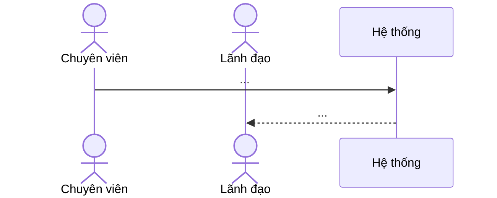

# MẪU: Giải pháp nghiệp vụ (BA) cho một yêu cầu

> Dùng mẫu này khi xuất giải pháp. Giữ đúng thứ tự mục. Mục nào không áp dụng ghi "Không". Chỗ chưa chắc đánh `❓` và nêu giả định.

---

# [Tên yêu cầu ngắn gọn]

**Phân hệ:** `<folder trong knowledge/>` · **Cỡ ước lượng:** S / M / L · **Ngày:** YYYY-MM-DD · **Người lập:** …

## 1. Bối cảnh & mục tiêu
- Yêu cầu gốc (trích nguyên văn nếu có).
- Vấn đề hiện tại người dùng gặp / lý do cần làm.
- Kết quả mong muốn (1–3 gạch đầu dòng đo được).

## 2. Phạm vi
- Trong phạm vi: …
- Ngoài phạm vi: …
- Giả định: …

## 3. Actor & quyền
| Actor (vai trò hệ thống) | Được làm gì trong tính năng này |
|---|---|
| Văn thư (`VT`) | … |
| Lãnh đạo đơn vị (`LDDV`) / Thủ trưởng (`TTDV`) | … |
| Chuyên viên (`NV`) | … |

> Mã vai trò thật và id trên DB DEV: `he-thong` mục 1.4. Quyền thao tác của hệ thống = menu được cấp + điều kiện hiện nút trên web (BE không kiểm người gọi) — ghi rõ nút nào hiện cho ai.

## 4. Nghiệp vụ hiện tại (as-is)
Tóm tắt luồng hiện có mà yêu cầu chạm vào — lấy từ `knowledge/<phanhe>/nghiep-vu.md` (trích `NV-xx` / `BR-xx`; sự thật đã chốt ở mục 7.2). Nêu trạng thái hiện tại liên quan (tên hiển thị + **giá trị số thật**). Chỗ bài còn câu hỏi mở (mục 7.1) thì nêu là giả định.

## 5. Nghiệp vụ đề xuất (to-be)
### 5.1 Luồng

### 5.2 Trạng thái (nếu thay đổi)
| Trạng thái | Mã (nếu có) | Ai chuyển | Điều kiện | Chuyển sang |
|---|---|---|---|---|

### 5.3 Quy tắc nghiệp vụ
- QT1: …
- QT2: …

### 5.4 Màn hình & thao tác
| Màn hình | Thay đổi | Thao tác/nút | Điều kiện hiển thị |
|---|---|---|---|

### 5.5 Dữ liệu
| Thông tin | Bắt buộc | Kiểu | Ghi chú |
|---|---|---|---|

### 5.6 Thông báo / nhắc / SMS
- Ai nhận, khi nào, nội dung.

## 6. Tác động
- Phân hệ khác bị ảnh hưởng: …
- Mobile / ứng dụng ngoài / liên thông: … (nghiệp vụ có bản sao ở tầng khác — web legacy ghi thẳng DB / BE gen-1 / gen-2 — phải đổi theo không; xem mục 1 `dac-thu.md` của phân hệ)
- Báo cáo, dashboard, thống kê: …
- Dữ liệu cũ (migration): …

## 7. Câu hỏi mở ❓
1. …

## 8. Tiêu chí nghiệm thu
- [ ] …
