# Công việc cá nhân — nghiệp vụ: công việc (`TASK`) giao cho cá nhân hoặc tự đề xuất (có thể có nguồn gốc là văn bản / nhiệm vụ / kiến nghị) → cập nhật tiến độ → người giao duyệt kết quả; chuyển, chia nhỏ, phối hợp, đóng; phiếu giao việc và phiếu đánh giá công việc theo kỳ (quý / năm) ký số; đánh giá nhân viên (KI cá nhân, KI đơn vị); thống kê; cấu hình thời gian, cấu hình đánh giá, cảnh báo công việc

> Viết lại từ code nhánh `kha_develop` (web-spring + backend2.0, cả hai đang checkout `kha_develop`) ngày 2026-10-01. Mọi khẳng định có nguồn `file:dòng`.
> Menu / widget đối chiếu **DB DEV `SYS_MENU` / `HOME_WIDGET` ngày 2026-10-01**; số dòng, phân bố giá trị và comment cột các bảng `TASK*`, `TIME_CONFIG`, `MAP_CONFIG`, `ALERT` đối chiếu **DB DEV ngày 2026-10-01** (người điều phối truy vấn, chỉ SELECT; tác giả không kết nối DB). Không có FK nào trên các bảng `TASK*` (DB DEV, mục "Khóa ngoại" 0 dòng) — mọi quan hệ ở mục 5 là quan hệ logic lấy từ JOIN / entity trong code.
> **Dữ liệu DEV:** bảng chính `TASK` (schema `VOFFICE`, kết nối của ứng dụng) có **0 dòng**; không có synonym `TASK`; các schema khác trên cùng instance có bảng cùng tên nhưng ứng dụng không đọc (code truy vấn thẳng `task` không tiền tố — `BE1/database/dao/task/TaskDAO.java:382`, `8077`, `8114`; datasource user `VOFFICE`). `TASK_PROCESS` 17.795 dòng (mới nhất 2025-05-22), `TASK_APPROVAL` 16.350 dòng (mới nhất 2024-12-09) — **dữ liệu cũ, không còn phát sinh** (DB DEV ngày 2026-10-01). Vì vậy mọi phân bố giá trị dưới đây là của dữ liệu lịch sử.
> Dữ liệu các bảng theo kỳ (DB DEV ngày 2026-10-01): `TASK_APPROVAL` kỳ mới nhất **202403** (quý 3/2024); `TASK_CHECK_DOCUMENT` 773 dòng; `AVERAGE_TASK_RATING` 522 dòng, kỳ mới nhất 202403; `ORG_KI` 313 dòng, kỳ mới nhất 202201; `EMP_RATING` **35 dòng**, kỳ mới nhất **201807** (tạo cuối 2018-08-27), `STATUS` toàn null; `TEXT` có `TYPE_ID` 429 / 6 (văn bản phiếu) **0 dòng**; `MESSAGE` 365 ngày gần nhất không có tin loại 501–503.
> HDSD cũ (`C:\Users\Admin\Desktop\HDSD\**`) chỉ dùng tham khảo thuật ngữ.
>
> Viết tắt đường dẫn:
> `WEB/` = `web-spring/src/main/java/com/viettel/` · `ZUL/` = `web-spring/src/main/webapp/view/voffice/` ·
> `BIZ/` = `web-spring/src/main/java/com/voffice/service/business/` · `BE1/` = `backend2.0/backendvoffice/src/main/java/com/viettel/voffice/` · `LBL` = `web-spring/src/main/webapp/WEB-INF/zk-label_vi.properties`.
> Lớp hay dùng — web: **TVM** = `WEB/voffice/vm/task/TaskVM.java` (~7.500 dòng: danh sách + form), **TVDVM** = `WEB/voffice/vm/task/TaskViewDetailVM.java` (chi tiết + popup tiến độ / chuyển), **TAVM** = `WEB/voffice/vm/task/TaskApprovalVM.java` (phiếu giao việc), **TRSVM** = `WEB/voffice/vm/task/TaskRatingSeflVM.java` (tự đánh giá), **TRMVM** = `WEB/voffice/vm/task/TaskRatingManagerVM.java` (lãnh đạo đánh giá), **ERMVM** = `WEB/voffice/vm/task/EmpRatingManagerVM.java` (KI), **TB** = `BIZ/TaskBusiness.java`, **PTB** = `BIZ/PersonalTaskBusiness.java`, **AC** = `WEB/util/AppConstants.java`.
> BE gen-1: **TA** = `BE1/action/TaskAction.java` (`/taskAction`, 52 endpoint), **TS** = `BE1/action/TaskService.java` (`/TaskService`, 25 endpoint), **TC** = `BE1/controler/TaskController.java`, **TSC** = `BE1/controler/TaskServiceController.java`, **TD** = `BE1/database/dao/task/TaskDAO.java` (~11.400 dòng), **PTD** = `BE1/database/dao/task/PersonTaskDAO.java`, **TDB** = `BE1/database/dao/task/TaskDataBaseDao.java`, **TAD** = `BE1/database/dao/task/TaskApprovalDAO.java`, **TRD** = `BE1/database/dao/task/TaskRatingDAO.java`, **TCD** = `BE1/database/dao/TimeConfigDAO.java`, **SU** = `BE1/utils/SignUtils.java`, **C1** = `BE1/constants/Constants.java`.
> Phân hệ liền kề đã viết: nhiệm vụ [`../nhiem-vu/nghiep-vu.md`](../nhiem-vu/nghiep-vu.md) (`NVu NV-xx`: `MISSION`, widget "Nhiệm vụ cá nhân" mục 1.3, phiếu giao / đánh giá nhiệm vụ tháng NV-16), nhắc việc / SMS / thông báo [`../lich-nhac-viec/nghiep-vu.md`](../lich-nhac-viec/nghiep-vu.md) (`LNV NV-xx`: cơ chế SMS NV-13, thông báo NV-11, mã loại tin mục 5.2), dự thảo / trình ký [`../xu-ly-cong-viec/nghiep-vu.md`](../xu-ly-cong-viec/nghiep-vu.md) (`XLCV`), văn bản đến [`../van-ban/den/nghiep-vu.md`](../van-ban/den/nghiep-vu.md).

## 1. Tổng quan

### 1.1 Phạm vi

"Công việc" (`TASK`) là việc **của một cá nhân**: lãnh đạo / người giao giao cho cán bộ (`COMMANDER_ID` → `ENFORCEMENT_ID`), hoặc cán bộ **tự đề xuất** cho mình. Công việc **không bắt buộc gắn văn bản**: văn bản / nhiệm vụ / kiến nghị chỉ là **nguồn gốc** ghi ở `SOURCE_MAP` (`OBJECT_TYPE = 1` = công việc — `C1:82`; `TD:1588-1620`). Mỗi công việc thuộc một **kỳ** (`PERIOD` = `yyyy0Q` theo quý, hoặc `yyyy` cả năm; `PERIOD_TYPE` 1 quý / 2 năm — `TVM:4078-4117`; `TAD:58-66`) và có **tỷ trọng** (`PERCENT`) trong kỳ — cơ sở để lập **phiếu giao việc** đầu kỳ và **phiếu đánh giá** cuối kỳ. Phân hệ gồm:

- **Vòng đời công việc**: danh sách (NV-01); tạo / sửa / sao chép / xóa, kể cả tạo từ văn bản, nhiệm vụ, kiến nghị, màn thống kê (NV-02); cập nhật tiến độ và người giao duyệt / trả lại kết quả (NV-03); duyệt / từ chối giao từng công việc (NV-04); chuyển người thực hiện, chia nhỏ, công việc phối hợp (tiếp nhận / từ chối / giao lại), đóng (NV-05).
- **Phiếu giao việc** (menu `TASK_RATING`) — cán bộ tự đăng ký rồi trình ký qua luồng văn bản, hoặc lãnh đạo ký phiếu trực tiếp; hủy phiếu (NV-06).
- **Phiếu đánh giá công việc** (menu `KDCV`) — cán bộ tự chấm, lãnh đạo chấm + ký phiếu; hủy (NV-07); **báo cáo đánh giá** (NV-08).
- **Đánh giá nhân viên — KI** (menu `EMP_RATING`): KI đơn vị, KI cá nhân theo tỷ lệ, trình ký bảng tổng hợp (NV-09).
- **Thống kê công việc** (NV-10); **cấu hình thời gian** `TIME_CONFIG` (NV-11); **cấu hình đánh giá công việc** `MAP_CONFIG` (NV-12); **cảnh báo công việc** `ALERT` (NV-13); thành phần cũ / không dùng (NV-14).

Phân hệ **KHÔNG gồm** (trỏ sang):

| Nội dung | Phân hệ |
|---|---|
| Nhiệm vụ (`MISSION`) giao đơn vị / cá nhân chủ trì, kể cả **phiếu giao / đánh giá nhiệm vụ tháng** (`missionRating`, menu `MISSIONRATING` "Tự chấm điểm", `MISSION_RATING`) | `nhiem-vu` (NVu NV-16) |
| Tab **"Nhiệm vụ cá nhân"** trên widget trang chủ (số đếm đi qua `taskAction.getCountHomeTask` nhưng **đếm bảng `MISSION`**) | `nhiem-vu` mục 1.3 (ở đây chỉ ghi điểm đếm — mục 1.3) |
| Hàng đợi SMS, mẫu tin, chặn tin, thông báo chuông | `lich-nhac-viec` (LNV NV-11, NV-13 … NV-15); ở đây chỉ ghi "gửi tin loại X khi Y" |
| Cấu hình tỷ lệ KI / thang điểm (`RATIO_CONFIG*`, menu `RATIO_CONFIG` / `CONFIG_RATIO` → `ratioConfig/ratioConfig.zul`), công thức KI (`KI_FORMULA_CONFIG`), KPI / chấm điểm đơn vị, đánh giá đơn vị (`EvaluationUnitVM`, cũng ghi `ORG_KI`) | `kpi-danh-gia` — ở đây chỉ mô tả cách màn KI **đọc** các cấu hình đó |
| Ký số (USB token / SIM CA / Cloud CA), tạo văn bản trình ký (`documentSignDAO.addText`, `sendAndSign`) | `ky-so`, `xu-ly-cong-viec` — ở đây chỉ ghi điểm gọi |
| Kiến nghị / khó khăn vướng mắc (nguồn công việc loại 7) | chưa có phân hệ riêng — hiện ghi tạm ở `phieu-trinh` PT NV-18 (sửa chéo 2026-10-02 theo `phieu-trinh`: `yeu-cau/` là thư mục yêu cầu đã phân tích, không phải phân hệ) |
| SMS cho thư ký khi lãnh đạo xử lý văn bản (`smsTask.checkDocumentToSendSms`, `sendSmsMeetingAssistant`, mã 202) — xếp nhầm vào phân hệ này | nghiệp vụ văn bản (`van-ban/den`, `van-ban/chuyen-van-ban`), chỉ dùng quan hệ trợ lý của `hop` (sửa chéo 2026-10-02 theo `hop`) |

### 1.2 Menu (đối chiếu DB DEV `SYS_MENU` ngày 2026-10-01)

`SYS_MENU.STATUS`: 1 = mở, 2 = khóa (X3). Cha của nhóm chính là **337531 `TASK` "Nhiệm vụ cá nhân"** (menu cấp 1, `STATUS = 1` — DB DEV `SYS_MENU` ngày 2026-10-01). Code chỉ ghi cứng mã `TASK_PERSONAL` (34 file Java mở tab "Quản lý công việc" theo mã này, ví dụ `WEB/voffice/vm/document/DocumentInVM.java:1784`; `WEB/voffice/vm/task/TaskUserListVM.java:243`), `TASK_RATING`, `KDCV` (điều hướng từ trang chủ — `WEB/voffice/common/HomeVM.java:2642-2668`; `TVM:7202-7209`) và id `337851` / `337852` (lọc menu theo thời gian — NV-11).

| `SYS_MENU_ID` | `CODE` | Tên (DB DEV) | URL | `STATUS` | VM — NV |
|---|---|---|---|---|---|
| 337533 | `TASK_PERSONAL` | **Quản lý công việc** | `/view/voffice/task/task.zul` | 1 | TVM — NV-01 … NV-05 |
| 337851 | `TASK_RATING` | **Phiếu giao việc** | `/view/voffice/task/taskApproval.zul` | 1 | TAVM — NV-06 |
| 337852 | `KDCV` | **Phiếu đánh giá công việc** | `/view/voffice/task/taskRating/taskRating.zul` | 1 | `TaskRatingVM` → TRSVM / TRMVM — NV-07 |
| 337557 | `TASK_RATING_PERSONAL` | Báo cáo đánh giá công việc cá nhân | `/view/voffice/task/taskRating/taskRatingReport.zul` | 1 | `TaskRatingReportVM` — NV-08 |
| 337572 | `EMP_RATING` | **Đánh giá nhân viên** | `/view/voffice/task/empRating/empRating.zul` | 1 | `EmpRatingVM` → ERMVM — NV-09 |
| 338191 | `TASK_USER_LIST` | Thống kê công việc | `/view/voffice/task/task_user_list.zul` | 1 | `TaskUserListVM` — NV-10 |
| 337691 | `TASK_EDITABLE` | Quản lý công việc - Editable | `task/taskEditable/taskEditable.zul` | **2** | (TVM) — NV-14 |
| 337692 | `TASK_GANTTCHART` | Quản lý công việc cá nhân - GanttChart | `task/ganttTask/ganttTask.zul` | **2** | (TVM) — NV-14 |
| 338112 | `TASK_PERSONAL_INSERT` | Thêm mới công việc cá nhân | `task.zul?view=1&type=1&from=menu` | **2** | TVM — NV-02 |
| 338152 | `TASK_SUPPORT_INSERT` | Thêm mới công việc phối hợp | `task.zul?view=1&type=3&from=menu` | **2** | TVM — NV-02 |
| 338151 | `TASK_DEPARTMENT_INSERT` | Thêm mới công việc đơn vị | `task.zul?view=1&type=2&from=menu` | 1, **`DEL_FLAG = 1`** | (đã xóa) |
| 337853 | `CHTG` | Danh mục cấu hình thời gian | `timeConfig/timeConfig.zul` (cha **DANH MỤC** 336813) | 1 | `TimeConfigVM` — NV-11 |
| 337631 | `QLCHCV` | Quản lý cấu hình đánh giá công việc | `/view/voffice/configtask/config_task.zul` (cha **QUẢN TRỊ** 336812) | 1 | `TaskConFigVM` — NV-12 |
| 338232 | `HELP_TASK` | Hướng dẫn sử dụng module quản lý công việc cá nhân | `/view/voffice/help_task.zul` (cha 338231 `HELP` "HỖ TRỢ" — menu cấp 1 **`STATUS = 2` khóa**) | 1 | **file zul không tồn tại** (chỉ có `view/help.zul`); menu cha đang khóa nên không hiện — NV-14 |

Ba menu "Thêm mới …" mở thẳng form (`view=1`) theo loại `type` (NV-02); hai menu còn mở được trên DB đều **khóa**. Ranh giới: `337990 MISSIONRATING` "Tự chấm điểm", `337983 MISSION_RATING` "Phiếu đánh giá và giao nhiệm vụ tháng" (dưới QUẢN LÝ NHIỆM VỤ 337971) là màn **nhiệm vụ** (NVu NV-16); `337556 RATIO_CONFIG` / `337632 CONFIG_RATIO` "Quản lý cấu hình KI / tỷ lệ" → `ratioConfig/ratioConfig.zul` thuộc `kpi-danh-gia`; `339233 CHART_AGREEMENT_TASK` (khóa) thuộc `nhiem-vu` NVu NV-20.

### 1.3 Trang chủ (đối chiếu DB DEV `HOME_WIDGET` ngày 2026-10-01)

Không có dòng `HOME_WIDGET` riêng của công việc. Hai ô con **8 `NHIEM_VU_CA_NHAN`** (dưới 71 "Nhiệm vụ nhận được") và **16 `NHIEM_VU_CA_NHAN_GIAO_DI`** (dưới 6 "Nhiệm vụ lãnh đạo giao đi") do `HomeVM` dựng bằng số đếm `taskAction.getCountHomeTask` (`web-spring/src/main/java/com/voffice/service/task/business/PersonalTask.java:22-28`, `type` 1 = việc tôi thực hiện / 0 = việc tôi giao; `WEB/voffice/common/HomeVM.java:906-913`, `3338-3370`). **BE đếm bảng `MISSION`**, không phải `TASK`: `TD.getCountTaskByState` — `select count(t.mission_id) from mission t` (`TD:3626-3720`; type 1 `sponsor_id = mình`, type 0 đơn vị giao thuộc đơn vị quản lý / `owner_id = mình`); riêng type 0 còn đếm số cán bộ chưa được giao / chưa được đánh giá (`TD:3563-3611`). Chi tiết hiển thị và việc bấm ô mở danh sách `MISSION`: `nhiem-vu` mục 1.3 và `nhiem-vu/dac-thu.md` L9.

Điều hướng khi bấm ô thuộc loại `TASKS` (`HomeVM.java:2642-2668`): `subTaskType = deliveredTask` → menu `TASK_RATING` (có `period` thì chỉ hiện cảnh báo "voffice.home.notification.deliveredTask"); `evaluatingTask` → `KDCV`; `urgentTask` hoặc không có → `TASK_PERSONAL`. Tham số `from=home` làm màn đánh giá mặc định lọc "chưa đánh giá" (`TRSVM:194-199`; `TRMVM:454-459`).

### 1.4 Actor & quyền

Mã vai trò (`web-spring/src/main/resources/application.properties:348-354`; BE `C1:119-131`): `TTDV` thủ trưởng (336953), `LDDV` lãnh đạo đơn vị (336952), `TL` trợ lý (336871), `NV` chuyên viên (336955), `VT` văn thư (336954), và **`TCLD` tổ chức lao động** (chỉ dùng ở màn đánh giá / KI). Phiên BE dựng `listManagementOrg` = đơn vị người dùng có vai trò `LDDV` / `TTDV` (`BE1/database/dao/staff/UserDAO.java:348-418`, như `nhiem-vu` 1.4).

Quyền thao tác trên từng công việc tính bằng `EntityTask.updatePermissions(userId)` (BE1 `database/entity/task/EntityTask.java` ~`1138-1192`, gọi cho mỗi dòng danh sách `TD:782`) và web hiện nút theo cờ đó + các hàm `has*Permission` của TVM (`TVM:4810-5230`) (X1). **BE chỉ kiểm quyền ở ba thao tác**: đóng (`TC:985-993`), duyệt / trả lại kết quả (`TC:1398-1413`), danh sách việc chia nhỏ / chuyển (`TC:3310`); các thao tác ghi khác **không kiểm người gọi** (`dac-thu.md` L1).

| Actor | Nhận diện trong code | Làm gì |
|---|---|---|
| **Người giao** (lãnh đạo / người tạo công việc cho người khác) | `TASK.COMMANDER_ID` | Giao việc (NV-02), duyệt / từ chối giao từng việc (NV-04), duyệt / trả lại kết quả (NV-03), chuyển người thực hiện (NV-05), giao lại công việc phối hợp bị từ chối, đóng công việc phối hợp |
| **Người thực hiện** | `TASK.ENFORCEMENT_ID` | Cập nhật tiến độ (NV-03), chia nhỏ (NV-05), tiếp nhận / từ chối công việc phối hợp; tự đăng ký và trình ký phiếu giao việc (NV-06); tự chấm điểm (NV-07); xem KI của mình (NV-09) |
| Trợ lý của lãnh đạo | `MEETING_ASSISTANT.ASSI_TYPE = 11` + `EMPLOYEE_ID` = mình (`TD:491-498`; `TD:11061-11081`) | Thấy tab "Nhiệm vụ của lãnh đạo" (việc lãnh đạo được giao), cập nhật tiến độ thay lãnh đạo (`TVDVM:942-949`) |
| **Lãnh đạo đơn vị** (`TTDV` / `LDDV`) | `listManagementOrg`; web `getOrganizationByUserRoleDefaultFirst` | Ký phiếu giao việc cho cán bộ trong đơn vị (NV-06), chấm và ký phiếu đánh giá (NV-07), lập KI (NV-09), thống kê (NV-10); xem việc của cán bộ cấp dưới (tab 3 — NV-01) |
| Tổ chức lao động (`TCLD`) | vai trò `TCLD` | Màn KI coi như lãnh đạo (NV-09); màn phiếu đánh giá cho **trang trắng** (`dac-thu.md` L14) |
| Văn thư (`VT`) của đơn vị | role 336954 | Nhận văn bản "Phiếu giao việc" / "Phiếu đánh giá công việc" phát hành nội bộ sau khi ký (`TD:3895`; `TD:3968-4149`) |
| Quản trị | người có menu `CHTG`, `QLCHCV` | Cấu hình thời gian (NV-11), cấu hình đánh giá (NV-12) |

### 1.5 Sửa so với knowledge cũ (2026-10-01)

| Knowledge cũ | Hiện trạng code `kha_develop` | Ghi ở |
|---|---|---|
| "Công việc cá nhân, **gắn với văn bản** (`OBJECT_TYPE_TASK = 1`)" | `OBJECT_TYPE_TASK = 1` là **loại đối tượng "công việc" trong `SOURCE_MAP`**; văn bản chỉ là một loại nguồn gốc (`SOURCE_TYPE = 4`), không có cột `DOCUMENT_ID` (sửa 2026-10-01) | 1.1, NV-02 |
| "Phiếu giao việc **đầu tháng** / phiếu đánh giá **cuối tháng**" | Kỳ hiện là **quý** (`yyyy0Q`) hoặc **năm** (`yyyy`); chỉ còn tên tin SMS, nhãn cũ và KI (NV-09) là theo tháng (sửa 2026-10-01) | 1.1, NV-06, NV-07; Q1 |
| Menu "Quản lý nhiệm vụ cá nhân, Phiếu giao nhiệm vụ, Đánh giá nhận xét, Ký duyệt đánh giá, Xếp loại KI, Báo cáo" | Tên DB: Quản lý công việc, Phiếu giao việc, Phiếu đánh giá công việc, Báo cáo đánh giá công việc cá nhân, Đánh giá nhân viên, Thống kê công việc (sửa 2026-10-01) | 1.2 |
| "Loại công việc: chức năng / đột xuất / nề nếp / thường xuyên"; "là việc chính (`isMajor`)" | `TASK_TYPE` (1 chức năng / 2 nề nếp), `TASK_TYPE2` (1 thường xuyên / 2 đột xuất) và `WEIGHT` **không có ô nhập** trên form (chỉ có popup giải thích); web luôn gửi `isMajor = 1` (sửa 2026-10-01) | NV-02 BR-06 |
| "QT1. Tổng tỷ trọng = 100% (`updateProportionPersonalTasks`, `checkPointUnit`) (?)" | Đúng ở **web** khi trình / ký phiếu giao việc và khi chấm phiếu đánh giá; BE `updateProportionPersonalTasks` **không kiểm tổng**; `checkPointUnit` là điểm KI đơn vị, không liên quan (sửa 2026-10-01) | NV-06 BR-18, NV-07 BR-23 |
| "QT2. Đánh giá chỉ khi công việc đã đóng / hoàn thành" | **Không** đòi hoàn thành: công việc được chấm là công việc có trong phiếu giao việc đã ký của kỳ (+ việc bổ sung) (sửa 2026-10-01) | NV-07 BR-25 |
| "QT4. Đơn vị lá mới có KI nhân viên (`isLeafOrg`)" | `isLeafOrg` **không được web gọi**; quyền trình ký KI dùng `isCheckPermissionSign` với đơn vị cha ghi cứng 148842 (sửa 2026-10-01) | NV-09 |
| "QT5. Việc sinh từ văn bản giữ liên kết `DOCUMENT_ID`; đóng văn bản không tự đóng việc (?)" | Liên kết qua `SOURCE_MAP` (`SOURCE_TYPE = 4`); grep không thấy luồng văn bản nào đóng công việc (sửa 2026-10-01) | NV-02 |
| câu cũ 1: "Phiếu giao việc / đánh giá là PDF sinh ra rồi ký số — ký bằng loại chữ ký nào?" | Code xác nhận: PDF sinh từ mẫu (`exportListTaskFile`), ký **thường / USB token / SIM CA / Cloud CA**, sau ký phát hành thành văn bản nội bộ (X12) | NV-06, NV-07 |
| câu cũ 2: "KI khác KPI thế nào?" | Code xác nhận: **KI** = xếp loại hằng tháng của **cá nhân** (A / B / C / D1 / D2) theo tỷ lệ phụ thuộc **KI đơn vị**; KPI là chỉ tiêu đơn vị ở `kpi-danh-gia` (X13) | NV-09 |
| `dac-thu`: "Ký phiếu dùng `Sign.signMultiFileTask`" | Đúng cho **lãnh đạo ký trực tiếp**; cán bộ tự trình thì đi luồng **văn bản trình ký** (`createPersonalTaskSubmitFlow`) | NV-06 |
| `vi-du-mau`: "Tạo công việc từ văn bản: `TaskAddFromDocVM` ← `DocumentViewDetailVM`" | Nút trên chi tiết văn bản **ẩn cứng** (`popupVB.zul:4367-4372`, `and false`); điểm vào thật: biểu tượng trên danh sách văn bản (mở `task.zul?view=2&objectType=2`) và trình xem PDF bảo mật (`SecurityPdfViewerVM` → `TaskAddFromDocVM`) | NV-02 |

## 2. Module

Toàn bộ **BE gen-1**: `TaskAction` (`/taskAction`) và `TaskService` (`/TaskService` — lớp `@RestController` dù tên "Service") → `TaskController` / `TaskServiceController` → DAO SQL thuần (`TaskDAO`, `PersonTaskDAO`, `TaskDataBaseDao`, `TaskApprovalDAO`, `TaskRatingDAO`, `TimeConfigDAO`). Web gọi qua `TaskBusiness` / `PersonalTaskBusiness` (khóa `a.b` → URL `/a/b`); còn vài chỗ web ghi thẳng DB qua facade legacy (`ITask.updateTask`, `IEmpRating`, `IMapConfig`, `ITimeConfig`, `iCommon.insert` cho `ALERT`). Ký số: `Sign/signMultiFileTask` (`BE1/action/SignResource.java:257` → `BE1/controler/signature/SignController.java:2047-2397`) → `SU.insertRecordAfterSignSuccess` (`SU:962-1020`).

| Chức năng | Màn (.zul) | VM | Business (key) | Endpoint BE → controller | DAO → bảng |
|---|---|---|---|---|---|
| Danh sách (NV-01) | `ZUL/task/task.zul` + `task_search.zul` | TVM `findDataList` :4572, `countDataList` :4716 | `TB.getListTask` :1006-1069 → `taskAction.getListTask` | `TA:33-41` → `TC.getListTask` :103-317 | `TD.getListTask` :296-1093 → `TASK`, `SOURCE_MAP`, `TASK_APPROVAL`, `VHR_EMPLOYEE` |
| Tạo / sửa (NV-02) | `task_add.zul` (cùng `task.zul`); popup `widgets/popupCreateTask.zul` | TVM `insert` :4310-4395, `updateReturnResult` :4414-4489; `TaskAddFromDocVM` :135-722 | `TB.addTask` :444-509 → `TaskService.addTask` | `TS:35-46` → `TSC.addTask` :80-705 | `PTD.addTask` :97-442, `editTaskById` :490+ → `TASK`, `TASK_PROCESS`, `SOURCE_MAP`, `TASK_FILE`, `FILES` |
| Xóa (NV-02) | lưới / chi tiết | TVM `doDeleteTask` :5381 | `taskAction.deleteTask` | `TC.deleteTask` :811-862 | `TDB.deleteTask` :262-315 |
| Chi tiết, lịch sử | `task_viewDetail.zul` (popup `ViewUtil:1777`) | TVDVM | `taskAction.getTaskDetail`, `getUpdateTaskHistory`, `getTaskReceiverHistory`, `getSourceTask` | `TC` | `TD:1676-1793`; `TDB:215-254` → `TASK_PROCESS`, `FILE_ATTACHMENT_MAPPER`, `TASK_RECEIVER` |
| Cập nhật tiến độ (NV-03) | `task_updateProcess.zul` (`ViewUtil:1783`) | TVDVM :1457-1568 | `TB.updateTaskProcess` :842-895 | `TC.updateTaskProcess` :1084-1208 | `TD:1904-2208` → `TASK`, `TASK_PROCESS` |
| Duyệt / trả lại kết quả (NV-03) | `personalTask/popupAcceptTask.zul`; popup `ConfirmApproveTaskProgressVM` | `TaskRatingAcceptVm` :135-167; `WEB/voffice/widget/ConfirmApproveTaskProgressVM.java:303`, `322` | `taskAction.approveOrRejectTaskProcess` | `TC:1315-1436` | `TD:2377-2502` → `TASK`, `TASK_PROCESS`, `TASK_RATING` |
| Duyệt / từ chối giao việc (NV-04) | `meeting/popup/approveTaskReason.zul`, `rejectTaskReason.zul` | `PopupReasonApproveTaskVM`, `PopupReasonRejectTaskVM` | `TB` :165-195 → `taskAction.ApproveOrRejectTask` | `TA:864-873` → `TC:4573-4605` | `TD:10738-10789` → `TASK_APPROVAL` |
| Chuyển / chia nhỏ / phối hợp / đóng (NV-05) | `task_transfer.zul`; `task_viewDetail.zul` | TVDVM :1890, :2521, :2125-2148; TVM `doReceiverTaskCombination` :6128+ | `transferEnforcementTask`, `subEnforcementTask`, `receiveTaskStatus`, `closeTask` | `TC:3752-3858`, `3596-3739`, `TC.receiveTaskStatus`, `TC:943-1003` | `TD:8331+`, `8180-8329`; `TDB:323-367`; `TD:2562-2578` |
| Phiếu giao việc (NV-06) | `ZUL/task/taskApproval.zul` | TAVM | `GetEmployeeListToAssign`, `GetTaskListToAssignByEmployee`, `GetListPersonalTasksOfCurrentUser`, `updateProportionPersonalTasks`, `exportListTaskFile`, `createPersonalTaskSubmitFlow`, `CancelSignedTaskFileByEmployee`; `Sign.signMultiFileTask` | `TC:2632-2935`, `1606-1788`, `3182-3250` | `TD:4684-5220`, `8575-8604`, `10854-11031`, `7069-7166`; `SU:739-805`; `TD.updateFileAttachmentFromTask` :3968-4149; `BE1/thread/ThreadExcuteAfterSigned.java:1992-2113` → `TASK_APPROVAL`, `TASK_CHECK_DOCUMENT`, `TEXT`, `DOCUMENT`, `FILES` |
| Phiếu đánh giá (NV-07) | `taskRating/taskRating.zul` → `taskRatingSelf.zul` / `taskRatingManager.zul` | `TaskRatingVM`, TRSVM, TRMVM | `getTaskListToAssessByEmployeeEmp`, `saveTaskRatingEmp`; `GetEmployeeListToAssess`, `GetTaskListToAssessByEmployee`, `saveTaskRating`, `saveAverageTask`, `deleteRatingTaskToPDF`; `Sign.signMultiFileTask` | `TC:3008-3158`, `3869-4149` | `TD:5232-6871`, `8563-8703`; `TRD.merge` :151-258; `SU:819-943`; `TD.convertRatingTaskToPDF` :3785-3943 → `TASK_RATING`, `AVERAGE_TASK_RATING`, `TASK_APPROVAL`, `TASK_CHECK_DOCUMENT` |
| Báo cáo đánh giá (NV-08) | `taskRating/taskRatingReport.zul` | `TaskRatingReportVM` | `getListTaskReportRating` | `TC` | `TD:7372+`; `TRD:306-428` |
| KI (NV-09) | `empRating/empRating.zul` → `empRatingManager.zul` / `empRatingEmployee.zul` | `EmpRatingVM`, ERMVM, `EmpRatingEmployeeVM` | `TaskService.*` (KI), `Files.PreviewEmpRatingReport` | `TS` → `TSC` | `TD:8935-9825`, `10669-10692`; `PTD:2461-3097` → `EMP_RATING`, `ORG_KI`, `RATIO_CONFIG*`, `AVERAGE_TASK_RATING`, `TEXT` |
| Thống kê (NV-10) | `task/task_user_list.zul` | `TaskUserListVM` | `TB.getListTaskStatistics` :1756-1788 | `TC.getListTaskStatistics` :3532-3585 | `TD.listTaskStatistics` :8053-8160 |
| Cấu hình thời gian (NV-11) | `timeConfig/timeConfig.zul` | `WEB/voffice/vm/timeConfig/TimeConfigVM.java` | (legacy `ITimeConfig`) | — | web `TimeConfigJpaDao` → `TIME_CONFIG`; BE đọc `TCD` |
| Cấu hình đánh giá (NV-12) | `configtask/config_task.zul` | `TaskConFigVM` | (legacy `IMapConfig`) | — | web `MapConfigJpaDao` → `MAP_CONFIG` |
| Cảnh báo (NV-13) | nút ẩn trên `task_viewDetail.zul` | TVDVM `doAlertTask` :3460-3500 | (legacy `iCommon.insert`) | — | `ALERT`, `ALERT_FEEDBACK` |

Endpoint `/taskAction` có trong BE nhưng web không gọi: `getListTaskFromMission`, `getRequestList`, `getDetailRequest`, `updateCommentRequest`, `closeRequest`, `getListTaskToAssign`, `getListTaskToAssess`, `getListRatioConfigByOrg` (chỉ màn chết), `updateRatioDetail`, `convertTaskToPDF` (thực ra xóa — NV-14) (grep web).

## 3. Nghiệp vụ

### Giá trị trạng thái dùng xuyên suốt

Hằng BE `C1:368-508` (class `TASK`, `TASK_APPROVAL`, `TaskRating`), web `AC:4210-4290`, `4989-5043`, `5105-5108`, `5216-5218`, `5357-5365`, `7949-7956`. Comment cột: DB DEV `TASK*` ngày 2026-10-01.

| Cột | Giá trị (code) | Ghi chú / DB DEV |
|---|---|---|
| `TASK.COMMAND_TYPE` | 1 **được giao** · 2 **cá nhân đề xuất** (tự giao cho mình) · 3 **đã bàn giao** (bản sao giữ lại khi chuyển người thực hiện) · 4 **phối hợp** | khớp comment DB; `TASK` DEV 0 dòng |
| `TASK.STATUS` | 1 chưa thực hiện · 2 đang thực hiện · 3 đã hoàn thành; **0 = "chậm tiến độ"** chỉ là mã lọc / hiển thị (`STATUS ∈ {1,2}` và `END_TIME` < hôm nay — `TD:502-528`, `8109-8110`) | — |
| `TASK.IS_COMPLETED` | 0 / 1 — **người giao đã chấp nhận kết quả** (NV-03) | khác `STATUS = 3` (người thực hiện báo xong) |
| `TASK.IS_CLOSED` | null / 1 — đã đóng (chỉ công việc phối hợp — NV-05) | — |
| `TASK.RECEIVER` / `TASK_RECEIVER.STATUS` | 1 chưa tiếp nhận (hoặc **giao lại**) · 2 đã tiếp nhận · 3 từ chối (`C1:429-441`; `TDB:329-364`); web có thêm 4 CLOSED (`AC:5279`) | comment DB ghi "0 chưa tiếp nhận, 1 tiếp nhận, 3 từ chối" — **lệch code**; DB DEV `TASK_RECEIVER.STATUS` 2 = 29, 3 = 10, 1 = 7 |
| `TASK.PERIOD` / `PERIOD_TYPE` | `yyyy0Q` + 1 (quý) / `yyyy` + 2 (năm) | danh sách chỉ hiện `PERIOD_TYPE ∈ {1,2}` (`TD:397`) |
| `TASK.PERCENT` | tỷ trọng (%) trong kỳ | cột `WEIGHT` = 1 mặc định, không dùng |
| `TASK.OBJECT_TYPE` | nhóm cán bộ (comment DB: 1 chỉ huy CQĐV · 2 CBNV đánh giá theo tiêu chuẩn · 3 CBNV còn lại) — chọn ở form (`task_add.zul:178`) | — |
| `TASK_PROCESS.PROCESS_TYPE` | 0 thêm mới · 1 cập nhật tiến độ · 2 chia nhỏ · 3 chuyển · 4 duyệt kết quả · 5 trả lại kết quả · 6 tự động (việc phối hợp hoàn thành theo việc chính / khi sửa) (`AC:5036-5043`; `TD:182-206`) | DB DEV 0 = 13.376 · null = 1.931 · 1 = 1.620 · 4 = 329 · 2 = 230 · 3 = 148 · 5 = 146 · 6 = 15 |
| `TASK_PROCESS.STATE` | web không gửi → luôn null | DB DEV toàn null (comment "1 Draff, 2 Reject, 3 Approve" là thiết kế cũ) |
| `TASK_APPROVAL.STATE` | 1 phê duyệt giao · 2 từ chối giao · 3 **phê duyệt đánh giá** (phiếu đánh giá đã ký) · 4 từ chối đánh giá (**không code nào ghi**) | DB DEV 3 = 10.109 · 1 = 5.380 · 2 = 858 · null = 3 |
| `TASK_APPROVAL.TYPE` | cách ký: 3 ký thường (cả SIM CA từ web, cả luồng tự trình) · 1 USB / Cloud (phiếu giao) · 2 di động · 0 Cloud CA ở phiếu đánh giá · null = duyệt từng việc (NV-04) (`SU:743-801`, `890-930`; `ThreadExcuteAfterSigned.java:2075`) | DB DEV 3 = 11.086 · 1 = 3.492 · 2 = 1.366 · 0 = 226 · null = 180 |
| `TASK_APPROVAL.IS_ADDITIONAL` | **không code nào ghi**; chỉ đọc ở "việc bổ sung" (`TD:3139`) | DB DEV 1 = 288 (dữ liệu cũ) |
| `TASK_CHECK_DOCUMENT` (`TYPE`, `STATE`) | `TYPE` 1 phiếu giao việc / 2 phiếu đánh giá; `STATE` 1 hiệu lực / 3 đã hủy; `IS_SYNC_VHR` đã đồng bộ nhân sự (không hủy được) | **"đã ký" của một cán bộ trong kỳ = có dòng này `STATE = 1`** (`TD:4785-4838`, `10824-10852`). DB DEV (`TYPE`, `STATE`): (1,1) = 270 · (1,3) = 161 · (2,1) = 234 · (2,3) = 108 — chỉ có `STATE` 1 / 3 (DB DEV `TASK_CHECK_DOCUMENT` ngày 2026-10-01) |
| `TASK_RATING.STATUS` | 1 cán bộ tự chấm · 2 lãnh đạo đã chấm · 3 lãnh đạo đã ký (`C1:497-508`) | DB DEV 3 = 2.267 · 2 = 2.162 · null = 1.807 · 1 = 411 |
| `TASK_RATING.COMPLETED_STATUS` | 1 sớm · 2 đúng · 3 chậm tiến độ (`AC:4247-4259`) | DB DEV 3 = 4.854 · null = 1.255 · 2 = 327 · 1 = 211 |
| `TASK_RATING.RATING_TYPE` | code hiện tại **luôn null** (một dòng / công việc / kỳ); 1–5 là tiêu chí cũ (khối lượng, chất lượng, kiến thức kỹ năng, chủ động sáng tạo, hợp tác phối hợp), 0 "đánh giá nhiệm vụ" (`AC:4349-4367`; `TRD:165-168`, `232`) | DB DEV 4 = 1.339 · 3 = 1.307 · 5 = 1.277 · 1 = 935 · 2 = 935 · null = 846 · 0 = 8 → dữ liệu theo tiêu chí là dữ liệu cũ |
| `TASK.SOURCE_TYPE` / `SOURCE_MAP.SOURCE_TYPE` (nguồn gốc) | 1 theo kế hoạch cá nhân · 3 công việc phối hợp · 4 **theo văn bản** · 5 nguồn khác · 7 **kiến nghị đề xuất** · 8 **nhiệm vụ đơn vị** (2, 6 bị comment) (`C1:88-99`, `441-460`) | web không ghi `TASK.SOURCE_TYPE`, chỉ ghi `SOURCE_MAP` (NV-02) |

**Kỳ của phân hệ.** Phiếu giao việc / đánh giá và danh sách công việc tính theo **quý** (`yyyy0Q`, ví dụ `202503` = quý 3/2025) hoặc **năm** (`yyyy`) (`TAVM:3431-3460`; `TRSVM:743-756`; `TAD:58-66`; `TCD:217-241`); hằng web `PERIODADD` QUY1..4 = 1..4, CANNAM = 5 (`AC:7949-7956`). Comment SQL / tên tin SMS "tháng" là di sản; chỉ **KI** (NV-09) còn theo **tháng** (`yyyyMM`). **DB DEV khớp**: `TASK_APPROVAL` (`DEL_FLAG = 0`) 20 kỳ mới nhất từ 2021 đều dạng `yyyy0Q` với `PERIOD_TYPE = 1` (202403 · 202402 · 202401 · 202302 · 202301 · 202204 · 202203 · 202201 · 202104 · 202103 · 202102 · 202101); xen kẽ và trước đó có kỳ **dạng tháng** (202112, 202012, 202009, 202008 và 202007 với `PERIOD_TYPE` null) — dữ liệu kỳ tháng cũ; **không thấy kỳ năm** (`yyyy`) trong 20 kỳ mới nhất; năm 2020 còn 202004 / 202003 / 202002 `PERIOD_TYPE = 1` (DB DEV `TASK_APPROVAL` ngày 2026-10-01).

### NV-01. Danh sách công việc (menu `TASK_PERSONAL` "Quản lý công việc") — bốn tab, bộ lọc kỳ / trạng thái

**Mục đích.** Một màn để cán bộ xem việc mình được giao, việc mình giao, việc của cán bộ cấp dưới và (với trợ lý) việc của lãnh đạo; từ đây mở mọi thao tác trên công việc.

**Luồng.** `ZUL/task/task.zul:4` (VM TVM, include `task_search.zul` :26 + `task_add.zul` :28) → `postViewInitialized` đọc tham số `view` / `objectType` / `objectTaskView` / `from` / `type` (`TVM:570-581`, `651-765`) → `findDataList` (`TVM:4572-4664`) → `TB.getListTask` (`TB:1006-1069`, tham số `type` = tab) → `POST /taskAction/getListTask` (`TA:33-41`) → `TC.getListTask` (`TC:103-317`) → `TD.getListTask` (`TD:296-1093`, nhánh web `314-840`). Mỗi dòng được gắn cờ quyền `task.updatePermissions(userId)` (`TD:782`).

**Tab** (`ZUL/task/task_search.zul:70-85`; `TVM.doChangeTab` :1704-1730; nhãn `common_voffice_vi.properties:8670-8685`) và điều kiện SQL (`TD:399-499`):

| Tab (`type`) | Nhãn | Điều kiện |
|---|---|---|
| 1 | Nhiệm vụ được giao | `COMMAND_TYPE = 1` và `ENFORCEMENT_ID = mình` (`TD:401`) |
| 2 | Nhiệm vụ tôi giao | `COMMAND_TYPE ∈ {1,3}` và `COMMANDER_ID = mình` (`TD:405`) |
| 3 | Nhiệm vụ cá nhân khác | `COMMAND_TYPE = 1`, người giao và người thực hiện đều khác mình, người thực hiện thuộc danh sách cán bộ mình quản lý (`getEmployeeListToRating`) (`TD:456-490`) |
| 8 | Nhiệm vụ của lãnh đạo | `ENFORCEMENT_ID` ∈ lãnh đạo mà mình là trợ lý (`MEETING_ASSISTANT.ASSI_TYPE = 11`), không lọc `COMMAND_TYPE` (`TD:491-498`) |

Mã 4 (cá nhân đề xuất, `COMMAND_TYPE = 2`), 5 (phối hợp, `COMMAND_TYPE = 4`), 7 (đã đánh giá) vẫn có trong DAO (`TD:408-454`) nhưng **web không gửi** → công việc tự đề xuất và công việc phối hợp **không hiện ở tab nào** (Q3).

**BR-01.** Luôn lọc `DEL_FLAG` 0 / null và **`PERIOD_TYPE ∈ {1,2}`** (`TD:397`) — công việc không có kỳ không bao giờ hiện. Không lọc `IS_ACTIVE`.
**BR-02.** Không bật tìm nhanh thì kỳ mặc định = **quý hiện tại** (`TVM:4590-4597`; `TB:1034`); đổi tab thì bộ lọc "đóng" về **chưa đóng** (`isCompleted = 0` — `TVM:1713-1715`).
**BR-03.** Bộ lọc trạng thái (`TD:502-528`): 0 chậm tiến độ (`STATUS ∈ {1,2}` và hạn < hôm nay), 1 / 2 (đúng trạng thái và chưa quá hạn), 3 hoàn thành (`STATUS = 3` và chưa vừa đóng vừa hoàn thành). Tìm nâng cao: kỳ, nhóm cán bộ, trạng thái phê duyệt (theo `TASK_APPROVAL`), đơn vị người giao (`PATH like`), nguồn gốc (`SOURCE_MAP`), lĩnh vực, ngày (`TD:567-736`).
**BR-04.** Biểu tượng trên lưới theo `has*Permission` (`TVM:4810-5230`): cập nhật tiến độ (người thực hiện hoặc trợ lý lãnh đạo, chưa được chấp nhận, phê duyệt ≠ từ chối — `TVM:4871-4882`), chuyển, chia nhỏ, sửa, xóa, sao chép, chấp nhận / trả lại kết quả; tiếp nhận / từ chối / giao lại và đóng chỉ ở chế độ phối hợp (radio 5) (`ZUL/task/task_search.zul:958-1104`).

**Tham số `from` / `type` của menu "Thêm mới …"** (`TVM:651-690`): `type=1` → chế độ cá nhân (radio 4), `type=2` → chế độ đơn vị (radio 7), `type=3` → chế độ phối hợp (radio 5); `view=1` mở thẳng form thêm (`TVM:665-671`). Khối radio bị ẩn (`ZUL/task/task_add.zul:20`, `task_search.zul:21` `visible="false"`); hai menu còn trên DB đều khóa (1.2). `from=home` (`TVM:691-734`) lọc theo người thực hiện / người giao và khoảng hạn; `from=task_user_list` (`TVM:735-765`) mở form thêm với người thực hiện điền sẵn (NV-10).

**Bảng dữ liệu.** `TASK`, `SOURCE_MAP`, `TASK_APPROVAL`, `VHR_EMPLOYEE`, `VHR_ORG`, `MEETING_ASSISTANT`.

### NV-02. Giao / tạo công việc — thêm, sửa, sao chép, xóa; tạo từ văn bản, nhiệm vụ, kiến nghị

**Mục đích.** Người giao giao một hay nhiều công việc (mỗi người thực hiện một dòng `TASK`) trong một kỳ, kèm mục tiêu / chỉ tiêu KPI, tỷ trọng, hạn; hoặc cán bộ tự đề xuất công việc cho mình.

**Form** (`ZUL/task/task_add.zul`; bắt buộc qua `checkEmpty`, `CommonVM.validateRequired` chỉ xét ô đang hiện — `WEB/voffice/common/CommonVM.java:987-1010`): kỳ (quý / cả năm) + năm (:132-150), **nhóm cán bộ** `OBJECT_TYPE` (:178), nơi làm việc (:208), **tần suất cập nhật** (:231), người giao / người thực hiện (:254-456), **nguồn gốc** + danh sách nguồn (:572-604), tên (≤ 500, :712), nội dung (≤ 2.000, :735), **chỉ tiêu KPI** — chỉ số KPI, cách đo, đơn vị, ngưỡng tối thiểu / kỳ vọng / thách thức (:760-884), **tỷ trọng** 0–100 (:830-839), ngày bắt đầu (chỉ khi mở rộng), hạn hoàn thành sau ngày bắt đầu (:903-930).

**Luồng thêm.** `TVM.validateDoSave` (`TVM:3760-3871`) → `onDoSave` đặt `STATUS = 1`, `WEIGHT = 1`, `DEL_FLAG = 0`, kỳ / loại kỳ (`TVM:4064-4117`) → `insert()` chọn `COMMAND_TYPE` cho từng người thực hiện (`TVM:4310-4395`) → `TB.addTask` (`TB:444-509`; người thực hiện `listEnforcement` :747-766 luôn `isMajor = 1`; nguồn `listSourceMap` :799-816; tệp :776-790) → `POST /TaskService/addTask` (`TS:35-46`) → `TSC.addTask` (`TSC:80-705`) → `PTD.addTask` (`PTD:97-442`, một khối PL/SQL): `FILES` (:128-157); với mỗi người thực hiện: `TASK_SEQ`, `INSERT TASK` (`TASK_PATH = /id/`, `IS_COMPLETED = 0`, `IS_CLOSED` null — `PTD:167-259`; `TSC:209-221`, `312`), `TASK_PROCESS` (`PROCESS_TYPE = 0`, `ACTION_LOG = 1`, `ORG_ID` null — `PTD:262-285`), `SOURCE_MAP` (`OBJECT_TYPE = 1`, chỉ dòng chính — `PTD:287-317`; nguồn kiến nghị gọi `requestDAO.assignRequest2` :294-301), `TASK_FILE` (`PTD:341-353`). **Không** ghi `TASK_RECEIVER`, `IS_ACTIVE`.

**BR-05. Chọn `COMMAND_TYPE`** (`TVM:4310-4395`): chế độ phối hợp → 4 và `RECEIVER = 1` (chờ tiếp nhận); chế độ đơn vị → 1, hoặc 2 nếu tự giao cho mình mà không có vai trò lãnh đạo (có hỏi xác nhận); chế độ cá nhân → 2 nếu người giao = người thực hiện = mình, ngược lại 1 sau xác nhận.
**BR-06.** Ràng buộc web: bắt đầu < hạn; nguồn gốc bắt buộc trừ "Theo kế hoạch cá nhân"; việc con phải nằm trong khoảng ngày của việc cha; khi sửa người giao ≠ người thực hiện, khi thêm người giao không được nằm trong danh sách người thực hiện; ít nhất một người thực hiện (`TVM:3760-3871`). BE chỉ kiểm nội dung, hạn, người thực hiện không rỗng (`TSC:368-372`). `TASK_TYPE`, `TASK_TYPE2`, `WEIGHT`, lĩnh vực **không có ô nhập** (chỉ popup giải thích `task_add.zul:68-93`).
**BR-07. Sửa** (`TVM.updateReturnResult` :4414-4489 → cùng `TaskService.addTask` có `taskId` → `PTD.editTaskById` :490+): `UPDATE task` (`PTD:521-526`); hoàn thành 100% thì đánh dấu xong các việc phối hợp con với `PROCESS_TYPE = 6` (`PTD:572-581`); người thực hiện tự sửa thì xóa dòng phê duyệt **từ chối** của việc (`PTD:632-637`) — tức sửa xong có thể trình lại.
**BR-08. Xóa** (`TVM.doDeleteTask` :5381 → `TC.deleteTask` :811-862 → `TDB.deleteTask` :262-315): xóa mềm `DEL_FLAG = 1`, đệ quy xuống việc con (`PARENT_ID`) trừ việc con đã có phê duyệt. Web chỉ cho xóa (`hasDeletePermission`, `TVM:5230+`) khi: không phải việc đã bàn giao (3), việc phối hợp chưa tiếp nhận / chưa đóng, chưa được chấp nhận kết quả; người được xóa là người tạo (chưa duyệt hoặc bị từ chối) hoặc người giao.

**Tạo từ nguồn khác** (form mở với nguồn gốc điền sẵn, `view=2&objectType=…` — `TVM:776-963`; hằng `TVM:159-173`):

| Nguồn | Điểm vào | Ghi nhận nguồn |
|---|---|---|
| **Văn bản** (`objectType = 2`) | biểu tượng "Tạo công việc" trên danh sách văn bản đang hiện: `ZUL/document/reportSendReceiveDoc/documentIn_search.zul:597`, `doc_search.zul:850`, `1195`, `documentFinance_search.zul:579`, `808`, `reject_document.zul:374` (các danh sách khác đặt `visible="false"`; nút trên chi tiết văn bản `popupVB.zul:4367-4372` ẩn cứng `and false`; `widgets/toolbarSign.zul:75-79` ẩn) → URL `task.zul?view=2&object=<json văn bản>&taskDoc=taskDoc&objectType=2` (`WEB/voffice/vm/document/DocumentInVM.java:1781-1784`); và popup `widgets/popupCreateTask.zul` (`TaskAddFromDocVM`) từ trình xem PDF bảo mật (`WEB/voffice/widget/SecurityPdfViewerVM.java:2058-2075`) | `SOURCE_MAP`: `SOURCE_ID` = id văn bản, `SOURCE_NAME` = trích yếu, `SOURCE_TYPE = 4`, `OBJECT_TYPE = 1` (`TVM:821-846`; `WEB/voffice/vm/task/TaskAddFromDocVM.java:152-172`); nội dung = trích yếu, lĩnh vực = lĩnh vực văn bản |
| **Nhiệm vụ** (`objectType = 3`) | nút trên chi tiết nhiệm vụ (`WEB/voffice/vm/mission/MissionVM.java:9882`; NVu NV-09) | `SOURCE_TYPE = 8`, tên mặc định theo quý / năm (`TVM:847-944`) |
| **Kiến nghị** (`objectType = 1`) | màn kiến nghị | `SOURCE_TYPE = 7`, thêm `REQUEST_PROCESS` (`TVM:787-820`, `4202-4208`) |
| Sao chép / sửa (`objectType = 5 / 6`) | nút "Sao chép" / "Sửa" trên chi tiết (`TVDVM:2614-2634`) | giữ nguồn cũ |

**BR-09.** Popup từ văn bản bắt buộc có **đúng một người chủ trì** khi có người phối hợp (`TaskAddFromDocVM.java:480-521`) và liệt kê công việc đã tạo từ văn bản đó (`taskAction.getListTaskFromDocument` → `TD:3495-3535`: người tạo / giao / thực hiện là mình, `SOURCE_TYPE = 4`). BE khi nguồn là văn bản còn **chuyển văn bản cho người thực hiện** (`sendDocToPersonTask` — `TSC:422`, `621-634`, `2206-2250`) và đánh dấu văn bản đang xử lý (`TSC:475-536`).

**Tích hợp — SMS / thông báo.** Thêm: mỗi người thực hiện khác người tạo nhận **SMS loại 501** (`RECEIVEDTASK_DOTASK` — `C1:1423`; mẫu `PERSON_TASK_ASSGIN` `C1:1209`) và **thông báo** module 4 "voffice.home.personal.tasks" mở `task.zul` (`TSC:437-469`). Sửa: SMS 501 cho người thực hiện mới, hoặc mẫu "người giao cập nhật công việc" (`ASSIGNER_UPDATE_TASK = 4`) nếu người sửa là người giao (`TSC:648-686`). Cơ chế SMS: LNV NV-13.

**Bảng dữ liệu.** `TASK`, `TASK_PROCESS`, `SOURCE_MAP`, `TASK_FILE`, `FILES`, `REQUEST_PROCESS`, `DOCUMENT_IN_STAFF` (chuyển văn bản), `SMS_MASTER`, `NOTIFICATION`.

### NV-03. Cập nhật tiến độ; người giao chấp nhận / trả lại kết quả

**Mục đích.** Người thực hiện báo % hoàn thành, kết quả, trạng thái, văn bản liên quan; khi báo **hoàn thành** thì người giao xem và **chấp nhận** (chấm điểm) hoặc **trả lại**.

**Cập nhật tiến độ.** Biểu tượng trên lưới → popup `task_updateProcess.zul` (`ViewUtil:1783` ← `TVM:5646`) → TVDVM `doUpdateProcess` (`TVDVM:1457-1568`) → `TB.updateTaskProcess` (`TB:842-895`; văn bản liên quan thành `SOURCE_MAP` `SOURCE_TYPE = 4`, `OBJECT_TYPE = 8` — :872-887; `ratingPoint` gửi cứng 3 — :851) → `TC.updateTaskProcess` (`TC:1084-1208`) → `TD:1904-2089`, `2169-2208`: chèn `TASK_PROCESS` `PROCESS_TYPE = 1`, cập nhật `TASK.STATUS`, `COMPLETED_PERCENT`, `TASK_RESULT`.

**BR-10.** Nếu **người giao** tự cập nhật lên trạng thái 3 và công việc không phải tự đề xuất (`COMMAND_TYPE ≠ 2`) thì `IS_COMPLETED = 1` ngay (`TD:1924-1938`) — không cần bước chấp nhận.
**BR-11.** Việc chính hoàn thành (3) → các việc phối hợp con được tự đánh dấu xong với `PROCESS_TYPE = 6` (`TD:2103-2155`).
**BR-12.** BE chỉ kiểm công việc tồn tại (`TC:1174-1182`) — quyền cập nhật do nút web (người thực hiện hoặc trợ lý lãnh đạo — `TVDVM:942-949`; `TVM:4871-4882`).

**Chấp nhận / trả lại kết quả.** Chấp nhận: `doAcceptTask` (`TVM:7228-7246`; `TVDVM:4641-4647`) → popup "Phê duyệt kết quả" `ZUL/task/personalTask/popupAcceptTask.zul` (`WEB/voffice/vm/task/TaskRatingAcceptVm.java:135-167`, nhập điểm + nhận xét) → `taskAction.approveOrRejectTaskProcess` `isApprove = 1` (`TB` ~:4070-4094). Trả lại: `doRejectUpdateProcess` (`TVM:5038`) → `ConfirmApproveTaskProgressVM` (`WEB/voffice/widget/ConfirmApproveTaskProgressVM.java:303`, `322`) → cùng endpoint `isApprove = 0`. BE `TC:1315-1436` **có kiểm quyền** (`permissions.approve` / `rejectApprove`: `COMMAND_TYPE = 1`, người giao = mình, `STATUS = 3`, chưa `IS_COMPLETED` — `EntityTask.java` ~`1170-1180`) → `TD:2377-2502`: chèn `TASK_PROCESS` 100% với `PROCESS_TYPE` 4 (chấp nhận) / 5 (trả lại); chấp nhận → `IS_COMPLETED = 1`; trả lại → `STATUS = 2`, `IS_COMPLETED = 0`, % và kết quả **lùi về lần cập nhật gần nhất dưới 100%** (`TD:2436-2465`); sau đó ghi / xóa `TASK_RATING` tương ứng.

**BR-13.** Hai cờ "hoàn thành": `STATUS = 3` (người thực hiện báo) và `IS_COMPLETED = 1` (người giao chấp nhận). Bộ lọc "đóng" của danh sách xét cả `IS_CLOSED` lẫn `IS_COMPLETED` (`TD:547-559`, `716-725`).
**BR-14.** Không có SMS / thông báo khi cập nhật tiến độ, chấp nhận hay trả lại kết quả, tiếp nhận, đóng, xóa (chỉ thêm / sửa / chuyển / chia nhỏ / duyệt giao có SMS).

**Bảng dữ liệu.** `TASK`, `TASK_PROCESS`, `SOURCE_MAP`, `FILE_ATTACHMENT_MAPPER` (tệp của lần cập nhật, `OBJECT_TYPE = 3` — `TD:1676-1793`), `TASK_RATING`.

### NV-04. Duyệt / từ chối giao từng công việc (popup lý do)

**Mục đích.** Với công việc **do cán bộ tạo** mà người giao là lãnh đạo, lãnh đạo xác nhận đồng ý hay từ chối giao việc đó (ngoài phiếu giao việc của kỳ — NV-06).

**Luồng.** Nút "Phê duyệt" / "Từ chối" trên chi tiết (`ZUL/task/task_viewDetail.zul:617-628`, hiện khi `permissionsForTask.approveAssignment / rejectAssignment = 1`: người giao = mình, người tạo = người thực hiện, chưa có phê duyệt — `EntityTask.java:1187-1192`) hoặc trên lưới (`TVM:5078-5110`) → popup `ZUL/meeting/popup/approveTaskReason.zul` / `rejectTaskReason.zul` (`PopupReasonApproveTaskVM.java:58-70` lý do tùy chọn; `PopupReasonRejectTaskVM.java:58-74` lý do bắt buộc, ≤ 2.000 ký tự) → `TB:165-195` (`isApprove` 1 / 0) → `POST /taskAction/ApproveOrRejectTask` (`TA:864-873`) → `TC:4573-4605` → `TD:10738-10789`: chèn `TASK_APPROVAL` `STATE` 1 / 2, `APPROVAL_COMMENT` = lý do, `PERIOD` = kỳ của việc, **`TYPE` và `FILE_ID` null**.

**BR-15.** Dòng phê duyệt từng việc (`TYPE` null) **không bị** thao tác hủy phiếu xóa (hủy chỉ xóa `TYPE is not null` — `TD:7153`). Không xóa dòng phê duyệt cũ khi duyệt lại.
**Tích hợp.** SMS **loại 502** cho người thực hiện, mẫu `ASSIGNER_APPROVE_TASK = 5` / `ASSIGNER_REJECT_TASK = 6` (tên người duyệt, tên việc, lý do) (`TD:10750-10781`; `C1:1213-1219`).

### NV-05. Chuyển người thực hiện, chia nhỏ, công việc phối hợp (tiếp nhận / từ chối / giao lại), đóng

**Chuyển người thực hiện (bàn giao)** — `task_transfer.zul` (`ViewUtil:2209` ← `TVM:5066`; nút cho người giao khi việc đã được duyệt giao / đã đánh giá — `TVDVM:933-939`) → `TB.transferEnforcementTask` (`TB:1391`) → `TC:3752-3858` → `TD:8331+`: **sao** công việc thành dòng mới `COMMAND_TYPE = 3` mang người thực hiện cũ, `PARENT_ID` = việc gốc (`TD:8359-8373`); **đổi** `ENFORCEMENT_ID` / `ORG_ID` của việc gốc sang người mới (`TD:8377-8386`); chèn `TASK_PROCESS` `PROCESS_TYPE = 3` (`TD:8404-8409`); chuyển `TASK_APPROVAL` / `TASK_RATING` sang id mới (`TD:8424-8440`). SMS 501 cho người nhận (`TC:3833-3845`).

**BR-16.** Sau khi chuyển, bản "đã bàn giao" (`COMMAND_TYPE = 3`) hiện ở tab "tôi giao" của người giao (`TD:405`) và không xóa được (BR-08).

**Chia nhỏ** — `subEnforcementTask` (`TVDVM:2521`; `TB:1324-1379`) → `TC:3596-3739` → `TD:8180-8329`: việc con mới, `PARENT_ID` = việc đang xem (sao các trường của cha — `TD:8204-8215`); `TASK_PROCESS` con `PROCESS_TYPE 0` / `ACTION_LOG 1`, `TASK_PROCESS` cha `PROCESS_TYPE 2` / `ACTION_LOG 4`. SMS 501 cho người thực hiện việc con (`TC:3720-3731`).

**Công việc phối hợp** (`COMMAND_TYPE = 4`, tạo ở chế độ phối hợp với `RECEIVER = 1`): người thực hiện **tiếp nhận** hoặc **từ chối** (kèm lý do); bị từ chối thì người giao **giao lại** (`TVM.doReceiverTaskCombination` :6128-6230; `TVDVM:3279-3415`) → `TB.receiveTaskStatus` (`TB:203-216`) → `TDB.receiveTaskStatus` (`TDB:323-367`): cập nhật `TASK.RECEIVER`, `RECEIVER_COMMENT`, chèn `TASK_RECEIVER` (`STATUS` 2 tiếp nhận / 3 từ chối / 1 giao lại). Nút: tiếp nhận / từ chối khi `RECEIVER = 1`, chưa đóng, mình là người thực hiện (`TVM:5113-5130`); giao lại khi `RECEIVER = 3`, mình là người giao (`TVM:5133-5179`). Lịch sử: `getTaskReceiverHistory` (`TDB:215-254`). Không SMS.

**Đóng** — `closeTask` (`TVDVM:2125-2148`; `TB:148`) → `TC:943-1003` (**kiểm** `permissions.close`: chỉ việc phối hợp và người giao = mình — `EntityTask.java:1138-1141`) → `TD:2562-2578` `IS_CLOSED = 1`.

**BR-17.** Màn chi tiết đặt `visible="false"` cố định cho các nút cập nhật tiến độ, chuyển, chia nhỏ, tiếp nhận, từ chối, giao lại, cảnh báo, chấp nhận / trả lại, đóng (`task_viewDetail.zul:648-706`); VM bật lại một phần theo luồng (`TVDVM:879-1019`, `2178-2261`) — điểm vào chắc chắn là các biểu tượng trên lưới (BR-04).

**Bảng dữ liệu.** `TASK`, `TASK_PROCESS`, `TASK_RECEIVER`, `TASK_APPROVAL`, `TASK_RATING`.

### NV-06. Phiếu giao việc của kỳ (menu `TASK_RATING` "Phiếu giao việc") — cán bộ đăng ký và trình ký, hoặc lãnh đạo ký phiếu trực tiếp; hủy phiếu

**Mục đích.** Đầu kỳ (quý / năm), chốt **danh sách công việc và tỷ trọng** của từng cán bộ bằng một **phiếu giao việc** có chữ ký lãnh đạo; phiếu đã ký là điều kiện để công việc được chấm ở phiếu đánh giá cuối kỳ (NV-07 BR-25).

**Hai chế độ** (radio `ZUL/task/taskApproval.zul:34-55`; `TAVM:145-153`): **1 "Phiếu giao nhiệm vụ cá nhân"** (cán bộ, mặc định) và **2 "Ký phiếu giao nhiệm vụ"** (lãnh đạo — radio hiện khi `isOrgManager`, mặc định 2 khi người dùng có vai trò `TTDV` / `LDDV`; đơn vị = đơn vị lãnh đạo đầu tiên — `TAVM:328-357`). Kỳ = quý / cả năm của năm chọn (`TAVM:3431-3460`).

**(A) Cán bộ tự đăng ký rồi trình ký (chế độ 1)**
1. Danh sách việc của mình trong kỳ: `GetListPersonalTasksOfCurrentUser` (`TB:1960-2005` → `TC:2860-2935` → `TD:5122-5220`, cùng SQL với chế độ 2 bên dưới). Nút "Tạo công việc" mở `task.zul` (người giao = lãnh đạo trực tiếp nếu mình không quản lý đơn vị — `TAVM:3082-3146`).
2. Tick việc, nhập **tỷ trọng** từng việc → "Lưu" (`TAVM:1852-1882`, mỗi tỷ trọng là số nguyên 0–100) → `PTB.updatePersonalTasks` → `taskAction.updateProportionPersonalTasks` (`PTB:235-249` → `TC:3912-3950` → `TD:8575-8604`: `UPDATE task SET percent`).
3. Xem trước PDF: `exportListTaskFile` `type = 1` (`PTB:40-69` → `TC:1606-1685` → `FileUtils.exportListTaskFile`, thư mục `task_export`) — BE **lưu lại tỷ trọng** trước khi sinh PDF (`TC:1678`).
4. "Trình ký" (`TAVM.doSubmit` :1266-1296; kiểm `validatePreviewOrSubmit` :1558-1588) → `PTB.createPersonalTaskSubmitFlow` (`PTB:251-277`) → `TC:1687-1788` → `TD:10854-11031`: tạo **văn bản trình ký** (`documentSignDAO.addText`, loại văn bản **429 "Phiếu giao việc"** — `TD:208`, ký hiệu `PGNV_<mã đơn vị>_<kỳ>`, người ký lấy từ danh sách trên màn, tệp PDF mã hóa — `TD:10922-10950`), `sendAndSign`, rồi `UPDATE task SET text_id` cho các việc đã trình (`TD:11002-11031`). Chưa ghi `TASK_APPROVAL`.
5. Khi văn bản được **ký xong và phát hành**, tiến trình sau ký `BE1/thread/ThreadExcuteAfterSigned.java:369` → `updateTaskCheckDocument` (:1992-2113): xóa mềm mọi `TASK_APPROVAL` còn hiệu lực của các việc đó, chèn `FILES`, chèn `TASK_APPROVAL` `STATE = 1`, `TYPE = 3`, người giao = người ký (:2069-2075), chèn `TASK_CHECK_DOCUMENT` (`TYPE = 1`, `STATE = 1`, `IS_SYNC_VHR = 0` — :2096-2109). Nhánh này **không gửi SMS**.

**(B) Lãnh đạo ký phiếu trực tiếp (chế độ 2)**
1. Danh sách cán bộ: `GetEmployeeListToAssign` (`TB:1852-1897` → `TC:2632-2714`, **kiểm** đơn vị yêu cầu thuộc `listManagementOrg` — :2659, :2693 → `TD.getListEmployeeForTaskAssign` :11083+: nhân sự đang làm việc của đơn vị, vai trò `LDDV`/`TTDV`/`TL`/`NV`; đơn vị con chỉ lấy lãnh đạo — :11144-11171; loại chính mình). Trạng thái "đã giao" / "chưa giao" theo `checkSignedStatus` (`TD:4785-4838`: có `TASK_APPROVAL` `STATE ∈ {1,2}` của kỳ **và** `TASK_CHECK_DOCUMENT` `TYPE = 1` hiệu lực hoặc đã đồng bộ nhân sự); web đổi thành 1 chưa giao / 2 đã giao (`TB:1880-1890`) và lọc ở client (`TAVM:1657-1673`).
2. Việc của từng cán bộ: `GetTaskListToAssignByEmployee` (`TB:1905-1951` → `TC:2724-2850` → `TD:5028-5113` → `getTaskListToAssignByEnforcementId` :4850-5019): đã giao → các việc trong phiếu (`STATE ∈ {1,2}`); chưa giao → việc của kỳ, `COMMAND_TYPE ∈ {1,3}`, chưa có phê duyệt, hoặc lần phê duyệt gần nhất còn dở / đã bị hủy (`TD:4916-4961`). Cờ `isSubmitting = 1` nếu cán bộ đang có văn bản tự trình chưa ký xong (`TD:5093-5106`) → biểu tượng ký bị khóa (`taskApproval.zul:1179-1189`).
3. Chọn **Phê duyệt / Từ chối** từng việc (`stateTmp` 1 / 2 — `AC:5216-5218`) + ý kiến ≤ 2.000; ký từng cán bộ (`doApproveTaskGroup` :2774-2814) hoặc **ký hàng loạt** (`doApproveTask` :2724-2749, bỏ qua cán bộ đang tự trình hoặc không có việc).
4. Sinh PDF (`exportSigningFile` :2031-2142, cùng `exportListTaskFile`) → chọn cách ký (`signTaskFile` :2397-2491: thường / SIM CA / USB / Cloud CA; popup xác nhận ký hàng loạt chỉ cho USB | thường, Cloud CA khi bị buộc — :2696-2701) → `updateApprovingState` (:2616-2682) → `TB.updateAfterSignTaskApproval` (`TB:2532-2554`, `step = 2`, `type = 1`) → `Sign/signMultiFileTask` → `SU.insertRecordForTaskAssignmentFlow` (`SU:739-805`): chèn `FILES`; **xóa mềm phiếu trước** của kỳ / cán bộ (`TAD:143-173`); chèn `TASK_APPROVAL` cho từng việc (`STATE` 1 / 2, `APPROVAL_COMMENT`, `FILE_ID`, `PERIOD`, `PERIOD_TYPE`, `TYPE` 3 ký thường / 1 USB–Cloud / 2 di động — `TAD:51-100`; `SU:743-801`).
5. Phát hành phiếu: `TD.updateFileAttachmentFromTask` (`SU:975-987` → `TD:3968-4149`): tạo `DOCUMENT` + `TEXT` loại 429, số theo sổ, trích yếu "Phiếu giao việc quý Q/yyyy – đ/c …" / "… năm …", `TEXT_PROCESS`, `DOCUMENT_IN_STAFF` cho cán bộ và **văn thư** đơn vị (role 336954), `TASK_CHECK_DOCUMENT` (`TYPE = 1`, `STATE = 1`), tệp đính kèm.
6. SMS **loại 502** (`SIGNTASK_STARTMONTH` — `C1:1425`) cho từng cán bộ: mẫu `PERSON_TASK_SIGN_FIST_MONTH` với "số việc được duyệt / tổng", "số việc bị từ chối / tổng", kỳ (`PTD.sendSmsPersionTask` :2743-2860, gọi `SU:989`).

**(C) Hủy phiếu đã ký** (lãnh đạo bấm biểu tượng trên dòng "đã giao", xác nhận — `TAVM:2794-2807`) → `PTB.cancelPersonalTaskApproval(emp, 1, kỳ)` → `CancelSignedTaskFileByEmployee` (`PTB:217-233` → `TC:3182-3250`, đòi có đơn vị quản lý) → `TD:7069-7166`: `TASK_CHECK_DOCUMENT.STATE = 3` (**chỉ khi chưa đồng bộ nhân sự** `IS_SYNC_VHR` 0 / null — nếu đã đồng bộ thì báo "Hủy phê duyệt thất bại"), `DOCUMENT.STATUS_NUMBER = 1`, văn bản phiếu chuyển "đã hủy" kèm lý do, `TASK_APPROVAL.DEL_FLAG = 1` (dòng có `TYPE`, `STATE ∈ {1,2}`).

**BR-18. Tổng tỷ trọng = 100%** — kiểm ở **web**: cán bộ trình (tổng các việc được chọn — `TAVM:1558-1588`, "Tổng tỉ trọng phải bằng 100%"), lãnh đạo ký (tổng các việc được **phê duyệt** — `TAVM:2759`, `2784`; `WEB/voffice/service/entity/DeliveringTaskGroup.java:657-669`). BE `updateProportionPersonalTasks` không kiểm tổng.
**BR-19.** Từ chối một việc trong phiếu phải có lý do ("Đồng chí cần nhập lý do khi từ chối ký phiếu" — `TAVM:1994-2006`, `2043`). Trình ký cần ít nhất một việc, ít nhất một người ký, mỗi người ký có đơn vị, tối đa một ảnh chữ ký; không trình khi đã có phiếu (`TAVM:1272-1275`, `1558-1588`).
**BR-20.** Chỉ ký được **kỳ hiện tại**: `isCurrentPeriod = 1` khi kỳ chọn = quý / năm hiện tại (`TD:5047-5053`; `DeliveringTaskGroup.java:402-412`); kỳ đã qua chỉ xem.
**BR-21.** Một cán bộ **"đã giao"** trong kỳ khi có `TASK_APPROVAL` `STATE ∈ {1,2}` **và** `TASK_CHECK_DOCUMENT` `TYPE = 1` hiệu lực (BR của `checkSignedStatus`); ký lại cùng kỳ xóa mềm phiếu trước (`TAD:143-173`). DB DEV: phiếu giao (`TYPE = 1`) 270 hiệu lực / 161 đã hủy, phiếu đánh giá (`TYPE = 2`) 234 / 108; nhưng `TEXT` loại 429 / 6 **0 dòng** — chưa rõ văn bản phiếu của các dòng này lưu ở đâu trên DEV; liên kết trong bảng là `TASK_CHECK_DOCUMENT.DOCUMENT_ID` → `DOCUMENT` (DB DEV `TASK_CHECK_DOCUMENT`, `TEXT` ngày 2026-10-01).
**BR-22.** Cửa sổ ngày `TIME_CONFIG` (id 1 / 2) **không chặn** thao tác trên web (NV-11).

**Bảng dữ liệu.** `TASK` (`PERCENT`, `TEXT_ID`), `TASK_APPROVAL`, `TASK_CHECK_DOCUMENT`, `FILES`, `TEXT`, `TEXT_PROCESS`, `DOCUMENT`, `DOCUMENT_IN_STAFF`, `FILES_ATTACHMENT`, `TEXT_ATTACH`, `SMS_MASTER`.

### NV-07. Phiếu đánh giá công việc của kỳ (menu `KDCV`) — cán bộ tự chấm; lãnh đạo chấm, ký phiếu; hủy

**Mục đích.** Cuối kỳ, mỗi công việc trong phiếu giao việc được cán bộ **tự chấm** rồi lãnh đạo **chấm điểm, nhận xét, đánh giá thái độ** và ký **phiếu đánh giá**; điểm bình quân có trọng số là đầu vào của KI (NV-09).

**Phân màn** (`ZUL/task/taskRating/taskRating.zul` → `WEB/voffice/vm/task/TaskRatingVM.java:84-192`): radio "Tự đánh giá công việc" (2) / "Đánh giá công việc nhân viên" (1) (`taskRating.zul:33-50`). Lấy đơn vị người dùng có vai trò `TTDV` / `LDDV` / `TCLD` (sắp theo cấp, lấy đơn vị đầu); không có → chỉ tự đánh giá. Đơn vị loại "Đơn vị" → vai trò giám đốc; còn lại: có `TTDV`/`LDDV` → quản lý, có `TCLD` → lao động (ghi đè) (`TaskRatingVM.java:141-166`). Tự đánh giá → `taskRatingSelf.zul` (TRSVM); quản lý / giám đốc → `taskRatingManager.zul` (TRMVM); **lao động → không có trang** (`TaskRatingVM.java:173-192`; `dac-thu.md` L14).

**(A) Cán bộ tự chấm** (TRSVM)
- Kỳ mặc định = **quý trước** (quý 1 → quý 4 năm trước) (`TRSVM:129-152`); không cho chọn quý / năm hiện tại trở đi (`TRSVM:788-832`).
- Danh sách: `taskAction.getTaskListToAssessByEmployeeEmp` (`TB:2099-2134` → `TD:6725-6871`): việc trong phiếu giao đã ký + việc bổ sung, điểm từ `TASK_RATING` (`RATING_TYPE` null).
- Chỉ nhập **điểm tự chấm 1–5** cho từng việc (`AC:4893-4908`; `taskRatingSelf.zul:318-336`); hiện điểm lãnh đạo (chỉ đọc) và **điểm bình quân có trọng số** Σ(điểm × tỷ trọng) / Σ tỷ trọng (`TRSVM:266-306`).
- Lưu: `taskAction.saveTaskRatingEmp` (`TB:2202-2219`, `2318-2342`) → `TC:4108-4149` → `TRD.merge` (`TRD:151-258`) với `STATUS = 1`, khóa trùng `TASK_ID` + `RATING_PERIOD` + `RATING_TYPE` null.
- Nút lưu ẩn khi phiếu đánh giá của mình đã ký (`checkStatusSignedTaskFileByEmployee(user, 2, kỳ)` → `TD:10824-10852`; `TRSVM:770`, `836-846`, `1160-1173`).

**(B) Lãnh đạo chấm và ký** (TRMVM)
- Danh sách cán bộ: `GetEmployeeListToAssess` (`TB:1798-1820` → `TC:3008-3020`, **kiểm** đơn vị thuộc `listManagementOrg`; web loại chính mình — `TRMVM:836-864`). Việc của cán bộ: `GetTaskListToAssessByEmployee` (`TB:2051-2089` → `TC:3110-3158` → `TD:6506-6580`): việc đã giao (+ việc bổ sung), điểm, `AVERAGE_TASK_RATING`, phiếu đã ký. Mặc định khi chưa chấm: mức độ hoàn thành tính từ lần cập nhật cuối so với hạn (1 sớm / 2 đúng / 3 chậm), chất lượng 3 (`TD:5571-5618`).
- Nhập: **tỷ trọng**, **điểm 1–5** từng việc, nhận xét của người giao; theo cán bộ: chấp hành địa điểm / kỷ luật (+ ghi chú), nhận xét chung (`taskRatingManager.zul:527-766`; `AC:4450-4463`). Điểm bình quân = Σ(điểm × tỷ trọng / 100) / (Σ tỷ trọng / 100) (`TRMVM:1167-1239`).
- "Ghi lại" (`TRMVM:1907-1952`): lưu tỷ trọng (`updateProportionPersonalTasks`) → `taskAction.saveTaskRating` (`STATUS = 2`; `TC:3869-3910`; `TRD.merge` ghi `RATING_COMMENT` và `TASK.ASSIGN_COMMENT` — `TRD:183-185`, `250-296`) → `taskAction.saveAverageTask` (`TC:3963-4097` → `TD:8614-8703`: `AVERAGE_TASK_RATING` — `AVERAGE_TASK`, `ATTITUDE_RATING`, `ATTITUDE_POINT`, `COMMENT_AVERAGE`, `COMPLY_RULE(_NOTE)`, `COMPLY_LOCATION(_NOTE)`, `RATING_PERIOD`, `PERIOD_TYPE`).
- Ký (từng cán bộ / hàng loạt — `TRMVM:3426-3505`): sinh PDF (`exportListTaskFile` `type = 2` — `PTB:78-92`) → chọn cách ký → `updateAfterSign` (`TRMVM:3771-3799`): xóa mềm `TASK_APPROVAL` `STATE ∈ {3,4}` cũ (`deleteRatingTaskToPDF` → `TD:3770-3783`) → `Sign/signMultiFileTask` `type = 2` (`TB:2648-2670`) → `SU.insertRecordForTaskAssessmentFlow` (`SU:819-943`): `TASK_RATING.STATUS = 3` + `FILE_ID`, chèn `TASK_APPROVAL` **`STATE = 3`** → `TD.convertRatingTaskToPDF` (`TD:3785-3943`): phát hành văn bản nội bộ loại **6 "Phiếu đánh giá công việc"** (`TD:209`), trích yếu "Phiếu đánh giá công việc quý Q/yyyy" / "năm yyyy", ký hiệu `N/PDG-<đơn vị>`, gửi cán bộ + văn thư, `TASK_CHECK_DOCUMENT` (`TYPE = 2`, `STATE = 1` — `TD:3927-3928`) → SMS **loại 503** (`SIGNTASK_ENDMONTH`) cho cán bộ được đánh giá, mẫu `PERSON_TASK_ASSESSMENT_LAST_MONTH` (`SU:1012`; `PTD:2844-2858`).
- Hủy phiếu đánh giá: `CancelSignedTaskFileByEmployee` `type = 2` (`TRMVM:3447-3470` → `TD:7069-7166`) — như NV-06 (C) với `TASK_CHECK_DOCUMENT` `TYPE = 2`, `TASK_APPROVAL` `STATE ∈ {3,4}`; `TASK_RATING.STATUS` **không** lùi.

**BR-23.** Tỷ trọng các việc của một cán bộ phải đủ **100%** mới lưu / ký (`TRMVM:1954-1968`).
**BR-24.** Chỉ xử lý nhóm cán bộ ở trạng thái còn ký được (`TRMVM:1518-1521`; `AC:197-203`); kỳ cũ hoặc tương lai → khóa nút (`TRMVM:744-819`, `3718-3761`). Khóa sau ký chỉ ở giao diện (BE `saveTaskRating`, `saveTaskRatingEmp` không kiểm).
**BR-25.** Việc được chấm = việc có `TASK_APPROVAL` `STATE = 1` có tệp của kỳ **và** phiếu giao việc còn hiệu lực (`TASK_CHECK_DOCUMENT` `TYPE = 1`, `STATE = 1`), `COMMAND_TYPE ∈ {1,3}`; **không đòi hoàn thành** (điều kiện hạn trong kỳ bị comment — `TD:5539-5743`); cộng **việc bổ sung** của kỳ chưa nằm trong phiếu (`TD:6071+`). Sau khi ký chỉ còn việc có `STATE = 3`.
**BR-26.** Cửa sổ đánh giá đọc `TIME_CONFIG` id 3 / 4 (`TCD:142-262`, khóa `id.config.day.assess.task` / `...overdue.assess.task` — `backend2.0/backendvoffice/src/main/resources/application.properties:122-124`). **Không đọc được cấu hình thì BE trả danh sách rỗng** (`TD:6514-6520`, `6734-6739`) — DB DEV `TIME_CONFIG` **chỉ có id 1, 2** (DB DEV ngày 2026-10-01) → trên DEV màn đánh giá không có công việc (NV-11, Q4).

**Bảng dữ liệu.** `TASK_RATING`, `AVERAGE_TASK_RATING`, `TASK` (`PERCENT`, `ASSIGN_COMMENT`, `IS_COMPLETED`), `TASK_APPROVAL`, `TASK_CHECK_DOCUMENT`, `TEXT`, `DOCUMENT`, `DOCUMENT_IN_STAFF`, `FILES`, `SMS_MASTER`.

### NV-08. Báo cáo đánh giá công việc cá nhân (menu `TASK_RATING_PERSONAL`)

`ZUL/task/taskRating/taskRatingReport.zul` → `WEB/voffice/vm/task/TaskRatingReportVM.java`: chọn đơn vị (đơn vị `TTDV` / `LDDV`; người không phải lãnh đạo chỉ xem mình — :205-234, :302-306), kỳ quý / năm (:282-297) → `taskAction.getListTaskReportRating` `status = 3` (:639-654; `TB:1556-1583` → `TD:7372+`; `TRD.getListEmployeeRating` / `getListTaskRating` :306-428): chỉ **phiếu đã ký** (`TASK_APPROVAL.STATE = 3`, `TASK_CHECK_DOCUMENT` `TYPE = 2`). Điểm tách theo `RATING_TYPE` 1 khối lượng / 2 chất lượng, tổng = trung bình hai loại (:661-723); xuất Excel mẫu `bao_cao_danh_gia_cong_viec_ca_nhan_v2_{vi|en}.xls` (`doReport` :747-798); mở PDF phiếu đã ký (:1715).

**BR-27.** Dữ liệu mới có `RATING_TYPE` null nên **cột điểm theo loại và tổng ra 0** với phiếu chấm bằng code hiện tại (`dac-thu.md` L19).

### NV-09. Đánh giá nhân viên — KI đơn vị và KI cá nhân hằng tháng (menu `EMP_RATING`)

**Mục đích.** Mỗi **tháng**, lãnh đạo / tổ chức lao động chốt **KI đơn vị** (xếp loại + điểm của đơn vị) rồi xếp **KI cá nhân** (A / B / C / D1 / D2, 0 = không đánh giá) cho từng cán bộ theo **tỷ lệ cho phép** phụ thuộc KI đơn vị và số người; trình ký **bảng tổng hợp đánh giá kết quả hoàn thành** thành văn bản. Cán bộ xem KI của mình.

**Phân màn** (`ZUL/task/empRating/empRating.zul` → `WEB/voffice/vm/task/EmpRatingVM.java:71-142`): radio "KI đơn vị" / "KI cá nhân" (`empRating.zul:30-49`). Có đơn vị vai trò `TTDV`/`LDDV` (vai trò mặc định) hoặc `TCLD` → `empRatingManager.zul` (ERMVM); không → `empRatingEmployee.zul`. **Trang giám đốc `empRatingDirector.zul` không được mở từ menu** (chỉ `TaskNewVM` dẫn tới, mà không zul nào dùng `TaskNewVM`). Đơn vị làm việc của ERMVM lấy từ `TaskService.getListSysRoleEvaluate` (`TB:3741-3757` → `TD:10669-10692`: `(TTDV, LDDV mặc định) hoặc TCLD`; mã vai trò trả về trong trường `code`) → `TTDV`/`LDDV` = quản lý, `TCLD` = lao động (tính toàn đơn vị, ẩn ô "toàn đơn vị") (`ERMVM:402-445`, `1080-1091`).

**Luồng (ERMVM).**
1. Kỳ = **tháng trước** (`yyyyMM`), chỉ sửa được tháng hiện tại / tháng trước (`ERMVM:428-431`, `671-683`).
2. **KI đơn vị**: đọc `ORG_KI` (`checkKIOrg`, `checkPointUnit` → `TD:9155-9189`, `9402-9422`); lưu `doSaveKiOrg` (`ERMVM:870-901`; điểm 0–150, chưa ký) → `updateKIOrg` → `TD:9436-9491` (`ORG_KI`: `KI`, `POINT`, `PERIOD`, `ORG_ID`). `ORG_KI` cũng do màn **Đánh giá đơn vị** của `kpi-danh-gia` ghi (`WEB/voffice/vm/mission/EvaluationUnitVM.java:901-924`).
3. **Danh sách cán bộ**: `getListEmpKI` (`TB:2944-3052` → `TD:9537-9597`) theo loại hợp đồng 1 lao động / 2 dịch vụ (`AC:4861-4864`); nhân sự lấy từ **dịch vụ nhân sự (TTNS)** `/api/v1/emp-ki-process/*` — **đoạn gọi đã bị comment, hàm trả danh sách rỗng** (`TD:10320-10441`) → lưới luôn trống trên `kha_develop` (Q5). Điểm bình quân lấy từ `AVERAGE_TASK_RATING` (`AVERAGE_TASK + ATTITUDE_POINT`) khi phiếu đánh giá đã ký (`TASK_CHECK_DOCUMENT` `TYPE = 2`, `STATE = 1`) (`TD:9605-9632`).
4. **Tỷ lệ KI** (`percentKI` → `TD:9703-9789`; `ERMVM:1296-1416`): đơn vị ≥ 10 người → `RATIO_CONFIG` `TYPE = 1` (tìm ngược lên cây đơn vị) hàng = KI đơn vị → % từng mức; < 10 người → số người cố định từ `GENERAL_ITEM`. Làm tròn: A, B xuống; D1, D2 lên; C phần còn lại (`ERMVM:131-133`, `1361-1397`). Hợp đồng dịch vụ: cứng 10% A / 90% B (`ERMVM:1421-1465`). Tự xếp (`autoRatingKi` :1541-1693): theo thứ tự điểm, thủ trưởng nhận KI đơn vị. Vượt tỷ lệ → tô đỏ và hỏi xác nhận khi lưu / trình (`ERMVM:1516-1534`, `2051-2115`).
5. **Xếp loại** (`RANK`) từ `RATIO_CONFIG` `TYPE = 7` theo điểm đã chỉnh (`PTD:2524-2577`).
6. **Lưu** (`doSaveKi` :1869-1911; kiểm điểm ≤ 120, KI A cần điểm > 100, KI khác 0 / 2 / 3 phải có lý do — `ERMVM:1940-2045`) → `TaskService.signKI` (`TB:2718-2732` → `PTD:2507-2663`): ghi `EMP_RATING` (KI, điểm, xếp loại, lý do, đơn vị điều chỉnh / chốt, loại hợp đồng, kỳ); **không ghi `STATUS`**.
7. **Trình ký** (`doRequisitionDirect` :2967-3100; cần người ký, ảnh chữ ký ở người ký cuối) → `TaskService.updateRequisitionDirect` (`TB:3868-3893` → `TSC:2286-2394` → `PTD:2888-3050`): sinh PDF "bảng tổng hợp đánh giá kết quả hoàn thành", tạo **văn bản trình ký** (`addText`), `UPDATE EMP_RATING SET TEXT_ID, FINAL_ORG, STATUS = NULL`. Xem trước `Files.PreviewEmpRatingReport` (`TB:3899-3946`); xem tệp đã ký `getFilesKIToView` (`PTD:3062-3097`); **ký lại** `unResignKIEmp` (`PTD:2483-2495`: `STATUS`, `TEXT_ID` = null). Nút khóa khi văn bản ở trạng thái 1 / 3 / 4 (`checkEmpl`, `isCheckStatusSign` — `TD:9200-9392`); quyền trình theo `isCheckPermissionSign` (đơn vị lá dưới đơn vị **148842**, không có lãnh đạo ở đơn vị cha — `TD:9324-9356`).
8. **Cán bộ xem** (`EmpRatingEmployeeVM.java:79-87` → `TaskService.getKIEmp` → `TD:8935-9014`): dòng `EMP_RATING` của chính mình (theo phiên) có `STATUS = 3`; nếu chưa có thì dòng thuộc văn bản đã ký (`TEXT.STATE = 4`). Xem công việc đã chấm của cán bộ: popup `EmpTaskRatingListVM` (`ERMVM:2339-2347` → `getDetailKIEmployee` `TD:9026-9143`).

**BR-28.** KI = xếp loại **tháng** của cá nhân; nguồn điểm là phiếu đánh giá công việc **quý / năm** (NV-07) — hai kỳ khác nhau cùng tồn tại trong code (Q1).
**BR-29.** `EMP_RATING.STATUS` (`AC:4210-4219`): 1 lãnh đạo duyệt điểm, 2 cá nhân đề xuất, 3 lãnh đạo duyệt. Trên đường đi hiện tại **không có chỗ nào ghi 3** (chỉ trang giám đốc legacy — không mở được — ghi qua JPA `EmpRatingSignAllFilesDirectorVM.java:480-494`, `596-610`) → cán bộ chỉ thấy KI qua nhánh "văn bản đã ký" (`dac-thu.md` L22). DB DEV: `EMP_RATING` 35 dòng, kỳ mới nhất 201807, `STATUS` **toàn null**; `ORG_KI` 313 dòng, kỳ mới nhất 202201 (DB DEV `EMP_RATING`, `ORG_KI` ngày 2026-10-01) — KI không phát sinh từ 2018 (cá nhân) / 2022 (đơn vị).

**Bảng dữ liệu.** `EMP_RATING`, `ORG_KI`, `RATIO_CONFIG`, `RATIO_CONFIG_DETAIL`, `CODE_MASTER` (`code.ratio.ki.member`, `code.ratio.rating.task`), `GENERAL_ITEM`, `AVERAGE_TASK_RATING`, `TASK_CHECK_DOCUMENT`, `TEXT`, `TEXT_ATTACH`. Ranh giới cấu hình tỷ lệ / công thức: `kpi-danh-gia`.

### NV-10. Thống kê công việc (menu `TASK_USER_LIST`)

`ZUL/task/task_user_list.zul` → `WEB/voffice/vm/task/TaskUserListVM.java`: khoảng ngày mặc định theo quý (`DateUtil.createDateOfHoursMinuteFomQuy` — :104-105), chọn đơn vị / người thực hiện → `TB.getListTaskStatistics` (`TB:1756-1788`) → `POST /taskAction/getListTaskStatistics` → `TC.getListTaskStatistics` (`TC:3532-3585`; không chọn đơn vị → các đơn vị mình là `TTDV` / `LDDV`) → `TD.listTaskStatistics` (`TD:8053-8160`).

**BR-30.** Chỉ đếm công việc **được giao** (`COMMAND_TYPE = 1`), có kỳ (`PERIOD_TYPE ∈ {1,2}`), chưa xóa, **hạn hoàn thành** trong khoảng chọn; theo từng cán bộ đếm số việc theo trạng thái, trong đó việc quá hạn mà còn 1 / 2 được tính là **0 "chậm tiến độ"** (`TD:8109-8110`). Xuất Excel tổng hợp / chi tiết (`TaskUserListVM.java:429`, `553`). Nút "Giao việc" trên dòng cán bộ mở `task.zul?from=task_user_list&userCode=…` trong tab menu `TASK_PERSONAL` (`TaskUserListVM.java:234-262`; NV-01).

### NV-11. Cấu hình thời gian giao / đánh giá công việc (menu `CHTG`, bảng `TIME_CONFIG`)

**Dữ liệu.** `TIME_CONFIG` (`TIME_CONFIG_ID`, `FIELD_NAME`, `FIELD_VALUE` = ngày trong tháng, `TYPE_MONTH` 0 tháng trước / 1 tháng này / 2 tháng sau — `WEB/voffice/entity/TimeConfig.java:21-63`; `AC:2732-2747`). Code đặt nghĩa theo id: **1 ngày chốt đăng ký (giao việc)**, **2 ngày quá hạn chốt đăng ký**, **3 ngày đánh giá**, **4 ngày quá hạn đánh giá** (`AC:2749-2753`; BE `application.properties:118-124`). DB DEV: **chỉ 2 dòng** — id 1 "Ngày chốt đăng ký công việc" = 1, id 2 "Ngày quá hạn chốt đăng ký công việc" = 31, cả hai `TYPE_MONTH = 1`, sửa lần cuối 2022-08-10 (DB DEV `TIME_CONFIG` ngày 2026-10-01).

**Màn cấu hình** (`ZUL/timeConfig/timeConfig.zul` + `timeConfig_search.zul:9-62` — lưới tên / ngày (spinner 1–31) / loại tháng, nút Lưu) → `TimeConfigVM.doUpdateTimeConfigList` (`TimeConfigVM.java:353-390`, cần quyền xóa của menu) → `validateDoSave` (:305-345): ngày quá hạn ≥ ngày chốt khi cùng loại tháng ("Ngày quá hạn chốt đăng ký … phải lớn hơn …"); ghi qua facade legacy `ITimeConfig` (`WEB/voffice/service/TimeConfigService.java:42-50`). `validateDoSave` đọc cứng 4 dòng (`TimeConfigVM.java:307-310`).

**Nơi dùng.**
- **BE** `TCD.checkPeriod` (`TCD:142-262`): `isPeriod = 1` khi ngày hiện tại nằm giữa ngày chốt và ngày quá hạn (chỉ so `FIELD_VALUE`, bỏ qua `TYPE_MONTH`), và trả **kỳ mặc định** (giao việc = quý / năm hiện tại; đánh giá = quý / năm trước). Thiếu dòng cấu hình → trả null → các danh sách giao / đánh giá trả **rỗng** (`TD:5040-5046`, `6514-6520`, `6734-6739`) và hủy phiếu không chạy (`TD:7072-7080`). `isPeriod` chỉ **chặn** ở hai API web không gọi: `getListTaskToAssign` (`TD:2632-2635`), `getListTaskToAssess` (`TD:3236-3239`).
- **Web**: ẩn menu `337851` (Phiếu giao việc, theo id 1 / 2, chỉ lãnh đạo trực tiếp) và `337852` (Phiếu đánh giá, theo id 3 / 4) ngoài cửa sổ ngày — logic ở `WEB/voffice/widget/MenuBarVM.java:91-225`, nhưng VM này chỉ được trang cũ `view/main.zul:247` dùng; trang chính hiện là `theme/admin-ex/pages/main.zul` (`WEB/voffice/common/ViewConstant.java:54-55`; `WEB/voffice/http/UrlFilter.java:68`), còn bộ lọc trong `MenuUtil.filter` bị comment (`WEB/voffice/util/MenuUtil.java:201-213`, `285`, `365`) → **cửa sổ ngày hiện không ẩn menu nào**. TAVM đọc id 1 chỉ để tính tháng mặc định (`TAVM:273-309`); `ConfirmApproveTaskProgressVM.java:115-151` đọc id 3 để lùi tháng.

**BR-31.** Hiện trạng: thời gian chốt **không chặn** thao tác giao / đánh giá trên web; ràng buộc thực tế là **kỳ hiện tại** (giao việc) và **kỳ trước** (đánh giá) (NV-06 BR-20, NV-07 BR-24). Thiếu id 3 / 4 (như DEV) thì màn đánh giá rỗng (NV-07 BR-26). Hỏi ý đồ: Q4.

### NV-12. Cấu hình đánh giá công việc (menu `QLCHCV`, bảng `MAP_CONFIG`)

`ZUL/configtask/config_task.zul` → `WEB/voffice/vm/task/TaskConFigVM.java` (legacy, facade `IMapConfig`): cây bên trái chọn **đơn vị nguồn**, cây phải "Cây cấu hình" (`LBL:2601`) tick các **đơn vị đích**; "Lưu" (`doSaveMap` :269-345, xác nhận "Đồng chí có chắc chắn muốn ghi lại") thêm / khôi phục / xóa mềm dòng `MAP_CONFIG` (`SRC_ID` = đơn vị nguồn, `DES_ID` = đơn vị đích, `DEL_FLAG` — `WEB/voffice/entity/MapConfig.java:16-47`; đọc `MapConfigJpaDao.java:19-21`).

**BR-32.** **Không có chỗ nào khác đọc `MAP_CONFIG`** (grep web và BE: chỉ màn này) → cấu hình được lưu (DB DEV `MAP_CONFIG` `DEL_FLAG = 0` = **1.287** dòng, ngày 2026-10-01) nhưng **không ảnh hưởng** luồng giao / đánh giá nào. Ý nghĩa nghiệp vụ của cặp đơn vị: Q6.

### NV-13. Cảnh báo công việc (`ALERT`) — nút ẩn, bảng không tồn tại trên DEV

TVDVM `doAlertTask` (`TVDVM:3460-3500`): người thực hiện nhập nội dung cảnh báo (≤ 500) → ghi `ALERT` (`OBJECT_TYPE = 1` công việc, người nhận = người giao, người gửi = người thực hiện, `STATUS = 1` đang cảnh báo) và `ALERT_FEEDBACK` qua facade legacy `iCommon.insert`. Hằng `ALERT.STATUS` 1 đang cảnh báo / 2 đã cảnh báo lên cấp trên / 3 đã trả lời / 4 trả lời muộn (`AC:6651-6669`). Truy vấn leo thang theo cây việc cha (`WEB/voffice/dao/AlertJpaDao.java:39-60`) chỉ được `MultimediaNotificationService.getAlerts` bọc và **không ai gọi**.

**BR-33.** Nút "Cảnh báo" `visible="false"` ở `task_viewDetail.zul:685-688`, `task_updateProcess.zul:430`, `task_transfer.zul:366`, `ZUL/request/widgets/task_request_view.zul:399`, và VM luôn đặt ẩn (`TVDVM:2168`, `2195`, `2237`, `2257`) → **tính năng không dùng**. Bảng `ALERT` **không tồn tại** trên DB DEV (ORA-00942, ngày 2026-10-01). Ý đồ: Q7.

### NV-14. Thành phần cũ, không dùng

| Thành phần | Hiện trạng | Nguồn |
|---|---|---|
| `task/taskEditable/*`, `task/ganttTask/*` (menu `TASK_EDITABLE`, `TASK_GANTTCHART` khóa), `individualTask*.zul`, `personalTask/taskGanttChart.zul`, `popUpTask.zul` (chỉ `TAVM.doExportOffice` không zul nào gắn) | không đường vào ngoài menu khóa; Gantt nhúng trong `task_search.zul` có nút bị comment (:12-16) | `WEB/voffice/common/ViewConstant.java:581`; `ViewUtil.java:2123` |
| `GanttTaskServlet` (`/ganttTaskService`) | vẫn đăng ký servlet | `WEB/voffice/config/WebConfig.java:146-147` |
| `asign_taskrating/*.zul` (VM `popUpAssignVM` không tồn tại; `ratingasign.zul` include file không có; `taskratingasign.zul` khung trống), `task/taskRateSearch.zul`, `taskRating/popUpRating/popUpRating.zul` (`TaskRatingExportVM`), `widgets/createdTaskRating.zul` (`CreatedTaskRatingVM`) | hàm mở (`createLookupRating`, `createLookupRatingAssign`, `createLookupTaskRating`) không ai gọi | `ViewUtil.java:1792-1795`, `2117`, `2132`; `ViewConstant.java:397-398` |
| `empRating/popup/*.zul` (4 file, VM `EmpRatingSignVM` không tồn tại), `empRatingDirector.zul` + `signAllFilesDirector.zul`, chế độ ký của `signAllFilesManager.zul`, `TaskNewVM` | không đường vào | `ViewUtil.java:2048-2108`; `ViewConstant.java:85-89`, `326-329` |
| `HELP_TASK` → `help_task.zul` | file không tồn tại | 1.2 |
| `taskAction.convertTaskToPDF` | tên "chuyển PDF" nhưng gọi `deleteTaskToPDF` (xóa mềm `TASK_APPROVAL` 1 / 2); web không gọi | `TC:2248-2330`; `TD:3755-3765` |
| `smsTask.sendSmsSignAfterMonth` / `sendMulSmsSignAfterMonth` (SMS 503 "[CVCN] Đ/c đã được ký phiếu đánh giá công việc tháng …") | không ai gọi trong repo (có thể cho ứng dụng di động) | `BE1/action/SmsTaskAction.java:21-67`; `BE1/controler/SmsTaskController.java:49-209`; `BE1/database/dao/sms/SmsDAO.java:869-1131` |
| `TaskJpaDao.insertSMSBulk` (nhắc trưởng đơn vị đến hạn chốt, SMS loại 8 "Ký phiếu giao việc đầu tháng") | không ai gọi | `WEB/voffice/dao/TaskJpaDao.java:4704-4830` |
| `getListTaskFromMission`, `getListTaskToAssign`, `getListTaskToAssess`, `updateRatioDetail`, `isLeafOrg` (web), `PTB.convertTaskToDoc` / `convertRatingTaskToDoc` / `updateFileAttachmentFromTask` | không web gọi | grep |

## 4. Sơ đồ

### 4.1 Flowchart tổng quan

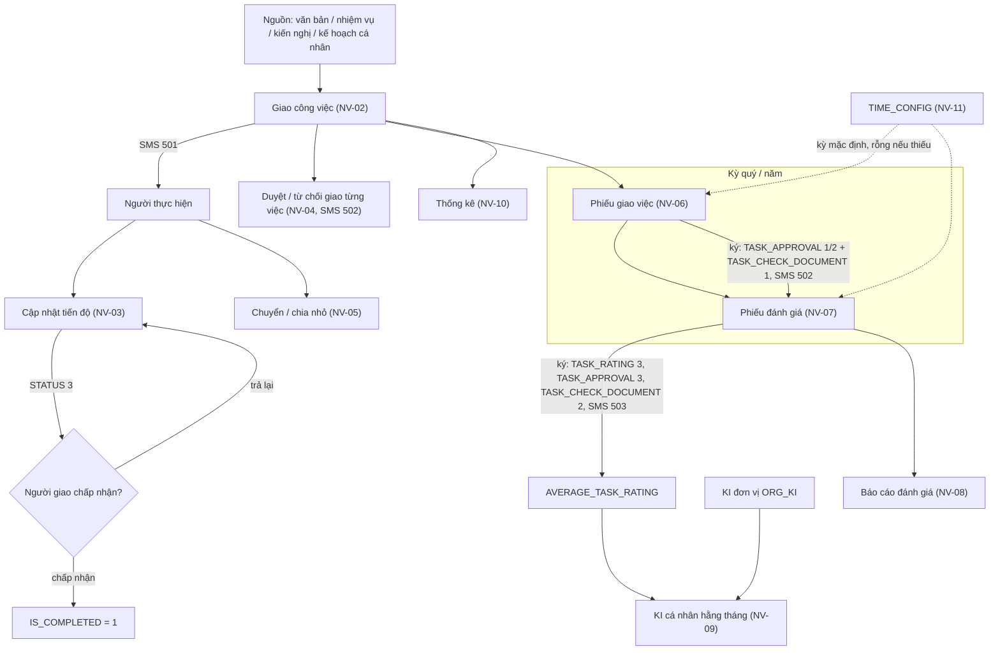

### 4.2 Sequence — Giao công việc (NV-02)

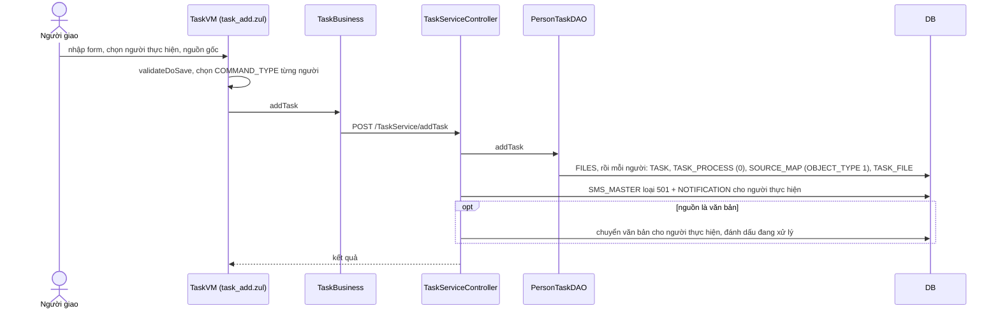

### 4.3 Sequence — Cập nhật tiến độ và chấp nhận kết quả (NV-03)

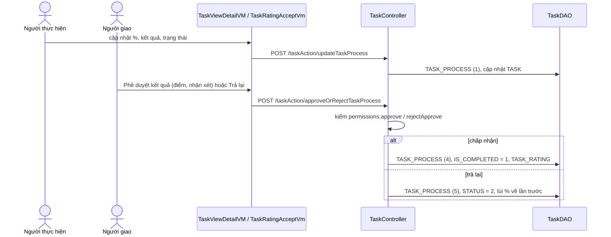

### 4.4 Sequence — Phiếu giao việc: hai cách lập (NV-06)

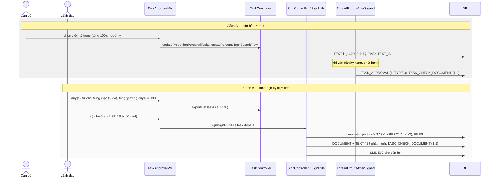

### 4.5 Sequence — Phiếu đánh giá (NV-07)

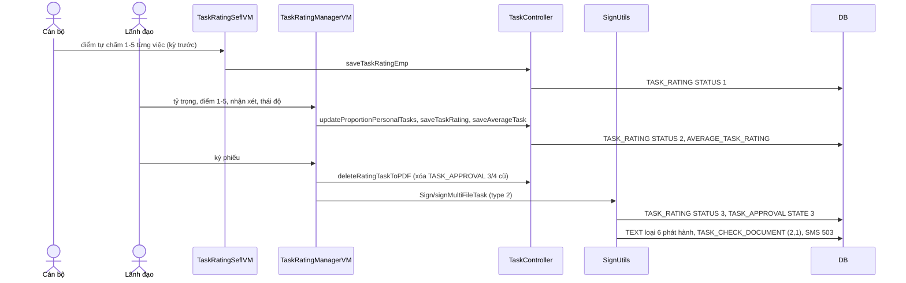

### 4.6 Sequence — KI cá nhân (NV-09)

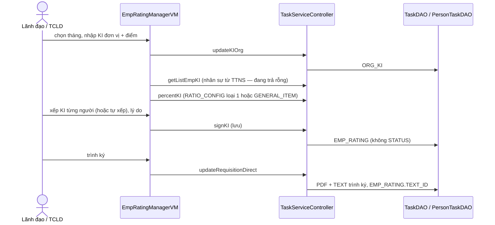

### 4.7 State — `TASK` (trạng thái thực hiện + chấp nhận)

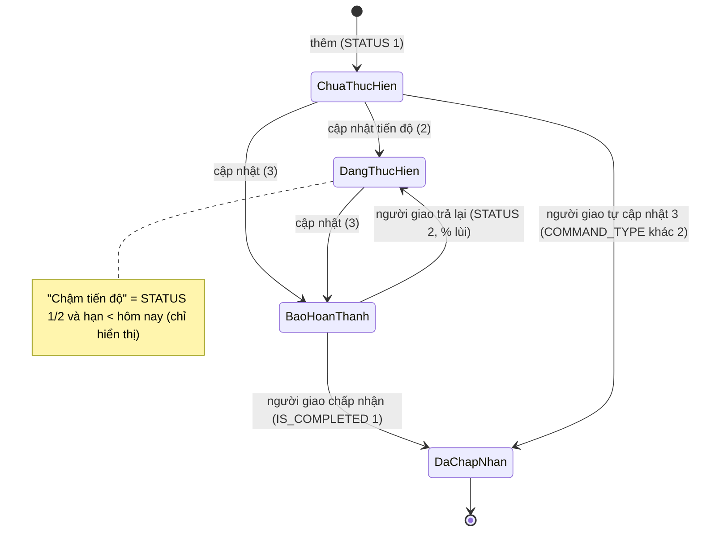

### 4.8 State — Công việc phối hợp (`TASK.RECEIVER` / `TASK_RECEIVER.STATUS`)

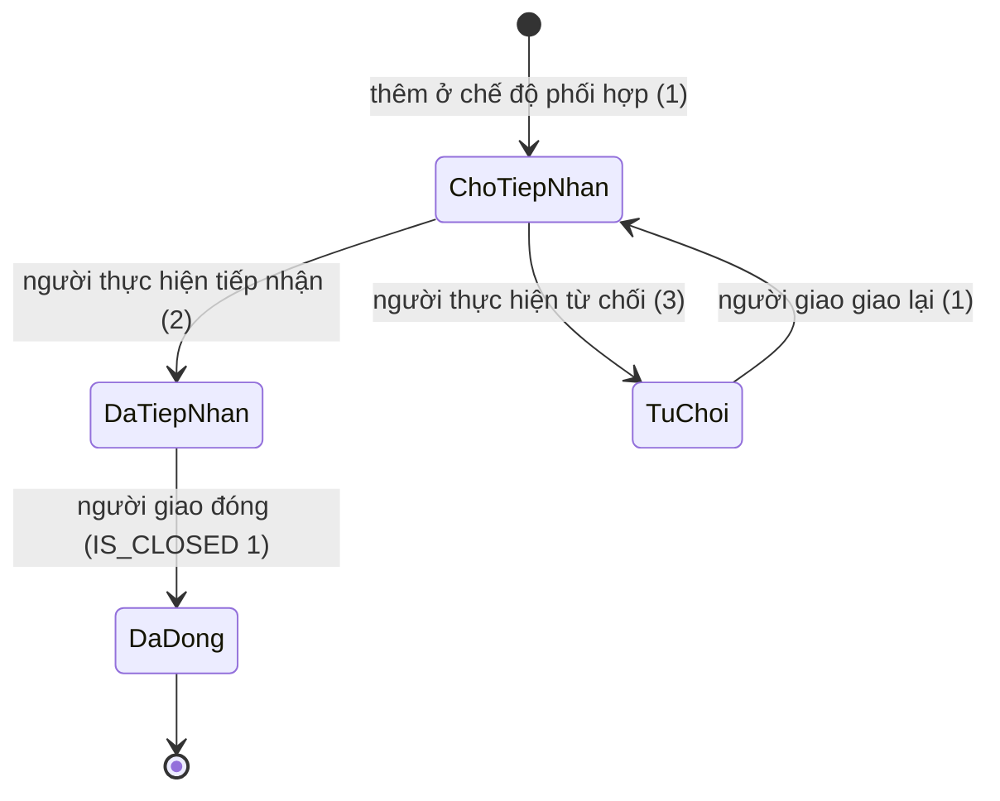

### 4.9 State — Phiếu của một cán bộ trong một kỳ (`TASK_CHECK_DOCUMENT` + `TASK_APPROVAL`)

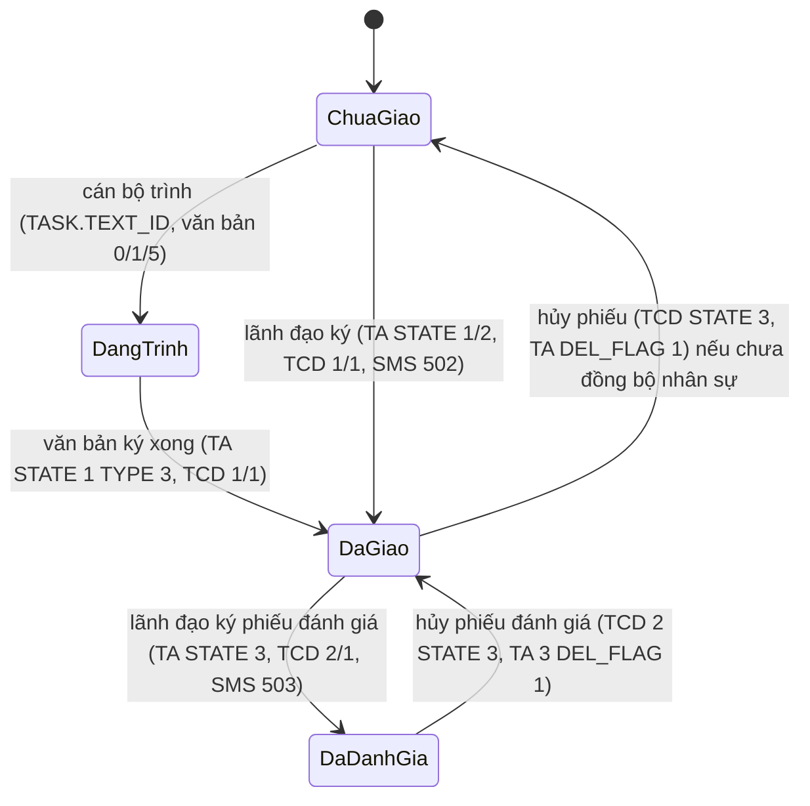

### 4.10 State — `TASK_RATING.STATUS`

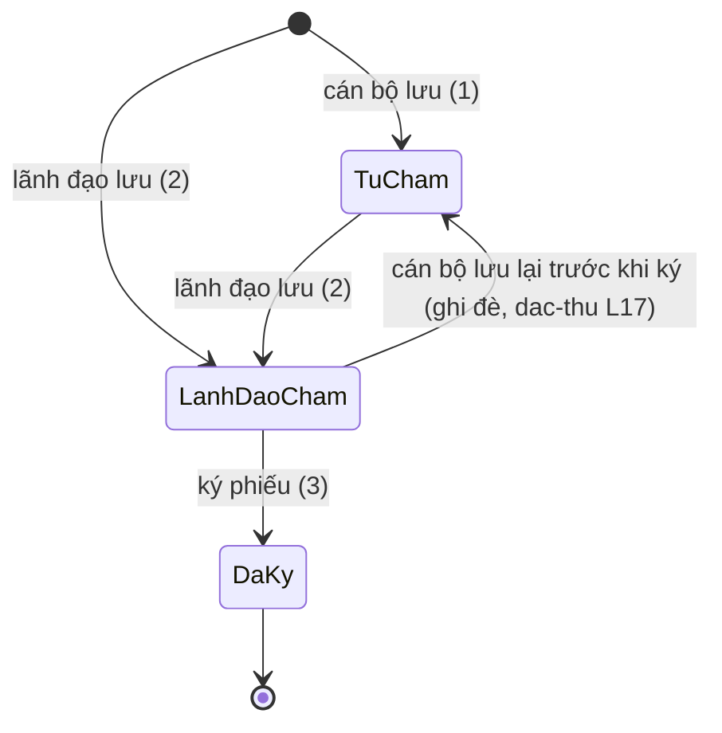

## 5. Data model

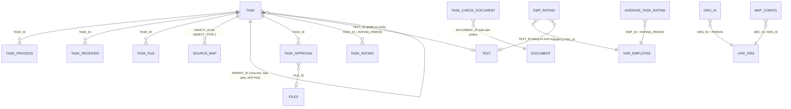

Bằng chứng: `PTD:167-353` (`TASK`, `TASK_PROCESS`, `SOURCE_MAP`, `TASK_FILE`); `TDB:323-367` (`TASK_RECEIVER`); `TAD:51-100`; `TRD:151-258`; `TD:8614-8703` (`AVERAGE_TASK_RATING`), `9436-9491` (`ORG_KI`), `9605-9632`; `PTD:2596-2658`, `3031-3050` (`EMP_RATING`); `ThreadExcuteAfterSigned.java:2096-2109`, `TD:3927-3928`, `4785-4838` (`TASK_CHECK_DOCUMENT`). Không có FK trên DB (DB DEV); `TASK_CHECK_DOCUMENT` gắn cán bộ / kỳ / loại phiếu và văn bản phiếu qua `DOCUMENT_ID` (cột: `TASK_CHECK_ID`, `APPROVER_ID`, `ENFORCEMENT_ID`, `ORG_ID`, `TYPE`, `STATE`, `PERIOD`, `DOCUMENT_ID`, `IS_SYNC_VHR`, `CREATE_DATE`, `UPDATE_DATE` — DB DEV `TASK_CHECK_DOCUMENT` ngày 2026-10-01).

| Bảng.cột | Vai trò nghiệp vụ | Nguồn |
|---|---|---|
| `TASK.COMMANDER_ID` / `ENFORCEMENT_ID` / `CREATED_BY` | người giao / người thực hiện / người tạo | comment DB; `TD:399-499` |
| `TASK.COMMAND_TYPE`, `STATUS`, `IS_COMPLETED`, `IS_CLOSED`, `RECEIVER`, `RECEIVER_COMMENT` | loại giao, trạng thái, đã chấp nhận, đã đóng, tiếp nhận phối hợp | mục 3 đầu |
| `TASK.PERIOD`, `PERIOD_TYPE`, `PERCENT`, `OBJECT_TYPE` | kỳ, loại kỳ, tỷ trọng, nhóm cán bộ | NV-02 |
| `TASK.KPI_INDEX`, `RECIPE`, `UNIT`, `TARGET_MIN` / `TARGET_EXPECT` / `TARGET_CHALLENGE`, `WORK_LOCATION`, `UPDATE_FREQUENCY` | chỉ tiêu KPI của công việc (chỉ số, cách đo, đơn vị, ba ngưỡng), nơi làm, tần suất cập nhật (1 ngày / 2 tuần / 3 tháng) | `task_add.zul:208-884`; comment DB |
| `TASK.PARENT_ID`, `TASK_PATH`, `IS_MAJOR` | việc cha (chia nhỏ / bàn giao / phối hợp), đường dẫn cây, chủ trì (web luôn 1) | `PTD:183-193`; `TD:8204-8215`, `8359-8373` |
| `TASK.ASSIGN_COMMENT`, `TEXT_ID` | nhận xét của người giao ở phiếu đánh giá; văn bản tự trình phiếu giao việc | `TRD:250-296`; `TD:11002-11031` |
| `TASK.SOURCE_TYPE`, `SOURCE_ID`, `SOURCE_NAME` | nguồn gốc kiểu cũ (comment "ID văn bản số cũ"); web ghi nguồn ở `SOURCE_MAP` | comment DB; NV-02 |
| `TASK_PROCESS` (`PROCESS_TYPE`, `ACTION_LOG`, `COMPLETED_PERCENT`, `STATUS`, `TASK_RESULT`, `CONTENT`) | lịch sử thao tác / tiến độ | mục 3 đầu |
| `TASK_RECEIVER` (`STATUS`, `RECEIVER_COMMENT`, `COMMANDER_ID`, `ENFORCEMENT_ID`) | lịch sử tiếp nhận / từ chối / giao lại việc phối hợp | `TDB:353-355` |
| `TASK_APPROVAL` (`PERIOD`, `PERIOD_TYPE`, `STATE`, `TYPE`, `FILE_ID`, `APPROVER_ID`, `APPROVAL_COMMENT`, `IS_ADDITIONAL`, `DEL_FLAG`) | từng việc trong phiếu giao (1 / 2) và phiếu đánh giá (3); duyệt từng việc (`TYPE` null) | `TAD:51-100`; mục 3 đầu |
| `TASK_CHECK_DOCUMENT` (`TYPE`, `STATE`, `PERIOD`, `ENFORCEMENT_ID`, `APPROVER_ID`, `ORG_ID`, `DOCUMENT_ID`, `IS_SYNC_VHR`) | phiếu còn hiệu lực của cán bộ trong kỳ (người ký, đơn vị, văn bản phiếu); đã đồng bộ nhân sự thì không hủy | `TD:7069-7166`, `10824-10852` |
| `TASK_RATING` (`RATING_PERIOD`, `STATUS`, `RATING_POINT`, `RATING_POINT_EMP`, `RATING_QUALITY(_EMP)`, `COMPLETED_STATUS`, `RATING_COMMENT`, `FILE_ID`, `PERIOD_TYPE`, `RATING_TYPE`) | điểm từng việc trong kỳ: tự chấm / lãnh đạo chấm / đã ký | `TRD:151-258` |
| `AVERAGE_TASK_RATING` (`AVERAGE_TASK`, `ATTITUDE_RATING`, `ATTITUDE_POINT`, `COMMENT_AVERAGE`, `COMPLY_RULE(_NOTE)`, `COMPLY_LOCATION(_NOTE)`, `RATING_PERIOD`, `PERIOD_TYPE`, `EMP_ID`, `ASSESOR_ID`) | điểm bình quân + thái độ của cán bộ trong kỳ; đầu vào KI | `TD:8614-8703` |
| `EMP_RATING` (`KI`, `FINAL_KI`, `AVR_POINT`, `AVR_POINT_EDIT`, `RANK`, `RANK_NAME`, `REASON`, `CONTRACT_TYPE`, `ADJUSTING_ORG`, `FINAL_ORG`, `RATING_PERIOD`, `STATUS`, `TEXT_ID`) | KI tháng của cá nhân | `PTD:2596-2658`; `WEB/voffice/entity/EmpRating.java:26-535` |
| `ORG_KI` (`KI`, `POINT`, `PERIOD`, `ORG_ID`) | KI đơn vị tháng | `TD:9436-9491` |
| `TIME_CONFIG` (`FIELD_VALUE`, `TYPE_MONTH`) | ngày chốt / quá hạn giao và đánh giá | NV-11 |
| `MAP_CONFIG` (`SRC_ID`, `DES_ID`) | cặp đơn vị cấu hình đánh giá (không ai đọc) | NV-12 |
| `ALERT`, `ALERT_FEEDBACK` | cảnh báo công việc (không dùng; `ALERT` không có trên DEV) | NV-13 |

## 6. Glossary

| Nghiệp vụ | Trong code |
|---|---|
| Công việc (cá nhân) | `TASK`, `Task`, `EntityTask`, `taskAction`, `TaskService`, menu `TASK_PERSONAL` |
| Người giao / người thực hiện | `COMMANDER_ID` / `ENFORCEMENT_ID`, `commander` / `enforcement`, `listEnforcement` |
| Được giao / cá nhân đề xuất / đã bàn giao / phối hợp | `COMMAND_TYPE` 1 / 2 / 3 / 4, `PERFORM` / `PERSONAL` / `TRANSFERRED` / `COMBINATION` |
| Tab được giao / tôi giao / cá nhân khác / của lãnh đạo | `personalTaskType` 1 / 2 / 3 / 8, `PERFORM_TASK_TYPE`, `ASSIGN_TASK_TYPE`, … |
| Chậm tiến độ | `STATUS` 0 giả (lọc / hiển thị), `TASK_STATUS_SLOW` |
| Chấp nhận kết quả / trả lại | `approveOrRejectTaskProcess`, `IS_COMPLETED`, `PROCESS_TYPE` 4 / 5, popup "Phê duyệt kết quả" `popupAcceptTask.zul` |
| Duyệt / từ chối giao việc | `ApproveOrRejectTask`, `approveAssignment` / `rejectAssignment`, `TASK_APPROVAL.STATE` 1 / 2 (`TYPE` null) |
| Bàn giao (chuyển người thực hiện) / chia nhỏ | `transferEnforcementTask` / `subEnforcementTask`, `PROCESS_TYPE` 3 / 2 |
| Tiếp nhận / từ chối / giao lại việc phối hợp | `receiveTaskStatus`, `RECEIVER` 2 / 3 / 1, `TASK_RECEIVER` |
| Đóng công việc | `closeTask`, `IS_CLOSED` |
| Nguồn gốc công việc | `SOURCE_MAP` (`OBJECT_TYPE = 1`, `SOURCE_TYPE` 1/3/4/5/7/8), `listSourceMap`, `OBJECT_TYPE_TASK` |
| Kỳ (quý / năm) | `PERIOD` `yyyy0Q` / `yyyy`, `PERIOD_TYPE` 1 / 2, `PERIODADD` QUY1..4 / CANNAM |
| Tỷ trọng | `TASK.PERCENT`, `updateProportionPersonalTasks`, `getProportionTotal` |
| Nhóm cán bộ | `TASK.OBJECT_TYPE` (`objectTypeTask`) |
| Phiếu giao việc / ký phiếu giao nhiệm vụ | menu `TASK_RATING`, `taskApproval.zul`, `TaskApprovalVM`, `DeliveringTaskGroup`, `TASK_APPROVAL` 1 / 2, `TASK_CHECK_DOCUMENT.TYPE = 1`, văn bản loại 429 (`TYPE_ID_PGV`) |
| Cán bộ tự trình phiếu | `createPersonalTaskSubmitFlow`, `TASK.TEXT_ID`, `isSubmitting`, `updateTaskCheckDocument` |
| Phiếu đánh giá công việc | menu `KDCV`, `taskRating*.zul`, `TaskRating*VM`, `TASK_RATING`, `TASK_APPROVAL.STATE = 3`, `TASK_CHECK_DOCUMENT.TYPE = 2`, văn bản loại 6 (`TYPE_ID_PDG`) |
| Tự chấm / lãnh đạo chấm / đã ký | `TASK_RATING.STATUS` 1 / 2 / 3, `EMPLOYEE_SELF_ASSESSED` / `LEADER_ASSESSED` / `LEADER_SIGNED_ASSESSMENT` |
| Điểm bình quân, thái độ (chấp hành địa điểm / kỷ luật) | `AVERAGE_TASK_RATING`, `saveAverageTask` (`saveAcerageTask`), `complyLocation` / `complyRule` |
| Hủy phiếu | `CancelSignedTaskFileByEmployee`, `TASK_CHECK_DOCUMENT.STATE = 3`, `IS_SYNC_VHR` |
| KI cá nhân / KI đơn vị | `EMP_RATING.KI` (1 A, 2 B, 3 C, 4 D1, 5 D2, 0 không đánh giá), `ORG_KI`, menu `EMP_RATING`, `EmpRating*VM` |
| Tỷ lệ KI / xếp loại | `percentKI`, `RATIO_CONFIG.TYPE = 1` / `7`, `GENERAL_ITEM`, `RANK` |
| Tổ chức lao động | vai trò `TCLD` (`userRole.labor`, `MANAGE_ROLE_LABOR`) |
| Cấu hình thời gian | `TIME_CONFIG`, menu `CHTG`, `TimeConfigVM`, `checkPeriod`, `isAssignPeriod` / `isAssessPeriod` |
| Cấu hình đánh giá công việc | `MAP_CONFIG`, menu `QLCHCV`, `TaskConFigVM` |
| Cảnh báo công việc | `ALERT`, `ALERT_FEEDBACK`, `doAlertTask` |
| Tin nhắn công việc | `CONFIG_SMS_MODULE` 500 "Thông báo công việc cá nhân" (nhóm) / 501 "Thông báo giao việc cá nhân" / 502 "Thông báo công việc đã được phê duyệt đầu tháng" / 503 "Thông báo công việc đã được đánh giá cuối tháng" (DB DEV `CONFIG_SMS_MODULE` ngày 2026-10-01; hằng `RECEIVEDTASK_DOTASK`, `SIGNTASK_STARTMONTH`, `SIGNTASK_ENDMONTH`) |

## 7. [CẦN XÁC NHẬN]

### 7.1 Còn mở

| # | Bối cảnh (hiện trạng code) | Câu hỏi |
|---|---|---|
| Q1 | Phiếu giao việc và phiếu đánh giá hiện lập theo **quý hoặc cả năm**; nhưng tên tin nhắn, mẫu tin và một số nhãn vẫn ghi "đầu tháng / cuối tháng", và KI cá nhân lại xếp **hằng tháng** dựa trên điểm phiếu đánh giá (NV-06, NV-07, NV-09 BR-28). Dữ liệu DEV: phiếu từ 2021 đều theo quý, trước đó có kỳ dạng tháng, không có kỳ cả năm; KI cá nhân chỉ có đến 07/2018. | Kỳ giao việc / đánh giá công việc cá nhân đúng là (a) theo quý (và cả năm); (b) theo tháng; (c) khác? KI cá nhân xếp theo tháng hay theo cùng kỳ với phiếu đánh giá? |
| Q2 | Có **hai cách** có phiếu giao việc: cán bộ tự chọn việc, tỷ trọng rồi **trình ký như văn bản**; hoặc lãnh đạo mở danh sách cán bộ, duyệt / từ chối từng việc và **ký phiếu trực tiếp** (NV-06 A, B). | Cả hai cách đều được dùng? Nếu chỉ một cách là chính thức thì (a) cán bộ tự trình; (b) lãnh đạo ký trực tiếp. |
| Q3 | Công việc **cá nhân tự đề xuất** và công việc **phối hợp** vẫn tạo được (menu thêm mới đang khóa, nhưng form vẫn có chế độ), nhưng **không hiện ở tab nào** của danh sách (NV-01). | Hai loại này còn dùng không? (a) không — bỏ; (b) có — cần hiện ở danh sách (tab riêng). |
| Q4 | Cấu hình "ngày chốt / ngày quá hạn chốt" đăng ký và đánh giá **không chặn** thao tác nào trên web; trên DEV chỉ có cấu hình đăng ký (ngày 1 → 31), thiếu cấu hình đánh giá nên màn đánh giá không có dữ liệu (NV-11, NV-07 BR-26). | Hệ thống có cần giới hạn ngày được đăng ký / đánh giá trong tháng (hoặc kỳ) không? (a) không cần, chỉ giới hạn theo kỳ; (b) cần chặn ngoài khoảng ngày cấu hình. |
| Q5 | Màn **Đánh giá nhân viên (KI)** lấy danh sách cán bộ từ hệ thống nhân sự; đoạn kết nối đó đang tắt nên danh sách luôn rỗng; trang giám đốc ký KI toàn đơn vị không còn đường vào (NV-09). Dữ liệu DEV: chỉ 35 bản KI cá nhân, mới nhất tháng 07/2018; KI đơn vị đến tháng 01/2022. | Chức năng KI cá nhân còn dùng trên hệ thống này không? (a) không — KI làm ở hệ thống nhân sự; (b) có — cần lấy danh sách cán bộ (từ đâu: hệ thống nhân sự hay danh sách người dùng của đơn vị?). |
| Q6 | Màn "Quản lý cấu hình đánh giá công việc" cho chọn một đơn vị rồi tick nhiều đơn vị khác và lưu, nhưng **không chức năng nào dùng** cấu hình này (NV-12). | Cấu hình này mang ý nghĩa gì: (a) đơn vị A được đánh giá / giao việc cho cán bộ của các đơn vị B; (b) đơn vị A xem thống kê của các đơn vị B; (c) không còn dùng? |
| Q7 | "Cảnh báo công việc" (người thực hiện gửi cảnh báo cho người giao, có thể leo thang lên cấp trên) đã ẩn nút ở mọi màn và bảng dữ liệu không có trên DEV (NV-13). | Tính năng này đã ngừng hẳn? (a) đã ngừng; (b) cần khôi phục. |
| Q8 | Ở màn Phiếu đánh giá, người có vai trò **tổ chức lao động (TCLD)** được nhận ra nhưng không có trang nào hiện (trắng); ở màn KI thì TCLD được coi như lãnh đạo, tính cho toàn đơn vị (NV-07, NV-09). | Tổ chức lao động cần làm gì với phiếu đánh giá công việc: (a) không tham gia; (b) xem / tổng hợp phiếu của toàn đơn vị; (c) chấm thay lãnh đạo? |
| Q9 | Cán bộ có thể **lưu lại điểm tự chấm sau khi lãnh đạo đã chấm** (trước khi ký), và khi đó điểm, nhận xét của lãnh đạo bị xóa (NV-07; `dac-thu.md` L17). | Sau khi lãnh đạo đã chấm, cán bộ còn được sửa điểm tự chấm không? (a) không; (b) được, và lãnh đạo phải chấm lại. |
| Q10 | Trên DEV, bảng công việc **không có dữ liệu**; dữ liệu phiếu giao / tiến độ dừng ở 12/2024 – 5/2025, phiếu mới nhất của quý 3/2024; không có văn bản phiếu nào và 365 ngày qua không có tin nhắn công việc (ghi chú đầu file). | Phân hệ công việc cá nhân còn được sử dụng ở Khánh Hòa không? (a) đang dùng (dữ liệu ở môi trường thật); (b) đã ngừng, chỉ giữ để tra cứu; (c) sẽ triển khai lại. |

### 7.2 Đã xác nhận (X1–X6 dùng lại từ module trước; X7–X13 DB / code xác nhận)

| # | Nội dung | Trả lời / nguồn | Hệ quả ghi vào tri thức |
|---|---|---|---|
| X1 | Quyền thao tác kiểm ở đâu | Tầng hiển thị nút trên web là thiết kế chung (đã xác nhận) | 1.4; BE chỉ kiểm ở đóng, chấp nhận / trả lại kết quả, danh sách cán bộ của lãnh đạo |
| X2 | Văn thư | role `VT` (đã xác nhận) | NV-06, NV-07 (văn thư nhận văn bản phiếu) |
| X3 | `SYS_MENU.STATUS` | 1 = mở, 2 = khóa (đã xác nhận) | 1.2 |
| X4 | Văn bản mật | Chưa dùng (đã xác nhận) | Phiếu tự trình mã hóa tệp — chỉ ghi điểm gọi |
| X5 | Tính năng ở nhánh khác | Ghi "chưa có trên `kha_develop`" (đã xác nhận) | không mục nào |
| X6 | Cấp đơn vị | Khánh Hòa (đã xác nhận) | — |
| X7 | Menu của phân hệ | Tra DB DEV `SYS_MENU` ngày 2026-10-01 (người điều phối) | 1.2 |
| X8 | `TASK` trên DEV | 0 dòng ở schema `VOFFICE`, không synonym; `TASK_PROCESS` mới nhất 2025-05-22, `TASK_APPROVAL` mới nhất 2024-12-09 (DB DEV ngày 2026-10-01) | ghi chú đầu file; Q10 |
| X9 | `TIME_CONFIG` trên DEV | 2 dòng (id 1 = 1, id 2 = 31, `TYPE_MONTH` 1, sửa 2022-08-10) | NV-11, NV-07 BR-26 |
| X10 | `ALERT` / `MAP_CONFIG` trên DEV | `ALERT` không tồn tại; `MAP_CONFIG` 1.287 dòng hiệu lực | NV-12, NV-13 |
| X11 | Số dòng, phân bố, comment cột `TASK*` | Tra DB DEV ngày 2026-10-01 (người điều phối) | mục 3, 5 |
| X12 | (câu cũ ❓1) "Phiếu giao / đánh giá là PDF rồi ký số — loại chữ ký nào?" | Code: PDF sinh từ mẫu, ký thường / USB / SIM CA / Cloud CA, sau ký phát hành văn bản nội bộ loại 429 / 6 (`SU:739-1020`; `TD:3785-4149`) | NV-06, NV-07 |
| X13 | (câu cũ ❓2) "KI khác KPI thế nào?" | Code: KI = xếp loại tháng của cá nhân (A–D2) theo tỷ lệ phụ thuộc KI đơn vị (`TD:9703-9789`); KPI là chỉ tiêu đơn vị / chỉ tiêu của từng công việc (`TASK.KPI_INDEX`) | NV-09; ranh giới `kpi-danh-gia` |
| X14 | Kết quả "Cần tra DB" bổ sung (người điều phối) | DB DEV ngày 2026-10-01: `TASK_CHECK_DOCUMENT` cột + phân bố; kỳ `TASK_APPROVAL`; `EMP_RATING`, `ORG_KI`, `AVERAGE_TASK_RATING`; menu cha 337531 / 338231; tên `CONFIG_SMS_MODULE` 500–503; `TEXT` loại 429 / 6 = 0; `MESSAGE` không có tin 501–503 trong 365 ngày | ghi chú đầu file, 1.2, mục 3, NV-09, mục 5, 6, Q1 / Q5 / Q10 |
