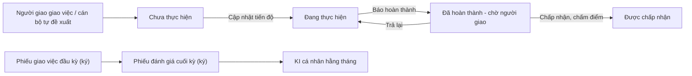

# Công việc cá nhân — tóm tắt nghiệp vụ cho BA

> Bản đọc nhanh bằng lời nghiệp vụ. Chi tiết và bằng chứng: [nghiep-vu.md](nghiep-vu.md) (mã NV / BR trong ngoặc
> để tra). Cập nhật: 2026-10-02 · Nguồn: code `kha_develop` + DB DEV. Nhãn quy tắc: **[Đã xác nhận]** = chủ dự án đã
> chốt là đúng ý đồ · **[Hiện trạng]** = hệ thống đang chạy như vậy, chưa ai xác nhận là ý đồ · **[Lệch nghiệp vụ]**
> = đã xác nhận nghiệp vụ muốn khác, hệ thống đang làm sai.

## 1. Phân hệ này dùng để làm gì

Phân hệ quản lý **công việc của một cá nhân** trong một **kỳ** (quý hoặc cả năm): người giao giao việc cho cán bộ, hoặc cán bộ tự đề xuất việc cho mình; mỗi việc có tỷ trọng (%) trong kỳ (1.1, NV-02).
Công việc có thể lấy văn bản, nhiệm vụ đơn vị hoặc kiến nghị làm **nguồn gốc**; có hay không có văn bản không làm công việc khác đi (1.1, NV-02).
Người thực hiện cập nhật tiến độ; báo hoàn thành thì **người giao chấp nhận** (chấm điểm) hoặc **trả lại** (NV-03).
Đầu kỳ có **phiếu giao việc** chốt danh sách việc và tỷ trọng; cuối kỳ có **phiếu đánh giá** — cán bộ tự chấm, lãnh đạo chấm và ký; điểm phiếu đánh giá là đầu vào của **KI** xếp loại cá nhân hằng tháng (NV-06, NV-07, NV-09).
Trên DB DEV bảng công việc không có dữ liệu, phiếu mới nhất là quý 3/2024 — chưa rõ phân hệ còn dùng (Q10).

**Không gồm:** nhiệm vụ đơn vị giao đơn vị hoặc giao một cá nhân chủ trì, duyệt tiến độ hai cấp, phiếu giao / đánh giá nhiệm vụ tháng (xem `nhiem-vu`); giao việc kèm văn bản cho đơn vị để đơn vị trả lời — đó là nhắc việc; SMS, thông báo (xem `lich-nhac-viec`); cấu hình tỷ lệ KI, công thức KI, KPI và đánh giá đơn vị (xem `kpi-danh-gia`); ký số và tạo văn bản trình ký (xem `ky-so`, `xu-ly-cong-viec`); kiến nghị / khó khăn vướng mắc (xem `phieu-trinh`).

## 2. Ai dùng và được làm gì

| Vai trò | Được làm gì trong phân hệ này |
|---|---|
| Người giao (thường là lãnh đạo) | Giao việc; duyệt / từ chối giao từng việc do cán bộ tạo; chấp nhận / trả lại kết quả; chuyển người thực hiện; giao lại và đóng công việc phối hợp (1.4, NV-02…NV-05) |
| Người thực hiện (cán bộ) | Cập nhật tiến độ; chia nhỏ việc; tiếp nhận / từ chối công việc phối hợp; tự đăng ký và trình ký phiếu giao việc; tự chấm điểm; xem KI của mình (1.4, NV-03, NV-05, NV-06, NV-07, NV-09) |
| Trợ lý của lãnh đạo | Thấy tab *Nhiệm vụ của lãnh đạo*, cập nhật tiến độ thay lãnh đạo (1.4, NV-01) |
| Lãnh đạo / thủ trưởng đơn vị (`LDDV` / `TTDV`) | Ký phiếu giao việc cho cán bộ trong đơn vị; chấm và ký phiếu đánh giá; lập KI đơn vị và KI cá nhân; thống kê; xem việc của cán bộ cấp dưới (1.4, NV-06, NV-07, NV-09, NV-10) |
| Tổ chức lao động (`TCLD`) | Ở màn KI được coi như lãnh đạo, tính cho toàn đơn vị; ở màn phiếu đánh giá thì ra trang trắng (1.4, NV-07, NV-09, Q8) |
| Văn thư đơn vị (`VT`) | Nhận văn bản "Phiếu giao việc" / "Phiếu đánh giá công việc" sau khi ký (1.4, NV-06, NV-07) |
| Quản trị | Cấu hình thời gian giao / đánh giá, cấu hình đánh giá công việc (1.4, NV-11, NV-12) |

## 3. Màn hình / menu người dùng thấy

| Menu / màn | Để làm gì | Ghi chú | Mã menu |
|---|---|---|---|
| Quản lý công việc | Xem, giao, cập nhật tiến độ, chấp nhận / trả lại, chuyển, chia nhỏ, sửa, xóa công việc | 4 tab; mặc định kỳ = quý hiện tại, lọc "chưa đóng" (NV-01, BR-02) | 337533 |
| Phiếu giao việc | Cán bộ đăng ký việc + tỷ trọng rồi trình ký; hoặc lãnh đạo duyệt từng việc và ký phiếu | Chỉ ký được kỳ hiện tại (NV-06, BR-20) | 337851 |
| Phiếu đánh giá công việc | Cán bộ tự chấm; lãnh đạo chấm, nhận xét, ký phiếu | Mặc định kỳ = quý trước (NV-07) | 337852 |
| Báo cáo đánh giá công việc cá nhân | Báo cáo điểm từ phiếu đánh giá đã ký, xuất Excel | Điểm ra 0 với phiếu chấm bằng cách hiện tại (NV-08, BR-27) | 337557 |
| Đánh giá nhân viên | KI đơn vị và KI cá nhân hằng tháng, trình ký bảng tổng hợp | Danh sách cán bộ luôn trống (NV-09, Q5) | 337572 |
| Thống kê công việc | Đếm việc được giao theo từng cán bộ, theo trạng thái; nút giao việc cho cán bộ | (NV-10) | 338191 |
| Danh mục cấu hình thời gian | Ngày chốt / ngày quá hạn đăng ký và đánh giá | Hiện không chặn thao tác nào (NV-11, Q4) | 337853 |
| Quản lý cấu hình đánh giá công việc | Chọn đơn vị nguồn và các đơn vị đích | Lưu được nhưng **không chức năng nào dùng** (NV-12, Q6) | 337631 |
| Thêm mới công việc cá nhân · Thêm mới công việc phối hợp | Mở thẳng form thêm | Menu **khóa** (1.2) | 338112 · 338152 |
| Quản lý công việc - Editable · GanttChart | — | Menu **khóa** (1.2, NV-14) | 337691 · 337692 |
| Hướng dẫn sử dụng module quản lý công việc cá nhân | — | Trang không tồn tại; menu cha đang khóa (1.2) | 338232 |
| Trang chủ — tab "Nhiệm vụ cá nhân" | Ô đếm | Đếm và mở **nhiệm vụ** giao cá nhân chủ trì, không phải công việc (1.3; `nhiem-vu` Q6) | — |

## 4. Luồng chính

1. Người giao mở *Quản lý công việc* → thêm: chọn kỳ (quý / cả năm), nhóm cán bộ, tần suất cập nhật, người giao, người thực hiện (có thể nhiều người — mỗi người một việc), nguồn gốc, tên (tối đa 500), nội dung (tối đa 2000), chỉ tiêu KPI của việc, tỷ trọng 0–100, hạn (NV-02).
2. Người thực hiện nhận SMS và thông báo (NV-02 "Tích hợp").
3. Người thực hiện cập nhật tiến độ: % hoàn thành, kết quả, trạng thái, văn bản liên quan (NV-03).
4. Báo **hoàn thành** → người giao **chấp nhận** (nhập điểm, nhận xét) hoặc **trả lại** — trả lại thì việc về *Đang thực hiện*, % và kết quả lùi về lần cập nhật gần nhất dưới 100% (NV-03).
5. **Đầu kỳ — phiếu giao việc**, hai cách: (A) cán bộ chọn việc, nhập tỷ trọng, *Trình ký* như một văn bản; phiếu có hiệu lực khi văn bản được ký và phát hành. (B) lãnh đạo mở danh sách cán bộ, *Phê duyệt / Từ chối* từng việc rồi ký phiếu từng người hoặc hàng loạt (NV-06, Q2).
6. Phiếu đã ký được phát hành thành văn bản nội bộ gửi cán bộ và văn thư; cán bộ nhận SMS số việc được duyệt / bị từ chối (NV-06 bước 5–6).
7. **Cuối kỳ — phiếu đánh giá**: cán bộ tự chấm 1–5 từng việc; lãnh đạo nhập tỷ trọng, điểm 1–5, nhận xét, chấp hành kỷ luật / địa điểm, rồi ký; cán bộ nhận SMS (NV-07).
8. **KI** (hằng tháng): lãnh đạo chốt KI đơn vị, xếp KI cá nhân A / B / C / D1 / D2 theo tỷ lệ cho phép, trình ký bảng tổng hợp (NV-09).

**Luồng phụ.**
- *Duyệt giao từng việc*: việc do cán bộ tự tạo mà người giao là lãnh đạo — lãnh đạo bấm Phê duyệt (lý do tùy chọn) / Từ chối (lý do bắt buộc) (NV-04).
- *Chuyển người thực hiện*: việc đi sang người mới; người cũ còn bản "đã bàn giao" ở tab của người giao (NV-05, BR-16).
- *Chia nhỏ*: người thực hiện tách việc con cho người khác (NV-05).
- *Công việc phối hợp*: người nhận tiếp nhận hoặc từ chối kèm lý do; bị từ chối thì người giao giao lại; người giao đóng việc (NV-05).
- *Hủy phiếu*: lãnh đạo hủy phiếu giao / phiếu đánh giá đã ký, trừ phiếu đã đồng bộ sang hệ thống nhân sự (NV-06 C, NV-07).

## 5. Trạng thái

**Trạng thái công việc**

| Trạng thái (tên người dùng thấy) | Nghĩa | Chuyển sang khi nào | Giá trị |
|---|---|---|---|
| Chưa thực hiện | Mới giao | Thêm công việc (NV-02) | 1 |
| Đang thực hiện | Đang làm | Cập nhật tiến độ; người giao trả lại kết quả (NV-03) | 2 |
| Đã hoàn thành | Người thực hiện báo xong | Cập nhật lên hoàn thành (NV-03) | 3 |
| Chậm tiến độ | Chưa / đang thực hiện mà quá hạn — chỉ là nhãn lọc, không lưu | Tự tính theo hạn (BR-03) | 0 |

**Cờ đi kèm** (không phải trạng thái riêng): *Được chấp nhận* — người giao đã chấp nhận kết quả, khác "Đã hoàn thành" (BR-13); *Đã đóng* — chỉ có ở công việc phối hợp (NV-05).

**Loại công việc**

| Loại | Nghĩa | Ghi chú | Giá trị |
|---|---|---|---|
| Được giao | Người khác giao cho mình | Hiện ở tab *Nhiệm vụ được giao* (NV-01) | 1 |
| Cá nhân đề xuất | Tự giao cho mình | **Không hiện ở tab nào** (NV-01, Q3) | 2 |
| Đã bàn giao | Bản lưu của người thực hiện cũ khi chuyển | Hiện ở tab *Nhiệm vụ tôi giao* của người giao (BR-16) | 3 |
| Phối hợp | Việc cần người nhận tiếp nhận | **Không hiện ở tab nào** (NV-01, Q3) | 4 |

**Tiếp nhận công việc phối hợp**: Chưa tiếp nhận / giao lại (1) · Đã tiếp nhận (2) · Từ chối (3) (mục 3, NV-05).

**Phiếu và điểm**

| Trạng thái | Nghĩa | Chuyển sang khi nào | Giá trị |
|---|---|---|---|
| Việc trong phiếu giao: Phê duyệt / Từ chối | Lãnh đạo đồng ý / không đồng ý giao việc này trong kỳ | Ký phiếu giao (NV-06) | 1 / 2 |
| Việc trong phiếu đánh giá: Đã ký đánh giá | Phiếu đánh giá của việc đã ký | Ký phiếu đánh giá (NV-07) | 3 |
| Phiếu của cán bộ trong kỳ: Hiệu lực / Đã hủy | Cán bộ "đã giao" / "đã đánh giá" khi có phiếu hiệu lực | Ký phiếu / Hủy phiếu (mục 3, BR-21) | 1 / 3 |
| Điểm từng việc: Tự chấm / Lãnh đạo đã chấm / Lãnh đạo đã ký | Tiến trình chấm | Cán bộ lưu / lãnh đạo "Ghi lại" / lãnh đạo ký (NV-07) | 1 / 2 / 3 |

## 6. Quy tắc quan trọng nhất

- [Hiện trạng] Mỗi người thực hiện là **một công việc riêng**; giao một việc cho nhiều người = nhiều công việc (NV-02).
- [Hiện trạng] Có hai mốc "xong": người thực hiện báo **Đã hoàn thành**, và người giao **chấp nhận**. Người giao tự cập nhật lên hoàn thành thì được coi là chấp nhận luôn (BR-10, BR-13).
- [Hiện trạng] Việc chính hoàn thành thì các việc phối hợp con tự chuyển sang xong (BR-11).
- [Hiện trạng] Danh sách chỉ hiện công việc **có kỳ** (quý / năm); mặc định chỉ kỳ quý hiện tại. Công việc tự đề xuất và công việc phối hợp không hiện ở tab nào (BR-01, BR-02, Q3).
- [Hiện trạng] Nguồn gốc bắt buộc, trừ "Theo kế hoạch cá nhân"; tạo từ văn bản mà có người phối hợp thì phải có đúng một người chủ trì; nguồn là văn bản thì văn bản được chuyển cho người thực hiện (BR-06, BR-09).
- [Hiện trạng] **Tổng tỷ trọng phải bằng 100%** khi cán bộ trình phiếu giao, khi lãnh đạo ký phiếu giao (tính trên việc được phê duyệt), và khi lãnh đạo lưu / ký phiếu đánh giá (BR-18, BR-23).
- [Hiện trạng] Từ chối một việc trong phiếu giao phải có lý do (BR-19).
- [Hiện trạng] Chỉ ký phiếu giao cho **kỳ hiện tại**; phiếu đánh giá mặc định cho **kỳ trước**, không chấm được kỳ hiện tại trở đi (BR-20, BR-24, NV-07).
- [Hiện trạng] Việc được chấm ở phiếu đánh giá = việc đã được phê duyệt trong phiếu giao còn hiệu lực, cộng việc bổ sung của kỳ; **không đòi việc đã hoàn thành** (BR-25).
- [Hiện trạng] Ký lại phiếu cùng kỳ thay phiếu cũ; hủy phiếu không được khi phiếu đã đồng bộ sang hệ thống nhân sự (BR-21, NV-06 C).
- [Hiện trạng] Cấu hình "ngày chốt / ngày quá hạn" **không chặn** giao hay đánh giá trên web; ràng buộc thật là kỳ. Thiếu cấu hình ngày đánh giá (như DB DEV) thì màn đánh giá không có việc nào (BR-22, BR-26, BR-31, Q4).
- [Hiện trạng] KI cá nhân xếp theo **tháng**; tỷ lệ A / B / C / D1 / D2 cho phép phụ thuộc KI đơn vị và số người (≥ 10 người theo bảng tỷ lệ, < 10 người theo số người cố định); hợp đồng dịch vụ cố định 10% A / 90% B (NV-09, BR-28).
- [Hiện trạng] SMS chỉ gửi khi thêm, sửa, chuyển, chia nhỏ, duyệt giao từng việc, ký phiếu giao, ký phiếu đánh giá; không gửi khi cập nhật tiến độ, chấp nhận / trả lại, tiếp nhận, đóng, xóa (BR-14, NV-04, NV-06, NV-07).
- [Hiện trạng] Xóa là xóa mềm, kéo theo việc con chưa có phê duyệt; không xóa được bản "đã bàn giao" và việc đã được chấp nhận (BR-08).

## 7. Hệ thống KHÔNG làm / hay bị hiểu nhầm

- **Công việc khác nhiệm vụ ở chủ thể và cách quản lý, không ở chuyện gắn văn bản.** Công việc là việc của một cá nhân trong kỳ, có phiếu giao việc / phiếu đánh giá / KI. Nhiệm vụ (`nhiem-vu`) là việc đơn vị giao đơn vị hoặc giao một cá nhân chủ trì, duyệt tiến độ hai cấp. Cả hai đều có thể lấy văn bản làm nguồn gốc. Giao việc kèm văn bản cho đơn vị để đơn vị trả lời là **nhắc việc** (`lich-nhac-viec`) (1.1).
- **Tên gọi lẫn "nhiệm vụ":** menu cha tên "Nhiệm vụ cá nhân"; các tab của *Quản lý công việc* tên *Nhiệm vụ được giao / Nhiệm vụ tôi giao / Nhiệm vụ cá nhân khác / Nhiệm vụ của lãnh đạo*; radio phiếu giao tên "Phiếu giao nhiệm vụ cá nhân" — tất cả đều là **công việc** (1.2, NV-01, NV-06).
- **Tab "Nhiệm vụ cá nhân" trên trang chủ đếm nhiệm vụ**, không đếm công việc (1.3, dac-thu bẫy 8).
- **"Phiếu giao việc đầu tháng / đánh giá cuối tháng" là tên cũ** — kỳ hiện là quý hoặc cả năm; chỉ KI còn theo tháng (1.5, Q1).
- **Đánh giá không đòi công việc đã hoàn thành** (BR-25).
- **Hai bước duyệt khác nhau:** "duyệt giao từng việc" (đồng ý giao một việc cán bộ tự tạo) khác "phê duyệt trong phiếu giao việc" (chốt việc của kỳ) và khác "chấp nhận kết quả" (khi việc xong) (NV-03, NV-04, NV-06).
- **Cấu hình đánh giá công việc lưu nhưng không có tác dụng** (BR-32, Q6).
- **Cảnh báo công việc không dùng**: nút ẩn ở mọi màn (BR-33, Q7).
- **Trang KI của giám đốc không còn đường vào**; danh sách cán bộ ở màn KI luôn trống (NV-09, Q5).
- **Cán bộ lưu lại điểm tự chấm sau khi lãnh đạo đã chấm thì điểm, nhận xét của lãnh đạo bị xóa** (NV-07, Q9, dac-thu L17).

## 8. Liên quan phân hệ khác

| Khi thay đổi ở đây… | …phải xem thêm | Vì sao |
|---|---|---|
| Tạo công việc từ văn bản (biểu tượng trên danh sách văn bản) | `van-ban/den`, `van-ban/di` | Khoảng 25 màn văn bản tự mở form công việc; nguồn là văn bản thì văn bản được chuyển cho người thực hiện (BR-09, dac-thu bẫy 15) |
| Tạo công việc từ nhiệm vụ; ô trang chủ | `nhiem-vu` | Nút trên chi tiết nhiệm vụ mở form công việc; tab "Nhiệm vụ cá nhân" trên trang chủ đếm nhiệm vụ (NV-02, 1.3) |
| Trình ký / ký phiếu, phát hành phiếu | `ky-so`, `xu-ly-cong-viec` | Phiếu tự trình đi luồng văn bản trình ký; lãnh đạo ký trực tiếp dùng chung chức năng ký với hai loại phiếu (NV-06, NV-07, dac-thu mục 1) |
| KI, tỷ lệ KI, KI đơn vị | `kpi-danh-gia` | Cấu hình tỷ lệ / công thức KI ở đó; KI đơn vị cũng do màn Đánh giá đơn vị ghi (NV-09) |
| SMS 501–503, thông báo | `lich-nhac-viec` | Hàng đợi SMS, mẫu tin, chặn tin ở đó (NV-02, 1.1) |
| Nguồn "kiến nghị" | `phieu-trinh` | Kiến nghị / khó khăn vướng mắc hiện ghi tạm ở đó (1.1) |

## 9. Câu hỏi nghiệp vụ còn mở

- `Q1` — Kỳ giao / đánh giá công việc là quý (và cả năm), tháng, hay khác; KI cá nhân xếp theo tháng hay theo kỳ phiếu đánh giá?
- `Q2` — Hai cách lập phiếu giao việc (cán bộ tự trình / lãnh đạo ký trực tiếp) đều chính thức, hay chỉ một?
- `Q3` — Công việc tự đề xuất và công việc phối hợp còn dùng không; nếu có thì hiện ở đâu?
- `Q4` — Có cần chặn đăng ký / đánh giá ngoài khoảng ngày cấu hình không?
- `Q5` — KI cá nhân còn làm trên hệ thống này không; nếu có, lấy danh sách cán bộ từ đâu?
- `Q6` — Cấu hình đánh giá công việc (đơn vị nguồn → các đơn vị đích) mang ý nghĩa gì?
- `Q7` — Cảnh báo công việc đã ngừng hẳn hay cần khôi phục?
- `Q8` — Tổ chức lao động làm gì với phiếu đánh giá công việc?
- `Q9` — Sau khi lãnh đạo đã chấm, cán bộ còn được sửa điểm tự chấm không?
- `Q10` — Phân hệ công việc cá nhân còn được sử dụng ở Khánh Hòa không?

(đầy đủ ở mục 7.1 của `nghiep-vu.md`)

## 10. Khi viết yêu cầu mới cho phân hệ này, nhớ ghi rõ

- **Đây là công việc hay nhiệm vụ** — dùng đúng tên phân hệ, vì giao diện gọi công việc là "nhiệm vụ" ở nhiều chỗ (1.2, NV-01).
- **Áp dụng cho loại công việc nào:** được giao, cá nhân đề xuất, đã bàn giao, phối hợp — và có cần hiện ở tab nào (NV-01, mục 3, Q3).
- **Áp dụng ở tab nào:** được giao, tôi giao, cá nhân khác (cán bộ cấp dưới), của lãnh đạo (trợ lý) (NV-01).
- **Kỳ nào:** quý, cả năm, hay tháng (KI); kỳ hiện tại hay kỳ trước; công việc không có kỳ có tính không (BR-01, BR-20, BR-24, Q1).
- **"Xong" theo mốc nào:** người thực hiện báo hoàn thành, người giao chấp nhận, hay phiếu đánh giá đã ký (BR-13, BR-25).
- **Phiếu giao việc theo cách nào:** cán bộ tự trình (luồng văn bản) hay lãnh đạo ký trực tiếp, hay cả hai — hai cách đang ghi dữ liệu ở hai chỗ khác nhau (NV-06, dac-thu bẫy 10, Q2).
- **Tỷ trọng có phải đủ 100% không, kiểm ở bước nào** (BR-18, BR-23).
- **Nguồn gốc nào áp dụng:** văn bản, nhiệm vụ đơn vị, kiến nghị, kế hoạch cá nhân — và có chuyển văn bản cho người thực hiện không (NV-02, BR-09).
- **Có gửi SMS / thông báo không, mã tin nào (501 / 502 / 503), cho ai** (BR-14, NV-04, NV-06, NV-07).
- **Có dùng cấu hình thời gian không** — hiện cấu hình không chặn gì; nếu yêu cầu chặn theo ngày thì phải nói rõ, và DB phải có đủ 4 dòng cấu hình (BR-31, dac-thu bẫy 7, Q4).
