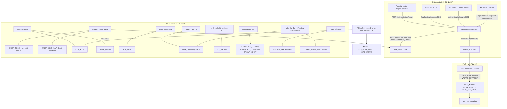
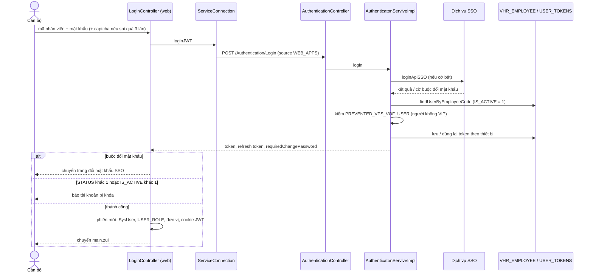
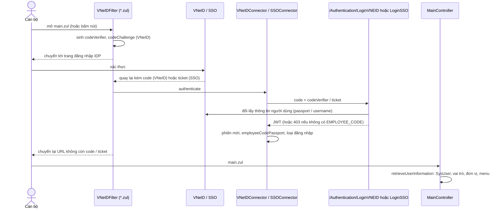
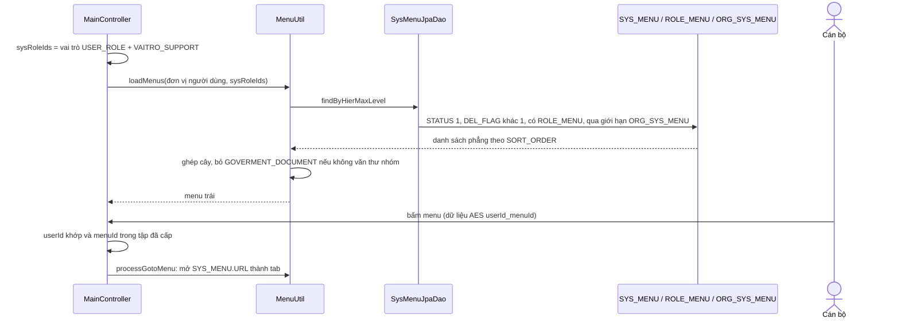
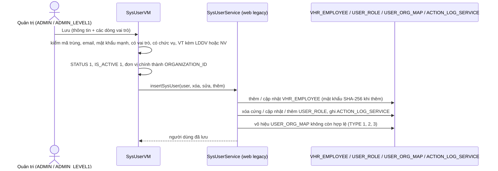
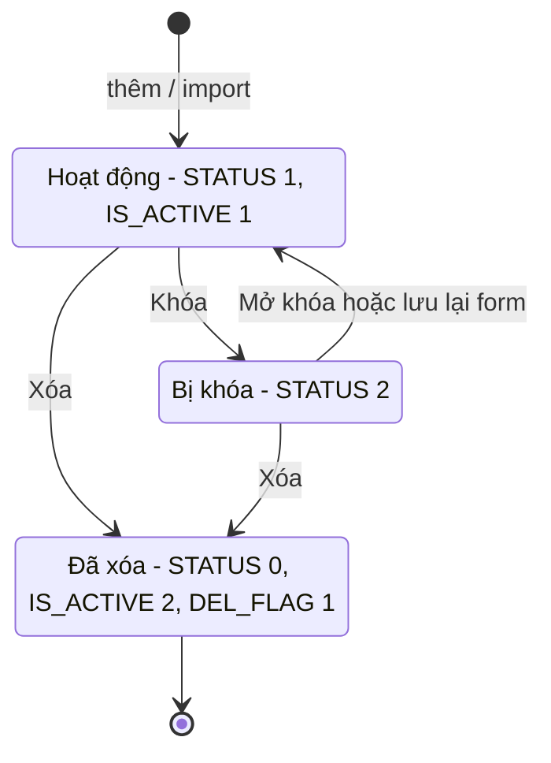
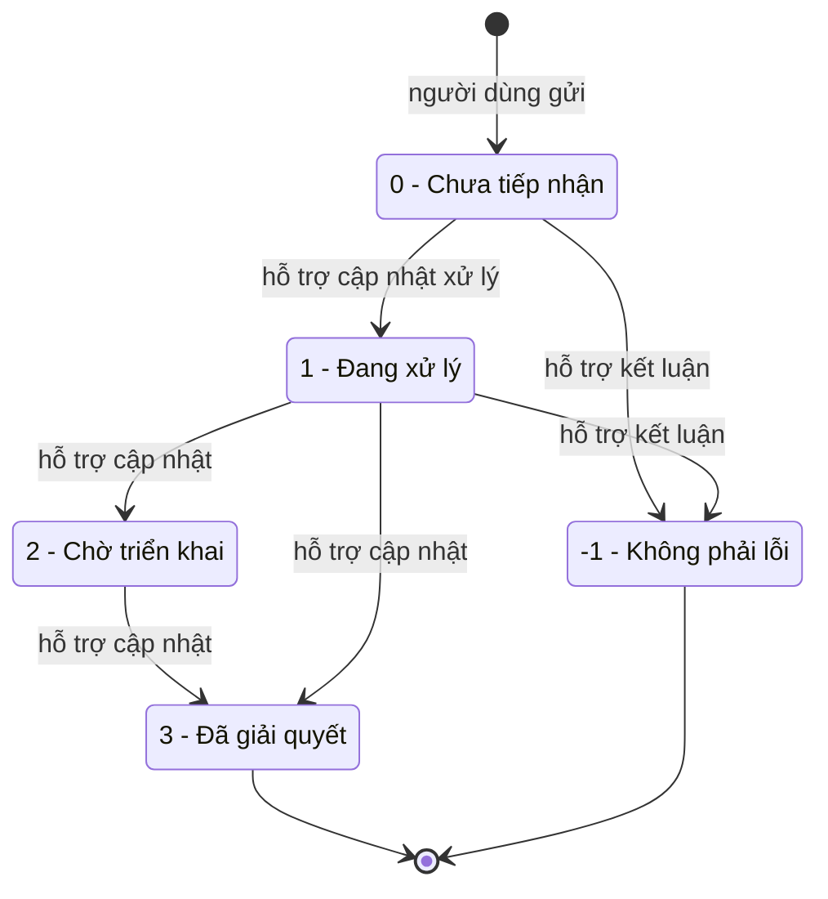
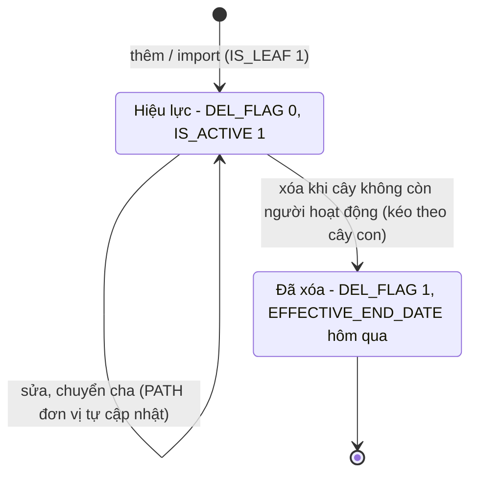
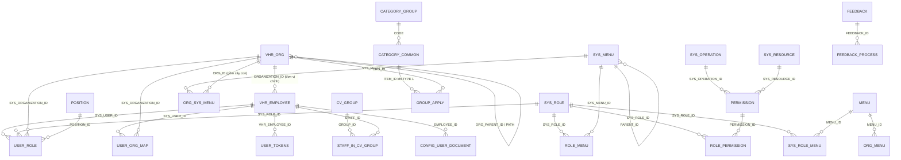

# Hệ thống / quản trị — nghiệp vụ: đăng nhập (tài khoản, SSO, VNeID, eCabinet), phiên làm việc và menu theo vai trò / đơn vị, người dùng, vai trò & phân quyền, menu, đơn vị, nhóm, danh mục chung, tham số, cấu hình quản trị, trang chủ, tiện ích quản trị phụ

> Viết lại từ code nhánh `kha_develop` (web-spring + backend2.0) ngày 2026-10-02. Mọi khẳng định có nguồn `file:dòng`.
> Menu / widget đối chiếu **DB DEV `SYS_MENU` / `HOME_WIDGET` ngày 2026-10-01**; số dòng, phân bố giá trị, comment cột các bảng của phân hệ (`VHR_EMPLOYEE`, `VHR_ORG`, `USER_ROLE`, `SYS_ROLE`, `ROLE_MENU`, `SYS_MENU`, `USER_ORG_MAP`, `CV_GROUP`, `CATEGORY_*`, `SYSTEM_PARAMETER`, `FEEDBACK`…) đối chiếu **DB DEV ngày 2026-10-01** (người điều phối truy vấn, chỉ SELECT; tác giả không kết nối DB). Không có FK nào trên DB DEV cho các bảng này — mọi quan hệ ở mục 5 là quan hệ logic lấy từ JOIN / entity trong code. **Lượt tra bổ sung DB DEV ngày 2026-10-02** (người điều phối, chỉ SELECT): số dòng `PERMISSION`, `ROLE_PERMISSION`, `PERMISSION_BASE`, `ORG_SYS_MENU` (theo menu); `SYS_ROLE` các mã phụ; `ROLE_MENU` của `VAITRO_SUPPORT`; `USER_ROLE.RECEIVE_ORG_DOC`; `CONFIG_USER_DOCUMENT`; `VHR_ORG.HAVE_DOCUMENT_MANAGER`; `SYS_MENU` theo URL `appMobile` / `summaryUsageReport` / `notifyToNextSigner` / `importOrganization` / `homeSetting`; `SYSTEM_PARAMETER` (chỉ xác nhận có khai + độ dài, không lấy giá trị); `APP_MOBILE` — ghi tại chỗ với nguồn "DB DEV `<BẢNG>` ngày 2026-10-02". Bảng còn lại không tra (`USER_TOKENS` chi tiết cột, `PERMISSION_DATA`…) ghi "chưa đối chiếu DB".
> HDSD cũ chỉ tham khảo thuật ngữ. **Bảo mật:** phân hệ có nhiều cấu hình bí mật (khóa JWT, SSO / VNeID client secret, khóa AES, tài khoản dịch vụ ngoài) — tri thức chỉ ghi **tên khóa**, không ghi giá trị.
>
> Viết tắt đường dẫn:
> `WEB/` = `web-spring/src/main/java/com/viettel/` · `ZUL/` = `web-spring/src/main/webapp/view/voffice/` · `VZUL/` = `web-spring/src/main/webapp/view/vps/` ·
> `PAGES/` = `web-spring/src/main/webapp/theme/admin-ex/pages/` · `BIZ/` = `web-spring/src/main/java/com/voffice/service/business/` ·
> `SC` = `web-spring/src/main/java/com/voffice/service/connection/ServiceConnection.java` · `APP` = `web-spring/src/main/resources/application.properties` ·
> `BE1/` = `backend2.0/backendvoffice/src/main/java/com/viettel/voffice/` · `BE2/` = `backend2.0/backendvoffice/src/main/java/com/viettel/office/` · `SQL/` = `backend2.0/backendvoffice/sql/` · `BEAPP` = `backend2.0/backendvoffice/src/main/resources/application.properties`.
> Lớp hay dùng — **đăng nhập**: **LC** = `WEB/voffice/common/LoginController.java`, **MC** = `WEB/voffice/common/MainController.java` (~2.600 dòng, khung chính sau đăng nhập), **VNF** = `WEB/voffice/util/VNeIDFilter.java` (bộ lọc `*.zul`), **SSOC** = `WEB/voffice/util/SSOConnector.java`, **VNC** = `WEB/voffice/util/VNeIDConnector.java`, **WCF** = `WEB/voffice/config/WebConfig.java`; BE **AUC** = `BE2/controller/AuthenticationController.java`, **AUS** = `BE2/services/impl/AuthenticatonServiveImpl.java` (tên lớp gõ sai sẵn), **UTS** = `BE2/services/impl/UserTokenServiceImpl.java`, **JTF** = `BE2/core/filters/JwtTokenFilter.java`, **BSSO** = `BE1/utils/SSOConnector.java`, **BVNC** = `BE1/utils/VNEIDConnector.java`, **VEJ** = `BE2/jpa/VhrEmployeeJPA.java`.
> **Quản trị VPS (legacy web, truy vấn thẳng DB)**: **VF** = `WEB/vps/facade/VpsFacade.java`, **VS** = `WEB/vps/service/VpsService.java`, **SUVM** = `WEB/vps/vm/SysUserVM.java` (~2.170 dòng), **SUS** = `WEB/vps/service/SysUserService.java`, **SUD** = `WEB/vps/dao/SysUserJpaDao.java`, **URD** = `WEB/vps/dao/UserRoleJpaDao.java`, **UOVM** = `WEB/vps/vm/UserOrgMapVM.java`, **UOD** = `WEB/vps/dao/UserOrgMapJpaDao.java`, **SRVM** = `WEB/vps/vm/SysRoleVM.java`, **SRS** = `WEB/vps/service/SysRoleService.java`, **SMVM** = `WEB/vps/vm/SysMenuVM.java`, **SMD** = `WEB/vps/dao/SysMenuJpaDao.java`, **PJD** = `WEB/vps/dao/PermissionJpaDao.java`, **MU** = `WEB/voffice/util/MenuUtil.java`, **CM** = `WEB/voffice/common/CommonModel.java`, **CVM** = `WEB/voffice/common/CommonVM.java`, **AC** = `WEB/util/AppConstants.java`, **RPV** = `WEB/util/resources/RbParamValue.java`.
> **Đơn vị / nhóm / danh mục / khác**: **SOVM** = `WEB/voffice/vm/admin/SysOrganizationVM.java`, **CB** = `BIZ/CommonBusiness.java`, **VOD** = `BE1/database/dao/document/VHROrgDAO.java`, **PGVM** = `WEB/voffice/vm/personalGroup/PersonalGroupVM.java`, **CGD** = `BE1/database/dao/staff/CvGroupDAO.java`, **CGVM** = `WEB/voffice/vm/category/CategoryGroupVM.java`, **CGS** = `BE2/services/impl/CategoryGroupServiceImpl.java`, **CCS** = `BE2/services/impl/CategoryCommonServiceImpl.java`, **CPD** = `BE1/database/dao/ConfigParameterDAO.java`, **SPD** = `BE1/database/dao/SystemParameterDAO.java`, **UD** = `BE1/database/dao/staff/UserDAO.java`, **MRI** = `BE2/repositories/impl/MenuRepositoryImpl.java`, **MGC** = `BE2/controller/ManagerController.java`, **MSI** = `BE2/services/impl/ManagerServiceImpl.java`, **HVM** = `WEB/voffice/common/HomeVM.java`.
> Phân hệ liền kề đã viết: văn bản đến [`../van-ban/den/nghiep-vu.md`](../van-ban/den/nghiep-vu.md) (`VBĐ`), chuyển văn bản [`../van-ban/chuyen-van-ban/nghiep-vu.md`](../van-ban/chuyen-van-ban/nghiep-vu.md) (`CVB`), quản lý chung văn bản [`../van-ban/quan-ly-chung/nghiep-vu.md`](../van-ban/quan-ly-chung/nghiep-vu.md) (`QLC`), luồng xử lý [`../van-ban/luong-xu-ly/nghiep-vu.md`](../van-ban/luong-xu-ly/nghiep-vu.md), liên thông [`../van-ban/lien-thong/nghiep-vu.md`](../van-ban/lien-thong/nghiep-vu.md), ký số [`../ky-so/nghiep-vu.md`](../ky-so/nghiep-vu.md), nhắc việc / SMS / thông báo [`../lich-nhac-viec/nghiep-vu.md`](../lich-nhac-viec/nghiep-vu.md) (`LNV`), phiếu trình [`../phieu-trinh/nghiep-vu.md`](../phieu-trinh/nghiep-vu.md) (`PT`). Quy ước code chung: [`../_chung/quy-uoc.md`](../_chung/quy-uoc.md); cơ chế web → BE, JWT, i18n: [`../_chung/kien-truc-tong-the.md`](../_chung/kien-truc-tong-the.md) — không chép lại.

## 1. Tổng quan

### 1.1 Phạm vi

Phân hệ gom các chức năng **nền** mà mọi phân hệ khác dựa vào:

- **Đăng nhập / xác thực** (NV-01, NV-02): form tài khoản trên web ZK, SSO (ticket), VNeID (OAuth2 + PKCE), eCabinet, OTP, làm mới token; cấp JWT và lưu phiên trong `USER_TOKENS`.
- **Phiên làm việc** (NV-03, NV-04, NV-05): dựng menu trái theo **vai trò + đơn vị**, đăng xuất, đổi mật khẩu, thông tin cá nhân, đổi ngôn ngữ, thống kê lịch sử đăng nhập.
- **Người dùng** (NV-06 … NV-08): `VHR_EMPLOYEE` + vai trò tại đơn vị `USER_ROLE` + cấu hình người dùng theo đơn vị `USER_ORG_MAP`; import; (đồng bộ VHR — màn đã tắt).
- **Vai trò & phân quyền** (NV-09): `SYS_ROLE`, gán menu cho vai trò `ROLE_MENU`, quyền thao tác VPS (`PERMISSION` / `ROLE_PERMISSION` — không còn tác dụng), RBAC gen-2 song song (`PERMISSION_BASE` …, `SYS_ROLE_MENU`).
- **Menu** (NV-10): `SYS_MENU` (web ZK) + giới hạn theo đơn vị `ORG_SYS_MENU`; bộ menu gen-2 `MENU` / `SYS_ROLE_MENU` / `ORG_MENU` cho ứng dụng mới / mobile; danh mục thao tác / tài nguyên.
- **Đơn vị** (NV-11): `VHR_ORG` — cây đơn vị theo `PATH`, đơn vị gốc id 1 "Tỉnh Khánh Hoà"; import đơn vị.
- **Nhóm** (NV-12): nhóm cá nhân / nhóm dùng chung `CV_GROUP` (dùng khi chuyển văn bản, gửi thông tin…), "Cấu hình nhóm" cũ `GROUP_MANAGER`.
- **Danh mục chung** (NV-13): nhóm phân loại `CATEGORY_GROUP` + giá trị `CATEGORY_COMMON` áp dụng theo đơn vị `GROUP_APPLY`; danh mục động `CODE_MASTER`; chức vụ `POSITION`; biến sơ cấp, `SYS_CAT` (cũ).
- **Tham số hệ thống & cache** (NV-14): `SYSTEM_PARAMETER`, cache BE / memcached.
- **Cấu hình quản trị nghiệp vụ** (NV-15): văn thư đơn vị, danh sách không nhận văn bản khi chuyển cho đơn vị, hạn xử lý văn bản (ranh giới), cá nhân nhận kiến nghị (ranh giới).
- **Trang chủ** (NV-16): widget `HOME_WIDGET`, chế độ "đơn giản / đầy đủ" (`SIMPLE_MODE`), cấu hình widget cá nhân.
- **Tiện ích quản trị phụ** (NV-17 … NV-19): giới thiệu trang, khảo sát, quản lý phiên bản phát hành, cấu hình phiên bản ứng dụng mobile, phản ánh người dùng, báo cáo tổng hợp sử dụng.
- Thành phần cũ / chết / ranh giới (NV-20).

Phân hệ **KHÔNG gồm** (trỏ sang):

| Nội dung | Phân hệ |
|---|---|
| Danh mục thể loại văn bản (`document_type.zul`) và gán thể loại cho đơn vị (`vps/sysOrg/sysOrgMenu.zul` — tên "menu" nhưng thực chất là thể loại văn bản theo đơn vị, `WEB/voffice/widget/SysOrgMenuVM.java:299-405`) | `van-ban/quan-ly-chung` NV-12 |
| Lĩnh vực, độ khẩn, độ mật | `van-ban/quan-ly-chung` NV-13 |
| Con dấu đơn vị (`vps/sysImageOrg/*`, menu `IMAGE_ORG`), chữ ký / chứng thư số người dùng trên form người dùng | `ky-so` NV-10, NV-11 |
| Cấu hình chặn SMS (theo người / theo đơn vị), lãnh đạo không nhận email / SMS, thông báo chung `NOTICE`, cơ chế ghi SMS / thông báo | `lich-nhac-viec` NV-11 … NV-16 |
| Quản lý luồng ký / luồng xử lý, cấu hình người / đơn vị của nút | `van-ban/luong-xu-ly` |
| Đơn vị liên thông (`sysConnectVHR`), trục liên thông | `van-ban/lien-thong` |
| Cấu hình chuyển văn bản tự động sau tiếp nhận (`CONFIG_AUTO_SEND_DOCUMENT`) | `van-ban/chuyen-van-ban` |
| Cá nhân nhận kiến nghị (`configPersonal/proposal.zul`, menu `CONFIG_PROPOSAL`) | `phieu-trinh` (mục kiến nghị đề xuất) |
| Hệ thống tích hợp / ứng dụng ngoài (`vps/integratedSys/*`, menu `AD_INTEGRATED_SYS`, bảng `EXT_APP`), API mobile, VHR (`SyncVHRAction`, `ConnectVHR`) | `tich-hop` |
| Hồ sơ tài chính — phân quyền (`financialRecords/*`, menu `HO_SO_TAI_CHINH_MENU_*`) | `ho-so-cong-viec` NV-22 (ranh giới CVB NV-18) |
| Báo cáo / thống kê số liệu (KPI, `summaryUsageReport` phần số liệu) | `kpi-danh-gia` (ở đây chỉ mô tả quyền xem — NV-19) |
| Quản lý đặt xe (`carRegister.zul`, menu `YCĐX`) — khớp nhầm theo tên file | không thuộc phân hệ này |

### 1.2 Menu (đối chiếu DB DEV `SYS_MENU` ngày 2026-10-01)

`SYS_MENU.STATUS`: 1 = mở, 2 = khóa (X3). Menu cấp 1 của phân hệ: **336812 QUẢN TRỊ**, **336813 DANH MỤC**. Mọi dòng dưới đây `STATUS = 1`, `DEL_FLAG = 0` trừ khi ghi khác.

| `SYS_MENU_ID` | `CODE` | Tên (DB DEV) | Cha | URL | VM — NV |
|---|---|---|---|---|---|
| 336827 | `AD_USER` | Quản lý người dùng | QUẢN TRỊ | `/view/vps/sysUser/sysUser.zul` | SUVM — NV-06 |
| 336826 | `AD_ROLE` | Quản lý vai trò | QUẢN TRỊ | `/view/vps/sysRole/sysRole.zul` | SRVM — NV-09 |
| 338452 | `SYS_ORGANIZATION` | Quản lý đơn vị | QUẢN TRỊ | `/view/voffice/admin/sysOrganization/sysOrganization.zul` | SOVM — NV-11 |
| 439825 | `ORG` | Quản lý đơn vị | QUẢN TRỊ | (cùng URL với 338452) | SOVM — **hai menu trùng URL** |
| 338432 | `SYNC_SYSUSER` | Đồng bộ người dùng | QUẢN TRỊ | `/view/vps/sysUser/syncSysUser.zul` | `SyncSysUserVM` — **lớp bị comment toàn bộ** (NV-08, NV-20) |
| 337711 | `CHN` | Cấu hình nhóm | QUẢN TRỊ | `/view/voffice/group/group_manager.zul` | `GroupVM` — NV-12 |
| 338451 | `GROUP_MANAGEMENT` | Quản lý nhóm cá nhân | QUẢN TRỊ | `/view/voffice/personalGroup/personalGroup.zul` | PGVM — NV-12 |
| 337772 | `VTDV` | Cấu hình văn thư đơn vị | QUẢN TRỊ | `/view/voffice/requisition/configDocManager.zul` | `ConfigDocManagerVM` — NV-15 |
| 338611 | `CONFIG_BACK_LIST` | Cấu hình không nhận văn bản khi chuyển cho đơn vị | QUẢN TRỊ | `/view/voffice/config/configBackList.zul` | `ConfigBackListVM` — NV-15 |
| 339194 | `DOC_PROCESS_TERM_CONFIG` | Cấu hình hạn xử lý văn bản | QUẢN TRỊ | `/view/voffice/config/docProcessTermConfig.zul` | `DocumentProcessTermConfigVM` — NV-15 |
| 338872 | `CONFIG_PROPOSAL` | Cấu hình cá nhân nhận kiến nghị | QUẢN TRỊ | `/view/voffice/configPersonal/proposal.zul` | ranh giới `phieu-trinh` |
| 23 | `QLGTT` | Quản lý giới thiệu trang | QUẢN TRỊ | `/view/voffice/pageIntroduction/pageIntroduction.zul` | `PageIntroductionVM` — NV-17 (**bảng `PAGE_INTRODUCTION` không có trên DB DEV**) |
| 338392 | `SURVEY_LIST` | Danh sách khảo sát | QUẢN TRỊ | `/view/voffice/survey/survey.zul` | `SurveyAdminVM` — NV-17 |
| 440665 | `AUTHEN_HISTORY_LOG` | Thống kê lịch sử đăng nhập | QUẢN TRỊ | `/view/voffice/logAuthen/authenHistoryLog.zul` | `AuthenHistoryLogVM` — NV-05 |
| 338932 | `IMAGE_ORG` | Quản lý con dấu đơn vị | QUẢN TRỊ | `/view/vps/sysImageOrg/sysImageOrg.zul` | ranh giới `ky-so` |
| 440785 | `AD_INTEGRATED_SYS` | Quản lý hệ thống tích hợp | QUẢN TRỊ | `/view/vps/integratedSys/integratedSys.zul` | ranh giới `tich-hop` |
| 440671 | `SUMMARY_USAGE_REPORT` | Báo cáo tổng hợp | QUẢN TRỊ | `/view/voffice/summaryUsageReport/summaryUsageReport.zul` | `UsageReportVM` — NV-19 (DB DEV `SYS_MENU` ngày 2026-10-02) |
| 439665 | `MOBILE_APP_CONFIG` | Cấu hình phiên bản mobile | QUẢN TRỊ | `/view/voffice/config/appMobile/appMobile.zul` | `AppMobileVM` — NV-17 (DB DEV `SYS_MENU` ngày 2026-10-02) |
| 336820 | `CAT_MENU` | Danh mục menu | DANH MỤC | `/view/vps/sysMenu/sysMenu.zul` | SMVM — NV-10 |
| 1 | `SYS_OPERATION` | Danh mục thao tác | DANH MỤC | `/view/vps/sysOperation/sysOperation.zul` | `SysOperationVM` — NV-10 |
| 2 | `SYS_RESOURCES` | Danh mục tài nguyên | DANH MỤC | `/view/vps/sysResource/sysResource.zul` | `SysResourceVM` — NV-10 |
| 337471 | `CODE_MASTER` | Danh mục động | DANH MỤC | `/view/voffice/code/codeMaster.zul` | `CodeMasterVM` — NV-13 |
| 440315 | `CAT_CATEGORY_GROUP` | Danh mục nhóm phân loại | DANH MỤC | `/view/voffice/category/categoryGroup/categoryGroup.zul` | CGVM — NV-13 (menu thêm bởi `SQL/20250725_insert_menu_category_group.sql:1`) |
| 439785 | `POSITION` | Chức vụ | DANH MỤC | `/view/voffice/position/position.zul` | `PositionVM` — NV-13 |
| 337671 | `CAT_PRIMARY_VARIABLE` | Quản lý biến sơ cấp | DANH MỤC | `/view/voffice/admin/primaryVariable/primaryVariable.zul` | `PrimaryVariableVM` — NV-13 (`PRIMARY_VARIABLE` 0 dòng) |
| 339073 | `DOCUMENT_TYPE` | Danh mục thể loại văn bản | DANH MỤC | `/view/voffice/document_type/document_type.zul` | ranh giới `QLC` NV-12 |
| 440545 | `LIST_FEEDBACK` | DANH SÁCH PHẢN ÁNH | — (menu cấp 1) | `/view/voffice/feedback/feedback.zul` | `FeedbackVM` — NV-18 |
| 440827 | `DSPA` | Danh sách phản ánh 2 | 440829 | (cùng URL) | `DEL_FLAG = 1` |
| 337218 | `BAOCAOGUINHANCV` | Báo cáo gửi nhận công văn | VĂN BẢN ĐẾN (337200) | `/view/voffice/document/reportSendReceiveDoc/reportSendReceiveDoc.zul` | **màn tĩnh mượn `SysMenuVM`** — NV-20 |

Không có dòng `SYS_MENU` nào trỏ tới: `admin/importOrganization.zul`, `vps/sysCat/*`, `vps/sysCatType/*`, `config/notifyToNextSigner.zul`, `widgets/homeSetting.zul` (DB DEV `SYS_MENU` ngày 2026-10-01 và 2026-10-02). Các màn con `vps/sysRole/roleMenu.zul`, `rolePermission.zul`, `roleScopeData.zul`, `userRole.zul`, `vps/sysUser/userOrgMap.zul`, `importUser.zul` mở dạng tab từ màn cha (NV-06, NV-07, NV-09). Màn tài khoản cá nhân (đổi mật khẩu, thông tin cá nhân, cấu hình trang chủ, quản lý phiên bản, hướng dẫn) mở từ khung người dùng góc phải (`PAGES/main.zul:676-735`; NV-04, NV-16, NV-17).

### 1.3 Widget trang chủ (đối chiếu DB DEV `HOME_WIDGET` ngày 2026-10-01)

Phân hệ sở hữu **cơ chế** dựng trang chủ (NV-16), không sở hữu nội dung từng widget. DB DEV `HOME_WIDGET` có 63 dòng; widget gốc (không `PARENT_CODE`): `NHIEM_VU_LANH_DAO_GIAO`, `LICH_HOP`, `PHIEU_TRINH`, `VAN_BAN_DEN`, `VAN_BAN_DI`, `KPI_TRACKING`, `VAN_BAN_LIEN_THONG`, `XU_LY_CONG_VIEC`, `NHAC_VIEC`, `NV_CAN_XU_LY`, `NV_DA_GIAO`, `NHIEM_VU_NHAN_DUOC`. Cột `SIMPLE_MODE` (trang chủ đơn giản): DB DEV có giá trị 1 (`IN_CHO_TIEP_NHAN`, `OUT_CHO_TRINH_DUYET`, `OUT_CHO_CAP_SO`, `OUT_TRINH_DUYET_BI_TU_CHOI`) và 3 (`LICH_HOP`, `PHIEU_TRINH`, `VAN_BAN_DEN`, `VAN_BAN_DI`, `LICH_HOP_SAP_TOI`, `SUBMISSION_CHO_XU_LY`, `IN_CHO_XU_LY`, `IN_DE_NGHI_TRA_LAI`, `OUT_CHO_XU_LY`, `OUT_KY_DUYET_BI_TU_CHOI`); không dòng nào = 2. Nghĩa giá trị: NV-16 BR-39.

### 1.4 Actor & quyền

Mã vai trò lấy từ `APP:344-365` (`userRole.*`), id từ DB DEV `SYS_ROLE`:

| Mã | Id (DB DEV) | Tên | Vai trò trong phân hệ |
|---|---|---|---|
| `ADMIN` | 336815 | Quản trị hệ thống | Quản trị người dùng / vai trò / đơn vị **trong cây đơn vị nơi được gán vai trò** (NV-06 BR-16); thấy vai trò `ADMIN` khi gán vai trò (`SUVM:232`) |
| `ADMIN_LEVEL1` (`userRole.subAdmin`) | 337591 | Quản trị hệ thống đơn vị | Như `ADMIN` nhưng không sửa được người có vai trò `ADMIN` / `SUPPER_ADMIN` và không thấy vai trò `ADMIN` khi gán (`SUVM:1830-1832`, `232`) |
| `SUPPER_ADMIN` | 2 | Quản trị toàn hệ thống (DB DEV `SYS_ROLE` ngày 2026-10-02) | Chỉ dùng để mở rộng gốc cây đơn vị (`SUVM:520-521`) và loại khỏi danh sách import (`WEB/vps/vm/ImportSysUserVM.java:277-278`) |
| `VT` / `LDDV` / `TTDV` / `NV` / `TL` | 336954 / 336952 / 336953 / 336955 / 336871 (DB DEV 2026-10-02) | Văn thư / Lãnh đạo / Thủ trưởng / Chuyên viên / Trợ lý | Vai trò nghiệp vụ được gán cho người dùng tại đơn vị (NV-06); quy tắc "có VT thì phải có LDDV hoặc NV" (BR-19) |
| `VAITRO_SUPPORT` (`userRole.support`) | 438521 | Hỗ trợ (DB DEV `SYS_ROLE` ngày 2026-10-02) | Menu của vai trò này **được thêm cho mọi người dùng** (NV-03 BR-12); người có vai trò này xử lý phản ánh (NV-18) |
| Người dùng bất kỳ | — | — | Đăng nhập, đổi mật khẩu, thông tin cá nhân, đổi ngôn ngữ, nhóm cá nhân, gửi phản ánh, cấu hình trang chủ |

Quyền thao tác là **tầng hiển thị nút trên web** (X1) và **menu được cấp** (NV-03). Cơ chế quyền thao tác VPS theo cặp *thao tác × tài nguyên* đã **bị tắt** (`CVM:492-512`), RBAC gen-2 `officeCheckPermission()` luôn trả đúng (`JTF:114-117`; `BE2/core/config/customsecurity/ProxiesMethodSecurityExpressionRoot.java:15-17`) — NV-09 BR-25.

### 1.5 Sửa so với knowledge cũ (2026-10-02)

| Knowledge cũ | Hiện trạng code `kha_develop` | Ghi ở |
|---|---|---|
| "Đơn vị `SYS_ORGANIZATION`", "người dùng `SYS_USER`" | Không có bảng như vậy: entity web `SysOrganization` → bảng **`VHR_ORG`**, `SysUser` → **`VHR_EMPLOYEE`** (`he-thong/ban-do.md` mục 5; `WEB/vps/entity/UserRole.java:19`) (sửa 2026-10-02) | Mục 5 |
| câu cũ 1: "Quyền thao tác dùng VPS (`SYS_OPERATION`/`SYS_RESOURCE`) hay `permission-base` gen-2 — cái nào hiện hành?" | **Không cái nào có tác dụng**: kiểm `iVps.checkPermission` trong `CVM.checkPermission` bị comment, các cờ `has*Permission` luôn `true` (`CVM:140-143`, `492-512`); `CM.checkPermission(operation, resource)` không ai gọi (`CM:187-194`); gen-2 `officeCheckPermission` luôn đúng (TODO tại `JTF:114`). Quyền thật = **menu theo vai trò** + **kiểm mã vai trò trong từng VM** (sửa 2026-10-02) | NV-03, NV-09; X7 |
| câu cũ 2: "SSO đang dùng là Viettel passport hay SSO tỉnh (VNeID)?" | Cả hai kênh độc lập: **SSO** (ticket CAS, `page.login.sso`) và **VNeID** (OAuth2 + PKCE, `page.login.vneid`), mặc định đều bật nút trên trang đăng nhập (`APP:209-211`; `LC:148-162`); kiểm qua passport / SSO cũ chỉ còn ở gen-1 `/Authenticate/*` (`BE1/controler/UserControler.java:490`, `909-`) mà web không gọi (web chỉ gọi `Authenticate.ChangeLanguageInSession`); bản sao `AUS.vof2_CheckLoginVHR` (`AUS:589`) không ai gọi (sửa 2026-10-02) | NV-02; X8 |
| câu cũ 3: "`ConfigBackList` là gì?" | **Danh sách người không nhận văn bản khi văn bản chuyển cho đơn vị** — `CONFIG_USER_DOCUMENT.TYPE = 1`, áp khi lấy người nhận của đơn vị (`BE1/database/dao/staff/StaffDAO.java:1341-1344`) | NV-15; X9 |
| "Đăng nhập: `AuthenticationController` — `Login`, `LoginOTP`, `LoginSSO`, `LoginVNEID`, `LoginEcabinet`; web `LoginController`" | Đúng tên, bổ sung: **mật khẩu do dịch vụ SSO kiểm** (`BSSO.loginApiSSO`); `/Authentication/Login` tìm người dùng chỉ theo **mã nhân viên** (`AUS:100-125`); web còn kiểm `STATUS`/`IS_ACTIVE` (`LC:523-534`) | NV-01, `dac-thu.md` L1 |
| "`USER_ORG_MAP`: một người nhiều đơn vị/chức vụ: `userOrgMap.type` 5 loại" | `USER_ORG_MAP` **không** phải "nhiều đơn vị / chức vụ" (đó là `USER_ROLE`), mà là **cấu hình phạm vi theo đơn vị** cho một người, **6 loại** 1–6 (`AC:6948-6969`) | NV-07 |
| "`checkUserIsChangeOrgAndRemoveRole` khi đồng bộ VHR đổi đơn vị sẽ **gỡ vai trò** — nguồn của lỗi mất quyền" | Đúng ở BE: **xóa cứng toàn bộ `USER_ROLE`** của người đó và đặt `STATUSSYNC = 4` (`UD:2442-2468`); nhưng màn web "Đồng bộ người dùng" **đã comment toàn bộ** (`WEB/vps/vm/SyncSysUserVM.java:113`), web không gọi `SyncVHRAction`; bên gọi nằm ngoài repo | NV-08 |
| "Tham số: `ManagerController.get-lst-param/add-param`" (ví dụ mẫu "tham số hệ thống có UI") | Web ZK **không gọi** bất kỳ endpoint quản trị nào của `ManagerController` (người dùng, vai trò, tham số, menu) — chỉ gọi nhóm phản ánh, chức vụ, kiểm tham số (grep `"api.manager.` trong web); **không có màn quản lý tham số trên web** (sửa 2026-10-02) | NV-14, NV-09 |
| "Danh mục `SysCat`/`SysCatType` (VPS)" | Bảng `SYS_CAT`, `SYS_CAT_TYPE` **không có trên DB DEV**, không có menu | NV-13 |
| "Cache: `CacheManagementController`, Redis" | BE có 20 endpoint `/api/cache/*` nhưng web không gọi; phía web dùng **memcached** cho chế độ trang chủ và cấu hình widget cá nhân (`MC:1358-1385`; `WEB/voffice/util/PersonalSettingUtil.java` `loadPersonalSetting`) | NV-14, NV-16 |
| "Trang chủ gen-2: `HomeController` …, `HomeSettingVM`" | Web ZK dựng trang chủ ở `HVM` + gen-1 `commonAction.getHomeWidgets`; `HomeController` gen-2 dùng bộ menu gen-2 thiết bị **MOBILE** (`BE2/services/impl/HomeServiceImpl.java:214`, `409`) | NV-16 |
| "Đơn vị `SYS_ORGANIZATION` … đồng bộ từ VHR" | "Quản lý đơn vị" **sửa trực tiếp `VHR_ORG`** qua `commonAction.insertSysOrganization` (`CB:179-200` → `VOD:900+`) | NV-11 |

## 2. Module

Phân hệ trải trên **ba thế hệ**: (a) **legacy VPS trong web** — người dùng, vai trò, menu, nhóm cấu hình, danh mục động… đọc / ghi thẳng DB qua facade `I*` (`Delegate.getService`); (b) **BE gen-1** — đăng nhập phụ (`/Authenticate`), đơn vị (`commonAction`), nhóm cá nhân (`CvGroupAction`), chức vụ (`positionAction`), tham số (`configParamAction`); (c) **BE gen-2** — xác thực JWT (`/Authentication`), danh mục chung (`/api/category-common`, `/api/category-group`), cây đơn vị (`/api/vhr-org`), phản ánh (`/api/manager/*feedback*`), log ELK (`/api/logs`), cùng một bộ **API quản trị gen-2 không có web ZK gọi** (`ManagerController` người dùng / vai trò / tham số / menu, `CategoryController` menu / quyền, `BaseRolesController`, `CacheManagementController`).

| Chức năng | Màn (.zul) | VM | Business (key) / facade | Endpoint BE | Logic / service | DAO / repository → bảng |
|---|---|---|---|---|---|---|
| Đăng nhập tài khoản (NV-01) | `PAGES/login.zul`, `view/login.zul` | LC `doLogin` :403-628 | `SC.loginJWT` → `Authentication.Login` (`SC:1665-1701`) | `POST /Authentication/Login` (`AUC:40-50`) | `AUS.login` :90-173; `UTS.generateTokenForUser` :50-210 | `VEJ.findUserByEmployeeCode` :21-22 → `VHR_EMPLOYEE`; `USER_TOKENS` |
| Đăng nhập SSO / VNeID (NV-02) | (bộ lọc `*.zul`) | VNF :340-366; SSOC `authenticate` :111-176; VNC `authenticate` :108-205 | `SC.loginJWTWithSSO` :1635-1663, `loginJWTWithVNEID` :1602-1633 | `POST /Authentication/LoginSSO` (`AUC:114-124`), `/LoginVNEID` (`AUC:77-87`) | `AUS.loginSSO` :474-513, `loginVNEID` :386-426; `BSSO.getUserInfoSSO` :47-84; `BVNC.getUserInfoVNEID` :46-89 | như trên |
| eCabinet, OTP, từ SSO, làm mới token (NV-02) | — (ứng dụng ngoài / mobile) | — | — | `/Authentication/LoginEcabinet`, `/LoginOTP`, `/LoginFromSSO`, `/refresh-token`, `/check-username` (`AUC:58-171`) | `AUS` :297-384, 429-471, 545-587, 686-736 | `VHR_EMPLOYEE`, `USER_TOKENS` |
| Khung chính, menu trái, đăng xuất (NV-03) | `PAGES/main.zul` | MC `doAfterCompose` :265-587, `onPostCompose` :653-740, `onClickMenuItem$mainLeft` :891-909, `executeLogout` :1011-1070 | facade `ISysMenu.findByHierMaxLevel` (MU :87-102); `CommonBusiness.logout` | — | `SMD.findByHierMaxLevel` :370-420 | `SYS_MENU`, `ROLE_MENU`, `ORG_SYS_MENU`, `VHR_ORG` |
| Đổi mật khẩu / thông tin cá nhân / ngôn ngữ (NV-04) | `changePassword.zul`, `profileInfo.zul` | `WEB/voffice/widget/ChangePasswordVM.java:44-79`, `ProfileInfoVM`; MC `onClick$vietNam` … :1730-1965 | `iCommon.update` (legacy); `HomeBusiness` → `Authenticate.ChangeLanguageInSession` | `/Authenticate/ChangeLanguageInSession` (gen-1) | — | `VHR_EMPLOYEE.PASSWORD`, `USER_LANGUAGE` |
| Thống kê lịch sử đăng nhập (NV-05) | `ZUL/logAuthen/authenHistoryLog.zul` | `WEB/voffice/vm/logAuthen/AuthenHistoryLogVM.java` :810-845 | `BIZ/LogBusiness.java` → `api.logs.advance-search-custom` :95-130 | `POST /api/logs/advance-search-custom` (`BE2/controller/LogElkController.java:248-259`) | `BE2/services/LogService.java` `searchLoginData` | chỉ mục Elasticsearch (ELK) |
| Quản lý người dùng (NV-06) | `VZUL/sysUser/sysUser.zul` (+ `_search`, `_add`) | SUVM | facade `ISysUser` (`WEB/vps/facade/SysUserFacade.java:237-250`) | — | SUS `insertSysUser` :215-342 | SUD, URD → `VHR_EMPLOYEE`, `USER_ROLE`, `USER_ORG_MAP`, `ACTION_LOG_SERVICE` |
| Cấu hình người dùng theo đơn vị (NV-07) | `VZUL/sysUser/userOrgMap.zul` | UOVM `loadOrgTree` :145-250, `doSave` :252-297 | `ISysUser.saveUserOrgMap` | — | SUS :493-496 | UOD `insertUserOrgMap` :74+ → `USER_ORG_MAP` |
| Import người dùng (NV-08) | `VZUL/sysUser/importUser.zul` | `WEB/vps/vm/ImportSysUserVM.java` | `ISysUser.importSysUser` | — | SUS `importSysUser` :302+ | `VHR_EMPLOYEE`, `USER_ROLE` |
| Quản lý vai trò + gán menu / người / quyền (NV-09) | `VZUL/sysRole/sysRole.zul`, `roleMenu.zul`, `userRole.zul`, `rolePermission.zul`, `roleScopeData.zul` | SRVM, `RoleMenuVM`, `UserRoleVM`, `RolePermissionVM`, `RoleScopeDataVM` | facade `ISysRole` | — | SRS :46-283 | `SYS_ROLE`, `ROLE_MENU`, `USER_ROLE`, `ROLE_PERMISSION`, `PERMISSION`, `ROLE_SCOPE_DATA` (không có trên DB DEV) |
| Danh mục menu, thao tác, tài nguyên (NV-10) | `VZUL/sysMenu/*`, `VZUL/sysOperation/*`, `VZUL/sysResource/*` | SMVM, `SysOperationVM`, `SysResourceVM` | facade `ISysMenu`, `ISysOperation`, `ISysResource` | — | — | `SYS_MENU`, `SYS_OPERATION`, `SYS_RESOURCE` |
| Quản lý đơn vị (NV-11) | `ZUL/admin/sysOrganization/sysOrganization.zul`, `importOrganization.zul` | SOVM :513-634; `ImportOrganizationVM` | CB `findOrgByCodition` :94-170, `insertSysOrganization` :179-200, `checkSameIdentifierCode` :201-207 | `POST /commonAction/insertSysOrganization` (`BE1/action/CommonAction.java:96-100`) | `BE1/controler/CommonControler.java:1819-1918` | VOD `insertSysOrg` :900-1120 → `VHR_ORG` |
| Cây đơn vị gen-2 (dùng chung) | (nhiều VM) | — | `api.vhr-org.*` (7 khóa) | `/api/vhr-org/*` 13 endpoint (`BE2/controller/VhrOrgController.java`) | `VhrOrgServiceImpl` | `VHR_ORG` |
| Nhóm cá nhân / dùng chung (NV-12) | `ZUL/personalGroup/personalGroup.zul`; popup chọn nhóm `ZUL/group/treegroup/*` | PGVM | `BIZ/PersonalGroupBusiness.java` → `CvGroupAction.*`; `CVGroupBusiness` | `/CvGroupAction/*` 13 endpoint | `BE1/controler/CvGroupController.java` | CGD → `CV_GROUP`, `STAFF_IN_CV_GROUP` |
| Cấu hình nhóm cũ (NV-12) | `ZUL/group/group_manager.zul` | `WEB/voffice/vm/group/GroupVM.java` | `iCommon.*` (legacy) | — | — | `GROUP_MANAGER`, `GROUP_DETAIL` |
| Danh mục nhóm phân loại (NV-13) | `ZUL/category/categoryGroup/categoryGroup.zul` | CGVM | `CategoryGroupBusiness`, `CategoryCommonBusiness` | `/api/category-group/*` (4), `/api/category-common/*` (7) | CGS :33-135, CCS :38-360 | `CATEGORY_GROUP`, `CATEGORY_COMMON`, `GROUP_APPLY` |
| Danh mục động, chức vụ, biến sơ cấp (NV-13) | `ZUL/code/codeMaster.zul`, `ZUL/position/position.zul`, `ZUL/admin/primaryVariable/primaryVariable.zul` | `CodeMasterVM`, `PositionVM`, `PrimaryVariableVM` | `ICodeMaster` (legacy); `BIZ/PositionBusiness.java` → `positionAction.*` | `/positionAction/*` (`BE1/action/PositionAction.java`) | `PositionController` | `CODE_MASTER`; `BE1/database/dao/position/PositionDAO.java` → `POSITION`; `PRIMARY_VARIABLE` |
| Tham số hệ thống (NV-14) | — (không có màn) | — | `DocumentBusiness.getListSystemParameter` → `configParamAction.GetAppConfig` (`BIZ/DocumentBusiness.java:4642-4660`) | `/configParamAction/GetAppConfig` | `BE1/controler/ConfigParameterController.java:455-470`; gen-2 `BE2/services/SystemParameterCacheService.java:40-60` | SPD `getConfigValueByCode` :190-235 → `SYSTEM_PARAMETER` |
| Cấu hình văn thư đơn vị / không nhận văn bản (NV-15) | `ZUL/requisition/configDocManager.zul`, `ZUL/config/configBackList.zul` | `WEB/vps/vm/ConfigDocManagerVM.java`, `WEB/voffice/vm/config/ConfigBackListVM.java` | legacy `iCommon.update`; `BIZ/ConfigBusiness.java` → `configParamAction.*ConfigBackList` | `/configParamAction/*` (`BE1/action/ConfigParameterAction.java`) | `ConfigParameterController` | `VHR_ORG.HAVE_DOCUMENT_MANAGER`; CPD :87-260 → `CONFIG_USER_DOCUMENT` |
| Trang chủ (NV-16) | `view/home.zul`, `widgets/homeSetting.zul`, `widgets/create_home_widget*.zul` | HVM, `HomeSettingVM`, `CreateHomeWidgetVM`; MC :1159-1385 | `HomeBusiness` → `commonAction.getHomeWidgets` | gen-1 `CommonAction.getHomeWidgets` | — | `HOME_WIDGET`; memcached |
| Giới thiệu trang, khảo sát, phiên bản, phiên bản mobile (NV-17) | `ZUL/pageIntroduction/*`, `ZUL/survey/survey.zul`, `widgets/versionControl.zul`, `ZUL/config/appMobile/appMobile.zul` | `PageIntroductionVM`, `SurveyAdminVM`, `VersionControlVM`, `AppMobileVM` | legacy `IPageIntroduction`, `ISurvey`; `VersionControlBusiness`; `AppMobileBusiness` | `/api/version-control/*` (4); `/api/app-mobile/*` | `VersionControlServiceImpl`; `AppMobileServiceImpl` | `PAGE_INTRODUCTION` (không có), `SURVEY`, `SURVEY_MAP`, `VERSION_CONTROL(_FILE)`, `APP_MOBILE` |
| Phản ánh người dùng (NV-18) | `ZUL/feedback/feedback.zul` (+ `_send`, `_view_detail`, `_update_status`) | `FeedbackVM`, `PopupSendFeedbackVM`, … | `BIZ/FeedbackBusiness.java` → `api.manager.*feedback*` | `/api/manager/add-feedback`, `get-list-feedback`, `update-feedback-process/{id}` … (MGC :630-760) | MSI :1860-2400 | `FEEDBACK`, `FEEDBACK_PROCESS`, `FEEDBACK_IMAGE`, `FEEDBACK_LOG_FILE` |
| Báo cáo tổng hợp sử dụng (NV-19) | `ZUL/summaryUsageReport/summaryUsageReport.zul` | `WEB/voffice/vm/summaryUsageReport/UsageReportVM.java` | `BIZ/StatisticsReportBusiness.java` → `api.statistics.*` | `/api/statistics/*` (`BE2/controller/StatisticsReportController.java`) | `BE2/services/impl/StatisticsReportServiceImpl.java:31-32` | (thuộc `kpi-danh-gia`) |

## 3. Nghiệp vụ

### Giá trị trạng thái dùng xuyên suốt

**Người dùng `VHR_EMPLOYEE`** (entity web `SysUser`, BE `VhrEmployeeEntity`):

| Cột | Giá trị | Nghĩa theo code | DB DEV 2026-10-01 |
|---|---|---|---|
| `STATUS` | 1 = hoạt động · 2 = **bị khóa** · 0 = đã xóa | Khóa đặt 2 (`SUVM:914`), mở khóa đặt 1 (`SUVM:939` — dùng nhầm hằng `SYS_MENU.ACTIVE`, cùng giá trị 1), xóa đặt 0 (`SUVM:876`); hằng `AC:2430-2431` (`ACTIVE = 1`, `INACTIVE = 2`), nhãn "Hoạt động / Không hoạt động" (`AC:2439-2445`) | 1 = 392 · 0 = 9 · 2 = 1 |
| `IS_ACTIVE` | 1 = còn làm việc · 2 = không hoạt động / nghỉ việc | Xóa người dùng đặt 2 (`SUVM:875`); comment DB "1: Đang hoạt động, 2: Nghỉ việc" | 1 = 393 · 2 = 9 |
| `DEL_FLAG` | 1 = đã xóa | Xóa đặt 1 (`SUVM:874`); phần lớn dòng để **null** | null = 391 · 1 = 9 · 0 = 2 |
| `IS_VIP` | 1 = người dùng VIP | Không bị chặn bởi tham số "chặn người dùng thường" (BR-04) | null = 401 · 1 = 1 |
| `STATUSSYNC` | 4 = đã bị gỡ vai trò do đổi đơn vị khi đồng bộ VHR | `UD:2448-2449` | null = 401 · 4 = 1 |
| `PASSWORD` | SHA-256 của mật khẩu (hex) | `SUS:233` (`CommonUtil.hashSha256`), `SUVM:1180-1189` (`DigestUtils.sha256Hex`) | (không tra) |

**Vai trò tại đơn vị `USER_ROLE`** — một dòng = (người, vai trò, đơn vị, chức vụ). Cột (`WEB/vps/entity/UserRole.java:45-200`):

| Cột | Nghĩa theo code | DB DEV |
|---|---|---|
| `IS_ORIGINAL_ORG` | 1 = **đơn vị chính** (đơn vị gốc của người dùng, ghi vào `VHR_EMPLOYEE.ORGANIZATION_ID` khi lưu — `SUVM:785-791`); 0 = đơn vị khác (form đặt 0 cho mọi dòng còn lại — `SUVM:1088-1102`); 2 = kiêm nhiệm (`AC:7465-7469`, comment DB); null = gán thêm. Cột này là cột `IS_DEFAULT` cũ được đổi tên ngày 2025-09-03 (`SQL/20250903_add_column_is_default_and_rename_column_into_user_role_table.sql:1-5`) | null = 297 · 1 = 288 · 0 = 142 (không có 2) |
| `IS_DEFAULT` | 1 = **vai trò mặc định** khi đăng nhập (`LC:387-398`); chọn đơn vị chính thì dòng đó thành mặc định (`SUVM:1099-1100`); có thể tick thêm (`SUVM:1118-1123`) | 1 = 401 · null = 251 · 0 = 75 |
| `RECEIVE_ORG_DOC` | Trên form: 0 = Không nhận văn bản · 1 = Chủ trì · 2 = Phối hợp · 3 = Nhận để biết, áp cho mọi dòng cùng đơn vị (`SUVM:218-225`, `1322-1336`); khi lấy người nhận văn bản chuyển cho đơn vị, BE chỉ lọc `RECEIVE_ORG_DOC = 1` (`BE1/database/dao/staff/StaffDAO.java:1331`) — comment DB "1 = có, 0 = không" | null = 683 · 1 = 39 · 2 = 2 · 3 = 2 · 0 = 1 (DB DEV `USER_ROLE` ngày 2026-10-02) |
| `POSITION`, `POSITION_ID` | Tên / id chức vụ (bắt buộc trên form — BR-20) | — |

**Cấp đơn vị.** `VHR_ORG.PATH` dạng `/1/…/id/`; đơn vị gốc id 1 = `UBNDT` "Tỉnh Khánh Hoà" (DB DEV; tham số `sysOrganization.id.vig = 1` — `APP:384-385`). `ORG_LEVEL` không tin được — luôn suy cấp từ `PATH` (quy ước `_chung/quy-uoc.md` mục DB). "Đơn vị cấp 1" = đơn vị con trực tiếp của gốc (`/api/vhr-org/get-list-org-level-one`).

### NV-01. Đăng nhập bằng tài khoản (form) → JWT → phiên web

**Mục đích.** Cán bộ nhập mã nhân viên + mật khẩu để vào hệ thống; hệ thống cấp JWT cho mọi lời gọi BE và dựng phiên web (người dùng, vai trò, đơn vị).

**Điểm vào.** `/` chuyển tới `PAGES/main.zul` (`WEB/voffice/config/WelcomeController.java:19-22`); chưa có người dùng trong phiên thì khung chính lấy người dùng từ thuộc tính SSO / VNeID (NV-02) hoặc đăng xuất về trang đăng nhập (`MC:314-329`, `575-581`). Trang đăng nhập `PAGES/login.zul:31` (composer LC; bản cũ `view/login.zul:14`) chỉ hiện form khi `page.login = 1` (`LC:187-191`; `APP:209`), ngược lại tự chuyển sang VNeID. Nút "Đăng nhập qua VNeID" / "Đăng nhập qua SSO" hiện theo `page.login.vneid` / `page.login.sso` = 1 (`LC:148-162`; `PAGES/login.zul:316-323`).

**Luồng** (`LC.doLogin` :403-628):
1. Bắt buộc nhập tên + mật khẩu (`LC:421-427`). Sai quá **3 lần** trong phiên thì hiện **captcha 5 ký tự** và bắt nhập đúng (`LC:164-173`, `429-438`, `505-513`; `AC:380`, `392`).
2. Gọi BE qua `SC.loginJWT` → `POST /Authentication/Login` (JSON `username`, `password`, `deviceName` = user-agent, `source = WEB_APPS` — `SC:1665-1675`). Địa chỉ BE lấy từ ô ẩn `ws2box` nếu có, mặc định `voffice.service.url` (`LC:448-454`; ô ẩn bằng CSS `PAGES/login.zul:213-216`).
3. BE `AUS.login` (`AUS:90-173`): gọi API SSO kiểm mật khẩu `BSSO.loginApiSSO` (bật / tắt bằng khóa `sso.service.access.token.flag`, URL `sso.service.access.token.url` — `BSSO:151-206`) → tìm người dùng **theo mã nhân viên** `VEJ.findUserByEmployeeCode` (`IS_ACTIVE = 1`, không xét `STATUS` — `VEJ:21-22`) → không có thì lỗi 401 (`AUS:118-123`) → kiểm tham số chặn người dùng thường (BR-04) → `UTS.generateTokenForUser` → xóa cache người dùng (`AUS:744-770`).
4. Sinh JWT (`UTS:50-210`): khóa thiết bị = user-agent + `deviceName` (`UTS:56-65`); nếu thiết bị đã có token còn hợp lệ trong memcached + `USER_TOKENS` thì **trả lại token cũ** (`UTS:77-112`); ngược lại sinh cặp khóa mới, `ssid` UUID, token + refresh token, lưu `USER_TOKENS` (public key, `SSID`, `DEVICE`, `EXPIRE_TOKEN`, `REFRESH_TOKEN`, `ACTIVE = 1`) (`UTS:115-166`). Hạn token `vps.app.jwtExpirationSecond = 86400` giây, refresh `2592000` giây, tối đa `vps.app.max-number.token-active = 2000` token hoạt động / người (`BEAPP:386-388`; `UTS:34-41`, `173-185`); xóa token hết hạn chạy nền (`UTS:187-196`).
5. Web đọc payload JWT lấy `employeeId`, `employeeCode`, `ssid` (`SC:1682-1694`), nạp `SysUser` bằng facade legacy (`LC:464-466`), kiểm **`IS_ACTIVE = 1` và `STATUS = 1`** — sai thì báo "tài khoản bị khóa" (`LC:523-534`).
6. Dựng phiên mới (`LC:538-603`): hủy phiên cũ, lưu IP + user-agent, `SysUser` (kèm tên đăng nhập và **mật khẩu thô** — `LC:554-556`), ngôn ngữ, múi giờ, `USER_ROLE`, đơn vị (`VHR_EMPLOYEE.ORGANIZATION_ID`), danh sách quyền VPS (`VF.getPermissionsByUser` — không còn tác dụng, BR-25), loại đăng nhập `LOGIN_VOFFICE`, kết nối BE (`registerWebServiceConnection`); ghi cookie JWT để module Angular `/mission` dùng chung (`LC:541-544`); chuyển tới `main.zul`.

**Kết quả BE khác** (`LC:479-521`): `requiredChangePassword = true` hoặc mã `4031` (`ErrorApp.REQUIRED_CHANGE_PASSWORD` — `BE2/core/utils/ErrorApp.java:15`) → chuyển sang trang **đổi mật khẩu của SSO**; `814` (`LOGIN_FAIL_HAVE_NOT_ACC_VOFF1`) → báo chưa có tài khoản; `890` (`SYSTEM_PENDING`) → trang đếm ngược quá tải (`AC:7154-7157`; `MC:304-308`); còn lại → tăng số lần sai.

**BR-01.** Mật khẩu **không được BE so với `VHR_EMPLOYEE.PASSWORD`** ở `/Authentication/Login` — đoạn so khớp đã comment (`AUS:107-115`); chỉ kết quả gọi SSO quyết định "buộc đổi mật khẩu" (`AUS:101-104`, `124`, `171`). Người dùng được xác định chỉ bằng mã nhân viên còn `IS_ACTIVE = 1` (`AUS:106`). Hệ quả: `dac-thu.md` L1.
**BR-02.** Khóa tài khoản (`STATUS = 2`) chỉ chặn ở **web** (`LC:523`); BE vẫn cấp token cho người bị khóa (`VEJ:21-22`) — kênh khác (mobile, eCabinet) không bị chặn bởi trạng thái khóa.
**BR-03.** Một thiết bị (user-agent + `deviceName`) dùng chung một token trong thời hạn cache 600 giây (`UTS:160`, `77-112`); đăng nhập lại cùng thiết bị không sinh token mới.
**BR-04.** Tham số `PREVENTED_VPS_VOF_USER` (`BE1/constants/Constants.java:2456`, JSON có trường `preventNomalVpsMobile`) = 1 thì **chặn mọi người dùng không VIP** với thông báo "Hệ thống VPS chưa sẵn sàng phục vụ…" (`AUS:143-155`; `BE1/constants/ErrorCode.java:22`); giá trị cache 300 giây. Áp cho mọi kiểu đăng nhập (8 bản lặp — `AUS:145`, `278`, `366`, `409`, `454`, `496`, `719`, `816`).

**Bảng.** `VHR_EMPLOYEE`, `USER_TOKENS` (DB DEV 452–476 dòng), `SYSTEM_PARAMETER`.
**Edge case.** Lỗi kết nối → nhãn "đăng nhập thất bại", ghi log phiên thất bại (hàm ghi log phiên đã comment thân — `LC:894-905`).

### NV-02. Đăng nhập SSO / VNeID / eCabinet / OTP / từ SSO; làm mới token; bộ lọc xác thực `*.zul`

**Mục đích.** Cho cán bộ đăng nhập một lần qua **SSO** (ticket kiểu CAS) hoặc **VNeID** (định danh điện tử, OAuth2 + PKCE); cho ứng dụng **eCabinet** (phòng họp không giấy) và mobile lấy JWT.

**Bộ lọc `*.zul`** (`VNF`, đăng ký `WCF:285-294`, thứ tự cao): `maintain.mode = 1` → trang bảo trì (`VNF:353-359`); `page.login.sso = 2` → **bắt buộc SSO** (`doFilterSSO`); `page.login.vneid = 2` → **bắt buộc VNeID**; còn lại `doFilterAll`: có `ticket` → xác thực SSO, có `code` (VNeID) → xác thực VNeID, rồi xóa `code` / `ticket` khỏi URL bằng chuyển hướng (`VNF:340-366`, `268-336`, `59-125`). Giá trị mặc định khai ở `APP:209-212` (`SSO_FLAG`, `VNEID_FLAG` mặc định 1, `MAINTAIN_MODE` mặc định 0).

**SSO.** Nút → `loginUrl?appCode=…&service=…` (`LC:198-239`) → SSO trả `ticket` → `SSOC.authenticate` (`SSOC:111-176`) → `SC.loginJWTWithSSO` → `POST /Authentication/LoginSSO` → `AUS.loginSSO` (`AUS:474-513`): đổi `code` lấy tên đăng nhập `BSSO.getUserInfoSSO` (`BSSO:47-84`) → `findUserByEmployeeCode` → không có → **403** → web chuyển `error403.html` (`VNF:155-156`). Thành công: phiên mới, thuộc tính `vsaUserToken`, `employeeCodePassport`, kết nối BE, loại đăng nhập `LOGIN_SSO` (`SSOC:131-147`); khung chính `MC.retrieveUserInformation` dựng phần còn lại của phiên (`MC:781-835`).
**VNeID.** Sinh `codeVerifier` 50 byte ngẫu nhiên → `codeChallenge` SHA-256 base64url, lưu phiên → chuyển `loginUrl … &code_challenge_method=S256&response_type=code&scope=openid` (`LC:209-253`; `VNF:97-121`) → VNeID trả `code` → `VNC.authenticate` → `POST /Authentication/LoginVNEID` (`code`, `encryptKey`, `codeVerifier`, `webUrl`, `deviceName = "WEB 2.0"` — `SC:1602-1611`; `VNC:125-128`) → `AUS.loginVNEID` (`AUS:386-426`): lấy token rồi thông tin người dùng VNeID, **tên đăng nhập = trường `passport`** của VNeID (`BVNC:46-89`) → `findUserByEmployeeCode`. Cấu hình bí mật VNeID chỉ khai tên khóa: `vneid.service.client.id`, `vneid.service.client.secret`, `vneid.service.private.key.path`, `vneid.service.token.url`, `vneid.service.user.info.url` (`BVNC:50`, `135-137`, `165`).
**eCabinet.** `POST /Authentication/LoginEcabinet` (`AUC:95-105`) nhận `accessToken` đã có của SSO (`loginType = "1"`) hoặc VNeID, hỏi thông tin người dùng rồi cấp JWT (`AUS:429-471`).
**OTP.** `POST /Authentication/LoginOTP` (`AUS:297-384`): có `otp` thì kiểm qua SSO; SSO báo cần 2 lớp mà chưa có OTP và nguồn không phải `WEB_APPS` → lỗi `4032 REQUIRED_OTP` (`AUS:323-325`); SSO trả token → tìm theo mã nhân viên; SSO trả `code` 0 / 2 → **so mật khẩu băm với `VHR_EMPLOYEE.PASSWORD`** (`AUS:327-336`).
**Từ SSO.** `POST /Authentication/LoginFromSSO`: so `employeeCode` + SHA-256 mật khẩu với `VHR_EMPLOYEE` (`STATUS = 1`, `IS_ACTIVE = 1`) (`AUS:686-736`; `VEJ:15-16`).
**Làm mới token.** `POST /Authentication/refresh-token`: tìm `USER_TOKENS` theo refresh token + thiết bị, kiểm chữ ký bằng public key đã lưu, sinh token mới cùng `extAppCode` (`AUS:545-587`). Endpoint này **không nằm trong danh sách bỏ qua JWT** mặc định (`BEAPP:433`).
**Kiểm tên đăng nhập.** `POST /Authentication/check-username`: tồn tại và `STATUS = 1` (`AUS:524-542`).

**BR-05.** Mọi kiểu đăng nhập gộp về **một khóa người dùng: `VHR_EMPLOYEE.EMPLOYEE_CODE`** (SSO trả tên đăng nhập, VNeID trả `passport`) — `AUS:389`, `476-478`, `436`. Không có cột liên kết riêng cho tài khoản SSO / VNeID.
**BR-06.** Không tìm thấy người dùng → web chuyển trang "không có tài khoản" (`LC:706-711`, `793-797`; `MC:254-258`, `576-577`).
**BR-07.** Đăng xuất theo loại đăng nhập: VNeID → `logoutUrl` của VNeID; SSO → `logoutUrl?service=` của SSO; tài khoản → trang đăng nhập (`AC:8432-8438`).
**BR-08.** BE bỏ qua kiểm JWT cho các đường dẫn khai ở `jwt.ignore-apis` (mặc định `/Authentication/Login`, `/Authentication/LoginVNEID`, `/Authentication/LoginEcabinet`, `/Authentication/LoginSSO`, `/Authentication/LoginFromSSO`, `/public…`, `/actuator`… — `BEAPP:433`), so khớp kiểu **chứa chuỗi, không phân biệt hoa thường** (`JTF:151-180`). Mọi đường dẫn khác: giải mã JWT lấy `employeeId` + `ssid` → public key từ `USER_TOKENS` (cache) → kiểm chữ ký → nạp `UserDetails` (`JTF:94-126`).

**Bảng.** `VHR_EMPLOYEE`, `USER_TOKENS`, `SYSTEM_PARAMETER` (`LOGIN_SSO` — `AUS:594`).
**Tích hợp ngoài.** Dịch vụ SSO (đăng nhập, OTP, thông tin người dùng), VNeID (token, userinfo); khóa cấu hình ở `BEAPP` / `APP` (không ghi giá trị).

### NV-03. Phiên làm việc: menu trái theo vai trò và đơn vị; mở màn hình; vai trò hỗ trợ; đăng xuất; chọn vai trò; khóa màn hình

**Mục đích.** Sau đăng nhập, mỗi người chỉ thấy menu được cấp cho **các vai trò của mình** và **đơn vị của mình**; bấm menu mở màn trong tab.

**Kiểm phiên khi vào khung chính** (`MC:265-587`): quá tải → trang đếm ngược (`MC:304-308`); chưa có người dùng → lấy từ SSO / VNeID (`MC:316-329`); **IP hoặc user-agent khác lúc đăng nhập → dựng lại phiên** từ thuộc tính SSO (đăng nhập tài khoản sẽ bị đẩy ra) (`MC:332-345`); thiếu vai trò / đơn vị → dựng lại (`MC:347-367`); không có kết nối BE → đăng xuất (`MC:368-372`, `578-580`). Ngôn ngữ phiên khác ngôn ngữ đã lưu thì **ghi lại `VHR_EMPLOYEE.USER_LANGUAGE`** (`MC:383-386`).

**Dựng menu** (`MC:712-736` → `MU.loadMenus` :87-102 → `SMD.findByHierMaxLevel` :370-420):
- Tập vai trò = mọi `SYS_ROLE_ID` trong `USER_ROLE` của người dùng **cộng vai trò `VAITRO_SUPPORT`** (`MC:713-724`).
- Menu được lấy khi: `SYS_MENU.STATUS = 1`, `DEL_FLAG <> 1`, `SYS_MENU_ID` có trong `ROLE_MENU` của một vai trò trong tập (`SMD:378-385`), **và** menu không bị giới hạn đơn vị hoặc đơn vị của người dùng (hay một đơn vị cha của nó) có trong `ORG_SYS_MENU` của menu đó (`SMD:390-403`); duyệt cây `START WITH PARENT_ID IS NULL CONNECT BY PRIOR`, sắp theo `SORT_ORDER` (`SMD:405-412`).
- Ghép thành cây: chỉ nút có cha nằm trong tập mới được treo (`MU:478-491`); menu `GOVERMENT_DOCUMENT` bị bỏ nếu người dùng không là văn thư của nhóm (`MU:483-487`).
- Ngoại lệ ghi cứng: đơn vị id `148842` (Ban TGĐ của hệ Viettel cũ) bị bỏ menu "kiến nghị đề xuất" (`MU:152-172`) — không áp ở Khánh Hòa (gốc id 1).

**Mở menu** (`MC:891-909`): dữ liệu nút được mã hóa AES dạng `userId_menuId`; chỉ mở khi `userId` trùng người đang đăng nhập **và** `menuId` nằm trong tập menu đã cấp (`MC:897-902`); `MU.processGotoMenu` mở URL `SYS_MENU.URL` thành tab (`MU:768-806`). Mở theo **mã menu** từ nơi khác: `MU.processGotoMenu(…, menuCode, …)` (`MU:1005+`).

**BR-09.** Quyền vào một màn = **có menu** (qua vai trò + đơn vị). Không có lớp kiểm URL: bộ lọc URL cho qua mọi `*.zul` (`WEB/voffice/http/UrlFilter.java:275-330`).
**BR-10.** `ROLE_MENU` được đọc **không lọc `DEL_FLAG`** (`SMD:383`) — DB DEV `ROLE_MENU.DEL_FLAG`: 0 = 1.161, 1 = 25.
**BR-11.** `ORG_SYS_MENU` là **danh sách trắng theo đơn vị**: menu chưa có dòng nào trong bảng thì ai có vai trò cũng thấy; đã có ≥ 1 dòng thì chỉ cây đơn vị khai mới thấy (`SMD:391-401`). Bảng không có màn quản trị — chỉ tạo bằng SQL (`SQL/20250804_create_table_org_sys_menu.sql:1-19`). Dùng cụ thể cho menu `GRASP_SITUATION` (LNV NV-17; `CGD:2508-2518`; `MRI:262-273`). DB DEV `ORG_SYS_MENU` ngày 2026-10-02: 58 dòng, chỉ cho **7 menu** (dòng / đơn vị / đơn vị còn hiệu lực `DEL_FLAG = 0`): `GRASP_SITUATION` "THÔNG TIN PHỤC VỤ LÃNH ĐẠO" 39 / 36 / 36 · `REPORT_PERIOD` "Đánh giá chấm điểm" 5 / 5 / 5 · `WORK_ITEM_APPROVE` "Danh sách đánh giá chờ phê duyệt" 4 / 4 / 4 · `WEEKLY-WORK-REVIEW` "ĐÁNH GIÁ CÔNG TÁC TUẦN" 4 / 4 / 4 · `WORK_GROUP_ITEM` "Danh sách nhiệm vụ cần báo cáo" 4 / 4 / 4 · `SUBMISSION_FOLLOW` "Theo dõi phiếu trình" 1 / 1 / **0** · `OKR` "OKR" 1 / 1 / 1. Với `SUBMISSION_FOLLOW` dòng duy nhất đã xóa mềm → menu thành không giới hạn (điều kiện `NOT IN … WHERE DEL_FLAG <> 1` — `SMD:391`) nên mọi đơn vị có vai trò lại thấy.
**BR-12.** Vai trò **`VAITRO_SUPPORT`** được cộng vào tập vai trò khi dựng menu của **mọi** người dùng (`MC:720-724`; `APP:363`) → menu gán cho vai trò này là **menu dùng chung cho tất cả**. Cờ `isSupport` (người thực sự có vai trò) chỉ dùng cho phản ánh (NV-18; `CM:121-122`). DB DEV `ROLE_MENU` ngày 2026-10-02 của vai trò 438521 `VAITRO_SUPPORT` (đều `DEL_FLAG = 0`): **336812 QUẢN TRỊ** (menu cha), 440545 `LIST_FEEDBACK` "DANH SÁCH PHẢN ÁNH" (cấp 1), 440827 `DSPA`, 440829 `LIST_FEEDBACK_1`. Theo code: menu con chỉ hiện khi chính menu con có `ROLE_MENU` của một vai trò người dùng (`SMD:383` áp cho từng dòng), nên cấp QUẢN TRỊ cho mọi người **không làm lộ menu con** quản trị; nhưng nút cha vẫn được vẽ kể cả khi không có con (`MU:282-290` vẽ mọi nút gốc, chỉ thêm lớp `expand-parent-menu` khi có con) → người không có quyền quản trị vẫn thấy mục "QUẢN TRỊ" rỗng. "DANH SÁCH PHẢN ÁNH" (cấp 1) hiện cho mọi người; 440827 có `SYS_MENU.DEL_FLAG = 1` nên bị lọc.
**BR-13.** Cờ vai trò trong mọi VM (`CM:90-125`): `isDocManager` (VT), `isOrgManager` (TTDV / LDDV), `isAdmin` (ADMIN), `isSubAdmin` (ADMIN_LEVEL1), `isMeetingManager`, `isAssistant`, `isPolitical`, `isSupport`, `isAdvisor` — đây là chỗ các phân hệ kiểm quyền hiển thị.

**Đăng xuất** (`MC:994-1070`): ghi log đăng xuất (`WriteLogsToData` — `MC:1072-1084`), hủy kết nối BE, xóa cookie JWT, xóa người dùng khỏi danh sách trực tuyến, hủy phiên, chuyển trang theo BR-07; cuối cùng gọi BE `logout` (`MC:1064-1067`).
**Chọn vai trò** (`selectRole.zul` → `WEB/voffice/widget/SelectRoleVM.java:107-129`; `MC:1390-1415`): chọn (đơn vị, vai trò) đặt `SYS_ROLE` / `SYS_ORGANIZATION` phiên, tùy chọn ghi làm mặc định (`VF.setDefaultSysRoleBySysUser`) — **`main.zul` không có nút `selectRole`** nên chức năng không mở được.
**Khóa màn hình** (`MC:2286-2350`): ẩn nội dung, mở lại khi nhập ô mật khẩu — **không so mật khẩu** (`MC:2304-2318`); `main.zul` cũng không có nút khóa nhanh (`buttonQuickLockScreen`).

**Bảng.** `SYS_MENU` (DB DEV 308 dòng: `STATUS` 1 = 261, 2 = 46, 0 = 1; `DEL_FLAG` 0 = 272, 1 = 36), `ROLE_MENU` (1.186), `ORG_SYS_MENU` (58 — DB DEV 2026-10-02), `USER_ROLE`, `VHR_ORG`.

### NV-04. Đổi mật khẩu, quên mật khẩu, thông tin cá nhân, đổi ngôn ngữ

**Đổi mật khẩu** (khung người dùng → `changePassword.zul`, `MC:1114-1120`; `WEB/voffice/widget/ChangePasswordVM.java:44-79`): bắt buộc 3 ô; mật khẩu cũ so với **`VHR_EMPLOYEE.PASSWORD` (SHA-256)**; mới ≠ cũ; nhập lại khớp; lưu SHA-256 bằng facade legacy rồi đăng xuất về trang đăng nhập.
**BR-14.** Đổi mật khẩu trên VOffice chỉ đổi bản băm trong `VHR_EMPLOYEE`; đăng nhập form lại dùng mật khẩu **SSO** (NV-01 BR-01) — hai mật khẩu độc lập. Trang đăng nhập có liên kết "Quên / Đổi mật khẩu" trỏ sang SSO nhưng đang comment (`PAGES/login.zul:305-307`; `LC:949-955`); `forgotPassword.zul` / `register.zul` (`LC:354-365`) không có nút trên trang hiện hành.
**Thông tin cá nhân** (`MC:1122-1137` → `profileInfo.zul`, `WEB/voffice/widget/ProfileInfoVM.java:58`): xem / sửa thông tin cá nhân, ảnh chữ ký — phần ký số ở `ky-so`.
**Đổi ngôn ngữ / đa ngôn ngữ.** Ngôn ngữ hỗ trợ trên giao diện: `vi`, `en`, `pt`, `es`, `fr`, `tl` (`AC:2474-2489`); trên trang đăng nhập đổi qua cookie `language` (`LC:120-127`, `1023-1085`); trong khung chính nút cờ ghi `USER_LANGUAGE` và gọi `Authenticate.ChangeLanguageInSession` cho BE (`MC:1730-1965`; `HomeBusiness`). Nhãn màn hình ở `common_voffice_vi.properties` (kiến trúc tổng thể mục 6). BE gen-2 có danh sách ngôn ngữ `GET /api/language/get-list-language` (`BE2/controller/LanguageController.java:26`; DB DEV `LANGUAGE` 3 dòng `IS_ACTIVE = 1`); bảng dịch `AREA_LANGUAGE`, `CV_PRIORITY_LANGUAGE`, `SECURITY_TYPE_LANGUAGE` **không có trên DB DEV**.

### NV-05. Thống kê lịch sử đăng nhập (menu `AUTHEN_HISTORY_LOG`)

**Mục đích.** Quản trị tra cứu lịch sử đăng nhập / phiên của cán bộ theo đơn vị, vai trò, khoảng thời gian.
**Luồng.** `ZUL/logAuthen/authenHistoryLog.zul` → `AuthenHistoryLogVM.findDataList` (`WEB/voffice/vm/logAuthen/AuthenHistoryLogVM.java:810-845`; mặc định đến hiện tại) → `LogBusiness.findLogs` gửi JSON (`empId`, `fullName`, `phoneNumber`, `orgId` / `orgIds`, `userStatus`, `empCode`, `roleId`, `email`, `from`, `to`, `afterKey` phân trang theo phiên) → `POST /api/logs/advance-search-custom` (`BIZ/LogBusiness.java:95-130`) → `LogElkController.advancedSearchCustom` (`BE2/controller/LogElkController.java:248-259`) → `LogService.searchLoginData` đọc **Elasticsearch** theo `sessionId` (`BE2/services/LogService.java`), kèm danh sách chỉ mục lỗi để web cảnh báo (`AuthenHistoryLogVM.java:838-840`).
**BR-15.** Đơn vị lọc mặc định: đơn vị đang đăng nhập nếu nằm trong các đơn vị được chọn (`BIZ/LogBusiness.java:102-106`). Dữ liệu là log hệ thống (ELK), **không phải bảng DB**; bảng `ACTION_LOG_SERVICE` DB DEV 0 dòng.

### NV-06. Quản lý người dùng (menu `AD_USER`) — danh sách theo cây đơn vị được quản trị; thêm / sửa với vai trò – đơn vị – chức vụ; khóa / mở; xóa; đặt lại mật khẩu

**Mục đích.** Quản trị tạo và duy trì tài khoản cán bộ trong phạm vi đơn vị mình quản trị: thông tin cá nhân, các vai trò tại từng đơn vị (một người nhiều đơn vị / nhiều vai trò), chức vụ, việc nhận văn bản đơn vị, cách ký.

**Màn.** `VZUL/sysUser/sysUser.zul` (cây đơn vị bên trái + `sysUser_search.zul` + `sysUser_add.zul`), VM SUVM (legacy, facade `ISysUser` → SUS → SUD / URD).

**Phạm vi thấy / sửa** (`SUVM:489-580`, `1824-1843`):
- Cây đơn vị: gốc là đơn vị của các vai trò `SUPPER_ADMIN` / `ADMIN` / `ADMIN_LEVEL1` của người đăng nhập, lấy lên tới đơn vị "gốc thật" (`getRealRootOrganization`); nếu gốc là cấp 0 (`PATH` 2 phần) thì chỉ một gốc (`SUVM:513-544`). Đơn vị được quản trị = đơn vị của vai trò `ADMIN` / `ADMIN_LEVEL1`, bỏ đơn vị con của đơn vị khác trong tập (`SUVM:547-580`).
- Nút Sửa / Khóa / Mở / Đặt lại mật khẩu / Xóa / Cấu hình (`VZUL/sysUser/sysUser_search.zul:241-275`) hiện khi `viewEdit(data)`: người đăng nhập là `ADMIN` hoặc `ADMIN_LEVEL1` và `PATH` đơn vị chính của người được sửa **chứa** id một đơn vị mình quản trị (`SUVM:1824-1843`); `ADMIN_LEVEL1` (không kèm `ADMIN`) không sửa được người có vai trò `ADMIN` / `SUPPER_ADMIN` (`SUVM:1802-1832`).

**Form thêm / sửa** (`SUVM:583-709`): mã nhân viên ≤ 100 ký tự và **không trùng** (không phân biệt hoa thường — `SUVM:628-642`); email hợp lệ ≤ 200; mật khẩu khi thêm phải **mạnh** (`CommonUtil.validateStrongPassword`) ≤ 750; họ tên ≤ 200; điện thoại hợp lệ; thứ tự hiển thị là số; **ít nhất một dòng vai trò** (BR-18); mỗi dòng phải có vai trò và **chức vụ** (BR-20); có `VT` thì phải có `LDDV` hoặc `NV` (BR-19); chọn ký SIM (`SIGN_TYPE = 1`) thì phải đồng bộ chứng thư (`SUVM:700-706` — ranh giới `ky-so`). Danh sách vai trò chọn được = mọi `SYS_ROLE` còn hiệu lực, **bỏ `ADMIN` nếu người đăng nhập không phải `ADMIN`** (`SUVM:227-245`). Mỗi dòng vai trò: đơn vị, vai trò, chức vụ (danh mục chức vụ qua `api.manager.get-list-position`), "đơn vị chính" (radio), "mặc định" (tick), "nhận văn bản đơn vị" (0–3) — `VZUL/sysUser/sysUser_add.zul:306-396`.

**Lưu** (`SUVM:770-845` → `SysUserFacade.insertSysUser` :237-250 → SUS `insertSysUser` :215-300):
1. Chuẩn hóa họ tên, `DISPLAY_NAME` = họ tên, `SIGNUSBV2 = 1`, **`STATUS = 1`, `IS_ACTIVE = 1`** (`SUVM:771-776`) — lưu lại người đang bị khóa sẽ **mở khóa luôn**.
2. Đơn vị chính (`IS_ORIGINAL_ORG = 1`) → `VHR_EMPLOYEE.ORGANIZATION_ID`, chức vụ chính; chưa chọn thì lấy dòng đầu làm đơn vị chính + mặc định (`SUVM:781-802`).
3. `USER_NAME = EMPLOYEE_CODE` (`SUS:226-229`); thêm mới thì băm SHA-256 mật khẩu (`SUS:233-234`); sửa thì `INDEXING_STATE = 2` (đánh chỉ mục lại — `SUS:230-232`).
4. So danh sách vai trò cũ / mới: dòng bỏ → **xóa cứng** `USER_ROLE` (`SUS:237-249`; `WEB/common/dao/CommonJpaDao.java:700-743`); dòng đổi → cập nhật; dòng mới → thêm; mỗi thao tác ghi một dòng `ACTION_LOG_SERVICE` (`DELETE_USER_ROLE` / `UPDATE_USER_ROLE` / `INSERT_USER_ROLE`, nội dung id vai trò / đơn vị / chức vụ cũ → mới — `SUS:237-290`). DB DEV `ACTION_LOG_SERVICE` 0 dòng.
5. Dọn `USER_ORG_MAP` không còn hợp lệ (`SUS:344-427`): bỏ vai trò lãnh đạo / thủ trưởng ở một đơn vị → gỡ cấu hình "lãnh đạo chuyên quản" (TYPE 3) ngoài cây đơn vị lãnh đạo; bỏ vai trò trợ lý → gỡ "trợ lý chuyên hướng" (TYPE 2); không còn vai trò lãnh đạo nào → gỡ hết "phạm vi giao việc" (TYPE 1). Gỡ = `IS_ACTIVE = 0` (`UOD:273-288`).

**Thao tác trên dòng** (`SUVM:847-981`):
- **Khóa** → `STATUS = 2`; **Mở khóa** → `STATUS = 1` (BR-02: chỉ chặn đăng nhập web).
- **Xóa** → `DEL_FLAG = 1`, `IS_ACTIVE = 2`, `STATUS = 0`, người / ngày xóa (xóa mềm, giữ `USER_ROLE`) (`SUVM:872-881`).
- **Đặt lại mật khẩu** → sinh mật khẩu ngẫu nhiên, lưu SHA-256, **hiện mật khẩu mới trên hộp thoại** cho quản trị; gửi email đã comment (`SUVM:956-981`).
- **Bỏ một dòng vai trò** `TTDV` / `LDDV` / `NV` đã lưu: chặn nếu người đó còn **văn bản chờ ký** tại đơn vị (`requisitionBusiness.checkTextWaitingForSignOfUser` — `SUVM:1025-1049`); đổi từ TTDV / LDDV / NV sang vai trò ngoài nhóm này cũng kiểm tương tự (`SUVM:1051-1077`).
- **Cấu hình** → mở tab `userOrgMap.zul` (NV-07; `SUVM:998-1011`). Nút xem quyền / menu của người dùng là hàm rỗng (`SUVM:1013-1023`).

**BR-16.** Phạm vi quản trị người dùng = **cây đơn vị nơi người quản trị có vai trò `ADMIN` / `ADMIN_LEVEL1`** (kiểm ở tầng nút — X1). Không có "quản trị toàn tỉnh" riêng: `ADMIN` gán ở đơn vị gốc id 1 thì quản trị cả cây.
**BR-17.** `ADMIN_LEVEL1` không gán được vai trò `ADMIN` và không sửa người có `ADMIN` / `SUPPER_ADMIN`; `ADMIN` thì được (`SUVM:232`, `1830`).
**BR-18.** Người dùng phải có ≥ 1 vai trò tại đơn vị khi lưu (`SUVM:651-654`).
**BR-19.** Có vai trò **Văn thư** thì phải có thêm **Lãnh đạo** hoặc **Chuyên viên** (`SUVM:680-690`, thông báo `vps.sysUser.message.VTDV`).
**BR-20.** Mỗi dòng vai trò bắt buộc chức vụ (`SUVM:672-675`, `695-697`).
**BR-21.** Gỡ vai trò TTDV / LDDV / NV bị chặn khi còn văn bản chờ người đó ký tại đơn vị (`SUVM:1031-1041`).

**Bảng.** `VHR_EMPLOYEE` (DB DEV 402), `USER_ROLE` (727; `SYS_ROLE_ID`: 336955 NV = 290, 336952 LDDV = 225, 336954 VT = 160, 41 = 11, 438401 = 9, 336991 QLLH = 7, 336815 ADMIN = 5, …), `USER_ORG_MAP`, `POSITION`, `ACTION_LOG_SERVICE`.

### NV-07. Cấu hình người dùng theo đơn vị (`USER_ORG_MAP`, 6 loại) — màn "Cấu hình" của người dùng

**Mục đích.** Gắn cho một cán bộ **danh sách đơn vị** mà cán bộ đó phụ trách theo từng loại nghiệp vụ (giao việc, trợ lý, chuyên quản, chấm điểm, theo dõi văn bản).

**Luồng.** Nút Cấu hình trên dòng người dùng → tab `VZUL/sysUser/userOrgMap.zul` (UOVM). Chọn **loại cấu hình** → `loadOrgTree` dựng cây đơn vị chọn được theo loại (`UOVM:145-250`) → tick đơn vị → Lưu → `SUS.saveUserOrgMap` → `UOD.insertUserOrgMap`: dòng cũ của (người, loại) không còn chọn → `IS_ACTIVE = 0`, đơn vị mới → thêm `IS_ACTIVE = 1` (`UOVM:252-297`; `UOD:74-104`).

| `TYPE` | Nhãn (i18n) | Cây đơn vị chọn được | DB DEV |
|---|---|---|---|
| 1 `USER_ORG_SCOPE` | Gán phạm vi giao việc | toàn bộ cây quản trị | 168 |
| 2 `CONFIG_ASSISTANT` | Cấu hình trợ lý chuyên hướng | cây từ các đơn vị người đó có vai trò `TL`; không có → cảnh báo, không lưu được | 125 |
| 3 `CONFIG_SPECIALIZED_MANAGEMENT` | Cấu hình lãnh đạo chuyên quản | cây từ đơn vị người đó là `LDDV` / `TTDV` | 96 |
| 4 `ORG_CRITERIA` | Chấm điểm đơn vị | gốc tỉnh, chỉ khi người đó có vai trò `TLCDDV` — vai trò 337471 `TLCDDV` "Trợ lý chấm điểm đơn vị" **đã xóa** (DB DEV `SYS_ROLE` ngày 2026-10-02), nên loại này hiện không cấu hình mới được | 76 |
| 5 `ORG_FOLLOW` | (khóa `…orgFollow.document.out` **không có trong file nhãn**; khóa có thật là "Cấu hình theo dõi văn bản đơn vị") | toàn bộ cây quản trị | 360 |
| 6 `ORG_FOLLOW_DOCUMENT_IN` | (khóa `…orgFollow.document.in` không có trong file nhãn) | toàn bộ cây quản trị | 420 |

Nguồn: hằng `AC:6948-6969`; nhãn `common_voffice_vi.properties` dòng 1204-1207, 9948; quy tắc cây `UOVM:153-215`; DB DEV `USER_ORG_MAP.TYPE`, `IS_ACTIVE` 1 = 713 / 0 = 532 (comment DB chỉ khai TYPE 1–4).

**BR-22.** Loại 2 / 3 / 4 chỉ chọn được trong cây đơn vị mà **chính người được cấu hình** giữ vai trò tương ứng (`UOVM:153-215`); khi đổi vai trò ở NV-06 các dòng ngoài cây bị vô hiệu (NV-06 bước 5).
**Nơi đọc.** Loại 5 / 6 dùng cho "theo dõi văn bản đơn vị" (văn bản đi / đến) — `VF.getOrgFollowDocumentBySysUser` (`VF:631`); loại 1–3 cho giao việc / nhiệm vụ (`nhiem-vu`, `cong-viec`); loại 4 cho chấm điểm (`kpi-danh-gia`).

### NV-08. Import người dùng; đồng bộ người dùng / nhân viên VHR

**Import** (`VZUL/sysUser/importUser.zul`, nút Import trên màn người dùng — `SUVM:1560-1564`; `WEB/vps/vm/ImportSysUserVM.java`): tải mẫu `Template_import_user` có danh sách thả xuống **vai trò** (bỏ `ADMIN`, `SUPPER_ADMIN` với người không phải ADMIN) và **đơn vị** (chỉ đơn vị mình quản trị có mã định danh) (`ImportSysUserVM.java:209-330`) → đọc file → `SUS.importSysUser` (`SUS:302+`): mỗi dòng tạo `VHR_EMPLOYEE` (`USER_NAME = EMPLOYEE_CODE`, mật khẩu SHA-256, `STATUS = 1`, `IS_ACTIVE = 1`, `SIGNUSBV2 = 1`, ngôn ngữ `vi`) và một `USER_ROLE`; xuất file kết quả.

**Đồng bộ người dùng (menu `SYNC_SYSUSER`)**: `VZUL/sysUser/syncSysUser.zul:4` trỏ `vps.vm.SyncSysUserVM` nhưng **toàn bộ lớp đã bị comment** (`WEB/vps/vm/SyncSysUserVM.java:113` — 2.060 / 2.060 dòng comment) → menu đang mở (`STATUS = 1`) dẫn tới màn lỗi. `BIZ/SyncVHRBusiness.java` chỉ được lớp đã comment dùng.
**BE đồng bộ VHR** (gen-1 `BE1/action/SyncVHRAction.java:24-52` → `BE1/controler/SyncVHRController.java:39-230` → UD): `insertOrUpdateEmpVhrToVoffice` (ghi nhân viên), `updateOrInsertDefaultRoleOnlyUser` (vai trò mặc định theo chức vụ — `UD:2345+`), `checkUserIsChangeOrgAndRemoveRole` (`UD:2442-2468`), `insertPositionOther` (kiêm nhiệm — `UD:2469+`), `updateDirectorConfig(ToExp)`. Không có lời gọi từ web; bên gọi nằm ngoài repo (chi tiết tích hợp ở `tich-hop`).
**BR-23.** Khi đồng bộ báo **đổi đơn vị** (`organizationOldId` có giá trị): đặt `STATUSSYNC = 4`, `INDEXING_STATE = 2` và **xóa cứng mọi `USER_ROLE`** của người đó (`UD:2446-2468`) — người dùng mất toàn bộ vai trò / menu tới khi quản trị gán lại.
**BR-24.** Kiêm nhiệm từ VHR được ghi `USER_ROLE` với **vai trò cố định 336952 (Lãnh đạo)** và `IS_DEFAULT = 2` (`UD:2472-2500`).

### NV-09. Quản lý vai trò (menu `AD_ROLE`); gán menu cho vai trò; gán người cho vai trò; quyền thao tác / phạm vi dữ liệu (VPS); RBAC gen-2 song song

**Mục đích.** Định nghĩa vai trò (mã, tên) và **menu** mỗi vai trò được thấy.

**Danh sách / thêm / sửa / xóa** (`VZUL/sysRole/sysRole.zul`, SRVM): danh sách `SYS_ROLE` `DEL_FLAG = 0`, sắp id giảm (`WEB/vps/dao/SysRoleJpaDao.java:105-121`); form chỉ có **mã, tên, mô tả, cấp** (`WEB/vps/entity/SysRole.java:55-94`); mã tự viết hoa và **không trùng** (`SRVM:85-105`); xóa = xóa mềm mặc định của `CommonVM` (`CVM:1988-1994`), bị chặn khi vai trò **còn menu**, **còn người dùng** hoặc **còn quyền thao tác** (`SRVM:110-127`; `SRS:263-283`).
**Gán menu** (nút "Gán menu" — `VZUL/sysRole/sysRole_search.zul:123`; `SRVM:145-170` → `VZUL/sysRole/roleMenu.zul`, `WEB/vps/vm/RoleMenuVM.java:90-150`): cây toàn bộ menu đang mở (`STATUS = 1`), tick sẵn menu đã gán → Lưu = **xóa cứng mọi `ROLE_MENU` của vai trò rồi chèn lại** tập đã tick (`SRS:46-54`; `WEB/common/dao/CommonJpaDao.java:845-856`).
**Gán quyền thao tác** (nút "Gán quyền" — `sysRole_search.zul:129`; `VZUL/sysRole/rolePermission.zul`, `WEB/vps/vm/RolePermissionVM.java:90-180` → `SRS:127-160`): chọn `PERMISSION` (cặp thao tác `SYS_OPERATION` × tài nguyên `SYS_RESOURCE`) cho vai trò → `ROLE_PERMISSION`. **Phạm vi dữ liệu** (`roleScopeData.zul`, `RoleScopeDataVM`, `SRS:188-208`) ghi `ROLE_SCOPE_DATA` — **bảng không có trên DB DEV**.
**Gán người cho vai trò** (`userRole.zul`, `WEB/vps/vm/UserRoleVM.java:90-116` → `SRS:63-91`): thêm `USER_ROLE` (vai trò, người) **không có đơn vị**; sysRole_search.zul không có nút mở màn này (chỉ hàm `doSetUser` — `SRVM:172-197`).

**BR-25.** **Quyền thao tác VPS không còn tác dụng**: danh sách quyền vẫn nạp vào phiên (`LC:565`; `PJD:126-135`) nhưng các kiểm `iVps.checkPermission(…)` trong `CVM.checkPermission` đều bị comment, `hasInsert / hasEdit / hasDeletePermission…` luôn `true` (`CVM:140-143`, `492-512`); `CM.checkPermission(operation, resource)` (`CM:187-194`) không ai gọi. Quyền thật = menu (NV-03) + cờ vai trò trong VM (BR-13).
**BR-26.** Vai trò có thể gắn đơn vị áp dụng (`SYS_ROLE.ORG_ID`), cờ lãnh đạo (`IS_LEADER`), thứ tự (`ORDER_NUMBER`) — chỉ entity BE gen-2 có các cột này (`BE2/entities/SysRoleEntity.java`), màn web không sửa được; `IS_LEADER` dùng để xác định lãnh đạo khi tra người dùng gen-2 (`BE2/repositories/impl/VhrEmployeeRepositoryImpl.java:318`, `517`). DB DEV: `SYS_ROLE` 148 dòng (`DEL_FLAG` 1 = 111, 0 = 37); `IS_LEADER` 1 = 47, 0 = 5, null = 96; `IS_DEFAULT`, `ROLE_LEVEL` toàn null.

**RBAC gen-2 song song (không có web ZK gọi).** `ManagerController` (`/api/manager`): người dùng (`add-user` :412, `edit-user`, `lock-user/{id}/{type}` :229), vai trò (`get-list-all-menu/{roleId}` :448, `update-role-permissions/{roleId}` :512, `add-role` :539, `edit-role`, `delete-role`), đơn vị (`add-dept` :189, `edit-dept`, `delete-dept`), tham số (`get-lst-param` :360, `add-param` :373, `put-param`, `delete-param`); `CategoryController` (`/api/category`): menu gen-2 (`add-menu` :150 …), quyền chức năng `PERMISSION_BASE` (`add-action` :232 …), quyền dữ liệu `PERMISSION_DATA` (`add-data` :308 …); `BaseRolesController` (`/api/base-role/get-base-roles`, `get-menu`, `get-list-action`, `get-list-role-by-mission` — `BE2/controller/BaseRolesController.java:1`, toàn bộ lớp nằm trên một dòng). Gán menu gen-2 ghi `SYS_ROLE_MENU` (`MSI:2270-2300`). Chốt `@PreAuthorize("officeCheckPermission()")` luôn đúng (`JTF:114-117`). Grep `"api.manager.` trong web chỉ ra nhóm phản ánh, chức vụ, kiểm tham số đơn vị (NV-14, NV-18).

**Bảng.** `SYS_ROLE`, `ROLE_MENU` (web), `SYS_ROLE_MENU` (gen-2, DB DEV 203 dòng — 336955 = 64, 336952 = 47, 336954 = 44, 336953 = 38), `USER_ROLE`, `PERMISSION` (63), `ROLE_PERMISSION` (156), `PERMISSION_BASE` (843) (DB DEV 2026-10-02 — dữ liệu có nhưng không được kiểm, BR-25), `ROLE_SCOPE_DATA` / `SCOPE_TYPE` / `USER_SCOPE_DATA` (không có trên DB DEV), `PERMISSION_DATA`, `ROLE_PERMISSION_BASE`, `ROLE_PERMISSION_DATA` (chưa đối chiếu DB ở bài này; `PERMISSION_DATA` có dữ liệu trên DB DEV 2026-09-30 — id 12 `TEXT_PROMULGATE_DATA`, 13 `TEXT_MARK_DATA`, 19 `REVIEW_PROMULGATE_DATA`, xem `van-ban/di` NV-01 BR-02; sửa chéo 2026-10-02 theo `van-ban/di`). Mã vai trò khác (DB DEV `SYS_ROLE` 2026-10-02): 439081 `NHACVIEC` "Nhắc việc" (còn), 81 `DOCUMENT_ADMIN` "Admin Văn thư" (đã xóa), 337471 `TLCDDV` (đã xóa).

### NV-10. Danh mục menu (menu `CAT_MENU`); menu theo đơn vị; bộ menu gen-2 cho ứng dụng mới / mobile; danh mục thao tác, tài nguyên

**Danh mục menu web** (`VZUL/sysMenu/sysMenu.zul`, SMVM — legacy `ISysMenu`): thêm menu gốc hoặc con (thứ tự = lớn nhất của cấp + 1 — `SMVM:148-200`), mã **không trùng** (`SMVM:106-113`), **Khóa** → `STATUS = 2`, **Mở** → `STATUS = 1` (`SMVM:204-250`; `AC:668-672`); xóa bị chặn khi menu **đã gán cho vai trò** hoặc **còn menu con** (`SMVM:254-266`); lưu xong làm mới cây menu trái (`SMVM:268-276`). Thuộc tính: `CODE`, `NAME`, `URL` (đường dẫn `.zul`), `PARENT_ID`, `SORT_ORDER`, `IMAGE` (icon), `KEY_NAME` (khóa i18n tên tab), `STATUS` (`WEB/vps/entity/SysMenu.java:58-226`).
**BR-27.** Thêm màn hình mới = thêm dòng `SYS_MENU` **và** `ROLE_MENU` (và `ORG_SYS_MENU` nếu giới hạn đơn vị) — thường bằng SQL (mẫu `SQL/20250725_insert_menu_category_group.sql:1` chỉ chèn `SYS_MENU`). Code tham chiếu menu theo **mã** (`MU:1005+`), URL nằm ở DB.
**Menu theo đơn vị** `ORG_SYS_MENU` (`ORG_ID`, `SYS_MENU_ID`, `DEL_FLAG` — `SQL/20250804_create_table_org_sys_menu.sql:1-19`): NV-03 BR-11; không có màn quản trị.
**Bộ menu gen-2** `MENU` / `SYS_ROLE_MENU` (`ON_WEB`, `ON_MOBILE`) / `ORG_MENU` (cùng script `SQL/20250804_…:24-45`): dùng cho ứng dụng mới (URL dạng `/text/electronic-signature-system/…` — `SQL/20250813_insert_menu_and_sys_role_menu.sql:2-4`) và mobile; điều kiện giống web + lọc thiết bị `DEVICE_STATUS` 1 = mobile, 2 = web, 3 = cả hai (`MRI:222-258`; `BE2/utils/Constants.java:279-283`); trang chủ gen-2 lấy menu thiết bị MOBILE (`BE2/services/impl/HomeServiceImpl.java:214`, `409`). DB DEV `MENU` 116 dòng (`DEVICE_STATUS` null = 59, 1 = 43, 3 = 14; `STATUS` 1 = 103, 2 = 13), `ORG_MENU` 17.
**BR-28.** Hai bộ menu **độc lập**: đổi quyền menu trên web ZK (`ROLE_MENU`) không đổi menu của ứng dụng mới / mobile (`SYS_ROLE_MENU`) và ngược lại.
**Danh mục thao tác / tài nguyên** (`VZUL/sysOperation/*`, `VZUL/sysResource/*`; `WEB/vps/vm/SysOperationVM.java:31`, `SysResourceVM.java:38`): CRUD `SYS_OPERATION` (DB DEV 21, `DEL_FLAG` 0 = 13), `SYS_RESOURCE` (7) — nguyên liệu của quyền thao tác VPS đã không còn tác dụng (BR-25).

### NV-11. Quản lý đơn vị (menu `SYS_ORGANIZATION` / `ORG`) — cây đơn vị, thêm / sửa / chuyển cha / xóa; import đơn vị; cây đơn vị gen-2

**Mục đích.** Duy trì cây cơ quan / đơn vị / phòng ban (`VHR_ORG`) mà mọi phân hệ dùng để phân quyền, chuyển văn bản, giao việc.

**Phạm vi.** Người có `ADMIN` (ở bất kỳ đơn vị nào) thấy **toàn bộ cây từ gốc id 1** và thêm đơn vị mã `DVTHHT` (đơn vị tích hợp hệ thống) làm gốc thứ hai; người chỉ có `ADMIN_LEVEL1` thấy cây con của các đơn vị nơi mình có vai trò đó (`SOVM:396-430`). Khác với quản lý người dùng (NV-06 BR-16), ở đây `ADMIN` không bị giới hạn theo đơn vị gán vai trò.

**Danh sách.** Tìm theo `PATH` của nút cây đang chọn (`SOVM:243-300`) → `CB.findOrgByCodition` → `commonAction.findOrgByCodition` (`CB:94-170`).

**Thêm / sửa** (`SOVM:513-634` → `CB.insertSysOrganization` :179-200 → `POST /commonAction/insertSysOrganization` (`BE1/action/CommonAction.java:96-100`) → `BE1/controler/CommonControler.java:1819-1918` (giải mã AES dữ liệu client) → `VOD.insertSysOrg` :900-1120):
- Web: cấp = cấp cha + 1, `ORG_LEVEL_MANAGE` = cha + 1, `TYPE = "Phòng ban"` khi có cha; `CODE` = tên viết tắt; `IS_ACTIVE = 1`, `IS_LEAF = 1` (`SOVM:518-529`).
- Kiểm: đơn vị không được là cha của chính nó; **mã định danh** (`IDENTIFIER_CODE`) không trùng đơn vị còn hiệu lực (`VOD:1207+`); đơn vị **liên thông** (`CONNECT_STATUS = 1`) bắt buộc có mã định danh (`SOVM:604-623`).
- BE cập nhật: `ORG_LEVEL`, `ORG_LEVEL_MANAGE`, `INDEXING_STATE = 2`, cha, `PATH` = `PATH` cha + id + `/` (`VOD:917-964`), các cấu hình đơn vị (`ORDER_NUMBER`, `BUSINESS_CODE`, `IDENTIFIER_CODE`, `LAND_MARK`, `DOC_OUT_CONFIG_TYPE`, `DOC_IN_CONFIG_TYPE`, `IS_PUBLIC_MEETING`, `SUBMIT_BRIEF_CONFIG`, `NOT_RECEIVE_DOC_CONFIG` … — `VOD:965-1040`), rồi tính lại `PATH_NAME` bằng hàm DB `F_GET_ORG_PATH_NAME` (`VOD:1043-1055`); đổi cha thì cha mới `IS_LEAF = 0`, cha cũ còn mỗi mình thì `IS_LEAF = 1` (`VOD:1057-1073`). Thêm mới lấy id từ `vhr_org_seq` (`VOD:1116-1120`). Sửa xong web gọi cập nhật lịch công khai của đơn vị (`SOVM:547-553` — `hop`).
- **Xóa** (`SOVM:581-593`): `DEL_FLAG = 1`, `EFFECTIVE_END_DATE` = hôm qua; BE **từ chối** (trả −1, web báo "không xóa được") nếu cây đơn vị còn người dùng hoạt động có vai trò (`VOD:968-975`, `1185-1206`); xóa thành công thì **xóa mềm cả cây con** (`PATH LIKE %/id/%` hoặc con trực tiếp — `VOD:1074-1083`).

**BR-29.** Chuyển đơn vị sang cha khác chỉ cập nhật `PATH` / `ORG_LEVEL` của **chính đơn vị đó**, không cập nhật đơn vị con cháu (`VOD:917-964` không có câu cập nhật con) — nguyên nhân `PATH` / `ORG_LEVEL` của cây con có thể lệch (quy ước `_chung/quy-uoc.md` mục DB).
**BR-30.** Đơn vị chỉ xóa được khi trong cây không còn ai `IS_ACTIVE = 1` giữ vai trò (`VOD:1185-1206`); điều kiện dùng `PATH LIKE '%<path>%'`.

**Import đơn vị** (`ZUL/admin/importOrganization.zul`, `WEB/voffice/vm/admin/ImportOrganizationVM.java:55`): đọc file, mỗi dòng gọi `insertSysOrganization` (`ImportOrganizationVM.java:373`); cây chọn gốc từ id 1 (`:212-220`). DB DEV không có menu trỏ tới màn này.
**Cây đơn vị gen-2** (`/api/vhr-org/*`, 13 endpoint — `BE2/controller/VhrOrgController.java`): web dùng `get-list-org-level-one` (đơn vị cấp 1), `get-list-direct-child`, `get-list-child-all-level`, `get-list-org-parent-child-level-once`, `get-org-leader`, `get-org-child-leader` cho các popup chọn đơn vị ở nhiều phân hệ (grep `"api.vhr-org.` trong web).

**Bảng.** `VHR_ORG` (DB DEV 2.791 dòng: `DEL_FLAG` 0 = 2.378 / 1 = 413; `IS_ACTIVE` 1 = 2.772; `IS_LEAF` 1 = 2.566 / 0 = 224 / 2 = 1; `ORG_LEVEL` 4 = 2.095, 3 = 439, 2 = 133, 5 = 116, 1 = 7, 0 = 1; `TENANT_CODE` `VPTWD` = 2.357, null = 21).

### NV-12. Nhóm: nhóm cá nhân / nhóm dùng chung (menu `GROUP_MANAGEMENT`, bảng `CV_GROUP`); "Cấu hình nhóm" cũ (menu `CHN`, `GROUP_MANAGER`)

**Mục đích.** Cho người dùng lập sẵn **danh sách người / đơn vị nhận** để chọn nhanh khi chuyển văn bản, gửi thông tin, trình ký.

**Nhóm cá nhân / dùng chung** (`ZUL/personalGroup/personalGroup.zul`, PGVM → `BIZ/PersonalGroupBusiness.java` → `/CvGroupAction/{search, addCvGroup, editCvGroup, deleteCvGroup}` → `BE1/controler/CvGroupController.java:1207+`, `1391+` → CGD):

| Thuộc tính | Giá trị | Nguồn |
|---|---|---|
| Phạm vi `CV_GROUP.IS_PUBLIC` | 2 = **Nhóm dùng riêng cá nhân** · 0 = **Nhóm dùng chung đơn vị** (phải chọn đơn vị — PGVM:796-800) · 1 = **Tất cả các cơ quan trong hệ thống** | `AC:7287-7302`; nhãn i18n 6635-6637; comment DB "1: dùng chung tập đoàn" |
| Loại `CV_GROUP.GROUP_TYPE` | 1 = Nhóm cá nhân · 2 = Nhóm vai trò · 3 = Nhóm trình ký · 4 = Nhóm đọc tài liệu · 5 = Nhóm đơn vị nội bộ · 6 = Nhóm đơn vị liên thông | `AC:7304-7325`; nhãn 6638-6646 |
| Thành viên | `STAFF_IN_CV_GROUP` (`STAFF_ID`, `STAFF_GROUPID`, `GROUP_ID`, `SYS_ROLE_ID`) | comment DB |

**BR-31.** Phạm vi được chọn khi tạo: luôn có "cá nhân" (2) và "dùng chung đơn vị" (0); "Tất cả các cơ quan" (1) chỉ khi người tạo là **Văn thư hoặc ADMIN có vai trò tại đơn vị gốc id 1** và không ở chế độ cây gốc riêng (`PGVM:1283-1305`).
**BR-32.** Người dùng thấy nhóm: do mình tạo, **hoặc** `IS_PUBLIC = 1`, **hoặc** `IS_PUBLIC = 0` của đơn vị mình (`CGD:345-365`, `903-924`). Khi chọn nhóm để chuyển văn bản bỏ loại 3 (trình ký) và tùy chỗ bỏ loại 6 (liên thông) (`CGD:862`, `895-900`).
DB DEV `CV_GROUP` 3.884 dòng: `IS_PUBLIC` 0 = 3.138, 2 = 541, 1 = 205; `GROUP_TYPE` 1 = 2.831, null = 569, 5 = 182, 2 = 139, 6 = 69, 3 = 62, 4 = 32; `DEL_FLAG` 0 = 1.856, 1 = 1.439, null = 589. `STAFF_IN_CV_GROUP` 62.217 dòng. Cách nhóm được dùng khi chuyển văn bản: CVB.

**Cấu hình nhóm cũ** (`ZUL/group/group_manager.zul`, `WEB/voffice/vm/group/GroupVM.java:41` — legacy `iCommon.insert/update/delete`): nhóm `GROUP_MANAGER` với phạm vi `SCOPE_TYPE` 1 dùng chung / 2 đơn vị / 3 cá nhân và chi tiết `GROUP_DETAIL` (người hoặc đơn vị) (`AC:5621-5647`; `GroupVM.java:150-300`). Ngoài màn này **không phân hệ nào đọc `GROUP_MANAGER`** (grep web + BE). DB DEV: 18 dòng, 15 đã xóa.

### NV-13. Danh mục chung: nhóm phân loại theo đơn vị (`CATEGORY_GROUP` / `CATEGORY_COMMON` / `GROUP_APPLY`); danh mục động `CODE_MASTER`; chức vụ `POSITION`; biến sơ cấp; `SYS_CAT`

**Danh mục nhóm phân loại** (menu `CAT_CATEGORY_GROUP`; `ZUL/category/categoryGroup/categoryGroup.zul`, CGVM, gen-2):
- **Nhóm phân loại** `CATEGORY_GROUP` (`CODE`, `NAME`, `DESCRIPTION`, `SORT_ORDER`): thêm / sửa / xóa chỉ khi người dùng có **`ADMIN` tại đơn vị cấp 0** (`CGVM:200-202`); mã không trùng (`CGS:81-120`); xóa bị chặn khi còn giá trị (`CATEGORY_COMMON` cùng `CODE`) (`CGS:122-135`).
- **Giá trị** `CATEGORY_COMMON` (`CODE` = mã nhóm, `CATEGORY_VALUE`, `VALUE_NAME`, `SORT_ORDER`) **gắn đơn vị áp dụng** qua `GROUP_APPLY` (`ITEM_ID` = `CATEGORY_ID`, `ORG_ID`, `TYPE = 1`) (`CCS:278-343`); sửa / xóa giá trị khi có `ADMIN` / `ADMIN_LEVEL1` / `LDDV` / `TTDV` **tại đúng đơn vị áp dụng** (`CGVM:204-210`).
- **Đọc theo đơn vị** `list-category-by-code-and-orgs` (`CCS:185-275`): từ mỗi đơn vị yêu cầu đi **lên** cây tới đơn vị **gần nhất** có giá trị cho mã đó, lấy toàn bộ giá trị của đơn vị đó; có cache theo (mã, đơn vị) (`CCS:270`).
**BR-33.** Danh mục theo đơn vị **không cộng dồn**: đơn vị con khai riêng giá trị cho một mã thì **thay hẳn** danh mục của cấp trên (`CCS:213-262`, `ROW_NUMBER() … ORDER BY lvl`, `rn = 1`).
**BR-34.** `CATEGORY_COMMON.DEL_FLAG` trong code: **0 = còn hiệu lực, 1 = đã xóa** (`CCS:291`; `BE2/repositories/jpa/CategoryCommonRepositoryJPA.java:19-31`) — **ngược với comment DB** "0 - đã xóa, 1 - chưa xóa".
Các mã danh mục dùng ở phân hệ khác (ví dụ `DOCUMENT_LEAD_TYPE` — LNV NV-17; `INTEGRATED_SYS_BUSINESS` — `tich-hop`) đọc qua `CategoryCommonBusiness` (`BIZ/CategoryCommonBusiness.java`). DB DEV: `CATEGORY_GROUP` 50 (`DEL_FLAG` 0 = 30), `CATEGORY_COMMON` 181 (0 = 152, 1 = 29), `GROUP_APPLY` 161 (`TYPE` 1 = 161; `DEL_FLAG` 0 = 126).

**Danh mục động `CODE_MASTER`** (menu `CODE_MASTER`; `ZUL/code/codeMaster.zul`, `WEB/voffice/vm/code/CodeMasterVM.java:37`, legacy `ICodeMaster` → `CODE_MASTER`): bảng mã theo nhóm `CD_TYPE` mà web đọc bằng khóa `code.*` (kiến trúc tổng thể mục 5). DB DEV 158 dòng; `CD_TYPE` nhiều nhất: `code.category` 13, `code.area` 11, `code.process` 9, `code.state` 6, `code.profile.timezone` 6, `code.priority` 6, `code.meeting.role` 6, `code.doc.status` 5…
**Chức vụ** (menu `POSITION`; `ZUL/position/position.zul`, `WEB/voffice/vm/position/PositionVM.java`, `PopupPositionVM.java:78-87` → `BIZ/PositionBusiness.java` → `/positionAction/{positions, insert, toggleLock, delete}` → `BE1/database/dao/position/PositionDAO.java`): danh mục **dùng chung toàn tỉnh** (không theo đơn vị) — thêm / sửa chỉ `CODE`, `NAME`, `IS_ACTIVE` (`PositionDAO.java:33-80`); khóa / mở đổi `IS_ACTIVE` (`:188-210`); xóa mềm `DEL_FLAG = 1` (`:218-231`). Chức vụ được chọn ở mỗi dòng vai trò người dùng (NV-06 BR-20) và ở cấu hình nút luồng (`van-ban/luong-xu-ly`). Các cột `DEFAULT_ROLE_ID`, `IS_PARTY_POSITION`, `ORG_LEVEL_ID`, `REFERENT_ID`, `EMP_LEVEL` **không do màn này ghi** (comment DB: `REFERENT_ID` dùng điền chân ký thay). DB DEV `POSITION` 322 dòng (`IS_ACTIVE` 1 = 287; `DEFAULT_ROLE_ID` 336955 = 247, 336952 = 74, 336953 = 1).
**Biến sơ cấp** (menu `CAT_PRIMARY_VARIABLE`; `WEB/voffice/vm/admin/PrimaryVariableVM.java:28`, `PRIMARY_VARIABLE` — DB DEV **0 dòng**). **`SYS_CAT` / `SYS_CAT_TYPE`** (`VZUL/sysCat/*`, `VZUL/sysCatType/*`) — bảng **không có trên DB DEV**, không có menu.

### NV-14. Tham số hệ thống `SYSTEM_PARAMETER`; cache

**Mô hình.** `SYSTEM_PARAMETER` (`CODE`, `NAME`, `VALUE`, `DESCRIPTION`, `MODULE`, `ORG_ID`, `STATUS`, …) (`BE2/entities/SystemParameterEntity.java:28-69`). DB DEV 203 dòng, `STATUS` 1 = 190, null = 9, 0 = 4. **Không có màn quản trị tham số trên web** — tham số thêm / sửa bằng SQL hoặc bằng API gen-2 `ManagerController` (`get-lst-param` / `add-param` / `put-param` / `delete-param` — MGC :360-400; đặt `STATUS` 1 khi thêm, 0 khi xóa — `MSI:1265`, `1534`) mà web không gọi.
**Đọc.**
- Web: `DocumentBusiness.getListSystemParameter(codes)` → `configParamAction.GetAppConfig` (`BIZ/DocumentBusiness.java:4642-4660`) → `ConfigParameterController.getAppConfig` (`BE1/controler/ConfigParameterController.java:455-470`) → `SPD.getConfigValueByCode` (`SPD:190-235`): lấy theo danh sách mã client gửi, **không lọc `STATUS`**, cache memcached + cache danh mục 1 giờ (`SPD:201-233`).
- BE gen-2: `SystemParameterCacheService.getSystemParameterByCode` (`@Cacheable "systemParameter"`, xóa bằng `evictSystemParameterCache` / `evictAllSystemParameterCache` — `BE2/services/SystemParameterCacheService.java:40-60`); gen-1 đọc trực tiếp (`ConfigParameterDAO.getValueFromConfigDataBase`).
- Web còn gọi 4 endpoint kiểm tham số: `api.manager.check-vhrorg-from-systemparameter` (`ORG_REVIEW_TEXT` — `MSI:1279-1312`), `get-all-vhrorg-from-systemparameter`, `get-list-proofreding-in-systemparam`, `check-configuration-proofreading-from-systemparameter`, `checkConfigurationHomePageMode` (`HOMEPAGE_MODE` — NV-16).
**Tham số của phân hệ (tên khóa, không ghi giá trị).** `PREVENTED_VPS_VOF_USER` (chặn người dùng thường — NV-01 BR-04), `LOGIN_SSO` (cấu hình SSO cũ — `AUS:594`), `HOMEPAGE_MODE` (NV-16), `ORG_REVIEW_TEXT`, `SYSCH_EMP_CONFIG` (chỉ trong lớp đồng bộ đã comment). DB DEV `SYSTEM_PARAMETER` ngày 2026-10-02: `HOMEPAGE_MODE`, `ORG_REVIEW_TEXT`, `LOGIN_SSO`, `PREVENTED_VPS_VOF_USER` **đều có khai, `STATUS = 1`** (không lấy giá trị) — nội dung bật / tắt chưa xác nhận. Mã tham số khác do từng phân hệ dùng (ví dụ `SIGN_DOCUMENT_WARNING_TIMED_OUT`, `FLOW_DOC_IN`, `NDAYS_WARNING_UPCOMING_DEADLINE_MISSION`, `TIMEOUT_LOCK_SIGN` — grep `findByCode("` trong BE).
**BR-35.** Sửa tham số trực tiếp trên DB **không có hiệu lực ngay**: web đọc qua cache memcached / cache danh mục (1 giờ), BE gen-2 qua Spring Cache (đến khi gọi xóa cache), gen-1 qua cache bộ nhớ 300 giây cho tham số chặn đăng nhập (`AUS:145-149`).

**Cache.** BE gen-2 `CacheManagementController` (`/api/cache`, 20 endpoint: xóa toàn bộ / theo tên — `user-tokens`, `sys-role`, `user-public-key`, `user-details`, `vhr-org`, `system-parameter`, `document-count`, `org-ceo-all`, …; xem chi tiết theo người / mã nhân viên — `BE2/controller/CacheManagementController.java:30+`): **web không gọi**; dùng khi vận hành bằng công cụ gọi API. Đăng nhập thành công tự xóa cache người dùng (`AUS:744-770`). Web dùng memcached cho chế độ trang chủ và cấu hình widget cá nhân (NV-16).

### NV-15. Cấu hình quản trị nghiệp vụ: văn thư đơn vị; danh sách không nhận văn bản khi chuyển cho đơn vị; hạn xử lý văn bản (ranh giới); cá nhân nhận kiến nghị (ranh giới)

**Cấu hình văn thư đơn vị** (menu `VTDV`; `ZUL/requisition/configDocManager.zul`, `WEB/vps/vm/ConfigDocManagerVM.java` — legacy): cây đơn vị từ các đơn vị nơi người dùng có `ADMIN` (có `ADMIN` ở gốc id 1 thì cả tỉnh) (`ConfigDocManagerVM.java:67-103`); tick sẵn đơn vị có `VHR_ORG.HAVE_DOCUMENT_MANAGER = 1`; Lưu: đơn vị tick → 1, bỏ tick → 0 (`:105-146`; hằng `:51-52`). Cột được BE đọc khi lấy đơn vị (ví dụ `BE1/database/dao/document/DocOrgRepublishDAO.java:177`, `BE1/database/dao/staff/StaffDAO.java:2145`) và các lookup đơn vị trên web (`SUD:499`, `591`, `625`, `708`, `908`). DB DEV `VHR_ORG` ngày 2026-10-02: **toàn bộ 2.378 đơn vị chưa xóa có `HAVE_DOCUMENT_MANAGER` = null** — màn này chưa từng được lưu trên DEV; mọi nơi đọc cột coi như "không có văn thư".
**BR-36.** Chỉ `ADMIN` (không phải `ADMIN_LEVEL1`) có cây để cấu hình (`ConfigDocManagerVM.java:70-81`).

**Cấu hình không nhận văn bản khi chuyển cho đơn vị** (menu `CONFIG_BACK_LIST`; `ZUL/config/configBackList.zul`, `WEB/voffice/vm/config/ConfigBackListVM.java` → `BIZ/ConfigBusiness.java` → `/configParamAction/{findConfigBackList, insertConfigBackList, deleteConfigBackList, getListConfigBackList, getListConfigBackListByUserIds}` → CPD :87-260): quản trị chọn **người** (trong đơn vị mình là `ADMIN` / `ADMIN_LEVEL1` — CPD :92-93) đưa vào `CONFIG_USER_DOCUMENT` (`EMPLOYEE_ID`, `TYPE`, `ORG_ID`, `DEL_FLAG`, người / ngày tạo — CPD :225-260).
**BR-37.** Người có dòng `CONFIG_USER_DOCUMENT.TYPE = 1` bị **loại khỏi danh sách người nhận** khi văn bản được chuyển cho đơn vị: ở đường lấy người nhận theo đơn vị loại **ở mọi đơn vị** (`BE1/database/dao/staff/StaffDAO.java:1341-1344`, `1763-1766`; `BE1/database/dao/document/DocumentDAO.java:13295`, `13535-13545`), ở đường chuyển theo nhóm đơn vị (không "gửi tất cả") chỉ loại **trong đơn vị đã cấu hình** (`DocumentDAO.java:16670-16682`). Chi tiết luồng nhận: CVB. DB DEV `CONFIG_USER_DOCUMENT` ngày 2026-10-02 (`TYPE`, `DEL_FLAG`) = dòng / đơn vị: (1, 0) 21 / 11 · (1, 1) 141 / 27 · (0, 1) 6 / 1 — đang có hiệu lực 21 người ở 11 đơn vị; `TYPE = 0` chỉ có dòng đã xóa (code chỉ đọc `TYPE = 1`).

**Cấu hình hạn xử lý văn bản** (menu `DOC_PROCESS_TERM_CONFIG`; `ZUL/config/docProcessTermConfig.zul` + `docProcessTermConfigAdd_popup.zul`, `WEB/voffice/vm/config/DocumentProcessTermConfigVM.java:86-214`, `DocumentProcessTermConfigPopupVM.java:94-244` → `BIZ/DocumentProcessTermBusiness.java:36-334` → `/documentProcessTermConfig/{getConfigs, addOrUpdateConfig, deleteConfig, getConfigDetail…}` → `BE1/database/dao/DocumentRequestConfigDAO.java:49-232` → `DOCUMENT_REQUEST_CONFIG`, `DOCUMENT_REQUEST_CONFIG_MAP` (đơn vị áp dụng)): cấu hình hạn theo đơn vị và trường thông tin văn bản. Phân hệ quản trị chỉ chứa màn cấu hình; **cách tính hạn khi xử lý văn bản** thuộc `van-ban/den` / `van-ban/chuyen-van-ban` (chưa mô tả quy tắc ở đây).
**Cá nhân nhận kiến nghị** (menu `CONFIG_PROPOSAL`; `WEB/voffice/vm/config/ProposalVM.java:144-337` → `BIZ/ProposalBusiness.java`): ranh giới `phieu-trinh` (mục kiến nghị đề xuất).
**Nhắc người ký tiếp theo** (`ZUL/config/notifyToNextSigner.zul`, `WEB/voffice/vm/config/NotifyToNextSignerVM.java:92-226`): gọi `textAction.getLstUserReMessOfSignerLate` / `addOrUpdateLstUserReMessOfSignerLate` — **BE không có endpoint** (grep `ReMessOfSignerLate` trong backend rỗng) và không có menu → màn chết (NV-20).

### NV-16. Trang chủ: widget, chế độ "đầy đủ / đơn giản", cấu hình widget cá nhân

**Dựng trang chủ** (`view/home.zul` → HVM `onLoadHomePage` :4010-4060): danh sách widget lấy từ DB qua `HomeBusiness.getHomeWidgets` → `commonAction.getHomeWidgets` (`BIZ/HomeBusiness.java:194-197`), hai ô văn bản đi "Quá hạn xử lý" / "Đã ký chưa ban hành" mặc định tắt (`HVM:4012-4018`), trộn với **cấu hình cá nhân** (`PersonalSettingUtil.setHomeWidgetForPersonalSetting`), rồi từng khối (nhiệm vụ, văn bản đi, văn bản đến, họp, phiếu trình, nhắc việc…) chỉ vẽ khi `haveShowWidget` đúng (`HVM:4409-4448`). Nội dung / số đếm từng widget thuộc phân hệ sở hữu (văn bản đến, văn bản đi, nhắc việc…).
**Cấu hình widget cá nhân** (khung người dùng → "Cấu hình trang chủ" — `MC:1139-1157`; `widgets/homeSetting.zul`, `WEB/vps/vm/HomeSettingVM.java:139-260` bật / tắt / xóa widget; `widgets/create_home_widget.zul`, `WEB/voffice/widget/CreateHomeWidgetVM.java:192-312` tạo widget riêng): lưu bằng `PersonalSettingUtil.saveHomeWidgets` (`WEB/voffice/util/PersonalSettingUtil.java:296-307`) → `savePersonalSetting` ghi **memcached** theo khóa người dùng (`:501-516`); đọc lại `loadPersonalSetting` (`:521-534`).
**Chế độ trang chủ** (nút "Bật: Trang chủ đơn giản / đầy đủ" — `PAGES/main.zul:741-747`; `MC:1159-1214`): đổi giữa 1 = đầy đủ, 2 = đơn giản, lưu **memcached** khóa `HOMEPAGE_MODE` + id người dùng (`MC:1358-1385`), tải lại tab trang chủ; ở chế độ đơn giản ẩn nút cấu hình widget. Lần đầu (chưa có chế độ) mà tham số `HOMEPAGE_MODE` bật cho đơn vị của người dùng thì hiện popup mời chọn (`MC:1222-1245`; `MSI:1420-1470` — tham số là JSON một phần tử `{on: 1, scope: [id đơn vị]}`, người dùng có `USER_ROLE` tại một đơn vị trong `scope`).
**BR-38.** Cấu hình widget cá nhân và chế độ trang chủ **chỉ nằm trong memcached** — không có bảng DB; cache mất (khởi động lại / hết hạn) thì trở về mặc định.
**BR-39.** `HOME_WIDGET.SIMPLE_MODE` quyết định widget hiện ở **chế độ đơn giản**: null = không hiện; 1 = chỉ **văn thư** (`isDocManager`); 2 = chỉ người **không phải văn thư**; 3 = mọi người; > 3 = không hiện (`HVM:4434-4448`). Ở chế độ đầy đủ dùng `IS_ACTIVE` của cấu hình (`HVM:4415-4419`).

### NV-17. Giới thiệu trang, khảo sát, quản lý phiên bản phát hành, cấu hình phiên bản ứng dụng mobile

**Giới thiệu trang** (menu `QLGTT`; `ZUL/pageIntroduction/pageIntroduction.zul`, `WEB/voffice/vm/pageIntroduction/PageIntroductionVM.java:43`, legacy `IPageIntroduction` → entity `PageIntroduction` → bảng `PAGE_INTRODUCTION`): bảng **không có trên DB DEV** → menu đang mở (`STATUS = 1`) nhưng màn lỗi khi truy vấn.
**Khảo sát** (menu `SURVEY_LIST`; `ZUL/survey/survey.zul`, `WEB/voffice/vm/survey/SurveyAdminVM.java:29-150`, legacy `ISurvey`): quản trị khai khảo sát (`SURVEY_NAME`, `URL` trang khảo sát ngoài, `FROM_DATE`, `TO_DATE`, đơn vị áp dụng lưu dạng chuỗi đường dẫn `DEPARTMENTS`) (`SurveyAdminVM.java:129-131`); xóa mềm (`:105-109`). Phía người dùng: trang chủ gọi `findByOrgPath` lấy khảo sát còn hạn của đơn vị mình (`WEB/voffice/dao/SurveyJpaDao.java:40-70`) nhưng **không hiển thị gì** (`HVM:2237-2256`); màn trả lời `view/survey.zul` → `WEB/voffice/common/SurveyVM.java` **đã comment toàn bộ**. DB DEV `SURVEY` 11 dòng (8 đã xóa), `SURVEY_MAP` (người đã khảo sát) 4.
**Quản lý phiên bản phát hành** (khung người dùng → "Quản lý phiên bản" — `PAGES/main.zul:697`; `MC:2546-2565` → `widgets/versionControl.zul`, `WEB/voffice/vm/versionControl/VersionControlVM.java:62`): danh sách phiên bản (`VERSION_NO`, `RELEASE_DATE`, `CHANGE_LOG_CONTENT`) + tệp đính kèm (pdf, doc, docx, xls, xlsx — sắp xếp kéo thả) (`BE2/entities/VersionControlEntity.java:21-42`; `/api/version-control/{save-versionControl, get-list-versionControl, get-list-file-versionControl, delete-versionControl}`); **chỉ `ADMIN` thấy nút thêm / lưu** (`VersionControlVM.java:132-136`), người khác chỉ xem. DB DEV `VERSION_CONTROL` 86, `VERSION_CONTROL_FILE` 133 (57 đã xóa).
**Cấu hình phiên bản ứng dụng mobile** (`ZUL/config/appMobile/appMobile.zul`, `WEB/voffice/vm/config/AppMobileVM.java:30-200` → `BIZ/AppMobileBusiness.java:30-46` → `/api/app-mobile/get-list`, `/create-or-update` (`BE2/controller/AppMobileController.java:37-50`) → `BE2/services/impl/AppMobileServiceImpl.java:21-50` → `APP_MOBILE` (`DEVICE_TYPE`, `VERSION`, `DESCRIPTION`, `IS_FORCE_UPDATE`, `STATUS`, `TYPE_LOGIN` — `BE2/entities/AppMobileEntity.java:22-58`)): khai phiên bản mới nhất theo loại thiết bị và cờ **bắt buộc cập nhật**; app kiểm phiên bản qua API công khai (`tich-hop`). Menu 439665 `MOBILE_APP_CONFIG` "Cấu hình phiên bản mobile" dưới QUẢN TRỊ, `STATUS = 1` (DB DEV `SYS_MENU` ngày 2026-10-02). DB DEV `APP_MOBILE` ngày 2026-10-02 (`DEVICE_TYPE` `VERSION` / `IS_FORCE_UPDATE` / `STATUS`): `android` 1.1.5 / 0 / 1 · `ANDROID` 1.1.6 / 0 / 1 · `ios` 1.1.2.5 / 1 / 1 · `ios` 5 / 0 / 1 · `AB` 1.0 / 1 / −1 · `WINDOWS` 1.8.0.2 / null / 1 · `WINDOWS` 1.8.0.5, 1.8.1.1, 2 / null / 0 — có cả **bản Windows desktop**; mã thiết bị không thống nhất hoa / thường (`android` và `ANDROID`); nghĩa `STATUS` −1 / 0 / 1 chưa có hằng trong code.

### NV-18. Phản ánh người dùng (menu `LIST_FEEDBACK`)

**Gửi phản ánh.** Nút trên khung chính chụp màn hình + menu đang mở → popup `feedback/feedback_send.zul` (`MC:2510-2545`; `PopupSendFeedbackVM`) → `api.manager.add-feedback` (MGC :630) → `MSI.addFeedback` (`MSI:1860-1918`): tạo `FEEDBACK` trạng thái **0** (`Constants.Feedback.Status.NOT_RECEIVED` — `MSI:1864`), lưu ảnh / tệp.
**Danh sách / xử lý** (`ZUL/feedback/feedback.zul`, `WEB/voffice/vm/feedback/FeedbackVM.java:40-440`): mặc định 1 tháng gần nhất; người **không có vai trò `VAITRO_SUPPORT`** chỉ thấy phản ánh **do mình gửi**; người có vai trò hỗ trợ thấy theo đơn vị của vai trò hỗ trợ và chọn được người gửi (`FeedbackVM.java:98-123`, `310-320`). Cập nhật xử lý → `api.manager.update-feedback-process/{id}` (MGC :663) → `MSI.updateFeedbackProcess` (`MSI:2111+`): ghi `FEEDBACK_PROCESS`, đổi trạng thái, **gửi SMS loại 16 và thông báo** cho người gửi (`MSI:1913-1915` — cơ chế SMS / thông báo: LNV NV-11, NV-13).

| `FEEDBACK.STATUS` | Hằng BE / web | Nhãn | DB DEV |
|---|---|---|---|
| 0 | `NOT_RECEIVED` / `NEW` | Chưa tiếp nhận / mới | 133 |
| 1 | `PROCESSING` | Đang xử lý | 14 |
| 2 | `DEPLOY_WAITING` | Chờ triển khai | 9 |
| 3 | `RESOLVED` / `DEPLOYED` | Đã giải quyết / đã triển khai | 5 |
| −1 | `NOT_A_BUG` / `NOT_ERROR` | Không phải lỗi | 11 |

Nguồn: `BE2/utils/Constants.java:387-402`; `AC:9583-9606`. `FEEDBACK.DEVICE_ID`: web 1 / mobile 2 (`AC:9603-9605`; comment DB "1: web, null mobile"). `FEEDBACK_PROCESS.STATUS` cùng tập giá trị (DB DEV 1 = 43, −1 = 25, 2 = 22, 3 = 17, 0 = 7).
**BR-40.** Ai xử lý phản ánh = người có **vai trò hỗ trợ** (`VAITRO_SUPPORT`) tại đơn vị (kiểm ở web — `FeedbackVM.java:102-123`); BE không kiểm người cập nhật (X1).

### NV-19. Báo cáo tổng hợp sử dụng (`summaryUsageReport`) — quyền xem

`ZUL/summaryUsageReport/summaryUsageReport.zul`, `WEB/voffice/vm/summaryUsageReport/UsageReportVM.java:95-320` → `BIZ/StatisticsReportBusiness.java` (`api.statistics.get-usage-statistics`, `get-document-in-statistics`, `get-document-out-statistics(-ranking)`, `get-meeting-schedule-statistics`, `get-mission-statistics`) → `BE2/controller/StatisticsReportController.java` → `StatisticsReportServiceImpl.java:31-32`. Mặc định 30 ngày gần nhất; **gốc cây đơn vị = các đơn vị nơi người dùng có `ADMIN` / `ADMIN_LEVEL1`**, sắp theo cấp (`UsageReportVM.java:95-115`). Chỉ số và cách tính thuộc `kpi-danh-gia`. Menu 440671 `SUMMARY_USAGE_REPORT` "Báo cáo tổng hợp" dưới QUẢN TRỊ, `STATUS = 1` (DB DEV `SYS_MENU` ngày 2026-10-02). Băng chữ chạy "Tỷ lệ phát hành văn bản điện tử của các cơ quan, đơn vị" trên khung chính (`PAGES/main.zul:768-800`, `vm.requisition.BannerVM` → `StatisticsReportBusiness`) dùng cùng nguồn.

### NV-20. Thành phần cũ, chết, mượn VM hoặc thuộc phân hệ khác

| Thành phần | Hiện trạng | Nguồn |
|---|---|---|
| "Đồng bộ người dùng" (menu `SYNC_SYSUSER` đang mở) | VM comment toàn bộ → màn lỗi | `WEB/vps/vm/SyncSysUserVM.java:113`; NV-08 |
| "Quản lý giới thiệu trang" (menu `QLGTT` đang mở) | Bảng `PAGE_INTRODUCTION` không có trên DB DEV | NV-17 |
| `view/survey.zul` (trả lời khảo sát), `common/SurveyVM` | Comment toàn bộ; trang chủ không hiện khảo sát | `WEB/voffice/common/SurveyVM.java`; `HVM:2237-2256` |
| `config/notifyToNextSigner.zul` | BE không có endpoint `textAction.*ReMessOfSignerLate`; không có menu | `BIZ/ConfigBusiness.java`; NV-15 |
| `vps/sysRole/roleScopeData.zul`, `vps/sysCat/*`, `vps/sysCatType/*` | Bảng `ROLE_SCOPE_DATA`, `SCOPE_TYPE`, `USER_SCOPE_DATA`, `SYS_CAT`, `SYS_CAT_TYPE` không có trên DB DEV | NV-09, NV-13 |
| Quyền thao tác VPS (`PERMISSION`, `ROLE_PERMISSION`, `SYS_OPERATION`, `SYS_RESOURCE`) | Vẫn quản trị được nhưng không còn kiểm ở đâu | NV-09 BR-25 |
| "Chọn vai trò" (`selectRole.zul`), khóa màn hình | Không có nút trên `main.zul`; mở khóa không so mật khẩu | NV-03 |
| `forgotPassword.zul`, `register.zul`, `help.zul` | Hai màn đầu không có nút trên trang đăng nhập hiện hành; `help.zul` mở từ khung người dùng (`MC:1103-1105`) | `LC:354-365` |
| `horizontalMenu.zul` | Trỏ VM không tồn tại (`cskh.front.common.HorizontalMenuVM`) | `he-thong/ban-do.md` mục 1 |
| "Báo cáo gửi nhận công văn" (menu `BAOCAOGUINHANCV`, dưới VĂN BẢN ĐẾN) | Màn tĩnh: khung dùng `vps.vm.SysMenuVM`, nội dung `reportContentSendReceiveDoc.zul` dùng `SysMenuLookupVM` (VM chọn menu) — chỉ có nhãn, không có dữ liệu báo cáo | `ZUL/document/reportSendReceiveDoc/reportSendReceiveDoc.zul:12-36`; `reportContentSendReceiveDoc.zul:2` |
| BE `OfficeController` (`/login`, `/query`, `/update`, `/officesys`, `/officesystest`) | Trang quản trị chạy câu lệnh SQL tùy ý và tra vị trí thuê bao, đăng nhập riêng theo danh sách mã nhân viên ghi cứng; có **khai cứng tài khoản kết nối dịch vụ ngoài** trong mã nguồn (không ghi giá trị) | `BE2/controller/OfficeController.java:35-243`; `dac-thu.md` L9 |
| BE `/api/app-mobile/get-data-map`, `/post-data-map` | Thực thi câu SQL do client gửi (base64) cho mọi người đã đăng nhập | `BE2/controller/AppMobileController.java:55-110`; `dac-thu.md` L8 |
| API quản trị gen-2 (`ManagerController` người dùng / vai trò / tham số / đơn vị, `CategoryController` menu / quyền, `BaseRolesController`, `CacheManagementController`) | Không có web ZK gọi; phục vụ ứng dụng mới / vận hành | NV-09, NV-14 |
| `MU` ngoại lệ đơn vị `148842` | Mã đơn vị Viettel cũ, không tồn tại ở cây Khánh Hòa (gốc id 1) | `MU:152-172` |
| `vps/sysOrg/sysOrgMenu.zul`, `document_type.zul` | Thể loại văn bản theo đơn vị — thuộc `QLC` NV-12 (xếp ở đây do tên) | `WEB/voffice/widget/SysOrgMenuVM.java:299-405` |
| `vps/sysImageOrg/*` | Con dấu đơn vị — `ky-so` | — |
| `vps/integratedSys/*` | Ứng dụng ngoài `EXT_APP` — `tich-hop` | `WEB/vps/vm/IntegratedSysVM.java:70`, `496`, `572` |
| `financialRecords/*` | Phân quyền hồ sơ tài chính — `ho-so-cong-viec` | — |

## 4. Sơ đồ

### 4.1 Flowchart tổng quan

### 4.2 Sequence — Đăng nhập bằng tài khoản (NV-01)

### 4.3 Sequence — Đăng nhập VNeID / SSO qua bộ lọc (NV-02)

### 4.4 Sequence — Dựng menu và mở màn (NV-03)

### 4.5 Sequence — Lưu người dùng (NV-06)

### 4.6 State — Người dùng `VHR_EMPLOYEE` (`STATUS`, `IS_ACTIVE`, `DEL_FLAG`)

Nguồn: `SUVM:771-776`, `872-881`, `906-949`; `SUS:302+`. Bị khóa vẫn lấy được token ở BE (BR-02).

### 4.7 State — Phản ánh `FEEDBACK.STATUS`

Chuyển trạng thái do người xử lý chọn trong popup, BE không ràng buộc thứ tự (`MSI:2111+`); mỗi lần cập nhật gửi SMS / thông báo cho người gửi (`MSI:1913-1915`).

### 4.8 State — Đơn vị `VHR_ORG`

Nguồn: `SOVM:518-529`, `581-593`; `VOD:917-1083`, `1185-1206`.

## 5. Data model

Bằng chứng: `WEB/vps/entity/UserRole.java:116-160`, `RoleMenu.java:67-78`, `RolePermission.java:68-79`, `Permission.java:100-111`, `UserOrgMap.java:88-99`, `SysMenu.java:165`; `SMD:383-401`; `PJD:126-135`; `CCS:213-262`; `CGD:2508-2518`; `MRI:228-246`; `UTS:126-166`; `CPD:225-260`; `BE1/database/dao/staff/StaffDAO.java:1341-1344`. Không có FK trên DB DEV (mọi quan hệ là logic).

| Bảng.cột | Vai trò nghiệp vụ | Nguồn |
|---|---|---|
| `VHR_EMPLOYEE` (`EMPLOYEE_ID`, `EMPLOYEE_CODE` = tên đăng nhập, `USER_NAME`, `FULL_NAME`, `EMAIL`, `MOBILE_PHONE`, `ORGANIZATION_ID`, `POSITION_ID`, `PASSWORD`, `STATUS`, `IS_ACTIVE`, `DEL_FLAG`, `IS_VIP`, `USER_LANGUAGE`, `TIME_ZONE_ID`, `SIGN_TYPE`, `SIGNUSBV2`, `INDEXING_STATE`, `STATUSSYNC`) | Người dùng = nhân viên; khóa đăng nhập là `EMPLOYEE_CODE` | mục 3 đầu; comment DB |
| `USER_ROLE` (`SYS_USER_ID`, `SYS_ROLE_ID`, `SYS_ORGANIZATION_ID`, `POSITION_ID`, `POSITION`, `IS_ORIGINAL_ORG`, `IS_DEFAULT`, `RECEIVE_ORG_DOC`, `IS_PARTY`) | Vai trò của người tại đơn vị — nền của mọi kiểm "đơn vị của tôi" | mục 3 đầu |
| `SYS_ROLE` (`CODE`, `NAME`, `DESCRIPTION`, `ROLE_LEVEL`, `DEL_FLAG`, `ORG_ID`, `IS_LEADER`, `ADMIN`, `ORDER_NUMBER`) | Vai trò; web chỉ sửa 4 cột đầu | NV-09 |
| `ROLE_MENU` (`SYS_ROLE_ID`, `SYS_MENU_ID`, `DEL_FLAG`) | Menu web theo vai trò | NV-03, NV-09 |
| `SYS_MENU` (`CODE`, `NAME`, `URL`, `PARENT_ID`, `SORT_ORDER`, `IMAGE`, `KEY_NAME`, `STATUS`, `PATH`, `DEL_FLAG`) | Menu web ZK | NV-10 |
| `ORG_SYS_MENU` (`ORG_ID`, `SYS_MENU_ID`, `DEL_FLAG`) | Danh sách trắng đơn vị được thấy menu | NV-03 BR-11 |
| `MENU`, `SYS_ROLE_MENU` (`ON_WEB`, `ON_MOBILE`), `ORG_MENU` | Bộ menu gen-2 (ứng dụng mới / mobile) | NV-10 BR-28 |
| `USER_ORG_MAP` (`SYS_USER_ID`, `SYS_ORGANIZATION_ID`, `TYPE` 1–6, `IS_ACTIVE`) | Đơn vị phụ trách của một người theo loại | NV-07 |
| `USER_TOKENS` (`VHR_EMPLOYEE_ID`, `VHR_EMPLOYEE_CODE`, `SSID`, `PUBLIC_KEY`, `DEVICE`, `DEVICE_LOCAL_SEND`, `REFRESH_TOKEN`, `EXPIRE_TOKEN`, `EXPIRE_REFRESH_TOKEN`, `ACTIVE`, `SSO_TOKEN`) | Phiên JWT theo thiết bị | `UTS:126-166` |
| `VHR_ORG` (`ORG_PARENT_ID`, `PATH`, `PATH_NAME`, `ORG_LEVEL`, `ORG_LEVEL_MANAGE`, `IS_LEAF`, `CODE`, `IDENTIFIER_CODE`, `CONNECT_STATUS`, `HAVE_DOCUMENT_MANAGER`, `DOC_IN_CONFIG_TYPE`, `DOC_OUT_CONFIG_TYPE`, `IS_PUBLIC_MEETING`, `SUBMIT_BRIEF_CONFIG`, `NOT_RECEIVE_DOC_CONFIG`, `TENANT_CODE`, `EFFECTIVE_END_DATE`, `DEL_FLAG`) | Cây đơn vị và cấu hình nghiệp vụ theo đơn vị (nhiều cột do phân hệ khác dùng) | NV-11, NV-15 |
| `CV_GROUP` (`IS_PUBLIC`, `GROUP_TYPE`, `STAFFGROUP_ID(_VOF2)`, `CREATED_USER(_VOF2)`), `STAFF_IN_CV_GROUP` | Nhóm nhận | NV-12 |
| `CATEGORY_GROUP`, `CATEGORY_COMMON`, `GROUP_APPLY` (`TYPE = 1`) | Danh mục chung áp theo đơn vị | NV-13 |
| `CONFIG_USER_DOCUMENT` (`EMPLOYEE_ID`, `TYPE = 1`, `ORG_ID`, `DEL_FLAG`) | Người không nhận văn bản khi chuyển cho đơn vị | NV-15 BR-37 |
| `SYSTEM_PARAMETER` | Tham số | NV-14 |
| `PERMISSION`, `ROLE_PERMISSION`, `SYS_OPERATION`, `SYS_RESOURCE` | Quyền thao tác VPS — không còn tác dụng | NV-09 BR-25 |
| `FEEDBACK`, `FEEDBACK_PROCESS`, `FEEDBACK_IMAGE`, `FEEDBACK_LOG_FILE` | Phản ánh | NV-18 |
| `ACTION_LOG_SERVICE` | Log thay đổi vai trò người dùng (DB DEV 0 dòng) | NV-06 |

## 6. Glossary

| Nghiệp vụ | Trong code |
|---|---|
| Người dùng / cán bộ | `VHR_EMPLOYEE`, `SysUser` (web), `VhrEmployeeEntity` (BE), `employeeId` trong JWT |
| Tên đăng nhập | `EMPLOYEE_CODE` (= `USER_NAME`), `employeeCodePassport` (phiên SSO / VNeID) |
| Vai trò tại đơn vị | `USER_ROLE`, `UserRole`; đơn vị chính `IS_ORIGINAL_ORG = 1`; vai trò mặc định `IS_DEFAULT = 1` |
| Quản trị hệ thống / quản trị đơn vị | `ADMIN` / `ADMIN_LEVEL1` (`userRole.subAdmin`), cờ `isAdmin` / `isSubAdmin` |
| Vai trò hỗ trợ (menu dùng chung, xử lý phản ánh) | `VAITRO_SUPPORT` (`userRole.support`), `isSupport` |
| Menu web / menu ứng dụng mới | `SYS_MENU` + `ROLE_MENU` + `ORG_SYS_MENU` / `MENU` + `SYS_ROLE_MENU` + `ORG_MENU` |
| Gán menu cho vai trò | `roleMenu.zul`, `RoleMenuVM`, `saveRoleMenu` |
| Quyền thao tác (cũ) | `PERMISSION` = `SYS_OPERATION` × `SYS_RESOURCE`, `ROLE_PERMISSION`, `checkPermission` (đã tắt) |
| Đơn vị / cây đơn vị / đơn vị cấp 1 | `VHR_ORG`, `SysOrganization`, `PATH`, `sysOrganization.id.vig = 1`, `get-list-org-level-one` |
| Đơn vị có văn thư | `VHR_ORG.HAVE_DOCUMENT_MANAGER = 1`, menu `VTDV` |
| Cấu hình người dùng theo đơn vị | `USER_ORG_MAP.TYPE` 1 giao việc, 2 trợ lý chuyên hướng, 3 lãnh đạo chuyên quản, 4 chấm điểm, 5 / 6 theo dõi văn bản |
| Không nhận văn bản khi chuyển cho đơn vị | `CONFIG_USER_DOCUMENT.TYPE = 1`, `ConfigBackList`, "black list" |
| Nhóm cá nhân / dùng chung đơn vị / toàn hệ thống | `CV_GROUP.IS_PUBLIC` 2 / 0 / 1; `GROUP_TYPE` 1–6 |
| Danh mục nhóm phân loại / giá trị / đơn vị áp dụng | `CATEGORY_GROUP` / `CATEGORY_COMMON` / `GROUP_APPLY` |
| Danh mục động | `CODE_MASTER`, khóa `code.*` |
| Chức vụ | `POSITION`, `positionAction` |
| Tham số hệ thống | `SYSTEM_PARAMETER`, `GetAppConfig`, `SystemParameterCacheService` |
| Đăng nhập SSO / VNeID / eCabinet | `/Authentication/LoginSSO` (ticket), `/LoginVNEID` (code + PKCE), `/LoginEcabinet`; `page.login.sso`, `page.login.vneid` |
| Chặn người dùng thường | tham số `PREVENTED_VPS_VOF_USER`, `preventNomalVpsMobile`, `IS_VIP` |
| Trang chủ đơn giản / đầy đủ | `HOMEPAGE_MODE` (memcached 1 / 2; tham số bật theo đơn vị), `HOME_WIDGET.SIMPLE_MODE` |
| Phản ánh | `FEEDBACK`, `FEEDBACK_PROCESS`, `api.manager.*feedback*` |
| Quản lý phiên bản phát hành / phiên bản app mobile | `VERSION_CONTROL(_FILE)` / `APP_MOBILE` |

## 7. [CẦN XÁC NHẬN]

### 7.1 Còn mở

| # | Bối cảnh (hiện trạng code) | Câu hỏi |
|---|---|---|
| Q1 | Khi đăng nhập bằng form, mật khẩu được kiểm qua **hệ thống SSO**; mật khẩu lưu trong VOffice chỉ dùng cho vài kênh phụ, và màn "Đổi mật khẩu" trong VOffice chỉ đổi bản lưu trong VOffice (NV-01 BR-01, NV-04 BR-14). | Mật khẩu chính thức của cán bộ là: (a) mật khẩu tài khoản SSO tỉnh — VOffice không cần quản mật khẩu riêng; (b) mật khẩu riêng của VOffice; (c) cả hai cùng tồn tại? |
| Q2 | Đăng nhập qua VNeID ghép tài khoản bằng **số định danh trả về từ VNeID = mã nhân viên** trên VOffice; SSO ghép bằng tên đăng nhập SSO = mã nhân viên (NV-02 BR-05). | Mã nhân viên trên VOffice có phải luôn là (a) số định danh cá nhân / CCCD; (b) tên đăng nhập SSO; (c) mã riêng — cần cột liên kết khác? |
| Q3 | Menu gán cho vai trò "hỗ trợ" (`VAITRO_SUPPORT`) **hiện cho mọi người dùng**; người thực sự giữ vai trò này thì xử lý phản ánh (NV-03 BR-12, NV-18 BR-40). Trên DB DEV vai trò này được cấp menu cha "QUẢN TRỊ" và các menu "Danh sách phản ánh" → mọi cán bộ thấy mục "QUẢN TRỊ" (rỗng nếu không có quyền quản trị) và "DANH SÁCH PHẢN ÁNH". | Ý đồ là: (a) vai trò hỗ trợ dùng để khai "menu chung cho tất cả" (ví dụ HỖ TRỢ, phản ánh); (b) chỉ người được gán vai trò hỗ trợ mới thấy các menu đó? |
| Q4 | Trên form người dùng, mỗi đơn vị có ô "nhận văn bản đơn vị" với 4 lựa chọn: Không nhận / Chủ trì / Phối hợp / Nhận để biết; khi văn bản chuyển cho đơn vị, hệ thống chỉ tự đưa vào người có lựa chọn "Chủ trì" (NV-06 bảng `USER_ROLE`). Trên DB DEV gần như chưa dùng: 683 / 727 dòng để trống, 39 "Chủ trì", 2 "Phối hợp", 2 "Nhận để biết", 1 "Không nhận". | Ba lựa chọn Chủ trì / Phối hợp / Nhận để biết nghĩa là gì: người đó tự nhận văn bản chuyển tới đơn vị với **đúng vai trò đó**? Hay chỉ cần "có nhận / không nhận"? |
| Q5 | Người trong danh sách "không nhận văn bản khi chuyển cho đơn vị" bị loại ở **mọi đơn vị** họ thuộc trong phần lớn đường chuyển, nhưng chỉ ở **đơn vị đã cấu hình** khi chuyển theo nhóm đơn vị (NV-15 BR-37). DB DEV đang có 21 người ở 11 đơn vị trong danh sách. | Danh sách này áp cho: (a) toàn bộ đơn vị người đó thuộc; (b) chỉ đơn vị mà quản trị đã chọn khi cấu hình? |
| Q6 | Ở "Quản lý người dùng", quản trị (`ADMIN` hay `ADMIN_LEVEL1`) chỉ quản lý được người trong cây đơn vị nơi mình được gán vai trò; ở "Quản lý đơn vị", người có `ADMIN` ở bất kỳ đâu thấy và sửa được **cả cây tỉnh** (NV-06 BR-16, NV-11). | Quản trị hệ thống (`ADMIN`) là: (a) quản trị toàn tỉnh — mọi màn quản trị đều toàn tỉnh; (b) quản trị theo cây đơn vị được gán — màn đơn vị cũng nên giới hạn như màn người dùng? |
| Q7 | Màn "Đồng bộ người dùng" đã tắt; phía máy chủ còn chức năng nhận dữ liệu nhân sự, và khi nhân sự đổi đơn vị thì **xóa toàn bộ vai trò** của người đó (NV-08 BR-23). | Hiện nay người dùng / đơn vị được cập nhật bằng (a) nhập tay trên VOffice; (b) đồng bộ tự động từ hệ thống nhân sự (hệ thống nào)? Nếu (b): khi đổi đơn vị có đúng là phải gỡ hết vai trò cũ không? |
| Q8 | Có hai loại danh mục: "Danh mục động" (bảng mã dùng chung) và "Danh mục nhóm phân loại" áp theo đơn vị, trong đó đơn vị con khai riêng sẽ **thay hẳn** danh mục cấp trên (NV-13 BR-33). | Với danh mục theo đơn vị, khi đơn vị con khai thêm giá trị thì mong muốn: (a) thay danh mục của cấp trên (như hiện tại); (b) cộng thêm vào danh mục cấp trên? |
| Q9 | Menu "Quản lý giới thiệu trang" và "Danh sách khảo sát" đang mở nhưng phía người dùng không có chỗ xem giới thiệu / trả lời khảo sát (NV-17). | Hai tính năng này còn dùng không: (a) ngừng, có thể khóa menu; (b) cần dùng — mong muốn người dùng thấy giới thiệu / khảo sát ở đâu? |
| Q10 | Cấu hình widget trang chủ của từng người và chế độ "đơn giản / đầy đủ" chỉ được giữ tạm, mất khi hệ thống khởi động lại (NV-16 BR-38). | Cấu hình trang chủ cá nhân cần (a) giữ lâu dài; (b) tạm thời là đủ? |

### 7.2 Đã xác nhận

| # | Nội dung | Trả lời / nguồn | Hệ quả ghi vào tri thức |
|---|---|---|---|
| X1 | Quyền thao tác kiểm ở đâu | Tầng hiển thị nút trên web là thiết kế chung (đã xác nhận) | Mục 1.4; BE quản trị không kiểm người gọi (`dac-thu.md` L10) |
| X2 | Văn thư | role `VT` (đã xác nhận) | BR-19, BR-31, BR-39 |
| X3 | `SYS_MENU.STATUS` | 1 = mở, 2 = khóa (đã xác nhận) | Mục 1.2, NV-03, NV-10 |
| X4 | Văn bản mật | Chưa dùng (đã xác nhận) | Không có mục nào |
| X5 | Tính năng ở nhánh khác | Ghi "chưa có trên `kha_develop`" (đã xác nhận) | Không có mục nào |
| X6 | Cấp đơn vị | Khánh Hòa — gốc `VHR_ORG` id 1 `UBNDT` "Tỉnh Khánh Hoà" (DB DEV; `APP:385`) | Mục 3 đầu, NV-11 |
| X7 | (❓1 cũ) Quyền thao tác dùng VPS hay `permission-base` gen-2 | Code: **không cái nào có tác dụng** (`CVM:492-512`; `JTF:114`) | NV-09 BR-25 |
| X8 | (❓2 cũ) SSO là Viettel passport hay VNeID | Code: SSO (ticket) **và** VNeID (OAuth2), cùng bật (`APP:209-211`; `VNF:340-366`) | NV-02 |
| X9 | (❓3 cũ) `ConfigBackList` là gì | Code: danh sách người không nhận văn bản khi chuyển cho đơn vị (`StaffDAO.java:1341-1344`) | NV-15 |
| X10 | Menu, widget, số dòng, phân bố giá trị, comment cột | Tra DB DEV ngày 2026-10-01 và lượt bổ sung 2026-10-02 (người điều phối) | Mục 1.2, 1.3, 1.4, 3, NV-03, NV-07, NV-09, NV-14, NV-15, NV-17, NV-19 |
