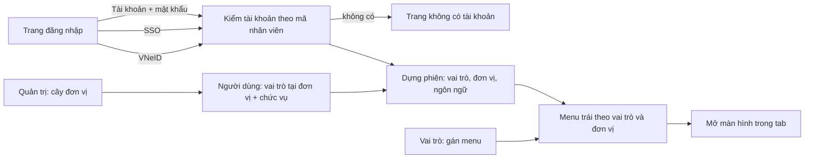

# Hệ thống / quản trị — tóm tắt nghiệp vụ cho BA

> Bản đọc nhanh bằng lời nghiệp vụ. Chi tiết và bằng chứng: [nghiep-vu.md](nghiep-vu.md) (mã NV / BR trong ngoặc
> để tra). Cập nhật: 2026-10-02 · Nguồn: code `kha_develop` + DB DEV. Nhãn quy tắc: **[Đã xác nhận]** = chủ dự án đã
> chốt là đúng ý đồ · **[Hiện trạng]** = hệ thống đang chạy như vậy, chưa ai xác nhận là ý đồ · **[Lệch nghiệp vụ]**
> = đã xác nhận nghiệp vụ muốn khác, hệ thống đang làm sai.

## 1. Phân hệ này dùng để làm gì

Phân hệ gom các chức năng **nền** mà mọi phân hệ khác dựa vào (1.1).
Cán bộ **đăng nhập** bằng tài khoản, SSO hoặc VNeID; hệ thống dựng phiên làm việc và **menu trái theo vai trò và đơn vị** của người đó (NV-01, NV-02, NV-03).
Quản trị duy trì **người dùng** (mỗi người có một hoặc nhiều vai trò tại từng đơn vị, kèm chức vụ), **vai trò** và menu của từng vai trò, **cây đơn vị**, **nhóm** người nhận, **danh mục** dùng chung (NV-06, NV-09, NV-11, NV-12, NV-13).
Ngoài ra có các cấu hình quản trị nghiệp vụ (văn thư đơn vị, người không nhận văn bản đơn vị), trang chủ, phản ánh người dùng, quản lý phiên bản, lịch sử đăng nhập (NV-05, NV-15 … NV-18).
Gốc cây đơn vị là "Tỉnh Khánh Hoà"; mọi phạm vi quản trị tính theo cây này (X6).

**Không gồm:** thể loại văn bản theo đơn vị, lĩnh vực, độ khẩn, độ mật (xem `van-ban/quan-ly-chung`); con dấu đơn vị, chữ ký và chứng thư số trên form người dùng (xem `ky-so`); chặn SMS, thông báo chung (xem `lich-nhac-viec`); luồng ký / luồng xử lý (xem `van-ban/luong-xu-ly`); đơn vị liên thông (xem `van-ban/lien-thong`); chuyển văn bản tự động (xem `van-ban/chuyen-van-ban`); cá nhân nhận kiến nghị (xem `phieu-trinh`); hệ thống tích hợp, đồng bộ nhân sự, API ứng dụng di động (xem `tich-hop`); số liệu báo cáo tổng hợp (xem `kpi-danh-gia`); phân quyền hồ sơ tài chính (xem `ho-so-cong-viec`).

## 2. Ai dùng và được làm gì

| Vai trò | Được làm gì trong phân hệ này |
|---|---|
| Quản trị hệ thống (`ADMIN`) | Quản lý người dùng trong cây đơn vị nơi được gán vai trò; quản lý **cả cây đơn vị của tỉnh**; cấu hình văn thư đơn vị; thêm phiên bản phát hành; gán được vai trò `ADMIN` cho người khác (1.4, NV-06, NV-11, BR-36) |
| Quản trị hệ thống đơn vị (`ADMIN_LEVEL1`) | Như `ADMIN` nhưng chỉ trong cây con của đơn vị mình; không gán được vai trò `ADMIN`, không sửa người có `ADMIN`; không cấu hình văn thư đơn vị (1.4, BR-17, BR-36) |
| Quản trị toàn hệ thống (`SUPPER_ADMIN`) | Chỉ dùng để mở rộng gốc cây đơn vị khi quản trị người dùng (1.4) |
| Hỗ trợ (`VAITRO_SUPPORT`) | Xem và xử lý phản ánh của người dùng trong đơn vị của vai trò; menu gán cho vai trò này hiện cho **mọi người** (1.4, BR-12, BR-40) |
| Văn thư / Lãnh đạo / Thủ trưởng / Chuyên viên / Trợ lý (`VT` / `LDDV` / `TTDV` / `NV` / `TL`) | Vai trò nghiệp vụ được gán cho người dùng tại đơn vị; quyết định menu và nút ở các phân hệ khác (1.4, BR-13) |
| Người dùng bất kỳ | Đăng nhập, đổi mật khẩu, thông tin cá nhân, đổi ngôn ngữ, nhóm cá nhân, gửi phản ánh, cấu hình trang chủ (1.4) |

## 3. Màn hình / menu người dùng thấy

Menu quản trị nằm dưới hai nhóm cấp 1 **QUẢN TRỊ** và **DANH MỤC** (1.2).

| Menu / màn | Để làm gì | Ghi chú | Mã menu |
|---|---|---|---|
| Quản lý người dùng | Thêm / sửa người dùng với vai trò – đơn vị – chức vụ; khóa / mở; xóa; đặt lại mật khẩu; import; nút *Cấu hình* (phạm vi theo đơn vị) | Chỉ thấy người trong cây đơn vị mình quản trị (NV-06, NV-07, NV-08) | 336827 |
| Quản lý vai trò | Thêm / sửa vai trò; *Gán menu* cho vai trò; *Gán quyền* | *Gán quyền* không còn tác dụng (NV-09, BR-25) | 336826 |
| Quản lý đơn vị | Cây đơn vị: thêm, sửa, chuyển cha, xóa | **Hai menu trùng tên, trùng màn** (1.2, NV-11) | 338452 · 439825 |
| Đồng bộ người dùng | — | Menu đang mở nhưng **màn lỗi** (NV-08, NV-20) | 338432 |
| Quản lý nhóm cá nhân | Lập nhóm người / đơn vị nhận để chọn nhanh khi chuyển văn bản | (NV-12) | 338451 |
| Cấu hình nhóm | Nhóm kiểu cũ | Không phân hệ nào dùng nhóm này (NV-12) | 337711 |
| Cấu hình văn thư đơn vị | Đánh dấu đơn vị có văn thư | Chỉ `ADMIN`; trên DB DEV chưa từng lưu (NV-15) | 337772 |
| Cấu hình không nhận văn bản khi chuyển cho đơn vị | Chọn người bị loại khỏi danh sách nhận khi văn bản chuyển cho đơn vị | (NV-15, BR-37) | 338611 |
| Cấu hình hạn xử lý văn bản | Hạn theo đơn vị và trường thông tin văn bản | Cách tính hạn thuộc phân hệ văn bản (NV-15) | 339194 |
| Thống kê lịch sử đăng nhập | Tra lịch sử đăng nhập theo đơn vị, vai trò, thời gian | Dữ liệu là nhật ký hệ thống, không phải dữ liệu nghiệp vụ (NV-05) | 440665 |
| Báo cáo tổng hợp | Báo cáo sử dụng theo cây đơn vị | Chỉ `ADMIN` / `ADMIN_LEVEL1`; số liệu thuộc `kpi-danh-gia` (NV-19) | 440671 |
| Cấu hình phiên bản mobile | Khai phiên bản mới nhất theo loại thiết bị, cờ bắt buộc cập nhật | Có cả bản Windows (NV-17) | 439665 |
| Quản lý giới thiệu trang | — | Menu mở nhưng **màn lỗi** (NV-17) | 23 |
| Danh sách khảo sát | Khai khảo sát (đường dẫn trang khảo sát ngoài, thời gian, đơn vị) | Người dùng **không thấy** khảo sát ở đâu (NV-17, Q9) | 338392 |
| Danh mục menu | Thêm / khóa / mở menu | Không xóa được menu đã gán vai trò hoặc còn menu con (NV-10) | 336820 |
| Danh mục thao tác · Danh mục tài nguyên | Nguyên liệu của quyền thao tác | Không còn tác dụng (NV-10) | 1 · 2 |
| Danh mục động | Bảng mã dùng chung theo nhóm | (NV-13) | 337471 |
| Danh mục nhóm phân loại | Nhóm phân loại + giá trị áp theo đơn vị | (NV-13, BR-33) | 440315 |
| Chức vụ | Danh mục chức vụ dùng chung toàn tỉnh | (NV-13) | 439785 |
| Quản lý biến sơ cấp | — | Không có dữ liệu (NV-13) | 337671 |
| DANH SÁCH PHẢN ÁNH | Người dùng xem phản ánh của mình; vai trò hỗ trợ xử lý | Menu cấp 1, hiện cho mọi người (NV-18) | 440545 |
| Báo cáo gửi nhận công văn | — | Màn tĩnh, không có dữ liệu (NV-20) | 337218 |
| Khung người dùng góc phải | Đổi mật khẩu, thông tin cá nhân, cấu hình trang chủ, chế độ trang chủ đơn giản / đầy đủ, quản lý phiên bản, hướng dẫn, đăng xuất | Không phải menu (1.2, NV-04, NV-16, NV-17) | — |

## 4. Luồng chính

**Đăng nhập**
1. Trang đăng nhập có form tài khoản và nút *Đăng nhập qua VNeID* / *Đăng nhập qua SSO*; cấu hình có thể bắt buộc chỉ SSO hoặc chỉ VNeID, hoặc đưa hệ thống vào chế độ bảo trì (NV-01, NV-02).
2. Form: nhập mã nhân viên + mật khẩu; sai quá 3 lần thì phải nhập thêm captcha 5 ký tự. Mật khẩu được kiểm qua hệ thống SSO (NV-01 bước 1–3, BR-01).
3. SSO / VNeID: hệ thống ngoài xác thực rồi trả về tên đăng nhập (SSO) hoặc số định danh (VNeID); hệ thống ghép với **mã nhân viên** (BR-05).
4. Không tìm thấy người dùng → trang "không có tài khoản". Tài khoản bị khóa → báo "tài khoản bị khóa". SSO yêu cầu đổi mật khẩu → chuyển sang trang đổi mật khẩu của SSO (BR-06, NV-01).
5. Đăng nhập xong, hệ thống nạp các vai trò tại các đơn vị của người dùng và dựng menu trái (NV-03).
6. Đăng xuất về đúng kênh đã đăng nhập: VNeID, SSO, hoặc trang đăng nhập (BR-07).

**Dựng menu:** người dùng thấy một menu khi menu đang mở, được gán cho **một trong các vai trò** của người đó (cộng vai trò Hỗ trợ), và nếu menu bị giới hạn đơn vị thì đơn vị của người đó (hoặc đơn vị cha) phải nằm trong danh sách (NV-03, BR-11, BR-12).

**Quản trị người dùng:** quản trị chọn đơn vị trên cây → thêm người: mã nhân viên, họ tên, email, điện thoại, mật khẩu mạnh, và các dòng vai trò (đơn vị, vai trò, chức vụ, đơn vị chính, vai trò mặc định, nhận văn bản đơn vị) → lưu (NV-06).

**Thêm màn hình mới cho người dùng:** thêm menu ở Danh mục menu (hoặc bằng script), rồi *Gán menu* cho vai trò ở Quản lý vai trò (NV-10, BR-27).

## 5. Trạng thái

**Người dùng**

| Trạng thái (tên người dùng thấy) | Nghĩa | Chuyển sang khi nào | Giá trị |
|---|---|---|---|
| Hoạt động | Đăng nhập được | Thêm / import; *Mở khóa*; lưu lại form người dùng (4.6, NV-06) | 1 |
| Bị khóa (Không hoạt động) | Không đăng nhập được trên web | *Khóa* (NV-06, BR-02) | 2 |
| Đã xóa | Xóa mềm, giữ các dòng vai trò | *Xóa* (NV-06) | 0 |

**Menu**

| Trạng thái | Nghĩa | Chuyển sang khi nào | Giá trị |
|---|---|---|---|
| Mở | Hiện cho vai trò được gán | *Mở* ở Danh mục menu (X3, NV-10) | 1 |
| Khóa | Không hiện cho ai | *Khóa* ở Danh mục menu (X3, NV-10) | 2 |

**Phản ánh** (người xử lý chọn tự do, không ràng buộc thứ tự)

| Trạng thái (tên người dùng thấy) | Nghĩa | Chuyển sang khi nào | Giá trị |
|---|---|---|---|
| Chưa tiếp nhận | Mới gửi | Người dùng gửi phản ánh (NV-18) | 0 |
| Đang xử lý | Hỗ trợ đã nhận | Hỗ trợ cập nhật (4.7) | 1 |
| Chờ triển khai | Đã có cách xử lý, chờ đưa lên | Hỗ trợ cập nhật (4.7) | 2 |
| Đã giải quyết | Xong | Hỗ trợ cập nhật (4.7) | 3 |
| Không phải lỗi | Kết luận không phải lỗi | Hỗ trợ kết luận (4.7) | −1 |

**Đơn vị:** *Hiệu lực* → *Đã xóa* khi xóa thành công (ngày hết hiệu lực = hôm qua, kéo theo cả cây con) (4.8, NV-11).

## 6. Quy tắc quan trọng nhất

- [Đã xác nhận] Quyền thao tác kiểm ở **tầng hiển thị nút trên web**; quyền vào một màn = **có menu** qua vai trò và đơn vị (X1, BR-09).
- [Hiện trạng] Người dùng thấy menu của **mọi vai trò** mình có ở **mọi đơn vị**, cộng menu của vai trò Hỗ trợ (menu dùng chung cho tất cả). Trên DB DEV, vì vậy mọi người thấy mục "QUẢN TRỊ" (rỗng nếu không có quyền) và "DANH SÁCH PHẢN ÁNH" (BR-12, Q3).
- [Hiện trạng] Menu giới hạn theo đơn vị là **danh sách trắng**: menu chưa khai đơn vị nào thì ai có vai trò cũng thấy; khai một đơn vị là mọi đơn vị khác mất menu. Không có màn quản trị, chỉ khai bằng script (BR-11).
- [Hiện trạng] Quyền thao tác chi tiết (thao tác × tài nguyên, *Gán quyền*) vẫn khai được nhưng **không còn được kiểm ở đâu** (BR-25, X7).
- [Hiện trạng] Mọi kiểu đăng nhập (form, SSO, VNeID, eCabinet, ứng dụng di động) ghép về **mã nhân viên**; không có trường liên kết riêng cho tài khoản SSO / VNeID (BR-05, Q2).
- [Hiện trạng] Mật khẩu đăng nhập form do **SSO** kiểm; *Đổi mật khẩu* trong VOffice chỉ đổi mật khẩu lưu trong VOffice, không đổi mật khẩu đăng nhập (BR-01, BR-14, Q1).
- [Hiện trạng] **Khóa tài khoản chỉ chặn đăng nhập web**; các kênh khác (ứng dụng di động, eCabinet) không bị trạng thái khóa chặn (BR-02).
- [Hiện trạng] Có tham số "chặn người dùng thường": bật lên thì chỉ người dùng VIP đăng nhập được, áp cho mọi kiểu đăng nhập (BR-04).
- [Hiện trạng] Phạm vi **quản lý người dùng** = cây đơn vị nơi người quản trị có `ADMIN` / `ADMIN_LEVEL1`; nhưng ở **quản lý đơn vị**, ai có `ADMIN` ở bất kỳ đâu cũng thấy và sửa cả cây tỉnh (BR-16, NV-11, Q6).
- [Hiện trạng] Lưu người dùng: mã nhân viên không trùng; ít nhất một dòng vai trò; mỗi dòng bắt buộc chức vụ; có vai trò Văn thư thì phải có thêm Lãnh đạo hoặc Chuyên viên (BR-18, BR-19, BR-20, NV-06).
- [Hiện trạng] Không gỡ được vai trò Thủ trưởng / Lãnh đạo / Chuyên viên của người còn văn bản chờ ký tại đơn vị (BR-21).
- [Hiện trạng] Lưu lại form của người đang bị khóa sẽ **mở khóa luôn**; dòng vai trò bị bỏ bị xóa hẳn, không có lịch sử vai trò (NV-06 bước 1 và 4, dac-thu bẫy 12).
- [Hiện trạng] Ô "nhận văn bản đơn vị" có 4 lựa chọn (Không nhận / Chủ trì / Phối hợp / Nhận để biết), nhưng khi văn bản chuyển cho đơn vị hệ thống chỉ lấy người chọn "Chủ trì" (mục 3 bảng vai trò tại đơn vị, Q4).
- [Hiện trạng] Người trong danh sách "không nhận văn bản khi chuyển cho đơn vị" bị loại ở mọi đơn vị họ thuộc, trừ đường chuyển theo nhóm đơn vị chỉ loại ở đơn vị đã cấu hình (BR-37, Q5).
- [Hiện trạng] Xóa đơn vị chỉ được khi cây không còn người hoạt động giữ vai trò, và xóa kéo theo cả cây con; chuyển đơn vị sang cha khác **không cập nhật** cây con (BR-29, BR-30).
- [Hiện trạng] Danh mục theo đơn vị **không cộng dồn**: đơn vị con khai riêng giá trị thì thay hẳn danh mục của cấp trên (BR-33, Q8).

## 7. Hệ thống KHÔNG làm / hay bị hiểu nhầm

- **Không có màn quản lý tham số hệ thống trên web**; tham số sửa bằng script, và sửa xong **không có hiệu lực ngay** (có cache) (NV-14, BR-35).
- **Hai bộ menu độc lập:** menu web và menu ứng dụng mới / di động. Gán menu trên web không đổi menu của ứng dụng di động và ngược lại (BR-28).
- **Menu mở mà màn lỗi / không dùng:** "Đồng bộ người dùng", "Quản lý giới thiệu trang"; khảo sát khai được nhưng người dùng không thấy; "Báo cáo gửi nhận công văn" là màn tĩnh (NV-08, NV-17, NV-20, Q9).
- **"Chọn vai trò" và "khóa màn hình"** có trong code nhưng không có nút trên khung chính (NV-03).
- **Cấu hình trang chủ cá nhân và chế độ đơn giản / đầy đủ chỉ giữ tạm**, mất khi hệ thống khởi động lại (BR-38, Q10).
- **Đồng bộ nhân sự không chạy từ web**; phía máy chủ còn chức năng nhận dữ liệu nhân sự, và khi nhân sự đổi đơn vị thì **xóa hết vai trò** của người đó (NV-08, BR-23, Q7).
- **"Cấu hình văn thư đơn vị" chưa từng được lưu** trên DB DEV — mọi nơi đọc cấu hình này coi như đơn vị không có văn thư (NV-15).
- **"Cấu hình nhóm" (kiểu cũ) không được phân hệ nào dùng**; nhóm dùng khi chuyển văn bản là *Quản lý nhóm cá nhân* (NV-12).
- **Xóa người dùng là xóa mềm**: tài khoản chuyển *Đã xóa* nhưng các dòng vai trò vẫn giữ (NV-06).
- **"Đặt lại mật khẩu"** sinh mật khẩu ngẫu nhiên hiện cho quản trị; không gửi email cho người dùng (NV-06).
- Có lỗi bảo mật đã ghi nhận, xem dac-thu L1–L12, L20.

## 8. Liên quan phân hệ khác

| Khi thay đổi ở đây… | …phải xem thêm | Vì sao |
|---|---|---|
| Vai trò, menu, cờ vai trò | Mọi phân hệ | Mọi màn kiểm quyền bằng menu + mã vai trò của người dùng (BR-09, BR-13) |
| Nhóm, người không nhận văn bản, ô nhận văn bản đơn vị | `van-ban/chuyen-van-ban` | Dùng khi chọn người nhận và khi văn bản chuyển cho đơn vị (NV-12, BR-37, Q4) |
| Cấu hình người dùng theo đơn vị (phạm vi giao việc, trợ lý, chuyên quản, chấm điểm, theo dõi văn bản) | `nhiem-vu`, `cong-viec`, `kpi-danh-gia`, `van-ban/den`, `van-ban/di` | Các loại cấu hình được đọc ở đó (NV-07) |
| Form người dùng (cách ký, ảnh chữ ký), con dấu đơn vị | `ky-so` | Phần ký số trên form người dùng thuộc ký số (1.1, NV-06) |
| Phản ánh (SMS, thông báo), chặn SMS | `lich-nhac-viec` | Cơ chế gửi tin nằm ở đó (NV-18) |
| Chức vụ | `van-ban/luong-xu-ly` | Chức vụ được chọn trong cấu hình nút luồng (NV-13) |
| Đồng bộ nhân sự, hệ thống tích hợp, phiên bản ứng dụng di động | `tich-hop` | Bên gọi và API thuộc tích hợp (NV-08, NV-17) |
| Báo cáo tổng hợp sử dụng | `kpi-danh-gia` | Chỉ số và cách tính ở đó (NV-19) |
| Trang chủ, widget | phân hệ sở hữu từng widget (`van-ban/den`, `van-ban/di`, `lich-nhac-viec`…) | Ở đây chỉ có cơ chế dựng trang chủ (1.3, NV-16) |

## 9. Câu hỏi nghiệp vụ còn mở

- `Q1` — Mật khẩu chính thức của cán bộ là mật khẩu SSO tỉnh, mật khẩu riêng VOffice, hay cả hai?
- `Q2` — Mã nhân viên có luôn là số định danh / CCCD, tên đăng nhập SSO, hay mã riêng cần cột liên kết khác?
- `Q3` — Menu của vai trò Hỗ trợ là "menu chung cho tất cả" hay chỉ cho người được gán vai trò đó?
- `Q4` — Ba lựa chọn Chủ trì / Phối hợp / Nhận để biết ở ô nhận văn bản đơn vị nghĩa là gì?
- `Q5` — Danh sách không nhận văn bản áp cho mọi đơn vị người đó thuộc, hay chỉ đơn vị đã chọn?
- `Q6` — `ADMIN` là quản trị toàn tỉnh, hay quản trị theo cây đơn vị được gán (màn đơn vị cũng nên giới hạn)?
- `Q7` — Người dùng / đơn vị cập nhật bằng tay hay đồng bộ từ hệ thống nhân sự; đổi đơn vị có phải gỡ hết vai trò?
- `Q8` — Danh mục theo đơn vị: đơn vị con khai thêm thì thay hay cộng vào danh mục cấp trên?
- `Q9` — Giới thiệu trang và khảo sát còn dùng không; nếu dùng thì người dùng thấy ở đâu?
- `Q10` — Cấu hình trang chủ cá nhân cần giữ lâu dài hay tạm thời là đủ?

(Đầy đủ ở mục 7.1 của `nghiep-vu.md`.)

## 10. Khi viết yêu cầu mới cho phân hệ này, nhớ ghi rõ

- **Màn hình mới:** tên menu, mã menu, menu cha, thứ tự; gán cho vai trò nào; có giới hạn theo đơn vị không; chỉ web hay cả ứng dụng mới / di động (hai bộ menu riêng) (BR-27, BR-28, BR-11).
- **Ai được thao tác và trong phạm vi nào:** `ADMIN`, `ADMIN_LEVEL1`, vai trò nghiệp vụ nào; phạm vi cây đơn vị được gán hay toàn tỉnh — hiện mỗi màn quản trị tự kiểm một kiểu (BR-16, Q6, dac-thu bẫy 9).
- **Vai trò tại đơn vị nào:** một người có nhiều vai trò ở nhiều đơn vị; quy tắc mới xét vai trò ở đơn vị đang đăng nhập, đơn vị chính, hay bất kỳ đơn vị nào (NV-06, BR-12).
- **Kiểu đăng nhập áp dụng:** form, SSO, VNeID, eCabinet, ứng dụng di động — điều kiện đăng nhập mới phải áp cho mọi kiểu, và khóa tài khoản hiện chỉ chặn web (BR-02, BR-04, dac-thu bẫy 3).
- **Có cần lịch sử thay đổi không** (ai đổi vai trò / đơn vị / khóa, lúc nào) — hiện không có lịch sử vai trò (dac-thu bẫy 12).
- **Tham số mới:** tên, giá trị mặc định, ai sửa bằng cách nào (không có màn quản lý tham số), chấp nhận chờ bao lâu thì có hiệu lực (NV-14, BR-35).
- **Danh mục mới:** dùng danh mục động (dùng chung) hay nhóm phân loại theo đơn vị; đơn vị con kế thừa thay hay cộng (NV-13, BR-33, Q8).
- **Thay đổi về đơn vị:** đổi cha có phải cập nhật cả cây con không; xóa đơn vị khi còn người thì xử lý thế nào (BR-29, BR-30).
- **Nguồn dữ liệu người dùng / đơn vị:** nhập tay hay đồng bộ nhân sự; khi đồng bộ đổi đơn vị thì giữ hay gỡ vai trò (Q7, BR-23).
- **Cấu hình cá nhân** (trang chủ, lựa chọn hiển thị) cần lưu lâu dài hay tạm thời (BR-38, Q10).
