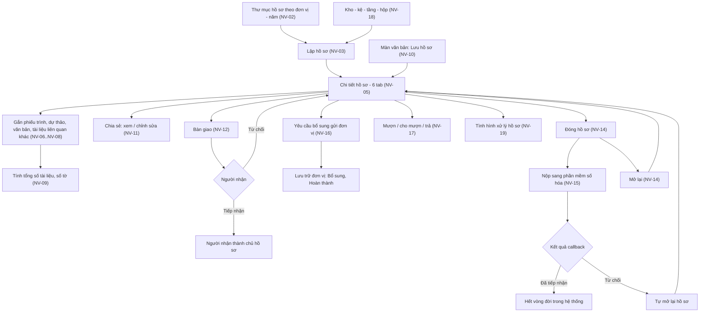
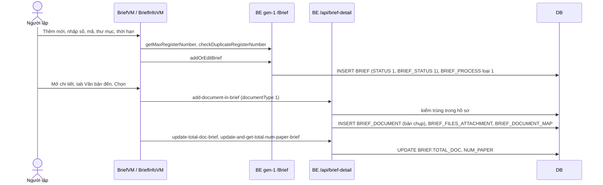
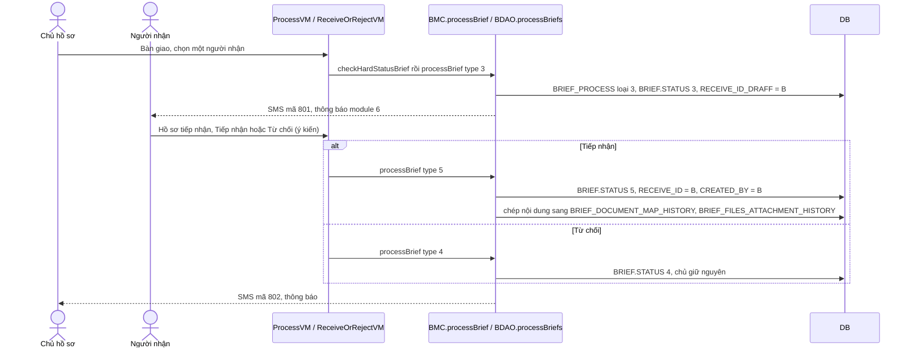
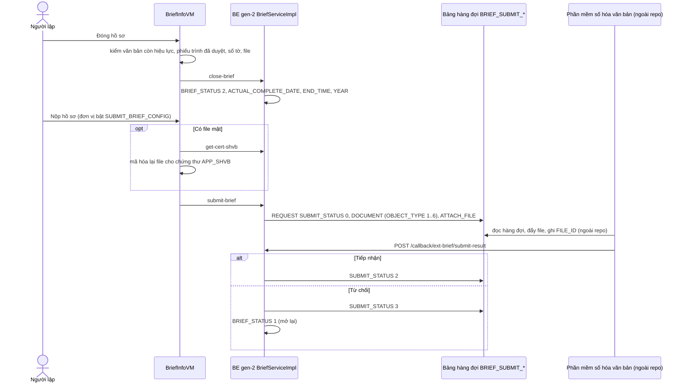
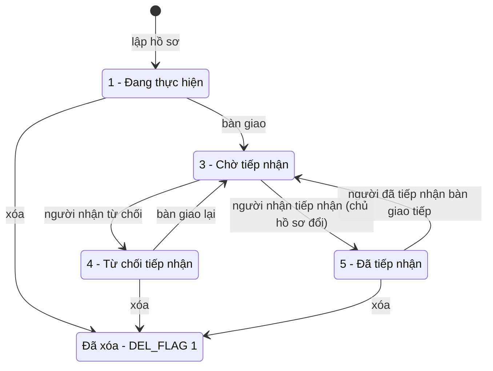
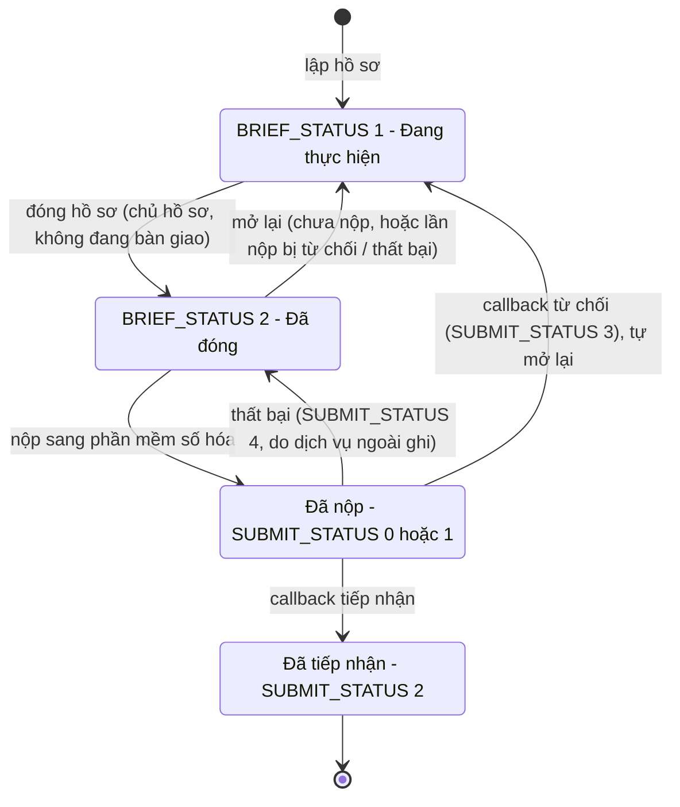
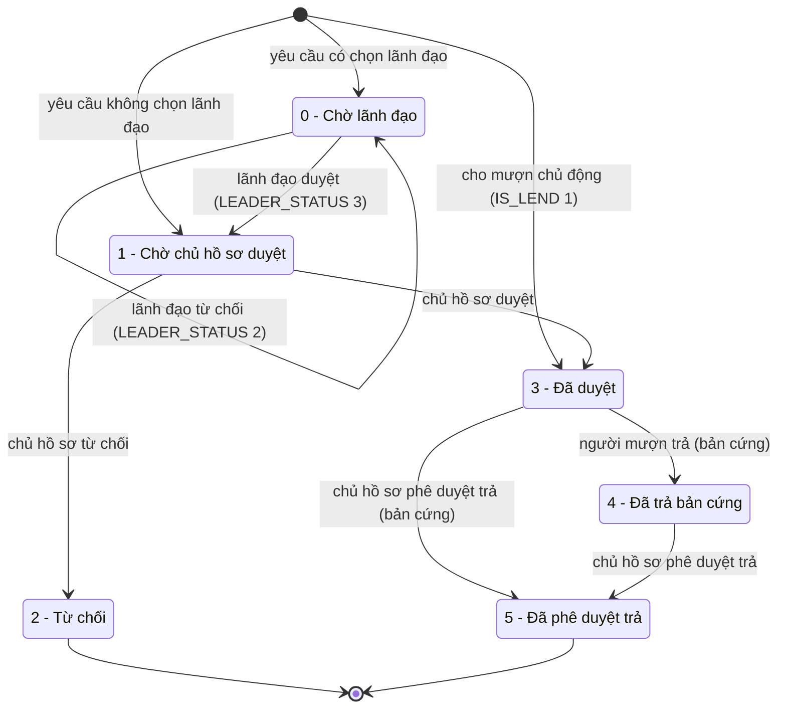
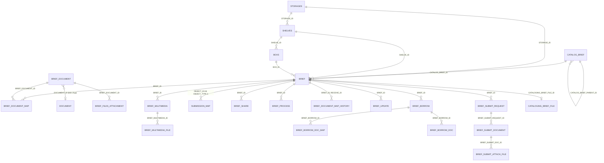

# Quản lý hồ sơ (hồ sơ công việc & lưu trữ) — nghiệp vụ: lập hồ sơ theo thư mục → gắn phiếu trình / dự thảo / văn bản / tài liệu → chia sẻ, bàn giao → đóng hồ sơ → nộp sang phần mềm số hóa văn bản; kèm kho – kệ – hộp, mượn / trả, yêu cầu bổ sung, thống kê

> Viết lại từ code nhánh `kha_develop` (web-spring + backend2.0) ngày 2026-10-01. Mọi khẳng định có nguồn `file:dòng`.
> Menu, số dòng, comment cột và phân bố giá trị đối chiếu **DB DEV ngày 2026-10-01** (`SYS_MENU`, `HOME_WIDGET`, `user_col_comments`, `COUNT`, phân bố — người điều phối tra, chỉ SELECT; tác giả không kết nối DB). Đợt tra bổ sung cùng ngày (người điều phối, chỉ SELECT): `SYS_ROLE`, phân bố `BRIEF_PROCESS`, `BRIEF_BORROW`, `VHR_ORG.SUBMIT_BRIEF_CONFIG`, `CATALOGING_BRIEF_FILE`, `CATALOG_BRIEF`, `BRIEF` theo hai cột trạng thái, số dòng `STORAGES` / `SHELVES` / `FLOOR` / `BRIEF_MARK` / `BRIEF_DOCUMENT_MAP_HISTORY`. Chưa tra: `BRIEF_BORROW_DOC(_MAP)`, `BRIEF_FILE_MAP`, `BRIEF_FILES_ATTACHMENT_HISTORY`.
> HDSD cũ (`C:\Users\Admin\Desktop\HDSD\HDSD Quan ly ho so\*_Chuyenvien|Lanhdao|Vanthu.docx`, 10/2025) chỉ dùng để lấy thuật ngữ: **Danh sách hồ sơ**, **Bàn giao hồ sơ**, **Hồ sơ tiếp nhận** (tiếp nhận / từ chối tiếp nhận), **Danh mục hồ sơ** (trên DB nay là "Thư mục hồ sơ"), **Chia sẻ hồ sơ** (quyền xem / quyền chỉnh sửa), **Tình hình xử lý hồ sơ** (lãnh đạo), thêm "phiếu trình / dự thảo / văn bản đến / văn bản liên quan / tài liệu liên quan" vào hồ sơ. HDSD không có mục mượn / trả, kho – kệ – hộp, nộp hồ sơ.
>
> Viết tắt đường dẫn:
> `WEB/` = `web-spring/src/main/java/com/viettel/` · `ZUL/` = `web-spring/src/main/webapp/view/voffice/` ·
> `BIZ/` = `web-spring/src/main/java/com/voffice/service/business/` · `BE1/` = `backend2.0/backendvoffice/src/main/java/com/viettel/voffice/` ·
> `BE2/` = `backend2.0/backendvoffice/src/main/java/com/viettel/office/` · `SQL/` = `backend2.0/backendvoffice/sql/` · `LBL` = `web-spring/src/main/webapp/WEB-INF/zk-label_vi.properties`.
> Lớp hay dùng — web: **BVM** = `WEB/voffice/vm/brief/BriefVM.java` (Danh sách hồ sơ + form lập / sửa + Tình hình xử lý, 4.260 dòng), **BIVM** = `WEB/voffice/vm/brief/BriefInfoVM.java` (chi tiết hồ sơ, 6.609 dòng), **BUVM** = `WEB/voffice/vm/brief/BriefUpdateVM.java` (Hồ sơ cần bổ sung), **RBVM** = `…/ReceivedBriefVM.java`, **BBVM** = `…/BorrowBriefVM.java`, **BLVM** = `…/BorrowListBriefVM.java`, **ADLVM** = `…/AddDocToBriefLookupVM.java`, **AC** = `WEB/util/AppConstants.java`, **BB** = `BIZ/BriefBusiness.java`.
> BE: **BMA** = `BE1/action/BriefManagementAction.java` (`/Brief`), **BMC** = `BE1/controler/BriefManagementController.java`, **BDAO** = `BE1/database/dao/briefmanagement/BriefManagementDAO.java` (6.463 dòng), **BDC** = `BE1/controler/BriefDetailManagementController.java` (`/api/brief-detail`), **BDSI** = `BE2/services/impl/BriefDetailManagementServiceImpl.java`, **BDDAO** = `BE1/database/dao/BriefDetailManagementDAO.java`, **BC2** = `BE2/controller/BriefController.java` (`/api/brief`), **BSI** = `BE2/services/impl/BriefServiceImpl.java`, **CBC** = `BE1/controler/CatalogBriefController.java`, **CBDAO** = `BE1/database/dao/briefmanagement/CatalogBriefDAO.java`, **C1** = `BE1/constants/Constants.java`.
> Phân hệ liền kề đã viết: phiếu trình [`../phieu-trinh/nghiep-vu.md`](../phieu-trinh/nghiep-vu.md) (ký hiệu `PT NV-xx`), dự thảo [`../xu-ly-cong-viec/nghiep-vu.md`](../xu-ly-cong-viec/nghiep-vu.md) (`XLCV`), văn bản đến / đi [`../van-ban/den/nghiep-vu.md`](../van-ban/den/nghiep-vu.md), [`../van-ban/di/nghiep-vu.md`](../van-ban/di/nghiep-vu.md), chuyển văn bản [`../van-ban/chuyen-van-ban/nghiep-vu.md`](../van-ban/chuyen-van-ban/nghiep-vu.md) (`CVB`), quản lý chung văn bản [`../van-ban/quan-ly-chung/nghiep-vu.md`](../van-ban/quan-ly-chung/nghiep-vu.md) (`QLC`), SMS / thông báo [`../lich-nhac-viec/nghiep-vu.md`](../lich-nhac-viec/nghiep-vu.md) (`LNV`).

## 1. Tổng quan

### 1.1 Phạm vi

"Hồ sơ" (`BRIEF`) là một **tập tài liệu về một việc** do một cá nhân lập trong một **thư mục hồ sơ** (`CATALOG_BRIEF`, theo đơn vị và năm) — gồm phiếu trình, dự thảo, văn bản đi, văn bản đến, văn bản liên quan và "tài liệu liên quan khác" (đa phương tiện). Người lập có thể **chia sẻ** cho đồng nghiệp cùng đơn vị (xem / chỉnh sửa), **bàn giao** hồ sơ cho người khác (người nhận phải tiếp nhận), **đóng hồ sơ** khi xong, rồi **nộp hồ sơ sang phần mềm số hóa văn bản** (hệ thống lưu trữ ngoài, kết quả trả về qua callback). Ngoài ra có vị trí vật lý **kho – kệ – tầng – hộp**, **mượn / cho mượn / trả** bản cứng – bản mềm, **yêu cầu bổ sung hồ sơ** gửi đơn vị, và màn **Tình hình xử lý hồ sơ** cho lãnh đạo.

Phân hệ gồm:

- **Danh sách hồ sơ** (cây thư mục theo đơn vị – năm, phạm vi thấy, tìm kiếm, xuất Excel) (NV-01); **Thư mục hồ sơ** (NV-02).
- **Lập / sửa / xóa** hồ sơ (NV-03, NV-04).
- **Chi tiết hồ sơ** và quyền trên hồ sơ (NV-05); **gắn nội dung**: văn bản đến / đi / liên quan (NV-06), phiếu trình và dự thảo (NV-07), tài liệu liên quan khác (NV-08); số tờ, thứ tự, tổng số tài liệu (NV-09); lưu văn bản vào hồ sơ từ màn văn bản (NV-10).
- **Chia sẻ** (NV-11), **bàn giao – tiếp nhận** (NV-12), **chuyển văn bản sang hồ sơ khác** (NV-13).
- **Đóng / mở lại** (NV-14), **nộp hồ sơ sang phần mềm số hóa văn bản** + file biên mục (NV-15).
- **Yêu cầu bổ sung hồ sơ** / menu "Hồ sơ cần bổ sung" (NV-16).
- **Mượn / cho mượn / trả** (NV-17), **kho – kệ – hộp** + báo cáo kho (NV-18).
- **Tình hình xử lý hồ sơ** (NV-19); cảnh báo hết hạn bảo quản / nhắc trả (code không chạy) và bảng mã SMS 801–807 (NV-20); đóng dấu văn bản trong hồ sơ (UI đang ẩn) (NV-21); ranh giới và phần không dùng (NV-22).

Phân hệ **KHÔNG gồm** (trỏ sang):

| Nội dung | Phân hệ |
|---|---|
| Phiếu trình: soạn, trình, ký, số tờ của phiếu trong hồ sơ (`SUBMISSION_MAP.OBJECT_TYPE = 3`, `SUBMISSION_MAP_FILE`), kiểm phiếu trình kèm theo khi nộp hồ sơ | `phieu-trinh` (`PT NV-16`); ở đây chỉ nêu điểm gọi (NV-07, NV-15) |
| Dự thảo: soạn / trình / ký / hủy (nút trên tab Dự thảo của hồ sơ gọi lại chức năng dự thảo) | `xu-ly-cong-viec`; ở đây chỉ nêu cách gắn (`TEXT.BRIEF_ID`) (NV-07) |
| Chuyển văn bản trong hồ sơ (`transferBriefDoc.zul`) | `van-ban/chuyen-van-ban` `CVB NV-19` |
| Quyền mở văn bản chung (`checkAllPermissionDoc` có xét "hồ sơ mượn"), popup chi tiết văn bản "đã lưu hồ sơ", tài liệu cá nhân (`PERSONAL_STOTAGE`) | `van-ban/quan-ly-chung` (`QLC NV-06`, `QLC NV-14`) (sửa chéo 2026-10-02 theo `van-ban/quan-ly-chung`: quyền xem văn bản là QLC NV-06, không phải NV-04) |
| Gỡ văn bản khỏi hồ sơ khi hủy ban hành | `van-ban/di` |
| Cơ chế SMS / thông báo, danh mục chặn tin `CONFIG_SMS_MODULE` | `lich-nhac-viec` (`LNV` mục 5.2); ở đây chỉ ghi "gửi tin loại X khi Y" |
| Hồ sơ tài chính / "Danh sách công văn tài chính" (`documentFinance.zul`, `financialRecords*`, `STORE_DOCUMENT_ROLE`) | ranh giới văn bản tài chính (`CVB NV-18`); ở đây chỉ ghi ranh giới (NV-22) |
| Cấp dữ liệu hồ sơ cho ứng dụng ngoài `/ext-brief/*` | `tich-hop` NV-04 (ở đây chỉ ghi ranh giới — NV-22) (sửa chéo 2026-10-02 theo `tich-hop`) |
| Cặp trình ký (`SignBriefcaseAction`, `/signBriefcaseAction`) — không phải hồ sơ | `ky-so` NV-13 (đang xếp nhầm vào phân hệ này trong `_tools/domains.py`) (sửa chéo 2026-10-02 theo `hop`) |

### 1.2 Menu "Quản lý hồ sơ" (đối chiếu DB DEV `SYS_MENU` ngày 2026-10-01, cha `338675` "Quản lý hồ sơ", `DEL_FLAG = 0`)

`SYS_MENU.STATUS`: 1 = mở khóa, 2 = khóa (đã xác nhận). Code chỉ ghi cứng URL ở hằng URL thông báo `C1:1352-1357`.

| `SYS_MENU_ID` | `CODE` | Tên trên menu (DB DEV) | URL | `STATUS` | VM | Nghiệp vụ |
|---|---|---|---|---|---|---|
| 338572 | `QLHS_DSHS` | Danh sách hồ sơ | `/view/voffice/brief/brief.zul` | 1 | BVM | NV-01, NV-03, NV-04 |
| 338678 | `QLHS_TNHS` | Hồ sơ tiếp nhận | `…/brief/receivedBrief.zul` | 1 | RBVM | NV-12 |
| 339112 | `QLDMLHS` | Thư mục hồ sơ | `…/brief/catalogBrief.zul` | 1 | `vm/brief/CatalogBriefVM` | NV-02 (đổi tên từ "Danh mục hồ sơ" — `SQL/20251225_update_table_sys_menu_and_alter_table.sql:2`) |
| 339252 | `QLHS_HSCBS` | Hồ sơ cần bổ sung | `…/brief/brief_update.zul` | 1 | BUVM | NV-16 |
| 440231 | `QLHS_THXLHS` | Tình hình xử lý hồ sơ | `…/brief/briefProcessing.zul?viewBriefProcessingStats=true` | 1 | BVM (chế độ thống kê) | NV-19 (`SQL/20250709_insert_menu_brief_processing_stats.sql:1`) |
| 338674 | `QLKHO` | Quản lý kho | `/view/voffice/storageManagement/storageManagement.zul` | 1 | `vm/storages/StoragesVM` | NV-18 |
| 338676 | `QLHS_QLKE` | Quản lý kệ | `/view/voffice/shelve/shelve.zul` | 1 | `vm/shelve/ShelveVM` | NV-18 |
| 338677 | `QLHS_QLH` | Quản lý hộp | `/view/voffice/boxManagement/boxManagement.zul` | 1 | `vm/boxs/BoxsVM` | NV-18 |
| 338592 | `QLHS_DM` | Hồ sơ duyệt mượn | `…/brief/brief_borrow_manager.zul` | **2 (khóa)** | BBVM | NV-17 |
| 338679 | `QLHS_DSM` | Danh sách mượn | `…/brief/brief_borrow_list.zul` | **2 (khóa)** | BLVM | NV-17 |
| 338431 | `DOCUMENT_FINANCE` | Danh sách công văn tài chính (cha `337200` "VĂN BẢN ĐẾN") | `…/document/reportSendReceiveDoc/documentFinance.zul` | 1 | `vm/document/DocumentFinanceVM` | ranh giới (NV-22) |

Hai menu mượn đang **khóa** nhưng thông báo của luồng mượn vẫn trỏ thẳng URL hai màn này (`C1:1354-1355`), nên vẫn mở được từ thông báo (NV-17). **Không có ô widget trang chủ nào** cho hồ sơ (DB DEV `HOME_WIDGET` 63 dòng, không có mã nào thuộc hồ sơ).

### 1.3 Actor & quyền

Mã vai trò (`web-spring/src/main/resources/application.properties:347-362`): thủ trưởng `TTDV`, lãnh đạo đơn vị `LDDV`, chuyên viên `NV`, **lưu trữ `LT`** (`userRole.qltl`), văn thư `VT`. BE gen-1 dùng id vai trò: `SYS_ROLE_LDDV = 336952`, `SYS_ROLE_TTDV = 336953`, `SYS_ROLE_LTHS = 336956` (`C1:121-129`). DB DEV `SYS_ROLE` ngày 2026-10-01: 336952 `LDDV` Lãnh đạo · 336953 `TTDV` Thủ trưởng · 336954 `VT` Văn thư · 336955 `NV` Chuyên viên · **336956 `LT` "Lưu trữ hồ sơ"** · 337571 `QLHSTC` "Quản lý Hồ Sơ Tài Chính"; **không có mã vai trò `LTHS`** — `SYS_ROLE_LTHS` trong code chính là vai trò `LT` (gen-1 so theo id, CBDAO / kho so theo mã `'LT'` — cùng một vai trò). Quyền thao tác nằm ở **tầng hiển thị nút** trên web (thiết kế chung, đã xác nhận); BE phần lớn chỉ kiểm có phiên đăng nhập — riêng chia sẻ (NV-11) và đa phương tiện (NV-08) BE có kiểm người gọi.

| Actor | Nhận diện trong code | Làm gì |
|---|---|---|
| Người lập hồ sơ (chủ hồ sơ) | `BRIEF.CREATED_BY = user` (BVM:3440) — sau khi bàn giao được tiếp nhận, `CREATED_BY` đổi sang người nhận (NV-12) | Lập / sửa / xóa, gắn nội dung, chia sẻ, bàn giao, đóng / mở lại, nộp, cho mượn, yêu cầu bổ sung, chuyển văn bản sang hồ sơ khác |
| Người nhận bàn giao | `BRIEF.RECEIVE_ID_DRAFF = user` khi chờ (`STATUS = 3`); `RECEIVE_ID = user` sau khi tiếp nhận (`STATUS = 5`) (BDAO:2439-2457) | Tiếp nhận / từ chối (menu Hồ sơ tiếp nhận); sau tiếp nhận có quyền như chủ hồ sơ trên danh sách (BVM:3444) |
| Người được chia sẻ | dòng `BRIEF_SHARE.BE_SHARED_ID = user`, `DEL_FLAG = 0`; `TYPE` 0 xem / 1 chỉnh sửa (BIVM:956-966) | Xem; loại 1 được thêm phiếu trình / dự thảo / văn bản / tài liệu, xóa phần mình thêm (NV-05, NV-11) |
| Lãnh đạo đơn vị (`LDDV`/`TTDV`) | vai trò tại đơn vị của hồ sơ (BVM:3731-3744) | Xem văn bản trong hồ sơ của đơn vị (BIVM `hasPermissionView`); Tình hình xử lý hồ sơ (NV-19); duyệt mượn nếu được chọn làm lãnh đạo duyệt (NV-17) |
| Lưu trữ hồ sơ (`LT`, id 336956) | vai trò `LT` tại đơn vị | Thấy toàn bộ hồ sơ trong thư mục được "toàn quyền" (NV-01), nhận yêu cầu bổ sung hồ sơ của đơn vị (NV-16), quản lý kho – kệ (NV-18, kiểm ở BE vô hiệu — `dac-thu.md`), báo cáo kho |
| Người mượn | `BRIEF_BORROW.EMPLOYEE_ID = user` | Gửi yêu cầu mượn, trả bản cứng (NV-17) |
| Hệ thống số hóa văn bản ("PM") | gọi `POST /callback/ext-brief/submit-result` (`BE2/controller/CallbackController.java:16-31`) | Trả kết quả tiếp nhận hồ sơ đã nộp (NV-15) |

### 1.4 Sửa so với knowledge cũ (2026-10-01)

| Knowledge cũ | Hiện trạng code `kha_develop` | Ghi ở |
|---|---|---|
| Vòng đời "mở → xử lý → **đề nghị hoàn thành** → **lãnh đạo hoàn thành** → nộp lưu → lưu kho → mượn" | Không có bước lãnh đạo hoàn thành hồ sơ. Hồ sơ có **hai cột trạng thái độc lập**: `STATUS` = trạng thái **bàn giao** (1 đang thực hiện / 3 chờ tiếp nhận / 4 từ chối tiếp nhận / 5 đã tiếp nhận; 2 "đã hoàn thành" không còn được ghi) và `BRIEF_STATUS` = 1 đang thực hiện / 2 **đã đóng** do chính chủ hồ sơ đóng (sửa 2026-10-01) | Mục 3, 4.7, 4.8 |
| "`requestCompleteBrief` = chuyên viên đề nghị hoàn thành; `completeBrief` = lãnh đạo hoàn thành" | `requestCompleteBrief` = **yêu cầu bổ sung hồ sơ** gửi tới các đơn vị (`BRIEF_UPDATE`); `completeBrief` = người lưu trữ của đơn vị bấm **hoàn thành việc bổ sung** (sửa 2026-10-01) | NV-16 |
| "Nộp lưu → Lưu trữ tiếp nhận (`getListReceivedBrief`)" | "Hồ sơ tiếp nhận" là nhận **bàn giao hồ sơ** giữa hai cá nhân (`processBrief` loại 3/4/5); **nộp hồ sơ** là đẩy sang **phần mềm số hóa văn bản** ngoài hệ thống qua bảng hàng đợi `BRIEF_SUBMIT_*` + callback (sửa 2026-10-01) | NV-12, NV-15 |
| "`submit-brief` = chuyên viên trình/nộp" | Nộp chỉ khi hồ sơ **đã đóng** và đơn vị bật `VHR_ORG.SUBMIT_BRIEF_CONFIG = 1` (sửa 2026-10-01) | NV-15 |
| "`transferBrief`, `getListBriefsToTransfer` = chuyển hồ sơ" | Chuyển **một số văn bản** từ hồ sơ này sang hồ sơ khác; nút đang nằm trong khối ẩn (sửa 2026-10-01) | NV-13 |
| "Lưu trữ (`SYS_ROLE_LTHS`) cho mượn / thu hồi … `checkBorrowDocument`" | Người duyệt mượn là **chủ hồ sơ / người đã tiếp nhận** (`RECEIVE_ID` của yêu cầu), có thể qua lãnh đạo duyệt trước; "cho mượn" do chủ hồ sơ chủ động; hai menu mượn đang **khóa** (sửa 2026-10-01) | NV-17 |
| "QT1. `check-permission-brief`, `checkViewBriefInfoDetail` quyết định xem/sửa" | `check-permission-brief` trả các hồ sơ **mình là người lập** (dùng ở màn chi tiết văn bản); `checkViewBriefInfoDetail` = có **mượn bản mềm đã duyệt còn hạn**. Quyền trên màn chi tiết tính ở web (BIVM) (sửa 2026-10-01) | NV-05 |
| "QT2. Văn bản chỉ thêm một lần vào **một** hồ sơ (`checkExistDocument`)" | Chặn trùng **trong cùng một hồ sơ**; một văn bản vẫn có thể nằm ở nhiều hồ sơ (BDAO:4736-4756) (sửa 2026-10-01) | NV-06 BR-17 |
| "QT3. Danh mục đang dùng không xóa được; kho/kệ/hộp trùng tên bị chặn" | Đúng (web kiểm); thêm: xóa kho xóa luôn kệ và hộp; thư mục không kiểm trùng tên | NV-02, NV-18 |
| "Đa phương tiện … là tính năng mới (SQL `20250303_…`)" | Đa phương tiện = tab "Tài liệu liên quan khác" (`BRIEF_MULTIMEDIA`, `SQL/20251216_create_table_brief_multimedia*.sql`); file biên mục `CATALOGING_BRIEF_FILE` không có code sinh trong repo | NV-08, NV-15 |
| "`get-cert-shvb` (?) ký số hồ sơ" | Lấy **chứng thư của tài khoản `APP_SHVB`** để mã hóa lại file mật trước khi nộp (BSI:1478-1492) | NV-15 |
| `dac-thu`: "`TypeConfigAction.getUserDocRolesByEmpId`, `getUserRolesDetail` không nối được endpoint" | `getUserRolesDetail` không có endpoint và không được gọi; `getUserDocRolesByEmpId` có endpoint nhưng bị chồng thêm một `@RequestMapping("/getListFinancialDoc")` sót lại (`BE1/action/StoreTypeConfigAction.java:157, 175-176`) | NV-22; `dac-thu.md` |

## 2. Module

Nghiệp vụ hồ sơ chạy **lai gen-1 / gen-2**: CRUD, danh sách, bàn giao, mượn, kho – kệ – hộp, thư mục ở **gen-1** (`*Action` → `controler/*` → DAO SQL thuần); nội dung hồ sơ ở `BDC` (đặt trong package gen-1 `controler` nhưng gọi service gen-2 `BDSI`); chia sẻ, đóng / mở lại, nộp, callback ở **gen-2** `BC2` → `BSI` (JPA). Web gọi qua `BB` (key `Brief.x` → `POST /Brief/x`; `api.brief-detail.x` → `/api/brief-detail/x`; `api.brief.x.{id}` → `/api/brief/x/{id}`).

| Chức năng | Màn (.zul) | VM | Business (key) | Endpoint BE | Logic | DAO / Repository → bảng |
|---|---|---|---|---|---|---|
| Danh sách hồ sơ, tìm kiếm, xuất Excel | `ZUL/brief/brief.zul` + `brief_search.zul` | BVM `findDataList` :865-909, `doExport` :3512-3611 | `Brief.getListBrief` | `POST /Brief/getListBrief` (BMA:40) | BMC.getListBrief :94-190 | BDAO.getBrief :121-650 → `BRIEF`, `CATALOG_BRIEF`, `BRIEF_SHARE` |
| Cây thư mục theo đơn vị | `brief.zul:52-106` | BVM :3780-4037 | `CatalogBrief.searchListCatalogBrief`, `api.brief.get-list-authorized-org-for-catalog` | `/CatalogBrief/searchListCatalogBrief`; `GET /api/brief/get-list-authorized-org-for-catalog` (BC2:64) | CBC :166-185; BSI :319-363 | CBDAO :92-205 → `CATALOG_BRIEF` |
| Thư mục hồ sơ | `ZUL/brief/catalogBrief.zul` + `catalogBriefAdd.zul`, `catalogBriefSearch.zul` | `WEB/voffice/vm/brief/CatalogBriefVM.java` | `CatalogBriefBusiness.*` | `/CatalogBrief/*` (8 endpoint) | CBC | CBDAO → `CATALOG_BRIEF` |
| Lập / sửa hồ sơ | `ZUL/brief/brief_add.zul` (include của `brief.zul`) | BVM `validateDoSave` :983-1066, lưu :1198-1223, khởi tạo :1999-2046 | `Brief.addOrEditBrief`, `getMaxRegisterNumber`, `checkDuplicateRegisterNumber`, `getAbbreviationChildAndParentOrg` | `/Brief/addOrEditBrief` (BMA:183) | BMC.addOrEditBrief :386-713 | BDAO.addBrief :1152, editBrief :1241 → `BRIEF`, `BRIEF_PROCESS`, `CATALOG_BRIEF` |
| Xóa hồ sơ | lưới danh sách | BVM :3096-3098 | `Brief.deleteBrief` | `/Brief/deleteBrief` → method `deleteBoxs` (BMA:166-172) | BMC.deleteBriefs :347-376 | BDAO.deleteBriefs :1093-1107 |
| Chi tiết hồ sơ (6 tab) | `ZUL/brief/brief_info.zul` | BIVM | `api.brief-detail.*`, `Brief.getBriefById` | `/api/brief-detail/*` (27 endpoint, BDC) | BDSI | BDDAO, `BriefDocumentMapRepositoryJPA`, `BriefMultimediaJPA` … → `BRIEF_DOCUMENT`, `BRIEF_DOCUMENT_MAP`, `BRIEF_FILES_ATTACHMENT`, `BRIEF_MULTIMEDIA(_FILE)`, `TEXT`, `SUBMISSION_MAP` |
| Đa phương tiện | `ZUL/brief/widgets/brief_attach_multimedia.zul` | `WEB/voffice/vm/brief/BriefAttachMultimediaVM.java` | `api.brief-detail.brief-multimedia`, `upload-brief-multimedia-file`, `delete-brief-multimedia`, `swap-order-brief-multimedia` | `/api/brief-detail/brief-multimedia` (GET/POST/PUT) … | BDSI :423-772, 950-990 | `BRIEF_MULTIMEDIA`, `BRIEF_MULTIMEDIA_FILE` |
| Lưu văn bản vào hồ sơ từ màn văn bản | `ZUL/brief/widgets/lookupSelectBrief.zul`, `popupSelectBrief.zul`, `sourceLookupBrief.zul` | ADLVM, `PopupSelectBriefVM`, `SourceLookupBriefVM` | `Brief.addOrEditBrief`, `Brief.checkExistDocument` | `/Brief/addOrEditBrief` | BMC :613-675 | BDAO :1318-1397 |
| Chia sẻ | `ZUL/brief/widgets/shareBrief.zul` | `WEB/voffice/vm/brief/ShareBriefVM.java` | `api.brief.update-brief-share-list`, `get-list-brief-share` | `POST /api/brief/update-brief-share-list` (BC2:54) | BSI.updateBriefShareList :230-317 | `BriefShareEntityRepositoryJPA` → `BRIEF_SHARE` |
| Bàn giao | `ZUL/brief/widgets/process.zul` | `WEB/voffice/vm/brief/ProcessVM.java` :155-193 | `Brief.processBrief` (type 3) (BB:413-422) | `/Brief/processBrief` (BMA:252) | BMC.processBrief :881-957 | BDAO.processBriefs :2395-2562 → `BRIEF`, `BRIEF_PROCESS` |
| Hồ sơ tiếp nhận (tiếp nhận / từ chối) | `ZUL/brief/receivedBrief.zul` + `receivedBrief_search.zul`; popup `widgets/receiveOrRejectBrief.zul` | RBVM; `ReceiveOrRejectVM` :84-126 | `Brief.getListReceivedBrief`; `Brief.processBrief` (type 5 / 4) | `/Brief/getListReceivedBrief`, `/Brief/processBrief` | BMC | BDAO.getListReceivedBrief :3522-3624, processBriefs, copyToHistory :2571-2612 |
| Chuyển văn bản sang hồ sơ khác | `ZUL/brief/widgets/sourceLookupRadioBrief.zul` | BIVM `doTransferBrief` :2858-2878 → `SourceLookupRadioBriefVM` | `Brief.getListBriefsToTransfer`, `Brief.transferBrief` | `/Brief/transferBrief` (BMA:234) | BMC :1605-1659, :2728 | BDAO.transferBrief :4252-4289, :5335-5391 |
| Đóng / mở lại | nút trên `brief_info.zul:2321-2326`; icon trên lưới `brief_search.zul:539-543` | BIVM `doCloseBrief` :2255; BVM `doUnLock` :4208-4233 | `api.brief.close-brief.{id}`, `api.brief.unlock-brief.{id}`, `Brief.update-file-brief` | `POST /api/brief/close-brief/{id}` (BC2:95), `/unlock-brief/{id}` (BC2:110) | BSI :1394-1464 | `BRIEF` |
| Nộp hồ sơ sang số hóa | nút `brief_info.zul:2328-2334` | BIVM `doSubmitBrief` :2371-2747 | `api.brief-detail.check-text-doc-for-submitting`, `api.brief.get-cert-shvb`, `api.brief.submit-brief`, `submit-brief-history` | `POST /api/brief/submit-brief` (BC2:71); callback `POST /callback/ext-brief/submit-result` | BSI.submitBrief :366-694, submitResult :1339-1392 | `BRIEF_SUBMIT_REQUEST`, `BRIEF_SUBMIT_DOCUMENT`, `BRIEF_SUBMIT_ATTACH_FILE`, `FILE_ENCRYPT_MAP` |
| Yêu cầu bổ sung / Hồ sơ cần bổ sung | `widgets/AdditionalRequestBrief.zul`; `brief_update.zul` + `brief_update_search.zul`; `widgets/CompleteBrief.zul` | `AdditionalRequestBriefVM` :123-138; BUVM; `CompleteBriefVm` | `Brief.requestCompleteBrief`, `getListBriefToUpdate`, `completeBrief`, `getListBriefUpdate` | `/Brief/requestCompleteBrief` (BMA:287), `/completeBrief` (BMA:304) | BMC :1467-1600, :264 | BDAO :4025-4113, getBriefToUpdate :981 → `BRIEF_UPDATE` |
| Mượn / cho mượn / trả | `brief_borrow_manager.zul` (+ include `brief_borrow.zul`), `brief_borrow_list.zul`; popup `widgets/BorrowBrief.zul`, `LendBrief.zul`, `ApprovalBrief.zul`, `RejectBrief.zul` | BBVM, BLVM, `LendBriefVM`, `PopupBorrowBriefVM` | `Brief.briefBorrow`, `briefLend`, `processBriefBorrow`, `getListBriefBorrow` … | `/Brief/briefBorrow` (BMA:200), `/briefLend` (BMA:217), `/processBriefBorrow` (BMA:270) | BMC :968-1082, :1224-1466, :1742 | BDAO :2670-2955, :3320, :3719-3946, :5466-5700 → `BRIEF_BORROW`, `BRIEF_BORROW_DOC`, `BRIEF_BORROW_DOC_MAP`, `BRIEF_PROCESS`, `BRIEF` |
| Kho / kệ / hộp | `storageManagement/*.zul`, `shelve/*.zul`, `boxManagement/*.zul` | `StoragesVM`, `ShelveVM`, `BoxsVM` | `StoragesBusiness`, `ShelveBusiness`, `BoxsBusiness` | `/Storages/*`, `/Shelve/*`, `/Boxs/*` | `BE1/controler/{Storage,Shelve,Box}ManagementController.java` | `BE1/database/dao/**/{Storage,Shelve,Box}ManagementDAO.java` → `STORAGES`, `SHELVES`, `FLOOR`, `BOXS` |
| Tình hình xử lý hồ sơ | `ZUL/brief/briefProcessing.zul` + `briefProcessing_search.zul` | BVM (`isViewBriefProcessingStats`) :283-343, :2150-2194 | `Brief.getBriefProcessingStats` | `/Brief/getBriefProcessingStats` (BMA:67) | BMC :192-261 | BDAO :697-941 |

Bảng DB chính: `BRIEF`, `CATALOG_BRIEF`, `BRIEF_DOCUMENT`, `BRIEF_DOCUMENT_MAP`, `BRIEF_FILES_ATTACHMENT`, `BRIEF_MULTIMEDIA`, `BRIEF_MULTIMEDIA_FILE`, `BRIEF_SHARE`, `BRIEF_PROCESS`, `BRIEF_DOCUMENT_MAP_HISTORY`, `BRIEF_FILES_ATTACHMENT_HISTORY`, `BRIEF_SUBMIT_REQUEST`, `BRIEF_SUBMIT_DOCUMENT`, `BRIEF_SUBMIT_ATTACH_FILE`, `CATALOGING_BRIEF_FILE`, `BRIEF_UPDATE`, `BRIEF_BORROW`, `BRIEF_BORROW_DOC`, `BRIEF_BORROW_DOC_MAP`, `STORAGES`, `SHELVES`, `FLOOR`, `BOXS`, `BRIEF_MARK` (mục 5).

## 3. Nghiệp vụ

### Giá trị trạng thái dùng xuyên suốt

| Cột | Giá trị | Nguồn | DB DEV ngày 2026-10-01 |
|---|---|---|---|
| `BRIEF.STATUS` (trạng thái **bàn giao**) | 1 Đang thực hiện · 2 Đã hoàn thành (không còn được ghi — NV-12 BR-31) · 3 Chờ tiếp nhận · 4 Từ chối tiếp nhận · 5 Đã tiếp nhận | `AC:7531-7556`; `LBL:1826-1830`; ghi 3/4/5 ở BDAO:2439-2457 | 1 = 3.325 · 5 = 219 · 3 = 133 · 4 = 36 · 0 = 4 · null = 4 · 2 = 1. Chưa xóa, theo cặp (`STATUS`, `BRIEF_STATUS`): (1,1) = 2.119 [2020-12 → 2026-09-17] · (1,null) = 856 [2017 → 2020-12] · (5,1) = 175 · (3,1) = 115 · (1,2) = 66 · (5,null) = 30 · (4,1) = 27 · (5,2) = 10 · (3,null) = 9 · (3,2) = 7 · (4,null) = 5 · (0,null) = 4 [2017] · (null,null) = 4 [2025] · (4,2) = 2 · **(2,1) = 1 [2025-09-25]** (DB DEV `BRIEF`) |
| `BRIEF.BRIEF_STATUS` (trạng thái **hồ sơ**) | 1 Đang thực hiện · 2 Đã đóng | `AC:7595-7602`; `LBL:1582-1583`; comment DB | 1 = 2.719 · 2 = 86 · null = 917 — `null` là hồ sơ tạo **trước 12/2020** (DB DEV `BRIEF`) |
| `BRIEF.BRIEF_TYPE` (chế độ sử dụng) | web: **1 Sử dụng có điều kiện · 2 Công khai · 3 Mật** (`AC:7624-7634`; `LBL:1585-1587`); comment DB: **1 Công khai · 2 Sử dụng có điều kiện · 3 Mật** (`SQL/20250620_add_column_brief.sql:5`) — **lệch nghĩa 1 ↔ 2** (mục 7 Q1) | | 1 = 2.719 · 2 = 84 · 3 = 2 · null = 917 |
| `BRIEF.TIME_STORAGE_TYPE` (thời hạn bảo quản) | 0 Có hạn (kèm `TIME_STORAGE` = ngày hết hạn) · 1 Vĩnh viễn | `AC:7538-7539, 7567-7572` | null = 3.322 · 1 = 311 · 0 = 89 |
| `BRIEF.HARD_STATUS` | 1 = bản cứng đang cho mượn; null = trong kho | BDAO:2719-2731 | 1 = 26 · null = 3.696 |
| `BRIEF.STYPE` (độ mật) | danh mục `FIELDS_TYPE_SECURITY` (1 thường) | BVM:1710-1724 | 1 = 3.542 · 2 = 118 · 7 = 48 · 3 = 10 |
| `BRIEF.CONFIDENCE_LEVEL` · `RISK_RECOVERY` · `RISK_RECOVERY_STATUS` · `FORMAT` | 1 Gốc điện tử / 2 Số hóa / 3 Hỗn hợp · 1 Có / 0 Không · 1 Đã / 2 Chưa bảo hiểm · 1 Tốt / 2 Bình thường / 3 Hỏng | `AC:7636-7678`; comment DB | |
| `BRIEF_PROCESS.PROCESS_TYPE` (nhật ký hồ sơ) | 1 thêm mới · 2 sửa · 3 bàn giao (chờ tiếp nhận) · 4 từ chối tiếp nhận · 5 tiếp nhận · 6 yêu cầu mượn · 7 từ chối duyệt mượn · 8 đã duyệt (cả cho mượn) · 9 đã trả bản cứng · 10 đã phê duyệt trả | BDAO:1206, 1301 (1, 2); `AC:7735-7754`; `LBL:1789-1795` | DB DEV `BRIEF_PROCESS` (số dòng, mới nhất): 1 = 3.755 (2026-09-17) · 2 = 3.210 (2026-09-01) · 3 = 490 (2026-09-15) · 4 = 59 (2026-07-16) · 5 = 284 (2026-09-02) · 6 = 530 (2026-01-22) · 7 = 41 (2025-09-09) · 8 = 398 (2025-09-09) · 9 = 54 (2025-05-15) · 10 = 35 (2025-05-12) — mọi mã khớp hằng code |
| `BRIEF_SHARE.TYPE` | 0 quyền xem · 1 quyền chỉnh sửa (thêm văn bản / dự thảo / phiếu trình…) | comment DB; `ZUL/brief/widgets/shareBrief.zul:88-92` | 0 = 148 · 1 = 61; `DEL_FLAG` 0 = 156 · 1 = 53 |
| `BRIEF_DOCUMENT_MAP.DOCUMENT_TYPE` | 1 tab Văn bản đến · 3 tab Văn bản đi · 2 / null tab Văn bản liên quan | comment DB; BDDAO:104-117 | null = 10.777 · 1 = 3.949 · 2 = 1.309 · 3 = 825 |
| `BRIEF_SUBMIT_REQUEST.SUBMIT_STATUS` | 0 Đang thực hiện · 1 Đã nộp · 2 Đã tiếp nhận · 3 Từ chối tiếp nhận · 4 Thất bại | comment DB; `AC:7794-7807` | 4 = 190 · 3 = 34 · 0 = 29 · 2 = 1 · null = 1 |
| `BRIEF_UPDATE.STATUS` | 0 Đang thực hiện · 1 Hoàn thành | `AC:7615-7622` | 0 = 73 · 1 = 21 |
| `BRIEF_BORROW.BORROW_STATUS` · `LEADER_STATUS` · `TYPE` | 0 chờ lãnh đạo · 1 chờ duyệt · 2 từ chối · 3 đã duyệt · 4 đã trả bản cứng · 5 đã phê duyệt trả · LEADER 1 chờ / 2 từ chối / 3 đã duyệt · TYPE 1 bản cứng / 2 bản mềm | BDAO:100-104, 2685-2710, 3740-3742; `AC:7756-7791`; `LBL:1473-1480` | DB DEV `BRIEF_BORROW` (chưa xóa) 577 dòng: bản cứng 223 · bản mềm 354 (chi tiết NV-17); mọi tổ hợp khớp code |
| `BOXS.STATUS`, `SHELVES.STATUS` | 0 Trống · 1 Đầy (map `BOX_STATUS`) | `AC:7501-7510` | `BOXS.STATUS` 0 = 86 · 1 = 10 |

`DEL_FLAG = 1` = đã xóa (xóa mềm) trên mọi bảng hồ sơ. DB DEV: `BRIEF` 3.722 dòng (`DEL_FLAG` 1 = 292).

### NV-01. Danh sách hồ sơ (menu `QLHS_DSHS`) — cây thư mục, phạm vi thấy, tìm kiếm, xuất Excel

**Mục đích.** Nơi làm việc chính với hồ sơ: chọn đơn vị → chọn thư mục → xem / tìm hồ sơ mình lập, mình nhận bàn giao, được chia sẻ, hoặc (với lưu trữ / lãnh đạo) mọi hồ sơ trong thư mục.

**Bố cục** (`ZUL/brief/brief.zul:18-123`). Trên: đường dẫn menu, nút **Xuất Excel**, thanh công cụ chung (Thêm mới, ô tìm nhanh). Trái (300px): ô **"Chọn đơn vị lấy hồ sơ"** (`brief.zul:52-82` → BVM `doSelectOrgToShowCatalog` :3780-3800) và **cây thư mục** của đơn vị đã chọn (`brief.zul:101-106`, dựng ở BVM :3876-3972; nút gốc ảo id `-1` mang tên đơn vị). Giữa: lưới (`brief_search.zul`) và form lập / sửa (`brief_add.zul`). Khi mở dạng popup thêm mới thì ẩn phần trên và trái (`isThisOpenAsPopup`, BVM:515-522).

- Danh sách đơn vị chọn được = các đơn vị người dùng có vai trò `TTDV`, `LDDV`, `LT` hoặc `NV` (BVM:4122-4127), mặc định đơn vị đầu tiên (BVM:388-391); chỉ một đơn vị thì ẩn ô chọn (BVM:396-398).
- Cây lọc theo **năm thư mục** (`CATALOG_BRIEF.YEAR_NUMBER`), mặc định từ năm trước đến năm nay (BVM:378-382), khoảng năm tối đa 2 năm liền (`YEAR_GAP_CONFIG = 1`, BVM:262, 3992-4037). Đơn vị chưa có thư mục → "Đơn vị chưa khai báo thư mục hồ sơ!" (`brief.zul:96-99`).
- Bấm một nút cây → lọc theo nút đó và các thư mục con (BVM:562-606). Thư mục thuộc danh sách "toàn quyền" (`listPermittedCatalogBriefId`, BVM:532, 542) thì thấy mọi hồ sơ trong đó (BR-02).

**Phạm vi thấy hồ sơ** (BDAO.getBrief :121-650). Luôn loại `DEL_FLAG = 1`, hồ sơ không có đơn vị (:260) và chỉ lấy `STATUS IN (1, 3, 4, 5)` khi không lọc trạng thái (:612-614). BMC tính cờ "không phải lãnh đạo / thủ trưởng / lưu trữ" theo vai trò `LDDV` 336952, `TTDV` 336953, `LTHS` 336956 trên đường dẫn đơn vị (BMC:154-181).

- **BR-01.** Người thường chỉ thấy hồ sơ **mình lập** (`CREATED_BY`), **mình đã tiếp nhận** (`RECEIVE_ID`) hoặc **được chia sẻ** (`BRIEF_SHARE.BE_SHARED_ID`, `DEL_FLAG ≠ 1`) — BDAO:235, 555-583.
- **BR-02.** Với thư mục được "toàn quyền" (người có vai trò `LT`/`LDDV`/`TTDV` theo chú thích BVM:532), thấy **mọi hồ sơ trong thư mục** (`CATALOG_BRIEF_ID IN (…)`, BDAO:555-564).
- **BR-03.** Không chọn thư mục: thấy hồ sơ theo BR-01 trong các đơn vị mình có vai trò (`getListOrgIdByUserId`, BDAO:584-608, 948-966).
- **BR-04.** Hồ sơ phải thuộc thư mục có năm trong khoảng đang chọn (điều kiện năm đặt ở mệnh đề `WHERE` của phép LEFT JOIN thư mục — BDAO:262-269) → hồ sơ không gắn thư mục không hiện (ghi nhận `dac-thu.md` L5).

**Tìm kiếm.** Tìm nhanh theo tên hoặc mã hồ sơ (BDAO:273-284). Tìm nâng cao (`brief_search.zul:28-418`): tên, chế độ sử dụng, thời gian tạo, năm thư mục, độ mật, mã, trạng thái hồ sơ (`BRIEF_STATUS`); BE còn nhận tác giả, kho, kệ, hộp, thời hạn bảo quản, nội dung văn bản trong hồ sơ (BDAO:371-532) nhưng các ô đó đang ẩn / chú thích trên zul.

**Cột lưới** (`brief_search.zul:457-493`): STT, chọn, thao tác, tên (bấm → chi tiết NV-05), đơn vị, thời gian tạo, người lập, thư mục, **trạng thái xử lý** (5 mức — NV-19, tô màu `styleProcessingStatus`, BVM:2998-3018).

**Nút trên dòng** (BVM `loadVisibleIcon` :3409-3488; `brief_search.zul:500-545`):

| Nút | Điều kiện hiển thị |
|---|---|
| Chọn (để bàn giao nhiều), Xóa, Bàn giao, Chia sẻ (`type 1`) | hồ sơ **chưa đóng** và (là người lập với `STATUS ∈ {1, 2, 4}`, hoặc là người đã tiếp nhận với `STATUS = 5`) (BVM:3434-3447) |
| Sửa | như trên **và** chưa nộp hoặc lần nộp gần nhất bị từ chối / thất bại (`submitStatus` null / 3 / 4) (`brief_search.zul:512`) |
| Mượn (`type 2`) | không phải người lập, hồ sơ có thời hạn bảo quản (vĩnh viễn hoặc có ngày), chưa có yêu cầu mượn cả hồ sơ còn hiệu lực (`Brief.checkViewBorrowBrief` = 0 — BB:1359-1372; BDAO:4823-4845), **không phải lãnh đạo đơn vị của hồ sơ** và `BRIEF_TYPE = 1` (`brief_search.zul:527-529`) |
| Mở lại (`type 5`) | hồ sơ **đã đóng**, `STATUS ≠ 3`, là người lập (BVM:3479-3482) |
| Xem chi tiết (`type 4`) | luôn hiện (BVM:3477-3478) |

**Xuất Excel** (BVM `doExport` :3512-3611): gọi lại `findDataList` với toàn bộ kết quả đang lọc (:3523), mẫu `bao_cao_danh_sach_ho_so_vi/en.xls`, cột STT, mã, tên, đơn vị, độ mật, ngày tạo, người lập, thư mục, trạng thái xử lý, số trang (:3564-3573). Nút hiện với **mọi người dùng** (`checkPermissions = true` cố định — BVM:348).

**Bảng.** `BRIEF`, `CATALOG_BRIEF`, `BRIEF_SHARE`, `BRIEF_SUBMIT_REQUEST` (trạng thái nộp gần nhất), `USER_ROLE`, `VHR_ORG`.

### NV-02. Thư mục hồ sơ (menu `QLDMLHS`, trước gọi "Danh mục hồ sơ")

**Mục đích.** Khai báo cây thư mục hồ sơ của từng đơn vị theo năm; hồ sơ bắt buộc thuộc một thư mục (NV-03).

**Dữ liệu** (DB DEV `CATALOG_BRIEF` ngày 2026-10-01, chưa xóa, theo `YEAR_NUMBER`): 2021 = 1 · 2023 = 1 · 2024 = 2 · **2025 = 368** · **2026 = 79** · 2028 = 2 · null = 7 — gần như toàn bộ thư mục mang năm 2025 (giá trị gán hàng loạt khi thêm cột) hoặc 2026; thư mục `YEAR_NUMBER` null không bao giờ hiện trên cây (lọc năm — NV-01 BR-04).

**Cột** (CBDAO:269-273): `CATALOG_BRIEF_ID`, `NAME`, `CATALOG_BRIEF_PARENT_ID` (cây cha – con), `ORDER_NUMBER`, `DESCRIPTION`, `ORG_ID`, `YEAR_NUMBER` (thêm bởi `SQL/20251225_update_table_sys_menu_and_alter_table.sql:5`, dữ liệu cũ gán 2025 — :8), cột vết, `DEL_FLAG`. Không có cột mã, không có thời hạn bảo quản.

**Actor / quyền.**
- Danh sách (CBDAO.getListCatalogBrief :92-205; CBC :166-185): vai trò `LT`/`LDDV`/`TTDV` thấy thư mục của đơn vị mình và đơn vị con (`org.path LIKE path%`); `NV` chỉ thấy đúng đơn vị mình.
- Thêm: nút chỉ bật khi có ít nhất một trong bốn vai trò trên ở một đơn vị (`getCheckInsertCatalogBriefPermission` — `WEB/voffice/vm/brief/CatalogBriefVM.java:114-128`); đơn vị chọn được lấy từ gen-2 `get-list-authorized-org-for-catalog`: `LT`/`LDDV`/`TTDV` được cả cây con, `NV` chỉ đơn vị mình (BSI:319-363; `CatalogBriefVM.java:597`).
- Sửa / xóa (`CatalogBriefVM.hasPermissionEditDelete` :499-537): `LT`/`TTDV`/`LDDV` khi thư mục thuộc đơn vị trong phạm vi; `NV` khi cùng đơn vị **và** là người tạo.

**BR-05.** Không xóa được thư mục đang có hồ sơ (chưa xóa) gắn trực tiếp hoặc gắn ở **thư mục con cấp 1** (`checkIsCatalogBriefUsed` — CBDAO:477-494; web chặn ở `CatalogBriefVM.java:419-425`). Khớp HDSD: "chỉ xóa được danh mục khi danh mục đó chưa có hồ sơ nào".
**BR-06.** Không kiểm trùng tên thư mục (khối kiểm bị chú thích — `CatalogBriefVM.java:445-470`).
**BR-07.** "Thư mục khác" khi lập hồ sơ (NV-03 BR-10) tạo thư mục mới cho đơn vị với **năm hiện tại** (BMC:578-583).

**Bảng.** `CATALOG_BRIEF`, `BRIEF`, `USER_ROLE`, `VHR_ORG`.

### NV-03. Lập / sửa hồ sơ

**Mục đích.** Tạo hồ sơ mới trong một thư mục, khai thông tin lưu trữ (số, mã, thời hạn bảo quản, chế độ sử dụng, vị trí kho…).

**Actor.** Mọi người dùng mở được menu (nút Thêm mới của thanh công cụ chung, quyền mặc định `true` — `WEB/voffice/common/CommonVM.java:143, 502-507`). Sửa: người lập / người đã tiếp nhận (NV-01). Form cũng mở từ popup "tạo hồ sơ mới" ở các màn lưu văn bản vào hồ sơ (NV-10) và từ "Bổ sung hồ sơ" (NV-16).

**Trường form** (`ZUL/brief/brief_add.zul`; bắt buộc kiểm bằng `checkEmpty` / `validateRequired` — BVM:1023):

| Nhóm | Trường (bắt buộc in đậm) | Ghi chú |
|---|---|---|
| Định danh | **Số hồ sơ** (`REGISTER_NUMBER`, :48-56), **Mã hồ sơ** (`CODE`, :277-284), Mã hồ sơ gốc giấy (`BRIEF_PAPER_CODE`), Ký hiệu thông tin (`BRIEF_INFO_SYMBOL`) | BR-08, BR-09 |
| Thuộc | **Thư mục hồ sơ** (:216-230, popup `ZUL/widgets/catalogBriefLookup.zul`), **Tên thư mục khác** khi chọn "Thư mục khác" (:243-251), **Loại đơn vị** trong / ngoài + **đơn vị** (:308-353) | BR-10 |
| Nội dung | **Tên hồ sơ**, **Người lập** (khóa, mặc định họ tên mình — BVM:2032), Mô tả (≤ 500), Từ khóa, Ghi chú, Ngôn ngữ | |
| Thời gian | **Thời gian bắt đầu** (:559-568), Thời gian kết thúc (= **hạn xử lý**, dùng cho NV-19) | BR-11 |
| Lưu trữ | **Độ mật** (`STYPE`), **Thời hạn bảo quản** loại + ngày khi "có hạn" (:1290-1330), Chế độ sử dụng (`BRIEF_TYPE`), Mức độ tin cậy, Chế độ bảo hiểm (+ **Tình trạng bảo hiểm** khi "Có", :795-817), Tình trạng vật lý (`FORMAT`) | |
| Vị trí | Kho → Kệ → Tầng → Hộp (combobox phụ thuộc nhau qua `Boxs.getListForCombobox` type 1–5 — BVM:1705, 1732-1783; tầng hiện khi đã chọn kệ — :1199) | NV-18 |
| Trạng thái | Trạng thái hồ sơ (chỉ hiển thị, khóa — :372-376) | mới tạo luôn `BRIEF_STATUS = 1` (BVM:2030) |

Panel "Thông tin tài liệu" (`TOTAL_DOC`, `NUM_PAPER`) và danh sách văn bản trên form đang ẩn (`brief_add.zul:868, 1000`) — nội dung hồ sơ được quản lý ở màn chi tiết (NV-05 trở đi).

**Luồng.** Web `doSave` → xác nhận `app.confirm.save` (BVM:1061-1066) → `BB.addOrEditBrief` → `POST /Brief/addOrEditBrief` → BMC.addOrEditBrief (:386-713):
- Thêm mới: lấy `brief_seq`; nếu có "tên thư mục khác" thì tạo `CATALOG_BRIEF` mới năm hiện tại (:578-583); `INSERT BRIEF` với `CREATED_BY = user`, `DEL_FLAG = 0`, `STATUS` do web gửi (= 1 — BVM:2001), `ORG_TYPE = 1`, `LANGUAGE = 1` (BVM:1999-2000; BDAO:1161-1202); ghi nhật ký `BRIEF_PROCESS` loại 1 (BDAO:1206); trả `briefId`.
- Sửa: từ chối nếu hồ sơ đã xóa (BMC:592-594); `ACTUAL_COMPLETE_DATE` = bây giờ nếu `BRIEF_STATUS` đổi sang 2, xóa nếu đổi khỏi 2 (BMC:606-609); `UPDATE BRIEF` (BDAO:1251-1262, không đổi `AUTHOR`); nhật ký loại 2 (BDAO:1301).
- Danh sách văn bản kèm form (luồng cũ, dùng ở NV-10): có `DOCUMENT_ID` → chép metadata + file (BDAO:1318-1397); không có → văn bản nhập tay (`IS_LOCK = 1`, `STATUS_NUMBER = 0`, `IS_FROM_CORPORATION = 1` — BMC:658-663); danh sách xóa → `deleteBriefDocument` (BMC:678-692).

**BR-08. Số hồ sơ** gợi ý = số lớn nhất (chỉ xét giá trị toàn chữ số) của **cùng đơn vị** + 1, mặc định "1" (`getMaxRegisterNumber` — BDAO:5098-5122; BVM:2006-2010); không đếm lại theo năm. Không được trùng trong cùng đơn vị (`REGISTER_NUMBER = ? AND ORG_ID = ? AND DEL_FLAG = 0`, BDAO:5133-5163) — thông báo `voffice.brief.AddBrief.trung.sohoso` (BVM:3751-3760).
**BR-09. Mã hồ sơ** tự sinh khi đổi số (BVM `doChangeGeneratedCode` :1786-1857): đơn vị có mã định danh → `MÃĐỊNHDANH.NĂM.SỐ`; không có → `viết-tắt-đơn-vị-cha.viết-tắt-đơn-vị.NĂM.SỐ`; viết hoa; người dùng sửa được; **không kiểm trùng mã** (BE có `CheckBriefCode` — BMC:2995 — nhưng web không gọi). Độ dài ≤ 250 (BVM:1026-1029).
**BR-10.** "Thư mục khác" (id `-99` — `WEB/voffice/widget/CatalogBriefLookupVM.java:120-125`) tạo thư mục mới cùng lúc lưu hồ sơ (NV-02 BR-07).
**BR-11.** Thời gian bắt đầu ≤ kết thúc (`voffice.brief.AddBrief.thoigianbatdau.ketthuc.sai`, BVM:1000-1003); thời gian kết thúc không được trước hôm nay — **áp cả khi sửa** (BVM:1008-1013).
**BR-12.** Đổi loại thời hạn bảo quản thì xóa ngày hết hạn (BVM:1924); đổi / xóa ngày hết hạn thì đặt lại `NUMBER_SEND_SMS = 0` (số lần đã gửi cảnh báo hết hạn — BVM:1201-1207; chỉ `editBrief` ghi cột này — BDAO:1258) (NV-20).
**BR-13.** Chế độ bảo hiểm khác "Có" thì xóa tình trạng bảo hiểm (BVM:3772-3777).

**Trạng thái.** Tạo: `STATUS = 1`, `BRIEF_STATUS = 1`. **Bảng.** `BRIEF`, `BRIEF_PROCESS`, `CATALOG_BRIEF`, `BRIEF_DOCUMENT`, `BRIEF_DOCUMENT_MAP`, `BRIEF_FILES_ATTACHMENT`.

### NV-04. Xóa hồ sơ

**Actor.** Nút Xóa theo điều kiện `type 1` (NV-01). Hỏi xác nhận `app.confirm.delete` (`CommonVM.java:1444-1466`).

**Luồng.** `BB.deleteBrief` → `POST /Brief/deleteBrief` (method tên `deleteBoxs` — BMA:166-172) → BMC.deleteBriefs (:347-376) → `UPDATE BRIEF SET DEL_FLAG = 1, DELETED_DATE, DELETED_BY WHERE BRIEF_ID = ?` (BDAO:1093-1107).

**BR-14.** Xóa mềm; **không** gỡ nội dung, chia sẻ, yêu cầu mượn; BE không kiểm trạng thái hồ sơ (ghi nhận `dac-thu.md` L1). Hồ sơ đã đóng không hiện nút xóa (NV-01).

### NV-05. Xem chi tiết hồ sơ và quyền trên hồ sơ

**Mục đích.** Xem thông tin và toàn bộ nội dung hồ sơ theo 6 tab; là nơi thực hiện hầu hết thao tác (gắn nội dung, chia sẻ, đóng, nộp, cho mượn, bàn giao).

**Mở từ.** Danh sách (BVM `doViewInfo` :3644 → `ZUL/brief/brief_info.zul`), Hồ sơ tiếp nhận, Hồ sơ cần bổ sung, thông báo (`viewId` — BVM:491-499, 743). Mỗi lần mở, web **ghi lại** tổng số tài liệu và số tờ (BIVM:476-478 → NV-09).

**Bố cục** (`brief_info.zul`). Khối thông tin hồ sơ (:20-252; link "File biên mục" khi có — :243-245); 6 tab (:364-377): **Phiếu trình** (0), **Dự thảo** (1), **Văn bản đi** (5), **Văn bản đến** (2), **Văn bản liên quan** (3), **Tài liệu liên quan khác** (4); lưới "Lịch sử giao" (:1960+); thanh nút đáy (:2316-2347): **Chia sẻ**, **Đóng hồ sơ**, **Nộp hồ sơ**, **Cho mượn**, **Bàn giao**, Đóng. Khối cũ `listDocumentDetailPanel` (:1678-1880 — đóng dấu, chuyển văn bản, mượn, chuyển sang hồ sơ khác, yêu cầu bổ sung) đặt `visible="false"` cố định (NV-13, NV-16, NV-21).

**Quyền** (tính ở web):

| Biến / hàm | Điều kiện | Nguồn |
|---|---|---|
| `briefShareType` | −1 không được chia sẻ · 0 xem · 1 chỉnh sửa (dòng `BRIEF_SHARE` của mình, `DEL_FLAG = 0`) | BIVM:956-966 |
| Thêm nội dung (`checkPermissionDoAddToBrief`) | hồ sơ **chưa đóng**, **không** đang nộp / đã được tiếp nhận (`submitStatus ∉ {0, 2}`), và (người lập **hoặc** chia sẻ loại 1) | BIVM:968-984 |
| Thêm dự thảo (`checkAddDocDraftBrief`) | như trên nhưng tính cả người đã tiếp nhận | BIVM:3646-3660 |
| Cột thao tác (`checkVisibleActionColumn`) | ẩn khi chia sẻ loại 0 hoặc hồ sơ đã đóng | BIVM:2790-2798 |
| Xóa văn bản (`checkViewDeleteDocument`) | người lập, hoặc chia sẻ loại 1 và chính mình đã gắn | BIVM:5031-5042 |
| Sửa / xóa tài liệu liên quan khác (`checkEditAuthority`) | hồ sơ chưa đóng và (người lập, hoặc chia sẻ loại 1 và chính mình đã thêm) | BIVM:5044-5051 |
| Xem văn bản trong hồ sơ (`hasPermissionView`) | hồ sơ chưa tiếp nhận, hoặc `BRIEF_TYPE = 2` (công khai theo nhãn web), hoặc người lập / người nhận, hoặc `LDDV`/`TTDV` của đơn vị hồ sơ, hoặc có yêu cầu mượn đã duyệt phủ văn bản đó | BIVM:2921-2977 |

**BR-15.** Người được chia sẻ chỉ xem (loại 0) không thấy cột thao tác; chia sẻ loại 1 thêm được nội dung nhưng chỉ xóa / sửa phần **do mình thêm** (BIVM:986-995, 5030-5052).
**BR-16.** Hồ sơ **đã đóng** hoặc **đang nộp / đã được tiếp nhận** thì không thêm nội dung (BIVM:968-984).

Endpoint `check-permission-brief` (BDC:107-111 → BDSI:296-300 → `BE2/repositories/jpa/BriefEntityRepositoryJPA.java:14-15`) trả các hồ sơ **mình là người lập** trong danh sách id — dùng ở màn chi tiết văn bản để lọc hồ sơ hiển thị (`WEB/voffice/vm/document/DocumentViewDetailVM.java:826, 8009`), không dùng ở màn chi tiết hồ sơ. `Brief.checkViewBriefInfoDetail` (BDAO:4793-4814) = có mượn **bản mềm** đã duyệt còn hạn (NV-17).

**Bảng.** `BRIEF`, `BRIEF_SHARE`, `BRIEF_BORROW`, `USER_ROLE`, cùng các bảng nội dung NV-06 → NV-09.

### NV-06. Gắn văn bản đến / văn bản đi / văn bản liên quan vào hồ sơ (từ màn chi tiết)

**Mục đích.** Đưa văn bản có sẵn trong hệ thống vào hồ sơ dưới dạng **bản chụp** metadata + danh sách file.

**Luồng.** Nút "Chọn" trên tab (`brief_info.zul:825-828` Văn bản đi, :1052-1055 Văn bản đến, :1281-1284 Văn bản liên quan) → popup tra cứu văn bản `ZUL/widgets/sourceLookupDocumentOut.zul` (`WEB/voffice/widget/SourceLookupDocumentOut.java`) → BIVM :5281-5387 → `BB.saveDocumentInBrief(list, briefId, 1|2|3)` (BB:1942-1955) → `POST /api/brief-detail/add-document-in-brief` → BDSI :117-156:
1. Từ chối **cả lô** nếu bất kỳ văn bản nào đã có trong hồ sơ ở bất kỳ tab nào (`validateSaveDocumentInBrief` — BDDAO:651-654; `BE2/repositories/jpa/BriefDocumentRepositoryJPA.java:22-24`; lỗi `voffice.message.validate.add.document` — BIVM:5306).
2. Đọc `DOCUMENT`, chép thuộc tính sang `BRIEF_DOCUMENT` (BDSI:145-146; BDDAO.insertBriefDocument :599-649).
3. Chép bản ghi file từ `ATTACH_TEMPLATE` và `FILES_ATTACHMENT` sang `BRIEF_FILES_ATTACHMENT` (cùng đường dẫn, không sao file vật lý — BDAO:1606-1697); `PAPER_NUMBER` = tổng số trang > 0 của các file (BDAO:1565-1582).
4. Thêm `BRIEF_DOCUMENT_MAP` với `DOCUMENT_TYPE` **theo tab** (1 đến / 3 đi / 2 liên quan) và thứ tự = số dòng hiện có + 1 (BDSI:142, 147; BDDAO:656-659).

**Điều kiện ở popup chọn** (`SourceLookupDocumentOut.java`): tab Văn bản đến — văn bản đến nhận trong 30 ngày gần nhất (:278-281, 329-330); tab Văn bản đi — chỉ văn bản **đã ban hành**: văn thư xem mọi văn bản, người khác văn bản đã ban hành trong phạm vi đơn vị, 365 ngày (:1363-1376); tab Văn bản liên quan — mở popup ở tab mặc định, người dùng tự đổi tab (:213-218). Dòng đã có trong hồ sơ bị ẩn ô chọn (`Brief.checkExistDocument` gọi theo từng dòng — :1233-1239; BDAO:4736-4756).

**BR-17.** Một văn bản chỉ có **một** dòng trong **cùng** hồ sơ (cả ba tab); một văn bản vẫn nằm được ở nhiều hồ sơ khác nhau (BDAO:4736-4756).
**BR-18.** Văn bản đi đưa vào hồ sơ phải **đã ban hành** (popup chỉ liệt kê văn bản đã ban hành — `SourceLookupDocumentOut.java:1363-1376`); dự thảo đi theo tab Dự thảo (NV-07).
**BR-19.** `BRIEF_DOCUMENT` là **bản chụp tại lúc gắn**, không đồng bộ lại; nhưng danh sách file hiển thị trên tab đọc **trực tiếp** từ file của văn bản gốc, chỉ lấy số trang từ `BRIEF_FILES_ATTACHMENT` (BDDAO:309-410).
**BR-20.** Xóa khỏi hồ sơ (`delete-document-in-brief` — BIVM:5015-5029 → BDSI:107-115 → BDAO:3206-3236): xóa mềm `BRIEF_DOCUMENT` và `BRIEF_DOCUMENT_MAP`; không đánh lại thứ tự, không xóa `BRIEF_FILES_ATTACHMENT`.

**Bảng.** `BRIEF_DOCUMENT` (DB DEV 16.892 dòng), `BRIEF_DOCUMENT_MAP` (16.860), `BRIEF_FILES_ATTACHMENT` (20.217), `DOCUMENT`, `FILES_ATTACHMENT`, `ATTACH_TEMPLATE`.

### NV-07. Phiếu trình và dự thảo trong hồ sơ (ranh giới `phieu-trinh`, `xu-ly-cong-viec`)

- **Phiếu trình** (tab 0): "Thêm mới" mở form phiếu trình (`openSubmissionFormTabWithAction` action 4) và "Chọn" phiếu có sẵn (`doSelectSubmission`) — `brief_info.zul:381-394`; ghi `SUBMISSION_MAP.OBJECT_TYPE = 3` qua `api.submission-manager.submission-form.add-to-brief.{briefId}` / `delete-from-brief.{briefId}.{id}` (`BIZ/SubmissionFormBusiness.java:174, 189`; BIVM:3992, 1009). Các nút sửa / hủy / trình / trình ký lại / sao chép / xóa trên dòng gọi lại chức năng phiếu trình (`brief_info.zul:443-488`); sao chép ẩn với người được chia sẻ (BIVM:728-734). Chi tiết, số tờ, file sao chép (`SUBMISSION_MAP_FILE`): `PT NV-16`. DB DEV: `SUBMISSION_MAP` có 901 dòng `OBJECT_TYPE = 3`; `SUBMISSION_MAP_FILE` 208 dòng (59 dòng mồ côi — theo người điều phối).
- **Dự thảo** (tab 1): "Thêm mới" (`doAddDocDraft`) và "Chọn" dự thảo **chưa trình** (popup `ZUL/widgets/popupSelectDocDraftForBrief.zul`, cờ `SELECT_DOCUMENT_DRAFT_NOT_SUBMIT` — BIVM:5394-5399) → `textAction.addDocDraftToBrief` → `UPDATE TEXT SET BRIEF_ID = …` sau khi kiểm trạng thái dự thảo (`BE1/database/dao/text/TextDAO.java:10803-10870`). **Không có bảng liên kết riêng**: `TEXT.BRIEF_ID` là chuỗi id hồ sơ cách nhau dấu phẩy, tìm bằng `LIKE` (BDDAO:429-495).

**BR-21.** Một dự thảo có thể thuộc nhiều hồ sơ (chuỗi id trong `TEXT.BRIEF_ID`); số tờ của dự thảo **không** cộng vào tổng số tờ hồ sơ (NV-09 BR-26).

### NV-08. Tài liệu liên quan khác (đa phương tiện)

**Mục đích.** Đưa tài liệu không có trong hệ thống (tài liệu, ảnh, ghi âm, ghi hình) vào hồ sơ, kèm thông tin mô tả lưu trữ.

**Luồng.** Tab 4 "Thêm" (`doAttachMultimedia`, `brief_info.zul:1488-1491`) / sửa / xem / lên-xuống (:1524-1550) → popup `ZUL/brief/widgets/brief_attach_multimedia.zul` (`WEB/voffice/vm/brief/BriefAttachMultimediaVM.java`; `WEB/voffice/util/ViewUtil.java:2890-2896`) → `POST|PUT /api/brief-detail/brief-multimedia`, `delete-brief-multimedia`, `swap-order-brief-multimedia/{briefId}` (BDC) → BDSI :423-772, 950-990.

**Trường.** Loại (bắt buộc; 1 tài liệu / 2 ảnh / 3 ghi âm / 4 ghi hình — `AC:7811-7815`, đuôi file theo loại — `BriefAttachMultimediaVM.java:165-178`), **tiêu đề**, ít nhất **một file**, ký hiệu thông tin, tên sự kiện, tác giả, địa điểm, thời gian, màu sắc, chế độ sử dụng (mặc định công khai), tình trạng vật lý (mặc định tốt), chế độ dự phòng (+ tình trạng khi "Có"), thời lượng `hh:mm:ss`, chất lượng, ghi chú (`brief_attach_multimedia.zul:37-343`; VM :182-189, 420-429, 786-820).

**BR-22.** BE kiểm hồ sơ **chưa đóng** và người gọi là người lập hoặc được chia sẻ loại 1 (`isBriefActive`, `hasAccessToMultimedia` — `BriefEntityRepositoryJPA.java:64-102`; BDSI:492-522) — một trong ít chỗ BE kiểm người gọi.
**BR-23.** Thứ tự mới = lớn nhất + 1 (BDSI:524-553); xóa thì đánh lại thứ tự các tài liệu phía sau (`BE2/repositories/jpa/BriefMultimediaJPA.java:134-145`); xóa mềm tài liệu và file (BDAO:6336-6372).
**BR-24.** Dữ liệu file đính kèm hồ sơ cũ (`FILE_ATTACHMENT_MAPPER.OBJECT_TYPE = 11`) đã được chuyển thành mỗi file một tài liệu liên quan khác (`SQL/20260312_migrate_file_attachment_mapper.sql:1-30`); luồng upload file hồ sơ cũ không còn dùng (BIVM:488 `@Deprecated`).

**Bảng.** `BRIEF_MULTIMEDIA` (DB DEV 457 dòng; `TYPE` 1 = 379 · 2 = 71 · 3 = 5 · 4 = 2), `BRIEF_MULTIMEDIA_FILE` (496). Comment DB cột `TYPE` ghi "1-Phim âm bản, 2-Ảnh, 3-Ghi âm, 4-Ghi hình" (khớp `SQL/20251216_create_table_brief_multimedia.sql:54`) — khác nhãn code "1 = Tài liệu" (mục 7 Q8).

### NV-09. Số tờ, thứ tự, tổng số tài liệu của hồ sơ

**Mục đích.** Phục vụ mục lục hồ sơ: mỗi tài liệu có **số tờ** và **số thứ tự** trong tab; hồ sơ có **tổng số tài liệu** (`BRIEF.TOTAL_DOC`) và **tổng số tờ** (`BRIEF.NUM_PAPER`).

- **Số tờ của văn bản**: popup sửa số trang từng file (`WEB/voffice/widget/EditPageFileVM.java:178-212`, mở từ BIVM :5836-5875) → `updateFilePageInBriefFilesAttach/{briefDocumentId}` (cập nhật / thêm `FILE_PAGE` theo tên file — BDAO:6374-6420) rồi `updatePaperNumberInBriefDocMap` = tổng `FILE_PAGE` (BDSI:910-932). Phiếu trình dùng `updateFilePageInSubmissionMapFile` / `updatePaperNumberInSubmissionMap` (`EditPageFileVM.java:282, 297`; `PT NV-16`). Icon sửa nhanh `update-page-number-brief-document-map` đang ẩn (BIVM:5767-5801).
- **Thứ tự**: mũi tên lên / xuống hoán đổi hai dòng — văn bản `update-order-document/{briefId}` (tìm map theo văn bản + hồ sơ + `DOCUMENT_TYPE`, ghi `BRIEF_DOCUMENT_ORDER` — BDSI:700-723), tài liệu liên quan khác `swap-order-brief-multimedia` (BDSI:741-772), phiếu trình `update-order` (`PT NV-16`). Mũi tên dự thảo đã chú thích (`brief_info.zul:766-771`).

**BR-25. Tổng số tài liệu** = số văn bản tab đến + đi + liên quan + số dự thảo (`TEXT.BRIEF_ID` chứa id) + số phiếu trình gắn hồ sơ (chưa xóa) + số tài liệu liên quan khác còn hiệu lực (BDSI.updateTotalDocBrief :774-811).
**BR-26. Tổng số tờ** = tổng `PAPER_NUMBER` của văn bản (tab 1 / 2 / 3 / null — BDDAO:185-218) + tổng `SUBMISSION_MAP.PAPER_NUMBER` của phiếu trình gắn hồ sơ + tổng số trang file của tài liệu liên quan khác **loại 1 (tài liệu)** (`BriefMultimediaFileJPA.java:79-88`); **không** tính dự thảo (BDSI.updateAndGetTotalNumPaperBrief :813-842).
**BR-27.** Hai tổng được tính lại và **ghi xuống `BRIEF`** mỗi lần mở chi tiết hồ sơ và sau mỗi thao tác thêm / xóa (BIVM:476-478); không cho nhập tay (lời gọi `update-total-doc-and-num-pager` đã chú thích — BIVM:466-474).

**Bảng.** `BRIEF` (`TOTAL_DOC`, `NUM_PAPER`), `BRIEF_DOCUMENT_MAP` (`PAPER_NUMBER`, `BRIEF_DOCUMENT_ORDER`), `BRIEF_FILES_ATTACHMENT.FILE_PAGE`, `SUBMISSION_MAP`, `BRIEF_MULTIMEDIA(_FILE)`.

### NV-10. Lưu văn bản vào hồ sơ từ màn văn bản (điểm vào)

Ngoài màn chi tiết hồ sơ, văn bản được đưa vào hồ sơ từ các màn văn bản (nút "Lưu hồ sơ" — `../van-ban/den/nghiep-vu.md` BR-48, Q9). Ba popup:

| Popup | VM | Mở từ | Ghi |
|---|---|---|---|
| `ZUL/brief/widgets/lookupSelectBrief.zul` — chọn hồ sơ (hoặc tạo hồ sơ mới ngay trong popup) | ADLVM | `DocOrgAllVM:6555`, `DocumentOutVM:7115`, `DocumentPendingProcessingVM:7017`, `DocumentProcessedVM:6860`, `DocumentReceiveToKnowVM:5177`, `DocumentReturnedVM:5176`, `DocumentReturnVM:5244`, `DocumentSearchVM:6137`, `DocumentViewDetailVM:2563`, `OrgFollowerDocInOrgSearchVM:5942`, `OrgFollowerDocInPersonSearchVM:1893` (đều ở `WEB/voffice/vm/document/` hoặc `vm/orgFollower…`) | `Brief.addOrEditBrief` kèm danh sách văn bản (ADLVM:1247 → BMC:613-675) |
| `ZUL/brief/widgets/popupSelectBrief.zul` | `WEB/voffice/vm/brief/PopupSelectBriefVM.java` :113-150 | `ArchiveDocumentVM:4984`, `DocumentInVM:4825`, `DocumentPendingReceptionVM:6527`, `DocumentVM:5096` | kiểm `Brief.checkExistDocument` rồi `addOrEditBrief` |
| `ZUL/brief/widgets/sourceLookupBrief.zul` | `SourceLookupBriefVM` | form tạo / xử lý văn bản (ví dụ `DocumentInVM:6091-6122`) — danh sách hồ sơ được gửi kèm khi lưu văn bản | phía lưu văn bản (`../van-ban/den/nghiep-vu.md` NV lưu văn bản đến: "gắn hồ sơ nếu chọn") |

**BR-28.** Theo luồng `addOrEditBrief`, văn bản rơi vào tab theo `documentTypeInBriefDocumentMap` do màn gọi truyền; không truyền thì vào tab **Văn bản liên quan** (`DOCUMENT_TYPE` null) (ADLVM:2161). Văn bản được thêm cũng sao chép metadata + file như NV-06, đồng thời các văn bản khác của hồ sơ bị dời thứ tự (`updateDocumentLevel` — BDAO:6278-6290).
**BR-29.** Cây thư mục trong `lookupSelectBrief` (cờ `checkSearchForLookupAddDocToBrief = 1`) chỉ tính các đơn vị người dùng có vai trò lưu trữ `LT` (CBDAO:403-404; nhánh chuyên viên dùng mã vai trò rỗng — :429-430); người không có vai trò nào khớp thì điều kiện bị bỏ qua và **thấy mọi thư mục** (CBDAO:131-136) — ghi nhận `dac-thu.md` L9.

### NV-11. Chia sẻ hồ sơ

**Mục đích.** Cho đồng nghiệp **cùng đơn vị với hồ sơ** xem hoặc cùng bổ sung tài liệu (HDSD: "quyền xem hoặc quyền chỉnh sửa").

**Actor.** Nút ở danh sách (điều kiện `type 1` — NV-01) và ở chi tiết (`checkVisibleShare`: người lập hoặc người đã tiếp nhận, hồ sơ chưa đóng — BIVM:2208-2215). BE: người gọi phải là `CREATED_BY` hoặc `RECEIVE_ID` của hồ sơ **và** có vai trò kèm chức danh tại đơn vị của hồ sơ (BSI:260-271).

**Luồng.** `ZUL/brief/widgets/shareBrief.zul` (`ShareBriefVM`): chọn **cá nhân** trong đúng đơn vị của hồ sơ (popup người dùng giới hạn đơn vị — `ShareBriefVM.java:116-127`), chọn **chức danh** của người đó tại đơn vị (`:196-213`) và **loại quyền** 0 xem / 1 chỉnh sửa (`shareBrief.zul:88-92`); thay đổi gom theo thêm / sửa / xóa (`ShareBriefVM.java:50-52, 139-246`) → `POST /api/brief/update-brief-share-list` (BC2:54) → BSI.updateBriefShareList (:230-317): thêm dòng `BRIEF_SHARE` (`SHARE_ID`, `SHARE_POSITION`, `ORG_SHARE_ID`, `BE_SHARED_ID`, `BE_SHARED_POSITION(_ID)`, `TYPE`, `DEL_FLAG = 0`), sửa `TYPE` / chức danh, xóa = `DEL_FLAG = 1`.

**BR-30.** Chỉ chủ hồ sơ / người đã tiếp nhận chia sẻ được; **người được chia sẻ không chia sẻ lại** (BSI:260-262). Không gửi SMS / thông báo khi chia sẻ (BSI:230-317 không gọi). Hiệu lực quyền: NV-05 (BR-15), danh sách NV-01 (BR-01).

**Bảng.** `BRIEF_SHARE` (DB DEV 209 dòng).

### NV-12. Bàn giao hồ sơ và "Hồ sơ tiếp nhận" (menu `QLHS_TNHS`)

**Mục đích.** Chuyển quyền sở hữu hồ sơ cho một cá nhân khác; người nhận **tiếp nhận** hoặc **từ chối tiếp nhận** (HDSD: sau khi tiếp nhận, hồ sơ không còn ở danh sách người bàn giao mà ở danh sách người tiếp nhận).

**Bàn giao.** Nút ở danh sách (từng dòng hoặc nhiều dòng — `brief_search.zul:522-526, 611`; BVM:3112-3170), ở chi tiết (`brief_info.zul:2342-2346`; BIVM:1266-1307), ở Hồ sơ cần bổ sung (`brief_update_search.zul:349`). Popup `ZUL/brief/widgets/process.zul` (`ProcessVM`): **chọn một người nhận** (popup người dùng toàn cây tổ chức, không giới hạn vai trò / đơn vị — `ProcessVM.java:85-124`; `WEB/voffice/util/VoTaskUtils.java:1500-1519`), nội dung ≤ 2000 ký tự (`process.zul:41-47`); chặn hồ sơ có bản cứng đang cho mượn (`Brief.checkHardStatusBrief` = `HARD_STATUS = 1` — `ProcessVM.java:189-193`; BDAO:4764-4784) → `BB.processBrief(…, type = 3)` (BB:413-422) → `POST /Brief/processBrief` → BMC.processBrief (:881-957) → BDAO.processBriefs (:2395-2562).

**Tiếp nhận / từ chối.** Màn `ZUL/brief/receivedBrief.zul` (RBVM): danh sách hồ sơ có dòng `BRIEF_PROCESS` loại 3 gửi cho mình (`bp.RECEIVER_ID = user`, khớp `RECEIVE_ID_DRAFF` hoặc `RECEIVE_ID` — BDAO:3522-3624, 3549-3554); tìm nhanh chỉ lấy `STATUS = 3`, tìm nâng cao chọn 3 / 4 / 5 (BDAO:3568; `AC:7559-7563`). Nút **Tiếp nhận** / **Từ chối** chỉ hiện khi `STATUS = 3` (`receivedBrief_search.zul:211-230, 270-278`). Popup `widgets/receiveOrRejectBrief.zul` (`ReceiveOrRejectVM.java:84-126`): ý kiến bắt buộc khi từ chối → `processBrief` loại 5 / 4.

**Ghi DB** (BDAO.processBriefs):

| Loại | `BRIEF_PROCESS` | `BRIEF` | Nguồn |
|---|---|---|---|
| 3 bàn giao | `EMPLOYEE_ID` = người giao, `RECEIVER_ID` = người nhận | `STATUS = 3`, `RECEIVE_ID_DRAFF` = người nhận | :2404-2418, 2439-2443 |
| 4 từ chối | `EMPLOYEE_ID` = người nhận, `RECEIVER_ID` = chủ cũ, nội dung = lý do | `STATUS = 4`, `RECEIVE_DATE`; chủ giữ nguyên | :2421, 2444-2447 |
| 5 tiếp nhận | như loại 4 | `STATUS = 5`, `RECEIVE_ID` = người nhận, `RECEIVE_DATE`, **`CREATED_BY` = người tiếp nhận**, `AUTHOR` = tên người tiếp nhận; chép `BRIEF_DOCUMENT_MAP` → `BRIEF_DOCUMENT_MAP_HISTORY` và `BRIEF_FILES_ATTACHMENT` → `…_HISTORY` (gắn người nhận) | :2427-2430, 2448-2457, 2571-2612 |

**BR-31.** Hồ sơ đang **chờ tiếp nhận** (`STATUS = 3`) không bàn giao tiếp, không đóng, không nộp được (nút ẩn — BVM:3434-3447; BIVM:2246-2252, 2391-2397; BE chặn đóng / nộp — BSI:386-388, 1416-1418). Không có chỗ nào ghi `STATUS = 2` "Đã hoàn thành" (grep toàn bộ ghi `STATUS` của `BRIEF`: chỉ 1 khi tạo — BVM:2001, 3 / 4 / 5 khi bàn giao; không VM nào gán 2). DB DEV `BRIEF` ngày 2026-10-01: đúng **1** hồ sơ `STATUS = 2` (tạo 2025-09-25, `BRIEF_STATUS = 1`) — không có đường ghi trên `kha_develop` (nhập tay / nhánh khác); 4 hồ sơ `STATUS` null tạo năm 2025 và 4 hồ sơ `STATUS = 0` năm 2017 cũng không khớp đường ghi nào.
**BR-32.** **Tiếp nhận chuyển hẳn quyền sở hữu**: `CREATED_BY` đổi sang người nhận; người bàn giao mất quyền thấy hồ sơ (danh sách lọc theo `CREATED_BY` / `RECEIVE_ID` / chia sẻ — NV-01 BR-01) (BDAO:2451-2455) (mục 7 Q2).
**BR-33.** Bị từ chối (`STATUS = 4`) thì chủ cũ vẫn là chủ, có thể sửa / bàn giao lại (`type 1` cho `STATUS = 4` — BVM:3440).
**BR-34.** Lịch sử bàn giao trên chi tiết ("Lịch sử giao" — `brief_info.zul:1960-1985`; `ViewHistoryVM` → `Brief.getListDocumentHistory` — BDAO:4685-4727) cho xem **danh sách văn bản của hồ sơ tại thời điểm từng người tiếp nhận**.

**Tích hợp.** SMS (`SMS_MASTER.SMS_TYPE = 20` — BDAO:98; mẫu `SMS_TEXT_CONFIG.BRIEF_PROCESS_ASSGIN = 48` — `C1:1233`): bàn giao → người nhận, mã loại tin **801** `BRIEF_PROCESS` (BDAO:2471-2486); tiếp nhận / từ chối → chủ cũ, mã **802** `BRIEF_PROCESS_RECEIVE` (BDAO:2488-2510). Thông báo (`NOTIFICATION.MODULE_ID = 6` hồ sơ, URL `brief.zul` — `C1:1303, 1353`; BDAO:2513-2559). Cơ chế: `LNV` NV-11, NV-13; mã 801–807 đã xóa khỏi danh mục chặn tin (NV-20).

**Bảng.** `BRIEF`, `BRIEF_PROCESS` (DB DEV: loại 3 = 490 lần bàn giao, 5 = 284 tiếp nhận, 4 = 59 từ chối; bàn giao mới nhất 2026-09-15), `BRIEF_DOCUMENT_MAP_HISTORY` (DB DEV 887 dòng), `BRIEF_FILES_ATTACHMENT_HISTORY`, `SMS_MASTER`, `NOTIFICATION`.

### NV-13. Chuyển văn bản sang hồ sơ khác

**Mục đích.** Dời một số văn bản đang nằm trong hồ sơ hiện tại sang một hồ sơ khác của mình (không phải chuyển cả hồ sơ).

**Luồng.** Nút "Chuyển hồ sơ khác" (`brief_info.zul:1745-1750`, nằm trong khối `listDocumentDetailPanel` đang ẩn — NV-05), điều kiện `checkVisibleTransfer` (BIVM:2843-2856) → `doTransferBrief` (:2858-2878) → popup `sourceLookupRadioBrief.zul` chọn **một** hồ sơ đích (`Brief.getListBriefsToTransfer`: hồ sơ mình lập đang thực hiện / chờ tiếp nhận chưa có người nhận, hoặc mình đã tiếp nhận — BDAO:5335-5391) → `Brief.transferBrief` → BMC:1605-1659 → BDAO.transferBrief (:4252-4289): xóa mềm `BRIEF_DOCUMENT_MAP` của các văn bản đã chọn, thêm dòng map mới ở hồ sơ đích với thứ tự nối tiếp và `OLD_BRIEF_ID` = hồ sơ nguồn.

**BR-35.** Chỉ dời liên kết (`BRIEF_DOCUMENT_MAP`), giữ nguyên bản chụp `BRIEF_DOCUMENT`; không SMS / thông báo. Do nút đang ẩn, nghiệp vụ hiện **không thao tác được trên giao diện** (mục 7 Q9).

Chuyển văn bản (gửi xử lý) từ trong hồ sơ: `CVB NV-19` (cũng nằm trong khối ẩn — `brief_info.zul:1848`).

### NV-14. Đóng hồ sơ / mở lại hồ sơ

**Mục đích.** Đánh dấu hồ sơ đã xong (khóa bổ sung nội dung) — điều kiện để nộp (NV-15); mở lại khi cần bổ sung.

**Đóng.** Nút "Đóng hồ sơ" (`brief_info.zul:2321-2326`), hiện khi: người lập, chưa đóng, `STATUS ≠ 3`, hồ sơ có ít nhất một tài liệu (BIVM:2241-2252). Web kiểm trước (BIVM `doCloseBrief` :2255-2287):
- `isValidCloseOrSubmitBrief` (:2391-2570): không ở `STATUS = 3`; văn bản đi / đến / liên quan trong hồ sơ phải còn hiệu lực (`STATUS_NUMBER = 0` của bản chụp), phiếu trình phải **đã phê duyệt** (`STATUS = 3`) và chưa xóa; danh sách lỗi lấy từ `check-text-doc-for-submitting` (BDC:49-51 → BDDAO.checkTextsAndDocumentsForSubmitting :263-300 — **dự thảo không còn bị kiểm**: "giải pháp mới không cần nộp dự thảo … nộp tài liệu ở tab VB đi" — :268); thiếu file đính kèm phiếu trình thì hỏi xác nhận.
- `isValidPageAndFileForCloseBrief` (:6245+): văn bản phải có số tờ > 0 và file hợp lệ.
→ `POST /api/brief/close-brief/{id}` (BC2:95) → BSI.closeBrief (:1394-1433): chặn nếu đã đóng / đã xóa / `STATUS = 3`; ghi `BRIEF_STATUS = 2`, `ACTUAL_COMPLETE_DATE` = bây giờ, `END_TIME` = bây giờ nếu trống, `YEAR` = năm của thư mục (không có thư mục thì năm tạo).

**Mở lại.** Icon trên danh sách (điều kiện `type 5` — NV-01) → `doUnLock` (BVM:4208-4233): xác nhận → `POST /api/brief/unlock-brief/{id}` (BC2:110) → BSI.unlockBrief (:1435-1464): chặn nếu chưa đóng, đã xóa, hoặc có lần nộp đang ở 0 / 1 / 2 (đang thực hiện / đã nộp / đã tiếp nhận); ghi `BRIEF_STATUS = 1`, `ACTUAL_COMPLETE_DATE = null`. Sau đó web gọi `Brief.update-file-brief/{id}` (BVM:4204-4206, 4220 → BMA:774-778 → BMC:3100-3120): **xóa mềm file biên mục** hiện tại và bỏ liên kết `BRIEF.CATALOGING_BRIEF_FILE_ID`.

**BR-36.** Hồ sơ đã đóng: không thêm / sửa nội dung, không sửa, không chia sẻ, không bàn giao trên danh sách (NV-01, NV-05 BR-16).
**BR-37.** Hồ sơ đã **được tiếp nhận** ở phần mềm số hóa (`SUBMIT_STATUS = 2`) **không mở lại được** — nộp một lần (BSI:1440-1452; BIVM:2305-2308 "chỉ được nộp hồ sơ 1 lần").
**BR-38.** "Hoàn thành đúng hạn / quá hạn" của NV-19 tính theo `ACTUAL_COMPLETE_DATE` (ngày đóng) so với `END_TIME`.

**Bảng.** `BRIEF` (`BRIEF_STATUS`, `ACTUAL_COMPLETE_DATE`, `END_TIME`, `YEAR`), `CATALOGING_BRIEF_FILE`, `BRIEF_SUBMIT_REQUEST`.

### NV-15. Nộp hồ sơ sang phần mềm số hóa văn bản (giao nộp lưu trữ) và kết quả tiếp nhận

**Mục đích.** Giao nộp hồ sơ đã đóng (cùng toàn bộ tài liệu, file) sang **phần mềm số hóa văn bản** — hệ thống lưu trữ ngoài (tooltip `brief_info.zul:2331`; comment DB: "PM callback", "ID file do Số hoá văn bản trả về").

**Actor / điều kiện hiển thị** (BIVM `checkVisibleSubmit` :2289-2336): người lập; `STATUS ≠ 3`; lần nộp gần nhất chưa "đã tiếp nhận"; hồ sơ **đã đóng**; có tài liệu; **đơn vị của hồ sơ bật cấu hình** `VHR_ORG.SUBMIT_BRIEF_CONFIG = 1` ("cho phép nộp hồ sơ sang số hóa" — `SQL/20251224_add_column_vhr_org.sql:1-2`). DB DEV `VHR_ORG` ngày 2026-10-01: **7 đơn vị = 1**, 1 đơn vị = 0, 2.783 null → nộp hồ sơ mới bật cho 7 đơn vị. Nút bị khóa khi đang nộp / đã nộp / đã tiếp nhận (`brief_info.zul:2332`).

**Luồng.**
1. Web `doSubmitBrief` (BIVM:2371-2389) kiểm lại như khi đóng (NV-14) rồi `processSubmitBrief` (:2572-2694): nếu có file **mật**, lấy chứng thư của tài khoản dịch vụ `APP_SHVB` (`GET /api/brief/get-cert-shvb` — BC2:120 → BSI.getCertSHVB :1478-1492, `P12_CERT.STATUS = 6`) và gọi phần mềm ký số trên máy (`security.submitBriefSecurity` → `sendDocToUserOrGroup` — `web-spring/src/main/webapp/js/security/chrome.js:4346-4372`) để mã hóa lại file cho chứng thư đó; không có chứng thư → báo lỗi.
2. `executeSubmitBrief` (:2701-2747) gửi thông tin hồ sơ + mã giao dịch → `POST /api/brief/submit-brief` (BC2:71) → BSI.submitBrief (:366-694, `@Transactional`):
   - Chặn: hồ sơ không tồn tại / đã xóa / **chưa đóng** / `STATUS = 3` / đang có lần nộp `SUBMIT_STATUS = 0` (:372-392).
   - Gom tài liệu (`findAllDocumentsByBriefId` :696+), `OBJECT_TYPE`: **1 phiếu trình**, **2 văn bản đi**, **3 văn bản đến**, **4 văn bản liên quan**, **5 tài liệu liên quan (đa phương tiện)**, **6 file biên mục**; mã tài liệu `DOC_CODE` = `[loại]-[id]` (ví dụ `PT-…` — :721; comment DB); phiếu trình phải đã phê duyệt (:740), văn bản phải `STATUS_NUMBER ≠ 1` (:771).
   - Gom file (`findAllFilesByDocumentId` :838-1276; `TYPE_FILE` 1–18 theo comment DB) — bỏ file đính kèm phiếu trình (loại 5 / 6) nếu văn bản đó đã nằm trực tiếp trong hồ sơ (:402-413); dùng lại `FILE_ID` của file đã nộp lần trước (:418-435, 1324-1337).
   - Cờ tổng hợp ý kiến `OPINION_GEN_STATUS` (:477-503): tài liệu mật = 0; văn bản đi sinh từ dự thảo = 0 nếu đã có file tổng hợp ý kiến, ngược lại 1; văn bản đến = 1.
   - Bỏ tài liệu không có file chính (:506-516).
   - Ghi `BRIEF_SUBMIT_REQUEST` (`SUBMIT_STATUS = 0`, `REQUEST_STATUS = 0`, `NUMBER_RETRY = 0`, người nộp, `VO_NETWORK = 'INTRANET'`, chụp lại metadata hồ sơ — :534-571), `BRIEF_SUBMIT_DOCUMENT` (`ID` UUID; `IS_READY` = 3 nếu cần tổng hợp ý kiến, 1 nếu mọi file đã có `FILE_ID`, ngược lại 0 — :588-676), `BRIEF_SUBMIT_ATTACH_FILE` (`STATUS` = 1 nếu đã có `FILE_ID`, ngược lại 0 — :655-670), quyền đọc file mật `FILE_ENCRYPT_MAP` (:688-693).
3. **Phần đẩy file / gửi yêu cầu sang phần mềm số hóa, thử lại tối đa 3 lần, ghi `FILE_ID`, `IS_READY`, `REQUEST_STATUS`, `SUBMIT_STATUS` 1 / 4 không có trong repo** (không có `@Scheduled` liên quan; không có cấu hình URL) — do dịch vụ ngoài đọc các bảng hàng đợi.
4. **Kết quả tiếp nhận**: phần mềm số hóa gọi `POST /callback/ext-brief/submit-result` (`BE2/controller/CallbackController.java:16-31`) → BSI.submitResult (:1339-1392): tìm lần nộp mới nhất theo `TRANSACTION_ID`; `SUBMIT_STATUS` = **2 đã tiếp nhận** nếu `status = 1`, ngược lại **3 từ chối tiếp nhận**; `CALLBACK_TIME`; nếu từ chối thì **tự mở lại hồ sơ** (`BRIEF_STATUS = 1`); từng tài liệu `BRIEF_SUBMIT_DOCUMENT.SUBMIT_STATUS` = 1 tiếp nhận / 2 trả lại.

**BR-39.** Chỉ nộp hồ sơ **đã đóng**, không đang bàn giao, của đơn vị được bật cấu hình nộp (BIVM:2289-2336; BSI:383-392).
**BR-40.** Dự thảo **không** được nộp riêng; tài liệu nộp là văn bản đi đã ban hành (tab Văn bản đi) (BDDAO:268).
**BR-41.** Bị phần mềm số hóa **từ chối** → hồ sơ tự mở lại để chỉnh sửa và nộp lại (BSI:1360-1371); **đã tiếp nhận** → không mở lại, không nộp lại (NV-14 BR-37).
**BR-42.** Lịch sử các lần nộp: `GET /api/brief/submit-brief-history/{briefId}` (BC2:81 → BSI:1466-1476; BIVM:419); trạng thái nộp gần nhất hiển thị cho người lập (BIVM:2338-2346).

**File biên mục hồ sơ** (`CATALOGING_BRIEF_FILE`, `BRIEF.CATALOGING_BRIEF_FILE_ID` — `SQL/10012026_create_table_catalogin_brief_file.sql:1-43`): được nộp kèm như tài liệu `OBJECT_TYPE = 6` (BSI:877-885); xem trên chi tiết (`get-file-brief/{id}` — BDSI:844-858; BIVM:6221-6240); bị xóa khi mở lại hồ sơ (NV-14). **Không có code tạo file biên mục trong repo** (không có chỗ nào thêm `CATALOGING_BRIEF_FILE` hay gán `CATALOGING_BRIEF_FILE_ID` khác rỗng) (mục 7 Q7). DB DEV `CATALOGING_BRIEF_FILE` ngày 2026-10-01: 450 dòng (`DEL_FLAG` 0 = 274); 130 dòng `CREATED_BY` null, không ngày tạo; khoảng 320 dòng do **khoảng 19 tài khoản người dùng khác nhau** tạo trong 2026-01-22 → 2026-04-10 (một tài khoản 183 dòng) → file được ghi theo tài khoản người dùng, không phải một tài khoản hệ thống duy nhất.

**Bảng.** `BRIEF_SUBMIT_REQUEST` (DB DEV 255; `SUBMIT_STATUS` 4 = 190 · 3 = 34 · 0 = 29 · 2 = 1; `REQUEST_STATUS` 2 = 237 · 0 = 13 · 1 = 5), `BRIEF_SUBMIT_DOCUMENT` (1.715; `IS_READY` 0 = 1.454 · 2 = 244 · 3 = 17; `SUBMIT_STATUS` toàn null), `BRIEF_SUBMIT_ATTACH_FILE` (3.669; `STATUS` 0 = 2.856 · 2 = 813), `CATALOGING_BRIEF_FILE`, `FILE_ENCRYPT_MAP`, `P12_CERT`, `VHR_ORG.SUBMIT_BRIEF_CONFIG`.

### NV-16. Yêu cầu bổ sung hồ sơ và menu "Hồ sơ cần bổ sung" (`QLHS_HSCBS`)

**Mục đích.** Chủ hồ sơ yêu cầu **các đơn vị** bổ sung tài liệu cho hồ sơ trước một hạn; người **lưu trữ (`LTHS`)** của đơn vị được yêu cầu thấy yêu cầu, bổ sung, rồi bấm hoàn thành.

**Yêu cầu.** Nút "Yêu cầu bổ sung" (`brief_info.zul:1751-1756`, trong khối ẩn — NV-05; điều kiện như NV-13 — BIVM:2843-2856) → popup `widgets/AdditionalRequestBrief.zul` (`AdditionalRequestBriefVM.java:123-138`): **hạn hoàn thành** (không ở quá khứ) và **ít nhất một đơn vị** (cây tổ chức), nội dung không bắt buộc → `Brief.requestCompleteBrief` → BMC:1467-1530 lặp từng đơn vị → BDAO.requestCompleteBrief (:4025-4052): `INSERT BRIEF_UPDATE` (`STATUS = 0`, `DEADLINE`, `REQUEST_CONTENT`, `CREATED_BY`); SMS + thông báo mẫu **67** (`REQUEST_COMPLETE_BRIEF` — `C1:1253`) tới **mọi người có vai trò `LTHS` (336956) của đơn vị** (`getListUserLTHSByOrg` — BDAO:4121-4138; :4214-4242).

**Hồ sơ cần bổ sung.** `ZUL/brief/brief_update.zul` (BUVM — bản sao gần như toàn bộ BVM: lưới + form `brief_add.zul`) → `Brief.getListBriefToUpdate` → BDAO.getBriefToUpdate (:981-1090): yêu cầu thuộc các đơn vị mình có vai trò `LTHS` (:1003-1008); tìm nhanh chỉ lấy `STATUS = 0` (BUVM:255, 328, 401). Trên dòng chờ (`statusUpdate = 0`): **Bổ sung hồ sơ** = mở form sửa hồ sơ (BUVM:338-348 → `doUpdateCallback` :1461) và **Hoàn thành hồ sơ** (`brief_update_search.zul:273-283`) → popup `widgets/CompleteBrief.zul` (`CompleteBriefVm`, không kiểm gì — :76-85) → `Brief.completeBrief` → BDAO.completeBrief (:4061-4113): `BRIEF_UPDATE.STATUS = 1`, `COMMENT`; SMS + thông báo mẫu **68** (`COMPLETE_BRIEF`) tới người yêu cầu.

**BR-43.** Yêu cầu bổ sung gửi theo **đơn vị**, ai có vai trò lưu trữ của đơn vị cũng xử lý được; "hoàn thành" chỉ đóng yêu cầu, không tự gắn tài liệu (BDAO:4061-4113).
**BR-44.** Lịch sử bổ sung của một hồ sơ: `Brief.getListBriefUpdate` (BDAO:2362-2393; nhãn `voffice.brief.label.additionBriefHistory` — `LBL:1624`).

**Tích hợp.** SMS gắn mã loại tin **803** cho cả mẫu 67 / 68 (BDAO:4105, 4236) — `dac-thu.md` L14. **Bảng.** `BRIEF_UPDATE` (DB DEV 94 dòng; `STATUS` 0 = 73 · 1 = 21), `USER_ROLE`.

### NV-17. Mượn / cho mượn / trả hồ sơ (menu `QLHS_DM` "Hồ sơ duyệt mượn", `QLHS_DSM` "Danh sách mượn" — **đang khóa**)

**Mục đích.** Người không có quyền xem tài liệu trong hồ sơ xin mượn **bản mềm** (xem file trong hạn) hoặc **bản cứng** (lấy hồ sơ giấy); chủ hồ sơ (hoặc lãnh đạo được chọn, rồi chủ hồ sơ) duyệt; bản cứng phải trả và được xác nhận đã trả. Chủ hồ sơ cũng có thể **chủ động cho mượn**.

**Trạng thái.** Hai menu có `STATUS = 2` (khóa) trên DB DEV, nhưng thông báo của luồng mượn vẫn mở thẳng hai màn (`C1:1354-1355`); nút "Mượn" trên danh sách và "Cho mượn" trên chi tiết vẫn hiện theo điều kiện (mục 7 Q3).

**Gửi yêu cầu mượn.** Nút "Mượn" ở danh sách (điều kiện NV-01 `type 2`, chỉ hồ sơ `BRIEF_TYPE = 1`) hoặc ở chi tiết khi còn văn bản chưa được xem (`brief_info.zul:1730-1734`, khối ẩn) → popup `widgets/BorrowBrief.zul` (BBVM :305-361): chọn **bản mềm** và / hoặc **bản cứng**, **lý do**, **hạn trả** (không ở quá khứ), lãnh đạo duyệt (tùy chọn, không được là người lập / người nhận hồ sơ), mượn cả hồ sơ hoặc từng văn bản, văn bản căn cứ + file căn cứ. Bản cứng: hồ sơ không đang cho mượn (`HARD_STATUS ≠ 1`) và không có văn bản nào đã cho mượn cứng (`checkBorrowBriefHardStatus` — BDAO:5629-5700) → `BB.processBorrowBrief` (BB:660-690) → `POST /Brief/briefBorrow` → BMC:1224-1372 → BDAO.addbriefBorrow (:3719-3858): mỗi loại (cứng / mềm) một dòng `BRIEF_BORROW` + `BRIEF_PROCESS` loại 6; có lãnh đạo → `RECEIVE_ID = null`, `BORROW_STATUS = 0`, `LEADER_STATUS = 1` (:3740-3742); không có → `RECEIVE_ID` = người đã tiếp nhận hồ sơ, không có thì người lập, `BORROW_STATUS = 1`. Thêm `BRIEF_BORROW_DOC_MAP` (văn bản được mượn), `BRIEF_BORROW_DOC` (văn bản căn cứ), file căn cứ (BMC:1338-1353; BDAO:5466-5572).

**Duyệt / từ chối** (màn Hồ sơ duyệt mượn — `brief_borrow_manager.zul` + `brief_borrow.zul`, BBVM; danh sách `RECEIVE_ID = user OR LEADER_ID = user`, tìm nhanh chỉ `BORROW_STATUS` 0 / 1 — BDAO:3320-3520, 3383-3385). Nút hiện khi `BORROW_STATUS ∈ {0, 1}` và đúng lượt (lãnh đạo khi `LEADER_STATUS = 1`; người quản lý khi lãnh đạo đã duyệt hoặc không có lãnh đạo — BBVM:1082-1091) → popup `ApprovalBrief.zul` / `RejectBrief.zul` (`PopupBorrowBriefVM.java:99-163`; duyệt bản cứng cần `getHardStatusByBriefId = 0`) → `processBriefBorrow` (BDAO:2670-2758):

| Ai | Duyệt | Từ chối |
|---|---|---|
| Lãnh đạo | `LEADER_STATUS = 3`, `BORROW_STATUS = 1`, `RECEIVE_ID` = người quản lý hồ sơ (BMC:1066-1068; BDAO:2689-2697) | `LEADER_STATUS = 2` (BDAO:2698-2702) |
| Người quản lý hồ sơ | `BORROW_STATUS = 3`; mượn **cả hồ sơ bản cứng** → `BRIEF.HARD_STATUS = 1` (BDAO:2719-2731) | `BORROW_STATUS = 2` |

**Trả bản cứng.** Màn Danh sách mượn (`brief_borrow_list.zul`, BLVM — yêu cầu của mình `EMPLOYEE_ID = user`): nút trả khi `BORROW_STATUS = 3`, `TYPE = 1` (`brief_borrow_list.zul:297-301`) → `BORROW_STATUS = 4`, `BRIEF_PROCESS` loại 9, thông báo mẫu 69 tới người quản lý (BLVM:250-266; BDAO:2770-2780). **Phê duyệt trả** (màn duyệt, khi `BORROW_STATUS ∈ {3, 4}`, `TYPE = 1` — `brief_borrow.zul:297`) → `BORROW_STATUS = 5`, loại 10, `HARD_STATUS = NULL`, thông báo mẫu 70 tới người mượn (BBVM:541-556; BDAO:2781-2790).

**Cho mượn chủ động.** Nút "Cho mượn" (`brief_info.zul:2335-2340`; `checkVisibleLend` — hồ sơ `BRIEF_TYPE = 1`, người lập hoặc người đã tiếp nhận — BIVM:2192-2206) → `widgets/LendBrief.zul` (`LendBriefVM.java:212-231`: bản mềm / cứng, **hạn thu hồi**, **ít nhất một người**) → `POST /Brief/briefLend` → BMC:1373-1466 lặp từng người → BDAO.addbriefLend (:3859-3946): `BRIEF_BORROW` với `BORROW_STATUS = 3`, `IS_LEND = 1`, `BRIEF_PROCESS` loại 8; SMS mẫu 65 tới người được mượn (BDAO:4179-4212).

**BR-45.** Quyền xem file nhờ mượn (BDAO.getRecentBorrowDocument :5574-5620; BIVM `hasPermissionView` :2921-2977): **bản mềm** đã duyệt chỉ trong hạn (`TIME_COMPLETED ≥ hôm nay`); **bản cứng** đã duyệt / đã trả nhưng chưa phê duyệt trả thì xem được **không giới hạn hạn** (BDAO:5612) (mục 7 Q4).
**BR-46.** Không cho mượn tiếp khi người đó đã có yêu cầu mượn cả hồ sơ còn hiệu lực (chưa bị lãnh đạo từ chối, còn hạn — BDAO:4823-4845); lãnh đạo đơn vị của hồ sơ không thấy nút mượn (họ xem được sẵn — BVM:3731-3744).
**BR-47.** Cho mượn chủ động bản cứng **không** đặt `HARD_STATUS = 1` (BDAO:3908-3946) — khác luồng duyệt (ghi nhận `dac-thu.md` L15).

**Tích hợp.** SMS (`SMS_TYPE = 20`) / thông báo mẫu: 61 / 62 yêu cầu mượn hồ sơ / văn bản → người quản lý; 63 / 64 → lãnh đạo; 58 / 59 lãnh đạo duyệt → người mượn / người quản lý; 60 từ chối → người mượn; 65 cho mượn; 69 đã trả; 70 đã phê duyệt trả (`C1:1245-1258`; BDAO:2812-2955, 4303-4393). Mã loại tin: phần lớn gắn **803**, riêng nhánh từ chối không qua lãnh đạo gắn 804 (BDAO:2831-2833, 2880, 4205, 4386) — `dac-thu.md` L14.

**Dữ liệu** (DB DEV `BRIEF_BORROW` ngày 2026-10-01, chưa xóa; `(TYPE, BORROW_STATUS, LEADER_STATUS, IS_LEND)` = số dòng [mới nhất]):
- Bản cứng (1): (1,0,1,–) = 13 · (1,0,2,–) = 8 · (1,1,–,–) = 50 · (1,1,3,–) = 6 · (1,2,–,–) = 8 · (1,2,3,–) = 2 · (1,3,–,–) = 16 · **(1,3,–,1) = 48** [cho mượn, 2025-07-10] · (1,3,3,–) = 8 · (1,4,–,–) = 15 · (1,4,–,1) = 11 · (1,4,3,–) = 4 · (1,5,–,–) = 20 · (1,5,–,1) = 8 · (1,5,3,–) = 6; mới nhất 2025-05 / 2025-07.
- Bản mềm (2): (2,0,1,–) = 15 · (2,0,2,–) = 11 · **(2,1,–,–) = 118** [mới nhất **2026-01-22**] · (2,1,3,–) = 11 · (2,2,–,–) = 11 · (2,2,3,–) = 1 · (2,3,–,–) = 58 · **(2,3,–,1) = 101** [cho mượn, 2025-07-11] · (2,3,3,–) = 28.
- Mọi tổ hợp khớp code: lãnh đạo từ chối giữ `BORROW_STATUS = 0` + `LEADER_STATUS = 2`; cho mượn luôn `BORROW_STATUS ≥ 3` + `IS_LEND = 1`; không có bản mềm ở 4 / 5 (trả chỉ áp bản cứng). Nghiệp vụ được dùng nhiều đến 2025, lần ghi cuối 2026-01-22 (trùng `BRIEF_PROCESS` loại 6 cuối cùng), sau đó không phát sinh — khớp việc menu bị khóa (Q3).

**Bảng.** `BRIEF_BORROW`, `BRIEF_BORROW_DOC`, `BRIEF_BORROW_DOC_MAP`, `BRIEF_FILE_MAP` (ba bảng này chưa đối chiếu DB), `BRIEF_PROCESS` (DB DEV loại 6 = 530, 7 = 41, 8 = 398, 9 = 54, 10 = 35), `BRIEF.HARD_STATUS` (DB DEV 26 hồ sơ = 1).

### NV-18. Kho – kệ – tầng – hộp và báo cáo kho

**Mục đích.** Khai báo vị trí lưu bản cứng: **kho** (nhiều đơn vị dùng chung) → **kệ** (có số tầng) → **tầng** → **hộp**; hồ sơ chọn vị trí ở form lập / sửa (NV-03).

| Đối tượng | Màn / VM | Cột chính | Ràng buộc | Nguồn |
|---|---|---|---|---|
| Kho `STORAGES` | `storageManagement.zul` / `StoragesVM` | `NAME_STORAGE`, `DESCRIPTION`, `LOCATIONS`, `ORG_ID` dạng chuỗi `,id,id,` (nhiều đơn vị) | tên không trùng toàn hệ thống (không phân biệt hoa thường); bắt buộc ít nhất một đơn vị; xóa khi không còn hồ sơ gắn trực tiếp `BRIEF.STORAGE_ID` → **xóa mềm luôn mọi kệ và hộp của kho** | `BE1/database/dao/**/StorageManagementDAO.java:126-128, 213-251, 353-361`; `StoragesVM.java:343-367` |
| Kệ `SHELVES` | `shelve.zul` / `ShelveVM` | `NAME_SHELVE`, `STORAGE_ID`, `NUMBER_FLOOR`, `STATUS` 0 trống / 1 đầy | tên không trùng trong cùng kho; **không giảm được số tầng** khi kệ đã có hồ sơ; xóa khi không còn hồ sơ gắn `SHELVE_ID` → xóa mềm luôn các hộp | `ShelveManagementDAO.java:127-152, 179-189, 258-299` |
| Tầng `FLOOR` | (danh mục sẵn) | `ID` | chọn được tầng `ID ≤ NUMBER_FLOOR` của kệ | `BoxManagementDAO.java:292-297` |
| Hộp `BOXS` | `boxManagement.zul` / `BoxsVM` | `NAME_BOX`, `STORAGE_ID`, `SHELVE_ID`, `FLOOR_ID`, `STATUS` 0 trống / 1 đầy | tên không trùng trong kho (nếu không có kệ) hoặc trong kệ + kho; xóa khi không còn hồ sơ gắn `BOX_ID` | `BoxManagementDAO.java:181-193, 397-419` |

**Actor / quyền.** Danh sách kho **không lọc đơn vị** (đoạn lọc bị chú thích — `StorageManagementDAO.java:87-97, 130-142`); combobox đơn vị khi tạo kho = các đơn vị mình có vai trò `LT` (`getListSysRoleOrg` — :521-539). Kệ: danh sách lọc theo người tạo hoặc kho thuộc đơn vị `LT` (`ShelveManagementDAO.java:94-103`). Kiểm vai trò `LT` khi thêm / sửa kho, kệ ở BE không có tác dụng (ghi nhận `dac-thu.md` L12). Combobox chọn kệ ở form hồ sơ chỉ lấy kệ **trống**; combobox hộp không lọc trạng thái (`BoxManagementDAO.java:283-313`).

**Báo cáo kho** (`StoragesVM` `doExportStorages` → `/Storages/getStorageReport` — `StorageManagementController.java:377-483`): chỉ người có vai trò `LT` (không có → "không có dữ liệu" — `StoragesVM.java:537`); mỗi kho đếm số kệ, số hộp, số hồ sơ (`DEL_FLAG = 0`); phạm vi: kho do mình tạo hoặc thuộc đơn vị `LT` của mình (tìm nâng cao: cả đơn vị con).

**BR-48.** Vị trí kho / kệ / tầng / hộp là thông tin mô tả; không ràng buộc với bàn giao, mượn, nộp. `checkStoragePermissions` (`= 1` nếu có `LT` — `StorageManagementController.java:340-361`) chỉ dùng để quyết định "người lập" mặc định ở BUVM:245 và ADLVM:333.

**Bảng.** `STORAGES` (DB DEV 94 dòng), `SHELVES` (145), `FLOOR` (21 dòng → kệ chọn được tối đa 21 tầng), `BOXS` (DB DEV 96 dòng; `DEL_FLAG` 1 = 15; `STATUS` 0 = 86 · 1 = 10), `AREA` (danh mục khu vực, combobox loại 8). Web có entity `Shelve` trỏ bảng `SHELVE` (`WEB/voffice/entity/Shelve.java:21`) — DB DEV **không có bảng `SHELVE`**; entity chỉ dùng làm đối tượng nhận JSON, bảng thật là `SHELVES`.

### NV-19. Tình hình xử lý hồ sơ (menu `QLHS_THXLHS`)

**Mục đích.** Lãnh đạo xem theo từng cán bộ của đơn vị: số hồ sơ hoàn thành đúng hạn / quá hạn, đang xử lý trong hạn / sắp đến hạn / quá hạn (HDSD Lãnh đạo: "theo dõi tiến độ xử lý hồ sơ").

**Actor.** Combobox đơn vị = đơn vị mình có vai trò `TTDV`/`LDDV` + đơn vị được cấu hình theo dõi (`ORG_FOLLOW`) (BVM:302-336; `WEB/voffice/common/CommonModel.java:448-463`); BE yêu cầu phiên có danh sách đơn vị quản lý khác rỗng (BMC:244-252).

**Luồng.** `briefProcessing.zul` dùng BVM với `viewBriefProcessingStats = true` (BVM:283-285; không cây thư mục, không xuất Excel) → `Brief.getBriefProcessingStats` → BMC:192-261 → BDAO:697-941: tập cán bộ = nhân viên đang hoạt động có vai trò tại đơn vị chọn (:744-758); hồ sơ của một người = hồ sơ người đó lập **chưa có người nhận**, hoặc người đó đã tiếp nhận (:916); không tính hồ sơ được chia sẻ, `STATUS IN (1, 3, 4, 5)`, chưa xóa. Bấm một dòng → danh sách hồ sơ của người đó (BVM `toggleExpandGroup` :2150-2194) với nút sửa / xóa / bàn giao / mượn như NV-01.

**BR-49. Năm mức trạng thái xử lý** (N = tham số hệ thống `BRIEF_WARNING_UPCOMING_DEADLINE`, mặc định 3 ngày — `SQL/20250711_insert_system_parameter.sql:1`; BDAO:705-713; cùng công thức cột "Trạng thái xử lý" ở NV-01 — BDAO:213-221):

| Mã | Nhãn (`LBL:1498-1502`) | Điều kiện |
|---|---|---|
| 1 | Hoàn thành đúng hạn | đã đóng và (`END_TIME` trống hoặc `END_TIME ≥ ACTUAL_COMPLETE_DATE`) (BDAO:735) |
| 2 | Hoàn thành quá hạn | đã đóng và `END_TIME < ACTUAL_COMPLETE_DATE` (:736) |
| 3 | Đang xử lý trong hạn | đang thực hiện và (`END_TIME` trống hoặc `END_TIME ≥ hôm nay + N`) (:737) |
| 4 | Đang xử lý sắp đến hạn | đang thực hiện và hôm nay ≤ `END_TIME` < hôm nay + N (:739) |
| 5 | Đang xử lý quá hạn | đang thực hiện và `END_TIME` < hôm nay (:741) |

**Bảng.** `BRIEF`, `USER_ROLE`, `VHR_EMPLOYEE`, `SYSTEM_PARAMETER`.

### NV-20. Cảnh báo hết hạn bảo quản, nhắc trả bản cứng (code có nhưng không chạy) và bảng mã SMS 801–807

**Hiện trạng.** `BMC.alertsBriefExpriring` (:2427-2438) và `alertReturnHardCopy` (:2441-2452) chỉ được khai, **không có action / lịch chạy nào gọi** (grep toàn repo chỉ thấy định nghĩa; lịch chạy duy nhất `BE2/core/utils/scheduling/ScheduledBackgroundTask.java:17, 22` không liên quan). Logic dự kiến trong BDAO:
- Sắp hết hạn bảo quản: hồ sơ có `TIME_STORAGE ≤ hôm nay + 30` → SMS mã **807** `BRIEF_PROCESS_EXPIRING` (BDAO:4904-4955; tăng `NUMBER_SEND_SMS` — liên quan BR-12).
- Nhắc trả bản cứng: hồ sơ `HARD_STATUS = 1`, yêu cầu mượn cứng quá hạn → **805** `BRIEF_PROCESS_NEED_RETURN` (đã duyệt chưa trả) / **806** `BRIEF_PROCESS_RETURNED` (đã trả chờ xác nhận) (BDAO:4959-5017).

**Bảng mã loại tin `CONFIG_SMS_MODULE` nhóm 800 "Quản lý hồ sơ"** (DB DEV ngày 2026-10-01: nhóm 800 và 801–807 **đều `DEL_FLAG = 1`** — đã xóa khỏi danh mục chặn tin; người dùng không chặn được các tin này — `LNV` mục 5.2):

| Mã | Hằng (`C1:1444-1450`) | Code gắn khi | Nguồn |
|---|---|---|---|
| 801 | `BRIEF_PROCESS` | bàn giao hồ sơ (gửi người nhận) | BDAO:2478 |
| 802 | `BRIEF_PROCESS_RECEIVE` | tiếp nhận / từ chối tiếp nhận (gửi chủ cũ) | BDAO:2495 |
| 803 | `BRIEF_PROCESS_ACCEPT` | duyệt mượn; đồng thời bị dùng cho yêu cầu mượn, cho mượn, yêu cầu bổ sung, hoàn thành bổ sung, từ chối qua lãnh đạo | BDAO:2833, 2880, 4105, 4205, 4236, 4386 |
| 804 | `BRIEF_PROCESS_REJECT` | từ chối mượn (người quản lý) | BDAO:2831 |
| 805 / 806 / 807 | `NEED_RETURN` / `RETURNED` / `EXPIRING` | chỉ trong hàm không chạy | BDAO:4942, 4990, 5003 |

### NV-21. Đóng dấu văn bản trong hồ sơ (`BRIEF_MARK`) — giao diện đang ẩn

BE có luồng đóng dấu văn bản thuộc hồ sơ: `/text/markDocumentByOrgForBrief` thêm dấu mặc định vào `BRIEF_MARK` (`BE1/action/TextAction.java:787-793` → `TextController:6760` → `BE1/database/dao/text/TextDAO.java:7845`), duyệt dấu `approveMarkBrief` (TextDAO:7898), hoàn tác (TextDAO:8262); danh sách văn bản hồ sơ join `BRIEF_MARK` (BDAO:2033); ảnh dấu nhóm 3 "hồ sơ" (`GROUP_BRIEF_TYPE = 3` — `AC:7977`; `../van-ban/di/nghiep-vu.md` BR-26). Các nút web (`doApproveMarkDefault`, `doApproveMark`, `doMarkAllSelectedDocuments`, `doRollBack` — BIVM:1537, 1799, 1960, 2013) nằm trong khối `listDocumentDetailPanel` **`visible="false"`** (`brief_info.zul:1678, 1763, 1808-1831`) → hiện **không thao tác được** (mục 7 Q9). DB DEV `BRIEF_MARK` ngày 2026-10-01: 174 dòng.

### NV-22. Ranh giới và phần không dùng

- **Cấp dữ liệu hồ sơ cho ứng dụng ngoài** (`tich-hop`): `POST /ext-brief/get-brief-by-sso`, `/ext-brief/brief-multimedia` (`BE2/controller/extApp/ShareBriefController.java:24-43` → `BE2/services/impl/ShareBriefServiceImpl.java:60-175`): xác thực token SSO + ứng dụng đăng ký với mã nghiệp vụ `GET_BRIEF_BY_SSO` (`C1:2854`); dữ liệu trả về = danh sách hồ sơ theo quyền chính người dùng của token (dùng lại BMC.getListBrief — :116-117), trong khoảng năm thư mục.
- **API tích hợp thêm văn bản theo mã hồ sơ** `/Brief/AddBriefDocument`, `/Brief/CheckBriefCode` (BMA:751-768; BMC:2995-3098) — web không gọi.
- **Hồ sơ tài chính** (ranh giới `CVB NV-18`): `STORE_TYPE_CONFIG` (2 dòng — ánh xạ loại kho lưu với ứng dụng / ký tự động), `STORE_DOCUMENT_ROLE` (quyền xem văn bản tài chính theo đơn vị, loại, khoảng ngày) qua `/TypeConfigAction/*` (`BE1/action/StoreTypeConfigAction.java`, `StoreTypeConfigController`, `StoreTypeConfigDAO.java:45-68, 516-545`); màn `vm/financialRecordsRoles/*`, `financialRecords/*`, menu "Danh sách công văn tài chính" (`documentFinance.zul`). Không mô tả sâu ở đây.
- **Không dùng / chết**: `TypeConfigAction.getUserRolesDetail` (web khai, không ai gọi, BE không có endpoint — `BIZ/StoreTypeConfigBusiness.java:277-285`); `update-order-text` (BDSI:695-698 luôn trả null), luồng file đính kèm hồ sơ cũ (`upload-file-attachment`, `get-list-file-attachment`, `delete-file-attachment`, `update-order-file`, `update-page-number-file-attachment`); `Brief.getDataToExport` chỉ dùng ở ADLVM:3483, BUVM:2654; khối `listDocumentDetailPanel` (`brief_info.zul:1678-1880`); hàm cảnh báo NV-20; nút "Mượn lại" (chú thích — `brief_borrow_list.zul:291-295`).

## 4. Sơ đồ

### 4.1 Flowchart tổng quan



### 4.2 Sequence — Lập hồ sơ và gắn văn bản



### 4.3 Sequence — Bàn giao và tiếp nhận



### 4.4 Sequence — Đóng, nộp sang phần mềm số hóa, kết quả



### 4.5 Sequence — Mượn bản cứng có lãnh đạo duyệt, trả

```mermaid
sequenceDiagram
    actor M as Người mượn
    actor L as Lãnh đạo
    actor Q as Chủ hồ sơ
    participant BE as BMC / BDAO
    participant DB as DB
    M->>BE: briefBorrow (bản cứng, hạn trả, lãnh đạo L)
    BE->>DB: BRIEF_BORROW BORROW_STATUS 0, LEADER_STATUS 1; BRIEF_PROCESS 6
    BE-->>L: SMS mẫu 63 hoặc 64
    L->>BE: processBriefBorrow duyệt
    BE->>DB: LEADER_STATUS 3, BORROW_STATUS 1, RECEIVE_ID = Q
    BE-->>M: mẫu 58
    BE-->>Q: mẫu 59
    Q->>BE: processBriefBorrow duyệt (processType 8)
    BE->>DB: BORROW_STATUS 3; mượn cả hồ sơ thì BRIEF.HARD_STATUS 1
    M->>BE: trả bản cứng (processType 9)
    BE->>DB: BORROW_STATUS 4
    BE-->>Q: thông báo mẫu 69
    Q->>BE: phê duyệt trả (processType 10)
    BE->>DB: BORROW_STATUS 5, HARD_STATUS null
    BE-->>M: thông báo mẫu 70
```

### 4.6 State — `BRIEF.STATUS` (trạng thái bàn giao)



Nguồn: tạo BVM:2001; bàn giao / tiếp nhận / từ chối BDAO:2439-2457; xóa BDAO:1093-1107; điều kiện nút BVM:3434-3447. Giá trị 2 "Đã hoàn thành" có nhãn (`AC:7552`) nhưng không có chỗ ghi; DB DEV có 1 dòng = 2 (2025-09-25, không có đường ghi), 4 dòng = 0 (2017), 4 dòng null (2025) — NV-12 BR-31.

### 4.7 State — `BRIEF.BRIEF_STATUS` và trạng thái nộp



Nguồn: đóng BSI:1394-1433; mở lại BSI:1435-1464; nộp BSI:366-694; callback BSI:1339-1392. Sửa hồ sơ trên form cũng ghi được `BRIEF_STATUS` (BMC:606-609) nhưng ô trạng thái trên form bị khóa (`brief_add.zul:372-376`).

### 4.8 State — `BRIEF_BORROW.BORROW_STATUS`



Nguồn: BDAO:2685-2710, 3740-3742, 3876-3895; nút `brief_borrow.zul:286-297`, `brief_borrow_list.zul:297-301`. Bản mềm hết hạn (`TIME_COMPLETED`) thì tự hết quyền xem, không đổi trạng thái (BR-45).

## 5. Data model

DB DEV (ngày 2026-10-01): **không có FK** trên các bảng hồ sơ đã tra — quan hệ dưới đây là **quan hệ logic** từ JOIN / entity trong code. Số dòng (DB DEV ngày 2026-10-01): `BRIEF` 3.722, `BRIEF_PROCESS` 8.856 (cộng các loại), `BRIEF_BORROW` 577 (chưa xóa), `CATALOG_BRIEF` 460 (chưa xóa), `STORAGES` 94, `SHELVES` 145, `FLOOR` 21, `BOXS` 96, `BRIEF_MARK` 174, `BRIEF_DOCUMENT_MAP_HISTORY` 887. Chưa đối chiếu: `BRIEF_BORROW_DOC(_MAP)`, `BRIEF_FILE_MAP`, `BRIEF_FILES_ATTACHMENT_HISTORY`.



Bằng chứng: entity `BE2/entities/BriefEntity.java`, `BriefDocumentEntity.java`, `BriefDocumentMapEntity.java`, `BriefMultimediaEntity.java`, `BriefMultimediaFileEntity.java`, `BriefShareEntity.java`, `BriefSubmit*Entity.java`, `CatalogingBriefFileEntity.java`; JOIN `BRIEF_DOCUMENT_MAP bdm INNER JOIN BRIEF_DOCUMENT bd ON bd.BRIEF_DOCUMENT_ID = bdm.BRIEF_DOCUMENT_ID` (BDDAO:288-290); `BRIEF_SHARE bs … bs.BE_SHARED_ID` (BDAO:235); `SUBMISSION_MAP` (`PT` mục 5); comment DB `BRIEF_SUBMIT_DOCUMENT.BRIEF_SUBMIT_REQUEST_ID = BRIEF_SUBMIT_REQUEST.ID`, `BRIEF_SUBMIT_ATTACH_FILE.BRIEF_SUBMIT_DOC_ID = BRIEF_SUBMIT_DOCUMENT.ID`; kho – kệ – hộp `StorageManagementDAO.java:213-251` (xóa dây chuyền). Dự thảo gắn hồ sơ qua chuỗi `TEXT.BRIEF_ID` (không vẽ — NV-07).

| Bảng.cột | Vai trò nghiệp vụ | Nguồn |
|---|---|---|
| `BRIEF.STATUS` | Trạng thái bàn giao 1 / 3 / 4 / 5 (2 không còn ghi) | mục 3; BDAO:2439-2457 |
| `BRIEF.BRIEF_STATUS`, `ACTUAL_COMPLETE_DATE`, `END_TIME` | Đang thực hiện / đã đóng; ngày đóng; hạn xử lý | comment DB; BSI:1420-1429 |
| `BRIEF.CREATED_BY`, `AUTHOR`, `RECEIVE_ID_DRAFF`, `RECEIVE_ID`, `RECEIVE_DATE` | Chủ hồ sơ (đổi khi tiếp nhận); tên người lập; người được bàn giao (đang chờ); người đã tiếp nhận; lúc tiếp nhận / từ chối | BDAO:2439-2457 |
| `BRIEF.REGISTER_NUMBER`, `CODE`, `BRIEF_PAPER_CODE`, `BRIEF_INFO_SYMBOL` | Số hồ sơ (duy nhất trong đơn vị), mã hồ sơ, mã hồ sơ gốc giấy, ký hiệu thông tin | NV-03 BR-08, BR-09 |
| `BRIEF.ORG_ID`, `ORG_TYPE`, `CATALOG_BRIEF_ID`, `YEAR` | Đơn vị (trong / ngoài), thư mục, năm hồ sơ (ghi khi đóng) | NV-03; BSI:1405-1413 |
| `BRIEF.TIME_STORAGE_TYPE`, `TIME_STORAGE`, `NUMBER_SEND_SMS` | Thời hạn bảo quản 0 có hạn / 1 vĩnh viễn, ngày hết hạn, số lần đã gửi cảnh báo | `AC:7538-7539`; comment DB |
| `BRIEF.BRIEF_TYPE`, `STYPE`, `CONFIDENCE_LEVEL`, `RISK_RECOVERY(_STATUS)`, `FORMAT`, `KEYWORD`, `LANGUAGE` | Chế độ sử dụng (nghĩa 1 / 2 lệch — Q1), độ mật, mức độ tin cậy, bảo hiểm, tình trạng vật lý, từ khóa, ngôn ngữ | mục 3 |
| `BRIEF.STORAGE_ID`, `SHELVE_ID`, `FLOOR_ID`, `BOX_ID`, `HARD_STATUS` | Vị trí bản cứng; 1 = bản cứng đang cho mượn | NV-18, NV-17 |
| `BRIEF.TOTAL_DOC`, `NUM_PAPER` | Tổng số tài liệu, tổng số tờ (tính lại khi mở chi tiết) | NV-09 |
| `BRIEF.CATALOGING_BRIEF_FILE_ID` | File biên mục hiện hành | `SQL/10012026_…sql` |
| `BRIEF_DOCUMENT.*` | Bản chụp metadata văn bản (số, ký hiệu, trích yếu, ngày, người ký, độ mật, `IS_ARRIVE`, `STATUS_NUMBER`…) | `BriefDocumentEntity.java:19-142` |
| `BRIEF_DOCUMENT.IS_DOC_ASSIGN` | 0 không / 1 là văn bản chỉ đạo (comment DB; 5 dòng = 1) — không thấy code hồ sơ đọc / ghi | comment DB |
| `BRIEF_DOCUMENT_MAP.DOCUMENT_TYPE`, `PAPER_NUMBER`, `BRIEF_DOCUMENT_ORDER`, `OLD_BRIEF_ID` | Tab (1 đến / 3 đi / 2-null liên quan), số tờ, thứ tự, hồ sơ cũ khi chuyển sang hồ sơ khác | NV-06, NV-09, NV-13 |
| `BRIEF_DOCUMENT_MAP.DOC_OPINION_FILE_ID` | "ID file tổng hợp ý kiến của văn bản đi" (comment DB) — không thấy code hồ sơ dùng | comment DB |
| `BRIEF_FILES_ATTACHMENT.FILE_PAGE`, `NAME`, `ATTACHMENT` | Bản ghi file của văn bản trong hồ sơ, số trang | BDAO:1606-1697, 6374-6420 |
| `BRIEF_MULTIMEDIA.TYPE`, `BRIEF_ORDER` … | Tài liệu liên quan khác 1–4, thứ tự | NV-08 |
| `BRIEF_SHARE.TYPE`, `BE_SHARED_ID`, `BE_SHARED_POSITION(_ID)`, `SHARE_ID`, `ORG_SHARE_ID` | Quyền xem / chỉnh sửa, người và chức danh được chia sẻ, người chia sẻ, đơn vị hồ sơ | `SQL/20250926_create_table_brief_share.sql` |
| `BRIEF_PROCESS.PROCESS_TYPE`, `EMPLOYEE_ID`, `RECEIVER_ID`, `CONTENT`, `TYPE`, `TIME_COMPLETED` | Nhật ký hồ sơ 1–10 (mục 3) | BDAO:2627-2653 |
| `BRIEF_SUBMIT_REQUEST.*` | Một lần nộp: trạng thái, mã giao dịch, người nộp, chụp metadata hồ sơ, `CALLBACK_TIME`, số lần thử | comment DB; BSI:534-571 |
| `BRIEF_SUBMIT_DOCUMENT.OBJECT_TYPE`, `DOC_CODE`, `IS_READY`, `OPINION_GEN_STATUS`, `SUBMIT_STATUS` | Tài liệu nộp 1–6, mã tài liệu, sẵn sàng file, cần tổng hợp ý kiến, kết quả từng tài liệu (1 tiếp nhận / 2 trả lại) | comment DB; BSI:588-676, 1373-1391 |
| `BRIEF_SUBMIT_ATTACH_FILE.TYPE_FILE`, `IS_MAIN_FILE`, `FILE_ID`, `STATUS`, `NUMBER_RETRY` | Loại file 1–18, file chính / phụ, id file phía số hóa, trạng thái gửi 0 / 1 / 2 | comment DB |
| `BRIEF_UPDATE.ORG_ID`, `DEADLINE`, `REQUEST_CONTENT`, `STATUS`, `COMMENT` | Yêu cầu bổ sung gửi một đơn vị | NV-16 |
| `BRIEF_BORROW.*` | Một yêu cầu mượn / lượt cho mượn (cứng hoặc mềm) | NV-17 |
| `VHR_ORG.SUBMIT_BRIEF_CONFIG` | 1 = đơn vị được nộp hồ sơ sang số hóa | `SQL/20251224_add_column_vhr_org.sql` |

## 6. Glossary

| Nghiệp vụ | Trong code |
|---|---|
| Hồ sơ | `BRIEF`, `Brief*`, `brief/*`, `/Brief`, `/api/brief`, `/api/brief-detail` |
| Thư mục hồ sơ (trước: danh mục hồ sơ) | `CATALOG_BRIEF`, `CatalogBrief*`, `QLDMLHS`, `YEAR_NUMBER` |
| Số hồ sơ / mã hồ sơ | `REGISTER_NUMBER` / `CODE`, `getMaxRegisterNumber`, `doChangeGeneratedCode` |
| Thời hạn bảo quản | `TIME_STORAGE_TYPE`, `TIME_STORAGE` |
| Chế độ sử dụng | `BRIEF_TYPE` (`PRIVATE`/`PUBLIC`/`SECRET` trong `AC`) |
| Trạng thái hồ sơ (đang thực hiện / đã đóng) | `BRIEF_STATUS`, `PROCEEDING` / `CLOSED` |
| Đóng hồ sơ / mở lại | `close-brief` / `unlock-brief`, `doCloseBrief` / `doUnLock` |
| Bàn giao / tiếp nhận / từ chối tiếp nhận | `processBrief` type 3 / 5 / 4, `STATUS` 3 / 5 / 4, `RECEIVE_ID_DRAFF`, `RECEIVE_ID`, `BRIEF_PROCESS_ASSGIN` |
| Hồ sơ tiếp nhận | `QLHS_TNHS`, `receivedBrief.zul`, `getListReceivedBrief` |
| Chia sẻ (quyền xem / chỉnh sửa) | `BRIEF_SHARE.TYPE` 0 / 1, `briefShareType`, `update-brief-share-list` |
| Phiếu trình / dự thảo / văn bản đi / văn bản đến / văn bản liên quan / tài liệu liên quan khác | `SUBMISSION_MAP` (3) / `TEXT.BRIEF_ID` / `DOCUMENT_TYPE` 3 / 1 / 2-null / `BRIEF_MULTIMEDIA` |
| Số tờ, tổng số tài liệu | `PAPER_NUMBER`, `FILE_PAGE`, `NUM_PAPER`, `TOTAL_DOC` |
| Nộp hồ sơ (sang phần mềm số hóa văn bản) | `submit-brief`, `BRIEF_SUBMIT_*`, `SUBMIT_STATUS`, `SUBMIT_BRIEF_CONFIG`, `APP_SHVB`, `callback/ext-brief/submit-result` |
| File biên mục | `CATALOGING_BRIEF_FILE`, `get-file-brief`, `update-file-brief` |
| Yêu cầu bổ sung / Hồ sơ cần bổ sung | `requestCompleteBrief`, `BRIEF_UPDATE`, `QLHS_HSCBS`, `completeBrief` |
| Mượn / cho mượn / trả / phê duyệt trả | `briefBorrow` / `briefLend` / `processBriefBorrow` (processType 9 / 10), `BRIEF_BORROW`, `HARD_STATUS`, `IS_LEND` |
| Bản cứng / bản mềm | `TYPE` 1 / 2 (`bancung` / `banmem`) |
| Kho / kệ / tầng / hộp | `STORAGES` / `SHELVES` / `FLOOR` / `BOXS` |
| Tình hình xử lý hồ sơ | `QLHS_THXLHS`, `viewBriefProcessingStats`, `getBriefProcessingStats`, `PROCESSING_STATUS` 1–5, `BRIEF_WARNING_UPCOMING_DEADLINE` |
| Lưu trữ hồ sơ (vai trò) | `LT` (`userRole.qltl`) = `SYS_ROLE_LTHS` 336956 (DB DEV `SYS_ROLE`: "Lưu trữ hồ sơ") |

## 7. [CẦN XÁC NHẬN]

### 7.1 Còn mở

| # | Bối cảnh (hiện trạng code) | Câu hỏi |
|---|---|---|
| Q1 | Ô "Chế độ sử dụng" trên màn hình hiển thị giá trị 1 = "Sử dụng có điều kiện", 2 = "Công khai", 3 = "Mật"; còn ghi chú trong cơ sở dữ liệu lại ghi 1 = "Công khai", 2 = "Sử dụng có điều kiện". Nút "Mượn" chỉ hiện với hồ sơ giá trị 1, và người khác được xem văn bản trong hồ sơ giá trị 2 mà không cần mượn (NV-01, NV-05). | Nghĩa đúng là bên nào? (a) như màn hình: 1 = sử dụng có điều kiện (phải mượn), 2 = công khai; (b) như ghi chú DB: 1 = công khai. |
| Q2 | Khi người nhận **tiếp nhận** hồ sơ bàn giao, hồ sơ chuyển hẳn sang họ: người bàn giao không còn thấy hồ sơ trong danh sách của mình (NV-12 BR-32). | Người bàn giao có cần tiếp tục xem hồ sơ đã bàn giao không? (a) không — bàn giao là chuyển hẳn; (b) có, chỉ xem. |
| Q3 | Hai menu "Hồ sơ duyệt mượn" và "Danh sách mượn" đang khóa, nhưng nút "Mượn", "Cho mượn" và thông báo mượn vẫn hoạt động (NV-17). Dữ liệu DEV: mượn / cho mượn được dùng nhiều đến 2025 (gần 600 yêu cầu), lần cuối 22/01/2026, sau đó không còn phát sinh. | Nghiệp vụ mượn / cho mượn hồ sơ hiện (a) đã bỏ, (b) tạm khóa sẽ mở lại, hay (c) vẫn dùng (menu khóa nhầm)? |
| Q4 | Mượn **bản mềm** được xem file trong hạn mượn; mượn **bản cứng** đã duyệt thì được xem cả file trên hệ thống cho tới khi chủ hồ sơ xác nhận đã trả, không xét hạn (NV-17 BR-45). | Người mượn bản cứng có được xem bản điện tử không? (a) có, đến khi trả; (b) có, nhưng chỉ trong hạn mượn; (c) không. |
| Q5 | Có sẵn chức năng gửi tin nhắn cảnh báo hồ sơ **sắp hết thời hạn bảo quản** (trước 30 ngày) và **nhắc trả bản cứng quá hạn**, nhưng không được lịch chạy nào kích hoạt; các loại tin 801–807 của nhóm "Quản lý hồ sơ" cũng đã bị xóa khỏi danh mục chặn tin (NV-20). | Hai loại cảnh báo này (a) đã bỏ, hay (b) vẫn cần (chưa được bật)? |
| Q6 | Hồ sơ có hai "trạng thái": trạng thái bàn giao (đang thực hiện / chờ tiếp nhận / từ chối / đã tiếp nhận — còn mục "Đã hoàn thành" không bao giờ được dùng) và trạng thái hồ sơ (đang thực hiện / đã đóng). Dữ liệu DEV chỉ còn đúng 1 hồ sơ mang "Đã hoàn thành" (tạo 25/09/2025) và không chức năng nào ghi ra giá trị này. | "Hoàn thành hồ sơ" bây giờ có phải chính là **Đóng hồ sơ** không? (a) đúng, mục "Đã hoàn thành" cũ không còn ý nghĩa; (b) khác — là bước nào? |
| Q7 | "File biên mục hồ sơ" được xem trên chi tiết và được nộp kèm sang phần mềm số hóa, bị hủy khi mở lại hồ sơ, nhưng trong hệ thống không có chỗ nào tạo ra file này (NV-15). Dữ liệu DEV: khoảng 320 file do khoảng 19 người dùng khác nhau tạo trong 22/01 → 10/04/2026, 130 file không rõ người tạo. | File biên mục do ai / hệ thống nào tạo và khi nào (ví dụ: phần mềm số hóa trả về sau khi tiếp nhận, hay một công cụ khác)? |
| Q8 | Tài liệu liên quan khác loại 1: màn hình gọi là "Tài liệu", ghi chú DB gọi là "Phim âm bản"; chỉ loại 1 được cộng số trang vào tổng số tờ hồ sơ (NV-08, NV-09 BR-26). | Loại 1 là (a) tài liệu giấy / điện tử thông thường hay (b) phim âm bản? |
| Q9 | Trên màn chi tiết hồ sơ, khối thao tác cũ (đóng dấu văn bản trong hồ sơ, chuyển văn bản đi xử lý, chuyển văn bản sang hồ sơ khác, yêu cầu bổ sung hồ sơ) đang bị ẩn hoàn toàn, nên các chức năng đó không dùng được dù phía máy chủ vẫn có (NV-13, NV-16, NV-21). | Các chức năng này (a) đã bỏ, hay (b) cần hiện lại — nếu (b) thì chức năng nào? |
| Q10 | Thư mục hồ sơ gắn với một năm; danh sách hồ sơ chỉ xem được tối đa hai năm thư mục liền nhau; "thư mục khác" tạo khi lập hồ sơ lấy năm hiện tại (NV-01, NV-02). Dữ liệu DEV: 368 thư mục năm 2025 (năm gán hàng loạt cho thư mục cũ), 79 thư mục năm 2026, vài thư mục năm khác. | Mỗi năm đơn vị (a) lập lại bộ thư mục mới, hay (b) một thư mục dùng qua nhiều năm (năm chỉ để lọc)? |

### 7.2 Đã xác nhận (từ module trước / code)

| # | Nội dung | Trả lời / nguồn | Hệ quả ghi vào tri thức |
|---|---|---|---|
| X1 | Quyền thao tác kiểm ở đâu | Tầng hiển thị nút trên web là thiết kế chung (đã xác nhận các module trước) | Mục 1.3; BE kiểm thêm ở chia sẻ (BSI:260-271) và đa phương tiện (NV-08 BR-22) |
| X2 | Văn thư | role `VT` (đã xác nhận); văn thư chỉ khác người thường ở popup chọn văn bản đi (NV-06) | Mục 1.3 |
| X3 | `SYS_MENU.STATUS` | 1 = mở khóa, 2 = khóa (đã xác nhận) | Mục 1.2: hai menu mượn đang khóa |
| X4 | Nghiệp vụ văn bản mật | Chưa dùng (đã xác nhận) — phần mã hóa file mật khi nộp (NV-15) chỉ mô tả, không đi sâu | NV-15 |
| X5 | Tính năng ở nhánh khác | Ghi "chưa có trên `kha_develop`" (đã xác nhận) — không gặp trong phân hệ này | — |
| X6 | Cấp đơn vị | Khánh Hòa (đã xác nhận) | — |
| X7 | Menu, widget hồ sơ | Tra DB DEV `SYS_MENU` / `HOME_WIDGET` ngày 2026-10-01 (người điều phối): 11 menu, không có widget | Mục 1.2 |
| X8 | Comment cột + phân bố giá trị các bảng `BRIEF%`, `BOXS`, `CATALOGING_BRIEF_FILE`, `STORE_TYPE_CONFIG` | Tra DB DEV ngày 2026-10-01 (người điều phối) | Mục 3, mục 5 |
| X9 | `CONFIG_SMS_MODULE` nhóm 800 + 801–807 | DB DEV: đều `DEL_FLAG = 1` (người điều phối) | NV-20 |
| X10 | (câu cũ) "Vòng đời trạng thái hồ sơ chính xác và ai được hoàn thành?" | Code xác nhận: hai cột trạng thái độc lập (mục 3); chủ hồ sơ tự đóng; không có bước lãnh đạo hoàn thành | NV-12, NV-14; còn Q6 về ý nghĩa |
| X11 | (câu cũ) "Nộp lưu có theo thời hạn (năm) và tự động không?" | Code xác nhận: nộp **thủ công** sau khi đóng, sang phần mềm số hóa; không tự động theo năm | NV-15 |
| X13 | Vai trò lưu trữ | DB DEV `SYS_ROLE` ngày 2026-10-01: 336956 = `LT` "Lưu trữ hồ sơ"; không có mã `LTHS` (người điều phối tra) | Mục 1.3, Glossary |
| X14 | Mã `BRIEF_PROCESS.PROCESS_TYPE` 1–10, tổ hợp trạng thái `BRIEF_BORROW` | DB DEV ngày 2026-10-01: đều khớp hằng code (người điều phối tra) | Mục 3, NV-17 |
| X12 | (câu cũ) "`get-cert-shvb` phục vụ ký số hồ sơ điện tử?" | Code xác nhận: lấy chứng thư tài khoản `APP_SHVB` để mã hóa lại file mật trước khi nộp, không ký hồ sơ | NV-15 |
