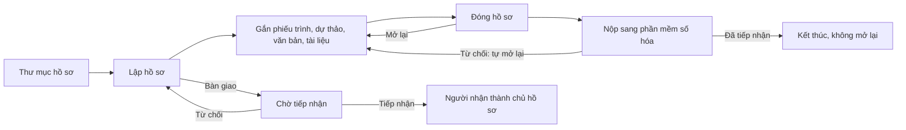

# Quản lý hồ sơ — tóm tắt nghiệp vụ cho BA

> Bản đọc nhanh bằng lời nghiệp vụ. Chi tiết và bằng chứng: [nghiep-vu.md](nghiep-vu.md) (mã NV / BR trong ngoặc
> để tra). Cập nhật: 2026-10-02 · Nguồn: code `kha_develop` + DB DEV. Nhãn quy tắc: **[Đã xác nhận]** = chủ dự án đã
> chốt là đúng ý đồ · **[Hiện trạng]** = hệ thống đang chạy như vậy, chưa ai xác nhận là ý đồ · **[Lệch nghiệp vụ]**
> = đã xác nhận nghiệp vụ muốn khác, hệ thống đang làm sai.

## 1. Phân hệ này dùng để làm gì

Phân hệ quản lý **hồ sơ**: tập tài liệu về một việc do một cá nhân lập trong một **thư mục hồ sơ** của đơn vị theo năm (1.1, NV-02, NV-03).
Hồ sơ gom phiếu trình, dự thảo, văn bản đi, văn bản đến, văn bản liên quan và tài liệu ngoài hệ thống (ảnh, ghi âm, ghi hình…), kèm số tờ và thứ tự để làm mục lục (NV-05…NV-09).
Chủ hồ sơ **chia sẻ** cho đồng nghiệp cùng đơn vị, **bàn giao** hồ sơ cho người khác, **đóng** hồ sơ khi xong, rồi **nộp** hồ sơ đã đóng sang **phần mềm số hóa văn bản** (hệ thống lưu trữ bên ngoài) (NV-11, NV-12, NV-14, NV-15).
Ngoài ra có vị trí bản cứng kho – kệ – tầng – hộp, mượn / cho mượn / trả, yêu cầu bổ sung hồ sơ, và màn *Tình hình xử lý hồ sơ* cho lãnh đạo (NV-16…NV-19).

**Hai việc dễ nhầm:** **bàn giao hồ sơ** là chuyển quyền sở hữu hồ sơ giữa **hai cá nhân trong hệ thống** — người nhận tiếp nhận hoặc từ chối ở menu *Hồ sơ tiếp nhận*. **Nộp hồ sơ** (nộp lưu) là đẩy hồ sơ **đã đóng** sang **phần mềm số hóa văn bản**, phần mềm đó trả kết quả đã tiếp nhận / từ chối (NV-12, NV-15, 1.4).

**Không gồm:** soạn / trình / ký phiếu trình (xem `phieu-trinh`); soạn / trình / ký dự thảo (xem `xu-ly-cong-viec`); bàn giao **văn bản** khi cán bộ thôi phụ trách, quyền xem văn bản chung, tài liệu cá nhân (xem `van-ban/quan-ly-chung`); chuyển văn bản đi xử lý (xem `van-ban/chuyen-van-ban`); gỡ văn bản khỏi hồ sơ khi hủy ban hành (xem `van-ban/di`); SMS, thông báo, danh mục chặn tin (xem `lich-nhac-viec`); cấp dữ liệu hồ sơ cho ứng dụng ngoài (xem `tich-hop`); cặp trình ký (xem `ky-so`); hồ sơ tài chính / công văn tài chính (ranh giới `van-ban/chuyen-van-ban`).

## 2. Ai dùng và được làm gì

| Vai trò | Được làm gì trong phân hệ này |
|---|---|
| Chủ hồ sơ (người lập, hoặc người đã tiếp nhận bàn giao) | Lập, sửa, xóa; gắn nội dung; chia sẻ; bàn giao; đóng / mở lại; nộp; cho mượn; duyệt mượn (1.3, NV-01, NV-05) |
| Người được chia sẻ (`BRIEF_SHARE` loại 0 / 1) | Loại *xem*: chỉ xem. Loại *chỉnh sửa*: thêm phiếu trình, dự thảo, văn bản, tài liệu; chỉ xóa / sửa phần mình thêm; không chia sẻ lại (1.3, BR-15, BR-30) |
| Người nhận bàn giao | Tiếp nhận hoặc từ chối (kèm ý kiến) ở *Hồ sơ tiếp nhận*; tiếp nhận xong thành chủ hồ sơ (1.3, NV-12) |
| Lãnh đạo / thủ trưởng đơn vị (`LDDV` / `TTDV`) | Xem văn bản trong hồ sơ của đơn vị không cần mượn; xem *Tình hình xử lý hồ sơ*; duyệt mượn khi được người mượn chọn (1.3, NV-19, NV-17) |
| Lưu trữ hồ sơ (`LT`) | Thấy mọi hồ sơ trong thư mục được toàn quyền; nhận và hoàn thành yêu cầu bổ sung hồ sơ của đơn vị; quản lý kho – kệ, báo cáo kho (1.3, BR-02, NV-16, NV-18) |
| Chuyên viên (`NV`) | Lập hồ sơ; thấy hồ sơ mình lập / đã tiếp nhận / được chia sẻ; thêm thư mục cho đơn vị mình (BR-01, NV-02) |
| Người mượn | Gửi yêu cầu mượn bản mềm / bản cứng; trả bản cứng (1.3, NV-17) |
| Phần mềm số hóa văn bản (hệ thống ngoài) | Trả kết quả tiếp nhận / từ chối hồ sơ đã nộp (1.3, NV-15) |

## 3. Màn hình / menu người dùng thấy

| Menu / màn | Để làm gì | Ghi chú | Mã menu |
|---|---|---|---|
| Danh sách hồ sơ | Chọn đơn vị → cây thư mục → xem, lập, sửa, xóa, bàn giao, chia sẻ, mượn, mở lại hồ sơ; xuất Excel | Cây chỉ hiện tối đa 2 năm thư mục liền nhau (NV-01) | 338572 |
| Hồ sơ tiếp nhận | Tiếp nhận / từ chối hồ sơ được bàn giao cho mình | Không phải tiếp nhận nộp lưu (NV-12) | 338678 |
| Thư mục hồ sơ | Khai cây thư mục theo đơn vị và năm | Trước gọi "Danh mục hồ sơ" (NV-02) | 339112 |
| Hồ sơ cần bổ sung | Lưu trữ đơn vị xem yêu cầu bổ sung, bổ sung hồ sơ, bấm hoàn thành | (NV-16) | 339252 |
| Tình hình xử lý hồ sơ | Lãnh đạo xem số hồ sơ theo 5 mức xử lý của từng cán bộ | (NV-19) | 440231 |
| Quản lý kho · Quản lý kệ · Quản lý hộp | Khai vị trí lưu bản cứng; báo cáo kho | (NV-18) | 338674 · 338676 · 338677 |
| Hồ sơ duyệt mượn · Danh sách mượn | Duyệt mượn / phê duyệt trả; xem yêu cầu mượn của mình, trả bản cứng | Menu **khóa** nhưng vẫn mở được từ thông báo mượn (NV-17, Q3) | 338592 · 338679 |
| Chi tiết hồ sơ (mở từ danh sách) | 6 tab: Phiếu trình, Dự thảo, Văn bản đi, Văn bản đến, Văn bản liên quan, Tài liệu liên quan khác; nút Chia sẻ, Đóng, Nộp, Cho mượn, Bàn giao | Khối thao tác cũ (đóng dấu, chuyển văn bản, chuyển sang hồ sơ khác, yêu cầu bổ sung, mượn) **ẩn hoàn toàn** (NV-05, Q9) | — |
| Popup "Lưu hồ sơ" trên các màn văn bản | Đưa văn bản vào hồ sơ có sẵn hoặc tạo hồ sơ mới ngay | (NV-10) | — |
| Trang chủ | — | Không có ô nào cho hồ sơ (1.2) | — |

## 4. Luồng chính

1. Đơn vị có **thư mục hồ sơ** theo năm. Người dùng chọn thư mục, bấm *Thêm mới*: số hồ sơ (gợi ý số lớn nhất của đơn vị + 1), mã hồ sơ (tự sinh), tên, thời gian bắt đầu, hạn xử lý, độ mật, thời hạn bảo quản, chế độ sử dụng, vị trí kho – kệ – tầng – hộp (NV-03).
2. Ở **chi tiết hồ sơ**, chủ hồ sơ gắn nội dung: chọn văn bản đến / đi / liên quan đã có trong hệ thống, chọn hoặc thêm phiếu trình, chọn dự thảo chưa trình, thêm tài liệu liên quan khác kèm file (NV-06, NV-07, NV-08). Văn bản cũng được đưa vào hồ sơ từ nút *Lưu hồ sơ* trên các màn văn bản (NV-10).
3. Mỗi tài liệu có số tờ, thứ tự; hồ sơ tự tính **tổng số tài liệu** và **tổng số tờ** (NV-09).
4. Chủ hồ sơ có thể **chia sẻ** cho người cùng đơn vị với quyền xem hoặc chỉnh sửa (NV-11).
5. Xong việc, chủ hồ sơ bấm **Đóng hồ sơ**. Hệ thống kiểm: văn bản còn hiệu lực, phiếu trình đã phê duyệt, văn bản có số tờ > 0 và file hợp lệ (NV-14).
6. Đơn vị được bật cấu hình nộp thì chủ hồ sơ bấm **Nộp hồ sơ**: toàn bộ tài liệu và file được đưa vào hàng đợi gửi sang phần mềm số hóa; phần mềm đó trả kết quả **đã tiếp nhận** hoặc **từ chối** — từ chối thì hồ sơ tự mở lại để sửa và nộp lại (NV-15).

**Luồng phụ.**
- *Bàn giao*: chủ hồ sơ chọn một người nhận bất kỳ, nhập nội dung; người nhận tiếp nhận thì trở thành chủ hồ sơ, người bàn giao không còn thấy hồ sơ; từ chối thì chủ cũ giữ hồ sơ (NV-12, BR-32, BR-33).
- *Yêu cầu bổ sung*: chủ hồ sơ gửi yêu cầu kèm hạn tới một hoặc nhiều đơn vị; lưu trữ của đơn vị bổ sung rồi bấm hoàn thành (NV-16) — nút gửi yêu cầu hiện đang ẩn (Q9).
- *Mượn*: người không có quyền xem xin mượn bản mềm (xem file trong hạn) hoặc bản cứng; chủ hồ sơ (có thể qua lãnh đạo được chọn trước) duyệt; bản cứng phải trả và được xác nhận. Chủ hồ sơ cũng chủ động cho mượn (NV-17).
- *Mở lại*: chủ hồ sơ mở lại hồ sơ đã đóng nếu chưa nộp hoặc lần nộp bị từ chối / thất bại; file biên mục bị hủy (NV-14).

## 5. Trạng thái

Hồ sơ có **hai trạng thái độc lập** (1.4, dac-thu B1).

**Trạng thái hồ sơ**

| Trạng thái (tên người dùng thấy) | Nghĩa | Chuyển sang khi nào | Giá trị |
|---|---|---|---|
| Đang thực hiện | Còn bổ sung được | Lập hồ sơ; mở lại; phần mềm số hóa từ chối (NV-03, NV-14, BR-41) | 1 |
| Đã đóng | Khóa bổ sung nội dung; điều kiện để nộp | Chủ hồ sơ bấm Đóng hồ sơ (NV-14) | 2 |
| (trống) | Hồ sơ tạo trước 12/2020 | — (mục 3) | — |

**Trạng thái bàn giao**

| Trạng thái (tên người dùng thấy) | Nghĩa | Chuyển sang khi nào | Giá trị |
|---|---|---|---|
| Đang thực hiện | Chưa bàn giao | Lập hồ sơ (NV-03) | 1 |
| Đã hoàn thành | Không còn được ghi | — (BR-31, Q6) | 2 |
| Chờ tiếp nhận | Đã bàn giao, chờ người nhận | Bàn giao (NV-12) | 3 |
| Từ chối tiếp nhận | Người nhận từ chối, chủ cũ giữ hồ sơ | Người nhận từ chối (NV-12) | 4 |
| Đã tiếp nhận | Người nhận đã thành chủ hồ sơ | Người nhận tiếp nhận (NV-12) | 5 |

**Trạng thái nộp** (từng lần nộp)

| Trạng thái | Nghĩa | Chuyển sang khi nào | Giá trị |
|---|---|---|---|
| Đang thực hiện | Đã vào hàng đợi | Bấm Nộp (NV-15) | 0 |
| Đã nộp | Đã gửi sang phần mềm số hóa | Dịch vụ ngoài cập nhật (NV-15) | 1 |
| Đã tiếp nhận | Phần mềm số hóa nhận hồ sơ | Kết quả trả về (NV-15) | 2 |
| Từ chối tiếp nhận | Phần mềm số hóa trả lại; hồ sơ tự mở lại | Kết quả trả về (NV-15) | 3 |
| Thất bại | Gửi không thành công | Dịch vụ ngoài cập nhật (mục 3) | 4 |

**Mức xử lý** (cột *Trạng thái xử lý* và màn Tình hình xử lý; N = 3 ngày): Hoàn thành đúng hạn (1) · Hoàn thành quá hạn (2) · Đang xử lý trong hạn (3) · Đang xử lý sắp đến hạn (4) · Đang xử lý quá hạn (5) — "hoàn thành" tính theo ngày đóng so với hạn xử lý (BR-38, BR-49).

**Mượn**: Chờ lãnh đạo (0) · Chờ duyệt (1) · Từ chối (2) · Đã duyệt (3) · Đã trả bản cứng (4) · Đã phê duyệt trả (5) (mục 3, NV-17).

## 6. Quy tắc quan trọng nhất

- [Hiện trạng] Người thường chỉ thấy hồ sơ mình lập, mình đã tiếp nhận hoặc được chia sẻ; lưu trữ / lãnh đạo thấy mọi hồ sơ trong thư mục được toàn quyền (BR-01, BR-02).
- [Hiện trạng] Hồ sơ phải thuộc thư mục có năm trong khoảng đang chọn mới hiện; hồ sơ không gắn thư mục không hiện (BR-04).
- [Hiện trạng] Số hồ sơ không được trùng trong cùng đơn vị; mã hồ sơ tự sinh nhưng không kiểm trùng (BR-08, BR-09).
- [Hiện trạng] Hạn xử lý không được trước hôm nay — áp cả khi sửa (BR-11).
- [Hiện trạng] Một văn bản chỉ có một dòng trong cùng hồ sơ, nhưng nằm được ở nhiều hồ sơ; văn bản đi phải đã ban hành; văn bản trong hồ sơ là **bản chụp thông tin lúc gắn**, không tự cập nhật (BR-17, BR-18, BR-19).
- [Hiện trạng] Tổng số tờ = văn bản + phiếu trình + tài liệu liên quan khác loại 1; **không tính dự thảo**. Hai tổng được tính lại mỗi lần mở chi tiết, không nhập tay (BR-25, BR-26, BR-27).
- [Hiện trạng] Hồ sơ đã đóng, đang nộp hoặc đã được tiếp nhận thì không thêm / sửa nội dung, không chia sẻ, không bàn giao (BR-16, BR-36).
- [Hiện trạng] Chỉ chủ hồ sơ chia sẻ được, chỉ cho người cùng đơn vị với hồ sơ; người được chia sẻ không chia sẻ lại; không có SMS / thông báo khi chia sẻ (BR-30, NV-11).
- [Hiện trạng] **Tiếp nhận bàn giao chuyển hẳn quyền sở hữu**: người nhận thành chủ hồ sơ, người bàn giao mất quyền thấy hồ sơ (BR-32, Q2).
- [Hiện trạng] Hồ sơ đang chờ tiếp nhận không bàn giao tiếp, không đóng, không nộp được; hồ sơ có bản cứng đang cho mượn không bàn giao được (BR-31, NV-12).
- [Hiện trạng] Chỉ nộp hồ sơ **đã đóng**, không đang bàn giao, của đơn vị được bật cấu hình nộp (hiện 7 đơn vị); dự thảo không được nộp (BR-39, BR-40).
- [Hiện trạng] Phần mềm số hóa **từ chối** → hồ sơ tự mở lại; **đã tiếp nhận** → không mở lại, không nộp lại (BR-37, BR-41).
- [Hiện trạng] Bản mềm mượn được xem file chỉ trong hạn; bản cứng đã duyệt thì xem file không giới hạn hạn tới khi được xác nhận trả (BR-45, Q4).
- [Hiện trạng] Yêu cầu bổ sung gửi theo **đơn vị**; ai có vai trò lưu trữ của đơn vị cũng xử lý được; "hoàn thành" chỉ đóng yêu cầu, không tự gắn tài liệu (BR-43).
- [Hiện trạng] Thư mục đang có hồ sơ (kể cả ở thư mục con cấp 1) không xóa được; không kiểm trùng tên thư mục (BR-05, BR-06).

## 7. Hệ thống KHÔNG làm / hay bị hiểu nhầm

- **"Hồ sơ tiếp nhận" không phải lưu trữ tiếp nhận nộp lưu.** Đó là người nhận bàn giao hồ sơ. Nộp lưu là gửi sang phần mềm số hóa văn bản bên ngoài (1.4, NV-12, NV-15).
- **Bàn giao hồ sơ khác bàn giao văn bản.** Bàn giao văn bản khi cán bộ thôi phụ trách nằm ở `van-ban/quan-ly-chung`.
- **Không có bước lãnh đạo hoàn thành hồ sơ.** Chủ hồ sơ tự đóng; trạng thái bàn giao "Đã hoàn thành" không còn được ghi (1.4, BR-31, Q6).
- **"Yêu cầu bổ sung" không phải "đề nghị hoàn thành"**: là chủ hồ sơ yêu cầu đơn vị khác bổ sung tài liệu (1.4, NV-16).
- **Nộp không tự động theo năm**; nộp thủ công sau khi đóng (X11, NV-15).
- **Phần gửi file sang phần mềm số hóa không nằm trong hệ thống này** — một dịch vụ khác đọc hàng đợi (NV-15 bước 3).
- **File biên mục**: xem được, nộp kèm, bị hủy khi mở lại, nhưng không có chức năng nào trong hệ thống tạo ra file này (NV-15, Q7).
- **Chuyển văn bản sang hồ sơ khác, đóng dấu văn bản trong hồ sơ, yêu cầu bổ sung từ chi tiết** có phía máy chủ nhưng nút đang ẩn — không thao tác được (NV-13, NV-16, NV-21, Q9).
- **Cảnh báo hồ sơ sắp hết thời hạn bảo quản và nhắc trả bản cứng quá hạn không chạy** (NV-20, Q5).
- **Vị trí kho – kệ – hộp chỉ là thông tin mô tả**, không ràng buộc bàn giao, mượn, nộp (BR-48).
- **Chế độ sử dụng 1 / 2 đang lệch nghĩa** giữa màn hình (1 = sử dụng có điều kiện, 2 = công khai) và ghi chú DB; nút Mượn chỉ hiện với giá trị 1 (Q1, dac-thu B6).

## 8. Liên quan phân hệ khác

| Khi thay đổi ở đây… | …phải xem thêm | Vì sao |
|---|---|---|
| Tab Phiếu trình, số tờ phiếu trình, điều kiện phiếu trình khi đóng / nộp | `phieu-trinh` | Phiếu trình gắn hồ sơ và số tờ của phiếu do phân hệ phiếu trình quản lý (NV-07, NV-14) |
| Tab Dự thảo | `xu-ly-cong-viec` | Nút trên tab gọi lại chức năng dự thảo; dự thảo gắn hồ sơ bằng chuỗi id (NV-07, dac-thu B4) |
| Nút "Lưu hồ sơ" trên các màn văn bản; quyền xem văn bản | `van-ban/den`, `van-ban/di`, `van-ban/quan-ly-chung` | Khoảng 15 màn văn bản mở popup lưu hồ sơ; quyền mở văn bản chung có xét hồ sơ mượn (NV-10, 1.1) |
| Hủy ban hành văn bản đi | `van-ban/di` | Văn bản bị tự gỡ khỏi hồ sơ ở phía văn bản đi (1.1, dac-thu B3) |
| Nộp hồ sơ, kết quả tiếp nhận | phần mềm số hóa văn bản (hệ thống ngoài) | Hàng đợi nộp là hợp đồng với hệ thống ngoài; đổi nghĩa giá trị phải phối hợp (NV-15, dac-thu B12) |
| SMS 801–807, thông báo hồ sơ | `lich-nhac-viec` | Cơ chế SMS / chặn tin ở đó; nhóm tin hồ sơ đã bị xóa khỏi danh mục chặn tin (NV-20) |
| Danh sách hồ sơ theo quyền người dùng | `tich-hop` | Ứng dụng ngoài lấy danh sách hồ sơ qua cùng điều kiện thấy hồ sơ (NV-22) |

## 9. Câu hỏi nghiệp vụ còn mở

- `Q1` — Chế độ sử dụng 1 / 2: nghĩa đúng theo màn hình hay theo ghi chú DB?
- `Q2` — Người bàn giao có cần tiếp tục xem hồ sơ đã bàn giao không?
- `Q3` — Mượn / cho mượn đã bỏ, tạm khóa, hay vẫn dùng?
- `Q4` — Người mượn bản cứng có được xem bản điện tử, và trong hạn nào?
- `Q5` — Cảnh báo sắp hết thời hạn bảo quản và nhắc trả bản cứng: đã bỏ hay cần bật?
- `Q6` — "Hoàn thành hồ sơ" có chính là Đóng hồ sơ không?
- `Q7` — File biên mục do ai / hệ thống nào tạo, khi nào?
- `Q8` — Tài liệu liên quan khác loại 1 là tài liệu thông thường hay phim âm bản?
- `Q9` — Các chức năng trong khối thao tác ẩn ở chi tiết hồ sơ đã bỏ hay cần hiện lại?
- `Q10` — Mỗi năm đơn vị lập bộ thư mục mới, hay một thư mục dùng qua nhiều năm?

(đầy đủ ở mục 7.1 của `nghiep-vu.md`)

## 10. Khi viết yêu cầu mới cho phân hệ này, nhớ ghi rõ

- **Theo trạng thái nào:** trạng thái hồ sơ (đang thực hiện / đã đóng), trạng thái bàn giao (chờ tiếp nhận / từ chối / đã tiếp nhận), hay trạng thái nộp — ba bộ độc lập; hồ sơ trước 12/2020 không có trạng thái hồ sơ (mục 3, dac-thu B1).
- **Ai được làm:** người lập gốc, chủ hiện tại (người đã tiếp nhận), người được chia sẻ xem / chỉnh sửa, lãnh đạo đơn vị, lưu trữ (`LT`) — sau tiếp nhận "người lập" trên hệ thống chính là người nhận (1.3, dac-thu B2).
- **Bàn giao hay nộp lưu** — dùng đúng từ; nếu là nộp thì có cần phía phần mềm số hóa thay đổi không (NV-12, NV-15).
- **Áp dụng cho tab nào:** phiếu trình, dự thảo, văn bản đi, văn bản đến, văn bản liên quan, tài liệu liên quan khác; có cộng vào tổng số tài liệu / số tờ không (NV-05, BR-25, BR-26).
- **Hồ sơ đã đóng / đang nộp / đã tiếp nhận** có bị khóa với thay đổi này không (BR-16, BR-36, BR-37).
- **Văn bản trong hồ sơ dùng thông tin lúc gắn hay thông tin hiện tại** của văn bản gốc (BR-19).
- **Chế độ sử dụng và độ mật:** áp dụng cho giá trị nào — và chờ chốt nghĩa 1 / 2 trước (Q1).
- **Đơn vị nào:** đơn vị của hồ sơ hay đơn vị người thao tác; đơn vị có bật cấu hình nộp không (BR-39).
- **Năm thư mục:** hồ sơ / thư mục năm nào được thấy; có cần vượt giới hạn 2 năm không (NV-01, Q10).
- **Có gửi SMS / thông báo không, mã tin nào, cho ai** — hiện nhiều loại tin hồ sơ dùng chung một mã và nhóm tin này không chặn được (NV-20, dac-thu L14).
