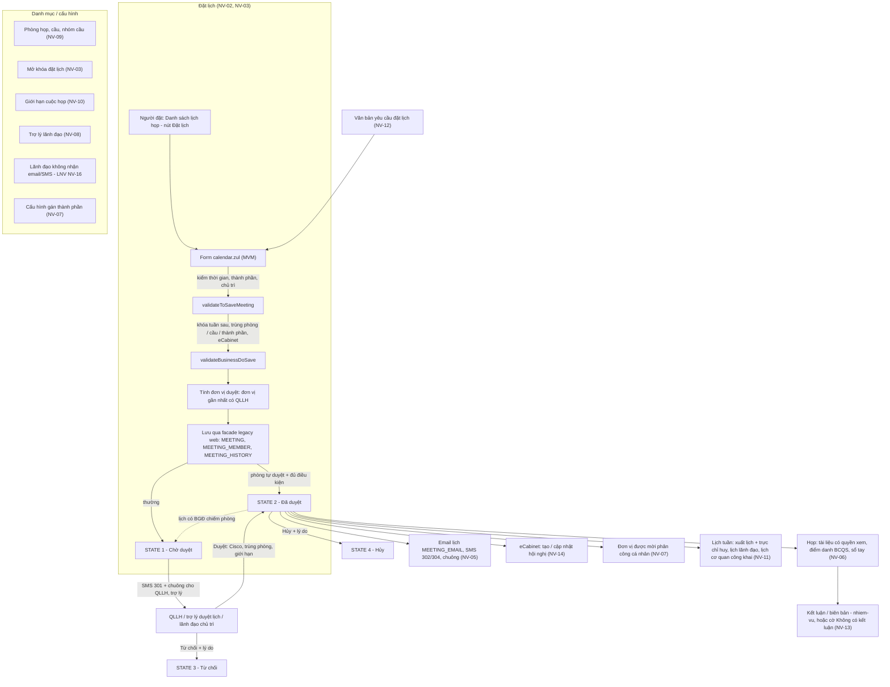
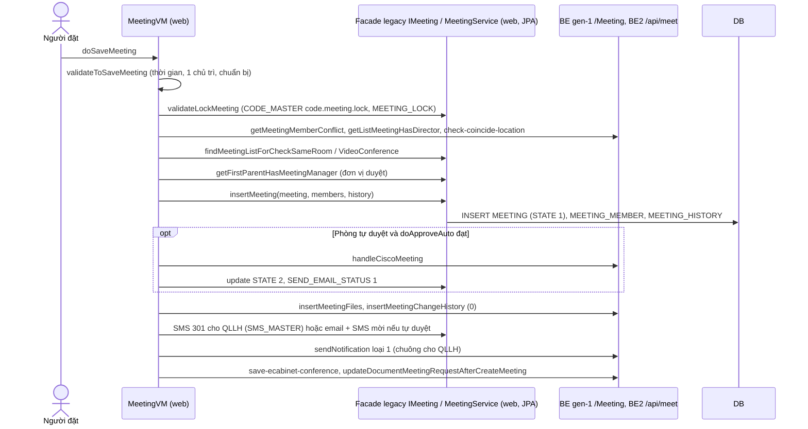
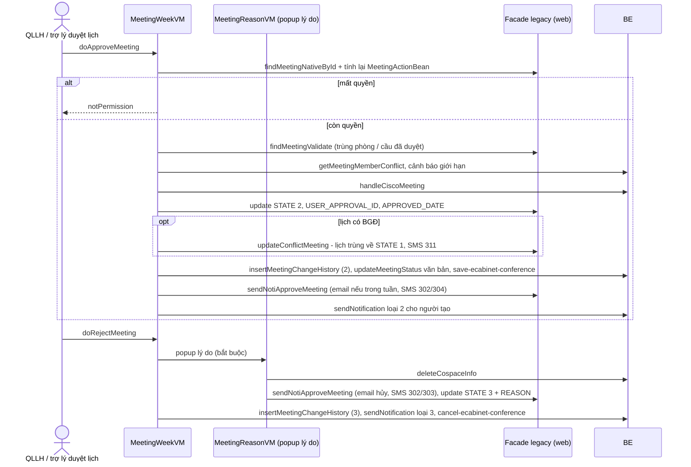
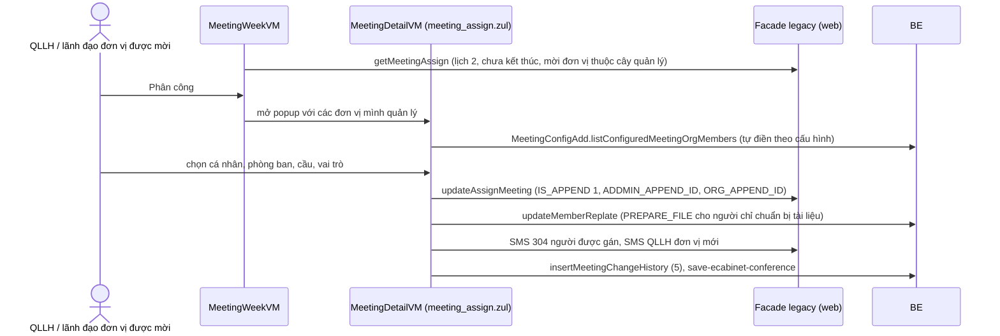
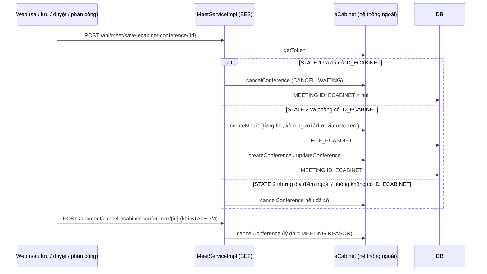
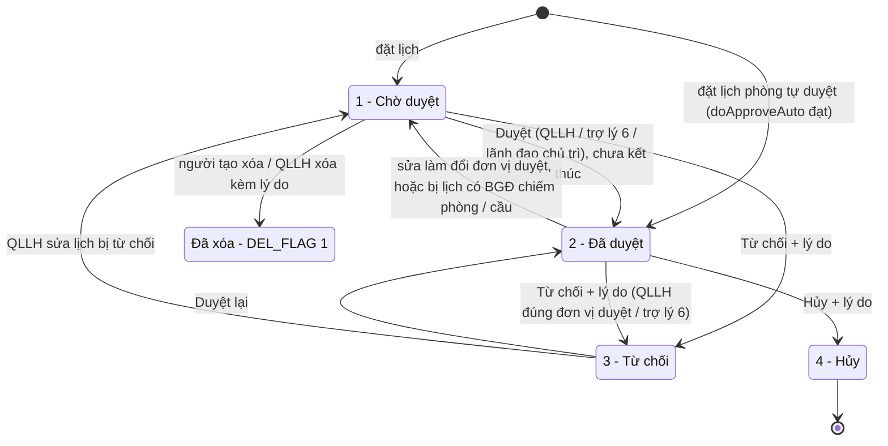
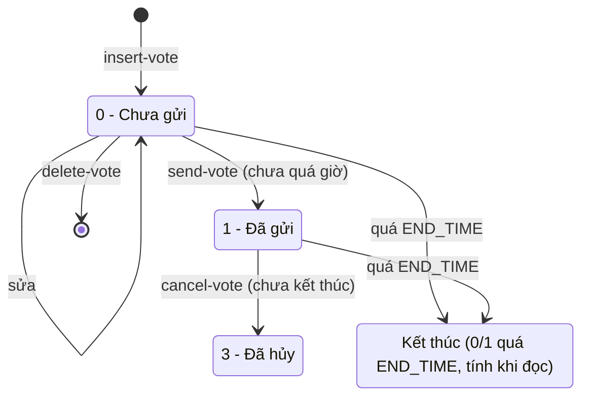
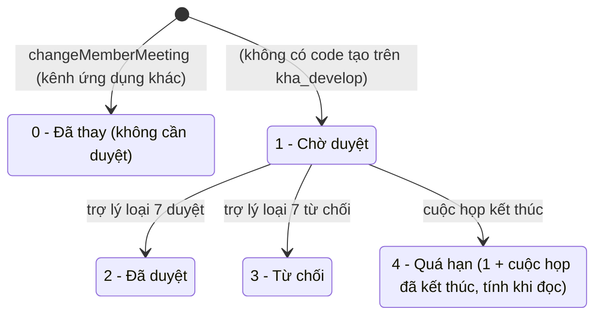
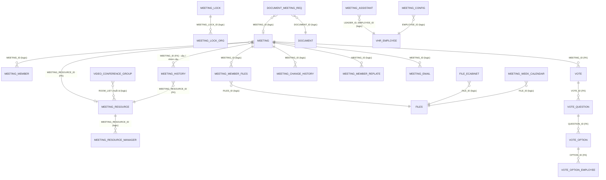

# Họp — nghiệp vụ: đặt lịch họp → đơn vị duyệt lịch (QLLH) duyệt / từ chối / hủy → thông báo (email, SMS, chuông) → đơn vị được mời phân công người → họp (tài liệu, điểm danh, eCabinet, biểu quyết) → kết luận; phòng họp, cầu truyền hình, lịch tuần, giới hạn cuộc họp, trợ lý lãnh đạo

> Viết lại từ code nhánh `kha_develop` (web-spring + backend2.0) ngày 2026-10-01. Mọi khẳng định có nguồn `file:dòng`.
> Menu / widget đối chiếu **DB DEV `SYS_MENU` / `HOME_WIDGET` ngày 2026-10-01**; số dòng, phân bố giá trị, FK và comment cột các bảng `MEETING%`, `VIDEO_CONFERENCE_GROUP`, `FILE_ECABINET`, `VOTE%` đối chiếu **DB DEV ngày 2026-10-01** (do người điều phối truy vấn, chỉ SELECT; tác giả không kết nối DB). Bảng thấy trong code nhưng không có trong dữ liệu tra sẵn (`MEETING_CHANGE_HISTORY`, `MEETING_MEMBER_REPLATE`, `MEETING_APPROVER`, `MEETING_CONFIG_ADD`, `MEETING_ORG_MEMBER_ADD`, `MEETING_NOTEBOOK`, `DOCUMENT_MEETING_REQ`, `CODE_MASTER`…) được người điều phối **tra bổ sung DB DEV cùng ngày 2026-10-01** (cùng `SYS_ROLE`, `USER_ROLE`, `VHR_ORG`, `SYSTEM_PARAMETER`, `MEETING_WEEKLY`); bảng nào vẫn chưa tra ghi "chưa đối chiếu DB". Tham số hệ thống chứa địa chỉ / tài khoản chỉ ghi tên khóa, **không ghi giá trị bí mật**.
> HDSD cũ (`C:\Users\Admin\Desktop\HDSD\**`) chỉ dùng tham khảo thuật ngữ.
>
> Viết tắt đường dẫn:
> `WEB/` = `web-spring/src/main/java/com/viettel/` · `ZUL/` = `web-spring/src/main/webapp/view/voffice/` ·
> `BIZ/` = `web-spring/src/main/java/com/voffice/service/business/` · `BE1/` = `backend2.0/backendvoffice/src/main/java/com/viettel/voffice/` ·
> `BE2/` = `backend2.0/backendvoffice/src/main/java/com/viettel/office/` · `SQL/` = `backend2.0/backendvoffice/sql/`.
> Lớp hay dùng — web: **MWVM** = `WEB/voffice/vm/meeting/MeetingWeekVM.java` (~5.700 dòng, màn Danh sách lịch họp), **MVM** = `…/MeetingVM.java` (~7.300 dòng, form đặt / sửa lịch + nút duyệt trong form), **MDVM** = `…/MeetingDetailVM.java` (~6.100 dòng, chi tiết + phân công), **MVU** = `…/MeetingVmUtil.java` (~5.400 dòng, quyền nút, gửi SMS / email), **MRVM** = `…/MeetingReasonVM.java` (popup lý do), **MS** = `WEB/voffice/service/MeetingService.java`, **MF** = `WEB/voffice/facade/MeetingFacade.java`, **MJD** = `WEB/voffice/dao/MeetingJpaDao.java`, **MRJD** = `WEB/voffice/dao/MeetingResourceJpaDao.java`, **MNC** = `WEB/voffice/util/MultimediaNotificationCenter.java`, **MEB** = `BIZ/MeetingBusiness.java`, **MAB** = `BIZ/MeetingAssistantBusiness.java`, **AC** = `WEB/util/AppConstants.java`.
> BE gen-1: **MRA** = `BE1/action/MettingResource.java` (`/Meeting`), **MWA** = `BE1/action/MettingWeek.java` (`/MettingWeek`), **MC** = `BE1/controler/MeetingController.java`, **MWC** = `BE1/controler/MeetingWeekController.java`, **MAC** = `BE1/controler/MeetingAssistantController.java`, **MDAO** = `BE1/database/dao/meeting/MeetingDAO.java`, **MWDAO** = `…/MeetingWeekDAO.java` (~8.700 dòng), **MNDAO** = `…/MeetingNativeDAO.java`, **MADAO** = `…/MeetingAssistantDAO.java`, **CMDAO** = `…/CiscoMeetingDAO.java`, **C1** = `BE1/constants/Constants.java`, **CFP** = `BE1/constants/ConstantsFieldParams.java`. BE gen-2: **MTC** = `BE2/controller/MeetController.java` (`/api/meet`), **MSI** = `BE2/services/impl/MeetServiceImpl.java`, **ESI** = `BE2/services/impl/EcabinetServiceImpl.java`, **VC** = `BE2/controller/VoteController.java`, **VSI** = `BE2/services/impl/VoteServiceImpl.java`, **C2** = `BE2/utils/Constants.java`.
> Phân hệ liền kề đã viết: nhắc việc / thông báo / SMS dùng chung [`../lich-nhac-viec/nghiep-vu.md`](../lich-nhac-viec/nghiep-vu.md) (ký hiệu `LNV NV-xx`), văn bản đến [`../van-ban/den/nghiep-vu.md`](../van-ban/den/nghiep-vu.md) (`VBĐ`), quản lý chung văn bản [`../van-ban/quan-ly-chung/nghiep-vu.md`](../van-ban/quan-ly-chung/nghiep-vu.md) (`QLC`), nhiệm vụ [`../nhiem-vu/nghiep-vu.md`](../nhiem-vu/nghiep-vu.md) (`NVu`).

## 1. Tổng quan

### 1.1 Phạm vi

Phân hệ quản lý **lịch họp / lịch công tác** của đơn vị: một người **đặt lịch** (tiêu đề, thời gian, phòng họp thuộc quản lý hoặc địa điểm khác, cầu truyền hình, thành phần cá nhân / đơn vị với vai trò chủ trì – chuẩn bị – tham dự, tài liệu, văn bản kèm); hệ thống tự tính **đơn vị duyệt lịch** (đơn vị gần nhất có người giữ vai trò **QLLH – quản lý lịch họp**); QLLH (hoặc trợ lý duyệt lịch của chủ trì) **duyệt / từ chối / hủy**; khi duyệt, hệ thống gửi **email lịch (calendar)**, **SMS** và **thông báo chuông**; **đơn vị được mời** phân công cá nhân dự họp; trong và sau buổi họp có **tài liệu họp có quyền xem**, **điểm danh**, **sổ tay**, đẩy sang **eCabinet (phòng họp không giấy)**, **biểu quyết**, đánh dấu **kết luận**. Kèm các danh mục / cấu hình: phòng họp & cầu truyền hình, nhóm cầu, khóa / mở khóa đặt lịch, giới hạn số cuộc họp, cấu hình duyệt lịch, cấu hình gán thành phần, trợ lý lãnh đạo, lãnh đạo không nhận email / SMS, và các màn **lịch tuần** (duyệt / xuất lịch tuần, lịch tuần lãnh đạo, lịch tuần cơ quan có công khai).

**Đặc điểm kỹ thuật quan trọng nhất**: luồng **ghi** lịch họp trên web (đặt, sửa, duyệt, từ chối, hủy, xóa, phân công) chạy bằng **facade legacy trong web** (`IMeeting` → MF → MS → MJD, JPA ghi thẳng DB) — **không qua BE**; BE chỉ được web gọi để **đọc** danh sách / chi tiết (`/Meeting/findMeetingNative`…), gửi thông báo chuông, cầu Cisco, eCabinet, tài liệu. Các endpoint ghi của BE (`/MettingWeek/approveCalendar`, `rejectCalendar`, `cancelCalendar`, `deleteCalendar`, `validateSaveMeeting`, `/api/meet/update-meeting`, `approve-meeting`…) **web không gọi** (grep `web-spring/src` rỗng) — là kênh cho ứng dụng khác (NV-17).

Phân hệ **KHÔNG gồm** (trỏ sang):

| Nội dung | Phân hệ |
|---|---|
| Cơ chế hàng đợi SMS (`SMS_MASTER`, `MESSAGE`), chặn tin theo người / đơn vị (`SMS_BLACK_LIST`, `CONFIG_SMS_ORG`), thông báo chuông (`NOTIFICATION`); màn **Cấu hình lãnh đạo không nhận email/SMS** (`MEETING_CONFIG`, menu `LEADER_CONFIG`) | `lich-nhac-viec` (LNV NV-11, NV-13 … NV-16). Ở đây chỉ ghi "gửi tin loại X khi Y" (NV-05) |
| **Biên bản họp / kết luận** sinh nhiệm vụ (`MEETING_MINUTES`, menu `MEETING_MINUTES`) | `nhiem-vu` (NVu NV-10). Ở đây chỉ có cờ "không có kết luận" và đơn vị ghi kết luận (NV-13) |
| Thêm nhiệm vụ / chuyển nhiệm vụ từ cuộc họp (`Meeting.addMission`, `forwardMission`, `getMissionByMeetingId` trong MC / MDAO) | `nhiem-vu` |
| Điểm vào **văn bản yêu cầu đặt lịch** trong hộp văn bản đến (nút "Đề xuất họp", `DocumentAction.addMeetingRequest`) | `van-ban/den` (VBĐ NV-15, NV-16). Ở đây: danh sách yêu cầu và việc lịch họp cập nhật yêu cầu (NV-12) |
| Quyền xem văn bản đính kèm lịch họp (`checkPermitViewDocument` / `checkAllPermissionDoc` xét "thành phần / người tạo lịch họp có văn bản") | `van-ban/quan-ly-chung` (QLC NV-06) |
| SMS cho thư ký / trợ lý văn bản khi lãnh đạo xử lý văn bản (`smsTask.sendSmsMeetingAssistant`, loại tin 202) — dùng quan hệ trợ lý ở đây nhưng là nghiệp vụ văn bản | nghiệp vụ văn bản (`van-ban/den`, `van-ban/chuyen-van-ban`); `cong-viec` 1.1 chỉ ghi ranh giới (code đang xếp nhầm ở đó) (sửa chéo 2026-10-02 theo `cong-viec`) |
| Popup lý do duyệt / từ chối **công việc** `meeting/popup/approveTaskReason.zul`, `rejectTaskReason.zul` (VM `vm.task.*`) — chỉ đặt nhầm thư mục | `cong-viec` |

### 1.2 Menu (đối chiếu DB DEV `SYS_MENU` ngày 2026-10-01)

`SYS_MENU.STATUS`: 1 = mở, 2 = khóa (X3). Menu "LỊCH" = `PARENT_ID 337233`.

| `SYS_MENU_ID` | `CODE` | Tên (DB DEV) | Cha | URL (`/view/voffice/…`) | `STATUS` | VM — NV |
|---|---|---|---|---|---|---|
| 338211 | `MEETING_WEEK` | **Danh sách lịch họp** | LỊCH | `meeting/meetingWeek.zul` | 1 | MWVM — NV-01 (đặt lịch là nút trên màn này — NV-02) |
| 338251 | `APPROVAL_EXPORT` | Duyệt / xuất lịch tuần | LỊCH | `meeting/meetingApprovalExport/meetingApprovalExport.zul` | 1 | `MeetingExportVM` — NV-11 |
| 338871 | `LLD_1` | Lịch tuần lãnh đạo | LỊCH | `meeting/meetingWeekManager.zul` | 1 | `MeetingWeekManagerVM` — NV-11 |
| 440185 / 440146 | `MEETING_WEEK_ORGANIZATION` / `LTCQ` | Lịch tuần cơ quan (**hai menu cùng URL**) | LỊCH | `meeting/meetingWeekOrganization.zul` | 1 / 1 | `MeetingWeekOrganizationVM` — NV-11 |
| 337791 | `MEETING_LOCK` | Mở khóa đặt lịch họp | LỊCH | `meeting/meetingLock/meetingLock.zul` | 1 | `MeetingLockVM` — NV-03 |
| 339212 | `MEETING_APPROVER_CONFIG` | Cấu hình duyệt lịch | LỊCH | `meeting/meetingApproverConfig.zul` | 1 | `MeetingApproverConfigVM` — NV-11 |
| 339152 | `MEETING_MEMBER_CONFIG` | Cấu hình gán thành phần tham gia lịch họp | LỊCH | `meeting/meetingMemberConfig.zul` | 1 | `MeetingMemberConfigVM` — NV-07 |
| 338971 | `MEETING_ASSSITANT_CHANGE_MEMBER` | Phê duyệt thay đổi thành phần tham gia cuộc họp | LỊCH | `meetingAssistant/meetingAsssitantChangeMember.zul` | 1 | `MeetingAsssitantChangeMemberVM` — NV-07 |
| 338571 | `MEETING_FREQUENCY_REPORT` | Báo cáo tổng hợp lịch họp | LỊCH | `meeting/meetingFrequency/meetingFrequencyReport.zul` | 1 | `MeetingFrequencyReportVM` — NV-10 |
| 338373 | `MEETING_COMPLEMENT_REPORT` | Báo cáo quân số | LỊCH | `meeting/meetingComplementReport/meetingComplementReport.zul` | 1 | `MeetingComplementReportVM` — NV-16 |
| 338551 | `MEETING_FREQUENCY` | Cấu hình giới hạn cuộc họp | QUẢN TRỊ (336812) | `meeting/meetingFrequency/meetingFrequency.zul` | 1 | `MeetingFrequencyVM` (legacy) — NV-10 |
| 338472 | `MEETING_ASSISTANT` | Cấu hình lãnh đạo trợ lý | QUẢN TRỊ | `meetingAssistant/meetingAssistant.zul` | 1 | `vm.leaderConfig.MeetingAssistantVM` — NV-08 |
| 338471 | `LEADER_CONFIG` | Cấu hình lãnh đạo không nhận email/sms | QUẢN TRỊ | `meetingAssistant/scheduleConfig.zul` | 1 | `ScheduleConfigVM` — LNV NV-16; tác dụng trong họp: NV-05 BR-21 |
| 336824 | `CAT_RESOURCE` | Danh mục tài nguyên cuộc họp | DANH MỤC (336813) | `meeting/meetingResource/meetingResource.zul` | 1 | `MeetingResourceVM` — NV-09 |
| 337431 | `VCG` | Danh mục nhóm cầu truyền hình | DANH MỤC | `meeting/videoConferenceGroup/videoConferenceGroup.zul` | 1 | `VideoConferenceGroupVM` (legacy) — NV-09 |
| 338473 | `LEADER_FOLLOWING` | Trợ lý theo dõi văn bản của lãnh đạo | VĂN BẢN ĐẾN (337200) | `meetingAssistant/leaderFollowing.zul` | 1 | `LeaderFollowingVM` — NV-08 (ranh giới VBĐ NV-16) |
| 439315 | `YCDLVB` | Văn bản yêu cầu đặt lịch | VĂN BẢN ĐẾN | `document/requestToScheduleMeetingDoc/docScheduleMeeting.zul` | 1 | `DocumentScheduleMeetingVM` — NV-12 |
| 337281 | `LICHHOP` | Duyệt / xuất lịch tuần cong ty | LỊCH | `meeting/list/approveMeetingWeek.zul?approve=1` | **2** | ☠ VM `MeetingListVM` không tồn tại — NV-18 |
| 337283 | `LICHHOPTRUNGTAM` | Duyệt /xuất lịch họp tuần trung tâm | LỊCH | `meeting/list/meetingList_search.zul?state=3` | **2** | ☠ — NV-18 |
| 337411 | `MEETING_LIST_OF_ORG` | Danh sách lịch họp của BGĐ và đơn vị | LỊCH | `meeting/list/meetingList_search.zul` | **2** | ☠ — NV-18 |
| 337731 | `COMMANDER` | Danh sách trực chỉ huy trong tuần | LỊCH | `meeting/list/commander.zul?approve=1` | **2** | ☠ — NV-18 |
| 337751 | `ROOM_EMPTY` | Danh sách phòng họp rỗng | LỊCH | `meeting/emptyRoomList.zul?er=0` | 1, **`DEL_FLAG = 1`** | ☠ — NV-18 |

Không có menu riêng "Đặt lịch họp": nút **Đặt lịch** nằm trên màn Danh sách lịch họp (`ZUL/meeting/meetingWeek.zul:60-64` → MWVM `doInsertMeeting` :2938-2959) và không có điều kiện hiển thị.

### 1.3 Widget trang chủ (đối chiếu DB DEV `HOME_WIDGET` ngày 2026-10-01)

| `HOME_WIDGET` | DB DEV | Dựng ở | Dữ liệu |
|---|---|---|---|
| id 15 `LICH_HOP` "Lịch họp" (`SIMPLE_MODE = 3`), con id 18 `LICH_HOP_SAP_TOI` "Lịch họp sắp tới" (`SIMPLE_MODE = 3`) | `IS_ACTIVE` null | `WEB/voffice/common/HomeVM.java:1612-1640` (tối đa 3 cuộc họp, tô nền khác khi mình là chủ trì), `:4033-4038` (kèm widget lịch đơn vị `generateOrgMeetingWidget`) | `MettingWeek.get3MeetingNearestOnDashboard` (`BIZ/HomeBusiness.java:140`; MWA) |
| (mã `VAN_BAN_YEU_CAU_DAT_LICH_HOP`) | **không có dòng trên DB DEV** | hằng `AC:8340`; chỗ dùng trong `HomeVM.java:2989` đang comment | — |

### 1.4 Actor & quyền

Mã vai trò (`web-spring/src/main/resources/application.properties:344-365`): **`QLLH`** quản lý lịch họp (người duyệt lịch của đơn vị), **`TTDV`** thủ trưởng / **`LDDV`** lãnh đạo đơn vị, **`TL`** trợ lý, **`NV`** chuyên viên, **`BCQS`** báo cáo quân số (điểm danh), **`QLCTH`** quản lý cầu truyền hình, `VT` văn thư. Quyền thao tác nằm ở **tầng hiển thị nút** (X1): mỗi dòng lịch được tính một `MeetingActionBean` (viewEdit, viewApproval, viewReject, viewCancel, viewDelete, viewAssign…) theo trạng thái + vai trò (NV-01 BR-03); trước khi thực hiện, web **tính lại** bean từ dữ liệu mới nhất và chặn nếu mất quyền (`MVU.validateCurrentMeetingState` :3398-3474).

| Actor | Nhận diện trong code | Làm gì |
|---|---|---|
| Người đặt lịch | bất kỳ ai có menu; `MEETING.CREATED_BY` | Đặt / sửa / sao chép / xóa lịch chờ duyệt của mình (NV-02, NV-04) |
| QLLH của đơn vị duyệt lịch | `USER_ROLE` mã `QLLH` tại `MEETING.ORG_APPROVAL_ID` (`MVU.getRoleUser` :161-194, `getOrgIdsApp` :201-212) | Duyệt / từ chối / hủy / xóa, gửi email / SMS, sửa nhanh, phân công đơn vị cấp dưới (NV-01 … NV-07) |
| "Admin lịch họp" theo `SYS_ROLE_ID = 336991` | MWVM `checkAdminMeeting` :436-446 (id **ghi cứng**; DB DEV `SYS_ROLE` ngày 2026-10-01: 336991 = **`QLLH` "Quản lý lịch họp"** → thực chất là người có vai trò QLLH ở bất kỳ đơn vị; DB DEV `USER_ROLE`: **7** dòng gán QLLH) | Mặc định lọc "Chờ duyệt và đã duyệt", tìm "Tất cả" (MWVM :572-577) |
| Trợ lý sửa lịch / duyệt lịch của lãnh đạo | `MEETING_ASSISTANT.ASSI_TYPE` 5 / 6 của lãnh đạo có trong thành phần (`checkAssistantMeeting` chứa `/5/`, `/6/` — MWVM :1597-1610) | Sửa (5); duyệt / từ chối / hủy / gửi email, SMS (6) (NV-08) |
| Lãnh đạo chủ trì | `TTDV`/`LDDV` + là chủ trì | Được duyệt lịch chờ duyệt mình chủ trì (MWVM :1616-1655) |
| Đơn vị được mời | QLLH (hoặc TTDV/LDDV) của đơn vị được mời (`MEETING_MEMBER.TYPE = 1`) | Phân công cá nhân dự họp (NV-07) |
| Thành phần dự họp | `MEETING_MEMBER.TYPE = 0`, `MEMBER_ID` | Nhận thông báo, xem chi tiết / tài liệu, biểu quyết (NV-05, NV-06, NV-15) |
| Quản lý cầu truyền hình | `QLCTH`; `MEETING_RESOURCE.USER_ID_MANAGER`, `MEETING_RESOURCE_MANAGER` | Sửa mã cầu, nhận SMS về cầu, xóa cầu hết hạn (NV-09) |
| Người báo cáo quân số | `BCQS` tại đơn vị chủ trì | Điểm danh (NV-06), báo cáo quân số (NV-16) |
| Quản trị | người có menu QUẢN TRỊ / DANH MỤC | Phòng họp, nhóm cầu, giới hạn, trợ lý, khóa lịch (NV-03, NV-08 … NV-10) |

### 1.5 Sửa so với knowledge cũ (2026-10-01)

| Knowledge cũ | Hiện trạng code `kha_develop` | Ghi ở |
|---|---|---|
| "Người duyệt lịch: Duyệt / từ chối / hủy lịch (`approveCalendar`, `rejectCalendar`, `cancelCalendar`)"; mẫu "Duyệt / từ chối / hủy lịch có kiểm quyền: `MettingWeek.approveCalendar` … ← `MeetingBusiness` ← `vm/meeting/*Approve*VM`" | Web **không gọi** các endpoint đó; duyệt / từ chối / hủy / xóa / lưu trên web đi qua **facade legacy trong web** (MWVM :2554-2896 → `iMeeting.update` → MS :105-113 → MJD). Endpoint BE là kênh khác và **không kiểm quyền** người gọi (sửa 2026-10-01) | NV-04, NV-17 |
| "Trạng thái lịch: Chờ duyệt → Đã duyệt / Từ chối / Hủy / Xóa" | `STATE` 1 chờ duyệt, 2 đã duyệt, 3 từ chối, 4 hủy (`AC:2159-2165`); **xóa là `DEL_FLAG = 1`**, giá trị 99 / 25 chỉ là mã lọc tìm kiếm; có thêm chuyển **2 → 1** khi sửa đổi đơn vị duyệt hoặc khi bị lịch có BGĐ "chiếm" phòng (sửa 2026-10-01) | NV-04, 4.6 |
| "Tự động duyệt theo cấu hình (`meeting.isAutoApprove`)" | Tự duyệt theo **phòng họp** có `MEETING_RESOURCE.IS_AUTO_APPROVE = 1` (và ngày họp trong 2 tuần), hoặc lịch dùng địa điểm ngoài + chỉ có "thành phần khác"; DB DEV: 36 phòng bật tự duyệt nhưng **0 lịch** `IS_AUTO_APPROVE = 1` | NV-02 BR-09 |
| "QT4. Đặt lịch bị khóa sau hạn (?) quy tắc khóa" | Khóa theo cấu hình `CODE_MASTER` `code.meeting.lock`: trong khung giờ khóa, **không đặt được lịch cho tuần sau** trừ đơn vị đang được "mở khóa" (`MEETING_LOCK`); hàm đọc cấu hình có điều kiện đảo (L-ghi nhận) | NV-03 BR-14 |
| "QT5. Biên bản phải ký trước khi đóng kết luận (?)" | Biên bản thuộc `nhiem-vu` (NVu NV-10); ở đây chỉ có cờ `NO_CONCLUSION` "cuộc họp không có kết luận" | NV-13 |
| "Trợ lý dự thay phải được lãnh đạo duyệt (`approveReplateMember`)"; ví dụ mẫu "Người dự thay (ủy quyền) có phê duyệt" | Thay người (`/Meeting/changeMemberMeeting`) ghi thẳng `MEETING_MEMBER_REPLATE` với `STATUS_APPROVAL = 0` (đã thay, **không chờ duyệt**); không có code ghi trạng thái 1 "chờ duyệt"; `approveReplateMember` có SQL sai tên cột (sửa 2026-10-01) | NV-07 BR-28 |
| "Thành viên: biểu quyết (eCabinet: `insert-vote`…)" | Biểu quyết là `/api/vote` gen-2, **web không gọi**; eCabinet là **hệ thống ngoài** nhận lịch đã duyệt qua API (`ecabinet.endpoint`); DB DEV `VOTE*` 0 dòng (sửa 2026-10-01) | NV-14, NV-15 |
| câu cũ 1: "eCabinet là phân hệ mobile/tablet riêng hay tab trong web?" | Code: hệ thống **ngoài** (`ESI`, `ecabinet.endpoint` (có khai — không ghi giá trị)); web chỉ đẩy lịch / tài liệu và mở link (X7) | NV-14 |
| câu cũ 2: "Họp trực tuyến Cisco/cospace còn dùng?" | Bật / tắt bằng `SYSTEM_PARAMETER.CISCO_MEETING_CONFIG.enable` (tắt → bỏ qua) — DB DEV `SYSTEM_PARAMETER` ngày 2026-10-01: có khai, `enable = 1` (đang bật trên DEV) | NV-09 |
| câu cũ 3: "Báo cáo quân số thuộc họp hay KPI?" | Thuộc họp: vai trò `BCQS`, cờ `MEETING.IS_COMPLEMENT_REPORT`; bảng `M_COMPLEMENT_REPORT*` **không có trên DB DEV** (X8) | NV-16 |
| `dac-thu`: "`voffice.service.url.meeting` — BE họp có thể trỏ server khác (địa chỉ máy chủ — không ghi giá trị)" | Mặc định lấy biến môi trường `SERVICE_URL`, kèm địa chỉ dự phòng (có khai — không ghi giá trị); mọi khóa `Meeting.*` (trừ `updateBoardNameSmartRoom`) đi URL này (`application.properties:286`; `web-spring/src/main/java/com/voffice/service/connection/ServiceConnection.java:1576-1577`) (sửa 2026-10-01) | `dac-thu.md` |

## 2. Module

| Chức năng | Màn (.zul) | VM | Ghi dữ liệu qua | Đọc qua BE (Business → endpoint) | Bảng chính |
|---|---|---|---|---|---|
| Danh sách lịch họp (NV-01) | `ZUL/meeting/meetingWeek.zul` | MWVM | (thao tác: xem NV-02, NV-04) | `MEB.findMeetingNative` → `POST /Meeting/findMeetingNative` (MRA:593-599 → MC:3189-3227 → `MNDAO.findMeetingNative` :133+) | `MEETING`, `MEETING_MEMBER`, `MEETING_RESOURCE`, `MEETING_HISTORY` |
| Đặt / sửa / sao chép lịch (NV-02) | `ZUL/meeting/calendar/calendar.zul` (+ `calendar_edit.zul`); sửa / sao chép `calendar/calendar_add.zul` (`WEB/voffice/util/ViewUtil.java:891-895`, `970-981`) | MVM | **legacy** `iMeeting.insertMeeting` / `updateMeeting` / `update` → MF → MS :137-377 → MJD, `MeetingMemberJpaDao`, `MeetingHistoryJpaDao` | lịch trùng, cầu, thành phần trùng (`Meeting.getMeetingMemberConflict`, `getListMeetingHasDirector`…), eCabinet, cầu Cisco | `MEETING`, `MEETING_MEMBER`, `MEETING_HISTORY`, `FILES` |
| Kiểm trùng, khóa đặt lịch (NV-03) | (trong form); `ZUL/meeting/meetingLock/meetingLock.zul` | MVM; `MeetingLockVM` | legacy `iMeeting.insertMeetingLock` / `updateMeetingLock` | — | `MEETING_LOCK`, `MEETING_LOCK_ORG`, `CODE_MASTER` |
| Duyệt / từ chối / hủy / xóa (NV-04) | nút trên lưới `meetingWeek.zul:948-1036`, trong form `calendar.zul:36-58`; popup lý do `meeting/popup/meetingReason.zul` | MWVM, MVM, MRVM | legacy `iMeeting.update` / `updateMeeting` / `deleteMeeting` | `Meeting.insertMeetingChangeHistory` (MRA:803-809), `sendNotification`, `handleCiscoMeeting`, `api.meet.*-ecabinet-conference` | `MEETING`, `MEETING_CHANGE_HISTORY` |
| Thông báo (NV-05) | — | MVU | web ghi thẳng `SMS_MASTER`, `MEETING_EMAIL` (MNC :238-349) | `POST /Meeting/sendNotification` (MC:4164-4197 → MDAO:5998-6014) | `SMS_MASTER`, `MEETING_EMAIL`, `NOTIFICATION`, `MEETING_CONFIG` |
| Chi tiết lịch (NV-06) | `ZUL/meeting/meeting_detail.zul` (+ `meeting_detail_inc.zul`) | MDVM | legacy + `Meeting.insertMeetingFiles`, `removePermissionViewFile`, `MettingWeek.saveMeetingNoteBook` | `Meeting.getListFileMeeting`, `permissionRollCall`, `getListUserViewFile`… | `MEETING_MEMBER_FILES`, `MEETING_NOTEBOOK` |
| Phân công thành phần (NV-07) | `ZUL/meeting/popup/meeting_assign.zul`; `meetingMemberConfig*.zul`; `meetingAssistant/meetingAsssitantChangeMember.zul` | MDVM; `MeetingMemberConfigVM`; `MeetingAsssitantChangeMemberVM` | legacy `iMeeting.updateAssignMeeting` (MS :379+); `MeetingConfigAdd.*`; `MeetingAssistantAction.approveReplateMember` | `MeetingConfigAdd.listConfiguredMeetingOrgMembers` | `MEETING_MEMBER`, `MEETING_CONFIG_ADD`, `MEETING_ORG_MEMBER_ADD`, `MEETING_MEMBER_REPLATE` |
| Trợ lý lãnh đạo (NV-08) | `ZUL/meetingAssistant/meetingAssistant.zul`, `leaderFollowing.zul` | `vm.leaderConfig.MeetingAssistantVM`, `LeaderFollowingVM` | `MAB` → `/MeetingAssistantAction/addAssistant`, `deleteAssistant` (MAC:120-162 → MADAO) | `searchAssistant`, `searchFollowLeader` | `MEETING_ASSISTANT` |
| Phòng họp, cầu truyền hình (NV-09) | `meetingResource/*.zul`, `videoConferenceGroup/*.zul`, `meeting/popup/room_add.zul`, `roomListPopup.zul`, `widgets/editVideoConferenceCode.zul` | `MeetingResourceVM`, `VideoConferenceGroupVM`, `widget.MeetingResourceLookupVM`, `widget.EditVideoConferenceCodeVM` | legacy `iMeeting.insertMeetingResource`; `meetingResourceAction.saveImage` | `Meeting.findMeetingResouresEmpty`, `getCospaceInfo`, `updateCospaceMeetingInfo`, `deleteExpiredCTH` | `MEETING_RESOURCE`, `MEETING_RESOURCE_MANAGER`, `VIDEO_CONFERENCE_GROUP`, `MEETING_HISTORY` |
| Giới hạn cuộc họp (NV-10) | `meetingFrequency/*.zul` | `MeetingFrequencyVM`, `MeetingFrequencyAlarmVM`, `MeetingFrequencyReportVM` | legacy `IMeetingFrequency` | — | `MEETING_FREQUENCY` |
| Lịch tuần (NV-11) | `meetingApprovalExport/*.zul`, `meetingWeekManager.zul`, `meetingWeekOrganization.zul`, `meetingApproverConfig.zul` | `MeetingExportVM`, `MeetingWeekManagerVM`, `MeetingWeekOrganizationVM`, `MeetingApproverConfigVM` | `MettingWeek.saveMeetingComander`, `uploadFileMeetingWeek`, `meetingApproverAction.saveMeetingApprover`; legacy `MEETING_WEEK_CALENDAR` | `MettingWeek.getLstMeetingWeek` (MWC:130+) | `MEETING_COMMANDER`, `MEETING_WEEK_CALENDAR`, `MEETING_APPROVER` |
| Văn bản gắn lịch / yêu cầu đặt lịch (NV-12) | (trong form); `document/requestToScheduleMeetingDoc/docScheduleMeeting.zul` | MVM; `DocumentScheduleMeetingVM` | `DocumentAction.updateDocumentMeetingRequestAfterCreateMeeting`, `updateMeetingStatus` | `DocumentAction.searchDocumentScheduleMeeting`, `searchMeetingRequests` | `MEETING.DOC_IDS`, `DOCUMENT_MEETING_REQ`, `DOCUMENT.MEETING_STATUS` |
| Kết luận (NV-13) | nút trên lưới | MWVM | `MettingWeek.updateWithoutConclusions` | `checkUpdateWithoutConclusions` | `MEETING.NO_CONCLUSION` |
| eCabinet (NV-14) | link trong chi tiết | MDVM `openEcabinetLink` :2779 | `POST /api/meet/save-ecabinet-conference/{id}`, `cancel-ecabinet-conference/{id}` (MTC) → MSI :2887-3150 → ESI | `get-ecabinet-conference/{id}`; `POST /api/ecabinet/check-coincide-location` | `MEETING.ID_ECABINET`, `MEETING_RESOURCE.ID_ECABINET`, `FILE_ECABINET` |
| Biểu quyết (NV-15) | (không có màn web) | — | `/api/vote/*` (VC → VSI) | — | `VOTE`, `VOTE_QUESTION`, `VOTE_OPTION`, `VOTE_OPTION_EMPLOYEE` |

## 3. Nghiệp vụ

### Giá trị trạng thái và cờ dùng xuyên suốt

**`MEETING.STATE`** (`AC:2159-2176`; BE `C1` `MEETING.STATE`):

| Giá trị | Hằng | Nhãn | Ý nghĩa theo code | DB DEV 2026-10-01 |
|---|---|---|---|---|
| 1 | `WAIT_APPROVE` | Chờ duyệt | Mới đặt (mọi người tạo, trừ khi tự duyệt); hoặc bị đưa về khi sửa đổi đơn vị duyệt / bị lịch ưu tiên chiếm chỗ (NV-03 BR-16) | 29 |
| 2 | `ADMIN_APPROVED` | Đã duyệt | Duyệt thủ công hoặc tự duyệt; chỉ lịch 2 hiện ở lịch tuần, được gửi email / SMS mời, đẩy eCabinet | 25 |
| 3 | `REJECT` | Từ chối | Bị từ chối kèm lý do (từ 1 hoặc 2) | 1 |
| 4 | `CANCEL` | Hủy | Bị hủy kèm lý do (từ 2) | 2 |
| 25 | `ADMIN_APPROVED_AND_WAIT_APPROVE` | "Chờ duyệt và đã duyệt" | **Mã lọc** tìm kiếm (1 hoặc 2) — không ghi DB (`MNDAO:647-649`) | — |
| 99 | `DELETE` | Xóa | Chỉ có trong combobox; xóa thật = `DEL_FLAG = 1` | `DEL_FLAG = 1`: 4 dòng |

**`MEETING_MEMBER`** — một dòng mỗi cá nhân (`TYPE = 0`) hoặc đơn vị (`TYPE = 1`) được mời (`AC:1973-1982`; DB DEV 0 = 8.429, 1 = 1.983). Vai trò là **các cờ độc lập**: `IS_PRESIDENT` chủ trì (DB 1 = 2.482), `IS_PREPARE_MAIN` chuẩn bị chính, `IS_PREPARE_COORDINATE` chuẩn bị phối hợp (`IS_PREPARE` = một trong hai — MVM :4315-4339), `IS_PARTICIPATE` tham dự, `IS_COMMANDER` tham dự và chỉ đạo, `IS_CONCLUDE` viết kết luận, `IS_DIRECTOR` lãnh đạo được đơn vị cử, `CONTENT_PREPARE` nội dung chuẩn bị. `IS_APPEND = 1` = **thành phần do đơn vị được mời gán thêm** (NV-07; DB 1 = 49), `ADDMIN_APPEND_ID` người gán, `ORG_APPEND_ID` đơn vị gán; `PREPARE_FILE` = danh sách id người chỉ chuẩn bị tài liệu (không dự); `VIDEO_CONF_ID` cầu được gán; điểm danh `AUTO_CHECK_ATTEND`/`MANUAL_CHECK_ATTEND` (NV-06). `MEETING_ROLE` (0 tham dự / 1 chuẩn bị / 2 chủ trì / 11 / 12 / 13 — `AC:2204-2220`) hầu như không dùng (DB: null 10.397, 0 = 15).

**Loại lịch** (`MEETING.TYPE`, tên Java `typeEducate`): null / 0 lịch họp, 1 lịch đào tạo, 2 **lịch công tác** (có `START_WORK_SCHEDULE` / `END_WORK_SCHEDULE`) (`MVM:158-159`, `4655-4665`; DB: null 50, 0 = 5, 2 = 2). `PRIVACY = 1` **lịch mật** (NV-06 BR-21), `IS_PARTY = 1` lịch Đảng, `RECURRENCE` 1 không lặp / 2 tuần / 3 tháng / 4 năm (`AC:2243-2257`), `HAS_VIDEO_CONF` có cầu truyền hình, `ONLINE_MEETING = 1` có phòng họp trực tuyến (`ONLINE_ROOM`).

### NV-01. Danh sách lịch họp (menu `MEETING_WEEK`) — tìm kiếm, dạng danh sách / lịch, nút thao tác theo trạng thái và vai trò

**Mục đích.** Màn làm việc chính của phân hệ: mọi người xem lịch mình tạo / tham gia; QLLH xem lịch đơn vị mình duyệt và thao tác duyệt, gửi thông báo, phân công.

**Luồng.** `ZUL/meeting/meetingWeek.zul:27-28` (VM MWVM) → `postViewInitialized` (MWVM :370-433): nạp combobox, đơn vị duyệt (`MVU.getOrgIdsApp`), `initSearch` (:558-581) → tìm kiếm `doSearch` (:1201-1236) → `MEB.findMeetingNative` → `POST /Meeting/findMeetingNative` (MRA:593-599) → MC:3189-3227 → `MNDAO.findMeetingNative` (:133-300) + `addFilterNative` (:596+). Kết quả gom nhóm theo ngày (`MeetingGroupingModel` — MWVM :1915-1930), tô màu theo trạng thái (:1896-1908). Hai chế độ xem: danh sách / lịch tuần (`doChangeView` :499-553, lưu lựa chọn cá nhân `PersonalSettingUtil.setMeetingViewType`).

**Điều kiện tìm mặc định (BR-01).** Từ hôm nay đến Chủ nhật tuần này (MWVM :570-571). Người có `SYS_ROLE_ID = 336991` (= vai trò `QLLH` theo DB DEV `SYS_ROLE` ngày 2026-10-01 — :436-446): trạng thái **"Chờ duyệt và đã duyệt"** (25), "Tìm theo" = Tất cả, và đơn vị duyệt = **-1 "Đơn vị tôi quản lý lịch họp"** (:572-577, `674-679`) → BE lọc `ORG_APPROVAL_ID` ∈ đơn vị mình có vai trò `QLLH` (`MNDAO:674-677`). Người khác: "Lịch họp tôi tạo hoặc tham gia" (−12).

**"Tìm theo" (`SEARCH_BY` — `AC:1985-2016`; SQL `MNDAO:139-290`):**

| Mã | Nhãn | Điều kiện |
|---|---|---|
| 0 | Tất cả | chỉ áp bộ lọc chung (`MNDAO:290-296`) |
| −1 | Lịch họp của ban lãnh đạo | thành phần cá nhân ∈ danh sách lãnh đạo (`managerIdLst`) (:210-222) |
| −2 | Lịch họp lãnh đạo / đơn vị | lãnh đạo hoặc đơn vị được mời thuộc đơn vị mình quản lý (:183-209) |
| −8 | Lịch họp của tôi | `CREATED_BY = mình` (:223-231) |
| −9 | Lịch họp tôi tham gia | mình là chủ trì / chuẩn bị / tham dự; lãnh đạo (`TTDV`/`LDDV`) thấy thêm lịch mời **đơn vị** mình lãnh đạo (:232-249) |
| −12 | Lịch họp tôi tạo hoặc tham gia | hợp của −8 và −9 (:250-276) |
| −10 | Tôi chủ trì | (:277-288) |
| id đơn vị (> 0) | (đơn vị) | lịch mời đơn vị đó hoặc cây con, **cộng** lịch mời cá nhân thuộc cây đơn vị đó (`UNION ALL` — :139-168) |

**Bộ lọc chung (BR-02)** (`MNDAO.addFilterNative` :596-720): `m.DEL_FLAG = 0` (:129); tiêu đề / nội dung tìm **không dấu** (`nlssort … binary_ai`); trạng thái (null = 1, 2, 3, 4; 25 = 1 hoặc 2 — :641-655); khoảng ngày theo **giao** `[START_TIME, END_TIME]` với khoảng tìm (:657-668); đơn vị duyệt; thành phần khác; trạng thái gửi mail (1 = đã gửi, khác = chưa — :697-707); loại phòng; lặp lại; báo quân số.

**Nút trên từng dòng (BR-03)** — `meetingWeek.zul:948-1036`, bean tính ở `MWVM.setViewActionMeeting` (:1590-1709) dựa trên `MVU.viewAction*` (:3251-3388); điều kiện "**còn hạn**" = `END_TIME > hiện tại`:

| Trạng thái | Người tạo | QLLH đơn vị duyệt (`ORG_APPROVAL_ID` ∈ đơn vị QLLH của mình) | Trợ lý duyệt lịch (6) | Trợ lý sửa lịch (5) | Khác |
|---|---|---|---|---|---|
| 1 Chờ duyệt | Sửa, Xóa | Sửa; còn hạn: Duyệt, Từ chối, sửa nhanh; Xóa (kèm lý do — `addButtonUpdate` :1935-1943) | còn hạn: Duyệt, Từ chối | Sửa | lãnh đạo (TTDV/LDDV) là chủ trì: Duyệt (:1616-1655) — **kể cả** chủ trì cá nhân bất kỳ khi lịch dùng địa điểm ngoài (:1636-1654) |
| 2 Đã duyệt (còn hạn) | Sửa (lịch tự duyệt: thêm Gửi email / SMS, Hủy — :1659-1685) | Hủy (mọi QLLH); đúng đơn vị duyệt: Sửa, Từ chối, Gửi email, Gửi SMS, sửa nhanh; Gán cầu khi lịch có cầu (:1944-1950) | Sao chép, Từ chối, Hủy, Gửi email, Gửi SMS | Sửa | QLCTH: sửa mã cầu (`MVU.checkEditVideoConferenceCode` :3548-3570) |
| 3 Từ chối (còn hạn) | Sửa | Sửa, sửa nhanh, Duyệt | Sao chép, Duyệt | — | — |
| 4 Hủy | — | — | — | — | — (`viewActionCancel` :3251-3256: không nút nào) |

Thêm: **Sao chép** hiện khi `actionBean.viewCopy` hoặc người tạo / QLLH đơn vị duyệt / QLLH đơn vị tổ tiên của người tạo (`checkCopyPermisson` :4438-4457) và lịch không mật với mình (`isViewPrivacy` — `meetingWeek.zul:955`); **Xóa** thêm `checkDeletePermisson` (chờ duyệt + người tạo hoặc QLLH đơn vị duyệt — :4460-4476); **Phân công** khi lịch đã duyệt, chưa kết thúc, có mời đơn vị thuộc cây đơn vị mình QLLH / lãnh đạo (`MJD.getMeetingAssign` :2303-2332; MWVM :1214-1229); **Không có kết luận** (NV-13).

**Nút đầu màn.** Đặt lịch (NV-02); Import (chỉ QLLH — `meetingWeek.zul:48-50`; `importMeeting.zul`, `vps.vm.ImportMeetingVM`); Gửi email / Gửi SMS hàng loạt (chỉ admin lịch họp — `meetingWeek.zul:758-765`; NV-05); Xuất Excel; Xuất theo mẫu import (QLLH); **Xóa cầu truyền hình hết hạn** (chỉ QLCTH của đơn vị gốc — `meetingWeek.zul:777-780`; NV-09).

**Edge.** Lịch dạng "lịch mật" mà người xem không liên quan hiện tiêu đề thay thế (`titleSearchSecret` = "Lịch họp" — MWVM :388; NV-06 BR-22).

### NV-02. Đặt lịch họp / sửa / sao chép — form, kiểm hợp lệ, đơn vị duyệt lịch, trạng thái khởi tạo, tự động duyệt, lưu

**Mục đích.** Tạo một lịch họp (hoặc lịch công tác / đào tạo / Đảng) với thời gian, địa điểm, thành phần, tài liệu, rồi chuyển cho đơn vị duyệt lịch.

**Luồng.** Nút Đặt lịch → `MWVM.doInsertMeeting` (:2938-2959) → popup `ViewConstant.WIDGETS.CALENDAR_EDITOR` = `ZUL/meeting/calendar/calendar.zul` (`ViewUtil.java:891-895`; `calendar.zul:1-2` VM MVM, include `calendar_edit.zul`). Sửa / sao chép: `MWVM.doPopupMeeting` type 2 / 1 (:2136+) → `calendar_add.zul` (`ViewUtil.java:970-981`). Lưu: `MVM.doSaveMeeting` (:5179-5196) → `doSave` (:4751-5043):
1. Kiểm quyền lưu `hasSavePermission` (:4753-4757); khi sửa, tính lại bean, mất quyền sửa → dừng (:4763-4777).
2. `validateToSaveMeeting` (:3690-3891) — BR-04 … BR-08; `validateBusinessDoSave` (:3298-3364) — khóa đặt lịch + trùng phòng / cầu / thành phần (NV-03).
3. Phòng tự duyệt mà ngày họp ngoài 2 tuần → chặn "notIn2Week" (:4787-4806).
4. Phòng họp trực tuyến: nếu tick "Tạo phòng họp trực tuyến", gọi `Meeting.createOnlineMeetingRoom` lấy link (`validateAndSetOnlineRoom` :5045-5119; BE `MWDAO.requestOnlineMeetingRoom` dùng `SYSTEM_PARAMETER.ONLINE_MEETING_URL` — MWDAO:8177-8196); quyền hiện ô theo `SYSTEM_PARAMETER.CREATE_ONLINE_MEETING` (MWDAO:7984; MVM :481-490).
5. Đặt cờ tự duyệt (BR-09), `onDoSave` (:4576-4689): **đơn vị duyệt** (BR-10), trạng thái (BR-11), `CALENDAR_TYPE = 0`, `DEL_FLAG = 0`, `GROUP_ID` = đơn vị người dùng, cầu, mật / đào tạo / công tác / Đảng, `DOC_IDS` (NV-12), phòng họp trực tuyến.
6. Sửa lịch **đã gửi email** mà có thay đổi đáng kể → popup lý do (MRVM) lưu và gửi lại (BR-12); còn lại hỏi xác nhận rồi `updateMeeting` (:5265-5355): thêm mới `insert()` (:4124-4166 → `iMeeting.insertMeeting` → MS :144-171: ghi `MEETING`, `MEETING_MEMBER`, `MEETING_HISTORY`) hoặc `update()` (:4247-4312 → MS :253-377: **xóa toàn bộ `MEETING_MEMBER` rồi chèn lại**, đồng bộ `MEETING_HISTORY` theo diff); tính chuỗi hiển thị chủ trì / chuẩn bị / tham dự (`SHOW_PRESIDENT`, `SHOW_SUPPORTER`, `SHOW_PARTICIPANT` ≤ 1.997 ký tự) và `PRE_MEETING_TASK` (:4179-4244); tự duyệt nếu đủ điều kiện (:5282-5323); tài liệu `Meeting.insertMeetingFiles` (:5335-5337); thông báo (`doSaveCallback` :4400-4404 → NV-05); lịch sử thay đổi `ACTION_TYPE` 0 tạo / 1 sửa (:5343-5346); thông báo chuông loại 1 khi tạo — gửi các QLLH của đơn vị duyệt khi lịch đang chờ duyệt (:5347-5349, `6755-6773`).
7. Sau lưu: hủy / tạm dừng lịch trùng nếu lịch có BGĐ (`doCancelSameTimeMeetings` :4483-4500 — NV-03 BR-16), đẩy eCabinet (`createOrUpdateEcabinetConference` :5034 — NV-14), cập nhật yêu cầu đặt lịch của văn bản (:4502-4507 — NV-12).

**Trường form** (`ZUL/meeting/calendar/calendar_edit.zul`): phòng họp thuộc quản lý (chọn qua `room_add.zul`) **hoặc** tên địa điểm khác (≤ 300 ký tự) (:40-111); tiêu đề (bắt buộc, ≤ 2.000) (:121-133); trang phục (≤ 200), mô tả (≤ 2.000), ghi chú (≤ 1.900); người liên hệ (bắt buộc, ≤ 500; mặc định chính người đặt — MVM :491-494) (:201-216); bắt đầu / kết thúc (bắt buộc) (:252-296); lặp lại + từ ngày / đến ngày (:325-376); thành phần khác (chủ trì ≤ 200, chuẩn bị ≤ 500, tham dự ≤ 500) (:985-1038); cầu truyền hình / nhóm cầu (:1048-1127); mật, lịch công tác (kèm thời gian công tác riêng), lịch đào tạo, lịch Đảng (:413-472); file đính kèm, văn bản đính kèm (:495-535); đơn vị ghi kết luận (:576-589); lãnh đạo chịu trách nhiệm chuẩn bị (`CEO_RESPONSIBLE`, :612-625); đơn vị chuẩn bị backdrop (:638-646); lưới thành phần mời cá nhân / đơn vị với cột chủ trì, tham dự và chỉ đạo, tham dự, chuẩn bị chính, chuẩn bị phối hợp, nội dung chuẩn bị (:672-882). Người thuộc cây đơn vị `sysOrganization.id.hkvt` mặc định tick "Mật" khi tạo (MVM :451-471).

**BR-04 (thời gian).** Bắt đầu < kết thúc (MVM :3700-3705); tạo mới (hoặc sửa lịch chờ duyệt đã quá hạn) thì bắt đầu ≥ hiện tại (:3783-3789); kết thúc ≥ hiện tại (:3791-3803); **một cuộc họp không quá 24 giờ** trừ lịch đào tạo / lịch công tác (:3805-3808); lặp lại: từ ngày < đến ngày và từ ngày ≤ ngày họp (:3811-3824).
**BR-05 (thành phần).** Phải có ít nhất một thành phần trong lưới hoặc "thành phần khác" (:3825-3837); mỗi dòng phải có ít nhất một vai trò (:3707-3712, `3926-3945`); **đúng một chủ trì** — 0 chủ trì chỉ được khi có thành phần khác chủ trì / chuẩn bị / tham dự (:3839-3865), ≥ 2 chủ trì bị chặn (:3855-3858); đã nhập "chủ trì khác" thì không được tick chủ trì trong lưới (:3866-3875).
**BR-06 (chuẩn bị).** Có chuẩn bị phối hợp thì phải có chuẩn bị chính (:3777-3781); dòng chuẩn bị chính / phối hợp phải có nội dung chuẩn bị (:3742-3749); bỏ cả hai cờ chuẩn bị thì nội dung chuẩn bị bị xóa (:4335-4337).
**BR-07 (lãnh đạo chịu trách nhiệm).** Chủ trì là **Tổng giám đốc** (`userInfo.getTgd()`) thì bắt buộc chọn `CEO_RESPONSIBLE` (:3721-3731).
**BR-08 (cầu).** Không được chọn cầu trùng chính phòng họp (:3881-3889); tick "Cầu truyền hình" phải chọn phòng trước (:4722-4741).
**BR-09 (tự động duyệt).** Mặc định `IS_AUTO_APPROVE = 0` (:4814-4816). Đặt 1 khi (a) **phòng họp có `IS_AUTO_APPROVE = 1`** và `checkChild` đúng — có thành phần (hoặc người đặt) thuộc cây đơn vị quản lý phòng và **không** có ai thuộc cây đơn vị BGĐ `sysOrganization.id.pgdtd` (:4817-4827, `6954-6991`), hoặc (b) **địa điểm ngoài** + không có chủ trì trong lưới + có "thành phần khác" (:4829-4855). Khi lưu, nếu cờ = 1 thì chạy `doApproveAuto` (:6993-7045: tạo cầu Cisco, kiểm trùng như khi duyệt, xác nhận trùng thành phần) → đạt: `STATE = 2`, `USER_APPROVAL_ID` = người đặt, `SEND_EMAIL_STATUS = 1`; không đạt: hạ cờ về 0 (:5282-5298, 5310-5323). Lịch đã tự duyệt mà sửa đổi đơn vị duyệt → về chờ duyệt, bỏ tự duyệt (:4962-4964; MRVM :166-172). DB DEV: `MEETING_RESOURCE.IS_AUTO_APPROVE` 1 = 36 phòng; `MEETING.IS_AUTO_APPROVE` 0 = 57 (không lịch nào).
**BR-10 (đơn vị duyệt lịch).** `ORG_APPROVAL_ID` = `getFirstParentHasMeetingManager(đơn vị gốc, 'QLLH')`: đi **ngược lên cây** từ đơn vị gốc, lấy đơn vị **gần nhất có người giữ vai trò QLLH** (`MRJD:123-145`; MVM :4584-4587). Đơn vị gốc (`findSysOrgApprove` MVM :1134-1272) chọn theo thứ tự ưu tiên: (1) có thành phần thuộc "ban giám đốc tập đoàn" (mã đơn vị `VIG` hoặc id trong `sysOrganization.id.orgIdsDirectVig` = 148844, 148845) → đơn vị BGĐ (`MVU.checkParticipantInDirectorGroup` :4391-4412); (2) phòng "trên Crowne" (`checkRoomInCrowne` :1087+); (3) thành phần thuộc "chi nhánh VTT" (`checkParticipantInBranchVTT` :938+); (4) theo cấp các đơn vị tham gia và đơn vị quản lý phòng (`findOrgAppHasResource` :1030+ / `findOrgAppNoResource` :981+); không mời ai → đơn vị người đặt (địa điểm ngoài) hoặc đơn vị quản lý phòng. Các nhánh (1)–(3) là logic **kế thừa Viettel** với id / mã đơn vị cấu hình cứng — xem `dac-thu.md` bẫy 6 và 7.1 Q1. DB DEV `VHR_ORG` ngày 2026-10-01: **không có** đơn vị 148844, 148845, 151233, 260161 hay mã `VIG` (id 1 là "Tỉnh Khánh Hoà", mã `UBNDT`, `PATH = /1/`) → nhánh (1) và (3) **không bao giờ khớp** trên DEV; nhánh (2) tìm đơn vị mã `VGO` (`MVM:1087-1098`, chưa tra). Thực tế đơn vị duyệt do nhánh (4) / đơn vị người đặt quyết định.
**BR-11 (trạng thái khi lưu)** — `setStateMeeting` (MVM :4544-4572): người tạo (hoặc trợ lý sửa lịch không phải QLLH) sửa → **giữ nguyên trạng thái**; tạo mới → 1; QLLH sửa lịch thuộc đơn vị mình (không trùng) → giữ trạng thái, riêng lịch đang **Từ chối** → về 1; trùng lịch (`isConfictBook`) → giữ 2 nếu đã duyệt và QLLH đúng đơn vị, còn lại → 1. Sửa mà **đơn vị duyệt thay đổi** → cảnh báo "orgAppChanged", về 1 (:4955-4990).
**BR-12 (sửa lịch đã gửi email).** `validateEnterReason` so sánh lịch cũ / mới (thời gian, địa điểm, thành phần, vai trò, chuẩn bị, phòng trực tuyến… — :3973-4121) → có thay đổi thì bắt nhập **lý do** (`meetingReason.zul`, bắt buộc, ≤ 1.999 ký tự — `meetingReason.zul:46-50`) và chọn kiểu gửi lại: `TYPE_SEND` 1 gửi lại tất cả, 2 gửi người thay đổi, 3 tạm dừng (`AC:1961-1970`; MVM :4860-4992; MRVM :148-285).
**BR-13 (sao chép).** Bản sao xóa id, thời gian, văn bản kèm, file, đơn vị backdrop, đơn vị duyệt, `ID_ECABINET`, báo quân số; "N/A" chủ trì xóa; phòng không còn hiệu lực bị bỏ (MWVM :2160-2195); các thành phần gán thêm được đánh lại `IS_APPEND` (`setIsAppendAgainCopy`).

**Thành phần "chi nhánh VTT".** Mời đơn vị `sysOrganization.id.tvtBranch` (151233) thì hệ thống tự thêm **mọi đơn vị con** với `IS_ALL_BRANCH = 1` và đặt `MEETING.IS_BRANCH_VTT = 1` (MS :173-219). DB DEV: `IS_ALL_BRANCH` 0 = 10.412, `IS_BRANCH_VTT` 0 = 57 — chưa dùng.

**Edge.** Lưu ở web không có giao dịch bao trùm: `insertMeeting` nuốt lỗi (`e.printStackTrace()` — MS :167-169) rồi các bước sau vẫn chạy; xem `dac-thu.md` L4.

### NV-03. Kiểm trùng phòng / cầu / thành phần; ưu tiên lịch có ban giám đốc; khóa và mở khóa đặt lịch (menu `MEETING_LOCK`)

**Kiểm trùng khi lưu** (`MVM.validateBusinessDoSave` :3298-3364) và khi duyệt (`validateApproval` :3256-3295; MWVM :2584-2594):

| Kiểm | Lấy lịch so sánh | Kết quả |
|---|---|---|
| Phòng họp không giấy (eCabinet) trùng địa điểm | `POST /api/ecabinet/check-coincide-location` (MVM :3244-3252; `EcabinetController` → ESI :117-128) | trùng → chặn |
| **Trùng phòng họp** | lịch đã duyệt cùng phòng giao thời gian (`MVU.findMeetingListForCheckSameRoom` :5251-5263) | không có BGĐ → **chặn**; lịch này có BGĐ: chặn nếu lịch kia cũng có BGĐ, ngược lại **hỏi xác nhận chiếm phòng** (:3318-3341) |
| Phòng trùng với cầu của lịch khác | `findMeetingListForCheckSameVideoConference` | tương tự (:3366-3405) |
| **Trùng thành phần** | `Meeting.getMeetingMemberConflict` (`MVU.getMemberConflict` :5054-5079) | **chỉ cảnh báo**, cho chọn tiếp tục; chủ trì trùng dùng hộp cảnh báo riêng (:3493-3526) |
| Trùng cầu / nhóm cầu | `checkSameVideoConference` | có BGĐ: hỏi; không: chặn (:3549-3661) |
| Cầu trùng phòng của lịch khác | `checkSameVideoConferenceRoom` | (:3407-3485) |

`meeting.conflictRoom.allow = 0` có trong cấu hình (`application.properties:112`) nhưng hằng `MEETING_CONFLICTROOM_ALLOW` **không chỗ nào đọc** (`WEB/util/resources/RbConfigValue.java:106`; grep rỗng).

**BR-15 (giới hạn cuộc họp khi duyệt / phân công).** Duyệt và phân công hiện cảnh báo "vượt ngưỡng" nếu có người / đơn vị đã đạt ngưỡng số cuộc họp trong tuần (NV-10) — chỉ cảnh báo, người duyệt vẫn được chọn tiếp (MWVM :2618-2630, 2664-2677; MDVM :3376-3394).
**BR-16 (ưu tiên lịch có BGĐ — "tạm dừng").** Khi một lịch **có thành phần BGĐ** được duyệt (hoặc sửa lịch đã duyệt), mọi lịch **đã duyệt trùng cầu / phòng** bị đưa về **Chờ duyệt** và bỏ tự duyệt (`MVU.updateConflictMeeting` :4528-4551 → `iMeeting.updateMeetingState`); nếu lịch bị dừng đã gửi email thì gửi email "tạm dừng" + SMS **311** cho người tạo (`sendNotiPendingMeeting`, `sendSmsPendingMeetingforCreator` :5034-5052). Gọi từ MWVM :2647-2649, 2694-2696; MVM :4483-4500, 1741-1742. BE (kênh khác) làm tương tự bằng luồng nền `PendingConflictMeetingThread` (MWC:1645-1646).

**Khóa đặt lịch (BR-14).** `MVU.validateLockMeeting` (:2912-2949), gọi đầu `validateBusinessDoSave` (MVM :3302-3305): đọc khoảng khóa từ `CODE_MASTER` `CD_TYPE = 'code.meeting.lock'`, `VALUE = 1`, dạng `"<thứ>-HH:mm,<thứ>-HH:mm"` (`AC:143`; MVU :2913-2925, `getDateLock` :2951-2980). Nếu **hiện tại** nằm trong khoảng khóa và lịch (bắt đầu hoặc kết thúc) rơi vào **tuần sau** → chặn "lockBook", trừ khi (a) đơn vị gốc của người dùng (hoặc tổ tiên) đang có **đợt mở khóa** còn hiệu lực (`MEETING_LOCK_ORG` + `MEETING_LOCK.OPEN_DATE ≤ hiện tại ≤ END_DATE_LOCK`, `DEL_FLAG = 0` — `WEB/voffice/dao/MeetingLockJpaDao.java:121-133`), hoặc (b) người dùng là QLLH và đang **sửa** (QLLH tạo mới vẫn bị chặn) (:2932-2946). Hàm phân tích cấu hình trả null khi phần "thứ" là chuỗi số (điều kiện đảo — `dac-thu.md` L5). **DB DEV `CODE_MASTER` ngày 2026-10-01**: 1 dòng `code.meeting.lock`, `VALUE = 1`, `PHYSICAL_NAME` = "Thời gian khóa đặt lịch (SUNDAY = 1 MONDAY = 2 … SATURDAY = 7)", **`LOGICAL_NAME` rỗng**. Chuỗi khoảng khóa web dùng là tên hiển thị của mã: khóa ngôn ngữ `code.meeting.lock.<PHYSICAL_NAME>` không có nên trả về `LOGICAL_NAME` (`CodeMasterManager.load` đặt `defaultDisplayName = LOGICAL_NAME`; `CodeView.getDisplayName`; `WEB/util/resources/CommonResourcesUtil.java:214-228` trả lại khóa khi thiếu) → **không có khoảng khóa nào được khai** → khóa đặt lịch **không có hiệu lực** trên DEV; nếu `LOGICAL_NAME` là NULL thì `timeLockStr.split(",")` (MVU:2918) còn có nguy cơ ném lỗi khi lưu lịch (suy từ code, chưa thử trên môi trường chạy). Tham số `meeting.setTimeLock = 04:30` (`application.properties:376` → `MVU:76`) không được dùng trong kiểm khóa.

**Mở khóa đặt lịch (menu `MEETING_LOCK`).** `ZUL/meeting/meetingLock/meetingLock.zul` → `MeetingLockVM` (legacy): QLLH chọn đơn vị mình quản lý (`comboboxSelectOrgMeetingManager` :129-137), khai **ngày mở – ngày kết thúc mở**, lý do, danh sách đơn vị được mở (`MEETING_LOCK_ORG`); bắt buộc ngày mở ≤ ngày kết thúc và ≥ 1 đơn vị (:282-298); xóa = `DEL_FLAG = 1` (:140-145). DB DEV: `MEETING_LOCK` 46 dòng (`DEL_FLAG` 1 = 41, 0 = 5), `MEETING_LOCK_ORG` 52.

### NV-04. Duyệt / từ chối / hủy / xóa lịch họp (web); lý do; lịch sử thay đổi

**Mục đích.** Đơn vị duyệt lịch (QLLH, trợ lý duyệt lịch, lãnh đạo chủ trì — NV-01 BR-03) quyết định lịch có được tổ chức; người tạo / QLLH xóa lịch chưa duyệt.

**Hai điểm vào cùng nghiệp vụ** (sửa một chỗ phải sửa chỗ kia — `dac-thu.md` bẫy 2): icon trên lưới Danh sách lịch họp (MWVM) và nút trong form lịch (`ZUL/meeting/calendar/calendar.zul:36-58` → MVM `doApprove` :1582-1760, `doRejectMeeting` / `doCancelMeeting` :1842-1855 → `doRejectCancelMeeting` :1776-1840, `doDel` :1858-1879). Cả hai ghi qua facade legacy (`iMeeting.update` → MS :105-113 → MJD).

**Duyệt** (MWVM `doApproveMeeting` :2554-2711):
1. Tính lại quyền (`validateCurrentMeetingState` — mất quyền duyệt → báo "notPermission" — :2556-2570); kiểm trùng địa điểm eCabinet (:2572-2574).
2. Kiểm trùng phòng / cầu với lịch **đã duyệt** (`validateApproval` :2591-2594; NV-03); có thành phần trùng → hộp xác nhận; vượt giới hạn cuộc họp → cảnh báo (BR-15).
3. Tạo / cập nhật phòng cầu Cisco (`Meeting.handleCiscoMeeting` — lỗi thì **không duyệt** "approve.cisco.failed" — :2632-2635, 2679-2682; NV-09).
4. Ghi `STATE = 2`, `USER_APPROVAL_ID` = người duyệt, `APPROVED_DATE`; lịch công tác thì thời gian = thời gian công tác (:2636-2646).
5. Có BGĐ → tạm dừng lịch trùng (BR-16); lịch sử `ACTION_TYPE = 2`; văn bản kèm → `DOCUMENT.MEETING_STATUS = 1` (NV-12); đẩy eCabinet (NV-14); gửi email / SMS (`MVU.sendNotiApproveMeeting` — NV-05); chuông loại 2 cho **người tạo** (MWVM :2713-2721) (:2647-2658).

**Từ chối / Hủy** (MWVM :2761-2793, :2866-2896): tính lại quyền → đặt trạng thái 3 / 4 tạm → popup **lý do bắt buộc** (MRVM `doSaveReason` :123-304; `meetingReason.zul:46-50`). Lưu: xóa phòng cầu Cisco (`Meeting.deleteCospaceInfo` — MRVM :288-291), gửi email hủy + SMS (NV-05), xóa trạng thái gửi mail (`updateSendMailMeetingEmpty` :361-368 — **đây là chỗ ghi `STATE` / `REASON` xuống DB**); sau đó lịch sử `ACTION_TYPE` 3 / 4, chuông loại 3 / 4 cho người tạo, hủy hội nghị eCabinet (MWVM :2785-2788, 2888-2891). Từ chối còn đặt `IS_AUTO_APPROVE = 0` (:2779). Lý do lưu ở `MEETING.REASON`.

**BR-17 (từ trạng thái nào).** Theo bảng nút NV-01 BR-03: Duyệt từ 1 và 3; Từ chối từ 1 và 2; Hủy chỉ từ 2; mọi thao tác duyệt / từ chối / hủy yêu cầu lịch **chưa kết thúc** (`END_TIME > hiện tại`) — riêng nút Sửa / Xóa của người tạo ở lịch chờ duyệt không xét thời gian (`MVU.viewActionWaitApproval` :3356-3388).
**BR-18 (xóa).** Xóa = `DEL_FLAG = 1`, `DELETED_BY`, `DELETED_DATE` (không xóa cứng) (MWVM :2818-2829; MS :575-581). Hai cách: **người tạo** xóa lịch chờ duyệt — chỉ xác nhận, không lý do, không SMS (:2816-2840); **QLLH đơn vị duyệt** xóa lịch chờ duyệt (`isAdminDeleted` — :1935-1943) — popup **lý do xóa** bắt buộc (≤ 1.999 ký tự — `meetingReason.zul:63-83`), lưu `REASON`, SMS **306** cho người tạo (MRVM :377-398; `MVU.sendNotiDeleteMeeting` :2701-2708, `sendSmsAdminDeleteMeeting` :1054-1069). Cả hai xóa phòng cầu Cisco.
**BR-19 (lịch sử thay đổi).** Mỗi thao tác ghi một dòng `MEETING_CHANGE_HISTORY` (`ACTION_TYPE` 0 tạo, 1 sửa, 2 duyệt, 3 từ chối, 4 hủy, 5 thay đổi thành phần, 6 thay đổi cầu truyền hình — `AC:2417-2425`; nội dung = tóm tắt thời gian / địa điểm / thành phần — MVM :7101+) qua `POST /Meeting/insertMeetingChangeHistory` (hàm Java tên `unLockDocument` — MRA:803-809 → MDAO:5662); xem bằng popup `meeting/popup/viewMeetingChangeHistory.zul` (`widget.MeetingChangeHistoryVM`; MVM `doViewHistory` :7146, MDVM :6050). DB DEV `MEETING_CHANGE_HISTORY` ngày 2026-10-01 theo `ACTION_TYPE`: 0 = 2.909 · 1 = 2.568 · 2 = 1.937 · 3 = 100 · 4 = 165 · 5 = 157 · 6 = 97.

**Chuyển "chờ duyệt" (2 → 1) thủ công** có code (`MWVM.doWaitAppMeeting` :2738-2752, bean `viewWaitApp` — MVU :3309) nhưng **không zul nào gắn** (grep `doWaitAppMeeting|viewWaitApp` trong `ZUL/` rỗng) — chức năng không dùng.

**Edge.** Ở đường form, popup lý do từ chối / hủy hiện **trước** khi kiểm quyền (MVM :1776-1815); đường form ghi `USER_APPROVAL_ID` cả khi từ chối / hủy (MVM :1823-1825), đường lưới thì không. `MS.approveMeeting` / `cancelMeting` / `rejectMeeting` (:583-607) không ai gọi.

### NV-05. Thông báo lịch họp: email lịch (calendar), SMS (loại 12, mã 30x), chuông; người nhận; lãnh đạo không nhận lịch đơn vị; gửi lại thủ công

**Mục đích.** Báo cho QLLH khi có lịch cần duyệt, báo người tạo kết quả, mời thành phần (kèm lịch để đưa vào lịch Outlook), báo thay đổi / hủy.

**Ba kênh — đều ghi từ web, không qua BE (trừ chuông):**

| Kênh | Ghi vào | Hàm | Ghi chú |
|---|---|---|---|
| Email lịch (iCalendar) | `MEETING_EMAIL` (`STATUS = 0` chưa gửi; `METHOD` REQUEST / UPDATE / CANCEL / PENDING / UPDATE_CTH / REMOVE; `CONTENT_CODE` LHCAL-01 … 04 — `AC:1928-1971`) | `MNC.sendMeetingCalendar` :299-349 (← `MVU.sendCalendar*` :237-480) | **Không có tiến trình gửi email trong repo** (không `@Scheduled` nào đọc bảng — `BE2/core/utils/scheduling/ScheduledBackgroundTask.java:17-22`); DB DEV `MEETING_EMAIL` **0 dòng**. `MEETING.SEND_EMAIL_STATUS = 1` + `SEND_EMAIL_MEMBER_LIST*` (8 cột chuỗi id) đánh dấu "đã gửi cho ai" (DB: 1 = 20 lịch) |
| SMS | `SMS_MASTER` với `SMS_TYPE = 12` (lịch họp) + `CONFIG_SMS_MODULE_ID` = mã 30x | `MNC.sendSms` :238-258 / `sendSmsMeeting` :264-285 (← `MVU.sendSms` :496-505, `sendSmsMeeting` :517-526) | kiểm chặn theo người / đơn vị bằng **bản sao web** `iMeeting.shouldSendSms` (`MS:1469-1481` — LNV NV-13); nội dung bỏ dấu, mẫu khóa ngôn ngữ `voffice.meeting.notify.lhsmsNN` |
| Chuông | `NOTIFICATION` (mẫu `TYPE = 13`, `CATEGORY` = 1 tạo / 2 duyệt / 3 từ chối / 4 hủy) | `MEB.sendNotification` :2439-2453 → `POST /Meeting/sendNotification` (MC:4164-4197) → `MDAO.sendNotification` :5998-6014 | không gửi cho chính người thao tác (:6003-6005) |

**Gửi gì, khi nào (BR-20):**

| Sự kiện | Người nhận | Kênh / mã loại tin (`AC:7002-7020`; CFP:775-786) | Nguồn |
|---|---|---|---|
| Đặt lịch, trạng thái **1** | QLLH đơn vị duyệt (`getMeetingAdmin`) + trợ lý được cấu hình của chủ trì (`getListUserConfigAssistant`); quản lý cầu đã chọn | SMS **301**; SMS cầu **302**; chuông loại 1 | `MVU.sendNotiInsertMeeting` :1352-1381, `sendSmsNewMeetingToAdmins` :547-572; MVM :6755-6773 |
| Đặt lịch **tự duyệt** (trạng thái 2) | thành phần (email + SMS), quản lý cầu, đơn vị chuẩn bị backdrop, QLLH đơn vị được mời, người chuẩn bị | email REQUEST, SMS **304** | MVU :1306-1336 |
| **Duyệt** (1/3/4 → 2) | thành phần — **email chỉ tự gửi nếu cuộc họp trong tuần hiện tại** (`isMeetingInWeek` :1246-1248; lịch tuần sau gửi bằng nút Gửi email — dưới); người tạo; người chuẩn bị; đơn vị backdrop; quản lý cầu | email REQUEST; SMS **302** (người tạo), **304** (chuẩn bị / backdrop) | `MVU.sendNotiApproveMeeting` :2483-2700 |
| **Từ chối** | người tạo; nếu đã gửi email: mọi thành phần nhận email hủy | SMS **302** (dùng chung mã "duyệt hoặc từ chối"); email CANCEL; SMS hủy **303** | `sendSmsRejectedMeeting` :1029-1052; `sendNotiApproveMeeting` |
| **Hủy** | thành phần đã nhận email; người tạo; quản lý cầu | email CANCEL; SMS **303** | `sendSmsCanceledMeeting` :1091-1119 |
| Sửa lịch đã duyệt | thành phần bị bỏ / sửa / thêm | email CANCEL / UPDATE / REQUEST; SMS **303** cho người bị bỏ | `sendNotiApproveMeeting` nhánh 2 → 2; `sendSmsRemoveMeetingMember` :1121-1136 |
| Lịch bị tạm dừng do lịch BGĐ (NV-03 BR-16) | thành phần; người tạo | email PENDING; SMS **311** | :5034-5052 |
| Xóa bởi QLLH | người tạo | SMS **306** | NV-04 BR-18 |
| Sửa mã cầu / gán, bỏ cầu | thành phần, người tạo, quản lý cầu | SMS **305**, **312**, **313** | `sendSmsChangeVideoConferenceCode` :2879-2910; :5081-5130 |
| Phân công thành phần (NV-07) | cá nhân được gán; người chuẩn bị tài liệu | SMS **304** | `sendNotiAssignMeeting` :2226-2312; `sendSmsMeetingPrepareFile` :575-591 |

**Người nhận khi mời đơn vị (BR-21).** Với thành phần **đơn vị**, tin đi tới QLLH của đơn vị đó (`findMeetingManagerOrg`), trợ lý của các lãnh đạo được mời (`findAssistantOfDirectors`), và — khi gửi cho lãnh đạo — **TTDV / LDDV của đơn vị được mời trừ người có `MEETING_CONFIG.SEND_SMS = 1`** (`MVU.getMembersReceiveNotify` :1577-1613, `sortUserNoReceiveSms` :1635-1651; `WEB/voffice/dao/MeetingMemberJpaDao.java:512-536`). Email lọc tương tự với `SEND_MAIL = 1` (`sortUserNoReceiveEmail` :1660-1675). Đây là tác dụng của menu **"Cấu hình lãnh đạo không nhận email/sms"** (`MEETING_CONFIG`; 1 = không nhận — comment DB; DB DEV 37 dòng) — màn cấu hình mô tả ở LNV NV-16. Thành phần cá nhân không bị lọc theo cấu hình này.

**Gửi lại thủ công.**
- **Hàng loạt** (nút Gửi email / Gửi SMS đầu màn — chỉ admin lịch họp): lịch **đã duyệt, chưa kết thúc**, đơn vị duyệt thuộc đơn vị mình QLLH (theo combobox), **chưa gửi** (`findMeetingToSendMail` MWVM :798-830, `findMeetingToSendSMS` :909-932). Email: đặt `SEND_EMAIL_STATUS = 1` trước rồi chạy luồng nền `ActionSendEmailThread` (:872-902); SMS: `sendSmsInstacy` (:935+).
- **Từng lịch** (icon trên dòng — `viewSendEmail` / `viewSendSMS`): email `MVU.sendReminderInstancy` (:2744-2799); SMS mở popup chọn người nhận `meeting/popup/sendSmsMeetingAssign.zul` (`MeetingSendNotifyAssignVM`); **chặn gửi lại trong 5 phút** theo khóa memcached `user_meetingId_loại` (MWVM :4365-4435).
- Trong chi tiết lịch: gửi SMS cho một / nhiều thành phần (MDVM `sendSms` :3758, `sendSmsAll` :3899); số lần nhận SMS ghi `MEETING_MEMBER.NUMBER_RECEIVE_SMS` (`MVU.updateNumberReceiveSms` :4743-4766).

**Lưu ý dữ liệu.** Mã **306** (xóa bởi QLLH) có code ghi nhưng **không có trong danh sách `CONFIG_SMS_MODULE`** nhóm 300 trên DB DEV (301–305, 308–313, 322–325) → người dùng không chặn được loại tin này. Mã 308–310 (gửi trợ lý thay đổi thành phần) và 322–325 (yêu cầu đặt lịch) trên DB đã xóa; trong code 308–310 chỉ khai hằng (CFP:782-786). DB DEV: `SMS_SUCCESS` loại 12 = 384 tin (LNV NV-13).

### NV-06. Chi tiết lịch họp — xem, lịch mật, tài liệu họp có quyền xem, điểm danh, sổ tay, lưu tài liệu cá nhân

**Luồng.** Bấm tên lịch → `MWVM.doViewMeeting` (:1527) → `ZUL/meeting/meeting_detail.zul` (+ `meeting_detail_inc.zul`) → MDVM. Bản "lưu tài liệu cá nhân" `meeting_detail_save_per_doc.zul` (`WEB/voffice/common/ViewConstant.java:509`). Dữ liệu đọc qua `iMeeting.findMeetingNativeById` (legacy MJD) và các khóa `Meeting.getListFileMeeting`, `getMeetingMembers`, `getMeetingMemberOrderView`… (MEB).

**BR-22 (lịch mật).** `PRIVACY = 1`: trong danh sách, người xem được nội dung khi là người tạo; có tên trong `PREPARE_FILE`; là người thay / được thay (`MEETING_MEMBER_REPLATE` trạng thái 0/2); là thành phần cá nhân có vai trò; có vai trò QLLH / LDDV / TTDV tại đơn vị được mời; QLLH đơn vị duyệt; là trợ lý loại 1 / 5 / 6 của lãnh đạo dự họp; hoặc BCQS của đơn vị chủ trì (`MNDAO:511-560`; bản legacy web `MJD:330-360`). Người khác thấy dòng nhưng nội dung ẩn (`isViewPrivacy = false`).

**Tài liệu họp.** Người đặt / thành phần tải file (form NV-02, popup `meeting/popup/addFiles.zul` — `AddFilesVM`; `MEB.insertMeetingFiles` → `POST /Meeting/insertMeetingFiles` (MRA:523-529) → `MDAO` :5220 ghi `MEETING_MEMBER_FILES`). File **công khai** (`FILES.IS_PUBLIC = 1`) mọi thành phần xem; file **riêng** chỉ người tạo file và đối tượng được cấp trong `MEETING_MEMBER_FILES` (`OBJECT_TYPE` 0 cá nhân / 1 đơn vị / 3 nhóm người dùng `CV_GROUP` — comment DB chỉ ghi 0/1; DB DEV 0 = 499, 3 = 87, 1 = 39) (cùng logic khi đẩy eCabinet `MSI:3067-3117`; `MWDAO:2616`). Phân quyền xem: popup `meeting/popup/permissionViewFile.zul` (`PermissionViewFileVM`), bỏ quyền `Meeting.removePermissionViewFile` (MVM :5339-5341); nhắc thành phần xem tài liệu `MWDAO.sendSmsFileRemind` (:7796+). Ý kiến trên file: `MettingWeek.updateFileMeetingComment`, `resetMeetingAttachComment` (`BE1/controler/MeetingFileCommentControler.java`). Đơn vị chuẩn bị backdrop tải file backdrop (MDVM `doSaveFileBackdrop` :5407-5418).

**Điểm danh (BR-23).** Quyền điểm danh: lịch **đã duyệt**, chưa xóa, người dùng có vai trò **`BCQS`** tại đơn vị chủ trì (chủ trì là đơn vị) hoặc tại đơn vị mặc định của cá nhân chủ trì; trong khoảng **30 phút trước giờ họp đến 30 phút sau giờ kết thúc** (`MDAO` :4560-4573; `Meeting.permissionRollCall` — MRA:463-469; MDVM :336). Điểm danh tay `MANUAL_CHECK_ATTEND = 1` + người / giờ điểm danh; điểm danh tự động `AUTO_CHECK_ATTEND = 1` khi thành phần có mặt tại phòng họp từ 30 phút trước đến hết giờ (`MDAO` :3988-4010) — hai endpoint `manualRollCallMeeting` / `autoRollCallMeeting` (MRA:413-429) **web không gọi** (kênh ứng dụng khác); web hiển thị và xuất danh sách điểm danh (MDVM `exportRollcall` :4790).

**Sổ tay họp.** `MettingWeek.saveMeetingNoteBook`, `getNoteBookDetail`, `updateOrDelMeetingNoteFile` (MWA) → `MEETING_NOTEBOOK` (DB DEV ngày 2026-10-01: **0 dòng** — chưa dùng); web mở bằng MDVM `doViewNoteBook` (:5378).

**Khác.** Lưu tài liệu họp vào **tài liệu cá nhân** (`doSavePerDoc` :5609 → `SavePersonalDocBusiness`); mở hội nghị eCabinet (`openEcabinetLink` :2779 — NV-14); xem bản đồ phòng (`doViewMap` :3725); người duyệt hiển thị = `USER_APPROVAL_ID` (`getUserApproval` :3061-3075 — nhánh lấy từ "Cấu hình duyệt lịch" không bao giờ chạy, NV-11).

### NV-07. Mời đơn vị → đơn vị phân công người dự (Phân công); người chuẩn bị tài liệu; cấu hình gán thành phần; thay người và "Phê duyệt thay đổi thành phần"

**Mục đích.** Khi lịch mời **đơn vị**, đơn vị đó cử cá nhân cụ thể (lãnh đạo / chuyên viên) dự và chuẩn bị.

**Ai được phân công (BR-24).** Nút "Phân công" (`viewAssign`) hiện ở lịch **đã duyệt, chưa kết thúc**, có thành phần đơn vị thuộc cây các đơn vị mà người dùng là **QLLH** hoặc **TTDV / LDDV** (`MJD.getMeetingAssign` :2303-2332; MWVM :1214-1229; đơn vị QLLH `comboboxSelectOrgMeetingManager` :759-768, đơn vị lãnh đạo `orgsDirector` :382-384). Trong popup chỉ thao tác trên các đơn vị được mời mà mình quản lý (MWVM `doAssignMeeting` :4022+, `MRJD.getOrgsAppMeeting` :147+).

**Luồng.** `ZUL/meeting/popup/meeting_assign.zul` (MDVM ở chế độ phân công) → `doSaveAssign` (:3339-3469): kiểm bắt buộc, tính lại quyền phân công (:3345-3354), phải có thay đổi (:3360-3364), mỗi cá nhân gán thêm phải chọn **phòng ban** (khi đơn vị có nhiều phòng ban) và **cầu truyền hình** (khi lịch có cầu) (`validateSelectBoxes` :3676-3693), kiểm lãnh đạo được cử (`checkAssignDirector`), cảnh báo giới hạn (BR-15) → `doSaveParticipate` (:4057-4165) → `iMeeting.updateAssignMeeting` (MS :379+: xóa các dòng cũ của phần được phân công rồi chèn mới với `IS_APPEND = 1`, `ADDMIN_APPEND_ID` = người gán, `ORG_APPEND_ID` = đơn vị) → SMS cho QLLH các đơn vị mới thêm (`MVU.sendSmsMeetingManagerOrg` :1714+), thông báo / SMS **304** cho người được gán (`sendNotiAssignMeeting` :2226-2312) → lịch sử `ACTION_TYPE = 5` + cập nhật eCabinet (:3450-3456).

**BR-25 (người chỉ chuẩn bị tài liệu).** Cá nhân đánh dấu "chuẩn bị tài liệu" (`isPrepareFile = 1`) **không thành thành phần dự họp**: bị bỏ khỏi danh sách lưu và id được nối vào `MEETING_MEMBER.PREPARE_FILE` qua `Meeting.updateMemberReplate` (tên gây nhầm — thực chất `UPDATE MEETING_MEMBER SET PREPARE_FILE = (PREPARE_FILE || ?)` — `MDAO:5042-5056`), rồi nhận SMS **304** (MDVM :4063-4106).
**BR-26 (gán cầu cho thành phần).** Chế độ thứ hai của popup (`type = 1`, `viewAddConference` — QLLH, lịch đã duyệt có cầu) cập nhật cầu của cuộc họp và `MEETING_MEMBER.VIDEO_CONF_ID`; người bị đổi cầu nhận email cập nhật / thông báo; quản lý cầu nhận SMS; lịch sử `ACTION_TYPE = 6` (MDVM :4111-4153, :3457-3466).
**BR-27 (cấu hình gán thành phần — menu `MEETING_MEMBER_CONFIG`).** QLLH khai sẵn "khi **lãnh đạo X chủ trì** và / hoặc **đơn vị Y chuẩn bị chính** thì đơn vị mình cử các cá nhân …" (`ZUL/meeting/meetingMemberConfig*.zul`; `MeetingMemberConfigVM` → `MeetingConfigAdd.*` → `BE1/controler/MeetingConfigAddController.java` → `BE1/database/dao/meeting/MeetingConfigAddDAO.java`, bảng `MEETING_CONFIG_ADD` + `MEETING_ORG_MEMBER_ADD` — DB DEV ngày 2026-10-01: 289 cấu hình, 1.533 thành phần cấu hình). Khi QLLH mở popup phân công, hệ thống **tự điền** thành phần đã cấu hình cho những đơn vị được mời **chưa được phân công** (`MeetingConfigAddDAO.listConfiguredMeetingOrgMembers` :590-665; MDVM `setMeetingConfigAdd` :2269-2330, dòng tự điền `isConfig = true`).

**Thay người (kênh ứng dụng khác).** `POST /Meeting/changeMemberMeeting` (MRA:433-439 → `MDAO.changeMemberMeeting` :4072-4388): thay thành phần cá nhân A bằng B (cập nhật dòng `MEETING_MEMBER`, xóa điểm danh cũ), lịch sử `ACTION_TYPE = 5`, chèn `MEETING_MEMBER_REPLATE` với **`STATUS_APPROVAL = 0`**, người thay nhận email (nếu lịch đã gửi email) và SMS (`MDAO:4331-4380`). Web không gọi endpoint này.
**BR-28 (phê duyệt thay đổi thành phần — menu `MEETING_ASSSITANT_CHANGE_MEMBER`).** Màn `ZUL/meetingAssistant/meetingAsssitantChangeMember.zul` (`MeetingAsssitantChangeMemberVM`, chi tiết `meetingAsssitantChange_detail.zul`) liệt kê yêu cầu thay của lãnh đạo mà người dùng là **trợ lý loại 7**, theo `STATUS_APPROVAL` 1 chờ duyệt / 2 đã duyệt / 3 từ chối / 4 quá hạn (= 1 mà cuộc họp đã kết thúc, tính khi đọc) (`AC:2386-2409`; `MADAO.getMeetingChangeReplate` :1864-1922); duyệt / từ chối ghi `STATUS_APPROVAL`, `APPROVAL_ID`, `TIME_APPROVAL`, `REASON_APPROVAL` (`MADAO.updateMeetingReplate` :1953-1972). **Không có code trên `kha_develop` tạo yêu cầu ở trạng thái 1** (chỉ thấy chèn 0 — `MDAO:4353-4357`; grep `status_approval` toàn repo) → màn chỉ có dữ liệu nếu yêu cầu được tạo từ nơi khác. **DB DEV `MEETING_MEMBER_REPLATE` ngày 2026-10-01**: `STATUS_APPROVAL` 0 = 216 · 1 = 87 · 2 = 188 · 3 = 68 · null = 1 — các dòng 1 **không do code `kha_develop` tạo** (dữ liệu cũ hoặc từ kênh / phiên bản khác); 2 / 3 là kết quả duyệt / từ chối trên các yêu cầu đó. Cột trợ lý "thay đổi thành phần" trên màn cấu hình trợ lý đang **comment** (`ZUL/meetingAssistant/meetingAssistant_add.zul:180-182`).

### NV-08. Trợ lý lãnh đạo (menu `MEETING_ASSISTANT`) — loại trợ lý và tác dụng; trợ lý theo dõi văn bản (menu `LEADER_FOLLOWING`)

**Cấu hình.** `ZUL/meetingAssistant/meetingAssistant.zul` (+ `_search`, `_add`) → `vm.leaderConfig.MeetingAssistantVM` → MAB → `/MeetingAssistantAction/addAssistant`, `deleteAssistant`, `searchAssistant`… (`BE1/action/MeetingAssistantAction.java`) → MAC → MADAO → **`MEETING_ASSISTANT`** (`LEADER_ID`, `EMPLOYEE_ID` trợ lý, `ASSI_TYPE`, `STATUS` 1 hiệu lực / 0 hết hiệu lực, `DEL_FLAG`). Mỗi lãnh đạo có danh sách trợ lý; mỗi trợ lý tick các quyền → **mỗi quyền một dòng**, `ASSI_TYPE` = **vị trí ô tick (đếm từ 1)** trong chuỗi 12 phần tử web gửi lên (MAC:143-153; MAB :195-236).

**`ASSI_TYPE`** (comment DB; vị trí theo MAB :201-231; ô trên màn `meetingAssistant_add.zul:140-187`):

| Giá trị | Nghĩa | Ô trên màn | Tác dụng trong code | DB DEV |
|---|---|---|---|---|
| 1 | Trợ lý lịch | có | xem lịch mật của lãnh đạo (NV-06 BR-22); nhận thông báo lịch thay lãnh đạo (`findAssistantOfDirectors` — NV-05 BR-21) | 510 |
| 2 | Trợ lý văn bản | có | phân hệ văn bản (VBĐ NV-16; LNV NV-18) | 275 |
| 3 | Trợ lý cấp trình ký | **comment** | **cặp trình ký**: trợ lý theo dõi / cập nhật người ký của lãnh đạo (hằng `C1:2166` "Trợ lý cặp trình ký"; `SBD:1193-1205`) — `ky-so` NV-13 (sửa chéo 2026-10-02 theo `ky-so`) | 163 |
| 4 | Trợ lý kiến nghị đề xuất | **comment** | — | 114 |
| 5 | Trợ lý sửa lịch | có | sửa lịch có lãnh đạo dự (NV-01 BR-03) | 108 |
| 6 | Trợ lý duyệt lịch | có | duyệt / từ chối / hủy / gửi email, SMS lịch có lãnh đạo dự | 111 |
| 7 | Trợ lý phê duyệt thành phần | **comment** | màn Phê duyệt thay đổi thành phần (NV-07 BR-28); nhận SMS thay người (`MDAO:5099-5110`) | 63 |
| 8, 9, 10 | (vị trí 8–10 web không gửi) | — | — | 9 = 8, 10 = 11 (dữ liệu cũ) |
| 11 | Trợ lý nhiệm vụ | **comment** | `nhiem-vu` | 83 |
| 12 | Trợ lý **cùng nhận văn bản** | có | văn bản; khi thêm mới gửi SMS cho trợ lý (MAC:166-200; `C1` `ASSISTANT_RECEIVE_DOC_TOGEGER` :2487-2493) | 166 |

DB DEV: `STATUS` 0 = 1.170, 1 = 442; `DEL_FLAG` 1 = 1.169, 0 = 288, null = 155.

**Cách lịch họp nhận ra trợ lý.** BE trả `checkAssistantMeeting` / `checkCopyMeeting` / `checkDeleteMeeting` dạng chuỗi `/x/y/` các `ASSI_TYPE` mà người xem có với lãnh đạo trong thành phần của lịch; web đọc `/5/`, `/6/`, `/1/` (MWVM :1597-1610; MVM :743-748).

**Trợ lý theo dõi văn bản của lãnh đạo** (menu 338473 dưới VĂN BẢN ĐẾN): `ZUL/meetingAssistant/leaderFollowing.zul` → `LeaderFollowingVM` — trợ lý chọn lãnh đạo mình phụ trách (`MeetingAssistantAction.getLeaderByEmployee`) và xem văn bản lãnh đạo nhận (`searchFollowLeader`), đề xuất họp từ văn bản. Nghiệp vụ văn bản — VBĐ NV-16.

### NV-09. Phòng họp, tài nguyên và cầu truyền hình; nhóm cầu; cầu trong cuộc họp; Cisco cospace; phòng họp trực tuyến; SmartRoom

**Danh mục tài nguyên cuộc họp (menu `CAT_RESOURCE`).** `ZUL/meeting/meetingResource/meetingResource.zul` (+ `_search`, `_add`) → `MeetingResourceVM` → legacy `iMeeting.insertMeetingResource` (thêm / sửa — `MeetingResourceVM.java:363-370`) → `MEETING_RESOURCE` (+ `MEETING_RESOURCE_MANAGER`). Trường (`meetingResource_add.zul`): mã, tên, loại (`TYPE` 0 phòng họp thuộc quản lý / 2 tài nguyên khác — comment DB; hằng web còn 1 "phòng không thuộc quản lý" — `AC:2059-2071`), đơn vị quản lý (`SYS_ORG_ID`), địa điểm, sức chứa (≥ 1 — `MeetingResourceVM.java:267-271`), điện thoại liên hệ, **tự động duyệt** (`IS_AUTO_APPROVE`), **có cầu truyền hình** (`HAS_VIDEO_CONFERENCE`) kèm mã cầu (`CONFERENCE_CODE`), IP phòng / IP cầu, danh sách **người quản lý cầu** (bắt buộc khi có cầu — :272-275), mã phòng thực `REAL_ROOM_ID` (SmartRoom), mô tả; ảnh sơ đồ phòng (`MAP_ID` → `meetingResourceAction.saveImage`, `getFileInforById`, tải `/meetingResourceAction/downloadImageByMeetingResourceId/{id}` — `BE1/action/MeetingResourceAction.java`). Không cho xóa tài nguyên đã có lịch dùng (`checkExistMeetingResource` — :509-520). `MEETING_RESOURCE.ID_ECABINET` (mã phòng bên eCabinet) **không có ô nhập** trên web (chỉ thêm cột — `SQL/20250616_add_column_ecabinet_into_meeting_table.sql:2`); DB DEV ngày 2026-10-01: **459 phòng** (chưa xóa) đã có `ID_ECABINET` → dữ liệu được nạp thẳng vào DB. DB DEV: 930 tài nguyên (`TYPE` 0 = 887, 2 = 21, null = 22; `DEL_FLAG` 0 = 825), `MEETING_RESOURCE_MANAGER` 300.

**Chọn phòng khi đặt lịch.** Popup `meeting/popup/room_add.zul` (`widget.MeetingResourceLookupVM`): mặc định tìm trong **đơn vị duyệt của người đặt** (đơn vị gần nhất có QLLH; không có → đơn vị gốc cây) (:655-675); ô "phòng trống" tìm qua BE `Meeting.findMeetingResouresEmpty` (:543-549).

**Cầu truyền hình trong lịch.** Một "cầu" là một `MEETING_RESOURCE` có cầu truyền hình; "nhóm cầu" là `VIDEO_CONFERENCE_GROUP` (menu `VCG`, `VideoConferenceGroupVM` legacy: tên, mã, danh sách phòng `ROOM_LIST`, đơn vị quản lý `ORG_ID`, tự nhận mã cầu `AUTO_RECEIVER_CONFERENCE_CODE`; phải có ≥ 1 phòng — :315; không xóa nhóm đã dùng — :357) (DB DEV 110 nhóm, `DEL_FLAG` 0 = 101). Cầu / nhóm cầu chọn cho lịch lưu ở **`MEETING_HISTORY`** (`MEETING_RESOURCE_ID`, `VIDEO_CONFERENCE_ID`, `VIDEO_CONFERENCE_TYPE` 0 cầu / 1 nhóm cầu — `AC:2271-2274`; `MVU.updateMeetingHistory` :4059+); sửa lịch đồng bộ theo diff, cầu bị bỏ thì xóa mềm + gỡ `VIDEO_CONF_ID` của thành phần (MS :286-350). DB DEV `MEETING_HISTORY` **0 dòng** — chưa có lịch nào chọn cầu trên DEV; nhưng DB DEV `MEETING` ngày 2026-10-01 có **9 lịch `HAS_VIDEO_CONF = 1`** — khớp với code: tick ô "Cầu truyền hình" mà không chọn cầu vẫn đặt cờ 1 (`MVM:4644-4648`). `MEETING.CONFERENCE_CODE` = mã cầu (lấy từ phòng khi mọi nhóm cầu đều tự nhận mã — MVM :4628-4643).

**BR-29 (sửa mã cầu).** Icon "Sửa mã cầu" (`viewEditConferenceCode`) cho người có vai trò **`QLCTH`** ở đơn vị tổ tiên của đơn vị quản lý phòng, lịch đã duyệt có cầu, **đã gửi email**, chưa kết thúc (`MVU.checkEditVideoConferenceCode` :3548-3570) → `widgets/editVideoConferenceCode.zul` (`widget.EditVideoConferenceCodeVM` :82-103: `Meeting.updateCospaceMeetingInfo` → gửi email / SMS **305** + thông báo).
**BR-30 (xóa cầu hết hạn).** Nút "Xóa cầu truyền hình" (QLCTH của đơn vị gốc) → `Meeting.deleteExpiredCTH` → `CMDAO.deleteExpiredCTH` (:313-342): lịch đã duyệt, kết thúc từ hôm qua đến 8 giờ trước, có phòng cospace → gọi xóa cospace, đặt `MEETING.COSPACE_ROOM_ID = -2`.

**Cisco cospace (họp truyền hình).** `Meeting.handleCiscoMeeting` (gọi khi duyệt, tự duyệt, sửa lịch đã duyệt) → `CMDAO.handleCiscoMeeting` (:44-67): đọc `SYSTEM_PARAMETER.CISCO_MEETING_CONFIG` (JSON); **`enable ≠ 1` → bỏ qua, coi như thành công**; DB DEV `SYSTEM_PARAMETER` ngày 2026-10-01: tham số **có khai**, `enable = 1`, gồm các khóa enable / url (trỏ dịch vụ trên `localhost`) / username / password (không ghi giá trị) → trên DEV nhánh Cisco **đang bật**: duyệt lịch có cầu sẽ gọi dịch vụ này và báo "approve.cisco.failed" nếu không gọi được; lịch có `HAS_VIDEO_CONF = 1` + có phòng → tạo / cập nhật cospace (`COSPACE_ID`, `COSPACE_CODE`, `COSPACE_PASS`, `COSPACE_ROOM_ID`); không → xóa. Từ chối / hủy / xóa → `deleteCospaceInfo`. Mật khẩu cospace chỉ hiện cho QLCTH, người tạo, QLLH đơn vị duyệt, thành phần được phép (MWVM `checkPermissionShowPassword` :4478-4501).
**Phòng họp trực tuyến.** Ô "Phòng họp trực tuyến" (quyền theo `SYSTEM_PARAMETER.CREATE_ONLINE_MEETING` = danh sách id đơn vị, trống thì mọi người — `MWDAO:7982-8010`; DB DEV ngày 2026-10-01: `9007544,9007545`) → `Meeting.createOnlineMeetingRoom` gọi API ngoài theo `SYSTEM_PARAMETER.ONLINE_MEETING_URL` (`MWDAO:8177-8196`; DB DEV: có khai, JSON gồm các khóa url / secret — không ghi giá trị) → `MEETING.ONLINE_MEETING = 1`, `ONLINE_ROOM` = link; chỉ tạo lại link khi đổi tiêu đề hoặc chủ trì (MVM :5045-5119). Thành phần lấy link qua `Meeting.getOnlineMeetingLink`.
**SmartRoom.** `Meeting.updateBoardNameSmartRoom` (INSERT / EDIT / DELETE) khi duyệt, sửa, đổi đơn vị duyệt (MVM :4942-4944, 4977) → MC:3060-3091: chỉ chạy khi phòng có `REAL_ROOM_ID`, gửi bằng luồng nền `ThreadUpdateBoardNameSmartRoom` (cập nhật bảng tên phòng thông minh). Khóa này đi URL BE chung, không theo `voffice.service.url.meeting` (`ServiceConnection.java:1576`).

### NV-10. Giới hạn cuộc họp (menu `MEETING_FREQUENCY`) — ngưỡng theo người / đơn vị, cảnh báo, báo cáo tổng hợp (menu `MEETING_FREQUENCY_REPORT`)

**Cấu hình.** `ZUL/meeting/meetingFrequency/meetingFrequency.zul` (+ `Search`, `Add`) → `MeetingFrequencyVM` (legacy `IMeetingFrequency` → `WEB/voffice/dao/MeetingFrequencyJpaDao.java`) → `MEETING_FREQUENCY` (`TYPE` 1 người dùng / 2 đơn vị — `AC:2303-2314`; `USER_ID` / `ORG_ID`; `THRESHOLD` ngưỡng). DB DEV 88 dòng (`TYPE` 1 = 59, 2 = 29; `DEL_FLAG` 0 = 57).

**BR-31 (cảnh báo).** Khi **duyệt** lịch (MWVM :2618-2630, 2664-2677; MVM :1665-1690) và khi **phân công** (MDVM :3376-3394), hệ thống đếm số cuộc họp **đã duyệt** (`STATE = 2`, chưa xóa) trong **tuần (thứ Hai – Chủ nhật) của ngày họp** mà mỗi thành phần cá nhân / đơn vị của lịch này tham gia; ai **≥ ngưỡng** thì hiện popup `meetingFrequencyAlarm.zul` (`MeetingFrequencyAlarmVM`) liệt kê người / đơn vị, số họp, ngưỡng — người duyệt **vẫn chọn tiếp tục được** (`MeetingFrequencyJpaDao.findMeetingFrequencyBean` :260-305, `buildUserQuery` :184-212, `buildOrgQuery` :222+). Không chặn khi đặt lịch.

**Báo cáo tổng hợp lịch họp.** `meetingFrequencyReport.zul` → `MeetingFrequencyReportVM`: theo tuần / tháng (`THRESHOLD_REPORT` 1 / 2), theo người / đơn vị / nhóm (`AC:2315-2335`; :144-207), dữ liệu legacy `findUserMeetingFrequencyBeanByWeek` / `…ByMonth`… (:624-950). Hai loại "văn bản kết luận" (4, 5) đã comment khỏi combobox (`THRESHOLD_REPORT_CATEGORY_MAP`).

### NV-11. Lịch tuần: Duyệt / xuất lịch tuần + trực chỉ huy; Lịch tuần lãnh đạo; Lịch tuần cơ quan (có công khai); Cấu hình duyệt lịch

**Duyệt / xuất lịch tuần (menu `APPROVAL_EXPORT`).** `meetingApprovalExport/meetingApprovalExport.zul` → `MeetingExportVM`: QLLH chọn đơn vị mình quản lý và tuần (trước / sau), xem lịch đã duyệt của tuần, khai **lịch trực chỉ huy** (người trực, điện thoại, các ngày trong tuần) và **xuất Excel** "Lịch công tác tuần" (mẫu `TEMPLATE_FOLDER` …`_vi.xls`). Màn **không có thao tác duyệt** (nút trên zul: chọn đơn vị, tuần, thêm / xóa người trực, lưu, xuất — grep `@command` của zul). Xuất (`doExport` :532-596): bắt buộc lưu trực chỉ huy trước (`doSaveDirector` :1271-1359 — mỗi dòng phải có tên đúng người, điện thoại, ≥ 1 ngày; tổng ngày ≤ 7, < 7 thì hỏi xác nhận; **danh sách trống thì không xuất được**); xóa file đã xuất của kỳ; lưu file vào `FILES` + `MEETING_WEEK_CALENDAR` (`TYPE = 1`, `FIRST_DATE_WEEK`, `END_DATE_WEEK`, `FILE_ID` — :965-1030). Trực chỉ huy lưu qua `MettingWeek.saveMeetingComander` → `MEETING_COMMANDER` (DB DEV 3.411, `DEL_FLAG` 1 = 2.369). `doSendMail` / `doSendMessage` của VM (:1090-1138) không có nút gọi.
**Lịch tuần lãnh đạo (menu `LLD_1`).** `meetingWeekManager.zul` → `MeetingWeekManagerVM`: chọn đơn vị trong `MettingWeek.getListCalendarDirectorOrgs` (:212-225), tuần → `MettingWeek.getLstMeetingWeek` loại **3** "lịch họp ban giám đốc" (`C1:225`; VM :488) → MWC `getMeetingWeek` :130+ → `MWDAO.getMeetingApprove`.
**Lịch tuần cơ quan (menu `MEETING_WEEK_ORGANIZATION` / `LTCQ`).** `meetingWeekOrganization.zul` → `MeetingWeekOrganizationVM`: danh sách đơn vị = đơn vị gốc + đơn vị cha + đơn vị mình QLLH (`getListCalendarWeekOrgs` — :321); lịch loại **6** (`C1:227`; :795-797; với lịch tuần cơ quan BE gom thêm TTDV/LDDV của đơn vị — MWC:222-229); tải lên / xem / xóa **file lịch tuần** của đơn vị (`MettingWeek.uploadFileMeetingWeek` / `getFileMeetingWeek` → bảng `meeting_weekly` — MWC:429-560; DB DEV `MEETING_WEEKLY` ngày 2026-10-01: 82 dòng); xuất PDF. **Công khai**: đơn vị có `VHR_ORG.IS_PUBLIC_MEETING = 1` (`checkPublicMeeting` :2003-2013) có link `/publicMeetingWeek?org=<mã 12 ký tự mã hóa từ id đơn vị>` (:2078-2079; `PublicMeetingBusiness.encodeLongToUuid12` :41) — trang JSP + servlet `/api/public/meeting/*` (`WEB/voffice/config/WebConfig.java:184-187`, `JspController.java:11-14`) đọc **file JSON lịch tuần** do web ghi sẵn (`PublicMeetingBusiness.writeData` → thư mục cấu hình; `PublicMeetingWeekServlet.java:30-75`), **không cần đăng nhập**. DB DEV `VHR_ORG` ngày 2026-10-01: **366 đơn vị** đang bật `IS_PUBLIC_MEETING = 1`.
**Cấu hình duyệt lịch (menu `MEETING_APPROVER_CONFIG`).** `meetingApproverConfig.zul` → `MeetingApproverConfigVM`: QLLH chọn đơn vị, tuần, khai **người duyệt theo từng ngày** → `meetingApproverAction.saveMeetingApprover` → `MWDAO.saveMeetingApprover` (:7894-7946: xóa mềm cấu hình cũ của tuần rồi chèn `MEETING_APPROVER` mỗi người × ngày). **BR-32**: cấu hình này **không quyết định quyền duyệt** (quyền vẫn theo QLLH — NV-01); chỗ duy nhất đọc (`getUserApproval` → hiển thị "người duyệt" trên chi tiết lịch chờ duyệt) nằm sau một `return null` cho lịch chờ duyệt nên **không bao giờ chạy** (MDVM :3061-3075) → trên web cấu hình không có tác dụng hiển thị (`dac-thu.md` L9). DB DEV `MEETING_APPROVER` ngày 2026-10-01: **616 dòng** — màn đang được dùng để khai.

### NV-12. Văn bản gắn lịch họp và yêu cầu đặt lịch từ văn bản (menu `YCDLVB`)

**Văn bản đính kèm lịch.** Trên form đặt lịch chọn văn bản (`doAddDocAttach` MVM :6596) → `MEETING.DOC_IDS` dạng `/id1/id2/` (MVM :4668-4678); xem chi tiết văn bản (`doViewDocumentDetail` :6639) theo quyền văn bản chung (QLC NV-06 — thành phần / người tạo lịch có văn bản được xem). Danh sách văn bản của nhiều lịch: `MettingWeek.getLstDocumentByLstMeeting`.

**Yêu cầu đặt lịch.** Văn bản đến có **`DOCUMENT.REQUIREMENT ∈ {1, 12}`** là văn bản yêu cầu đặt lịch họp; người nhận / trợ lý tạo **yêu cầu** (`DocumentAction.addMeetingRequest` — điểm vào VBĐ NV-15, NV-16) → `DOCUMENT_MEETING_REQ` (`TYPE` 1 cá nhân / 2 đơn vị, `STATUS = 0`, `FORWARD`, `WARNING_NUMBER` — `BE1/database/dao/document/DocumentDAO.java:11451-11504`; DB DEV `DOCUMENT_MEETING_REQ` ngày 2026-10-01: **0 dòng còn hiệu lực** — chưa dùng trên DEV); người có vai trò LDDV / TTDV / VT / QLLH / BCQS ở đơn vị nhận được đánh dấu "đã chuyển" (`updateForwardMeetingRequest` :11505-11522).
- Menu "Văn bản yêu cầu đặt lịch" (`docScheduleMeeting.zul` → `DocumentScheduleMeetingVM` → `BIZ/ScheduleToMeetingDocumentBusiness.java:31-100`: `DocumentAction.searchDocumentScheduleMeeting`, `searchMeetingRequests`, `cancelMeetingRequest`); chi tiết `document/reportSendReceiveDoc/popupVBScheduleMeeting.zul` (`DocumentScheduleMeetingDetailVm`); popup cập nhật thông tin tạo lịch `widgets/updateInfoCreateMeeting.zul` (`widget.UpdateInfoCreateMeetingVM`).
- **BR-33**: sau khi **lưu** một lịch có văn bản yêu cầu đặt lịch, BE ghi / cập nhật yêu cầu sang `STATUS = 1` kèm `MEETING_ID` và nội dung "Lịch họp: <tiêu đề> (<giờ>)" (`DocumentAction.updateDocumentMeetingRequestAfterCreateMeeting` — MVM :4502-4507 → `BE1/controler/DocumentController.java:12677-12785`); khi lịch được **duyệt**, `DOCUMENT.MEETING_STATUS = 1` cho các văn bản đó (`documentBusiness.updateMeetingStatus` — MWVM :2652; `DocumentDAO.updateMeetingStatus` :20422+).

### NV-13. Kết luận cuộc họp (ranh giới `nhiem-vu`) — đơn vị ghi kết luận, người viết kết luận, "cuộc họp không có kết luận"

- Lịch có thể chỉ định **đơn vị ghi kết luận** (`MEETING.ORG_NOTE_CONCLUSIONS` — form `calendar_edit.zul:576-589`) và thành phần **viết kết luận** (`MEETING_MEMBER.IS_CONCLUDE = 1`). Biên bản / kết luận và nhiệm vụ sinh ra: NVu NV-10 (popup chọn cuộc họp khi lập biên bản `meeting/popup/popupMeetingConclustion.zul` — `MeetingConclustionVM` → `MettingWeek.getMeetingList`; danh sách nhiệm vụ từ kết luận `getLstMissionCreatedByConclusionDocuments`, `getLstMissionCreatedFromDirectMeetingMinutes`).
- **BR-34 ("Không có kết luận").** Icon trên lưới khi `isUpdateWithoutConclusions` và `NO_CONCLUSION ≠ 1` (`meetingWeek.zul:1033-1036`) → xác nhận → `MettingWeek.updateWithoutConclusions` → `MEETING.NO_CONCLUSION = 1`, `UPDATE_CONCLUSION_BY`, `UPDATE_CONCLUSION_DATE` (MWVM :5381-5412; `MWDAO:7755-7766`). Quyền hiện icon (`checkUpdateWithoutConclusions` — MWC:3516-3580): người dùng là thành phần có `IS_CONCLUDE` **khác null** (`MWDAO.checkUser` :7687-7700), hoặc giữ vai trò `SYS_ROLE_ID` ∈ {336991, 336952, 336953} (ghi cứng; DB DEV `SYS_ROLE` ngày 2026-10-01: `QLLH`, `LDDV`, `TTDV`) tại đơn vị ghi kết luận, hoặc `IS_CONCLUDE = 1` (`MWDAO.checkRole` :7730-7748). DB DEV `IS_CONCLUDE` 0 = 6.807, null = 3.605 → điều kiện "khác null" đúng với **mọi thành phần có giá trị 0** (`dac-thu.md` L7). Màn dùng cờ này để loại cuộc họp khỏi danh sách "cần kết luận" (phân hệ nhiệm vụ). DB DEV `MEETING` ngày 2026-10-01: 1 lịch `NO_CONCLUSION = 1`, 56 null.

### NV-14. eCabinet — phòng họp không giấy (hệ thống ngoài)

**Mục đích.** Đồng bộ lịch họp đã duyệt sang hệ thống **eCabinet** (họp không giấy) để thành phần dùng máy tính bảng / web eCabinet; V-Office là nguồn dữ liệu.

**Luồng.** Sau đặt / sửa / duyệt / phân công (MVM :5034; MWVM :2653, 2700; MDVM :3455) web gọi `MEB.createOrUpdateEcabinetConference` (:2467-2469) → `POST /api/meet/save-ecabinet-conference/{meetingId}` (MTC) → `MSI.createOrUpdateEcabinetConference` (:2887-3039):
- Lấy token eCabinet (`ESI.getToken`); không lấy được → dừng (ghi log).
- Lịch **chờ duyệt** đã có `ID_ECABINET` → **hủy** hội nghị bên eCabinet (lý do `ECABINET_CANCEL_WAITING`) (:2898-2910); lịch không ở trạng thái 2 → dừng.
- Lịch dùng **địa điểm ngoài** hoặc phòng **không có `ID_ECABINET`** → hủy hội nghị cũ nếu có (lý do `CANCEL_NO_ROOM` / `CANCEL_VO_ROOM`) (:2917-2954).
- Còn lại: gửi tên, giờ, `locationId` = `MEETING_RESOURCE.ID_ECABINET`, chủ trì, cá nhân, **đơn vị được mời**, người chuẩn bị chính, người tạo; **đẩy tài liệu** (file công khai; file riêng kèm danh sách người / đơn vị được xem — :3041-3120) và lưu ánh xạ file ↔ media ở `FILE_ECABINET` (:2989-3010); tạo mới (lưu `MEETING.ID_ECABINET`) hoặc cập nhật (:3025-3038).
- Từ chối / hủy → `cancel-ecabinet-conference` (`MSI` :3124-3150, chỉ khi trạng thái 3 / 4, lý do = `MEETING.REASON`). Link mở hội nghị: `get-ecabinet-conference` (chỉ lịch 2 — :3153-3164; `ecabinet.buildLink`).
- Kiểm trùng địa điểm khi đặt / duyệt: `POST /api/ecabinet/check-coincide-location` (BE2 `EcabinetController` → `ESI` :117-128) (NV-03).
Cấu hình: `ecabinet.endpoint`, `ecabinet.buildLink` (`backend2.0/backendvoffice/src/main/resources/application.properties:438-439`). DB DEV `FILE_ECABINET` 224 dòng. Cột `ID_ECABINET_BEFORE` bị ghi sai thứ tự (luôn null khi hủy vì phòng / chờ duyệt — `dac-thu.md` L10).

### NV-15. Biểu quyết trong cuộc họp (`/api/vote`, gen-2) — web không dùng

**Endpoint** (VC): `insert-vote`, `send-vote`, `answer-vote`, `get-lst-result-vote`, `get-lst-vote`, `cancel-vote`, `delete-vote`, `check-vote` → VSI → `VoteRepositoryJPA`, `VoteQuestionRepositoryJPA`, `VoteOptionRepositoryJPA`, `VoteOptionEmployeeRepositoryJPA`. **Không có khóa `api.vote.*` trong web** (grep `web-spring/src/main/java` rỗng) — dành cho ứng dụng khác (eCabinet / mobile). DB DEV `VOTE`, `VOTE_QUESTION`, `VOTE_OPTION`, `VOTE_OPTION_EMPLOYEE` đều **0 dòng**; FK `VOTE.MEETING_ID → MEETING`, các bảng con → `VOTE` / `VOTE_QUESTION` / `VOTE_OPTION`.

**`VOTE.STATUS`** (`C2:131-149`): 0 chưa gửi, 1 đã gửi, 2 hoàn thành, 3 đã hủy. **BR-35**: tạo / sửa chỉ khi 0 (sửa lúc 1 / 3 hoặc đã quá giờ bị chặn), phương án trong một câu hỏi không trùng nội dung (VSI :52-130); gửi chỉ từ 0 và chưa quá `END_TIME` (:291-316); trả lời chỉ khi 1 và chưa hết giờ (:181-230); hủy khi chưa kết thúc và chưa hủy (:440-461); xóa chỉ khi 0 (:518-545); "kết thúc" = 0 / 1 mà `END_TIME` đã qua (:166-168); nút hiện theo trạng thái (0: gửi, sửa, sao chép, xóa; 1: hủy, sao chép; 3: sao chép — :475-497). Không thấy code ghi `STATUS = 2`. Quyền xem / tạo (`check-vote` :584-607): loại BCQS — đơn vị chủ trì ∈ đơn vị theo phân quyền dữ liệu `MEET_ATTENDWEB_DATA` của người dùng; loại thành phần — người dùng là chủ trì / chuẩn bị / thành phần (`meetingMemberRepositoryJPA.checkVoteMember`).

### NV-16. Báo cáo quân số (menu `MEETING_COMPLEMENT_REPORT`)

`meetingComplementReport.zul` → `MeetingComplementReportVM`: mặc định tuần này, lịch **đã duyệt** có `IS_COMPLEMENT_REPORT = 1` (:100-107); đọc qua BE `findMeetingNative` (:116); người dùng bật / tắt cờ "báo quân số" trên từng lịch và lưu bằng legacy `iMeeting.update` (:238-250). Vai trò `BCQS` (`MVU.getRoleUser` :184-187). Hai popup tra cứu báo cáo (`meetingComplementReportLookup.zul`, `meetingGeneralComplementReportLookup.zul` — `IMeetingComplementReport`) dùng entity `M_COMPLEMENT_REPORT` / `M_COMPLEMMENT_REPORT_DETAIL` — **hai bảng không có trên DB DEV** → các màn này sẽ lỗi khi mở (`dac-thu.md` L11). DB DEV `MEETING.IS_COMPLEMENT_REPORT` 0 = 57 (chưa lịch nào bật). Màn `meeting_complement_report.zul` gắn MWVM (bản cũ của danh sách).

### NV-17. Kênh BE cho ứng dụng khác (mobile / eCabinet): duyệt, sửa, đồng bộ lịch — khác biệt với web

Web không gọi các endpoint sau (grep khóa trong `web-spring/src` rỗng); mô tả để biết khi sửa nghiệp vụ phải sửa **cả hai nơi**:

| Endpoint | Xử lý | Khác web |
|---|---|---|
| `POST /MettingWeek/approveCalendar` (MWA:207-212 → MWC:1603-1663) | chặn nếu trùng tài nguyên với lịch khác (trừ khi lịch này có BGĐ mà lịch kia không — :1664-1679); `updateMeetingState(…, 2)`; gửi email / SMS (`MWDAO.sendNotiApproveMeeting`); luồng nền tạm dừng lịch trùng; lịch sử; `DOCUMENT.MEETING_STATUS` | **không kiểm người gọi** có quyền duyệt; không kiểm giới hạn cuộc họp, không gọi cầu Cisco / eCabinet |
| `rejectCalendar`, `cancelCalendar` (MWC:1681-1780) | trạng thái 3 / 4 + lý do (`COMMENT`), xóa cospace, gửi tin | không kiểm quyền / trạng thái nguồn; không hủy eCabinet |
| `deleteCalendar` (MWC:1782-1822) | `MWDAO.deleteCalendar` + SMS xóa | ghi lịch sử với `ACTION_TYPE` **duyệt** (L12) |
| `checkPermisionCalendar` (MWC:1563-1601), `validateSaveMeeting` (MWC:2441+), `checkConflictTimeUsedRoom`, `checkDuplicate*`, `getListLocationFree`, `changeLocation`, `sendSMSMeetingWeek`, `sendMail` | kiểm quyền nút / kiểm trùng / gửi tin cho mobile | logic song song với MVU / MVM |
| `POST /api/meet/update-meeting/{id}`, `approve-meeting/{id}` (MTC → MSI :282, :2717) | sửa / duyệt gen-2 (kiểm trùng cầu / phòng — MSI :2102-2330; ghi `MEETING_EMAIL` — :1469; SMS `SMS_MASTER` — LNV NV-13) | bản thứ ba của cùng nghiệp vụ |
| `POST /api/meet/sync-meeting`, `count-sync-meeting` (MSI :2832-2886) | đồng bộ danh sách lịch cho hệ thống khác | — |
| `/Meeting/changeMemberMeeting`, `manualRollCallMeeting`, `autoRollCallMeeting` | thay người, điểm danh (NV-06, NV-07) | — |

### NV-18. Màn chết, menu khóa, thành phần không dùng

| Mục | Hiện trạng | Nguồn |
|---|---|---|
| `meeting/list/approveMeetingWeek.zul`, `commander.zul`, `meetingList_search.zul`, `meeting/emptyRoomList.zul` | VM `vm.meeting.MeetingListVM` **không tồn tại**; 4 menu trỏ tới đều `STATUS = 2` hoặc `DEL_FLAG = 1` (mục 1.2) | `ban-do.md` mục 1 |
| `widgets/assignDirectorToMeetingLookup.zul` | VM `widget.AssignDirectorLookupVM` không tồn tại | `ban-do.md` |
| `meeting/meeting_add.zul`, `meeting/calendar_editor.zul` | gắn MVM nhưng **không chỗ nào mở** (form thật là `calendar/calendar.zul`, `calendar_add.zul`) | grep `meeting_add.zul|calendar_editor.zul` trong `web-spring/src` chỉ thấy chính file |
| `meeting/meeting.zul` (`widget.CalendarController`) | mở qua `ViewUtil.java:2319` (`ViewConstant.PAGE.MEETING.CALENDAR`) — lịch dạng cũ | `ViewConstant.java:101` |
| Nút "Chuyển chờ duyệt" (`doWaitAppMeeting`) | không zul gắn | NV-04 |
| `MeetingExportVM.doSendMail` / `doSendMessage` | không nút gọi | NV-11 |
| `MS.approveMeeting` / `cancelMeting` / `rejectMeeting` | không ai gọi | NV-04 |
| Hằng `meeting.conflictRoom.allow` | không ai đọc | NV-03 |
| Cột trợ lý 3, 4, 7, 11 trên màn cấu hình trợ lý | comment trên zul | NV-08 |
| Widget mã `VAN_BAN_YEU_CAU_DAT_LICH_HOP` | không có trên DB DEV, chỗ dùng comment | mục 1.3 |
| `MEETING_NOTIFICATION`, `MEETING_EMAIL` (bảng) | DB DEV 0 dòng; `MEETING_NOTIFICATION` không thấy code ghi (entity web `MeetingNotification`) | DB DEV ngày 2026-10-01 |
| Báo cáo quân số dạng tra cứu | bảng `M_COMPLEMENT_REPORT*` không có trên DB | NV-16 |

## 4. Sơ đồ

### 4.1 Flowchart tổng quan

### 4.2 Sequence — Đặt lịch họp trên web (NV-02)

### 4.3 Sequence — Duyệt / từ chối trên lưới (NV-04)

### 4.4 Sequence — Đơn vị được mời phân công (NV-07)

### 4.5 Sequence — Đồng bộ eCabinet (NV-14)

### 4.6 State — `MEETING.STATE` (web)

Nguồn: tạo `MVM:4576-4589`; tự duyệt `MVM:5282-5323`; duyệt MWVM:2554-2711; từ chối / hủy MWVM:2761-2896, MRVM:286-295; 2 → 1 MVM:4955-4990, `MVU:4528-4551`; 3 → 1 `MVM:4544-4572`; xóa MWVM:2801-2857.

### 4.7 State — `VOTE.STATUS` (NV-15)

Nguồn: VSI:52-130, 166-168, 291-316, 440-461, 518-545; `C2:131-149` (2 "Hoàn thành" không có code ghi).

### 4.8 State — `MEETING_MEMBER_REPLATE.STATUS_APPROVAL` (NV-07)

Nguồn: `MDAO:4353-4357`; `MADAO:1864-1922`, `1953-1972`; `AC:2386-2409`.

## 5. Data model

DB DEV (ngày 2026-10-01) có các **FK**: `MEETING.MEETING_RESOURCE_ID → MEETING_RESOURCE`, `MEETING_HISTORY.MEETING_ID → MEETING`, `MEETING_HISTORY.MEETING_RESOURCE_ID → MEETING_RESOURCE`, `VOTE.MEETING_ID → MEETING`, `VOTE_QUESTION.VOTE_ID → VOTE`, `VOTE_OPTION.(VOTE_ID, QUESTION_ID)`, `VOTE_OPTION_EMPLOYEE.(VOTE_ID, QUESTION_ID, OPTION_ID)`. Các quan hệ khác là **quan hệ logic** từ JOIN / entity trong code (đánh dấu "logic"). Số dòng: `MEETING` 57 · `MEETING_MEMBER` 10.412 · `MEETING_MEMBER_FILES` 625 · `MEETING_RESOURCE` 930 · `MEETING_RESOURCE_MANAGER` 300 · `VIDEO_CONFERENCE_GROUP` 110 · `MEETING_HISTORY` 0 · `MEETING_ASSISTANT` 1.612 · `MEETING_CONFIG` 37 · `MEETING_FREQUENCY` 88 · `MEETING_LOCK` 46 · `MEETING_LOCK_ORG` 52 · `MEETING_COMMANDER` 3.411 · `MEETING_WEEK_CALENDAR` 156 · `MEETING_WEEK_CALENDAR_FILES` 0 · `MEETING_MINUTES` 1.276 · `MEETING_EMAIL` 0 · `MEETING_NOTIFICATION` 0 · `FILE_ECABINET` 224 · `VOTE*` 0 · (tra bổ sung) `MEETING_CHANGE_HISTORY` 7.933 · `MEETING_MEMBER_REPLATE` 560 · `MEETING_APPROVER` 616 · `MEETING_CONFIG_ADD` 289 · `MEETING_ORG_MEMBER_ADD` 1.533 · `MEETING_NOTEBOOK` 0 · `MEETING_WEEKLY` 82 · `DOCUMENT_MEETING_REQ` (còn hiệu lực) 0. Phân bố `MEETING` theo (`HAS_VIDEO_CONF`, `ONLINE_MEETING`, `PRIVACY`, `NO_CONCLUSION`): (0, 0, 0, 1) = 1 · (0, 0, 0, null) = 47 · (1, 0, 0, null) = 9 — **không lịch nào mật, không lịch nào có phòng họp trực tuyến**.

Bằng chứng quan hệ logic: `MNDAO:73-129` (JOIN `MEETING_RESOURCE`, `MEETING_HISTORY`), `MS:144-377`, `MSI:2956-3120`, `MeetingLockJpaDao.java:126-133`, `DocumentController.java:12677-12785`, `MeetingFrequencyJpaDao.java:184-212`.

| Bảng.cột | Vai trò nghiệp vụ | Nguồn |
|---|---|---|
| `MEETING.STATE` | 1 / 2 / 3 / 4 (mục 3) | `AC:2159-2165` |
| `MEETING.ORG_APPROVAL_ID` | Đơn vị duyệt lịch (gần nhất có QLLH) | MVM:4584-4587 |
| `MEETING.USER_APPROVAL_ID`, `APPROVED_DATE` | Người / lúc duyệt (cũng ghi khi từ chối / hủy từ form) | MWVM:2638-2639; MVM:1823-1825 |
| `MEETING.MEETING_RESOURCE_ID`, `OTHER_ROOMS` | Phòng thuộc quản lý hoặc địa điểm ngoài | MVM:4594-4604 |
| `MEETING.IS_AUTO_APPROVE` | 1 = được tự duyệt | MVM:4814-4855 |
| `MEETING.REASON` | Lý do từ chối / hủy / sửa / xóa | MRVM:123-398 |
| `MEETING.SEND_EMAIL_STATUS`, `SEND_EMAIL_MEMBER_LIST*` | Đã gửi email mời, danh sách người đã nhận (8 cột) | `MVU:1256-1265` |
| `MEETING.SHOW_PRESIDENT / SHOW_SUPPORTER / SHOW_PARTICIPANT / SHOW_SUPPORTER_MAIN / SHOW_SUPPORTER_COORDINATE / PRE_MEETING_TASK` | Chuỗi hiển thị tính sẵn từ thành phần | MVM:4128-4146, 4179-4244 |
| `MEETING.OTHER_PRESIDENT / OTHER_SUPPORTER / OTHER_PARTICIPANT` | "Thành phần khác" nhập tự do | MVM:4696-4700 |
| `MEETING.TYPE`, `START_WORK_SCHEDULE`, `END_WORK_SCHEDULE` | Loại lịch (1 đào tạo, 2 công tác) và giờ công tác | MVM:4655-4665 |
| `MEETING.PRIVACY`, `IS_PARTY`, `RECURRENCE`, `RECUR_START_DATE/END_DATE` | Mật, Đảng, lặp lại | MVM:4654-4656 |
| `MEETING.HAS_VIDEO_CONF`, `CONFERENCE_CODE`, `COSPACE_*` | Có cầu, mã cầu, phòng Cisco | MVM:4628-4652; CMDAO:44-67 |
| `MEETING.ONLINE_MEETING`, `ONLINE_ROOM` | Phòng họp trực tuyến | MVM:4682-4688 |
| `MEETING.DOC_IDS` | Văn bản kèm `/id/` | MVM:4668-4678 |
| `MEETING.ORG_NOTE_CONCLUSIONS`, `NO_CONCLUSION` | Đơn vị ghi kết luận; 1 = không có kết luận | NV-13 |
| `MEETING.CEO_RESPONSIBLE`, `ORG_UP_BACKDROP` | Lãnh đạo chịu trách nhiệm (khi TGĐ chủ trì); đơn vị chuẩn bị backdrop | MVM:3721-3731; MVU:4809+ |
| `MEETING.ID_ECABINET` | Mã hội nghị bên eCabinet | MSI:3025-3032 |
| `MEETING.IS_COMPLEMENT_REPORT`, `IS_BRANCH_VTT`, `CALENDAR_TYPE`, `GROUP_ID` | Báo quân số; mời chi nhánh VTT; luôn 0; đơn vị người đặt | MVM:4588-4593; MS:212-216 |
| `MEETING_MEMBER.TYPE`, `MEMBER_ID`, `ORG_ID`, `MEMBER_PATH`, `MEMBER_LEVEL` | Cá nhân / đơn vị được mời | `AC:1973-1977` |
| `MEETING_MEMBER.IS_PRESIDENT / IS_PREPARE_MAIN / IS_PREPARE_COORDINATE / IS_PREPARE / IS_PARTICIPATE / IS_COMMANDER / IS_CONCLUDE / CONTENT_PREPARE` | Vai trò (cờ độc lập) | MVM:3707-3781, 4315-4339 |
| `MEETING_MEMBER.IS_APPEND`, `ADDMIN_APPEND_ID`, `ORG_APPEND_ID`, `IS_DIRECTOR` | Thành phần do đơn vị phân công | NV-07 |
| `MEETING_MEMBER.PREPARE_FILE` | Id người chỉ chuẩn bị tài liệu | `MDAO:5042-5056` |
| `MEETING_MEMBER.VIDEO_CONF_ID`, `NUMBER_RECEIVE_SMS`, `AUTO_/MANUAL_CHECK_*` | Cầu được gán, số SMS nhận, điểm danh | NV-06, NV-07 |
| `MEETING_RESOURCE.TYPE`, `SYS_ORG_ID`, `IS_AUTO_APPROVE`, `HAS_VIDEO_CONFERENCE`, `USER_ID_MANAGER`, `REAL_ROOM_ID`, `ID_ECABINET`, `MAP_ID` | Phòng / cầu: loại, đơn vị quản lý, tự duyệt, có cầu, người quản lý, SmartRoom, eCabinet, ảnh | NV-09 |
| `MEETING_HISTORY.MEETING_RESOURCE_ID`, `VIDEO_CONFERENCE_ID`, `VIDEO_CONFERENCE_TYPE`, `DEL_FLAG` | Cầu / nhóm cầu của lịch | MS:286-350 |
| `MEETING_MEMBER_FILES.OBJECT_TYPE`, `OBJECT_ID`, `FILES_ID` | Quyền xem file riêng: 0 cá nhân, 1 đơn vị, 3 nhóm | `MDAO:5220`; `MWDAO:2616` |
| `MEETING_ASSISTANT.ASSI_TYPE`, `STATUS` | Loại trợ lý; 1 hiệu lực | NV-08 |
| `MEETING_CONFIG.SEND_MAIL`, `SEND_SMS` | 1 = lãnh đạo không nhận email / SMS khi đơn vị được mời | `MeetingMemberJpaDao.java:512-536` |
| `MEETING_FREQUENCY.TYPE`, `USER_ID` / `ORG_ID`, `THRESHOLD` | Ngưỡng số cuộc họp / tuần | NV-10 |
| `MEETING_LOCK.OPEN_DATE`, `END_DATE_LOCK`, `ORG_ID`; `MEETING_LOCK_ORG.ORG_ID` | Đợt mở khóa đặt lịch cho đơn vị | NV-03 |
| `MEETING_COMMANDER.USER_ID`, `NAME`, `PHONE_NUMBER`, `DATE_COMMANDER`, `ORG_ID` | Trực chỉ huy theo ngày | NV-11 |
| `MEETING_WEEK_CALENDAR.TYPE`, `FILE_ID`, `FIRST_DATE_WEEK` | File lịch tuần đã xuất (1) | NV-11 |
| `MEETING_EMAIL.STATUS`, `METHOD`, `CONTENT_CODE`, `STAFF_ID` | Hàng đợi email lịch | NV-05 |
| `DOCUMENT_MEETING_REQ.TYPE`, `STATUS`, `MEETING_ID`, `FORWARD` | Yêu cầu đặt lịch từ văn bản | NV-12 |
| `VOTE.STATUS`, `END_TIME`, `MEETING_ID` | Biểu quyết | NV-15 |

## 6. Glossary

| Nghiệp vụ | Trong code |
|---|---|
| Lịch họp / cuộc họp / lịch công tác | `MEETING`, `Meeting` (web), `MeetingEntity` (BE2); lịch công tác `TYPE = 2` / `typeEducate`, `workSchedule` |
| Đặt lịch | `doInsertMeeting`, `calendar.zul`, `MeetingVM.doSaveMeeting`, `insertMeeting` |
| Đơn vị duyệt lịch | `ORG_APPROVAL_ID`, `orgApprovalId`, `getFirstParentHasMeetingManager`, `findSysOrgApprove` |
| Quản lý lịch họp (người duyệt) | vai trò `QLLH` (`userRole.meetingManager`), `ADMIN_MEETING`, `isMeetingManager` |
| Chờ duyệt / Đã duyệt / Từ chối / Hủy | `STATE` 1 / 2 / 3 / 4; `WAIT_APPROVE`, `ADMIN_APPROVED`, `REJECT`, `CANCEL` |
| Tự động duyệt | `IS_AUTO_APPROVE` (lịch và phòng), `doApproveAuto`, `IS_AUTO_APPPROVE` (hằng gõ 3 chữ P) |
| Thành phần tham gia (cá nhân / đơn vị) | `MEETING_MEMBER.TYPE` 0 / 1, `members`, `INVITE_TYPE` |
| Chủ trì / chuẩn bị chính / chuẩn bị phối hợp / tham dự / tham dự và chỉ đạo / viết kết luận | `IS_PRESIDENT`, `IS_PREPARE_MAIN`, `IS_PREPARE_COORDINATE`, `IS_PARTICIPATE`, `IS_COMMANDER`, `IS_CONCLUDE` |
| Thành phần khác | `OTHER_PRESIDENT`, `OTHER_SUPPORTER`, `OTHER_PARTICIPANT`, checkbox `otherPresident` |
| Phân công (đơn vị cử người) | `doAssignMeeting`, `meeting_assign.zul`, `updateAssignMeeting`, `IS_APPEND`, `viewAssign` |
| Người chuẩn bị tài liệu (không dự) | `isPrepareFile`, `PREPARE_FILE`, `updateMemberReplate` (tên gây nhầm) |
| Thay người / thay đổi thành phần | `changeMemberMeeting`, `MEETING_MEMBER_REPLATE` (`replate` = replace), `STATUS_APPROVAL`, `MeetingAsssitantChange*` (gõ 3 chữ s) |
| Phòng họp / tài nguyên | `MEETING_RESOURCE`, `MeetingResource`, `room_add.zul`, `CAT_RESOURCE` |
| Cầu truyền hình (CTH) / nhóm cầu | `MEETING_RESOURCE.HAS_VIDEO_CONFERENCE`, `MEETING_HISTORY`, `VIDEO_CONFERENCE_GROUP`, `MeetingVideoConference`, vai trò `QLCTH` |
| Họp truyền hình Cisco | `cospace`, `CiscoMeetingDAO`, `handleCiscoMeeting`, `CISCO_MEETING_CONFIG` |
| Phòng họp trực tuyến | `ONLINE_MEETING`, `ONLINE_ROOM`, `createOnlineMeetingRoom` |
| Phòng họp không giấy | eCabinet, `ID_ECABINET`, `FILE_ECABINET`, `EcabinetServiceImpl` |
| Lịch mật | `PRIVACY = 1`, `isViewPrivacy`, `titleSearchSecret` |
| Khóa / mở khóa đặt lịch | `code.meeting.lock`, `validateLockMeeting`, `MEETING_LOCK`, `MEETING_LOCK_ORG`, `checkUnLockOrg` |
| Giới hạn cuộc họp | `MEETING_FREQUENCY`, `THRESHOLD`, `MeetingFrequencyAlarm` |
| Trực chỉ huy | `MEETING_COMMANDER`, `saveMeetingComander` (gõ thiếu m) |
| Lịch tuần lãnh đạo / lịch tuần cơ quan | `getLstMeetingWeek` loại 3 / 6, `MeetingWeekManagerVM`, `MeetingWeekOrganizationVM`, `meeting_weekly` |
| Công khai lịch tuần | `VHR_ORG.IS_PUBLIC_MEETING`, `/publicMeetingWeek`, `PublicMeetingWeekServlet` |
| Trợ lý lãnh đạo (lịch, sửa lịch, duyệt lịch…) | `MEETING_ASSISTANT.ASSI_TYPE` 1 / 5 / 6…, `checkAssistantMeeting` |
| Lãnh đạo không nhận lịch đơn vị | `MEETING_CONFIG.SEND_MAIL / SEND_SMS`, `getUsersNoReceiveNotify` |
| Ban giám đốc tập đoàn (logic kế thừa) | mã đơn vị `VIG`, `sysOrganization.id.orgIdsDirectVig`, `checkParticipantInDirectorGroup`, `hasDirectors` |
| Email lịch | `MEETING_EMAIL`, `sendMeetingCalendar`, `LHCAL-0x`, `SEND_EMAIL_STATUS` |
| Tin nhắn lịch họp | `SMS_MASTER.SMS_TYPE = 12`, `CONFIG_SMS_MODULE` 301–313, `LHSMS-0x`, `voffice.meeting.notify.lhsmsNN` |
| Báo cáo quân số / điểm danh | vai trò `BCQS`, `IS_COMPLEMENT_REPORT`, `permissionRollCall`, `AUTO_CHECK_ATTEND`, `MANUAL_CHECK_ATTEND` |
| Biểu quyết | `VOTE`, `VOTE_QUESTION`, `VOTE_OPTION`, `VOTE_OPTION_EMPLOYEE`, `/api/vote` |
| Lịch sử thay đổi lịch | `MEETING_CHANGE_HISTORY.ACTION_TYPE` 0–6, `insertMeetingChangeHistory` |
| Văn bản yêu cầu đặt lịch | `DOCUMENT.REQUIREMENT` 1 / 12, `DOCUMENT_MEETING_REQ`, `DOCUMENT.MEETING_STATUS`, menu `YCDLVB` |

## 7. [CẦN XÁC NHẬN]

### 7.1 Còn mở

| # | Bối cảnh (hiện trạng code) | Câu hỏi |
|---|---|---|
| Q1 | Ai duyệt lịch được hệ thống tự tính: đơn vị gần nhất (đi ngược lên cây) có người làm "Quản lý lịch họp"; nhưng trước đó có nhiều quy tắc ưu tiên kế thừa từ đơn vị khác (ban giám đốc tập đoàn, phòng "Crowne", "chi nhánh VTT", Tổng giám đốc) với mã đơn vị cài cứng (NV-02 BR-10). Trên DB DEV các đơn vị cài cứng đó **không tồn tại** (chỉ có id 1 = Tỉnh Khánh Hoà) nên các quy tắc này không áp dụng được; vai trò "Quản lý lịch họp" mới gán cho 7 người. | Ở Khánh Hòa, lịch họp do ai duyệt? (a) luôn bộ phận quản lý lịch của đơn vị người đặt (hoặc cấp trên gần nhất); (b) của đơn vị quản lý phòng họp; (c) của đơn vị chủ trì. Các quy tắc "ban giám đốc tập đoàn / chi nhánh" có còn ý nghĩa không? |
| Q2 | Lịch có thành phần thuộc "ban giám đốc" được **chiếm phòng / cầu** của lịch đã duyệt; lịch bị chiếm tự quay về "Chờ duyệt" và người tạo nhận tin "tạm dừng" (NV-03 BR-16). | Có cần cơ chế ưu tiên này không? Nếu có, "ban giám đốc" ở đây là ai (lãnh đạo UBND tỉnh, lãnh đạo sở…)? |
| Q3 | Khi duyệt, email mời họp (lịch Outlook) **chỉ tự gửi nếu cuộc họp trong tuần hiện tại**; lịch tuần sau phải chờ người quản lý bấm "Gửi email" (NV-05 BR-20). SMS báo kết quả cho người đặt vẫn gửi ngay. | Đây có phải quy trình mong muốn (chốt lịch tuần rồi mới mời)? (a) đúng; (b) nên gửi ngay khi duyệt. |
| Q4 | Có quy tắc "khóa đặt lịch": trong một khung giờ cấu hình, không ai đặt được lịch cho **tuần sau** (trừ đơn vị đang được mở khóa); người quản lý lịch vẫn sửa được (NV-03 BR-14). Trên DB DEV cấu hình có tên nhưng **không có khoảng giờ** nên hiện không khóa gì. | Khánh Hòa có dùng quy tắc chốt lịch tuần này không? Nếu có, khung giờ khóa là từ thứ mấy, mấy giờ đến khi nào? |
| Q5 | Lãnh đạo đơn vị là **chủ trì** được tự duyệt lịch chờ duyệt mình chủ trì; với lịch họp ở địa điểm ngoài, **mọi cá nhân chủ trì** đều thấy nút Duyệt (NV-01 BR-03). | Ý đồ: (a) chủ trì là lãnh đạo thì được tự duyệt; (b) chỉ bộ phận quản lý lịch / trợ lý được duyệt. |
| Q6 | Màn "Cấu hình duyệt lịch" cho khai người duyệt theo từng ngày trong tuần, nhưng việc ai được bấm Duyệt **không phụ thuộc** cấu hình này và tên người duyệt cấu hình cũng không hiện ở đâu (NV-11 BR-32). Trên DB DEV đã có 616 dòng khai người duyệt — người dùng đang khai cấu hình này. | Cấu hình này dùng để làm gì? (a) chỉ để biết / in người duyệt trực theo ngày; (b) phải giới hạn: chỉ người được phân công ngày đó mới duyệt được. |
| Q7 | Thay người dự họp hiện **thay ngay, không cần duyệt**; màn "Phê duyệt thay đổi thành phần" (dành cho trợ lý phê duyệt) không có nơi nào tạo yêu cầu chờ duyệt (NV-07 BR-28). Trên DB DEV vẫn có 87 yêu cầu "chờ duyệt", 188 "đã duyệt", 68 "từ chối" (dữ liệu cũ / nơi khác) bên cạnh 216 lần "thay ngay". | Việc thay người dự họp (ví dụ lãnh đạo cử người đi thay) có cần ai phê duyệt không? (a) không; (b) có — người nào duyệt? |
| Q8 | Có sẵn tính năng **điểm danh** (người báo quân số, trong khoảng 30 phút trước đến 30 phút sau cuộc họp), **biểu quyết** và đồng bộ **eCabinet**; trên DB DEV chưa có biểu quyết nào, chưa có lịch nào báo quân số (NV-06, NV-14, NV-15, NV-16). Riêng eCabinet: 459 phòng họp đã có mã phòng bên eCabinet. | Ở Khánh Hòa đang / sẽ dùng những tính năng nào: điểm danh, biểu quyết, phòng họp không giấy eCabinet, báo cáo quân số? |
| Q9 | "Giới hạn cuộc họp" chỉ **cảnh báo** khi duyệt / phân công (người duyệt vẫn bấm tiếp được), tính theo số cuộc họp đã duyệt trong tuần (NV-10 BR-31). | Vượt ngưỡng có cần chặn không? (a) chỉ cảnh báo; (b) chặn duyệt. |
| Q10 | Lịch tuần cơ quan của đơn vị bật "công khai" xem được qua đường link **không cần đăng nhập** (NV-11). Trên DB DEV có 366 đơn vị đang bật công khai. | Lịch công khai dành cho ai: (a) mọi người có link (cả người ngoài cơ quan); (b) chỉ nội bộ. |

### 7.2 Đã xác nhận (X1–X6 dùng lại từ module trước; X7–X12 code / DB xác nhận câu hỏi cũ / bối cảnh)

| # | Nội dung | Trả lời / nguồn | Hệ quả ghi vào tri thức |
|---|---|---|---|
| X1 | Quyền thao tác kiểm ở đâu | Tầng hiển thị nút trên web là thiết kế chung (đã xác nhận) | Mục 1.4, NV-01 BR-03; endpoint BE không kiểm người gọi ghi ở `dac-thu.md` |
| X2 | Văn thư | role `VT` (đã xác nhận) | Mục 1.4 |
| X3 | `SYS_MENU.STATUS` | 1 = mở, 2 = khóa (đã xác nhận) | Mục 1.2 (4 menu lịch tuần cũ khóa) |
| X4 | Nghiệp vụ văn bản mật | Chưa dùng (đã xác nhận) | "Lịch mật" của họp (`PRIVACY`) là cờ riêng của lịch, ghi theo code (NV-06 BR-22) |
| X5 | Tính năng ở nhánh khác | Ghi "chưa có trên `kha_develop`" (đã xác nhận) | Không có mục nào |
| X6 | Cấp đơn vị | Khánh Hòa (đã xác nhận) | Logic đơn vị Viettel (BGĐ tập đoàn, chi nhánh VTT, Crowne) ghi là kế thừa — Q1 |
| X7 | (câu cũ ❓1) eCabinet là mobile riêng hay tab web | Code: **hệ thống ngoài**, V-Office đẩy lịch / tài liệu qua API (`ESI`, `ecabinet.endpoint`) | NV-14 |
| X8 | (câu cũ ❓3) Báo cáo quân số thuộc họp hay KPI | Code: thuộc họp (vai trò `BCQS`, `MEETING.IS_COMPLEMENT_REPORT`, quyền điểm danh) | NV-16, NV-06 BR-23 |
| X9 | Menu, widget của phân hệ | Tra DB DEV `SYS_MENU` / `HOME_WIDGET` ngày 2026-10-01 (người điều phối) | Mục 1.2, 1.3 |
| X10 | Số dòng, phân bố, comment cột, FK | Tra DB DEV ngày 2026-10-01 (người điều phối) | Mục 3, 5 |
| X12 | Tra DB lần 2 | Người điều phối, DB DEV ngày 2026-10-01: `CODE_MASTER`, `SYS_ROLE`, `USER_ROLE`, `VHR_ORG`, `SYSTEM_PARAMETER`, `MEETING_MEMBER_REPLATE`, `MEETING_CHANGE_HISTORY`, `MEETING_APPROVER`, `MEETING_CONFIG_ADD`, `MEETING_ORG_MEMBER_ADD`, `MEETING_NOTEBOOK`, `MEETING_WEEKLY`, `DOCUMENT_MEETING_REQ`, `MEETING`, `MEETING_RESOURCE` | 336991 = QLLH; đơn vị Viettel cài cứng không có trên DEV; khóa đặt lịch không có khoảng giờ; Cisco bật — NV-01, NV-02 BR-10, NV-03 BR-14, NV-07 BR-28, NV-09, NV-11 … NV-13, mục 5, bối cảnh Q1, Q4, Q6, Q7, Q8, Q10 |
| X11 | Lịch họp trên web ghi qua đâu | Code: facade legacy trong web (`IMeeting` → `MeetingService` → JPA); endpoint ghi của BE dành cho kênh khác | Mục 1.1, NV-17 |
