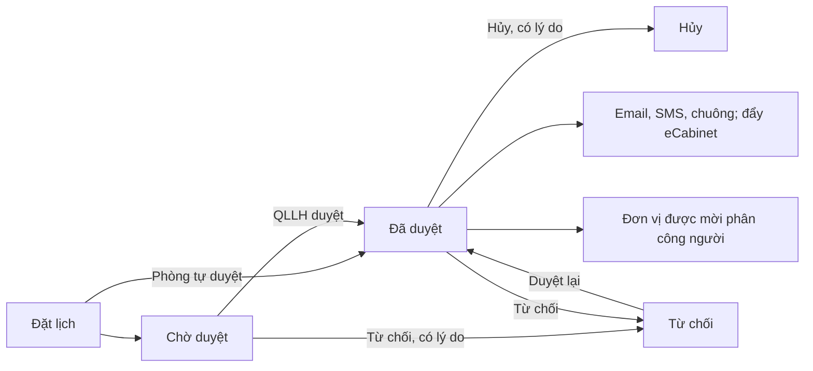

# Họp (lịch họp) — tóm tắt nghiệp vụ cho BA

> Bản đọc nhanh bằng lời nghiệp vụ. Chi tiết và bằng chứng: [nghiep-vu.md](nghiep-vu.md) (mã NV / BR trong ngoặc
> để tra). Cập nhật: 2026-10-02 · Nguồn: code `kha_develop` + DB DEV. Nhãn quy tắc: **[Đã xác nhận]** = chủ dự án đã
> chốt là đúng ý đồ · **[Hiện trạng]** = hệ thống đang chạy như vậy, chưa ai xác nhận là ý đồ · **[Lệch nghiệp vụ]**
> = đã xác nhận nghiệp vụ muốn khác, hệ thống đang làm sai.

## 1. Phân hệ này dùng để làm gì

Phân hệ quản lý **lịch họp / lịch công tác** của đơn vị: một người **đặt lịch** (tiêu đề, thời gian, phòng họp hoặc địa điểm khác, cầu truyền hình, thành phần cá nhân / đơn vị với vai trò chủ trì – chuẩn bị – tham dự, tài liệu, văn bản kèm) (1.1, NV-02).
Hệ thống tự tính **đơn vị duyệt lịch**: đơn vị gần nhất có người giữ vai trò **Quản lý lịch họp** (`QLLH`); QLLH duyệt, từ chối hoặc hủy (NV-02 BR-10, NV-04).
Khi duyệt, hệ thống gửi **email lịch**, **SMS** và **thông báo chuông**; **đơn vị được mời** phân công cá nhân dự họp (NV-05, NV-07).
Trong và sau buổi họp có tài liệu họp có quyền xem, điểm danh, đẩy lịch sang **eCabinet** (phòng họp không giấy — hệ thống ngoài), đánh dấu "không có kết luận"; kèm danh mục phòng họp, cầu truyền hình, khóa đặt lịch, giới hạn cuộc họp, trợ lý lãnh đạo và các màn **lịch tuần** (NV-06, NV-09…NV-14).

**Không gồm:** biên bản họp / kết luận và nhiệm vụ sinh từ cuộc họp (xem `nhiem-vu`); hàng đợi SMS, chặn tin, thông báo chuông, màn "Cấu hình lãnh đạo không nhận email/SMS" (xem `lich-nhac-viec`); nút "Đề xuất họp" trên văn bản đến và trợ lý theo dõi văn bản của lãnh đạo (xem `van-ban/den`); quyền xem văn bản đính kèm lịch (xem `van-ban/quan-ly-chung`); popup lý do duyệt / từ chối công việc nằm trong thư mục họp (xem `cong-viec`).

## 2. Ai dùng và được làm gì

| Vai trò | Được làm gì trong phân hệ này |
|---|---|
| Người đặt lịch (bất kỳ ai có menu) | Đặt, sửa, sao chép lịch; xóa lịch chờ duyệt của mình (1.4, NV-02, BR-18) |
| Quản lý lịch họp (`QLLH`) của đơn vị duyệt | Duyệt / từ chối / hủy / xóa (kèm lý do), sửa, gửi email / SMS, gán cầu, phân công đơn vị cấp dưới, import, mở khóa đặt lịch, khai cấu hình (1.4, NV-01 BR-03, NV-03, NV-04) |
| Lãnh đạo / thủ trưởng (`LDDV` / `TTDV`) là chủ trì | Duyệt lịch chờ duyệt mình chủ trì; phân công khi đơn vị mình được mời (1.4, BR-03, BR-24, Q5) |
| Trợ lý lãnh đạo | Trợ lý sửa lịch: sửa lịch có lãnh đạo dự; trợ lý duyệt lịch: duyệt / từ chối / hủy / gửi tin; trợ lý lịch: xem lịch mật, nhận thông báo thay lãnh đạo (1.4, NV-08) |
| Đơn vị được mời (QLLH hoặc lãnh đạo đơn vị đó) | Phân công cá nhân dự họp, người chuẩn bị tài liệu (1.4, NV-07) |
| Thành phần dự họp | Nhận thông báo, xem chi tiết và tài liệu được phép (1.4, NV-05, NV-06) |
| Quản lý cầu truyền hình (`QLCTH`) | Sửa mã cầu, nhận SMS về cầu, xóa cầu hết hạn (1.4, BR-29, BR-30) |
| Báo cáo quân số (`BCQS`) | Điểm danh, báo cáo quân số ở đơn vị chủ trì (1.4, BR-23, NV-16) |
| Quản trị | Phòng họp, nhóm cầu, giới hạn cuộc họp, trợ lý lãnh đạo (1.4, NV-08…NV-10) |

## 3. Màn hình / menu người dùng thấy

| Menu / màn | Để làm gì | Ghi chú | Mã menu |
|---|---|---|---|
| Danh sách lịch họp | Màn chính: xem lịch dạng danh sách / lịch tuần; nút **Đặt lịch**, duyệt, gửi tin, phân công, xuất Excel | Không có menu "Đặt lịch" riêng (NV-01, 1.2) | 338211 |
| Duyệt / xuất lịch tuần | QLLH khai trực chỉ huy và xuất Excel "Lịch công tác tuần" | **Không có thao tác duyệt** dù tên có chữ "Duyệt" (NV-11) | 338251 |
| Lịch tuần lãnh đạo | Xem lịch tuần của lãnh đạo | (NV-11) | 338871 |
| Lịch tuần cơ quan | Xem lịch tuần đơn vị, tải file lịch tuần, link công khai | Hai menu cùng một màn (NV-11) | 440185 · 440146 |
| Mở khóa đặt lịch họp | QLLH mở khóa đặt lịch tuần sau cho một số đơn vị trong khoảng ngày | (NV-03) | 337791 |
| Cấu hình duyệt lịch | Khai người duyệt theo từng ngày | **Không ảnh hưởng ai được duyệt** (NV-11 BR-32, Q6) | 339212 |
| Cấu hình gán thành phần tham gia lịch họp | Khai sẵn người đơn vị mình cử khi lãnh đạo X chủ trì / đơn vị Y chuẩn bị | Tự điền khi phân công (BR-27) | 339152 |
| Phê duyệt thay đổi thành phần tham gia cuộc họp | Trợ lý duyệt yêu cầu thay người dự | Hệ thống hiện không tạo yêu cầu chờ duyệt (BR-28, Q7) | 338971 |
| Báo cáo tổng hợp lịch họp | Số cuộc họp theo tuần / tháng, theo người / đơn vị / nhóm | (NV-10) | 338571 |
| Báo cáo quân số | Bật / tắt cờ báo quân số trên lịch đã duyệt | Hai popup tra cứu sẽ lỗi khi mở (NV-16) | 338373 |
| Cấu hình giới hạn cuộc họp | Ngưỡng số cuộc họp / tuần theo người hoặc đơn vị | (NV-10) | 338551 |
| Cấu hình lãnh đạo trợ lý | Gán trợ lý và loại trợ lý cho lãnh đạo | (NV-08) | 338472 |
| Cấu hình lãnh đạo không nhận email/sms | — | Màn thuộc `lich-nhac-viec`; tác dụng trong họp ở BR-21 | 338471 |
| Danh mục tài nguyên cuộc họp · Danh mục nhóm cầu truyền hình | Phòng họp, tài nguyên, cầu; nhóm cầu | (NV-09) | 336824 · 337431 |
| Văn bản yêu cầu đặt lịch · Trợ lý theo dõi văn bản của lãnh đạo | Danh sách văn bản yêu cầu đặt lịch; trợ lý xem văn bản lãnh đạo nhận | Nằm dưới menu Văn bản đến (NV-12, NV-08) | 439315 · 338473 |
| Lịch tuần cũ (4 menu) · Danh sách phòng họp rỗng | — | Menu **khóa / đã xóa**, mở ra màn không tồn tại (NV-18) | 337281 · 337283 · 337411 · 337731 · 337751 |
| Trang chủ — ô "Lịch họp" / "Lịch họp sắp tới" | Tối đa 3 cuộc họp gần nhất, tô khác khi mình chủ trì | (1.3) | — |

## 4. Luồng chính

1. Người dùng bấm **Đặt lịch** trên *Danh sách lịch họp*: chọn phòng họp thuộc quản lý hoặc nhập địa điểm khác, tiêu đề, người liên hệ, thời gian, thành phần (cá nhân / đơn vị, mỗi dòng ít nhất một vai trò), cầu truyền hình, tài liệu, văn bản kèm (NV-02).
2. Hệ thống kiểm hợp lệ, kiểm khóa đặt lịch, kiểm **trùng phòng / cầu** (chặn) và **trùng thành phần** (chỉ cảnh báo) (NV-03).
3. Hệ thống tự tính đơn vị duyệt; lịch mới vào **Chờ duyệt** và QLLH của đơn vị duyệt nhận SMS + chuông. Lịch dùng phòng bật tự duyệt (đủ điều kiện) thì vào thẳng **Đã duyệt** (BR-09, BR-10, BR-11, BR-20).
4. QLLH (hoặc trợ lý duyệt lịch, hoặc lãnh đạo chủ trì) bấm **Duyệt**: hệ thống kiểm lại trùng phòng / cầu, cảnh báo vượt giới hạn cuộc họp, tạo phòng cầu Cisco nếu có cầu (NV-04).
5. Đã duyệt: thành phần nhận email lịch (nếu họp trong tuần hiện tại) và SMS; người tạo nhận SMS + chuông; lịch được đẩy sang eCabinet nếu phòng có mã eCabinet (NV-05 BR-20, NV-14).
6. Lịch mời **đơn vị**: QLLH / lãnh đạo đơn vị đó bấm **Phân công** để cử người; người được cử nhận SMS (NV-07).
7. **Từ chối / Hủy** bắt buộc lý do; người tạo và thành phần đã nhận email được báo hủy (NV-04, BR-20).

**Luồng phụ.**
- *Sửa lịch đã gửi email* mà có thay đổi đáng kể: bắt nhập lý do và chọn gửi lại tất cả / chỉ người thay đổi / tạm dừng (BR-12).
- *Xóa*: người tạo xóa lịch chờ duyệt (không lý do); QLLH xóa lịch chờ duyệt (lý do bắt buộc, SMS cho người tạo) (BR-18).
- *Gửi lại thủ công*: QLLH gửi email / SMS hàng loạt cho lịch đã duyệt chưa gửi, hoặc từng lịch; chặn gửi lại cùng lịch trong 5 phút (NV-05).
- *Không có kết luận*: người viết kết luận / QLLH / lãnh đạo đơn vị ghi kết luận đánh dấu cuộc họp không có kết luận (BR-34).
- *Lịch tuần*: QLLH khai trực chỉ huy, xuất Excel lịch công tác tuần; tải file lịch tuần cơ quan và bật công khai (NV-11).

## 5. Trạng thái

**Trạng thái lịch họp**

| Trạng thái (tên người dùng thấy) | Nghĩa | Chuyển sang khi nào | Giá trị |
|---|---|---|---|
| Chờ duyệt | Mới đặt, chờ đơn vị duyệt | Đặt lịch; sửa làm đổi đơn vị duyệt; QLLH sửa lịch đang từ chối; bị lịch có ban giám đốc chiếm phòng / cầu (BR-11, BR-16) | 1 |
| Đã duyệt | Được tổ chức; hiện ở lịch tuần, được gửi mời, đẩy eCabinet | Duyệt (từ 1 hoặc 3); tự duyệt khi đặt (BR-09, BR-17) | 2 |
| Từ chối | Không được tổ chức, có lý do | Từ chối (từ 1 hoặc 2) (BR-17) | 3 |
| Hủy | Đã duyệt rồi hủy, có lý do | Hủy (từ 2) (BR-17) | 4 |

"Xóa" không phải trạng thái: lịch bị xóa mềm. "Chờ duyệt và đã duyệt" (25) và "Xóa" (99) chỉ là giá trị lọc (mục 3, dac-thu bẫy 10).

**Vai trò thành phần** (cờ độc lập trên từng dòng thành phần): Chủ trì · Tham dự và chỉ đạo · Tham dự · Chuẩn bị chính · Chuẩn bị phối hợp · Viết kết luận; thêm "người chỉ chuẩn bị tài liệu" — không thành thành phần dự họp (mục 3, BR-25).

**Loại lịch**: lịch họp · lịch đào tạo · lịch công tác (có thời gian công tác riêng); kèm cờ lịch mật, lịch Đảng, lặp lại (không / tuần / tháng / năm) (mục 3).

## 6. Quy tắc quan trọng nhất

- [Hiện trạng] **Đơn vị duyệt lịch** = đơn vị gần nhất (đi ngược lên cây) có người giữ vai trò QLLH, tính từ đơn vị tham gia / quản lý phòng / người đặt. Các quy tắc ưu tiên kế thừa (ban giám đốc tập đoàn, chi nhánh, phòng "Crowne") có mã đơn vị cài cứng không tồn tại trên DB DEV nên không áp dụng (BR-10, Q1).
- [Hiện trạng] Bắt đầu < kết thúc; tạo mới thì bắt đầu ≥ hiện tại; **một cuộc họp không quá 24 giờ** trừ lịch đào tạo / lịch công tác (BR-04).
- [Hiện trạng] **Đúng một chủ trì** trong lưới thành phần (0 chủ trì chỉ khi có "thành phần khác"); có chuẩn bị phối hợp thì phải có chuẩn bị chính, dòng chuẩn bị phải có nội dung chuẩn bị (BR-05, BR-06).
- [Hiện trạng] **Trùng phòng / cầu với lịch đã duyệt thì chặn**; trùng thành phần chỉ cảnh báo (NV-03).
- [Hiện trạng] Lịch có **thành phần ban giám đốc** được chiếm phòng / cầu: lịch đã duyệt bị trùng tự về *Chờ duyệt*, người tạo nhận tin "tạm dừng" (BR-16, Q2).
- [Hiện trạng] Tự duyệt khi phòng bật tự duyệt và có thành phần (hoặc người đặt) thuộc cây đơn vị quản lý phòng, không có ban giám đốc; hoặc lịch ở địa điểm ngoài, không chủ trì trong lưới, có "thành phần khác". Phòng tự duyệt mà ngày họp ngoài 2 tuần thì không lưu được (BR-09, NV-02 bước 3).
- [Hiện trạng] Duyệt / từ chối / hủy chỉ khi lịch **chưa kết thúc**; từ chối và hủy bắt buộc lý do (BR-17, NV-04).
- [Hiện trạng] **Email mời họp chỉ tự gửi khi cuộc họp trong tuần hiện tại**; lịch tuần sau chờ QLLH bấm *Gửi email*. SMS báo người tạo vẫn gửi ngay (BR-20, Q3).
- [Hiện trạng] Mời **đơn vị** thì tin đi tới QLLH đơn vị đó, trợ lý của lãnh đạo được mời và lãnh đạo đơn vị — trừ lãnh đạo khai "không nhận email / SMS" (BR-21).
- [Hiện trạng] Khóa đặt lịch: trong khung giờ cấu hình, không ai đặt được lịch cho tuần sau trừ đơn vị đang được mở khóa; QLLH vẫn sửa được. Trên DB DEV không có khung giờ nên không khóa gì (BR-14, Q4).
- [Hiện trạng] Giới hạn cuộc họp chỉ **cảnh báo** khi duyệt / phân công, đếm số cuộc họp đã duyệt trong tuần của ngày họp (BR-15, BR-31, Q9).
- [Hiện trạng] Lịch mật: người không liên quan thấy dòng nhưng nội dung bị ẩn (BR-22).
- [Hiện trạng] Tài liệu họp **công khai** thì mọi thành phần xem; tài liệu **riêng** chỉ người / đơn vị / nhóm được cấp quyền (NV-06).
- [Hiện trạng] Điểm danh do người báo quân số của đơn vị chủ trì, từ 30 phút trước giờ họp đến 30 phút sau giờ kết thúc, chỉ lịch đã duyệt (BR-23).
- [Hiện trạng] Lưu lịch có văn bản yêu cầu đặt lịch thì yêu cầu được cập nhật sang "đã tạo lịch"; duyệt lịch thì văn bản được đánh dấu đã có lịch họp (BR-33).

## 7. Hệ thống KHÔNG làm / hay bị hiểu nhầm

- **"Duyệt / xuất lịch tuần" không duyệt gì** — chỉ khai trực chỉ huy và xuất Excel (NV-11).
- **"Cấu hình duyệt lịch" không quyết định ai được duyệt** — quyền duyệt vẫn theo vai trò QLLH; tên người duyệt cấu hình không hiện ở đâu (BR-32, Q6).
- **Thay người dự họp không cần duyệt**; màn "Phê duyệt thay đổi thành phần" không có nguồn tạo yêu cầu trên hệ thống này (BR-28, Q7).
- **Biên bản họp / kết luận không nằm ở đây** — ở `nhiem-vu`; họp chỉ có cờ "không có kết luận", đơn vị ghi kết luận, người viết kết luận (NV-13).
- **eCabinet là hệ thống ngoài**: lịch đã duyệt và tài liệu được đẩy sang; phòng không có mã eCabinet hoặc địa điểm ngoài thì không đẩy (NV-14).
- **Biểu quyết, điểm danh, thay người** có phía máy chủ cho ứng dụng khác nhưng **web không có màn** biểu quyết và không gọi điểm danh / thay người (NV-15, NV-06, NV-07).
- **Không có tiến trình gửi email lịch trong hệ thống này** — email được ghi vào hàng đợi; DB DEV hàng đợi email 0 dòng (NV-05).
- **Tick "Cầu truyền hình" mà không chọn cầu vẫn đánh dấu lịch có cầu** (NV-09).
- **Lịch tuần cơ quan công khai xem được không cần đăng nhập** qua link (NV-11, Q10).
- **Cùng một lịch, nút trên lưới, trong form và trong chi tiết có thể khác nhau** — quyền nút tính ở nhiều chỗ (dac-thu bẫy 2).

## 8. Liên quan phân hệ khác

| Khi thay đổi ở đây… | …phải xem thêm | Vì sao |
|---|---|---|
| SMS 301–313, chặn tin, chuông | `lich-nhac-viec` | Cơ chế SMS / chặn tin / chuông ở đó; mã 306 không chặn được (NV-05) |
| Lãnh đạo không nhận email / SMS | `lich-nhac-viec` | Màn cấu hình ở đó, tác dụng ở họp (BR-21) |
| Kết luận, biên bản, nhiệm vụ từ cuộc họp | `nhiem-vu` | Biên bản chọn cuộc họp; cờ "không có kết luận" loại cuộc họp khỏi danh sách cần kết luận (NV-13) |
| Văn bản yêu cầu đặt lịch, "Đề xuất họp", trợ lý văn bản | `van-ban/den` | Yêu cầu tạo từ văn bản đến; lưu / duyệt lịch cập nhật yêu cầu và văn bản (NV-12, NV-08) |
| Văn bản đính kèm lịch | `van-ban/quan-ly-chung` | Thành phần / người tạo lịch được xem văn bản kèm (NV-12) |
| Loại trợ lý lãnh đạo | `van-ban/den`, `ky-so`, `nhiem-vu` | Cùng bảng trợ lý: trợ lý văn bản, trợ lý cặp trình ký, trợ lý nhiệm vụ (NV-08) |
| Duyệt / sửa / gửi tin lịch | kênh ứng dụng khác (mobile / eCabinet) | Phía máy chủ có bản riêng của duyệt / từ chối / hủy / kiểm trùng; đổi quy tắc phải sửa cả hai (NV-17, dac-thu bẫy 1) |

## 9. Câu hỏi nghiệp vụ còn mở

- `Q1` — Ở Khánh Hòa lịch họp do đơn vị nào duyệt; quy tắc "ban giám đốc tập đoàn / chi nhánh" còn ý nghĩa không?
- `Q2` — Có cần ưu tiên lịch có ban giám đốc chiếm phòng / cầu; "ban giám đốc" là ai?
- `Q3` — Email mời họp gửi khi chốt lịch tuần hay ngay khi duyệt?
- `Q4` — Có dùng khóa đặt lịch tuần sau không; khung giờ nào?
- `Q5` — Lãnh đạo chủ trì có được tự duyệt lịch mình chủ trì?
- `Q6` — Cấu hình duyệt lịch theo ngày dùng để làm gì?
- `Q7` — Thay người dự họp có cần ai phê duyệt?
- `Q8` — Khánh Hòa đang / sẽ dùng điểm danh, biểu quyết, eCabinet, báo cáo quân số?
- `Q9` — Vượt giới hạn cuộc họp có cần chặn duyệt?
- `Q10` — Lịch tuần công khai dành cho mọi người có link hay chỉ nội bộ?

(đầy đủ ở mục 7.1 của `nghiep-vu.md`)

## 10. Khi viết yêu cầu mới cho phân hệ này, nhớ ghi rõ

- **Áp dụng cho thành phần cá nhân, thành phần đơn vị, hay "thành phần khác"** (nhập tay) — và với vai trò nào: chủ trì, tham dự và chỉ đạo, tham dự, chuẩn bị chính / phối hợp, viết kết luận, người chỉ chuẩn bị tài liệu (mục 3, BR-05, BR-25).
- **Ai được thao tác:** người tạo, QLLH đơn vị duyệt, trợ lý sửa / duyệt lịch, lãnh đạo chủ trì, đơn vị được mời — và ở trạng thái nào, lịch đã kết thúc hay chưa (BR-03, BR-17).
- **Áp dụng ở đâu:** lưới *Danh sách lịch họp*, form lịch, hay chi tiết lịch — ba nơi đang tính nút riêng (dac-thu bẫy 2).
- **Loại lịch:** lịch họp, đào tạo, công tác, Đảng, lịch mật, lịch lặp lại (mục 3).
- **Phòng họp hay địa điểm ngoài; có cầu truyền hình / phòng trực tuyến không** — ảnh hưởng tự duyệt, kiểm trùng, Cisco, eCabinet (BR-08, BR-09, NV-09, NV-14).
- **Đơn vị duyệt tính thế nào** nếu yêu cầu đụng tới người duyệt (BR-10, Q1).
- **Gửi gì, cho ai, mã tin nào:** email lịch (gửi ngay hay theo tuần), SMS (mã 30x), chuông; mời đơn vị thì gửi QLLH / trợ lý / lãnh đạo nào (BR-20, BR-21, Q3).
- **Có ảnh hưởng eCabinet không** — lịch đẩy sang eCabinet được cập nhật / hủy theo trạng thái (NV-14).
- **Có áp dụng cho kênh ứng dụng khác không** (mobile / eCabinet) — phía máy chủ có bản duyệt / kiểm trùng riêng (NV-17).
- **Lịch tuần nào bị ảnh hưởng:** lịch tuần lãnh đạo, lịch tuần cơ quan, file lịch tuần công khai (NV-11).
