# KPI, chấm điểm, đánh giá, báo cáo — nghiệp vụ: đánh giá công tác tuần (nhóm nhiệm vụ → mục công việc → tự chấm → người đánh giá chấm → phê duyệt), chấm điểm thi đua đơn vị theo tiêu chí, chỉ tiêu nề nếp / KPI đơn vị / đề xuất cộng điểm / đánh giá đơn vị, cấu hình tỷ lệ – KI – công thức, theo dõi KPI xử lý, cổng KPI hiệu năng, báo cáo tổng hợp sử dụng, báo cáo văn bản trình ký, thỏa thuận hợp tác, OKR

> Viết lại từ code nhánh `kha_develop` (web-spring + backend2.0, cả hai đang checkout `kha_develop`) ngày 2026-10-02. Mọi khẳng định có nguồn `file:dòng`.
> Menu đối chiếu **DB DEV `SYS_MENU` / `ORG_SYS_MENU` ngày 2026-10-01**; số dòng, phân bố giá trị và comment cột các bảng `CRITERIA*`, `KPI*`, `EVALUATION_UNIT`, `EMP_RATING`, `ORG_KI`, `RATIO_CONFIG*`, `REP_IN`, `REPORT_PERIOD_*`, `REPORT_DAILY_HISTORY`, `DOC_DAILY_SUMMARY` đối chiếu **DB DEV ngày 2026-10-01** (người điều phối truy vấn, chỉ SELECT; tác giả không kết nối DB). DB DEV **không có FK** nào trên các bảng này — mọi quan hệ ở mục 5 là quan hệ logic lấy từ JOIN / entity trong code. Bổ sung lần hai **DB DEV ngày 2026-10-02** (người điều phối, chỉ SELECT): menu nhóm 440385 / OKR, `ORG_SYS_MENU`, `ORG_CRITERIA*`, `WORK_GROUP_ITEM*`, bộ `XLDGCN`, kỳ của `KPI_INDEX` / `EVALUATION_UNIT`, cột `ORG_KI`, đối tượng DB (`USER_OBJECTS`, job), tham số `SYSTEM_PARAMETER`. Còn **chưa đối chiếu DB** ở bài này: `WORK_GROUP` (số liệu đã có ở `nhiem-vu` — DB DEV 2026-10-01: 244 dòng, phân bố `WORK_GROUP_LEVEL` ở NVu NV-19; sửa chéo 2026-10-02 theo `nhiem-vu`), `REP_IN` theo thời gian, `SYSTEM_DOWNTIME_LOG` (chỉ biết bảng có), `CHART_AGREEMENT*`; `PROPOSE_POINT`, `KI_FORMULA_CONFIG` **không có bảng** trên DB DEV.
> HDSD cũ chỉ dùng tham khảo thuật ngữ.
>
> Viết tắt đường dẫn:
> `WEB/` = `web-spring/src/main/java/com/viettel/` · `ZUL/` = `web-spring/src/main/webapp/view/voffice/` ·
> `BIZ/` = `web-spring/src/main/java/com/voffice/service/business/` · `BE1/` = `backend2.0/backendvoffice/src/main/java/com/viettel/voffice/` ·
> `BE2/` = `backend2.0/backendvoffice/src/main/java/com/viettel/office/` · `SQL/` = `backend2.0/backendvoffice/sql/` ·
> **AC** = `WEB/util/AppConstants.java` · **C1** = `BE1/constants/Constants.java` · **C2** = `BE2/utils/Constants.java` · **WPROP** = `web-spring/src/main/resources/application.properties`.
> Lớp hay dùng (khai đủ ở đây, dùng ở mọi file của phân hệ):
> - **Đánh giá công tác tuần (gen-2)** — web: **WGVM** = `WEB/voffice/vm/mission/WorkGroupVM.java`, **WGIVM** = `…/vm/mission/WorkGroupItemVM.java`, **WGRR** = `…/vm/mission/WorkGroupRowRenderer.java`, **PSWG** = `WEB/voffice/widget/PopupSelectWorkGroupVM.java`, **WGRVM** = `WEB/voffice/widget/WorkGroupResultVM.java`, **PAWG** = `WEB/voffice/widget/PopupAddWorkGroupItemVM.java`, **RPIVM** = `WEB/voffice/vm/mission/ReportPeriodIndividualVM.java` (~3.500 dòng), **RPCVM** = `…/vm/mission/ReportPeriodConfigVM.java`, **WIAVM** = `…/vm/mission/WorkItemApproveVM.java`; Business **WGB** = `BIZ/WorkGroupBusiness.java`, **WGIB** = `BIZ/WorkGroupInfoBusiness.java`, **WGHB** = `BIZ/WorkGroupHistoryBusiness.java`, **RPB** = `BIZ/ReportPeriodBusiness.java`, **RPAB** = `BIZ/ReportPeriodApproveBusiness.java`, **RPCB** = `BIZ/ReportPeriodConfigBusiness.java`. BE2: **WGC** = `BE2/controller/WorkGroupController.java`, **WGIC** = `…/WorkGroupItemController.java`, **WGHC** = `…/WorkGroupItemHistoryController.java`, **RPIC** = `…/ReportPeriodIndividualController.java`, **RPAC** = `…/ReportPeriodApproveController.java`, **RPCC** = `…/ReportPeriodConfigController.java`; service `BE2/services/impl/`: **WGSI** = `WorkGroupServiceImpl.java`, **WGISI** = `WorkGroupItemServiceImpl.java`, **WGHSI** = `WorkGroupItemHistoryServiceImpl.java`, **RPISI** = `ReportPeriodIndividualServiceImpl.java`, **RPASI** = `ReportPeriodApproveServiceImpl.java`, **RPCSI** = `ReportPeriodConfigServiceImpl.java`, **WGRSI** = `WorkGroupReportServiceImpl.java` (xuất PDF); repository `BE2/repositories/impl/`: **WGRI** = `WorkGroupRepositoryImpl.java`, **WGIRI** = `WorkGroupItemRepositoryImpl.java`, **RPIRI** = `ReportPeriodIndividualRepositoryImpl.java`, **RPARI** = `ReportPeriodApproveRepositoryImpl.java`, **RPCRI** = `ReportPeriodConfigRepositoryImpl.java`; **RPIJ** = `BE2/repositories/jpa/ReportPeriodIndividualRepositoryJPA.java`.
> - **Chấm điểm thi đua đơn vị (gen-1)** — web **CCVM** = `WEB/voffice/vm/criteria/ConfigCriteriaVM.java`, **COMVM** = `…/vm/criteria/CriteriaOrgMapVM.java`, **CORVM** = `…/vm/criteria/CriteriaOrgRatingVM.java`, **OCCVM** = `…/vm/criteria/OrgCriteriaConfigVM.java`, **ECOVM** = `WEB/voffice/vm/evaluatedOrg/EvaluatedCriteriaOrgVM.java`; **COB** = `BIZ/CriteriaOrgBusiness.java`, **EOB** = `BIZ/EvaluatedOrgBusiness.java`; BE1 **ORS** = `BE1/action/OrgResource.java` (`/Org`), **OCA** = `BE1/action/OrgCriteriaAction.java` (`/orgCriteria`), **OC** = `BE1/controler/OrgController.java`, **OCC** = `BE1/controler/OrgCriteriaController.java`, DAO `BE1/database/dao/staff/`: **OCDAO** = `OrgCriteriaDAO.java`, **OCMDAO** = `OrgCriteriaMapDAO.java`, **OCRDAO** = `OrgCriteriaRatingDAO.java`, **OCRTDAO** = `OrgCriteriaRatingTotalDAO.java`; **FU** = `BE1/utils/FileUtils.java`; **TDAO** = `BE1/database/dao/task/TaskDAO.java`, **PTDAO** = `BE1/database/dao/task/PersonTaskDAO.java`.
> - **Màn legacy (facade JPA trong web)** — **CGVM** = `WEB/voffice/vm/admin/CriteriaGroupVM.java`, **CGDAO** = `WEB/voffice/dao/CriteriaGroupJpaDao.java`, **KIVM** = `WEB/voffice/vm/mission/KPIIndexVM.java`, **KIDAO** = `WEB/voffice/dao/KPIIndexJpaDao.java`, **PPVM** = `WEB/voffice/vm/mission/ProposePointVM.java`, **PPDAO** = `WEB/voffice/dao/ProposePointJpaDao.java`, **EUVM** = `WEB/voffice/vm/mission/EvaluationUnitVM.java`, **EUDAO** = `WEB/voffice/dao/EvaluationUnitJpaDao.java`, **EUS** = `WEB/voffice/service/EvaluationUnitService.java`, **RCVM** = `WEB/voffice/vm/ratioConfig/RatioConfigVM.java` (~2.500 dòng), **RCDVM** = `…/vm/ratioConfig/RatioConfigDetailVM.java`, **RCF** = `WEB/voffice/facade/RatioConfigFacade.java`, **RCS** = `WEB/voffice/service/RatioConfigService.java`, **RCDAO** = `WEB/voffice/dao/RatioConfigJpaDao.java`, **KFVM** = `WEB/voffice/vm/kiFormulaConfig/KiFormulaConfigVM.java`, **VTER** = `WEB/voffice/util/vm/VoTaskEmpRatingUtils.java`, **ERMVM** = `WEB/voffice/vm/task/EmpRatingManagerVM.java`.
> - **Thỏa thuận hợp tác (gen-1)** — **CAVM** = `WEB/voffice/vm/mission/ChartAgreementVM.java`, **AGB** = `BIZ/AgreementBusiness.java`, **AGA** = `BE1/action/AgreementAction.java`, **ACC** = `BE1/controler/AgreeChartController.java`, **AGDAO** = `BE1/database/dao/AgreementDAO.java`.
> - **Theo dõi KPI / cổng KPI (gen-2)** — **KSVM** = `WEB/voffice/vm/kpi/KpiStatisticVM.java` (~3.000 dòng), **KSB** = `BIZ/KpiStatisticBusiness.java`, **KMC** = `BE2/controller/KpiManagerController.java`, **KMSI** = `BE2/services/impl/KpiManagerServiceImpl.java`, **KMRI** = `BE2/repositories/impl/KpiManagerRepositoryImpl.java`; **KPVM** = `WEB/voffice/vm/kpiPortal/KpiPortalVM.java`, **KAVM** = `…/vm/kpiPortal/KpiAddVM.java`, **SDVM** = `…/vm/kpiPortal/systemDowntimeLogVM.java`, **KPB** = `BIZ/KpiPortalBusiness.java`, **KPC** = `BE2/controller/KpiPortalController.java`, **KPSI** = `BE2/services/impl/KpiPortalServiceImpl.java`, **SDSI** = `BE2/services/impl/SystemDowntimeLogServiceImpl.java`.
> - **Báo cáo tổng hợp sử dụng (gen-2)** — **SUZ** = `ZUL/summaryUsageReport/summaryUsageReport.zul`, **UVM** = `WEB/voffice/vm/summaryUsageReport/UsageReportVM.java`, **SRB** = `BIZ/StatisticsReportBusiness.java`, **SRC** = `BE2/controller/StatisticsReportController.java`, **SRS** = `BE2/services/impl/StatisticsReportServiceImpl.java`, **SRR** = `BE2/repositories/impl/StatisticsReportRepositoryImpl.java`, **EHS** = `BE1/elasticsearch/search/ElasticHomeSearch.java`, **LSI** = `BE2/core/log/service/LoggingServiceImpl.java`.
> - **Báo cáo văn bản trình ký (gen-1)** — **RRZ** = `ZUL/requisition/requisitionReport.zul`, **RRVM** = `WEB/voffice/vm/requisition/RequisitionReportVM.java` (~3.050 dòng), **RQB** = `BIZ/RequisitionBusiness.java`, **TRA** = `BE1/action/TextReportAction.java`, **TRC** = `BE1/controler/TextReportController.java`, **TRD** = `BE1/database/dao/report/TextReportDAO.java`.
>
> Phân hệ liền kề đã viết: công việc [`../cong-viec/nghiep-vu.md`](../cong-viec/nghiep-vu.md) (`CV NV-xx` — KI cá nhân NV-09, phiếu đánh giá công việc NV-07), nhiệm vụ [`../nhiem-vu/nghiep-vu.md`](../nhiem-vu/nghiep-vu.md) (`NVu NV-xx` — tự chấm / phiếu giao nhiệm vụ tháng NV-16, báo cáo đơn vị theo mẫu NV-17, tóm tắt đánh giá công tác tuần NV-19, TTHT NV-20), hệ thống [`../he-thong/nghiep-vu.md`](../he-thong/nghiep-vu.md) (`HT` — `ORG_SYS_MENU` BR-11, quyền xem báo cáo tổng hợp NV-19, `USER_ORG_MAP` NV-07, biến sơ cấp NV-13), sổ văn bản [`../van-ban/so-van-ban/nghiep-vu.md`](../van-ban/so-van-ban/nghiep-vu.md) (`SVB NV-11` — Mục lục / Sổ / Sổ đăng ký văn bản đi trên màn báo cáo trình ký), quản lý chung văn bản [`../van-ban/quan-ly-chung/nghiep-vu.md`](../van-ban/quan-ly-chung/nghiep-vu.md) (`QLC NV-04` — theo dõi văn bản đi đơn vị / tình hình xử lý cá nhân), chuyển văn bản [`../van-ban/chuyen-van-ban/nghiep-vu.md`](../van-ban/chuyen-van-ban/nghiep-vu.md) (`CVB NV-21` — "Tạo KPI nhiệm vụ" khi chuyển).

## 1. Tổng quan

### 1.1 Phạm vi

Phân hệ gom **mọi màn chấm điểm / đánh giá / số liệu tổng hợp** không thuộc vòng đời của một đối tượng nghiệp vụ. Code thực chất là **bảy cụm độc lập**, không dùng chung bảng (trừ cấu hình `RATIO_CONFIG`):

| Cụm | NV | Tầng | Tình trạng |
|---|---|---|---|
| **A. Đánh giá công tác tuần** — cây nhóm nhiệm vụ mẫu → cá nhân khai mục công việc và báo cáo tiến độ → mỗi tuần tự chấm (chất lượng / tiến độ / tác phong) → người đánh giá chấm → gửi phê duyệt → lãnh đạo phê duyệt theo người hoặc theo đơn vị → tổng hợp tháng / quý / năm, xuất PDF | NV-01 … NV-08 | **gen-2** (`/api/work-group*`, `/api/report-period-*`) | **đang dùng** (tính năng mới nhất 2025; menu chỉ mở cho vài đơn vị qua `ORG_SYS_MENU`) |
| **B. Chấm điểm thi đua đơn vị theo tiêu chí** — Ban kế hoạch dựng cây tiêu chí, gán tỷ trọng / quỹ điểm cho từng đơn vị theo kỳ, trợ lý chấm, tổng hợp, trình ký văn bản điểm thi đua | NV-09 … NV-13 | gen-1 (`/Org`, `/orgCriteria`) | menu mở |
| **C. Chỉ tiêu nề nếp / KPI đơn vị** — bộ tiêu chí, KPI đơn vị tháng, đề xuất cộng điểm, đánh giá đơn vị → KI đơn vị | NV-14 … NV-17 | **legacy web** (facade JPA) | Bộ tiêu chí + KPI đơn vị mở; đề xuất / đánh giá đơn vị **khóa** |
| **D. Cấu hình tỷ lệ / KI / công thức** — `RATIO_CONFIG` 7 loại + bộ `XLDGCN`; công thức KI | NV-18, NV-19 | legacy web (ghi) · gen-1 / gen-2 (đọc) | mở; công thức KI **hỏng** (bảng không có) |
| **E. Theo dõi & thống kê** — theo dõi KPI xử lý (văn bản đến / đi / phiếu trình / hồ sơ đúng hạn – quá hạn), cổng KPI hiệu năng API + thời gian gián đoạn, báo cáo tổng hợp sử dụng | NV-20 … NV-22 | gen-2 | mở |
| **F. Báo cáo văn bản trình ký** (từ chối, chậm, quá giờ, từ chối nhiều lần, thống kê trình ký) | NV-23 | gen-1 (`/TextReportAction`) | mở |
| **G. Phụ** — thỏa thuận hợp tác (biểu đồ), OKR (liên kết ngoài), thành phần cũ / không có trong repo | NV-24 … NV-26 | gen-1 / web | TTHT khóa |

Phân hệ **KHÔNG gồm** (trỏ sang):

| Nội dung | Phân hệ |
|---|---|
| KI cá nhân hằng tháng (`EMP_RATING`, `ORG_KI` đọc ở màn KI), phiếu giao / đánh giá công việc cá nhân (`TASK_RATING`, `AVERAGE_TASK_RATING`) | `cong-viec` (CV NV-06, NV-07, NV-09 — sửa chéo 2026-10-02 theo `cong-viec`: phiếu giao việc `TASK_RATING` là CV NV-06) — ở đây chỉ mô tả cấu hình tỷ lệ mà chúng đọc (NV-18) và màn Đánh giá đơn vị cũng ghi `ORG_KI` (NV-17) |
| Tự chấm điểm / phiếu giao và đánh giá nhiệm vụ tháng (`MISSION_RATING`, menu `MISSIONRATING`, `MISSION_RATING`) | `nhiem-vu` (NVu NV-16) |
| Báo cáo đơn vị định kỳ theo mẫu (`mission-template`, `report-result`, `REPORT_DAILY_HISTORY`, `templateReport/*`) | `nhiem-vu` (NVu NV-17) / `tai-lieu-mau` — bảng `REPORT_DAILY_HISTORY` dù `ban-do.md` xếp ở đây, nghiệp vụ là báo cáo ngày / tuần / tháng của mẫu báo cáo |
| Báo cáo điểm nhiệm vụ đơn vị (`MissionReportDAO.scoreReport`, tham số `MISSION_SCORE_REPORT` quỹ điểm theo khối) | `nhiem-vu` (NVu NV-14) — **không** thuộc đánh giá công tác tuần (`BE1/database/dao/report/MissionReportDAO.java:2151-2156`, `2340-2352`) |
| Danh sách nhiệm vụ / dự án TTHT (`agreementTask`, `CHART_AGREEMENT_TASK` ghi khi giao nhiệm vụ) | `nhiem-vu` (NVu NV-20) — ở đây chỉ biểu đồ TTHT (NV-24) |
| Mục lục / Sổ / Sổ đăng ký văn bản đi trên màn "Báo cáo văn bản trình ký" | `van-ban/so-van-ban` (SVB NV-11) |
| Theo dõi văn bản đi đơn vị (`documentKpi.zul`), tình hình xử lý cá nhân (`/api/personal-treatment-status`) | `van-ban/quan-ly-chung` (QLC NV-04) |
| "Tạo KPI nhiệm vụ" khi chuyển văn bản (`/api/document-kpi/catalog-options`, `transfer-scope`, dịch vụ Mission ngoài) và API `/api/document-kpi/draft-metadata/batch`, `draft-text-detail` cho dịch vụ Nhiệm vụ | `van-ban/chuyen-van-ban` (CVB NV-21), `xu-ly-cong-viec` — **không** dùng bảng `KPI` hay `/api/kpi*` của phân hệ này (`BE2/services/document_kpi/DraftMetadataController.java:25-70`; web không gọi) |
| Cấu hình `USER_ORG_MAP` loại 4 "Chấm điểm đơn vị" (màn `vps/sysUser/userOrgMap.zul`), `ORG_SYS_MENU`, biến sơ cấp `PRIMARY_VARIABLE` | `he-thong` (HT NV-07, BR-11, NV-13) |
| Quyền xem báo cáo tổng hợp sử dụng (gốc cây = đơn vị `ADMIN` / `ADMIN_LEVEL1`) | `he-thong` (HT NV-19) — ở đây nội dung báo cáo (NV-22) |

### 1.2 Menu (đối chiếu DB DEV `SYS_MENU` ngày 2026-10-01)

`SYS_MENU.STATUS`: 1 = mở, 2 = khóa (X3). Code web không ghi cứng mã menu nào của phân hệ (trừ điều hướng `MISSION_MANAGER`, `CHART_AGREEMENT_TASK` từ TTHT — NV-24).

| `SYS_MENU_ID` | `CODE` | Tên (DB DEV) | Cha | URL | `STATUS` | VM — NV |
|---|---|---|---|---|---|---|
| 440385 | `WEEKLY-WORK-REVIEW` | **ĐÁNH GIÁ CÔNG TÁC TUẦN** (menu nhóm) | — (menu cấp 1) | URL trống | 1 | cha của 440229, 440305, 440317 (và 440505, 440547 theo dữ liệu tra lần đầu) — DB DEV ngày 2026-10-02 |
| 440225 | `CATEGORY_WORK_GROUP` | Danh mục nhóm nhiệm vụ | DANH MỤC (336813) | `mission/workGroup/workGroup.zul` | 1 | WGVM — NV-01 |
| 440229 | `WORK_GROUP_ITEM` | **Danh sách nhiệm vụ cần báo cáo** | ĐÁNH GIÁ CÔNG TÁC TUẦN (440385) | `mission/workGroupItem/workGroupItem.zul` | 1 | WGIVM — NV-02 |
| 440505 | `REPORT_PERIOD_CONFIG` | Danh sách cấu hình đánh giá, phê duyệt | 440385 | `mission/reportPeriodConfig/reportPeriodConfig.zul` | 1 | RPCVM — NV-03 |
| 440305 | `REPORT_PERIOD` | **Đánh giá chấm điểm** | 440385 | `mission/report/report_period.zul` | 1 | RPIVM — NV-04 … NV-06, NV-08 |
| 440317 | `WORK_ITEM_APPROVE` | Danh sách đánh giá chờ phê duyệt | 440385 | `mission/workItemApprove/work_item_approve.zul` | 1 | WIAVM — NV-07 |
| 440547 | `WORK_GROUP_EXPORT` | Tổng hợp đơn vị | 440385 | `mission/workGroupExport/workGroupExport.zul?view=1` | 1 | RPIVM (dùng lại) — NV-08 |
| 338812 | `CONFIGCRITERIAORG` | Tạo danh sách tiêu chí đánh giá | CHẤM ĐIỂM THI ĐUA (338811) | `criteriaOrg/configCriteriaOrg/configCriteriaOrg.zul` | 1 | CCVM — NV-09 |
| 338831 | `CRITERIA_ORG_MAP` | Gán tiêu chí đơn vị | 338811 | `criteriaOrg/criteriaOrgMap/criteriaOrgMap.zul` | 1 | COMVM — NV-10 |
| 338833 | `CHAMDIEM` | Chấm điểm đơn vị | 338811 | `criteriaOrg/evaluatedCriteriaOrg.zul` | 1 | ECOVM — NV-11 |
| 338851 | `TONG_HOP_CHAM_DIEM_DV` | Tổng hợp chấm điểm đơn vị | 338811 | `criteriaOrg/criteriaOrgRating/criteriaOrgRating.zul` | 1 | CORVM — NV-12 |
| 338931 | `SYNC_ORG` | Đồng bộ danh sách đơn vị | 338811 | `criteriaOrg/orgCriteriaConfig.zul` | 1 | OCCVM — NV-13 |
| 338013 | `CRITERIA_GROUP` | Bộ tiêu chí | DANH MỤC (336813) | `admin/criteriaGroup/criteriaGroup.zul` | 1 | CGVM — NV-14 |
| 337982 | `KPIINDEX` | **KPI đơn vị** | QUẢN LÝ NHIỆM VỤ (337971) | `mission/kpi/kpi.zul` | 1 | KIVM — NV-15 |
| 440425 | `KPI` | Theo dõi | — (`PARENT_ID` null, menu cấp 1) | **cùng URL** `mission/kpi/kpi.zul` | 1 | menu nhóm của 440427; mang URL màn KPI đơn vị |
| 338012 | `PROPOSE_POINT` | Đề xuất cộng điểm | 337971 | `mission/proposePoint/proposePoint.zul?roleApproved=1` | **2** | PPVM — NV-16 |
| 337981 | `APPROVED_POINT` | Phê duyệt đề xuất | 337971 | `mission/proposePoint/approvedPoint.zul?roleApproved=2` | **2** | PPVM — NV-16 |
| 338051 | `EVALUATIONUNIT` | Đánh giá đơn vị | 337971 | `mission/evaluationUnit/evaluationUnit.zul` | **2** | EUVM — NV-17 |
| 337556 | `RATIO_CONFIG` | Quản lý cấu hình KI | QUẢN TRỊ (336812) | `ratioConfig/ratioConfig.zul` | 1 | RCVM — NV-18 |
| 337632 | `CONFIG_RATIO` | Quản lý cấu hình tỷ lệ | 336812 | **cùng URL** `ratioConfig/ratioConfig.zul` | 1 | RCVM — NV-18 (VM không phân biệt hai menu) |
| 337651 | `KI_FORMULA_CONFIG` | **"Danh mục nhà cung cấp"** (tên lệch nội dung) | 336812 | `kiFormulaConfig/kiFormulaConfig.zul` | 1 | KFVM — NV-19 |
| 440427 | `KPI_STATISTIC` | **Theo dõi KPI** | Theo dõi (440425) | `kpi/kpi_statistic.zul` | 1 | KSVM — NV-20 |
| 441185 | `KPIPORTAL` | Kpi portal | 336812 | `kpiPortal/kpi.zul` | 1 | KPVM — NV-21 |
| 441387 | `OKR` | OKR | — (menu cấp 1) | `okr/okr.zul` | 1 | `OkrVM` — NV-25 (DB DEV ngày 2026-10-02) |
| 440671 | `SUMMARY_USAGE_REPORT` | Báo cáo tổng hợp | 336812 | `summaryUsageReport/summaryUsageReport.zul` | 1 | UVM — NV-22 |
| 338591 | `SUBMITTING REPORT` | Báo cáo văn bản trình ký | VĂN BẢN ĐI (337232) | `requisition/requisitionReport.zul` | 1 | RRVM — NV-23 |
| 338771 | `BCVBTK` | Báo cáo văn bản trình ký | 337232 | `requisition/report/requisitionReport.zul` — **file không có trong repo** | 1 | NV-26 |
| 338372 | `GOV_OFFICE_REPORT` | Báo cáo VP CP | 337232 | `requisition/govOfficeReport.zul` — **file không có trong repo** | 1 | NV-26 |
| 339214 | `CHART_AGREEMENT` | Thoa thuan hop tac | 337971 | `mission/agreement/chartAgreement.zul` | **2** | CAVM — NV-24 |

URL ghi ngắn bỏ tiền tố `/view/voffice/`. Hai dòng 440385 và 441387 lấy từ DB DEV `SYS_MENU` ngày 2026-10-02. Menu `339233 CHART_AGREEMENT_TASK`, `338953 MISSION_NORM` thuộc `nhiem-vu` NV-20; `440265 TRACK_TEXT` thuộc `van-ban/quan-ly-chung`.

### 1.3 Danh sách trắng menu theo đơn vị (`ORG_SYS_MENU`, DB DEV ngày 2026-10-01) và widget

Menu **có dòng** trong `ORG_SYS_MENU` chỉ hiện cho người thuộc đơn vị khai **hoặc đơn vị con** của đơn vị đó; menu không có dòng thì ai có vai trò cũng thấy (`WEB/vps/dao/SysMenuJpaDao.java:390-402` — `CONNECT BY PRIOR ORG_PARENT_ID` từ đơn vị người dùng lên gốc; HT BR-11). DB DEV có dòng cho: `REPORT_PERIOD` "Đánh giá chấm điểm" (5 đơn vị), `WORK_ITEM_APPROVE` "Danh sách đánh giá chờ phê duyệt" (4), `WEEKLY-WORK-REVIEW` "ĐÁNH GIÁ CÔNG TÁC TUẦN" (4), `WORK_GROUP_ITEM` "Danh sách nhiệm vụ cần báo cáo" (4), `OKR` (1) → **cụm đánh giá công tác tuần và OKR chỉ dành cho vài đơn vị**. Không code nghiệp vụ nào của phân hệ đọc `ORG_SYS_MENU` (chỉ cây menu chung).

Chi tiết (DB DEV `ORG_SYS_MENU` ngày 2026-10-02, dòng còn hiệu lực): `OKR` → đơn vị 9133628 "Sở Khoa học và Công nghệ"; cụm đánh giá tuần (`REPORT_PERIOD`, `WEEKLY-WORK-REVIEW`, `WORK_GROUP_ITEM`, `WORK_ITEM_APPROVE`) → `ORG_ID` 3211, 3283, 9130878, 9131257 (`REPORT_PERIOD` thêm 3214) — **các id này không khớp `VHR_ORG.SYS_ORGANIZATION_ID` nào** trên DEV. Code so `om.ORG_ID = p.SYS_ORGANIZATION_ID` với `p` là đơn vị người dùng và các đơn vị cha trong `VHR_ORG` (`WEB/vps/dao/SysMenuJpaDao.java:393-399`) → trên DB DEV **cụm đánh giá công tác tuần không hiện cho đơn vị nào** (dữ liệu khai theo id đơn vị của môi trường khác — `dac-thu.md` bẫy 14).

Widget: `HOME_WIDGET` id 43 `KPI_TRACKING` "Theo dõi KPI" (DB DEV, `IS_ACTIVE` null; thêm bởi `SQL/20250828_insert_home_widget_kpi.sql` cùng `PERMISSION_DASHBOARD` 1172) — **web ZK không dựng widget này** (grep `KPI_TRACKING` trong `HomeVM`, `HomeWidgetRestController`, toàn `web-spring/src` rỗng); chỉ được đọc qua cấu hình dashboard chung gen-2 (`BE2/controller/HomeController.java:43-109`) cho client ngoài repo. Không có widget nào khác của phân hệ.

### 1.4 Actor & quyền

Mã vai trò (WPROP:344-359): `ADMIN`, `ADMIN_LEVEL1` (quản trị đơn vị), `SUPPER_ADMIN`, `TTDV` thủ trưởng (id 336953), `LDDV` lãnh đạo đơn vị (336952), `TL` trợ lý, `VT` văn thư, `NV` chuyên viên; riêng phân hệ: **`ADMINKH` admin kế hoạch** (`userRole.planAdmin`, WPROP:359; `WEB/util/resources/RbParamValue.java:31`), **`TLCDDV` trợ lý chấm điểm đơn vị** (`userRole.assistantEvaluate` và cả `assistantManager`, WPROP:357-358). Quyền thao tác nằm ở **tầng hiển thị nút** trên web (X1); **không endpoint nào của phân hệ kiểm vai trò** ở BE (gen-1 chỉ kiểm phiên — ví dụ `OC:212`, `TRC:756-767`; gen-2 không có `@PreAuthorize`), trừ phạm vi admin của danh sách cấu hình người chấm (BR-15) và kiểm người tạo / quyền xem TTHT (NV-24).

| Actor | Nhận diện trong code | Làm gì |
|---|---|---|
| Cán bộ (mọi người có menu) | `REP_IN.PERSON`, `WORK_GROUP_ITEM.ITEM_OWNER_ID` | Khai mục công việc, báo cáo tiến độ, tự chấm tuần (NV-02, NV-04) |
| Người đánh giá / người phê duyệt của một cán bộ | `REPORT_PERIOD_CONFIG.RATING_USER_ID` / `APPROVING_USER_ID`; web chỉ mở tab khi có vai trò **`LDDV`** (`RPIVM:261-263`) | Chấm điểm tuần, gửi phê duyệt / duyệt – từ chối từng người (NV-05, NV-06) |
| Lãnh đạo đơn vị cấp trên | đơn vị con trực tiếp của đơn vị người dùng (`RPARI:79-85`) + quyền xóa của menu (`WIAVM:266`, `316`) | Duyệt / từ chối kết quả cả đơn vị (NV-07) |
| Quản trị cấu hình đánh giá | vai trò `ADMIN` / `ADMIN_LEVEL1` / `SUPPER_ADMIN` (BE lọc theo cây — `RPCRI:36-80`) | Cấu hình người chấm / duyệt (NV-03) |
| Lãnh đạo / quản trị tạo nhóm nhiệm vụ | vai trò `LDDV`, `TTDV`, `ADMIN`, `ADMIN_LEVEL1`, "`SUPER_ADMIN`" (web — `WGVM:152-175`) hoặc người tạo | Nhóm nhiệm vụ (NV-01) |
| Admin kế hoạch (Ban kế hoạch) | `ADMINKH`; đơn vị Ban kế hoạch = `CONFIG_ORG_RATING.STATUS = 1` (`OCDAO:655`) | Tiêu chí, gán tiêu chí, tổng hợp, trình ký, đồng bộ đơn vị (NV-09, NV-10, NV-12, NV-13) |
| Trợ lý chấm điểm (đơn vị đánh giá / Ban kế hoạch) | `TLCDDV` + `USER_ORG_MAP.TYPE = 4` (đơn vị được chấm — `ECOVM:193`; `OCDAO:340-343`) | Chấm điểm đơn vị; trợ lý thuộc Ban kế hoạch "Gửi tổng hợp" (NV-11) |
| Người ký văn bản điểm thi đua | vai trò `TTDV` / `LDDV` (`CORVM:497-507`) | Ký văn bản tạo ở NV-12 (luồng ký: `van-ban/luong-xu-ly`) |
| Lãnh đạo / trợ lý chấm KPI đơn vị cấp dưới | `TTDV` / `LDDV` / `TL` (`KIVM:140-151`) | KPI đơn vị (NV-15) |
| Lãnh đạo / quản lý xem theo dõi KPI | đơn vị có `LDDV` hoặc `USER_ORG_MAP.TYPE = 5` (theo dõi văn bản đi) (`KSVM:209-217`) | NV-20 |
| Quản trị (`ADMIN`) | `vm.isAdmin` (`WEB/voffice/common/CommonModel.java:109-110`) | Thêm / sửa / xóa KPI cổng, nhập thời gian gián đoạn (NV-21); cây đơn vị cấu hình tỷ lệ (NV-18) |
| Quản trị đơn vị xem báo cáo sử dụng | `ADMIN` / `ADMIN_LEVEL1` (`UVM:102-113`) | NV-22 |
| Trợ lý / văn thư lập báo cáo trình ký | đơn vị mặc định theo `TL` / `VT` (`WEB/voffice/common/CommonModel.java:608-650`) — không giới hạn chọn đơn vị khác | NV-23 |

### 1.5 Sửa so với knowledge cũ (2026-10-02)

| Knowledge cũ | Hiện trạng code `kha_develop` | Ghi ở |
|---|---|---|
| "Báo cáo định kỳ cá nhân" `report-period-*`: lập báo cáo kỳ → tự chấm → gửi lãnh đạo duyệt → xuất | Là **đánh giá công tác tuần**: kỳ **luôn là tuần** (tháng / quý / năm chỉ là cách xem tổng hợp); điểm = chất lượng + tiến độ + tác phong (35 / 35 / 30); người chấm và người duyệt **cấu hình theo từng cán bộ**; **người đánh giá** (không phải cá nhân) gửi phê duyệt; có **hai đường phê duyệt** độc lập (theo người / theo đơn vị) (sửa 2026-10-02) | NV-03 … NV-08 |
| "Chấm điểm thi đua: tạo bộ tiêu chí (menu DANH MỤC Bộ tiêu chí, Tiêu chí)… Phê duyệt tự chấm / đề xuất cộng điểm (`ProposePoint`)" | Hai hệ tiêu chí **khác nhau, không liên quan**: (1) **tiêu chí thi đua** `ORG_CRITERIA*` (menu CHẤM ĐIỂM THI ĐUA, gen-1); (2) **bộ tiêu chí nề nếp** `CRITERIA_GROUP` / `CRITERIA` (menu DANH MỤC "Bộ tiêu chí") dùng cho **KPI đơn vị** legacy. Đề xuất cộng điểm thuộc hệ (2) và đang khóa (sửa 2026-10-02) | NV-09 … NV-17 |
| "Khóa kỳ đánh giá (`evaluation.isLock`, `missionRating.isLock`), loại đánh giá (`evaluation.type`, 6 loại)" | `EVALUATION_UNIT.TYPE` chỉ có 3 giá trị 0 nhiệm vụ trọng tâm / 1 đề xuất cộng điểm / 2 chỉ tiêu KPI nề nếp; "Đóng chốt" khóa 4 bảng nguồn (sửa 2026-10-02) | NV-17 |
| "KPI đơn vị & cổng KPI: KPI tính từ số lượng & tiến độ xử lý các đối tượng" (gộp một mục) | Ba thứ khác nhau: **KPI đơn vị** = điểm nề nếp tháng do cấp trên chấm (legacy, NV-15); **Theo dõi KPI** = đúng hạn / quá hạn xử lý 4 loại đối tượng (NV-20); **Cổng KPI** = **hiệu năng API** (p95 thời gian phản hồi, tỷ lệ thành công từ log Elasticsearch) và độ khả dụng (NV-21) (sửa 2026-10-02) | NV-15, NV-20, NV-21 |
| "`kpi.status`: đang nháp → chờ phản hồi → chốt đánh giá" | Không có trong code: bảng `KPI` chỉ có `IS_ACTIVE` 1 / 0; hằng `AC: KPI.STATUS` chỉ dùng trong `kpi_info.zul` đã bị comment (sửa 2026-10-02) | NV-21, NV-26 |
| "`system-downtime-log` (thời gian ngừng, trừ vào KPI vận hành (?))" | Đúng: dùng tính **độ khả dụng hệ thống** = (phút trong kỳ − tổng phút gián đoạn) / phút trong kỳ (`KPSI:110-121`) | NV-21 |
| "`ratioConfig` (`orientation.ratioConfigType` 11 loại)" | 7 loại `RATIO_CONFIG.TYPE` (`AC:5558-5567`) + bộ ẩn `CODE = 'XLDGCN'` (xếp loại đánh giá tuần); hai menu "cấu hình KI" / "cấu hình tỷ lệ" là **cùng một màn** (sửa 2026-10-02) | NV-18 |
| "`kiFormulaConfig` (công thức KI, menu *Quản lý cấu hình công thức động*)" | Menu tên "Danh mục nhà cung cấp"; bảng `KI_FORMULA_CONFIG` **không có** trên DB DEV; công thức lưu dạng chữ nhưng **không nơi nào tính** (sửa 2026-10-02) | NV-19 |
| "KPI xử lý văn bản cá nhân (`documentKpi`, `personal-treatment-status`)" | Thuộc `van-ban/quan-ly-chung` QLC NV-04 (sửa 2026-10-02) | 1.1 |
| "Thống kê sử dụng: `get-usage-statistics` (mức độ dùng hệ thống)… nguồn cho báo cáo lãnh đạo tỉnh (?)" | "Mức độ sử dụng" = **số lần đăng nhập** đếm từ log Elasticsearch; bảng `DOC_DAILY_SUMMARY` do **job Oracle** 16:00 ghi, chỉ một endpoint web không gọi đọc (sửa 2026-10-02) | NV-22 |
| `dac-thu`: "`empRatingReport.pdf`, `orgCriteriaRating.pdf` là hàm web gọi không nối endpoint" | Văn bản điểm thi đua sinh ở **BE** bằng Jasper `cham_diem_don_vi.jasper` (`FU:5459`); web chỉ tải file qua `Org.CreateTextFromOrgCriteriaRatingTotalList` | NV-12 |
| Không nhắc: báo cáo văn bản trình ký, TTHT biểu đồ, OKR | Viết mới (NV-23, NV-24, NV-25) | — |
| câu cũ 1: "KPI là KPI vận hành hệ thống hay KPI nhân sự? Ai xem cổng KPI?" | Code xác nhận: cổng KPI = hiệu năng hệ thống (quản trị `ADMIN` sửa, ai có menu xem); KPI đơn vị = điểm nề nếp của đơn vị (X7) | NV-15, NV-21 |
| câu cũ 2: "Chấm điểm thi đua theo kỳ nào và có liên kết KI cá nhân?" | Code: tháng / quý / năm, mỗi kỳ cấu hình riêng; ra **KI đơn vị** theo `RATIO_CONFIG` loại 6, không ghi `ORG_KI`, không nối KI cá nhân (X8) | NV-11, NV-12 |
| câu cũ 3: "Báo cáo định kỳ cá nhân có thay phiếu đánh giá cuối tháng của `cong-viec`?" | Code: hai hệ song song, không dùng chung bảng (`REP_IN` vs `TASK_RATING`/`EMP_RATING`); service đánh giá tuần không đọc `EMP_RATING`, `AVERAGE_TASK_RATING`, `ORG_KI` (X9) — ý đồ hỏi lại ở Q1 | NV-04 |

## 2. Module

| Chức năng | Màn (.zul) | VM | Business (key) | Endpoint BE | Service / logic | Repository / DAO → bảng |
|---|---|---|---|---|---|---|
| Nhóm nhiệm vụ (NV-01) | `ZUL/mission/workGroup/workGroup.zul` (+ `work_group_search/add/detail.zul`, popup `view/widgets/createWorkLookup.zul`) | WGVM | WGB `api.work-group.*` | `/api/work-group/*` — **8 endpoint** (`WGC:31-93`) | WGSI | WGRI, `WorkGroupRepositoryJPA`, `WorkGroupOrgDetailJPA` → `WORK_GROUP`, `WORK_GROUP_ORG_DETAIL` |
| Mục công việc + báo cáo tiến độ (NV-02) | `ZUL/mission/workGroupItem/*.zul` (5), popup `view/widgets/work_result.zul`, `workGroupLookup.zul` | WGIVM, WGRR, WGRVM, PSWG | WGIB `api.work-group-item.*`, WGHB `api.work-group-item-history.save` | `/api/work-group-item/*` — **8 endpoint** (`WGIC:53-104`); `/api/work-group-item-history/save` — 1 (`WGHC:28`) | WGISI, WGHSI | WGIRI → `WORK_GROUP_ITEM`, `WORK_GROUP_ITEM_HISTORY`, `CATEGORY_COMMON` |
| Cấu hình người chấm / duyệt (NV-03) | `ZUL/mission/reportPeriodConfig/*.zul` | RPCVM | RPCB `api.report-period-config.*` | `/api/report-period-config/*` — **5** (`RPCC:28-62`) | RPCSI | RPCRI, `ReportPeriodConfigRepositoryJPA` → `REPORT_PERIOD_CONFIG` |
| Tự chấm, chấm, gửi duyệt, duyệt theo người, xuất (NV-04 … NV-06, NV-08) | `ZUL/mission/report/report_period*.zul` (6), `ZUL/mission/workGroupExport/*.zul` | RPIVM (+ popup `WEB/voffice/widget/ReportPeriodIndividualDetailVM.java`) | RPB `api.report-period-individual.*`, RPAB `send-leader-approval` | `/api/report-period-individual/*` — **13** (`RPIC:51-118`); `/api/report-period-approve/send-leader-approval` | RPISI, RPASI, WGRSI | RPIRI, RPIJ → `REP_IN`, `REPORT_PERIOD_HISTORY`, `REPORT_PERIOD_APPROVE`; đọc `WORK_GROUP_ITEM`, `RATIO_CONFIG` (`XLDGCN` qua `TDAO:2314-2325`) |
| Duyệt theo đơn vị (NV-07) | `ZUL/mission/workItemApprove/*.zul` | WIAVM (+ `WEB/voffice/widget/WorkItemApproveDetailVM.java`) | RPAB | `/api/report-period-approve/*` — **5** (`RPAC:31-75`) | RPASI | RPARI → `REPORT_PERIOD_APPROVE`, `REP_IN` |
| Tiêu chí thi đua (NV-09) | `ZUL/criteriaOrg/configCriteriaOrg/*.zul`, `criteriaOrg/widgets/treeCriteria.zul` | CCVM, `ConfigCriteriaInfoVM`, `CriteriaTreeVM` | COB `Org.GetOrgCriteriaList`, `Org.UpdateOrgCriteria`, `Org.GetOrgCriteriaDetail` | `/Org/*` — 11 endpoint tiêu chí (`ORS:54-152`; 2 endpoint khác không thuộc phân hệ) | OC :204-343 | OCDAO → `ORG_CRITERIA`, `ORG_CRITERIA_SOURCE` |
| Gán tiêu chí đơn vị + import (NV-10) | `ZUL/criteriaOrg/criteriaOrgMap/*.zul` | COMVM | COB `Org.UpdateOrgCriteriaMap`, `GetOrgListWhichHaveCriteria`, `importOrgCriteria`, `getAllOrgCriteria` | `/Org/*` | OC :344-411, 788-840 | OCMDAO → `ORG_CRITERIA_MAP`, `ORG_CRITERIA`, `ORG_CRITERIA_HISTORY` |
| Chấm điểm đơn vị (NV-11) | `ZUL/criteriaOrg/evaluatedCriteriaOrg*.zul` (3) | ECOVM | EOB `Org.GetOrgCriteriaList`, `UpdateOrgCriteriaRating`, `getOrgRatingId`, `orgCriteria.getListOrgCriteriaHistory`; `taskAction.getListRatioConfigByOrg` | `/Org/*`, `/orgCriteria/*` — 4 (`OCA:17-41`), `/taskAction/getListRatioConfigByOrg` (`BE1/action/TaskAction.java:363`) | OC :243, 465-543, 767; OCC :123 | OCDAO, OCRDAO, OCRTDAO → `ORG_CRITERIA_RATING`, `ORG_CRITERIA_RATING_TOTAL`, `ORG_CRITERIA_HISTORY`, `CONFIG_ORG_RATING`, `USER_ORG_MAP`; `TDAO:2248-2311` → `RATIO_CONFIG*` |
| Tổng hợp + trình ký (NV-12) | `ZUL/criteriaOrg/criteriaOrgRating/criteriaOrgRating.zul` | CORVM | COB `Org.GetOrgCriteriaRatingTotalList`, `Org.CreateTextFromOrgCriteriaRatingTotalList` | `/Org/*` | OC :642-729 | OCRTDAO :304-732 → `ORG_CRITERIA_RATING_TOTAL`, `TEXT` (qua `DocumentSignDAO.addText`, `sendAndSign`); PDF `FU:5459` |
| Đồng bộ đơn vị SLKD (NV-13) | `ZUL/criteriaOrg/orgCriteriaConfig.zul` | OCCVM | COB `orgCriteria.*Config` | `/orgCriteria/*` | OCC :36-104 | OCDAO :665-742 → `ORG_CRITERIA_CONFIG` |
| Bộ tiêu chí nề nếp (NV-14) | `ZUL/admin/criteriaGroup/*.zul` (6) | CGVM | — (facade `ICriteriaGroup`, `IKPIIndex`) | — | `CriteriaGroupService` (web) | CGDAO → `CRITERIA_GROUP`, `CRITERIA` |
| KPI đơn vị (NV-15) | `ZUL/mission/kpi/kpi.zul`, `kpi_search.zul` | KIVM | — (`IKPIIndex`, `ICriteriaGroup`, `IProposePoint`) | — | `KPIIndexService` (web) | KIDAO → `KPI_INDEX`; đọc `CRITERIA*`, `VHR_ORG` |
| Đề xuất / phê duyệt cộng điểm (NV-16) | `ZUL/mission/proposePoint/*.zul` (7) | PPVM | — (`IProposePoint`) | — | `ProposePointService` (web) | PPDAO → `PROPOSE_POINT` (không có bảng), `MISSION` |
| Đánh giá đơn vị (NV-17) | `ZUL/mission/evaluationUnit/*.zul` (5) | EUVM, `EvaluationUnitListVM` | — (`IEvaluationUnit`, `IRatioConfig`, `IProposePoint`) | — | EUS | EUDAO → `EVALUATION_UNIT`, `ORG_KI`; đọc / khóa `MISSION_RATING`, `PROPOSE_POINT`, `KPI_INDEX` |
| Cấu hình tỷ lệ / KI (NV-18) | `ZUL/ratioConfig/*.zul` (4) | RCVM, RCDVM | — (`IRatioConfig`) | — (đọc: `/taskAction/*`, `/TaskService/*` gen-1; `/api/report-period-individual/get-report-config-rating` gen-2) | RCS (web) | RCDAO → `RATIO_CONFIG`, `RATIO_CONFIG_DETAIL`; trục X/Y từ `CODE_MASTER` |
| Công thức KI (NV-19) | `ZUL/kiFormulaConfig/*.zul` (4) | KFVM | — (`IKiFormulaConfig`) | — | `KiFormulaConfigService` (web) | `KiFormulaConfigJpaDao` → `KI_FORMULA_CONFIG` (không có bảng) |
| Theo dõi KPI xử lý (NV-20) | `ZUL/kpi/kpi_statistic*.zul` (3) | KSVM | KSB `api.kpi.*` (6 khóa) | `/api/kpi/*` — **6** (`KMC:46-80`) | KMSI :105-151 | KMRI → `DOCUMENT`, `DOCUMENT_IN_STAFF`, `TEXT`, `TEXT_PROCESS`, `SUBMISSION_FORM`, `SUBMISSION_PROCESS`, `BRIEF`, `VHR_EMPLOYEE`, `SYSTEM_PARAMETER` |
| Cổng KPI + gián đoạn (NV-21) | `ZUL/kpiPortal/*.zul`, `view/widgets/kpiPortal/add.zul`, `kpi_add_system_downtime_log.zul` | KPVM, KAVM, SDVM | KPB `api.kpi-portal*`, `api.system-downtime-log` | `/api/kpi-portal/*` — **5** (`KPC:28-72`); `/api/system-downtime-log` — 1 (`BE2/controller/SystemDowntimeLogController.java:24-28`) | KPSI, SDSI | `KpiPortalJPA`, `SystemDowntimeLogJPA` → `KPI`, `SYSTEM_DOWNTIME_LOG`; **Elasticsearch** `log_center-*` |
| Báo cáo tổng hợp sử dụng (NV-22) | SUZ; băng chữ `theme/admin-ex/pages/main.zul:771-800` | UVM, `WEB/voffice/vm/requisition/BannerVM.java` | SRB `api.statistics.*`, `api.vhr-org.get-list-direct-child` | `/api/statistics/*` — **7** (`SRC:25-58`) | SRS | SRR, `DocDailySummaryRepositoryJPA` → `VHR_EMPLOYEE`, `DOCUMENT*`, `TEXT`, `CONNECT_*`, `MEETING*`, `MISSION`, `DOC_DAILY_SUMMARY`; EHS → Elasticsearch `log_center*` |
| Báo cáo văn bản trình ký (NV-23) | RRZ | RRVM | RQB → `TextReportAction.*` (6 khóa) | `/TextReportAction/*` — **11** endpoint, web gọi 6 (`TRA:34-226`) | TRC | TRD → `TEXT`, `TEXT_PROCESS`, `TEXT_SIGN_NEXT`, `AUTO_DIGSIG_TRANSACTION`, `TEXT_ASSISTANT_CONFIG`, `VHR_EMPLOYEE`, `VHR_ORG` |
| Thỏa thuận hợp tác (NV-24) | `ZUL/mission/agreement/*.zul` (5) | CAVM, `ChartDetailVM`, `ExportAgreementVM` | AGB `agreementAction.*` | `/agreementAction/*` — **21** (19 POST + 2 GET) | ACC | AGDAO → `CHART_AGREEMENT*` |
| OKR (NV-25) | `ZUL/okr/okr.zul` | `WEB/voffice/vm/okr/OkrVM.java` | — | — (mở trang ngoài theo khóa cấu hình `okr.url`) | — | — |

Tầng: cụm A, E là **gen-2 thuần**; cụm B, F, TTHT là **gen-1**; cụm C, D là **legacy web** (VM → facade → JPA trong web, không qua BE). Phần BE đọc cấu hình tỷ lệ của cụm D nằm ở gen-1 (`TDAO`, `PTDAO`) và một hàm gen-2 (`XLDGCN`).

## 3. Nghiệp vụ

### Giá trị trạng thái dùng xuyên suốt — đánh giá công tác tuần (cụm A)

**Kỳ.** Một dòng `REP_IN` (entity `ReportPeriodIndividualEntity`) = **một cán bộ × một tuần**: cột `TYPE` có 1 tuần · 2 tháng · 3 quý · 4 năm · 5 nửa năm (`AC:8956-8961`; danh mục `CATEGORY_COMMON` `REPORT_PERIOD_TYPE`, `SQL/20250724_insert_category_common.sql:1-9`) nhưng **thực tế chỉ tạo kỳ tuần**: combobox loại kỳ ở màn tự chấm bị `disabled` và `typeSelect = WEEK` (`RPIVM:981`); DB DEV `REP_IN.TYPE` 1 = 64 (toàn bộ). Tháng / quý / năm / nửa năm chỉ là **cách xem tổng hợp** các dòng tuần (NV-08). Tuần = Thứ Hai → Chủ Nhật; tuần thuộc tháng có **≥ 4 ngày** của tuần đó; `WEEK` = số thứ tự tuần trong tháng (1–6); `MONTH`, `YEAR`, `QUARTER`, `HALF_YEAR` suy từ tháng; `DATE_START` / `DATE_END` = Thứ Hai / Chủ Nhật (`RPIVM:1052-1134`, `1529-1548`). Hôm nay rơi vào tuần cuối tháng mà tuần đó có < 4 ngày thuộc tháng thì nhảy sang tháng sau (`RPIVM:2803-2839`).

**`REP_IN.STATUS`** (`C2:805-828`; web `AC:8975-8979`):

| Giá trị | Hằng C2 | Nghĩa theo code | DB DEV |
|---|---|---|---|
| 0 | `CHUA_TU_DANH_GIA` | Chưa tự đánh giá — **không chỗ nào ghi** (người chưa tự chấm = chưa có dòng `REP_IN`) | 0 |
| 1 | `DA_TU_DANH_GIA` | Đã tự đánh giá, chờ người đánh giá chấm | 21 |
| 2 | `CHO_PHE_DUYET` | Người đánh giá đã chấm, chờ gửi phê duyệt | 17 |
| 3 | `CHO_DANH_GIA` (tên hằng sai; comment "Đã được phê duyệt") | **Đã gửi phê duyệt**, chờ lãnh đạo duyệt — code ghi số 3 trực tiếp (`RPASI:123`) | 4 |
| 4 | `DA_PHE_DUYET` | Đã được phê duyệt | 20 |
| 5 | `TU_CHOI_PHE_DUYET` | Bị từ chối phê duyệt | 2 |

Comment entity (`BE2/entities/ReportPeriodIndividualEntity.java:90-97`) và comment DB (`SQL/20251005_create_table_rep_in.sql:92-93`) ghi "0..4, 3 = đã phê duyệt, 4 = bị từ chối" — **lệch** code. `REP_IN.DEL_FLAG`: null = 57, 1 = 7 (DB DEV) — null là bình thường (JPA ghi null đè mặc định 0), mọi câu đọc dùng `IS NULL OR = 0`.

**`REPORT_PERIOD_APPROVE.REPORT_PERIOD_APPROVE_STATUS`** (phiếu gửi phê duyệt của một đơn vị × tuần): 0 chờ · 1 duyệt · 2 từ chối (`AC:9307-9310`); DB DEV 0 = 172 · 2 = 17 · 1 = 15; `DEL_FLAG` 1 = 175 · 0 = 29 (mỗi lần gửi lại xóa mềm phiếu cũ — BR-21). Comment DB ghi "1: Duyệt (status = 3) | 2: Từ chối (status = 4)" trong khi code đặt `REP_IN.STATUS` 4 / 5.

**`REPORT_PERIOD_HISTORY.ACTION_TYPE`** (`C1:2663-2672`): 1 tạo · 2 xóa · 3 sửa · 4 lãnh đạo đánh giá · 5 phê duyệt · 6 từ chối · **7 gửi phê duyệt** (`SEND_APPROVE` — comment DB thiếu giá trị 7). DB DEV 4 = 230 · 5 = 77 · 1 = 76 · 7 = 70 · 6 = 60 · 2 = 27 · 3 = 19.

**Điểm.** Ba thành phần cho cả tự chấm (`SELF_QUALITY_SCORE`, `SELF_PROGRESS_SCORE`, `SELF_ATTITUDE_SCORE`) và người đánh giá chấm (`RATING_QUALITY_SCORE`, `RATING_PROGRESS_SCORE`, `RATING_ATTITUDE_SCORE`): **chất lượng 0–35, tiến độ 0–35, tác phong 0–30** (web `RPIVM:1616-1651`; ô nhập tối đa 2 chữ số — `ZUL/mission/report/report_period_add.zul:371-428`). Tổng = cộng ba thành phần (`SELF_RATING`, `RATING` — `RPISI:226-232`, `290-293`); màn hiển thị "Tổng điểm KQ = CL + TĐ" và "Tổng điểm chung = KQ + TP" (`RPIVM:1138-1160`). Comment entity ghi thang 40 / 40 / 20 (`ReportPeriodIndividualEntity.java:44-52`) — lệch. Comment cột `SELF_RATING` / `RATING` ghi "xếp loại, liên kết CATEGORY_COMMON" nhưng code lưu **tổng điểm**.

**Xếp loại.** Đổi tổng điểm ra chữ theo bộ `RATIO_CONFIG.CODE = 'XLDGCN'` (`RATIO_CONFIG_DETAIL.NAME` "Hoàn thành xuất sắc / tốt / Hoàn thành / Không hoàn thành nhiệm vụ", khoảng `[min, max)`, riêng 100 tính cả) — đọc qua `GET /api/report-period-individual/get-report-config-rating` (`RPIC:62-66` → `TDAO:2314-2325`); bộ này chỉ nạp bằng SQL. File migration ghi ngưỡng "tốt" **75** (`SQL/20250724_insert_category_common.sql:13-20`: 0–50 / 50–75 / 75–90 / 90–100), nhưng DB DEV `RATIO_CONFIG` / `RATIO_CONFIG_DETAIL` ngày 2026-10-02 có bộ id 91050 (`DEL_FLAG` 0) với **4 dòng chi tiết đều `DEL_FLAG = 1`**: Không hoàn thành 0–50 · Hoàn thành 50–70 · Hoàn thành tốt **70**–90 · Hoàn thành xuất sắc 90–100. Câu đọc chỉ lọc `rc.del_flag = 0`, **không lọc dòng chi tiết đã xóa** (`TDAO:2318-2321`) → bộ đang có hiệu lực thực tế là **ngưỡng 70**, khớp Biểu mẫu 2A và đếm loại tháng / quý (**ngưỡng ghi cứng 90 / 70 / 50** — `WGRSI:795-809`; `RPIRI:435-438`, `767-770`). Ngưỡng **75** chỉ còn ở file migration và hai câu SQL của danh sách tuần (`RPIRI:556-557`, `696-702`) (Q2).

### NV-01. Danh mục nhóm nhiệm vụ (menu `CATEGORY_WORK_GROUP`) — cây nhóm mẫu, cấp / vai trò / đơn vị áp dụng, khóa, xóa

**Mục đích.** Quản trị / lãnh đạo dựng **cây nhóm nhiệm vụ mẫu** (tên, mô tả, sản phẩm đầu ra, thứ tự) áp cho một **cấp cán bộ** và các **vai trò / đơn vị** nhất định; cán bộ chọn nhóm khi khai mục công việc (NV-02). Không liên kết `MISSION` (NVu NV-19).

**Luồng.** `ZUL/mission/workGroup/workGroup.zul` (include `work_group_search.zul` + `work_group_add.zul`) → WGVM (`findDataList` :242, `doSave` :543, `executeSave` :636, `doBlock` :324, `doDeleteWorkGroup` :357) → WGB (khóa `api.work-group.*` — WGB:43-292) → WGC (8 endpoint: `search-work-group` :31, `get-all-work-group` :42, `delete` :48, `block` :54, `create-or-update-work-group` :65, `get-detail-work-group/{id}` :76, `get-work-group-to-recursive` :82, `check-valid-org-apply` :93) → WGSI → WGRI (SQL text) / JPA → `WORK_GROUP`, `WORK_GROUP_ORG_DETAIL`.

**Danh sách — ai thấy nhóm nào** (`WGRI:41-188`; `initDataSearch` WGVM:1198-1202): nhóm `DEL_FLAG` 0 / null và (a) **không có đơn vị áp dụng nào** ("nhóm chung" — `WGRI:93-96`), hoặc (b) đơn vị áp dụng là **đơn vị cha-hoặc-chính** của một đơn vị mà người dùng có vai trò `LDDV`, `TTDV`, `ADMIN`, `SUPPER_ADMIN`, `ADMIN_LEVEL1` (dò `VHR_ORG.PATH` — `WGRI:97-112`), hoặc (c) do mình tạo (`WGRI:113`). Lọc đơn vị (combobox) thì (b) đổi thành "cha-hoặc-chính của đơn vị đã chọn" và **mất nhánh (c)** (`WGRI:129-133`); lọc vai trò bằng `REGEXP_LIKE` trên cột CSV (`WGRI:214-240`); tìm tên không dấu (`WGRI:198-211`); sắp `WORK_GROUP_ORDER`, tên (`WGRI:171`).

**Thêm / sửa.** Nút "Thêm mới" chỉ hiện khi người dùng có một trong các vai trò `LDDV`, `ADMIN_LEVEL1`, "`SUPER_ADMIN`", `TTDV`, `ADMIN` ở một đơn vị nào đó (WGVM:152-175); nút sửa / xóa / khóa hiện khi là **người tạo** hoặc một đơn vị áp dụng của nhóm **trùng đúng** đơn vị lãnh đạo của mình (`showOrHide` WGVM:999-1015, `inAllowedOrg` :1186-1196); sửa thêm điều kiện nhóm đang mở. Form (`work_group_add.zul`): tên (bắt buộc, ≤ 500), mô tả (≤ 2000), sản phẩm / kết quả `WORK_GROUP_OUTPUT` (≤ 2000), **cấp áp dụng** (bắt buộc — danh mục `CATEGORY_COMMON` `WORK_GROUP_LEVEL`), vai trò áp dụng (nhiều), đơn vị áp dụng (nhóm gốc: chọn **một** trong các đơn vị lãnh đạo của mình; nhóm con: chọn nhiều từ cây), thứ tự (số), panel nhóm con. Ghi: `WGSI:79-161` (`CREATED_BY`, các cột `WORK_GROUP_*`; đơn vị áp dụng đồng bộ theo danh sách — bỏ thì xóa mềm, thêm thì chèn — `WGSI:289-324`).

**BR-01.** Bắt buộc tên và cấp áp dụng; thứ tự là số nguyên — chỉ kiểm ở web (WGVM:723-747).
**BR-02.** Vai trò áp dụng lọc theo cấp (`CATEGORY_VALUE` của cấp): cấp 1, 2 (lãnh đạo Cục / Vụ, Phòng) chỉ chọn `LDDV`, `TTDV`; cấp 4 (trợ lý / thư ký) chỉ `TL`, `TK`; cấp 3 (không phải lãnh đạo) mọi vai trò trừ bốn vai trò đó; đổi cấp thì xóa vai trò đã chọn (WGVM:1018-1082).
**BR-03.** Nhóm con **thừa hưởng cấp và vai trò của cha** (BE ghi đè khi lưu cha — `WGSI:140-143`); nhóm con không chọn đơn vị thì nhận toàn bộ đơn vị của cha (WGVM:614-625). Nhóm con chỉ tạo qua panel con của nhóm cha (popup chỉ trả dữ liệu về VM cha, lưu cùng cha — WGVM:453-517).
**BR-04.** Đổi đơn vị áp dụng của nhóm cha phải còn **bao trùm** đơn vị của mọi nhóm con (`check-valid-org-apply` — `WGSI:340-377`, dùng `containsAll` với **mọi** đơn vị của cha); vi phạm thì báo tên nhóm con và giữ đơn vị cũ (WGVM:1209-1252).
**BR-05.** Khóa nhóm bị chặn khi còn **nhóm con trực tiếp đang mở** (`WGSI:259-263`; `WGRI:357-375`); mở khóa không điều kiện. Nhóm khóa không còn được chọn khi khai mục công việc (PSWG:366), nhưng mục công việc cũ vẫn hiện (`WGRI:325-344` không lọc khóa).
**BR-06.** Xóa nhóm: web chặn khi nhóm còn mục công việc (chỉ đếm của chính nhóm — WGVM:1255-1271); BE chặn khi còn nhóm con đang hoạt động (`WGSI:239-243`); xóa mềm một dòng, không lan xuống con (`WGRI:244-256`). Bỏ nhóm con khỏi danh sách khi lưu cha = xóa mềm con đó, **không kiểm mục công việc** (`WGSI:118-138`).

**Bảng dữ liệu.** `WORK_GROUP` (`WORK_GROUP_PARENT`, `WORK_GROUP_LEVEL` → `CATEGORY_COMMON`, `WORK_GROUP_ROLE` = CSV `SYS_ROLE_ID`, `IS_LOCK`, `DEL_FLAG` — `SQL/20250715_create_table_work_group.sql`), `WORK_GROUP_ORG_DETAIL`. Không có bảng `WORK_GROUP_ROLE` (chỉ là cột). DB DEV `WORK_GROUP.WORK_GROUP_LEVEL` 30 = 81 · 31 = 63 · 32 = 59 · 55 = 39 (NVu NV-19); danh mục `WORK_GROUP_LEVEL` 30 LĐ / thủ trưởng Cục / Vụ, 31 LĐ / thủ trưởng Phòng, 32 Không phải lãnh đạo / thủ trưởng, 55 Trợ lý / thư ký / giúp việc.

### NV-02. Danh sách nhiệm vụ cần báo cáo (menu `WORK_GROUP_ITEM`) — khai mục công việc theo nhóm, báo cáo tiến độ

**Mục đích.** Cán bộ khai các **mục công việc** của mình (theo nhóm mẫu), vai trò chủ trì / phối hợp, ngày bắt đầu – hoàn thành, kết quả, và **báo cáo tiến độ** khi làm xong; đây là nội dung được kéo vào phiếu tự đánh giá tuần (NV-04).

**Luồng.** `ZUL/mission/workGroupItem/workGroupItem.zul` → WGIVM (`findDataList` :372-405, `doInsertCallback` :473, `executeSave` :563, `doCopy` :1597, `delete` :1189, `doUpdateResult` :1084) → WGIB (`api.work-group-item.*`) / WGHB → WGIC (8 endpoint: `create-or-update-work-group-item` :53 (thân là danh sách), `search-work-group-item` :60, `get-detail/{id}` :70, `get-details` :76, `delete` :82, `get-work-group-items-from-period` :87, `get-work-group-items-for-next-week` :93, `get-list-work-group-ids` :104), WGHC `save` :28 → WGISI, WGHSI → WGIRI → `WORK_GROUP_ITEM`, `WORK_GROUP_ITEM_HISTORY`.

- **Hiển thị**: chỉ mục của **chính mình** (`ITEM_OWNER_ID` = người dùng — WGIVM:383, 417; `WGIRI:457-460`), xếp theo **cây nhóm** (nhóm có mục + mọi tổ tiên — `WGRI:314-354`); mỗi nút đếm mục của mình và con cháu (WGIVM:1454-1594; renderer WGRR:43-98). Bộ lọc chu kỳ Tuần / Tháng / Quý / Nửa năm / Năm / Không định kỳ (`AC:8912-8930`; WGIVM:988-1065).
- **Thêm** (một hoặc nhiều dòng một lần): chọn nhóm (popup PSWG) → tên mục = **mô tả** nhóm, kết quả = sản phẩm đầu ra của nhóm (WGIVM:461-463); vai trò mặc định "Chủ trì" (so theo **tên** danh mục — WGIVM:483-489); đơn vị = đơn vị người dùng; trạng thái chọn được khi thêm (0 đang thực hiện / 1 hoàn thành). Ghi `WGISI:40-99` (`ITEM_OWNER_ID` = người tạo); tạo ngay ở trạng thái 1 thì ghi kèm một dòng lịch sử báo cáo (`WGISI:73-88`).
- Popup chọn nhóm chỉ đưa ra nhóm đang mở, áp cho đơn vị của người dùng (không có đơn vị áp dụng, hoặc đơn vị áp dụng là cha-hoặc-chính), áp cho một vai trò của người dùng (hoặc nhóm cha áp, hoặc không giới hạn vai trò), và **đúng cấp của người dùng** suy từ vai trò: `LDDV` / `TTDV` ở đơn vị cấp ≥ 3 → cấp "Phòng", cấp nhỏ hơn → "Cục"; `TL` / `TK` → "Trợ lý"; vai trò khác → "Không phải lãnh đạo" — dò tên danh mục `WORK_GROUP_LEVEL` theo từ khóa (PSWG:365-433). Bấm nút cha chỉ trả các nhóm lá bên dưới (`WGRI:137-156`).
- **Sao chép** nhiều mục (bản sao luôn thuộc người sao chép — WGIVM:497-536); **sửa** khi chưa hoàn thành và là người tạo hoặc người phụ trách (`canModifyItem` WGIVM:1292-1300); **xóa** mềm khi là người tạo hoặc phụ trách, kể cả đã hoàn thành (WGIVM:1302-1309; `WGIRI:123-135`).
- **Báo cáo tiến độ** (popup `view/widgets/work_result.zul`, WGRVM:46-110): chọn trạng thái 0 / 1, kết quả, ngày hoàn thành (khi 1) → `api.work-group-item-history.save` với `ACTION_TYPE = 2` → WGHSI:21-55 ghi `WORK_GROUP_ITEM_HISTORY`; trạng thái 1 thì cập nhật `WORK_GROUP_ITEM.ITEM_STATUS = 1` và `ITEM_ACTUAL_DATE_COMPLETE`. Chi tiết mục có bảng lịch sử báo cáo (`work_group_item_info.zul:183-224`).

**BR-07.** Bắt buộc nhóm, tên, đơn vị, ngày bắt đầu; ngày hoàn thành (dự kiến hoặc thực tế) ≥ ngày bắt đầu — chỉ kiểm ở web (WGIVM:626-674; WGRVM:73-85).
**BR-08.** "Kết quả" hiển thị = kết quả của **lần báo cáo gần nhất**, không có thì kết quả khai khi tạo (`WGIRI:59-66`); "Hoàn thành" hiển thị = **đã từng có lần báo cáo trạng thái 1** (`WGIRI:82-89`), không theo cột `ITEM_STATUS` — `dac-thu.md` bẫy 3.
**BR-09.** Mục thuộc một kỳ (tuần / chu kỳ lọc) khi: bắt đầu trong kỳ, **hoặc** bắt đầu trước kỳ và chưa hoàn thành, **hoặc** bắt đầu trước kỳ và hoàn thành thực tế trong kỳ (`WGIRI:426-441`; cùng điều kiện ở `WGIRI:262-268`, `RPIRI:63-71`, `671-693`).
**BR-10.** Không có khóa theo kỳ: mục đã nằm trong phiếu tuần đã chấm / duyệt vẫn sửa, xóa, báo cáo lại được (grep `REP_IN`, `STATUS` trong WGISI / WGIRI / WGIVM rỗng) — Q3.
**BR-11.** Vai trò chủ trì / phối hợp (`ITEM_ROLE` → `CATEGORY_COMMON` `ITEM_ROLE`: 51 Chủ trì, 53 Phối hợp; DB DEV 51 = 197 · 53 = 10) chỉ để hiển thị và in báo cáo, không ảnh hưởng điểm.

**Trạng thái.** `WORK_GROUP_ITEM.ITEM_STATUS` 0 (mặc định) đang thực hiện / 1 hoàn thành (`SQL/20250715_create_table_work_group_item.sql:12`); 0 → 1 khi báo cáo trạng thái 1 hoặc tạo ở trạng thái 1; không có đường 1 → 0 qua báo cáo. `WORK_GROUP_ITEM_HISTORY.ACTION_TYPE` 1 cập nhật / 2 báo cáo / 3 xóa (`C1:2577-2586`) — **code chỉ ghi 2**. DB DEV ngày 2026-10-02: `WORK_GROUP_ITEM` chưa xóa `ITEM_STATUS` 0 = 73 · 1 = 114 · null = 6 (null do sửa từ màn chính — `dac-thu.md` L9); `WORK_GROUP_ITEM_HISTORY` chỉ có `ACTION_TYPE` 2 = 304 dòng; **9 mục** `ITEM_STATUS = 1` không có lịch sử báo cáo trạng thái 1 (hiển thị "đang thực hiện" dù đã xong — `dac-thu.md` bẫy 3).

**Bảng dữ liệu.** `WORK_GROUP_ITEM` (`ITEM_NAME`, `WORK_GROUP_ID`, `ITEM_OWNER_ID`, `ITEM_ORG_OWNER_ID`, `ITEM_ROLE`, `ITEM_DATE_START`, `ITEM_DATE_COMPLETE`, `ITEM_ACTUAL_DATE_COMPLETE`, `ITEM_RESULT`, `ITEM_STATUS`), `WORK_GROUP_ITEM_HISTORY` (`ITEM_ID`, `ACTION_TYPE`, `ITEM_RESULT`, `ITEM_STATUS`). Không có cột nối kỳ đánh giá — nối động theo người + khoảng ngày (BR-09).

### NV-03. Cấu hình người đánh giá / người phê duyệt (menu `REPORT_PERIOD_CONFIG`)

**Mục đích.** Với mỗi cán bộ được đánh giá, quản trị chỉ định **một người đánh giá** (chấm điểm tuần) và **một người phê duyệt**. Đây là **nguồn phân quyền dữ liệu** của các tab chấm / duyệt (NV-05, NV-06).

**Luồng.** `ZUL/mission/reportPeriodConfig/reportPeriodConfig.zul` (+ `report_period_config_search.zul`, `report_period_config_add.zul`) → RPCVM (`validateDoSave` :638-667) → RPCB → RPCC (5 endpoint: `search-report-period-config` :28, `create-or-update-report-period-config` :39, `delete` :45, `get-detail-report-period-config/{id}` :56, `find-by-sys-user-id/{id}` :62) → RPCSI :28-115 → RPCRI / JPA → `REPORT_PERIOD_CONFIG` (`SYS_USER_ID` người được đánh giá, `RATING_USER_ID`, `APPROVING_USER_ID`).

**BR-12.** Bắt buộc đủ ba người (web — RPCVM:642-655).
**BR-13.** Mỗi người được đánh giá chỉ có **một** cấu hình còn hiệu lực: web kiểm khi thêm (`find-by-sys-user-id` → "Cá nhân được đánh giá '{0}' đã có thông tin cấu hình" — RPCVM:657-664); khi sửa không đổi được người được đánh giá và đơn vị (`report_period_config_add.zul:45-56`, `150-161`). BE không kiểm trùng (RPCSI:55-78).
**BR-14.** Người đánh giá / người phê duyệt chỉ chọn trong người có vai trò `TTDV` hoặc `LDDV` (RPCVM:141-152, 305-310, 502-506).
**BR-15.** Danh sách chỉ hiện cấu hình của người được đánh giá thuộc cây đơn vị mà người dùng có `ADMIN` / `ADMIN_LEVEL1` / `SUPPER_ADMIN` — **kiểm ở BE** (`RPCRI:36-80`, `CONNECT BY`).

Xóa: mềm, ghi `DELETED_BY` / `DELETED_DATE` (RPCSI:81-98). DB DEV `REPORT_PERIOD_CONFIG` 58 dòng (`DEL_FLAG` 0 = 40 · 1 = 18).

### NV-04. Cá nhân tự đánh giá, tự chấm điểm tuần (menu `REPORT_PERIOD`, tab "Cá nhân tự chấm điểm")

**Mục đích.** Mỗi tuần cán bộ lập **báo cáo kết quả công tác tuần** (danh sách mục công việc trong tuần + kế hoạch tuần sau) và tự chấm ba thành phần điểm.

**Màn.** `ZUL/mission/report/report_period.zul` có ba tab (`report_period_search.zul:6-16`): (1) Cá nhân tự chấm điểm (mọi người có menu), (2) Chấm điểm đơn vị, (3) Phê duyệt đơn vị — tab 2, 3 chỉ hiện khi người dùng có vai trò `LDDV` (`RPIVM:261-263`).

**Luồng.** Chọn tuần → `doSearchWorkGroupInfoAdd` (`RPIVM:1703-1747`) lấy mục công việc tuần này (`get-work-group-items-from-period` → `WGIRI:221-287`, theo BR-09) và **kế hoạch tuần sau** (`get-work-group-items-for-next-week` → `WGIRI:290-353`: bắt đầu trong tuần sau, hoặc bắt đầu trước đó mà chưa xong); nút "Thêm nhiệm vụ tuần sau" mở PAWG và lưu thẳng một mục công việc (`RPIVM:1240-1270`; ngày bắt đầu trong [Thứ Hai tuần này, Chủ Nhật tuần sau] — PAWG:206-228) → nhập điểm → `doSave` (`RPIVM:1508-1582`) → `api.report-period-individual.save` → `RPIC:68` → `RPISI.selfUserAddOrEdit` :158-248 → JPA lưu `REP_IN` (`STATUS = 1`, `PERSON` = người dùng, `PERSON_ORG` = đơn vị gửi từ web) + `REPORT_PERIOD_HISTORY` (1 tạo / 3 sửa — :237-245).

**BR-16.** Mỗi (loại kỳ, tuần, tháng, năm, người, đơn vị) chỉ một phiếu chưa xóa — web kiểm qua `exists-report-period` (`RPIVM:2044-2059`, `1659`; `RPIJ:16-32`); BE không kiểm lại.
**BR-17.** Tuần phải có ít nhất một mục công việc ("Đồng chí không có nhiệm vụ nào trong kỳ" — `RPIVM:1663-1666`).
**BR-18.** Chỉ sửa / xóa phiếu khi **người đánh giá chưa chấm** (`report_period_search.zul:617`, `626`); xóa = `DEL_FLAG = 1` + lịch sử 2 (`RPISI:1315-1325`). Lưu lại phiếu luôn đặt lại `STATUS = 1` (`RPISI:234`).

**Bảng dữ liệu.** `REP_IN`, `REPORT_PERIOD_HISTORY`; đọc `WORK_GROUP_ITEM`, `WORK_GROUP_ITEM_HISTORY`, `RATIO_CONFIG` (`XLDGCN`).

### NV-05. Người đánh giá chấm điểm; gửi phê duyệt (tab "Chấm điểm đơn vị")

**Mục đích.** Người đánh giá (theo cấu hình NV-03) chấm lại ba thành phần cho từng cán bộ mình phụ trách trong tuần, rồi gửi toàn bộ kết quả lên phê duyệt.

**Danh sách** (`RPIRI:136-212`, `sqlSelectWeek` :636-752): người có `REPORT_PERIOD_CONFIG.RATING_USER_ID` = mình (cán bộ đang làm việc), LEFT JOIN phiếu tuần → **cả người chưa tự chấm cũng hiện**. Combobox người thực hiện đọc thẳng DB từ web (`WEB/vps/dao/SysUserJpaDao.java:2267-2289`). Lọc trạng thái (`AC:9322-9336`): 1 "Chờ đánh giá" (`STATUS` 1 hoặc 5), 2 "Đã được đánh giá", −1 "Chưa tự đánh giá", 4, 5. Nút chấm hiện khi phiếu không ở 3 / 4 (`report_period_search.zul:762`).

**Chấm** (`RPIVM:995-1006`, `1553-1571` → `rating-save` → `RPIC:73` → `RPISI.userRatingAddOrEdit` :250-299): ghi ba điểm, `RATING`, `RATING_COMMENT`, `STATUS = 2`, lịch sử 4 (ý kiến = giải thích).

**BR-19.** Tổng điểm người đánh giá **khác** tổng tự chấm thì bắt buộc nhập giải thích (`RPIVM:1653-1657`) — người chưa tự chấm có tổng tự chấm 0 nên gần như luôn phải giải thích.
**BR-20.** Người đánh giá **chấm được cả người chưa tự chấm**: chưa có phiếu thì BE tạo phiếu mới với điểm tự chấm trống (`RPISI:252-273`) — Q4.

**Gửi phê duyệt** (nút chỉ ở kỳ tuần — `report_period_search.zul:991-994`; `RPIVM:1883-1930`): kiểm `check-valid-send-approval` (`RPIRI:815-875`; mã kết quả `C1:2675-2681`) trên **mọi người mình chấm trong tuần** theo thứ tự: còn người chưa chấm (`STATUS` trống / 1) → "Đồng chí chưa đánh giá hết danh sách…"; còn người bị từ chối (5) → phải chấm lại; mọi phiếu (trừ 4) đã ở 3 → "đã gửi kết quả cho kỳ này"; tất cả 4 → "đã được phê duyệt" (`web-spring/src/main/webapp/WEB-INF/zk-label.properties:10427-10430`). Hợp lệ → `send-leader-approval` (`RPAC:42` → `RPASI.sendLeaderApproval` :83-136):

**BR-21.** Xóa mềm phiếu gửi cũ cùng tuần + đơn vị (`RPARI:210-257`), tạo `REPORT_PERIOD_APPROVE` mới: đơn vị gửi = đơn vị đang chọn, **đơn vị duyệt = đơn vị cha** của đơn vị đó (không có cha thì chính nó), trạng thái 0.
**BR-22.** Mọi phiếu của người mình chấm trong tuần (trừ phiếu đã 4) được gắn `APPROVE_ID` và đặt `STATUS = 3` (`RPASI:116-125`); ghi lịch sử 7.

Không gửi SMS / thông báo ở bất kỳ bước nào của cụm A (grep `sms|notif` trong RPISI / RPASI / WGISI rỗng).

### NV-06. Phê duyệt / từ chối từng cán bộ (tab "Phê duyệt đơn vị")

**Mục đích.** Người phê duyệt (theo cấu hình) duyệt hoặc từ chối kết quả tuần của từng cán bộ.

**Luồng.** Danh sách như NV-05 nhưng lọc `APPROVING_USER_ID` = mình (`RPIRI:172-174`). Nút "Thực hiện phê duyệt" (`RPIVM:2637-2668`) chặn khi còn người chưa được chấm (`STATUS` trống / 1 / 2) hoặc khi tất cả đã 4 / 5. Tick Duyệt / Từ chối từng dòng (dòng đã 4 bị khóa — `report_period_search.zul:920-928`) → `doSaveApproval` (`RPIVM:2713-2753`) → `do-approval` (`RPIC:118` → `RPISI.doApproval` :1358-1394): duyệt → `STATUS = 4` + ý kiến, lịch sử 5; từ chối → `STATUS = 5`, lịch sử 6.

**BR-23.** Mọi dòng chưa 4 / 5 phải được chọn; dòng từ chối bắt buộc ghi chú (≤ 2000) (`RPIVM:2760-2779`).
**BR-24.** Đường này **không cập nhật** phiếu `REPORT_PERIOD_APPROVE` của NV-07 — `dac-thu.md` bẫy 1.

Bị từ chối (5) → người đánh giá chấm lại (5 → 2) → gửi lại.

### NV-07. Danh sách đánh giá chờ phê duyệt (menu `WORK_ITEM_APPROVE`) — duyệt / từ chối cả đơn vị

**Mục đích.** Lãnh đạo đơn vị cấp trên xem các phiếu gửi phê duyệt của **đơn vị con trực tiếp** theo tuần và duyệt / từ chối cả đơn vị một lần.

**Luồng.** `ZUL/mission/workItemApprove/work_item_approve.zul` → WIAVM → RPAB → RPAC (5 endpoint: `search-report-period-approve` :31, `send-leader-approval` :42, `get-detail-approve` :53, `approve` :64, `reject` :75) → RPASI → RPARI.
- Danh sách (`RPARI:35-121`): phiếu chưa xóa của đơn vị con trực tiếp của đơn vị người dùng (`VHR_ORG.ORG_PARENT_ID` — :79-85) hoặc của đơn vị đã chọn; lọc trạng thái, chu kỳ (quý / nửa năm đổi ra danh sách tháng — :123-178), từ khóa trên tên đơn vị. **Không** dùng `APPROVING_USER_ID`; cột `REPORT_PERIOD_LEADER_ID` không chỗ nào ghi.
- Xem chi tiết (`RPASI:144-177`): phiếu tuần của đơn vị, chỉ người có ≥ 1 mục công việc trong tuần.
- Nút duyệt / từ chối hiện khi phiếu đang chờ (0) và người dùng có **quyền xóa** của menu (`WIAVM:266`, `316`; `work_item_approve_search.zul:264-273`).

**BR-25.** Trước khi duyệt: nếu người duyệt cũng là **người đánh giá** của ai đó trong tuần (lấy người đầu tiên theo cấp) mà người đó chưa được chấm → "Đồng chí cần thực hiện đánh giá công tác tuần của lãnh đạo đơn vị trước khi thực hiện phê duyệt…" (`RPASI:290-302`; `zk-label.properties:10238-10239`).
**BR-26.** Duyệt → phiếu = 1 và **mọi** phiếu tuần của đơn vị gửi (cùng tuần / tháng / năm) đặt `STATUS = 4`; từ chối (bắt buộc ý kiến — WIAVM:333-345) → phiếu = 2, phiếu tuần đặt 5 (`RPASI:179-266`; `RPARI:259-278`). Không ghi `REPORT_PERIOD_HISTORY`.

### NV-08. Tổng hợp tháng / quý / năm và xuất báo cáo (tab chấm / duyệt; menu `WORK_GROUP_EXPORT` "Tổng hợp đơn vị")

**Xem tổng hợp** (tab 2 / 3, chọn loại kỳ khác tuần): tháng — cột tuần 1…6 = điểm người đánh giá từng tuần, trung bình = Σ điểm / số tuần có điểm (`RPIRI:215-320`); quý / năm / nửa năm — điểm tháng = Σ điểm / số tuần, rồi trung bình các tháng có điểm (`RPIRI:323-479`, `793-794`); xếp loại theo `XLDGCN` (`RPIVM:646-655`). Sắp xếp (`AC:9339-9350`; `RPIRI:610-634`): số lần đạt loại cao, trung bình tăng / giảm, mặc định theo cấp cán bộ rồi tên.

**Menu "Tổng hợp đơn vị"** (`workGroupExport.zul?view=1`) dùng lại RPIVM ở chế độ `typeView = 1`: mở thẳng tab 2, dựng cây đơn vị, lấy **mọi cán bộ của đơn vị** không cần cấu hình người chấm (`RPIVM:722-729`; `WGRSI:80-82`; `RPIRI:706-710`).

**Xuất** (đều là **PDF**, `RPIVM:1802-1864` → `RPB:97-149` tải file):

| Mẫu | Điểm vào | Nội dung | Nguồn |
|---|---|---|---|
| **Mẫu 1** — báo cáo cá nhân | tab 1 | "BÁO CÁO KẾT QUẢ CÔNG TÁC (Tuần từ … đến …)": bảng kết quả tuần (tên công việc, sản phẩm, vai trò, thời gian) gom theo cây nhóm, khối điểm tự chấm, bảng dự kiến tuần sau, ký "NGƯỜI BÁO CÁO" | `RPISI:358-404`, `482-814` |
| **Biểu mẫu 2A** — tổng hợp đơn vị theo tuần | tab 2 / 3 / "Tổng hợp đơn vị", kỳ tuần | "BÁO CÁO TỔNG HỢP KẾT QUẢ CÔNG TÁC CỦA CÔNG CHỨC, NGƯỜI LAO ĐỘNG" (A4 ngang): mỗi người — nhiệm vụ, sản phẩm, 12 cột điểm cá nhân / lãnh đạo, **mức xếp loại theo ngưỡng cứng 90 / 70 / 50**, giải thích; ô "LÃNH ĐẠO BAN PHỤ TRÁCH PHÊ DUYỆT" | `WGRSI:73-377`, `795-809` |
| **Tổng hợp tháng / quý / năm** | tab 2 / 3, kỳ khác tuần | "TỔNG HỢP KẾT QUẢ CÔNG TÁC CỦA CÁN BỘ, CÔNG CHỨC, NGƯỜI LAO ĐỘNG": họ tên, chức vụ, cột tuần / tháng, điểm trung bình, xếp loại `XLDGCN`, ký "Chánh văn phòng" | `RPISI:877-1120` |

Đầu trang PDF ghi cứng "ĐẢNG CỘNG SẢN VIỆT NAM" (Mẫu 1), "BAN TỔ CHỨC TRUNG ƯƠNG" (2A) (`dac-thu.md` bẫy 4). Không có dữ liệu → lỗi `WORK_GROUP_NOT_FOUND` (`RPISI:331`; `WGRSI:85`). Tên file Mẫu 1 `Bao_cao_ket_qua_ca_nhan_dd_MM_yyyy.pdf` (`RPIVM:1825`); font / thư mục tạm theo khóa properties `path_font_times`, `storageName_saveFileTmp` (`RPISI:409-410`, `487`).

### Giá trị dùng xuyên suốt — chấm điểm thi đua đơn vị (cụm B)

Toàn bộ cụm B là gen-1 (`/Org`, `/orgCriteria`). Phân bố DB DEV ngày 2026-10-02 (số dòng [ngày tạo mới nhất]) — **dữ liệu dừng ở 06/2022**:
- `ORG_CRITERIA` (`TYPE` loại tiêu chí, `DEL_FLAG`): (1, 0) 175 [2022-06-23] · (1, 1) 22 · (2, 0) 6 · (2, 1) 16 · (3, 0) 1 · (3, 1) 9 · (4, 0) 2 · (4, 1) 7 · (5, 1) 1 · (6, 1) 1 · (null, 0) 8 [2022-05] · (null, 1) 9 — đa số mang loại 1 "Doanh thu" (có thể do lỗi import ghi kỳ đè loại — `dac-thu.md` L25); không có loại 7.
- `ORG_CRITERIA_MAP` (`TYPE` kỳ, `DEL_FLAG`): (1, 0) 169 [2022-06-23] · (1, 1) 379 · (2, 0) 16 [2020-03] · (2, 1) 6 · (3, 0) 19 [2020-03].
- `ORG_CRITERIA_RATING` (`TYPE`, `IS_LOCK`): (1, 0) 64 · (1, 1) 15 · (2, 0) 4 · (2, 1) 38 · (3, 0) 3.
- `ORG_CRITERIA_RATING_TOTAL` còn hiệu lực (`TYPE`, `IS_LOCK`) = số dòng / có `TEXT_ID`: (1, 0) 10 / 0 · (1, 1) 46 / 10 · (2, 0) 4 / 0 · (2, 1) 4 / 4 — 14 tổng hợp đã trình ký văn bản.

Các bảng `CONFIG_ORG_RATING`, `ORG_CRITERIA_CONFIG`, `ORG_CRITERIA_HISTORY`, `USER_ORG_MAP` loại 4 chưa đối chiếu DB.

| Cột | Giá trị | Nghĩa | Nguồn |
|---|---|---|---|
| `ORG_CRITERIA.TYPE` (**loại tiêu chí** — quyết định công thức điểm) | 1 Doanh thu · 2 Thuê bao · 3 Chi phí · 4 Nhiệm vụ · 5 Thưởng chỉ tiêu SXKD · 6 Thưởng nhiệm vụ · 7 Công tác GSM | | `AC:7888-7907`; `C1:2124-2146` |
| `ORG_CRITERIA.SOURCE_ID` | 1 = chỉ tiêu sản xuất kinh doanh (SXKD); khác = nhập tay | danh mục `ORG_CRITERIA_SOURCE` (`STATUS = 1`) | `BE1/database/dao/document/DocumentSignDAO.java:314-323`; `COB:138` |
| `TYPE` của `ORG_CRITERIA_MAP` / `_RATING` / `_RATING_TOTAL` / `_HISTORY` (**kỳ**) | 1 Tháng · 2 Quý · 3 Năm | cùng tên cột `TYPE` nhưng **nghĩa khác** `ORG_CRITERIA.TYPE` | `AC:6896-6908`, `AC:7909-7921` |
| `PERIOD` | `yyyyMM` (tháng; **quý = tháng đầu quý** 01 / 04 / 07 / 10) · `yyyy` (năm) | | `EOB:50-54`, `107-111`; ECOVM:1494-1533 |
| `ORG_CRITERIA_HISTORY.MAP_TYPE` | 1 thay đổi điểm chấm · 2 lý do đổi bộ tiêu chí gán (khi đó `ORG_CRITERIA_MAP_ID` chứa **id đơn vị**) | | `OCRDAO:107`; `OC:384-391` |
| `ORG_CRITERIA_RATING.IS_LOCK` / `ORG_CRITERIA_RATING_TOTAL.IS_LOCK` | null / 0 mở · 1 khóa (sau "Gửi tổng hợp", sau trình ký) | | `OCRDAO:398-403`; `OCRTDAO:186-223`, `707-732` |
| `ORG_CRITERIA_RATING_TOTAL.TEXT_ID` | có giá trị = đã tạo văn bản trình ký | | `OCRTDAO:388-419` |
| `CONFIG_ORG_RATING.STATUS` | 1 = đơn vị **Ban kế hoạch** hiện hành | | `OCDAO:655` |
| `USER_ORG_MAP.TYPE` | 4 = "Chấm điểm đơn vị" (người dùng được chấm cho đơn vị nào), `IS_ACTIVE = 1` | cấu hình ở `vps/sysUser/userOrgMap.zul` (`WEB/vps/vm/UserOrgMapVM.java:199-234`, chỉ người có `TLCDDV`) | `AC:6949-6966`; `OCDAO:340-343` |

### NV-09. Tạo danh sách tiêu chí đánh giá (menu `CONFIGCRITERIAORG`)

**Mục đích.** Admin kế hoạch dựng **cây tiêu chí thi đua** (cha / con) của đơn vị mình: tên, **đơn vị đánh giá** (đơn vị chịu trách nhiệm chấm tiêu chí đó), nguồn số liệu, loại tiêu chí, mã chỉ tiêu SXKD, đơn vị tính. Điểm chuẩn / quỹ điểm **không** nằm ở tiêu chí mà ở bước gán cho từng đơn vị (NV-10).

**Luồng.** `ZUL/criteriaOrg/configCriteriaOrg/configCriteriaOrg.zul` (+ `configCriteriaSearch.zul`, `configCriteriaOrg_add.zul`, popup `popUpCriteriaInfo.zul`, chọn cha `criteriaOrg/widgets/treeCriteria.zul`) → CCVM (`loadData` :127, `doSave` :464-498, `doDeleteObject` :343-378, kéo-thả `doDropProcess` :235-255) → COB `Org.GetOrgCriteriaList` (:70), `Org.UpdateOrgCriteria` (:109), `Org.GetOrgCriteriaDetail` (:164) → ORS → OC `updateOrgCriteria` :204, `getOrgCriteriaList` :243, `getOrgCriteriaDetail` :310 → OCDAO `updateOrgCriteria` :187-211 (thêm :61-79 / sửa :108-126 / xóa mềm :155-168).

- Đơn vị sở hữu `CREATOR_ORG_ID` = đơn vị **đầu tiên** người dùng có `ADMINKH` (CCVM:88-92); danh sách lọc theo đơn vị này (CCVM:143). Sửa chỉ hiện cho **người tạo** (CCVM:184-189); xóa chỉ hiện khi không có con và là người tạo (`configCriteriaSearch.zul:48-56`).
- Lưu danh sách sau khi kéo-thả gửi **toàn bộ** cây với thứ tự đánh lại (CCVM:161-216, 475-476). Thêm mới lấy thứ tự = chính ID (`criteria_order = org_criteria_seq.currval` — OCDAO:72-79).

**BR-27.** Tên bắt buộc, ≤ 250 ký tự (`configCriteriaOrg_add.zul:23-26`); ô "Mã chỉ tiêu SXKD" chỉ hiện khi nguồn = 1, chỉ nhận chữ số và dấu phẩy, nhập được nhiều mã (`configCriteriaOrg_add.zul:134-156`; `COB:138-142`; OCDAO:383-386).
**BR-28.** Không xóa tiêu chí có con, không xóa tiêu chí đã gán cho đơn vị nào (CCVM:345-352).
**BR-29.** Chọn tiêu chí cha loại trừ chính nó và cây con (OCDAO:329-334); đơn vị đánh giá chọn trong cây gốc = đơn vị `ADMINKH` (CCVM:388-393).

### NV-10. Gán tiêu chí đơn vị theo kỳ (menu `CRITERIA_ORG_MAP`) — tỷ trọng, quỹ điểm; import Excel

**Mục đích.** Với mỗi **đơn vị được chấm** và mỗi **kỳ** (tháng / quý / năm), admin kế hoạch chọn bộ tiêu chí áp dụng và nhập **tỷ trọng (%)** và **quỹ điểm** từng tiêu chí; tiêu chí cha tự cộng con.

**Luồng.** `ZUL/criteriaOrg/criteriaOrgMap/criteriaOrgMap.zul` (+ `criteriaOrgMapSearch.zul`, `criteriaOrgMap_add.zul`) → COMVM (`doSelectOrg` :884-923, `doEdit` :796, `doSelectParent` :937-998, `doSave` :1002-1051, `doDeleteObject` :1054-1070, `doImport` :1127-1398, `doDownloadTemplate` :1469) → COB `Org.GetOrgListWhichHaveCriteria` (:259), `Org.UpdateOrgCriteriaMap` (:211), `Org.importOrgCriteria` (:239), `Org.getAllOrgCriteria` (:492), EOB `orgCriteria.getListOrgCriteriaHistory` (:188) → OC :344-411, 788-840; OCC :123 → OCMDAO `updateOrgCriteriaMap` :183-240, `getOrgListWhichHaveCriteria` :251-274, `importOrgCriteria` :289-475 → `ORG_CRITERIA_MAP` (`ORG_CRITERIA_ID`, `ORG_ID`, `DENSITY` tỷ trọng, `PLAN_POINT` quỹ điểm, `CRITERIA_ORDER`, `TYPE` kỳ).

- Danh sách bên trái = đơn vị đã có tiêu chí do đơn vị `ADMINKH` này tạo (OCMDAO:259-274). Mở / sửa luôn đặt kỳ = Tháng, đổi kỳ thì nạp lại (COMVM:283-292, 806, 911).
- Lưu có **lý do thay đổi** (khi panel lý do hiện) → ghi `ORG_CRITERIA_HISTORY` `MAP_TYPE = 2` (OC:384-391); xem lịch sử lý do theo đơn vị + kỳ (COMVM:288-289, 810-811).
- Xóa cả đơn vị → xóa mềm **mọi** gán của đơn vị, **mọi kỳ** (OCMDAO:165-169).
- **Import Excel** (mẫu `template_import_tieu_chi_cham_diem.xls`; dữ liệu từ dòng 4: id, mã SXKD, tên, đường dẫn cây "1.2.3", đơn vị tính, loại, nguồn, đơn vị đánh giá, tỷ trọng, quỹ điểm — COMVM:1180-1190, 1479-1514): khớp tiêu chí cũ theo **tên** (trùng thì so thêm tên cha, mã SXKD) → cập nhật / tạo mới; BE xóa mềm toàn bộ gán của đơn vị theo kỳ rồi chèn lại (OCMDAO:405-435); không ghi lý do.

**BR-30.** Tỷ trọng và quỹ điểm là số nguyên 1–100 (COMVM:368, 423), mọi dòng phải có đủ hai giá trị (COMVM:1608-1617).
**BR-31.** **Tổng tỷ trọng các tiêu chí gốc = 100 và tổng quỹ điểm các tiêu chí gốc = 100**, sai thì chặn lưu (`checkValidate` COMVM:1618-1623); ô của tiêu chí cha khóa và bằng tổng con (COMVM:490-577).
**BR-32.** Lý do thay đổi bắt buộc (≤ 2000) khi có chỉnh sửa (`criteriaOrgMap_add.zul:205-220`).

### NV-11. Chấm điểm đơn vị (menu `CHAMDIEM`) — trợ lý đơn vị đánh giá nhập số liệu, Ban kế hoạch "Gửi tổng hợp"

**Mục đích.** Với mỗi đơn vị được chấm và kỳ, nhập **Kế hoạch trong kỳ / Thực hiện trong kỳ / Nhận xét** cho từng tiêu chí; hệ thống tính **tỷ lệ % và điểm**, tổng điểm và **KI đơn vị**; Ban kế hoạch chốt ("Gửi tổng hợp").

**Hai chế độ cùng màn** (theo vai trò; `ECOVM:559-587`): đơn vị Ban kế hoạch = `CONFIG_ORG_RATING.STATUS = 1` (`Org.getOrgRatingId` → OCDAO:652-655).
- **Trợ lý của đơn vị đánh giá** (`TLCDDV` ở đơn vị không phải Ban kế hoạch; `ZUL/criteriaOrg/evaluatedCriteriaOrgAdd.zul`): thấy tiêu chí có **đơn vị đánh giá = đơn vị mình** và đơn vị được chấm thuộc `USER_ORG_MAP` loại 4 của mình (OCDAO:335-344), nhóm theo đơn vị được chấm; có Lưu, tải mẫu, Import; **không có Gửi**.
- **Trợ lý thuộc Ban kế hoạch** (`TLCDDV` ở đơn vị Ban kế hoạch; `evaluatedCriteriaOrgDetail.zul`): chọn đơn vị trong `USER_ORG_MAP` loại 4 (ECOVM:193-204) → thấy mọi tiêu chí của đơn vị đó, có dòng tổng, Lưu và **"Gửi tổng hợp"**.

**Luồng.** `ZUL/criteriaOrg/evaluatedCriteriaOrg.zul` → ECOVM (`doSearch` :279, `doSaveCriteria` :998-1023, `doSendCriteria` :1026-1053, `doImportCriteria` :1235-1429, `getKI` :1112-1130) → EOB `Org.GetOrgCriteriaList` (:62), `Org.UpdateOrgCriteriaRating` (:86 lưu / :136 gửi) → OC `getOrgCriteriaList` :243, `updateOrgCriteriaRating` :465-543 → OCDAO `getOrgCriteriaList` :248-451; OCRDAO `updateOrgCriteriaRating` :338-404; OCRTDAO :86-100, 644-652.

- **Kỳ**: Tháng / Quý / Năm, mặc định tháng trước / quý trước / năm nay (ECOVM:189, 214-241).
- **Dữ liệu**: tiêu chí đã gán cho đơn vị theo kỳ (OCDAO:286-299) + kết quả chấm của kỳ (OCDAO:313-318); tên và quỹ điểm lấy **bản chụp** trong kết quả chấm nếu đã có (OCDAO:302-306). Tiêu chí loại **Nhiệm vụ** chưa có số liệu → tự lấy từ báo cáo nhiệm vụ: kế hoạch = số nhiệm vụ phải thực hiện, thực hiện = phải thực hiện − chậm, của đơn vị trong tháng (OCDAO:421-442; `MissionDAO.reportMissionProcess`).
- **Tỷ lệ** = TH / KH × 100 (KH > 0) hoặc 200 − TH / KH × 100 (KH < 0) (ECOVM:402-422).
- **Lưu**: chèn / sửa `ORG_CRITERIA_RATING` (`PLAN_IN_PERIOD`, `EXECUTE_IN_PERIOD`, `RATIO`, `POINT`, `RATING_COMMENT`, `PERIOD`, `TYPE` kỳ; lần đầu chụp `NAME`, `PLAN_POINT`); mỗi dòng có đổi → `ORG_CRITERIA_HISTORY` `MAP_TYPE = 1` nội dung "KH/--/TH/--/Điểm/--/Nhận xét" chỉ ghi phần đổi (OCRDAO:72-79, 150-157, 198-283).
- **Gửi tổng hợp** (xác nhận "Đ/c có chắc chắn muốn chốt tổng hợp?"): gửi thêm tổng điểm và KI (EOB:149-161) → BE tự sinh **nhận xét HTML** theo 4 nhóm — "Chỉ tiêu sản xuất kinh doanh" (nguồn 1), "Điểm thực hiện nhiệm vụ (Hoàn thành x/y nhiệm vụ)" (loại 4), "Công tác GSM" (loại 7), "Điểm cộng" (loại 5, 6) (OC:487-543; OCDAO:550-568) → xóa mềm tổng hợp cũ của (đơn vị, kỳ), chèn `ORG_CRITERIA_RATING_TOTAL` mới (`POINT`, `KI`, `ADJUSTMENT_POINT` = `POINT`, `ADJUSTMENT_KI` = `KI`, `IS_LOCK = 1`) và khóa các dòng chấm (OCRDAO:349-404; OCRTDAO:96-100, 651-652).

**BR-33.** Công thức điểm theo loại tiêu chí (`setPointChange` ECOVM:477-528):

| Loại | Điểm |
|---|---|
| 1 Doanh thu | tỷ lệ < 85 → 0; tỷ lệ ≥ 100 → bằng quỹ điểm; còn lại tỷ lệ × quỹ / 100 |
| 2 Thuê bao | tỷ lệ ≥ 100 → quỹ; tỷ lệ < 50 → 0; còn lại tỷ lệ × quỹ / 100 |
| 3 Chi phí | tỷ lệ > 100 → quỹ / 2; ngược lại bằng quỹ |
| 5 Thưởng SXKD | Σ trên các tiêu chí Doanh thu lá vượt 100 % của 0,3 × (tỷ lệ − 100), **tối đa 3 điểm** (ECOVM:530-547) |
| 4, 6, 7 | tỷ lệ × quỹ / 100 |

Điểm tiêu chí cha = tổng con; tổng điểm = tổng các tiêu chí gốc (ECOVM:1061-1110).
**BR-34.** **KI đơn vị** khi chấm = mức của `RATIO_CONFIG` loại 6 (thang điểm xếp loại đơn vị) có hiệu lực theo đường dẫn tổ chức của **đơn vị được chấm**, khoảng `(min, max]` → tên mức `code.ratio.rating.org` (ECOVM:1112-1130; `TDAO:2296-2306`).
**BR-35.** Kiểm khi lưu / gửi: thưởng SXKD ≤ 3, tỷ lệ ≤ 1000, điểm ≤ quỹ điểm, các ô bắt buộc (ECOVM:900-970).
**BR-36.** Chỉ chấm được **kỳ vừa kết thúc**: chọn kỳ sau kỳ mặc định → quay về; kỳ trước → ẩn nút Lưu / Gửi (ECOVM:248-268) — khóa theo thời gian chỉ ở web.
**BR-37.** Ô nhập khóa khi: tiêu chí có mã SXKD và loại 4, dòng đã khóa, hoặc (Ban kế hoạch và đơn vị đánh giá **chưa nhập kế hoạch**) — tức Ban kế hoạch không nhập thay được dòng đơn vị đánh giá chưa nhập (`evaluatedCriteriaOrgDetail.zul:204`, `219`; `evaluatedCriteriaOrgAdd.zul:239`, `263`) — Q6.

**Import điểm** (mẫu `Template_import_diem_don_vi_<vi|en>.xls`, từ dòng 5: đơn vị, tiêu chí, quỹ, KH, TH, điểm, nhận xét ≤ 255, kỳ; khớp theo tên đơn vị + tên tiêu chí; trả file kết quả có cột lỗi — ECOVM:1235-1429).

**Tích hợp.** Lấy số liệu SXKD tự động từ hệ thống số liệu kinh doanh (khóa cấu hình `LINK_SERVICE_SLDH`, `OCDAO:356`) **đang tắt**: lời gọi bị comment, hàm luôn trả rỗng (OCDAO:617-621) → số liệu nhập tay (Q7).

### NV-12. Tổng hợp chấm điểm đơn vị (menu `TONG_HOP_CHAM_DIEM_DV`) — điều chỉnh, mở khóa, trình ký văn bản điểm thi đua

**Mục đích.** Admin kế hoạch xem tổng điểm và KI của các đơn vị trong kỳ, nhập **điểm điều chỉnh** (KI điều chỉnh tự tính), nhận xét, mở khóa cho đơn vị chấm lại; rồi **xem trước / trình ký văn bản** "Điểm thi đua … của các CQĐV".

**Luồng.** `ZUL/criteriaOrg/criteriaOrgRating/criteriaOrgRating.zul` → CORVM (`loadData` :334, `doChangeKI` :386-437, `doUnLock` :1278-1295, `doSubmit` :1142-1247) → COB `Org.GetOrgCriteriaRatingTotalList` (:290), `Org.CreateTextFromOrgCriteriaRatingTotalList` (:378-398) → OC `getOrgCriteriaRatingTotalList` :642, `createTextFromOrgCriteriaRatingTotalList` :680-729 → OCRTDAO.

- **Danh sách** (OCRTDAO:304-378): các đơn vị có gán tiêu chí (kỳ) do đơn vị `ADMINKH` tạo, **cộng một dòng "Ban giám đốc"** (đơn vị cha của đơn vị gắn với người có vai trò 336952 / 336953 trong đơn vị admin kế hoạch — "Ban giám đốc không được gán tiêu chí", OCRTDAO:336-352); sắp điểm điều chỉnh giảm dần. Chia hai khối "Khối cơ quan" / "Khối đơn vị" theo đơn vị cha = khối cơ quan (tham số `sysOrganization.id.vig.kcq`) (CORVM:339-351).
- **Điểm điều chỉnh** 0–100 (CORVM:159-174, 1248-1260); KI điều chỉnh = mức `RATIO_CONFIG` loại 6 của **đơn vị admin kế hoạch** (không có thì đơn vị cha), khoảng `[min, max]` (CORVM:197-203, 386-437) — khác cách tính lúc chấm (BR-34).
- **Mở khóa** dòng → `IS_LOCK = 0` cho tổng hợp và các dòng chấm của nó (OCRTDAO:186-223); đơn vị đánh giá sửa được lại.
- **Bốn hành động `doSubmit(status)`** (OC:703-729): 0 Lưu · 1 Xem trước PDF · 2 **Trình ký** · 3 Xem văn bản đã trình.

**BR-38.** Xem trước / trình ký: phải có danh sách người ký (chọn trong `TTDV` / `LDDV` — CORVM:497-507), mỗi người chọn đơn vị, **đúng hai người hiện ảnh chữ ký** (CORVM:1153-1172).
**BR-39.** Trình ký (OCRTDAO:429-596): sinh PDF Jasper `cham_diem_don_vi.jasper` (cột STT / Đơn vị / Tổng điểm điều chỉnh / Ghi chú / KI chỉ huy, nhóm theo khối; tiêu đề "TỔNG HỢP THI ĐUA THÁNG mm NĂM yyyy / QUÝ / NĂM" — `FU:5459-5620`; mẫu `backend2.0/backendvoffice/src/main/resources/report/template/cham_diem_don_vi.jrxml`) → khóa mọi tổng hợp và dòng chấm của kỳ (`lock()` :707-732) → tạo **văn bản trình ký** `TEXT` "Điểm thi đua tháng mm/yyyy (quý q / năm yyyy) của các CQĐV" (`DocumentSignDAO.addText`; thuộc tính mặc định đọc từ cấu hình `json.text.default.from.orgrating` — loại văn bản 806, mã "PGV-" + ký hiệu đơn vị ban hành; OCRTDAO:473-517, 560-575) → `sendAndSign` trình ký ngay (:586) → gắn `TEXT_ID` vào tổng hợp (:388-419). Luồng ký tiếp theo: `van-ban/luong-xu-ly`.
**BR-40.** Mỗi lần mở màn kiểm văn bản đã trình (status 3): đã có văn bản còn file ký chính và chưa bị từ chối → ẩn panel người ký, khóa nhập, hiện "Xem văn bản"; văn bản bị trả lại / hủy (`TEXT.STATE` 2 / 6 / 7) thì trình lại được (CORVM:363-383; OCRTDAO:632-634).

### NV-13. Đồng bộ danh sách đơn vị (menu `SYNC_ORG`) — ánh xạ đơn vị sang mã hệ thống số liệu kinh doanh

`ZUL/criteriaOrg/orgCriteriaConfig.zul` → OCCVM (ctor :48, `selectOrg` :82-105, `doSave` :137-170) → COB `orgCriteria.getListOrgCriteriaConfig` / `getDetailOrgCriteriaConfig` / `insertOrgCriteriaConfig` (:445-475) → OCA :17-33 → OCC :36-104 → OCDAO :665-742 → `ORG_CRITERIA_CONFIG` (`VHR_ORG_ID`, `SLKD_ORG_ID`, `SLKD_ORG_NAME`). Cây gốc = đơn vị `ADMINKH` của người dùng (OCCVM:60-67); đơn vị chưa cấu hình tô đỏ (`WEB/voffice/widget/OrgCriteriaTreeitemRenderer.java:81-87`). Tên và mã SLKD bắt buộc, ≤ 500. Mã này chỉ dùng cho việc lấy số liệu SXKD tự động (OCDAO:378, 524-542) — **đang tắt** (NV-11 Tích hợp), nên hiện không ảnh hưởng kết quả chấm.

### NV-14. Bộ tiêu chí nề nếp (menu `CRITERIA_GROUP` "Bộ tiêu chí", legacy)

**Mục đích.** Khai **bộ tiêu chí KPI / nề nếp** của một **đơn vị cấu hình** có thời gian hiệu lực; mỗi bộ hai cấp (nhóm tiêu chí cha, tiêu chí con), mỗi tiêu chí có **điểm chuẩn**. Bộ này dùng cho **KPI đơn vị** (NV-15). Không liên quan tiêu chí thi đua `ORG_CRITERIA` (NV-09).

**Luồng.** `ZUL/admin/criteriaGroup/criteriaGroup.zul` (+ `_search`, `_add`, `_info`; popup `criteria_add.zul`, `criteria_viewDetail.zul`) → CGVM (`findDataList` :211, `validateDoSave` :232-268, `validateBusinessDoSave` :443-464, `doSaveCallback` :470-548, `doCriteria` :578, `doSaveCriteria` :625-653, `delete` :687-696) → facade `ICriteriaGroup` → `CriteriaGroupService` → CGDAO → `CRITERIA_GROUP` (`CODE`, `NAME`, `EFFECTIVE_DATE`, `EXPIRED_DATE`, `ORG_CONFIG_ID`), `CRITERIA` (`CRITERIA_GROUP_ID`, `PARENT_ID`, `CODE`, `NAME`, `NOMAL_POINT` điểm chuẩn, `ORDER_CRITERIA`).

- Danh sách: mọi bộ `DEL_FLAG = 0` của mọi đơn vị (CGDAO:37-38) — không lọc theo người dùng; VM không kiểm quyền.
- Lưu bộ → chèn từng tiêu chí cha rồi con (CGVM:474-491); bỏ tiêu chí → xóa mềm (cha bỏ thì cả con — CGVM:417-440, 507-512). Xóa bộ = xóa mềm bộ và mọi tiêu chí (CGDAO:455-468).

**BR-41.** Bắt buộc tên (≤ 200), mã (≤ 50), ngày hiệu lực, đơn vị cấu hình; hiệu lực ≤ hết hiệu lực; hết hiệu lực ≥ hôm nay (CGVM:234-242; `criteriaGroup_add.zul`).
**BR-42.** Không trùng khoảng hiệu lực với bộ khác cùng đơn vị cấu hình (CGDAO:81-184).
**BR-43.** Mỗi điểm chuẩn 0–100 và **tổng điểm chuẩn các tiêu chí cha ≤ 100**; tiêu chí con cũng 0–100, tổng ≤ 100; điểm cha = tổng con (CGVM:443-464, 609-647).
**BR-44.** Bộ đã có KPI đơn vị chấm (`KPI_INDEX`) thì ẩn nút xóa và khóa sửa nội dung — trừ ngày hết hiệu lực vẫn sửa được (CGVM:200-208, 373-376; `criteriaGroup_add.zul:89-91`).

DB DEV: `CRITERIA_GROUP` 40 dòng (`DEL_FLAG` 1 = 27 · 0 = 13), `CRITERIA` 105 (0 = 59 · 1 = 46). Cột `IN_USED` (comment DB: `CRITERIA` 0 / 1, `CRITERIA_GROUP` 0 / 2) không có trong entity web → không ghi.

### NV-15. KPI đơn vị (menu `KPIINDEX`; cũng mở từ menu cấp 1 `KPI` "Theo dõi") — cấp trên chấm điểm nề nếp tháng cho đơn vị con

**Mục đích.** Lãnh đạo / trợ lý đơn vị cấp trên chấm điểm **KPI nề nếp theo tháng** cho từng **đơn vị cấp dưới**, theo bộ tiêu chí có hiệu lực của đơn vị đó; kết quả là nguồn "Chỉ tiêu KPI, nền nếp" của Đánh giá đơn vị (NV-17). Tiêu đề trang ghi "Tự chấm điểm" (`ZUL/mission/kpi/kpi.zul:1`) — chép từ màn khác.

**Actor.** Người có vai trò `TTDV`, `LDDV` hoặc `TL` (KIVM:140-151). Combobox đơn vị gồm (a) đơn vị con của các đơn vị đó (hàm DB `F_GET_ORG_CHILDREN` — `PPDAO:515-553`) và (b) chính các phòng ban (đơn vị không thuộc loại "Đơn vị") mà người dùng làm lãnh đạo (KIVM:155-190; KIDAO:356-406). Không có vai trò nào → màn trống, không thông báo (KIVM:242-246).

**Luồng.** `ZUL/mission/kpi/kpi.zul` → `kpi_search.zul` (toolbar chỉ Lưu / Hủy) → KIVM (`postViewInitialized` :231-248, `doSearchKpi` :251-339, `doChangePeriod` :448-474, `doValueChange` :495-550, `doSave` :380-434) → facade `IKPIIndex` → `KPIIndexService` → KIDAO → `KPI_INDEX`.

1. Kỳ mặc định **tháng trước**, dạng chuỗi `MM-yyyy` (KIVM:60, 237-241).
2. Tìm **bộ tiêu chí có hiệu lực** tại cuối tháng kỳ: của chính đơn vị được chấm, không có thì của tổ tiên gần nhất (CGDAO:246-271); không có → "Không có bộ tiêu chí nào có hiệu lực…" (KIVM:335).
3. Đọc `KPI_INDEX` theo (bộ, đơn vị, kỳ): đã có thì dựng lưới từ đó (tên / mô tả là bản chụp, điểm chuẩn lấy từ `CRITERIA`), dòng `IS_LOCK = 1` chỉ đọc (KIVM:283-311); chưa có thì dùng danh sách tiêu chí.
4. Nhập điểm con → điểm cha tự = tổng con (KIVM:495-550).
5. Lưu: cập nhật điểm / ghi chú các dòng có sẵn, hoặc chèn một dòng `KPI_INDEX` cho **mỗi** tiêu chí (cha và con) với `CRITERIA_ID`, `PARENT_CRITERIA_ID`, `CRITERIA_GROUP_ID`, `NAME_CRITERIA`, `DESCRIPTION`, `ORDER_CRITERIA`, `SCORE_PROPOSE`, `COMMENT_PROPOSE`, `PERIOD_PROPOSE`, `ORG_PERFORM_ID` (KIVM:397-427).

**BR-45.** **Không được chấm KPI cho chính đơn vị mình làm lãnh đạo / trợ lý** ("Đ/c không được đánh giá điểm kpi đơn vị này" — KIVM:345-350) → các phòng ban nhóm (b) có trong combobox nhưng không lưu được (Q8).
**BR-46.** Điểm mỗi tiêu chí trong [0, điểm chuẩn] (KIVM:352-374, 514-517); tiêu chí không có điểm chuẩn thì không cho nhập (KIVM:502-504); ghi chú ≤ 2000.
**BR-47.** Chỉ **tháng liền trước** nhập được: chọn tháng sau → ép về tháng trước; tháng cũ hơn → chỉ xem (KIVM:448-474). Khóa kỳ và `IS_LOCK` chỉ áp ở hiển thị, `doSave` không kiểm lại.

**Khóa.** `KPI_INDEX.IS_LOCK` do màn Đánh giá đơn vị đặt khi "Đóng chốt" / "Mở chốt" (NV-17). DB DEV `KPI_INDEX` 217 dòng: `IS_LOCK` 1 = 177 · null = 37 · 0 = 3; `DEL_FLAG` 0 = 217; `STATUS` toàn null (không dùng); comment cột `PERIOD_PROPOSE` ghi "YYYYMM" nhưng code ghi `MM-yyyy` — DB DEV ngày 2026-10-02 xác nhận: "08-2015" 161 · "10-2015" 37 · "12-2015" 19 → **dữ liệu chỉ có năm 2015**.

### NV-16. Đề xuất cộng điểm / Phê duyệt đề xuất (menu `PROPOSE_POINT`, `APPROVED_POINT` — khóa)

Một VM PPVM cho hai menu, phân bằng tham số URL `roleApproved` 1 / 2 (PPVM:186-189). Bảng `PROPOSE_POINT` **không có trên DB DEV** → hai màn lỗi khi mở trên DEV.
- **Đề xuất** (đơn vị có lãnh đạo `LDDV` / `TTDV`, hoặc trợ lý — PPVM:169-201): đơn vị đề xuất cộng **0–100 điểm** cho một đơn vị con / ngang cấp, nguồn sở cứ = một **nhiệm vụ đã hoàn thành**, đơn vị phê duyệt = cấp trên thật (`F_GET_REAL_PARENT_ORG`), kỳ `MM-yyyy` không sau tháng hiện tại (PPVM:206-231, 497-552, 1065-1086). Lưu "Chưa trình" (`PROPOSE_OK = 0`, `APPROVED_OK = 0`) hoặc "Đã trình" (`1`, `1` chờ duyệt) (PPVM:657-678); sửa / xóa khi chưa trình.
- **Phê duyệt**: đơn vị phê duyệt sửa điểm, lý do và chọn `APPROVED_OK` 2 duyệt / 3 từ chối / 4 hủy (`AC:6540-6552`) — trợ lý không đổi được; **khóa / mở khóa** mọi dòng trên trang (`IS_LOCK` — PPDAO:129-141).
- **Gửi tin**: có thể tick gửi email / SMS tới **danh sách email / số điện thoại gõ tay** qua `MultimediaNotificationCenter` (PPVM:628-651) — cơ chế ở `lich-nhac-viec` NV-13.

### NV-17. Đánh giá đơn vị (menu `EVALUATIONUNIT` — khóa) — tổng hợp điểm tháng ba nguồn, xếp KI đơn vị, đóng chốt

**Mục đích.** Đơn vị cấp trên tổng hợp **điểm tháng** của từng đơn vị con từ ba nguồn, xếp **KI đơn vị** (A / B / C / D1 / D2), ghi `ORG_KI`, chốt kỳ, xuất Excel.

**Actor.** `LDDV` / `TTDV` (đóng / mở chốt được), `TL` (xem, không chốt) (EUVM:210-235); kỳ tháng `MM-yyyy`, chỉ tháng trước nhập được (EUVM:72, 776-793).

**Luồng.** `ZUL/mission/evaluationUnit/evaluationUnit.zul` → EUVM → facade `IEvaluationUnit` → EUS / EUDAO.
1. **Cập nhật điểm** (EUVM:565-614): bắt buộc có cấu hình `RATIO_CONFIG` **loại 4** "Tỷ lệ điểm đánh giá đơn vị" của đơn vị hoặc tổ tiên gần nhất (RCDAO:104-121) — không có: "Đ/c không được đánh giá khi chưa có cấu hình ki đơn vị". Chèn `EVALUATION_UNIT` từ UNION ba nguồn (EUDAO:244-303; EUS:126-153): **TYPE 0** = nhiệm vụ trọng tâm tự chấm đã duyệt (`MISSION_RATING`, `APPROVED_OK = 2` — NVu NV-16); **TYPE 1** = đề xuất cộng điểm đã duyệt (`PROPOSE_POINT`); **TYPE 2** = KPI nề nếp (`KPI_INDEX` của kỳ).
2. **Công thức** (EUVM:454-500; lặp ở `doExport` :1010-1046 và `EvaluationUnitListVM`): `KPI = min(100, Σ điểm tiêu chí cha)`; `NV = min(R, trung bình điểm nhiệm vụ × R / 100)` với `R = max(0, 100 − KPI)`; `ĐX = min(20, trung bình điểm đề xuất)`; **Tổng = KPI + NV + ĐX** (tối đa 120). Nhãn màn ghi "Tổng điểm đề xuất (nếu ≥ 20 thì lấy 20)" — code lấy **trung bình** (Q9).
3. **Xếp KI** (EUVM:509-559): đã có `ORG_KI.KI` thì dùng; chưa thì so tổng điểm với `RATIO_CONFIG_DETAIL` loại 4 (`[min, max)`) → `X_AXIS_ID` = mức KI (`CODE_MASTER` `code.ratio.ki.member`; `ORG_KI.KI` 1 D2 · 2 D1 · 3 C · 4 B · 5 A — AC `EVALUATION_UNIT.KI`).
4. **Lưu KI** bắt buộc mọi đơn vị có KI → cập nhật / chèn `ORG_KI` (`ORG_ID`, `KI`, `POINT`, `PERIOD` = `MM-yyyy`) (EUVM:883-929). `ORG_KI` cũng được màn KI đơn vị của `cong-viec` ghi với kỳ dạng `yyyyMM` (CV NV-09) — `dac-thu.md` bẫy 9.
5. **Đóng / Mở chốt** đặt `IS_LOCK` 1 / 0 trên **bốn bảng** `EVALUATION_UNIT`, `MISSION_RATING`, `KPI_INDEX`, `PROPOSE_POINT` của các đơn vị con trực tiếp trong kỳ (EUDAO:367-555; EUVM:620-674).
6. **Hủy đánh giá**: xóa mềm `EVALUATION_UNIT` của kỳ, đặt `ORG_KI.KI = null`; không mở khóa nguồn, làm được cả khi đã chốt (EUVM:680-701; EUDAO:314-333).
7. **Xuất** Excel mẫu `DANH_GIA_DON_VI.xls` (EUVM:969-1090).

DB DEV: `EVALUATION_UNIT` 1.965 dòng — `TYPE` 2 = 1.776 · 1 = 98 · 0 = 91; `IS_LOCK` 0 = 1.150 · 1 = 815; `DEL_FLAG` 1 = 1.761 · 0 = 204 (nhiều lần hủy – tính lại); `ORG_KI` 313 dòng, kỳ mới nhất 202201. DB DEV ngày 2026-10-02: `EVALUATION_UNIT.PERIOD_APPLY` "07-2015" 4 · "08-2015" 1.796 · "09-2015" 15 · "10-2015" 114 · "12-2015" 36 → định dạng `MM-yyyy`, **chỉ năm 2015**; `ORG_KI` có cột `ORG_KI_ID`, `ORG_ID`, `KI`, `POINT`, `MONTH`, `YEAR`, `PERIOD`, cột vết, `DEL_FLAG` (entity web chỉ dùng `PERIOD` — bẫy 9).

### NV-18. Cấu hình tỷ lệ / KI (menu `RATIO_CONFIG` "Quản lý cấu hình KI" và `CONFIG_RATIO` "Quản lý cấu hình tỷ lệ" — cùng một màn) và bản đồ nơi đọc

**Mục đích.** Quản trị khai các **bảng tỷ lệ / thang điểm** theo đơn vị và thời gian hiệu lực; mỗi bảng là lưới trục X × trục Y (giá trị trục lấy từ `CODE_MASTER`). Các màn đánh giá ở `cong-viec`, `nhiem-vu` và phân hệ này đọc bảng của **đơn vị gần nhất** có hiệu lực.

**Hai menu, một màn.** Cả hai trỏ `ratioConfig.zul`; RCVM không đọc mã menu / tham số nào (grep `CONFIG_RATIO`, `RATIO_CONFIG` chỉ gặp `@Table` — `WEB/voffice/entity/RatioConfig.java:31-32`) → hai menu giống hệt nhau (Q10).

**Luồng.** `ZUL/ratioConfig/ratioConfig.zul` (cây đơn vị trái + `ratioConfig_search.zul` + `ratioConfig_add.zul`; popup xem `ratioConfig_viewDetail.zul` — RCDVM) → RCVM (`validateBusinessDoSave` :1074, `validateDoSave` :1129-1320, `insert` :1323-1355, `update` :1628, `onDoDelete` :1641) → facade `IRatioConfig` → RCF → RCS → RCDAO → `RATIO_CONFIG` (`CODE`, `NAME`, `TYPE`, `ORG_ID`, `EFFECTIVE_DATE`, `EXPIRED_DATE`, `IN_USED`), `RATIO_CONFIG_DETAIL` (`X_AXIS_ID`, `Y_AXIS_ID`, `RATIO`, `RATIO_MIN_POINT`, `RATIO_DEFAULT_POINT`, `RATIO_MAX_POINT`). Không qua BE.

**Loại cấu hình `RATIO_CONFIG.TYPE`** (`AC:5558-5567`; nhãn `common_voffice_vi.properties:883-893`; lưới theo loại `RCVM:323-372`, `ratioConfig_add.zul:165-1910`):

| TYPE | Nhãn | Trục X × trục Y (`CODE_MASTER`) | Ô nhập | DB DEV |
|---|---|---|---|---|
| 1 | Tỷ lệ KI | KI cá nhân (`code.ratio.ki.member`: A, B, C, D1, D2) × KI đơn vị (`code.ratio.ki.org`) | % số người (`RATIO_DEFAULT_POINT`) | 6 |
| 2 | Tiêu chí đánh giá nhiệm vụ cá nhân (comment DB "Tỷ lệ điểm đánh giá") | mức 1–5 (Yếu … Xuất sắc) × tiêu chí (1 Khối lượng, 2 Chất lượng; 3–5 đã ẩn trên form — `ratioConfig_add.zul:202-235`) | tỷ trọng `RATIO` % + min / mặc định / max mỗi mức | 56 |
| 3 | Tỷ lệ điểm xếp loại | `code.ratio.rating.ranking` (Xuất sắc … Cần cố gắng) × `code.ratio.ranking.point` | min, max | 16 |
| 4 | Tỷ lệ điểm đánh giá đơn vị (comment DB không liệt kê) | `code.ratio.rated.point.unit` × `code.ratio.ranking.point` | min, max | 8 |
| 5 | Tỷ lệ điểm đánh giá nề nếp | — (form không dựng lưới — `dac-thu.md` L15) | min, mặc định, max | 2 |
| 6 | Thang điểm xếp loại đơn vị (comment DB không liệt kê) | `code.ratio.rating.org` × `code.ratio.ranking.point` | min, max | 23 |
| 7 | Tỷ lệ điểm xếp loại công việc (comment DB "xếp loại nvcn quý") | `code.ratio.rating.task` × `code.ratio.ranking.point` | min, max | 2 |
| null | (bộ `CODE = 'XLDGCN'` xếp loại đánh giá tuần — chỉ nạp bằng SQL; và dòng loại 4 lưu lỗi — `dac-thu.md` L15) | — | — | 3 |

**BR-48.** Danh sách: chưa chọn đơn vị thì hiện cấu hình của **cây con các đơn vị mình là `ADMIN`** và **các đơn vị cha** của chúng; người không có `ADMIN` thấy **tất cả** (RCVM:1831-1858; RCDAO:246-259). Sửa / xóa hiện khi một đơn vị `ADMIN` của mình nằm trên đường dẫn đơn vị của cấu hình; xóa thêm điều kiện chưa "đang sử dụng" (RCVM:1921-1939; `ratioConfig_search.zul:175-185`). Ô Đơn vị khi thêm chỉ có đơn vị mình là `ADMIN` (RCVM:2085-2104).
**BR-49.** Hiệu lực ≤ hết hiệu lực; hết hiệu lực ≥ hôm nay; **không giao nhau thời gian** giữa các cấu hình cùng (đơn vị, loại) — chỉ bản cuối được để trống ngày hết hạn (RCVM:1132-1140; RCS:211-245) — kiểm ở web.
**BR-50.** Theo loại: (1) mỗi dòng KI đơn vị có **tổng % KI cá nhân = 100** (RCVM:1142-1158); (3, 7) ô đầu min = 0, ô cuối max = 5, dải liên tục max(i) = min(i+1) (RCVM:1189-1195; RCS:247-258); (4) như trên với max cuối = 120 (RCVM:1226-1231); (6) ô đầu min = 0, liên tục (RCVM:1289-1294); (2) tổng tỷ trọng các tiêu chí đang chọn = 100, từng tiêu chí liên tục, cảnh báo (không chặn) khi min mức đầu ≠ 0 hoặc max mức cuối ≠ 121 / 120 (RCVM:565-861).
**BR-51.** Xóa = xóa mềm cấu hình; chỉ loại 2 xóa mềm cả các ô chi tiết (RCVM:1641-1652; RCF:159-171). Không kiểm cấu hình đã được dùng để xếp loại (hàm kiểm có nhưng không ai gọi — RCDAO:28-40).
**BR-52.** Cột `IN_USED` ("đang sử dụng" → khóa sửa / xóa) **không có chỗ nào ghi** (grep `setInUsed`, `IN_USED` cả hai repo chỉ ra câu đọc) — `dac-thu.md` L17.

**Bản đồ nơi đọc** (cách chọn: đơn vị gần nhất có hiệu lực tại ngày / kỳ đánh giá — từng nơi chọn khác nhau, `dac-thu.md` bẫy 7):

| TYPE | Ai đọc | Dùng để |
|---|---|---|
| 1 | `TDAO.percentKI` :9703-9790 ← ERMVM:1328 (CV NV-09) | % số người được mỗi mức KI cá nhân theo KI đơn vị (đơn vị ≥ 10 người; < 10 người dùng `GENERAL_ITEM`) |
| 2 | `TDAO.getListRatioConfigDT` :6880-6935, `getListRatioPoint` :6943-6980, `getDetailKIEmployee` :9088-9102; `taskAction.getListRatioConfig` (`BE1/controler/TaskController.java:1218-1305`); web `TaskRatingManagerVM.java:533-544` | Tỷ trọng tiêu chí khối lượng / chất lượng, khoảng điểm từng mức khi chấm công việc (CV NV-07) |
| 3 | `MissionRatingVM.java:346` (qua `taskAction.getListRatioConfigByOrg` — `TDAO:2248-2311`); `TaskRatingReportVM.java:1246`; `BE1/database/dao/text/TextDAO.java:671` | Xếp loại kết quả nhiệm vụ / điểm trung bình (NVu NV-16, CV NV-08) |
| 4 | EUVM:243, 518, 572 | Quy điểm đánh giá đơn vị ra KI đơn vị (NV-17) |
| 5 | `TaskRatingManagerVM.java:519-531`; `TDAO.getRoutinePointRatioConfig` :7175-7210 ← `FU:833`; `TaskRatingReportVM.java:1758`; hàm DB `F_GET_RATIO_CONFIG` (không có trong repo) | **Tỷ trọng % điểm công việc nề nếp** khi gộp với công việc chức năng (mặc định 20 %) |
| 6 | ECOVM:1114-1129 (BR-34); CORVM:199-201, 386-412 | Xếp loại / KI đơn vị trong chấm điểm thi đua (NV-11, NV-12) |
| 7 | ERMVM:1224, 2186, 3287, 3600 + VTER:124-170; `PTDAO.signKI` :2507-2575; `TDAO.getListRank` :10620-10660; `FU:1048`, `5280`, `6264` | Xếp loại cá nhân theo điểm trung bình điều chỉnh → `EMP_RATING.RANK` (CV NV-09) |
| `XLDGCN` | RPIC:62-66 → `TDAO:2314-2325`; RPISI:1053, 1195-1219 | Xếp loại đánh giá công tác tuần (cụm A) — **không lọc đơn vị, ngày hiệu lực, dòng chi tiết đã xóa** |

### NV-19. Cấu hình công thức KI (menu `KI_FORMULA_CONFIG`, tên DB "Danh mục nhà cung cấp")

`ZUL/kiFormulaConfig/kiFormulaConfig.zul` (+ `_add`, `_search`, `_viewDetail`) → KFVM → facade `IKiFormulaConfig` → `KiFormulaConfigService` → `KiFormulaConfigJpaDao` → `KI_FORMULA_CONFIG` (`NAME` ≤ 200, `FORMULA` văn bản tự do ≤ 2000, `EFFECTIVE_DATE`, `EXPIRED_DATE`, `IN_USED`). CRUD: thêm mặc định hiệu lực hôm nay (KFVM:265-271), hết hiệu lực ≥ hiệu lực (:305-320), xóa mềm (:233-241), `IN_USED = '1'` thì chỉ đọc. **Công thức không được tính ở đâu**: nơi đọc duy nhất `ERMVM:435` gán vào biến không dùng; không liên kết biến sơ cấp `PRIMARY_VARIABLE` (HT NV-13). Bảng `KI_FORMULA_CONFIG` **không có trên DB DEV** → màn lỗi khi mở / thêm (KFVM:159, 248). Q10.

### NV-20. Theo dõi KPI xử lý (menu `KPI_STATISTIC` "Theo dõi KPI") — văn bản đến / đi, phiếu trình, hồ sơ: đúng hạn – quá hạn

**Mục đích.** Lãnh đạo xem **tiến độ xử lý đúng hạn / quá hạn** của cán bộ và đơn vị mình theo bốn loại đối tượng, dạng biểu đồ và danh sách, xuất Excel. Không ghi dữ liệu.

**Luồng.** `ZUL/kpi/kpi_statistic.zul` (+ `kpi_statistic_chart.zul`, `kpi_statistic_list.zul`, toolbar `view/widgets/toolbarButtonKpiStatistic.zul`) → KSVM → KSB (`api.kpi.get-kpi-statistic` :35-52, `get-data-bar-chart` :54-72, `get-list-document` :74-99, `get-list-submission` :101-125, `get-list-text` :127-151, `get-list-brief` :153-177) → KMC (6 endpoint :46-80) → KMSI :105-151 → KMRI (đếm: `getKpiStatisticText` :716, `getKpiStatisticDocument` :880, `getKpiStatisticSubmission` :1066, `getKpiStatisticBrief` :1185; danh sách :133-714).

**Phạm vi.** Cây đơn vị gốc = đơn vị người dùng có `LDDV` ∪ đơn vị cấu hình `USER_ORG_MAP.TYPE = 5` (theo dõi văn bản đi) (KSVM:209-217; `WEB/vps/dao/SysOrganizationJpaDao.java:616-633`). Chọn một đơn vị → tính cán bộ đang làm việc của đơn vị đó và **đơn vị con trực tiếp một cấp** (KSVM:2384-2399); tick người → chỉ những người đó. Web gửi danh sách người lên, BE không kiểm phạm vi. Khoảng ngày bắt buộc, mặc định một tháng gần nhất (KSVM:207-208, 681-691).

**BR-53.** Đơn vị đếm và định nghĩa "hạn" theo loại (`objectType` — `C2:832-845`):

| Loại | Đếm | Ai | Lọc ngày | Hạn |
|---|---|---|---|---|
| 0 Văn bản đến | dòng nhận `DOCUMENT_IN_STAFF` (bỏ vai trò nhận để biết `SEND_TYPE = 3`, bỏ văn bản hủy) | người nhận | ngày nhận | **ngày** `DEADLINE_DATE` của dòng nhận |
| 1 Văn bản đi (dự thảo) | dòng `TEXT_PROCESS` của **người ký chính** (`SIGNATURE_TYPE = 3`) | người ký chính | thời điểm văn bản tới người đó (cấp trước ký / văn thư xét duyệt xong) | **số giờ làm việc** ≤ tham số `SIGN_DOCUMENT_WARNING_TIMED_OUT` |
| 2 Phiếu trình | dòng xử lý phiếu trình `SIGNATURE_TYPE = 3` | người xử lý | ngày gửi | số giờ làm việc ≤ cùng tham số |
| 3 Hồ sơ | `BRIEF` | người tạo (không có thì người nhận) | ngày tạo | **ngày** `END_TIME` |

(`KMRI:716-1253`.) Ngưỡng `SIGN_DOCUMENT_WARNING_TIMED_OUT` = **8** giờ làm việc; `DAY_OFF_YEAR` = "30/04,01/05,01/01,02/09,04/08,19/08" (DB DEV `SYSTEM_PARAMETER` ngày 2026-10-02 — danh sách ngày cố định, không có Tết âm lịch). Giờ làm việc 08:00–17:30, bỏ Thứ Bảy, Chủ Nhật và ngày nghỉ trong tham số `DAY_OFF_YEAR` (hàm DB `f_get_workhour_dif_to_compare` — `SQL/update_sql/add_index_tuan.sql:42-130`).
**BR-54.** Bốn trạng thái suy ra (`C2:858-864`; `AC:9288-9301`): 2 **chưa xử lý trong hạn**, 1 **chưa xử lý quá hạn**, 4 **hoàn thành đúng hạn**, 3 **hoàn thành quá hạn** — văn bản đến: chờ xử lý / bị trả lại (`STATUS` 3, 7) vs đã xử lý / hoàn thành (4, 5), so hạn với ngày hiện tại hoặc ngày gửi / hoàn thành; văn bản đi: `TEXT.STATE = 1` và dòng đang chờ vs dòng đã ký / từ chối (`tp.state` 2, 4); phiếu trình: `sp.status` 0 vs 2, 4; hồ sơ: `BRIEF_STATUS` 1 vs 2 (`KMRI:729-732`, `894-897`, `1070-1073`, `1189-1192`). Phần trăm = số / tổng × 100 (`WEB/vps/entity/KpiStatisticResponse.java:246-297`).
**BR-55.** Biểu đồ tròn + bảng cột theo **cá nhân** (`dataScope = 1`) hoặc **đơn vị** (0, nhóm theo đơn vị trực tiếp của từng cán bộ, không cộng dồn cây) (`C2:853-856`; KSVM:634-641, 843-909; KMRI:736-739, 795); bấm vào phần / số → danh sách lọc đúng trạng thái và người (KSVM:2437-2467; `theme/admin-ex/js/kpiDashboard.js:113-116`, `222-252`). Danh sách mở chi tiết đối tượng ở phân hệ gốc (KSVM:1076-1180, 1333-1450).
**BR-56.** Xuất Excel đơn vị / cá nhân (mẫu `bao_cao_kpi_don_vi.xls`, `bao_cao_kpi_ca_nhan.xls` — `AC:9196-9208`): sheet tổng hợp 4 loại + 4 sheet chi tiết (KSVM:304-393).

### NV-21. Cổng KPI (menu `KPIPORTAL`) — hiệu năng API của hệ thống, độ khả dụng, thời gian gián đoạn

**Mục đích.** Đo **chất lượng vận hành hệ thống**: mỗi "KPI" là một **nhóm API** với mục tiêu thời gian phản hồi (giây); màn tính **thời gian phản hồi p95**, **tỷ lệ giao dịch thành công** của từng nhóm và của hệ thống, và **độ khả dụng** từ thời gian gián đoạn do quản trị nhập. Không liên quan KPI nhân sự.

**Luồng.** `ZUL/kpiPortal/kpi.zul` + `kpi_search.zul` (toolbar `view/widgets/toolbarButtonKpiPortal.zul`) → KPVM (`search` :118-168) → KPB → KPC (5 endpoint: tìm `POST /api/kpi-portal` :28-32, `create` :34-45, `update/{kpiId}` :47-60, `GET /{kpiId}` :62-66, `delete/{kpiId}` :68-72) → KPSI → `KpiPortalJPA` (`KPI`), `SystemDowntimeLogJPA`, và **Elasticsearch** index log `log_center-*` (KPSI:52-53, 135-260).

**BR-57.** Nguồn số liệu = log request mà BE gen-2 ghi cho mọi API (`status = BACKEND_RESPONSE`, `function` = đường dẫn đổi `/` thành `.`, ví dụ `api.kpi.get-kpi-statistic`; `subTime` = thời gian xử lý ms trừ thời gian ký SIM CA — LSI:259, 733-769, 832-839); chỉ có số liệu khi bật log center. Cột `KPI.API` = danh sách tên function (khớp đúng / tiền tố `.*` / ký tự đại diện — KPSI:446-471).
**BR-58.** Mỗi nhóm: **Kết quả** = trung bình p95 thời gian xử lý của các function trong nhóm (giây, 2 chữ số); **tỷ lệ thành công** = trung bình tỷ lệ request có mã HTTP 2xx (hoặc không có mã) (KPSI:173-239, 531-536). Nhóm "API download" (`IS_DOWNLOAD_API = 1`) chỉ tính request có dung lượng file ≤ `MAX_SIZE_VALUE` byte (KPSI:153-160, 418-438). **Tỷ lệ giao dịch thành công hệ thống** = trung bình đều các nhóm (KPSI:247-252, 498-499) — `dac-thu.md` bẫy 12. **Độ khả dụng** = (tổng phút trong khoảng − Σ `SYSTEM_DOWNTIME_LOG.DOWN_TIME`) / tổng phút × 100 (KPSI:110-121). Màn **không so** kết quả với mục tiêu (không đánh dấu đạt / không đạt).
**BR-59.** Khoảng thời gian: không chọn → 30 ngày; một đầu → đầu kia ±30 ngày; không quá hôm nay (KPVM:193-301).
**BR-60.** Thêm / sửa / xóa KPI và nhập gián đoạn: nút chỉ hiện cho `ADMIN` (`toolbarButtonKpiPortal.zul:9-31`; `kpi_search.zul:52-60`). Tên ≤ 1000, ít nhất một API (chuỗi ≤ 2000), API download bắt buộc dung lượng 1–99 MB, mục tiêu (giây) ≥ 0 (KAVM:100-185; KPSI:702-833); xóa = `IS_ACTIVE` 1 → 0 (KPSI:838-859).
**BR-61.** Thời gian gián đoạn (`view/widgets/kpiPortal/kpi_add_system_downtime_log.zul`, SDVM → `POST /api/system-downtime-log` → SDSI:33-90): ngày không ở tương lai, giờ bắt đầu < giờ kết thúc cùng ngày, **không chồng lấn** bản ghi khác cùng ngày; lưu `DOWN_TIME` phút. Chỉ có thêm — không có danh sách / sửa / xóa.

Xuất Excel `kpi_export.xls` (KPVM:367-450). DB DEV `KPI` 18 dòng: `IS_ACTIVE` 1 = 14 · 0 = 4 (comment DB ghi −1 = đã xóa — sai so với code), `IS_DOWNLOAD_API` 0 = 12 · 1 = 6, `TYPE` 1 = 18 (cột không có trong entity / migration; web gửi `type = 1`, BE bỏ qua). `SYSTEM_DOWNTIME_LOG` có trên DB DEV (`USER_OBJECTS` ngày 2026-10-02), số dòng chưa tra.

### NV-22. Báo cáo tổng hợp sử dụng (menu `SUMMARY_USAGE_REPORT` "Báo cáo tổng hợp") — nội dung chỉ số

Quyền xem: HT NV-19 (gốc cây = đơn vị `ADMIN` / `ADMIN_LEVEL1`; BE không kiểm). Luồng: SUZ → UVM (`doComputeStatistics` :268-286, `fetchStatistics` :288-373, `doExport` :376-696) → SRB → SRC (7 endpoint :25-58) → SRS → SRR.

**BR-62.** Dòng của bảng = **đơn vị đã chọn + các đơn vị con trực tiếp** (`api.vhr-org.get-list-direct-child` — `BE2/repositories/jpa/VhrOrgRepositoryJPA.java:369-375`; UVM:281-282). Phạm vi `orgRange` 0 "đơn vị và các đơn vị trực thuộc" (mặc định — mỗi dòng **cộng cả cây con** qua view vật lý `M_ORG_WITH_CHILD` làm mới 30 phút, `SQL/20260825_vptwd_optimization_database.sql:66-78`) / 1 "theo đơn vị" (`AC:9526-9535`; `C2:867-877`). Khoảng ngày tối đa 30 ngày, không quá hôm nay (UVM:131-215, chỉ kiểm khi đổi ngày). Năm bảng chạy song song, mỗi bảng web sắp giảm dần theo một cột (UVM:289-372, 338-349).
**BR-63.** Năm bảng và công thức (SRR):

| Bảng | Chỉ số | Công thức / nguồn |
|---|---|---|
| Mức độ tham gia hệ thống | Tổng người dùng · Số người có sử dụng · Tổng lượt truy cập · Lượt truy cập trung bình · Tỷ lệ người dùng sử dụng | người dùng = cán bộ đang làm việc theo **đơn vị hiện tại** (SRR:719-727); "sử dụng" = **đăng nhập ≥ 1 lần** — đếm từ log Elasticsearch `log_center*` các hàm đăng nhập `Authentication.{Login, LoginSSO, LoginVNEID, LoginOTP, LoginFromSSO, LoginEcabinet, LoginInternalTicket}` (mẫu `backend2.0/backendvoffice/src/main/resources/els_query/usage_statistics_v3.json:28-59`; EHS:715-838), đơn vị lấy theo đường dẫn đơn vị **lúc đăng nhập** (LSI:518-575); trung bình = lượt / người (chia nguyên); tỷ lệ = người dùng có đăng nhập / tổng (SRR:744-761) |
| Văn bản đến | nội bộ · qua đường giấy · qua liên thông · tổng | nội bộ = dòng `DOCUMENT_IN_GROUP` của đơn vị nhận; giấy = văn bản đến **tự nhập** (`DOCUMENT_RECEIVE_MAP.IS_AUTO = 2`); liên thông = `CONNECT_DOC_IN_INTERNAL` (SRR:165-258) |
| Văn bản đi | tổng · phát hành điện tử · phát hành giấy · gửi liên thông · tỷ lệ điện tử | tổng = `DOCUMENT` đi (`IS_ARRIVE = 0`) của đơn vị ban hành theo ngày ban hành; điện tử = có `TEXT` đã ban hành (`STATE = 4`); giấy = tổng − điện tử; liên thông = `CONNECT_DOCUMENT` loại 2 theo mã định danh đơn vị (SRR:336-433) |
| Lịch họp | tổng phòng họp · tổng cuộc họp đã tạo · số lịch họp đã duyệt | phòng = **mọi** `MEETING_RESOURCE` của đơn vị (không lọc thời gian, không lọc loại); cuộc họp theo ngày bắt đầu, gán đơn vị của **người tạo**; đã duyệt = `MEETING.STATE = 2` (SRR:435-511) |
| Nhiệm vụ | giao đi cho đơn vị / cá nhân · đơn vị / cá nhân thực hiện · tỷ lệ hoàn thành | nhiệm vụ giao nhau với kỳ; cá nhân = có `SPONSOR_ID`; bỏ bản đã chuyển đơn vị thực hiện; hoàn thành = `MISSION.STATUS` 3–6 (SRR:514-652) |

**BR-64.** Xuất Excel `bao_cao_tong_hop.xls` 6 sheet (tổng hợp theo thứ tự BE + 5 sheet theo thứ tự trên màn) (UVM:376-696).

**Phần liên quan không hiện trên màn.**
- **Băng chữ "Tỷ lệ phát hành văn bản điện tử…"** (`BannerVM`, `main.zul:771-800`) — xếp hạng top / bottom 5 đơn vị con của đơn vị gốc cấu hình theo điểm = % điện tử × w + % số lượng × (1 − w), w = 0,1 khi < 10 văn bản, 0,7 khi ≥ 10 (SRS:55-283; cấu hình JSON tham số `DOCUMENT_OUT_RANKING`: `showBanner`, `digitalScope`, `rootOrgId` mặc định 148842, `period`; `C1:2748-2770` — DB DEV `SYSTEM_PARAMETER` ngày 2026-10-02: `{ "showBanner": 1, "digitalScope": 1, "rootOrgId": 148842, "period": "30D" }`, đơn vị gốc 148842 **không có trên `VHR_ORG` DEV**) — **lời gọi nạp đang bị comment** (BannerVM:37) → không hiển thị.
- **Bảng `DOC_DAILY_SUMMARY`** (DB DEV 20.681 dòng): migration định nghĩa **procedure Oracle `PRC_SUMMARY_DOCUMENT`** chạy bởi job `JOB_SUMMARY_DOCUMENT_16H` lúc 16:00 hằng ngày — mỗi lần chèn một dòng cho mỗi đơn vị cấp 1 (con của 148842), số liệu **cộng dồn từ 01/01 tới hết hôm nay** cả cây con (`SQL/20251225_bao_cao_tong_hop.sql:82-229`); không code Java nào ghi. **Nhưng DB DEV ngày 2026-10-02 không có procedure này trong schema VOFFICE và không có job trong `USER_SCHEDULER_JOBS`**, trong khi bảng vẫn có dữ liệu mỗi ngày (2026-09-19 → 09-28: 48–54 dòng / ngày ≈ số đơn vị; từ 09-24 có 54 dòng / 51 đơn vị, tức 3 dòng trùng đơn vị trong ngày) → bảng được ghi bởi tiến trình ở schema / hệ thống khác (cột `VO_SOURCE` gợi ý nguồn đồng bộ). Chỉ endpoint `GET /api/statistics/get-document-statistics-by-org` đọc (dòng ngày hôm nay — SRS:285-329; `DocDailySummaryRepositoryJPA.java:13-37`) và **web không gọi** — dành cho client ngoài repo. Bảng có trigger / supplemental log cho đồng bộ CDC (cột `VO_SOURCE`, `VO_VERSION` — SQL:69-79).

### NV-23. Báo cáo văn bản trình ký (menu `SUBMITTING REPORT`) — từ chối, chậm, quá giờ, từ chối nhiều lần, thống kê trình ký

**Mục đích.** Trợ lý / văn thư xuất các **báo cáo Excel** về luồng ký văn bản đi. Combobox "Loại báo cáo" (RRZ:42-62; `AC:1452-1479`) có 10 mục: 8 Mục lục, 0 Sổ, 11 Sổ đăng ký văn bản đi (thuộc SVB NV-11 — mã 0 đi qua `DocumentAction.searchDocumentOut`, mã 8 / 11 qua `searchDocBook`, RRVM:1424-1453) và 7 loại dưới đây. Mọi loại chỉ xuất `.xls` (bản `_vi` / `_en`), không có lưới xem; không dữ liệu → "Không có dữ liệu để xuất báo cáo".

**Luồng.** RRZ → RRVM (`doChangeReportType` :343-424, `validateDoSearch` :771-851, `doExport`) → RQB → `POST /TextReportAction/*` (TRA, 11 endpoint, web gọi 6) → TRC → TRD.

| Mã | Tên | Endpoint → TRD | Nội dung chính |
|---|---|---|---|
| 1 | Báo cáo danh sách văn bản từ chối | `reportTextRejectedDetail` (TRC:744-826 → TRD:429-724, 819-842) | văn bản bị trả lại / từ chối (`TEXT.STATE` 2, 7) mà người ký chính từ chối trong kỳ (**theo ngày từ chối**); người / đơn vị / lý do từ chối, ngày trình lại (văn bản `TEXT_ID_RESIGN_FROM`), số ngày trình lại (tô đỏ > 3); đầu file: tổng từ chối, đã trình lại, trình lại quá 3 ngày, quá 3 ngày chưa trình lại (RRVM:936-1017) |
| 2 | Thống kê văn bản từ chối | `reportTextRejectedSumary` (TRC:985-1053 → TRD:861-1605) | theo **một người ký cuối** và tháng: số ký / từ chối (tách văn bản qua người cùng đơn vị hay không), thống kê theo từng người ký trước, theo đơn vị trình (tỷ lệ từ chối) (RRVM:1018-1154) |
| 3 | Báo cáo văn bản trình ký quá ngày | `reportTimeSignText` loại 0 (TRC:1055-1158 → TRD:1619-1945, 2035-2197) | văn bản tới người ký cuối sau ≥ N ngày (mặc định 5) tính từ khi trình, có tùy chọn không tính T7 / CN / lễ / ngoài giờ (hàm DB `F_GET_HOUR_REPORT_REQUISION` — không có trong repo, **có trên DB DEV** trạng thái VALID — `USER_OBJECTS` ngày 2026-10-02); từng bước xử lý kèm số ngày / giờ |
| 4 | Báo cáo tổng hợp văn bản đến chậm | `reportTimeSignText` loại 1 (TRD:2210-2420) | theo người ký cuối và đơn vị con: tổng / chậm / tỷ lệ |
| 5 | Báo cáo văn bản ký quá giờ | `ReportTextProcessingTime` (TRC:1260-1329 → TRD:2658-3012) | mỗi dòng = **một người trong luồng ký** có thời gian xử lý vượt ngưỡng (nhập "Ký quá (giờ)", bỏ trống thì theo tham số `TEXT_PROCESSING_TIME` — DB DEV ngày 2026-10-02 = **3**, code mặc định 4 khi thiếu — RRVM:74, 1404; RQB:5045-5046); người chưa ký tính tới hiện tại; trạng thái theo kiểu ký (TRD:3435-3523) |
| 6 | Văn bản một người từ chối ký từ N lần trở lên | `ReportTextRejectionCount` (TRC:1331-1370 → TRD:3021-3105) | gộp theo **văn bản gốc** (`TEXT_ID_ROOT`) × người từ chối: số lần từ chối ≥ N (tham số `TIME_REPORT_DELAY_HOURS` — DB DEV ngày 2026-10-02 = 2, cũng là mặc định — RRVM:75, 1394), lý do các lần |
| 7 | Thống kê văn bản trình ký | `reportRequisiton` (TRC:1169-1250 → TRD:3107-3321) | văn bản trình của đơn vị (gồm đơn vị con) theo ngày trình, lọc trạng thái (1 đang xử lý, 2 bị trả lại, 4 đã ký duyệt → `STATE` 3, 6 hủy luồng, 8 đã ban hành → `STATE` 4 — `AC:1525-1533`), cá nhân tham gia ký, vai trò ký, người ký cuối; cột danh sách người ký |

**BR-65.** Mỗi loại lọc theo một mốc ngày khác nhau: mã 1 theo ngày từ chối; mã 2 theo ngày tạo văn bản; mã 3–7 theo ngày gửi tới người ký cuối (`TEXT_PROCESS.SEND_DATE`) — `dac-thu.md` bẫy 11. Mã 2–4 bỏ văn bản có giao dịch ký tự động (`AUTO_DIGSIG_TRANSACTION`).
**BR-66.** Mặc định: loại 8, 14 ngày gần nhất, "đơn vị trình ký" = đơn vị đầu tiên người dùng là `TL` / `VT`; đổi loại đặt lại khoảng ngày (mã 2 trọn tháng; 1, 3, 4 tuần này; 5, 6 30 ngày; 7 7 ngày) (RRVM:180-249, 343-424). Popup chọn đơn vị / người có gốc là toàn cây (đơn vị gốc `sysOrganization.id.vig`) → chọn được bất kỳ đơn vị nào (RRVM:471-516; `WEB/voffice/widget/SysOrganizationLookupVM.java:968-982`).
**BR-67.** Mã 2 bắt buộc người ký cuối; mã 3, 4 bắt buộc danh sách người ký cuối và số ngày 0–100; mã 7 bắt buộc đủ hai ngày; thiếu ngày ở loại khác → một năm gần nhất (RRVM:771-851).

### NV-24. Thỏa thuận hợp tác — biểu đồ và danh sách (menu `CHART_AGREEMENT` — khóa)

**Mục đích.** Dashboard các **thỏa thuận hợp tác (TTHT)** với khách hàng: 8 biểu đồ (số TTHT theo nhóm khách hàng trong năm và lũy kế, doanh thu, kế hoạch doanh thu, nhiệm vụ / dự án theo trạng thái, kế hoạch tiếp theo, top doanh thu — AGDAO:303-374), danh sách lọc (0 tất cả · 1 đã ký · 2 chưa ký · 3 chậm tiếp xúc · 4 có kế hoạch tiếp xúc — `BE1/database/entity/EntityAgreement.java:8-23`; AGDAO:1304-1318), chi tiết (lịch sử tiếp xúc, nhiệm vụ / dự án, file), xuất. **Chỉ đọc**: VOffice không ghi `CHART_AGREEMENT` (grep `INSERT|UPDATE CHART_AGREEMENT` chỉ ra `CHART_AGREEMENT_TASK` — dữ liệu nạp từ nguồn ngoài). "Tạo nhiệm vụ" từ một TTHT mở menu `MISSION_MANAGER` kèm tham số (CAVM:477-483; NVu NV-20).

**Luồng.** `ZUL/mission/agreement/chartAgreement.zul` → CAVM → AGB (`agreementAction.*`, URL biểu đồ con do BE trả động — AGB:367-384) → AGA (21 endpoint: 19 POST + 2 GET `vofficeMissions`, `vofficeMissionProcesses` là API cho hệ thống ngoài — AGA:200-223) → ACC → AGDAO → `CHART_AGREEMENT`, `_GROUP`, `_CUSTOMER`, `_ROLE`, `_PERMISSION`, `_TASK`, `_PROCESS`, `_REVENUE`, `_NUMBER`.

**BR-68.** Quyền xem: đơn vị dữ liệu = `CHART_AGREEMENT_PERMISSION.ORG_DATA` theo cặp (đơn vị xem, vai trò) khớp `USER_ROLE` của người dùng (nạp khi đăng nhập — `BE1/database/dao/staff/UserDAO.java:559-572`; AGDAO:1287-1293); bật `check_permission = 1` trong tham số JSON `CHART_AGREEMENT_CONFIG` thì thêm điều kiện người dùng có tên trong `CHART_AGREEMENT_ROLE` của TTHT (AGDAO:1279-1282). Biểu đồ chỉ vẽ đơn vị **đầu tiên** của danh sách quyền (CAVM:616-618). DB DEV `SYSTEM_PARAMETER` ngày 2026-10-02 **không có dòng `CHART_AGREEMENT_CONFIG`** → không bật kiểm `CHART_AGREEMENT_ROLE`, các ngưỡng "chậm tiếp xúc" / "có kế hoạch tiếp xúc" và nhãn biểu đồ không có giá trị cấu hình.

### NV-25. OKR (`ZUL/okr/okr.zul`)

Màn không có nội dung: `OkrVM.postViewInitialized` mở **trang ngoài** theo khóa cấu hình `okr.url` trong tab trình duyệt mới rồi đóng tab ZK (`WEB/voffice/vm/okr/OkrVM.java:27-37`; khóa có ở WPROP:468 và `application-prod.properties:429`). Hệ thống OKR nằm ngoài repo. Menu `441387 OKR` "OKR" (cấp 1, `STATUS` 1; `ORG_SYS_MENU` chỉ mở cho đơn vị 9133628 "Sở Khoa học và Công nghệ" — DB DEV ngày 2026-10-02) còn được dùng làm **cờ bật** ô "Tạo KPI nhiệm vụ" khi chuyển văn bản đến: người dùng có menu mã `OKR` hoặc URL chứa `redirectTo=okr` (`WEB/voffice/vm/document/TransferDocumentInVM.java:2130-2145`; `TransferDocumentVM.java:4447`) — CVB NV-21.

### NV-26. Thành phần cũ, không dùng hoặc không có trong repo

| Thành phần | Hiện trạng | Nguồn |
|---|---|---|
| Menu `338771 BCVBTK` → `requisition/report/requisitionReport.zul`; `338372 GOV_OFFICE_REPORT` "Báo cáo VP CP" → `requisition/govOfficeReport.zul` | **File không có trong repo** (`git -C web-spring ls-files`, `git log --all` rỗng) → mở menu lỗi không tìm thấy trang | DB DEV `SYS_MENU` 2026-10-01 |
| `WEB/voffice/vm/admin/CriteriaVM.java`, `WEB/voffice/vm/kpi/KpiStatisticSearchVM.java` | Không zul nào dùng | grep tên lớp trong `*.zul` |
| `ZUL/mission/kpi/kpi_add.zul`, `kpi_info.zul` (+ hằng `AC: KPI.STATUS` "Đang nháp / Chờ phản hồi / Chốt đánh giá", `KPI.PERFORM`) | Bị comment ở `kpi.zul:22-23` — nguồn của câu "nháp → chờ phản hồi → chốt" trong bản cũ | — |
| `ZUL/task/personalTask/taskGanttChart.zul` | VM `vm.task.TaskGanttChartVM` không tồn tại | `taskGanttChart.zul:3` |
| `IKiConfig`, `IKiConfigDetail`, entity `KiFormulaConfigDetail` (map vào `RATIO_CONFIG_DETAIL`), facade `IRatioConfigDetail` | Không có lớp cài đặt / không ai gọi | grep `-w` |
| `ZUL/mission/evaluationUnit/evaluationUnit_info.zul` | Nhãn chép từ biên bản họp, không include ở đâu | — |
| Endpoint `/TextReportAction/{getListStaffByRejectSign, getLstDeatilDocRejectedByUserLogin, getStatisticalLineReportReject, getLstDetailDocRejectedOfStaff, exportReportTextRejectedDetail}`; mã báo cáo 9 (Sổ đăng ký BMNN đi), 10 (bản sao mật) | Web không gọi / không có trong combobox | TRA; RRVM:1513-1552 |
| `/api/report-period-individual/check-valid-approval`, `/api/statistics/get-document-statistics-by-org`, `SRB.getListOrgIdChildAllLevel`, `WGB.unBlockWorkGroup` (`api.work-group-action.unBlock` — không có endpoint) | Không VM nào gọi | RPB:206-215; SRB:162-182; WGB:135-144 |
| `HOME_WIDGET` 43 `KPI_TRACKING` | Không có chỗ dựng trên web ZK | mục 1.3 |
| Bảng `REPORT_DAILY_HISTORY` (`ban-do.md` xếp ở đây) | Thuộc báo cáo ngày / mật của mẫu báo cáo đơn vị (NVu NV-17) | — |
| Bảng cũ `REPORT_PERIOD_INDIVIDUAL` (`SQL/20250712_create_table_report_period_individua.sql`) | Được thay bởi `REP_IN`; còn sót tên cột cũ trong một câu SQL (`dac-thu.md` L1) | — |

## 4. Sơ đồ

### 4.1 Flowchart tổng quan

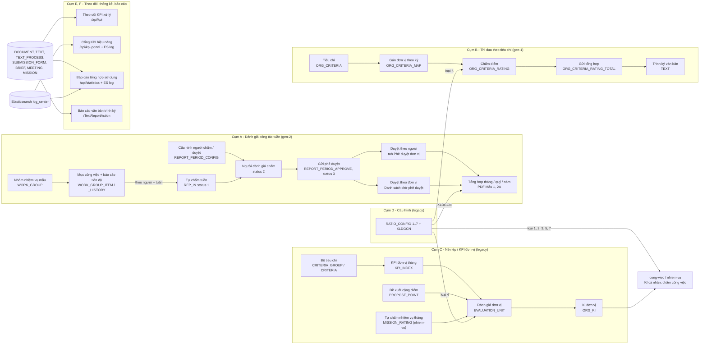

### 4.2 Sequence — Đánh giá công tác tuần: tự chấm → chấm → gửi → duyệt (NV-04 … NV-07)

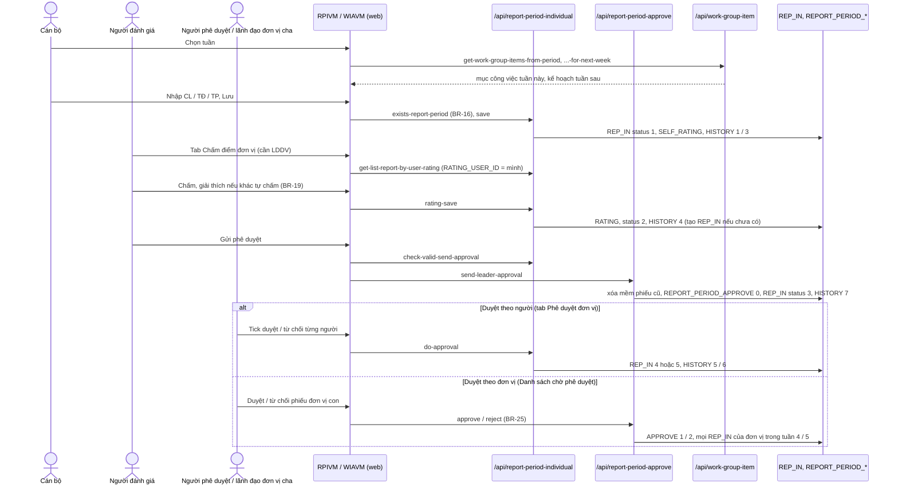

### 4.3 State — `REP_IN.STATUS` (một cán bộ × một tuần)

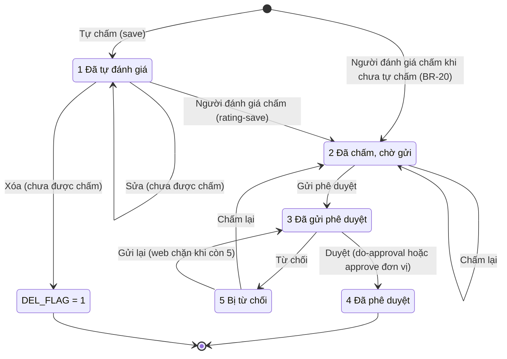

BE không kiểm trạng thái nguồn ở `rating-save` và duyệt theo đơn vị (`dac-thu.md` L14): duyệt cả đơn vị đặt 4 / 5 cho mọi phiếu của đơn vị trong tuần bất kể đang ở trạng thái nào.

### 4.4 Sequence — Chấm điểm thi đua đơn vị → tổng hợp → trình ký (NV-10 … NV-12)

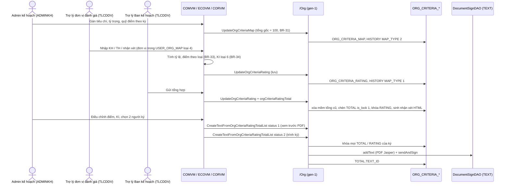

### 4.5 State — Kết quả chấm điểm thi đua của một đơn vị × kỳ (`ORG_CRITERIA_RATING` / `_RATING_TOTAL`)

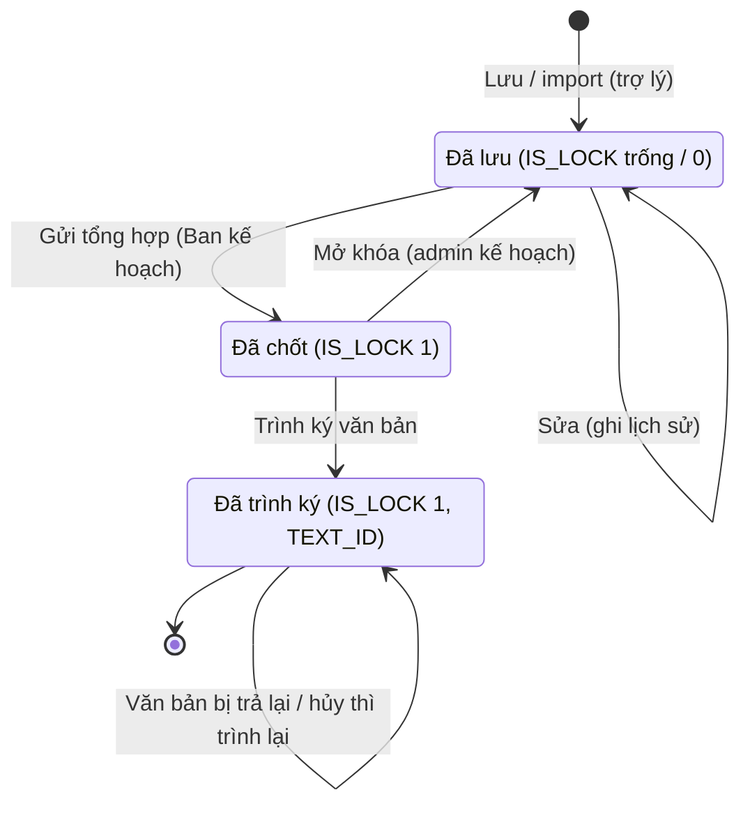

Không có cột trạng thái riêng — trạng thái suy từ `IS_LOCK` và `TEXT_ID`. Khóa chỉ áp ở web (BE cập nhật dòng chấm không kiểm khóa — `dac-thu.md` L26).

### 4.6 Sequence — KPI đơn vị → Đánh giá đơn vị → KI đơn vị (NV-15, NV-17, legacy)

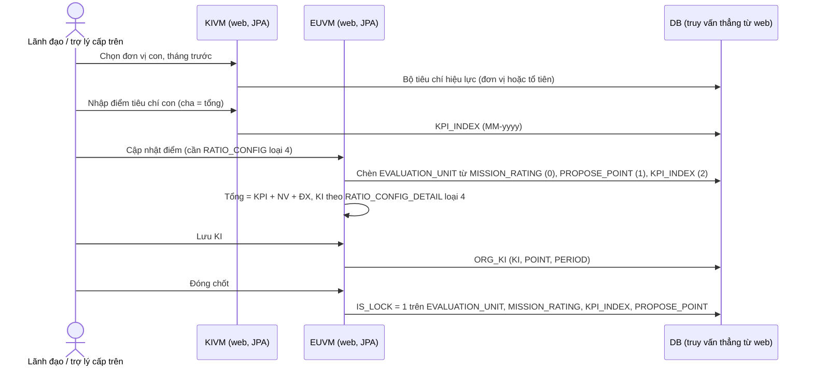

### 4.7 State — Đề xuất cộng điểm (`PROPOSE_POINT`, màn khóa)

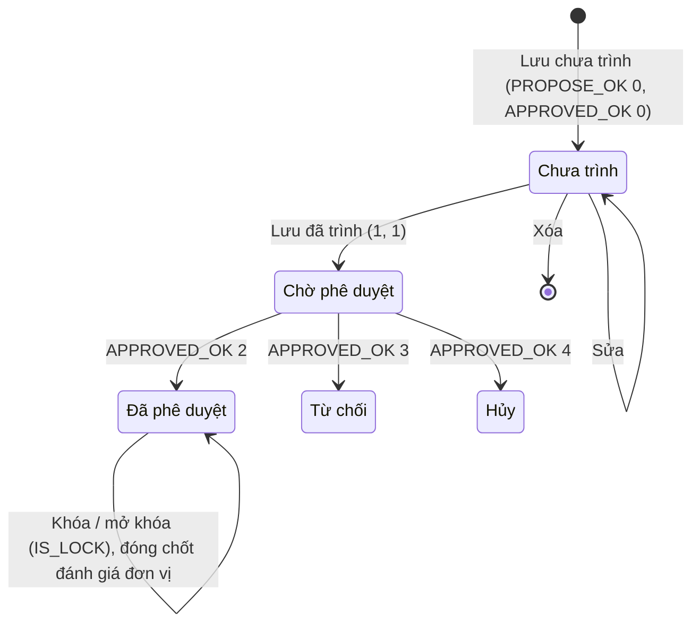

### 4.8 Sequence — Cổng KPI: thống kê hiệu năng (NV-21)

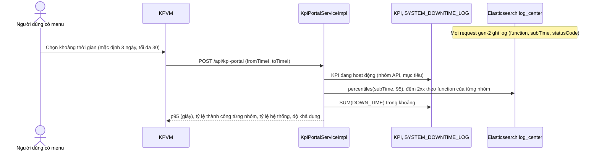

### 4.9 State — `WORK_GROUP_ITEM.ITEM_STATUS` và `WORK_GROUP.IS_LOCK`

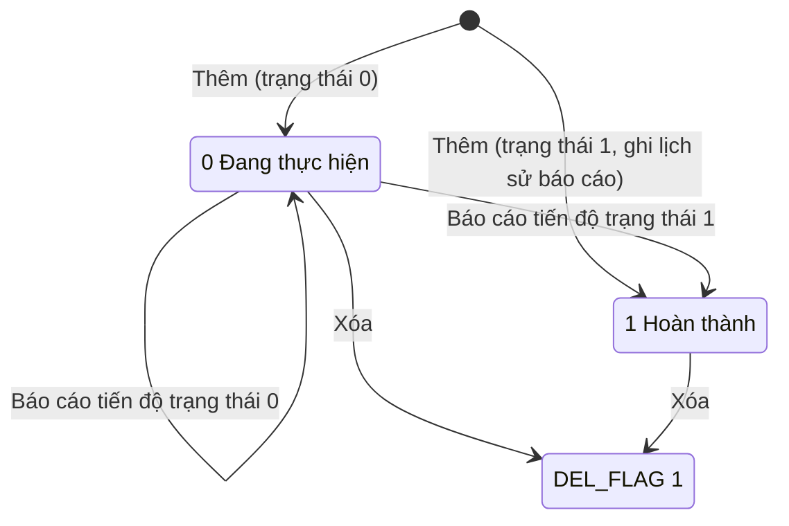

Nhóm nhiệm vụ: Mở (`IS_LOCK = 0`) ⇄ Khóa (`IS_LOCK = 1`, chặn khi còn nhóm con trực tiếp đang mở); xóa mềm (chặn khi còn nhóm con hoạt động; web chặn khi nhóm còn mục công việc) — NV-01 BR-05, BR-06.

## 5. Data model

Không có FK trên DB DEV — mọi quan hệ là logic (JOIN / entity trong code).

### 5.1 Đánh giá công tác tuần (cụm A)

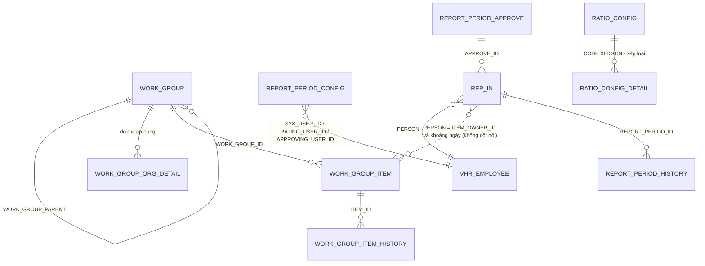

Bằng chứng: `WGRI:151-153`, `314-344`; `WGISI:117-135`; `RPIRI:62-73`, `503-504`; `RPASI:122`; `RPCRI:67-73`; `TDAO:2314-2325`.

| Bảng.cột | Vai trò nghiệp vụ | Nguồn |
|---|---|---|
| `WORK_GROUP.WORK_GROUP_LEVEL`, `WORK_GROUP_ROLE`, `IS_LOCK` | Cấp áp dụng (`CATEGORY_COMMON` `WORK_GROUP_LEVEL`), vai trò áp dụng (CSV `SYS_ROLE_ID`, trống = mọi vai trò), khóa | NV-01 |
| `WORK_GROUP_ORG_DETAIL.ORG_ID` | Đơn vị áp dụng (không có dòng = nhóm chung) | `WGRI:93-112` |
| `WORK_GROUP_ITEM.ITEM_OWNER_ID`, `ITEM_ORG_OWNER_ID` | Người / đơn vị phụ trách mục công việc | NV-02 |
| `WORK_GROUP_ITEM.ITEM_ROLE` | Chủ trì 51 / phối hợp 53 (`CATEGORY_COMMON` `ITEM_ROLE`) | BR-11 |
| `WORK_GROUP_ITEM.ITEM_DATE_START`, `ITEM_DATE_COMPLETE`, `ITEM_ACTUAL_DATE_COMPLETE`, `ITEM_STATUS` | Bắt đầu, dự kiến xong, xong thực tế, trạng thái — quyết định mục thuộc tuần nào (BR-09) | `WGIRI:426-441` |
| `WORK_GROUP_ITEM_HISTORY` (`ACTION_TYPE` 2, `ITEM_RESULT`, `ITEM_STATUS`) | Các lần báo cáo tiến độ; nguồn "kết quả" và "đã hoàn thành" hiển thị | BR-08 |
| `REPORT_PERIOD_CONFIG.SYS_USER_ID`, `RATING_USER_ID`, `APPROVING_USER_ID` | Ai được đánh giá, ai chấm, ai duyệt — phân quyền dữ liệu | NV-03 |
| `REP_IN.TYPE`, `WEEK`, `MONTH`, `QUARTER`, `HALF_YEAR`, `YEAR`, `DATE_START`, `DATE_END` | Kỳ (luôn tuần) | mục 3 đầu |
| `REP_IN.PERSON`, `PERSON_ORG`, `PERSON_POSITION_ID` | Cán bộ, đơn vị, chức vụ (web không gửi chức vụ → trống) | `RPISI:158-248` |
| `REP_IN.SELF_*_SCORE`, `SELF_RATING` / `RATING_*_SCORE`, `RATING`, `RATING_COMMENT` | Điểm tự chấm / người đánh giá, giải thích | NV-04, NV-05 |
| `REP_IN.STATUS`, `APPROVE_ID`, `APPROVE_COMMENT` | Trạng thái, phiếu gửi phê duyệt, ý kiến duyệt | mục 3 đầu |
| `REP_IN.RATING_ID`, `ORG_APPROVE_ID` | Không chỗ nào ghi | `dac-thu.md` |
| `REPORT_PERIOD_APPROVE.REPORT_PERIOD_ORG_ID`, `REPORT_PERIOD_ORG_APPROVE_ID` | Đơn vị gửi, đơn vị duyệt (đơn vị cha) | BR-21 |
| `REPORT_PERIOD_APPROVE.REPORT_PERIOD_ID`, `REPORT_PERIOD_LEADER_ID` | Không chỗ nào ghi | `RPARI:66` |
| `REPORT_PERIOD_HISTORY.ACTION_TYPE`, `REPORT_PERIOD_RESULT` | Thao tác 1–7, ý kiến (4, 5, 6) | `C1:2663-2672` |

### 5.2 Chấm điểm thi đua đơn vị (cụm B)

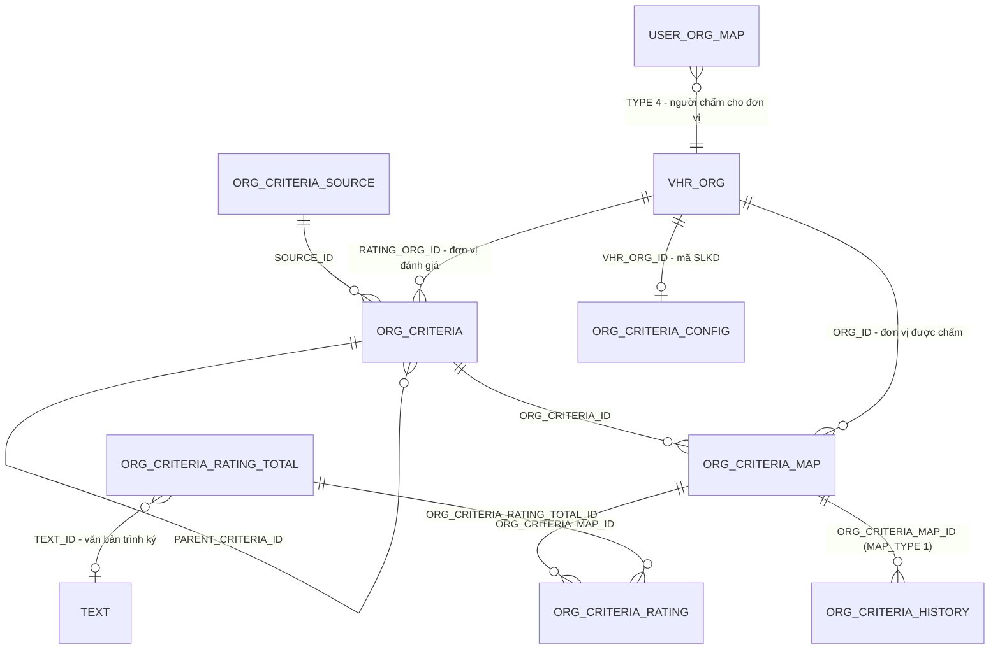

Bằng chứng: `OCDAO:268-334`, `340-343`, `524-542`, `791-794`; `OCRTDAO:96-100`, `328-360`, `388-419`.

| Bảng.cột | Vai trò nghiệp vụ | Nguồn |
|---|---|---|
| `ORG_CRITERIA.TYPE`, `SOURCE_ID`, `BUSINESS_CRITERIA_ID`, `UNIT`, `RATING_ORG_ID`, `CREATOR_ORG_ID`, `CRITERIA_ORDER` | Loại tiêu chí (công thức điểm), nguồn, mã chỉ tiêu SXKD, đơn vị tính, đơn vị đánh giá, đơn vị sở hữu (admin kế hoạch), thứ tự | NV-09 |
| `ORG_CRITERIA_MAP.DENSITY`, `PLAN_POINT`, `TYPE` | Tỷ trọng %, quỹ điểm, kỳ | NV-10 |
| `ORG_CRITERIA_RATING.PLAN_IN_PERIOD`, `EXECUTE_IN_PERIOD`, `RATIO`, `POINT`, `RATING_COMMENT`, `PERIOD`, `TYPE`, `NAME`, `PLAN_POINT`, `IS_LOCK` | Số liệu kỳ, điểm, nhận xét; bản chụp tên / quỹ điểm; khóa | NV-11 |
| `ORG_CRITERIA_RATING_TOTAL.POINT`, `KI`, `ADJUSTMENT_POINT`, `ADJUSTMENT_KI`, `RATING_COMMENT` (HTML), `IS_LOCK`, `CREATOR_ORG_ID`, `TEXT_ID` | Tổng điểm / KI, bản điều chỉnh, nhận xét tự sinh, khóa, đơn vị admin kế hoạch, văn bản trình ký | NV-11, NV-12 |
| `ORG_CRITERIA_HISTORY.MAP_TYPE`, `CONTENT`, `CREATE_BY` | Lịch sử chấm (1) / lý do đổi gán (2) | NV-10, NV-11 |
| `CONFIG_ORG_RATING.ORG_ID` (`STATUS = 1`) | Đơn vị Ban kế hoạch | `OCDAO:655` |

### 5.3 Nề nếp / KPI đơn vị / đánh giá đơn vị và cấu hình (cụm C, D)

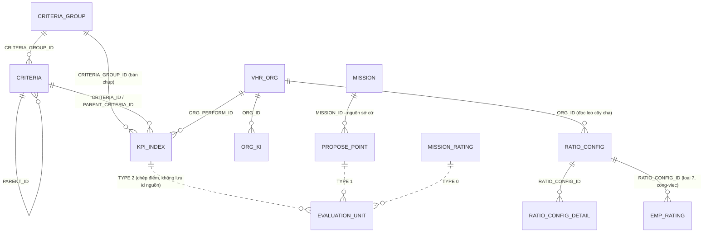

Bằng chứng: `WEB/voffice/entity/Criteria.java:148-149`; `WEB/voffice/entity/KPIIndex.java:190-191`; `EUDAO:244-303`; `WEB/voffice/entity/OrgKi.java:17-67`; `WEB/voffice/entity/RatioConfig.java:125-136`; `RCDAO:104-121`; `PTDAO:2560-2575`.

| Bảng.cột | Vai trò nghiệp vụ | Nguồn |
|---|---|---|
| `CRITERIA_GROUP.ORG_CONFIG_ID`, `EFFECTIVE_DATE`, `EXPIRED_DATE` | Đơn vị cấu hình và hiệu lực của bộ tiêu chí (đơn vị con thừa hưởng bộ của tổ tiên) | NV-14, NV-15 |
| `CRITERIA.NOMAL_POINT` | Điểm chuẩn | BR-43 |
| `KPI_INDEX.SCORE_PROPOSE`, `COMMENT_PROPOSE`, `PERIOD_PROPOSE` (`MM-yyyy`), `IS_LOCK` | Điểm KPI tháng, ghi chú, kỳ, khóa (do đánh giá đơn vị) | NV-15 |
| `KPI_INDEX.SCORE_NORMAL`, `ORG_TRACKING_ID`, `STATUS` | Không ghi (không map / không dùng) | NV-15 |
| `EVALUATION_UNIT.TYPE`, `SCORE`, `TITLE`, `PERIOD_APPLY`, `IS_LOCK`, `DEL_FLAG` | Nguồn điểm 0 / 1 / 2, điểm, tiêu đề nguồn, kỳ, chốt, hủy | NV-17 |
| `ORG_KI.KI`, `POINT`, `PERIOD` (+ `MONTH`, `YEAR` theo comment DB) | KI đơn vị và điểm theo tháng — ghi bởi NV-17 (`MM-yyyy`) và CV NV-09 (`yyyyMM`) | `dac-thu.md` bẫy 9 |
| `PROPOSE_POINT.ORG_PROPOSAL_ID`, `ORG_APPROVED_ID`, `ORG_PERFORM_ID`, `SCORE_PROPOSE`, `PROPOSE_OK`, `APPROVED_OK`, `IS_LOCK` | Đề xuất cộng điểm (bảng không có trên DB DEV) | NV-16 |
| `RATIO_CONFIG.TYPE`, `CODE`, `ORG_ID`, `EFFECTIVE_DATE`, `EXPIRED_DATE`, `IN_USED` | Loại bảng tỷ lệ, mã (`XLDGCN`), đơn vị, hiệu lực, "đang sử dụng" (không ai ghi) | NV-18 |
| `RATIO_CONFIG_DETAIL.X_AXIS_ID`, `Y_AXIS_ID`, `RATIO`, `RATIO_MIN_POINT`, `RATIO_DEFAULT_POINT`, `RATIO_MAX_POINT`, `NAME` | Ô của lưới: mức (giá trị `CODE_MASTER`), tỷ trọng, khoảng điểm; `NAME` chỉ dùng cho `XLDGCN` | NV-18 |

### 5.4 Theo dõi, cổng KPI, thống kê (cụm E)

| Bảng | Vai trò | Nguồn |
|---|---|---|
| `KPI` (`KPI_NAME`, `API`, `IS_DOWNLOAD_API`, `MAX_SIZE_VALUE` byte, `TARGET` giây, `IS_ACTIVE`) | Nhóm API của cổng KPI | `SQL/13032026_create_table_kpi.sql`; NV-21 |
| `SYSTEM_DOWNTIME_LOG` (`DOWNTIME_DATE`, giờ bắt đầu / kết thúc, `DOWN_TIME` phút) | Thời gian gián đoạn hệ thống do quản trị nhập | `SQL/16032026_create_table_system_downtime_log.sql`; NV-21 |
| `DOC_DAILY_SUMMARY` (`ORG_ID`, `SUMMARY_DATE`, `TOTAL_DIGITAL_IN`, `TOTAL_PAPER_IN`, `TOTAL_GATEWAY_IN`, `TOTAL_PROCESSED_IN`, `TOTAL_DOCUMENT_OUT`, `TOTAL_ISSUED_DIGITAL`, `TOTAL_ISSUED_PAPER`) | Số liệu văn bản cộng dồn từ đầu năm của đơn vị cấp 1, chụp 16:00 hằng ngày bởi job Oracle | `SQL/20251225_bao_cao_tong_hop.sql`; NV-22 |
| `M_ORG_WITH_CHILD` (`ROOT_ID`, `CHILD_ID`) | Cây đơn vị phẳng (view vật lý, làm mới 30 phút) dùng cộng dồn báo cáo | `SQL/20260825_vptwd_optimization_database.sql:66-78` |
| Elasticsearch `log_center*` (`function`, `subTime`, `statusCode`, `empId`, `orgPath`, `startTime`) | Log request của BE gen-2 — nguồn cổng KPI và số lần đăng nhập | LSI:463-587 |

Cụm E và F còn đọc thẳng bảng của phân hệ khác (`DOCUMENT_IN_STAFF`, `TEXT_PROCESS`, `SUBMISSION_PROCESS`, `BRIEF`, `MEETING`, `MISSION`, `CONNECT_*`) — đổi trạng thái ở các phân hệ đó làm lệch số liệu (`dac-thu.md` bẫy 10).

## 6. Glossary

| Nghiệp vụ | Trong code |
|---|---|
| Đánh giá công tác tuần | menu nhóm ĐÁNH GIÁ CÔNG TÁC TUẦN 440385 (`ORG_SYS_MENU` mã `WEEKLY-WORK-REVIEW`), `/api/work-group*`, `/api/report-period-*` |
| Nhóm nhiệm vụ (mẫu) / nhóm cha – con | `WORK_GROUP`, `WORK_GROUP_PARENT`, `WorkGroupVM`, `createWorkLookup.zul` |
| Cấp áp dụng / vai trò áp dụng / đơn vị áp dụng | `WORK_GROUP_LEVEL` (`CATEGORY_COMMON` `WORK_GROUP_LEVEL`), `WORK_GROUP_ROLE`, `WORK_GROUP_ORG_DETAIL` |
| Nhiệm vụ cần báo cáo (mục công việc) | `WORK_GROUP_ITEM`, `WorkGroupItemInfo`, `workGroupItemInfoAfterList` (kế hoạch tuần sau) |
| Báo cáo tiến độ | `WORK_GROUP_ITEM_HISTORY` `ACTION_TYPE = 2`, `WorkGroupResultVM`, `work_result.zul` |
| Phiếu đánh giá tuần (kỳ đánh giá cá nhân) | `REP_IN`, `ReportPeriodIndividualEntity`, `reportPeriodId` |
| Điểm chất lượng / tiến độ / tác phong | `*_QUALITY_SCORE` / `*_PROGRESS_SCORE` / `*_ATTITUDE_SCORE` (tiền tố `SELF_` tự chấm, `RATING_` người đánh giá) |
| Người đánh giá / người phê duyệt | `REPORT_PERIOD_CONFIG.RATING_USER_ID` / `APPROVING_USER_ID` |
| Phiếu gửi phê duyệt của đơn vị | `REPORT_PERIOD_APPROVE`, `send-leader-approval` |
| Xếp loại (Hoàn thành xuất sắc / tốt / Hoàn thành / Không hoàn thành) | `RATIO_CONFIG.CODE = 'XLDGCN'`, `getPerformanceText`, `calculateRating` |
| Mẫu 1 / Biểu mẫu 2A | PDF báo cáo cá nhân / tổng hợp đơn vị theo tuần (`exportReportPeriodIndividua`, `WorkGroupReportServiceImpl`) |
| Tiêu chí thi đua / đơn vị đánh giá / đơn vị được chấm | `ORG_CRITERIA` (`RATING_ORG_ID`) / `ORG_CRITERIA_MAP.ORG_ID` |
| Admin kế hoạch / Ban kế hoạch | vai trò `ADMINKH` (`PLAN_ADMIN`) / `CONFIG_ORG_RATING.STATUS = 1` |
| Trợ lý chấm điểm đơn vị | vai trò `TLCDDV`, `USER_ORG_MAP.TYPE = 4` |
| Tỷ trọng / quỹ điểm | `DENSITY` / `PLAN_POINT` |
| Kế hoạch / thực hiện trong kỳ | `PLAN_IN_PERIOD` / `EXECUTE_IN_PERIOD` |
| Gửi tổng hợp (chốt) / điểm – KI điều chỉnh | `doSendCriteria`, `ORG_CRITERIA_RATING_TOTAL`, `ADJUSTMENT_POINT` / `ADJUSTMENT_KI` |
| KI chỉ huy (KI đơn vị trong thi đua) | `RATIO_CONFIG` loại 6, `code.ratio.rating.org` |
| Chỉ tiêu SXKD / mã đơn vị SLKD | `SOURCE_ID = 1`, `BUSINESS_CRITERIA_ID` / `ORG_CRITERIA_CONFIG.SLKD_ORG_ID`, `LINK_SERVICE_SLDH` |
| Bộ tiêu chí nề nếp / điểm chuẩn | `CRITERIA_GROUP`, `CRITERIA.NOMAL_POINT` |
| KPI đơn vị (chỉ tiêu KPI, nền nếp) | `KPI_INDEX`, `KPIIndexVM`, `EVALUATION_UNIT.TYPE = 2` |
| Đề xuất cộng điểm / nguồn sở cứ | `PROPOSE_POINT`, `MISSION_ID` |
| Đánh giá đơn vị / đóng chốt / KI đơn vị | `EVALUATION_UNIT`, `IS_LOCK`, `doCloseLatches` / `ORG_KI.KI` |
| Bảng tỷ lệ / thang điểm | `RATIO_CONFIG`, `RATIO_CONFIG_DETAIL` (`X_AXIS_ID`, `Y_AXIS_ID`), `CODE_MASTER` `code.ratio.*` |
| Công thức KI | `KI_FORMULA_CONFIG.FORMULA` (không dùng để tính) |
| Theo dõi KPI xử lý / chưa xử lý trong hạn / quá hạn / hoàn thành đúng hạn / quá hạn | `/api/kpi`, `objectType`, trạng thái 2 / 1 / 4 / 3 (`PROCESSING_ON_TIME`, `PROCESSING_OVER_TIME`, `FINISH_ON_TIME`, `FINISH_OVER_TIME`) |
| Ngưỡng giờ xử lý văn bản đi / phiếu trình | tham số `SIGN_DOCUMENT_WARNING_TIMED_OUT` |
| Cổng KPI / nhóm API / thời gian phản hồi p95 / độ khả dụng | `/api/kpi-portal`, bảng `KPI`, `subTime`, `systemAvailabilityRate`, `SYSTEM_DOWNTIME_LOG` |
| Mức độ tham gia hệ thống (số người / lượt đăng nhập) | `get-usage-statistics`, `totalLoginAtLeastOnce`, `totalLogin`, log ES `Authentication.*` |
| Văn bản đến qua đường giấy / liên thông | `DOCUMENT_RECEIVE_MAP.IS_AUTO = 2` / `CONNECT_DOC_IN_INTERNAL` |
| Phạm vi "đơn vị và trực thuộc" / "theo đơn vị" | `orgRange` 0 / 1, `M_ORG_WITH_CHILD` |
| Người ký cuối / trình ký lại / văn bản gốc | `TEXT_PROCESS` cấp cao nhất `SIGNATURE_TYPE = 3` / `TEXT_ID_RESIGN_FROM` / `TEXT_ID_ROOT` |
| Thỏa thuận hợp tác (TTHT) | `CHART_AGREEMENT*`, `/agreementAction`, `CHART_AGREEMENT_PERMISSION` |
| OKR | `okr.url`, menu mã `OKR` |

## 7. [CẦN XÁC NHẬN]

### 7.1 Còn mở

| # | Bối cảnh (hiện trạng code) | Câu hỏi |
|---|---|---|
| Q1 | Đánh giá công tác tuần (tự chấm, người đánh giá chấm, phê duyệt theo tuần; tổng hợp tháng / quý / năm) chạy riêng, không dùng chung dữ liệu với phiếu đánh giá công việc và KI cá nhân hằng tháng của phân hệ Công việc; menu chỉ mở cho vài đơn vị qua danh sách trắng — và trên DB DEV các đơn vị khai không khớp đơn vị nào nên **không ai thấy menu** (mục 1.3) (NV-04, X9). | Quan hệ giữa hai cách đánh giá là gì? (a) đánh giá tuần thay cho phiếu đánh giá công việc / KI ở các đơn vị được mở menu; (b) chạy song song, độc lập; (c) điểm tuần sẽ là đầu vào để xếp KI tháng. |
| Q2 | Ngưỡng xếp loại "Hoàn thành tốt nhiệm vụ": bảng xếp loại đang có trên DB DEV, Biểu mẫu 2A, chú thích trên màn và đếm loại tháng / quý dùng **từ 70 điểm**; file cài đặt ban đầu và sắp xếp danh sách tuần dùng **từ 75 điểm**. Bảng xếp loại trên DB DEV đang ở trạng thái đã xóa nhưng hệ thống vẫn dùng (mục 3 đầu, NV-08). | Mức đúng là (a) 70 hay (b) 75? |
| Q3 | Mục công việc đã nằm trong phiếu tuần đã được chấm / phê duyệt vẫn sửa, xóa, báo cáo lại được; phiếu tuần không lưu lại nội dung mục công việc (NV-02 BR-10). | (a) phải khóa mục công việc của tuần đã chấm / duyệt; (b) cho sửa tự do — phiếu đã duyệt chỉ giữ điểm. |
| Q4 | Người đánh giá chấm được cả cán bộ **chưa tự đánh giá** tuần đó (hệ thống tự tạo phiếu trống phần tự chấm); khi đó gần như luôn phải nhập giải thích (NV-05 BR-19, BR-20). | (a) được chấm thay như hiện nay; (b) phải chờ cán bộ tự chấm trước. |
| Q5 | Có **hai đường phê duyệt** không đồng bộ: "Phê duyệt đơn vị" duyệt từng người theo người phê duyệt được cấu hình; "Danh sách đánh giá chờ phê duyệt" duyệt cả đơn vị theo lãnh đạo đơn vị cấp trên. Duyệt bên này không đổi trạng thái phiếu bên kia (NV-06, NV-07). | (a) hai cấp phê duyệt nối tiếp (người phê duyệt rồi lãnh đạo cấp trên); (b) hai cách thay thế nhau — đơn vị chọn một; (c) một cách sẽ bỏ. Nếu (a), bước nào là bước cuối? |
| Q6 | Chấm điểm thi đua: trợ lý Ban kế hoạch không nhập được số liệu cho tiêu chí mà đơn vị đánh giá chưa nhập kế hoạch; Ban kế hoạch chỉ rà soát rồi "Gửi tổng hợp" (NV-11 BR-37). | (a) Ban kế hoạch chỉ chốt, mọi số liệu do đơn vị đánh giá nhập; (b) Ban kế hoạch được nhập thay khi đơn vị đánh giá chưa nhập. |
| Q7 | Tiêu chí "chỉ tiêu sản xuất kinh doanh" có mã chỉ tiêu và màn "Đồng bộ danh sách đơn vị" ánh xạ mã đơn vị sang hệ thống số liệu kinh doanh, nhưng việc tự lấy số liệu đang tắt — người dùng nhập tay; dữ liệu chấm điểm thi đua trên DB DEV dừng ở 06/2022 (NV-11, NV-13). | (a) nhập tay là cách làm hiện hành, màn ánh xạ chỉ còn lưu trữ; (b) vẫn cần hệ thống tự lấy số liệu kinh doanh. |
| Q8 | KPI đơn vị: danh sách đơn vị để chấm có cả các phòng ban người dùng đang làm lãnh đạo, nhưng hệ thống chặn không cho chấm KPI cho chính đơn vị mình (NV-15 BR-45). | (a) chỉ cấp trên chấm cho đơn vị con — phòng ban của mình xuất hiện là thừa; (b) lãnh đạo phòng được tự chấm KPI cho phòng mình. |
| Q9 | "Đề xuất cộng điểm", "Phê duyệt đề xuất", "Đánh giá đơn vị" đang khóa menu; bảng đề xuất cộng điểm không có trên DB DEV; KI đơn vị không phát sinh từ 01/2022; KPI đơn vị và đánh giá đơn vị trên DB DEV chỉ có dữ liệu năm 2015. Nếu dùng lại: điểm đề xuất hiện lấy **trung bình** các đề xuất đã duyệt (tối đa 20) trong khi nhãn ghi "tổng" (NV-16, NV-17). | (a) các màn này đã ngừng, chỉ giữ dữ liệu cũ; (b) sẽ mở lại — khi đó điểm đề xuất là tổng (tối đa 20) hay trung bình? |
| Q10 | Cấu hình: hai menu "Quản lý cấu hình KI" và "Quản lý cấu hình tỷ lệ" mở cùng một màn đủ 7 loại; menu "Danh mục nhà cung cấp" thực chất là cấu hình công thức KI, lưu công thức dạng chữ nhưng không nơi nào dùng để tính (NV-18, NV-19). | (a) một menu cấu hình là đủ, công thức KI đã bỏ; (b) mỗi menu lẽ ra chỉ một nhóm loại (KI: 1, 4, 6; tỷ lệ: 2, 3, 5, 7) và công thức KI vẫn là kế hoạch. |

### 7.2 Đã xác nhận (X1–X6 dùng lại từ module trước; X7–X12 code xác nhận câu hỏi cũ / bối cảnh)

| # | Nội dung | Trả lời / nguồn | Hệ quả ghi vào tri thức |
|---|---|---|---|
| X1 | Quyền thao tác kiểm ở đâu | Tầng hiển thị nút trên web là thiết kế chung (đã xác nhận) | Mục 1.4; BE phân hệ này không kiểm vai trò (trừ phạm vi admin BR-15, quyền xem TTHT BR-68) |
| X2 | Văn thư | role `VT` (đã xác nhận) | Đơn vị mặc định báo cáo trình ký (NV-23) |
| X3 | `SYS_MENU.STATUS` | 1 = mở, 2 = khóa (đã xác nhận) | Mục 1.2 |
| X4 | Nghiệp vụ văn bản mật | Chưa dùng (đã xác nhận) | Mã báo cáo 9 / 10 (sổ BMNN, bản sao mật) chỉ ghi là không chọn được (NV-26) |
| X5 | Tính năng ở nhánh khác | Ghi "chưa có trên `kha_develop`" (đã xác nhận) | Menu `BCVBTK`, `GOV_OFFICE_REPORT` trỏ file không có trong repo (NV-26) |
| X6 | Cấp đơn vị | Khánh Hòa (đã xác nhận) | Đầu trang PDF ghi cứng tên cơ quan trung ương (`dac-thu.md` bẫy 4) |
| X7 | (câu cũ ❓1) "KPI là KPI vận hành hay nhân sự? Ai xem cổng KPI?" | Code: ba thứ — KPI đơn vị = điểm nề nếp đơn vị (NV-15); Theo dõi KPI = đúng hạn xử lý (NV-20); Cổng KPI = hiệu năng hệ thống, quản trị `ADMIN` cấu hình, người có menu xem (NV-21) | 1.5 |
| X8 | (câu cũ ❓2) "Chấm điểm thi đua theo kỳ nào, có liên kết KI cá nhân?" | Code: tháng / quý / năm, mỗi kỳ gán tiêu chí riêng; ra KI đơn vị theo `RATIO_CONFIG` loại 6, không ghi `ORG_KI`, không nối KI cá nhân (`ECOVM:1112-1130`) | NV-10 … NV-12 |
| X9 | (câu cũ ❓3) "Báo cáo định kỳ cá nhân có thay phiếu đánh giá cuối tháng của `cong-viec`?" | Code: hai hệ độc lập — service đánh giá tuần chỉ dùng `TaskDAO` để đọc bộ `XLDGCN`, không đọc `EMP_RATING`, `AVERAGE_TASK_RATING`, `ORG_KI` (grep trong `BE2`) | NV-04; ý đồ hỏi ở Q1 |
| X10 | Menu, `ORG_SYS_MENU`, widget | Tra DB DEV ngày 2026-10-01 (người điều phối) | Mục 1.2, 1.3 |
| X11 | Số dòng, phân bố giá trị, comment cột | Tra DB DEV ngày 2026-10-01 (người điều phối) | Mục 3, 5 |
| X13 | Dữ liệu bổ sung (menu nhóm / OKR, `ORG_SYS_MENU`, `ORG_CRITERIA*`, `WORK_GROUP_ITEM*`, `XLDGCN`, kỳ `KPI_INDEX` / `EVALUATION_UNIT`, đối tượng DB, tham số) | Tra DB DEV ngày 2026-10-02 (người điều phối) | Mục 1.2, 1.3, 3 (xếp loại, NV-02, cụm B, NV-15, NV-17, NV-20 … NV-25), 7.1 Q1, Q2, Q7, Q9 |
| X12 | Tham số `MISSION_SCORE_REPORT` (quỹ điểm theo khối) có thuộc đánh giá tuần không | Code: chỉ đọc ở báo cáo điểm nhiệm vụ `MissionReportDAO.scoreReport` (`BE1/database/dao/report/MissionReportDAO.java:2340-2352`) | 1.1 — thuộc `nhiem-vu` |
