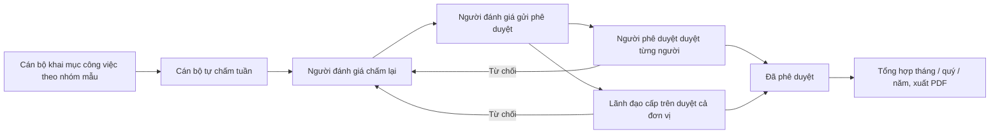

# KPI, chấm điểm, đánh giá, báo cáo — tóm tắt nghiệp vụ cho BA

> Bản đọc nhanh bằng lời nghiệp vụ. Chi tiết và bằng chứng: [nghiep-vu.md](nghiep-vu.md) (mã NV / BR trong ngoặc
> để tra). Cập nhật: 2026-10-02 · Nguồn: code `kha_develop` + DB DEV. Nhãn quy tắc: **[Đã xác nhận]** = chủ dự án đã
> chốt là đúng ý đồ · **[Hiện trạng]** = hệ thống đang chạy như vậy, chưa ai xác nhận là ý đồ · **[Lệch nghiệp vụ]**
> = đã xác nhận nghiệp vụ muốn khác, hệ thống đang làm sai.

## 1. Phân hệ này dùng để làm gì

Phân hệ gom mọi màn **chấm điểm, đánh giá và số liệu tổng hợp** không thuộc vòng đời của một văn bản hay công việc cụ thể (1.1).
Thực chất là **bảy cụm độc lập**, không dùng chung dữ liệu (1.1):

- **A. Đánh giá công tác tuần** — cán bộ khai mục công việc, mỗi tuần tự chấm; người đánh giá chấm lại; lãnh đạo phê duyệt; tổng hợp tháng / quý / năm, xuất PDF (NV-01 … NV-08). Cụm mới nhất, đang dùng.
- **B. Chấm điểm thi đua đơn vị** theo cây tiêu chí của Ban kế hoạch → tổng hợp → trình ký văn bản điểm thi đua (NV-09 … NV-13).
- **C. KPI nề nếp đơn vị** — cấp trên chấm điểm nề nếp tháng cho đơn vị con; đề xuất cộng điểm và đánh giá đơn vị (đang khóa) (NV-14 … NV-17).
- **D. Cấu hình tỷ lệ / thang điểm** dùng chung cho các màn đánh giá (NV-18, NV-19).
- **E. Theo dõi & thống kê** — Theo dõi KPI (đúng hạn / quá hạn xử lý), Cổng KPI (hiệu năng hệ thống), Báo cáo tổng hợp sử dụng (NV-20 … NV-22).
- **F. Báo cáo văn bản trình ký** — các báo cáo Excel về luồng ký (NV-23).
- **G. Phụ** — biểu đồ thỏa thuận hợp tác (khóa), OKR (mở trang ngoài) (NV-24, NV-25).

**Không gồm:** KI cá nhân hằng tháng, phiếu giao / đánh giá công việc cá nhân (xem `cong-viec`); tự chấm và đánh giá nhiệm vụ tháng, báo cáo đơn vị theo mẫu, báo cáo điểm nhiệm vụ (xem `nhiem-vu`); Mục lục / Sổ văn bản đi trên màn báo cáo trình ký (xem `van-ban/so-van-ban`); theo dõi văn bản đi đơn vị, tình hình xử lý cá nhân (xem `van-ban/quan-ly-chung`); "Tạo KPI nhiệm vụ" khi chuyển văn bản (xem `van-ban/chuyen-van-ban`); cấu hình người dùng theo đơn vị, danh sách trắng menu, quyền xem báo cáo tổng hợp (xem `he-thong`).

## 2. Ai dùng và được làm gì

| Vai trò | Được làm gì trong phân hệ này |
|---|---|
| Cán bộ (mọi người có menu) | Khai mục công việc, báo cáo tiến độ, tự chấm điểm tuần (1.4, NV-02, NV-04) |
| Người đánh giá / người phê duyệt của một cán bộ (cấu hình theo từng người; tab chỉ hiện cho Lãnh đạo `LDDV`) | Chấm điểm tuần, gửi phê duyệt; duyệt / từ chối từng cán bộ (1.4, NV-05, NV-06) |
| Lãnh đạo đơn vị cấp trên | Duyệt / từ chối kết quả tuần của cả đơn vị con trực tiếp (1.4, NV-07) |
| Quản trị (`ADMIN`, `ADMIN_LEVEL1`, `SUPPER_ADMIN`) | Cấu hình người đánh giá / người phê duyệt trong cây đơn vị mình (NV-03, BR-15); `ADMIN`: cấu hình tỷ lệ, cổng KPI (NV-18, NV-21) |
| Lãnh đạo / Thủ trưởng / Quản trị | Dựng cây nhóm nhiệm vụ mẫu (NV-01) |
| Admin kế hoạch — Ban kế hoạch (`ADMINKH`) | Tiêu chí thi đua, gán tiêu chí cho đơn vị, tổng hợp, trình ký văn bản điểm thi đua (1.4, NV-09, NV-10, NV-12) |
| Trợ lý chấm điểm đơn vị (`TLCDDV`) | Nhập số liệu chấm thi đua cho đơn vị được giao; trợ lý thuộc Ban kế hoạch thì "Gửi tổng hợp" (1.4, NV-11) |
| Thủ trưởng / Lãnh đạo / Trợ lý (`TTDV` / `LDDV` / `TL`) | Chấm KPI nề nếp tháng cho đơn vị cấp dưới (NV-15); ký văn bản điểm thi đua (`TTDV` / `LDDV`) |
| Trợ lý / Văn thư (`TL` / `VT`) | Xuất báo cáo văn bản trình ký (NV-23) |

## 3. Màn hình / menu người dùng thấy

| Menu / màn | Để làm gì | Ghi chú | Mã menu |
|---|---|---|---|
| ĐÁNH GIÁ CÔNG TÁC TUẦN (nhóm) | Nhóm các màn cụm A | Chỉ mở cho vài đơn vị; trên DB DEV các đơn vị khai không khớp nên **không ai thấy** (1.3) | 440385 |
| Danh mục nhóm nhiệm vụ | Cây nhóm nhiệm vụ mẫu theo cấp / vai trò / đơn vị | Dưới DANH MỤC (NV-01) | 440225 |
| Danh sách nhiệm vụ cần báo cáo | Cán bộ khai mục công việc, báo cáo tiến độ | Chỉ thấy mục của mình (NV-02) | 440229 |
| Danh sách cấu hình đánh giá, phê duyệt | Gán người đánh giá + người phê duyệt cho từng cán bộ | (NV-03) | 440505 |
| Đánh giá chấm điểm | 3 tab: Cá nhân tự chấm điểm · Chấm điểm đơn vị · Phê duyệt đơn vị | Tab 2, 3 chỉ hiện với `LDDV` (NV-04 … NV-06) | 440305 |
| Danh sách đánh giá chờ phê duyệt | Duyệt / từ chối cả đơn vị con | (NV-07) | 440317 |
| Tổng hợp đơn vị | Tổng hợp tuần / tháng / quý / năm của mọi cán bộ đơn vị, xuất PDF | (NV-08) | 440547 |
| Tạo danh sách tiêu chí đánh giá | Cây tiêu chí thi đua | Nhóm CHẤM ĐIỂM THI ĐUA (NV-09) | 338812 |
| Gán tiêu chí đơn vị | Tỷ trọng, quỹ điểm theo đơn vị × kỳ; import Excel | (NV-10) | 338831 |
| Chấm điểm đơn vị | Nhập kế hoạch / thực hiện, tính điểm và KI đơn vị | Dữ liệu DB DEV dừng ở 06/2022 (NV-11) | 338833 |
| Tổng hợp chấm điểm đơn vị | Điểm điều chỉnh, mở khóa, trình ký văn bản điểm thi đua | (NV-12) | 338851 |
| Đồng bộ danh sách đơn vị | Ánh xạ đơn vị sang hệ thống số liệu kinh doanh | Việc lấy số liệu tự động **đang tắt** (NV-13, Q7) | 338931 |
| Bộ tiêu chí | Bộ tiêu chí nề nếp có hiệu lực theo đơn vị | Khác tiêu chí thi đua (NV-14) | 338013 |
| KPI đơn vị | Chấm điểm nề nếp tháng cho đơn vị con | Dữ liệu DB DEV chỉ năm 2015 (NV-15) | 337982 |
| Theo dõi (menu cấp 1) | Mở màn KPI đơn vị; là cha của "Theo dõi KPI" | (1.2) | 440425 |
| Đề xuất cộng điểm · Phê duyệt đề xuất | — | **Khóa** (NV-16) | 338012 · 337981 |
| Đánh giá đơn vị | — | **Khóa** (NV-17) | 338051 |
| Quản lý cấu hình KI · Quản lý cấu hình tỷ lệ | Bảng tỷ lệ / thang điểm theo đơn vị và thời gian | **Hai menu, cùng một màn** (NV-18, Q10) | 337556 · 337632 |
| Danh mục nhà cung cấp | Thực chất là cấu hình công thức KI | **Màn lỗi**, công thức không được dùng (NV-19) | 337651 |
| Theo dõi KPI | Đúng hạn / quá hạn xử lý văn bản đến, đi, phiếu trình, hồ sơ | (NV-20) | 440427 |
| Kpi portal | Hiệu năng API, tỷ lệ thành công, độ khả dụng hệ thống | (NV-21) | 441185 |
| Báo cáo tổng hợp | Mức độ sử dụng, văn bản đến / đi, họp, nhiệm vụ theo đơn vị | (NV-22) | 440671 |
| Báo cáo văn bản trình ký | Xuất Excel các báo cáo luồng ký | Dưới VĂN BẢN ĐI (NV-23) | 338591 |
| Báo cáo văn bản trình ký (bản 2) · Báo cáo VP CP | — | Trang **không có trong mã nguồn**, mở lỗi (NV-26) | 338771 · 338372 |
| Thoa thuan hop tac | Biểu đồ thỏa thuận hợp tác | **Khóa** (NV-24) | 339214 |
| OKR | Mở trang OKR bên ngoài | Chỉ mở cho một đơn vị (NV-25) | 441387 |

## 4. Luồng chính

Luồng chính là **đánh giá công tác tuần** (cụm A).

1. Lãnh đạo / quản trị dựng **cây nhóm nhiệm vụ mẫu**, áp cho một cấp cán bộ (lãnh đạo Cục / Vụ, lãnh đạo Phòng, không phải lãnh đạo, trợ lý / thư ký) và vai trò / đơn vị (NV-01, BR-02).
2. Quản trị gán cho mỗi cán bộ **một người đánh giá và một người phê duyệt** (NV-03).
3. Cán bộ khai **mục công việc** (chọn nhóm mẫu, vai trò chủ trì / phối hợp, ngày bắt đầu – hoàn thành, kết quả) và **báo cáo tiến độ** khi xong (NV-02).
4. Mỗi tuần, cán bộ mở phiếu tuần: hệ thống kéo mục công việc thuộc tuần + kế hoạch tuần sau; cán bộ tự chấm **chất lượng (0–35), tiến độ (0–35), tác phong (0–30)** (NV-04, mục 3 "Điểm").
5. Người đánh giá chấm lại ba thành phần cho từng người mình phụ trách, rồi bấm **Gửi phê duyệt** cho cả tuần (NV-05).
6. Phê duyệt theo **một trong hai đường**: người phê duyệt duyệt / từ chối **từng người** (tab Phê duyệt đơn vị), hoặc lãnh đạo đơn vị cấp trên duyệt / từ chối **cả đơn vị** (menu Danh sách đánh giá chờ phê duyệt). Bị từ chối thì người đánh giá chấm lại và gửi lại (NV-06, NV-07).
7. Xem tổng hợp tháng / quý / năm (trung bình điểm tuần) và xuất PDF: Mẫu 1 (cá nhân), Biểu mẫu 2A (đơn vị theo tuần), Tổng hợp tháng / quý / năm (NV-08).

**Chấm điểm thi đua đơn vị (cụm B).** Ban kế hoạch dựng cây tiêu chí → gán tiêu chí cho từng đơn vị theo kỳ (tháng / quý / năm) với tỷ trọng và quỹ điểm → trợ lý đơn vị đánh giá nhập kế hoạch / thực hiện, hệ thống tính tỷ lệ, điểm, KI đơn vị → trợ lý Ban kế hoạch "Gửi tổng hợp" (khóa số liệu) → admin kế hoạch điều chỉnh điểm, chọn người ký và **trình ký văn bản "Điểm thi đua"** (NV-09 … NV-12).

**KPI nề nếp đơn vị (cụm C).** Lãnh đạo / trợ lý đơn vị cấp trên chấm điểm từng tiêu chí của bộ tiêu chí nề nếp cho đơn vị con, theo tháng liền trước (NV-14, NV-15).

**Theo dõi KPI (cụm E).** Lãnh đạo chọn đơn vị, khoảng ngày → biểu đồ và danh sách đúng hạn / quá hạn cho 4 loại đối tượng, theo cá nhân hoặc đơn vị; xuất Excel (NV-20).

## 5. Trạng thái

**Phiếu tuần của một cán bộ**

| Trạng thái (tên người dùng thấy) | Nghĩa | Chuyển sang khi nào | Giá trị |
|---|---|---|---|
| Chưa tự đánh giá | Cán bộ chưa lập phiếu tuần (không có phiếu) | — (mục 3) | không có phiếu |
| Đã tự đánh giá (chờ đánh giá) | Cán bộ đã tự chấm, chờ người đánh giá | Cán bộ lưu phiếu; lưu lại phiếu luôn về trạng thái này (NV-04, BR-18) | 1 |
| Đã được đánh giá | Người đánh giá đã chấm, chưa gửi | Người đánh giá chấm (NV-05) | 2 |
| Đã gửi phê duyệt | Chờ lãnh đạo duyệt | Người đánh giá gửi phê duyệt (BR-22) | 3 |
| Đã phê duyệt | Kết thúc | Duyệt theo người hoặc theo đơn vị (NV-06, BR-26) | 4 |
| Bị từ chối phê duyệt | Người đánh giá phải chấm lại | Từ chối theo người hoặc theo đơn vị (NV-06, BR-26) | 5 |

**Phiếu gửi phê duyệt của một đơn vị × tuần** (đường duyệt cả đơn vị)

| Trạng thái | Nghĩa | Chuyển sang khi nào | Giá trị |
|---|---|---|---|
| Chờ phê duyệt | Đã gửi lên đơn vị cha | Gửi phê duyệt (BR-21) | 0 |
| Duyệt | Cả đơn vị được duyệt | Lãnh đạo cấp trên duyệt (BR-26) | 1 |
| Từ chối | Cả đơn vị bị từ chối | Lãnh đạo cấp trên từ chối, bắt buộc ý kiến (BR-26) | 2 |

**Mục công việc**: *Đang thực hiện* (0) → *Hoàn thành* (1) khi báo cáo tiến độ hoàn thành hoặc tạo ngay ở trạng thái hoàn thành; không có đường quay lại (NV-02).

**Kết quả chấm thi đua của một đơn vị × kỳ**: *Mở* (đang nhập) → *Khóa* sau "Gửi tổng hợp" hoặc trình ký; admin kế hoạch *Mở khóa* được để chấm lại (NV-11, NV-12).

**Theo dõi KPI — tình trạng một đối tượng** (hệ thống tự suy)

| Trạng thái (tên người dùng thấy) | Nghĩa | Giá trị |
|---|---|---|
| Chưa xử lý quá hạn | Chưa xong, đã quá hạn | 1 |
| Chưa xử lý trong hạn | Chưa xong, còn hạn | 2 |
| Hoàn thành quá hạn | Xong sau hạn | 3 |
| Hoàn thành đúng hạn | Xong trước hạn | 4 |

(BR-54)

## 6. Quy tắc quan trọng nhất

- [Đã xác nhận] Quyền thao tác kiểm ở **tầng hiển thị nút trên web**; các màn của phân hệ phía máy chủ gần như không kiểm vai trò (X1, 1.4).
- [Hiện trạng] Đánh giá công tác tuần **luôn theo tuần** (Thứ Hai → Chủ Nhật); tuần thuộc tháng có ≥ 4 ngày của tuần đó; tháng / quý / năm chỉ là cách xem tổng hợp (mục 3 "Kỳ").
- [Hiện trạng] Tổng điểm = chất lượng + tiến độ + tác phong (tối đa 35 + 35 + 30); xếp loại theo bộ xếp loại riêng. Ngưỡng "Hoàn thành tốt" đang dùng **70**, nhưng file cài đặt và sắp xếp danh sách tuần dùng **75** (mục 3 "Xếp loại", Q2).
- [Hiện trạng] Mỗi cán bộ chỉ có một cấu hình: một người đánh giá và một người phê duyệt, chọn trong người có vai trò Thủ trưởng / Lãnh đạo; nhưng tab chấm / duyệt chỉ hiện cho người có vai trò Lãnh đạo (`LDDV`) (BR-13, BR-14, dac-thu bẫy 2).
- [Hiện trạng] Phiếu tuần phải có ít nhất một mục công việc; chỉ sửa / xóa phiếu khi người đánh giá chưa chấm (BR-17, BR-18).
- [Hiện trạng] Người đánh giá chấm khác tổng tự chấm thì bắt buộc giải thích; người đánh giá chấm được cả cán bộ **chưa tự chấm** (BR-19, BR-20, Q4).
- [Hiện trạng] Gửi phê duyệt chỉ được khi đã chấm hết mọi người mình phụ trách trong tuần và không còn người bị từ chối; phiếu gửi lên **đơn vị cha** của đơn vị đang chọn (NV-05, BR-21, BR-22).
- [Hiện trạng] **Hai đường phê duyệt không đồng bộ**: duyệt từng người không đổi phiếu của đường duyệt cả đơn vị, và ngược lại (BR-24, BR-26, Q5).
- [Hiện trạng] Mục công việc **không bị khóa theo kỳ**: mục đã nằm trong phiếu tuần đã duyệt vẫn sửa, xóa, báo cáo lại được (BR-10, Q3).
- [Hiện trạng] Thi đua: tổng tỷ trọng và tổng quỹ điểm các tiêu chí gốc của một đơn vị đều phải = 100; điểm tính theo loại tiêu chí (Doanh thu, Thuê bao, Chi phí, Nhiệm vụ, Thưởng…), thưởng sản xuất kinh doanh tối đa 3 điểm (BR-31, BR-33, BR-35).
- [Hiện trạng] Thi đua, KPI đơn vị: chỉ chấm được **kỳ vừa kết thúc** (tháng / quý trước, năm nay); kỳ cũ hơn chỉ xem (BR-36, BR-47).
- [Hiện trạng] Trình ký văn bản điểm thi đua: phải chọn người ký, **đúng hai người hiện ảnh chữ ký**; trình ký khóa toàn bộ số liệu của kỳ và tạo văn bản trình ký ngay (BR-38, BR-39).
- [Hiện trạng] KPI đơn vị: điểm mỗi tiêu chí từ 0 tới điểm chuẩn; **không được chấm cho chính đơn vị mình** làm lãnh đạo / trợ lý (BR-45, BR-46, Q8).
- [Hiện trạng] Theo dõi KPI: văn bản đến và hồ sơ tính hạn theo **ngày hạn** của đối tượng; văn bản đi và phiếu trình tính theo **8 giờ làm việc** (08:00–17:30, bỏ Thứ Bảy, Chủ Nhật, ngày nghỉ cấu hình) (BR-53).
- [Hiện trạng] Cấu hình tỷ lệ: các cấu hình cùng đơn vị + loại không được trùng thời gian; màn đánh giá đọc bảng của **đơn vị gần nhất** có hiệu lực, nhưng mỗi nơi chọn và so biên khoảng một kiểu (BR-49, NV-18, dac-thu bẫy 7).

## 7. Hệ thống KHÔNG làm / hay bị hiểu nhầm

- **"KPI" có ba nghĩa khác nhau:** *KPI đơn vị* = điểm nề nếp tháng cấp trên chấm; *Theo dõi KPI* = đúng hạn / quá hạn xử lý; *Cổng KPI* = hiệu năng hệ thống (thời gian phản hồi API), không phải KPI nhân sự (X7).
- **Hai hệ tiêu chí không liên quan:** tiêu chí **thi đua** (Chấm điểm thi đua) và **bộ tiêu chí nề nếp** (dùng cho KPI đơn vị) (1.5).
- **Đánh giá công tác tuần không nối với KI cá nhân** hay phiếu đánh giá công việc của `cong-viec` — hai hệ chạy song song (X9, Q1).
- **Không gửi SMS / thông báo** ở bất kỳ bước nào của đánh giá công tác tuần (NV-05).
- **Menu có mà không chạy:** Đề xuất cộng điểm, Đánh giá đơn vị, Thỏa thuận hợp tác đang khóa; "Danh mục nhà cung cấp" là cấu hình công thức KI, màn lỗi và công thức không được dùng; hai menu cấu hình KI / tỷ lệ là một màn; hai menu báo cáo trỏ trang không tồn tại (NV-16, NV-17, NV-19, NV-26, Q9, Q10).
- **Lấy số liệu sản xuất kinh doanh tự động đang tắt** — số liệu thi đua nhập tay hoặc import (NV-11, NV-13, Q7).
- **PDF / văn bản xuất ra ghi cứng tên cơ quan trung ương** ("BAN TỔ CHỨC TRUNG ƯƠNG", "Hà Nội"…), không có cấu hình đổi (dac-thu bẫy 4, X6).
- **Báo cáo tổng hợp:** "có sử dụng" = **đăng nhập ít nhất một lần**; ở phạm vi "đơn vị và trực thuộc", dòng đơn vị cha đã gồm các con nên **cộng dọc bị đếm hai lần** (BR-62, BR-63, dac-thu bẫy 13).
- **Cổng KPI không đánh dấu đạt / không đạt** so với mục tiêu; chỉ có số liệu khi bật ghi log hệ thống (BR-57, BR-58).
- **OKR không phải chức năng trong hệ thống**: menu chỉ mở trang OKR bên ngoài (NV-25).
- Có lỗi bảo mật đã ghi nhận, xem dac-thu L14, L31.

## 8. Liên quan phân hệ khác

| Khi thay đổi ở đây… | …phải xem thêm | Vì sao |
|---|---|---|
| Cấu hình tỷ lệ / thang điểm | `cong-viec`, `nhiem-vu` | KI cá nhân, chấm công việc, xếp loại nhiệm vụ đọc các bảng tỷ lệ này (NV-18 bảng nơi đọc) |
| Tiêu chí "Nhiệm vụ" trong thi đua; đánh giá đơn vị | `nhiem-vu` | Số liệu kế hoạch / thực hiện lấy từ báo cáo nhiệm vụ; đánh giá đơn vị đọc tự chấm nhiệm vụ (NV-11, NV-17) |
| KI đơn vị | `cong-viec` | Màn KI đơn vị bên đó ghi cùng dữ liệu nhưng khác định dạng kỳ (NV-17, dac-thu bẫy 9) |
| Ai chấm thi đua, ai theo dõi KPI, menu theo đơn vị | `he-thong` | Cấu hình người dùng theo đơn vị (loại "Chấm điểm đơn vị", "theo dõi văn bản") và danh sách trắng menu ở đó (1.3, NV-11, NV-20) |
| Trình ký văn bản điểm thi đua | `van-ban/luong-xu-ly`, `xu-ly-cong-viec` | Văn bản tạo ra đi tiếp luồng ký văn bản đi (BR-39) |
| Theo dõi KPI, báo cáo tổng hợp, báo cáo trình ký | `van-ban/den`, `van-ban/di`, `phieu-trinh`, `ho-so-cong-viec`, `hop`, `nhiem-vu` | Số liệu đếm thẳng trên dữ liệu các phân hệ đó theo trạng thái ghi cứng — đổi trạng thái bên đó làm lệch số (dac-thu bẫy 10) |
| Màn báo cáo văn bản trình ký | `van-ban/so-van-ban` | Mục lục / Sổ / Sổ đăng ký văn bản đi nằm chung combobox (NV-23) |
| Menu OKR | `van-ban/chuyen-van-ban` | Có menu OKR là cờ bật ô "Tạo KPI nhiệm vụ" khi chuyển văn bản (NV-25) |

## 9. Câu hỏi nghiệp vụ còn mở

- `Q1` — Đánh giá công tác tuần thay cho phiếu đánh giá công việc / KI, chạy song song, hay là đầu vào xếp KI tháng?
- `Q2` — Ngưỡng "Hoàn thành tốt nhiệm vụ" là 70 hay 75 điểm?
- `Q3` — Có phải khóa mục công việc của tuần đã chấm / duyệt không?
- `Q4` — Người đánh giá được chấm thay cán bộ chưa tự chấm, hay phải chờ cán bộ tự chấm?
- `Q5` — Hai đường phê duyệt là hai cấp nối tiếp, hai cách thay thế, hay sẽ bỏ một?
- `Q6` — Ban kế hoạch chỉ chốt, hay được nhập thay số liệu khi đơn vị đánh giá chưa nhập?
- `Q7` — Số liệu sản xuất kinh doanh nhập tay là cách hiện hành, hay vẫn cần tự lấy từ hệ thống kinh doanh?
- `Q8` — Lãnh đạo phòng có được tự chấm KPI cho phòng mình không?
- `Q9` — Đề xuất cộng điểm / đánh giá đơn vị đã ngừng hay sẽ mở lại; điểm đề xuất là tổng hay trung bình?
- `Q10` — Hai menu cấu hình KI / tỷ lệ gộp một là đủ, công thức KI đã bỏ, hay mỗi menu chỉ một nhóm loại?

(Đầy đủ ở mục 7.1 của `nghiep-vu.md`.)

## 10. Khi viết yêu cầu mới cho phân hệ này, nhớ ghi rõ

- **Thuộc cụm nào:** đánh giá công tác tuần, chấm điểm thi đua, KPI nề nếp đơn vị, theo dõi KPI xử lý, cổng KPI hiệu năng, báo cáo — chữ "KPI" và "tiêu chí" mang nghĩa khác nhau ở từng cụm (1.1, 1.5).
- **Kỳ đánh giá:** tuần / tháng / quý / năm; tuần thuộc tháng tính thế nào; chỉ chấm kỳ vừa kết thúc hay cả kỳ cũ (mục 3 "Kỳ", BR-36, BR-47).
- **Thang điểm và xếp loại:** điểm tối đa từng thành phần, ngưỡng từng mức, ngưỡng có gồm biên trên / dưới không, lấy từ bảng cấu hình của đơn vị nào (mục 3, Q2, dac-thu bẫy 7).
- **Ai chấm, ai duyệt, qua đường nào:** người được cấu hình hay theo vai trò / đơn vị cha; duyệt từng người hay cả đơn vị; bước nào là bước cuối (NV-03, NV-06, NV-07, Q5).
- **Khóa dữ liệu:** sau khi chấm / duyệt / gửi tổng hợp thì dữ liệu nguồn (mục công việc, số liệu) có bị khóa không, ai mở khóa (BR-10, NV-12, Q3).
- **Phạm vi đơn vị:** đơn vị con trực tiếp hay cả cây; số liệu cộng dồn cây con hay không; menu mở cho đơn vị nào (danh sách trắng menu theo đơn vị) (BR-62, dac-thu bẫy 14).
- **Số liệu lấy từ phân hệ khác:** trạng thái nào tính là "hoàn thành", "quá hạn"; hạn theo ngày hay theo giờ làm việc; mốc ngày nào dùng để lọc (BR-53, BR-65, dac-thu bẫy 10, bẫy 11).
- **Mẫu xuất:** PDF hay Excel, tiêu đề / tên cơ quan / người ký ở cuối trang — hiện nhiều mẫu ghi cứng tên cơ quan trung ương (NV-08, dac-thu bẫy 4).
- **Có gửi thông báo / SMS không, cho ai** — cụm đánh giá tuần hiện không gửi gì (NV-05).
- **Có ghi lịch sử thao tác không** — đường duyệt cả đơn vị hiện không ghi lịch sử (BR-26).
