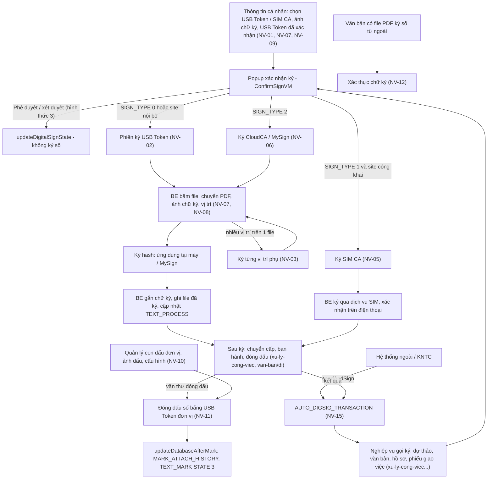
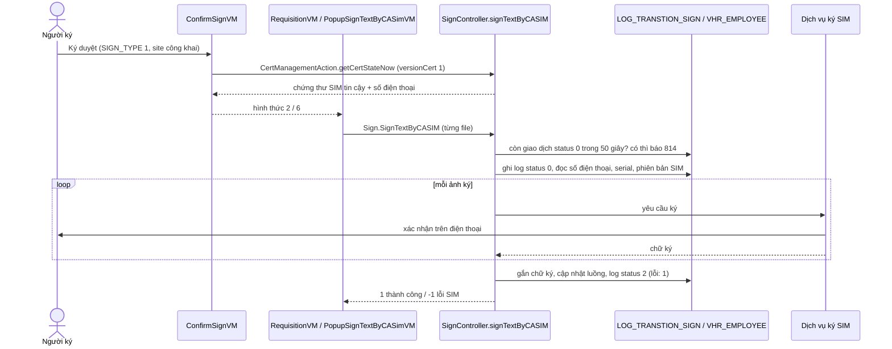
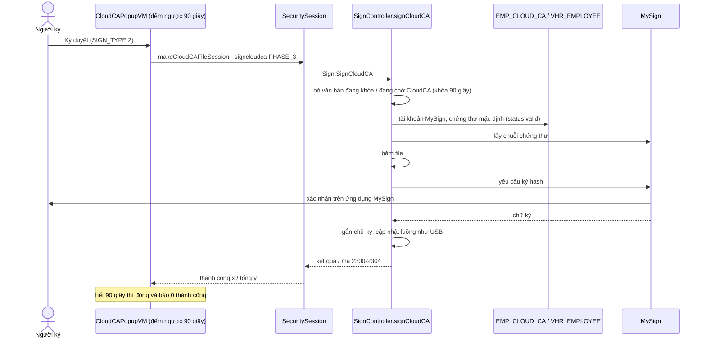
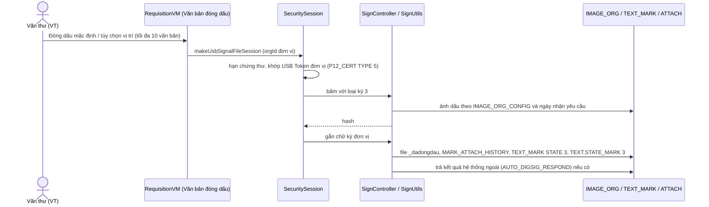
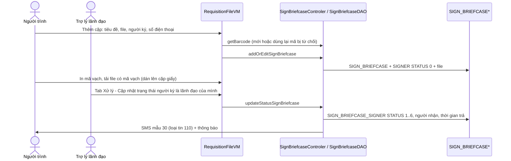
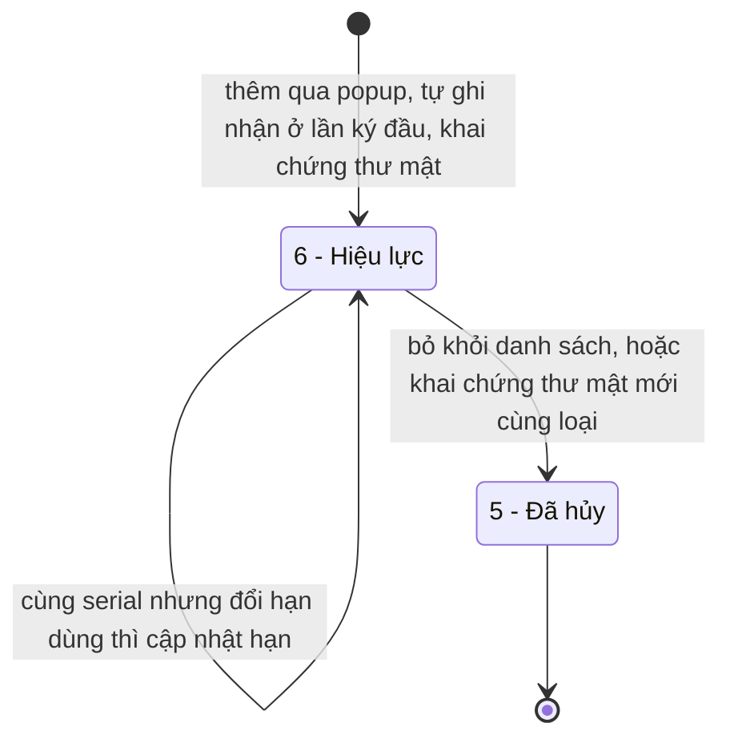
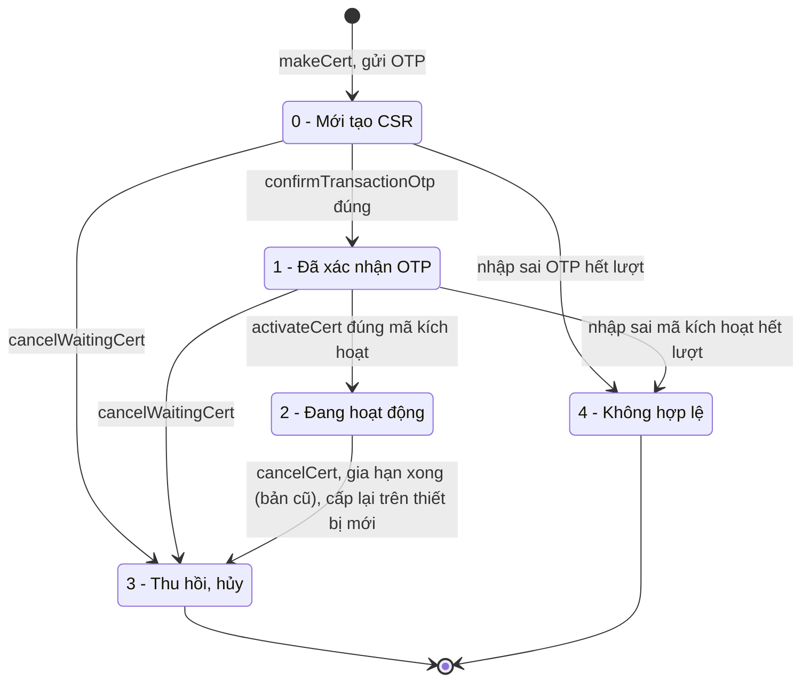
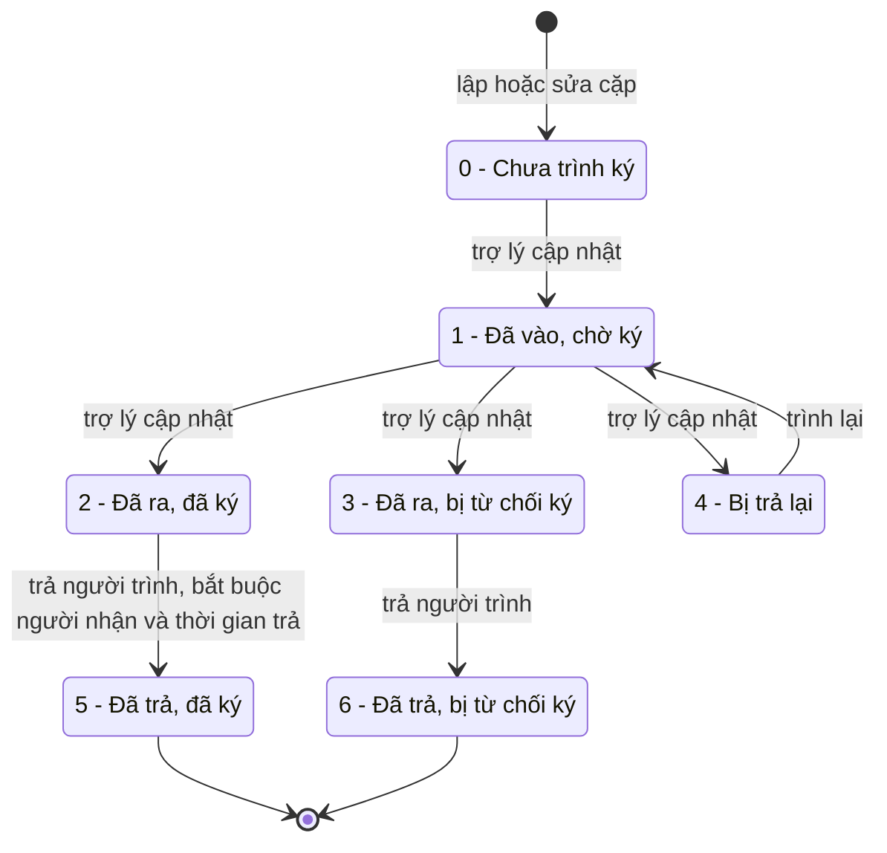
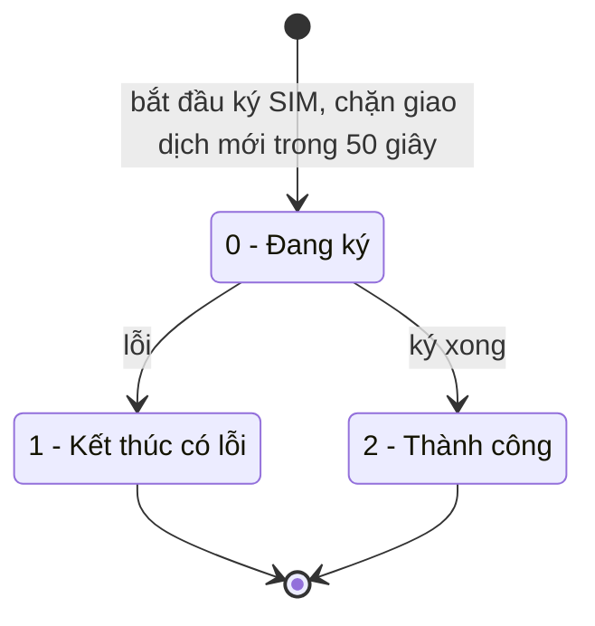

# Ký số — nghiệp vụ: cơ chế ký (USB Token, SIM CA, CloudCA/MySign), chứng thư số, ảnh chữ ký và vị trí ký trên PDF, con dấu đơn vị và đóng dấu số, xác thực chữ ký, cặp trình ký, giao dịch ký với hệ thống ngoài

> Viết lại từ code nhánh `kha_develop` (web-spring + backend2.0) ngày 2026-10-01. Mọi khẳng định có nguồn `file:dòng`.
> Menu đối chiếu **DB DEV `SYS_MENU` ngày 2026-10-01**; số dòng, comment cột, phân bố giá trị các bảng `EMP_CA`, `EMP_CA_DETAIL`, `FILE_ENCRYPT_MAP(_HISTORY)`, `IMAGE_SIGNATURE`, `REQUISITION_FILE`, `STAFF_IMAGE_SIGN` đối chiếu **DB DEV ngày 2026-10-01** (người điều phối truy vấn, chỉ SELECT; tác giả không kết nối DB). Bảng không có trong lượt tra (`P12_CERT`, `TEXT_SIGN_LOCATION`, `IMAGE_ORG`, `IMAGE_ORG_CONFIG`, `SIGN_BRIEFCASE*`, `EMP_CLOUD_CA`, `CLOUD_DEVICE_CERT`, `LOG_TRANSTION_SIGN`, `AUTO_DIGSIG_TRANSACTION`, `VHR_EMPLOYEE.SIGN_TYPE`…) ghi "chưa đối chiếu DB". **Lượt tra bổ sung DB DEV ngày 2026-10-02** (người điều phối, chỉ SELECT): `VHR_EMPLOYEE` (`SIGN_TYPE`, `SIGNUSBV2`), `P12_CERT`, `EMP_CLOUD_CA`, `CLOUD_DEVICE_CERT`, `IMAGE_ORG`, `IMAGE_ORG_CONFIG`, `SIGN_BRIEFCASE(_SIGNER, _STATUS)`, `LOG_TRANSTION_SIGN`, `AUTO_DIGSIG_TRANSACTION`, `SYSTEM_PARAMETER` (`FORCE_SIGN_CA`, `POSITION_MARK`, `LIST_IMAGE_TYPE`, `CONFIG_HDLD_TTNS`, `APP_CODE_RETURN_MARK`; `CLOUD_CA_APP_CONFIG`, `CERT_EXTEND_VTPAY_CONFIG` chỉ xác nhận có khai, không lấy giá trị), `FILE_ENCRYPT_MAP` theo ngày — ghi tại chỗ với nguồn "DB DEV `<BẢNG>` ngày 2026-10-02".
> Thông số nhạy cảm (mật khẩu, khóa, client secret, URL dịch vụ CA) **chỉ ghi tên khóa**, không ghi giá trị.
>
> Viết tắt đường dẫn:
> `WEB/` = `web-spring/src/main/java/com/viettel/` · `ZUL/` = `web-spring/src/main/webapp/view/voffice/` · `VIEW/` = `web-spring/src/main/webapp/view/` · `JS/` = `web-spring/src/main/webapp/js/` ·
> `BIZ/` = `web-spring/src/main/java/com/voffice/service/business/` · `BE1/` = `backend2.0/backendvoffice/src/main/java/com/viettel/voffice/` · `BE2/` = `backend2.0/backendvoffice/src/main/java/com/viettel/office/`.
> Lớp hay dùng — web: **SVM** = `WEB/voffice/common/SecurityVM.java` (mở phiên ký), **SSV** = `WEB/voffice/http/SecurityServlet.java` (điểm nhận các pha ký từ trình duyệt), **SS** = `WEB/voffice/http/signature/SecuritySession.java` (phiên ký phía web), **CSVM** = `WEB/voffice/widget/ConfirmSignVM.java` (popup xác nhận ký), **RVM** = `WEB/voffice/vm/requisition/RequisitionVM.java`, **SPVM** = `WEB/voffice/widget/SecurityPdfViewerVM.java` (xem PDF, đặt vị trí ảnh ký), **SIVM** = `WEB/voffice/widget/SignatureImageVM.java` (khai ảnh chữ ký), **PIVM** = `WEB/voffice/widget/ProfileInfoVM.java` (Thông tin cá nhân), **CCVM** = `WEB/voffice/widget/CloudCAPopupVM.java`, **RFVM** = `WEB/voffice/vm/requisition/RequisitionFileVM.java` (cặp trình ký), **RB** = `BIZ/RequisitionBusiness.java`, **SIB** = `BIZ/SignatureImageBussiness.java`, **AC** = `WEB/util/AppConstants.java`, **CHJS** = `JS/security/chrome.js`.
> BE: **SR** = `BE1/action/SignResource.java` (`/Sign`), **SC** = `BE1/controler/signature/SignController.java`, **SU** = `BE1/utils/SignUtils.java`, **TC** = `BE1/controler/TextController.java`, **TSD** = `BE1/database/dao/text/TextSignDAO.java`, **ISD** = `BE1/database/dao/staff/ImageSignDao.java`, **SISD** = `BE1/database/dao/staff/StaffImageSignDAO.java`, **IOD** = `BE1/database/dao/staff/ImageOrgDAO.java`, **SBD** = `BE1/database/dao/document/SignBriefcaseDAO.java`, **CMC** = `BE1/controler/CertManagementController.java`, **CMD** = `BE1/database/dao/sign/CertManagementDAO.java`, **LTS** = `BE1/database/dao/sign/LogTranstionSignDAO.java`, **ADS** = `BE1/database/dao/document/AutoDigitalSignDAO.java`, **VERI** = `BE2/repositories/impl/VhrEmployeeRepositoryImpl.java`, **VESI** = `BE2/services/impl/VhrEmployeeServiceImpl.java`, **C1** = `BE1/constants/Constants.java`, **C2** = `BE2/utils/Constants.java`.
> Phân hệ liền kề đã viết: luồng trình ký / ký nháy / ký duyệt / phê duyệt (nghiệp vụ) ở [`../xu-ly-cong-viec/nghiep-vu.md`](../xu-ly-cong-viec/nghiep-vu.md) (ký hiệu `XLCV NV-xx / BR-xx`); cấp số, đóng dấu ban hành ở [`../van-ban/di/nghiep-vu.md`](../van-ban/di/nghiep-vu.md) (`VBĐi`); đổi người ký / người ký kế ở [`../van-ban/luong-xu-ly/nghiep-vu.md`](../van-ban/luong-xu-ly/nghiep-vu.md) (`LXL`); ký phiếu trình ở [`../phieu-trinh/nghiep-vu.md`](../phieu-trinh/nghiep-vu.md) (`PT`); SMS / thông báo dùng chung ở [`../lich-nhac-viec/nghiep-vu.md`](../lich-nhac-viec/nghiep-vu.md).

## 1. Tổng quan

### 1.1 Phạm vi

Phân hệ này mô tả **cơ chế ký số dùng chung**: các nghiệp vụ (dự thảo văn bản đi, văn bản đã ban hành, hồ sơ, phiếu trình, phiếu giao việc / đánh giá) quyết định *ai ký, lúc nào, kết quả chuyển trạng thái ra sao*; phân hệ ký số lo *ký bằng công cụ gì, chữ ký / ảnh chữ ký / ảnh dấu được đặt vào file PDF như thế nào, kiểm chứng thư ra sao, ghi gì sau khi ký*. Không có menu "Ký số" riêng: người dùng chỉ thấy popup xác nhận ký (`ZUL/widgets/confirmSign.zul`), màn xem PDF đặt vị trí ảnh ký, mục khai ảnh chữ ký / USB Token trong **Thông tin cá nhân**, màn **Quản lý con dấu đơn vị** và màn **Cặp trình ký**.

Phân hệ gồm:

- **Chọn công cụ ký** của người dùng (USB Token / SIM CA / CloudCA–MySign), cấu hình "bắt buộc ký số" theo đơn vị (NV-01).
- **Ký USB Token**: phiên ký ba bên trình duyệt – web – BE, kiểm chứng thư, băm file trên server, ký hash ở máy người dùng, gắn chữ ký vào PDF (NV-02); ký **nhiều vị trí ảnh ký** trên một file (NV-03); **ký hàng loạt** nhiều văn bản / nhiều file một lượt (NV-04).
- **Ký SIM CA** (NV-05) và **ký CloudCA / MySign – ký từ xa** (NV-06).
- **Ảnh chữ ký** người dùng (NV-07) và **ghép ảnh chữ ký vào PDF**: chọn ảnh, dò vị trí, lưu vị trí (NV-08).
- **Chứng thư số** người dùng / đơn vị: USB Token đã xác nhận, chứng thư mật, đồng bộ chứng thư SIM, vòng đời chứng thư mềm trên mobile, danh sách chứng thư CloudCA (NV-09).
- **Con dấu đơn vị** (ảnh dấu, cấu hình hiển thị dấu, USB Token đơn vị) (NV-10) và **cơ chế đóng dấu số** (NV-11).
- **Xác thực chữ ký số** trên tài liệu (NV-12).
- **Cặp trình ký** — cặp hồ sơ giấy có mã vạch do trợ lý theo dõi (NV-13).
- **Thay người ký / "ký thay"** — chỉ điểm gửi tin 111 và ranh giới (NV-14).
- **Giao dịch ký với hệ thống ngoài** (`AUTO_DIGSIG_TRANSACTION`) và **nhật ký giao dịch ký SIM** (`LOG_TRANSTION_SIGN`) (NV-15).
- **File mật theo người nhận** (`FILE_ENCRYPT_MAP`) — ranh giới (NV-16); thành phần xếp chung / không dùng (NV-17).

Phân hệ **KHÔNG gồm** (trỏ sang):

| Nội dung | Phân hệ |
|---|---|
| Ai được trình ký, các cấp ký, ký nháy / ký duyệt / phê duyệt / văn thư xét duyệt, chuyển cấp, trả lại, khóa ký song song, trạng thái `TEXT` / `TEXT_PROCESS` sau ký (`XLCV NV-10`, `BR-38`…`BR-43`) | `xu-ly-cong-viec` |
| Danh sách người ký kế, đổi người ký (`HISTORY_CHANGE_SIGN`), đơn vị ban hành | `van-ban/luong-xu-ly` (`LXL NV-10`) |
| Cấp số, ban hành, xin đóng dấu / từ chối đóng dấu, hộp "Văn bản đóng dấu" ở mức nghiệp vụ, `TEXT.STATE_MARK` (`VBĐi BR-26`) | `van-ban/di` (ở đây chỉ mô tả cơ chế ghép ảnh dấu và ghi sau đóng dấu — NV-11) |
| Ký phiếu trình (`/submission-file/sign`, chọn SIM CA / USB / thường) | `phieu-trinh` (`PT NV-08`) |
| Ký phiếu giao việc / đánh giá công việc cá nhân (nghiệp vụ) | `cong-viec` / `kpi-danh-gia` (ở đây chỉ cơ chế `Sign.signMultiFileTask` — NV-04) |
| Kiểm tra thể thức / chính tả trước trình ký (`DOCUMENT_FORMAL_ERROR`, `TextCheckSpellDAO`) | `xu-ly-cong-viec` XLCV NV-05 (đang xếp nhầm vào phân hệ này — NV-17) (sửa chéo 2026-10-02 theo `xu-ly-cong-viec`) |
| Đánh dấu văn bản đồng bộ sang ERP (`textMarkSyncAction`) | `tich-hop` NV-06 (đang xếp chung ở đây — NV-17) (sửa chéo 2026-10-02 theo `tich-hop`) |
| Văn bản mật, mã hóa / giải mã file mật | chưa dùng (đã xác nhận); ở đây chỉ nêu ranh giới `FILE_ENCRYPT_MAP` (NV-16) |
| Nội dung SMS / thông báo, cơ chế chặn tin | `lich-nhac-viec` (ở đây chỉ "gửi tin loại X khi Y") |

### 1.2 Menu (đối chiếu DB DEV `SYS_MENU` ngày 2026-10-01)

`SYS_MENU.STATUS`: 1 = mở khóa, 2 = khóa (đã xác nhận). Code chỉ tham chiếu mã menu; URL nằm ở DB.

| `SYS_MENU_ID` | `CODE` | Tên (DB DEV) | Cha | URL | `STATUS` | VM / nghiệp vụ |
|---|---|---|---|---|---|---|
| 338491 | `CTK` | **Cặp trình ký** | VĂN BẢN ĐI (337232) | `/view/voffice/requisition/file/requisitionFile.zul` | 1 | RFVM — NV-13 |
| 338932 | `IMAGE_ORG` | **Quản lý con dấu đơn vị** | QUẢN TRỊ | `/view/vps/sysImageOrg/sysImageOrg.zul` | 1 | `WEB/vps/vm/SysImageOrgVM.java` — NV-10 |
| 338952 | `VBDD` | **Văn bản đóng dấu** | VĂN BẢN ĐI | `requisition.zul?view=9` | 1 | RVM `VIEW_TYPE.VBDD = 9` (`AC:765`) — nghiệp vụ ở `van-ban/di`, cơ chế ở NV-11 |

Không thuộc menu (mở từ tiêu đề / popup): **Thông tin cá nhân** `VIEW/profileInfo.zul` (PIVM — chọn công cụ ký, đồng bộ SIM CA, ảnh chữ ký, USB Token đã xác nhận; NV-01, NV-07, NV-09); **Quản trị người dùng** `VIEW/vps/sysUser/sysUser_add.zul` (`WEB/vps/vm/SysUserVM.java` — quản trị viên làm thay người dùng; menu `AD_USER` 336827 "Quản lý người dùng" — DB DEV `SYS_MENU` ngày 2026-10-01, xem `he-thong` HT NV-06; sửa chéo 2026-10-02 theo `he-thong`). Không có widget trang chủ riêng (ô "Chờ ký duyệt", "Đã ký duyệt" thuộc `xu-ly-cong-viec`).

### 1.3 Actor & quyền

Quyền thao tác nằm ở **tầng hiển thị nút** trên web (thiết kế chung, đã xác nhận); BE ký số chỉ kiểm phiên đăng nhập và một số điều kiện dữ liệu (ghi trong từng NV).

| Actor | Nhận diện trong code | Làm gì |
|---|---|---|
| Người ký (lãnh đạo, chuyên viên ký nháy, văn thư xét duyệt) | có bản ghi `TEXT_PROCESS` hiện hành (`XLCV BR-38`) | Ký bằng công cụ của mình (NV-02…NV-06); đặt vị trí ảnh ký trên file (NV-08) |
| Người dùng (mọi người) | — | Chọn công cụ ký USB Token / SIM CA, đồng bộ chứng thư SIM, khai ảnh chữ ký, thêm / bỏ USB Token đã xác nhận ở Thông tin cá nhân (`VIEW/profileInfo.zul:287-670`) |
| Quản trị viên người dùng | có menu Quản trị người dùng | Làm các việc trên thay người dùng (`VIEW/vps/sysUser/sysUser_add.zul:424-540`) |
| Văn thư đơn vị (role `VT`, `SYS_ROLE_ID 336954` — `C1:123`) | có vai trò văn thư tại đơn vị và đơn vị có ảnh dấu còn hiệu lực (`BE1/database/dao/staff/OrgDAO.java:545-574`) | Đóng dấu số (NV-11); khai USB Token của đơn vị (NV-10, cần là `DOCUMENT_MANAGER` của đơn vị — `SysImageOrgVM.java:821-837`) |
| Quản trị con dấu | có `SUB_ADMIN`, `DOCUMENT_MANAGER` hoặc `ADMIN` tại đơn vị (`SysImageOrgVM.java:180-189`) | Khai ảnh dấu, cấu hình hiển thị dấu (NV-10) |
| Trợ lý cặp trình ký | dòng `MEETING_ASSISTANT` có `ASSI_TYPE = 3` ("Trợ lý cặp trình ký" — `C1:2166`; `SBD:1193-1205`) | Theo dõi, cập nhật trạng thái, đổi người ký của cặp trình ký (NV-13) |
| Hệ thống ngoài | `EXT_APP` (appCode), hệ thống KNTC | Trình văn bản để ký và nhận kết quả ký (NV-15) |
| Ứng dụng di động | các endpoint `CertManagementAction`, `CloudCAAction`, `P12CertAction` (trừ `actionCancelRegCertWeb`), `Sign.getP12CertInformation`… không có caller web | Vòng đời chứng thư mềm, đăng ký thiết bị MySign (NV-06, NV-09) |

### 1.4 Sửa so với knowledge cũ (2026-10-01)

| Knowledge cũ | Hiện trạng code `kha_develop` | Ghi ở |
|---|---|---|
| "USB token (ký mềm phía client)… plugin `com.viettel.plugin.webtwain`" | Ký USB đi qua **ứng dụng ký cài trên máy** gọi qua `http://localhost:15811` / `55555` (người dùng có cờ `SIGNUSBV2 = 1`) hoặc tiện ích trình duyệt (bản cũ); `webtwain` là thư viện **scan tài liệu**, không phải ký (`CHJS:12-24, 916-1070`; `WEB/plugin/webtwain/UploadScanFile.java`, `JS/Scan-Resource-New/*`) (sửa 2026-10-01) | NV-02 |
| QT2 "Ký xong luôn cập nhật DB qua `updateDatabaseSign` (ký và ghi trạng thái là 2 bước)" | Ký USB / CloudCA: **bước gắn chữ ký trên BE tự ghi DB** (`SU.appendSignatureIntoListFile` → `TSD.updateDatabaseMultiSign` — `SU:2476-2633`); `updateDatabaseSign` chỉ dùng cho **phê duyệt thường** (không ký số) (`RVM:12266-12290`) (sửa 2026-10-01) | NV-02 |
| QT1 "Người ký phải có chứng thư hợp lệ (`getCertStateNow`) trước khi được đưa vào luồng" | `getCertStateNow` chỉ kiểm **chứng thư SIM CA** khi bấm ký SIM (`CSVM:1873-1912`); chứng thư USB kiểm **tại lúc ký** (hạn dùng + khớp USB đã xác nhận — `SS:928-987`); kiểm "người ký kế có chứng thư" chỉ áp cho **văn bản mật** (`CSVM:1453-1474`) (sửa 2026-10-01) | NV-02, NV-05 |
| QT4 "Thư ký/trợ lý ký ảnh thay lãnh đạo theo ủy quyền (`SECRETARY_ROLE_ID_KEY`, `getLeaderOfAssitant`)" | `getLeaderOfAssitant` là của **cặp trình ký** (trợ lý `ASSI_TYPE = 3`), không phải ký thay; tin 111 "ký thay" là **tin thay người ký** khi đổi người ký trong luồng (`C1:1397-1398`) (sửa 2026-10-01) | NV-13, NV-14 |
| QT5 "`LOCK_SIGN_STATE`, `STATUS_DELAY_SIGN = 417` khi lãnh đạo hoãn ký" | 417 = văn bản đang trong **thời gian chờ ký** của lãnh đạo (mặc định 15, khóa `text.signed.intimeprocess` — `BE1/database/dao/text/TextDAO.java:9920-9932`); văn bản đó bị **lọc khỏi lượt băm** (`SC:683`) — nghiệp vụ ở `XLCV BR-43` (sửa 2026-10-01) | NV-02 |
| "Ký tự động `AutoDigitalSign` (?) dùng cho loại văn bản nào" | Là **giao dịch ký của hệ thống ngoài** (`EXT_APP`, KNTC) trình văn bản vào luồng và nhận kết quả, không phải máy tự ký (NV-15) (sửa 2026-10-01) | NV-15 |
| "Đóng dấu đơn vị … `imageOrgAction.getOrgMarkList` (ảnh dấu `IMAGE_ORG`)" | `getOrgMarkList` là danh sách **đơn vị có thể xin đóng dấu**; ảnh dấu dùng khi đóng lấy theo `IMAGE_ORG_CONFIG` + ngày nhận yêu cầu (`IOD:431-536`) (sửa 2026-10-01) | NV-10, NV-11 |
| "Kiểm tra thể thức trước ký: `DocumentFormalError`" | Thuộc kiểm tra thể thức / chính tả của dự thảo (`xu-ly-cong-viec`) (sửa 2026-10-01) | NV-17 |
| "Cặp trình ký: trợ lý gom nhiều văn bản vào cặp có mã vạch cho lãnh đạo ký một lượt" | Cặp trình ký là **phiếu theo dõi một bộ hồ sơ giấy** (1 file trình ký + phụ lục, mã vạch in dán), trợ lý cập nhật trạng thái tay; **không** chứa văn bản điện tử, không ký số (`SBD:104-569`) (sửa 2026-10-01) | NV-13 |
| `vi-du-mau`: "`RequisitionSignVM` (?)", "`vm/config` (?) zul (menu Ký điện tử)" | `signUsbToken.zul` / `RequisitionSignVM` là màn cũ không còn được mở; quản lý chứng thư người dùng nằm ở Thông tin cá nhân / Quản trị người dùng (sửa 2026-10-01) | NV-09, NV-17 |
| `ban-do.md`: 6 màn `documentDraft/*` "☠ VM không tồn tại" | Đúng — trỏ tới gói `vm.admin.requisition` không tồn tại, không nơi nào mở (NV-17) | NV-17 |

## 2. Module

Toàn bộ cơ chế ký là **BE gen-1** (`SignResource` `/Sign` 22 endpoint, `ImageSignAction`, `ImageOrgAction`, `CertManagementAction`, `P12CertAction`, `CloudCAAction`, `SignBriefcaseAction`); gen-2 chỉ có phần quản lý chứng thư USB / mật (`/api/vhr-employee/*certificate*`), `EMP_CA` (`/api/manager/*emp-ca*` — không có caller web), danh sách hình thức ký và file mật. Web gọi BE qua `*Business.serveProcessing("a.b")` → `POST /a/b`.

| Chức năng | Màn / popup | Web | Business (key) | BE | Logic / DAO → bảng |
|---|---|---|---|---|---|
| Popup xác nhận ký (nút Ký duyệt / Ký nháy / Đóng dấu / Ký CloudCA) | `ZUL/widgets/confirmSign.zul:636-668` | CSVM `doSignMethodByUserConfig` :1823, `doSignUsbToken` :1836, `doSignSimCa` :1873 | — | — | — |
| Lấy / đổi công cụ ký | Thông tin cá nhân, Quản trị người dùng | PIVM :134-143, `onChangeSignMethod` :779-790 | `RB.getUserSignMethod` :6190-6216, `updateSignMethod` :6218 → `textAction.getUserSignMethod` / `updateUserSignMethod` | `BE1/action/TextAction.java:873-909` → `TC:7269-7380` | `TSD:2191-2222` → `VHR_EMPLOYEE.SIGN_TYPE` |
| Ký USB Token (văn bản / dự thảo) | trình duyệt + ứng dụng ký tại máy | SVM `makeUsbSignalFileSession` :4444-4520 → CHJS `usbSignAllFlatFormRequest` :916-1070 → SSV `PHASE_3` / `PHASE_4` / `PHASE_X` :1595-1606, 1709-1732 → SS `getDigestData` / `appendSignature` | `RB.getMultiFileDigests` :3959 (`Sign.SignSoftHashMutiFile`), `appendMultiFileSignatures` :4021 (`Sign.SignSoftAttachMutiFile`) | `SR:88-103` → `SC.hashListFile` :511, `appendSignatureIntoListFile` :892 | `SU.hashListFile` :1480-2166, `appendSignatureIntoListFile` :2167-2816 → `ATTACH`, `TEXT_PROCESS`, `TEXT_SIGN_LOCATION`, `TEXT_MARK`… |
| Ký nhiều vị trí trên một file | như trên | CHJS `PHASE_HASH_POSITION` / `PHASE_ATTACH_POSITION` :957-1000 → SSV :603, 721 | `RB.getMultiFileDigestPosition` :4082, `appendMultiFileSignaturePosition` :4111 | `SR:117-141` → `SC.hashFilePosition` :999, `appendFilePosition` :1091 | `SU.hashFilePosition` :1179, `appendFilePosition` :1396 (trạng thái giữ trong phiên HTTP) |
| Ký / đóng dấu văn bản đã ban hành, hồ sơ | màn văn bản, hồ sơ | `makeUsbSignalFileSession` (scope văn bản / hồ sơ) | `RB` :5645-5825 (`Sign.SignSoftHashMutiFileDoc/Brief`, `SignSoftAttachMutiFileDoc/Brief`) | `SR:272-327` → `SC.hashListFileDoc` :2968, `hashListFileBrief` :2469… | `SU.hashListFileDoc` :4471, `hashListFileBrief` :3917 |
| Ký SIM CA | `ZUL/widgets/popupSignTextByCASim.zul` (nhiều file) | RVM `popupSignTextByCASim` :17279-17340; `WEB/voffice/widget/PopupSignTextByCASimVM.java` | `RB.approveRequisitionSimCA` :7528-7598 (`Sign.SignTextByCASIM`), `getCertStateNow` :7496 (`CertManagementAction.getCertStateNow`) | `SR:163-169` → `SC.signTextByCASIM` :1145-1280 | `SU.signTextByCASIM` :2868-3445 → `LOG_TRANSTION_SIGN` |
| Ký CloudCA (MySign) | `VIEW/widgets/cloud_ca_popup.zul` (đếm ngược) | CCVM :157-206 → SVM `makeCloudCAFileSession` :4287-4325 → SSV `signcloudca` :1625-1631 → SS `signCloudCA` :1685-1784 | `RB.signCloudCAJson` :3597-3670 (`Sign.SignCloudCA`) | `SR:144-150` → `SC.signCloudCA` :3456-3734 | `SU.signCaHashFile` :5467-5530; `BE1/controler/cloudca/CloudSignCAManager.java`; `EMP_CLOUD_CA`, `CLOUD_DEVICE_CERT` |
| Ảnh chữ ký người dùng | `VIEW/widgets/imageSignature/insertSignatureImage.zul`, `updateSignatureImage.zul`, `imageSignaturePanel.zul` (nhúng trong Thông tin cá nhân / Quản trị người dùng) | SIVM :110-584 | `SIB.search` :68, `addSignatureImage` :181, `updateSignatureImage` :218 | `BE1/action/ImageSignAction.java:54-94` → `BE1/controler/ImageSignController.java` | `SISD.addSignatureImage` :46-96, `editSignatureImage` :105-158 → `STAFF_IMAGE_SIGN` |
| Vị trí ảnh ký trên PDF | `ZUL/widgets/securityPdfViewer.zul` | SPVM :850-880, `saveSignatureImageLocation` :4314-4382; CSVM `validateSignLocation` :1476-1515 | `SIB.getListLocationByTextId` :258, `updateListLocation` :284 | `ImageSignAction.java:142-164` | `ISD.getListLocationByTextId` :614, `updateListLocation` :1023-1118, `autoDetectedSignLocation` :1194 → `TEXT_SIGN_LOCATION`, `TEXT_PROCESS.SIGN_IMAGE(_ID)` |
| Chứng thư USB Token đã xác nhận, chứng thư mật | Thông tin cá nhân, Quản lý con dấu đơn vị | `WEB/voffice/widget/PopupAddCertVM.java`, PIVM :974-992 | `RB.getListCertificate` :7200, `updateNormalCert` :7036, `update-security-cert` :7005-7034 | `BE2/controller/VhrEmployeeController.java:75-110` | VESI :192-333 → VERI :1048-1300 → `P12_CERT` |
| Đồng bộ chứng thư SIM CA | Thông tin cá nhân | PIVM `doSynCert` :469-500 | `RB.synchonizeCertificate` :4186, `getCertificateSynchronization` :4219 | `TextAction.java:514-540` → `TC:5077-5213` | thư viện `com.viettel.digital.sign.cert.Synchronization`; `VHR_EMPLOYEE.CA_SIM_PHONE_NUMBER`, `CA_SERIAL`, `SIMCA_VERSION` |
| Vòng đời chứng thư mềm (mobile) | — (không có màn web) | — | chỉ `getCertStateNow` có caller web | `BE1/action/CertManagementAction.java` (22) → CMC → CMD; `BE1/action/P12CertAction.java` | `P12_CERT`; dịch vụ CA qua SOAP (khóa cấu hình `CERT_EXTEND_VTPAY_CONFIG`) |
| Quản lý con dấu đơn vị | `VIEW/vps/sysImageOrg/sysImageOrg.zul`, `insertImageOrg.zul`, `configImageOrg.zul` | `SysImageOrgVM.java`, `WEB/voffice/widget/PopupImageOrgVM.java`, `PopupConfigOrgVM.java` | danh sách: facade web `ISysOrganization` (truy vấn thẳng DB — `WEB/vps/dao/SysOrganizationJpaDao.java:1708-1867`); ghi: `BIZ/ImageOrgBusiness.java:68-276` | `BE1/action/ImageOrgAction.java:35-144` → `BE1/controler/ImageOrgController.java` | IOD → `IMAGE_ORG`, `IMAGE_ORG_CONFIG` |
| Ghi DB sau đóng dấu | hộp Văn bản đóng dấu, màn văn bản | RVM `updateAfterApproveWithRegisterNumber` :13172-13201; ~12 VM văn bản | `RB.updateDatabaseAfterMark` :6042-6060; `BIZ/DocumentBusiness.java:4710-4748` | `SR:330-353` → `SC.updateDatabaseAfterMark` :3302, `updateDatabaseDocumentAfterMark` :3888 | `SU.updateDatabaseAfterMark` :5297-5455, `updateDatabaseDocumentAfterMark` :5648-5874 → `MARK_ATTACH_HISTORY`, `ATTACH`, `FILES_ATTACHMENT`, `TEXT_MARK`, `TEXT.STATE_MARK` |
| Xác thực chữ ký | nút "Xác thực chữ ký số" ở `ZUL/document/reportSendReceiveDoc/popupVB.zul:605-609` (và 3 popup khác); popup `popupExtSign.zul` | `WEB/voffice/vm/document/DocumentViewDetailVM.java:5835-5847`, `ExtSignViewDetailVM` | `BIZ/DocumentBusiness.java:6295-6306` (`DocumentAction.verifyExternalSignature`) | `BE1/action/DocumentAction.java:1455-1467` → `BE1/controler/DocumentController.java:12983-13104` | `BE1/controler/signature/SignatureVerificationController.java:40-251` (không ghi DB) |
| Cặp trình ký | `ZUL/requisition/file/requisitionFile.zul` (+ `requisitionFileViewDetail.zul`, `requisitionFileUpdateState.zul`, `requisitionFileChangeSigner.zul`) | RFVM, `RequisitionFileUpdateVM`, `RequisitionFileDetailVM`, `RequisitionFileChangeSignerVM` | `BIZ/RequisitionFileBusiness.java:38-363` | `BE1/action/SignBriefcaseAction.java:33-169` → `BE1/controler/SignBriefcaseControler.java` | SBD → `SIGN_BRIEFCASE`, `SIGN_BRIEFCASE_SIGNER`, `ATTACH_BRIEFCASE`, `SIGN_BRIEFCASE_ATTACH(_OTHER)`, `SIGN_BRIEFCASE_STATUS` |
| Giao dịch ký hệ thống ngoài | — (API) | — | — | `BE1/action/DocumentSignService.java:127` (`/DocumentService/sendAndSign`), `BE1/action/DocumentSignKNTCService.java:36-40` | `BE1/controler/DocumentSignController.java:2841-2952`; ADS → `AUTO_DIGSIG_TRANSACTION`, `AUTO_DIGSIG_RESPOND` |

Bảng DB chính: `P12_CERT`, `VHR_EMPLOYEE` (cột `SIGN_TYPE`, `SIGNUSBV2`, `CA_SIM_PHONE_NUMBER`, `CA_SERIAL`, `SIMCA_VERSION`, `USER_MYSIGN`), `EMP_CLOUD_CA`, `CLOUD_DEVICE_CERT`, `STAFF_IMAGE_SIGN`, `TEXT_SIGN_LOCATION`, `IMAGE_ORG`, `IMAGE_ORG_CONFIG`, `MARK_ATTACH_HISTORY`, `LOG_TRANSTION_SIGN`, `AUTO_DIGSIG_TRANSACTION`, `SIGN_BRIEFCASE*`, `FILE_ENCRYPT_MAP(_HISTORY)`, gen-2 `EMP_CA`, `EMP_CA_DETAIL` (mục 5).

## 3. Nghiệp vụ

### Giá trị dùng xuyên suốt

**Hình thức ký trên web** (`AC:4614-4622` `DIGITAL_SIGNATURE.TYPE`): 1 USB Token · 2 SIM CA · 3 thường (phê duyệt / xét duyệt, không ký số) · 4 CloudCA · 5 ký nháy (USB) · 6 ký nháy SIM CA.
**Loại ký gửi BE khi băm file** (`SU:185-189`): `"1"` ký duyệt · `"0"` xét duyệt (văn thư) · `"2"` ký nháy · `"5"` ký nháy (ảnh thu nhỏ 1/4) · `"3"` đóng dấu.
**Công cụ ký của người dùng `VHR_EMPLOYEE.SIGN_TYPE`** — **hai cách mã hóa song song** (chưa đối chiếu DB):

| Nơi đọc / ghi | Giá trị | Nguồn |
|---|---|---|
| Thông tin cá nhân, Quản trị người dùng (đang hiện) — ghi thẳng qua entity web `SysUser` (`@Table VHR_EMPLOYEE`) | **0 = USB Token, 1 = SIM CA** | `VIEW/profileInfo.zul:295-305`; `WEB/vps/entity/SysUser.java:25, 1189`; PIVM :134-136, 424-443 |
| `getUserSignMethod` / `updateUserSignMethod` (khối chọn "USB / MySign" đang **ẩn** — `VIEW/profileInfo.zul:416-450`) | **1 = USB Token, 2 = CloudCA** | `AC:2505-2508`; `C1:2416-2419`; `TSD:2191-2222` |

Web quy đổi mọi giá trị khác 1, 2 thành USB (`RB:6195-6200`) → người chọn SIM CA (lưu 1) vẫn được coi là "USB" ở hàm `getUserSignMethod`; nút Ký duyệt rẽ sang SIM CA nhờ kiểm riêng `user.getSignType() == 1` (`CSVM:1823-1830`). CloudCA chỉ có hiệu lực khi cột = 2 — trên web hiện **không có chỗ hiện để đặt** giá trị này (NV-01).

**DB DEV `VHR_EMPLOYEE` ngày 2026-10-02** (người đang hoạt động, theo `SIGN_TYPE`, `SIGNUSBV2`): (0, 1) = 24 · (1, 1) = 1 · (null, 1) = 368 — **không ai có `SIGN_TYPE = 2` (CloudCA)**, gần như mọi người để trống (web coi trống là USB Token — `RB:6191`); mọi người đều `SIGNUSBV2 = 1` (ký qua ứng dụng ký tại máy).

**`P12_CERT`** (chưa đối chiếu DB) — bảng chung cho nhiều loại chứng thư, phân biệt bằng `TYPE` + `STATUS`:

| `TYPE` | Nghĩa | `STAFF_ID` là | `STATUS` dùng | Nguồn |
|---|---|---|---|---|
| null / 2 (luồng mobile) | Chứng thư mềm trên điện thoại (2 = cấp lại trên thiết bị mới) | nhân viên | 0 mới tạo CSR · 1 đã xác nhận OTP · 2 đang hoạt động · 3 thu hồi / hủy · 4 không hợp lệ (nhập sai quá số lần) · 5 tạm ngưng | `C1:1897-1912`; CMC :352-622 |
| 1 | Chứng thư **mật** cá nhân (mã hóa file mật) | nhân viên | 6 hiệu lực · 5 đã hủy | VESI :259-270; VERI :1048-1105 |
| 2 (luồng gen-2) | Chứng thư **mật** của đơn vị | đơn vị | 6 / 5 | VESI :259-264; VERI :1169-1171 |
| 3 | Chứng thư SIM (danh sách trong khối đang ẩn) | nhân viên | — | PIVM :176, 845; `SC:637-641` |
| 4 | **USB Token đã xác nhận** của cá nhân | nhân viên | 6 / 5 | VESI :306-309; VERI :1201-1205 |
| 5 | **USB Token đã xác nhận** của đơn vị (đóng dấu) | đơn vị | 6 / 5 | VESI :310-314; VERI :1220-1224 |

`TYPE = 2` mang hai nghĩa (cấp lại chứng thư mobile / chứng thư mật đơn vị); chỉ phân biệt được qua `STATUS` (0–4 so với 5/6).

**DB DEV `P12_CERT` ngày 2026-10-02** (`TYPE`, `STATUS`) = số dòng [mới nhất]: (1, 0) = 1 [2025-06] · (1, 5) = 2.834 · (1, 6) = 121.647 [2026-04-16] · (2, 5) = 842 · (2, 6) = 5.197 · (3, 5) = 461 · (3, 6) = 205 · (4, 5) = 99 [2026-09-19] · (4, 6) = 160 [2026-09-25] · (5, 5) = 71 · (5, 6) = 70 [2026-09-28]. Chỉ có `STATUS` 0 / 5 / 6 — **không có dòng nào của luồng chứng thư mềm mobile** (`STATUS` 1–4, `TYPE` null) → các trạng thái mobile ở bảng trên và sơ đồ 4.8 là hằng code, chưa phát sinh dữ liệu trên DB DEV; `TYPE = 2` hiện chỉ mang nghĩa chứng thư mật đơn vị. USB Token cá nhân / đơn vị (`TYPE` 4 / 5) vẫn phát sinh tới 09/2026 (tự ghi nhận ở lần ký đầu hoặc khai qua popup — BR-07).

### NV-01. Chọn công cụ ký của người dùng; "bắt buộc ký số" theo đơn vị

**Mục đích.** Mỗi người dùng có một công cụ ký mặc định; popup ký dựa vào đó để hiện nút và chọn đường ký.

**Luồng.**
- Người dùng mở **Thông tin cá nhân** → khối "Loại ký" chọn **Ký USB Token (0)** hoặc **Ký Sim CA (1)** (`VIEW/profileInfo.zul:287-313`) → PIVM lưu thẳng `VHR_EMPLOYEE.SIGN_TYPE` qua entity web (`PIVM:424-443`); chọn SIM CA thì bắt buộc đồng bộ chứng thư SIM trước (NV-09, `PIVM:429-435`). Quản trị viên làm tương tự ở `VIEW/vps/sysUser/sysUser_add.zul:424-540` (`SysUserVM.java:700-706`, `2161`).
- Khối chọn **"USB Token / MySign"** + danh sách chứng thư CloudCA đang `visible="false"` (`VIEW/profileInfo.zul:416-450`; `sysUser_add.zul:633`); nếu dùng, nó gọi `textAction.updateUserSignMethod` (1 = USB, 2 = CloudCA; chuyển sang 2 thì BE đồng bộ danh sách chứng thư CloudCA — `TC:7269-7290`).
- Khi mở popup ký, CSVM đọc `getUserSignMethod` (`CSVM:1002`): = 2 (CloudCA) thì ẩn nút **Ký duyệt** USB, hiện nút **Ký duyệt** CloudCA (`CSVM:1148-1158`; `ZUL/widgets/confirmSign.zul:646-656`). Nút Ký duyệt USB gọi `doSignMethodByUserConfig`: site công khai (`vps.site = public`) **và** `SIGN_TYPE = 1` → ký SIM CA, ngược lại ký USB Token (`CSVM:1823-1830`). Nút "Ký Sim CA" riêng luôn ẩn (`confirmSign.zul:657-662`; `CSVM:1160-1162`).

**Business rule.**
- **BR-01.** Công cụ ký là thuộc tính của **người dùng**, không theo văn bản; cùng một popup ký, người khác nhau đi đường khác nhau (`CSVM:1148-1158`, `1823-1830`).
- **BR-02.** Ký SIM CA chỉ áp dụng ở **site công khai** (`isPublicSite()`) với nút Ký duyệt; nút Ký nháy rẽ SIM CA chỉ theo `SIGN_TYPE = 1`, không xét site (`CSVM:1586-1592`, `1823-1830`).
- **BR-03.** **Bắt buộc ký số**: tham số hệ thống `FORCE_SIGN_CA` (JSON `sign_type` = danh sách loại xử lý, `org_id` = đơn vị) — người dùng thuộc đơn vị cấu hình thì với các loại xử lý đó **không có nút xác nhận thường** (chỉ được ký số) (`BE1/database/dao/staff/UserDAO.java:575-589`, đọc `SYSTEM_PARAMETER` :500; `CSVM:563-567`, `1140-1142`). Mã loại xử lý: 1 xét duyệt (hộp `VBXD`) · 2 ký nháy (`VBKN`) · 3 ký duyệt (`VBKD`) (`AC:8217-8222`; `WEB/util/sign/RequisitionUtil.java:13-49`). **DB DEV `SYSTEM_PARAMETER` ngày 2026-10-02**: `FORCE_SIGN_CA` = `{"sign_type":[1,2,3],"org_id":[9033700]}` → người dùng thuộc đơn vị 9033700 (theo `checkUserInOrg`) phải ký số ở cả ba loại xử lý.
- **BR-04.** Văn thư ở hộp xét duyệt (`VIEW_TYPE.VBXD`) không có nút ký USB / CloudCA (`CSVM:1165-1168`).
- **BR-05.** Ký USB "không cần tiện ích trình duyệt" bật theo cờ `VHR_EMPLOYEE.SIGNUSBV2 = 1` (người dùng mới tạo mặc định 1 — `WEB/vps/service/SysUserService.java:322`); cờ khác 1 thì dùng đường tiện ích trình duyệt cũ (`SVM:4484-4502`).

**Bảng dữ liệu.** `VHR_EMPLOYEE.SIGN_TYPE`, `SIGNUSBV2` (`BE2/entities/VhrEmployeeEntity.java:230-245`), `SYSTEM_PARAMETER` (`FORCE_SIGN_CA`). Gen-2 có bảng `EMP_CA` ghi "công cụ ký mặc định" theo kiểu khác (`TYPE_CA` 1 USB / 2 MySign / 3 SIM CA — `C2:379-385`) nhưng **không có caller web** (NV-09).

**Edge case.** Hình thức ký trả về từ `/api/ca-supplier/get-list-sign-method` chỉ còn `{1, "Sim CA"}`; dòng đọc bảng `CA_SUPPLIER` bị comment (`BE2/services/impl/CaSupplierServiceImpl.java:30-33`) — bảng `CA_SUPPLIER` **không tồn tại trên DB DEV** (DB DEV ngày 2026-10-01).

### NV-02. Ký bằng USB Token (phiên ký trình duyệt – web – BE)

**Mục đích.** Ký số văn bản bằng chứng thư trong USB Token cắm tại máy người ký: file được băm trên server, chỉ giá trị băm đi xuống máy để ký, chữ ký quay về server gắn vào PDF.

**Actor.** Người đang tới lượt ký (ký duyệt / ký nháy / văn thư xét duyệt có ký) — điều kiện nghiệp vụ ở `XLCV NV-10`.

**Luồng** (văn bản / dự thảo — `scope` văn bản):
1. CSVM `doSignUsbToken` (`CSVM:1836-1871`): bắt buộc chọn xếp loại nếu là người ký cuối có đánh giá; `validateSign`; văn bản mật → kiểm người ký kế có chứng thư mật (`validateSignSecurity` :1453-1474); kiểm ảnh chữ ký / vị trí ký (`validateSignLocation` :1477-1515 — NV-08); cảnh báo chân ký (`checkFileHasApproveSignerName` :1520-1576) → tải file đính kèm ý kiến → trả về VM gọi.
2. RVM `approveRequisitionInternal` (`RVM:12187-12404`): văn bản mật → `ConfidentialUtil.signConfidentialFile` (`:12230-12252`); USB / ký nháy → `makeUsbSignalFileSession` (`:12297-12333`; ký nháy đổi `viewType` sang `VBKD_KN`).
3. SVM `makeUsbSignalFileSession` (`SVM:4444-4520`): chỉ chạy trên **Firefox / Chrome trên Windows, Firefox trên Ubuntu** (khác → cảnh báo "hệ điều hành không tương thích" :4513-4516); tạo `SecuritySession` (danh sách file, loại ký, ý kiến, người xem ý kiến, người ký kế) và gọi hàm JS tương ứng: `usbSignMultiRequest` (đóng dấu kèm số), `usbSignAllFlatFormRequest` (cờ `SIGNUSBV2 = 1`), `usbSignOnUbuntuRequest`, `usbSignRequest` (tiện ích cũ) (`SVM:4469-4502`).
4. Trình duyệt (`CHJS:916-1070`): tìm cổng ứng dụng ký tại máy (`localhost:15811` / `55555` — `CHJS:12-24, 1195-1212`), kiểm phiên bản ứng dụng (chưa cài / khác phiên bản → báo cài, `CHJS:929-934`) → **lấy chứng thư từ USB** → (nếu có nhiều vị trí ảnh ký — NV-03) → gửi chứng thư lên web pha `PHASE_3` → nhận danh sách hash → ứng dụng tại máy **ký các hash** (người dùng nhập PIN trên ứng dụng ký) → gửi chữ ký pha `PHASE_4` → kết thúc pha `PHASE_X` → báo kết quả về màn hình.
5. Web SSV (`SSV:1595-1606`, `1709-1732`) → SS `getDigestData` (`SS:843-1040`):
   - chứng thư **hết hạn** → `sign.error.cert-expire`; **chưa đến ngày hiệu lực** → `sign.warning.not-yet-effective` (`SS:928-942`);
   - so serial `hex(serial) - CN` với danh sách **USB Token đã xác nhận** của người ký (`P12_CERT TYPE = 4, STATUS = 6`); **chưa có USB nào** → tự ghi nhận USB này là của người ký; có mà không khớp → `sign.warning.certificate-mismatch`; khớp mà hạn dùng thay đổi → cập nhật hạn (`SS:944-986`);
   - gọi `RB.getMultiFileDigests` → `Sign.SignSoftHashMutiFile` (`RB:3959-4001`).
6. BE `SC.hashListFile` (`SC:511-892`): kiểm chứng thư (`SU.checkCer` — hạn dùng; chứng thư mềm thì trạng thái `P12_CERT` 2 hoạt động / 5 tạm ngưng / khác = thu hồi — `SU:1023-1094`) → bỏ văn bản đang trong "thời gian chờ ký" của lãnh đạo (`SC:683`; `TextDAO.java:9900-9932`) → lấy file ký chính → văn bản thanh toán SAP chỉ ký file PDF (`SC:717-728`) → nhận diện "ký dự thảo ngay sau phiếu trình" (`SC:731-760`; `XLCV BR-38`) → `SU.hashListFile` → lưu kết quả băm vào **phiên HTTP của BE** (`CommonControler.setSignSession` `SC:784`) kèm loại ký, người xem ý kiến, người ký kế, vị trí ảnh ký (`SC:786-819`) → trả `{id, hash, strUrl = IP máy chủ BE}` (`SC:827-840`).
7. `SU.hashListFile` (`SU:1480-2166`), với từng file: ký duyệt / ký nháy mà file **không phải PDF** → giải mã, **chuyển sang PDF** rồi ký trên bản PDF (`SU:1560-1604`); lấy **ảnh chữ ký** còn hiệu lực hôm nay (`SU:1606-1607`; NV-07) và **vị trí** (`ISD.autoDetectedSignLocation` — NV-08); đóng dấu thì lấy ảnh dấu (NV-11); tính đường dẫn file đã ký `…_<userId>_…` (xét duyệt `…VT`, đóng dấu `…<orgId>DD` — `SU:1808-1827`); dựng bản PDF có ảnh + vùng chữ ký rồi băm (USB `usbSign.getDigest` :1986; chứng thư mềm `softSign.getDigest` :2043; CloudCA :1934).
8. Web SS `appendSignature` (`SS:1849`) → `RB.appendMultiFileSignatures` → `Sign.SignSoftAttachMutiFile` **gửi đúng máy chủ BE đã băm** (`serviceUrl` = `strUrl` — `SS:1018-1029`; `RB:4021-4054`).
9. BE `SC.appendSignatureIntoListFile` (`SC:892-998`) → `SU.appendSignatureIntoListFile` (`SU:2167-2816`): gắn chữ ký vào PDF, ghi file đã ký, **cập nhật DB ngay trong bước này**: `TSD.addFilesSign` / `addFilesMultiSign` (file đã ký), `TSD.updateDatabaseMultiSign` (trạng thái `TEXT_PROCESS`, chuyển cấp — `XLCV BR-39`, `BR-40`), ký song song (`isLockSignParallel`, `updateSignParallelNext` :2541-2611), lưu vị trí ảnh ký (`textDAO.insertTextSignLocation` :2587; `ISD.updateSignImageTextSignLocation` :2503), văn thư xét duyệt `updateDatabaseByVT` (:2477); đóng dấu → nhánh `TEXT_MARK` (NV-11, :2652-2755); đánh giá nhiệm vụ (`missionSigningDAO.update` :2778).

**Business rule.**
- **BR-06.** Chứng thư phải **còn hạn** tại ngày ký (kiểm ở cả web `SS:928-942` và BE `SU:1029-1047`); hết hạn trong vòng 1 tháng có mã lỗi riêng (`SU:1035-1040`).
- **BR-07.** Mỗi người chỉ ký được bằng **USB Token đã xác nhận** của mình; người chưa khai USB nào thì USB dùng ở lần ký đầu được **tự ghi nhận** (`SS:955-986`; `RB.updateNormalCert` → `/api/vhr-employee/update-certificate` — VESI :300-333).
- **BR-08.** Ký duyệt / ký nháy luôn ra **file PDF** (file Word được chuyển PDF trước khi ký — `SU:1566-1603`); đóng dấu **bỏ qua** file không phải PDF (`SU:1678-1681`).
- **BR-09.** Hai bước băm và gắn chữ ký phải chạy **trên cùng một máy chủ BE** (kết quả băm giữ trong phiên HTTP — `SC:784`; `SS:1018-1029`).
- **BR-10.** Văn bản lãnh đạo vừa mở trong khoảng "thời gian chờ ký" (mặc định 15, khóa `text.signed.intimeprocess`) bị bỏ khỏi lượt ký; không còn văn bản nào thì báo `STATUS_DELAY_SIGN` (417) (`SC:683-689`; `TextDAO.java:9900-9932`; `C1:543`).
- **BR-11.** Người ký áp chót chọn **người ký cuối khác** → `TEXT.SIGNER_ID` / `SIGNER_NAME` được đổi theo người được chọn — việc này chạy **ngay ở bước băm** (`SC:822`, `4092-4133`).

**Thông báo.** Do nghiệp vụ gọi (`ThreadExcuteAfterSigned` — `XLCV NV-10`); ký số không gửi tin riêng.

**Edge case.** Lỗi riêng từng file (không có file ký chính, băm lỗi) ghi mã vào kết quả từng file (`FileState.SIGN_RESULT_CODE`), các file khác vẫn ký (`SS:1030-1034`; `SU:2063-2082`). Mã lỗi chứng thư (`BE1/constants/NumberConstants.java:20-60`): 1581111 chưa cấp chứng thư, 1581115 file chứng thư không tồn tại, 1581117 lỗi băm, 1581118 chữ ký từ máy gửi lên lỗi / mất trạng thái, 15811110 độ dài chữ ký sai.

### NV-03. Ký nhiều vị trí ảnh ký trên một file

**Mục đích.** Một người ký xuất hiện ở **nhiều chỗ** trong cùng một file (ví dụ chân ký nhiều trang / phụ lục): mỗi vị trí là một chữ ký số riêng.

**Luồng.** Trước bước lấy hash chính, trình duyệt lặp `PHASE_HASH_POSITION` → ứng dụng ký ký hash vị trí phụ → `PHASE_ATTACH_POSITION`, đến khi server trả hash rỗng (`CHJS:957-1000`); web SS `getDigestDataPosition` / `appendSignaturePosition` (`SSV:615-800`) → `RB.getMultiFileDigestPosition` / `appendMultiFileSignaturePosition` (`RB:4082-4117`) → `Sign.SignSoftHashMutiFilePosition` / `SignSoftAttachMutiFilePosition` (`SR:117-141`) → `SU.hashFilePosition` / `appendFilePosition` (`SU:1179-1479`). Vị trí cuối cùng đi đường ký thường (NV-02), `SU.hashListFile` tự dùng file tạm đã ký các vị trí phụ (`SU:1486-1488`, `1777-1781`).

**BR-12.** Trạng thái vòng ký từng file (`multiPositionSignState`, `multiPositionPreSignedOrigin`) giữ trong phiên HTTP BE theo mã phiên tùy biến của hệ thống (`SU:1110-1158`); lỗi riêng một file được bỏ qua sang file kế, không dừng cả lượt (`SSV:673-686`).

### NV-04. Ký hàng loạt

**Mục đích.** Ký nhiều văn bản (hoặc nhiều file) trong một lượt, chỉ thao tác USB / xác nhận một lần.

**Luồng.**
- **Nhiều văn bản**: hộp Văn bản ký duyệt cho chọn tối đa **50** văn bản (`AC:697`; `RVM:13434-13468`) → nút ký tất cả `doSignAllSelectedDocuments` (`RVM:13208-13231`) → `doApprove(entities, isSignPatch = true)` → một phiên ký với danh sách file của mọi văn bản (NV-02 bước 3). BE băm từng file trong danh sách và trả mảng hash (`SC:660-840`); ứng dụng ký ký cả mảng (`CHJS:1019-1027`). Đóng dấu hàng loạt tối đa **10** văn bản (`AC:699`; `RVM:13448-13456`, `13235`).
- **Nhiều file phiếu giao việc / đánh giá công việc cá nhân**: `TaskBusiness` → `Sign.signMultiFileTask` (`BIZ/TaskBusiness.java:2543-3404`; `SR:256-262`) → `SC.signMultiFileTask` (`SC:2047`): `signType` 0 = xác nhận thường (`SU.insertRecordAfterSignSuccess`), 1/2 = USB / chứng thư mềm hai bước băm – gắn (`SU.signUsbAndSoftTask` :3495), CloudCA (`SU.signTaskCloudCA` :3521) (`SC:2108-2190`). Nghiệp vụ phiếu giao việc thuộc `cong-viec` / `kpi-danh-gia`.

**BR-13.** Một văn bản lỗi không chặn văn bản khác trong lượt; kết quả báo "thành công x / tổng y" (`RVM:12395-12404` với CloudCA; kết quả từng file `SS:1030-1034`).

### NV-05. Ký SIM CA

**Mục đích.** Ký bằng chứng thư lưu trên SIM điện thoại: hệ thống gửi yêu cầu, người ký xác nhận trên điện thoại.

**Điều kiện.** `SIGN_TYPE = 1`, site công khai (BR-02); chứng thư SIM **được tin cậy** và có số điện thoại (`RB.getCertStateNow` → `CertManagementAction.getCertStateNow` với `versionCert = 1` — `CSVM:1910-1913`; `RB:7496-7525`; `CMC:118, 241`).

**Luồng.** CSVM `doSignSimCa` (`CSVM:1873-1908`; ký nháy → loại 6, còn lại loại 2) → RVM `popupSignTextByCASim` (`RVM:17279-17340`): **một file** → ký ngầm, báo "Hệ thống đã gửi yêu cầu ký. Đ/c vui lòng lấy máy cắm sim để xác thực"; **nhiều file** → popup `PopupSignTextByCASimVM` ký lần lượt từng file rồi chốt (`PopupSignTextByCASimVM.java:160-310`) → `RB.approveRequisitionSimCA` → `Sign.SignTextByCASIM` (`RB:7528-7598`) → `SC.signTextByCASIM` (`SC:1145-1280`) → `SU.signTextByCASIM` (`SU:2868-3445`):
- kiểm người ký đang có giao dịch SIM khác chưa xong → `EXIST_CA_SIM_SIGN_TRANSACTION` (814) (`SU:2909`; `BE1/constants/ErrorCode.java:44`);
- ghi `LOG_TRANSTION_SIGN` trạng thái 0 (`SU:2923`); đọc số điện thoại / phiên bản / serial chứng thư SIM từ `VHR_EMPLOYEE` (`BE1/database/dao/staff/StaffDAO.java:108-115`);
- gọi thư viện ký SIM (`com.viettel.digital.sign.SimSign.sign` — `SU:3212-3238`) — **mỗi ảnh ký là một yêu cầu xác nhận trên điện thoại**; cấu hình qua các khóa `sign.sim.*` (`backend2.0/.../application.properties:323-329`).

**Business rule.**
- **BR-14.** Một người chỉ có **một giao dịch ký SIM đang chạy**: bị chặn nếu dòng `LOG_TRANSTION_SIGN` mới nhất của người đó đang 0 và chưa quá **50 giây** (`LTS:172-206`). Trạng thái log: 0 đang ký · 1 kết thúc có lỗi · 2 thành công (`BE2/entities/LogTranstionSignEntity.java:16-35`; `LTS:80-123`). **DB DEV `LOG_TRANSTION_SIGN` ngày 2026-10-02: 0 dòng** — chưa có giao dịch ký SIM nào trên DB DEV (khớp việc chỉ 1 người có `VHR_EMPLOYEE.SIGN_TYPE = 1`).
- **BR-15.** Mã giao dịch SIM giữ trong bộ nhớ đệm theo người dùng, mặc định 10 phút (khóa `sim.transaction.minute.cached.timeout` — `SU:3466-3476`).
- **BR-16.** Kết quả web: "1" thành công, "-1" lỗi ký SIM (`simSignError`), khác = thất bại (`RB:7582-7590`).

**Edge case.** Bản ký SIM phía web (`WEB/voffice/http/signature/SimSignature.java`, `sim/SignService_v20.java`…) **đã comment toàn bộ** — mọi ký SIM chạy ở BE (NV-17). Endpoint `Sign.SignByCASIM` (phiếu giao việc) và `Sign.CheckSigningStatusForText` không có caller web (mobile / cũ).

### NV-06. Ký CloudCA (MySign — ký từ xa)

**Mục đích.** Ký bằng chứng thư lưu tại nhà cung cấp (MySign): web gửi yêu cầu, người ký **xác nhận trên ứng dụng MySign** ở điện thoại.

**Điều kiện.** `SIGN_TYPE = 2` (NV-01); có chứng thư CloudCA mặc định còn hiệu lực trong `EMP_CLOUD_CA` (`status = 'valid'`, `IS_DEFAULT = 1` — `BE1/database/dao/sign/EmpCloudCADAO.java:47-72`). **DB DEV `EMP_CLOUD_CA` ngày 2026-10-02** (chưa xóa): `valid` + mặc định = 30 · `valid` + không mặc định = 21 · không trạng thái = 53; `CLOUD_DEVICE_CERT.STATUS`: 0 = 496 · 1 = 100 · 2 = 120 · 3 = 322 → có dữ liệu chứng thư / thiết bị MySign (đồng bộ lúc đăng nhập và từ ứng dụng di động), nhưng không người dùng nào đặt công cụ ký CloudCA (mục 3).

**Luồng.** CSVM `doSignCloudCA` (`CSVM:1688-1720`) → RVM tạo `CloudCARequest` và mở popup đếm ngược `VIEW/widgets/cloud_ca_popup.zul` (`RVM:12348-12404`; `WEB/voffice/util/ViewUtil.java:3449-3455`): "Vui lòng xác nhận ký tại ứng dụng Mysign trên thiết bị di động", đồng hồ **90 giây** (`CCVM:47`, `198-206`) → SVM `makeCloudCAFileSession` (`SVM:4287-4325`) → CHJS `requestSignCloudCA` (`CHJS:1171-1197`) → SSV `signcloudca` (`SSV:1625-1631`) → SS `signCloudCA` (`SS:1685-1784`) → `RB.signCloudCAJson` → `Sign.SignCloudCA` (`RB:3597-3670`) → `SC.signCloudCA` (`SC:3456-3734`):
1. chỉ nhận phạm vi văn bản (1, 2) (`SC:3543`, `3731`); bỏ văn bản đang bị khóa ký / đang chờ ký CloudCA (khóa 90 giây `TEXT_IN_CLOUD_SIGNING_<textId>` — `SC:3572-3576`; `SU:5594-5650`) — không còn văn bản → `TEXT_LOCK_SIGN_STATE` (1002);
2. lấy tài khoản MySign (`nvl(VHR_EMPLOYEE.USER_MYSIGN, IDENTIFICATION)` — `TSD:2237`) và chứng thư mặc định (`SC:3816-3836`) — không có → 2301;
3. băm như NV-02 (lỗi → 2302) → `SU.signCaHashFile` (`SU:5467-5530`) đẩy yêu cầu sang MySign chờ người dùng xác nhận (web) hoặc ký bằng khóa thiết bị (mobile) → lỗi nhà cung cấp → 2300 kèm mô tả; số chữ ký lệch → 2303;
4. gắn chữ ký như NV-02 bước 9 (bị khóa → 2304).
Mã lỗi `BE1/constants/ErrorCode.java:92-97`; web nhận 2300 thì hiện **nguyên văn thông báo của nhà cung cấp** (`BIZ/Business.java:23, 99-100`; `CCVM:95-123`), 1002 → "Văn bản đang trong quá trình xử lý".

**Business rule.**
- **BR-17.** Cấu hình kết nối MySign ở tham số hệ thống `CLOUD_CA_APP_CONFIG` (khóa `wsdl_url`, `client_id`, `client_secret`, `profile_id`, `proxy`) (`C1:2454`; `BE1/controler/cloudca/CloudSignCAManager.java:58-95`).
- **BR-18.** Danh sách chứng thư CloudCA của người dùng được **đồng bộ lúc đăng nhập** (luồng nền `ThreadGetCloudCertificate` → `EmpCloudCAService.updateListCloudCAs` — `BE1/controler/UserControler.java:881-899`) và khi chuyển sang CloudCA; người dùng chọn chứng thư mặc định (`textAction.updateDefaultCloudCert` — `TC:7390-7418`).
- **BR-19.** Hết 90 giây popup tự đóng và báo **0 thành công** (`CCVM:202-206`) — yêu cầu đã gửi sang MySign không bị hủy (`dac-thu.md` L5).
- **BR-20.** **Đóng dấu bằng CloudCA của đơn vị** (tài khoản `MST_<mã số thuế>`) **không hoạt động**: hàm lấy token / chứng thư tổ chức trả rỗng nên luôn lỗi (`SC:2826-2891`; `SU:5580-5586`).

**Tích hợp.** `CloudCAAction` (`checkUserStatus`, `authenticateUser`, `verifyOTPInSigning`, `registerDevice`, `deleteDevice` — `BE1/action/CloudCAAction.java:32-96` → `BE1/controler/CloudCAController.java:58-322`) phục vụ **ứng dụng di động** đăng ký thiết bị MySign (bảng `CLOUD_DEVICE_CERT`, trạng thái −1 không có / 0 mới / 1 có token chưa đăng ký / 2 đã đăng ký / 3 đã hủy — `C1:2422-2443`); web không gọi.

### NV-07. Ảnh chữ ký người dùng

**Mục đích.** Mỗi người khai các ảnh chữ ký (PNG) có thời gian hiệu lực; khi ký, ảnh còn hiệu lực được in lên PDF tại vị trí ký.

**Actor.** Chính người dùng (Thông tin cá nhân — `PIVM:263, 302`) hoặc quản trị viên người dùng (`WEB/vps/vm/SysUserVM.java:348, 391`); cả hai mở popup `VIEW/widgets/imageSignature/insertSignatureImage.zul` / `updateSignatureImage.zul` (`WEB/voffice/util/ViewUtil.java:2573-2600`; `WEB/voffice/common/ViewConstant.java:425-426`).

**Loại ảnh** (`STAFF_IMAGE_SIGN.TYPE`; `AC:1787-1801`; nhãn `zk-label_vi.properties:8201-8204`):

| `TYPE` | Nhãn web | Comment cột DB DEV | DB DEV (2026-10-01) | Dùng khi |
|---|---|---|---|---|
| 0 | **Ảnh ký nháy** | "0 là ảnh in" | 2.113 | Ký nháy ưu tiên ảnh này (`SISD:459-476`) |
| 1 | Ảnh ký loại 1 | "1 là ảnh mặc định" | 171.839 | Ký duyệt ưu tiên (`SISD:462, 476`); biên bản họp, phiếu giao việc chỉ dùng loại 1 (`SISD:169-244`) |
| 2 | Ảnh ký loại 2 | "ảnh loại 2" | 65 | Chọn được khi soạn dự thảo (NV-08) |
| 3 | Ảnh ký loại 3 | "ảnh loại 3" | 34 | như trên |

`STAFF_IMAGE_SIGN.STATUS` (DB DEV): 1 = 173.795, 0 = 254, null = 2 (chỉ dòng `STATUS = 1` được dùng — `SISD:193, 407, 460`). Tổng 174.051 dòng.

**Luồng.** SIVM (`SIVM:110-584`) → chọn ảnh từng loại + ngày hiệu lực → xác nhận "Đồng chí có muốn thêm mới / sửa ảnh ký?" (`SIVM:376-408`) → tải ảnh lên vùng tạm → `SIB.addSignatureImage` / `updateSignatureImage` (`SIB:181, 218`) → `imageSignAction.addSignImage` / `editSignImage` (`BE1/action/ImageSignAction.java:54-74`) → `SISD.addSignatureImage` (`SISD:46-96`) / `editSignatureImage` (`SISD:105-158`).

**Business rule.**
- **BR-21.** Ảnh phải là **PNG**, mỗi chiều **90–1000 px** (kiểm khi chọn và sau khi tải lên — `SIVM:119-122, 196-218, 281-299`).
- **BR-22.** Bắt buộc **ngày bắt đầu hiệu lực**; ngày bắt đầu ≤ ngày hết hiệu lực; ngày bắt đầu của ảnh mới phải **sau** ngày bắt đầu và ngày hết hiệu lực của ảnh cùng loại liền trước (`SIVM:433-480`; thông báo `zk-label_vi.properties:4373-4383`). Sửa: ngày hết hiệu lực phải trước ngày hiệu lực của ảnh liền sau (`SIVM:540-578`).
- **BR-23.** Thêm ảnh mới **tự đóng** ảnh cùng loại gần nhất: `TO_DATE_ACTIVE = ngày bắt đầu ảnh mới − 1` (`SISD:61-72`); ảnh mới ghi `STATUS = 1`, `CREATOR_ID_VOF2` = người thao tác (`SISD:74-92`).
- **BR-24.** Khi ký, ảnh được chọn là ảnh `STATUS = 1` còn hiệu lực **tại ngày ký**, ưu tiên `TYPE` nhỏ nhất rồi ngày hiệu lực mới nhất: ký duyệt trong loại 1–3, ký nháy trong loại 0–3 (`SISD:432-486`; gọi từ `SU:1606-1607`). Không có ảnh → vẫn ký được nhưng không có ảnh (xem BR-29).

**Bảng dữ liệu.** `STAFF_IMAGE_SIGN` (`PATH`, `NAME`, `STORAGE`, `FROM_DATE_ACTIVE`, `TO_DATE_ACTIVE`, `STATUS`, `TYPE`, `STAFF_ID_VOF2`, `CREATOR_ID_VOF2`). Bảng `IMAGE_SIGNATURE` (124 dòng DB DEV) **không được code đọc / ghi** — lớp web `WEB/vps/entity/ImageSignature.java` chỉ dùng làm khuôn nhận dữ liệu trả về từ `imageSignAction.getImageSignByCardId` (`RB:4442-4454`) (NV-17).

### NV-08. Ghép ảnh chữ ký vào PDF: chọn ảnh, xác định vị trí, lưu vị trí

**Mục đích.** Xác định ảnh nào và đặt ở đâu trên từng trang file ký, cho từng người ký trong luồng.

**Luồng.**
- **Khi soạn dự thảo**, người soạn có thể chọn ảnh ký (loại 1/2/3) cho từng người ký (`DocumentDraftVM.java:9357-9395` → popup `ZUL/requisition/signatureImageSelector.zul` — `ViewUtil.java:2625-2628`) → lưu `TEXT_PROCESS.SIGN_IMAGE_ID` (`BE1/database/dao/document/DocumentSignDAO.java:1240-1281`). Thay ảnh khi cập nhật luồng: `textAction.updateSignImageBySecrectary` (`RB:3177-3192` → `TC:5894`).
- **Đặt vị trí trên PDF**: màn xem file `ZUL/widgets/securityPdfViewer.zul` (SPVM) nạp vị trí của người đang ký theo hành động (`SIGN` → tìm theo tên, `SIGN_INITIAL` → ô ký nháy) (`SPVM:864-880`) → người dùng kéo ảnh, thêm vị trí → **Lưu** `saveSignatureImageLocation` (`SPVM:4314-4382`) → `SIB.updateListLocation` → `imageSignAction.updateListLocation` → `ISD.updateListLocation` (`ISD:1023-1118`).
- **Khi ký** (NV-02 bước 7): `ISD.autoDetectedSignLocation` (`ISD:1194-1260`): (1) có vị trí đã lưu của người ký cho văn bản + file này → dùng; (2) không có → **dò trong PDF**: ký duyệt tìm **họ tên người ký**, ký nháy tìm ô ký nháy (`Constants.TextProcess.OptionType` 1 / 3 — `C1:1019-1023`; `PdfUtils.getListSignatureHeader`); ảnh in ở vị trí **cuối cùng** tìm được, các vị trí khác ký ở NV-03 (`SU:1773-1791`).

**Business rule.**
- **BR-25.** Lưu vị trí: xóa mềm vị trí cũ của văn bản (lọc theo file và người nếu truyền), **xóa `SIGN_IMAGE` / `SIGN_IMAGE_ID` của mọi bản ghi luồng** (trừ người ký nháy), chèn vị trí mới, đánh lại **thứ tự ảnh** (1, 2, 3… theo cấp ký) vào `TEXT_PROCESS.SIGN_IMAGE` và `TEXT_SIGN_LOCATION.NOTE`, rồi ghi `SIGN_IMAGE_ID` cho người có vị trí (`ISD:1060-1104`, `1159-1192`).
- **BR-26.** Ảnh ký nháy in **thu nhỏ 1/4** (`SU:1768-1771`; `ISD:1046-1047`); kích cỡ ảnh lấy từ tham số `POSITION_MARK.scaleImage` (mặc định 135 khi ký — `SU:1490-1505`; 90 khi dò vị trí — `ISD:1200-1211`). **DB DEV `SYSTEM_PARAMETER` ngày 2026-10-02**: `POSITION_MARK` có khai (`top` 50, `left` 115, `leftText` 20, `scaleImage` 90, `scaleMark` 110, `witdTextMark` 40, `removeSpace` 1, `markTextConfidential` 1) → giá trị mặc định trong code không dùng tới trên DB DEV; ảnh ký in cỡ 90.
- **BR-27.** Ảnh in lên file khi ký là ảnh theo **ngày hiệu lực + loại** (BR-24), **không** đọc `TEXT_PROCESS.SIGN_IMAGE_ID` người soạn đã chọn (bản đồ ảnh theo người `mapImageSign` khởi tạo rỗng và không được nạp — `SU:1559, 1893-1905`) (`dac-thu.md` bẫy 6).
- **BR-28.** File đã ký SIM thì màn PDF chỉ xem, không đặt lại vị trí (`SPVM:855-862`).
- **BR-29.** Popup ký (văn bản thường, khi có chọn đơn vị ban hành): người ký **chưa có ảnh chữ ký** → hỏi "Đồng chí chưa cấu hình ảnh chữ ký. Đồng chí có chắc chắn muốn ký văn bản?"; **không xác định được vị trí** → báo "Không xác định được vị trí hiển thị ảnh ký… vui lòng thêm ảnh chữ ký vào file" và mở file để đặt vị trí (`CSVM:1477-1515`).
- **BR-30.** Chọn người kế với hành động **phê duyệt (4)** hoặc **ký nháy (5)** mà file đang có chân ký mang tên người đó → cảnh báo ảnh ký (chính) sẽ không hiện trong file (`CSVM:1520-1576`).

**Bảng dữ liệu.** `TEXT_SIGN_LOCATION` (`TEXT_ID`, `ATTACH_ID`, `EMP_VHR_ID`, `PAGE`, `X`, `Y`, `WIDTH`, `HEIGHT`, `SIGN_TYPE`, `SIGNATURE_HEADER`, `SCALE_IMAGE`, `NOTE`, `SIGN_IMAGE`, `DEL_FLAG` — `ISD:1215-1222`), `TEXT_PROCESS.SIGN_IMAGE`, `SIGN_IMAGE_ID` (chưa đối chiếu DB). `TEXT_PROCESS.SIGN_IMAGE` mang **hai nghĩa**: hằng web 0 ẩn / 1 hiện (`AC:1782-1785`) và "thứ tự ảnh" 1, 2, 3… do `updateSignImageTextProcess` ghi (`ISD:1177-1190`).

### NV-09. Chứng thư số người dùng và đơn vị

**Mục đích.** Quản lý chứng thư dùng để ký (USB Token, SIM CA, CloudCA, chứng thư mềm mobile) và chứng thư **mật** (mã hóa file mật).

| Loại | Màn / kênh | Thao tác | Nguồn |
|---|---|---|---|
| USB Token đã xác nhận (cá nhân, `P12_CERT TYPE 4`) | Thông tin cá nhân → "Danh sách USB Token đã xác nhận" (`VIEW/profileInfo.zul:612-670`) | **Thêm**: popup `VIEW/widgets/popupAddCert.zul` → "Đọc USB token" lấy chứng thư từ USB, trùng serial thì bỏ → "Cập nhật" (`WEB/voffice/widget/PopupAddCertVM.java:56-165`) → `/api/vhr-employee/update-certificate` (chỉ chấp nhận chứng thư của chính mình — VESI :306-309). **Bỏ**: đặt `STATUS = 5` (`PIVM:986-992`). Tự ghi nhận ở lần ký đầu (BR-07) | VESI :300-333; VERI :1189-1280 |
| USB Token của đơn vị (`TYPE 5`) | Quản lý con dấu đơn vị → "Danh sách USB Token đã xác nhận" (`VIEW/vps/sysImageOrg/sysImageOrg_search.zul:244`) | Thêm (cần là `DOCUMENT_MANAGER` của đơn vị — `SysImageOrgVM.java:821-837`; BE chỉ nhận đơn vị trong `getListSecretaryVhrOrg` của người gọi — VESI :310-314), bỏ (`STATUS = 5` — :840-846) | NV-10 |
| Chứng thư SIM CA | Thông tin cá nhân → khối đồng bộ (`VIEW/profileInfo.zul:318-410`) | Nhập số điện thoại ký CA (3–20 chữ số) + phiên bản SIM (12/20) → `textAction.synchonizeCertificate` (`PIVM:469-500`) → `TC:5077-5149` gọi thư viện đồng bộ, ghi `VHR_EMPLOYEE.CA_SIM_PHONE_NUMBER`, `CA_SERIAL`, `SIMCA_VERSION` (`BE1/database/dao/staff/UserDAO.java:1455-1462`); web coi mã trả 0 là thành công (`RB:4186-4213`) | — |
| Chứng thư CloudCA (MySign) | khối đang ẩn (`VIEW/profileInfo.zul:416-450`); đồng bộ lúc đăng nhập | Danh sách, chọn mặc định (`TC:7305-7418`) | NV-06 BR-18 |
| Chứng thư **mật** cá nhân / đơn vị (`TYPE 1 / 2`) | khối đang ẩn (`VIEW/profileInfo.zul:454-531`); quản trị đơn vị (`sysImageOrg_search.zul:65` ẩn) | `/api/vhr-employee/update-security-cert`: chứng thư hết hạn → trả 2; còn hạn → dòng `STATUS 6` cũ cùng loại → 5, chèn dòng mới 6 (VESI :192-281; VERI :1048-1105) | NV-16 |
| Chứng thư mềm trên điện thoại | **ứng dụng di động** (không có màn web) | Đăng ký (CSR, OTP — `P12_CERT` 0 → 1), kích hoạt (→ 2), gia hạn / cấp lại trên thiết bị mới (`TYPE 2`), hủy (→ 3), sao lưu, tải file thông tin, ký phụ lục gia hạn + thanh toán ViettelPay; tích hợp hệ thống CA qua SOAP, cấu hình `CERT_EXTEND_VTPAY_CONFIG`, `CERT_DEPT`, `TIME_RENEW_CA`, `CERT_EXTEND_TRANS_AMOUNT` (CMC :241-2221; CMD :90-1327) | `BE1/action/CertManagementAction.java:17, 36-331`; `BE1/action/P12CertAction.java:32-86`; đổi mật khẩu chứng thư mềm `Sign.RequestResetCertificatePassword` / `ConfirmOTPCodeToResetCertificatePassword` / `updatePasswordP12Cert` (`SC:1289-1640`) |

**Business rule.**
- **BR-31.** Một chứng thư chỉ "hiệu lực" khi `P12_CERT.STATUS = 6` (USB, mật) và trong khoảng `VALID_FROM`–`VALID_TO` (lọc `active = 1` — VERI :1166-1185); chứng thư mềm mobile dùng `STATUS = 2` (`SU:1060`).
- **BR-32.** Serial lưu dạng `"<serial hex> - <CN>"` ở cột `SERIAL`, serial gốc ở `OLD_SERIAL`; nguồn ghi ở `SERIALDEVICE` ("WEB" / mặc định "MOBILE") (VERI :1048-1091; `WEB/util/CommonUtil.java:1317`).
- **BR-33.** Khối danh sách chứng thư mềm của quản trị người dùng (`P12CertAction.search` / `actionCancelRegCertWeb` — `RB:4243-4313`) đang **ẩn** (`VIEW/vps/sysUser/sysUser_add.zul:543`).

**Gen-2 `EMP_CA` / `EMP_CA_DETAIL`.** Bảng "công cụ ký mặc định theo người / đơn vị" (`TYPE_CA` 1 USB / 2 MySign / 3 SIM CA — `C2:379-385`; `IS_DEFAULT` 0/1) với endpoint `/api/manager/get-list-emp-ca`, `add-emp-ca`, `delete-emp-ca/{id}`, `update-sign-default/*`, `get-list-mysign/{account}` (`BE2/controller/ManagerController.java:133-618`) — **web-spring không gọi**; BE gen-1 không đọc. DB DEV có dữ liệu: `EMP_CA` 15 dòng (`TYPE` 1 = 8, 2 = 7; `TYPE_CA` = 1 cả 15; `IS_DEFAULT` 1 = 6; `DEL_FLAG` 1 = 5), `EMP_CA_DETAIL` 0 dòng (DB DEV ngày 2026-10-01) → có kênh khác (giao diện gen-2 ngoài repo) đang ghi. Ý nghĩa `EMP_CA.TYPE` không có hằng / comment.

### NV-10. Con dấu đơn vị: ảnh dấu, cấu hình hiển thị dấu

**Mục đích.** Mỗi đơn vị khai ảnh con dấu (PNG) có thời gian hiệu lực để đóng dấu số lên văn bản.

**Actor.** Người có `SUB_ADMIN`, `DOCUMENT_MANAGER` hoặc `ADMIN` tại đơn vị (cây đơn vị chỉ gồm các đơn vị đó — `SysImageOrgVM.java:180-189, 598-607`).

**Luồng.** Menu `IMAGE_ORG` → `VIEW/vps/sysImageOrg/sysImageOrg.zul` (`SysImageOrgVM`): cây đơn vị trái, danh sách ảnh dấu phải — danh sách **truy vấn thẳng DB qua facade web** `ISysOrganization` (`SysImageOrgVM.java:108`; `WEB/vps/dao/SysOrganizationJpaDao.java:1708-1867`), lọc trạng thái 0 tất cả / 1 đang hiệu lực / 2 hết hoặc chưa hiệu lực (mặc định 1 — `AC:9437`; `SysImageOrgVM.java:156, 234`).
- **Thêm / sửa ảnh dấu**: popup `VIEW/vps/sysImageOrg/insertImageOrg.zul` (`WEB/voffice/widget/PopupImageOrgVM.java`) có hai dòng — **ảnh dấu đơn vị** (nhóm 1) và **ảnh dấu xác nhận** (nhóm 2), mỗi dòng chọn loại (danh mục `LIST_IMAGE_TYPE` — `PopupImageOrgVM.java:719-734`), chung ngày hiệu lực / hết hiệu lực → `BIZ/ImageOrgBusiness.java:68` → `imageOrgAction.addImageOrg` → `IOD.addImageOrg` (`IOD:49-145`).
- **Cấu hình hiển thị dấu**: popup `VIEW/vps/sysImageOrg/configImageOrg.zul` (`WEB/voffice/widget/PopupConfigOrgVM.java:735-812`) → `imageOrgAction.addConfigImage` → `IOD.addConfigImageOrg` (`IOD:157-228`): loại ảnh mặc định, hiển thị (1 ảnh + thông tin / 2 chỉ ảnh / 3 chỉ thông tin — `PopupConfigOrgVM.java:748-753`), có in nhãn / số văn bản / người ký / email / thời gian, kích thước, cỡ chữ, dòng tiêu đề. Popup này cũng mở được ngay lúc đóng dấu (`CSVM:2201`; `SPVM:2435`).

**Business rule.**
- **BR-34.** Ảnh dấu chỉ nhận **PNG** (`PopupImageOrgVM.java:141-143, 217`); bắt buộc chọn loại và ngày hiệu lực; ngày hết hiệu lực không trước ngày hiệu lực; thêm mới thì ngày hiệu lực phải **sau** ngày hiệu lực và ngày hết hiệu lực của ảnh cùng đơn vị / nhóm / loại mới nhất (`PopupImageOrgVM.java:661-707`).
- **BR-35.** Lưu xong, ảnh trước cùng đơn vị / nhóm / loại **chưa có ngày hết hiệu lực** được đặt hết hiệu lực = ngày hiệu lực ảnh mới − 1 (ghi thẳng từ web — `SysImageOrgVM.java:414-431`).
- **BR-36.** Chỉ dòng **mới nhất còn hiệu lực** của mỗi (nhóm, loại) có nút Sửa (`SysImageOrgVM.java:615-625, 695-703`); không có chức năng xóa ảnh dấu.
- **BR-37.** Nhóm ảnh dấu `GROUP_TYPE`: 1 dấu đơn vị, 2 dấu xác nhận, 3 hồ sơ (`AC:7974-7982`) — màn quản trị chỉ khai được nhóm 1 và 2. Loại ảnh (`TYPE`) theo danh mục `LIST_IMAGE_TYPE` = 1…10 (DB DEV `SYSTEM_PARAMETER` ngày 2026-10-02).

**Bảng dữ liệu.** `IMAGE_ORG` (`VHR_ORG_ID`, `PATH`, `NAME`, `STORAGE`, `EFFECTIVE_DATE`, `EXPIRED_DATE`, `TYPE`, `GROUP_TYPE`, `DEL_FLAG` — `WEB/vps/entity/ImageOrg.java:18-150`; `BE2/entities/ImageOrgEntity.java:26-79`), `IMAGE_ORG_CONFIG` (`GROUP_TYPE`, `IMAGE_TYPE`, `IMAGE_INCLUDE`, `LABLE`, `CODE`, `SIGN_BY`, `EMAIL`, `TIME_SIGN`, `WIDTH`, `HEIGHT`, `FONT_SIZE`, `HEADER`, `IS_DEFAULT`).

**DB DEV `IMAGE_ORG` ngày 2026-10-02** (chưa xóa; số dòng / còn hiệu lực): nhóm 1 dấu đơn vị — loại 1: 192/109 · 2: 30/10 · 3: 10/2 · 4: 5/3 · 5: 3/0 · 6: 1/0 · 8: 3/2 · 9: 3/2 · 10: 6/3; nhóm 2 dấu xác nhận — loại 1: 75/51 · 2: 14/7 · 3: 6/1 · 4: 2/1 · 5: 1/0 · 7: 2/2 · 8: 1/1 · 9: 3/2 · 10: 1/1; nhóm 3 hồ sơ — loại 4: 1/0 (một dòng nhóm 3 dù màn quản trị không khai được nhóm 3 — nguồn ghi chưa rõ). **DB DEV `IMAGE_ORG_CONFIG`** (`GROUP_TYPE`, `IMAGE_INCLUDE`, `IS_DEFAULT`): (1, 1, 1) = 43 · (1, 2, 1) = 18 · (1, 3, 1) = 1 · (2, 1, 1) = 26 · (2, 2, 1) = 7 · (2, 3, 1) = 1 · (null, null, null) = 41 — phần lớn cấu hình là "ảnh + thông tin"; 41 dòng trống mọi cột chính (code luôn ghi `IS_DEFAULT = 1` — `PopupConfigOrgVM.java:735-812`). BE gen-2 có `/api/manager/get-list-image-org`, `add-image-org`, `edit-image-org` (`ManagerController.java:146, 295, 308`) — web không gọi.

### NV-11. Cơ chế đóng dấu số

**Mục đích.** Văn thư đóng ảnh dấu đơn vị (kèm chữ ký số của đơn vị bằng USB Token đơn vị) lên file văn bản đã ký; nghiệp vụ xin đóng dấu / hộp **Văn bản đóng dấu** / từ chối đóng dấu / ban hành ở `van-ban/di`.

**Luồng.**
1. **Ai đóng được dấu nào**: đơn vị mà người dùng có vai trò văn thư (`SYS_ROLE_ID 336954`) **và** đơn vị có ảnh dấu còn hiệu lực của nhóm đó (`BE1/database/dao/staff/OrgDAO.java:545-574`; dùng ở `RVM:15996-16003`). Danh sách đơn vị để **xin** đóng dấu = đơn vị có ảnh dấu nhóm 1 còn hiệu lực (`imageOrgAction.getOrgMarkList` — `IOD:360-419`; popup `ZUL/widgets/popupSelectOrgMark.zul` / `WEB/voffice/widget/PopupSelectOrgMarkVM.java:222, 246`).
2. **Chọn vị trí**: "đóng dấu mặc định" đặt theo vị trí chữ ký của người ký (`signLocate`, `RVM:15023, 15157`) hoặc "đóng dấu tùy chọn" — người dùng đặt vị trí từng file (`top`, `left`, `numberPage`, `scaleImage` — `RVM:15044, 15221-15236`); tham số `POSITION_MARK` (`scaleImage`, `top`, `left`; mặc định 135 / 40 / 130 — `RVM:15110-15127`; DB DEV 2026-10-02 khai `scaleMark` 110, `top` 50, `left` 115 — BR-26) bù lệch khi đặt dấu cạnh chữ ký (`SU:1794-1806`).
3. **Băm + ký** như NV-02 với loại `"3"`: ảnh dấu lấy theo `IOD.getImageOrgMarkPath` (`IOD:431-536`) — loại ảnh mặc định trong `IMAGE_ORG_CONFIG`, ảnh của loại đó **còn hiệu lực tại ngày nhận yêu cầu đóng dấu** (`TEXT_MARK.RECEIVED_DATE`), không có thì lấy loại nhỏ nhất; không có ảnh nào → cả lượt băm trả rỗng (`SU:1667-1677`). Chứng thư phải là **USB Token đã xác nhận của đơn vị** (`P12_CERT TYPE 5`); đơn vị chưa khai USB nào thì USB dùng lần đầu được tự ghi nhận; khác → `sign.warning.mark-certificate-mismatch` (`SS:1106-1165`).
4. **Ghi sau đóng dấu**:
   - Văn bản đi (dự thảo đã ký): bước gắn chữ ký đánh dấu `TEXT_MARK` / file `_dadongdau` (`SU:2652-2755`); trường hợp đóng dấu kèm số + ngày (văn thư cấp số) → web tải file lên rồi gọi `Sign.updateDatabaseAfterMark` (`RVM:13151-13201`; `RB:6042-6060`) → `SU.updateDatabaseAfterMark` (`SU:5297-5455`): chuyển file tạm thành `…_<orgId>DD`, ghi `MARK_ATTACH_HISTORY` (đường dẫn trước khi đóng), đổi tên file trong `ATTACH` thành `…_dadongdau.pdf` (`SU:2831-2846`), cập nhật vị trí dấu; nhóm 1 → `TEXT_MARK.STATE = 3`, `MARKED_DATE`, `TEXT.STATE_MARK = 3`, gửi tin "đóng dấu thành công", văn bản đã ban hành thì chép file sang `DOCUMENT`; trả kết quả cho hệ thống ngoài (tham số `CONFIG_HDLD_TTNS`, `APP_CODE_RETURN_MARK` — NV-15; DB DEV `SYSTEM_PARAMETER` ngày 2026-10-02: `CONFIG_HDLD_TTNS` = 1106, 887, 900; `APP_CODE_RETURN_MARK` = KTTSTT, ERPTD, vContract) và giao dịch hợp đồng điện tử (`SIGN_WITH_COMPANY = 1`) (`SU:5374-5442`).
   - Văn bản đã ban hành / văn bản đến (dấu xác nhận): `BIZ/DocumentBusiness.java:4710-4748` → `Sign.updateDatabaseDocumentAfterMark` → `SU.updateDatabaseDocumentAfterMark` (`SU:5648-5874`): file đã đóng dấu (`…DD.pdf`) thì **ghi đè** sau khi sao lưu `bak_<thời điểm>`, không ghi lịch sử; chưa thì tạo file `_DD` + `MARK_ATTACH_HISTORY`; cập nhật `FILES_ATTACHMENT`, `TEXT_MARK` (`STATE = 3`, gán `DOCUMENT_ID`), `TEXT.STATE_MARK = 3`.

**Business rule.**
- **BR-38.** `TEXT.STATE_MARK` / `TEXT_MARK.STATE`: 1 chờ đóng dấu · 2 từ chối · 3 đã đóng dấu (`AC:1597-1607`) — chuyển 3 do cơ chế đóng dấu ghi (`SU:5386-5395`).
- **BR-39.** Đóng dấu nhiều văn bản một lượt tối đa **10** (`AC:699`).
- **BR-40.** Đóng dấu **hồ sơ** dùng nhóm ảnh 3 trên web nhưng BE cố định nhóm 2 (`BriefInfoVM.java:1591, 2084`; `SU:4012`) — và màn quản trị không khai được nhóm 3 (BR-37).

**Bảng dữ liệu.** `TEXT_MARK`, `BRIEF_MARK`, `MARK_ATTACH_HISTORY` (`OBJECT_ID`, `TYPE`, `EMP_VHR_ID`, `ORG_VHR_ID`, `PATH_BEFORE`, `STORAGE_BEFORE`, `NAME_BEFORE`, `ATTACH_ID` — `SU:5341-5355`), `ATTACH`, `FILES_ATTACHMENT`, `FILE_ENCRYPT_MAP_HISTORY` (`HISTORY_TYPE = 2` — NV-16).

### NV-12. Xác thực chữ ký số trên tài liệu

**Mục đích.** Xem các chữ ký số đang có trong file PDF của một văn bản (thường là văn bản đến từ bên ngoài): ai ký, chứng thư do đâu cấp, còn hiệu lực không, file có bị sửa sau khi ký không.

**Luồng.** Biểu tượng "Xác thực chữ ký số" (ẩn với văn bản mật) ở chi tiết văn bản `ZUL/document/reportSendReceiveDoc/popupVB.zul:605-609` (và `popupVB_issue_number.zul:551`, `popupReplyDocument.zul:422`, `popupArchiveDocumentDetail.zul:536`) → `DocumentViewDetailVM.doVerifyExternalSignature` (`WEB/voffice/vm/document/DocumentViewDetailVM.java:5835-5847`) → `BIZ/DocumentBusiness.java:6295-6306` (`DocumentAction.verifyExternalSignature`, văn bản chuyển đổi dùng `…MigratedDoc`) → `BE1/controler/DocumentController.java:12983-13104` → `SignatureVerificationController.verifySignature` (`BE1/controler/signature/SignatureVerificationController.java:40-102`). Có chữ ký → popup `ZUL/document/reportSendReceiveDoc/popupExtSign.zul` (`ExtSignViewDetailVM`), không → "Tài liệu không có chữ ký số" (`zk-label_vi.properties:9669`).

**Business rule.**
- **BR-41.** Chỉ đọc file **PDF** đính kèm văn bản (`SignatureVerificationController.java:46`); mỗi trường chữ ký trong PDF ra một dòng: tổ chức cấp chứng thư (CN của issuer), tên cá nhân / tổ chức ký (CN), loại và số giấy tờ (tách từ UID dạng `loại:số`), trạng thái chứng thư, ngày hiệu lực, "tài liệu đã ký" (toàn vẹn), "chữ ký" (hợp lệ tại thời điểm ký), có dấu thời gian, thời gian ký, serial (`:175-251`; `popupExtSign.zul:33-102`).
- **BR-42.** "Bị sửa" = kiểm tra toàn vẹn của chữ ký thất bại; "đang hiệu lực" = hôm nay trong hạn chứng thư; "hợp lệ" = thời điểm ký trong hạn chứng thư (`SignatureVerificationController.java:179, 223-236`). **Không** kiểm chuỗi tin cậy / thu hồi chứng thư với nhà cung cấp.
- **BR-43.** Không ghi DB; file giải mã tạm bị xóa sau khi đọc (`:90-97`).

### NV-13. Cặp trình ký (menu `CTK`)

**Mục đích.** Theo dõi một **bộ hồ sơ giấy** đưa lãnh đạo ký: người trình lập phiếu (tiêu đề, nội dung, file trình ký + phụ lục, danh sách người ký theo thứ tự, số điện thoại nhận tin), hệ thống cấp **mã vạch** để in dán lên cặp; **trợ lý** của lãnh đạo cập nhật trạng thái từng người ký (vào cặp, ra cặp đã ký / bị từ chối, trả lại người trình). Không phải ký số, không gắn với văn bản điện tử.

**Actor.**
- Người trình: ai có menu (nút toolbar không kiểm quyền — `WEB/voffice/common/CommonVM.java:143-145, 505-506`); mặc định người tạo là người trình, đổi được người trình trong đơn vị (`RFVM:513-516, 793-842`).
- Trợ lý cặp trình ký: có dòng `MEETING_ASSISTANT.ASSI_TYPE = 3` với lãnh đạo (`SBD:1193-1205`; `C1:2166`) → màn có thêm lựa chọn "Trình ký / Xử lý", mặc định tab **Xử lý** (`RFVM:177-183, 207-211`; `ZUL/requisition/file/requisitionFileSearch.zul:246-259`).

**Luồng.** `ZUL/requisition/file/requisitionFile.zul` (RFVM; include `requisitionFileAdd.zul`, `requisitionFileSearch.zul`) → `BIZ/RequisitionFileBusiness.java` → `signBriefcaseAction.*` (`BE1/action/SignBriefcaseAction.java:33-169`) → `BE1/controler/SignBriefcaseControler.java` → SBD.

| Thao tác | Ai / khi nào | Nguồn |
|---|---|---|
| Thêm / sửa | Tiêu đề (≤500, bắt buộc), nội dung (≤2000, bắt buộc, trống thì lấy tiêu đề), người trình, **số điện thoại** (≤20, bắt buộc — số nhận tin kết quả), mã vạch (bắt buộc), 1 file trình ký + file phụ lục, danh sách người ký theo cấp (`requisitionFileAdd.zul:69-354`; `RFVM:609-646, 1140-1232, 1692-1702`). Người trình sửa được khi trạng thái cặp = 0; sửa thì **xóa hết người ký và chèn lại `STATUS = 0`** (`RFVM:384-386`; `SBD:215-219, 561-569`) | `addOrEditSignBriefcase` |
| Cấp mã vạch | Mã mới = sequence `SIGN_BARCODE_SEQ` đệm 13 chữ số; hoặc **dùng lại mã cũ**: mã gần nhất của cùng người trình có người ký trạng thái 3 (đã ra, bị từ chối), tạo trong 300 ngày và chưa được cặp mới dùng (`SBD:1100-1120`; `RFVM:1546, 1571`) | `getBarcode` |
| In mã vạch / tải file có mã vạch | Ảnh mã vạch qua `/BarcodeService` (`WEB/voffice/http/BarcodeServlet.java`; `RFVM:1540`); tải file trình ký thì BE giải mã và **in mã vạch lên PDF** (`SBD:1848-1935, 1977-2024`) | `Files.downloadFileSignBriefCase` |
| Xóa | Người trình, ở tab Trình ký, **mọi trạng thái** (`RFVM:387`); BE xóa mềm nếu là người tạo hoặc người trình (`SBD:1046-1062`) | `deleteSignBriefcase` |
| Cập nhật trạng thái | Trợ lý, chỉ với người ký là lãnh đạo của mình, khi người đó chưa ở 5/6 (`RFVM:391-406`; `RequisitionFileUpdateVM.java:138-161`); trạng thái gợi ý = `SIGN_BRIEFCASE_STATUS.NEXT_STATUS_ID` nhưng chọn được cả 7 (`requisitionFileUpdateState.zul:138-146`); chọn 5 / 6 thì bắt buộc người nhận + thời gian trả (`RequisitionFileUpdateVM.java:178-185`) | `updateStatusSignBriefcase` (`SBD:1361-1401, 2298-2300`) |
| Đổi người ký | Trợ lý, chỉ người ký là lãnh đạo của mình đang `STATUS = 0` (`RFVM:548-565`; `BIZ/…/BriefCaseSignerEntity.java:138-139`); BE `UPDATE … WHERE STATUS = 0` (`SBD:1320-1322`) | `updateSigner` |

**Trạng thái** (lưu theo **từng người ký** `SIGN_BRIEFCASE_SIGNER.STATUS`; `AC:1686-1705`; nhãn `zk-label_vi.properties:7340-7370`):

| Giá trị | Nhãn |
|---|---|
| 0 | Chưa trình ký |
| 1 | Đã vào, chờ ký |
| 2 | Đã ra, đã ký |
| 3 | Đã ra, bị từ chối ký |
| 4 | Bị trả lại |
| 5 | Đã trả, đã ký |
| 6 | Đã trả, bị từ chối ký |

**Business rule.**
- **BR-44.** Trạng thái hiện ở danh sách = trạng thái của người ký "đang xử lý" tính trong SQL (người chưa ở trạng thái cuối có trạng thái lớn nhất, cấp thấp nhất; tất cả 5 thì lấy người cuối) (`SBD:2155-2238`); `SIGN_BRIEFCASE.STATUS` được đọc nhưng **không có code ghi** (`SBD:597`).
- **BR-44b.** Danh mục `SIGN_BRIEFCASE_STATUS` **có khai bước kế** (`NEXT_STATUS_ID`, DB DEV ngày 2026-10-02): 0 → 1 · 1 → 2 · 2 → 5 · 3 → 6 · 4 → 1 · 5 → 5 · 6 → 6 ("Bị trả lại" quay về "Đã vào, chờ ký"; không bước kế nào dẫn tới 3 hay 4). Web chỉ dùng làm **giá trị gợi ý** trên popup; combobox vẫn cho chọn cả 7 và BE không kiểm (`RequisitionFileUpdateVM.java:151-154`; `requisitionFileUpdateState.zul:138-146`; `SBD:1361-1401`).
- **BR-45.** Danh sách: tab **Trình ký** = cặp mình tạo / mình là người trình; tab **Xử lý** = cặp có người ký là lãnh đạo mình làm trợ lý (`SBD:938-957`); tìm theo mã vạch / tiêu đề / nội dung (`SBD:958-971`), ngày trình mặc định 30 ngày gần nhất (`RFVM:205-206`).
- **BR-46.** Mỗi lần trợ lý cập nhật một người ký, nếu cặp có số điện thoại thì gửi SMS mẫu 30 `UPDATE_STATUS_SIGNING_BRIEFCASE` cho người trình, loại tin **110 "Cặp trình ký"** (đang đánh dấu xóa trên `CONFIG_SMS_MODULE` — người dùng không chặn được theo loại này) + thông báo trong ứng dụng (`SBD:1380-1392`; `C1:1204, 1395`).

**Bảng dữ liệu.** `SIGN_BRIEFCASE`, `SIGN_BRIEFCASE_SIGNER`, `ATTACH_BRIEFCASE`, `SIGN_BRIEFCASE_ATTACH` (file trình ký), `SIGN_BRIEFCASE_ATTACH_OTHER` (phụ lục, `ORDER_NUMBER`), `SIGN_BRIEFCASE_STATUS` (`NAME`, `NAME_EN`, `NEXT_STATUS_ID`), `MEETING_ASSISTANT` (DB DEV ngày 2026-10-02: `SIGN_BRIEFCASE` 151 cặp — có cột `CREATE_DATE`, `CREATE_BY`, `BARCODE`, `EMP_COMMIT`, `DATE_COMMIT`, `EMP_RECEIVE`, `DATE_RECEIVE`, `STATUS`; `SIGN_BRIEFCASE_SIGNER.STATUS` 0 = 118 · 1 = 22 · 2 = 17 · 3 = 9 · 4 = 3 · 5 = 38 · 6 = 13; `MEETING_ASSISTANT` chưa đối chiếu ở bài này — phân bố `ASSI_TYPE` trên DB DEV đã có ở `hop` NV-08; sửa chéo 2026-10-02 theo `hop`). File lưu `SignBriefCase/yyyy/M/d/<id>` (`SBD:1582-1712`). Bảng `REQUISITION_FILE` (4 dòng DB DEV, `ATTACH_TYPE = 0` cả 4) **không thuộc cặp trình ký** — là bảng liên kết tờ trình ↔ file của luồng cũ (`WEB/voffice/entity/RequisitionFile.java:23-24`; chỉ `WEB/voffice/service/RequisitionService.java:777` dùng).

### NV-14. Thay người ký ("ký thay") — điểm gửi tin 111 và ranh giới

**Mục đích.** Khi người xử lý đổi người ký kế / người ký trong luồng, người mới được nhận tin.

**Hiện trạng code.** Loại tin **111 "Tin nhắn thay người ký"** (`C1:1397-1398`, `SMS_TEXT_INTERCEPT.REPLACE_SIGNER`) được ghi khi: đổi người ký (`BE1/database/dao/text/TextProcessDAO.java:1042-1133` `sendSMSAfterReplacedSigner`), đổi người ký trong nhóm ký song song (`:1405-1589`), thêm / xóa người ký (`:2285-2378`), và khi rút lại người ký ở gen-2 (`BE2/services/impl/TextProcessServiceImpl.java:738-760` `sendSMSRollbackSigner`); thông báo mở menu `VBTK` (`BE1/constants/NotificationMenuMapping.java:53`). Nghiệp vụ đổi người ký: `XLCV BR-42`, `LXL NV-10` (gồm tính người ký thay theo `employeeCode` — `LXL` :746-752).

**Ranh giới.** Không có cơ chế "trợ lý / thư ký ký bằng chứng thư hoặc ảnh chữ ký của lãnh đạo" trong code ký số: phiên ký luôn dùng chứng thư và ảnh chữ ký **của người đăng nhập** (`SS:944-986`; `SU:1606-1607`).

### NV-15. Giao dịch ký với hệ thống ngoài và nhật ký giao dịch ký

**Mục đích.** Hệ thống ngoài (đăng ký trong `EXT_APP`) và hệ thống KNTC trình văn bản vào luồng ký của Văn phòng số rồi nhận lại kết quả ký / ban hành / đóng dấu. Không phải "máy tự ký".

**Luồng.**
- Trình: `/DocumentService/sendAndSign` (`BE1/action/DocumentSignService.java:127`) → `DocumentSignController.sendAndSign` (`BE1/controler/DocumentSignController.java:2841-2952`): mã ứng dụng phải đăng ký và không bị tạm dừng, cặp `appCode + transCode` không trùng, mã nhân viên phải tồn tại → `DocumentSignDAO.sendAndSign` ghi `AUTO_DIGSIG_TRANSACTION` (`app_code`, `trans_code`, `text_id`, `number_send = 0`, `VO_NETWORK`) (`DocumentSignDAO.java:2155-2167`). KNTC: `POST /api/document/kntc/createdocument` (`BE1/action/DocumentSignKNTCService.java:36-40`) → `addTextKntc` → `insertDigsigTranction` (`DocumentSignController.java:618, 817-838`); đăng nhập KNTC `GET /api/connecteoffice/{employeeCode}` (`BE2/controller/AuthenticationKntcController.java:29-45`).
- Trả kết quả: các điểm trong luồng gọi `ADS.sendResultMutiSignText` / `updateAutoDigsigTransPromulgate` / `updateStateADT` (ký xong `BE1/thread/ThreadExcuteAfterSigned.java:216, 333`; đóng dấu `SU:2667-2680`; …) → cập nhật kết quả + chèn hàng đợi `AUTO_DIGSIG_RESPOND (status = 0)` (`ADS:294-390`, `1005-1027`). **Không có code trong repo đọc `AUTO_DIGSIG_RESPOND`** — việc đẩy kết quả sang hệ thống ngoài do tiến trình ngoài repo.
- Tra giao dịch lỗi: `/CM/getListTransactionFailed` (quyền "AutoSign"; xác thực bằng mã + mật khẩu ứng dụng) (`BE1/action/CMResource.java:125-132` → `CMController.java:497-525` → `ADS:1041-1083`, `TRANS_STATUS = -4`).

**Kết quả ký `SIGN_RESULT`** (`ADS:66-95`): 1 trợ lý từ chối · 2 lãnh đạo từ chối · 3 ký thành công · 4 hủy · 5 đã ban hành · 6 đã đóng dấu · 7 đã hủy. **DB DEV `AUTO_DIGSIG_TRANSACTION` ngày 2026-10-02**: khoảng 190 nhóm (`APP_CODE`, `SIGN_RESULT`) với `SIGN_RESULT` 1–7 và null (null = chưa có kết quả) — khớp hằng code. `APP_CODE` phần lớn là các hệ thống Viettel cũ (FICO, ERP_SAP, ERP_SAP_QAS, NON-SAP, NETLEASE, VCRM, VTIT_QLTS, FOWARD_VTP, vContract, IT_BRAIN, BCCS_*, TTNS…), hoạt động chủ yếu đến 2025-03; mới hơn: `APP_KNTC_QG` (kết quả 5 / 6 / 7 / null, tới 2026-04-01), `APP_SHVB` (2 / 4 / 5 / null, tới 2026-03-19), `APP_NTN3`, `app_vannt_1`, `APP_ECABINET`, `ecabinext` (2025-11 → 2026-03).

**Nhật ký giao dịch ký SIM** `LOG_TRANSTION_SIGN` — NV-05 BR-14. Nhật ký thao tác ký (mọi công cụ) ghi `ACTION_LOG_MOBILE` (`actionLogMobileDAO.insert` — `SU:1757, 2269, 2806`).

### NV-16. File mật theo người nhận (`FILE_ENCRYPT_MAP`) — ranh giới

**Hiện trạng.** File của văn bản / phiếu trình mật được mã hóa **riêng cho từng người / đơn vị được đọc** bằng chứng thư mật (`P12_CERT TYPE 1/2`); bảng `FILE_ENCRYPT_MAP` giữ khóa đã mã hóa theo `PERMISSION_ID` (cá nhân 1 / đơn vị 2) và đối tượng (`OBJECT_TYPE` 1 văn bản đi · 2 văn bản đến · 3 phiếu trình · 4 ý kiến chuyển · 5 thông tin phục vụ lãnh đạo · 6 báo cáo · 7 file JSON mã hóa · 8 hồ sơ — `C2:588-603`; comment DB DEV chỉ ghi 1–5). Khi ký / đóng dấu, quyền đọc cũ được lưu `FILE_ENCRYPT_MAP_HISTORY` (`HISTORY_TYPE` 1 ký / 2 đóng dấu — `C2:883-887`; `BE2/repositories/impl/FileEncryptMapRepositoryImpl.java:261, 452-560`) để khôi phục khi rút lại. Đọc: `/api/file-encrypt-map/get-list-file-encrypt-by-objectId` / `…-by-rootObjectId` (`BE2/controller/FileEncryptMapController.java:25-33`; web `BIZ/CommonBusiness.java:214, 233`).

**DB DEV (2026-10-01).** `FILE_ENCRYPT_MAP` 52.891 dòng (`OBJECT_TYPE` 3 = 22.289, 1 = 17.342, 2 = 8.584, 4 = 2.259, 7 = 1.626, 6 = 474, 5 = 298, 8 = 17, **9 = 2** — giá trị 9 không có hằng; `PERMISSION_TYPE` 1 = 42.767, 2 = 9.845, null = 279; `DEL_FLAG` 1 = 1.030); `FILE_ENCRYPT_MAP_HISTORY` 8.040 dòng (`HISTORY_TYPE` 1 = 5.283, 2 = 2.473, null = 284; `OBJECT_TYPE` 1 = 6.755, 2 = 1.285). **Theo ngày tạo (DB DEV `FILE_ENCRYPT_MAP` ngày 2026-10-02)**: `OBJECT_TYPE` 1 = 17.342 (2025-07 → 2026-04) · 2 = 8.584 · 3 = 22.289 (2025-05 → 2026-09-22) · 4 = 2.259 · 5 = 298 · 6 = 474 (tới 2026-09-25) · 7 = 1.626 · 8 = 17 · 9 = 2 → **mã hóa file theo người nhận vẫn phát sinh tới 09/2026**; đồng thời `P12_CERT TYPE 1` (chứng thư mật cá nhân) có 121.647 dòng hiệu lực (mục 3). Đối chiếu code: dòng `FILE_ENCRYPT_MAP` chỉ được ghi khi web gửi kèm **thông tin mã hóa** (`jsonFileEncrypt.serial`) hoặc **danh sách quyền đọc file mật** (`permissionConfidentialFile`) (ví dụ phiếu trình `BE2/services/impl/SubmissionManagerServiceImpl.java:969-1003`; các điểm khác `DocOutServiceImpl.java:938`, `BriefServiceImpl.java:692`, `DocumentInformalServiceImpl.java:375`, `MissionReportResultServiceImpl.java:453`, `SubmissionForwardServiceImpl.java:182`), và web văn bản đi chỉ đi đường ký file mật khi văn bản có **độ mật khác thường** (`RVM:12230-12252`). Code không có nhánh "mã hóa mọi file" → dữ liệu cho thấy văn bản / phiếu trình có độ mật **đang được tạo trên DB DEV**, khác với "văn bản mật chưa dùng" (đã xác nhận trước) → Q10. Chi tiết mã hóa / giải mã không mô tả trong đợt này.

### NV-17. Thành phần xếp chung, màn và endpoint không dùng

| Thành phần | Hiện trạng | Nguồn |
|---|---|---|
| `textMarkSyncAction` (`TEXT_MARK_SYNC`) | **Đánh dấu văn bản để đồng bộ sang ERP** (ô "đồng bộ ERP" trên popup ký, chỉ người / vai trò cấu hình ở khóa `text.mark.sync.userId` / `text.mark.sync.roleid`; ERP kéo qua `getListDocumentSync`, `getTextDetailSync`, `downloadTextMarkContentFile`) — không liên quan đóng dấu | `BE1/action/TextMarkSyncAction.java:19-85`; `BE1/controler/TextMarkSyncControler.java:88-453`; `RB:4344-4385` |
| `DocumentFormalErrorDAO` (`DOCUMENT_FORMAL_ERROR`) | Bảng mã → nội dung **lỗi thể thức văn bản** dùng khi kiểm tra thể thức / chính tả dự thảo | `BE1/database/dao/text/DocumentFormalErrorDAO.java:13-32`; `TextCheckSpellDAO.java:552, 612` |
| 4 màn `ZUL/documentDraft/file/*.zul` + `vm/documentDraft/DocumentDraftFile*VM.java` | Bản sao cặp trình ký trỏ gói `vm.admin.requisition` **không tồn tại**; không nơi nào mở | `documentDraftFile.zul:4` |
| `ZUL/documentDraft/signUsbToken.zul`, `signatureImageSelector.zul`, `ZUL/submissionForm/signatureImageSelector.zul`, `ZUL/task/empRating/popup/signUsbToken.zul` | Trỏ VM không tồn tại (`ban-do.md` ☠) | `ban-do.md` mục 1 |
| `ZUL/requisition/signUsbToken.zul` (`RequisitionSignVM`, facade `IRequisition`), `IDigitalSignature`, `SignatureException` | Màn / facade ký cũ phía web, không còn đường mở trong luồng ký hiện tại | `ban-do.md`; `WEB/voffice/remote/IDigitalSignature.java` |
| Ký SIM phía web `WEB/voffice/http/signature/SimSignature.java`, `sim/*` | Comment toàn bộ | NV-05 |
| `IMAGE_SIGNATURE` (124 dòng), `REQUISITION_FILE` (4 dòng) | Không thuộc cơ chế ký hiện tại (NV-07, NV-13) | DB DEV 2026-10-01 |
| `CA_SUPPLIER`, `CaSupplierRepositoryImpl` | Bảng không có trên DB DEV; repository rỗng | NV-01 |
| `CertManagementAction` (21/22 endpoint), `CloudCAAction`, `P12CertAction.search / listActiveCerts / cancelRegCert`, `Sign.getP12CertInformation / RequestResetCertificatePassword / ConfirmOTPCodeToResetCertificatePassword / updatePasswordP12Cert / SignByCASIM / CheckSigningStatusForText` | Không có caller web — phục vụ ứng dụng di động | NV-06, NV-09 |
| `Sign.SignSoft`, `Sign.validateTaxCode` | Không có caller web: `SignSoft` = ký mềm phiếu giao việc kiểu cũ (`SC:371-498`); `validateTaxCode` kiểm chứng thư có `MST:` khớp mã doanh nghiệp truyền vào (`SC:4041-4090`). (`Sign.updateViewComment` **có** caller web — `RB:6466` — cập nhật danh sách người được xem ý kiến ký) | `SR:69-75, 338-361` |
| `/Files/printBarCode` | Web in mã vạch qua `BarcodeServlet`, không gọi endpoint này | `BE1/action/FileService.java:268` |

### Tin nhắn nhóm 100 "Ký điện tử" (DB DEV `CONFIG_SMS_MODULE` ngày 2026-10-01)

Cơ chế gửi / chặn tin: `lich-nhac-viec`. Bảng dưới chỉ nêu loại tin và nơi gửi; hằng ở `C1:1371-1398`.

| Mã | Tên (DB DEV) | Hằng | Gửi ở phân hệ |
|---|---|---|---|
| 101 | Trình ký gửi người ký | `TOSUBMIT` | `xu-ly-cong-viec` |
| 103 | [đã xóa] | `SIGNER_SMSBEFORSIGN` | — |
| 104 | Yêu cầu ký nháy | `INITIAL_SMSSIGNMAIN` | `xu-ly-cong-viec` |
| 105 | Ký duyệt / từ chối | `SIGNMAIN_SMSSIGNER_REJECT` | `xu-ly-cong-viec` |
| 106 | Yêu cầu ban hành | `TOWAITPROMULGATE` | `van-ban/di` |
| 107 | Đã ban hành | `CREATOR_PROMULGATE` = `SECRETARY_PROMULGATE` | `van-ban/di` |
| 109 | Cảnh báo chưa ký duyệt | (không có hằng) | — |
| 110 | Cặp trình ký [đã xóa] | `BRIEFCASE` | **ký số** — NV-13 BR-46 (code vẫn gửi) |
| 111 | Ký thay | `REPLACE_SIGNER` ("Tin nhắn thay người ký") | đổi người ký — NV-14 |

Thông báo / tin khác do cơ chế ký số gửi: đóng dấu thành công (`MARK_SUCCESS`, `SU:5386-5400`); OTP chứng thư mềm, OTP đặt lại mật khẩu chứng thư (mobile — `CMC:419-426`; `SC:1331-1400`).

## 4. Sơ đồ

### 4.1 Flowchart tổng quan



### 4.2 Sequence — Ký USB Token (văn bản)

```mermaid
sequenceDiagram
    actor U as Người ký
    participant CS as ConfirmSignVM
    participant VM as RequisitionVM / SecurityVM
    participant JS as Trình duyệt (chrome.js)
    participant APP as Ứng dụng ký tại máy (localhost)
    participant WEB as SecurityServlet / SecuritySession
    participant BE as SignController / SignUtils
    participant DB as DB
    U->>CS: Ký duyệt (nhập ý kiến, chọn người ký kế)
    CS->>CS: kiểm ảnh chữ ký, vị trí ký, cảnh báo chân ký
    CS-->>VM: hình thức 1 (USB) / 5 (ký nháy)
    VM->>JS: makeUsbSignalFileSession - usbSignAllFlatFormRequest
    JS->>APP: kiểm phiên bản, lấy chứng thư từ USB
    JS->>WEB: PHASE_3 (chứng thư)
    WEB->>WEB: hạn chứng thư, khớp USB Token đã xác nhận (P12_CERT TYPE 4) hoặc tự ghi nhận lần đầu
    WEB->>BE: Sign.SignSoftHashMutiFile
    BE->>DB: lọc văn bản đang chờ ký, lấy file, ảnh chữ ký, TEXT_SIGN_LOCATION
    BE->>BE: chuyển PDF, dựng vùng chữ ký + ảnh, băm; lưu vào phiên HTTP
    BE-->>WEB: hash từng file + IP máy chủ
    WEB-->>JS: danh sách hash
    JS->>APP: ký hash (người dùng nhập PIN)
    APP-->>JS: chữ ký
    JS->>WEB: PHASE_4 (chữ ký)
    WEB->>BE: Sign.SignSoftAttachMutiFile (cùng máy chủ)
    BE->>DB: ghi file đã ký, TEXT_PROCESS STATE 4, chuyển cấp, TEXT_SIGN_LOCATION
    BE-->>WEB: kết quả từng file
    JS->>WEB: PHASE_X (kết thúc)
    WEB-->>VM: kết quả - thông báo thành công x / tổng y
```

### 4.3 Sequence — Ký SIM CA



### 4.4 Sequence — Ký CloudCA (MySign)



### 4.5 Sequence — Đóng dấu số (văn thư)



### 4.6 Sequence — Cặp trình ký



### 4.7 State — `P12_CERT` (USB Token đã xác nhận / chứng thư mật, `TYPE` 1, 2, 4, 5)



Nguồn: thêm / cập nhật `VERI:1241-1280`, `SS:955-986`; chứng thư mật `VERI:1066-1091`; hủy `VERI:1095-1105`, `PIVM:986-992`, `SysImageOrgVM.java:840-846`.

### 4.8 State — `P12_CERT` chứng thư mềm mobile (`TYPE` null / 2)



Nguồn: `C1:1897-1912`; `CMC:352-622, 826`; `CMD:709-729, 864-928, 963-993, 1327`; `BE1/database/dao/sign/P12CertDAO.java:595`. Giá trị 5 "tạm ngưng" có hằng nhưng không thấy luồng mobile ghi. DB DEV `P12_CERT` ngày 2026-10-02 **không có dòng nào** thuộc luồng này (chỉ `STATUS` 0 / 5 / 6 của `TYPE` 1–5) — sơ đồ mô tả theo code.

### 4.9 State — `SIGN_BRIEFCASE_SIGNER.STATUS` (một người ký trong cặp trình ký)



Bước kế khai trong danh mục `SIGN_BRIEFCASE_STATUS.NEXT_STATUS_ID` (DB DEV ngày 2026-10-02): 0 → 1, 1 → 2, 2 → 5, 3 → 6, 4 → 1, 5 / 6 giữ nguyên; các nhánh 1 → 3, 1 → 4 không có trong danh mục, là trợ lý tự chọn. Web chỉ dùng danh mục làm giá trị gợi ý; BE **không kiểm bước chuyển**, trợ lý chọn được bất kỳ trạng thái nào (`RequisitionFileUpdateVM.java:151-154`; `requisitionFileUpdateState.zul:138-146`; `SBD:1361-1401`). Người trình sửa cặp thì mọi người ký về 0 (`SBD:215-219`).

### 4.10 State — `LOG_TRANSTION_SIGN.STATUS` (giao dịch ký SIM)



Nguồn: `SU:2909-2923`; `LTS:80-123, 140-206`; `BE2/entities/LogTranstionSignEntity.java:16-35`.

## 5. Data model

Không có FK trên các bảng tra được (`EMP_CA`, `EMP_CA_DETAIL`, `FILE_ENCRYPT_MAP(_HISTORY)`, `IMAGE_SIGNATURE`, `REQUISITION_FILE`, `STAFF_IMAGE_SIGN` — DB DEV ngày 2026-10-01); quan hệ dưới đây là **quan hệ logic** lấy từ JOIN / câu lệnh trong code.

```mermaid
erDiagram
    VHR_EMPLOYEE ||--o{ P12_CERT : "STAFF_ID khi TYPE 1, 3, 4"
    VHR_ORG ||--o{ P12_CERT : "STAFF_ID khi TYPE 2, 5"
    VHR_EMPLOYEE ||--o{ STAFF_IMAGE_SIGN : "STAFF_ID_VOF2"
    VHR_EMPLOYEE ||--o{ EMP_CLOUD_CA : "EMPLOYEE_ID"
    VHR_EMPLOYEE ||--o{ CLOUD_DEVICE_CERT : "STAFF_ID"
    TEXT ||--o{ TEXT_SIGN_LOCATION : "TEXT_ID"
    ATTACH ||--o{ TEXT_SIGN_LOCATION : "ATTACH_ID"
    VHR_EMPLOYEE ||--o{ TEXT_SIGN_LOCATION : "EMP_VHR_ID"
    TEXT_PROCESS }o--o| STAFF_IMAGE_SIGN : "SIGN_IMAGE_ID"
    VHR_ORG ||--o{ IMAGE_ORG : "VHR_ORG_ID"
    VHR_ORG ||--o{ IMAGE_ORG_CONFIG : "ORG_ID"
    TEXT ||--o{ TEXT_MARK : "TEXT_ID"
    TEXT ||--o{ MARK_ATTACH_HISTORY : "OBJECT_ID"
    TEXT ||--o{ LOG_TRANSTION_SIGN : "TEXT_ID"
    TEXT ||--o{ AUTO_DIGSIG_TRANSACTION : "TEXT_ID"
    SIGN_BRIEFCASE ||--o{ SIGN_BRIEFCASE_SIGNER : "SIGN_BRIEFCASE_ID"
    SIGN_BRIEFCASE ||--o{ SIGN_BRIEFCASE_ATTACH : "SIGN_BRIEFCASE_ID"
    SIGN_BRIEFCASE ||--o{ SIGN_BRIEFCASE_ATTACH_OTHER : "SIGN_BRIEFCASE_ID"
    ATTACH_BRIEFCASE ||--o{ SIGN_BRIEFCASE_ATTACH : "ATTACH_BRIEFCASE_ID"
    ATTACH_BRIEFCASE ||--o{ SIGN_BRIEFCASE_ATTACH_OTHER : "ATTACH_BRIEFCASE_ID"
    VHR_EMPLOYEE ||--o{ EMP_CA : "EMPLOYEE_ID"
    EMP_CA ||--o{ EMP_CA_DETAIL : "EMP_CA_ID"
```



Bằng chứng: `P12_CERT p join vhr_employee ve on ve.employee_Id = p.STAFF_ID and p.type = 4` / `join vhr_org vo on vo.sys_organization_id = p.STAFF_ID and p.type = 5` (VERI :1201-1224); `staff_image_sign … where sis.staff_id_vof2 = ?` (SISD :404-408); `text_sign_location ts … ts.text_id = ? and ts.emp_vhr_id = ?`, `ts.attach_id` (ISD :1215-1225); `UPDATE TEXT_PROCESS SET SIGN_IMAGE_ID = ? WHERE TEXT_ID = ? AND EMP_VHR_ID = ?` (ISD :1093); `IMAGE_ORG_CONFIG ioc LEFT JOIN VHR_ORG vo on vo.SYS_ORGANIZATION_ID = ioc.ORG_ID` (IOD :270-275); `FROM TEXT_MARK t WHERE t.TEXT_ID = ?` (IOD :567); `MARK_ATTACH_HISTORY (OBJECT_ID = textId …)` (`SU:5341-5355`); `log_transtion_sign l where l.text_id = ? and l.user_id = ?` (LTS :143-147); `AUTO_DIGSIG_TRANSACTION … text_id` (`DocumentSignDAO.java:2155-2167`); `SIGN_BRIEFCASE_ATTACH (…, SIGN_BRIEFCASE_ID, ATTACH_BRIEFCASE_ID)`, `SIGN_BRIEFCASE_ATTACH_OTHER (…, ORDER_NUMBER)`, `SIGN_BRIEFCASE_SIGNER (…, SIGN_BRIEFCASE_ID, SIGNER_ORG_ID, SIGN_LEVEL)` (SBD :490, 524-526, 561-569); `EMP_CLOUD_CA … employee_id` (`EmpCloudCADAO.java:27-72`); entity `BE2/entities/EmpCaEntity.java:25-81`, `EmpCaDetailEntity.java:27-80`.

| Bảng.cột | Vai trò nghiệp vụ | Nguồn |
|---|---|---|
| `VHR_EMPLOYEE.SIGN_TYPE` | Công cụ ký: 0 USB / 1 SIM CA (màn đang hiện) — 1 USB / 2 CloudCA (hàm `getUserSignMethod`) | Mục 3 "Giá trị dùng xuyên suốt" |
| `VHR_EMPLOYEE.SIGNUSBV2` | 1 = ký USB qua ứng dụng ký tại máy (không cần tiện ích trình duyệt) | `BE2/entities/VhrEmployeeEntity.java:230`; `SVM:4484` |
| `VHR_EMPLOYEE.CA_SIM_PHONE_NUMBER`, `CA_SERIAL`, `SIMCA_VERSION` | Số điện thoại ký SIM, serial chứng thư SIM, phiên bản SIM (12 / 20) | `UserDAO.java:1455-1462` |
| `VHR_EMPLOYEE.USER_MYSIGN` | Tài khoản MySign (trống thì dùng số CMT/CCCD `IDENTIFICATION`) | `TSD:2237` |
| `P12_CERT.TYPE`, `STATUS`, `SERIAL`, `OLD_SERIAL`, `CRT_BACKUP`, `VALID_FROM/TO`, `SERIALDEVICE`, `RESET_PASSWORD_GEN` | Loại / trạng thái chứng thư (mục 3); serial "hex - CN" / serial gốc; chứng thư base64; hạn; nguồn ghi; ngày hủy (luồng web) | VERI :1048-1300 |
| `EMP_CLOUD_CA.CODE`, `SERIAL`, `STATUS`, `IS_DEFAULT`, `USER_MYSIGN` | Mã chứng thư phía MySign, serial, `valid` / `expired`, chứng thư mặc định | `EmpCloudCADAO.java:27-189`; `BE1/database/entity/sign/EmpCloudCA.java:4-5` |
| `CLOUD_DEVICE_CERT.STATUS` | Thiết bị MySign trên di động: −1 / 0 / 1 / 2 / 3 (NV-06); DB DEV 2026-10-02: 0 = 496 · 1 = 100 · 2 = 120 · 3 = 322 | `C1:2422-2443` |
| `STAFF_IMAGE_SIGN.TYPE`, `STATUS`, `FROM_DATE_ACTIVE`, `TO_DATE_ACTIVE` | Loại ảnh 0–3; 1 dùng / 0 không; khoảng hiệu lực | NV-07; DB DEV comment |
| `TEXT_SIGN_LOCATION.PAGE`, `X`, `Y`, `NOTE`, `SIGN_TYPE`, `SIGN_IMAGE`, `DEL_FLAG` | Vị trí ảnh ký của một người trên một file; `NOTE` = thứ tự ảnh | NV-08 |
| `TEXT_PROCESS.SIGN_IMAGE`, `SIGN_IMAGE_ID` | Thứ tự / cờ hiện ảnh; ảnh ký được chọn cho người ký | NV-08 |
| `IMAGE_ORG.GROUP_TYPE`, `TYPE`, `EFFECTIVE_DATE`, `EXPIRED_DATE` | Nhóm (1 dấu đơn vị / 2 dấu xác nhận / 3 hồ sơ), loại ảnh, hiệu lực | NV-10 |
| `IMAGE_ORG_CONFIG.IMAGE_TYPE`, `IMAGE_INCLUDE`, `LABLE`, `CODE`, `SIGN_BY`, `EMAIL`, `TIME_SIGN`, `IS_DEFAULT` | Ảnh dấu mặc định và nội dung hiển thị cạnh dấu | NV-10 |
| `MARK_ATTACH_HISTORY.*_BEFORE` | File trước khi đóng dấu (để khôi phục) | NV-11 |
| `LOG_TRANSTION_SIGN.STATUS`, `DATE_SIGN`, `SIGN_RESULT` | Giao dịch ký SIM 0 / 1 / 2 (DB DEV 2026-10-02: 0 dòng) | NV-05 |
| `AUTO_DIGSIG_TRANSACTION.APP_CODE`, `TRANS_CODE`, `SIGN_RESULT`, `NUMBER_SEND`, `TRANS_STATUS` | Giao dịch ký của hệ thống ngoài và kết quả trả về | NV-15 |
| `SIGN_BRIEFCASE.BARCODE`, `PHONE`, `EMP_COMMIT`, `DATE_COMMIT`, `EMP_RECEIVE`, `DATE_RECEIVE` | Mã vạch, số nhận tin, người trình / thời gian trình, người nhận / thời gian trả | SBD :140-142, 2298-2300 |
| `SIGN_BRIEFCASE_SIGNER.STATUS`, `SIGN_LEVEL`, `CONTENT` | Trạng thái 0–6 của từng người ký; cấp; ghi chú | NV-13 |
| `EMP_CA.TYPE_CA`, `IS_DEFAULT`, `SUPPLIER`, `ACCOUNT` | Công cụ ký theo người / đơn vị (gen-2, không caller web) | NV-09 |
| `FILE_ENCRYPT_MAP.OBJECT_TYPE`, `PERMISSION_ID`, `PERMISSION_TYPE`, `SENDER_FILE_ID`, `SERIAL` | Khóa file mật theo người / đơn vị được đọc | NV-16; DB DEV comment |
| `FILE_ENCRYPT_MAP_HISTORY.HISTORY_TYPE`, `OLD_SENDER_FILE_ID`, `SIGN_LEVEL` | Quyền đọc file mật trước khi ký (1) / đóng dấu (2) | NV-16; DB DEV comment |

## 6. Glossary

| Nghiệp vụ | Trong code |
|---|---|
| Công cụ ký / phương thức ký | `VHR_EMPLOYEE.SIGN_TYPE`, `SYS_USER.SIGN_METHOD` (`USB_TOKEN = 1`, `CLOUD_CA = 2`), `signType` 0/1 trên màn cá nhân |
| Hình thức ký (trên popup) | `DIGITAL_SIGNATURE.TYPE` 1 USB / 2 SIM / 3 thường / 4 CloudCA / 5 ký nháy / 6 ký nháy SIM |
| Ký USB Token | `makeUsbSignalFileSession`, `usbSignAllFlatFormRequest`, `Sign.SignSoftHashMutiFile` / `SignSoftAttachMutiFile`, "ký mềm 2" (`KYMEM2USB`) |
| Ứng dụng ký tại máy / plugin | `localhost:15811`, `55555`, `checkPluginAllFlatFormSign`, `SIGNUSBV2` |
| Ký SIM CA | `Sign.SignTextByCASIM`, `SimSign`, `LOG_TRANSTION_SIGN`, `getCertStateNow` (`versionCert = 1`) |
| Ký từ xa / CloudCA / MySign | `Sign.SignCloudCA`, `CloudCAPopupVM`, `CloudSignCAManager`, `EMP_CLOUD_CA`, `CLOUD_DEVICE_CERT`, `CLOUD_CA_APP_CONFIG` |
| Ký nhiều vị trí | `SignSoftHashMutiFilePosition`, `PHASE_HASH_POSITION`, `multiPositionSignState` |
| Ký hàng loạt | `doSignAllSelectedDocuments`, `isSignPatch`, `MAX_CONCURRENT_SELECTED_DOCUMENTS` (50), `Sign.signMultiFileTask` |
| USB Token đã xác nhận | `P12_CERT TYPE 4` (cá nhân) / `5` (đơn vị), `update-certificate`, `PopupAddCertVM` |
| Chứng thư mật | `P12_CERT TYPE 1/2`, `update-security-cert`, `FILE_ENCRYPT_MAP` |
| Chứng thư mềm (mobile) | `CertManagementAction`, `P12_CERT STATUS 0–5`, `NEWEXTENDCERT` |
| Ảnh chữ ký / ảnh ký nháy | `STAFF_IMAGE_SIGN` `TYPE` 0 ký nháy / 1–3, `SignatureImageVM`, `imageSignAction` |
| Vị trí ký / chân ký | `TEXT_SIGN_LOCATION`, `autoDetectedSignLocation`, `getListSignatureHeader`, `OPTION_SIGN_TYPE` SIGN_NAME / SIGN_INITIAL |
| Con dấu đơn vị / dấu xác nhận | `IMAGE_ORG` `GROUP_TYPE` 1 / 2, `IMAGE_ORG_CONFIG`, `SysImageOrgVM`, `PopupImageOrgVM` |
| Đóng dấu số | loại ký `"3"` (`MARK_TYPE`), `TEXT_MARK`, `STATE_MARK`, `updateDatabaseAfterMark`, `_dadongdau`, `…DD` |
| Xác thực chữ ký | `verifyExternalSignature`, `SignatureVerificationController`, `popupExtSign.zul` |
| Cặp trình ký | `SIGN_BRIEFCASE*`, `signBriefcaseAction`, `RequisitionFileVM`, `requisition/file/*`, menu `CTK`, `ASSI_TYPE = 3` |
| Thay người ký / ký thay | `REPLACE_SIGNER` (111), `sendSMSAfterReplacedSigner` |
| Giao dịch ký hệ thống ngoài | `AUTO_DIGSIG_TRANSACTION`, `AUTO_DIGSIG_RESPOND`, `EXT_APP`, `sendAndSign`, KNTC |
| Thời gian chờ ký của lãnh đạo | `getDoNotReadTextDuringSign`, `text.signed.intimeprocess`, `STATUS_DELAY_SIGN` (417) |
| Bắt buộc ký số | `FORCE_SIGN_CA`, `isForceSignCA` |

## 7. [CẦN XÁC NHẬN]

### 7.1 Còn mở

| # | Bối cảnh (hiện trạng code) | Câu hỏi |
|---|---|---|
| Q1 | Màn Thông tin cá nhân cho mỗi người chọn **Ký USB Token** hoặc **Ký Sim CA** (NV-01). Ký qua **MySign / ký từ xa** (CloudCA) có sẵn trong code nhưng phần chọn đang ẩn, nên hiện không ai bật được trên web (NV-06). Dữ liệu DB DEV (2026-10-02): 24 người chọn USB Token, 1 người chọn SIM CA, 368 người để trống (được coi là USB Token), không ai chọn MySign; chưa có giao dịch ký SIM nào; vẫn có 104 chứng thư MySign và hơn 1.000 thiết bị MySign được đồng bộ từ ứng dụng di động. | Ở Khánh Hòa cán bộ đang ký bằng gì: (a) chỉ USB Token, (b) USB Token và SIM CA, (c) có cả MySign? Hình thức nào chắc chắn không dùng? |
| Q2 | Ảnh chữ ký có 4 loại: màn khai gọi loại 0 là **"Ảnh ký nháy"**, còn ghi chú trên CSDL gọi là **"ảnh in"**; ký nháy dùng loại 0, ký duyệt dùng loại 1 (NV-07 BR-24). | Loại 0 là (a) ảnh ký nháy (chữ ký tắt) hay (b) ảnh in? Ảnh ký loại 2, loại 3 dùng trong trường hợp nào (ví dụ chữ ký khi ký thay mặt, ký thừa lệnh…)? |
| Q3 | Khi soạn dự thảo, người soạn chọn được loại ảnh ký (1 / 2 / 3) cho từng người ký; nhưng lúc ký thật, hệ thống in ảnh theo ngày hiệu lực và ưu tiên loại 1, không theo lựa chọn đó (NV-08 BR-27). | Việc chọn loại ảnh khi soạn nhằm mục đích gì: (a) quyết định ảnh sẽ in lên văn bản khi ký, (b) chỉ để xem trước? |
| Q4 | Người chưa khai USB Token nào: lần ký đầu tiên, USB đang cắm được **tự ghi nhận** là USB của người đó; từ đó chỉ USB đã ghi nhận mới ký được. Con dấu đơn vị cũng vậy với USB Token đơn vị (NV-02 BR-07, NV-11). DB DEV (2026-10-02): 160 USB Token cá nhân và 70 USB Token đơn vị đang hiệu lực, vẫn phát sinh mới tới cuối 09/2026. | Quy định nghiệp vụ là: (a) mỗi người / đơn vị tự đăng ký USB qua lần ký đầu như hiện nay, (b) USB phải được khai trước (cá nhân tự khai hoặc quản trị khai) mới được ký? |
| Q5 | Cặp trình ký theo dõi **bộ hồ sơ giấy** có mã vạch; trợ lý cập nhật tay trạng thái từng lãnh đạo ("Đã vào, chờ ký", "Đã ra…", "Bị trả lại", "Đã trả…"); hệ thống không chặn thứ tự chuyển trạng thái (NV-13). Danh mục trạng thái trên CSDL **có khai bước kế** (0 → 1 → 2 → 5; 3 → 6; "Bị trả lại" 4 → 1) nhưng màn hình chỉ dùng làm gợi ý, vẫn cho chọn tự do. DB DEV (2026-10-02) có 151 cặp, trong đó 118 lượt người ký còn ở "Chưa trình ký". | Cặp trình ký giấy còn dùng ở Khánh Hòa không? Nếu dùng: "Bị trả lại" (4) khác "Đã ra, bị từ chối ký" (3) thế nào, và trợ lý có được chọn tự do mọi trạng thái hay phải đi theo thứ tự? |
| Q6 | Đóng dấu số hiện chỉ chạy được bằng **USB Token của đơn vị**; đường đóng dấu bằng chữ ký số tổ chức từ xa (tài khoản theo mã số thuế) có trong code nhưng không hoạt động (NV-06 BR-20). DB DEV (2026-10-02): 70 USB Token đơn vị đang hiệu lực. | Văn thư Khánh Hòa đóng dấu số bằng (a) USB Token đơn vị, (b) chữ ký số tổ chức từ xa, (c) cả hai? |
| Q7 | Ảnh dấu có hai nhóm: **dấu đơn vị** và **dấu xác nhận**; dấu xác nhận được đóng lên văn bản đã ban hành / văn bản đến (NV-10, NV-11). DB DEV (2026-10-02): 105 ảnh dấu xác nhận (66 còn hiệu lực) so với 253 ảnh dấu đơn vị (131 còn hiệu lực). | Dấu xác nhận dùng trong nghiệp vụ nào (ví dụ "sao y", "đã nhận", xác nhận văn bản đến…)? |
| Q8 | Chức năng "Xác thực chữ ký số" hiển thị thông tin chữ ký, kiểm file có bị sửa và chứng thư còn hạn, nhưng không hỏi nhà cung cấp chứng thư xem chứng thư có bị thu hồi (NV-12 BR-42). | Mức xác thực mong muốn: (a) như hiện nay là đủ, (b) phải kiểm cả tình trạng thu hồi với nhà cung cấp? |
| Q9 | Tin nhắn loại 111 có tên **"Ký thay"**, nhưng code chỉ gửi khi **đổi người ký** trong luồng; không có chức năng thư ký / trợ lý ký bằng chữ ký của lãnh đạo (NV-14). | "Ký thay" trong nghiệp vụ là (a) đổi sang người khác ký (người mới nhận tin), (b) người khác ký thay mặt lãnh đạo nhưng vẫn ghi tên lãnh đạo? |
| Q10 | Hệ thống chỉ mã hóa file theo từng người nhận khi văn bản / phiếu trình có **độ mật** (NV-16). Trên DB DEV (2026-10-02) việc mã hóa này vẫn phát sinh đều tới 09/2026 (khoảng 52.900 bản ghi quyền đọc file, hơn 121.000 chứng thư mật cá nhân đang hiệu lực), trong khi trước đây đã xác nhận "văn bản mật chưa dùng". | Văn bản / phiếu trình mật (mã hóa file theo người nhận) hiện (a) đang dùng thật, (b) chỉ là dữ liệu thử trên môi trường DEV, (c) dùng cho một loại tài liệu khác (nêu rõ)? |

### 7.2 Đã xác nhận (X1–X5 từ module trước; X6–X9 code xác nhận câu hỏi cũ)

| # | Nội dung | Trả lời / nguồn | Hệ quả ghi vào tri thức |
|---|---|---|---|
| X1 | Quyền thao tác kiểm ở đâu | Tầng hiển thị nút trên web là thiết kế chung (đã xác nhận các module trước) | Mục 1.3; thiếu kiểm ở BE chỉ ghi `dac-thu.md` |
| X2 | Văn thư | role `VT` (đã xác nhận); đóng dấu theo vai trò văn thư `SYS_ROLE_ID 336954` | NV-11 |
| X3 | `SYS_MENU.STATUS` | 1 = mở khóa, 2 = khóa (đã xác nhận) | Mục 1.2 |
| X4 | Nghiệp vụ văn bản mật | Chưa dùng (đã xác nhận) | NV-16 chỉ mô tả ranh giới |
| X5 | Menu ký số | Tra DB DEV `SYS_MENU` ngày 2026-10-01 (người điều phối): `CTK`, `IMAGE_ORG`, `VBDD` | Mục 1.2 |
| X6 | (câu cũ) "Ký tự động áp dụng ở đâu?" | Code: không có máy tự ký; `AUTO_DIGSIG_TRANSACTION` là giao dịch của **hệ thống ngoài / KNTC** trình văn bản vào luồng và nhận kết quả | NV-15 |
| X7 | (câu cũ) "`DocumentSignKNTCService` / `AuthenticationKntcController` tích hợp với hệ thống nào?" | Code: hệ thống KNTC tạo văn bản trình ký qua `POST /api/document/kntc/createdocument` và đăng nhập bằng mã nhân viên qua `/api/connecteoffice/{employeeCode}`; chi tiết hệ thống thuộc `tich-hop` | NV-15 |
| X8 | (câu cũ) "Phương thức nào đang dùng thực tế (USB token? CloudCA của nhà cung cấp nào?)" | Code: CloudCA = **MySign** (thư viện `com.viettel.cloud.ca`); phần thực tế sử dụng chuyển thành Q1 | NV-06; Q1 |
| X9 | (ví dụ cũ) "`RequisitionSignVM` ❓", "`vm/config` ❓ zul quản lý chứng thư" | Code: màn ký USB cũ không còn được mở; quản lý chứng thư nằm ở Thông tin cá nhân / Quản trị người dùng / Quản lý con dấu đơn vị | NV-09, NV-17 |
