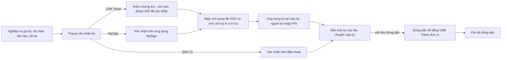

# Ký số — tóm tắt nghiệp vụ cho BA

> Bản đọc nhanh bằng lời nghiệp vụ. Chi tiết và bằng chứng: [nghiep-vu.md](nghiep-vu.md) (mã NV / BR trong ngoặc
> để tra). Cập nhật: 2026-10-02 · Nguồn: code `kha_develop` + DB DEV. Nhãn quy tắc: **[Đã xác nhận]** = chủ dự án đã
> chốt là đúng ý đồ · **[Hiện trạng]** = hệ thống đang chạy như vậy, chưa ai xác nhận là ý đồ · **[Lệch nghiệp vụ]**
> = đã xác nhận nghiệp vụ muốn khác, hệ thống đang làm sai.

## 1. Phân hệ này dùng để làm gì

Phân hệ là **cơ chế ký số dùng chung** cho mọi nghiệp vụ có ký: dự thảo văn bản đi, văn bản đã ban hành, hồ sơ, phiếu giao việc / đánh giá (1.1).
Nghiệp vụ khác quyết định *ai ký, lúc nào, ký xong chuyển trạng thái gì*; phân hệ này lo *ký bằng công cụ gì* (USB Token, SIM CA, MySign), *ảnh chữ ký và con dấu nào hiện lên file PDF, ở vị trí nào*, và *chứng thư có hợp lệ không* (1.1).
Ngoài ra có: khai **ảnh chữ ký** cá nhân, khai **ảnh con dấu** đơn vị, **đóng dấu số** của văn thư, **xác thực chữ ký số** trên file nhận từ ngoài, và **cặp trình ký** theo dõi hồ sơ giấy (NV-07, NV-10, NV-11, NV-12, NV-13).
Không có menu "Ký số" riêng: người dùng chỉ gặp popup xác nhận ký, màn xem PDF đặt vị trí ảnh ký, mục khai trong Thông tin cá nhân, màn Quản lý con dấu đơn vị và màn Cặp trình ký (1.1).

**Không gồm:** ai được trình ký, các cấp ký, ký nháy / ký duyệt / phê duyệt, chuyển cấp, trả lại (xem `xu-ly-cong-viec`); đổi người ký, người ký kế (xem `van-ban/luong-xu-ly`); xin đóng dấu, cấp số, ban hành, hộp Văn bản đóng dấu ở mức nghiệp vụ (xem `van-ban/di`); ký phiếu trình (xem `phieu-trinh`); nghiệp vụ phiếu giao việc / đánh giá (xem `cong-viec`, `kpi-danh-gia`); nội dung SMS, cơ chế chặn tin (xem `lich-nhac-viec`); đồng bộ văn bản sang ERP (xem `tich-hop`).

## 2. Ai dùng và được làm gì

| Vai trò | Được làm gì trong phân hệ này |
|---|---|
| Người ký (lãnh đạo ký duyệt, chuyên viên ký nháy, văn thư xét duyệt) | Ký bằng công cụ ký của mình; đặt vị trí ảnh chữ ký trên file trước khi ký (1.3, NV-02…NV-08) |
| Mọi người dùng | Ở Thông tin cá nhân: chọn công cụ ký USB Token / SIM CA, đồng bộ chứng thư SIM, khai ảnh chữ ký, thêm / bỏ USB Token đã xác nhận (1.3, NV-01, NV-07, NV-09) |
| Quản trị người dùng | Làm các việc trên thay người dùng ở màn Quản trị người dùng (1.3) |
| Văn thư đơn vị (`VT`) | Đóng dấu số lên văn bản bằng USB Token của đơn vị; khai USB Token đơn vị nếu là người quản lý văn bản của đơn vị (`DOCUMENT_MANAGER`) (1.3, NV-10, NV-11) |
| Quản trị con dấu (`SUB_ADMIN`, `DOCUMENT_MANAGER` hoặc `ADMIN` tại đơn vị) | Khai ảnh dấu đơn vị / dấu xác nhận, cấu hình cách hiển thị dấu (1.3, NV-10) |
| Trợ lý cặp trình ký (trợ lý được gán cho lãnh đạo với loại "trợ lý cặp trình ký") | Theo dõi, cập nhật trạng thái từng lãnh đạo ký, đổi người ký của cặp trình ký (1.3, NV-13) |
| Hệ thống ngoài (ứng dụng đã đăng ký, hệ thống khiếu nại tố cáo) | Trình văn bản vào luồng ký của Văn phòng số và nhận lại kết quả (1.3, NV-15) |

## 3. Màn hình / menu người dùng thấy

| Menu / màn | Để làm gì | Ghi chú | Mã menu |
|---|---|---|---|
| Popup xác nhận ký | Nút Ký duyệt / Ký nháy / Đóng dấu / Ký CloudCA; nhập ý kiến, chọn người ký kế | Mở từ nghiệp vụ gọi ký; nút hiện theo công cụ ký của người dùng (NV-01) | — |
| Màn xem PDF | Kéo đặt vị trí ảnh chữ ký, thêm vị trí, lưu | File đã ký SIM thì chỉ xem (NV-08, BR-28) | — |
| Thông tin cá nhân | Chọn "Loại ký" USB Token / SIM CA; đồng bộ chứng thư SIM; ảnh chữ ký; danh sách USB Token đã xác nhận | Mở từ tiêu đề trang. Khối chọn MySign và khối chứng thư mật **đang ẩn** (NV-01, NV-09) | — |
| Quản trị người dùng | Quản trị viên làm thay các việc của Thông tin cá nhân | Thuộc `he-thong` (1.2) | 336827 |
| Quản lý con dấu đơn vị | Cây đơn vị + danh sách ảnh dấu; thêm / sửa ảnh dấu; cấu hình hiển thị dấu; USB Token đơn vị | Mặc định lọc ảnh đang hiệu lực; không có nút xóa ảnh dấu (NV-10, BR-36) | 338932 |
| Văn bản đóng dấu | Hộp của văn thư để đóng dấu số | Nghiệp vụ ở `van-ban/di`; ở đây chỉ cơ chế đóng dấu (1.2, NV-11) | 338952 |
| Cặp trình ký | Lập phiếu theo dõi bộ hồ sơ giấy, in mã vạch; trợ lý cập nhật trạng thái | Nằm dưới nhóm Văn bản đi; tab *Trình ký* và *Xử lý* (trợ lý) (NV-13) | 338491 |
| Nút "Xác thực chữ ký số" ở chi tiết văn bản | Xem các chữ ký số trong file PDF của văn bản | Ẩn với văn bản mật (NV-12) | — |
| Popup ký MySign (đếm ngược 90 giây) | Chờ người ký xác nhận trên ứng dụng MySign | Hiện không ai bật được MySign trên web (NV-06, Q1) | — |

## 4. Luồng chính

**Ký bằng USB Token** (đường đang dùng gần như cho mọi người — NV-01, Q1)
1. Người ký bấm *Ký duyệt* (hoặc *Ký nháy*) trên popup. Hệ thống kiểm: có ảnh chữ ký chưa, tìm được vị trí đặt ảnh chưa, file có chân ký mang tên người ký kế không (NV-02 bước 1, BR-29, BR-30).
2. Trình duyệt gọi **ứng dụng ký cài trên máy** người ký để đọc chứng thư trong USB Token. Chỉ chạy trên Firefox / Chrome Windows và Firefox Ubuntu; chưa cài hoặc sai phiên bản ứng dụng thì báo cài (NV-02 bước 3–4, dac-thu bẫy 13).
3. Hệ thống kiểm chứng thư: còn hạn, đúng USB Token đã xác nhận của người ký; người chưa khai USB nào thì USB đang cắm được tự ghi nhận (NV-02 bước 5, BR-06, BR-07).
4. Máy chủ chuyển file sang PDF (nếu là Word), chèn ảnh chữ ký còn hiệu lực vào vị trí ký, rồi gửi phần cần ký xuống máy; người ký nhập PIN trên ứng dụng ký (NV-02 bước 6–7, BR-08).
5. Chữ ký quay về máy chủ, được gắn vào file; file đã ký được lưu và luồng ký chuyển cấp ngay trong bước này (NV-02 bước 9).
6. Ký nhiều văn bản: chọn tối đa 50 văn bản, ký một lượt; văn bản lỗi không chặn văn bản khác, kết quả báo "thành công x / tổng y" (NV-04, BR-13).

**Ký SIM CA:** chỉ khi người dùng chọn SIM CA và hệ thống chạy ở site công khai; hệ thống gửi yêu cầu, người ký xác nhận trên điện thoại — mỗi ảnh ký là một lần xác nhận (NV-05, BR-02).

**Ký MySign (ký từ xa):** người ký xác nhận trên ứng dụng MySign trong 90 giây; có trong code nhưng phần chọn MySign đang ẩn (NV-06, Q1).

**Đóng dấu số:** văn thư chọn *đóng dấu mặc định* (dấu đặt cạnh chữ ký người ký) hoặc *tùy chọn vị trí* từng file, tối đa 10 văn bản một lượt; ký bằng USB Token của đơn vị; file đổi thành bản "đã đóng dấu", văn bản sang trạng thái *Đã đóng dấu* (NV-11, BR-38, BR-39).

**Cặp trình ký:** người trình lập phiếu (tiêu đề, nội dung, file trình ký + phụ lục, danh sách lãnh đạo ký theo thứ tự, số điện thoại nhận tin), in mã vạch dán lên cặp giấy; trợ lý cập nhật trạng thái từng lãnh đạo; mỗi lần cập nhật người trình nhận SMS (NV-13, BR-46).

## 5. Trạng thái

**Đóng dấu của văn bản**

| Trạng thái (tên người dùng thấy) | Nghĩa | Chuyển sang khi nào | Giá trị |
|---|---|---|---|
| Chờ đóng dấu | Đã xin đóng dấu, văn thư chưa đóng | Người xử lý xin đóng dấu (`van-ban/di`) | 1 |
| Từ chối đóng dấu | Văn thư từ chối | Văn thư từ chối (`van-ban/di`) | 2 |
| Đã đóng dấu | File đã có ảnh dấu và chữ ký số của đơn vị | Đóng dấu thành công (BR-38) | 3 |

**Chứng thư USB Token đã xác nhận / chứng thư mật**

| Trạng thái | Nghĩa | Chuyển sang khi nào | Giá trị |
|---|---|---|---|
| Hiệu lực | Được dùng để ký (USB) hoặc mã hóa (mật) | Thêm qua popup; tự ghi nhận ở lần ký đầu (4.7, BR-07) | 6 |
| Đã hủy | Không dùng nữa | Người dùng / văn thư bỏ khỏi danh sách; khai chứng thư mật mới cùng loại (4.7) | 5 |

**Một lãnh đạo trong cặp trình ký** (trợ lý chọn tay)

| Trạng thái (tên người dùng thấy) | Nghĩa | Chuyển sang khi nào | Giá trị |
|---|---|---|---|
| Chưa trình ký | Hồ sơ chưa vào cặp của lãnh đạo | Lập hoặc sửa cặp (sửa cặp đưa mọi người về đây) (4.9) | 0 |
| Đã vào, chờ ký | Hồ sơ đang ở chỗ lãnh đạo | Trợ lý cập nhật | 1 |
| Đã ra, đã ký | Lãnh đạo đã ký | Trợ lý cập nhật | 2 |
| Đã ra, bị từ chối ký | Lãnh đạo không ký | Trợ lý cập nhật | 3 |
| Bị trả lại | Trả hồ sơ, trình lại thì về Đã vào | Trợ lý cập nhật | 4 |
| Đã trả, đã ký | Đã trả hồ sơ đã ký cho người trình | Trợ lý cập nhật, bắt buộc ghi người nhận + thời gian trả | 5 |
| Đã trả, bị từ chối ký | Đã trả hồ sơ bị từ chối | Trợ lý cập nhật, bắt buộc ghi người nhận + thời gian trả | 6 |

## 6. Quy tắc quan trọng nhất

- [Hiện trạng] Công cụ ký là thuộc tính của **người dùng**, không theo văn bản. Người để trống được coi là USB Token; trên DB DEV gần như mọi người để trống, chưa ai chọn MySign (BR-01, NV-01).
- [Hiện trạng] Ký SIM CA chỉ áp dụng khi hệ thống chạy ở site công khai và người dùng chọn SIM CA; chọn SIM CA thì bắt buộc đồng bộ chứng thư SIM trước (BR-02, NV-01).
- [Hiện trạng] **Bắt buộc ký số theo đơn vị**: một tham số hệ thống khai đơn vị và loại xử lý (xét duyệt, ký nháy, ký duyệt); người thuộc đơn vị đó không có nút xác nhận thường, chỉ được ký số. Trên DB DEV một đơn vị bị bắt buộc cả ba loại (BR-03).
- [Hiện trạng] Chứng thư phải còn hạn tại ngày ký; mỗi người chỉ ký được bằng **USB Token đã xác nhận** của mình; chưa khai USB nào thì USB dùng ở lần ký đầu được tự ghi nhận, từ đó USB khác bị từ chối (BR-06, BR-07, Q4).
- [Hiện trạng] Ký duyệt / ký nháy luôn ra file **PDF**: file Word được chuyển PDF trước khi ký. Đóng dấu bỏ qua file không phải PDF (BR-08).
- [Hiện trạng] Văn bản lãnh đạo vừa mở trong "thời gian chờ ký" (cấu hình, mặc định 15) bị bỏ khỏi lượt ký; nghiệp vụ chi tiết ở `xu-ly-cong-viec` (BR-10).
- [Hiện trạng] Ảnh chữ ký: PNG, mỗi chiều 90–1000 px, bắt buộc ngày bắt đầu hiệu lực; thêm ảnh mới tự đóng hiệu lực ảnh cùng loại liền trước (BR-21, BR-22, BR-23).
- [Hiện trạng] Ảnh in khi ký là ảnh còn hiệu lực **tại ngày ký**, ưu tiên loại nhỏ nhất: ký duyệt chọn trong loại 1–3, ký nháy ưu tiên loại 0 ("Ảnh ký nháy"); ảnh ký nháy in thu nhỏ 1/4. Không có ảnh vẫn ký được, popup hỏi lại trước (BR-24, BR-26, BR-29).
- [Hiện trạng] Vị trí ảnh: dùng vị trí đã lưu cho người ký và file; không có thì hệ thống **tìm họ tên người ký** trong file (ký nháy tìm ô ký nháy); không tìm được thì popup báo và mở file để đặt tay (NV-08, BR-29, dac-thu bẫy 10).
- [Hiện trạng] Lưu vị trí ảnh cho một người xóa lựa chọn ảnh ký của mọi người ký khác trong văn bản (BR-25, dac-thu L15).
- [Hiện trạng] Đóng dấu: văn thư chỉ đóng được dấu của đơn vị mình làm văn thư và đơn vị đó có ảnh dấu còn hiệu lực; ảnh dấu lấy theo loại mặc định trong cấu hình, còn hiệu lực **tại ngày nhận yêu cầu đóng dấu**; chứng thư phải là USB Token đã xác nhận của đơn vị (NV-11).
- [Hiện trạng] Ảnh dấu: PNG, bắt buộc loại và ngày hiệu lực; ảnh mới tự đóng hiệu lực ảnh trước cùng đơn vị / nhóm / loại; chỉ ảnh mới nhất còn hiệu lực được sửa; không xóa được (BR-34, BR-35, BR-36).
- [Hiện trạng] Mỗi người chỉ có một giao dịch ký SIM tại một thời điểm, giao dịch mới bị chặn trong 50 giây (BR-14).
- [Hiện trạng] Phiên ký luôn dùng chứng thư và ảnh chữ ký **của người đăng nhập**; không có cơ chế trợ lý ký bằng chữ ký của lãnh đạo (NV-14).
- [Hiện trạng] Cặp trình ký: trợ lý chọn được mọi trạng thái, hệ thống không kiểm thứ tự; mỗi lần cập nhật một lãnh đạo thì gửi SMS cho người trình, người dùng không chặn được loại tin này (BR-44b, BR-46, Q5).

## 7. Hệ thống KHÔNG làm / hay bị hiểu nhầm

- **"Ký thay" không phải ký thay mặt.** Tin nhắn "Ký thay" chỉ gửi khi **đổi người ký** trong luồng; không có chức năng thư ký ký bằng chữ ký lãnh đạo (NV-14, Q9).
- **Cặp trình ký không ký số**, không chứa văn bản điện tử: chỉ là phiếu theo dõi bộ hồ sơ giấy có mã vạch, trợ lý cập nhật tay (NV-13).
- **"Ký tự động" không phải máy tự ký**: đó là giao dịch của hệ thống ngoài trình văn bản vào luồng ký rồi nhận kết quả (NV-15).
- **Chọn ảnh ký khi soạn dự thảo không quyết định ảnh in**: lúc ký thật hệ thống in ảnh theo ngày hiệu lực và loại, nên bản xem trước có thể khác file đã ký (BR-27, Q3).
- **MySign có trong code nhưng không bật được trên web**: khối chọn đang ẩn. Đóng dấu bằng chữ ký số tổ chức từ xa **không hoạt động** (NV-01, BR-20, Q6).
- **MySign hết 90 giây báo "0 thành công" nhưng yêu cầu đã gửi chưa bị hủy** — người ký xác nhận muộn vẫn ký được (BR-19, dac-thu L5).
- **Xác thực chữ ký số không hỏi nhà cung cấp** chứng thư có bị thu hồi không; chỉ kiểm file bị sửa và chứng thư còn hạn; file `.PDF` viết hoa đuôi bị bỏ qua (BR-42, Q8, dac-thu L32).
- **Ô "đồng bộ ERP" trên popup ký không phải đóng dấu** — là đánh dấu văn bản để ERP lấy về (NV-17).
- **Chứng thư mềm trên điện thoại không có màn web**: đăng ký, kích hoạt, gia hạn, hủy chỉ làm trên ứng dụng di động (NV-09).
- Có lỗi bảo mật đã ghi nhận, xem dac-thu L4, L23, L24.

## 8. Liên quan phân hệ khác

| Khi thay đổi ở đây… | …phải xem thêm | Vì sao |
|---|---|---|
| Nút ký, điều kiện ký, ghi sau ký | `xu-ly-cong-viec` | Ai được ký, cấp ký, chuyển cấp, khóa ký song song nằm ở đó; bước gắn chữ ký ghi luôn trạng thái luồng (1.1, NV-02 bước 9) |
| Người ký kế, đổi người ký | `van-ban/luong-xu-ly` | Danh sách người ký kế và tin "Ký thay" (NV-14) |
| Đóng dấu, ảnh dấu | `van-ban/di` | Xin đóng dấu, từ chối, cấp số, ban hành, hộp Văn bản đóng dấu (NV-11) |
| Đường ký USB, kiểm chứng thư | `phieu-trinh` | Phiếu trình ký theo đường riêng, không qua kiểm USB đã xác nhận của văn bản (dac-thu bẫy 4, bẫy 11) |
| Ký phiếu giao việc / đánh giá | `cong-viec`, `kpi-danh-gia` | Dùng cơ chế ký nhiều file riêng (NV-04) |
| Trả kết quả ký / đóng dấu ra ngoài | `tich-hop` | Hệ thống ngoài trình văn bản và nhận kết quả ký, ban hành, đóng dấu (NV-15) |
| SMS cặp trình ký, tin ký điện tử | `lich-nhac-viec` | Cơ chế gửi / chặn tin nằm ở đó (NV-13 BR-46, mục tin nhắn nhóm 100) |
| Màn Thông tin cá nhân / Quản trị người dùng | `he-thong` | Màn quản trị người dùng thuộc phân hệ hệ thống (1.2) |

## 9. Câu hỏi nghiệp vụ còn mở

- `Q1` — Cán bộ Khánh Hòa đang ký bằng gì: chỉ USB Token, USB + SIM CA, hay có cả MySign?
- `Q2` — Ảnh chữ ký loại 0 là ảnh ký nháy hay ảnh in; loại 2, 3 dùng khi nào?
- `Q3` — Chọn loại ảnh ký khi soạn dự thảo để quyết định ảnh in hay chỉ để xem trước?
- `Q4` — USB Token tự đăng ký qua lần ký đầu như hiện nay, hay phải khai trước mới được ký?
- `Q5` — Cặp trình ký giấy còn dùng không; "Bị trả lại" khác "Bị từ chối ký" thế nào; trạng thái có phải đi theo thứ tự?
- `Q6` — Văn thư đóng dấu số bằng USB Token đơn vị, chữ ký số tổ chức từ xa, hay cả hai?
- `Q7` — Dấu xác nhận dùng trong nghiệp vụ nào?
- `Q8` — Xác thực chữ ký như hiện nay là đủ hay phải kiểm cả thu hồi chứng thư?
- `Q9` — "Ký thay" là đổi người ký, hay người khác ký thay mặt nhưng vẫn ghi tên lãnh đạo?
- `Q10` — Văn bản / phiếu trình mật (mã hóa file theo người nhận) đang dùng thật hay chỉ là dữ liệu thử?

(Đầy đủ ở mục 7.1 của `nghiep-vu.md`.)

## 10. Khi viết yêu cầu mới cho phân hệ này, nhớ ghi rõ

- **Công cụ ký nào áp dụng:** USB Token, SIM CA, MySign — và áp cho ký duyệt, ký nháy, xét duyệt hay đóng dấu. Mỗi công cụ đi một đường ký riêng, sửa một đường không tự áp cho đường khác (NV-01, BR-02, dac-thu bẫy 5).
- **Đối tượng được ký:** dự thảo, văn bản đã ban hành, hồ sơ, phiếu trình, phiếu giao việc — mỗi loại có bộ xử lý ký riêng (dac-thu bẫy 4).
- **Ảnh chữ ký:** loại nào được in, ưu tiên thế nào, có theo lựa chọn của người soạn không, ký nháy dùng ảnh nào (BR-24, BR-27, Q2, Q3).
- **Vị trí ảnh:** tự dò theo họ tên / ô ký nháy hay bắt buộc đặt tay; có ký nhiều vị trí trên một file không; báo gì khi không tìm được vị trí (NV-03, NV-08, BR-29).
- **Kiểm chứng thư:** kiểm hạn, kiểm khớp USB đã xác nhận, áp cho cá nhân hay cả USB đơn vị; người chưa khai USB thì xử lý thế nào (BR-06, BR-07, Q4, dac-thu bẫy 11).
- **Đóng dấu:** dấu đơn vị hay dấu xác nhận; vị trí mặc định hay tùy chọn; hiển thị chỉ ảnh, chỉ thông tin, hay ảnh + thông tin; ảnh dấu chọn theo ngày nào (NV-10, NV-11, Q7).
- **Có bắt buộc ký số theo đơn vị / loại xử lý không**, và người không có chứng thư thì làm gì (BR-03).
- **Ký hàng loạt:** giới hạn số văn bản một lượt, một văn bản lỗi thì dừng cả lượt hay bỏ qua (NV-04, BR-13, BR-39).
- **Có trả kết quả ký / đóng dấu cho hệ thống ngoài không**, cho ứng dụng nào (NV-15).
- **Chỉ trên web hay cả ứng dụng di động**, và chạy trên trình duyệt / hệ điều hành nào — ký USB cần ứng dụng ký cài tại máy, không thử được nếu không có USB Token thật (NV-09, dac-thu bẫy 13, bẫy 18).
