# Nhắc việc, thông báo, SMS, nắm tình hình, định hướng — nghiệp vụ: nhắc việc gắn văn bản (giao → trả lời → duyệt), thông báo trong ứng dụng, hạ tầng SMS và cấu hình chặn tin, "Thông tin phục vụ lãnh đạo" (nắm tình hình), định hướng

> Viết lại từ code nhánh `kha_develop` (web-spring + backend2.0) ngày 2026-10-01. Mọi khẳng định có nguồn `file:dòng`.
> Menu / widget đối chiếu **DB DEV `SYS_MENU` / `HOME_WIDGET` ngày 2026-10-01**; số dòng, phân bố giá trị và comment cột các bảng `REMINDER%`, `NOTIFICATION%`, `SMS%`, `CONFIG_SMS_%`, `ORIENT%`, `DOCUMENT_INFORMALITY%` đối chiếu **DB DEV ngày 2026-10-01** (do người điều phối truy vấn, chỉ SELECT; tác giả không kết nối DB). Không có FK nào được tra — mọi quan hệ ở mục 5 là quan hệ logic lấy từ JOIN / entity trong code.
> HDSD cũ (`C:\Users\Admin\Desktop\HDSD\**`) chỉ dùng tham khảo thuật ngữ.
>
> Viết tắt đường dẫn:
> `WEB/` = `web-spring/src/main/java/com/viettel/` · `ZUL/` = `web-spring/src/main/webapp/view/voffice/` ·
> `BIZ/` = `web-spring/src/main/java/com/voffice/service/business/` · `BE1/` = `backend2.0/backendvoffice/src/main/java/com/viettel/voffice/` ·
> `BE2/` = `backend2.0/backendvoffice/src/main/java/com/viettel/office/` · `SQL/` = `backend2.0/backendvoffice/sql/`.
> Lớp hay dùng — **nhắc việc (gen-2)**: **RC** = `BE2/controller/ReminderController.java`, **RSI** = `BE2/services/impl/ReminderServiceImpl.java` (~1.870 dòng), **RRI** = `BE2/repositories/impl/ReminderRepositoryImpl.java`, **RRJ** = `BE2/repositories/jpa/ReminderRepositoryJPA.java`, **RRRJ** = `BE2/repositories/jpa/ReminderReplyRepositoryJPA.java`, **RSRD** = `BE2/dto/request/reminder/ReminderSaveRequestDTO.java`, **URJ** = `BE2/jpa/UserRoleJPA.java`; web **RVM** = `WEB/voffice/vm/reminder/ReminderVM.java` (~2.800 dòng: danh sách + form tạo), **RVDVM** = `…/ReminderViewDetailVM.java` (chi tiết), **RRVM** = `…/ReminderReplyVM.java` (popup trả lời), **RAVM** = `…/ReminderActionVM.java` (popup duyệt / trả lại), **RALVM** = `…/ReminderAssigneeLookupVM.java` (popup chuyển xử lý), **RRPVM** = `…/ReminderReportVM.java` (báo cáo), **RB** = `BIZ/ReminderBusiness.java`, **AC** = `WEB/util/AppConstants.java`.
> Màn văn bản nhúng nhắc việc: **DOVM** = `WEB/voffice/vm/document/DocumentOutVM.java`, **DVDVM** = `WEB/voffice/vm/document/DocumentViewDetailVM.java`, **DDVM** = `WEB/voffice/vm/documentDraft/DocumentDraftVM.java`, **PCDVM** = `WEB/voffice/vm/document/PopupCompleteDocumentVM.java`, **TDVM** = `WEB/voffice/vm/document/TransferDocumentVM.java`; BE gen-1 **DC** = `BE1/controler/DocumentController.java`, **TC** = `BE1/controler/TextController.java`, **DSC** = `BE1/controler/DocumentSignController.java`, **DDAO** = `BE1/database/dao/document/DocumentDAO.java`, **C1** = `BE1/constants/Constants.java`, **C2** = `BE2/utils/Constants.java`.
> Lớp của thông báo / SMS / nắm tình hình / định hướng: khai ở đầu từng mục NV tương ứng.
> Phân hệ liền kề đã viết: văn bản đến [`../van-ban/den/nghiep-vu.md`](../van-ban/den/nghiep-vu.md) (ký hiệu `VBĐ NV-xx / BR-xx`), chuyển văn bản [`../van-ban/chuyen-van-ban/nghiep-vu.md`](../van-ban/chuyen-van-ban/nghiep-vu.md) (`CVB`), phiếu trình [`../phieu-trinh/nghiep-vu.md`](../phieu-trinh/nghiep-vu.md) (`PT`), dự thảo [`../xu-ly-cong-viec/nghiep-vu.md`](../xu-ly-cong-viec/nghiep-vu.md) (`XLCV`), văn bản đi [`../van-ban/di/nghiep-vu.md`](../van-ban/di/nghiep-vu.md).

## 1. Tổng quan

### 1.1 Phạm vi

Phân hệ gom các chức năng "đẩy việc / đẩy tin tới người dùng" và một số tiện ích chỉ đạo:

- **Nhắc việc** (tính năng MỚI, toàn bộ **gen-2** — mẫu chuẩn cho code mới): đơn vị phát hành văn bản **giao việc kèm văn bản** cho đơn vị chủ trì / phối hợp với hạn xử lý, có lãnh đạo và chuyên viên theo dõi; đơn vị được nhắc **trả lời** (kèm văn bản trả lời), bên giao **duyệt / trả lại**; nhắc việc có thể soạn sẵn trên dự thảo và chỉ được giao khi văn bản được chuyển (NV-01 … NV-10). Bảng `REMINDER`, `REMINDER_REPLY`, `REMINDER_FOLLOWERS`, `REMINDER_DOCUMENT_RELATIONS`, `REMINDER_HISTORY` (`SQL/19062026_create_table_reminder.sql`, `SQL/04082026_add_table_reminder_history.sql`).
- **Thông báo trong ứng dụng** (`NOTIFICATION`, chuông) — cơ chế dùng chung để các phân hệ ghi thông báo (NV-11); **thông báo chung / bảng tin** (`NOTICE`, menu Quản lý thông báo) (NV-12).
- **SMS** — hạ tầng dùng chung: hàng đợi `MESSAGE` / `SMS_MASTER`, mẫu tin, kiểm chặn (NV-13); **cấu hình chặn tin** theo người (NV-14) và theo đơn vị (NV-15); cấu hình lãnh đạo không nhận email / SMS lịch đơn vị (NV-16).
- **Thông tin phục vụ lãnh đạo / nắm tình hình** — danh sách gộp văn bản không chính thức (`DOCUMENT_INFORMALITY*`) và văn bản đến nhận để nắm tình hình (NV-17, NV-18).
- **Định hướng** (`ORIENTATION`) — menu đang khóa; nguồn sinh nhiệm vụ (NV-19).
- Thành phần cũ / không dùng (NV-20).

Phân hệ **KHÔNG gồm** (trỏ sang):

| Nội dung | Phân hệ |
|---|---|
| **Khi nào** từng phân hệ gửi SMS / thông báo và nội dung nghiệp vụ của tin (phiếu trình 701–704, chuyển văn bản "Gửi SMS", lịch họp, nhiệm vụ…) | phân hệ gửi: `phieu-trinh` (PT NV-05/08/10), `van-ban/chuyen-van-ban` (CVB NV-04), `hop`, `nhiem-vu`, `van-ban/den` |
| Kiểm nhắc việc khi hoàn thành văn bản đến (chặn / mở trả lời / tự duyệt) | `van-ban/den` (VBĐ NV-08 BR-31) — ở đây chỉ mô tả hàm cung cấp (NV-09) |
| Vai trò "Nắm tình hình" khi chuyển văn bản (`SEND_TYPE = 3` + `IS_INFORMALITY = 1`), loại khỏi hộp văn bản đến | `van-ban/chuyen-van-ban` (CVB NV-04, NV-20), `van-ban/den` (VBĐ BR-43) |
| Nhiệm vụ sinh từ định hướng; chọn nguồn "Theo định hướng" | `nhiem-vu` |
| Ký dự thảo, ban hành, cấp số (các điểm kích hoạt chuyển trạng thái nhắc việc) | `xu-ly-cong-viec`, `van-ban/di` |
| Lịch họp gửi email / SMS (dùng cấu hình NV-16) | `hop` NV-05 |
| Cửa sổ ngày giao / đánh giá công việc tháng (`TIME_CONFIG`), cảnh báo công việc (`ALERT`) | `cong-viec` CV NV-11, NV-13 (đang xếp nhầm vào phân hệ này — mục báo cáo `domains.py`) |
| Trang chủ: cách dựng widget nói chung, cột `SIMPLE_MODE` | phân hệ trang chủ (`he-thong` HT NV-16) |

### 1.2 Menu (đối chiếu DB DEV `SYS_MENU` ngày 2026-10-01)

`SYS_MENU.STATUS`: 1 = mở khóa, 2 = khóa (X3). Code chỉ tham chiếu **mã menu**; URL nằm ở DB.

| `SYS_MENU_ID` | `CODE` | Tên (DB DEV) | Cha | URL | `STATUS` | VM / NV | Bằng chứng code |
|---|---|---|---|---|---|---|---|
| 441265 | `NHACVIEC` | **Theo dõi nhắc việc** | VĂN BẢN ĐI (337232) | `/view/voffice/reminder/reminder.zul?view=8` | 1 | RVM — NV-01 | mở tab theo mã `NHACVIEC`: `WEB/voffice/common/HomeVM.java:2744-2745`, `RRPVM:347` |
| 441305 | `REMIND_REPORT` | Báo cáo nhắc việc | VĂN BẢN ĐI (337232) | `/view/voffice/reminder/reminder_report.zul` | 1 | RRPVM — NV-10 | (không file Java nào ghi cứng mã / URL) |
| 440319 | `GRASP_SITUATION` | **THÔNG TIN PHỤC VỤ LÃNH ĐẠO** | — (menu cấp 1, không có con) | `/view/voffice/grasp_situation/graspSituation.zul` | 1 | GSVM — NV-17 | kiểm có menu: `WEB/voffice/common/CommonModel.java:731-750`; đơn vị có menu: `BE2/repositories/impl/MenuRepositoryImpl.java:262-273` |
| 338272 | `ORIENTATION` | Định hướng | QUẢN LÝ NHIỆM VỤ (337971) | `orientation/orientation.zul` | **2 (khóa)** | OVM — NV-19 | — |
| 338291 | `OREINTATION` | Danh mục Định hướng | QUẢN LÝ NHIỆM VỤ | — | `DEL_FLAG = 1` | — | đã xóa |
| 338311 | `ORIENTATION_LIST` | Danh mục định hướng | QUẢN LÝ NHIỆM VỤ | `orientation_search.zul` | `DEL_FLAG = 1` | (zul là mảnh include, không có VM) | `ZUL/orientation/orientation_search.zul:1-5` |
| 338271 | `ORIENTATION` | (gốc cũ) | — | — | `DEL_FLAG = 1` | — | đã xóa |
| 338471 | `LEADER_CONFIG` | Cấu hình lãnh đạo không nhận email/sms | QUẢN TRỊ (336812) | `meetingAssistant/scheduleConfig.zul` | 1 | `ScheduleConfigVM` — NV-16 | — |
| 338511 | `QLTB` | Quản lý thông báo | QUẢN TRỊ | `notice/notice.zul` | 1 | `NoticeVM` — NV-12 | — |
| 338631 | `SMS_CONTROLLER_CONFIGURATION` | Cấu hình chặn tin nhắn cho từng chức năng | QUẢN TRỊ | `config/smsController.zul` | 1 | `SmsControllerVM` — NV-14 | — |
| 440465 | `SMS_TARGET_CONFIGURATION` | Cấu hình chặn tin nhắn theo đơn vị | QUẢN TRỊ | `config/sms/smsConfigOrg.zul` | 1 | `SmsConfigOrgVM` — NV-15 | menu thêm bởi `SQL/20250821_create_table_config_sms_org.sql` |

Nhắc việc **không có menu riêng cho người được nhắc**: cùng một menu "Theo dõi nhắc việc" phục vụ cả hai phía qua hai nhóm "Cần xử lý" / "Giao đi/Theo dõi" (NV-01). Menu nằm dưới **VĂN BẢN ĐI** vì nhắc việc gắn văn bản do đơn vị phát hành.

### 1.3 Widget trang chủ (đối chiếu DB DEV `HOME_WIDGET` ngày 2026-10-01)

| `HOME_WIDGET` | DB DEV | Dựng ở | Số đếm | Ghi chú |
|---|---|---|---|---|
| id 60 `NHAC_VIEC` "Nhắc việc" | `IS_ACTIVE = 1`, không có con trực tiếp; hai nhóm là **dòng gốc riêng**: 68 `NV_CAN_XU_LY` "NHẮC VIỆC CẦN XỬ LÝ" (con 61 `NV_QUA_HAN` Quá hạn, 62 `NV_GAN_DEN_HAN` Sắp đến hạn, 63 `NV_XU_LY_LAI` Xử lý lại, 64 `NV_CHUA_TRA_LOI` Chưa trả lời, 65 `NV_CHO_DUYET` Chờ duyệt) và 69 `NV_DA_GIAO` "THEO DÕI NHẮC VIỆC ĐÃ GIAO CHO NGƯỜI KHÁC" (con 66 `NV_CHUA_HOAN_THANH` Chưa hoàn thành, 67 `NV_DA_HOAN_THANH` Đã hoàn thành), tất cả `IS_ACTIVE = 1` (DB DEV ngày 2026-10-01) | `HomeVM.java:4053-4056`, `4549-4596`; `HomeWidgetRestController.java:451-458`, `2041-2082` | một lần `POST /reminders/getCountReminderDashboard` (`RC:130-138`; `RSI:1560-1577`; `RRJ:143-268`) | ô con tìm theo **`PARENT_CODE` `NV_CAN_XU_LY` / `NV_DA_GIAO`** (`HomeVM.java:4560-4561`, `4578-4579`) — xem NV-01; không có ô con thì không vẽ widget (`HomeVM.java:4592-4594`) |
| (widget "Thông tin phục vụ lãnh đạo" Chưa đọc / Đã đọc) | chưa tra | `HomeVM.java:1829-1833`, `2091-2119` | `GET/POST /api/document-informality/count-read` (`DIC:107-112`) | NV-17 |
| Số "có nhắc việc" trên từng ô **văn bản đến** | (thuộc widget Văn bản đến) | `HomeWidgetRestController.java:786-792`, `838-879` | luồng đếm `reminderOnly` (`DC:2886-2911`) | VBĐ mục 1.3; NV-08 |

DB DEV có 7 ô con 61–67 (bảng trên). Mã ô con theo code (`AC:8355-8365`): `NV_QUA_HAN`, `NV_GAN_DEN_HAN`, `NV_XU_LY_LAI`, `NV_CHUA_TRA_LOI`, `NV_CHO_DUYET`, `NV_DA_HOAN_THANH`, `NV_THEO_DOI_CHUA_HOAN_THANH`, `NV_THEO_DOI_DA_HOAN_THANH`, `NV_TAT_CA`, `NV_THEO_DOI_TAT_CA`; widget dùng thêm `NV_CHUA_HOAN_THANH` (`HomeVM.java:4656-4668`).

### 1.4 Actor & quyền

Mã vai trò dùng lại: văn thư = `VT`, thủ trưởng = `TTDV`, lãnh đạo đơn vị = `LDDV`, chuyên viên = `NV`, trợ lý = `TL` (`web-spring/src/main/resources/application.properties:347-350`); riêng phân hệ có thêm vai trò **`NHACVIEC`** (`application.properties:365`, chỉ dùng để chọn đơn vị báo cáo — NV-10). Quyền thao tác nằm ở **tầng hiển thị nút** trên web (X1); BE nhắc việc **có** kiểm người tạo khi sửa / xóa (BR-08).

| Actor | Nhận diện trong code | Làm gì |
|---|---|---|
| Người giao nhắc việc (người tạo) | `REMINDER.CREATED_BY` | Tạo / sửa / xóa nhắc việc (NV-02, NV-03, NV-08), duyệt / trả lại trả lời (NV-05), nhắc lại (NV-07); thấy ở nhóm "Giao đi/Theo dõi" |
| Lãnh đạo theo dõi | `REMINDER_FOLLOWERS.FOLLOWER_TYPE = 1` | Duyệt / trả lại trả lời; thấy trả lời chờ duyệt ở "Cần xử lý" và số "Chờ duyệt" (BR-02, BR-17) |
| Chuyên viên theo dõi | `FOLLOWER_TYPE = 2` (người lưu nhắc việc luôn được thêm khi lưu cùng dự thảo — `RSI:887`) | Theo dõi; được hiện nút duyệt / trả lại trên chi tiết (BR-17) |
| Đơn vị được nhắc (chủ trì / phối hợp) | người có vai trò `VT` / `LDDV` / `TTDV` tại `REMINDER_REPLY.ORG_ID` (`URJ:20-30`) | Thấy ở "Cần xử lý"; trả lời, hủy trả lời, gán người xử lý (NV-04 … NV-06) |
| Người xử lý được gán | `REMINDER_REPLY.ASSIGNEE_ID` | Thấy và trả lời dòng được gán (BR-20) |
| Người dùng bất kỳ | — | Nhận thông báo (chuông), đọc thông báo chung, tự chặn loại tin SMS của mình (NV-11, NV-12, NV-14) |
| Quản trị / admin đơn vị | `ADMIN` / `SUB_ADMIN` (chặn tin cho người khác); `ADMIN`, `ADMIN_LEVEL1`, `SUPPER_ADMIN` (chặn theo đơn vị cấp 1); người có menu `QLTB` | NV-12, NV-14, NV-15 |
| Lãnh đạo / trợ lý văn bản | `TTDV`/`LDDV` hoặc `MEETING_ASSISTANT.ASSI_TYPE = 2` + có menu `GRASP_SITUATION` | Thông tin phục vụ lãnh đạo, "Chuyển nắm tình hình" (NV-17, NV-18) |

### 1.5 Sửa so với knowledge cũ (2026-10-01)

| Knowledge cũ | Hiện trạng code `kha_develop` | Ghi ở |
|---|---|---|
| "Lãnh đạo / người theo dõi tạo nhắc việc … mỗi nhắc việc gồm nhiều khối" | Mỗi **khối là một `REMINDER`** riêng; lưu nhiều khối = nhiều nhắc việc (`RSI:111-139`) (sửa 2026-10-01) | Mục 3 đầu, NV-02 |
| Trạng thái 4 "Nháp (chưa gửi)", 5 "Xử lý tạm (trả lời sơ bộ)"; sơ đồ "Nháp → gửi → Chưa trả lời" | 4 = **Lưu tạm**: nhắc việc trên dự thảo / văn bản chờ cấp số, chỉ chuyển sang 0 khi **văn bản được chuyển** tới đơn vị; 5 = **Đã xử lý tạm**: trả lời kèm văn bản trả lời chưa phát hành, chỉ sang 1 khi văn bản trả lời được chuyển cho đơn vị giao (`RSI:339-482`) (sửa 2026-10-01) | NV-03, NV-04, 4.6 |
| "Nhắc lại (remindAgain, ghi REMINDER_HISTORY)" | Nhắc lại **chỉ cập nhật `UPDATED_AT`** của dòng 0 / 2, không ghi lịch sử, **không gửi SMS / thông báo** dù web báo "Đã gửi thông báo và SMS" (`RRRJ:58-60`; `RVDVM:237`). `REMINDER_HISTORY` = lịch sử **chuyển xử lý** (sửa 2026-10-01) | NV-06, NV-07 |
| "QT1. Văn bản đến không được hoàn thành nếu còn nhắc việc chưa COMPLETED" | Bốn hành động: chặn khi có trả lời **chờ duyệt** hoặc không có quyền trả lời; buộc trả lời nếu trả lời được; **tự duyệt** nếu văn bản là văn bản trả lời (`RSI:1707-1775`) (sửa 2026-10-01) | NV-09; VBĐ BR-31 |
| "QT3. Người tạo tự động là follower (`addCurrentUserAsDraftFollower`)" | Chỉ đúng khi mở popup từ **dự thảo** (web, `RVM:325`) và khi lưu cùng dự thảo / văn bản (BE, `RSI:887`); `insertOrUpdate` không tự thêm (sửa 2026-10-01) | NV-02, NV-03 |
| "QT4. Xóa / hủy phải có lý do" | Xóa nhắc việc **không** lưu lý do; hủy trả lời không bắt lý do; chỉ **trả lại** bắt ý kiến (`RSI:1288-1334`; `RAVM:94-101`) (sửa 2026-10-01) | NV-05, NV-08 |
| "QT5. Chỉ người nhắc (hoặc lãnh đạo LEADER_ID) được duyệt" | Web: người tạo + mọi người theo dõi (`RVDVM:427-443`); BE không kiểm; cột `REMINDER.LEADER_ID` không được ghi (sửa 2026-10-01) | NV-05 BR-17 |
| "Trang chủ đếm số (`getCountReminderDashboard`)" qua `ReminderBusiness` | Web gọi qua `ReminderTask` (`ReminderTask.java:15-19`), không qua `ReminderBusiness` | NV-01 |
| `dac-thu`: "`reminders.cancelReply`, `getReminderReport`, `updateNewReplyAssignee` web gọi nhưng BE không có" | Hai cái đầu **không ai gọi**; `updateNewReplyAssignee` có hàm VM gọi (`doAssignHandler`) nhưng **không zul nào gắn** hàm đó — chức năng thật đi qua `updateNewReplyAssigneeAndFollowers` | NV-20 |
| `dac-thu`: "`api.smsIntercept.getListModulInterceptSmsOfOrgId.` (dấu chấm cuối) không nối được endpoint (?)" | Nối đúng: dấu `.` → `/` rồi ghép `orgId` (`ServiceConnection.java:376-378`) (sửa 2026-10-01) | NV-15 |
| "Danh mục loại SMS (`smsMaster.smsMasterMap`, 12 loại)"; "Gửi theo lịch: `smsTask.*`" | `SMS_TYPE` 1–12 có hằng web; DB còn 14, 15, 18, 20 ghi cứng. **Không có job gửi SMS trong repo**; hàng đợi gồm `MESSAGE` và `SMS_MASTER` (sửa 2026-10-01) | NV-13 |
| "Chặn SMS … bảng `NOTIFICATION_BLOCK_LIST`" | Chặn SMS dùng `SMS_BLACK_LIST` (theo người) và `CONFIG_SMS_ORG` (theo đơn vị cấp 1); `NOTIFICATION_BLOCK_LIST` **không code nào dùng** (sửa 2026-10-01) | NV-14, NV-15, NV-20 |
| "Nắm tình hình … gửi cho nhóm lãnh đạo (`DOCUMENT_LEAD_TYPE`) … phân quyền nhà cung cấp (?)" | `DOCUMENT_LEAD_TYPE` = **loại văn bản** (danh mục) để nhóm danh sách; "nhà cung cấp" = **người cung cấp / lãnh đạo chỉ đạo** (`SUPPLIER_ID`), được cấp quyền giải mã file; danh sách gộp văn bản không chính thức và văn bản đến `IS_INFORMALITY = 1` (sửa 2026-10-01) | NV-17 |
| "Định hướng … sinh nhiệm vụ (`ORIENTATION_MISSION_SOURCE_TYPE = 5`, `orientation.sourceType`, `ratioConfigType`)" | Đúng `SOURCE_TYPE = 5`; `ratioConfigType` là cấu hình tỷ lệ KPI, **không liên quan định hướng**; menu Định hướng đang **khóa** (sửa 2026-10-01) | NV-19 |
| `dac-thu`: "Bảng `ALERT` là cơ chế cảnh báo cũ (?) còn dùng" | Cảnh báo **công việc** (task) cũ, nút gọi đều ẩn (sửa 2026-10-01) | NV-20 |
| câu cũ 1: "Nhắc việc có SMS / thông báo đẩy khi gửi và khi nhắc lại không?" | Code xác nhận: **không có** (X7) | NV-02, NV-07 |
| câu cũ 2: "`FOLLOWER_TYPE` có những giá trị nào?" | Code xác nhận: 1 lãnh đạo theo dõi, 2 chuyên viên theo dõi (X8) | Mục 3 đầu |
| câu cũ 3: "Nắm tình hình có phải dành riêng lãnh đạo tỉnh?" | Code: không kiểm vai trò khi tạo / xem, chỉ kiểm có menu (BR-41); chỉ "Chuyển nắm tình hình" giới hạn lãnh đạo / trợ lý (NV-18) — chuyển thành câu hỏi Q5 | 7.1 |

## 2. Module

Nhắc việc chạy trên **BE gen-2** `ReminderController` (`/reminders`, **16 endpoint**, không có tiền tố `/api` — `RC:28-154`) → `ReminderServiceImpl` (`@Transactional` ở các thao tác ghi) → `ReminderRepositoryJPA` / `ReminderReplyRepositoryJPA` / … (JPQL + native) + `ReminderRepositoryImpl` (SQL text block qua `BaseRepositoryImpl`) → bảng `REMINDER*`; web gọi qua `RB` (khóa `reminders.a` → URL `/reminders/a`). Các điểm móc vào văn bản đi qua **gen-1** (`DC`, `TC`, `DSC`) gọi thẳng `ReminderService`. Thông báo, SMS, định hướng là **gen-1**; chặn SMS theo đơn vị và nắm tình hình là **gen-2**; quản lý thông báo chung là **legacy web** (facade truy vấn thẳng DB).

| Chức năng | Màn (.zul) | VM | Business (key) | Endpoint BE | Service / logic | Repository / DAO → bảng |
|---|---|---|---|---|---|---|
| Hộp nhắc việc (NV-01) | `ZUL/reminder/reminder.zul` + `reminder_search.zul` | RVM `doSearch` :440-532 | `RB.getListReminders` / `countReminders` → `reminders.search` (`RB:157-212`) | `POST /reminders/search` (`RC:36`) | `RSI.searchReminders` :64-72 | `RRI.searchReminders` :31-209 → `REMINDER`, `REMINDER_REPLY`, `REMINDER_FOLLOWERS`, `REMINDER_DOCUMENT_RELATIONS`, `DOCUMENT` |
| Số đếm tab / widget | trang chủ; nhãn tab RVM `generateMenuCount` :2311-2351 | `HomeVM`, `ReminderTask` | `reminders.getCountReminderDashboard` | `POST /reminders/getCountReminderDashboard` (`RC:130`) | `RSI.getDashboardData` :1560-1577 | `RRJ.getDashboardCountsV2` :143-268 |
| Tạo / sửa nhắc việc (NV-02) | `reminder_add_modal.zul` → `reminder_add.zul` | RVM `validateDoSave` :596-734, `buildSaveRequest` :736-806 | `RB.saveReminders` → `reminders.insertOrUpdate` (`RB:305-315`) | `POST /reminders/insertOrUpdate` (`RC:50`) | `RSI.saveReminders` :101-314 | `RRJ`, `RRRJ`, `ReminderFollowerRepositoryJPA`, `ReminderDocumentRelationRepositoryJPA`, `DocumentInGroupRepositoryJPA.markHasReminder` |
| Chọn văn bản cho nhắc việc | `widgets/popupSelectDocumentForReminder.zul` | `WEB/voffice/widget/PopupSelectDocumentForReminderVM.java` | `DocumentBusiness` → `DocumentAction.getDocumentForReminder` | `POST /DocumentAction/getDocumentForReminder` (`BE1/action/DocumentAction.java:1689`) | `DC.getDocumentForReminder` :16073-16149 | `DDAO.getDocumentForReminder` :21701+ |
| Nhắc việc trên dự thảo / văn bản đi (NV-03) | `reminder_draft_card.zul` trong `documentDraft_add.zul`, `doc_out_add.zul` | DDVM :5349-5415, DOVM :2611-2682 | lưu cùng `textAction.addText` / `DocumentAction.addDocument`, `editDocument`; đọc `reminders.getDraftDetail` (`RB:28-84`) | `POST /reminders/getDraftDetail` (`RC:105`) | `RSI.saveDraftReminders` :571-672, `saveDocumentReminders` :674-741, `getDraftReminderDetail` :1006-1102 | như trên (liên kết theo `TEXT_ID` / `DOCUMENT_ID`) |
| Ban hành / chuyển văn bản → giao nhắc việc | (màn ban hành, popup chuyển văn bản) | TDVM :902-904, 2036-2055 | `reminders.getListOrgForTransfer` | `POST /reminders/getListOrgForTransfer` (`RC:43`) | `TC.documentPromulgate` → `RSI.promulgateDraftReminders` :484-564; `DC.sendDocument` → `RSI.updateStatusAfterTransferDocument` :339-482 | `RRI.getListOrgForTransfer` :211-246; `RRRJ.transitionStatusByReminderIdAndOrgIds` :24-36 |
| Trả lời (NV-04) | `reminder_reply.zul` | RRVM `doSaveReply` :181-286 | `RB.replyReminders` → `reminders.reply` (`RB:317-345`); ứng viên `reminders.getDraftReplyRemindersByDocumentIds`, `getDocumentRelationForReminder` | `POST /reminders/reply` (`RC:57`), `/getDraftReplyRemindersByDocumentIds` (`RC:124`), `/getDocumentRelationForReminder` (`RC:118`) | `RSI.replyReminders` :1176-1234 | `RRRJ.findActiveReply` :46-55; `RRJ` :50-88 |
| Chi tiết, duyệt / trả lại / hủy trả lời (NV-05) | `reminder_viewDetail.zul`, `reminder_approve.zul` | RVDVM :73-97, 405-524; RAVM :103-124 | `RB.getReminderDetail` → `reminders.getDetail` (`RB:451-611`); `RB.approveReminders` → `reminders.approve` (`RB:347-378`) | `POST /reminders/getDetail` (`RC:98`), `/approve` (`RC:69`) | `RSI.getReminderDetailInfo` :1426-1483, `approveReminders` :1236-1286 | `RRI.getReminderInfoById` :482-509, `getReminderReplies` :437-461, `getAttachedDocuments*` :411-480 |
| Chuyển xử lý + lịch sử (NV-06) | `reminderAssigneeLookup.zul` | RALVM `onSubmit` :145-194 | `RB.updateNewReplyAssigneeAndFollowers` (`RB:697-702`), `getReminderHistory` (`RB:704-727`) | `POST /reminders/updateNewReplyAssigneeAndFollowers` (`RC:111`), `/getReminderHistory` (`RC:148`) | `RSI` :1485-1528, :1786-1792 | `ReminderHistoryJpa`; `BE1/database/dao/ReminderHistoryDAO.java:16-57` → `REMINDER_HISTORY` |
| Nhắc lại (NV-07) | `reminder_viewDetail.zul:405` | RVDVM :230-240 | `RB.doRemindAgain` (`RB:683-695`) | `POST /reminders/remindAgain` (`RC:140`) | `RSI.remindAgain` :1579-1590 | `RRRJ.remindAgain` :58-60 |
| Xóa (NV-08) | lưới nhắc việc | RVM `delete` :1473-1485 | `RB.deleteReminder` (`RB:432-449`) | `POST /reminders/delete` (`RC:79`) | `RSI.deleteReminder` :1288-1398; `deleteRemindersByDocumentIdOrTextId` :1794-1871 | `RRJ.deleteReminder` :46-48; `DocumentInGroupRepositoryJPA`, `DocumentInStaffRepositoryJPA.clearHasReminderByIds` |
| Kiểm khi hoàn thành văn bản đến (NV-09) | popup Hoàn thành (`VBĐ`) | PCDVM | `DocumentBusiness.checkCompletionReminders` | `POST /api/doc-in/check-completion-reminders` | `RSI.checkDocumentCompletionReminders` :1707-1775, `completeReplyDocumentReminders` :1777-1784 | `RRJ.findReplyDocumentReminders` / `findAssignedDocumentReminders` :21-44; `RRRJ.completeRelatedReplies` :113-121 |
| Báo cáo (NV-10) | `ZUL/reminder/reminder_report.zul` | RRPVM | `RB.findReminderReportByCondition` / `countReminderReportByCondition` (`RB:243-303`) | `POST /reminders/findReminderReportByCondition`, `/countReminderReportByCondition` (`RC:89-97`) | `RSI` :1400-1424 | `RRI.*Modified` :561-649 |
| Thông báo trong ứng dụng (NV-11) | chuông `theme/admin-ex/pages/main.zul:401-482` | `MainController` | `NB` → `NotificationAction.*` (7 khóa) | `POST /NotificationAction/*` (`NA:17-72`) | `NC` | `NDAO` → `NOTIFICATION`, `NOTICE`, `READ_NOTICE_HISTORY` |
| Quản lý thông báo chung (NV-12) | `ZUL/notice/notice.zul` | `NoticeVM` (legacy) | — (facade `INotice`) | — | `NoticeService` (web) | `NoticeJpaDao` → `NOTICE`, `NOTICE_DETAIL`, `READ_NOTICE_HISTORY` |
| Ghi SMS (NV-13) | — | (phân hệ gửi) | — | — | `SDAO.addMessToTableMessVof2`, `addMsgToSmsMaster`…; web `MNC` | `MESSAGE`, `SMS_MASTER`; mẫu `SYS_MESS_MUTILANGUAGE` |
| Chặn tin theo người (NV-14) | `ZUL/config/smsController.zul` | `SmsControllerVM` | `ConfigBusiness` → `SmsInterceptAction.*` (`BIZ/ConfigBusiness.java:302-353`) | `POST /SmsInterceptAction/{getListModulSms, getListModulInterceptSmsOfUserId, addOrRemoveInterceptByUser}` (`SIA:19-63`) | `SIC` :65-159 | `SIDAO` → `CONFIG_SMS_MODULE`, `SMS_BLACK_LIST` |
| Chặn tin theo đơn vị (NV-15) | `ZUL/config/sms/smsConfigOrg.zul` | `SmsConfigOrgVM` | `ConfigBusiness` → `api.smsIntercept.*` (`BIZ/ConfigBusiness.java:446`) | `POST /api/smsIntercept/updateSmsInterceptConfigByOrg`, `/getListModulInterceptSmsOfOrgId/{orgId}` (`BE2/controller/SMSInterceptController.java:24-34`) | `SISI` :33-98 | `ConfigSmsModuleRepositoryJPA`, `ConfigSmsOrgRepositoryJPA` → `CONFIG_SMS_MODULE`, `CONFIG_SMS_ORG` |
| Lãnh đạo không nhận email / SMS (NV-16) | `ZUL/meetingAssistant/scheduleConfig.zul` | `ScheduleConfigVM` | `ScheduleConfigBusiness` | `/MeetingAssistantAction/*` (`BE1/action/MeetingAssistantAction.java:115-182`) | `MeetingAssistantController` :522-600, 796-856 | `MeetingAssistantDAO` → `MEETING_CONFIG` |
| Thông tin phục vụ lãnh đạo (NV-17, NV-18) | `ZUL/grasp_situation/graspSituation.zul` (+ `graspSituationSearch`, `graspSituationAdd`, `popupUpdateToGraspSituation`), `ZUL/document/reportSendReceiveDoc/popupGraspSituation.zul` | GSVM, PGSVM, `PopupUpdateToGraspSituationVM` | `GSB` → `api.document-informality.*` (12 khóa) | `/api/document-informality/*` (`DIC`, 16 endpoint) | `DISI` | `DIRI`; JPA `DocumentInformality*RepositoryJPA`, `DocumentInStaffRepositoryJPA` → `DOCUMENT_INFORMALITY*`, `DOCUMENT_IN_STAFF`, `FILE_ENCRYPT_MAP` |
| Định hướng (NV-19) | `ZUL/orientation/orientation.zul`, `orientationPP.zul` | OVM | `OB` → `Orientation.*`, `missionAction.getListSourceMap`, `Meeting.*`, `staffAction.getLeaderByOrg` | `/Orientation/*` (`OA:21-107`) | `OC` | `ODAO` → `ORIENTATION`, `ORIENT_RECEIVE_ORG`, `SOURCE_MAP`, `FILE_ATTACHMENT(_MAPPER)` |

Endpoint `/reminders` đủ 16 (`RC:36-152`): search, getListOrgForTransfer, insertOrUpdate, reply, approve, delete, findReminderReportByCondition, countReminderReportByCondition, getDetail, getDraftDetail, updateNewReplyAssigneeAndFollowers, getDocumentRelationForReminder, getDraftReplyRemindersByDocumentIds, getCountReminderDashboard, remindAgain, getReminderHistory. Khóa web không có endpoint: `reminders.cancelReply`, `reminders.getReminderReport`, `reminders.updateNewReplyAssignee` (NV-20).

## 3. Nghiệp vụ

### Giá trị trạng thái dùng xuyên suốt (nhắc việc)

**Một "nhắc việc" = một dòng `REMINDER`** (nội dung giao việc `CONTENT`, đơn vị giao `ORG_ID`, người ký văn bản `SIGNER_NAME`, nhắc việc liên quan `OTHER_REMINDER_ID`, người tạo `CREATED_BY`). Trên form, mỗi "khối" (block) người dùng thêm là **một nhắc việc riêng** — lưu nhiều khối = nhiều dòng `REMINDER` (`RSI:111-139`). Mỗi đơn vị nhận trong khối là **một dòng `REMINDER_REPLY`** với vai trò `ORG_ROLE` 1 = chủ trì ("Đơn vị xử lý chính", nhãn CT) / 2 = phối hợp (PH), hạn `DEADLINE`, người xử lý cụ thể `ASSIGNEE_ID` (tùy chọn) và trạng thái `STATUS` (`BE2/dto/request/reminder/ReminderBlockDTO.java:17-18`; `RSI:762-783`; web `AC:9744-9747`).

**`REMINDER_REPLY.STATUS`** (`RSRD:11-16`, tên hiển thị `RSRD:29-40`; web `AC:9724-9732`; gen-1 `C1:2930-2935` chỉ khai 0–3):

| Giá trị | Hằng (BE2 / web) | Nhãn | Ý nghĩa theo code | DB DEV 2026-10-01 |
|---|---|---|---|---|
| 4 | `REPLY_STATUS_DRAFT` / `SAVE_DRAFT` | Lưu tạm | Nhắc việc đã tạo nhưng **chưa gửi**: gắn trên dự thảo / văn bản đi chưa cấp số, hoặc tạo trên văn bản chờ cấp số; chờ văn bản được chuyển cho đơn vị nhận (NV-03) | 320 |
| 0 | `REPLY_STATUS_NO_REPLY` / `NO_REPLY` | Chưa trả lời | Đã giao cho đơn vị, chưa trả lời | 733 |
| 5 | `REPLY_STATUS_TEMPORARILY_PROCESSED` / `PROCESS_DRAFT` | Đã xử lý tạm | Đơn vị đã soạn trả lời gắn với **văn bản trả lời chưa ban hành / chưa chuyển** — một dòng `REMINDER_REPLY` **sao** từ dòng gốc (NV-04) | 122 |
| 1 | `REPLY_STATUS_WAITING_APPROVAL` / `WAITING_APPROVE` | Chờ duyệt | Đơn vị đã trả lời, chờ bên giao duyệt | 233 |
| 2 | `REPLY_STATUS_REPROCESS` / `RE_OPEN` | Xử lý lại | Bị trả lại / hủy trả lời; nội dung trả lời bị xóa (NV-05) | 116 |
| 3 | `REPLY_STATUS_COMPLETED` / `DONE` | Hoàn thành | Đã duyệt (thủ công hoặc tự duyệt khi hoàn thành văn bản đến) | 201 |

Bản cũ ghi đúng tập giá trị nhưng gọi 4 là "Nháp", 5 là "xử lý tạm / trả lời sơ bộ"; code dùng nhãn **"Lưu tạm"** và **"Đã xử lý tạm"** (`RSRD:36-37`) và cả hai là trạng thái **chờ văn bản đi được chuyển** chứ không phải bước người dùng tự chọn (sửa 2026-10-01). `REMINDER_REPLY.DEL_FLAG`: 0 = 1.347, 1 = 378 (DB DEV).

**`REMINDER_FOLLOWERS.FOLLOWER_TYPE`**: 1 = **lãnh đạo theo dõi** (được duyệt trả lời), 2 = **chuyên viên theo dõi** (`C1:2942-2945`; `RSI:205-296`; `BE2/dto/request/reminder/ReminderBlockDTO.java:14-16`). DB DEV: 1 = 1.789, 2 = 1.979 (cột không có comment).
**`REMINDER_DOCUMENT_RELATIONS.OBJECT_TYPE`**: 1 = văn bản **được giao nhắc việc** (`OBJECT_ID` = `REMINDER_ID`), 2 = văn bản **trả lời nhắc việc** (`OBJECT_ID` = `REMINDER_REPLY_ID`) (`C1:2937-2940`; `RSI:183-185`, `1223-1226`). Liên kết lưu theo `DOCUMENT_ID` (văn bản đã có số) hoặc `TEXT_ID` (dự thảo / văn bản chưa có `DOCUMENT`) (`SQL/19062026_create_table_reminder.sql:103-104`; `RSI:643-650`). DB DEV: 1 = 1.431, 2 = 597, **0 = 2 dòng — giá trị 0 không do code `kha_develop` ghi** (mọi chỗ ghi đều đặt 1 hoặc 2).
**`REMINDER_HISTORY.TYPE`**: 1 = lịch sử **chuyển xử lý** (gán người xử lý) — comment DB và code chỉ ghi 1 (`SQL/04082026_add_table_reminder_history.sql:57-58`; `RSI:1524`). DB DEV 1 = 96, null = 1 (dòng null không do code ghi).
**`REMINDER.DEL_FLAG`**: 0 = 977, 1 = 187 (DB DEV). Cột `REMINDER.FOLLOWER_ID`, `LEADER_ID` có trong bảng / entity (`BE2/entities/ReminderEntity.java:32-39`) nhưng **không chỗ nào ghi** (người theo dõi nằm ở `REMINDER_FOLLOWERS`); `getReminderInfoById` vẫn đọc `LEADER_ID` (`RRI:491`).

**Ai là "đơn vị được nhắc" trên phương diện người dùng.** BE coi người dùng **thuộc đơn vị nhận** khi có vai trò `VT`, `LDDV` hoặc `TTDV` tại đơn vị đó (`URJ:20-30`, `getTargetOrgIdsByEmployeeIdForReminder`), **hoặc** là người được gán `ASSIGNEE_ID` của dòng trả lời. Khi đã gán người xử lý, chỉ người đó có quyền trả lời theo BE (`RSI:1596-1601`). Chuyên viên (`NV`) không được gán thì **không thấy** nhắc việc của đơn vị.

### NV-01. Hộp "Theo dõi nhắc việc" (menu `NHACVIEC`) — hai nhóm "Cần xử lý" / "Giao đi/Theo dõi", các tab và điều kiện thật; widget trang chủ "Nhắc việc"

**Mục đích.** Một màn duy nhất để (a) đơn vị / người được nhắc thấy việc phải trả lời, (b) người giao và người theo dõi thấy tiến độ.

**Menu (DB DEV `SYS_MENU` 2026-10-01).** `441265 NHACVIEC` "Theo dõi nhắc việc" → `/view/voffice/reminder/reminder.zul?view=8`, nằm **dưới VĂN BẢN ĐI (337232)**, `STATUS = 1`. Tham số `view=8` được RVM đọc vào `viewType` (`RVM:196-199`) nhưng **không dùng ở đâu** (zul nhắc việc không tham chiếu `viewType`).

**Luồng.** `ZUL/reminder/reminder.zul:4-31` (VM RVM, include `reminder_search.zul` + `reminder_add.zul`) → `postViewInitialized` (`RVM:189-363`): khoảng ngày tạo mặc định 365 ngày (`RVM:213-214`), đọc tham số từ widget / báo cáo (`widgetCode`, `homeReminder`, `tabType`, `orgId`/`processType`, `deadlineTo` — `RVM:200-238`, `2734-2764`) → `doSearch` (`RVM:440-532`) → `RB.getListReminders` → `POST /reminders/search` (`RC:36-41`) → `RSI.searchReminders` (`RSI:64-72`, lấy đơn vị được nhắc qua `URJ:20-30`) → `RRI.searchReminders` (`RRI:31-209`).

**Hai nhóm (`groupType`) và các tab** (`ZUL/reminder/reminder_search.zul:22-56`; `RVM:543-588`, `2159-2174`):

| Nhóm | Tab (`tabType`) | Bộ lọc trạng thái gửi BE (`replyStatus`) |
|---|---|---|
| 0 **Cần xử lý** | 0 Chưa trả lời · 1 Xử lý lại · 2 Chờ duyệt · 3 Hoàn thành · −1 Tất cả | 0 · 2 · 1 · 3 · combobox tự chọn (Tất cả / Chưa trả lời / Xử lý lại / Chờ duyệt / Hoàn thành / **5 = Quá hạn** / **6 = Sắp đến hạn**) |
| 1 **Giao đi/Theo dõi** | 0 Chưa hoàn thành · 1 Đã hoàn thành · −1 Tất cả | **4 = Chưa hoàn thành** · 3 · combobox (Tất cả / Hoàn thành / Chưa hoàn thành) |

Lưu ý: ở bộ lọc tìm kiếm, **4 / 5 / 6 là mã lọc** ("chưa hoàn thành" `STATUS < 3`, "quá hạn" `STATUS = 0 và DEADLINE < hôm nay`, "sắp đến hạn" `STATUS = 0 và hạn trong 5 ngày tới`) chứ **không phải** giá trị `STATUS` 4 / 5 (`RRI:107-120`) — xem `dac-thu.md` bẫy 2.

**Điều kiện SQL (`RRI:34-209`)** — một dòng lưới = **một dòng `REMINDER_REPLY`** (một nhắc việc giao cho 3 đơn vị hiện 3 dòng):
- Nhóm 1 (Giao đi/Theo dõi): người tạo `r.CREATED_BY = mình` **hoặc** mình có tên trong `REMINDER_FOLLOWERS` (bất kỳ loại) (`RRI:71-76`).
- Nhóm 0 (Cần xử lý): `rr.ASSIGNEE_ID = mình` **hoặc** `rr.ORG_ID` thuộc đơn vị được nhắc của mình (VT/LDDV/TTDV) (`RRI:78-79`); **thêm** — khi không lọc trạng thái hoặc lọc khác 0 / 2 — các dòng mà mình là **lãnh đạo theo dõi** (loại 1); riêng khi không lọc thì chỉ lấy dòng `STATUS ∈ {1, 3}` (`RRI:80-94`). Tức lãnh đạo theo dõi thấy ở "Cần xử lý" các trả lời chờ mình duyệt và đã hoàn thành.
- Luôn: `r.DEL_FLAG = 0`, `rr.DEL_FLAG = 0` (`RRI:99-100`); không lọc trạng thái thì `rr.STATUS ≤ 3` → **ẩn dòng 4 (Lưu tạm) và 5 (Đã xử lý tạm)** (`RRI:118-120`).
- Khoảng ngày tạo nhắc việc: mặc định 365 ngày gần nhất (`RRI:147-160`); tìm nâng cao bắt buộc chọn ngày tạo (`RVM:456-460`).
- Tìm nhanh: nội dung nhắc việc, trích yếu / số ký hiệu văn bản giao, đã bỏ dấu (`RRI:122-127`); nâng cao: đơn vị chủ trì, đơn vị phối hợp, đơn vị giao, hạn xử lý, chuyên viên theo dõi, lãnh đạo theo dõi, số ký hiệu, nội dung (`RRI:131-194`; form `reminder_search.zul:73-283`).
- Sắp xếp: ngày tạo giảm dần, hạn tăng dần, `UPDATED_AT` giảm dần (`RRI:197-200`).
- Cột "Số VB trả lời" lấy văn bản `OBJECT_TYPE = 2` của chính dòng trả lời (`RRI:63-65`); cột `canEdit` = 0 khi `STATUS ∈ {1, 3}` (`RRI:53-55`).

**Cột lưới** (`reminder_search.zul:315-324`): Thao tác · Số, Ký hiệu · Trích yếu · Nội dung giao việc · Đơn vị xử lý (nhãn CT/PH — `RVM:2256-2277`) · Trạng thái · Số VB trả lời · Hạn xử lý · Ngày tạo. Nút **Sửa** chỉ hiện cho **người tạo** và khi `canEdit = 1` (`RVM:2181-2184`); **Xóa** chỉ hiện cho người tạo (`RVM:2176-2179`). Ba nút "Trả lời / Hủy trả lời / Duyệt" hàng loạt trên lưới đang **ẩn** (`reminder_search.zul:305-308`, `visible="false"`). Bấm dòng → popup chi tiết `reminder_viewDetail.zul` (`RVM:1370-1389`; NV-05).

**Số trên nhãn tab và widget trang chủ.** Một lần gọi `POST /reminders/getCountReminderDashboard` (`RC:130-138` → `RSI:1560-1577` → `RRJ.getDashboardCountsV2` `RRJ:143-268`; web `web-spring/src/main/java/com/voffice/service/task/business/ReminderTask.java:15-19`), phạm vi nhắc việc tạo trong 365 ngày (`RRJ:202-203`):

| Số | Điều kiện | Ô widget (`HOME_WIDGET` con) |
|---|---|---|
| `overdue` | việc của mình / đơn vị mình, `STATUS = 0`, hạn < hôm nay | `NV_QUA_HAN` |
| `dueSoon` | như trên, hạn trong [hôm nay, +5 ngày) | `NV_GAN_DEN_HAN` |
| `reprocess` | việc của mình / đơn vị mình, `STATUS = 2` | `NV_XU_LY_LAI` |
| `notReplied` | việc của mình / đơn vị mình, `STATUS = 0` | `NV_CHUA_TRA_LOI` |
| `pendingApproval` | việc của mình / đơn vị mình **hoặc** mình là lãnh đạo theo dõi, `STATUS = 1` | `NV_CHO_DUYET` |
| `completed` | như dòng trên, `STATUS = 3` | (nhãn tab) |
| `trackingIncomplete` | mình tạo hoặc theo dõi, `STATUS < 3` (gồm cả 4, 5) | `NV_CHUA_HOAN_THANH` |
| `trackingCompleted` | mình tạo hoặc theo dõi, `STATUS = 3` | `NV_DA_HOAN_THANH` |

Widget `HOME_WIDGET` id 60 `NHAC_VIEC` "Nhắc việc" (DB DEV: `IS_ACTIVE = 1`, không có con trực tiếp; ô con nằm dưới hai dòng gốc 68 `NV_CAN_XU_LY` và 69 `NV_DA_GIAO` — 7 ô 61–67, xem mục 1.3; các mã `NV_TAT_CA`, `NV_THEO_DOI_TAT_CA`, `NV_THEO_DOI_CHUA_HOAN_THANH`, `NV_THEO_DOI_DA_HOAN_THANH` trong code **không có** dòng `HOME_WIDGET` nên không hiện trên trang chủ) được dựng ở `WEB/voffice/common/HomeVM.java:4053-4056`, `4549-4596` và bản REST `WEB/voffice/controller/HomeWidgetRestController.java:451-458`, `2041-2082`: hai nhóm "CẦN XỬ LÝ" (con có cha `NV_CAN_XU_LY`) và "THEO DÕI" (con có cha `NV_DA_GIAO`), chỉ ô con `IS_ACTIVE = 1`; số từng ô theo bảng trên (`HomeVM.java:4656-4668`). Bấm ô → mở menu mã `NHACVIEC` với tham số mã hóa `groupType/tabType/replyStatus/deadlinePreset/homeReminder=1` (`HomeVM.java:2744-2745`, `4598-4654`). Các ô con được tìm theo **`PARENT_CODE` = `NV_CAN_XU_LY` / `NV_DA_GIAO`** chứ không theo id 60 (`HomeVM.java:4560-4561`, `4578-4579`); không có ô con nào thì widget **không được vẽ** (`HomeVM.java:4592-4594`). DB DEV ghi id 60 "không có con" — chưa tra các dòng có `PARENT_CODE` `NV_CAN_XU_LY` / `NV_DA_GIAO`.

**BR-01.** "Cần xử lý" tính theo **đơn vị** (người có vai trò VT / LDDV / TTDV tại đơn vị nhận) **hoặc** theo **người được gán**; chuyên viên thường không có vai trò đó chỉ thấy việc khi được gán (`RRI:78-79`; `URJ:20-30`).
**BR-02.** Lãnh đạo theo dõi (loại 1) thấy trả lời của mọi đơn vị trong nhắc việc ở nhóm "Cần xử lý" khi trả lời ở trạng thái Chờ duyệt / Hoàn thành (`RRI:80-94`) — đây là "hộp duyệt" của lãnh đạo.
**BR-03.** Nhắc việc ở trạng thái Lưu tạm (4) và Đã xử lý tạm (5) **không hiện** trong hộp nếu không lọc trạng thái (`RRI:118-120`), nhưng **được đếm** vào "Chưa hoàn thành" của nhóm theo dõi (`RRJ:251-254`) và hiện khi chọn tab "Chưa hoàn thành" (`STATUS < 3` — `RRI:108-109`).
**BR-04.** "Sắp đến hạn" = hạn trong 5 ngày tới tính cả hôm nay; "Quá hạn" = hạn trước hôm nay; cả hai chỉ xét dòng **Chưa trả lời (0)** — dòng Xử lý lại (2) quá hạn không được tính quá hạn (`RRI:110-113`; `RRJ:226-236`).

**Bảng dữ liệu.** `REMINDER`, `REMINDER_REPLY`, `REMINDER_FOLLOWERS`, `REMINDER_DOCUMENT_RELATIONS`, `DOCUMENT`, `VHR_ORG`, `USER_ROLE`, `SYS_ROLE`.

### NV-02. Tạo / sửa nhắc việc trên văn bản đã có số (popup "Tạo nhắc việc")

**Mục đích.** Người có thẩm quyền ở đơn vị phát hành văn bản giao cho các đơn vị (chủ trì / phối hợp) việc phải làm theo văn bản, kèm hạn, lãnh đạo theo dõi (người duyệt) và chuyên viên theo dõi.

**Điểm vào** (popup `ZUL/reminder/reminder_add_modal.zul:1-8` → `reminder_add.zul`, VM RVM):
| Từ | Điều kiện hiện nút | Tham số | Nguồn |
|---|---|---|---|
| Lưới văn bản đi (4 lưới của `documentOut_search.zul`) — icon "Tạo nhắc việc" | luôn hiện (`visible="true"`) | `isPopupMode`, `targetDoc`, `createRemiderToNumber = true`, `isNotPublished = (tab Chờ cấp số)` | `ZUL/document/reportSendReceiveDoc/documentOut_search.zul:976, 1613, 2243, 2849`; `DOVM:13043-13058` |
| Chi tiết văn bản (nút "Nhắc việc" → "Tạo nhắc việc") | chỉ khi mở chi tiết từ màn văn bản đi tab Chờ cấp số / Đã ban hành / Tất cả | `isPopupMode`, `targetDoc` | `ZUL/document/reportSendReceiveDoc/popupVB.zul:4237-4242`; `DOVM:2045-2050`; `DVDVM:11657-11665` |
| Lưới "Theo dõi nhắc việc" — nút Thêm mới của toolbar chung | (toolbar chung) | không có văn bản sẵn → phải chọn | `reminder.zul:18-20`; `RVM:590-594` |

**Trường trên form** (`reminder_add.zul`; kiểm ở `RVM.validateDoSave` `RVM:596-734`):
- **Văn bản đính kèm** — bắt buộc (`RVM:605-608`), chọn qua popup `widgets/popupSelectDocumentForReminder.zul` (`RVM:1802-1844`; `ViewConstant.SOURCE_LOOKUP_DOCUMENT_REMINDER` — `WEB/voffice/common/ViewConstant.java:352`) → `DocumentAction.getDocumentForReminder` (`DC:16073-16149` → `DDAO:21701+`): văn bản do mình tạo / do mình trình, hoặc văn bản có đơn vị ban hành là đơn vị mình có vai trò LDDV / TTDV / VT (`DDAO:21712-21733`). Chọn văn bản thì tự điền người ký và chuyên viên (`RVM:1835`).
- **Đơn vị giao** (`ORG_ID`, mặc định đơn vị của người dùng — `RVM:739`), **người ký** (`SIGNER_NAME`), **nhắc việc liên quan** (`OTHER_REMINDER_ID`, chọn từ danh sách nhắc việc mình được giao — `RSI:1530-1539`).
- Mỗi **khối**: **Nội dung giao việc** (bắt buộc — `RVM:612-621`), **Đơn vị xử lý chính** (bắt buộc, **chọn một** — `RVM:630-649`, `1761`), **đơn vị phối hợp** (nhiều — `RVM:1774-1797`), **hạn xử lý** từng đơn vị (phải sau thời điểm hiện tại — `RVM:657-668`, `693-702`), **lãnh đạo theo dõi** (bắt buộc ≥ 1, chọn trong danh sách lãnh đạo các đơn vị của người dùng kể cả đơn vị con — `RVM:705-719`, `1689-1711`), **chuyên viên theo dõi** (bắt buộc ≥ 1, chọn người trong đơn vị của người dùng — `RVM:721-731`, `1580-1633`). Có nút **thêm khối**, **sao chép khối**, **áp nội dung cho mọi khối** (`RVM:1005-1049`).
- Đơn vị chọn được: cây đơn vị cùng cấp và cấp dưới đơn vị người dùng (`RVM:1713-1729`); nếu văn bản **đã phát hành** (không ở tab Chờ cấp số) thì **chỉ chọn được đơn vị đã nhận văn bản** — các đơn vị khác bị khóa (`RVM:1745-1752`; `WEB/voffice/widget/SysOrganizationLookupVM.java:490-493`; danh sách đơn vị nhận lấy từ `DOCUMENT_IN_GROUP` — `RSI:1604-1642`).

**Lưu.** `RVM.buildSaveRequest` (`RVM:736-806`) → `executeSaveToBackend` (`RVM:808-828`): nếu mở từ màn văn bản đi **tab Chờ cấp số** (`createRemiderToNumber` và `isNotPublished`) thì đặt cờ `isCreateNumber = true` cho mọi khối (`RVM:810-819`) → `RB.saveReminders` → `POST /reminders/insertOrUpdate` (`RC:50-55`) → `RSI.saveReminders` (`@Transactional`, `RSI:101-314`):
1. Mỗi khối → `REMINDER` mới (hoặc sửa nếu có `reminderId`; **sửa chỉ người tạo**, sai thì lỗi "Đồng chí không có quyền thực hiện thao tác này" — `RSI:114-122`).
2. Liên kết văn bản `OBJECT_TYPE = 1`: văn bản bỏ chọn → xóa mềm liên kết; văn bản mới → thêm (`RSI:146-193`).
3. Người theo dõi: chuyên viên (2) và lãnh đạo (1) — bỏ khỏi danh sách thì xóa mềm, mới thì thêm (`RSI:199-301`).
4. Đơn vị nhận (`syncReminderReplies` `RSI:1118-1149`): đơn vị đã có → chỉ cập nhật **hạn**; đơn vị mới → `REMINDER_REPLY` với `STATUS = 4` nếu `isCreateNumber`, ngược lại **`STATUS = 0` (giao ngay)** (`RSI:1151-1174`); đơn vị bị bỏ → xóa mềm.
5. Đánh dấu `DOCUMENT_IN_GROUP.HAS_REMINDER = 1` cho các dòng nhận văn bản của các đơn vị được nhắc (`RSI:311-337`; `BE2/repositories/jpa/DocumentInGroupRepositoryJPA.java:314-323`) — để hộp văn bản đến của đơn vị đó đếm "văn bản có nhắc việc" (NV-09).

**BR-05.** Một nhắc việc phải gắn **ít nhất một văn bản** khi tạo trên màn nhắc việc (`RVM:605-608`); BE không kiểm (`RSI:146-193`).
**BR-06.** Mỗi khối chỉ **một** đơn vị chủ trì trên web (`RVM:1761` `LookupUtil.SINGLE`), không được trùng đơn vị giữa chủ trì và phối hợp (`RVM:671-704`); BE chỉ kiểm trùng ở đường lưu cùng dự thảo / văn bản (`RSI:611-623`, `743-760`), **không kiểm** ở `insertOrUpdate`.
**BR-07.** Nhắc việc tạo trên văn bản **đã phát hành** được **giao ngay** (`STATUS = 0`); tạo trên văn bản **chờ cấp số** thì ở **Lưu tạm (4)** chờ văn bản được chuyển (NV-03) (`RVM:810-819`; `RSI:1168`).
**BR-08.** Chỉ **người tạo** sửa / xóa nhắc việc — kiểm cả web (`RVM:2176-2184`) và BE (`RSI:120-122`, `1297-1299`). Dòng trả lời đã Chờ duyệt / Hoàn thành thì không sửa được (`canEdit` — `RRI:53-55`).
**BR-09.** Sửa nhắc việc **không đổi trạng thái** của đơn vị đã có, chỉ đổi hạn (`RSI:1155-1161`).

**Tích hợp.** **Không gửi SMS, không tạo thông báo** — `RSI` không gọi bất kỳ hàm SMS / `NOTIFICATION` nào (grep `sms|notif` trong `RSI` rỗng), và bảng mã loại tin `CONFIG_SMS_MODULE` không có nhóm nhắc việc (mục 5.2). Đơn vị biết có nhắc việc qua hộp nhắc việc, widget, số "có nhắc việc" trên hộp văn bản đến và tab nhắc việc trong chi tiết văn bản.

**Edge case.** Danh sách đơn vị có lỗi trùng khóa khi sửa nhắc việc đã có dòng "Đã xử lý tạm" (5) — `dac-thu.md` L3.

### NV-03. Nhắc việc "lưu tạm" cùng dự thảo / văn bản đi chưa cấp số → cấp số → chuyển văn bản thì giao (4 → 0)

**Mục đích.** Cho phép người soạn dự thảo (hoặc văn thư nhập văn bản đi) **soạn sẵn nhắc việc** ngay trên dự thảo; nhắc việc chỉ thực sự giao khi văn bản đã ban hành và **được chuyển** tới đơn vị nhận.

**Điểm vào.** Card nhắc việc nhúng vào form dự thảo `ZUL/documentDraft/documentDraft_add.zul:2337` và form văn bản đi `ZUL/document/inputDoc/doc_out_add.zul:1082` (`ZUL/reminder/reminder_draft_card.zul`); nút tạo / sửa / xóa khối mở cùng popup RVM với `fromDocumentDraft = true` (`DDVM:5349-5415`; `DOVM:2611-2682`). Trong chế độ này popup **không gọi BE**: kết quả trả về form qua global command `draftReminderSaved` (`RVM:820-826`) và chỉ được lưu **khi lưu dự thảo / văn bản**:
- Lưu dự thảo → `textAction.addText` (gen-1) → `DSC:1751-1755`, `1866-1915` → `RSI.saveDraftReminders` (`RSI:571-672`): `REMINDER` + liên kết `OBJECT_TYPE = 1` theo **`TEXT_ID`** (`DOCUMENT_ID = null`), người theo dõi ghi lại (luôn thêm người lưu làm chuyên viên theo dõi — `RSI:869-909`), mọi đơn vị về **`STATUS = 4`** (`RSI:655-660`, `928-948`).
- Lưu văn bản đi nhập tay (`DocumentAction.addDocument` / `editDocument`) → `DC:475-476`, `778-781` → `RSI.saveDocumentReminders` (`RSI:674-741`): liên kết theo `DOCUMENT_ID`; trạng thái lấy từ web (mặc định 4; 5 bị đổi về 4 — `RSI:793-799`).
- Web lấy lại bản nháp để hiển thị card: `POST /reminders/getDraftDetail` theo `textId` hoặc `documentId` (`RC:105-109`; `RSI:1006-1102`; `RB:28-84`; `DDVM:2843`, `DOVM:3030`).

**Chuyển tiếp trạng thái theo vòng đời văn bản:**
1. **Ban hành / cấp số dự thảo** → `TC.documentPromulgate` gọi `RSI.promulgateDraftReminders(textId, documentId)` (`TC:1880-1889`; `RSI:484-564`): liên kết `OBJECT_TYPE = 1` được gán `DOCUMENT_ID`; nhắc việc đổi **đơn vị giao = đơn vị ban hành** (`BUILT_GROUP_ID`) và **người ký = người ký văn bản** (`RSI:509-524`). Lỗi trong bước này ném `ReminderPromulgationException` (`TC:1930`).
2. **Chuyển văn bản** (`DocumentAction.sendDocument`) → sau khi gửi, gom danh sách đơn vị nhận rồi gọi `RSI.updateStatusAfterTransferDocument` (`DC:8074-8093`; `RSI:339-482`): với mỗi nhắc việc gắn văn bản, các dòng **`STATUS = 4` của đơn vị nằm trong danh sách vừa nhận → `STATUS = 0`** (`RSI:367-402`; `RRRJ:24-36`).
3. Popup chuyển văn bản **tự điền sẵn** các đơn vị đang có nhắc việc lưu tạm (`POST /reminders/getListOrgForTransfer` — `RC:43-48`; `RRI:211-246`) với vai trò: chủ trì → **Chủ trì**, phối hợp → **Phối hợp**, đơn vị vừa là chủ trì vừa phối hợp ở các nhắc việc khác nhau (giá trị 0) → **Chủ trì** (`RSI:74-99`; `TDVM:902-904`, `2036-2055`; `DOVM:3662`, `3707-3720`; `DVDVM:3543-3545`, `9410-9424`).

**BR-10.** Nhắc việc soạn trên dự thảo **chỉ giao cho đơn vị nào được chuyển văn bản**: đơn vị có trong nhắc việc nhưng không được chuyển văn bản thì vẫn ở Lưu tạm (`RSI:383-393`).
**BR-11.** Khi ban hành, đơn vị giao của nhắc việc bị **thay bằng đơn vị ban hành văn bản**, người ký bị thay bằng người ký văn bản (`RSI:516-523`).
**BR-12.** Xóa dự thảo (`deleteRequisition`) hoặc xóa văn bản (`deleteDocument`) kéo theo xóa nhắc việc gắn văn bản đó (NV-08) (`TC:7561`; `DC:1028-1031`).
**BR-13.** Ghi chú trong code: "Nếu dự thảo có gắn nhắc việc thì không có luồng tự động ban hành văn bản → văn thư phải cấp số thủ công" (`TC:1882-1883`) — **chưa tìm thấy** đoạn code chặn tự động ban hành theo điều kiện có nhắc việc (grep `reminder` trong luồng ký / tự ban hành gen-1 chỉ ra các điểm ở trên).

### NV-04. Trả lời nhắc việc (kèm văn bản trả lời); trả lời "tạm" khi văn bản trả lời chưa phát hành (0/2 → 1, hoặc → 5 → 1)

**Mục đích.** Đơn vị được nhắc báo kết quả: nội dung trả lời và (tùy chọn) văn bản trả lời.

**Điểm vào** (popup `ZUL/reminder/reminder_reply.zul`, VM RRVM; `entryPoint` 1 = văn bản đi (lưới), 2 = chi tiết văn bản, 3 = màn nhắc việc, 4 = chi tiết nhắc việc — `RRVM:48`, `161-174`):
| Từ | Ghi chú | Nguồn |
|---|---|---|
| Chi tiết nhắc việc — icon "Trả lời" trên dòng đơn vị | khi dòng `STATUS ∈ {0, 2}` và người xem **có vai trò bất kỳ** tại đơn vị đó | `ZUL/reminder/reminder_viewDetail.zul:285-290`; `RVDVM:355-366`, `494-500` |
| Tab nhắc việc trong chi tiết văn bản | như trên | `DVDVM:12199-12205`, `12342-12357` |
| Lưới văn bản đi — icon "Trả lời nhắc việc" | văn bản đang xem là **văn bản trả lời**; tab Chờ cấp số → `isNotPublished = true` | `documentOut_search.zul:978`; `DOVM:13060-13074` |
| Chi tiết văn bản đi — "Nhắc việc" → "Trả lời" | | `DVDVM:11667-11675` |
| Popup Hoàn thành văn bản đến | khi văn bản có nhắc việc chưa trả lời mà người dùng trả lời được (`VBĐ BR-31`) | `PCDVM:800` |
| Form dự thảo / văn bản đi (card "Trả lời nhắc việc") | lưu cùng dự thảo — `fromDocumentDraft` | `DDVM:5433-5453`; `DOVM:2700-2725` |

**Trường.** Nội dung trả lời (bắt buộc — `RRVM:184-187`), nhắc việc cần trả lời (bắt buộc — `RRVM:189-192`), văn bản trả lời (chọn qua cùng popup chọn văn bản; truyền đơn vị trả lời để BE đánh dấu văn bản chọn được theo danh sách đơn vị đã nhận văn bản — `RRVM:295-330`; `RSI:1604-1642`). Ứng viên "nhắc việc cần trả lời" khi đứng ở văn bản / dự thảo: `POST /reminders/getDraftReplyRemindersByDocumentIds` — nhắc việc gắn các văn bản đó, giao cho đơn vị mình có **bất kỳ vai trò** nào, trạng thái mặc định 0 / 2 / 4 (`RSI:1541-1558`; `RRJ:69-88`).

**Luồng.** `RRVM.doSaveReply` (`RRVM:181-286`) → `RB.replyReminders` → `POST /reminders/reply` (`RC:57-67`) → `RSI.replyReminders` (`RSI:1176-1234`):
- Xác định dòng trả lời: theo `reminderReplyId` (từ chi tiết) hoặc theo (nhắc việc, đơn vị) (`RSI:1187-1195`).
- **Trả lời bình thường** → `STATUS = 1` (Chờ duyệt), ghi `CONTENT` (`RSI:1213-1218`).
- **Trả lời từ văn bản đi chưa cấp số** (`isNotPublished`) → nếu dòng đang 0 thì **tạo thêm một dòng `REMINDER_REPLY` sao chép** với `STATUS = 5`, dòng gốc giữ 0; nếu dòng không ở 0 thì đổi chính nó sang 5 (`RSI:1197-1218`).
- Mỗi văn bản trả lời → liên kết `OBJECT_TYPE = 2` với `OBJECT_ID = REMINDER_REPLY_ID` (`RSI:1221-1230`).
- Trả lời soạn trong form dự thảo / văn bản đi được lưu khi lưu văn bản: luôn tạo dòng mới `STATUS = 5` + liên kết `OBJECT_TYPE = 2` theo `TEXT_ID` (`RSI:950-1004`) hoặc theo `DOCUMENT_ID` (`RSI:811-867`).

**Khi văn bản trả lời được chuyển cho đơn vị giao** (`updateStatusAfterTransferDocument`, nhánh `OBJECT_TYPE = 2` — `RSI:404-473`): nếu đơn vị giao nhắc việc có trong danh sách nhận văn bản trả lời thì
- đã có một dòng cùng đơn vị ở Chờ duyệt / Hoàn thành → **xóa** dòng tạm 5 và liên kết của nó (`RSI:437-445`);
- chưa có → dòng 5 → **1 (Chờ duyệt)** và **xóa mềm mọi dòng khác** của cùng đơn vị không ở trạng thái 1 — kể cả dòng gốc 0 (`RSI:446-472`).
Popup chuyển văn bản trả lời tự điền **đơn vị giao** với vai trò **Nhận để biết** (`RRI:231-239`; `TDVM:2049-2051`). Khi văn bản trả lời ban hành, liên kết `OBJECT_TYPE = 2` được gán `DOCUMENT_ID` (nếu đơn vị đã có trả lời chính thức thì dòng tạm bị xóa) (`RSI:526-556`).

**BR-14.** Theo BE, người trả lời phải là **người được gán** (nếu có) hoặc người có vai trò VT / LDDV / TTDV tại đơn vị — kiểm này chỉ có ở đường lưu cùng văn bản (`RSI:827-831`); `POST /reminders/reply` **không kiểm** người gọi (`RSI:1176-1234`). Web cho hiện nút Trả lời với **mọi vai trò** tại đơn vị (`hasSysOrg` — `WEB/voffice/common/CommonModel.java:753-759`).
**BR-15.** Trả lời đi kèm văn bản trả lời **chưa phát hành** là "trả lời tạm" (5): **không** vào hộp chờ duyệt cho tới khi văn bản trả lời được chuyển cho đơn vị giao (`RSI:404-473`).
**BR-16.** Một đơn vị chỉ giữ **một** trả lời hữu hiệu: khi trả lời tạm được "chính thức hóa", các dòng khác của đơn vị (trừ dòng Chờ duyệt) bị xóa mềm (`RSI:456-472`).

### NV-05. Xem chi tiết nhắc việc; duyệt / trả lại trả lời; hủy trả lời (1 → 3 / 1 → 2)

**Màn chi tiết** (`ZUL/reminder/reminder_viewDetail.zul`, VM RVDVM): `POST /reminders/getDetail` (`RC:98-103` → `RSI:1426-1483`) trả thông tin nhắc việc, lãnh đạo / chuyên viên theo dõi, văn bản giao (kèm danh sách đơn vị đã nhận văn bản — `RSI:1434-1466`), danh sách đơn vị (`RRI:437-461`) mỗi dòng kèm văn bản trả lời (`RRI:463-480`) và cờ "được trả lời" (`RSI:1468-1477`), văn bản của nhắc việc liên quan (`RSI:1478-1480`; `RRI:516-533`); lịch sử chuyển xử lý (`POST /reminders/getReminderHistory` — NV-06). **Không kiểm** người xem (`RSI:1426-1483`).

**Các nút trên mỗi dòng đơn vị** (`reminder_viewDetail.zul:273-302`; tab nhắc việc trong chi tiết văn bản dùng điều kiện riêng — xem `dac-thu.md` bẫy 5):
| Nút | Hiện khi (RVDVM) | Hành động |
|---|---|---|
| Gán người xử lý | `STATUS ∈ {0, 2}` và người xem có vai trò tại đơn vị (`RVDVM:486-492`) | NV-06 |
| Trả lời | như trên (`RVDVM:494-500`) | NV-04 |
| Hủy trả lời | `STATUS = 1` và người xem có vai trò tại đơn vị (`RVDVM:502-507`) | `approve` với `isAccept = false`, **không cần lý do** (`RVDVM:368-403`) |
| Trả lại | `STATUS = 1` và người xem là **người tạo, chuyên viên theo dõi hoặc lãnh đạo theo dõi** (`RVDVM:509-524`) | popup `reminder_approve.zul`, **bắt buộc ý kiến** (`RAVM:94-101`) |
| Phê duyệt | như dòng trên (`RVDVM:427-443` — ghi chú "YC check phe duyet theo ng theo doi") | popup `reminder_approve.zul` (`RAVM:89-92`) |

**Luồng duyệt.** `RAVM.submitApproveLogic` (`RAVM:103-124`) → `RB.approveReminders` → `POST /reminders/approve` (`RC:69-77`) → `RSI.approveReminders` (`RSI:1236-1286`):
- Có `reminderReplyId` (luồng thực tế từ chi tiết): dòng đó → **3** nếu đồng ý, → **2** nếu trả lại / hủy; khi không đồng ý thì **xóa nội dung trả lời** và **xóa mọi liên kết văn bản trả lời** của dòng (`RSI:1258-1279`); ghi lý do vào `REASON` (`RSI:1265`).
- Không có `reminderReplyId`: áp cho **mọi đơn vị** của các nhắc việc được chọn (`RSI:1242-1256`) — đường này chỉ dùng cho nút duyệt hàng loạt đang ẩn (NV-01).
- Sau khi mở popup duyệt / trả lại, web **mở luôn popup "Hoàn thành văn bản"** cho các luồng văn bản đến thuộc văn bản trả lời của dòng đó (`RVDVM:419-424`; `DVDVM:12334-12339`; `PCDVM:149-150`, `188-191`; BE `GET /api/doc-in/get-pending-doc-in-reminder-reply-flow/{reminderReplyId}` — `BE2/controller/DocInController.java:150-154`, `BE2/repositories/impl/DocumentRepositoryImpl.java:761-770`, loại vai trò Nhận để biết); không có luồng nào thì popup tự đóng không báo (`PCDVM:212-218`).

**BR-17.** Người duyệt / trả lại trên màn chi tiết nhắc việc = **người tạo, mọi chuyên viên theo dõi và mọi lãnh đạo theo dõi** (`RVDVM:427-443`); trong khi hộp "Cần xử lý" và số "Chờ duyệt" chỉ đưa trả lời tới **lãnh đạo theo dõi** (BR-02; `RRJ:245-250`). BE không kiểm người duyệt (`RSI:1236-1286`).
**BR-18.** "Hủy trả lời" (phía đơn vị trả lời, khi đang Chờ duyệt) và "Trả lại" (phía người giao) đều đưa dòng về **Xử lý lại (2)**, xóa nội dung và văn bản trả lời (`RSI:1261-1278`). Hủy không bắt lý do; trả lại bắt ý kiến (`RAVM:94-101`).
**BR-19.** Không có bước "đóng" nhắc việc ở mức `REMINDER`: nhắc việc coi là xong khi **mọi dòng đơn vị** ở 3 — không có cột trạng thái trên `REMINDER` (`BE2/entities/ReminderEntity.java:20-57`).

### NV-06. Chuyển xử lý (gán người xử lý) trong đơn vị được nhắc; lịch sử chuyển xử lý (`REMINDER_HISTORY`)

**Mục đích.** Người của đơn vị được nhắc (thường văn thư / lãnh đạo đơn vị) giao việc trả lời cho một cá nhân cụ thể, đồng thời cập nhật danh sách người theo dõi.

**Luồng.** Icon "Gán người xử lý" (NV-05) → `RVDVM.doPopupAssignHandler` (`RVDVM:526-565`) mở `ZUL/reminder/reminderAssigneeLookup.zul` (`ViewConstant.REMINDER.ASSIGNEE_POPUP` — `WEB/voffice/common/ViewConstant.java:678`; VM RALVM): chọn **người xử lý** (bắt buộc), **chuyên viên theo dõi** (bắt buộc ≥ 1), **lãnh đạo theo dõi** (bắt buộc ≥ 1), **ý kiến** (`RALVM:145-169`) — danh sách theo dõi nạp sẵn từ nhắc việc (`RALVM:103-114`) → `RB.updateNewReplyAssigneeAndFollowers` → `POST /reminders/updateNewReplyAssigneeAndFollowers` (`RC:111-116`) → `RSI.updateNewReplyAssigneeAndFollowers` (`RSI:1485-1528`):
1. `REMINDER_REPLY.ASSIGNEE_ID` = người mới (`RSI:1497-1504`).
2. Đồng bộ **toàn bộ** người theo dõi của nhắc việc theo danh sách gửi lên: người không còn trong danh sách bị xóa mềm, người mới được thêm với loại theo danh sách (`RSI:1506-1514`, `1654-1705`).
3. Ghi `REMINDER_HISTORY` `TYPE = 1` (người gán, người được gán, đơn vị, ý kiến) (`RSI:1516-1525`).

Lịch sử hiển thị trong chi tiết nhắc việc, lọc theo đơn vị (`RVDVM:579-611`) — `ReminderHistoryDAO.getReminderHistory` (gen-1 DAO dùng trong service gen-2: `BE1/database/dao/ReminderHistoryDAO.java:16-57`, chỉ `TYPE = 1`, mới nhất trước).

**BR-20.** Sau khi gán, BE coi **chỉ người được gán** có quyền trả lời dòng đó (`RSI:1596-1601`); web vẫn hiện nút Trả lời cho mọi người có vai trò tại đơn vị (`RVDVM:494-500`).
**BR-21.** Đơn vị được nhắc có thể **sửa danh sách người theo dõi của cả nhắc việc** (do bên giao lập) khi gán người xử lý (`RSI:1654-1705`).

### NV-07. Nhắc lại

**Luồng.** Nút "Nhắc lại" trên chi tiết nhắc việc (`reminder_viewDetail.zul:405`) — hiện khi **có ít nhất một đơn vị** ở 0 hoặc 2, **không kiểm người xem** (`RVDVM:79-88`) → hộp xác nhận "Hệ thống sẽ gửi lại thông báo cho các đơn vị/cá nhân liên quan…" → `RB.doRemindAgain` → `POST /reminders/remindAgain` (`RC:140-146`) → `RSI.remindAgain` (`RSI:1579-1590`) → `RRRJ.remindAgain`: **chỉ cập nhật `UPDATED_AT`, `UPDATED_BY`** của các dòng `STATUS ∈ {0, 2}` (`RRRJ:58-60`). Web báo "Đã gửi thông báo và SMS tới các đơn vị liên quan" (`RVDVM:230-240`).

**BR-22.** Nhắc lại **không gửi SMS / thông báo** và **không ghi lịch sử** (`RRRJ:58-60`; `RSI` không gọi SMS / thông báo); tác dụng duy nhất là `UPDATED_AT` mới — cột này hiện là "thời điểm nhắc gần nhất" (`lastRemindedTime` — `RRI:42`) và đẩy dòng lên khi sắp xếp (`RRI:200`). (sửa 2026-10-01: bản cũ ghi "nhắc lại ghi `REMINDER_HISTORY`"; bảng đó là lịch sử chuyển xử lý — NV-06.)

### NV-08. Xóa nhắc việc; nhắc việc khi văn bản / dự thảo bị xóa; cờ "có nhắc việc" trên luồng văn bản đến

**Xóa trên màn nhắc việc.** Nút Xóa (chỉ người tạo — BR-08) → hộp xác nhận chung → `RB.deleteReminder` → `POST /reminders/delete` (`RC:79-88`) → `RSI.deleteReminder` (`RSI:1288-1334`): kiểm người tạo; xóa mềm `REMINDER`, mọi `REMINDER_REPLY`, xóa mềm người theo dõi và liên kết văn bản (`RSI:1317-1321`); **gỡ cờ `HAS_REMINDER`** trên các nhánh luồng văn bản đến bắt đầu từ đơn vị giao tới đơn vị nhận, trừ nhánh còn nhắc việc khác (`RSI:1336-1398`). **Không cần lý do** (BE chỉ nhận `reminderId`; popup "Lý do xóa nhắc nhở" của RAVM không lưu gì — `RAVM:64-87`). (sửa 2026-10-01: bản cũ "Xóa/hủy phải có lý do".)

**Xóa văn bản / dự thảo** → `RSI.deleteRemindersByDocumentIdOrTextId` (`RSI:1794-1871`; gọi từ `DC:1028-1031`, `TC:7559-7561`): nhắc việc **được giao kèm văn bản** đó bị xóa mềm; các dòng trả lời **dùng văn bản đó làm văn bản trả lời** đang ở Chờ duyệt / Hoàn thành → **về Xử lý lại (2)** (`RSI:1852-1858`; `RRRJ:100-111`), liên kết văn bản trả lời của các dòng không ở 1 / 3 bị xóa mềm (`RSI:1845-1865`).

**Cờ `HAS_REMINDER`** (`SQL/20260808_YC_reminder.sql:1-2`, cột trên `DOCUMENT_IN_GROUP` và `DOCUMENT_IN_STAFF`): đặt 1 khi giao nhắc việc (NV-02 bước 5); **kế thừa** sang dòng nhận mới khi đơn vị / cá nhân đó chuyển tiếp văn bản (`BE1/database/dao/document/DocumentInStaffDAO.java:1053-1058`, `1566-1579`); dùng để đếm "văn bản có nhắc việc" trên từng hộp văn bản đến (`BE1/database/dao/document/search/DocumentSearchInService.java:1065-1070`; `DC:2886-2911`; chi tiết hiển thị: `VBĐ` mục 1.3).

### NV-09. Ràng buộc nhắc việc với hoàn thành văn bản đến (ranh giới `van-ban/den`)

Đã mô tả ở `VBĐ NV-08 BR-31` — không viết lại. Phía phân hệ này cung cấp:
- `RSI.checkDocumentCompletionReminders` (`RSI:1707-1775`; gọi từ `BE2/services/impl/DocInServiceImpl.java:169`): theo từng (văn bản, đơn vị) của luồng sắp hoàn thành, tìm nhắc việc **giao kèm văn bản** cho đơn vị đó (`RRJ:33-44`) và nhắc việc mà văn bản đó **là văn bản trả lời** do đơn vị đó gửi (`RRJ:21-31`); trả về một trong bốn hành động `BLOCK_WAITING_APPROVAL` / `BLOCK_NO_REMINDER_PERMISSION` / `REQUIRE_REMINDER_REPLY` / `WARN_AUTO_APPROVE` (`BE2/dto/response/reminder/ReminderCompletionCheckDTO.java`).
- `RSI.completeReplyDocumentReminders` (`RSI:1777-1784`; gọi từ `DocInServiceImpl.java:479`): **tự duyệt** (→ 3, lý do "Tự động phê duyệt khi hoàn thành xử lý văn bản") các trả lời mà văn bản vừa hoàn thành là văn bản trả lời (`RRRJ:113-121`).

**BR-23.** Hoàn thành văn bản đến **là một cách duyệt nhắc việc**: đơn vị giao nhận văn bản trả lời rồi bấm Hoàn thành thì trả lời tương ứng tự thành Hoàn thành (`RSI:1739-1743`, `1777-1784`).

### NV-10. Báo cáo nhắc việc (menu `REMIND_REPORT`)

**Menu.** `441305 REMIND_REPORT` "Báo cáo nhắc việc" → `/view/voffice/reminder/reminder_report.zul`, dưới VĂN BẢN ĐI, `STATUS = 1` (DB DEV).

**Luồng.** `ZUL/reminder/reminder_report.zul` (VM RRPVM) → `RB.findReminderReportByCondition` / `countReminderReportByCondition` (`RB:243-303`) → `POST /reminders/findReminderReportByCondition`, `/countReminderReportByCondition` (`RC:89-97`) → `RSI:1400-1424` → `RRI.findReminderReportByConditionModified` / `countReminderReportByConditionModified` (`RRI:561-649`).

**Điều kiện và chỉ tiêu.** Chọn **đơn vị báo cáo** trong các đơn vị người dùng có vai trò `VT`, `LDDV` hoặc **`NHACVIEC`** (`RRPVM:173-210`; mã role `userRole.reminder=NHACVIEC` — `web-spring/src/main/resources/application.properties:365`), khoảng **ngày tạo** (mặc định 1 năm), tùy chọn hạn xử lý, chuyên viên / lãnh đạo theo dõi (`RRPVM:212-262`). Mỗi dòng báo cáo = **một đơn vị được nhắc** thuộc cây đơn vị báo cáo (`dr.path LIKE path đơn vị báo cáo%` — `RRI:639`), tách **Chủ trì / Phối hợp**, mỗi bên: Tổng (0–3), Quá hạn (0 và hạn < hôm nay), Trong hạn (0 và hạn ≥ hôm nay hoặc không hạn), Xử lý lại (2), Chờ duyệt (1), Hoàn thành (3), đếm theo **số nhắc việc** (`RRI:601-618`). Bấm một ô số → mở menu `NHACVIEC` lọc theo đơn vị + vai trò + trạng thái tương ứng (`RRPVM:332-394`, `713-759`). Xuất Excel (`RRPVM:406-434`).

**BR-24.** Báo cáo xếp theo **đơn vị được nhắc** (đơn vị xử lý), không theo đơn vị giao (`RRI:620-621`, `644`). (Bản báo cáo cũ `findReminderReportByCondition` xếp theo đơn vị giao — `RRI:248-292` — không còn được gọi.)
**BR-25.** Dòng 4 / 5 (Lưu tạm / Đã xử lý tạm) không vào chỉ tiêu nào (`RRI:602`, `611`).

**Edge case.** Câu báo cáo `JOIN REMINDER_FOLLOWERS` không điều kiện loại khi không lọc người theo dõi — xem `dac-thu.md` L10.

### NV-11. Thông báo trong ứng dụng (`NOTIFICATION`): cơ chế tạo dùng chung, chuông thông báo, đánh dấu đã đọc

Lớp: **NA** = `BE1/action/NotificationAction.java`, **NC** = `BE1/controler/NotificationController.java`, **NDAO** = `BE1/database/dao/document/NotificationDAO.java`, **CC** = `BE1/controler/CommonControler.java`, **NMM** = `BE1/constants/NotificationMenuMapping.java`, **NB** = `BIZ/NotificationBusiness.java`, **MC** = `WEB/voffice/common/MainController.java`, **SDAO** = `BE1/database/dao/sms/SmsDAO.java`.

**Mục đích.** Mọi phân hệ ghi "thông báo" cho người nhận khi có việc mới; người dùng xem qua **chuông** trên thanh đầu trang và bấm để mở đúng màn.

**Cột `NOTIFICATION`** (`BE2/entities/NotificationEntity.java:24-88`): `MODULE_ID` (phân hệ: 1 ký điện tử / văn bản đi, 2 văn bản đến, 3 lịch họp, 4 nhiệm vụ cá nhân, 5 nhiệm vụ đơn vị, 6 hồ sơ, 7 thông báo mới, 8 phiếu trình, 9 phản ánh — `C1:1297-1306`), `MODULE` / `MODULE_KEY_NAME` (tên phân hệ), `CONTENT`, `RECEIVER_ID` (người nhận), `OBJECT_ID` (đối tượng nghiệp vụ) / `STR_OBJECT_ID` (dạng chuỗi, dùng cho phiếu trình — `SQL/notification.sql:9`), `URL` (zul cần mở), `MENU_CODE` (mã menu cần điều hướng — `SQL/20251031_alter_notification.sql:1-3`; comment DB DEV), `READ` / `READ_DATE`, `IS_SEND` / `SEND_DATE`, `DEL_FLAG`.

**Tạo thông báo (phân hệ khác gọi).** Hai đường:
- gen-1 `NDAO.addNotification` (`NDAO:31-82`): bỏ qua nếu nội dung rỗng; ghi `IS_SEND = 0`, `READ = 0`, `DEL_FLAG = 0`; qua `CC.sentNotification` / `notificationWrapper` (`CC:1249-1272`); văn bản đi / ký điện tử qua `CC.sentNoticeVofModuleDigitalSignature` (`CC:1067-1240`, bỏ qua khi người gửi trùng người nhận — `CC:1071`). Nơi gọi: họp, công việc, hồ sơ, văn bản trả lời, ký tự động, văn bản, ký dự thảo, nhiệm vụ, chuyển tiếp phiếu trình (`BE2/services/impl/SubmissionForwardServiceImpl.java:267`).
- gen-2: dựng `NotificationEntity` (`isSend = 0`, `read = 0`) rồi lưu JPA — nhiệm vụ (`BE1/controler/MissionControler.java:5108-5160`), văn bản đến hoàn thành / trả lại (`BE2/services/impl/DocInServiceImpl.java:2447-2620`), phiếu trình (`BE2/services/impl/SubmissionManagerServiceImpl.java:2723`), phản ánh, họp.
- **Nội dung** lấy từ mẫu `SYS_NOTIFICATION_MUTILANGUAGE.SMS_CONFIG` theo (ngôn ngữ người nhận, `TYPE` nhóm nghiệp vụ, `CATEGORY` hành động) (`SDAO:120-138`, ngôn ngữ `SDAO:238-253`); ký hiệu chỗ trống `DATNV5` → `%s`, mỗi tham số cắt 400 ký tự (`CC:1584-1636`; `BE1/constants/StringConstants.java:29`). Không có mẫu → nội dung rỗng → **không tạo** thông báo.
- **`MENU_CODE`** tra theo (type, category) trong `NMM:20-122` (ví dụ (1, tạo văn bản mới) → `TEXT_WAIT`; (2, 22) / (2, 23) → `DOC_SEARCH`; (15, 1) phiếu trình → `SUBMISSION_PENDING`; không khớp → null).

**Đọc trên web.** Chuông ở `web-spring/src/main/webapp/theme/admin-ex/pages/main.zul:401-482` (composer MC) → `NB` (`NB:32-138`) → NA (`NA:17-72`) → NC → NDAO:
- Số chưa đọc = `NOTIFICATION` của mình, `READ = 0`, **tạo trong 14 ngày** (`NDAO:90-101`) + số `NOTICE` chưa đọc (NV-12); ≥ 10 hiện "9+" (`MC:624-640`).
- Danh sách = `NOTIFICATION` 14 ngày **gộp** với `NOTICE` đăng trong 14 ngày (`NDAO:167-217`); mặc định chỉ mục chưa đọc; tìm kiếm thì lấy cả đã đọc (`NC:222`).
- Bấm một thông báo: đánh dấu đã đọc (`updateIsRead`) rồi **mở màn theo `URL`** (tìm menu theo URL, thêm `viewType=1&viewId=<OBJECT_ID>&from=outside`, phiếu trình thêm `viewSubmissionId`) — **không dùng `MENU_CODE`** (`MC:2133-2236`).
- "Đánh dấu tất cả đã đọc" chỉ đánh dấu các `NOTIFICATION` đang hiện (`MC:2569-2600`; `NDAO:289-309`).
- **Đánh dấu đã đọc theo đối tượng**: khi mở chi tiết một văn bản / cuộc họp / nhiệm vụ / phiếu trình / hồ sơ, VM gọi `updateIsReadByObjectID(objectId, moduleId)` → mọi thông báo của mình về đối tượng đó thành đã đọc (`NDAO:130-163`; ví dụ `DOVM:2052`); nhiệm vụ cá nhân / đơn vị (4, 5) coi là một nhóm; văn bản thì đánh dấu cả thông báo ký điện tử của dự thảo gốc (`NC:178-194`).

**BR-26.** Người gửi trùng người nhận thì **không** tạo thông báo (`CC:1071`; `MissionControler.java:5109`; `DocInServiceImpl.java:2450`).
**BR-27.** Thông báo chỉ hiện trên chuông trong **14 ngày** kể từ khi tạo (`NDAO:94`, `196`).
**BR-28.** `IS_SEND` (đẩy sang thiết bị di động) **không có chỗ nào trong repo đặt = 1** (DB DEV: 38 dòng, toàn 0); thiết bị di động chỉ được đăng ký token (`BE2/controller/UserDeviceController.java:38-52`; `BE2/entities/UserDeviceEntity.java:24-40`) — việc đẩy tin (nếu có) nằm ngoài repo. `MENU_CODE` cũng không được web đọc; ghi chú trong `NMM:95` "hiện chưa có noti cho mobile".

**Không thuộc phân hệ này:** việc **mỗi phân hệ gửi thông báo lúc nào** — xem phân hệ tương ứng (ví dụ phiếu trình `PT` NV-05/08/10; văn bản đến hoàn thành / trả lại `VBĐ`).

### NV-12. Quản lý thông báo chung (menu `QLTB`, bảng `NOTICE`) — bảng tin cho mọi người dùng

Lớp: **NVM** = `WEB/voffice/vm/notice/NoticeVM.java`, facade legacy `INotice` → `NoticeFacade` → `NoticeService` → `WEB/voffice/dao/NoticeJpaDao.java` (web truy vấn thẳng DB).

**Menu.** `338511 QLTB` "Quản lý thông báo" → `notice/notice.zul`, dưới QUẢN TRỊ (336812), `STATUS = 1` (DB DEV). Màn `ZUL/notice/notice.zul` (+ `noticeContentEdit.zul`, `notice_detail.zul`).

**Nội dung một thông báo.** `NOTICE`: tiêu đề `TITLE`, mô tả `DESCRIPTION`, loại `NOTICE_TYPE` (1 Ảnh, 2 Văn bản; 3 Video đã tắt — `AC:7442-7455`), **ngày đăng** `POSTED_DATE`, `CREATED_BY`, `DEL_FLAG` (`WEB/voffice/entity/Notice.java:30-112`); `NOTICE_DETAIL`: các ảnh hoặc nội dung văn bản soạn bằng trình soạn thảo (`WEB/voffice/entity/NoticeDetail.java:20-104`).

**Ràng buộc khi lưu** (`NVM:217-265`): tiêu đề bắt buộc ≤ 50 ký tự; mô tả bắt buộc ≤ 200; ngày đăng bắt buộc và (khi thêm) **từ thời điểm hiện tại trở đi**; loại Ảnh phải có ≥ 1 ảnh; loại Văn bản phải có nội dung. Tìm theo tiêu đề, mô tả, người tạo, loại, ngày tạo, ngày đăng (`NoticeJpaDao.java:60-86`).

**Người dùng đọc.** (a) Khi vào trang chủ, popup tự mở thông báo **mới nhất đăng trong 3 ngày** nếu chưa đọc (`MC:588-613`, `1979`; `NDAO:219-247`); (b) nằm chung trong danh sách chuông (14 ngày, NV-11); số chưa đọc trên chuông tính `NOTICE` **30 ngày** (`NoticeJpaDao.java:88-104`). Đã đọc ghi vào `READ_NOTICE_HISTORY` (một dòng / người / thông báo — `WEB/voffice/entity/ReadNoticeHistory.java:17-57`).

**BR-29.** Thông báo chung hiện cho **mọi người dùng**, không lọc đơn vị / người nhận (`NDAO:196`; `NoticeJpaDao.java:91-93`).
**BR-30.** Quyền đăng = quyền vào menu `QLTB` (NVM không kiểm vai trò riêng).

### NV-13. Gửi SMS — cơ chế dùng chung: hàng đợi, mẫu tin, kiểm chặn, gửi thực tế

Lớp: **SDAO** = `BE1/database/dao/sms/SmsDAO.java`, **MNC** = `WEB/voffice/util/MultimediaNotificationCenter.java`.

**Mục đích.** Các phân hệ gửi tin nhắn điện thoại cho người nhận khi có việc; người dùng / đơn vị có thể chặn theo **loại tin** (NV-14, NV-15).

**Hai bảng hàng đợi** (không có bảng nào trong repo **gửi** tin đi — xem BR-33):
| Bảng | Ghi bởi | Giá trị ghi | Nguồn |
|---|---|---|---|
| `MESSAGE` | gen-1 `SDAO.addMessToTableMessVof2` (văn bản, phiếu trình, phản ánh…), `addMessToTableMess`, `sendMessageSendDoc(V2)`, `insertIntoMessage` | `IS_SENT = 0`, `SENT_TIME_REQ = sysdate`, `CONFIG_SMS_MODULE_ID` = loại tin, `MSG_TYPE` | `SDAO:152-187`, `268-307`, `356-426`, `1794-1835`; phiếu trình `SubmissionManagerServiceImpl.java:2702-2720` |
| `SMS_MASTER` | gen-1 `SDAO.addMsgToSmsMaster` (3 biến thể), `addDataToSMSMaster`, `addMulRecordDataSMSMaster`, `sendSmsAssistantDocument`; gen-2 họp (`BE2/services/impl/MeetServiceImpl.java:1475-1491`); **web ghi thẳng** qua `MNC.sendSms / sendFullSms / sendSmsMeeting` (`MNC:54-93`, `219-286`) và `WEB/voffice/vm/request/RequestVM.java:896-914` | `STATUS = -1` (chưa gửi), `FAIL_NUM = 0`, `SMS_TYPE` | `SDAO:201-230`, `1006-1097`, `1212-1250`, `1419-1495`, `1626-1658`, `1961-1991`; `WEB/voffice/entity/SmsMaster.java:26-29` |

DB DEV 2026-10-01: `SMS_MASTER` **0 dòng**; `SMS_SUCCESS` 888 (`SMS_TYPE` 1 = 362, 2 = 1, 5 = 80, 11 = 18, 12 = 384, 14 = 25, 15 = 3, 18 = 11, 20 = 4; `STATUS` −1 = 196, 0 = 692); `SMS_DETAIL` 732 (`STATUS` 0 = 690, 1 = 42). **Không có code nào trong repo ghi `SMS_SUCCESS` / `SMS_DETAIL`** → hai bảng do dịch vụ gửi tin ngoài repo ghi (lịch sử đã gửi / từng lần gửi). `MESSAGE` (DB DEV ngày 2026-10-01): **633.776 dòng, toàn bộ `IS_SENT = 0`** — trên DEV không có cổng SMS lấy tin đi. Comment cột: `SENT_TIME` = thời điểm Voffice đẩy sang SMS GW, `SENT_TIME_REQ` = thời điểm SMS GW gửi, `IS_SENT` = SMS GW đã gửi, `ERROR_MSG` = kết quả, `SEND_SMS` = 1 bắt buộc gửi, `MSG_TYPE` = loại tin. Phân bố `CONFIG_SMS_MODULE_ID` 365 ngày gần nhất (top): 201 = 92.598 · 101 = 44.166 · 106 = 32.797 · 105 = 10.912 · 107 = 5.720 · 104 = 4.660 · 701 = 4.357 · 220 = 4.149 · 111 = 3.312 · 703 = 2.924 · 221 = 664 · 160 = 253 · 704 = 196 · 702 = 186 · 112 = 108 · 900 = 96 · 202 = 39 · null = 19 · 911 = 16 · 203 = 14 · 407 = 13 · 901/909/912/913 < 10. **Các mã 112, 160, 220, 221, 900–913 có tin thật nhưng không có dòng `CONFIG_SMS_MODULE`** → người dùng không chặn được các loại tin này trên màn cấu hình (mục 5.2).

**`SMS_MASTER.SMS_TYPE`** (comment DB "1–11 nhiệm vụ; 12 lịch họp; 13 văn bản"; hằng web `AC:6989-7038`): 1 thống kê nhiệm vụ đơn vị, 2 thống kê nhiệm vụ cho trợ lý, 3/4 tự chấm / duyệt chấm điểm, 5 giao nhiệm vụ, 6 báo cáo kết quả, 7 thống kê công việc cá nhân, 8 ký phiếu giao việc, 9 ký phiếu đánh giá, 10 báo cáo kết quả cho lãnh đạo, 11 giao việc cá nhân, 12 lịch họp. Giá trị **ngoài comment / hằng** nhưng có trên DB DEV và được code ghi cứng: **14** kiến nghị đề xuất (`BE1/database/dao/request/RequestDAO.java:916-917`; `RequestVM.java:910`), **15** ký phiếu đánh giá công việc tháng (`SDAO:1081`, `1234`), **18** tin cho trợ lý sau khi lãnh đạo xử lý văn bản (`SDAO:1492`), **20** hồ sơ (`BE1/database/dao/briefmanagement/BriefManagementDAO.java:98`). Giá trị 13 "văn bản" không thấy code ghi (văn bản đi qua `MESSAGE`).

**Mẫu tin.** SMS lấy mẫu `SYS_MESS_MUTILANGUAGE.SMS_CONFIG` theo (ngôn ngữ, `TYPE`, `CATEGORY`); văn bản mật (`STYPE_ID ≠ 1`) dùng cột `SMS_CONFIG_SECRET` (`SDAO:71-109`, `415-416`, `725-757`; `CC:463-472`; cột thêm ở `SQL/20250616_add_column_sms_config_secret_into_mess_noti_mutilang.sql`); nội dung SMS **bỏ dấu tiếng Việt** (`CC:491`; `SDAO:759-770`). Lịch họp không dùng bảng mẫu mà dùng khóa ngôn ngữ `meeting.notify.lhsmsNN` + `CONTENT_CODE` LHSMS-01…11 (`BE1/constants/ConstantsFieldParams.java:760-772`). `SYS_NOTIFICATION_MUTILANGUAGE` (286 dòng DB DEV) là bảng mẫu của **thông báo**, cùng khóa tra (NV-11). Các script mẫu: `SQL/sms_message.sql` (phiếu trình 15/1–5, văn bản đến 2/22–23, nhiệm vụ…), `SQL/notification.sql`, `SQL/27012026_add_template_send_sms_and_noti.sql` (15/160 chuyển tiếp phiếu trình), `SQL/20260723_insert_table_sys_mess_and_sys_noti_and_sms_module.sql` (4/407 xóa nhiệm vụ + loại tin 407), `SQL/24122025_bi_tu_choi_insert_into_sys_mess_notification.sql` (1/125 từ chối ký).

**Kiểm chặn lúc ghi hàng đợi** — `SDAO.shouldSendSms(người nhận, loại tin, độ mật)` (`SDAO:2178-2193`):
1. Thiếu người hoặc thiếu loại tin → **cho gửi** (`SDAO:2179-2182`).
2. Người đã tự chặn loại tin đó: có dòng `SMS_BLACK_LIST` `IS_ACTIVE = 1`, `EMPLOYEE_ID`, `CONFIG_SMS_MODULE_ID` (`SDAO:2198-2216`) → chặn.
3. Đơn vị cấp 1 của người nhận đã chặn: `CONFIG_SMS_ORG` `CONFIG_TYPE = 1`, `SYS_ORG_ID` = đơn vị cấp 1 tìm ngược từ đơn vị người nhận, `CONFIG_SMS_MODULE_ID`, `STYPE_ID ∈ {0, độ mật tin}` (độ mật null → 0; khác 0/1 → 2) (`SDAO:2225-2274`) → chặn.
Web có bản sao cùng logic cho họp (`WEB/voffice/service/MeetingService.java:1469-1481`; `WEB/voffice/dao/MeetingJpaDao.java:2431-2497`); gửi văn bản hàng loạt dùng bản kiểm theo lô (`SDAO:1997-2161`).

**BR-31.** Chặn so khớp **đúng mã loại tin**; mã nhóm (10 "Tất cả thông báo", 100, 200…) **chỉ có tác dụng trên giao diện** (tick nhóm = tick các con) — không có code mở rộng theo nhóm khi gửi (`SDAO:2198-2274`).
**BR-32.** Một số đường gửi **không kiểm chặn**: `addMessToTableMess` (không có loại tin — `SDAO:152-155`), SMS văn bản tài chính (`DDAO:11848-11860`), web `MNC.sendSms` 4–5 tham số / `sendFullSms` (gọi từ nhiệm vụ, chấm điểm — `MNC:54-149`, `219-233`), `RequestVM.java:896-914`, `WEB/voffice/dao/TaskJpaDao.java:4680-4695`.
**BR-33.** **Không có tiến trình gửi SMS trong repo**: không có job / `@Scheduled` nào quét `MESSAGE` / `SMS_MASTER`, không cập nhật `STATUS` / `FAIL_NUM` (BE2 chỉ có 2 job khác — `BE2/core/utils/scheduling/ScheduledBackgroundTask.java:17-28`; tiến trình cũ của web đã bị comment — `WEB/voffice/http/ProcessServlet.java:21-68`). Khung giờ gửi `SYSTEM_MANAGER_PROCESS_SMS.TIMERANGE_RUN_SEND` (13 dòng DB DEV, dạng "01:09;05:07/…") và tham số cảnh báo tồn `SYSTEM_PARAMETER.WARNING_TOTAL` (`SQL/20250909_insert_sys_parameter_sms_warning.sql`) **không được Java nào đọc** → thuộc dịch vụ gửi tin ngoài repo.
**BR-34.** Số điện thoại chuẩn hóa về dạng `84…` trước khi ghi (`SDAO:1666-1700`).

**Ranh giới.** **Khi nào** một phân hệ gửi SMS (và mã loại tin dùng) ghi ở phân hệ đó: phiếu trình 701–704 (`PT` NV-05/08/10, mục 1.4), văn bản đến / chuyển văn bản (`CVB` NV-04 — ô "Gửi SMS"; cột `IS_SEND_SMS_TRANSFER_DOC` / `IS_SEND_SMS_REPLY_DOC` — `SQL/04122025_add_column_send_sms.sql`), lịch họp (`hop`), nhiệm vụ (`nhiem-vu`). **Nhắc việc không gửi SMS** (NV-02).

### NV-14. Cấu hình chặn tin nhắn cho từng chức năng (menu `SMS_CONTROLLER_CONFIGURATION`) — theo người dùng

Lớp: **SCVM** = `WEB/voffice/vm/config/SmsControllerVM.java`, **SIA** = `BE1/action/SmsInterceptAction.java`, **SIC** = `BE1/controler/SmsInterceptController.java`, **SIDAO** = `BE1/database/dao/sms/SmsInterceptDAO.java`.

**Menu.** `338631 SMS_CONTROLLER_CONFIGURATION` "Cấu hình chặn tin nhắn cho từng chức năng" → `config/smsController.zul`, dưới QUẢN TRỊ, `STATUS = 1` (DB DEV).

**Luồng.** `ZUL/config/smsController.zul:4-62` (cây loại tin có ô tick) → SCVM → `BIZ/ConfigBusiness.java:302-353` → `SIA:19-63` (`getListModulSms`, `getListModulInterceptSmsOfUserId`, `addOrRemoveInterceptByUser`) → `SIC:65-159` → SIDAO:
- Cây = `CONFIG_SMS_MODULE` từ gốc `PARENT_ID = 0`, `DEL_FLAG = 0` (`SIDAO:43-54`); loại tin mà **đơn vị cấp 1 đã chặn** bị ẩn khỏi cây (`SIC:82-123`; `BE1/database/dao/OrgDAO.java:741-762`).
- **Ô được tick = chặn** (`SCVM:125-140`, `210-227`).
- Người dùng thường chỉ cấu hình cho **chính mình**; vai trò `ADMIN` / `SUB_ADMIN` được chọn nhân viên khác trong đơn vị (`SCVM:75-91`, `147-185`; `WEB/voffice/common/CommonModel.java:487-503`).
- **Lưu** (`SIDAO:63-116`): xóa mọi dòng `SMS_BLACK_LIST` của nhân viên rồi ghi lại mỗi loại tin được tick một dòng (`PHONE_NUMBER` = số di động hiện tại, `IS_ACTIVE = 1`, `TYPE = 1`, `CONFIG_SMS_MODULE_ID`) — kể cả mã nhóm cha nếu tick (`SIDAO:72-95`); ghi nhật ký thao tác (`SIDAO:104-113`).

**Bảng.** `SMS_BLACK_LIST` (DB DEV 85 dòng, `TYPE` toàn 1): mỗi dòng = (nhân viên, loại tin) bị chặn; `PHONE_NUMBER` chỉ để lưu vết. Đường ghi khác `POST /api/manager/put-notification` (gen-2, `TYPE` 1/2/3 nhưng `IS_ACTIVE = "0"` — `BE2/services/impl/ManagerServiceImpl.java:318-347`, `761-772`; `C2:34`, `54-63`) — web không gọi.

**BR-35.** Chặn theo người áp cho **người nhận** tin (`shouldSendSms` nhận id người nhận — `SDAO:271`), trừ một biến thể kiểm theo người gọi (`dac-thu.md` L16).

### NV-15. Cấu hình chặn tin nhắn theo đơn vị (menu `SMS_TARGET_CONFIGURATION`)

Lớp: **SCOVM** = `WEB/voffice/vm/config/sms/SmsConfigOrgVM.java`, **SISI** = `BE2/services/impl/SMSInterceptServiceImpl.java`.

**Menu.** `440465 SMS_TARGET_CONFIGURATION` "Cấu hình chặn tin nhắn theo đơn vị" → `config/sms/smsConfigOrg.zul`, dưới QUẢN TRỊ, `STATUS = 1` (DB DEV; menu thêm bởi `SQL/20250821_create_table_config_sms_org.sql`).

**Luồng.** `ZUL/config/sms/smsConfigOrg.zul` → SCOVM: chọn **đơn vị cấp 1** trong các đơn vị người dùng có vai trò `ADMIN`, `ADMIN_LEVEL1`, `SUPPER_ADMIN` (`BIZ/CommonBusiness.java:332-346` → `BE2/services/impl/VhrOrgServiceImpl.java:420-435`); với mỗi loại tin chọn **độ mật** áp dụng: 0 tất cả / 1 thường / 2 mật / 3 không áp dụng (chỉ cho loại tin có `IS_STYPE = 1`) (`SCOVM:26-29`, `68-80`); tick cha = tick con (`SCOVM:145-189`) → `POST /api/smsIntercept/getListModulInterceptSmsOfOrgId/{orgId}` (đọc) và `/updateSmsInterceptConfigByOrg` (lưu) (`BIZ/ConfigBusiness.java:446`; `BE2/controller/SMSInterceptController.java:24-34`) → SISI:
- Lưu (`SISI:33-63`): dòng đã có mà bỏ tick → **xóa cứng**; còn lại ghi / cập nhật `CONFIG_SMS_ORG` (`CONFIG_TYPE = 1`, `SYS_ORG_ID`, `CONFIG_SMS_MODULE_ID`, `STYPE_ID`; 3 / null lưu thành 0).
- Đọc (`SISI:67-98`).
- Khóa web `api.smsIntercept.getListModulInterceptSmsOfOrgId.` + orgId: dấu chấm đổi thành `/` nên URL đúng `/getListModulInterceptSmsOfOrgId/{orgId}` (`web-spring/src/main/java/com/voffice/service/connection/ServiceConnection.java:376-378`) — (sửa 2026-10-01: bản cũ nghi "bug tên, không nối được endpoint").

**Bảng.** `CONFIG_SMS_ORG` (DB DEV 68 dòng, `CONFIG_TYPE` toàn 1, có `STYPE_ID`): hằng `CONFIG_TYPE` 1 SMS / 2 EMAIL / 3 NOTIFICATION, độ mật 0 tất cả / 1 thường / 2 mật (`C1:2648-2662`) — hiện **chỉ dùng loại 1 (SMS)**; email / thông báo theo đơn vị chưa có code dùng.

**BR-36.** Chặn theo đơn vị cấp 1 **áp cho mọi người** thuộc cây đơn vị đó (`SDAO:2225-2274`), và loại tin đơn vị đã chặn **biến khỏi** màn chặn cá nhân (NV-14).
**BR-37.** Chặn có thể chỉ áp cho tin **văn bản thường** hoặc chỉ **văn bản mật** (theo `STYPE_ID`) ở các loại tin có `IS_STYPE = 1` (`SQL/20250821_alter_table_config_sms_module.sql`; `SDAO:2225-2274`).

### NV-16. Cấu hình lãnh đạo không nhận email / SMS lịch đơn vị (menu `LEADER_CONFIG`)

**Menu.** `338471 LEADER_CONFIG` "Cấu hình lãnh đạo không nhận email/sms" → `meetingAssistant/scheduleConfig.zul`, dưới QUẢN TRỊ, `STATUS = 1` (DB DEV).

**Luồng.** `ZUL/meetingAssistant/scheduleConfig.zul:4` (form `scheduleConfig_add.zul:118-171`) → `WEB/voffice/vm/leaderConfig/ScheduleConfigVM.java:657-666` → `BIZ/ScheduleConfigBusiness.java:25-160` → `BE1/action/MeetingAssistantAction.java:115-182` → `BE1/controler/MeetingAssistantController.java:522-600`, `796-856` → `BE1/database/dao/meeting/MeetingAssistantDAO.java:797-900`, `1030-1048`. Bảng **`MEETING_CONFIG`** (`EMPLOYEE_ID`, `ORG_ID`, `SEND_MAIL`, `SEND_SMS`, …): **1 = không nhận**. Nhãn giao diện "Không nhận lịch đơn vị" — hệ thống không gửi email / tin nhắn khi **đơn vị** của lãnh đạo được mời họp (`WEB/resources/multiLanguage/common_voffice_vi.properties:7968`, `7977`).

**BR-38.** Cấu hình này **chỉ tác dụng với lịch họp** (`BE1/database/dao/meeting/MeetingWeekDAO.java:5514-5535`, `2740-2758`; web `WEB/voffice/dao/MeetingMemberJpaDao.java:512-535`), không qua `shouldSendSms`. Chi tiết luồng gửi lịch: phân hệ `hop`.

### NV-17. "Thông tin phục vụ lãnh đạo" (nắm tình hình) — danh sách gộp và văn bản không chính thức

Lớp: **DIC** = `BE2/controller/DocumentInformalityController.java` (`/api/document-informality`, 16 endpoint), **DISI** = `BE2/services/impl/DocumentInformalServiceImpl.java`, **DIRI** = `BE2/repositories/impl/DocumentInformalityRepositoryImpl.java`, **GSVM** = `WEB/voffice/vm/graspSituation/GraspSituationVM.java`, **PGSVM** = `…/PopupGraspSituationVM.java`, **GSB** = `BIZ/GraspSituationBusiness.java`.

**Menu.** `440319 GRASP_SITUATION` "THÔNG TIN PHỤC VỤ LÃNH ĐẠO" — **menu cấp 1, không có con** → `/view/voffice/grasp_situation/graspSituation.zul`, `STATUS = 1` (DB DEV).

**Hai loại bản ghi trên cùng một danh sách** — trả lời câu hỏi "chạy trên bảng nào": **cả hai**, gộp bằng `UNION ALL` (`DIRI:33-285`):
| Loại | Lưu ở | Ai thấy | DB DEV 2026-10-01 |
|---|---|---|---|
| (a) **Văn bản không chính thức** (văn bản cấp trên chuyển / thông tin do lãnh đạo, trợ lý tự nhập) | `DOCUMENT_INFORMALITY` + `_ATTACH` + `_STAFF` (người nhận) + `_CV_GROUP` (nhóm nhận) | người tạo hoặc **người cung cấp** `SUPPLIER_ID` (`DIRI:51-60`); người nhận `DOCUMENT_INFORMALITY_STAFF.RECEIVER_ID`, `STATUS = 1` (`DIRI:118-130`) | **0 dòng** (mọi bảng `DOCUMENT_INFORMALITY%`) |
| (b) **Văn bản đến nhận để nắm tình hình** | `DOCUMENT` + `DOCUMENT_IN_STAFF` với `SEND_TYPE = 3`, `IS_INFORMALITY = 1` | người nhận `RECEIVERID_VOF2`, văn bản chưa xóa, dòng nhận `STATUS ≠ 0` (`DIRI:194-206`) | 9 dòng `IS_INFORMALITY = 1` (`CVB` NV-04) |

**Màn danh sách** (`ZUL/grasp_situation/graspSituation.zul:25-26` → `graspSituationSearch.zul`): **không có tab**; nhóm theo **"Loại văn bản"** (`DOCUMENT_LEAD_TYPE` — danh mục `CATEGORY_COMMON` mã `DOCUMENT_LEAD_TYPE`; không có loại = nhóm "Khác", loại (b) luôn ở "Khác") (`GSVM:517-541`, `692-703`; `DIRI:96-97`, `172-184`; đếm nhóm `GET /get-group-doc-lead-type` — `DIC:51`); mỗi nhóm phân trang riêng (`GSVM:739-795`). Tìm nhanh theo trích yếu; nâng cao: trích yếu, nơi nhận, người cung cấp, người gửi, trạng thái đọc, thời gian nhận (`graspSituationSearch.zul:27-170`). Cột: Trích yếu · Người cung cấp · Người gửi · Thời gian nhận · File. Nút **Chuyển** luôn hiện; **Sửa / Xóa** chỉ cho người tạo (loại (b) không bao giờ) (`graspSituationSearch.zul:256-271`; `GSVM:1323-1325`). Bấm dòng: loại (b) mở chi tiết văn bản đến dạng nhận để biết và đánh dấu đọc; loại (a) mở popup chi tiết và đánh dấu đọc (`GSVM:2118-2235`; `DIC:101`, `BE2/repositories/jpa/DocumentInformalityStaffRepositoryJPA.java:17-20`).

**Tạo / sửa văn bản không chính thức** (`graspSituationAdd.zul`; `GSVM:810-1130`) → `POST /create-or-update` (`DIC:39`; `DISI:70-217`): **Trích yếu** (bắt buộc, ≤ 2000), nơi nhận, **độ mật**, **độ khẩn** (bắt buộc), **người cung cấp** (lãnh đạo chỉ đạo — một người), file, **loại văn bản** (bắt buộc), phần **chuyển** (tab Cá nhân / Nhóm) và **nội dung chỉ đạo**. Lưu xong nếu có người nhận thì gọi gửi ngay (`GSVM:1389-1397`, `1689-1717`).
**Chuyển** (`POST /send` — `DIC:84`; `DISI:301-441`): mỗi cá nhân nhận một dòng `DOCUMENT_INFORMALITY_STAFF` (`STATUS = 1`, `CONFIRM_TIME` null, ý kiến, đơn vị hai bên, `DOCUMENT_INFORMALITY_PARENT_ID` = lần nhận gần nhất của người chuyển); mỗi nhóm một dòng `_CV_GROUP` và các thành viên nhóm cũng nhận dòng `_STAFF`; nhóm có người được đánh dấu "nắm tình hình" thì chỉ những người đó nhận (`GSVM:1719-1778`). Từ popup chuyển văn bản chung (`ARG_TRANSFER_DOCUMENT_LEADER`) — `CVB` NV-20.
**Xóa** (`POST /delete/{id}` — `DIC:95`): chỉ người tạo, xóa mềm `DEL_FLAG = 1` (`DISI:449-455`).
**Đọc** = `CONFIRM_TIME` có giá trị; widget trang chủ "Chưa đọc" / "Đã đọc" đếm 1 năm gần nhất (`GET/POST /count-read` — `DIC:107-112`; `DISI:466-509`; `WEB/voffice/common/HomeVM.java:2091-2119`).
**File mật**: quyền giải mã theo `FILE_ENCRYPT_MAP` `OBJECT_TYPE = 5`, cấp cho người tạo, người nhận, người cung cấp (`DISI:132-159`, `358-376`, `551-633`; `C2:594`, `601`) — nghiệp vụ văn bản mật chưa dùng (X4).

**BR-39.** Người **cung cấp** (lãnh đạo chỉ đạo) thấy văn bản như người tạo (`DIRI:51-60`).
**BR-40.** Không có SMS / thông báo khi chuyển văn bản không chính thức — người nhận chỉ biết qua danh sách và widget (`DISI` không gọi SMS / thông báo).
**BR-41.** Không có kiểm vai trò khi tạo / xem — điều kiện duy nhất là có menu `GRASP_SITUATION` (`GSVM:613-618`). DB DEV 2026-10-01: menu được gán cho **36 đơn vị** (`ORG_SYS_MENU`, `DEL_FLAG = 0`).

### NV-18. Đưa văn bản đến sang "nắm tình hình" (nút "Chuyển nắm tình hình") và nhận nắm tình hình khi được chuyển văn bản

**Nhận khi được chuyển** — ranh giới `CVB` NV-04 / NV-20 và `VBĐ` BR-43: chọn vai trò "Nắm tình hình" (4) khi chuyển → lưu `SEND_TYPE = 3` + `IS_INFORMALITY = 1` (`DDAO:8138-8149`); đơn vị người nhận không được gán menu `GRASP_SITUATION` (`ORG_SYS_MENU`) thì hạ xuống Nhận để biết (`DDAO:7784-7811`; `BE2/repositories/impl/MenuRepositoryImpl.java:262-273`). Dòng này bị loại khỏi mọi hộp văn bản đến (X6) và hiện ở NV-17 loại (b).

**Tự chuyển văn bản đang xử lý sang nắm tình hình.** Nút "Chuyển nắm tình hình" trên chi tiết văn bản đến (`ZUL/document/reportSendReceiveDoc/popupVB.zul:4430-4435`) hiện khi: màn gọi cho phép (`ARG_CAN_SHOW_UPDATE_TO_INFORMALITY` — chỉ ba hộp Tất cả đơn vị / Chờ xử lý / Nhận để biết, ẩn với văn thư ở hộp đơn vị), người dùng có menu `GRASP_SITUATION`, và là **lãnh đạo** (`TTDV`/`LDDV`) hoặc **trợ lý văn bản** (`MEETING_ASSISTANT.ASSI_TYPE = 2` — `C1:2162-2163`) (`WEB/voffice/common/CommonModel.java:731-750`; `DVDVM:951-959`). Popup xác nhận (`ZUL/grasp_situation/popupUpdateToGraspSituation.zul`): trợ lý có lãnh đạo cùng nhận văn bản thì chọn "Chỉ chuyển của tôi" hoặc "Chuyển cả lãnh đạo" (`GET /get-leader-same-receive/{id}` — `DIC:128`) → `POST /update-to-informality/{documentId}?includeManager` (`DIC:117`; `DISI:512-528`): các dòng `DOCUMENT_IN_STAFF` **đang Chờ xử lý (3)** của mình (và của các lãnh đạo mình làm trợ lý) được đặt `IS_INFORMALITY = 1`, **giữ nguyên `SEND_TYPE`** (`BE2/repositories/jpa/DocumentInStaffRepositoryJPA.java:244-254`); không có dòng Chờ xử lý → lỗi "Không tìm thấy luồng xử lý" (`DISI:524-527`).

**BR-42.** "Chuyển nắm tình hình" làm văn bản **rời khỏi hộp văn bản đến** của người đó (vì mọi hộp loại `IS_INFORMALITY = 1` — `VBĐ` BR-43) và chuyển sang màn Thông tin phục vụ lãnh đạo; vai trò xử lý (`SEND_TYPE`) không đổi (`DocumentInStaffRepositoryJPA.java:244-254`).

### NV-19. Định hướng (`ORIENTATION`) — menu đang khóa; nguồn sinh nhiệm vụ

> DB DEV 2026-10-01: định hướng **mới nhất tạo và sửa ngày 2021-05-10** (`MAX(CREATED_DATE)`, `MAX(UPDATED_DATE)` của `ORIENTATION`) — không có dữ liệu mới từ 2021.

Lớp: **OVM** = `WEB/voffice/vm/orientation/OrientationVM.java`, **OB** = `BIZ/OrientationBusiness.java`, **OA** = `BE1/action/OrientationAction.java`, **OC** = `BE1/controler/OrientationController.java`, **ODAO** = `BE1/database/dao/orientation/OrientationDAO.java`. Không có code gen-2 (grep `orientation` trong `BE2/` chỉ ra hướng trang giấy).

**Menu (DB DEV).** Dưới QUẢN LÝ NHIỆM VỤ (337971): `338272 ORIENTATION` "Định hướng" → `orientation/orientation.zul` **`STATUS = 2` (khóa)**; `338291 OREINTATION` "Danh mục Định hướng" và `338311 ORIENTATION_LIST` "Danh mục định hướng" (`orientation_search.zul`) **đã xóa** (`DEL_FLAG = 1`); gốc `338271 ORIENTATION` đã xóa. `orientation_search.zul` chỉ là mảnh include, không có VM (`ZUL/orientation/orientation_search.zul:1-5`). Lối vào **còn chạy** duy nhất: popup **xem** định hướng `orientationPP.zul` khi bấm nguồn gốc "Theo định hướng" của một nhiệm vụ (`WEB/voffice/vm/mission/MissionDetailVM.java:361-365`; `OVM:244`, `364-381`).

**Nghiệp vụ theo code** (màn `orientation.zul`, nếu menu mở):
- **Danh sách**: cây đơn vị (các đơn vị người dùng là TTDV / LDDV / trợ lý — `OVM:305-331`, `2713-2747`), định hướng mà đơn vị đang chọn **được nhận** (`ORIENT_RECEIVE_ORG.IS_ACTIVE = 1`, `ORIENTATION.DEL_FLAG = 0` — `ODAO:61-96`), tùy chọn gồm đơn vị con; BE trả `NOT_ALLOW` nếu người dùng không có đơn vị quản lý / trợ lý (`OC:72-82`, `130-132`).
- **Thêm / sửa** (`orientation_add.zul`; `OVM:1902-1966`): đơn vị định hướng, người định hướng (mặc định lãnh đạo đơn vị), lĩnh vực (nhãn "Ngành"), nội dung (≤ 2000), **loại định hướng** `ORIENTATION_TYPE`, ngày ban hành (không quá hôm nay), file, **một** nguồn gốc (văn bản / biên bản họp / chỉ thị) lưu ở `SOURCE_MAP` `OBJECT_TYPE = 4`, và **đơn vị nhận** (bắt buộc ≥ 1) → `Orientation.addOrEditOrientation` (`OB:297-317`; `ODAO:304-526`, sửa `:551-821`).
- **Quyền trên dòng** (BE tính): sửa = người tạo hoặc người định hướng; xóa = như sửa **và** chưa có nhiệm vụ còn hiệu lực lấy định hướng làm nguồn (`ODAO:222-245`); xóa mềm `DEL_FLAG = 1` (`ODAO:265-281`).
- **Tạo nhiệm vụ đơn vị từ định hướng** (`OVM:2320-2337` → `MissionVM.java:1036-1060`): nhiệm vụ mang nguồn `SOURCE_MAP.SOURCE_TYPE = 5` "Theo định hướng" (`C1:106`, `114`). Lookup chọn định hướng làm nguồn ở màn nhiệm vụ hiện **không có lối vào hoạt động** (dòng 5 bị comment khỏi danh sách nguồn — `AC:5404`). Chi tiết nhiệm vụ: `nhiem-vu`.

**Giá trị.** `ORIENTATION_TYPE` (`AC:7067-7081`; nhãn `web-spring/src/main/webapp/WEB-INF/zk-label_vi.properties:1209-1212`): 0 Định hướng chiến lược, 1 Chế độ nề nếp, 2 Nhận thức mới, 3 Kinh nghiệm mới (DB DEV: 0 = 239, 1 = 36, 2 = 44, 3 = 14, null = 2). Nguồn gốc (`AC:7087-7098`; `zk-label_vi.properties:1213-1215`): 0 theo văn bản, 1 theo biên bản họp, 2 theo chỉ thị; 3 "theo đề xuất của phòng kế hoạch" chỉ còn trong hằng đã comment (`AC:5487-5501`). **Cột `ORIENTATION.SOURCE_TYPE / SOURCE_ID / SOURCE_NAME / FILE_ID` không được code hiện tại ghi** (INSERT / UPDATE ở `ODAO:304-331`, `551-570`) — dữ liệu DB DEV (`SOURCE_TYPE` 0 = 69, 1 = 98, 2 = 51, 3 = 2, null = 115) là **dữ liệu cũ**; nguồn gốc thật nằm ở `SOURCE_MAP` và file ở `FILE_ATTACHMENT_MAPPER` `OBJECT_TYPE = 5`.

**BR-43.** Định hướng là **văn bản chỉ đạo nội bộ gửi xuống đơn vị nhận**, có thể sinh nhiệm vụ đơn vị; không gửi SMS / thông báo (grep `sms|notif` trong ODAO / OC / OB rỗng).
**BR-44.** Sửa định hướng **xóa hết và ghi lại** danh sách đơn vị nhận (`ODAO:765-821`) — cột `IS_ACTIVE` / vết `LOG_*` của `ORIENT_RECEIVE_ORG` không giữ lịch sử (BE không bao giờ ghi `IS_ACTIVE = 0`).

### NV-20. Thành phần cũ, không dùng hoặc gọi tới endpoint không tồn tại

| Thành phần | Tình trạng theo code `kha_develop` | Nguồn |
|---|---|---|
| `RB.cancelReplies` → `reminders.cancelReply`; `RB.getReminderList` → `reminders.getReminderReport`; `RB.deleteReminders` | **Không VM nào gọi**; hai endpoint đầu không tồn tại ở RC | `RB:214-240`, `380-430`; grep nơi gọi |
| `RB.updateNewReplyAssignee` → `reminders.updateNewReplyAssignee` | **Được gọi** từ `RVDVM.doAssignHandler` và `DVDVM.doAssignHandler` nhưng **BE không có endpoint** (chỉ có `updateNewReplyAssigneeAndFollowers`) → thao tác sẽ thất bại nếu được kích hoạt; nhưng **không zul nào gắn** `doAssignHandler` (chỉ còn dòng comment `reminder_viewDetail.zul:261-262`) — icon đang dùng ở cả chi tiết nhắc việc và tab nhắc việc của chi tiết văn bản gọi `doPopupAssignHandler` (NV-06; `ZUL/document/reportSendReceiveDoc/popupVB.zul:3438-3440`) | `RB:613-620`; `RVDVM:146-202`; `DVDVM:12229-12280` |
| Endpoint `findReminderReportByCondition` / `countReminderReportByCondition` bản cũ ở RRI (xếp theo đơn vị giao) | Không còn được gọi (service dùng bản `…Modified`) | `RRI:248-322`; `RSI:1409`, `1422` |
| `RRJ.getDashboardCounts` (bản V1) | Không còn được gọi (dùng V2) | `RRJ:90-141`; `RSI:1564` |
| Web entity `Reminder` (`REMINDER`), `ReminderReply` (`@Table REMINDER_REPLIES` — **sai tên**, bảng thật `REMINDER_REPLY`), `ReminderDocumentRelation` | Chỉ dùng làm DTO / kiểu generic của VM; không có thao tác JPA → sai tên bảng chưa gây lỗi; `ReminderDocumentRelation` không dùng | `WEB/voffice/entity/ReminderReply.java:12`; `RVM:145` |
| `ALERT` (web entity `Alert`) | "Cảnh báo công việc" của phân hệ **công việc** cũ (`TaskViewDetailVM.doAlertTask`), các nút gọi đều ẩn; không phải nhắc việc | `WEB/voffice/vm/task/TaskViewDetailVM.java:3461-3497`; `ZUL/task/task_viewDetail.zul:686-688` |
| `IMultimediaNotification` (facade: lấy email / SMS chờ gửi, cảnh báo) | Không ai gọi; lớp tiện ích `MNC` thì vẫn dùng để ghi `SMS_MASTER` / email | `WEB/voffice/remote/IMultimediaNotification.java:19-26`; NV-13 |
| `TIME_CONFIG` (màn `timeConfig/timeConfig.zul`) | Cửa sổ ngày trong tháng cho **giao / đánh giá công việc tháng** (phân hệ công việc): ẩn menu giao việc ngoài cửa sổ (`WEB/voffice/widget/MenuBarVM.java:91-225`), dùng ở `BE1/database/dao/task/TaskDAO.java:2617-4719` | `WEB/voffice/entity/TimeConfig.java:21-63`; `AC:2732-2769` |
| `NOTIFICATION_BLOCK_LIST` (1 dòng DB DEV; cột `PATH_PATTERN` mẫu `%id đơn vị%`) | **Không code nào đọc / ghi** — chỉ có script tạo bảng | `SQL/10042026_create_table_notification_block_list.sql:1-7` |
| `MEETING_NOTIFICATION` (0 dòng) | Chỉ một hàm đọc không ai gọi; không có chỗ ghi | `WEB/voffice/dao/MeetingJpaDao.java:1928-2002` |
| `SMSCONFIG` (2 dòng) | Không tìm thấy câu SQL nào dùng (grep `from/into/update/join SMSCONFIG`) | — |
| `SmsMasterJpaDao` / `SmsDetail` (web), `sms.properties` (khóa gateway), `ProcessServlet` (job gửi SMS cũ) | Code chết | `WEB/voffice/dao/SmsMasterJpaDao.java:34-49`; `WEB/voffice/http/ProcessServlet.java:21-68` |
| `DocumentInformalityGroupController` / service | Rỗng (0 endpoint) | `BE2/controller/DocumentInformalityGroupController.java:9-17` |
| `popupTransferGraspSituation.zul` / `PopupTransferGraspSituationVM` | Không được mở (nút Chuyển luôn đi luồng chung) | `GSVM:2240-2257` |
| `VoOrientationUtils`, `OrientationBean`, `IOrientation` (chỉ dùng bởi lookup định hướng không có lối vào) | Không dùng / gần như không dùng | báo cáo rà soát; `WEB/voffice/widget/SourceLookupOrientationVM.java:78-107` |

## 4. Sơ đồ

### 4.1 Flowchart tổng quan

```mermaid
flowchart TD
    subgraph NV["Nhắc việc (gen-2)"]
        DT["Dự thảo / văn bản đi chưa cấp số: soạn nhắc việc (NV-03)"] -->|"lưu cùng văn bản"| S4["REMINDER_REPLY STATUS 4 - Lưu tạm"]
        VB["Văn bản đã có số: popup Tạo nhắc việc (NV-02)"] -->|"tab Chờ cấp số"| S4
        VB -->|"văn bản đã phát hành"| S0["STATUS 0 - Chưa trả lời"]
        S4 -->|"cấp số: gán DOCUMENT_ID, đơn vị giao = đơn vị ban hành"| S4
        S4 -->|"chuyển văn bản cho đơn vị đó (DC.sendDocument)"| S0
        S0 -->|"Gán người xử lý (NV-06)"| S0
        S0 -->|"Nhắc lại: chỉ cập nhật UPDATED_AT (NV-07)"| S0
        S0 -->|"Trả lời (NV-04)"| S1["STATUS 1 - Chờ duyệt"]
        S0 -->|"Trả lời kèm văn bản trả lời chưa phát hành"| S5["dòng sao STATUS 5 - Đã xử lý tạm"]
        S5 -->|"chuyển văn bản trả lời cho đơn vị giao"| S1
        S1 -->|"Phê duyệt (NV-05) / hoàn thành văn bản đến tự duyệt (NV-09)"| S3["STATUS 3 - Hoàn thành"]
        S1 -->|"Trả lại / Hủy trả lời"| S2["STATUS 2 - Xử lý lại"]
        S2 -->|"Trả lời lại"| S1
        HOP["Hộp Theo dõi nhắc việc + widget + báo cáo (NV-01, NV-10)"]
    end
    subgraph TB["Thông báo / SMS (dùng chung)"]
        PH["Phân hệ khác: văn bản, phiếu trình, họp, nhiệm vụ..."] -->|"addNotification / NotificationEntity"| NOTI["NOTIFICATION - chuông (NV-11)"]
        PH -->|"shouldSendSms: SMS_BLACK_LIST, CONFIG_SMS_ORG"| Q["MESSAGE / SMS_MASTER - hàng đợi (NV-13)"]
        Q -.->|"dịch vụ gửi ngoài repo"| SENT["SMS_SUCCESS / SMS_DETAIL"]
        CFG1["Chặn theo người (NV-14)"] --> BL["SMS_BLACK_LIST"]
        CFG2["Chặn theo đơn vị cấp 1 (NV-15)"] --> CO["CONFIG_SMS_ORG"]
        QLTB["Quản lý thông báo (NV-12)"] --> NOTICE["NOTICE - bảng tin mọi người"]
    end
    subgraph GS["Thông tin phục vụ lãnh đạo (NV-17, NV-18)"]
        TAO["Tạo văn bản không chính thức"] --> DI["DOCUMENT_INFORMALITY + _STAFF / _CV_GROUP"]
        CHUYEN["Chuyển văn bản vai trò Nắm tình hình (CVB)"] --> DIS["DOCUMENT_IN_STAFF IS_INFORMALITY 1"]
        NUT["Nút Chuyển nắm tình hình (lãnh đạo / trợ lý)"] --> DIS
        DI --> LIST["Danh sách gộp theo Loại văn bản"]
        DIS --> LIST
    end
    OR["Định hướng (menu khóa, NV-19)"] -->|"Tạo nhiệm vụ đơn vị, SOURCE_TYPE 5"| MIS["nhiem-vu"]
```

### 4.2 Sequence — Tạo nhắc việc trên văn bản đã có số (NV-02)

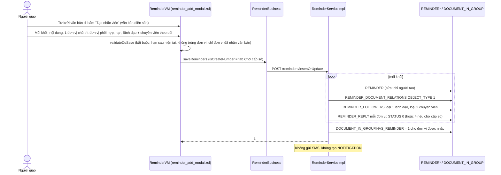

### 4.3 Sequence — Nhắc việc lưu tạm theo vòng đời văn bản (NV-03)

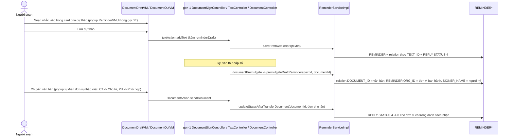

### 4.4 Sequence — Trả lời, trả lời tạm và duyệt (NV-04, NV-05)

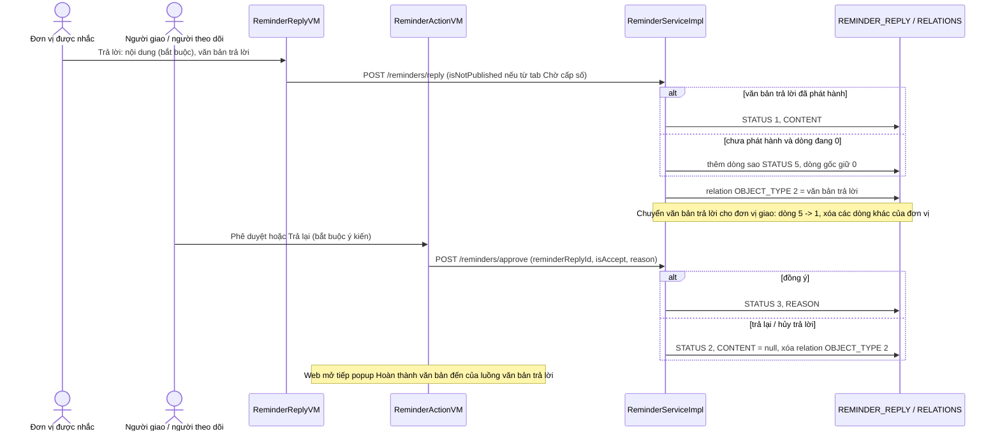

### 4.5 Sequence — Chuyển xử lý trong đơn vị được nhắc (NV-06)

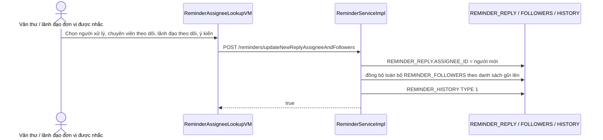

### 4.6 State — `REMINDER_REPLY.STATUS` (một đơn vị trong một nhắc việc)

Giá trị: `RSRD:11-16` — 4 Lưu tạm, 0 Chưa trả lời, 5 Đã xử lý tạm, 1 Chờ duyệt, 2 Xử lý lại, 3 Hoàn thành; `DEL_FLAG = 1` = đã xóa.

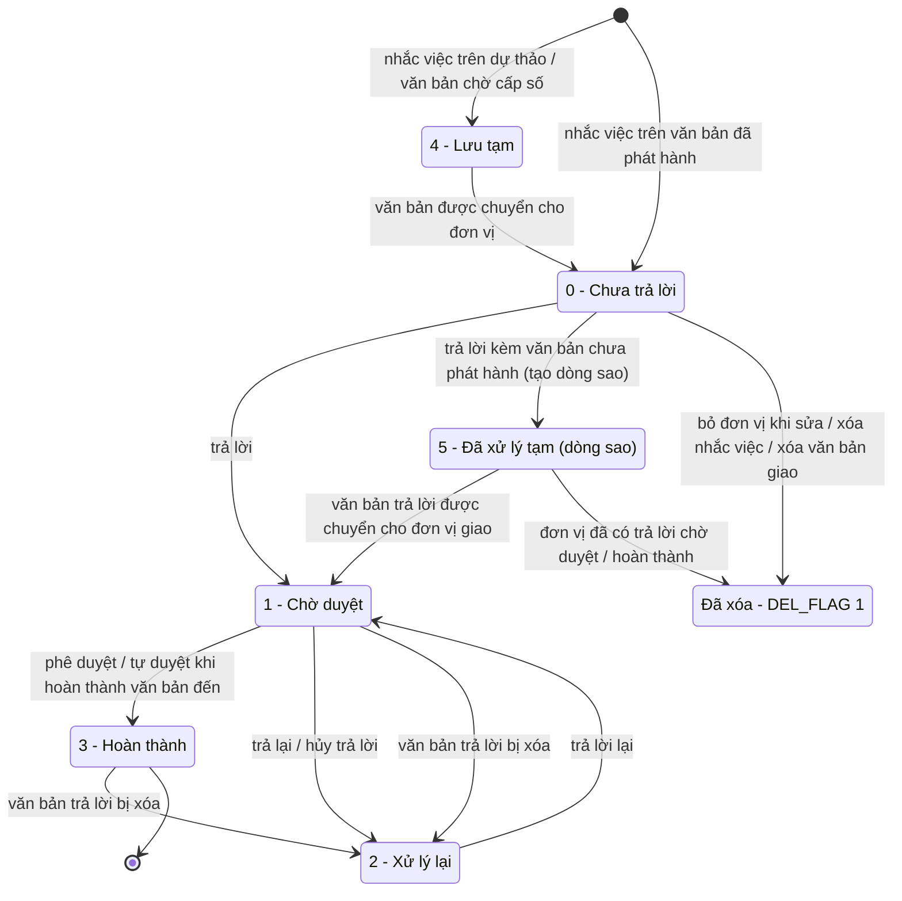

Nguồn: tạo `RSI:1151-1174`, `928-948`; 4 → 0 `RSI:367-402`; trả lời `RSI:1197-1218`; 5 → 1 / xóa `RSI:404-473`; duyệt / trả lại `RSI:1258-1279`; tự duyệt `RRRJ:113-121`; xóa văn bản trả lời `RSI:1852-1858` (`RRRJ:100-111` chỉ đổi dòng đang 1 / 3); xóa `RSI:1317-1321`, `1147`.

### 4.7 Sequence — Ghi thông báo và hiển thị chuông (NV-11)

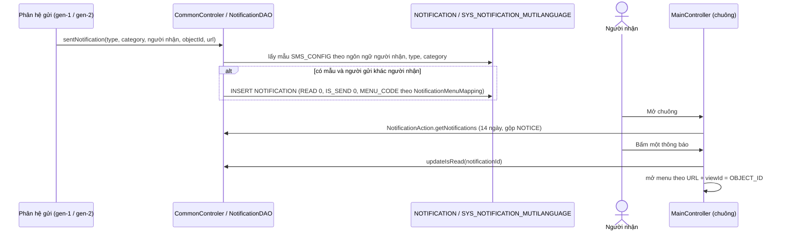

### 4.8 Sequence — Ghi SMS vào hàng đợi và kiểm chặn (NV-13 … NV-15)

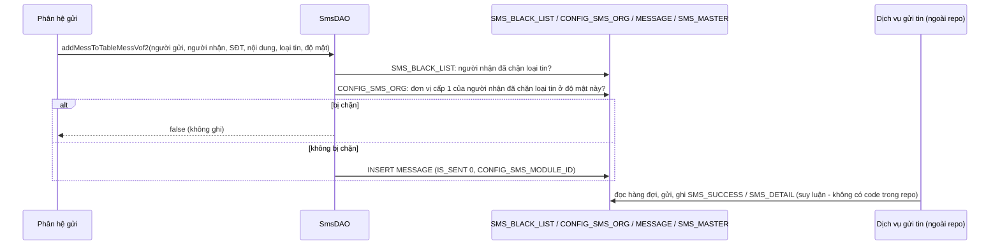

### 4.9 Sequence — Thông tin phục vụ lãnh đạo: tạo, chuyển, đọc; chuyển văn bản đến sang nắm tình hình (NV-17, NV-18)

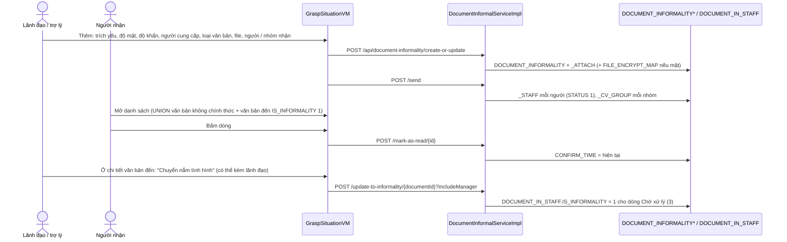

### 4.10 State — Dòng nhận văn bản không chính thức (`DOCUMENT_INFORMALITY_STAFF`) và văn bản (`DOCUMENT_INFORMALITY.DEL_FLAG`)

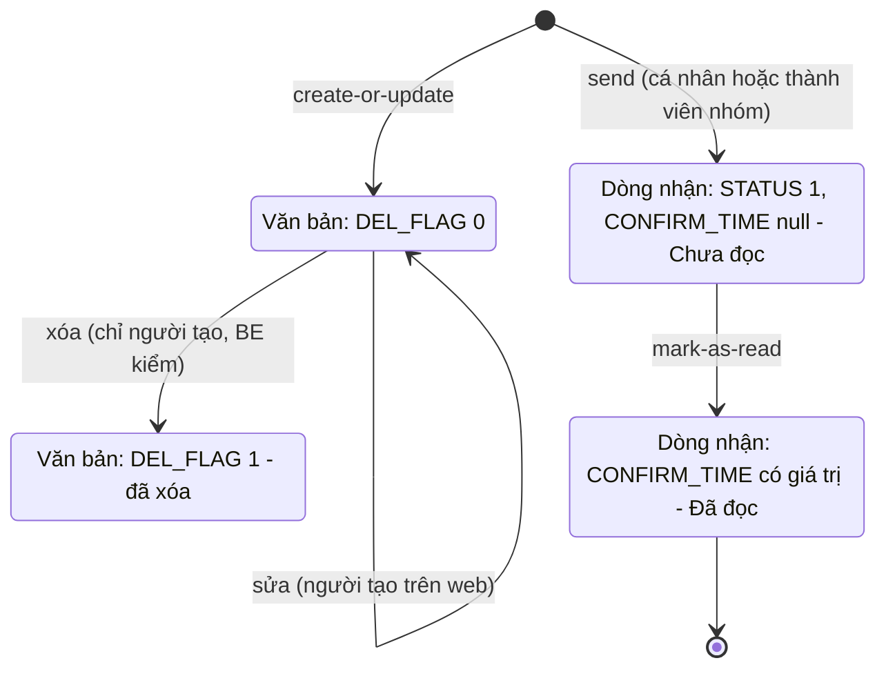

Nguồn: `DISI:95-101`, `165-217`, `449-455`; gửi `DISI:327-342`, `417-441`; đọc `BE2/repositories/jpa/DocumentInformalityStaffRepositoryJPA.java:17-20`. `STATUS` chỉ có giá trị 1 (comment DB "1 là Active"; code không có luồng thu hồi).

## 5. Data model

DB DEV (ngày 2026-10-01): **không tra FK** — mọi quan hệ dưới đây là **quan hệ logic** lấy từ JOIN / entity trong code. Số dòng: `REMINDER` 1.164 · `REMINDER_REPLY` 1.725 · `REMINDER_FOLLOWERS` 3.768 · `REMINDER_DOCUMENT_RELATIONS` 2.030 · `REMINDER_HISTORY` 97 · `NOTIFICATION` 38 · `NOTIFICATION_BLOCK_LIST` 1 · `SYS_NOTIFICATION_MUTILANGUAGE` 286 · `SMS_MASTER` 0 · `SMS_SUCCESS` 888 · `SMS_DETAIL` 732 · `SMS_BLACK_LIST` 85 · `SMSCONFIG` 2 · `CONFIG_SMS_MODULE` 61 · `CONFIG_SMS_ORG` 68 · `SYSTEM_MANAGER_PROCESS_SMS` 13 · `MEETING_NOTIFICATION` 0 · `DOCUMENT_INFORMALITY` / `_STAFF` / `_ATTACH` / `_ATTACH_CHECKING` / `_CV_GROUP` đều 0 · `ORIENTATION` 335 · `ORIENT_RECEIVE_ORG` 440.

### 5.1 Nhắc việc

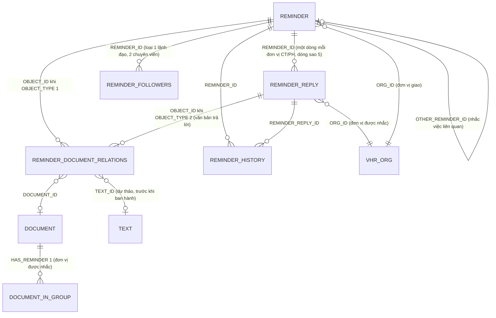

Bằng chứng: entity `BE2/entities/Reminder*Entity.java`; JOIN `rr.REMINDER_ID = r.REMINDER_ID`, `rdr.OBJECT_ID = r.REMINDER_ID AND rdr.OBJECT_TYPE = 1`, `rdr2.OBJECT_ID = rr.REMINDER_REPLY_ID AND rdr2.OBJECT_TYPE = 2` (`RRI:56-65`); `REMINDER_HISTORY` JOIN `REMINDER`, `REMINDER_REPLY` (`BE1/database/dao/ReminderHistoryDAO.java:34-41`); nhắc việc liên quan `RSI:1478-1480`; `HAS_REMINDER` `BE2/repositories/jpa/DocumentInGroupRepositoryJPA.java:314-323`.

| Bảng.cột | Vai trò nghiệp vụ | Nguồn |
|---|---|---|
| `REMINDER.CONTENT` | Nội dung giao việc (một khối) | `RSI:135` |
| `REMINDER.ORG_ID` | Đơn vị giao; khi ban hành dự thảo bị thay bằng đơn vị ban hành | `RSI:132`, `521` |
| `REMINDER.SIGNER_NAME` | Người ký văn bản giao | `RSI:133`, `520` |
| `REMINDER.OTHER_REMINDER_ID` | Nhắc việc liên quan (hiển thị văn bản của nó trên chi tiết) | `RSI:134`, `1478-1480` |
| `REMINDER.FOLLOWER_ID`, `LEADER_ID` | **Không được ghi** (người theo dõi ở `REMINDER_FOLLOWERS`) | `BE2/entities/ReminderEntity.java:32-39`; grep set |
| `REMINDER.CREATED_BY`, `DEL_FLAG` | Người giao (quyền sửa / xóa); 1 = đã xóa (DB DEV 187) | `RSI:120-129`, `1318` |
| `REMINDER_REPLY.ORG_ROLE` | 1 chủ trì / 2 phối hợp | `RSI:766-773` |
| `REMINDER_REPLY.ORG_ID`, `DEADLINE`, `ASSIGNEE_ID` | Đơn vị được nhắc, hạn, người được gán xử lý | `RSI:789-792`, `1500` |
| `REMINDER_REPLY.STATUS` | 4 / 0 / 5 / 1 / 2 / 3 (mục 3) | `RSRD:11-16` |
| `REMINDER_REPLY.CONTENT`, `REASON` | Nội dung trả lời; ý kiến duyệt / trả lại | `RSI:1215`, `1265` |
| `REMINDER_REPLY.UPDATED_AT` | Còn là "lần nhắc gần nhất" (nhắc lại chỉ ghi cột này) | `RRRJ:58-60`; `RRI:42` |
| `REMINDER_FOLLOWERS.FOLLOWER_TYPE`, `EMPLOYEE_ID`, `DEL_FLAG` | 1 lãnh đạo theo dõi / 2 chuyên viên theo dõi | `C1:2942-2945` |
| `REMINDER_DOCUMENT_RELATIONS.OBJECT_TYPE`, `OBJECT_ID`, `DOCUMENT_ID`, `TEXT_ID` | 1 văn bản giao / 2 văn bản trả lời; theo văn bản hoặc dự thảo (DB DEV: 0 = 2 dòng ngoài code) | `C1:2937-2940`; `SQL/19062026_create_table_reminder.sql:103-104` |
| `REMINDER_HISTORY.TYPE`, `ASSIGNEE_ID`, `ORG_ID`, `CONTENT`, `CREATED_BY` | 1 = chuyển xử lý: người được gán, đơn vị, ý kiến, người gán | `SQL/04082026_add_table_reminder_history.sql:44-58`; `RSI:1516-1525` |
| `DOCUMENT_IN_GROUP.HAS_REMINDER`, `DOCUMENT_IN_STAFF.HAS_REMINDER` | 1 = luồng văn bản đến này có nhắc việc (đếm trên hộp văn bản đến; kế thừa khi chuyển tiếp) | `SQL/20260808_YC_reminder.sql:1-2`; `BE1/database/dao/document/DocumentInStaffDAO.java:1566-1579` |

### 5.2 Bảng mã loại tin `CONFIG_SMS_MODULE` (đối chiếu DB DEV 2026-10-01 với hằng trong code)

Cột (DB DEV): `TYPE` = mã loại tin, `NAME_SMS`, `PARENT_ID` (nhóm), `IS_STYPE` (1 = cho cấu hình theo độ mật — `SQL/20250821_alter_table_config_sms_module.sql`), `DEL_FLAG` 0 hoạt động / 1 xóa. Mã được ghi vào `MESSAGE.CONFIG_SMS_MODULE_ID` / `SMS_MASTER` và so khớp khi kiểm chặn (NV-13). Hằng BE: **SMS** = `C1:1372-1456` (`SMS_TEXT_INTERCEPT`); họp **CFP** = `BE1/constants/ConstantsFieldParams.java:775-786`; web họp `AC:7004-7020`.

| Nhóm | Mã (DB DEV) | Ý nghĩa (DB DEV) | Hằng code | Ghi chú |
|---|---|---|---|---|
| 10 | 10 | Tất cả thông báo | — | chỉ có tác dụng trên giao diện (BR-31); cha của 444 |
| 100 Ký điện tử | 101 | Trình ký gửi người ký | `TOSUBMIT` (`C1:1376`) | |
| | 103 **[xóa]** | Gửi người ký trước | `SIGNER_SMSBEFORSIGN` (`C1:1380`) | xóa bởi `SQL/20250908_update_row_data_table_sms_config_module.sql` |
| | 104 | Yêu cầu ký nháy | `INITIAL_SMSSIGNMAIN` (`C1:1382`) | |
| | 105 | Ký duyệt / từ chối | `SIGNMAIN_SMSSIGNER_REJECT` (`C1:1384`) | |
| | 106 | Yêu cầu ban hành | `TOWAITPROMULGATE` (`C1:1386`) | |
| | 107 | Đã ban hành | `CREATOR_PROMULGATE` = `SECRETARY_PROMULGATE` = 107 (`C1:1388-1390`) | hai hằng cùng số |
| | 109 | Cảnh báo chưa ký duyệt | **không có hằng 109** — code có `WANINGPROMULGATE = 108` "cảnh báo ban hành" (`C1:1393`) | lệch số |
| | 110 **[xóa]** | Cặp trình ký | `BRIEFCASE` (`C1:1395`) | |
| | 111 | Ký thay | `REPLACE_SIGNER` (`C1:1398`) | |
| | (112 — không có trên DB) | — | `CANCEL_PUBLISHING` "hủy ban hành" (`C1:1401`) | code có, DB không |
| 200 Văn bản | 201 | Chuyển văn bản | `RECEIVE_PROMULGATE` "nhận văn bản sau khi ban hành" (`C1:1404`) | |
| | 202 | Cho trợ lý khi lãnh đạo xử lý | `SECRETARY_LEADERHANDLEDOC` "gửi văn thư khi lãnh đạo xử lý" (`C1:1407`) | chú thích code ghi "văn thư"; SMS_TYPE 18 (`SDAO:1492`) |
| | 203 **[xóa]** | Bổ sung thông tin | `DOCUMENT_EXTEND` (`C1:1410`) | xóa bởi `SQL/20250909_update_row_data_table_sms_config_module.sql` |
| | 204 **[xóa]**, 205 **[xóa]** | Yêu cầu trả lời / Trả lời | `MODULE_DOCUMENT_REPLY_REQUEST`, `MODULE_DOCUMENT_REPLY` (`C1:1452-1453`) | code văn bản trả lời ghi mã 20 thay vì 204 / 205 (`dac-thu.md` L17) |
| | 206 | Cảnh báo sắp đến hạn | `MODULE_DOCUMENT_REPLY_WARNING` (`C1:1454`) | |
| 300 Lịch họp | 301–313, 322–325 (nhiều dòng xóa: 308–310, 322–325; danh sách mã đúng từng số — 306, 307 không có trên DB DEV — ở `hop` NV-05 "Lưu ý dữ liệu"; sửa chéo 2026-10-02 theo `hop`) | (các tin lịch họp) | CFP 301–311 (`ConstantsFieldParams.java:775-786`); web 301–306, 311–313 (`AC:7004-7020`) | chi tiết: `hop`; 312, 313, 322–325 không có hằng BE |
| 400 Nhiệm vụ | 401 | (giao nhiệm vụ cho thủ trưởng, trợ lý) | `LEADER_MESSGIVEMISSION` (`C1:1414`) | |
| | 402 | (thay đổi tiến độ) | `RECEIVED_UPDATEMISSION` — chú thích "hiện tại bỏ" (`C1:1416`) | |
| | 403 | (thay đổi giao việc cho đơn vị) | `CHANGEMISS_TODEPART` (`C1:1418`) | |
| | 404–406 | | **không có hằng** | |
| | 407 | Xóa nhiệm vụ | `MODULE_DELETE_MISSION` (`C1:1420`) | thêm bởi `SQL/20260723_insert_table_sys_mess_and_sys_noti_and_sms_module.sql` |
| 444 | 444 | Cảnh báo quá hạn | **không có hằng** | thêm bởi `SQL/20250909_insert_sys_parameter_sms_warning.sql` (cha 10) cùng tham số `WARNING_TOTAL` |
| 500 Công việc cá nhân | 501, 502, 503 | Nhận công việc / ký công việc đầu tháng / ký đánh giá cuối tháng | `RECEIVEDTASK_DOTASK`, `SIGNTASK_STARTMONTH`, `SIGNTASK_ENDMONTH` (`C1:1423-1427`) | |
| 600 | 600 **[xóa]** | Kiến nghị đề xuất | `PROPOSE_PETITION` (`C1:1430`) | web vẫn ghi `SMS_MASTER` với mã 600 (`RequestVM.java:896-914`) |
| 700 Phiếu trình | 701, 702, 703, 704 | Yêu cầu ký duyệt / được, không được thông qua / được ký duyệt / bị hủy | `SUBMISSION_FORM_*_SMS` (`C1:1436-1439`) | nghĩa dùng thực tế: `PT` mục 1.4 (702 = bị trả lại, 703 = đã hoàn thành) |
| | (160 — không có trên DB) | — | `SUBMISSION_TRANSFER_PROCESS_SMS` (`C1:1440`) | code có, DB không |
| 800 Quản lý hồ sơ | 801–807 **[xóa hết]** | `BRIEF_PROCESS_*` | `C1:1444-1450` | |
| (ngoài DB) | — | — | `CERTDEVICE_SMS = 7000`, `DATTEST11 = 7200` (`C1:1433`, `1442`) | |

**Không có nhóm cho nhắc việc** — nhắc việc không gửi SMS (NV-02). Mã nhóm đã xóa ẩn khỏi màn cấu hình (`SIDAO:43-54`) nhưng dòng `SMS_BLACK_LIST` cũ của chúng vẫn được so khi gửi (`SDAO:2205-2208` không lọc `DEL_FLAG` của loại tin).

### 5.3 Thông báo, SMS, nắm tình hình, định hướng

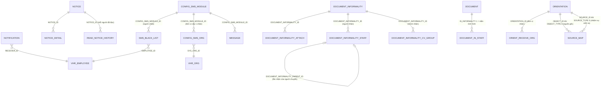

Bằng chứng: `NDAO:167-217` (gộp `NOTICE`), `WEB/voffice/entity/ReadNoticeHistory.java:17-57`; `SDAO:2198-2274`; `BE2/entities/DocumentInformality*.java`, `DIRI:118-130`, `194-206`, `DISI:311-316`; `ODAO:22-30`, `61-85`, `222-245`; `BE1/database/dao/meeting/MeetingDAO.java:512-517`.

| Bảng.cột | Vai trò nghiệp vụ | Nguồn |
|---|---|---|
| `NOTIFICATION.MODULE_ID`, `OBJECT_ID` / `STR_OBJECT_ID`, `URL`, `MENU_CODE` | Phân hệ, đối tượng, màn mở khi bấm; `MENU_CODE` chưa được web dùng | `C1:1297-1306`; `MC:2174-2236`; NMM |
| `NOTIFICATION.READ`, `IS_SEND` | Đã đọc; đã đẩy di động (không có code đặt 1 — DB DEV toàn 0) | `NDAO:53`; BR-28 |
| `NOTIFICATION_BLOCK_LIST.PATH_PATTERN` | Mẫu `%id đơn vị%` để chặn thông báo theo đơn vị — **không code nào dùng** | `SQL/10042026_create_table_notification_block_list.sql:1-7` |
| `SYS_NOTIFICATION_MUTILANGUAGE` / `SYS_MESS_MUTILANGUAGE` (`CODE_LANGUAGE`, `TYPE`, `CATEGORY`, `SMS_CONFIG`, `SMS_CONFIG_SECRET`) | Mẫu thông báo / mẫu SMS; bản mật | `SDAO:71-138`; `SQL/20250616_…sql` |
| `MESSAGE` (`STAFF_ID`, `PHONE_NUMBER`, `CONTENT`, `IS_SENT`, `SENT_TIME_REQ`, `FAIL_NUM`, `CONFIG_SMS_MODULE_ID`) | Hàng đợi SMS chính của gen-1 | `SDAO:287-299` |
| `SMS_MASTER` (`RECIPIENT`, `CONTENT`, `SMS_TYPE`, `STATUS` −1 / 0 / 1, `FAIL_NUM`, `CONTENT_CODE`) | Hàng đợi SMS thứ hai (nhiệm vụ, họp, kiến nghị…); DB DEV 0 dòng | comment DB; `SDAO:201-230` |
| `SMS_SUCCESS`, `SMS_DETAIL` | Lịch sử đã gửi / từng lần gửi — **do dịch vụ ngoài repo ghi** | BR-33 |
| `SMS_BLACK_LIST` (`EMPLOYEE_ID`, `CONFIG_SMS_MODULE_ID`, `IS_ACTIVE`, `TYPE`, `PHONE_NUMBER`) | Người tự chặn loại tin | `SIDAO:63-116` |
| `CONFIG_SMS_ORG` (`SYS_ORG_ID`, `CONFIG_SMS_MODULE_ID`, `CONFIG_TYPE`, `STYPE_ID`) | Đơn vị cấp 1 chặn loại tin theo độ mật | `SISI:33-63`; `C1:2648-2662` |
| `SYSTEM_MANAGER_PROCESS_SMS.TIMERANGE_RUN_SEND` | Khung giờ gửi tin (DB DEV "01:09;05:07/…") — không Java nào đọc | BR-33 |
| `MEETING_CONFIG.SEND_MAIL`, `SEND_SMS` | 1 = lãnh đạo không nhận email / SMS lịch đơn vị | NV-16 |
| `DOCUMENT_INFORMALITY` (`TITLE`, `RECEIVED_PLACE`, `STYPE_ID`, `PRIORITY_ID`, `SUPPLIER_ID`, `DOCUMENT_LEAD_TYPE`, `DEL_FLAG`) | Văn bản không chính thức: trích yếu, nơi nhận, độ mật, độ khẩn, **người cung cấp (lãnh đạo chỉ đạo)**, loại văn bản | comment DB; `SQL/20250729_new_table_document_informality.sql`, `SQL/20251106_alter_table_document_informality.sql` |
| `DOCUMENT_INFORMALITY_STAFF` (`STAFF_ID`, `RECEIVER_ID`, `CONFIRM_TIME`, `STATUS`, `COMMENT_CONTENT`, `DOCUMENT_INFORMALITY_PARENT_ID`) | Người chuyển, người nhận, thời điểm đọc, 1 = hiệu lực, ý kiến chỉ đạo | `DISI:327-342` |
| `DOCUMENT_INFORMALITY_CV_GROUP` (`CV_GROUP_ID`, `RECEIVER_ID_VOF2`) | Nhận theo nhóm chuyên viên | `SQL/20251009_create_table_document_informality_cv_group.sql`; `DISI:345-409` |
| `DOCUMENT_IN_STAFF.IS_INFORMALITY` | 1 = dòng nhận văn bản đến để nắm tình hình | `SQL/20250822_add_is_informality_column_into_document_in_staff.sql`; NV-18 |
| `ORIENTATION` (`CONTENT`, `ORG_ID`, `EMP_ID`, `FIELD_ID`, `ORIENTATION_TYPE`, `ORIENTATION_DATE`, `DEL_FLAG`) | Định hướng: đơn vị / người định hướng, lĩnh vực, loại, ngày ban hành; `SOURCE_*`, `FILE_ID` là dữ liệu cũ | comment DB; `ODAO:304-331` |
| `ORIENT_RECEIVE_ORG` (`VHR_ORG_ID`, `IS_ACTIVE`, `LOG_USER_ID`, `ORG_ID`, `UPDATE_TIME`) | Đơn vị nhận định hướng (code luôn ghi `IS_ACTIVE = 1`, xóa – ghi lại khi sửa) | `ODAO:482-526`, `765-821` |

## 6. Glossary

| Nghiệp vụ | Trong code |
|---|---|
| Nhắc việc (một khối nội dung giao việc) | `REMINDER`, `ReminderEntity`, `ReminderBlockDTO` (web `ReminderBlockRequestDTO`), `/reminders` |
| Đơn vị xử lý chính / phối hợp (CT / PH) | `REMINDER_REPLY.ORG_ROLE` 1 / 2, `mainUnits` / `coordUnits`, `PROCESS_ROLE.CT/PH` |
| Trả lời nhắc việc (dòng của một đơn vị) | `REMINDER_REPLY`, `ReminderReplyEntity` (web `ReminderReply` — `@Table REMINDER_REPLIES` sai tên), `reminders.reply` |
| Lưu tạm / Chưa trả lời / Đã xử lý tạm / Chờ duyệt / Xử lý lại / Hoàn thành | `STATUS` 4 / 0 / 5 / 1 / 2 / 3; `REPLY_STATUS_DRAFT / NO_REPLY / TEMPORARILY_PROCESSED / WAITING_APPROVAL / REPROCESS / COMPLETED`; web `SAVE_DRAFT / NO_REPLY / PROCESS_DRAFT / WAITING_APPROVE / RE_OPEN / DONE` |
| Lãnh đạo theo dõi / chuyên viên theo dõi | `REMINDER_FOLLOWERS.FOLLOWER_TYPE` 1 / 2, `MANAGER_FOLLOWERS` / `STAFF_FOLLOWERS`, `leaderIds` / `followerIds`, `IS_APPROVER` |
| Văn bản giao / văn bản trả lời | `REMINDER_DOCUMENT_RELATIONS.OBJECT_TYPE` 1 / 2, `CREATE_REMINDER` / `REPLY_REMINDER`, `documentReplyId` |
| Nhắc việc trên dự thảo (lưu tạm) | `reminderDraft`, `saveDraftReminders`, `fromDocumentDraft`, `createRemiderToNumber`, `isCreateNumber`, `isNotPublished`, `reminder_draft_card.zul` |
| Giao nhắc việc khi chuyển văn bản | `updateStatusAfterTransferDocument`, `getListOrgForTransfer`, `ARG_REMINDER_LIST_ORG_FOR_FILL` |
| Ban hành nhắc việc theo dự thảo | `promulgateDraftReminders`, `ReminderPromulgationException` |
| Duyệt / trả lại / hủy trả lời | `reminders.approve` (`isAccept` true / false), `APPROVE_REPLY` / `CANCEL_REPLY` |
| Chuyển xử lý / gán người xử lý | `ASSIGNEE_ID`, `updateNewReplyAssigneeAndFollowers`, `reminderAssigneeLookup.zul`, `REMINDER_HISTORY.TYPE = 1` |
| Nhắc lại | `remindAgain` (chỉ `UPDATED_AT`), `lastRemindedTime` |
| Cần xử lý / Giao đi - Theo dõi | `groupType` 0 / 1; nhãn widget "CẦN XỬ LÝ" (`NV_CAN_XU_LY`) / "THEO DÕI" (`NV_DA_GIAO`) |
| Văn bản có nhắc việc (trên hộp văn bản đến) | `HAS_REMINDER`, `reminderOnly`, `set*ReminderCount` |
| Thông báo (chuông) | `NOTIFICATION`, `NotificationAction`, `addNotification`, `sentNotification`, `MENU_CODE`, `NotificationMenuMapping` |
| Thông báo chung / bảng tin | `NOTICE`, `NOTICE_DETAIL`, `READ_NOTICE_HISTORY`, menu `QLTB`, `NoticeVM` |
| Mẫu tin (SMS / thông báo) | `SYS_MESS_MUTILANGUAGE` / `SYS_NOTIFICATION_MUTILANGUAGE` (`TYPE`, `CATEGORY`, `SMS_CONFIG`, `SMS_CONFIG_SECRET`), ký hiệu chỗ trống `DATNV5` |
| Hàng đợi SMS | `MESSAGE` (`IS_SENT`), `SMS_MASTER` (`STATUS` −1), `addMessToTableMessVof2`, `addMsgToSmsMaster`, web `MultimediaNotificationCenter` |
| Loại tin (để chặn) | `CONFIG_SMS_MODULE.TYPE`, `CONFIG_SMS_MODULE_ID`, `SMS_TEXT_INTERCEPT` |
| Chặn tin theo người / theo đơn vị | `SMS_BLACK_LIST` (`SmsInterceptAction`, menu `SMS_CONTROLLER_CONFIGURATION`) / `CONFIG_SMS_ORG` (`SMSInterceptController`, menu `SMS_TARGET_CONFIGURATION`), `shouldSendSms` |
| Lãnh đạo không nhận lịch đơn vị | `MEETING_CONFIG.SEND_MAIL / SEND_SMS`, menu `LEADER_CONFIG`, `ScheduleConfigVM` |
| Thông tin phục vụ lãnh đạo / nắm tình hình | menu `GRASP_SITUATION`, `graspSituation/*`, `/api/document-informality`, `DOCUMENT_INFORMALITY*`, `IS_INFORMALITY`, `SEND_TYPE` 4 → lưu 3 |
| Văn bản không chính thức / văn bản cấp trên chuyển | `DOCUMENT_INFORMALITY`, `transferDocumentLeader`, `ARG_TRANSFER_DOCUMENT_LEADER` |
| Người cung cấp (lãnh đạo chỉ đạo) | `SUPPLIER_ID`, `insert-permission-for-supplier` |
| Loại văn bản (nhóm danh sách nắm tình hình) | `DOCUMENT_LEAD_TYPE`, danh mục `CATEGORY_COMMON` mã `DOCUMENT_LEAD_TYPE` |
| Chuyển nắm tình hình | `update-to-informality`, `includeManager`, `popupUpdateToGraspSituation.zul`, trợ lý văn bản `MEETING_ASSISTANT.ASSI_TYPE = 2` |
| Định hướng / loại định hướng / nguồn gốc | `ORIENTATION`, `ORIENTATION_TYPE` 0–3, `SOURCE_MAP` `OBJECT_TYPE = 4`; nhiệm vụ "Theo định hướng" `SOURCE_TYPE = 5` |
| Đơn vị nhận định hướng | `ORIENT_RECEIVE_ORG` (web `OrientOrgMap`) |

## 7. [CẦN XÁC NHẬN]

### 7.1 Còn mở

| # | Bối cảnh (hiện trạng code) | Câu hỏi |
|---|---|---|
| Q1 | Khi giao nhắc việc, khi nhắc lại, khi trả lời hay khi duyệt, hệ thống **không gửi tin nhắn và không tạo thông báo** nào; riêng nút "Nhắc lại" lại báo "Đã gửi thông báo và SMS tới các đơn vị liên quan" nhưng thực tế chỉ ghi lại thời điểm (NV-02, NV-07 BR-22). | Nhắc việc có cần báo cho người nhận qua tin nhắn / thông báo không? (a) không cần, chỉ xem trên màn hình; (b) cần khi giao và khi nhắc lại; (c) cần ở mọi bước (giao, nhắc lại, trả lời, duyệt). |
| Q2 | Ai được **duyệt / trả lại** trả lời: trên màn chi tiết là người giao **và mọi người theo dõi** (cả chuyên viên), nhưng hộp "Cần xử lý" và con số "Chờ duyệt" chỉ đưa trả lời tới **lãnh đạo theo dõi** (NV-05 BR-17, NV-01 BR-02). | Người duyệt trả lời nhắc việc là ai? (a) chỉ lãnh đạo theo dõi; (b) lãnh đạo theo dõi và người giao; (c) mọi người theo dõi và người giao. |
| Q3 | Nhắc việc chỉ thực sự "giao" cho đơn vị khi văn bản được **chuyển** tới đơn vị đó; đơn vị có tên trong nhắc việc mà không được chuyển văn bản thì nhắc việc nằm "Lưu tạm" mãi (NV-03 BR-10). | Đó có phải ý đồ: nhắc việc chỉ giao cho đơn vị **đã nhận văn bản**? Nếu văn thư quên chuyển cho một đơn vị trong nhắc việc thì (a) chấp nhận nhắc việc không tới đơn vị đó; (b) cần cảnh báo / tự giao. |
| Q4 | Khi ban hành dự thảo, nhắc việc soạn kèm bị đổi **đơn vị giao** thành đơn vị ban hành văn bản và **người ký** thành người ký văn bản (NV-03 BR-11). | Đơn vị giao của nhắc việc luôn phải là đơn vị ban hành văn bản? (a) đúng; (b) không — người soạn được chọn đơn vị giao khác. |
| Q5 | Màn "Thông tin phục vụ lãnh đạo": ai có menu thì đều tạo được văn bản không chính thức và thấy văn bản mình tạo / được gửi; chỉ nút "Chuyển nắm tình hình" giới hạn cho lãnh đạo và trợ lý văn bản (NV-17 BR-41, NV-18). Menu là menu cấp 1 riêng. | Tính năng này dành cho ai? (a) chỉ lãnh đạo và trợ lý của lãnh đạo (phân bằng menu); (b) mọi cán bộ được cấp menu. Và "văn bản không chính thức" là gì trong thực tế (văn bản cấp trên chuyển qua kênh khác, thông tin nắm tình hình địa phương…)? |
| Q6 | "Chuyển nắm tình hình" làm văn bản **rời khỏi hộp văn bản đến** của người đó (và lãnh đạo nếu trợ lý chọn "Chuyển cả lãnh đạo") nhưng **không đổi** vai trò xử lý chủ trì / phối hợp và không hoàn thành luồng (NV-18 BR-42). | Văn bản đã chuyển sang nắm tình hình có còn phải xử lý / hoàn thành như văn bản thường không? (a) không — chỉ để nắm thông tin; (b) vẫn phải xử lý ở nơi khác. |
| Q7 | Một trả lời bị **trả lại** hoặc **hủy** đều quay về "Xử lý lại", xóa nội dung và văn bản trả lời; không lưu lịch sử các lần trả lời trước (NV-05 BR-18). | Có cần giữ lịch sử các lần trả lời / trả lại không? (a) không; (b) có. |
| Q8 | Định hướng: menu "Định hướng" đang **khóa**, hai menu danh mục đã xóa; vẫn còn xem được định hướng qua nguồn gốc của nhiệm vụ; trên DB có 295 định hướng còn hiệu lực (NV-19). DB: định hướng cuối cùng tạo / sửa ngày **2021-05-10**. | Nghiệp vụ Định hướng còn dùng không? (a) đã ngừng, chỉ giữ để xem dữ liệu cũ; (b) tạm khóa, sẽ mở lại. |
| Q9 | Chặn tin theo **đơn vị** chỉ do quản trị đơn vị **cấp 1** cấu hình và áp cho toàn bộ cây đơn vị đó; loại tin đơn vị đã chặn thì cá nhân không còn thấy để tự chọn (NV-15 BR-36). | Có cần chặn ở đơn vị cấp dưới (phòng, ban) không? (a) không, cấp 1 là đủ; (b) có. |
| Q10 | Bảng mã loại tin trên DB có các mã không có trong code (109 "cảnh báo chưa ký duyệt", 404–406, 444 "cảnh báo quá hạn", 312–313, 322–325) và code có mã không có trên DB (108, 112 "hủy ban hành", 160 "chuyển xử lý phiếu trình") (mục 5.2). | Mã 109 và 108 có phải cùng một loại tin ("cảnh báo chưa ký / cảnh báo ban hành")? Mã 444 "cảnh báo quá hạn" dùng cho tin nào (văn bản, nhiệm vụ, phiếu trình…)? |

### 7.2 Đã xác nhận (X1–X6 dùng lại từ module trước; X7–X12 code xác nhận câu hỏi cũ / bối cảnh)

| # | Nội dung | Trả lời / nguồn | Hệ quả ghi vào tri thức |
|---|---|---|---|
| X1 | Quyền thao tác kiểm ở đâu | Tầng hiển thị nút trên web là thiết kế chung (đã xác nhận) | Mục 1.4; BE nhắc việc kiểm thêm người tạo khi sửa / xóa (BR-08) |
| X2 | Văn thư | role `VT` (đã xác nhận) | Mục 1.4; đơn vị được nhắc = VT / LDDV / TTDV (BR-01) |
| X3 | `SYS_MENU.STATUS` | 1 = mở, 2 = khóa (đã xác nhận) | Mục 1.2 (Định hướng khóa) |
| X4 | Nghiệp vụ văn bản mật | Chưa dùng (đã xác nhận) | Phần file mật của nắm tình hình, mẫu `SMS_CONFIG_SECRET` chỉ mô tả ranh giới |
| X5 | Tính năng ở nhánh khác | Ghi "chưa có trên `kha_develop`" (đã xác nhận) | Không có mục nào trong phân hệ này |
| X6 | Nắm tình hình trong văn bản đến | `SEND_TYPE = 3` + `IS_INFORMALITY = 1`, bị loại khỏi mọi hộp văn bản đến (đã xác nhận) | NV-17 loại (b), NV-18 |
| X7 | (câu cũ ❓1) "Nhắc việc có SMS / thông báo khi gửi và khi nhắc lại không?" | Code xác nhận: **không** (grep `sms|notif` trong `RSI` rỗng; `RRRJ:58-60`) | NV-02, NV-07; ý đồ hỏi lại ở Q1 |
| X8 | (câu cũ ❓2) "`FOLLOWER_TYPE` có những giá trị nào?" | Code: 1 lãnh đạo theo dõi, 2 chuyên viên theo dõi (`C1:2942-2945`) | Mục 3 |
| X9 | Menu, widget của phân hệ | Tra DB DEV `SYS_MENU` / `HOME_WIDGET` ngày 2026-10-01 (người điều phối) | Mục 1.2, 1.3 |
| X10 | Số dòng, phân bố giá trị, comment cột | Tra DB DEV ngày 2026-10-01 (người điều phối) | Mục 3, 5 |
| X11 | Nắm tình hình chạy trên bảng nào | Code: **cả hai** — văn bản không chính thức ở `DOCUMENT_INFORMALITY*` (DB DEV 0 dòng) và văn bản đến ở `DOCUMENT_IN_STAFF.IS_INFORMALITY = 1`, gộp một danh sách (`DIRI:33-285`) | NV-17 |
| X12 | Có tiến trình gửi SMS trong repo không | Code: không có; `MESSAGE` / `SMS_MASTER` là hàng đợi, dịch vụ gửi ở ngoài (BR-33) | NV-13 |
