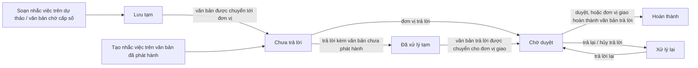

# Nhắc việc, thông báo, SMS, nắm tình hình, định hướng — tóm tắt nghiệp vụ cho BA

> Bản đọc nhanh bằng lời nghiệp vụ. Chi tiết và bằng chứng: [nghiep-vu.md](nghiep-vu.md) (mã NV / BR trong ngoặc
> để tra). Cập nhật: 2026-10-02 · Nguồn: code `kha_develop` + DB DEV. Nhãn quy tắc: **[Đã xác nhận]** = chủ dự án đã
> chốt là đúng ý đồ · **[Hiện trạng]** = hệ thống đang chạy như vậy, chưa ai xác nhận là ý đồ · **[Lệch nghiệp vụ]**
> = đã xác nhận nghiệp vụ muốn khác, hệ thống đang làm sai.

## 1. Phân hệ này dùng để làm gì

Phân hệ gom các chức năng "đẩy việc / đẩy tin tới người dùng" và một số tiện ích chỉ đạo (1.1).
**Nhắc việc**: đơn vị phát hành văn bản giao việc kèm văn bản cho đơn vị chủ trì / phối hợp, có hạn xử lý, lãnh đạo và chuyên viên theo dõi; đơn vị được nhắc trả lời (kèm văn bản trả lời), bên giao duyệt hoặc trả lại (NV-01…NV-10).
**Thông báo** trong ứng dụng (chuông) và **thông báo chung** (bảng tin) là cơ chế dùng chung để các phân hệ báo việc mới (NV-11, NV-12). **SMS** là hạ tầng dùng chung: hàng đợi tin, mẫu tin, chặn tin theo người và theo đơn vị (NV-13…NV-16).
**Thông tin phục vụ lãnh đạo** (nắm tình hình) gộp văn bản không chính thức và văn bản đến nhận để nắm tình hình (NV-17, NV-18). **Định hướng** là văn bản chỉ đạo nội bộ, có thể sinh nhiệm vụ — menu đang khóa (NV-19).

**Không gồm:** khi nào từng phân hệ gửi SMS / thông báo và nội dung tin (xem `phieu-trinh`, `van-ban/chuyen-van-ban`, `hop`, `nhiem-vu`, `van-ban/den`); quy tắc hoàn thành văn bản đến khi có nhắc việc (xem `van-ban/den`); chọn vai trò "Nắm tình hình" khi chuyển văn bản (xem `van-ban/chuyen-van-ban`); nhiệm vụ sinh từ định hướng (xem `nhiem-vu`); ký, ban hành, cấp số (xem `xu-ly-cong-viec`, `van-ban/di`); gửi email / SMS lịch họp (xem `hop`); cảnh báo và cửa sổ ngày giao / đánh giá công việc tháng (xem `cong-viec`); cách dựng widget trang chủ nói chung (xem `he-thong`) (1.1).

## 2. Ai dùng và được làm gì

| Vai trò | Được làm gì trong phân hệ này |
|---|---|
| Người giao nhắc việc (người tạo) | Tạo, sửa, xóa nhắc việc của mình; duyệt / trả lại trả lời; nhắc lại; thấy ở nhóm *Giao đi/Theo dõi* (1.4, BR-08) |
| Lãnh đạo theo dõi | Duyệt / trả lại trả lời; thấy trả lời chờ mình duyệt ở nhóm *Cần xử lý* và số "Chờ duyệt" (1.4, BR-02, BR-17) |
| Chuyên viên theo dõi | Theo dõi tiến độ; nút duyệt / trả lại cũng hiện trên chi tiết nhắc việc (1.4, BR-17) |
| Đơn vị được nhắc — người có vai trò Văn thư / Lãnh đạo đơn vị / Thủ trưởng (`VT` / `LDDV` / `TTDV`) tại đơn vị | Thấy ở *Cần xử lý*; trả lời, hủy trả lời, gán người xử lý (1.4, BR-01) |
| Người xử lý được gán | Thấy và trả lời dòng nhắc việc được gán cho mình (1.4, BR-20) |
| Người có vai trò báo cáo nhắc việc (`NHACVIEC`) | Chọn đơn vị để xem báo cáo nhắc việc (cùng `VT`, `LDDV`) (1.4, NV-10) |
| Mọi người dùng | Nhận thông báo trên chuông, đọc thông báo chung, tự chặn loại tin SMS của mình (1.4, NV-11, NV-12, NV-14) |
| Quản trị (`ADMIN` / `SUB_ADMIN`; `ADMIN_LEVEL1`; `SUPPER_ADMIN`); người có menu Quản lý thông báo | Chặn tin SMS cho người khác trong đơn vị; chặn tin theo đơn vị cấp 1; đăng thông báo chung (1.4, NV-12, NV-14, NV-15) |
| Lãnh đạo (`TTDV` / `LDDV`) / trợ lý văn bản có menu Thông tin phục vụ lãnh đạo | Dùng màn Thông tin phục vụ lãnh đạo; bấm "Chuyển nắm tình hình" trên văn bản đến (1.4, NV-17, NV-18) |

## 3. Màn hình / menu người dùng thấy

| Menu / màn | Để làm gì | Ghi chú | Mã menu |
|---|---|---|---|
| VĂN BẢN ĐI > Theo dõi nhắc việc | Một màn cho cả hai phía: nhóm *Cần xử lý* (Chưa trả lời, Xử lý lại, Chờ duyệt, Hoàn thành, Tất cả) và nhóm *Giao đi/Theo dõi* (Chưa hoàn thành, Đã hoàn thành, Tất cả) | Mỗi dòng lưới là một đơn vị được nhắc; mặc định 365 ngày (NV-01) | 441265 |
| VĂN BẢN ĐI > Báo cáo nhắc việc | Số nhắc việc theo từng đơn vị được nhắc, tách Chủ trì / Phối hợp; bấm ô số mở danh sách; xuất Excel | (NV-10) | 441305 |
| Popup *Tạo nhắc việc* / *Trả lời nhắc việc* | Mở từ lưới / chi tiết văn bản đi, chi tiết văn bản, form dự thảo, popup Hoàn thành văn bản đến | (NV-02, NV-04) | — |
| Trang chủ — ô "Nhắc việc" | Nhóm CẦN XỬ LÝ (Quá hạn, Sắp đến hạn, Xử lý lại, Chưa trả lời, Chờ duyệt) và nhóm THEO DÕI ĐÃ GIAO (Chưa hoàn thành, Đã hoàn thành); bấm ô mở màn Theo dõi nhắc việc | (1.3, NV-01) | — |
| Chuông thông báo (đầu trang) | Thông báo 14 ngày gần nhất và thông báo chung; bấm để mở đúng màn | (NV-11) | — |
| QUẢN TRỊ > Quản lý thông báo | Đăng thông báo chung (ảnh hoặc văn bản) cho mọi người dùng | (NV-12) | 338511 |
| QUẢN TRỊ > Cấu hình chặn tin nhắn cho từng chức năng | Mỗi người tick loại tin SMS không muốn nhận | Quản trị chọn được người khác trong đơn vị (NV-14) | 338631 |
| QUẢN TRỊ > Cấu hình chặn tin nhắn theo đơn vị | Quản trị chặn loại tin cho cả đơn vị cấp 1, theo độ mật | (NV-15) | 440465 |
| QUẢN TRỊ > Cấu hình lãnh đạo không nhận email/sms | Lãnh đạo không nhận email / SMS khi đơn vị được mời họp | Chỉ tác dụng với lịch họp (NV-16) | 338471 |
| THÔNG TIN PHỤC VỤ LÃNH ĐẠO (menu cấp 1) | Danh sách văn bản không chính thức + văn bản đến nhận để nắm tình hình, nhóm theo loại văn bản | Trang chủ có ô Chưa đọc / Đã đọc (NV-17) | 440319 |
| QUẢN LÝ NHIỆM VỤ > Định hướng | — | **Menu khóa**; chỉ còn xem định hướng qua nguồn gốc của nhiệm vụ (NV-19, Q8) | 338272 |
| Danh mục định hướng (hai mục) | — | **Đã xóa khỏi menu** (NV-19) | 338291 · 338311 |

## 4. Luồng chính

Luồng chính là **nhắc việc**. Các mảng thông báo, SMS, nắm tình hình, định hướng mô tả ngắn ở cuối mục.

1. **Tạo trên văn bản đã có số**: người có thẩm quyền ở đơn vị phát hành bấm *Tạo nhắc việc*, chọn văn bản (bắt buộc), đơn vị giao, người ký, nhắc việc liên quan. Mỗi **khối** gồm nội dung giao việc, **một** đơn vị xử lý chính, các đơn vị phối hợp, hạn từng đơn vị (phải sau thời điểm hiện tại), ít nhất một lãnh đạo theo dõi và một chuyên viên theo dõi. Mỗi khối lưu thành một nhắc việc riêng (NV-02, BR-05, BR-06).
2. Văn bản đã phát hành thì chỉ chọn được đơn vị đã nhận văn bản, và nhắc việc **giao ngay** (*Chưa trả lời*). Tạo từ tab Chờ cấp số thì nhắc việc ở *Lưu tạm* (NV-02, BR-07).
3. **Soạn trên dự thảo / văn bản đi chưa cấp số**: nhắc việc chỉ được ghi khi lưu dự thảo / văn bản, ở *Lưu tạm*. Khi ban hành, đơn vị giao bị thay bằng đơn vị ban hành, người ký bằng người ký văn bản (NV-03, BR-11).
4. Khi văn bản được **chuyển**, nhắc việc *Lưu tạm* của đơn vị nào vừa nhận văn bản thì đơn vị đó chuyển sang *Chưa trả lời*. Popup chuyển văn bản tự điền sẵn các đơn vị đang có nhắc việc lưu tạm, đúng vai trò Chủ trì / Phối hợp (NV-03, BR-10).
5. **Đơn vị được nhắc** thấy việc ở nhóm *Cần xử lý*; có thể gán một người xử lý cụ thể (kèm cập nhật người theo dõi, ghi lịch sử chuyển xử lý) (NV-01, NV-06).
6. **Trả lời**: nhập nội dung (bắt buộc), chọn văn bản trả lời (tùy chọn) → *Chờ duyệt*. Nếu văn bản trả lời chưa phát hành → *Đã xử lý tạm*, chỉ sang *Chờ duyệt* khi văn bản trả lời được chuyển cho đơn vị giao (popup chuyển tự điền đơn vị giao với vai trò Nhận để biết) (NV-04, BR-15).
7. **Duyệt / trả lại**: *Phê duyệt* → *Hoàn thành*; *Trả lại* (bắt buộc ý kiến) hoặc đơn vị tự *Hủy trả lời* (không cần lý do) → *Xử lý lại*, nội dung và văn bản trả lời bị xóa. Nhắc việc coi là xong khi mọi đơn vị ở *Hoàn thành* (NV-05, BR-18, BR-19).
8. **Tự duyệt**: đơn vị giao nhận văn bản trả lời rồi bấm Hoàn thành văn bản đến thì trả lời tương ứng tự thành *Hoàn thành* (NV-09, BR-23).

**Các mảng khác (mô tả ngắn).**
- *Nhắc lại*: nút trên chi tiết nhắc việc khi còn đơn vị *Chưa trả lời* / *Xử lý lại*; hệ thống chỉ ghi lại thời điểm nhắc (NV-07).
- *Xóa*: người tạo xóa nhắc việc, không cần lý do; xóa văn bản / dự thảo thì nhắc việc giao kèm văn bản đó cũng bị xóa (NV-08).
- *Thông báo (chuông)*: các phân hệ ghi thông báo theo mẫu nội dung; người dùng thấy thông báo 14 ngày gần nhất, bấm thì đánh dấu đã đọc và mở màn; mở chi tiết một văn bản / cuộc họp / nhiệm vụ / phiếu trình / hồ sơ thì mọi thông báo về đối tượng đó thành đã đọc (NV-11).
- *Thông báo chung*: người có menu Quản lý thông báo đăng tiêu đề (≤ 50 ký tự), mô tả (≤ 200), ngày đăng, ảnh hoặc nội dung; mọi người dùng thấy, trang chủ tự mở thông báo mới nhất trong 3 ngày nếu chưa đọc (NV-12).
- *SMS*: các phân hệ ghi tin vào hàng đợi theo mẫu (bỏ dấu tiếng Việt); trước khi ghi, hệ thống kiểm người nhận hoặc đơn vị cấp 1 của người nhận có chặn loại tin đó không. Việc gửi thật do dịch vụ ngoài hệ thống làm (NV-13).
- *Thông tin phục vụ lãnh đạo*: tạo văn bản không chính thức (trích yếu, độ khẩn, loại văn bản bắt buộc; người cung cấp; file; nơi nhận cá nhân / nhóm) và chuyển cho người khác; văn bản đến được chuyển với vai trò "Nắm tình hình", hoặc lãnh đạo / trợ lý tự bấm "Chuyển nắm tình hình", cũng hiện ở đây (NV-17, NV-18).
- *Định hướng*: văn bản chỉ đạo nội bộ (loại, nội dung, nguồn gốc, đơn vị nhận) có thể sinh nhiệm vụ đơn vị "Theo định hướng"; menu đang khóa, dữ liệu cuối cùng năm 2021 (NV-19).

## 5. Trạng thái

**Trạng thái của một đơn vị trong nhắc việc** (mỗi đơn vị được nhắc là một dòng)

| Trạng thái (tên người dùng thấy) | Nghĩa | Chuyển sang khi nào | Giá trị |
|---|---|---|---|
| Lưu tạm | Nhắc việc đã soạn nhưng chưa giao; chờ văn bản được chuyển tới đơn vị | Lưu cùng dự thảo / văn bản đi chưa cấp số; tạo từ tab Chờ cấp số (NV-03, BR-07) | 4 |
| Chưa trả lời | Đã giao, đơn vị chưa trả lời | Tạo trên văn bản đã phát hành; văn bản được chuyển tới đơn vị (NV-02, NV-03) | 0 |
| Đã xử lý tạm | Đơn vị đã trả lời kèm văn bản trả lời chưa phát hành / chưa chuyển | Trả lời từ văn bản đi chưa cấp số hoặc từ form dự thảo (NV-04, BR-15) | 5 |
| Chờ duyệt | Đơn vị đã trả lời, chờ bên giao duyệt | Trả lời; hoặc văn bản trả lời được chuyển cho đơn vị giao (NV-04) | 1 |
| Xử lý lại | Trả lời bị trả lại / bị hủy; nội dung trả lời bị xóa | Bên giao trả lại; đơn vị hủy trả lời; văn bản trả lời bị xóa (NV-05, NV-08) | 2 |
| Hoàn thành | Trả lời đã được duyệt | Bên giao phê duyệt; đơn vị giao hoàn thành văn bản trả lời (NV-05, BR-23) | 3 |

**Vai trò trong nhắc việc**

| Vai trò | Nghĩa | Giá trị |
|---|---|---|
| Đơn vị xử lý chính (CT) / Đơn vị phối hợp (PH) | Vai trò đơn vị được nhắc; mỗi khối một đơn vị chủ trì | 1 / 2 |
| Lãnh đạo theo dõi / Chuyên viên theo dõi | Người theo dõi nhắc việc; lãnh đạo theo dõi nhận trả lời chờ duyệt ở *Cần xử lý* | 1 / 2 |

**Chặn tin SMS theo đơn vị — độ mật áp dụng** (chỉ loại tin có phân biệt độ mật)

| Lựa chọn | Nghĩa | Giá trị |
|---|---|---|
| Tất cả / Thường / Mật / Không áp dụng | Chặn tin của mọi văn bản, chỉ văn bản thường, chỉ văn bản mật, hoặc không chặn | 0 / 1 / 2 / 3 (lưu thành 0) |

## 6. Quy tắc quan trọng nhất

- [Đã xác nhận] Quyền thao tác kiểm ở tầng hiển thị nút trên web (thiết kế chung); riêng sửa / xóa nhắc việc thì phía máy chủ kiểm thêm người tạo (1.4, X1, BR-08).
- [Hiện trạng] Nhắc việc **không gửi SMS, không tạo thông báo** ở bất kỳ bước nào (giao, nhắc lại, trả lời, duyệt). Nút *Nhắc lại* báo "Đã gửi thông báo và SMS tới các đơn vị liên quan" nhưng thực tế chỉ ghi lại thời điểm nhắc (NV-02, BR-22, X7, Q1).
- [Hiện trạng] *Cần xử lý* tính theo **đơn vị** (người có vai trò Văn thư / Lãnh đạo đơn vị / Thủ trưởng tại đơn vị nhận) hoặc theo **người được gán**; chuyên viên không được gán thì không thấy nhắc việc của đơn vị (BR-01).
- [Hiện trạng] Người duyệt / trả lại trên chi tiết nhắc việc = người tạo, mọi chuyên viên theo dõi và mọi lãnh đạo theo dõi; nhưng hộp *Cần xử lý* và số "Chờ duyệt" chỉ đưa trả lời tới **lãnh đạo theo dõi**. Trên tab nhắc việc của chi tiết văn bản, nút duyệt lại theo điều kiện khác (BR-17, BR-02, Q2, dac-thu bẫy 5).
- [Hiện trạng] Nhắc việc soạn trên dự thảo chỉ giao cho đơn vị **được chuyển văn bản**; đơn vị có trong nhắc việc mà không được chuyển văn bản thì nằm *Lưu tạm* mãi (BR-10, Q3).
- [Hiện trạng] Khi ban hành, đơn vị giao của nhắc việc bị thay bằng đơn vị ban hành văn bản, người ký bằng người ký văn bản (BR-11, Q4).
- [Hiện trạng] Một đơn vị chỉ giữ **một** trả lời hữu hiệu: khi trả lời tạm được chính thức hóa, các dòng khác của đơn vị (trừ dòng *Chờ duyệt*) bị xóa (BR-16).
- [Hiện trạng] Trả lại và hủy trả lời đều đưa về *Xử lý lại*, xóa nội dung và văn bản trả lời, không lưu lịch sử các lần trả lời trước (BR-18, Q7).
- [Hiện trạng] Sửa nhắc việc không đổi trạng thái của đơn vị đã có, chỉ đổi hạn; dòng đã *Chờ duyệt* / *Hoàn thành* không sửa được (BR-09, BR-08).
- [Hiện trạng] "Quá hạn" = hạn trước hôm nay, "Sắp đến hạn" = hạn trong 5 ngày tới tính cả hôm nay — cả hai chỉ xét đơn vị *Chưa trả lời*; dòng *Xử lý lại* quá hạn không tính quá hạn (BR-04).
- [Hiện trạng] *Lưu tạm* và *Đã xử lý tạm* không hiện trong hộp khi không lọc trạng thái, nhưng được đếm vào "Chưa hoàn thành" của nhóm theo dõi; báo cáo không đếm hai trạng thái này (BR-03, BR-25).
- [Hiện trạng] Hoàn thành văn bản đến bị chặn / buộc trả lời / tự duyệt nhắc việc tùy trường hợp — quy tắc chi tiết ở `van-ban/den`; hoàn thành văn bản trả lời là một cách duyệt nhắc việc (NV-09, BR-23).
- [Hiện trạng] Không tạo thông báo khi người gửi trùng người nhận; thông báo chỉ hiện trên chuông trong 14 ngày; thông báo chung hiện cho mọi người dùng, không lọc đơn vị (BR-26, BR-27, BR-29).
- [Hiện trạng] Chặn SMS so khớp **đúng mã loại tin**; tick mã nhóm chỉ là tick hộ các mã con trên giao diện. Chặn theo đơn vị cấp 1 áp cho toàn cây đơn vị và làm loại tin đó biến khỏi màn chặn cá nhân. Một số đường gửi không kiểm chặn (BR-31, BR-32, BR-36, Q9).
- [Đã xác nhận] Văn bản đến nhận với vai trò "Nắm tình hình" bị loại khỏi mọi hộp văn bản đến và hiện ở màn Thông tin phục vụ lãnh đạo (X6, NV-18).
- [Hiện trạng] "Chuyển nắm tình hình" đưa văn bản đang *Chờ xử lý* rời khỏi hộp văn bản đến của người đó (và của lãnh đạo nếu trợ lý chọn "Chuyển cả lãnh đạo") nhưng **không đổi** vai trò xử lý và không hoàn thành luồng (BR-42, Q6).

## 7. Hệ thống KHÔNG làm / hay bị hiểu nhầm

- **"Nhắc lại" không gửi gì** dù thông báo trên màn nói đã gửi thông báo và SMS (BR-22, dac-thu L1).
- **Một khối = một nhắc việc.** Form cho thêm nhiều khối nhưng mỗi khối lưu thành một nhắc việc riêng; sửa thì chỉ nạp một khối (dac-thu bẫy 1).
- **"Lưu tạm" không phải nháp do người dùng chọn**, "Đã xử lý tạm" không phải "trả lời sơ bộ": cả hai là trạng thái chờ văn bản được chuyển (1.5, NV-03, NV-04).
- **Không có trạng thái chung của nhắc việc** — chỉ có trạng thái từng đơn vị; nhắc việc xong khi mọi đơn vị *Hoàn thành* (BR-19).
- **Xóa nhắc việc không lưu lý do**; popup "Lý do xóa nhắc nhở" không ghi gì (NV-08, dac-thu L14).
- **Ba nút Trả lời / Hủy trả lời / Duyệt hàng loạt** trên lưới nhắc việc đang ẩn (NV-01).
- **Không có tiến trình gửi SMS trong hệ thống**: hệ thống chỉ ghi hàng đợi; trên DEV toàn bộ tin trong hàng đợi chưa gửi (BR-33, X12).
- **Một số loại tin SMS có thật nhưng người dùng không chặn được** vì không có trong danh mục loại tin (ví dụ hủy ban hành, chuyển xử lý phiếu trình) (NV-13).
- **Thông báo không đẩy sang điện thoại** — không chỗ nào đánh dấu đã đẩy; việc đẩy (nếu có) nằm ngoài hệ thống (BR-28).
- **Cấu hình "lãnh đạo không nhận email/sms" chỉ áp cho lịch họp**, không áp cho SMS văn bản (BR-38).
- **Thông tin phục vụ lãnh đạo không gửi SMS / thông báo** khi chuyển văn bản không chính thức; không kiểm vai trò, chỉ cần có menu (BR-40, BR-41).
- **Định hướng không gửi SMS / thông báo**; sửa định hướng ghi lại toàn bộ danh sách đơn vị nhận, không giữ lịch sử (BR-43, BR-44).

## 8. Liên quan phân hệ khác

| Khi thay đổi ở đây… | …phải xem thêm | Vì sao |
|---|---|---|
| Trạng thái nhắc việc theo vòng đời văn bản | `xu-ly-cong-viec`, `van-ban/di`, `van-ban/chuyen-van-ban` | Lưu dự thảo, ban hành, chuyển văn bản, xóa văn bản / dự thảo đều đổi trạng thái nhắc việc (NV-03, NV-08, dac-thu bẫy 6) |
| Điều kiện hoàn thành, cờ "văn bản có nhắc việc" | `van-ban/den` | Hoàn thành văn bản đến kiểm và tự duyệt nhắc việc; hộp văn bản đến đếm văn bản có nhắc việc, cờ kế thừa khi chuyển tiếp (NV-08, NV-09) |
| Nút nhắc việc trên chi tiết văn bản | `van-ban/den`, `van-ban/quan-ly-chung` | Tab nhắc việc trong chi tiết văn bản có điều kiện nút riêng (dac-thu bẫy 5) |
| Gửi SMS / thông báo cho một nghiệp vụ | `phieu-trinh`, `van-ban/chuyen-van-ban`, `hop`, `nhiem-vu`, `van-ban/den` | Phân hệ gửi quyết định lúc gửi và mã loại tin; đây chỉ là hạ tầng (NV-13, 1.1) |
| Quy tắc chặn SMS | `hop`, `van-ban/chuyen-van-ban` | Logic chặn có ba bản: chung, theo lô khi chuyển văn bản, bản riêng cho lịch họp (dac-thu bẫy 15) |
| Nắm tình hình | `van-ban/chuyen-van-ban`, `van-ban/den` | Vai trò "Nắm tình hình" chọn khi chuyển; văn bản bị loại khỏi hộp văn bản đến (NV-18) |
| Định hướng | `nhiem-vu` | Nhiệm vụ đơn vị sinh từ định hướng với nguồn "Theo định hướng" (NV-19) |
| Widget nhắc việc, thông tin phục vụ lãnh đạo | trang chủ (`he-thong`) | Ô con của widget dựng theo nhóm cha; điều hướng theo mã menu nhắc việc (1.3, dac-thu bẫy 12) |

## 9. Câu hỏi nghiệp vụ còn mở

- `Q1` — Nhắc việc có cần báo qua tin nhắn / thông báo không; nếu có thì ở bước nào (giao, nhắc lại, trả lời, duyệt)?
- `Q2` — Người duyệt trả lời nhắc việc là ai: chỉ lãnh đạo theo dõi, lãnh đạo theo dõi và người giao, hay mọi người theo dõi và người giao?
- `Q3` — Nhắc việc chỉ giao cho đơn vị đã nhận văn bản có đúng ý đồ; văn thư quên chuyển cho một đơn vị thì chấp nhận hay cần cảnh báo / tự giao?
- `Q4` — Đơn vị giao của nhắc việc có luôn phải là đơn vị ban hành văn bản không?
- `Q5` — Thông tin phục vụ lãnh đạo dành cho ai; "văn bản không chính thức" trong thực tế là gì?
- `Q6` — Văn bản đã chuyển sang nắm tình hình có còn phải xử lý / hoàn thành không?
- `Q7` — Có cần giữ lịch sử các lần trả lời / trả lại nhắc việc không?
- `Q8` — Nghiệp vụ Định hướng đã ngừng hẳn hay tạm khóa sẽ mở lại?
- `Q9` — Có cần chặn tin ở đơn vị cấp dưới (phòng, ban) không?
- `Q10` — Một số mã loại tin trên DB và trong code không khớp nhau (109/108, 444…) — nghĩa thật của từng mã?

(Đầy đủ ở mục 7.1 của `nghiep-vu.md`.)

## 10. Khi viết yêu cầu mới cho phân hệ này, nhớ ghi rõ

- **Áp dụng cho trạng thái nào của nhắc việc** — kể cả *Lưu tạm* và *Đã xử lý tạm*, và có hiện / có đếm ở hộp, widget, báo cáo không (BR-03, BR-25).
- **Phía nào thao tác:** người giao, lãnh đạo theo dõi, chuyên viên theo dõi, đơn vị được nhắc (vai trò nào trong đơn vị), hay người được gán (BR-01, BR-17, BR-20).
- **Màn nào:** chi tiết nhắc việc, tab nhắc việc trong chi tiết văn bản, lưới văn bản đi, form dự thảo — điều kiện nút đang khác nhau (dac-thu bẫy 5).
- **Đường lưu nào:** màn nhắc việc, lưu cùng dự thảo, lưu cùng văn bản đi — ba đường có quy tắc khác nhau về trạng thái và người theo dõi (dac-thu bẫy 8).
- **Có gửi SMS / thông báo không, ở bước nào, cho ai, mã loại tin nào** — và loại tin mới có cần cho người dùng / đơn vị chặn được không (Q1, NV-13, dac-thu bẫy 14).
- **Hạn và cách tính quá hạn / sắp đến hạn:** xét trạng thái nào, trước bao nhiêu ngày (BR-04).
- **Có dính vòng đời văn bản không:** ban hành, chuyển, xóa văn bản, hoàn thành văn bản đến (dac-thu bẫy 6, NV-09).
- **Tab / bộ lọc mới ở hộp nhắc việc:** tránh trùng mã lọc với giá trị trạng thái; có ô trang chủ không (dac-thu bẫy 2, NV-01).
- **Chặn SMS:** theo người, theo đơn vị cấp 1, hay cấp dưới; áp cho văn bản thường, mật hay cả hai (NV-14, NV-15, Q9).
- **Nắm tình hình:** loại văn bản nào (không chính thức hay văn bản đến), ai được dùng, văn bản có còn phải xử lý không (NV-17, Q5, Q6).
