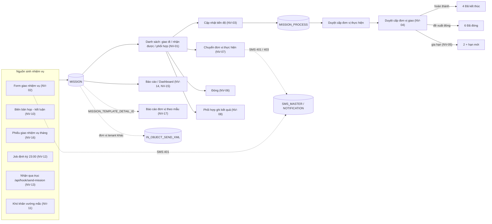
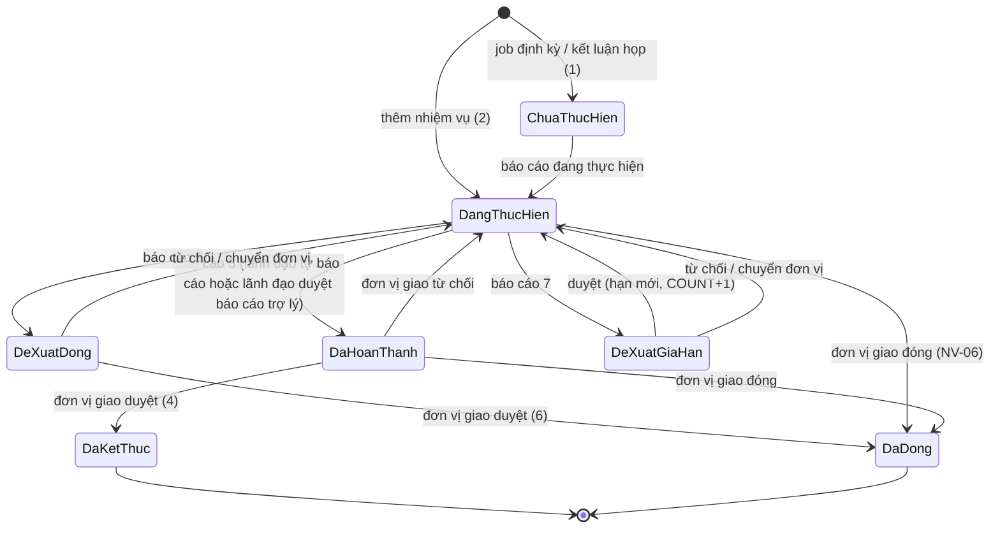
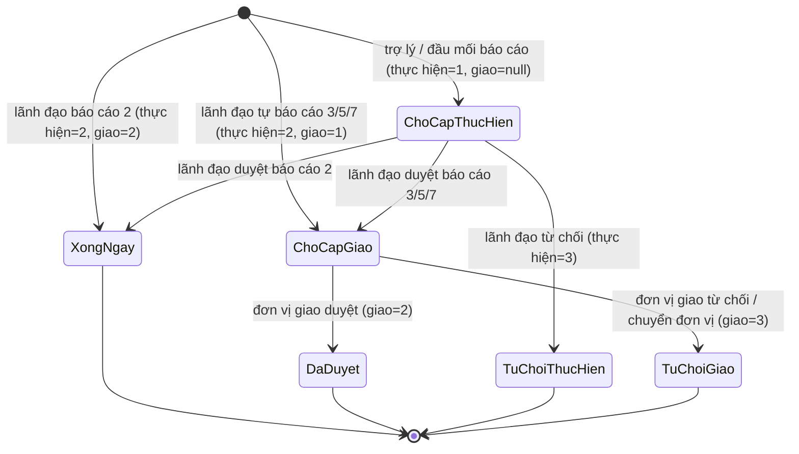
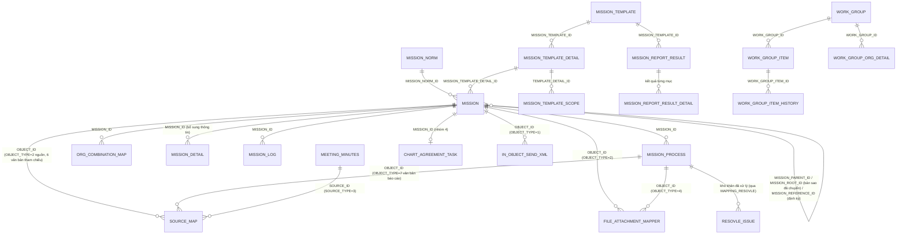

# Nhiệm vụ — nghiệp vụ: giao nhiệm vụ cho đơn vị / cá nhân (không gắn văn bản) → đơn vị thực hiện cập nhật tiến độ → lãnh đạo hai cấp duyệt hoàn thành / đề xuất gia hạn / đề xuất đóng → chuyển đơn vị thực hiện, phối hợp, khó khăn vướng mắc, biên bản họp sinh nhiệm vụ, nhiệm vụ định kỳ, qua trục; báo cáo / thống kê; các màn phụ (phiếu giao – đánh giá tháng, KPI, đánh giá công tác tuần, báo cáo đơn vị theo mẫu)

> Viết lại từ code nhánh `kha_develop` (web-spring + backend2.0, cả hai đang checkout `kha_develop`) ngày 2026-10-01. Mọi khẳng định có nguồn `file:dòng`.
> Menu / widget đối chiếu **DB DEV `SYS_MENU` / `HOME_WIDGET` ngày 2026-10-01**; số dòng, phân bố giá trị và comment cột các bảng `MISSION*`, `WORK_GROUP*`, `PERMISSION*` đối chiếu **DB DEV ngày 2026-10-01** (người điều phối truy vấn, chỉ SELECT; tác giả không kết nối DB). Không có FK nào trên các bảng này (DB DEV, mục "Khóa ngoại" 0 dòng) — mọi quan hệ ở mục 5 là quan hệ logic lấy từ JOIN / entity trong code.
> HDSD cũ (`C:\Users\Admin\Desktop\HDSD\HDSD Nhiem vu\HDSD_ Quan ly nhiem vu.doc`) chỉ dùng tham khảo thuật ngữ.
>
> Viết tắt đường dẫn:
> `WEB/` = `web-spring/src/main/java/com/viettel/` · `ZUL/` = `web-spring/src/main/webapp/view/voffice/` ·
> `BIZ/` = `web-spring/src/main/java/com/voffice/service/business/` · `BE1/` = `backend2.0/backendvoffice/src/main/java/com/viettel/voffice/` ·
> `BE2/` = `backend2.0/backendvoffice/src/main/java/com/viettel/office/` · `SQL/` = `backend2.0/backendvoffice/sql/` · `LBL` = `web-spring/src/main/webapp/WEB-INF/zk-label_vi.properties`.
> Lớp hay dùng — web: **MVM** = `WEB/voffice/vm/mission/MissionVM.java` (~15.000 dòng: danh sách + form + chi tiết + popup tiến độ / chuyển / gia hạn), **MAVM** = `WEB/voffice/vm/mission/MissionApprovalVM.java` (~8.100 dòng, màn "Nhiệm vụ chờ phê duyệt"), **MB** = `BIZ/MissionBusiness.java`, **AC** = `WEB/util/AppConstants.java`, **HVM** = `WEB/voffice/common/HomeVM.java`.
> BE gen-1: **MA** = `BE1/action/MissionAction.java` (`/missionAction`, 55 endpoint), **MC** = `BE1/controler/MissionControler.java` (~5.200 dòng), **MDAO** = `BE1/database/dao/task/MissionDAO.java` (~10.600 dòng), **EM** = `BE1/database/entity/task/EntityMission.java` (tính quyền `updatePermission`), **MTC** = `BE1/controler/MeetingController.java` (thêm nhiệm vụ, chuyển đơn vị), **MTDAO** = `BE1/database/dao/meeting/MeetingDAO.java`, **MRA** = `BE1/action/MettingResource.java` (`/Meeting`), **TSN** = `BE1/thread/ThreadSendNotificationAddMission.java`, **OTA** = `BE1/database/dao/meeting/ObjectTransferViaAxisDAO.java` (trục), **VOS** = `BE2/services/impl/VOConnectProcessorServiceImpl.java` (nhận qua trục), **MMDAO** = `BE1/database/dao/meeting/MeetingMinutesDAO.java`, **C1** = `BE1/constants/Constants.java`.
> Lớp của báo cáo / dashboard / mẫu báo cáo / màn phụ: khai ở đầu từng NV.
> Phân hệ liền kề đã viết: liên thông [`../van-ban/lien-thong/nghiep-vu.md`](../van-ban/lien-thong/nghiep-vu.md) (`LT NV-10` — cơ chế gói tin nhiệm vụ qua trục), nhắc việc / SMS / thông báo / định hướng [`../lich-nhac-viec/nghiep-vu.md`](../lich-nhac-viec/nghiep-vu.md) (`LNV NV-xx`: cơ chế SMS NV-13, thông báo NV-11, mã loại tin mục 5.2, định hướng NV-19), phiếu trình [`../phieu-trinh/nghiep-vu.md`](../phieu-trinh/nghiep-vu.md) (`PT`), dự thảo [`../xu-ly-cong-viec/nghiep-vu.md`](../xu-ly-cong-viec/nghiep-vu.md) (`XLCV`).

## 1. Tổng quan

### 1.1 Phạm vi

"Nhiệm vụ" (`MISSION`) là việc **đơn vị giao cho đơn vị** (nhiệm vụ đơn vị) hoặc **giao cho một cá nhân chủ trì** (nhiệm vụ cá nhân, `SPONSOR_ID` có giá trị), **không bắt buộc gắn văn bản** — văn bản / biên bản họp chỉ là **nguồn gốc** (`SOURCE_MAP`). Khác `cong-viec` (task gắn văn bản, `TASK`). Phân hệ gồm:

- **Vòng đời chính** (gen-1 `missionAction`): danh sách nhiệm vụ giao đi / nhận được / phối hợp (NV-01), giao nhiệm vụ — thêm / sửa / sao chép / bổ sung thông tin / xóa (NV-02), cập nhật tiến độ (NV-03), duyệt tiến độ hai cấp và hàng "Nhiệm vụ chờ phê duyệt" (NV-04), gia hạn (NV-05), đóng nhiệm vụ (NV-06), chuyển đơn vị thực hiện (NV-07), đơn vị phối hợp (NV-08), nhiệm vụ con / gán cá nhân thực hiện (NV-09).
- **Nguồn sinh nhiệm vụ**: biên bản họp (NV-10), kiến nghị / khó khăn vướng mắc (NV-11), nhiệm vụ định kỳ do job sinh (NV-12), phiếu giao nhiệm vụ tháng (NV-16), định hướng (đã viết ở `lich-nhac-viec` NV-19).
- **Liên thông / tích hợp**: nhiệm vụ qua trục nội bộ, cung cấp dữ liệu cho hệ thống khác (NV-13).
- **Báo cáo / thống kê**: báo cáo nhiệm vụ (NV-14), thống kê tình hình nhiệm vụ — dashboard (NV-15).
- **Màn phụ xếp chung thư mục `mission/`** (ghi gọn, ranh giới): báo cáo đơn vị định kỳ theo mẫu (NV-17), phiếu giao / đánh giá nhiệm vụ tháng (NV-16), đề xuất cộng điểm, KPI đơn vị, đánh giá đơn vị (NV-18), đánh giá công tác tuần (NV-19), thỏa thuận hợp tác, chỉ tiêu, phản ánh NQ57 và thành phần cũ (NV-20).

Phân hệ **KHÔNG gồm** (trỏ sang):

| Nội dung | Phân hệ |
|---|---|
| Cơ chế đóng gói / nhận gói tin nhiệm vụ qua trục (`IN_OBJECT_*`, `/api/hook/send-mission`) | `van-ban/lien-thong` (LT NV-10) — ở đây chỉ mô tả **điểm nghiệp vụ** phát gói tin (NV-13) |
| Hàng đợi SMS, mẫu tin, chặn tin, thông báo chuông | `lich-nhac-viec` (LNV NV-11, NV-13 … NV-15); ở đây chỉ ghi "gửi tin loại X khi Y" |
| Định hướng (nguồn "Theo định hướng" `SOURCE_TYPE = 5`) | `lich-nhac-viec` NV-19 |
| Công việc cá nhân / công việc gắn văn bản (`TASK`) — kể cả tab **"Nhiệm vụ cá nhân" trên widget trang chủ** (hiển thị công việc, không phải `MISSION`) | `cong-viec` |
| Tiêu chí, tỷ lệ, chấm điểm thi đua, `report-period-*` (BE của đánh giá công tác tuần), KI | `kpi-danh-gia` |
| Màn soạn / gửi / tổng hợp báo cáo đơn vị (`ZUL/templateReport/*`) | `tai-lieu-mau` (`ban-do.md` xếp zul ở đó; BE `mission-template` / `report-result` xếp ở đây — NV-17) |
| Gắn nhiệm vụ vào dự thảo (`select_mission_dialog.zul`, `/api/document-kpi/draft-links`) | `xu-ly-cong-viec` (ghi ranh giới ở NV-20) |
| Lịch họp (biên bản họp chỉ là nguồn nhiệm vụ) | `hop` |
| Phân quyền RBAC `PERMISSION*` / `ROLE_PERMISSION*` (`vps/sysRole/rolePermission.zul`) | `he-thong` HT NV-09 (đang xếp nhầm — mục báo cáo) |

### 1.2 Menu (đối chiếu DB DEV `SYS_MENU` ngày 2026-10-01)

`SYS_MENU.STATUS`: 1 = mở, 2 = khóa (X3). Cha **QUẢN LÝ NHIỆM VỤ** `337971`. Code web chỉ ghi cứng mã `MISSION_MANAGER` (điều hướng từ trang chủ — `HVM:2616`); URL nằm ở DB.

| `SYS_MENU_ID` | `CODE` | Tên (DB DEV) | URL | `STATUS` | VM — NV |
|---|---|---|---|---|---|
| 337991 | `MISSION_MANAGER` | **Danh sách nhiệm vụ** | `/view/voffice/mission/mission/mission.zul` | 1 | MVM — NV-01 … NV-09 |
| 439625 | `MISSION_APROVE2` | **Nhiệm vụ chờ phê duyệt** | `/view/voffice/mission/missionApprove/mission_approve.zul` | 1 | MAVM — NV-04 |
| 338332 | `MISSION_APROVE1` | Phê duyệt của chỉ huy | **cùng URL** `missionApprove/mission_approve.zul` | **2** | MAVM — NV-04 (không tham số → giống hệt 439625) |
| 338331 | `MISSION_EXTEND` | **Nhiệm vụ đề xuất khó khăn** | `/view/voffice/mission/resovleIssue/resovle_issue.zul` | 1 | `ResovleIssueVM` — NV-11 (tên mã "EXTEND" nhưng là màn khó khăn vướng mắc) |
| 337972 | `MEETING_MINUTES` | **Quản lý biên bản họp** | `/view/voffice/mission/meetingMinutes/meetingMinutes.zul` | 1 | `MeetingMinutesVM` — NV-10 |
| 338751 | `MISSION_REPORT` | **Báo cáo nhiệm vụ** | `/view/voffice/mission/report/mission_report.zul` | 1 | `MissionReportVM` — NV-14 |
| 439395 | `MISSION_DASHBOARD` | **Thống kê tình hình nhiệm vụ** | `/view/voffice/mission/mission/mission_dashboard.zul` | 1 | `MissionDashboardVMNew` — NV-15 |
| 337990 | `MISSIONRATING` | Tự chấm điểm | `missionRating/missionRating.zul?roleApproved=1` | 1 | `MissionRatingVM` — NV-16 |
| 337983 | `MISSION_RATING` | Phiếu đánh giá và giao nhiệm vụ tháng | `missionRating/missionRating.zul` | 1 | `MissionRatingVM` — NV-16 (VM bỏ qua `roleApproved` → hai menu giống nhau) |
| 440105 | `SUMMARY_REPORT` | Tổng hợp báo cáo đơn vị | `/view/voffice/templateReport/summaryReport.zul` | 1 | `SummaryReportVM` — NV-17 (zul ở `tai-lieu-mau`) |
| 440145 | `SEND_REPORT` | Gửi báo cáo đơn vị | `templateReport/sendReport.zul` | 1 | `WriteReportVM` — NV-17 |
| 337982 | `KPIINDEX` | KPI đơn vị | `/view/voffice/mission/kpi/kpi.zul` | 1 | `KPIIndexVM` — NV-18 |
| 440425 | `KPI` | Theo dõi | cùng URL `mission/kpi/kpi.zul`, **`PARENT_ID` null** | 1 | NV-18 |
| 338953 | `MISSION_NORM` | Quản lý chỉ tiêu | `missionNorm/missionNorm.zul` | **2** | `MissionNormVM` — NV-20 |
| 339214 | `CHART_AGREEMENT` | Thoa thuan hop tac | `mission/agreement/chartAgreement.zul` | **2** | `ChartAgreementVM` — NV-20 |
| 339233 | `CHART_AGREEMENT_TASK` | Nhiem vu, du an TTHT | `agreementTask/agreementTask.zul` | **2** | `ChartAgreementTaskVM` — NV-20 |
| 338012 | `PROPOSE_POINT` | Đề xuất cộng điểm | `proposePoint/proposePoint.zul?roleApproved=1` | **2** | `ProposePointVM` — NV-18 |
| 337981 | `APPROVED_POINT` | Phê duyệt đề xuất | `proposePoint/approvedPoint.zul?roleApproved=2` | **2** | NV-18 |
| 338051 | `EVALUATIONUNIT` | Đánh giá đơn vị | `mission/evaluationUnit/evaluationUnit.zul` | **2** | `EvaluationUnitVM` — NV-18 |
| 338272 | `ORIENTATION` | Định hướng | `orientation/orientation.zul` | **2** | `lich-nhac-viec` NV-19 |
| 439705 | `MISSION_REFLECTION_NQ57` | Phản ánh từ hệ thống NQ57 | `mission/mission/mission_reflection_nq57.zul` — **file không có trong repo** | **2** | NV-20 |

Menu khác của phân hệ (DB DEV): `440225 CATEGORY_WORK_GROUP` "Danh mục nhóm nhiệm vụ" (dưới DANH MỤC 336813) và nhóm **ĐÁNH GIÁ CÔNG TÁC TUẦN** `440385` (`440229 WORK_GROUP_ITEM`, `440305 REPORT_PERIOD`, `440317 WORK_ITEM_APPROVE`, `440547 WORK_GROUP_EXPORT ?view=1`, `440505 REPORT_PERIOD_CONFIG`) — tất cả `STATUS = 1` — NV-19.

HDSD cũ gọi menu là "Nhiệm vụ đơn vị → Nhiệm vụ chờ duyệt"; hiện tên DB là "Nhiệm vụ chờ phê duyệt".

### 1.3 Widget trang chủ (đối chiếu DB DEV `HOME_WIDGET` ngày 2026-10-01)

| `HOME_WIDGET` (DB DEV) | Dựng ở | Số đếm | Ghi chú |
|---|---|---|---|
| id 71 `NHIEM_VU_NHAN_DUOC` "Nhiệm vụ nhận được" — con 7 `NHIEM_VU_DON_VI` "Nhiệm vụ đơn vị", 8 `NHIEM_VU_CA_NHAN` "Nhiệm vụ cá nhân" | `HVM.generateCombinedMissionTaskWidget` `HVM:1243-1310` (khung "Nhiệm vụ thực hiện") | tab đơn vị: `missionAction.getCounMission` (`BIZ/HomeBusiness.java:85`; `web-spring/src/main/java/com/voffice/service/task/business/MissionTask.java:72` → MC `getCountMission` :2069); số đang thực hiện / quá hạn / hoàn thành / sắp đến hạn / phối hợp / đơn vị đăng ký / khẩn / việc của tôi (`HVM:1385-1400`) | **Tab "Nhiệm vụ cá nhân" đếm công việc** (`PersonalTask` → `taskAction.getCountHomeTask` — `web-spring/src/main/java/com/voffice/service/task/business/PersonalTask.java:22-28`; `HVM:1273-1282`) nhưng **bấm vào lại mở danh sách `MISSION` có `SPONSOR_ID` = mình** (`typeWidget` bị đổi `wg-tasks` → `wg-mission-dept`, `groupMissionType = 1` — `HVM:2537-2539`) → số và danh sách không khớp (`dac-thu.md` L9) |
| id 6 `NHIEM_VU_LANH_DAO_GIAO` "Nhiệm vụ lãnh đạo giao đi" — con 17 `NHIEM_VU_DON_VI_GIAO_DI`, 16 `NHIEM_VU_CA_NHAN_GIAO_DI` | như trên, khung "Nhiệm vụ giao đi"; tab đơn vị **chỉ khi người dùng là lãnh đạo hoặc trợ lý** (`HVM:1250-1253`) | tab đơn vị: đang thực hiện / quá hạn / hoàn thành / sắp đến hạn giao đi (`HVM:1439-1446`) | tab cá nhân: như trên (công việc) |

Bản REST song song: `GET /api/home/widget/wg-mission` (`WEB/voffice/controller/HomeWidgetRestController.java:115`, `267-298`, `973-1066`) — code gần như sao y `HVM`. Nguồn số đếm tùy vai trò: lãnh đạo (`TASK_MANAGER_MISSION`), trợ lý (`TASK_ASSISTANT_MISSION`), người thường (`TASK_NORMAL_GUY_TASK`, `checkSysRoleLoginUser == 0`) — mỗi vai một lần gọi (`HVM:4150-4176`); widget chỉ dùng kết quả `MDAO.getCountMissionByDept` (`MDAO:3513-3749`): mã 2 đang thực hiện (`STATUS ∈ {1,2,7}`, hạn > hôm nay + N), 15 sắp đến hạn, 3 chậm tiến độ, 4 hoàn thành (`STATUS ∈ {3,4,5,6}`). **Bấm ô** → mở menu `MISSION_MANAGER` (`HVM:2607-2785`) với `typeMission` 1 (nhận được) / 2 (giao đi), `state`, danh sách đơn vị; MVM chuyển `state = 3` thành {3, 4, 5, 6}, xem theo nhóm trạng thái (MVM:1278-1453). Các cột `IS_ACTIVE`, `SIMPLE_MODE` của 6 dòng đều null trên DB DEV. `NHIEM_VU_LANH_DAO_GIAO` còn được đọc ở `HVM.generatePersonalMissionWidget` (`HVM:953-967`) — hàm không ai gọi.

### 1.4 Actor & quyền

Mã vai trò (`C1:119-131`): `TTDV` thủ trưởng 336953, `LDDV` lãnh đạo đơn vị 336952, `TL` trợ lý 336871, `TLCT` trợ lý chính trị 337491, `VT` văn thư 336954, `NV` chuyên viên 336955, `BCQS` 41. Phiên đăng nhập BE dựng ba tập đơn vị dùng xuyên suốt phân hệ (`BE1/database/dao/staff/UserDAO.java:348-418`):
- **đơn vị quản lý** (`listManagementOrg`) = đơn vị người dùng có vai trò `LDDV` / `TTDV`;
- **đơn vị trợ lý** (`listAssistantOrg`) = đơn vị có vai trò `TL`;
- **đơn vị chuyên hướng** (`hmSpecializedOrgId`) = với mỗi đơn vị trợ lý, các đơn vị mà trợ lý được giao "chuyên hướng" (`specializedOrgId` của dòng vai trò); trợ lý chuyên hướng cấu hình theo cặp (đơn vị giao, đơn vị thực hiện) còn đọc từ `USER_ORG_MAP.TYPE = 2` (`UserDAO.java:1546-1549`). `USER_ORG_MAP.TYPE` 1 = giao việc, 2 = trợ lý, 3 = chuyên quản (`MDAO:5139-5147`, `5190-5198`); 4 dùng ở chấm điểm tiêu chí (`BE1/database/dao/staff/OrgCriteriaDAO.java:342`); 5, 6 không tìm thấy nghĩa trong code (grep `type = 5/6`). DB DEV `USER_ORG_MAP` ngày 2026-10-01 (số dòng / số đơn vị): 1 = 168 / 120 · 2 = 125 / 77 · 3 = 96 / 65 · 4 = 76 / 49 · 5 = 360 / 109 · 6 = 420 / 133 — cấu hình 1/2/3 **có dữ liệu thật** dù web không còn màn cấu hình (`configSpecializedManagement` chỉ có ở BE, web không gọi).

**Khác các phân hệ đã viết: BE gen-1 nhiệm vụ CÓ kiểm quyền trên từng nhiệm vụ** ở các thao tác ghi chính (sửa, xóa, cập nhật tiến độ, duyệt tiến độ, đóng, chuyển, phối hợp) bằng `MDAO.checkUserPermissionForMission` (`MDAO:1429-1553`) → `EM.updatePermission` (`EM:791-1152`); web dùng **cùng bộ cờ quyền** do `getMissionDetail` trả về để hiện nút (X1 vẫn đúng: nút là tầng hiển thị; BE kiểm thêm). Ngoại lệ không kiểm: "Nhiệm vụ chờ phê duyệt" (`approvedMissionByCommander` / `rejectMissionByCommander` — MC:2530-2690), sửa khi client gửi `isEdit = 1` (MC:1187), thêm nhiệm vụ (MTC:864-1192) — `dac-thu.md` L1–L3.

| Actor | Nhận diện trong code | Làm gì (cờ quyền `EM.updatePermission`) |
|---|---|---|
| **Đơn vị giao** — lãnh đạo / thủ trưởng / trợ lý của `ORG_ASSIGN_ID` | `orgAssignId ∈ listManagementOrg ∪ listAssistantOrg` (`EM:832-840`) | giao tiếp nhiệm vụ con (`deliver`), sửa (`edit`); **duyệt tiến độ cấp đơn vị giao** (`guide`, khi tiến độ mới nhất chờ đơn vị giao — `EM:842-867`), chuyển đơn vị thực hiện (`transfer`, `EM:904-916`), đóng (`close`, `EM:952-969`), bổ sung thông tin (`EM:941-948`) |
| Người tạo / người giao / lãnh đạo chủ trì | `CREATED_BY`, `ASSIGN_ID`, `OWNER_ID` (LĐVP chủ trì) | sửa khi `STATUS ∈ {1, 2}` và chưa chuyển; xóa khi `STATUS ∈ {1, 2}` (`EM:869-895`, `1082-1111`) |
| "Giao đặc biệt" của Cơ quan Đảng | danh mục `CATEGORY_COMMON` mã `MISSION_SPECIAL_ASSIGN` (`VALUE_NAME` = mã người giao **ảo** — DB DEV `CATEGORY_COMMON` 2026-10-01: −1 `BO_CHINH_TRI` (người được quyền 18211, 18556, 41139539), −2 `BAN_BI_THU` (18556), −3 `LANH_DAO_CHU_CHOT` (18211); `CATEGORY_VALUE` = người được quyền thao tác thay) + **đơn vị giao ghi cứng 148842** | được quyền như lãnh đạo đơn vị giao (`EM:825-827`; `MDAO:7101-7103`; `MC:2636-2647`) |
| **Đơn vị thực hiện** — lãnh đạo / thủ trưởng / trợ lý của `ORG_PERFORM_ID` | `orgPerformId ∈ listManagementOrg ∪ listAssistantOrg` (`EM:985-1040`) | cập nhật tiến độ (`update`), gán cá nhân đầu mối (`addPerformUser`), tạo nhiệm vụ con (`createSubMission`); **lãnh đạo** (không phải trợ lý) **duyệt tiến độ cấp đơn vị thực hiện** khi tiến độ chờ (`approve` / `reject` — `EM:1005-1039`) |
| Cá nhân đầu mối thực hiện | `PERFORM_ID` | cập nhật tiến độ (`EM:1114-1117`) — báo cáo đi thẳng vào hàng duyệt của lãnh đạo đơn vị thực hiện (NV-03) |
| Cá nhân chủ trì (nhiệm vụ cá nhân) | `SPONSOR_ID` | cập nhật tiến độ theo luồng **như lãnh đạo đơn vị thực hiện** (`MC:1679-1684`) |
| **Đơn vị phối hợp** — lãnh đạo / trợ lý của `ORG_COMBINATION_MAP.ORG_COMBINATION_ID`; cá nhân phối hợp `COMBINATION_ID` | `EM:1043-1069` | cập nhật nội dung / kết quả phần phối hợp (NV-08) |
| Trợ lý chuyên hướng của đơn vị thực hiện | `hmSpecializedOrgId` chứa `orgPerformId` | sửa nhiệm vụ khi chưa kết thúc / đóng; chỉ trợ lý chuyên hướng mới được đóng nếu người dùng có cấu hình chuyên hướng (`EM:952-982`); nhận SMS khi có đề xuất đóng / gia hạn (NV-03) |
| Người xem nhiệm vụ đã chuyển | `IS_TRANSFER_ORG_PERFORM = 1` | chỉ xem — mọi quyền tắt (`EM:810-814`) |

Người không có vai trò lãnh đạo / trợ lý và không là `PERFORM_ID` thì không có quyền nào (`EM:805-808`); trên danh sách không thấy tab "Nhiệm vụ giao đi" (MVM:2403-2407, `ZUL/mission/mission/mission_search.zul:18-22`).

### 1.5 Sửa so với knowledge cũ (2026-10-01)

| Knowledge cũ | Hiện trạng code `kha_develop` | Ghi ở |
|---|---|---|
| Trạng thái 4 = "Đã phê duyệt (chỉ huy xác nhận hoàn thành)"; sơ đồ `ChuaThucHien → DangThucHien` | 4 = **"Đã kết thúc"** (đơn vị giao duyệt báo cáo hoàn thành); nhiệm vụ mới **vào thẳng 2**, không còn 1 (chỉ nhiệm vụ định kỳ / từ kết luận họp còn ghi 1) (sửa 2026-10-01) | Mục 3 đầu, NV-02, NV-04 |
| "QT1. Nhiệm vụ BGĐ giao phải được chỉ huy phê duyệt trước khi chạy (`approvedMissionByCommander`)" | **Không có bước duyệt nhiệm vụ mới**. "Phê duyệt của chỉ huy" / "Nhiệm vụ chờ phê duyệt" là đơn vị giao **duyệt báo cáo** hoàn thành / đề xuất đóng / đề xuất gia hạn (sửa 2026-10-01) | NV-04 |
| Loại `typeMission`: BGĐ giao / đơn vị đăng ký / giao đi / phối hợp / thực hiện / tôi tạo | Web chỉ còn 3 hướng **giao đi / nhận được / phối hợp** × 2 nhóm **đơn vị / cá nhân** (`SPONSOR_ID`); các loại khác bị comment (`AC:6239-6244`) (sửa 2026-10-01) | NV-01 |
| Nguồn: "theo yêu cầu phòng KH (4)… theo thỏa thuận, theo văn bản Chính phủ / Quốc phòng, theo khó khăn" | Web chỉ cho chọn 1 khác / 2 văn bản / 3 biên bản họp / 6 nhiệm vụ đơn vị; 4, 5, 7–10 bị comment (`AC:5399-5411`) (sửa 2026-10-01) | Mục 3 đầu |
| "QT2. Gia hạn phải qua đề xuất và duyệt; kiểm tra `checkExtendable`" | Đúng; điều kiện = số lần đã duyệt `COUNT` < `EXTEND_TIMES` và chưa quá hạn + N ngày (N khác cho văn bản Quốc phòng / Chính phủ); bảng `MISSION_EXTEND` **không dùng** | NV-05 |
| "QT3. Đóng nhiệm vụ cha khi con chưa xong bị chặn (?)" | Đóng **không** chặn; **xóa** mới chặn khi còn con đang chạy (sửa 2026-10-01) | NV-02 BR-09, NV-06 BR-22 |
| "QT4. Báo cáo định kỳ theo mẫu (`mission-template`) và bị khóa sau hạn" | Khóa do **gửi báo cáo** (tự khóa) và **cấp trên khóa / mở**, không theo hạn (sửa 2026-10-01) | NV-17 |
| "QT5. Đồng bộ nhiệm vụ với hệ thống khác (`sync-mission`) (?) hệ thống nào" | `sync-mission`, `getListVTSMissions`, `vofficeMissions` là API đọc cho ứng dụng ngoài (không rõ hệ thống — Q8); đồng bộ hai chiều thật là **trục nội bộ** `IN_OBJECT_*` | NV-13 |
| Actor "Chỉ huy (`TYPE_TTDV`, `SYS_ROLE_BCQS`)", "Trợ lý chấm điểm hộ", "Admin chỉ tiêu, định hướng" | Vai trò thật: lãnh đạo / thủ trưởng (`LDDV` / `TTDV`) và trợ lý (`TL`) của **đơn vị giao** và **đơn vị thực hiện**, trợ lý chuyên hướng, đầu mối, cá nhân chủ trì, phối hợp; BE kiểm quyền theo `EM.updatePermission` (sửa 2026-10-01) | 1.4 |
| câu cũ 1: "`WORK_GROUP` là nhóm theo dõi nhiệm vụ hay nhóm người dùng?" | Code: cây **nhóm nhiệm vụ** cho đánh giá công tác tuần, không liên kết `MISSION` | NV-19 |
| câu cũ 3: "Khác nhau `/api/mission` và `/api/mission_dashboard`" | Code: cùng bộ endpoint, hai service; web chỉ dùng `/api/mission_dashboard` | NV-15 |
| `dac-thu`: "`api.work-group-action.unBlock` web gọi nhưng không có endpoint (?)" | Đúng — và hàm web đó **không ai gọi**; khóa / mở dùng chung `api.work-group.block` | `dac-thu.md` L21 |
| `vi-du-mau`: "`mission.api.*` (?) không tìm thấy endpoint" | Đi tới dịch vụ Mission BE ngoài workspace qua `mission.service.url` | NV-13 |

## 2. Module

Vòng đời nhiệm vụ chạy trên **BE gen-1**: `MissionAction` (`/missionAction`) → `MissionControler` → `MissionDAO` (SQL thuần); riêng **thêm nhiệm vụ** và **chuyển đơn vị thực hiện** nằm ở controller / DAO của **họp** (`MTC`, `MTDAO`, khóa `missionAction.addMission` và `Meeting.forwardMission`). Báo cáo nhiệm vụ gen-1 `MissionReport`. **Gen-2**: dashboard (`/api/mission_dashboard`), bản trùng `/api/mission`, mẫu / kết quả báo cáo đơn vị (`/api/mission-template`, `/api/report-result`), đánh giá công tác tuần (`/api/work-group*`, `/api/report-period-*`), nhận qua trục (`/api/hook/send-mission`). **Legacy web** (facade JPA trong web): một phần màn "Nhiệm vụ chờ phê duyệt" (sửa, chuyển), đóng khó khăn, đề xuất cộng điểm, KPI đơn vị, đánh giá đơn vị.

| Chức năng | Màn (.zul) | VM | Business (khóa) | Endpoint BE | Controller / service | DAO → bảng |
|---|---|---|---|---|---|---|
| Danh sách (NV-01) | `ZUL/mission/mission/mission.zul` + `mission_search.zul`, `mission_search_advance.zul` | MVM `findDataList` :2814-2879 | `missionAction.findMissionByCondition` (MB:1182-1259, 1375) | `POST /missionAction/findMissionByCondition` (MA:590) | MC:3855-3960 | `MDAO.findMissionByCondition` :6230-7690 → `MISSION`, `MISSION_PROCESS`, `ORG_COMBINATION_MAP`, `SOURCE_MAP` |
| Chi tiết | `mission_info.zul`, `missionInfo/*` | MVM | `missionAction.getMissionDetail` (MB:929) | MA | MC:287-422 (kèm `checkExtendable`) | `MDAO.getMissionDetail` :775 |
| Số đếm widget | trang chủ | HVM, `MissionTask` | `missionAction.getCounMission` | MA:162 | MC:2069-2232 | `MDAO.getCountMissionByDept` :3513-3749 … |
| Thêm (NV-02) | `mission_add.zul` | MVM `insertMission` :8632 | `missionAction.addMission` (MB:414-461) | MA:796-806 | **MTC.addMission :864-1192**; `TSN` (SMS 401) | `MTDAO.addMission` :1132-1704 |
| Sửa / đổi đầu mối / bổ sung / xóa | `mission_add.zul`, `complementMissionInformation.zul` | MVM | `updateMission` (MB:1479-1560), `editPerformIdMission`, `addInformationMission`, `deleteMission` | MA | MC:821-1432, 3971-4030, 3581, 1433-1563 | `MDAO.updateMission` :1914, `editPerformIdMission` :7753, `addInformationMission` :5971, `deleteMission` :1555 |
| Cập nhật tiến độ (NV-03) | `mission_update_process.zul` | MVM `doUpdatePercent` :6981 | `missionAction.updateProcess` (MB:333-386) | MA:201 | MC:1564-1745 | `MDAO.updateProcess` :2328-2837 → `MISSION_PROCESS`, `MISSION`, `MISSION_LOG` |
| Duyệt tiến độ (NV-04 A) | chi tiết / lưới | MVM :7278-7709 | `missionAction.approveOrRejectProcess` (MB:905-920) | MA:215 | MC:1765-1951 | `MDAO.approveOrRejectProcess` :2974, `approveExtendProcess` :3145 |
| Nhiệm vụ chờ phê duyệt (NV-04 B) | `ZUL/mission/missionApprove/mission_approve.zul` | MAVM | `missionAction.getMissionCommanderList` / `approvedMissionByCommander` / `rejectMissionByCommander` (MB:88-231) | MA:249-291 | MC:2467-2690 | `MDAO.findDefaultMissionByConditionService` :3961, `approveMissionByCommander` :4304, `rejectMissionByCommander` :4479 |
| Đóng (NV-06) | chi tiết | MVM `doCloseMission` :8956 | `missionAction.closeMission` (MB:596-609) | MA:550 | MC:3675-3743 | `MDAO.closeMission` :6037 |
| Chuyển đơn vị (NV-07) | `mission_transfer.zul` | MVM `doTransfer` :7853 | `Meeting.forwardMission` (MB:951-966) | `POST /Meeting/forwardMission` (MRA:184) | **MTC.forwardMission :1203-1484** | `MTDAO.forwardMission` :1717-1992 |
| Phối hợp (NV-08) | chi tiết | MVM :8073-8115 | `missionAction.updateContentOrResultOfCombinationOrg` (MB:856-871) | MA | MC:1961-2056 | `MDAO` :3271-3301 → `ORG_COMBINATION_MAP` |
| Biên bản họp (NV-10) | `ZUL/mission/meetingMinutes/meetingMinutes.zul` | `MeetingMinutesVM` | `Meeting.addOrEditMeetingMinutes`, `updateMeetingMinutes`, `requestForSigningMeetingMinutes`, `getMissionByMeetingId` (`BIZ/MeetingBusiness.java:319-597`) | MRA:43-365 | MTC:273-2154 | `MTDAO`, `MMDAO` → `MEETING_MINUTES`, `MISSION`, `SOURCE_MAP` |
| Khó khăn (NV-11) | `ZUL/mission/resovleIssue/resovle_issue.zul` | `ResovleIssueVM`, `ResovleIssueDetailVM` | `BIZ/ResovleIssueBusiness.java` → `missionAction.getMissionResovleIssueList`, `doUpdatePercentService`; đóng qua legacy `ResovleIssueService` | MA:320-347 | MC:2746-2885 | `MDAO` :4681, :4852 → `MISSION_PROCESS.ISSUE_STATUS`, `RESOVLE_ISSUE`, `MAPPING_RESOVLE` |
| Định kỳ (NV-12) | — | — | — | job `ScheduledBackgroundTask` 23:00 | — | `MDAO.executeMissionPeriodicallyGenerateJob` :8713 |
| Trục (NV-13) | — | — | — | gửi: `IN_OBJECT_*`; nhận `POST /api/hook/send-mission` | OTA:33-72; VOS:353-420 | `IN_OBJECT_SEND_XML`, `IN_OBJECT_DETAIL`, `MISSION` |
| Báo cáo (NV-14) | `ZUL/mission/report/mission_report.zul` | `MissionReportVM` | `MissionReport.*` (MB:2001-2329) | `/MissionReport/*` | `MissionReportController` | `MissionReportDAO` (chỉ đọc) |
| Dashboard (NV-15) | `ZUL/mission/mission/mission_dashboard.zul` | `MissionDashboardVMNew` | `BIZ/MissionChartBusiness.java` → `api.mission_dashboard.*` | `/api/mission_dashboard/*` (gen-2) | `MissionDashboardServiceImpl` | `MissionDashboardChartDAO` |
| Phiếu giao / đánh giá tháng (NV-16) | `ZUL/mission/missionRating/missionRating.zul` | `MissionRatingVM` | `missionAction.CreateTextFromMissionList`, `SaveMissionOrder` | MA:672-703 | MC:4256-4412 | `MDAO` :8403-8711, :9316 → `MISSION`, `TEXT`, `MISSION_SIGNING` |
| Báo cáo đơn vị theo mẫu (NV-17) | `ZUL/templateReport/*` (`tai-lieu-mau`) | `WriteReportVM`, `SummaryReportVM` | `api.mission-template*`, `api.report-result*` (MB:2613-2988) | `/api/mission-template`, `/api/report-result` | `MissionTemplate*ServiceImpl`, `MissionReportResult*ServiceImpl` | JPA → `MISSION_TEMPLATE*`, `MISSION_REPORT_RESULT*`, `REPORT_DAILY_HISTORY` |
| Đánh giá công tác tuần (NV-19) | `ZUL/mission/workGroup*`, `report/report_period.zul`, `workItemApprove/*`, `reportPeriodConfig/*` | `WorkGroupVM`, `WorkGroupItemVM`, `ReportPeriodIndividualVM`, `WorkItemApproveVM`, `ReportPeriodConfigVM` | `WorkGroupBusiness`, `WorkGroupInfoBusiness`, `WorkGroupHistoryBusiness`, `ReportPeriod*Business` | `/api/work-group*`, `/api/report-period-*` | `WorkGroup*ServiceImpl`, `ReportPeriod*ServiceImpl` | `WORK_GROUP*`, `REP_IN`, `REPORT_PERIOD_*` |

## 3. Nghiệp vụ

### Giá trị trạng thái dùng xuyên suốt

**`MISSION.STATUS`** — giá trị **lưu** trong cột là 1–7; các số khác là **mã lọc / mã hiển thị** (hằng BE `C1:191-220`, `C1:255-266`, `MDAO:170-203`; web `AC:6036-6081`; nhãn `LBL:824-851`). Cột "Nhãn" = nhãn hằng code / i18n; **nhãn hiển thị trong bộ lọc lấy từ danh mục `MISSION_STATUS`** (`MDAO:7820-7860`) — DB DEV `MISSION_STATUS` ngày 2026-10-01 (vi, `STATUS_TYPE = 1`): 0 Chậm tiến độ · 1 Chưa thực hiện · 2 Đang thực hiện · **3 "Hoàn thành chưa phê duyệt"** · **4 "Đã hoàn thành"** · 5 Đề xuất đóng · 6 Đã đóng · 7 Đề xuất gia hạn · 8 Chưa đóng · 9 Đã chuyển · 13 Đã gia hạn · 14 Không thực hiện được · 15 Sắp đến hạn; `STATUS_TYPE = 2`: 10 Chờ phê duyệt · 11 Đã phê duyệt · 12 Từ chối (có bản en / es / fr / tl). Câu đọc danh mục loại 1 và 14 (`MDAO:7829`) nên người dùng không chọn được hai mã này; 13, 15 có xử lý lọc (`MDAO:6739-6755`).

| Giá trị | Hằng (BE / web) | Nhãn | Ý nghĩa theo code | DB DEV 2026-10-01 |
|---|---|---|---|---|
| 1 | `NOT_EXECUTE` / `UNAVAILABLE` | Chưa thực hiện | **Không còn được tạo**: từ 24/03/2025 thêm nhiệm vụ ghi thẳng 2 (`MTC:935-936` — chú thích "bỏ trạng thái Chưa thực hiện … hỗ trợ VO VPTWD") | 0 |
| 2 | `EXECUTING` / `ONPROCESS` | Đang thực hiện | Đang làm; cũng là trạng thái quay về khi bị từ chối / khi gia hạn được duyệt | 72 |
| 3 | `COMPLETED` | Đã hoàn thành (danh mục: **Hoàn thành chưa phê duyệt**) | Đơn vị thực hiện báo xong, **chờ đơn vị giao duyệt** | 7 |
| 4 | `APPROVED` | **Đã kết thúc** (danh mục: **Đã hoàn thành**) | Đơn vị giao duyệt hoàn thành (bản cũ gọi "Đã phê duyệt") | 13 |
| 5 | `REQUIRE_CLOSE` | Đề xuất đóng (BE: "Yêu cầu đóng") | Đơn vị thực hiện đề nghị dừng, chờ đơn vị giao duyệt | 2 |
| 6 | `CLOSED` | Đã đóng | Đơn vị giao đóng (chủ động hoặc duyệt đề xuất đóng) | 4 |
| 7 | `REQUEST_EXTEND` / `REQUEST_TIME` | Đề xuất gia hạn | Chờ duyệt hạn mới | 0 |
| 0 · 8 · 9 · 13 · 14 · 15 | (mã lọc) | Chậm tiến độ · Chưa đóng · Đã chuyển · Đã gia hạn · Không thực hiện được · Sắp đến hạn | Tính từ hạn / `IS_TRANSFER_ORG_PERFORM` / `COUNT` (NV-01 BR-03) — không lưu vào cột | — |

Phân bố DB DEV `MISSION` (`DEL_FLAG = 0`, 86 dòng) ngày 2026-10-01 theo (`STATUS`, `IS_TRANSFER_ORG_PERFORM`, `APPROVED`): (2,0,1) = 36 · (2,0,2) = 20 · (2,0,3) = 1 · (2,1,1) = 3 · (2,1,2) = 1 · (3,0,2) = 6 · (4,0,1) = 1 · (4,0,2) = 12 · (5,0,2) = 2 · (6,0,1) = 1 · (6,0,2) = 3 — không có `STATUS` 1 / 7 / 9; 4 bản sao đã chuyển đều ở 2; `APPROVED = 3` chỉ 1 dòng (đường từ chối của màn chờ phê duyệt).

Comment cột DB `MISSION.STATUS` ghi thêm "9. Đã chuyển": **không có code `kha_develop` nào ghi 9 vào `MISSION.STATUS`** — "đã chuyển" là cờ `IS_TRANSFER_ORG_PERFORM = 1` trên **bản sao lịch sử** (NV-07). Còn `MISSION_PROCESS.STATUS = 9` "Sửa nhiệm vụ" **có** ghi: mỗi lần sửa nhiệm vụ BE chèn một dòng ẩn (`DEL_FLAG = 1`, hai cột duyệt = 2, `OLD_DEADLINE` = hạn trước khi sửa) để lưu mốc hạn cũ (`MDAO.insertEditDateToMissionProcess` :3905-3936, gọi ở :1964) — DB DEV `MISSION_PROCESS.STATUS = 9` = 3 dòng, khớp `DEL_FLAG = 1` = 3.

**`MISSION_PROCESS`** = **một lần báo cáo tiến độ** (hoặc một sự kiện đóng). `STATUS` lấy cùng bộ số 2 / 3 / 5 / 7 (+ 6 cho dòng do thao tác đóng sinh ra — `MDAO:6058-6067`). Hai cột duyệt `STATUS_APPROVED_ORG_PERFORM` (cấp đơn vị thực hiện) và `STATUS_APPROVED_ORG_ASSIGN` (cấp đơn vị giao): **1 chờ duyệt · 2 đã duyệt · 3 từ chối** (`C1:352-365`; `MDAO:228-236`; web `AC:6481-6492`). DB DEV: `STATUS` 3 = 27, 2 = 22, 5 = 5, 6 = 3, 7 = 3, 9 = 3; `STATUS_APPROVED_ORG_ASSIGN` 2 = 37, 1 = 17, 3 = 9; `STATUS_APPROVED_ORG_PERFORM` 2 = 59, null = 3, 1 = 1. `ISSUE_STATUS` (khó khăn của lần báo cáo): 1 đang xử lý, 2 đã xử lý (`MDAO:238`; comment DB) — DB DEV 1 = 54, null = 9.

**Phân loại nhiệm vụ** (không có cột "loại" duy nhất):
- **Nhiệm vụ đơn vị / cá nhân**: `SPONSOR_ID` null = nhiệm vụ đơn vị; `SPONSOR_ID` có giá trị = nhiệm vụ giao cho **một cá nhân chủ trì** (comment DB "Người nhận việc khi giao công việc cho cá nhân") — điều kiện ở `MDAO:7073-7095`, `3784`; web `MVM:7666`.
- **Nhóm** `MISSION_GROUP` (`C1:292-298`; `AC:6281-6297`; `LBL:260`, `796-798`): 1 Nhiệm vụ đơn vị, 2 Kế hoạch năm, 3 Nhiệm vụ chính trị, 4 Nhiệm vụ/dự án từ thỏa thuận hợp tác (TTHT). Danh sách **luôn loại nhóm 3** (`MDAO:6503`).
- **Định kỳ** `MISSION_TYPE` (`C1:300-305`): 1 tháng, 2 quý, 3 ngày, 4 tuần (comment DB chỉ ghi null / 1 / 2) — NV-12. DB DEV: null = 89, 0 = 7, 1 = 2 (giá trị 0 không có hằng).
- **Nguồn gốc** — bảng `SOURCE_MAP` (`OBJECT_TYPE = 2` nhiệm vụ — `C1:83`) với `SOURCE_TYPE` (`C1:236-259`; web `AC:5385-5412`): 1 khác, 2 văn bản, 3 biên bản họp, 4 đề xuất phòng kế hoạch, 5 định hướng, 6 nhiệm vụ đơn vị (nhiệm vụ cha), 7 kiến nghị – đề xuất, 8 văn bản Quốc phòng, 9 văn bản Chính phủ, 10 thỏa thuận hợp tác, 11 dự thảo trình ký. **Web chỉ cho chọn 1, 2, 3, 6** (`AC:5399-5411`, các dòng 4/5/7/8/9/10 bị comment).
- `IS_PUBLIC` 0 bí mật / 1 công khai (comment DB; DB DEV 1 = 80, null = 16, 0 = 2); `LEVEL_IMPORTANCE`, `FIELD_ID` (lĩnh vực), `FREQUENCE_UPDATE` (tần suất cập nhật 1 ngày … 4 quý — `C1:182-189`), `IS_DOC_REPORT` (bắt buộc có văn bản báo cáo khi hoàn thành).

### NV-01. Danh sách nhiệm vụ (menu `MISSION_MANAGER`) — nhóm đơn vị / cá nhân, ba hướng giao đi / nhận được / phối hợp, bộ lọc trạng thái

**Mục đích.** Một màn cho mọi vai: đơn vị giao theo dõi nhiệm vụ đã giao, đơn vị / cá nhân thực hiện xem việc được giao, đơn vị phối hợp xem phần của mình.

**Cấu trúc.** `ZUL/mission/mission/mission.zul:1-64` (VM MVM): toolbar (`ZUL/mission/widgets/toolbarButtonMission.zul` — nút Xuất; `web-spring/src/main/webapp/view/widgets/toolBarButton_Mission.zul` — thêm / lưu / tìm nhanh / tìm nâng cao), cây nhiệm vụ trái (chỉ khi xem chi tiết), ba include `mission_search.zul` / `mission_add.zul` / `mission_info.zul` (bật / tắt theo `viewState` — MVM:1753-1826). Nút Thêm mới ẩn với người không phải lãnh đạo / thủ trưởng / trợ lý / trợ lý chính trị (MVM:1608-1640).

**Hai tầng tab** (`ZUL/mission/mission/mission_search.zul:12-31`):

| Tầng | Giá trị | Nhãn | Điều kiện / tác dụng |
|---|---|---|---|
| Nhóm (`groupMissionType`) | 0 | Nhiệm vụ đơn vị (chữ ghi cứng) | mặc định với lãnh đạo / trợ lý (MVM:770-790); BE thêm `SPONSOR_ID IS NULL` |
| | 1 | Nhiệm vụ cá nhân | mặc định với chuyên viên; BE lọc theo `SPONSOR_ID` (MVM:15022-15054) |
| Hướng (`missionDirectionTab`, `AC:6465-6476`) | 2 | Nhiệm vụ giao đi (`LBL:860`) | chỉ hiện với lãnh đạo / trợ lý / trợ lý chính trị; bấm khi không có vai → "Đồng chí không có quyền xem nhiệm vụ đơn vị giao đi!" (MVM:2403-2407) → `typeMission = 2` |
| | 1 | Nhiệm vụ nhận được (`LBL:861`) | `typeMission = 1` |
| | 3 | Nhiệm vụ phối hợp (`LBL:862`) | `typeMission = 3` (MVM:2411-2423) |

Nhãn tab kèm số lượng — mỗi lần tìm kiếm gọi thêm 2–3 lần đếm (MVM:2386-2393, `14986-14999`). Cách xem (radio, `mission_search.zul:53-71`): 1 danh sách (phân trang server), 2 nhóm theo đơn vị giao, 4 nhóm theo đơn vị nhận, 3 nhóm theo trạng thái — 2/3/4 tải toàn bộ rồi nhóm ở web (MVM:2436-2455).

**Luồng tìm.** `findDataList` (MVM:2814-2879) → `MB.findMissionByCondition` / `countMissionByCondition` (khóa `missionAction.findMissionByCondition` — MB:1182-1259, 1375) → `POST /missionAction/findMissionByCondition` (MA:590-596) → `MC.findMissionByCondition` (MC:3855-3960; "đơn vị của tôi" `listOrgId` = đơn vị quản lý ∪ đơn vị trợ lý — MC:3926-3942) → `MDAO.findMissionByCondition` (MDAO:6230-7690, chỉ đọc).

**Điều kiện "của tôi" theo hướng** (`MDAO:7060-7190`):

| `typeMission` | Nhóm đơn vị (0) | Nhóm cá nhân (1) |
|---|---|---|
| 1 nhận được | (`ORG_PERFORM_ID` ∈ đơn vị của tôi **hoặc** `PERFORM_ID` = tôi) và `SPONSOR_ID` null; chuyên viên: `PERFORM_ID` = tôi (:7063-7076) | `SPONSOR_ID` = tôi (:7078-7081) |
| 2 giao đi | `ORG_PERFORM_ID` có giá trị và (`ORG_ASSIGN_ID` ∈ đơn vị của tôi **hoặc** `OWNER_ID` = tôi **hoặc** giao đặc biệt 148842), `SPONSOR_ID` null; không có đơn vị → `1=0` (:7090-7113); chọn "chỉ đơn vị chuyên hướng" (`displayOrg = 2`) thì thêm `ORG_PERFORM_ID` ∈ đơn vị chuyên hướng (:7114-7118) | như cột trái nhưng `SPONSOR_ID` có giá trị (:7095) |
| 3 phối hợp | `ORG_COMBINATION_MAP.ORG_COMBINATION_ID` ∈ đơn vị của tôi và `COMBINATION_ID` null; chuyên viên: `COMBINATION_ID` = tôi (:7121-7166) | `COMBINATION_ID` = tôi |
| 8 | (dành cho mobile) thực hiện + phối hợp (:7168-7187) | |

**Mặc định khi mở** (MVM:1454-1499): trạng thái **8 "Chưa đóng"**, `displayOrg = 1` (lãnh đạo có cấu hình chuyên quản `USER_ORG_MAP` → 2), sắp xếp theo hạn hoàn thành tăng dần (`sortBy = 4`; đổi giảm dần khi lọc trạng thái 4/5/6/7/13/14 — `MDAO:7222-7257`).

**Cột lưới** (`mission_search.zul:89-151`): STT · Thao tác · Tên nhiệm vụ · Đơn vị giao · Đơn vị thực hiện · Ngày cập nhật (nhãn `createdDate`, giá trị = ngày sửa tiến độ gần nhất) · Hạn hoàn thành · Kết quả · Người thực hiện / chủ trì · Trạng thái · Văn bản báo cáo · Nguồn gốc. Màu chữ cả dòng theo hạn (MB:238-291): đỏ chậm tiến độ, vàng sắp đến hạn, xanh dương đang thực hiện, xanh lá "đã hoàn thành".

**Nút trên dòng** (điều kiện web; mọi nút còn cần `checkNotPublicMission` — nhiệm vụ bí mật chỉ người giao / tạo / chủ trì / thực hiện / lãnh đạo đơn vị thực hiện thao tác được, MVM:12000-12013):

| Nút | Điều kiện hiện | Nguồn |
|---|---|---|
| Cập nhật tiến độ | là đơn vị thực hiện / chủ trì / đầu mối; không đã chuyển; `STATUS` ∉ {3, 4, 5, 6, 7}; `IS_EXTEND_DEADLINE` ≠ 1 | MVM:12016-12055 → NV-03 |
| Giao nhiệm vụ (con) | là đơn vị thực hiện / chủ trì; chưa chuyển, chưa đóng | MVM:12058-12084 → NV-09 |
| Duyệt / từ chối tiến độ | lãnh đạo / thủ trưởng đơn vị thực hiện hoặc chủ trì; tiến độ mới nhất `STATUS_APPROVED_ORG_PERFORM = 1` | MVM:12112-12175 → NV-04 |
| Phê duyệt / từ chối nhiệm vụ | lãnh đạo / trợ lý / trợ lý chính trị đơn vị giao, `OWNER_ID`, giao đặc biệt; tiến độ mới nhất (cấp giao null và cấp thực hiện 2) hoặc cấp giao = 1 | MVM:12239-12318 → NV-04 |
| Chuyển đơn vị thực hiện | đơn vị giao / người giao / chủ trì / trợ lý đơn vị giao; `STATUS` ∉ {3, 4, 6}, chưa chuyển | MVM:12178-12236 → NV-07 |
| Sửa | người tạo / giao đặc biệt / có vai trò tại đơn vị giao và `STATUS ∈ {1, 2}` | MVM:10255-10352 → NV-02 |
| Xóa | `IS_APPROVE` null, chưa chuyển, `STATUS` ∉ {4, 6}, có vai trò tại đơn vị giao / người tạo | MVM:10360-10431 → NV-02 |
| Sao chép | lãnh đạo hoặc trợ lý, nhiệm vụ không bí mật | `mission_search.zul:296-300` |

Không có nút Gia hạn / Đóng trên lưới: đóng ở màn chi tiết (`ZUL/mission/mission/mission_info.zul:50-55`), gia hạn là một lựa chọn trong form cập nhật tiến độ (NV-05). Lọc trạng thái "Chờ duyệt" (10) bật cột chọn + nút "Phê duyệt" hàng loạt `doApproveAll` (MVM:14446-14476, 14581-14630).

**BR-01.** Danh sách gồm **nhiệm vụ đơn vị** (theo đơn vị người dùng làm lãnh đạo / thủ trưởng / trợ lý) và **nhiệm vụ cá nhân** (theo `SPONSOR_ID`, hoặc đầu mối `PERFORM_ID`); chuyên viên không có vai trò chỉ thấy nhiệm vụ mình là đầu mối / chủ trì / phối hợp đích danh (`MDAO:7063-7166`).
**BR-02.** **Không lọc `IS_PUBLIC` ở BE** — nhiệm vụ bí mật vẫn hiện tên trong danh sách của người thuộc phạm vi; web chỉ khóa nút (`MVM:12000-12013`).
**BR-03.** Mã lọc trạng thái (`MDAO:6691-6767`, mọi mã trừ 9 kèm `IS_TRANSFER_ORG_PERFORM != 1`): **0 chậm tiến độ** = `STATUS ∈ {1,2,7}` và hạn < hôm nay; **2 đang thực hiện** = `STATUS ∈ {1,2,7}` và (không hạn hoặc hạn > hôm nay + N); **15 sắp đến hạn** = `STATUS ∈ {1,2,7}` và hôm nay ≤ hạn ≤ hôm nay + N; 3/4/5/6 = đúng giá trị; **7** = `STATUS = 7` **hoặc** `IS_EXTEND_DEADLINE = 1` (của đơn vị mình); **8 chưa đóng** = `STATUS ∉ {4, 6}`; **9 đã chuyển** = `IS_TRANSFER_ORG_PERFORM = 1`; **13 đã gia hạn** = `COUNT > 0`, `STATUS ≠ 7`, `IS_EXTEND_DEADLINE = 0`; **10 / 11 / 12** = lọc theo cột duyệt của tiến độ mới nhất (chờ / đã duyệt / từ chối — :6777-6824). N = tham số hệ thống `NDAYS_WARNING_UPCOMING_DEADLINE_MISSION` (DB DEV `SYSTEM_PARAMETER` ngày 2026-10-01: **3 ngày**). Mã 1 và 14 rơi vào nhánh mặc định → **trả rỗng** (:6756-6761) — danh mục trạng thái `MISSION_STATUS` cũng loại 1 và 14 (`MDAO:7829`).
**BR-04.** Tìm nhanh (từ khóa trên tên / nội dung / mục tiêu / kết quả, bỏ dấu) **không áp bộ lọc trạng thái** (`MDAO:6986-7057`).
**BR-05.** Cột "Trạng thái" hiển thị **không phải `STATUS` gốc** mà giá trị tính (`MB.setMissionStyle` MB:238-291): đã chuyển → 9; `STATUS ∈ {1,2,7}` quá hạn → 0 "Chậm tiến độ"; trong N ngày → 15; còn lại → 2 "Đang thực hiện" (kể cả đang đề xuất gia hạn); `STATUS ∈ {3,4,5,6}` → hiện **"Đã hoàn thành"**.

**Bảng dữ liệu.** `MISSION`, `MISSION_PROCESS`, `ORG_COMBINATION_MAP`, `SOURCE_MAP`, `VHR_ORG`, `VHR_EMPLOYEE`, `USER_ORG_MAP`, `MISSION_STATUS` (danh mục trạng thái theo ngôn ngữ — `MDAO:7820-7860`; dữ liệu không có trong repo), `CATEGORY_COMMON` (`MISSION_SPECIAL_ASSIGN`), `SYSTEM_PARAMETER`.

### NV-02. Giao nhiệm vụ — thêm, sửa, sao chép, bổ sung thông tin, xóa

**Mục đích.** Đơn vị (lãnh đạo / trợ lý) giao một hoặc nhiều nhiệm vụ cho đơn vị thực hiện hoặc cá nhân chủ trì, kèm đơn vị / cá nhân phối hợp, hạn và nguồn gốc.

**Form** (`ZUL/mission/mission/mission_add.zul`, VM MVM; trường bắt buộc đánh dấu `form-required` — `mission_add.zul:42, 80, 172, 340, 449, 546, 759`): **đơn vị giao**, **nhóm nhiệm vụ**, **người giao**, thông tin thỏa thuận hợp tác (chỉ nhóm 4), **tên nhiệm vụ**, **ngày bắt đầu**, **đơn vị thực hiện hoặc cá nhân chủ trì**; ngoài ra hạn hoàn thành, nội dung, mục tiêu, lĩnh vực, mức quan trọng, tần suất cập nhật, bắt buộc văn bản báo cáo, nguồn gốc (1 / 2 / 3 / 6), văn bản tham chiếu, đơn vị / cá nhân phối hợp, file. Một lần lưu có thể chứa **nhiều nhiệm vụ** (nút "Bổ sung nhiệm vụ" thêm khối — HDSD) và **nhiều đơn vị thực hiện** (mỗi đơn vị một dòng `MISSION`).

**Kiểm tra web** (`MVM.validateDoSave` MVM:8120-8226): ngày bắt đầu ≤ hạn; phải có đơn vị thực hiện hoặc cá nhân chủ trì; phải có đơn vị giao; đơn vị phối hợp không trùng đơn vị thực hiện, cá nhân phối hợp không trùng cá nhân chủ trì; nhiệm vụ con phải nằm trong khoảng thời gian của nhiệm vụ cha; nhóm 4 phải có thông tin thỏa thuận (`validateAgreementTask` :8228).

**Lưu (thêm).** MVM → `MB.addMission` (khóa `missionAction.addMission` — MB:414-461) → `POST /missionAction/addMission` (MA:796-806) → **`MTC.addMission`** (MTC:864-1192 — nằm trong controller **họp** gen-1) → `MTDAO.addMission` (MTDAO:1132+):
1. `STATUS = 2` (MTC:935-936), `APPROVED = 1` mặc định hoặc theo client (MTC:953-956), `PERCENT = 0`, `IS_TRANSFER_ORG_PERFORM = 0`, `DEL_FLAG = 0` — **trừ nhiệm vụ đưa vào phiếu giao nhiệm vụ** (`IS_APPROVE = 1`) ghi `DEL_FLAG = 1` (ẩn) chờ phiếu được ký (`MTDAO:1548-1555`; NV-16); `FIELD_ID` mặc định 2 (web gửi rỗng — MTC:964-968); `TRACKING_ID` / `ORG_TRACKING_ID` luôn null (MTC:913-915). Ghi `MISSION`, `SOURCE_MAP` (`OBJECT_TYPE = 2`), `ORG_COMBINATION_MAP`, `FILE_ATTACHMENT(_MAPPER)`; nguồn thỏa thuận hợp tác → `CHART_AGREEMENT_TASK` (`MTDAO:1686-1697`); **không** ghi `MISSION_PROCESS` / `MISSION_LOG` khi thêm. `MISSION_PATH` = path cha + id + `/` (`MTDAO:1288-1292`, `1521-1525`).
2. Kiểm trùng đơn vị / cá nhân phối hợp với thực hiện (MTC:1030-1047 → lỗi `DUPLICATE_PERFORM_COMBINATION_*`), tên nhiệm vụ bắt buộc (MTC:1052-1056), nhóm 4 bắt buộc thông tin thỏa thuận (MTC:1104-1114), nguồn gốc văn bản phải là văn bản người dùng xem được (`documentDAO.validateDocumentDetail` — MTC:1124-1131).
3. Nguồn gốc văn bản 2 / 8 / 9 → đánh chỉ mục lại văn bản (MTC:1147-1160); nhiệm vụ có `IS_APPROVE = 1` (sinh từ **phiếu giao nhiệm vụ** — NV-16) **không gửi tin cho tới khi phiếu được ký** (MTC:1161-1172).
4. **SMS + thông báo** chạy nền (`TSN`, MTC:1174-1178): loại tin **401** `LEADER_MESSGIVEMISSION` "giao nhiệm vụ cho thủ trưởng, trợ lý" (`C1:1413-1414`), mẫu (4, 11) cho **lãnh đạo + trợ lý đơn vị thực hiện + trợ lý chuyên hướng cấu hình theo (đơn vị giao, đơn vị thực hiện) + đầu mối** — hoặc **cá nhân chủ trì** nếu là nhiệm vụ cá nhân (`TSN:104-180`); mẫu (4, 21) cho lãnh đạo + trợ lý **đơn vị phối hợp** (nhóm 3 chính trị → trợ lý chính trị) (`TSN:185-245`); bỏ qua chính người giao; thông báo chuông module "nhiệm vụ đơn vị" (`TSN:171-180`). Nguồn gốc văn bản → cập nhật xử lý văn bản và gửi SMS loại 202 cho trợ lý (`TSN:290-325`). Cơ chế hàng đợi / chặn: `lich-nhac-viec` NV-13.
5. Gói tin trục hành động 0 `ADD_MISSION` cho từng nhiệm vụ (MTC:1180-1182) — NV-13.

**Sửa.** `MB.updateMission` (MB:1479-1560) → `missionAction.updateMission` → `MC.updateMission` (MC:821-1432) → `MDAO.updateMission` (MDAO:1914+): kiểm quyền `permissionOfAssignOrg.isEdit` (MC:1187-1195) — **bỏ qua khi client gửi `isEdit = 1`** (dùng bởi popup tạo nhiệm vụ từ phiếu trình `WEB/voffice/widget/PopupCreateMissionSubmissionVM.java:1249`); thêm đơn vị phối hợp mới → SMS 401 mẫu phối hợp (MC:1330-1375); trục hành động 5 (MC:1220); mỗi lần sửa chèn dòng tiến độ ẩn `STATUS = 9` lưu hạn cũ (`MDAO:1964`, `3905-3936`), ghi `MISSION_LOG` loại 2 (`MDAO:2300`). **Đổi đơn vị thực hiện / cá nhân chủ trì ngay trong form sửa = chuyển đơn vị thực hiện** (BE gọi `forwardMission` — MC:1383-1405; NV-07). Đổi riêng đầu mối: `missionAction.editPerformIdMission` (MB:1392-1405 → MC:3971-4030 → `MDAO.editPerformIdMission` :7753, chỉ cập nhật `PERFORM_ID`, gửi SMS 401 mẫu (4, 200) và chuyển văn bản nguồn cho đầu mối); tên rút gọn: `editMissionNameCompact` (MC:4990 → `MDAO` :10480). Quyền sửa (`EM:869-895`, `1082-1094`, `1150`): lãnh đạo / trợ lý đơn vị giao, hoặc người tạo / người giao / LĐVP chủ trì khi `STATUS ∈ {1, 2}` và chưa chuyển; trợ lý chuyên hướng của đơn vị thực hiện khi chưa kết thúc / đóng; nhiệm vụ đã từng gia hạn (`COUNT > 0`) luôn sửa được. Màn "Nhiệm vụ chờ phê duyệt" sửa qua **facade legacy trong web** (`iMission.updateMission` — MAVM:5312-5319 → `WEB/voffice/service/MissionService.java:309-350`), không qua BE.

**Sao chép.** Mở form thêm với dữ liệu nhiệm vụ cũ; BE nhận `oldMissionId` (MTC:1093-1097) để chép file (`MDAO.copyFileAttachment` :10522).

**Bổ sung thông tin** (`complementMissionInformation.zul`, `ComplementMissionInformationVM`): `missionAction.addInformationMission` (MB:575-590) → MC:3581 → `MDAO.addInformationMission` (MDAO:5971-6035) → `MISSION_DETAIL` (nội dung / mục tiêu bổ sung + nguồn); xem lại `getListAddionalMission` (MDAO:6085). Quyền: chưa kết thúc / đóng; kế hoạch năm đã đóng vẫn bổ sung được (`EM:941-948`).

**Xóa.** `missionAction.deleteMission` (MB:877-890) → `MC.deleteMission` (MC:1433-1563): kiểm `permissionOfAssignOrg.isDelete` (MC:1471-1473) và **còn nhiệm vụ con đang chạy** (`MDAO.hasActiveSubMission` — con có `STATUS ∈ {1, 2, 5, 7}` theo `MISSION_PARENT_ID` hoặc `MISSION_PATH`; nhánh thứ ba "theo nguồn gốc" dùng nhầm hằng văn bản báo cáo nên không bao giờ khớp — `MDAO:1587-1616`, `239-242`; `dac-thu.md` L8) → lỗi; xóa mềm `DEL_FLAG = 1` có lặp lại điều kiện con (`MDAO:1555-1585`); trục hành động 6; **SMS + thông báo loại 407** `MODULE_DELETE_MISSION` cho cá nhân chủ trì, đầu mối và lãnh đạo đơn vị thực hiện (MC:1484-1505). Endpoint gen-2 `POST /api/mission/{missionId}` cũng xóa (NV-15 bảng) — web không dùng.

**BR-06.** Nhiệm vụ tạo mới **vào thẳng "Đang thực hiện" (2)** — không có bước tiếp nhận / phê duyệt giao; `APPROVED` mặc định 1 nhưng không có luồng nào duyệt cột này cho nhiệm vụ thường (MTC:935-956).
**BR-07.** Một nhiệm vụ có **một** đơn vị thực hiện (hoặc một cá nhân chủ trì); giao cho N đơn vị = N nhiệm vụ (cùng tên, mỗi đơn vị nhận SMS riêng — `TSN:104-108`).
**BR-08.** Đơn vị / cá nhân phối hợp không được trùng đơn vị thực hiện / cá nhân chủ trì (web MVM:8168-8182; BE MTC:1030-1047).
**BR-09.** Quyền sửa / xóa theo bảng mục 1.4; xóa bị chặn khi còn nhiệm vụ con chưa xong (`MDAO:1587-1616`); xóa là **xóa mềm**.
**BR-10.** SMS giao nhiệm vụ **luôn gửi** (trừ người nhận tự chặn loại 401) — cột `IS_SMS` / `IS_EMAIL` của `MISSION` không được đọc khi gửi (`TSN:159`, `231`); DB DEV hai cột toàn null.

**Bảng dữ liệu.** `MISSION`, `ORG_COMBINATION_MAP`, `SOURCE_MAP` (`OBJECT_TYPE` 2 nguồn gốc / 6 văn bản tham chiếu), `FILE_ATTACHMENT`, `FILE_ATTACHMENT_MAPPER`, `MISSION_DETAIL`, `MISSION_LOG`, `CHART_AGREEMENT_TASK` (nhóm 4), `SMS_MASTER`, `NOTIFICATION`, `IN_OBJECT_*`.

### NV-03. Cập nhật tiến độ (báo cáo của đơn vị / cá nhân thực hiện)

**Mục đích.** Đơn vị thực hiện báo cáo kết quả định kỳ, báo hoàn thành, đề xuất đóng hoặc đề xuất gia hạn; báo cáo đi qua hai cấp duyệt (NV-04).

**Điểm vào.** Icon trên lưới (`doViewUpdateProcess` MVM:12372-12396) hoặc nút "Cập nhật tiến độ" ở chi tiết (`doviewUpdatePercent` MVM:6760-6813, điền sẵn tiến độ mới nhất của nhiệm vụ con nếu chỉ có một con — `getSubMissionNewestToFill` MVM:6821-6829, `MDAO:6149`) → popup `ZUL/mission/mission/mission_update_process.zul`. Bản `ZUL/mission/missionApprove/mission_update_process.zul` không được mở.

**Trường.** Trạng thái (2 Đang thực hiện / 3 Đã hoàn thành / 5 Đề xuất đóng / 7 Đề xuất gia hạn — `AC:6056-6063`; **7 chỉ hiện khi nhiệm vụ còn được gia hạn** — `extendableDate`, MVM:9740-9770 → NV-05), kết quả (`ACTION`, ≤ 2000), khó khăn (`DIFFICULT`, ≤ 200), đề xuất (`PROPOSE`, ≤ 200), hạn mới + lý do gia hạn (khi 7), ngày hoàn thành thực tế (khi 3, không chọn ngày tương lai), văn bản báo cáo, file; nhóm 4 thêm kế hoạch / doanh số / doanh thu thỏa thuận (`mission_update_process.zul:44-397`). **Không có ô % tiến độ** — `PERCENT` không được ghi.

**Kiểm tra web** (`validateUpdatePercent` MVM:7052-7134): kết quả bắt buộc (trừ gia hạn); gia hạn: hạn mới > hạn hiện tại và ≥ hôm nay, lý do bắt buộc, hạn mới ≤ `extendableDate`; hoàn thành mà nhiệm vụ "bắt buộc văn bản báo cáo" → phải chọn văn bản; ngày hoàn thành thực tế ≥ hôm nay − 4 ngày và ≥ ngày bắt đầu.

**Luồng BE.** `MB.updateMissionProcess` (MB:333-386, khóa `missionAction.updateProcess`) → MA:201-208 → `MC.updateProcess` (MC:1564-1745):
- Nhiệm vụ **đã đóng (6) → từ chối** (MC:1650-1654); ngày hoàn thành thực tế quá 4 ngày trước → trả mã 2 (MC:1617-1626).
- Người gọi là **đầu mối `PERFORM_ID`** → ghi luôn (không kiểm cờ quyền) theo nhánh trợ lý (MC:1656-1675); người khác phải có `permissionOfPerformOrg.isUpdate` (lãnh đạo / thủ trưởng / trợ lý đơn vị thực hiện, `STATUS` ∉ {4, 6} — `EM:985-1000`); cá nhân chủ trì được coi như lãnh đạo đơn vị thực hiện (MC:1679-1684).
- `MDAO.updateProcess` (MDAO:2328-2837) theo ba nhánh:

| Nhánh | Khi nào | `MISSION_PROCESS` | `MISSION` |
|---|---|---|---|
| (a) **lãnh đạo / thủ trưởng / chủ trì** đơn vị thực hiện báo cáo mới | đơn vị thực hiện ∈ đơn vị quản lý (MDAO:2347) | thêm dòng: cấp thực hiện = **2 (tự duyệt)**, cấp giao = **1 chờ** — riêng trạng thái 2 thì cấp giao = **2** luôn (MDAO:2398-2401); `ISSUE_STATUS = 1` | **đổi ngay** `STATUS` = trạng thái báo cáo, `MISSION_RESULT` = kết quả, `APPROVED = 2`; 7 → `IS_EXTEND_DEADLINE = 1`, `EXTEND_NO + 1` (MDAO:2353-2369) |
| (b) **trợ lý / đầu mối** báo cáo mới | đơn vị thực hiện ∈ đơn vị trợ lý (MDAO:2511) | thêm dòng: cấp thực hiện = **1 chờ lãnh đạo đơn vị thực hiện duyệt**, cấp giao null | không đổi `STATUS`; 7 → `IS_EXTEND_DEADLINE = 1`, `EXTEND_NO + 1` (MDAO:2643-2655) |
| (c) **sửa** một báo cáo cũ (`missionProcessId` có giá trị) | nút sửa lịch sử (MVM:10602) | cập nhật trạng thái / nội dung / người sửa; ≠ 7 thì xóa hạn mới | ≠ 7: `STATUS` = trạng thái mới **nếu** dòng đã được cấp thực hiện duyệt, `IS_EXTEND_DEADLINE = 0`; = 7: `IS_EXTEND_DEADLINE = 1` (MDAO:2661-2731) |

- Mỗi báo cáo ghi `MISSION_LOG` (loại 3 cập nhật, 5 hoàn thành, 4 đề xuất đóng — MDAO:2423-2435), văn bản báo cáo vào `SOURCE_MAP` (`OBJECT_TYPE = 7`, `OBJECT_ID` = id tiến độ), file `FILE_ATTACHMENT_MAPPER` (OBJECT_TYPE tiến độ).
- **SMS**: khi báo cáo **5 / 7** đã ở cấp thực hiện 2 (tức lãnh đạo tự báo cáo) → gửi **trợ lý chuyên hướng** của đơn vị giao cấu hình cho đơn vị thực hiện (`USER_ORG_MAP.TYPE = 2`), mẫu (4, 6) đề xuất đóng / (4, 7) gia hạn, loại chặn **402** (MC:1706-1733; `MDAO.sendSmsToConfigAssistants` :10283-10307). Đầu mối báo cáo thì không gửi tin.
- Trục: hành động 7 / 8 / 10 / 9 tương ứng báo cáo 2 / 3 / 5 / 7 (MC:1747-1755).

**BR-11.** Báo cáo của **trợ lý / đầu mối** phải được **lãnh đạo đơn vị thực hiện duyệt** trước khi lên đơn vị giao; báo cáo của **lãnh đạo / thủ trưởng / cá nhân chủ trì** đi thẳng lên đơn vị giao **và đổi ngay `STATUS` của nhiệm vụ** sang 3 / 5 / 7 trước khi đơn vị giao duyệt (MDAO:2347-2509).
**BR-12.** Báo cáo "Đang thực hiện" (2) của lãnh đạo **không cần đơn vị giao duyệt** (cấp giao = 2 ngay — MDAO:2398-2401; cùng quy tắc khi lãnh đạo duyệt báo cáo 2 của trợ lý — MDAO:2996-3004).
**BR-13.** Không cập nhật tiến độ khi nhiệm vụ đã đóng (BE), đã kết thúc / đã chuyển / đang chờ duyệt hoàn thành – đóng – gia hạn (web ẩn nút — MVM:12016-12055); khi đang có đề xuất gia hạn (`IS_EXTEND_DEADLINE = 1`) nút cập nhật bị ẩn (`EM:1118-1121`).
**BR-14.** Ngày hoàn thành thực tế không được sớm hơn hôm nay quá 4 ngày (web + BE — MVM:7101-7131; MC:1617-1626).

**Bảng dữ liệu.** `MISSION_PROCESS`, `MISSION`, `MISSION_LOG`, `SOURCE_MAP`, `FILE_ATTACHMENT(_MAPPER)`, `USER_ORG_MAP`, `SMS_MASTER`, `CHART_AGREEMENT_TASK` (thông tin thỏa thuận theo tiến độ).

### NV-04. Duyệt tiến độ hai cấp; màn "Nhiệm vụ chờ phê duyệt" (menu `MISSION_APROVE2`, bản khóa `MISSION_APROVE1`)

**Mục đích.** Cấp 1 — lãnh đạo đơn vị thực hiện duyệt báo cáo của trợ lý / đầu mối; cấp 2 — đơn vị giao duyệt **hoàn thành** (→ kết thúc), **đề xuất đóng** (→ đóng), **đề xuất gia hạn** (→ hạn mới) hoặc từ chối. HDSD gọi là "lãnh đạo giao việc phê duyệt các nhiệm vụ đã hoàn thành, đề xuất gia hạn, đề xuất đóng".

**Hai đường duyệt song song** (sửa một chỗ phải xem chỗ kia — `dac-thu.md` bẫy 3):

| | (A) Từ danh sách / chi tiết nhiệm vụ (MVM) | (B) Màn "Nhiệm vụ chờ phê duyệt" (MAVM) |
|---|---|---|
| Nút | duyệt / từ chối tiến độ (cấp 1: `doApproveProgess` MVM:7519, `doRejectProgess` :7674); phê duyệt / từ chối nhiệm vụ (cấp 2: `doApproveMission` :7381, `doRejectMission` :7278); duyệt hàng loạt `doApproveAll` :14581 | tab "giao đi": duyệt / từ chối nhiệm vụ (`missionApprove/mission_search.zul:295-313`); tab "thực hiện": duyệt / từ chối tiến độ (:320-337); ý kiến ≤ 2000 (MAVM:4120-4262) |
| Business → BE | `MB.approveOrRejectProcess(missionId, isOrgAssign, isApprove, comment)` (MB:905-920) → `MC.approveOrRejectProcess` (MC:1765-1951) — **có kiểm quyền** (`guide` cho cấp giao, `approve` cho cấp thực hiện — MC:1814-1817) | cấp 2: `MB.approvedMissionByCommander` / `rejectMissionByCommander` (MB:193-231) → `MC.approveMissionByCommander` / `rejectMissionByCommander` (MC:2530-2690) → `MDAO` :4304-4590 — **không kiểm quyền**; cờ `flagStatus` 1 đóng / 2 gia hạn / 3 hoàn thành (`MDAO:3882-3884`; `AC:6087-6089`) |
| Danh sách | (danh sách NV-01, lọc mã 10 chờ duyệt) | `onDoSearch` (MAVM:1794-1878): mặc định tab giao đi, "chờ duyệt"; chỉ lãnh đạo / trợ lý / trợ lý chính trị mới có dữ liệu (MAVM:1884-1916) → `missionAction.getMissionCommanderList` (MB:88-110) → **`MC.getListMissionApproved`** (MA:249-255; MC:2467-2516) → `MDAO.findDefaultMissionByConditionService` (MDAO:3961-4140): tiến độ mới nhất có cột duyệt = "chờ" (cấp giao cho tab giao đi, cấp thực hiện cho tab thực hiện); `STATUS` mặc định giao đi ∈ {3, 5, 7}, thực hiện ∈ {2, 3, 5, 7} (:4120-4125) |

Hai menu `MISSION_APROVE2` (mở) và `MISSION_APROVE1` (khóa) **cùng URL, không tham số**; MAVM không đọc mã menu (grep `MISSION_APROVE` trong cả hai repo rỗng) → cùng một màn.

**Chuyển trạng thái — đường (A)** (`MDAO.approveOrRejectProcess` :2974-3126; `approveExtendProcess` :3145-3240):

| Cấp | Hành động | `MISSION_PROCESS` (dòng đang chờ) | `MISSION` |
|---|---|---|---|
| 1 thực hiện | Duyệt | cấp thực hiện 1 → 2; cấp giao = 1 (báo cáo 2 → cấp giao = 2); người duyệt / ngày duyệt; ý kiến | `STATUS` = trạng thái báo cáo (2 / 3 / 5 / 7), `MISSION_RESULT` = kết quả (MDAO:2996-3006, 2849-2881) |
| 1 thực hiện | Từ chối | cấp thực hiện = 3 | không đổi; báo cáo 7 → `IS_EXTEND_DEADLINE = 0` (MDAO:3008-3010, 3106-3110) |
| 2 giao | Duyệt báo cáo **3** | cấp giao 1 → 2; ý kiến | **3 → 4 "Đã kết thúc"** (`status + 1` — MDAO:3015-3020) |
| 2 giao | Duyệt báo cáo **5** | cấp giao 1 → 2 | **5 → 6 "Đã đóng"** |
| 2 giao | Duyệt báo cáo **7** | cấp giao = 2, `OLD_DEADLINE` = hạn cũ | **7 → 2**, `DATE_COMPLETE` = hạn mới, `IS_EXTEND_DEADLINE = 0`, `COUNT + 1` (MC:1840-1845; MDAO:3145-3240, 2911-2950) |
| 2 giao | Từ chối | cấp giao = 3 | **→ 2**, `MISSION_RESULT` = kết quả của lần báo cáo được duyệt gần nhất trước đó, `IS_EXTEND_DEADLINE = 0` (MDAO:3026-3043) |

`MISSION_LOG` loại 6 duyệt / 7 từ chối (MDAO:3093-3097); trục hành động 4 (MC:1845, 1851).

**Đường (B)** (`MDAO.approveMissionByCommander` :4304-4468; `rejectMissionByCommander` :4479-4580): duyệt → `APPROVED = 2`; `STATUS` = 4 (hoàn thành) / 6 (đóng, ghi `DATE_FINISH`) / trạng thái trước đó (gia hạn, kèm `DATE_COMPLETE` mới và một dòng tiến độ mới có hạn mới); dòng tiến độ mới nhất → cấp giao = 2. Từ chối → `APPROVED = 3`, `STATUS` = trạng thái của lần báo cáo trước, cấp giao = 3; gửi **SMS + thông báo** (mẫu (4, 4), loại chặn 402) cho trợ lý / lãnh đạo / thủ trưởng đơn vị thực hiện hoặc cá nhân chủ trì (MC:2632-2667).

**Tin nhắn đường (A).** Cấp giao **từ chối** → SMS (mẫu (4, 41), loại 402) + thông báo cho người tạo lần báo cáo (MC:1854-1916); cấp thực hiện duyệt đề xuất 5 / 7 → SMS trợ lý chuyên hướng như NV-03 (MC:1917-1945). Cấp giao **duyệt** không có nội dung tin (biến nội dung null nhưng vẫn ghi hàng đợi — `dac-thu.md` L6).

**BR-15.** Cấp 2 chỉ dành cho lãnh đạo / thủ trưởng / trợ lý **đơn vị giao** (hoặc giao đặc biệt), khi nhiệm vụ chưa kết thúc / đóng và có báo cáo đang chờ cấp giao (`EM:842-867`); trợ lý chuyên hướng phải đúng đơn vị thực hiện (MVM:12239-12318). Cấp 1 chỉ dành cho **lãnh đạo / thủ trưởng** (không phải trợ lý) đơn vị thực hiện (`EM:1005-1039`).
**BR-16.** "Đã kết thúc" (4) là kết quả **duy nhất** của việc đơn vị giao duyệt hoàn thành; "Đã đóng" (6) có hai đường: duyệt đề xuất đóng hoặc đơn vị giao tự đóng (NV-06).
**BR-17.** Từ chối ở cấp giao **đưa nhiệm vụ về "Đang thực hiện"** bất kể báo cáo bị từ chối là hoàn thành, đóng hay gia hạn (MDAO:3026-3043).
**BR-18.** Đường (B) không kiểm quyền ở BE và lấy người dùng từ dữ liệu client gửi lên (`ema.getUserId()` — MC:2501) — quyền nằm ở nút (X1); `dac-thu.md` L1.

**Bảng dữ liệu.** `MISSION_PROCESS`, `MISSION`, `MISSION_LOG`, `SMS_MASTER`, `NOTIFICATION`, `CHART_AGREEMENT*` (cập nhật trạng thái thỏa thuận theo nhiệm vụ — `agreementDAO.updateAgreementStatusByMission`).

### NV-05. Gia hạn nhiệm vụ

**Mục đích.** Đơn vị thực hiện xin lùi hạn; đơn vị giao duyệt hạn mới.

**Luồng.** Không có màn riêng — chọn trạng thái **7 "Đề xuất gia hạn"** trong form cập nhật tiến độ (NV-03), nhập hạn mới + lý do → duyệt cấp 1 / cấp 2 như NV-04 (duyệt cấp 2 → `approveExtendProcess`).

**Điều kiện được xin gia hạn** (`MDAO.checkExtendable` :9754-9801, gọi khi mở chi tiết — MC:356-375): `MISSION.COUNT` (số lần **đã được duyệt** gia hạn) < tham số hệ thống `EXTEND_TIMES` **và** hôm nay < hạn hiện tại + N ngày, với N = `EXTEND_TIMES_GOV_DOC` nếu nhiệm vụ có nguồn gốc văn bản Quốc phòng / Chính phủ (8 / 9), ngược lại `EXTEND_TIMES_OTHER_DOC`; trả về **hạn tối đa** = hạn hiện tại + N (web dùng làm cận trên của hạn mới — MVM:4768-4801). Không thỏa → ẩn lựa chọn 7. Giá trị DB DEV `SYSTEM_PARAMETER` ngày 2026-10-01: `EXTEND_TIMES` = **2** lần, `EXTEND_TIMES_OTHER_DOC` = **30** ngày, `EXTEND_TIMES_GOV_DOC` = **7** ngày — tức được xin gia hạn tối đa 2 lần, chậm nhất 30 ngày sau hạn (7 ngày nếu nhiệm vụ từ văn bản Quốc phòng / Chính phủ), và hạn mới không quá hạn hiện tại + 30 (hoặc + 7) ngày.

**Hai bộ đếm.** `EXTEND_NO` tăng **khi gửi** đề xuất (MDAO:2357-2360, 2643-2655); `COUNT` tăng **khi được duyệt** (MDAO:2936-2941) — điều kiện gia hạn dùng `COUNT`. `DATE_COMPLETE_ROOT` (hạn gốc) **không được luồng BE ghi** — chỉ legacy web ghi khi thêm (`WEB/voffice/service/MissionService.java:211`); hạn cũ của từng lần gia hạn nằm ở `MISSION_PROCESS.OLD_DEADLINE`.

**BR-19.** Số lần gia hạn tối đa và "cửa sổ" được xin gia hạn sau hạn là **tham số hệ thống**, phân biệt nhiệm vụ từ văn bản Quốc phòng / Chính phủ với nhiệm vụ khác (MDAO:9754-9801).
**BR-20.** Trong lúc chờ duyệt gia hạn, nhiệm vụ hiện ở bộ lọc "Đề xuất gia hạn" (`IS_EXTEND_DEADLINE = 1`) và không cập nhật tiến độ được (`EM:1118-1121`); từ chối → cờ về 0, nhiệm vụ về "Đang thực hiện".

**Bảng.** `MISSION` (`DATE_COMPLETE`, `IS_EXTEND_DEADLINE`, `EXTEND_NO`, `COUNT`), `MISSION_PROCESS` (`NEW_DEADLINE`, `OLD_DEADLINE`, `EXTEND_REASON`), `SYSTEM_PARAMETER`. **Bảng `MISSION_EXTEND` không có code nào ghi** (chỉ entity / DAO đọc legacy không ai gọi — `WEB/voffice/entity/MissionExtend.java:25`; `WEB/voffice/dao/MissionExtendJpaDao.java:24-35`); 11 dòng DB DEV là dữ liệu cũ (mới nhất **2015-11-10** — DB DEV `MISSION_EXTEND` ngày 2026-10-01). Màn `mission_extend.zul` (cả hai thư mục) include file **không tồn tại** `mission_extend_search.zul` — màn chết.

### NV-06. Đóng nhiệm vụ

**Mục đích.** Đơn vị giao chủ động dừng nhiệm vụ (kèm đánh giá), không cần đề xuất của đơn vị thực hiện.

**Luồng.** Nút "Đóng nhiệm vụ" ở chi tiết (`ZUL/mission/mission/mission_info.zul:50-55`; hiện khi người dùng là đơn vị giao / trợ lý / chủ trì / người giao, trợ lý chuyên hướng đúng đơn vị; ẩn khi 4 / 6 / đã chuyển — MVM:6506-6519, 6616-6638) → `doCloseMission` (MVM:8956-9009, ý kiến không bắt buộc) → `MB.closeMission` (MB:596-609) → MA:550-557 → `MC.closeMission` (MC:3675-3743, kiểm `permissionOfAssignOrg.isClose` — MC:3726) → `MDAO.closeMission` (MDAO:6037-6076): `MISSION.STATUS = 6`; thêm dòng `MISSION_PROCESS` `STATUS = 6`, cấp giao = 2, `COMMENT_ORG_ASSIGN` = ý kiến; cập nhật trạng thái thỏa thuận; trục hành động 1 (MC:3734).

**BR-21.** Quyền đóng: lãnh đạo / trợ lý đơn vị giao (hoặc giao đặc biệt) khi `STATUS` ∉ {4, 6}; nếu người dùng có cấu hình chuyên hướng thì chỉ đóng được nhiệm vụ của đơn vị thực hiện thuộc chuyên hướng (`EM:950-969`).
**BR-22.** Đóng **không kiểm nhiệm vụ con** còn đang chạy (khác xóa — NV-02 BR-09) và không ghi `DATE_FINISH` / `CLOSING_DATE` (MDAO:6037-6076); không gửi tin.

**Bảng.** `MISSION`, `MISSION_PROCESS`, `CHART_AGREEMENT_TASK`, `IN_OBJECT_*`.

### NV-07. Chuyển đơn vị thực hiện

**Mục đích.** Đơn vị giao đổi đơn vị (hoặc cá nhân) thực hiện của một nhiệm vụ đang làm, có lý do; lịch sử đơn vị cũ được giữ.

**Điểm vào.** (a) icon cờ trên lưới (`ZUL/mission/mission/mission_search.zul:264-267`; điều kiện `hasTransfer` MVM:12178-12236 + `checkNotPublicMission`) → `doViewTransfer` (MVM:12409-12427); (b) nút "Chuyển đơn vị thực hiện" ở chi tiết (`ZUL/mission/mission/mission_info.zul:773-776`; bật ở MVM:6506-6518); (c) **đổi đơn vị / cá nhân chủ trì trong form sửa** (MVM:4170-4178 đặt `isTransferByEdit`; BE `MC:1383-1405`). Popup `ZUL/mission/mission/mission_transfer.zul`: chọn **một** đơn vị hoặc **một** cá nhân, lý do bắt buộc (≤ 1000), xác nhận (MVM:7853-7984; trùng đơn vị / cá nhân hiện tại → chặn). Màn "Nhiệm vụ chờ phê duyệt" có `doTransfer` riêng gọi **facade legacy** `iMission.transferMission` (MAVM:4587; `WEB/voffice/service/MissionService.java:856-883`) — không qua BE, không SMS.

**Luồng BE.** `MB.forwardMission` (MB:951-966, khóa `Meeting.forwardMission`) → `POST /Meeting/forwardMission` (MRA:184-195) → `MTC.forwardMission` (MTC:1203-1484: kiểm trùng, kiểm `permissionOfAssignOrg.isTransfer` — `STATUS ∈ {1, 2, 5, 7}` và là người giao / LĐVP chủ trì / lãnh đạo / trợ lý đơn vị giao / giao đặc biệt, `EM:897-916`) → `MTDAO.forwardMission` (MTDAO:1717-1992), với đơn vị nhận:
1. **Tạo bản sao lịch sử** của nhiệm vụ (`INSERT … SELECT` — MTDAO:1760-1781): id mới, `MISSION_ROOT_ID` = id gốc, **`IS_TRANSFER_ORG_PERFORM = 1`**, `REASON_TRANSFER` = lý do, giữ đơn vị thực hiện cũ và trạng thái cũ; chép kèm tiến độ, nguồn gốc, file, phối hợp, thông tin bổ sung (MTDAO:1783-1952).
2. **Nhiệm vụ gốc giữ nguyên id**, đổi `ORG_PERFORM_ID` = đơn vị mới, `SPONSOR_ID` = cá nhân mới (hoặc null), `PERFORM_ID = null`, đang "đề xuất đóng / gia hạn" (5 / 7) → **về 2**, `IS_EXTEND_DEADLINE = 0` (MTDAO:1954-1977); đề xuất 5 / 7 đang chờ đơn vị giao → **bị từ chối ngầm** (cấp giao = 3 — MTDAO:1979-1990).
3. Chuyển văn bản nguồn gốc / tham chiếu / văn bản báo cáo cho đơn vị mới (MTC:1316-1333).
4. **SMS + thông báo**: đơn vị cũ (lãnh đạo, trợ lý, trợ lý chính trị nếu nhóm 3, trợ lý chuyên hướng, đầu mối cũ) — mẫu (4, 5), loại **403** `CHANGEMISS_TODEPART` (MTC:1382-1436); đơn vị mới — mẫu (4, 571), loại **401** (MTC:1453-1471).
5. Trục: **không gửi** (dòng `TRANSFER_ORG_OR_PERSONAL` bị comment — MTC:1312).

**Lịch sử chuyển.** `missionAction.getListTransferredMission` (MB:1136-1142 → MC:761-800 → `MDAO.getListTransferredMission` :1369-1413): bản sao có `MISSION_ROOT_ID` = nhiệm vụ, `IS_TRANSFER_ORG_PERFORM = 1`, đơn vị giao thuộc phạm vi người xem; mặc định 10 dòng. Bộ lọc "Đã chuyển" (mã 9) trên danh sách trả **các bản sao** này (`MDAO:6729-6730`); mọi bộ lọc khác loại chúng (BR-03).

**BR-23.** Chuyển đơn vị = **nhiệm vụ đi theo đơn vị mới, đơn vị cũ còn bản sao chỉ xem** (`EM:810-814` tắt mọi quyền trên bản sao).
**BR-24.** Chuyển khi đang có đề xuất đóng / gia hạn chờ duyệt → đề xuất bị từ chối, nhiệm vụ về "Đang thực hiện" (MTDAO:1954-1990).
**BR-25.** Web cho hiện nút khi `STATUS` ∉ {3, 4, 6, 14}, BE chỉ cho `STATUS ∈ {1, 2, 5, 7}` (MVM:12196-12210; `EM:903-915`).

**Bảng.** `MISSION` (gốc + bản sao), `MISSION_PROCESS`, `SOURCE_MAP`, `FILE_ATTACHMENT_MAPPER`, `ORG_COMBINATION_MAP`, `MISSION_DETAIL`, `DOCUMENT_IN_*` (chuyển văn bản nguồn), `SMS_MASTER`, `NOTIFICATION`.

### NV-08. Đơn vị / cá nhân phối hợp

**Mục đích.** Đơn vị giao ghi **nội dung phối hợp** cho từng đơn vị phối hợp khi giao; đơn vị phối hợp ghi **kết quả phối hợp** phần mình.

**Dữ liệu.** `ORG_COMBINATION_MAP` — một dòng / đơn vị phối hợp (`ORG_COMBINATION_ID`) hoặc / cá nhân phối hợp (`COMBINATION_ID`); `CONTENT` = nội dung phối hợp (đơn vị giao), `ACTION` = kết quả phối hợp (đơn vị phối hợp) (`MDAO:3262-3301`).

**Luồng.** Lưới phối hợp ở chi tiết (`ZUL/mission/mission/mission_info.zul:1150-1225`): nút Sửa → ô kết quả (MVM:8073) → Lưu `doUpdatePercentOrgCombinationMap` (MVM:8090-8115; bản sao ở `WEB/voffice/vm/mission/MissionDetailVM.java:398-430`) → `MB.updateProcessCombination(obj, missionId, 4)` (MB:856-871, khóa `missionAction.updateContentOrResultOfCombinationOrg`) → `MC.updateContentOrResultOfCombinationOrg` (MC:1961-2056; kiểm `permissionOfCombinationOrg.isUpdate` — lãnh đạo / trợ lý đơn vị phối hợp, `EM:1043-1069`) → `MDAO.updateContentOrResultOfCombinationOrg` (:3271-3301; `orgType` 1 = sửa nội dung, 4 = sửa kết quả). Danh sách: `missionAction.getListCombinationOrg` (`BIZ/DocumentBusiness.java:3875` → MC:699 → `MDAO.getListCombinationOrg` :1316-1356). Đơn vị phối hợp thấy nhiệm vụ ở tab "Nhiệm vụ phối hợp" (NV-01).

**BR-26.** Đơn vị phối hợp **không cập nhật tiến độ** nhiệm vụ (không có `MISSION_PROCESS` của phối hợp); chỉ ghi kết quả vào dòng phối hợp. Web không có lối đơn vị giao sửa nội dung phối hợp sau khi tạo (chỉ gọi `orgType = 4`). Cá nhân phối hợp thấy nút nhưng BE chỉ cho đơn vị (MVM:8048-8070 / MC:2030-2046).

### NV-09. Nhiệm vụ con, gán đầu mối, giao công việc từ nhiệm vụ

- **Giao nhiệm vụ con** (nút "Giao nhiệm vụ" — MVM:12058-12084; quyền `createSubMission` cho lãnh đạo / trợ lý khi chưa kết thúc / đóng — `EM:820-823`): mở form thêm với `MISSION_PARENT_ID` = nhiệm vụ đang xem; nhiệm vụ con là nhiệm vụ độc lập của đơn vị cấp dưới (đơn vị giao = đơn vị thực hiện của cha), `MISSION_PATH` nối tiếp (`MTDAO:1288-1292`); thời gian phải nằm trong khoảng của cha (MVM:8186-8223). Cha xem tiến độ cuối của các con đã duyệt đủ hai cấp (`getLastMissionProcessOfSubMissions` — MB:510-556 → `MDAO:1250-1303`).
- **Gán đầu mối thực hiện** (`PERFORM_ID`, quyền `addPerformUser` của lãnh đạo / trợ lý đơn vị thực hiện — `EM:994`): NV-02 "đổi riêng đầu mối". Đầu mối thấy nhiệm vụ ở "Nhiệm vụ nhận được" và cập nhật tiến độ (NV-03 nhánh b).
- **Tạo công việc từ nhiệm vụ** (HDSD: "Tạo mới công việc"): nút trên lưới bị ẩn cố định (`mission_search.zul:206-210`); ở chi tiết mở form công việc của phân hệ `cong-viec` với nguồn "Theo nhiệm vụ đơn vị" (`C1:88-99` nguồn công việc 8).
- **Thảo luận**: bình luận trên nhiệm vụ (`CommentBusiness`; BE `BE1/controler/CommentController.java:232` gửi trục hành động 2 DISCUSS).

### NV-10. Biên bản họp / kết luận sinh nhiệm vụ (menu `MEETING_MINUTES`)

**Mục đích.** Ghi nhận kết luận cuộc họp (giao ban, chuyên đề…) và giao các nhiệm vụ từ kết luận đó. Lớp: **MMVM** = `WEB/voffice/vm/mission/MeetingMinutesVM.java` (~5.000 dòng), **MEB** = `BIZ/MeetingBusiness.java`.

**Dữ liệu.** `MEETING_MINUTES` (`WEB/voffice/entity/MeetingMinutes.java:33`): tiêu đề, số, người / đơn vị kết luận (`CONCLUSION_ID`, `ORG_CONCLUSION_ID`), ngày kết luận, nội dung quán triệt, loại biên bản (`AC:5747-5775`: 8 giao ban ngày, 1 tuần, 2 tháng, 3 quý, 9 năm, 4 chuyên đề, 5 sơ kết, 6 chỉ đạo…), `TEXT_ID` (văn bản kết luận trình ký), độ mật. `STATUS` (1 chưa / 2 đang / 3 đã thực hiện / 4 đóng kết luận — `AC:5780-5784`) **luôn ghi 1, không có code đổi** (`MTDAO:2398`; `MMDAO:111`); trạng thái dùng thực tế là trạng thái văn bản `TEXT.STATE` (`MTDAO:426-447`).

**Hai cách tạo** (`ZUL/mission/meetingMinutes/meetingMinutes_add.zul:49-58`; MMVM:192-193):
- **(A) Nhập biên bản đã có** (`insertType = 1`): `MEB.insertUpdateMeetingMinutes` (MEB:349-369, khóa `Meeting.addOrEditMeetingMinutes`) → MRA:280 → `MTC.addOrEditMeetingMinutes` (MTC:1750) → `MTDAO` (:2382-2412 thêm, :2554 sửa); gắn cuộc họp trong hệ thống / họp ngoài (MTDAO:2327-2335). Nhiệm vụ tạo **sau, thủ công**: icon "Giao nhiệm vụ" (`meetingMinutes_search.zul:252-256`, khi văn bản chưa trình / đã ký / ban hành) mở `mission.zul` chế độ thêm với đơn vị giao = đơn vị kết luận, người giao = người kết luận, nguồn `SOURCE_TYPE = 3` (MMVM:1922-1999; MVM:986-1035, 5753-5754) → luồng thêm thường (NV-02), hiệu lực ngay.
- **(B) Soạn kết luận kèm danh sách nhiệm vụ rồi trình ký** (`insertType = 2`): `MEB.updateMeetingMinutes` (MEB:518-563, bắt buộc có nhiệm vụ và người ký) → MRA:365 → `MTC` :2111-2143 → `MMDAO.updateMeetingMinutes` (:169-370): lưu biên bản; nhiệm vụ ghi với **`DEL_FLAG = 1` (ẩn)**, `STATUS = 1`, nguồn 3 (`BE1/database/entity/meeting/EntityMeetingMinutes.java:522-541`; `MDAO.insert` :8105); sinh PDF + văn bản trình ký (`documentSignDAO.addText`). Trình ký: `Meeting.requestForSigningMeetingMinutes` (MEB:597 → MTC:2154 → `MMDAO` :405-449). **Khi văn bản kết luận (loại 13) được ban hành** → `MDAO.enableMissionFromMeetingMinutes` (:8312-8335) bật `DEL_FLAG = 0` các nhiệm vụ nguồn biên bản, rồi gửi SMS giao nhiệm vụ 401 (`BE1/database/dao/text/TextDAO.java:2924-2929`, ~2974-3004).

**Đọc nhiệm vụ của biên bản**: `Meeting.getMissionByMeetingId` (MEB:319-347 → `MTC` :273 → `MTDAO` ~:506, `SOURCE_MAP.SOURCE_TYPE = 3`). Xem chi tiết biên bản từ nguồn gốc nhiệm vụ: `popupMM.zul` (`PopUpMMVM`). Quyền (web): xem khi đơn vị kết luận thuộc phạm vi / người tạo / người kết luận (`MTDAO:322-333`); sửa / xóa chỉ người tạo khi văn bản chưa trình / đang xử lý (`MMVM.isEditPermission` :4380-4407); xóa bị chặn nếu đã có nhiệm vụ còn hiệu lực từ biên bản (`MTDAO:292-299`), xóa mềm.

**BR-27.** Nhiệm vụ soạn trong kết luận (cách B) **chỉ có hiệu lực khi văn bản kết luận được ban hành**; trước đó ẩn khỏi mọi danh sách (`DEL_FLAG = 1`). Nhiệm vụ tạo theo cách A có hiệu lực ngay.
**BR-28.** Nhiệm vụ cách B lưu `STATUS = 1` (Chưa thực hiện) — khác thêm thường (2) (`EntityMeetingMinutes.java:522-541`).

**Ranh giới.** BE dùng chung `MettingResource` (`/Meeting`) với phân hệ `hop`; biên bản chỉ tham chiếu cuộc họp. `mission_add_from_meeting_minutes.zul` (cả hai thư mục) không được mở.

### NV-11. Nhiệm vụ đề xuất khó khăn (menu `MISSION_EXTEND` → màn khó khăn vướng mắc)

**Mục đích.** Đơn vị giao theo dõi các **khó khăn / đề xuất** mà đơn vị thực hiện nêu trong báo cáo tiến độ (`MISSION_PROCESS.DIFFICULT` / `PROPOSE`), xử lý (giao nhiệm vụ / công việc giải quyết, ghi nội dung xử lý) và đóng khó khăn. Lớp: **RIVM** = `WEB/voffice/vm/mission/ResovleIssueVM.java`, **RIDVM** = `…/ResovleIssueDetailVM.java`, **RIB** = `BIZ/ResovleIssueBusiness.java`, **RIS** = `WEB/voffice/service/ResovleIssueService.java` (legacy).

**Danh sách.** `ZUL/mission/resovleIssue/resovle_issue.zul` (+ `resovle_issue_search.zul`), mặc định "đang xử lý" và 30 ngày gần nhất (RIVM:300-307) → `RIB.findMissionResovleIssueList` (RIB:49-114, khóa `missionAction.getMissionResovleIssueList`) → MA:320-329 → MC:2746-2810 → `MDAO.findMissionResovleIssueList` (:4681-4802): các lần báo cáo có khó khăn / đề xuất, trừ báo cáo hoàn thành / đóng / gia hạn đã được duyệt (trừ khi đã có xử lý); cột số ngày tồn = hôm nay − ngày báo cáo (đang xử lý) hoặc ngày đóng − ngày báo cáo.

**Xử lý** (nút "Xử lý" khi đơn vị giao thuộc phạm vi người dùng và `ISSUE_STATUS = 1` — RIVM:900-910) → `resovle_issue_difficult.zul` (RIDVM) ba lựa chọn: **giao nhiệm vụ** (mở `mission.zul` chế độ thêm với nội dung khó khăn — RIDVM:118-153), **tạo công việc** (RIDVM:160-211), **cập nhật xử lý** (RIDVM:219-244 → `RIB.doUpdatePercentService` :186-204 → MA:339-347 → MC:2827-2885 → `MDAO.addContentProposeDifficult` :4852-4893: ghi `RESOVLE_ISSUE` + `MAPPING_RESOVLE`).
**Đóng khó khăn** (nút khi đơn vị thực hiện thuộc phạm vi — RIVM:919-929; `doCloseResovleIssue` RIVM:667-714, **ghi thẳng DB qua legacy web**): `MISSION_PROCESS.ISSUE_STATUS = 2`, `CLOSING_DATE` = hôm nay; các nhiệm vụ / công việc xử lý khó khăn đã gắn (`RESOVLE_ISSUE` loại 1 nhiệm vụ / 2 công việc) và cây con của chúng được đóng theo trạng thái nhiệm vụ gốc: gốc 2 hoặc 6 → đóng (6), gốc 4 → kết thúc (4) (RIS:47-326).

**BR-29.** "Khó khăn" là thuộc tính của **một lần báo cáo tiến độ**, không phải bảng riêng; trạng thái 1 → 2 khi đơn vị thực hiện đóng khó khăn.
**BR-30.** Nhiệm vụ / công việc giao từ màn khó khăn hiện **không được gắn lại** vào khó khăn: luồng thêm nhiệm vụ mới (BE) không ghi `RESOVLE_ISSUE` / `IS_RESOVLE_ISSUE` — chỉ legacy web `MissionService.insertMission` còn ghi (`WEB/voffice/service/MissionService.java:217-221`, `280-295`) nhưng không còn được gọi. DB DEV `MISSION.IS_RESOVLE_ISSUE` toàn null.

Ranh giới: nguồn gốc "Theo kiến nghị – đề xuất" (`SOURCE_TYPE = 7`) thuộc phân hệ yêu cầu / kiến nghị (`REQUEST`), không liên quan bảng `RESOVLE_ISSUE` (`AC:5392`, dòng chọn bị comment `AC:5411`).

### NV-12. Nhiệm vụ định kỳ (job sinh nhiệm vụ kỳ sau)

**Luồng.** Job `@Scheduled(cron = "0 0 23 * * ?")` có khóa phân tán, chỉ chạy ở site public (`BE2/core/utils/scheduling/ScheduledBackgroundTask.java:23-29`) → `MDAO.executeMissionPeriodicallyGenerateJob` (:8713-8741): lấy nhiệm vụ `MISSION_TYPE ∈ {1, 2, 3, 4}` có ngày bắt đầu trong 100 ngày gần nhất, chưa có nhiệm vụ tham chiếu (`MISSION_REFERENCE_ID`) — nếu đã qua 29 ngày (tháng) / 89 ngày (quý) / 6 ngày (tuần) kể từ ngày bắt đầu → `generatePeriodicalMission` (:8786-8920): sao nhiệm vụ sang kỳ sau (ngày bắt đầu / hạn + 1 tháng / 3 tháng / 7 ngày; giữ ngày cuối tháng), `MISSION_REFERENCE_ID` = nhiệm vụ gốc, `STATUS = 1` (:8889).

**BR-31.** Mỗi nhiệm vụ định kỳ chỉ sinh **một** nhiệm vụ kỳ kế tiếp; nhiệm vụ kỳ sau lại là nhiệm vụ định kỳ nên chuỗi tự tiếp diễn. Đoạn "duyệt hoàn thành thì sinh kỳ sau" trong `approveOrRejectProcess` đã bị comment (`MDAO:3112-3123`). Loại "ngày" (3) không có điều kiện thời gian riêng trong job (`MDAO:8727-8733`).

### NV-13. Nhiệm vụ qua trục liên thông nội bộ và cung cấp dữ liệu cho hệ thống khác

**Gửi qua trục** (cơ chế: `LT NV-10`): `OTA.sendObjectViaAxis(missionId, hànhĐộng, idTiếnĐộ)` (OTA:33-72) chỉ tạo gói tin khi **đơn vị thực hiện / theo dõi / phối hợp thuộc tenant khác**. Điểm phát theo nghiệp vụ (mã `C1:308-322`):

| Hành động | Mã | Phát ở |
|---|---|---|
| Giao nhiệm vụ | 0 | MTC:1180-1182 |
| Đóng | 1 | MC:3734 |
| Thảo luận | 2 | `BE1/controler/CommentController.java:232` |
| Duyệt / từ chối tiến độ, gia hạn | 4 | MC:1845, 1851 |
| Sửa | 5 | MC:1220 |
| Xóa | 6 | MC:1484 |
| Báo cáo đang thực hiện / hoàn thành / gia hạn / đề xuất đóng | 7 / 8 / 9 / 10 | MC:1672, 1704, 1747-1755 |
| Chuyển đơn vị (3), phân công (11) | — | **bị comment** (MTC:1312; MC:4003) |

"Nhiệm vụ chờ phê duyệt" (đường B, NV-04) **không** phát gói tin.

**Nhận qua trục**: `POST /api/hook/send-mission` → `VOS.sendMission` (VOS:353-420): 0 / 5 thêm hoặc sửa (thêm qua `MTDAO.addMission` nhánh không nguồn gốc — không SMS, không phát lại), 1 đóng, 2 thêm bình luận, 4 duyệt / gia hạn, 6 xóa, 7–10 cập nhật tiến độ; 3 và 11 → lỗi (VOS:413-418). Nhiệm vụ nhận về là dòng `MISSION` thường (có `IN_MISSION_ID`), hiện trong danh sách như nhiệm vụ khác — **không có màn riêng**.

**API cho ứng dụng ngoài kéo dữ liệu** (chỉ đọc; web không gọi):
- `GET /missionAction/getListVTSMissions/{apiType}` (MA:808-813 → MC:4860-4968): xác thực header `appCode` / `appPass`; `apiType` 0 nhiệm vụ đơn vị của ứng dụng được giao, 1 nhiệm vụ đơn vị đó giao đi; lọc ngày / đơn vị (kiểm thuộc cây đơn vị ứng dụng) → `MDAO.getListVTSMissions` :10319.
- `GET /agreementAction/vofficeMissions`, `vofficeMissionProcesses` ("danh sách nhiệm vụ tạo từ TTHT" và lịch sử tiến độ — `BE1/action/AgreementAction.java:200-219`).
- gen-2 `POST /api/mission/sync-mission`, `count-sync-mission` (bản trùng dưới `/api/mission_dashboard`): nhiệm vụ theo ngày tạo, ≤ 90 ngày, ≤ 500 dòng, **không lọc đơn vị** (`BE2/controller/MissionController.java:132-163`; `BE2/services/impl/MissionServiceImpl.java:1612-1634`; `BE2/repositories/impl/MissionRepositoryImpl.java:477-505`).
- Cảnh báo hạn cho client ngoài (mobile?): `GET /missionAction/GetMissionWarning/{assignId}`, `GetMissionWarningByOrg/{orgId}/{type}` (MA:713-732 → MC:4464 → `MDAO.getMissionWarning` :9380-9560: phải hoàn thành trong tháng / đã hoàn thành / chậm tiến độ / sắp đến hạn ≤ 7 ngày; lọc người giao thuộc Ban TGĐ đơn vị 148842), `getListMissionUpcomingDeadline` (MC:3496 → `MDAO` :5658-5745), `findDueDateMission` (MC:4587 → `MDAO` :9849-9988). Web không gọi các endpoint này.

**Khóa web `mission.*` đi tới "Mission BE" ngoài workspace.** `ServiceConnection.filterUrl` (`web-spring/src/main/java/com/voffice/service/connection/ServiceConnection.java:1559-1575`) đổi base URL cho khóa bắt đầu bằng `mission.` sang `mission.service.url` (`web-spring/src/main/resources/application.properties:263`, `285` — `…:8076/ServiceMobile_V02/resources/mission`). Các khóa `mission.api.mission-dashboard.context`, `mission.api.mission-dashboard.missions.search` (`BIZ/DraftMissionLinkBusiness.java:25-26` — chọn nhiệm vụ gắn dự thảo), `mission.api.document-kpi.scope-check`, `mission.api.mission-catalog.options` (`BIZ/MissionIntegrationBusiness.java:30-31` — gọi từ popup chuyển văn bản) **phục vụ bởi dịch vụ đó, không có trong `backend2.0`** (backend2.0 cũng gọi ra dịch vụ này — `DocumentKpiMissionClient`). `ban-do.md` ghi "không tìm thấy endpoint" là đúng với repo nhưng không phải lỗi; tên khóa catalog trong `ban-do.md` (`task-create-detail.catalog-options`) đã lỗi thời.

### NV-14. Báo cáo nhiệm vụ (menu `MISSION_REPORT`)

**Mục đích.** Thống kê số nhiệm vụ hoàn thành / chậm theo cặp đơn vị giao × đơn vị thực hiện, theo tháng / quý, theo cá nhân tạo, theo cuộc họp; chấm điểm đơn vị. Lớp: **MRVM2** = `WEB/voffice/vm/mission/MissionReportVM.java`, **RA** = `BE1/action/MissionReportAction.java` (`/MissionReport`), **RC** = `BE1/controler/MissionReportController.java`, **RDAO** = `BE1/database/dao/report/MissionReportDAO.java`. Toàn bộ **chỉ đọc**.

| Loại (`AC:5438-5463`) | Tên | Lọc | Khóa BE |
|---|---|---|---|
| 1 | Tổng hợp nhiệm vụ đến tháng | tháng, đơn vị giao, các đơn vị thực hiện | `MissionReport.getListMissionOfGroup` (MB:2001 → RA:106 → RC:228 → RDAO:270) |
| 4 | Tổng hợp nhiệm vụ theo quý | quý, đơn vị giao, đơn vị thực hiện | `getListQuarterMissionOfGroup` (RDAO:703) |
| 2 | Cá nhân tạo nhiệm vụ | khoảng ngày, đơn vị, người | `getListEmployee` (RDAO:63-156) |
| 3 | Gán kết luận theo cuộc họp | khoảng ngày, người chủ trì, đơn vị | `MettingWeek.GetMeetingListByText` (`BIZ/MeetingBusiness.java:789-806`) |
| 5 / 6 | Chấm điểm từng đơn vị / tổng hợp chấm điểm | quý, đơn vị giao (bắt buộc) | `scoreReport` / `scoreReportDetail` (RDAO:2151-2382) — chỉ hiện cho **trợ lý của đơn vị cấp tập đoàn** (MRVM2:246-259) |

Đơn vị chọn được: đơn vị người dùng có vai trò LDDV / TTDV / TL (loại 2: LDDV / TTDV) (MRVM2:307-334). Bấm số → popup danh sách nhiệm vụ (`missionReport_viewTask.zul`, `MissionReportViewTaskVM`; khóa `viewMissionReport` / `viewQuarterMissionReport`); xuất Excel theo mẫu `web-spring/src/main/webapp/template/bao_cao_*` (MRVM2:643-688; loại 1/4 có sheet chi tiết `getListMissionReport`).

**BR-32.** Báo cáo tháng T tính mốc "hạn chốt" là **ngày 5 tháng sau** (`add_months(T,1)+4`): chưa hoàn thành chậm = `STATUS ∈ {1,2,7}` và hạn ≤ cuối T (hoặc đã gia hạn / hoàn thành sau ngày 5 tháng sau); hoàn thành đúng hạn = `STATUS ∈ {3,4,5,6}` và ngày hoàn thành thực tế (3/4) hoặc ngày báo cáo cuối (5/6) ≤ hạn; hoàn thành chậm = mốc hoàn thành trong (đầu T, ngày 5 tháng sau] nhưng sau hạn (RDAO:280-402). Cột "chưa hoàn thành đúng tiến độ" bị tắt (`1 = 2` — RDAO:296, 468).
**BR-33.** Nhiệm vụ "bên ngoài" = có nguồn gốc văn bản (2 / 8 / 9, `IS_ARRIVE = 1`) **cộng nhiệm vụ không có nguồn gốc**; "nội bộ" = tổng − bên ngoài (RDAO:440-463; MB:1936-1962).
**BR-34.** Chấm điểm (loại 5/6): cấu hình JSON `SYSTEM_PARAMETER.MISSION_SCORE_REPORT` (DB DEV ngày 2026-10-01: `{"quyDiem":6,"idTapDoan":[148842],"idKhoiCoQuan":[260823,148846,…],"idKhoiDonVi":[204081,234841,…` — quỹ 6 điểm, danh sách đơn vị khối cơ quan / khối đơn vị theo mã kiểu Viettel cũ); điểm nền 92% quỹ × hệ số, quỹ cộng 8%, trừ tối đa 30%; T1 = hoàn thành / phải hoàn thành, T2 = đúng hạn / phải hoàn thành; cộng khi T1 ≥ 98,5% hoặc T2 ≥ 85%, trừ 0,3 điểm / nhiệm vụ thiếu (RDAO:2151-2342).
**BR-35.** BE không kiểm người dùng có thuộc đơn vị giao được chọn — phạm vi chỉ giới hạn ở combobox web.

### NV-15. Thống kê tình hình nhiệm vụ — dashboard (menu `MISSION_DASHBOARD`)

**Luồng.** `ZUL/mission/mission/mission_dashboard.zul:24` → `MissionDashboardVMNew` (`WEB/voffice/vm/mission/MissionDashboardVMNew.java`): hai tab 0 "Nhiệm vụ giao đi" / 1 "Nhiệm vụ thực hiện" (zul:40-49), bốn biểu đồ Chart.js (`web-spring/src/main/webapp/theme/admin-ex/js/missionDashboard.js`): tổng quan tiến độ (tròn), tiến độ theo đơn vị, tỉ lệ hoàn thành theo kỳ (13 tháng / 5 quý), tỉ lệ hoàn thành theo đơn vị; chọn tháng / quý (VMNew:584-608) → `BIZ/MissionChartBusiness.java` (chỉ khóa `api.mission_dashboard.get-assign-mission-charts` / `get-perform-mission-charts`) → **gen-2** `BE2/controller/MissionDashboardController.java` (`/api/mission_dashboard`) → `BE2/services/impl/MissionDashboardServiceImpl.java` → `BE1/database/dao/report/MissionDashboardChartDAO.java` (`report` :81-505).

**Điều kiện đếm.** Phạm vi: `DEL_FLAG = 0`, không phải bản sao đã chuyển. "Giao đi" = `ORG_ASSIGN_ID` ∈ đơn vị người dùng là LDDV / TTDV / TL (lãnh đạo chuyên quản có thể chỉ xem đơn vị chuyên quản); "thực hiện" = `ORG_PERFORM_ID` ∈ đơn vị quản lý hoặc mình là đầu mối. Biểu đồ tròn: đã hoàn thành (`STATUS 3–6`, hạn trong kỳ), chậm tiến độ (`STATUS ∈ {1,2,7}`, hạn < hôm nay), sắp đến hạn (N ngày tới — `NDAYS_WARNING_UPCOMING_DEADLINE_MISSION`), đang thực hiện (còn lại) (DAO :114-143, 430-433).

**`/api/mission` và `/api/mission_dashboard`.** Hai controller gen-2 có **cùng 9 endpoint** (xóa `/{id}`, biểu đồ giao / thực hiện, đếm, danh sách đơn vị thực hiện, `search-mission`, `sync-mission`, `count-sync-mission`) nhưng gọi hai service khác nhau: web chỉ dùng `/api/mission_dashboard` (`MissionDashboardServiceImpl`); `/api/mission` (`MissionServiceImpl`, dùng `MissionDashboardReportDAO`, có thêm nhóm đơn vị / cá nhân, xóa kiểm trạng thái 1 / 2) không có caller trong web — nghi cho mobile (`BE2/controller/MissionController.java:25`; `MissionDashboardController.java:22`).

**BR-36.** Dashboard chỉ để xem: không bấm xuống danh sách được (sự kiện `onRequestChartData` không có handler; `clickWidgetDirectMission` đã comment — `missionDashboard.js:9-11`, `76`, `528`). Tab "Nhiệm vụ thực hiện" gửi tham số không khớp BE nên hai biểu đồ không có dữ liệu (`dac-thu.md` L14).

### NV-16. Phiếu giao nhiệm vụ / báo cáo đánh giá nhiệm vụ tháng (menu `MISSION_RATING`, `MISSIONRATING`)

`ban-do.md` xếp `missionRating/*` ở đây; nội dung là **phiếu giao và phiếu đánh giá nhiệm vụ đơn vị theo tháng** (văn bản trình ký), ghi gọn — phần tiêu chí / xếp loại thuộc `kpi-danh-gia`. Lớp **MRTVM** = `WEB/voffice/vm/mission/MissionRatingVM.java`.
- Đơn vị đánh giá = đơn vị đầu tiên (theo cấp) người dùng là thủ trưởng / lãnh đạo / trợ lý (MRTVM:261-281); hai chế độ: **phiếu giao** tháng hiện tại / **phiếu đánh giá** tháng trước (MRTVM:259-260, 1090). VM **không đọc `roleApproved`** → menu "Tự chấm điểm" và "Phiếu đánh giá và giao nhiệm vụ tháng" là cùng một màn.
- Nạp nhiệm vụ của đơn vị qua `findMissionByCondition` với `isApprove` 1 (đã chọn giao) / 2 (đã ký giao) / 3 (bổ sung) (`MDAO:6473-6497`), nhóm theo chỉ tiêu `MISSION_NORM` (nhóm A sản xuất kinh doanh, B trọng tâm, còn lại "Việc khác" — MRTVM:537-578).
- Ghi qua `missionAction.CreateTextFromMissionList` (MB:1678-1894 → MC:4256, `switch(status)` MC:4288-4309): 0 lưu lựa chọn giao / điểm / kết quả (`MDAO.updateAssignmentAndAssessmentInfo` :8403-8469 → `IS_APPROVE`, `PERIOD_APPROVE`, `IS_RATING`, `POINT`, `MISSION_RESULT`, `PERIOD_RATING`), 1 xem trước PDF, **2 trình ký** — sinh PDF "Giao nhiệm vụ tháng MM/yyyy" / "Báo cáo kết quả thực hiện nhiệm vụ tháng", tạo văn bản (`documentSignDAO.addText`, `sendAndSign`), ghi `TEXT_ID_APPROVE` / `TEXT_ID_RATING` (cùng một văn bản), kỳ `yyyyMM`, lưu điểm trung bình vào `MISSION_SIGNING` (`MDAO:8479-8711`), 3 xem văn bản đã trình. Thứ tự nhiệm vụ trên phiếu: `SaveMissionOrder` → `MISSION_ORDER_IN_ASSIGNMENT` (`MDAO:9316`).
- **Kích hoạt khi ký**: văn bản phiếu giao được ký → `MDAO.enableMission` (~:8985-9045, gọi từ `BE1/database/dao/text/TextDAO.java:3015`) bật `DEL_FLAG = 0` cho nhiệm vụ trong phiếu (nhiệm vụ tạo với `IS_APPROVE = 1` bị ẩn từ lúc thêm — NV-02).
- Web bắt buộc: danh sách giao / đánh giá không rỗng, mọi nhiệm vụ đánh giá có kết quả, **đúng 2 người ký có ảnh chữ ký**, điểm 0–120 (MRTVM:371, 2341-2377).
- Bảng cũ `MISSION_RATING` (DB DEV 1.055 dòng, mới nhất **2017-10-16**) chỉ còn cụm JPA legacy không VM nào gọi — BE không đọc / ghi (`dac-thu.md` L22).

### NV-17. Báo cáo đơn vị định kỳ theo mẫu (BE `mission-template` / `report-result`; màn "Tổng hợp / Gửi báo cáo đơn vị")

Ranh giới: zul `ZUL/templateReport/*` (`SummaryReportVM`, `WriteReportVM`, `SendDayReportVM`, `AddTemplateReportVM`) **`ban-do.md` xếp ở `tai-lieu-mau`**; BE gen-2 `BE2/controller/MissionTemplateController.java` (`/api/mission-template`) và `BE2/controller/MissionReportResultController.java` (`/api/report-result`) xếp ở đây (web gọi qua MB:2613-2988). Hai menu đã đối chiếu DB DEV `SYS_MENU` ngày 2026-10-01: 440105 `SUMMARY_REPORT` "Tổng hợp báo cáo đơn vị" → `/view/voffice/templateReport/summaryReport.zul`, 440145 `SEND_REPORT` "Gửi báo cáo đơn vị" → `/view/voffice/templateReport/sendReport.zul`, cha 337971 QUẢN LÝ NHIỆM VỤ, `STATUS = 1`; phía màn `templateReport/*` xem `tai-lieu-mau` NV-09 (sửa chéo 2026-10-02 theo `tai-lieu-mau`). Tóm tắt nghiệp vụ:
- **Mẫu báo cáo** `MISSION_TEMPLATE` của đơn vị tổng hợp: `REPORT_TYPE` 1 tuần / 2 tháng / 3 ngày, `STYPE_ID` 1 thường / 2 mật / 3 tối mật / 4 tuyệt mật — mỗi (đơn vị, loại, độ mật) một mẫu (`BE2/services/impl/MissionTemplateServiceImpl.java:68-70`); cây mục `MISSION_TEMPLATE_DETAIL` (`DATA_TYPE` label / text / table, `IS_REQUIRED`), cột bảng `MISSION_TEMPLATE_TABLE`, phạm vi đơn vị phải báo cáo từng mục `MISSION_TEMPLATE_SCOPE`, chuyên viên được gán viết `MISSION_TEMPLATE_SCOPE_DETAIL`, nơi nhận tự điền khi chuyển văn bản báo cáo ngày `MISSION_TEMPLATE_RECEIVE_DOC` (`TYPE` 0 cá nhân / 1 đơn vị / 2 nhóm; `SEND_TYPE` 1 / 2 / 3).
- **Kết quả** `MISSION_REPORT_RESULT` (`REPORT_LEVEL` 1 đơn vị tổng hợp / 2 đơn vị gửi; `STATUS` 0 nháp / 1 đã gửi; `IS_LOCK`) + `MISSION_REPORT_RESULT_DETAIL` (nội dung từng mục; bảng = JSON). Gửi → `IS_LOCK = 1`; đơn vị gửi bị chặn khi bản tổng hợp cùng kỳ đã khóa (`BE2/services/impl/MissionReportResultServiceImpl.java:97-191`, `281-299`); cấp trên khóa / mở (`lock-report-result`). Báo cáo ngày / báo cáo mật: mã hóa ở client, lưu `REPORT_DAILY_HISTORY`, trình ký văn bản mật (`send-confidential-report`, `report-daily/*`).
- **Liên hệ với nhiệm vụ**: duy nhất qua `MISSION.MISSION_TEMPLATE_DETAIL_ID` ("nhóm nhiệm vụ" chọn ở form — popup `popUpChooseGroupMission.zul`, `ChooseGroupMissionVm`, MVM:13376-13395): nút "Tổng hợp kết quả nhiệm vụ" ghép kết quả các nhiệm vụ của đơn vị gắn với mục báo cáo vào nội dung mục (`BE2/services/impl/MissionReportResultDetailServiceImpl.java:69-129`). Không có `MISSION_ID` trong bảng kết quả. Không gửi SMS / thông báo.

### NV-18. Đề xuất cộng điểm, KPI đơn vị, đánh giá đơn vị (màn legacy, ranh giới `kpi-danh-gia`) 

> (sửa chéo 2026-10-02 theo `kpi-danh-gia`): bảng `PROPOSE_POINT` **không có** trên DB DEV → màn Đánh giá đơn vị / Đề xuất cộng điểm sẽ lỗi nếu mở lại. Chi tiết nghiệp vụ chấm điểm, KPI đơn vị, đánh giá công tác tuần (`mission/workGroup*`, `report/*`, `workItemApprove/*`, `reportPeriodConfig/*`) viết ở `kpi-danh-gia` (NV-01..08, NV-15..17).

Ba màn **legacy** (VM gọi facade JPA trong web, không qua BE):
- **Đề xuất cộng điểm / Phê duyệt đề xuất** (menu khóa; `ZUL/mission/proposePoint/*.zul`, `ProposePointVM`): bảng `PROPOSE_POINT` (nhiệm vụ, đơn vị đề xuất / duyệt / thực hiện, kỳ `MM-yyyy`, điểm, `PROPOSE_OK`, `APPROVED_OK`, `IS_LOCK`); `roleApproved` 1 đơn vị đề xuất / 2 đơn vị duyệt (`ProposePointVM:186`).
- **KPI đơn vị** (menu `KPIINDEX` mở + `KPI` "Theo dõi"; `ZUL/mission/kpi/kpi.zul`, `KPIIndexVM`): "chỉ tiêu nề nếp" của đơn vị — bảng `CRITERIA_GROUP`, `CRITERIA`, `KPI_INDEX` (không có cột nhiệm vụ) — **không liên quan `MISSION`**.
- **Đánh giá đơn vị** (menu khóa; `ZUL/mission/evaluationUnit/*`, `ban-do.md` xếp ở `kpi-danh-gia`): tổng hợp điểm tháng `EVALUATION_UNIT` từ `MISSION_RATING` + `PROPOSE_POINT` + `KPI_INDEX`.

### NV-19. Đánh giá công tác tuần — nhóm nhiệm vụ, mục công việc cần báo cáo (menu ĐÁNH GIÁ CÔNG TÁC TUẦN 440385, gen-2; ranh giới `kpi-danh-gia`)

Quản trị dựng **cây nhóm nhiệm vụ** `WORK_GROUP` (menu `CATEGORY_WORK_GROUP`; áp cho cấp `WORK_GROUP_LEVEL` — danh mục `CATEGORY_COMMON` mã `WORK_GROUP_LEVEL`: LĐ Cục / Vụ, LĐ Phòng, không phải lãnh đạo, trợ lý / thư ký; vai trò áp dụng `WORK_GROUP_ROLE`; đơn vị áp dụng `WORK_GROUP_ORG_DETAIL`; khóa `IS_LOCK`) → cá nhân khai **mục công việc** `WORK_GROUP_ITEM` theo nhóm (vai `ITEM_ROLE` chủ trì / phối hợp — danh mục `ITEM_ROLE`; `ITEM_STATUS` 0 chưa / 1 hoàn thành), báo cáo tiến độ ghi `WORK_GROUP_ITEM_HISTORY` (`ACTION_TYPE` 1 cập nhật / 2 báo cáo / 3 xóa — `C1:2577-2584`) → mỗi kỳ tự chấm, người đánh giá chấm, lãnh đạo duyệt (`/api/report-period-*`, cấu hình người chấm / duyệt `REPORT_PERIOD_CONFIG`) → tổng hợp đơn vị (`workGroupExport.zul?view=1`). Màn: `workGroup.zul` (`WorkGroupVM` → `/api/work-group`), `workGroupItem.zul` (`WorkGroupItemVM` → `/api/work-group-item`, `/api/work-group-item-history`), `report/report_period.zul` + `workGroupExport.zul` (`ReportPeriodIndividualVM`), `workItemApprove/work_item_approve.zul` (`WorkItemApproveVM`), `reportPeriodConfig.zul`. **`WORK_GROUP_ITEM` không liên kết `MISSION`** (entity không có cột nhiệm vụ; grep `mission` trong service / repository `WorkGroup*` / `ReportPeriod*` rỗng) — "nhiệm vụ" ở đây chỉ là nhãn. Chi tiết chấm điểm / duyệt: `kpi-danh-gia`. Id danh mục (DB DEV `CATEGORY_COMMON` ngày 2026-10-01): `WORK_GROUP_LEVEL` 30 = LĐ / thủ trưởng Cục / Vụ (thứ tự 1), 31 = LĐ / thủ trưởng Phòng (2), 32 = Không phải lãnh đạo / thủ trưởng (3), 55 = Trợ lý / thư ký / giúp việc (4) — khớp phân bố `WORK_GROUP.WORK_GROUP_LEVEL` 30 = 81 · 31 = 63 · 32 = 59 · 55 = 39; `ITEM_ROLE` 51 = Chủ trì, 53 = Phối hợp (`WORK_GROUP_ITEM.ITEM_ROLE` 51 = 197 · 53 = 10).

### NV-20. Thỏa thuận hợp tác, chỉ tiêu, phản ánh NQ57 và thành phần cũ / không dùng

| Thành phần | Hiện trạng theo code `kha_develop` | Nguồn |
|---|---|---|
| **Thỏa thuận hợp tác (TTHT)** — menu 339214, 339233 khóa; `agreementTask.zul` (`ChartAgreementTaskVM`), `agreement/*` (`ChartAgreementVM` xếp ở `kpi-danh-gia`) | Danh sách nhiệm vụ / dự án từ TTHT (`CHART_AGREEMENT*`). Nhiệm vụ nhóm 4 / nguồn 10 ghi dòng `CHART_AGREEMENT_TASK` khi thêm (`BE1/database/dao/AgreementDAO.java:1958+`), cập nhật khi sửa / đổi đầu mối / báo cáo / duyệt / đóng; `PROVINCE_ID` = Viettel tỉnh phụ trách (`LBL:176`). Nguồn 10 bị ẩn khỏi form (`AC:5411`) | `MTDAO:1686-1697`; MC:1409-1416, 4022 |
| **Quản lý chỉ tiêu** `MISSION_NORM` — menu khóa; `missionNorm.zul` (`MissionNormVM`) | Danh mục chỉ tiêu theo đơn vị, cây 1 cấp; `TYPE` 1 sản xuất kinh doanh / 2 trọng tâm, `STATUS` 1 hoạt động / 0 không (`AC:6330-6353`); nhiệm vụ gắn qua `MISSION.MISSION_NORM_ID` (chỉ phiếu giao tháng / popup từ phiếu trình ghi) để nhóm khi đánh giá (NV-16) | `MB:2509-2570` → `MissionReport.*Norm` → `RDAO:2034-2140` |
| **Phản ánh từ hệ thống NQ57** — menu 439705 `MISSION_REFLECTION_NQ57` khóa | Menu trỏ `mission/mission/mission_reflection_nq57.zul` (DB DEV `SYS_MENU` ngày 2026-10-01) nhưng **file zul không có trong repo**, không có VM / endpoint nào (grep `NQ57`, `nq57`, `reflection`, `phan_anh`… trong cả hai repo chỉ ra `java.lang.reflect`) → mở menu sẽ lỗi không tìm thấy trang | — |
| `mission_extend.zul` (×2), `MissionExtendVM`, entity / DAO `MissionExtend` | Màn chết (include file không tồn tại), bảng `MISSION_EXTEND` không có code ghi | NV-05 |
| `missionReportSummay.zul` (×2), `MissionReportSummary.java`, `MissionDashboardVM.java` (2.895 dòng toàn comment), `mission_chart_delivery.zul`, `mission_chart_receive.zul` | Code chết / mẫu ZK "Food" | — |
| `missionApprove/mission_update_process.zul`, `mission_add_from_meeting_minutes.zul` (×2), `popUpListMissionSame.zul` (link luôn ẩn — `mission_info.zul:110`), nút "Bổ sung thông tin" (mọi `setVisible(true)` bị comment — MVM:6676, 6681, 7462) | Không được mở trên web hiện tại | — |
| `MC.getMissionCommanderList` (MC:2342-2450) | Không được gọi (MA chuyển khóa đó sang `getListMissionApproved`) | MA:249-255 |
| `missionAction.checkExtendable`, `getCountMissionNeedCompleted` ở web Business | Web không gọi (BE vẫn dùng `checkExtendable` nội bộ) | MB:2381-2404 |
| `widgets/proposePointMissionLookup.zul` | `ViewUtil.createLookupMissionProposePointViewDetail` không ai gọi | — |
| `widgets/select_mission_dialog.zul` (`SelectMissionDialogVM`, `DraftMissionLinkBusiness` → `/api/document-kpi/draft-links*`) | Gắn nhiệm vụ vào **dự thảo** (`SOURCE_MAP.SOURCE_TYPE = 11`) — thuộc `xu-ly-cong-viec` | `WEB/voffice/vm/documentDraft/DocumentDraftVM.java:17733` |
| `vps/sysRole/rolePermission.zul`, bảng `PERMISSION*`, `ROLE_PERMISSION*` | Phân quyền RBAC hệ thống, không liên quan nhiệm vụ (xếp nhầm) | — |
| Cột `MISSION.IS_SELF_REGISTERED`, `REG_STATUS`, `MISSION_TYPE_ID`, `IS_URGENT` | **Không có trong code `kha_develop`** (grep cả hai repo) nhưng **đang được ghi**: DB DEV `MISSION` ngày 2026-10-01 có 16 nhiệm vụ có một trong các cột này khác null, mới nhất **2026-09-29** → do nhánh khác hoặc dịch vụ Mission ngoài workspace ghi (NV-13) | DB DEV 2026-10-01 |
| Cột `MISSION.MISSION_TYPE2` "Loại nhiệm vụ" (chuỗi id danh mục cách nhau dấu phẩy) | **Có** code: chọn ở form (danh mục `CATEGORY_COMMON` mã `MISSION_TYPE2` — `AC:8506`; MVM:870-880), **chỉ ghi khi sửa** (`MDAO.updateMission` :1975-1981; câu thêm không có cột này), nhận qua trục (VOS:520-534), lọc tìm kiếm `listType2Id`. Danh mục DB DEV ngày 2026-10-01: 13 Trọng tâm B, 14 Lãnh đạo văn phòng giao, 15 Bộ Chính trị giao, 16 Lãnh đạo chủ chốt giao, 17 Ban Chấp hành Trung ương giao, 18 Tổng Bí thư giao, 19 Đ/c Thường trực Ban Bí thư giao, 20 Thường trực Ban Bí thư giao, 123 Trọng tâm, 135 Cơ quan đảng, cùng ~20 dòng thử nghiệm (203, 245, 247, 249, 259, 261–281, 321, 377, 379, 381, 387). DB DEV cột `MISSION_TYPE2` toàn null | `MDAO:960-964`, `1975-1981` |
| Cột `AUTO_POINT`, `BENCH_MARK`, `PROPOSE_POINT`, `APPROVED_POINT`, `ON_TIME`, `PERCENT`, `DATE_FINISH` (luồng thường), `IS_SMS`, `IS_EMAIL`, `FROM_TIME`, `TO_TIME`, `STATUS_HIDDEN`, `ACTION_STATUS` | Không có luồng BE ghi (chỉ đọc / chép khi chuyển; `STATUS_HIDDEN = 15`, `ACTION_STATUS = 0` trên DB là dữ liệu legacy web) | grep `auto_point =`, `on_time =`… |

## 4. Sơ đồ

### 4.1 Flowchart tổng quan



### 4.2 Sequence — Giao nhiệm vụ (NV-02)

```mermaid
sequenceDiagram
  actor LD as "Lãnh đạo / trợ lý đơn vị giao"
  participant W as "MVM (mission_add.zul)"
  participant MB as "MissionBusiness"
  participant MA as "/missionAction/addMission"
  participant MTC as "MeetingController.addMission"
  participant D as "MeetingDAO.addMission"
  participant T as "ThreadSendNotificationAddMission"
  participant AX as "ObjectTransferViaAxisDAO"
  LD->>W: nhập đơn vị giao, người giao, tên, ngày, đơn vị thực hiện hoặc cá nhân chủ trì, phối hợp
  W->>W: validateDoSave (ngày, trùng phối hợp, khoảng của nhiệm vụ cha)
  W->>MB: addMission
  MB->>MA: POST data
  MA->>MTC: addMission
  MTC->>MTC: kiểm trùng phối hợp, tên, nguồn văn bản xem được
  MTC->>D: insert MISSION (STATUS=2), SOURCE_MAP, ORG_COMBINATION_MAP, file
  D-->>MTC: danh sách nhiệm vụ (mỗi đơn vị thực hiện một dòng)
  alt nhiệm vụ không thuộc phiếu giao (IS_APPROVE khác 1)
    MTC->>T: chạy nền
    T->>T: SMS 401 mẫu (4,11) cho lãnh đạo, trợ lý, trợ lý chuyên hướng, đầu mối hoặc cá nhân chủ trì; mẫu (4,21) cho đơn vị phối hợp; thông báo chuông
  end
  MTC->>AX: sendObjectViaAxis(ADD_MISSION=0) nếu đơn vị thuộc tenant khác
  MTC-->>W: kết quả
```

### 4.3 Sequence — Cập nhật tiến độ và duyệt hai cấp (NV-03, NV-04)

```mermaid
sequenceDiagram
  actor TL as "Trợ lý / đầu mối đơn vị thực hiện"
  actor LT as "Lãnh đạo đơn vị thực hiện"
  actor LG as "Lãnh đạo / trợ lý đơn vị giao"
  participant MC as "MissionControler"
  participant D as "MissionDAO"
  TL->>MC: updateProcess(trạng thái 2/3/5/7, kết quả, khó khăn)
  MC->>MC: chặn nếu STATUS=6; kiểm quyền update (đầu mối bỏ qua)
  MC->>D: insert MISSION_PROCESS (cấp thực hiện=1, cấp giao=null)
  LT->>MC: approveOrRejectProcess(isOrgAssign=0)
  alt duyệt
    MC->>D: cấp thực hiện=2, cấp giao=1 (báo cáo 2 thì =2); MISSION.STATUS = trạng thái báo cáo
  else từ chối
    MC->>D: cấp thực hiện=3
  end
  Note over LT,MC: Lãnh đạo tự báo cáo thì bỏ qua bước trên (cấp thực hiện=2 ngay, MISSION.STATUS đổi ngay)
  LG->>MC: approveOrRejectProcess(isOrgAssign=1)
  alt duyệt báo cáo 3
    MC->>D: cấp giao=2; STATUS 3 -> 4
  else duyệt báo cáo 5
    MC->>D: cấp giao=2; STATUS 5 -> 6
  else duyệt báo cáo 7
    MC->>D: approveExtendProcess: STATUS 7 -> 2, DATE_COMPLETE = hạn mới, COUNT+1
  else từ chối
    MC->>D: cấp giao=3; STATUS -> 2; SMS (4,41) loại 402 cho người báo cáo
  end
  MC->>MC: sendObjectViaAxis(APPROVE_REPORT_PROGRESS=4)
```

### 4.4 Sequence — Chuyển đơn vị thực hiện (NV-07)

```mermaid
sequenceDiagram
  actor LG as "Đơn vị giao"
  participant W as "MVM (mission_transfer.zul)"
  participant MTC as "MeetingController.forwardMission"
  participant D as "MeetingDAO.forwardMission"
  LG->>W: chọn 1 đơn vị hoặc 1 cá nhân, nhập lý do
  W->>MTC: Meeting.forwardMission
  MTC->>MTC: kiểm trùng, kiểm quyền transfer (STATUS 1/2/5/7)
  MTC->>D: forwardMission
  D->>D: insert bản sao MISSION (IS_TRANSFER_ORG_PERFORM=1, MISSION_ROOT_ID=gốc) + chép tiến độ, nguồn, file, phối hợp
  D->>D: update MISSION gốc: ORG_PERFORM_ID mới, SPONSOR_ID, PERFORM_ID=null, 5/7 -> 2
  D->>D: đề xuất đóng / gia hạn đang chờ -> cấp giao=3
  MTC->>MTC: chuyển văn bản nguồn cho đơn vị mới; SMS 403 đơn vị cũ, SMS 401 đơn vị mới
```

### 4.5 Sequence — Kết luận họp sinh nhiệm vụ chờ ban hành (NV-10 cách B)

```mermaid
sequenceDiagram
  actor U as "Người soạn kết luận"
  participant VM as "MeetingMinutesVM"
  participant MC as "MeetingController / MeetingMinutesDAO"
  participant TX as "TextDAO (ban hành)"
  participant D as "MissionDAO"
  U->>VM: soạn kết luận + danh sách nhiệm vụ + người ký
  VM->>MC: Meeting.updateMeetingMinutes
  MC->>MC: lưu MEETING_MINUTES; insert MISSION (DEL_FLAG=1, STATUS=1, nguồn 3); tạo văn bản trình ký
  U->>MC: requestForSigningMeetingMinutes (trình ký)
  TX->>D: văn bản kết luận (loại 13) ban hành -> enableMissionFromMeetingMinutes (DEL_FLAG=0)
  TX->>TX: SMS giao nhiệm vụ 401
```

### 4.6 State — `MISSION.STATUS`



Nguồn: thêm `MTC:935-936`; định kỳ `MDAO:8889`; kết luận họp `EntityMeetingMinutes.java:522-541`; báo cáo `MDAO:2353-2369`, `2996-3006`; duyệt / từ chối cấp giao `MDAO:3015-3043`, `2911-2950`; đóng `MDAO:6037-6076`; chuyển `MTDAO:1954-1977`. "Chậm tiến độ", "Sắp đến hạn", "Đã chuyển", "Đã gia hạn" là trạng thái tính, không phải giá trị cột (mục 3 đầu).

### 4.7 State — một lần báo cáo `MISSION_PROCESS` (hai cột duyệt)



Dòng đặc biệt: đóng nhiệm vụ (`STATUS = 6`, giao = 2 — `MDAO:6058-6067`); sửa nhiệm vụ (`STATUS = 9`, `DEL_FLAG = 1` — `MDAO:3905-3936`). `ISSUE_STATUS` 1 → 2 khi đóng khó khăn (NV-11).

## 5. Data model



Không có FK trên DB DEV — mọi quan hệ là logic (JOIN / entity trong code). Số dòng DB DEV 2026-10-01: `MISSION` 98 (`DEL_FLAG` 0 = 86, 1 = 12), `MISSION_PROCESS` 63, `MISSION_DETAIL` 274, `MISSION_EXTEND` 11, `MISSION_NORM` 107, `MISSION_RATING` 1.055, `MISSION_TEMPLATE` 81, `MISSION_TEMPLATE_DETAIL` 499, `MISSION_REPORT_RESULT` 190, `MISSION_REPORT_RESULT_DETAIL` 1.060, `WORK_GROUP` 244, `WORK_GROUP_ITEM` 207.

**`MISSION` — cột quan trọng** (comment DB DEV + code):

| Cột | Vai trò nghiệp vụ | Ghi bởi |
|---|---|---|
| `MISSION_NAME`, `CONTENT`, `TARGET` (lộ trình), `MISSION_NAME_COMPACT` | tên, nội dung, mục tiêu, tên rút gọn | thêm / sửa |
| `ORG_ASSIGN_ID`, `ASSIGN_ID`, `OWNER_ID` / `OWNER_NAME` | đơn vị giao, người giao, lãnh đạo (LĐVP) chủ trì | thêm / sửa |
| `ORG_PERFORM_ID`, `PERFORM_ID`, `SPONSOR_ID` | đơn vị thực hiện, đầu mối cá nhân, cá nhân chủ trì (nhiệm vụ cá nhân) | thêm / chuyển / đổi đầu mối |
| `ORG_TRACKING_ID`, `TRACKING_ID` | đơn vị / người giám sát | luôn null (MTC:913-915) |
| `DATE_START`, `DATE_COMPLETE`, `DATE_COMPLETE_ROOT` | ngày giao, hạn (đổi khi gia hạn), hạn gốc (chỉ legacy ghi) | thêm / gia hạn |
| `STATUS`, `APPROVED`, `MISSION_RESULT` | trạng thái (mục 3), cờ duyệt (1 / 2 / 3), kết quả mới nhất được duyệt | tiến độ / duyệt |
| `IS_EXTEND_DEADLINE`, `EXTEND_NO`, `COUNT` | đang chờ gia hạn; số lần xin; số lần được duyệt | NV-05 |
| `IS_TRANSFER_ORG_PERFORM`, `MISSION_ROOT_ID`, `REASON_TRANSFER` | bản sao lịch sử khi chuyển đơn vị | NV-07 |
| `MISSION_PARENT_ID`, `MISSION_PATH` | nhiệm vụ cha, đường dẫn cây | thêm |
| `MISSION_GROUP`, `MISSION_TYPE`, `MISSION_CLASS`, `FIELD_ID`, `LEVEL_IMPORTANCE`, `FREQUENCE_UPDATE`, `IS_DOC_REPORT`, `IS_PUBLIC` | nhóm, định kỳ, đột xuất (1) / kế hoạch (2), lĩnh vực, mức quan trọng, tần suất, bắt buộc văn bản báo cáo, công khai | thêm / sửa |
| `IS_APPROVE`, `PERIOD_APPROVE`, `TEXT_ID_APPROVE`, `IS_RATING`, `PERIOD_RATING`, `TEXT_ID_RATING`, `POINT`, `MISSION_ORDER_IN_ASSIGNMENT`, `MISSION_NORM_ID` | phiếu giao / đánh giá tháng | NV-16 |
| `MISSION_TEMPLATE_DETAIL_ID` | mục báo cáo đơn vị gắn nhiệm vụ | NV-17 |
| `IN_MISSION_ID`, `PROVINCE_ID` | mã nhiệm vụ trên trục `<tenant>-<id>`; tỉnh phụ trách (TTHT) | NV-13, NV-20 |
| `MISSION_REFERENCE_ID` | nhiệm vụ kỳ trước (định kỳ) | NV-12 |

**`MISSION_PROCESS`**: `STATUS`, `ACTION` (kết quả), `DIFFICULT`, `PROPOSE`, `ISSUE_STATUS`, `CLOSING_DATE` (đóng khó khăn), `NEW_DEADLINE` / `OLD_DEADLINE` / `EXTEND_REASON` (gia hạn, sửa), `ACTUAL_COMPLETION_DATE`, `STATUS_APPROVED_ORG_PERFORM` + `APPROVED_BY` / `APPROVED_DATE` + `COMMENT_ORG_PERFORM` (cấp thực hiện), `STATUS_APPROVED_ORG_ASSIGN` + `COMMENT_ORG_ASSIGN` (cấp giao), `EDITED_BY` / `EDITED_DATE` (sửa báo cáo). `PERCENT` không được ghi.

**`MISSION_LOG.MISSION_LOG_TYPE_ID`** (`MDAO:2300`, `2423-2435`, `3093-3097`): 2 sửa, 3 cập nhật tiến độ, 4 đề xuất đóng, 5 hoàn thành, 6 duyệt, 7 từ chối.

**`ORG_COMBINATION_MAP`**: `ORG_COMBINATION_ID` (đơn vị) hoặc `COMBINATION_ID` (cá nhân), `CONTENT` (nội dung phối hợp), `ACTION` (kết quả phối hợp).

**`SOURCE_MAP`** (nguồn gốc dùng chung): `OBJECT_TYPE` 2 nhiệm vụ / 6 văn bản tham chiếu / 7 văn bản báo cáo tiến độ; `SOURCE_TYPE` mục 3 đầu.

## 6. Glossary

| Nghiệp vụ | Trong code |
|---|---|
| Nhiệm vụ (đơn vị / cá nhân) | `MISSION`; nhiệm vụ cá nhân = `SPONSOR_ID` có giá trị; `groupMissionType` 0 / 1 |
| Nhiệm vụ giao đi / nhận được / phối hợp | `typeMission` 2 / 1 / 3 (`AC.MISSION.TYPE_MISSION`), `missionDirectionTab` (`TYPE_MISSION_TAB`), BE `MISSION_ASSIGN / MISSION_EXECUTE / MISSION_COMBINATION` |
| Đơn vị giao / thực hiện / phối hợp / giám sát | `ORG_ASSIGN_ID` / `ORG_PERFORM_ID` / `ORG_COMBINATION_MAP` / `ORG_TRACKING_ID`; BE `ORG_ASSIGN_TYPE=1`, `ORG_TRACKING_TYPE=2`, `ORG_PERFORM_TYPE=3`, `ORG_COMBINATION_TYPE=4` |
| Người giao / lãnh đạo chủ trì (LĐVP) / đầu mối / cá nhân chủ trì | `ASSIGN_ID` / `OWNER_ID` / `PERFORM_ID` / `SPONSOR_ID` |
| Trợ lý chuyên hướng | `hmSpecializedOrgId`, `USER_ORG_MAP.TYPE = 2`, `getUserAssistantInfo` |
| Giao đặc biệt (Cơ quan Đảng) | `CATEGORY_COMMON` `MISSION_SPECIAL_ASSIGN`, đơn vị 148842, `isSpecialAssign` |
| Báo cáo tiến độ / lịch sử tiến độ | `MISSION_PROCESS`, `updateProcess`, `getMissionProcessHistory` |
| Duyệt cấp đơn vị thực hiện / cấp đơn vị giao | `STATUS_APPROVED_ORG_PERFORM` / `STATUS_APPROVED_ORG_ASSIGN` (1 / 2 / 3), `approveOrRejectProcess(isOrgAssign)`, cờ quyền `approve` / `guide` |
| Nhiệm vụ chờ phê duyệt / phê duyệt của chỉ huy | `mission_approve.zul`, `MissionApprovalVM`, `approvedMissionByCommander` / `rejectMissionByCommander`, `flagStatus` 1 đóng / 2 gia hạn / 3 hoàn thành |
| Đã kết thúc / đã đóng | `STATUS` 4 `APPROVED_MISSION_STATUS` / 6 `CLOSED` |
| Đề xuất đóng / đề xuất gia hạn | `STATUS` 5 `REQUIRE_CLOSE` / 7 `REQUEST_EXTEND` (`MISSION_REQUEST_TIME`), `IS_EXTEND_DEADLINE`, `checkExtendable`, `EXTEND_TIMES*` |
| Chậm tiến độ / sắp đến hạn / chưa đóng / đã gia hạn | mã lọc 0 / 15 / 8 / 13, `NDAYS_WARNING_UPCOMING_DEADLINE_MISSION` |
| Chuyển đơn vị thực hiện / nhiệm vụ đã chuyển | `forwardMission`, `IS_TRANSFER_ORG_PERFORM = 1`, `MISSION_ROOT_ID`, mã lọc 9 |
| Bổ sung thông tin nhiệm vụ | `MISSION_DETAIL`, `addInformationMission` |
| Nguồn gốc nhiệm vụ | `SOURCE_MAP` (`OBJECT_TYPE = 2`), `SOURCE_TYPE` 1–11 |
| Biên bản họp / kết luận | `MEETING_MINUTES`, `Meeting.*MeetingMinutes`, `enableMissionFromMeetingMinutes` |
| Khó khăn vướng mắc | `MISSION_PROCESS.DIFFICULT` / `PROPOSE` / `ISSUE_STATUS`, `RESOVLE_ISSUE`, `MAPPING_RESOVLE`, menu `MISSION_EXTEND` |
| Nhiệm vụ định kỳ | `MISSION_TYPE` 1 tháng / 2 quý / 3 ngày / 4 tuần, `MISSION_REFERENCE_ID`, `executeMissionPeriodicallyGenerateJob` |
| Phiếu giao / phiếu đánh giá nhiệm vụ tháng | `CreateTextFromMissionList`, `IS_APPROVE` / `IS_RATING`, `TEXT_ID_APPROVE` / `TEXT_ID_RATING`, `MISSION_SIGNING`, `enableMission` |
| Chỉ tiêu | `MISSION_NORM`, `MISSION_NORM_ID` |
| Nhiệm vụ qua trục | `IN_OBJECT_*`, `IN_MISSION_ID`, `InMissionSendXml.MissionAction` 0–11 |
| Mẫu báo cáo đơn vị / mục báo cáo / kết quả | `MISSION_TEMPLATE`, `MISSION_TEMPLATE_DETAIL` ("nhóm nhiệm vụ" trên form nhiệm vụ), `MISSION_REPORT_RESULT` (`REPORT_LEVEL` 1 tổng hợp / 2 gửi) |
| Nhóm nhiệm vụ (đánh giá công tác tuần) / mục công việc | `WORK_GROUP` / `WORK_GROUP_ITEM` — **khác** "nhóm nhiệm vụ" mẫu báo cáo ở trên |
| Thỏa thuận hợp tác (TTHT) | `CHART_AGREEMENT*`, `MISSION_GROUP = 4`, `SOURCE_TYPE = 10`, `PROVINCE_ID` |

## 7. [CẦN XÁC NHẬN]

### 7.1 Còn mở

| # | Bối cảnh (hiện trạng code) | Câu hỏi |
|---|---|---|
| Q1 | Khi **lãnh đạo đơn vị thực hiện** tự báo cáo "hoàn thành / đề xuất đóng / đề xuất gia hạn", trạng thái nhiệm vụ đổi **ngay** sang trạng thái đó trước khi đơn vị giao duyệt; khi trợ lý báo cáo thì phải chờ lãnh đạo đơn vị thực hiện duyệt (NV-03 BR-11). | Trạng thái nhiệm vụ nên đổi khi nào? (a) ngay khi đơn vị thực hiện (lãnh đạo) báo cáo — như hiện nay; (b) chỉ khi đơn vị giao duyệt. |
| Q2 | Có hai màn duyệt cùng việc: duyệt ngay trên danh sách / chi tiết nhiệm vụ, và màn "Nhiệm vụ chờ phê duyệt". Menu "Phê duyệt của chỉ huy" (đang khóa) và "Nhiệm vụ chờ phê duyệt" mở **cùng một màn** (NV-04). | "Phê duyệt của chỉ huy" có phải là tên cũ của "Nhiệm vụ chờ phê duyệt" (có thể bỏ)? Hay cần một danh sách riêng cho cấp chỉ huy cao hơn (ví dụ Ban Giám đốc)? |
| Q3 | Từ chối báo cáo ở cấp đơn vị giao luôn đưa nhiệm vụ về "Đang thực hiện" (NV-04 BR-17); đóng nhiệm vụ không cần nhiệm vụ con xong, nhưng xóa thì phải (NV-06 BR-22). | (a) Đóng nhiệm vụ cha khi còn nhiệm vụ con đang làm có được phép không? (b) Nếu được, nhiệm vụ con có tự đóng theo không? |
| Q4 | Chuyển đơn vị thực hiện: nhiệm vụ đi theo đơn vị mới, đơn vị cũ chỉ còn một bản lưu để xem; đề xuất đóng / gia hạn đang chờ bị coi như từ chối (NV-07 BR-23, BR-24). | Đơn vị cũ sau khi chuyển có còn trách nhiệm gì (báo cáo phần đã làm, phối hợp) không? (a) không, chỉ xem lịch sử; (b) có. |
| Q5 | Số lần gia hạn tối đa và số ngày sau hạn còn được xin gia hạn là tham số hệ thống (hiện trên DB DEV: tối đa 2 lần; xin được tới 30 ngày sau hạn, riêng nhiệm vụ từ văn bản Quốc phòng / Chính phủ 7 ngày); "số lần gia hạn" có hai con số: số lần xin và số lần được duyệt (NV-05). | Giới hạn gia hạn tính theo (a) số lần được duyệt; (b) số lần đã xin (kể cả bị từ chối)? Báo cáo "đã gia hạn mấy lần" dùng con số nào? |
| Q6 | Tab "Nhiệm vụ cá nhân" trên trang chủ đếm **công việc cá nhân**, nhưng bấm vào lại mở danh sách **nhiệm vụ giao cho cá nhân chủ trì** (mục 1.3). — (sửa chéo 2026-10-02 theo `cong-viec`): BE `getCountHomeTask` thực chất đếm bảng `MISSION` (`TaskDAO.java:3631` `select count(t.mission_id) from mission t`), nên số đếm **khớp** danh sách mở ra; câu hỏi giữ để xác nhận ý đồ hiển thị. | Ô "Nhiệm vụ cá nhân" trên trang chủ phải hiển thị gì? (a) công việc cá nhân (phân hệ công việc); (b) nhiệm vụ giao cho cá nhân chủ trì; (c) cả hai. |
| Q7 | Nhiệm vụ đánh dấu không công khai (bí mật) vẫn hiện tên trong danh sách của người cùng phạm vi, chỉ khóa thao tác (NV-01 BR-02). | Nhiệm vụ bí mật có được hiện tên với người không liên quan trong đơn vị không? (a) có (như hiện nay); (b) phải ẩn hẳn. |
| Q8 | Có những cột nhiệm vụ (tự đăng ký, trạng thái đăng ký, loại nhiệm vụ) không có trong mã nguồn nhưng vẫn được ghi dữ liệu tới 29/09/2026 (NV-20). Có ba kênh cho hệ thống ngoài lấy danh sách nhiệm vụ (`getListVTSMissions` theo ứng dụng, `vofficeMissions` cho TTHT, `sync-mission` không giới hạn đơn vị), và một "dịch vụ Mission" riêng mà web gọi cho dashboard chọn nhiệm vụ khi soạn dự thảo / chuyển văn bản (NV-13). | Các kênh này phục vụ hệ thống nào (VTS, cổng TTHT, kho dữ liệu, mobile…)? "Dịch vụ Mission" riêng có phải là hệ thống nhiệm vụ mới sẽ thay phần nhiệm vụ trong Văn phòng số không — và có phải nó ghi các cột "tự đăng ký / trạng thái đăng ký" không? |
| Q9 | Menu "Phản ánh từ hệ thống NQ57" (đang khóa) trỏ tới một trang `mission_reflection_nq57.zul` **không có trong mã nguồn**; không có xử lý nào liên quan (NV-20). | Đây là (a) liên kết sang hệ thống ngoài; (b) tính năng chưa làm; (c) đã bỏ? |
| Q10 | Biên bản họp có hai cách giao nhiệm vụ: giao tay sau khi nhập biên bản (hiệu lực ngay), hoặc soạn danh sách nhiệm vụ trong kết luận rồi trình ký (chỉ hiệu lực khi kết luận được ban hành); trạng thái "Chưa / Đang / Đã thực hiện / Đóng kết luận" của biên bản không bao giờ đổi (NV-10). | Trạng thái biên bản có cần theo tiến độ các nhiệm vụ sinh ra từ nó không? (a) không cần, chỉ theo trạng thái văn bản kết luận; (b) cần. |

### 7.2 Đã xác nhận (X1–X6 dùng lại từ module trước; X7–X12 code xác nhận câu hỏi cũ / bối cảnh)

| # | Nội dung | Trả lời / nguồn | Hệ quả ghi vào tri thức |
|---|---|---|---|
| X1 | Quyền thao tác kiểm ở đâu | Tầng hiển thị nút trên web là thiết kế chung (đã xác nhận) | Mục 1.4; riêng nhiệm vụ BE gen-1 kiểm thêm quyền theo nhiệm vụ (`EM.updatePermission`) |
| X2 | Văn thư | role `VT` (đã xác nhận) | Văn thư không có vai trò riêng trong nhiệm vụ |
| X3 | `SYS_MENU.STATUS` | 1 = mở, 2 = khóa (đã xác nhận) | Mục 1.2 |
| X4 | Nghiệp vụ văn bản mật | Chưa dùng (đã xác nhận) | Báo cáo mật / báo cáo ngày mật (NV-17) chỉ mô tả ranh giới |
| X5 | Tính năng ở nhánh khác | Ghi "chưa có trên `kha_develop`" (đã xác nhận) | Cột `IS_SELF_REGISTERED`, `REG_STATUS`, `MISSION_TYPE_ID`, `IS_URGENT` có dữ liệu DB (ghi gần nhất 2026-09-29) nhưng không có code (NV-20) |
| X6 | Cấp đơn vị | Khánh Hòa (đã xác nhận) | — |
| X7 | (câu cũ ❓1) `WORK_GROUP` là gì | Code: cây nhóm nhiệm vụ của đánh giá công tác tuần, không liên kết `MISSION` | NV-19 |
| X8 | (câu cũ ❓2) Thỏa thuận hợp tác còn dùng không | Code: còn luồng ghi (nhóm 4 / nguồn 10) nhưng menu khóa, nguồn 10 bị ẩn khỏi form | NV-20 |
| X9 | (câu cũ ❓3) `/api/mission` vs `/api/mission_dashboard` | Code: cùng endpoint, hai service; web dùng `/api/mission_dashboard` | NV-15 |
| X10 | (QT1 cũ) Có duyệt nhiệm vụ mới trước khi chạy không | Code: không — nhiệm vụ vào thẳng "Đang thực hiện"; "chờ phê duyệt" là duyệt báo cáo | NV-02 BR-06, NV-04 |
| X11 | Menu, widget, số dòng, phân bố giá trị, comment cột | Tra DB DEV ngày 2026-10-01 (người điều phối) | Mục 1.2, 1.3, 3, 5 |
| X12 | Mã SMS nhiệm vụ 401–407 | Cơ chế ở `lich-nhac-viec` (mục 5.2); ở đây: 401 giao / giao đơn vị mới khi chuyển / phối hợp mới, 402 từ chối – đề xuất đóng / gia hạn cho trợ lý chuyên hướng, 403 đơn vị cũ khi chuyển, 407 xóa; 404–406 không có code. DB DEV ngày 2026-10-01: `MESSAGE` mã 401 = 1 tin, 407 = 13 tin, không có 402–406; `SMS_SUCCESS` `SMS_TYPE = 5` (giao nhiệm vụ) = 80, không có 6 | NV-02, NV-03, NV-04, NV-07 |
