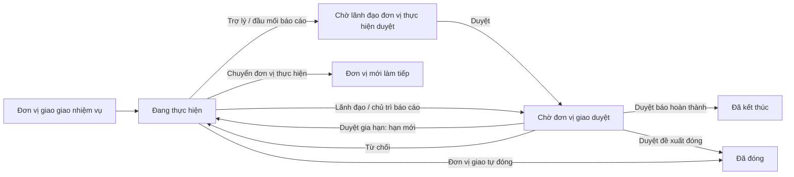

# Nhiệm vụ — tóm tắt nghiệp vụ cho BA

> Bản đọc nhanh bằng lời nghiệp vụ. Chi tiết và bằng chứng: [nghiep-vu.md](nghiep-vu.md) (mã NV / BR trong ngoặc
> để tra). Cập nhật: 2026-10-02 · Nguồn: code `kha_develop` + DB DEV. Nhãn quy tắc: **[Đã xác nhận]** = chủ dự án đã
> chốt là đúng ý đồ · **[Hiện trạng]** = hệ thống đang chạy như vậy, chưa ai xác nhận là ý đồ · **[Lệch nghiệp vụ]**
> = đã xác nhận nghiệp vụ muốn khác, hệ thống đang làm sai.

## 1. Phân hệ này dùng để làm gì

Phân hệ quản lý **nhiệm vụ**: việc một **đơn vị giao cho đơn vị khác** (nhiệm vụ đơn vị), hoặc giao cho **một cá nhân chủ trì** (nhiệm vụ cá nhân), kèm đơn vị / cá nhân phối hợp và hạn hoàn thành (1.1, NV-02).
Nhiệm vụ có thể lấy văn bản, biên bản họp hoặc một nhiệm vụ cấp trên làm **nguồn gốc**; có hay không có văn bản không làm nhiệm vụ khác đi (1.1, mục 3 "Nguồn gốc").
Đơn vị thực hiện **cập nhật tiến độ**: báo đang làm, báo hoàn thành, đề xuất đóng hoặc đề xuất gia hạn; mỗi lần báo cáo đi qua **hai cấp duyệt** — lãnh đạo đơn vị thực hiện, rồi đơn vị giao (NV-03, NV-04).
Đơn vị giao còn đóng nhiệm vụ, chuyển nhiệm vụ cho đơn vị khác làm, và xem báo cáo / thống kê tình hình nhiệm vụ (NV-06, NV-07, NV-14, NV-15).

**Không gồm:** công việc của một cá nhân trong kỳ, phiếu giao việc / phiếu đánh giá / KI (xem `cong-viec`); giao việc kèm văn bản cho đơn vị để đơn vị trả lời — đó là nhắc việc; SMS, thông báo, định hướng (xem `lich-nhac-viec`); cơ chế gửi nhận nhiệm vụ qua trục (xem `van-ban/lien-thong`); chấm điểm, KPI, chi tiết đánh giá công tác tuần (xem `kpi-danh-gia`); màn soạn / gửi / tổng hợp báo cáo đơn vị theo mẫu (xem `tai-lieu-mau`); lịch họp (xem `hop`); gắn nhiệm vụ vào dự thảo (xem `xu-ly-cong-viec`).

## 2. Ai dùng và được làm gì

| Vai trò | Được làm gì trong phân hệ này |
|---|---|
| Lãnh đạo / thủ trưởng đơn vị giao (`LDDV` / `TTDV`) | Giao nhiệm vụ, sửa, xóa, sao chép; duyệt báo cáo của đơn vị thực hiện (cấp 2); đóng nhiệm vụ; chuyển đơn vị thực hiện (1.4, NV-02, NV-04, NV-06, NV-07) |
| Trợ lý đơn vị giao (`TL`) | Như lãnh đạo đơn vị giao: giao, sửa, duyệt cấp 2, đóng, chuyển (1.4, BR-15) |
| Lãnh đạo / thủ trưởng đơn vị thực hiện (`LDDV` / `TTDV`) | Cập nhật tiến độ; **duyệt cấp 1** báo cáo của trợ lý / đầu mối; gán cá nhân đầu mối; giao nhiệm vụ con cho cấp dưới (1.4, NV-03, NV-04, NV-09) |
| Trợ lý đơn vị thực hiện (`TL`) và cá nhân đầu mối | Cập nhật tiến độ; báo cáo phải chờ lãnh đạo đơn vị thực hiện duyệt (1.4, BR-11) |
| Cá nhân chủ trì (nhiệm vụ cá nhân) | Cập nhật tiến độ như lãnh đạo đơn vị thực hiện — báo cáo đi thẳng lên đơn vị giao (1.4, NV-03) |
| Đơn vị / cá nhân phối hợp | Ghi kết quả phối hợp phần mình; không cập nhật tiến độ nhiệm vụ (NV-08, BR-26) |
| Trợ lý chuyên hướng | Trợ lý đơn vị giao được phân theo dõi một số đơn vị thực hiện: sửa, đóng nhiệm vụ của các đơn vị đó; nhận SMS khi có đề xuất đóng / gia hạn (1.4, BR-21, NV-03) |
| Chuyên viên (`NV`) không có vai trò trên | Chỉ thấy nhiệm vụ mình là đầu mối, chủ trì hoặc phối hợp đích danh; không thấy tab *Nhiệm vụ giao đi*, không có nút *Thêm mới* (BR-01, NV-01) |

## 3. Màn hình / menu người dùng thấy

| Menu / màn | Để làm gì | Ghi chú | Mã menu |
|---|---|---|---|
| Danh sách nhiệm vụ | Xem, giao, cập nhật tiến độ, duyệt, chuyển, sửa, xóa nhiệm vụ | Hai tầng tab: *Nhiệm vụ đơn vị / Nhiệm vụ cá nhân* × *Giao đi / Nhận được / Phối hợp*; mặc định lọc "Chưa đóng" (NV-01) | 337991 |
| Nhiệm vụ chờ phê duyệt | Đơn vị giao duyệt báo cáo hoàn thành / đề xuất đóng / đề xuất gia hạn; đơn vị thực hiện duyệt báo cáo cấp 1 | Không phải duyệt nhiệm vụ mới giao (NV-04) | 439625 |
| Phê duyệt của chỉ huy | — | **Khóa**; mở cùng một màn với *Nhiệm vụ chờ phê duyệt* (NV-04, Q2) | 338332 |
| Nhiệm vụ đề xuất khó khăn | Theo dõi, xử lý và đóng khó khăn / đề xuất mà đơn vị thực hiện nêu trong báo cáo tiến độ | Mã menu có chữ "EXTEND" nhưng **không phải gia hạn** (NV-11) | 338331 |
| Quản lý biên bản họp | Ghi kết luận họp và giao nhiệm vụ từ kết luận | (NV-10) | 337972 |
| Báo cáo nhiệm vụ | Thống kê hoàn thành / chậm theo đơn vị giao × đơn vị thực hiện, theo tháng / quý, theo cá nhân, theo cuộc họp; chấm điểm đơn vị | Chỉ đọc; chấm điểm chỉ hiện cho trợ lý đơn vị cấp tập đoàn (NV-14) | 338751 |
| Thống kê tình hình nhiệm vụ | 4 biểu đồ giao đi / thực hiện | Chỉ xem, không bấm xuống danh sách được; tab *Nhiệm vụ thực hiện* hai biểu đồ không có dữ liệu (NV-15, BR-36) | 439395 |
| Phiếu đánh giá và giao nhiệm vụ tháng · Tự chấm điểm | Lập phiếu giao nhiệm vụ tháng / phiếu đánh giá tháng trước rồi trình ký | Hai menu là **cùng một màn** (NV-16) | 337983 · 337990 |
| Tổng hợp báo cáo đơn vị · Gửi báo cáo đơn vị | Báo cáo đơn vị định kỳ theo mẫu | Màn thuộc `tai-lieu-mau` (NV-17) | 440105 · 440145 |
| KPI đơn vị · Theo dõi | Chỉ tiêu nề nếp của đơn vị | **Không liên quan nhiệm vụ** (NV-18) | 337982 · 440425 |
| Danh mục nhóm nhiệm vụ · nhóm Đánh giá công tác tuần | Cây nhóm và mục công việc cho đánh giá tuần | "Nhiệm vụ" ở đây chỉ là nhãn, không nối với nhiệm vụ (NV-19) | 440225 · 440385 |
| Quản lý chỉ tiêu · Thỏa thuận hợp tác (2 menu) · Đề xuất cộng điểm · Phê duyệt đề xuất · Đánh giá đơn vị · Định hướng | — | Menu **khóa** (1.2, NV-18, NV-20) | 338953 · 339214 · 339233 · 338012 · 337981 · 338051 · 338272 |
| Phản ánh từ hệ thống NQ57 | — | Menu **khóa**; trang trỏ tới không tồn tại (NV-20, Q9) | 439705 |
| Trang chủ — "Nhiệm vụ nhận được" / "Nhiệm vụ lãnh đạo giao đi" | Ô đếm đang thực hiện, quá hạn, hoàn thành, sắp đến hạn…; bấm ô mở Danh sách nhiệm vụ | Tab đơn vị của "giao đi" chỉ cho lãnh đạo / trợ lý; tab *Nhiệm vụ cá nhân* mở nhiệm vụ giao cho cá nhân chủ trì — ý đồ hiển thị chưa chốt (1.3, Q6) | — |

## 4. Luồng chính

1. Lãnh đạo hoặc trợ lý đơn vị giao bấm *Thêm mới*: chọn đơn vị giao, nhóm nhiệm vụ, người giao, tên, ngày bắt đầu, hạn, đơn vị thực hiện **hoặc** cá nhân chủ trì, đơn vị / cá nhân phối hợp, nguồn gốc. Một lần lưu được nhiều nhiệm vụ và nhiều đơn vị thực hiện (NV-02).
2. Nhiệm vụ vào thẳng *Đang thực hiện*; đơn vị thực hiện, đầu mối, đơn vị phối hợp nhận SMS và thông báo (BR-06, NV-02 bước 4).
3. Đơn vị thực hiện mở *Cập nhật tiến độ*: chọn Đang thực hiện / Đã hoàn thành / Đề xuất đóng / Đề xuất gia hạn, nhập kết quả (tối đa 2000 ký tự), khó khăn, đề xuất, văn bản báo cáo, file (NV-03).
4. Báo cáo của **trợ lý / đầu mối** chờ **lãnh đạo đơn vị thực hiện** duyệt; báo cáo của **lãnh đạo / chủ trì** đi thẳng lên đơn vị giao (BR-11).
5. **Đơn vị giao** duyệt: báo hoàn thành → *Đã kết thúc*; đề xuất đóng → *Đã đóng*; đề xuất gia hạn → về *Đang thực hiện* với hạn mới. Từ chối bất kỳ loại nào → về *Đang thực hiện* (NV-04, BR-16, BR-17).
6. Báo cáo "Đang thực hiện" của lãnh đạo không cần đơn vị giao duyệt (BR-12).
7. Đơn vị giao có thể duyệt ở hai nơi: ngay trên danh sách / chi tiết nhiệm vụ, hoặc ở màn *Nhiệm vụ chờ phê duyệt* (NV-04).

**Luồng phụ.**
- *Đóng*: đơn vị giao bấm *Đóng nhiệm vụ* ở chi tiết, ý kiến không bắt buộc; không cần đơn vị thực hiện đề xuất (NV-06).
- *Chuyển đơn vị thực hiện*: chọn một đơn vị hoặc một cá nhân, nhập lý do (tối đa 1000 ký tự). Nhiệm vụ đi theo đơn vị mới; đơn vị cũ còn một bản lưu chỉ xem (NV-07, BR-23).
- *Nhiệm vụ con*: đơn vị thực hiện giao tiếp cho cấp dưới; thời gian phải nằm trong khoảng của nhiệm vụ cha (NV-09).
- *Nguồn khác sinh nhiệm vụ*: biên bản họp (NV-10), màn khó khăn (NV-11), phiếu giao nhiệm vụ tháng (NV-16), hệ thống tự sinh kỳ sau cho nhiệm vụ định kỳ lúc 23:00 (NV-12), nhận từ hệ thống khác qua trục (NV-13).

## 5. Trạng thái

**Trạng thái nhiệm vụ** (giá trị lưu)

| Trạng thái (tên người dùng thấy) | Nghĩa | Chuyển sang khi nào | Giá trị |
|---|---|---|---|
| Chưa thực hiện | Chỉ còn ở nhiệm vụ định kỳ tự sinh và nhiệm vụ soạn trong kết luận họp | Hệ thống sinh kỳ sau; kết luận họp được ban hành (mục 3, BR-28) | 1 |
| Đang thực hiện | Đang làm | Giao mới; duyệt gia hạn; đơn vị giao từ chối báo cáo; chuyển đơn vị khi đang đề xuất đóng / gia hạn (4.6, BR-17, BR-24) | 2 |
| Hoàn thành chưa phê duyệt (code gọi "Đã hoàn thành") | Đơn vị thực hiện báo xong, chờ đơn vị giao duyệt | Lãnh đạo báo hoàn thành; hoặc lãnh đạo duyệt báo hoàn thành của trợ lý (BR-11) | 3 |
| Đã hoàn thành (code gọi "Đã kết thúc") | Đơn vị giao đã duyệt hoàn thành | Đơn vị giao duyệt báo cáo hoàn thành (BR-16) | 4 |
| Đề xuất đóng | Đơn vị thực hiện đề nghị dừng | Báo cáo "Đề xuất đóng" (NV-03) | 5 |
| Đã đóng | Nhiệm vụ dừng | Đơn vị giao duyệt đề xuất đóng, hoặc tự đóng (BR-16, NV-06) | 6 |
| Đề xuất gia hạn | Chờ duyệt hạn mới | Báo cáo "Đề xuất gia hạn" (NV-05) | 7 |

**Trạng thái chỉ dùng để lọc / hiển thị** (không lưu): Chậm tiến độ (quá hạn, chưa xong) · Sắp đến hạn (trong N ngày tới, hiện N = 3) · Chưa đóng (mọi trạng thái trừ đã hoàn thành / đã đóng) · Đã chuyển (bản lưu của đơn vị cũ) · Đã gia hạn (đã từng được duyệt gia hạn) (BR-03).

**Trạng thái duyệt của một lần báo cáo** (mỗi lần báo cáo có hai cột: cấp đơn vị thực hiện và cấp đơn vị giao)

| Trạng thái | Nghĩa | Chuyển sang khi nào | Giá trị |
|---|---|---|---|
| Chờ duyệt | Đang chờ cấp tương ứng | Trợ lý báo cáo (chờ cấp 1); lãnh đạo báo cáo hoặc cấp 1 vừa duyệt (chờ cấp 2) (4.7) | 1 |
| Đã duyệt | Cấp tương ứng đã đồng ý | Bấm Duyệt; lãnh đạo tự báo cáo thì cấp 1 tự là đã duyệt (4.7) | 2 |
| Từ chối | Cấp tương ứng không đồng ý | Bấm Từ chối; chuyển đơn vị khi đề xuất đóng / gia hạn đang chờ cấp 2 (4.7, BR-24) | 3 |

## 6. Quy tắc quan trọng nhất

- [Hiện trạng] Nhiệm vụ mới giao **vào thẳng "Đang thực hiện"**: không có bước tiếp nhận, không có bước duyệt giao. Màn "chờ phê duyệt" là duyệt **báo cáo**, không phải duyệt nhiệm vụ (BR-06, NV-04).
- [Hiện trạng] Một nhiệm vụ có **một** đơn vị thực hiện hoặc **một** cá nhân chủ trì; giao cho N đơn vị = N nhiệm vụ cùng tên (BR-07).
- [Hiện trạng] Đơn vị / cá nhân phối hợp không được trùng đơn vị thực hiện / cá nhân chủ trì (BR-08).
- [Hiện trạng] **Lãnh đạo / chủ trì tự báo cáo** hoàn thành / đề xuất đóng / đề xuất gia hạn thì trạng thái nhiệm vụ **đổi ngay**, trước khi đơn vị giao duyệt; trợ lý / đầu mối báo cáo thì trạng thái chỉ đổi sau khi lãnh đạo đơn vị thực hiện duyệt (BR-11, Q1).
- [Hiện trạng] Duyệt cấp 1 chỉ dành cho **lãnh đạo / thủ trưởng** đơn vị thực hiện (trợ lý không duyệt được); duyệt cấp 2 dành cho lãnh đạo / thủ trưởng / trợ lý **đơn vị giao** (BR-15).
- [Hiện trạng] Đơn vị giao từ chối báo cáo — dù là hoàn thành, đóng hay gia hạn — nhiệm vụ đều quay về *Đang thực hiện* (BR-17).
- [Hiện trạng] Gia hạn: chọn "Đề xuất gia hạn" trong form cập nhật tiến độ, không có màn riêng. Hiện cấu hình cho xin tối đa 2 lần được duyệt, chậm nhất 30 ngày sau hạn (7 ngày nếu nhiệm vụ từ văn bản Quốc phòng / Chính phủ), hạn mới không quá hạn hiện tại + 30 (hoặc + 7) ngày (NV-05, BR-19, Q5).
- [Hiện trạng] Không cập nhật tiến độ được khi nhiệm vụ đã đóng, đã kết thúc, đã chuyển, hoặc đang chờ duyệt hoàn thành / đóng / gia hạn (BR-13, BR-20).
- [Hiện trạng] Ngày hoàn thành thực tế không được sớm hơn hôm nay quá 4 ngày (BR-14).
- [Hiện trạng] **Xóa** bị chặn khi còn nhiệm vụ con đang chạy; **đóng** thì không kiểm nhiệm vụ con và không gửi tin. Xóa là xóa mềm (BR-09, BR-22, Q3).
- [Hiện trạng] Chuyển đơn vị thực hiện: nhiệm vụ đi theo đơn vị mới, đơn vị cũ còn bản lưu chỉ xem; đề xuất đóng / gia hạn đang chờ bị coi như từ chối, nhiệm vụ về *Đang thực hiện* (BR-23, BR-24, Q4).
- [Hiện trạng] SMS giao nhiệm vụ luôn gửi cho lãnh đạo, trợ lý đơn vị thực hiện, trợ lý chuyên hướng, đầu mối (hoặc cá nhân chủ trì) và đơn vị phối hợp — trừ người tự chặn loại tin này (BR-10, NV-02).
- [Hiện trạng] Nhiệm vụ không công khai (bí mật) vẫn hiện tên trong danh sách của người cùng phạm vi; chỉ khóa thao tác (BR-02, Q7).
- [Hiện trạng] Nhiệm vụ soạn trong kết luận họp hoặc đưa vào phiếu giao nhiệm vụ tháng **bị ẩn** cho tới khi văn bản kết luận được ban hành / phiếu được ký (BR-27, NV-16).
- [Hiện trạng] Báo cáo nhiệm vụ tháng T lấy mốc chốt là **ngày 5 tháng sau** để tính hoàn thành đúng hạn / chậm (BR-32).

## 7. Hệ thống KHÔNG làm / hay bị hiểu nhầm

- **Nhiệm vụ khác công việc ở chủ thể và cách duyệt, không ở chuyện gắn văn bản.** Nhiệm vụ là việc đơn vị giao đơn vị hoặc giao một cá nhân chủ trì, duyệt tiến độ hai cấp. Công việc (`cong-viec`) là việc của một cá nhân trong kỳ, có phiếu giao việc / phiếu đánh giá / KI. Cả hai đều có thể lấy văn bản làm nguồn gốc. Giao việc kèm văn bản cho đơn vị để đơn vị trả lời là **nhắc việc** (`lich-nhac-viec`) (1.1, dac-thu bẫy 1).
- **Chữ "nhiệm vụ" bị dùng cho thứ khác:** "Danh mục nhóm nhiệm vụ" và đánh giá công tác tuần không nối với nhiệm vụ; "nhóm nhiệm vụ" trên form nhiệm vụ lại là **mục của mẫu báo cáo đơn vị**; KPI đơn vị không liên quan nhiệm vụ (NV-17, NV-18, NV-19, dac-thu bẫy 1).
- **"Nhiệm vụ chờ phê duyệt" không duyệt nhiệm vụ mới**, chỉ duyệt báo cáo hoàn thành / đề xuất đóng / đề xuất gia hạn (NV-04).
- **Menu "Nhiệm vụ đề xuất khó khăn" không phải gia hạn.** Gia hạn nằm trong form cập nhật tiến độ (NV-05, NV-11).
- **Cùng một trạng thái có thể hiện hai nhãn:** cột *Trạng thái* của danh sách gộp 3 / 4 / 5 / 6 thành "Đã hoàn thành" và hiện đề xuất gia hạn chưa quá hạn là "Đang thực hiện"; bộ lọc thì ghi 3 = "Hoàn thành chưa phê duyệt", 4 = "Đã hoàn thành" (BR-05, mục 3, dac-thu bẫy 5).
- **Tìm nhanh bỏ qua bộ lọc trạng thái** (BR-04).
- **Không có % tiến độ.** Form cập nhật tiến độ không có ô phần trăm (NV-03).
- **Đơn vị phối hợp không báo cáo tiến độ**, chỉ ghi kết quả phối hợp; cá nhân phối hợp thấy nút cập nhật nhưng lưu không được (BR-26).
- **Hai màn duyệt cho cùng một việc** (danh sách / chi tiết và *Nhiệm vụ chờ phê duyệt*) đang chạy hai cách khác nhau: màn *chờ phê duyệt* không gửi sang hệ thống khác qua trục, từ chối đưa nhiệm vụ về trạng thái báo cáo trước đó; chuyển đơn vị từ màn này không gửi SMS (NV-04, NV-07, NV-13, dac-thu bẫy 3).
- **Dashboard chỉ để xem**, không bấm xuống danh sách được (BR-36).
- **Trạng thái biên bản họp không đổi** theo tiến độ các nhiệm vụ sinh ra từ nó (NV-10, Q10).

## 8. Liên quan phân hệ khác

| Khi thay đổi ở đây… | …phải xem thêm | Vì sao |
|---|---|---|
| SMS, thông báo, mã tin 401–407 | `lich-nhac-viec` | Hàng đợi SMS, mẫu tin, chặn tin, thông báo chuông nằm ở đó (1.1, X12) |
| Hành động trên nhiệm vụ (giao, sửa, xóa, báo cáo, duyệt, đóng) | `van-ban/lien-thong` | Đơn vị thuộc hệ thống khác thì mỗi hành động phát gói tin qua trục; thêm hành động mới phải có mã mới ở cả hai đầu (NV-13, dac-thu mục 4) |
| Nguồn gốc văn bản, văn bản báo cáo, chuyển đơn vị | `van-ban/den`, `van-ban/di` | Chuyển đơn vị thì văn bản nguồn được chuyển cho đơn vị mới; nguồn gốc văn bản phải là văn bản người dùng xem được (NV-02, NV-07) |
| Ký / ban hành văn bản | `van-ban/di`, `xu-ly-cong-viec` | Ký phiếu giao tháng và ban hành kết luận họp mới bật nhiệm vụ lên (NV-10, NV-16, dac-thu mục 4) |
| Biên bản họp | `hop` | Biên bản tham chiếu cuộc họp; dùng chung phần xử lý phía máy chủ với họp (NV-10) |
| Mẫu báo cáo đơn vị, "nhóm nhiệm vụ" trên form | `tai-lieu-mau` | Màn soạn / gửi / tổng hợp báo cáo đơn vị nằm ở đó (NV-17) |
| Phiếu giao / đánh giá tháng, chấm điểm, đánh giá tuần | `kpi-danh-gia` | Tiêu chí, xếp loại, chấm điểm nằm ở đó (NV-16, NV-18, NV-19) |
| Tạo công việc từ nhiệm vụ; ô trang chủ | `cong-viec` | Form công việc với nguồn "Theo nhiệm vụ đơn vị"; widget trang chủ dùng chung khung nhiệm vụ – công việc (NV-09, 1.3) |

## 9. Câu hỏi nghiệp vụ còn mở

- `Q1` — Trạng thái nhiệm vụ đổi ngay khi lãnh đạo đơn vị thực hiện báo cáo, hay chỉ khi đơn vị giao duyệt?
- `Q2` — "Phê duyệt của chỉ huy" là tên cũ của "Nhiệm vụ chờ phê duyệt", hay cần danh sách riêng cho cấp cao hơn?
- `Q3` — Có được đóng nhiệm vụ cha khi còn nhiệm vụ con đang làm; nếu được, con có tự đóng theo?
- `Q4` — Đơn vị cũ sau khi chuyển còn trách nhiệm gì không?
- `Q5` — Giới hạn gia hạn tính theo số lần được duyệt hay số lần đã xin?
- `Q6` — Ô "Nhiệm vụ cá nhân" trên trang chủ phải hiển thị công việc cá nhân, nhiệm vụ cá nhân chủ trì, hay cả hai?
- `Q7` — Nhiệm vụ bí mật có được hiện tên với người không liên quan trong đơn vị?
- `Q8` — Các kênh cấp dữ liệu nhiệm vụ cho hệ thống ngoài và "dịch vụ Mission" riêng phục vụ hệ thống nào?
- `Q9` — Menu "Phản ánh từ hệ thống NQ57" là liên kết ngoài, tính năng chưa làm, hay đã bỏ?
- `Q10` — Trạng thái biên bản họp có cần theo tiến độ nhiệm vụ sinh ra từ nó?

(đầy đủ ở mục 7.1 của `nghiep-vu.md`)

## 10. Khi viết yêu cầu mới cho phân hệ này, nhớ ghi rõ

- **Nhiệm vụ đơn vị, nhiệm vụ cá nhân (chủ trì), hay cả hai** — và áp dụng ở hướng nào: giao đi, nhận được, phối hợp (NV-01).
- **Ai thao tác:** lãnh đạo / thủ trưởng hay trợ lý, của đơn vị giao hay đơn vị thực hiện; có tính trợ lý chuyên hướng, đầu mối, cá nhân chủ trì, giao đặc biệt không (1.4).
- **Báo cáo của ai, qua mấy cấp duyệt:** báo cáo của lãnh đạo và của trợ lý / đầu mối đang đi khác nhau và đổi trạng thái vào thời điểm khác nhau (BR-11, BR-12, Q1).
- **Áp dụng ở cả hai nơi duyệt** — danh sách / chi tiết nhiệm vụ và màn *Nhiệm vụ chờ phê duyệt* — vì hai nơi đang chạy khác nhau (NV-04, dac-thu bẫy 3).
- **Trạng thái nào được thao tác**, và dùng trạng thái lưu hay nhãn hiển thị (Chậm tiến độ, Sắp đến hạn, Đã chuyển… chỉ là nhãn tính) (mục 3, BR-03, BR-05).
- **Nhiệm vụ sinh từ nguồn nào có áp dụng:** form giao, biên bản họp (giao tay hoặc soạn trong kết luận), phiếu giao tháng, định kỳ tự sinh, nhận qua trục, màn khó khăn (NV-10…NV-13, NV-16).
- **Bản lưu của đơn vị cũ sau khi chuyển** có tính vào danh sách / số đếm / báo cáo không (BR-23, dac-thu bẫy 7).
- **Số đếm nào phải đổi:** danh sách và tab, ô trang chủ, màn chờ phê duyệt, báo cáo nhiệm vụ, dashboard — "của tôi" đang định nghĩa riêng ở nhiều nơi (dac-thu bẫy 2, NV-14, NV-15).
- **Có gửi SMS / thông báo không, mã tin nào, gửi cho ai** (lãnh đạo, trợ lý, trợ lý chuyên hướng, đầu mối, chủ trì, phối hợp) (NV-02, NV-03, NV-07, X12).
- **Đơn vị ở hệ thống khác (qua trục) có áp dụng không**; nhiệm vụ bí mật có áp dụng không; nhiệm vụ con có bị kéo theo không (NV-13, BR-02, Q3).
