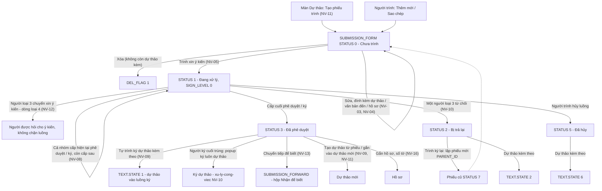
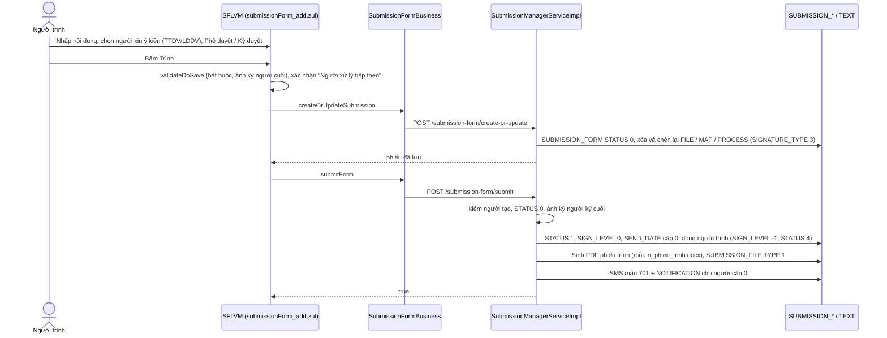
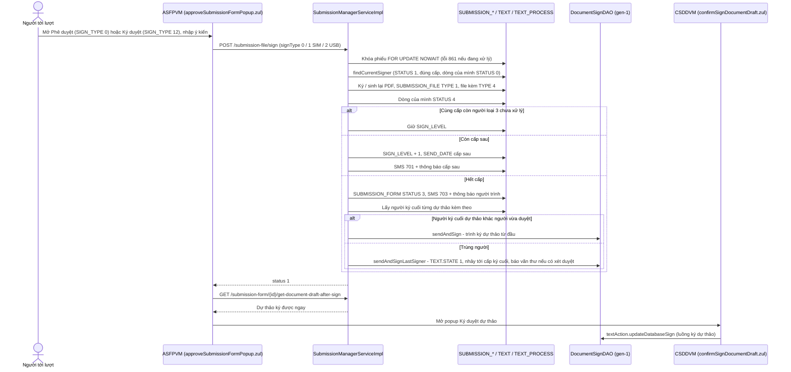
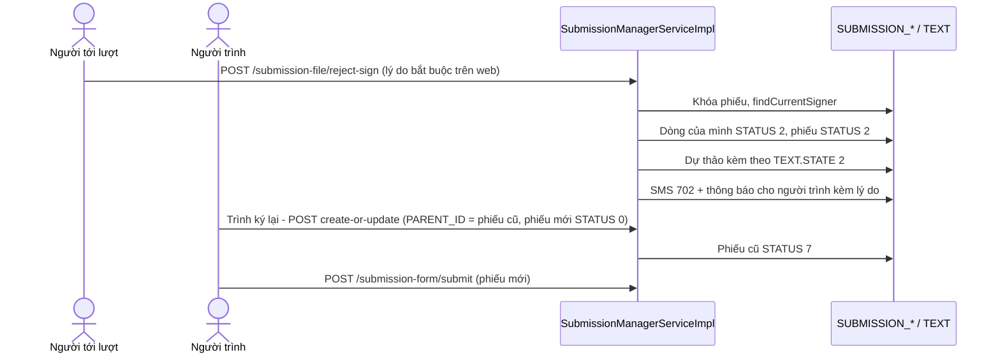
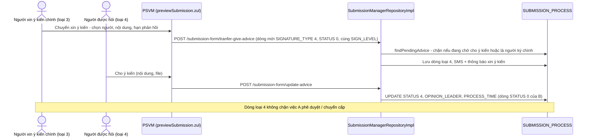
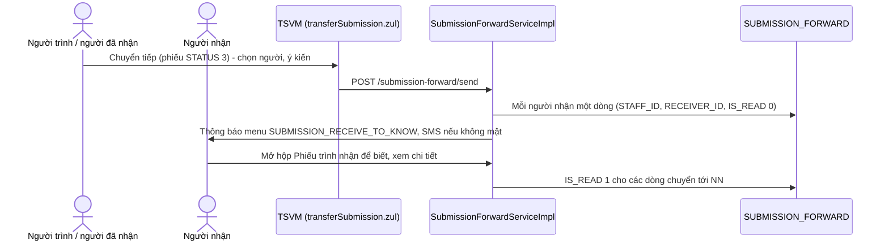
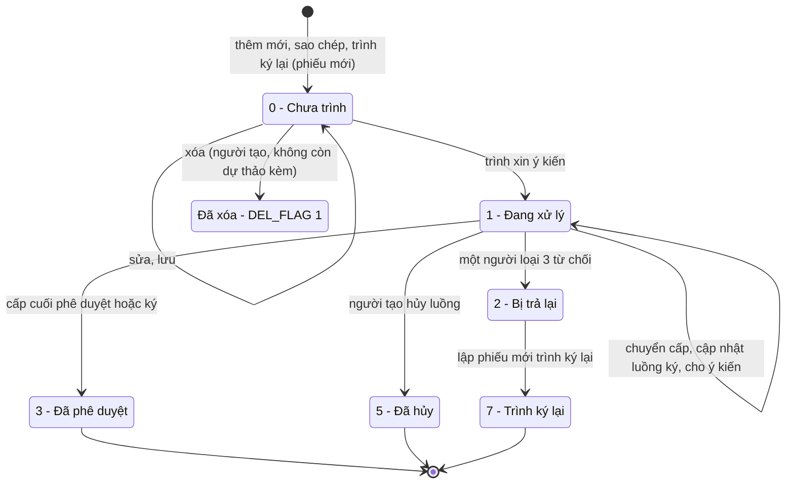
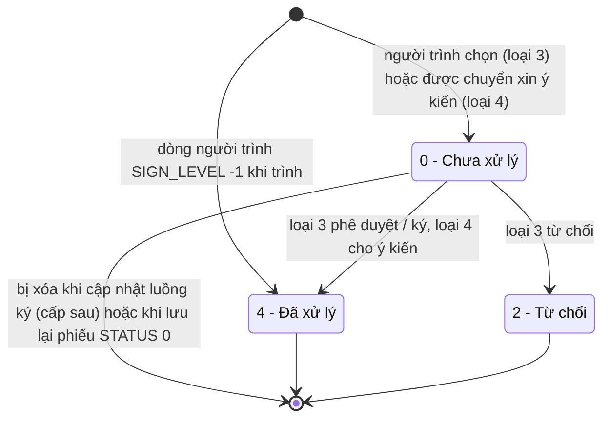
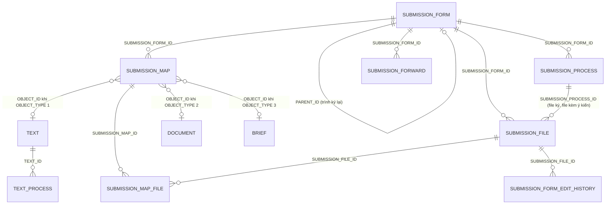

# Phiếu trình — nghiệp vụ: soạn phiếu trình → trình xin ý kiến → các cấp phê duyệt / ký duyệt / cho ý kiến → hoàn thành (kéo theo dự thảo đính kèm) → chuyển tiếp để biết, theo dõi

> Viết lại từ code nhánh `kha_develop` (web-spring + backend2.0) ngày 2026-10-01. Mọi khẳng định có nguồn `file:dòng`.
> Menu / widget đối chiếu **DB DEV `SYS_MENU` / `HOME_WIDGET` ngày 2026-10-01**; comment cột, phân bố giá trị và FK các bảng `SUBMISSION%` đối chiếu **DB DEV `user_col_comments` / phân bố dữ liệu ngày 2026-10-01** (đều do người điều phối truy vấn, chỉ SELECT; tác giả không kết nối DB).
> HDSD cũ (`C:\Users\Admin\Desktop\HDSD\**`) **không có tài liệu riêng cho phiếu trình**; chỉ HDSD Quản lý hồ sơ có mục "Thêm phiếu trình vào hồ sơ" và gọi thao tác trình là **"trình xin ý kiến"** — thuật ngữ này khớp với nhãn trên web (`SFLVM:2760`, `4136`).
>
> Viết tắt đường dẫn:
> `WEB/` = `web-spring/src/main/java/com/viettel/` · `ZUL/` = `web-spring/src/main/webapp/view/voffice/` ·
> `BIZ/` = `web-spring/src/main/java/com/voffice/service/business/` · `BE1/` = `backend2.0/backendvoffice/src/main/java/com/viettel/voffice/` ·
> `BE2/` = `backend2.0/backendvoffice/src/main/java/com/viettel/office/` · `SQL/` = `backend2.0/backendvoffice/sql/`.
> VM / lớp hay dùng: **SFLVM** = `WEB/voffice/vm/submissionForm/SubmissionFormListVM.java` (~12.250 dòng: danh sách của người trình + danh sách ký duyệt + form soạn), **SFLDVM** = `…/SubmissionFormLeaderVM.java` (Theo dõi phiếu trình), **SFRKVM** = `…/SubmissionFormReceiveToKnowVM.java` (Phiếu trình nhận để biết), **TSVM** = `…/TransferSubmissionVM.java` (popup Chuyển tiếp), **CSDDVM** = `…/ConfirmSignDocumentDraftVM.java` (popup ký dự thảo sau phiếu trình), **ASFPVM** = `WEB/voffice/widget/ApproveSubmissionFormPopupVM.java` (popup Phê duyệt / Ký duyệt / Từ chối), **PSVM** = `WEB/voffice/widget/PreviewSubmissionVM.java` (xem chi tiết phiếu trình), **PSRSVM** = `WEB/voffice/widget/PopupSelectRequisitionForSubmissionVM.java` (chọn dự thảo đính kèm), **SLS** = `WEB/voffice/widget/SourceLookupSubmission.java` (chọn phiếu trình đã phê duyệt từ màn dự thảo), **DDVM** = `WEB/voffice/vm/documentDraft/DocumentDraftVM.java`, **SFB** = `BIZ/SubmissionFormBusiness.java`.
> BE (toàn bộ gen-2, trừ chỗ ghi khác): **SMC** = `BE2/controller/SubmissionManagerController.java`, **SMSI** = `BE2/services/impl/SubmissionManagerServiceImpl.java`, **SMRI** = `BE2/repositories/impl/SubmissionManagerRepositoryImpl.java`, **SFWSI** = `BE2/services/impl/SubmissionForwardServiceImpl.java`, **SFWRI** = `BE2/repositories/impl/SubmissionFowardRepositoryImpl.java`, **SPRJ** = `BE2/repositories/jpa/SubmissionProcessRepositoryJPA.java`, **SMRJ** = `BE2/repositories/jpa/SubmissionMapRepositoryJPA.java`, **SFRI** = `BE2/repositories/impl/SubmissionFormRepositoryImpl.java`, **SFSI** = `BE2/services/impl/SubmissionFormServiceImpl.java`, **C2** = `BE2/utils/Constants.java`, **C1** = `BE1/constants/Constants.java`, **DSDAO** = `BE1/database/dao/document/DocumentSignDAO.java` (gen-1).
> Phân hệ liền kề đã viết: dự thảo / ký dự thảo ở [`../xu-ly-cong-viec/nghiep-vu.md`](../xu-ly-cong-viec/nghiep-vu.md) (ký hiệu `XLCV NV-xx / BR-xx`), văn bản đi ở [`../van-ban/di/nghiep-vu.md`](../van-ban/di/nghiep-vu.md), văn bản đến ở [`../van-ban/den/nghiep-vu.md`](../van-ban/den/nghiep-vu.md).

## 1. Tổng quan

### 1.1 Phạm vi

"Phiếu trình" là một **phiếu xin ý kiến nội bộ** do một cá nhân (người trình) lập, gửi lần lượt qua một danh sách cá nhân ("Danh sách cá nhân xin ý kiến" — `SFLVM:2424`, `9311`) để mỗi người **phê duyệt** hoặc **ký duyệt** (ký số) và ghi ý kiến; người cuối danh sách là người quyết định (lãnh đạo ký cuối). Kết quả là **một file PDF phiếu trình** sinh từ mẫu Word, chèn ý kiến + ảnh chữ ký của từng người (NV-08). Phiếu trình **không có số, không ban hành, không thuộc sổ văn bản**; nó có thể **kèm dự thảo văn bản đi**, **văn bản đến** và **hồ sơ** làm tài liệu trình, và khi phiếu trình hoàn thành thì dự thảo kèm theo **tự động được trình ký** (NV-09).

Bảng gốc: `SUBMISSION_FORM` (phiếu), `SUBMISSION_PROCESS` (từng người trong luồng + người trình), `SUBMISSION_FILE` (file đính kèm / file phiếu đã ký), `SUBMISSION_MAP` (liên kết dự thảo / văn bản đến / hồ sơ), `SUBMISSION_MAP_FILE` (bản sao file khi gắn vào hồ sơ), `SUBMISSION_FORWARD` (chuyển tiếp để biết) — entity ở `BE2/entities/Submission*Entity.java`.

Phân hệ gồm:

- **Hộp việc / menu**: "Trình xin ý kiến" (người trình), "Trình quyết định" = hộp ký duyệt phiếu trình (người xử lý: Chờ xử lý / Đang xử lý / Đã phê duyệt / Đã trả lại / Dự thảo chờ ký / Tất cả), Theo dõi phiếu trình, Phiếu trình nhận để biết; widget trang chủ "Phiếu trình" (NV-01, NV-02).
- **Soạn / sửa / lưu** phiếu trình, các trường nội dung, chọn người xin ý kiến, ký tuần tự hoặc **ký song song theo nhóm** (NV-03), **đính kèm** file / dự thảo / văn bản đến / hồ sơ (NV-04).
- **Trình xin ý kiến** (NV-05), **hủy luồng**, **xóa**, **sao chép**, **trình ký lại** sau khi bị trả lại (NV-06), **cập nhật luồng ký** khi đang xử lý (NV-07).
- **Phê duyệt / ký duyệt** (thường, SIM CA, USB Token) và chuyển cấp (NV-08); **từ chối (trả lại)** (NV-10).
- **Hoàn thành phiếu trình và dự thảo đính kèm**: tự trình ký dự thảo, "ký luôn dự thảo" khi người ký cuối trùng nhau (NV-09); ràng buộc khóa dự thảo (NV-11).
- **Chuyển xin ý kiến / cho ý kiến** trong luồng (NV-12).
- **Chuyển tiếp để biết** sau khi hoàn thành và hộp **Nhận để biết** (NV-13); **Theo dõi phiếu trình** theo đơn vị (NV-14).
- Xem chi tiết, file phiếu trình, lịch sử ý kiến (NV-15); ranh giới hồ sơ (NV-16), phiếu trình mật (NV-17), kiến nghị / khó khăn vướng mắc đang xếp chung phân hệ (NV-18), endpoint / màn không dùng (NV-19).

Phân hệ **KHÔNG gồm** (trỏ sang):

| Nội dung | Phân hệ |
|---|---|
| Soạn dự thảo, trình ký dự thảo, ký duyệt / phê duyệt dự thảo, văn thư xét duyệt, khóa dự thảo khi có phiếu trình (`XLCV NV-16`, `BR-54/55`), ký dự thảo ngay sau phiếu trình ở phía `TextController` (`XLCV BR-38`) | `xu-ly-cong-viec` |
| Cấp số, ban hành dự thảo sau khi ký; thay đơn vị ban hành khi ký dự thảo ngay sau phiếu trình (`OfficePublishedReplacementService`) | `van-ban/di` |
| Kỹ thuật ký số (USB Token, SIM CA, băm file, chứng thư) | `ky-so` |
| Hồ sơ: thêm / gỡ phiếu trình khỏi hồ sơ, số tờ, thứ tự, nộp hồ sơ (kiểm phiếu trình kèm theo) | `ho-so-cong-viec` (ở đây chỉ nêu điểm gọi — NV-16) |
| Nội dung SMS / thông báo (mẫu tin, cấu hình chặn) | `lich-nhac-viec` (ở đây chỉ nêu điểm gọi) |
| Tình hình xử lý cá nhân (`PersonalTreatmentStatusVM` có dùng lại nút phiếu trình), thống kê KPI phiếu trình | tình hình xử lý cá nhân: `van-ban/quan-ly-chung` QLC NV-04; theo dõi KPI phiếu trình (đúng hạn / quá hạn): `kpi-danh-gia` NV-20 (sửa chéo 2026-10-02 theo `van-ban/quan-ly-chung`, `kpi-danh-gia`) |
| Popup "tạo nhiệm vụ" `popupCreateMissionSubmission.zul` (chỉ `MissionRatingVM` gọi) | `nhiem-vu` (NVu NV-02 — sửa nhiệm vụ từ popup này; đang xếp nhầm vào phân hệ này trong `_tools/domains.py`) |

### 1.2 Menu PHIẾU TRÌNH (đối chiếu DB DEV `SYS_MENU` ngày 2026-10-01, cha `439425` code `SUMISSIONFORM` "PHIẾU TRÌNH", `STATUS = 1`, `DEL_FLAG = 0`)

`SYS_MENU.STATUS`: 1 = mở khóa, 2 = khóa (comment cột — đã xác nhận). Code chỉ tham chiếu **mã menu**; URL nằm ở DB.

| `SYS_MENU_ID` | `CODE` | Tên trên menu (DB DEV) | URL | `STATUS` | VM | Bằng chứng code |
|---|---|---|---|---|---|---|
| 439427 | `SUBMISSIONLIST` | **Trình xin ý kiến** | `/view/voffice/submissionForm/submissionFormList.zul?view=0` | 1 | SFLVM, `viewType = 0` (NV-01) | `WEB/util/AppConstants.java:9052`; `WEB/voffice/common/HomeVM.java:2637`; URL thông báo `C1:1360`; `DDVM:18838` |
| 439545 | `SUBMISSIONFPROCESSLIST` | **Trình quyết định** | `…/submissionFormProcessList.zul?view=1` | 1 | SFLVM, `viewType = 1` (NV-02) | `AppConstants.java:9053`; `C1:1361`; `SFLDVM:217` |
| 440269 | `SUBMISSION_FOLLOW` | Theo dõi phiếu trình | `…/submissionFormLeader.zul` | 1 | SFLDVM (NV-14) | `SFLVM:9002`; `WEB/voffice/vm/search/SearchAllVM.java:621` (không file Java nào ghi cứng zul này) |
| 441145 | `SUBMISSION_RECEIVE_TO_KNOW` | Phiếu trình nhận để biết | `…/submissionFormReceiveToKnow.zul` | 1 | SFRKVM (NV-13) | `C1:1362`, `C1:2796`; mã menu gắn vào thông báo `SFWSI:151-152` |
| 440945 | `MENU_TEST` | "Danh mục test_update8001" (cha 336813, ngoài cây) | `…/submissionFormProcessList.zul?view=1` | — | — | `DEL_FLAG = 1` → menu thử nghiệm **đã xóa** (NV-19) |

Tên menu trên DB khác tên gọi trong code / knowledge cũ: menu của người trình là **"Trình xin ý kiến"** (code chú thích "Phiếu trình"), menu của người xử lý là **"Trình quyết định"** (code chú thích "Phê duyệt phiếu trình"; tiêu đề lưới "Danh sách ký duyệt phiếu trình" — `zk-label_vi.properties:9881`). Trong tài liệu này dùng "hộp Ký duyệt phiếu trình" = menu "Trình quyết định".

### 1.2b Widget trang chủ "Phiếu trình" (đối chiếu DB DEV `HOME_WIDGET` ngày 2026-10-01, cha id 19 `PHIEU_TRINH`, `SIMPLE_MODE = 3`)

Dựng ở `WEB/voffice/controller/HomeWidgetRestController.java:1622-1672` (`generateSubmissionWidget`); số đếm từ một lần gọi `POST /submission-form/count-home` (`SubmissionTask.java:28-40` → `SMSI.submissionCountHome` :162-268).

| `HOME_WIDGET.CODE` (id) | Tên DB | Nhãn hiển thị | Số đếm = điều kiện | Bấm vào mở | Nguồn |
|---|---|---|---|---|---|
| `SUBMISSION_CHO_XU_LY` (35, `SIMPLE_MODE = 3`) | Chờ xử lý | "Chờ xử lý" (`voffice.home.submission.pendingProcessing`) | `phieuTrinhChoXuLy` = tab Chờ xử lý (`searchType 1`) | menu `SUBMISSIONFPROCESSLIST`, tab 1 | `HomeWidgetRestController.java:1636-1642, 1837-1843`; `SMSI:176-185` |
| `SUBMISSION_DANG_XU_LY` (38) | Đang xử lý | "Đang xử lý" | `phieuTrinhDangXuLy` = tab Đang xử lý (`searchType 4`, `processingStatus 1`) | tab 3 | `:1643-1649`; `SMSI:198-207` |
| `SUBMISSION_DA_XU_LY` (36) | Đã phê duyệt | "Đã phê duyệt" | `phieuTrinhDaXuLy` = tab Đã phê duyệt (`searchType 4`, `processingStatus 3`) | tab 4 | `:1651-1657`; `SMSI:187-196` |
| `SUBMISSION_TAT_CA` (39) | Tất cả | "Tất cả" | `phieuTrinhTatCa` = phiếu của cán bộ thuộc **đơn vị theo dõi mặc định** (`searchType -1`, theo người xử lý — NV-14) | tab 0 → mở menu `SUBMISSION_FOLLOW` | `:1658-1664`; `SMSI:220-229`; `SubmissionCountThread.java:69-74` |
| `SUBMISSION_XIN_Y_KIEN` (73) | Xin ý kiến | "Xin ý kiến" | `phieuTrinhXinYKien` = phiếu **do mình tạo** (trừ 5, 7 — NV-01 BR-02) | menu `SUBMISSIONLIST` (`view=0`) | `:1665-1669, 1845-1851`; `SMSI:231-240` |

Mã trong code nhưng **không có trên DB DEV**: `SUBMISSION_DA_TU_CHOI`, `SUBMISSION_DU_THAO_CHO_KY` (`WEB/util/AppConstants.java:8326-8327`) — BE vẫn đếm `phieuTrinhDaTuChoi` (`SMSI:209-218`) nhưng web không dựng ô. Script `SQL/sql_17072026.sql:4-5` ghi id 72 cho `SUBMISSION_XIN_Y_KIEN`, trên DB DEV là id **73** (id 72 = `IN_NHAN_DE_BIET` — `../van-ban/den/nghiep-vu.md` mục 1.3). Ô widget `SUBMISSION_CHO_XU_LY` là ô duy nhất của nhóm có `SIMPLE_MODE = 3` — ý nghĩa cột thuộc phân hệ trang chủ, không bàn ở đây.

Khoảng thời gian đếm: 365 ngày gần nhất (`BE2/dto/SubmissionCountThread.java:58-59`; web `SFLVM:12104-12105`).

### 1.3 Actor & quyền

Mã vai trò dùng lại từ module trước: văn thư = `VT`, thủ trưởng = `TTDV`, lãnh đạo đơn vị = `LDDV`, chuyên viên = `NV` (`web-spring/src/main/resources/application.properties:347-354`). Quyền thao tác nằm ở **tầng hiển thị nút** trên web (thiết kế chung, đã xác nhận); riêng phân hệ này BE **có** kiểm người gọi ở một số thao tác (ghi rõ trong từng NV: trình / hủy / xóa chỉ người tạo; ký / từ chối chỉ người đang tới lượt).

| Actor | Nhận diện trong code | Làm gì |
|---|---|---|
| Người trình (người tạo) | `SUBMISSION_FORM.CREATED_BY = user` (`SMSI:954`) | Soạn, sửa, lưu, trình xin ý kiến, hủy luồng, xóa, sao chép, trình ký lại, cập nhật luồng ký, tạo dự thảo từ phiếu trình đã phê duyệt, chuyển tiếp để biết, in phiếu trình |
| Người xin ý kiến chính (người phê duyệt / ký duyệt) | dòng `SUBMISSION_PROCESS` có `SIGNATURE_TYPE = 3`, `SIGN_LEVEL ≥ 0`, `VHR_EMPLOYEE_ID = user` (`SFLVM:2948`; `SPRJ:43-46`) | Phê duyệt (không ký số) hoặc ký duyệt (ký số) theo `SIGN_TYPE` người trình chọn; từ chối; chuyển xin ý kiến người khác; ký luôn dự thảo nếu là người ký cuối của cả hai |
| Người được xin ý kiến bổ sung | dòng `SUBMISSION_PROCESS` có `SIGNATURE_TYPE = 4` (`SQL/20250714_lammd_add_column.sql:25`; `PSVM:2400-2406`) | Cho ý kiến (không ký, không quyết định luồng) |
| Người nhận để biết | dòng `SUBMISSION_FORWARD.RECEIVER_ID = user` (`SFWRI:96`) | Xem phiếu trình đã phê duyệt; chuyển tiếp tiếp cho người khác |
| Người theo dõi | có vai trò `TTDV`/`LDDV` tại đơn vị, hoặc được cấu hình theo dõi đơn vị (`USER_ORG_MAP` loại `ORG_FOLLOW`) (`SFLDVM:138-149`; `WEB/voffice/common/CommonModel.java:448-463`) | Xem thống kê và danh sách phiếu trình của cán bộ trong đơn vị (NV-14) |
| Người chọn được làm người xin ý kiến chính | popup chọn người dùng chung giới hạn vai trò `TTDV`/`LDDV` (`SFLVM:3031-3038`) và cây đơn vị giới hạn theo đơn vị người trình (`SFLVM:3040-3044`) | — |

Tab "Dự thảo chờ ký" chỉ hiện cho người có vai trò `NV` hoặc `LDDV` (`SFLVM:604-611`; `ZUL/submissionForm/submissionFormProcess_search.zul:21-26`).

### 1.4 Sửa so với knowledge cũ (2026-10-01)

| Knowledge cũ | Hiện trạng code `kha_develop` | Ghi ở |
|---|---|---|
| Trạng thái ghi bằng khóa i18n `draft / processing / sentBack / reSigned / completed / rejected` | Cột lưu **số**: 0 chưa trình / 1 đang xử lý / 2 bị trả lại / 3 đã phê duyệt / 5 đã hủy / 7 trình ký lại (`C2:524-532`; khớp comment DB DEV). Khóa `rejected` hiển thị là "Đã hủy" (5), không phải "bị từ chối" (sửa 2026-10-01: nhầm khóa hiển thị với giá trị DB) | Mục 3, 4.7 |
| Sơ đồ cũ: "Bị trả lại → Đang xử lý: trình ký lại"; "Chưa trình → Đã hủy: cancel" | Trình ký lại **lập phiếu mới** (`PARENT_ID`), phiếu cũ → 7; hủy luồng chỉ từ trạng thái 1 (`SMSI:957-964, 1371-1373`) (sửa 2026-10-01) | NV-06, 4.7 |
| "Người ký (lãnh đạo phòng → lãnh đạo đơn vị)", câu hỏi "cấp ký cố định hay theo FLOW" | Người trình **tự chọn** danh sách cá nhân xin ý kiến (vai trò TTDV/LDDV), tuần tự hoặc **song song theo nhóm**; mỗi người được đặt "Phê duyệt" (0) hoặc "Ký duyệt" (12); không dùng FLOW (sửa 2026-10-01) | NV-03 |
| "Văn thư / người theo dõi: Danh sách xử lý phiếu trình, chuyển tiếp, cập nhật số trang giấy" | Không có vai trò văn thư riêng. Theo dõi = TTDV/LDDV hoặc cấu hình `ORG_FOLLOW`; chuyển tiếp (để biết) chỉ sau khi phiếu **đã phê duyệt**, do người trình hoặc người đã nhận; "số trang" là **số tờ của phiếu trong hồ sơ** (sửa 2026-10-01) | NV-13, NV-14, NV-16 |
| "`check-submission-attachments-for-submitting` chặn trình nếu phiếu trình đính kèm chưa hợp lệ" | Endpoint dùng khi **nộp hồ sơ** (kiểm dự thảo / văn bản đến kèm phiếu đã ban hành, không mật, có file) — `BriefInfoVM.java:2498-2540` (sửa 2026-10-01) | NV-16 |
| "QT3. SMS 702 khi phiếu được / không được thông qua" | 701 = yêu cầu xử lý (trình, chuyển cấp), 702 = **bị trả lại**, 703 = đã hoàn thành, 704 = bị hủy (`C1:1436-1439`; SMSI:1347, 2097, 2135, 1386) (sửa 2026-10-01) | NV-05, NV-08, NV-10 |
| "Đính kèm dự thảo chưa trình … ký văn bản luôn (`confirmSignDocumentDraft`, tab *Dự thảo chờ ký*)" | Đúng một phần: khi phiếu hoàn thành, BE **tự trình ký mọi dự thảo** kèm theo; chỉ khi người ký cuối trùng mới nhảy cấp + popup ký luôn. Tab "Dự thảo chờ ký" là hộp văn bản ký duyệt dùng chung, không riêng dự thảo của phiếu trình (sửa 2026-10-01) | NV-09, NV-02 |
| "Dự thảo đính kèm phiếu trình đã hoàn thành … `api.brief-detail.check-text-doc-for-submitting` (?)" | Liên kết lưu cùng bảng `SUBMISSION_MAP` (`OBJECT_TYPE = 1`) khi lưu dự thảo (gen-1 `DocumentSignDAO`); không kích hoạt gì (sửa 2026-10-01) | NV-11 |
| "`SUBMISSION_MAP` (?)" | Bảng liên kết phiếu ↔ dự thảo (1) / văn bản đến (2) / hồ sơ (3) | NV-04, mục 5 |
| "41 endpoint" | 47 endpoint (`SMC`) | Mục 2 |
| `vi-du-mau`: "`submissionForm_add.zul` ((?) VM: `SubmissionDetailVM`)" | Form là include của `submissionFormList.zul` dùng **SFLVM**; `SubmissionDetailVM` là lớp rỗng không dùng (sửa 2026-10-01) | NV-19 |
| `dac-thu`: "5 màn ☠ … `SourceLookupSubmission*` — màn kiến nghị / lookup cũ" | `SourceLookupSubmission` / `SourceLookupSubmissionBrief` **tồn tại** ở `WEB/voffice/widget/` và đang dùng (chọn phiếu từ màn dự thảo / hồ sơ); `ban-do.md` gắn nhãn ☠ sai (sửa 2026-10-01) | NV-11; `dac-thu.md` |
| Mục 5 cũ "Yêu cầu / kiến nghị đề xuất … có thể tách `kien-nghi`" | Giữ nhận định; ghi thêm web truy vấn thẳng DB qua facade, chỉ gọi BE 2 endpoint cấu hình | NV-18 |

## 2. Module

Toàn bộ nghiệp vụ phiếu trình chạy trên **BE gen-2** `SubmissionManagerController` (`/api/submission-manager`, 47 endpoint — `SMC:47`); riêng ký dự thảo sau phiếu trình, chọn dự thảo để đính kèm và trình ký dự thảo gọi sang **gen-1** (`textAction.*`, `DocumentSignDAO`). Web gọi qua `SFB` (key `api.submission-manager.a.b` → URL `/api/submission-manager/a/b`; path variable ghép chuỗi `"…delete/" + id` — `SFB:298`).

| Chức năng | Màn (.zul) | VM | Business (key) | Endpoint BE | Service | Repository → bảng |
|---|---|---|---|---|---|---|
| Danh sách của người trình (`view=0`) | `ZUL/submissionForm/submissionFormList.zul` + include `submmissionForm_search.zul`, `submissionForm_add.zul` (`submissionFormList.zul:29-34`) | SFLVM `getDataList` :1296-1375 | `SFB.getSubmissionFormList` (`searchType = 0`) → `submission-form.get-list` (:46-110) | `GET /submission-form/get-list` (SMC:62) | `SMSI.submissionGetList` :277 | `SMRI.submissionGetList` :259-593 (SQL thuần trên `SUBMISSION_FORM`, `SUBMISSION_PROCESS`, `SUBMISSION_MAP`, `TEXT`) |
| Danh sách ký duyệt (`view=1`, 6 tab) | `ZUL/submissionForm/submissionFormProcessList.zul` + `submissionFormProcess_search.zul` | SFLVM `changeTab` :8924-8994 | như trên với `searchType` 1/2/4 (+`processingStatus`); tab 5 dùng `RequisitionBusiness.getRequisitionList(type=3)` (SFLVM:10207-10230) | `GET /submission-form/get-list`; `textAction.searchText` (dự thảo) | `SMSI` / gen-1 `TextController` | `SMRI` / `TextSearchDAO` |
| Đếm widget + nhãn tab | trang chủ; nhãn tab SFLVM `generateMenuCount` :12101-12139 | `HomeWidgetRestController`, `SubmissionTask` (`WEB/…/task/business/SubmissionTask.java:28-40`) | `submission-form.count-home` | `POST /submission-form/count-home` (SMC:130) | `SMSI.submissionCountHome` :162-268 → `SubmissionCountThread` | `SMRI.submissionGetList` (chỉ lấy `totalElements`) |
| Soạn / sửa / lưu | `submissionForm_add.zul` | SFLVM `doSave` :2829, `executeSave` :2686-2811, lưu sau upload :6040-6214 | `SFB.createOrUpdateSubmission` (:456-476) → `submission-form.create-or-update` | `POST /submission-form/create-or-update` (SMC:164) | `SMSI.createOrUpdate` :864-1182 (`@Transactional`) | `SubmissionFormRepositoryJPA`, `SubmissionFileRepositoryJPA`, `SMRJ`, `SubmissionMapFileJPA`, `SPRJ` |
| Trình xin ý kiến | nút "Trình" trên form / lưới / chi tiết | SFLVM `doRequisitionDirect` :2612, `doSubmitSign` :4099-4181; PSVM `doRequisitionDirect` :916 | `SFB.submitForm` (:478-498) | `POST /submission-form/submit` (SMC:187) | `SMSI.submitForm` :1284-1353 | `SPRJ`, `SUBMISSION_FILE` |
| Hủy luồng | lưới người trình | SFLVM `doCancelSubmissionForm` :3953-3997 | `SFB.cancelSubmissionForm` (:311-320) | `POST /submission-form/cancel/{id}` (SMC:210) | `SMSI.cancelForm` :1356-1392 | `SubmissionFormRepositoryJPA` (khóa `FOR UPDATE NOWAIT`), `TextRepositoryJPA` |
| Xóa | lưới người trình | SFLVM `doDeleteSubmission` :2320-2357 | `SFB.deleteSubmissionForm` (:297-309) | `POST /submission-form/delete/{id}` (SMC:176) | `SMSI.deleteSubmissionForm` :1249-1281 | `SUBMISSION_FORM.DEL_FLAG = 1` |
| Phê duyệt / ký duyệt | popup `ZUL/widgets/approveSubmissionFormPopup.zul` (`ViewUtil.createLookupApproveSubmissonForm` — `WEB/voffice/util/ViewUtil.java:3683`) | ASFPVM `doApproveSubmissionForm` :177-218, `doSignSubmissionForm` :270-290, `doSignSimCA` :221-262; mở từ SFLVM `doApproveSubmissionForm` :4000-4028, PSVM :501 | `SFB.approveSubmissionForm` (:324-340), `signSubmissionForm` (:381-414), `signUsbSubmissionForm` (:342-379) → `submission-file.sign` | `POST /submission-file/sign` (SMC:245) | `SMSI.signSubmission` :1777-1925 → `updateStatusSign` :2016-2161 | `SPRJ.findCurrentSigner` :43-46; `SUBMISSION_FILE` |
| Từ chối (trả lại) | popup `ZUL/widgets/rejectSubmissionFormPopup.zul` (`ViewUtil.java:3718`) | ASFPVM `doRejectSubmissionForm` :677-720; SFLVM `doRejectSubmissionForm` :3558-3600 | `SFB.rejectSubmissionForm` (:416-453) | `POST /submission-file/reject-sign` (SMC:257) | `SMSI.rejectSubmission` :2586-2644 → `updateStatusSign` | như trên |
| Ký dự thảo sau phiếu trình | `ZUL/submissionForm/confirmSignDocumentDraft.zul` (`ViewConstant.java:166`; `ViewUtil.java:1129`) | CSDDVM; mở từ ASFPVM `processSignDocumentDraft` :659-674, PSVM :651 | `SFB.getDocumentDraftsAfterSign` (:216-232) + `RequisitionBusiness.updateDigitalSignState` (CSDDVM:307) | `GET /submission-form/{id}/get-document-draft-after-sign` (SMC:221); `textAction.updateDatabaseSign` | `SMSI.getDocumentDraftsAfterSign` :2756-2788; tự trình dự thảo `SMSI.submitTextAfterCompleteSubmissionForm` :2190-2220 | `SFRI.findTextsToSignAfterSignSubmissions` :25-43; `DSDAO.sendAndSign` :1975, `sendAndSignLastSigner` :2353-2427 |
| Chuyển xin ý kiến / cho ý kiến | nút trong PSVM (`ZUL/widgets/previewSubmission.zul:386-395`); popup chung `ViewUtil.popupTransferGiveAdvice` (:2643), `createGiveAdivce` | PSVM `doSelectUserGiveAdvice` :2335-2430, `doGiveAdvice` :2432; SFLVM `doGiveAdvice` :9874-9910 | `SFB.transferGiveAdvice` (:621-650), `updateGiveAdviceState` (:652-682) | `POST /submission-form/tranfer-give-advice` (SMC:306), `/update-advice` (SMC:312) | `SMRI.tranferGiveAdvice` :1412-1503, `updateAdvice` :1532-1576 | `SPRJ.findPendingAdvice` :71-75, `updateAdvice` :57-65 |
| Chuyển tiếp để biết | `ZUL/submissionForm/transferSubmission.zul` (`ViewConstant.java:571`; `ViewUtil.java:661`) | TSVM `doTransfer` :482-520; mở từ SFLVM `doPopUpForwardSubmissionForm` :11990, PSVM :3022, SFRKVM :496, SFLDVM :1432 | `SFB.sendSubmissionForm` (:752-770) | `POST /submission-forward/send` (SMC:354) | `SFWSI.create` :92-196 | `SubmissionForwardRepositoryJPA` → `SUBMISSION_FORWARD` |
| Nhận để biết | `submissionFormReceiveToKnow.zul` | SFRKVM `doViewDetail` :321 | `SFB.getListSubmissionForwardBySearchCondition` (:856-879), `updateIsRead` (:881-900) | `GET /submission-forward/get-list-submission-forward` (SMC:368), `POST /submission-forward/update-is-read` (SMC:399) | `SFWSI` :221-244 | `SFWRI` :69-142 |
| Theo dõi phiếu trình | `submissionFormLeader.zul` | SFLDVM `searchTotal` :250-271, `searchListMode` :302-359 | `SFB.getTotalSubmission` (:587-602), `getSubmissionFormList(searchType=-1)` | `GET /submission-form/get-total-submission` (SMC:293), `get-list` | `SMRI.getTotalSubmission` :1226-1410, `submissionGetListByOrgLeaderId` :75-250 | `VhrEmployeeRepositoryImpl.getListEmployeeIdFollowByOrgId` (`BE2/repositories/impl/VhrEmployeeRepositoryImpl.java:1364-1377`) |
| Xem chi tiết | `ZUL/widgets/previewSubmission.zul` (`ViewUtil.java:1200`) | PSVM; mở từ SFLVM `doViewDetail` :3349 | `SFB.getSubmissionFormDetail` (:234-247) | `GET /submission-form/{id}` (SMC:142) | `SMSI.submissionGetDetail` :567-855 | nhiều bảng |
| Tải / xem file phiếu trình | — | — | `SFB.getPathSubmissionFile` (:504-531) | `GET /submission-file/download` (SMC:234) | `SMSI.downloadSubmissionFile` :1400-1463, `generatePathFile` :2232-2358 | `SUBMISSION_FILE`; mẫu `<n>_phieu_trinh.docx` (`BE2/utils/FileUtils.java:73-78`) |
| Chọn dự thảo đính kèm | `ZUL/widgets/popupSelectRequisitionForSubmission.zul` (`ViewUtil.java:3029`) | SFLVM `doSelectDocumentDraft` :8689-8718 → PSRSVM :349-352 | `RequisitionBusiness.getRequisitionListForSubmission` → `textAction.searchTextForSubmission` | `POST /textAction/searchTextForSubmission` (`BE1/action/TextAction.java:127`) | `BE1/controler/TextController.java:610` | `BE1/database/dao/document/TextSearchDAO.java::getLstTextForSubmission` :1887 |
| Chọn phiếu trình đã phê duyệt từ màn dự thảo | `ZUL/widgets/lookupDocumentSubmission.zul` (`ViewConstant.java:362`; `ViewUtil.java:1376`) | DDVM `doAddSubmission` :6687-6721 → SLS :174, 203 | `SFB.getSubmissionFormList(searchType=0, fromDraftAdd=1)` | `get-list` | `SMRI` :321-328 | lưu khi lưu dự thảo: `DSDAO` :990-997, 2735-2753 |
| Thêm / gỡ khỏi hồ sơ, số tờ, thứ tự | màn hồ sơ (`ho-so-cong-viec`) | `WEB/voffice/vm/brief/BriefInfoVM.java` | `SFB.addSubmissionToBrief` (:167), `deleteSubmissionFromBrief` (:185), `updateNumPage` (:837), `changeOrder` (:902), `updatePaperNumberInSubmissionMap` (:973), `updateFilePageInSubmissionMapFile` (:981), `getSubmissionFormList(briefId)` (:114) | SMC:76-122, 380-397 | `SMSI` :283-559, 3002-3033 | `SUBMISSION_MAP` (`OBJECT_TYPE = 3`), `SUBMISSION_MAP_FILE` |

Bảng DB chính: `SUBMISSION_FORM`, `SUBMISSION_PROCESS`, `SUBMISSION_FILE`, `SUBMISSION_MAP`, `SUBMISSION_MAP_FILE`, `SUBMISSION_FORWARD`, `SUBMISSION_FORM_EDIT_HISTORY` (lịch sử sửa file Word online), `FILE_ENCRYPT_MAP` (`OBJECT_TYPE = 3` — chỉ dùng cho phiếu trình mật), `NOTIFICATION`, liên kết `TEXT` / `TEXT_PROCESS`, `DOCUMENT`, `BRIEF` (mục 5).

## 3. Nghiệp vụ

### Giá trị trạng thái dùng xuyên suốt

**`SUBMISSION_FORM.STATUS`** (`C2:524-532`; web `WEB/util/AppConstants.java:8568-8575`; nhãn `voffice.submissionForm.label.status.*` — `web-spring/src/main/webapp/WEB-INF/zk-label_vi.properties:9897-9902`):

| Giá trị | Hằng BE | Nhãn web | Ý nghĩa theo code |
|---|---|---|---|
| 0 | `NEW` | Chưa trình | Mới lưu, chưa trình (`SMSI:953`) |
| 1 | `IN_PROGRESS` | Đang xử lý | Đã trình, đang qua các cấp (`SMSI:1305`) |
| 2 | `REJECTED` | Bị trả lại | Một người xin ý kiến chính đã từ chối (`SMSI:2053`) |
| 3 | `COMPLETED` | Đã phê duyệt | Cấp cuối đã phê duyệt / ký (`SMSI:2046`) |
| 4 | `PROCESSED` | — | Không dùng cho phiếu; giá trị 4 chỉ dùng cho **dòng `SUBMISSION_PROCESS`** (xem dưới) |
| 5 | `CANCELLED` | Đã hủy | Người trình hủy luồng (`SMSI:1375`) |
| 7 | `RE_NEW` | Trình ký lại | Phiếu gốc đã được lập **phiếu mới** để trình lại (`SMSI:958-964`) |

DB DEV (`user_col_comments` / phân bố dữ liệu ngày 2026-10-01): comment cột "0 chưa trình, 1 đang xử lý, 2 bị từ chối, 3 hoàn thành, 5 đã hủy, 7 trình ký lại" — khớp code; phân bố 0 = 1.088, 1 = 2.431, 2 = 235, 3 = 2.663, 5 = 302, 7 = 250 (không có dòng nào giá trị 4).

**`SUBMISSION_PROCESS.STATUS`** (`C2:565-570`): 0 = chưa xử lý, 2 = đã từ chối, 4 = đã phê duyệt / đã ký / đã cho ý kiến (`SPRJ:61` — cho ý kiến cũng đặt 4). Dòng người trình (`SIGN_LEVEL = -1`) được ghi sẵn `STATUS = 4` khi trình (`SMSI:1315-1326`). DB DEV: comment "0 chưa xử lý, 2 từ chối, 4 đồng ý"; phân bố 0 = 7.602, 2 = 522, 4 = 10.624, **1 = 3, null = 45** — hai giá trị cuối nằm ngoài comment và **không do code `kha_develop` ghi** (web khởi tạo 0 — `WEB/voffice/entity/submissionForm/SubmissionProcess.java:16`; BE chỉ ghi 0/2/4) → dữ liệu cũ hoặc kênh khác, chưa rõ nguồn.
**`SUBMISSION_PROCESS.SIGNATURE_TYPE`**: 3 = người xin ý kiến chính (ký / phê duyệt), 4 = người được "chuyển xin ý kiến" bổ sung (`SQL/20250714_lammd_add_column.sql:13, 25`; web `AppConstants.java:8868-8871`). DB DEV: cột không có comment; phân bố 3 = 12.158, 4 = 1.436, null = 5.202. Dòng người trình được chèn **không đặt** `SIGNATURE_TYPE` (`SMSI:1315-1326`) nên lưu null — nhiều khả năng phần lớn dòng null là dòng người trình (chưa đối chiếu từng dòng).
**`SUBMISSION_PROCESS.SIGN_TYPE`** mang **hai nghĩa theo thời điểm**: khi soạn, người trình chọn *hành động* cho từng người — 0 = "Phê duyệt" (không ký số), 12 = "Ký duyệt" (ký số) (`SFLVM:9980-9983`); khi người đó xử lý xong, BE ghi đè bằng *hình thức ký đã dùng* — 0 thường, 1 SIM CA, 2 USB Token (`C2:572-576`; `SMSI:2024`). Khi mở lại để sửa, web đổi 2 → 12 (`SFLVM:9298`). DB DEV: comment cột chỉ ghi "0 ký thường, 1 ký SIMCA, 2 TOKEN" nhưng dữ liệu có **12 = 2.429 dòng** (0 = 14.464, 1 = 92, 2 = 566, null = 1.245) — xác nhận nghĩa "hành động Ký duyệt" của giá trị 12 trước khi xử lý.
**`SUBMISSION_PROCESS.SIGN_LEVEL`**: −1 = dòng người trình; 0, 1, 2… = thứ tự cấp; nhiều người cùng một cấp = **ký song song theo nhóm** (NV-03 BR-08). `SUBMISSION_FORM.SIGN_LEVEL` = cấp đang tới lượt (`SMSI:1306, 2060-2061`).

### NV-01. Danh sách phiếu trình của người trình (menu "Trình xin ý kiến" `SUBMISSIONLIST`, widget "Xin ý kiến")

**Mục đích.** Người trình theo dõi mọi phiếu trình mình đã lập và thao tác theo trạng thái.

**Luồng.** `submissionFormList.zul?view=0` → SFLVM `postViewInitialized` đọc `view` (:586-589), khởi tạo combobox trạng thái `PT_MAP_FULL` (0, 1, 2, 3, 5, 7 — :1139-1145; `AppConstants.java:8653-8662`) và khoảng ngày 365 ngày (:657-658) → `getDataList` với `searchType = viewType = 0` (:1316-1333) → `SFB.getSubmissionFormList` gửi khoảng ngày thành **ngày tạo** khi `searchType = 0` (`SFB:70-72`) → `GET /submission-form/get-list` → `SMRI.submissionGetList` nhánh `CREATOR` (:305-358).

**Điều kiện SQL (SMRI:305-358).** `sf.created_by = người đăng nhập` (hoặc `createdBy` truyền vào) · lọc người ký cuối `sf.signer_id` · lọc trạng thái nếu chọn; **không chọn trạng thái thì ẩn 7 (Trình ký lại) và 5 (Đã hủy)** (:334-337) · ngày tạo, ngày trình trong khoảng · `sf.del_flag = 0` (:516) · sắp xếp mặc định `created_date desc` (:576-580).

**Nút trên từng dòng** (`ZUL/submissionForm/submmissionForm_search.zul:234-275`; điều kiện `SFLVM:3758-3854`):

| Nút | Hiện khi | Nguồn |
|---|---|---|
| Sửa | `STATUS = 0`, **hoặc** `STATUS = 1` và phiếu thường (độ mật = 1) → mở chế độ "cập nhật luồng ký" (NV-07) | `SFLVM:3758-3766` |
| Hủy luồng | `STATUS = 1` | `:3849-3854` |
| Trình ký lại | `STATUS = 2` và phiếu thường | `:3783-3792` |
| Trình (xin ý kiến) | `STATUS = 0` | `:3768-3773` |
| Tạo dự thảo | `STATUS = 3` và phiếu thường → mở màn Dự thảo điền sẵn từ phiếu trình (NV-09 BR-29) | `:3775-3781`, `4062-4096` |
| Sao chép | luôn hiện | `:3794-3799` |
| Chuyển tiếp | `STATUS = 3` và mình là người tạo | `:3809-3816` |
| Xóa | `STATUS = 0` | `:3802-3807` |

**BR-01.** Danh sách của người trình chỉ gồm phiếu do chính mình tạo (`SMRI:307-313`).
**BR-02.** Mặc định (không lọc trạng thái) không hiện phiếu **Trình ký lại (7)** — vì đã có phiếu mới thay thế — và **Đã hủy (5)** (`SMRI:334-337`). Muốn xem phải chọn đúng trạng thái trên combobox.
**BR-03.** Số trên ô widget "Xin ý kiến" = số phiếu do mình tạo trong 365 ngày, cùng điều kiện BR-02 (`SMSI:231-240`; `SubmissionCountThread.java:53-77` — nhánh `CREATOR` không đặt trạng thái).

**Bảng dữ liệu.** `SUBMISSION_FORM`, `SUBMISSION_PROCESS`, `SUBMISSION_MAP`, `TEXT`, `VHR_EMPLOYEE`, `SECURITY_TYPE` (SMRI:282-303).

### NV-02. Hộp "Ký duyệt phiếu trình" (menu "Trình quyết định" `SUBMISSIONFPROCESSLIST`) — 6 tab và điều kiện thật

**Mục đích.** Người được xin ý kiến thấy phiếu trình đang chờ mình, đã qua tay mình, đã hoàn thành hoặc bị trả lại.

**Luồng.** `submissionFormProcessList.zul?view=1` → SFLVM, mặc định `tabType = 1` (:206) → nút tab (`ZUL/submissionForm/submissionFormProcess_search.zul:6-30`) → `changeTab(tabType)` (:8924-8994) đặt `viewType = tabType` → `getDataList` quy đổi sang tham số BE (:1316-1325): tab 3 → `searchType 4 + processingStatus 1`, tab 4 → `searchType 4 + processingStatus 3`, tab khác → `searchType = tabType`.

**Điều kiện SQL chung (SMRI:359-386, 516).** Nối `SUBMISSION_PROCESS sp` với `sp.sign_level ≥ 0` (loại dòng người trình) và `sp.vhr_employee_id = người đăng nhập`; `sf.status <> 0`; `sf.del_flag = 0`. Tab 2, 3, 4 lấy **một dòng `sp` mới nhất** của mình theo `process_time` (tab 2: dòng 4 hoặc 2; tab 3/4: dòng 4) để không nhân bản phiếu khi mình cho ý kiến nhiều lần (:362-379). Lọc thêm: đơn vị trình (`voe.path LIKE '%/id/%'` — :493-499), ngày nhận `sp.send_date` (:500-509), tiêu đề (:564-568).

| Tab (`tabType`) | Nhãn | Điều kiện | Nguồn |
|---|---|---|---|
| 1 | Chờ xử lý | `sf.status = 1` **và** `sp.status = 0` **và** (`sf.sign_level = sp.sign_level` **hoặc** `sp.signature_type = 4`) | SMRI:557-562 |
| 3 | Đang xử lý | `sp.status = 4` **và** (`sf.status = 1` **hoặc** (`sf.status = 3` và có dự thảo kèm với `TEXT.STATE ∈ {0,1,3}`)) | SMRI:534-547 |
| 4 | Đã phê duyệt | `sp.status = 4` **và** `sf.status = 3` **và** (không có dự thảo kèm **hoặc** dự thảo `TEXT.STATE = 4` đã ban hành) | SMRI:548-555 |
| 2 | Đã trả lại | (`sf.status ∈ {2,7}` và `sp.status ∈ {2,4}`) **hoặc** (`sf.status = 3`, `sp.status = 4` và dự thảo kèm `TEXT.STATE ∈ {2,7,27,6}`) | SMRI:518-533 |
| 5 | Dự thảo chờ ký (chỉ vai trò `NV`/`LDDV`) | không phải phiếu trình: danh sách dự thảo chờ mình ký / cho ý kiến (`RequisitionBusiness.getRequisitionList(…, type = 3, …)`, bộ lọc "Dự thảo chờ ký / Dự thảo chờ cho ý kiến / Tất cả") — chính là hộp `XLCV NV-02` | SFLVM:1159-1164, 10207-10230 |
| 0 | Tất cả | không lọc trong màn này: **đóng tab, mở menu `SUBMISSION_FOLLOW`** (NV-14) | SFLVM:8930-8934, 9000-9038 |

Nhãn tab = `tên (số)`; tab đang mở lấy tổng của lần tìm hiện tại, tab khác lấy số của `count-home` (SFLVM:12141-12205). Cột "Trạng thái" trên lưới được BE tính lại (SMRI:595-737): phiếu `STATUS = 3` có dự thảo thì hiện trạng thái **dự thảo** ("Đang trình dự thảo", "Chờ cấp số dự thảo", "Đã ban hành văn bản", "Bị từ chối dự thảo", "Đã hủy luồng dự thảo", "Trình ký lại dự thảo" — `backend2.0/backendvoffice/src/main/resources/messages_vi.properties:390-397`); phiếu `STATUS = 1` hiện "Chờ xử lý" nếu dòng của mình còn 0, ngược lại "Đang xử lý" (:683-690).

**Nút trên từng dòng tab Chờ xử lý** (`submissionFormProcess_search.zul:253-275`): **Phê duyệt / Ký duyệt** và **Từ chối** khi đang ở tab 1 và dòng của mình không phải loại 4 (`SFLVM:3856-3888`); **Cho ý kiến** khi dòng của mình là loại 4 (`SFLVM:3890-3896`); nhãn nút "Ký duyệt" nếu `SIGN_TYPE = 12`, ngược lại "Phê duyệt" (`SFLVM:4030-4037`).

**BR-04.** "Chờ xử lý" = tới lượt mình ở cấp hiện tại, **hoặc** mình được chuyển xin ý kiến bổ sung (loại 4) ở bất kỳ cấp nào mà chưa cho ý kiến (SMRI:557-562).
**BR-05.** Phiếu đã hoàn thành (3) vẫn nằm ở "Đang xử lý" cho tới khi dự thảo kèm theo được ban hành (`TEXT.STATE = 4`); dự thảo bị từ chối / hủy ban hành / trình lại / hủy luồng thì phiếu chuyển sang "Đã trả lại" (SMRI:518-555). Tức là hộp việc phiếu trình theo dõi **cả vòng đời dự thảo kèm theo**. **Đúng nghiệp vụ** — các tab của người duyệt đi theo vòng đời dự thảo kèm theo (xác nhận 2026-10-01, Q6).
**BR-06.** Một người có thể vừa là người ký chính vừa từng cho ý kiến trên cùng phiếu; tab 2/3/4 chỉ lấy dòng xử lý gần nhất của người đó (SMRI:362-379).

**Số đếm widget (`count-home`, SMSI:162-268).** Chạy song song 6 phép đếm, mỗi phép gọi lại `submissionGetList` với `page 0, size 1` để lấy tổng (`SubmissionCountThread.java:53-77`): Chờ xử lý (`searchType 1`), Đã phê duyệt (`4` + `processingStatus 3`), Đang xử lý (`4` + `1`), Đã trả lại (`2`), Tất cả (`-1` theo đơn vị theo dõi — NV-14), Xin ý kiến (`0`). Quá 20 giây thì trả 0 cho các ô (SMSI:254-261).

**Edge case.** Khi mở từ thông báo, URL có `viewId` (mã phiếu) → tự mở chi tiết phiếu (SFLVM:727-736). Mobile lọc theo `submissionFormId` (SMRI:570-574).

### NV-03. Soạn / sửa / lưu phiếu trình; chọn người xin ý kiến; ký tuần tự hoặc song song

**Mục đích.** Người trình lập phiếu (nội dung trình, cơ quan trình, ý kiến các bên), chọn danh sách cá nhân xin ý kiến theo thứ tự và hình thức (phê duyệt / ký duyệt).

**Actor.** Người trình. Nút Thêm mới chỉ hiện ở màn `view=0` (SFLVM:747-749).

**Trường nhập trên form** (`submissionForm_add.zul`; kiểm ở `SFLVM.validateDoSave` :2405-2491): **Đơn vị ban hành** (bắt buộc — :2413-2417; lưu `PUBLISHED_ORG_ID/NAME` và đơn vị cha `PARENT_PUBLISHED_ORG_ID/NAME` — `SMSI:945-948`), **Ngày trình** (bắt buộc — :2418-2422), **Danh sách cá nhân xin ý kiến** (bắt buộc ≥ 1 — :2423-2426), **Nội dung trình** (`TITLE`, bắt buộc — :2427-2431), **Cơ quan trình** (`OFFICE_SENDER`, bắt buộc — :2432-2436), tài liệu kèm theo (`DESCRIPTION_FILE`), ý kiến cơ quan liên quan (`OPINION_OTHER_ORG`), tóm tắt nội dung ý kiến (`SUMARY`), ý kiến đơn vị trực thuộc (`OPINION_INTERNAL_ORG`), ý kiến người trình (`OPINION_SUBMITER`), độ mật (`STYPE_ID`), nơi trình (`SUBMIT_ADDRESS`), và **ba nhãn tiêu đề mục có thể sửa** `SUMARY_LABEL`, `OPINION_INTERNAL_ORG_LABEL`, `OPINION_SUBMITER_LABEL` (bắt buộc — :2463-2485; giá trị mặc định "TÓM TẮT NỘI DUNG Ý KIẾN" / "Ý KIẾN CỦA CÁC ĐƠN VỊ TRỰC THUỘC CÓ LIÊN QUAN" / "Ý KIẾN CỦA NGƯỜI TRÌNH" — `SQL/20250714_lammd_add_column.sql:28-36`).

**Chọn người xin ý kiến.** `doSelectObjectSign` (SFLVM:3026-3080): popup chọn người dùng chung `UserFlowLookupVM` (cùng loại popup với dự thảo), giới hạn vai trò `TTDV`/`LDDV` (:3031-3038), cây đơn vị giới hạn theo đơn vị người trình (`BussinessUtil.getGiveAdviceTreeRootOrgs` — :3040-3044). Kết quả `updateProcessList` (:2907-3021): mỗi người thành một dòng `SIGNATURE_TYPE = 3`, nạp ảnh chữ ký loại 1 nếu có (bật "hiện ảnh ký" — `IMAGE_SIGN`), người **cuối danh sách** là người ký cuối → `SUBMISSION_FORM.SIGNER_ID`, `ORG_ID` (:2949-2954), đánh `SIGN_LEVEL` theo thứ tự (:2964-2968); mỗi dòng chọn đơn vị/chức vụ ký (`VHR_ORG_ID`, `POSITION_ID`) và hành động `SIGN_TYPE` 0/12.

**Lưu.** `doSave` (:2828-2845) / `doRequisitionDirect` (:2611-2625) → `executeSave` (:2686-2811): kiểm `validateDoSave`, `validateBusinessDoSave` (phiếu mật: mọi người xin ý kiến phải có chứng thư số mật — :2493-2519), xác nhận khi chọn người thuộc đơn vị cấp cao hơn đơn vị người ký cuối (`validateSubmitOrgLower` :2521-2565), upload file → callback (:6040-6214) gom file, gom `SUBMISSION_MAP` (dự thảo + văn bản đến + hồ sơ — :6080-6083), cờ song song (:6084-6096) → `SFB.createOrUpdateSubmission` → `SMSI.createOrUpdate`:
- Tạo mới: `STATUS = 0`, `DEL_FLAG = 0`, `CREATED_BY`, `FIRST_ORG_ID` (:950-956); nếu có `PARENT_ID` (trình ký lại) thì phiếu gốc → `STATUS = 7` (:957-964).
- Sửa phiếu `STATUS = 0`: cập nhật mọi trường (:922-948) rồi **xóa hết và chèn lại** file đính kèm (:1024-1100), liên kết (:1102-1154), danh sách xin ý kiến (:1156-1180) — mọi dòng `SIGNATURE_TYPE = 3`, sắp theo `SIGN_LEVEL`.
- Sửa phiếu `STATUS = 1` không phải cập nhật luồng: chỉ cập nhật trường nội dung, **không** đụng file / liên kết / người xin ý kiến (:1006-1009).
- Mỗi file mới: chuyển từ thư mục tạm vào kho `SUBMISSION_FORM`, đếm số trang (`FILE_PAGE`) (:1037-1071).

**BR-07.** Người **ký cuối** (cấp lớn nhất) bắt buộc có **ảnh chữ ký loại 1**: kiểm ở web khi lưu (SFLVM:2448-2455), khi trình từ lưới (:4115-4125) và ở BE khi lưu / trình (`SMSI:1166-1174`, `1297-1304` — lỗi `SUBMISSION_FORM_INVALID_IMAGE_SIGN_LEADER_SUBMIT`).
**BR-08.** **Ký song song**: bật chế độ song song (`changeSignMode` — SFLVM:4674-4695) thì mỗi người có số nhóm (`parallelSignPosition`) và được lưu thành `SIGN_LEVEL` = số nhóm (:6088-6091); nhiều người cùng nhóm = cùng cấp; cờ `SUBMISSION_FORM.IS_PARALLELE_APPROVE = 1` (`SQL/20250917_add_column_submission.sql:1-5`). Người ký cuối luôn bị tách thành **nhóm riêng cuối cùng** (`adjustSignLevel` :4787-4794). Tuần tự = mỗi người một cấp (:2964-2968).
**BR-09.** Mọi dòng xin ý kiến người trình chọn đều là loại 3 (`SMSI:1160-1164`); loại 4 chỉ phát sinh khi người trong luồng "chuyển xin ý kiến" (NV-12).
**BR-10.** Các trường "Đơn vị ban hành / đơn vị cha" in lên đầu phiếu (dòng tên cơ quan) — `generatePathFile` lấy `PUBLISHED_ORG_NAME`, `PARENT_PUBLISHED_ORG_NAME` (`SMSI:2270-2271`); không có đơn vị cha thì dùng mẫu "một đơn vị" `one_org_phieu_trinh/` (`BE2/utils/FileUtils.java:73-78`).

**Bảng dữ liệu.** `SUBMISSION_FORM`, `SUBMISSION_PROCESS`, `SUBMISSION_FILE` (`TYPE = 2` file tải lên), `SUBMISSION_MAP`, `SUBMISSION_MAP_FILE`.
**Edge case.** Đổi độ mật trên form làm mới vùng file sang chế độ mã hóa (`onChangeSecurityLevel` — SFLVM:9431). Phiếu tạo từ hồ sơ: mục "Thuộc hồ sơ" điền sẵn (`doActionFromBriefInfo` action 4 — SFLVM:874-891).

### NV-04. Tài liệu kèm theo phiếu trình: file, dự thảo, văn bản đến, hồ sơ

**Mục đích.** Gắn tài liệu làm căn cứ trình: file tải lên, dự thảo văn bản đi chưa trình, văn bản đến, hồ sơ.

**Cách lưu.** Một bảng liên kết `SUBMISSION_MAP` với `OBJECT_TYPE`: **1 = dự thảo (`TEXT_ID`)**, **2 = văn bản đến (`DOCUMENT_ID`)**, **3 = hồ sơ (`BRIEF_ID`)** (`C2:557-563`; web `AppConstants.java:8556-8560`). File tải lên lưu `SUBMISSION_FILE` với `TYPE` (`C2:579-586`): **1** = file phiếu trình sinh ra / đã ký (gắn dòng xử lý), **2** = file người trình tải lên, **3** = file JSON mã hóa nội dung (phiếu mật), **4** = file đính kèm khi cho ý kiến / phê duyệt / ký / từ chối.

| Loại | Chọn trên form | Điều kiện chọn | Nguồn |
|---|---|---|---|
| Dự thảo | `doSelectDocumentDraft` → popup `popupSelectRequisitionForSubmission.zul` (PSRSVM) | dự thảo **do mình tạo** (`CREATOR_ID_VOF2`/`CREATOR_ID`), `IS_DELETED = 0`, **`TEXT.STATE = 0` (chưa trình)**, cùng nhóm độ mật với phiếu (phiếu mật chỉ chọn dự thảo mật, phiếu thường chỉ chọn dự thảo thường), và **chưa gắn với phiếu trình nào khác trạng thái 5** | SFLVM:8689-8718; PSRSVM:343-352; `BE1/database/dao/document/TextSearchDAO.java:1931-1939, 1952-1962, 2075-2083` |
| Văn bản đến | `doAddDocAttach` → popup tra cứu văn bản chung `ViewUtil.createDocumentAllLookup` | theo popup chung (không lọc riêng cho phiếu trình) | SFLVM:8731-8759 |
| Hồ sơ | `doAddBrief` → popup chọn hồ sơ `ViewUtil.createBriefLookup` | theo popup chung | SFLVM:8768-8798 |
| File | vùng tải file `AREA_ID01` | đếm số trang khi lưu | SMSI:1037-1071 |

**Phía BE khi lưu** (`SMSI.createOrUpdate`): xóa toàn bộ `SUBMISSION_MAP` của phiếu rồi chèn lại theo danh sách gửi lên (:1102-1136); với liên kết **hồ sơ**, ghi thêm `PAPER_NUMBER` = tổng số trang các file tải lên và chép từng file sang `SUBMISSION_MAP_FILE` (:1107-1150).

**BR-11.** Một dự thảo chỉ gắn được với **một** phiếu trình còn hiệu lực: bộ chọn loại dự thảo đã nằm trong bất kỳ phiếu trình nào khác `STATUS = 5` (`TextSearchDAO.java:1934-1939`), và phía dự thảo coi phiếu trình còn hiệu lực là phiếu `STATUS ∈ {0, 1}` chưa xóa (NV-11 BR-33).
**BR-12.** Chỉ chọn dự thảo **chưa trình** (`TEXT.STATE = 0`) (`TextSearchDAO.java:1961-1962`); dự thảo đính kèm sẽ bị khóa trình cho tới khi phiếu trình xong (NV-11).
**BR-13.** Chi tiết phiếu trình chỉ trả file gốc của phiếu (`SUBMISSION_PROCESS_ID` rỗng, `TYPE ≠ 3`); file gắn với từng người xử lý (file ký, file kèm ý kiến) trả theo từng dòng lịch sử (`SMSI:635-650`; `SMRI:1000-1013`). File `.doc/.docx/.xls/.xlsx` được đánh dấu sửa online được (`SMSI:592-596`) và có lịch sử sửa (`SUBMISSION_FORM_EDIT_HISTORY` — `SMSI:609-634`).

**Bảng dữ liệu.** `SUBMISSION_MAP`, `SUBMISSION_FILE`, `SUBMISSION_MAP_FILE`, `TEXT`, `DOCUMENT`, `BRIEF`.

### NV-05. Trình xin ý kiến

**Mục đích.** Gửi phiếu trình tới (nhóm) người xin ý kiến đầu tiên.

**Actor.** Người trình. BE kiểm **người gọi là người tạo** (`SMSI:1291-1293` — `FORBIDDEN`).

**Luồng.** Ba điểm vào: nút **Trình** trên form (lưu rồi trình — SFLVM:2611-2625, 6156-6175), trên lưới (`doSubmitSign` :4098-4181, hỏi xác nhận kèm danh sách "Người xử lý tiếp theo" lấy từ `GET /submission-process/next-signer/{id}` — :4127-4135; `SMRI:1124-1147`), trên chi tiết (PSVM:916, chỉ hiện khi `STATUS = 0` và là người tạo — PSVM:246-250) → `SFB.submitForm` → `POST /submission-form/submit` → `SMSI.submitForm` (:1284-1353):
1. Kiểm người tạo, `STATUS = 0` (sai → `SUBMISSION_FORM_INVALID_STATE_TO_SUBMIT`), người ký cuối có ảnh chữ ký (BR-07) (:1291-1304).
2. `STATUS = 1`, `SIGN_LEVEL = 0` (:1305-1307); ghi `SEND_DATE` cho mọi dòng cấp 0 (:1310-1312).
3. Chèn **dòng người trình**: `SIGN_LEVEL = -1`, `STATUS = 4`, `OPINION_LEADER` = ý kiến người trình, `PROCESS_TIME = SEND_DATE = bây giờ` (:1314-1326).
4. Phiếu thường: **sinh file PDF phiếu trình** từ mẫu và lưu `SUBMISSION_FILE TYPE = 1` gắn dòng người trình; cập nhật số trang trong hồ sơ (:1327-1332). Phiếu mật: ghi quyền đọc file mã hóa thay vì sinh file (:1333-1343).
5. Gửi **SMS** (mẫu `701` — `C1:1436`, nhóm tin 15 / loại 1) và **thông báo** (URL màn ký duyệt `submissionFormProcessList.zul?view=1` — `C1:1361`) cho từng người cấp 0 (:1344-1351).

**BR-14.** Chỉ trình được phiếu `STATUS = 0` (SMSI:1294-1296; web: nút chỉ hiện khi 0 — SFLVM:3768-3773).
**BR-15.** Ngày gửi tới từng cấp (`SEND_DATE`) ghi khi cấp đó **bắt đầu tới lượt**, không ghi trước (SMSI:1310-1312, 2048-2049).

**Trạng thái.** `0 → 1`. **Tích hợp.** SMS, thông báo (`NOTIFICATION`, module phiếu trình, `STR_OBJECT_ID` = mã phiếu — SMSI:2723-2753).

### NV-06. Hủy luồng, xóa, sao chép, trình ký lại

**Hủy luồng** (`SFLVM.doCancelSubmissionForm` :3953-3997 → `POST /submission-form/cancel/{id}` → `SMSI.cancelForm` :1356-1392):
- Web đọc lại phiếu; nếu đã ở 2/3/5/7 thì báo "Phiếu trình đã thực hiện ký xong luồng, vui lòng tải lại danh sách" (:3956-3962).
- BE khóa bản ghi phiếu (`SELECT … FOR UPDATE`, chờ 0 giây — `BE2/repositories/jpa/SubmissionFormRepositoryJPA.java:50-55`); đang có người khác xử lý → lỗi 861 "đang trong quá trình xử lý" (SMSI:1361-1367; web SFLVM:3978-3981).
- Kiểm **người tạo** và `STATUS = 1` (:1368-1373) → `STATUS = 5` (:1375-1376) → **mọi dự thảo đính kèm** `TEXT.STATE = 6` (hủy luồng) (:1378-1379, 2163-2188) → SMS mẫu `704` + thông báo (loại 2) cho người đang tới lượt (:1381-1390).

**Xóa** (`SFLVM.doDeleteSubmission` :2319-2357 → `SMSI.deleteSubmissionForm` :1249-1281): chỉ **người tạo**, chỉ `STATUS = 0`, và **không còn dự thảo đính kèm chưa xóa** (`TEXT.IS_DELETED ≠ 1`) — sai thì lỗi 899 / 903 (web hiện thông báo riêng — SFLVM:2341-2353) → xóa mềm `DEL_FLAG = 1`.

**Sao chép** (`doPopUpCopySubmissionForm` :4039-4060 → chuẩn bị dữ liệu :1920-1940): tạo **phiếu mới** từ phiếu cũ — bỏ mã phiếu, `PARENT_ID = null`, ngày trình = hôm nay, đặt lại mọi dòng xin ý kiến về chưa xử lý, bỏ dòng người trình và dòng loại 4, **bỏ file đính kèm** (:1896-1897) và **bỏ dự thảo đính kèm** (:1937-1940).

**Trình ký lại** (nút khi `STATUS = 2`, phiếu thường — :3783-3792; `doSubmitSubmissionFormAgain` :3528-3552): giống sao chép nhưng **giữ dự thảo đính kèm** và đặt `PARENT_ID = mã phiếu cũ` (:1921-1922). Khi lưu, BE đổi phiếu cũ sang `STATUS = 7` (SMSI:957-964). Chi tiết phiếu có `PARENT_ID` hiển thị **lịch sử ý kiến của cả chuỗi** phiếu cũ → mới (`SMRI.getListSubmissionProcessWithHistory` :1058-1122, `START WITH … CONNECT BY PRIOR PARENT_ID` — :1061-1064; `SMSI:773-777`). **Chủ ý nghiệp vụ** (xác nhận 2026-10-01, Q10): phải bỏ file cũ để người dùng đẩy file mới (bản đã sửa).

**BR-16.** Hủy luồng chỉ khi đang xử lý (1); xóa chỉ khi chưa trình (0) — BE kiểm cả hai (SMSI:1258-1260, 1371-1373).
**BR-17.** Hủy luồng phiếu trình đặt **mọi dự thảo đính kèm** sang `TEXT.STATE = 6` (hủy luồng) dù dự thảo chưa từng trình (SMSI:2174-2187). **Đúng nghiệp vụ** (xác nhận 2026-10-01, Q4).
**BR-18.** Trình ký lại không sửa phiếu bị trả lại mà **lập phiếu mới** nối chuỗi qua `PARENT_ID`; phiếu cũ thành 7 và bị ẩn khỏi danh sách mặc định của người trình (NV-01 BR-02).

### NV-07. Cập nhật luồng ký khi phiếu đang xử lý

**Mục đích.** Người trình thêm / đổi người xin ý kiến ở **các cấp chưa tới lượt** mà không phải hủy phiếu.

**Luồng.** Nút Sửa trên phiếu `STATUS = 1`, phiếu thường (SFLVM:3758-3766) → `doUpdateCallback`: nếu phiếu vừa hoàn thành thì báo không cập nhật được (:9282-9286); bật `isUpdateSignFlow`, ẩn nút Lưu (:9287-9291); bỏ dòng loại 4 khỏi danh sách, **khóa** dòng đã xử lý hoặc cùng cấp hiện tại (:9293-9306); đổi nhóm song song vào nhóm đã/đang xử lý bị chặn (:10173-10180) → nút Trình (`doRequisitionDirect`, lúc này `isRequisitionDirect = false` — :2614) → `createOrUpdate` với `isUpdateSignFlow = true` (SMSI:874-920):
1. `SIGN_LEVEL` hiện tại rỗng → lỗi `SUBMISSION_FORM_REQUISITION_FAIL`; cấp gửi lên nhỏ hơn cấp hiện tại → lỗi `SUBMISSION_FORM_UPDATE_SIGN_FLOW_FAIL` (:877-883).
2. **Xóa** mọi dòng loại 3 có `SIGN_LEVEL` > cấp hiện tại (`SPRJ:77-80`), chèn lại các dòng gửi lên trừ dòng đã xử lý, dòng ở cấp ≤ hiện tại, dòng loại 4 (:885-913); kiểm ảnh ký người cuối (BR-07).

**BR-19.** Chỉ được thay đổi người xin ý kiến ở các cấp **sau** cấp đang xử lý; người đã xử lý và người cùng cấp đang xử lý giữ nguyên (SMSI:889-894; SFLVM:9300-9306).
**BR-20.** Cập nhật luồng ký không gửi tin cho người mới thêm; họ nhận tin khi cấp của họ tới lượt (NV-08 bước 4).

### NV-08. Phê duyệt / ký duyệt phiếu trình (từng cấp) và hoàn thành

**Mục đích.** Người tới lượt đồng ý với phiếu trình, ghi ý kiến, có / không ký số; cấp cuối xong thì phiếu hoàn thành.

**Actor.** Người có dòng loại 3, `STATUS = 0`, đúng cấp hiện tại. **BE kiểm**: `findCurrentSigner` — `sf.status = 1`, `sp.status = 0`, `sp.sign_level = sf.sign_level`, `sp.vhr_employee_id = người gọi` (`SPRJ:43-46`); không thỏa → trả `status = 0` (không ghi gì) và web báo lỗi (SMSI:1793-1803, 1924).

**Luồng web.** Nút trên lưới Chờ xử lý (SFLVM:4000-4028), trên Theo dõi (SFLDVM:1021) hoặc trên chi tiết (PSVM:501) → popup `approveSubmissionFormPopup.zul` (ASFPVM): hiện "Người xử lý tiếp theo" (ASFPVM:144-167); nếu dòng của mình là **Ký duyệt** (`SIGN_TYPE = 12` — `isSignProcess`, ASFPVM:127-140) thì nút ký số: SIM CA nếu trang công khai và người dùng cấu hình SIM, ngược lại USB Token (ASFPVM:270-290); nếu **Phê duyệt** (`SIGN_TYPE = 0`) thì phê duyệt thường (ASFPVM:177-218). Nhập ý kiến, đính kèm file (vùng `AREA_ID2`), có thể sửa nhãn ý kiến / chức vụ ký in trên phiếu (`SUBMITER_SIGN_LABEL`, `POSITION_LABEL` — PSVM:522-555).

**Luồng BE** `POST /submission-file/sign` → `SMSI.signSubmission` (:1777-1925):
1. Khóa phiếu (`FOR UPDATE`, 0 giây) — đang xử lý song song → lỗi 861 (:1784-1790).
2. Lấy dòng của mình (`findCurrentSigner`), ghi nhãn (:1802-1806), rẽ theo `signType` gửi lên:
   - **0 thường**: `updateStatusSign(…, 4)`; sinh lại PDF phiếu trình (đã có ý kiến + ảnh ký của mình) lưu `SUBMISSION_FILE TYPE = 1` gắn dòng của mình; lưu file đính kèm `TYPE = 4`; cập nhật số trang trong hồ sơ (:1808-1880).
   - **1 SIM CA**: ký file PDF bằng SIM (`signSimCASubmission` :1738-1774), lưu file đã ký, `updateStatusSign`, lưu file đính kèm (:1881-1896).
   - **2 USB Token**: bước 1 băm file, giữ phiên ký (:1626-1694); bước 2 gắn chữ ký, lưu file đã ký, `updateStatusSign` (:1696-1712, 1897-1918).
3. `updateStatusSign` (:2016-2161): dòng của mình `STATUS = 4`, `PROCESS_TIME`, `OPINION_LEADER`, `SIGN_TYPE` = hình thức ký (:2020-2025) → còn người **loại 3 cùng cấp** chưa xử lý? (`SPRJ:67-69`) — còn thì giữ cấp; hết thì tìm cấp kế (`signLevel + 1`): không có ai → **phiếu `STATUS = 3`**; có → ghi `SEND_DATE` cho họ (:2030-2051) → `SUBMISSION_FORM.SIGN_LEVEL` = cấp kế, `STATUS` mới (:2060-2062); nếu web gửi kèm nội dung phiếu thì **ghi đè** các trường `SIGNER_NAME`, `TITLE`, `OFFICE_SENDER`, `DESCRIPTION_FILE`, `OPINION_OTHER_ORG`, `SUMARY`, `OPINION_INTERNAL_ORG`, `OPINION_SUBMITER` (:2063-2090). **Đúng nghiệp vụ** (xác nhận 2026-10-01, Q3): khi ký trên màn chi tiết phiếu trình, người duyệt **sửa được nội dung phiếu ngay trên giao diện**.
4. Thông báo: chuyển cấp → SMS mẫu `701` + thông báo (loại 1) cho cấp kế, người gửi hiển thị là **người trình** (:2114-2126). Hoàn thành → SMS mẫu `703` + thông báo cho người trình (loại 5 nếu có ý kiến, loại 4 nếu không) (:2131-2148) → **xử lý dự thảo đính kèm** (NV-09) (:2149).

**File phiếu trình.** Sinh từ mẫu Word `<số người hiện ảnh ký>_phieu_trinh.docx` (hoặc thư mục `one_org_phieu_trinh/` khi thiếu đơn vị ban hành / đơn vị cha) qua dịch vụ chuyển đổi, xuất PDF (`BE2/utils/FileUtils.java:63-100`); chỉ người có `IMAGE_SIGN = 1` (và người trình) được in khung ý kiến + ảnh ký (`SMSI:2281-2303`); ảnh ký đặt tại vị trí chữ ẩn `noteLabel<n>` trong mẫu (`SMSI:1490-1500, 1562-1573`). Khi tải file đã ký số, BE gỡ chữ ký số và chèn lại ảnh ký thường, thêm watermark tên người tải (`SMSI:1407-1435, 1469-1549`).

**BR-21.** Chỉ người **đúng cấp hiện tại** ký / phê duyệt được — BE kiểm (`SPRJ:43-46`), khác thiết kế chung chỉ ẩn nút.
**BR-22.** Ký song song: cấp chỉ chuyển khi **mọi người loại 3** trong cấp đã xử lý; người loại 4 (cho ý kiến bổ sung) **không chặn** việc chuyển cấp (`SPRJ:67-69` chỉ đếm `signature_type = 3`).
**BR-23.** Hình thức ký do người trình đặt cho từng người: 12 = Ký duyệt (ký số SIM / USB), 0 = Phê duyệt (không ký số, PDF sinh lại kèm ảnh chữ ký) (SFLVM:9980-9983; ASFPVM:127-140, 270-290).
**BR-24.** Người trình chỉ nhận tin **khi hoàn thành** (hoặc bị trả lại), không nhận tin ở từng cấp trung gian (SMSI:2132 — chú thích "Chi thong bao cho nguoi trinh khi toan bo phieu trinh da ky duyet").
**BR-25.** Thao tác ký / từ chối / hủy trên cùng phiếu không chạy đồng thời được: phiếu bị khóa và thao tác đến sau báo lỗi 861 (`SubmissionFormRepositoryJPA.java:50-55`).

**Trạng thái.** Dòng xử lý `0 → 4`; phiếu `1 → 1` (chuyển cấp) hoặc `1 → 3`.
**Bảng dữ liệu.** `SUBMISSION_PROCESS`, `SUBMISSION_FORM`, `SUBMISSION_FILE`, `SUBMISSION_MAP` (`PAPER_NUMBER`), `NOTIFICATION`, bảng tin nhắn (`smsDAO.addMessToTableMessVof2` — SMSI:2715).
**Tích hợp.** Ký số SIM CA / USB Token (`ky-so`), SMS, thông báo, dịch vụ sinh file từ mẫu Word.

### NV-09. Hoàn thành phiếu trình → xử lý dự thảo đính kèm ("ký luôn dự thảo")

**Mục đích.** Khi lãnh đạo cuối đã đồng ý phiếu trình thì dự thảo trình kèm được đưa ngay vào luồng ký; nếu chính lãnh đạo đó cũng là người ký cuối của dự thảo thì ký luôn dự thảo, không phải đi lại các cấp trước.

**Bước 1 — BE tự xử lý ngay khi phiếu thành `STATUS = 3`** (`SMSI.submitTextAfterCompleteSubmissionForm` :2190-2220, gọi từ :2149):
1. Lấy mọi dự thảo gắn phiếu (`SUBMISSION_MAP.OBJECT_TYPE = 1` — `SMRJ:36-38`) và **người ký cuối của từng dự thảo** = dòng `TEXT_PROCESS` loại 3 ở `SIGN_LEVEL` lớn nhất (`SFRI.findLatestSignerByTextIds` :45-61).
2. Người ký cuối dự thảo **khác** người vừa hoàn thành phiếu → `DSDAO.sendAndSign(textId, …)` = **trình ký dự thảo bình thường** từ cấp đầu như người soạn bấm Trình (`XLCV NV-08`) (SMSI:2211-2216).
3. Người ký cuối dự thảo **trùng** người vừa hoàn thành phiếu → `DSDAO.sendAndSignLastSigner` (:2353-2427): `TEXT.STATE = 1`, `TEXT.SIGN_LEVEL` = cấp của người ký cuối (bỏ qua các cấp trước), `SUBMIT_DATE = bây giờ`; các dòng `TEXT_PROCESS` khác được ghi `TEXT_COMMENT = "Lãnh đạo cuối đã ký duyệt phiếu trình kèm dự thảo"` (:2356-2377); nếu bước ký cuối có **văn thư xét duyệt** (`REVIEW_NEW_LEVEL ≠ 2`) thì gửi SMS + thông báo cho văn thư đơn vị của người ký cuối (vai trò lấy từ tham số `ROLE_SECRETARY`) (:2379-2425).

**Bước 2 — web mở popup "Ký duyệt" dự thảo** ngay sau khi ký / phê duyệt phiếu thành công (`ASFPVM.processSignDocumentDraft` :659-674; PSVM :651; ASFPVM:253, 303, 756): `GET /submission-form/{id}/get-document-draft-after-sign` (`SMSI.getDocumentDraftsAfterSign` :2756-2788) trả dự thảo **có thể ký ngay** — chỉ khi phiếu `STATUS = 3` (:2761-2763) và (`SFRI.findTextsToSignAfterSignSubmissions` :25-43): dự thảo chưa xóa, `TEXT.STATE = 1`, đang ở cấp người ký cuối, và dòng người ký cuối đang chờ — **không qua văn thư** (`REVIEW_NEW_LEVEL = 2`, `STATE = 0`) hoặc **văn thư đã xét duyệt xong** (`REVIEW_NEW_LEVEL ∈ {0,1}`, `STATE = 3`) — và người ký cuối dự thảo = người ở cấp cuối phiếu trình. Popup `confirmSignDocumentDraft.zul` (CSDDVM) cho chọn ký thường / USB Token / SIM CA (CSDDVM:163-232 — `doSignNormal` :164, `doSignUsbToken` :170, `doSignSimCa` :195) rồi gọi luồng ký dự thảo `RequisitionBusiness.updateDigitalSignState` → `textAction.updateDatabaseSign` (CSDDVM:307, 441, 471) — chữ ký đặt trên **file dự thảo** theo luồng ký văn bản (`XLCV NV-10`, ngoại lệ trạng thái ở `XLCV BR-38`).

**Bước 2b — ký sau từ màn chi tiết.** Danh sách dự thảo đính kèm trên chi tiết phiếu có nút Ký khi `canSignAfterSubmission` (`ZUL/widgets/previewSubmission.zul:578-581`; PSVM `doApproveDocumentDraft` :619-645). Cờ này BE tính cho dự thảo `TEXT.STATE = 0` (`C1:793`) khi phiếu đã 3 và người xem là người ký cuối dự thảo đang chờ (`STATE = 0` không qua văn thư, hoặc `STATE = 3` có văn thư) (SMSI:693-747).

**BR-26.** Phiếu trình hoàn thành **tự động trình ký** mọi dự thảo đính kèm; người soạn dự thảo không phải bấm Trình (SMSI:2149, 2190-2220). **Đúng nghiệp vụ**, kể cả việc bỏ qua các cấp trước khi trùng người ký cuối (xác nhận 2026-10-01, Q5).
**BR-27.** "Ký luôn dự thảo" chỉ áp dụng khi **người ký cuối dự thảo = người phê duyệt cuối phiếu trình**: dự thảo nhảy thẳng tới bước ký cuối; nếu bước đó có văn thư xét duyệt thì phải chờ văn thư xét duyệt xong mới ký được (DSDAO:2356-2425; SFRI:37-38).
**BR-28.** Người phê duyệt cuối có thể **đóng popup** không ký; dự thảo vẫn chờ ở bước của họ và ký sau trong hộp "Văn bản ký duyệt" (`XLCV NV-02`) hoặc tab "Dự thảo chờ ký" (NV-02) — luồng đi qua `TEXT.STATE = 1`, không có trạng thái riêng.
**BR-29.** Ngược chiều: từ phiếu đã phê duyệt có thể bấm **Tạo dự thảo** (phiếu thường) → mở màn Dự thảo điền sẵn trích yếu, độ mật, người ký từ phiếu (SFLVM:3775-3781, 4062-4096; `XLCV NV-16`, DDVM:1002-1010).

**Trạng thái dự thảo.** `TEXT.STATE 0 → 1` (cả hai nhánh). **Bảng dữ liệu.** `TEXT`, `TEXT_PROCESS` (`SIGN_LEVEL`, `REVIEW_NEW_LEVEL`, `STATE`, `TEXT_COMMENT`), `SUBMISSION_MAP`.

### NV-10. Từ chối (trả lại) phiếu trình

**Mục đích.** Người tới lượt không đồng ý → trả phiếu về người trình kèm lý do.

**Actor / quyền.** Như NV-08 (BE kiểm đúng người, đúng cấp — `SPRJ:43-46`).

**Luồng.** Nút Từ chối (SFLVM:3558-3600; SFLDVM:1057; PSVM:672) → popup `rejectSubmissionFormPopup.zul` (ASFPVM): **bắt buộc nhập lý do** (ASFPVM:683-688), có thể đính kèm file → `POST /submission-file/reject-sign` → `SMSI.rejectSubmission` (:2586-2644): khóa phiếu (lỗi 861 nếu đang xử lý — :2590-2596) → `updateStatusSign(…, 2)`: dòng của mình `STATUS = 2`, phiếu `STATUS = 2` (:2052-2053, 2062) → SMS mẫu `702` (`C1:1437`) + thông báo (loại 3, URL danh sách người trình) cho **người trình** kèm lý do (:2093-2101) → **mọi dự thảo đính kèm** `TEXT.STATE = 2` (:2152-2155, 2171-2173) → lưu file đính kèm `TYPE = 4` (:2609-2614).

**BR-30.** Một người loại 3 từ chối là **cả phiếu** bị trả lại ngay, kể cả khi ký song song còn người cùng nhóm chưa xử lý (SMSI:2052-2062). **Đúng nghiệp vụ** (xác nhận 2026-10-01, Q1).
**BR-31.** Phiếu bị trả lại kéo **dự thảo đính kèm** về `TEXT.STATE = 2` (bị từ chối) — dự thảo hiện ở tab Chờ xử lý của người soạn (`XLCV BR-03`) (SMSI:2171-2187). **Đúng nghiệp vụ** (xác nhận 2026-10-01, Q4).
**BR-32.** Sau khi bị trả lại, người trình chỉ có thể **Trình ký lại** (lập phiếu mới, NV-06) hoặc **Sao chép**; không sửa / trình lại trực tiếp phiếu cũ (SFLVM:3758-3792).

**Trạng thái.** Dòng `0 → 2`; phiếu `1 → 2`; khi trình ký lại phiếu cũ `2 → 7`.

### NV-11. Ràng buộc hai chiều với dự thảo (khóa dự thảo, tạo phiếu từ dự thảo, dự thảo kèm phiếu đã phê duyệt)

Cùng một bảng `SUBMISSION_MAP` (`OBJECT_TYPE = 1`) biểu diễn **cả hai hướng** liên kết phiếu trình ↔ dự thảo:

| Hướng | Cách tạo | Hệ quả | Nguồn |
|---|---|---|---|
| (a) Phiếu trình **kèm dự thảo chưa trình** | chọn dự thảo trên form phiếu (NV-04) hoặc bấm **"Tạo phiếu trình"** trên màn dự thảo | dự thảo bị khóa trình / sửa / xóa trong lúc phiếu `STATUS ∈ {0,1}`; phiếu xong thì tự trình dự thảo (NV-09) | `XLCV BR-54/55`; `BE1/database/dao/text/TextDAO.java:10720-10734`; SFSI:41-51 |
| (b) Dự thảo **kèm phiếu trình đã phê duyệt** | màn dự thảo, nút "Thêm phiếu trình" → popup chọn phiếu **do mình tạo, `STATUS = 3`**, cùng độ mật | phiếu chỉ là tài liệu căn cứ; không khóa, không kích hoạt gì | DDVM:6687-6721; SLS:174, 203; SMRI:321-328 |

**Tạo phiếu trình từ dự thảo** (`DDVM.doCreateSubmissionForm` :18794-18840): lưu dự thảo → chặn nếu dự thảo **đã có bất kỳ liên kết phiếu trình nào** (`check-exist-object-id` → `SMSI.checkExistObjectId` :2802-2811 — không xét trạng thái phiếu) → hỏi xác nhận (dự thảo có > 1 người xử lý) → mở menu `SUBMISSIONLIST` mang theo dự thảo vừa lưu (`ARG_TEXT_SAVED`) → form phiếu điền sẵn: nội dung trình = trích yếu, dự thảo đính kèm, **danh sách xin ý kiến = người xin ý kiến + người ký của dự thảo**, mỗi người "Ký duyệt" (12) nếu là bước ký duyệt (`ACTION_ID = 2`, loại 3) còn lại "Phê duyệt" (0), độ mật theo dự thảo (SFLVM:8515-8545). Nút "Tạo phiếu trình" ẩn khi dự thảo đã có liên kết (DDVM:3100-3105). **Nghiệp vụ** (xác nhận 2026-10-01, Q11): chức năng *Tạo phiếu trình* từ màn dự thảo **đang bỏ, không dùng** — code còn nhưng không coi là luồng chính; phiếu trình kèm dự thảo đi qua form phiếu (NV-04).

**Lưu liên kết hướng (b)** khi lưu dự thảo: BE gen-1 ghi / cập nhật / xóa đúng **một** bản ghi `SUBMISSION_MAP` cho dự thảo theo phiếu đầu tiên trong danh sách (DDVM:12741-12742; DSDAO:990-997, 2735-2753).

**BR-33.** "Phiếu trình còn hiệu lực" của một dự thảo = phiếu gắn dự thảo có `STATUS ∈ {0, 1}` và chưa xóa: `findSubmissionFormByTextId` chỉ nhận phiếu 0/1/3 (SFSI:41-51), rồi `isSubmissionAttachmentValidForDraft` loại phiếu 3 và phiếu xóa (`TextDAO.java:10720-10734`). (Bổ sung cho `XLCV BR-54`.)
**BR-34.** Mỗi dự thảo chỉ gắn **một** phiếu trình ở mỗi thời điểm (DSDAO:2735 — `findByObjectTypeAndObjectId` trả một bản ghi; DDVM:12741-12742 chỉ lấy phiếu đầu).
**BR-35.** Phiếu mật chỉ kèm dự thảo mật và ngược lại (PSRSVM:343-347; `TextSearchDAO.java:1952-1958`; DDVM:6695).

### NV-12. Chuyển xin ý kiến và cho ý kiến trong luồng phiếu trình

**Mục đích.** Người đang được xin ý kiến (loại 3) hỏi thêm ý kiến người khác trước khi quyết định; người được hỏi (loại 4) trả lời.

**Chuyển xin ý kiến.** Nút "Chuyển xin ý kiến" trên chi tiết hiện cho người có dòng loại 3 `STATUS = 0` trên phiếu (PSVM:265-280; `previewSubmission.zul:391-395`) → popup dùng chung với dự thảo `requisition/transferGiveAdvice.zul` (`ViewUtil.java:2643-2646`; `ViewConstant.java:150`): chọn người, nội dung, **hạn phản hồi** (mặc định = bây giờ + `ADVICE_CONFIG_MIN_RESPONSE_TIME` giờ — `WEB/voffice/vm/requisition/TransferGiveAdviceVM.java:190, 867, 895`; BE trả tham số này trong chi tiết — SMSI:750-757) → mỗi người thành dòng mới **sao từ dòng của mình** (cùng `SIGN_LEVEL`), `SIGNATURE_TYPE = 4`, `STATUS = 0`, `SENDER_ID` = mình, `ASSIGNER_COMMENT`, `SEND_DATE`, `DEADLINE_DATE` (phiếu mật bỏ hạn) (PSVM:2381-2408) → `POST /submission-form/tranfer-give-advice` → `SMRI.tranferGiveAdvice` (:1412-1503): chặn nếu người được chọn **đang có yêu cầu cho ý kiến chưa trả lời** trên phiếu này **hoặc là người xin ý kiến chính** của phiếu (`SPRJ:71-75`) — lỗi `ERROR_ALREADY_REQUESTED_OPINION` kèm tối đa 10 tên (:1438-1455) → lưu → SMS + thông báo "xin ý kiến" (mẫu có / không có nội dung — `C1:1270-1271`, kèm hạn — :1470-1471, 1505-1529).

**Cho ý kiến.** Nút "Cho ý kiến" hiện cho người có dòng loại 4 `STATUS = 0` khi phiếu không ở 0 (PSVM:265-274; lưới tab Chờ xử lý — SFLVM:3890-3896) → popup Gửi ý kiến (nội dung; phiếu thường được đính kèm file) (SFLVM:9874-9910; PSVM:2432) → `POST /submission-form/update-advice` → `SMRI.updateAdvice` (:1532-1576): `UPDATE SUBMISSION_PROCESS SET STATUS = 4, OPINION_LEADER, PROCESS_TIME` cho dòng của mình đang `STATUS = 0` (`SPRJ:57-65`); không có dòng nào → lỗi "đã xử lý" (`GIVE_ADVICE_ERR_AlREADY_ACTION`) (:1537-1540); lưu file đính kèm `TYPE = 4` (:1542-1548).

**Nhãn trạng thái trong lịch sử ý kiến** (`SMSI.addStrStatusProcess` :2660-2700; nhãn `backend2.0/backendvoffice/src/main/resources/messages_vi.properties:377-381` và `messages.properties:349-355`): dòng người trình → "Xin ý kiến"; dòng `STATUS = 2` → "Từ chối"; dòng `4` loại 3 → "Đồng ý"; dòng `4` loại 4 → "Hoàn thành trong hạn" / "Hoàn thành quá hạn" (so `DEADLINE_DATE` với `PROCESS_TIME`); dòng `0` loại 4 → "Chưa xử lý trong hạn" / "Chưa xử lý quá hạn" (so với hiện tại); còn lại "Chưa xử lý".

**BR-36.** Ý kiến bổ sung (loại 4) **không chặn** chuyển cấp hay hoàn thành phiếu (NV-08 BR-22); người được hỏi vẫn ở tab Chờ xử lý tới khi trả lời hoặc phiếu thôi ở trạng thái 1 (SMRI:557-562). **Nghiệp vụ** (xác nhận 2026-10-01, Q2): chuyển xin ý kiến chỉ để **tham khảo, không chặn luồng** — khớp code. Phiếu **đã duyệt xong thì không được cho ý kiến nữa**; code vẫn bật nút "Cho ý kiến" → lệch nghiệp vụ (`dac-thu.md` L12).
**BR-37.** Không hỏi ý kiến trùng: một người chỉ có tối đa một yêu cầu cho ý kiến đang chờ trên một phiếu, và không hỏi người xin ý kiến chính (SPRJ:71-75).
**BR-38.** Hạn phản hồi chỉ để hiển thị trong hạn / quá hạn; không có xử lý tự động khi quá hạn (SMSI:2667-2691; không thấy job nào dùng `SUBMISSION_PROCESS.DEADLINE_DATE` — grep `getDeadlineDate` chỉ ra `addStrStatusProcess`).

**Bảng dữ liệu.** `SUBMISSION_PROCESS` (`SIGNATURE_TYPE = 4`, `SENDER_ID`, `SENDER_ORG_ID`, `ASSIGNER_COMMENT`, `DEADLINE_DATE` — `SQL/20250718_add_column_submission_process_table.sql:1-3`, `SQL/20251212_add_column_SUBMISSION_PROCESS.sql:1-4`), `SUBMISSION_FILE` (`TYPE = 4`).

### NV-13. Chuyển tiếp để biết và hộp "Phiếu trình nhận để biết"

**Mục đích.** Sau khi phiếu được phê duyệt, người trình (và người đã nhận) gửi phiếu cho người khác **để biết** — không xử lý.

**Ai chuyển được.** Phiếu `STATUS = 3` và: là người tạo (lưới — SFLVM:3809-3816; Theo dõi — SFLDVM:1422-1429; chi tiết — PSVM:172-174), **hoặc** đang xem từ hộp Nhận để biết (PSVM:172-174; lưới nhận để biết — SFRKVM:533-538).

**Luồng.** Popup `transferSubmission.zul` (TSVM): chọn người nhận (popup chọn người hiện nhãn "(Đã nhận)" cho người đã từng nhận — `WEB/voffice/widget/UserWSLookupVM.java:828-838`), nhập ý kiến; chưa chọn ai → cảnh báo (TSVM:485-488) → `POST /submission-forward/send` → `SFWSI.create` (:92-196): mỗi người nhận một dòng `SUBMISSION_FORWARD` (`STAFF_ID` = người chuyển, `RECEIVER_ID`, `GROUP_RECEIVER_ID` = đơn vị người nhận, `SEND_DATE`, `IS_READ = 0`, `COMMENT_CONTENT`) (:107-126) → thông báo (mẫu "nhận để biết" `C1:1293`, mở menu `SUBMISSION_RECEIVE_TO_KNOW`) (:128-157) → SMS (mẫu `SUBMISSION_TRANSFER_PROCESS` — `C1:1272`) nếu không phải phiếu mật (:185-194).

**Hộp Nhận để biết** (`submissionFormReceiveToKnow.zul`, SFRKVM): `GET /submission-forward/get-list-submission-forward` → `SFWRI.getListSubmissionForwardBySearchCondition` (:69-142): dòng `RECEIVER_ID = mình`, mỗi phiếu **một dòng mới nhất** (`ROW_NUMBER … ORDER BY SEND_DATE DESC`), lọc tiêu đề, người gửi, ngày gửi. Chưa đọc in đậm (SFRKVM:540-545). Mở chi tiết → đánh dấu đã đọc mọi dòng chuyển tới mình của phiếu + thông báo liên quan (SFRKVM:326; SFWSI:226-244). Lịch sử chuyển trên chi tiết: các lần mình nhận và các lần chuyển tiếp phía sau mình (`START WITH STAFF_ID = mình CONNECT BY PRIOR RECEIVER_ID = STAFF_ID` — SFWRI:30-67).

**BR-39.** Chỉ chuyển tiếp được phiếu **đã phê duyệt** (3) (SFLVM:3809-3816; SFRKVM:533-538).
**BR-40.** Người nhận để biết chỉ xem và chuyển tiếp tiếp; không có thao tác xử lý (SFRKVM — lệnh chỉ có xem / chuyển tiếp: :321, :496). **Đúng nghiệp vụ**: người nhận để biết **được chuyển tiếp** cho người khác (xác nhận 2026-10-01, Q8).
**BR-41.** Chuyển trùng người không bị chặn, chỉ hiện nhãn "(Đã nhận)"; hộp nhận để biết gộp theo phiếu (SFWSI:107-126; SFWRI:85-88).
**BR-42.** Cột `SUBMISSION_FORWARD.STATUS` ("Trạng thái xử lý" — `SQL/20012026_add_table_submission_forward.sql:42`) không được code ghi (SFWSI:107-126).

### NV-14. Theo dõi phiếu trình theo đơn vị (menu `SUBMISSION_FOLLOW`, tab "Tất cả", widget "Tất cả")

**Mục đích.** Lãnh đạo (hoặc người được cấu hình theo dõi) xem tình hình phiếu trình của cán bộ trong đơn vị.

**Phạm vi đơn vị.** Đơn vị người dùng có vai trò `TTDV`/`LDDV` + đơn vị được cấu hình theo dõi (`USER_ORG_MAP` loại `ORG_FOLLOW`); mặc định đơn vị của chính người dùng nếu có trong danh sách (SFLDVM:138-158). Không có đơn vị nào → chỉ xem phiếu của **bản thân** (`isAllOfPersonal` — :151-152, 333-334).

**Cán bộ trong đơn vị** = người có vai trò `NV` hoặc `LDDV` tại đơn vị đó và các đơn vị con **một cấp** (`CONNECT BY … LEVEL <= 2`) (`VhrEmployeeRepositoryImpl.java:1364-1377`; SMRI:1291-1295). **Đúng phạm vi** (xác nhận 2026-10-01, Q9).

**Hai chế độ xem.**
- *Thống kê theo người* (`get-total-submission` → `SMRI.getTotalSubmission` :1226-1410): mỗi cán bộ 4 số **Chờ phê duyệt / Đang xử lý / Bị trả lại / Đã phê duyệt** (điều kiện giống tab NV-02) + tổng; tùy chọn tính theo **người tạo**, **người xử lý** hoặc cả hai (`searchByCreator` null / 1 / khác — :1330-1397); khoảng ngày theo ngày tạo (người tạo) hoặc ngày nhận (người xử lý). Bấm người → danh sách phiếu của người đó.
- *Danh sách* (`get-list` với `searchType = -1`, `leaderOrgId` — `SMRI.submissionGetListByOrgLeaderId` :75-250): phiếu do cán bộ trong đơn vị tạo (`STATUS ∈ {0,1,2,3,7}`) hoặc cán bộ trong đơn vị là người xử lý (`STATUS ≠ 0`); lọc trạng thái **8 Chờ xử lý / 1 Đang xử lý / 3 Đã phê duyệt / 2 Đã trả lại** (`WEB/util/AppConstants.java:8664-8682`; SMRI:155-206). Chọn "Chờ xử lý" mà không chọn người thì chỉ lấy phiếu chờ **chính mình** (SFLDVM:259-263, 328-330).

Trên màn theo dõi: Phê duyệt / Từ chối nếu mình là người đang tới lượt (SFLDVM:1140-1156), Chuyển tiếp nếu là người tạo và phiếu 3 (:1422-1429); bấm tab trạng thái → mở hộp Ký duyệt phiếu trình đúng tab (SFLDVM:208-246).

**BR-43.** Theo dõi phiếu trình **chỉ là xem**; quyền xử lý vẫn theo người tới lượt (SFLDVM:1140-1156).
**BR-44.** Số "Tất cả" trên widget và nhãn tab 0 = số phiếu theo đơn vị theo dõi mặc định (SubmissionCountThread.java:69-74; SFLVM:12225-12250).

### NV-15. Xem chi tiết phiếu trình

`SFLVM.doViewDetail` (:3349) / các màn khác → `GET /submission-form/{id}` (`SMSI.submissionGetDetail` :567-855) → popup `previewSubmission.zul` (PSVM) hiển thị phiếu theo đúng bố cục mẫu in ("Kính gửi", "Nội dung trình", "Cơ quan trình", "Người trình", "Tài liệu kèm theo", "Ý kiến của các cơ quan liên quan" — PSVM:1559-1610), lịch sử ý kiến theo cấp (nhóm theo phiếu trong chuỗi trình lại — PSVM:1612-1665), file ký của từng người, file đính kèm, dự thảo / văn bản đến / hồ sơ đính kèm, lịch sử chuyển tiếp.

**BR-45.** Mở chi tiết đánh dấu đã đọc thông báo phiếu trình của mình (SFLVM:3369-3370).
**BR-46.** Nút **In phiếu trình** chỉ cho người tạo và phiếu thường (PSVM:1699-1705); tải file đính kèm chỉ với phiếu thường (`previewSubmission.zul:639-640`); sửa file Word online khi phiếu ở 0 hoặc 1 (PSVM:429-447).
**BR-47.** Tên đơn vị in đầu phiếu lấy từ đơn vị ban hành đã chọn (SMSI:852-853).

### NV-16. Phiếu trình trong hồ sơ (ranh giới `ho-so-cong-viec`)

Phiếu trình gắn hồ sơ bằng `SUBMISSION_MAP.OBJECT_TYPE = 3` (`OBJECT_ID = BRIEF_ID`) — tạo từ form phiếu (NV-04) hoặc từ màn hồ sơ (`add-to-brief/{briefId}` — `SMSI.addSubmissionMap` :298-331, chặn trùng :304-312, `BRIEF_ORDER` nối tiếp :316-325). Khi gắn, file tải lên của phiếu được chép sang `SUBMISSION_MAP_FILE` và `PAPER_NUMBER` = tổng số trang (file ký mới nhất + file tải lên) (:333-395, 441-491); mỗi lần ký / trình lại cập nhật lại số trang (:1332, 1878). Màn hồ sơ còn: gỡ khỏi hồ sơ (`delete-from-brief` :411-424), sửa số tờ (`update-num-page` :3001-3016; `updatePaperNumberInSubmissionMap` :493-515), sửa số trang từng file (:517-559), đổi thứ tự hai phiếu (`update-order` :3018-3033). Khi **nộp hồ sơ**, màn hồ sơ kiểm phiếu trình kèm theo: phiếu phải `STATUS = 3`, dự thảo kèm phải đã ban hành (`TEXT.STATE = 4`, văn bản chưa xóa), văn bản đến chưa xóa, có file (`check-submission-attachments-for-submitting` → `SMRI.checkSubmissionAttachmentsForSubmitting` :920-955; gọi từ `WEB/voffice/vm/brief/BriefInfoVM.java:2498-2540`). Chi tiết: phân hệ hồ sơ.

**BR-48.** "Số tờ" (`PAPER_NUMBER`) là số trang của phiếu trình **trong một hồ sơ**, phục vụ mục lục hồ sơ — không phải thống kê in ấn (`SQL/20262301_add_column_submission_map_yc07_t12.sql:1-2`; SMSI:441-491). (sửa 2026-10-01: knowledge cũ ghi "đếm trang giấy để thống kê in ấn".)

### NV-17. Phiếu trình mật (ranh giới — nghiệp vụ văn bản mật chưa dùng)

Đã xác nhận ở module trước: **nghiệp vụ văn bản mật chưa dùng**. Code vẫn có nhánh riêng khi `STYPE_ID ≠ 1`: mã hóa nội dung trường trên trình duyệt, file JSON mã hóa (`SUBMISSION_FILE.TYPE = 3`), quyền đọc theo `FILE_ENCRYPT_MAP` (`OBJECT_TYPE = 3` — `C2:589-593`), bắt buộc người xin ý kiến có chứng thư số mật (SFLVM:2493-2519), không sinh file PDF khi trình (SMSI:1333-1343), không cho Sửa luồng / Trình ký lại / Tạo dự thảo / In (SFLVM:3758-3792; PSVM:1699-1705), không gửi SMS chuyển tiếp (SFWSI:185-186). Endpoint chỉ phục vụ nhánh này: `get-file-encrypt-map`, `get-org-file-encrypt-map`, `get-json-file-encrypt`, `get-org-json-file-encrypt`, `list-file-encrypt-map`, `get-file-by-submission-form-id`, `get-file-by-submission-form-id-and-text-id`, `submission-forward/{id}/related-user-ids` (SMC:275-279, 318-346, 406-410, 425-435). Không mô tả sâu.

### NV-18. "Kiến nghị / khó khăn vướng mắc" (đang xếp chung phân hệ — không phải phiếu trình)

`_tools/domains.py` xếp `request/*`, `RequestAction`, `ProposalBusiness` vào `phieu-trinh` (`knowledge/_tools/domains.py:59, 86`), nhưng đây là nghiệp vụ khác: **yêu cầu / kiến nghị gửi lên cấp trên giải quyết**, có thể sinh công việc. Hiện trạng code (chưa rà sâu):
- Web `ZUL/request/request.zul`, `request_detail.zul`, `request/widgets/*.zul` → `WEB/voffice/vm/request/RequestVM.java`, `RequestDetailVM.java` — **truy vấn thẳng DB qua facade trong web** (`iCommon`, `iSysOrganization` — `RequestVM.java:399-491, 875-928`), không gọi BE `requestAction/*`; BE `BE1/action/RequestAction.java` có 15 endpoint nhưng web chỉ gọi 2 endpoint cấu hình người nhận (`BIZ/ProposalBusiness.java` ← `WEB/voffice/vm/config/ProposalVM.java`).
- Trạng thái yêu cầu (web `WEB/util/AppConstants.java:6703-6713`): 1 chưa gửi, 2 chưa giải quyết, 3 đang giải quyết, 4 đã giải quyết, 5 đã đóng; thao tác (:6738-6754): 1 gửi, 2 tự giải quyết, 3 đẩy lên cấp trên, 4 tự động gửi lên cấp trên, 5 giao cá nhân, 6 giao đơn vị, 7 đóng, 8 từ chối kết quả; lịch sử (:6814-6822): 5 = tạo công việc.
- `ZUL/admin/request/request.zul`, `request_popup.zul` trỏ VM `vm.admin.RequestVM`, `RequestPopupVM` **không tồn tại** (`ban-do.md` mục 1).

Đề xuất tách thành phân hệ riêng (mục báo cáo).

### NV-19. Endpoint / màn không dùng hoặc dùng một lần

| Mục | Hiện trạng | Nguồn |
|---|---|---|
| `POST /submission-form/update-all-submission-7939827832452673672323443432323` | Job **một lần** điền `PUBLISHED_ORG_ID/NAME`, `PARENT_PUBLISHED_ORG_ID/NAME` cho mọi phiếu cũ (đi kèm script thêm 4 cột); web không gọi | SMC:193-197; SMSI:2361-2425; `SQL/20263001_phieu_trinh_don_vi_ban_hanh.sql:1-6`; grep `update-all-submission` trong `web-spring` rỗng |
| `GET /submission-form/get-total-submission-by-creator`, `POST /submission-form/mobile/get-file-info`, `GET /submission-form/get-list-export` (web có gọi khi xuất), `GET /submission-forward/get-sub-forward-by-id` | 2 endpoint đầu web không gọi (phục vụ mobile / dự phòng) | SMC:199-203, 287-291; grep trong `web-spring/src/main/java` |
| Menu `MENU_TEST` "Danh mục test_update8001" (440945) | menu thử nghiệm trỏ `submissionFormProcessList.zul?view=1`, `DEL_FLAG = 1` (đã xóa) | DB DEV `SYS_MENU` ngày 2026-10-01 |
| `SubmissionDetailVM` | lớp rỗng, không zul nào dùng | `WEB/voffice/vm/submissionForm/SubmissionDetailVM.java:1-55` |
| `ZUL/submissionForm/signatureImageSelector.zul` | trỏ `vm.admin.requisition.SignatureImageSelectorVM` không tồn tại; màn chọn ảnh ký thật dùng `requisition/signatureImageSelector.zul` | `signatureImageSelector.zul:4`; `WEB/voffice/common/ViewConstant.java:154` |
| SFLVM `doCancelProcess`, `doSubmitSubmissionForm`, `doPopUpTransferDoc`, `rejectRequisition` | thân hàm giả (gán cứng kết quả 1 / rỗng) — di sản sao chép từ màn dự thảo | SFLVM:3608-3671, 3696-3756, 3821-3829 |

## 4. Sơ đồ

### 4.1 Flowchart tổng quan

### 4.2 Sequence — Soạn và trình xin ý kiến

### 4.3 Sequence — Phê duyệt / ký duyệt từng cấp, hoàn thành và ký luôn dự thảo

### 4.4 Sequence — Từ chối (trả lại) và trình ký lại

### 4.5 Sequence — Chuyển xin ý kiến và cho ý kiến

### 4.6 Sequence — Chuyển tiếp để biết

### 4.7 State — `SUBMISSION_FORM.STATUS`

Giá trị: `C2:524-532` — 0 Chưa trình, 1 Đang xử lý, 2 Bị trả lại, 3 Đã phê duyệt, 5 Đã hủy, 7 Trình ký lại; `DEL_FLAG = 1` = đã xóa.

Nguồn: tạo `SMSI:950-956`; trình `:1305`; hoàn thành `:2046`; trả lại `:2053`; hủy `:1375`; trình ký lại `:957-964`; xóa `:1278`. Kèm theo trên dự thảo đính kèm: 3 → dự thảo `TEXT.STATE 1` (tự trình); 2 → `TEXT.STATE 2`; 5 → `TEXT.STATE 6` (`SMSI:2163-2220`).

### 4.8 State — `SUBMISSION_PROCESS.STATUS` (một dòng người trong luồng)

Giá trị: `C2:565-570` — 0 chưa xử lý, 2 đã từ chối, 4 đã phê duyệt / đã ký / đã cho ý kiến.

Nguồn: ký `SMSI:2021`; từ chối `SMSI:2606-2607`; cho ý kiến `SPRJ:61`; dòng người trình `SMSI:1315-1326`; xóa `SPRJ:35-37, 77-80`.

## 5. Data model

DB DEV (ngày 2026-10-01): **không có FK nào** trên các bảng `SUBMISSION%` — mọi quan hệ dưới đây là **quan hệ logic** lấy từ JOIN / entity trong code. Số dòng: `SUBMISSION_FORM` 6.969, `SUBMISSION_PROCESS` 18.796, `SUBMISSION_FILE` 12.984, `SUBMISSION_MAP` 5.958, `SUBMISSION_FORWARD` 652, `SUBMISSION_MAP_FILE` 208, `SUBMISSION_FORM_EDIT_HISTORY` 57.

Bằng chứng: entity `BE2/entities/SubmissionFormEntity.java`, `SubmissionProcessEntity.java`, `SubmissionFileEntity.java`, `SubmissionMapEntity.java`, `SubmissionMapFileEntity.java`, `SubmissionForwardEntity.java`; JOIN `submission_map m join text t on t.text_id = m.object_id … m.object_type = 1` (SMRI:273-280), `JOIN DOCUMENT d ON sm.OBJECT_ID = d.DOCUMENT_ID AND sm.OBJECT_TYPE = 2` (SMRI:947), `SubmissionMapEntity sm on sm.objectId = b.briefId where sm.objectType = 3` (`SPRJ:30`); `CONNECT BY PRIOR PARENT_ID = SUBMISSION_FORM_ID` (SMRI:1061-1064); `SUBMISSION_MAP_FILE.SUBMISSION_MAP_ID` (`SQL/20260306_create_table_submission_map_file_and_alter_table_submisstion_file.sql:5-7`); lịch sử sửa file theo `submissionFileId` (SMSI:609-614).

| Bảng.cột | Vai trò nghiệp vụ | Nguồn |
|---|---|---|
| `SUBMISSION_FORM.STATUS` | 0 chưa trình / 1 đang xử lý / 2 bị trả lại / 3 đã phê duyệt / 5 đã hủy / 7 trình ký lại | `C2:524-532`; DB DEV comment |
| `SUBMISSION_FORM.SIGN_LEVEL` | Cấp đang tới lượt (= `SIGN_LEVEL` của dòng xử lý); hoàn thành thì = cấp cuối + 1 | `SMSI:1306, 2060-2061`; DB DEV comment |
| `SUBMISSION_FORM.TITLE` | Nội dung trình (NCLOB `SUMARY` là tóm tắt ý kiến) | DB DEV comment; `SQL/20250708_dieutv3.sql:38, 138-146` |
| `SUBMISSION_FORM.OFFICE_SENDER` | Cơ quan trình | DB DEV comment; SFLVM:2432-2436 |
| `SUBMISSION_FORM.SIGNER_ID`, `SIGNER_NAME`, `ORG_ID` | Người "Kính gửi" = người ký cuối và đơn vị ký | `SFLVM:2949-2954`; PSVM:1576-1582; DB DEV comment |
| `SUBMISSION_FORM.SUBMIT_DATE`, `SUBMIT_ADDRESS` | Ngày, nơi trình in trên phiếu ("…, ngày … tháng … năm …") | PSVM:1559-1574 |
| `SUBMISSION_FORM.OPINION_SUBMITER` / `OPINION_INTERNAL_ORG` / `OPINION_OTHER_ORG` / `SUMARY` + 3 cột `*_LABEL` | Ý kiến người trình / đơn vị trực thuộc liên quan / cơ quan khác / tóm tắt; nhãn tiêu đề mục có thể sửa | `SQL/20250714_lammd_add_column.sql:1-36`; DB DEV comment |
| `SUBMISSION_FORM.CREATED_BY`, `CREATED_ORG_ID`, `CREATED_POSITION_ID`, `CREATED_ROLE_ID` | Người trình và đơn vị / chức vụ / vai trò lúc trình | `SMSI:954`; entity :85-107 |
| `SUBMISSION_FORM.PUBLISHED_ORG_ID/NAME`, `PARENT_PUBLISHED_ORG_ID/NAME` | Đơn vị ban hành phiếu và đơn vị cha (in dòng tên cơ quan) | `SQL/20263001_phieu_trinh_don_vi_ban_hanh.sql:1-6`; SMSI:2270-2271 |
| `SUBMISSION_FORM.IS_PARALLELE_APPROVE` | 1 = ký song song theo nhóm; null = tuần tự | `SQL/20250917_add_column_submission.sql:1-5` |
| `SUBMISSION_FORM.PARENT_ID` | Phiếu bị trả lại mà phiếu này trình ký lại | SFLVM:1921-1922; DB DEV comment |
| `SUBMISSION_FORM.STYPE_ID`, `CONFIDENTIAL_INFORMATION` | Độ mật (1 = thường); nội dung mã hóa (phiếu mật — NV-17) | SMSI:598, 938 |
| `SUBMISSION_FORM.DEL_FLAG` | 1 = đã xóa (DB DEV: 180 dòng) | SMSI:1278 |
| `SUBMISSION_FORM.FORM_TYPE` | **Không có trong entity / code `kha_develop`** (DB DEV: 1 = 43, 2 = 21, 3 = 52, null = 6.853; không comment). Cột cùng tên ở `TEXT` / `DOCUMENT` là "Loại bản" theo danh mục `DOCUMENT_FORM_TYPE` (1 bản chính, 2 bản gốc, 3 bản sao, 4 dự thảo — `SQL/CATEGORY_COMMON.sql:4-19`) **Toàn bộ 116 phiếu có giá trị đều tạo trong 2026-02-04 → 2026-04-16** (phiếu mới nhất trên DB: 2026-09-23) → dấu hiệu tính năng thử trên DEV ở nhánh khác, chưa vào `kha_develop` (DB DEV ngày 2026-10-01). | grep `FORM_TYPE` trong mã phiếu trình rỗng; mục 7 |
| `SUBMISSION_PROCESS.STATUS` | 0 chưa xử lý / 2 từ chối / 4 đồng ý (đã phê duyệt / ký / cho ý kiến) | `C2:565-570`; DB DEV comment |
| `SUBMISSION_PROCESS.SIGNATURE_TYPE` | 3 người xin ý kiến chính / 4 người được chuyển xin ý kiến / null dòng người trình Kiểm DB: 5.131/5.203 dòng `SIGNATURE_TYPE` null có `SIGN_LEVEL = -1` (dòng người trình) — **khớp**; 72 dòng null còn lại ở cấp 0–12 là dữ liệu cũ (DB DEV ngày 2026-10-01). | `SQL/20250714_lammd_add_column.sql:25`; SMSI:1315-1326 |
| `SUBMISSION_PROCESS.SIGN_TYPE` | Trước xử lý: 0 Phê duyệt / 12 Ký duyệt; sau xử lý: 0 thường / 1 SIM CA / 2 USB Token | SFLVM:9980-9983; SMSI:2024; DB DEV |
| `SUBMISSION_PROCESS.SIGN_LEVEL`, `ORDER_NUMBER`, `IS_PARALLELE_APPROVE` | Cấp (−1 người trình); thứ tự trong nhóm song song; cờ song song | `SQL/20250917_add_column_submission.sql:7-22` |
| `SUBMISSION_PROCESS.OPINION_LEADER`, `PROCESS_TIME`, `SEND_DATE` | Nội dung ý kiến / phản hồi; lúc xử lý; lúc bắt đầu tới lượt | SMSI:2021-2023; :1310-1312 |
| `SUBMISSION_PROCESS.IMAGE_SIGN`, `POSITION_LABEL`, `SUBMITER_SIGN_LABEL` | 1 = in ảnh chữ ký trên phiếu; nhãn chức vụ ký; nhãn ý kiến người xử lý | SMSI:2298-2302; `SQL/20250714_lammd_add_column.sql:10-26` |
| `SUBMISSION_PROCESS.SENDER_ID`, `SENDER_ORG_ID`, `ASSIGNER_COMMENT`, `DEADLINE_DATE` | Người chuyển xin ý kiến, nội dung chuyển, hạn phản hồi (dòng loại 4) | PSVM:2389-2401; `SQL/20251212_add_column_SUBMISSION_PROCESS.sql:1-4` |
| `SUBMISSION_PROCESS.VHR_EMPLOYEE_ID`, `VHR_ORG_ID`, `ROLE_ID`, `POSITION_ID` | Người xử lý và đơn vị / vai trò / chức vụ ký | DB DEV comment |
| `SUBMISSION_FILE.TYPE` | 1 file phiếu sinh ra / đã ký, 2 file đính kèm phiếu (comment DB chỉ ghi 1, 2); code còn dùng 3 file JSON mã hóa, 4 file đính kèm khi xử lý | `C2:579-586`; DB DEV comment |
| `SUBMISSION_FILE.SUBMISSION_PROCESS_ID`, `FILE_ORDER`, `FILE_PAGE` | Dòng xử lý sở hữu file; thứ tự; số trang | SMSI:1060-1071 |
| `SUBMISSION_MAP.OBJECT_TYPE`, `OBJECT_ID` | 1 dự thảo / 2 văn bản đến / 3 hồ sơ (DB DEV: 1 = 3.222, 2 = 1.835, 3 = 901) | `C2:557-563`; DB DEV |
| `SUBMISSION_MAP.PAPER_NUMBER`, `BRIEF_ORDER` | Số tờ và số thứ tự của phiếu trong hồ sơ (dòng `OBJECT_TYPE = 3`) | `SQL/20262301_add_column_submission_map_yc07_t12.sql:1-2`; SMSI:316-325, 441-491 |
| `SUBMISSION_MAP_FILE.*` | Bản sao file đính kèm phiếu khi gắn hồ sơ, có số trang riêng | `SQL/20260306_…sql:5-36` |
| `SUBMISSION_FORWARD.STAFF_ID`, `RECEIVER_ID`, `GROUP_RECEIVER_ID`, `SEND_DATE`, `COMMENT_CONTENT`, `IS_READ` | Người chuyển, người nhận, đơn vị người nhận, lúc chuyển, ý kiến, đã đọc (0/1) | `SQL/20012026_add_table_submission_forward.sql:2-48`; SFWSI:107-126 |
| `SUBMISSION_FORWARD.STATUS` | Không được ghi — DB DEV toàn bộ 652 dòng null | NV-13 BR-42 |
| `FILE_ENCRYPT_MAP` (`OBJECT_TYPE = 3`) | Quyền đọc file / nội dung phiếu mật theo người / đơn vị | `C2:589-593` |
| `TEXT.STATE` (dự thảo đính kèm) | Bị phiếu trình kéo theo: 3 → 1, 2 → 2, 5 → 6 | SMSI:2163-2220; DSDAO:2360 |

Bảng có trên DB DEV nhưng **không thấy code `kha_develop` dùng** (grep `web-spring/src`, `backend2.0/backendvoffice/src` rỗng): `SUBMISSION_FILE_CHECKING` (12.471 dòng), `SUBMISSION_TRACKING_ELK` (456), `SUBMISSION_NOTE` (3), `SUBMISSION_FORM_BK` (0 — bảng sao lưu tạo bởi `SQL/20250708_dieutv3.sql:40-135`). Cột thật (DB DEV ngày 2026-10-01, không có comment): `SUBMISSION_FILE_CHECKING`(ID, SUBMISSION_FILE_ID, IS_ATTACHMENT, PROCESSED_DATE) — có vẻ là hàng đợi kiểm tra file; `SUBMISSION_TRACKING_ELK`(SUBMISSION_FORM_ID, INDEXED_DATE, STATUS, ERROR_MESSAGE) — vết đẩy phiếu sang Elasticsearch; `SUBMISSION_NOTE`(PAGE, X, Y, CONTENT, TITLE, NOTE_TIME, CREATOR_ID, STATUS, ATTACH_ID, HIGHT, WIDTH, …) — ghi chú đặt trên trang file. `SUBMISSION_PROCESS.STATUS` = 1 / null (48 dòng): 47 dòng **không có `CREATED_DATE`** (dữ liệu cũ / nhập tay), 1 dòng `STATUS = 1` ở `SIGN_LEVEL = -1` ngày 2025-04-07 — không phải giá trị code đang ghi.

## 6. Glossary

| Nghiệp vụ | Trong code |
|---|---|
| Phiếu trình | `SUBMISSION_FORM`, `SubmissionForm*`, `submissionForm/*`, `/api/submission-manager` |
| Trình xin ý kiến (menu người trình) | `SUBMISSIONLIST`, `submissionFormList.zul?view=0`, `PT_VIEW_TYPE.PT_CREATED = 0`, `SearchType.CREATOR = 0`, `submit` |
| Trình quyết định / ký duyệt phiếu trình (menu người xử lý) | `SUBMISSIONFPROCESSLIST`, `submissionFormProcessList.zul?view=1`, `TAB_TYPE` 1/3/4/2/5/0 |
| Người xin ý kiến chính (phê duyệt / ký duyệt) | `SUBMISSION_PROCESS.SIGNATURE_TYPE = 3`, `SIGNATURE_TYPE.MAIN_SIGN` |
| Chuyển xin ý kiến / cho ý kiến | `SIGNATURE_TYPE = 4` (`ADDITIONAL`), `tranfer-give-advice`, `update-advice`, `findPendingAdvice`, `ASSIGNER_COMMENT`, `DEADLINE_DATE` |
| Phê duyệt / Ký duyệt (hành động người trình đặt) | `SIGN_TYPE` 0 / 12, `isSignProcess`, `approveSubmissionForm`, `signSubmissionForm` |
| Hình thức ký | `SIGN_TYPE` sau xử lý 0 / 1 SIM CA / 2 USB Token, `submission-file/sign` |
| Từ chối / trả lại | `reject-sign`, `STATUS = 2`, "Đã trả lại" (tab), "Bị trả lại" (nhãn) |
| Hủy luồng | `cancel/{id}`, `STATUS = 5` |
| Trình ký lại | `PARENT_ID`, `STATUS = 7 RE_NEW`, `doSubmitSubmissionFormAgain` |
| Cập nhật luồng ký | `isUpdateSignFlow`, `deleteSubmissionProcessesForUpdateSignFlow` |
| Ký song song | `IS_PARALLELE_APPROVE`, `parallelSignMode`, `parallelSignPosition` |
| Ký luôn dự thảo / ký dự thảo sau phiếu trình | `sendAndSignLastSigner`, `get-document-draft-after-sign`, `ConfirmSignDocumentDraftVM`, `canSignAfterSubmission` |
| Tài liệu kèm theo | `SUBMISSION_MAP` (`OBJECT_TYPE` 1/2/3), `SUBMISSION_FILE` (`TYPE` 1/2/3/4) |
| Chuyển tiếp / nhận để biết | `SUBMISSION_FORWARD`, `submission-forward/send`, `SUBMISSION_RECEIVE_TO_KNOW`, `TransferSubmissionVM` |
| Theo dõi phiếu trình | `SUBMISSION_FOLLOW`, `SubmissionFormLeaderVM`, `searchType = -1`, `leaderOrgId`, `get-total-submission`, `ORG_FOLLOW` |
| Đơn vị ban hành phiếu | `PUBLISHED_ORG_*`, `PARENT_PUBLISHED_ORG_*` |
| Số tờ trong hồ sơ | `SUBMISSION_MAP.PAPER_NUMBER`, `update-num-page`, `SUBMISSION_MAP_FILE.FILE_PAGE` |
| File phiếu trình | `generatePathFile`, mẫu `<n>_phieu_trinh.docx`, `SUBMISSION_FILE.TYPE = 1` |
| Kiến nghị / khó khăn vướng mắc (không phải phiếu trình) | `REQUEST`, `request/*`, `RequestVM`, `RequestAction`, `ProposalBusiness` |

## 7. [CẦN XÁC NHẬN]

### 7.1 Còn mở

| # | Bối cảnh (hiện trạng code) | Câu hỏi |
|---|---|---|
| Q7 | Bảng phiếu trình trên DB có cột "loại" (`FORM_TYPE`, giá trị 1/2/3 ở khoảng 116 phiếu) nhưng code nhánh hiện tại không đọc / ghi cột này. Cột cùng tên ở văn bản nghĩa là "loại bản" (bản chính / bản gốc / bản sao / dự thảo). | Cột "loại" của phiếu trình nghĩa là gì (có phải loại bản như văn bản)? Có phải tính năng ở nhánh khác chưa vào `kha_develop`? | (2026-10-01: chủ dự án **chưa rõ** — cần hỏi người làm tính năng / BA; DB DEV: 116 phiếu có giá trị, tạo 2026-02-04 → 2026-04-16) |

### 7.2 Đã xác nhận (Q1–Q11 trả lời 2026-10-01, người trả lời: chủ dự án; X1–X10 từ module trước / code)

| # | Nội dung | Trả lời / nguồn | Hệ quả ghi vào tri thức |
|---|---|---|---|
| Q1 | Ký song song: một người từ chối thì trả lại cả phiếu ngay? | **Đúng** (trả lời 2026-10-01) | NV-10 BR-30 |
| Q2 | Ý kiến bổ sung có chặn luồng? Phiếu đã duyệt còn cho ý kiến? | Chuyển xin ý kiến chỉ để **tham khảo, không chặn luồng**; phiếu **đã duyệt xong thì không cho ý kiến nữa** (code còn bật nút → lệch) | NV-12 BR-36; `dac-thu.md` L12 |
| Q3 | Người duyệt có được sửa nội dung phiếu? | **Có** — khi ký trên màn chi tiết phiếu trình sửa được text ngay trên giao diện | NV-08 bước 3 |
| Q4 | Phiếu hủy / trả lại kéo trạng thái dự thảo (6 / 2) dù dự thảo chưa trình? | Luồng đang vậy là **đúng** | NV-06 BR-17; NV-10 BR-31 |
| Q5 | Phiếu xong tự trình ký dự thảo; trùng người ký cuối thì bỏ qua cấp trước? | **Đúng** | NV-09 BR-26 |
| Q6 | Tab của người duyệt đi theo vòng đời dự thảo (đã phê duyệt khi ban hành)? | **Đúng** | NV-02 BR-05 |
| Q8 | Người nhận để biết có được chuyển tiếp? | **Có** chuyển tiếp nhận để biết cho người khác | NV-13 BR-40 |
| Q9 | Theo dõi phiếu trình chỉ tính NV + LDDV, đơn vị con một cấp? | **Đúng** | NV-14 |
| Q10 | Trình ký lại không mang file đính kèm sang? | **Chủ ý**: phải bỏ file cũ để người dùng đẩy file mới | NV-06 |
| Q11 | Dự thảo đã gắn phiếu bị hủy / trả lại có tạo phiếu mới từ màn dự thảo? | Chức năng này **đang bỏ** (hiểu là: *Tạo phiếu trình* từ màn dự thảo không dùng) | NV-11 |
| X1 | Quyền thao tác kiểm ở đâu | Tầng hiển thị nút trên web là thiết kế chung (đã xác nhận các module trước) | Mục 1.3; BE kiểm thêm ở trình / hủy / xóa / ký / từ chối (ghi trong NV) |
| X2 | Văn thư | role `VT` (đã xác nhận) | Mục 1.3 |
| X3 | `SYS_MENU.STATUS` | 1 = mở khóa, 2 = khóa (comment cột DB, đã xác nhận) | Mục 1.2 |
| X4 | Nghiệp vụ văn bản mật | Chưa dùng (đã xác nhận) | NV-17 chỉ mô tả ranh giới |
| X5 | Tính năng ở nhánh khác | Ghi rõ "chưa có trên `kha_develop`" (đã xác nhận) | Q7 |
| X6 | Menu, widget phiếu trình | Tra DB DEV `SYS_MENU` / `HOME_WIDGET` ngày 2026-10-01 (người điều phối) | Mục 1.2, 1.2b |
| X7 | Comment cột + phân bố giá trị thật các bảng `SUBMISSION%` | Tra DB DEV `user_col_comments` / phân bố dữ liệu ngày 2026-10-01 (người điều phối) | Mục 3 "Giá trị trạng thái", mục 5 |
| X8 | (câu cũ) "`update-all-submission-7939…` có phải migrate một lần?" | Code xác nhận: job một lần điền đơn vị ban hành cho phiếu cũ | NV-19 |
| X9 | (câu cũ) "Ký luôn dự thảo: chữ ký đặt lên file dự thảo hay chỉ đổi trạng thái?" | Code xác nhận: dự thảo nhảy tới cấp ký cuối rồi người duyệt ký **trên file dự thảo** qua luồng ký dự thảo | NV-09 |
| X10 | (câu cũ) "Nhiều cấp ký cố định (phòng → đơn vị) hay theo FLOW?" | Code xác nhận: người trình tự chọn danh sách (vai trò TTDV/LDDV), tuần tự hoặc song song; `SUBMISSION_PROCESS` không có cột luồng | NV-03 |
