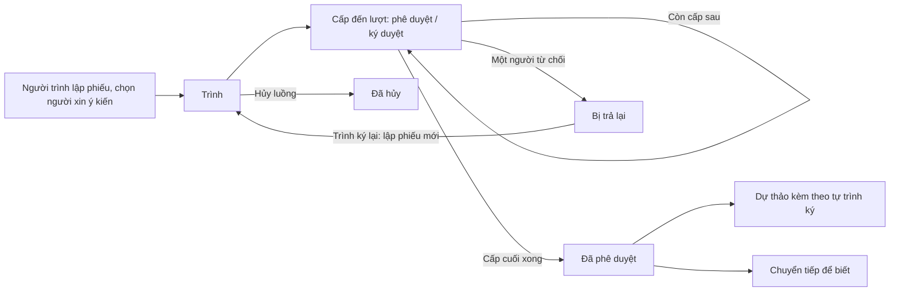

# Phiếu trình — tóm tắt nghiệp vụ cho BA

> Bản đọc nhanh bằng lời nghiệp vụ. Chi tiết và bằng chứng: [nghiep-vu.md](nghiep-vu.md) (mã NV / BR trong ngoặc
> để tra). Cập nhật: 2026-10-02 · Nguồn: code `kha_develop` + DB DEV. Nhãn quy tắc: **[Đã xác nhận]** = chủ dự án đã
> chốt là đúng ý đồ · **[Hiện trạng]** = hệ thống đang chạy như vậy, chưa ai xác nhận là ý đồ · **[Lệch nghiệp vụ]**
> = đã xác nhận nghiệp vụ muốn khác, hệ thống đang làm sai.

## 1. Phân hệ này dùng để làm gì

Phiếu trình là **phiếu xin ý kiến nội bộ**: người trình lập phiếu, chọn danh sách lãnh đạo xin ý kiến, gửi lần lượt để từng người **phê duyệt** hoặc **ký duyệt** và ghi ý kiến; người cuối danh sách là người quyết định (1.1, NV-03).
Kết quả là một **file PDF phiếu trình** in ý kiến và ảnh chữ ký từng người (NV-08).
Phiếu có thể kèm **dự thảo văn bản đi**, **văn bản đến**, **hồ sơ** và file; khi phiếu được phê duyệt xong, dự thảo kèm theo **tự động được trình ký** (NV-04, NV-09).
Sau khi phê duyệt, phiếu được **chuyển tiếp để biết**; lãnh đạo **theo dõi** phiếu trình của cán bộ trong đơn vị (NV-13, NV-14).

**Không gồm:** soạn, trình ký, ký dự thảo, khóa dự thảo khi có phiếu trình (xem `xu-ly-cong-viec`); cấp số, ban hành dự thảo sau khi ký (xem `van-ban/di`); kỹ thuật ký số (xem `ky-so`); thêm / gỡ phiếu khỏi hồ sơ, nộp hồ sơ (xem `ho-so-cong-viec`); mẫu SMS / thông báo (xem `lich-nhac-viec`); thống kê đúng hạn / quá hạn phiếu trình (xem `kpi-danh-gia`); kiến nghị / khó khăn vướng mắc — nghiệp vụ khác dù đang xếp chung (NV-18).

## 2. Ai dùng và được làm gì

| Vai trò | Được làm gì trong phân hệ này |
|---|---|
| Người trình (người tạo phiếu) | Soạn, sửa, lưu, trình, hủy luồng, xóa, sao chép, trình ký lại, cập nhật luồng ký khi đang xử lý; tạo dự thảo từ phiếu đã phê duyệt; chuyển tiếp để biết; in phiếu (1.3) |
| Người xin ý kiến chính — chỉ chọn được thủ trưởng / lãnh đạo đơn vị (`TTDV` / `LDDV`) | Khi đến lượt: phê duyệt hoặc ký duyệt (theo hành động người trình đặt), từ chối, chuyển xin ý kiến người khác; ký luôn dự thảo nếu cũng là người ký cuối dự thảo (1.3, NV-08, NV-12) |
| Người được hỏi ý kiến bổ sung | Cho ý kiến (không ký, không quyết định luồng) (1.3, NV-12) |
| Người nhận để biết | Xem phiếu đã phê duyệt, chuyển tiếp tiếp cho người khác (1.3, NV-13) |
| Người theo dõi — thủ trưởng / lãnh đạo đơn vị (`TTDV` / `LDDV`) hoặc người được cấu hình theo dõi đơn vị | Xem thống kê và danh sách phiếu trình của cán bộ trong đơn vị; chỉ xem (1.3, NV-14, BR-43) |
| Chuyên viên, lãnh đạo đơn vị (`NV`, `LDDV`) | Thấy thêm tab *Dự thảo chờ ký* trong hộp *Trình quyết định* (1.3) |

## 3. Màn hình / menu người dùng thấy

| Menu / màn | Để làm gì | Ghi chú | Mã menu |
|---|---|---|---|
| Trình xin ý kiến | Hộp của người trình: mọi phiếu mình lập; nút Thêm mới | Mặc định ẩn phiếu *Đã hủy* và *Trình ký lại*; 365 ngày gần nhất (NV-01, BR-02) | 439427 |
| Trình quyết định | Hộp của người được xin ý kiến, 6 tab: Chờ xử lý, Đang xử lý, Đã phê duyệt, Đã trả lại, Dự thảo chờ ký, Tất cả | Tab *Dự thảo chờ ký* là hộp ký dự thảo dùng chung, không riêng phiếu trình; tab *Tất cả* mở màn Theo dõi (NV-02) | 439545 |
| Theo dõi phiếu trình | Thống kê theo người (Chờ phê duyệt / Đang xử lý / Bị trả lại / Đã phê duyệt) và danh sách phiếu của cán bộ trong đơn vị | (NV-14) | 440269 |
| Phiếu trình nhận để biết | Phiếu người khác chuyển tới để biết; chưa đọc in đậm | Mỗi phiếu một dòng mới nhất (NV-13) | 441145 |
| Danh mục test (menu thử nghiệm) | — | **Đã xóa** (NV-19) | 440945 |
| Chi tiết phiếu trình | Xem phiếu theo bố cục mẫu in, lịch sử ý kiến theo cấp (cả chuỗi trình lại), file ký, tài liệu kèm, lịch sử chuyển tiếp | (NV-15) | — |
| Trang chủ — nhóm ô "Phiếu trình" | 5 ô: Chờ xử lý, Đang xử lý, Đã phê duyệt, Tất cả, Xin ý kiến | Đếm 365 ngày; quá 20 giây thì ô hiện 0 (1.2b, dac-thu L13) | — |

## 4. Luồng chính

1. Người trình vào *Trình xin ý kiến* › *Thêm mới*: nhập đơn vị ban hành, ngày trình, nội dung trình, cơ quan trình (bắt buộc), các mục ý kiến; đính kèm file, dự thảo chưa trình, văn bản đến, hồ sơ (NV-03, NV-04).
2. Chọn **danh sách cá nhân xin ý kiến** (chỉ thủ trưởng / lãnh đạo đơn vị), đặt cho từng người *Phê duyệt* hoặc *Ký duyệt*; chọn tuần tự (mỗi người một cấp) hoặc song song theo nhóm. Người cuối danh sách là người ký cuối, phải có ảnh chữ ký (NV-03, BR-07, BR-08).
3. Bấm **Trình**: hệ thống sinh file PDF phiếu, gửi SMS và thông báo cho người ở cấp đầu (NV-05).
4. Người đến lượt mở phiếu, nhập ý kiến, đính kèm file nếu cần, bấm *Phê duyệt* (không ký số) hoặc *Ký duyệt* (ký số SIM CA / USB Token); được sửa nội dung phiếu ngay trên màn chi tiết khi ký (NV-08, Q3).
5. Cấp chỉ chuyển khi mọi người xin ý kiến chính trong cấp đã xử lý; cấp kế nhận SMS và thông báo. Cấp cuối xong → phiếu **Đã phê duyệt**, người trình nhận tin (NV-08, BR-22, BR-24).
6. Phiếu xong, hệ thống **tự trình ký mọi dự thảo kèm theo**. Nếu người phê duyệt cuối phiếu cũng là người ký cuối dự thảo, dự thảo nhảy thẳng tới bước ký cuối và popup ký dự thảo mở ngay (NV-09).

**Luồng phụ.**
- *Từ chối*: người đến lượt nhập lý do (bắt buộc); cả phiếu bị trả lại, dự thảo kèm theo về *Bị trả lại*. Người trình chỉ có thể *Trình ký lại* (lập phiếu mới) hoặc *Sao chép* (NV-10).
- *Chuyển xin ý kiến*: người xin ý kiến chính hỏi thêm người khác kèm hạn phản hồi; người được hỏi *Cho ý kiến* (NV-12).
- *Cập nhật luồng ký*: khi phiếu đang xử lý, người trình đổi người ở các cấp chưa tới lượt (NV-07).
- *Hủy luồng*: người trình hủy phiếu đang xử lý; dự thảo kèm theo sang *Hủy luồng* (NV-06).
- *Chuyển tiếp để biết*: sau khi phê duyệt, người trình hoặc người đã nhận gửi phiếu cho người khác để biết (NV-13).

## 5. Trạng thái

**Trạng thái phiếu trình**

| Trạng thái (tên người dùng thấy) | Nghĩa | Chuyển sang khi nào | Giá trị |
|---|---|---|---|
| Chưa trình | Mới lưu | Lưu phiếu mới (NV-03) | 0 |
| Đang xử lý | Đã trình, đang qua các cấp | Trình (NV-05) | 1 |
| Bị trả lại | Một người xin ý kiến chính đã từ chối | Từ chối (NV-10) | 2 |
| Đã phê duyệt | Cấp cuối đã phê duyệt / ký | Cấp cuối xử lý xong (NV-08) | 3 |
| Đã hủy | Người trình hủy luồng | Hủy luồng khi đang xử lý (NV-06) | 5 |
| Trình ký lại | Phiếu cũ đã được lập phiếu mới thay thế | Lưu phiếu trình ký lại (NV-06, BR-18) | 7 |

**Phần việc của từng người trong luồng**

| Trạng thái (trong lịch sử ý kiến) | Nghĩa | Chuyển sang khi nào | Giá trị |
|---|---|---|---|
| Chưa xử lý (người được hỏi: trong hạn / quá hạn) | Chưa đến lượt hoặc chưa xử lý | Được chọn / được hỏi ý kiến (NV-03, NV-12) | 0 |
| Đồng ý (người được hỏi: hoàn thành trong hạn / quá hạn) | Đã phê duyệt, đã ký, hoặc đã cho ý kiến | Phê duyệt, ký, cho ý kiến (NV-08, NV-12) | 4 |
| Từ chối | Đã trả lại phiếu | Từ chối (NV-10) | 2 |

**Hành động người trình đặt cho từng người:** *Phê duyệt* (không ký số) `0` · *Ký duyệt* (ký số) `12` (BR-23).

## 6. Quy tắc quan trọng nhất

- [Hiện trạng] Người trình **tự chọn** danh sách người xin ý kiến (chỉ thủ trưởng / lãnh đạo đơn vị), không theo cấu hình luồng; ký song song thì người ký cuối luôn tách thành nhóm riêng cuối cùng (NV-03, BR-08).
- [Hiện trạng] Người ký cuối phải có ảnh chữ ký; thiếu thì không lưu, không trình được (BR-07).
- [Hiện trạng] Chỉ người tạo trình / hủy / xóa được; chỉ người **đúng cấp đang đến lượt** phê duyệt / ký / từ chối được — hệ thống kiểm cả ở phía máy chủ (BR-14, BR-16, BR-21).
- [Đã xác nhận] Một người xin ý kiến chính từ chối là **cả phiếu bị trả lại ngay**, kể cả khi ký song song còn người cùng nhóm chưa xử lý (BR-30, Q1).
- [Đã xác nhận] Chuyển xin ý kiến chỉ để tham khảo, **không chặn** việc chuyển cấp hay hoàn thành phiếu (BR-22, BR-36, Q2).
- [Lệch nghiệp vụ] Phiếu đã duyệt xong thì không được cho ý kiến nữa, nhưng nút *Cho ý kiến* vẫn hiện và vẫn lưu được (BR-36, Q2, dac-thu L12).
- [Đã xác nhận] Người duyệt sửa được nội dung phiếu ngay trên màn chi tiết khi ký (NV-08, Q3).
- [Đã xác nhận] Phiếu xong **tự trình ký** mọi dự thảo kèm theo; trùng người ký cuối thì dự thảo bỏ qua các cấp trước (BR-26, Q5).
- [Đã xác nhận] Hủy phiếu kéo dự thảo kèm theo sang *Hủy luồng*; phiếu bị trả lại kéo dự thảo sang *Bị trả lại* — kể cả khi dự thảo chưa từng trình (BR-17, BR-31, Q4).
- [Đã xác nhận] Các tab của người duyệt đi theo **vòng đời dự thảo kèm theo**: phiếu đã phê duyệt vẫn ở *Đang xử lý* cho tới khi dự thảo được ban hành; dự thảo bị từ chối / hủy thì phiếu sang *Đã trả lại* (BR-05, Q6).
- [Đã xác nhận] Trình ký lại **lập phiếu mới** nối chuỗi với phiếu cũ, bỏ file cũ để người dùng đưa file đã sửa, giữ dự thảo kèm theo; phiếu cũ thành *Trình ký lại* (BR-18, Q10).
- [Hiện trạng] Chỉ đính kèm được dự thảo **do mình tạo, chưa trình**, cùng độ mật với phiếu; mỗi dự thảo chỉ gắn một phiếu còn hiệu lực. Trong lúc phiếu chưa trình hoặc đang xử lý, dự thảo bị khóa trình / sửa / xóa (BR-11, BR-12, BR-33, BR-35).
- [Hiện trạng] Cập nhật luồng ký chỉ đổi được người ở **các cấp sau** cấp đang xử lý; người mới thêm nhận tin khi đến lượt (BR-19, BR-20).
- [Hiện trạng] Người trình chỉ nhận tin khi phiếu **hoàn thành** hoặc **bị trả lại**, không nhận tin ở từng cấp trung gian (BR-24).
- [Đã xác nhận] Chỉ chuyển tiếp để biết phiếu đã phê duyệt; người nhận để biết được chuyển tiếp tiếp cho người khác (BR-39, BR-40, Q8).
- [Đã xác nhận] Theo dõi phiếu trình tính cán bộ là chuyên viên và lãnh đạo đơn vị (`NV`, `LDDV`) của đơn vị và đơn vị con một cấp (NV-14, Q9).

## 7. Hệ thống KHÔNG làm / hay bị hiểu nhầm

- **Phiếu trình không có số, không ban hành, không vào sổ văn bản** (1.1).
- **Tên menu dễ nhầm:** *Trình xin ý kiến* là hộp của người trình; *Trình quyết định* là hộp của người phê duyệt / ký duyệt (1.2).
- **Danh sách người trình mặc định ẩn** phiếu *Đã hủy* và *Trình ký lại* — phải chọn đúng trạng thái mới thấy (BR-02).
- **Không sửa và trình lại phiếu bị trả lại;** trình ký lại luôn tạo phiếu mới (BR-32).
- **"Tạo phiếu trình" từ màn dự thảo đang bỏ, không dùng** — phiếu kèm dự thảo đi qua form phiếu trình (NV-11, Q11).
- **Hạn phản hồi ý kiến bổ sung chỉ để hiện trong hạn / quá hạn;** quá hạn không có xử lý tự động (BR-38).
- **"Số tờ" là số trang của phiếu trong một hồ sơ** (phục vụ mục lục hồ sơ), không phải thống kê in ấn (BR-48).
- **Không có vai trò văn thư riêng** cho phiếu trình (1.4).
- **Phiếu trình mật:** nghiệp vụ văn bản mật chưa dùng, dù hệ thống còn nhánh xử lý riêng (NV-17).
- **Số người in khung ý kiến và ảnh ký trên phiếu có giới hạn** theo số mẫu in có sẵn (tối đa 20) (dac-thu bẫy 10).

## 8. Liên quan phân hệ khác

| Khi thay đổi ở đây… | …phải xem thêm | Vì sao |
|---|---|---|
| Hoàn thành / trả lại / hủy phiếu | `xu-ly-cong-viec` | Phiếu tự trình ký, trả lại, hủy luồng dự thảo kèm theo; dự thảo bị khóa khi phiếu còn hiệu lực (NV-09, NV-11, BR-17, BR-31) |
| Tab hộp *Trình quyết định*, cột trạng thái | `xu-ly-cong-viec`, `van-ban/di` | Tab đọc trạng thái dự thảo kèm theo đến lúc ban hành (BR-05) |
| Ký duyệt phiếu, ký luôn dự thảo | `ky-so` | Ký SIM CA / USB Token đi qua phân hệ đó (NV-08, NV-09) |
| Đính kèm hồ sơ, số tờ, nộp hồ sơ | `ho-so-cong-viec` | Hồ sơ kiểm phiếu đã phê duyệt và dự thảo kèm đã ban hành khi nộp (NV-16) |
| Đính kèm văn bản đến | `van-ban/den` | Văn bản đến chọn qua popup tra cứu chung (NV-04) |
| SMS / thông báo ở từng bước | `lich-nhac-viec` | Mẫu tin và cấu hình nằm ở đó (1.1) |
| Thống kê phiếu trình đúng hạn / quá hạn, tình hình xử lý cá nhân | `kpi-danh-gia`, `van-ban/quan-ly-chung` | Có dùng lại số liệu và nút phiếu trình (1.1) |

## 9. Câu hỏi nghiệp vụ còn mở

- `Q7` — Cột "loại" của phiếu trình (có giá trị ở khoảng 116 phiếu nhưng hệ thống không đọc / ghi) nghĩa là gì, có phải tính năng ở nhánh khác; chủ dự án chưa rõ, cần hỏi người làm tính năng / BA.

## 10. Khi viết yêu cầu mới cho phân hệ này, nhớ ghi rõ

- **Áp dụng cho ai trong luồng:** người xin ý kiến chính (phê duyệt hay ký duyệt), người được hỏi ý kiến bổ sung, người nhận để biết, người theo dõi (1.3).
- **Tuần tự hay song song theo nhóm** — và khi song song thì chờ cả nhóm hay một người (BR-08, BR-22, BR-30).
- **Trạng thái phiếu nào được thao tác:** Chưa trình, Đang xử lý, Bị trả lại, Đã phê duyệt, Đã hủy, Trình ký lại (mục 3 "Giá trị trạng thái", NV-01).
- **Ảnh hưởng tới dự thảo kèm theo:** khi phiếu xong / bị trả lại / bị hủy dự thảo đổi thế nào; tab của người duyệt có đổi theo không (NV-09, BR-05, BR-17, BR-31).
- **Nút đặt ở đâu:** lưới *Trình xin ý kiến*, lưới *Trình quyết định*, màn *Theo dõi*, hộp *Nhận để biết*, màn chi tiết — mỗi nơi tính điều kiện hiện nút riêng (dac-thu bẫy 7).
- **Có cần chặn ở phía máy chủ không** (phân hệ này đã kiểm người tạo / người đúng lượt ở máy chủ cho trình, hủy, xóa, ký, từ chối) (1.3, BR-21).
- **Nội dung mới có in lên file phiếu không** — nếu có thì phải sửa mọi mẫu in (dac-thu mục 4).
- **Có gửi SMS / thông báo không, cho ai:** người cấp kế, người trình, người được hỏi ý kiến, người nhận để biết (NV-05, NV-08, NV-12, NV-13).
- **Số đếm có đổi không:** ô trang chủ, nhãn tab, thống kê màn Theo dõi — điều kiện tab đang lặp ở nhiều nơi (NV-02, NV-14, dac-thu bẫy 6).
