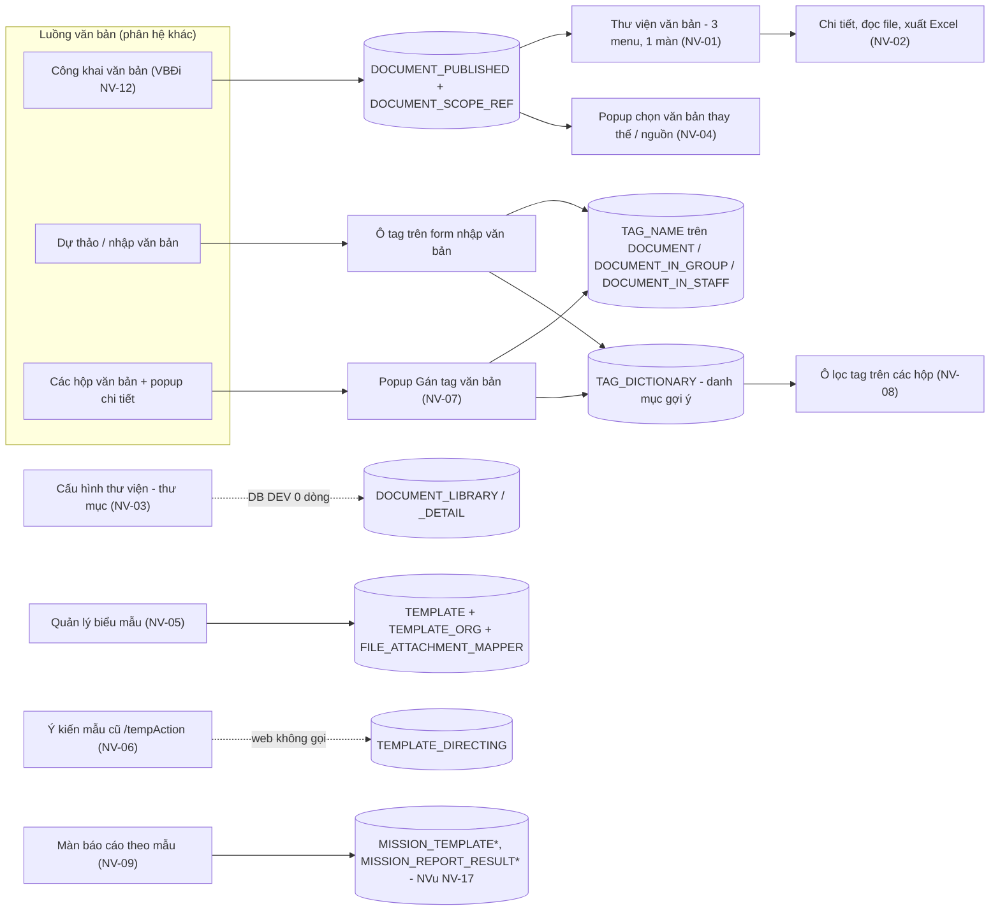
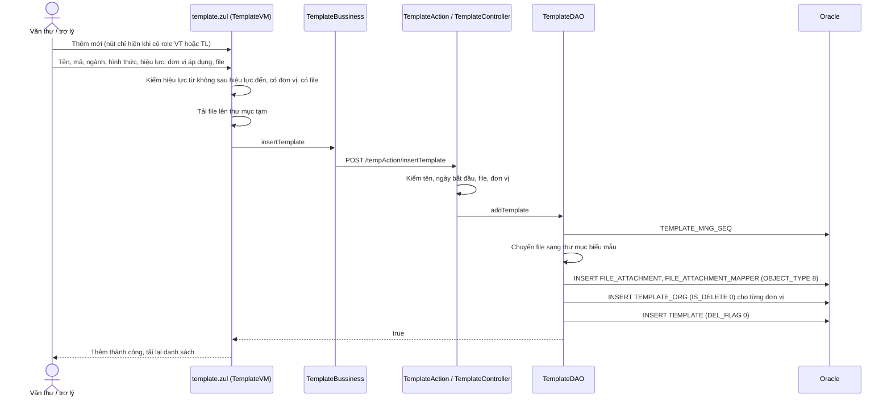
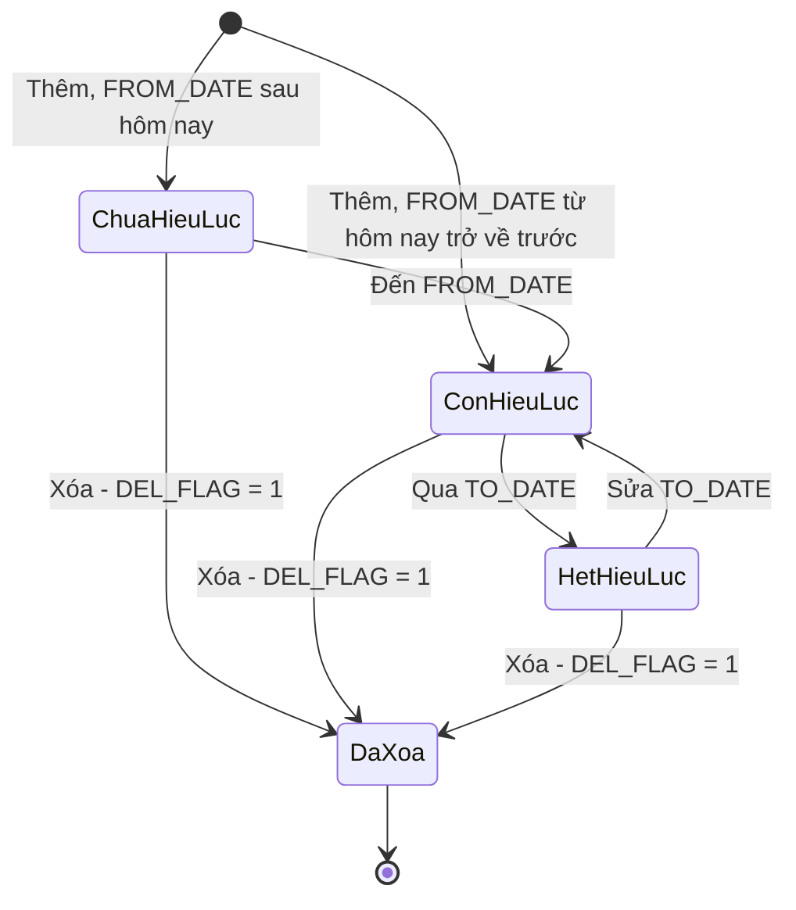
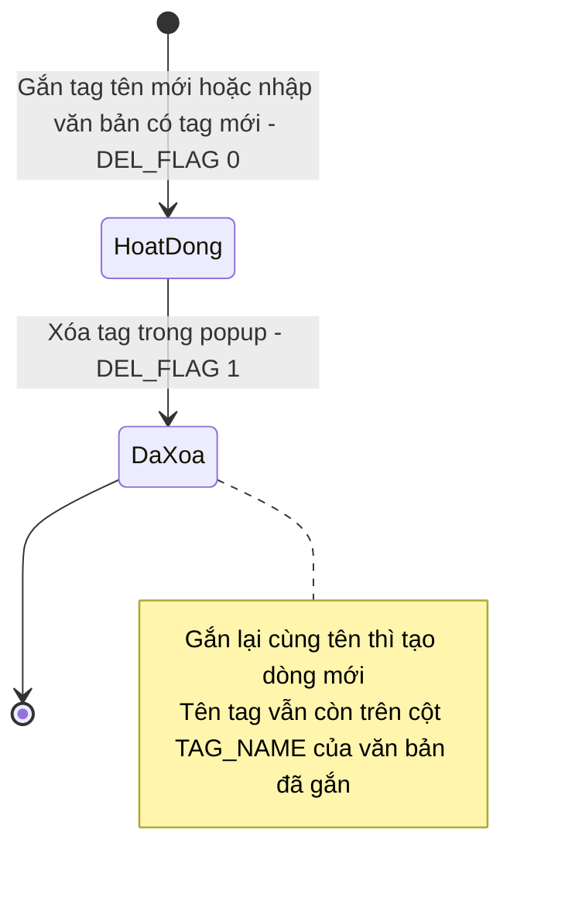
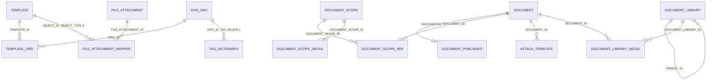

# Thư viện, biểu mẫu, từ điển tag, báo cáo theo mẫu — nghiệp vụ: thư viện văn bản công khai, cấu hình thư mục thư viện, quản lý biểu mẫu (`TEMPLATE`), ý kiến mẫu gen-1, từ điển tag gắn văn bản, các màn "Thiết lập / Gửi / Tổng hợp báo cáo" (`templateReport/*`)

> Viết lại từ code nhánh `kha_develop` (web-spring + backend2.0) ngày 2026-10-02. Mọi khẳng định có nguồn `file:dòng`.
> Menu đối chiếu **DB DEV `SYS_MENU` ngày 2026-10-01**; số dòng, phân bố giá trị, comment cột các bảng `ATTACH_TEMPLATE`, `DOCUMENT_LIBRARY`, `DOCUMENT_LIBRARY_DETAIL`, `DOCUMENT_TEMPLATE`, `TAG_DICTIONARY`, `TEMPLATE` đối chiếu **DB DEV ngày 2026-10-01** (do người điều phối truy vấn, chỉ SELECT; tác giả không kết nối DB). Không có FK nào trên các bảng này (DB DEV) — quan hệ ở mục 5 là quan hệ logic lấy từ JOIN / entity. Bảng thấy trong code mà không có trong dữ liệu tra sẵn (`TEMPLATE_ORG`, `TEMPLATE_DIRECTING`, `FILE_ATTACHMENT_MAPPER`, `DOCUMENT_PUBLISHED`…) ghi "chưa đối chiếu DB". Bổ sung **DB DEV ngày 2026-10-02** (người điều phối tra theo mục "Cần tra DB"): `TEMPLATE_DIRECTING`, `TEMPLATE_ORG`, `TEMPLATE` × `DOCUMENT_TYPE`, `TAG_DICTIONARY`, cột `TAG_NAME`, vai trò `REPORT`, `SYSTEM_PARAMETER`, `DOCUMENT_PUBLISHED.STATUS`.
>
> Viết tắt đường dẫn:
> `WEB/` = `web-spring/src/main/java/com/viettel/` · `ZUL/` = `web-spring/src/main/webapp/view/voffice/` · `WZUL/` = `web-spring/src/main/webapp/view/widgets/` ·
> `BIZ/` = `web-spring/src/main/java/com/voffice/service/business/` · `BE1/` = `backend2.0/backendvoffice/src/main/java/com/viettel/voffice/` ·
> `BE2/` = `backend2.0/backendvoffice/src/main/java/com/viettel/office/` · `SQL/` = `backend2.0/backendvoffice/sql/`.
> Lớp hay dùng — **thư viện**: **DLVM** = `WEB/voffice/vm/document/DocumentLibraryVM.java`, **DLDVM** = `WEB/voffice/vm/document/DocumentLibraryDetailVM.java`, **RQB** = `BIZ/RequisitionBusiness.java`, **DC** = `BE1/controler/DocumentController.java`, **DLDAO** = `BE1/database/dao/document/DocumentLibraryDAO.java`; **biểu mẫu**: **TVM** = `WEB/voffice/widget/TemplateVM.java`, **TB** = `BIZ/TemplateBussiness.java`, **TA** = `BE1/action/TemplateAction.java`, **TC** = `BE1/controler/TemplateController.java`, **TDAO** = `BE1/database/dao/TemplateDAO.java`; **tag**: **TDB** = `BIZ/TagDictionaryBusiness.java`, **IHD** = `WEB/voffice/widget/InfoHastagDoc.java`, **DVDVM** = `WEB/voffice/vm/document/DocumentViewDetailVM.java`, **TDC** = `BE2/controller/TagDictionaryController.java`, **TDSI** = `BE2/services/impl/TagDictionaryServiceImpl.java`, **TDRI** = `BE2/repositories/impl/TagDictionaryRepositoryImpl.java`, **TDJ** = `BE2/repositories/jpa/TagDictionaryJpa.java`; **báo cáo theo mẫu**: **WRVM** = `WEB/voffice/vm/template/WriteReportVM.java`, **ATRVM** = `WEB/voffice/vm/template/AddTemplateReportVM.java`; chung: **AC** = `WEB/util/AppConstants.java`, **C1** = `BE1/constants/Constants.java`.
> Phân hệ liền kề đã viết: quản lý chung văn bản [`../van-ban/quan-ly-chung/nghiep-vu.md`](../van-ban/quan-ly-chung/nghiep-vu.md) (ký hiệu `QLC NV-xx`), văn bản đi [`../van-ban/di/nghiep-vu.md`](../van-ban/di/nghiep-vu.md) (`VBĐi`), văn bản đến [`../van-ban/den/nghiep-vu.md`](../van-ban/den/nghiep-vu.md) (`VBĐ`), dự thảo [`../xu-ly-cong-viec/nghiep-vu.md`](../xu-ly-cong-viec/nghiep-vu.md) (`XLCV`), nhiệm vụ [`../nhiem-vu/nghiep-vu.md`](../nhiem-vu/nghiep-vu.md) (`NVu`).

## 1. Tổng quan

### 1.1 Phạm vi

Phân hệ nhỏ, hỗ trợ, gồm các "kho dùng chung" bên cạnh luồng văn bản:

- **Thư viện văn bản** — danh sách **văn bản đã công khai** (bảng `DOCUMENT_PUBLISHED` + phạm vi `DOCUMENT_SCOPE_REF`) mà phạm vi chứa đơn vị của người dùng; ba menu cùng mở một màn (NV-01); xem chi tiết, đọc / tải file, xuất Excel (NV-02).
- **Thư mục thư viện** ("Cấu hình thư viện", "Chuyển vào thư viện") — bảng `DOCUMENT_LIBRARY` / `DOCUMENT_LIBRARY_DETAIL`, code legacy web, **DB DEV 0 dòng** — chưa vận hành (NV-03). Popup chọn văn bản từ thư viện dùng ở nơi khác (NV-04).
- **Quản lý biểu mẫu** — kho file mẫu (`TEMPLATE`) gắn đơn vị áp dụng, có thời hạn hiệu lực (NV-05).
- **Ý kiến mẫu gen-1** (`TEMPLATE_DIRECTING`, `/tempAction` phần cũ) — API còn, web không gọi (NV-06).
- **Từ điển tag** (`TAG_DICTIONARY`) và gắn tag cho văn bản ở ba mức: văn bản đi, dòng nhận của đơn vị, dòng nhận của cá nhân (NV-07); ô lọc tag ở các hộp văn bản (NV-08).
- **Màn báo cáo theo mẫu** `ZUL/templateReport/*` (Thiết lập biểu mẫu báo cáo, Gửi / Tổng hợp báo cáo đơn vị, Gửi báo cáo ngày) — chỉ mô tả phía màn; nghiệp vụ / BE ở `NVu NV-17` (NV-09).
- Thành phần khác, không dùng hoặc thuộc phân hệ khác (NV-10).

Phân hệ **KHÔNG gồm** (trỏ sang):

| Nội dung | Phân hệ |
|---|---|
| **Tài liệu cá nhân** (`SAVE_PER_DOC`, `PERSONAL_STOTAGE`, `PERSONAL_CATEGORY`), **ghi chú / trao đổi** (`DOCUMENT_CHAT`), **mẫu ý kiến chuyển văn bản** (`DOCUMENT_TEMPLATE`, `/api/doc/*-document-template`) | `van-ban/quan-ly-chung` (QLC NV-14, NV-15, NV-16) — code gắn với luồng văn bản, không với thư viện; ở đây không viết lại. DB DEV ngày 2026-10-01: `PERSONAL_STOTAGE` `DEL_FLAG` 0 = 524, 1 = 186; `PERSONAL_CATEGORY` 0 = 94, 1 = 42; `DOCUMENT_TEMPLATE` 0 dòng (khớp QLC) |
| **Công khai / hủy công khai văn bản** (ghi `DOCUMENT_PUBLISHED`, `DOCUMENT_SCOPE_REF`), văn bản thay thế, tự động công bố vào thư viện khi cấp số | `van-ban/di` (VBĐi NV-12, BR-37 … BR-40) — thư viện chỉ **đọc** kết quả |
| Danh mục phạm vi văn bản (`DOCUMENT_SCOPE`), quyền xem văn bản đã công khai | `van-ban/quan-ly-chung` (QLC NV-10, NV-11, BR-13) |
| **File biểu mẫu kèm dự thảo / văn bản** (`ATTACH_TEMPLATE`, vùng "File biểu mẫu" trên form) | `xu-ly-cong-viec` (XLCV BR-12, mục file), `van-ban/den` (nhập văn bản) — ở đây chỉ ghi chỗ thư viện đọc (NV-02) |
| Mẫu báo cáo / kết quả báo cáo đơn vị: bảng `MISSION_TEMPLATE*`, `MISSION_REPORT_RESULT*`, `REPORT_DAILY_HISTORY`, BE `/api/mission-template`, `/api/report-result` | `nhiem-vu` (NVu NV-17) |
| Tìm kiếm toàn văn kho văn bản công khai (Elasticsearch) | `van-ban/quan-ly-chung` (QLC NV-02), `tich-hop` |
| Mẫu xuất Excel / Word dựng sẵn trong `webapp/template/*` (dùng bởi nhiều màn) | phân hệ của từng màn xuất; bộ lọc bảo vệ ở NV-10 |

### 1.2 Menu (đối chiếu DB DEV `SYS_MENU` ngày 2026-10-01)

`SYS_MENU.STATUS`: 1 = mở khóa, 2 = khóa (X3). Code chỉ tham chiếu **mã menu**; URL nằm ở DB.

| `SYS_MENU_ID` | `CODE` | Tên (DB DEV) | Cha | URL | `STATUS` | VM / NV | Bằng chứng code |
|---|---|---|---|---|---|---|---|
| 337753 | `TVT` | **Thư viện văn bản** | VĂN CÔNG KHAI (337265) | `/view/voffice/library/documentLibrary.zul?library=0` | 1 | DLVM — NV-01 | — |
| 337773 | `TVCN` | Thư viện cá nhân | VĂN BẢN ĐẾN (337200) | `…/documentLibrary.zul?library=1` | 1 | DLVM — NV-01 (cùng màn, BR-01) | — |
| 338414 | `DOCUMENT_LIBRARY` | Thư viện Quy trình - Quy định | **chính nó** (`PARENT_ID = 338414`) | `…/documentLibrary.zul?library=1` | 1 | DLVM — NV-01 | — |
| 337752 | `CHTV` | Cấu hình thư viện | QUẢN TRỊ (336812) | `/view/voffice/library/configlibrary.zul` | 1 | DLVM — NV-03 | — |
| 338651 | `TEMPLATE` | **Quản lý biểu mẫu** | DANH MỤC (336813) | `/view/widgets/template/template.zul` | 1 | TVM — NV-05 | mở tab theo mã `TEMPLATE`: `WEB/voffice/vm/documentDraft/DocumentDraftVM.java:14612-14614` (link đang ẩn — BR-14) |
| 440309 | `TEMPLATE_DAY_REPORT` | Thiết lập biểu mẫu báo cáo | BÁO CÁO NGÀY (440307) | `/view/voffice/templateReport/templateDayReport.zul` | 1 | ATRVM — NV-09 | — |
| 440311 | `SEND_DAY_REPORT` | Gửi báo cáo ngày | BÁO CÁO NGÀY (440307) | `/view/voffice/templateReport/sendDayReport.zul` | 1 | WRVM — NV-09 | — |
| 440105 | `SUMMARY_REPORT` | Tổng hợp báo cáo đơn vị | QUẢN LÝ NHIỆM VỤ (337971) | `/view/voffice/templateReport/summaryReport.zul` | 1 | ATRVM + WRVM — NV-09 | — |
| 440145 | `SEND_REPORT` | Gửi báo cáo đơn vị | QUẢN LÝ NHIỆM VỤ (337971) | `/view/voffice/templateReport/sendReport.zul` | 1 | WRVM — NV-09 | — |

Từ điển tag **không có menu** — chỉ là popup "Gán tag văn bản" trên chi tiết văn bản và ô chọn tag trên form nhập văn bản (NV-07).

### 1.3 Widget trang chủ

Không có (DB DEV `HOME_WIDGET` ngày 2026-10-01 không có ô nào thuộc thư viện / biểu mẫu / tag).

### 1.4 Actor & quyền

Mã vai trò: văn thư = `VT` (`userRole.documentManager`), trợ lý = `TL`, thủ trưởng = `TTDV`, lãnh đạo = `LDDV`, admin `ADMIN`, admin cấp 1 `ADMIN_LEVEL1` (`web-spring/src/main/resources/application.properties:344-350`); riêng báo cáo ngày dùng vai trò **`REPORT`** ghi cứng (ATRVM:173-185; WRVM:324-333; DB DEV `SYS_ROLE` ngày 2026-10-02: id 438401 "Báo cáo", 9 dòng `USER_ROLE`). Quyền thao tác nằm ở **tầng hiển thị nút** trên web (X1).

| Actor | Nhận diện trong code | Làm gì |
|---|---|---|
| Người dùng có menu thư viện | — | Xem văn bản công khai trong phạm vi đơn vị mình (BR-02), đọc / tải file, xuất Excel (NV-01, NV-02) |
| Văn thư / trợ lý đơn vị | role `VT` / `TL` tại đơn vị (TVM:140-150) | Thêm biểu mẫu cho đơn vị mình và cấp dưới; sửa / xóa biểu mẫu áp dụng cho đơn vị mình (BR-10, BR-11) |
| Người tạo biểu mẫu | `TEMPLATE.CREATED_BY` | Sửa / xóa biểu mẫu mình tạo (TVM:639-642) |
| Văn thư (`isDocManager`) | có role `VT` ở bất kỳ đơn vị nào (`WEB/voffice/common/CommonModel.java:104-106`) | Gắn **tag đơn vị** cho văn bản đi / dòng nhận của đơn vị; xóa tag khỏi danh mục đơn vị (NV-07) |
| Người dùng khác | — | Gắn **tag cá nhân** trên dòng nhận của mình (NV-07) |
| Lãnh đạo / thủ trưởng / trợ lý đơn vị; chuyên viên được gán | `Meeting.getListOrganizationsAssign` (chú thích `BIZ/OrientationBusiness.java:528-531`), `missionBusiness.getListOrgPerformSpecialist` | Thiết lập mẫu, viết / gửi / tổng hợp báo cáo tuần – tháng (NV-09) |
| Người có vai trò `REPORT` tại đơn vị | ATRVM:173-185; WRVM:324-333 | Thiết lập mẫu và gửi báo cáo ngày (NV-09) |
| Quản trị | có menu `CHTV` | Cấu hình thư mục thư viện (NV-03, chưa vận hành) |

### 1.5 Sửa so với knowledge cũ (2026-10-02)

| Knowledge cũ | Hiện trạng code `kha_develop` | Ghi ở |
|---|---|---|
| "Thư viện văn bản: tra cứu văn bản công khai / đã ban hành **theo cây** (`treeLibrary.vm`, `IDocumentLibrary`)" | Màn thư viện là **danh sách phẳng** văn bản đã công khai qua BE gen-1 `DocumentAction.actionSearchDocViewLibrary`; cây thư mục (`DocumentLibraryTreeVM`) **không zul nào gắn**; `IDocumentLibrary` chỉ còn dùng cho popup chọn thư mục (sửa 2026-10-02) | NV-01, NV-03, NV-10 |
| (không có) | Ba menu "Thư viện văn bản", "Thư viện cá nhân", "Thư viện Quy trình - Quy định" mở **cùng một danh sách** — tham số `library=0/1` không được đọc (BR-01) | NV-01 |
| QT3 "Thư viện chỉ hiển thị văn bản đã công khai hoặc trong phạm vi được cấp" | Chỉ văn bản **đang công khai** (`DOCUMENT_PUBLISHED.STATUS` 0 / 3, không bị thay thế) **và** có phạm vi đang hiệu lực chứa đơn vị của người dùng **hoặc đơn vị cấp trên** (BR-02, BR-03) (sửa 2026-10-02) | NV-01 |
| QT1 "Mẫu có thứ tự hiển thị (`updateIndexTemplate`) và thuộc đơn vị/loại (?)" | Hai thứ khác nhau cùng nằm ở `/tempAction`: **biểu mẫu** `TEMPLATE` (đơn vị áp dụng `TEMPLATE_ORG`, hiệu lực từ – đến, file đính kèm) và **ý kiến mẫu** `TEMPLATE_DIRECTING` (theo người, có thứ tự `TEMP_INDEX`, loại 0 ký văn bản / 1 chuyển công văn). Web chỉ dùng phần biểu mẫu (sửa 2026-10-02) | NV-05, NV-06 |
| "Mẫu báo cáo (in/xuất) `templateReport/*.zul` (9), `com.viettel.report.template`, `com.viettel.util.exporter`" | `templateReport/*` là màn **thiết lập / viết / gửi / tổng hợp báo cáo đơn vị theo mẫu** (BE `mission-template` / `report-result` — NVu NV-17), không phải in / xuất; `report/template` chỉ chứa một Jasper "báo cáo ngày văn bản đến" của sổ văn bản (sửa 2026-10-02) | NV-09, NV-10 |
| "Mẫu văn bản mặc định theo loại (gen-2) `DocController.add-document-template`…; cột `ATTACH_TEMPLATE`" | `DOCUMENT_TEMPLATE` = **mẫu ý kiến chuyển văn bản** của từng người (QLC NV-16); `ATTACH_TEMPLATE` = **file biểu mẫu kèm văn bản** (SQL `01062026…` chỉ thêm cột `DEL_FLAG`) — hai thứ không liên quan nhau (sửa 2026-10-02) | 1.1, NV-10 |
| QT2 "Tag gắn theo 3 mức: văn bản, văn bản-nhóm, văn bản-người" | Đúng; bổ sung: tag lưu thành **chuỗi tên cách nhau dấu phẩy** trên cột `TAG_NAME` của `DOCUMENT` / `DOCUMENT_IN_GROUP` / `DOCUMENT_IN_STAFF`, `TAG_DICTIONARY` chỉ là danh mục gợi ý; tối đa 5 tag, mỗi tag ≤ 40 ký tự (BR-16 … BR-20) | NV-07 |
| câu cũ 1: "Cấu hình thư viện cấu hình cây thư mục hay quyền xem?" | Code: CRUD **thư mục** `DOCUMENT_LIBRARY` (tên, mã, biểu tượng, mô tả, thư mục cha, loại Quy trình / Cá nhân), không có quyền xem (X7) | NV-03 |
| câu cũ 2: "Mẫu văn bản (docx) có WOPI soạn thảo online không?" | Code: biểu mẫu chỉ **xem PDF / tải về** (TVM:526-561), không mở soạn thảo trực tuyến (X8) | NV-05 |
| `dac-thu`: "`TemplateFilter` xử lý URL mẫu (?)" | Bộ lọc chặn truy cập `/template/*` (thư mục file mẫu xuất báo cáo của web) khi chưa đăng nhập (X9) | NV-10 |

## 2. Module

Thư viện văn bản đọc qua **BE gen-1** (`DocumentAction` → `DocumentController` → `DocumentLibraryDAO`, SQL thuần); thư mục thư viện là **legacy web** (VM ghi thẳng `DOCUMENT_LIBRARY*` qua `iCommon`, facade `IDocumentLibrary`). Biểu mẫu chạy **gen-1** `TemplateAction` (`/tempAction`, 12 endpoint) — web còn có facade legacy `ITemplate` nhưng không VM nào dùng (NV-10). Từ điển tag: danh mục và đọc là **gen-2** `TagDictionaryController` (`/api/tag-dictionary`, 14 endpoint), **ghi tag lên văn bản** là **gen-1** `DocumentAction.EditDocument*Tag` gọi service gen-2.

| Chức năng | Màn (.zul) | VM | Business (key) | Endpoint BE | Controller / service | DAO / repository → bảng |
|---|---|---|---|---|---|---|
| Thư viện văn bản (NV-01) | `ZUL/library/documentLibrary.zul` + `documentLibrary_search.zul` | DLVM `findDataList` :742-752, `countDataList` :877-886 | `RQB.getListDocViewLibrary` :265-317, `countDocViewLibrary` :549-592 → `DocumentAction.actionSearchDocViewLibrary` | `POST /DocumentAction/actionSearchDocViewLibrary` (`BE1/action/DocumentAction.java:132-138`) | DC :1179-1349 | DLDAO :85-502 → `DOCUMENT_PUBLISHED`, `DOCUMENT`, `DOCUMENT_SCOPE_REF`, `DOCUMENT_SCOPE`, `DOCUMENT_SCOPE_DETAIL`, `DOCUMENT_TYPE`, `AREA`, `SECURITY_TYPE`, `DOCUMENT_IN_GROUP`, `FILES_ATTACHMENT`, `ATTACH_TEMPLATE`, `USER_ROLE`, `VHR_ORG` |
| Chi tiết, file, xuất Excel (NV-02) | `ZUL/library/documentDetails.zul` (popup) | DLVM `doViewDetail` :1036-1080, `readAllAttachedFile` :665-721, `doExport` :1241-1261; DLDVM :97-133 | `DocumentBusiness.getDocumentDetail`; `RQB.getDocumentLibrary` :488-547 | như trên | — | như trên |
| Thư mục thư viện (NV-03) | `ZUL/library/configlibrary.zul` (+ `librarySearch.zul`, `libraryAdd.zul`); `ZUL/library/documentAddLibrary.zul` (popup "Chuyển vào thư viện"); `ZUL/library/documentLibraryTree.zul` (popup chọn thư mục) | DLVM `onDoSave` :227-250, `validateDoDelete` :483-496; DLDVM `doSaveDocumentDetail` :266-300; `WEB/voffice/treeLibrary/vm/DocumentLibraryLookupVM.java` | — (legacy `iCommon`, facade `IDocumentLibrary`) | — | `WEB/voffice/facade/DocumentLibraryFacade.java` → `WEB/voffice/service/DocumentLibraryService.java` | `WEB/voffice/dao/DocumentLibraryJpaDao.java` → `DOCUMENT_LIBRARY`, `DOCUMENT_LIBRARY_DETAIL` |
| Chọn văn bản từ thư viện (NV-04) | `ZUL/widgets/sourceLookupDocumentLibrary.zul`, `ZUL/widgets/sourceLibraryDocument.zul` | `WEB/voffice/widget/SourceLookupDocumentLibraryVM.java`, `SourceLibraryDocumentVM.java` | `RQB.getListDocViewLibrary` (hai bản :184-262 và :265-317) | như NV-01 | | |
| Quản lý biểu mẫu (NV-05) | `WZUL/template/template.zul` (+ `template_add.zul`, `template_search.zul`), `template_viewDetail.zul` (popup) | TVM | `TB.searchTemplate` / `countTemplate` / `insertTemplate` / `updateTemplate` / `deleteTemplate` → `tempAction.*`; tải file `Files.downloadFileTemplate` (TB:44-224) | `POST /tempAction/{searchTemplate, insertTemplate, updateTemplate, delete}` (TA:214-254, :178-182); `POST /Files/downloadFileTemplate` (`BE1/action/FileService.java:435-441`) | TC :742-806, :874-1185, :640-740 | TDAO :500-1452 → `TEMPLATE`, `TEMPLATE_ORG`, `FILE_ATTACHMENT`, `FILE_ATTACHMENT_MAPPER`, `VHR_ORG`, `VHR_EMPLOYEE`, `USER_ROLE`, `DOCUMENT_TYPE`, `AREA` |
| Ý kiến mẫu gen-1 (NV-06) | — (không màn web) | — | — | `POST /tempAction/{getListTemplate, addTemplate, editTemplate, deleteTemplate, deleteListTemplate, updateIndexTemplate, addListTemplate, getTemplateDetail}` (TA:36-200) | TC :71-640, :808-872 | TDAO :73-497 → `TEMPLATE_DIRECTING` |
| Danh mục + popup gắn tag (NV-07) | `ZUL/widgets/popupInfoHastag.zul` (mở từ `ZUL/document/reportSendReceiveDoc/popupVB.zul:4417-4420`, `4470-4473`, `4487-4490`, `popupVB_issue_number.zul`, `ZUL/requisition/requisition_viewDetail.zul:4910`); ô tag trên `ZUL/document/inputDoc/doc_in_add.zul:612-628`, `doc_out_add.zul:322-338` | IHD :195-328, :766-943; DVDVM `doHastagDocument` :7828-7930, `isVisibleHastag` :8170-8261 | TDB (14 khóa `api.tag-dictionary.*`); ghi: `DocumentBusiness` → `DocumentAction.EditDocumentTag` / `EditDocumentInGroupTag` / `EditDocumentInStaffTag` (`BIZ/DocumentBusiness.java:1257`, `1293`, `1331`) | `/api/tag-dictionary/*` (TDC:36-122); `POST /DocumentAction/EditDocument{,InGroup,InStaff}Tag` (`BE1/action/DocumentAction.java:1613-1639`) | TDSI; DC :14728-15005 | TDRI, TDJ → `TAG_DICTIONARY`; `DOCUMENT.TAG_NAME`, `DOCUMENT_IN_GROUP.TAG_NAME`, `DOCUMENT_IN_STAFF.TAG_NAME` |
| Lọc theo tag (NV-08) | ô tag trên ~13 hộp văn bản (ví dụ `ZUL/document/reportSendReceiveDoc/documentOut_search.zul:566`) | ví dụ `WEB/voffice/vm/document/DocumentPendingProcessingVM.java:12298-12312` | `TDB.getHastagListForSearchBox` (TDB:31-57) | `POST /api/tag-dictionary/get-list-tag-for-searchbox` (TDC:36-40) | TDSI :32-36 | TDRI :24-66; lọc: `BE1/database/dao/document/DocumentDAO.java:3388-3396`, `18250-18258` |
| Màn báo cáo theo mẫu (NV-09) | `ZUL/templateReport/{summaryReport, sendReport, templateDayReport, sendDayReport}.zul` → `addTemplateReport.zul`, `writeReport.zul` (+ `configHeading.zul`, `summaryListReport.zul`, `templateReportUploadFile.zul`) | `SummaryReportVM`, `SendDayReportVM` (vỏ), ATRVM, WRVM, `ConfigHeadingVM` | `MissionBusiness` (`api.mission-template*`, `api.report-result*` …) | xem NVu NV-17 | | |

## 3. Nghiệp vụ

### Giá trị dùng xuyên suốt

| Cột / hằng | Giá trị | Nguồn |
|---|---|---|
| `DOCUMENT_PUBLISHED.STATUS` (đọc ở thư viện) | 0 đang công khai, 1 hủy công khai, 2 bị thay thế (VBĐi BR-37, BR-40); thư viện lấy `0` **hoặc `3`** — không code nào ghi giá trị 3 (grep `document_published` + `status = 3` rỗng); DB DEV `DOCUMENT_PUBLISHED` ngày 2026-10-02: chỉ `STATUS = 0` (21 dòng) | DLDAO:262-275 |
| `DOCUMENT_LIBRARY.USER_LIBRARY` | `0011L` (= **9**, literal bát phân trong Java) = thư viện **quy trình** (dùng chung); id người dùng = thư viện **cá nhân** | AC:3387-3390; DLVM:227-235 |
| `TEMPLATE.DEL_FLAG` | 0 chưa xóa, 1 đã xóa (comment DB DEV). DB DEV ngày 2026-10-01: 0 = 103, 1 = 22 (tổng 125) | TDAO:507 |
| `TEMPLATE_ORG.IS_DELETE` | 0 còn áp dụng, 1 đã bỏ. DB DEV `TEMPLATE_ORG` ngày 2026-10-02: 0 = 275, 1 = 4, null = 3 (dòng null không khớp điều kiện `IS_DELETE = 0` nên không được tính là đơn vị áp dụng khi tìm) | TDAO:701, 749-750 |
| `FILE_ATTACHMENT_MAPPER.OBJECT_TYPE` | **8** = file của biểu mẫu | TDAO:61 |
| `TEMPLATE_DIRECTING.TYPE` | 0 ý kiến mẫu khi **ký văn bản**, 1 khi **chuyển công văn**; **bảng không tồn tại trên DB DEV** (ORA-00942, ngày 2026-10-02) | TDAO:55-58, 69-70 |
| `TAG_DICTIONARY.TAG_SCOPE` | 1 cá nhân, 2 đơn vị (comment DB DEV; C1:2713-2714) | `SQL/20251012_create_table_tag_dictionary.sql:5` |
| `TAG_DICTIONARY.DEL_FLAG` | 0 hoạt động, 1 đã xóa. DB DEV ngày 2026-10-01: 0 = 627, 1 = 172 (tổng 799); theo (`TAG_SCOPE`, `DEL_FLAG`) ngày 2026-10-02: (2, 0) = 478, (2, 1) = 125, (1, 0) = 149, (1, 1) = 47 | C1:2711-2712 |
| Giới hạn tag | tối đa **5** tag / văn bản, mỗi tag ≤ **40** ký tự; ngăn cách `,` | AC:9558-9566 |

### NV-01. Thư viện văn bản (menu `TVT`, `TVCN`, `DOCUMENT_LIBRARY`) — danh sách văn bản đang công khai trong phạm vi đơn vị

**Mục đích.** Người dùng tra cứu các văn bản đã được công khai (công bố) cho phạm vi có đơn vị mình — quy trình, quy định, văn bản pháp quy — và đọc file.

**Luồng.** `ZUL/library/documentLibrary.zul` (DLVM; ô "Tìm tất cả đơn vị" bị ẩn bằng `display: none` — `documentLibrary.zul:21-27`) → `documentLibrary_search.zul` (tìm nhanh + tìm nâng cao: mã văn bản, loại văn bản (hình thức), số ký hiệu, ngày văn bản từ – đến, loại "Văn bản đi / Văn bản đến" + đơn vị áp dụng, trích yếu, cơ quan ban hành, phạm vi — `documentLibrary_search.zul:36-290`; lọc trên tiêu đề cột — :350-431) → DLVM `findDataList` / `countDataList` (DLVM:742-752, 877-886) → `RQB.getListDocViewLibrary` / `countDocViewLibrary` (RQB:265-317, 549-592) → `POST /DocumentAction/actionSearchDocViewLibrary` → DC :1179-1349 → DLDAO `actionSearchDocViewLibrary` (DLDAO:85-502). Kết quả xếp **ngày bắt đầu hiệu lực (`publisheddate`) giảm dần** (DLDAO:407), phân trang trên BE.

**Điều kiện lọc của BE** (khi không tìm nhanh):
- Văn bản có dòng `DOCUMENT_PUBLISHED` (JOIN `DOCUMENT`) và có ít nhất một dòng `DOCUMENT_SCOPE_REF.IS_ACTIVE = 1` với phạm vi `DOCUMENT_SCOPE.IS_ACTIVE = 1`, chi tiết `DOCUMENT_SCOPE_DETAIL.IS_ACTIVE = 1` (DLDAO:149-168, 219, 365); loại văn bản `DOCUMENT_TYPE.IS_ACTIVE = 1`, `DEL_FLAG = 0` (DLDAO:215-217).
- `DOCUMENT_PUBLISHED.STATUS ∈ {0, 3}` và **không bị thay thế** (không có văn bản nào trỏ `ALTERNATIVE_DOCUMENT_ID` tới nó, không có `DOCUMENT_ALTERNATIVE.IS_ACTIVE = 1`) (DLDAO:268-275). Nhánh "chỉ văn bản bị thay thế" (`isDocReplace = 0` → `STATUS = 2`) có code nhưng màn không có ô chọn (DLDAO:261-266; grep `docReplace` trong `documentLibrary_search.zul` rỗng).
- Tìm theo loại văn bản, lĩnh vực, ngành, khoảng ngày hiệu lực, ngày hết hiệu lực, ngày công bố, ngày văn bản, số ký hiệu, trích yếu, cơ quan ban hành (`LIKE` không phân biệt hoa thường) (DLDAO:277-362); "Loại văn bản" 1 = văn bản **đi** do đơn vị chọn ban hành (`BUILT_GROUP_ID`, `IS_ARRIVE = 0`), 2 = văn bản **đến** đơn vị chọn nhận (`DOCUMENT_IN_GROUP.RECEIVER_GROUP_ID_VOF2`, dòng không ở trạng thái 0 / 6), bỏ trống = cả hai; văn bản đã xóa (`STATUS_NUMBER = 1`) bị loại (DLDAO:184-202); chọn loại mà chưa chọn đơn vị thì web báo "Đ/c phải chọn đơn vị áp dụng." (DLVM:1319-1326).

**Tìm nhanh** (một ô từ khóa): khớp mã văn bản (nếu là số), số ký hiệu, trích yếu, cơ quan ban hành, nơi áp dụng (không dấu) và `STATUS ≠ 1` — tức **gồm cả văn bản bị thay thế** (STATUS 2), khác với tìm nâng cao (DLDAO:232-257).

**BR-01.** Ba menu `TVT` "Thư viện văn bản" (`library=0`), `TVCN` "Thư viện cá nhân" (`library=1`) và `DOCUMENT_LIBRARY` "Thư viện Quy trình - Quy định" (`library=1`) **cùng mở một màn và cùng một danh sách**: DLVM không đọc tham số `library` (grep `getParameter` trong DLVM rỗng); chỉ `DocumentLibraryTreeVM` đọc `library` (`WEB/voffice/treeLibrary/vm/DocumentLibraryTreeVM.java:89`, `110`) nhưng không zul nào gắn VM đó (NV-10). Không có "thư viện cá nhân" theo nghĩa kho riêng của người dùng trên màn này.
**BR-02.** **Giới hạn theo đơn vị**: web luôn gửi `isNotLimitByOrg = 0` (ô "tất cả đơn vị" bị ẩn — `documentLibrary.zul:21`; RQB:269-273) → BE chỉ lấy văn bản có phạm vi chứa một đơn vị thuộc **đường lên gốc** (chính đơn vị và mọi đơn vị cấp trên) của các đơn vị mà người dùng có vai trò `ADMIN`, `ADMIN_LEVEL1`, `VT` hoặc là **đơn vị mặc định** (`USER_ROLE.IS_DEFAULT = 1`) (DLDAO:373-394, `connect by org2.sys_organization_id = prior org2.org_parent_id`). Văn bản công khai cho đơn vị **cấp dưới** của mình thì không thấy.
**BR-03.** Tham số hệ thống `DOCUMENT_TYPE_ONLY_FOR_ORG` (danh sách id loại văn bản): văn bản thuộc các loại này chỉ hiện khi phạm vi chứa **đúng đơn vị mặc định** của người dùng (DLDAO:95, 128-134, 397-399; `BE1/database/dao/SystemParameterDAO.java:69`). DB DEV `SYSTEM_PARAMETER` ngày 2026-10-02: **không có** tham số này → trên DEV quy tắc không áp dụng.
**BR-04.** Ô "Loại văn bản" (hình thức) lọc theo tham số `SYSTEM_PARAMETER.CODE = 'INDUSTRY_DOCUMENT_TYPE_CONFIG'` (đọc thẳng từ web qua entity legacy `SysParameter`; AC:3449): chỉ các loại có trong danh sách id cấu hình mới hiện để chọn (DLVM:888-914, 296-341). DB DEV `SYSTEM_PARAMETER` ngày 2026-10-02: `11,16,28,18,27,29,861` (7 loại).
**BR-05.** Trường "Trạng thái hiệu lực" (`state`, mặc định "Còn hiệu lực" — DLVM:165) được gửi lên nhưng **BE không dùng** (tham số `state` không xuất hiện trong câu SQL — DLDAO:86-502); thư viện không lọc theo ngày hết hiệu lực trừ khi người dùng nhập khoảng ngày.

**Bảng.** đọc `DOCUMENT_PUBLISHED`, `DOCUMENT`, `DOCUMENT_SCOPE_REF`, `DOCUMENT_SCOPE`, `DOCUMENT_SCOPE_DETAIL`, `DOCUMENT_ALTERNATIVE`, `DOCUMENT_TYPE`, `AREA`, `SECURITY_TYPE`, `DOCUMENT_IN_GROUP`, `USER_ROLE`, `SYS_ROLE`, `VHR_ORG` (DB DEV `DOCUMENT_PUBLISHED` ngày 2026-10-02: 21 dòng, đều `STATUS = 0` — khớp VBĐi BR-37; các bảng còn lại chưa đối chiếu DB).

### NV-02. Xem chi tiết văn bản trong thư viện; đọc / tải file; xuất Excel

**Danh sách mỗi dòng** kèm file đính kèm (`FILES_ATTACHMENT` theo `FILE_ORDER` — DLDAO:505-521), **file biểu mẫu** (`ATTACH_TEMPLATE` còn `DEL_FLAG = 0` — DLDAO:482-496; `BE1/database/dao/file/AttachDAO.java:521-540`), mã văn bản thay thế / bị thay thế (DLDAO:417-463), tên người đang khóa văn bản (DLDAO:464-479).

**Mở chi tiết** (bấm mã / số ký hiệu / trích yếu…): DLVM `doViewDetail` (DLVM:1036-1080) đọc lại văn bản qua `DocumentBusiness.getDocumentDetail`; văn bản **đang bị khóa** (`IS_ACTIVE = 0` và có người khóa) hoặc **đã xóa** (`STATUS_NUMBER = 1`) → cảnh báo, không mở; ngược lại mở popup `ZUL/library/documentDetails.zul` (DLDVM) hiển thị thông tin, file, danh sách đơn vị trong phạm vi công khai mà người dùng thuộc về (`getSysOrgInScopeByDocumentId` — DLDVM:97-121).
**Đọc file** (DLVM `readAllAttachedFile` :665-721): cùng hai kiểm tra trên, riêng khóa thì **người đang khóa vẫn đọc được** (:673-674); mở trình xem nhiều file gồm file đính kèm + file biểu mẫu, cho in (`PDF_VIEWER_PRINTABLE`).
**Xuất Excel** (DLVM `doExport` :1241-1261, `exportDocumentLibraryReport` :1179-1239): gọi cùng API với tối đa 100.000 dòng (RQB:488-547), điền mẫu `bao_cao_thu_vien_van_ban_quan_ly_{vi|en}.xls` trong thư mục mẫu: STT, số ký hiệu, trích yếu, loại, cơ quan ban hành, phạm vi, ngày ban hành, tóm tắt, văn bản thay thế, văn bản bị thay thế. Cột "phạm vi" luôn trống — `dac-thu.md` L4.

**BR-06.** Quyền mở chi tiết văn bản công khai: mọi người dùng mở được văn bản đã từng có dòng `DOCUMENT_PUBLISHED` (QLC BR-13) — thư viện không kiểm thêm.

### NV-03. Thư mục thư viện: "Cấu hình thư viện" (menu `CHTV`) và "Chuyển vào thư viện" — chưa vận hành

**Mục đích theo code.** Dựng cây **thư mục** thư viện (loại "Quy trình" dùng chung hoặc "Cá nhân" của từng người) rồi xếp văn bản vào thư mục kèm mô tả và thời gian hiệu lực.

**Cấu hình thư mục.** `ZUL/library/configlibrary.zul` (DLVM, include `librarySearch.zul` + `libraryAdd.zul`): form tên, mã, biểu tượng, mô tả, thư mục cha (popup cây `ZUL/library/documentLibraryTree.zul` — `DocumentLibraryLookupVM` → `IDocumentLibrary.findByParent`, `WEB/voffice/dao/DocumentLibraryJpaDao.java:69-98`), ô "Quy trình" / "Cá nhân" (`libraryAdd.zul:101-109`). Lưu = **ghi thẳng `DOCUMENT_LIBRARY` từ web** qua `iCommon` (`CommonVM.doSave` → `insert`/`update`), rồi tính `TREE_PATH` = đường dẫn cha + id (DLVM:237-250); "Cá nhân" → `USER_LIBRARY` = id người dùng, ngược lại = `0011L` (DLVM:227-235). Xóa: chặn khi còn thư mục con chưa xóa ("Đồng chí không thể xóa thư mục cha khi chưa xóa hết thư mục con" — DLVM:483-496), xóa mềm theo `CommonVM`.
**Chuyển văn bản vào thư mục.** Popup `ZUL/library/documentAddLibrary.zul` (DLDVM): chọn thư mục, nhập mô tả (bắt buộc), ngày hiệu lực (bắt buộc), ngày hết hiệu lực (≥ ngày hiệu lực) → "Chuyển" → `iCommon.insert` / `update` `DOCUMENT_LIBRARY_DETAIL` (DLDVM:266-300). Mở từ hàm `doMoveLibrary` của các hộp văn bản (`ViewUtil.createLookupDocumentMoveLibrary` — `WEB/voffice/util/ViewUtil.java:2112-2115`; ví dụ `WEB/voffice/vm/document/DocumentInVM.java:3808-3815`), nhưng nút "Chuyển vào thư viện" trên **47 chỗ** của các hộp hiện hành đều `visible="false"`; chỉ còn hiện ở các màn cũ `ZUL/document/bookDoc/documentBookSearch.zul:334-337` và `ZUL/document/reportSendReceiveDoc/listsearch.zul:294-298`.

**BR-07.** Hiện trạng: **chưa có dữ liệu** — DB DEV ngày 2026-10-01: `DOCUMENT_LIBRARY` 0 dòng, `DOCUMENT_LIBRARY_DETAIL` 0 dòng. Danh sách thư viện (NV-01) **không đọc** hai bảng này. Màn cấu hình có lỗi khởi tạo và danh sách hiển thị sai đối tượng; popup chuyển không ghi id văn bản — `dac-thu.md` L1, L2.

### NV-04. Chọn văn bản từ thư viện ở màn khác (popup dùng chung)

- **Chọn văn bản thay thế** khi công khai: `ViewUtil.createDocumentReplaceLookup` → `ZUL/widgets/sourceLookupDocumentLibrary.zul` (`SourceLookupDocumentLibraryVM`) (`WEB/voffice/util/ViewUtil.java:1404-1408`); gọi từ `DocumentSendSearchVM.java:3850`, `DocumentTrackSendVM.java:3482`, `WEB/voffice/vm/documentDraft/DocumentDraftVM.java:6768`. VM dùng bản **cũ** `RQB.getListDocViewLibrary(DocumentEntity …)` (RQB:184-262; `SourceLookupDocumentLibraryVM.java:175-183`, `215-216`).
- **Chọn văn bản nguồn từ thư viện** (tab thư viện trong popup chọn văn bản): `SourceLookupDocumentVM` chỉ nạp `ZUL/widgets/sourceLibraryDocument.zul` (`SourceLibraryDocumentVM`) khi được mở với cờ `ATTR_SHOW_SELECTED_RADIO` (`WEB/voffice/widget/SourceLookupDocumentVM.java:85-91`) — hiện chỉ `WEB/voffice/vm/mission/MissionAddFromDocVM.java:1109` (thêm nhiệm vụ từ văn bản — NVu). VM dùng bản mới (`SourceLibraryDocumentVM.java:508-515`, `617-624`).

**BR-08.** Bản cũ của API (popup chọn văn bản thay thế) **không gửi `isNotLimitByOrg`** → BE mặc định **không giới hạn đơn vị** (DC:1302-1307): popup thấy văn bản công khai của **mọi phạm vi**, khác màn thư viện (BR-02). Bản cũ cũng không gửi từ khóa tìm nhanh (RQB:184-205).

### NV-05. Quản lý biểu mẫu (menu `TEMPLATE`, bảng `TEMPLATE`)

**Mục đích.** Văn thư / trợ lý đưa lên **file mẫu** (mẫu văn bản, mẫu biểu) dùng cho các đơn vị áp dụng, có thời hạn hiệu lực, để cán bộ tìm, xem và tải về.

**Luồng.** `WZUL/template/template.zul` (TVM; include `template_add.zul` + `template_search.zul`):
- **Tìm**: tìm nhanh (tên, mã, mô tả — không dấu) hoặc nâng cao: mã, tên, "Ngành" (= `AREA_ID`, danh mục lĩnh vực), "Hình thức" (= `TYPE_ID`, danh mục loại văn bản), hiệu lực từ – đến, đơn vị áp dụng (`template_search.zul:28-129`) → `TB.searchTemplate` / `countTemplate` (TB:44-118) → `POST /tempAction/searchTemplate` (TA:212-218) → TC :874-990 → TDAO `searchTemplate` (TDAO:870-1090). Xếp **ngày tạo giảm dần** (TDAO:1002). Cột: mã, tên, trạng thái hiệu lực, đơn vị áp dụng, file (`template_search.zul:185-260`).
- **Thêm / sửa**: tên (≤ 500), mã (≤ 500), mô tả (≤ 2000), ngành, hình thức (bắt buộc), hiệu lực từ (mặc định hôm nay — TVM:167-170) – đến, đơn vị áp dụng (bắt buộc), file mẫu (bắt buộc) (`template_add.zul:26-205`; TVM:195-215) → tải file lên thư mục tạm (`makeUploadFileSession` — TVM:242-246) → `TB.insertTemplate` / `updateTemplate` (TB:120-183) → `POST /tempAction/insertTemplate`, `/updateTemplate` (TA:230-254) → TC :992-1185 → TDAO `addTemplate` (TDAO:530-605): lấy id từ `TEMPLATE_MNG_SEQ`, chuyển file từ thư mục tạm sang thư mục biểu mẫu, ghi `FILE_ATTACHMENT` + `FILE_ATTACHMENT_MAPPER` (`OBJECT_TYPE = 8`), `TEMPLATE_ORG` (mỗi đơn vị một dòng, `IS_DELETE = 0`), rồi `TEMPLATE` (`DEL_FLAG = 0`); `editTemplate` (TDAO:614-740).
- **Xóa**: TVM `delete` → `TB.deleteTemplate` → `POST /tempAction/delete` → TDAO `delete`: `TEMPLATE.DEL_FLAG = 1`, `DELETED_BY`, `DELETED_DATE` (TDAO:500-512). Không xóa file / đơn vị áp dụng.
- **Xem / tải file**: popup chi tiết `WZUL/template/template_viewDetail.zul` (TVM `doViewTemplate` :568-573); xem PDF hoặc tải về (TVM:526-561) → `Files.downloadFileTemplate` (TB:210-224; `BE1/action/FileService.java:435-441`) → TC `downloadFile` → TDAO `downloadFile` **giải mã** file trước khi trả (TDAO:1370-1415).

**BR-09.** Bắt buộc khi lưu: hiệu lực từ ≤ hiệu lực đến ("voffice.template.message.validEffectiveDate"), có ít nhất một đơn vị áp dụng, có ít nhất một file (TVM:195-215); BE kiểm lại tên, ngày hiệu lực từ, file, đơn vị (TC:1022-1026). Hình thức (`TYPE_ID`) bắt buộc chỉ ở web (`template_add.zul:95-98`).
**BR-10.** **Ai được thêm**: người có vai trò `VT` hoặc `TL` ở ít nhất một đơn vị; không có thì ẩn nút Thêm (TVM:140-158). Popup chọn đơn vị áp dụng mở trên cây gốc là các đơn vị đó (`BussinessUtil.getOrgParent`) (TVM:382-432).
**BR-11.** **Ai được sửa / xóa**: người tạo, hoặc người có `VT` / `TL` tại một trong các đơn vị áp dụng của biểu mẫu (TVM:639-651; nút ở `template_search.zul:210-222`). BE không kiểm người gọi (X1).
**BR-12.** **Ai thấy biểu mẫu** (không chọn đơn vị lọc): biểu mẫu chưa xóa có một đơn vị áp dụng còn hiệu lực (`TEMPLATE_ORG.IS_DELETE = 0`) nằm trong **cây con hoặc đường lên gốc** của các "đơn vị mặc định" của người dùng — đơn vị mà người dùng có `USER_ROLE.IS_DEFAULT ∈ {1, 2}` hoặc vai trò `TL` (336871) / `VT` (336954) — **hoặc** biểu mẫu do chính người dùng tạo (TDAO:964-986, 1423-1452; `C1:119`, `123`). Không có đơn vị mặc định nào → danh sách rỗng (TDAO:987-993). Chọn đơn vị lọc → chỉ biểu mẫu áp dụng đúng đơn vị đó (TDAO:958-963).
**BR-13.** **Trạng thái hiệu lực** không lưu trong DB mà tính khi hiển thị: ngày bắt đầu > hôm nay → "Chưa có hiệu lực"; ngày kết thúc < hôm nay → "Hết hiệu lực"; còn lại "Còn hiệu lực" (TVM:611-622). Danh sách **vẫn hiện** biểu mẫu chưa / hết hiệu lực. Lọc hiệu lực từ – đến là lọc **giao khoảng** hiệu lực (TDAO:931-955).
**BR-14.** Biểu mẫu **không được chọn / đính kèm** vào dự thảo hay văn bản: link "Xem các loại biểu mẫu văn bản" trên form dự thảo / phiếu trình chỉ mở menu `TEMPLATE` ở tab mới, và link đang bị ẩn (`ZUL/documentDraft/documentDraft_add.zul:458-465` `display: none`; `ZUL/requisition/requisition_add.zul:136`). "File biểu mẫu" của dự thảo (`ATTACH_TEMPLATE`) là file người soạn tự tải lên — XLCV.
**BR-15.** Sửa gửi lên **phần thay đổi**: danh sách file và đơn vị gửi lên gồm mục **mới** (chưa có id) và mục **bị bỏ** (có id); BE thêm mục mới, đánh dấu xóa mục có id (`FILE_ATTACHMENT_MAPPER.DEL_FLAG = 1`, `TEMPLATE_ORG.IS_DELETE = 1`) (TVM:292-337; TDAO:621-712) — `dac-thu.md` bẫy 3.

**Bảng.** `TEMPLATE` (DB DEV ngày 2026-10-01: 125 dòng, `DEL_FLAG` 0 = 103, 1 = 22), `TEMPLATE_ORG` (DB DEV ngày 2026-10-02: `IS_DELETE` 0 = 275, 1 = 4, null = 3), `FILE_ATTACHMENT`, `FILE_ATTACHMENT_MAPPER` (chưa đối chiếu DB). **`TYPE_ID` là thể loại văn bản** (`DOCUMENT_TYPE`) — DB DEV `TEMPLATE` × `DOCUMENT_TYPE` ngày 2026-10-02: 2 Chỉ thị = 31, 846 Báo cáo đột xuất = 24, 479 Chứng từ XNK = 22, 1 Công văn = 14, 1136 Bản ghi nhớ = 10, 845 Báo cáo định kỳ = 5, 390 Đề nghị chuyển tiền = 4, 1091 Biên bản = 3, 998 Bảng kê chứng từ = 2, null = 2, 8 loại khác mỗi loại 1 — khớp nhãn web "Hình thức" và code BE (`TYPE_ID` → danh sách hình thức, `AREA_ID` → danh sách lĩnh vực — TDAO:1006-1027); comment DB "Id nganh" của `TYPE_ID` là **sai**. Nhãn web của `AREA_ID` là "Ngành" trong khi dữ liệu là lĩnh vực (Q5).

### NV-06. Ý kiến mẫu gen-1 (`TEMPLATE_DIRECTING`) — API còn, web không gọi

**Hiện trạng.** `/tempAction` còn 8 endpoint thao tác **ý kiến mẫu theo người** (`getListTemplate`, `addTemplate`, `editTemplate`, `deleteTemplate`, `deleteListTemplate`, `updateIndexTemplate`, `addListTemplate`, `getTemplateDetail` — TA:36-200): danh sách theo người tạo và loại (0 ký văn bản / 1 chuyển công văn), xếp `TEMP_INDEX` tăng dần (TDAO:73-98); thêm kiểm trùng tên (TDAO:280-313) và đặt `TEMP_INDEX` = lớn nhất + 1 (TDAO:315-345); đổi thứ tự (TDAO:354-430); xóa là **xóa cứng** (`delete template_directing` — TDAO:203-275).
**Không có lời gọi từ web** (grep `tempAction.` trong `web-spring` chỉ ra TB, mà TB chỉ dùng `searchTemplate`, `insertTemplate`, `updateTemplate`, `delete`). Ý kiến mẫu trên web hiện dùng `DOCUMENT_TEMPLATE` (QLC NV-16). **Bảng `TEMPLATE_DIRECTING` không tồn tại trên DB DEV** (ORA-00942, ngày 2026-10-02) → gọi các endpoint này trên DEV sẽ lỗi (Q6).

### NV-07. Từ điển tag và gắn tag cho văn bản (popup "Gán tag văn bản")

**Mục đích.** Đánh nhãn ngắn (tag) cho văn bản để lọc lại nhanh; tag **đơn vị** do văn thư đặt dùng chung cho đơn vị, tag **cá nhân** do từng người đặt.

**Nơi lưu.** Tên tag của văn bản lưu thành **chuỗi tên cách nhau dấu phẩy** trên cột `TAG_NAME` của ba bảng (`SQL/20251012_create_table_tag_dictionary.sql:37-47`): `DOCUMENT.TAG_NAME` (tag của **văn bản đi** — đơn vị ban hành), `DOCUMENT_IN_GROUP.TAG_NAME` (tag của **đơn vị nhận** trên dòng luồng văn bản đến), `DOCUMENT_IN_STAFF.TAG_NAME` (tag **cá nhân** trên dòng nhận của người). `TAG_DICTIONARY` chỉ là **danh mục gợi ý** (tên, phạm vi, đơn vị hoặc người tạo).

**Ba mức gắn** (DVDVM `doHastagDocument` :7828-7930 mở popup `ZUL/widgets/popupInfoHastag.zul` (IHD); popup trả danh sách tag đã chọn và cờ "đã đổi"; chỉ khi có đổi mới ghi):

| Người dùng / văn bản | Gợi ý trong popup | Tag đang gắn đọc từ | Ghi | BE ghi |
|---|---|---|---|---|
| Văn thư, **văn bản đi** | tag đơn vị (`TAG_SCOPE = 2`) của **đơn vị ban hành** (`get-list-tag-for-chosenbox` — IHD:225-243; TDRI:69-87) | `DOCUMENT.TAG_NAME` ∩ danh mục đơn vị (`get-list-selected-tag-in-doc` — TDRI:89-111) | `DocumentAction.EditDocumentTag` (DVDVM:7880-7886) | DC `editDocumentTag` :14728-14794: tạo tag đơn vị (scope 2, đơn vị ban hành) nếu chưa có tag **đang hoạt động** cùng tên; ghi `DOCUMENT.TAG_NAME`; cập nhật index tìm kiếm (`upsertElasticDocument`) |
| Văn thư, **văn bản đến của đơn vị** (`isGroupDocument = 1` → `tagScope = 2` — DVDVM:2013-2019) | tag đơn vị của **đơn vị nhận** (chỉ khi đơn vị đó có dòng nhận văn bản — `get-list-tag-doc-manager-doc-in`, TDSI:116-122; IHD:245-270) | `DOCUMENT_IN_GROUP.TAG_NAME` của dòng (TDRI:131-153) | `EditDocumentInGroupTag` (DVDVM:7887-7897) | DC `editDocumentGroupTag` :14796-14896: tạo tag theo `tagScope` cho từng đơn vị nhận; ghi `DOCUMENT_IN_GROUP.TAG_NAME`; cập nhật index |
| Văn thư với văn bản cá nhân, và **mọi người dùng khác** | tag cá nhân (`TAG_SCOPE = 1`) do mình tạo, mới nhất trước (`get-list-tag-for-other` — TDRI:156-171; IHD:272-306) | `DOCUMENT_IN_STAFF.TAG_NAME` của dòng (TDRI:174-196) | `EditDocumentInStaffTag` (DVDVM:7898-7918) | DC `editDocumentStaffTag` :14898-14991: tạo tag cá nhân (scope 1, người tạo = mình) nếu chưa có; ghi `DOCUMENT_IN_STAFF.TAG_NAME`; cập nhật index |

**Gắn tag khi nhập văn bản.** Form nhập văn bản đến / đi có ô tag (chỉ văn thư thấy — `doc_in_add.zul:618-628`, `doc_out_add.zul:328-338`), gợi ý tag đơn vị của đơn vị đăng ký (`WEB/voffice/vm/document/DocumentOutVM.java:5013`, `12160`, `12439`); khi thêm / sửa văn bản, vào sổ (`docReceivedDocument`), cập nhật bản ghi nhận (`updateDocReceiveMap`) BE tự thêm tên tag mới vào danh mục đơn vị (DC:515-520, 884-888, 11102, 11361; hàm `saveNewTagName` :14993-15005).

**Nút "Gán tag văn bản"** trên popup chi tiết văn bản hiện theo 16 tổ hợp (màn mở popup × vai trò văn thư × văn bản đến / đi × tab), ví dụ: văn thư ở "Chờ tiếp nhận" văn bản không liên thông, mọi người ở "Đã xử lý", người không phải văn thư ở "Chờ xử lý" (menu 439339), "Tra cứu văn bản", "Nhận để biết" (DVDVM:8170-8261).

**BR-16.** Mỗi văn bản (mỗi dòng) tối đa **5** tag, mỗi tag ≤ **40** ký tự; nhập tag mới bằng cách gõ tên (IHD:817-870; AC:9563-9564). Chuỗi lưu nối bằng dấu phẩy (DVDVM:7872-7879) — vì vậy tên tag **không được chứa dấu phẩy** (kiểm ký tự đặc biệt đã bị chú thích — IHD:860-863).
**BR-17.** Tag đơn vị **gắn với đơn vị**, không với người: mọi văn thư của đơn vị dùng chung một danh mục; tag cá nhân gắn với **người tạo** (`CREATED_BY`), `ORG_ID` để trống (TDSI:81-90).
**BR-18.** **Xóa tag trong popup = xóa khỏi danh mục**: bấm xóa một tag → `delete-tag` đặt `DEL_FLAG = 1` cho tag đó (theo id) hoặc mọi tag đơn vị cùng tên của đơn vị (TDSI:38-62; IHD:925-943); **không** gỡ tên tag khỏi các văn bản đã gắn (cột `TAG_NAME` không bị sửa). Gắn lại cùng tên sau khi xóa → tạo dòng danh mục mới (DC:14767-14779) (Q4).
**BR-19.** Tag đã gắn được **đưa vào index tìm kiếm** của văn bản ngay sau khi ghi (DC:14786, 14879-14886, 14973-14980).

**Bảng.** `TAG_DICTIONARY` (DB DEV ngày 2026-10-01: 799 dòng, `DEL_FLAG` 0 = 627, 1 = 172; ngày 2026-10-02 theo phạm vi / cờ xóa: tag đơn vị còn hiệu lực 478 (462 có `ORG_ID`, 28 có `ORG_NAME`), tag đơn vị đã xóa 125 (125 / 6), tag cá nhân còn hiệu lực 149 (1 có `ORG_ID`, 0 có `ORG_NAME`), tag cá nhân đã xóa 47 (0 / 0)); cột `TAG_NAME` trên `DOCUMENT`, `DOCUMENT_IN_GROUP`, `DOCUMENT_IN_STAFF`: DB DEV ngày 2026-10-02 **0 dòng khác null ở cả ba bảng** — trên DEV danh mục có ~630 tag còn hiệu lực nhưng **chưa văn bản / dòng nhận nào đang mang tag**. Code xác nhận tag chỉ được ghi vào ba cột này (`BE2/repositories/jpa/DocumentRepositoryJPA.java:131-135`, `DocumentInGroupRepositoryJPA.java:259-264`, `DocumentInStaffRepositoryJPA.java:296-302`; entity `BE2/entities/DocumentEntity.java:245-246`, `DocumentInGroupEntity.java:128-129`, `DocumentInStaffEntity.java:194-195`). 16 tag đơn vị còn hiệu lực không có `ORG_ID` (478 − 462) không bao giờ hiện trong gợi ý đơn vị (lọc theo `ORG_ID` — TDRI:57, 76). Không có bảng nối văn bản – tag.

### NV-08. Lọc văn bản theo tag ở các hộp văn bản

**Luồng.** Ô "Tag" trong tìm kiếm của ~13 hộp văn bản (văn bản đi, chờ xử lý, chờ tiếp nhận, đã xử lý, nhận để biết, trả lại, tra cứu, theo dõi đơn vị…) nạp danh sách gợi ý: `TDB.getHastagListForSearchBox` với **mọi đơn vị** người dùng có vai trò (ví dụ `DocumentPendingProcessingVM.java:12298-12312`) → `POST /api/tag-dictionary/get-list-tag-for-searchbox` → TDRI `getTagDictionaryForSearchBox`: tag do **mình tạo** (mọi phạm vi) ∪ tag **đơn vị** của các đơn vị đó (TDRI:24-66). Gợi ý gộp theo **tên** (trùng tên chỉ hiện một). Chọn tag → lọc theo cột `TAG_NAME` tương ứng (ví dụ `BE1/database/dao/document/DocumentDAO.java:3388-3396` trên `DOCUMENT_IN_STAFF`, `18250-18258` trên `DOCUMENT`).

**BR-20.** Gợi ý ô lọc **không loại tag đã xóa** (không có điều kiện `DEL_FLAG` — TDRI:49-57) — `dac-thu.md` L6.

### NV-09. Màn báo cáo đơn vị theo mẫu (`ZUL/templateReport/*`) — phía màn (ranh giới `nhiem-vu`)

Nghiệp vụ, bảng, trạng thái, khóa / mở báo cáo đã viết ở **NVu NV-17** — không viết lại. Phía màn:

| Menu | zul | Nội dung |
|---|---|---|
| `SUMMARY_REPORT` "Tổng hợp báo cáo đơn vị" | `summaryReport.zul` (vỏ `SummaryReportVM`, chỉ bật / tắt) | Nút "Thiết lập biểu mẫu báo cáo" ↔ "Quay lại" chuyển giữa `addTemplateReport.zul` (ATRVM) và `writeReport.zul` với `menuType = summaryReport` (`summaryReport.zul:19-46`) → WRVM `reportLevel = 1` (đơn vị tổng hợp) (WRVM:265-270) |
| `SEND_REPORT` "Gửi báo cáo đơn vị" | `sendReport.zul` | `writeReport.zul` với `menuType = sendReport` → `reportLevel = 2` (đơn vị gửi) (WRVM:259-264) |
| `TEMPLATE_DAY_REPORT` "Thiết lập biểu mẫu báo cáo" (BÁO CÁO NGÀY) | `templateDayReport.zul` | `addTemplateReport.zul` với `menuType = dayReport` → loại báo cáo 3 (ngày) (ATRVM:158-168) |
| `SEND_DAY_REPORT` "Gửi báo cáo ngày" | `sendDayReport.zul` (vỏ `SendDayReportVM`) | `writeReport.zul` với `menuType = sendDayReport` → loại 3, ngày báo cáo = hôm nay (WRVM:272-277) |

- **Thiết lập mẫu** (ATRVM): chọn đơn vị, loại (1 tuần / 2 tháng / 3 ngày), độ mật → nạp / tạo mẫu (`missionBusiness.getMissionTemplate`, `addMissionTemplate` / `updateMissionTemplate` — ATRVM:463-530); cây đề mục (thêm con, lên / xuống, sửa đề mục qua popup `configHeading.zul` (`ConfigHeadingVM`), xóa — ATRVM:350-462); cột bảng (:1420, :1555); đơn vị phải báo cáo từng mục (:1466-1554); nhóm nhiệm vụ gắn mục (:1397); nơi nhận tự điền khi chuyển văn bản báo cáo ngày — đơn vị / nhóm / cá nhân kèm vai trò xử lý và yêu cầu trả lời (:597-1090, :463-503).
- **Viết / gửi / tổng hợp** (WRVM): chọn đơn vị, kỳ (tuần ± — :716-747; tháng; ngày), độ mật → nạp mẫu và báo cáo (`getTemplate` :748-897); nhập nội dung từng mục (CKEditor, bảng thêm / xóa dòng — :1157-1310); lưu / lưu và gửi (`doSave`, `doSaveAndSend` → `addReport` :1387-1500); gán / bỏ gán chuyên viên viết (:898-975); bản tổng hợp xem danh sách đơn vị đã gửi, khóa / mở báo cáo của đơn vị (`summaryListReport.zul`; :1781-1863); xuất (:1881); báo cáo ngày: lưu lịch sử, trình ký người ký (popup chọn người ký giới hạn `TTDV` / `LDDV` — :2880-2894), gửi báo cáo mật (:2323-2540).

**BR-21.** Đơn vị chọn được: báo cáo tuần / tháng — các đơn vị người dùng là lãnh đạo / thủ trưởng / trợ lý (theo chú thích `BIZ/OrientationBusiness.java:528-531`, khóa `Meeting.getListOrganizationsAssign`) cộng đơn vị mà người dùng là **chuyên viên được gán** (WRVM:334-358; ATRVM:186-199); báo cáo ngày — chỉ đơn vị người dùng có vai trò **`REPORT`** (WRVM:324-333; ATRVM:173-185; DB DEV `SYS_ROLE` ngày 2026-10-02: 438401 `REPORT` "Báo cáo", 9 dòng `USER_ROLE`). Không có đơn vị nào → không chọn được (WRVM:360-364).
**BR-22.** Quyền gán / bỏ gán chuyên viên chỉ cho `LDDV` / `TTDV` của đơn vị đang chọn; nội dung chỉ hiện cho lãnh đạo hoặc đúng chuyên viên được gán (WRVM `checkAssignSpecialistPermission` :431-461, gọi khi nạp phân công :994; lời gọi lúc mở màn đã bị chú thích :389).

### NV-10. Thành phần khác, không dùng hoặc thuộc phân hệ khác

| Thành phần | Hiện trạng theo code `kha_develop` | Nguồn |
|---|---|---|
| `WEB/voffice/treeLibrary/vm/DocumentLibraryTreeVM.java` (+ `DocumentLibraryTreeModel`, `WEB/voffice/widget/DocumentLibraryTreeitemRenderer.java`) | Cây thư mục thư viện đọc tham số `library` (1 = cá nhân); **không zul nào gắn** `DocumentLibraryTreeVM` (grep rỗng) — bản cũ của màn thư viện theo thư mục | `DocumentLibraryTreeVM.java:89-160` |
| `ZUL/library/popupLibrary.zul` | Vỏ include `documentAddLibrary.zul`, không file nào trỏ tới | grep `popupLibrary` rỗng |
| Facade legacy `ITemplate` / `TemplateFacade` / `TemplateService` / `TemplateJpaDao` (`WEB/vps/entity/Template.java`) | Không VM nào dùng (grep `ITemplate` chỉ ra chính facade) | `WEB/voffice/remote/ITemplate.java` |
| `WZUL/template/document/templateInputDoc_add.zul` (`DocumentVM`), `WZUL/template/requisition/templateRequisition_add.zul` (`RequisitionVM`), `WZUL/template/calendar/templateCalendar_editor.zul` (`MeetingVM`), `toolbarButtonTemplate.zul` | Mảnh giao diện mẫu, không file nào include (grep `template/document`, `template/requisition`, `template/calendar` rỗng); bản lịch họp thuộc `hop` | `templateInputDoc_add.zul:3-4` |
| `TemplateBussiness` dùng cho `PdfFileInfo.TEMPLATE_SCOPE` | Tải file biểu mẫu khi xem / tải (cơ chế file dùng chung) | `WEB/voffice/http/signature/SecuritySession.java:699-708` |
| `WEB/voffice/http/TemplateFilter.java` | Bộ lọc web gắn `/template/*` (thư mục `webapp/template/` chứa các mẫu xls / rtf xuất báo cáo): chưa đăng nhập → trả "not authenticate" (400) | `TemplateFilter.java:24-50`; `WEB/voffice/config/WebConfig.java:318-329` |
| `WEB/report/template/bao_cao_ngay_vb_den.jasper` | Mẫu Jasper "báo cáo ngày văn bản đến" của **sổ văn bản** (`DocumentBookVM`) — `van-ban/so-van-ban` | `WEB/voffice/vm/documentHandover/DocumentBookVM.java:1179-1181` |
| `ATTACH_TEMPLATE` (`BE2/entities/AttachTemplateEntity.java`) | File biểu mẫu **kèm dự thảo / văn bản**: ghi ở luồng dự thảo / nhập văn bản (XLCV, VBĐ), đọc ở thư viện (NV-02), hồ sơ, chia sẻ ra ngoài. DB DEV ngày 2026-10-01: 14.496 dòng, `DEL_FLAG` 0 = 14.471 / 1 = 25; `IS_PUBLISH` 1 = 14.481 / 0 = 15; `IS_NOT_PUBLISH` 0 = 14.242 / 1 = 254 (comment hai cột giống nhau "File gioi han phat hanh…") | `SQL/01062026_add_column_attach_template.sql:1` |
| `DOCUMENT_TEMPLATE` (`BE2/entities/DocumentTemplateEntity.java`), `WEB/voffice/vm/document/SelectDocumentTemplateVM.java` | Mẫu ý kiến chuyển văn bản — QLC NV-16. DB DEV 0 dòng | — |
| `GET/POST /api/tag-dictionary/get-list-org-for-connect` (`TDB.getListDocInGroupIdForConnect`) | Web không gọi (grep rỗng ngoài TDB) | TDC:84-88 |
| `TDJ.getListOfTagForOther` (bản 20 dòng) | Không dùng — service gọi bản trong TDRI | TDSI:130-132 |

## 4. Sơ đồ

### 4.1 Flowchart tổng quan



### 4.2 Sequence — Mở thư viện văn bản (NV-01)

```mermaid
sequenceDiagram
  actor U as Người dùng
  participant Z as documentLibrary.zul (DLVM)
  participant B as RequisitionBusiness
  participant A as DocumentAction / DocumentController
  participant D as DocumentLibraryDAO
  participant DB as Oracle
  U->>Z: Mở menu TVT / TVCN / DOCUMENT_LIBRARY (tham số library bị bỏ qua)
  Z->>B: getListDocViewLibrary, countDocViewLibrary
  B->>A: POST /DocumentAction/actionSearchDocViewLibrary (isNotLimitByOrg = 0)
  A->>D: actionSearchDocViewLibrary(isNotLimitByOrg = false)
  D->>DB: DOCUMENT_PUBLISHED JOIN DOCUMENT, DOCUMENT_SCOPE_REF đang hiệu lực
  Note over D,DB: STATUS 0 hoặc 3, không bị thay thế; phạm vi chứa đơn vị của tôi hoặc cấp trên
  D->>DB: file đính kèm, file biểu mẫu, mã thay thế, người khóa
  D-->>Z: danh sách, xếp ngày hiệu lực giảm dần
  U->>Z: Bấm một văn bản
  Z->>A: getDocumentDetail
  alt văn bản đang khóa hoặc đã xóa
    Z-->>U: Cảnh báo, không mở
  else
    Z-->>U: Popup documentDetails.zul
  end
```

### 4.3 Sequence — Thêm biểu mẫu (NV-05)



### 4.4 Sequence — Gán tag văn bản (NV-07)

```mermaid
sequenceDiagram
  actor U as Người dùng
  participant P as popupVB.zul (DocumentViewDetailVM)
  participant H as popupInfoHastag.zul (InfoHastagDoc)
  participant T as api tag-dictionary (gen-2)
  participant A as DocumentAction EditDocument*Tag (gen-1)
  participant DB as Oracle
  U->>P: Gán tag văn bản
  P->>H: OFFICE_SENDER_ID, DOC_ID, tagScope, documentIdPk
  alt văn thư, văn bản đi
    H->>T: get-list-tag-for-chosenbox, get-list-selected-tag-in-doc
  else văn thư, văn bản đến của đơn vị (tagScope 2)
    H->>T: get-list-tag-doc-manager-doc-in, get-list-selected-tag-in-doc-in-group
  else người khác hoặc văn bản cá nhân
    H->>T: get-list-tag-for-other, get-list-selected-tag-in-doc-in-staff
  end
  U->>H: Chọn / gõ tag (tối đa 5, mỗi tag tối đa 40 ký tự); có thể xóa tag khỏi danh mục
  H-->>P: Danh sách tag + cờ đã đổi
  P->>A: EditDocumentTag / EditDocumentInGroupTag / EditDocumentInStaffTag (chuỗi tên nối dấu phẩy)
  A->>DB: Thêm TAG_DICTIONARY nếu chưa có tag đang hoạt động cùng tên
  A->>DB: UPDATE TAG_NAME trên DOCUMENT / DOCUMENT_IN_GROUP / DOCUMENT_IN_STAFF
  A->>A: Cập nhật index tìm kiếm văn bản
```

### 4.5 State — Hiệu lực biểu mẫu (`TEMPLATE`, tính khi hiển thị — BR-13)



### 4.6 State — Dòng danh mục tag (`TAG_DICTIONARY.DEL_FLAG`)



## 5. Data model



Bằng chứng: `inner join template_org tg on t.template_id = tg.template_id` (TDAO:885); `FILE_ATTACHMENT f, FILE_ATTACHMENT_MAPPER fm … fm.OBJECT_TYPE = ?` (TDAO:1172-1190); `from template_org tg, vhr_org g` (TDAO:1098-1099); `document_published a join document b on a.documentid = b.document_id … join document_scope_ref dsr … join document_scope ds … join document_scope_detail dsd` (DLDAO:149-168); `attach_template … document_id` (`BE1/database/dao/file/AttachDAO.java:521-540`); entity `DocumentLibraryDetail` cột / `@JoinColumn` `DOCUMENT_LIBRARY_ID` (`WEB/voffice/entity/DocumentLibraryDetail.java:54`, `101`). **Tag ↔ văn bản không có quan hệ khóa**: so khớp **tên** trong chuỗi `TAG_NAME` (`REGEXP_SUBSTR … = td.TAG_NAME` — TDRI:99-105, 144-148, 187-191). DB DEV: không có FK nào trên các bảng của phân hệ.

| Bảng.cột | Vai trò nghiệp vụ | Nguồn |
|---|---|---|
| `TEMPLATE.NAME`, `CODE`, `DESCRIPTION` | Tên, mã, mô tả biểu mẫu | TDAO:575-589 |
| `TEMPLATE.TYPE_ID` / `AREA_ID` | Hình thức = thể loại văn bản `DOCUMENT_TYPE` (DB DEV 2026-10-02 xác nhận; comment DB "Id nganh" sai) / lĩnh vực (nhãn web "Ngành" — Q5) | TDAO:1006-1027 |
| `TEMPLATE.FROM_DATE`, `TO_DATE` | Hiệu lực (BR-13) | TVM:611-622 |
| `TEMPLATE.DEL_FLAG`, `DELETED_BY`, `DELETED_DATE` | Xóa mềm | TDAO:507 |
| `TEMPLATE_ORG.ORG_ID`, `IS_DELETE` | Đơn vị áp dụng (BR-12) | TDAO:749-750 |
| `TEMPLATE_DIRECTING.NAME`, `TEMP_INDEX`, `TYPE`, `CREATE_BY` | Ý kiến mẫu theo người, có thứ tự (NV-06) — bảng **không có** trên DB DEV (2026-10-02) | TDAO:132 |
| `DOCUMENT_LIBRARY.TITLE`, `CODE`, `ICON`, `PARENT_ID`, `TREE_PATH`, `USER_LIBRARY`, `DEL_FLAG` | Thư mục thư viện; `USER_LIBRARY` 9 (= `0011L`) quy trình / id người = cá nhân | DLVM:227-250; `WEB/voffice/entity/DocumentLibrary.java:189-191` |
| `DOCUMENT_LIBRARY_DETAIL.DOCUMENT_LIBRARY_ID`, `DOCUMENT_ID`, `SUMARY`, `EFFECTIVE_DATE`, `EXPIRED_DATE` | Văn bản trong thư mục | DLDVM:266-300 |
| `TAG_DICTIONARY.TAG_NAME`, `TAG_SCOPE`, `ORG_ID`, `CREATED_BY`, `DEL_FLAG` | Danh mục tag; cột `ORG_NAME` có trên DB (SQL :49-50) nhưng entity không ánh xạ → code `kha_develop` không ghi; DB DEV ngày 2026-10-02 vẫn có 34 dòng có `ORG_NAME` (ghi từ nguồn ngoài code này) | `BE2/entities/TagDictionaryEntity.java:21-64` |
| `DOCUMENT.TAG_NAME`, `DOCUMENT_IN_GROUP.TAG_NAME`, `DOCUMENT_IN_STAFF.TAG_NAME` (NVARCHAR2 1000) | Tag gắn trên văn bản đi / dòng nhận đơn vị / dòng nhận cá nhân | `SQL/20251012_create_table_tag_dictionary.sql:37-47` |
| `ATTACH_TEMPLATE.NAME`, `PATH`, `DOCUMENT_ID`, `TEXT_ID`, `FILE_ORDER`, `DEL_FLAG` | File biểu mẫu kèm văn bản (XLCV) — thư viện chỉ đọc | `AttachDAO.java:521-540` |

## 6. Glossary

| Thuật ngữ nghiệp vụ | Trong code |
|---|---|
| Thư viện văn bản / thư viện quy trình – quy định / thư viện cá nhân (menu) | `documentLibrary.zul`, `DocumentLibraryVM`, `DocumentAction.actionSearchDocViewLibrary` (một màn chung) |
| Văn bản công khai (công bố) | dòng `DOCUMENT_PUBLISHED` + `DOCUMENT_SCOPE_REF.IS_ACTIVE = 1` |
| Phạm vi công khai | `DOCUMENT_SCOPE` / `DOCUMENT_SCOPE_DETAIL` (QLC NV-10) |
| Thư mục thư viện; thư viện "Quy trình" / "Cá nhân" | `DOCUMENT_LIBRARY`, `USER_LIBRARY` = `DOCUMENT_PUBLIC` (`0011L`) / id người |
| Chuyển vào thư viện | `doMoveLibrary`, `documentAddLibrary.zul`, `DOCUMENT_LIBRARY_DETAIL` |
| Văn bản thay thế / bị thay thế | `ALTERNATIVE_DOCUMENT_ID`, `DOCUMENT_ALTERNATIVE`, `alternatingDocumentCode` / `alternatedDocumentCode` |
| Biểu mẫu | `TEMPLATE`, `TemplateEntity`, `/tempAction/searchTemplate…` |
| Đơn vị áp dụng (biểu mẫu) | `TEMPLATE_ORG`, `appiedOrgAddList` |
| Hình thức / ngành (biểu mẫu) | `TYPE_ID` / `AREA_ID` |
| Ý kiến mẫu (cũ) | `TEMPLATE_DIRECTING`, `getListTemplate`, `TEMPLATE_TYPE_TEXT` / `TEMPLATE_TYPE_DOCUMENT` |
| Mẫu ý kiến (mới, chuyển văn bản) | `DOCUMENT_TEMPLATE` (QLC NV-16) |
| File biểu mẫu (kèm văn bản) | `ATTACH_TEMPLATE`, `listAttachTemplate`, `TEMPALTE_FILE` |
| Tag / hashtag văn bản; tag đơn vị / tag cá nhân | `TAG_DICTIONARY`, `TAG_SCOPE` 2 / 1, `hastag`, `InfoHastagDoc` |
| Gán tag văn bản (nút) | `doHastagDocument`, `voffice.requisition.label.hastag` |
| Thiết lập biểu mẫu báo cáo / gửi / tổng hợp báo cáo đơn vị / báo cáo ngày | `addTemplateReport.zul`, `writeReport.zul`, `menuType` `summaryReport` / `sendReport` / `dayReport` / `sendDayReport`, `MISSION_TEMPLATE*` (NVu NV-17) |

## 7. [CẦN XÁC NHẬN]

### 7.1 Còn mở

| # | Bối cảnh (hiện trạng code) | Câu hỏi |
|---|---|---|
| Q1 | Ba menu "Thư viện văn bản" (dưới Văn công khai), "Thư viện cá nhân" (dưới Văn bản đến) và "Thư viện Quy trình - Quy định" đều mở **cùng một danh sách**: các văn bản đang công khai cho phạm vi có đơn vị mình. Không có kho riêng cho cá nhân hay cho quy trình (NV-01 BR-01). | Ba menu này có phải cố ý trùng nhau? (a) đúng — chỉ là ba lối vào cùng một thư viện; (b) "Thư viện cá nhân" và "Quy trình - Quy định" phải là kho riêng (theo thư mục / theo người). |
| Q2 | Có sẵn tính năng dựng **thư mục thư viện** (Quy trình dùng chung / Cá nhân) ở menu quản trị "Cấu hình thư viện" và nút "Chuyển vào thư viện" trên các hộp văn bản, nhưng nút đã bị ẩn ở hầu hết màn và trên DB DEV chưa có thư mục / văn bản nào (NV-03 BR-07). | Nghiệp vụ thư mục thư viện còn dùng không? (a) đã ngừng, menu "Cấu hình thư viện" là thừa; (b) cần dùng — xếp văn bản vào thư mục kèm mô tả và thời hạn hiệu lực. |
| Q3 | Thư viện chỉ cho thấy văn bản công khai cho **đơn vị mình hoặc đơn vị cấp trên** (theo các đơn vị mình là văn thư / quản trị / đơn vị chính); văn bản công khai cho đơn vị cấp dưới không hiện, và ô "Tìm tất cả đơn vị" đã bị ẩn (NV-01 BR-02). | Phạm vi xem thư viện như vậy có đúng ý đồ? (a) đúng; (b) lãnh đạo / văn thư cấp trên cần thấy cả văn bản công khai cho đơn vị cấp dưới. |
| Q4 | Văn thư xóa một tag trong popup "Gán tag văn bản" thì tag bị **xóa khỏi danh mục của đơn vị** (văn bản khác không còn gợi ý tag đó), nhưng tên tag vẫn còn trên các văn bản đã gắn (NV-07 BR-18). Trên DB DEV (2026-10-02) danh mục có ~630 tag còn hiệu lực, 172 tag đã xóa, nhưng chưa văn bản nào đang mang tag. | Thao tác xóa tag trong popup nghĩa là gì? (a) chỉ bỏ tag khỏi văn bản đang mở; (b) xóa hẳn tag khỏi danh mục đơn vị (như hiện tại) — khi đó tên tag trên các văn bản cũ có cần gỡ theo không? |
| Q5 | Biểu mẫu có hai trường chọn: web ghi nhãn "Hình thức" (chọn từ danh mục loại văn bản) và "Ngành" (chọn từ danh mục lĩnh vực); chú thích trên DB lại ghi cột loại là "Id ngành", cột lĩnh vực là "Id lĩnh vực". Dữ liệu DB DEV (2026-10-02) cho thấy trường thứ nhất đúng là **loại văn bản** (Chỉ thị, Báo cáo đột xuất, Chứng từ XNK, Công văn…) — chú thích DB sai; trường thứ hai lưu lĩnh vực nhưng web gọi là "Ngành" (NV-05). | Trường thứ hai của biểu mẫu nên gọi là gì trên màn hình: (a) "Lĩnh vực" (đúng dữ liệu đang lưu); (b) "Ngành" — khi đó cần danh mục ngành riêng? |
| Q6 | Ngoài "Mẫu ý kiến" mới dùng khi chuyển văn bản, hệ thống còn một bộ **ý kiến mẫu cũ** theo người (hai loại: khi ký văn bản, khi chuyển công văn, có sắp thứ tự), có API nhưng web không gọi; bảng dữ liệu của nó **không tồn tại** trên DB DEV (2026-10-02), nên nếu gọi sẽ lỗi (NV-06). | Bộ ý kiến mẫu cũ còn dùng ở đâu không? (a) không — đã thay bằng mẫu ý kiến mới; (b) còn dùng (ví dụ trên ứng dụng di động). |
| Q7 | Danh sách biểu mẫu hiện **cả biểu mẫu chưa đến hoặc đã hết hiệu lực** (chỉ ghi nhãn trạng thái); biểu mẫu áp dụng cho một đơn vị thì cán bộ ở **cả đơn vị cấp trên lẫn cấp dưới** của đơn vị đó đều thấy; biểu mẫu chỉ để xem / tải, không chọn được khi soạn dự thảo (NV-05 BR-12 … BR-14). | (a) Biểu mẫu hết hiệu lực có nên ẩn khỏi danh sách mặc định không? (b) Biểu mẫu áp dụng cho đơn vị cha thì đơn vị con thấy là đúng; còn đơn vị cha thấy biểu mẫu của đơn vị con có cần không? |
| Q8 | Báo cáo ngày (thiết lập mẫu, gửi) chỉ dành cho người có vai trò mã **"REPORT"** tại đơn vị; báo cáo tuần / tháng dành cho lãnh đạo / thủ trưởng / trợ lý và chuyên viên được gán (NV-09 BR-21). DB DEV (2026-10-02): vai trò "Báo cáo" (`REPORT`) đang gán 9 lần. | Vai trò "REPORT" trong thực tế là ai (chuyên viên tổng hợp, văn thư, thư ký…)? Lãnh đạo đơn vị có cần tự gửi được báo cáo ngày không? |

### 7.2 Đã xác nhận (X1–X6 dùng lại từ module trước; X7–X11 code xác nhận câu hỏi cũ / bối cảnh)

| # | Nội dung | Trả lời / nguồn | Hệ quả ghi vào tri thức |
|---|---|---|---|
| X1 | Quyền thao tác kiểm ở đâu | Tầng hiển thị nút trên web là thiết kế chung (đã xác nhận) | Mục 1.4; BE biểu mẫu / tag không kiểm người gọi (BR-11) |
| X2 | Văn thư | role `VT` (đã xác nhận) | Biểu mẫu (BR-10), tag đơn vị (NV-07), giới hạn thư viện (BR-02) |
| X3 | `SYS_MENU.STATUS` | 1 = mở, 2 = khóa (đã xác nhận) | Mục 1.2 — mọi menu của phân hệ đang mở |
| X4 | Nghiệp vụ văn bản mật | Chưa dùng (đã xác nhận) | Phần báo cáo mật của NV-09 chỉ trỏ sang NVu |
| X5 | Tính năng ở nhánh khác | Ghi "chưa có trên `kha_develop`" (đã xác nhận) | Không có mục nào trong phân hệ này |
| X6 | Một văn bản nhiều chủ trì; `SEND_TYPE` 1 chủ trì / 2 phối hợp / 3 nhận để biết | (đã xác nhận) | Nơi nhận tự điền của mẫu báo cáo ngày (NV-09) |
| X7 | (câu cũ ❓1) "Cấu hình thư viện cấu hình cây thư mục hay quyền xem?" | Code: CRUD **thư mục** `DOCUMENT_LIBRARY`, không có quyền xem (DLVM:227-250; `ZUL/library/libraryAdd.zul`) | NV-03; ý đồ hỏi lại ở Q2 |
| X8 | (câu cũ ❓2) "Mẫu văn bản có WOPI soạn thảo online không?" | Code: biểu mẫu chỉ xem PDF / tải về (TVM:526-561) | NV-05 |
| X9 | (`dac-thu` cũ) "`TemplateFilter` xử lý URL mẫu ❓" | Code: chặn `/template/*` khi chưa đăng nhập (`WEB/voffice/http/TemplateFilter.java:24-50`; `WEB/voffice/config/WebConfig.java:318-329`) | NV-10 |
| X10 | Menu của phân hệ | Tra DB DEV `SYS_MENU` ngày 2026-10-01 (người điều phối) | Mục 1.2 |
| X11 | Số dòng, phân bố, comment cột | Tra DB DEV ngày 2026-10-01 và bổ sung ngày 2026-10-02 (người điều phối) | Mục 3, 5, NV-05 … NV-10 |
| X12 | `TEMPLATE.TYPE_ID` là ngành hay loại văn bản? | DB DEV 2026-10-02: khớp `DOCUMENT_TYPE` (thể loại văn bản) — comment DB sai | NV-05, mục 5; Q5 thu hẹp còn câu về trường thứ hai |
| X13 | `DOCUMENT_PUBLISHED.STATUS = 3` có dùng? | DB DEV 2026-10-02: không — chỉ có 0 | Mục 3 |
