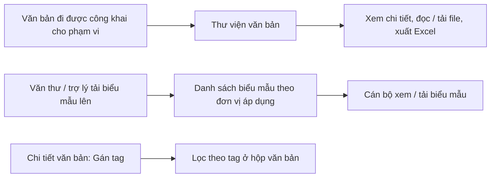

# Thư viện, biểu mẫu, tag văn bản — tóm tắt nghiệp vụ cho BA

> Bản đọc nhanh bằng lời nghiệp vụ. Chi tiết và bằng chứng: [nghiep-vu.md](nghiep-vu.md) (mã NV / BR trong ngoặc
> để tra). Cập nhật: 2026-10-02 · Nguồn: code `kha_develop` + DB DEV. Nhãn quy tắc: **[Đã xác nhận]** = chủ dự án đã
> chốt là đúng ý đồ · **[Hiện trạng]** = hệ thống đang chạy như vậy, chưa ai xác nhận là ý đồ · **[Lệch nghiệp vụ]**
> = đã xác nhận nghiệp vụ muốn khác, hệ thống đang làm sai.

## 1. Phân hệ này dùng để làm gì

Phân hệ nhỏ gồm các "kho dùng chung" bên cạnh luồng văn bản (1.1):
- **Thư viện văn bản** = danh sách các **văn bản đã được công khai** cho phạm vi có đơn vị mình; người dùng tìm, xem chi tiết, đọc / tải file, xuất Excel. Thư viện **chỉ đọc** — việc công khai / hủy công khai làm ở phân hệ văn bản đi (NV-01, NV-02).
- **Quản lý biểu mẫu**: văn thư / trợ lý đưa lên file mẫu cho các đơn vị áp dụng, có thời hạn hiệu lực, để cán bộ xem và tải về (NV-05).
- **Tag văn bản**: đánh nhãn ngắn cho văn bản (tag đơn vị do văn thư đặt, tag cá nhân do từng người đặt) rồi lọc lại ở các hộp văn bản (NV-07, NV-08).
- **Màn báo cáo đơn vị theo mẫu** (thiết lập mẫu, gửi, tổng hợp báo cáo tuần / tháng / ngày) — chỉ phần màn hình; nghiệp vụ nằm ở `nhiem-vu` (NV-09).

**Không gồm:** công khai / hủy công khai văn bản, văn bản thay thế, tự công khai khi cấp số (xem `van-ban/di`); phạm vi văn bản và quyền xem văn bản đã công khai, tài liệu cá nhân, ghi chú / trao đổi, mẫu ý kiến khi chuyển văn bản (xem `van-ban/quan-ly-chung`); file biểu mẫu kèm dự thảo / văn bản (xem `xu-ly-cong-viec`, `van-ban/den`); nghiệp vụ mẫu báo cáo / kết quả báo cáo đơn vị (xem `nhiem-vu`); tìm kiếm toàn văn (xem `van-ban/quan-ly-chung`, `tich-hop`).

## 2. Ai dùng và được làm gì

| Vai trò | Được làm gì trong phân hệ này |
|---|---|
| Người dùng có menu thư viện | Xem văn bản công khai trong phạm vi đơn vị mình hoặc đơn vị cấp trên; đọc / tải file; xuất Excel (1.4, NV-01, NV-02) |
| Văn thư (`VT`) / trợ lý (`TL`) đơn vị | Thêm biểu mẫu cho đơn vị mình và cấp dưới; sửa / xóa biểu mẫu áp dụng cho đơn vị mình (1.4, BR-10, BR-11) |
| Người tạo biểu mẫu | Sửa / xóa biểu mẫu mình tạo; luôn thấy biểu mẫu mình tạo (1.4, BR-12) |
| Văn thư (`VT`) | Gắn **tag đơn vị** cho văn bản đi và dòng nhận của đơn vị; xóa tag khỏi danh mục đơn vị; nhập tag khi nhập văn bản (1.4, NV-07) |
| Mọi người dùng khác | Gắn **tag cá nhân** trên dòng nhận của mình; lọc văn bản theo tag (1.4, NV-07, NV-08) |
| Lãnh đạo / thủ trưởng / trợ lý đơn vị; chuyên viên được gán | Thiết lập mẫu, viết / gửi / tổng hợp báo cáo tuần – tháng; lãnh đạo gán / bỏ gán chuyên viên viết (1.4, BR-21, BR-22) |
| Người có vai trò "Báo cáo" (`REPORT`) | Thiết lập mẫu và gửi báo cáo ngày (1.4, BR-21, Q8) |
| Quản trị | Cấu hình thư mục thư viện — chưa vận hành (1.4, NV-03) |

## 3. Màn hình / menu người dùng thấy

| Menu / màn | Để làm gì | Ghi chú | Mã menu |
|---|---|---|---|
| Thư viện văn bản · Thư viện cá nhân · Thư viện Quy trình - Quy định | Danh sách văn bản đang công khai trong phạm vi đơn vị | **Ba menu mở cùng một danh sách**; không có kho cá nhân / quy trình riêng (BR-01, Q1) | 337753 · 337773 · 338414 |
| Cấu hình thư viện | Dựng thư mục thư viện | Màn lỗi khi mở, chưa có dữ liệu (NV-03, BR-07, Q2) | 337752 |
| Quản lý biểu mẫu | Tìm, thêm, sửa, xóa, xem / tải biểu mẫu | Nằm dưới menu Danh mục (NV-05) | 338651 |
| Tổng hợp báo cáo đơn vị · Gửi báo cáo đơn vị | Thiết lập mẫu, tổng hợp / gửi báo cáo tuần – tháng | Nằm dưới menu Quản lý nhiệm vụ (NV-09) | 440105 · 440145 |
| Thiết lập biểu mẫu báo cáo · Gửi báo cáo ngày | Thiết lập mẫu, gửi báo cáo ngày | Nằm dưới menu Báo cáo ngày; chỉ vai trò `REPORT` (NV-09) | 440309 · 440311 |
| Popup "Gán tag văn bản" (trên chi tiết văn bản) | Gắn / xóa tag | Không có menu riêng; nút hiện theo 16 tổ hợp màn × vai trò (NV-07) | — |
| Ô "Tag" trong tìm kiếm của ~13 hộp văn bản | Lọc văn bản theo tag | (NV-08) | — |
| Nút "Chuyển vào thư viện" trên các hộp văn bản | Xếp văn bản vào thư mục thư viện | Ẩn ở 47 chỗ, chỉ còn ở 2 màn cũ (NV-03) | — |
| Trang chủ | — | Không có ô nào (1.3) | — |

## 4. Luồng chính

**Thư viện văn bản.**
1. Ở phân hệ văn bản đi, văn bản được công khai cho một hoặc nhiều phạm vi (VBĐi NV-12, ngoài phân hệ này) (1.1).
2. Người dùng mở *Thư viện văn bản*: thấy văn bản **đang công khai**, không bị thay thế, có phạm vi chứa đơn vị mình hoặc đơn vị cấp trên; xếp theo ngày hiệu lực mới nhất (NV-01, BR-02).
3. Tìm nhanh theo mã, số ký hiệu, trích yếu, cơ quan ban hành, nơi áp dụng; tìm nâng cao theo loại văn bản, ngày, văn bản đi / đến + đơn vị áp dụng, phạm vi (NV-01).
4. Mở chi tiết, đọc file (kèm file biểu mẫu của văn bản), in; xuất Excel tối đa 100.000 dòng (NV-02).

**Biểu mẫu.**
1. Văn thư / trợ lý bấm *Thêm*: tên, mã, mô tả, hình thức (loại văn bản), ngành, hiệu lực từ – đến, đơn vị áp dụng, file mẫu (NV-05).
2. Cán bộ thấy biểu mẫu áp dụng cho đơn vị mình, cấp trên hoặc cấp dưới, kèm nhãn hiệu lực; xem PDF hoặc tải về (BR-12, BR-13).

**Tag.**
1. Trên chi tiết văn bản, bấm *Gán tag văn bản*: chọn tag gợi ý hoặc gõ tag mới (tối đa 5 tag, mỗi tag ≤ 40 ký tự) (NV-07, BR-16).
2. Văn thư gắn tag đơn vị cho văn bản đi / văn bản đến của đơn vị; người khác gắn tag cá nhân trên dòng nhận của mình (NV-07).
3. Ở các hộp văn bản, chọn tag trong ô lọc để lọc (NV-08).

**Báo cáo theo mẫu** (phía màn): thiết lập mẫu (loại tuần / tháng / ngày, độ mật, cây đề mục, cột bảng, đơn vị phải báo cáo từng mục); viết, lưu, gửi; đơn vị tổng hợp xem đơn vị đã gửi, khóa / mở báo cáo (NV-09).

## 5. Trạng thái

**Văn bản trong thư viện** (đọc từ phân hệ văn bản đi)

| Trạng thái | Nghĩa | Chuyển sang khi nào | Giá trị |
|---|---|---|---|
| Đang công khai | Hiện trong thư viện | Công khai (VBĐi) (mục 3) | 0 |
| Hủy công khai | Không hiện | Hủy công khai (VBĐi) (mục 3) | 1 |
| Bị thay thế | Không hiện ở tìm nâng cao; vẫn ra ở tìm nhanh | Có văn bản thay thế (VBĐi) (NV-01) | 2 |

**Hiệu lực biểu mẫu** (không lưu, tính khi hiển thị): Chưa có hiệu lực (ngày bắt đầu sau hôm nay) · Còn hiệu lực · Hết hiệu lực (ngày kết thúc trước hôm nay) (BR-13).

**Phạm vi tag**: Cá nhân (1) — gắn với người tạo · Đơn vị (2) — dùng chung cho văn thư của đơn vị (mục 3, BR-17).

**Loại báo cáo theo mẫu**: tuần (1) · tháng (2) · ngày (3) (NV-09).

## 6. Quy tắc quan trọng nhất

- [Hiện trạng] Thư viện chỉ hiện văn bản **đang công khai, không bị thay thế**, có phạm vi đang hiệu lực chứa đơn vị của người dùng **hoặc đơn vị cấp trên**; văn bản công khai cho đơn vị cấp dưới không hiện (BR-02, Q3).
- [Hiện trạng] "Đơn vị của người dùng" ở thư viện = các đơn vị người đó là văn thư / quản trị, hoặc đơn vị mặc định (BR-02).
- [Hiện trạng] Ba menu thư viện là **một danh sách**; không có thư viện cá nhân theo nghĩa kho riêng (BR-01, Q1).
- [Hiện trạng] Ô "Trạng thái hiệu lực" của thư viện không có tác dụng lọc; chỉ lọc theo ngày khi người dùng nhập khoảng ngày (BR-05).
- [Hiện trạng] Văn bản đang bị khóa hoặc đã xóa thì không mở chi tiết được; người đang khóa vẫn đọc được file (NV-02).
- [Hiện trạng] Popup chọn **văn bản thay thế** (ở văn bản đi) thấy văn bản công khai của **mọi phạm vi**, khác màn thư viện (BR-08).
- [Hiện trạng] Biểu mẫu bắt buộc: hiệu lực từ ≤ hiệu lực đến, ít nhất một đơn vị áp dụng, ít nhất một file; xóa là xóa mềm (BR-09, NV-05).
- [Hiện trạng] Chỉ người có vai trò văn thư / trợ lý ở ít nhất một đơn vị mới thấy nút Thêm biểu mẫu; sửa / xóa là người tạo hoặc văn thư / trợ lý của một đơn vị áp dụng (BR-10, BR-11).
- [Hiện trạng] Danh sách biểu mẫu **vẫn hiện biểu mẫu chưa / hết hiệu lực** (chỉ ghi nhãn); biểu mẫu áp dụng cho một đơn vị thì cán bộ cả cấp trên lẫn cấp dưới đều thấy (BR-12, BR-13, Q7).
- [Hiện trạng] Biểu mẫu chỉ xem / tải về, **không chọn hay đính kèm được** khi soạn dự thảo (BR-14).
- [Hiện trạng] Tag lưu trên văn bản **bằng tên**, tối đa 5 tag, mỗi tag ≤ 40 ký tự, tên không được chứa dấu phẩy (BR-16, dac-thu bẫy 6).
- [Hiện trạng] Tag đơn vị dùng chung cho mọi văn thư của đơn vị; tag cá nhân chỉ của người tạo (BR-17).
- [Hiện trạng] **Xóa tag trong popup = xóa khỏi danh mục**, không gỡ tag khỏi các văn bản đã gắn (BR-18, Q4).
- [Hiện trạng] Báo cáo ngày chỉ dành cho người có vai trò `REPORT` tại đơn vị; báo cáo tuần / tháng dành cho lãnh đạo / thủ trưởng / trợ lý và chuyên viên được gán; chỉ lãnh đạo / thủ trưởng gán chuyên viên (BR-21, BR-22).

## 7. Hệ thống KHÔNG làm / hay bị hiểu nhầm

- **Thư viện = văn bản đã công khai**, không phải kho tài liệu tự đưa lên. Muốn văn bản vào thư viện thì công khai ở `van-ban/di`; thư viện không có nút công khai (1.1).
- **"Thư viện cá nhân" không phải kho cá nhân** — cùng danh sách với "Thư viện văn bản"; tài liệu cá nhân thật nằm ở `van-ban/quan-ly-chung` (BR-01, 1.1).
- **Thư mục thư viện ("Cấu hình thư viện", "Chuyển vào thư viện") không vận hành**: màn cấu hình lỗi, popup chuyển không ghi được văn bản, DB DEV 0 dòng; danh sách thư viện không đọc thư mục (BR-07, Q2).
- **Biểu mẫu khác "file biểu mẫu" của dự thảo**: file biểu mẫu kèm văn bản do người soạn tự tải lên, không lấy từ Quản lý biểu mẫu (BR-14).
- **Biểu mẫu khác mẫu ý kiến**: mẫu ý kiến khi chuyển văn bản ở `van-ban/quan-ly-chung`; bộ ý kiến mẫu cũ còn phía máy chủ nhưng web không dùng và bảng không có trên DB DEV (NV-06, Q6).
- **Trường "Ngành" của biểu mẫu thực chất lưu lĩnh vực**; "Hình thức" là loại văn bản (NV-05, Q5).
- **Tìm nhanh và tìm nâng cao của thư viện cho kết quả khác nhau** với văn bản bị thay thế (NV-01).
- **Màn báo cáo theo mẫu không phải in / xuất báo cáo** — là thiết lập / viết / gửi / tổng hợp báo cáo đơn vị (1.5, NV-09).
- **Ô lọc tag còn gợi ý cả tag đã xóa** (BR-20).
- **Trên DB DEV chưa văn bản nào mang tag** dù danh mục có khoảng 630 tag (NV-07, dac-thu bẫy 0).

## 8. Liên quan phân hệ khác

| Khi thay đổi ở đây… | …phải xem thêm | Vì sao |
|---|---|---|
| Điều kiện văn bản hiện trong thư viện | `van-ban/di` | Công khai / hủy công khai / thay thế ghi ở đó; thư viện chỉ đọc (1.1, dac-thu mục 4) |
| Phạm vi xem thư viện | `van-ban/quan-ly-chung` | Danh mục phạm vi và quyền xem văn bản đã công khai ở đó (1.1, BR-06) |
| Popup chọn văn bản từ thư viện | `van-ban/di`, `nhiem-vu` | Dùng khi chọn văn bản thay thế và khi thêm nhiệm vụ từ văn bản (NV-04) |
| File biểu mẫu hiển thị trong thư viện | `xu-ly-cong-viec`, `van-ban/den` | File biểu mẫu kèm văn bản do luồng dự thảo / nhập văn bản ghi (NV-02, 1.1) |
| Tag (gắn, lọc, nút Gán tag) | `van-ban/den`, `van-ban/di` | Tag ghi trên văn bản đi, dòng nhận đơn vị, dòng nhận cá nhân; nút nằm trên chi tiết văn bản; tag được đưa vào chỉ mục tìm kiếm (NV-07, BR-19) |
| Màn báo cáo theo mẫu | `nhiem-vu` | Mẫu, kết quả, khóa / mở báo cáo, "nhóm nhiệm vụ" gắn mục báo cáo ở NVu NV-17 (NV-09) |

## 9. Câu hỏi nghiệp vụ còn mở

- `Q1` — Ba menu thư viện cố ý trùng nhau, hay "Thư viện cá nhân" / "Quy trình - Quy định" phải là kho riêng?
- `Q2` — Thư mục thư viện còn dùng không?
- `Q3` — Lãnh đạo / văn thư cấp trên có cần thấy văn bản công khai cho đơn vị cấp dưới?
- `Q4` — Xóa tag trong popup là bỏ tag khỏi văn bản đang mở hay xóa khỏi danh mục; nếu xóa khỏi danh mục thì có gỡ khỏi văn bản cũ?
- `Q5` — Trường thứ hai của biểu mẫu nên gọi "Lĩnh vực" hay "Ngành"?
- `Q6` — Bộ ý kiến mẫu cũ còn dùng ở đâu không?
- `Q7` — Biểu mẫu hết hiệu lực có ẩn mặc định; đơn vị cha có cần thấy biểu mẫu của đơn vị con?
- `Q8` — Vai trò "REPORT" thực tế là ai; lãnh đạo có cần tự gửi báo cáo ngày?

(đầy đủ ở mục 7.1 của `nghiep-vu.md`)

## 10. Khi viết yêu cầu mới cho phân hệ này, nhớ ghi rõ

- **Thư viện hay công khai** — thay đổi điều kiện văn bản vào thư viện thường là việc của `van-ban/di` (công khai), không phải thư viện (1.1).
- **Áp dụng cho menu thư viện nào** — hiện ba menu là một danh sách; tách ra là làm mới, không chỉ đổi tên (BR-01, dac-thu bẫy 1).
- **Phạm vi đơn vị:** đơn vị mình, cấp trên, cấp dưới; "đơn vị của tôi" tính theo vai trò nào (văn thư, quản trị, đơn vị mặc định) (BR-02, BR-12).
- **Áp dụng cho cả popup chọn văn bản thay thế không** — popup đó đang không giới hạn đơn vị (BR-08).
- **Văn bản bị thay thế, bị khóa, đã xóa** có hiện / mở được không (NV-01, NV-02).
- **Biểu mẫu:** ai thêm / sửa / xóa, đơn vị nào thấy, có ẩn biểu mẫu hết hiệu lực không, có cần chọn biểu mẫu khi soạn dự thảo không (BR-10…BR-14, Q7).
- **Tag ở mức nào:** văn bản đi, dòng nhận đơn vị, hay dòng nhận cá nhân; tag đơn vị hay tag cá nhân; xóa tag là xóa khỏi văn bản hay khỏi danh mục (NV-07, BR-18, Q4).
- **Màn hình nào có nút / ô tag** — nút Gán tag hiện theo 16 tổ hợp màn × vai trò; ô lọc có ở ~13 hộp văn bản (NV-07, NV-08).
- **Báo cáo theo mẫu:** loại tuần / tháng / ngày, vai trò nào (lãnh đạo, trợ lý, chuyên viên được gán, `REPORT`) — và nghiệp vụ phía sau phải viết cùng `nhiem-vu` (BR-21, NV-09).
