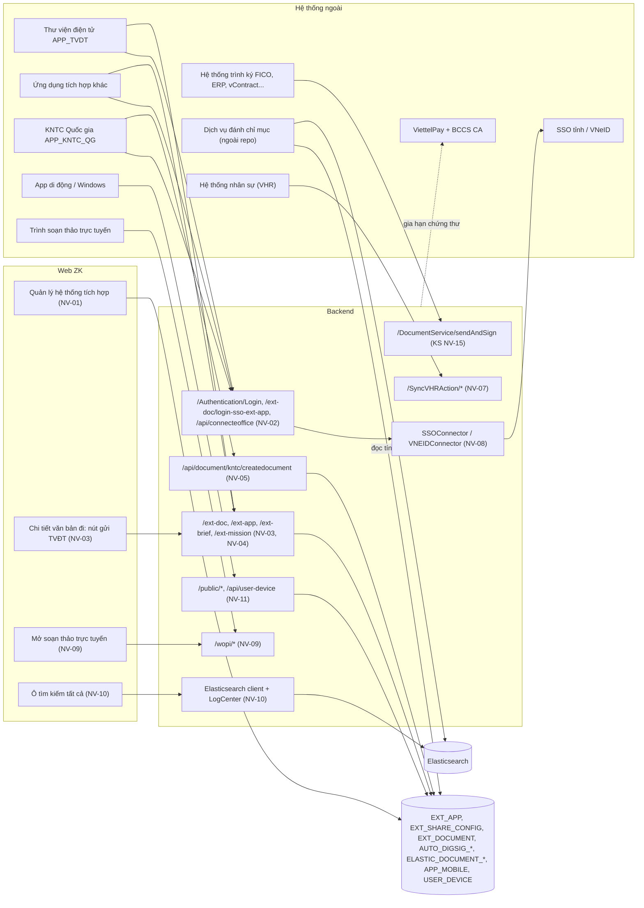
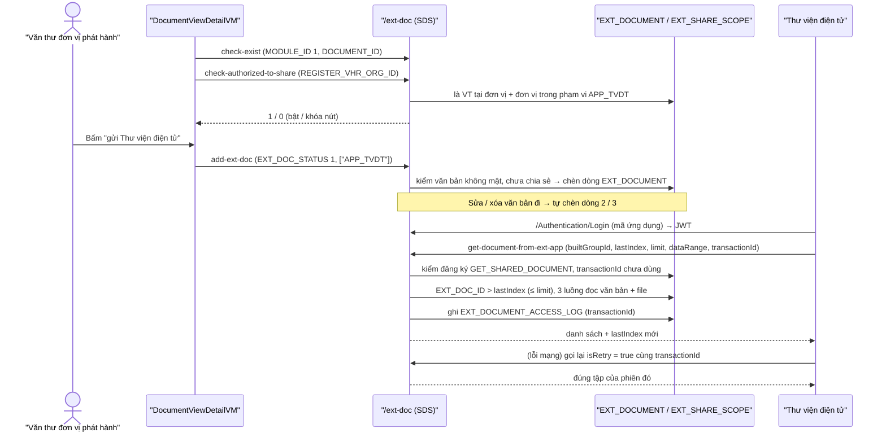
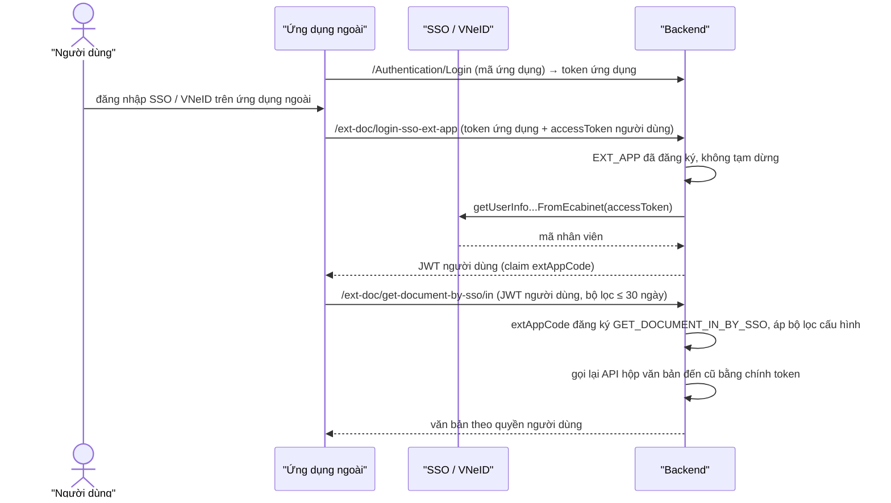
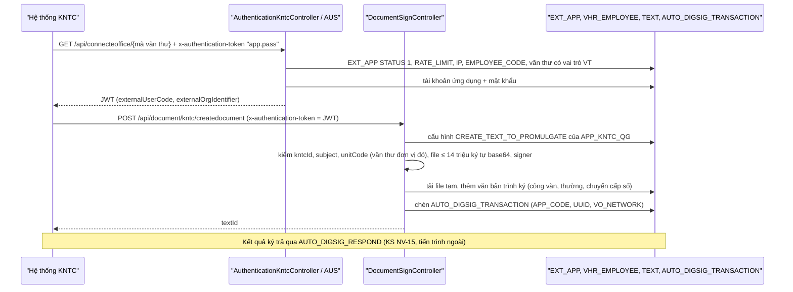
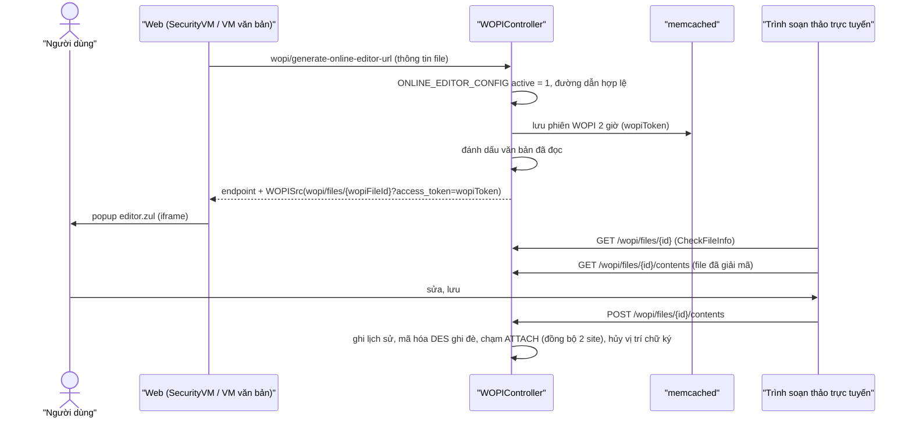
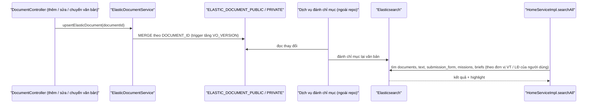
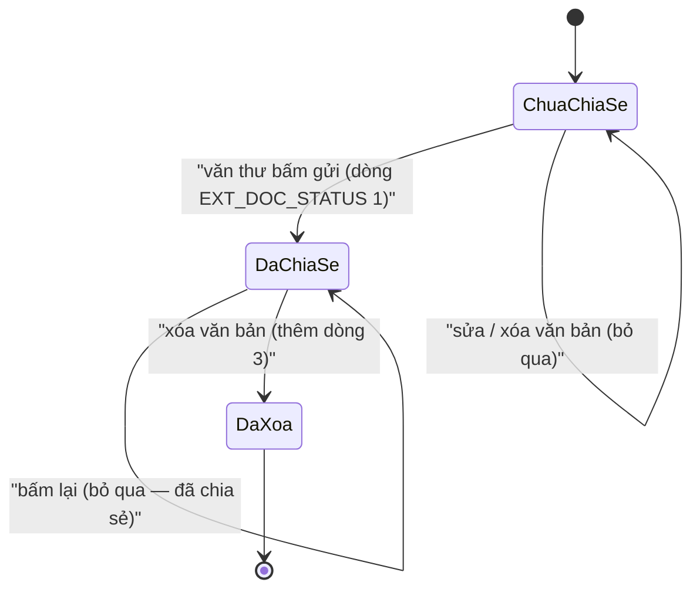
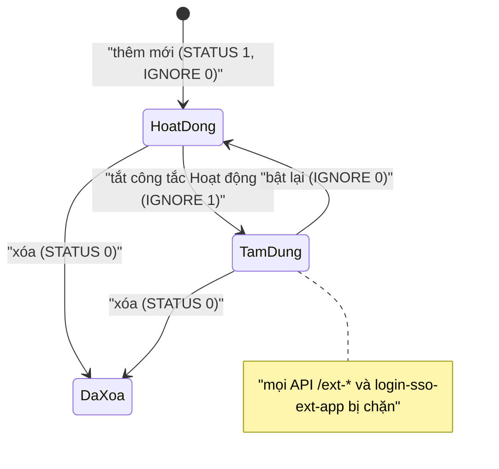
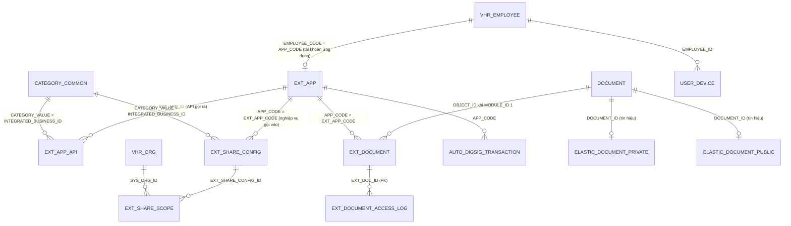

# Tích hợp hệ thống ngoài (ngoài trục văn bản) — nghiệp vụ: đăng ký hệ thống tích hợp, xác thực ứng dụng ngoài, chia sẻ văn bản / hồ sơ / nhiệm vụ / đơn vị ra ngoài, KNTC, VHR, SSO / VNeID (connector), soạn thảo trực tuyến (WOPI), Elasticsearch, ứng dụng di động, ViettelPay, lưu trữ file và hai site, cây tổ chức Đảng

> Viết lại từ code nhánh `kha_develop` (web-spring + backend2.0, cả hai đang checkout `kha_develop`) ngày 2026-10-02. Mọi khẳng định có nguồn `file:dòng`.
> Menu, số dòng, phân bố giá trị và comment cột các bảng `APP_MOBILE`, `CONNECT_VHR`, `ELASTIC_DOCUMENT_*`, `EXT_*`, `USER_DEVICE`, `VHR_EMPLOYEE`, `VHR_ORG` đối chiếu **DB DEV ngày 2026-10-01**; danh mục `INTEGRATED_*` (`CATEGORY_COMMON`), `EXT_SHARE_CONFIG` theo ứng dụng, `EXT_APP` của `APP_TVDT` / `APP_KNTC_QG`, `EXT_DOCUMENT` theo ứng dụng / đơn vị, `SYSTEM_PARAMETER` tích hợp, cột `PARTY_*` của `VHR_ORG`, `TEXT_EDIT_HISTORY` / `SUBMISSION_FORM_EDIT_HISTORY` đối chiếu **DB DEV ngày 2026-10-02** (do người điều phối truy vấn, chỉ SELECT; tác giả không kết nối DB). FK duy nhất tra được: `EXT_DOCUMENT_ACCESS_LOG.EXT_DOC_ID → EXT_DOCUMENT`; mọi quan hệ khác ở mục 5 là quan hệ logic lấy từ JOIN / entity trong code.
> **Bảo mật**: phân hệ dày đặc URL, tài khoản kết nối, khóa bí mật trong `application.properties` / `SYSTEM_PARAMETER`. Tri thức này **chỉ ghi tên khóa**, không ghi giá trị, không ghi địa chỉ máy chủ.
>
> Viết tắt đường dẫn:
> `WEB/` = `web-spring/src/main/java/com/viettel/` · `ZUL/` = `web-spring/src/main/webapp/view/` · `BIZ/` = `web-spring/src/main/java/com/voffice/service/business/` ·
> `BE1/` = `backend2.0/backendvoffice/src/main/java/com/viettel/voffice/` · `BE2/` = `backend2.0/backendvoffice/src/main/java/com/viettel/office/` ·
> `SQL/` = `backend2.0/backendvoffice/sql/` · `RES/` = `backend2.0/backendvoffice/src/main/resources/`.
> Lớp hay dùng — **chia sẻ ra ngoài (gen-2)**: **SDC** = `BE2/controller/ShareDocumentController.java` (`/ext-doc`), **SDS** = `BE2/services/impl/ShareDocumentServiceImpl.java`, **SDF** = `BE2/services/impl/ShareDocumentFacadeServiceImpl.java`, **SDR** = `BE2/repositories/impl/ShareDocumentRepositoryImpl.java`, **ESU** = `BE2/utils/ExtShareUtil.java`, **ESCS** = `BE2/services/impl/ExtShareConfigServiceImpl.java`, **VESI** = `BE2/services/impl/VhrEmployeeServiceImpl.java`, **AUS** = `BE2/services/impl/AuthenticatonServiveImpl.java` (tên file gõ sai sẵn trong code); web **ISVM** = `WEB/vps/vm/IntegratedSysVM.java` (~1.700 dòng), **ISZ** = `ZUL/vps/integratedSys/integratedSys_add.zul`, **DVDVM** = `WEB/voffice/vm/document/DocumentViewDetailVM.java`, **SUB** = `BIZ/SysUserBusiness.java`, **SEDB** = `BIZ/ShareExtDocBusiness.java`.
> **Ký / KNTC (gen-1)**: **DSC** = `BE1/controler/DocumentSignController.java`. **WOPI**: **WA** = `BE1/action/WOPIAction.java`, **WC** = `BE1/controler/WOPIController.java`, **SVM** = `WEB/voffice/common/SecurityVM.java`. **Hằng**: **C1** = `BE1/constants/Constants.java`, **C2** = `BE2/utils/Constants.java`, **AC** = `WEB/util/AppConstants.java`. **Cấu hình**: **APP** = `RES/application.properties`. **Xác thực**: **JTF** = `BE2/core/filters/JwtTokenFilter.java`, **FU** = `BE2/utils/FuncUtils.java`, **WSC** = `BE2/core/config/WebSecurityConfig.java`.
> Phân hệ liền kề đã viết (trỏ sang, không viết lại): `he-thong` (đăng nhập SSO / VNeID — `HT NV-01/02`; người dùng, đồng bộ VHR phía màn — `HT NV-08`; cây đơn vị gen-2 `/api/vhr-org` — `HT NV-11`; cấu hình phiên bản mobile — `HT NV-17`), `van-ban/lien-thong` (`LT`: trục liên thông, `CONNECT_VHR`, VOConnect, VPCP), `van-ban/quan-ly-chung` (`QLC NV-02`: tìm kiếm văn bản Elasticsearch), `ky-so` (`KS NV-15`: giao dịch ký hệ thống ngoài `AUTO_DIGSIG_*`; `KS` chứng thư mềm / gia hạn), `ho-so-cong-viec` (`HSCV NV-15`: nộp hồ sơ sang phần mềm số hóa + callback), `hop` (eCabinet, SmartRoom), `nhiem-vu` (`NVu NV-13`: dịch vụ Mission ngoài), `lich-nhac-viec` (SMS / thông báo).

## 1. Tổng quan

### 1.1 Phạm vi

Phân hệ mô tả **cơ chế** Văn phòng số nói chuyện với hệ thống bên ngoài, trừ trục liên thông văn bản:

- **Đăng ký hệ thống tích hợp** (menu "Quản lý hệ thống tích hợp" — NV-01): mỗi hệ thống ngoài là **một tài khoản người dùng** trong đơn vị đặc biệt mã `DVTHHT` + một dòng `EXT_APP` (mã ứng dụng = mã tài khoản), kèm danh sách **API gọi ra** (`EXT_APP_API`) và danh sách **nghiệp vụ được gọi vào** (`EXT_SHARE_CONFIG` + phạm vi đơn vị `EXT_SHARE_SCOPE`).
- **Xác thực ứng dụng ngoài** (NV-02): token ứng dụng, token người dùng qua ứng dụng ngoài (`/ext-doc/login-sso-ext-app`), kiểu riêng của KNTC, danh sách IP được phép (`PERMISSION_CALL_API`); và danh sách đường dẫn bỏ qua JWT.
- **Cấp dữ liệu cho hệ thống ngoài** (gen-2, `/ext-*`): văn bản đi văn thư đánh dấu chia sẻ cho Thư viện điện tử (NV-03); tra cứu văn bản đến / đi theo đơn vị hoặc theo người dùng, hồ sơ, nhiệm vụ, cây đơn vị, đính kèm đa phương tiện vào hồ sơ (NV-04).
- **KNTC — hệ thống Khiếu nại tố cáo Quốc gia** (NV-05): đăng nhập bằng mã văn thư + khóa ứng dụng, tạo văn bản trình ký chuyển cấp số.
- **Hệ thống ngoài trình ký / lấy văn bản trình ký** (NV-06): ranh giới với `KS NV-15`; API lấy văn bản trình ký theo ngày, đánh dấu đồng bộ ERP (`textMarkSync`), hợp đồng điện tử vContract, văn bản ký với doanh nghiệp (CM — đã khóa).
- **VHR / hệ thống nhân sự** (NV-07): API nhận đồng bộ nhân viên; các màn liên quan đã tắt / không tồn tại.
- **SSO / VNeID — connector** (NV-08): các hàm gọi dịch vụ SSO / VNeID, OTP, cờ đăng nhập theo phiên bản app.
- **Soạn thảo trực tuyến WOPI** (NV-09): mở file Office trên trình soạn thảo trực tuyến, lưu lại file + lịch sử sửa, chuyển PDF.
- **Elasticsearch** (NV-10): tìm kiếm (văn bản, "tìm kiếm tất cả", nhân viên, đơn vị), tín hiệu đánh chỉ mục lại, ghi log tập trung; Solr đã bỏ.
- **Ứng dụng di động / desktop** (NV-11): kiểm phiên bản, đăng ký thiết bị nhận thông báo đẩy, tải bộ cài Windows.
- **ViettelPay — thanh toán gia hạn chứng thư** (NV-12): connector; nghiệp vụ chứng thư ở `ky-so`.
- **Lưu trữ file, hai site, đồng bộ hai site** (NV-13): không có MinIO; file trên thư mục đĩa theo khóa `storage_*`; site công khai / nội bộ.
- **Dịch vụ ngoài khác** (NV-14): bảng gom, trỏ sang phân hệ dùng.
- **Cây tổ chức Đảng** (`Party*`, NV-15): API gen-2 mới, chưa có màn web.
- Thành phần cũ / chết (NV-16).

Bảng tổng hợp **hệ thống ngoài ↔ điểm tích hợp ↔ phân hệ dùng**: mục 1.6.

Phân hệ **KHÔNG gồm** (trỏ sang):

| Nội dung | Phân hệ |
|---|---|
| Trục liên thông văn bản (`CONNECT_*`, VOConnect `/api/hook`, VPCP, `IN_OBJECT_*`), danh mục đơn vị liên thông `CONNECT_VHR` (menu `ADD_CONNECT_VHR` → `vps/sysConnectVHR/sysConnectVHR.zul`) | `van-ban/lien-thong` (`LT NV-01 … NV-13`) |
| Luồng đăng nhập người dùng (form, SSO ticket, VNeID PKCE, eCabinet, OTP, làm mới token) | `he-thong` (`HT NV-01`, `NV-02`) — ở đây chỉ connector (NV-08) |
| Cây đơn vị / tra cứu nhân sự gen-2 (`/api/vhr-org/*`, phần `/api/vhr-employee/*` không phải ứng dụng ngoài), quản lý người dùng, màn "Đồng bộ người dùng" (menu `SYNC_SYSUSER`, VM đã comment) | `he-thong` (`HT NV-06`, `NV-08`, `NV-11`) |
| Màn "Cấu hình phiên bản mobile" (`config/appMobile/appMobile.zul`, menu `MOBILE_APP_CONFIG`), bộ menu gen-2 cho mobile, trang chủ / dashboard mobile | `he-thong` (`HT NV-10`, `NV-16`, `NV-17`) — ở đây chỉ API app gọi (NV-11) |
| Tìm kiếm văn bản toàn văn (menu `ANNOUNCEDDOCUMENTSEARCHING`) | `van-ban/quan-ly-chung` (`QLC NV-02`) |
| Giao dịch ký của hệ thống ngoài `AUTO_DIGSIG_TRANSACTION` / `AUTO_DIGSIG_RESPOND`, `sendAndSign`, kết quả ký `SIGN_RESULT`; chứng thư mềm trên điện thoại (đăng ký, gia hạn, hủy) | `ky-so` (`KS NV-15`, mục chứng thư mềm) |
| Nộp hồ sơ sang phần mềm số hóa và callback `/callback/ext-brief/submit-result` | `ho-so-cong-viec` (`HSCV NV-15`) |
| eCabinet (đẩy lịch họp), SmartRoom / Cisco | `hop` |
| Dịch vụ Mission BE ngoài (`mission.*` → `mission.service.url`) | `nhiem-vu` (`NVu NV-13`) |
| Hàng đợi SMS, cổng SMS, thông báo | `lich-nhac-viec` (`NV-11 … NV-15` của phân hệ đó) |

### 1.2 Menu (đối chiếu DB DEV `SYS_MENU` ngày 2026-10-01)

`SYS_MENU.STATUS`: 1 = mở, 2 = khóa (X3). Code chỉ tham chiếu mã / URL zul, URL menu nằm ở DB.

| `SYS_MENU_ID` | `CODE` | Tên (DB DEV) | Cha | URL | `STATUS` | VM / NV | Ghi chú |
|---|---|---|---|---|---|---|---|
| 440785 | `AD_INTEGRATED_SYS` | Quản lý hệ thống tích hợp | QUẢN TRỊ | `/view/vps/integratedSys/integratedSys.zul` | 1 | ISVM — NV-01 | `ZUL/vps/integratedSys/integratedSys.zul:3-4` |
| 440905 | `EXT-SHARE-CONFIG-ORG` | Cấu hình cho phép đơn vị chia sẻ văn bản cho các hệ thống bên ngoài | QUẢN TRỊ | `config/extShare/extShareConfigOrg.zul` | 1 | — | **zul không tồn tại** (thư mục `ZUL/voffice/config/extShare/` chỉ có `extShareScopePopup.zul`; không nhánh local nào có file này) → menu mở ra lỗi. Phạm vi chia sẻ thực tế cấu hình trong NV-01 |
| 439665 | `MOBILE_APP_CONFIG` | Cấu hình phiên bản mobile | QUẢN TRỊ | `/view/voffice/config/appMobile/appMobile.zul` | 1 | `AppMobileVM` | `he-thong` HT NV-17; API app dùng: NV-11 |
| 337693 | `VHREMPLOYEE` | Thông tin nhân viên VHR | QUẢN TRỊ | `/view/vps/sysUser/vhrEmployee.zul` | 1 | — | **zul không tồn tại** (`ZUL/vps/sysUser/` chỉ có `importUser`, `syncSysUser`, `sysUser*`, `userOrgMap`) — NV-07 |
| 338432 | `SYNC_SYSUSER` | Đồng bộ người dùng | QUẢN TRỊ | `vps/sysUser/syncSysUser.zul` | 1 | `SyncSysUserVM` (comment toàn bộ) | `he-thong` HT NV-08 |
| 338995 | `ADD_CONNECT_VHR` | Đơn vị liên thông | QUẢN TRỊ (336812) | `/view/vps/sysConnectVHR/sysConnectVHR.zul` | 1 | `ConnectVHRVM` | `van-ban/lien-thong` LT NV-02 (ban-do.md xếp vào đây theo tên "VHR") |
| 338671 | `VBKDT` | Văn bản ký với đối tác | VĂN BẢN ĐI (337232) | `/view/voffice/enterprise/enterprise.zul` | **2 (khóa)** | `EnterpriseVM` | NV-06 (endpoint BE đã comment) |

### 1.3 Widget trang chủ

Không có widget nào thuộc phân hệ (`HOME_WIDGET` toàn bảng DB DEV ngày 2026-10-01 — không mã nào liên quan tích hợp). Ô "tìm kiếm tất cả" trên khung chính dùng Elasticsearch (NV-10).

### 1.4 Actor & quyền

Quyền thao tác trên web nằm ở **tầng hiển thị nút / có menu** (X1). Với hệ thống ngoài, BE **có** kiểm: mỗi API `/ext-*` kiểm ứng dụng gọi đã đăng ký và được cấu hình đúng nghiệp vụ (BR-05).

| Actor | Nhận diện trong code | Làm gì |
|---|---|---|
| Quản trị hệ thống | người có menu `AD_INTEGRATED_SYS` (+ `hasSavePermission` của `SecurityVM` — ISVM:319-323) | Đăng ký / sửa / xóa hệ thống tích hợp, cấu hình API gọi ra, nghiệp vụ gọi vào, phạm vi đơn vị (NV-01) |
| Văn thư đơn vị phát hành | role `VT` (X2) tại **đúng đơn vị đăng ký văn bản** (`REGISTER_VHR_ORG_ID`) và đơn vị nằm trong phạm vi cấu hình chia sẻ (SDS:306-330) | Bấm "chia sẻ" văn bản đi cho Thư viện điện tử (NV-03) |
| Hệ thống ngoài (ứng dụng tích hợp) | tài khoản `VHR_EMPLOYEE` có `EMPLOYEE_CODE` = `EXT_APP.APP_CODE` (ISVM:466; comment DB `EXT_DOCUMENT_ACCESS_LOG.EXT_APP_CODE`); token có `employeeCode` = mã ứng dụng | Gọi `/ext-doc/*`, `/ext-app/get-org`, `/api/document/kntc/createdocument`… (NV-03 … NV-05) |
| Người dùng Văn phòng số dùng qua ứng dụng ngoài | token cấp bởi `/ext-doc/login-sso-ext-app`, mang claim `extAppCode` (AUS:776-835) | Ứng dụng ngoài lấy văn bản / hồ sơ / nhiệm vụ **theo quyền của chính người dùng** (NV-04) |
| Văn thư được hệ thống KNTC cấu hình | `EXT_APP.EMPLOYEE_CODE` chứa mã nhân viên (hoặc `bypass_all`), có vai trò văn thư (AUS:200-246) | KNTC thay mặt văn thư tạo văn bản trình ký (NV-05) |
| Ứng dụng di động / desktop | gọi `/public/*`, `/api/user-device/*`, `/api/mobile-publish-store/*` | Kiểm phiên bản, đăng ký thiết bị (NV-11) |
| Trình soạn thảo trực tuyến (WOPI host) | gọi `/wopi/files/{id}` kèm `access_token` | Đọc / ghi nội dung file (NV-09) |
| Tiến trình ngoài repo | dịch vụ đánh chỉ mục, gửi kết quả ký, gửi SMS, bên gọi đồng bộ VHR | Không có trong repo — chỉ thấy dấu vết (bảng tín hiệu, hàng đợi) |

### 1.5 Sửa so với knowledge cũ (2026-10-02)

| Knowledge cũ | Hiện trạng code `kha_develop` | Ghi ở |
|---|---|---|
| "VHR: nguồn tổ chức & nhân viên; đồng bộ định kỳ/tay — `SyncVHRAction`, `connectVHRAction` (cấu hình kết nối/cây đơn vị VHR)" | `SyncVHRAction` chỉ là **API nhận** danh sách nhân viên do bên ngoài đẩy vào (không job, không lời gọi trong repo); `connectVHRAction` / `CONNECT_VHR` là **danh mục đơn vị liên thông** của trục văn bản, không phải kết nối VHR (sửa 2026-10-02) | NV-07; `LT NV-02` |
| QT1 "Dữ liệu tổ chức/nhân sự chỉ nhập từ VHR; sửa tay sẽ bị ghi đè (?)" | Màn đồng bộ đã tắt, màn "Thông tin nhân viên VHR" không có zul; người dùng do quản trị thêm / import (`HT NV-06`, `NV-08`); DB DEV `VHR_EMPLOYEE.STATUSSYNC` 401/402 null (sửa 2026-10-02) | NV-07; câu Q4 |
| "Mobile app: `AppMobileController` (`get-data-map`) — API cho mobile với cấu hình động" | `get-data-map` / `post-data-map` **chạy câu SQL tùy ý** gửi lên dạng Base64 cho mọi người đã đăng nhập — không phải "cấu hình động" (sửa 2026-10-02) | NV-11; `dac-thu.md` L1 |
| "Ứng dụng ngoài dùng chung dữ liệu (`ext-*`) … `in` / `out` trùng tên nhiều verb" | Hai cặp đường dẫn khác nhau: `/get-document-by-org/{in,out}` (token ứng dụng) và `/get-document-by-sso/{in,out}` (token người dùng); tên **hàm Java** trùng (`getShareDocumentsIn/Out` nạp chồng — SDC:74-96) chứ không phải verb | NV-04 |
| "ViettelPay: xác thực giao dịch chuyển tiền gắn văn bản tài chính — `ViettelPayAction.VerifyDataTrans`, `DocumentService.transferMoneyAction`" | `VerifyDataTrans` **trả chuỗi rỗng** (thân đã comment — `BE1/action/ViettelPayAction.java:30-41`); ViettelPay thật sự dùng để **thanh toán gia hạn chứng thư** (`CERT_EXTEND_VTPAY_CONFIG`) (sửa 2026-10-02) | NV-12 |
| "Solr / Elasticsearch: tìm toàn văn văn bản, người" | Solr đã bỏ (QLC X9); Elasticsearch phục vụ 4 nhóm tìm kiếm + nhận **tín hiệu đánh chỉ mục lại** qua bảng `ELASTIC_DOCUMENT_PRIVATE/PUBLIC` + ghi **log tập trung**; hàm `indexEmployee` không làm gì (sửa 2026-10-02) | NV-10 |
| "KNTC (khiếu nại tố cáo?) — ký số & đăng nhập cho hệ thống KNTC (?)" | Là **hệ thống Khiếu nại tố cáo Quốc gia** (chuỗi "Chuyển cấp số từ hệ thống Khiếu nại tố cáo Quốc gia" — DSC:749; mã ứng dụng `APP_KNTC_QG` — DSC:597-600) (X9) | NV-05 |
| "VContract / CM: nhận kết quả ký hợp đồng, gửi văn bản cho doanh nghiệp (`CMResource`: `search`, `sendDocument`, `createSignDocument`, `listCompany`…)" | `listCompany`, `createSignDocument`, `sendDocument`, `notify` **đã comment** ở `CMResource` (`BE1/action/CMResource.java:25-91`); menu "Văn bản ký với đối tác" **khóa** (sửa 2026-10-02) | NV-06 |
| QT3 "Chia sẻ ra ứng dụng ngoài ghi `EXT_DOCUMENT_ACCESS_LOG` (audit)" | Chỉ API kéo văn bản đã chia sẻ (`get-document-from-ext-app`) ghi log, dùng như **sổ giao dịch** để cho phép lấy lại (retry) theo `transactionId`; các API tra cứu khác không ghi (SDS:169-205). DB DEV: 0 dòng | NV-03 BR-08 |
| QT2 "Endpoint `/ext-*`, `/public/*`, `/callback`, `/api/hook` có cơ chế xác thực riêng (`jwtIgnoreConfig`)" | Danh sách bỏ qua JWT mặc định trong repo **chỉ có** `/Authentication/Login*`, `/public…`, `/api/connecteoffice`… (`APP:433`); `/ext-*`, `/callback`, `/wopi`, `/vContract` **vẫn đòi JWT** (sửa 2026-10-02) | NV-02 BR-04 |
| QT4 "WOPI cần file được mã hóa thông tin (`encryptedFileInfo`)" | Hai kiểu đường dẫn: cũ — thông tin file mã hóa AES bằng khóa phiên + `access_token` = JWT người dùng (SVM:590-597); mới — mã file ngẫu nhiên + phiên lưu memcached 2 giờ (WC:1150-1221) | NV-09 |
| (không có) MinIO / lưu trữ file | **Không có MinIO** trong code `kha_develop` (chỉ xuất hiện trong BOM phụ thuộc của Spring Boot ở `effective-pom.xml`); file nằm trên thư mục đĩa theo khóa `storage_*` (X10) | NV-13 |
| câu cũ 2: "Ứng dụng ngoài nào đang dùng `/ext-*`?" | Code ghi cứng **`APP_TVDT`** (Thư viện điện tử) cho chia sẻ văn bản (DVDVM:9346-9348; SDS:325-329) và `APP_KNTC_QG` (DSC:597-600); DB DEV `EXT_APP` 214 dòng (X8) | NV-03, NV-05 |

### 1.6 Bảng tổng hợp: hệ thống ngoài ↔ điểm tích hợp ↔ phân hệ dùng

| Hệ thống ngoài | Chiều | Điểm tích hợp trong code | Cấu hình (tên khóa) | Phân hệ dùng / NV |
|---|---|---|---|---|
| **Ứng dụng tích hợp bất kỳ** (đăng ký `EXT_APP`) | vào | `/Authentication/Login` (bằng mã ứng dụng), `/ext-doc/*`, `/ext-app/get-org`, `/ext-brief/*`, `/ext-mission/*` | `EXT_APP`, `EXT_SHARE_CONFIG`, `EXT_SHARE_SCOPE`, danh mục `INTEGRATED_INBOUND_BUSINESS` | NV-01 … NV-04 |
| Ứng dụng tích hợp — API gọi ra | ra | chỉ **lưu cấu hình** `EXT_APP_API` (REST / SOAP, header) — không có code trong repo gọi các API này | danh mục `INTEGRATED_SYS_BUSINESS` | NV-01 BR-03 |
| **Thư viện điện tử** (`APP_TVDT`) | vào (kéo) | `/ext-doc/get-document-from-ext-app` ← văn thư bấm chia sẻ trên chi tiết văn bản đi | `EXT_SHARE_CONFIG` nghiệp vụ `GET_SHARED_DOCUMENT` + `EXT_SHARE_SCOPE` | NV-03 (văn bản đi); `APP_SHVB`, `ATTT` được cấp kéo theo đơn vị / người dùng (NV-04) |
| **KNTC Quốc gia** (`APP_KNTC_QG`) | vào | `GET /api/connecteoffice/{mã văn thư}`, `POST /api/document/kntc/createdocument` | `EXT_APP` (`IP`, `EMPLOYEE_CODE`, `RATE_LIMIT`), `EXT_SHARE_CONFIG` nghiệp vụ `CREATE_TEXT_TO_PROMULGATE` | NV-05; `ky-so` KS NV-15 |
| Hệ thống ngoài trình ký (FICO, ERP_SAP, NETLEASE, VCRM, vContract, `APP_SHVB`, `APP_ECABINET`… — ~190 nhóm `APP_CODE` trên `AUTO_DIGSIG_TRANSACTION`) | vào / kết quả ra | `/DocumentService/sendAndSign`; kết quả qua hàng đợi `AUTO_DIGSIG_RESPOND` do tiến trình ngoài đẩy | `EXT_APP` (`STATUSRESUTLSIGN`, `REST_RETURN_RESULT_API`, `SOAPHEADER`…) | `ky-so` KS NV-15; NV-06 |
| Hệ thống lấy văn bản trình ký theo ngày | vào | `POST /api/text/sync-text`, `/count-sync-text` | — | NV-06 |
| ERP (đánh dấu đồng bộ) | vào (kéo) | `/textMarkSyncAction/*` | `text.mark.sync.roleid`, `text.mark.sync.userId`, `text.mark.sync.type.check` | NV-06; `ky-so` KS NV-17 |
| vContract (hợp đồng điện tử) | vào | `/vContract/getTextDetail`, `/receiverResult`, `/downloadFile` | `SYSTEM_PARAMETER` `VCONTRACT_SECRET_KEY`, `PERMISSION_CALL_API` | NV-06 |
| Doanh nghiệp / đối tác (CM) | — | `/CM/*` (phần lớn đã comment) | — | NV-06; menu khóa |
| **VHR / hệ thống nhân sự** | vào | `/SyncVHRAction/*` (6 endpoint) | — | NV-07; `he-thong` |
| **SSO** | ra | `SSOConnector` (token, userinfo, đăng nhập API, OTP) | `sso.service.*`, `sso.flag.*` | NV-08; `he-thong` HT NV-01/02 |
| **VNeID** | ra | `VNEIDConnector` (token PKCE, userinfo) | `vneid.service.*` | NV-08; `he-thong` HT NV-02 |
| **Trình soạn thảo trực tuyến** (WOPI) + dịch vụ chuyển PDF | vào (WOPI host gọi) / ra (chuyển PDF) | `/wopi/*`; `ConvertFileAPI` | `SYSTEM_PARAMETER` `ONLINE_EDITOR_CONFIG` | NV-09; văn bản đi / đến, dự thảo, phiếu trình, mẫu văn bản |
| **Elasticsearch** | ra | `BE1/elasticsearch/**`, `HomeServiceImpl.searchAll`, `LogCenter` | `SYSTEM_PARAMETER` `ELASTICSEARCH2`, `ELASTICSEARCH_8X`; `elasticsearch.*`, `logcenter.*`, `url.elasticsearch.server*` | NV-10; `van-ban/*`, `phieu-trinh`, `he-thong` HT NV-05 |
| Dịch vụ đánh chỉ mục (ngoài repo) | đọc tín hiệu | bảng `ELASTIC_DOCUMENT_PRIVATE/PUBLIC`, cột `INDEXING_STATE` | — | NV-10 |
| **Ứng dụng di động / Windows** | vào | `/public/check-update`, `/public/sso-login-flags`, `/public/download*`, `/api/user-device/*`, `/api/mobile-publish-store/login-required-check` | `APP_MOBILE`; `SYSTEM_PARAMETER` `MOBILE_CURRENT_VERSION`, `LOGIN_METHOD`; `sso.flag.config.api.key` | NV-11 |
| Dịch vụ đẩy thông báo (FCM, ngoài repo) | — | chỉ lưu `USER_DEVICE.FCM_TOKEN` | — | NV-11; `lich-nhac-viec` |
| **ViettelPay** + BCCS CA | ra | `FunctionCommon.createUrlVtPay`, `CertManagementController.callOrderPayFromBccsCa` | `SYSTEM_PARAMETER` `CERT_EXTEND_VTPAY_CONFIG` | NV-12; `ky-so` |
| Phần mềm số hóa văn bản (`APP_SHVB`) | ra / callback vào | `/api/brief/submit-brief`; `/callback/ext-brief/submit-result` | `SUBMIT_BRIEF_CONFIG` | `ho-so-cong-viec` HSCV NV-15 |
| eCabinet | ra / vào | `ecabinet.*`; `/Authentication/LoginEcabinet` | `ecabinet.endpoint`, `ecabinet.buildLink` | `hop`; `he-thong` HT NV-02 |
| Dịch vụ Mission BE | ra (web) | `ServiceConnection.filterUrl` cho khóa `mission.*` | `mission.service.url` (web) | `nhiem-vu` NVu NV-13 |
| Trục liên thông / VOConnect / VPCP | hai chiều | `/api/hook`, `com/vpcp/**` | `vo-connect.*`, `service.endpoint`, `systemid`… | `van-ban/lien-thong` |
| Cổng SMS | ra (ngoài repo) | hàng đợi `MESSAGE` / `SMS_MASTER` | — | `lich-nhac-viec` |

## 2. Module

Phân hệ trải trên **ba tầng**: (a) **BE gen-2** `com.viettel.office` — toàn bộ API cho ứng dụng ngoài (`/ext-doc`, `/ext-app`, `/ext-app-config`, `/ext-brief`, `/ext-mission`), quản lý `EXT_APP` (đặt dưới `/api/vhr-employee`), mobile (`/api/app-mobile`, `/public`, `/api/user-device`, `/api/mobile-publish-store`), KNTC đăng nhập, tín hiệu Elasticsearch, log tập trung, cây Đảng; (b) **BE gen-1** `com.viettel.voffice` — WOPI, Solr/Elasticsearch tìm kiếm, đồng bộ VHR, ViettelPay, vContract, CM, KNTC tạo văn bản, `textMarkSync`; (c) **web** — màn "Quản lý hệ thống tích hợp" là **VM legacy VPS** (`SecurityVM<SysUser>`, đọc / ghi người dùng qua facade `ISysUser`) cộng gọi BE gen-2 qua `SysUserBusiness` cho phần `EXT_APP`.

| Chức năng | Màn (.zul) | VM | Business (key) | Endpoint BE | Service / logic | Repository / DAO → bảng |
|---|---|---|---|---|---|---|
| Đăng ký hệ thống tích hợp (NV-01) | `ZUL/vps/integratedSys/integratedSys.zul` + `_search.zul` + `_add.zul` | ISVM | tài khoản: facade `ISysUser.insertSysUser` (ISVM:521-530); cấu hình: `SUB` `api.vhr-employee.get-ext-app.{appCode}` / `insert-or-update-ext-app` / `delete-ext-app` (SUB:99, 117, 135); phạm vi: `ext-app-config.ext-share-scope.{id}` (SUB:155) | `GET /api/vhr-employee/get-ext-app/{appCode}`, `POST …/insert-or-update-ext-app`, `…/delete-ext-app` (`BE2/controller/VhrEmployeeController.java:121-134`); `GET /ext-app-config/ext-share-scope/{id}` (`BE2/controller/ShareDocumentConfigController.java:46-53`) | VESI.getExtAppByAppCode :350-385, insertOrUpdateExtApp :385-480 (`@Transactional`), deleteExtApp :484-497; ESCS | `ExtAppEntityRepositoryJPA` → `EXT_APP`; `ExtAppApiEntityRepositoryJPA` → `EXT_APP_API`; `ExtShareConfigRepositoryJPA` → `EXT_SHARE_CONFIG`; `ExtShareScopeJPA` → `EXT_SHARE_SCOPE`; web JPA → `VHR_EMPLOYEE`, `USER_ROLE` |
| Popup phạm vi đơn vị chia sẻ | `ZUL/voffice/config/extShare/extShareScopePopup.zul` (cột Đơn vị / Cho phép / Áp dụng cho con — :90-92) | `WEB/voffice/vm/config/extShare/ExtShareScopePopupVM.java` | (không gọi BE; trả kết quả về ISVM) | — | — | — |
| Xác thực token ứng dụng / người dùng qua ứng dụng (NV-02) | — | — | — | `POST /Authentication/Login`; `POST /ext-doc/login-sso-ext-app` (SDC:39-50) | AUS.login :90-173; AUS.loginSSOFromExtApp :776-835 | `VHR_EMPLOYEE`, `EXT_APP`, `USER_TOKENS` |
| Văn thư chia sẻ văn bản đi cho Thư viện điện tử (NV-03) | nút trên `ZUL/voffice/document/reportSendReceiveDoc/popupVB.zul:4437-4443` | DVDVM `shareDocumentTo3rdParty` :9334-9372, `determineHowToDisplayExtShareButton` :9375-9407 | SEDB `ext-doc.check-exist` / `add-ext-doc` / `check-authorized-to-share` (SEDB:23-98) | `POST /ext-doc/check-exist`, `/add-ext-doc`, `/check-authorized-to-share` (SDC:57-72) | SDS.isSharedExtDocument :291-293, isAuthorizedToShareThisDoc :306-330, addExtDocument :332-408 | SDR → `EXT_DOCUMENT`, `EXT_SHARE_CONFIG`, `EXT_SHARE_SCOPE`, `USER_ROLE`, `DOCUMENT` |
| Ứng dụng ngoài kéo văn bản đã chia sẻ (NV-03) | — | — | — | `POST /ext-doc/get-document-from-ext-app` (SDC:52-55) | SDS.getShareDocuments :71-181 (3 luồng song song `BE1/thread/ShareDocumentThread.java`) | SDR :33-207 → `EXT_DOCUMENT`, `EXT_DOCUMENT_ACCESS_LOG`, `DOCUMENT`, `FILES_ATTACHMENT`, `ATTACH_TEMPLATE`, `TEXT` |
| Tra cứu văn bản theo đơn vị (NV-04) | — | — | — | `POST /ext-doc/get-document-by-org/out`, `/in` (SDC:74-82) | SDS :413-494 | SDR :375-680 |
| Tra cứu văn bản theo người dùng (NV-04) | — | — | — | `POST /ext-doc/get-document-by-sso/in`, `/out` (SDC:84-96) | SDF :54-200 (dựng request rồi gọi lại API hộp văn bản cũ `documentService.searchReceive` …) | qua API văn bản đến / đi gen-1 |
| Hồ sơ, nhiệm vụ, đơn vị, đính kèm đa phương tiện (NV-04) | — | — | — | `POST /ext-brief/get-brief-by-sso`, `/ext-brief/brief-multimedia` (`BE2/controller/extApp/ShareBriefController.java:24-42`); `POST /ext-mission/get-mission-by-sso` (`…/ShareMissionController.java:22-31`); `POST /ext-app/get-org` (`…/ShareOrgController.java:16-27`) | `BE2/services/impl/ShareBriefServiceImpl.java:61-170`, `ExtBriefServiceImpl.java:23-40`, `ShareMissionServiceImpl.java:47-120`, `ShareOrgServiceImpl.java:31-88` | `BRIEF*`, `MISSION*`, `VHR_ORG` |
| Cấu hình nghiệp vụ gọi vào (API rời, không web gọi) | — | — | — | `POST /ext-app-config/insert`, `/update`, `/delete` (`ShareDocumentConfigController.java:28-44`) | ESCS :41-176 | `EXT_SHARE_CONFIG`, `EXT_SHARE_SCOPE` |
| KNTC (NV-05) | — | — | — | `GET /api/connecteoffice/{employeeCode}` (`BE2/controller/AuthenticationKntcController.java:40-70`); `POST /api/document/kntc/createdocument` (`BE1/action/DocumentSignKNTCService.java:36-40`) | AUS.loginKNTC :175-295; DSC.addTextKntc :583-633, buildAddTextReqKNTC :718-815, insertDigsigTranction :817-840 | `EXT_APP`, `EXT_SHARE_CONFIG`, `VHR_EMPLOYEE`, `USER_ROLE`, `TEXT`…, `AUTO_DIGSIG_TRANSACTION` |
| Lấy văn bản trình ký theo ngày (NV-06) | — | — | — | `POST /api/text/sync-text`, `/count-sync-text` (`BE2/controller/TextSyncController.java:40-68`) | `BE2/services/impl/TextServiceImpl.java:38-80` | `TEXT`, `DOCUMENT` |
| Đồng bộ ERP, vContract, CM (NV-06) | `ZUL/voffice/enterprise/*.zul` (menu khóa) | `EnterpriseVM`, `SubmitToEnterpriseVM` | `BIZ/EnterpriseBusiness.java` `CM.*` | `/textMarkSyncAction/*` (`BE1/action/TextMarkSyncAction.java:19-90`); `/vContract/*`; `/CM/*` | `BE1/controler/TextMarkSyncControler.java`, `VContractController.java`, `CMController.java` | `TEXT_MARK_SYNC`, `TEXT_PARTNER*`, `AUTO_DIGSIG_*` |
| Đồng bộ nhân viên VHR (NV-07) | — (màn đã tắt) | — | `BIZ/SyncVHRBusiness.java` (chỉ VM đã comment dùng) | `/SyncVHRAction/*` 6 endpoint (`BE1/action/SyncVHRAction.java:20-130`) | `BE1/controler/SyncVHRController.java:39-230` | `BE1/database/dao/staff/UserDAO.java:2207-2560` → `VHR_EMPLOYEE`, `USER_ROLE`, `DIRECTOR_CONFIG` |
| Connector SSO / VNeID (NV-08) | — | — | — | (dùng nội bộ); `GET/POST /public/sso-login-flags`, `POST /public/otps` (`BE2/controller/PublicController.java:41-92`) | `BE1/utils/SSOConnector.java`, `BE1/utils/VNEIDConnector.java` | memcached |
| Soạn thảo trực tuyến (NV-09) | `ZUL/voffice/document/office/editor.zul`, `editHistory.zul` (`WEB/voffice/common/ViewConstant.java:526-527`) | `WEB/voffice/vm/document/OfficeEditorVM.java`, `WEB/voffice/widget/EditFileHistoryVM.java`; mở từ SVM / `AddAttachFileVM` / chi tiết văn bản, dự thảo, phiếu trình… | `BIZ/WOPIBusiness.java` (`wopi.*`), `BIZ/RequisitionBusiness.java:6752` (`wopi.generate-online-editor-url`) | `/wopi/*` 10 endpoint (WA:28-125) | WC | `TEXT_EDIT_HISTORY`, `SUBMISSION_FORM_EDIT_HISTORY`, `ATTACH`, `ATTACH_TEMPLATE`, `TEXT_SIGN_LOCATION` |
| Elasticsearch (NV-10) | ô tìm kiếm trên `web-spring/src/main/webapp/theme/admin-ex/pages/main.zul:278-365`; popup chọn người / đơn vị | — | `BIZ/CommonBusiness.java:322` (`api.home.search-all`); `BIZ/SearchSolrBusiness.java` (`solrSearch.*`) | `POST /api/home/search-all` (`BE2/controller/HomeController.java:142-145`); `/solrSearch/*` | `BE2/services/impl/HomeServiceImpl.java:540-660`; `BE1/elasticsearch/search/*`; `BE2/services/impl/ElasticDocumentServiceImpl.java`; `BE2/core/log/elk/*` | `ELASTIC_DOCUMENT_PRIVATE/PUBLIC`; chỉ mục ES |
| Ứng dụng di động (NV-11) | — | — | — | `/public/check-update`, `/public/download`, `/public/download/vofficedoc` (`PublicController.java:94-130`); `/api/user-device/*` (`BE2/controller/UserDeviceController.java`); `/api/mobile-publish-store/login-required-check`; `/api/app-mobile/get-data-map`, `post-data-map` | `AppMobileServiceImpl.java:34-72`, `UserDeviceServiceImpl.java`, `MobilePublishStoreServiceImpl.java` | `APP_MOBILE`, `USER_DEVICE`, `SYSTEM_PARAMETER` |
| ViettelPay (NV-12) | (ứng dụng di động) | — | — | `/CertManagementAction/*` (`ky-so`); `/ViettelPay/VerifyDataTrans` (rỗng) | `BE1/controler/CertManagementController.java:1345-1720`; `BE1/constants/FunctionCommon.java:2033-2075` | `P12_CERT` |
| Cây tổ chức Đảng (NV-15) | — (không web gọi) | — | — | `/api/party-org/*`, `/api/position/party`, `/api/category-common/party-inherited` | `BE2/services/impl/PartyMasterDataServiceImpl.java` | `VHR_ORG` (cột `PARTY_*`), `POSITION`, `CATEGORY_COMMON`, `USER_ROLE` |

## 3. Nghiệp vụ

### Giá trị trạng thái dùng xuyên suốt

| Cột | Giá trị | Nguồn |
|---|---|---|
| `EXT_APP.STATUS` | 1 = đang dùng (khi tạo — VESI:400) · 0 = đã xóa (VESI:490) · mọi truy vấn kiểm "đăng ký" dùng `STATUS <> 0` (SDR:297, 320). DB DEV: 1 = 180 · 0 = 33 · **11 = 1** (giá trị 11 không có trong code) | VESI; SDR; DB DEV `EXT_APP` |
| `EXT_APP.IGNORE` | 1 = **tạm dừng** (công tắc "Hoạt động" tắt — ISZ:134-142; ISVM:878-885) → bị chặn mọi API `/ext-*` (SDR:298, 320); comment DB "1: bỏ qua không trả kết quả" | ISZ; SDR; comment DB |
| `EXT_APP.STATUSRESUTLSIGN` | Danh sách `SIGN_RESULT` cần trả cho ứng dụng (dạng `/1/2/4/5/6/7/`); tạo mới mặc định **bỏ 3 (đã ký)** "do người ký cuối có thể ký lại" (VESI:403). DB DEV: `/3/5/4/2/1/6/7/` = 136 · `/2/3/4/` = 39 · `/1/2/3/4/5/6/7/` = 36 · … | VESI; DB DEV |
| `EXT_APP_API.API_TYPE` / `EXT_APP.API_TYPE` | 1 = REST · 2 = SOAP (comment DB; ISVM:478-489). DB DEV `EXT_APP_API`: 1 = 63 · 2 = 2 | comment DB |
| `EXT_DOCUMENT.EXT_DOC_STATUS` | 1 = văn thư chia sẻ mới · 2 = văn bản đã chia sẻ được **sửa** · 3 = văn bản đã chia sẻ bị **xóa** (`C1:2838-2842`; comment DB chỉ ghi 1, 2). DB DEV: 1 = 2.035 · 2 = 10 · 3 = 2 | C1; DB DEV |
| `EXT_DOCUMENT.MODULE_ID` | 1 = văn bản đi (`NOTIFICATION_MODULE_ID.DIGITAL_SIGNATURE`, AC:9548; comment DB ghi nhầm "1 (vb đến)") | AC; comment DB |
| `EXT_SHARE_CONFIG.MODULE_ID` | 1 = `DOCUMENT_OUT` (AC:9636-9638) — web luôn ghi 1 (ISVM:937) | AC |
| `EXT_SHARE_SCOPE.IS_APPLY_FOR_CHILD` | 1 = áp dụng cả đơn vị con (SDR:344). DB DEV: 2 dòng, đều 1 | SDR; DB DEV |
| Chế độ cấu hình trường (`BUSINESS_CONFIG_VALUE`) | `ALL` · `INCLUDE` · `EXCLUDE` (chỉ cho đơn vị) · `DISABLE` (`C1:2859-2866`; ESU:260-403) | C1; ESU |
| `APP_MOBILE.STATUS` | 1 = hoạt động · 0 = khóa · −1 = xóa (comment DB); danh sách màn quản trị lấy 0, 1 (`AppMobileServiceImpl.java:80-82`) | comment DB |
| `USER_DEVICE.DEVICE_TYPE` / `IS_ACTIVE` | 1 Android · 2 iOS · 3 Web (`BE2/dto/request/userDevice/UserDeviceRequestDTO.java:16`); `IS_ACTIVE` 1 = đang nhận / 0 = đã đăng xuất hoặc chuyển người. DB DEV: loại 1 = 2.207 · 2 = 268; `IS_ACTIVE` 0 = 1.697 · 1 = 778 | DTO; DB DEV |

### NV-01. Đăng ký hệ thống tích hợp (menu `AD_INTEGRATED_SYS` "Quản lý hệ thống tích hợp")

**Mục đích.** Quản trị khai một hệ thống bên ngoài được phép làm việc với Văn phòng số: tài khoản đăng nhập của hệ thống đó, các API mà Văn phòng số gọi sang hệ thống đó (ví dụ trả kết quả ký), và các nghiệp vụ hệ thống đó được phép gọi vào (lấy văn bản, đơn vị, hồ sơ…) kèm bộ lọc dữ liệu.

**Mô hình dữ liệu "một hệ thống = một tài khoản + một `EXT_APP`".**
- Danh sách và cây đơn vị chỉ lấy dưới đơn vị mã **`DVTHHT`** (ISVM:188-195, 300-314); tìm kiếm dùng facade người dùng legacy `ISysUser.findByCondition` (ISVM:814-830). Màn quản trị đơn vị cũng thêm `DVTHHT` làm gốc cây riêng (`WEB/voffice/vm/admin/SysOrganizationVM.java:326-327`, `409`). Tìm đơn vị bằng `ISysOrganization.findByCode` = khớp **`CODE` hoặc `IDENTIFIER_CODE`**, không phân biệt hoa thường, chưa xóa (`WEB/vps/dao/SysOrganizationJpaDao.java:96-97`). **DB DEV `VHR_ORG` ngày 2026-10-02: không có dòng `CODE = 'DVTHHT'`** (chưa tra theo `IDENTIFIER_CODE` / chữ thường). Không tìm được đơn vị thì `rootOrganization = null` → dựng cây lỗi ở `createSysOrgTree` (ISVM:301; lỗi bị nuốt trong `postViewInitialized` — ISVM:215-217, danh sách không tải) và nạp danh mục nghiệp vụ khi thêm / sửa cũng lỗi (ISVM:223-224, 277, 287) → **màn đăng ký hệ thống tích hợp không dùng được trên DEV**.
- Lưu = **hai bước**: (1) ghi tài khoản `VHR_EMPLOYEE` qua facade web (`insertSysUser` — ISVM:521-530) với `STATUS = 1`, `IS_ACTIVE = 1`, `SIGNUSBV2 = 1`, vai trò mặc định = vai trò / chức vụ mã `STAFF` tại đơn vị đã chọn (ISVM:199-210, 442-455); (2) gọi BE ghi `EXT_APP` với `APP_CODE` = mã tài khoản, `APP_NAME` = **tên đơn vị đã chọn**, `APP_PASS` = SHA-256 mật khẩu (chỉ khi thêm mới), `PHONENUMBERALERT` = số điện thoại tài khoản (ISVM:460-492 → SUB:117 → VESI:385-480).
- Bước (2) lỗi thì bước (1) **vẫn giữ**, web báo "Thêm mới tài khoản thành công, thiết lập cấu hình tích hợp thất bại" (ISVM:511-517).
- Xóa: tài khoản bị đánh dấu xóa ở web (`DEL_FLAG`, `IS_ACTIVE` = 0, `STATUS = 0` — ISVM:557-566) rồi BE đặt `EXT_APP.STATUS = 0` (VESI:484-497); `EXT_APP_API`, `EXT_SHARE_CONFIG` không bị xóa.

**Ba khối cấu hình trên form** (`ISZ`):

| Khối | Nội dung | Bảng | Nguồn |
|---|---|---|---|
| Thông tin chung | mã ứng dụng (tự bỏ dấu, viết hoa — ISVM:621-624), tên, mật khẩu, số điện thoại cảnh báo, tên dịch vụ (`SERVICE_NAME`), công tắc **Hoạt động** (= `IGNORE` 0 / 1) | `VHR_EMPLOYEE`, `EXT_APP` | ISZ:120-142; ISVM:878-885 |
| "Danh sách api gọi ra hệ thống ngoài" | mỗi dòng: **nghiệp vụ** (danh mục `INTEGRATED_SYS_BUSINESS` của đơn vị `DVTHHT`), kiểu REST (phương thức GET/POST/PUT/DELETE, URL, danh sách header) hoặc SOAP (WSDL, header, end header) | `EXT_APP_API` | ISZ:161-300; ISVM:276-284, 474-490 |
| "Danh sách API hệ thống ngoài gọi vào" | mỗi dòng: **nghiệp vụ** (danh mục `INTEGRATED_INBOUND_BUSINESS`) + bộ lọc theo nghiệp vụ (đơn vị, độ khẩn, thể loại, đơn vị ban hành, độ mật — mỗi trường chọn "Tất cả / Chỉ áp dụng cho / Không áp dụng cho"); riêng `GET_SHARED_DOCUMENT` có nút mở popup **phạm vi đơn vị được chia sẻ** (cột Cho phép / Áp dụng cho con) | `EXT_SHARE_CONFIG` (`BUSINESS_CONFIG_VALUE` JSON), `EXT_SHARE_SCOPE` | ISZ:393-1240; ISVM:888-1056, 1338-1405; `ZUL/voffice/config/extShare/extShareScopePopup.zul:90-92` |

Danh sách mã nghiệp vụ gọi vào trong code (`C1:2844-2856`): `GET_SHARED_DOCUMENT` (kéo văn bản đã chia sẻ — NV-03), `GET_DOCUMENT_IN_BY_ORG`, `GET_DOCUMENT_OUT_BY_ORG`, `GET_DOCUMENT_IN_BY_SSO`, `GET_DOCUMENT_OUT_BY_SSO`, `GET_ORG`, `GET_BRIEF_BY_SSO`, `GET_MISSION_BY_SSO`, `ATTACH_MULTIMEDIA` (NV-04), `CREATE_TEXT_TO_PROMULGATE` (NV-05). Form web chỉ có bộ lọc riêng cho 5 mã văn bản (ISZ:451, 461, 710, 960, 1141); các mã khác lưu được nhưng không có ô lọc.

**Danh mục trên DB DEV `CATEGORY_COMMON` ngày 2026-10-02** (`CATEGORY_VALUE` · `VALUE_NAME` — nghĩa):
- `INTEGRATED_INBOUND_BUSINESS` (gọi vào): 353 `GET_SHARED_DOCUMENT` (lấy văn bản văn thư đánh dấu chia sẻ) · 355 `GET_DOCUMENT_IN_BY_ORG` · 357 `GET_DOCUMENT_OUT_BY_ORG` · 359 `GET_DOCUMENT_IN_BY_SSO` · 361 `GET_DOCUMENT_OUT_BY_SSO` · 383 `CREATE_TEXT_TO_PROMULGATE` (tạo văn bản cấp số) · 385 `GET_ORG` (đồng bộ đơn vị) · 389 `GET_BRIEF_BY_SSO` (danh sách hồ sơ) · 395 `ATTACH_MULTIMEDIA` (thêm tài liệu vào hồ sơ) · 397 `GET_MISSION_BY_SSO` · **399 `GET_MEETING_WEEK`** (lịch cơ quan / lãnh đạo) · **401 `FIND_MEETING_NATIVE`** · cộng các dòng thử 365 / 367 / 373 / 375. Hai mã 399, 401 **không có hằng / API trong code** (`kha_develop` và mọi nhánh BE local) → chưa có trên `kha_develop` (X5).
- `INTEGRATED_SYS_BUSINESS` (gọi ra): 285 `LOGIN` · 287 `RETURN_SIGN_RESULT` · 289 `SUBMIT_BRIEF` · 291 `TRANSFER_DOCUMENT` · 335 `UPLOAD_FILE` · cộng dòng thử 329 / 331 / 333 (không mã nào được code đọc — BR-03).

**BR-01.** Một hệ thống không được khai **trùng nghiệp vụ** trong cùng danh sách gọi ra hoặc gọi vào (ISVM:423-437); mã ứng dụng không trùng tài khoản đã có (ISVM:402-416) và không trùng `EXT_APP` đang dùng (VESI:396-397, 410-411).
**BR-02.** Tạo mới `EXT_APP` luôn đặt `STATUS = 1`, `IGNORE = 0`, `NEED_AUTHENTICATION = 1`, `STATUSRESUTLSIGN = "/1/2/4/5/6/7/"` (VESI:399-403). Khi lưu, danh sách API gọi ra được **xóa hết rồi ghi lại** (VESI:422-439); cấu hình gọi vào đi theo ba nhóm tạo / sửa / xóa (ISVM:924-980 → ESCS.createExtShareConfigBatch / updateExtShareConfigBatch / deleteExtShareConfig — ESCS:160-371). Mặc định độ mật của mọi cấu hình gọi vào là "Chỉ áp dụng cho: Thường (1)" (ISVM:1329-1336).
**BR-03.** **Không có code trong repo gọi các API "gọi ra"** đã khai (grep `EXT_APP_API`, `REST_RETURN_RESULT_API`, `STATUSRESUTLSIGN`, `SOAPHEADER` ngoài entity / DTO chỉ thấy chỗ ghi — VESI:403, 436). Việc dùng các cấu hình này (gửi kết quả ký, gửi SMS cảnh báo `PHONENUMBERALERT`) thuộc tiến trình ngoài repo — xem `KS NV-15` (hàng đợi `AUTO_DIGSIG_RESPOND`).

**Bảng.** `VHR_EMPLOYEE`, `USER_ROLE`, `EXT_APP` (DB DEV 214 dòng), `EXT_APP_API` (65), `EXT_SHARE_CONFIG` (41), `EXT_SHARE_SCOPE` (2), `CATEGORY_COMMON`.

**Cấp quyền gọi vào trên DB DEV `EXT_SHARE_CONFIG` ngày 2026-10-02** (mỗi cặp ứng dụng – nghiệp vụ một dòng): **`APP_TVDT`** — `GET_SHARED_DOCUMENT`, `GET_DOCUMENT_IN/OUT_BY_ORG`, `GET_DOCUMENT_IN/OUT_BY_SSO`, `GET_BRIEF_BY_SSO`, `ATTACH_MULTIMEDIA`, `GET_MISSION_BY_SSO` (+ một dòng thử); **`APP_SHVB`** (phần mềm số hóa) — `GET_DOCUMENT_IN/OUT_BY_ORG`, `GET_DOCUMENT_IN/OUT_BY_SSO`; **`APP_KNTC_QG`** — `CREATE_TEXT_TO_PROMULGATE`; **`ATTT`** — `GET_DOCUMENT_IN/OUT_BY_ORG`; còn lại là ứng dụng thử (`FULL_TEST`, `CXL_TEST`, `TEST_*`, `APP_TEST_1`, `KHANH-07`, `TEST_EXIST`).
**DB DEV `EXT_APP` ngày 2026-10-02**: `APP_TVDT` có **7 dòng trùng `APP_CODE`** (tên "Hệ thống Thư viện điện tử" / "Đơn vị tích hợp hệ thống"), chỉ 1 dòng `STATUS = 1` — code chỉ chống trùng trong các dòng đang dùng (VESI:396-397, 410-411); `APP_KNTC_QG` "Hệ thống Khiếu nại tố cáo Quốc gia" `STATUS = 1`, `RATE_LIMIT = 2`, có khai IP và danh sách tài khoản; dòng `STATUS = 11` là `QLDT_CPDA` "Quản lý Doanh thu - Chi phí dự án" (`IGNORE = 0`).
**Edge.** Màn ghi tài khoản qua facade legacy (ghi thẳng DB từ web) nhưng `EXT_APP` qua BE → hai giao dịch tách rời (`dac-thu.md` bẫy 2).

### NV-02. Xác thực ứng dụng ngoài; kiểm "đã đăng ký nghiệp vụ"; đường dẫn bỏ qua JWT

**Mục đích.** Bảo đảm chỉ hệ thống đã đăng ký (NV-01), đang hoạt động và được cấp đúng nghiệp vụ mới lấy được dữ liệu.

**Bốn kiểu xác thực** (BE gen-2 dùng chung bộ lọc JWT — JTF:64-125):

| Kiểu | Cách lấy token | Danh tính trong token | Dùng cho | Nguồn |
|---|---|---|---|---|
| (a) **Token ứng dụng** | `POST /Authentication/Login` với tên đăng nhập = **mã ứng dụng** (ứng dụng là một tài khoản `VHR_EMPLOYEE` — NV-01) | `employeeCode` = mã ứng dụng; BE lấy bằng `CoreUtils.getUserCode()` | `get-document-from-ext-app`, `get-document-by-org/*`, `/ext-app/get-org`, `sendAndSign` (KS) | AUS:90-173 (cơ chế kiểm mật khẩu: `HT NV-01` BR-01); SDS:74; `ShareOrgServiceImpl.java:31-37` |
| (b) **Token người dùng qua ứng dụng** | ứng dụng có token (a) gọi `POST /ext-doc/login-sso-ext-app` kèm `accessToken` SSO (`loginType = "1"`) hoặc VNeID của người dùng → BE hỏi SSO / VNeID ra mã nhân viên → cấp JWT cho **người dùng đó** | người dùng + claim **`extAppCode`** = mã ứng dụng (AUS:828; đọc lại bằng ESU:238-256) | `get-document-by-sso/*`, `/ext-brief/*`, `/ext-mission/*` | SDC:39-50; AUS:776-835 |
| (c) **KNTC** | header `x-authentication-token` = `<mã ứng dụng>.<mật khẩu>` gọi `GET /api/connecteoffice/{mã văn thư}`; riêng đường dẫn `/api/document/kntc/createdocument` bộ lọc đọc token từ header này | tài khoản ứng dụng + `externalUserCode` (mã văn thư), `externalOrgIdentifier` (mã định danh các đơn vị văn thư) | NV-05 | `BE2/controller/AuthenticationKntcController.java:40-55`; FU:131-146; AUS:175-295; JTF:97-111 |
| (d) **Danh sách IP theo chức năng** | tham số `SYSTEM_PARAMETER` **`PERMISSION_CALL_API`** (JSON: tên chức năng → danh sách IP) | — | `vContract` (NV-06), "AutoSign" (`/CM/getListTransactionFailed` — KS NV-15) | `BE1/controler/UserControler.java:2927-2951` |

**Kiểm nghiệp vụ** — `SDR.isRegisteredInExtAppAndConfig(mã ứng dụng, mã nghiệp vụ)` (SDR:311-329): tồn tại `EXT_APP` với `APP_CODE`, `STATUS <> 0`, `IGNORE` = 0 / null, nối `EXT_SHARE_CONFIG.EXT_APP_CODE` và `CATEGORY_COMMON` (`CODE = 'INTEGRATED_INBOUND_BUSINESS'`, `VALUE_NAME` = mã nghiệp vụ, `CATEGORY_VALUE = INTEGRATED_BUSINESS_ID`). Được gọi ở mọi API `/ext-*` (SDS:79, 417, 458; SDF:63, 141; `ShareBriefServiceImpl.java:80`; `ShareMissionServiceImpl.java:61`; `ShareOrgServiceImpl.java:33`; `ExtBriefServiceImpl.java:32`). Đăng nhập kiểu (b) kiểm thêm ứng dụng "đã đăng ký và không tạm dừng" (`SDR.checkRegisteredAndIgnoredExtApp` :291-309; AUS:778-788).

**BR-04.** **Danh sách bỏ qua JWT** khai ở khóa `jwt.ignore-apis` (biến môi trường `JWT_IGNORE_API` ghi đè); giá trị mặc định trong repo gồm `/Authentication/Login`, `/Authentication/LoginVNEID`, `/Authentication/LoginEcabinet`, `/Authentication/LoginSSO`, `/Authentication/LoginFromSSO`, `/actuator`, `/public…`, `/public/otps`, `/downloadDefaultImage`, `/index.html`, `/api/connecteoffice` (APP:433; `RES/application-prod.properties:400` thêm `/api/manager/download-feedback-attach`). So khớp **chứa chuỗi, không phân biệt hoa thường** (JTF:149-180; WSC:78-102). Hệ quả: `/ext-*`, `/callback/*`, `/wopi/*`, `/vContract/*`, `/ViettelPay/*`, `/SyncVHRAction/*`, `/api/mobile-publish-store/*` **đều đòi `Authorization: Bearer`** theo cấu hình repo; bộ lọc chỉ đọc token từ header (FU:131-146) nên bên gọi không gửi header (ví dụ WOPI host — NV-09) chỉ chạy được khi môi trường khai thêm đường dẫn vào `JWT_IGNORE_API` (giá trị môi trường thật: không có trong repo).
**BR-05.** Không có "phạm vi dữ liệu theo ứng dụng" ngoài bộ lọc cấu hình của từng nghiệp vụ (NV-04 BR-10); ứng dụng có token (a) gọi được mọi API BE khác mà một tài khoản thường gọi được (bộ lọc JWT không phân biệt tài khoản ứng dụng — JTF:97-121).
**BR-06.** Kiểu (b) chặn người dùng thường khi tham số `PREVENTED_USER_VPS_VOF` bật cờ chặn (AUS:813-826) — cùng cơ chế đăng nhập thường (`HT NV-01`).

**Bảng.** `EXT_APP`, `EXT_SHARE_CONFIG`, `CATEGORY_COMMON`, `VHR_EMPLOYEE`, `USER_TOKENS`, `SYSTEM_PARAMETER`.

### NV-03. Chia sẻ văn bản đi cho Thư viện điện tử (`APP_TVDT`) — văn thư đánh dấu, hệ thống ngoài kéo về

**Mục đích.** Văn thư của đơn vị phát hành chọn văn bản đi để gửi sang **Thư viện điện tử**; thư viện định kỳ kéo các văn bản được đánh dấu (kèm file) về. Khi văn bản đã chia sẻ bị sửa hoặc xóa, hệ thống tự ghi thêm bản "cập nhật" / "xóa" để thư viện đồng bộ.

**Phía văn thư (web).**
1. Mở chi tiết văn bản đi → DVDVM hỏi BE "đã chia sẻ chưa" (`ext-doc.check-exist`, `MODULE_ID = 1`, `OBJECT_ID = DOCUMENT_ID` — DVDVM:750; SDS:291-293) và "có quyền chia sẻ không" (`check-authorized-to-share` với `REGISTER_VHR_ORG_ID` của văn bản — DVDVM:9377).
2. Nút gửi Thư viện điện tử (nhãn khóa `voffice.ext.share.send.to.tvdt`; `popupVB.zul:4437-4443`) **hiện** khi đã chia sẻ hoặc được phép chia sẻ, **bật** khi được phép (DVDVM:9375-9407): văn bản mật (`STYPE_ID > 1`) → khóa + tooltip "không cho chia sẻ văn bản mật"; không có quyền → khóa; đã chia sẻ → khóa, biểu tượng đã chọn.
3. Bấm → `add-ext-doc` với `EXT_DOC_STATUS = 1`, danh sách ứng dụng **ghi cứng `["APP_TVDT"]`** (DVDVM:9334-9372).

**Phía BE ghi `EXT_DOCUMENT`** — SDS.addExtDocument (:332-408):
- Văn bản mật (`DOCUMENT.STYPE_ID` khác null và ≠ 1) → từ chối (SDS:333-337; SDR:274-289).
- Trạng thái 1 phải qua **kiểm quyền** (BR-07). Trạng thái 2 / 3 không gửi danh sách ứng dụng → BE tự tìm các ứng dụng đã từng nhận văn bản đó (SDS:346-350; SDR:683+).
- Với mỗi ứng dụng: kiểm ứng dụng tồn tại và `STATUS <> 0`; chưa từng chia sẻ mà là 2 / 3 → bỏ qua; đã chia sẻ mà là 1 → bỏ qua (SDS:356-393; SDR:225-268). Mỗi lần ghi là **một dòng mới** (không sửa dòng cũ).
- Điểm tự động: sửa văn bản đi (`BE1/controler/DocumentController.java:874-880`, `EXT_DOC_STATUS = 2`), xóa văn bản đi (`DocumentController.java:1003-1015`, `= 3`).

**Phía hệ thống ngoài kéo về** — `POST /ext-doc/get-document-from-ext-app` → SDS.getShareDocuments (:71-181): tham số `builtGroupId` (đơn vị phát hành), `lastIndex`, `limit` (mặc định 10, tối đa 100 — SDS:262-274), `dataRange` (1 nội bộ / 2 công khai), `transactionId`, `isRetry`.
- Lấy `EXT_DOC_ID > lastIndex` của đúng đơn vị phát hành + đúng ứng dụng, tăng dần, tối đa `limit` (SDR:68-94); dải mã ≤ 1 tỉ là site nội bộ, > 1 tỉ là site công khai (`C1:2868-2875`; SDS:110-128; xem NV-13).
- Chi tiết văn bản, file đính kèm (`FILES_ATTACHMENT`), file mẫu (`ATTACH_TEMPLATE`) đọc bằng **3 luồng song song**, hạn chờ 20 giây (`C1:58`; SDS:137-177; `BE1/thread/ShareDocumentThread.java:50-60`); trả kèm `EXT_DOC_STATUS` để bên nhận biết mới / sửa / xóa (SDR:96-155).
- Lần đầu thành công → ghi `EXT_DOCUMENT_ACCESS_LOG` (mỗi văn bản một dòng, cùng `transactionId`) (SDS:169-205).

**BR-07.** Được chia sẻ khi **cả hai**: người dùng có vai trò văn thư (khóa cấu hình `SECRETARY_ROLE_ID_KEY`) **tại đúng đơn vị đăng ký văn bản**, và đơn vị đó nằm trong phạm vi `EXT_SHARE_SCOPE` của cấu hình `GET_SHARED_DOCUMENT` của ứng dụng **`APP_TVDT` ghi cứng** (bằng chính đơn vị, hoặc đơn vị cha có "áp dụng cho con") (SDS:306-330; SDR:331-354).
**BR-08.** `transactionId` là **mã phiên kéo** của hệ thống ngoài: lần thường mà mã đã dùng → lỗi "đã tồn tại"; lấy lại (`isRetry = true`) → trả đúng tập văn bản của phiên đó, mã chưa có → lỗi (SDS:76-101; SDR:33-66). Phiên lỗi ghi log thì vẫn trả dữ liệu với mã báo "ghi log thất bại" (SDS:231-239).
**BR-09.** Không có thao tác **hủy chia sẻ** trên web. DB DEV `EXT_DOCUMENT` 2.047 dòng (1 = 2.035 · 2 = 10 · 3 = 2), `EXT_DOCUMENT_ACCESS_LOG` **0 dòng** — trên DEV chưa có lần kéo nào thành công. Theo (ứng dụng / đơn vị phát hành / trạng thái), DB DEV `EXT_DOCUMENT` ngày 2026-10-02: `APP_TVDT`/3189/1 = 2.030 (`EXT_DOC_ID` từ 1 tới khoảng 1,795 tỉ — có cả dải site công khai, `dac-thu.md` bẫy 5) · /3189/2 = 8 · /3189/3 = 1 · `APP_TVDT`/9100415/1 = 2 · /2 = 2 · /3 = 1 · `APP_TVDT`/3203/1 = 1 · **`APP_SHVB`/3189/1 = 2** (không đi qua nút văn thư — nút chỉ gửi `APP_TVDT`; nguồn ghi không xác định được từ code, có thể là dữ liệu thử).

**Edge.** Không truyền `dataRange` → mặc định gán 1 tỉ → rơi vào nhánh "dải dữ liệu không hợp lệ" (SDS:104-128; `dac-thu.md` L2).

### NV-04. Tra cứu dữ liệu cho hệ thống ngoài: văn bản theo đơn vị / theo người dùng, hồ sơ, nhiệm vụ, đơn vị, đính kèm đa phương tiện

**Mục đích.** Cho các hệ thống của tỉnh (cổng, ứng dụng chuyên ngành) đọc văn bản / hồ sơ / nhiệm vụ của Văn phòng số theo hai cách: **theo đơn vị** (ứng dụng tự đăng nhập — kiểu (a)) hoặc **theo người dùng đang dùng ứng dụng đó** (kiểu (b), dữ liệu đúng quyền người dùng).

| API | Nghiệp vụ | Đầu vào chính | Xử lý | Nguồn |
|---|---|---|---|---|
| `POST /ext-doc/get-document-by-org/out` | `GET_DOCUMENT_OUT_BY_ORG` | `orgId`, bộ lọc ngày ban hành, độ khẩn, thể loại, độ mật, phân trang | văn bản đi theo **đơn vị ban hành** `BUILT_GROUP_ID = orgId` | SDS:413-449; SDR:409-512 |
| `POST /ext-doc/get-document-by-org/in` | `GET_DOCUMENT_IN_BY_ORG` | như trên + ngày nhận, đơn vị ban hành | văn bản đến theo **đơn vị nhận** | SDS:454-494; SDR:513-636 |
| `POST /ext-doc/get-document-by-sso/in`, `/out` | `GET_DOCUMENT_IN_BY_SSO`, `GET_DOCUMENT_OUT_BY_SSO` | bộ lọc ngày nhận / tạo | dựng request rồi **gọi lại API hộp văn bản cũ** (`documentService.searchReceive`…) bằng chính token người dùng → kết quả đúng hộp của người dùng | SDF:54-200 |
| `POST /ext-brief/get-brief-by-sso` | `GET_BRIEF_BY_SSO` | bộ lọc hồ sơ | danh sách hồ sơ theo quyền người dùng (chi tiết: `HSCV NV-22`) | `ShareBriefServiceImpl.java:61-170` |
| `POST /ext-brief/brief-multimedia` | `ATTACH_MULTIMEDIA` | thông tin file đa phương tiện | gắn file đa phương tiện vào hồ sơ (dùng lại `createBriefMultimedia`) | `BE2/services/impl/ExtBriefServiceImpl.java:23-40` |
| `POST /ext-mission/get-mission-by-sso` | `GET_MISSION_BY_SSO` | `groupMissionType`, `typeMission`, khoảng ngày, trạng thái, phân trang | gọi hai lần `MissionControler.findMissionByCondition` (danh sách + đếm) | `ShareMissionServiceImpl.java:47-120` |
| `POST /ext-app/get-org` | `GET_ORG` | `pageNo` (bắt buộc ≥ 1), `pageSize` (mặc định / tối đa 500), `voLastUpdated` (phải ở quá khứ) | toàn bộ cây đơn vị, lọc theo thời điểm cập nhật để đồng bộ dần | `ShareOrgServiceImpl.java:31-88` |

**Ai được cấp** (DB DEV `EXT_SHARE_CONFIG` ngày 2026-10-02 — NV-01): ngoài Thư viện điện tử, **`APP_SHVB`** (phần mềm số hóa) và **`ATTT`** được kéo văn bản theo đơn vị (và `APP_SHVB` cả theo người dùng). Đây là **kéo theo quyền cấu hình**, khác với "văn thư chủ động chia sẻ" của NV-03 (chỉ `APP_TVDT`, ghi cứng).

**BR-10.** Bộ lọc của cấu hình (`BUSINESS_CONFIG_VALUE` — NV-01) áp lên yêu cầu (SDS:550-584; ESU:260-403): **đơn vị** — `ALL` cho qua, `INCLUDE` phải thuộc danh sách, `EXCLUDE` không thuộc danh sách, sai → lỗi; **độ khẩn / thể loại / đơn vị ban hành** — yêu cầu bỏ trống thì **tự gán** danh sách cấu hình; **độ mật** — cấu hình bắt buộc `INCLUDE`, chỉ chấp nhận "Thường" (1), yêu cầu một giá trị khác 1 → lỗi "không khớp cấu hình" (ESU:376-403).
**BR-11.** Khoảng ngày lọc **tối đa 30 ngày**; thiếu cả hai đầu → 30 ngày gần nhất; thiếu một đầu → tính từ đầu còn lại; định dạng `dd/MM/yyyy` (ESU:36-37, 405-434). API nhiệm vụ / hồ sơ kiểm khoảng ngày riêng (`ShareMissionServiceImpl.java:49-51`, `182+`; `ShareBriefServiceImpl.java:395-470`).
**BR-12.** Kiểu (b) chỉ dùng được token cấp qua `login-sso-ext-app` (có `extAppCode`); token người dùng thường → lỗi "không tìm thấy mã ứng dụng" (SDF:56-59; `ShareMissionServiceImpl.java:54-57`; `ExtBriefServiceImpl.java:26-29`).

**Edge.** Với bộ lọc dạng danh sách (độ khẩn, thể loại), yêu cầu **hợp lệ** lại bị báo "cấu hình không hợp lệ" do thiếu `return true` (ESU:342-371; `dac-thu.md` L3). Cấu hình nghiệp vụ không có hoặc JSON sai → lỗi "cấu hình không hợp lệ" (SDS:552-554; ESCS:376-392).

### NV-05. KNTC — hệ thống Khiếu nại tố cáo Quốc gia tạo văn bản trình ký chuyển cấp số

**Mục đích.** Văn thư làm việc trên hệ thống KNTC Quốc gia đẩy văn bản (kèm file) sang Văn phòng số để **lãnh đạo ký và văn thư cấp số**; kết quả ký trả về qua cơ chế giao dịch ký chung (`KS NV-15`).

**Luồng.**
1. **Đăng nhập** `GET /api/connecteoffice/{mã văn thư}` + header `x-authentication-token: <mã ứng dụng>.<mật khẩu>` (`AuthenticationKntcController.java:40-55`; đường dẫn nằm trong danh sách bỏ qua JWT — APP:433) → AUS.loginKNTC (:175-295):
   - `EXT_APP` theo mã ứng dụng, `STATUS = 1`; vượt **`RATE_LIMIT`** lần gọi / phút theo mã văn thư (đếm trên Redis) → lỗi (AUS:176-183).
   - Mã văn thư phải tồn tại, không nghỉ việc (`IS_ACTIVE ≠ 2`), không xóa, và **có vai trò văn thư** ở ít nhất một đơn vị; gom **mã định danh** các đơn vị đó (AUS:191-207).
   - IP gọi phải nằm trong `EXT_APP.IP` (danh sách cách bởi dấu phẩy, hoặc `bypass_all`) (AUS:210-234); mã văn thư phải nằm trong `EXT_APP.EMPLOYEE_CODE` (hoặc `bypass_all`) (AUS:235-246).
   - Tài khoản ứng dụng (`EMPLOYEE_CODE` = mã ứng dụng) và mật khẩu khớp `VHR_EMPLOYEE.PASSWORD` (`STATUS = 1`, `IS_ACTIVE = 1`) → cấp JWT có `externalUserCode`, `externalOrgIdentifier` (AUS:248-289; `BE2/jpa/VhrEmployeeJPA.java:15-16`).
2. **Tạo văn bản** `POST /api/document/kntc/createdocument` (token đọc từ header `x-authentication-token` — FU:138-145) → DSC.addTextKntc (:583-633):
   - Lại kiểm `RATE_LIMIT`; phải có cấu hình nghiệp vụ `CREATE_TEXT_TO_PROMULGATE` của **`APP_KNTC_QG` ghi cứng** (DSC:595-605).
   - Kiểm đầu vào (DSC:635-716): `kntcId`, `subject`, `unitCode` bắt buộc; người gọi phải là **văn thư của đơn vị `unitCode`** (theo mã định danh trong token); có file, mỗi file đủ `base64`, `name`, `fileId`; **tổng base64 ≤ 14.000.000 ký tự**; `signer` bắt buộc và phải tồn tại.
   - Dựng văn bản (DSC:718-815): trích yếu = `subject`, `externalId` = `kntcId`, đơn vị ban hành = đơn vị có mã định danh `unitCode`, người ký = `signer`, **độ mật 1 (thường), thể loại 26 (công văn), độ khẩn 1, `formType = 2`, `isActive = 2`**, ghi chú cấp số "Chuyển cấp số từ hệ thống Khiếu nại tố cáo Quốc gia", tự lấy chữ ký, chọn mọi người ký, **chuyển cấp số** (`isForwardToAssignNumber = 1`); file tải vào thư mục tạm qua `UploadMultiTmpFileBase64`, giữ `externalId` từng file.
   - Gọi hàm thêm văn bản trình ký gen-1 (`addText`) → có `textId` thì ghi `AUTO_DIGSIG_TRANSACTION` (`APP_CODE` = mã ứng dụng, `TRANS_CODE` = UUID ngẫu nhiên, `NUMBER_SEND = 0`, `VO_NETWORK` = `INTERNET` / `INTRANET` theo site) (DSC:817-840) và trả `textId`.
3. Phản hồi theo khuôn riêng của KNTC (`BE2/core/objecttype/BaseResponseKNTC.java`, `ResponseUtils.getResponseEntityKNTC`).

**BR-13.** KNTC **không đăng nhập bằng tài khoản người dùng**: danh tính là tài khoản ứng dụng; mã văn thư chỉ dùng để kiểm quyền văn thư theo đơn vị và giới hạn tần suất (AUS:187, 248, 270-271; DSC:660-669).
**BR-14.** Mật khẩu KNTC được so **nguyên văn** với `VHR_EMPLOYEE.PASSWORD` (không băm — AUS:186, 248), khác màn đăng ký (băm SHA-256 — ISVM:469); hệ thống KNTC phải gửi đúng chuỗi đã băm lưu trong DB.
**BR-15.** Theo `KS NV-15` (DB DEV `AUTO_DIGSIG_TRANSACTION` ngày 2026-10-02): `APP_KNTC_QG` có giao dịch tới 2026-04-01 với kết quả 5 / 6 / 7 / null.

**Bảng.** `EXT_APP` (`IP`, `EMPLOYEE_CODE`, `RATE_LIMIT`), `EXT_SHARE_CONFIG`, `VHR_EMPLOYEE`, `USER_ROLE`, `VHR_ORG.IDENTIFIER_CODE`, bảng văn bản trình ký (`TEXT`… — `xu-ly-cong-viec`), `AUTO_DIGSIG_TRANSACTION`.

### NV-06. Hệ thống ngoài trình ký / lấy văn bản trình ký: ranh giới giao dịch ký, API theo ngày, đánh dấu đồng bộ ERP, vContract, văn bản ký với doanh nghiệp (CM)

**Ranh giới.** Cơ chế **trình văn bản vào luồng ký và nhận kết quả** (`/DocumentService/sendAndSign`, `AUTO_DIGSIG_TRANSACTION`, hàng đợi `AUTO_DIGSIG_RESPOND`, `SIGN_RESULT` 1–7, ~190 nhóm `APP_CODE`) đã mô tả ở `KS NV-15`. Ở đây chỉ ghi các API còn lại và cấu hình `EXT_APP` liên quan.

| Điểm tích hợp | Hành vi | Xác thực | Nguồn |
|---|---|---|---|
| `POST /api/text/sync-text`, `/count-sync-text` | Danh sách / số văn bản trình ký (`TEXT` chưa xóa) **theo ngày tạo** trong khoảng ≤ 90 ngày, toàn hệ thống, có phân trang | token bất kỳ (không kiểm ứng dụng) | `BE2/controller/TextSyncController.java:26-68`; `BE2/services/impl/TextServiceImpl.java:38-80`; `BE2/repositories/impl/TextRepositoryImpl.java:48` |
| `/textMarkSyncAction/addTextMarkSync`, `getTextMarkSync`, `getListDocumentSync`, `getTextDetailSync` | **Đánh dấu văn bản để đồng bộ sang ERP** (ô "đồng bộ ERP" trên popup ký — người dùng có `typeTextMarkSync`, lấy từ cấu hình `text.mark.sync.userId` / `text.mark.sync.roleid`); ERP kéo danh sách / chi tiết, lọc theo `appCode`, `tranCode` | phiên gen-1 | `BE1/action/TextMarkSyncAction.java:19-90`; `BE1/controler/TextMarkSyncControler.java:88-170`, `245-340`, `368-414`; `BE1/controler/UserControler.java:683`; chi tiết popup ký: `KS NV-17` |
| `/vContract/getTextDetail`, `/receiverResult`, `/downloadFile` | Hệ thống hợp đồng điện tử vContract lấy chi tiết văn bản theo `transactionId` và **trả kết quả ký** (`documentId`, `listFile`, `listSigner`, `status`) | IP trong `PERMISSION_CALL_API` mục `vContract` + JWT riêng ký bằng `SYSTEM_PARAMETER` `VCONTRACT_SECRET_KEY` (cấp qua `getAccessTokenJWT`) | `BE1/controler/VContractController.java:100`, `103-190`, `193-360`, `363-380` |
| `/CM/search`, `/updateStateDocument`, `/copyToTmpFolder`, `/checkPromulgation`, `/getListTransactionFailed` | Màn "Văn bản ký với đối tác" (doanh nghiệp) — **menu khóa**; `listCompany`, `createSignDocument`, `sendDocument`, `notify` **đã comment** nên các nút tương ứng trên web không có endpoint | phiên gen-1; `getListTransactionFailed` theo `PERMISSION_CALL_API` "AutoSign" | `BE1/action/CMResource.java:19-135`; `BIZ/EnterpriseBusiness.java`; `checkPromulgation` vẫn được văn bản đi gọi khi cấp số / hủy ban hành (`van-ban/di`) |

**BR-16.** Trường `EXT_APP` dành cho việc trả kết quả ký ra ngoài (`STATUSRESUTLSIGN`, `NEED_AUTHENTICATION`, `REST_LOGIN_API`, `REST_RETURN_RESULT_API`, `SOAPHEADER`, `SOAPENDHEADER`, `FILERESPONSE`, `API_TYPE`, `IS_NHAN_HANG_LOAT`) chỉ được **lưu**, không có code trong repo đọc để gọi ra (NV-01 BR-03). DB DEV: `API_TYPE` 211/214 null, `IS_NHAN_HANG_LOAT` 3 dòng = 1.

### NV-07. VHR / hệ thống nhân sự: API nhận đồng bộ nhân viên

**Mục đích.** Cho hệ thống nhân sự (VHR — kế thừa từ Viettel) đẩy thông tin nhân viên, chức vụ, kiêm nhiệm vào Văn phòng số.

**Hiện trạng.**
- BE gen-1 `/SyncVHRAction/*` 6 endpoint (`BE1/action/SyncVHRAction.java:20-130`) → `BE1/controler/SyncVHRController.java:39-230` → `BE1/database/dao/staff/UserDAO.java`:
  - `insertOrUpdateEmpVhrToVoffice` — `MERGE` `VHR_EMPLOYEE` theo `EMPLOYEE_ID`: ghi đè đơn vị, mã, giới tính, ngày sinh, nơi sinh, địa chỉ, chức vụ, họ tên, điện thoại, email, `STATUS` **và `IS_ACTIVE` cùng một giá trị trạng thái VHR**, ngôn ngữ, loại nhân viên, người nước ngoài; `STATUSSYNC` = 2 nếu đổi đơn vị / 3 nếu không; thêm mới đặt `STATUSSYNC = 1`, `TIME_ZONE_ID = 52` (UserDAO:2207-2321, 2322+).
  - `checkUserIsChangeOrgAndRemoveRole` — đổi đơn vị thì **xóa cứng mọi `USER_ROLE`** (`HT NV-08` BR-23); `insertPositionOther` — kiêm nhiệm ghi vai trò cố định (`HT NV-08` BR-24); `updateOrInsertDefaultRoleOnlyUser`, `updateDirectorConfig(ToExp)` (UserDAO:2345-2560).
- Xác thực: phiên gen-1 (`EntityUserGroup.getUserGroupBySessionIdOfRequest` — SyncVHRController:41-47) → bên gọi phải là một tài khoản đã đăng nhập; đường dẫn không nằm trong danh sách bỏ qua JWT (NV-02 BR-04).
- **Không có bên gọi trong repo**: web `BIZ/SyncVHRBusiness.java` chỉ được `SyncSysUserVM` (đã comment toàn bộ) dùng; `WEB/voffice/util/CallServiceVhrController.java` (gọi dịch vụ VHR lấy token) chỉ được tham chiếu trong đoạn comment (`WEB/vps/vm/SyncSysUserVM.java:1651`, `1772`, `1971`); không có `@Scheduled` nào đồng bộ (BE2 chỉ có 2 job khác — `BE2/core/utils/scheduling/ScheduledBackgroundTask.java:17`, `22`).
- Menu "Thông tin nhân viên VHR" (`VHREMPLOYEE`) trỏ `vps/sysUser/vhrEmployee.zul` **không tồn tại** (mục 1.2). Tham số `ttns.api.*` (API thông tin nhân sự) khai ở APP:350-352 nhưng **không Java nào đọc**.

**BR-17.** DB DEV `VHR_EMPLOYEE` (402 dòng, ngày 2026-10-01): `STATUSSYNC` null = 401 · 4 = 1; `ACTION_TYPE`, `EMP_TYPE`, `SOLDIER_LEVEL` toàn null → trên DEV dữ liệu người dùng **không đến từ đồng bộ VHR** (giá trị 4 không do code đồng bộ ghi — code ghi 1 / 2 / 3; 4 do `checkUserIsChangeOrgAndRemoveRole` — `HT NV-08` BR-23).
**BR-18.** Tra cứu tổ chức / nhân sự **trong** Văn phòng số (`/api/vhr-org/*`, `/api/vhr-employee/*` — trừ 3 API `EXT_APP` của NV-01; `/VHROrgAction/*` gen-1) là cây đơn vị / người dùng nội bộ, không gọi hệ thống VHR — xem `HT NV-11`.

### NV-08. SSO / VNeID — connector (các hàm gọi ra dịch vụ định danh)

**Mục đích.** Gom các điểm Văn phòng số gọi dịch vụ SSO của tỉnh và VNeID; luồng đăng nhập dùng các hàm này ở `HT NV-01`, `NV-02`.

| Hàm | Gọi | Khóa cấu hình (chỉ tên) | Dùng ở | Nguồn |
|---|---|---|---|---|
| `SSOConnector.loginApiSSO(tên, mật khẩu)` | API đăng nhập SSO (gửi `tên:mật khẩu` Base64) — cờ tắt (`"0"`) thì bỏ qua | `sso.service.access.token.flag`, `sso.service.access.token.url` | `/Authentication/Login` (kể cả tài khoản ứng dụng — NV-02) | `BE1/utils/SSOConnector.java:151-206` |
| `getTokenSSO(code, webUrl)` / `getUserInfoSSO` / `validateTokenSSO` | đổi mã lấy token, lấy thông tin người dùng, kiểm token | `sso.service.token.url`, `sso.service.client.id`, `sso.service.client.secret`, `sso.service.user.info.url`, `sso.service.auth.key`, `sso.service.validate.token.url` | `/Authentication/LoginSSO` | SSOConnector:47-150 |
| `getUserInfoSSOFromEcabinet(accessToken, webUrl)` | lấy thông tin người dùng từ token SSO có sẵn | như trên | eCabinet (`HT NV-02`), **`/ext-doc/login-sso-ext-app`** (NV-02 kiểu (b)) | SSOConnector:316-355; AUS:791-795 |
| `requestOtp` / `validateOtp` | gửi / kiểm OTP qua SSO | `sso.service.request.otp`, `sso.service.validate.otp` | `/public/otps` (chặn gửi lại trong 60 giây bằng memcached — `PublicController.java:62-80`), `/Authentication/LoginOTP` | SSOConnector:209-300 |
| `VNEIDConnector.getTokenVNEID` / `getUserInfoVNEID` / `getUserInfoVNEIDFromEcabinet` | token (PKCE, khóa riêng đọc từ file) và thông tin người dùng VNeID (tên đăng nhập = `passport`) | `vneid.service.token.url`, `vneid.service.user.info.url`, `vneid.service.client.id`, `vneid.service.client.secret`, `vneid.service.private.key.path` | `/Authentication/LoginVNEID`, eCabinet, ext-app | `BE1/utils/VNEIDConnector.java:46-170` |
| Cờ đăng nhập theo phiên bản app | `GET /public/sso-login-flags?deviceName&version` → `APP_MOBILE` (cache memcached 50 giây); `POST` cùng đường dẫn làm mới cache, phải gửi đúng khóa `sso.flag.config.api.key` | `sso.flag.config.api.key`, `sso.flag.login` | ứng dụng di động (NV-11) | `PublicController.java:41-60`, `82-92` |

**BR-19.** Cả hai connector dựng `RestTemplate` **tin mọi chứng chỉ TLS** (chú thích "DEV/TEST ONLY") và có sẵn chỗ khai proxy đã comment (SSOConnector:356-395; VNEIDConnector:173-210) — `dac-thu.md` L7.
**BR-20.** Mọi kiểu đăng nhập qua connector đều quy về **`VHR_EMPLOYEE.EMPLOYEE_CODE`** (`HT NV-02` BR-05); ứng dụng ngoài dùng kiểu (b) cũng vậy (AUS:797).

### NV-09. Soạn thảo trực tuyến (WOPI) — mở file Office để xem / sửa trên trình duyệt, lưu lịch sử sửa, chuyển PDF

**Mục đích.** Người dùng mở file đính kèm (docx, xlsx…) của dự thảo, văn bản đi / đến, phiếu trình, mẫu văn bản trong **trình soạn thảo trực tuyến** (code ghi "LibreOffice editor" — WC:1199) thay vì tải về; sửa xong thì file trên máy chủ được ghi đè và có dòng lịch sử sửa; file đã sửa có thể chuyển PDF để ký.

**Cấu hình.** `SYSTEM_PARAMETER` **`ONLINE_EDITOR_CONFIG`** (JSON — `BE1/bean/OnlineEditorConfig.java:10-19`): `active` (1 = bật), `orgIds` (đơn vị áp dụng), `endpoint` (địa chỉ trình soạn thảo, chứa `WOPISrc=`), `convertUrl`, `convertLibreUrl`, `convertWindowUrl`, `useLibreFlag` (1 = chuyển PDF bằng dịch vụ LibreOffice, khác = dịch vụ Windows), `submissionUrl`, `convertFirst2AndLast2` (WC:1223-1236). Web chỉ hiện nút soạn thảo khi `active = 1` **và** đơn vị người dùng (theo `PATH`) nằm dưới một đơn vị trong `orgIds` (SVM:558-588). DB DEV `SYSTEM_PARAMETER` ngày 2026-10-02: `active = 1`, `orgIds = [148842]` (mã kiểu Viettel, **không có trên `VHR_ORG` DEV** → theo điều kiện này nút soạn thảo không hiện cho ai trên DEV), `useLibreFlag = 1`. Dù vậy DB DEV có `TEXT_EDIT_HISTORY` 406 dòng, `SUBMISSION_FORM_EDIT_HISTORY` 57 dòng → tính năng **đã được dùng** (lịch sử từ trước hoặc qua đường mở không kiểm `orgIds`).

**Hai kiểu tạo đường dẫn.**
| Kiểu | Cách dựng | `access_token` | Nguồn |
|---|---|---|---|
| Cũ (đa số màn) | web mã hóa AES thông tin file (đường dẫn, storage, id văn bản…) bằng khóa phiên → `endpoint + "wopi/files/" + chuỗi mã hóa + "?access_token=" + JWT người dùng` | JWT phiên web | SVM:590-597; `WEB/util/CommonUtil.java:1051-1061`; 38 chỗ gọi `generateOnlineEditorUrl` trên web |
| Mới | web gọi `wopi.generate-online-editor-url` (`BIZ/RequisitionBusiness.java:6752`) → BE sinh `wopiFileId` + `wopiToken` ngẫu nhiên (hậu tố `STR_ONLINE_EDITOR`), lưu phiên vào memcached **2 giờ** (`WOPI_SESSION_V1:` + JSON), ghép `WOPISrc` đã mã hóa URL | `wopiToken` | WC:1150-1221; `BE1/bean/OnlineEditorSession.java:14-15`; dùng cho file tải lên tạm (SVM:5240-5260) |

`OnlineEditorManager.getInstance` nhận cả hai: token có hậu tố → đọc phiên trong cache; không → coi là JWT, giải mã thông tin file bằng khóa AES phiên (`BE1/bean/OnlineEditorManager.java:24-80`).

**Luồng WOPI** (WA:28-125 → WC):
1. Trình soạn thảo gọi `GET /wopi/files/{id}?access_token=` → `getFileInfo` (WC:200-240): kiểm phiên, giải mã file vật lý (DES) ra file tạm để lấy kích thước, trả `CheckFileInfo` (tên người dùng, quyền sửa).
2. `GET /wopi/files/{id}/contents` → nội dung file đã giải mã (WC:321-376).
3. `POST /wopi/files/{id}/contents` (lưu) → `putFileContent` (WC:441-587): ghi dòng "thêm mới" lịch sử (nếu chưa có), đổi tên / đổi đuôi nếu yêu cầu, **mã hóa DES** nội dung mới khi file thuộc văn bản (`textId` / `documentId`) rồi ghi đè; ghi lịch sử sửa (`TEXT_EDIT_HISTORY` cho văn bản, `SUBMISSION_FORM_EDIT_HISTORY` cho phiếu trình — `BE1/database/dao/file/TextEditHistoryDAO.java:186`, `SubmissionFormEditHistoryDAO.java:102`); chạm `ATTACH` / `ATTACH_TEMPLATE` (`file_order = file_order`) để **kích hoạt đồng bộ hai site** (WC:562-569; `BE1/database/dao/file/AttachDAO.java:1077-1084`; NV-13); **hủy vị trí chữ ký đã đặt** trên file (`TEXT_SIGN_LOCATION.DEL_FLAG = 1` — WC:572-599); cập nhật đường dẫn mới vào `ATTACH` / `ATTACH_TEMPLATE` khi đổi tên.
4. Lịch sử sửa: `wopi.getListEditHistories` / `getListSubmissionFormEditHistories` → popup `editHistory.zul` (`WEB/voffice/widget/EditFileHistoryVM.java:163`; WC:1034-1140). Xóa file bổ sung: `deleteAdditionalFile`, `deleteTextAdditionalFile`.
5. Chuyển PDF: `POST/GET /wopi/convertPdf` → `ConvertFileAPI.convertToPdfLibre` / `windowConvertToPdf` theo `useLibreFlag` (WC:1238-1310; `BE1/callserviceother/ConvertFileAPI.java:29`, `104`); web `WOPIBusiness.getPdfPathFromDoc` (`BIZ/WOPIBusiness.java:75-106`).

**BR-21.** Mở soạn thảo bằng đường dẫn **kiểu mới** đánh dấu văn bản **đã đọc** cho người dùng và cho đơn vị mà người dùng làm văn thư (WC:1211-1217), dù chú thích ngay trên ghi "đọc file thì không đánh dấu là đã đọc". → câu Q5.
**BR-22.** Đường dẫn file bất thường bị chặn (`illegalFilePath` — WC:1158-1161); phiên không hợp lệ → `FORBIDDEN` (WC:1154-1157); cấu hình tắt → `FORBIDDEN` (WC:1165-1168).
**BR-23.** WOPI host gọi BE **không kèm header `Authorization`** (token nằm ở tham số `access_token`); theo danh sách bỏ qua JWT mặc định trong repo, `/wopi/*` không có → phụ thuộc cấu hình môi trường (NV-02 BR-04).

**Bảng.** `SYSTEM_PARAMETER` (`ONLINE_EDITOR_CONFIG`), `TEXT_EDIT_HISTORY`, `SUBMISSION_FORM_EDIT_HISTORY`, `ATTACH`, `ATTACH_TEMPLATE`, `FILES_ATTACHMENT`, `TEXT_SIGN_LOCATION`, `DOCUMENT_IN_STAFF` / `DOCUMENT_IN_GROUP` (đánh dấu đã đọc); memcached (phiên WOPI).

### NV-10. Elasticsearch: tìm kiếm, tín hiệu đánh chỉ mục lại, log tập trung (Solr đã bỏ)

**Mục đích.** Các ô tìm kiếm nhanh / toàn văn và báo cáo sử dụng đọc từ Elasticsearch; Văn phòng số không tự đẩy dữ liệu nghiệp vụ vào chỉ mục mà **phát tín hiệu** để dịch vụ ngoài đánh chỉ mục lại; log thao tác được đẩy thẳng vào Elasticsearch.

**(a) Tìm kiếm** — địa chỉ / tài khoản đọc từ `SYSTEM_PARAMETER` **`ELASTICSEARCH_8X`** (bản mới) và `ELASTICSEARCH2` (bản cũ) (`BE1/elasticsearch/search/ElasticCommon.java:386-400`; cả hai có khai trên DB DEV `SYSTEM_PARAMETER` ngày 2026-10-02); chỉ mục khai ở `BE1/elasticsearch/search/StrElasticConstants.java`:
| Tìm kiếm | Chỉ mục | Đường gọi | Phân hệ |
|---|---|---|---|
| Tìm kiếm văn bản (đã công bố) | `documentpublished` | `/solrSearch/getListItem` → `ElasticSearchDocument` | `QLC NV-02` |
| Tìm danh sách văn bản (`DocumentAction.search`, `searchAll`, `getDocumentAttach`, `searchReceiveTypeDocOutPendingProcessing`); đếm theo sổ | `documents` (`_search/template`) | `ElasticSearchDocument.getListSearchDocument` :551, `getCountResultForTextBook` :915 ← `BE1/controler/DocumentController.java:3239` (`search` :3076), `4005` (`searchAll` :3887), `10734`, `14416` | `van-ban/den`, `van-ban/so-van-ban` |
| **Tìm kiếm tất cả** (ô tìm trên khung chính) | `documents`, `text`, `submission_form`, `missions`, `briefs` (lọc theo loại: văn bản đi = `text,documents`; đến = `documents`; phiếu trình; nhiệm vụ; hồ sơ) | `main.zul:278-365` → `BIZ/CommonBusiness.java:322` → `POST /api/home/search-all` (`BE2/controller/HomeController.java:142-145`) → `BE2/services/impl/HomeServiceImpl.java:540-660` (lấy đơn vị người dùng là VT / LDDV, TTDV / LDDV, TTDV, TL) → `ElasticHomeSearch.search` (`BE1/elasticsearch/search/ElasticHomeSearch.java:243-269`); mẫu truy vấn theo hộp: `RES/els_query/**` (văn bản đến / đi, phiếu trình, nhiệm vụ, hồ sơ) | nhiều phân hệ |
| Chọn người / đơn vị (popup) | `vhr_employee`, `vhr_org` (`_search/template`) | `/solrSearch/getEmployeeList`, `/getOrgList` → `ElasticSearchVhrEmp.searchEmployee` (:197-202), `ElasticSearchVhrOrg.searchVhrOrg` (:135-140) (`BE1/controler/SolrSearchController.java:407-680`) | `he-thong` |
| Báo cáo sử dụng, log | `log_center*` | `ElasticHomeSearch.java:540`; `/api/logs/*` | `kpi-danh-gia`, `he-thong` HT NV-05 |

**(b) Tín hiệu đánh chỉ mục lại** — `ElasticDocumentService.upsertElasticDocument(documentId)` (`BE2/services/impl/ElasticDocumentServiceImpl.java:18-43`): `MERGE` một dòng theo `DOCUMENT_ID` vào **`ELASTIC_DOCUMENT_PUBLIC`** (site công khai) hoặc **`ELASTIC_DOCUMENT_PRIVATE`** (site nội bộ) — cập nhật "giả" `DUMMY_NUMBER = DUMMY_NUMBER` khi đã có (`BE2/repositories/jpa/ElasticDocumentPrivateRepositoryJPA.java:12-29`); trigger bảng tăng `VO_VERSION`, đặt `VO_LAST_UPDATED` (`SQL/20251218_create_table_elastic_document_.sql`). Được gọi khi thêm / sửa / xóa văn bản (`addDocument`, `editDocument`, `deleteDocument`), đổi trạng thái, chuyển văn bản, tiếp nhận, cập nhật nơi nhận… (16 chỗ trong `DocumentController`, `TextController`, `DocumentInStaffDAO` — ví dụ `DocumentController.java:525`, `902`, `1021`, `6106`, `8050`, `11108`). DB DEV: `ELASTIC_DOCUMENT_PRIVATE` 7.718 dòng, `PUBLIC` 3.
Ngoài ra cột **`INDEXING_STATE`** trên `VHR_EMPLOYEE` / `VHR_ORG` (comment "Trạng thái index"; đồng bộ VHR đặt 3 khi cập nhật / 4 khi thêm — UserDAO:2226, 2234) và `DOCUMENT_SCOPE_REF` (`QLC` BR-05) là cờ cho dịch vụ đánh chỉ mục ngoài repo. DB DEV: `VHR_EMPLOYEE.INDEXING_STATE` = 1 toàn bộ 402, `VHR_ORG` = 1 toàn bộ 2.791.

**(c) Log tập trung** — `LogCenter.log / logAll` đẩy vào hàng đợi trong bộ nhớ → `AsyncBulkIndexer` ghi lô vào chỉ mục **`log_center-yyyy.MM.dd`** (theo ngày UTC), chiến lược khi đầy `BLOCK` / `DROP` / `DROP_OLDEST`, thử lại có giới hạn (`BE2/core/log/elk/LogCenter.java:12-27`; `AsyncBulkIndexer.java:76-95`, `183-230`, `252-257`; `LogCenterProperties.java` — khóa `logcenter.*`, tắt bằng `logcenter.enable = 0` — `BE1/constants/FunctionCommon.java:2449-2452`). Kết nối: khóa `elasticsearch.host`, `elasticsearch.apiKey` hoặc `elasticsearch.username` / `password` (`BE2/core/log/elk/ElasticConfig.java:29-58`). Nguồn log: nhật ký thao tác (`BE1/database/dao/logAction/ActionLogMobileDAO.java:124`, `155`, `313`, `391`), `LoggingServiceImpl.java:587`, `FeatureTraceAction.java:73`, và API nhận log từ client `POST /api/logs/bulk`, `POST /api/logs` (`BE2/controller/LogElkController.java:66-115`).

**BR-24.** **Solr đã bỏ**: tên lớp / endpoint còn chữ `solrSearch` nhưng thân gọi Elasticsearch (QLC X9); khóa `searchUrl` (Solr) ở APP:103 không Java nào đọc trong luồng tìm kiếm. `/solrSearch/indexEmployee` **không làm gì** (thân đã comment, luôn trả 0 — `SolrSearchController.java:549-600`).
**BR-25.** Văn phòng số **không ghi dữ liệu nghiệp vụ vào Elasticsearch** (không thấy lời gọi ghi chỉ mục nghiệp vụ; chỉ log center ghi lô qua thư viện client — `AsyncBulkIndexer.java:183-230`); `IndexDocumentByType.run()` rỗng (`BE1/elasticsearch/indexdata/IndexDocumentByType.java`). Việc đọc bảng tín hiệu / `INDEXING_STATE` và đánh chỉ mục do dịch vụ ngoài repo.

### NV-11. Ứng dụng di động / desktop: kiểm phiên bản, đăng ký thiết bị nhận thông báo đẩy, tải bộ cài; API chạy SQL `get-data-map`

**Mục đích.** Ứng dụng VOffice trên Android / iOS / Windows hỏi phiên bản mới nhất và cách đăng nhập, đăng ký thiết bị để nhận thông báo đẩy; người dùng tải bộ cài ứng dụng Windows / plugin Office.

| API | Hành vi | Nguồn |
|---|---|---|
| `GET /public/check-update?deviceName&version` | Tìm dòng `APP_MOBILE` khớp **đúng phiên bản đang cài** + loại thiết bị (so `UPPER(TRIM)`); không có → **404**; có → trả `latestVersion` + `releaseNotes` của dòng `STATUS = 1` có số phiên bản lớn nhất (so từng đoạn số, tối đa 4 đoạn) | `BE2/controller/PublicController.java:94-102`; `BE2/services/impl/AppMobileServiceImpl.java:34-72`; `BE2/repositories/jpa/AppMobileRepositoryJPA.java:23-42` |
| `GET /public/sso-login-flags?deviceName&version` | Cùng truy vấn, trả thêm `forceUpdate` (`IS_FORCE_UPDATE = 1`) và **`flag`** = `TYPE_LOGIN` (null → "0"); cache 50 giây (NV-08) | `PublicController.java:41-60`; `AppMobileServiceImpl.java:54-62` |
| `POST /api/mobile-publish-store/login-required-check` | Phiên bản app **lớn hơn** `SYSTEM_PARAMETER` `MOBILE_CURRENT_VERSION` → `required_login = true` và `login_method` = `LOGIN_METHOD` (chú thích: dùng khi **đẩy app lên store để duyệt**); không có tham số → lỗi | `BE2/controller/MobilePublishStoreController.java:22-44`; `BE2/services/impl/MobilePublishStoreServiceImpl.java:15-71` |
| `POST /api/user-device/save-device` | Lưu `USER_DEVICE` (người dùng, mã thiết bị, **`FCM_TOKEN`**, loại 1 Android / 2 iOS / 3 Web), `IS_ACTIVE = 1`; các dòng **cùng thiết bị của người khác** chuyển `IS_ACTIVE = 0` (một thiết bị chỉ nhận thông báo cho người đăng nhập sau cùng) | `BE2/controller/UserDeviceController.java`; `BE2/services/impl/UserDeviceServiceImpl.java:38-57` |
| `POST /api/user-device/remove-device` | Đăng xuất thiết bị: `IS_ACTIVE = 0`, `LAST_LOGOUT` | `UserDeviceServiceImpl.java:59-71` |
| `GET /public/download`, `/public/download/vofficedoc` | Trả file `static/download/OfficeApp.exe` (ứng dụng Windows), `VtOfficePlugin.exe` (plugin Office, tên tải về `VTOfficePlugin_1.0.0.exe`) đóng gói trong BE | `PublicController.java:104-130`; `RES/static/download/` |
| `POST /api/app-mobile/get-data-map`, `post-data-map` | **Giải mã Base64 trường `description` rồi chạy nguyên câu SQL** (đọc có / không phân trang, gọi thủ tục, hoặc ghi / nhiều câu ngăn bởi `;`) cho **mọi người đã đăng nhập** | `BE2/controller/AppMobileController.java:55-130` — `dac-thu.md` L1 |

**BR-26.** "Phiên bản" là chuỗi do quản trị nhập (`HT NV-17`); máy chủ không biết bản đang cài là bản nào nếu chưa khai đúng chuỗi đó trong `APP_MOBILE` → `check-update` trả 404 (AppMobileServiceImpl:43-44, 70-71). DB DEV `APP_MOBILE` 9 dòng: `DEVICE_TYPE` WINDOWS = 4 · ios = 2 · ANDROID = 1 · android = 1 · AB = 1 (so khớp không phân biệt hoa thường); `TYPE_LOGIN` 1 = 7 · 0 = 1 · null = 1; `IS_FORCE_UPDATE` 1 = 2 · 0 = 3 · null = 4.
**BR-27.** Văn phòng số **không tự gửi thông báo đẩy**: chỉ lưu `FCM_TOKEN`; không có code gửi FCM trong repo (grep `fcm` chỉ thấy DTO / entity thiết bị). Cờ "đã đẩy" `NOTIFICATION.IS_SEND` cũng không được code đặt (`lich-nhac-viec` BR-28). DB DEV `USER_DEVICE` 2.475 dòng (đang nhận 778).
**BR-28.** `/api/mobile-publish-store/*` không nằm trong danh sách bỏ qua JWT → app phải đăng nhập trước mới hỏi được (NV-02 BR-04). DB DEV `SYSTEM_PARAMETER` ngày 2026-10-02 **không có** `MOBILE_CURRENT_VERSION` và `LOGIN_METHOD` → `login-required-check` luôn lỗi "tham số không hợp lệ" trên DEV (`MobilePublishStoreServiceImpl.java:23-37`).

### NV-12. ViettelPay — thanh toán khi gia hạn chứng thư mềm (connector)

**Ranh giới.** Nghiệp vụ chứng thư mềm trên điện thoại (đăng ký, kích hoạt, gia hạn, hủy, ký phụ lục) ở `ky-so` (mục chứng thư mềm). Ở đây chỉ cơ chế gọi ra.

- Cấu hình: `SYSTEM_PARAMETER` **`CERT_EXTEND_VTPAY_CONFIG`** (JSON, `VtPayEntity`: mã truy cập, lệnh, mã đơn vị bán, khóa tạo checksum, phiên bản, ngôn ngữ, URL thanh toán / hủy / quay lại, số tiền, chữ tìm để chèn ảnh chữ ký "ĐẠI DIỆN BÊN A", thông tin xác thực BCCS…) — chỉ ghi tên khóa (`BE1/controler/CertManagementController.java:1179-1180`, `1396-1398`, `1590-1592`).
- Luồng (`signFileRenewCa` / `signFileExtentCa` → `attachSignatureImageFileUserCAInfo` — CertManagementController:1144-1440): chèn ảnh chữ ký vào phụ lục PDF → sinh mã hóa đơn `CERT<id người dùng><thời điểm><3 số ngẫu nhiên>` → `FunctionCommon.createUrlVtPay` tạo **checksum** + URL thanh toán ViettelPay (`BE1/constants/FunctionCommon.java:2033-2075`) → `callOrderPayFromBccsCa` gửi đơn hàng kèm file phụ lục (Base64) sang **BCCS CA** qua SOAP (CertManagementController:1646-1720) → thành công thì lưu đường dẫn file đã ký + thông tin thanh toán vào `P12_CERT` và trả URL thanh toán cho app; số tiền "0" → `skipPayment = 1`.
- Kết quả thanh toán: endpoint nhận xác nhận `POST /ViettelPay/VerifyDataTrans` **trả chuỗi rỗng** (thân đã comment — `BE1/action/ViettelPayAction.java:28-41`); trạng thái gia hạn hỏi lại BCCS qua `getExtendCertStatus` (`ky-so`).

### NV-13. Lưu trữ file, hai site (công khai / nội bộ) và đồng bộ giữa hai site

**Không có MinIO / lưu trữ đối tượng** trên `kha_develop`: không lớp Java nào dùng MinIO / S3; "minio" chỉ xuất hiện trong khai báo phụ thuộc kế thừa của Spring Boot ở `backend2.0/backendvoffice/effective-pom.xml:7769` (X10).

**Lưu file trên thư mục đĩa.** Mỗi file lưu **đường dẫn tương đối** + tên **khóa storage**; thư mục gốc = giá trị khóa đó trong cấu hình (`FileUtils.getFileByType(path, storage)` — `BE1/utils/FileUtils.java:1436-1467`; storage rỗng → mặc định `storage_4`, khóa này không khai trong `APP` của repo). Các khóa khai ở APP:294-316 (chỉ tên): `storage_secret_file`, `storageName`, `storage_saveFile`, `storageName_saveFileTmp`, `storage_file_attachment`, `storage_1`, `storage_2`, `storage_3`, `storage_1_tmp`, `storage_5`, `storage_null`, `storage.image.signature`, `storage_misson`, `storage_minustes`, `storage_brief` (chú thích "CAU HINH FILE CONFIG NGOAI"). File văn bản được **mã hóa DES** khi ghi (WC:535-551) và giải mã ra file tạm khi đọc (WC:137-152).

**Hai site.** Khóa `vps.site` = `public` / `private` (APP:391; `C2:606-609`; `FunctionCommon.isPublicSite()` — `BE1/constants/FunctionCommon.java:2445-2447`) cho biết máy chủ đang chạy là **site công khai (Internet)** hay **site nội bộ**. Các nơi rẽ nhánh theo site trong phân hệ: bảng tín hiệu Elasticsearch (NV-10), `AUTO_DIGSIG_TRANSACTION.VO_NETWORK` = `INTERNET` / `INTRANET` (DSC:834), dải mã `EXT_DOC_ID` ≤ 1 tỉ = nội bộ / > 1 tỉ = công khai (`C1:2868-2875`; NV-03), ký SIM CA chỉ ở site công khai (`KS NV-01` BR-02).

**Đồng bộ dữ liệu giữa hai site** (dấu vết trong code, tiến trình ở ngoài repo):
- Bảng mới đều có cột `VO_VERSION`, `VO_SOURCE`, `VO_LAST_UPDATED` và trigger `VO_SOURCE_<BẢNG>`: khi phiên DB **không phải `DBZUSER`** thì đặt `VO_SOURCE = VO_DB_ID()`, `VO_LAST_UPDATED = sysdate`, tăng `VO_VERSION` (19 script trong `SQL/`, ví dụ `SQL/20251218_create_table_elastic_document_.sql`). Nghĩa: thay đổi do người dùng của site này ghi "nguồn" và tăng phiên bản; thay đổi do tài khoản đồng bộ `DBZUSER` đổ sang thì giữ nguyên dấu nguồn.
- Code "chạm" dòng để kích hoạt đồng bộ: `update attach set file_order = file_order` (`AttachDAO.java:1077-1084`, chú thích "trigger attach để đồng bộ nội dung 2 site" — WC:562-569); `MERGE … SET dummy_number = dummy_number` (NV-10).
- `NV-04` `/ext-app/get-org` lọc theo `voLastUpdated` — dùng cùng cột vết.

### NV-14. Dịch vụ ngoài khác (bảng gom, trỏ sang phân hệ dùng)

| Dịch vụ | Cơ chế | Khóa cấu hình (tên) | Mô tả ở |
|---|---|---|---|
| Dịch vụ Mission BE (nhiệm vụ) | web đổi base URL cho khóa `mission.*` | `mission.service.url` (web) | `nhiem-vu` NVu NV-13 |
| eCabinet (phòng họp không giấy) | đẩy lịch họp; đăng nhập `LoginEcabinet` | `ecabinet.endpoint`, `ecabinet.buildLink` | `hop`; `he-thong` HT NV-02 |
| SmartRoom / họp trực tuyến | — | `url.smartroom`, `onlineMeetingRoom.url` | `hop` |
| Trục liên thông VPCP / VOConnect | gói tin + tiến trình ngoài; webhook `/api/hook` | `service.endpoint`, `systemid`, `secret`, `client.*`, `vo-connect.*` | `van-ban/lien-thong` |
| Phần mềm số hóa văn bản (`APP_SHVB`) | nộp hồ sơ + callback | — | `ho-so-cong-viec` HSCV NV-15 |
| Dịch vụ chuyển PDF | `ConvertFileAPI` (LibreOffice / Windows) | `ONLINE_EDITOR_CONFIG.convert*Url`, `convertFile.url` | NV-09 |
| Cổng SMS | hàng đợi `MESSAGE` / `SMS_MASTER` | — | `lich-nhac-viec` |
| Kiểm tra chứng thư / ký SIM | — | `sign.*`, `sign.sim.*`, `passport.url.validate` (`BE1/utils/PassportConnector.java:29`) | `ky-so` |
| Redis / memcached | cache phiên, rate limit KNTC, phiên WOPI, OTP | `spring.data.redis.*`, `serverMem`, `memcached.*` | `he-thong` HT NV-14 |

### NV-15. Cây tổ chức Đảng (`Party*`) — API gen-2 mới, chưa có màn web

**Hiện trạng.** Ba controller gen-2 trên cùng `PartyMasterDataServiceImpl` (SQL `NamedParameterJdbcTemplate`) đọc **cây tổ chức Đảng** đặt trên chính `VHR_ORG` (cột `PARTY_PARENT_ID`, `PARTY_PATH`, `PARTY_PATH_NAME`, `PARTY_ORDER_NUMBER`, `IS_PARTY_ONLY`):

| API | Hành vi | Nguồn |
|---|---|---|
| `GET /api/party-org/tree` | toàn bộ đơn vị có thông tin Đảng (`PARTY_PARENT_ID` / `PARTY_PATH` có giá trị hoặc `IS_PARTY_ONLY = 1`), dựng cây theo `PARTY_PARENT_ID` | `BE2/services/impl/PartyMasterDataServiceImpl.java:33-62` |
| `GET /api/party-org/effective-tree?block=DANG\|CHUYEN_MON&includeUnmatched` | cây theo **khối Đảng** (cột `PARTY_*`) hoặc **khối chuyên môn** (cột `ORG_PARENT_ID`, `PATH`); người không phải `ADMIN` / `ADMIN_LEVEL1` chỉ thấy nhánh dưới đơn vị mình có vai trò và không được xem đơn vị chưa phân loại | PartyMasterDataServiceImpl:65-121, 259-267 |
| `GET /api/party-org/{parentId}/children`, `/{id}/descendant-ids`, `/{id}` | con trực tiếp (phân trang ≤ 200), mọi con cháu, chi tiết | :123-185 |
| `GET /api/position/party` | danh sách chức vụ `POSITION` còn hiệu lực (tên đã bỏ lọc chức danh Đảng — commit 2026-09-25) | :187-210; `BE2/controller/PartyPositionController.java` |
| `GET /api/category-common/party-inherited?code&organizationId` | danh mục chung kế thừa theo **cây Đảng**: lấy bộ giá trị của tổ tiên gần nhất có khai mã đó (hoặc bộ chung `ORG_ID` null) | :213-257; `BE2/controller/PartyCategoryController.java` |

**BR-29.** Không có web / zul nào gọi các API này (grep `party-org`, `party-inherited`, `position/party` trên web rỗng); lịch sử commit cho thấy làm cho "cây đơn vị hiệu lực" của nhiệm vụ (`feat(mission): add scoped effective organization tree`, 2026-08-24). Script tạo cột `PARTY_*` không có trong `SQL/`; DB DEV `VHR_ORG` ngày 2026-10-02 (2.378 đơn vị chưa xóa): `PARTY_PARENT_ID` 0 dòng có giá trị, `PARTY_PATH` 0, `IS_PARTY_ONLY = 1` 0 → **cây Đảng chưa có dữ liệu**, các API trả rỗng. → câu Q8.

### NV-16. Thành phần cũ, chết hoặc gọi tới endpoint không tồn tại

| Thành phần | Hiện trạng | Nguồn |
|---|---|---|
| Menu `EXT-SHARE-CONFIG-ORG` → `config/extShare/extShareConfigOrg.zul` | zul không tồn tại | mục 1.2 |
| Menu `VHREMPLOYEE` → `vps/sysUser/vhrEmployee.zul` | zul không tồn tại | mục 1.2 |
| `/ViettelPay/VerifyDataTrans` | trả `""` | `BE1/action/ViettelPayAction.java:28-41` |
| `/solrSearch/indexEmployee` | luôn trả 0 | `BE1/controler/SolrSearchController.java:549-600` |
| `IndexDocumentByType` | `run()` rỗng | `BE1/elasticsearch/indexdata/IndexDocumentByType.java` |
| `/CM/listCompany`, `createSignDocument`, `sendDocument`, `notify` | đã comment; web `EnterpriseBusiness` vẫn gọi (menu khóa) | `BE1/action/CMResource.java:25-91` |
| `/ext-app-config/insert`, `/update`, `/delete` | không web gọi (web lưu cấu hình qua `insert-or-update-ext-app`) | `ShareDocumentConfigController.java:28-44` |
| `SyncVHRBusiness`, `CallServiceVhrController` (web) | chỉ đoạn code đã comment dùng | NV-07 |
| `BusinessDataOAuth` (khóa `business.data.oauth.*`) | chỉ được tham chiếu trong comment | `BE1/database/dao/staff/OrgCriteriaDAO.java:390` |
| Tham số `ttns.api.*`, `searchUrl` | không Java nào đọc | APP:103, 350-352 |
| `MobileServlet` (web) | không có nơi đăng ký servlet (grep `MobileServlet` trên web chỉ thấy chính lớp) | `WEB/voffice/mobile/MobileServlet.java` |
| `/syncFavAction/syncEmployeeFav`, `syncOrganizationFav` | API gen-1 đọc người / đơn vị (nhóm `GROUP_MAPPING.GROUP_VOF1 = 36`) cho ứng dụng cũ; không web gọi | `BE1/controler/SyncFavoriteClientController.java:48`, `123`; `SyncFavoriteClientDAO` |
| `SDR.addExtDocument`, `isAuthorizedToShare` | hàm rỗng / không ai gọi | SDR:270-272, 356-372 |

## 4. Sơ đồ

### 4.1 Flowchart tổng quan

### 4.2 Sequence — Văn thư chia sẻ văn bản và Thư viện điện tử kéo về (NV-03)

### 4.3 Sequence — Ứng dụng ngoài lấy dữ liệu theo người dùng (NV-02 kiểu (b), NV-04)

### 4.4 Sequence — KNTC tạo văn bản trình ký (NV-05)

### 4.5 Sequence — Soạn thảo trực tuyến (NV-09, kiểu đường dẫn mới)

### 4.6 Sequence — Tín hiệu đánh chỉ mục và tìm kiếm tất cả (NV-10)

### 4.7 State — Một văn bản đối với một ứng dụng nhận chia sẻ (`EXT_DOCUMENT`, mỗi trạng thái là một dòng mới)

### 4.8 State — Ứng dụng tích hợp (`EXT_APP.STATUS`, `IGNORE`)

## 5. Data model

Bằng chứng: FK `EXT_DOCUMENT_ACCESS_LOG.EXT_DOC_ID` (DB DEV); còn lại là quan hệ logic — SDR:317-318 (`EXT_APP` ↔ `EXT_SHARE_CONFIG` ↔ `CATEGORY_COMMON`), SDR:336-344 (`EXT_SHARE_SCOPE`), SDR:138 (`EXT_DOCUMENT` → `DOCUMENT`), SDR:236-261 (`EXT_DOCUMENT` ↔ `EXT_APP`), VESI:431 (`EXT_APP_API.EXT_APP_ID`), ISVM:466 (`APP_CODE` = mã tài khoản), DSC:826-834, `BE2/repositories/jpa/ElasticDocumentPrivateRepositoryJPA.java:14-28`, `BE2/entities/UserDeviceEntity.java:30-54`.

| Bảng.cột | Vai trò nghiệp vụ | Nguồn |
|---|---|---|
| `EXT_APP` (`APP_CODE`, `APP_NAME`, `APP_PASS`, `STATUS`, `IGNORE`, `SERVICE_NAME`, `PHONENUMBERALERT`) | Hệ thống tích hợp: mã (= tài khoản), tên (= tên đơn vị chọn khi đăng ký), mật khẩu băm, trạng thái, tạm dừng, số điện thoại nhận cảnh báo | `BE2/entities/ExtAppEntity.java:23-75`; NV-01 |
| `EXT_APP.IP`, `EMPLOYEE_CODE`, `RATE_LIMIT` | Danh sách IP được gọi, danh sách mã văn thư được đại diện (`bypass_all` = tất cả), số lần gọi tối đa / phút — dùng cho KNTC | AUS:176-246 |
| `EXT_APP.STATUSRESUTLSIGN`, `NEED_AUTHENTICATION`, `REST_LOGIN_API`, `REST_RETURN_RESULT_API`, `API_TYPE`, `SOAPHEADER`, `SOAPENDHEADER`, `FILERESPONSE`, `IS_NHAN_HANG_LOAT` | Cấu hình trả kết quả ký cho hệ thống trình ký (đọc bởi tiến trình ngoài) | comment DB; NV-06 BR-16 |
| `EXT_APP_API` (`INTEGRATED_BUSINESS_ID`, `API_TYPE`, `REST_API` JSON, `WSDL`, `SOAPHEADER`, `SOAPENDHEADER`) | API Văn phòng số gọi ra theo từng nghiệp vụ | comment DB; ISVM:474-490 |
| `EXT_SHARE_CONFIG` (`EXT_APP_CODE`, `INTEGRATED_BUSINESS_ID`, `MODULE_ID`, `BUSINESS_CONFIG_VALUE`) | Nghiệp vụ ứng dụng được gọi vào + bộ lọc JSON (`org`, `priorityId`, `typeId`, `stypeId`, `promulgateOrg`, mỗi trường `mode` + `values`) | comment DB; ESU; ISVM:1338-1360 |
| `EXT_SHARE_SCOPE` (`EXT_SHARE_CONFIG_ID`, `SYS_ORG_ID`, `IS_APPLY_FOR_CHILD`) | Đơn vị được phép chia sẻ văn bản cho ứng dụng (nghiệp vụ `GET_SHARED_DOCUMENT`) | SDR:331-354 |
| `EXT_DOCUMENT` (`EXT_DOC_ID`, `MODULE_ID`, `OBJECT_ID`, `BUILT_GROUP_ID`, `EXT_APP_CODE`, `EXT_DOC_STATUS`) | Nhật ký "văn bản được chia sẻ cho ứng dụng"; `EXT_DOC_ID` tăng dần làm con trỏ kéo (`lastIndex`) | comment DB; NV-03 |
| `EXT_DOCUMENT_ACCESS_LOG` (`EXT_DOC_ID`, `EXT_APP_CODE`, `TRANSACTION_ID`) | Phiên kéo của ứng dụng — cho phép lấy lại | comment DB; NV-03 BR-08 |
| `APP_MOBILE` (`DEVICE_TYPE`, `VERSION`, `DESCRIPTION`, `IS_FORCE_UPDATE`, `STATUS`, `TYPE_LOGIN`) | Phiên bản app; cờ bắt buộc cập nhật; cờ đăng nhập trả cho app | comment DB; NV-11 |
| `USER_DEVICE` (`EMPLOYEE_ID`, `DEVICE_ID`, `FCM_TOKEN`, `DEVICE_TYPE`, `IS_ACTIVE`, `LAST_LOGIN`, `LAST_LOGOUT`) | Thiết bị nhận thông báo đẩy | `BE2/entities/UserDeviceEntity.java:30-54` |
| `ELASTIC_DOCUMENT_PRIVATE` / `_PUBLIC` (`DOCUMENT_ID`, `DUMMY_NUMBER`, `VO_*`) | Tín hiệu "văn bản cần đánh chỉ mục lại" theo site | NV-10 |
| `VHR_EMPLOYEE.INDEXING_STATE`, `STATUSSYNC`, `SYNC_DATE`; `VHR_ORG.INDEXING_STATE` | Cờ đánh chỉ mục và đồng bộ VHR | UserDAO:2207-2321; comment DB |
| `VHR_ORG.PARTY_PARENT_ID`, `PARTY_PATH`, `PARTY_PATH_NAME`, `PARTY_ORDER_NUMBER`, `IS_PARTY_ONLY` | Cây tổ chức Đảng trên cùng bảng đơn vị | NV-15 |
| `SYSTEM_PARAMETER` (`ONLINE_EDITOR_CONFIG`, `ELASTICSEARCH_8X`, `ELASTICSEARCH2`, `PERMISSION_CALL_API`, `VCONTRACT_SECRET_KEY`, `CERT_EXTEND_VTPAY_CONFIG`, `MOBILE_CURRENT_VERSION`, `LOGIN_METHOD`, `PREVENTED_USER_VPS_VOF`) | Cấu hình tích hợp (chỉ ghi tên). DB DEV ngày 2026-10-02: có khai `ONLINE_EDITOR_CONFIG`, `ELASTICSEARCH_8X`, `ELASTICSEARCH2`, `PERMISSION_CALL_API`, `CERT_EXTEND_VTPAY_CONFIG`; **không có** `MOBILE_CURRENT_VERSION`, `LOGIN_METHOD` | NV-02, NV-06, NV-09 … NV-12 |

## 6. Glossary

| Nghiệp vụ | Trong code |
|---|---|
| Hệ thống tích hợp / ứng dụng ngoài | `EXT_APP`, `ExtAppEntity`, `appCode`, `extAppCode`, `IntegratedSysVM`, menu `AD_INTEGRATED_SYS`, đơn vị `DVTHHT` |
| Tài khoản ứng dụng | `VHR_EMPLOYEE` có `EMPLOYEE_CODE` = `APP_CODE`; `CoreUtils.getUserCode()` |
| API gọi ra hệ thống ngoài | `EXT_APP_API`, danh mục `INTEGRATED_SYS_BUSINESS`, `RestApiDto`, `WSDL` |
| Nghiệp vụ hệ thống ngoài gọi vào | `EXT_SHARE_CONFIG`, danh mục `INTEGRATED_INBOUND_BUSINESS`, `INTEGRATED_INBOUND_BUSINESS.*` (`GET_SHARED_DOCUMENT`…), `isRegisteredInExtAppAndConfig` |
| Bộ lọc cấu hình (Tất cả / Chỉ áp dụng cho / Không áp dụng cho) | `BUSINESS_CONFIG_VALUE`, `BaseShareConfigDTO`, `ConfigFieldDTO`, `EXT_SHARE_CONFIG.MODE` `ALL` / `INCLUDE` / `EXCLUDE` / `DISABLE` |
| Phạm vi đơn vị được chia sẻ | `EXT_SHARE_SCOPE`, `IS_APPLY_FOR_CHILD`, `extShareScopePopup.zul` |
| Tạm dừng ứng dụng | `EXT_APP.IGNORE = 1`, công tắc "Hoạt động" |
| Chia sẻ văn bản cho Thư viện điện tử | `APP_TVDT`, `shareDocumentTo3rdParty`, `add-ext-doc`, `EXT_DOCUMENT`, `EXT_DOC_STATUS` 1 / 2 / 3 |
| Phiên kéo / lấy lại | `transactionId`, `isRetry`, `EXT_DOCUMENT_ACCESS_LOG`, `lastIndex`, `dataRange` (1 nội bộ / 2 công khai) |
| Token người dùng qua ứng dụng | `login-sso-ext-app`, claim `extAppCode`, `getExtAppCodeFromToken` |
| KNTC Quốc gia | `APP_KNTC_QG`, `AuthenticationKntcController`, `/api/connecteoffice`, `x-authentication-token`, `addTextKntc`, `kntcId`, `BaseResponseKNTC` |
| Danh sách IP được gọi API | `SYSTEM_PARAMETER` `PERMISSION_CALL_API`, `permissionCallApi` |
| Đánh dấu đồng bộ ERP | `textMarkSyncAction`, `TEXT_MARK_SYNC`, `typeTextMarkSync` |
| Đồng bộ VHR | `SyncVHRAction`, `insertOrUpdateEmpVhrToVoffice`, `STATUSSYNC` |
| Soạn thảo trực tuyến | WOPI, `/wopi/files`, `ONLINE_EDITOR_CONFIG`, `OnlineEditorSession`, `wopiToken`, `editor.zul`, `OfficeEditorVM`, "LibreOffice" |
| Lịch sử sửa file | `TEXT_EDIT_HISTORY`, `SUBMISSION_FORM_EDIT_HISTORY`, `editHistory.zul`, `EditFileHistoryVM` |
| Tìm kiếm tất cả | `/api/home/search-all`, `ElasticHomeSearch`, `SEARCH_ALL.*`, `els_query/**` |
| Tín hiệu đánh chỉ mục lại | `ELASTIC_DOCUMENT_PRIVATE` / `_PUBLIC`, `upsertElasticDocument`, `INDEXING_STATE` |
| Log tập trung | `LogCenter`, `AsyncBulkIndexer`, chỉ mục `log_center-*`, `logcenter.*` |
| Kiểm phiên bản app | `APP_MOBILE`, `/public/check-update`, `sso-login-flags`, `TYPE_LOGIN` (`flag`), `MOBILE_CURRENT_VERSION`, `LOGIN_METHOD` |
| Thiết bị nhận thông báo đẩy | `USER_DEVICE`, `FCM_TOKEN` |
| Thanh toán gia hạn chứng thư | ViettelPay, `CERT_EXTEND_VTPAY_CONFIG`, `VtPayEntity`, `createUrlVtPay`, `callOrderPayFromBccsCa`, BCCS CA |
| Site công khai / nội bộ | `vps.site` `public` / `private`, `isPublicSite`, `VO_NETWORK` `INTERNET` / `INTRANET`, `INTRANET_MAX_ID` |
| Đồng bộ hai site | cột `VO_VERSION`, `VO_SOURCE`, `VO_LAST_UPDATED`, trigger `VO_SOURCE_*`, tài khoản DB `DBZUSER`, `triggerSyncAttachTable` |
| Cây tổ chức Đảng / khối chuyên môn | `PARTY_PARENT_ID`, `PARTY_PATH`, `IS_PARTY_ONLY`, `block` `DANG` / `CHUYEN_MON`, `/api/party-org` |

## 7. [CẦN XÁC NHẬN]

### 7.1 Còn mở

| # | Bối cảnh (hiện trạng code) | Câu hỏi |
|---|---|---|
| Q1 | Nút chia sẻ trên văn bản đi chỉ gửi cho **Thư viện điện tử**; mã hệ thống nhận được ghi cứng trong code, không có màn chọn hệ thống nhận (NV-03 BR-07). Trên DEV đã có khoảng 2.000 lượt văn thư bấm chia sẻ (hầu hết của một đơn vị) nhưng chưa có lần thư viện lấy về. Ngoài ra trên DEV **phần mềm số hóa (`APP_SHVB`)** và hệ thống **`ATTT`** được cấp quyền **tự kéo** văn bản đến / đi theo đơn vị (và theo người dùng) — đó là kéo theo cấu hình, không qua nút của văn thư (NV-04). | Ngoài Thư viện điện tử, có hệ thống nào khác cần nhận văn bản do văn thư chủ động chia sẻ không? (a) chỉ Thư viện điện tử; (b) sẽ có thêm — cần cho văn thư chọn hệ thống nhận. Thư viện điện tử hiện đã kết nối chạy thật chưa? Và `ATTT` là hệ thống nào, lấy văn bản để làm gì? |
| Q2 | Văn thư bấm chia sẻ rồi thì không có cách **rút lại**; khi văn bản bị sửa / xóa, hệ thống tự báo cho thư viện bản cập nhật / bản xóa (NV-03 BR-09). | Văn thư có cần thao tác "thu hồi chia sẻ" (văn bản vẫn còn nhưng không muốn thư viện giữ nữa) không? (a) không cần; (b) cần. |
| Q3 | Văn bản do hệ thống KNTC đẩy sang luôn được tạo là **công văn, độ khẩn thường, độ mật thường**, chuyển thẳng văn thư cấp số, người ký do KNTC chỉ định (NV-05). | Mọi văn bản từ KNTC đều là công văn thường? (a) đúng; (b) KNTC cần gửi kèm thể loại / độ khẩn. Và văn thư được KNTC "đại diện" có cần là văn thư của đúng đơn vị ban hành (hiện code kiểm đúng như vậy)? |
| Q4 | Văn phòng số có sẵn đường nhận đồng bộ nhân viên từ hệ thống nhân sự (VHR — kế thừa Viettel) nhưng không có nơi nào gọi; màn đồng bộ đã tắt, màn "Thông tin nhân viên VHR" không mở được; trên DEV gần như không người dùng nào có dấu đồng bộ (NV-07). | Ở Khánh Hòa, danh sách cán bộ / đơn vị được (a) quản trị nhập tay / import trong Văn phòng số; (b) đồng bộ tự động từ một hệ thống nhân sự của tỉnh — hệ thống nào? Hai menu "Đồng bộ người dùng" và "Thông tin nhân viên VHR" còn cần không? |
| Q5 | Mở file để soạn thảo / xem trực tuyến bằng cách mới thì hệ thống **đánh dấu văn bản là đã đọc** cho người mở (và cho đơn vị nếu người đó là văn thư), trong khi ghi chú trong code nói đọc file thì không đánh dấu (NV-09 BR-21). Trên DEV tính năng đã được dùng (khoảng 460 lượt ghi lịch sử sửa). | Mở file đính kèm trên trình soạn thảo có được tính là "đã đọc văn bản" không? (a) có; (b) không — chỉ tính khi mở chi tiết văn bản. |
| Q6 | Cấu hình phiên bản app có cờ đăng nhập 0 / 1 trả cho app theo từng phiên bản; ngoài ra có tham số "phiên bản hiện tại" để bật màn đăng nhập riêng khi app đang chờ duyệt trên kho ứng dụng — tham số này chưa khai trên DEV (NV-11). | Cờ đăng nhập 0 / 1 của từng phiên bản nghĩa là gì: (a) 1 = chỉ cho đăng nhập SSO / VNeID, 0 = cho cả tài khoản; (b) nghĩa khác (mô tả)? |
| Q7 | Khi đăng ký hệ thống tích hợp mới, hệ thống mặc định **không báo kết quả "đã ký"** cho hệ thống ngoài (lý do ghi trong code: người ký cuối có thể ký lại), chỉ báo từ chối / hủy / ban hành / đóng dấu (NV-01 BR-02). | Hệ thống ngoài có cần biết thời điểm văn bản **đã ký xong** (trước khi ban hành) không? (a) không, chỉ cần ban hành / hủy / từ chối; (b) cần. |
| Q8 | Có một bộ API mới đọc **cây tổ chức Đảng** tách khỏi cây chính quyền (khối Đảng / khối chuyên môn) trên cùng danh mục đơn vị, chưa có màn nào dùng; trên DEV **chưa đơn vị nào có thông tin cây Đảng** (cha Đảng, đường dẫn Đảng, "chỉ thuộc Đảng" đều trống) (NV-15). | Văn phòng số Khánh Hòa có quản lý văn bản / nhiệm vụ theo **tổ chức Đảng** riêng không? (a) có — cây Đảng khác cây chính quyền, sẽ làm màn; (b) chưa dùng. |
| Q9 | Hệ thống chạy được ở hai chế độ "site công khai (Internet)" và "site nội bộ"; dữ liệu có dấu nguồn / phiên bản để đồng bộ qua lại; ký SIM chỉ ở site công khai (NV-13). | Ở Khánh Hòa có đúng **hai cụm máy chủ** (Internet và mạng nội bộ) dùng chung dữ liệu đồng bộ qua lại không? (a) có hai cụm; (b) chỉ một cụm. |
| Q10 | Còn nhiều tích hợp kế thừa từ Viettel: thanh toán ViettelPay khi gia hạn chứng thư, hợp đồng điện tử vContract, "Văn bản ký với đối tác" (menu đã khóa), đồng bộ ERP, các hệ thống trình ký FICO / ERP_SAP / NETLEASE… (NV-06, NV-12). | Những tích hợp này còn dùng ở Khánh Hòa không? (a) đã ngừng, chỉ giữ dữ liệu cũ; (b) còn dùng — nêu hệ thống nào. |

### 7.2 Đã xác nhận (X1–X6 dùng lại từ phân hệ trước; X7–X12 code / DB xác nhận câu hỏi cũ, bối cảnh)

| # | Nội dung | Trả lời / nguồn | Hệ quả ghi vào tri thức |
|---|---|---|---|
| X1 | Quyền thao tác kiểm ở đâu | Tầng hiển thị nút / có menu trên web (đã xác nhận) | Mục 1.4; riêng API `/ext-*` BE kiểm đăng ký nghiệp vụ (NV-02) |
| X2 | Văn thư | role `VT` (đã xác nhận) | NV-03 BR-07, NV-05 |
| X3 | `SYS_MENU.STATUS` | 1 = mở, 2 = khóa (đã xác nhận) | Mục 1.2 (`VBKDT` khóa) |
| X4 | Nghiệp vụ văn bản mật | Chưa dùng (đã xác nhận) | Chỉ ghi: văn bản mật không được chia sẻ ra ngoài (NV-03), bộ lọc độ mật chỉ "Thường" (NV-04 BR-10) |
| X5 | Tính năng ở nhánh khác | Ghi "chưa có trên `kha_develop`" (đã xác nhận) | `extShareConfigOrg.zul`, `vhrEmployee.zul` không có ở nhánh local nào (mục 1.2) |
| X6 | Cấp đơn vị | Khánh Hòa (đã xác nhận) | — |
| X7 | (câu cũ ❓3) "ViettelPay / VContract / CM còn hoạt động hay là di sản Viettel?" | Code: callback ViettelPay rỗng; CM phần lớn đã comment, menu khóa; vContract còn code (NV-06, NV-12) | Ý đồ hỏi lại ở Q10 |
| X8 | (câu cũ ❓2) "Ứng dụng ngoài nào đang dùng `/ext-*`?" | Code ghi cứng `APP_TVDT`, `APP_KNTC_QG`; DB DEV `EXT_APP` 214 dòng (180 đang dùng) | NV-03, NV-05; Q1 |
| X9 | (câu cũ) "KNTC là gì?" | Code: hệ thống **Khiếu nại tố cáo Quốc gia** (DSC:749) | NV-05 |
| X10 | Có MinIO / lưu trữ đối tượng không | Code: không (NV-13) | NV-13 |
| X11 | Solr hay Elasticsearch | Elasticsearch; Solr đã bỏ (QLC X9) | NV-10 BR-24 |
| X12 | Menu, số dòng, phân bố, comment cột | Tra DB DEV ngày 2026-10-01, bổ sung ngày 2026-10-02 (người điều phối) | Mục 1.2, 3, 5; NV-01, NV-03, NV-04, NV-09, NV-11, NV-15 |
