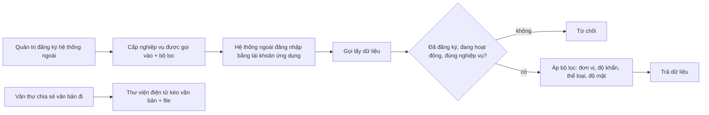

# Tích hợp hệ thống ngoài — tóm tắt nghiệp vụ cho BA

> Bản đọc nhanh bằng lời nghiệp vụ. Chi tiết và bằng chứng: [nghiep-vu.md](nghiep-vu.md) (mã NV / BR trong ngoặc
> để tra). Cập nhật: 2026-10-02 · Nguồn: code `kha_develop` + DB DEV. Nhãn quy tắc: **[Đã xác nhận]** = chủ dự án đã
> chốt là đúng ý đồ · **[Hiện trạng]** = hệ thống đang chạy như vậy, chưa ai xác nhận là ý đồ · **[Lệch nghiệp vụ]**
> = đã xác nhận nghiệp vụ muốn khác, hệ thống đang làm sai.

## 1. Phân hệ này dùng để làm gì

Phân hệ mô tả cách Văn phòng số **trao đổi với hệ thống bên ngoài**, trừ trục liên thông văn bản (1.1).
Quản trị **đăng ký** từng hệ thống ngoài: tài khoản của hệ thống đó, nghiệp vụ nó được phép gọi vào (lấy văn bản, hồ sơ, nhiệm vụ, đơn vị, tạo văn bản trình ký) kèm bộ lọc dữ liệu (NV-01).
Hệ thống ngoài lấy dữ liệu theo **đơn vị** (tự đăng nhập bằng tài khoản ứng dụng) hoặc theo **người dùng đang dùng ứng dụng đó** (đúng quyền người dùng) (NV-02, NV-04).
Các tích hợp cụ thể: **Thư viện điện tử** nhận văn bản đi do văn thư chia sẻ; **hệ thống Khiếu nại tố cáo Quốc gia (KNTC)** đẩy văn bản sang để lãnh đạo ký và văn thư cấp số; **soạn thảo trực tuyến** file Office; **tìm kiếm** qua Elasticsearch; **ứng dụng di động / Windows** (NV-03, NV-05, NV-09, NV-10, NV-11).
Phân hệ cũng ghi lại các tích hợp kế thừa từ Viettel (nhân sự VHR, vContract, ViettelPay, ERP) và cơ chế hai site công khai / nội bộ (NV-06, NV-07, NV-12, NV-13).

**Không gồm:** trục liên thông văn bản, VPCP, danh mục đơn vị liên thông (xem `van-ban/lien-thong`); luồng đăng nhập người dùng, quản lý người dùng, màn cấu hình phiên bản mobile (xem `he-thong`); tìm kiếm văn bản toàn văn ở mức nghiệp vụ (xem `van-ban/quan-ly-chung`); giao dịch ký của hệ thống ngoài và kết quả ký, chứng thư mềm trên điện thoại (xem `ky-so`); nộp hồ sơ sang phần mềm số hóa (xem `ho-so-cong-viec`); eCabinet, SmartRoom (xem `hop`); dịch vụ Nhiệm vụ ngoài (xem `nhiem-vu`); SMS, thông báo (xem `lich-nhac-viec`).

## 2. Ai dùng và được làm gì

| Vai trò | Được làm gì trong phân hệ này |
|---|---|
| Quản trị hệ thống (có menu Quản lý hệ thống tích hợp) | Đăng ký / sửa / xóa hệ thống ngoài; khai nghiệp vụ được gọi vào và bộ lọc; khai API gọi ra; bật / tắt "Hoạt động" (1.4, NV-01) |
| Văn thư đơn vị phát hành (`VT`) | Bấm chia sẻ văn bản đi cho Thư viện điện tử, khi là văn thư **đúng đơn vị đăng ký văn bản** và đơn vị nằm trong phạm vi chia sẻ (1.4, NV-03, BR-07) |
| Hệ thống ngoài (ứng dụng tích hợp) | Đăng nhập bằng tài khoản ứng dụng; lấy văn bản theo đơn vị, cây đơn vị, văn bản đã chia sẻ (1.4, NV-02, NV-04) |
| Người dùng Văn phòng số dùng qua ứng dụng ngoài | Ứng dụng ngoài lấy văn bản / hồ sơ / nhiệm vụ của người đó, đúng quyền người đó (1.4, NV-04) |
| Văn thư làm việc trên hệ thống KNTC | Hệ thống KNTC thay mặt văn thư tạo văn bản trình ký chuyển cấp số (1.4, NV-05) |
| Người dùng mở file | Xem / sửa file Office trên trình soạn thảo trực tuyến, xem lịch sử sửa, chuyển PDF (NV-09) |
| Ứng dụng di động / Windows | Hỏi phiên bản mới, đăng ký thiết bị nhận thông báo, tải bộ cài (1.4, NV-11) |

## 3. Màn hình / menu người dùng thấy

| Menu / màn | Để làm gì | Ghi chú | Mã menu |
|---|---|---|---|
| Quản lý hệ thống tích hợp | Đăng ký hệ thống ngoài: thông tin chung, API gọi ra, nghiệp vụ gọi vào + bộ lọc + phạm vi đơn vị chia sẻ | Trên DB DEV **không mở được** vì thiếu đơn vị gốc dành cho hệ thống tích hợp (NV-01) | 440785 |
| Cấu hình cho phép đơn vị chia sẻ văn bản cho các hệ thống bên ngoài | — | Menu mở nhưng **trang không tồn tại**; phạm vi chia sẻ thực tế khai ở màn đăng ký (1.2) | 440905 |
| Thông tin nhân viên VHR | — | Menu mở nhưng **trang không tồn tại** (1.2, NV-07) | 337693 |
| Đồng bộ người dùng | — | Màn đã tắt; thuộc `he-thong` (1.2) | 338432 |
| Cấu hình phiên bản mobile | Khai phiên bản app theo loại thiết bị | Thuộc `he-thong`; app dùng ở NV-11 (1.2) | 439665 |
| Văn bản ký với đối tác | — | **Khóa** (NV-06) | 338671 |
| Đơn vị liên thông | — | Thuộc `van-ban/lien-thong` (1.2) | 338995 |
| Nút "Gửi Thư viện điện tử" ở chi tiết văn bản đi | Văn thư chia sẻ văn bản cho Thư viện điện tử | Khóa với văn bản mật; đã chia sẻ thì khóa và hiện đã chọn (NV-03) | — |
| Trình soạn thảo trực tuyến + popup lịch sử sửa | Mở file đính kèm để xem / sửa trên trình duyệt | Chỉ hiện khi cấu hình bật cho đơn vị người dùng (NV-09) | — |
| Ô "tìm kiếm tất cả" trên khung chính | Tìm văn bản đến, đi, phiếu trình, nhiệm vụ, hồ sơ | Đọc từ Elasticsearch (1.3, NV-10) | — |

## 4. Luồng chính

**Đăng ký và lấy dữ liệu**
1. Quản trị mở *Quản lý hệ thống tích hợp*, khai mã ứng dụng, tên, mật khẩu, số điện thoại cảnh báo, công tắc *Hoạt động* (NV-01).
2. Khai **nghiệp vụ gọi vào** (danh sách chọn sẵn): lấy văn bản đã chia sẻ, văn bản đến / đi theo đơn vị, văn bản đến / đi theo người dùng, cây đơn vị, hồ sơ, nhiệm vụ, thêm tài liệu đa phương tiện vào hồ sơ, tạo văn bản trình ký cấp số. Mỗi nghiệp vụ văn bản có bộ lọc đơn vị / độ khẩn / thể loại / đơn vị ban hành / độ mật theo kiểu "Tất cả / Chỉ áp dụng cho / Không áp dụng cho" (NV-01).
3. Khai **API gọi ra** (REST / SOAP) — chỉ được lưu, không có chức năng nào trong hệ thống gọi tới (BR-03).
4. Hệ thống ngoài đăng nhập bằng mã ứng dụng (mỗi hệ thống ngoài là một tài khoản người dùng). Muốn lấy dữ liệu theo người dùng, hệ thống ngoài gửi thêm thông tin đăng nhập SSO / VNeID của người đó để đổi lấy phiên của người đó (NV-02).
5. Mỗi lần gọi, hệ thống kiểm: ứng dụng đã đăng ký, không bị tạm dừng, có đúng nghiệp vụ; rồi áp bộ lọc cấu hình; khoảng ngày tối đa 30 ngày (NV-02, BR-10, BR-11).

**Chia sẻ văn bản cho Thư viện điện tử**
1. Văn thư mở chi tiết văn bản đi, bấm *Gửi Thư viện điện tử*. Văn bản mật không chia sẻ được (NV-03).
2. Thư viện điện tử định kỳ kéo các văn bản được chia sẻ của từng đơn vị phát hành (kèm file), mỗi lần tối đa 100 văn bản (NV-03).
3. Văn bản đã chia sẻ bị sửa hoặc xóa → hệ thống tự ghi bản "cập nhật" / "xóa" để thư viện đồng bộ (NV-03).

**KNTC.** Hệ thống KNTC đăng nhập bằng tài khoản ứng dụng + mã văn thư; gửi văn bản (trích yếu, đơn vị ban hành, người ký, file) → Văn phòng số tạo **văn bản trình ký** (công văn, độ khẩn thường, độ mật thường), chuyển thẳng văn thư cấp số; kết quả ký trả về qua cơ chế giao dịch ký chung (NV-05, xem `ky-so`).

**Soạn thảo trực tuyến.** Người dùng mở file đính kèm trên trình soạn thảo; lưu xong file trên máy chủ được ghi đè, có dòng lịch sử sửa; có thể chuyển PDF để ký (NV-09).

## 5. Trạng thái

**Hệ thống tích hợp**

| Trạng thái (tên người dùng thấy) | Nghĩa | Chuyển sang khi nào | Giá trị |
|---|---|---|---|
| Hoạt động | Gọi được các nghiệp vụ đã cấp | Thêm mới; bật công tắc *Hoạt động* (4.8, BR-02) | 1 (cờ tạm dừng 0) |
| Tạm dừng | Mọi lời gọi lấy dữ liệu bị chặn | Tắt công tắc *Hoạt động* (4.8) | 1 (cờ tạm dừng 1) |
| Đã xóa | Không dùng nữa; cấu hình cũ vẫn còn | Xóa trên màn (4.8, NV-01) | 0 |

**Một văn bản đối với một hệ thống nhận chia sẻ** (mỗi lần là một bản ghi mới)

| Trạng thái | Nghĩa | Chuyển sang khi nào | Giá trị |
|---|---|---|---|
| Chia sẻ mới | Văn thư vừa chia sẻ | Văn thư bấm gửi (NV-03) | 1 |
| Đã sửa | Văn bản đã chia sẻ bị sửa, cần đồng bộ lại | Sửa văn bản đi (NV-03) | 2 |
| Đã xóa | Văn bản đã chia sẻ bị xóa | Xóa văn bản đi (NV-03) | 3 |

**Thiết bị nhận thông báo đẩy**: *Đang nhận* (1) khi app đăng ký thiết bị; *Đã đăng xuất* (0) khi đăng xuất hoặc người khác đăng nhập trên cùng thiết bị (NV-11).

## 6. Quy tắc quan trọng nhất

- [Đã xác nhận] Quyền thao tác trên web kiểm ở **tầng hiển thị nút / có menu**; riêng các lời gọi lấy dữ liệu của hệ thống ngoài thì máy chủ **có** kiểm đăng ký và nghiệp vụ (X1, 1.4).
- [Hiện trạng] **Mỗi hệ thống ngoài là một tài khoản người dùng** trong đơn vị đặc biệt dành cho hệ thống tích hợp; mã ứng dụng = mã tài khoản (NV-01, dac-thu bẫy 1).
- [Hiện trạng] Một hệ thống không được khai trùng nghiệp vụ; mã ứng dụng không trùng tài khoản đã có (BR-01).
- [Hiện trạng] Lưu đăng ký gồm hai bước tách rời: tạo tài khoản rồi ghi cấu hình; bước cấu hình lỗi thì tài khoản vẫn còn, màn báo "thêm tài khoản thành công, thiết lập cấu hình thất bại" (NV-01, dac-thu bẫy 2).
- [Hiện trạng] Hệ thống mới đăng ký mặc định **không được báo kết quả "đã ký"**, chỉ báo từ chối / hủy / ban hành / đóng dấu (lý do: người ký cuối có thể ký lại) (BR-02, Q7).
- [Hiện trạng] Bộ lọc nghiệp vụ: đơn vị theo Tất cả / Chỉ áp dụng cho / Không áp dụng cho; độ khẩn, thể loại, đơn vị ban hành để trống thì tự lấy theo cấu hình; độ mật chỉ cho "Thường"; khoảng ngày tối đa 30 ngày (BR-10, BR-11).
- [Hiện trạng] Chỉ văn thư **đúng đơn vị đăng ký văn bản**, và đơn vị nằm trong phạm vi chia sẻ (chính nó hoặc đơn vị cha có "áp dụng cho con"), mới chia sẻ được; hệ thống nhận **cố định là Thư viện điện tử** (BR-07, Q1).
- [Đã xác nhận] Văn bản mật không được chia sẻ ra ngoài (văn bản mật chưa dùng) (X4, NV-03).
- [Hiện trạng] Không có thao tác **thu hồi chia sẻ**; sửa / xóa văn bản tự gửi bản cập nhật / xóa cho thư viện (BR-09, Q2).
- [Hiện trạng] Thư viện điện tử kéo theo **mã phiên**: một mã phiên chỉ dùng một lần; kéo lại đúng phiên thì nhận lại đúng tập văn bản (BR-08).
- [Hiện trạng] KNTC không đăng nhập bằng tài khoản cán bộ: danh tính là tài khoản ứng dụng; mã văn thư dùng để kiểm văn thư đúng đơn vị ban hành, kiểm danh sách văn thư và địa chỉ máy được phép, và giới hạn số lần gọi mỗi phút (BR-13, NV-05).
- [Hiện trạng] Văn bản từ KNTC luôn là **công văn, độ khẩn thường, độ mật thường**, chuyển thẳng cấp số; tổng dung lượng file có giới hạn (NV-05, Q3).
- [Hiện trạng] Soạn thảo trực tuyến chỉ bật khi cấu hình bật **và** đơn vị người dùng thuộc danh sách đơn vị áp dụng; lưu file sẽ **hủy mọi vị trí chữ ký đã đặt** trên file đó (NV-09, dac-thu bẫy 8, bẫy 9).
- [Hiện trạng] Mở file bằng trình soạn thảo kiểu mới **đánh dấu văn bản đã đọc** cho người mở (và đơn vị nếu người đó là văn thư) (BR-21, Q5).
- [Hiện trạng] Mọi kiểu đăng nhập qua SSO / VNeID, kể cả qua ứng dụng ngoài, đều ghép về **mã nhân viên** (BR-20).

## 7. Hệ thống KHÔNG làm / hay bị hiểu nhầm

- **"API gọi ra" chỉ được lưu**, không có chức năng nào trong hệ thống tự gọi sang hệ thống ngoài; việc trả kết quả ký ra ngoài do tiến trình nằm ngoài mã nguồn (BR-03, BR-16).
- **Văn phòng số không tự gửi thông báo đẩy** lên điện thoại: chỉ lưu thiết bị; việc gửi do dịch vụ ngoài (BR-27).
- **Không tự đẩy dữ liệu vào tìm kiếm**: hệ thống chỉ phát tín hiệu "cần đánh chỉ mục lại", dịch vụ ngoài đánh chỉ mục; chữ "Solr" còn trong tên nhưng đã thay bằng Elasticsearch (NV-10, BR-24, BR-25).
- **Đồng bộ nhân sự (VHR) không chạy**: có sẵn đường nhận dữ liệu nhưng không ai gọi; màn đồng bộ đã tắt, màn "Thông tin nhân viên VHR" không có trang; trên DEV người dùng không đến từ đồng bộ (NV-07, BR-17, Q4).
- **"Đơn vị liên thông" không phải kết nối nhân sự** — là danh mục đơn vị của trục liên thông văn bản (1.5, xem `van-ban/lien-thong`).
- **ViettelPay chỉ dùng để thanh toán gia hạn chứng thư** trên điện thoại, không gắn với văn bản tài chính; xác nhận thanh toán đang trả rỗng (NV-12).
- **"Văn bản ký với đối tác" không dùng được**: menu khóa, phần lớn chức năng phía máy chủ đã tắt (NV-06).
- **Không có kho lưu trữ đối tượng (MinIO)**: file nằm trên thư mục đĩa, file văn bản được mã hóa khi ghi (NV-13, X10).
- **Cây tổ chức Đảng** có API nhưng chưa có màn và chưa có dữ liệu (NV-15, Q8).
- Có lỗi bảo mật đã ghi nhận, xem dac-thu L1, L4, L7, L10, L13.

## 8. Liên quan phân hệ khác

| Khi thay đổi ở đây… | …phải xem thêm | Vì sao |
|---|---|---|
| Hệ thống ngoài trình ký, kết quả ký trả ra ngoài, KNTC | `ky-so`, `xu-ly-cong-viec` | Giao dịch ký và kết quả ký nằm ở ký số; văn bản KNTC đi luồng trình ký (NV-05, NV-06) |
| Chia sẻ văn bản đi, sửa / xóa văn bản đi | `van-ban/di` | Nút chia sẻ ở chi tiết văn bản đi; sửa / xóa văn bản tự ghi bản cập nhật cho thư viện (NV-03) |
| Lấy văn bản theo người dùng | `van-ban/den`, `van-ban/di` | Dữ liệu lấy lại từ chính hộp văn bản của người dùng (NV-04) |
| Lấy hồ sơ, thêm tài liệu đa phương tiện | `ho-so-cong-viec` | Dùng lại chức năng hồ sơ (NV-04) |
| Lấy nhiệm vụ | `nhiem-vu` | Dùng lại tìm kiếm nhiệm vụ (NV-04) |
| Đăng nhập SSO / VNeID, tài khoản ứng dụng, phiên bản app | `he-thong` | Luồng đăng nhập, người dùng, màn cấu hình phiên bản nằm ở đó (NV-02, NV-08, NV-11) |
| Soạn thảo trực tuyến, vị trí chữ ký | `ky-so`, `van-ban/di`, `phieu-trinh` | Lưu file hủy vị trí chữ ký; dùng ở dự thảo, phiếu trình, mẫu văn bản (NV-09) |
| Tìm kiếm, đánh dấu cần đánh chỉ mục | `van-ban/quan-ly-chung`, `kpi-danh-gia` | Tìm kiếm văn bản và báo cáo sử dụng đọc từ Elasticsearch (NV-10) |
| Thông báo đẩy | `lich-nhac-viec` | Thông báo do phân hệ đó tạo; gửi đẩy do dịch vụ ngoài (BR-27) |

## 9. Câu hỏi nghiệp vụ còn mở

- `Q1` — Ngoài Thư viện điện tử có hệ thống nào cần nhận văn bản do văn thư chia sẻ; thư viện đã kết nối chạy thật chưa; hệ thống `ATTT` là gì?
- `Q2` — Văn thư có cần thao tác thu hồi chia sẻ không?
- `Q3` — Mọi văn bản từ KNTC đều là công văn thường, hay KNTC cần gửi kèm thể loại / độ khẩn?
- `Q4` — Cán bộ / đơn vị nhập tay hay đồng bộ từ hệ thống nhân sự của tỉnh; hai menu đồng bộ / VHR còn cần không?
- `Q5` — Mở file trên trình soạn thảo có tính là "đã đọc văn bản" không?
- `Q6` — Cờ đăng nhập 0 / 1 theo từng phiên bản app nghĩa là gì?
- `Q7` — Hệ thống ngoài có cần biết thời điểm văn bản đã ký xong (trước ban hành) không?
- `Q8` — Có quản lý văn bản / nhiệm vụ theo cây tổ chức Đảng riêng không?
- `Q9` — Khánh Hòa có đúng hai cụm máy chủ (Internet và nội bộ) đồng bộ qua lại không?
- `Q10` — Các tích hợp kế thừa Viettel (ViettelPay, vContract, ký với đối tác, ERP, FICO / ERP_SAP…) còn dùng không?

(Đầy đủ ở mục 7.1 của `nghiep-vu.md`.)

## 10. Khi viết yêu cầu mới cho phân hệ này, nhớ ghi rõ

- **Hệ thống ngoài nào, chiều nào:** hệ thống ngoài gọi vào lấy / đẩy dữ liệu, hay Văn phòng số chủ động gửi ra — hiện Văn phòng số không có chức năng tự gọi ra (BR-03, mục 1.6).
- **Nghiệp vụ gọi vào mới:** tên nghiệp vụ trong danh mục, ứng dụng nào được cấp, có bộ lọc nào trên màn đăng ký (NV-01, dac-thu bẫy 3, bẫy 4).
- **Lấy theo đơn vị hay theo người dùng:** theo đơn vị thì hệ thống ngoài thấy dữ liệu đơn vị nào; theo người dùng thì đúng quyền người dùng (NV-04).
- **Bộ lọc dữ liệu:** đơn vị, độ khẩn, thể loại, đơn vị ban hành, độ mật; khoảng ngày tối đa; phân trang tối đa (BR-10, BR-11).
- **Ai chủ động chia sẻ:** văn thư bấm từng văn bản hay hệ thống ngoài tự kéo theo cấu hình; có cần chọn hệ thống nhận, có cần thu hồi (BR-07, Q1, Q2).
- **Khi dữ liệu nguồn đổi** (sửa, xóa, ký lại, ban hành, hủy): có báo cho hệ thống ngoài không, báo những kết quả nào (NV-03, BR-02, Q7).
- **Xác thực và giới hạn:** tài khoản ứng dụng hay tài khoản cán bộ, giới hạn địa chỉ máy, số lần gọi mỗi phút, tạm dừng ứng dụng (NV-02, NV-05).
- **Văn bản tạo từ hệ thống ngoài:** thể loại, độ khẩn, độ mật, người ký, đơn vị ban hành, đi luồng nào (trình ký, cấp số) (NV-05, Q3).
- **Chạy ở site nào:** Internet, nội bộ, hay cả hai — dữ liệu có cần đồng bộ hai site không (NV-13, Q9).
- **Có ghi nhật ký trao đổi không** (để đối soát / lấy lại) — hiện chỉ việc thư viện kéo văn bản có ghi (BR-08).
