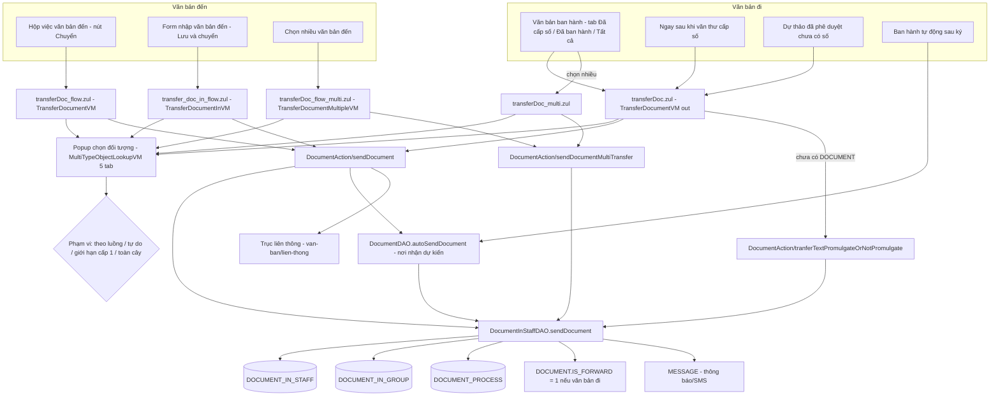
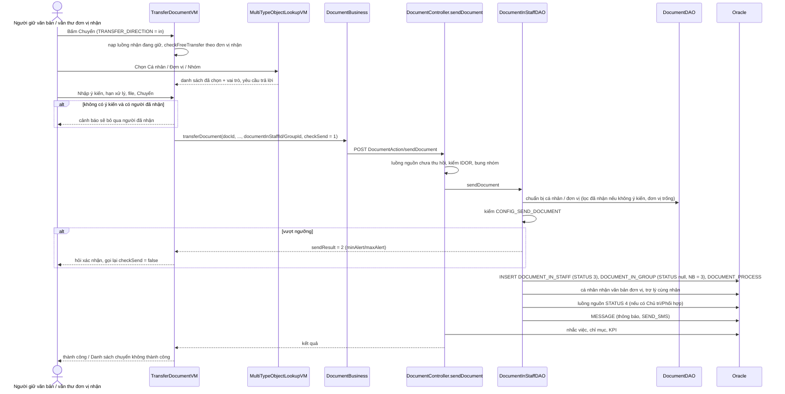
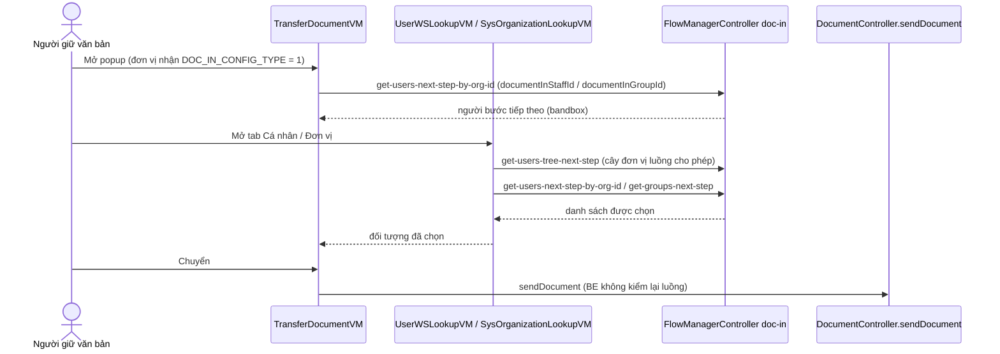
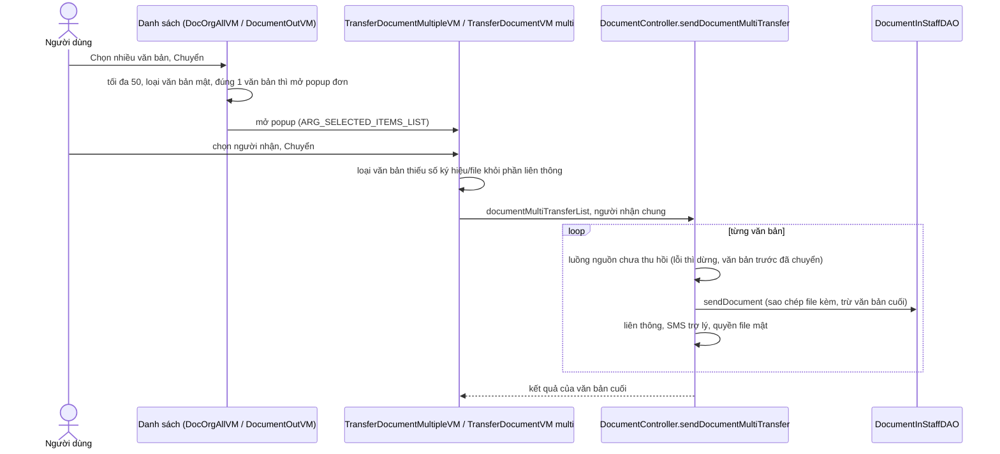
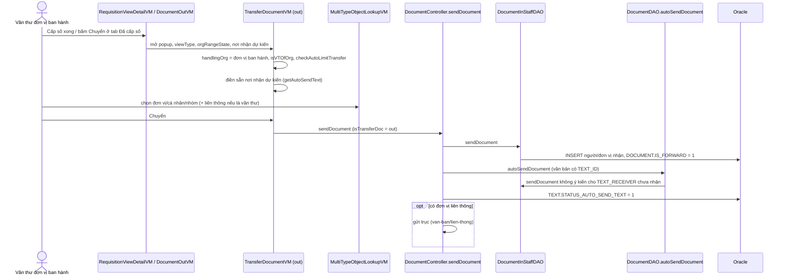
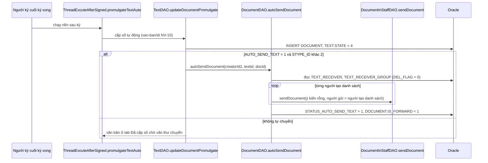
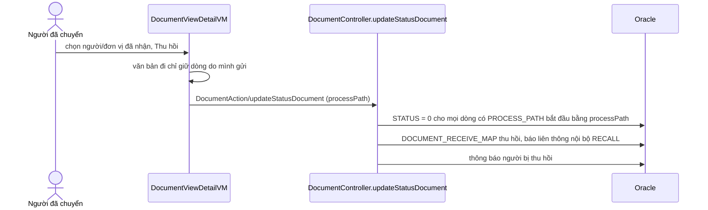
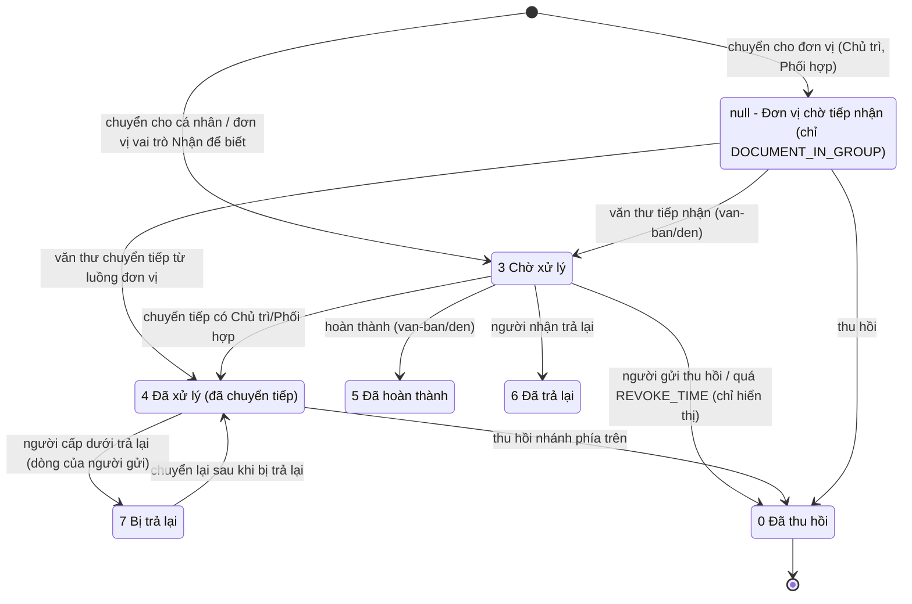
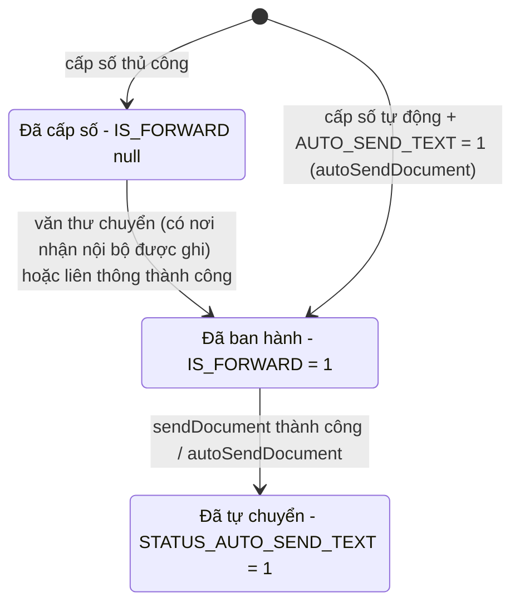
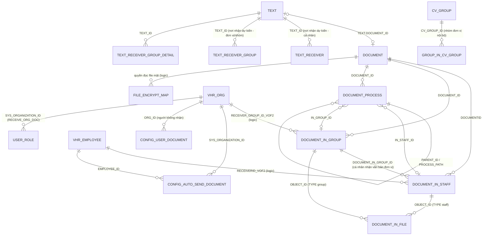

# Chuyển văn bản — nghiệp vụ mọi luồng chuyển (đến: chuyển xử lý; đi: chuyển sau ban hành; tự động chuyển; giới hạn chuyển; popup chọn đối tượng nhận)

> Viết từ code nhánh `kha_develop` (web-spring + backend2.0) ngày 2026-10-01; đã đối chiếu DB DEV (chỉ SELECT) ngày 2026-10-01. Mọi khẳng định có nguồn `file:dòng`.
> Viết tắt đường dẫn:
> `WEB/` = `web-spring/src/main/java/com/viettel/` · `ZUL/` = `web-spring/src/main/webapp/view/voffice/` ·
> `BIZ/` = `web-spring/src/main/java/com/voffice/service/business/` · `BE1/` = `backend2.0/backendvoffice/src/main/java/com/viettel/voffice/` ·
> `BE2/` = `backend2.0/backendvoffice/src/main/java/com/viettel/office/`.
> VM hay dùng: **TDVM** = `WEB/voffice/vm/document/TransferDocumentVM.java` (popup Chuyển văn bản, ~10.300 dòng), **TDMVM** = `WEB/voffice/vm/document/TransferDocumentMultipleVM.java`,
> **TDIVM** = `WEB/voffice/vm/document/TransferDocumentInVM.java`, **MTOL** = `WEB/voffice/widget/MultiTypeObjectLookupVM.java` (popup Chọn đối tượng nhận),
> **UWL** = `WEB/voffice/widget/UserWSLookupVM.java`, **SOL** = `WEB/voffice/widget/SysOrganizationLookupVM.java`, **SOTM** = `WEB/voffice/widget/SysOrganizationTreeModel.java`,
> **DVDVM** = `WEB/voffice/vm/document/DocumentViewDetailVM.java`, **DOVM** = `WEB/voffice/vm/document/DocumentOutVM.java`, **RVDVM** = `WEB/voffice/vm/requisition/RequisitionViewDetailVM.java`.
> Logic BE: **DC** = `BE1/controler/DocumentController.java` (gen-1, 16.600 dòng), **DISDAO** = `BE1/database/dao/document/DocumentInStaffDAO.java`,
> **DDAO** = `BE1/database/dao/document/DocumentDAO.java` (22.000 dòng), **DB** = `BIZ/DocumentBusiness.java`.
> Phân hệ liền kề đã viết: giai đoạn soạn/khai "Nơi nhận dự kiến" ở [`../../xu-ly-cong-viec/nghiep-vu.md`](../../xu-ly-cong-viec/nghiep-vu.md) NV-17; cấp số / "ban hành = chuyển" ở [`../di/nghiep-vu.md`](../di/nghiep-vu.md) NV-11 — file này chỉ trỏ sang, không lặp lại.

## 1. Tổng quan

### 1.1 Phạm vi

"Chuyển văn bản" là thao tác **giao một văn bản đã có bản ghi `DOCUMENT`** (văn bản đến, hoặc văn bản đi đã cấp số) cho **cá nhân / đơn vị / nhóm** trong hệ thống, kèm vai trò xử lý (chủ trì, phối hợp, nhận để biết, nắm tình hình), ý kiến chuyển, hạn xử lý, yêu cầu trả lời, file kèm. Mỗi người/đơn vị nhận sinh **một dòng** ở `DOCUMENT_IN_STAFF` (cá nhân) hoặc `DOCUMENT_IN_GROUP` (đơn vị) và một nút ở cây `DOCUMENT_PROCESS`. Mọi biến thể (chuyển 1 văn bản, chuyển nhiều, chuyển theo luồng, văn thư phát hành, tự động chuyển) đều kết thúc ở **một endpoint gen-1** `DocumentAction.sendDocument` (hoặc biến thể `sendDocumentMultiTransfer`) → `DocumentInStaffDAO.sendDocument`.

Phân hệ gồm:

- Popup **Chuyển văn bản** (`transferDoc*.zul`, `transfer_doc_in_flow.zul`) và các đường vào (NV-01).
- Popup **Chọn đối tượng nhận** 5 tab và **phạm vi được chọn** theo từng trường hợp — cây đơn vị, chuyển tự do / giới hạn chuyển (NV-02, NV-03).
- **Chuyển xử lý văn bản đến** (vai trò, ý kiến, hạn, yêu cầu trả lời, chuyển lại cho người đã nhận) và xử lý ở BE (NV-04); **chuyển theo luồng** (NV-05); **chuyển ngay khi tiếp nhận / tự động chuyển theo cấu hình đơn vị** (NV-06); **chuyển nhiều văn bản** (NV-07).
- **Văn thư chuyển văn bản đi sau cấp số** (= "ban hành", `DOCUMENT.IS_FORWARD = 1`) và **chuyển trước ban hành** (NV-08); **tự động chuyển tới nơi nhận dự kiến** (NV-09).
- **Giới hạn chuyển**: "Không được chuyển tiếp" / "Thu hồi văn bản" hẹn giờ cho từng văn bản (NV-10); **ngưỡng số người nhận** `CONFIG_SEND_DOCUMENT` (NV-11).
- **Văn bản mật khi chuyển** (NV-12), **gửi trợ lý cùng nhận** (NV-13), **kết quả / lỗi chuyển** (NV-14), **danh sách người nhận / lịch sử chuyển** (NV-15), **nhóm nhận** (NV-16), **SMS / thông báo** (NV-17).
- Ranh giới: **chuyển văn bản tài chính** (NV-18), **chuyển hồ sơ** (NV-19), **văn bản cấp trên chuyển / nắm tình hình** (NV-20), **tạo KPI khi chuyển** (NV-21), **mobile** (NV-22).

Phân hệ **KHÔNG gồm** (trỏ sang):

| Nội dung | Phân hệ |
|---|---|
| Khai báo "Nơi nhận dự kiến" ở dự thảo (`TEXT_RECEIVER`, `TEXT_RECEIVER_GROUP`) | `xu-ly-cong-viec` NV-17 |
| Cấp số, đóng dấu, hủy ban hành; hộp việc *Văn bản ban hành* 6 tab | `van-ban/di` |
| Tiếp nhận, vào sổ đến, bút phê, hoàn thành, trả lại, đọc/chưa đọc; các hộp việc văn bản đến | `van-ban/den` |
| Cấu hình luồng văn bản đến (`FLOW`, `NODE*`), thuật toán người/nhóm bước tiếp theo `api/flow-manager/doc-in/*` | `van-ban/luong-xu-ly` |
| Gửi trục liên thông ra cơ quan ngoài (`sendDocumentToConnectOrg`, `CONNECT_DOCUMENT`), liên thông nội bộ khác tenant | `van-ban/lien-thong` (ở đây chỉ nêu điểm gọi) |
| Mã hóa/giải mã file văn bản mật, chứng thư mật | `ky-so` (ở đây chỉ nêu ràng buộc khi chuyển) |
| Quản lý đơn vị (`VHR_ORG`), vai trò, cấu hình "nhận văn bản đơn vị" của user | `he-thong` |

### 1.2 Menu / màn hình liên quan (DB DEV `SYS_MENU`, 2026-10-01)

Popup chuyển không có menu riêng — mở từ nút "Chuyển" ở các hộp việc văn bản đến/đi. Hai màn cấu hình có menu (cha `336812`):

| `SYS_MENU_ID` | `CODE` | Tên | URL |
|---|---|---|---|
| 440625 | `CONFIG_AUTO_SEND_DOCUMENT` | Cấu hình chuyển văn bản sau khi tiếp nhận | `/view/voffice/config/docAutoSendDocumentConfig.zul` |
| 338452 / 439825 | `SYS_ORGANIZATION` / `ORG` | Quản lý đơn vị (chứa cấu hình "Giới hạn chuyển văn bản" đi / "Chuyển theo luồng – Chuyển tự do" đến) | `/view/voffice/admin/sysOrganization/sysOrganization.zul` |

### 1.3 Actor & quyền

Quyền hiển thị nút "Chuyển" nằm ở từng hộp việc (thiết kế chung: BE không kiểm người gọi — `_chung/huong-dan-ra-soat-nghiep-vu.md`). Riêng `sendDocument` có kiểm IDOR `documentDAO.validateDocumentDetail(userGroup, docId)` (DC:7914-7920).

| Actor | Nhận diện trong code | Chuyển được gì |
|---|---|---|
| Người đang giữ văn bản đến (cá nhân nhận) | có dòng `DOCUMENT_IN_STAFF` của mình (`listPendingDocuments` — TDVM:690-750) | Chuyển tiếp từ **luồng nhận** của mình (một dòng `DOCUMENT_IN_STAFF`); nếu văn bản bị thu hồi (`STATUS = 0`) thì bị chặn (DC:7670-7676) |
| Văn thư đơn vị nhận | role `VT` ở đơn vị nhận; luồng nhận là dòng `DOCUMENT_IN_GROUP` (`documentInGroupId`) | Chuyển văn bản đến của đơn vị (chủ trì/phối hợp/NB…) cho lãnh đạo, phòng, cá nhân; chuyển ngay khi tiếp nhận (NV-06) |
| Văn thư đơn vị ban hành | `isVTOfOrg = checkHasRoleInOrg(handlingOrg, user, "VT")` với `handlingOrg` = đơn vị ban hành (TDVM:772, 1889-1891, 8440-8448) | Chuyển văn bản đi đã cấp số (NV-08) |
| Người không phải văn thư đơn vị ban hành (lãnh đạo/chuyên viên ở tab *Đã ban hành* phạm vi cá nhân) | `!isVTOfOrg` | Chuyển văn bản đi nhưng **luôn bị giới hạn trong đơn vị cấp 1** (`checkAutoLimitTransfer` trả `true` — TDVM:1198-1201; MTOL:1023-1026) |
| Vai trò "chuyển cho toàn bộ nhân viên đơn vị" | `SYSTEM_PARAMETER.ROLE_SEND_DOC_ALL` (DB DEV: `/VT/LDDV/TTDV/`) → `permissionSendAll` (TDVM:572-578) | Cờ hiển thị; ngưỡng số người do `CONFIG_SEND_DOCUMENT` (NV-11) |
| Lãnh đạo có trợ lý | `MEETING_ASSISTANT` loại 12 (`assistantReceiveDoc = 12` — TDVM:376) | Văn bản chuyển cho lãnh đạo được gửi kèm trợ lý (NV-13) |
| Hệ thống (tự động) | `autoSendDocument` (DDAO:14605), auto-transfer khi tiếp nhận (`configAutoTransfer = 0`) | NV-06, NV-09 |

## 2. Module

| Chức năng | Màn (.zul) | VM | Business (key) | Endpoint BE | Controller / logic | DAO / bảng |
|---|---|---|---|---|---|---|
| Popup chuyển văn bản **đi** (và văn bản liên thông) | `ZUL/document/transferDoc/transferDoc.zul` (`ViewConstant.WIDGETS.TRANSFER_DOCUMENT_LOOKUP` — `WEB/voffice/common/ViewConstant.java:331`; mở bằng `ViewUtil.createLookupTransferDocumentInRequisition` — `WEB/voffice/util/ViewUtil.java:603-613`) | TDVM | `DB.transferDocument` → `DocumentAction.sendDocument` (DB:1685-1822); `transferDocumentBeforePublish` → `DocumentAction.tranferTextPromulgateOrNotPromulgate` (DB:1997-2061) | `POST /DocumentAction/sendDocument`, `/DocumentAction/tranferTextPromulgateOrNotPromulgate` (`BE1/action/DocumentAction.java:670, 720`) | DC `sendDocument` :7566, `tranferTextPromulgateOrNotPromulgate` :7404 | DISDAO `sendDocument` :1009, `tranferTextPromulgateOrNotPromulgate` :706; DDAO — `DOCUMENT_IN_STAFF`, `DOCUMENT_IN_GROUP`, `DOCUMENT_PROCESS`, `DOCUMENT`, `DOCUMENT_IN_FILE`, `FILE_ENCRYPT_MAP` |
| Popup chuyển văn bản **đến** (theo luồng / tự do) | `ZUL/document/transferDoc/transferDoc_flow.zul` (`TRANSFER_DOCUMENT_FLOW_LOOKUP` — `ViewConstant.java:333`; `ViewUtil.createLookupTransferDocument` luôn đặt `ARG_TRANSFER_BY_FLOW = true` — `ViewUtil.java:575-587`) | TDVM | như trên + người/đơn vị bước tiếp theo `api.flow-manager.doc-in.*` (DB:5538-5910) | như trên + `GET/POST /api/flow-manager/doc-in/*` | như trên; `BE2/controller/FlowManagerController.java` | như trên |
| Popup chuyển **nhiều văn bản** | `transferDoc_multi.zul` (đi — `ViewConstant.java:332`, `ViewUtil.java:615-620`); `transferDoc_flow_multi.zul` (đến — `ViewConstant.java:334`, `ViewUtil.java:590-601`) | TDVM (`_multi`); TDMVM (`_flow_multi`) | `DB.transferMultiDocument` → `DocumentAction.sendDocumentMultiTransfer` (DB:1824-1951) | `POST /DocumentAction/sendDocumentMultiTransfer` (`DocumentAction.java:730`) | DC `sendDocumentMultiTransfer` :8199 | DISDAO/DDAO; `updateIsForwardByDocumentIdMultiTransfer` (DDAO:20592) |
| Khung chuyển nhúng trong form **nhập văn bản đến** ("Lưu và chuyển") | `transfer_doc_in_flow.zul` (include, `includeSrc` ở `DocumentPendingReceptionVM.java:9129-9175`, `DocOrgAllVM.java:9637`, `DocumentPendingProcessingVM.java:10209`, `DocumentProcessedVM.java:9968`, `DocumentSearchVM.java:8925`, `OrgFollowerDocInOrgSearchVM.java:8609`) | TDIVM | như TDVM | như trên | như trên | như trên |
| Popup **Chọn đối tượng nhận** (5 tab) | `/view/widgets/multiTypeObjectLookup.zul` (`ViewConstant.java:281`, `ViewUtil.java:795`) → include `sysOrganizationLookup.zul`, `userWSLookup.zul`, `group/treegroup/group_person*.zul`, `group_org*.zul`, `connecVHRLookup*.zul` (MTOL:302-393) | MTOL → SOL, UWL, `GroupSelectVM`/`GroupSelectVbdVM`, `OrgGroupSelectVM`, `ConnectVHRLookupVM` | `ConnectDocumentBusiness` (đơn vị liên thông đã nhận); legacy `ISysOrganization` (cây đơn vị) | `/ConnectDocument/*`; cây đơn vị đọc thẳng DB từ web | — | `VHR_ORG`/`SYS_ORGANIZATION`, `USER_ROLE`, `VHR_EMPLOYEE`, `CV_GROUP`, `CONNECT_VHR` |
| Giới hạn chuyển của văn bản (không chuyển tiếp / thu hồi hẹn giờ) | `ZUL/document/transferDoc/configLimitTransfer.zul` (`ViewConstant.java:335`, `ViewUtil.java:810`) | `WEB/voffice/vm/document/ConfigLimitTransferVM.java` | (gửi kèm `sendDocument`: `notSend`, `revokeTime` — DB:1757-1762) | `/DocumentAction/sendDocument` | DC :7655-7660 | `DOCUMENT_IN_STAFF.NOT_SEND`, `REVOKE_TIME` |
| Danh sách chuyển không thành công | `ZUL/document/transferDoc/popupTransferError.zul` (`ViewConstant.java:390`, `ViewUtil.java:1976`) | `WEB/voffice/vm/document/PopupTransferErrorVM.java` | — | — | — | — |
| Danh sách cá nhân trong đơn vị nhận | `ZUL/document/transferDoc/viewListEmployee.zul` (`ViewConstant.java:643`, `ViewUtil.java:3075`) | `WEB/voffice/vm/document/TransferDocViewLstEmployeeVM.java` | — | — | — | — |
| Lịch sử thao tác văn bản | `ZUL/document/transferDoc/viewListHistory.zul` (`ViewConstant.java:644`, `ViewUtil.java:3825`) | `WEB/voffice/vm/document/DocumentLogInfoVM.java` | `DocumentHistoryLogBusiness` | (xem NV-15) | | |
| Sửa thành phần nhóm khi chuyển | `transferGroupEditor.zul` (đi), `transferGroupEditor_vbd.zul` (đến) (`ViewConstant.java:386-387`, `ViewUtil.java:1950-1966`) | `WEB/voffice/vm/document/DocumentGroupEditorVM.java` | `CVGroupBusiness`, `DocumentBusiness`, `RequisitionBusiness` | | | `CV_GROUP`, `GROUP_IN_CV_GROUP` |
| Chuyển văn bản tài chính | `transferFinanceDoc.zul` (`ViewConstant.java:145`, `ViewUtil.java:1267`) | `WEB/voffice/vm/document/TransferFinanceDocumentVM.java` | `DB.transferFinanceDocument` → `DocumentAction.sendFinanceTextToStaff` (DB:1953-1985) | `/DocumentAction/sendFinanceTextToStaff` (`DocumentAction.java:740`) | DC :8662 | |
| Chuyển hồ sơ | `transferBriefDoc.zul` (`ViewConstant.java:336`, `ViewUtil.java:3398`) | `WEB/voffice/vm/document/TransferBriefDocVM.java` | `DocumentBusiness`, `EnterpriseBusiness`, `SearchSolrBusiness` | | | (ranh giới `ho-so-cong-viec`) |
| Cấu hình chuyển văn bản sau khi tiếp nhận | `ZUL/config/docAutoSendDocumentConfig.zul` | `WEB/voffice/vm/config/DocumentProcessAutoSendConfigVM.java` | `DocumentProcessTermBusiness.getListAutoSendConfigs/addOrUpdateAutoSendConfig` (`BIZ/DocumentProcessTermBusiness.java:193-201`) | `/documentProcessTermConfig/getListAutoSendConfigs`, `/addOrUpdateAutoSendConfig` (`BE1/action/DocumentProcessTermConfigAction.java:31, 61`) | `DocumentProcessTermController` | `BE1/database/dao/DocumentRequestConfigDAO.java` :79, :195 — `CONFIG_AUTO_SEND_DOCUMENT` |
| Cấu hình chuyển tự do / giới hạn theo đơn vị | `ZUL/admin/sysOrganization/sysOrganization_add.zul:174-205` | (VM quản lý đơn vị — `he-thong`) | | | `BE1/database/dao/document/VHROrgDAO.java:997-1006` | `VHR_ORG.DOC_OUT_CONFIG_TYPE`, `DOC_IN_CONFIG_TYPE` |
| Màn `transferContentDoc.zul` | `ZUL/document/transferDoc/transferContentDoc.zul` | `widget.SysMenuLookupVM` (chọn menu — không phải chuyển văn bản) | | | | xếp sai phân hệ — xem báo cáo |

## 3. Nghiệp vụ

### NV-01. Popup "Chuyển văn bản" — các biến thể và đường vào

**Mục đích.** Một màn duy nhất (TDVM) phục vụ mọi lần chuyển một văn bản; biến thể zul chỉ khác bố cục. Chiều chuyển do nơi gọi truyền vào (`TRANSFER_DIRECTION` = `"in"` văn bản đến / `"out"` văn bản đi — TDVM:104-105, 461-463).

**Actor.** Xem 1.3.

**Luồng.**

| Đường vào | zul / VM | Tham số đặc trưng | Nguồn |
|---|---|---|---|
| Hộp việc văn bản đến (chờ xử lý, đã xử lý, nhận để biết, theo dõi đơn vị, tìm kiếm, chi tiết, PDF viewer…) — 1 văn bản | `transferDoc_flow.zul` / TDVM qua `ViewUtil.createLookupTransferDocument` | `TRANSFER_DIRECTION = in`, `ARG_TRANSFER_BY_FLOW = true` (luôn), `ARG_CONFIG_AUTO_TRANSFER` (cấu hình tự động chuyển của đơn vị nhận), `ARG_TAB_DOC` (tab cá nhân/đơn vị), `ARG_IS_RECEIVE_TO_KNOW`, `ARG_IS_GRASP_SITUATION` | `ViewUtil.java:575-587`; `DocumentPendingReceptionVM.java:2969-3025`; DVDVM:3510-3592 |
| Hộp việc *Văn bản ban hành* tab Đã cấp số / Đã ban hành / Tất cả — 1 văn bản | `transferDoc.zul` / TDVM qua `createLookupTransferDocumentInRequisition` | `TRANSFER_DIRECTION = out`, `ARG_DOCUMENT_TYPE = 1`, `ARG_VIEW_TYPE` (8/9/10), `ARG_ORG_RANGE_STATE` (0 đơn vị / 1 cá nhân), `ARG_FOCUS_ON_ANCESTOR = true`, đơn vị nhắc việc để điền sẵn (`ARG_REMINDER_LIST_ORG_FOR_FILL`) | DOVM:3630-3664 |
| Ngay sau khi văn thư **cấp số** ở màn chi tiết văn bản chờ cấp số | `transferDoc.zul` qua `DVDVM.doPopUpTransferDoc(documentEntity, "out")` | `docManagerPromulgate = true` → `ARG_IS_VT_OF_ORG = true`, `ARG_VIEW_TYPE = DCS`, `ARG_ORG_RANGE_STATE = 0`; mang theo nơi nhận dự kiến | RVDVM:3393-3406; DVDVM:3545-3561 |
| Văn bản chưa có `DOCUMENT` (chỉ có `TEXT`) ở màn chi tiết dự thảo/trình ký | `transferDoc.zul` | `ARG_TRANSFER_BEFORE_PUBLISH = true` khi `documentId == null` → NV-08 "chuyển trước ban hành" | RVDVM:9090-9106 |
| Chuyển nhiều văn bản | `transferDoc_multi.zul` (đi, TDVM với `ARG_SELECTED_ITEMS_LIST`) / `transferDoc_flow_multi.zul` (đến, TDMVM) | NV-07 | `ViewUtil.java:590-620`; DOVM:3737-3780; `DocOrgAllVM.java:2834-2879` |
| Form nhập văn bản đến "Lưu và chuyển" | `transfer_doc_in_flow.zul` (include) / TDIVM | NV-06 | `DocumentPendingReceptionVM.java:9129-9175` |
| Văn bản liên thông đến | `transferDoc.zul` qua `createLookupTransferConnectDocument` | `ARG_SHOW_TRANSFER_FROM_CONNECT_DOCUMENT` (đóng tab liên thông sau khi chuyển) | `ViewUtil.java:622-632`; TDVM:492-494, 5502-5504 |

Khi mở (TDVM `postViewInitialized` :602-1028): nạp **luồng nhận đang giữ** của người dùng (`getPendingDocumentsToHandle` → `listPendingDocuments`), lọc theo văn bản cá nhân/đơn vị và mặc định chọn luồng đầu tiên có `status` khác null (:690-750); xác định **đơn vị xử lý** và **chuyển tự do** (`checkFreeTransfer` :770, NV-03); tính `isVTOfOrg` (:772); dựng phạm vi ô tìm nhanh (`initSearchScopeOrgIds` :773, :1252-1291); nạp đơn vị liên thông đã nhận (`getListOrgConnectDocument` :794); điền sẵn **đề xuất tham mưu** của trợ lý cho lãnh đạo (:796-900); đánh dấu người/đơn vị **không có chứng thư mật** khi văn bản mật (:955-987); điền sẵn **nơi nhận dự kiến** của dự thảo (`requisitionBusiness.getAutoSendText(textId)` → `displayWarningAutoSend` — :988-1008); nạp file để xem song song (split view :1010-1019).

Nội dung popup (`transferDoc_flow.zul`): bảng **luồng xử lý đang giữ** (đơn vị chuyển, người tạo, đơn vị/người nhận, hạn, trạng thái, vai trò, yêu cầu trả lời — :279-392); **Ý kiến chuyển** ≤ 2000 ký tự, chọn mẫu ý kiến (`doSelectDocumentTemplate`), mã hóa ý kiến khi văn bản mật (:405-432); **file đính kèm** thêm khi chuyển (ẩn khi văn bản mật — :454); **Hạn xử lý** (:485-506); **Tạo KPI nhiệm vụ** (:511-538, NV-21); nút chọn **Cá nhân / Đơn vị / Nhóm / Đơn vị liên thông**; bảng người/đơn vị đã chọn với cột vai trò (Chủ trì / Phối hợp / Nhận để biết / Nắm tình hình) và **Yêu cầu trả lời**; **Gửi SMS** (chỉ văn bản thường đã có `DOCUMENT` — `checkSendSMSForStypeId` TDVM:8399-8411; `transferDoc.zul:853-857`); **Cho phép chuyển văn bản mật tới Trợ lý** (chỉ văn bản mật — `transferDoc.zul:860-865`).

**BR-01.** Tối đa **200** cá nhân / đơn vị / nhóm được chọn trong một lần (`TransferDocumentVM.MAX_SELECTED_ITEMS = 200` TDVM:107; `MultiTypeObjectLookupVM.MAX_SELECTED_ITEMS = 200` MTOL:48); vượt thì cảnh báo "Số người được chọn để nhận văn bản đã lớn hơn {0}" (TDVM:1574-1577).
**BR-02.** Bắt buộc chọn ít nhất một cá nhân/đơn vị/nhóm (hoặc đơn vị liên thông nếu panel liên thông hiện) — `checkReceiveList` (TDVM:3108-3131); thông báo "Đồng chí chưa chọn đơn vị hoặc cá nhân hoặc nhóm cá nhân để chuyển".
**BR-03.** Văn bản đã bị **thu hồi** (`doc.status = REVOKED`) → đóng popup, báo "Văn bản đã bị thu hồi, vui lòng tải lại danh sách." (TDVM:753-756, 4996-4999); BE chặn lại nếu luồng nhận nguồn có `STATUS = 0` (DC:7669-7684; `DDAO.checkStatusDocumentInStaff/InGroup` :6938-6947, :6992-7001).
**BR-04.** Văn bản bị **trả lại** mà mọi luồng nhận đều chưa tiếp nhận (không luồng nào có `status`) → đóng popup và cảnh báo (TDVM:739-743).
**BR-05.** Mỗi lần chuyển gắn với **một luồng nhận nguồn** (`documentInStaffId` hoặc `documentInGroupId`); người có nhiều luồng nhận phải chọn luồng (`doCheckProcess` TDVM:4760; lấy luồng được tick khi chuyển :5061-5081).

**Bảng dữ liệu.** đọc `DOCUMENT_IN_STAFF`/`DOCUMENT_IN_GROUP` (luồng đang giữ), `TEXT_RECEIVER*` (nơi nhận dự kiến), `DOCUMENT_PROPOSAL*` (tham mưu).
**Edge case.** Key i18n `voffice.document.transfer.warning.pendingReception` (BR-04) và `voffice.document.transferDoc.autoInsertData` (cảnh báo nơi nhận dự kiến — `transferDoc.zul:95`) **không có** trong `common_voffice_vi.properties` → màn hiển thị nguyên key (xem `dac-thu.md`).

### NV-02. Popup "Chọn đối tượng nhận" (5 tab) và ô tìm nhanh

**Mục đích.** Chọn người/đơn vị/nhóm nhận theo cây đơn vị hoặc theo danh mục nhóm; một popup gom 5 tab.

**Luồng.** Nút chọn trong popup chuyển → `TDVM.doSelectObjectsToTransfer(tabIndex)` (:1298-1470; `doSendReceivers` = tab 1 :1477-1480, `doSelectOrgList` = tab 0 :1965-1969, `doSelectGroupReceiverLists` = tab 2 :1791-1795) → `ViewUtil.createLookupMultiTypeObject` (`ViewUtil.java:795`) → MTOL. Đổi tab = `sendTabChangeEvent` (MTOL:280-396) chọn hàm chuẩn bị tham số và include màn con:

| Tab (hằng MTOL:43-47) | Văn bản đi (`out`) | Văn bản đến chuyển tự do | Văn bản đến theo luồng | Màn con |
|---|---|---|---|---|
| 0 Đơn vị | `prepareForOrgLookup` (1 VB) / `prepareForOrgLookupMultipleTransfer` (nhiều) | như văn bản đi | `prepareForOrgLookupByFlow` (1 VB) / `...MultipleTransfer` | `sysOrganizationLookup.zul` (SOL) |
| 1 Cá nhân | `prepareForUserLookup` / `...MultipleTransfer` | như văn bản đi | `prepareForUserLookupByFlow` / `...MultipleTransfer` | `userWSLookup.zul` (UWL) |
| 2 Nhóm | `prepareForGroupReceiverLookupNoFlow` → `group_person.zul` | `...WithFlow` → `group_person_vbd.zul` | `...WithFlow` | `GroupSelectVM` / `GroupSelectVbdVM` |
| 3 Nhóm đơn vị liên thông | `prepareForConnectOrgGroupLookup` → `group_org.zul` | `...VbdLookup` → `group_org_vbd.zul` | như trên | `OrgGroupSelectVM` |
| 4 Đơn vị liên thông | `prepareForConnectOrgLookup` → `connecVHRLookup.zul` | `...VbdLookup` → `connecVHRLookupVbd.zul` | như trên | `ConnectVHRLookupVM` |

Kết quả 5 danh sách trả về TDVM và được gộp (`afterCloseSelectOrgListPopup`, `afterCloseSelectReceiversPopup`, `afterCloseSelectGroupReceiverNoFlowPopup`/`...WithFlowPopup`, `afterCloseSelectConnectOrgGroupPopup`, `afterCloseSelectConnectOrgPopup` — TDVM:1410-1469).

**BR-06.** Tab hiển thị: mặc định **Đơn vị, Cá nhân, Nhóm**; thêm **Nhóm đơn vị liên thông + Đơn vị liên thông** chỉ khi văn bản **không mật**, người dùng **là văn thư** (`isDocManager`) và **chuyển 1 văn bản** (TDVM:1362-1364). "Văn bản cấp trên chuyển" chỉ hiện **Cá nhân, Nhóm** (TDVM:1374-1376); nơi gọi có thể ép danh sách tab (`ARG_TAB_LIST_ENABLED_CUSTOMER` — TDVM:512-514, 1380-1381).
**BR-07.** Ô **tìm nhanh cá nhân** trong popup chuyển: `requisitionBusiness.getListUser(..., searchScopeOrgIds, isVTProcessDepartmentDocument, ...)`, tối đa 5 kết quả, chiều `out` đặt `transferDocOut = true` (TDVM:6665-6703); ô **tìm nhanh đơn vị**: `iOrganization.findByConditionV2(..., searchScopeOrgIds)` tối đa 5 (TDVM:7220-7234). `searchScopeOrgIds` = đơn vị cấp 1 của đơn vị xử lý + con + đơn vị người dùng có vai trò ở cấp 1 khi **chuyển tự do** hoặc (**văn bản đi** và `checkAutoLimitTransfer()`); ngược lại = toàn bộ con của gốc cây (TDVM:1252-1291). Ở popup văn bản đến, hai ô này chỉ hiện khi chuyển tự do và văn bản thường (`transferDoc_flow.zul:580, 637`); ở popup văn bản đi, ô tìm cá nhân chỉ hiện với văn bản thường (`transferDoc.zul:185`).
**BR-08.** Đơn vị cấu hình **"Không nhận văn bản"** (`SYS_ORGANIZATION.NOT_RECEIVE_DOC_CONFIG = 1` — `WEB/vps/entity/SysOrganization.java:146, 967`; `AppConstants.NOT_RECEIVE_DOC_CONFIG` `WEB/util/AppConstants.java:9573-9576`) không tick được ở tab Đơn vị khi có chiều chuyển (SOL:504-508, 551-553, 1730) và bị disable trong danh sách đơn vị theo luồng (TDVM:4124-4128).
**BR-09.** Văn bản mật: cá nhân **không có chứng thư mật** bị disable (UWL:578-585; TDVM:4117-4122); đơn vị bị disable theo `disableBox` (SOL:475-486); không chọn được "Nắm tình hình" cho người không có quyền nắm tình hình (UWL:594-596).
**BR-10.** Đơn vị **đã nhận** văn bản trước đó được đánh dấu (`ARG_RECEIVED_ORG` từ `getListReceiverGroup` — MTOL:459-473); cá nhân đã nhận (văn bản đến theo luồng) được gắn `WAS_SENT` (TDVM:1583-1595) → dùng cho cảnh báo BR-16.

**Bảng dữ liệu.** `VHR_ORG`/`SYS_ORGANIZATION` (cây, đọc qua facade legacy `ISysOrganization`), `USER_ROLE`, `VHR_EMPLOYEE`, `CV_GROUP`, `CONNECT_VHR`, `CONNECT_DOCUMENT`.

### NV-03. Phạm vi đối tượng được chọn theo từng trường hợp (cây đơn vị, chuyển tự do, giới hạn chuyển)

**Mục đích.** Quyết định cây đơn vị/danh sách người nào hiện ra trong popup chọn, tùy chiều chuyển, cấu hình đơn vị và vai trò người chuyển.

**Ba đầu vào quyết định.**

1. **Đơn vị xử lý `handlingOrg`** (TDVM `checkFreeTransfer` :1885-1923): văn bản đi 1 VB = **đơn vị ban hành** `doc.builtGroupId`; văn bản đến 1 VB = **đơn vị nhận của luồng đang giữ** `selectedPendingDocument.receiverOrgId`; chuyển nhiều = đơn vị của người dùng `user.vhrOrgId`; còn lại (văn bản cấp trên chuyển) = đơn vị nhận hoặc đơn vị người dùng, và luôn `isFreeTransfer = true`.
2. **Cờ `isFreeTransfer`** — `checkFreeTransferMultiLevel` (TDVM:1933-1960) đọc cấu hình của `handlingOrg`, nếu **null** thì lần lên đơn vị cha (tối đa theo `ORG_LEVEL`):
   - văn bản đi: `VHR_ORG.DOC_OUT_CONFIG_TYPE ∈ {1, 3}` → `true`; giá trị khác null (0, -1, 2) → dừng, `false`;
   - văn bản đến: `VHR_ORG.DOC_IN_CONFIG_TYPE = 2` → `true` ("Chuyển tự do"); khác null (1 "Chuyển theo luồng") → `false`.
   - Cấu hình nằm ở màn Quản lý đơn vị: văn bản đi là checkbox **"Giới hạn chuyển văn bản"** (1 hoặc 3 khi có thêm "Giới hạn trình ký" đang ẩn), văn bản đến là radio **"Chuyển theo luồng / Chuyển tự do"** (`ZUL/admin/sysOrganization/sysOrganization_add.zul:174-205`).
3. **Cờ `checkAutoLimitTransfer`** (TDVM:1195-1210; bản sao MTOL:1020-1035) — chỉ dùng cho văn bản đi: `true` (giới hạn) nếu người dùng **không** là văn thư của đơn vị ban hành; nếu là văn thư thì `true` khi đang ở tab *Đã ban hành* với phạm vi **cá nhân** (`orgRangeState = 1`) hoặc tab *Đã cấp số* mà đơn vị cấu hình giới hạn; còn lại `false` (không giới hạn). Tab Cá nhân và Nhóm dùng biến thể `checkAutoLimitTransferCustom` (MTOL:1037-1053) — với văn thư, **mọi** tổ hợp DCS/DBH/ALL × phạm vi 0/1 đều trả `true`.

**Phạm vi thực tế (kha_develop).**

| Trường hợp | Tab Đơn vị (SOL) | Tab Cá nhân (UWL) | Nguồn |
|---|---|---|---|
| Đi 1 VB, **giới hạn** (`isFreeTransfer` hoặc `checkAutoLimitTransfer`) | Gốc cây = các đơn vị "cao nhất" trong tập {đơn vị cấp 1 của đơn vị ban hành + toàn bộ con; nếu người dùng có vai trò ở một đơn vị `ORG_LEVEL = 1` thì thêm đơn vị đó + con + nút gốc}; danh sách lọc `id IN` tập này (`ARG_ORG_ID`); bỏ cấp trung gian (`ARG_SKIP_INTERMEDIATE_ORG`); chỉ hướng xuống (`LESS|EQUAL`) | Gốc cây = đơn vị cấp 1 (hoặc tập đơn vị người dùng làm văn thư khi văn thư xử lý văn bản đơn vị — `findAllOrgVT`); mở sẵn tại đơn vị ban hành | MTOL:425-449, 568-595, 660-684, 687-720 |
| Đi 1 VB, **không giới hạn** (văn thư đơn vị ban hành ở tab Đã cấp số không cấu hình giới hạn / Tất cả / Đã ban hành phạm vi đơn vị) | **Toàn bộ cây** từ gốc (`VIG` hoặc `treeRootId` của phiên), mở sẵn tại đơn vị người dùng | Theo `checkAutoLimitTransferCustom` — văn thư luôn bị giới hạn cấp 1 ở tab Cá nhân | MTOL:450-453, 564-599 |
| Đến 1 VB, **chuyển tự do** | như "Đi, giới hạn" (gốc = đơn vị cấp 1 của đơn vị nhận) | như "Đi, giới hạn"; văn thư xử lý văn bản đơn vị (`tabDoc = 0`) thấy thêm các đơn vị mình làm văn thư | MTOL:313-320, 342-348 |
| Đến 1 VB, **theo luồng** | Cây = các đơn vị luồng cho phép (`getTreeDocInUserFlow` → `api.flow-manager.doc-in.get-users-tree-next-step`); danh sách = `getListOrgFlow` (`get-groups-next-step`) | Cây như trên; danh sách = `getListDocInUserFlowByOrg` (`get-users-next-step-by-org-id`) | MTOL:480-496, 761-795; SOL:1170-1181; UWL:1186-1200, 1366-1377; DB:5657-5910; `BE2/controller/FlowManagerController.java:203-292` |
| Nhiều VB (đi hoặc đến tự do) | Người **không phải văn thư**: gốc = các đơn vị cấp 1/cấp 2 tùy vai trò (`collectOrgVTs`, 4 case `CASE_*_LV0_*`); **văn thư**: toàn cây | Gốc theo `collectOrgVTs` (`isSearchOrg = false` → văn thư không ở cấp 1 dùng mức 2) | MTOL:1154-1250, 1253-1437 |
| Nhiều VB đến theo luồng | Theo luồng của **tất cả** văn bản (`ARG_DOC_IN_IDS` → `get-*-multi-transfer*`) | như trên | MTOL:486-489, 778-781 |
| Nhóm (tab 2) | Văn bản đi giới hạn hoặc đến tự do: chỉ nhóm thuộc đơn vị cấp 1 (`ARG_ORG_LEVEL_ONE`); nhiều VB không giới hạn: gốc `VIG` | | MTOL:818-834, 874-884 |

"Đơn vị cấp 1" được tách từ `PATH`, **mỗi chỗ một cách**: `TDVM.setupOneLevelOrg` lấy phần tử thứ 2 của path (`/1/A/…` → `A`, TDVM:2961-2972); `TDVM.doSelectObjectsToTransfer`/`initSearchScopeOrgIds` và `MTOL.prepareForUserLookup` lấy phần tử thứ 3 khi `ORG_LEVEL > 2` (TDVM:1270-1276, 1335-1341; MTOL:570-576); `MTOL.resolveOrgLevelOneId` lấy phần tử thứ 3, hoặc thứ 4 nếu cấp huyện và cấp xã cùng `ORG_LEVEL` (MTOL:1127-1152); `prepareForGroupReceiverLookup*` lấy phần tử thứ 2 (MTOL:823-826, 876-879). Xem `dac-thu.md`. **Quy ước cấp đơn vị ở Khánh Hòa (đã xác nhận 2026-10-01):** **cấp 0** = đơn vị có cha là nút ảo `1`, `PATH` = `/1/<id cấp 0>/`; **cấp 1** = `/1/<id cấp 0>/<id cấp 1>/`. Như vậy chỗ code lấy phần tử thứ 2 (`/1/A/…` → `A`) thực chất lấy **cấp 0**, chỗ lấy phần tử thứ 3 mới là **cấp 1** — tên "cấp 1" trong code không phải lúc nào cũng trùng cấp 1 nghiệp vụ.

**BR-11.** Văn bản đi **không có** ràng buộc "đơn vị ngang cấp có mã định danh" trên `kha_develop` — `isDocManagerTransferOut` và các API `/api/vhr-org/get-doc-manager-transfer-*` chỉ có ở nhánh đang phát triển (mục 8). Tri thức cũ "QT10" trong `van-ban/di/nghiep-vu.md` mục 8 mô tả nhánh đó, không phải hiện trạng (sửa 2026-10-01).
**BR-12.** TDVM **không đọc** tham số `ARG_IS_VT_OF_ORG` do DVDVM truyền khi văn thư vừa cấp số (DVDVM:3549-3557) — luôn tự tính `isVTOfOrg` bằng vai trò `VT` tại đơn vị ban hành (TDVM:772) rồi mới truyền xuống MTOL (TDVM:1400).

**Bảng tổng hợp — trường hợp chuyển × ai chuyển × màn hình × phạm vi chọn × giới hạn.**

| # | Trường hợp | Ai chuyển | Màn hình | Phạm vi chọn đơn vị / cá nhân | Giới hạn áp dụng |
|---|---|---|---|---|---|
| 1 | Chuyển xử lý văn bản đến **theo luồng** (đơn vị `DOC_IN_CONFIG_TYPE = 1`) | Người/đơn vị đang giữ luồng nhận | `transferDoc_flow.zul` (TDVM) | Cây + danh sách do luồng `flow-manager/doc-in` trả về (đơn vị/người bước tiếp theo) | Tối đa 200 (BR-01); `CONFIG_SEND_DOCUMENT` (NV-11); người đã nhận bị bỏ qua nếu không nhập ý kiến (BR-16); "Không được chuyển tiếp" của luồng nguồn (NV-10) |
| 2 | Chuyển văn bản đến **tự do** (`DOC_IN_CONFIG_TYPE = 2` — phần lớn đơn vị trên DB DEV) | như #1 | `transferDoc_flow.zul` (TDVM) | Cây đơn vị cấp 1 của **đơn vị nhận** + đơn vị người dùng có vai trò cấp 1; ô tìm nhanh trong cùng phạm vi | như #1 |
| 3 | Văn thư tiếp nhận rồi chuyển ngay / tự động chuyển | Văn thư đơn vị nhận | `transfer_doc_in_flow.zul` (TDIVM) hoặc popup ẩn | Theo luồng; danh sách người được **điền sẵn** từ `CONFIG_AUTO_SEND_DOCUMENT` | `STATUS_CONFIG = 0` → chuyển không hỏi (NV-06) |
| 4 | Chuyển **nhiều** văn bản đến | Người giữ các luồng nhận | `transferDoc_flow_multi.zul` (TDMVM) | Theo luồng của tất cả văn bản / `collectOrgVTs` | ≤ 50 văn bản, chỉ văn bản thường (NV-07) |
| 5 | Văn thư đơn vị ban hành chuyển văn bản đi (ban hành) | Văn thư (`VT` tại đơn vị ban hành) | `transferDoc.zul` (TDVM) — từ tab Đã cấp số/Đã ban hành/Tất cả hoặc ngay sau cấp số | Không giới hạn: **toàn cây** (trừ khi đơn vị bật "Giới hạn chuyển văn bản" và đang ở tab Đã cấp số, hoặc phạm vi cá nhân); tab Cá nhân luôn giới hạn cấp 1 | 200; `CONFIG_SEND_DOCUMENT`; liên thông chỉ khi có số ký hiệu + file (NV-08) |
| 6 | Người không phải văn thư chuyển văn bản đi (tab Đã ban hành, phạm vi cá nhân) | Lãnh đạo / chuyên viên | `transferDoc.zul` | Luôn giới hạn trong đơn vị cấp 1 của đơn vị ban hành | như #5; không có tab liên thông |
| 7 | Chuyển nhiều văn bản đi | Văn thư / người dùng ở *Văn bản ban hành* | `transferDoc_multi.zul` (TDVM) | Văn thư: toàn cây; khác: `collectOrgVTs` | ≤ 50 văn bản (DOVM:3761-3764) |
| 8 | Tự động chuyển tới **nơi nhận dự kiến** | Hệ thống, nhân danh người tạo danh sách | — | Danh sách đã khai ở dự thảo (`TEXT_RECEIVER*`) | Không áp phạm vi cây; văn bản mật (`STYPE_ID = 2`) không tự chuyển khi ban hành tự động (NV-09) |
| 9 | Chuyển trước ban hành | Người xem dự thảo chưa có số | `transferDoc.zul` | như #5/#6 | (NV-08) |
| 10 | Văn bản cấp trên chuyển (nắm tình hình) | Văn thư/lãnh đạo nhận | TDVM nhánh `transferDocumentLeader` | Chỉ Cá nhân + Nhóm, luôn "tự do" | (NV-20) |
| 11 | Chuyển văn bản tài chính | Người có quyền hồ sơ tài chính | `transferFinanceDoc.zul` | Chỉ cá nhân | (NV-18) |

### NV-04. Chuyển xử lý văn bản đến (và lõi xử lý chung ở BE)

**Mục đích.** Giao văn bản cho cá nhân/đơn vị/nhóm với vai trò xử lý; người chuyển được đánh dấu "đã xử lý" luồng của mình.

**Vai trò khi chuyển (`SEND_TYPE`).** Web `AppConstants.DOCUMENT.SENT_TYPE` (`WEB/util/AppConstants.java:2829-2857`), BE `Constants.Document.SEND_TYPE` (`BE1/constants/Constants.java:1833-1839`): **1 Chủ trì**, **2 Phối hợp**, **3 Nhận để biết**, **4 Nắm tình hình**, **5 Tham mưu**. Khi ghi DB: Nắm tình hình được lưu thành `SEND_TYPE = 3` + `IS_INFORMALITY = 1` (DDAO:8138-8149); nếu đơn vị của người nhận không có menu nắm tình hình thì hạ xuống Nhận để biết (DDAO:7784-7811). DB DEV 2026-10-01: `DOCUMENT_IN_STAFF.SEND_TYPE` chỉ có 1/2/3 (9 dòng `IS_INFORMALITY = 1`), `DOCUMENT_IN_GROUP.SEND_TYPE` 1/2/3.

**Luồng FE → API → Service → DB.**

1. TDVM `doTransfer` (:4860-5507): kiểm (BR-02, BR-03, cảnh báo ý kiến BR-16, thời gian thu hồi BR-24), tải file kèm tạm (`uploadTmpFile` :5046-5054), xác định luồng nguồn (:5061-5081), văn bản mật đi nhánh mã hóa (NV-12), còn lại gọi `DB.transferDocument(...)` (:5379-5384).
2. `DB.transferDocument` (DB:1685-1822) đóng gói `listStaffReceiver` (chiều `out` dùng `receiverToJsonDocOut` + `isTransferDoc = out`), `lstGroup`, `lstGroupId` (nhóm) + `listStaffNotSend`, `lstConnectOrg`, `sendSMS`, `isSendAndWarning = 1`, `checkSend = 1`, `notSend`, `revokeTime`, `deadlineDate`, `documentInGroupId/StaffId`, `attachTmpFiles`, `documentInStaffReturnId/GroupReturnId`, `sendDocToAssistant`, `documentProposalDTO`, KPI → `serveProcessing("DocumentAction.sendDocument")`.
3. BE `POST /DocumentAction/sendDocument` (`BE1/action/DocumentAction.java:720-726`) → DC `sendDocument` (:7566-8197): kiểm luồng nguồn chưa bị thu hồi (:7669-7684), KPI bắt buộc hạn (:7728-7736); mở rộng **nhóm đơn vị nội bộ** (`GROUP_TYPE = 5`) thành danh sách đơn vị và **nhóm đơn vị liên thông** (`= 6`) thành danh sách liên thông (:7802-7890); **kiểm IDOR** (:7914-7920); đơn vị liên thông thuộc `SEND_CONENCT_VHR_CONFIG` được đổi thành đơn vị nội bộ tương ứng (:7922-7938) → `DISDAO.sendDocument` (:7940-7945).
4. `DISDAO.sendDocument` (:1009-1564, `@Transactional` theo ghi chú DC:8095-8097; cũng được dùng bởi "trình xem xét" `DC.submitForConsideration` :15618, :15752 và `autoSendDocument`): quyền đọc file mật (:1059-1132); chuyển file kèm vào kho (:1139-1156); chuẩn bị người nhận cá nhân (`DDAO.sendDocumentToStaff` bản "chuẩn bị" :7654-7819); chuẩn bị đơn vị (`DDAO.sendDocumentToGroupV2/Internal` :9105-9207); kiểm ngưỡng `CONFIG_SEND_DOCUMENT` (:1261-1300, NV-11); **ghi** cá nhân (`DDAO.sendDocumentToStaff` bản ghi :7837 → `sendDocumentProcess` → `INSERT document_in_staff` :8032-8151 + `DOCUMENT_PROCESS` :8207-8209), **ghi** đơn vị (`DDAO.sendDocumentToGroup/V2` :9465-9700 → `INSERT document_in_group` :9538-9616 + `DOCUMENT_PROCESS` :9618-9621 + cá nhân được cấu hình nhận văn bản đơn vị :9642-9688), nhóm đơn vị nội bộ (:1215-1221), nhóm cá nhân (:1225-1230, 1429-1442), nhóm đơn vị liên thông (:1233-1238), trợ lý (:1444-1453, NV-13); `sendResult = 1` (:1455).
5. Sau khi ghi: đánh dấu đề nghị trả lại đã xử lý (:1457-1464); **cập nhật luồng nguồn = Đã xử lý** (`updateProcessedDocument` :1588-1630) và `DOCUMENT.IS_FORWARD = 1` cho văn bản đi (:1466-1483); ghi log người không nhận (`logDocNotSendToStaff` :1526-1536); trả về đơn vị trống/đã nhận/người không nhận (:1546-1557).
6. DC sau `DISDAO`: **tự động chuyển nơi nhận dự kiến** nếu văn bản sinh từ dự thảo (`autoSendDocument` :7948-7956, NV-09); trạng thái liên thông nội bộ (:7970-7981); gửi trục liên thông (:7984-8043, ranh giới `lien-thong`); đẩy chỉ mục Elasticsearch (:8049-8051); duyệt tham mưu (:8054-8064); `TEXT.STATUS_AUTO_SEND_TEXT = 1` (:8066-8072); cập nhật nhắc việc của đơn vị nhận (`reminderService.updateStatusAfterTransferDocument` :8076-8093); tạo KPI (:8098-8117); SMS cho trợ lý (:8130-8154).

**BR-13.** Dòng **cá nhân** mới luôn `STATUS = 3` (Chờ xử lý) (DDAO:8151). Dòng **đơn vị** mới `STATUS = null` (chờ văn thư đơn vị nhận tiếp nhận), riêng vai trò **Nhận để biết** thì `STATUS = 3` ngay (DDAO:9577-9582).
**BR-14.** Luồng nguồn của người chuyển (mọi dòng `DOCUMENT_IN_STAFF` của người chuyển cho văn bản này, và dòng `DOCUMENT_IN_GROUP` nguồn) đang `null`/3/7 → **4 Đã xử lý** + `SEND_DATE = now` (DISDAO:1588-1630) — chỉ khi lần chuyển có ít nhất một người/đơn vị **Chủ trì hoặc Phối hợp**, hoặc có nhóm cá nhân, hoặc là văn bản đi (`IS_ARRIVE = 0`) (DISDAO:1303-1342, 1438-1441, 1466-1472). Chuyển chỉ "Nhận để biết" **không** đóng luồng nguồn. **Đã xác nhận (2026-10-01):** nghiệp vụ cũ đúng như code — chuyển chỉ "Nhận để biết" thì văn bản của người chuyển vẫn ở *Chờ xử lý*, người chuyển tự bấm *Hoàn thành*. Có **yêu cầu mới**: ở *Chờ xử lý*, nếu người dùng chuyển cho cá nhân/đơn vị mà **tất cả** đều là Nhận để biết, thì khi **tất cả** người nhận để biết đã đọc, văn bản tự hoàn thành (vẫn giữ nút *Hoàn thành* như cũ). Trên `kha_develop` **chưa thấy** logic "đọc hết → tự hoàn thành": endpoint gen-2 `POST /api/doc-in/mark-received-know-doc/{doc-id}` thực ra đổi `SEND_TYPE` 1/null → **2 (Phối hợp)** trên dòng của chính người gọi (`documentInStaffRepo.updateSendTypeToCC` — `BE2/services/impl/DocInServiceImpl.java:162-165`, `BE2/repositories/jpa/DocumentInStaffRepositoryJPA.java:71-75`) và web không gọi API này; đánh dấu đọc chỉ ghi `CONFIRM_TIME` — không có gì đóng luồng của người chuyển (chi tiết `van-ban/den` NV-06, NV-11). (sửa 2026-10-01 theo rà soát module 4)
**BR-15.** Khi chuyển cho **đơn vị**, BE tự sinh thêm dòng cá nhân cho những người trong đơn vị được cấu hình **nhận văn bản đơn vị** (`USER_ROLE.RECEIVE_ORG_DOC ∈ {1, 2, 3}` = chủ trì/phối hợp/nhận để biết) — chỉ với văn bản thường (DDAO:9152-9155, 9248-9300). Đơn vị **không có ai** được cấu hình nhận **và** không có văn thư (`USER_ROLE` vai trò `VT`) → vào danh sách "đơn vị trống", không được chuyển (DDAO:9157-9169, 9209-9246).
**BR-16.** **Chuyển lại cho người/đơn vị đã nhận:** nếu **không nhập ý kiến chuyển**, BE bỏ qua những cá nhân đã có dòng nhận văn bản này (`getListReceiverByDocId` → `updateListStaff` — DDAO:7728-7741) và những đơn vị đã có dòng `DOCUMENT_IN_GROUP` `STATUS ≠ 0` (DDAO:9136-9150, 9198-9206); có ý kiến thì **chuyển hết** (DDAO:9189-9196). Web cảnh báo trước "Nếu không nhập 'Ý kiến chuyển', hệ thống sẽ không chuyển văn bản tới {0}/{1} người đã nhận…" (TDVM:5020-5044). Riêng luồng **tham mưu** (`hasProposal = 1`) được chuyển lại không cần ý kiến (DDAO:7728).
**BR-17.** Người không chuyển được (đã nhận, không đủ quyền nhận văn bản mật — `sendFailReason = 1`) được ghi `logDocNotSendToStaff` và trả về `lstStaffNotSend` (DDAO:7742-7783; DISDAO:1526-1536) — chỉ khi **không có ý kiến** (có ý kiến thì trả danh sách rỗng).
**BR-18.** "Đơn vị gửi" lưu ở dòng đơn vị: `SECRETARY_GROUP_ID` = **đơn vị ban hành** nếu chuyển văn bản phát hành (không có luồng nguồn), ngược lại = đơn vị của luồng nguồn (DDAO:9521-9529). `STAFF_ID_VOF2`/`GROUP_ID_VOF2` là **người/đơn vị gửi** (DDAO:9566-9567) — kế thừa bẫy 9 của `van-ban/den/dac-thu.md`.
**BR-19.** Văn bản đến chuyển theo luồng có **hạn xử lý** chung cho lần chuyển (`DEADLINE_DATE`, định dạng `dd/MM/yyyy`) và **yêu cầu trả lời** theo từng người/đơn vị (`REQUEST_REPLY_STATUS`); sau khi chuyển thành công web gửi thêm yêu cầu trả lời văn bản nếu có (`sendDocumentReplyRequest` TDVM:5409-5410).

**Trạng thái.** Xem 4.4.

**Bảng dữ liệu.** `DOCUMENT_IN_STAFF`, `DOCUMENT_IN_GROUP`, `DOCUMENT_PROCESS` (`PARENT_ID`, `IN_STAFF_ID`, `IN_GROUP_ID`, `PROCESS_PATH` — DDAO:9790-9815), `DOCUMENT_IN_FILE` (file kèm khi chuyển, `TYPE` staff/group — DDAO:9600-9614, 8188-8202), `FILE_ENCRYPT_MAP`, `DOCUMENT_COMMENT`/`FILES_ATTACHMENT_COMMENT` (ý kiến trên file PDF — DISDAO:1044-1052), `DOCUMENT_PROPOSAL*`, `REMINDER_REPLY`.
**Tích hợp.** SMS (NV-17), Elasticsearch, nhắc việc, KPI/nhiệm vụ, trục liên thông.
**Edge case.** Lỗi bất kỳ trong `DISDAO.sendDocument` bị nuốt và trả `sendResult = 0` (DISDAO:1559-1563); thiếu dữ liệu → `DATA_ERROR`; không lấy được người dùng → `SESSION_EXPIRE_ERROR` (DISDAO:1033-1043; DC:8158-8170).

### NV-05. Chuyển theo luồng văn bản đến (ranh giới `van-ban/luong-xu-ly`)

**Mục đích.** Với đơn vị cấu hình "Chuyển theo luồng", người nhận hợp lệ ở bước kế tiếp do **cấu hình luồng** quyết định, không chọn tự do trên cây.

**Luồng.** Danh sách người trong bandbox của popup = `DB.getListDocInUserFlowByOrg(documentInGroupId, documentInStaffId, keyword, page, size, searchOrgIds)` → `POST api/flow-manager/doc-in/get-users-next-step-by-org-id` (TDVM:3939-3987; DB:5657-5669); danh sách đơn vị = `getListOrgFlow` → `get-groups-next-step` (DB:5763-5773); popup chọn: cây = `getTreeDocInUserFlow` → `get-users-tree-next-step` (DB:5845-5850; UWL:1186-1190), cờ `FROM_DOC_IN_TRANSFER_BY_FLOW` (MTOL:485, 777). Nhiều văn bản: `*-multi-transfer*` (DB:5641-5721, 5789-5803, 5889-5908). Endpoint BE: `BE2/controller/FlowManagerController.java:203-292`.

**BR-20.** Luồng hay tự do quyết định bởi `isFreeTransfer` của **đơn vị nhận** (NV-03); popup văn bản đến luôn mở bằng `transferDoc_flow.zul` và mọi nhánh luồng đều đi qua cùng `sendDocument` — luồng chỉ giới hạn **danh sách được chọn**, BE không kiểm lại người nhận có đúng luồng hay không (không thấy kiểm tra trong DC `sendDocument` :7566-7945).
**BR-21.** Đoạn ẩn tab Đơn vị/Cá nhân với văn bản đến theo luồng đang bị comment chờ "nghiệm thu API dựng cây đơn vị theo luồng" (TDVM:1366-1369) — hiện tab vẫn hiện, dùng cây luồng.

Thuật toán xác định bước kế tiếp, cấu hình `FLOW`/`NODE*`: xem `van-ban/luong-xu-ly/nghiep-vu.md` mục 2.

### NV-06. Văn thư tiếp nhận rồi chuyển ngay; tự động chuyển theo cấu hình đơn vị

**Mục đích.** Rút ngắn thao tác của văn thư đơn vị nhận: (a) nhập văn bản đến xong chuyển luôn trong cùng form; (b) đơn vị cấu hình sẵn danh sách người luôn nhận văn bản sau khi tiếp nhận, có thể chuyển **không cần bấm** (tự động) hoặc chỉ điền sẵn.

**(a) "Lưu và chuyển" khi nhập văn bản đến.** Form nhập văn bản đến (`viewState = INSERT`) include `transfer_doc_in_flow.zul` với `TransferDocumentInVM` (`DocumentPendingReceptionVM.java:9129-9175` — `includeSrc`, `ARG_PARENT_VM`, `ARG_COPY_FROM_TRANSFER_DATA` để giữ lựa chọn khi lưu lỗi); khi lưu văn bản xong, VM cha publish sự kiện `DoTransfer` qua `EVENT_QUEUE_TRANSFER_DOCUMENT` (`DocumentPendingReceptionVM.java:2998-3003`). TDIVM có cùng bộ chức năng chọn người/đơn vị/nhóm/liên thông, giới hạn chuyển (`doConfigLimitTransfer` — `transfer_doc_in_flow.zul:887`), gọi cùng `transferDocument`/`sendDocument`.

**(b) Cấu hình chuyển văn bản sau khi tiếp nhận.** Menu "Cấu hình chuyển văn bản sau khi tiếp nhận" (`SYS_MENU 440625`, `docAutoSendDocumentConfig.zul` → `DocumentProcessAutoSendConfigVM`) lưu `CONFIG_AUTO_SEND_DOCUMENT` theo **đơn vị**: người nhận (`EMPLOYEE_ID`), chức vụ, vai trò (`SEND_TYPE` 1/2/3), hiệu lực từ–đến, **`STATUS_CONFIG`** (`BE1/database/dao/DocumentRequestConfigDAO.java:79-82, 195-216`). Khi mở chuyển văn bản đến, nơi gọi đọc cấu hình đầu tiên còn hiệu lực của đơn vị nhận (`getListAutoSendConfigs(orgId, 0, 1)`) và truyền `ARG_CONFIG_AUTO_TRANSFER = STATUS_CONFIG` (`DocumentPendingReceptionVM.java:2971-2976, 2995`; DVDVM:3576-3586):
- `STATUS_CONFIG = 1` hoặc không có cấu hình → mở popup bình thường, danh sách người cấu hình được **điền sẵn** (`loadAutoSendPersonalConfigCreateDocument` → `getListUserFlowShow` → `get-users-next-step-show` — TDVM:3991-4115, 1102-1104; DB:5590-5598).
- `STATUS_CONFIG = 0` → tạo popup **ẩn** (`LookupUtil.INVISIBLE` / `hiddenTransferDoc`), điền sẵn rồi **gọi `doTransfer` ngay** (`autoTransferFlag` — TDVM:451-454, 1105-1110; `DocumentPendingReceptionVM.java:3010-3025`; DVDVM:3583-3586).

**BR-22.** Tự động chuyển không hỏi xác nhận "chưa nhập ý kiến" (TDVM:5023); văn bản mật: người không có chứng thư mật bị loại khỏi danh sách và báo "Tự động chuyển văn bản thành công đến N đ/c, không thành công đến M đ/c do không có chứng thư mật còn hiệu lực" (TDVM:5097-5103, 5413-5418).
**BR-23.** Cấu hình chỉ lấy dòng `DEL_FLAG = 0`, nhân viên đang hoạt động, `EFFECTIVE_TO` null hoặc ≥ hôm nay (`DocumentRequestConfigDAO.java:206-207`; `BE2/repositories/impl/VhrEmployeeRepositoryImpl.java:969-990`); `STATUS_CONFIG` lấy theo **dòng đầu tiên** trả về (`configs.get(0)`), không phân biệt theo từng người. **Đã xác nhận (2026-10-01):** cấu hình **theo đơn vị** — đơn vị cấu hình một danh sách người và chọn **tự động chuyển** cho danh sách đó, hoặc **gợi ý** (điền sẵn) danh sách đó khi đơn vị xử lý. Vì vậy cờ là một giá trị chung cho cả danh sách; code đọc dòng đầu tiên là nhất quán với ý đồ khi mọi dòng cùng cờ.

DB DEV 2026-10-01: `CONFIG_AUTO_SEND_DOCUMENT` 102 dòng (đang hiệu lực `DEL_FLAG = 0`: 10 dòng `STATUS_CONFIG = 0`, 17 dòng `= 1`); `SYSTEM_PARAMETER.AUTO_SEND_CONFIG = 1` ("Cau hinh tu dong chuyen van ban") — không thấy code đọc tham số này (grep `AUTO_SEND_CONFIG` chỉ ra tên bảng).

### NV-07. Chuyển nhiều văn bản

**Mục đích.** Chọn nhiều văn bản trên danh sách và chuyển cùng lúc cho một tập người nhận.

**Luồng.** Văn bản đến: nút chuyển nhiều ở `DocOrgAllVM.doTransferMultiple` (:2834-2879), `DocumentPendingProcessingVM` (:3162-3167), `DocumentPendingReceptionVM` (:3169-3174) → `transferDoc_flow_multi.zul` (TDMVM). Văn bản đi: `DOVM.doPopUpTransferDocMultiple` (:3737-3780) → `transferDoc_multi.zul` (TDVM với `ARG_SELECTED_ITEMS_LIST` → `isMultipleTransfer` — TDVM:440-443; `doTransfer` rẽ sang `doTransferMultiple` :4861-4864, :5806). Cả hai gọi `DB.transferMultiDocument` → `POST /DocumentAction/sendDocumentMultiTransfer` (DB:1838-1951) → DC `sendDocumentMultiTransfer` (:8199-8660): lấy luồng nhận của từng văn bản (`docInService.getDocumentMultiTransfer` :8409-8415), **lặp từng văn bản** gọi `DISDAO.sendDocument` (:8416-8472; file kèm được **sao chép** cho mọi văn bản trừ văn bản cuối — tham số `isCopyFile` :8471), rồi liên thông/SMS trợ lý/quyền file mật cho từng văn bản (:8475-8612).

**BR-24.** Tối đa **50** văn bản (`DocOrgAllVM.java:2857-2860`; DOVM:3761-3764); chọn đúng 1 văn bản thường → mở popup 1 văn bản (`DocOrgAllVM.java:2862-2865`; DOVM:3766-3770).
**BR-25.** **Văn bản mật không được chuyển hàng loạt**: tất cả mật → chặn; lẫn mật → hỏi "có muốn tiếp tục chuyển các văn bản độ mật Thường không?" rồi chỉ chuyển văn bản thường (`DocOrgAllVM.java:2835-2855`). Ở văn bản đi, DOVM cảnh báo tương tự nhưng vẫn truyền `selectedItems` (gồm cả văn bản mật) vào popup (DOVM:3774) — xem `dac-thu.md`.
**BR-26.** Chuyển nhiều từ **tab Đơn vị** của văn bản đến (`groupDocType = 0`) đặt `isTransferFromTabGroupDoc` → BE không dùng `documentInStaffId`, chỉ dùng luồng đơn vị (`DocOrgAllVM.java:2875-2877`; DC:8417-8418).
**BR-27.** Văn bản không có số ký hiệu hoặc không có file bị loại khỏi phần gửi **liên thông** và báo số văn bản không gửi được (TDMVM:2921-2933, 3047-3050, 3089-3091).
**BR-28.** Kiểm thu hồi theo từng văn bản: gặp một luồng nguồn đã thu hồi thì **trả lỗi ngay**, các văn bản trước đó trong vòng lặp **đã được chuyển** (DC:8421-8436). Kết quả trả về web là kết quả của **văn bản cuối** (DC:8555-8561). Nhánh nhiều văn bản **không** gọi `autoSendDocument` và luôn truyền `isTransferDocOut = false` (DC:8466-8472).

### NV-08. Văn thư chuyển văn bản đi sau cấp số (= "ban hành"); chuyển trước ban hành

**Mục đích.** Đưa văn bản đi đã cấp số tới nơi nhận nội bộ (trở thành văn bản đến của họ) và/hoặc liên thông; đánh dấu văn bản "đã ban hành".

**Luồng.** Nút Chuyển ở tab Đã cấp số / Đã ban hành / Tất cả (DOVM:3630-3664) hoặc popup tự mở ngay sau cấp số (RVDVM:3393-3406) → TDVM chiều `out` (NV-01) → `sendDocument` (NV-04). Sau khi ghi, BE đặt `DOCUMENT.IS_FORWARD = 1` khi có ít nhất một nơi nhận nội bộ được ghi và văn bản không phải văn bản đến (`IS_ARRIVE ≠ 1`) (DISDAO:1466-1483; `BE2/repositories/jpa/DocumentRepositoryJPA.java:66-72`), hoặc khi gửi liên thông thành công (DC:8031-8037) → văn bản sang tab *Đã ban hành* (`van-ban/di` NV-01, NV-11).

**BR-29.** Văn bản đi: mọi lần chuyển đều coi như có "Chủ trì/Phối hợp" để đóng luồng nguồn (DISDAO:1466-1469); vai trò người nhận chiều `out` được gửi kèm `sysOrgId` (đơn vị của người nhận tại thời điểm chọn) — `receiverToJsonDocOut` (DB:1707-1709; DDAO:7699-7701).
**BR-30.** Gửi **liên thông** yêu cầu văn bản có **số ký hiệu** và **file đính kèm** (TDVM:4887-4902); văn bản đi đặt `sendType` liên thông = 1, văn bản khác = 2 (TDVM:4903-4908); đơn vị gửi trên trục lấy theo `secretaryOrgId` (đơn vị ban hành hoặc đơn vị luồng nguồn) — không có mã định danh → `sendConnectStatus = 2`, báo "Chuyển liên thông không thành công do đơn vị chưa cấu hình hoặc sai mã định danh" (DC:7957-8000; TDVM:5398-5400). Chi tiết: `van-ban/lien-thong`.
**BR-31.** **Chuyển trước ban hành**: các màn dự thảo/trình ký/phiếu trình/doanh nghiệp mở popup với `ARG_TRANSFER_BEFORE_PUBLISH = true` khi văn bản chưa có `DOCUMENT` (RVDVM:9090-9106; `WEB/voffice/vm/requisition/RequisitionVM.java:8083`; `WEB/voffice/vm/documentDraft/DocumentDraftVM.java:8496-8510` — chiều `in`; `DocumentDraftViewDetailVM.java:5196`; `SubmissionFormViewDetailVM.java:3250`; `EnterpriseVM.java:285`). Popup gọi `DB.transferDocumentBeforePublish` → `DocumentAction.tranferTextPromulgateOrNotPromulgate` (TDVM:5088-5095; DB:1997-2061; DC:7404; DISDAO:706-868): nếu `TEXT.STATE = 3` (đã phê duyệt, chưa ban hành) và chưa có `DOCUMENT_ID`, BE **tạo bản ghi `DOCUMENT` tạm** với số/số ký hiệu = "Chưa ban hành", `IS_ARRIVE = 0`, `STATE_NUMBER = 2`, sao file từ `TEXT` và gắn `TEXT.DOCUMENT_ID` (DISDAO:752-818), rồi chuyển. Ô SMS bị ẩn (`viewSendSMS = !transferBeforePublish` — TDVM:447-450). **Đã xác nhận (2026-10-01):** nghiệp vụ hiện tại **không có** tình huống "chuyển trước ban hành" — đoạn code này còn tồn tại nhưng không thuộc nghiệp vụ đang dùng (ghi `dac-thu.md` L13).
**BR-32.** Văn bản đi **mật** có `TEXT_ID`: khi mở popup, web lấy danh sách nhận từ **mẫu nhiệm vụ** (`missionBusiness.getListReceiveDocByTextId`) để điền sẵn (TDVM:580-586, `setUpAutoTransfer` :8253-8287). **Đã xác nhận (2026-10-01):** nghiệp vụ văn bản mật **chưa dùng** ở dự án — chỉ mô tả code hiện có, không suy diễn ý đồ.

### NV-09. Tự động chuyển tới "Nơi nhận dự kiến"

**Mục đích.** Văn bản đi được khai sẵn nơi nhận ở dự thảo (`xu-ly-cong-viec` NV-17) thì hệ thống tự chuyển tới đó, không cần văn thư chọn lại.

**Điểm kích hoạt.**

| Điểm | Điều kiện | Nguồn |
|---|---|---|
| Ban hành **tự động** sau ký (cấp số tự động) | `TEXT.AUTO_SEND_TEXT = 1` và `isAutoPromulgate`; văn bản `STYPE_ID = 2` (mật) bị ép `isAutoSend = 0` | `BE1/database/dao/text/TextDAO.java:2718-2732, 3022-3031` |
| **Mỗi lần chuyển thủ công** văn bản đi có `TEXT_ID` (kể cả văn thư chuyển sau cấp số thủ công) | luôn gọi sau `DISDAO.sendDocument` | DC:7947-7956 |
| Mở popup chuyển văn bản đi có `TEXT_ID` | điền sẵn nơi nhận dự kiến vào popup + cảnh báo | TDVM:988-1008 (`RequisitionBusiness.getAutoSendText` → `textAction.getAutoSendText` — `BIZ/RequisitionBusiness.java:389-398`) |

**Luồng.** `DDAO.autoSendDocument(userId, orgId, textId, docId, userGroup)` (:14605-14905): lấy `DOCUMENT` theo `TEXT_ID`; đọc `TEXT_RECEIVER` (`DEL_FLAG = 0` — `BE1/database/dao/text/TextReceiverDAO.java:130-134`) và `TEXT_RECEIVER_GROUP` (`BE1/database/dao/text/TextReceiverGroupDAO.java:202-207`); **gom theo người tạo dòng** (`CREATED_BY`, mặc định người trình) — mỗi người tạo là một "người gửi" riêng (:14634-14700); cá nhân: `SEND_TYPE` (mặc định 1), `SEND_TYPE = 3` + `IS_GRASP_SITUATION = 1` → Nắm tình hình (:14648-14655); nhóm: `TYPE` 1 đơn vị / 2 nhóm cá nhân / 3 đơn vị liên thông / 4 nhóm đơn vị liên thông (`BE1/constants/Constants.java:2088-2110`), `METHOD` = vai trò, `LIST_STAFF_NOT_SEND`; gọi `DISDAO.sendDocument` với **ý kiến rỗng** (:14809-14812) → liên thông nếu có → `TEXT.STATUS_AUTO_SEND_TEXT = 1`, `DOCUMENT.IS_FORWARD = 1`, đánh chỉ mục (:14885-14895).

**BR-33.** Vì ý kiến rỗng, người/đơn vị **đã nhận** bị bỏ qua (BR-16) → gọi lại nhiều lần không sinh trùng.
**BR-34.** Hàm **không kiểm** `AUTO_SEND_TEXT` hay `STATUS_AUTO_SEND_TEXT` (DDAO:14605-14700): ở điểm "chuyển thủ công", chỉ cần dự thảo **còn danh sách nơi nhận** là hệ thống chuyển kèm. Danh sách chỉ tồn tại khi người soạn tích "Nơi nhận dự kiến" (bỏ tích thì xóa hết — `xu-ly-cong-viec` BR-56). **Đã xác nhận (2026-10-01):** ý đồ là **chỉ tự chuyển tới nơi nhận dự kiến khi ban hành tự động**; khi văn thư chuyển tay thì văn thư quyết định người nhận (danh sách chỉ để điền sẵn). Hành vi code hiện tại (tự chuyển kèm sau mọi lần chuyển tay) **lệch ý đồ** — ghi `dac-thu.md` L14.
**BR-35.** Lỗi một nhóm người gửi làm cả hàm trả `false` (DDAO:14812-14816) nhưng lần chuyển thủ công vẫn thành công (kết quả autoSend chỉ được log — DC:7951-7955).

DB DEV 2026-10-01: `TEXT.AUTO_SEND_TEXT = 1` 169 dòng (49 đã tự chuyển `STATUS_AUTO_SEND_TEXT = 1`); có 305 dòng `AUTO_SEND_TEXT = 0` nhưng `STATUS_AUTO_SEND_TEXT = 1` — do `sendDocument` đặt cờ này sau **mọi** lần chuyển thành công văn bản có `TEXT` (DC:8066-8072). `TEXT_RECEIVER` 283 dòng, `TEXT_RECEIVER_GROUP` 617 dòng.

### NV-10. Thu hồi văn bản đã chuyển; giới hạn chuyển của văn bản (không chuyển tiếp / thu hồi hẹn giờ)

**Mục đích.** Người đã chuyển rút lại văn bản khỏi người/đơn vị nhận (và toàn bộ nhánh họ đã chuyển tiếp); hoặc ngay khi chuyển đặt điều kiện "không được chuyển tiếp" / "tự thu hồi lúc …".

**(a) Thu hồi thủ công.** Ở màn chi tiết văn bản, danh sách cá nhân / đơn vị đã nhận có nút thu hồi một dòng hoặc nhiều dòng (`DVDVM.doEvictionDoc/doEvictionMultiDoc/doEvictList` cá nhân, `doEvictionOrg/doEvictionOrgs/doEvictListOrg` đơn vị — DVDVM:6840-7000; bản tương tự ở `DocumentLookUpMoveList.java:476-574`, popup `ZUL/document/reportSendReceiveDoc/popUpMoveList.zul`) → hỏi xác nhận (`voffice.document.message.eviction`) → `DB.doEvictionV2` / `doEvictionOrg` → `DocumentAction.updateStatusDocument` (`BIZ/DocumentBusiness.java:3065-3108`; `BE1/action/DocumentAction.java:510`) → DC `updateStatusDocument` (:5927-6110): với mỗi dòng gửi lên theo `processPath`, đặt **`STATUS = 0`** cho **mọi** dòng `DOCUMENT_IN_STAFF` và `DOCUMENT_IN_GROUP` có `DOCUMENT_PROCESS.PROCESS_PATH LIKE '<processPath>%'` (cả nhánh con cháu) và `DOCUMENT_RECEIVE_MAP` tương ứng (DC:6065-6085; `DDAO.updateStatusDocumentInStaffVof2` :6734-6762); báo thu hồi sang đơn vị liên thông nội bộ (`RECALL_DOCUMENT` — DC:6087-6091); gửi thông báo cho người/văn thư bị thu hồi (`sendNotiAfterEvict` — DC:6054-6063, 6099-6102).

**BR-36.** Văn bản **đi**: chỉ thu hồi được dòng do **chính mình gửi** (`STAFF_ID_VOF2 = user` — DVDVM:6846-6849, 6866-6872); văn bản **đến**: web không kiểm người gửi ("giữ logic cũ" — DVDVM:6851-6854). Dòng đã thu hồi (`STATUS = 0`) bị loại khỏi lựa chọn.
**BR-37.** Thu hồi lan xuống **toàn bộ nhánh** chuyển tiếp phía dưới (theo `PROCESS_PATH`). Người bị thu hồi mở popup chuyển sẽ bị chặn (BR-03).

**(b) Giới hạn chuyển của văn bản.** Popup "Cấu hình giới hạn chuyển" (`configLimitTransfer.zul` → `ConfigLimitTransferVM`): checkbox **"Không được chuyển tiếp văn bản"** (`notSend`), **"Thu hồi văn bản"** + **"Thời gian thu hồi"** (`revokeTime`, không cho thời điểm quá khứ); phải chọn ít nhất một (`ConfigLimitTransferVM.java:validateDoSave`, message `voffice.document.notice.configLimitTransferWarning`). Giá trị gắn vào `doc` (`notSendDoc`, `revoke`, `revokeTime`) và gửi kèm `sendDocument` (`notSend`, `revokeTime` — DB:1757-1762) → lưu `DOCUMENT_IN_STAFF.NOT_SEND`, `REVOKE_TIME` của người nhận (DDAO:8032, 8170-8171).
- Người nhận có `NOT_SEND = 1` → ẩn nút Chuyển (`getVisibleTransfer` — `AddAttachFileVM.java:2762-2767`; `DocumentReceiveToKnowVM.java:5461`; `ArchiveDocumentViewDetailVM.java:878`).
- Quá `REVOKE_TIME` → các truy vấn danh sách trả `status = 0` (tính tại chỗ, không có job — DDAO:6882; DISDAO:382; `BE1/database/dao/DocumentInDAO.java:188`).

**BR-38.** Trên web `kha_develop`, link "Cấu hình giới hạn chuyển" chỉ có ở `transferDoc_flow_multi.zul:306-311` và `transfer_doc_in_flow.zul:883-887`, khai báo `visible="false"` và **không có chỗ nào bật lên** (grep `configTransfer` chỉ thấy `setVisible(false)` — TDIVM:478, 606) → người dùng web không mở được popup này. DB DEV 2026-10-01: `DOCUMENT_IN_STAFF.NOT_SEND` chỉ có null/0, `REVOKE_TIME` toàn null. **Đã xác nhận (2026-10-01):** nghiệp vụ "không được chuyển tiếp / thu hồi hẹn giờ" **không dùng** (có thể là phần còn lại của bản gốc cũ). Cấu hình đang dùng liên quan là cấu hình **đơn vị không nhận văn bản**.
**BR-39.** Không có cấu hình/bảng `LIMITSENDDOCUMENT` trên `kha_develop` (grep web + BE + `sql/`; DB DEV không có bảng/tham số tên tương tự). "Giới hạn chuyển" trong hệ thống = (i) cấu hình đơn vị `DOC_OUT_CONFIG_TYPE` (NV-03), (ii) popup này, (iii) ngưỡng số người nhận (NV-11).

### NV-11. Ngưỡng số lượng người nhận; quy tắc "một chủ trì"

**Mục đích.** Cảnh báo/chặn khi một lần chuyển rải tới quá nhiều người.

**Luồng.** `DISDAO.sendDocument` đếm tổng số **cá nhân thực nhận** (cá nhân chọn trực tiếp + người trong nhóm cá nhân + người được cấu hình nhận văn bản của các đơn vị) rồi so `SYSTEM_PARAMETER.CONFIG_SEND_DOCUMENT` (JSON `minalert`, `maxalert`, `allowsend`) (DISDAO:1240-1300). Web luôn gửi `checkSend = 1` lần đầu (TDVM:5379-5384); BE trả `sendResult = 2` + `minAlert`/`maxAlert` → web hỏi "Đồng chí có chắc chắn muốn chuyển cho hơn {0} cá nhân/đơn vị không?" → đồng ý thì gọi lại với `checkSend = false` (TDVM:5442-5492); vượt `maxAlert` thì chỉ báo "Số cá nhân chuyển vượt quá số lượng cho phép ({0})…" (TDVM:5493-5500).

**BR-40.** Với `allowsend = 1`: `minalert < tổng ≤ maxalert` → hỏi xác nhận; `tổng > maxalert` → chặn. Với `allowsend = 0`: `tổng > minalert` → chặn (trả `maxAlert = minalert`). Khi đã xác nhận (`checkSend = false`) mà `tổng > maxalert` → thất bại (`sendResult = 0`) (DISDAO:1278-1299). Mặc định khi thiếu khóa: min 500 / max 1000 / allowsend 0 (DISDAO:1265-1267). DB DEV: `{"minalert":"1000","maxalert":"3500","allowsend":"1","confidentialLimit":4}`.
**BR-41.** Văn bản mật: `confidentialLimit` (mặc định 50, DB DEV = 4) — vượt ngưỡng thì web không mã hóa tại trình duyệt mà xin URL gửi qua BE (`getUrlSendDocument` → `api/doc/get-url-send-document`) (TDVM:5226-5256; `BE2/controller/DocController.java:166`). Xem NV-12.
**BR-42.** Quy tắc **"không chuyển nhiều hơn 1 chủ trì"** và "đã có chủ trì thì không chọn thêm" đang bị **comment** ở TDVM (:4929-4994); TDIVM/TDMVM vẫn gọi `api.doc-in.is-existing-send-to-preside` (TDIVM:1230-1245; TDMVM:1190) nhưng cờ kết quả `sendTypePresideChecked` không được màn nào dùng (grep zul) → hiện **không giới hạn số chủ trì**. **Đã xác nhận (2026-10-01):** một văn bản **được phép nhiều Chủ trì** — đúng với hiện trạng code (quy tắc 1 chủ trì đã tắt).

### NV-12. Chuyển văn bản mật

**Mục đích.** Văn bản có độ mật (`STYPE_ID ≠ 1`; DB DEV có 2 và 3) chỉ tới người/đơn vị có **chứng thư mã hóa** và file được mã hóa cho từng người nhận.

**Luồng.** TDVM `doTransfer` nhánh mật (:5104-5357): lấy file đã mã hóa (`getListFileEncryptMap`), gom người nhận (cá nhân, đơn vị, nhóm đơn vị nội bộ `GROUP_TYPE 5`, nhóm vai trò `2`, nhóm cá nhân `1`) + trợ lý có chứng thư (khi bật gửi trợ lý); lấy chứng thư (`requisitionBusiness.getMapSecurityCodeActive(ids, loại)` 1 cá nhân / 2 đơn vị / 4 nhóm đơn vị / 5 nhóm vai trò / 6 nhóm cá nhân); gọi JS `security.encryptMessageAndSendDoc(...)` để mã hóa ở máy người dùng; JS gọi lại `processTransferConfidentialFile` (TDVM:6043) → `transferDocument(..., permissionConfidentialFile, confidentialInformation, ...)`. BE lưu quyền đọc file (`fileEncryptMapRepository.insertPermissionConfidentialFile`) và nội dung ý kiến mã hóa theo người (`CONFIDENTIAL_INFORMATION`) (DISDAO:1059-1131; DDAO:9506-9519, 9590-9593).

**BR-43.** Văn bản mật **có file** mà không có dữ liệu quyền file → lỗi `CONFIDENTIAL_DATA_EMPTY` (DISDAO:1127-1130); web báo "Chuyển văn bản mật không thành công do không có thông tin mã hóa của người nhận" (`state = 6` — TDVM:5406-5407).
**BR-44.** Phải có ít nhất một người nhận có chứng thư mật (`checkReceiveListHasAtLeastOneCert` TDVM:3139-3172); người không có chứng thư bị gạch ngang/disable, đơn vị không có chứng thư hiển thị "(Không có chứng thư mật)" (TDVM:955-987, 4030-4037). Nhóm không có chứng thư → "Nhóm đơn vị/Nhóm người nhận không có chứng thư số mã hóa đọc văn bản!" (TDVM:5300-5303, 5330-5333).
**BR-45.** Văn bản `STYPE_ID = 2`: BE chỉ giữ người nhận thuộc vai trò được nhận văn bản mật (`getListUserVof2(listStaff, stypeId, hasProposal)`), người bị loại ghi `sendFailReason = 1` (DDAO:7688, 7705-7721, 7766-7772); khi chuyển cho đơn vị, **không** tự sinh dòng cho người được cấu hình nhận văn bản đơn vị (chỉ văn bản thường — DDAO:9153-9155). `SYSTEM_PARAMETER.ROLE_RECEIVER_SEC_DOC` (DB DEV `336952,336953`) dùng cho danh sách nhận văn bản mật của đơn vị (`DDAO.getListReceiverDocFromGroup` :8955-9001).
**BR-46.** Văn bản mật: ẩn file kèm khi chuyển, ẩn tab liên thông, không gửi SMS, không chuyển hàng loạt, không tự chuyển khi ban hành tự động (`STYPE_ID = 2`) — các BR-06, BR-25, NV-17, NV-09. **Đã xác nhận (2026-10-01):** mọi độ mật **khác "Thường"** đều không được tự động chuyển; BE hiện chỉ chặn `STYPE_ID = 2` nên mã 3 vẫn tự chuyển — lệch ý đồ (`dac-thu.md` L15).

### NV-13. Trợ lý cùng nhận văn bản với lãnh đạo

**Mục đích.** Lãnh đạo cấu hình trợ lý "cùng nhận văn bản" (`MEETING_ASSISTANT` loại 12); văn bản chuyển cho lãnh đạo tự đến trợ lý.

**Luồng.** Sau khi ghi người nhận, `DDAO.sendDocumentToAssistantReceivedTogetherLeader` (:17150-17275) lấy trợ lý loại `ASSIS_TYPE = 12` của các lãnh đạo vừa nhận (cá nhân + thành viên nhóm cá nhân — DISDAO:1364-1427), bỏ trùng, bỏ chính người gửi, gửi một dòng cá nhân cho trợ lý với ý kiến = ý kiến chuyển (hoặc câu hệ thống `document.assistantReceiveDocTogether.systemMessage`), `LEADER_ID` = danh sách lãnh đạo (:17225-17266).

**BR-47.** Vai trò của trợ lý mặc định **Phối hợp** (`SEND_TYPE = 2` — `BE1/constants/Constants.java:2487-2489`); nếu mọi lãnh đạo của trợ lý chỉ nhận "Nhận để biết"/"Nắm tình hình" thì trợ lý = Nhận để biết (DDAO:17231-17256).
**BR-48.** Chạy khi văn bản **không mật**, hoặc văn bản mật có tích **"Cho phép chuyển văn bản mật tới Trợ lý"** (`sendDocToAssistant = 2` mã hóa ở web cho trợ lý có chứng thư; `= 1` + danh sách trợ lý) (DISDAO:1444-1453; DDAO:17158-17160; TDVM:5210-5224, 5365). Cờ mặc định lấy từ cấu hình người dùng (`SysUser.enableSendDocToAssistant` — TDVM:588-590) và có thể lưu lại (`saveSendDocToAssistant` — TDVM:4875-4879).
**BR-49.** SMS riêng cho trợ lý khi lãnh đạo chuyển văn bản mà văn bản được trợ lý chuyển tới lãnh đạo trước đó (`smsDAO.checkDocumentSendByAssistant` → `sendSmsAssistantDocument`, module `SECRETARY_LEADERHANDLEDOC = 202`) (DC:7748-7763, 8130-8154).

### NV-14. Kết quả chuyển và danh sách chuyển không thành công

**Luồng.** TDVM `getSendDocumentState` (:3210-3420) đọc `SendDocResultEntity`: `sendResult = 1` và mọi đối tượng đều nhận → "Văn bản được chuyển thành công" và phát `TRANSFER_DOC` để danh sách gốc tải lại (TDVM:5408-5428); `sendResult = 2` → NV-11; còn đối tượng không nhận được → `state = 2`, hiện nhãn tổng hợp và link **"Danh sách chuyển không thành công"** (`doPopupError` TDVM:1697-1786) → `popupTransferError.zul` (`PopupTransferErrorVM`): 3 bảng **cá nhân** (`lstStaffNotSend`), **đơn vị** (đơn vị trống `emptyGroups` hoặc đã nhận `receivedGroups`), **nhóm cá nhân trống** (`emptyCvGroups`), cột "Đã nhận" cho đối tượng đã nhận trước đó, nút **xuất danh sách** Excel (`PopupTransferErrorVM.java:171-440`).

**BR-50.** `errorCode` trả về có trong `ErrorCode.ERROR_MESSAGE_MAP` → báo lỗi tương ứng và đóng popup; không có → "Chuyển văn bản thất bại (mã lỗi N)" (TDVM:3219-3230).
**BR-51.** Lỗi IDOR (không có quyền xem văn bản) → BE trả `NOT_ALLOW` (DC:7915-7920).

### NV-15. Xem người nhận / luân chuyển / danh sách cá nhân trong đơn vị nhận

| Chức năng | Màn / VM | API | Nguồn |
|---|---|---|---|
| Danh sách cá nhân thực nhận trong một đơn vị được chọn (trước khi chuyển) | `viewListEmployee.zul` / `TransferDocViewLstEmployeeVM` (chỉ hiển thị danh sách truyền vào) | `DB.findlistEmployeeTransfer(org)` | TDVM:2262-2273 (`doPopupOrg`); `ViewUtil.java:3073-3076`; dùng ở TDIVM:1259, TDMVM:1219, `TransferBriefDocVM.java:498`, DVDVM:8550, `DocumentSendSearchVM.java:6646`, `DocumentTrackSendVM.java:6201` |
| Danh sách người/đơn vị đã nhận văn bản (ở chi tiết văn bản, có nút thu hồi) | DVDVM (`orgDocumentList`, danh sách cá nhân) | `DocumentAction.getListReceiver`, `getListReceiverGroup` | DB:2071-2130, 3304; DISDAO:329 |
| Sơ đồ / lịch sử luân chuyển | `PopupViewFlowVM` → `PopupViewFlowDetailVM` | `api.doc-in.transferred` (`DocInController /transferred`), `api.doc-in.get-doc-transfer-flow/{id}` | `WEB/voffice/vm/document/PopupViewFlowVM.java:657-680`; DB:775-790, 6200; `BE2/controller/DocInController.java:247, 283` |
| `viewListHistory.zul` | `DocumentLogInfoVM` — **lịch sử chỉnh sửa file** ("Xem lich su chinh sua file"), không phải lịch sử chuyển | `api.document-history-log.search` | `ViewUtil.java:3818-3826`; `BIZ/DocumentHistoryLogBusiness.java:21-26`; gọi từ DVDVM:7316, RVDVM:13198 |

### NV-16. Chuyển theo nhóm (nhóm cá nhân, nhóm đơn vị nội bộ, nhóm đơn vị liên thông)

**Mục đích.** Chuyển cho một nhóm đã khai sẵn (`CV_GROUP`) thay vì chọn từng người; có thể bỏ bớt thành viên / đổi vai trò từng thành viên cho lần chuyển này.

**Luồng.** Tab Nhóm (NV-02) → danh sách nhóm vào `lstGroupManager`; sửa thành phần bằng popup `transferGroupEditor.zul` (văn bản đi) / `transferGroupEditor_vbd.zul` (văn bản đến) — `DocumentGroupEditorVM` (`changeTransferringUser/Internal/Connect` bỏ tick thành viên, `changeSendType*` đổi vai trò, `doApproval` — `DocumentGroupEditorVM.java:611-960`). Gửi lên: `lstGroupId` (`groupToJson`) + `listStaffNotSend` (thành viên bị bỏ) (DB:1721-1736). BE: nhóm `GROUP_TYPE = 5` (đơn vị nội bộ) được bung thành đơn vị (`cvGroupDAO.getLstInternalInCvGroups`), `= 6` (đơn vị liên thông) bung thành đơn vị liên thông (DC:7802-7890); loại nhóm khác = nhóm cá nhân (`sendDocumentToListPersonalGroup` DDAO:12377, 12632).

**BR-52.** Đơn vị trong nhóm nội bộ **trùng** với đơn vị chọn lẻ thì chỉ gửi một lần (bỏ qua theo `existingOrgIds` — DC:7847-7869; DISDAO:1165-1191); thành viên trong `lstExclusionOrgId` không nhận.
**BR-53.** Nhóm cá nhân không còn ai nhận được → vào `emptyCvGroups` (NV-14). Chuyển nhóm cá nhân luôn tính là có Chủ trì/Phối hợp để đóng luồng nguồn (DISDAO:1438-1441).

### NV-17. Thông báo / SMS khi chuyển

| Đối tượng | Cơ chế | Nguồn |
|---|---|---|
| Cá nhân nhận trực tiếp | `ThreadSendDocumentSMS` → `SmsDAO.sendMessageSendDoc(..., sendSMS, RECEIVE_PROMULGATE = 201, ...)`: chèn bảng `MESSAGE` (thông báo) với cột `SEND_SMS` = lựa chọn "Gửi SMS" | DDAO:7869-7882; `BE1/thread/ThreadSendDocumentSMS.java:47-50`; `BE1/database/dao/sms/SmsDAO.java:356-430`; `BE1/constants/Constants.java:1404` |
| Người được cấu hình nhận văn bản của đơn vị nhận | `sendSMSSendDocument` (cùng `sendMessageSendDoc`) | DDAO:9690-9697, 9858-9905 |
| Văn thư đơn vị nhận | `sendSMSSendDocumentToGroupVT` — **thân hàm không gửi gì** (`return` trước khi gửi) | DDAO:9847-9856 |
| Trợ lý của lãnh đạo | xem BR-49 | DC:8130-8154 |
| Người bị thu hồi | `sendNotiAfterEvict` | DC:6099-6102 |

**BR-54.** Ô "Gửi SMS" chỉ hiện với văn bản **thường** đã có `DOCUMENT` (TDVM:8399-8411); mặc định bật (`sendSMS = YES` — TDVM:559). BE coi thiếu tham số là 1 (DC:7626-7628). Nội dung tin nhắn văn bản mật được che (`isSecretMessage` — `SmsDAO.java:415-416`).

### NV-18. Chuyển văn bản tài chính (ranh giới hồ sơ tài chính)

Popup `transferFinanceDoc.zul` (`TransferFinanceDocumentVM`) mở từ danh sách/chi tiết văn bản tài chính (`DocumentFinanceVM.java:913`, DVDVM:3669, `AddAttachFileVM.java:1813`, `ArchiveDocumentViewDetailVM.java:1643`): chọn **một ngân hàng** trong cấu hình `document.finance.bank` (chuỗi `mã-orgId-staffId`, `WEB/util/resources/RbParamValue.java:158`) → chuyển cho **một cá nhân cố định** của ngân hàng đó (`TransferFinanceDocumentVM.java:60-100`) → `DB.transferFinanceDocument` → `DocumentAction.sendFinanceTextToStaff` → DC :8662 → `documentDAO.sendFinanceTextToStaff`. **BR-55.** Bắt buộc chọn ngân hàng; hỏi xác nhận trước khi chuyển.

### NV-19. Chuyển văn bản trong hồ sơ (ranh giới `ho-so-cong-viec`)

Từ màn hồ sơ (`WEB/voffice/vm/brief/BriefInfoVM.java:3165`) mở `transferBriefDoc.zul` (`TransferBriefDocVM`): nếu mục hồ sơ đã gắn `DOCUMENT` thì chuyển như NV-04; nếu chưa, gọi `DocumentAction.processingTranferBriefDoc(briefDocumentId)` để lấy/tạo `DOCUMENT` rồi mới chuyển (`TransferBriefDocVM.java:713-745`; DB:4660-4670). Không có hạn xử lý, luồng nguồn, liên thông (các tham số tương ứng truyền null).

### NV-20. Văn bản cấp trên chuyển / nắm tình hình (ranh giới `lich-nhac-viec`)

Màn văn bản không chính thức (`GraspSituationVM`, `PopupGraspSituationVM`) mở TDVM với `ARG_TRANSFER_DOCUMENT_LEADER = true` (`WEB/voffice/vm/graspSituation/PopupGraspSituationVM.java:268`; `GraspSituationVM.java:2305`) → chỉ tab Cá nhân + Nhóm, vai trò mặc định **Nắm tình hình** (TDVM:1547-1548), luôn "chuyển tự do" (MTOL:200-203); `doTransfer` rẽ sang `doTransferSuperiorDocuments` → `GraspSituationBusiness.sendDocumentInformality` → `api.document-informality.send` (TDVM:4866-4869, 5534-5575; `BIZ/GraspSituationBusiness.java:199-215`; `BE2/controller/DocumentInformalityController.java:84`). **BR-56.** Bắt buộc chọn cá nhân hoặc nhóm (TDVM:5537-5540). Chi tiết nghiệp vụ nắm tình hình: `lich-nhac-viec/`.

### NV-21. Tạo KPI nhiệm vụ khi chuyển (ranh giới `nhiem-vu`/`kpi-danh-gia`)

Popup chuyển văn bản đến có ô **"Tạo KPI nhiệm vụ"** (hiện khi `kpiFeatureVisible` — người dùng có menu OKR và văn bản trong ngữ cảnh văn bản đến cá nhân — TDVM:4427-4513) và danh mục KPI; người nhận được tick tạo KPI (`autoTickKpi*`), phạm vi kiểm qua `missionIntegrationBusiness.checkTransferScope` (TDMVM:2664). **BR-57.** Bắt buộc nhập Hạn xử lý khi chọn tạo KPI (web TDVM:5509-5516; BE DC:7730-7736). Sau khi chuyển thành công, BE lọc người thực nhận rồi gọi `documentKpiTransferService.createKpiAfterTransfer` ngoài transaction chuyển (lỗi KPI không hủy lần chuyển — DC:8095-8117).

### NV-22. Mobile

`DocumentAction.sendDocument` là API dùng chung web + mobile (ghi `actionLogMobileDAO` với `deviceName` — DC:7624, 8185-8191). Gen-2 có `GET /api/flow-manager/check-transfer-free` (`FlowManagerController.java:367-370` → `FlowManagerServiceImpl.getOrgTransferFreeLevel1ByOrgId`) trả "đơn vị cấp 1" khi đơn vị (hoặc tổ tiên) cấu hình chuyển tự do/giới hạn — web không gọi (grep). Hướng dẫn mobile cho phạm vi văn thư phát hành: `knowledge/yeu-cau/2026-09-16-van-thu-phat-hanh-*-mobile.md` (thuộc nhánh chưa merge — mục 8).

## 4. Sơ đồ

### 4.1 Flowchart tổng quan

### 4.2 Sequence — Chuyển xử lý văn bản đến (một văn bản)

### 4.3 Sequence — Chuyển theo luồng văn bản đến

### 4.4 Sequence — Chuyển nhiều văn bản

### 4.5 Sequence — Văn thư chuyển văn bản đi sau cấp số (ban hành)

### 4.6 Sequence — Tự động chuyển sau cấp số tự động

### 4.7 Sequence — Thu hồi văn bản đã chuyển

### 4.8 State — `DOCUMENT_IN_STAFF.STATUS` / `DOCUMENT_IN_GROUP.STATUS` (một dòng người/đơn vị nhận)

Giá trị: `BE2/utils/Constants.java:459-465` (`DocumentIn.Status`): 0 Đã thu hồi, 3 Chờ xử lý, 4 Đã xử lý, 5 Đã hoàn thành, 6 Đã trả lại, 7 Bị trả lại; `null` chỉ gặp ở dòng đơn vị (chờ văn thư tiếp nhận).

Nguồn: tạo dòng DDAO:8151 (cá nhân `STATUS = 3`), DDAO:9577-9582 (đơn vị null / NB = 3); Đã xử lý `DISDAO.updateProcessedDocument` :1588-1630 (từ null/3/7); hoàn thành `BE2/services/impl/DocInServiceImpl.java:536, 568`; trả lại `DocInServiceImpl.returnDocument` :912, đặt 6 :1037, :1066, dòng của người gửi → 7 `updateRejectProcess` :1310-1331, nhánh con của dòng trả lại → 0 :1239, :1261; thu hồi DC:6065-6085 + DDAO:6734-6762; hủy tiếp nhận đơn vị đưa về null `DDAO.updateDocInGroupStatus` :6775; quá hạn thu hồi chỉ là hiển thị `case when revoke_time <= sysdate then 0` (DDAO:6882). DB DEV 2026-10-01 (COUNT theo `SEND_TYPE, STATUS`): `DOCUMENT_IN_STAFF` có 0/3/4/5/6/7 (3 nhiều nhất: 5.602 dòng), không có null; `DOCUMENT_IN_GROUP` có 0/3/4/5/6/7 và **836 dòng null**.

### 4.9 State — Văn bản đi trong luồng chuyển (`DOCUMENT.IS_FORWARD`, `TEXT.STATUS_AUTO_SEND_TEXT`)

Nguồn: DISDAO:1470-1483; DC:8031-8037, 8066-8072; DDAO:14885-14895; `TextDAO.java:3022-3031`.

## 5. Data model

Bằng chứng: `INSERT document_in_group (… DOCUMENT_ID … RECEIVER_GROUP_ID_VOF2 …)` (DDAO:9538-9553); `INSERT document_in_staff … docInGroupId` lấy từ `getDocInGroupId(lstGroupMappingNotRec, adOrgId)` (DDAO:8130-8136); `DocumentProcessEntity` `setParentId/setInStaffId/setInGroupId/setProcessPath/setDocumentId` (DDAO:9790-9815; `BE2/entities/DocumentProcessEntity.java:17`); `DocumentInFileEntity.objectId/type` (DDAO:9600-9614, 8188-8202; `BE2/entities/DocumentInFileEntity.java:19`); `text_receiver where text_id = ?` (`TextReceiverDAO.java:130-134`), `text_receiver_group where text_id = ?` (`TextReceiverGroupDAO.java:202-207`); `CONFIG_AUTO_SEND_DOCUMENT c JOIN vhr_employee ve ON c.employee_id = ve.employee_id … c.sys_organization_id = ?` (`DocumentRequestConfigDAO.java:202-207`); `config_user_document c WHERE c.type = 1 … c.org_id IN` (DDAO:9040-9043); `user_role u … u.receive_org_doc in (1,2,3)` và `left join GROUP_IN_CV_GROUP gcg on u.sys_organization_id = gcg.sys_org_id and gcg.cv_group_id in` (DDAO:9258-9290); `fileEncryptMapRepository.insertPermissionConfidentialFile` (DISDAO:1124-1126). Không thấy FK trong code — quan hệ là **logic**.

| Bảng.cột | Vai trò nghiệp vụ | Nguồn |
|---|---|---|
| `DOCUMENT_IN_STAFF.RECEIVERID_VOF2` / `RECEIVER_GROUPID_VOF2` | Người nhận / đơn vị của người nhận | DDAO:8032-8100; `van-ban/den/dac-thu.md` bẫy 9 |
| `DOCUMENT_IN_STAFF.STAFFID_VOF2` / `GROUPID_VOF2`; `DOCUMENT_IN_GROUP.STAFF_ID_VOF2` / `GROUP_ID_VOF2` | **Người gửi** / đơn vị người gửi | DDAO:9566-9567 |
| `DOCUMENT_IN_GROUP.RECEIVER_GROUP_ID_VOF2` | Đơn vị nhận | DDAO:9569 |
| `DOCUMENT_IN_GROUP.SECRETARY_GROUP_ID` | Đơn vị gửi (đơn vị ban hành khi phát hành, hoặc đơn vị luồng nguồn) | DDAO:9521-9529 |
| `SEND_TYPE` (cả 2 bảng) | 1 Chủ trì, 2 Phối hợp, 3 Nhận để biết (4 Nắm tình hình lưu thành 3 + `IS_INFORMALITY = 1`) | DDAO:8138-8149; `BE1/constants/Constants.java:1833-1839` |
| `STATUS` (cả 2 bảng) | 0/3/4/5/6/7, null = đơn vị chờ tiếp nhận | 4.8 |
| `DEADLINE_DATE`, `REQUEST_REPLY_STATUS`, `COMMENT_CONTENT`, `DOCUMENT_COMMENT_ID` | Hạn xử lý, yêu cầu trả lời, ý kiến chuyển, ý kiến trên file | DDAO:9546-9584 |
| `NOT_SEND`, `REVOKE_TIME` (staff) | Không được chuyển tiếp / hẹn giờ thu hồi | DDAO:8032, 8170-8171 |
| `LEADER_ID` (staff) | Danh sách lãnh đạo mà trợ lý nhận thay | DDAO:8163-8167 |
| `IS_SEND_SMS_TRANSFER_DOC`, `HAS_REMINDER`, `FIRST_ORG_ID`, `CONFIDENTIAL_INFORMATION`, `INTERNAL_SENDER*`, `DOC_IN_ID` | Có gửi SMS, nguồn có nhắc việc, đơn vị cấp 1 của nơi nhận, ý kiến mã hóa, liên thông nội bộ | DDAO:9584-9597 |
| `DOCUMENT_PROCESS.PARENT_ID`, `PROCESS_PATH` | Cây luân chuyển; thu hồi theo tiền tố path | DDAO:9790-9815; DDAO:6746-6751 |
| `DOCUMENT.IS_FORWARD` | 1 = văn bản đi đã được chuyển (đã ban hành) | DISDAO:1474-1482 |
| `TEXT.AUTO_SEND_TEXT`, `STATUS_AUTO_SEND_TEXT` | Có nơi nhận dự kiến / đã tự chuyển (cũng bật sau mọi lần chuyển thành công) | `TextDAO.java:2718-2732`; DC:8066-8072 |
| `TEXT_RECEIVER.SEND_TYPE`, `IS_GRASP_SITUATION`, `CREATED_BY` | Vai trò nơi nhận dự kiến; người tạo dòng = người gửi khi tự chuyển | DDAO:14634-14660 |
| `TEXT_RECEIVER_GROUP.TYPE`, `METHOD`, `LIST_STAFF_NOT_SEND` | 1 đơn vị / 2 nhóm cá nhân / 3 đơn vị liên thông / 4 nhóm đơn vị liên thông; vai trò; người trong nhóm không nhận | `BE1/constants/Constants.java:2088-2110`; `TextReceiverGroupDAO.java:202-207` |
| `CONFIG_AUTO_SEND_DOCUMENT.STATUS_CONFIG`, `SEND_TYPE`, `EFFECTIVE_FROM/TO` | 0 tự chuyển không hỏi / 1 điền sẵn; vai trò; hiệu lực | NV-06 |
| `USER_ROLE.RECEIVE_ORG_DOC` | Người được cấu hình nhận văn bản gửi đơn vị (1/2/3) | DDAO:9289 |
| `CONFIG_USER_DOCUMENT` (`TYPE = 1`) | Người bị chặn nhận văn bản của đơn vị (khi gửi không "toàn bộ") | DDAO:9023-9081 |
| `VHR_ORG.DOC_OUT_CONFIG_TYPE` / `DOC_IN_CONFIG_TYPE` | Giới hạn chuyển văn bản đi (1/3) / chuyển theo luồng (1) – tự do (2); null = lấy theo cha | NV-03 |
| `VHR_ORG.NOT_RECEIVE_DOC_CONFIG` | 1 = đơn vị không nhận văn bản | `WEB/vps/entity/SysOrganization.java:146, 967` |
| `MESSAGE.SEND_SMS`, `CONFIG_SMS_MODULE_ID` | Thông báo/SMS khi chuyển (module 201 nhận văn bản, 202 trợ lý) | `SmsDAO.java:418-426`; `Constants.java:1404, 1407` |

## 6. Glossary

| Nghiệp vụ | Trong code |
|---|---|
| Chuyển văn bản (một văn bản) | `TransferDocumentVM`, `doTransfer`, `DocumentBusiness.transferDocument`, `DocumentAction.sendDocument`, `DocumentInStaffDAO.sendDocument` |
| Chuyển nhiều văn bản | `TransferDocumentMultipleVM`, `transferDoc_flow_multi.zul`, `transferDoc_multi.zul`, `isMultipleTransfer`, `transferMultiDocument`, `sendDocumentMultiTransfer`, `EntityDocumentMultiTransfer` |
| Chiều chuyển | `TRANSFER_DIRECTION` / `transferDirection` = `in` (văn bản đến) / `out` (văn bản đi) |
| Chuyển theo luồng / chuyển tự do | `isTransferByFlow` (chỉ đổi câu thông báo), `isFreeTransfer` (quyết định phạm vi), `FROM_DOC_IN_TRANSFER_BY_FLOW`, `api/flow-manager/doc-in/*`, `VHR_ORG.DOC_IN_CONFIG_TYPE` 1/2 |
| Giới hạn chuyển văn bản (đơn vị) | `VHR_ORG.DOC_OUT_CONFIG_TYPE` 1/3, `checkFreeTransferMultiLevel`, `checkAutoLimitTransfer(Custom)`, `check-transfer-free` (gen-2) |
| Cấu hình giới hạn chuyển (văn bản) | `configLimitTransfer.zul`, `ConfigLimitTransferVM`, `notSend` / `NOT_SEND`, `revoke`, `revokeTime` / `REVOKE_TIME` |
| Đơn vị xử lý | `handlingOrg` (đơn vị ban hành với văn bản đi, đơn vị nhận với văn bản đến) |
| Đơn vị cấp 1 / cấp 0 | Nghiệp vụ (Khánh Hòa): cấp 0 = `PATH` `/1/<id>/` (cha là nút ảo `1`), cấp 1 = `/1/<id cấp 0>/<id>/`. Code: `orgLevelOne`, `resolveOrgLevelOneId`, `ORG_LEVEL = 1` ("lv0 hiểu là lv1" — MTOL:1412), `FIRST_ORG_ID` — tên "cấp 1" trong code có chỗ là cấp 0 nghiệp vụ (NV-03) |
| Văn thư của đơn vị ban hành | `isVTOfOrg`, `checkHasRoleInOrg(org, user, "VT")`; văn thư nói chung `isDocManager`, role `VT` |
| Luồng nhận đang giữ | `listPendingDocuments`, `selectedPendingDocument`, `PendingDocumentResponseDTO`, `documentInStaffId` / `documentInGroupId` nguồn |
| Chủ trì / Phối hợp / Nhận để biết / Nắm tình hình / Tham mưu | `SEND_TYPE` 1/2/3/4/5 (`SENT_TYPE.SEND_TO / CARBON_COPY / TO_KNOW / GRASP_SITUATION / PROPOSAL`; BE `SEND_TYPE.TO / CC / NB / TH / TM`); nắm tình hình lưu `SEND_TYPE = 3` + `IS_INFORMALITY = 1` |
| Yêu cầu trả lời | `requestReplyStatus` / `REQUEST_REPLY_STATUS`, `sendDocumentReplyRequest` |
| Ý kiến chuyển | `comment` / `COMMENT_CONTENT`, mẫu ý kiến `getDocumentTemplateDefault`, ý kiến trên file `isSendFileComment` / `DOCUMENT_COMMENT_ID` |
| Đơn vị trống / đã nhận / người không nhận | `emptyGroups`, `receivedGroups`, `emptyCvGroups`, `lstStaffNotSend`, `logDocNotSendToStaff` |
| Danh sách chuyển không thành công | `popupTransferError.zul`, `PopupTransferErrorVM`, `doPopupError` |
| Ngưỡng số người nhận | `CONFIG_SEND_DOCUMENT` (`minalert`, `maxalert`, `allowsend`, `confidentialLimit`), `checkSend`, `sendResult = 2` |
| Thu hồi | `doEviction*`, `updateStatusDocument`, `STATUS = 0` (`REVOKED`), `PROCESS_PATH LIKE` |
| Nơi nhận dự kiến / tự động chuyển | `AUTO_SEND_TEXT`, `TEXT_RECEIVER`, `TEXT_RECEIVER_GROUP`, `autoSendDocument`, `STATUS_AUTO_SEND_TEXT`, `getAutoSendText`, `displayWarningAutoSend` |
| Chuyển sau tiếp nhận (cấu hình đơn vị) | `CONFIG_AUTO_SEND_DOCUMENT`, `STATUS_CONFIG` 0/1, `ARG_CONFIG_AUTO_TRANSFER`, `autoTransferFlag`, `loadAutoSendPersonalConfigCreateDocument` |
| Chuyển trước ban hành | `ARG_TRANSFER_BEFORE_PUBLISH`, `transferDocumentBeforePublish`, `tranferTextPromulgateOrNotPromulgate`, số "Chưa ban hành" |
| Ban hành (văn bản đi đã chuyển) | `DOCUMENT.IS_FORWARD = 1`, `updateIsForwardByDocumentId` |
| Trợ lý cùng nhận | `MEETING_ASSISTANT` loại 12, `ASSISTANT_RECEIVE_DOC_TOGEGER`, `enableSendDocToAssistant`, `sendDocToAssistant` 0/1/2, `LEADER_ID` |
| Văn bản mật khi chuyển | `stypeId ≠ 1`, `checkSecretDoc`, `encryptMessageAndSendDoc`, `permissionConfidentialFile`, `confidentialInformation`, `getMapSecurityCodeActive`, `ROLE_RECEIVER_SEC_DOC` |
| Nhóm nhận | `GroupManagerEntity`, `CV_GROUP`; `GROUP_TYPE` 1 nhóm cá nhân, 2 nhóm vai trò, 5 nhóm đơn vị nội bộ, 6 nhóm đơn vị liên thông; `listStaffNotSend`, `transferGroupEditor*.zul` |
| Người được cấu hình nhận văn bản đơn vị | `USER_ROLE.RECEIVE_ORG_DOC` 1/2/3 |
| Đơn vị không nhận văn bản | `NOT_RECEIVE_DOC_CONFIG = 1` |
| Văn bản cấp trên chuyển | `transferDocumentLeader`, `ARG_TRANSFER_DOCUMENT_LEADER`, `doTransferSuperiorDocuments`, `api/document-informality/send` |
| Phạm vi văn thư phát hành (nhánh chưa merge) | `isDocManagerTransferOut`, `/api/vhr-org/get-doc-manager-transfer-scope|children|org-ids`, `selectable`, độ sâu `PATH` |

## 7. [CẦN XÁC NHẬN]

### 7.1 Câu hỏi còn mở

(Không còn câu hỏi mở — mọi câu đã xác nhận ở 7.2.)

### 7.2 Đã xác nhận (chủ dự án, 2026-10-01)

| # | Câu hỏi | Trả lời | Ghi vào |
|---|---|---|---|
| Q1 | Một văn bản một hay nhiều Chủ trì | **Nhiều Chủ trì** — khớp code hiện tại | BR-42, `dac-thu.md` L6 |
| Q2 | Tự chuyển tới nơi nhận dự kiến khi văn thư chuyển tay | **(b)**: chỉ tự chuyển khi **ban hành tự động**; chuyển tay thì văn thư quyết định. Code hiện tự chuyển kèm sau mọi lần chuyển tay → lệch ý đồ | BR-34, NV-09, `dac-thu.md` bẫy 11 + L14; `van-ban/di` BR-36 |
| Q3 | "Chuyển trước ban hành" | **Không có** tình huống này trong nghiệp vụ — code còn nhưng không dùng | BR-31, `dac-thu.md` L13 |
| Q4 | Danh sách nhận từ "mẫu nhiệm vụ" cho văn bản mật | Nghiệp vụ mật **chưa dùng** | BR-32, NV-12 |
| Q5 | "Không được chuyển tiếp" / "Thu hồi hẹn giờ" | **Không dùng** (có thể từ bản gốc cũ); chỉ dùng cấu hình **đơn vị không nhận văn bản** | BR-38, NV-10, `dac-thu.md` L7 |
| Q6 | "Đơn vị cấp 1" là cấp nào | Ở Khánh Hòa: **cấp 0** = đơn vị có cha là nút ảo `1`, `PATH` dạng `/1/<id cấp 0>/`; **cấp 1** = `/1/<id cấp 0>/<id cấp 1>/`. Theo định nghĩa này, chỗ code lấy phần tử [2] của `PATH` (gọi là "cấp 1" trong code) thực chất là **cấp 0**; chỗ lấy phần tử [3] mới là **cấp 1** | NV-03, `dac-thu.md` bẫy 4, Glossary |
| Q7 | Cấu hình chuyển sau tiếp nhận theo đơn vị hay từng người | **Theo đơn vị**: đơn vị cấu hình danh sách người, chọn **tự động chuyển** hoặc **gợi ý** danh sách đó khi xử lý | BR-23, NV-06 |
| Q8 | Chuyển chỉ "Nhận để biết" có đóng việc người chuyển | Nghiệp vụ cũ: **không**, người chuyển tự bấm Hoàn thành (khớp code). **Yêu cầu mới**: nếu tất cả người nhận đều Nhận để biết thì khi tất cả đã đọc, văn bản tự hoàn thành (giữ nút Hoàn thành). Chưa thấy trên `kha_develop` | BR-14, NV-04 |
| Q9 | Độ mật mã 3 có được tự chuyển | **Mọi độ mật khác "Thường" đều không tự động chuyển**. Code BE chỉ chặn mã 2 → mã 3 vẫn tự chuyển là lệch ý đồ | NV-09, BR-46, `dac-thu.md` bẫy 12 + L15 |

## 8. Thay đổi đang phát triển (chưa merge)

> Không phải hiện trạng `kha_develop`. Đọc bằng git chỉ đọc ngày 2026-10-01: `git log kha_develop..<nhánh>`, `git show <nhánh>:<file>`. Mô tả đầy đủ cho dev/mobile đã có ở `knowledge/yeu-cau/2026-09-16-van-thu-phat-hanh-chuyen-vb-di-web.md`, `…-mobile.md`, `…-loc-user-mobile.md` — mục này chỉ tóm tắt và đối chiếu với code nhánh.

**Nhánh.** BE `backend2.0` `taipd/feature/YC_VT_PH` (13 commit từ `4fdff173b` 2026-09-15 đến `7d3984cc7` 2026-09-29: VhrOrgController/Service/Repository, DTO `GetDocManagerTransferDTO`, `GetDocManagerTransferScopeResponseDTO`, `StaffDAO`); web `web-spring` `taipd/feature/YC_VT_PH_fe` (6 commit `23bf242ec` → `5ebdcc69d` 2026-09-28: `TransferDocumentVM`, `MultiTypeObjectLookupVM`, `SysOrganizationLookupVM`, `SysOrganizationTreeModel`, `UserWSLookupVM`, `SysOrganizationJpaDao`, `SysOrganization`, `CommonBusiness`, `DocManagerTransferScopeDTO`, `VhrOrgEntity`, `DocumentDraftVM`).

**8.1 Phạm vi chuyển của văn thư đơn vị ban hành (thay cho NV-03 trường hợp #5).**
- Điều kiện áp dụng `TransferDocumentVM.isDocManagerTransferOut(isDocManager, isVTOfOrg, transferDirection, isMultipleTransfer, doc, viewType, orgRangeState)` (nhánh web, `TransferDocumentVM.java` — hàm static; MTOL gọi lại ở dòng 713-714 nhánh): là văn thư **và** là văn thư của đơn vị ban hành **và** chiều `out` **và** chuyển 1 văn bản **và** `doc.builtGroupId` có **và** `orgRangeState ≠ 1` (null coi như văn bản đơn vị) **và** `viewType ∈ {DCS 8, DBH 9, ALL 10}`. Không thỏa → giữ hành vi `kha_develop`.
- Được chọn (**sửa 2026-10-02, bỏ "ngang cấp"**): **tổ tiên** của đơn vị ban hành (mọi id trên `PATH`) + **đơn vị ban hành** + **toàn bộ con cháu** + **mọi đơn vị có mã định danh** (`IDENTIFIER_CODE IS NOT NULL`, mọi độ sâu/nhánh, trừ nút ảo `1`); + **mọi đơn vị cấp 0** (độ sâu PATH = 2), không xét mã, với mọi đơn vị ban hành. Ngoài nhánh đơn vị ban hành, đơn vị không mã không chọn được (chỉ hiện để mở cây nếu có hậu duệ có mã). `VhrOrgRepositoryJPA.findOrgIdHasIdentifierCode`; `VhrOrgRepositoryImpl.getDocManagerTransferChildren/OrgIds` (`HAS_CODED_DESCENDANT`); web `SysOrganizationJpaDao.appendInCondition(..., includeHasIdentifierCode, includeAllPathDepth)` → `OR o.identifierCode IS NOT NULL OR độ sâu = 2`. *Quy tắc cũ (đến 2026-10-01):* chỉ đơn vị ngang cấp có mã — cùng **độ sâu PATH**; riêng đơn vị ban hành **cấp 0** (độ sâu PATH = 2, dạng `/1/xxx/`): **mọi** đơn vị cùng độ sâu đều chọn được, không xét mã định danh; loại đơn vị gốc `1` (`VhrOrgServiceImpl.LEVEL_0_PATH_DEPTH = 2`, `getDocManagerTransferScope` — `VhrOrgServiceImpl.java:50, 352-389` nhánh BE; `VhrOrgRepositoryJPA.findOrgIdHasIdentifierCodeByPathDepth/findOrgIdByPathDepth` :390-412 nhánh, điều kiện `sysOrganizationId != 1` từ commit `7d3984cc7`; web `SysOrganizationJpaDao.appendInCondition` bỏ điều kiện mã khi độ sâu = 2 — commit `d38746326`).
- **Phạm vi CÁ NHÂN (sửa 2026-10-02, khác phạm vi đơn vị):** tab Cá nhân và ô tìm cá nhân chỉ lấy người thuộc **đơn vị ban hành + con cháu**; đơn vị ban hành = **VPUB** (`sysOrganization.id.vpub` = 9133615) thì thêm người của **chính đơn vị cha trực tiếp** (UBND tỉnh), không lấy các đơn vị con khác của UBND (`VhrOrgServiceImpl.findDocManagerUserParentOrg`; `scope.userOrgIds/userRootOrg`; `org-ids` trả theo phạm vi cá nhân; web `MultiTypeObjectLookupVM.userRoots`, `TransferDocumentVM.searchScopeUserOrgIds`).
- API gen-2 mới (`VhrOrgController` nhánh BE, cùng DTO request `{builtOrgId, parentOrgId, orgId}`, bắt buộc `@RequestBody`): `POST /api/vhr-org/get-doc-manager-transfer-scope` (id chọn được + id con cháu + độ sâu), `…-children` (lazy-load 1 cấp, mỗi nút có `selectable`, `isLeaf`; nút "chỉ để mở cây" = đơn vị không mã có hậu duệ có mã — `getDocManagerTransferChildren`), `…-org-ids` (id chọn được dưới một nút, để lọc danh sách cá nhân — :447-466).
- Web: MTOL dựng cây lazy (`getDocManagerTree`/`buildDocManagerTree`/`toTreeNode` :721-800 nhánh) truyền cho tab Đơn vị (`ARG_SELECTABLE_PATH_PREFIXES`, `ARG_SELECTABLE_HAS_IDENTIFIER_CODE` (sửa 2026-10-02, trước là `..._IDENTIFIER_CODE_DEPTH`), `ARG_TREE_CHILDREN_LOADER`) và tab Cá nhân (`ARG_SELECTABLE_SCOPE_BUILT_ORG_ID` :541-548); tab Cá nhân **ẩn hẳn** người ngoài phạm vi (lọc ở truy vấn `getListUser(..., scopeOrgIds, onlyParentGroup = true)` + `checkListGroup`) — giải quyết mâu thuẫn "disable hay ẩn" ở bẫy cũ 11 của `van-ban/di` mục 8; hai ô tìm nhanh dùng `buildDocManagerSearchScopeOrgIds` (nhánh web `TransferDocumentVM.java:1271-1292`). Khi tìm cá nhân chiều `out`, BE nhánh thêm `inner join sys_role` (`StaffDAO`), kéo theo ràng buộc vai trò `LDDV/TTDV/NV` đã nêu trong tài liệu yêu cầu.

**8.2 Tự động chuyển ở dự thảo chỉ chọn đơn vị có mã định danh.** Ở form dự thảo (khối "Nơi nhận dự kiến"), cây chọn cá nhân/đơn vị và ô tìm nhanh không còn "luôn giới hạn theo đơn vị cấp 1 của người soạn" (hiện trạng `kha_develop`: `DocumentDraftVM.java:8186-8197, 10532-10543`, `initSearchScopeOrgIds` :20177-20187) mà chuyển sang **toàn hệ thống nhưng chỉ đơn vị có mã định danh** + **mọi đơn vị cấp 0 (độ sâu `PATH` = 2, không xét mã — bổ sung 2026-10-02)** + tổ tiên để mở cây: `IdentifierCodeTree`/`buildIdentifierCodeTree`, `getIdentifierCodeOrgIds` (nhánh web `DocumentDraftVM`, commit `5ebdcc69d`) ← `POST /api/vhr-org/get-identifier-code-org-children` (`selectable` = có mã hoặc cấp 0) và `…/get-identifier-code-org-ids` (nhánh BE `VhrOrgServiceImpl.getIdentifierCodeOrgChildren/getIdentifierCodeOrgIds` :474-503, commit `cdc81b757`).
- **Nơi nhận CÁ NHÂN dự kiến (sửa 2026-10-02):** giống phạm vi cá nhân của văn thư phát hành (mục 8.1) nhưng đơn vị đầu vào là **đơn vị gốc của người soạn** (`VHR_EMPLOYEE.ORGANIZATION_ID`, web `user.getVhrOrgId()`) thay cho đơn vị ban hành: đơn vị gốc + con cháu; đơn vị gốc = VPUB thì thêm người của chính đơn vị cha. Dùng lại API `get-doc-manager-transfer-scope` / `org-ids` với `builtOrgId` = đơn vị gốc (`DocumentDraftVM.doSelectReceiverList`, `getUserScope`, `doSearchReceiver`; cây `MultiTypeObjectLookupVM.buildUserScopeRoots`). Không có đơn vị gốc → giữ cách cũ (đơn vị có mã). Tab/ô tìm **đơn vị** ở dự thảo không đổi.

**8.3 Ảnh hưởng khi merge (theo code nhánh).** Hiện trạng NV-03 bảng tổng hợp #5 đổi từ "toàn cây hoặc cấp 1" sang phạm vi 8.1; NV-03 BR-11 hết hiệu lực; xu-ly-cong-viec NV-17 đổi phạm vi chọn nơi nhận dự kiến. Các trường hợp khác (văn bản đến, chuyển tự do, nhiều văn bản, người không phải văn thư, phạm vi cá nhân) giữ nguyên (`getDocManagerTree()` trả null → nhánh cũ).
