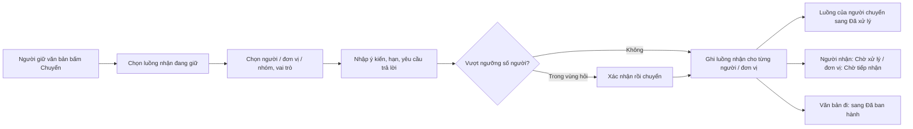

# Chuyển văn bản — tóm tắt nghiệp vụ cho BA

> Bản đọc nhanh bằng lời nghiệp vụ. Chi tiết và bằng chứng: [nghiep-vu.md](nghiep-vu.md) (mã NV / BR trong ngoặc
> để tra). Cập nhật: 2026-10-02 · Nguồn: code `kha_develop` + DB DEV. Nhãn quy tắc: **[Đã xác nhận]** = chủ dự án đã
> chốt là đúng ý đồ · **[Hiện trạng]** = hệ thống đang chạy như vậy, chưa ai xác nhận là ý đồ · **[Lệch nghiệp vụ]**
> = đã xác nhận nghiệp vụ muốn khác, hệ thống đang làm sai.

## 1. Phân hệ này dùng để làm gì

"Chuyển văn bản" là thao tác giao một văn bản đã có trong sổ (văn bản đến, hoặc văn bản đi đã cấp số) cho **cá nhân / đơn vị / nhóm**, kèm vai trò xử lý, ý kiến chuyển, hạn xử lý, yêu cầu trả lời, file kèm (1.1).
Mỗi người hoặc đơn vị nhận có một **luồng nhận** riêng; người chuyển thường được tính là đã xử lý phần của mình (1.1, BR-14).
Phân hệ gồm popup *Chuyển văn bản*, popup *Chọn đối tượng nhận* và **phạm vi được chọn** theo từng trường hợp; chuyển nhiều văn bản; văn thư chuyển văn bản đi sau cấp số (= "ban hành"); tự động chuyển; thu hồi; trợ lý cùng nhận (NV-01 → NV-13).

**Không gồm:** khai báo "Nơi nhận dự kiến" ở dự thảo (xem `xu-ly-cong-viec`); cấp số, đóng dấu, hủy ban hành, hộp *Văn bản ban hành* (xem `van-ban/di`); tiếp nhận, hoàn thành, trả lại, các hộp văn bản đến (xem `van-ban/den`); cấu hình luồng văn bản đến và cách tính người bước tiếp theo (xem `van-ban/luong-xu-ly`); gửi trục liên thông (xem `van-ban/lien-thong`); mã hóa file mật (xem `ky-so`); quản lý đơn vị, vai trò (xem `he-thong`).

## 2. Ai dùng và được làm gì

Không có menu "Chuyển" riêng: nút *Chuyển* nằm ở từng hộp việc, ai thấy nút thì dùng được (1.2, 1.3).

| Vai trò | Được làm gì trong phân hệ này |
|---|---|
| Người đang giữ văn bản đến (cá nhân nhận) | Chuyển tiếp từ luồng nhận của mình; bị chặn nếu luồng đó đã bị thu hồi (1.3, BR-03) |
| Văn thư đơn vị nhận (`VT`) | Chuyển văn bản đến của đơn vị cho lãnh đạo, phòng, cá nhân; "Lưu và chuyển" ngay khi nhập văn bản; hưởng cấu hình chuyển sau tiếp nhận (1.3, NV-06) |
| Văn thư đơn vị ban hành (`VT` tại đơn vị ban hành) | Chuyển văn bản đi đã cấp số (ban hành), kể cả gửi liên thông; phạm vi chọn rộng nhất (1.3, NV-08, NV-03) |
| Lãnh đạo, chuyên viên ở tab *Đã ban hành* (phạm vi cá nhân) | Chuyển văn bản đi nhưng luôn bị giới hạn trong "đơn vị cấp 1" (theo cách hệ thống tính) chứa đơn vị ban hành; không có tab liên thông (1.3, NV-03 #6) |
| Văn thư, lãnh đạo đơn vị, thủ trưởng (`VT`, `LDDV`, `TTDV`) | Được hiển thị quyền "chuyển cho toàn bộ nhân viên đơn vị"; số người tối đa vẫn theo ngưỡng hệ thống (1.3, NV-11) |
| Trợ lý của lãnh đạo | Tự nhận kèm khi văn bản chuyển cho lãnh đạo (nếu lãnh đạo cấu hình trợ lý cùng nhận) (NV-13) |
| Hệ thống | Tự chuyển sau tiếp nhận theo cấu hình đơn vị; tự chuyển tới nơi nhận dự kiến (1.3, NV-06, NV-09) |

## 3. Màn hình / menu người dùng thấy

| Menu / màn | Để làm gì | Ghi chú | Mã menu |
|---|---|---|---|
| Popup *Chuyển văn bản* (văn bản đến) | Chọn luồng nhận đang giữ, người nhận, vai trò, ý kiến (tối đa 2000 ký tự), hạn xử lý, yêu cầu trả lời, file kèm, gửi SMS | Mở từ mọi hộp văn bản đến; luôn dùng bản "theo luồng" (NV-01, dac-thu bẫy 13) | — |
| Popup *Chuyển văn bản* (văn bản đi) | Như trên, cho văn bản đã cấp số | Mở từ tab Đã cấp số / Đã ban hành / Tất cả, hoặc tự mở ngay sau cấp số (NV-01, NV-08) | — |
| Khung chuyển trong form nhập văn bản đến | "Lưu và chuyển" một lần | (NV-06) | — |
| Popup chuyển nhiều văn bản | Chuyển tối đa 50 văn bản cùng lúc cho một tập người nhận | Văn bản đến và văn bản đi mỗi loại một màn (NV-07) | — |
| Popup *Chọn đối tượng nhận* | 5 tab: Đơn vị, Cá nhân, Nhóm, Nhóm đơn vị liên thông, Đơn vị liên thông | Hai tab liên thông chỉ hiện cho văn thư, văn bản không mật, chuyển 1 văn bản (NV-02, BR-06) | — |
| *Danh sách chuyển không thành công* | Xem cá nhân, đơn vị, nhóm không nhận được; xuất Excel | Hiện sau khi chuyển nếu có đối tượng không nhận (NV-14) | — |
| Cấu hình chuyển văn bản sau khi tiếp nhận | Đơn vị khai danh sách người luôn nhận văn bản sau tiếp nhận, chọn *tự động chuyển* hoặc *điền sẵn* | (NV-06) | 440625 |
| Quản lý đơn vị | Khai "Giới hạn chuyển văn bản" (văn bản đi) và "Chuyển theo luồng / Chuyển tự do" (văn bản đến), "Không nhận văn bản" | Thuộc `he-thong` (1.2, NV-03, BR-08) | 338452 · 439825 |
| Cấu hình giới hạn chuyển (không chuyển tiếp / thu hồi hẹn giờ) | — | **Không dùng** [Đã xác nhận Q5]; link bị ẩn, không mở được (BR-38) | — |

## 4. Luồng chính

1. Người dùng bấm *Chuyển*; popup nạp các luồng nhận mình đang giữ, chọn sẵn luồng đầu tiên. Người có nhiều luồng nhận phải chọn luồng để chuyển (NV-01, BR-05).
2. Chọn đối tượng nhận ở popup *Chọn đối tượng nhận*; phạm vi chọn tùy trường hợp (bảng dưới). Tối đa 200 cá nhân / đơn vị / nhóm một lần (NV-02, BR-01).
3. Đặt vai trò từng người / đơn vị: Chủ trì, Phối hợp, Nhận để biết, Nắm tình hình; nhập ý kiến, hạn xử lý, yêu cầu trả lời (NV-04, BR-19).
4. Không nhập ý kiến mà có người đã nhận văn bản → hệ thống cảnh báo sẽ bỏ qua những người đó (BR-16).
5. Hệ thống đếm số cá nhân thực nhận; trong vùng cảnh báo thì hỏi xác nhận, quá mức tối đa thì chặn (NV-11).
6. Ghi xong: người nhận cá nhân vào *Chờ xử lý*; đơn vị nhận vào *Chờ tiếp nhận* của văn thư (Nhận để biết thì vào thẳng *Chờ xử lý*); người được cấu hình nhận văn bản đơn vị cũng nhận; trợ lý của lãnh đạo nhận kèm (BR-13, BR-15, NV-13).
7. Luồng của người chuyển sang *Đã xử lý* nếu có ít nhất một Chủ trì / Phối hợp (hoặc chuyển cho nhóm, hoặc là văn bản đi). Văn bản đi có nơi nhận nội bộ thì sang tab *Đã ban hành* (BR-14, NV-08).

**Phạm vi được chọn theo trường hợp** (NV-03)

| Trường hợp | Phạm vi chọn |
|---|---|
| Văn bản đến, đơn vị nhận cấu hình **theo luồng** | Chỉ người / đơn vị bước tiếp theo do cấu hình luồng trả về |
| Văn bản đến, **chuyển tự do** (phần lớn đơn vị) | "Đơn vị cấp 1" (theo cách hệ thống tính) chứa đơn vị nhận và toàn bộ đơn vị con, thêm đơn vị cấp 1 mà người dùng có vai trò; ô tìm nhanh cùng phạm vi |
| Văn thư đơn vị ban hành chuyển văn bản đi | Toàn cây đơn vị, trừ khi đơn vị bật "Giới hạn chuyển văn bản" (ở tab Đã cấp số) hoặc đang ở phạm vi cá nhân; tab Cá nhân luôn bị giới hạn |
| Người không phải văn thư chuyển văn bản đi | Luôn giới hạn trong "đơn vị cấp 1" chứa đơn vị ban hành |
| Chuyển nhiều văn bản | Văn thư: toàn cây; người khác: theo vai trò |

**Luồng phụ.**
- *Cấu hình chuyển sau tiếp nhận*: văn thư tiếp nhận xong, nếu đơn vị chọn *tự động chuyển* thì hệ thống chuyển ngay không hỏi; nếu chọn *gợi ý* thì popup mở với danh sách điền sẵn (NV-06).
- *Thu hồi*: ở chi tiết văn bản, người đã chuyển chọn người / đơn vị đã nhận và thu hồi; thu hồi lan xuống toàn bộ nhánh họ đã chuyển tiếp, người bị thu hồi nhận thông báo (NV-10).
- *Tự chuyển tới nơi nhận dự kiến*: khi văn bản được ban hành tự động sau ký, hệ thống chuyển tới danh sách nơi nhận đã khai ở dự thảo, ý kiến để trống (NV-09).

## 5. Trạng thái

**Trạng thái một luồng nhận** (dòng của một người / đơn vị nhận)

| Trạng thái (tên người dùng thấy) | Nghĩa | Chuyển sang khi nào | Giá trị |
|---|---|---|---|
| Chờ tiếp nhận | Chỉ luồng đơn vị: văn thư đơn vị nhận chưa tiếp nhận | Chuyển cho đơn vị với vai trò Chủ trì / Phối hợp (BR-13) | trống |
| Chờ xử lý | Đang chờ xử lý | Chuyển cho cá nhân; chuyển cho đơn vị vai trò Nhận để biết; văn thư tiếp nhận (BR-13, 4.8) | 3 |
| Đã xử lý (đã chuyển tiếp) | Đã chuyển tiếp | Chuyển tiếp có Chủ trì / Phối hợp; chuyển lại sau khi bị trả lại (BR-14) | 4 |
| Đã hoàn thành | Đã xong | Hoàn thành (xem `van-ban/den`) (4.8) | 5 |
| Đã trả lại | Người nhận đã trả lại | Trả lại (xem `van-ban/den`) (4.8) | 6 |
| Bị trả lại | Luồng của người gửi khi cấp dưới trả lại | (4.8) | 7 |
| Đã thu hồi | Không còn hiệu lực | Người gửi thu hồi, hoặc thu hồi nhánh phía trên (NV-10) | 0 |

**Vai trò khi chuyển**

| Vai trò | Ảnh hưởng | Giá trị |
|---|---|---|
| Chủ trì | Đóng luồng của người chuyển; một văn bản được nhiều Chủ trì [Đã xác nhận Q1] (BR-14, BR-42) | 1 |
| Phối hợp | Đóng luồng của người chuyển; vai trò mặc định của trợ lý cùng nhận (BR-14, BR-47) | 2 |
| Nhận để biết | **Không** đóng luồng của người chuyển; luồng đơn vị vào thẳng Chờ xử lý (BR-13, BR-14) | 3 |
| Nắm tình hình | Lưu như Nhận để biết kèm cờ riêng; đơn vị không có menu nắm tình hình thì hạ xuống Nhận để biết (NV-04) | 3 + cờ |
| Tham mưu | Được chuyển lại cho người đã nhận mà không cần ý kiến (NV-04, BR-16) | 5 |

**Cấu hình chuyển sau tiếp nhận:** Tự động chuyển, không hỏi `0` · Chỉ điền sẵn `1` (NV-06).

## 6. Quy tắc quan trọng nhất

- [Đã xác nhận] Một văn bản được phép có **nhiều Chủ trì**; quy tắc "chỉ một Chủ trì" đã tắt (BR-42, Q1).
- [Đã xác nhận] Chuyển **chỉ** cho Nhận để biết thì văn bản của người chuyển vẫn ở *Chờ xử lý*, người chuyển tự bấm *Hoàn thành* (BR-14, Q8).
- [Hiện trạng] Không nhập ý kiến chuyển thì người / đơn vị **đã nhận** văn bản bị bỏ qua, không nhận lại; có ý kiến thì chuyển hết (BR-16).
- [Hiện trạng] Chuyển cho đơn vị: hệ thống tự gửi thêm cho những người trong đơn vị được cấu hình "nhận văn bản đơn vị" (chỉ văn bản thường). Đơn vị không có ai được cấu hình nhận và không có văn thư là "đơn vị trống", không chuyển được (BR-15).
- [Hiện trạng] Đơn vị cấu hình "Không nhận văn bản" không chọn được ở tab Đơn vị (BR-08).
- [Hiện trạng] Ngưỡng số người nhận đếm **cá nhân thực nhận** (kể cả người trong nhóm, người được cấu hình nhận văn bản đơn vị), không đếm đơn vị: trên mức cảnh báo thì hỏi xác nhận, trên mức tối đa thì chặn (NV-11, BR-40).
- [Hiện trạng] Văn bản đến chuyển theo luồng: luồng chỉ giới hạn danh sách được chọn trên màn hình; hệ thống không kiểm lại người nhận có đúng luồng khi lưu (BR-20).
- [Đã xác nhận] Cấu hình chuyển sau tiếp nhận là **theo đơn vị**: một danh sách người, một lựa chọn *tự động chuyển* hoặc *gợi ý* cho cả danh sách (BR-23, Q7).
- [Đã xác nhận] Quy ước cấp đơn vị ở Khánh Hòa: **cấp 0** là đơn vị ngay dưới gốc, **cấp 1** là đơn vị con của cấp 0. Có chỗ hệ thống gọi là "cấp 1" nhưng thực chất lấy cấp 0 (NV-03, Q6).
- [Đã xác nhận] Chỉ tự chuyển tới nơi nhận dự kiến khi **ban hành tự động**; khi văn thư chuyển tay thì văn thư quyết định người nhận, danh sách chỉ để điền sẵn (BR-34, Q2).
- [Lệch nghiệp vụ] Hệ thống đang tự chuyển thêm tới nơi nhận dự kiến sau **mọi lần chuyển tay** văn bản có dự thảo gốc (BR-34, dac-thu L14).
- [Lệch nghiệp vụ] Mọi độ mật khác "Thường" đều không được tự chuyển; hệ thống chỉ chặn một mức mật, mức mật còn lại vẫn bị tự chuyển (BR-46, Q9, dac-thu L15).
- [Hiện trạng] Thu hồi lan xuống toàn bộ nhánh phía dưới. Văn bản đi: chỉ thu hồi được dòng do chính mình gửi; văn bản đến: không kiểm người thu hồi có phải người gửi (BR-36, BR-37).
- [Hiện trạng] Chuyển nhiều: tối đa 50 văn bản, văn bản mật không chuyển hàng loạt; gặp một văn bản đã bị thu hồi thì dừng giữa chừng, các văn bản trước đã được chuyển (BR-24, BR-25, BR-28).
- [Hiện trạng] Văn bản mật: chỉ chọn được người / đơn vị có chứng thư mật, phải có ít nhất một người nhận có chứng thư; không có file kèm, không có tab liên thông, không gửi SMS (BR-44, BR-46).
- [Hiện trạng] Gửi liên thông cần văn bản có số ký hiệu và file đính kèm; đơn vị chưa cấu hình mã định danh thì gửi liên thông không thành công (BR-30).

## 7. Hệ thống KHÔNG làm / hay bị hiểu nhầm

- **Yêu cầu mới "chuyển chỉ Nhận để biết, khi tất cả đã đọc thì tự hoàn thành" chưa có.** Đánh dấu đọc chỉ ghi thời điểm đọc, không đóng luồng của người chuyển (BR-14, Q8).
- **Không có "chuyển trước ban hành"** trong nghiệp vụ, nhưng nút vẫn mở được từ dự thảo / trình ký / phiếu trình và tạo văn bản tạm số "Chưa ban hành" (BR-31, Q3, dac-thu L13).
- **"Không được chuyển tiếp" và "Thu hồi hẹn giờ" không dùng**; cấu hình liên quan đang dùng là "Đơn vị không nhận văn bản" (BR-38, Q5).
- **"Giới hạn chuyển" không phải một cấu hình duy nhất:** gồm cấu hình đơn vị (giới hạn chuyển văn bản đi / chuyển theo luồng – tự do), popup giới hạn của văn bản (không dùng), và ngưỡng số người nhận (BR-39).
- **Danh sách người không nhận được chỉ hiện khi không nhập ý kiến;** có ý kiến thì không có danh sách cá nhân lỗi (BR-17, dac-thu bẫy 7).
- **Văn thư đơn vị nhận không nhận SMS khi đơn vị được chuyển văn bản** — phần gửi tin cho văn thư không gửi gì (NV-17, dac-thu L5).
- **"Lịch sử" trong popup chuyển là lịch sử chỉnh sửa file**, không phải lịch sử luân chuyển; luân chuyển xem ở sơ đồ luân chuyển (NV-15).
- **Một số cảnh báo hiện nguyên mã thông báo** thay cho câu chữ (ví dụ cảnh báo nơi nhận dự kiến) (NV-01, dac-thu L8).
- **Lỗi tự chuyển tới nơi nhận dự kiến không báo người dùng;** lần chuyển tay vẫn báo thành công (BR-35).
- **Phạm vi mới cho văn thư phát hành** (đơn vị có mã định danh, cấp 0…) đang ở nhánh phát triển, **chưa có** trên bản chính (BR-11, mục 8).

## 8. Liên quan phân hệ khác

| Khi thay đổi ở đây… | …phải xem thêm | Vì sao |
|---|---|---|
| Vai trò nhận, trạng thái luồng nhận, Nhận để biết | `van-ban/den` | Hoàn thành, trả lại, hộp việc tính theo luồng nhận do chuyển tạo ra (4.8, BR-14) |
| Chuyển văn bản đi, tab Đã ban hành | `van-ban/di` | "Ban hành" = chuyển văn bản đã cấp số; màn Chuyển mở ngay sau cấp số (NV-08) |
| Nơi nhận dự kiến, tự chuyển | `xu-ly-cong-viec` | Danh sách khai ở dự thảo; bỏ tích là xóa hết (NV-09, BR-34) |
| Chuyển theo luồng | `van-ban/luong-xu-ly` | Người / đơn vị bước tiếp theo do cấu hình luồng quyết định (NV-05) |
| Tab liên thông, gửi trục | `van-ban/lien-thong` | Gửi và thu hồi liên thông đi qua phân hệ đó (BR-30, NV-10) |
| Văn bản mật | `ky-so` | Mã hóa file cho từng người nhận, chứng thư mật (NV-12) |
| Cấu hình đơn vị, vai trò nhận văn bản đơn vị | `he-thong` | Cấu hình giới hạn / luồng / không nhận văn bản, người nhận văn bản đơn vị (1.1, BR-08, BR-15) |
| Tạo KPI khi chuyển, nắm tình hình, chuyển hồ sơ | `nhiem-vu`, `kpi-danh-gia`, `lich-nhac-viec`, `ho-so-cong-viec` | Các biến thể chuyển đi qua phân hệ đó (NV-19, NV-20, NV-21) |

## 9. Câu hỏi nghiệp vụ còn mở

Không còn (Q1–Q9 đã trả lời 2026-10-01 — xem mục 7.2 của `nghiep-vu.md`).

## 10. Khi viết yêu cầu mới cho phân hệ này, nhớ ghi rõ

- **Chiều chuyển:** văn bản đến, văn bản đi đã cấp số, hay cả hai; một văn bản hay chuyển nhiều (NV-01, NV-07).
- **Ai chuyển:** văn thư đơn vị ban hành, văn thư đơn vị nhận, người không phải văn thư — phạm vi chọn khác nhau (NV-03).
- **Đơn vị cấu hình theo luồng hay chuyển tự do**, có bật "Giới hạn chuyển văn bản" không; và "cấp" theo quy ước cấp 0 / cấp 1 nào (NV-03, Q6).
- **Áp dụng cho vai trò nhận nào** (Chủ trì, Phối hợp, Nhận để biết, Nắm tình hình) và có làm đổi trạng thái luồng của người chuyển không (BR-14).
- **Có nhập ý kiến thì sao, không nhập thì sao** với người đã nhận (BR-16).
- **Văn bản mật** có áp dụng không — và "mật" là mọi độ mật khác Thường (BR-46, Q9).
- **Cá nhân, đơn vị, nhóm, đơn vị liên thông** — áp ở tab nào của popup chọn; ô tìm nhanh có cùng phạm vi không (NV-02, BR-07).
- **Có tự động không:** tự chuyển sau tiếp nhận, tự chuyển nơi nhận dự kiến — và áp khi ban hành tự động hay cả khi chuyển tay (NV-06, NV-09, Q2).
- **Có gửi SMS / thông báo không, cho ai:** người nhận, người được cấu hình nhận văn bản đơn vị, văn thư đơn vị nhận, trợ lý, người bị thu hồi (NV-17).
- **Chặn ở đâu:** chặn trên màn hình thôi là không đủ — ứng dụng di động gọi thẳng chức năng chuyển phía máy chủ (NV-22, dac-thu mục 4).
