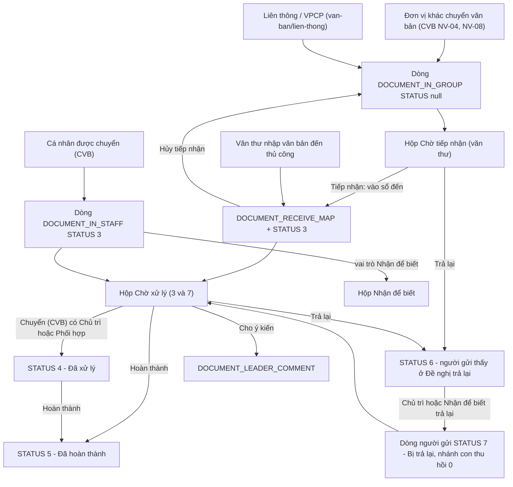
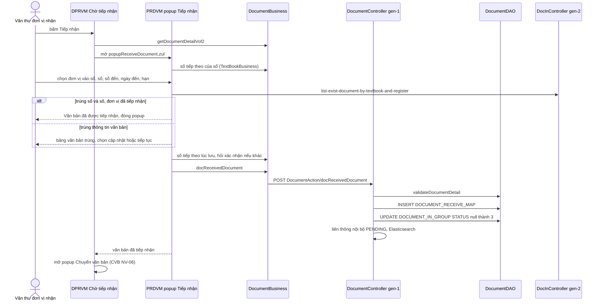
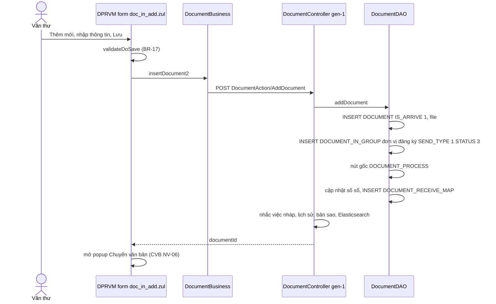
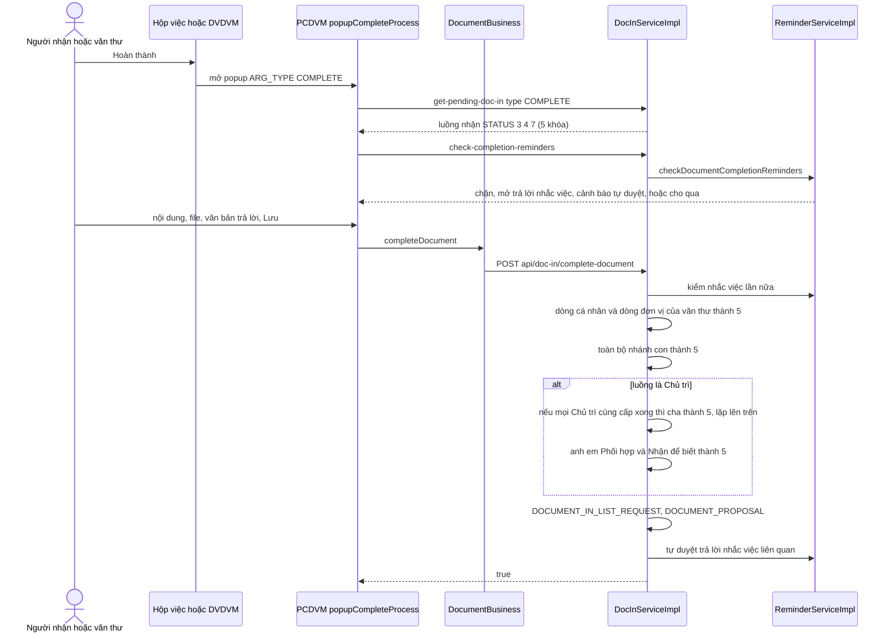
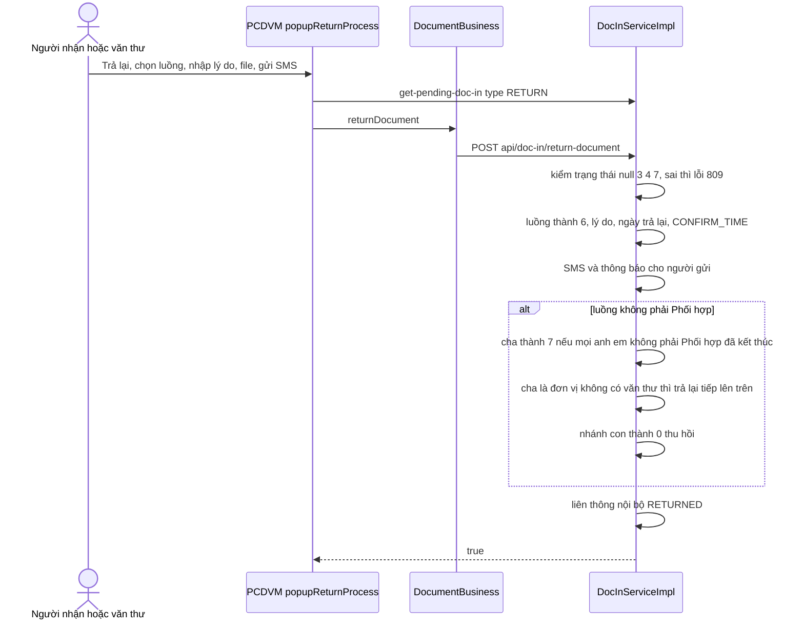
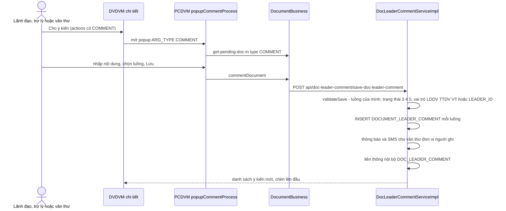
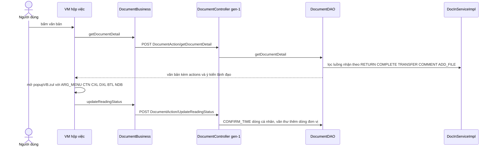
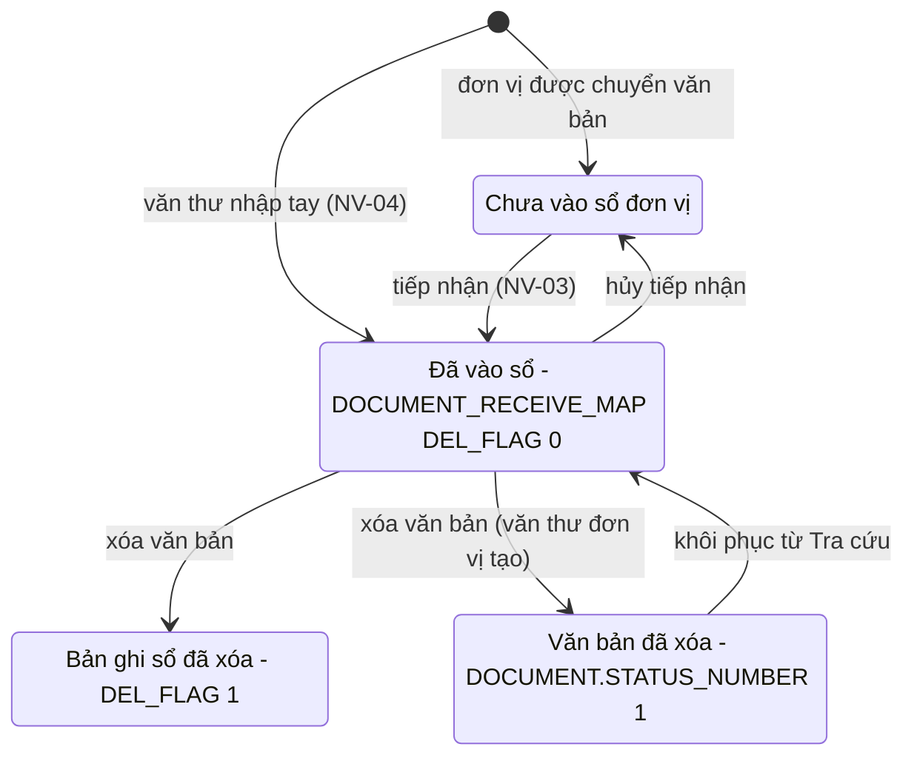
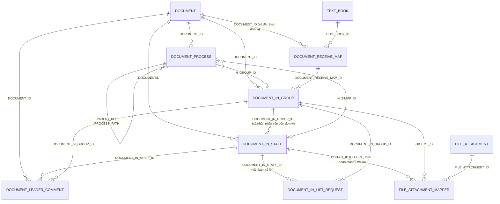

# Văn bản đến — nghiệp vụ phía người nhận: tiếp nhận / nhập văn bản đến → hộp việc → xem chi tiết → cho ý kiến (bút phê) → hoàn thành / trả lại / nhận để biết

> Viết lại từ code nhánh `kha_develop` (web-spring + backend2.0) ngày 2026-10-01; menu/widget đối chiếu DB DEV `SYS_MENU` / `HOME_WIDGET` ngày 2026-10-01 (do người điều phối truy vấn, chỉ SELECT). Mọi khẳng định có nguồn `file:dòng`.
> Viết tắt đường dẫn:
> `WEB/` = `web-spring/src/main/java/com/viettel/` · `ZUL/` = `web-spring/src/main/webapp/view/voffice/` ·
> `BIZ/` = `web-spring/src/main/java/com/voffice/service/business/` · `BE1/` = `backend2.0/backendvoffice/src/main/java/com/viettel/voffice/` ·
> `BE2/` = `backend2.0/backendvoffice/src/main/java/com/viettel/office/`.
> VM hay dùng (đều ở `WEB/voffice/vm/document/` trừ khi ghi khác): **DPRVM** = `DocumentPendingReceptionVM.java` (Chờ tiếp nhận + form nhập văn bản đến, ~10.400 dòng), **DPPVM** = `DocumentPendingProcessingVM.java` (Chờ xử lý, ~13.100), **DPDVM** = `DocumentProcessedVM.java` (Đã xử lý), **DOAVM** = `DocOrgAllVM.java` (tab "Tất cả"), **DRTVM** = `DocumentReturnedVM.java` (Văn bản đề nghị trả lại), **DRVM** = `DocumentReturnVM.java` (Đã trả lại), **DRKVM** = `DocumentReceiveToKnowVM.java` (Nhận để biết), **DSVM** = `DocumentSearchVM.java` (Tra cứu), **OFVM** = `OrgFollowerDocInVM.java` (Theo dõi văn bản đến đơn vị), **DVDVM** = `DocumentViewDetailVM.java` (chi tiết văn bản, ~12.400), **PCDVM** = `PopupCompleteDocumentVM.java` (popup Hoàn thành / Trả lại / Cho ý kiến), **PRDVM** = `WEB/voffice/widget/PopupReceiveDocVM.java` (popup Tiếp nhận), **DPOOL** = `WEB/voffice/util/DocumentPool.java` (bộ tìm kiếm dùng chung của các hộp việc).
> Logic BE: **DC** = `BE1/controler/DocumentController.java`, **DA** = `BE1/action/DocumentAction.java`, **DDAO** = `BE1/database/dao/document/DocumentDAO.java`, **DSRC** = `BE1/controler/document/DocumentSearchReceiveController.java`, **DSIS** = `BE1/database/dao/document/search/DocumentSearchInService.java`, **DISI** = `BE2/services/impl/DocInServiceImpl.java`, **DICT** = `BE2/controller/DocInController.java`, **DLCS** = `BE2/services/impl/DocLeaderCommentServiceImpl.java`, **DB** = `BIZ/DocumentBusiness.java`.
> Hằng số: `BE2/utils/Constants.java:455-509` (`DocumentIn.Status`, `StatusProcessReturned`), `BE1/constants/Constants.java:1560-1711` (`Document.Status` = mã hộp việc, `StatusNew`), `:1833-1839` (`SEND_TYPE`); web `WEB/util/AppConstants.java:2829-2835` (`SENT_TYPE`), `:3050-3060` (`STATUS_DOCUMENT`).
> Phân hệ liền kề đã viết: thao tác **chuyển** ở [`../chuyen-van-ban/nghiep-vu.md`](../chuyen-van-ban/nghiep-vu.md) (dẫn NV-xx của file đó, ký hiệu `CVB NV-xx`); văn bản đi ở [`../di/nghiep-vu.md`](../di/nghiep-vu.md).

## 1. Tổng quan

### 1.1 Phạm vi

"Văn bản đến" là mọi bản ghi `DOCUMENT` mà người dùng (hoặc đơn vị mà người dùng làm văn thư) **nhận được** — mỗi lần nhận là một **dòng nhận** ("luồng nhận"): `DOCUMENT_IN_STAFF` (cá nhân) hoặc `DOCUMENT_IN_GROUP` (đơn vị). Toàn bộ hộp việc, nút thao tác và trạng thái của phân hệ này đều tính **theo dòng nhận**, không theo văn bản: một văn bản có thể đồng thời "Chờ xử lý" với người này và "Đã hoàn thành" với người khác.

Phân hệ gồm:

- **Hộp việc** theo menu và widget trang chủ: Chờ tiếp nhận, Chờ xử lý (+ Sắp đến hạn / Quá hạn), Đã xử lý, Văn bản đề nghị trả lại, Đã trả lại, Nhận để biết, Tất cả, Tra cứu văn bản; cấu trúc tab "Văn bản đơn vị / Văn bản cá nhân" của văn thư (NV-01, NV-02).
- **Tiếp nhận** văn bản gửi tới đơn vị (vào sổ đến) — một hoặc nhiều văn bản, xử lý trùng (NV-03).
- **Nhập văn bản đến thủ công** ("Thêm mới văn bản"), sửa, xóa văn bản đến do văn thư nhập (NV-04).
- **Xem chi tiết văn bản đến** và các nút được phép (NV-05); **đánh dấu đã đọc / chưa đọc** (NV-06).
- **Cho ý kiến** (ý kiến lãnh đạo / bút phê) (NV-07).
- **Hoàn thành** (popup hoàn thành, kiểm nhắc việc, văn bản trả lời, hoàn thành nhiều văn bản, lan trạng thái theo cây xử lý) (NV-08).
- **Trả lại** và hộp **Đề nghị trả lại / Đã trả lại** (NV-09, NV-10).
- **Nhận để biết** và API đánh dấu nhận để biết (NV-11).
- **Hạn xử lý, Sắp đến hạn / Quá hạn, Chưa hoàn thành / Đã hoàn thành** (NV-12).
- **Tra cứu văn bản đến** (NV-13), **Theo dõi văn bản đến đơn vị** (NV-14).
- Ranh giới (chỉ mô tả điểm vào): văn bản yêu cầu trả lời / yêu cầu đặt lịch (NV-15), trợ lý theo dõi văn bản của lãnh đạo (NV-16), văn bản đến từ liên thông / VPCP (NV-17), menu chết và menu thử nghiệm (NV-18).

Phân hệ **KHÔNG gồm** (trỏ sang):

| Nội dung | Phân hệ |
|---|---|
| Popup Chuyển văn bản, chọn người nhận, phạm vi chọn, chuyển theo luồng, chuyển ngay khi tiếp nhận / tự động chuyển sau tiếp nhận, chuyển nhiều văn bản, **thu hồi** văn bản đã chuyển, ngưỡng số người nhận | `chuyen-van-ban` (CVB NV-01…NV-17) |
| Cấu hình luồng văn bản đến (`FLOW`, `NODE*`), API `api/flow-manager/doc-in/*` | `van-ban/luong-xu-ly` |
| Trục liên thông, văn bản VPCP, liên thông nội bộ khác tenant (`CONNECT_DOCUMENT`, `INTERNAL_DOC_*`) — ở đây chỉ nêu điểm vào ở hộp Chờ tiếp nhận | `van-ban/lien-thong` |
| Sổ văn bản, cách cấp số đến (`TEXT_BOOK`, `getNextRegisterNumber*`) | `van-ban/so-van-ban` |
| Xem luân chuyển văn bản đơn vị, bàn giao văn bản, thư viện cá nhân, lưu hồ sơ, tìm kiếm văn bản chung (`searchAnnouncedDocument`) | `van-ban/quan-ly-chung` (+ `ho-so-cong-viec`) |
| Báo cáo văn bản / sổ văn bản đi-đến (`documentHandover/documentBook.zul`) | `van-ban/so-van-ban` NV-11 (sửa chéo 2026-10-02 theo `van-ban/so-van-ban`) |
| Công khai văn bản (thao tác) | `van-ban/di` NV-12; phạm vi công khai / quyền xem ở `van-ban/quan-ly-chung` NV-06, NV-11 (sửa chéo 2026-10-02 theo `van-ban/quan-ly-chung`) |
| Nhắc việc gắn văn bản, nội dung kiểm nhắc việc khi hoàn thành, SMS/thông báo | `lich-nhac-viec` (ở đây chỉ nêu điểm gọi) |
| Soạn văn bản trả lời (sinh dự thảo/văn bản đi), văn bản đi đã ban hành | `xu-ly-cong-viec`, `van-ban/di` |
| Văn bản tài chính (menu "Danh sách công văn tài chính") | hồ sơ tài chính (xem CVB NV-18) |
| Văn bản nắm tình hình / văn bản cấp trên chuyển (`document-informality`) | `lich-nhac-viec` (xem CVB NV-20) |

### 1.2 Menu VĂN BẢN ĐẾN (đối chiếu DB DEV `SYS_MENU` ngày 2026-10-01, cha `337200` code `DOC`)

Chỉ liệt kê mục thuộc phân hệ này hoặc có ý nghĩa ranh giới; cột "Tồn tại" = file zul có trên `kha_develop`.

| `SYS_MENU_ID` | `CODE` | Tên trên menu | URL | `STATUS` | Màn / VM thực tế | Ghi chú |
|---|---|---|---|---|---|---|
| 439338 | `DOCUMENT_PENDING_RECEPTION` | Văn bản chờ tiếp nhận | `reportSendReceiveDoc/document_pending_reception.zul` | 1 | DPRVM | NV-02, NV-03, NV-04 |
| 439339 | `DOCUMENT_PENDING_PROCESSING` | Văn bản chờ xử lý | `…/document_pending_processing.zul` | 1 | DPPVM | NV-02 |
| 439340 | `DOCUMENT_BEING_PROCESSED` | Văn bản đang xử lý | `…/document_being_processed.zul` | 1 | **không tồn tại** | NV-18 · chức năng **ẩn, không dùng** (xác nhận 2026-10-01, Q8) |
| 439341 | `DOCUMENT_PROCESSED` | Văn bản đã xử lý | `…/document_processed.zul` | 1 | DPDVM | NV-02 |
| 439342 | `DOCUMENT_RETURNED` | Văn bản đề nghị trả lại | `…/document_returned.zul` | 1 | DRTVM | NV-10 |
| 440705 | `DOCUMENT_RETURNED_COMPLETED` | Đã trả lại | `…/document_return.zul` | 1 | DRVM | NV-10 |
| 31745273536 | `DOCUMENT_RETURN` | Văn bản chờ xử lý (!) | `…/document_return.zul` | 1 | DRVM (luôn hiện "Đã trả lại") | mã menu "ảo" mà tab *Đã trả lại* tự tạo trong code (NV-01 BR-03) |
| 440025 | `DOCUMENT_RECEIVE_TO_KNOW` | Văn bản nhận để biết | `…/document_receive_to_know.zul` | 1 | DRKVM | NV-11 |
| 439343 | `DOCUMENT_LOOKUP` | Tra cứu văn bản | `…/document_lookup.zul` | 1 | DSVM | NV-13 |
| 440267 | `ORGFOLLOWER_DOC_IN` | Theo dõi văn bản đến đơn vị | `orgFollowerDocIn/orgFollowerDocIn.zul` | 1 | OFVM | NV-14 |
| 440667 | `REQUEST_EDIT_DOC_IN` | Yêu cầu chỉnh sửa thông tin văn bản | `…/document_edit_request.zul` | 1 | **không tồn tại** | NV-18 · chức năng **ẩn, không dùng** (xác nhận 2026-10-01, Q8) |
| 337192 | `DOCUMENT_LIST` | Thêm mới văn bản | `…/document.zul` | 1 | `DocumentVM` | NV-04 |
| 337194 | `INPUT_DOC` | Công văn nhận được | `…/document.zul` | 2 | `DocumentVM` | `STATUS = 2` = **menu bị khóa** (comment cột `MENU.STATUS`: 'Khóa 2/ mở khóa 1' — xác nhận 2026-10-01, Q10) |
| 338954 | `YCTLVB` | Văn bản yêu cầu trả lời | `answerDoc/answerDoc.zul` | 2 | `AnswerDocumentVM` | NV-15 · menu **bị khóa** (xác nhận 2026-10-01, Q10) |
| 439315 | `YCDLVB` | Văn bản yêu cầu đặt lịch | `requestToScheduleMeetingDoc/docScheduleMeeting.zul` | 1 | `DocumentScheduleMeetingVM` | NV-15 |
| 338473 | `LEADER_FOLLOWING` | Trợ lý theo dõi văn bản của lãnh đạo | `meetingAssistant/leaderFollowing.zul` | 1 | `WEB/voffice/vm/leaderConfig/LeaderFollowingVM` | NV-16 |
| 338531 / 338996 / 338991 | `GOVERMENT_DOCUMENT` / `CONNECT_DOCUMENT` / `DOCUMENT_CONNECT` | Văn bản từ VPCP / Văn bản liên thông / Danh sách văn bản trục liên thông | `goverment/*.zul` | 1 | — | `van-ban/lien-thong` (NV-17) |
| 339273 | `DOCUMENT_IN` | Danh sách văn bản đến - Long test, đừng xóa role | `…/documentIn.zul` | 1 | `DocumentInVM` | menu thử nghiệm (NV-18) |
| 439337 / 439355 / 339026 | `DOCUMENT_123` / `MENU_NGOANNT3` / `DOCDOC` | Menu Test / Menu văn bản Ngoan test / VB THU NGHIEM P2 | `document.zul` / trống / `a` | 1 / 1 / 2 | — | menu thử nghiệm (NV-18) |
| 337218, 337371, 337391, 337491, 337771, 337773, 337792, 337793, 337831, 338371, 338431, 339272, 439344 | … | Báo cáo gửi nhận, Công văn chuyển đi, Công văn phê duyệt, Báo cáo văn bản đi đến, Bàn giao, Thư viện cá nhân, Sổ văn bản đơn vị, Công khai, Xem luân chuyển văn bản đơn vị, Tìm kiếm văn bản, Công văn tài chính, Danh sách văn bản đi, Báo cáo văn bản | | 1 | | ngoài phạm vi (1.1) |

Hai mã menu "ảo" do code tự dựng khi đổi tab, **không có trong DB DEV**: `DOCUMENT_ORG_ALL` (id `31745273537`, `doc_org_all.zul`, tab "Tất cả") và `DOCUMENT_ORG_PENDING_PROCESSING_ALL` (id `31745273538`, `doc_org_pending_processing_all_doc_manager.zul`, tab "Tất cả" của văn thư) — `DPPVM:11791-11812`.

### 1.3 Widget trang chủ "Văn bản đến" (đối chiếu DB DEV `HOME_WIDGET` ngày 2026-10-01, cha `VAN_BAN_DEN` id 20)

| `HOME_WIDGET.CODE` (id) | Tên DB | Nhãn hiển thị | Số đếm = hộp (`Document.Status`) | Bấm vào mở menu | Nguồn |
|---|---|---|---|---|---|
| `IN_CHO_TIEP_NHAN` (21) | Chờ tiếp nhận | "Chờ tiếp nhận" | 21 `DOCUMENT_RECEIPT` | `DOCUMENT_PENDING_RECEPTION` (`vb=10`) | `WEB/voffice/controller/HomeWidgetRestController.java:836-838`; `WEB/voffice/common/HomeVM.java:2624-2625` |
| `IN_CHO_XU_LY` (22) | Chờ xử lý | "Chờ xử lý" | 18 `UNPROCESSING` | `DOCUMENT_PENDING_PROCESSING` (`vb=5`, `searchType=1`) | `HomeWidgetRestController.java:841-843`; `HomeVM.java:2622-2623` |
| `IN_SAP_DEN_HAN_XU_LY` (23) | Sắp đến hạn xử lý | "Sắp đến hạn" | 23 `NEAR_DEADLINE` | Chờ xử lý (`searchType=23`) | `HomeWidgetRestController.java:846-848` |
| `IN_QUA_HAN_XU_LY` (24) | Quá hạn xử lý | "Quá hạn" | 24 `OVERDUE` | Chờ xử lý (`searchType=24`) | `HomeWidgetRestController.java:851-853` |
| `IN_DE_NGHI_TRA_LAI` (25) | Đề nghị trả lại | "Đề nghị trả lại" | 20 `RETURNED` | `DOCUMENT_RETURNED` (`vb=11`) | `HomeWidgetRestController.java:866-868`; `HomeVM.java:2626-2627` |
| `IN_CHUA_HOAN_THANH` (26) | Chưa hoàn thành | **"Đã xử lý"** (key `voffice.home.submission.da.xu.ly`) | **28 + 26** (Đã chuyển xử lý + Đã hoàn thành) | `DOCUMENT_PROCESSED` (`vb=12`, `searchType=0`) | `HomeWidgetRestController.java:871-873`; `HomeVM.java:2628-2629` |
| `IN_DA_HOAN_THANH` (27) | Đã hoàn thành | "Đã hoàn thành" | 26 `FINISHED` | `DOCUMENT_PROCESSED` (`vb=13`, `searchType=26`) | `HomeWidgetRestController.java:876-878` |
| `IN_NHAN_DE_BIET` (72) | Nhận để biết | "Nhận để biết" | 27 `RECEIVE_TO_KNOW` | `DOCUMENT_RECEIVE_TO_KNOW` (`vb=14`) | `HomeWidgetRestController.java:881-883`; `HomeVM.java:2630-2631` |

Số đếm: web gọi `DocumentAction.countDocument` (`WEB/voffice/service/task/business/DocumentTask.java:27`; `DA:233`) → `DC.countDocument` gán từng hộp vào `EntityDocumentCount` (`DC:2915-3000`, ví dụ 21 → `setInChoTiepNhan` :2939, 28 → `setInChuaHoanThanh` :2984, 26 → `setInDaHoanThanh` :2987). Mỗi ô có thêm số nhắc việc (`setIn*ReminderCount` — `DC:2891-2909`, `lich-nhac-viec`). Cột `SIMPLE_MODE` (1/3/trống) trong DB DEV — ý nghĩa thuộc phân hệ trang chủ, không bàn ở đây.

### 1.4 Actor & quyền

Mã vai trò lấy từ `web-spring/src/main/resources/application.properties:347-354` (`userRole.documentManager=VT`, `director=TTDV`, `manager=LDDV`, `staff=NV`, `assistant=TL`); web gán cờ trong `WEB/voffice/common/CommonModel.java:103-108` (`VT` → `isDocManager` + danh sách đơn vị làm văn thư `listOrgManagerIds`; `TTDV`/`LDDV` → `isOrgManager`). Quyền thao tác chủ yếu nằm ở tầng hiển thị nút trên web (thiết kế chung — `_chung/huong-dan-ra-soat-nghiep-vu.md`); riêng **Cho ý kiến** BE có kiểm vai trò (NV-07 BR-25), **Hoàn thành / Trả lại dòng đơn vị** BE kiểm người gọi là văn thư đơn vị nhận (NV-08 BR-30, NV-09 BR-36).

| Actor | Nhận diện | Làm gì trong phân hệ |
|---|---|---|
| Văn thư đơn vị nhận | role `VT` tại đơn vị nhận (`DOCUMENT_IN_GROUP.RECEIVER_GROUP_ID_VOF2`) | Thấy tab *Văn bản đơn vị*; tiếp nhận (vào sổ) văn bản gửi đơn vị; nhập văn bản đến thủ công, sửa/xóa văn bản đơn vị mình đăng ký; hoàn thành / trả lại / cho ý kiến trên **dòng đơn vị**; thấy cả *Văn bản cá nhân* |
| Lãnh đạo đơn vị / thủ trưởng | role `LDDV` / `TTDV` | Cho ý kiến (bút phê) trên dòng nhận cá nhân của mình; tab "Tất cả" ở *Văn bản cá nhân* mở màn Theo dõi văn bản đến đơn vị (`DPPVM:11865-11872`, `menuType 5` → `ORGFOLLOWER_DOC_IN` :11774-11776) |
| Chuyên viên | role `NV` | Xử lý dòng nhận cá nhân: xem, chuyển (CVB), hoàn thành, trả lại; cho ý kiến chỉ khi là trợ lý cùng nhận (NV-07 BR-25) |
| Trợ lý lãnh đạo | dòng `DOCUMENT_IN_STAFF.LEADER_ID` khác rỗng (nhận thay lãnh đạo — CVB NV-13) | Cho ý kiến thay lãnh đạo (NV-07) |
| Người gửi (người đã chuyển văn bản) | `STAFFID_VOF2`/`STAFF_ID_VOF2` = mình (`van-ban/den/dac-thu.md` bẫy 9) | Thấy văn bản bị trả lại ở hộp *Đề nghị trả lại* (NV-10) |
| Hệ thống / tiến trình hub liên thông | `FunctionCommon.isHubProcessor()` | Được hoàn thành / trả lại dòng đơn vị không cần vai trò VT (`DISI:242-248, 395-397, 919, 996`) |

### 1.5 Sửa so với knowledge cũ (2026-10-01)

| Knowledge cũ | Hiện trạng code `kha_develop` | Ghi ở |
|---|---|---|
| Mục 2.1 dùng nhãn chuỗi `pendingReception`, `pendingProcessing`, `processing`, `returned`, `completed`… như giá trị trạng thái của `DOCUMENT_IN_STAFF/GROUP.STATUS` | Cột lưu **số**: 0 thu hồi / 3 chờ xử lý / 4 đã xử lý / 5 hoàn thành / 6 đã trả lại / 7 bị trả lại / null chờ tiếp nhận (`BE2/utils/Constants.java:459-465`); các nhãn chuỗi là khóa i18n hiển thị. Không có trạng thái "đang xử lý" riêng (sửa 2026-10-01: nhầm khóa hiển thị với giá trị DB) | 4.6, 5 |
| Mục 2.3 vai trò `main`/`sendTo`, `coordinate`/`carbonCopy`, `toKnow`, `situation` | `SEND_TYPE` số: 1 Chủ trì, 2 Phối hợp, 3 Nhận để biết; Nắm tình hình lưu 3 + `IS_INFORMALITY = 1` (`BE1/constants/Constants.java:1833-1839`) (sửa 2026-10-01: nhầm tên hằng/khóa i18n với giá trị DB) | 5, 6 |
| Mục 2.2 trạng thái bút phê `document.documentStatus` (Chưa xin / Chờ bút phê / Đã phê duyệt / Bị từ chối) | Luồng xin bút phê cũ không còn đường vào; bút phê = Cho ý kiến (`DOCUMENT_LEADER_COMMENT`) (sửa 2026-10-01) | NV-07 BR-27 |
| QT2 "Chỉ chủ trì được hoàn thành/đóng" | Mọi luồng 3/4/7 hoàn thành được; vai trò chỉ quyết định lan lên luồng cha (sửa 2026-10-01) | NV-08 BR-28 |
| Bước 4 "gia hạn `ExtendDocument`" | `ExtendDocument` = thông tin bổ sung văn bản; không có gia hạn (sửa 2026-10-01) | NV-12 BR-46 |
| `dac-thu.md` bẫy 13 `hasActiveDelegatedLead` chặn hoàn thành | Hàm không có trên `kha_develop` (sửa 2026-10-01) | NV-08 edge case; `dac-thu.md` |
| `return-document` gắn với "Bị trả lại / `DeleteDocumentReturned`" | `DeleteDocumentReturned` chỉ ẩn dòng khỏi danh sách (`IS_HIDE = 1`) (sửa 2026-10-01) | NV-09, NV-10 |
| Chuyển xử lý, bàn giao, báo cáo, hạn xử lý cấu hình, văn bản nắm tình hình nằm trong file này | Tách sang `chuyen-van-ban`, `quan-ly-chung`, `lich-nhac-viec` (1.1) | 1.1 |

## 2. Module

| Chức năng | Màn (.zul) | VM | Business (key) | Endpoint BE | Controller / service | DAO / repository → bảng |
|---|---|---|---|---|---|---|
| Danh sách mọi hộp việc (Chờ tiếp nhận, Chờ xử lý, Đã xử lý, Đề nghị trả lại, Đã trả lại, Nhận để biết, Tất cả, Tra cứu) | `ZUL/document/reportSendReceiveDoc/document_pending_reception.zul`, `document_pending_processing.zul`, `document_processed.zul`, `document_returned.zul`, `document_return.zul`, `document_receive_to_know.zul`, `doc_org_all.zul`, `doc_org_pending_processing_all_doc_manager.zul`, `document_lookup.zul` (+ `doc_*_search.zul` include) | DPRVM, DPPVM, DPDVM, DRTVM, DRVM, DRKVM, DOAVM, DSVM → DPOOL `doSearch` (DPOOL:551-1010) | `DB.getReceivedDocumentByStatus` → `DocumentAction.searchReceive` (DB:440-524) | `POST /DocumentAction/searchReceive` (DA:273) | DSRC `searchReceive` :217 → DSIS `searchIn` | SQL thuần trên `DOCUMENT`, `DOCUMENT_IN_STAFF`, `DOCUMENT_IN_GROUP`, `DOCUMENT_RECEIVE_MAP`, `TEXT_BOOK`… (DSIS:640-760, 1155-1460) |
| Đếm số trên widget / tab | (trang chủ) | `HomeVM`, `HomeWidgetRestController`; `generateMenuCountForDocOrg` ở các VM | `DocumentAction.countDocument` (`WEB/voffice/service/task/business/DocumentTask.java:27`), `countDocumentByStatus` (DB:7826-7845) | `/DocumentAction/countDocument` (DA:233), `/countDocumentByStatus` (DA:1707) | `DC.countDocument` :2675; `DSRC.countDocumentByStatus` :1136 | như trên |
| Tiếp nhận (vào sổ đến) | `ZUL/document/reportSendReceiveDoc/popupReceiveDocument.zul` (`ViewConstant.WIDGETS.RECEIVE_DOCUMENT_LOOKUP` — `WEB/voffice/common/ViewConstant.java:339`; `ViewUtil.createLookupReceiveDocument` — `WEB/voffice/util/ViewUtil.java:3613`) | PRDVM (mở từ DPRVM `doReciveDocument` :3036, `doReceiveDocuments` :9823) | `DB.docReceivedDocument` (:4905), `updateDocReceiveMap` (:4926), `updateDuplicateReceivedDocument` (:4943); kiểm trùng `api.doc-in.list-exist-document*` (DB:5416-5436) | `/DocumentAction/docReceivedDocument` (DA:1183), `/updateDocReceiveMap` (:1200), `/updateDuplicateReceivedDocument` (:1209); `POST /api/doc-in/list-exist-document*` (DICT:201-216) | `DC.docReceivedDocument` :11017 | DDAO `docReceivedDocument` :17503 (`INSERT DOCUMENT_RECEIVE_MAP`), `updateReceivedDocument` :17563 (`DOCUMENT_IN_GROUP.STATUS null → 3`) |
| Nhập văn bản đến thủ công (form trong các hộp việc) | `ZUL/document/inputDoc/doc_in_add.zul` (include `includeAdd` của `document_pending_reception.zul:31-34`, `document_pending_processing.zul`, `document_return.zul`…) | DPRVM `doSave` :4577, `insertDocument` :4036-4060 | `DB.insertDocument2` → `DocumentAction.AddDocument` (DB:1140-1160) | `/DocumentAction/AddDocument` (DA:50) | `DC.addDocument` :387 | DDAO `addDocument` :508-628 (`DOCUMENT`, `DOCUMENT_IN_GROUP`, `DOCUMENT_PROCESS`, `DOCUMENT_RECEIVE_MAP`, file đính kèm) |
| Menu "Thêm mới văn bản" (màn cũ) | `ZUL/document/reportSendReceiveDoc/document.zul` (+ `inputDoc/doc_add.zul`) | `DocumentVM` `insertDocument` :2938-2949 | `DB.insertDocument` → `DocumentAction.AddDocument` (DB:1132) | như trên | như trên | như trên |
| Sửa / xóa văn bản đến | form trên (`viewState = UPDATE`); nút xóa trên danh sách | DPRVM `updateDocument` :4087-4105; `doDeleteDocument` | `DB.updateDocument` → `EditDocument` (DB:1208-1228); `DeleteDocument` (DB:1354) | `/DocumentAction/EditDocument` (DA:78), `/DeleteDocument` (DA:96) | `DC.editDocument`, `DC.deleteDocument` | DDAO `editDocument` :755, `deleteDocument` :976 (`DOCUMENT.STATUS_NUMBER = 1`) |
| Chi tiết văn bản | `ZUL/document/reportSendReceiveDoc/popupVB.zul` (`DOCUMENT_DETAIL_LOOKUP` — `ViewConstant.java:270`; `ViewUtil.createLookupDetailDocument` :353) | DVDVM | `DB.getDocumentDetail` (:898-924) | `/DocumentAction/getDocumentDetail` (DA:352) | `DC.getDocumentDetail` :4208 | DDAO `getDocumentDetail` :5653 (tính `actions` :5965-6011) |
| Đã đọc / chưa đọc | (tự động khi mở chi tiết; nút trên danh sách) | DVDVM :3220, :3274; DPRVM :1651, :9963 | `DB.updateReadingStatus` (:4956-4974), bản V2 (:4989-5002) | `/DocumentAction/UpdateReadingStatus` (DA:1000), `/updateReadingStatusV2` (DA:1583) | `DC.updateReadingStatus` :9940, `updateReadingStatusV2` :14597 | DDAO `updateReadDocumentInStaff` :7180, `updateReadDocumentInGroup` :7222 (`CONFIRM_TIME`) |
| Hoàn thành | `ZUL/document/process/popupCompleteProcess.zul` (`COMPLETE_PROCESS_POPUP` — `ViewConstant.java:303`; `ViewUtil.createLookupCompleteDocument` :634-639) | PCDVM `doSave` :421-561 | `DB.getPendingDocuments` (:5926, type `COMPLETE`), `checkCompletionReminders` (:6022), `completeDocument` (:6003-6010) | `GET /api/doc-in/get-pending-doc-in/{id}` (DICT:133), `POST /api/doc-in/check-completion-reminders` (:109), `/complete-document` (:103) | DISI `getPendingDocuments` :1468, `completeDocument` :214-487 | `DocumentInStaffRepositoryJPA`, `DocumentInGroupRepositoryJPA`, `DocumentProcessRepositoryJPA`, `FileAttachmentMapperRepositoryJPA`, `DocumentInListRequestRepositoryJPA` |
| Trả lại | `ZUL/document/process/popupReturnProcess.zul` (`RETURN_PROCESS_POPUP` — `ViewConstant.java:304`; `ViewUtil.java:642-647`) | PCDVM `doReturn` :294-359 | `DB.getPendingDocuments` (type `RETURN`), `returnDocument` (:6032-6037) | `POST /api/doc-in/return-document` (DICT:120) | DISI `returnDocument` :912-1017 | như trên |
| Cho ý kiến (bút phê) | `ZUL/document/process/popupCommentProcess.zul` (`COMMENT_PROCESS_POPUP` — `ViewConstant.java:305`; `ViewUtil.java:649-659`) | PCDVM `doComment` :362-418 | `DB.commentDocument` → `api.doc-leader-comment.save-doc-leader-comment` (DB:6281) | `POST /api/doc-leader-comment/save-doc-leader-comment`, `GET …/get-doc-leader-comments` (`BE2/controller/DocLeaderCommentController.java:37, 53`) | DLCS `save` :87-165, `validateSave` :167-232 | `DocumentLeaderCommentRepositoryJPA` → `DOCUMENT_LEADER_COMMENT` |
| Ẩn văn bản khỏi hộp Đề nghị trả lại / Đã trả lại | `document_returned.zul`, `document_return.zul` | DRTVM `doDeleteDocument` :3472-3481; DRVM :3530 | `DB.deleteDocumentReturned` → `DocumentAction.DeleteDocumentReturned` (DB:6425) | `/DocumentAction/DeleteDocumentReturned` (DA:1488) | `DC.deleteDocumentReturned` :13677 | DDAO :20645 → `DocumentInStaffDAO.updateDocumentReturned` (`IS_HIDE = 1`) |
| Đánh dấu nhận để biết (API, web không gọi) | — | — | — | `POST /api/doc-in/mark-received-know-doc/{doc-id}` (DICT:90-96) | DISI `markReceivedKnowDoc` :160-165 | `DocumentInStaffRepositoryJPA.updateSendTypeToCC` (`BE2/repositories/jpa/DocumentInStaffRepositoryJPA.java:71-75`) |
| Đổi trạng thái dòng nhận trực tiếp | — | DPRVM :4306-4311; PRDVM :741-744 | `DB.updateDocumentInStaff/InGroup` (:6160-6180) | `POST /api/doc-in/update-status-document-in-staff`, `…-in-group` (DICT:218-229) | DISI :1684-1694 | `updateStatusByDocumentInStaffId`, `updateStatusByDocumentInGroupIdReturn` |
| Theo dõi văn bản đến đơn vị | `ZUL/document/orgFollowerDocIn/orgFollowerDocIn.zul` → tạo động `orgFollowerDocIn_org.zul` / `orgFollowerDocIn_person.zul` (OFVM:417-436) | OFVM → `OrgFollowerDocInOrgSearchVM`, `OrgFollowerDocInPersonSearchVM` | `searchReceive` status 22 (DPOOL); `getListUserWithDocInProcessingStats` (DB:6502-6563); `getDocInByUser` (DB:6659-6726) | `/DocumentAction/searchReceive`; `POST /api/document-in/get-documents-processing-stats-by-user`; `/DocumentAction/searchReceiveWithProcessingStatsByUser` (DA:307) | DSRC; `BE1/controler/DocumentInController.java` | `DocumentInDAO`, `DocumentInStaffDAO` |

## 3. Nghiệp vụ

### NV-01. Cấu trúc hộp việc văn bản đến (menu, tab Văn bản đơn vị / cá nhân, mã hộp)

**Mục đích.** Cho người nhận thấy các văn bản mình (hoặc đơn vị mình làm văn thư) phải xử lý, chia theo tình trạng xử lý của dòng nhận.

**Actor.** Mọi người dùng có menu; văn thư (`isDocManager`) thấy thêm hàng tab **Văn bản đơn vị / Văn bản cá nhân** (`ZUL/document/reportSendReceiveDoc/doc_pending_processing_search.zul:20-23`, `visible = vm.isDocManager`).

**Luồng.** Mỗi menu mở một màn "hub" gồm thanh tab con. Bấm tab con không lọc lại trong cùng màn mà **đóng tab hiện tại và mở tab mới** theo mã menu (`DPPVM.changeMenuType` :11755-11850 — `selectedTab.onClose()` rồi `ZkUtil.createTab`, giữ tên menu gốc `originMenuName`):

| `menuType` | Tab con | Mã menu mở ra | Màn / VM |
|---|---|---|---|
| 1 | Chờ tiếp nhận | `DOCUMENT_PENDING_RECEPTION` (đọc DB) | DPRVM |
| 2 | Chờ xử lý | `DOCUMENT_PENDING_PROCESSING` (đọc DB) | DPPVM |
| 3, 7, 8 | Đã xử lý | `DOCUMENT_PROCESSED` | DPDVM |
| 4 | Đã trả lại | `DOCUMENT_RETURN` (dựng cứng id `31745273536`, `document_return.zul`) | DRVM |
| 5 | Tất cả (cá nhân, lãnh đạo) | `ORGFOLLOWER_DOC_IN` | OFVM |
| 6 | Tất cả (đơn vị, người không phải văn thư) | `DOCUMENT_ORG_ALL` (dựng cứng id `31745273537`, `doc_org_all.zul`) | DOAVM |
| 9 | Tất cả (đơn vị, văn thư) | `DOCUMENT_ORG_PENDING_PROCESSING_ALL` (dựng cứng id `31745273538`, `doc_org_pending_processing_all_doc_manager.zul`) | DOAVM (cờ `DOC_PENDING_PROCESS_FOR_DOC_MANAGER`) |

Nguồn: `DPPVM:11760-11812`. Đổi tab đơn vị ↔ cá nhân: `changeGroupDocType` → `getMenuTypeToOpenWhenMenuTypeChange` (`DPPVM:11865-11895`): giữ nguyên tab nếu đang ở Chờ xử lý (2) / Đã trả lại (4); tab *Tất cả* cá nhân của **lãnh đạo** (`isOrgManager`) mở màn Theo dõi văn bản đến đơn vị (5); còn lại về Chờ tiếp nhận (đơn vị) hoặc Chờ xử lý (cá nhân).

**Mã hộp (`STATUS_DOCUMENT` web ↔ `Document.Status` BE).** Mỗi màn đặt `documentInType` + `status` trước khi tìm (DPRVM:1073-1074, DPPVM:1349-1350, DPDVM:1391-1392, DRVM:1024-1025, DRTVM:936-937, DRKVM:976-977, DSVM:1051-1052, DOAVM:1200-1201); DPOOL đổi `documentInType` sang mã hộp gửi BE (DPOOL:937-1003):

| `documentInType` | Mã hộp (web `WEB/util/AppConstants.java:3051-3059` = BE `BE1/constants/Constants.java:1625-1652`) | Hộp |
|---|---|---|
| 0 | 21 `DOCUMENT_RECEIPT` | Chờ tiếp nhận |
| 1 | 18 `UNPROCESSING` | Chờ xử lý |
| 2 | 19 `COMPLETED` | Đã xử lý |
| 3 | 20 `RETURNED` | Văn bản đề nghị trả lại |
| 4, 7 | 22 `DOCUMENT_LOOKUP` | Tra cứu (cũng dùng cho tab Văn bản đơn vị của Theo dõi đơn vị) |
| 6 | 27 `RECEIVE_TO_KNOW` | Nhận để biết |
| 9 | 29 `DO_RETURN` | Đã trả lại |
| 10 | 30 `ORG_ALL` | Tất cả |
| (widget) | 23 `NEAR_DEADLINE`, 24 `OVERDUE`, 25 `INCOMPLETED`, 26 `FINISHED`, 28 `FINISHED_PROCESSING` | ghi đè `status` khi mở từ widget (`customWidgetSearchType` — DB:449-457) |

**Phạm vi dòng nhận.** Tab *Văn bản đơn vị* gửi `documentRecipient = 1`, tab *Văn bản cá nhân* gửi `2` (`DPPVM:778, 11941-11955`); BE `ConditionReceive` 0 tất cả / 1 đơn vị / 2 cá nhân (`BE1/constants/Constants.java:1720-1735`). Dòng cá nhân lọc `ds.receiverid_vof2 = người đăng nhập`; dòng đơn vị lọc `dg.RECEIVER_GROUP_ID_VOF2 IN (đơn vị người đăng nhập làm văn thư)` (DSIS:563-570).

**BR-01.** Hộp việc tính **theo dòng nhận**, không theo văn bản: cùng một văn bản, mỗi dòng `DOCUMENT_IN_STAFF`/`DOCUMENT_IN_GROUP` của người dùng là một luồng riêng (DSIS:563-570; `dac-thu.md` bẫy 9-12).
**BR-02.** Người không phải văn thư chỉ có dòng cá nhân; văn thư có cả dòng đơn vị (của mọi đơn vị mình làm văn thư) và dòng cá nhân (DSIS:563-578; `WEB/voffice/common/CommonModel.java:103-105`).
**BR-03.** Mã menu `DOCUMENT_RETURN` (id `31745273536`) trong DB DEV mang tên "Văn bản chờ xử lý" nhưng trỏ `document_return.zul`; DRVM luôn tìm hộp 29 "Đã trả lại" bất kể tên menu (DRVM:1024-1025). Đây là mã menu mà tab *Đã trả lại* dựng cứng (`DPPVM:11791-11797`); tên hiển thị trên tab lấy theo menu gốc (`setName(originMenuName)` :11815-11816).

**Bảng dữ liệu.** `SYS_MENU` (DB), `DOCUMENT_IN_STAFF`, `DOCUMENT_IN_GROUP`.

### NV-02. Danh sách từng hộp việc — điều kiện lọc thật ở BE

**Mục đích.** Xác định chính xác văn bản nào hiện ở hộp nào.

**Luồng.** VM → DPOOL `doSearch` (DPOOL:551-1010) → `DB.getReceivedDocumentByStatus` (DB:440-524; tham số `type = 1` "công văn nhận được", `status`, `document` JSON, `isVTDocument`, `processingStatus`…) → `POST /DocumentAction/searchReceive` (DA:273-279) → DSRC `searchReceive` (:217) → DSIS `searchIn`. Tìm nhanh không ra kết quả thì BE áp lại bộ lọc ngày mặc định rồi tìm lại (`applyDefaultDateFilters` — DSRC:358-362, :778-855).

**Điều kiện theo hộp (DSIS:654-760, 1155-1460).** Mọi hộp trừ Nhận để biết và Tra cứu đều **loại vai trò Nhận để biết** (`send_type <> 3`, DSIS:654-660); mọi hộp loại dòng cá nhân **nắm tình hình** (`ds.is_informality IS NULL`, DSIS:662-667).

| Hộp | Điều kiện trên dòng nhận | Nguồn |
|---|---|---|
| Chờ tiếp nhận (21) | chỉ dòng **đơn vị** `dg.STATUS IS NULL`, và văn bản chưa vào sổ của đơn vị (không có `DOCUMENT_RECEIVE_MAP`, hoặc bản ghi sổ đã xóa `DEL_FLAG = 1`) | DSIS:736-738, 621-629 |
| Chờ xử lý (18) | `status IN (3,7)` (Chờ xử lý + Bị trả lại); lọc con `StatusNew`: 3 → `= 3`, 7 → `= 7`, 8 Sắp đến hạn, 9 Quá hạn (NV-12) | DSIS:670-698 |
| Đã xử lý (19) | `status IN (4,5)`; lọc con `StatusNew` 4 Đã chuyển xử lý → `= 4`, 5 Đã hoàn thành → `= 5` | DSIS:712-727 |
| Đề nghị trả lại (20) | `status = 6` **và** mình là **người gửi** của dòng bị trả lại (`ds.STAFFID_VOF2 = mình` / `dg.STAFF_ID_VOF2 = mình`; văn thư thêm `SECRETARY_GROUP_ID IN` đơn vị mình) | DSIS:729-734, 580-588, 646-648, 1373-1398 |
| Đã trả lại (29) | `status = 6` **và** mình là **người nhận** đã trả lại (`ds.RECEIVERID_VOF2 = mình`; văn thư thêm `dg.RECEIVER_GROUP_ID_VOF2 IN` đơn vị mình) | DSIS:592-606, 1399-1417 |
| Nhận để biết (27) | `status <> 0 AND send_type = 3` | DSIS:739-744 |
| Tất cả (30) | `status IN (3,7,4,5)`; lọc `handleState` 1 chưa xử lý / 2 đã xử lý | DSIS:301-330, 700-705 |
| Tra cứu (22) | theo `documentStatus` chọn trên form (3 / 7 / 4 / 5 / -1 chờ tiếp nhận / 10 chưa hoàn thành / …) | DSIS:745-760 |
| Chưa hoàn thành (25 — widget) | cá nhân `status IN (3,4,7)`; đơn vị `null` hoặc `(3,4,7)` | DSIS:289-290, 706-711 |

Riêng văn thư ở hộp Chờ xử lý / Đã xử lý / Tất cả (tab đơn vị): dòng đơn vị phải **đã vào sổ của đơn vị** (`dm.built_group_id IN` đơn vị văn thư — DSIS:572-578).

**BR-04.** "Văn bản đề nghị trả lại" (menu 439342, widget `IN_DE_NGHI_TRA_LAI`) là hộp của **người gửi**: văn bản mình đã chuyển và bị người nhận trả lại (HDSD văn thư gọi là "Văn bản bị trả lại"); "Đã trả lại" (menu 440705) là hộp của **người nhận** đã bấm Trả lại. Cả hai cùng là `STATUS = 6`, khác nhau ở cột so với người đăng nhập (DSIS:580-606).
**BR-05.** Hộp Chờ xử lý gộp cả dòng **Bị trả lại** (`STATUS = 7` — dòng của người gửi khi người nhận trả lại, NV-09) để người gửi xử lý lại (DSIS:694-697).
**BR-06.** Hộp Đề nghị trả lại / Đã trả lại mặc định chỉ hiện dòng **chưa xử lý** (`IS_HIDE IS NULL`) khi tìm nhanh không từ khóa (`docReturnedStatus = 0` — DSRC:846-848; DSIS:882-889). `IS_HIDE`: 1 ẩn (người dùng xóa khỏi danh sách), 2 đã chuyển xử lý, 3 đã hoàn thành (`BE2/utils/Constants.java:505-509`).
**BR-07.** Bộ lọc ngày mặc định (áp khi tìm nhanh không ra kết quả và đang tìm theo cột/sổ): ngày đến trong **1 năm**; Tra cứu và Nhận để biết **1 tháng**; Tra cứu văn bản đã xóa (`statusId = 9`) **10 ngày**; hộp Tất cả lọc thêm ngày ban hành 1 năm (DSRC:778-803). Form web khởi tạo ngày đến từ 365 ngày trước (DPRVM:990-996).
**BR-08.** Nhận để biết mặc định chỉ hiện văn bản **chưa đọc** khi không có từ khóa (`readStatus = 2` — DSRC:829-831).

**Edge case.** Mã 23/24/25/26/28 từ widget được BE quy đổi về 18/19 + `StatusNew` (DSIS:270-298). Khi lọc theo sổ (`textBookId`) chỉ trả dòng đơn vị; chọn "cá nhân" thì trả rỗng (DSIS:248-264).

### NV-03. Tiếp nhận văn bản gửi đơn vị (vào sổ đến) — một / nhiều văn bản, trùng văn bản, hủy tiếp nhận

**Mục đích.** Văn thư đơn vị nhận ghi văn bản (do đơn vị khác chuyển tới, hoặc từ liên thông) vào **sổ văn bản đến** của đơn vị, cấp **số đến**, ghi ngày đến và hạn xử lý; sau đó văn bản rời hộp *Chờ tiếp nhận* sang *Chờ xử lý* của đơn vị và văn thư chuyển tiếp trong đơn vị.

**Actor.** Văn thư (`VT`) của đơn vị nhận — chỉ văn thư thấy dòng đơn vị `STATUS IS NULL` (NV-02). Hộp Chờ tiếp nhận có nút *Tiếp nhận* từng văn bản và *Tiếp nhận* nhiều văn bản (`ZUL/document/reportSendReceiveDoc/doc_pending_reception_search.zul`, lệnh `doReciveDocument`, `doReceiveDocuments`).

**Luồng (một văn bản).**
1. DPRVM `doReciveDocument` (:3036-3110): chuẩn bị dữ liệu (`handleReceiveDocuments` :9897 — đọc lại chi tiết `getDocumentDetailVof2`, chuẩn hóa loại văn bản, độ khẩn) → mở popup Tiếp nhận (`ViewUtil.createLookupReceiveDocument` — `ViewUtil.java:3613`; `popupReceiveDocument.zul`, PRDVM).
2. Popup gồm: đơn vị vào sổ (đơn vị mình làm văn thư), **sổ văn bản đến** của đơn vị (`textBookBusiness.getTextBooksByOrgIdAndDocType(orgId, 1, …)` — PRDVM:881), **số đến** điền sẵn số tiếp theo của sổ (có thể là số tái sử dụng — PRDVM:285-293), ngày đến, hạn xử lý, loại văn bản, từ khóa (tag), "đã xin ý kiến" (`HAVE_CONSULTED`).
3. Bấm *Tiếp nhận* → PRDVM `doReceiveDocument` (:443-532): kiểm (BR-09…BR-12) → đọc lại số tiếp theo của sổ ngay lúc lưu (REQ-254, :451-460) → nếu số người dùng nhập khác số tiếp theo thì hỏi xác nhận (có biến thể "số tái sử dụng") (:461-478); nếu văn bản đã có bản ghi sổ (`documentReceiveMapId`) thì hỏi "cập nhật thông tin vào sổ" (:479-482) → gọi `DB.updateDocReceiveMap` (đã có sổ) hoặc `DB.docReceivedDocument` (mới) (:502-514).
4. BE `POST /DocumentAction/docReceivedDocument` (DA:1183) → `DC.docReceivedDocument` (:11017-11120): kiểm quyền xem văn bản `validateDocumentDetail` (:11073-11078) → DDAO `docReceivedDocument` (:17503-17555): bỏ qua nếu đã có bản ghi sổ cùng văn bản + đơn vị + số đến + sổ (:17507-17516), ngược lại **INSERT `DOCUMENT_RECEIVE_MAP`** (`OFFICE_SENDER_ID/OFFICE_SENDER` = đơn vị gửi, `BUILT_GROUP_ID` = đơn vị vào sổ, `TEXT_BOOK_ID`, `RECEIVED_DATE`, `DEADLINE_DATE`, `INCOMING_NUMBER`, `IS_AUTO`, `FIRST_ORG_ID`, `HAVE_CONSULTED` — :17530-17535) → DDAO `updateReceivedDocument` (:17563-17590): **`UPDATE DOCUMENT_IN_GROUP SET STATUS = 3, DOCUMENT_RECEIVE_MAP_ID = …` WHERE văn bản + đơn vị nhận + `STATUS IS NULL`** → cập nhật tag dòng đơn vị → báo trạng thái liên thông nội bộ `PENDING` (`internalDocumentService.handleListGroupInternalConnectReceive` — DC:11105-11106) → đánh chỉ mục Elasticsearch (DC:11107-11108).
5. Popup trả văn bản về DPRVM → **mở ngay popup Chuyển văn bản** (`doPopUpTransferDoc` — DPRVM:3044-3050); cấu hình "chuyển sau tiếp nhận" của đơn vị quyết định điền sẵn hay tự chuyển (CVB NV-06).

**Luồng (nhiều văn bản).** DPRVM `doReceiveDocuments` (:9823-9895): tối đa **50** văn bản (:9828-9831) → cùng popup ở chế độ nhiều (`LookupUtil.MULTIPLE`) → PRDVM `doReceiveDocuments` (:540-646): kiểm từng văn bản (`validateDoReceiveDocuments` :1118-1129), lưu lần lượt, gom danh sách thành công / thất bại, hiển thị bảng "Kết quả tiếp nhận nhiều văn bản" → DPRVM chuyển nhiều văn bản vừa tiếp nhận (`doTransferMultiple(docsList, true)` :9862; CVB NV-07).

**BR-09.** Bắt buộc chọn **đơn vị vào sổ** và **sổ văn bản** (PRDVM:1015-1024); các trường bắt buộc khác theo `validateRequired` (:1025-1027); loại văn bản bắt buộc khi văn bản gốc chưa có loại hợp lệ (`checkDocType` — :1052-1055; DPRVM:9919-9923).
**BR-10.** Ngày đến ≥ ngày ban hành (PRDVM:1030-1034); hạn xử lý ≥ ngày đến (:1035-1040) và ≥ hôm nay (:1042-1046).
**BR-11.** Kiểm trùng trước khi lưu, theo hai tầng (PRDVM:1057-1100):
- (a) **Trùng sổ + số đến** (`api.doc-in.list-exist-document-by-textbook-and-register`): nếu mọi dòng đơn vị của văn bản này đều đã có trạng thái (≠ null) thì báo "Văn bản đã được tiếp nhận!" và đóng popup — trường hợp hai văn thư tiếp nhận cùng lúc (`isReceivedAtSameTime` :1105-1111); ngược lại hiện bảng văn bản trùng số và cho chọn tiếp nhận mới.
- (b) **Trùng thông tin văn bản** đã có trong sổ (`api.doc-in.list-exist-document`, cờ `receiveDocument = true` → `getListDocumentExistForReceive` — DISI:1675-1677): hiện bảng văn bản trùng với lựa chọn *cập nhật* hoặc *tiếp tục*.
**BR-12.** Kiểm "trùng số đến trong sổ" (`api.doc-in.is-duplicated-register-book-number`) đang **bị comment** ở popup tiếp nhận (PRDVM:1048-1051, 675-682) — số đến chỉ được kiểm qua BR-11(a).
**BR-13.** Chọn **"tiếp tục" với văn bản trùng** (`doContinueDuplicate` — PRDVM:728-753): nếu bản ghi trùng là bản tự động (`drmIsAuto = 2`) thì trả về để mở form cập nhật; ngược lại gắn dòng đơn vị hiện tại vào bản ghi sổ đã có (`DocumentAction.updateDuplicateReceivedDocument` — DB:4943) hoặc chuyển dòng cá nhân sang `STATUS = 3`; không sinh số đến mới.
**BR-14.** Chọn **"tiếp nhận mới"** khi trùng (`doReceiveNewDocument` — PRDVM:658-726): luôn lấy **số tiếp theo** của sổ (:690-693); nếu đơn vị cấu hình **tự động chuyển** (`STATUS_CONFIG = 0`) mà văn bản có độ mật khác "Thường" thì **không tự động chuyển**, báo "Không tự động chuyển văn bản do đã tiếp nhận và xử lý trước đó" (PRDVM:700-716; DPRVM:3051-3053).
**BR-15.** Văn bản đến từ **liên thông** (`connectDocumentId` khác null): popup không tự lưu mà trả thông tin sổ về DPRVM để chạy nhánh tiếp nhận liên thông (`prepareToReceiveConnectDocument`, `doReceiveConnectDocument` — DPRVM:3065-3085; PRDVM:493-500) — chi tiết ở `van-ban/lien-thong`.
**BR-16.** **Hủy tiếp nhận** (nút *Xóa* trên hộp Chờ xử lý / Tất cả của văn thư): nếu văn bản đã vào sổ (`isAutoMap ∈ {0,1}`) và được phép hủy thì hỏi xác nhận rồi gọi `cancelReceivedDocument` (DPPVM:4924-4945; DOAVM:4504-4509) → `DocumentAction.cancelDocReceiveMap` (DB:5383; DA:1326) → `DC.cancelDocumentReceiveMap` (:12387-12430): xóa bản ghi sổ (`cancelDocReceivedMap`) và đưa dòng đơn vị về `STATUS = null` (`updateDocInGroupStatus` — DC:12422-12423; DDAO:6775) → văn bản quay lại *Chờ tiếp nhận*. Ngược lại nút *Xóa* mở form xóa văn bản kèm lý do (NV-04). Được hủy khi (DDAO:4936-4949): văn bản **không do đơn vị mình tạo** (`BUILT_GROUP_ID` ∉ đơn vị văn thư) **và** chưa có văn bản đơn vị nào của sổ đó đã được chuyển đi (`documentCommonService.isCancelDocumentReceiveMap`).

**Trạng thái.** `DOCUMENT_IN_GROUP.STATUS`: `null` (Chờ tiếp nhận) → `3` (Chờ xử lý) khi tiếp nhận; `3` → `null` khi hủy tiếp nhận. Xem 4.6.

**Bảng dữ liệu.** `DOCUMENT_RECEIVE_MAP` (sổ đến của đơn vị), `DOCUMENT_IN_GROUP` (`STATUS`, `DOCUMENT_RECEIVE_MAP_ID`, `TAG_NAME…`), `TEXT_BOOK` (số tiếp theo — `van-ban/so-van-ban`).
**Tích hợp.** Liên thông nội bộ (trạng thái đã nhận), Elasticsearch.
**Edge case.** Đóng popup không lưu → văn bản vẫn ở Chờ tiếp nhận (HDSD văn thư bước 3). Popup nhiều văn bản loại các văn bản lỗi khỏi lần lưu và chỉ trả kết quả về màn cha khi **không có** văn bản lỗi (PRDVM:639-642).

### NV-04. Nhập văn bản đến thủ công ("Thêm mới văn bản"), sửa, xóa

**Mục đích.** Văn thư nhập văn bản giấy / văn bản ngoài hệ thống làm văn bản đến của đơn vị, đồng thời vào sổ đến; sau khi lưu có thể chuyển ngay.

**Actor.** Văn thư (đơn vị đăng ký `registerVhrOrgId` lấy từ danh sách đơn vị mình làm văn thư — `getOrganizationOfDocumentManager`, DPRVM:665-673). Feature code `DOCUMENT_IN_CREATE` (DPRVM:99-101).

**Luồng.** Nút *Thêm mới* trên các hộp việc mở form `ZUL/document/inputDoc/doc_in_add.zul` (include `includeAdd` — `document_pending_reception.zul:31-34`) → nhập thông tin → *Lưu* / *Lưu và thêm mới* → DPRVM `doSave` (:4577-4630) → `validateDoSave` (:3371-3530, BR-17) → tải file (`makeUploadFileSession`) → `onUploadEvent` → `insertDocument` (:4036-4060) → `DB.insertDocument2` → `POST /DocumentAction/AddDocument` (DB:1140-1160; DA:50) → `DC.addDocument` (:387-545) → DDAO `addDocument` (:508-628):
- sinh `DOCUMENT_ID`, lưu file đính kèm và file biểu mẫu (:520-540), **INSERT `DOCUMENT`** với `FIRST_ORG_ID` (:542-550);
- nếu là văn bản đến (`IS_ARRIVE = 1`): **INSERT `DOCUMENT_IN_GROUP`** cho đơn vị đăng ký với `SEND_TYPE = 1`, **`STATUS = 3`**, không có người gửi, hạn xử lý theo form (:551-570), tạo nút gốc `DOCUMENT_PROCESS` (`insertDocumentInGroupIntoDocumentProcess` :567), lưu tag;
- gắn hồ sơ nếu chọn (:573-590); cập nhật số đăng ký vào sổ (`textBookDAO.updateTextBookNumber` :595); lưu cơ quan ban hành ngoài nếu nhập tay (:601-605); nếu tạo từ văn bản VPCP thì cập nhật bảng liên thông (:607-625);
- **vào sổ** luôn (`docReceivedDocument` — :626-630, giống NV-03).
Sau đó DC lưu nhắc việc nháp (DC:476-477, `lich-nhac-viec`), lịch sử thao tác (`documentHistoryLogService.saveDocHistory`), bản sao văn bản (`documentCopyService`), chỉ mục Elasticsearch. Web: lưu thành công thì mở popup Chuyển văn bản (`doPopUpTransferDoc`), *Lưu và thêm mới* thì mở khung chuyển nhúng (`openLookupTransferDocument`) (DPRVM:4282-4294; CVB NV-06(a)).

**Sửa.** Form ở `viewState = UPDATE` → `updateDocument` (DPRVM:4087-4120) → `DocumentAction.EditDocument` (DB:1208-1228; DA:78) → DDAO `editDocument` (:755-975). Sửa từ luồng "tiếp nhận văn bản trùng" (`tmpDataSelected`) thì đưa dòng nhận gốc về `STATUS = 3` (`update-status-document-in-staff|group` — DPRVM:4304-4311). Menu "Yêu cầu chỉnh sửa thông tin văn bản" trỏ màn không tồn tại (NV-18).

**Xóa.** Nút *Xóa* (khi không thuộc trường hợp hủy tiếp nhận — NV-03 BR-16) mở hộp nhập **lý do** ≤ 1000 ký tự (DPPVM:4945-4965) → `DocumentAction.DeleteDocument` (DB:1354; DA:96) → DDAO `deleteDocument` (:976-1065): chỉ xóa khi `BUILT_GROUP_ID` thuộc đơn vị người gọi làm văn thư (:1010-1014); xóa mềm `DOCUMENT.STATUS_NUMBER = 1` + người/ngày/lý do xóa (:1019-1023); văn bản có `TEXT` thì cập nhật trạng thái hủy ở `TEXT`; xóa mềm bản ghi sổ `DOCUMENT_RECEIVE_MAP.DEL_FLAG = 1` (:1054-1056). Tra cứu có lọc văn bản đã xóa (`statusId = 9`, 10 ngày gần nhất — NV-02 BR-07) và nút khôi phục (`doRestoreDocument`, `doc_lookup_search.zul`).

**BR-17.** Kiểm khi lưu (DPRVM:3371-3525): bắt buộc **trích yếu**, **loại văn bản**, **đơn vị đăng ký** và **sổ** (với văn thư), **số đến**, **độ khẩn**, **độ mật**, **ngày ban hành**, **ngày đến**, **tác giả / cơ quan ban hành**; hạn xử lý ≥ ngày đến, và khi thêm mới thì ≥ hôm nay; khi sửa thì kiểm trùng văn bản (`list-exist-document`) và trùng sổ + số (`list-exist-document-by-textbook-and-register`) — hiện popup văn bản trùng (`DuplicateDocumentPopupVM`). File đính kèm **không bắt buộc** (`isValidSecurityLevel = true` — DPRVM:4269-4273).
**BR-18.** Kiểm trùng số đến trong sổ bằng `is-duplicated-register-book-number` đang **bị comment** khi lưu (DPRVM:3465-3468); chỉ còn dùng ở bước chuyển trạng thái khác (DPRVM:3794-3796).
**BR-19.** Văn bản đến nhập tay **không có người gửi** và **không có `TEXT_ID`** (dòng `DOCUMENT_IN_GROUP` không có `STAFF_ID_VOF2` — DDAO:558-560) → không thể **Trả lại** (NV-09 BR-34). Nút *Trả lại* cũng bị ẩn với văn thư thuộc đơn vị tạo văn bản (`visibleBtnReturn` — DPPVM:9588-9598; DVDVM:1622-1637).
**BR-20.** Quy tắc "không chuyển nhiều hơn 1 chủ trì" khi *Lưu và chuyển* (`isPresideExceedLimit`) luôn trả `false` (`TransferDocumentInVM.java:4125-4129`) — một văn bản được nhiều Chủ trì (đã xác nhận 2026-10-01; CVB BR-42).

**Bảng dữ liệu.** `DOCUMENT` (`IS_ARRIVE = 1`, `BUILT_GROUP_ID`/`REGISTER_VHR_ORG_ID`, `STATUS_NUMBER`), `DOCUMENT_IN_GROUP`, `DOCUMENT_PROCESS`, `DOCUMENT_RECEIVE_MAP`, `FILES_ATTACHMENT`, `DOCUMENT_OFFICE_SEND` (cơ quan ngoài), `BRIEF_DOCUMENT`.
**Edge case.** Menu "Thêm mới văn bản" (337192) mở màn cũ `document.zul` (`DocumentVM`, form `doc_add.zul`, gọi `DB.insertDocument` — `DocumentVM.java:2938-2949`), khác form `doc_in_add.zul` của các hộp việc; HDSD hướng dẫn thêm mới từ hộp Chờ tiếp nhận.

### NV-05. Xem chi tiết văn bản đến và các nút được phép

**Mục đích.** Hiển thị đầy đủ văn bản (thông tin, file, người nhận, luân chuyển, ý kiến lãnh đạo, ý kiến hoàn thành / trả lại, nhắc việc, công việc…) và chỉ hiện những thao tác người xem được làm trên **luồng nhận của chính họ**.

**Luồng.** Bấm văn bản trên hộp việc → VM gọi `DB.getDocumentDetail(documentId, staffId, senderId2, isGroupDocument, 0, documentIdPk)` (ví dụ DPRVM:1585) → `POST /DocumentAction/getDocumentDetail` (DA:352) → `DC.getDocumentDetail` (:4208) → DDAO `getDocumentDetail` (:5653-6030) → mở popup `popupVB.zul` (DVDVM) với `ARG_MENU` cho biết hộp gọi: `CTN` Chờ tiếp nhận (DPRVM:1614), `CXL` Chờ xử lý (DPPVM:2153; DOAVM:1943), `DXL` Đã xử lý (DPDVM:2187), `BTL` Đề nghị trả lại và Đã trả lại (DRTVM:1493; DRVM:1574), `NDB` Nhận để biết (DRKVM:1534; Tra cứu khi dòng là Nhận để biết — DSVM:1594-1596; Theo dõi đơn vị — `OrgFollowerDocInOrgSearchVM.java:1706`, `OrgFollowerDocInPersonSearchVM.java:376`).

**Tập thao tác do BE tính (`actions`).** DDAO lấy mọi luồng nhận của người xem với văn bản (`documentRepository.getPendingDocumentInStaffAndInGroup(documentId, userId, đơn vị văn thư)`) rồi lọc theo từng loại thao tác (DDAO:5965-6011; bộ lọc ở DISI:1643-1672, 1719-1865):

| Thao tác | Luồng nhận đủ điều kiện | Nguồn |
|---|---|---|
| `RETURN` Trả lại | `STATUS` null / 3 / 7 **và** có người gửi (`senderId` / `senderOrgId`) hoặc là văn bản liên thông nội bộ (`docInId`); luồng 4/5 hiện nhưng khóa | DISI:1719-1746 |
| `COMPLETE` Hoàn thành | `STATUS` 3 / 4 / 7; luồng 5 hiện nhưng khóa | DISI:1748-1767 |
| `TRANSFER` Chuyển | `STATUS` null / 3 / 4 / 5 / 7 | DISI:1769-1783 |
| `COMMENT` Cho ý kiến | `STATUS` 3 / 4 / 5 / 7 **và** (luồng đơn vị, hoặc người xem có vai trò `VT`/`TTDV`/`LDDV`, hoặc luồng cá nhân là trợ lý cùng nhận `isAssistant = 1`) | DISI:1785-1826 |
| `ADD_FILE` Bổ sung file | luồng cá nhân mà người xem là `TTDV`/`LDDV` của đơn vị nhận | DISI:1828-1865 |

DVDVM bật nút theo `actions` (DVDVM:1209-1213) rồi ghi đè theo hộp gọi (DVDVM:1215-1240, 1893-1901):

| `ARG_MENU` | Nút chính | Ẩn thêm |
|---|---|---|
| `CTN` | Trả lại | Hoàn thành, Chuyển, Giao nhiệm vụ, Chia sẻ, Cho ý kiến |
| `CXL` | Chuyển xử lý | — |
| `DXL` | Chuyển xử lý | Trả lại |
| `BTL` | — | Trả lại, Cho ý kiến; Chuyển + Hoàn thành chỉ hiện khi dòng chưa xử lý (`IS_HIDE` null) |
| `NDB` | — | Trả lại, Hoàn thành, Cho ý kiến, Xem danh sách đơn vị nhận, Giao nhiệm vụ; **Chuyển vẫn hiện** |

**BR-21.** Nút Trả lại bị ẩn nếu người xem là văn thư của đơn vị đã tạo văn bản (`visibleBtnReturn` — DVDVM:1622-1637; cùng hàm ở DPPVM:9588-9598).
**BR-22.** Mở chi tiết = đánh dấu **đã đọc** (NV-06) — DVDVM:3220, 3274; DPRVM:1651.
**BR-23.** Văn bản đang bị khóa (`IS_ACTIVE = 0`) thì không mở chi tiết, báo người khóa (PCDVM:269-275 và tương tự ở các VM).

**Bảng dữ liệu.** đọc `DOCUMENT`, `DOCUMENT_IN_STAFF`, `DOCUMENT_IN_GROUP`, `DOCUMENT_RECEIVE_MAP` (`getReceiveDocMap` — DDAO:5962-5963), `DOCUMENT_LEADER_COMMENT` (DDAO:6012-6020), `CATEGORY_COMMON` (`HAVE_LEAD` — văn bản chỉ đạo, DDAO:5996-6009), `DOCUMENT_EXTEND` (thông tin bổ sung).
**Ranh giới.** Màn chi tiết là hub dùng chung đến/đi, nhúng luân chuyển, nhắc việc, công việc, họp — xem `dac-thu.md` bẫy 1; nút Chuyển → CVB NV-01; thu hồi → CVB NV-10.

### NV-06. Đánh dấu đã đọc / chưa đọc

**Mục đích.** Ghi nhận người nhận (hoặc văn thư của đơn vị nhận) đã mở văn bản; cho phép đánh dấu lại đã đọc / chưa đọc hàng loạt.

**Luồng.**
- **Tự động khi mở chi tiết:** `DB.updateReadingStatus(document)` → `DocumentAction.UpdateReadingStatus` (DB:4956-4966; DA:1000) → `DC.updateReadingStatus` (:9940-9973): ghi `DOCUMENT_IN_STAFF.CONFIRM_TIME = sysdate` cho mọi dòng của người xem chưa có `CONFIRM_TIME` (DDAO `updateReadDocumentInStaff` :7180-7210); nếu người xem là văn thư thì ghi thêm `DOCUMENT_IN_GROUP.CONFIRM_TIME` cho dòng của **đơn vị mình làm văn thư** (DDAO `updateReadDocumentInGroup` :7222-7240); đánh chỉ mục lại (DC:9962-9965).
- **Nút đã đọc / chưa đọc trên danh sách** (`doChangeIsReadStatus(isRead)` — ví dụ DRKVM:8077-8086; DPRVM:9963): `DB.updateReadingStatus(documentIds, isRead)` → `POST /DocumentAction/updateReadingStatusV2` (DB:4989-5002; DA:1583) → `DC.updateReadingStatusV2` (:14597-14623): lấy dòng đơn vị (đơn vị người dùng có vai trò VT) và dòng cá nhân (`RECEIVERID_VOF2 = mình`) của các văn bản (`DocumentRepositoryJPA.findDocInByUserIdRoleVtAndDocumentIds` — `BE2/repositories/jpa/DocumentRepositoryJPA.java:107-127`), đặt `CONFIRM_TIME = now` (đã đọc) hoặc `null` (chưa đọc).

**BR-24.** Đọc **chỉ** ghi `CONFIRM_TIME`, **không** đổi `STATUS` và **không** kéo theo hoàn thành ở bất kỳ đâu (DDAO:7180-7240; DC:14597-14623). Do đó yêu cầu mới "chuyển chỉ cho Nhận để biết, khi tất cả đã đọc thì văn bản tự hoàn thành" **chưa có** trên `kha_develop` (đã xác nhận nghiệp vụ 2026-10-01 — xem NV-11 BR-41 và 7.2).

**Bảng dữ liệu.** `DOCUMENT_IN_STAFF.CONFIRM_TIME`, `DOCUMENT_IN_GROUP.CONFIRM_TIME` (cũng bị ghi khi trả lại / bị trả lại — NV-09). Ranh giới: tỉ lệ đã đọc (`get-percent-read-doc`) — `dac-thu.md` bẫy 10.

### NV-07. Cho ý kiến (ý kiến lãnh đạo / bút phê)

**Mục đích.** Lãnh đạo (hoặc trợ lý thay lãnh đạo, hoặc văn thư trên luồng đơn vị) ghi ý kiến chỉ đạo lên văn bản đến; ý kiến hiển thị ở chi tiết văn bản cho những người liên quan.

**Actor.** Nút *Cho ý kiến* ở chi tiết văn bản khi `actions` có `COMMENT` (NV-05).

**Luồng.** DVDVM `doComment` (:3430-3450) → popup `popupCommentProcess.zul` (`ViewUtil.createLookupCommentDocument` — `ViewUtil.java:649-659`, tiêu đề "…(trích yếu)") → PCDVM nạp luồng nhận loại `COMMENT` (`getPendingDocuments` — PCDVM:175-186) → nhập nội dung → `doComment` (:362-418): gom `documentInStaffIds` / `documentInGroupIds` được chọn (một luồng thì lấy luôn) → `DB.commentDocument` → `POST /api/doc-leader-comment/save-doc-leader-comment` (DB:6281; `DocLeaderCommentController.java:37`) → DLCS `save` (:87-165): `validateSave` (:167-232) → mỗi luồng một bản ghi **`DOCUMENT_LEADER_COMMENT`** (`LEADER_ID` = người ghi, `ORG_ID` = đơn vị của người ghi, `DOCUMENT_IN_STAFF_ID` hoặc `DOCUMENT_IN_GROUP_ID`, `CONTENT`, `CREATED_DATE`) → gửi thông báo + SMS cho **văn thư của đơn vị người ghi** (chỉ vai trò VT từ 28/04/2025 — :137-154) → báo sang đơn vị liên thông nội bộ (`DOC_LEADER_COMMENT` — :157-161). Web chèn ý kiến mới lên đầu danh sách ý kiến ở chi tiết (DVDVM:3439-3448).

**BR-25.** BE kiểm (DLCS:167-232): luồng cá nhân phải là của chính người ghi (`RECEIVERID_VOF2 = mình`, nếu không → "không nhận được văn bản"); trạng thái luồng phải 3 / 4 / 5 (khác → lỗi `DOCUMENT_INVALID_STATE_TO_COMMENT`, web báo trạng thái không hợp lệ — PCDVM:406-408); người ghi phải có vai trò `LDDV`/`TTDV`/`VT` ở bất kỳ đơn vị nào, **hoặc** luồng cá nhân có `LEADER_ID` (trợ lý nhận thay) — không thì `FORBIDDEN` (PCDVM:409-411). Luồng đơn vị chỉ văn thư **của đơn vị nhận** được ghi.
**BR-26.** Bộ lọc hiển thị nút (DISI:1788-1793) cho phép cả luồng `STATUS = 7` (bị trả lại) nhưng BE khi lưu không nhận 7 (DLCS:174-178) → bấm sẽ báo lỗi trạng thái (xem `dac-thu.md` L4).
**BR-27.** Luồng **"xin bút phê"** cũ (`DocumentConsultVM`, `document_consult.zul`, trạng thái "Chưa xin lãnh đạo bút phê / Chờ lãnh đạo bút phê / Đã phê duyệt / Bị trả lại / Không cần xin ý kiến" — `WEB/util/AppConstants.java:3243-3252`) **không còn đường vào**: hàm mở popup `ViewUtil.createLookupDetailDocumentXPB` (`ViewUtil.java:720-723`) không được gọi ở đâu. Trên `kha_develop`, "bút phê" = **Cho ý kiến** (`DOCUMENT_LEADER_COMMENT`). (sửa 2026-10-01: knowledge cũ mục 2.2 mô tả trạng thái bút phê `document.documentStatus` như luồng đang chạy.)

**Bảng dữ liệu.** `DOCUMENT_LEADER_COMMENT`, `MESSAGE`/`NOTIFICATION` (thông báo).
**Tích hợp.** SMS/thông báo (`commonControler.sentNoticeVofModuleDigitalSignature`, `sentMessToTextSignVof2`, cấu hình `SMS_TEXT_CONFIG.DOCUMENT_LEADER_COMMENT`), liên thông nội bộ.

### NV-08. Hoàn thành xử lý văn bản đến

**Mục đích.** Người nhận (cá nhân hoặc văn thư cho dòng đơn vị) kết thúc xử lý luồng nhận của mình; nếu là Chủ trì thì kéo theo kết thúc các luồng phía trên khi đủ điều kiện.

**Actor.** Nút *Hoàn thành* trên danh sách Chờ xử lý / Đã xử lý / Tất cả / Đề nghị trả lại / Đã trả lại (icon `doComplete` luôn hiện — `doc_pending_processing_search.zul:1350-1353`) và ở chi tiết khi `actions` có `COMPLETE`; *Hoàn thành* nhiều văn bản (`doCompleteMultiple` — DPPVM:3089-3108; nút `buttonCompleteMultiDoc` `doc_pending_processing_search.zul:949-953`).

**Luồng FE.**
1. `doComplete` (DPPVM:3069-3083; DVDVM:3398-3410) → popup `popupCompleteProcess.zul` (`ViewUtil.createLookupCompleteDocument`, `ARG_TYPE = COMPLETE` — `ViewUtil.java:634-639`).
2. PCDVM `postViewInitialized` (:175-228): nạp luồng nhận loại `COMPLETE` của người dùng (`DB.getPendingDocuments` → `GET /api/doc-in/get-pending-doc-in/{documentId}?type=COMPLETE&selectType=…` — DB:5926; DICT:133; DISI:1468-1496): danh sách luồng (đơn vị chuyển, người chuyển, đơn vị/người nhận, hạn, trạng thái, yêu cầu trả lời — `popupCompleteProcess.zul:34-130`). Không có luồng hợp lệ → báo "không có luồng" và đóng (:206-220). Có đúng 1 luồng và luồng đó **yêu cầu trả lời** → tự tick (:194-197). Kiểm nhắc việc ngay khi mở (`handleCompletionReminderCheck(…, false)` :222-225).
3. Người dùng nhập **nội dung hoàn thành** (≤ 2000 ký tự — `popupCompleteProcess.zul:155-156`), file đính kèm, **văn bản trả lời** (chọn văn bản đi — `doAddDocAttach` :88), rồi *Lưu* → `doSave` (:421-561):
   - nhiều văn bản: cảnh báo nếu trong lựa chọn có văn bản đã hoàn thành / có luồng yêu cầu trả lời, rồi **bỏ các luồng yêu cầu trả lời** (:444-479);
   - gom luồng được chọn (:481-511);
   - một văn bản: nếu có luồng yêu cầu trả lời mà **chưa đính kèm văn bản trả lời** → báo "Cần đính kèm văn bản trả lời!" (:515-530);
   - kiểm nhắc việc lần hai (`handleCompletionReminderCheck(…, true)` :536-538, BR-31);
   - gọi `DB.completeDocument` → `POST /api/doc-in/complete-document` (DB:6003-6010; DICT:103-107).

**Luồng BE (DISI `completeDocument` :214-487, `@Transactional`).**
1. Không có luồng → lỗi đầu vào (:219-221); người thực hiện = `employeeId` gửi lên hoặc người đăng nhập (:223-228).
2. Kiểm nhắc việc (`checkCompletionReminders` → `ReminderServiceImpl.checkDocumentCompletionReminders` — `BE2/services/impl/ReminderServiceImpl.java:1708-1775`) → chặn bằng lỗi nếu cần (DISI:230-241, BR-31).
3. Lưu file hoàn thành vào kho (:255-279).
4. Với từng luồng **cá nhân** `STATUS ∈ {3,4,7}` → `updateProcessedByDocumentInGroupOrDocumentInStaff` (:297-310); luồng có **tham mưu** (`HAS_PROPOSAL = 1`) → `DOCUMENT_PROPOSAL.STATUS = 1` (:306-369); luồng yêu cầu trả lời (hoặc bỏ qua kiểm khi có văn bản trả lời) → ghi `DOCUMENT_IN_LIST_REQUEST` cho từng văn bản trả lời (`TYPE = 0`, :312-336).
5. Với từng luồng **đơn vị**: chỉ khi người gọi là **văn thư của đơn vị nhận** (hoặc tiến trình hub) (:377-398) và `STATUS ∈ {3,4,7}` → cập nhật như trên (:400-402); ghi `DOCUMENT_IN_LIST_REQUEST` `TYPE = 1` cho từng cá nhân được cấu hình nhận văn bản của đơn vị (hoặc cho đơn vị nếu không có ai) (:404-450).
6. Báo hoàn thành sang đơn vị liên thông nội bộ (:474-477); **tự phê duyệt** các trả lời nhắc việc liên quan (`completeReplyDocumentReminders` :478-480).

**`updateProcessedByDocumentInGroupOrDocumentInStaff` (DISI:515-609) — lan trạng thái theo cây `DOCUMENT_PROCESS`.**
- Luồng hiện tại: `STATUS = 5`, `COMPLETE_CONTENT`, `COMPLETE_DATE`, `SEND_DATE`, `IS_COMPLETE = 1` ("hoàn thành trực tiếp"), dòng đơn vị thêm `COMPLETE_BY`; file → `FILE_ATTACHMENT_MAPPER` (`OBJECT_TYPE` `IN_STAFF_COMPLETE` / `IN_GROUP_COMPLETE`); thông báo + SMS (loại 2 / mục 22 / module 220) (:534-598).
- **Toàn bộ nhánh con** (mọi nút có `PROCESS_PATH` chứa nút hiện tại — `DocumentProcessRepositoryJPA.java:89-91`): luồng chưa thu hồi / chưa hoàn thành → `STATUS = 5` + thông báo; luồng con đang **Đã trả lại** (6) → `IS_HIDE = 3` (ẩn khỏi hộp đề nghị trả lại) (`updateCompleteChildrenProcesses` :616-712).
- **Chỉ khi luồng hiện tại là Chủ trì (`SEND_TYPE = 1`)** → `updateCompleteParentProcesses` (:741-902): không có anh em → nút cha **Hoàn thành** và lặp tiếp lên trên; có anh em → nếu còn anh em **Chủ trì** chưa ở 0/5/6 thì dừng; ngược lại nút cha hoàn thành (lặp lên trên), các anh em **không phải Chủ trì** (phối hợp / nhận để biết) chưa xong → `STATUS = 5` kèm cả nhánh con của họ, anh em phối hợp đã trả lại → `IS_HIDE = 3`.

**BR-28.** Bất kỳ luồng nào `STATUS ∈ {3,4,7}` đều được hoàn thành — **kể cả Phối hợp và Nhận để biết**; vai trò chỉ quyết định có **lan lên luồng cha** hay không (chỉ Chủ trì) (DISI:290-304, 604-608, 1748-1767). (sửa 2026-10-01: knowledge cũ QT2 "chỉ chủ trì được hoàn thành/đóng; phối hợp và để biết không đóng được" không đúng với code.) **Đúng nghiệp vụ** (xác nhận 2026-10-01, Q1): Phối hợp được tự bấm Hoàn thành phần việc của mình.
**BR-29.** Văn bản có **nhiều Chủ trì** (cho phép — xác nhận 2026-10-01): luồng cha chỉ tự hoàn thành khi **tất cả** Chủ trì cùng cấp đã hoàn thành / trả lại / bị thu hồi (DISI:806-850).
**BR-30.** Luồng **đơn vị** chỉ được hoàn thành bởi văn thư của chính đơn vị nhận; người khác gửi lên sẽ bị **bỏ qua im lặng** (không lỗi) (DISI:377-398).
**BR-31.** **Kiểm nhắc việc khi hoàn thành** (theo từng văn bản × đơn vị nhận của luồng — DISI:172-194; `ReminderServiceImpl.java:1708-1775`):
- có nhắc việc giao kèm văn bản đang **chờ duyệt** → chặn "Văn bản có nhắc việc đang chờ duyệt…";
- có nhắc việc giao cho đơn vị mà **người dùng không có quyền trả lời** → chặn "Văn bản có nhắc việc chưa xử lý…";
- có nhắc việc **chưa trả lời** mà người dùng trả lời được → popup Hoàn thành tự đóng và mở màn **trả lời nhắc việc** (`reminder/reminder_reply.zul`; chỉ khi mọi nhắc việc thuộc **một** đơn vị nhận) (PCDVM:702-707, 753-802);
- văn bản là **văn bản trả lời nhắc việc** chưa được duyệt → chỉ cảnh báo "Hoàn thành văn bản sẽ tự động phê duyệt nhắc việc liên quan" (phải bấm Lưu lần hai) và khi hoàn thành thì tự phê duyệt (PCDVM:709-714; DISI:478-480);
- văn bản vừa giao nhắc việc vừa là văn bản trả lời nhắc việc → bỏ qua kiểm (`ReminderServiceImpl.java:1731-1735`).
Chi tiết trạng thái nhắc việc: `lich-nhac-viec`.
**BR-32.** Luồng **yêu cầu trả lời** (`REQUEST_REPLY_STATUS = 1`): một văn bản thì phải đính kèm văn bản trả lời mới lưu (PCDVM:515-530); hoàn thành nhiều văn bản thì **loại** các luồng yêu cầu trả lời khỏi lần hoàn thành (PCDVM:476-478). Văn bản trả lời được lưu vào `DOCUMENT_IN_LIST_REQUEST` (DISI:312-336, 404-450).
**BR-33.** Hoàn thành nhiều văn bản: popup gom luồng `COMPLETE` của **mọi** văn bản đã chọn, tick hết (`toggleCheckAll`), tham số `selectType` = 2 (chỉ dòng cá nhân) nếu đang ở tab cá nhân, 1 (chỉ dòng đơn vị) nếu tab đơn vị (DPPVM:3094; DISI:1475-1484); văn bản không còn luồng hợp lệ bị bỏ và cảnh báo (PCDVM:444-465).

**Trạng thái.** Xem 4.6: 3/4/7 → 5; nhánh con → 5; cha → 5 (điều kiện BR-29).
**Bảng dữ liệu.** `DOCUMENT_IN_STAFF`, `DOCUMENT_IN_GROUP` (`STATUS`, `COMPLETE_CONTENT`, `COMPLETE_DATE`, `IS_COMPLETE`, `COMPLETE_BY`, `IS_HIDE`), `DOCUMENT_PROCESS`, `FILE_ATTACHMENT`, `FILE_ATTACHMENT_MAPPER`, `DOCUMENT_IN_LIST_REQUEST`, `DOCUMENT_PROPOSAL`, `REMINDER*`.
**Tích hợp.** Nhắc việc (kiểm + tự duyệt), thông báo/SMS, liên thông nội bộ.
**Edge case.** Knowledge cũ (`dac-thu.md` bẫy 13) mô tả chặn hoàn thành khi "đã chuyển giao chủ trì" bằng `hasActiveDelegatedLead` — hàm này **không có** trên `kha_develop` (grep `BE2/`, `BE1/` rỗng) (sửa 2026-10-01). Nút *Đánh dấu đã xử lý* (`tickProcessedDoc` → `DocumentAction.tickProcessedDoc`, DA:377) đang ẩn ở các hộp văn bản đến (`visible="false"` — `doc_pending_reception_search.zul:1314-1317`, `doc_pending_processing_search.zul:1346`).

### NV-09. Trả lại văn bản

**Mục đích.** Người nhận (cá nhân, hoặc văn thư cho dòng đơn vị) từ chối xử lý luồng nhận — thường do chuyển nhầm — và gửi trả người chuyển kèm lý do.

**Actor.** Nút *Trả lại* ở hộp Chờ tiếp nhận (nút chính ở chi tiết `CTN`), Chờ xử lý, Tra cứu (`doReturn`), chi tiết văn bản khi `actions` có `RETURN` (NV-05). Ẩn với văn thư đơn vị tạo văn bản (BR-21).

**Luồng.** `doReturn` (DVDVM:3416-3428; tương tự ở các hộp) → popup `popupReturnProcess.zul` (`ViewUtil.createLookupReturnDocument`, `ARG_TYPE = RETURN` — `ViewUtil.java:642-647`) → PCDVM nạp luồng loại `RETURN` (DISI:1719-1746) → nhập **lý do trả lại**, file, tùy chọn **gửi SMS** (`doCheckSendSMS` :952) → `doReturn` (:294-359) → `DB.returnDocument` → `POST /api/doc-in/return-document` (DB:6032-6037; DICT:120-124) → DISI `returnDocument` (:912-1017, `@Transactional`):
1. Lưu file trả lại (:921-943).
2. Luồng **cá nhân** `STATUS ∈ {null,3,4,7}` → `updateReturnByDocumentInGroupOrDocumentInStaff`; trạng thái khác → **lỗi** `DOCUMENT_INVALID_STATE_TO_RETURNED` (web báo `voffice.doc.in.return.invalid.state` — PCDVM:350-352) (:956-981). Luồng có tham mưu → `DOCUMENT_PROPOSAL.STATUS = 1` (:966-973).
3. Luồng **đơn vị**: chỉ văn thư của đơn vị nhận (hoặc hub, hoặc lời gọi nội bộ `returnDocReceiveOrg`) — người khác bị **bỏ qua im lặng** (:994-998); trạng thái hợp lệ như trên, sai → lỗi (:1001-1008).
4. Báo trả lại sang đơn vị liên thông nội bộ (:1013-1015).

**`updateReturnByDocumentInGroupOrDocumentInStaff` (DISI:1019-1106).**
- Luồng hiện tại: `STATUS = 6`, `RETURN_CONTENT`, `RETURN_DATE`, `CONFIRM_TIME = now`, `IS_SEND_SMS_REPLY`; dòng đơn vị thêm `RETURN_BY`; file → `FILE_ATTACHMENT_MAPPER` (`IN_STAFF_RETURN` / `IN_GROUP_RETURN`); **SMS** (nếu chọn, module 221) và **thông báo** cho **người gửi** (`STAFFID_VOF2` / `STAFF_ID_VOF2`) (:1035-1096).
- Nếu luồng là **Phối hợp** (`SEND_TYPE = 2`) → dừng (:1098-1101).
- Ngược lại (Chủ trì **hoặc Nhận để biết**): `updateReturnParentProcess` (:1113-1196) — không có anh em, hoặc mọi anh em không phải Phối hợp đều đã 0/5/6 → **luồng cha `STATUS = 7` (Bị trả lại)**, `RETURN_DATE`, `CONFIRM_TIME` (`updateRejectProcess` :1312-1349); nếu luồng cha là **dòng đơn vị mà đơn vị đó không có văn thư** thì tự **trả lại tiếp** dòng đơn vị đó lên trên (:1335-1347). Sau đó `updateRevokeChildProcess` (:1204-1270): mọi luồng con cháu của luồng bị trả lại (trừ chính nó) chưa ở 0/6 → **`STATUS = 0` (thu hồi)**.

**BR-34.** Chỉ trả lại được luồng **có người gửi** (`senderId`/`senderOrgId`) hoặc luồng liên thông nội bộ (`docInId`) (DISI:1729-1737) — văn bản đến nhập tay (NV-04 BR-19) không trả lại được.
**BR-35.** Trạng thái được trả lại: `null` (chờ tiếp nhận), 3, 7 theo bộ lọc hiển thị (DISI:1721-1725); BE nhận thêm 4 (DISI:945-949, 962) — luồng đã chuyển tiếp vẫn trả lại được nếu gọi thẳng API.
**BR-36.** Luồng đơn vị chỉ văn thư của đơn vị nhận trả lại được; gửi sai người → bỏ qua không báo lỗi (DISI:994-998).
**BR-37.** Trả lại của **Chủ trì / Nhận để biết** làm người gửi nhận lại văn bản ở trạng thái **Bị trả lại** (7) — hiện ở hộp *Chờ xử lý* của người gửi (NV-02 BR-05) và ở hộp *Đề nghị trả lại* (dòng 6 của người nhận, NV-10); đồng thời **thu hồi toàn bộ nhánh** người nhận đã chuyển tiếp. Trả lại của **Phối hợp** chỉ đổi dòng của người đó (DISI:1058, 1090, 1098-1105). **Nghiệp vụ** (xác nhận 2026-10-01, Q9): Nhận để biết chỉ nhận để đọc — thao tác được phép chỉ gồm **chuyển văn bản, lưu văn bản vào hồ sơ, thêm ghi chú**; Nhận để biết **không được trả lại**. Code vẫn cho trả lại từ màn Tra cứu → lệch nghiệp vụ, ghi nhận ở `dac-thu.md` L18.
**BR-38.** Nhiều Chủ trì cùng cấp: luồng cha chỉ chuyển "Bị trả lại" khi **mọi** luồng không phải Phối hợp cùng cấp đã trả lại / hoàn thành / bị thu hồi (DISI:1131-1194).

**Trạng thái.** Xem 4.6: null/3/4/7 → 6; cha → 7; con → 0.
**Bảng dữ liệu.** `DOCUMENT_IN_STAFF`, `DOCUMENT_IN_GROUP` (`STATUS`, `RETURN_CONTENT`, `RETURN_DATE`, `RETURN_BY`, `IS_SEND_SMS_REPLY`, `CONFIRM_TIME`), `DOCUMENT_PROCESS`, `FILE_ATTACHMENT_MAPPER`, `DOCUMENT_PROPOSAL`.
**Tích hợp.** SMS + thông báo cho người gửi; liên thông nội bộ (`van-ban/lien-thong`).
**Edge case.** Knowledge cũ ghi `return-document` thuộc "Bị trả lại / DeleteDocumentReturned" — thực tế `DeleteDocumentReturned` chỉ **ẩn** dòng khỏi danh sách (NV-10), không trả lại (sửa 2026-10-01).

### NV-10. Hộp "Văn bản đề nghị trả lại" (người gửi) và "Đã trả lại" (người nhận)

**Mục đích.** Người gửi theo dõi văn bản bị trả lại để xử lý lại (chuyển lại người khác, tự hoàn thành, hoặc bỏ qua); người nhận xem lại văn bản mình đã trả.

**Luồng.**
- *Đề nghị trả lại* (menu 439342, DRTVM, hộp 20 — NV-02): danh sách dòng `STATUS = 6` mà mình là người gửi; cột lọc **Loại xử lý** chưa xử lý / đã xử lý (`docReturnedStatus` → `IS_HIDE IS NULL` / `IS NOT NULL` — DSIS:882-889; danh mục `SEARCH_DOCUMENT_RETURNED_STATUS` DRVM:1054). Chi tiết mở với `BTL` (NV-05): được **Chuyển** lại (khi chuyển, dòng đề nghị trả lại được đánh dấu đã xử lý `IS_HIDE = 2` — CVB NV-04 bước 5) và **Hoàn thành** (luồng 7 của chính mình) khi dòng chưa xử lý.
- *Đã trả lại* (menu 440705 / tab `menuType 4`, DRVM, hộp 29): dòng `STATUS = 6` mà mình là người nhận.
- *Xóa khỏi danh sách* (`doDeleteDocument` — DRTVM:3472-3490; DRVM:3520-3535): xác nhận → `DB.deleteDocumentReturned` → `DocumentAction.DeleteDocumentReturned` (DB:6425; DA:1488) → `DC.deleteDocumentReturned` (:13677-13740) → `DocumentInStaffDAO.updateDocumentReturned(…, IS_HIDE = 1)` (DDAO:20645-20652).

**BR-39.** `IS_HIDE` của dòng bị trả lại: 1 = người dùng tự ẩn, 2 = đã chuyển xử lý lại, 3 = đã hoàn thành (luồng cha hoàn thành thì tự đặt — DISI:648-651, 690-693, 889-900) (`BE2/utils/Constants.java:505-509`).
**BR-40.** Đã trả lại / Đề nghị trả lại không có bước "duyệt đề nghị": trả lại có hiệu lực ngay (NV-09), tên "đề nghị" chỉ là nhãn hộp việc — **đúng nghiệp vụ** (xác nhận 2026-10-01, Q5): người nhận bấm trả lại + đồng ý là xong, người gửi không có bước chấp nhận. Đoạn xử lý "đề nghị trả lại" khi hoàn thành (`processDocumentReturn`) đang **bị comment** (DISI:466-471; hàm còn ở :2913).

**Bảng dữ liệu.** `DOCUMENT_IN_STAFF.IS_HIDE`, `HIDE_DATE`; `DOCUMENT_IN_GROUP.IS_HIDE`, `HIDE_DATE`.

### NV-11. Nhận để biết

**Mục đích.** Người/đơn vị được chuyển với vai trò **Nhận để biết** (`SEND_TYPE = 3`) chỉ cần đọc; văn bản nằm ở hộp riêng, không lẫn vào Chờ xử lý.

**Luồng.**
- Khi chuyển, dòng Nhận để biết được tạo với `STATUS = 3` ngay (kể cả dòng đơn vị — không qua tiếp nhận) (CVB BR-13).
- Hộp *Văn bản nhận để biết* (menu 440025, DRKVM, hộp 27): dòng `STATUS <> 0 AND SEND_TYPE = 3` (DSIS:739-744); mặc định chỉ hiện văn bản **chưa đọc** (BR-08). Các hộp khác loại `SEND_TYPE = 3` (NV-02).
- Thao tác trên hộp: xem, đánh dấu đã đọc / chưa đọc (NV-06), xem luồng, **chuyển tiếp** (`doPopUpTransferDoc` truyền `ARG_IS_RECEIVE_TO_KNOW = true` — DRKVM:2455-2479; popup lấy luồng nhận Nhận để biết `isReceiveToKnow = true` — DICT:133-140; `DocumentRepositoryImpl.java:792`); **không có** nút Hoàn thành / Trả lại / Cho ý kiến (lệnh có trong `doc_receive_to_know_search.zul`: không có `doComplete`, `doReturn`; chi tiết `NDB` ẩn các nút này — DVDVM:1893-1901).

**API "đánh dấu nhận để biết" (gen-2).** `POST /api/doc-in/mark-received-know-doc/{doc-id}` (DICT:90-96) → DISI `markReceivedKnowDoc` (:160-165) → `DocumentInStaffRepositoryJPA.updateSendTypeToCC` (`BE2/repositories/jpa/DocumentInStaffRepositoryJPA.java:62-75`): `UPDATE DOCUMENT_IN_STAFF SET SEND_TYPE = 2, CHANGE_SEND_TYPE_DATE = now WHERE DOCUMENTID = :doc AND RECEIVERID_VOF2 = người gọi AND (SEND_TYPE = 1 OR SEND_TYPE IS NULL)` — tức đổi vai trò của chính mình từ **Chủ trì sang Phối hợp** (chú thích code: "từ TO → CC"), **không** đặt `SEND_TYPE = 3`, không đổi `STATUS`, không đụng dòng của người chuyển. Web `kha_develop` **không gọi** API này (grep `mark-received-know-doc` trong `web-spring/src/main` rỗng; `git log --all -S` trên `web-spring` cũng không thấy nhánh local nào gọi — chỉ có ở BE).

**Nghiệp vụ mong muốn của nút "Nhận để biết"** (xác nhận 2026-10-01, Q4): trên web có tính năng **mới** — nút *Nhận để biết* trong **chi tiết văn bản**; bấm vào thì **hoàn thành** văn bản của mình, **đổi loại nhận thành Nhận để biết**, và văn bản chuyển sang menu *Văn bản nhận để biết* của người đó. Tính năng **chưa có trên `kha_develop`** của web; API BE hiện có lại đổi sang **Phối hợp** (`SEND_TYPE = 2`) và không hoàn thành → lệch với nghiệp vụ mong muốn (`dac-thu.md` L13).

**BR-41.** **Chuyển chỉ "Nhận để biết"** (đã xác nhận nghiệp vụ 2026-10-01): dòng của người chuyển **vẫn ở Chờ xử lý** (không chuyển sang Đã xử lý) và người chuyển phải tự bấm *Hoàn thành* (CVB BR-14 — `DISDAO:1303-1342`). **Yêu cầu mới** (chưa có trên `kha_develop`): nếu **tất cả** người nhận của lần chuyển đều là Nhận để biết thì khi **tất cả** đã đọc, văn bản của người chuyển tự hoàn thành (vẫn giữ nút Hoàn thành). Kiểm code: đánh dấu đọc chỉ ghi `CONFIRM_TIME` (NV-06 BR-24), `mark-received-know-doc` chỉ đổi `SEND_TYPE` dòng của người đọc — **không** có logic tự hoàn thành.
**BR-42.** Dòng Nhận để biết **không tự kết thúc**: người nhận không có nút Hoàn thành trên web (BR trên), và hoàn thành của luồng con không lan lên vì chỉ Chủ trì lan lên (NV-08 BR-28). Dòng chỉ thành `STATUS = 5` khi một **Chủ trì cùng cấp** hoàn thành và đủ điều kiện kéo các anh em không phải Chủ trì (NV-08, DISI:857-872), hoặc khi luồng cha hoàn thành kéo cả nhánh con (DISI:616-712). Việc Chủ trì hoàn thành kéo luôn Phối hợp / Nhận để biết cùng cấp là **đúng ý đồ nghiệp vụ** (xác nhận 2026-10-01, Q2). Người Nhận để biết **chỉ xem**: văn bản vào màn *Văn bản nhận để biết* của họ, không cần thao tác kết thúc (xác nhận 2026-10-01, Q3).
**BR-43.** "Nắm tình hình" lưu thành `SEND_TYPE = 3` + `IS_INFORMALITY = 1` (CVB NV-04) nhưng dòng cá nhân nắm tình hình bị loại khỏi **mọi** hộp văn bản đến kể cả Nhận để biết (`ds.is_informality IS NULL` — DSIS:662-667) — chúng nằm ở phân hệ nắm tình hình (`lich-nhac-viec`).

**Bảng dữ liệu.** `DOCUMENT_IN_STAFF` / `DOCUMENT_IN_GROUP` (`SEND_TYPE`, `STATUS`, `CONFIRM_TIME`, `CHANGE_SEND_TYPE_DATE`, `IS_INFORMALITY`).

### NV-12. Hạn xử lý, Sắp đến hạn / Quá hạn, Chưa hoàn thành / Đã hoàn thành

**Mục đích.** Theo dõi tiến độ xử lý theo hạn của từng dòng nhận.

**Nguồn hạn xử lý.**
- **Khi tiếp nhận**: hạn ghi vào sổ `DOCUMENT_RECEIVE_MAP.DEADLINE_DATE` (NV-03 bước 2); popup điền sẵn hạn đã có trên văn bản/sổ, đoạn tự cộng 3 ngày đã bị comment (PRDVM:251-271).
- **Khi nhập tay**: hạn trên form → `DOCUMENT_IN_GROUP.DEADLINE_DATE` của dòng đơn vị (DDAO:558-560).
- **Khi chuyển**: hạn chung cho lần chuyển → `DEADLINE_DATE` của các dòng nhận mới (CVB BR-19).

**Hộp / widget (DSIS:670-698).**
- *Sắp đến hạn* (23 → 18 + `StatusNew 8`): `STATUS IN (3,7)` và `trunc(deadline) − (PROCESS_DOCUMENT_WARNING_TIMED_OUT / 24) ≤ hôm nay ≤ trunc(deadline)` — tham số hệ thống `PROCESS_DOCUMENT_WARNING_TIMED_OUT` tính bằng **giờ** (DSIS:678-686).
- *Quá hạn* (24 → 18 + `StatusNew 9`): `STATUS IN (3,7)` và `trunc(deadline) < hôm nay` (DSIS:688-691).
- *Đã hoàn thành* (26 → 19 + `StatusNew 5`): `STATUS = 5`; widget *Chưa hoàn thành* hiển thị nhãn "Đã xử lý" với số = hộp 28 (`STATUS = 4`) + hộp 26 (`STATUS = 5`) (1.3; DC:2984-2987; DSIS:293-297, 712-727). **Giữ nguyên như hiện tại** (xác nhận 2026-10-01, Q6).
- Hộp *Chưa hoàn thành* (25): cá nhân `STATUS IN (3,4,7)`, đơn vị `null` hoặc `(3,4,7)` (DSIS:706-711) — mã này không được widget nào dùng trên `kha_develop` (widget `IN_CHUA_HOAN_THANH` dùng 28 + 26).

**Thống kê tiến độ theo người** (tab cá nhân của Theo dõi văn bản đến đơn vị — NV-14): `BE1/database/dao/DocumentInDAO.java:560-568, 845-856` — *Chưa hoàn thành quá hạn* `STATUS ≠ 5` và `deadline + 1 ≤ now`; *Chưa hoàn thành trong hạn* `STATUS ≠ 5` và (không hạn hoặc `deadline + 1 > now`); *Hoàn thành quá hạn* `STATUS = 5` và `deadline + 1 ≤ COMPLETE_DATE`; *Hoàn thành đúng hạn* `STATUS = 5` và (không hạn hoặc `deadline + 1 > COMPLETE_DATE`).

**BR-44.** Hạn xử lý là **nhập tay** (tiếp nhận / nhập văn bản / chuyển); không thấy tự tính hạn theo cấu hình ở popup tiếp nhận (PRDVM chỉ đọc `getListAutoSendConfigs` — :702, :2029). Hạn phải ≥ ngày đến và ≥ hôm nay (NV-03 BR-10, NV-04 BR-17).
**BR-45.** "Quá hạn" ở hộp việc và "quá hạn" ở thống kê dùng hai công thức khác nhau (so ngày `trunc` ở DSIS:688-691; `deadline + 1 ≤ sysdate` ở `DocumentInDAO.java:566`), và thống kê coi `STATUS = 4` (đã chuyển) là **chưa hoàn thành** trong khi hộp Đã xử lý gộp 4 và 5. **Đúng nghiệp vụ** (xác nhận 2026-10-01, Q7): văn bản đã chuyển tiếp là **"đã xử lý nhưng chưa hoàn thành"** — nằm ở hộp Đã xử lý, nhưng thống kê tính là chưa hoàn thành.
**BR-46.** "Gia hạn" xử lý: không có. (sửa 2026-10-01: knowledge cũ ghi gia hạn qua `ExtendDocument` — thực tế `DocumentAction.ExtendDocument` là lưu **thông tin bổ sung** văn bản `addDocuemtExtend`, gọi từ `AddInforDocBonusVM.java:65` — DB:4150-4175.)

**Tích hợp.** Cảnh báo/nhắc hạn qua nhắc việc, SMS → `lich-nhac-viec`.

### NV-13. Tra cứu văn bản đến

**Mục đích.** Tìm mọi văn bản đến của người dùng / đơn vị mình làm văn thư ở mọi trạng thái, kể cả văn bản đã xóa.

**Luồng.** Menu 439343 → `document_lookup.zul` (DSVM) → DPOOL với `documentInType = 4` → hộp 22 (DSVM:1051-1052; DPOOL:949-951). Lọc trạng thái theo combobox `documentStatus` → DSIS:745-760 (3 chờ xử lý, 7 bị trả lại, 4 đã chuyển, 5 hoàn thành, -1 chờ tiếp nhận, 10 chưa hoàn thành, …); `statusId = 9` = văn bản đã xóa (10 ngày gần nhất — BR-07) kèm nút khôi phục `doRestoreDocument` (`doc_lookup_search.zul`). Mặc định 1 tháng gần nhất (BR-07).

**BR-47.** Tra cứu **không** loại vai trò Nhận để biết (DSIS:654-656) nhưng vẫn loại dòng nắm tình hình (DSIS:665-667). Mở chi tiết từ Tra cứu: dòng Nhận để biết mở dạng `NDB`, dòng chờ tiếp nhận mở dạng `CTN` (DSVM:1594-1620).
**BR-48.** Các thao tác trên Tra cứu: chuyển, trả lại, hoàn thành nhiều văn bản, giao việc, lưu hồ sơ, xuất danh sách (`doc_lookup_search.zul` — lệnh `doPopUpTransferDoc`, `doReturn`, `doCompleteMultiple`, …); điều kiện thực hiện vẫn theo luồng nhận (NV-05).

### NV-14. Theo dõi văn bản đến đơn vị

**Mục đích.** Lãnh đạo / văn thư xem toàn bộ văn bản đến của đơn vị (tab đơn vị) và tiến độ xử lý theo từng cá nhân (tab cá nhân).

**Luồng.** Menu 440267 (cũng là tab *Tất cả* cá nhân của lãnh đạo — NV-01) → `orgFollowerDocIn.zul` (OFVM): hàng tab Văn bản đơn vị / Văn bản cá nhân cho văn thư (`orgFollowerDocIn.zul:58-60`) và tab con Chờ tiếp nhận / Chờ xử lý / Đã trả lại / Tất cả (`:67-80`); OFVM tạo động màn con (OFVM:417-436):
- `orgFollowerDocIn_org.zul` (`OrgFollowerDocInOrgSearchVM`): danh sách hộp 22 (Tra cứu) với cờ theo dõi (`setSearchMonitorDocOut` — `OrgFollowerDocInOrgSearchVM.java:1106-1120`), có cây sổ văn bản.
- `orgFollowerDocIn_person.zul` (`OrgFollowerDocInPersonSearchVM`): bảng người nhận kèm 4 số thống kê (`getListUserWithDocInProcessingStats` → `POST /api/document-in/get-documents-processing-stats-by-user` — DB:6502-6563; `BE2/services/impl/DocumentInServiceImpl.java:113-119`; `BE1/database/dao/DocumentInDAO.java:457-630`), bấm người → danh sách văn bản (`getDocInByUser` → `DocumentAction.searchReceiveWithProcessingStatsByUser` — DB:6659-6726; DA:307); vai trò người nhận được tính theo tham số `DOCUMENT_MONITOR_SENDTYPE` (`OrgFollowerDocInPersonSearchVM.java:190`).
- Lưu cấu hình cột hiển thị (`saveOrUpdateDocSendInfo` — OFVM:574, `getDocSendViewByIds` :737-747).

**BR-49.** Chi tiết mở từ Theo dõi đơn vị luôn ở chế độ `NDB` (chỉ xem + chuyển; không hoàn thành / trả lại / cho ý kiến) (`OrgFollowerDocInOrgSearchVM.java:1706`; `OrgFollowerDocInPersonSearchVM.java:376`).

### NV-15. Văn bản yêu cầu trả lời / yêu cầu đặt lịch (ranh giới)

- **Yêu cầu trả lời bằng văn bản**: người chuyển đánh dấu "yêu cầu trả lời" theo từng người nhận (`REQUEST_REPLY_STATUS` — CVB BR-19) hoặc gửi yêu cầu riêng (`doPopUpRequestWrittenResponse`, đang `visible="false"` ở hộp Chờ xử lý — `doc_pending_processing_search.zul:1330-1333`). Phía người nhận: phải đính kèm văn bản trả lời khi hoàn thành (NV-08 BR-32). Menu "Văn bản yêu cầu trả lời" (338954, `answerDoc.zul`, `AnswerDocumentVM` → `AnswerDocumentBusiness` → `answerDocumentAction.*`) có `STATUS = 2` trên DB DEV; widget "yêu cầu trả lời" trên trang chủ đang comment (`HomeWidgetRestController.java:855-859`). Soạn văn bản trả lời → `xu-ly-cong-viec` / `van-ban/di`.
- **Yêu cầu đặt lịch họp từ văn bản**: menu 439315 → `requestToScheduleMeetingDoc/docScheduleMeeting.zul` (`DocumentScheduleMeetingVM` → `ScheduleToMeetingDocumentBusiness`); chi tiết `popupVBScheduleMeeting.zul` (`DocumentScheduleMeetingDetailVm`) — phân hệ lịch họp.

### NV-16. Trợ lý theo dõi văn bản của lãnh đạo (ranh giới)

Menu 338473 → `ZUL/meetingAssistant/leaderFollowing.zul` → `WEB/voffice/vm/leaderConfig/LeaderFollowingVM.java`: trợ lý chọn lãnh đạo mình phụ trách (`MeetingAssistantAction.getLeaderByEmployee` — `BIZ/MeetingAssistantBusiness.java:479-484`) và xem danh sách văn bản lãnh đạo nhận (`MeetingAssistantAction.searchFollowLeader` — :506-556), xem chi tiết nâng cao (`DocumentViewDetailAdvancedVM`), xem lịch sử xử lý của lãnh đạo (`getProcessedDetailOfLeader` — `LeaderFollowingVM.java:678`), đề xuất họp (`addMeetingRequest` — :218). Quan hệ trợ lý ↔ lãnh đạo nằm ở `MEETING_ASSISTANT` (CVB NV-13). Chi tiết thuộc phân hệ trợ lý / lịch họp.

### NV-17. Văn bản đến từ liên thông / VPCP (điểm vào)

Văn bản liên thông chưa tiếp nhận hiện ở hộp Chờ tiếp nhận cùng văn bản nội bộ (`connectDocumentId` khác null); tiếp nhận đi nhánh riêng (NV-03 BR-15: `prepareToReceiveConnectDocument`, `doReceiveConnectDocument`, `DocumentAction.processConnectDocumentRecipient` — DB:1186-1196; DPRVM:4604-4606; kiểm trùng văn bản liên thông với văn bản đã có `update-exist-connect-document` — DICT:235-245, DISI:1696-1717). Trả lại văn bản liên thông nội bộ được phép dù không có người gửi (NV-09 BR-34). Hoàn thành / trả lại báo trạng thái sang đơn vị liên thông nội bộ (`internalDocumentService.*` — DISI:474-477, 1013-1015); **cho ý kiến** (DLCS:157-161) không phải gói trạng thái mà là gói văn bản ý kiến chỉ đạo `DOC_TYPE = 5` đẩy tới đơn vị nhận ở hệ thống (tenant) khác (sửa chéo 2026-10-02 theo `van-ban/lien-thong`). Mọi chi tiết: `van-ban/lien-thong`.

### NV-18. Menu chết, menu thử nghiệm, màn không dùng

| Mục | Hiện trạng | Nguồn |
|---|---|---|
| Menu "Văn bản đang xử lý" (439340, `document_being_processed.zul`) | file zul **không tồn tại**; không có hộp "đang xử lý" riêng trong code (Chờ xử lý gộp 3/7, Đã xử lý gộp 4/5). Chức năng **đang ẩn, không dùng** (xác nhận 2026-10-01, Q8) | `ls ZUL/document/reportSendReceiveDoc/`; grep `document_being_processed` rỗng |
| Menu "Yêu cầu chỉnh sửa thông tin văn bản" (440667, `document_edit_request.zul`) | file zul **không tồn tại**; grep `document_edit_request`/`REQUEST_EDIT_DOC_IN` trong `web-spring/src` rỗng. Chức năng **đang ẩn, không dùng** (xác nhận 2026-10-01, Q8) | — |
| Menu "Văn bản chờ xử lý" mã `DOCUMENT_RETURN` (31745273536) | thực chất là tab "Đã trả lại" (NV-01 BR-03) | `DPPVM:11791-11797` |
| Menu "Danh sách văn bản đến - Long test…" (339273, `documentIn.zul`, `DocumentInVM`), "Menu Test" (439337), "Menu văn bản Ngoan test" (439355), "VB THU NGHIEM P2" (339026, URL `a`) | menu thử nghiệm còn trong DB DEV | DB DEV `SYS_MENU` |
| Màn "xin bút phê" `document_consult.zul` (`DocumentConsultVM`) | không có đường vào (NV-07 BR-27) | `ViewUtil.java:720-723` |
| Nút "Đánh dấu đã xử lý" (`tickProcessedDoc`) | ẩn ở các hộp văn bản đến | `doc_pending_reception_search.zul:1314-1317` |
| Màn có trong `ban-do.md` nhưng VM không tồn tại: `DocumentReceive.zul` (`DocumentReceviceVM`), `assignListMove.zul` (`AssignMoveListVM`) | chết (`dac-thu.md` mục 2) | `ban-do.md` |

## 4. Sơ đồ

### 4.1 Flowchart tổng quan

### 4.2 Sequence — Tiếp nhận văn bản (một văn bản)

### 4.3 Sequence — Nhập văn bản đến thủ công

### 4.4 Sequence — Hoàn thành

### 4.5 Sequence — Trả lại

### 4.5b Sequence — Cho ý kiến (bút phê)

### 4.5c Sequence — Xem chi tiết và đánh dấu đã đọc

### 4.6 State — `DOCUMENT_IN_STAFF.STATUS` / `DOCUMENT_IN_GROUP.STATUS` nhìn từ phía người nhận

Giá trị: `BE2/utils/Constants.java:459-465` — 0 Đã thu hồi, 3 Chờ xử lý, 4 Đã xử lý (đã chuyển tiếp), 5 Đã hoàn thành, 6 Đã trả lại, 7 Bị trả lại; `null` = dòng đơn vị chờ tiếp nhận.

```mermaid
stateDiagram-v2
    state "null - Chờ tiếp nhận (chỉ dòng đơn vị)" as SN
    state "3 - Chờ xử lý" as S3
    state "4 - Đã xử lý (đã chuyển tiếp)" as S4
    state "5 - Đã hoàn thành" as S5
    state "6 - Đã trả lại" as S6
    state "7 - Bị trả lại" as S7
    state "0 - Đã thu hồi" as S0
    [*] --> SN : chuyển cho đơn vị (Chủ trì, Phối hợp)
    [*] --> S3 : chuyển cho cá nhân, đơn vị Nhận để biết, nhập tay
    SN --> S3 : văn thư tiếp nhận (NV-03)
    S3 --> SN : hủy tiếp nhận (NV-03 BR-16)
    SN --> S6 : trả lại (NV-09)
    S3 --> S6 : trả lại
    S7 --> S6 : trả lại
    S3 --> S4 : chuyển tiếp có Chủ trì hoặc Phối hợp (CVB BR-14)
    S7 --> S4 : chuyển lại
    S3 --> S5 : hoàn thành (NV-08)
    S4 --> S5 : hoàn thành, hoặc luồng con Chủ trì xong hết
    S7 --> S5 : hoàn thành
    S4 --> S7 : người nhận phía dưới trả lại (Chủ trì, Nhận để biết)
    S3 --> S0 : người gửi thu hồi, luồng cha bị trả lại
    S4 --> S0 : thu hồi nhánh
    S6 --> [*]
    S5 --> [*]
    S0 --> [*]
```

Nguồn: tiếp nhận DDAO:17563-17590; hủy tiếp nhận DC:12422-12423; trả lại DISI:1037, 1066; bị trả lại DISI:1312-1333; thu hồi khi bị trả lại DISI:1204-1270; hoàn thành DISI:536, 568, 616-712, 741-902; đã xử lý khi chuyển CVB BR-14 (`DISDAO:1588-1630`); thu hồi thủ công CVB NV-10. Lưu ý: `updateCompleteCurrentProcess` đặt luồng cha = 5 **không kiểm trạng thái hiện tại** của luồng cha (DISI:719-733; `DocumentInStaffRepositoryJPA` / `DocumentInGroupRepositoryJPA` `updateCompletedById`) — xem `dac-thu.md` L6.

### 4.7 State — Văn bản đến trong sổ đơn vị (`DOCUMENT_RECEIVE_MAP`) và bản ghi `DOCUMENT`

Nguồn: DDAO:17503-17555 (`docReceivedDocument`), DC:12387-12430 (hủy), DDAO:976-1065 (xóa: `STATUS_NUMBER = 1`, `DOCUMENT_RECEIVE_MAP.DEL_FLAG = 1`); khôi phục `doRestoreDocument` ở `doc_lookup_search.zul` (chưa rà BE). Hộp Chờ tiếp nhận coi bản ghi sổ `DEL_FLAG = 1` như chưa vào sổ (DSIS:621-629).

## 5. Data model

Bằng chứng: entity `BE2/entities/DocumentProcessEntity.java` (`PARENT_ID`, `IN_STAFF_ID`, `IN_GROUP_ID`, `PROCESS_PATH`), `DocumentReceiveMapEntity.java`, `DocumentLeaderCommentEntity.java` (`DOCUMENT_IN_STAFF_ID`, `DOCUMENT_IN_GROUP_ID`), `DocumentInListRequestEntity.java`, `FileAttachmentMapperEntity.java`; `UPDATE DOCUMENT_IN_GROUP SET STATUS = 3, DOCUMENT_RECEIVE_MAP_ID = ?` (DDAO:17579-17583); `LEFT JOIN DOCUMENT_RECEIVE_MAP dm ON dm.DOCUMENT_ID = d.DOCUMENT_ID AND dg.RECEIVER_GROUP_ID_VOF2 = dm.BUILT_GROUP_ID` (DSIS:1168); `findChildDocumentProcessesByDocumentIdAndProcessId` theo `PROCESS_PATH LIKE '%/id/%'` (`DocumentProcessRepositoryJPA.java:89-91`); `findAllSiblingsByDocumentProcessId` theo cùng `PARENT_ID` (:122-123). Không thấy FK trong code — quan hệ là **logic**.

| Bảng.cột | Vai trò nghiệp vụ | Nguồn |
|---|---|---|
| `DOCUMENT_IN_STAFF.RECEIVERID_VOF2` / `DOCUMENT_IN_GROUP.RECEIVER_GROUP_ID_VOF2` | Người nhận / đơn vị nhận (quyết định hộp việc của ai) | DSIS:563-570 |
| `DOCUMENT_IN_STAFF.STAFFID_VOF2` / `DOCUMENT_IN_GROUP.STAFF_ID_VOF2` (chuỗi), `SECRETARY_GROUP_ID` | **Người gửi** / đơn vị gửi — hộp Đề nghị trả lại và người nhận SMS khi bị trả lại | DSIS:580-588; DISI:1061-1063, 1093-1095; `dac-thu.md` bẫy 9, 11 |
| `STATUS` (cả 2 bảng) | 0 thu hồi / 3 chờ xử lý / 4 đã xử lý / 5 hoàn thành / 6 đã trả lại / 7 bị trả lại / null chờ tiếp nhận (đơn vị) | `BE2/utils/Constants.java:459-465`; 4.6 |
| `SEND_TYPE` (cả 2 bảng) | 1 Chủ trì / 2 Phối hợp / 3 Nhận để biết (Nắm tình hình = 3 + `IS_INFORMALITY = 1`); null coi như Chủ trì khi hiển thị | `BE1/constants/Constants.java:1833-1839`; DISI:1394-1400 |
| `CONFIRM_TIME` | Thời điểm đã đọc (cá nhân; văn thư cho dòng đơn vị); `null` = chưa đọc; cũng ghi khi trả lại / bị trả lại | DDAO:7180-7240; DISI:1040, 1069, 1322, 1332 |
| `DEADLINE_DATE` | Hạn xử lý của dòng nhận | DSIS:678-691 |
| `COMPLETE_CONTENT`, `COMPLETE_DATE`, `IS_COMPLETE` (1 = hoàn thành trực tiếp), `COMPLETE_BY` (đơn vị) | Kết quả hoàn thành | DISI:536-540, 568-573 |
| `RETURN_CONTENT`, `RETURN_DATE`, `RETURN_BY` (đơn vị), `IS_SEND_SMS_REPLY` | Kết quả trả lại | DISI:1037-1041, 1066-1071 |
| `IS_HIDE`, `HIDE_DATE` | Trạng thái xử lý của dòng đã trả lại: 1 ẩn, 2 đã chuyển lại, 3 đã hoàn thành | `BE2/utils/Constants.java:505-509`; DISI:648-651 |
| `REQUEST_REPLY_STATUS` | 1 = yêu cầu trả lời bằng văn bản | DISI:313-319, 1403-1410 |
| `LEADER_ID` (staff) | Trợ lý nhận thay lãnh đạo — được cho ý kiến | DLCS:196-199 |
| `HAS_PROPOSAL` (staff) | Luồng tham mưu — hoàn thành / trả lại thì duyệt `DOCUMENT_PROPOSAL` | DISI:306-369, 966-973 |
| `CHANGE_SEND_TYPE_DATE` (staff) | Thời điểm đổi vai trò qua API mark-received-know-doc | `DocumentInStaffRepositoryJPA.java:71-75` |
| `DOCUMENT_IN_GROUP.DOCUMENT_RECEIVE_MAP_ID` | Bản ghi sổ đến của đơn vị | DDAO:17579-17583 |
| `DOCUMENT_RECEIVE_MAP.BUILT_GROUP_ID`, `TEXT_BOOK_ID`, `INCOMING_NUMBER`, `RECEIVED_DATE`, `DEADLINE_DATE`, `OFFICE_SENDER(_ID)`, `IS_AUTO`, `HAVE_CONSULTED`, `DEL_FLAG`, `STATUS` | Đơn vị vào sổ, sổ, số đến, ngày đến, hạn, nơi gửi, tự động/thủ công, đã xin ý kiến, đã xóa, thu hồi | DDAO:17530-17535; `DocumentReceiveMapEntity.java` |
| `DOCUMENT_LEADER_COMMENT.LEADER_ID`, `ORG_ID`, `CONTENT`, `DOCUMENT_IN_STAFF_ID`/`DOCUMENT_IN_GROUP_ID` | Ý kiến lãnh đạo gắn với luồng nhận | DLCS:100-127 |
| `DOCUMENT_IN_LIST_REQUEST.DOCUMENT_ID`, `TYPE` (0 cá nhân / 1 đơn vị) | Văn bản trả lời đính kèm khi hoàn thành luồng yêu cầu trả lời | DISI:323-334, 421-446 |
| `FILE_ATTACHMENT_MAPPER.OBJECT_TYPE` | Loại file: `IN_STAFF_COMPLETE`, `IN_GROUP_COMPLETE`, `IN_STAFF_RETURN`, `IN_GROUP_RETURN` | DISI:547, 580, 1048, 1079 |
| `DOCUMENT.IS_ARRIVE` (1 văn bản đến), `BUILT_GROUP_ID` (đơn vị tạo/đăng ký), `STATUS_NUMBER` (1 đã xóa), `IS_ACTIVE` (0 đang khóa) | Thuộc tính văn bản dùng trong phân hệ | DDAO:551, 1010-1023; PCDVM:269 |
| `SYSTEM_PARAMETER.PROCESS_DOCUMENT_WARNING_TIMED_OUT` | Số giờ cảnh báo sắp đến hạn | DSIS:681-686 |

## 6. Glossary

| Nghiệp vụ | Trong code |
|---|---|
| Dòng nhận / luồng nhận | `DOCUMENT_IN_STAFF` (cá nhân), `DOCUMENT_IN_GROUP` (đơn vị); `PendingDocumentResponseDTO`, `documentInStaffId` / `documentInGroupId`, `getPendingDocuments` |
| Hộp việc (mã hộp) | `STATUS_DOCUMENT` (web), `Constants.Document.Status` (BE): 21 chờ tiếp nhận, 18 chờ xử lý, 19 đã xử lý, 20 đề nghị trả lại, 29 đã trả lại, 27 nhận để biết, 30 tất cả, 22 tra cứu, 23/24/25/26/28 widget; `documentInType` |
| Văn bản đơn vị / Văn bản cá nhân (tab) | `groupDocType` 0/1, `documentRecipient` 1/2, `ConditionReceive` |
| Tiếp nhận (vào sổ đến) | `doReciveDocument`, `doReceiveDocuments`, `PopupReceiveDocVM`, `docReceivedDocument`, `DOCUMENT_RECEIVE_MAP`, số đến `INCOMING_NUMBER` |
| Hủy tiếp nhận (hủy vào sổ) | `cancelReceivedDocument`, `cancelDocReceiveMap`, `isValidatedCancelReceive` |
| Thêm mới văn bản đến | `doc_in_add.zul`, `insertDocument2`, `AddDocument`, `IS_ARRIVE = 1` |
| Chủ trì / Phối hợp / Nhận để biết / Nắm tình hình | `SEND_TYPE` 1/2/3, nắm tình hình = 3 + `IS_INFORMALITY = 1`; web `SENT_TYPE.SEND_TO / CARBON_COPY / TO_KNOW / GRASP_SITUATION`; BE `SEND_TYPE.TO / CC / NB / TH` |
| Chờ xử lý / Đã xử lý / Đã hoàn thành / Đã trả lại / Bị trả lại / Thu hồi | `STATUS` 3 / 4 / 5 / 6 / 7 / 0 (`DocumentIn.Status.PENDING / PROCESSED / COMPLETED / RETURNED / REJECTED / REVOKED`) |
| Hoàn thành | `doComplete`, `PopupCompleteDocumentVM.doSave`, `complete-document`, `COMPLETE_CONTENT`, `IS_COMPLETE` |
| Kiểm nhắc việc khi hoàn thành | `check-completion-reminders`, `ReminderCompletionCheckDTO` (`BLOCK_WAITING_APPROVAL`, `BLOCK_NO_REMINDER_PERMISSION`, `REQUIRE_REMINDER_REPLY`, `WARN_AUTO_APPROVE`) |
| Trả lại | `doReturn`, `return-document`, `RETURN_CONTENT` |
| Đề nghị trả lại (hộp người gửi) | `DOCUMENT_RETURNED`, `DocumentReturnedVM`, hộp 20 `RETURNED`, widget `IN_DE_NGHI_TRA_LAI`, `IS_HIDE`, `DeleteDocumentReturned` |
| Đã trả lại (hộp người nhận) | `DOCUMENT_RETURNED_COMPLETED` / `DOCUMENT_RETURN`, `DocumentReturnVM`, hộp 29 `DO_RETURN` |
| Cho ý kiến / bút phê / ý kiến lãnh đạo | `doComment`, `popupCommentProcess.zul`, `save-doc-leader-comment`, `DOCUMENT_LEADER_COMMENT`; bản cũ `DocumentConsultVM` (xin bút phê, không dùng) |
| Đã đọc / chưa đọc | `CONFIRM_TIME`, `UpdateReadingStatus`, `updateReadingStatusV2`, `isRead`, `readStatus` |
| Đánh dấu nhận để biết (API) | `mark-received-know-doc`, `updateSendTypeToCC` (thực tế đổi 1 → 2) |
| Yêu cầu trả lời | `REQUEST_REPLY_STATUS = 1`, `DOCUMENT_IN_LIST_REQUEST`, `requisitionDocIds` |
| Sắp đến hạn / Quá hạn | `NEAR_DEADLINE` 23 / `OVERDUE` 24, `StatusNew` 8 / 9, `PROCESS_DOCUMENT_WARNING_TIMED_OUT` |
| Chi tiết văn bản | `DocumentViewDetailVM`, `popupVB.zul`, `getDocumentDetail`, `actions` (`RETURN`, `COMPLETE`, `TRANSFER`, `COMMENT`, `ADD_FILE`), `ARG_MENU` (`CTN`, `CXL`, `DXL`, `BTL`, `NDB`) |
| Cây xử lý | `DOCUMENT_PROCESS` (`PARENT_ID`, `PROCESS_PATH`, `IN_STAFF_ID`, `IN_GROUP_ID`) |
| Văn thư / lãnh đạo / chuyên viên / trợ lý | role `VT` (`isDocManager`), `TTDV`/`LDDV` (`isOrgManager`), `NV`, `TL`; trợ lý nhận thay `LEADER_ID` |

## 7. [CẦN XÁC NHẬN]

### 7.1 Câu hỏi còn mở

(Không còn — Q1–Q10 đã trả lời 2026-10-01.)

### 7.2 Đã xác nhận (2026-10-01, người trả lời: chủ dự án)

| # | Câu hỏi (tóm tắt) | Trả lời | Hệ quả ghi vào tri thức |
|---|---|---|---|
| Q1 | Phối hợp có được tự bấm Hoàn thành phần của mình? | **Được** | NV-08 BR-28 |
| Q2 | Chủ trì cùng cấp xong thì tự hoàn thành cho Phối hợp / Nhận để biết — đúng ý đồ? | Hệ thống đang vậy là **đúng** | NV-11 BR-42 |
| Q3 | Nhận để biết chỉ cần đọc hay cần thao tác kết thúc? | Văn bản vào màn *Văn bản nhận để biết* của người đó, **chỉ xem** | NV-11 BR-42 |
| Q4 | Nút "Đánh dấu nhận để biết" nghĩa là gì? | Tính năng **mới trên web**: nút *Nhận để biết* trong chi tiết văn bản → **hoàn thành** văn bản, **đổi loại nhận thành Nhận để biết**, văn bản sang menu Nhận để biết của họ. Chưa có trên web `kha_develop`; API BE hiện đổi sang Phối hợp → lệch | NV-11; `dac-thu.md` L13 |
| Q5 | Trả lại có cần người gửi đồng ý? | **Không** — người nhận trả lại + đồng ý là xong | NV-10 BR-40 |
| Q6 | Ô widget "Chưa hoàn thành" (nhãn "Đã xử lý", đếm 28 + 26) | **Giữ như nghiệp vụ hiện tại** | 1.3; NV-12; `dac-thu.md` L3 |
| Q7 | Văn bản đã chuyển tiếp tính là gì trong thống kê? | **Đã xử lý nhưng chưa hoàn thành** | NV-12 BR-45; `dac-thu.md` L11 |
| Q8 | Menu "Văn bản đang xử lý" / "Yêu cầu chỉnh sửa thông tin văn bản" | **Đang ẩn, không dùng** | 1.2; NV-18; `dac-thu.md` L1 |
| Q9 | Nhận để biết có được trả lại? | **Không.** Nhận để biết chỉ để đọc; thao tác chỉ gồm **chuyển văn bản, lưu vào hồ sơ, thêm ghi chú** | NV-09 BR-37; `dac-thu.md` L18 |
| Q10 | `SYS_MENU.STATUS = 2` nghĩa là gì? | Comment cột DB: **'Khóa 2/ mở khóa 1'** → 2 = menu bị khóa, 1 = mở | 1.2; dùng chung mọi module (đóng luôn Q17 module 1) |

(Các sự thật dùng lại từ module trước — đã xác nhận 2026-10-01: giá trị `STATUS`/`SEND_TYPE`; một văn bản được nhiều Chủ trì; chuyển chỉ Nhận để biết thì người chuyển tự bấm Hoàn thành + yêu cầu mới tự hoàn thành khi tất cả đã đọc (chưa có trên `kha_develop`); cấp đơn vị Khánh Hòa; văn thư = role `VT`, quyền ở tầng hiển thị nút; nghiệp vụ văn bản mật chưa dùng; cấu hình "đơn vị không nhận văn bản" đang dùng — xem `../chuyen-van-ban/nghiep-vu.md` mục 8.2.)
