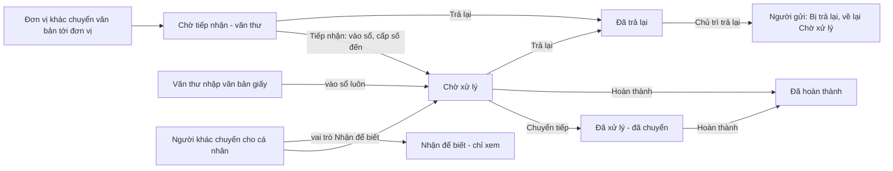

# Văn bản đến — tóm tắt nghiệp vụ cho BA

> Bản đọc nhanh bằng lời nghiệp vụ. Chi tiết và bằng chứng: [nghiep-vu.md](nghiep-vu.md) (mã NV / BR trong ngoặc
> để tra). Cập nhật: 2026-10-02 · Nguồn: code `kha_develop` + DB DEV. Nhãn quy tắc: **[Đã xác nhận]** = chủ dự án đã
> chốt là đúng ý đồ · **[Hiện trạng]** = hệ thống đang chạy như vậy, chưa ai xác nhận là ý đồ · **[Lệch nghiệp vụ]**
> = đã xác nhận nghiệp vụ muốn khác, hệ thống đang làm sai.

## 1. Phân hệ này dùng để làm gì

Phân hệ quản lý văn bản ở **phía người nhận**: văn bản được chuyển tới mình, hoặc tới đơn vị mà mình làm văn thư (NV-01).
Văn thư **tiếp nhận** văn bản gửi đơn vị vào sổ đến (số đến, ngày đến, hạn xử lý), hoặc tự **nhập văn bản giấy** vào hệ thống (NV-03, NV-04).
Người nhận xem văn bản theo hộp việc, lãnh đạo **cho ý kiến** (bút phê), rồi mỗi người **hoàn thành** hoặc **trả lại** phần việc của mình (NV-07, NV-08, NV-09).
Mỗi lần một người hoặc một đơn vị được nhận văn bản là một **luồng nhận** riêng; hộp việc, nút và trạng thái đều tính theo luồng nhận, không theo văn bản (BR-01).
Lãnh đạo và văn thư xem tiến độ cả đơn vị ở màn *Theo dõi văn bản đến đơn vị* (NV-14).

**Không gồm:** chuyển văn bản, chọn người nhận, thu hồi (xem `van-ban/chuyen-van-ban`); sổ văn bản, cách cấp số đến, báo cáo sổ (xem `van-ban/so-van-ban`); văn bản liên thông / VPCP (xem `van-ban/lien-thong`); cấu hình luồng văn bản đến (xem `van-ban/luong-xu-ly`); nhắc việc, SMS (xem `lich-nhac-viec`); soạn văn bản trả lời (xem `van-ban/di`, `xu-ly-cong-viec`); lưu hồ sơ, bàn giao, xem luân chuyển (xem `van-ban/quan-ly-chung`, `ho-so-cong-viec`).

## 2. Ai dùng và được làm gì

| Vai trò | Được làm gì trong phân hệ này |
|---|---|
| Văn thư đơn vị (`VT`) | Thấy thêm hàng tab *Văn bản đơn vị / Văn bản cá nhân*. Tiếp nhận văn bản gửi đơn vị vào sổ, hủy tiếp nhận; nhập văn bản giấy, sửa, xóa văn bản do đơn vị mình đăng ký; hoàn thành, trả lại, cho ý kiến trên văn bản gửi đơn vị; xử lý cả văn bản gửi riêng cho mình (1.4, NV-03, NV-04) |
| Lãnh đạo đơn vị / Thủ trưởng (`LDDV` / `TTDV`) | Cho ý kiến (bút phê) và bổ sung file trên văn bản mình nhận; tab *Tất cả* của văn bản cá nhân mở màn Theo dõi văn bản đến đơn vị; xử lý văn bản như chuyên viên (1.4, NV-05, NV-14) |
| Chuyên viên (`NV`) | Xem, chuyển, hoàn thành, trả lại văn bản mình nhận; chỉ cho ý kiến khi là trợ lý nhận thay lãnh đạo (1.4, BR-25) |
| Trợ lý lãnh đạo (`TL`) | Nhận văn bản thay lãnh đạo và cho ý kiến thay lãnh đạo; theo dõi văn bản của lãnh đạo ở menu riêng (1.4, NV-07, NV-16) |
| Người gửi (bất kỳ ai đã chuyển văn bản) | Thấy văn bản bị trả lại ở hộp *Văn bản đề nghị trả lại*; xử lý lại bằng cách chuyển cho người khác, tự hoàn thành, hoặc ẩn khỏi danh sách (NV-10) |

## 3. Màn hình / menu người dùng thấy

| Menu / màn | Để làm gì | Ghi chú | Mã menu |
|---|---|---|---|
| Văn bản chờ tiếp nhận | Văn thư tiếp nhận văn bản gửi đơn vị vào sổ (một văn bản, hoặc nhiều văn bản tối đa 50); nút *Thêm mới* nhập văn bản giấy | Chỉ văn thư có văn bản ở hộp này (NV-02, NV-03) | 439338 |
| Văn bản chờ xử lý | Văn bản đang chờ mình xử lý | Gộp cả văn bản *Bị trả lại*; lọc con Chờ xử lý / Bị trả lại / Sắp đến hạn / Quá hạn (NV-02, BR-05) | 439339 |
| Văn bản đã xử lý | Văn bản mình đã chuyển tiếp hoặc đã hoàn thành | Lọc con Đã chuyển xử lý / Đã hoàn thành (NV-02) | 439341 |
| Văn bản đề nghị trả lại | Hộp của **người gửi**: văn bản mình chuyển đi bị người nhận trả lại | Mặc định chỉ hiện dòng chưa xử lý (BR-04, BR-06) | 439342 |
| Đã trả lại | Hộp của **người nhận**: văn bản mình đã trả lại | Tab con *Đã trả lại* mở bằng một mã menu khác có tên "Văn bản chờ xử lý" — tên sai, màn đúng (BR-03) | 440705 · tab con 31745273536 |
| Văn bản nhận để biết | Văn bản mình nhận với vai trò Nhận để biết | Mặc định chỉ hiện văn bản chưa đọc; chỉ xem, đánh dấu đọc, chuyển tiếp (BR-08, NV-11) | 440025 |
| Tab *Tất cả* (trong các hộp việc) | Mọi văn bản chưa xử lý và đã xử lý | Mã menu do hệ thống tự dựng, không có trong danh mục menu; bấm tab con = đóng tab cũ, mở tab mới (NV-01) | 31745273537 · 31745273538 |
| Tra cứu văn bản | Tìm văn bản đến ở mọi trạng thái, kể cả văn bản đã xóa (có nút khôi phục) | Mặc định 1 tháng gần nhất; văn bản đã xóa lọc 10 ngày gần nhất (NV-13, BR-07) | 439343 |
| Theo dõi văn bản đến đơn vị | Lãnh đạo / văn thư xem văn bản đến của đơn vị và tiến độ từng người | Mở chi tiết từ đây chỉ được xem và chuyển (NV-14, BR-49) | 440267 |
| Thêm mới văn bản | Nhập văn bản giấy bằng màn cũ | Khác form *Thêm mới* trong các hộp việc; hướng dẫn sử dụng hướng dẫn thêm mới từ hộp Chờ tiếp nhận (NV-04) | 337192 |
| Văn bản yêu cầu đặt lịch | Đặt lịch họp từ văn bản | Thuộc phân hệ họp (NV-15) | 439315 |
| Trợ lý theo dõi văn bản của lãnh đạo | Trợ lý xem văn bản lãnh đạo nhận | Thuộc phân hệ trợ lý / họp (NV-16) | 338473 |
| Văn bản đang xử lý | — | **Ẩn, không dùng**; mở ra màn không tồn tại [Đã xác nhận Q8] (NV-18) | 439340 |
| Yêu cầu chỉnh sửa thông tin văn bản | — | **Ẩn, không dùng**; mở ra màn không tồn tại [Đã xác nhận Q8] (NV-18) | 440667 |
| Công văn nhận được · Văn bản yêu cầu trả lời | — | Menu **bị khóa** [Đã xác nhận Q10] (1.2, NV-15) | 337194 · 338954 |
| Menu thử nghiệm (4 mục) | — | Còn trong DB DEV, không phải chức năng thật (NV-18) | 339273 · 439337 · 439355 · 339026 |
| Trang chủ — nhóm ô "Văn bản đến" | 8 ô đếm: Chờ tiếp nhận, Chờ xử lý, Sắp đến hạn, Quá hạn, Đề nghị trả lại, Đã xử lý, Đã hoàn thành, Nhận để biết; bấm ô mở hộp việc | Ô "Đã xử lý" đếm đã chuyển + đã hoàn thành [Đã xác nhận Q6] (1.3) | — |

## 4. Luồng chính

1. Văn bản chuyển tới **đơn vị** (từ đơn vị khác hoặc từ liên thông) nằm ở hộp *Chờ tiếp nhận* của văn thư đơn vị đó (NV-02, NV-17).
2. Văn thư bấm *Tiếp nhận*: chọn đơn vị vào sổ, sổ đến, số đến (hệ thống điền sẵn số tiếp theo của sổ), ngày đến, hạn xử lý. Hệ thống kiểm trùng rồi ghi vào sổ; văn bản sang *Chờ xử lý* của đơn vị (NV-03).
3. Lưu xong, màn *Chuyển văn bản* mở ngay để văn thư chuyển trong đơn vị; cấu hình của đơn vị quyết định điền sẵn người nhận hay tự chuyển (NV-03 bước 5, xem `van-ban/chuyen-van-ban`).
4. Văn bản giấy: văn thư bấm *Thêm mới*, nhập thông tin, lưu. Văn bản vào sổ luôn, vào thẳng *Chờ xử lý* của đơn vị, rồi mở màn Chuyển (NV-04).
5. Văn bản chuyển cho **cá nhân** vào thẳng *Chờ xử lý* của người đó, không qua tiếp nhận; người nhận với vai trò Nhận để biết thì văn bản vào hộp *Nhận để biết* (NV-11, 4.6).
6. Người nhận mở chi tiết (hệ thống ghi nhận đã đọc). Từ đây: lãnh đạo cho ý kiến; người nhận chuyển tiếp (luồng của mình sang *Đã xử lý*), hoàn thành, hoặc trả lại (NV-05…NV-09).
7. **Hoàn thành**: chọn luồng nhận, nhập nội dung (tối đa 2000 ký tự), đính kèm file, đính kèm văn bản trả lời nếu người gửi yêu cầu trả lời. Hệ thống kiểm nhắc việc trước khi cho lưu (NV-08).
8. **Trả lại**: chọn luồng, nhập lý do, file, tùy chọn gửi SMS cho người gửi. Trả lại có hiệu lực ngay; người gửi thấy văn bản ở *Đề nghị trả lại* và (nếu người trả lại là Chủ trì) nhận lại văn bản ở *Chờ xử lý* với trạng thái *Bị trả lại* (NV-09, NV-10).

**Luồng phụ.**
- *Hủy tiếp nhận*: văn thư bấm *Xóa* trên văn bản đã vào sổ ở hộp Chờ xử lý / Tất cả; bản ghi sổ bị xóa, văn bản quay về *Chờ tiếp nhận* (BR-16).
- *Xóa văn bản*: văn thư xóa văn bản do đơn vị mình đăng ký, nhập lý do tối đa 1000 ký tự; khôi phục được từ màn Tra cứu (NV-04, NV-13).
- *Theo dõi đơn vị*: lãnh đạo / văn thư xem văn bản đến của đơn vị và 4 số thống kê theo từng người: chưa hoàn thành quá hạn / trong hạn, hoàn thành quá hạn / đúng hạn (NV-14, NV-12).

## 5. Trạng thái

**Trạng thái của một luồng nhận** (nhìn từ phía người nhận)

| Trạng thái (tên người dùng thấy) | Nghĩa | Chuyển sang khi nào | Giá trị |
|---|---|---|---|
| Chờ tiếp nhận | Văn bản gửi đơn vị, văn thư chưa vào sổ (chỉ có ở luồng đơn vị) | Đơn vị được chuyển văn bản với vai trò Chủ trì / Phối hợp; hoặc văn thư hủy tiếp nhận (4.6, BR-16) | trống |
| Chờ xử lý | Đang chờ người / đơn vị nhận xử lý | Văn thư tiếp nhận; cá nhân được chuyển; đơn vị được chuyển để biết; văn thư nhập văn bản giấy (4.6, NV-03, NV-04) | 3 |
| Đã xử lý (đã chuyển xử lý) | Đã chuyển tiếp cho người khác có vai trò Chủ trì hoặc Phối hợp, chưa hoàn thành | Người nhận chuyển tiếp; hoặc người gửi chuyển lại văn bản bị trả lại (4.6) | 4 |
| Đã hoàn thành | Luồng nhận đã kết thúc | Bấm Hoàn thành; hoặc bị kéo theo khi luồng cấp trên / Chủ trì cùng cấp hoàn thành; hoặc mọi Chủ trì cấp dưới đã xong (4.6, NV-08) | 5 |
| Đã trả lại | Người nhận đã trả văn bản về người gửi | Người nhận bấm Trả lại (4.6, NV-09) | 6 |
| Bị trả lại | Luồng của **người gửi** khi người nhận trả lại; nằm ở hộp Chờ xử lý | Người nhận Chủ trì (hoặc Nhận để biết) trả lại và mọi người cùng cấp không phải Phối hợp đã kết thúc (BR-37, BR-38) | 7 |
| Đã thu hồi | Luồng không còn hiệu lực | Người gửi thu hồi; hoặc luồng cấp trên bị trả lại thì mọi luồng phía dưới bị thu hồi (4.6, NV-09) | 0 |

**Vai trò nhận** (người chuyển chọn khi chuyển)

| Vai trò nhận | Nghĩa | Ảnh hưởng khi hoàn thành / trả lại | Giá trị |
|---|---|---|---|
| Chủ trì | Người chịu trách nhiệm chính; một cấp có thể có nhiều Chủ trì | Hoàn thành kéo luồng cấp trên; trả lại kéo người gửi về Bị trả lại (BR-28, BR-37) | 1 (trống được hiển thị như Chủ trì) |
| Phối hợp | Cùng xử lý một phần | Tự hoàn thành phần mình; trả lại chỉ đổi luồng của chính mình (BR-28, BR-37) | 2 |
| Nhận để biết | Chỉ đọc; văn bản ở hộp riêng | Không có nút Hoàn thành / Trả lại; được hoàn thành theo khi Chủ trì cùng cấp xong (BR-42) | 3 |
| Nắm tình hình | Lưu như Nhận để biết kèm cờ riêng | Không hiện ở hộp nào của Văn bản đến (BR-43) | 3 + cờ nắm tình hình |

**Loại xử lý của văn bản đã trả lại** (cột lọc ở hộp Đề nghị trả lại)

| Trạng thái (tên người dùng thấy) | Nghĩa | Chuyển sang khi nào | Giá trị |
|---|---|---|---|
| Chưa xử lý | Người gửi chưa làm gì với văn bản bị trả lại | Ngay khi bị trả lại (BR-06) | trống |
| Đã xử lý — tự ẩn | Người dùng bấm xóa khỏi danh sách | Bấm *Xóa* ở hộp Đề nghị trả lại / Đã trả lại (NV-10, BR-39) | 1 |
| Đã xử lý — đã chuyển lại | Người gửi đã chuyển văn bản cho người khác | Người gửi chuyển lại (BR-39) | 2 |
| Đã xử lý — đã hoàn thành | Luồng cấp trên đã hoàn thành | Hệ thống tự đặt khi hoàn thành (BR-39) | 3 |

## 6. Quy tắc quan trọng nhất

- [Hiện trạng] Hộp việc tính theo luồng nhận: cùng một văn bản có thể đang *Chờ xử lý* với người này và *Đã hoàn thành* với người khác. Văn thư có cả luồng đơn vị lẫn luồng cá nhân, nên popup Hoàn thành / Trả lại / Cho ý kiến luôn cho chọn luồng (BR-01, BR-02, NV-08).
- [Đã xác nhận] Mọi vai trò nhận, kể cả Phối hợp, được tự bấm Hoàn thành phần việc của mình; chỉ khi Chủ trì hoàn thành thì luồng của người giao (cấp trên) mới được hoàn thành theo (BR-28, Q1).
- [Hiện trạng] Một cấp có nhiều Chủ trì (việc cho nhiều Chủ trì đã được xác nhận là đúng): luồng của người giao chỉ tự hoàn thành khi **tất cả** Chủ trì cùng cấp đã hoàn thành, trả lại hoặc bị thu hồi (BR-20, BR-29).
- [Đã xác nhận] Chủ trì cùng cấp xong thì luồng Phối hợp và Nhận để biết cùng cấp tự chuyển sang Đã hoàn thành (BR-42, Q2).
- [Đã xác nhận] Nhận để biết chỉ để đọc: văn bản vào hộp *Văn bản nhận để biết*, không cần thao tác kết thúc; thao tác được phép chỉ gồm chuyển văn bản, lưu vào hồ sơ, thêm ghi chú (BR-42, BR-37, Q3, Q9).
- [Đã xác nhận] Người chuyển văn bản **chỉ cho Nhận để biết** vẫn giữ văn bản ở *Chờ xử lý* và phải tự bấm Hoàn thành (BR-41).
- [Đã xác nhận] Trả lại có hiệu lực ngay, người gửi không có bước chấp nhận; chữ "đề nghị" trong tên hộp *Văn bản đề nghị trả lại* chỉ là nhãn (BR-40, Q5).
- [Hiện trạng] Chủ trì trả lại thì người gửi nhận lại văn bản ở trạng thái *Bị trả lại* và **mọi người mà người trả lại đã chuyển tiếp bị thu hồi**; Phối hợp trả lại chỉ đổi luồng của chính mình (BR-37, BR-38).
- [Hiện trạng] Chỉ trả lại được văn bản có người gửi (hoặc văn bản liên thông nội bộ): văn bản văn thư tự nhập không trả lại được; văn thư của đơn vị tạo văn bản không thấy nút Trả lại (BR-19, BR-21, BR-34).
- [Hiện trạng] Hoàn thành bị chặn khi văn bản có nhắc việc đang chờ duyệt, hoặc có nhắc việc giao đơn vị mà người dùng không có quyền trả lời; có nhắc việc chưa trả lời thì hệ thống mở màn trả lời nhắc việc thay cho hoàn thành (BR-31).
- [Hiện trạng] Luồng có **yêu cầu trả lời**: hoàn thành một văn bản thì bắt buộc đính kèm văn bản trả lời; hoàn thành nhiều văn bản một lúc thì các luồng này bị loại khỏi lần hoàn thành (BR-32, BR-33).
- [Hiện trạng] Tiếp nhận bắt buộc chọn đơn vị vào sổ và sổ; ngày đến ≥ ngày ban hành; hạn xử lý ≥ ngày đến và ≥ hôm nay, và luôn nhập tay. Kiểm "trùng số đến trong sổ" đang tắt, chỉ còn kiểm trùng sổ + số và trùng thông tin văn bản (BR-09, BR-10, BR-11, BR-12, BR-44).
- [Hiện trạng] Hủy tiếp nhận chỉ được khi văn bản không do đơn vị mình tạo và, theo bản ghi sổ đó, chưa có văn bản đơn vị nào đã được chuyển đi (BR-16).
- [Đã xác nhận] Văn bản đã chuyển tiếp là "đã xử lý nhưng chưa hoàn thành": nằm ở hộp *Đã xử lý*, nhưng thống kê tiến độ tính là chưa hoàn thành (BR-45, Q7).
- [Lệch nghiệp vụ] Người Nhận để biết vẫn bấm được *Trả lại* từ màn Tra cứu, và việc trả lại này kéo người gửi về *Bị trả lại* và thu hồi nhánh; nghiệp vụ là Nhận để biết không được trả lại (BR-37, Q9, dac-thu L18).

## 7. Hệ thống KHÔNG làm / hay bị hiểu nhầm

- **Đọc không phải xử lý.** Mở chi tiết chỉ ghi nhận đã đọc, không đổi trạng thái, không tự hoàn thành. Yêu cầu mới "chuyển chỉ cho Nhận để biết, khi tất cả đã đọc thì người chuyển tự hoàn thành" **chưa có** (BR-22, BR-24, BR-41).
- **Hai hộp trả lại dễ nhầm:** *Văn bản đề nghị trả lại* là hộp của người gửi; *Đã trả lại* là hộp của người nhận. Tab con *Đã trả lại* lại dùng mã menu tên "Văn bản chờ xử lý" (BR-03, BR-04).
- **Ô trang chủ tên gốc "Chưa hoàn thành"** hiển thị nhãn "Đã xử lý" và đếm đã chuyển + đã hoàn thành — giữ nguyên theo xác nhận (NV-12, Q6).
- **Không có trạng thái "đang xử lý".** Chờ xử lý gộp chờ xử lý + bị trả lại; Đã xử lý gộp đã chuyển + đã hoàn thành. Menu "Văn bản đang xử lý" đang ẩn, không dùng (NV-18, Q8).
- **Không có gia hạn xử lý.** Chức năng "thông tin bổ sung" của văn bản không phải gia hạn (BR-46).
- **"Bút phê" bây giờ là "Cho ý kiến".** Luồng xin bút phê cũ (Chờ bút phê / Đã phê duyệt / Bị từ chối) không còn đường vào (BR-27).
- **Nút *Xóa* ở hộp Chờ xử lý / Tất cả của văn thư làm hai việc khác nhau:** văn bản đã vào sổ và được phép hủy thì là *hủy tiếp nhận*; ngược lại là *xóa văn bản* kèm lý do. *Xóa* ở hộp Đề nghị trả lại / Đã trả lại chỉ ẩn dòng khỏi danh sách (BR-16, NV-04, NV-10).
- **Hoàn thành / Trả lại luồng đơn vị do người không phải văn thư của đơn vị nhận gửi lên:** hệ thống bỏ qua luồng đó, không đổi gì, nhưng vẫn báo thành công (BR-30, BR-36).
- **Cho ý kiến trên văn bản *Bị trả lại*:** nút vẫn hiện nhưng lưu thì báo lỗi trạng thái không hợp lệ (BR-26).
- [Lệch nghiệp vụ] **"Đánh dấu nhận để biết"** hiện chỉ có ở phía máy chủ, web không dùng, và đổi vai trò thành **Phối hợp**. Nghiệp vụ mong muốn là nút *Nhận để biết* ở chi tiết văn bản: hoàn thành văn bản, đổi loại nhận thành Nhận để biết, chuyển văn bản sang hộp Nhận để biết — tính năng mới, chưa có (NV-11, Q4, dac-thu L13).

## 8. Liên quan phân hệ khác

| Khi thay đổi ở đây… | …phải xem thêm | Vì sao |
|---|---|---|
| Màn chi tiết văn bản (nút, thông tin hiển thị) | `van-ban/di`, `ho-so-cong-viec`, `lich-nhac-viec`, `cong-viec`, `hop` | Màn chi tiết dùng chung cho văn bản đến, đi, hồ sơ, nhắc việc, công việc, họp (NV-05, dac-thu bẫy 1) |
| Tiếp nhận, nhập văn bản, trả lại, hoàn thành | `van-ban/chuyen-van-ban` | Màn Chuyển mở ngay sau tiếp nhận / nhập văn bản; chuyển tạo luồng nhận và đưa luồng của người chuyển sang *Đã xử lý*; thu hồi nằm ở đó (NV-03, NV-04, 4.6) |
| Sổ đến, số đến, kiểm trùng số | `van-ban/so-van-ban` | Số tiếp theo của sổ và báo cáo sổ thuộc phân hệ sổ (1.1, NV-03) |
| Hộp Chờ tiếp nhận; hoàn thành / trả lại / cho ý kiến | `van-ban/lien-thong` | Văn bản liên thông vào chung hộp Chờ tiếp nhận nhưng tiếp nhận theo nhánh riêng; kết quả xử lý được báo sang hệ thống khác (BR-15, NV-17) |
| Điều kiện hoàn thành, hạn xử lý, SMS / thông báo | `lich-nhac-viec` | Hoàn thành kiểm và tự duyệt nhắc việc; cảnh báo hạn và nắm tình hình nằm ở đó (BR-31, NV-12, BR-43) |
| Văn bản yêu cầu trả lời | `van-ban/di`, `xu-ly-cong-viec` | Văn bản trả lời là văn bản đi do phân hệ đó soạn (NV-15, BR-32) |
| Luồng văn bản đến của đơn vị | `van-ban/luong-xu-ly` | Cấu hình luồng văn bản đến nằm ở đó (1.1) |
| Lưu hồ sơ, bàn giao, xem luân chuyển | `van-ban/quan-ly-chung`, `ho-so-cong-viec` | Thao tác trên văn bản đến nhưng thuộc phân hệ khác (1.1) |

## 9. Câu hỏi nghiệp vụ còn mở

Không còn (Q1–Q10 đã trả lời 2026-10-01 — xem mục 7.2 của `nghiep-vu.md`).

## 10. Khi viết yêu cầu mới cho phân hệ này, nhớ ghi rõ

- **Áp dụng cho vai trò nhận nào:** Chủ trì, Phối hợp, Nhận để biết (Nắm tình hình là trường hợp riêng). Có lan lên luồng của người giao không; nếu có nhiều Chủ trì cùng cấp thì chờ tất cả hay một người (BR-28, BR-29, BR-37, BR-43).
- **Luồng cá nhân, luồng đơn vị (văn thư), hay cả hai** — và với luồng đơn vị thì ai được thao tác, báo gì khi người khác thao tác (BR-02, BR-30).
- **Áp dụng ở hộp việc nào, và ở chi tiết mở từ hộp nào:** cùng một văn bản, chi tiết mở từ Chờ tiếp nhận, Chờ xử lý, Đã xử lý, Đề nghị trả lại, Nhận để biết, Tra cứu, Theo dõi đơn vị hiện các nút khác nhau (NV-05, BR-47, BR-49).
- **Trạng thái luồng nào được thao tác:** chờ tiếp nhận, chờ xử lý, đã xử lý (đã chuyển), đã hoàn thành, bị trả lại (NV-05, BR-35).
- **Văn bản văn thư tự nhập** (không có người gửi) và **văn bản liên thông / VPCP** có áp dụng không (BR-19, BR-34, BR-15, NV-17).
- **Có dính nhắc việc / yêu cầu trả lời không:** chặn, cảnh báo, hay bỏ qua; làm một văn bản và làm nhiều văn bản một lúc có khác nhau không (BR-31, BR-32, BR-33).
- **Có gửi thông báo / SMS không, gửi cho ai** (người gửi, người nhận, văn thư đơn vị). Hiện trả lại có tùy chọn SMS cho người gửi; cho ý kiến gửi cho văn thư đơn vị người ghi; thông báo hoàn thành đang tới chính người vừa hoàn thành (NV-07, NV-09, dac-thu L8).
- **Số đếm và thống kê có đổi không:** ô trang chủ nào, hộp nào, thống kê Theo dõi đơn vị; "quá hạn" theo cách tính nào (hộp việc và thống kê đang tính khác nhau); "sắp đến hạn" trước bao nhiêu giờ (NV-12, BR-45).
- **Hộp hoặc tab mới:** tên menu, mã menu, có ô trang chủ không, có hiện ở tab Văn bản đơn vị của văn thư không, lọc mặc định (chưa đọc / chưa xử lý / khoảng ngày) (NV-01, BR-06, BR-07, BR-08).
- **Chỉ trên web hay cả ứng dụng di động** — ứng dụng di động gọi thẳng chức năng phía máy chủ, nên một quy tắc chặn chỉ đặt trên web là không đủ (dac-thu mục 4).
