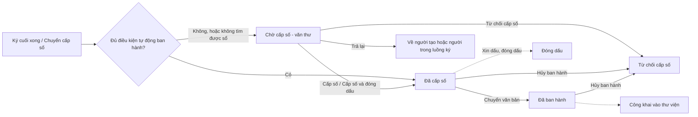

# Văn bản đi — tóm tắt nghiệp vụ cho BA

> Bản đọc nhanh bằng lời nghiệp vụ. Chi tiết và bằng chứng: [nghiep-vu.md](nghiep-vu.md) (mã NV / BR trong ngoặc
> để tra). Cập nhật: 2026-10-02 · Nguồn: code `kha_develop` + DB DEV. Nhãn quy tắc: **[Đã xác nhận]** = chủ dự án đã
> chốt là đúng ý đồ · **[Hiện trạng]** = hệ thống đang chạy như vậy, chưa ai xác nhận là ý đồ · **[Lệch nghiệp vụ]**
> = đã xác nhận nghiệp vụ muốn khác, hệ thống đang làm sai.

## 1. Phân hệ này dùng để làm gì

Phân hệ quản lý văn bản đi **từ lúc chờ cấp số trở đi**: người ký cuối ký xong (hoặc người soạn chuyển cấp số) thì văn bản vào hộp việc của **văn thư đơn vị ban hành** (1.1).
Văn thư **cấp số** theo sổ văn bản, hoặc **trả lại**, hoặc **từ chối cấp số**; văn bản đã cấp số có thể bị **hủy ban hành** (NV-02, NV-04, NV-05).
Người tạo **xin dấu**, văn thư các đơn vị được xin **đóng dấu** hoặc **từ chối đóng dấu**; văn thư cũng **cấp số & đóng dấu** một lần (NV-03, NV-06 → NV-09).
Hệ thống **tự động ban hành** khi đủ điều kiện; văn bản đã cấp số được **công khai** vào thư viện, **xóa / khôi phục** khi cần (NV-10, NV-12, NV-15).

**Không gồm:** dự thảo, trình ký, ký, trả lại trong luồng ký, chuyển cấp số (xem `xu-ly-cong-viec`); khai báo sổ, số hiện tại, sổ dùng chung, giữ số (xem `van-ban/so-van-ban`); mọi luồng chuyển văn bản đã cấp số, kể cả tự động chuyển (xem `van-ban/chuyen-van-ban`); gửi trục liên thông / VPCP (xem `van-ban/lien-thong`); kỹ thuật ký số, ảnh dấu số (xem `ky-so`); văn bản ở đơn vị nhận (xem `van-ban/den`).

## 2. Ai dùng và được làm gì

| Vai trò | Được làm gì trong phân hệ này |
|---|---|
| Văn thư đơn vị ban hành (`VT`) | Thấy đủ 6 tab của *Văn bản ban hành*; cấp số, cấp số & đóng dấu, trả lại, từ chối cấp số, hủy ban hành, đóng dấu, hủy đóng dấu, chuyển văn bản đã cấp số, xóa văn bản đi. Hộp *Chờ cấp số* cần thêm phân quyền dữ liệu "Văn bản ban hành" (1.3, BR-01, BR-02, BR-42) |
| Lãnh đạo, chuyên viên (không phải văn thư) | Chỉ tab *Đã ban hành*, luôn ở phạm vi cá nhân: văn bản mình tạo, ký, cho ý kiến, văn thư xét duyệt, hoặc đơn vị mình quản lý (1.3, NV-01) |
| Người tạo dự thảo | Xin dấu khi văn bản đã ký duyệt / đã ban hành; nhận SMS khi được cấp số, bị trả lại, được đóng dấu, bị từ chối đóng dấu (1.3, NV-06) |
| Văn thư đơn vị được xin dấu (`VT`) | Đóng dấu hoặc từ chối đóng dấu ở hộp *Văn bản đóng dấu* (1.3, NV-07, NV-08) |
| Hệ thống ngoài (ký tự động) | Nhận kết quả ban hành, hủy ban hành, đóng dấu (1.3, BR-10) |

## 3. Màn hình / menu người dùng thấy

| Menu / màn | Để làm gì | Ghi chú | Mã menu |
|---|---|---|---|
| Văn bản ban hành | Hộp việc của văn thư, 6 tab: Chờ cấp số, Đã cấp số, Đã ban hành, Đã trả lại, Từ chối cấp số, Tất cả | Người không phải văn thư chỉ thấy tab *Đã ban hành*. Tab *Đã trả lại* chỉ để xem, không có nút thao tác (NV-01, BR-01) | 337321 |
| Form *Cấp số* (mở từ nút Cấp số ở chi tiết văn bản chờ cấp số) | Chọn sổ, lấy số tiếp theo, hoàn thiện thông tin, cấp số; kính lúp ở ô Số mở danh sách số đã cấp | Văn bản chuyển cấp số không qua luồng có dòng đỏ lưu ý (NV-02, NV-16) | — |
| Văn bản đóng dấu | Hộp việc của văn thư đơn vị được xin dấu; mặc định lọc *Chờ đóng dấu*, chọn được nhiều văn bản | (NV-07) | 338952 |
| Công khai văn bản | Danh sách văn bản đã công khai; sửa, hủy công khai | Nằm dưới menu cha **Văn bản đến** (1.2, NV-12) | 337793 |
| Danh sách văn bản đi | Danh sách văn bản đi | Nằm dưới menu cha **Văn bản đến** (1.2) | 339272 |
| Văn bản ban hành (bản cho lãnh đạo + chuyên viên) | — | **Đã xóa** trên DB (1.2) | 439905 |
| Trang chủ — các ô văn bản đi | Bấm ô mở thẳng tab Chờ cấp số, Từ chối cấp số, Đã cấp số, Đã ban hành hoặc Tất cả | (NV-01) | — |

## 4. Luồng chính

1. Ký cuối xong, nếu văn bản bật *tự động ban hành*, hoặc văn thư xét duyệt đã vào sổ, hoặc đơn vị ban hành không có văn thư → hệ thống tự cấp số (NV-10).
2. Ngược lại, hoặc không tìm được sổ, văn bản nằm ở tab *Chờ cấp số* của văn thư đơn vị ban hành (NV-01, NV-10).
3. Văn thư mở chi tiết, bấm *Cấp số*: chọn sổ (sổ mặc định được chọn sẵn, có cả sổ được chia sẻ), hệ thống gợi ý số tiếp theo và số cấp bù trong ngày nếu có (NV-02).
4. Văn thư hoàn thiện các ô bắt buộc, tùy chọn *Tự động công bố vào thư viện*, bấm *Cấp số*. Hệ thống kiểm trùng số, sinh văn bản đi chính thức, đổi tên file theo số, gắn hồ sơ, báo SMS cho người tạo (NV-02, BR-07, BR-08).
5. Cấp số xong, màn *Chuyển văn bản* mở ngay để văn thư chuyển tới nơi nhận; văn bản chỉ sang tab *Đã ban hành* khi đã được chuyển đi (NV-02, NV-11).
6. Văn thư có thể chọn *Cấp số & Đóng dấu* để vừa cấp số vừa đóng dấu đơn vị (văn bản thường) (NV-03).

**Luồng phụ.**
- *Trả lại*: văn thư nhập lý do (tối đa 500 ký tự), chọn trả về người tạo (dự thảo về *Bị trả lại*) hoặc một người trong luồng (văn bản quay lại luồng ký) (NV-04).
- *Từ chối cấp số / Hủy ban hành*: văn thư nhập lý do (tối đa 1000 ký tự); văn bản sang tab *Từ chối cấp số* (NV-05).
- *Xin dấu → đóng dấu*: người tạo chọn các đơn vị cần đóng dấu; văn thư từng đơn vị đóng dấu theo vị trí ký hoặc tùy chọn, hoặc từ chối kèm lý do (tối đa 500 ký tự); văn thư hủy đóng dấu được để đóng lại (NV-06 → NV-09).
- *Công khai*: tự động khi cấp số (nếu đã tick), hoặc thủ công ở tab Đã cấp số / Đã ban hành; hủy công khai được (NV-12).
- *Xóa văn bản đi*: văn thư đơn vị ban hành xóa văn bản đã cấp số kèm lý do; khôi phục từ màn tìm kiếm (NV-15).

## 5. Trạng thái

**Trạng thái của văn bản (phía dự thảo)**

| Trạng thái (tên người dùng thấy) | Nghĩa | Chuyển sang khi nào | Giá trị |
|---|---|---|---|
| Đã ký duyệt (chờ cấp số) | Ở tab *Chờ cấp số* của văn thư | Người ký cuối ký; người soạn chuyển cấp số (4.7) | 3 |
| Đã ban hành | Đã cấp số, đã có văn bản đi chính thức — dù chưa chuyển đi | Cấp số thủ công hoặc tự động (NV-02, BR-05) | 4 |
| Từ chối cấp số / Hủy ban hành | Văn thư hủy khi chưa có số (từ chối cấp số) hoặc đã có số (hủy ban hành) | Văn thư bấm hủy, kèm lý do (NV-05, Q9) | 27 |
| Đã xóa | Văn bản đi bị xóa | Xóa văn bản đã cấp số; xóa ở tab Từ chối cấp số (BR-20, NV-15) | 27 + cờ đã xóa |

**Trạng thái của văn bản đi đã cấp số** (quyết định tab)

| Trạng thái (tên người dùng thấy) | Nghĩa | Chuyển sang khi nào | Giá trị |
|---|---|---|---|
| Đã cấp số | Có số, chưa chuyển đi | Cấp số (BR-05) | cờ đã chuyển trống |
| Đã ban hành | Đã chuyển tới nơi nhận | Văn thư chuyển, hoặc hệ thống tự chuyển (NV-11) | cờ đã chuyển = 1 |
| Hủy / Đã xóa | Không còn hiệu lực, biến khỏi danh sách văn bản đến của người nhận | Hủy ban hành; xóa văn bản đi (BR-06, BR-19) | trạng thái số = 1 |

**Trạng thái đóng dấu** (của từng đơn vị được xin dấu; văn bản có thêm một trạng thái tổng cùng giá trị)

| Trạng thái (tên người dùng thấy) | Nghĩa | Chuyển sang khi nào | Giá trị |
|---|---|---|---|
| Chờ đóng dấu | Đơn vị được xin dấu, chưa đóng | Xin dấu; hủy đóng dấu (NV-06, NV-09) | 1 |
| Từ chối đóng dấu | Văn thư đơn vị từ chối kèm lý do | Bấm Từ chối đóng dấu (NV-08) | 2 |
| Đã đóng dấu | Đơn vị đã đóng; trạng thái tổng = 3 khi **mọi** đơn vị đã đóng | Đóng dấu (NV-07, BR-25) | 3 |

**Công khai:** Đang công khai `0` · Đã hủy công khai `1` (BR-37).

## 6. Quy tắc quan trọng nhất

- [Đã xác nhận] Hộp *Chờ cấp số* chỉ văn thư của đơn vị ban hành thấy; văn thư phụ trách cấp số cho văn bản của đơn vị mình. Hộp *Văn bản đóng dấu* lọc khác hộp *Chờ cấp số* là giữ nguyên theo nghiệp vụ hiện tại (BR-03, Q1).
- [Hiện trạng] Văn thư không có phân quyền dữ liệu "Văn bản ban hành" thì hộp *Chờ cấp số* rỗng, không báo lỗi; loại văn bản trong danh sách "không ban hành" (ví dụ ký xuất nhập kho) không bao giờ hiện ở hộp văn thư (BR-02, BR-04).
- [Đã xác nhận] Tab *Đã cấp số* và *Đã ban hành* chỉ khác nhau ở việc văn bản **đã được chuyển đi chưa** (BR-05, Q12).
- [Hiện trạng] Cấp số bắt buộc: sổ, số, số ký hiệu, thể loại, độ mật, độ khẩn, ngày văn bản, ngày nhận, trích yếu, đơn vị gửi; ô số chỉ nhận chữ số, tối đa 10 ký tự. Số trùng trong cùng sổ (hoặc đã được giữ cho văn bản đang xử lý) bị chặn (BR-07, BR-08).
- [Hiện trạng] Bộ đếm số của sổ chỉ tăng; số của văn bản bị xóa **trong ngày hôm nay** được gợi ý cấp bù, số xóa hôm trước thì không (BR-09, NV-02, dac-thu bẫy 16).
- [Đã xác nhận] Văn thư xét duyệt đã vào sổ thì lãnh đạo ký xong văn bản được **cấp số luôn** (BR-34, Q5).
- [Hiện trạng] Tự động ban hành còn chạy khi văn bản bật *tự động ban hành* hoặc đơn vị ban hành không có văn thư; không tìm được sổ hoặc gặp lỗi thì văn bản lặng lẽ ở lại *Chờ cấp số* (NV-10, BR-34b).
- [Đã xác nhận] Chỉ tự động chuyển văn bản khi **ban hành tự động**; cấp số thủ công không tự chuyển (BR-36).
- [Lệch nghiệp vụ] Sau cấp số, mỗi lần văn thư chuyển tay một văn bản có nơi nhận dự kiến, hệ thống vẫn tự chuyển thêm tới nơi nhận dự kiến chưa nhận (BR-36, xem `van-ban/chuyen-van-ban` L14).
- [Hiện trạng] Văn thư chỉ trả lại được văn bản **thường** đang chờ cấp số; trả về người tạo thì dự thảo *Bị trả lại*, trả về người trong luồng thì quay lại luồng ký — không sang *Từ chối cấp số* (BR-14, BR-15).
- [Đã xác nhận] Hủy ban hành không thu hồi văn bản ở người nhận và không SMS cho họ; văn bản chỉ biến khỏi danh sách văn bản đến (BR-19, Q4).
- [Đã xác nhận] Khôi phục văn bản đi chỉ khôi phục văn bản đã cấp số, không đưa dự thảo ra khỏi trạng thái hủy (BR-18, Q3).
- [Hiện trạng] Mỗi lần xin dấu thay toàn bộ yêu cầu đang chờ trước đó; chỉ đơn vị có ảnh dấu còn hiệu lực mới nhận tin nhắn xin dấu (BR-21, BR-22).
- [Hiện trạng] Một đơn vị không đóng dấu hai lần trên cùng văn bản; nhiều đơn vị khác nhau lần lượt đóng được. Hủy đóng dấu của một đơn vị gỡ luôn dấu của mọi đơn vị đóng sau (BR-24, BR-31).
- [Hiện trạng] Văn bản mật: không có *Cấp số & Đóng dấu*, không có nút *Trả lại*, không tự chuyển, không tự công bố; văn bản mật đã chuyển đi không hủy đóng dấu được (BR-12, BR-14, BR-32, BR-30).
- [Đã xác nhận] Cờ "Phát hành nội bộ / bên ngoài" chỉ mang tính thông tin, không tự gửi liên thông (BR-41, Q7).

## 7. Hệ thống KHÔNG làm / hay bị hiểu nhầm

- **"Ban hành" có hai nghĩa.** Trạng thái dự thảo *Đã ban hành* có ngay khi cấp số; còn tab *Đã ban hành* chỉ chứa văn bản **đã chuyển đi**. Văn bản vừa cấp số nằm ở tab *Đã cấp số* (BR-05, dac-thu bẫy 1).
- **Văn thư trả lại không ra "Từ chối cấp số".** Hai việc khác nhau (BR-15).
- **Một hành động, hai nhãn:** nút *Hủy ban hành* ở chi tiết và biểu tượng *Từ chối cấp số* ở danh sách cùng làm một việc; tab kết quả tên *Từ chối cấp số* nhưng nút tab ghi *Hủy ban hành* (NV-05, Q9, dac-thu bẫy 5).
- **Hủy ban hành khác hủy đóng dấu.** Hủy đóng dấu chỉ gỡ dấu, văn bản không đổi trạng thái (NV-09, BR-29).
- **Chọn "văn bản thay thế" khi công khai thủ công không được lưu.** Chủ dự án ghi nhận có thể là lỗi (BR-40, Q6).
- **"Đơn vị ban hành thay thế" không phải "văn bản thay thế":** đó là cấu hình đổi đơn vị ban hành, quyết định văn thư đơn vị nào nhận văn bản chờ cấp số (NV-13).
- **Không có menu "Chờ cấp số" riêng.** "Chờ cấp số" là tab đầu của *Văn bản ban hành* (1.2).
- **Hủy ban hành văn bản đã gửi liên thông:** hệ thống chỉ gỡ liên kết bên trong; việc thu hồi qua trục chạy ngoài hệ thống (NV-05, Q4b).
- **Cấp số đổi tên file** theo mã đơn vị, sổ, thể loại, số, năm; đóng dấu đổi tên file sang "đã đóng dấu" (NV-02, dac-thu bẫy 26).

## 8. Liên quan phân hệ khác

| Khi thay đổi ở đây… | …phải xem thêm | Vì sao |
|---|---|---|
| Văn bản vào hộp Chờ cấp số, trả lại, từ chối cấp số | `xu-ly-cong-viec` | Văn bản đến từ ký cuối hoặc chuyển cấp số; trả lại đưa dự thảo về hộp Dự thảo; dự thảo từ chối cấp số chỉ còn nút Lưu (NV-04, NV-05, BR-15) |
| Sổ, số gợi ý, cấp bù, kiểm trùng số | `van-ban/so-van-ban` | Sổ, bộ đếm số, sổ chia sẻ, giữ số thuộc phân hệ đó (1.1, NV-02) |
| Sau cấp số, tab Đã ban hành, tự động chuyển | `van-ban/chuyen-van-ban` | Màn Chuyển mở ngay sau cấp số; "đã ban hành" = đã chuyển (NV-11) |
| Hủy ban hành, xóa văn bản đi | `van-ban/den` | Văn bản hủy biến khỏi danh sách văn bản đến của người nhận (BR-19) |
| Hủy ban hành văn bản liên thông | `van-ban/lien-thong` | Gỡ liên kết văn bản liên thông (NV-05) |
| Đóng dấu, văn bản mật sau cấp số | `ky-so` | Kỹ thuật chèn ảnh dấu và quyền đọc file mật nằm ở đó (NV-07, dac-thu bẫy 25) |
| Cấp số văn bản kết luận / phiếu giao nhiệm vụ | `nhiem-vu`, `hop` | Cấp số kích hoạt nhiệm vụ của biên bản họp / phiếu giao nhiệm vụ (NV-02) |
| Cấp số, hủy ban hành | `ho-so-cong-viec`, `lich-nhac-viec` | Cấp số gắn văn bản vào hồ sơ và chuyển nhắc việc của dự thảo; hủy ban hành gỡ khỏi hồ sơ (NV-02, NV-05) |

## 9. Câu hỏi nghiệp vụ còn mở

Không còn (Q1–Q12 đã trả lời 2026-10-01 — xem mục 7.2 của `nghiep-vu.md`).

## 10. Khi viết yêu cầu mới cho phân hệ này, nhớ ghi rõ

- **"Ban hành" theo nghĩa nào:** đã cấp số, hay đã chuyển đi (tab *Đã ban hành*); nếu là chuyển thì thuộc `van-ban/chuyen-van-ban` (BR-05, dac-thu bẫy 1).
- **Áp dụng ở tab nào** trong 6 tab *Văn bản ban hành*, hay ở hộp *Văn bản đóng dấu*; nút ở chi tiết và biểu tượng ở danh sách là hai chỗ riêng (NV-01, NV-07, dac-thu mục "Khi nhận yêu cầu").
- **Ai thấy:** văn thư đơn vị ban hành, văn thư đơn vị được xin dấu, hay cả lãnh đạo / chuyên viên (phạm vi cá nhân); có cần phân quyền dữ liệu không (1.3, BR-02).
- **Phạm vi đơn vị hay cá nhân** (radio ở các tab Đã cấp số / Đã ban hành / Tất cả) — nhãn radio hiện ghi lệch với cách hệ thống hiểu (NV-01, dac-thu bẫy 22).
- **Văn bản mật** có áp dụng không (BR-12, BR-14, BR-30, BR-32).
- **Cấp số thủ công hay cả tự động ban hành** — tự động chạy sau ký, lỗi bị bỏ qua lặng lẽ (NV-10, BR-34b).
- **Có ảnh hưởng số, sổ không:** bộ đếm, cấp bù, kiểm trùng (BR-08, BR-09).
- **Hủy ban hành / xóa có cần báo cho người đã nhận không** — hiện không báo (BR-19, Q4).
- **Có gửi SMS / thông báo không, cho ai:** người tạo, văn thư đơn vị ban hành, văn thư đơn vị được xin dấu (mục "Tổng hợp thông báo/SMS").
- **Có áp dụng trên ứng dụng di động không** — nghiệp vụ là có (hoặc sẽ có) cấp số / đóng dấu / hủy ban hành trên di động (NV-17, Q8).
