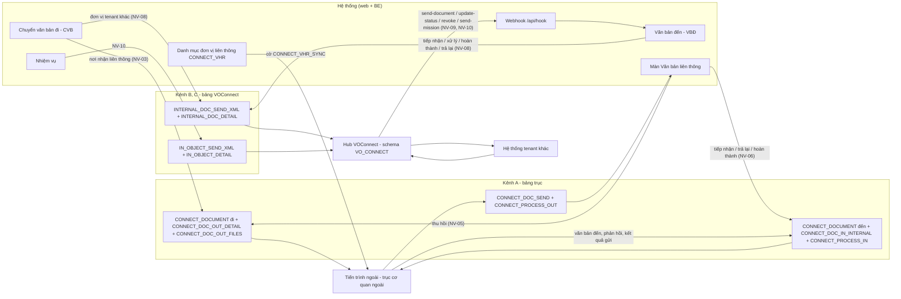
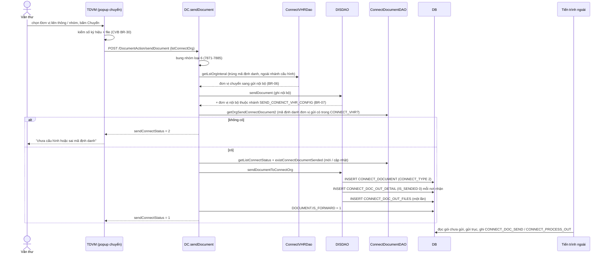
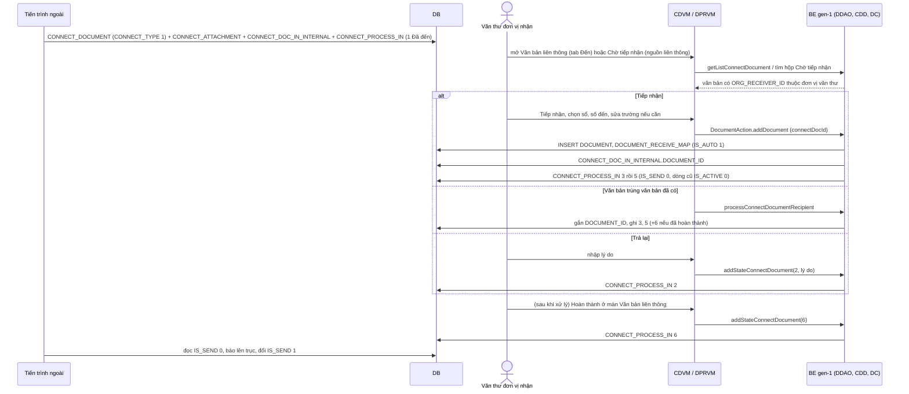
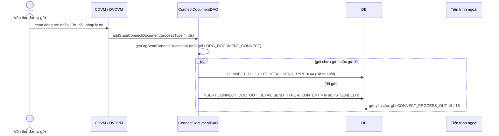
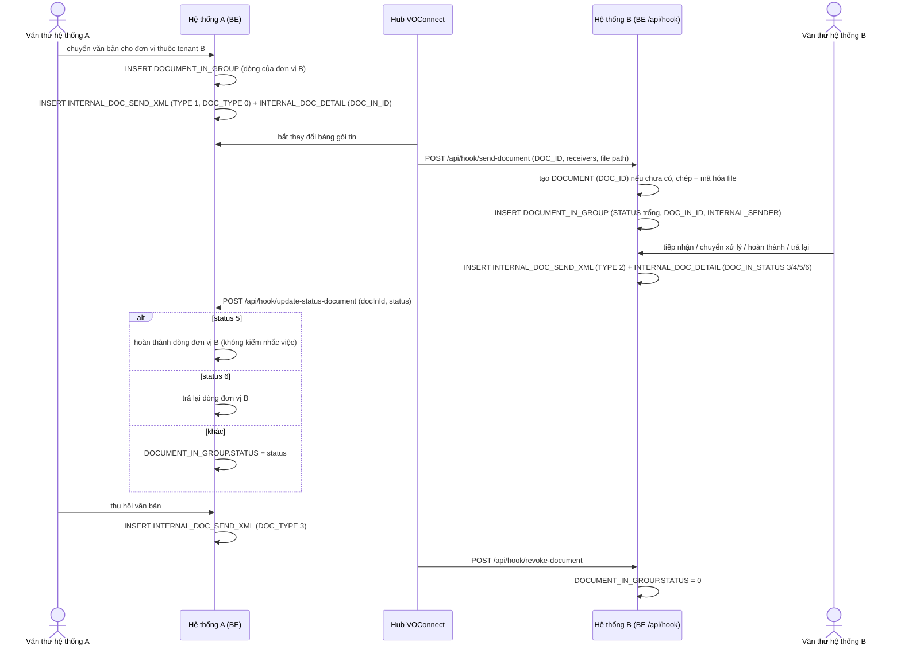
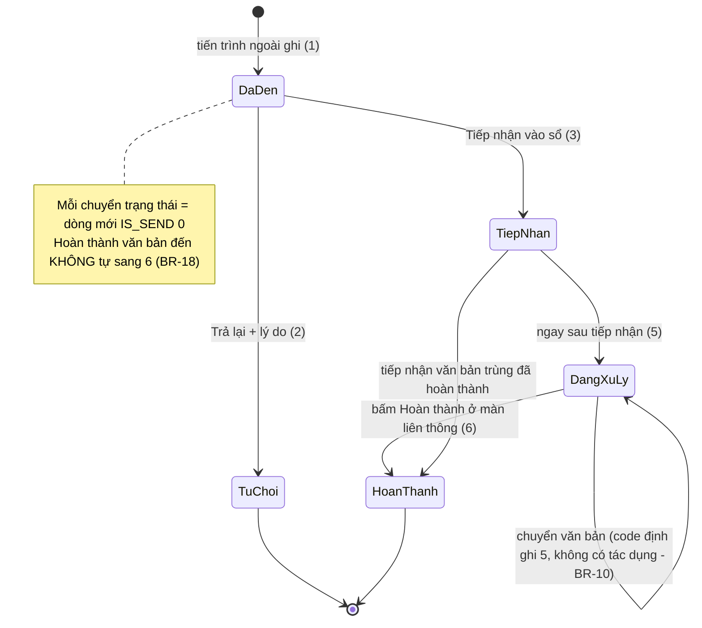
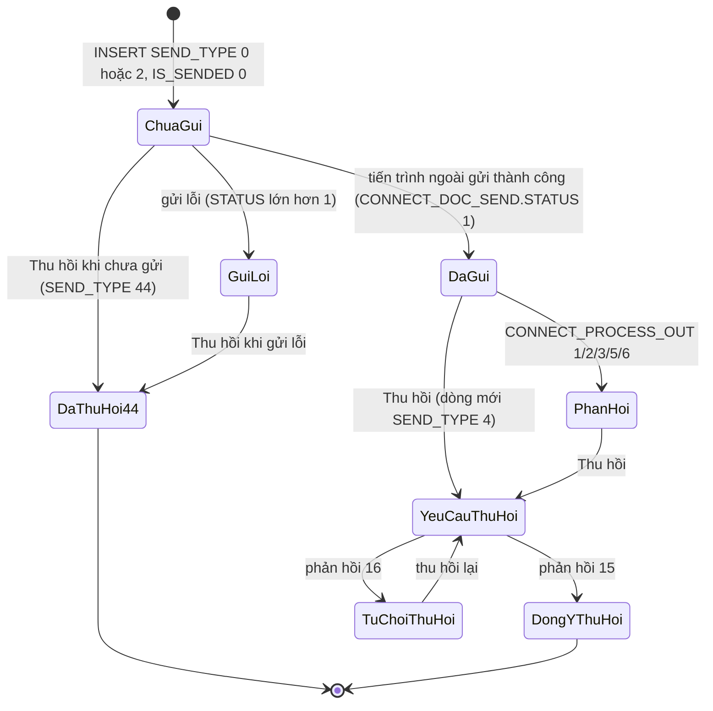
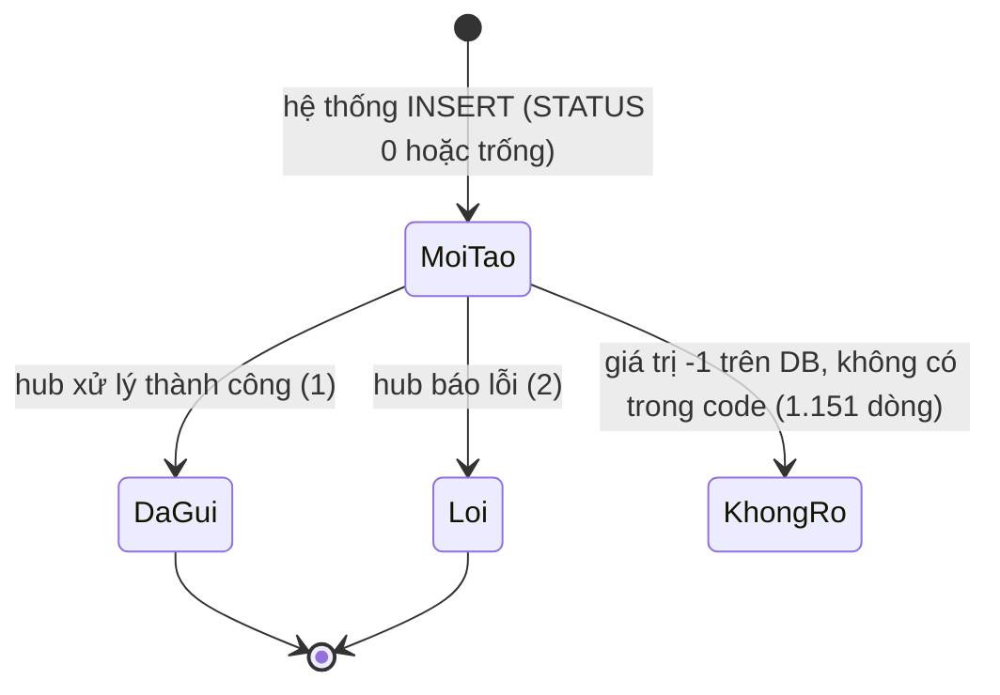
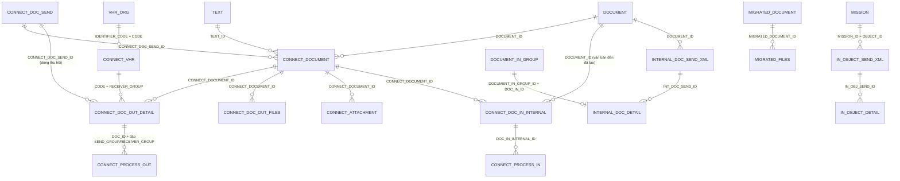

# Liên thông văn bản — nghiệp vụ: gửi / nhận văn bản qua trục liên thông với cơ quan ngoài, liên thông nội bộ liên hệ thống (VOConnect), danh mục đơn vị liên thông, trạng thái gói tin và phản hồi, thu hồi, nhiệm vụ qua trục, văn bản migrate

> Viết lại từ code nhánh `kha_develop` (web-spring + backend2.0) ngày 2026-10-01. Mọi khẳng định có nguồn `file:dòng`.
> Menu / widget đối chiếu **DB DEV `SYS_MENU` / `HOME_WIDGET` ngày 2026-10-01**; số dòng, phân bố giá trị và comment cột các bảng `CONNECT_DOCUMENT`, `CONNECT_PROCESS_IN`, `INTERNAL_DOC_*`, `IN_OBJECT_*`, `MIGRATED_*` đối chiếu **DB DEV ngày 2026-10-01** (do người điều phối truy vấn, chỉ SELECT; tác giả không kết nối DB). DB DEV **không có FK** nào trên các bảng này — mọi quan hệ ở mục 5 là quan hệ logic lấy từ JOIN / entity trong code. Tra bổ sung (người điều phối, DB DEV ngày 2026-10-01): `SYS_MENU` (menu danh mục, migrate), `SYSTEM_PARAMETER`, `CONNECT_DOC_SEND`, `CONNECT_PROCESS_OUT`, `CONNECT_DOC_OUT_DETAIL`, `CONNECT_DOC_IN_INTERNAL`, `CONNECT_VHR`, `VHR_ORG` theo `TENANT_CODE` (X15). Các bảng `CONNECT_DOC_OUT_FILES`, `CONNECT_ATTACHMENT` **chưa đối chiếu DB**.
> Viết tắt đường dẫn:
> `WEB/` = `web-spring/src/main/java/com/viettel/` · `ZUL/` = `web-spring/src/main/webapp/view/voffice/` · `VPS/` = `web-spring/src/main/webapp/view/vps/` ·
> `BIZ/` = `web-spring/src/main/java/com/voffice/service/business/` · `ENT/` = `web-spring/src/main/java/com/voffice/service/entity/` ·
> `BE1/` = `backend2.0/backendvoffice/src/main/java/com/viettel/voffice/` · `BE2/` = `backend2.0/backendvoffice/src/main/java/com/viettel/office/` ·
> `SQL/` = `backend2.0/backendvoffice/sql/` · `APP` = `backend2.0/backendvoffice/src/main/resources/application.properties`.
> Lớp hay dùng — **trục liên thông (gen-1)**: **CDA** = `BE1/action/ConnectDocumentAction.java`, **CDC** = `BE1/controler/ConnectDocumentController.java`, **CDD** = `BE1/database/dao/ConnectDocumentDAO.java` (~1.800 dòng), **CVA** = `BE1/action/ConnectVHRAction.java`, **CVC** = `BE1/controler/ConnectVHRController.java`, **CVD** = `BE1/database/dao/connectvhr/ConnectVHRDao.java`; **VOConnect (gen-2)**: **VOC** = `BE2/controller/VOConnectProcessorController.java`, **VOS** = `BE2/services/impl/VOConnectProcessorServiceImpl.java`, **IDS** = `BE2/services/impl/InternalDocumentServiceImpl.java`, **VORJ** = `BE2/repositories/jpa/VhrOrgRepositoryJPA.java`, **OTA** = `BE1/database/dao/meeting/ObjectTransferViaAxisDAO.java`.
> Văn bản chung: **DC** = `BE1/controler/DocumentController.java`, **DDAO** = `BE1/database/dao/document/DocumentDAO.java`, **DISDAO** = `BE1/database/dao/document/DocumentInStaffDAO.java`, **DSIS** = `BE1/database/dao/document/search/DocumentSearchInService.java`, **DISI** = `BE2/services/impl/DocInServiceImpl.java`, **FC** = `BE1/constants/FunctionCommon.java`, **C1** = `BE1/constants/Constants.java`, **C2** = `BE2/utils/Constants.java`.
> Web: **CDVM** = `WEB/voffice/vm/document/ConnectDocumentVM.java` (~3.000 dòng: danh sách + chi tiết), **CDB** = `BIZ/ConnectDocumentBusiness.java`, **CVVM** = `WEB/vps/vm/ConnectVHRVM.java`, **CVBZ** = `BIZ/ConnectVHRBusiness.java`, **CVLVM** = `WEB/voffice/widget/ConnectVHRLookupVM.java`, **DPRVM** = `WEB/voffice/vm/document/DocumentPendingReceptionVM.java`, **TDVM** = `WEB/voffice/vm/document/TransferDocumentVM.java`, **DVDVM** = `WEB/voffice/vm/document/DocumentViewDetailVM.java`, **AC** = `WEB/util/AppConstants.java`.
> Phân hệ liền kề đã viết: văn bản đến [`../den/nghiep-vu.md`](../den/nghiep-vu.md) (ký hiệu `VBĐ NV-xx / BR-xx`), văn bản đi [`../di/nghiep-vu.md`](../di/nghiep-vu.md) (`VBĐi`), chuyển văn bản [`../chuyen-van-ban/nghiep-vu.md`](../chuyen-van-ban/nghiep-vu.md) (`CVB`), nhắc việc / SMS [`../../lich-nhac-viec/nghiep-vu.md`](../../lich-nhac-viec/nghiep-vu.md) (`LNV`).

## 1. Tổng quan

### 1.1 Phạm vi

Phân hệ mô tả **cơ chế** đưa văn bản ra khỏi / vào hệ thống qua các "trục". Có **ba kênh độc lập**, cùng một mô hình: hệ thống **chỉ ghi gói tin vào bảng "hộp thư đi"** (outbox); **tiến trình bên ngoài repo** đọc bảng, gửi lên trục, ghi kết quả / phản hồi ngược vào bảng hoặc gọi API của hệ thống (NV-01, X7):

| Kênh | Đối tác | Bảng | Điểm vào trong code |
|---|---|---|---|
| **A. Trục liên thông văn bản với cơ quan ngoài** (danh mục `CONNECT_VHR`) | cơ quan ngoài hệ thống, nhận diện bằng **mã định danh** | `CONNECT_DOCUMENT` (`CONNECT_TYPE` 1 đến / 2 đi), `CONNECT_DOC_OUT_DETAIL`, `CONNECT_DOC_OUT_FILES`, `CONNECT_ATTACHMENT`, `CONNECT_DOC_SEND`, `CONNECT_PROCESS_IN`, `CONNECT_PROCESS_OUT`, `CONNECT_DOC_IN_INTERNAL` | gen-1 `CDA` (8 endpoint) + móc trong `DocumentAction.sendDocument`, nhập văn bản đến (NV-02 … NV-07) |
| **B. Liên thông nội bộ liên hệ thống — "VOConnect"** | đơn vị thuộc **hệ thống (tenant) khác** dùng cùng nền tảng: `VHR_ORG.TENANT_CODE` khác tenant hiện tại | `INTERNAL_DOC_SEND_XML`, `INTERNAL_DOC_DETAIL`, `INTERNAL_DOC_RECEIVE_XML`; cột `DOCUMENT.DOC_ID`, `DOCUMENT_IN_GROUP.DOC_IN_ID / INTERNAL_SENDER / INTERNAL_SENDER_TENANT` | gen-2 `IDS` (ghi gói tin) + webhook `VOC` `/api/hook/*` (nhận) (NV-08, NV-09) |
| **C. Nhiệm vụ qua trục nội bộ** | như kênh B | `IN_OBJECT_SEND_XML`, `IN_OBJECT_DETAIL`, `IN_OBJECT_RECEIVE_XML` | `OTA.sendObjectViaAxis` + `/api/hook/send-mission` (NV-10) |

Ngoài ra: **Văn bản từ VPCP** — màn còn menu nhưng code đã bị chú thích toàn bộ (NV-11); **Migrate văn bản** — tra cứu văn bản lưu trữ chuyển từ hệ thống cũ (NV-12); thành phần cũ / không dùng (NV-13).

Phân hệ **KHÔNG gồm** (trỏ sang):

| Nội dung | Phân hệ |
|---|---|
| Popup chuyển văn bản (chọn nơi nhận, tab Đơn vị liên thông / Nhóm đơn vị liên thông), kiểm "phải có số ký hiệu và file" khi gửi liên thông, ghi `DOCUMENT_IN_GROUP` / `DOCUMENT_IN_STAFF` | `van-ban/chuyen-van-ban` (CVB NV-04, NV-08 BR-30) — ở đây chỉ mô tả phần đóng gói gửi trục sau khi ghi (NV-03) |
| Ban hành / cấp số văn bản đi; cờ "Phát hành bên ngoài" (`IS_PUBLISH_OUTSIDE`) — **chỉ thông tin, không kích hoạt liên thông** (X8); hủy ban hành gỡ `CONNECT_DOCUMENT.TEXT_ID` | `van-ban/di` (VBĐi BR-41, NV-05) |
| Hộp Chờ tiếp nhận, form vào sổ văn bản đến, hoàn thành / trả lại / cho ý kiến | `van-ban/den` (VBĐ NV-03, NV-08, NV-09, NV-17) — ở đây mô tả nhánh riêng của văn bản liên thông và trạng thái báo ngược |
| Nghiệp vụ nhiệm vụ (giao, báo cáo tiến độ, đóng, thảo luận) | `nhiem-vu` — ở đây chỉ mô tả cơ chế đóng gói / nhận qua trục (NV-10) |
| Gửi tin SMS (bảng `MESSAGE`, kiểm chặn `shouldSendSms`) | `lich-nhac-viec` (LNV NV-13) — ở đây chỉ ghi "gửi tin loại 201 khi chuyển văn bản liên thông cho đơn vị nội bộ" (NV-07) |
| Quản lý cây tổ chức `VHR_ORG` (nhập **mã định danh** `IDENTIFIER_CODE`) | `he-thong` |
| Tích hợp không phải trục văn bản: VHR, ViettelPay, WOPI, Solr / Elasticsearch, mobile; API lấy danh sách văn bản trình ký cho hệ thống ngoài (`/api/text/sync-text`); đánh dấu văn bản để đồng bộ ERP (`textMarkSyncAction` — không phải đồng bộ dấu ký) | `tich-hop` (sửa chéo 2026-10-02 theo `ky-so`) |
| Ban hành lại / chọn văn bản gốc (`DocOrgRepublish`) | `van-ban/di`, `xu-ly-cong-viec` (đang xếp nhầm vào phân hệ này — báo cáo `domains.py`) |

### 1.2 Menu (đối chiếu DB DEV `SYS_MENU` ngày 2026-10-01)

`SYS_MENU.STATUS`: 1 = mở khóa, 2 = khóa (X3).

| `SYS_MENU_ID` | `CODE` | Tên (DB DEV) | Cha | URL | `STATUS` | VM / NV | Ghi chú |
|---|---|---|---|---|---|---|---|
| 338996 | `CONNECT_DOCUMENT` | **Văn bản liên thông** | VĂN BẢN ĐẾN (337200) | `/view/voffice/document/goverment/connectDocument.zul` | 1 | CDVM — NV-04, NV-06, NV-07 | hai tab Văn bản đến / Văn bản đi |
| 338531 | `GOVERMENT_DOCUMENT` | Văn bản từ VPCP | VĂN BẢN ĐẾN (337200) | `/view/voffice/document/goverment/govermentDocument.zul` | 1 | `GovermentDocumentVM` — NV-11 | **VM bị chú thích toàn bộ** — màn không chạy được |
| 439585 | `DOCUMENT_MIGRATED` | Migrate văn bản | QUẢN TRỊ (336812) | `/view/voffice/document/migrate/migrated_doc_import.zul` | 1 | `MigratedDocumentVM` — NV-12 | zul này **không có nội dung** ở vùng giữa (`ZUL/document/migrate/migrated_doc_import.zul:23-28`) |
| 338991 | `DOCUMENT_CONNECT` | Danh sách văn bản trục liên thông | VĂN BẢN ĐẾN (337200) | **trống** (DB DEV `SYS_MENU` ngày 2026-10-01) | 1 | — | menu không trỏ màn nào |
| 338995 | `ADD_CONNECT_VHR` | **Đơn vị liên thông** | QUẢN TRỊ (336812) | `/view/vps/sysConnectVHR/sysConnectVHR.zul` | 1 | CVVM — NV-02 | DB DEV `SYS_MENU` ngày 2026-10-01 (tra bổ sung) |
| **không có menu** | — | — | — | `/view/voffice/document/migrate/migrated_document.zul` | — | `MigratedDocumentVM` — NV-12 | zul có danh sách tra cứu (`migrated_document.zul:27-30`); DB DEV `SYS_MENU` ngày 2026-10-01 không có menu nào trỏ tới |

### 1.3 Widget trang chủ (đối chiếu DB DEV `HOME_WIDGET` ngày 2026-10-01)

| `HOME_WIDGET` | DB DEV | Code |
|---|---|---|
| id 47 `VAN_BAN_LIEN_THONG` "Văn bản liên thông", con 48 `VBLT_CHUA_GUI` Chưa gửi, 49 `VBLT_GUI_LOI` Gửi lỗi, 50 `VBLT_BI_TRA_LAI` Bị trả lại, 51 `VBLT_CHAM_TIEP_NHAN` Chậm tiếp nhận (`IS_ACTIVE` null) | còn trên DB | **Toàn bộ đoạn dựng widget bị chú thích**: `WEB/voffice/common/HomeVM.java:2124-2160`, `WEB/voffice/controller/HomeWidgetRestController.java:461-468`, `1674-1710`. Hàm đếm web gọi khóa `connectDocumentAction.getCountConnectDocumentDashboard` (`BIZ/ConnectDocTask.java:29`) — **BE không có endpoint này** (CDA chỉ có 8 endpoint, mục 2). → Widget không hiển thị. |

### 1.4 Actor & quyền

Văn thư = role `VT` (X2); trong web, "đơn vị văn thư" của người dùng = đơn vị có vai trò `DOCUMENT_MANAGER` (`WEB/voffice/common/CommonModel.java:410-425`), ở BE = `getListSecretaryVhrOrg()`. Quyền thao tác nằm ở **tầng hiển thị nút** (X1).

| Actor | Nhận diện trong code | Làm gì |
|---|---|---|
| Văn thư đơn vị nhận văn bản từ trục | đơn vị văn thư chứa `CONNECT_DOC_IN_INTERNAL.ORG_RECEIVER_ID` (BR-17) | Xem tab Văn bản đến; tiếp nhận / trả lại / hoàn thành văn bản liên thông (NV-06) |
| Văn thư được xem màn "Văn bản liên thông" | tham số `ORG_DOCUMENT_CONNECT` = `all` hoặc chứa một đơn vị văn thư của người dùng (`CDVM:304-321`) — không thỏa thì màn không tải danh sách (`CDVM:436-453`) | NV-04, NV-06 |
| Văn thư đơn vị gốc (`sysOrganization.id.vig` = 1 trên cấu hình prod — `web-spring/src/main/resources/application-prod.properties:348`) | có vai trò văn thư tại đơn vị VIG (`CDVM:322-327`) | Chuyển văn bản liên thông đến cho đơn vị nội bộ, thu hồi bản đã chuyển (NV-07) |
| Văn thư đơn vị gửi | gửi lên trục khi chuyển văn bản đi có nơi nhận liên thông (CVB NV-08); thu hồi dòng do đơn vị mình gửi (`CDVM:2306-2322`) | NV-03 … NV-05 |
| Quản trị (`isAdmin`) | `CVVM:71-88` | Thêm / sửa / xóa danh mục đơn vị liên thông, yêu cầu đồng bộ (NV-02) |
| Người dùng hệ thống của tiến trình trung chuyển (hub VOConnect) | tài khoản có mã = `vo-connect.processor.system-code` (`APP:478`; `FC:2491-2494`) | Gọi `/api/hook/*` (NV-09, NV-10) |

### 1.5 Sửa so với knowledge cũ (2026-10-01)

| Knowledge cũ | Hiện trạng code `kha_develop` | Ghi ở |
|---|---|---|
| "`IN_OBJECT_*` (XML nhận/gửi theo chuẩn edXML)" | `IN_OBJECT_*` là gói tin **nhiệm vụ** qua trục nội bộ (`OBJECT_TYPE = 1` nhiệm vụ — `SQL/20251105_add_table_internal_communication_axis_mission.sql:32`; ghi ở `OTA:33-72`), không phải văn bản; chuẩn edXML chỉ còn trong code VPCP đã chú thích (sửa 2026-10-01) | NV-10, NV-11 |
| "Gửi ra: Ban hành → sinh gói XML (`InObjectSendXml`/`InternalDocSendXml`) → gửi trục" | Gửi trục cơ quan ngoài ghi `CONNECT_DOCUMENT` + `CONNECT_DOC_OUT_DETAIL` + `CONNECT_DOC_OUT_FILES` (`DISDAO:2982-3155`); `INTERNAL_DOC_*` là kênh **liên thông nội bộ liên hệ thống**; hệ thống **không gửi** gì lên trục — tiến trình ngoài làm (sửa 2026-10-01) | NV-01, NV-03, NV-08 |
| "Nhận vào: trục gọi `POST /api/hook/send-document` → tạo `CONNECT_DOCUMENT` + văn bản đến chờ tiếp nhận" | `/api/hook/send-document` là kênh **VOConnect** (đơn vị khác tenant): tạo `DOCUMENT` + `DOCUMENT_IN_GROUP` trực tiếp, **không** đụng `CONNECT_DOCUMENT` (`VOS:68-234`). Văn bản từ trục cơ quan ngoài nằm sẵn ở `CONNECT_DOCUMENT` do tiến trình ngoài ghi; hệ thống chỉ đọc và tạo văn bản đến khi văn thư tiếp nhận (sửa 2026-10-01) | NV-06, NV-09 |
| "`update-status-document` báo ngược trạng thái (đã nhận/đã xử lý/từ chối)" | Đây là chiều **vào**: hub báo cho hệ thống gửi rằng đơn vị nhận (tenant khác) đã tiếp nhận / xử lý / hoàn thành / trả lại → cập nhật dòng `DOCUMENT_IN_GROUP` của đơn vị đó (`VOS:282-350`). Báo ngược **đi** là ghi gói tin trạng thái (`IDS:147-186`) (sửa 2026-10-01) | NV-08, NV-09 |
| "Thu hồi đã gửi = `/api/hook/revoke-document`, `doEvictionDoc`" | Ba việc khác nhau: thu hồi gửi trục = thêm dòng `CONNECT_DOC_OUT_DETAIL.SEND_TYPE = 4` (NV-05); `doEvictionDoc` = gỡ bản **chuyển nội bộ** của văn bản liên thông đến (`CDD:1601-1613`, NV-07); `revoke-document` = phía nhận VOConnect nhận lệnh thu hồi (NV-09) (sửa 2026-10-01) | NV-05, NV-07, NV-09 |
| "Liên thông nội bộ: `transferInternalOrgDoc`, `getListInternalOrg`, `TYPE_ORG_CONNECT = 3`, `TYPE_GROUP_CONNECT = 4`" | `transferInternalOrgDoc` = văn thư đơn vị gốc **phân phối văn bản từ trục** cho đơn vị nội bộ (`CDD:1483-1531`) — không liên quan VOConnect (sửa 2026-10-01) | NV-07 |
| "Đăng lại văn bản của đơn vị khác — `DocOrgRepublish.getBaseDocument`" | Web dùng để **chọn văn bản gốc** (`BIZ/DocumentBusiness.java:3016-3021`; `WEB/voffice/widget/InfoSelectBaseDocVM.java:73-80`) — thuộc văn bản đi / dự thảo, không thuộc liên thông (sửa 2026-10-01) | NV-13 |
| "Đồng bộ dấu/ký với hệ thống khác: `textMarkSyncAction.*`, `TextSyncController.sync-text`" | `sync-text` là API trả danh sách **văn bản trình ký theo ngày tạo** cho hệ thống ngoài (`BE2/controller/TextSyncController.java:34-50`); không phải trục văn bản (sửa 2026-10-01) | NV-13 |
| "QT1. Đơn vị nhận liên thông phải có trong danh mục" | Đúng một phần: nơi nhận chọn từ `CONNECT_VHR`; **đơn vị gửi** phải có `VHR_ORG.IDENTIFIER_CODE` **và** mã đó có trong `CONNECT_VHR` (`CDD:1440-1460`) | NV-03 BR-08 |
| "QT2. Văn bản nhận từ trục không được sửa nội dung, chỉ tiếp nhận/trả lại" | Tiếp nhận mở **form nhập văn bản đến** điền sẵn dữ liệu (`DPRVM:3207-3317`; `CDVM:1144-1237`); không thấy trường nào khóa theo văn bản liên thông (grep `connectDocId` trong zul nhập liệu rỗng) — văn thư chỉnh được trước khi lưu (sửa 2026-10-01) | NV-06 BR-19 |
| "QT4. Webhook `/api/hook/*` phải nằm trong `jwtIgnoreConfig` hoặc dùng xác thực riêng (?)" | Code: `/api/hook` **không** nằm trong `jwt.ignore-apis` (`APP:433`) → gọi phải có JWT; hub đăng nhập bằng tài khoản hệ thống (`FC:2491-2494`) (X12) | NV-09 BR-31 |
| câu cũ 2: "`goverment/*` (VPCP) còn hoạt động?" | `GovermentDocumentVM`, `TransferGovermentDocumentVM`, `GovermentDocumentReceiver/Sender` **chú thích 100 % dòng** → màn không chạy (X13); ý đồ hỏi lại ở Q9 | NV-11 |
| câu cũ 3: "`merge/` có liên quan tới migrate dữ liệu không?" | `merge/` ở gốc workspace là **bản sao mã nguồn** (`merge/backend2.0/backendvoffice/...` trùng file với `backend2.0`), không liên quan migrate văn bản (X14) | NV-12 |
| `dac-thu`: "`postman/` có collection (?)" | Có `backend2.0/backendvoffice/postman/` nhưng chỉ chứa một collection quản lý cache Redis (`Cache_Management_API.postman_collection.json`) — không có collection cho liên thông (sửa chéo 2026-10-02 theo `_chung/quy-uoc.md`: kiểm thư mục ngày 2026-10-02) | — |

## 2. Module

Kênh A chạy **gen-1** (Action → controler → DAO SQL thuần); kênh B và C chạy **gen-2** (service JPA) nhưng được gọi từ khắp các luồng gen-1 của văn bản; danh mục đơn vị liên thông gen-1; migrate gen-2 (danh sách) + gen-1 (tải file, kiểm chữ ký).

| Chức năng | Màn (.zul) | VM | Business (key) | Endpoint BE | Logic | DAO / repository → bảng |
|---|---|---|---|---|---|---|
| Danh sách văn bản liên thông (2 tab) (NV-04, NV-06) | `ZUL/document/goverment/connectDocument.zul` | CDVM `findDataList` :786-811 | `CDB.getListConnectDocument` / `getCountConnectDocument` → `connectDocumentAction.getListConnectDocument` (`CDB:21-80`) | `POST /connectDocumentAction/getListConnectDocument` (CDA) | `CDC.getListConnectDocument` :43-76 | `CDD.getListConnectDocument` :57-495 → `CONNECT_DOCUMENT`, `CONNECT_DOC_IN_INTERNAL`, `CONNECT_PROCESS_IN`, `CONNECT_DOC_OUT_DETAIL`, `CONNECT_DOC_SEND`, `DOCUMENT`, `TEXT`, `FILES_ATTACHMENT`, `ATTACH_TEMPLATE`, `CONNECT_ATTACHMENT` |
| Chi tiết văn bản liên thông | `ZUL/document/goverment/connectDocument_detail.zul` | CDVM (chế độ chi tiết, `doc` truyền vào — `CDVM:244-297`) | như trên + `getListInternalOrg`, `getListConnectDocOutDetail` | `/getListInternalOrg`, `/getListConnectDocOutDetail` | `CDC` :181-304 | `CDD.getListConnectDocOutDetail` :898-1025, `getListInternalOrg` :1615-1671 |
| Ghi trạng thái (tiếp nhận / trả lại / hoàn thành / thu hồi) (NV-05, NV-06) | 2 màn trên, hộp Chờ tiếp nhận | CDVM :1239-1305, :1671-1694; DPRVM :9012-9050; DVDVM :6614-6637 | `CDB.addStateConnectDocument` (`CDB:82-103`) | `POST /connectDocumentAction/addStateConnectDocument` | `CDC.addStateConnectDocument` :144-179 | `CDD.addStateConnectDocument` :1072-1178 → `CONNECT_PROCESS_IN` / `CONNECT_DOC_OUT_DETAIL`, `CONNECT_DOCUMENT.IS_SENDED` |
| Tiếp nhận văn bản liên thông thành văn bản đến (NV-06) | form nhập văn bản đến (hộp Chờ tiếp nhận hoặc tab mở từ CDVM) | DPRVM :3044-3095, :3207-3330, :4540-4607 | `DocumentAction.addDocument` (lưu); `DocumentBusiness.processConnectDocumentRecipient` (`BIZ/DocumentBusiness.java:1186-1196`) | `/DocumentAction/addDocument`, `/DocumentAction/processConnectDocumentRecipient` (`BE1/action/DocumentAction.java:114-120`) | `DDAO.addDocument` :607-624; `DC.processConnectDocumentRecipient` :1053-1170 | `CONNECT_DOC_IN_INTERNAL.DOCUMENT_ID`, `CONNECT_PROCESS_IN` |
| Gắn văn bản liên thông với văn bản đã có (trùng) | popup trùng văn bản | `WEB/voffice/widget/DuplicateDocumentPopupVM.java:144`, `DocumentSearchVM:3940`, `OrgFollowerDocInOrgSearchVM:3835` | `DocumentBusiness.updateConnectDocumentExist` → `api.doc-in.update-exist-connect-document` (`BIZ/DocumentBusiness.java:6186-6197`) | `POST /api/doc-in/update-exist-connect-document` (`BE2/controller/DocInController.java:235-238`) | `DISI.updateExistConnectDocument` :1696-1717 | `ConnectDocumentRepositoryJPA`, `ConnectProcessInRepositoryJPA` |
| Chuyển văn bản liên thông đến cho đơn vị nội bộ / thu hồi bản chuyển (NV-07) | `connectDocument.zul:665-669`, `connectDocument_detail.zul:1031-1071` | CDVM :1696-1751 | `CDB.transferInternalOrgDoc`, `doEvictionDoc`, `getListInternalOrg` (`CDB:234-298`) | `/transferInternalOrgDoc`, `/doEvictionDoc`, `/getListInternalOrg` | `CDC` :244-327 | `CDD.transferInternalOrgDoc` :1483-1531, `doEvictionDoc` :1601-1613 → `CONNECT_DOC_IN_INTERNAL`; SMS `MESSAGE` |
| Gửi văn bản đi lên trục (NV-03) | popup chuyển văn bản (CVB) | TDVM :4884-4920, :5388-5405 | `DocumentBusiness.transferDocument` (CVB) | `POST /DocumentAction/sendDocument` | `DC.sendDocument` :7642-7651, :7871-7885, :7922-7938, :7957-8046; `DISDAO.sendDocument` :1538-1544 | `DISDAO.sendDocumentToConnectOrg` :2982-3155; `CDD.addConnectDocument` :1198-1247 → `CONNECT_DOCUMENT`, `CONNECT_DOC_OUT_DETAIL`, `CONNECT_DOC_OUT_FILES` |
| Trạng thái đã gửi từng đơn vị liên thông (hiện trong popup chọn nơi nhận) (NV-04) | `widgets/connecVHRLookup.zul` | TDVM :794, CVLVM :561-567 | `CDB.getListOrgConnectDocument` → `connectDocumentAction.getOrgConnectDocument` (`CDB:300-331`) | `POST /connectDocumentAction/getOrgConnectDocument` (`CDA:104-115`) | `CDC.getListConnectStatus` :78-115 | `CDD.getListConnectStatus` :1693-1772 |
| Tab "Đơn vị liên thông" trong chi tiết văn bản đi + thu hồi (NV-04, NV-05) | `ZUL/document/reportSendReceiveDoc/popupVB.zul:1319`, `1882-1932` | DVDVM :1286-1300, :6587-6660 | `CDB.getListConnectDocOutDetailByDocumentId` (`CDB:147-187`) | `/getListConnectDocOutDetail` | `CDC` :181-242 | `CDD` :898-1025 |
| Danh mục đơn vị liên thông (NV-02) | `VPS/sysConnectVHR/sysConnectVHR.zul` (+ `connectVHR_search.zul`, `connectVHR_add.zul`) | CVVM | `CVBZ` → `connectVHRAction.{findByCondition, findByGroup, getMaxChildSortOrder, updateConnectVHR, createNewConnectVHR, checkCodeExist, deleteConnectVHR, updateSyncOrg}` | `POST /connectVHRAction/*` (`CVA:40-117`) | `CVC` :78-691 | `CVD` → `CONNECT_VHR`, `GROUP_IN_CV_GROUP`, `SYSTEM_PARAMETER` |
| Chọn đơn vị liên thông làm nơi nhận | `widgets/connecVHRLookup.zul`, `connecVHRLookupVbd.zul`, `connectVHRGroupLookUp.zul` | CVLVM, `ConnectVHRLookupVbdVM`, `ConnectVHRGroupLookUpVM` | `CVBZ.getListByCondition` | `/connectVHRAction/findByCondition` | `CVC.findByCondition` :201-337 | `CVD.getListConnectVHR` :44-292 |
| VOConnect — ghi gói tin đi (NV-08) | (không có màn) | — | — | — | `IDS` :43-186 (gọi từ `DDAO:9700-9721`, `DC:785-789`, `1016-1020`, `6087-6091`, `11104-11106`, `BE1/controler/TextController.java:7796-7798`, `BE2/services/impl/DocLeaderCommentServiceImpl.java:157-161`, `DISI:473-476`, `1013-1015`, `DISDAO:1622-1624`) | `InternalDocSendXmlRepositoryJPA`, `InternalDocDetailRepositoryJPA` → `INTERNAL_DOC_SEND_XML`, `INTERNAL_DOC_DETAIL` |
| VOConnect — webhook nhận (NV-09) | — | — | — | `POST /api/hook/{send-document, update-status-document, revoke-document}` (`VOC:21-49`) | `VOS` :68-350, :579-644 | `DocumentRepositoryJPA`, `DocumentInGroupRepositoryJPA`, `VORJ`, `FileEncryptMapJPA`, `InternalDocReceiveRepositoryJPA`; gen-1 `DDAO.insert`, `sendDocumentToGroup`, `FilesAttachmentDAO` |
| Nhiệm vụ qua trục nội bộ (NV-10) | (màn nhiệm vụ) | — | — | `POST /api/hook/send-mission` (`VOC:39-43`) | `OTA.sendObjectViaAxis` :33-72; `VOS.sendMission` :352-577 | `IN_OBJECT_SEND_XML`, `IN_OBJECT_DETAIL`, `MISSION` |
| Văn bản từ VPCP (NV-11) | `ZUL/document/goverment/govermentDocument.zul`, `transferGovermentDocument.zul` | `GovermentDocumentVM`, `TransferGovermentDocumentVM` (chú thích toàn bộ) | — | — | — | — |
| Migrate văn bản (NV-12) | `ZUL/document/migrate/migrated_document.zul` (+ `migrated_doc_search.zul`), `migrated_doc_import.zul` | `WEB/voffice/vm/document/MigratedDocumentVM.java` + `WEB/voffice/util/DocumentArchivedPool.java` | `BIZ/MigratedDocumentBusiness.java` → `api.migrated-doc.search` (:50-58), `api.migrated-doc.detail` (:82-93, không có endpoint) | `POST /api/migrated-doc/search` (`BE2/controller/MigratedDocController.java:29-34`); `Files.DownloadStreamMigratedFile`, `DocumentAction.verifyExternalSignatureMigratedDoc` | `BE2/services/impl/MigratedDocServiceImpl.java:31-38`; gen-1 `BE1/action/FileService.java:91-97`, `499-513` | `MigratedDocumentRepositoryJPA`, `MigratedFilesRepositoryJPA` → `MIGRATED_DOCUMENT`, `MIGRATED_FILES` |

Endpoint `CDA` đủ 8 (`CDA:21-115`): getListConnectDocument, getConnectDocumentDetail (web không gọi), addStateConnectDocument, getListConnectDocOutDetail, transferInternalOrgDoc, getListInternalOrg, doEvictionDoc, getOrgConnectDocument (= `CDC.getListConnectStatus`). Khóa web không có endpoint: `connectDocumentAction.getCountConnectDocumentDashboard`, `api.migrated-doc.detail` (NV-13).

## 3. Nghiệp vụ

### Giá trị trạng thái dùng xuyên suốt

| Cột | Giá trị (nguồn) | DB DEV ngày 2026-10-01 |
|---|---|---|
| `CONNECT_DOCUMENT.CONNECT_TYPE` | 1 = văn bản **đến** (nhận từ trục), 2 = văn bản **đi** (gửi lên trục) (`C1:2366-2367`; `AC:8074-8077`; comment cột DB) | 2 = 939 · 1 = 487 · null = 1 |
| `CONNECT_DOCUMENT.BUSSINESS_DOC_TYPE` / `CONNECT_DOC_OUT_DETAIL.SEND_TYPE` ("loại nghiệp vụ gói tin") | 0 mới · 1 thu hồi (từ đơn vị gửi) · 2 cập nhật · 3 thay thế · **4 thu hồi (yêu cầu lấy lại do mình gửi)** · **44 = "Đã thu hồi" khi gói chưa kịp gửi** — giá trị do hệ thống tự đặt (`C1:2369-2376`; nhãn `AC:8087-8097`) | `BUSSINESS_DOC_TYPE`: 0 = 1.215 · 2 = 211 · null = 1 |
| `CONNECT_PROCESS_IN.STATUS` (trạng thái xử lý văn bản **đến**, mỗi lần đổi = một dòng mới) | 1 Đã đến (chờ tiếp nhận) · 2 Từ chối (bị trả lại) · 3 Đã tiếp nhận · 4 Phân công (hiển thị như 5) · 5 Đang xử lý · 6 Đã hoàn thành (`C1:2378-2387`; nhãn `AC:8111-8124`; `CDVM:1786-1791`; comment cột DB "1: Da den, 3: Tiep nhan, 2: Tu choi, 5: Dang xu ly, 6: Da hoan thanh") | 1 = 894 · 3 = 734 · 5 = 610 · 2 = 60 · 6 = 49 · **0 = 18** · null = 5 · 4 = 1 (giá trị 0 không có trong code / comment) |
| `CONNECT_PROCESS_OUT.STATUS` (phản hồi của đơn vị nhận về văn bản **đi**) | dùng chung mã 1 … 6 như trên + **15 đồng ý / 16 từ chối yêu cầu thu hồi** (`C1:2385-2386`; `AC:8108-8121`) — bảng do tiến trình ngoài ghi | 1 = 23 · 2 = 19 · 3 = 12 · 4 = 4 · 5 = 21 · 6 = 16 · 15 = 2 · 16 = 3 · null = 1 (DB DEV `CONNECT_PROCESS_OUT` ngày 2026-10-01) |
| `CONNECT_PROCESS_IN.IS_SEND` | 0 chưa gửi lên trục · 1 đã gửi (comment cột DB); hệ thống luôn ghi 0 (`CDD:1101`), tiến trình ngoài đổi 1 | 1 = 2.185 · 0 = 170 · null = 16 |
| `CONNECT_PROCESS_IN.IS_ACTIVE` | 1 = dòng trạng thái hiện hành của một bản nhận (`CDD:1092-1101`) | 0 = 1.504 · 1 = 862 · null = 5 |
| `CONNECT_DOCUMENT.IS_SENDED` + `CONNECT_DOC_SEND.STATUS` (kết quả gửi văn bản đi) | web hiểu: **Chưa gửi** = `IS_SENDED = 0` hoặc chưa có `CONNECT_DOC_SEND` hoặc (`IS_SENDED = 1` và `STATUS = 0`); **Đã gửi** = `IS_SENDED = 1` và `STATUS = 1`; **Gửi lỗi** = `IS_SENDED = 1` và `STATUS > 1` (`ENT/ConnectDocOutDetailEntity.java:360-382`) | `CONNECT_DOCUMENT.IS_SENDED`: 1 = 845 · null = 440 · 0 = 124 · **−1 = 18** (không có trong comment); **`CONNECT_DOC_SEND`: 0 dòng** (DB DEV `CONNECT_DOC_SEND` ngày 2026-10-01) → trên DEV mọi nơi nhận đều hiện "Chưa gửi" hoặc nhãn phản hồi (BR-12a) |
| `CONNECT_DOC_OUT_DETAIL.SEND_TYPE` / `IS_SENDED` (từng nơi nhận) | `SEND_TYPE` theo dòng loại nghiệp vụ ở trên; `IS_SENDED` hệ thống luôn ghi 0 (`DISDAO:3051`; `CDD:1146`), giá trị 1 / −1 do tiến trình ngoài ghi; −1 chỉ dùng để tô đỏ tiêu đề (`CDVM:2385-2390`) | (SEND_TYPE, IS_SENDED): (0, 1) = 23.985 · (0, 0) = 11.017 · (0, −1) = 9 · (2, 0) = 439 · (3, 1) = 2 · (4, 1) = 152 · (4, 0) = 10 · (4, −1) = 4 · (44, 0) = 52 (DB DEV `CONNECT_DOC_OUT_DETAIL` ngày 2026-10-01) — `SEND_TYPE = 3` (thay thế) không có code nào ghi |
| `INTERNAL_DOC_SEND_XML.TYPE` / `DOC_TYPE` | `TYPE` 1 văn bản · 2 trạng thái; `DOC_TYPE` 0 thêm mới · 1 cập nhật · 2 xóa · 3 thu hồi · 4 khóa · 5 ý kiến chỉ đạo (`C1:2722-2736`; comment entity `BE2/entities/InternalDocSendXmlEntity.java:36-40`) | `TYPE`: 1 = 2.907 · 2 = 336; `DOC_TYPE`: 1 = 1.311 · 0 = 1.152 · null = 336 · 5 = 170 · 2 = 145 · 3 = 121 · 4 = 8 |
| `INTERNAL_DOC_SEND_XML.STATUS` | 0 mới tạo · 1 đã gửi · 2 gửi lỗi (`InternalDocSendXmlEntity.java:45-46`) — hệ thống không ghi cột này, hub ghi | 1 = 1.317 · **−1 = 1.151** (ngoài comment) · 0 = 405 · 2 = 370 |
| `INTERNAL_DOC_DETAIL.DOC_IN_STATUS` | = `DOCUMENT_IN_GROUP.STATUS` của đơn vị nhận: 0 thu hồi · 3 chờ xử lý · 4 đã xử lý · 5 hoàn thành · 6 trả lại · 7 bị trả lại (`C2:458-464`; `BE2/entities/InternalDocDetailEntity.java:46-47`) | null = 1.202 · 3 = 179 · 6 = 112 · 4 = 99 · 5 = 42 · 0 = 25 |
| `INTERNAL_DOC_DETAIL.STATUS` | 0 mới tạo · 1 đã gửi · 2 lỗi (entity :52-53) | **toàn bộ 0** (1.659) — hub không cập nhật cột này |
| `INTERNAL_DOC_RECEIVE_XML.TYPE` / `STATUS` | `TYPE` 1 chuyển văn bản · 2 trạng thái (comment cột DB); `STATUS` không có comment / hằng | `TYPE`: 1 = 691 · 2 = 139; `STATUS`: 1 = 612 · 2 = 212 · 0 = 6 |
| `IN_OBJECT_SEND_XML.STATUS` / `OBJECT_ACTION` | 0 tạo mới · 1 gửi thành công · 2 lỗi; `OBJECT_ACTION` = mã hành động nhiệm vụ 0 … 11 (`C1:308-328`) | `STATUS`: 1 = 248 · 2 = 11 · 0 = 8 |

### NV-01. Cơ chế chung: gói tin "hộp thư đi" + tiến trình ngoài + mã định danh đơn vị

**Mục đích.** Cho hệ thống trao đổi văn bản (và nhiệm vụ) với đơn vị không nằm trong cây tổ chức của mình mà không phải tự kết nối trục.

**Cách vận hành (cả ba kênh).**
1. Khi nghiệp vụ trong hệ thống xảy ra (chuyển văn bản, sửa, thu hồi, tiếp nhận, hoàn thành…), code chỉ **INSERT một gói tin** vào bảng của kênh: kênh A `CONNECT_DOCUMENT` / `CONNECT_DOC_OUT_DETAIL` (`IS_SENDED = 0`) hoặc `CONNECT_PROCESS_IN` (`IS_SEND = 0`) (`DISDAO:3049-3051`; `CDD:1099-1101`); kênh B `INTERNAL_DOC_SEND_XML` + `INTERNAL_DOC_DETAIL` (`IDS:57-79`); kênh C `IN_OBJECT_SEND_XML` + `IN_OBJECT_DETAIL` (`OTA:63-71`).
2. **Không có tiến trình gửi / nhận nào trong repo**: không có `@Scheduled` nào liên quan (chỉ `BE2/core/utils/scheduling/ScheduledBackgroundTask.java:17`, `22` — sinh khóa token); không có code nào ghi `CONNECT_DOC_SEND`, `CONNECT_PROCESS_OUT`, `INTERNAL_DOC_RECEIVE_XML`, `IN_OBJECT_RECEIVE_XML`, `CONNECT_DOCUMENT` loại đến (grep INSERT các bảng này chỉ ra các điểm ở bước 1). Chủ dự án đã xác nhận phần gửi / thu hồi qua trục chạy ở **tiến trình ngoài hệ thống** (X7).
3. Kênh B, C: hub trung chuyển nằm ở schema riêng `VO_CONNECT` (`TRANSACTION`, `TRANS_TENANT` — `SQL/20251009_alter_truc_lien_thong_noi_bo.sql:1-48`); bảng gói tin của hệ thống được bật **ghi log thay đổi cho tài khoản đồng bộ** (`SUPPLEMENTAL LOG DATA`, quyền cho `VOFFICE_DBZ_ROLE`, trigger đánh dấu `VO_SOURCE` — cùng file :82-92, :135-144; `SQL/20251105_add_table_internal_communication_axis_mission.sql:39-41`, `88-90`) — tức hub đọc gói tin bằng cơ chế bắt thay đổi dữ liệu, không phải API. Chiều về: hub **gọi webhook** `/api/hook/*` của hệ thống nhận (NV-09, NV-10).
4. Kênh A: chiều về do tiến trình ngoài ghi thẳng vào `CONNECT_DOCUMENT` (văn bản đến), `CONNECT_PROCESS_OUT` (phản hồi), `CONNECT_DOC_SEND` (kết quả gửi) — hệ thống chỉ đọc (NV-04, NV-06).

**Mã định danh đơn vị.**
- Đơn vị trong hệ thống: `VHR_ORG.IDENTIFIER_CODE` (nhập ở màn quản lý tổ chức — `ZUL/admin/sysOrganization/sysOrganization_add.zul:82-90`) và `VHR_ORG.TENANT_CODE` = mã hệ thống; đơn vị tạo mới nhận `TENANT_CODE` = tenant hiện tại (`BE1/database/dao/document/VHROrgDAO.java:1121-1128`). Tenant hiện tại = `vo-connect.tenant-code`, mặc định `VPTWD` (`APP:479`; `FC:2496-2498`).
- **Đơn vị liên thông nội bộ (kênh B)** = dòng `VHR_ORG` có `IDENTIFIER_CODE` và `TENANT_CODE` **khác** tenant hiện tại (`VORJ:405-420`; `BE2/repositories/impl/VhrOrgRepositoryImpl.java:434-458`). Không màn web nào sửa `TENANT_CODE` (grep zul) — các đơn vị tenant khác có mặt trong `VHR_ORG` từ nguồn ngoài (Q2). DB DEV `VHR_ORG` ngày 2026-10-01 (chưa xóa): `TENANT_CODE` = `VPTWD` 2.357 đơn vị (1.707 có mã định danh), trống 21 (3 có mã định danh) — **không có đơn vị tenant khác**, nên trên DEV kênh B hiện không có nơi nhận (dù `INTERNAL_DOC_*` có dữ liệu).
- **Đơn vị liên thông qua trục (kênh A)** = danh mục `CONNECT_VHR` (`CODE` = mã định danh trên trục) (NV-02). Mã định danh của đơn vị gửi = `VHR_ORG.IDENTIFIER_CODE` của đơn vị ban hành / đơn vị chuyển, phải có trong `CONNECT_VHR` (BR-08).

**BR-01.** Hệ thống **không biết** gói tin đã thực sự tới trục hay chưa cho tới khi tiến trình ngoài cập nhật cột trạng thái; mọi màn theo dõi chỉ đọc lại các cột đó (NV-04).
**BR-02.** Kênh B / C bỏ qua phần ghi gói tin khi người thực hiện là **tài khoản hub** (`FC.isHubProcessor` — `IDS:45-47`, `151-153`) để không sinh gói tin vòng lặp khi hub gọi webhook.

### NV-02. Danh mục đơn vị liên thông (`CONNECT_VHR`) và cấu hình liên thông

**Mục đích.** Quản trị khai báo cây **cơ quan ngoài** nhận / gửi văn bản qua trục, ánh xạ với đơn vị trong hệ thống, và yêu cầu đồng bộ danh mục từ trục.

**Màn.** `VPS/sysConnectVHR/sysConnectVHR.zul` (menu 338995 `ADD_CONNECT_VHR` "Đơn vị liên thông" dưới QUẢN TRỊ — DB DEV `SYS_MENU` ngày 2026-10-01). CVVM: chỉ **quản trị** (`isAdmin`) mới thấy cây + danh sách + nút thêm / sửa / xóa; người khác bị ẩn toolbar và ô tìm kiếm (`CVVM:66-94`). Cây gốc ảo "Đơn vị liên thông" (`CVVM:99-117`).

**Trường** (`connectVHR_add.zul`): mã (`CODE` = mã định danh), tên, đơn vị cha, thứ tự, địa chỉ, điện thoại, fax, email, website, và **"Thông tin đơn vị DHTN"** (`VOF_ORG_ID` — id đơn vị trong hệ thống tương ứng, nhập tay dạng chữ — `connectVHR_add.zul:414-423`).

**Luồng.**
- Tìm: `connectVHRAction.findByCondition` → `CVD.getListConnectVHR` (`CVD:44-292`): lọc `DEL_FLAG = 0`; tìm không dấu theo tên / mã (`nlssort binary_ai`), đặt trong ngoặc kép thì so khớp chính xác (:76-101); ô "Đơn vị được cấu hình" → chỉ lấy dòng có `VOF_ORG_ID` (`connectVHR_search.zul:144`; `CVVM:332-339`; `CVD:206-207`).
- Thêm: kiểm mã trùng (không phân biệt hoa thường, `DEL_FLAG = 0`) (`CVVM:208-226`; `CVD:482-500`) → `CVD.createConnectVHR` (:416-473): `ORG_LEVEL` = cấp cha + 1 (gốc = 1), `SYNC_DATE = sysdate`.
- Sửa: `CVD.updateConnectVHR` (:340-380). Xóa: **xóa mềm cả nhánh con** (`START WITH … CONNECT BY PRIOR` — `CVD:388-407`).
- Nút **"Đồng bộ"** (`connectVHR_search.zul:157`) → `updateSyncOrg(true)` → `UPDATE SYSTEM_PARAMETER SET VALUE = '1' WHERE CODE = 'CONNECT_VHR_SYNC'` (`CVVM:266-278`; `CVD:523-533`). Code chỉ **bật cờ**; không có code nào đọc cờ này hay ghi `CONNECT_VHR` từ trục (grep `CONNECT_VHR_SYNC`) → việc đồng bộ danh mục cơ quan ngoài do tiến trình ngoài làm (NV-01).

**Chọn nơi nhận liên thông** (popup chuyển văn bản, tab Đơn vị liên thông — CVB): `CVLVM` lọc bỏ mọi mã chứa **`W00`** khi không mở từ menu quản trị (`CVLVM:540-541`, `556-557`; `CVD:73-75`) (Q6). Nhóm đơn vị liên thông = `CV_GROUP` loại 6, thành viên `GROUP_IN_CV_GROUP.TYPE = 2` (`CVD:294-313`; `DC:7871-7885`).

**Dữ liệu danh mục** (DB DEV `CONNECT_VHR` ngày 2026-10-01, chưa xóa): **123.265** cơ quan, 174 mã chứa `W00`, chỉ **9** dòng có `VOF_ORG_ID`, `SYNC_DATE` gần nhất 2026-07-28 18:25 — quy mô cho thấy danh mục được tiến trình ngoài đồng bộ từ trục, không phải nhập tay; ánh xạ `VOF_ORG_ID` (bẫy 5 `dac-thu.md`) gần như không dùng.

**Tham số hệ thống dùng trong phân hệ** (giá trị: DB DEV `SYSTEM_PARAMETER` ngày 2026-10-01):

| Mã | Ý nghĩa theo code | Nguồn |
|---|---|---|
| `ORG_DOCUMENT_CONNECT` = **`ALL`** | danh sách id đơn vị (hoặc `all`, so không phân biệt hoa thường) được **xem màn Văn bản liên thông** và làm "đơn vị gửi" khi thu hồi → trên DEV mọi văn thư xem được màn; đơn vị gửi khi thu hồi = đơn vị văn thư cấp cao nhất của người thao tác (`CDD:1422`) | `CDVM:304-321`; `CDD:1400-1432` |
| `SEND_CONENCT_VHR_CONFIG` = `3126999,3565421` | danh sách id **gốc nhánh** đơn vị nội bộ nhận **cả hai đường** (nội bộ và trục) — BR-06, BR-07 | `DISDAO:1538-1544`; `CVD:535-604`; `DC:7922-7938` |
| `CONNECT_VHR_SYNC` = `1` | cờ yêu cầu đồng bộ danh mục (1) | `CVD:523-533` |
| `CONECT_DOC_OUT_SEND_TYPE` (**không có dòng** trên DB DEV) | được đọc nhưng **không dùng** (biến `value` bỏ đi) | `CDD:899-902` |
| `tdOrgId` (file cấu hình BE, = 148842) | đơn vị "đầu mối" nhận liên thông: văn thư đơn vị này là đơn vị gửi khi thu hồi; nhánh lọc riêng ở danh sách văn bản đến (không còn tác dụng — BR-17) | `APP:102`; `CDD:119-131`, `1402-1405`, `1485-1504` |

**BR-03.** Mã đơn vị liên thông là duy nhất trong các dòng chưa xóa (`CVD:482-500`) — chỉ kiểm ở web trước khi lưu (`CVVM:208-226`).
**BR-04.** Xóa một đơn vị liên thông xóa mềm luôn mọi đơn vị con (`CVD:398-400`).
**BR-05.** Đơn vị có mã chứa `W00` không hiện khi chọn nơi nhận, chỉ hiện ở màn quản trị (`CVLVM:540`; `CVD:73-75`).

### NV-03. Gửi văn bản đi lên trục (khi văn thư chuyển văn bản có nơi nhận là đơn vị liên thông)

**Mục đích.** Văn bản đã có số được gửi cho cơ quan ngoài qua trục cùng lúc với chuyển nội bộ.

**Điểm vào.** Popup chuyển văn bản (CVB NV-04, NV-08): tab Đơn vị liên thông / Nhóm đơn vị liên thông. Web chặn nếu văn bản **thiếu số ký hiệu hoặc thiếu file** (`TDVM:4892-4907`; CVB BR-30) và gán `sendType` = 1 cho văn bản đi, 2 cho văn bản khác (`TDVM:4908-4913`) — giá trị này bị BE ghi đè (bước 5).

**Luồng BE** (`POST /DocumentAction/sendDocument` → `DC.sendDocument`):
1. Gom nơi nhận liên thông: danh sách gửi lên (`DC:7642-7651`, khử trùng theo id) + thành viên các **nhóm đơn vị liên thông** (`CV_GROUP` loại 6), trừ thành viên bị loại (`DC:7871-7885`).
2. **Đổi sang gửi nội bộ**: đơn vị liên thông nào có `CODE` trùng `VHR_ORG.IDENTIFIER_CODE` của một đơn vị **đang hiệu lực trong hệ thống** và đơn vị đó **không** thuộc nhánh `SEND_CONENCT_VHR_CONFIG` → bỏ khỏi danh sách trục, thêm vào danh sách chuyển nội bộ với vai trò của dòng liên thông đầu tiên (`DC:7922-7938`; `CVD:566-604`) (BR-06).
3. Ghi nội bộ (`DISDAO.sendDocument`, CVB NV-04). Trong đó, nếu văn bản thường (`STYPE_ID` null / 1) và tham số `SEND_CONENCT_VHR_CONFIG` có giá trị → mọi đơn vị nội bộ vừa nhận thuộc nhánh cấu hình được **gửi thêm lên trục** theo mã định danh của chính nó (`DISDAO:1538-1544`; `CVD:535-564`) (BR-07).
4. Xác định **đơn vị gửi trên trục** (`DC:7957-7966`): chuyển từ một dòng nhận đơn vị (`documentInGroupId`) → đơn vị nhận của dòng đó; ngược lại → đơn vị ban hành (`BUILT_GROUP_ID`). Lấy mã định danh `VHR_ORG.IDENTIFIER_CODE` của đơn vị đó và kiểm mã có trong `CONNECT_VHR` (`CDD:1440-1460`). Không có → `sendConnectStatus = 2`, web báo "Chuyển liên thông không thành công do đơn vị chưa cấu hình hoặc sai mã định danh" (`DC:7996-8000`; `TDVM:5392`, `5401-5403`).
5. Dựng **mã văn bản trên trục** `DOC_ID` = `<mã định danh đơn vị ban hành (REGISTER_VHR_ORG_ID) — nếu không có thì mã đơn vị gửi>-<năm ban hành>-<số ký hiệu>` (`DC:8005-8008`). Với từng nơi nhận: nếu lần gửi gần nhất tới đơn vị đó đang chờ gửi hoặc đã gửi (trạng thái 0 / 1 theo `getListConnectStatus`) → loại **cập nhật** (2), còn lại → **mới** (0) (`DC:8010-8020`; `CDD:1693-1772`). Cả gói là "cập nhật" nếu đã có `CONNECT_DOCUMENT` đi cùng `DOC_ID` + đơn vị gửi mà gói gửi chưa lỗi (`CDD:1774-1792`; `DC:8012`, `8023-8029`).
6. `DISDAO.sendDocumentToConnectOrg` (`@Transactional`, :2982-3155) — chỉ khi văn bản có **ngày ban hành**: INSERT `CONNECT_DOCUMENT` (`CONNECT_TYPE = 2`, `BUSSINESS_DOC_TYPE` = 0/2, `OFFICE_SENDER_ID/NAME` = mã / tên đơn vị gửi, `STAFF_INFO` = "đơn vị/họ tên/email/điện thoại" người chuyển, `TEXT_ID`, số đến, trích yếu, người ký, độ khẩn, hình thức, `STEERING_TYPE = 0`; độ khẩn / hình thức trống → 1; `STYPE_ID` trống → 1) (:2986-3021; `CDD:1198-1247`); mỗi nơi nhận một dòng `CONNECT_DOC_OUT_DETAIL` (`SEND_GROUP` = mã đơn vị gửi, `RECEIVER_GROUP` = mã nơi nhận, `SEND_TYPE`, `IS_SENDED = 0`, `ORG_ID` = id đơn vị gửi, `CONTENT` = ý kiến chuyển) (:3048-3061); **một lần** cho cả gói: copy mọi file đính kèm (`FILES_ATTACHMENT`) và file biểu mẫu (`ATTACH_TEMPLATE`, `TYPE = 3`) sang `CONNECT_DOC_OUT_FILES` (:3088-3140); ghi theo lô 100 nơi nhận (:3039-3046, :3142-3146).
7. Thành công → `DOCUMENT.IS_FORWARD = 1` (văn bản sang "Đã ban hành" — VBĐi), `sendConnectStatus = 1` (`DC:8031-8037`).

Cùng cách đóng gói còn chạy ở **chuyển nhiều văn bản** (`DC.sendDocumentMultiTransfer` — :8199, phần liên thông :8394-8550) và **tự động chuyển nơi nhận dự kiến** của văn bản sinh từ dự thảo (CVB NV-09; `DDAO.autoSendDocument` :14605, gửi trục :14827-14880, nơi nhận liên thông lấy theo nơi nhận dự kiến — `setupTransferConnectInfo` :14910-14999).

**BR-06.** Đơn vị liên thông "thực ra là đơn vị trong hệ thống" (trùng mã định danh) được chuyển **nội bộ** thay vì qua trục, trừ đơn vị thuộc nhánh `SEND_CONENCT_VHR_CONFIG` (`DC:7922-7938`; `CVD:582-594`).
**BR-07.** Đơn vị nội bộ thuộc nhánh `SEND_CONENCT_VHR_CONFIG` nhận **hai bản**: bản nội bộ và bản qua trục — chỉ áp cho văn bản thường (`DISDAO:1539-1543`).
**BR-08.** Gửi trục bắt buộc đơn vị gửi có mã định danh **và** mã đó có trong danh mục `CONNECT_VHR` (`CDD:1446-1458`); văn bản phải có ngày ban hành (`DISDAO:2985`).
**BR-09.** Mỗi lần chuyển là **một gói `CONNECT_DOCUMENT` mới** (DB DEV: 939 gói đi); lần chuyển lặp lại tới cùng đơn vị đánh dấu "cập nhật" (bước 5).
**BR-10.** Văn bản đến tạo từ văn bản liên thông khi được chuyển tiếp: code định ghi trạng thái "Đang xử lý" (5) cho bản nhận (`DC:7968-7981`) nhưng **không có tác dụng** (thiếu mã bản nhận nội bộ — `dac-thu.md` L5).

**Tích hợp.** Tiến trình ngoài đọc `CONNECT_DOC_OUT_DETAIL.IS_SENDED = 0` để gửi (NV-01).

### NV-04. Theo dõi văn bản đã gửi lên trục và phản hồi từ đơn vị nhận

**Mục đích.** Văn thư biết từng nơi nhận ngoài đã nhận được chưa, đã tiếp nhận / xử lý / trả lại hay gửi lỗi.

**Ba nơi xem.**
1. Màn **Văn bản liên thông** tab "Văn bản đi" (`connectDocument.zul:44-52`; `CDVM:868-900`): `CDD.getListConnectDocument` với `CONNECT_TYPE = 2` lọc `CONNECT_DOC_OUT_DETAIL.ORG_ID` thuộc đơn vị văn thư của người dùng, hoặc theo "đơn vị nội bộ" đã chọn (lấy cả đơn vị con có mã liên thông — `CDD:132-148`, `1462-1481`); mặc định 365 ngày gần nhất theo ngày tạo gói (`CDVM:330-341`; `CDD:212-231`). Nút chuyển tiếp nội bộ trên dòng văn bản đi (`connectDocument.zul:843-850`; `CDVM:1060-1104`).
2. Chi tiết văn bản liên thông (`connectDocument_detail.zul:795-850`) và tab **"Đơn vị liên thông"** trong chi tiết văn bản đi (`popupVB.zul:1319`, `1882-1932`; DVDVM :1286-1300) — `CDD.getListConnectDocOutDetail` (:898-1025): mỗi cặp (đơn vị gửi, nơi nhận) lấy **dòng mới nhất** (`ROW_NUMBER … rn = 1` — :931, :965); kèm file gửi (`CONNECT_DOC_OUT_FILES`) và lịch sử phản hồi `CONNECT_PROCESS_OUT` khớp `DOC_ID` + đảo nhóm gửi / nhận (:1673-1691); nếu có dòng thu hồi (`SEND_TYPE = 4`) thì gắn kèm (`CDC:230-236`).
3. Popup chọn nơi nhận: trạng thái lần gửi trước tới từng đơn vị (`TDVM:794`; `CVLVM:561-567`) — `CDD.getListConnectStatus` (:1693-1772): `CONNECT_DOC_SEND.STATUS`, chưa có thì 0 (hoặc −1 nếu `NUMBERSEND > 5`), `STATUS = 2` đổi thành −1, lấy giá trị lớn nhất theo nơi nhận; bỏ qua dòng thu hồi (4, 44) và phản hồi 15.

**Nhãn trạng thái** từng nơi nhận (`CDVM:1804-1881`): 44 → "Đã thu hồi"; chưa gửi → "Chưa gửi" / "Đang gửi yêu cầu thu hồi"; gửi lỗi → "Gửi lỗi" / "Gửi yêu cầu thu hồi thất bại" (kèm log `CONNECT_DOC_SEND.LOG_SEND` — :1841-1846); đã gửi → nhãn của phản hồi mới nhất trong `CONNECT_PROCESS_OUT` (1 "Đã đến chờ tiếp nhận", 2 "Bị trả lại", 3 "Đã tiếp nhận", 5 "Đã tiếp nhận đang xử lý", 6 "Đã hoàn thành", 15 / 16 đồng ý / từ chối lấy lại), không có → "Đã gửi".

**BR-11.** Văn thư chỉ thấy văn bản đi có dòng nơi nhận mà **đơn vị gửi** (`ORG_ID`) là đơn vị mình làm văn thư (`CDD:144-146`).
**BR-12.** Số lần gửi lại: comment DB `NUMBERSEND` "nếu > 5 thì không gửi"; code chỉ dùng để hiển thị trạng thái lỗi (−1) (`CDD:1756`) — giới hạn gửi lại do tiến trình ngoài áp.
**BR-12a.** Nhãn "Chưa gửi / Đã gửi / Gửi lỗi" và nhánh thu hồi đọc `CONNECT_DOC_SEND.STATUS`, không đọc `CONNECT_DOC_OUT_DETAIL.IS_SENDED` (`ENT/ConnectDocOutDetailEntity.java:360-382`; `CDD:1130-1131`). DB DEV ngày 2026-10-01: `CONNECT_DOC_SEND` **0 dòng** trong khi 24.139 dòng nơi nhận có `IS_SENDED = 1` → mọi nơi nhận hiện "Chưa gửi" (hoặc nhãn phản hồi nếu có `CONNECT_PROCESS_OUT`); thu hồi luôn đi nhánh "chưa gửi" (đổi thành 44, không tạo yêu cầu thu hồi — NV-05); và mọi lần chuyển lại tới cùng `DOC_ID` đều là "cập nhật" (`CDD:1774-1792`) — `dac-thu.md` L20.

### NV-05. Thu hồi văn bản đã gửi lên trục (yêu cầu lấy lại)

**Mục đích.** Đơn vị gửi rút lại văn bản đã gửi cơ quan ngoài.

**Điểm vào.** Nút thu hồi từng dòng / "Thu hồi" nhiều dòng ở chi tiết văn bản liên thông (`connectDocument_detail.zul:798-850`; `CDVM:1643-1694`) và tab Đơn vị liên thông của chi tiết văn bản đi (`popupVB.zul:1882`, `1932`; DVDVM :6587-6637). Popup nhập lý do (`WEB/voffice/widget/ConfirmRetrieveDocConnectPopupVM.java:58-66`), xác nhận "Đồng chí có muốn Thu hồi văn bản?".

**Điều kiện hiện nút** (`CDVM:2306-2322`; bản sao DVDVM :6639+): dòng chưa ở trạng thái thu hồi (chưa có dòng thu hồi, hoặc lần thu hồi trước bị từ chối 16) và không phải 44; **đơn vị gửi của dòng** thuộc đơn vị hiện tại của người dùng **và** người dùng là văn thư đơn vị đó.

**Luồng.** `CDB.addStateConnectDocument(docId, null, 4, 2, lý do, null, [id dòng])` → `CDC:144-179` (lặp từng id) → `CDD.addStateConnectDocument` nhánh văn bản đi (:1119-1174):
1. Lấy "đơn vị gửi" của người thao tác: `tdOrgId` nếu là văn thư đơn vị đó, ngược lại đơn vị văn thư đầu tiên nằm trong `ORG_DOCUMENT_CONNECT` (`CDD:1400-1432`); không có → thất bại.
2. Gói gốc **chưa gửi hoặc gửi lỗi** (`CONNECT_DOC_SEND` chưa có / `STATUS > 1`) → chỉ đổi dòng thành `SEND_TYPE = 44` "Đã thu hồi" — không gửi gì (:1130-1134). DB DEV `CONNECT_DOC_SEND` ngày 2026-10-01 rỗng nên trên DEV mọi lần thu hồi đi nhánh này (BR-12a); DB DEV `CONNECT_DOC_OUT_DETAIL`: 52 dòng 44, 166 dòng 4.
3. Đã gửi → INSERT dòng `CONNECT_DOC_OUT_DETAIL` mới cùng gói, cùng cặp đơn vị, `SEND_TYPE = 4`, `CONTENT` = lý do, `IS_SENDED = 0`, `ORG_ID` = đơn vị ở bước 1 (:1136-1164) → tiến trình ngoài gửi yêu cầu; đơn vị nhận trả 15 (đồng ý) / 16 (từ chối) vào `CONNECT_PROCESS_OUT` (NV-04).

**BR-13.** Thu hồi trên trục **độc lập** với thu hồi / hủy ban hành trong hệ thống: hủy ban hành chỉ gỡ `CONNECT_DOCUMENT.TEXT_ID` (VBĐi NV-05); thu hồi văn bản đã chuyển nội bộ không tạo yêu cầu thu hồi trên trục (grep `RECOVER` chỉ ra điểm gọi ở trên).
**BR-14.** Thu hồi **một dòng** không gửi lý do đã nhập (truyền `null` — `CDVM:1666`; DVDVM :6592); thu hồi nhiều dòng gửi lý do (`CDVM:1650`) — `dac-thu.md` L7.

### NV-06. Nhận văn bản đến từ trục: danh sách, tiếp nhận (vào sổ), trả lại, hoàn thành, gắn với văn bản đã có

**Mục đích.** Văn thư đơn vị nhận xem văn bản cơ quan ngoài gửi qua trục, vào sổ thành văn bản đến của đơn vị, hoặc trả lại; trạng thái xử lý được báo ngược lên trục.

**Dữ liệu vào.** Văn bản đến từ trục có sẵn trong `CONNECT_DOCUMENT` (`CONNECT_TYPE = 1`), file ở `CONNECT_ATTACHMENT`, bản phân phối cho đơn vị nhận ở `CONNECT_DOC_IN_INTERNAL` (`ORG_RECEIVER_ID`), trạng thái hiện hành ở `CONNECT_PROCESS_IN` (`IS_ACTIVE = 1`, nối theo `DOC_IN_INTERNAL_ID`) — **không có code nào trong repo tạo các dòng này** cho văn bản mới đến (chỉ có bản chuyển nội bộ NV-07) → do tiến trình ngoài ghi (NV-01). DB DEV: 487 văn bản đến từ trục; `CONNECT_DOC_IN_INTERNAL` (DB DEV ngày 2026-10-01): **828 dòng gốc** `IS_ROOT = 1` chưa xóa (577 đã gắn văn bản đến) — bản phân phối do tiến trình ngoài tạo; 5 dòng `IS_ROOT` trống chưa xóa (bản chuyển nội bộ NV-07, không dòng nào có `DOCUMENT_ID`) và 2 dòng đã thu hồi.

**Hai nơi thấy văn bản.**
1. Màn **Văn bản liên thông**, tab "Văn bản đến" (mặc định khi mở; lọc trạng thái mặc định **1 Đã đến**, 365 ngày theo ngày nhận) (`CDVM:330-341`, `436-445`) → `CDD.getListConnectDocument` (:57-495): `CONNECT_DOCUMENT` nối trái `CONNECT_DOC_IN_INTERNAL` (`DEL_FLAG = 0`), `CONNECT_PROCESS_IN` (`IS_ACTIVE = 1`), `DOCUMENT` / `TEXT` đã tạo từ nó (:104-110), điều kiện **`CONNECT_DOC_IN_INTERNAL.ORG_RECEIVER_ID` thuộc đơn vị văn thư** của người dùng (:119-131); tìm theo số ký hiệu, trích yếu, ngày ban hành / ngày nhận / hạn, hình thức (theo **tên**), độ khẩn, người ký, độ mật, loại nghiệp vụ, trạng thái, cơ quan gửi (:150-335).
2. Hộp **Chờ tiếp nhận** của văn bản đến (VBĐ NV-03, NV-17): văn bản liên thông được ghép vào danh sách khi lọc nguồn "liên thông" hoặc tìm nhanh (`DSIS:2599-2627`, `1785-1793`), luôn với `CONNECT_PROCESS_IN.STATUS = 1` và cùng điều kiện đơn vị văn thư (`DSIS:2813-2825`); chọn "chỉ liên thông" thì chỉ lấy phần này (`DSIS:2629-2641`). Bấm mở dòng có `connectDocumentId` → chi tiết văn bản liên thông (`DPRVM:1571-1575`).

**Nút trên dòng / chi tiết** (`connectDocument.zul:643-670`; `connectDocument_detail.zul:1118-1160`):

| Nút | Hiện khi | Hành động | Nguồn |
|---|---|---|---|
| Tiếp nhận | trạng thái trống / 0 / 1 | mở form nhập văn bản đến điền sẵn | `CDVM:1144-1237` |
| Trả lại | trạng thái trống / 0 / 1 | bắt nhập lý do (≤ 1.000 ký tự) → trạng thái **2** + `CONTENT_FEEDBACK` | `CDVM:1264-1305`; Chờ tiếp nhận `DPRVM:9012-9050` |
| Hoàn thành | trạng thái khác trống / 0 / 1 / 2 / 6 | trạng thái **6** | `CDVM:1239-1262`, `2358-2369` |
| Chuyển tiếp nội bộ | người dùng là văn thư đơn vị gốc và trạng thái 3 / 5 / 6 | NV-07 | `CDVM:1696-1731`, `2371-2382` |
| Tạo văn bản trình ký | **không bao giờ** (`checkViewButtonText` luôn trả `false`) | (mở dự thảo từ văn bản liên thông) | `CDVM:2341-2356`, `1106-1142` |
| Tạo văn bản (chi tiết) | chưa có văn bản đến và trạng thái 3 / 5 / 6 | gọi lệnh `doCreateDoc` — **VM không có hàm này** | `connectDocument_detail.zul:1134-1138`; `CDVM:2324-2339` |

**Tiếp nhận (vào sổ).**
1. Từ màn Văn bản liên thông: `doAccept` dựng dữ liệu điền sẵn (trích yếu, người ký, cơ quan gửi, mã bản nhận nội bộ, đơn vị vào sổ = `ORG_RECEIVER_ID`, số bản, ngày nhận / ban hành / hạn, file chính / phụ) rồi mở tab danh sách văn bản (`document_lookup.zul?…&from=connect`, kèm độ khẩn, số ký hiệu, hình thức — hình thức chuẩn hóa theo tên) (`CDVM:1153-1234`). Nếu màn được mở từ hộp Chờ tiếp nhận thì chỉ trả dữ liệu về hộp đó (`CDVM:1146-1151`).
2. Từ hộp Chờ tiếp nhận: popup Tiếp nhận trả thông tin sổ (sổ, số đến, ngày đến, hạn, nhãn, tham mưu, hình thức) → `prepareToReceiveConnectDocument` + `doReceiveConnectDocument` (`DPRVM:3068-3086`, `3207-3330`; VBĐ BR-15).
3. Lưu: vì `connectDocId` khác trống, form lưu theo nhánh liên thông (`DPRVM:4540-4557`) → `DocumentAction.addDocument` → `DDAO.addDocument`: tạo `DOCUMENT` (văn bản đến), rồi tìm văn bản liên thông trong đơn vị vào sổ (`:607-616`) → gán `CONNECT_DOC_IN_INTERNAL.DOCUMENT_ID` (`CDD:1360-1381`) → ghi liền **hai** trạng thái **3 Đã tiếp nhận** rồi **5 Đang xử lý** (`DDAO:617-622`) → vào sổ đến (`DOCUMENT_RECEIVE_MAP`, `IS_AUTO = 1` cho văn bản liên thông — `DDAO:626-630`, `672`).

**Văn bản liên thông trùng văn bản đã có.** Khi tiếp nhận phát hiện văn bản trùng (VBĐ NV-03), web đánh dấu `isConnectDocument` (`DPRVM:3087-3095`) và lúc lưu gọi `DocumentAction.processConnectDocumentRecipient` (`DPRVM:4602-4607`; `DC:1053-1170`): kiểm quyền xem văn bản đã có (`DC:1115-1120`), tìm văn bản liên thông trong đơn vị văn thư = đơn vị ban hành của văn bản đã có (`DC:1121-1135`), gán `DOCUMENT_ID`, ghi 3 rồi 5; nếu văn bản đã có **đã hoàn thành** ở đơn vị (dòng `DOCUMENT_IN_GROUP` trạng thái 5) hoặc bản liên thông trước đó đã 6 → ghi thêm **6** (`DC:1149-1156`). Đường khác (popup trùng / tra cứu): `POST /api/doc-in/update-exist-connect-document` → gán `CONNECT_DOCUMENT.DOCUMENT_ID`, sao dòng trạng thái mới nhất thành dòng mới **3** (`DISI:1696-1717`).

**Ghi trạng thái** (`CDD.addStateConnectDocument` nhánh văn bản đến :1077-1116): tìm dòng `CONNECT_PROCESS_IN` hiện hành theo (`DOC_ID`, `DOC_IN_INTERNAL_ID`) → đặt mọi dòng của bản nhận về `IS_ACTIVE = 0` → INSERT dòng mới (`STATUS`, `CONTENT_FEEDBACK`, `STAFF_INFO` = "tên đơn vị nhận/họ tên/email/điện thoại", `STAFF_ID`, `IS_SEND = 0`, `IS_ACTIVE = 1`, giữ `SEND_GROUP`, `RECEIVER_GROUP`) → tiến trình ngoài gửi lên trục.

**BR-15.** Mỗi lần đổi trạng thái là **một dòng mới**; chỉ dòng `IS_ACTIVE = 1` là hiện hành (`CDD:1092-1101`) — `CONNECT_PROCESS_IN` là lịch sử xử lý của bản nhận.
**BR-16.** Tiếp nhận luôn ghi **3 rồi 5** liền nhau — văn bản đã vào sổ được báo "Đã tiếp nhận đang xử lý" ngay (`DDAO:619-622`; `DC:1145-1148`).
**BR-17.** Văn bản liên thông đến chỉ hiện với văn thư của đơn vị có bản phân phối (`CONNECT_DOC_IN_INTERNAL.ORG_RECEIVER_ID`); nhánh "văn thư đơn vị đầu mối `tdOrgId` thấy theo mã nhóm nhận" **không còn tác dụng** vì hàm lấy mã liên thông của đơn vị luôn trả rỗng (`CDD:119-131`; `CVD:502-521`; `DSIS:2814-2824`).
**BR-18.** **Hoàn thành văn bản đến** (VBĐ NV-08) **không** tự báo "Đã hoàn thành" lên trục: trạng thái 6 chỉ được ghi khi bấm Hoàn thành ở màn Văn bản liên thông, hoặc khi tiếp nhận văn bản trùng đã hoàn thành (grep `PROCESS_TYPE.FINISH` chỉ ra `CDVM:1242-1243`, `DC:1153`) (Q3).
**BR-19.** Form tiếp nhận là form nhập văn bản đến thông thường điền sẵn; không trường nào bị khóa theo văn bản liên thông (grep `connectDocId` trong zul nhập liệu rỗng) — văn thư có thể sửa dữ liệu trước khi lưu.
**BR-20.** Văn bản đến loại **cập nhật / thu hồi / thay thế** (`BUSSINESS_DOC_TYPE` 2 / 1 / 3) chỉ hiện nhãn ở cột "Trạng thái VB" và lọc được (`connectDocument.zul:612-630`, `736`; `CDD:285-289`); hệ thống **không** tự sửa / thu hồi văn bản đến đã vào sổ (grep `bussinessDocType` ngoài hiển thị rỗng) (Q4). DB DEV: 211 văn bản (đến và đi) loại cập nhật, không có loại 1 / 3.
**BR-21.** Trả lại văn bản từ trục bắt buộc lý do (`CDVM:1269`, `1283`).

**Tích hợp.** Không gửi SMS / thông báo khi văn bản đến từ trục (không có code tạo bản ghi đến); văn thư thấy qua hộp Chờ tiếp nhận / màn Văn bản liên thông.

### NV-07. Văn thư đơn vị gốc chuyển văn bản liên thông đến cho đơn vị nội bộ; thu hồi bản đã chuyển

**Mục đích.** Văn bản từ trục về đơn vị đầu mối được phân phối tiếp cho các đơn vị trong hệ thống (mỗi đơn vị một bản nhận riêng để tự tiếp nhận).

**Actor.** Văn thư của đơn vị gốc (`RbParamValue.SYS_ORGANIZATION.ID.VIG` — `CDVM:322-327`; nút / panel chỉ hiện với người này: `connectDocument.zul:665-669`, `connectDocument_detail.zul:1031-1071`).

**Luồng.**
1. Nút "Chuyển tiếp nội bộ" (văn bản ở trạng thái 3 / 5 / 6) → popup chọn đơn vị trong danh sách `ORG_DOCUMENT_CONNECT`, đánh dấu đơn vị đã nhận, nhập ý kiến chuyển (`CDVM:1696-1731`; ý kiến được chở trong trường `type` của từng đơn vị — `WEB/voffice/widget/PopupAskForSealVM.java:156`).
2. `connectDocumentAction.transferInternalOrgDoc` → `CDC:244-281` (người gọi phải là văn thư ít nhất một đơn vị — :253-255) → `CDD.transferInternalOrgDoc` (:1483-1531): mỗi đơn vị một dòng `CONNECT_DOC_IN_INTERNAL` (`ORG_SEND_ID = tdOrgId`, `ORG_RECEIVER_ID`, `SENDER_ID`, `NOTE` = ý kiến, `DEL_FLAG = 0`, `IS_ROOT` trống) (:1492-1509); gửi **SMS loại 201** "nhận văn bản" (mẫu `TYPE = 92`) cho văn thư các đơn vị nhận, qua kiểm chặn tin, bỏ người chuyển (:1511-1599; cơ chế SMS: LNV NV-13).
3. Danh sách đơn vị đã chuyển (`IS_ROOT ≠ 1`, chưa xóa, theo thời gian) (`CDD:1615-1671`); nút **Thu hồi** từng dòng → `doEvictionDoc` → `CONNECT_DOC_IN_INTERNAL.DEL_FLAG = 1`, `DELETE_DATE` (`CDVM:1733-1751`; `CDD:1601-1613`).

**BR-22.** (DB DEV `CONNECT_DOC_IN_INTERNAL` ngày 2026-10-01: 5 bản chuyển nội bộ còn hiệu lực, 0 bản đã tiếp nhận.) Bản chuyển nội bộ **không có dòng trạng thái** `CONNECT_PROCESS_IN` (code không tạo): ở màn Văn bản liên thông nó hiện như trạng thái trống (có nút Tiếp nhận / Trả lại), nhưng **không vào hộp Chờ tiếp nhận** (hộp đòi trạng thái 1 — NV-06), và mọi lần ghi trạng thái cho bản này không tìm được dòng hiện hành nên **không ghi gì** dù báo thành công (`CDD:1082-1088`, `1175`) — `dac-thu.md` L3 (Q5).
**BR-23.** Thu hồi bản chuyển nội bộ chỉ xóa mềm bản phân phối; văn bản đến đơn vị đã tạo từ bản đó (nếu đã tiếp nhận) không bị thu hồi (`CDD:1605-1607`).

### NV-08. Liên thông nội bộ liên hệ thống (VOConnect) — phía gửi: ghi gói tin văn bản và gói tin trạng thái

**Mục đích.** Văn bản chuyển cho đơn vị thuộc **hệ thống khác cùng nền tảng** (tenant khác) đến được đơn vị đó như văn bản nội bộ, và hai bên thấy trạng thái xử lý của nhau.

**Gói tin văn bản (`TYPE = 1`).**

| Sự kiện trong hệ thống | `DOC_TYPE` | Nơi nhận gói | Nguồn |
|---|---|---|---|
| Chuyển văn bản cho đơn vị tenant khác (mọi luồng ghi dòng đơn vị qua `DDAO.sendDocumentToGroupInternal`) | 0 thêm mới | từng đơn vị tenant khác vừa nhận; `DOC_IN_ID` = id dòng `DOCUMENT_IN_GROUP` vừa tạo | `DDAO:9700-9721`; `IDS:43-80` |
| Sửa văn bản | 1 cập nhật | mọi đơn vị tenant khác **đang** giữ văn bản (dòng `DOCUMENT_IN_GROUP` trạng thái khác 0 / 6 / 7) | `DC:785-789`; `IDS:88-145` |
| Xóa văn bản | 2 | như trên | `DC:1016-1020` |
| Thu hồi văn bản đã chuyển | 3 | chỉ các dòng vừa thu hồi (trạng thái 0) | `DC:6087-6091`; `IDS:112-120` |
| Khóa văn bản | 4 | như dòng sửa | `BE1/controler/TextController.java:7796-7798` |
| Lãnh đạo nhập ý kiến chỉ đạo | 5 | như dòng sửa | `BE2/services/impl/DocLeaderCommentServiceImpl.java:157-161` |

Điều kiện chung: đơn vị gửi (đơn vị nguồn của lượt chuyển, hoặc đơn vị của người thao tác) phải có mã định danh (`DDAO:9701-9703`; `IDS:98-101`). Gói ghi `SENDER` = mã định danh đơn vị gửi, mỗi đơn vị nhận một dòng `INTERNAL_DOC_DETAIL` (`RECEIVER` = mã định danh, `TENANT_CODE`, `DOC_IN_ID`, `SEND_TYPE`, `DOC_IN_STATUS`). **Mã văn bản liên hệ thống** `DOC_ID` = `DOCUMENT.DOC_ID` nếu văn bản vốn nhận từ hệ thống khác, ngược lại `<tenant>-<DOCUMENT_ID>` (`IDS:188-190`).

**Gói tin trạng thái (`TYPE = 2`)** — khi đơn vị **ở hệ thống này** xử lý văn bản **nhận từ hệ thống khác** (dòng `DOCUMENT_IN_GROUP` có `DOC_IN_ID`, văn bản có `DOC_ID` — `VORJ:453-464`):

| Sự kiện | `DOC_IN_STATUS` gửi đi | Nguồn |
|---|---|---|
| Văn thư tiếp nhận (vào sổ) | 3 | `DC:11104-11106` (VBĐ NV-03) |
| Chuyển xử lý tiếp (dòng đơn vị nguồn sang Đã xử lý) | 4 | `DISDAO:1605-1624` |
| Hoàn thành | 5 | `DISI:473-476` |
| Trả lại | 6 | `DISI:1013-1015` |

Gói trạng thái: `SENDER` = mã định danh đơn vị nhận ở hệ thống này, `RECEIVER` / `TENANT_CODE` = `DOCUMENT_IN_GROUP.INTERNAL_SENDER` / `INTERNAL_SENDER_TENANT` (đơn vị gửi gốc), `DOC_IN_ID` = id dòng ở hệ thống gửi (`IDS:162-185`).

**BR-24.** Sửa / xóa / khóa / ý kiến chỉ đạo **chỉ đẩy** tới đơn vị tenant khác chưa bị thu hồi / chưa trả lại / chưa bị trả lại (`IDS:106-111`).
**BR-25.** Thao tác do hub thực hiện (gọi webhook) không sinh gói tin (BR-02); riêng hoàn thành có truyền người thực hiện thì vẫn ghi (`IDS:150-153`).
**BR-26.** Các gói tin này ghi **trong cùng luồng** nghiệp vụ văn bản (không có hàng đợi riêng); `IDS` không tự bắt lỗi (không có try/catch — `IDS:43-186`).

### NV-09. VOConnect — phía nhận: webhook `/api/hook` (nhận văn bản, nhận trạng thái, nhận lệnh thu hồi)

**Mục đích.** Hub trung chuyển chuyển gói tin của hệ thống gửi thành dữ liệu ở hệ thống nhận.

**Xác thực.** `VOC` gắn `/api/hook` (`VOC:21`); `/api/hook` **không** nằm trong danh sách bỏ qua JWT (`APP:433`) → hub phải đăng nhập; tài khoản hub nhận diện bằng mã `vo-connect.processor.system-code` (`APP:478`; `FC:2491-2494`) (X12). Không kiểm thêm nguồn gọi (X1).

**`POST /api/hook/send-document`** (`VOC:27-31` → `VOS.sendDocument` :68-142):
1. Bắt buộc có nơi nhận và người gửi có mã định danh + tenant (:72-79). Chỉ xét nơi nhận có `tenantCode` = tenant hiện tại; ánh xạ mã định danh → `VHR_ORG` đang hiệu lực (:82-97; `VORJ:386-392`). Không có đơn vị nào → trả 0, không lỗi.
2. Đã có `DOCUMENT` cùng `DOC_ID` → **dùng lại** (không cập nhật nội dung); chưa có → tạo văn bản đến mới (:99-105):
   - File: đọc theo **đường dẫn** gói tin gửi kèm (kho file dùng chung), mã hóa DES vào kho — kho mật nếu độ mật ≠ 1 — xử lý song song (:236-280); quyền giải mã file mật cho đơn vị nhận theo `FILE_ENCRYPT_MAP` (:153-181); file biểu mẫu (:184-187).
   - `DOCUMENT`: số ký hiệu, trích yếu, số, cơ quan gửi, ngày ban hành, **ngày nhận = hiện tại**, hạn, người ký, hình thức **khớp theo tên** (không khớp → hình thức hoạt động đầu tiên), độ khẩn khớp theo tên, độ mật (mặc định 1), số bản, số trang, đơn vị ban hành (chữ), người tạo = tài khoản hub, `STATE_NUMBER = 2`, `STATUS_NUMBER = 0`, `DOC_ID`, `IS_ARRIVE = 1` (:189-233).
3. Bỏ các nơi nhận đã có dòng cùng `DOC_IN_ID` (chống nhận trùng) (:109-131) → `DDAO.sendDocumentToGroup` với người gửi ảo (`sysUserId = 0`) mang thông tin đơn vị gửi (:133-140) → `DOCUMENT_IN_GROUP` mới: trạng thái **trống (chờ tiếp nhận)**, riêng Nhận để biết = 3; ghi `DOC_IN_ID`, `INTERNAL_SENDER`, `INTERNAL_SENDER_TENANT` (`DDAO:9536-9587`); SMS cho văn thư như chuyển văn bản thường (`DDAO:9690-9697`). Văn bản hiện ở hộp Chờ tiếp nhận như văn bản nội bộ (VBĐ NV-03).

**`POST /api/hook/update-status-document`** (`VOC:33-37` → `VOS:282-350`): tham số `docId`, `replierFor` (mã đơn vị gửi gốc), `updater` (mã đơn vị nhận), `status`, `docInId` (= id dòng `DOCUMENT_IN_GROUP` **ở hệ thống này**); kiểm dòng tồn tại và khớp đơn vị nhận + đơn vị gửi (`SECRETARY_GROUP_ID` hoặc `GROUP_ID_VOF2`) — sai thì lỗi (:321-336). Trạng thái **5** → hoàn thành dòng đó **không kiểm nhắc việc** (`completeDocumentWithoutReminderCheck`); **6** → trả lại (VBĐ NV-09); giá trị khác → ghi thẳng `DOCUMENT_IN_GROUP.STATUS` (:342-349).

**`POST /api/hook/revoke-document`** (`VOC:45-49` → `VOS:579-644`): tìm văn bản qua `INTERNAL_DOC_RECEIVE_XML.DOC_ID` (không qua `DOCUMENT.DOC_ID` như send) (:605-609; `BE2/repositories/jpa/InternalDocReceiveRepositoryJPA.java:17-21`) → đặt `DOCUMENT_IN_GROUP.STATUS = 0` (Đã thu hồi) cho các dòng có `DOC_IN_ID` được nêu (:633-641).

**BR-27.** Webhook nhận văn bản **idempotent** theo `DOC_ID` (văn bản) và `DOC_IN_ID` (từng đơn vị nhận) (`VOS:100-131`).
**BR-28.** Văn bản nhận lần đầu giữ nguyên nội dung về sau: gói "cập nhật" (`DOC_TYPE = 1`), "xóa" (2), "khóa" (4), "ý kiến chỉ đạo" (5) **không có webhook nhận** trong repo (`VOC` chỉ 4 endpoint) — phía nhận không áp các thay đổi này (Q2).
**BR-29.** Thu hồi từ hệ thống khác chỉ đổi dòng **đơn vị** về 0; các dòng cá nhân đã chuyển trong đơn vị nhận giữ nguyên (`VOS:633-641`) (Q10).
**BR-30.** Hoàn thành / trả lại do hệ thống nhận báo về chạy đúng nghiệp vụ hoàn thành / trả lại của hệ thống gửi trên dòng của đơn vị nhận (`VOS:342-345`).
**BR-31.** Webhook yêu cầu đăng nhập (JWT), nhận diện tài khoản hub bằng mã cấu hình (`APP:433`, `478`).

### NV-10. Nhiệm vụ liên thông qua trục nội bộ (`IN_OBJECT_*`, `/api/hook/send-mission`) — cơ chế

**Mục đích.** Nhiệm vụ giao cho đơn vị thuộc hệ thống khác được đồng bộ sang hệ thống đó (nghiệp vụ nhiệm vụ: `nhiem-vu`).

**Gửi.** `OTA.sendObjectViaAxis(missionId, hànhĐộng, idThamChiếu)` (`OTA:33-72`): nơi nhận = đơn vị thực hiện, đơn vị theo dõi, đơn vị phối hợp (`ORG_COMBINATION_MAP`) **thuộc tenant khác** (:35-51); nhiệm vụ chưa có `MISSION.IN_MISSION_ID` → gán `<tenant>-<missionId>` (:53-61); ghi `IN_OBJECT_SEND_XML` (`OBJECT_TYPE = 1`, `OBJECT_ACTION`, `SENDER` = mã định danh đơn vị giao, `STATUS = 0`, `REFERENCE_ID` = id tiến độ) (:74-94) và mỗi đơn vị một `IN_OBJECT_DETAIL` (`TYPE` 1 = đơn vị thực hiện, 2 = khác; `OBJECT_STATUS` = trạng thái nhiệm vụ) (:96-110). Điểm gọi: giao nhiệm vụ (`MeetingController.addMission` — `BE1/controler/MeetingController.java:864`, `1181`), sửa (`BE1/controler/MissionControler.java:1220`), xóa (:1484), cập nhật tiến độ (`updateProcess` :1564, gọi ở :1672, :1704), duyệt tiến độ (:1845, :1851), đóng (:3734), thảo luận (`BE1/controler/CommentController.java:232`).

**Nhận.** `POST /api/hook/send-mission` (`VOC:39-43` → `VOS.sendMission` :352-420): tìm nhiệm vụ theo `IN_MISSION_ID`; hành động 0 / 5 thêm / sửa (ánh xạ mã định danh → đơn vị giao, thực hiện, theo dõi, phối hợp — :457-536), 1 đóng, 2 thảo luận, 4 duyệt / gia hạn tiến độ, 6 xóa, 7 – 10 cập nhật tiến độ (:538-577); 3 (chuyển đơn vị / cá nhân) và 11 (phân công) → lỗi "hành động không hợp lệ" (:413-419). Mã hành động: `C1:308-322`.

DB DEV: `IN_OBJECT_SEND_XML` 267 gói (`STATUS` 1 = 248, 2 = 11, 0 = 8), `IN_OBJECT_DETAIL` 299, `IN_OBJECT_RECEIVE_XML` 55 (đều `DEL_FLAG = 1`, `STATUS = 1`) — không code nào trong repo đọc / ghi `IN_OBJECT_RECEIVE_XML` ngoài khai repository.

### NV-11. Văn bản từ VPCP (menu `GOVERMENT_DOCUMENT`) — màn còn menu nhưng code đã chú thích toàn bộ

- `govermentDocument.zul` / `transferGovermentDocument.zul` khai VM `GovermentDocumentVM` / `TransferGovermentDocumentVM` (`ZUL/document/goverment/govermentDocument.zul:3-4`, `transferGovermentDocument.zul:3-4`), nhưng **243 / 243** dòng của `WEB/voffice/vm/document/GovermentDocumentVM.java` và **399 / 399** dòng của `TransferGovermentDocumentVM.java` là chú thích; bộ nhận / gửi gói edXML với cổng VPCP (`WEB/voffice/util/GovermentDocumentReceiver.java`, `GovermentDocumentSender.java`) cũng chú thích (ví dụ `GovermentDocumentReceiver.java:29-37`, `59`). → Mở menu sẽ lỗi khởi tạo VM.
- `web-spring/src/main/resources/edoc.properties` (tài khoản / mã cơ quan cổng VPCP) chỉ được tham chiếu từ code đã chú thích (`GovermentDocumentReceiver.java:469`; `GovermentDocumentSender.java:115`).
- Menu DB DEV `GOVERMENT_DOCUMENT` vẫn `STATUS = 1` (mục 1.2) (Q9).

### NV-12. Migrate văn bản — tra cứu văn bản lưu trữ chuyển từ hệ thống cũ (chỉ đọc)

**Dữ liệu.** `MIGRATED_DOCUMENT` (306 dòng: `TYPE_ID = 16` toàn bộ, `STYPE_ID = 1` toàn bộ, `IS_ARRIVE` 0 = 298 / 1 = 8, `DEL_FLAG = 0`) và `MIGRATED_FILES` (13.293 file) (DB DEV ngày 2026-10-01). **Không có code nạp dữ liệu** (grep `INSERT INTO MIGRATED` rỗng trong `backend2.0`, `web-spring`, `SQL/`) — dữ liệu đưa vào từ ngoài.

**Màn.** Menu `DOCUMENT_MIGRATED` "Migrate văn bản" trỏ `migrated_doc_import.zul` — vùng giữa **trống** (`ZUL/document/migrate/migrated_doc_import.zul:23-28`). Màn tra cứu thật là `migrated_document.zul` (include `migrated_doc_search.zul` — :27-30), **không có menu nào** trỏ tới (DB DEV `SYS_MENU` ngày 2026-10-01) — người dùng không mở được qua menu (Q8).

**Luồng.** `DocumentArchivedPool.getData` → `MigratedDocumentBusiness.getMigratedDocuments` → `POST /api/migrated-doc/search` (`WEB/voffice/util/DocumentArchivedPool.java:484-505`; `BIZ/MigratedDocumentBusiness.java:50-58`; `BE2/controller/MigratedDocController.java:29-34`) → `MigratedDocServiceImpl.search` **trả toàn bộ bảng** kèm file từng văn bản (`findAll` — `BE2/services/impl/MigratedDocServiceImpl.java:31-38`; ghi chú code "tạm thời tìm kiếm toàn bộ"). Pool bỏ qua tham số phân trang / từ khóa khi gọi (`DocumentArchivedPool.java:484-490`). Xem file qua bộ xem PDF với cờ file migrate (`WEB/voffice/vm/document/MigratedDocumentVM.java:1104-1151`; tải nội dung `Files.DownloadStreamMigratedFile` — `BIZ/DocumentBusiness.java:2601-2664`, `WEB/voffice/http/signature/FileManager.java:340`; `BE1/action/FileService.java:91-97`); tải cả bộ file (`FileService.java:499-513`); kiểm chữ ký ngoài cho văn bản migrate (`BE1/action/DocumentAction.java:1463-1467`; web gọi từ màn lưu trữ `WEB/voffice/vm/document/ArchiveDocumentViewDetailVM.java:3436`).

**BR-32.** Mọi người dùng mở được màn đều thấy **toàn bộ** văn bản migrate — BE không lọc theo đơn vị / quyền (`MigratedDocServiceImpl.java:34`) (thiết kế X1; Q8).

### NV-13. Thành phần cũ, không dùng, hoặc thuộc phân hệ khác

| Thành phần | Hiện trạng | Nguồn |
|---|---|---|
| Widget "Văn bản liên thông" + `connectDocumentAction.getCountConnectDocumentDashboard` | đoạn dựng widget chú thích; endpoint không có ở BE | mục 1.3 |
| `POST /connectDocumentAction/getConnectDocumentDetail` | không có khóa web gọi (`CDB` không có) | `CDA:33-43`; `CDC:117-142` |
| `api.migrated-doc.detail` | không có endpoint BE; web không gọi hàm này (dòng gọi đã chú thích) | `BIZ/MigratedDocumentBusiness.java:82-93`; `MigratedDocumentVM.java:1159` |
| `POST /DocumentAction/searchMigratedDocument` (gen-1) | web không gọi | `BE1/action/DocumentAction.java:1447-1451`; `DC:12832` |
| `WEB/voffice/widget/PopupSelectConnectVHRVM.java` | không zul nào gắn | grep zul |
| Nút "Tạo văn bản trình ký", "Tạo văn bản" trên màn Văn bản liên thông | không hiện / gọi hàm không tồn tại | NV-06 |
| Dự thảo tạo từ văn bản liên thông (`textAction.addText` có `connectDocId` → gán `CONNECT_DOCUMENT.TEXT_ID`, ghi 5 nếu chưa xử lý) | code BE còn (`BE1/controler/DocumentSignController.java:1761-1777`) nhưng nút mở từ màn liên thông không bao giờ hiện | `CDVM:2341-2356` |
| `DocOrgRepublish` (`/DocOrgRepublish/getBaseDocument`, `getListOrganization`) | chọn **văn bản gốc** cho văn bản đi / dự thảo; `getListOrganization` web không gọi | `BE1/action/DocOrgRepublishAction.java:31-43`; `BIZ/DocumentBusiness.java:3016-3021`; `WEB/voffice/widget/InfoSelectBaseDocVM.java:73-80` — phân hệ `van-ban/di` / `xu-ly-cong-viec` |
| `/api/text/sync-text`, `/api/text/count-sync-text` | API cho hệ thống ngoài lấy văn bản trình ký theo ngày tạo | `BE2/controller/TextSyncController.java:26-67` — `tich-hop` |
| `requisitionBusiness.addTextMarkSync` | đánh dấu văn bản để đồng bộ ERP (gọi từ các hộp văn bản) (sửa chéo 2026-10-02 theo `ky-so`) | ví dụ `WEB/voffice/vm/document/DocumentOutVM.java:8363` — `ky-so` |
| Danh mục `CONNECT_VHR` (`ConnectVHR*`) | đang xếp ở `tich-hop` (regex `vhr`) nhưng là danh mục **đơn vị liên thông** của phân hệ này | `knowledge/_tools/domains.py:103` |

## 4. Sơ đồ

### 4.1 Flowchart tổng quan — ba kênh liên thông

### 4.2 Sequence — Gửi văn bản đi lên trục (NV-03)

### 4.3 Sequence — Nhận văn bản từ trục, tiếp nhận vào sổ, trả lại, hoàn thành (NV-06)

### 4.4 Sequence — Thu hồi văn bản đã gửi lên trục (NV-05)

### 4.5 Sequence — VOConnect: gửi văn bản sang hệ thống khác và nhận trạng thái về (NV-08, NV-09)

### 4.6 State — Bản nhận văn bản từ trục (`CONNECT_PROCESS_IN.STATUS` dòng `IS_ACTIVE = 1`)

### 4.7 State — Một nơi nhận của văn bản đi lên trục (`CONNECT_DOC_OUT_DETAIL` + kết quả gửi + phản hồi)

### 4.8 State — Gói tin VOConnect (`INTERNAL_DOC_SEND_XML.STATUS`, `IN_OBJECT_SEND_XML.STATUS`)

## 5. Data model

Bằng chứng (quan hệ **logic**, DB DEV không có FK): `LEFT JOIN CONNECT_DOC_IN_INTERNAL cdii on cdii.connect_document_id = cd.connect_document_id`, `LEFT JOIN CONNECT_PROCESS_IN cpi on cpi.doc_in_internal_id = cdii.doc_in_internal_id`, `left join document d on d.document_id = cd.document_id`, `left join text t on t.text_id = cd.text_id`, `LEFT JOIN CONNECT_DOC_OUT_DETAIL cdo on cdo.CONNECT_DOCUMENT_ID = cd.CONNECT_DOCUMENT_ID`, `LEFT JOIN connect_doc_send cds ON cd.connect_doc_send_id = cds.connect_doc_send_id` (`CDD:104-114`); `left join connect_vhr c on c.code = cd.RECEIVER_GROUP`, `cd.connect_doc_send_id = cds.connect_doc_send_id` cho dòng thu hồi (`CDD:934-939`); `join connect_doc_out_detail cpo on c.DOC_ID = cpo.DOC_ID and c.SEND_GROUP = cpo.RECEIVER_GROUP and c.RECEIVER_GROUP = cpo.SEND_GROUP` (`CDD:1683`); `CONNECT_DOC_OUT_FILES … CONNECT_DOCUMENT_ID` (`DISDAO:3099-3103`); `CONNECT_ATTACHMENT where CONNECT_DOCUMENT_ID IN` (`CDD:1288`); `FROM CONNECT_VHR cv JOIN vhr_org vo ON cv.code = vo.IDENTIFIER_CODE` (`CVD:583`); entity `InternalDocDetailEntity.intDocSendId` / `docInId` (`BE2/entities/InternalDocDetailEntity.java:31-38`); `IN_OBJECT_DETAIL.IN_OBJ_SEND_ID` (`OTA:99`); `MigratedFilesRepositoryJPA.findAllByMigratedDocumentId` (`BE2/repositories/jpa/MigratedFilesRepositoryJPA.java:15`).

**Cột quan trọng**

| Bảng.cột | Vai trò nghiệp vụ | Nguồn |
|---|---|---|
| `CONNECT_DOCUMENT.DOC_ID` | mã văn bản trên trục; gói đi: `<mã đơn vị>-<năm>-<số ký hiệu>` | `DC:8005-8008` |
| `CONNECT_DOCUMENT.OFFICE_SENDER_ID / NAME` | mã / tên đơn vị gửi trên trục | `DISDAO:3010-3011` |
| `CONNECT_DOCUMENT.STAFF_INFO` | "đơn vị/họ tên/email/điện thoại" người chuyển (đi) hoặc người gửi (đến, hiển thị ở `CDVM:282-293`) | `DISDAO:3014`; `CDVM:344-385` |
| `CONNECT_DOCUMENT.STEERING_TYPE`, `PAPER`, `SPHERE_PROMULGATION` | loại chỉ đạo (0 / 1 / 2), gửi kèm văn bản giấy, phạm vi lưu hành (comment DB) — gói đi luôn ghi `STEERING_TYPE = 0`, hai cột kia trống | `DISDAO:3008`, `3012`, `3015` |
| `CONNECT_DOCUMENT.NUMBERSEND` | số lần gửi lên trục, > 5 thì không gửi (comment DB) — chỉ dùng hiển thị | `CDD:1756` |
| `CONNECT_DOC_OUT_DETAIL.SEND_GROUP / RECEIVER_GROUP / ORG_ID` | mã đơn vị gửi / mã nơi nhận / id đơn vị gửi trong hệ thống (lọc quyền xem — BR-11) | `DISDAO:3049-3061` |
| `CONNECT_DOC_IN_INTERNAL.ORG_RECEIVER_ID / ORG_SEND_ID / NOTE / IS_ROOT / DEL_FLAG / DOCUMENT_ID` | đơn vị nhận bản phân phối / đơn vị chuyển (`tdOrgId`) / ý kiến chuyển / dòng gốc (do tiến trình ngoài — bị loại khỏi danh sách "đã chuyển") / thu hồi bản chuyển / văn bản đến đã tạo | `CDD:1498-1507`, `1626-1627`; `SQL/CONNECT_DOC_IN_INTERNAL.sql:1-2` |
| `CONNECT_PROCESS_IN.SEND_GROUP / RECEIVER_GROUP / CONTENT_FEEDBACK / STAFF_INFO` | mã đơn vị gửi / nhận; lý do trả lại; người xử lý (comment DB) | `CDD:1099-1114` |
| `CONNECT_VHR.CODE / VOF_ORG_ID / ORG_PARENT_ID / SYNC_DATE` | mã định danh trên trục / id đơn vị trong hệ thống tương ứng ("Thông tin đơn vị DHTN") / cây cơ quan / ngày đồng bộ | `CVD:353-375`, `447-467`; `CDD:1475` |
| `DOCUMENT.DOC_ID` | mã văn bản liên hệ thống `<tenant>-<DOCUMENT_ID>` | `SQL/20251009_alter_truc_lien_thong_noi_bo.sql:96`; `IDS:188-190` |
| `DOCUMENT_IN_GROUP.DOC_IN_ID / INTERNAL_SENDER / INTERNAL_SENDER_TENANT` | id dòng ở hệ thống gửi / mã định danh + tenant đơn vị gửi | cùng file :97-99; `DDAO:9585-9587` |
| `INTERNAL_DOC_SEND_XML.PATH_XML`, `INTERNAL_DOC_RECEIVE_XML.TRANS_ID / PATH_XML` | đường dẫn gói XML do hub dựng; mã giao dịch trên hub — hệ thống không ghi | `BE2/entities/InternalDocSendXmlEntity.java:33-34`; `InternalDocReceiveEntity.java:30-39` |
| `IN_OBJECT_SEND_XML.IN_OBJECT_ID` / `MISSION.IN_MISSION_ID` | mã nhiệm vụ trên trục `<tenant>-<missionId>` | `OTA:53-61`; `SQL/20251105_add_table_internal_communication_axis_mission.sql:29` |
| `MIGRATED_DOCUMENT.*` | số đến, cơ quan gửi, số ký hiệu, trích yếu, ngày ban hành / nhận, người ký, hình thức, độ mật, nơi nhận, đơn vị ban hành, số trang | `BE2/entities/MigratedDocumentEntity.java` |

DB DEV ngày 2026-10-01 (số dòng): `CONNECT_DOCUMENT` 1.427 · `CONNECT_PROCESS_IN` 2.371 · `INTERNAL_DOC_SEND_XML` 3.243 · `INTERNAL_DOC_DETAIL` 1.659 · `INTERNAL_DOC_RECEIVE_XML` 830 · `IN_OBJECT_SEND_XML` 267 · `IN_OBJECT_DETAIL` 299 · `IN_OBJECT_RECEIVE_XML` 55 · `MIGRATED_DOCUMENT` 306 · `MIGRATED_FILES` 13.293. Phân bố khác: `CONNECT_DOCUMENT.STYPE_ID` 1 = 1.409 · 2 = 15 · null = 3; `STEERING_TYPE` 0 = 1.383 · 1 = 25 · null = 19; `INTERNAL_DOC_DETAIL.SEND_TYPE` 1 = 785 · 2 = 636 · 3 = 117 · null = 121; `INTERNAL_DOC_SEND_XML.DEL_FLAG` 1 = 18; `IN_OBJECT_DETAIL.OBJECT_STATUS` 2 = 279 · 6 = 12 · 4 = 3 · 3 = 3 · 5 = 2.

## 6. Glossary

| Thuật ngữ nghiệp vụ | Trong code |
|---|---|
| Trục liên thông (cơ quan ngoài) | kênh `CONNECT_*`, `connectDocumentAction` |
| Đơn vị liên thông / cơ quan ngoài | `CONNECT_VHR` (`ConnectVHR*`), nhóm đơn vị liên thông `CV_GROUP` loại 6 |
| Mã định danh đơn vị | `VHR_ORG.IDENTIFIER_CODE`, `CONNECT_VHR.CODE`, `SEND_GROUP` / `RECEIVER_GROUP` |
| Văn bản liên thông đến / đi | `CONNECT_DOCUMENT.CONNECT_TYPE` 1 / 2 (`DOC_IN` / `DOC_OUT`) |
| Gói tin / lần gửi | một dòng `CONNECT_DOCUMENT` đi + các `CONNECT_DOC_OUT_DETAIL`; `INTERNAL_DOC_SEND_XML` |
| Kết quả gửi lên trục | `CONNECT_DOCUMENT.IS_SENDED` + `CONNECT_DOC_SEND.STATUS` (`isNotSend` / `isSendError` / `isSendSuccess`) |
| Phản hồi trạng thái (đơn vị ngoài về văn bản mình gửi) | `CONNECT_PROCESS_OUT.STATUS` |
| Trạng thái xử lý văn bản đến báo lên trục | `CONNECT_PROCESS_IN.STATUS` (`PROCESS_TYPE`) |
| Loại nghiệp vụ văn bản (mới / thu hồi / cập nhật / thay thế) | `BUSSINESS_DOC_TYPE`, `DOC_TYPE` (`NEW`, `REVOKE`, `UPDATE`, `REPLACE`) |
| Thu hồi (lấy lại) văn bản đã gửi trục | `SEND_TYPE = 4` (`RECOVER`), 44 (`RECOVER_DONE`), phản hồi 15 / 16 |
| Bản phân phối / chuyển tiếp nội bộ văn bản liên thông | `CONNECT_DOC_IN_INTERNAL`, `transferInternalOrgDoc`; "thu hồi" bản chuyển = `doEvictionDoc` |
| Đơn vị đầu mối nhận liên thông | `tdOrgId` (BE), `sysOrganization.id.vig` (web) |
| Liên thông nội bộ liên hệ thống (VOConnect) | `INTERNAL_DOC_*`, `InternalDocumentService`, `/api/hook`, `vo-connect.*` |
| Hệ thống / tenant | `VHR_ORG.TENANT_CODE`, `vo-connect.tenant-code` |
| Hub trung chuyển | schema `VO_CONNECT` (`TRANSACTION`, `TRANS_TENANT`); tài khoản `vo-connect.processor.system-code` (`isHubProcessor`) |
| Mã văn bản liên hệ thống | `DOCUMENT.DOC_ID` = `<tenant>-<DOCUMENT_ID>` |
| Nhiệm vụ qua trục | `IN_OBJECT_*`, `MISSION.IN_MISSION_ID`, `ObjectTransferViaAxisDAO` |
| Văn bản từ VPCP | `goverment/*`, `edoc.properties` (đã ngừng — NV-11) |
| Văn bản migrate / lưu trữ đã chuyển từ hệ thống cũ | `MIGRATED_DOCUMENT`, `MIGRATED_FILES`, `DocumentArchivedPool` |

## 7. [CẦN XÁC NHẬN]

### 7.1 Còn mở

| # | Bối cảnh (hiện trạng code) | Câu hỏi |
|---|---|---|
| Q1 | Hệ thống chỉ ghi văn bản cần gửi vào bảng chờ; việc đưa lên trục và nhận văn bản về do một chương trình khác làm. Đơn vị gửi phải có mã định danh nằm trong "Danh mục đơn vị liên thông" (NV-01, NV-03). Danh mục trên DEV có hơn 123 nghìn cơ quan, lần đồng bộ gần nhất 28/07/2026 — tức được đồng bộ tự động (NV-02). | Trục liên thông đang kết nối thật là trục nào? (a) trục văn bản quốc gia (VPCP); (b) trục LGSP tỉnh Khánh Hòa; (c) cả hai. Danh mục đơn vị liên thông lấy từ trục đó hay do quản trị nhập tay? |
| Q2 | Kênh "liên thông nội bộ" trao đổi văn bản với đơn vị thuộc **hệ thống khác** cùng nền tảng (mã hệ thống mặc định "VPTWD"; trên DEV mọi đơn vị trong cây tổ chức mang mã này hoặc để trống, chưa có đơn vị nào của hệ thống khác). Bên nhận chỉ nhận văn bản mới, trạng thái và lệnh thu hồi; việc bên gửi **sửa / xóa / khóa / thêm ý kiến chỉ đạo** sau đó không được áp vào bản bên nhận (NV-08, NV-09 BR-28). | Hệ thống bên kia là hệ thống nào (cấp nào)? Khi bên gửi sửa hoặc xóa văn bản, bên nhận có cần thấy thay đổi không? (a) không cần; (b) cần cập nhật / xóa theo. |
| Q3 | Văn thư hoàn thành văn bản đến tạo từ văn bản liên thông thì **không** tự báo "Đã hoàn thành" cho cơ quan gửi; phải vào màn "Văn bản liên thông" bấm Hoàn thành (NV-06 BR-18). | Việc báo hoàn thành cho cơ quan gửi là (a) văn thư tự bấm ở màn liên thông khi thấy cần; (b) phải tự động khi văn bản đến được hoàn thành? |
| Q4 | Khi cơ quan ngoài gửi văn bản **cập nhật / thu hồi / thay thế** một văn bản đã gửi trước, hệ thống chỉ hiện nhãn ở cột "Trạng thái VB"; văn bản đến đã vào sổ không bị thu hồi / thay (NV-06 BR-20). | Khi nhận lệnh thu hồi / thay thế từ cơ quan ngoài: (a) văn thư tự xử lý thủ công; (b) hệ thống phải tự thu hồi / thay văn bản đến đã vào sổ. |
| Q5 | Văn thư đơn vị gốc có nút "Chuyển tiếp nội bộ" văn bản liên thông cho đơn vị khác; bản chuyển hiện ở màn liên thông của đơn vị nhận nhưng **không vào hộp Chờ tiếp nhận**, và việc tiếp nhận / trả lại bản chuyển không được báo về trục (NV-07 BR-22). Trên DEV: 828 bản về thẳng đơn vị nhận (577 đã vào sổ), chỉ 5 bản qua chuyển tiếp nội bộ và chưa bản nào được tiếp nhận. | Mô hình thực tế ở Khánh Hòa là (a) văn bản liên thông về thẳng đơn vị nhận (không cần đầu mối phân phối); (b) về một đầu mối (văn phòng) rồi phân phối cho đơn vị. Nếu (b), đơn vị nhận bản phân phối có cần báo trạng thái lên trục không? |
| Q6 | Đơn vị liên thông có mã chứa "W00" bị ẩn khi văn thư chọn nơi nhận, chỉ hiện trong màn quản trị danh mục (NV-02 BR-05). Trên DEV có 174 / 123.265 cơ quan mang mã này. | "W00" là loại đơn vị gì? (a) mã giữ chỗ / đơn vị ảo không nhận văn bản; (b) nhóm đơn vị khác. |
| Q7 | Có cấu hình một số nhánh đơn vị nội bộ nhận **hai bản**: bản nội bộ và bản qua trục; còn đơn vị liên thông nào trùng mã với đơn vị trong hệ thống thì được chuyển nội bộ thay vì qua trục (NV-03 BR-06, BR-07). Trên DEV cấu hình hai nhánh gốc: đơn vị id 3126999 và 3565421. | Các đơn vị nhận hai bản là đơn vị nào và vì sao (a) đơn vị đang dùng song song một hệ thống khác; (b) yêu cầu lưu vết trên trục; (c) lý do khác? |
| Q8 | "Migrate văn bản": menu hiện tại mở màn trống; màn tra cứu văn bản cũ có sẵn nhưng **không có menu** (đã tra DB); ai mở được thì thấy **toàn bộ** 306 văn bản cũ (NV-12). | Văn bản migrate còn cần tra cứu không? Nếu cần: (a) mọi người dùng xem tất cả; (b) chỉ văn thư / đơn vị liên quan xem văn bản của mình. |
| Q9 | Menu "Văn bản từ VPCP" vẫn mở nhưng toàn bộ chức năng đã bị gỡ trong code (NV-11). | Chức năng này (a) đã ngừng hẳn — có thể khóa menu; (b) sẽ làm lại theo trục mới? |
| Q10 | Khi hệ thống khác thu hồi văn bản đã gửi cho đơn vị ở hệ thống này, chỉ bản của **đơn vị** chuyển sang "đã thu hồi"; các bản đơn vị đã chuyển tiếp cho cán bộ vẫn còn (NV-09 BR-29). | Thu hồi từ hệ thống khác có cần thu hồi luôn các bản đã chuyển tiếp trong đơn vị nhận không? (a) có; (b) không. |

### 7.2 Đã xác nhận (X1–X6 dùng lại từ module trước; X7–X8 từ `van-ban/di`; X9–X14 code xác nhận câu hỏi cũ / bối cảnh)

| # | Nội dung | Trả lời / nguồn | Hệ quả ghi vào tri thức |
|---|---|---|---|
| X1 | Quyền thao tác kiểm ở đâu | Tầng hiển thị nút trên web là thiết kế chung (đã xác nhận) | Mục 1.4; BE danh mục / liên thông / migrate không kiểm vai trò |
| X2 | Văn thư | role `VT` (đã xác nhận) | Mục 1.4 (đơn vị văn thư = `DOCUMENT_MANAGER` / `getListSecretaryVhrOrg`) |
| X3 | `SYS_MENU.STATUS` | 1 = mở, 2 = khóa (đã xác nhận) | Mục 1.2 |
| X4 | Nghiệp vụ văn bản mật | Chưa dùng (đã xác nhận) | Kho mật / `FILE_ENCRYPT_MAP` ở webhook chỉ mô tả code (NV-09) |
| X5 | Tính năng ở nhánh khác | Ghi "chưa có trên `kha_develop`" (đã xác nhận) | Không có mục nào |
| X6 | `SEND_TYPE` 1 chủ trì / 2 phối hợp / 3 nhận để biết | đã xác nhận | `INTERNAL_DOC_DETAIL.SEND_TYPE`, `DOCUMENT_IN_GROUP` ở webhook |
| X7 | Hủy ban hành văn bản đã gửi liên thông có báo thu hồi sang trục không (VBĐi Q4b) | Phần gửi / thu hồi qua trục chạy ở **tiến trình ngoài hệ thống**; tri thức chỉ mô tả phần bên trong hệ thống (đã xác nhận ở `van-ban/di`) | NV-01, NV-05 BR-13 |
| X8 | Cờ "Phát hành bên ngoài" (`IS_PUBLISH_OUTSIDE`) | Chỉ thông tin, không kích hoạt liên thông (đã xác nhận ở VBĐi BR-41) | Mục 1.1 |
| X9 | Menu, widget của phân hệ | Tra DB DEV `SYS_MENU` / `HOME_WIDGET` ngày 2026-10-01 (người điều phối) | Mục 1.2, 1.3 |
| X10 | Số dòng, phân bố, comment cột | Tra DB DEV ngày 2026-10-01 (người điều phối) | Mục 3, 5 |
| X11 | (câu cũ ❓1) "Trục LGSP tỉnh hay trục quốc gia, edXML phiên bản nào?" | Code: hệ thống không tự đóng gói / gửi trục (không có code edXML đang chạy) | NV-01; ý đồ hỏi lại ở Q1 |
| X12 | (QT4 cũ) Webhook `/api/hook` có bỏ qua JWT không | Code: **không** bỏ qua (`APP:433`); hub đăng nhập bằng tài khoản hệ thống (`FC:2491-2494`) | NV-09 BR-31 |
| X13 | (câu cũ ❓2) `goverment/*` (VPCP) còn hoạt động? | Code: VM và bộ gửi / nhận chú thích 100 % | NV-11; ý đồ hỏi lại ở Q9 |
| X14 | (câu cũ ❓3) `merge/` có liên quan migrate? | Code: `merge/` là bản sao mã nguồn trong workspace, không liên quan | NV-12 |
| X15 | Tra bổ sung: menu danh mục / migrate, `SYSTEM_PARAMETER`, `CONNECT_DOC_SEND`, `CONNECT_PROCESS_OUT`, `CONNECT_DOC_OUT_DETAIL`, `CONNECT_DOC_IN_INTERNAL`, `CONNECT_VHR`, `VHR_ORG` theo tenant | DB DEV ngày 2026-10-01 (người điều phối) | Mục 1.2, 3 (bảng giá trị), NV-01, NV-02, NV-04 BR-12a, NV-06, NV-07, NV-12; bối cảnh Q1, Q2, Q5–Q8 |

