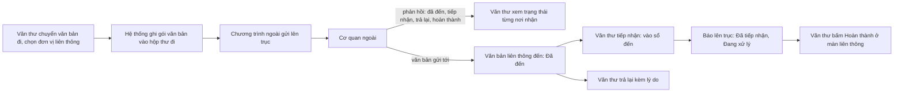

# Liên thông văn bản — tóm tắt nghiệp vụ cho BA

> Bản đọc nhanh bằng lời nghiệp vụ. Chi tiết và bằng chứng: [nghiep-vu.md](nghiep-vu.md) (mã NV / BR trong ngoặc
> để tra). Cập nhật: 2026-10-02 · Nguồn: code `kha_develop` + DB DEV. Nhãn quy tắc: **[Đã xác nhận]** = chủ dự án đã
> chốt là đúng ý đồ · **[Hiện trạng]** = hệ thống đang chạy như vậy, chưa ai xác nhận là ý đồ · **[Lệch nghiệp vụ]**
> = đã xác nhận nghiệp vụ muốn khác, hệ thống đang làm sai.

## 1. Phân hệ này dùng để làm gì

Phân hệ đưa văn bản ra khỏi và vào hệ thống qua các "trục", để trao đổi với đơn vị không nằm trong cây tổ chức của mình (1.1, NV-01).
Có ba kênh: **(A) trục liên thông với cơ quan ngoài** (nhận diện bằng mã định danh trong *Danh mục đơn vị liên thông*); **(B) liên thông nội bộ liên hệ thống** với đơn vị thuộc hệ thống khác cùng nền tảng; **(C) nhiệm vụ qua trục nội bộ** (1.1).
Hệ thống **không tự gửi lên trục**: nó chỉ ghi văn bản cần gửi vào một "hộp thư đi"; một chương trình bên ngoài đọc, gửi đi, rồi ghi kết quả, phản hồi và văn bản đến ngược lại (NV-01, X7).
Văn thư theo dõi văn bản đi / đến qua trục ở màn *Văn bản liên thông*, tiếp nhận văn bản từ trục thành văn bản đến, trả lại, báo hoàn thành, thu hồi văn bản đã gửi (NV-04…NV-07).

**Không gồm:** popup chuyển văn bản, chọn nơi nhận liên thông, kiểm "phải có số ký hiệu và file" (xem `van-ban/chuyen-van-ban`); ban hành, cấp số, cờ "Phát hành bên ngoài" (xem `van-ban/di`); hộp Chờ tiếp nhận, form vào sổ, hoàn thành / trả lại văn bản đến (xem `van-ban/den`); nghiệp vụ nhiệm vụ (xem `nhiem-vu`); gửi SMS (xem `lich-nhac-viec`); nhập mã định danh cho đơn vị trong cây tổ chức (xem `he-thong`); các tích hợp khác không phải trục văn bản (xem `tich-hop`) (1.1).

## 2. Ai dùng và được làm gì

| Vai trò | Được làm gì trong phân hệ này |
|---|---|
| Văn thư đơn vị nhận (`VT`) | Xem tab *Văn bản đến* của màn Văn bản liên thông với văn bản trục phân phối cho đơn vị mình; tiếp nhận vào sổ, trả lại (bắt buộc lý do), bấm Hoàn thành (1.4, NV-06, BR-17) |
| Văn thư đơn vị gửi (`VT`) | Chuyển văn bản đi có nơi nhận liên thông (ở popup chuyển); xem tab *Văn bản đi*, trạng thái từng nơi nhận; thu hồi dòng do đơn vị mình gửi (1.4, NV-03, NV-04, NV-05) |
| Văn thư đơn vị gốc (`VT` tại đơn vị gốc của cây) | Chuyển tiếp văn bản liên thông đến cho đơn vị trong hệ thống; thu hồi bản đã chuyển (1.4, NV-07) |
| Quản trị (`isAdmin`) | Thêm, sửa, xóa danh mục đơn vị liên thông; bấm yêu cầu đồng bộ danh mục (1.4, NV-02) |
| Tài khoản trung chuyển (hệ thống) | Đẩy văn bản, trạng thái, lệnh thu hồi, nhiệm vụ từ hệ thống khác vào hệ thống này; không phải người dùng thật (1.4, NV-09, NV-10) |

Ai được xem màn Văn bản liên thông do một tham số hệ thống quyết định; trên DB DEV tham số đặt "tất cả", nên mọi văn thư xem được (1.4, NV-02).

## 3. Màn hình / menu người dùng thấy

| Menu / màn | Để làm gì | Ghi chú | Mã menu |
|---|---|---|---|
| VĂN BẢN ĐẾN > Văn bản liên thông | Hai tab *Văn bản đến* / *Văn bản đi*: theo dõi, tiếp nhận, trả lại, hoàn thành, chuyển tiếp nội bộ, thu hồi | Tab đến mặc định lọc trạng thái *Đã đến*, 365 ngày gần nhất (NV-04, NV-06) | 338996 |
| Hộp Chờ tiếp nhận (của văn bản đến) | Văn bản trục ở trạng thái *Đã đến* hiện chung với văn bản nội bộ; lọc được "chỉ liên thông" | Menu thuộc `van-ban/den` (NV-06) | — |
| Chi tiết văn bản đi, tab *Đơn vị liên thông* | Xem trạng thái từng nơi nhận ngoài, thu hồi | (NV-04, NV-05) | — |
| Popup chọn nơi nhận liên thông | Hiện trạng thái lần gửi trước tới từng đơn vị | Thuộc popup chuyển văn bản (NV-04) | — |
| QUẢN TRỊ > Đơn vị liên thông | Danh mục cơ quan ngoài trên trục; nút *Đồng bộ* | Chỉ quản trị thấy toolbar (NV-02) | 338995 |
| VĂN BẢN ĐẾN > Văn bản từ VPCP | — | **Mở ra lỗi**: chức năng đã bị gỡ toàn bộ trong code (NV-11, Q9) | 338531 |
| QUẢN TRỊ > Migrate văn bản | — | **Mở ra màn trống**; màn tra cứu văn bản cũ có thật nhưng không có menu (NV-12, Q8) | 439585 |
| VĂN BẢN ĐẾN > Danh sách văn bản trục liên thông | — | Menu **không trỏ màn nào** (1.2, dac-thu L21) | 338991 |
| Trang chủ — ô "Văn bản liên thông" (Chưa gửi, Gửi lỗi, Bị trả lại, Chậm tiếp nhận) | — | **Không hiển thị**: còn khai trong DB nhưng code dựng đã tắt (1.3) | — |

## 4. Luồng chính

**Gửi văn bản đi qua trục (kênh A).**
1. Văn thư chuyển văn bản đã có số ký hiệu và file, chọn đơn vị hoặc nhóm đơn vị liên thông làm nơi nhận (NV-03).
2. Đơn vị liên thông nào trùng mã định danh với một đơn vị đang có trong hệ thống thì được **chuyển nội bộ** thay vì qua trục (BR-06).
3. Đơn vị gửi phải có mã định danh và mã đó có trong danh mục đơn vị liên thông; văn bản phải có ngày ban hành. Không thỏa thì web báo "Chuyển liên thông không thành công do đơn vị chưa cấu hình hoặc sai mã định danh" (BR-08, NV-03 bước 4).
4. Hệ thống ghi một gói văn bản kèm toàn bộ file, mỗi nơi nhận một dòng; lần chuyển lặp lại tới cùng đơn vị được đánh dấu "cập nhật". Văn bản sang *Đã ban hành* (NV-03 bước 5–7, BR-09).
5. Chương trình ngoài gửi gói lên trục và ghi lại kết quả gửi, phản hồi của nơi nhận; văn thư xem ở tab *Văn bản đi* hoặc tab *Đơn vị liên thông* của chi tiết văn bản (NV-04, BR-01).

**Nhận văn bản từ trục (kênh A).**
6. Văn bản cơ quan ngoài gửi tới được chương trình ngoài ghi sẵn, phân phối cho đơn vị nhận, trạng thái *Đã đến*. Văn thư đơn vị nhận thấy ở màn Văn bản liên thông và ở hộp Chờ tiếp nhận (NV-06).
7. *Tiếp nhận*: mở form nhập văn bản đến đã điền sẵn thông tin; văn thư có thể sửa rồi lưu. Lưu xong văn bản vào sổ đến, hệ thống báo lên trục liền hai trạng thái *Đã tiếp nhận* rồi *Đang xử lý* (NV-06, BR-16, BR-19).
8. *Trả lại*: nhập lý do (tối đa 1.000 ký tự), trạng thái *Từ chối* được báo lên trục (NV-06, BR-21).
9. *Hoàn thành*: văn thư bấm ở màn Văn bản liên thông để báo *Đã hoàn thành* cho cơ quan gửi (NV-06, BR-18).

**Các mảng khác (mô tả ngắn).**
- *Thu hồi văn bản đã gửi trục*: văn thư đơn vị gửi bấm Thu hồi trên từng nơi nhận. Gói chưa kịp gửi thì chỉ đổi thành *Đã thu hồi*; gói đã gửi thì tạo yêu cầu thu hồi, nơi nhận trả lời đồng ý / từ chối (NV-05).
- *Chuyển tiếp nội bộ*: văn thư đơn vị gốc phân phối văn bản liên thông đến (đã tiếp nhận / đang xử lý / đã hoàn thành) cho đơn vị trong hệ thống; văn thư đơn vị nhận được gửi SMS; thu hồi được bản đã chuyển (NV-07).
- *Liên thông với hệ thống khác cùng nền tảng (kênh B)*: chuyển văn bản cho đơn vị thuộc hệ thống khác, hai bên báo trạng thái tiếp nhận / chuyển xử lý / hoàn thành / trả lại cho nhau; văn bản từ hệ thống khác vào hộp Chờ tiếp nhận như văn bản nội bộ (NV-08, NV-09).
- *Nhiệm vụ qua trục nội bộ (kênh C)*: giao, sửa, xóa, cập nhật / duyệt tiến độ, đóng, thảo luận nhiệm vụ của đơn vị thuộc hệ thống khác được đồng bộ sang hệ thống đó (NV-10).
- *Migrate văn bản*: tra cứu 306 văn bản chuyển từ hệ thống cũ, chỉ đọc; hiện không có đường vào qua menu (NV-12).

## 5. Trạng thái

**Trạng thái xử lý văn bản liên thông đến** (báo lên trục; mỗi lần đổi là một dòng lịch sử mới)

| Trạng thái (tên người dùng thấy) | Nghĩa | Chuyển sang khi nào | Giá trị |
|---|---|---|---|
| Đã đến | Văn bản đã về, chờ văn thư tiếp nhận | Chương trình ngoài ghi văn bản đến (NV-06) | 1 |
| Từ chối (bị trả lại) | Văn thư trả lại cho cơ quan gửi | Bấm Trả lại (NV-06, BR-21) | 2 |
| Đã tiếp nhận | Đã vào sổ thành văn bản đến | Lưu form tiếp nhận (BR-16) | 3 |
| Phân công | Hiển thị như *Đang xử lý* | — (3. bảng giá trị) | 4 |
| Đang xử lý | Đã tiếp nhận, đang xử lý | Ghi ngay sau *Đã tiếp nhận* (BR-16) | 5 |
| Đã hoàn thành | Đơn vị nhận đã xong | Bấm Hoàn thành ở màn liên thông; hoặc tiếp nhận văn bản trùng đã hoàn thành (BR-18, NV-06) | 6 |

**Trạng thái từng nơi nhận của văn bản đi** (tab Văn bản đi / Đơn vị liên thông)

| Trạng thái (tên người dùng thấy) | Nghĩa | Chuyển sang khi nào | Giá trị |
|---|---|---|---|
| Chưa gửi | Gói nằm ở hộp thư đi, chương trình ngoài chưa báo đã gửi | Vừa chuyển văn bản (NV-04) | — |
| Đã gửi | Đã lên trục, chưa có phản hồi | Chương trình ngoài báo gửi thành công (NV-04) | — |
| Gửi lỗi | Gửi lên trục thất bại | Chương trình ngoài báo lỗi (NV-04) | — |
| Nhãn phản hồi: Đã đến chờ tiếp nhận / Bị trả lại / Đã tiếp nhận / Đã tiếp nhận đang xử lý / Đã hoàn thành | Phản hồi mới nhất của nơi nhận | Nơi nhận báo về qua trục (NV-04) | 1 / 2 / 3 / 5 / 6 |
| Đang gửi yêu cầu thu hồi · Gửi yêu cầu thu hồi thất bại · đồng ý / từ chối lấy lại | Tiến trình của yêu cầu thu hồi | Văn thư thu hồi gói đã gửi; nơi nhận trả lời (NV-05) | yêu cầu 4 · trả lời 15 / 16 |
| Đã thu hồi | Gói bị rút khi chưa kịp gửi | Văn thư thu hồi gói chưa gửi / gửi lỗi (NV-05) | 44 |

**Loại nghiệp vụ của gói tin** (cột "Trạng thái VB" ở tab Văn bản đến — chỉ là nhãn)

| Loại | Nghĩa | Ảnh hưởng | Giá trị |
|---|---|---|---|
| Mới | Văn bản gửi lần đầu | — | 0 |
| Thu hồi | Cơ quan gửi thu hồi văn bản | Chỉ hiện nhãn, không tự thu hồi văn bản đã vào sổ (BR-20) | 1 |
| Cập nhật | Gửi lại văn bản đã gửi | Chỉ hiện nhãn (BR-20) | 2 |
| Thay thế | Thay văn bản đã gửi | Chỉ hiện nhãn (BR-20) | 3 |

## 6. Quy tắc quan trọng nhất

- [Đã xác nhận] Việc gửi / thu hồi lên trục và nhận văn bản từ trục chạy ở **chương trình ngoài hệ thống**; hệ thống chỉ ghi và đọc dữ liệu chờ gửi. Hệ thống không biết văn bản đã tới trục hay chưa cho tới khi chương trình ngoài báo lại (NV-01, BR-01, X7).
- [Đã xác nhận] Cờ "Phát hành bên ngoài" của văn bản đi chỉ là thông tin, không kích hoạt gửi liên thông (1.1, X8).
- [Hiện trạng] Gửi qua trục bắt buộc: đơn vị gửi có mã định danh nằm trong danh mục đơn vị liên thông, văn bản có ngày ban hành, có số ký hiệu và file (BR-08, NV-03).
- [Hiện trạng] Đơn vị liên thông trùng mã định danh với đơn vị đang có trong hệ thống được chuyển nội bộ thay vì qua trục; riêng một số nhánh đơn vị cấu hình sẵn thì nhận **hai bản** — nội bộ và qua trục, chỉ với văn bản thường (BR-06, BR-07, Q7).
- [Hiện trạng] Mỗi lần chuyển là một gói gửi mới; chuyển lại tới đơn vị đã nhận được đánh dấu "cập nhật" (BR-09).
- [Hiện trạng] Văn bản liên thông đến chỉ hiện với văn thư của đơn vị được phân phối văn bản (BR-17).
- [Hiện trạng] Tiếp nhận luôn báo liền *Đã tiếp nhận* rồi *Đang xử lý*; form tiếp nhận không khóa trường nào, văn thư sửa được dữ liệu trước khi lưu (BR-16, BR-19).
- [Hiện trạng] Hoàn thành văn bản đến tạo từ văn bản liên thông **không** tự báo *Đã hoàn thành* cho cơ quan gửi — văn thư phải bấm Hoàn thành ở màn Văn bản liên thông (BR-18, Q3).
- [Hiện trạng] Cơ quan ngoài gửi văn bản cập nhật / thu hồi / thay thế: hệ thống chỉ hiện nhãn, không tự thay hay thu hồi văn bản đến đã vào sổ (BR-20, Q4).
- [Hiện trạng] Thu hồi trên trục độc lập với hủy ban hành và thu hồi trong hệ thống: hủy ban hành không tạo yêu cầu thu hồi trên trục (BR-13).
- [Hiện trạng] Bản văn thư đơn vị gốc chuyển tiếp nội bộ **không vào hộp Chờ tiếp nhận** của đơn vị nhận, và tiếp nhận / trả lại bản này không được báo lên trục dù hệ thống báo thành công (BR-22, Q5).
- [Hiện trạng] Kênh hệ thống khác: bên nhận chỉ nhận văn bản mới, trạng thái và lệnh thu hồi; việc bên gửi sửa, xóa, khóa, thêm ý kiến chỉ đạo sau đó không được áp vào bản bên nhận (BR-28, Q2).
- [Hiện trạng] Hệ thống khác thu hồi văn bản: chỉ bản của **đơn vị** nhận chuyển sang *Đã thu hồi*; các bản đơn vị đã chuyển cho cán bộ vẫn còn (BR-29, Q10).
- [Hiện trạng] Hệ thống khác báo hoàn thành: hệ thống gửi hoàn thành dòng của đơn vị nhận mà **không kiểm nhắc việc** (NV-09).
- [Hiện trạng] Đơn vị liên thông có mã chứa "W00" bị ẩn khi chọn nơi nhận, chỉ hiện ở màn quản trị danh mục (BR-05, Q6).

## 7. Hệ thống KHÔNG làm / hay bị hiểu nhầm

- **Không có chương trình gửi trục trong hệ thống.** Đừng viết yêu cầu kiểu "hệ thống gửi lại sau 5 lần lỗi" mà không nói rõ phần đó do chương trình ngoài làm (NV-01, BR-12, dac-thu bẫy 2).
- **"Liên thông nội bộ" có hai nghĩa:** văn thư đơn vị gốc phân phối văn bản từ trục cho đơn vị trong hệ thống (NV-07), hoặc trao đổi với hệ thống khác cùng nền tảng (NV-08). **"Thu hồi" có bốn nghĩa**: yêu cầu lấy lại văn bản đã gửi trục, gỡ bản phân phối nội bộ, lệnh thu hồi từ hệ thống khác, và loại nghiệp vụ "thu hồi" do cơ quan ngoài gửi (dac-thu bẫy 1).
- **Trạng thái gửi trên DEV không đúng thực tế:** dữ liệu kết quả gửi trên DEV trống nên mọi nơi nhận hiện "Chưa gửi", mọi lần thu hồi chỉ đổi thành *Đã thu hồi* mà không tạo yêu cầu. Cần đối chiếu môi trường thật trước khi kết luận lỗi (BR-12a, dac-thu L20).
- **Thu hồi một dòng không gửi lý do** đã nhập; thu hồi nhiều dòng thì gửi (BR-14).
- **Nút "Tạo văn bản trình ký" không bao giờ hiện; nút "Tạo văn bản" bấm không chạy** (NV-06, dac-thu L8).
- **Không có SMS / thông báo khi văn bản từ trục về** — văn thư tự xem hộp Chờ tiếp nhận hoặc màn liên thông (NV-06 tích hợp). Chỉ có SMS khi văn thư đơn vị gốc chuyển tiếp nội bộ (NV-07).
- **Danh mục đơn vị liên thông không phải nhập tay:** hơn 123 nghìn cơ quan, được đồng bộ từ trục; nút *Đồng bộ* chỉ bật cờ yêu cầu cho chương trình ngoài (NV-02).
- **Xóa một đơn vị liên thông xóa luôn mọi đơn vị con** trong danh mục (BR-04).
- **Văn bản migrate:** ai mở được màn thì thấy toàn bộ văn bản cũ, không lọc theo đơn vị (BR-32, Q8).
- **"Văn bản từ VPCP" và ô trang chủ "Văn bản liên thông" không còn chạy** dù menu / ô còn khai (NV-11, 1.3).

## 8. Liên quan phân hệ khác

| Khi thay đổi ở đây… | …phải xem thêm | Vì sao |
|---|---|---|
| Gửi văn bản đi qua trục, chọn nơi nhận liên thông | `van-ban/chuyen-van-ban` | Popup chuyển, kiểm số ký hiệu / file, ghi bản nội bộ nằm ở đó; đóng gói trục có ba bản (chuyển một văn bản, chuyển nhiều văn bản, tự động chuyển nơi nhận dự kiến) (NV-03, dac-thu bẫy 6) |
| Tiếp nhận, trả lại, hoàn thành văn bản liên thông | `van-ban/den` | Văn bản trục vào chung hộp Chờ tiếp nhận, dùng form vào sổ đến; hoàn thành / trả lại từ hệ thống khác chạy nghiệp vụ văn bản đến (NV-06, BR-30) |
| Ban hành, hủy ban hành, số ký hiệu | `van-ban/di` | Gửi trục đặt văn bản sang *Đã ban hành*; mã văn bản trên trục ghép từ số ký hiệu — đổi số ký hiệu sau khi gửi thì lần gửi sau không còn là "cập nhật" (NV-03, BR-13, dac-thu bẫy 4) |
| Sổ đến khi tiếp nhận | `van-ban/so-van-ban` | Văn bản liên thông vào sổ đến như văn bản tiếp nhận (NV-06) |
| Nhiệm vụ của đơn vị hệ thống khác | `nhiem-vu` | Mọi thao tác giao / sửa / tiến độ / đóng nhiệm vụ sinh gói đồng bộ (NV-10) |
| SMS khi chuyển tiếp nội bộ; nhắc việc khi hoàn thành | `lich-nhac-viec` | SMS loại "nhận văn bản"; hoàn thành do hệ thống khác báo về bỏ qua kiểm nhắc việc (NV-07, NV-09) |
| Mã định danh, mã hệ thống của đơn vị | `he-thong` | Đơn vị gửi / nhận nhận diện bằng mã định danh khai ở cây tổ chức (NV-01) |

## 9. Câu hỏi nghiệp vụ còn mở

- `Q1` — Trục đang kết nối thật là trục quốc gia (VPCP), trục LGSP tỉnh Khánh Hòa hay cả hai; danh mục đơn vị liên thông lấy từ trục hay nhập tay?
- `Q2` — Hệ thống bên kia của kênh liên hệ thống là hệ thống nào; bên gửi sửa / xóa văn bản thì bên nhận có cần cập nhật theo?
- `Q3` — Báo hoàn thành cho cơ quan gửi để văn thư tự bấm hay phải tự động khi hoàn thành văn bản đến?
- `Q4` — Nhận lệnh thu hồi / thay thế từ cơ quan ngoài: văn thư xử lý tay hay hệ thống tự thu hồi / thay văn bản đã vào sổ?
- `Q5` — Văn bản liên thông về thẳng đơn vị nhận hay về một đầu mối rồi phân phối; nếu phân phối thì bản phân phối có cần báo trạng thái lên trục?
- `Q6` — Đơn vị mã chứa "W00" là loại đơn vị gì?
- `Q7` — Các nhánh đơn vị nhận hai bản (nội bộ và qua trục) là đơn vị nào, vì sao?
- `Q8` — Văn bản migrate còn cần tra cứu không; nếu cần thì ai được xem?
- `Q9` — "Văn bản từ VPCP" đã ngừng hẳn (khóa menu) hay sẽ làm lại?
- `Q10` — Thu hồi từ hệ thống khác có cần thu hồi luôn các bản đã chuyển cho cán bộ trong đơn vị nhận?

(Đầy đủ ở mục 7.1 của `nghiep-vu.md`.)

## 10. Khi viết yêu cầu mới cho phân hệ này, nhớ ghi rõ

- **Kênh nào:** trục cơ quan ngoài, liên thông với hệ thống khác cùng nền tảng, hay nhiệm vụ qua trục — ba kênh dùng dữ liệu và luồng khác nhau (1.1).
- **Phần nào trong hệ thống, phần nào ở chương trình ngoài:** gửi, gửi lại khi lỗi, đồng bộ danh mục đều do chương trình ngoài làm; yêu cầu chỉ trong hệ thống thì phải nói rõ hệ thống ghi gì cho chương trình ngoài đọc (NV-01, X7).
- **"Liên thông nội bộ" và "thu hồi" theo nghĩa nào** — dùng đúng tên ở mục 7 (dac-thu bẫy 1).
- **Áp dụng cho luồng chuyển nào:** chuyển một văn bản, chuyển nhiều văn bản, hay tự động chuyển nơi nhận dự kiến từ dự thảo (dac-thu bẫy 6).
- **Đơn vị trùng mã định danh với đơn vị trong hệ thống** xử lý thế nào: chuyển nội bộ, qua trục, hay cả hai (BR-06, BR-07).
- **Có báo trạng thái lên trục không, trạng thái nào, vào lúc nào** — đặc biệt hoàn thành văn bản đến và bản phân phối nội bộ (BR-16, BR-18, BR-22).
- **Văn bản đến từ trục có được sửa khi tiếp nhận không**, và xử lý văn bản trùng văn bản đã có (BR-19, NV-06).
- **Văn bản cập nhật / thu hồi / thay thế từ nơi gửi** thì hệ thống tự làm gì hay chỉ hiện nhãn (BR-20, BR-28).
- **Ai thấy, ai thao tác:** văn thư đơn vị nhận, đơn vị gửi, đơn vị gốc, quản trị; và tham số giới hạn đơn vị được xem màn liên thông (1.4, NV-02).
- **Có gửi SMS / thông báo không, cho ai** — hiện chỉ có SMS khi chuyển tiếp nội bộ (NV-06, NV-07).
