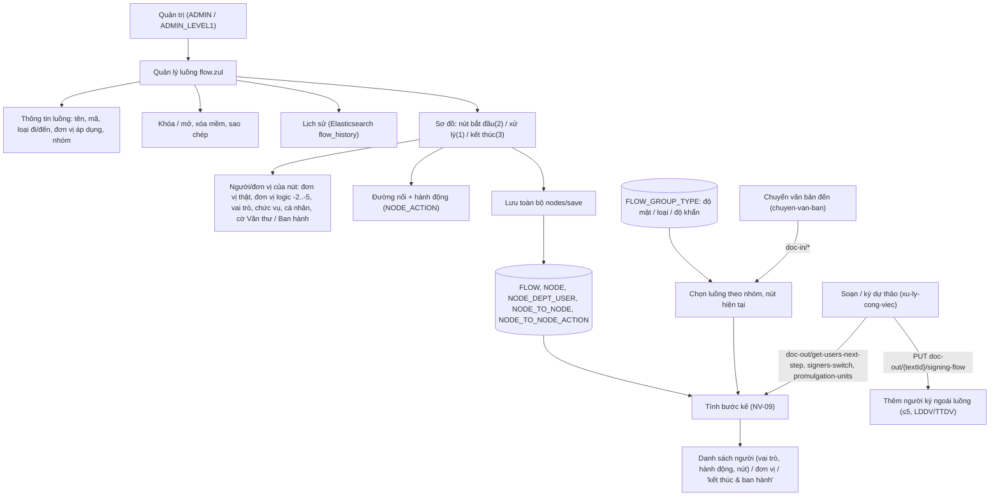
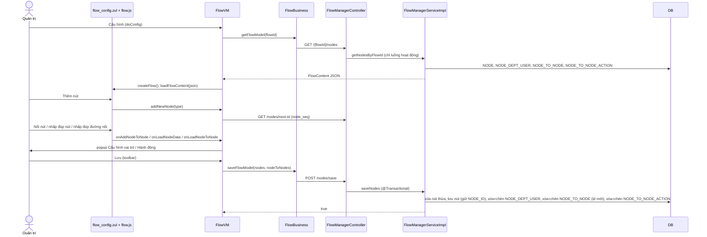
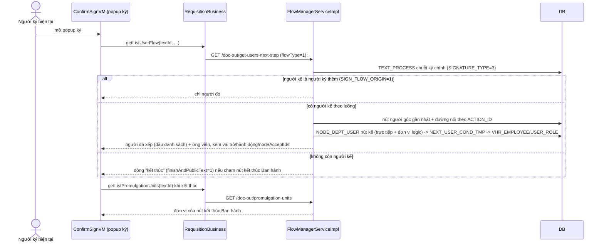
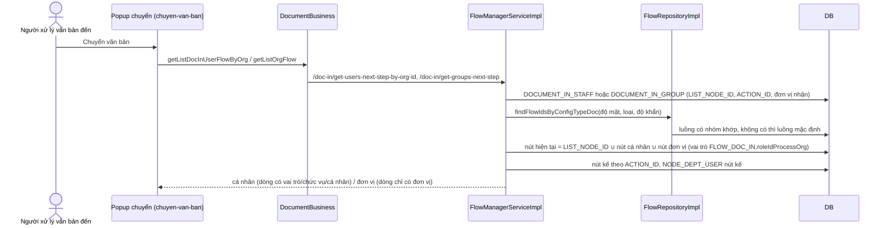
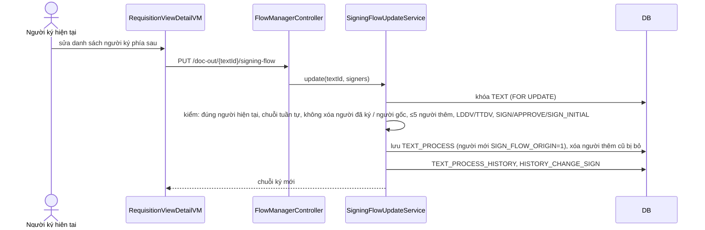
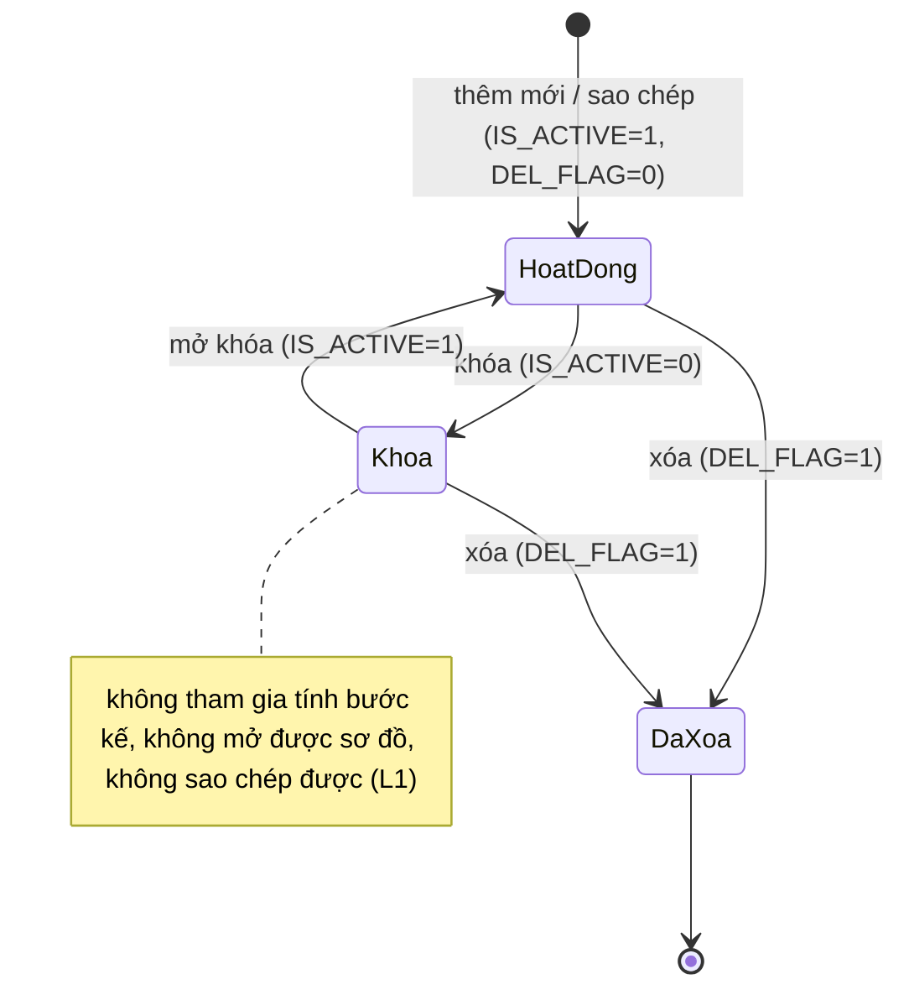
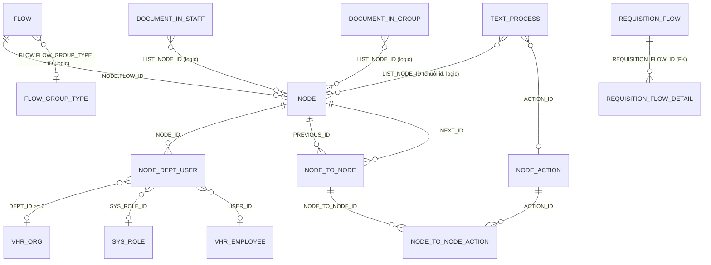

# Luồng xử lý / luồng ký — nghiệp vụ: quản trị cấu hình luồng (luồng → nút → người/đơn vị theo nút → đường nối có hành động) và quy tắc hệ thống dùng cấu hình đó để gợi ý "người / đơn vị ở bước kế tiếp" cho văn bản đi và văn bản đến

> Viết lại từ code nhánh `kha_develop` (web-spring + backend2.0) ngày 2026-10-01. Mọi khẳng định có nguồn `file:dòng`.
> Hai repo đang checkout nhánh `at/merge/kha_develop_01102026`; các file khác `kha_develop` (`FlowManagerServiceImpl`, `RequisitionBusiness`, `DocumentBusiness`, `DocumentDraftVM`, `ConfirmSignVM`, `AppConstants`, `DocumentSignController`…) được đọc bằng `git show kha_develop:<path>` — số dòng trích là số dòng trên `kha_develop`.
> Menu, số dòng, comment cột và phân bố giá trị đối chiếu **DB DEV ngày 2026-10-01** (người điều phối tra, chỉ SELECT; tác giả không kết nối DB). HDSD cũ (`C:\Users\Admin\Desktop\HDSD\**`) **không có tài liệu nào về Quản lý luồng** (đã tìm trong HDSD văn bản đến / văn bản đi / hồ sơ / ký điện tử).
>
> Viết tắt đường dẫn:
> `WEB/` = `web-spring/src/main/java/com/viettel/` · `ZUL/` = `web-spring/src/main/webapp/view/voffice/` · `JS` = `web-spring/src/main/webapp/js/flow/flow.js` ·
> `BIZ/` = `web-spring/src/main/java/com/voffice/service/business/` · `BE1/` = `backend2.0/backendvoffice/src/main/java/com/viettel/voffice/` ·
> `BE2/` = `backend2.0/backendvoffice/src/main/java/com/viettel/office/`.
> Lớp hay dùng: **FVM** = `WEB/voffice/vm/flow/FlowVM.java` · **FCNVM** = `WEB/voffice/vm/flow/FlowConfigNodeVM.java` · **FCAVM** = `WEB/voffice/vm/flow/FlowConfigActionVM.java` · **FB** = `BIZ/FlowBusiness.java` · **RB** = `BIZ/RequisitionBusiness.java` · **DOCB** = `BIZ/DocumentBusiness.java` · **CSVM** = `WEB/voffice/widget/ConfirmSignVM.java` · **AC** = `WEB/util/AppConstants.java`.
> BE (gen-2): **FMC** = `BE2/controller/FlowManagerController.java` · **FMSI** = `BE2/services/impl/FlowManagerServiceImpl.java` · **FRI** = `BE2/repositories/impl/FlowRepositoryImpl.java` · **NRJ** = `BE2/repositories/jpa/NodeRepositoryJPA.java` · **NRI** = `BE2/repositories/impl/NodeRepositoryImpl.java` · **NDURJ** = `BE2/repositories/jpa/NodeDeptUserRepositoryJPA.java` · **NTNRJ** = `BE2/repositories/jpa/NodeToNodeRepositoryJPA.java` · **NTNARJ** = `BE2/repositories/jpa/NodeToNodeActionRepositoryJPA.java` · **VERI** = `BE2/repositories/impl/VhrEmployeeRepositoryImpl.java` · **PBRI** = `BE2/repositories/impl/PermissionBaseRepositoryImpl.java` · **SFUS** = `BE2/services/SigningFlowUpdateService.java` · **C2** = `BE2/utils/Constants.java`.
> Phân hệ liền kề đã viết (trỏ sang, không viết lại): dự thảo / trình ký / ký duyệt ở [`../../xu-ly-cong-viec/nghiep-vu.md`](../../xu-ly-cong-viec/nghiep-vu.md) (ký hiệu `XLCV NV-xx / BR-xx`), chuyển văn bản ở [`../chuyen-van-ban/nghiep-vu.md`](../chuyen-van-ban/nghiep-vu.md) (`CVB NV-xx`), văn bản đến ở [`../den/nghiep-vu.md`](../den/nghiep-vu.md), phiếu trình ở [`../../phieu-trinh/nghiep-vu.md`](../../phieu-trinh/nghiep-vu.md).

## 1. Tổng quan

### 1.1 Phạm vi

"Luồng" là **cấu hình trong DB** mô tả *ai được chuyển / trình cho ai, bằng hành động gì*. Một luồng (`FLOW`) gồm các **nút** (`NODE`: nút bắt đầu, nút xử lý, nút kết thúc), mỗi nút gắn một tập **người / đơn vị / vai trò / chức vụ** (`NODE_DEPT_USER`), các nút nối với nhau bằng **đường nối** (`NODE_TO_NODE`) và mỗi đường nối mang một hoặc nhiều **hành động** (`NODE_TO_NODE_ACTION` → danh mục `NODE_ACTION`: trình ký, ký duyệt, phê duyệt, ký nháy, chuyển xử lý…). Luồng có hai loại theo `FLOW.FLOW_TYPE`: **1 = văn bản đi** (luồng trình ký dự thảo), **2 = văn bản đến** (luồng chuyển xử lý) (`FMC:137`, `205`; web `FVM:58-64`; nhãn `zk-label_vi.properties:1562-1563`).

Luồng **không được "chọn" theo tên** khi xử lý: hệ thống suy ra luồng từ **vị trí của người dùng trong các nút** (người đó thuộc nút nào, qua đơn vị / vai trò / chức vụ / cá nhân) và từ **nút đã lưu trên bản ghi luân chuyển** (`TEXT_PROCESS.LIST_NODE_ID`, `DOCUMENT_IN_STAFF/GROUP.LIST_NODE_ID`), rồi đi theo đường nối có hành động tương ứng để ra danh sách người / đơn vị hợp lệ ở bước kế tiếp (NV-09). Riêng văn bản đến có thêm **nhóm luồng** (`FLOW_GROUP_TYPE`) lọc luồng theo độ mật / loại / độ khẩn của văn bản (NV-08).

Phân hệ gồm:

- **Màn Quản lý luồng** (menu QUẢN TRỊ › "Quản lý luồng"): danh sách, tìm kiếm, thêm / sửa thông tin luồng, khóa / mở, xóa, sao chép, lịch sử thay đổi (NV-01 → NV-03, NV-07).
- **Thiết kế sơ đồ luồng** trên canvas: thêm nút, nối nút, cấu hình người / đơn vị của nút, cấu hình hành động của đường nối, lưu cả đồ thị (NV-04 → NV-06).
- **Nhóm luồng** và cách chọn luồng cho văn bản đến (NV-08).
- **Quy tắc tính bước kế tiếp** dùng chung (NV-09) và các API dùng cấu hình: văn bản đi — người ký tiếp, đổi người ký, đơn vị ban hành, văn thư xét duyệt theo nút (NV-10); cập nhật luồng ký tuần tự / thêm người ký ngoài luồng (NV-11); văn bản đến — người / đơn vị nhận ở bước kế, trình xem xét, chuyển nhiều văn bản (NV-12).
- Endpoint tiện ích / không dùng (NV-13); **luồng trình ký cũ `REQUISITION_FLOW`** (legacy web, không còn đường vào) và sơ đồ người ký `FlowChartVM` (không phải cấu hình luồng) (NV-14).

Phân hệ **KHÔNG gồm** (trỏ sang):

| Nội dung | Phân hệ |
|---|---|
| Soạn dự thảo, chọn người xử lý khi soạn (giao diện bandbox), trình ký, ký nháy / ký duyệt / phê duyệt, chuyển người ký kế (`nextSigner`, `HISTORY_CHANGE_SIGN`), văn thư xét duyệt, trả lại | `xu-ly-cong-viec` (`XLCV NV-07`, `XLCV NV-08`, `XLCV NV-10`, `XLCV BR-23`, `XLCV BR-42`) |
| Popup chuyển văn bản đến theo luồng / tự do, phạm vi chọn, cờ `VHR_ORG.DOC_IN_CONFIG_TYPE`, ghi `DOCUMENT_IN_STAFF/GROUP` khi chuyển | `van-ban/chuyen-van-ban` (`CVB NV-03`, `NV-05`, `NV-07`, `NV-16`) |
| Danh sách "người luôn nhận văn bản sau tiếp nhận" (cấu hình tự động chuyển — endpoint `*-show` chỉ đọc cấu hình đó, không dùng luồng) | `van-ban/chuyen-van-ban` (`CVB NV-06`) |
| Cấp số / ban hành sau khi người ký cuối ký, đơn vị ban hành `OFFICE_PUBLISHED_*` | `van-ban/di` |
| Phiếu trình (luồng do người trình tự chọn, **không dùng FLOW**) | `phieu-trinh` (`NV-03`, câu X10) |

### 1.2 Menu (đối chiếu DB DEV `SYS_MENU` ngày 2026-10-01)

`SYS_MENU.STATUS`: 1 = mở khóa, 2 = khóa (đã xác nhận). Code chỉ tham chiếu mã / URL zul; tên menu nằm ở DB.

| `SYS_MENU_ID` | `CODE` | Tên (DB DEV) | URL | Cha | `STATUS` / `DEL_FLAG` | VM |
|---|---|---|---|---|---|---|
| 439335 | `FA-COG` | **Quản lý luồng** | `/view/voffice/flow/flow.zul` | 336812 QUẢN TRỊ | 1 / 0 | FVM (NV-01) |

Không có dòng `SYS_MENU` nào có URL chứa `requisitionflow` (màn luồng trình ký cũ — NV-14) (DB DEV `SYS_MENU` ngày 2026-10-01). Phân hệ **không có widget trang chủ** (đối chiếu DB DEV `HOME_WIDGET` ngày 2026-10-01: không mã nào liên quan luồng).

### 1.3 Actor & quyền

Quyền thao tác của hệ thống nằm ở **tầng hiển thị nút / menu** trên web (thiết kế chung, đã xác nhận); BE phân hệ này kiểm thêm ở hai chỗ ghi rõ dưới.

| Actor | Nhận diện trong code | Làm gì |
|---|---|---|
| Quản trị luồng | được phân quyền menu `FA-COG`; BE `get-list-flow` **chỉ trả dữ liệu khi người gọi có vai trò `ADMIN` hoặc `ADMIN_LEVEL1`** ở ít nhất một đơn vị, nếu không ném `FORBIDDEN` (`FMSI:119-136`); danh sách giới hạn trong cây các đơn vị đó (`FRI:51-59`). Cây chọn đơn vị trên web cũng lấy gốc từ vai trò `ADMIN` / `ADMIN_LEVEL1` (`FVM:360`; `FCNVM:159`, `225`; mã vai trò ở `web-spring/src/main/resources/application.properties:344-345`) | Thêm / sửa / khóa / xóa / sao chép luồng, vẽ sơ đồ, cấu hình nút và hành động, xem lịch sử |
| Người soạn / người ký dự thảo (văn bản đi) | người thuộc nút bắt đầu (`NODE.TYPE = 2`) hoặc nút đang giữ trên `TEXT_PROCESS.LIST_NODE_ID` | Nhận danh sách người ký kế tiếp, đơn vị ban hành; người đang tới lượt được **cập nhật luồng ký** (BE kiểm đúng người — NV-11) |
| Người xử lý văn bản đến | người thuộc nút ghi trên `DOCUMENT_IN_STAFF/GROUP.LIST_NODE_ID`, hoặc được cấu hình theo vai trò / chức vụ / cá nhân tại đơn vị nhận, hoặc có vai trò "xử lý thay đơn vị" (tham số `FLOW_DOC_IN.roleIdProcessOrg` = `336954` **Văn thư** — DB DEV `SYSTEM_PARAMETER` ngày 2026-10-01) khi đơn vị nhận được cấu hình nguyên đơn vị | Nhận danh sách cá nhân / đơn vị được chuyển tiếp (NV-12) |

### 1.4 Sửa so với knowledge cũ (2026-10-01)

| Knowledge cũ | Hiện trạng code `kha_develop` | Ghi ở |
|---|---|---|
| "`FlowManagerController` 45 endpoint" | **42** endpoint (`FMC:38-392`) | Mục 2 |
| "Luồng do admin / văn thư đơn vị thiết lập" | Màn nằm dưới QUẢN TRỊ; BE chỉ cho người có vai trò `ADMIN` / `ADMIN_LEVEL1` (`FMSI:129-136`) (sửa 2026-10-01) | 1.3 |
| "Luồng dùng cho văn bản đến, văn bản đi, phiếu trình" | Chỉ hai loại: 1 văn bản đi, 2 văn bản đến. Phiếu trình **không dùng FLOW** (`phieu-trinh` X10) (sửa 2026-10-01) | 1.1 |
| "Nhóm luồng: theo loại văn bản, theo đơn vị (?)" | Nhóm luồng = **bộ tiêu chí độ mật / loại văn bản / độ khẩn** của **văn bản đến**; không khớp nhóm nào thì dùng luồng không gán nhóm (`FRI:105-184`). Comment DB nói "Đảng / Chính quyền" nhưng code không đọc `IS_PARTY` | NV-08; 7.1 Q1 |
| `NODE.TYPE` (comment DB): "1 bắt đầu, 2 trung gian, 3 kết thúc" | Code: **2 = nút bắt đầu, 1 = nút xử lý, 3 = nút kết thúc** (`ZUL/flow/flow_config.zul:22-24`; `NRJ:39-48`; `JS:590-596`) — comment DB **ngược** với code (sửa 2026-10-01) | NV-04, mục 5 |
| "Luồng requisition = bản luồng ký gắn với một dự thảo (snapshot)" | `REQUISITION_FLOW` là **luồng trình ký mẫu** cá nhân / đơn vị / tập đoàn của web cũ, không gắn dự thảo; không còn đường vào, DB DEV 0 dòng. Luồng ký thật của dự thảo lưu ở `TEXT_PROCESS` (sửa 2026-10-01) | NV-14 |
| "`updateSigningFlow` = luồng requisition" | `PUT /doc-out/{textId}/signing-flow` là **cập nhật luồng ký tuần tự** của dự thảo đang ký (thêm tối đa 5 người ký ngoài luồng) (sửa 2026-10-01) | NV-11 |
| "Lịch sử luồng: ai sửa cấu hình khi nào" | Lịch sử ghi vào **Elasticsearch** index `flow_history`, **chỉ ghi thông tin chung của luồng**; ghi nút / cấu hình đang tắt (`FMSI:4514-4516`) (sửa 2026-10-01) | NV-07 |
| "QT1 mã luồng duy nhất" | Đúng ở web (`FVM:404-410`) nhưng sao chép giữ nguyên mã thì lọt kiểm tra (dac-thu L3) | NV-02, NV-03 |
| "QT2 sửa luồng có snapshot hay tham chiếu sống (?)" | **Tham chiếu sống**: bản ghi luân chuyển chỉ lưu `LIST_NODE_ID`; mọi lần tính bước kế đọc lại `NODE*` hiện tại (NV-09 BR-29) | NV-09; 7.1 Q3 |
| "QT3 lọc thêm bởi `check-transfer-free`, hạn mức chuyển" | `check-transfer-free` web **không gọi** (NV-13); hạn mức / tự do thuộc `chuyen-van-ban` | NV-13 |
| "QT4 luồng tập đoàn > đơn vị > cá nhân (?) thứ tự ưu tiên" | Không có thứ tự ưu tiên; DAO chỉ lọc luồng **do chính người dùng tạo** (`WEB/voffice/dao/RequisitionFlowJpaDao.java:26-43`); toàn bộ chuỗi không còn đường vào | NV-14 |
| `dac-thu` cũ: "`api.flow-manager.doc-out` được web gọi nhưng không có endpoint" | Khóa thật là `"api.flow-manager.doc-out." + textId + ".signing-flow"` (`RB:6859`) → `PUT /doc-out/{textId}/signing-flow` **có tồn tại** (`FMC:155-161`); bản đồ tự sinh cắt khóa sai (sửa 2026-10-01) | NV-11; `dac-thu.md` |
| `dac-thu` cũ: "`flow_add.zul`, `flow_search.zul`… 6 zul" | Có 6 zul: `flow.zul`, `flow_search.zul`, `flow_edit.zul`, `flow_config.zul`, `flow_config_node.zul`, `flow_config_action.zul` (không có `flow_add.zul`) | Mục 2 |

## 2. Module

Toàn bộ phân hệ chạy trên **BE gen-2** `FlowManagerController` (`/api/flow-manager`, 42 endpoint — `FMC:28`). Web gọi qua `FB` (quản trị) và `RB` / `DOCB` (phía dùng luồng); khóa `a.b` → URL `/a/b`, path variable ghép chuỗi (`"api.flow-manager." + id + ".nodes"` — `FB:98`). Một số controller gen-1 gọi thẳng service gen-2 `FlowManagerService` để lọc người nhận theo luồng khi chuyển theo nhóm (`BE1/controler/CvGroupController.java:308`, `427`, `446`; `BE1/controler/ConnectVHRController.java:302`) và `VhrEmployeeServiceImpl` lọc lãnh đạo theo luồng (`BE2/services/impl/VhrEmployeeServiceImpl.java:590`).

| Chức năng | Màn (.zul) | VM | Business (key) | Endpoint BE | Service | Repository → bảng |
|---|---|---|---|---|---|---|
| Danh sách / tìm kiếm luồng | `ZUL/flow/flow.zul` (include `flow_search.zul`, `flow_edit.zul`, `flow_config.zul` — `flow.zul:26-34`) | FVM `getDataList` :97-108 | `FB.getListFlow` :56-80 → `api.flow-manager.get-list-flow` | `GET /get-list-flow` (FMC:38) | `FMSI.getListFlow` :119-127 | `FRI.getListFlow` :42-88 → `FLOW` ⋈ `VHR_ORG` |
| Thêm / sửa thông tin luồng | `flow_edit.zul` | FVM `insert` :415-419, `update` :422-433, `validateBusinessDoSave` :399-412 | `FB.createOrUpdate` :30-42, `checkFlowCode` :203-213 | `POST /flow/create-or-update` (FMC:59), `GET /check-flow-code` (FMC:355) | `FMSI.createOrUpdateFlow` :148-182, `checkFlowCode` :513-523 | `FlowRepositoryJPA` → `FLOW` |
| Khóa / mở, xóa | lưới `flow_search.zul:186-199` | FVM `doLock` :468-495, `delete` :458-460 | `FB.toggleActiveFlow` :160-167, `deleteFlow` :151-158 | `POST /toggle-active-flow/{id}` (FMC:92), `POST /delete-flow/{id}` (FMC:81) | `FMSI.toggleActiveFlow` :477-490, `deleteFlow` :186-196 | `FLOW.IS_ACTIVE`, `FLOW.DEL_FLAG` |
| Sao chép luồng | lưới `flow_search.zul:200-203` → form sửa | FVM `doCopy` :498-509, `update` (nhánh `isViewCopy`) :423-424 | `FB.copyFlow` :169-185 | `POST /flow/copy/{flowId}` (FMC:70) | `FMSI.copyFlow` :200-284 | `FLOW`, `NODE`, `NODE_DEPT_USER`, `NODE_TO_NODE`, `NODE_TO_NODE_ACTION` |
| Thiết kế sơ đồ (nút, đường nối) | `flow_config.zul` (canvas + `JS`) | FVM `doConfig` :116-129, `doInitFlow` :132-151, `addNewNode` :164-171, các `on*Node*` :174-332, `update` (nhánh `isViewInfo`) :425-428 | `FB.getFlowModel` :96-108, `getNodeId` :110-117, `saveFlowModel` :44-54 | `GET /{flowId}/nodes` (FMC:123), `GET /nodes/next-id` (FMC:102), `POST /nodes/save` (FMC:113) | `FMSI.getNodesByFlowId` :383-454, `getNextNodeId` :508-510, `saveNodes` :288-380 | `NRJ`, `NDURJ`, `NTNRJ`, `NTNARJ`; sequence `node_seq` (`NRJ:28-37`) |
| Cấu hình người / đơn vị của nút | popup `ZUL/flow/flow_config_node.zul` (`ViewUtil.createLookupConfigNode` — `WEB/voffice/util/ViewUtil.java:3666`) | FCNVM | `FB.getListPosition` :119-133 (`api.manager.get-list-position`), `RB.getLitsUserSignWithRole` | — (lưu cùng `nodes/save`) | — | `NODE_DEPT_USER`, `NODE.SECRETARY` |
| Cấu hình hành động đường nối | popup `ZUL/flow/flow_config_action.zul` (`ViewUtil.java:3660`) | FCAVM | `FB.getListNodeAction` :187-201 | `GET /node-action/get-all/{type}` (FMC:349) | `FMSI.getNodeActions` :1593-1599 | `NODE_ACTION` (lọc `IS_ACTIVE = 1`, `FLOW_TYPE`) |
| Danh mục nhóm luồng | combobox `flow_search.zul:34-48`, `flow_edit.zul:121-135` | FVM ctor :74-82 | `FB.getListFlowGroupType` :135-149 | `GET /flow-group-type/get-all` (FMC:197) | `FMSI.getFlowGroupTypes` :466-473 | `FLOW_GROUP_TYPE` |
| Lịch sử thay đổi luồng | `web-spring/src/main/webapp/view/widgets/flowHistoryLookup.zul` (`ViewUtil.java:768`) | FVM `doViewHistory` :512-516 → `WEB/voffice/widget/FlowHistoryLookupVM.java:151-172` | `FB.getFlowHistories` :249-273 | `GET /get-flow-histories` (FMC:373) | `FMSI.getFlowHistories` :4399-4465, ghi `saveLogFlowHistoryToElasticSearch` :4514-4660 | Elasticsearch index `flow_history`; sequence `FLOW_HISTORY_SEQ` (`BE2/repositories/jpa/FlowRepositoryJPA.java:29-30`) |
| Văn bản đi: người ký tiếp theo (khi soạn / khi ký) | bandbox form dự thảo; popup ký `ConfirmSignVM`, `CreateNoteVM`, `GiveAdviceVM`; màn văn bản đi `DocumentSendSearchVM`, `DocumentTrackSendVM` | `WEB/voffice/vm/documentDraft/DocumentDraftVM.java:9552`; CSVM :759, :806 | `RB.getListUserFlow` :6762-6795 | `GET /doc-out/get-users-next-step` (FMC:134) | `FMSI.getUsersNextStep` :526-544 → `processDraftDocument` :733-795 / `processApprovalDocument` :800-864 | `TEXT_PROCESS`, `NODE*`, `USER_ROLE`, `VHR_EMPLOYEE`, GTT `NEXT_USER_COND_TMP` (`VERI:567-720`) |
| Văn bản đi: đổi người ký | popup ký, `ChangeSignerVM` | CSVM :803 | `RB.getListUserToChangeSigner` :6797-6830 | `GET /doc-out/signers-switch` (FMC:168) | `FMSI.getUsersSignersSwitch` :585-728 | như trên |
| Văn bản đi: danh sách lãnh đạo (cho người ký thêm ngoài luồng) | popup ký | CSVM :798-799 | `RB.getLeaders` :6832-6851 | `GET /doc-out/get-leaders` (FMC:145) | `FMSI.getLeaders` :547-572 | `VhrEmployeeRepository.getLeaders` |
| Văn bản đi: cập nhật luồng ký tuần tự | chi tiết dự thảo | `WEB/voffice/vm/requisition/RequisitionViewDetailVM.java:1449` | `RB.replaceSequentialSigningFlow` :6853-6862 (PUT) | `PUT /doc-out/{textId}/signing-flow` (FMC:155) | `SFUS.update` :81-209 | `TEXT_PROCESS`, `TEXT_PROCESS_HISTORY`, `HISTORY_CHANGE_SIGN` |
| Văn bản đi: đơn vị ban hành | popup ký | CSVM :892 | `RB.getListPromulgationUnits` :6864-6889 | `GET /doc-out/promulgation-units` (FMC:181) | `FMSI.getAllPromulgationUnits` :1608-1683 | `VhrOrgRepositoryJPA.findOrgPromulgateUnitsByNodesEnd` (:283 trên `kha_develop`) |
| Văn bản đến: cá nhân / đơn vị bước kế | popup chuyển văn bản đến (`CVB NV-05`) | `TransferDocumentInVM` … | `DOCB` :5547-5908 (16 hàm) | `GET/POST /doc-in/*` (FMC:203-347) | `FMSI.getDocInParams` :2057-2190, `getEmployeeSendDocsV2` :2502-2704, `getOrgSendDocs` :3670-3744 | `DOCUMENT_IN_STAFF/GROUP`, `DOCUMENT`, `FLOW_GROUP_TYPE`, `NODE*` |
| Văn bản đến: trình xem xét | — | — | `DOCB` :7411, :7428 | `GET /doc-in/consideration/*` (FMC:379-392) | `FMSI.getUsersNextStepConsideration` :4707-4753, `getDocInConsiderationParams` :4756-4868 | như trên |

Entity: `BE2/entities/FlowEntity.java` (`FLOW`), `FlowGroupTypeEntity.java`, `NodeEntity.java`, `NodeActionEntity.java`, `NodeDeptUserEntity.java`, `NodeToNodeEntity.java`, `NodeToNodeActionEntity.java`; legacy web `WEB/voffice/entity/RequisitionFlow.java`, `RequisitionFlowDetail.java`. Số dòng DB DEV ngày 2026-10-01: `FLOW` 54, `FLOW_GROUP_TYPE` 12, `NODE` 179, `NODE_ACTION` 10, `NODE_DEPT_USER` 426, `NODE_TO_NODE` 180, `NODE_TO_NODE_ACTION` 307, `REQUISITION_FLOW` 0, `REQUISITION_FLOW_DETAIL` 0.

## 3. Nghiệp vụ

### Giá trị mã dùng xuyên suốt

| Cột | Giá trị | Nguồn |
|---|---|---|
| `FLOW.FLOW_TYPE` | 1 = văn bản đi · 2 = văn bản đến. DB DEV: 1 = 34, 2 = 18, **null = 2** (giá trị null không do màn web tạo — combobox bắt buộc `flow_edit.zul:67`) | `FMC:137`, `205`; `FVM:58-64`; `FMSI:4536` |
| `FLOW.IS_ACTIVE` | 1 = hoạt động · 0 = không hoạt động (khóa). DB DEV: 1 = 51, 0 = 3 | `C2:417-420`; comment DB |
| `FLOW.DEL_FLAG` | 0 = còn · 1 = đã xóa (xóa mềm). DB DEV: 0 = 34, **1 = 20** | `FMSI:190-192` |
| `FLOW.FLOW_GROUP_TYPE` | **khóa tới `FLOW_GROUP_TYPE.ID`** (code); null = luồng mặc định (không gán nhóm). DB DEV: null = 48, 1 = 6. Comment DB ghi "0 mặc định, 1 Văn bản Đảng, 2 Văn bản Chính quyền" — **khác cách code dùng** | `FRI:128`, `175`; 7.1 Q1 |
| `NODE.TYPE` | **2 = nút bắt đầu · 1 = nút xử lý · 3 = nút kết thúc** (code). DB DEV: 1 = 86, 2 = 49, 3 = 44. Comment DB "1 bắt đầu, 2 trung gian, 3 kết thúc" — sai so với code | `ZUL/flow/flow_config.zul:22-24`; `NRJ:39-48`, `59-65`; `JS:590-596` |
| `NODE.SECRETARY` | 1 = nút **Văn thư** (người ở nút này được văn thư xét duyệt trước khi ký) · 2 = nút **Ban hành** (nút kết thúc dẫn tới cấp số) · null = thường. Cột không có comment DB. DB DEV `NODE` ngày 2026-10-01 (loại × cờ): nút xử lý (1) — Văn thư 10, Ban hành 3, null 73; nút bắt đầu (2) — Văn thư 2, null 47; nút kết thúc (3) — Ban hành 25, null 19. Cờ Ban hành trên nút xử lý không tạo bước "kết thúc & ban hành" (truy vấn đòi `TYPE = 3` — `NRJ:57-60`) nhưng vẫn làm ứng viên mang `secretary = 2` (`FMSI:1285-1288`) | `FCNVM:373-391`; `BE2/services/impl/TextProcessServiceImpl.java:121-135`; `NRJ:57-60` |
| `NODE_DEPT_USER.DEPT_ID` | id đơn vị thật, hoặc **đơn vị logic** tương đối với đơn vị người đang xử lý: −2 đơn vị cha · −3 đơn vị hiện tại · −4 đơn vị con · −5 đơn vị cùng cấp (−1 "tất cả đơn vị" có trong hằng BE nhưng web ẩn và thuật toán bỏ qua). DB DEV `NODE_DEPT_USER` ngày 2026-10-01: −3 = 95, −4 = 33, −2 = 30, −5 = 9 dòng (không có −1) | `C2:422-438`; `FCNVM:56-64`; `FMSI:1413-1462` |
| `NODE_DEPT_USER.SYS_ROLE_ID` / `POSITION_ID` / `USER_ID` | null = mọi vai trò / mọi chức vụ / mọi người tại đơn vị. DB DEV `SYS_ROLE_ID`: null = 220, 336952 "Lãnh đạo" = 129, 336955 "Chuyên viên" = 64, 336954 "Văn thư" = 7, 336871 "Trợ lý" = 6; dòng có `POSITION_ID` = 148 (DB DEV `NODE_DEPT_USER` ngày 2026-10-01) | comment DB; `NRI:63-66` |
| `NODE_ACTION_ID` | **Đã xác nhận (XLCV, 2026-09-30):** 2 ký duyệt `SIGN`, 4 phê duyệt `APPROVE`, 5 ký nháy `SIGN_INITIAL`, 7 chuyển xử lý `SEND_DOC`. Toàn bảng (DB DEV `NODE_ACTION` ngày 2026-10-01; mã — tên — `FLOW_TYPE` — `IS_ACTIVE`): **1** `SUBMIT` Trình ký — 1 — 1 · **2** `SIGN` Ký duyệt — 1 — 1 · **3** `REJECT` Từ chối — 1 — **0** · **4** `APPROVE` Phê duyệt — 1 — 1 · **5** `SIGN_INITIAL` Ký nháy — 1 — 1 · **6** `RETURN_DOC` Trả lại — 2 — 1 · **7** `SEND_DOC` Chuyển xử lý — 2 — 1 · **8** `SEND_APPROVE` Phê duyệt và Trình ký — 1 — 0 · **9** `SEND_SIGN` Ký duyệt và Trình ký — 1 — 0 · **10** `ASK_ADVICE` Xin ý kiến — 1 — 0. Web gửi hành động **1 = Trình ký** cho bước đầu khi soạn (`DocumentDraftVM.java:9552`; `FMSI:687`). Mã `PROOFREADING` đọc soát có trong hằng (`C2:440-448`) nhưng **không có dòng** trong bảng; `RETURN_DOC`, `SEND_APPROVE`, `SEND_SIGN`, `ASK_ADVICE` có trong bảng nhưng không có trong hằng `C2` | `AC:8522-8538`; `XLCV` Q3 |
| `NODE_ACTION.FLOW_TYPE` / `IS_ACTIVE` | 1 văn bản đi / 2 văn bản đến; 1 hoạt động. DB DEV: `FLOW_TYPE` 1 = 8, 2 = 2; `IS_ACTIVE` 1 = 6, **0 = 4** (comment DB ghi "2 = không hoạt động" nhưng dữ liệu là 0). Popup cấu hình đường nối chỉ liệt kê mã đang hoạt động: luồng đi 1, 2, 4, 5; luồng đến 6, 7 | comment DB; `NodeActionRepositoryJPA.java:25` |
| `TEXT.FLOW_ID` (bảng của `xu-ly-cong-viec`) | **cờ, không phải khóa tới `FLOW`**: 1 khi có người ký trong danh sách trình mang `LIST_NODE_ID` (trình theo luồng cấu hình), 0 khi không | `BE1/controler/DocumentSignController.java:1120`, `1382-1394`; dùng ở `RequisitionVM.java:12645-12657` |

### NV-01. Danh sách và tìm kiếm luồng (menu "Quản lý luồng")

**Mục đích.** Quản trị viên xem các luồng thuộc các đơn vị mình quản trị và thao tác trên từng luồng.

**Actor.** Người có vai trò `ADMIN` / `ADMIN_LEVEL1` (1.3).

**Luồng.** `flow.zul` → FVM `postViewInitialized` mở sẵn tìm kiếm nâng cao và tìm ngay (:85-94) → `getDataList` gửi `page`, `size` (:97-108) → `FB.getListFlow` → `GET /get-list-flow` → `FMSI.getListFlow`: lấy đơn vị mà người gọi có vai trò `ADMIN` / `ADMIN_LEVEL1` (`userRoleRepositoryJPA.getOrganizationBySysRoleCodes` — :129-136) → `FRI.getListFlow` (:42-88).

**Ô tìm kiếm** (`flow_search.zul:16-127`): Tên luồng (không dấu, chứa), Nhóm luồng, Đơn vị áp dụng (chọn cây), Loại luồng (đi / đến), Trạng thái (hoạt động / không hoạt động — `FVM:66-72`).

**Lưới** (`flow_search.zul:161-220`): STT, Thao tác (Sửa, Xóa, Khóa / Mở khóa theo `isActive`, Sao chép, Cấu hình, Lịch sử), Tên luồng, Loại luồng, Trạng thái, Đơn vị. Phân trang server 10 / 30 / 50 / 100.

**BR-01.** Chỉ người có vai trò `ADMIN` hoặc `ADMIN_LEVEL1` ở ít nhất một đơn vị mới xem được danh sách; không có → lỗi `FORBIDDEN` (`FMSI:122-125`).
**BR-02.** Danh sách gồm luồng chưa xóa (`DEL_FLAG = 0`) có **đơn vị áp dụng nằm trong cây** (`VHR_ORG.PATH LIKE '%/<id>/%'`) của bất kỳ đơn vị nào người dùng quản trị, và đơn vị đó còn hiệu lực (`FRI:49-59`). Sắp xếp `UPDATE_TIME desc nulls last, CREATE_TIME desc` (`FRI:85`).
**BR-03.** "Đơn vị áp dụng" (`FLOW.DEPT_ID`) **chỉ quyết định ai quản trị luồng** (lọc danh sách) — không có câu truy vấn chọn luồng nào lọc theo `FLOW.DEPT_ID` (grep `fl.deptId` / `f.deptId` trong `BE2`, `BE1` chỉ thấy ở `FRI:29-66`); người dùng được luồng hay không do `NODE_DEPT_USER` quyết định (NV-09). → 7.1 Q2.

**Bảng dữ liệu.** `FLOW`, `VHR_ORG`, `USER_ROLE`, `SYS_ROLE`.

### NV-02. Thêm / sửa thông tin luồng

**Mục đích.** Khai báo một luồng: tên, mã, mô tả, loại (đi / đến), đơn vị áp dụng, nhóm luồng.

**Luồng.** Nút "Thêm mới" / biểu tượng sửa → form `flow_edit.zul` → toolbar Lưu → FVM `validateBusinessDoSave` (:399-412) → `insert` (:415-419) hoặc `update` (:430-431) → `FB.createOrUpdate` → `POST /flow/create-or-update` → `FMSI.createOrUpdateFlow`: `flowId` null → `createFlow` (:155-164, đặt người tạo, `IS_ACTIVE = 1`, `DEL_FLAG = 0`) ngược lại `updateFlow` (:166-182) → ghi lịch sử Elasticsearch (NV-07).

**Trường** (`flow_edit.zul`): Tên luồng (bắt buộc, ≤ 250 — :17-27), Mã luồng (bắt buộc, ≤ 100 — :31-40), Mô tả (≤ 500 — :45-55), Loại luồng (bắt buộc — :61-79), Đơn vị áp dụng (bắt buộc, chọn một đơn vị trong cây đơn vị mình quản trị — :83-114; `FVM:345-381`), Nhóm luồng (tùy chọn — :118-135).

**BR-04.** Bắt buộc chọn đơn vị áp dụng (`FVM:400-403`, thông báo khóa `voffice.document.message.rangePublishedNull`).
**BR-05.** Mã luồng không trùng (không phân biệt hoa thường) với luồng **chưa xóa** khác: web gọi `check-flow-code` và chặn "Mã luồng đã tồn tại!" nếu tìm thấy luồng khác `flowId` (`FVM:404-410`; `FMSI:513-523` dùng `findFirstByFlowCodeEqualsIgnoreCaseAndDelFlag`). BE `create-or-update` **không tự kiểm** trùng mã (`FMSI:148-182`).
**BR-06.** Tên nhóm luồng (`FLOW_GROUP_NAME`) được web chép từ danh mục lúc lưu (`FVM:417`, `430`) — đổi tên nhóm ở danh mục không cập nhật các luồng đã lưu.
**BR-07.** Thêm mới luôn ở trạng thái hoạt động (`FVM:416`; `FMSI:159`). Sửa thông tin **không** đổi trạng thái hoạt động; sửa ghi đè `ORDER_NUMBER` bằng giá trị gửi lên (form không có ô này) (`FMSI:178`).

**Bảng dữ liệu.** `FLOW`. **Tích hợp.** Elasticsearch `flow_history` (NV-07).

### NV-03. Khóa / mở khóa, xóa, sao chép luồng

**Mục đích.** Tạm ngừng / dùng lại một luồng, bỏ luồng, hoặc nhân bản luồng làm mẫu cho đơn vị khác.

**Luồng.**
- *Khóa / mở*: biểu tượng khóa / mở (`flow_search.zul:190-199`) → hộp xác nhận (`FVM:470-476`) → `FB.toggleActiveFlow` → `FMSI.toggleActiveFlow` đảo `IS_ACTIVE` 1 ↔ 0, ghi người / giờ cập nhật (:477-490).
- *Xóa*: biểu tượng thùng rác → xác nhận chung của `CommonVM` → FVM `delete` (:458-460) → `FMSI.deleteFlow`: `DEL_FLAG = 1`, `DELETE_TIME`, `USER_DELETE_ID` (:186-196).
- *Sao chép*: biểu tượng sao chép → FVM `doCopy` mở form sửa với dữ liệu luồng nguồn (:498-509) → người dùng sửa tên / mã / đơn vị → Lưu → `update` nhánh `isViewCopy` (:423-424) → `FB.copyFlow` đặt `flowId = null` và gửi tới `POST /flow/copy/{idNguồn}` (:169-185) → `FMSI.copyFlow` (:200-284): tạo luồng mới từ thông tin form, lấy nút của luồng nguồn, cấp id nút mới hàng loạt (`node_seq`, `NRJ:36-37`), chép `NODE`, `NODE_DEPT_USER` (id mới), `NODE_TO_NODE` (đổi `PREVIOUS_ID` / `NEXT_ID` sang id nút mới), `NODE_TO_NODE_ACTION`.

**BR-08.** Luồng khóa (`IS_ACTIVE = 0`) hoặc đã xóa **không còn tham gia** tính bước kế: mọi truy vấn nút / người theo luồng đều ràng `fl.isActive = 1 AND fl.delFlag = 0` (`NRJ:47`, `52`, `58`, `73`; `NDURJ:33`, `41`; `FRI:140`, `175`; `PBRI:217`). Văn bản đang dừng ở nút của luồng bị khóa / xóa sẽ không còn người kế tiếp theo luồng.
**BR-09.** Xóa và khóa **không kiểm** luồng có đang được văn bản nào sử dụng (`FMSI:186-196`, `477-490`).
**BR-10.** Sao chép tạo **bản độc lập**: luồng mới có id nút mới, sửa luồng mới không ảnh hưởng luồng nguồn (`FMSI:216-280`). Luồng mới ở trạng thái hoạt động (gọi `createFlow` — :206).
**BR-11.** Màn cấu hình sơ đồ và sao chép đều đọc luồng qua `FRI.getFlowById`, câu này **chỉ trả luồng đang hoạt động** (`FRI:32`) → luồng đang khóa không mở được sơ đồ và không sao chép được (ghi nhận `dac-thu.md` L1).

**Bảng dữ liệu.** `FLOW`, `NODE`, `NODE_DEPT_USER`, `NODE_TO_NODE`, `NODE_TO_NODE_ACTION`.

### NV-04. Thiết kế sơ đồ luồng: nút và đường nối

**Mục đích.** Vẽ đồ thị bước xử lý của một luồng.

**Luồng.**
1. Biểu tượng "Cấu hình" trên lưới → FVM `doConfig` (:116-129) → `FB.getFlowModel` → `GET /{flowId}/nodes` → `FMSI.getNodesByFlowId` (:383-454): thông tin luồng + nút đang hoạt động (`NRJ:25-26`) + người / đơn vị từng nút (tên đơn vị logic dịch theo `node.dept.*` — :398-402) + đường nối đang hoạt động và hành động kèm tên (:417-450) → `doInitFlow` đẩy JSON xuống canvas (`createFlow()`, `loadFlowContent(json)` — :132-151).
2. Thanh công cụ (`flow_config.zul:21-30`): **Node bắt đầu** (`type = 2`), **Node kết thúc** (`type = 3`), **Xử lý** (`type = 1`), **Hành động** (chế độ nối: bấm nút nguồn rồi nút đích), **Xóa** (nút / đường nối đang chọn, có xác nhận — `FVM:189-198`), Sao chép luồng (ẩn — :27, hàm `doCopyFlow` rỗng — `FVM:154-161`).
3. Thêm nút: FVM `addNewNode` xin id từ BE (`GET /nodes/next-id` → `node_seq.nextval` — `NRJ:28-29`) rồi vẽ (`JS:158-227`); canvas báo về `onAddNewNode` để VM thêm vào danh sách (`FVM:174-186`).
4. Nối nút: `JS:1108-1172` — không cho nối một nút với chính nó và không cho trùng cặp (nguồn → đích) cùng chiều (:1143-1156); báo `onAddNodeToNode` (`FVM:266-279`).
5. Kéo nút → `onUpdatePositionNode` cập nhật `LEFT/TOP/RIGHT/BOTTOM` (`FVM:201-218`). Nhấp đúp nút → popup cấu hình nút (NV-05); nhấp đúp đường nối → popup hành động (NV-06) (`JS:1219-1230`; `FVM:282-332`).
6. Lưu (toolbar) → `update` nhánh `isViewInfo` gửi toàn bộ `nodes` + `nodeToNodes` (`FVM:425-428`) → `POST /nodes/save` → `FMSI.saveNodes` (`@Transactional`, :288-380): xóa cứng nút của luồng không còn trong yêu cầu (`NRI:27-43`) → lưu lại các nút (giữ nguyên `NODE_ID`) → xóa cứng toàn bộ `NODE_DEPT_USER` của các nút được giữ rồi chèn lại (:322-329) → xóa cứng mọi đường nối chạm các nút được giữ rồi chèn lại với **id mới** (:349-358) → xóa hành động theo id đường nối cũ gửi lên rồi chèn lại (:371-375) → ghi lịch sử (đang tắt cho nút / cấu hình — NV-07).

**BR-12.** Ba loại nút: bắt đầu (2) — nơi người soạn / người nhận đầu tiên đứng; xử lý (1); kết thúc (3) (`NRJ:39-48`, `62-65`). Nút kết thúc có cờ **Ban hành** (`SECRETARY = 2`) là điểm hệ thống hiểu "kết thúc và ban hành" (NV-10 BR-33).
**BR-13.** `NODE_ID` được giữ nguyên qua các lần lưu; `NODE_TO_NODE_ID`, `NODE_DEPT_USER_ID`, `NODE_TO_NODE_ACTION_ID` đổi mỗi lần lưu (`FMSI:326`, `354`, `373`). Bản ghi luân chuyển chỉ tham chiếu `NODE_ID` (qua `LIST_NODE_ID`) nên lưu lại sơ đồ không làm "mất chỗ" của văn bản đang chạy, **trừ khi** nút đó bị xóa khỏi sơ đồ.
**BR-14.** Không có kiểm tra cấu trúc đồ thị khi lưu: không bắt buộc có nút bắt đầu / kết thúc, không kiểm nút treo, không kiểm vòng (`FMSI:288-380`; `FVM:425-428`).
**BR-15.** Lưu sơ đồ là **thay thế toàn bộ** cấu hình người / đơn vị và đường nối của luồng bằng nội dung đang có trên màn (`FMSI:309-375`) — hai người cùng sửa một luồng thì người lưu sau ghi đè.

**Bảng dữ liệu.** `NODE`, `NODE_TO_NODE`, `NODE_TO_NODE_ACTION`, `NODE_DEPT_USER`.

### NV-05. Cấu hình người / đơn vị của nút (Cấu hình vai trò) và loại nút Văn thư / Ban hành

**Mục đích.** Khai báo ai "đứng" ở một nút: cả một đơn vị, một vai trò / chức vụ tại đơn vị, một cá nhân, hoặc một đơn vị tương đối (cha / hiện tại / con / cùng cấp) so với người đang xử lý.

**Luồng.** Nhấp đúp nút → `ViewUtil.createLookupConfigNode` mở `flow_config_node.zul` với nút đang chọn và `flowType` của luồng (`FVM:282-304`) → FCNVM:
- Tên Node (≤ 100 — `flow_config_node.zul:16-22`); "Loại Node": hai ô **Văn thư** / **Ban hành** loại trừ nhau, **ẩn với luồng văn bản đến** (`flow_config_node.zul:24-34`; FCNVM `onCheckDocManager` / `onCheckPromulgate` :373-391 → `SECRETARY` 1 / 2 / null).
- "Chọn đơn vị": cây gốc = 4 **đơn vị logic** (Đơn vị cha −2, hiện tại −3, con −4, cùng cấp −5) + các đơn vị mình quản trị (`FCNVM:155-183`); mỗi đơn vị chọn thành một dòng, vai trò chọn trong **toàn bộ `SYS_ROLE`** (`FCNVM:94-101`, `186-205`), chức vụ chọn trong danh mục chức vụ (`api.manager.get-list-position` — :103-107).
- "Chọn cá nhân": chọn người → dòng có `USER_ID`, đơn vị lấy từ các vai trò người đó đang có (`RB.getLitsUserSignWithRole`), mặc định đơn vị đầu tiên (`FCNVM:221-284`).
- Lưu popup (`doSelect`) chỉ khi **tên nút không rỗng** (`FCNVM:311-319`); Đóng hoàn lại danh sách ban đầu (:321-328). Dữ liệu chỉ ghi DB khi lưu sơ đồ (NV-04 bước 6).

**BR-16.** Một dòng `NODE_DEPT_USER` khớp một người khi: người có vai trò (`USER_ROLE`) **tại đúng đơn vị** của dòng, và (vai trò dòng null hoặc trùng) và (chức vụ dòng null hoặc trùng) và (cá nhân dòng null hoặc trùng) (`NRI:63-66`; `VERI:542-544`; `BE2/services/impl/FlowManagerServiceImpl.java:3617-3631`).
**BR-17.** **Văn bản đến** phân biệt hai kiểu dòng: dòng **chỉ có đơn vị** (vai trò, chức vụ, cá nhân đều null) = nhận **ở mức đơn vị** (hiện ở tab Đơn vị — `FMSI:3680-3684`); dòng có ít nhất một trong vai trò / chức vụ / cá nhân = nhận **ở mức cá nhân** (`VERI:579-585`, `547`). **Văn bản đi** không phân biệt: dòng chỉ có đơn vị = mọi người có vai trò tại đơn vị đó (`VERI:576-587` với `isDocOut = true`).
**BR-18.** Đơn vị logic được quy đổi **theo đơn vị của người đang xử lý** lúc tính bước kế: −2 → đơn vị cha, −3 → chính đơn vị đó, −4 → các đơn vị con trực tiếp còn hiệu lực, −5 → các đơn vị cùng cha (`FMSI:1360-1465`; `VhrOrgRepositoryJPA` :39, :52, :266, :291). Đơn vị "của người đang xử lý" = đơn vị được truyền lên, hoặc các đơn vị mà vai trò của người đó khớp cấu hình nút hiện tại (`FMSI:1380-1389`, `1555-1577`).
**BR-19.** Nút **Văn thư** (`SECRETARY = 1`): khi người ký kế tiếp được chọn từ nút có cờ này, bản ghi ký đặt `REVIEW_NEW_LEVEL = 0` (văn bản qua **văn thư xét duyệt** trước khi tới lãnh đạo) và `LIST_NODE_ID` chỉ giữ các nút văn thư (`BE2/services/impl/TextProcessServiceImpl.java:121-135`; `BE1/controler/DocumentSignController.java:1337-1359`). Nghiệp vụ văn thư xét duyệt: `XLCV BR-07`, `XLCV BR-42`.
**BR-20.** Popup nút không cho trùng đơn vị / cá nhân đã cấu hình (danh sách đã chọn truyền vào cây chọn — `FCNVM:175-180`, `237-242`, `285-300`).

**Bảng dữ liệu.** `NODE_DEPT_USER` (`NODE_ID`, `DEPT_ID`, `USER_ID`, `SYS_ROLE_ID`, `SYS_ROLE_NAME`, `POSITION_ID`), `NODE.SECRETARY`, `NODE.NODE_NAME`.

### NV-06. Cấu hình hành động của đường nối

**Mục đích.** Quy định "người ở nút nguồn làm **hành động X** thì văn bản đi tới nút đích".

**Luồng.** Nhấp đúp đường nối → `ViewUtil.createLookupConfigNodeAction` mở `flow_config_action.zul` (`FVM:307-332`) → FCAVM nạp danh mục hành động theo loại luồng (`FB.getListNodeAction(flowType)` → `GET /node-action/get-all/{type}` → `NODE_ACTION` có `IS_ACTIVE = 1` và `FLOW_TYPE = type`, xếp theo tên — `FMSI:1593-1599`; FCAVM :37-56) → chọn nhiều hành động (chosenbox) → Lưu gán `actions` cho đường nối (:58-71); ghi DB khi lưu sơ đồ.

**BR-21.** Ý nghĩa đường nối (A → B, hành động X), theo cách code dùng:
- tìm bước kế: từ nút hiện tại, **chỉ đi theo đường nối mang đúng hành động** của bản ghi luân chuyển hiện tại (hành động người đang xử lý được giao) — không có hành động thì đi theo mọi đường nối (`NTNRJ:31-37`; `FMSI:1117-1121`, `1916-1921`);
- hành động hiện cho **ứng viên** ở bước kế = các hành động trên đường nối **đi ra** từ nút của ứng viên (`PBRI:205-252`: `ntn.previousId = ndu.nodeId`), tức là việc ứng viên sẽ làm khi nhận văn bản;
- trừ các hành động trong tham số hệ thống `FLOW_DOC_IN.actionIdsIgnore`, chỉ áp cho nút xử lý (`PBRI:237-240`; `FMSI:3949-3971`). Giá trị hiện tại = `"1"` (DB DEV `SYSTEM_PARAMETER` ngày 2026-10-01) → ứng viên đứng ở **nút xử lý** không được gợi ý hành động **Trình ký**; tham số này dùng cho cả văn bản đi lẫn văn bản đến dù tên là `FLOW_DOC_IN` (`FMSI:1212`, `2579`).

**Bảng dữ liệu.** `NODE_TO_NODE_ACTION` (`NODE_TO_NODE_ID`, `ACTION_ID`, `IS_ACTIVE`), `NODE_ACTION`.

### NV-07. Lịch sử thay đổi thông tin luồng

**Mục đích.** Xem ai đã thêm / sửa / khóa / xóa luồng, khi nào, nội dung lúc đó.

**Luồng.** Biểu tượng lịch sử (`flow_search.zul:208-211`) → FVM `doViewHistory` (:512-516) → `flowHistoryLookup.zul` / `FlowHistoryLookupVM` (lọc loại: Tất cả / Thông tin luồng / Thông tin node / Thông tin cấu hình — `web-spring/src/main/webapp/view/widgets/flowHistoryLookup.zul:16-28`; VM :151-172) → `FB.getFlowHistories` → `GET /get-flow-histories` → `FMSI.getLogFlowHistoryFromElasticSearch` (:4408-4465) truy vấn index `flow_history` theo `flowId` (+ `type`), sắp `updatedDate desc` (`buildQuery` :4475-4512).

**Ghi lịch sử.** `saveLogFlowHistoryToElasticSearch(flowId, đối tượng, type, actionType)` được gọi sau thêm (`INSERT = 1`), sửa / khóa / mở (`UPDATE = 2`), xóa (`DELETE = 3`) (`FMSI:107-110`, `162`, `180`, `194`, `488`). Bản ghi gồm người sửa (họ tên, đơn vị, chức vụ của người đăng nhập), thời điểm, và **nội dung dạng chữ** "Tên luồng / Mã luồng / Mô tả / Loại luồng / Nhóm luồng / Đơn vị áp dụng / Trạng thái" (`FMSI:4519-4550`); id lấy từ `FLOW_HISTORY_SEQ` (`FMSI:4668`).

**BR-22.** Chỉ **thông tin chung của luồng** (`type = 1`) được ghi; nhánh ghi nút (`type = 2`) và cấu hình (`type = 3`) bị chặn đầu hàm với chú thích "tạm thời bỏ qua" (`FMSI:4515-4516`) → hai lựa chọn lọc "Thông tin node / cấu hình" trên popup luôn rỗng. → 7.1 Q6.
**BR-23.** Lỗi khi ghi Elasticsearch ném `CustomException` ra ngoài (`FMSI:4700-4702`): với thêm / sửa / xóa / khóa (không có `@Transactional` ở `createFlow` / `updateFlow`), thay đổi trên `FLOW` **đã được lưu** trước khi lỗi ghi lịch sử, web nhận lỗi.

**Bảng dữ liệu.** Không có bảng DB lịch sử; chỉ sequence `FLOW_HISTORY_SEQ` (`BE2/repositories/jpa/FlowRepositoryJPA.java:29-30`). **Tích hợp.** Elasticsearch 8.x qua `ElasticCommon.getConfigSearchElastic8x` (`FMSI:4419`, `4675`).

### NV-08. Nhóm luồng (`FLOW_GROUP_TYPE`) và cách chọn luồng cho văn bản đến

**Mục đích.** Cho phép một đơn vị có **nhiều luồng văn bản đến** khác nhau tùy thuộc tính văn bản (độ mật, loại văn bản, độ khẩn).

**Danh mục.** `FLOW_GROUP_TYPE` (`ID`, `FLOW_GROUP_NAME`, `IS_PARTY`, `STYPE_ID`, `TYPE_ID`, `PRIORITY_ID`, `DESCRIPTION`, `ACTIVE_FLAG`, `DELETED_FLAG`) — `BE2/entities/FlowGroupTypeEntity.java:22-63`. Web chỉ **đọc** danh mục (combobox) qua `GET /flow-group-type/get-all` (bản ghi `ACTIVE_FLAG = 1`, `DELETED_FLAG = 0`, xếp theo id — `FMSI:466-473`); **không có màn / API thêm sửa nhóm luồng** (grep `FlowGroupTypeRepositoryJPA` chỉ có `findAll…` — `BE2/repositories/jpa/FlowGroupTypeRepositoryJPA.java:24`). DB DEV ngày 2026-10-01: 12 nhóm, đều `ACTIVE_FLAG = 1`, `DELETED_FLAG = 0`, **`IS_PARTY = 1` cả 12**; `STYPE_ID` 1 = 7, 20 = 3, 2 = 2; `TYPE_ID` 3 = 3, 20 = 2, 1091 = 2, 5 / 101501 / 9 / 13 / 562 mỗi giá trị 1. Chi tiết (DB DEV `FLOW_GROUP_TYPE` ngày 2026-10-01; id — tên — `STYPE_ID`/`TYPE_ID`/`PRIORITY_ID`): 1 Normal ("Luong binh thuong") 1/3/1 · 2 Security ("Luong mat") 2/3/1 · 3 "Flow group type Ngoan tạo" 1/9/1 · 4 Triph1_flow_xin 20/3/1 · 5 "Flow group type Linh" 1/5/1 · 6 Triph1_flow_xin_2 20/20/1 · 7 "…Ngoan tạo_Mật" 2/1091/1 · 8 "…Ngoan tạo_Wid_KL" ("Luong test Trang chủ") 1/13/1 · 9 TRIPH1_UNIQUE_FLOW_COMMING 20/20/5 · 10 "…Ngoannt3 tạo _Biên bản" 1/1091/1 · 11 "…Ngoan tạo Thông tư" 1/101501/1 · 12 "…Ngoan tạo Báo cáo" 1/562/1. Tên nhóm cho thấy **phần lớn là dữ liệu thử trên DEV**; mọi nhóm đều đặt cả ba tiêu chí (không nhóm nào để null), chỉ 6 luồng gán nhóm 1 "Normal" (mục 3).

**Cách chọn luồng** (`FRI.findFlowIdsByConfigTypeDoc` :105-184), gọi khi tính bước kế văn bản đến (`FMSI:1893`, `2133`, `4816`):
1. Lấy các luồng `FLOW_TYPE = 2`, hoạt động, chưa xóa, **có nhóm luồng**, có nút mà `NODE_DEPT_USER.DEPT_ID` thuộc các đơn vị người dùng có vai trò (hoặc là nút đã lưu trên bản ghi luân chuyển), và nhóm khớp văn bản: (`STYPE_ID` nhóm null **hoặc** = độ mật văn bản) và (`TYPE_ID` null hoặc = loại văn bản) và (`PRIORITY_ID` null hoặc = độ khẩn) (:126-153).
2. Không có luồng nào → lấy các **luồng mặc định** (`FLOW_GROUP_TYPE IS NULL`) cùng điều kiện đơn vị (:158-181).

**BR-24.** Nhóm luồng chỉ có tác dụng với **văn bản đến**; văn bản đi tìm nút theo `FLOW_TYPE = 1` không xét nhóm (`NRJ:72-80`; `NRI:54-80`).
**BR-25.** Có luồng khớp nhóm thì **bỏ hẳn** luồng mặc định (bước 2 chỉ chạy khi bước 1 rỗng — `FRI:155-158`).
**BR-26.** Thuộc tính văn bản lấy từ `DOCUMENT` (`STYPE_ID` độ mật, `TYPE_ID` loại, `PRIORITY_ID` độ khẩn — `FRI:119-121`); khi đang nhập văn bản đến chưa lưu, lấy từ dữ liệu form gửi lên (`FMSI:1864-1869`).
**BR-27.** Chuyển **nhiều văn bản một lúc** dùng `FRI.findFlowIds` — **chỉ luồng mặc định**, không xét nhóm (`FRI:186-220`; `FMSI:2002`). → 7.1 Q5.
**BR-28.** Cột `IS_PARTY` (comment "có phải Đảng") và ý "Văn bản Đảng / Văn bản Chính quyền" trong comment `FLOW.FLOW_GROUP_TYPE` **không được code đọc** (grep `isParty` của nhóm luồng chỉ thấy ở entity / DTO). → 7.1 Q1.

**Bảng dữ liệu.** `FLOW_GROUP_TYPE`, `FLOW.FLOW_GROUP_TYPE`, `FLOW.FLOW_GROUP_NAME`, `DOCUMENT`.

### NV-09. Quy tắc chung tính "người / đơn vị ở bước kế tiếp"

**Mục đích.** Từ vị trí hiện tại của văn bản trong luồng, trả danh sách người (kèm vai trò, nút, hành động họ sẽ làm) hoặc đơn vị hợp lệ ở bước kế.

**Thuật toán** (lõi `FMSI.buildEmployeePageForNodes` :1141-1304 cho văn bản đi; `getEmployeeSendDocsV2` :2502-2704 và `getOrgSendDocs` :3670-3744 cho văn bản đến):
1. **Nút hiện tại** của người xử lý: văn bản đi — nút bắt đầu nơi người soạn được cấu hình (`NRJ:72-80`) hoặc `TEXT_PROCESS.LIST_NODE_ID`; văn bản đến — xem NV-12.
2. **Nút kế** = đích của các đường nối đi ra từ nút hiện tại, lọc theo hành động hiện tại (NV-06 BR-21).
3. Tách nút kế thành nút kết thúc (`TYPE = 3`) và nút còn lại (`NRJ:62-65`; `FMSI:1146-1148`).
4. **Người / đơn vị của nút kế** = dòng `NODE_DEPT_USER` cấu hình trực tiếp (`DEPT_ID ≥ 0`, `NDURJ:31-45`) + dòng đơn vị logic quy đổi theo đơn vị người đang xử lý (NV-05 BR-18).
5. **Nhân sự**: ghi các điều kiện vào bảng tạm toàn cục `NEXT_USER_COND_TMP` (có trên DB, `TEMPORARY = Y` — DB DEV `USER_TABLES` ngày 2026-10-01) theo phiên, nối `VHR_EMPLOYEE` (`IS_ACTIVE = 1`, `STATUS = 1`) × `USER_ROLE` × `SYS_ROLE` × `VHR_ORG`, tìm theo tên / email / vai trò / mã / số điện thoại, phân trang, sắp theo cấp đơn vị và cấp nhân viên (`VERI:567-720`); sau đó nạp lại đủ vai trò từng người tại các nút (`VERI:485-562`).
6. Với mỗi người: gom **các vai trò khớp** (đơn vị + vai trò + chức vụ của dòng cấu hình), mỗi vai trò kèm **các hành động** người đó làm được (NV-06), danh sách nút khớp → `nodeAcceptIds`; đánh dấu `secretary` 1 / 2 nếu thuộc nút Văn thư / Ban hành (`FMSI:1215-1300`).
7. Nút kế có **nút kết thúc mang cờ Ban hành** → kết quả gắn cờ `finishAndPublicText = 1`; nếu không còn ai ở các nút khác thì trả một dòng rỗng chỉ có cờ này (= "kết thúc luồng, chuyển ban hành") (`FMSI:1159-1168`, `1289-1292`).

**BR-29.** Cấu hình luồng là **tham chiếu sống**: bản ghi luân chuyển chỉ lưu `LIST_NODE_ID` / `ACTION_ID`; mỗi lần mở popup chọn người, BE đọc lại `NODE`, `NODE_TO_NODE`, `NODE_DEPT_USER` hiện tại. Sửa sơ đồ có hiệu lực ngay với văn bản đang chạy; xóa nút mà văn bản đang đứng → không còn nút kế (NV-04 BR-13). → 7.1 Q3.
**BR-30.** BE chỉ **gợi ý danh sách**; khi trình / chuyển, BE không kiểm lại người nhận có thuộc luồng hay không (văn bản đến: `CVB BR-20`; văn bản đi: `sendAndSign` nhận danh sách từ web — `XLCV NV-08`).
**BR-31.** Văn bản mật (`DOCUMENT.STYPE_ID ≠ 1`, văn bản đến): đánh dấu người / đơn vị **có chứng thư bảo mật** (`P12_CERT`) để web lọc (`FMSI:1781-1784`, `2229-2243`, `2321-2325`).
**BR-32.** Văn bản đến: người thuộc đơn vị có cấu hình "nắm tình hình" được gắn cờ `hasGraspSituation` (đối chiếu đường dẫn đơn vị gốc với `menuRepository.getListNamTinhHinhOrgPath` — `FMSI:2327-2334`) — nghiệp vụ nắm tình hình ở `lich-nhac-viec`.

**Bảng dữ liệu.** `NODE`, `NODE_TO_NODE`, `NODE_TO_NODE_ACTION`, `NODE_DEPT_USER`, `NODE_ACTION`, `USER_ROLE`, `SYS_ROLE`, `VHR_EMPLOYEE`, `VHR_ORG`, `POSITION`, `NEXT_USER_COND_TMP` (bảng tạm toàn cục — đã đối chiếu DB DEV), `P12_CERT`.

### NV-10. Văn bản đi: người ký tiếp theo, đổi người ký, đơn vị ban hành

**Mục đích.** Cấp danh sách người cho bandbox chọn người xử lý khi soạn dự thảo và cho popup ký (chọn người ký kế, đổi người ký, chọn đơn vị ban hành).

**Luồng — người ký tiếp theo** (`GET /doc-out/get-users-next-step`, `FMC:134-140` đặt `flowType = 1`; web `RB.getListUserFlow` :6762-6795 — tham số `textId`, `currentUserId`, `sysRoleId`, `positionId`, `actionIds`, `nodeAcceptIds`, `deptId`, `strSearch`; bỏ dòng "kết thúc" nếu không yêu cầu — :6786-6788):
- `textId = 0` (**đang soạn**, `FMSI.processDraftDocument` :733-795):
  - chưa có người trước (`currentUserId` rỗng): nút hiện tại = các **nút bắt đầu** mà người soạn thuộc theo đơn vị / vai trò / chức vụ (`NRJ:72-80`), bỏ `nodeIgnoreIds`; hành động mặc định web gửi **1** (`DocumentDraftVM.java:9552`) → bước 1 của luồng;
  - đã chọn người trước (chọn tiếp người thứ 2, 3…): nút hiện tại = nút mà người trước thuộc (`NRI.findNodesUserAccept` :54-80) ∪ `nodeAcceptIds` của người trước, hành động = hành động đã chọn cho người trước (:775-793). Người soạn có thể **soạn sẵn cả chuỗi** người ký; nếu chỉ chọn người đầu, chuỗi được bổ sung dần khi ký (`XLCV BR-23`).
  - `employeeCode` truyền lên → tính thay cho người có mã đó (ký thay — :746-752).
- `textId > 0` (**đang ký**, `FMSI.processApprovalDocument` :800-864): lấy chuỗi ký chính (`SIGNATURE_TYPE = 3`) theo `SIGN_LEVEL`; bản ghi hiện tại = của người gọi và đang chờ (`STATE ∈ {0, 3, 5}` — :871-875); người kế đã có sẵn:
  - là người **ký thêm ngoài luồng** (`SIGN_FLOW_ORIGIN = 1`) → chỉ trả đúng người đó (:849-851);
  - người kế theo luồng → trả **người đã xếp sẵn đứng đầu** + các ứng viên cấu hình cùng bước (đổi được) (`getOriginalSignerAndConfiguredCandidates` :928-980);
  - không còn người kế → nếu bản ghi hiện tại không có nút → trả dòng "kết thúc" (:859-861), có nút → tính từ cấu hình (:862-863).
  - Người hiện tại là người ký thêm → **dùng nút / hành động của người gốc gần nhất phía trước** để tính bước kế ("nguyên tắc B" — `resolveRoutingContext` :881-897).

**Luồng — đổi người ký** (`GET /doc-out/signers-switch`, `FMSI.getUsersSignersSwitch` :585-728; web `RB.getListUserToChangeSigner` :6797-6830, mở từ popup ký khi đã có người kế — CSVM :801-804): ưu tiên trả **người cùng nút với người bị thay** (theo `LIST_NODE_ID`, đơn vị của người bị thay — :636-653, chú thích YC_04_10 :630-635); không có nút thì suy từ người ký liền trước (hoặc người tạo nếu là lượt đầu) và giữ điều kiện "nối được tới nút của người ký sau" (`findPreviosNodesByCurrentNodesAndActions` — `FMSI:1122-1126`; `NTNRJ:39-42`). Bỏ qua bản ghi của người ký thêm (:612-615).

**Luồng — lãnh đạo cho người ký thêm** (`GET /doc-out/get-leaders`, `FMSI.getLeaders` :547-572): khi người kế là người ký thêm ngoài luồng, popup ký lấy danh sách lãnh đạo toàn hệ thống thay vì theo luồng (CSVM :798-799).

**Luồng — đơn vị ban hành** (`GET /doc-out/promulgation-units`, `FMSI.getAllPromulgationUnits` :1608-1683; web CSVM :892): văn bản đã có sổ và đơn vị ban hành → trả đúng đơn vị đó (:1618-1621); ngược lại lấy bản ghi ký của người gọi (hoặc bản ghi cấu hình luồng cuối cùng nếu bản ghi người gọi không có nút — :1661-1683) → nút kế theo hành động → các **nút kết thúc có cờ Ban hành** → đơn vị cấu hình trên các nút đó (trực tiếp + logic theo đơn vị người ký — :1685-1738) (`VhrOrgRepositoryJPA.findOrgPromulgateUnitsByNodesEnd` :283).

**BR-33.** "Kết thúc và ban hành" chỉ xảy ra khi bước kế chạm **nút kết thúc có cờ Ban hành** (`SECRETARY = 2`) (`NRJ:57-60`; `FMSI:1159`, `1654`). Nút kết thúc không có cờ này không sinh dòng "kết thúc" và không có đơn vị ban hành.
**BR-34.** Người kế tiếp đã xếp sẵn luôn đứng đầu danh sách gợi ý dù không khớp cấu hình hiện tại (`FMSI:958-979`) — đổi cấu hình không làm mất người đã được chọn.
**BR-35.** Nút **Văn thư**: xem NV-05 BR-19.

**Bảng dữ liệu.** `TEXT`, `TEXT_PROCESS` (`LIST_NODE_ID`, `ACTION_ID`, `SIGN_LEVEL`, `SIGNATURE_TYPE`, `STATE`, `SIGN_FLOW_ORIGIN`, `REVIEW_NEW_LEVEL`), `NODE*`, `VHR_ORG`. Ghi trạng thái ký thuộc `xu-ly-cong-viec`.

### NV-11. Cập nhật luồng ký tuần tự của dự thảo (thêm / bỏ người ký ngoài luồng)

**Mục đích.** Người đang tới lượt ký được sửa phần **sau mình** của chuỗi ký: thêm tối đa 5 lãnh đạo ký / phê duyệt / ký nháy không có trong cấu hình luồng, đổi hành động, sắp lại thứ tự.

**Luồng.** Chi tiết dự thảo `RequisitionViewDetailVM` gửi toàn bộ danh sách người ký (`RequisitionViewDetailVM.java:1449`) → `RB.replaceSequentialSigningFlow` → `PUT /doc-out/{textId}/signing-flow` (`FMC:155-161`) → `SFUS.update` (:81-209): khóa dòng `TEXT` (`findByTextIdForUpdate` — :86) → kiểm → dựng chuỗi mong muốn (bản ghi cũ giữ id; người mới tạo `TEXT_PROCESS` với `SIGN_FLOW_ORIGIN = 1`, `STATE = 0`, `REVIEW_NEW_LEVEL = 2`, `LIST_NODE_ID` lấy của người gần nhất phía trước — :133-170, :288-327) → xóa người ký thêm cũ không còn trong danh sách (:181-202) → đồng bộ `TEXT_PROCESS_HISTORY` và ghi `HISTORY_CHANGE_SIGN` (:204-205).

**BR-36.** Chỉ **người ký hiện tại** đang chờ được gọi (`REVIEW_NEW_LEVEL = 2` và `STATE = 0`, hoặc `REVIEW_NEW_LEVEL ∈ {0,1}` và `STATE = 3`), sai → lỗi 403 (`SFUS:223-230`).
**BR-37.** Chỉ áp cho chuỗi **tuần tự**: dự thảo / bản ghi có ký song song → từ chối; mỗi cấp đúng một người (`SFUS:211-221`, `113-115`).
**BR-38.** Không được xóa / đổi người đã ký, không được di chuyển vị trí hiện tại, không được xóa **người thuộc luồng gốc** (`SIGN_FLOW_ORIGIN` null / 0); người mới chỉ thêm **sau** vị trí hiện tại (`SFUS:232-286`).
**BR-39.** Tối đa **5** người ký thêm trong chuỗi, vượt → mã lỗi `40005` (`SFUS:61-62`, `172-179`).
**BR-40.** Người thêm phải có vai trò **`LDDV` hoặc `TTDV`** đang hoạt động, đơn vị / chức vụ còn hoạt động; hành động chỉ nhận `SIGN`, `APPROVE`, `SIGN_INITIAL` và phải có trong danh mục hành động văn bản đi (`SFUS:63-66`, `374-422`).
**BR-41.** Người ký thêm **không làm thay đổi đường đi của luồng**: bước kế sau người ký thêm được tính theo người gốc phía trước (NV-10, `FMSI:881-897`).

**Bảng dữ liệu.** `TEXT`, `TEXT_PROCESS`, `TEXT_PROCESS_HISTORY`, `HISTORY_CHANGE_SIGN`, `USER_ROLE`, `SYS_ROLE`, `NODE_ACTION`, `STAFF_IMAGE_SIGN`. **Ranh giới.** Ký / trình / SMS của chuỗi mới thuộc `xu-ly-cong-viec` (nghiệp vụ này chưa được mô tả ở `XLCV` — ghi trong báo cáo).

### NV-12. Văn bản đến: cá nhân / đơn vị ở bước kế, trình xem xét, chuyển nhiều văn bản

**Mục đích.** Cấp danh sách cho popup chuyển văn bản đến theo luồng (giao diện: `CVB NV-05`).

**Xác định vị trí hiện tại** (`FMSI.getDocInParams` :2057-2190): từ `documentInStaffId` (bản ghi cá nhân) **hoặc** `documentInGroupId` (bản ghi đơn vị) lấy văn bản, đơn vị nhận, vai trò, chức vụ, `LIST_NODE_ID`, `ACTION_ID` → chọn luồng theo nhóm (NV-08) → **nút hiện tại** = hợp của:
- (a) nút ghi trên bản ghi luân chuyển (`LIST_NODE_ID`) và nút người dùng được cấu hình **ở mức cá nhân** tại đơn vị nhận (khớp vai trò / chức vụ của bản ghi nếu có) (`NRI.findNodesCurrentFlows` :82-125);
- (b) nút cấu hình **nguyên đơn vị nhận** nếu người dùng có vai trò thuộc danh sách "xử lý thay đơn vị" (`SYSTEM_PARAMETER` mã `FLOW_DOC_IN`, khóa `roleIdProcessOrg`; hiện = `336954` **Văn thư** — DB DEV `SYSTEM_PARAMETER` ngày 2026-10-01, tức là **văn thư đơn vị nhận** đứng thay đơn vị ở nút cấu hình nguyên đơn vị) tại đơn vị đó (`NRJ:94-104`; `FMSI:3832-3861`, `3920-3942`).

Rồi đi theo đường nối có hành động của bản ghi (hoặc `actionIds` gửi lên) (`FMSI:2170-2181`). `leaderId` truyền lên → tính thay cho lãnh đạo (trợ lý — `FMSI:2058`).

**Biến thể endpoint** (`FMC:203-347`):

| Endpoint | Trả | Ghi chú |
|---|---|---|
| `get-users-next-step`, `-v2` | cá nhân (phân trang) | cùng gọi `docInGetUsersNextStepV2` (`FMC:203-222`) |
| `get-users-next-step-v1` | cá nhân | bản cũ `docInGetUsersNextStep` (`FMSI:2246-2286`) — web không gọi |
| `get-groups-next-step` | đơn vị (dòng chỉ có đơn vị) | `getOrgSendDocs` (`FMSI:1763-1787`, `3670-3744`); `isMobile` → kèm đơn vị cha để dựng cây (:3730-3740) |
| `get-users-tree-next-step`, `get-groups-tree-next-step` | cây đơn vị chứa người / đơn vị hợp lệ (`validToSelect`) | `FMSI:3994-4076` |
| `get-users-next-step-by-org-id` (POST) | cá nhân trong các đơn vị được chọn trên cây | `FMSI:4191-4347` |
| `*-multi-transfer*` | như trên cho **nhiều văn bản** | vị trí = hợp các bản ghi của mọi văn bản; **chỉ luồng mặc định** (NV-08 BR-27; `FMSI:1931-2021`) |
| `*-while-creating-document` | như trên khi **đang nhập văn bản đến** chưa có bản ghi luân chuyển | đơn vị = đơn vị vào sổ, thuộc tính văn bản lấy từ form (`FMSI:1823-1929`; `FMC:284-347`) |
| `consideration/get-users-next-step`, `consideration/get-groups-next-step` | người / đơn vị cho **trình xem xét** | vị trí lấy từ `userId`, `orgId`, `considerationNodeAcceptIds` gửi lên; chiều "in" dùng hành động `SEND_DOC` (`FMSI:4756-4868`) |
| `get-users-next-step-show`, `-multi-transfer-show` | danh sách người **tự động nhận** của đơn vị | **không dùng luồng**, đọc cấu hình tự động chuyển (`FMSI:2339-2397`; `CVB NV-06`) |
| `get-users-next-step-doc-show` | luôn `null` | thân hàm bị chú thích (`FMC:230-236`) |

**BR-42.** Văn bản đến chỉ nhận dòng cấu hình **có vai trò / chức vụ / cá nhân** vào danh sách cá nhân; dòng chỉ có đơn vị vào danh sách đơn vị (NV-05 BR-17).
**BR-43.** Không xác định được nút hiện tại (người dùng không thuộc nút nào của luồng hợp lệ) → danh sách rỗng, không báo lỗi (`FMSI:2165-2168`, `1767-1769`).
**BR-44.** Hành động trên bản ghi luân chuyển văn bản đến quyết định nhánh đi tiếp (luồng văn bản đến chỉ có 2 hành động đang hoạt động: 6 Trả lại, 7 Chuyển xử lý — DB DEV `NODE_ACTION` ngày 2026-10-01); không có hành động thì đi mọi nhánh (`FMSI:2160-2181`).

**Bảng dữ liệu.** `DOCUMENT_IN_STAFF`, `DOCUMENT_IN_GROUP` (`LIST_NODE_ID`, `ACTION_ID`, `RECEIVER_GROUP_ID_VOF2`, `ROLE_ID`, `POSITION_ID`), `DOCUMENT`, `FLOW_GROUP_TYPE`, `NODE*`, `SYSTEM_PARAMETER` (`FLOW_DOC_IN`), `P12_CERT`. **Tích hợp.** Dùng lại trong gen-1 khi chuyển theo nhóm (`BE1/controler/CvGroupController.java:308`, `427`, `446`; `ConnectVHRController.java:302`).

### NV-13. Endpoint tiện ích và endpoint web không gọi

| Endpoint | Làm gì | Web gọi? |
|---|---|---|
| `GET /get-list-node/{nodeIds}` | trả thông tin nút (tên, cờ Văn thư / Ban hành) theo danh sách id | **Có**: form dự thảo kiểm nút của người được chọn (`RB.getListNode` :6957-6970; `DocumentDraftVM.java:3701`, `3784`) |
| `GET /check-transfer-free` | từ đường dẫn đơn vị, tìm đơn vị (hoặc tổ tiên) gần nhất có `DOC_OUT_CONFIG_TYPE ∈ {1,3}` (văn bản đi) hoặc `DOC_IN_CONFIG_TYPE = 2` (văn bản đến) → trả **đơn vị cấp 1** của đường dẫn; gặp `DOC_IN_CONFIG_TYPE = 1` trước → null (`FMSI:4349-4396`) | Không (grep `check-transfer-free` trong web rỗng; `CVB` mục NV-22) |
| `GET /get-flow-by-id/{flowId}` | thông tin một luồng đang hoạt động | Không |
| `GET /node-dept-users/{nodeId}` | người / đơn vị của một nút (`FRI:90-102`) | Không |
| `GET /doc-in/get-users-next-step-v1`, `-multi-transfer-v1`, `-multi-transfer-v2` | bản cũ / bản trùng | Không (web chỉ gọi tên không hậu tố — `DOCB:5547-5908`) |

API `/api/flow-manager` dùng chung web và mobile (tham số `isMobile` — `FMSI:1775`, `4216-4218`).

### NV-14. Luồng trình ký cũ `REQUISITION_FLOW` (legacy) và sơ đồ người ký `FlowChartVM`

**Luồng trình ký mẫu (web cũ, không còn đường vào).** Màn `ZUL/requisitionFlow/requisitionFlow.zul` + `requisitionFlow_search.zul` / `_add.zul` (VM `WEB/voffice/vm/requisition/RequisitionFlowVM.java`) quản lý **luồng trình ký mẫu** gồm tên, mã, loại (1 tập đoàn / 2 đơn vị / 3 cá nhân — `AC:4194-4208` trên `kha_develop`), đơn vị, ngày hiệu lực, danh sách người ký theo cấp (`REQUISITION_FLOW_DETAIL`: `SIGNER_ID`, `ORG_ID`, `IS_ORG`, `SIGN_LEVEL`, `TYPE`). Đường đi dữ liệu: VM → facade `IRequisitionFlow` / `RequisitionFlowFacade` → `RequisitionFlowService` → `RequisitionFlowJpaDao` (JPA thẳng từ web) → `REQUISITION_FLOW`, `REQUISITION_FLOW_DETAIL` (FK `REQUISITION_FLOW_ID` — DB DEV).
- Lưu danh sách người đang trình thành luồng mẫu: `doSaveFlowList` → popup `popUpRequisitionFlow.zul` (`DocumentDraftVM.java:7815-7843`; `RequisitionVM.java:7237-7256`; `DocumentSendSearchVM.java:4613-4632`; `DocumentTrackSendVM.java:4186`) — **không zul nào gắn lệnh `doSaveFlowList`** (grep toàn bộ `web-spring/src/main/webapp` rỗng).
- Chọn luồng mẫu: `ViewUtil.createLookupRequisitionFlow` → `widgets/requisitionFlowLookup.zul` (`ViewUtil.java:1767`) — **không có nơi gọi**.
- Màn `requisitionFlow.zul` không có dòng `SYS_MENU` (không URL nào chứa `requisitionflow` — DB DEV `SYS_MENU` ngày 2026-10-01). DB DEV: `REQUISITION_FLOW` = 0, `REQUISITION_FLOW_DETAIL` = 0 dòng.
- DAO chỉ lọc luồng **do chính người dùng tạo** (`RequisitionFlowJpaDao.java:26-43`) — không có thứ tự ưu tiên tập đoàn / đơn vị / cá nhân như knowledge cũ đoán.

→ Chuỗi này là **mã chết**; luồng ký thật của dự thảo là `TEXT_PROCESS` + cấu hình `FLOW` (NV-10). → 7.1 Q7.

**Sơ đồ người ký (`requisitionFlowDiagram.zul` + `WEB/voffice/vm/requisition/FlowChartVM.java`).** Popup vẽ danh sách người ký đang chọn trên form (tuần tự / song song) — nhận `processList` truyền vào, **không đọc `FLOW` / `NODE`** (`FlowChartVM.java:33-90`). Được gọi từ `showSubmittedSignerFlow` của dự thảo / văn bản đi (`DocumentDraftVM.java:14591-14600`; `RequisitionVM.java:13845-13851`; `DocumentSendSearchVM.java:8582-8588`) — nút gọi trên `ZUL/documentDraft/documentDraft_add.zul:1973` / `ZUL/requisition/requisition_add.zul:1335` đang bị chú thích; còn được gọi từ `PersonalTreatmentStatusVM`, `SubmissionFormListVM` (dùng lớp `vm.documentDraft.FlowChartVM`). Thuộc về `xu-ly-cong-viec` / `phieu-trinh` hơn là phân hệ này.

## 4. Sơ đồ

### 4.1 Flowchart tổng quan

### 4.2 Sequence — Thiết kế và lưu sơ đồ luồng

### 4.3 Sequence — Văn bản đi: người ký tiếp theo khi đang ký

### 4.4 Sequence — Văn bản đến: cá nhân / đơn vị ở bước kế

### 4.5 Sequence — Cập nhật luồng ký tuần tự

### 4.6 State — Luồng (`FLOW.IS_ACTIVE`, `FLOW.DEL_FLAG`)

## 5. Data model

Bằng chứng quan hệ: `JOIN FlowEntity fl ON n.flowId = fl.flowId`, `JOIN NodeDeptUserEntity ndu ON ndu.nodeId = n.nodeId` (`NRJ:45-92`); `JOIN FlowGroupTypeEntity flat ON fl.flowGroupType = flat.id` (`FRI:128`); `NodeToNodeEntity.previousId / nextId`, `NodeToNodeActionEntity.nodeToNodeId` (`NTNRJ:22-42`); `JOIN NodeActionEntity pb ON pb.nodeActionId = nna.actionId` (`PBRI:213`); `JOIN UserRoleEntity ur ON ur.sysOrganizationId = ndu.deptId` (`NRJ:75`); `LIST_NODE_ID` tách dấu phẩy (`FMSI:1082-1097`, `1883-1888`). **FK duy nhất trên DB DEV** trong nhóm bảng này: `REQUISITION_FLOW_DETAIL.REQUISITION_FLOW_ID → REQUISITION_FLOW`; mọi quan hệ còn lại là **logic** (không FK).

| Cột | Vai trò nghiệp vụ | Nguồn |
|---|---|---|
| `FLOW.FLOW_CODE`, `FLOW_NAME`, `DESCRIPTION` | Mã (duy nhất ở web), tên, mô tả | `flow_edit.zul:17-55`; `FVM:404-410` |
| `FLOW.FLOW_TYPE` | 1 văn bản đi / 2 văn bản đến | mục 3 |
| `FLOW.DEPT_ID` | Đơn vị áp dụng = **đơn vị quản trị luồng** (lọc danh sách); không dùng khi chọn luồng | NV-01 BR-03 |
| `FLOW.FLOW_GROUP_TYPE`, `FLOW_GROUP_NAME` | Nhóm luồng (id danh mục) + tên chép lúc lưu; null = luồng mặc định | NV-08 |
| `FLOW.IS_ACTIVE`, `DEL_FLAG`, `USER_*_ID`, `*_TIME`, `ORDER_NUMBER` | Trạng thái, xóa mềm, vết; `ORDER_NUMBER` không có ô trên form | `FMSI:155-196` |
| `FLOW_GROUP_TYPE.STYPE_ID`, `TYPE_ID`, `PRIORITY_ID` | Tiêu chí độ mật / loại văn bản / độ khẩn (null = không ràng) | `FRI:142-153` |
| `FLOW_GROUP_TYPE.IS_PARTY` | Comment "có phải Đảng" — code không đọc; DB DEV 12/12 = 1 | NV-08 BR-28 |
| `NODE.TYPE`, `SECRETARY`, `NODE_NAME`, `LEFT/TOP/RIGHT/BOTTOM`, `IS_ACTIVE` | Loại nút (2 bắt đầu / 1 xử lý / 3 kết thúc), cờ Văn thư (1) / Ban hành (2), tên, tọa độ vẽ, hoạt động (DB DEV 179/179 = 1) | mục 3 |
| `NODE_DEPT_USER.DEPT_ID`, `USER_ID`, `SYS_ROLE_ID`, `SYS_ROLE_NAME`, `POSITION_ID` | Ai đứng ở nút; `DEPT_ID < 0` = đơn vị logic; `POSITION_ID` không có comment DB | NV-05 |
| `NODE_TO_NODE.PREVIOUS_ID`, `NEXT_ID`, `IS_ACTIVE` | Đường nối có hướng (DB DEV 180/180 hoạt động) | NV-04 |
| `NODE_TO_NODE_ACTION.ACTION_ID`, `IS_ACTIVE` | Hành động trên đường nối (DB DEV 307/307 hoạt động) | NV-06 |
| `NODE_ACTION.NODE_ACTION_CODE`, `NODE_ACTION_NAME`, `FLOW_TYPE`, `IS_ACTIVE` | Danh mục hành động theo loại luồng | `BE2/entities/NodeActionEntity.java:24-40` |
| `TEXT_PROCESS.LIST_NODE_ID`, `ACTION_ID`, `SIGN_FLOW_ORIGIN` (bảng `xu-ly-cong-viec`) | Nút người ký đang đứng; hành động; 1 = người ký thêm ngoài luồng | NV-10, NV-11 |
| `DOCUMENT_IN_STAFF/GROUP.LIST_NODE_ID`, `ACTION_ID` (bảng `van-ban/den`) | Nút / hành động của bản ghi văn bản đến | NV-12 |
| `REQUISITION_FLOW.*`, `REQUISITION_FLOW_DETAIL.*` | Luồng trình ký mẫu cũ (0 dòng) | NV-14 |
| `SYSTEM_PARAMETER` mã `FLOW_DOC_IN` | JSON `{active, roleIdProcessOrg, actionIdsIgnore}`: vai trò xử lý thay đơn vị; hành động ẩn ở nút xử lý. Giá trị hiện tại `{"active":1,"roleIdProcessOrg":"336954","actionIdsIgnore":"1"}` = Văn thư; ẩn Trình ký (DB DEV `SYSTEM_PARAMETER` ngày 2026-10-01). Khóa `active` code không đọc | `BE2/core/objecttype/FlowDocInConfig.java`; `FMSI:3920-3971` |

## 6. Glossary

| Nghiệp vụ | Trong code |
|---|---|
| Luồng (luồng xử lý / luồng ký) | `FLOW`, `FlowEntity`, `FlowVM`, `/api/flow-manager` |
| Luồng văn bản đi / văn bản đến | `FLOW_TYPE` 1 / 2, `doc-out/*` / `doc-in/*`, `voffice.brief.isArrive.out/in` |
| Nhóm luồng | `FLOW_GROUP_TYPE`, `flowGroupType`, `findFlowIdsByConfigTypeDoc` |
| Luồng mặc định | `FLOW.FLOW_GROUP_TYPE IS NULL` |
| Nút bắt đầu / xử lý / kết thúc | `NODE.TYPE` 2 / 1 / 3, `drawStart` / `drawRect` / `drawEnd` |
| Nút Văn thư / nút Ban hành | `NODE.SECRETARY` 1 / 2, `checkDocManager` / `checkPromulgate`, `checkIsSecretary`, `findEndNodePromulgateByIds` |
| Cấu hình vai trò của nút | `NODE_DEPT_USER`, `NodeDeptUser`, `flow_config_node.zul` |
| Đơn vị logic (cha / hiện tại / con / cùng cấp) | `DEPT_ID` −2 / −3 / −4 / −5, `Constants.NodeDeptUser`, `getListOrgAndRolesLogic` |
| Đường nối, hành động | `NODE_TO_NODE`, `NODE_TO_NODE_ACTION`, `NODE_ACTION`, `flow_config_action.zul` |
| Nút hiện tại / nút được chấp nhận | `listNodeCurrent`, `LIST_NODE_ID`, `nodeAcceptIds` |
| Kết thúc và ban hành | `finishAndPublicText = 1` |
| Người ký thêm ngoài luồng | `SIGN_FLOW_ORIGIN = 1`, `SigningFlowUpdateService`, `signing-flow` |
| Đổi người ký | `signers-switch`, `getUsersSignersSwitch`, `ChangeSignerVM` |
| Xử lý thay đơn vị (văn bản đến) | `FLOW_DOC_IN.roleIdProcessOrg`, `findNodesCurrentByScrectary` |
| Trình xem xét | `consideration`, `getDocInConsiderationParams`, `considerationNodeAcceptIds` |
| Lịch sử thay đổi luồng | `flow_history` (Elasticsearch), `FLOW_HISTORY_SEQ`, `FlowHistoryLookupVM` |
| Luồng trình ký mẫu (cũ) | `REQUISITION_FLOW`, `RequisitionFlowVM`, `requisitionFlow.zul` |
| Trình theo luồng (cờ dự thảo) | `TEXT.FLOW_ID = 1` |

## 7. [CẦN XÁC NHẬN]

### 7.1 Còn mở

| # | Bối cảnh (hiện trạng code) | Câu hỏi |
|---|---|---|
| Q1 | Mỗi luồng văn bản đến có thể gắn một "nhóm luồng". Hệ thống dùng nhóm như **bộ điều kiện theo độ mật / loại văn bản / độ khẩn** của văn bản đến: văn bản khớp nhóm nào thì đi luồng của nhóm đó, không khớp thì đi luồng không gán nhóm (NV-08). Trong khi đó ghi chú của cơ sở dữ liệu lại nói nhóm là "Văn bản Đảng / Văn bản Chính quyền", và cả 12 nhóm hiện có đều đánh dấu "Đảng"; hệ thống không dùng dấu "Đảng" này. Trên DB DEV, các nhóm mang tên như "Normal / Luồng bình thường", "Security / Luồng mật" và nhiều nhóm thử ("…Ngoan tạo Thông tư", "…Báo cáo"…), mỗi nhóm đều đặt cả độ mật, loại văn bản và độ khẩn; chỉ nhóm "Normal" đang được 6 luồng dùng (DB DEV `FLOW_GROUP_TYPE`, `FLOW` ngày 2026-10-01). | Nhóm luồng được hiểu là gì: (a) bộ điều kiện theo thuộc tính văn bản (như hệ thống đang làm); (b) phân loại văn bản Đảng / Chính quyền; (c) cả hai? |
| Q2 | "Đơn vị áp dụng" của luồng hiện **chỉ quyết định quản trị viên nào thấy và sửa được luồng**. Ai dùng được luồng là do người / đơn vị khai trong từng nút; một luồng của đơn vị A có thể khai người của đơn vị B và vẫn có hiệu lực với người đó (NV-01 BR-03). | "Đơn vị áp dụng" mang ý nghĩa: (a) đơn vị sở hữu / quản trị luồng (như hiện tại); (b) luồng chỉ được áp dụng cho văn bản của đơn vị đó? |
| Q3 | Văn bản đang chạy không giữ bản chụp luồng; mỗi lần chọn người kế, hệ thống đọc **cấu hình hiện tại**. Sửa sơ đồ có hiệu lực ngay với văn bản đang xử lý; xóa một nút mà văn bản đang đứng thì văn bản đó không còn gợi ý người kế theo luồng; khóa / xóa luồng không kiểm có văn bản đang dùng (NV-03 BR-08/09, NV-09 BR-29). | Cách làm này có đúng ý đồ không: (a) đúng — quản trị tự chịu trách nhiệm khi sửa luồng đang dùng; (b) văn bản đã vào luồng phải đi tiếp theo phiên bản luồng lúc bắt đầu? |
| Q4 | Khi một người trong chuỗi ký là **người được thêm ngoài luồng** (tối đa 5 lãnh đạo / thủ trưởng), bước kế sau người đó được tính theo vị trí của **người ký gốc gần nhất phía trước** — người thêm "đi ké", không làm đổi đường đi của luồng (NV-10, NV-11 BR-41). | Quy tắc "người ký thêm không làm đổi luồng" có đúng ý đồ không? Giới hạn 5 người và chỉ cho thêm vai trò lãnh đạo đơn vị / thủ trưởng có phải quy định nghiệp vụ? |
| Q5 | Chuyển **một** văn bản đến: hệ thống chọn luồng theo nhóm (độ mật / loại / độ khẩn). Chuyển **nhiều** văn bản cùng lúc: hệ thống chỉ dùng các luồng không gán nhóm (NV-08 BR-27). Cùng một văn bản có thể được gợi ý người nhận khác nhau tùy chuyển lẻ hay chuyển nhiều. | Khác biệt này là: (a) chủ ý (nhiều văn bản khác thuộc tính nên dùng luồng chung); (b) chuyển nhiều cũng phải theo nhóm của từng văn bản? |
| Q6 | Lịch sử thay đổi chỉ ghi phần **thông tin chung** của luồng (tên, mã, loại, nhóm, đơn vị, trạng thái). Phần ghi thay đổi nút / người theo nút / hành động đang bị tắt có chú thích "tạm thời bỏ qua", trong khi màn lịch sử vẫn có lựa chọn lọc "Thông tin node / Thông tin cấu hình" (NV-07 BR-22). | Lịch sử thay đổi luồng được thiết kế để theo dõi: (a) chỉ thông tin chung; (b) cả sơ đồ (nút, người theo nút, hành động)? |
| Q7 | Chức năng cũ "luồng trình ký mẫu" (lưu sẵn danh sách người ký theo cá nhân / đơn vị / tập đoàn để chọn lại khi trình) còn mã nhưng **không còn nút / menu nào mở được**, dữ liệu trên DB DEV trống (NV-14). | Chức năng luồng trình ký mẫu đã (a) bỏ hẳn, thay bằng cấu hình luồng; (b) còn kế hoạch dùng lại? |
| Q8 | Nút kết thúc chỉ được hiểu là "kết thúc và chuyển ban hành" khi đánh dấu **Ban hành**; nút kết thúc không đánh dấu thì hệ thống không gợi ý bước kết thúc và không có đơn vị ban hành (NV-10 BR-33). Ô "Văn thư / Ban hành" bị ẩn với luồng văn bản đến. Trên DB DEV có 44 nút kết thúc: 25 đánh dấu Ban hành, **19 không đánh dấu**; ngoài ra 3 nút xử lý mang dấu Ban hành và 2 nút bắt đầu mang dấu Văn thư — hai trường hợp sau hệ thống gần như không dùng tới (DB DEV `NODE` ngày 2026-10-01). | Với luồng văn bản đi, nút kết thúc **không** đánh dấu Ban hành mang ý nghĩa nghiệp vụ gì (ví dụ: kết thúc không ban hành), hay mọi nút kết thúc đều phải là nút Ban hành? |

### 7.2 Đã xác nhận / đã trả lời bằng code / DB (X1–X13)

| # | Nội dung | Trả lời / nguồn | Hệ quả ghi vào tri thức |
|---|---|---|---|
| X1 | Quyền thao tác kiểm ở đâu | Tầng hiển thị nút / menu trên web là thiết kế chung (đã xác nhận các module trước); BE phân hệ này kiểm thêm vai trò `ADMIN`/`ADMIN_LEVEL1` ở danh sách và đúng người ký ở cập nhật luồng ký | 1.3; NV-01 BR-01; NV-11 BR-36 |
| X2 | Văn thư | role `VT` (đã xác nhận) | — (văn thư xét duyệt theo nút: NV-05 BR-19) |
| X3 | `SYS_MENU.STATUS` | 1 = mở khóa, 2 = khóa (đã xác nhận) | 1.2 |
| X4 | Mã hành động `NODE_ACTION_ID` | 2 = ký duyệt, 4 = phê duyệt, 5 = ký nháy, 7 = chuyển xử lý (xác nhận 2026-09-30 ở `xu-ly-cong-viec` Q3) | Mục 3 |
| X5 | Tính năng ở nhánh khác | Ghi "chưa có trên `kha_develop`" (đã xác nhận); phân hệ này không phát hiện tính năng nhánh khác (khác biệt nhánh merge hiện tại chỉ ở `getAllPromulgationUnits` — xem `dac-thu.md`) | — |
| X6 | Menu, widget, comment cột, phân bố dữ liệu | Tra DB DEV ngày 2026-10-01 (người điều phối, chỉ SELECT) | 1.2, mục 3, mục 5 |
| X7 | (câu cũ) "Luồng ký văn bản đi lấy hoàn toàn từ FLOW/NODE hay còn `REQUISITION_FLOW` song song?" | Code: luồng ký thật = `TEXT_PROCESS` + cấu hình `FLOW`; `REQUISITION_FLOW` không còn đường vào, 0 dòng | NV-10, NV-14; còn hỏi ý đồ ở Q7 |
| X8 | (câu cũ) "Cấu hình luồng thay đổi, văn bản đang trình có bị ảnh hưởng?" | Code: **có** — tham chiếu sống | NV-09 BR-29; hỏi ý đồ ở Q3 |
| X9 | (câu cũ) "Sao chép luồng là snapshot hay tham chiếu?" | Code: bản sao độc lập, id nút mới | NV-03 BR-10 |
| X10 | (câu cũ) "Luồng tập đoàn > đơn vị > cá nhân, thứ tự ưu tiên?" | Code: không có ưu tiên; chỉ lọc luồng do mình tạo; chuỗi chết | NV-14 |
| X11 | (câu cũ) "Nhóm luồng: theo loại văn bản / theo đơn vị?" | Code: theo độ mật / loại / độ khẩn văn bản đến; không theo đơn vị | NV-08; hỏi nghĩa "Đảng / Chính quyền" ở Q1 |
| X13 | Kết quả "Cần tra DB" (danh mục hành động, tham số `FLOW_DOC_IN`, nhóm luồng, phân bố nút / đơn vị logic, dữ liệu mồ côi, trùng mã, bảng tạm, menu cũ) | Tra DB DEV ngày 2026-10-01 (người điều phối, chỉ SELECT) | Mục 3, NV-06, NV-08, NV-09, NV-12, NV-14, mục 5; `dac-thu.md` bẫy 10/11/18, L2/L3 |
| X12 | (câu cũ `vi-du-mau`) "`vm/flow/FlowVM` ❓ tên chính xác" | Đúng tên: `FlowVM`, `FlowConfigNodeVM`, `FlowConfigActionVM` | Mục 2 |
