# Luồng xử lý — tóm tắt nghiệp vụ cho BA

> Bản đọc nhanh bằng lời nghiệp vụ. Chi tiết và bằng chứng: [nghiep-vu.md](nghiep-vu.md) (mã NV / BR trong ngoặc
> để tra). Cập nhật: 2026-10-02 · Nguồn: code `kha_develop` + DB DEV. Nhãn quy tắc: **[Đã xác nhận]** = chủ dự án đã
> chốt là đúng ý đồ · **[Hiện trạng]** = hệ thống đang chạy như vậy, chưa ai xác nhận là ý đồ · **[Lệch nghiệp vụ]**
> = đã xác nhận nghiệp vụ muốn khác, hệ thống đang làm sai.

## 1. Phân hệ này dùng để làm gì

"Luồng" là **cấu hình** mô tả *ai được trình / chuyển cho ai, bằng hành động gì*. Một luồng gồm các **nút** (bắt đầu, xử lý, kết thúc); mỗi nút khai người / đơn vị / vai trò / chức vụ đứng ở đó; các nút nối với nhau bằng **đường nối** mang **hành động** (trình ký, ký duyệt, phê duyệt, ký nháy, chuyển xử lý, trả lại…) (1.1).
Có hai loại luồng: **văn bản đi** (luồng trình ký dự thảo) và **văn bản đến** (luồng chuyển xử lý) (1.1).
Quản trị viên vẽ và quản lý luồng ở màn *Quản lý luồng* (NV-01 → NV-07).
Khi người dùng soạn, ký dự thảo hoặc chuyển văn bản đến, hệ thống dựa vào luồng để **gợi ý người / đơn vị ở bước kế tiếp**; người dùng không chọn luồng theo tên (1.1, NV-09).

**Không gồm:** giao diện chọn người khi soạn, trình ký, ký duyệt, đổi người ký kế, văn thư xét duyệt (xem `xu-ly-cong-viec`); popup chuyển văn bản đến, chuyển theo luồng / tự do, cấu hình tự động chuyển sau tiếp nhận (xem `van-ban/chuyen-van-ban`); cấp số, ban hành (xem `van-ban/di`); phiếu trình — người trình tự chọn người, không dùng luồng (xem `phieu-trinh`).

## 2. Ai dùng và được làm gì

Quyền thao tác nằm ở việc hiện menu / nút; phân hệ này kiểm thêm ở hai chỗ ghi dưới (1.3, X1).

| Vai trò | Được làm gì trong phân hệ này |
|---|---|
| Quản trị luồng (`ADMIN` / `ADMIN_LEVEL1`) | Thêm, sửa, khóa / mở, xóa, sao chép luồng; vẽ sơ đồ, cấu hình người theo nút và hành động theo đường nối; xem lịch sử. Chỉ thấy luồng của các đơn vị mình quản trị (1.3, BR-01, BR-02) |
| Người soạn / người ký dự thảo | Nhận danh sách người ký kế tiếp, người để đổi người ký, đơn vị ban hành theo luồng (1.3, NV-10) |
| Người ký đang đến lượt | Thêm tối đa 5 lãnh đạo ký ngoài luồng vào phần sau mình của chuỗi ký (NV-11) |
| Người xử lý văn bản đến | Nhận danh sách cá nhân / đơn vị được chuyển tiếp theo luồng (1.3, NV-12) |
| Văn thư đơn vị nhận (`VT`) | Đứng thay đơn vị ở nút luồng văn bản đến được khai nguyên đơn vị (1.3, NV-12) |

## 3. Màn hình / menu người dùng thấy

| Menu / màn | Để làm gì | Ghi chú | Mã menu |
|---|---|---|---|
| Quản lý luồng (menu QUẢN TRỊ) | Danh sách luồng: tìm theo tên, nhóm luồng, đơn vị áp dụng, loại (đi / đến), trạng thái; Sửa, Xóa, Khóa / Mở, Sao chép, Cấu hình, Lịch sử | (NV-01) | 439335 |
| Form thông tin luồng | Tên (≤ 250), mã (≤ 100, không trùng), mô tả (≤ 500), loại luồng, đơn vị áp dụng, nhóm luồng | Loại luồng và đơn vị áp dụng bắt buộc (NV-02) | — |
| Màn cấu hình sơ đồ | Vẽ nút bắt đầu / xử lý / kết thúc, nối nút; nhấp đúp nút để khai người, nhấp đúp đường nối để chọn hành động; Lưu | Luồng đang khóa không mở được màn này (NV-04, BR-11) | — |
| Popup cấu hình nút | Tên nút; loại nút **Văn thư** / **Ban hành**; chọn đơn vị (đơn vị thật hoặc đơn vị cha / hiện tại / con / cùng cấp), vai trò, chức vụ, cá nhân | Ô Văn thư / Ban hành ẩn với luồng văn bản đến (NV-05) | — |
| Popup hành động đường nối | Chọn một hoặc nhiều hành động đang hoạt động theo loại luồng | Văn bản đi: Trình ký, Ký duyệt, Phê duyệt, Ký nháy; văn bản đến: Trả lại, Chuyển xử lý (NV-06, mục 3) | — |
| Popup lịch sử luồng | Ai thêm / sửa / khóa / xóa luồng, khi nào | Chỉ có lịch sử thông tin chung; lọc "Thông tin node / cấu hình" luôn rỗng (NV-07) | — |
| Luồng trình ký mẫu (màn cũ) | — | **Không còn đường vào**, không có menu, dữ liệu trống (NV-14) | — |

Phân hệ không có ô trên trang chủ (1.2).

## 4. Luồng chính

```mermaid
flowchart LR
    A["Quản trị tạo luồng: loại, đơn vị áp dụng, nhóm"] --> B["Vẽ sơ đồ: nút và đường nối"]
    B --> C["Khai người / đơn vị cho từng nút"]
    C --> D["Chọn hành động cho từng đường nối"]
    D --> E["Lưu sơ đồ"]
    E --> F["Người dùng soạn / ký / chuyển văn bản"]
    F --> G["Hệ thống tìm nút hiện tại của người dùng"]
    G --> H["Đi theo đường nối có hành động tương ứng"]
    H --> I["Gợi ý người / đơn vị ở bước kế, hoặc kết thúc và ban hành"]
```

1. Quản trị viên thêm luồng: chọn loại (văn bản đi / đến), đơn vị áp dụng, nhóm luồng (chỉ có tác dụng với văn bản đến). Luồng mới ở trạng thái hoạt động (NV-02, BR-07).
2. Ở màn cấu hình, quản trị vẽ các nút và nối chúng; khai người / đơn vị đứng ở từng nút; chọn hành động cho từng đường nối (NV-04, NV-05, NV-06).
3. Lưu sơ đồ: toàn bộ cấu hình người theo nút và đường nối được thay bằng nội dung đang có trên màn (NV-04, BR-15).
4. **Văn bản đi — khi soạn:** hệ thống tìm các nút bắt đầu mà người soạn thuộc, đi theo hành động *Trình ký* ra bước 1 và gợi ý người ký đầu; người soạn có thể chọn tiếp người thứ 2, 3… theo luồng (NV-10).
5. **Văn bản đi — khi ký:** người đã được xếp ở bước kế đứng đầu danh sách, kèm các ứng viên khác cùng bước để đổi. Hết bước, nếu chạm nút kết thúc có dấu **Ban hành** thì hệ thống gợi ý "kết thúc và ban hành" kèm đơn vị ban hành (NV-10, BR-33, BR-34).
6. **Văn bản đến:** hệ thống chọn luồng theo nhóm (độ mật / loại / độ khẩn của văn bản), xác định nút hiện tại từ bản ghi nhận và cấu hình, rồi gợi ý cá nhân và đơn vị ở bước kế cho popup chuyển (NV-08, NV-12).

**Luồng phụ.**
- *Khóa / mở, xóa*: luồng khóa hoặc đã xóa không còn được dùng để gợi ý bước kế (NV-03, BR-08).
- *Sao chép*: tạo một luồng độc lập từ luồng nguồn (NV-03, BR-10).
- *Cập nhật luồng ký tuần tự*: người ký đang đến lượt thêm / bỏ / sắp lại người ký sau mình, thêm tối đa 5 lãnh đạo ngoài luồng (NV-11).

## 5. Trạng thái

**Trạng thái luồng**

| Trạng thái (tên người dùng thấy) | Nghĩa | Chuyển sang khi nào | Giá trị |
|---|---|---|---|
| Hoạt động | Được dùng để gợi ý bước kế | Thêm mới, sao chép, mở khóa (NV-02, NV-03) | 1 |
| Không hoạt động (khóa) | Không tham gia gợi ý; không mở được sơ đồ, không sao chép được | Bấm khóa (NV-03, BR-08, BR-11) | 0 |
| Đã xóa | Xóa mềm | Bấm xóa (NV-03) | cờ xóa = 1 |

**Loại nút**

| Loại nút | Nghĩa | Ghi chú | Giá trị |
|---|---|---|---|
| Nút bắt đầu | Nơi người soạn / người nhận đầu tiên đứng | (BR-12) | 2 |
| Nút xử lý | Bước trung gian | (BR-12) | 1 |
| Nút kết thúc | Kết thúc luồng; chỉ khi đánh dấu **Ban hành** mới sinh bước "kết thúc và ban hành" | (BR-12, BR-33) | 3 |
| Dấu Văn thư (trên nút) | Người ở nút này được văn thư xét duyệt trước khi ký | Chỉ luồng văn bản đi (BR-19) | dấu 1 |
| Dấu Ban hành (trên nút) | Nút kết thúc dẫn tới cấp số, cho ra đơn vị ban hành | Chỉ luồng văn bản đi (BR-33) | dấu 2 |

**Hành động trên đường nối** (đã xác nhận ở `xu-ly-cong-viec` Q3 cho mã 2, 4, 5, 7)

| Hành động | Loại luồng | Đang dùng | Giá trị |
|---|---|---|---|
| Trình ký | Đi | Có | 1 |
| Ký duyệt | Đi | Có | 2 |
| Phê duyệt | Đi | Có | 4 |
| Ký nháy | Đi | Có | 5 |
| Trả lại | Đến | Có | 6 |
| Chuyển xử lý | Đến | Có | 7 |
| Từ chối · Phê duyệt và Trình ký · Ký duyệt và Trình ký · Xin ý kiến | Đi | Không (đang tắt) | 3 · 8 · 9 · 10 |

**Đơn vị logic khai ở nút** (quy đổi theo đơn vị người đang xử lý): Đơn vị cha `−2` · Đơn vị hiện tại `−3` · Đơn vị con `−4` · Đơn vị cùng cấp `−5` (mục 3, BR-18).

## 6. Quy tắc quan trọng nhất

- [Đã xác nhận] Quyền thao tác nằm ở việc hiện menu / nút; riêng danh sách luồng chỉ trả dữ liệu cho người có vai trò quản trị (`ADMIN` / `ADMIN_LEVEL1`) ở ít nhất một đơn vị (BR-01, X1).
- [Hiện trạng] **"Đơn vị áp dụng" chỉ quyết định ai quản trị luồng**; ai dùng được luồng là do người / đơn vị khai trong từng nút, kể cả người của đơn vị khác (BR-03, Q2).
- [Hiện trạng] Một dòng khai ở nút khớp với người dùng khi người đó có vai trò tại đúng đơn vị đó, và vai trò / chức vụ / cá nhân của dòng (nếu có) trùng khớp (BR-16).
- [Hiện trạng] Dòng **chỉ khai đơn vị** mang hai nghĩa: văn bản đi = mọi người có vai trò tại đơn vị; văn bản đến = nhận ở **mức đơn vị** (tab Đơn vị), không vào danh sách cá nhân (BR-17, BR-42).
- [Hiện trạng] Từ nút hiện tại, hệ thống chỉ đi theo đường nối mang **đúng hành động** người đang xử lý được giao; ở nút xử lý, ứng viên không được gợi ý hành động *Trình ký* (theo tham số hệ thống) (BR-21).
- [Hiện trạng] Cấu hình là **tham chiếu sống**: văn bản chỉ nhớ nút đang đứng; mỗi lần gợi ý, hệ thống đọc cấu hình hiện tại. Sửa sơ đồ có hiệu lực ngay với văn bản đang chạy; xóa nút mà văn bản đang đứng thì không còn gợi ý theo luồng (BR-13, BR-29, Q3).
- [Hiện trạng] Khóa / xóa luồng không kiểm luồng có đang được văn bản nào dùng (BR-09).
- [Hiện trạng] Hệ thống **chỉ gợi ý**; khi trình / chuyển, không kiểm lại người nhận có thuộc luồng hay không (BR-30).
- [Hiện trạng] Văn bản đến: có luồng khớp nhóm (độ mật / loại / độ khẩn) thì bỏ hẳn luồng không gán nhóm; chuyển **nhiều** văn bản một lúc chỉ dùng luồng không gán nhóm (BR-25, BR-27, Q1, Q5).
- [Hiện trạng] Nút **Văn thư**: người ký kế chọn từ nút này sẽ qua văn thư xét duyệt trước khi tới lãnh đạo (BR-19).
- [Hiện trạng] "Kết thúc và ban hành" chỉ xảy ra khi chạm nút kết thúc có dấu Ban hành; nút kết thúc không dấu không sinh bước kết thúc, không có đơn vị ban hành (BR-33, Q8).
- [Hiện trạng] Người ký kế đã xếp sẵn luôn đứng đầu danh sách gợi ý, kể cả khi không còn khớp cấu hình (BR-34).
- [Hiện trạng] Thêm người ký ngoài luồng: chỉ người ký đang đến lượt; chỉ chuỗi tuần tự; tối đa 5 người, phải là lãnh đạo đơn vị / thủ trưởng (`LDDV` / `TTDV`), hành động chỉ ký duyệt / phê duyệt / ký nháy; không xóa người đã ký hay người thuộc luồng gốc. Người thêm **không làm đổi đường đi** — bước sau tính theo người gốc phía trước (BR-36 → BR-41, Q4).
- [Hiện trạng] Mã luồng không trùng chỉ được kiểm trên màn hình khi lưu thông tin; lưu sơ đồ không kiểm cấu trúc (thiếu nút bắt đầu / kết thúc, nút treo, vòng) (BR-05, BR-14).
- [Hiện trạng] Hai quản trị cùng sửa một luồng thì người lưu sau ghi đè toàn bộ (BR-15).

## 7. Hệ thống KHÔNG làm / hay bị hiểu nhầm

- **Không chọn luồng theo tên.** Hệ thống suy ra luồng từ vị trí của người dùng trong các nút (1.1).
- **Phiếu trình không dùng luồng;** người trình tự chọn danh sách người xin ý kiến (1.4).
- **Không có màn thêm / sửa nhóm luồng;** danh mục nhóm chỉ đọc. Phần lớn nhóm trên DEV là dữ liệu thử (NV-08).
- **Nhóm luồng không phân loại "văn bản Đảng / Chính quyền"** như ghi chú cơ sở dữ liệu; hệ thống không đọc dấu "Đảng" (BR-28, Q1).
- **Lịch sử luồng không ghi thay đổi sơ đồ** (nút, người theo nút, hành động) (BR-22, Q6).
- **Luồng đang khóa không mở được sơ đồ và không sao chép được** — phải mở khóa trước (BR-11, dac-thu L1).
- **Sao chép luồng giữ nguyên mã thì lọt kiểm tra trùng mã** (dac-thu L3).
- **"Luồng trình ký mẫu" cũ không còn dùng;** luồng ký thật của dự thảo là chuỗi người ký trên dự thảo + cấu hình luồng (NV-14, Q7).
- **Đổi tham số hệ thống về luồng văn bản đến** (vai trò xử lý thay đơn vị, hành động ẩn) chỉ có hiệu lực sau khi khởi động lại hệ thống (dac-thu bẫy 10).
- **Lỗi khi ghi lịch sử có thể báo lỗi dù thông tin luồng đã lưu** (BR-23).

## 8. Liên quan phân hệ khác

| Khi thay đổi ở đây… | …phải xem thêm | Vì sao |
|---|---|---|
| Luồng văn bản đi, nút Văn thư / Ban hành, người ký thêm | `xu-ly-cong-viec` | Chọn người khi soạn, ký, đổi người ký, văn thư xét duyệt dùng gợi ý từ luồng (NV-10, NV-11, BR-19) |
| Luồng văn bản đến, nhóm luồng | `van-ban/chuyen-van-ban` | Popup chuyển theo luồng lấy danh sách cá nhân / đơn vị từ đây; đơn vị chọn "theo luồng" hay "tự do" ở đó (NV-12) |
| Hành động Trả lại / Chuyển xử lý, bản ghi nhận văn bản đến | `van-ban/den` | Nút và hành động của luồng nhận quyết định nhánh đi tiếp (BR-44) |
| Nút kết thúc Ban hành, đơn vị ban hành | `van-ban/di` | Đơn vị ban hành quyết định văn thư nào cấp số (NV-10) |
| Văn bản đến của đơn vị có "nắm tình hình" | `lich-nhac-viec` | Người thuộc đơn vị nắm tình hình được gắn cờ riêng (BR-32) |
| Vai trò, đơn vị, chức vụ | `he-thong` | Khớp người theo vai trò tại đơn vị và danh mục chức vụ (BR-16) |
| Chuyển theo nhóm, đơn vị liên thông | `van-ban/lien-thong`, `van-ban/chuyen-van-ban` | Chuyển theo nhóm cũng lọc người / đơn vị theo luồng (mục 2) |

## 9. Câu hỏi nghiệp vụ còn mở

- `Q1` — Nhóm luồng là bộ điều kiện theo độ mật / loại / độ khẩn (như hiện tại), phân loại văn bản Đảng / Chính quyền, hay cả hai?
- `Q2` — "Đơn vị áp dụng" là đơn vị sở hữu / quản trị luồng (như hiện tại) hay luồng chỉ áp cho văn bản của đơn vị đó?
- `Q3` — Văn bản đang chạy theo cấu hình hiện tại (tham chiếu sống) có đúng ý đồ, hay phải đi theo phiên bản luồng lúc bắt đầu?
- `Q4` — Quy tắc "người ký thêm không làm đổi luồng", giới hạn 5 người và chỉ lãnh đạo đơn vị / thủ trưởng có phải quy định nghiệp vụ?
- `Q5` — Chuyển nhiều văn bản đến chỉ dùng luồng không gán nhóm là chủ ý hay phải theo nhóm của từng văn bản?
- `Q6` — Lịch sử luồng chỉ cần thông tin chung hay cả sơ đồ?
- `Q7` — Luồng trình ký mẫu cũ đã bỏ hẳn hay còn kế hoạch dùng lại?
- `Q8` — Nút kết thúc không đánh dấu Ban hành mang nghĩa gì (kết thúc không ban hành?), hay mọi nút kết thúc của luồng văn bản đi đều phải là nút Ban hành?

## 10. Khi viết yêu cầu mới cho phân hệ này, nhớ ghi rõ

- **Loại luồng:** văn bản đi, văn bản đến, hay cả hai — cùng một cấu hình nút cho kết quả khác nhau theo loại luồng (BR-17, dac-thu bẫy 7).
- **Ở nút loại nào** (bắt đầu / xử lý / kết thúc) và có dính dấu Văn thư / Ban hành không (BR-12, BR-19, BR-33).
- **Khai theo đơn vị thật hay đơn vị logic** (cha / hiện tại / con / cùng cấp), và "cùng cấp" có gồm chính đơn vị hiện tại không — hiện mỗi nơi tính một kiểu (BR-18, dac-thu bẫy 6).
- **Hành động nào** trên đường nối; hành động mới phải thêm vào danh mục hành động (BR-21, dac-thu bẫy 18).
- **Văn bản đang chạy có bị ảnh hưởng không** khi sửa / khóa / xóa luồng hay xóa nút (BR-29, Q3).
- **Văn bản đến:** áp cho chuyển một văn bản, chuyển nhiều, hay đang nhập văn bản; có xét nhóm luồng (độ mật / loại / độ khẩn) không (BR-25, BR-27, NV-12).
- **Văn bản đi:** áp lúc soạn (chọn người đầu), lúc ký (người kế, đổi người ký), hay khi kết thúc (đơn vị ban hành); có tính người ký thêm ngoài luồng không (NV-10, NV-11).
- **Chặn hay chỉ gợi ý:** hiện hệ thống chỉ gợi ý, không kiểm lại khi lưu; muốn chặn thì phải nói rõ (BR-30).
- **Có ghi lịch sử thay đổi không,** ghi phần nào (thông tin chung / sơ đồ) (BR-22, Q6).
- **Có áp cho ứng dụng di động không** — danh sách gợi ý dùng chung cho web và di động (NV-13).
