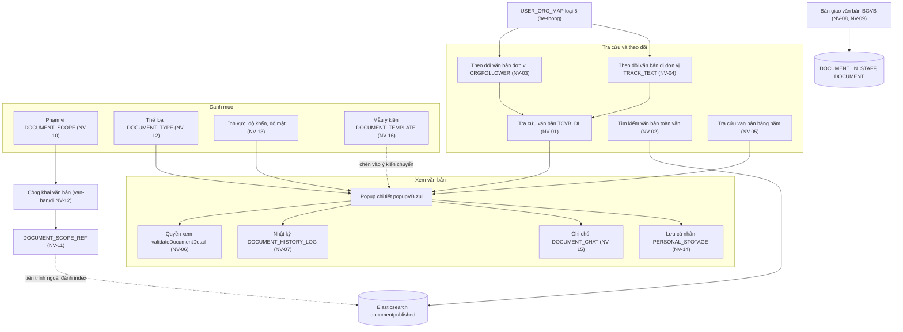
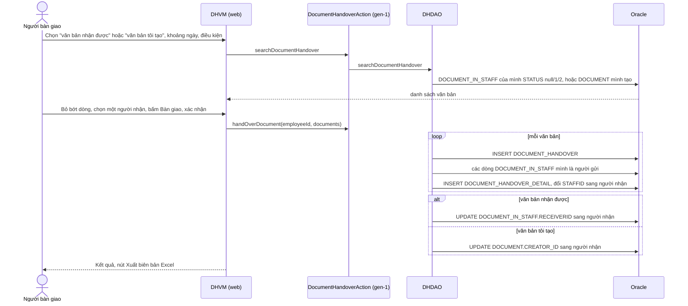
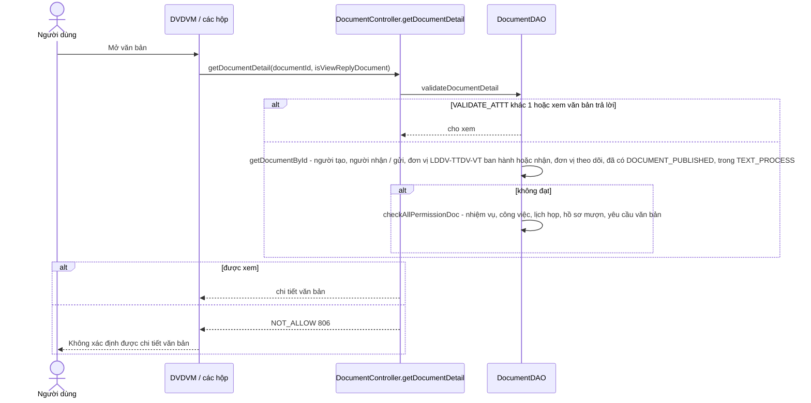
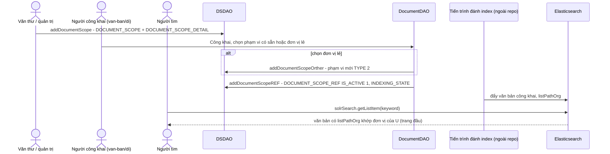
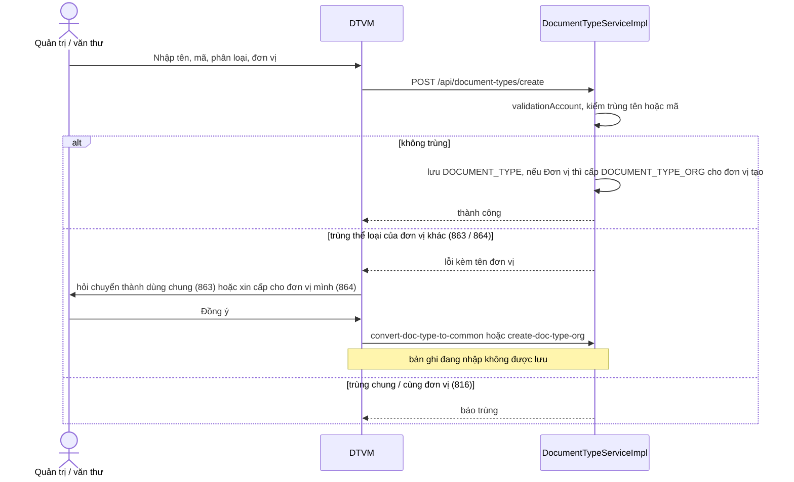
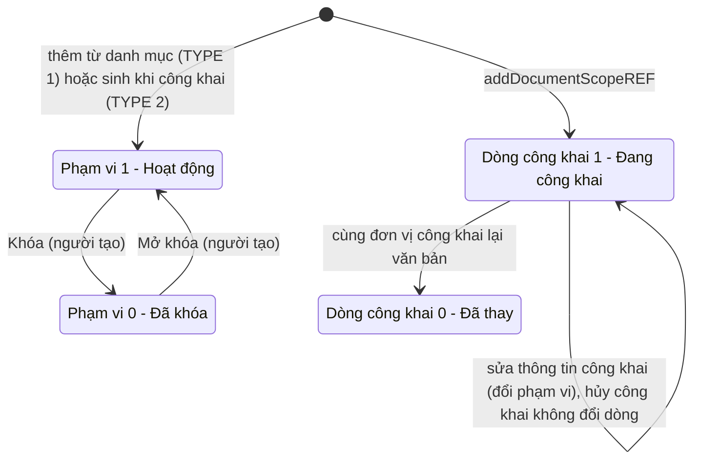
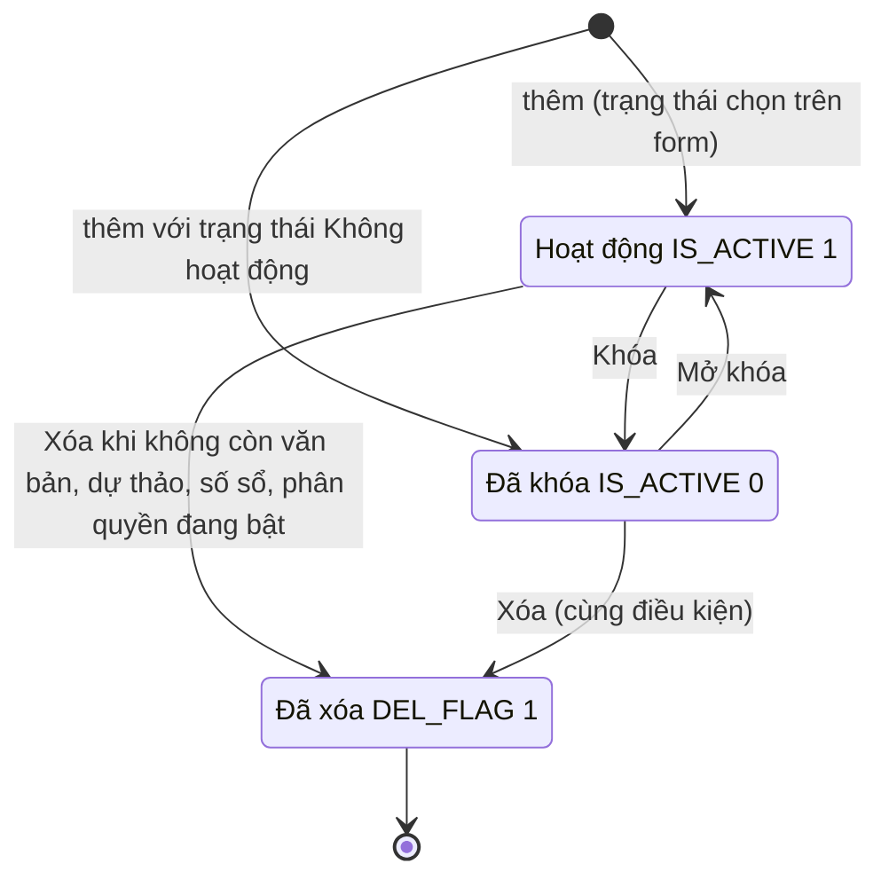
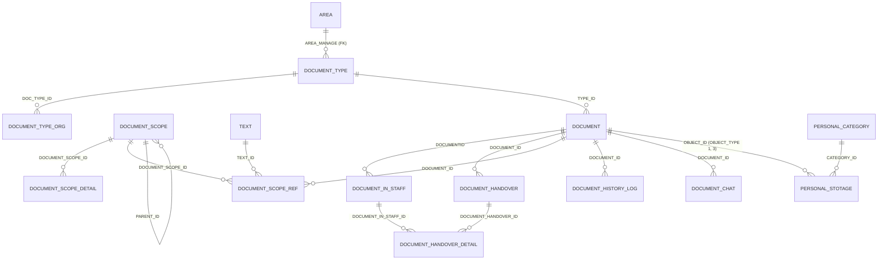

# Quản lý chung văn bản — nghiệp vụ: tra cứu / tìm kiếm, theo dõi văn bản đơn vị, tra cứu hàng năm, xem chi tiết & quyền xem, nhật ký thao tác, bàn giao văn bản, phạm vi văn bản, danh mục loại văn bản (+ lĩnh vực / độ khẩn / độ mật), tài liệu cá nhân, trao đổi trên văn bản, mẫu ý kiến

> Viết lại từ code nhánh `kha_develop` (web-spring + backend2.0) ngày 2026-10-01. Mọi khẳng định có nguồn `file:dòng`.
> Menu đối chiếu **DB DEV `SYS_MENU` ngày 2026-10-01**; số dòng, phân bố giá trị, comment cột các bảng `DOCUMENT*` của phân hệ đối chiếu **DB DEV ngày 2026-10-01** (do người điều phối truy vấn, chỉ SELECT; tác giả không kết nối DB). Bảng / menu thấy trong code mà không có trong dữ liệu tra sẵn ghi "chưa đối chiếu DB".
> HDSD cũ chỉ dùng tham khảo thuật ngữ.
>
> Viết tắt đường dẫn:
> `WEB/` = `web-spring/src/main/java/com/viettel/` · `ZUL/` = `web-spring/src/main/webapp/view/voffice/` ·
> `BIZ/` = `web-spring/src/main/java/com/voffice/service/business/` · `BE1/` = `backend2.0/backendvoffice/src/main/java/com/viettel/voffice/` ·
> `BE2/` = `backend2.0/backendvoffice/src/main/java/com/viettel/office/`.
> Lớp hay dùng: **DA** = `BE1/action/DocumentAction.java`, **DC** = `BE1/controler/DocumentController.java`, **AC** = `WEB/util/AppConstants.java`, **DB** = `BIZ/DocumentBusiness.java`, **CVM** = `WEB/voffice/common/CommonVM.java`. Lớp riêng của từng nghiệp vụ khai ở đầu mục NV.
> Phân hệ liền kề đã viết: văn bản đến [`../den/nghiep-vu.md`](../den/nghiep-vu.md) (ký hiệu `VBĐ NV-xx`), văn bản đi [`../di/nghiep-vu.md`](../di/nghiep-vu.md) (`VBĐi`), chuyển văn bản [`../chuyen-van-ban/nghiep-vu.md`](../chuyen-van-ban/nghiep-vu.md) (`CVB`), sổ văn bản [`../so-van-ban/nghiep-vu.md`](../so-van-ban/nghiep-vu.md) (`SVB`), luồng xử lý [`../luong-xu-ly/nghiep-vu.md`](../luong-xu-ly/nghiep-vu.md), liên thông [`../lien-thong/nghiep-vu.md`](../lien-thong/nghiep-vu.md) (`LT`), dự thảo [`../../xu-ly-cong-viec/nghiep-vu.md`](../../xu-ly-cong-viec/nghiep-vu.md) (`XLCV`), nhắc việc / thông báo [`../../lich-nhac-viec/nghiep-vu.md`](../../lich-nhac-viec/nghiep-vu.md) (`LNV`).

## 1. Tổng quan

### 1.1 Phạm vi

Phân hệ gom các chức năng làm việc trên **văn bản nói chung** (đến và đi) không thuộc riêng một hộp việc hay một bước xử lý:

- **Tra cứu / tìm kiếm**: tra cứu văn bản đi theo vai trò trong luồng ký và đơn vị văn thư (NV-01); tìm kiếm toàn văn trên kho văn bản công khai (NV-02); tra cứu văn bản hàng năm / văn bản lưu trữ (NV-05).
- **Theo dõi văn bản của đơn vị**: theo dõi văn bản đơn vị (đi + đến) theo cấu hình người – đơn vị (NV-03); theo dõi văn bản đi đơn vị (NV-04).
- **Xem văn bản**: quyền xem một văn bản và các phần dùng chung của màn chi tiết (NV-06); nhật ký thao tác văn bản (NV-07).
- **Bàn giao văn bản** khi cán bộ thôi phụ trách và lịch sử bàn giao (NV-08, NV-09).
- **Phạm vi văn bản**: danh mục phạm vi (nhóm đơn vị) và phạm vi công khai gắn với văn bản (NV-10, NV-11).
- **Danh mục dùng chung của văn bản**: loại (thể loại) văn bản (NV-12); lĩnh vực, độ khẩn, độ mật (NV-13).
- **Tiện ích cá nhân trên văn bản**: tài liệu cá nhân (NV-14), trao đổi trên văn bản (NV-15), mẫu ý kiến chuyển văn bản (NV-16).
- Màn "Xem luân chuyển văn bản đơn vị" (NV-17); thành phần cũ / không dùng / thuộc phân hệ khác (NV-18).

Phân hệ **KHÔNG gồm** (trỏ sang):

| Nội dung | Phân hệ |
|---|---|
| Hộp việc văn bản đến, xem chi tiết **theo luồng nhận** (các nút Hoàn thành / Trả lại / Cho ý kiến), đánh dấu đã đọc, tra cứu văn bản đến, theo dõi văn bản đến đơn vị | `van-ban/den` (VBĐ NV-05, NV-06, NV-13, NV-14) |
| Cấp số, ban hành, **công khai / hủy công khai văn bản**, văn bản thay thế, xóa / khôi phục văn bản đi | `van-ban/di` (VBĐi NV-02, NV-11 … NV-15) |
| Popup chuyển văn bản, xem luồng chuyển / người nhận, thu hồi | `van-ban/chuyen-van-ban` |
| **Báo cáo sổ văn bản** (`documentHandover/documentBook.zul` — menu `DOCUMENT_BOOK`, `DOCUMENT_REPORT`), sổ văn bản đơn vị (`SVB`) — dù `domains.py` xếp ở đây | `van-ban/so-van-ban` (SVB NV-11, NV-12) |
| Dự thảo, trình ký, ký duyệt, hộp dự thảo | `xu-ly-cong-viec` |
| Tra cứu văn bản migrate, văn bản liên thông | `van-ban/lien-thong` (LT NV-12) |
| Nhắc việc, thông báo, SMS, nắm tình hình | `lich-nhac-viec` |
| Thư viện văn bản / thư mục, tag văn bản, biểu mẫu | `tai-lieu-mau` |
| Chia sẻ văn bản ra ứng dụng ngoài (`/ext-doc/*`, `ShareDocumentController`), Elasticsearch / WOPI | `tich-hop` |
| Hồ sơ công việc, lưu văn bản vào hồ sơ | `ho-so-cong-viec` |
| Cấu hình người dùng – đơn vị (`USER_ORG_MAP`), quản trị menu / vai trò | `he-thong` |

### 1.2 Menu (đối chiếu DB DEV `SYS_MENU` ngày 2026-10-01)

`SYS_MENU.STATUS`: 1 = mở, 2 = khóa (X3). Code chỉ tham chiếu mã menu; URL nằm ở DB.

| `SYS_MENU_ID` | `CODE` | Tên (DB DEV) | Cha | URL | `STATUS` / `DEL_FLAG` | VM — NV |
|---|---|---|---|---|---|---|
| 439505 | `TCVB_DI` | **Tra cứu văn bản** | VĂN BẢN ĐI (337232) | `documentDraft/advancedSearch/advancedSearchDocument.zul?view=-1` | 1 / 0 | DSSVM — NV-01 |
| 338371 | `ANNOUNCEDDOCUMENTSEARCHING` | **Tìm kiếm văn bản** | VĂN BẢN ĐẾN (337200) | `document/seachDoc/searchAnnouncedDocument.zul?view=1` | 1 / 0 | SAVM — NV-02 |
| 439945 | `ORGFOLLOWER` | **Theo dõi văn bản đơn vị** | VĂN CÔNG KHAI (337265) | `document/orgFollower/orgFollower.zul` | 1 / 0 | OFLVM — NV-03 |
| 440265 | `TRACK_TEXT` | **Theo dõi văn bản đi đơn vị** | VĂN BẢN ĐI (337232) | `document/documentTrackSend/documentKpi.zul` | 1 / 0 | `DocumentKpiVM` — NV-04 |
| 439747 | `OUTGOING_DOCUMENT` | Văn bản đi | TRA CỨU VĂN BẢN HÀNG NĂM (439745) | `document/reportSendReceiveDoc/archive_document.zul?isArrive=0` | 1 / 0 | `ArchiveDocumentVM` — NV-05 |
| 439749 | `INCOMING_DOCUMENT` | Văn bản đến | TRA CỨU VĂN BẢN HÀNG NĂM (439745) | `…/archive_document.zul?isArrive=1` | 1 / 0 | `ArchiveDocumentVM` — NV-05 |
| 439587 | `DOCUMENT_ARCHIVED` | Văn bản lưu trữ | TÀI LIỆU CÁ NHÂN (339011) | `…/archive_document.zul` | 1 / **1 (đã xóa)** | NV-05 |
| 337771 | `BGVB` | **Bàn giao văn bản** | VĂN BẢN ĐẾN (337200) | `documentHandover/documentHandover.zul` | 1 / 0 | DHVM — NV-08 |
| 338433 | `DOCUMENT_SCOPE` | **Quản lý phạm vi** | DANH MỤC (336813) | `documentScope/documentScope.zul` | 1 / 0 | DSCVM — NV-10 |
| 339012 | `SAVE_PER_DOC` | **Tài liệu cá nhân** | TÀI LIỆU CÁ NHÂN (339011) | `savePersonalDoc/savePersonalDoc.zul` | 1 / 0 | `SavePersonalDocVM` — NV-14 |
| 339073 | `DOCUMENT_TYPE` | **Danh mục thể loại văn bản** | DANH MỤC (336813) | `document_type/document_type.zul` | 1 / 0 | DTVM — NV-12 |
| 337831 | `VBDV` | Xem luân chuyển văn bản đơn vị | VĂN BẢN ĐẾN (337200) | `document/reportSendReceiveDoc/listOrg.zul` | 1 / 0 | `DocumentOrgVM` — NV-17 |
| 439344 | `DOCUMENT_REPORT` | Báo cáo văn bản | VĂN BẢN ĐẾN (337200) | `documentHandover/documentBook.zul` | 1 / 0 | SVB NV-11 |
| 337491 | `DOCUMENT_BOOK` | Báo cáo văn bản đi đến | VĂN BẢN ĐẾN (337200) | `documentHandover/documentBook.zul` | 1 / 0 | SVB NV-11 |
| 337792 | `SVB` | Sổ văn bản đơn vị | VĂN BẢN ĐẾN (337200) | `document/bookDoc/documentBook.zul?type=1` | 1 / 0 | SVB NV-12 |

Màn **Danh mục loại văn bản**: `339073 DOCUMENT_TYPE` "Danh mục thể loại văn bản" → `/view/voffice/document_type/document_type.zul`, cha `336813` DANH MỤC, `STATUS = 1` (DB DEV `SYS_MENU` ngày 2026-10-01; `domains.py` xếp zul này vào `he-thong`) — NV-12. Màn phân quyền thể loại `sysOrgMenu.zul` và màn cấu hình người – đơn vị `userOrgMap.zul` **không có menu** (DB DEV `SYS_MENU` ngày 2026-10-01: không URL nào chứa hai tên này) — chỉ mở được từ màn khác. Các màn khác của `ban-do.md` mục 1 không có menu (popup, include, hoặc màn chết — NV-18).

### 1.3 Widget trang chủ (đối chiếu DB DEV `HOME_WIDGET` ngày 2026-10-01)

Không có dòng `HOME_WIDGET` nào thuộc phân hệ này (63 dòng của bảng đều là nhắc việc, lịch họp, phiếu trình, văn bản đến / đi, liên thông, xử lý công việc, KPI). Trang chủ chỉ dùng chung **cấu hình đơn vị theo dõi** `USER_ORG_MAP` loại 5 của NV-03 để dựng số liệu văn bản đơn vị (`WEB/voffice/common/HomeVM.java:853`, `4073`, `4114`, `4687`) — phân hệ trang chủ.

### 1.4 Actor & quyền

Mã vai trò: văn thư = `VT`, thủ trưởng = `TTDV`, lãnh đạo đơn vị = `LDDV`, chuyên viên = `NV`, trợ lý = `TL`; quản trị `ADMIN`, quản trị cấp dưới `SUB_ADMIN` = mã `ADMIN_LEVEL1` (`web-spring/src/main/resources/application.properties:345-350`). Quyền thao tác ở **tầng hiển thị nút / có menu** (X1).

| Actor | Nhận diện trong code | Làm gì |
|---|---|---|
| Mọi cán bộ có menu | — | Tra cứu văn bản đi mình liên quan (NV-01), tìm kiếm toàn văn (NV-02), tài liệu cá nhân, trao đổi, mẫu ý kiến (NV-14 … NV-16), bàn giao văn bản **cá nhân** (NV-08) |
| Văn thư | vai trò `VT` tại đơn vị (`userVof2.getListSecretaryVhrOrg()` — `TCT:349-350`; web `isDocManager`) | Thấy văn bản đi của đơn vị trong tra cứu (NV-01 BR-01), chọn phân loại "văn bản đơn vị / cá nhân" và bàn giao văn bản tự động ban hành của đơn vị (NV-08), tạo phạm vi cho đơn vị (NV-10) |
| Người theo dõi văn bản đơn vị (thường là lãnh đạo) | `USER_ORG_MAP.TYPE = 5` (`AC:6957`) | NV-03, NV-04 |
| Quản trị / văn thư đơn vị | `ADMIN`, `SUB_ADMIN`, `VT` (đơn vị tạo phạm vi — `DSCVM:115-129`); `ADMIN` / `ADMIN_LEVEL1` / `VT` (thấy phạm vi của đơn vị — `DSDAO:223-224`) | Danh mục phạm vi (NV-10); người tạo phạm vi mới sửa / khóa được (BR-25) |
| Quản trị danh mục | (xem NV-12) | Danh mục loại văn bản |

### 1.5 Sửa so với knowledge cũ (2026-10-01)

| Knowledge cũ | Hiện trạng code `kha_develop` | Ghi ở |
|---|---|---|
| "QT1. Quyền xem = người trong luồng nhận + quản lý văn bản + phạm vi (`documentScope`) + độ mật … `checkPermitViewDocument`" | Quyền xem chung là `validateDocumentDetail` (tắt hẳn khi `VALIDATE_ATTT ≠ 1`); **phạm vi không tham gia**; văn bản đã từng công khai thì ai cũng xem được; `checkPermitViewDocument` là kiểm riêng **lịch họp** (sửa 2026-10-01) | NV-06 BR-13, BR-15 |
| "Tìm kiếm (nâng cao + toàn văn Solr/ES) … (?) cái nào đang sản xuất" | Màn "Tìm kiếm văn bản" gọi **Elasticsearch** (index `documentpublished`); Solr đã chú thích; hàm đếm luôn 0; loại tìm / ô "tất cả đơn vị" bị bỏ qua (sửa 2026-10-01) | NV-02 BR-04 |
| "Bàn giao … (xem `van-ban/den`)" | Bàn giao nằm ở phân hệ này: đổi người nhận / người gửi của dòng `DOCUMENT_IN_STAFF` hoặc người tạo `DOCUMENT`, ghi `DOCUMENT_HANDOVER(_DETAIL)` (sửa 2026-10-01) | NV-08, NV-09 |
| "Phạm vi văn bản … giá trị `document.documentScope`: đơn thư / công văn đến tập đoàn / đến đơn vị khác" | Phạm vi là **danh mục nhóm đơn vị** (`DOCUMENT_SCOPE` + `DOCUMENT_SCOPE_DETAIL`) dùng khi công khai; loại 1 toàn bộ / 2 liền kề (sửa 2026-10-01) | NV-10, NV-11 |
| "Loại văn bản (gen-2) … xóa loại đang dùng bị chặn (?)" | Chặn khi có văn bản / dự thảo / dòng số sổ dùng thể loại **hoặc còn phân quyền đang bật**; kiểm trùng tên **hoặc** mã viết tắt; thể loại chung / đơn vị + cấp cho đơn vị (sửa 2026-10-01) | NV-12 BR-29 … BR-31 |
| "Lịch sử văn bản: `DOCUMENT_HISTORY_LOG` … `DocumentCopyHistory` (sao y (?))"; `vi-du-mau`: "Log lịch sử append-only + tìm kiếm" | Nhật ký chỉ ghi khi thêm / sửa / vào sổ / ban hành, lưu JSON trước – sau; không ghi thao tác luồng; `viewListHistory.zul` là chi tiết **file** của một lần sửa. `DOCUMENT_COPY_HISTORY` = sao y / sao lục khi nhập văn bản (sửa 2026-10-01) | NV-07, NV-18 |
| "Lưu cá nhân / thư viện cá nhân … menu *Thư viện cá nhân*" | Menu là "Tài liệu cá nhân" (`SAVE_PER_DOC`); bảng `PERSONAL_STOTAGE` + `PERSONAL_CATEGORY`; thư viện văn bản là phân hệ `tai-lieu-mau` (sửa 2026-10-01) | NV-14 |
| "Trao đổi trên văn bản (chat) … `TextChat` cho dự thảo; web `chat/*`, `BChat`" | Trên web là nút **Ghi chú** (`createNote.zul`), thấy theo khối đơn vị cấp 2; không thông báo (sửa 2026-10-01) | NV-15 |
| "Thông tin/mẫu văn bản (`DocumentInformation`, template) … `DocController.add-document-template`" | `DOCUMENT_TEMPLATE` = **mẫu ý kiến** cá nhân khi chuyển văn bản; `DocumentInformation` = API danh mục cũ không ai gọi (sửa 2026-10-01) | NV-16, NV-13 |
| `dac-thu`: "Loại văn bản … 3 nguồn đọc cùng bảng `DOCUMENT_TYPE`" | Đúng; thêm: hai quy tắc khác nhau (theo đơn vị tạo / theo phân quyền) và cache 1 giờ không xóa (bổ sung 2026-10-01) | NV-12 BR-33 |
| `dac-thu`: "Màn ☠: `DocumentHandoverVM`, `DocumentHandoverHistoryVM`, `vps.vm.DocumentVM`…" | Hai VM bàn giao **có** ở gói `vm.document` (bản cũ, không đường vào) và `vm.documentHandover` (bản đang dùng); `vps.vm.DocumentVM` không tồn tại (sửa 2026-10-01) | NV-08, NV-18 |
| Không có | Tra cứu văn bản đi (`TCVB_DI`), Theo dõi văn bản đơn vị / đi đơn vị, Tra cứu văn bản hàng năm, Xem luân chuyển văn bản đơn vị | NV-01, NV-03, NV-04, NV-05, NV-17 |

## 2. Module

Phần lớn chức năng chạy trên **BE gen-1** (`DocumentAction`, `DocumentHandoverAction`, `textAction`, `solrSearch`, `commentAction` → controller gen-1 → DAO SQL thuần); danh mục loại văn bản, nhật ký, trao đổi, danh mục cá nhân, mẫu ý kiến, tình hình xử lý cá nhân là **gen-2** (`/api/...`). Theo dõi văn bản đơn vị và "Xem luân chuyển" đọc cấu hình qua **legacy web** (facade `ISysUser`, `CommonVofficeService`).

| Chức năng | Màn (.zul) | VM | Business (key) | Endpoint BE | Controller / service | DAO / repository → bảng |
|---|---|---|---|---|---|---|
| Tra cứu văn bản (NV-01) | `ZUL/documentDraft/advancedSearch/advancedSearchDocument.zul` + `_search.zul` | DSSVM | `RQB.getRequisitionListDocSendSearch` → `textAction.searchText` (`RQB:7688`) | `POST /textAction/searchText` | `TCT.searchText` :279 | `TSDAO.getLstTextSearch` :2140 → `TEXT`, `TEXT_PROCESS`, `DOCUMENT` |
| Tìm kiếm toàn văn (NV-02) | `ZUL/document/seachDoc/searchAnnouncedDocument.zul` | SAVM | `SSB` → `solrSearch.getCountItem` / `getListItem` | `POST /solrSearch/getCountItem`, `/getListItem` (`SSR:39-70`) | `SSC.getCountDocument` / `getListDocument` | `ESD.getDataSearch` → Elasticsearch `documentpublished` |
| Theo dõi văn bản đơn vị (NV-03) | `ZUL/document/orgFollower/orgFollower.zul` → `orgFollowerDocOut.zul` / `orgFollowerDocIn.zul` | OFLVM → DSSVM / `DocumentSearchVM` | như NV-01 / VBĐ NV-14 | | | + `USER_ORG_MAP` (legacy) |
| Theo dõi văn bản đi đơn vị (NV-04) | `ZUL/document/documentTrackSend/documentKpi.zul` → `orgFollowerDocOut.zul`, `personalTreatmentStatus/personalTreatmentStatus.zul` | DKVM → DSSVM, PTSVM | như NV-01; `DKB` → `api.personal-treatment-status.*` | `/api/personal-treatment-status/{get-total-document-kpi, get-document-kpi, get-list-user-id}` | `PersonalTreatmentStatusController` → `PersonalTreatmentStatusServiceImpl` | `PTSR` → `TEXT`, `TEXT_PROCESS`, `USER_ROLE`, `VHR_EMPLOYEE` |
| Tra cứu văn bản hàng năm (NV-05) | `ZUL/document/reportSendReceiveDoc/archive_document.zul`, `popupArchiveDocumentDetail.zul` | ADVM, ADVDVM | `DB.getArchiveDocumentByStatus` → `DocumentAction.searchReceive` | `POST /DocumentAction/searchReceive` (`DA:272`) | `DSRC.searchReceive` | `DSIS.searchInV2` (hộp 22) → `DOCUMENT`, `DOCUMENT_IN_STAFF`, `DOCUMENT_IN_GROUP` |
| Quyền xem (NV-06) | (mọi đường mở văn bản) | DVDVM | `DB.getDocumentDetail` → `DocumentAction.getDocumentDetail` | `POST /DocumentAction/getDocumentDetail` | `DC.getDocumentDetail` :4208 | `DDAO.validateDocumentDetail` :16808, `DPDAO` |
| Nhật ký (NV-07) | panel Lịch sử POPVB:4115; `ZUL/document/transferDoc/viewListHistory.zul` | DVDVM, DLIVM | `DHLB` → `api.document-history-log.search` | `POST /api/document-history-log/search` | `DocumentHistoryLogController` → DHLSI | `DocumentHistoryLogRepositoryImpl`, `DocumentHistoryLogJPA` → `DOCUMENT_HISTORY_LOG` |
| Bàn giao + lịch sử (NV-08, NV-09) | `ZUL/documentHandover/documentHandover.zul`, `documentHandoverHistory.zul`, `popupDocHandoverHistory.zul` | DHVM, DHHVM, PHHVM | `DHB` → `DocumentHandoverAction.{searchDocumentHandover, handOverDocument, historyDocumentHandover, getDetailDocumentHandover}` | `POST /DocumentHandoverAction/*` (`DHA:37-169`) | `DHC` | `DHDAO` → `DOCUMENT_HANDOVER`, `DOCUMENT_HANDOVER_DETAIL`, `DOCUMENT_IN_STAFF`, `DOCUMENT` |
| Phạm vi (NV-10, NV-11) | `ZUL/documentScope/documentScope.zul` (+ `_search`, `_add`, `_detail`) | DSCVM, `DocumentScopeDetailVM` | `DSBS` → `DocumentAction.{searchDocumentScope, addDocumentScope, deleteDocumentScope, findDocScopeREFByTextId, findDocScopeREFActiveByDocumentId, getDocScopeLibrary}` | `POST /DocumentAction/*` (`DA:605-666`, `1596`) | `DC` :6679-7005, :14675 | `DSDAO` → `DOCUMENT_SCOPE`, `DOCUMENT_SCOPE_DETAIL`, `DOCUMENT_SCOPE_REF` |
| Loại văn bản (NV-12) | `ZUL/document_type/document_type.zul` (+ `_search`, `_add`); `web-spring/src/main/webapp/view/vps/sysOrg/sysOrgMenu.zul` (phân quyền) | DTVM, SOMVM | `DTB` → `api.document-types.*` | `/api/document-types/*` (DTCT, 13 endpoint) | DTSI | `DocumentTypeRepositoryJPA`, `DocumentTypeOrgRepositoryJPA`, `DocumentTypeRepositoryImpl` → `DOCUMENT_TYPE`, `DOCUMENT_TYPE_ORG` |
| Lĩnh vực / độ khẩn / độ mật (NV-13) | (combobox các form) | (nhiều VM) | `RQB.getListFieldsByArea` → `DocumentService.getListFieldsByArea` (`RQB:5845-5884`) | `POST /DocumentService/getListFieldsByArea` | `DocumentSignController.getListFieldsByArea` :321 | `DocumentSignDAO` :5940, `DictionaryCacheService` → `AREA`, `CV_PRIORITY`, `SECURITY_TYPE`, `DOCUMENT_TYPE` |
| Tài liệu cá nhân (NV-14) | `ZUL/savePersonalDoc/savePersonalDoc.zul`, `detailVB_per_storage.zul`, `web-spring/src/main/webapp/view/widgets/savePerDoc.zul`, `web-spring/src/main/webapp/view/widgets/configPersonalDocCategory.zul` | SPDVM, `SavePerDocVM`, `ConfigPersonalDocCategoryVM` | `SPDB` → `commentAction.*`; `PersonalDocCategoryBusiness` → `api.personal-category.*` | `/commentAction/*`, `/api/personal-category/*` | `CMC`; `PersonalCategoryController` → PCSI | `CMDAO` → `PERSONAL_STOTAGE`; `PERSONAL_CATEGORY` |
| Trao đổi (NV-15) | `ZUL/widgets/createNote.zul`, `editNote.zul` | CNVM, `EditNoteVM` | `DB` → `api.doc-chat` (GET / POST / PUT), `api.doc-chat.delete` (`DB:6068-6138`) | `/api/doc-chat` | DCHC → DCHSI | `DocumentChatRepositoryJPA` → `DOCUMENT_CHAT` |
| Mẫu ý kiến (NV-16) | `ZUL/document/office/selectDocumentTemplate.zul`, `insertDocumentTemplate.zul` | `SelectDocumentTemplateVM` | `DB` → `api.doc.{search-document-template, add-document-template, get-document-template-default}` | `/api/doc/*` (`BE2/controller/DocController.java:172-186`) | `DocServiceImpl` :1354-1404 | `DocumentTemplateRepositoryJPA` → `DOCUMENT_TEMPLATE` |
| Xem luân chuyển văn bản đơn vị (NV-17) | `ZUL/document/reportSendReceiveDoc/listOrg.zul` | `DocumentOrgVM` | — (legacy `CommonVofficeService`) | — | — | — |

`DocumentAction` gen-1 có 133 endpoint (`ban-do.md` mục 3); phần lớn thuộc hộp việc văn bản đến / đi, chuyển văn bản, nhắc việc, họp — phân hệ này chỉ dùng các endpoint ở bảng trên. `DocHandoverBusiness` còn các khóa báo cáo sổ (`exportReportDocument`, `tableOfIncomingDocuments`, `tableOfOutgoingDocuments`, `api.doc.export-daily-*`) — SVB NV-11.

## 3. Nghiệp vụ

### NV-01. Tra cứu văn bản (menu `TCVB_DI` "Tra cứu văn bản", dưới VĂN BẢN ĐI) — dự thảo / văn bản đi mình liên quan và văn bản đi của đơn vị mình làm văn thư

> Lớp: **DSSVM** = `WEB/voffice/vm/document/DocumentSendSearchVM.java` (~10.900 dòng), **RQB** = `BIZ/RequisitionBusiness.java`, **TCT** = `BE1/controler/TextController.java`, **TSDAO** = `BE1/database/dao/document/TextSearchDAO.java`.

**Mục đích.** Một màn tra cứu mọi dự thảo / văn bản đi mà người dùng có dính tới (tạo, trình ký, ký, cho ý kiến, đọc soát) và — nếu là văn thư — mọi văn bản đi đã có số của đơn vị mình, ở mọi trạng thái, kèm xuất danh sách.

**Menu (DB DEV `SYS_MENU` 2026-10-01).** `439505 TCVB_DI` "Tra cứu văn bản" → `/view/voffice/documentDraft/advancedSearch/advancedSearchDocument.zul?view=-1`, cha `337232` VĂN BẢN ĐI, `STATUS = 1`. Zul gắn DSSVM (`ZUL/documentDraft/advancedSearch/advancedSearchDocument.zul:5-6`), include `advancedSearchDocument_search.zul` (:28-30).

**Luồng.** DSSVM đọc tham số `view` vào `viewType` (`DSSVM:90`, `667-670`); `view = -1` = `REQUISITION.VIEW_TYPE.VBTC` "Văn bản tra cứu" (`AC:757`). Khoảng ngày mặc định **365 ngày** gần nhất (`DSSVM:711-712`). Danh sách / đếm: `RQB.getRequisitionListDocSendSearch` / `countRequisitionListDocSendSearch` với `type = TYPE_VBTC = -1` (`DSSVM:1455-1460`, `1614-1618`; `AC:716`) → `textAction.searchText` (`RQB:7688`, `7723-7750`) → `TCT.searchText` (:279) → `TSDAO.searchText` → nhánh `type == SearchType.ALL (-1)` → `getLstTextSearch` (`TSDAO:201-206`, `2140`; `BE1/constants/Constants.java:696`).

**Điều kiện thật (`TSDAO.getLstTextSearch`)** — kết quả là **UNION** của ba tập (`TSDAO:2160-2172`, `2427-2509`):

| Tập | Điều kiện | Nguồn |
|---|---|---|
| (1) Dự thảo / văn bản đi mình liên quan (`TEXT`) | `t.CREATOR_ID_VOF2 = mình` hoặc dòng `TEXT_PROCESS` của mình: cho ý kiến (`signature_type = 4`, `t.state <> 0`), đọc soát (`= 5`), văn thư rà soát mới (`= 3` …), đã ký duyệt (`t.state = 1`), đã từ chối (`tp.state = 4`), đang chờ (`tp.state = 2`, `t.state ∈ {2,7}`) | `TSDAO:2379-2421` |
| (2) Văn bản đi đã có số của đơn vị mình làm văn thư (`DOCUMENT`) | `d.built_group_id ∈ đơn vị VT của mình`, `d.is_arrive = 0`, chưa xóa (`status_number` null hoặc ≠ 1); trạng thái hiển thị = `nvl(t.state, 4)` | `TSDAO:2433-2466` |
| (3) Văn bản chờ cấp số / hủy ban hành ở bước văn thư của đơn vị mình | `TEXT_PROCESS.signature_type = 1` tại đơn vị VT của mình, `tp.state = 2` và `t.state ∈ {2,7}` hoặc `tp.state = 4` và `t.state ∈ {1,2,3,4,7,27}` | `TSDAO:2467-2509` |

- Chọn trạng thái **299 "đã bị xóa"** thì chỉ lấy `DOCUMENT` đi đã xóa (`status_number = 1`, `is_arrive = 0`) của đơn vị mình làm văn thư; không làm văn thư thì không có dòng nào (`TSDAO:2173-2203`; `BE1/constants/Constants.java:837`). Khôi phục từ màn này: `doRestoreDocument` → `requisitionBusiness.restoreDocument` (`DSSVM:10932`) — nghiệp vụ ở VBĐi NV-15.
- Combobox trạng thái lấy `REQUISITION.COMBOBOX_MENU.VBTK.VBTK_MAP`: Chưa trình ký (0), Đang xử lý (1), Bị trả lại (2), Đã ký duyệt (3), Đã cấp số (40), Đã chuyển cấp số (41), Đã ban hành (4), Đã hủy luồng (6), Hủy ban hành (27), Từ chối cấp số (270) (`DSSVM:1249-1261`; `AC:1109-1137`).
- Tìm nâng cao: số đăng ký, số ký hiệu, trích yếu, nội dung, thể loại (`type_id`), lĩnh vực (`area_id`), độ khẩn và người ký (gửi gộp trong `description` dạng JSON), sổ, tag (`TSDAO:2310-2376`; `DSSVM:1443-1453`).
- Màn không có nút thêm / lưu (`DSSVM:1107-1123`, chỉ `VBTK` mới có); có Xuất (`DSSVM:719-721`); bấm dòng mở chi tiết dự thảo / văn bản (`doViewDetail`).

**BR-01.** "Tra cứu văn bản" **không** dựa trên quyền xem văn bản (NV-06) mà trên **vai trò của người dùng với dự thảo** (người tạo / người trong luồng ký) cộng với **đơn vị làm văn thư** (`TSDAO:2379-2509`). Chuyên viên không trong luồng ký và không làm văn thư không thấy văn bản đi của đơn vị.
**BR-02.** Cùng VM, cùng câu SQL được dùng lại cho tab "Văn bản đi" của *Theo dõi văn bản đơn vị* (NV-03) — khi có `orgId`, BE **thay** danh sách đơn vị văn thư bằng đơn vị được theo dõi và chỉ lấy tập (2) (`TCT:456-463`, `499-507`; `RQB:7742-7746`).

**Bảng dữ liệu.** `TEXT`, `TEXT_PROCESS`, `DOCUMENT`, đọc `CV_PRIORITY`, `DOCUMENT_TYPE`, `SECURITY_TYPE`, `TEXT_BOOK` (`TSDAO:2181-2187`, `2452-2455`).
**Ranh giới.** Hộp việc văn bản đi / cấp số / ban hành → VBĐi; hộp dự thảo, ký duyệt → XLCV; tra cứu văn bản **đến** → VBĐ NV-13.

### NV-02. Tìm kiếm văn bản toàn văn (menu `ANNOUNCEDDOCUMENTSEARCHING` "Tìm kiếm văn bản") — Elasticsearch trên kho văn bản công khai

> Lớp: **SAVM** = `WEB/voffice/vm/document/SearchAnnouncedDocumentVM.java`, **SSB** = `BIZ/SearchSolrBusiness.java`, **SSR** = `BE1/action/SolrSearchResource.java`, **SSC** = `BE1/controler/SolrSearchController.java`, **ESD** = `BE1/elasticsearch/search/ElasticSearchDocument.java`, **ESC** = `BE1/elasticsearch/search/ElasticCommon.java`.

**Mục đích.** Ô tìm một từ khóa trên kho văn bản đã công bố (index Elasticsearch), hiện trích yếu, người ký, số ký hiệu và file đính kèm để đọc.

**Menu (DB DEV `SYS_MENU` 2026-10-01).** `338371 ANNOUNCEDDOCUMENTSEARCHING` "Tìm kiếm văn bản" → `/view/voffice/document/seachDoc/searchAnnouncedDocument.zul?view=1`, cha `337200` VĂN BẢN ĐẾN, `STATUS = 1`. Tham số `view=1` SAVM không đọc (grep `getParameter` trong SAVM rỗng).

**Luồng.** SAVM (`SAVM:62-82`: loại tìm mặc định `ALL_DOCUMENTATION = 3`) → `SSB.getCountItem` / `getListItem` (gửi `keyword`, `type` = loại tìm, `isNotLimitByOrg` = ô "tất cả đơn vị") → `solrSearch.getCountItem` / `getListItem` (`SSB:37-52`, `98-115`) → `SSR` (:39-49, :60-70) → `SSC.getCountDocument` / `getListDocument` → `ESD.getDataSearch` (`ESD:987-1009`) → index `/documentpublished/documentdata/` (`BE1/elasticsearch/search/StrElasticConstants.java:15`).

**BR-03.** Chỉ thấy văn bản có `listPathOrg` khớp **một trong các đường dẫn đơn vị** của người dùng (`ESC:52-66`; `SSC:199-202`). Từ khóa khớp nguyên cụm trên người ký, nơi gửi, trích yếu (có dấu / không dấu), số ký hiệu, số đăng ký (`ESC:68-77`).
**BR-04.** Hàm **đếm luôn trả 0** (đoạn gọi Elasticsearch đã chú thích — `SSC:155-163`) và loại tìm (`type`) cùng ô "tất cả đơn vị" **bị BE bỏ qua** (`SSC:236-239`, `251-252` đọc nhưng không dùng). Hệ quả trên web: tiêu đề luôn "tìm thấy 0", thanh phân trang ẩn, chỉ hiện **trang đầu** kết quả (`SAVM:93-103`; `CVM:1243-1268`).
**BR-05.** Index do tiến trình ngoài repo đẩy vào: code chỉ đặt cờ `INDEXING_STATE = 0` trên `DOCUMENT_SCOPE_REF` khi đổi đơn vị của một phạm vi (`BE1/database/dao/document/DocumentScopeDAO.java:170-175`, `883-888`); không có code ghi index văn bản trong repo (grep `documentpublished` chỉ ra hằng tìm kiếm). DB DEV: `DOCUMENT.INDEXING_STATE` null toàn bộ 1.910 dòng, `DOCUMENT_SCOPE_REF.INDEXING_STATE = 0` toàn bộ 36 dòng (ngày 2026-10-01) — trên DEV chưa có văn bản nào được đánh index.

**Bảng / hạ tầng.** Elasticsearch (cấu hình `ElasticCommon.getConfigSearchElastic8x` / `url.elasticsearch.server`), không đọc bảng Oracle trực tiếp. Cùng controller còn phục vụ tìm nhân viên / đơn vị (`solrSearch.getEmployeeList`, `getOrgList`) cho các popup chọn người — xem `tich-hop`.

### NV-03. Theo dõi văn bản đơn vị (menu `ORGFOLLOWER`, dưới VĂN CÔNG KHAI) — lãnh đạo xem văn bản đi / đến của đơn vị được cấu hình theo dõi

> Lớp: **OFLVM** = `WEB/voffice/vm/document/OrgFollowerVM.java`.

**Mục đích.** Người được cấu hình "theo dõi văn bản đơn vị" (thường là lãnh đạo) xem toàn bộ văn bản đi và văn bản đến của đơn vị đó mà không cần nằm trong luồng nhận.

**Menu (DB DEV `SYS_MENU` 2026-10-01).** `439945 ORGFOLLOWER` "Theo dõi văn bản đơn vị" → `/view/voffice/document/orgFollower/orgFollower.zul`, cha `337265` VĂN CÔNG KHAI, `STATUS = 1`.

**Luồng.** OFLVM lấy danh sách đơn vị gán cho người dùng ở `USER_ORG_MAP` loại **5 = `ORG_FOLLOW`** ("Cấu hình theo dõi văn bản đi đơn vị" — `AC:6948-6958`; nhãn `web-spring/src/main/webapp/WEB-INF/zk-label.properties:9962-9963`), chọn đơn vị đầu tiên (`OFLVM:41-47`); combobox đổi đơn vị (`ZUL/document/orgFollower/orgFollower.zul:31-34`). Hai tab (`OFLVM:107-123`):
- Tab 0 **Văn bản đi** → `orgFollowerDocOut.zul` (DSSVM, `view = -1`, `orgId`) — câu tra cứu NV-01 với đơn vị theo dõi (BR-02).
- Tab 1 **Văn bản đến** → `ZUL/document/orgFollower/orgFollowerDocIn.zul` (`DocumentSearchVM`) — màn tra cứu văn bản đến theo đơn vị (VBĐ NV-13, NV-14).
Tìm nhanh phát qua event queue tới màn con (`OFLVM:67-75`).

**BR-06.** Người dùng **không có** đơn vị `USER_ORG_MAP` loại 5 thì màn **trống** (không include màn con — `OFLVM:109`). Cấu hình gán đơn vị nằm ở màn quản trị người dùng `web-spring/src/main/webapp/view/vps/sysUser/userOrgMap.zul` (`WEB/vps/vm/UserOrgMapVM.java`) — phân hệ `he-thong`; màn này **không có menu** trên DB DEV (không URL `SYS_MENU` nào chứa `userOrgMap`). DB DEV `USER_ORG_MAP` ngày 2026-10-01: loại 5 có `IS_ACTIVE` 1 = 277, 0 = 83 dòng.
**BR-07.** Tab Văn bản đến dùng cùng loại 5 để chọn đơn vị (`OFLVM:120-122`), dù code có loại riêng **6 = `ORG_FOLLOW_DOCUMENT_IN`** "Cấu hình theo dõi văn bản đến đơn vị" (`AC:6958`). DB DEV `USER_ORG_MAP` ngày 2026-10-01: loại 6 có `IS_ACTIVE` 1 = 307, 0 = 113 dòng — tức cấu hình "theo dõi văn bản đến" đang được dùng (script `20250310_add_row_user_org_map.sql` sao từ loại 5 sang) nhưng màn này không đọc — xem Q3.

**Bảng.** `USER_ORG_MAP` (legacy web qua `ISysUser.findSysOrgMappedByUser`); dữ liệu văn bản như NV-01 / VBĐ NV-14. Widget trang chủ dùng cùng cấu hình loại 5 (`WEB/voffice/common/HomeVM.java:853`, `4073`, `4114`, `4687`).

### NV-04. Theo dõi văn bản đi đơn vị (menu `TRACK_TEXT`) — văn bản đơn vị phát hành và tình hình xử lý của cá nhân

> Lớp: **DKVM** = `WEB/voffice/vm/document/documentKpi/DocumentKpiVM.java`, **PTSVM** = `WEB/voffice/vm/personalTreatmentStatus/PersonalTreatmentStatusVM.java`, **DKB** = `BIZ/DocumentKpiBusiness.java`, **PTSR** = `BE2/repositories/impl/PersonalTreatmentStatusRepositoryImpl.java`.

**Mục đích.** Lãnh đạo / người được giao theo dõi xem (a) mọi văn bản đi **đã phát hành** của một đơn vị, theo sổ và thể loại; (b) mỗi cán bộ của đơn vị đang có bao nhiêu văn bản trình / xử lý ở từng trạng thái.

**Menu (DB DEV `SYS_MENU` 2026-10-01).** `440265 TRACK_TEXT` "Theo dõi văn bản đi đơn vị" → `/view/voffice/document/documentTrackSend/documentKpi.zul`, cha `337232` VĂN BẢN ĐI, `STATUS = 1`. Tên menu được đổi bằng `backend2.0/backendvoffice/sql/20250310_add_row_user_org_map.sql:28-30` (cùng script sao các dòng `USER_ORG_MAP` loại 5 sang loại 6 — :1-26).

**Chọn đơn vị.** Combobox gộp đơn vị mình là `TTDV` / `LDDV` (`WEB/voffice/common/CommonModel.java:448-464`) và đơn vị `USER_ORG_MAP` loại 5 (`DKVM:99-110`), sắp theo cấp, thứ tự, tên (`DKVM:115-124`); mặc định đơn vị của chính mình nếu có (`DKVM:126-130`). **Không có cấu hình loại 5 thì màn chỉ hiện thông báo** "Đồng chí chưa được cấu hình theo dõi văn bản đơn vị nào…" — kể cả khi là lãnh đạo (`DKVM:111-114`; `ZUL/document/documentTrackSend/documentKpi.zul:94-100`).

**Tab 0 "Văn bản đơn vị phát hành"** → include `orgFollowerDocOut.zul` (DSSVM) với `view = -1`, `orgId`, `isTDVBD = true` (`DKVM:257-298`) → cùng câu tra cứu NV-01 với đơn vị được chọn (BR-02): chỉ `DOCUMENT` đi chưa xóa có `built_group_id` = đơn vị (`TSDAO:2433-2466`); ô trạng thái ẩn, cột trạng thái luôn "Đã ban hành" (`DSSVM:10371-10389`). Có chế độ **cây** Sổ văn bản → Thể loại kèm số lượng (`textBookAction.getAllTextBooksOfUserByOrgForDocOutNotDocManagerWithTime`, `getListDocumentTypeActive` — `BIZ/TextBookBusiness.java:665-711`; `DKVM:640-674`); lựa chọn danh sách / cây lưu theo người ở `DOCUMENT_SEND_VIEW_INFO` (`DocumentAction.saveOrUpdateViewDocSendInfo` — `DB:7088`, `7105`; `DKVM:571-604`). Xuất Excel: `DSSVM:8682-8760`.

**Tab 1 "Tình hình xử lý của cá nhân"** → `personalTreatmentStatus.zul` (PTSVM, `orgId` — `DKVM:299-316`) → `DKB.getTotalDocumentKpi` / `getDocumentKpi` → `/api/personal-treatment-status/get-total-document-kpi`, `get-document-kpi` (`DKB:28-86`; `BE2/controller/PersonalTreatmentStatusController.java:30-53`) → `PTSR`:
- Cán bộ được tính: có vai trò `NV` hoặc `LDDV` tại đơn vị hoặc đơn vị con trực tiếp (`PTSR:40-51`).
- Hai cách tính (radio, chỉ hiện với lãnh đạo): **1 "Văn bản đơn vị tạo"** = dự thảo do cán bộ tạo (`TEXT.CREATOR_ID_VOF2`); **2 "Văn bản đơn vị xử lý"** = dự thảo có cán bộ trong luồng ký duyệt / cho ý kiến (`TEXT_PROCESS.signature_type ∈ {3,4}`) (`PTSR:52-73`); luôn loại `TEXT.STATE` 0 và 6, đã xóa; khoảng ngày tạo mặc định 365 ngày.
- Số đếm mỗi người: Tổng, Chưa trình (`state = 0`), Đang xử lý (1), Đã hoàn thành (3, 4), Bị trả lại (2, 7, 27) (`PTSR:80-84`); bấm người → danh sách dự thảo của người đó.
PTSVM cũng được mở từ hộp *Văn bản ký duyệt* khi chọn "tất cả danh sách" của một đơn vị (`WEB/voffice/vm/requisition/RequisitionVM.java:2384-2402`).

**BR-08.** "Theo dõi văn bản đi đơn vị" tab 0 hiện **mọi** văn bản đi đã có số của đơn vị, không phụ thuộc người xem có trong luồng nhận hay không — quyền thấy đến từ cấu hình theo dõi (BR-06) (`TCT:456-463`, `499-507`).
**BR-09.** Số "Chưa trình" luôn 0 vì tập dữ liệu đã loại `state = 0` (`PTSR:56`, `67` so với `:81`); "Đã hoàn thành" gồm cả `state = 3` (chờ cấp số) (`PTSR:83`) — `dac-thu.md` L6.

**Bảng.** `DOCUMENT`, `TEXT`, `TEXT_PROCESS`, `TEXT_BOOK`, `TEXT_BOOK_SHARE`, `USER_ROLE`, `VHR_ORG`, `VHR_EMPLOYEE`, `USER_ORG_MAP` (DB DEV ngày 2026-10-01: loại 5 hiệu lực 277 dòng), `DOCUMENT_SEND_VIEW_INFO` (chưa đối chiếu DB).
**Ranh giới.** Màn `documentTrackSend.zul` (`DocumentTrackSendVM`) là bản cũ của màn này, không còn đường vào (NV-18). Controller gen-2 `/api/document-kpi/*` **không** thuộc màn này: `catalog-options` / `transfer-scope` web không gọi (web gọi thẳng BE nhiệm vụ qua `MissionIntegrationBusiness`), `draft-links*` là liên kết dự thảo ↔ nhiệm vụ của XLCV (`BE2/services/document_kpi/DocumentKpiDraftController.java:29-80`; `BIZ/DraftMissionLinkBusiness.java:27-29`) — phân hệ `nhiem-vu` / `kpi-danh-gia`.

### NV-05. Tra cứu văn bản hàng năm (menu `OUTGOING_DOCUMENT` / `INCOMING_DOCUMENT`, cha "TRA CỨU VĂN BẢN HÀNG NĂM")

> Lớp: **ADVM** = `WEB/voffice/vm/document/ArchiveDocumentVM.java` (~7.800 dòng, bản sao VM hộp văn bản), **ADVDVM** = `WEB/voffice/vm/document/ArchiveDocumentViewDetailVM.java`, **DPOOL** = `WEB/voffice/util/DocumentPool.java`, **DSIS** = `BE1/database/dao/document/search/DocumentSearchInService.java`, **DSRC** = `BE1/controler/document/DocumentSearchReceiveController.java`.

**Mục đích.** Xem lại văn bản đi / đến theo **năm ban hành**, chỉ đọc (không thao tác xử lý).

**Menu (DB DEV `SYS_MENU` 2026-10-01).** `439747 OUTGOING_DOCUMENT` "Văn bản đi" → `…/reportSendReceiveDoc/archive_document.zul?isArrive=0`; `439749 INCOMING_DOCUMENT` "Văn bản đến" → `…?isArrive=1`; cha `439745` TRA CỨU VĂN BẢN HÀNG NĂM; đều `STATUS = 1`. Mục `439587 DOCUMENT_ARCHIVED` "Văn bản lưu trữ" (cùng zul, không tham số, cha TÀI LIỆU CÁ NHÂN) **`DEL_FLAG = 1`**.

**Luồng.** ADVM đọc `isArrive` từ tham số include: "1" → 1, còn lại (kể cả không có) → 0 (`ADVM:456-467`); ô "Loại" trên form tìm nâng cao bị ẩn nên người dùng không đổi được (`ZUL/document/reportSendReceiveDoc/archive_document_search.zul:445-461`). Năm chọn trên thanh công cụ: **ghi cứng 2025 → 2020, mặc định 2025** (`ADVM:494-497`; `web-spring/src/main/webapp/view/widgets/archiveDocumentButton.zul:52-65`); tìm nhanh lấy ngày ban hành 01/01 – 31/12 của năm chọn (`ADVM:920-923`), tìm nâng cao bỏ năm và dùng ngày người dùng nhập. Dữ liệu: `documentInType = 5` → `DPOOL` → `DB.getArchiveDocumentByStatus(..., status 22, ...)` (`ADVM:919-925`; `DPOOL:952-954`, `1073-1075`; `DB:643-742`) → `DocumentAction.searchReceive` (`DA:272-279`) → `DSRC.searchReceive` → `DSIS.searchInV2` với **hộp 22 = Tra cứu** (`DSRC:217-220`; `DSIS:84-93`; `BE1/constants/Constants.java:1633`) — **cùng câu truy vấn với Tra cứu văn bản đến** (VBĐ NV-13) thêm điều kiện `d.is_arrive` (`BE1/database/dao/document/search/DocumentQueries.java:2493-2499`).

**BR-10.** "Tra cứu văn bản hàng năm" đọc **bảng đang dùng** (`DOCUMENT`, `DOCUMENT_IN_STAFF`, `DOCUMENT_IN_GROUP` …), không có kho lưu trữ riêng, không có tiến trình chuyển dữ liệu theo năm (`DSIS:1160-1248`; job `@Scheduled` duy nhất của BE là làm mới khóa RSA và sinh nhiệm vụ — `BE2/core/utils/scheduling/ScheduledBackgroundTask.java:17-24`). Bảng `DOCUMENT_ARCHIVE` (DB DEV 0 dòng) chỉ được ghi bởi một hàm legacy của dự thảo, màn này không dùng (NV-18).
**BR-11.** Phạm vi như Tra cứu văn bản đến: dòng nhận cá nhân của mình, và nếu là văn thư thì thêm dòng nhận của đơn vị mình làm văn thư (`DSIS:563-570`, `1078-1149`; `DSRC:328`). Vì truy vấn đi theo **dòng nhận**, với `isArrive = 0` danh sách là **văn bản đi mà mình / đơn vị mình nhận được**, không phải văn bản đi đơn vị mình ban hành — Q2.
**BR-12.** Màn chỉ xem: mọi nút thao tác trên lưới đã chú thích; bấm mã mở popup `popupArchiveDocumentDetail.zul` (ADVDVM) chỉ có xem / tải file, kiểm tra chữ ký, đóng (`archive_document_search.zul:849-946`; `ADVM:1393-1458`; `ZUL/document/reportSendReceiveDoc/popupArchiveDocumentDetail.zul:536-2205`); nút xuất đều ẩn (`archive_document_search.zul:690-700`). Web gán `documentId := migratedDocumentId` cho mọi dòng trả về (`DB:722`) trong khi BE không có trường này — `dac-thu.md` L7.

**Bảng.** đọc `DOCUMENT`, `DOCUMENT_IN_STAFF`, `DOCUMENT_IN_GROUP`, `DOCUMENT_RECEIVE_MAP`, `TEXT_BOOK`, `DOCUMENT_TYPE`, `CV_PRIORITY`, `SECURITY_TYPE`, `AREA`.
**Ranh giới.** Văn bản migrate từ hệ thống cũ (`MIGRATED_DOCUMENT`) là màn khác — LT NV-12.

### NV-06. Quyền xem văn bản và màn chi tiết văn bản dùng chung

> Lớp: **DDAO** = `BE1/database/dao/document/DocumentDAO.java`, **DPDAO** = `BE1/database/dao/document/DocumentPermissionDAO.java`, **DVDVM** = `WEB/voffice/vm/document/DocumentViewDetailVM.java` (~12.400 dòng), **POPVB** = `ZUL/document/reportSendReceiveDoc/popupVB.zul` (~4.600 dòng).

**Mục đích.** Quy tắc chung quyết định một người có được mở một văn bản (`DOCUMENT`) hay không, áp cho mọi đường mở (hộp việc, thông báo, tìm kiếm, file đính kèm của nhiệm vụ / lịch họp / hồ sơ…), và các phần dùng chung của popup chi tiết.

**Quy tắc chung `DDAO.validateDocumentDetail(người dùng, documentId)`** (`DDAO:16808-16827`) — được gọi ở `DC.getDocumentDetail` (`DC:4304-4311`, `4411-4416`) và ~40 điểm khác (tải file, ý kiến, nhiệm vụ, họp…):
1. Tham số hệ thống **`VALIDATE_ATTT` khác "1" → luôn cho xem** (`DDAO:16809`; `BE1/constants/FunctionCommon.java:2369-2371`). DB DEV `SYSTEM_PARAMETER` ngày 2026-10-01: `VALIDATE_ATTT = 1` → kiểm quyền **đang bật**.
2. Cờ `isViewReplyDocument` (xem văn bản trả lời) do web gửi lên → cho xem (`DDAO:16816`; `DC:4272`, `4294-4298`; web gửi từ `DVDVM:1517`, `8323`, `12125`).
3. `getDocumentById` (`DDAO:10680-10792`): cho xem nếu người dùng là **người tạo** văn bản / dự thảo, **người nhận hoặc người gửi** ở một dòng `DOCUMENT_IN_STAFF`; hoặc đơn vị mình có vai trò `LDDV` / `TTDV` / `VT` (cộng đơn vị theo dõi `USER_ORG_MAP` loại 5 — `DDAO:10687-10694`) là **đơn vị ban hành** (`BUILT_GROUP_ID`) hoặc **đơn vị nhận** chưa bị thu hồi (`DOCUMENT_IN_GROUP.status` null / ≠ 0); hoặc văn bản **đã từng có dòng `DOCUMENT_PUBLISHED`** (bất kỳ trạng thái); hoặc mình / đơn vị mình có trong luồng ký `TEXT_PROCESS` (`DDAO:10720-10746`); không khớp thì xét quyền qua văn bản yêu cầu trả lời `DOCUMENT_IN_LIST_REQUEST` (`DDAO:10758`).
4. Không đạt → `checkAllPermissionDoc` (`DDAO:17018-17055`) xét văn bản và các văn bản đính kèm nó: là người giao / thực hiện / tạo **nhiệm vụ** có văn bản; người liên quan **công việc**; thành phần / người tạo **lịch họp** có văn bản; người mượn **hồ sơ** đang mượn; văn thư đơn vị ban hành của văn bản thuộc thể loại công khai cấu hình (`SYSTEM_PARAMETER.INDUSTRY_DOCUMENT_TYPE_CONFIG` — DB DEV ngày 2026-10-01: `11,16,28,18,27,29,861`); người trong danh sách **yêu cầu văn bản** (`DPDAO:46-448`).
Bị từ chối: BE trả `NOT_ALLOW` (806) → web nhận null → báo "Không xác định được chi tiết văn bản" (`voffice.common.message.documentNotFound`, ví dụ `DVDVM:1611`); xem file báo `voffice.view.file.not.permission` (`WEB/voffice/common/SecurityVM.java:4058`).

**BR-13.** Văn bản **đã công khai một lần** (có dòng `DOCUMENT_PUBLISHED`, kể cả đã hủy công khai `STATUS = 1`) thì **mọi người dùng** mở được khi có đường dẫn / id (`DDAO:10735`); phạm vi công khai `DOCUMENT_SCOPE_REF` (NV-11) **không** tham gia quy tắc xem — phạm vi chỉ giới hạn danh sách / index tìm kiếm (ví dụ `BE1/database/dao/DocumentInDAO.java:485-488`; NV-02 BR-03). DB DEV: `DOCUMENT.IS_PUBLIC = 1` có 18 văn bản (ngày 2026-10-01); `DOCUMENT_PUBLISHED` 21 dòng (VBĐi BR-37). Xem Q1.
**BR-14.** Văn bản mật: quy tắc trên không phân biệt độ mật; phần file mã hóa có kiểm riêng (VBĐ / CVB NV-12) — văn bản mật chưa dùng (X4).
**BR-15.** Hai hàm cùng tên nghe như "quyền xem" nhưng là **quy tắc riêng của lịch họp**: `DocumentAction.checkPermitViewDocument` (người tạo / thành phần họp / trợ lý / `LDDV`-`TTDV`-`QLLH` đơn vị tham gia, hoặc có dòng nhận văn bản — `DC:10139-10229`; `BE1/database/dao/meeting/MeetingDAO.java:3166-3247`; web `WEB/voffice/vm/meeting/MeetingDetailVM.java:3826`) và `getDocumentViewerUserId` (chỉ người nhận / người gửi ở `DOCUMENT_IN_STAFF` — `DDAO:15055-15072`; web `MeetingWeekVM.java:4568-4586`) — phân hệ `hop`.

**Popup chi tiết `popupVB.zul` (DVDVM) — phần dùng chung.** Không có tab; là chuỗi panel thu gọn được (POPVB): thông tin văn bản (:110), file chính / đính kèm / lịch sử sửa file (:597-1000), dự thảo đã tạo (:1003), tham mưu (:1035), danh sách đã gửi đi (đơn vị / cá nhân / nhóm / đơn vị liên thông — :1305-1319), chỉ đạo của lãnh đạo (:2117), người cùng nhận (:2190), ý kiến hoàn thành / trả lại (:2322, :2497), thông tin bổ sung (:2613), văn bản đính kèm / văn bản gốc / văn bản liên quan (:2677, :2729, :2785), người ký (:2870-3299), nhắc việc (:3392), nhiệm vụ (:3513), hồ sơ (:3653), văn bản trả lời (:3696), tình trạng công khai (:3988), **Lịch sử** (:4115 — NV-07). Thanh nút (:4189-4498) gồm các nút theo luồng nhận (VBĐ NV-05) và các nút dùng chung: **Lưu cá nhân** (:4299-4307 — NV-14), **Ghi chú** (:4282-4288 — NV-15), Lưu vào hồ sơ (:4290-4297 — `ho-so-cong-viec`), Gắn tag (:4416-4421 — `tai-lieu-mau`), Gửi trục / bên thứ ba (:4437-4443 — `tich-hop`).

**Bảng.** đọc `DOCUMENT`, `DOCUMENT_IN_STAFF`, `DOCUMENT_IN_GROUP`, `TEXT`, `TEXT_PROCESS`, `DOCUMENT_PUBLISHED`, `USER_ORG_MAP`, `DOCUMENT_IN_LIST_REQUEST`, `MISSION`, `SOURCE_MAP`, `TASK`, `MEETING`, `BRIEF_BORROW`, `DOCUMENT_REQUEST*`, `SYSTEM_PARAMETER`.
**Ranh giới.** Nút thao tác theo luồng nhận và việc đánh dấu đã đọc khi mở → VBĐ NV-05, NV-06; luân chuyển / thu hồi → CVB.

### NV-07. Nhật ký thao tác văn bản (`DOCUMENT_HISTORY_LOG`) — lịch sử chỉnh sửa thông tin và file của văn bản

> Lớp: **DHLSI** = `BE2/services/impl/DocumentHistoryLogServiceImpl.java`, **DHLB** = `BIZ/DocumentHistoryLogBusiness.java`, **DLIVM** = `WEB/voffice/vm/document/DocumentLogInfoVM.java`.

**Mục đích.** Ghi lại mỗi lần văn bản được thêm mới / sửa / vào sổ / ban hành: trường nào đổi từ giá trị nào sang giá trị nào, file nào được thêm / bỏ, ai làm, lúc nào; hiển thị ở panel **Lịch sử** của chi tiết văn bản.

**Ghi** — chỉ một hàm `DHLSI.saveDocHistory` (`DHLSI:92-204`; không có SQL `INSERT INTO DOCUMENT_HISTORY_LOG` nào trong repo), lưu **trước / sau dạng JSON** (`JSON_BEFORE_EDIT`, `JSON_AFTER_EDIT`) **chỉ các trường đã đổi** trong danh sách theo dõi `Constants.FIELDS_LOG.ENTITY_DOCUMENT` (sổ, số đăng ký, số ký hiệu, độ mật, hình thức, thể loại, độ khẩn, các ngày, trích yếu, người ký, công khai / phạm vi, đơn vị đăng ký, nội dung, hồ sơ, văn bản chỉ đạo, xin ý kiến, cơ quan ban hành…) (`BE1/constants/Constants.java:2612-2644`), id được đổi thành tên (`DHLSI:335-488`), kèm danh sách file thêm / bỏ (`DHLSI:168-194`); không đổi gì thì không ghi (`DHLSI:155-161`). Các điểm gọi:

| Thao tác | Nơi gọi | Ghi người làm |
|---|---|---|
| Thêm văn bản (nhập văn bản đến / thêm văn bản đi) | `DC.addDocument` → `DC:509` | **không** đặt `CREATED_BY` |
| Sửa văn bản | `DC.editDocument` → `DC:872` | có (`DC:870`) |
| Vào sổ / tiếp nhận văn bản đến | `DC.updateDocReceiveMap` → `DC:11354` | có |
| Ban hành thủ công | `BE1/controler/TextController.java:1828` | **không** |
| Ban hành tự động sau ký | `BE1/thread/ThreadExcuteAfterSigned.java:973` (chỉ tên file) | **không** |

**Đọc.** Panel Lịch sử (POPVB:4115-4167) nạp khi mở chi tiết: `DVDVM.getHistoryByDocumentId` (`DVDVM:1261`, `7289-7298`) → `DHLB.getHistoryListByDocumentId` → `POST /api/document-history-log/search` (`DHLB:21-50`; `BE2/controller/DocumentHistoryLogController.java:29-33`) → `BE2/repositories/impl/DocumentHistoryLogRepositoryImpl.java:20-48` (`WHERE DOCUMENT_ID = ?` mới nhất trước). Bấm một dòng → popup `ZUL/document/transferDoc/viewListHistory.zul` "Xem lich su chinh sua file" (`WEB/voffice/util/ViewUtil.java:3819-3826`; `DVDVM:7306-7320`) — DLIVM **không gọi BE**, chỉ tách JSON của dòng đã chọn thành từng file: hành động 1 "Thêm mới" / 2 "Xoá", loại file 0 biểu mẫu / 1 đính kèm / 2, 3 tài liệu liên quan (`DLIVM:117-222`). Màn chi tiết dự thảo dùng cùng cơ chế (`WEB/voffice/vm/requisition/RequisitionViewDetailVM.java:13122-13202`).

**BR-16.** Nhật ký **chỉ thêm, không sửa / xóa** (không có hàm cập nhật / xóa `DOCUMENT_HISTORY_LOG`). Bảng không có cột mã hành động — loại thao tác suy ra từ nội dung JSON (`BE2/entities/DocumentHistoryLogEntity.java:16-42`).
**BR-17.** Nhật ký **không** ghi các thao tác xử lý luồng (chuyển, hoàn thành, trả lại, đọc, thu hồi, công khai riêng lẻ) — các thao tác đó để lại dấu vết trên chính dòng nhận / `DOCUMENT_PROCESS`; danh sách luân chuyển xuất Excel đi qua `DocumentAction.ReportdocumentTransferHistory` (`DA:990-996`; `DC:9901-9928`; `BE1/database/dao/document/DocumentInStaffDAO.java:2605-2630`) — CVB NV-15. DB DEV: `DOCUMENT_HISTORY_LOG` **0 dòng** (ngày 2026-10-01).

**Bảng.** `DOCUMENT_HISTORY_LOG` (sequence `SEQ_DOCUMENT_HISTORY_LOG`), `VHR_EMPLOYEE`. Endpoint `GET /api/document-history-log/get-all-by-document-id/{id}` không ai gọi (NV-18).

### NV-08. Bàn giao văn bản (menu `BGVB`) — chuyển văn bản mình nhận / mình tạo sang người khác

> Lớp: **DHVM** = `WEB/voffice/vm/documentHandover/DocumentHandoverVM.java`, **DHB** = `BIZ/DocHandoverBusiness.java`, **DHA** = `BE1/action/DocumentHandoverAction.java`, **DHC** = `BE1/controler/DocumentHandoverController.java`, **DHDAO** = `BE1/database/dao/document/DocumentHandoverDAO.java`.

**Mục đích.** Khi cán bộ chuyển công tác / nghỉ, chuyển các văn bản **mình đã nhận** hoặc **mình đã tạo** sang một người khác để người đó tiếp tục xử lý và quản lý.

**Menu (DB DEV `SYS_MENU` 2026-10-01).** `337771 BGVB` "Bàn giao văn bản" → `/view/voffice/documentHandover/documentHandover.zul`, cha `337200` VĂN BẢN ĐẾN, `STATUS = 1`.

**Màn và điều kiện tìm** (`ZUL/documentHandover/documentHandover.zul`; DHVM):

| Ô | Giá trị | Ghi chú | Nguồn |
|---|---|---|---|
| Phân loại văn bản | −1 Tất cả · 0 Văn bản đơn vị · 1 Văn bản cá nhân | chỉ hiện với văn thư (`isDocManager`); người khác luôn −1 | `ZUL/…/documentHandover.zul:63-87`; `DHVM:166-168`; `AC:7238-7249` |
| Trạng thái văn bản | 2 Văn bản tôi tạo · 1 Văn bản nhận được (mặc định 1) | | `AC:7270-7280`; `DHVM:121` |
| Ngày nhận từ / đến | bắt buộc; mặc định 365 ngày; bỏ trống một đầu thì tự lấy khoảng 1 năm | | `DHVM:175-178`, `185-218` |
| Trạng thái xử lý | −1 Tất cả · 1 Chưa xử lý · 2 Đã xử lý · 3 Chưa đọc · 4 Đã đọc | chỉ hiện khi "nhận được" | `ZUL/…:270-290`; `AC:7252-7267` |
| Số ký hiệu, trích yếu, người ký (chọn người), người gửi (chọn người) | tìm không dấu | | `DHVM:323-361`; `DHDAO:240-262` |

**Luồng tìm.** `doSearch` (`DHVM:418-459`) → `DHB.search` (`DHB:45-77`: VM truyền `documentType` = trạng thái văn bản 1/2 vào khóa `type`, phân loại 0/1 vào khóa `documentType`) → `POST /DocumentHandoverAction/searchDocumentHandover` (`DHA:37-55`) → `DHC.searchDocumentHandover` (`DHC:70-175`) → `DHDAO.searchDocumentHandover` (`DHDAO:123-297`):
- **Văn bản nhận được** (`type = 1`): dòng `DOCUMENT_IN_STAFF` có `RECEIVERID(_VOF2) = mình` và **`STATUS` null hoặc ∈ {1, 2}** (`DHDAO:130-150`); lọc xử lý theo `IS_PROCESSING` / `PROCESS_TIME` / `CONFIRM_TIME` / `IS_MARK` (`DHDAO:162-172`); văn bản đơn vị = `IS_PERSONAL_DOCUMENT` null, cá nhân = 1 (`DHDAO:186-190`; `BE1/database/dao/document/search/DocumentConstant.java:52-53`); mỗi văn bản lấy dòng nhận mới nhất (`ROW_NUMBER … rn1 = 1` — `DHDAO:136`, `266`).
- **Văn bản tôi tạo** (`type = 2`): `DOCUMENT.CREATOR_ID(_VOF2) = mình`, **hoặc** (nếu là văn thư) văn bản **tự động ban hành** có đơn vị ban hành là đơn vị mình (`TEXT.AUTO_PROMULGATE_TEXT = 1`, `OFFICE_PUBLISHED_ID_VOF2`) (`DHDAO:192-225`); chọn "văn bản cá nhân" thì trả rỗng (`DHDAO:194-196`).
- Chung: chưa xóa (`STATUS_NUMBER != 1`), không khóa (`IS_ACTIVE` null / 1) (`DHDAO:238-239`).

**Luồng bàn giao.** Người dùng có thể bỏ bớt từng dòng khỏi danh sách (`removeDoc` — `DHVM:368-381`), chọn **một** người nhận bàn giao (`doSendReceivers(type = 3)` — `DHVM:351-354`), bấm Bàn giao → xác nhận "bàn giao N văn bản cho X" (`DHVM:464-482`; bắt buộc chọn người nhận `DHVM:661-670`) → `DHB.handoverDocument` → `POST /DocumentHandoverAction/handOverDocument` (`DHB:297-312`; `DHA:75-92`) → `DHDAO.handOverDocument` (`DHDAO:566-816`):
1. Mỗi văn bản (không trùng trong một lần) ghi một dòng `DOCUMENT_HANDOVER` (người bàn giao, người nhận, mã, trích yếu, ngày) (`DHDAO:579-610`).
2. Lấy mọi dòng `DOCUMENT_IN_STAFF` của văn bản mà **mình là người chuyển** (`STAFFID(_VOF2) = mình`) → ghi `DOCUMENT_HANDOVER_DETAIL` (người / đơn vị đã nhận từ mình, ngày nhận) rồi **đổi người chuyển** của các dòng đó sang người nhận bàn giao (`DHDAO:611-716`).
3. Nếu là "văn bản nhận được": đổi **người nhận** (`RECEIVERID`, `RECEIVERID_VOF2`) của các dòng nhận được chọn sang người nhận bàn giao; nếu là "văn bản tôi tạo": đổi **người tạo** `DOCUMENT.CREATOR_ID(_VOF2)` (`DHDAO:718-815`).
Sau bàn giao, màn hiện kết quả và nút **Xuất** biên bản Excel (mẫu `bao_cao_ban_giao_cong_van.xls`: ngày bàn giao, người / đơn vị bàn giao, người / đơn vị nhận, danh sách ngày đến – người ký – số ký hiệu – ngày văn bản – trích yếu) (`DHVM:140`, `223-313`; `ZUL/…:656-711`).

**BR-18.** Bàn giao **chuyển quyền sở hữu dòng nhận**: người nhận bàn giao thấy văn bản trong hộp của mình như thể mình là người được chuyển, và trở thành **người gửi** của các lần chuyển tiếp mà người bàn giao đã làm (nên có thể thu hồi / nhận trả lại) (`DHDAO:704-715`, `768-814`). Trạng thái xử lý (`STATUS`), hạn, vai trò của dòng **không đổi**.
**BR-19.** Một lần bàn giao chỉ đi **một nhánh**: BE xét **dòng đầu tiên** của danh sách — có `documentInStaffId` thì coi cả lô là "văn bản nhận được", không có thì coi là "văn bản tôi tạo" (`DHDAO:718-719`). Web luôn gửi danh sách của một lần tìm (một trạng thái văn bản) nên hai loại không trộn.
**BR-20.** Điều kiện "văn bản nhận được" chỉ lấy dòng nhận có `STATUS` **null, 1 hoặc 2** (`DHDAO:142`); bộ giá trị trạng thái hiện hành của dòng nhận cá nhân là 0 / 3 / 4 / 5 / 6 / 7 (VBĐ mục 4.6; `BE2/utils/Constants.java:458-464`). DB DEV `DOCUMENT_IN_STAFF` ngày 2026-10-01: `STATUS` 0 = 186, 3 = 5.602, 4 = 769, 5 = 708, 6 = 55, 7 = 3 — **không có dòng null / 1 / 2**, nên nhánh "văn bản nhận được" hiện **không trả dòng nào** — `dac-thu.md` L1.
**BR-21.** Không có thông báo / SMS cho người nhận bàn giao; không kiểm người nhận cùng đơn vị (popup chọn người mặc định mở ở đơn vị hiện tại nhưng cho chọn tự do — `DHVM:326-336`).

**Bảng dữ liệu.** `DOCUMENT_HANDOVER`, `DOCUMENT_HANDOVER_DETAIL` (sequence `document_handover_seq`, `document_handover_detail_seq` — `DHDAO:592`, `653`), `DOCUMENT_IN_STAFF`, `DOCUMENT`, `TEXT`, `SECURITY_TYPE`, `VHR_EMPLOYEE`, `VHR_ORG` — DB DEV ngày 2026-10-01: `DOCUMENT_HANDOVER` **0 dòng**, `DOCUMENT_HANDOVER_DETAIL` **0 dòng** (chưa từng bàn giao trên DEV). Bảng `DOCUMENT_HANDOVER_HISTORY` (web entity, DB DEV 0 dòng) **không** dùng ở luồng này (NV-18).
**Ranh giới.** `DHA` còn các endpoint báo cáo / in sổ (`exportReportDocument`, `tableOfIncomingDocuments`, `tableOfOutgoingDocuments`) dùng cho *Báo cáo văn bản đi đến* — SVB NV-11.

### NV-09. Lịch sử bàn giao văn bản

> Lớp: **DHHVM** = `WEB/voffice/vm/documentHandover/DocumentHandoverHistoryVM.java`, **PHHVM** = `WEB/voffice/vm/documentHandover/PopupHandoverHistoryVM.java`.

**Luồng.** Link "Xem lịch sử" trên màn bàn giao mở tab `documentHandoverHistory.zul` (`DHVM:675-699`; `ZUL/documentHandover/documentHandover.zul:28-34`). DHHVM tìm theo số ký hiệu, trích yếu, khoảng ngày bàn giao, người bàn giao, người nhận (`DHHVM:103-156`) → `DHB.getHandoverHistory` / `countHandoverHistory` → `POST /DocumentHandoverAction/historyDocumentHandover` (`DHB:134-216`; `DHA:94-110`) → `DHDAO.historyDocumentHandover` (`DHDAO:834-940`). Bấm dòng → popup `popupDocHandoverHistory.zul` (PHHVM) → `getDetailDocumentHandover` liệt kê người / đơn vị đã nhận văn bản từ người bàn giao (chính các dòng `DOCUMENT_HANDOVER_DETAIL`) (`DHHVM:65-70`; `PHHVM:61-66`; `DHDAO:952-982`). Xuất Excel lịch sử: `DHHVM:158-162` (lấy tối đa 100.000 dòng).

**BR-22.** Người dùng chỉ thấy lần bàn giao mà **mình là người bàn giao hoặc người nhận**: chỉ chọn người bàn giao → các lần người đó giao cho mình; chỉ chọn người nhận → các lần mình giao cho người đó; còn lại → hợp hai chiều (`DHDAO:880-908`).

**Bảng.** `DOCUMENT_HANDOVER`, `DOCUMENT_HANDOVER_DETAIL`, `VHR_EMPLOYEE`.

### NV-10. Danh mục phạm vi văn bản (menu `DOCUMENT_SCOPE` "Quản lý phạm vi") — nhóm đơn vị dùng để công khai văn bản

> Lớp: **DSCVM** = `WEB/voffice/vm/documentScope/DocumentScopeVM.java`, **DSBS** = `BIZ/DocumentScopeBusinessService.java` (không mang hậu tố `Business` nên `ban-do.md` ghi "—"), **DSDAO** = `BE1/database/dao/document/DocumentScopeDAO.java`.

**Mục đích.** Khai báo sẵn các "phạm vi" — mỗi phạm vi là một danh sách đơn vị — để khi công khai văn bản chỉ cần chọn phạm vi thay vì chọn từng đơn vị.

**Menu (DB DEV `SYS_MENU` 2026-10-01).** `338433 DOCUMENT_SCOPE` "Quản lý phạm vi" → `/view/voffice/documentScope/documentScope.zul`, cha `336813` DANH MỤC, `STATUS = 1`.

**Luồng.** Danh sách: DSCVM `findDataList` / `countDataList` → `DSBS.searchDocumentScope` / `countDocumentScope` → `DocumentAction.searchDocumentScope` (`DSCVM:229-263`; `DSBS:46-70`, `238-260`; `DA:623-628`) → `DC.searchDocumentScope` (:6793) → `DSDAO.searchDocumentScope` (`DSDAO:202-318`). Thêm / sửa: `doSave` → `onDoDocumentScope` (sửa thì ghi trạng thái trước — `DSCVM:623-630`) → `DSBS.doSaveDocumentScope` → `DocumentAction.addDocumentScope` (`DSBS:272-311`; `DA:605-611`) → `DC.addDocumentScope` (:6679) → `DSDAO.addDocumentScope` (`DSDAO:43-187`). Khóa / mở khóa: `doLock` / `doUnlock` → `DocumentAction.deleteDocumentScope` (chỉ đổi `IS_ACTIVE`) (`DSCVM:713-763`; `DSBS:318-331`; `DSDAO:327-347`). Xem chi tiết: popup `documentScope_detail.zul` (`DSCVM:781-795`; `WEB/voffice/vm/documentScope/DocumentScopeDetailVM.java`).

**Form** (`ZUL/documentScope/documentScope_add.zul`): tên phạm vi, phạm vi cha (combobox các phạm vi khác, bỏ chính nó khi sửa — `DSCVM:363-393`), đơn vị tạo (đơn vị mà người dùng có vai trò `ADMIN` / `SUB_ADMIN` / `VT` — `DSCVM:115-129`, `353-361`), loại phạm vi (chỉ hiện "Toàn bộ" — `ZUL/…/documentScope_add.zul:62-74`), trạng thái (khi sửa), danh sách đơn vị (popup cây đơn vị chọn nhiều — `DSCVM:398-462`).

**BR-23.** Bắt buộc tên, loại và **ít nhất một đơn vị** (`DSCVM:510-524`, `551-554`); tên không được chứa `' ~ ; @ # $ % ^ & * / \ | ! { } ? :` (`DSCVM:302-332`).
**BR-24.** `DOCUMENT_SCOPE.TYPE`: 1 = **Toàn bộ**, 2 = **Liền kề** (comment DB DEV; `AC:6974-6986`). Màn danh mục chỉ cho chọn 1 — lựa chọn "Liền kề" đang ẩn (`ZUL/…/documentScope_add.zul:69`; `AC:6983` chú thích) và mặc định 1 khi thêm (`DSCVM:660-664`); phạm vi sinh tự động khi công khai luôn là 2 (`DSDAO:796`, NV-11). Code **không** có logic nào xử lý khác nhau giữa "toàn bộ" và "liền kề" ngoài bộ lọc danh sách (`DSDAO:249-258`) — Q4. DB DEV: 14 phạm vi, **đều `TYPE = 2`**, `IS_ACTIVE = 1`, `CREATED_TYPE` null (ngày 2026-10-01).
**BR-25.** Danh sách hiện phạm vi do **đơn vị mình có vai trò `ADMIN` / `ADMIN_LEVEL1` / `VT`** tạo (`CREATED_TYPE` null) **hoặc** do chính mình tạo (`DSDAO:222-280`). Nút Sửa / Khóa / Mở khóa chỉ hiện cho **người tạo** phạm vi (`ZUL/documentScope/documentScope_search.zul:130-160`).
**BR-26.** Sửa danh sách đơn vị: đơn vị bỏ ra → `DOCUMENT_SCOPE_DETAIL.IS_ACTIVE = 0`, đơn vị thêm lại → 1, đơn vị mới → chèn dòng; nếu có đơn vị giữ nguyên thì đặt `DOCUMENT_SCOPE_REF.INDEXING_STATE = 0` cho mọi văn bản đã công khai theo phạm vi này để đánh index lại (`DSDAO:118-176`). Không xóa cứng phạm vi; "xóa" = khóa (`IS_ACTIVE = 0`).

**Bảng.** `DOCUMENT_SCOPE` (DB DEV 14 dòng), `DOCUMENT_SCOPE_DETAIL` (danh sách đơn vị; DB DEV ngày 2026-10-01: 15 dòng, đều `IS_ACTIVE = 1`), `DOCUMENT_SCOPE_REF` (NV-11).
**Ranh giới.** Popup chọn phạm vi `ZUL/widgets/documentScopeLookup.zul` (`WEB/voffice/widget/DocumentScopeLookupVM.java` → `DocumentAction.getDocScopeLibrary`) dùng cho **thư viện văn bản** (`DocumentLibraryVM.java:1140`, `SourceLibraryDocumentVM.java:852`) — phân hệ `tai-lieu-mau`.

### NV-11. Phạm vi công khai gắn với văn bản (`DOCUMENT_SCOPE_REF`) và "phạm vi khác"

**Mục đích.** Ghi văn bản (hoặc dự thảo) được công khai cho những phạm vi nào, do đơn vị nào công khai; là nguồn để đánh index kho văn bản công khai (NV-02) và hiển thị phạm vi trên màn công khai.

**Điểm ghi** (gọi từ luồng công khai / cấp số của VBĐi NV-12 — `BE1/database/dao/document/DocumentDAO.java`):
- `DSDAO.addDocumentScopeREF` chèn một dòng `DOCUMENT_SCOPE_REF` cho **mỗi phạm vi** đã chọn (`TEXT_ID` khi lưu tạm trên dự thảo, `DOCUMENT_ID` khi công khai văn bản đã có số; `ORG_ID` = đơn vị công khai; `IS_ACTIVE = 1`) (`DSDAO:362-415`; nơi gọi `DocumentDAO.java:1769-1791`, `1983`, `2066`, `2192`). Sửa trên dự thảo thì **xóa cứng** các dòng của `TEXT_ID` rồi chèn lại (`DSDAO:372-379`).
- Khi văn bản được cấp số / ban hành, dòng của dự thảo được gắn `DOCUMENT_ID` và `ORG_ID` đơn vị ban hành (`DSDAO:417-439`; `DocumentDAO.java:2266`).
- Công khai thủ công lại cho cùng đơn vị: dòng đang hiệu lực của (văn bản, đơn vị) bị đặt `IS_ACTIVE = 0` rồi chèn dòng mới (`DocumentDAO.java:1963-1985`). Sửa thông tin công khai: `updateDocumentScopeRef` đổi phạm vi của dòng (văn bản, đơn vị người sửa) và đặt `INDEXING_STATE = 0` (`DSDAO:726-746`; `DocumentPublishedDAO.java:170`).
- **"Phạm vi khác"**: người công khai chọn đơn vị lẻ thay vì phạm vi có sẵn (id phạm vi ≤ 0) → BE tự tạo một `DOCUMENT_SCOPE` mới (tên do người dùng đặt, **`TYPE = 2`**, người / đơn vị tạo = người công khai) cùng danh sách đơn vị rồi gắn vào văn bản (`DSDAO:384-391`, `761-900`; `DocumentDAO.java:1851`).
- Đọc: `findDocScopeREFByTextId` (theo dự thảo / văn bản, mọi trạng thái — `DSDAO:548-574`), `findDocScopeREFActiveByDocumentId` (chỉ dòng `IS_ACTIVE = 1`, lọc theo đơn vị — `DSDAO:926-953`) dùng ở các hộp văn bản đi / đến khi mở form công khai (`WEB/voffice/vm/document/DocumentOutVM.java:3472`, `DocumentPendingProcessingVM.java:3414`, `DocumentSearchVM.java:2698`, `DocumentLookUpVM.java:450`, `DSSVM:2470`).

**BR-27.** `DOCUMENT_SCOPE_REF.IS_ACTIVE`: 1 = đang công khai, 0 = hủy / bị thay bởi lần công khai mới của cùng đơn vị (comment DB DEV "0: huy cong khai, 1: cong khai"). Code chỉ đặt 0 ở nhánh công khai lại (`DocumentDAO.java:1972-1975`); **hủy công khai** (`DocumentDAO.cancelPublish`) chỉ đổi `DOCUMENT_PUBLISHED.STATUS = 1`, **không** đổi `DOCUMENT_SCOPE_REF` (`DocumentDAO.java:2471-2488`) — `dac-thu.md` L4. DB DEV: `IS_ACTIVE` 1 = 30, 0 = 6 (ngày 2026-10-01). Ghép `DOCUMENT_SCOPE_REF` × `DOCUMENT_PUBLISHED.STATUS` (DB DEV ngày 2026-10-01): (ref 1, công khai `STATUS = 0` đang công khai) = 20 · (ref 1, không có dòng `DOCUMENT_PUBLISHED`) = 10 · (ref 0, `STATUS = 0`) = 6 — trên DEV **chưa có văn bản nào đã hủy công khai** nên chưa thấy dòng phạm vi "treo"; 10 dòng phạm vi không có bản ghi công khai (có thể là phạm vi lưu tạm trên dự thảo / tự động công bố chưa ban hành — chưa tra `TEXT_ID` / `DOCUMENT_ID` của 10 dòng này).
**BR-28.** Comment DB của `DOCUMENT_SCOPE.CREATED_TYPE` ghi "1: phạm vi khác, null là phạm vi tạo từ danh mục", nhưng code tạo phạm vi khác **không ghi** `CREATED_TYPE` (`DSDAO:792-796`) → phạm vi khác hiện lẫn trong danh mục NV-10 của đơn vị tạo (`DSDAO:259-271`). DB DEV: `CREATED_TYPE` null cả 14 dòng.

**Bảng.** `DOCUMENT_SCOPE_REF` (DB DEV 36 dòng), `DOCUMENT_SCOPE`, `DOCUMENT_SCOPE_DETAIL`, `DOCUMENT_PUBLISHED` (VBĐi BR-37).
**Ranh giới.** Toàn bộ thao tác công khai / hủy công khai / văn bản thay thế và màn *Công khai văn bản* (`CBVB`) → VBĐi NV-12, NV-13. Bảng web legacy `DOCUMENT_PUBLIC_STATUS` (DB DEV 0 dòng) không dùng — NV-18.

### NV-12. Danh mục loại (thể loại) văn bản (`DOCUMENT_TYPE`, `DOCUMENT_TYPE_ORG`)

> Lớp: **DTVM** = `WEB/voffice/vm/document/DocumentTypeVM.java`, **DTB** = `BIZ/DocumentTypeBusiness.java`, **DTCT** = `BE2/controller/DocumentTypeController.java`, **DTSI** = `BE2/services/impl/DocumentTypeServiceImpl.java`, **SOMVM** = `WEB/voffice/widget/SysOrgMenuVM.java`.

**Mục đích.** Danh mục thể loại văn bản (Công văn, Quyết định, Tờ trình…) dùng cho mọi form văn bản / dự thảo, sổ văn bản (cấp số theo thể loại — SVB BR-08) và tìm kiếm. Thể loại có thể **dùng chung** toàn hệ thống hoặc **của đơn vị** và được **phân quyền cho đơn vị khác** dùng.

**Màn.** `ZUL/document_type/document_type.zul` (tiêu đề "Danh mục hình thức văn bản" — :1; nhãn trường ghi "Thể loại văn bản") → DTVM; include `document_type_search.zul`, `document_type_add.zul` (:27, :31). Menu `339073 DOCUMENT_TYPE` "Danh mục thể loại văn bản", cha DANH MỤC, `STATUS = 1` (DB DEV `SYS_MENU` ngày 2026-10-01; không file code nào ghi `document_type.zul`). Web → DTB khóa `api.document-types.*` (`DTB:36-206`) → DTCT (`/api/document-types`, 13 endpoint — `DTCT:23-140`) → DTSI → `DocumentTypeRepositoryJPA`, `DocumentTypeOrgRepositoryJPA`, `DocumentTypeRepositoryImpl`.

**`DOCUMENT_TYPE.TYPE`**: 0 = **Chung** (dùng toàn hệ thống, `SYS_ORGANIZATION_ID` null), 1 = **Đơn vị** (`SYS_ORGANIZATION_ID` = đơn vị tạo) (`AC:3797-3809`; `DTSI:264`, `392`). DB DEV: 0 = 331, 1 = 288 dòng; `DEL_FLAG` 0 = 429, 1 = 166, null = 24; `IS_ACTIVE` 1 = 459, 0 = 145, null = 15 (ngày 2026-10-01). **`DOCUMENT_TYPE_ORG`** = thể loại đơn vị được cấp cho đơn vị nào dùng (`DOC_TYPE_ID`, `SYS_ORGANIZATION_ID`, `IS_ACTIVE`; không có cột `DEL_FLAG` trong entity — `BE2/entities/DocumentTypeOrgEntity.java:24-60`). DB DEV: 650 dòng, `IS_ACTIVE` 1 = 407, 0 = 242; DB còn cột `DEL_FLAG` (null = 429, 0 = 131, 1 = 90) mà entity không ánh xạ.

**Form & tìm kiếm** (`document_type_add.zul`, `document_type_search.zul`): tên (bắt buộc, ≤ 400), mã viết tắt (bắt buộc, ≤ 20), phân loại Chung / Đơn vị, thuộc đơn vị (bắt buộc khi Đơn vị), trạng thái, thứ tự (1–999, mặc định lớn nhất + 1), mô tả (≤ 1000) (`DTVM:153-179`; `BE2/dto/request/DocumentTypeRequestDTO.java`); tìm theo tên / mã, trạng thái, đơn vị tạo, phân loại, đơn vị được phân quyền và trạng thái phân quyền. Lưới: tên, mã, mô tả, đơn vị tạo, các đơn vị được cấp, trạng thái, phân loại (`document_type_search.zul:249-278`).

**Thao tác.**
- **Thêm** (`POST /create` — `DTSI:69-96`): thể loại Đơn vị thì tự chèn một dòng `DOCUMENT_TYPE_ORG` cấp cho chính đơn vị tạo (`DTSI:84-93`).
- **Sửa** (`PUT /update/{id}` — `DTSI:248-278`): đổi sang Chung thì xóa đơn vị tạo và tắt mọi dòng cấp (`DTSI:557-564`).
- **Khóa / mở khóa** (`PUT /lock-unlock/{id}` — đảo `IS_ACTIVE`, `DTSI:281-302`).
- **Xóa** (`POST /delete/{id}` — xóa mềm `DEL_FLAG = 1`, `DTSI:304-336`).
- **Phân quyền đơn vị dùng** — màn `web-spring/src/main/webapp/view/vps/sysOrg/sysOrgMenu.zul` (SOMVM, mở từ `DTVM:770-794`) → `POST /granted-doc-type-to-orgs`: cấp / bật lại cho đơn vị được chọn, tắt đơn vị bỏ chọn (`DTSI:135-210`).
- **Chuyển thành dùng chung** / **xin cấp cho đơn vị mình** khi trùng (BR-30).

**BR-29. Kiểm trùng** tên **hoặc** mã viết tắt (không phân biệt hoa thường, chỉ dòng chưa xóa) (`DTSI:391-397`): thêm Chung trùng Chung → 816 "Thể loại văn bản đã tồn tại trên hệ thống"; thêm Chung trùng thể loại của một đơn vị → 863 "Danh mục này đã tồn tại ở đơn vị {0}"; thêm Đơn vị trùng Chung / trùng thể loại cùng đơn vị / trùng thể loại đơn vị khác đã cấp cho mình → 816; trùng thể loại của đơn vị khác chưa cấp cho mình → 864 "Thể loại {0} đã được tạo bởi đơn vị khác." (`DTSI:407-539`; `BE2/utils/ErrorCodeApp.java:26-28`; `backend2.0/backendvoffice/src/main/resources/message_vi.properties:44-47`).
**BR-30.** Gặp 863, web hỏi "Bạn có muốn chuyển thành danh mục dùng chung…" → `convert-doc-type-to-common` biến **thể loại đã có của đơn vị kia** thành Chung (tắt mọi dòng cấp); gặp 864, web hỏi "Bạn có muốn phân quyền thêm cho đơn vị mình…" → `create-doc-type-org` cấp thể loại của đơn vị kia cho đơn vị mình. Bản ghi đang nhập **không** được lưu (`DTVM:275-311`, `413-451`; `DTSI:98-133`, `212-230`).
**BR-31. Chặn xóa** (890 "Thể loại văn bản đang được sử dụng, không thể xóa") khi thể loại có `DOCUMENT` chưa xóa, `TEXT` chưa xóa, dòng số theo thể loại `TEXT_BOOK_NUMBER`, **hoặc còn dòng cấp đang bật** (`DTSI:548-555`; `DTB:122-132`). Vì bước thêm luôn cấp cho đơn vị tạo (`DTSI:84-93`), thể loại Đơn vị chỉ xóa được sau khi gỡ hết phân quyền; sổ mặc định tạo dòng `TEXT_BOOK_NUMBER` cho mọi thể loại đang hoạt động (`BE1/database/dao/document/TextBookDAO.java:111-121`, `384-390`) nên thể loại tồn tại lúc tạo sổ coi như "đang dùng".
**BR-32. Ai thấy nút** (web): Sửa / Khóa / Xóa hiện cho người có vai trò `ADMIN` (biến `isSuperAdmin` của DTVM thực chất là mã `ADMIN` — `DTVM:86`), hoặc với thể loại Đơn vị: người có `ADMIN_LEVEL1` / `VT` tại đơn vị tạo hoặc đơn vị cha (`DTVM:89-108`, `317-337`); chỉ `ADMIN` được chọn / sửa phân loại Chung (`DTVM:153-179`, `348`). Nút Phân quyền hiện với thể loại Đơn vị cho `VT` / `ADMIN` / `ADMIN_LEVEL1` (`DTVM:765-767`). BE chỉ kiểm vai trò ở thêm và khóa (`validationAccount` — Chung cần vai trò id `336815` — `DTSI:364-376`; `BE1/constants/Constants.java:120`).
**BR-33. Thể loại hiện trong combobox các form** (`DocumentService.getListFields` / `getListFieldsByArea` — `BE1/database/dao/document/DocumentSignDAO.java:185-255`, `5940-6042`): chưa xóa, đang hoạt động (trừ màn tìm kiếm có thể lấy cả thể loại đã khóa), chưa hết hiệu lực (`IS_EXPIRE` null), thuộc lĩnh vực (`AREA_MANAGE` null hoặc đúng lĩnh vực), và **Chung hoặc của đơn vị mình / đơn vị cha** (`getListFieldsByArea` — `DocumentSignDAO.java:6022-6033`) **hoặc** được cấp cho đơn vị mình (`getListFields` — `DocumentSignDAO.java:6701-6711`) — hai hàm dùng hai quy tắc khác nhau (`dac-thu.md` bẫy 8). Danh sách được cache Redis 1 giờ, **không xóa cache** khi sửa danh mục (`BE2/core/cache/DictionaryCacheService.java:71-166`; `BE1/config/CacheConfig.java:144-169`).

**Cột khác của `DOCUMENT_TYPE`.** `AREA_MANAGE` (FK → `AREA` trên DB DEV) = thể loại chỉ dùng cho một lĩnh vực; `IS_EXPIRE` (comment DB "1 là hình thức hết hiệu lực không còn dùng nữa"; DB DEV null toàn bộ); `SHARE_TYPE_ID` = thể loại dùng chung bộ đếm số với thể loại khác (`TextBookDAO.java:1735-1783`; DB DEV có 1 dòng = 28); `IS_LAW` (comment DB "1 là hình thức văn bản pháp luật, pháp chế"; DB DEV null 471, 0 = 72, 1 = 51, **2 = 25**) và `IS_PROCESS` (DB DEV null 471, 0 = 75, 1 = 53, 2 = 20) **không code nào đọc / ghi** — Q5. Form web không có các cột này; dòng mới để null.

**Bảng.** `DOCUMENT_TYPE` (DB DEV 619 dòng), `DOCUMENT_TYPE_ORG` (650 dòng); kiểm dùng ở `DOCUMENT`, `TEXT`, `TEXT_BOOK_NUMBER`. Entity `DocumentTypeLanguageEntity` → `DOCUMENT_TYPE_LANGUAGE` **không có bảng trên DB DEV** (chỉ dùng ở API `/api/category` không ai gọi — NV-13). Tham số liên quan (DB DEV `SYSTEM_PARAMETER` ngày 2026-10-01): `INDUSTRY_DOCUMENT_TYPE_CONFIG = 11,16,28,18,27,29,861` — danh sách thể loại "công khai" (`listPublicForm` — `DocumentSignDAO.java:5950-5960`; quyền xem NV-06 bước 4); `TYPE_ID_TO_AUTOPUBLISH = ,861,16,27,29,` — thể loại tự động công bố, web đọc ở `DSSVM:754`.

### NV-13. Lĩnh vực, độ khẩn, độ mật — danh mục chỉ đọc

**Hiện trạng.** Ba danh mục **không có màn quản lý trên web**: không zul / VM nào ghi `AREA`, `CV_PRIORITY`, `SECURITY_TYPE`; dữ liệu được nạp thẳng vào DB. BE có bộ API cũ `/api/category/{get-list,get-document-information-detail,add,edit,delete}-document-information/{type}` với `type` 1 thể loại / 2 lĩnh vực / 3 độ mật / 4 độ khẩn (`BE2/controller/CategoryController.java:28-108`; `BE2/utils/Constants.java:244-262`; `BE2/services/impl/CategoryServiceImpl.java:186-564`) nhưng **web không gọi** (grep `document-information` trong `web-spring` rỗng) — NV-18.

**Đọc.** Mọi form / màn tìm kiếm lấy danh sách qua `DocumentService.getListFieldsByArea` (`BE1/action/DocumentSignService.java:235-240` → `BE1/controler/DocumentSignController.java:321-379` → `DocumentSignDAO.getListFieldsByArea` — `DocumentSignDAO.java:5940-5991`): `type` 0 = tất cả, 1 thể loại, 2 độ mật, 3 lĩnh vực, 4 độ khẩn, 5 tiêu chí SXKD, 6 nguồn dữ liệu, 7 = thể loại + độ mật + độ khẩn; độ mật / lĩnh vực / độ khẩn đọc từ cache (`DictionaryCacheService.java:31-60`):

| Danh mục | Bảng | Điều kiện / thứ tự | Ghi chú |
|---|---|---|---|
| Lĩnh vực | `AREA` | `is_active = 1`, theo tên | thể loại có thể gắn lĩnh vực (`DOCUMENT_TYPE.AREA_MANAGE`). DB DEV ngày 2026-10-01: 27 dòng đều hoạt động — 2 CNTT, 3 Kinh doanh, 4 Tài chính, 5 Thanh tra, 7 Kế hoạch, 10 Xây dựng, 17 Pháp chế, 77 Hành chính, 501 QL tài sản, 503 Công tác chính trị, 610 Tài chính cá nhân, 675 Đầu tư, 922 Tuyển sinh, 1178 Quản trị dữ liệu, 101197 QT1, 101198 Lĩnh vực khác, 101199 Tổ chức - cán bộ, 101200 Khoa giáo - Văn xã, 101201 Kinh tế, 101202 Xây dựng - Nhà đất, 101203 Nội chính, 101204 Quản trị - Tài vụ, 101205 Công dân, 101206 Ngoại vụ, 101207 Tổng hợp, 101208 Công báo và Cổng TTĐT, 101209 Hành chính công (bộ cũ Viettel và bộ 1011xx Khánh Hòa cùng hoạt động) |
| Độ khẩn | `CV_PRIORITY` | `is_active = 1`, `ORDER_NUMBER` **giảm dần** (bản không cache `getListFields` sắp **tăng dần** — `DocumentSignDAO.java:292`) | DB DEV ngày 2026-10-01: 1 Bình thường (`ORDER_NUMBER` 4), 2 Khẩn (3), 3 Thượng khẩn (2), 4 Hỏa tốc (1), cùng 3 dòng thử 5 "Ngoan1", 11 "Dungnt", 20 "Triph1 1" **đang hoạt động** (hiện trên combobox). Bản cache (giảm dần) đưa Bình thường lên đầu, bản không cache (tăng dần) đưa Hỏa tốc lên đầu. Id 1–4 khớp hằng web 1 Bình thường / 2 Khẩn / 3 Thượng khẩn / 4 Hỏa tốc (`AC:8141-8155`) |
| Độ mật | `SECURITY_TYPE` | `is_active = 1`, theo tên; trang công khai chỉ lấy `stype_id = 1` | DB DEV `SECURITY_TYPE` ngày 2026-10-01: hoạt động 1 Thường, 2 Mật, **3 Tuyệt mật**, **7 Tối mật**; không hoạt động 5, 11, 20 (dòng thử). `DOCUMENT.STYPE_ID`: 1 = 1.900, 2 = 7, 3 = 3 (tức 3 văn bản "Tuyệt mật"); văn bản mật chưa dùng (X4) |

**BR-34.** Web có nhiều bảng mã độ mật / độ khẩn ghi cứng **không cùng cách đánh số** (`AC:3153-3171` 0–4, `AC:3222-3229` 0–3, `AC:872-913`, `AC:9418-9422` 0 tất cả / 1 thường / 2 mật) bên cạnh danh mục DB; màn văn bản dùng danh mục DB (`DSSVM:2109-2131`) — xem `dac-thu.md` bẫy 9. Ví dụ: id DB 3 = Tuyệt mật, 7 = Tối mật, trong khi hằng web `AC:3153-3171` đánh 3 = tối mật, 4 = tuyệt mật (DB DEV `SECURITY_TYPE` ngày 2026-10-01).

### NV-14. Tài liệu cá nhân (menu `SAVE_PER_DOC`) — lưu văn bản / lịch họp vào kho cá nhân, danh mục cá nhân

> Lớp: **SPDVM** = `WEB/voffice/vm/savePersonalDoc/SavePersonalDocVM.java`, **SPDB** = `BIZ/SavePersonalDocBusiness.java`, **CMC** = `BE1/controler/CommentController.java`, **CMDAO** = `BE1/database/dao/comments/CommentDAO.java`, **PCSI** = `BE2/services/impl/PersonalCategoryServiceImpl.java`.

**Mục đích.** Mỗi người đánh dấu văn bản hay lịch họp quan trọng để xem lại nhanh, xếp vào danh mục cá nhân do mình tự đặt.

**Menu (DB DEV `SYS_MENU` 2026-10-01).** `339012 SAVE_PER_DOC` "Tài liệu cá nhân" → `/view/voffice/savePersonalDoc/savePersonalDoc.zul`, cha `339011` TÀI LIỆU CÁ NHÂN, `STATUS = 1`.

**Lưu / bỏ lưu.** Nút **Lưu cá nhân** trên popup chi tiết văn bản (POPVB:4299-4307; ẩn khi xem từ theo dõi / bản đồ văn bản đơn vị), chi tiết lưu trữ, chi tiết lịch họp → `DVDVM.doSavePerDoc` (`DVDVM:5711-5790`): chưa lưu → popup chọn danh mục `web-spring/src/main/webapp/view/widgets/savePerDoc.zul` (`WEB/voffice/widget/SavePerDocVM.java:104-200`, có lựa chọn "Danh mục khác" để tạo mới); đã lưu → bỏ lưu. Loại đối tượng `OBJECT_TYPE`: **1 = văn bản**, **2 = lịch họp**, **3 = văn bản do mình tạo** (`AC:8165-8169`; `DVDVM:5721-5727`) → `SPDB.savePersonalStorage` → `commentAction.savePersonalStorage` (`SPDB:99-112`; `BE1/action/CommentAction.java:91-131`) → `CMC:398-493` → `CMDAO:160-226` → bảng **`PERSONAL_STOTAGE`** (tên bảng gõ sai "STOTAGE"). Lưu văn bản (loại 1, 3) kiểm quyền xem NV-06 (`CMC:468-475`).

**Màn danh sách** (SPDVM): lọc loại (văn bản = loại 1 + 3; lịch họp; tất cả), danh mục, từ khóa → `commentAction.searchPeronalStorage` (`SPDVM:511-520`; `CMC:642-695`; `CMDAO:287-540`); phân trang trên web (`SPDVM:465-508`); gán danh mục cho dòng (`ZUL/savePersonalDoc/savePersonalDoc.zul:81-85` → `updateCategoryOfPersonalStorage` — `CMDAO:266-285`); bấm dòng mở `detailVB_per_storage.zul` hoặc chi tiết lịch họp (`SPDVM:527-708`; lịch họp đã hủy báo `voffice.meeting.message.cancel` :577). Danh mục cá nhân: link "Cấu hình danh mục" (`savePersonalDoc.zul:46`) → `web-spring/src/main/webapp/view/widgets/configPersonalDocCategory.zul` (`WEB/voffice/widget/ConfigPersonalDocCategoryVM.java`) → gen-2 `/api/personal-category/{get-list, get-detail, create, update, delete, check-empty-category}` (`BE2/controller/PersonalCategoryController.java:37-101`) → `PERSONAL_CATEGORY`.

**BR-35.** Chỉ xóa được danh mục **rỗng**: web gọi `check-empty-category` trước, có tài liệu thì báo "Xóa danh mục không thành công do tồn tại tài liệu cá nhân đã được gán danh mục này" (`ConfigPersonalDocCategoryVM.java:152-169`; hàm BE trả 1 khi danh mục **không** rỗng — `PCSI:165-177`); xóa danh mục / bỏ lưu đều là xóa mềm (`DEL_FLAG = 1`) (`PCSI:88-104`; `CMDAO:160-226`). Tên danh mục không trùng (kiểm trên web, không phân biệt hoa thường — `ConfigPersonalDocCategoryVM.java:210-218`).
**BR-36.** Danh sách lịch họp gồm cả sổ tay / ghi chú file của lịch họp kể cả khi chưa bấm lưu (`CMDAO:363-376`).
**BR-37.** Nút trên popup chỉ biết văn bản "đã lưu" khi popup được mở từ màn Tài liệu cá nhân hoặc hồ sơ (`DVDVM:921-924`, `1809-1830`); mở từ hộp việc nút luôn là "Lưu" — `dac-thu.md` L10.

**Bảng.** `PERSONAL_STOTAGE` (DB DEV ngày 2026-10-01: `DEL_FLAG` 0 = 524, 1 = 186), `PERSONAL_CATEGORY` (0 = 94, 1 = 42).
**Ranh giới.** `domains.py` mô tả "tài liệu cá nhân" thuộc `tai-lieu-mau` nhưng zul / VM / Business đang xếp ở phân hệ này; mục `DOCUMENT_ARCHIVED` "Văn bản lưu trữ" cùng cha TÀI LIỆU CÁ NHÂN đã `DEL_FLAG = 1` (NV-05).

### NV-15. Trao đổi trên văn bản ("Ghi chú", `DOCUMENT_CHAT`)

> Lớp: **DCHC** = `BE2/controller/DocumentChatController.java`, **DCHSI** = `BE2/services/impl/DocumentChatServiceImpl.java`, **CNVM** = `WEB/voffice/widget/CreateNoteVM.java`.

**Mục đích.** Cán bộ trong cùng khối đơn vị ghi chú / trao đổi ngắn trên một văn bản.

**Luồng.** Nút **Ghi chú** trên popup chi tiết (POPVB:4282-4288; chỉ hiện khi biết văn bản mở theo luồng đơn vị hay cá nhân — `DVDVM:739`) và trên các hộp văn bản đến (ví dụ `DocumentPendingProcessingVM.java:3053`, `DocumentSearchVM.java:6150`) → popup `ZUL/widgets/createNote.zul` (CNVM; sửa `editNote.zul` / `EditNoteVM`) → `DB` khóa `api.doc-chat`: GET danh sách, POST gửi, PUT sửa, `api.doc-chat.delete` xóa (`DB:6068-6138`) → DCHC (`/api/doc-chat` — :33-61) → DCHSI → `DOCUMENT_CHAT` (`BE2/entities/DocumentChatEntity.java:15`).

**BR-38.** Mỗi ghi chú lưu **đường dẫn đơn vị** (`ORG_PATH`) lấy từ dòng nhận của người viết: văn bản đơn vị → đơn vị nhận (dòng bị trả lại `STATUS = 6` → đơn vị gửi); văn bản cá nhân → tương tự trên `DOCUMENT_IN_STAFF` (`DCHSI:74-107`); không xác định được thì không cho ghi (`DCHSI:109-111`). Người đọc thấy mọi ghi chú của văn bản có `ORG_PATH` cùng **hai cấp đầu** đường dẫn đơn vị với mình (`DCHSI:523-527`; `BE2/repositories/jpa/DocumentChatRepositoryJPA.java:17-25`) — tức các đơn vị trong cùng một đơn vị cấp 2 thấy ghi chú của nhau.
**BR-39.** Sửa / xóa chỉ hiện trên ghi chú **của chính mình** (`CNVM:857-859`); xóa là xóa mềm `DEL_FLAG = 1` (`DCHSI:497-521`); không gửi thông báo / SMS. Danh sách có cờ "có ghi chú" trên các hộp văn bản (`DDAO:4865`).

**Bảng.** `DOCUMENT_CHAT` (DB DEV 18 dòng, `DEL_FLAG` 0 = 16, 1 = 2 — ngày 2026-10-01).

### NV-16. Mẫu ý kiến chuyển văn bản (`DOCUMENT_TEMPLATE`)

**Mục đích.** Mỗi người lưu sẵn các câu ý kiến hay dùng để chèn nhanh vào ô ý kiến khi chuyển văn bản; một mẫu được đặt làm mặc định.

**Luồng.** Popup chuyển văn bản bấm chọn mẫu → `selectDocumentTemplate.zul` (`WEB/voffice/vm/document/SelectDocumentTemplateVM.java`) — chọn một mẫu thì nội dung mẫu thành ý kiến (`WEB/voffice/vm/document/TransferDocumentVM.java:2122-2133`; cũng mở từ `DocumentProposalVM`); trong popup có thêm / sửa / xóa mẫu (`SelectDocumentTemplateVM.java:78-162`, popup con `insertDocumentTemplate.zul`). Web → `DB.searchDocumentTemplate` / `createOrUpdateDocumentTemplate` → gen-2 `GET /api/doc/search-document-template`, `POST /api/doc/add-document-template`, `GET /api/doc/get-document-template-default` (`BE2/controller/DocController.java:172-186`) → `BE2/services/impl/DocServiceImpl.java:1354-1404` → `DOCUMENT_TEMPLATE` (`BE2/entities/DocumentTemplateEntity.java:15`). Mẫu mặc định được điền sẵn vào ô ý kiến (CVB glossary "mẫu ý kiến `getDocumentTemplateDefault`").

**BR-40.** Mẫu thuộc về người dùng (`USER_ID` = người đang đăng nhập, danh sách chỉ lấy mẫu của mình — `DocServiceImpl.java:1358-1360`, `1396-1403`); xóa = `DEL_FLAG = 1` kèm ngày xóa; đặt một mẫu làm mặc định thì các mẫu khác của người đó bỏ mặc định (`DocServiceImpl.java:1362-1381`).

**Bảng.** `DOCUMENT_TEMPLATE` — DB DEV ngày 2026-10-01: **0 dòng** (chưa ai lưu mẫu ý kiến trên DEV).

### NV-17. Xem luân chuyển văn bản đơn vị (menu `VBDV`) — màn chưa hoàn thiện

**Menu (DB DEV `SYS_MENU` 2026-10-01).** `337831 VBDV` "Xem luân chuyển văn bản đơn vị" → `/view/voffice/document/reportSendReceiveDoc/listOrg.zul`, cha `337200` VĂN BẢN ĐẾN, `STATUS = 1`.

**Hiện trạng.** `WEB/voffice/vm/document/DocumentOrgVM.java` (86 dòng) **không nạp văn bản nào**: nếu người dùng là văn thư của đơn vị thì liệt kê những người có vai trò quản lý đơn vị (legacy web — `DocumentOrgVM.java:32-49`; `WEB/voffice/common/CommonModel.java:155`), bấm "xem luân chuyển" chỉ ghi nhớ người được chọn mà không truy vấn (`DocumentOrgVM.java:51-56`); panel thứ hai của zul gắn `vm.viewDocument`, `vm.view`, `doPopup` **không tồn tại** trong VM (`ZUL/document/reportSendReceiveDoc/listOrg.zul:63-129`). Không có code nào khác trỏ tới zul này. → Màn dở dang; menu vẫn mở (Q8).

### NV-18. Thành phần cũ, không dùng hoặc thuộc phân hệ khác

| Thành phần | Hiện trạng theo code `kha_develop` | Nguồn |
|---|---|---|
| `document/editDoc/editDoc.zul`, `handoverDoc/handoverDoc.zul`, `keyDoc/keyDoc.zul` (+ `keyContentDoc.zul`), `supervisionDoc/supervisionDoc.zul` (+ `supervisionContentDoc.zul`), `viewRepayDoc/viewRepayDoc.zul` (+ `viewRepayContentDoc.zul`), `viewDoc/listDocReceiver.zul` (+ `viewDoc_show.zul`), `managerDoc/managerDoc_list_add.zul` | Màn **dựng mẫu giao diện** gắn VM khuôn `vps.vm.SysMenuVM` / `widget.SysMenuLookupVM` (quản trị menu), không nghiệp vụ văn bản; không file nào trỏ tới, không có menu trong dữ liệu tra sẵn | ví dụ `ZUL/document/editDoc/editDoc.zul:9-10`; grep tên zul |
| `managerDoc/managerDoc_list.zul` (`vps.vm.DocumentVM`), `documentDraft/advancedSearch/advancedSearchDocument_viewDetail.zul` (`vm.admin.requisition.RequisitionViewDetailVM`) | VM **không tồn tại** — mở sẽ lỗi; không ai trỏ tới | `ZUL/document/managerDoc/managerDoc_list.zul:10`; `ZUL/documentDraft/advancedSearch/advancedSearchDocument_viewDetail.zul:4` |
| `document/documentHandover/docHandover.zul`, `docHistory.zul` (+ `documentHistory.zul`) | Bản cũ của bàn giao (VM `vm.document.DocumentHandoverVM` / `DocumentHandoverHistoryVM` legacy gọi facade `IDocument`); `docHistory.zul` chỉ được tham chiếu bởi hằng `DOCUMENT_HISTORY_LOOKUP` và hàm `ViewUtil.createLookupDocumentHistory` **không ai gọi** | `WEB/voffice/common/ViewConstant.java:395`; `WEB/voffice/util/ViewUtil.java:1996-2000`; `WEB/voffice/vm/document/DocumentHandoverHistoryVM.java:31-49` |
| `document/seachDoc/seachdoc.zul` | Trang trống "New Content Here!" | `ZUL/document/seachDoc/seachdoc.zul:1-5` |
| `document/documentTrackSend/documentTrackSend.zul` (`DocumentTrackSendVM`, ~10.000 dòng) | Bản cũ của *Theo dõi văn bản đi đơn vị*: không đường vào (chỉ còn trong code chú thích), hàm chuyển tab chú thích toàn bộ, tiêu đề lấy nhầm khóa "quản lý danh sách nhiệm vụ đơn vị" | `WEB/voffice/vm/document/DocumentTrackSendVM.java:9946-9967`; `ZUL/document/documentTrackSend/documentTrackSend.zul:1`, `44-51` |
| `vm.document.DocumentCreateTaskVM` | Lớp rỗng | `WEB/voffice/vm/document/DocumentCreateTaskVM.java:6-10` |
| Web legacy `DocumentPublicStatus` (`DOCUMENT_PUBLIC_STATUS`, facade `IDocumentPublicStatus`), `DocumentHandoverHistory` (`DOCUMENT_HANDOVER_HISTORY`, facade `IDocumentHandoverHistory`) | Không VM nào dùng facade (grep rỗng); BE không có code đọc / ghi. DB DEV: cả hai bảng **0 dòng** | grep `IDocumentPublicStatus`, `IDocumentHandoverHistory` |
| Web legacy `DocumentArchive` (`DOCUMENT_ARCHIVE`), `DocumentFile` (`DOCUMENT_FILE`) qua `DocumentFacade` → `DocumentService` → `DocumentJpaDao` | `DOCUMENT_ARCHIVE` chỉ được ghi bởi `RequisitionService.transferReComment` (legacy dự thảo); DB DEV: `DOCUMENT_ARCHIVE` 0 dòng, `DOCUMENT_FILE` 0 dòng (dù có FK `DOCUMENT_FILE.FILE_ID → FILES`) | `WEB/voffice/service/RequisitionService.java:724`, `791-807` |
| `DocumentCopyHistoryBusiness.checkPermission` → `api.document-copy.check-permission` | **Không có endpoint BE**, hàm không ai gọi (chỉ khai biến ở `DocOrgAllVM`, `DocumentPendingProcessingVM`) | `BIZ/DocumentCopyHistoryBusiness.java:14-16`; grep `document-copy` trong `backend2.0` rỗng |
| `DOCUMENT_COPY_HISTORY` (sao y / sao lục: số bản, người duyệt, nơi nhận) | Ghi khi **thêm / sửa văn bản** có danh sách sao gửi (`DocumentCopyServiceImpl.saveDocumentCopy` / `updateDocumentCopy`); xem qua popup ở các hộp văn bản. DB DEV 0 dòng — nghiệp vụ của VBĐ (nhập văn bản) / VBĐi | `BE2/services/impl/DocumentCopyServiceImpl.java:32-78`; `DC:511-513`; `DDAO:947`; `WEB/voffice/vm/document/DocumentOutVM.java:10288` |
| `DOCUMENT_PROPOSAL`, `DOCUMENT_PROPOSAL_DETAIL` (tham mưu văn bản) | Entity xếp ở đây nhưng là luồng **tham mưu / trình xem xét** văn bản đến (`domains.py` xếp `documentproposalvm` vào `van-ban/den`); DB DEV 0 dòng | `knowledge/_tools/domains.py:44`; panel tham mưu POPVB:1035 |
| `CorrectDocument` (`POST /CorrectDocument/checkCorrectDocument`) | Hàm khung: đọc tham số rồi trả thành công, phần đọc file đã chú thích; web không gọi | `BE1/controler/CorrectDocumentControler.java:37-61` |
| `DocumentSignKNTCService` (`POST /api/document/kntc/createdocument`) | API cho hệ thống khiếu nại tố cáo tạo dự thảo — `tich-hop` / XLCV | `BE1/action/DocumentSignKNTCService.java:30-40` |
| `ShareDocumentController` (`/ext-doc/*`) | Chia sẻ văn bản ra ứng dụng ngoài — `tich-hop` | `ban-do.md` mục 3 |
| API `/api/category/*-document-information/{type}` (thêm / sửa / xóa thể loại, lĩnh vực, độ mật, độ khẩn) | Không web nào gọi; `@PreAuthorize` chú thích; thêm mới không đặt `IS_ACTIVE` | `BE2/controller/CategoryController.java:43-108`; `BE2/services/impl/CategoryServiceImpl.java:186-564` |
| `DocumentTypeController`: `GET /document-type/{id}`, `POST /document-type/new-org-doc-type/{id}` (trùng `/create`, bỏ qua `{id}`), `GET /get-by-organization` | Web không gọi | `DTCT:41-68`; `DTB` |
| `GET /api/document-history-log/get-all-by-document-id/{id}` | Không ai gọi | `BE2/controller/DocumentHistoryLogController.java:23-27` |
| `/api/document-kpi/catalog-options`, `/transfer-scope` | Web không gọi (gọi thẳng BE nhiệm vụ) | NV-04 ranh giới |
| `office/editor.zul` (`OfficeEditorVM`), `editHistory.zul` (`EditFileHistoryVM` — lịch sử sửa file qua WOPI) | Popup soạn thảo / lịch sử sửa file trực tuyến mở từ chi tiết văn bản / dự thảo — `tich-hop` (WOPI) | `WEB/voffice/util/ViewUtil.java:3555-3576` |

## 4. Sơ đồ

### 4.1 Flowchart tổng quan

### 4.2 Sequence — Bàn giao văn bản (NV-08)

### 4.3 Sequence — Kiểm quyền khi mở chi tiết văn bản (NV-06)

### 4.4 Sequence — Phạm vi, công khai và tìm kiếm toàn văn (NV-10, NV-11, NV-02)

### 4.5 Sequence — Thêm thể loại văn bản khi trùng (NV-12)

### 4.6 State — Phạm vi (`DOCUMENT_SCOPE.IS_ACTIVE`) và dòng công khai (`DOCUMENT_SCOPE_REF.IS_ACTIVE`)

Nguồn: `DSDAO:75`, `327-347`, `396-405`, `796`; `DSCVM:713-763`; `DocumentDAO.java:1963-1985`, `2471-2488`; `DSDAO:726-746`.

### 4.7 State — Thể loại văn bản (`DOCUMENT_TYPE.IS_ACTIVE`, `DEL_FLAG`)

Nguồn: `DTSI:69-96`, `281-336`, `548-555`.

## 5. Data model

Bằng chứng: chèn `DOCUMENT_HANDOVER` / `_DETAIL` (`DHDAO:599-607`, `660-668`); `DOCUMENT_SCOPE_DETAIL`, `DOCUMENT_SCOPE_REF` (`DSDAO:73-97`, `396-405`); `PARENT_ID` (`DSDAO:74`, `241`); `DOCUMENT_TYPE_ORG` (`DTSI:84-93`); `PERSONAL_STOTAGE` (`CMDAO:184-186`); entity `BE2/entities/DocumentHistoryLogEntity.java`, `DocumentChatEntity.java`, `PersonalCategory.java`, `DocumentScopeRefEntity.java`. FK trên DB DEV chỉ có `DOCUMENT_TYPE.AREA_MANAGE → AREA` và `DOCUMENT_FILE.FILE_ID → FILES` (ngày 2026-10-01); các quan hệ còn lại là **logic** theo code.

| Bảng.cột | Vai trò nghiệp vụ | Nguồn |
|---|---|---|
| `DOCUMENT_HANDOVER.SENDER_ID` / `RECEIVER_ID` | Người bàn giao / người nhận bàn giao (id nhân viên gen-2) | `DHDAO:600-604` |
| `DOCUMENT_HANDOVER_DETAIL.RECEIVER_ID`, `RECEIVER_GROUP_ID`, `RECEIVER_DATE` | Người / đơn vị đã nhận văn bản **từ người bàn giao** trước khi bàn giao | `DHDAO:660-697` |
| `DOCUMENT_SCOPE.TYPE` | 1 toàn bộ / 2 liền kề (comment DB DEV); DB DEV toàn bộ 2 | NV-10 BR-24 |
| `DOCUMENT_SCOPE.CREATED_TYPE` | Theo comment DB: 1 = phạm vi khác, null = từ danh mục; code không ghi 1 | NV-11 BR-28 |
| `DOCUMENT_SCOPE.VHR_ORG_CREATE_ID` / `VHR_EMPLOYEE_CREATE_ID` | Đơn vị / người tạo — quyết định ai thấy (BR-25) và ai sửa | `DSDAO:259-279` |
| `DOCUMENT_SCOPE_DETAIL.VHR_ORG_ID`, `PATH`, `IS_ACTIVE` | Đơn vị trong phạm vi (bỏ ra = 0) | `DSDAO:89-97`, `139-167` |
| `DOCUMENT_SCOPE_REF.TEXT_ID` / `DOCUMENT_ID`, `ORG_ID`, `IS_ACTIVE`, `INDEXING_STATE` | Dự thảo / văn bản được công khai cho phạm vi nào, do đơn vị nào; 1 đang công khai / 0 đã thay; 0 = cần đánh index lại | NV-11 |
| `DOCUMENT_TYPE.TYPE`, `SYS_ORGANIZATION_ID`, `IS_ACTIVE`, `DEL_FLAG`, `ABBREVIATE`, `ORDER_NUMBER` | Chung / đơn vị, đơn vị tạo, trạng thái, xóa mềm, mã viết tắt, thứ tự | NV-12 |
| `DOCUMENT_TYPE.AREA_MANAGE`, `IS_EXPIRE`, `SHARE_TYPE_ID`, `IS_LAW`, `IS_PROCESS` | Lĩnh vực áp dụng; hết hiệu lực; dùng chung bộ đếm số; hai cột cuối không code nào dùng | NV-12 |
| `DOCUMENT_TYPE_ORG.SYS_ORGANIZATION_ID`, `IS_ACTIVE` | Đơn vị được cấp dùng thể loại đơn vị | NV-12 |
| `DOCUMENT_HISTORY_LOG.JSON_BEFORE_EDIT` / `JSON_AFTER_EDIT`, `CREATED_BY` | Giá trị trước / sau của các trường đã đổi + file thêm / bỏ | NV-07 |
| `DOCUMENT_CHAT.ORG_PATH`, `EMPLOYEE_ID`, `CONTENT`, `DEL_FLAG` | Đường dẫn đơn vị quyết định ai thấy ghi chú | NV-15 |
| `PERSONAL_STOTAGE.OBJECT_ID`, `OBJECT_TYPE` (1 văn bản / 2 lịch họp / 3 văn bản mình tạo), `CATEGORY_ID`, `CREATED_BY`, `DEL_FLAG` | Tài liệu cá nhân | NV-14 |
| `DOCUMENT_TEMPLATE.USER_ID`, `IS_DEFAULT`, `DEL_FLAG` | Mẫu ý kiến của từng người, một mẫu mặc định | NV-16 |
| `DOCUMENT.IS_PUBLIC`, `INDEXING_STATE` | Đã công khai (DB DEV: null 1.422, 0 = 470, 1 = 18); cờ đánh index (DB DEV null toàn bộ) | NV-02, NV-06 |
| `USER_ORG_MAP.TYPE = 5` | Người dùng theo dõi văn bản của đơn vị | NV-03, NV-04 |

## 6. Glossary

| Nghiệp vụ | Trong code |
|---|---|
| Tra cứu văn bản (đi) | menu `TCVB_DI`, `advancedSearchDocument.zul?view=-1`, `REQUISITION.VIEW_TYPE.VBTC = -1`, `TYPE_VBTC`, `textAction.searchText`, `getLstTextSearch` |
| Tìm kiếm văn bản (toàn văn) | menu `ANNOUNCEDDOCUMENTSEARCHING`, `searchAnnouncedDocument.zul`, `SearchSolrBusiness`, `solrSearch.*`, `ElasticSearchDocument`, index `documentpublished`, `listPathOrg` |
| Theo dõi văn bản đơn vị / văn bản đi đơn vị | menu `ORGFOLLOWER` / `TRACK_TEXT`, `OrgFollowerVM`, `DocumentKpiVM`, `orgFollowerId`, `isTDVBD`, `isMonitorDocIn`, `USER_ORG_MAP.TYPE.ORG_FOLLOW = 5` (`ORG_FOLLOW_DOCUMENT_IN = 6`) |
| Tình hình xử lý của cá nhân | `personalTreatmentStatus.zul`, `/api/personal-treatment-status/*`, `handleOrAssignment` 1 đơn vị tạo / 2 đơn vị xử lý, `countTotal / countDraft / countProcess / countDone / countReject` |
| Tra cứu văn bản hàng năm | menu `OUTGOING_DOCUMENT` / `INCOMING_DOCUMENT`, `archive_document.zul?isArrive=`, `ArchiveDocumentVM`, `documentInType = 5`, hộp 22 `DOCUMENT_LOOKUP` |
| Quyền xem văn bản | `validateDocumentDetail`, `getDocumentById`, `checkAllPermissionDoc`, `VALIDATE_ATTT`, `isViewReplyDocument`, `NOT_ALLOW (806)` |
| Nhật ký / lịch sử chỉnh sửa | `DOCUMENT_HISTORY_LOG`, `saveDocHistory`, `FIELDS_LOG.ENTITY_DOCUMENT`, `api.document-history-log.search`, `viewListHistory.zul`, `DocumentLogInfoVM` |
| Bàn giao văn bản | menu `BGVB`, `DocumentHandoverAction`, `DOCUMENT_HANDOVER(_DETAIL)`, `HANDOVER_DOCUMENT.STATUS_DOC` 1 nhận được / 2 tôi tạo, `PERSONAL_TYPE_DOCUMENT` 0 đơn vị / 1 cá nhân, `STATUS_PROCESS` 1–4 |
| Văn bản đơn vị / văn bản cá nhân (của văn thư) | `DOCUMENT_IN_STAFF.IS_PERSONAL_DOCUMENT` null / 1, `DocumentAction.saveDocumentType` (tên dễ nhầm — không liên quan danh mục thể loại) |
| Phạm vi văn bản / phạm vi công khai | menu `DOCUMENT_SCOPE`, `DOCUMENT_SCOPE`, `DOCUMENT_SCOPE_DETAIL`, `DOCUMENT_SCOPE_REF`, `TYPE` 1 toàn bộ / 2 liền kề, "phạm vi khác" `addDocumentScopeOrther`, `scopeNameOther` |
| Thể loại (hình thức) văn bản | `DOCUMENT_TYPE` (`TYPE` 0 chung / 1 đơn vị), `DOCUMENT_TYPE_ORG`, `/api/document-types`, `FIELDS_TYPE_FORM` (`listForm`), `typeId`, `categoryId` (web) |
| Lĩnh vực / độ khẩn / độ mật | `AREA` (`listRegion`, `areaId`), `CV_PRIORITY` (`listUrgency`, `priorityId`), `SECURITY_TYPE` (`listSecurity`, `stypeId`), `DocumentService.getListFieldsByArea`, `DictionaryCacheService` |
| Tài liệu cá nhân / lưu cá nhân | menu `SAVE_PER_DOC`, `PERSONAL_STOTAGE`, `commentAction.savePersonalStorage`, `SAVE_PERSONAL_DOC` 1 / 2 / 3, `PERSONAL_CATEGORY`, `/api/personal-category` |
| Ghi chú / trao đổi trên văn bản | `DOCUMENT_CHAT`, `/api/doc-chat`, `createNote.zul`, `CreateNoteVM`, `containChat` |
| Mẫu ý kiến | `DOCUMENT_TEMPLATE`, `api.doc.search-document-template`, `add-document-template`, `get-document-template-default`, `selectDocumentTemplate.zul` |
| Sao y / sao lục | `DOCUMENT_COPY_HISTORY` (`COPY_TYPE` 1 sao y / 2 sao lục theo comment DB), `DocumentCopyServiceImpl` |

## 7. [CẦN XÁC NHẬN]

### 7.1 Còn mở

| # | Bối cảnh (hiện trạng code) | Câu hỏi |
|---|---|---|
| Q1 | Văn bản đã công khai **một lần** thì bất kỳ cán bộ nào cũng mở xem được (kể cả khi đã hủy công khai); "phạm vi công khai" chỉ giới hạn danh sách tìm kiếm, không giới hạn người xem (NV-06 BR-13, NV-11). Trên DB DEV kiểm quyền xem đang bật (`VALIDATE_ATTT = 1`) và chưa có văn bản nào đã hủy công khai. | Công khai văn bản nghĩa là: (a) toàn hệ thống được xem, phạm vi chỉ để biết đơn vị nào cần đọc; (b) chỉ đơn vị trong phạm vi được xem. Khi hủy công khai thì người ngoài luồng nhận (a) vẫn xem được; (b) không còn xem được? |
| Q2 | Tra cứu văn bản hàng năm, mục "Văn bản đi", đang liệt kê văn bản đi mà **mình / đơn vị mình nhận được**, không phải văn bản đi đơn vị mình ban hành; năm chọn chỉ có 2020–2025 (NV-05 BR-11). | Mục "Văn bản đi" của Tra cứu văn bản hàng năm cần hiện: (a) văn bản đơn vị mình ban hành; (b) văn bản đi mình nhận được; (c) cả hai? |
| Q3 | Màn Theo dõi văn bản đơn vị dùng **một** cấu hình "theo dõi văn bản đi đơn vị" để chọn đơn vị cho cả tab văn bản đi lẫn văn bản đến, trong khi hệ thống có sẵn cấu hình riêng "theo dõi văn bản đến đơn vị" (NV-03 BR-07). DB DEV: cấu hình "theo dõi văn bản đến" đã có 307 dòng hiệu lực (gần bằng 277 dòng "theo dõi văn bản đi"), nhưng màn này không dùng. | Một người có thể theo dõi văn bản đi của đơn vị A nhưng văn bản đến của đơn vị B không? (a) không — một cấu hình chung là đủ; (b) có — tách riêng. |
| Q4 | Phạm vi có hai loại "Toàn bộ" và "Liền kề"; màn danh mục chỉ cho tạo "Toàn bộ", còn mọi phạm vi hiện có trên DB là "Liền kề"; hệ thống không xử lý khác nhau giữa hai loại (NV-10 BR-24). | "Toàn bộ" và "Liền kề" khác nhau thế nào trong nghiệp vụ (ví dụ: liền kề = chỉ đơn vị được chọn, toàn bộ = cả đơn vị con)? Có còn cần hai loại không? |
| Q5 | Danh mục thể loại có hai thuộc tính "văn bản pháp luật" (`IS_LAW`) và `IS_PROCESS` với giá trị 0 / 1 / 2 trên DB nhưng màn hình và chức năng không dùng tới (NV-12). | Hai thuộc tính này dùng để làm gì (ví dụ: lọc văn bản quy phạm pháp luật, văn bản cần xử lý)? Giá trị 2 nghĩa là gì? |
| Q6 | Bàn giao "văn bản nhận được" chỉ lấy văn bản ở các trạng thái của dữ liệu cũ, nên văn bản đang chờ xử lý / đã hoàn thành theo luồng hiện tại **không xuất hiện** (NV-08 BR-20). DB DEV: không có dòng nhận nào ở trạng thái cũ, nên tìm "văn bản nhận được" luôn rỗng; bảng lịch sử bàn giao chưa có dòng nào. | Khi cán bộ bàn giao, cần bàn giao những văn bản nhận được nào? (a) chỉ văn bản chưa xử lý xong; (b) tất cả văn bản đã nhận (cả đã hoàn thành) để người mới tra cứu. |
| Q7 | Ghi chú trên văn bản: mọi cán bộ có văn bản trong cùng **đơn vị cấp 2** đều đọc được ghi chú của nhau (NV-15 BR-38). | Ghi chú trên văn bản dành cho ai đọc? (a) chỉ người viết; (b) cùng phòng / đơn vị trực tiếp; (c) toàn đơn vị cấp 2 như hiện nay. |
| Q8 | Menu "Xem luân chuyển văn bản đơn vị" (`VBDV`) đang mở nhưng màn không hiện văn bản (NV-17); menu "Tìm kiếm văn bản" chỉ hiện trang đầu kết quả (NV-02 BR-04). | Hai chức năng này còn dùng không? (a) ẩn menu; (b) còn cần — mô tả ngắn người dùng mong thấy gì. |
| Q9 | Khi đơn vị tạo thể loại trùng tên với thể loại của đơn vị khác, hệ thống đề nghị **biến thể loại của đơn vị kia thành dùng chung toàn hệ thống** hoặc xin dùng chung thể loại đó (NV-12 BR-30). | Hướng mong muốn khi trùng: (a) xin cấp thể loại của đơn vị kia; (b) chuyển thành dùng chung toàn hệ thống; (c) cả hai như hiện nay. |

### 7.2 Đã xác nhận (X1–X6 dùng lại từ module trước; X7–X12 code xác nhận câu hỏi cũ / bối cảnh)

| # | Nội dung | Trả lời / nguồn | Hệ quả ghi vào tri thức |
|---|---|---|---|
| X1 | Quyền thao tác kiểm ở đâu | Tầng hiển thị nút / có menu trên web là thiết kế chung (đã xác nhận) | Mục 1.4; BE danh mục thể loại chỉ kiểm vai trò ở thêm / khóa (BR-32) |
| X2 | Văn thư | role `VT` (đã xác nhận) | NV-01 BR-01, NV-08 |
| X3 | `SYS_MENU.STATUS` | 1 = mở, 2 = khóa (đã xác nhận) | Mục 1.2 |
| X4 | Nghiệp vụ văn bản mật | Chưa dùng (đã xác nhận) | NV-06 BR-14, NV-13 |
| X5 | Tính năng ở nhánh khác | Ghi "chưa có trên `kha_develop`" (đã xác nhận) | Không có mục nào |
| X6 | Một văn bản nhiều Chủ trì; `SEND_TYPE` 1 / 2 / 3 | (đã xác nhận) | Không ảnh hưởng phân hệ này |
| X7 | Menu, widget của phân hệ | Tra DB DEV `SYS_MENU` / `HOME_WIDGET` ngày 2026-10-01 (người điều phối) | Mục 1.2, 1.3 |
| X8 | Số dòng, phân bố giá trị, comment cột | Tra DB DEV ngày 2026-10-01 (người điều phối) | NV-10 … NV-15, mục 5 |
| X9 | (câu cũ ❓) "Solr hay Elasticsearch đang sản xuất" | Code: màn tìm kiếm văn bản gọi **Elasticsearch**, nhánh Solr đã chú thích (`SSC:155-159`, `253-259`) | NV-02 |
| X10 | (câu cũ ❓) "Xóa loại văn bản đang dùng bị chặn?" | Code: **có** — chặn khi có văn bản / dự thảo / số sổ / phân quyền đang bật (`DTSI:548-555`) | NV-12 BR-31 |
| X11 | (câu cũ ❓) "`DocumentCopyHistory` — sao y?" | Code + comment DB: sao y (1) / sao lục (2), ghi khi thêm / sửa văn bản | NV-18 |
| X12 | (câu cũ ❓) "Đồng bộ index tìm kiếm ra sao" | Code: không có tiến trình đánh index văn bản trong repo; chỉ đặt cờ `INDEXING_STATE`; DB DEV chưa có văn bản nào được đánh index | NV-02 BR-05 |
