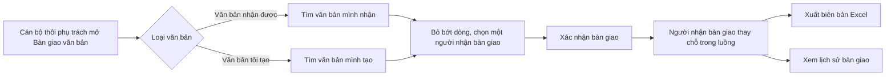

# Quản lý chung văn bản — tóm tắt nghiệp vụ cho BA

> Bản đọc nhanh bằng lời nghiệp vụ. Chi tiết và bằng chứng: [nghiep-vu.md](nghiep-vu.md) (mã NV / BR trong ngoặc
> để tra). Cập nhật: 2026-10-02 · Nguồn: code `kha_develop` + DB DEV. Nhãn quy tắc: **[Đã xác nhận]** = chủ dự án đã
> chốt là đúng ý đồ · **[Hiện trạng]** = hệ thống đang chạy như vậy, chưa ai xác nhận là ý đồ · **[Lệch nghiệp vụ]**
> = đã xác nhận nghiệp vụ muốn khác, hệ thống đang làm sai.

## 1. Phân hệ này dùng để làm gì

Phân hệ gom các chức năng làm việc trên **văn bản nói chung** (cả đến và đi) không thuộc riêng một hộp việc hay một bước xử lý (1.1).
Gồm: **tra cứu / tìm kiếm** văn bản (NV-01, NV-02, NV-05); **theo dõi văn bản của đơn vị** cho lãnh đạo được cấu hình theo dõi (NV-03, NV-04); **quy tắc ai được mở một văn bản** và các phần dùng chung của màn chi tiết, kèm nhật ký sửa văn bản (NV-06, NV-07).
Gồm cả **bàn giao văn bản** khi cán bộ thôi phụ trách (NV-08, NV-09); **danh mục phạm vi** dùng khi công khai văn bản, **danh mục thể loại văn bản** và các danh mục lĩnh vực / độ khẩn / độ mật (NV-10…NV-13).
Và các tiện ích cá nhân: **tài liệu cá nhân**, **ghi chú trên văn bản**, **mẫu ý kiến** khi chuyển văn bản (NV-14…NV-16).

**Không gồm:** hộp việc và nút xử lý văn bản đến, tra cứu văn bản đến, theo dõi văn bản đến đơn vị (xem `van-ban/den`); cấp số, ban hành, công khai / hủy công khai (xem `van-ban/di`); chuyển, thu hồi, xem luồng chuyển (xem `van-ban/chuyen-van-ban`); báo cáo sổ văn bản, sổ văn bản đơn vị (xem `van-ban/so-van-ban`); văn bản migrate, liên thông (xem `van-ban/lien-thong`); dự thảo, ký duyệt (xem `xu-ly-cong-viec`); nhắc việc, thông báo (xem `lich-nhac-viec`); thư viện văn bản, tag, biểu mẫu (xem `tai-lieu-mau`); lưu hồ sơ (xem `ho-so-cong-viec`); cấu hình người – đơn vị theo dõi, quản trị menu (xem `he-thong`) (1.1).

## 2. Ai dùng và được làm gì

| Vai trò | Được làm gì trong phân hệ này |
|---|---|
| Mọi cán bộ có menu | Tra cứu dự thảo / văn bản đi mình liên quan; tìm kiếm toàn văn; tra cứu văn bản hàng năm; lưu tài liệu cá nhân; ghi chú trên văn bản; mẫu ý kiến; bàn giao văn bản cá nhân của mình (1.4) |
| Văn thư (`VT`) | Thêm vào tra cứu mọi văn bản đi đã có số của đơn vị mình làm văn thư, kể cả văn bản đã xóa; bàn giao văn bản đơn vị và văn bản tự động ban hành của đơn vị; tạo phạm vi cho đơn vị; quản lý thể loại văn bản của đơn vị (1.4, BR-01, NV-08, BR-32) |
| Người được cấu hình theo dõi văn bản đơn vị (thường là lãnh đạo `TTDV` / `LDDV`) | Xem toàn bộ văn bản đi / đến của đơn vị được giao theo dõi và tình hình xử lý của từng cán bộ — không cần nằm trong luồng nhận (1.4, NV-03, NV-04, BR-08) |
| Quản trị đơn vị (`ADMIN_LEVEL1`) | Tạo phạm vi; quản lý và phân quyền thể loại văn bản của đơn vị (1.4, BR-32) |
| Quản trị hệ thống (`ADMIN`) | Như trên, thêm: tạo / sửa thể loại **Chung** dùng toàn hệ thống (BR-32) |

## 3. Màn hình / menu người dùng thấy

| Menu / màn | Để làm gì | Ghi chú | Mã menu |
|---|---|---|---|
| VĂN BẢN ĐI > Tra cứu văn bản | Tìm dự thảo / văn bản đi mình liên quan (và của đơn vị nếu là văn thư), xuất danh sách | Mặc định 365 ngày; chỉ xem, không thêm / sửa (NV-01) | 439505 |
| VĂN BẢN ĐẾN > Tìm kiếm văn bản | Tìm từ khóa trên kho văn bản đã công bố | **Chỉ hiện trang đầu kết quả, tiêu đề luôn "0 văn bản"** (BR-04, Q8) | 338371 |
| VĂN CÔNG KHAI > Theo dõi văn bản đơn vị | Hai tab Văn bản đi / Văn bản đến của đơn vị được giao theo dõi | Không có cấu hình theo dõi thì màn trống (NV-03, BR-06) | 439945 |
| VĂN BẢN ĐI > Theo dõi văn bản đi đơn vị | Tab "Văn bản đơn vị phát hành" (danh sách hoặc cây Sổ → Thể loại) và tab "Tình hình xử lý của cá nhân" | Không có cấu hình theo dõi thì chỉ hiện thông báo, kể cả lãnh đạo (NV-04) | 440265 |
| TRA CỨU VĂN BẢN HÀNG NĂM > Văn bản đi / Văn bản đến | Xem lại văn bản theo năm ban hành, chỉ đọc | Năm chọn chỉ có 2020–2025 (NV-05, BR-12) | 439747 · 439749 |
| TÀI LIỆU CÁ NHÂN > Văn bản lưu trữ | — | **Đã xóa khỏi menu** (NV-05) | 439587 |
| VĂN BẢN ĐẾN > Bàn giao văn bản | Bàn giao văn bản mình nhận / mình tạo cho người khác; link *Xem lịch sử* | (NV-08, NV-09) | 337771 |
| DANH MỤC > Quản lý phạm vi | Khai các nhóm đơn vị dùng khi công khai văn bản | Chỉ người tạo được sửa / khóa (NV-10, BR-25) | 338433 |
| DANH MỤC > Danh mục thể loại văn bản | Thêm, sửa, khóa, xóa, phân quyền thể loại văn bản | Tiêu đề trang ghi "Danh mục hình thức văn bản" (NV-12) | 339073 |
| TÀI LIỆU CÁ NHÂN > Tài liệu cá nhân | Danh sách văn bản / lịch họp mình đã lưu, xếp theo danh mục cá nhân | (NV-14) | 339012 |
| VĂN BẢN ĐẾN > Xem luân chuyển văn bản đơn vị | — | **Màn dở dang, không hiện văn bản** (NV-17, Q8) | 337831 |
| Màn chi tiết văn bản — panel *Lịch sử*, nút *Lưu cá nhân*, *Ghi chú* | Xem nhật ký sửa văn bản; lưu cá nhân; trao đổi | Dùng chung mọi đường mở văn bản (NV-06, NV-07) | — |
| Popup chuyển văn bản — chọn mẫu ý kiến | Chèn nhanh câu ý kiến đã lưu | (NV-16) | — |

Lĩnh vực, độ khẩn, độ mật **không có màn quản lý** trên web (NV-13). Ba menu báo cáo sổ / sổ văn bản đơn vị dưới VĂN BẢN ĐẾN thuộc `van-ban/so-van-ban` (1.2).

## 4. Luồng chính

Luồng có nhiều bước nhất của phân hệ là **bàn giao văn bản**; các mảng khác mô tả ngắn bên dưới.

1. Cán bộ chọn loại văn bản: *Văn bản nhận được* (mặc định) hoặc *Văn bản tôi tạo*; nhập khoảng ngày nhận (bắt buộc, mặc định 365 ngày), lọc trạng thái xử lý, số ký hiệu, trích yếu, người ký, người gửi. Văn thư chọn thêm *Văn bản đơn vị / Văn bản cá nhân* (NV-08).
2. *Văn bản tôi tạo* gồm văn bản mình tạo, và với văn thư thì cả văn bản tự động ban hành của đơn vị mình (NV-08).
3. Cán bộ bỏ bớt dòng không bàn giao, chọn **một** người nhận bàn giao, xác nhận "bàn giao N văn bản cho X" (NV-08).
4. Hệ thống ghi mỗi văn bản một dòng bàn giao. Mọi lần mình đã chuyển văn bản đó cho người khác: người nhận bàn giao trở thành **người gửi**. Văn bản nhận được: người nhận bàn giao trở thành **người nhận**. Văn bản tôi tạo: người nhận bàn giao trở thành **người tạo** (NV-08, BR-18).
5. Màn hiện kết quả và nút *Xuất* biên bản bàn giao Excel; *Xem lịch sử* liệt kê các lần mình giao hoặc mình nhận (NV-08, NV-09, BR-22).

**Các mảng khác (mô tả ngắn).**
- *Mở một văn bản (quyền xem)*: hệ thống cho xem nếu người dùng là người tạo, người nhận hoặc người gửi văn bản; là lãnh đạo / văn thư (hoặc người theo dõi) của đơn vị ban hành hay đơn vị nhận; nằm trong luồng ký; văn bản từng được công khai; hoặc có liên quan qua nhiệm vụ, công việc, lịch họp, hồ sơ đang mượn, yêu cầu văn bản. Không đạt thì báo "Không xác định được chi tiết văn bản" (NV-06).
- *Tra cứu văn bản*: hợp ba tập — dự thảo / văn bản mình tạo hoặc có trong luồng ký; văn bản đi đã có số của đơn vị mình làm văn thư; văn bản chờ cấp số / hủy ban hành ở bước văn thư của đơn vị mình (NV-01).
- *Theo dõi văn bản đơn vị / đi đơn vị*: người được cấu hình theo dõi chọn đơn vị, xem mọi văn bản đi đã có số của đơn vị (không cần trong luồng nhận), văn bản đến của đơn vị, và số dự thảo của từng cán bộ theo trạng thái (NV-03, NV-04).
- *Nhật ký*: mỗi lần thêm văn bản, sửa, vào sổ, ban hành, hệ thống ghi trường nào đổi từ giá trị nào sang giá trị nào và file nào được thêm / bỏ; xem ở panel *Lịch sử* của chi tiết văn bản (NV-07).
- *Phạm vi*: văn thư / quản trị khai phạm vi = tên + danh sách đơn vị; khi công khai văn bản chỉ cần chọn phạm vi, hoặc chọn đơn vị lẻ ("phạm vi khác") (NV-10, NV-11).
- *Thể loại văn bản*: thể loại Chung (toàn hệ thống) hoặc của Đơn vị; thể loại đơn vị được phân quyền cho đơn vị khác dùng (NV-12).
- *Tài liệu cá nhân, ghi chú, mẫu ý kiến*: tiện ích riêng của từng người, không gửi thông báo (NV-14, NV-15, NV-16).

## 5. Trạng thái

**Lựa chọn khi bàn giao**

| Ô | Các giá trị | Ghi chú | Giá trị |
|---|---|---|---|
| Trạng thái văn bản | Văn bản nhận được / Văn bản tôi tạo | Một lần bàn giao chỉ một loại (BR-19) | 1 / 2 |
| Phân loại văn bản (chỉ văn thư) | Tất cả / Văn bản đơn vị / Văn bản cá nhân | Người khác luôn "Tất cả" (NV-08) | −1 / 0 / 1 |
| Trạng thái xử lý (chỉ văn bản nhận được) | Tất cả / Chưa xử lý / Đã xử lý / Chưa đọc / Đã đọc | (NV-08) | −1 / 1 / 2 / 3 / 4 |

**Phạm vi**

| Trạng thái / loại | Nghĩa | Chuyển sang khi nào | Giá trị |
|---|---|---|---|
| Toàn bộ / Liền kề | Hai loại phạm vi; hệ thống không xử lý khác nhau | Màn danh mục chỉ cho tạo Toàn bộ; phạm vi khác sinh khi công khai luôn là Liền kề (BR-24, Q4) | 1 / 2 |
| Hoạt động / Khóa | Phạm vi dùng được / không; không có xóa | Người tạo bấm Khóa / Mở khóa (NV-10, BR-26) | 1 / 0 |
| Phạm vi công khai của văn bản: đang công khai / hủy | Văn bản đang công khai cho phạm vi này hay không | Về 0 khi đơn vị công khai lại văn bản; hủy công khai **không** đổi giá trị này (BR-27) | 1 / 0 |

**Thể loại văn bản**

| Trạng thái / loại | Nghĩa | Chuyển sang khi nào | Giá trị |
|---|---|---|---|
| Chung / Đơn vị | Dùng toàn hệ thống / của đơn vị tạo và đơn vị được cấp | Chọn khi thêm; đổi sang Chung thì gỡ mọi phân quyền (NV-12) | 0 / 1 |
| Hoạt động / Khóa | Hiện / không hiện trên combobox các form | Bấm Khóa / Mở khóa (NV-12, BR-33) | 1 / 0 |
| Đã xóa | Xóa mềm | Bấm Xóa khi thể loại không đang được dùng (BR-31) | cờ xóa = 1 |

**Đối tượng trong tài liệu cá nhân**

| Loại | Nghĩa | Giá trị |
|---|---|---|
| Văn bản | Văn bản mình nhận / xem | 1 |
| Lịch họp | Lịch họp | 2 |
| Văn bản do mình tạo | Văn bản mình tạo | 3 |

## 6. Quy tắc quan trọng nhất

- [Đã xác nhận] Quyền thao tác (ai thấy nút, ai có menu) kiểm ở tầng hiển thị trên web — thiết kế chung (1.4, X1).
- [Hiện trạng] Văn bản **đã công khai một lần** thì mọi cán bộ mở được nếu có đường dẫn, kể cả sau khi hủy công khai; phạm vi công khai chỉ giới hạn danh sách / kết quả tìm kiếm, không giới hạn người xem (BR-13, Q1).
- [Hiện trạng] Toàn bộ kiểm quyền xem văn bản chỉ chạy khi tham số kiểm an toàn thông tin bật; DB DEV đang bật (NV-06, dac-thu bẫy 4).
- [Hiện trạng] *Tra cứu văn bản* dựa trên vai trò của người dùng với dự thảo (người tạo, người trong luồng ký) cộng với đơn vị làm văn thư — chuyên viên không trong luồng ký và không làm văn thư không thấy văn bản đi của đơn vị (BR-01).
- [Hiện trạng] *Theo dõi văn bản đơn vị / đi đơn vị* hiện mọi văn bản đi đã có số của đơn vị, không cần người xem nằm trong luồng nhận; quyền đến từ cấu hình người – đơn vị theo dõi (BR-08, BR-06).
- [Hiện trạng] Hai tab của *Theo dõi văn bản đơn vị* dùng chung cấu hình "theo dõi văn bản đi đơn vị", dù đã có cấu hình riêng "theo dõi văn bản đến đơn vị" đang có dữ liệu (BR-07, Q3).
- [Hiện trạng] *Tra cứu văn bản hàng năm* đọc thẳng dữ liệu đang dùng (không có kho lưu trữ riêng); mục "Văn bản đi" liệt kê văn bản đi mình / đơn vị mình **nhận được**, không phải văn bản đơn vị mình ban hành (BR-10, BR-11, Q2).
- [Hiện trạng] Bàn giao chuyển quyền sở hữu dòng nhận: người nhận bàn giao thấy văn bản như người được chuyển, trở thành người gửi của các lần chuyển cũ (nên thu hồi được, nhận được đề nghị trả lại); trạng thái, hạn, vai trò của dòng không đổi (BR-18).
- [Hiện trạng] Bàn giao "văn bản nhận được" chỉ lấy dòng nhận ở các trạng thái của dữ liệu cũ, nên với dữ liệu hiện hành **không ra dòng nào** (BR-20, Q6).
- [Hiện trạng] Bàn giao không gửi thông báo / SMS cho người nhận và không kiểm người nhận cùng đơn vị (BR-21).
- [Hiện trạng] Nhật ký chỉ thêm, không sửa / xóa; chỉ ghi khi thêm, sửa, vào sổ, ban hành — không ghi chuyển, hoàn thành, trả lại, đọc, thu hồi (BR-16, BR-17).
- [Hiện trạng] Thể loại văn bản kiểm trùng theo tên **hoặc** mã viết tắt. Trùng thể loại của đơn vị khác thì hệ thống đề nghị biến thể loại kia thành dùng chung toàn hệ thống, hoặc xin cấp thể loại kia cho đơn vị mình; bản đang nhập không được lưu (BR-29, BR-30, Q9).
- [Hiện trạng] Không xóa được thể loại đang được dùng: có văn bản, dự thảo, bộ đếm số trong sổ, hoặc còn phân quyền đang bật. Vì sổ tự sinh tạo bộ đếm cho mọi thể loại, thể loại tồn tại lúc tạo sổ coi như đang dùng (BR-31).
- [Hiện trạng] Combobox thể loại trên form chỉ gồm thể loại chưa xóa, đang hoạt động, còn hiệu lực, đúng lĩnh vực, và Chung hoặc thuộc / được cấp cho đơn vị mình; danh sách được lưu đệm 1 giờ, sửa danh mục không xóa bộ đệm (BR-33).
- [Hiện trạng] Ghi chú trên văn bản: mọi cán bộ có văn bản trong cùng **đơn vị cấp 2** đọc được ghi chú của nhau; chỉ sửa / xóa ghi chú của chính mình (BR-38, BR-39, Q7).

## 7. Hệ thống KHÔNG làm / hay bị hiểu nhầm

- **Hai "tra cứu" khác bản chất:** *Tra cứu văn bản* đi theo dự thảo / luồng ký + đơn vị văn thư; *Tra cứu văn bản hàng năm* đi theo dòng nhận. Cùng "văn bản đi" nhưng ra hai tập khác nhau (dac-thu bẫy 3).
- **"Tìm kiếm văn bản" không chạy đủ:** chỉ trang đầu, luôn báo 0 kết quả, bỏ qua loại tìm và ô "tất cả đơn vị"; kho tìm kiếm do chương trình ngoài đánh chỉ mục, trên DEV chưa có văn bản nào được đánh (BR-04, BR-05).
- **Phạm vi không phải quyền xem** — chỉ là nhóm đơn vị dùng khi công khai (BR-13, NV-10).
- **"Phạm vi khác" lẫn vào danh mục phạm vi** của đơn vị tạo, vì hệ thống không đánh dấu nó khác phạm vi tạo từ danh mục (BR-28).
- **"Toàn bộ" và "Liền kề" không khác nhau trong xử lý** (BR-24, Q4).
- **Nhật ký không phải lịch sử luân chuyển:** chuyển, hoàn thành, trả lại không có trong panel *Lịch sử*; danh sách luân chuyển xem ở `van-ban/chuyen-van-ban` (BR-17).
- **Lĩnh vực, độ khẩn, độ mật không có màn quản lý** — dữ liệu nạp thẳng vào DB; DB DEV còn 3 dòng thử đang hoạt động hiện trên combobox độ khẩn (NV-13).
- **Mã độ mật / độ khẩn không thống nhất:** web có nhiều bảng mã ghi cứng đánh số khác danh mục, ví dụ danh mục ghi 3 = Tuyệt mật, 7 = Tối mật (BR-34).
- **"Mẫu ý kiến" không phải mẫu văn bản** — là câu ý kiến cá nhân khi chuyển văn bản (NV-16, dac-thu bẫy 14).
- **Nút *Lưu cá nhân* mở từ hộp việc luôn hiện "Lưu"** kể cả văn bản đã lưu; chỉ nhận biết đã lưu khi mở từ Tài liệu cá nhân hoặc hồ sơ (BR-37).
- **"Tình hình xử lý của cá nhân": số "Chưa trình" luôn 0** và "Đã hoàn thành" đếm cả dự thảo chờ cấp số (BR-09).

## 8. Liên quan phân hệ khác

| Khi thay đổi ở đây… | …phải xem thêm | Vì sao |
|---|---|---|
| Quy tắc quyền xem văn bản | `van-ban/den`, `van-ban/di`, `cong-viec`, `nhiem-vu`, `hop`, `ho-so-cong-viec` | Quy tắc chung áp cho mọi đường mở văn bản và file đính kèm của nhiệm vụ, công việc, lịch họp, hồ sơ (NV-06) |
| Tra cứu văn bản, theo dõi văn bản đơn vị | `van-ban/di`, `xu-ly-cong-viec`, `van-ban/den` | Một màn dùng chung cho ba menu; tab văn bản đến là màn tra cứu văn bản đến (dac-thu bẫy 1, NV-03) |
| Cấu hình người – đơn vị theo dõi | `he-thong`, trang chủ | Cấu hình nằm ở màn quản trị người dùng; trang chủ dùng cùng cấu hình để dựng số liệu (BR-06, 1.3) |
| Bàn giao | `van-ban/chuyen-van-ban`, `van-ban/den` | Người nhận bàn giao thành người gửi của các lần chuyển cũ — ảnh hưởng thu hồi, đề nghị trả lại (BR-18) |
| Phạm vi, phạm vi công khai | `van-ban/di`, `tai-lieu-mau` | Công khai / hủy công khai nằm ở văn bản đi; popup chọn phạm vi dùng cho thư viện văn bản (NV-11, NV-10) |
| Thể loại văn bản | `van-ban/so-van-ban`, mọi form văn bản / dự thảo | Cấp số theo thể loại; thể loại có bộ đếm trong sổ bị coi là đang dùng (BR-31, NV-12) |
| Nhật ký văn bản | `van-ban/den`, `van-ban/di` | Ghi khi thêm / sửa / vào sổ / ban hành; thêm đường sửa văn bản mới phải tự ghi nhật ký (NV-07, dac-thu bẫy 11) |
| Tìm kiếm toàn văn | `tich-hop` | Kho tìm kiếm và việc đánh chỉ mục nằm ngoài hệ thống (BR-05) |

## 9. Câu hỏi nghiệp vụ còn mở

- `Q1` — Công khai văn bản là cho toàn hệ thống xem hay chỉ đơn vị trong phạm vi; hủy công khai thì người ngoài luồng nhận còn xem được không?
- `Q2` — Mục "Văn bản đi" của Tra cứu văn bản hàng năm cần hiện văn bản đơn vị ban hành, văn bản đi mình nhận được, hay cả hai?
- `Q3` — Theo dõi văn bản đi và văn bản đến của đơn vị có cần cấu hình riêng không?
- `Q4` — Phạm vi "Toàn bộ" và "Liền kề" khác nhau thế nào; còn cần hai loại không?
- `Q5` — Hai thuộc tính "văn bản pháp luật" và "xử lý" của thể loại dùng để làm gì; giá trị 2 nghĩa là gì?
- `Q6` — Bàn giao cần bàn giao những văn bản nhận được nào: chỉ chưa xử lý xong, hay tất cả?
- `Q7` — Ghi chú trên văn bản dành cho ai đọc: người viết, đơn vị trực tiếp, hay toàn đơn vị cấp 2?
- `Q8` — "Xem luân chuyển văn bản đơn vị" và "Tìm kiếm văn bản" còn dùng không?
- `Q9` — Khi tạo thể loại trùng thể loại của đơn vị khác, hướng mong muốn là xin cấp, chuyển thành dùng chung, hay cả hai?

(Đầy đủ ở mục 7.1 của `nghiep-vu.md`.)

## 10. Khi viết yêu cầu mới cho phân hệ này, nhớ ghi rõ

- **Màn nào trong ba màn dùng chung một bộ tra cứu:** Tra cứu văn bản, tab Văn bản đi của Theo dõi văn bản đơn vị, tab Văn bản đơn vị phát hành của Theo dõi văn bản đi đơn vị — sửa một màn phải nói hai màn kia có đổi không (dac-thu bẫy 1).
- **"Tra cứu" theo nghĩa nào:** theo dự thảo / luồng ký, theo dòng nhận, hay toàn văn trên kho công bố (dac-thu bẫy 3, NV-02).
- **Quyền xem có đổi không** — và áp cho đường mở nào (hộp việc, tìm kiếm, thông báo, file của nhiệm vụ / lịch họp / hồ sơ), văn bản đã công khai / đã hủy công khai xử lý thế nào (NV-06, BR-13).
- **Người theo dõi đơn vị** dùng cấu hình nào (đi / đến), lãnh đạo không có cấu hình thì có được xem không (BR-06, BR-07, Q3).
- **Bàn giao:** loại văn bản nào (nhận được / tôi tạo / đơn vị / cá nhân), trạng thái xử lý nào, có báo cho người nhận bàn giao không, có giới hạn người nhận trong đơn vị không (NV-08, BR-20, BR-21).
- **Nhật ký:** thao tác mới có cần ghi nhật ký không, ghi trường nào (BR-16, BR-17).
- **Thể loại văn bản:** Chung hay Đơn vị, có phân quyền cho đơn vị khác không, khi trùng thì xử lý thế nào, và có ảnh hưởng sổ cấp số theo thể loại không (NV-12, BR-29, BR-30, BR-31).
- **Danh sách trên combobox** (thể loại, lĩnh vực, độ khẩn, độ mật): lấy theo đơn vị tạo hay theo phân quyền, thứ tự sắp xếp, có lưu đệm không (BR-33, dac-thu bẫy 8).
- **Phạm vi:** loại Toàn bộ / Liền kề nghĩa là gì, ai tạo, ai sửa, có liên quan tới quyền xem không (BR-24, BR-25, Q1, Q4).
- **Tiện ích cá nhân** (tài liệu cá nhân, ghi chú, mẫu ý kiến): ai thấy dữ liệu của ai, có thông báo không (BR-38, BR-40, Q7).
