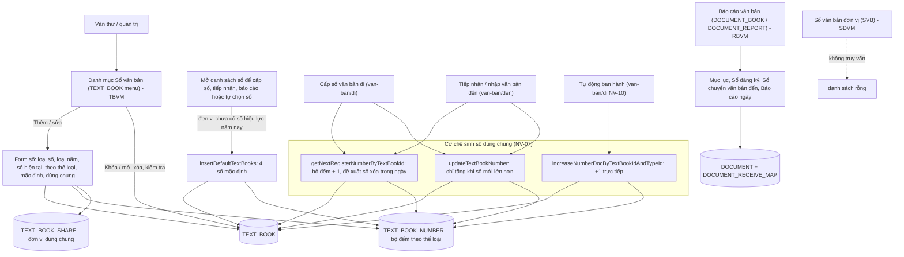
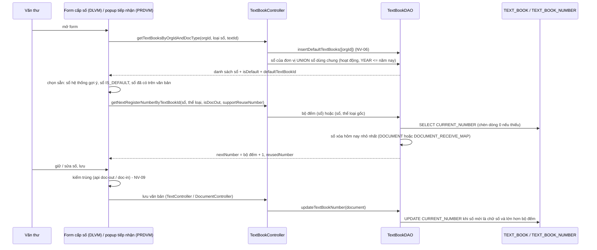
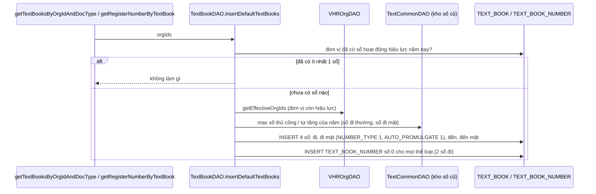
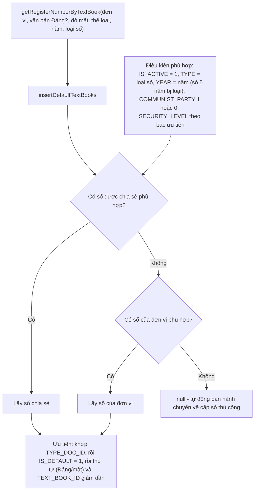
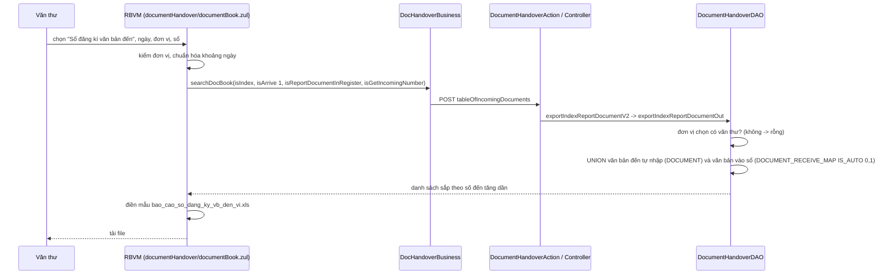
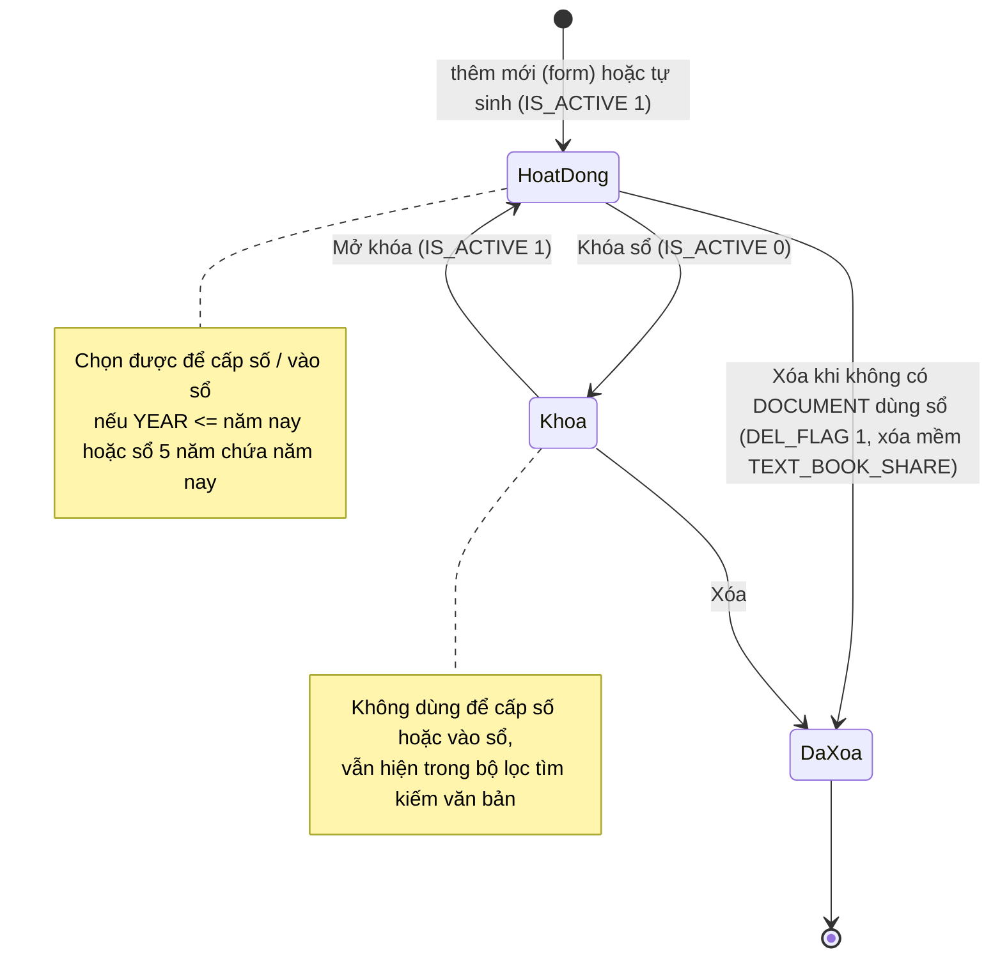
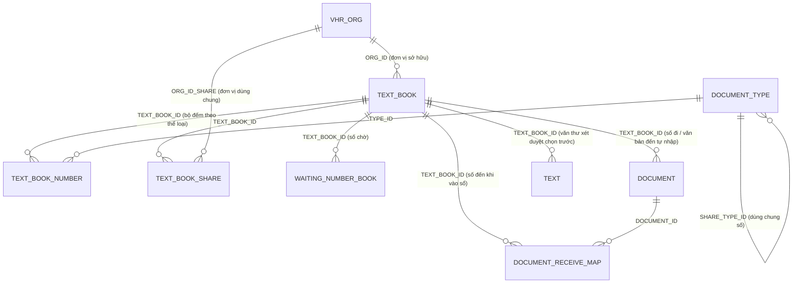

# Sổ văn bản — nghiệp vụ: danh mục sổ (`TEXT_BOOK`), sổ đi / sổ đến, cơ chế sinh số dùng chung (số hiện tại, cấp số theo thể loại, cấp bù, sổ mặc định hằng năm), sổ dùng chung (`TEXT_BOOK_SHARE`), sổ văn bản đơn vị và báo cáo / in sổ văn bản đến – đi

> Viết lại từ code nhánh `kha_develop` (web-spring + backend2.0) ngày 2026-10-01. Mọi khẳng định có nguồn `file:dòng`.
> Menu đối chiếu **DB DEV `SYS_MENU` ngày 2026-10-01**; số dòng, phân bố giá trị và comment cột các bảng `TEXT_BOOK`, `TEXT_BOOK_NUMBER`, `TEXT_BOOK_SHARE`, `BOOK_DISPATCH`, `DOCUMENT_RECEIVE_MAP`, `WAITING_NUMBER_BOOK`, `DOCUMENT` (theo sổ), `CODE_MASTER` (`code.doc.state`), `SYS_ROLE`, `SYSTEM_PARAMETER` đối chiếu **DB DEV ngày 2026-10-01** (do người điều phối truy vấn, chỉ SELECT; tác giả không kết nối DB). Không có FK nào trên các bảng này (DB DEV) — mọi quan hệ ở mục 5 là quan hệ logic lấy từ JOIN / entity trong code. Bảng `TEXT_MANUAL_NUMBER`, `TEXT_MAX_NUMBER`, `DOCUMENT_TYPE` **chưa đối chiếu DB**.
> HDSD cũ (`HDSD_Van ban den(Van thu)_1.0`, mục 4.6 "Báo cáo văn bản", 4.7 "Sổ văn bản") chỉ dùng tham khảo thuật ngữ.
>
> Viết tắt đường dẫn:
> `WEB/` = `web-spring/src/main/java/com/viettel/` · `ZUL/` = `web-spring/src/main/webapp/view/voffice/` ·
> `BIZ/` = `web-spring/src/main/java/com/voffice/service/business/` · `BE1/` = `backend2.0/backendvoffice/src/main/java/com/viettel/voffice/` ·
> `BE2/` = `backend2.0/backendvoffice/src/main/java/com/viettel/office/` · `SQL/` = `backend2.0/backendvoffice/sql/` ·
> `LBL` = `web-spring/src/main/resources/com/viettel/resources/multiLanguage/common_voffice_vi.properties`.
> Lớp hay dùng — **danh mục sổ**: **TBVM** = `WEB/voffice/vm/document/TextBookVM.java`, **TBB** = `BIZ/TextBookBusiness.java`, **TBA** = `BE1/action/TextBookAction.java` (`/textBookAction`, 25 endpoint), **TBC** = `BE1/controler/TextBookController.java`, **TBDAO** = `BE1/database/dao/document/TextBookDAO.java`, **TCDAO** = `BE1/database/dao/text/TextCommonDAO.java`, **TBMC** = `BE2/controller/TextBookManagerController.java` (`/api/text-book`), **TBSI** = `BE2/services/impl/TextBookServiceImpl.java`, **AC** = `WEB/util/AppConstants.java`, **C1** = `BE1/constants/Constants.java`.
> **Báo cáo / sổ đơn vị**: **RBVM** = `WEB/voffice/vm/documentHandover/DocumentBookVM.java` (màn Báo cáo văn bản), **SDVM** = `WEB/voffice/vm/document/DocumentBookVM.java` (màn Sổ văn bản đơn vị), **DHB** = `BIZ/DocHandoverBusiness.java`, **DHA** = `BE1/action/DocumentHandoverAction.java`, **DHC** = `BE1/controler/DocumentHandoverController.java`, **DHDAO** = `BE1/database/dao/document/DocumentHandoverDAO.java`.
> **Nơi dùng số**: **DDAO** = `BE1/database/dao/document/DocumentDAO.java`, **TC** = `BE1/controler/TextController.java`, **TEAS** = `BE1/thread/ThreadExcuteAfterSigned.java`, **DLVM** = `WEB/voffice/vm/document/DocumentLookUpVM.java` (form cấp số), **PRDVM** = `WEB/voffice/widget/PopupReceiveDocVM.java` (popup tiếp nhận), **DRI** = `BE2/repositories/impl/DocumentRepositoryImpl.java`.
> Phân hệ liền kề đã viết: văn bản đi [`../di/nghiep-vu.md`](../di/nghiep-vu.md) (ký hiệu `VBĐi NV-xx / BR-xx`), văn bản đến [`../den/nghiep-vu.md`](../den/nghiep-vu.md) (`VBĐ`), dự thảo [`../../xu-ly-cong-viec/nghiep-vu.md`](../../xu-ly-cong-viec/nghiep-vu.md) (`XLCV`), luồng xử lý [`../luong-xu-ly/nghiep-vu.md`](../luong-xu-ly/nghiep-vu.md).

## 1. Tổng quan

### 1.1 Phạm vi

"Sổ văn bản" là **cuốn sổ đăng ký** của một đơn vị: mỗi văn bản đi được cấp **số đi** trong một sổ đi, mỗi văn bản đến được ghi **số đến** trong một sổ đến. Trong hệ thống, sổ là một dòng `TEXT_BOOK` mang **bộ đếm số hiện tại**; phân hệ này gồm:

- **Danh mục sổ văn bản** (menu `TEXT_BOOK`, "DANH MỤC > Sổ văn bản"): xem / tìm, thêm, sửa, khóa – mở khóa, xóa, xem chi tiết, kiểm tra sổ (số trống, số trùng) (NV-01 … NV-05).
- **Sổ dùng chung** — chia sẻ một sổ cho đơn vị khác (`TEXT_BOOK_SHARE`) (NV-04).
- **Sổ mặc định tự sinh theo năm** — bộ 4 sổ được hệ thống tự tạo khi đơn vị chưa có sổ nào hiệu lực năm nay (NV-06).
- **Cơ chế sinh số dùng chung** cho mọi luồng: số tiếp theo, cấp bù số xóa trong ngày, cập nhật bộ đếm, tăng số tự động, đánh số theo thể loại (`TEXT_BOOK_NUMBER`) (NV-07); **chọn sổ theo ngữ cảnh** (NV-08); **kiểm trùng số** và **số chờ** (NV-09); bản đồ các điểm dùng sổ (NV-10).
- **Báo cáo / in sổ văn bản** (menu `DOCUMENT_BOOK` "Báo cáo văn bản đi đến", `DOCUMENT_REPORT` "Báo cáo văn bản"): mục lục, sổ đăng ký văn bản đến, sổ chuyển văn bản đến, báo cáo ngày… (NV-11).
- **Sổ văn bản đơn vị** (menu `SVB`) — màn hiện không có dữ liệu (NV-12); thành phần cũ / không dùng (NV-13).

Phân hệ **KHÔNG gồm** (trỏ sang):

| Nội dung | Phân hệ |
|---|---|
| Thao tác **cấp số** văn bản đi (form cấp số, cấp số & đóng dấu, đổi tên file theo mã sổ, cấp bù số trên form, tự động ban hành, hủy ban hành, danh sách số đã cấp) | `van-ban/di` (VBĐi NV-02, NV-03, NV-10, NV-15, NV-16) — ở đây chỉ mô tả hàm sinh số mà các bước đó gọi |
| **Vào sổ đến** khi tiếp nhận (popup tiếp nhận, `DOCUMENT_RECEIVE_MAP`, trùng văn bản, hủy tiếp nhận) và nhập văn bản đến thủ công | `van-ban/den` (VBĐ NV-03, NV-04) |
| Văn thư xét duyệt nhập sổ / số trước khi ký (`promulgateInfor`) | `xu-ly-cong-viec` (XLCV NV-10) |
| Lọc hộp văn bản đến / đi theo sổ, cây sổ ở màn theo dõi văn bản đơn vị | `van-ban/den` (VBĐ NV-02), `van-ban/di` (VBĐi NV-01) |
| Báo cáo văn bản đi (Mục lục / Sổ / Sổ đăng ký văn bản đi) ở màn "Báo cáo văn bản đi" `ZUL/requisition/requisitionReport.zul` | ranh giới — chỉ mô tả phần dùng chung ở NV-11; màn đó đang xếp ở `kpi-danh-gia` (`ban-do.md`) |
| Bàn giao văn bản (`documentHandover.zul`, cùng `DHA`/`DHDAO`) | `van-ban/quan-ly-chung` |
| Danh mục thể loại văn bản (`DOCUMENT_TYPE`, thể loại dùng chung số `SHARE_TYPE_ID`) | danh mục chung (chỉ mô tả cách sổ dùng) |

### 1.2 Menu (đối chiếu DB DEV `SYS_MENU` ngày 2026-10-01)

`SYS_MENU.STATUS`: 1 = mở khóa, 2 = khóa (X3). Code **không** tham chiếu mã menu nào của phân hệ (grep `"TEXT_BOOK"`, `"DOCUMENT_BOOK"`, `"DOCUMENT_REPORT"`, `"SVB"` trong web + BE chỉ ra `@Table`); URL nằm ở DB.

| `SYS_MENU_ID` | `CODE` | Tên (DB DEV) | Cha | URL | `STATUS` | VM / NV |
|---|---|---|---|---|---|---|
| 339213 | `TEXT_BOOK` | **Sổ văn bản** | DANH MỤC (336813) | `/view/voffice/document/textBook/textBook.zul` | 1 | TBVM — NV-01 … NV-05 |
| 337491 | `DOCUMENT_BOOK` | **Báo cáo văn bản đi đến** | VĂN BẢN ĐẾN (337200) | `/view/voffice/documentHandover/documentBook.zul` | 1 | RBVM — NV-11 |
| 439344 | `DOCUMENT_REPORT` | **Báo cáo văn bản** | VĂN BẢN ĐẾN (337200) | `/view/voffice/documentHandover/documentBook.zul` (**cùng URL** với 337491) | 1 | RBVM — NV-11 |
| 337792 | `SVB` | **Sổ văn bản đơn vị** | VĂN BẢN ĐẾN (337200) | `/view/voffice/document/bookDoc/documentBook.zul?type=1` | 1 | SDVM — NV-12 (màn rỗng) |

Các zul `document/bookDispatch/*`, `document/bookDoc/bookDoc.zul`, `bookContentDoc.zul`, `reportSendReceiveDoc/dispatch_Book_List.zul`, `lookUpDispatchDocument.zul` **không khớp menu nào** trên DB DEV và không được zul/Java nào include (grep tên file) — NV-13.

### 1.3 Widget trang chủ

Không có ô `HOME_WIDGET` nào của phân hệ (đối chiếu toàn bảng DB DEV `HOME_WIDGET` ngày 2026-10-01: không mã nào liên quan sổ). Ô "Chờ cấp số" (`OUT_CHO_CAP_SO`) thuộc `van-ban/di`.

### 1.4 Actor & quyền

Quyền thao tác nằm ở **tầng hiển thị nút** trên web (X1); BE không kiểm người gọi có quyền với sổ khi thêm / sửa / khóa / xóa (dac-thu L1).

| Actor | Nhận diện trong code | Làm gì |
|---|---|---|
| Văn thư đơn vị | role `VT` (web `userRole.documentManager=VT` — `web-spring/src/main/resources/application.properties:349`; BE `C1.SYS_ROLE_VT = 336954` — `C1:123`) | Thấy và quản lý sổ **của đơn vị mình làm văn thư** + sổ **được chia sẻ** cho đơn vị đó (TBDAO:681-686, 715-721); nút Sửa/Khóa/Xóa chỉ hiện trên sổ của đơn vị mình (`permission = 1` — TBDAO:903-918, `ZUL/document/textBook/textBook_search.zul:334`); tích "Sổ mặc định" (chỉ hiện với văn thư — `textBook_add.zul:294`, `317-320`); xuất báo cáo sổ (NV-11) |
| Quản trị | BE: role id `336815` (`SYS_ROLE_ADMIN`), `1` (`SYS_ROLE_QTHTDV`), `337591` (`SYS_ROLE_QTHTDV_TEST`) (`C1:120`, `126`, `132`) | Thấy và quản lý mọi sổ có `ORG_PATH` chứa đơn vị mình quản trị (TBDAO:654-655, 688-697, 723-732; quyền sửa — TBDAO:907-914). DB DEV `SYS_ROLE` ngày 2026-10-01: 336815 = `ADMIN` "Quản trị hệ thống", 337591 = `ADMIN_LEVEL1` "Quản trị hệ thống đơn vị"; **id 1 không có dòng** (hằng `SYS_ROLE_QTHTDV` không ứng với vai trò nào trên DB DEV) |
| Người cấp số / vào sổ | văn thư (cấp số đi, tiếp nhận, nhập văn bản đến) và tiến trình tự động ban hành | Dùng cơ chế sinh số (NV-07) qua các luồng ở `van-ban/di`, `van-ban/den` |
| Lãnh đạo / chuyên viên | — | Chỉ dùng danh sách sổ làm **bộ lọc tìm kiếm** văn bản (NV-08, `searchForLeader`) |

Khi chọn "Thuộc đơn vị" / "Đơn vị dùng chung" trên form, cây đơn vị lấy gốc `VIG` (hoặc gốc cây của phiên) và giới hạn theo các đơn vị người dùng có vai trò `ADMIN`, `ADMIN_LEVEL1`, `VT` (`TBVM:847-878`, `938-969`).

### 1.5 Sửa so với knowledge cũ (2026-10-01)

| Knowledge cũ | Hiện trạng code `kha_develop` | Ghi ở |
|---|---|---|
| "QT1. Số trong một sổ tăng dần, duy nhất theo năm; trùng bị chặn" | Bộ đếm chỉ **tăng khi số vừa ghi lớn hơn** số hiện tại (TBDAO:1394-1415); **không có ràng buộc duy nhất** trong code — chỉ có các bước kiểm trùng riêng ở từng luồng, một số đang bị tắt (NV-09); văn thư **sửa tay được số hiện tại** (kể cả hạ xuống) trên form sổ (TBDAO:413-420) (sửa 2026-10-01) | NV-02, NV-07, NV-09 |
| "QT2. Sổ bị khóa không cấp số được; sổ đã có văn bản không xóa được" | Đúng phần khóa (danh sách sổ cấp số lọc `IS_ACTIVE = 1` — TBDAO:1267). Chặn xóa chỉ đếm **`DOCUMENT.TEXT_BOOK_ID`** còn hiệu lực — sổ đến chỉ có văn bản **tiếp nhận** (`DOCUMENT_RECEIVE_MAP`) vẫn xóa được (TBDAO:1619-1639) (sửa 2026-10-01) | NV-03 |
| "QT3. Mỗi đơn vị phải có sổ mặc định; tạo hàng loạt `createDefaultTextBookForOrgs`" | Hai khái niệm khác nhau: (1) **bộ 4 sổ tự sinh theo năm** khi đơn vị **không còn sổ nào** hiệu lực năm nay (TBDAO:73-247) — gọi ngầm mỗi khi mở danh sách sổ để cấp số / tiếp nhận (TBC:566-570; TCDAO:207); các hàm web gọi `createDefaultTextBookForOrgs` là **code chết**; (2) cờ **`IS_DEFAULT` "Sổ mặc định"** do văn thư tích, mỗi (đơn vị, loại sổ) một sổ — DB DEV **0 sổ** có cờ này (sửa 2026-10-01) | NV-02, NV-06 |
| "QT4. Cấp số có hàng chờ (`WaitingNumberBookEntity`, `VBCCS`) — tránh trùng khi nhiều người cấp cùng lúc (?)" | `WAITING_NUMBER_BOOK` là **"số chờ"** (giữ trước số trong sổ, kèm tiêu đề) — chỉ có API gen-2, **web không gọi**, bước cấp số **không** đọc bảng này (NV-09). `VBCCS` không có nhánh xử lý (VBĐi mục 1.2). Không có cơ chế khóa chống cấp trùng (sửa 2026-10-01) | NV-09 |
| "QT5. Người quản lý văn bản (`HAVE_DOC_MANAGER`, `NotDocManager`) thấy sổ khác" | Các biến thể `...NotDocManager...` chỉ khác **nguồn danh sách đơn vị** (đơn vị truyền lên thay vì đơn vị mình làm văn thư) và dùng cho màn thống kê / theo dõi (TBC:1100-1120, 1150-1172) (sửa 2026-10-01) | NV-08 |
| câu cũ 1: "Đánh số lại đầu năm thực hiện thế nào?" | Code: **không có job reset**. Sổ 1 năm gắn `YEAR`; sổ năm mới có được do văn thư tạo hoặc do hệ thống tự sinh bộ 4 sổ khi đơn vị không còn sổ hiệu lực năm nay; sổ năm cũ **vẫn chọn được** khi cấp số nếu chưa khóa (TBDAO:1270-1274). Ý đồ hỏi lại ở Q2 | NV-06; 7.1 Q2 |
| câu cũ 2: "Số văn bản dạng `123/UBND-VP` sinh từ đâu?" | Số ký hiệu không do sổ sinh trên form cấp số (văn thư nhập); khi **tự động ban hành** = `số-viết tắt thể loại/ký hiệu mặc định của sổ` (`TEXT_DEFAULT`) (VBĐi NV-10 — `TEAS:813-827`); phiếu đánh giá công việc dùng `TEXT_DEFAULT` tương tự (`BE1/database/dao/task/TaskDAO.java:3864-3866`) | NV-10 |
| `ban-do.md`: `document/bookDoc/documentBook.zul` → "☠ VM không tồn tại" | VM **có tồn tại** (`SDVM`, gói `vm.document`) nhưng không khai nguồn dữ liệu → danh sách luôn rỗng (NV-12) | NV-12 |
| `ban-do.md`: bảng `TEXTBOOK_DOC` | Không phải bảng — là tên CTE trong câu SQL kiểm tra sổ (TBDAO:1464-1467); DB DEV không có bảng này | NV-05 |
| `dac-thu` cũ: "gen-2 `TextBookManagerController` (?) web đã gọi chưa" | Chưa — 4 endpoint số chờ không có lời gọi từ web (grep `text-book` / `waiting` trong web) | NV-09 |

## 2. Module

Danh mục sổ và cơ chế sinh số chạy trên **BE gen-1** `TextBookAction` (`/textBookAction`, 25 endpoint, `TBA:10-217`) → `TextBookController` (đọc tham số, lấy người dùng từ phiên) → `TextBookDAO` (SQL thuần) → `TEXT_BOOK`, `TEXT_BOOK_NUMBER`, `TEXT_BOOK_SHARE`; web gọi qua `TBB` (khóa `textBookAction.a` → URL `/textBookAction/a`). Logic tự chọn sổ và tăng số tự động ở `TCDAO`. Số chờ là **gen-2** `TBMC` (`/api/text-book`, 4 endpoint) → `TBSI` → `WaitingNumberBookRepositoryJPA`. Báo cáo sổ là **gen-1** `DocumentHandoverAction` (+ gen-2 `/api/doc/export-daily-*` cho báo cáo ngày).

| Chức năng | Màn (.zul) | VM | Business (key) | Endpoint BE | Logic | DAO → bảng |
|---|---|---|---|---|---|---|
| Danh sách / tìm sổ (NV-01) | `ZUL/document/textBook/textBook.zul` + `textBook_search.zul` | TBVM `findDataList` :704-719, `countDataList` :721-735 | `TBB.findListTextBooks` / `getCountListTextBooks` → `textBookAction.findListTextBooks` (`TBB:30-69`) | `POST /textBookAction/findListTextBooks` | `TBC.findListTextBooks` :306-358 | `TBDAO.findListTextBooks` :649-901 → `TEXT_BOOK`, `TEXT_BOOK_SHARE`, `TEXT_BOOK_NUMBER`, `WAITING_NUMBER_BOOK`, `DOCUMENT`, `DOCUMENT_RECEIVE_MAP` |
| Thêm / sửa sổ (NV-02) | `textBook_add.zul` | TBVM `doSave` :404-451, `validateBusinessDoSave` :486-528 | `TBB.insertTextBook(…, insert)` → `textBookAction.insertTextBook` (`TBB:91-149`); `checkExistDefaultTextBook` (`TBB:732-755`) | `POST /textBookAction/insertTextBook`, `/checkExistDefaultTextBook` | `TBC.insertTextBook` :57-123, `checkExistDefaultTextBook` :1323-1360 | `TBDAO.insertTextBook` :286-358, `updateTextBook` :403-445, `getDefaultTextBookForOrg` :2642-2663, `updateTextBookIsDefault` :2665-2683 |
| Khóa / mở khóa, xóa (NV-03) | lưới `textBook_search.zul:334-350` | TBVM `doToggleLock` :737-770, `validateDoDelete` :570-586, `delete` :588-592 | `toggleLockTextBook`, `checkUsedTextBook`, `deleteTextBook` (`TBB:174-212`) | `POST /textBookAction/{toggleLockTextBook, checkUsedTextBook, deleteTextBook}` | TBC :407-477, :223-256 | `TBDAO.toggleLockTextBook` :997-1018, `checkUsedTextBook` :1619-1639, `deleteTextBook` :1026-1055 |
| Sổ dùng chung (NV-04) | `textBook_add.zul:266-362` | TBVM `doSelectShareOrgs` :938-985, `getCommonOrganizations` :365-370 | `getShareOrganizations` → `textBookAction.getShareOrgs` (`TBB:71-89`); lưu cùng `insertTextBook` (`shareOrgIds`) | `POST /textBookAction/getShareOrgs` | TBC :368-397 | `TBDAO.insertTextBookShare` :360-382, `updateTextBookShare` :447-499, `getShareOrgs` :963-989 → `TEXT_BOOK_SHARE` |
| Chi tiết, kiểm tra sổ (NV-05) | `textBook_detail.zul`, `textBook_inspect.zul` | TBVM `doViewInfo` :819-827, `doInspect` :834-842 | `inspectTextBook` (`TBB:370-385`) | `POST /textBookAction/inspectTextBook` | TBC :708-735 | `TBDAO.inspectTextBook` :1422-1435 (+ :1437-1519) → `DOCUMENT` |
| Sổ mặc định theo năm (NV-06) | (ngầm, không có màn) | — | (web: `createDefaultTextBookForOrgs` — code chết) | `POST /textBookAction/createDefaultTextBookForOrgs` (không ai gọi); gọi ngầm trong `getTextBooksByOrgIdAndDocType` và `TCDAO.getRegisterNumberByTextBook` | TBC :566-570; TCDAO :207 | `TBDAO.insertDefaultTextBooks` :73-206 → `TEXT_BOOK`, `TEXT_BOOK_NUMBER`; số khởi tạo từ `TEXT_MANUAL_NUMBER`, `TEXT_MAX_NUMBER` (TCDAO:996-1066) |
| Sinh số dùng chung (NV-07) | form cấp số, popup tiếp nhận, form văn bản đến… | DLVM, PRDVM, các VM văn bản đến (NV-10) | `getNextRegisterNumberDataByTextBookId` / `getNextRegisterNumberByTextBookId` → `textBookAction.getNextRegisterNumberByTextBookId` (`TBB:322-359`) | `POST /textBookAction/getNextRegisterNumberByTextBookId` | TBC :487-530 | `TBDAO.getNextRegisterNumberByTextBookId` :1064-1128, `updateTextBookNumber` :1355-1415; `TCDAO.increaseNumberDocByTextBookIdAndTypeId` :1329-1388 → `TEXT_BOOK.CURRENT_NUMBER`, `TEXT_BOOK_NUMBER.CURRENT_NUMBER` |
| Chọn sổ theo ngữ cảnh (NV-08) | combobox sổ ở các màn văn bản | nhiều VM (NV-08) | `getTextBooksByOrgIdAndDocType`, `getTextBooksOfUser*`, `getAllTextBooksOfUser*`, `getListDocumentTypeActive` (`TBB:227-730`) | 13 endpoint `/textBookAction/get*` | TBC :540-1420 | TBDAO :1228-1322, :1527-2640; `TCDAO.getRegisterNumberByTextBook` :202-540 |
| Kiểm trùng số, số chờ (NV-09) | form cấp số / văn bản đến | DLVM, PRDVM | `DocumentBusiness` → `api.doc-out.is-duplicated-register-number`, `api.doc-in.is-duplicated-register-book-number`, `api.doc-in.list-exist-document-by-textbook-and-register` | `GET /api/doc-out/is-duplicated-register-number` (`BE2/controller/DocOutController.java:40-47`), `GET /api/doc-in/is-duplicated-register-book-number` (`BE2/controller/DocInController.java:190-195`); số chờ `/api/text-book/*-waiting-number` (`TBMC:41-85`) | `DRI.checkDuplicateRegisterNumber` :1905-1950; `BE2/services/impl/DocInServiceImpl.java:2443-2445`; TBSI :49-159 | `DOCUMENT`, `TEXT`, `DOCUMENT_RECEIVE_MAP`, `WAITING_NUMBER_BOOK` |
| Báo cáo / in sổ (NV-11) | `ZUL/documentHandover/documentBook.zul` | RBVM `doExport` :735-913 | `DHB.searchDocBook` :314-447 (`DocumentHandoverAction.exportReportDocument` / `tableOfIncomingDocuments`), `exportDailyDocument` :812-837, `exportDocument` :839-858 | `POST /DocumentHandoverAction/{exportReportDocument, tableOfIncomingDocuments, tableOfOutgoingDocuments}` (DHA :133-138, :186-191, :218-223); `POST /api/doc/export-daily-document`, `/export-daily-vptwd-document-to` (`BE2/controller/DocController.java:151-164`) | `DHC.exportReportDocument` :587-700 | `DHDAO.exportReportDocument` :1074-1360, `exportIndexReportDocumentOut` :1794-…, `generateSqlReportDocumentInRegisterOrTransfer` :2281-2548 → `DOCUMENT`, `DOCUMENT_RECEIVE_MAP`, `TEXT_BOOK`… |
| Sổ văn bản đơn vị (NV-12) | `ZUL/document/bookDoc/documentBook.zul` + `documentBook_search.zul` | SDVM | — | — | — | (không truy vấn) |

Endpoint `/textBookAction` đủ 25 (`TBA:16-212`): insertTextBook, checkExistTextBook, findListTextBooks, getShareOrgs, deleteTextBook, toggleLockTextBook, getNextRegisterNumberByTextBookId, getTextBooksByOrgIdAndDocType, getTextBooksOfUser, createDefaultTextBookForOrgs, inspectTextBook, checkUsedTextBook, checkIsDefaultTextBook, getTextBooksOfUserByDocType, getAllTextBooksOfUser, getAllTextBooksOfUserByOrg, getAllTextBooksOfUserByOrgForDocOut, getAllTextBooksOfUserByOrgForDocIn, getAllTextBooksOfUserByOrgForDocOutPublished, getAllTextBooksOfUserByOrgWithOutDocManager, getAllTextBooksOfUserByOrgForDocOutNotDocManager, getAllTextBooksOfUserByOrgForDocOutNotDocManagerWithTime, getAllTextBooksOfUserByOrgForDocInNotDocManagerWithTime, checkExistDefaultTextBook, getListDocumentTypeActive. Không có lời gọi web tới: `checkExistTextBook`, `checkIsDefaultTextBook` (chỉ còn trong code comment), `getAllTextBooksOfUserByOrgForDocOut`, `getAllTextBooksOfUserByOrgForDocIn`, `getAllTextBooksOfUserByOrgForDocOutPublished`, `createDefaultTextBookForOrgs` (gọi trong hàm private không ai gọi) — NV-13.

## 3. Nghiệp vụ

### Giá trị dùng xuyên suốt (một sổ = một dòng `TEXT_BOOK`)

| Cột | Giá trị / nghĩa (code) | Nhãn trên form (`LBL`) | DB DEV 2026-10-01 |
|---|---|---|---|
| `TYPE` | 0 = sổ văn bản **đi**, 1 = sổ văn bản **đến** (`AC:3751-3752` `TEXTBOOK.TYPE_OUT/TYPE_IN`; comment cột "0: vb di, 1: van ban den"); combobox lấy danh mục `code.doc.state` (`TBVM:167-172`; `AC:158`) — DB DEV `CODE_MASTER` ngày 2026-10-01: 0 = "Văn bản đi" (`docSend`), 1 = "Văn bản đến" (`docReceive`) | "Loại sổ" | 0 = 131 · 1 = 127 |
| `YEAR_TYPE` | 0 = **1 năm** (dùng `YEAR`), 1 = **5 năm** (dùng `FROM_YEAR`–`TO_YEAR`) (`AC:3746-3747`, `3755-3760`); BE xóa `YEAR` khi loại 5 năm (`TBC:112-114`) | "Loại năm" | 0 = 257 · 1 = 1 (kể cả sổ đã xóa); trong 256 sổ `DEL_FLAG = 0` **không có sổ 5 năm** |
| `YEAR`, `FROM_YEAR`, `TO_YEAR` | năm hiệu lực; form không kiểm khoảng 5 năm thật (chỉ bắt buộc nhập — `textBook_add.zul:188-246`) | "Năm" / "Từ năm" / "Đến năm" | 256 sổ `DEL_FLAG = 0` đều `YEAR = 2026` (DB DEV `TEXT_BOOK` ngày 2026-10-01) |
| `SECURITY_LEVEL` | 1 = thường, 2 = mật (comment cột); combobox theo danh mục độ mật (`TBVM:184-194`) | "Độ mật" | 1 = 132 · 2 = 126 |
| `COMMUNIST_PARTY` | **hai nghĩa trong code**: trên form là **"Số thứ tự"** (số nguyên ≥ 1, dùng sắp xếp — `textBook_add.zul:118-131`, `TBVM:514-517`, sắp xếp TBDAO:1304-1306); khi hệ thống **tự chọn sổ** và khi kiểm trùng sổ thì đọc như cờ **"Sổ Đảng"** 1/0 (TCDAO:233, 246, 259, 272…; TBDAO:605-609); comment cột "La so Dang (1: check, 0: uncheck)"; ô "Sổ văn bản Đảng" ở tìm kiếm bị ẩn (`textBook_search.zul:206-216`) còn ở màn chi tiết vẫn hiện tick khi = 1 (`textBook_detail.zul:150-156`) — xem Q1, `dac-thu.md` bẫy 1 | "Số thứ tự" | sổ `DEL_FLAG = 0`: 0 = 252 · 1 = 3 · 2 = 1 |
| `NUMBER_TYPE` | 0 = số chung cho cả sổ (`TEXT_BOOK.CURRENT_NUMBER`), 1 = **cấp số theo thể loại văn bản** (bộ đếm riêng từng thể loại trong `TEXT_BOOK_NUMBER`) — comment cột | "Cấp số theo thể loại văn bản" (chỉ sổ đi) | 0 = 132 · 1 = 126 |
| `CURRENT_NUMBER` | **số đã dùng gần nhất**; số tiếp theo = giá trị + 1 (TBDAO:1099) | "Số văn bản hiện tại" | — |
| `IS_ACTIVE` | 1 = hoạt động, 0 = khóa (`AC:3733-3742`) | "Hoạt động" | 1 = 257 · 0 = 1 |
| `IS_DEFAULT` | 0 = sổ thường, 1 = **sổ mặc định** của (đơn vị, loại sổ) (`SQL/20251120_alter_table_text_book.sql:3-4`; `AC:9578-9581`) | "Sổ mặc định" | **0 = 258** (chưa sổ nào được đặt mặc định) |
| `AUTO_PROMULGATE` | "Ban hành tự động (0, 1)" — chỉ bật được cho sổ đi (`textBook_add.zul:306-310`; `TBVM:461-465`); bộ lọc theo cột trong logic tự chọn sổ **đã bị comment** (TCDAO:234, 247…) — nghĩa đã xác nhận ở VBĐi BR-34 (X6) | "Ban hành tự động" | chưa tra |
| `IS_LOCAL` | 0 = Trung ương, 1 = Địa phương (`AC:3749-3750`, `3762-3767`; comment cột) — chỉ được đọc trong **Báo cáo ngày VP TWĐ** (`DRI:1823`, `1863-1878`; sổ được đếm khai ở `SYSTEM_PARAMETER.REPORT_DAILY` — NV-11 BR-34a), loại báo cáo này không có trên combobox (NV-11) | "Loại cơ quan gửi" | 0 = 252 · 1 = 3 · null = 3 |
| `CODE`, `NAME`, `TEXT_DEFAULT` | mã sổ (dùng đặt tên file sau cấp số — VBĐi NV-02), tên sổ, **ký hiệu mặc định** (ghép số ký hiệu khi tự động ban hành — VBĐi NV-10) | "Mã sổ", "Tên sổ", "Ký hiệu mặc định" | — |
| `ORG_ID`, `ORG_PATH` | đơn vị sở hữu; đường dẫn cây đơn vị **chụp lúc lưu** (TBDAO:307, 334, 411, 432) — dùng để quản trị thấy sổ của cây mình | "Thuộc đơn vị" | — |
| `TYPE_DOC_ID` | danh sách thể loại dạng `/id/id/` ("Sổ theo hình thức văn bản") — ô chọn trên form **đã bị comment** (`textBook_add.zul:248-262`) nên luôn null; vẫn được đọc khi tự chọn sổ (TCDAO:508-527) | (ẩn) | **null = 258** |
| `DEL_FLAG` | 0 / 1 xóa mềm (TBDAO:1039) | — | 0 = 256 · 1 = 2 |

`TEXT_BOOK` có 258 dòng (256 chưa xóa). Phân bố sổ chưa xóa theo (loại, độ mật, `NUMBER_TYPE`, `IS_LOCAL`, `COMMUNIST_PARTY`) — DB DEV `TEXT_BOOK` ngày 2026-10-01, tất cả `YEAR = 2026`, `YEAR_TYPE = 0`: (đi, thường, 1, 0, 0) = 63 · (đến, thường, 0, 0, 0) = 63 · (đi, mật, 1, 0, 0) = 62 + (đi, mật, 1, 0, **1**) = 1 · (đến, mật, 0, 0, 0) = 61 + (đến, mật, 0, 0, **1**) = 2 · (đi, thường, 0, null, 0) = 2 · (đi, thường, 0, 1, **2**) = 1 · (đến, thường, 0, 1, 0) = 1. Tức **252 sổ đúng khuôn bộ tự sinh** (`IS_LOCAL = 0`, sổ đi `NUMBER_TYPE = 1` — TBDAO:89-203) ≈ 63 đơn vị × 4 sổ, trong đó 3 sổ mật đã được sửa "Số thứ tự" thành 1; **4 sổ do người dùng tạo**. Có **3 nhóm / 7 sổ trùng** (cùng đơn vị, năm, loại, độ mật, đang hoạt động) (NV-02 BR-11, NV-06). `TEXT_BOOK_NUMBER` 39.942 dòng (DEL_FLAG 0 = 39.787, 1 = 155), mỗi thể loại xuất hiện đúng **126** lần = số sổ `NUMBER_TYPE = 1`. `TEXT_BOOK_SHARE` **0 dòng** — sổ dùng chung chưa dùng trên DB DEV. `BOOK_DISPATCH` 0 dòng.

### NV-01. Danh mục sổ văn bản (menu `TEXT_BOOK`) — danh sách, tìm kiếm, phạm vi thấy sổ

**Mục đích.** Văn thư / quản trị xem các sổ của đơn vị mình (và sổ được dùng chung) cùng bộ đếm hiện tại và số văn bản đã vào sổ.

**Luồng.** `ZUL/document/textBook/textBook.zul:1-37` (VM TBVM, include `textBook_search.zul` + `textBook_add.zul`) → `postViewInitialized` nạp danh mục rồi `doSearch` (`TBVM:135-165`, `167-211`) → `findDataList` / `countDataList` (`TBVM:704-735`; tìm nhanh bỏ dấu `ConverterUtil.toUnsignedChar`) → `TBB.findListTextBooks` (`TBB:30-69`, gửi `textBook` JSON + `keyword` + `isSearchAdvanced`) → `TBC.findListTextBooks` (`TBC:306-358`) → `TBDAO.findListTextBooks` (`TBDAO:649-901`).

**Business rule.**
- **BR-01. Ai thấy sổ nào.** Người dùng không có role `VT` và không có role quản trị (336815 / 1 / 337591) → danh sách rỗng (TBDAO:654-664). Tập sổ = **sổ của đơn vị mình làm văn thư** (`ORG_ID IN`) **hoặc** sổ có `ORG_PATH` chứa đơn vị mình quản trị (TBDAO:679-699) **∪** sổ **được chia sẻ** cho đơn vị mình làm văn thư / cho đơn vị trong cây mình quản trị (`TEXT_BOOK_SHARE.ORG_ID_SHARE` / `ORG_PATH`) (TBDAO:701-735). Sổ đã khóa vẫn hiện (không lọc `IS_ACTIVE` trừ khi tìm theo trạng thái).
- **BR-02. Quyền thao tác trên từng dòng** (`permission`): 1 nếu người dùng là văn thư của **đơn vị sở hữu** sổ, hoặc quản trị có `PATH` của đơn vị sở hữu chứa đơn vị mình (TBDAO:858-859, 895, 903-918); nhóm nút Sửa / Khóa-Mở khóa / Xóa chỉ hiện khi `permission = 1` (`textBook_search.zul:334-350`); nút Xem luôn hiện (:357). Văn thư của **đơn vị được chia sẻ** chỉ xem được sổ chung.
- **BR-03. Tìm nhanh** theo mã sổ hoặc tên sổ (`SQLUtils.generateConditionForSearchText` — TBDAO:805-819; gợi ý ô "Tên, mã sổ" — `LBL:291`). **Tìm nâng cao** (TBDAO:739-803): tên (bỏ dấu), mã, loại sổ, loại năm, độ mật (0 = tất cả), năm, đơn vị, "Sổ dùng chung" (1 có chia sẻ / 0 không — `EXISTS TEXT_BOOK_SHARE`), trạng thái, `communistParty`, từ năm ≥, đến năm ≤. Đổi "Loại năm" sang 5 năm tự điền khoảng năm nay → năm nay + 5 (`TBVM:1203-1234`).
- **BR-04. Cột "Số văn bản trong sổ"** (`numberOfDocument`): sổ đến đếm `DOCUMENT_RECEIVE_MAP` còn hiệu lực; sổ đi đếm `DOCUMENT` có `TEXT_BOOK_ID` và `STATUS_NUMBER != 1` (TBDAO:833-836). Sắp xếp: ngày tạo sổ giảm dần (TBDAO:841). Mỗi dòng kèm danh sách **số chờ** (`WAITING_NUMBER_BOOK`, TBDAO:868-873 — web không hiển thị) và bộ đếm theo thể loại nếu `NUMBER_TYPE = 1` (TBDAO:876-878).

**Bảng.** `TEXT_BOOK`, `TEXT_BOOK_SHARE`, `TEXT_BOOK_NUMBER`, `WAITING_NUMBER_BOOK`, `DOCUMENT`, `DOCUMENT_RECEIVE_MAP`, `VHR_ORG`.

### NV-02. Thêm / sửa sổ văn bản — loại sổ, loại năm, số hiện tại, cấp số theo thể loại, sổ mặc định

**Mục đích.** Văn thư khai một sổ đăng ký (đi hoặc đến) cho đơn vị trong 1 năm hoặc 5 năm, đặt số bắt đầu, chọn đánh số chung hay theo từng thể loại.

**Luồng.** Toolbar Thêm / nút Sửa → `textBook_add.zul` → `TBVM.doSave` (`TBVM:404-451`): `validateDoSave` (ô bắt buộc) → `validateBusinessDoSave` (:486-528) → `onDoSave` (:453-466) → hộp xác nhận "app.confirm.save" → `validateDefaultTextBook` (:1261-1288) → `insert` / `update` (:537-568) → `TBB.insertTextBook(textBook, shareOrgIds, insert)` (`TBB:91-104`; JSON `addTextBookJson` :106-149) → `TBC.insertTextBook` (`TBC:57-123`) → `TBDAO.insertTextBook` (`TBDAO:286-358`): thêm mới `INSERT TEXT_BOOK` (sequence `text_book_seq`, :311-340) + `insertTextBookNumber` (:341-343) + `insertTextBookShare` (:345-349); sửa → `updateTextBook` (:403-445) = `UPDATE TEXT_BOOK` toàn bộ cột + `updateTextBookNumber` (:501-526) + `updateTextBookShare` (:447-499).

**Business rule.**
- **BR-05. Ô bắt buộc** (`checkEmpty` / `form-required`): Tên sổ (≤ 500), Loại sổ, Loại năm, Mã sổ (≤ 250), Thuộc đơn vị, Độ mật, Năm (loại 1 năm) hoặc Từ năm – Đến năm (loại 5 năm), Số văn bản hiện tại (`textBook_add.zul:20-246`, `366-380`). "Số văn bản hiện tại" bắt buộc và ≥ 0 khi `NUMBER_TYPE = 0`; khi cấp số theo thể loại thì **mọi** thể loại phải có số ≥ 0 (`TBVM:488-511`). "Số thứ tự" nếu nhập phải ≥ 1 ("Số thứ tự lớn hơn hoặc bằng 1" — `TBVM:514-517`; `LBL:9441`).
- **BR-06. Mặc định khi thêm:** năm = năm nay, hoạt động, `NUMBER_TYPE = 0`, nạp sẵn lưới số theo thể loại với số hiện tại của sổ (`TBVM:254-277`). Khi **sửa**: không đổi được **Loại sổ** (`disabled` khi `viewState = 2` — `textBook_add.zul:50`; `AC:179-183`); đã bật "Cấp số theo thể loại" và lưu thì **không tắt lại được** (`disabled … oldNumberType eq 1` — `textBook_add.zul:311-314`; `TBB:47`).
- **BR-07. Sổ đến không có "Ban hành tự động" và "Cấp số theo thể loại":** khi lưu, sổ khác loại đi bị ép `AUTO_PROMULGATE = 0`, `NUMBER_TYPE = 0`, xóa lưới thể loại (`TBVM:461-465`); hai ô bị khóa nếu không phải sổ đi (`textBook_add.zul:306-314`).
- **BR-08. Cấp số theo thể loại** (`NUMBER_TYPE = 1`): lưới liệt kê **mọi thể loại văn bản** (danh mục `FIELDS_TYPE_FORM`), mỗi thể loại một ô số hiện tại (`TBVM:279-363`). Thể loại có **thể loại dùng chung số** (`DOCUMENT_TYPE.SHARE_TYPE_ID`, map `listShareForm`) bị khóa ô và luôn hiển thị số của thể loại gốc (`TBVM:321-347`, `611-627`); khi gửi BE chỉ gửi các thể loại **không** dùng chung (`TBB:137-147`). Lưu: thể loại mới → chèn, thể loại có → cập nhật số, thể loại không còn trong danh sách → **xóa mềm** dòng `TEXT_BOOK_NUMBER` (`TBDAO:501-576`). Khi sửa, thể loại mới phát sinh sau khi tạo sổ được bổ sung với số 0, thể loại đã ngừng bị loại khỏi lưới (`TBVM:603-629`).
- **BR-09. Văn thư đặt lại được số hiện tại bất kỳ lúc nào:** `UPDATE TEXT_BOOK SET … CURRENT_NUMBER = ?` lấy nguyên giá trị trên form (`TBDAO:413-420`), cập nhật `TEXT_BOOK_NUMBER.CURRENT_NUMBER` theo lưới (`TBDAO:528-545`); không đối chiếu với số đã cấp — có thể hạ thấp hơn số đã dùng.
- **BR-10. Sổ mặc định** (`IS_DEFAULT`): ô tích chỉ hiện với văn thư (`isDocManager` — `textBook_add.zul:292-320`); phải chọn đơn vị và loại sổ trước (`TBVM:1236-1259`; `LBL:10555`, `10558`). Khi lưu, nếu (đơn vị, loại sổ) đã có sổ mặc định khác → hỏi "Trong đơn vị đã có sổ {0} được chọn làm sổ mặc định… thay thế…?" (`TBVM:1261-1288`; `LBL:10556`; tra `getDefaultTextBookForOrg` — TBDAO:2642-2663); đồng ý → BE đặt `IS_DEFAULT = 0` cho **mọi** sổ cùng `TYPE` + `ORG_ID` (không lọc năm / xóa) rồi lưu sổ này `IS_DEFAULT = 1` (TBDAO:302-304, 2665-2683). Tác dụng: sổ mặc định được **chọn sẵn** trên form cấp số / tiếp nhận (NV-08 BR-25).
- **BR-11. Không kiểm sổ trùng:** endpoint `checkExistTextBook` (trùng đơn vị + năm + độ mật + loại + cờ Đảng + thể loại — TBDAO:578-636) không được web gọi (grep `checkExistTextBook(` chỉ có ở `TBB:151`); thông báo "Thông tin sổ văn bản đã tồn tại" (`LBL:287`) không dùng. Một đơn vị có thể có nhiều sổ cùng loại / năm / độ mật — DB DEV `TEXT_BOOK` ngày 2026-10-01: **3 nhóm / 7 sổ** trùng (đơn vị, năm, loại, độ mật) đang hoạt động (chưa phân biệt được do tạo tay hay do sinh tự động đồng thời — `dac-thu.md` L5).
- **BR-12.** Sửa sổ ghi lại cả `ORG_ID` và `ORG_PATH` theo đơn vị mới chọn (TBDAO:419, 432) — sổ chuyển được sang đơn vị khác.

**Bảng.** `TEXT_BOOK`, `TEXT_BOOK_NUMBER`, `TEXT_BOOK_SHARE`, (đọc) `DOCUMENT_TYPE`.

### NV-03. Khóa / mở khóa và xóa sổ

**Luồng.**
- **Khóa / mở khóa:** nút trên lưới → `TBVM.doToggleLock` (`TBVM:737-770`): đảo `IS_ACTIVE` 1 ↔ 0, hỏi xác nhận ("Đ/c có muốn thực hiện Khóa / Mở khóa sổ văn bản?" — `LBL:9432`, `9434`) → `toggleLockTextBook` (`TBB:174-186`) → `TBC:407-438` → `TBDAO.toggleLockTextBook` (`TBDAO:997-1018`: `UPDATE TEXT_BOOK SET IS_ACTIVE = ?`; trạng thái không đổi → trả thành công).
- **Xóa:** `CommonVM.doDelete` → `TBVM.validateDoDelete` (`TBVM:570-586`) → `checkUsedTextBook` (`TBB:201-212`; `TBDAO:1619-1639`) → nếu đã dùng báo "Sổ văn bản đã được sử dụng, đồng chí không được phép xóa" (`LBL:9438`) → `deleteTextBook` (`TBB:188-199`; `TBDAO:1026-1055`): `TEXT_BOOK.DEL_FLAG = 1` + người / ngày xóa, xóa mềm mọi `TEXT_BOOK_SHARE` của sổ.

**Business rule.**
- **BR-13. Sổ khóa không dùng để cấp số / vào sổ được:** mọi danh sách sổ dùng cho cấp số / tiếp nhận / tự chọn sổ lọc `IS_ACTIVE = 1` (TBDAO:1242, 1267, 1294; TCDAO:231, 244…); nhưng danh sách sổ làm **bộ lọc tìm kiếm** văn bản vẫn gồm sổ khóa (`includeInactive = 1` — `TBB:270`; TBDAO:1545-1547).
- **BR-14. "Sổ đã sử dụng"** = có ít nhất một `DOCUMENT` mang `TEXT_BOOK_ID` của sổ với `STATUS_NUMBER != 1` (TBDAO:1628). Sổ **đến** chỉ có văn bản được **tiếp nhận** (ghi ở `DOCUMENT_RECEIVE_MAP.TEXT_BOOK_ID`, không ghi `DOCUMENT.TEXT_BOOK_ID`) **không bị chặn xóa** (Q7). Điều kiện `!= 1` về lý thuyết loại cả văn bản `STATUS_NUMBER` rỗng (dac-thu L2) — DB DEV `DOCUMENT` ngày 2026-10-01 **không có** văn bản mang sổ nào có `STATUS_NUMBER` null (đi: 0 = 1.407 · 1 = 46; đến: 0 = 441 · 1 = 16), nên hiện chưa gây hậu quả.
- **BR-15.** Không chặn khóa / xóa sổ mặc định: hai đoạn kiểm "không được phép khóa / xóa sổ văn bản mặc định của đơn vị" **đã bị comment** (`TBVM:579-583`, `742-748`; thông báo `LBL:277-278` còn).

### NV-04. Sổ dùng chung (`TEXT_BOOK_SHARE`) — chia sẻ một sổ cho đơn vị khác

**Mục đích (theo code).** Một sổ của đơn vị A được khai "dùng chung" cho các đơn vị B, C…: văn thư B, C thấy sổ đó trong danh mục và **cấp số / vào sổ trên chính bộ đếm của sổ A**.

**Luồng.** Form sổ, khối "Sổ dùng chung": nút "Chọn đơn vị dùng chung" → cây đơn vị chọn nhiều (`TBVM:938-985`); xóa từng dòng (`TBVM:930-936`) → lưu cùng sổ (`shareOrgIds` — `TBB:96`) → thêm mới: `insertTextBookShare` chèn mỗi đơn vị một dòng (`ORG_ID_SHARE`, `ORG_PATH` của đơn vị nhận, `CREATED_BY`) (TBDAO:360-382); sửa: so tập cũ / mới — đơn vị bỏ đi bị **xóa mềm** (`DEL_FLAG = 1`, người / ngày xóa), đơn vị mới được chèn (TBDAO:447-499, 547-562). Mở form sửa / chi tiết đọc lại danh sách qua `getShareOrgs` (TBDAO:963-989).

**Business rule.**
- **BR-16. Sổ chung xuất hiện ở mọi chỗ chọn sổ của đơn vị nhận:** danh mục (NV-01 BR-01), combobox cấp số / tiếp nhận (TBDAO:1276-1302), danh sách sổ tìm kiếm (TBDAO:1558-1577), tự chọn sổ (TCDAO:216-356).
- **BR-17. Khi hệ thống tự chọn sổ, sổ được chia sẻ cho đơn vị được ưu tiên TRƯỚC sổ của chính đơn vị** (`getRegisterNumberByTextBook` thử `traverseTextBookShare` trước, chỉ khi không có mới tới `traverseTextBook` — TCDAO:209-213) — Q4.
- **BR-18. Sổ chung mất cờ mặc định ở đơn vị nhận** nếu đơn vị nhận đã có sổ mặc định riêng cùng loại (CTE `HAS_DEFAULT` — TBDAO:1238-1251, 1287-1290).
- **BR-19.** Không giới hạn đơn vị được chọn (chỉ giới hạn cây theo vai trò của người khai — mục 1.4); không kiểm đơn vị nhận trùng đơn vị sở hữu. DB DEV `TEXT_BOOK_SHARE` 0 dòng.

### NV-05. Xem chi tiết và "Kiểm tra" sổ (số trống, số trùng)

**Luồng.** Nút Xem / nháy đúp dòng → `TBVM.doViewInfo` mở popup `textBook_detail.zul` (`TBVM:819-827`; `loadViewDetailScreen` :213-235): loại sổ, năm hoặc khoảng năm, tên, mã, số hiện tại, số văn bản trong sổ, đơn vị, độ mật, "Sổ văn bản Đảng" (tick khi `COMMUNIST_PARTY = 1`), hoạt động, ký hiệu mặc định, danh sách đơn vị dùng chung (`textBook_detail.zul:15-218`). Nút **Kiểm tra** (`textBook_detail.zul:222-226`) → `TBVM.doInspect` (`TBVM:834-842`) → `inspectTextBook` (`TBB:370-385`; `TBC:708-735`) → `TBDAO.inspectTextBook` (`TBDAO:1422-1435`) → popup `textBook_inspect.zul`: tên sổ, số hiện tại, **"Số văn bản trùng"**, **"Số văn bản trống"** (`textBook_inspect.zul:15-80`; `LBL:319`, `9436`).

**Business rule.**
- **BR-20. Cách tính** (chỉ trên bảng `DOCUMENT` theo `TEXT_BOOK_ID`, số đăng ký thuần chữ số): **số trống** = các khoảng hở giữa hai số liên tiếp đã dùng, cộng khoảng từ 0 tới số nhỏ nhất − 1 (TBDAO:1437-1491); **số trùng** = số đăng ký xuất hiện ≥ 2 lần (TBDAO:1493-1519); không có → "N/A". Không lọc văn bản đã xóa / hủy, không xét `DOCUMENT_RECEIVE_MAP` (sổ đến chỉ thấy văn bản đến tự nhập) và không tách theo thể loại khi `NUMBER_TYPE = 1` — dac-thu L6.
- Chi tiết hiển thị `TEXT_BOOK.CURRENT_NUMBER` kể cả khi sổ đánh số theo thể loại (giá trị đó không còn được dùng làm bộ đếm — NV-07 BR-24).

### NV-06. Sổ mặc định tự sinh theo năm (cách "reset số" đầu năm hiện có)

**Mục đích (theo code).** Bảo đảm mỗi đơn vị luôn có sổ để cấp số / vào sổ trong năm hiện tại mà không cần văn thư khai tay.

**Điểm kích hoạt** (không có job / lịch chạy — grep `insertDefaultTextBooks`):
1. Mỗi lần web lấy **danh sách sổ để cấp số / tiếp nhận / báo cáo** cho một đơn vị: `TBC.getTextBooksByOrgIdAndDocType` gọi `insertDefaultTextBooks([orgId])` trước khi truy vấn (`TBC:566-570`) — được gọi từ form cấp số (DLVM:888), popup tiếp nhận (PRDVM:881), màn báo cáo sổ (RBVM:654) và các form văn bản đến (NV-10).
2. Mỗi lần BE **tự chọn sổ** (`TCDAO.getRegisterNumberByTextBook` — TCDAO:207): tự động ban hành (TEAS:800), gợi ý sổ trên form cấp số (`getDefaultTextBookId` — TBDAO:1324-1353), phiếu đánh giá công việc (`TaskDAO.java:3846-3848`, `4029-4031`).
3. Endpoint `createDefaultTextBookForOrgs` (TBC:656-698) — web chỉ gọi trong các hàm private `insertDefaultTextBook()` **không ai gọi** (`WEB/voffice/vm/document/DocumentInVM.java:818-831`, `DocumentOutVM.java:1171-1183`, `DocumentLookUpVM.java:658-670`; lời gọi duy nhất bị comment :641).

**Luồng** `TBDAO.insertDefaultTextBooks` (`TBDAO:73-206`):
- Lọc đơn vị **chưa có sổ nào** đang hoạt động và hiệu lực năm nay (sổ 1 năm `YEAR = năm nay`, hoặc sổ 5 năm chứa năm nay) — **bất kể loại sổ** (`getNotExistTextBookOrgIds` — TBDAO:208-247), rồi lọc đơn vị còn hiệu lực (`VHR_ORG.EFFECTIVE_END_DATE` null hoặc ≥ hôm nay — `BE1/database/dao/document/VHROrgDAO.java` `getEffectiveOrgIds`) (TBDAO:78-82).
- Với mỗi đơn vị chèn **4 sổ** (TBDAO:124-204):

| Sổ | `NAME` | `CODE` | `TYPE` | `SECURITY_LEVEL` | `NUMBER_TYPE` | `AUTO_PROMULGATE` | `CURRENT_NUMBER` khởi tạo |
|---|---|---|---|---|---|---|---|
| Sổ đi thường | "Sổ văn bản đi {năm}" | `VBNB_{năm}` | 0 | 1 | 1 | 1 | max số đã dùng trong năm của đơn vị theo kho số cũ (`TEXT_MANUAL_NUMBER`, `TEXT_MAX_NUMBER`, loại không thuộc `TYPE_QPPL`) |
| Sổ đi mật | "Sổ văn bản đi {năm} (Mật)" | `VBNB_MAT_{năm}` | 0 | 2 | 1 | 1 | max số mật trong năm theo kho số cũ |
| Sổ đến thường | "Sổ văn bản đến {năm}" | `VBD_{năm}` | 1 | 1 | 0 | 0 | 0 |
| Sổ đến mật | "Sổ văn bản đến {năm} (Mật)" | `VBD_MAT_{năm}` | 1 | 2 | 0 | 0 | 0 |

  Cột chung: `IS_ACTIVE = 1`, `COMMUNIST_PARTY = 0`, `YEAR` = năm nay, `YEAR_TYPE = 0`, `IS_LOCAL = 0`, `TYPE_DOC_ID` null, `ORG_PATH` của đơn vị (TBDAO:89-93, 133-142). Hai sổ đi được chèn kèm **một dòng `TEXT_BOOK_NUMBER` số 0 cho mọi thể loại đang hiệu lực không dùng chung số** (TBDAO:111-122, 144, 165). Số khởi tạo: `getMigrateCurrentNumber` (TBDAO:249-277) lấy lớn hơn giữa `TCDAO.getMaxManualNumber` và `getMaxTextMaxNumber` (TCDAO:996-1066); vì sổ đi tự sinh đánh số **theo thể loại**, giá trị này nằm ở `TEXT_BOOK.CURRENT_NUMBER` nhưng **không được dùng** — các bộ đếm thể loại đều bắt đầu từ 0.

**Business rule.**
- **BR-21a. Không có thao tác "đánh số lại":** số mới của năm chỉ bắt đầu lại khi văn thư dùng **sổ khác** (sổ năm mới do mình tạo hoặc do hệ thống sinh). Sổ 1 năm của năm cũ **vẫn nằm trong danh sách chọn** khi cấp số / tiếp nhận nếu chưa khóa (điều kiện `YEAR <= năm nay` — TBDAO:1245, 1270, 1298), trong khi hệ thống **tự chọn sổ** chỉ lấy sổ có `YEAR` **đúng năm nay** (TCDAO:232, 374…) — Q2.
- **BR-21b. Chỉ sinh khi đơn vị trống hẳn:** đơn vị đã có **một** sổ bất kỳ hiệu lực năm nay (ví dụ một sổ 5 năm, hoặc một sổ đến tạo tay) thì không được sinh bộ 4 sổ (TBDAO:213-221) — Q3. DB DEV `TEXT_BOOK` ngày 2026-10-01: mọi sổ còn hiệu lực đều là năm 2026, ~61–63 đơn vị có đủ khuôn bộ tự sinh (mục 3 đầu). Tham số `TYPE_QPPL` (loại văn bản QPPL tách khỏi kho số thường khi khởi tạo số) = `,16,861,27,29,` (DB DEV `SYSTEM_PARAMETER` ngày 2026-10-01).
- Tham số `isNewYear` không được dùng (TBDAO:73); biến `docTypeQPPL` tính xong không dùng (TBDAO:95-109).

**Bảng.** `TEXT_BOOK`, `TEXT_BOOK_NUMBER`, đọc `TEXT_MANUAL_NUMBER`, `TEXT_MAX_NUMBER`, `DOCUMENT_TYPE`, `SYSTEM_PARAMETER` (`TYPE_QPPL`), `VHR_ORG`.

### NV-07. Cơ chế sinh số dùng chung — số tiếp theo, cấp bù, cập nhật bộ đếm, tăng số tự động, đánh số theo thể loại

**Mục đích.** Một chỗ duy nhất quyết định "số tiếp theo của sổ" cho mọi luồng cấp số đi và vào sổ đến.

**(a) Bộ đếm nào được dùng.** Sổ `NUMBER_TYPE = 1` và có thể loại văn bản → bộ đếm `TEXT_BOOK_NUMBER` của cặp (sổ, thể loại); thể loại có `SHARE_TYPE_ID` dùng bộ đếm của **thể loại gốc** (`getTextBookNumber` — TBDAO:1735-1746; `getShareTypeId` — :1748-1761, chỉ thể loại đang hoạt động, chưa hết hiệu lực). Sổ `NUMBER_TYPE` 0 / null → `TEXT_BOOK.CURRENT_NUMBER` (TBDAO:1077-1094).

**(b) Lấy số tiếp theo** — `POST /textBookAction/getNextRegisterNumberByTextBookId` (`TBC:487-530`) → `TBDAO.getNextRegisterNumberByTextBookId` (`TBDAO:1064-1128`):
- **BR-22.** Số tiếp theo = bộ đếm + 1 (TBDAO:1099). Sổ theo thể loại mà cặp (sổ, thể loại) **chưa có dòng** → chèn dòng số 0 (theo thể loại gốc nếu có) và trả 1 (TBDAO:1078-1090). Sổ theo thể loại mà **không truyền thể loại** → không vào nhánh nào, trả null (TBDAO:1077, 1092, 1096-1098).
- **BR-23. Cấp bù số (REQ-254)** — đề xuất dùng lại **số nhỏ nhất bị xóa trong hôm nay** nếu số đó ≤ số tiếp theo: sổ đến tìm `DOCUMENT_RECEIVE_MAP` `DEL_FLAG = 1` có **ngày xóa và ngày đến đều là hôm nay**, số thuần chữ số, chưa có dòng còn hiệu lực dùng lại số đó (TBDAO:1136-1166); sổ đi tìm `DOCUMENT` có `DELETED_DATE` hôm nay, số thuần chữ số, chưa có văn bản sống cùng số (theo thể loại nếu sổ theo thể loại) (TBDAO:1175-1219). Kết quả `NextRegisterNumberDTO(nextNumber, reusedNumber)`; client cũ không gửi `supportReuseNumber` nhận **một số** (ưu tiên số dùng lại) (`TBC:513-525`; `TBB:353-359`). Chọn nhánh đến / đi theo cờ `isDocOut` do client gửi (`TBC:515`) — các luồng văn bản đi gửi `true` (DLVM:391, 702; `DocumentOutVM.java:4066`), các luồng văn bản đến gửi null → nhánh sổ đến (PRDVM:285, 454…). Hai luồng xét duyệt / ký gửi null cho **sổ đi** nên không được đề xuất số bù (`RequisitionViewDetailVM.java:12896`; `WEB/voffice/widget/ConfirmSignVM.java:1427`, `2919`).

**(c) Ghi nhận số đã dùng** — `TBDAO.updateTextBookNumber(document)` (`TBDAO:1355-1415`):
- **BR-24. Bộ đếm chỉ tăng:** chỉ khi số vừa ghi là **chữ số thuần** và **lớn hơn** bộ đếm thì bộ đếm := số đó (`TEXT_BOOK.CURRENT_NUMBER` hoặc `TEXT_BOOK_NUMBER.CURRENT_NUMBER` theo thể loại gốc) (TBDAO:1369-1415). Số nhỏ hơn (cấp bù, nhập lùi), số có chữ (`12a`) không đổi bộ đếm. Sổ theo thể loại mà cặp (sổ, thể loại) chưa có dòng → **không ghi gì** (TBDAO:1382-1385).
- Được gọi khi: cấp số văn bản đi (`TC:1835`), văn thư xét duyệt nhập sổ / số (`TC:2796-2805`), lưu / sửa văn bản đến hoặc văn bản đi nhập tay (`DDAO:595`, `834`, `13990`), vào sổ đến khi tiếp nhận / sửa thông tin vào sổ (`DDAO:17554`, `17618`, `17621-17630` — dùng `INCOMING_NUMBER`), phiếu đánh giá công việc (`TaskDAO.java:3862`, `4048`).
- Lưu ý: số được **gợi ý** lúc mở form và chỉ **ghi** khi lưu; giữa hai bước không có giữ chỗ — hai văn thư mở cùng lúc nhận cùng số gợi ý (chống trùng dựa vào bước kiểm trùng — NV-09).

**(d) Tăng số tự động** (không qua form) — `TCDAO.increaseNumberDocByTextBookIdAndTypeId` (`TCDAO:1329-1388`): `UPDATE … SET CURRENT_NUMBER = CURRENT_NUMBER + 1` rồi đọc lại (sổ chung hoặc theo thể loại gốc); sổ theo thể loại chưa có dòng → chèn dòng số 1 và trả 1 (:1373-1381). Dùng bởi **tự động ban hành** (TEAS:803, 864 — chi tiết và kiểm trùng 10 lần ở VBĐi NV-10). Bản cũ `increaseNumberDocByTextBookId` (TCDAO:1298-1327) chỉ còn lời gọi bị comment (TCDAO:353, 491).

**Bảng.** `TEXT_BOOK`, `TEXT_BOOK_NUMBER`, `DOCUMENT_TYPE`, đọc `DOCUMENT`, `DOCUMENT_RECEIVE_MAP`.

### NV-08. Chọn sổ theo ngữ cảnh — danh sách sổ cho combobox, sổ gợi ý, tự chọn sổ

**(a) Danh sách sổ để cấp số / vào sổ** — `getTextBooksByOrgIdAndDocType(orgId, loại sổ, textId)` (`TBB:227-250`; `TBC:540-583`; `TBDAO:1228-1322`): sổ của đơn vị **∪** sổ được chia sẻ cho đơn vị, `DEL_FLAG = 0`, `IS_ACTIVE = 1`, đúng loại sổ, năm hiệu lực (`YEAR ≤ năm nay` hoặc sổ 5 năm chứa năm nay); sắp xếp năm giảm dần → "Số thứ tự" (`COMMUNIST_PARTY`) tăng dần → tên (TBDAO:1304-1306; web sắp lại cùng tiêu chí — `WEB/util/comparator/TextBookComparator.java`). Gọi kèm sinh sổ mặc định (NV-06). Có `textId` (form cấp số) → trả thêm `defaultTextBookId` = sổ hệ thống tự chọn cho văn bản đó (TBC:573-576; TBDAO:1324-1353).
- **BR-25. Sổ chọn sẵn trên form cấp số** (DLVM:884-905): sổ hệ thống tự chọn → bị thay bởi sổ `IS_DEFAULT = 1` nếu có → bị thay bởi sổ văn bản đã mang (`TEXT_BOOK_ID` do văn thư xét duyệt chọn trước). **Popup tiếp nhận**: chọn sẵn sổ `IS_DEFAULT = 1` (một hoặc nhiều văn bản) rồi điền số đến (PRDVM:1819-1838).

**(b) Tự chọn sổ của hệ thống** — `TCDAO.getRegisterNumberByTextBook(orgId, isParty, độ mật, thể loại, …, isArrive)` (TCDAO:202-540):
- **BR-26.** Thử **sổ được chia sẻ** trước, rồi sổ của đơn vị (BR-17). Trong mỗi nhóm chỉ lấy sổ `IS_ACTIVE = 1`, đúng loại, **`YEAR` = năm** (sổ 5 năm không bao giờ được tự chọn), theo thứ tự ưu tiên: văn bản Đảng + mật → sổ (Đảng, mật) → (Đảng, thường) → (không Đảng, mật) → (không Đảng, thường); văn bản Đảng thường → (Đảng, thường) → (không Đảng, thường); văn bản thường mật → (không Đảng, mật) → (không Đảng, thường); văn bản thường → (không Đảng, thường) (TCDAO:225-350, 367-488). "Đảng" ở đây là `COMMUNIST_PARTY = 1`, "không Đảng" là `= 0` — sổ có "Số thứ tự" ≥ 2 không thuộc nhóm nào (Q1).
- Trong kết quả, ưu tiên sổ có thể loại khớp `TYPE_DOC_ID` (luôn null trên DB DEV), rồi sổ `IS_DEFAULT = 1`, rồi theo thứ tự ưu tiên trên và `TEXT_BOOK_ID` giảm dần (TCDAO:496-540).

**(c) Danh sách sổ làm bộ lọc / thống kê** (không sinh sổ mặc định):

| Hàm (`TBB`) | Đơn vị lấy sổ | Lọc thêm | Nơi dùng (ví dụ) | Nguồn |
|---|---|---|---|---|
| `getTextBooksOfUser(type)` / `getTextBooksOriginOrder` | đơn vị mình làm `VT` | gồm sổ khóa; thêm viết tắt đơn vị vào tên | combobox sổ ở các hộp văn bản đến, tra cứu, văn bản đi | `TBB:252-320`; `TBC:593-646`; `TBDAO:1527-1584` |
| `getTextBooksOfUserForLeader(type)` | đơn vị của mình + **đơn vị cha một cấp** của đơn vị gốc | như trên | hộp văn bản của lãnh đạo | `TBC:626-627`; `TBDAO:1588-1616` |
| `getTextBooksOfUserByType` | đơn vị `VT` | chỉ sổ hoạt động | `DocumentInVM.java:946` | `TBDAO:1689-1722` |
| `getAllTextBooksOfUser*`, `getListDocumentTypeActive` | `VT` / đơn vị truyền lên | có văn bản trong sổ; đếm văn bản theo thể loại | theo dõi văn bản đơn vị, KPI | `TBC:785-1420`; `TBDAO:1799-2640`, `2685-2738` |

### NV-09. Kiểm trùng số và "số chờ" (`WAITING_NUMBER_BOOK`)

**Kiểm trùng** — không có ràng buộc duy nhất ở tầng code; mỗi luồng tự kiểm:

| Kiểm | Điều kiện trùng | Dùng ở | Nguồn |
|---|---|---|---|
| Số đi trong sổ (`GET /api/doc-out/is-duplicated-register-number`) | `DOCUMENT` cùng sổ + cùng số, còn hiệu lực (`STATUS_NUMBER` null hoặc ≠ 1), khác văn bản đang sửa; sổ theo thể loại → chỉ trong nhóm thể loại dùng chung số; không thấy thì xét tiếp **dự thảo đang trình ký** (`TEXT.STATE = 1`) đã được ghi sổ + số này | form cấp số văn bản đi (VBĐi NV-02) | `DRI:1905-1950`; `TBDAO:1763-1783` |
| Số đến trong sổ (`GET /api/doc-in/is-duplicated-register-book-number`) | `DOCUMENT_RECEIVE_MAP` cùng sổ + cùng số đến, `DEL_FLAG ≠ 1`, khác văn bản (DB DEV `DOCUMENT_RECEIVE_MAP` ngày 2026-10-01: **1 nhóm / 2 dòng** còn hiệu lực trùng sổ + số đến) | **bị comment** ở popup tiếp nhận và form nhập văn bản đến (VBĐ BR-12, BR-18) | `BE2/controller/DocInController.java:190-195`; `DocInServiceImpl.java:2443-2445` |
| Trùng sổ + số khi tiếp nhận (`list-exist-document-by-textbook-and-register`) | văn bản khác đã vào sổ cùng số | popup tiếp nhận (VBĐ BR-11a) | `BE2/controller/DocInController.java:211-215` |
| Tự động ban hành | tăng số tối đa 10 lần khi trùng | VBĐi NV-10 | `TEAS:856-878` |

**Số chờ** — `TBMC` (`/api/text-book`, `TBMC:28-85`) → `TBSI` (`TBSI:49-159`):
- **BR-27.** Thêm nhiều số chờ một lúc cho một sổ, kèm tiêu đề; chặn: số nhập trùng nhau, số đã là số chờ còn hiệu lực của sổ, số **đã cấp** cho văn bản trong sổ (`countByTextBookIdAndRegisterNumberAndStatusNumberNot(…, 1)`) (TBSI:65-105). Sửa: kiểm tương tự (TBSI:131-159). Xóa: xóa mềm (TBSI:115-128). Danh sách theo sổ, mới nhất trước, phân trang (TBSI:49-56).
- **BR-28. Số chờ hiện không có tác dụng:** web không gọi 4 endpoint (grep `text-book`, `waiting-number` trong `web-spring/src/main` không có), bước lấy số tiếp theo / cập nhật bộ đếm / kiểm trùng **không đọc** `WAITING_NUMBER_BOOK` (grep chỉ ra `TBDAO:868-873` đọc kèm danh sách sổ) — Q6. DB DEV `WAITING_NUMBER_BOOK` ngày 2026-10-01: bảng có thật, 8 dòng còn hiệu lực (mới nhất 2025-04-08) và 5 dòng đã xóa (mới nhất 2025-03-12) — từng được thử đầu năm 2025 qua API, không có dữ liệu mới.

### NV-10. Bản đồ các điểm dùng sổ (để biết đổi cơ chế số ảnh hưởng đâu)

| Luồng | Lấy danh sách sổ / sổ gợi ý | Lấy số tiếp theo | Ghi bộ đếm | Chi tiết |
|---|---|---|---|---|
| Cấp số văn bản đi (form `issussDocument.zul`) | `getTextBooksByOrgIdAndDocType(đơn vị ban hành, 0, textId)` (DLVM:877-905) | `getNextRegisterNumberDataByTextBookId(…, isDocOut = true)` (DLVM:391, 702) | `TC:1835` (`documentPromulgate`) | VBĐi NV-02 |
| Văn thư xét duyệt chọn sổ / số trước khi ký | `RequisitionViewDetailVM` / `ConfirmSignVM` | `RequisitionViewDetailVM.java:12896`; `ConfirmSignVM.java:1427`, `2919` | `TC:2796-2805` | XLCV NV-10 |
| Tự động ban hành sau ký | `TCDAO.getRegisterNumberByTextBook(…, autoPublish = true)` (TEAS:800) | `increaseNumberDocByTextBookIdAndTypeId` (TEAS:803, 864) | (tăng trực tiếp) | VBĐi NV-10 |
| Tiếp nhận văn bản đến (vào sổ đến) | `getTextBooksByOrgIdAndDocType(đơn vị vào sổ, 1)` (PRDVM:881) | PRDVM:285, 389, 454, 690, 784, 827, 1860 | `DDAO:17554`, `17618` | VBĐ NV-03 |
| Nhập / sửa văn bản đến thủ công, văn bản đến từ các hộp | `DocumentPendingReceptionVM`, `DocumentPendingProcessingVM`, `DocOrgAllVM`… | `DocumentInVM.java:2515`…, `DocumentPendingReceptionVM.java:3823`… | `DDAO:595`, `834` (+ ghi `DOCUMENT_RECEIVE_MAP` `IS_AUTO = 2` — `DDAO:661-679`) | VBĐ NV-04 |
| Lưu trữ văn bản (`ArchiveDocumentVM`) | — | `WEB/voffice/vm/document/ArchiveDocumentVM.java:2721` | — | `ho-so-cong-viec` |
| Phiếu đánh giá công việc tháng | `getRegisterNumberByTextBook(đơn vị, thể loại PDG, năm kỳ đánh giá)` | bộ đếm + 1 | `TaskDAO.java:3858-3862`, `4044-4048` | `cong-viec` |

`DOCUMENT_RECEIVE_MAP.IS_AUTO`: 0 = văn thư **tiếp nhận** (`BIZ/DocumentBusiness.java:4901`), 1 = văn bản đến nhập từ liên thông (`connectDocId` có), 2 = văn bản đến **tự nhập** (`DDAO:672`); DB DEV 0 = 573 · 2 = 452 · 1 = 5. Báo cáo sổ đến lấy nhánh `IS_AUTO IN (0, 1)` từ `DOCUMENT_RECEIVE_MAP` và nhánh văn bản tự nhập từ `DOCUMENT` (NV-11).

### NV-11. Báo cáo / in sổ văn bản (menu `DOCUMENT_BOOK` "Báo cáo văn bản đi đến", `DOCUMENT_REPORT` "Báo cáo văn bản")

**Mục đích.** Văn thư xuất ra file (Excel / Word) sổ đăng ký văn bản đến, sổ chuyển, mục lục, báo cáo ngày… của một đơn vị trong một khoảng ngày. Hai menu (`DOCUMENT_BOOK`, `DOCUMENT_REPORT`) mở **cùng một màn** (mục 1.2) — Q8.

**Luồng.** `ZUL/documentHandover/documentBook.zul` (VM RBVM, kế thừa `SecurityVM`) → `postViewInitialized` (`RBVM:179-192`): mặc định loại báo cáo **Mục lục công văn đến**, khoảng ngày 14 ngày gần nhất, đơn vị = đơn vị mình làm văn thư có cấp cao nhất (`initData` — RBVM:264-292) → nạp combobox sổ đến của đơn vị (`loadTextBookCombobox` — RBVM:630-671, gọi `getTextBooksByOrgIdAndDocType` nên **có thể sinh sổ mặc định** — NV-06) → người dùng chọn loại báo cáo, ngày, đơn vị (cây quanh các đơn vị mình làm văn thư — RBVM:573-628), sổ, thể loại, độ mật, người ký… → nút Xuất → `doExport` (RBVM:735-913).

**Loại báo cáo trên combobox** (`AC.DOCUMENT_IN_OUT_MAP` — `AC:3519-3547`; nhãn `LBL:1311-1337`):

| Mã | Tên | Nhánh xử lý | Đơn vị lấy dữ liệu | Mẫu file |
|---|---|---|---|---|
| 7 | Mục lục công văn đến | `DHB.searchDocBook` (`isIndex`) → `DocumentHandoverAction.tableOfIncomingDocuments` → `DHDAO.exportIndexReportDocumentOut` (RBVM:791-799; DHB:396-404; DHA:186-191; DHC:640-646) | đơn vị chọn **+ mọi đơn vị người xuất làm văn thư** (DHDAO:1805-1810, 2027-2034, 2079-2086) | `bao_cao_muc_luc_cong_van_den_vi.xls` (RBVM:131) |
| 9 | Báo cáo ngày | `DHB.exportDailyDocument` → `POST /api/doc/export-daily-document` (RBVM:833-842; DHB:812-837) | — (chưa rà sâu) | `.docx` |
| 1 | Sổ chuyển công văn đến | `DocumentHandoverAction.exportReportDocument` → `DHDAO.exportReportDocument` (RBVM:760-767; DHC:631-638) | đơn vị chọn + mọi đơn vị làm văn thư (DHDAO:1085-1090, 1240-1246, 1287-1294) | `bao_cao_so_chuyen_cong_van_den_vi.xls` (RBVM:128) |
| 2, 3 | Tổng hợp văn bản đi đến; Báo cáo chi tiết tỉ lệ đọc văn bản | `DHB.exportReportDocument` (thống kê) (RBVM:889-907) | — (thống kê, chưa rà sâu) | `tong_hop_…`, `chi_tiet_ty_le_doc_…` |
| 5 | Báo cáo lịch họp theo văn bản | `exportReportDocumentMeeting` (RBVM:777-783) | — | `bao_cao_lich_hop_theo_van_ban` |
| 11 | Báo cáo xử lý văn bản đến | `DHB.exportDocument` → `/api/doc/export-daily-vptwd-document-to` (RBVM:853-862) | — | `.docx` |
| 13 | **Sổ đăng ký văn bản đến** | `tableOfIncomingDocuments` với `isReportDocumentInRegister`, số đến lấy `DOCUMENT_RECEIVE_MAP.INCOMING_NUMBER` (RBVM:812-823) → `generateSqlReportDocumentInRegisterOrTransfer` (DHDAO:1983-1984, 2281-2548) | **chỉ đơn vị chọn** (DHDAO:2460-2469, 2514-2522) | `bao_cao_so_dang_ky_vb_den_vi.xls` (RBVM:132) |
| 14 | **Sổ chuyển văn bản đến** | như 13 với `isReportDocumentInTransfer` (RBVM:800-811) | chỉ đơn vị chọn | `bao_cao_so_chuyen_vb_den_vi.xls` (RBVM:129) |

**Business rule.**
- **BR-29. Bắt buộc chọn đơn vị** ("Đồng chí chưa chọn đơn vị" — RBVM:741-745; `LBL:2756`); khoảng ngày: thiếu cả hai → 1 năm gần nhất, thiếu một đầu → ±1 năm, đầu sau không quá hôm nay; từ ngày > đến ngày → cảnh báo (RBVM:699-733). Báo cáo ngày / VP TWĐ ép một ngày (RBVM:915-949).
- **BR-30. Sổ đến cần đơn vị có văn thư:** đơn vị chọn không có người mang role `VT` → báo cáo văn bản đến rỗng (DHDAO:1100-1129, 1201-1205, 1978-1982).
- **BR-31. Dữ liệu sổ đến = hai nhánh gộp**: văn bản đến **tự nhập** của đơn vị (`DOCUMENT.IS_ARRIVE = 1`, `BUILT_GROUP_ID`, lọc theo `DOCUMENT.RECEIVE_DATE`, sổ `DOCUMENT.TEXT_BOOK_ID`) **∪** văn bản **vào sổ** (`DOCUMENT_RECEIVE_MAP` `IS_AUTO IN (0,1)`, `DEL_FLAG = 0`, lọc theo `RECEIVED_DATE`, sổ `DOCUMENT_RECEIVE_MAP.TEXT_BOOK_ID`) (DHDAO:1208-1301, 2440-2531); bỏ văn bản đã hủy (`STATUS_NUMBER = 1`). Sổ đăng ký / Mục lục **sắp theo số tăng dần** (phần chữ số đầu) rồi ngày đến giảm dần (DHDAO:2095, 2547); Sổ chuyển công văn đến theo ngày đến giảm dần (DHDAO:1304).
- **BR-32. Cột Sổ đăng ký văn bản đến:** Ngày đến, Số đến, Tác giả (cơ quan gửi), Số ký hiệu, Ngày văn bản, Trích yếu, Số trang (số trang khai hoặc tính từ file), Số bản, Đơn vị / người nhận bản lưu, Hồ sơ lưu, Ghi chú (RBVM:1365-1440; DHDAO:2532-2547).
- **BR-33. Combobox sổ** chỉ gồm sổ đến đang hoạt động, năm hiệu lực của đơn vị chọn (RBVM:650-666) — không lọc được theo sổ đã khóa.
- **BR-34a. Cấu hình báo cáo ngày** (DB DEV `SYSTEM_PARAMETER` ngày 2026-10-01): `REPORT_DAILY_ORG = [3189]` — chỉ văn thư đơn vị 3189 dùng map VP TWĐ (RBVM:194-214), nhưng hai map giống hệt nhau nên không khác gì; `REPORT_DAILY` khai 3 nhóm "I. Các cơ quan Trung ương 2025", "II. Các tỉnh ủy, thành ủy", "III. Công văn đến VPTW", mỗi nhóm hai sổ loại "1" / "2" (`DRI:1503-1528`: `textbookType1` / `textbookType2` — đếm "bưu điện" / "qua mạng") = (103948, 332), (104335, 543), (104475, 1445); nhãn nhóm I còn ghi năm 2025.
- **BR-34. Báo cáo sổ văn bản đi không có trên màn này:** mã 0 (sổ văn bản đi), 4, 6, 8 (sổ đăng ký bí mật nhà nước đến), 10 (báo cáo ngày VP TWĐ), 12 không nằm trong map (AC:3536-3560; hai map thường / VP TWĐ giống hệt nhau). Mục lục / Sổ / Sổ đăng ký **văn bản đi** nằm ở màn "Báo cáo văn bản đi" (`ZUL/requisition/requisitionReport.zul`, `WEB/voffice/vm/requisition/RequisitionReportVM.java:1445-1500`) và dùng cùng BE `tableOfOutgoingDocuments` (DHA:218-223) — lấy văn bản đi `IS_ARRIVE = 0`, `STATUS_NUMBER != 1`, **chỉ đơn vị chọn** (`isExportInfoSelectedOrg = 1`), lọc theo ngày ban hành (DHDAO:1867-1912, 2550-2681).
- File mẫu chỉ có bản tiếng Việt (`web-spring/src/main/webapp/template/*_vi.xls`) trong khi code ghép `_en` khi ngôn ngữ khác (RBVM:1019, 1102, 1256…) — dac-thu L10.

**Bảng.** `DOCUMENT`, `DOCUMENT_RECEIVE_MAP`, `TEXT_BOOK`, `DOCUMENT_IN_STAFF`, `DOCUMENT_TYPE`, `SECURITY_TYPE`, `CV_PRIORITY`, `AREA`, `TEXT`, `USER_ROLE`, `VHR_EMPLOYEE`, `DOC_ORG_REPUBLISH`, `BRIEF_DOCUMENT`, `FILES_ATTACHMENT`, `GROUP_MAPPING`.

### NV-12. "Sổ văn bản đơn vị" (menu `SVB`) — màn không có dữ liệu

**Hiện trạng code.** Menu `SVB` → `ZUL/document/bookDoc/documentBook.zul?type=1` (tiêu đề trang "Công khai văn bản" — `documentBook.zul:1`) → VM SDVM (`SDVM:49`, kế thừa `CommonVM<DocumentEntity>`) + `documentBook_search.zul` (lưới: số ký hiệu, ngày ban hành, ngày đến, hạn, người ký, độ mật, trích yếu, hình thức, văn bản bị thay thế — `documentBook_search.zul:237-262`; nút xem / công khai / hủy công khai). SDVM **không** override `findDataList` / `countDataList` và không khai `searchParams` → `CommonVM.findDataList` trả danh sách rỗng (`WEB/voffice/common/CommonVM.java:211-215`, `1324-1334`). Tham số `type` chỉ có tác dụng khi = 2 (chế độ công khai — `SDVM:129`, `156-170`, `182-198`); `type=1` không đổi gì. Kết luận: menu hiện mở một danh sách luôn rỗng — Q9. (sửa 2026-10-01: `ban-do.md` ghi "VM không tồn tại" — VM có, gói `vm.document`.)

### NV-13. Thành phần cũ / không dùng

| Thành phần | Hiện trạng | Nguồn |
|---|---|---|
| `document/bookDispatch/{dispatch_Book_List, book_seach, input_book_add}.zul`, `reportSendReceiveDoc/{dispatch_Book_List, lookUpDispatchDocument}.zul` → `BookDispatchVM` → facade `IBookDispatch` → `BOOK_DISPATCH` | Không menu (DB DEV), không chỗ nào include; bảng 0 dòng (DB DEV) — legacy "sổ công văn" | `WEB/voffice/vm/document/BookDispatchVM.java:41-94`; `WEB/voffice/entity/BookDispatch.java:21` |
| `document/bookDoc/bookDoc.zul` (`vps.vm.SysMenuVM`), `bookContentDoc.zul` (`SysMenuLookupVM`), `documentBookSearch.zul` | Không menu, không include | `ZUL/document/bookDoc/bookDoc.zul:7-8`; `bookContentDoc.zul:1-3` |
| Endpoint `/textBookAction/{checkExistTextBook, checkIsDefaultTextBook, getAllTextBooksOfUserByOrgForDocOut, getAllTextBooksOfUserByOrgForDocIn, getAllTextBooksOfUserByOrgForDocOutPublished, createDefaultTextBookForOrgs}` | Web không gọi (đếm lời gọi `.tên(` ngoài `TBB` = 0, hoặc chỉ trong hàm chết / comment) | mục 2 |
| `getAllTextBooksOfUserByOrgForDocOutPublished` | Trả **thể loại văn bản** (không phải sổ) và ghi cứng thêm đơn vị 3189, 3190 | TBDAO:2165-2207 |
| 4 endpoint số chờ `/api/text-book/*` | Không client nào gọi | NV-09 |
| `TBDAO.getTextBooksByOrgIdAndDocTypeForTransfer` | Lời gọi duy nhất bị comment | TBDAO:1659-1670; `BE1/database/dao/document/DocumentInStaffDAO.java:1502` |

`TBDAO.getTextBookByTypeId` (TBDAO:941-956) **vẫn dùng**: kiểm "thể loại văn bản đang được sử dụng" trước khi xóa / sửa thể loại coi thể loại là đang dùng nếu có **bất kỳ** dòng `TEXT_BOOK_NUMBER` còn hiệu lực (`BE2/services/impl/DocumentTypeServiceImpl.java:546-553`) — mà mọi sổ đi tự sinh đều có dòng cho mọi thể loại (NV-06), xem `dac-thu.md` bẫy 9.

## 4. Sơ đồ

### 4.1 Flowchart tổng quan

### 4.2 Sequence — Lấy số và ghi số khi cấp số đi / vào sổ đến (NV-07, NV-08)

### 4.3 Sequence — Sinh sổ mặc định theo năm (NV-06)

### 4.4 Flowchart — Hệ thống tự chọn sổ cho một văn bản (NV-08 BR-26)

### 4.5 Sequence — Xuất Sổ đăng ký văn bản đến (NV-11, mã 13)

### 4.6 State — Sổ văn bản (`TEXT_BOOK.IS_ACTIVE`, `DEL_FLAG`)

Cờ `IS_DEFAULT` không phải trạng thái vòng đời: đặt sổ mặc định → mọi sổ khác cùng (đơn vị, loại sổ) về 0 (NV-02 BR-10).

## 5. Data model

Quan hệ đều là **logic** (DB DEV không có FK): bằng chứng `JOIN TEXT_BOOK_SHARE tbs ON tbs.TEXT_BOOK_ID = tb.TEXT_BOOK_ID` (TBDAO:710), `text_book_number where text_book_id = ? and type_id = ?` (TBDAO:1737-1738), `document_type … share_type_id` (TBDAO:1751), `WAITING_NUMBER_BOOK WHERE TEXT_BOOK_ID = ?` (TBDAO:870), `document doc WHERE doc.text_book_id = …` / `document_receive_map drm WHERE drm.TEXT_BOOK_ID = …` (TBDAO:834-835), `TEXT … text_book_id = ?` (DRI:1935-1937), `left join text_book tb on dr.text_book_id = tb.text_book_id` (DHDAO:1276).

| Bảng.cột | Vai trò nghiệp vụ | Nguồn |
|---|---|---|
| `TEXT_BOOK.CURRENT_NUMBER` | Bộ đếm của sổ đánh số chung (số đã dùng gần nhất) | TBDAO:1093, 1394-1403 |
| `TEXT_BOOK.NUMBER_TYPE` | 0 số chung / 1 theo thể loại | comment cột; TBDAO:1077 |
| `TEXT_BOOK.TYPE`, `YEAR_TYPE`, `YEAR`, `FROM_YEAR`, `TO_YEAR` | Loại sổ đi / đến, hiệu lực 1 năm / 5 năm | mục 3 đầu |
| `TEXT_BOOK.SECURITY_LEVEL`, `COMMUNIST_PARTY` | Phân loại sổ để tự chọn (mật / thường; Đảng / không — hoặc "Số thứ tự") | TCDAO:225-488 |
| `TEXT_BOOK.IS_DEFAULT`, `IS_ACTIVE`, `DEL_FLAG` | Sổ mặc định; khóa; xóa mềm | NV-02, NV-03 |
| `TEXT_BOOK.TEXT_DEFAULT`, `CODE` | Ký hiệu mặc định (số ký hiệu khi tự ban hành); mã sổ (tên file) | VBĐi NV-02, NV-10 |
| `TEXT_BOOK.ORG_PATH`, `TEXT_BOOK_SHARE.ORG_PATH` | Đường dẫn cây đơn vị lúc lưu — quản trị thấy sổ theo cây | TBDAO:692, 727 |
| `TEXT_BOOK_NUMBER.(TEXT_BOOK_ID, TYPE_ID, CURRENT_NUMBER, DEL_FLAG)` | Bộ đếm theo (sổ, thể loại gốc) | TBDAO:384-401, 1735-1746 |
| `TEXT_BOOK_SHARE.(TEXT_BOOK_ID, ORG_ID_SHARE, DEL_FLAG, CREATED_BY, DELETED_*)` | Đơn vị được dùng chung sổ ("ID don vi ap dung chung") | TBDAO:369-370, 554 |
| `WAITING_NUMBER_BOOK.(TEXT_BOOK_ID, WAITING_NUMBER, TITLE, DEL_FLAG, CREATED_*, DELETED_*)` | Số chờ (chưa dùng) | `BE2/entities/WaitingNumberBookEntity.java:24-…`; TBSI |
| `DOCUMENT.(TEXT_BOOK_ID, REGISTER_NUMBER, TYPE_ID, STATUS_NUMBER, DELETED_DATE)` | Sổ và số của văn bản đi / văn bản đến tự nhập; `STATUS_NUMBER` 0 khi cấp số (`BE1/database/dao/text/TextDAO.java:3806`), 1 = hủy ban hành / xóa (`TextDAO.java:4150-4153`); DB DEV `DOCUMENT` ngày 2026-10-01 (văn bản có sổ): chỉ 0 và 1, không có null | VBĐi NV-02, NV-15 |
| `DOCUMENT_RECEIVE_MAP.(TEXT_BOOK_ID, INCOMING_NUMBER, RECEIVED_DATE, BUILT_GROUP_ID, IS_AUTO, DEL_FLAG, DELETED_DATE)` | Sổ đến và số đến của đơn vị | VBĐ NV-03; NV-10 |
| `TEXT_MANUAL_NUMBER`, `TEXT_MAX_NUMBER` | Kho số cũ theo (đơn vị, năm, độ mật) — chỉ đọc để khởi tạo sổ đi tự sinh | TCDAO:996-1066 |

## 6. Glossary

| Thuật ngữ nghiệp vụ | Tên trong code |
|---|---|
| Sổ văn bản (sổ đăng ký) | `TEXT_BOOK`, `TextBook`, `EntityTextBook`, `textBookId` |
| Sổ văn bản đi / đến | `TEXT_BOOK.TYPE` 0 / 1, `TEXTBOOK.TYPE_OUT` / `TYPE_IN`, tham số `typeId` / `isArrive` |
| Số đi (số đăng ký) | `DOCUMENT.REGISTER_NUMBER`, `registerNumber` |
| Số đến | `DOCUMENT_RECEIVE_MAP.INCOMING_NUMBER`, `incomingNumber` (văn bản đến tự nhập: `DOCUMENT.REGISTER_NUMBER`) |
| Số văn bản hiện tại | `CURRENT_NUMBER`, `currentNumber` |
| Số tiếp theo | `nextNumber` (`NextRegisterNumberDTO`) |
| Cấp bù số / số tái sử dụng | `reusedNumber`, REQ-254, `findDeletedNumberToday*` |
| Cấp số theo thể loại văn bản | `NUMBER_TYPE = 1`, `TEXT_BOOK_NUMBER`, `tbNumberList` |
| Thể loại dùng chung số | `DOCUMENT_TYPE.SHARE_TYPE_ID`, `shareTypeId`, `listShareForm` |
| Sổ dùng chung / đơn vị dùng chung | `TEXT_BOOK_SHARE`, `ORG_ID_SHARE`, `shareOrgIds`, `getShareOrgs` |
| Sổ mặc định (do văn thư tích) | `IS_DEFAULT`, `IS_DEFAULT_TEXTBOOK`, `checkExistDefaultTextBook` |
| Sổ mặc định tự sinh theo năm | `insertDefaultTextBooks`, `createDefaultTextBookForOrgs` |
| Số thứ tự sổ / Sổ Đảng | `COMMUNIST_PARTY`, `communistParty`, `textBookOrderNumber`, `isParty` |
| Loại năm (1 năm / 5 năm) | `YEAR_TYPE`, `ONE_YEAR` / `FIVE_YEARS` |
| Loại cơ quan gửi (Trung ương / Địa phương) | `IS_LOCAL`, `CENTRAL_GOVERNMENT` / `LOCAL` |
| Ký hiệu mặc định | `TEXT_DEFAULT`, `textDefault` |
| Kiểm tra sổ (số trống, số trùng) | `inspectTextBook`, `emptyNumbers`, `duplicateNumbers` |
| Số chờ (giữ số) | `WAITING_NUMBER_BOOK`, `waitingNumber`, `/api/text-book/*-waiting-number` |
| Tự chọn sổ | `getRegisterNumberByTextBook`, `traverseTextBookShare`, `traverseTextBook`, `getDefaultTextBookId` |
| Báo cáo văn bản / sổ văn bản đi – đến | `documentHandover/documentBook.zul`, `DocumentBookVM` (gói `documentHandover`), `classificationId`, `DOCUMENT_IN_OUT` |
| Mục lục công văn đến; Sổ đăng ký văn bản đến; Sổ chuyển văn bản đến | `DOCUMENT_IN_INDEX` (7), `DOCUMENT_IN_REGISTER_REPORT` (13), `DOCUMENT_IN_TRANSFER_REPORT` (14); `tableOfIncomingDocuments` |
| Sổ văn bản đơn vị | menu `SVB`, `bookDoc/documentBook.zul`, `DocumentBookVM` (gói `document`) |

## 7. [CẦN XÁC NHẬN]

### 7.1 Còn mở

| # | Bối cảnh (hiện trạng code) | Câu hỏi |
|---|---|---|
| Q1 | Trên form sổ, ô "Số thứ tự" (≥ 1) dùng để sắp xếp sổ trong danh sách. Nhưng cùng ô đó, khi hệ thống **tự chọn sổ** (tự động ban hành, gợi ý sổ khi cấp số) và khi kiểm sổ trùng, lại được hiểu là "**Sổ Đảng**": giá trị 1 = sổ Đảng, 0 = sổ thường; sổ có số thứ tự từ 2 trở lên không bao giờ được hệ thống tự chọn. Màn chi tiết sổ vẫn có ô tick "Sổ văn bản Đảng" (NV-02 BR-05, NV-08 BR-26). Dữ liệu DB DEV: 252 sổ = 0, **3 sổ = 1** (2 sổ đến mật, 1 sổ đi mật — đang bị hệ thống coi là sổ Đảng), **1 sổ = 2** (không bao giờ được tự chọn). | Hiện còn phân biệt **sổ Đảng** với sổ thường không? (a) không — ô chỉ là số thứ tự, việc tự chọn sổ không cần xét Đảng; (b) có — cần một ô "Sổ Đảng" riêng, tách khỏi số thứ tự. |
| Q2 | Không có bước "đánh số lại đầu năm". Sổ 1 năm của năm cũ vẫn hiện để văn thư chọn khi cấp số / vào sổ (nếu chưa khóa) và tiếp tục số cũ; còn khi hệ thống tự chọn sổ thì chỉ lấy sổ đúng năm nay (NV-06 BR-21a). Dữ liệu DB DEV: mọi sổ chưa xóa đều là năm 2026 — chưa thấy cách xử lý sổ năm cũ trên dữ liệu. | Đầu năm mới, số đi / số đến phải bắt đầu lại từ 1 theo cách nào? (a) văn thư tự tạo sổ năm mới và tự khóa sổ năm cũ; (b) hệ thống tự ẩn sổ năm cũ khỏi danh sách chọn; (c) văn thư vẫn được dùng sổ năm cũ trong một thời gian (ví dụ văn bản đến muộn). |
| Q3 | Khi một đơn vị **chưa có sổ nào** hiệu lực năm nay, hệ thống tự tạo 4 sổ: đi thường, đi mật (đánh số theo thể loại, "ban hành tự động"), đến thường, đến mật. Nếu đơn vị đã tự tạo dù chỉ **một** sổ (ví dụ một sổ đến), bộ 4 sổ không được tạo, các loại còn thiếu cũng không được bổ sung (NV-06 BR-21b). Dữ liệu DB DEV: khoảng 61–63 đơn vị có bộ sổ tự sinh, chỉ 4 sổ tạo tay; có 3 nhóm / 7 sổ trùng cùng loại, năm, độ mật trong một đơn vị. | (1) Bộ 4 sổ trên có đúng là bộ sổ chuẩn của mọi đơn vị (kể cả phòng, ban)? (2) Đơn vị đã có một vài sổ thì: (a) chấp nhận không sinh thêm; (b) cần sinh bù đúng loại còn thiếu. |
| Q4 | Sổ có thể được khai "dùng chung" cho đơn vị khác; khi hệ thống tự chọn sổ cho đơn vị nhận, **sổ dùng chung được ưu tiên trước sổ riêng** của đơn vị đó (NV-04 BR-17). Trên DB DEV chưa có sổ dùng chung nào. | Sổ dùng chung dùng trong trường hợp nào (ví dụ phòng ban dùng chung sổ của cơ quan)? Khi đơn vị vừa có sổ riêng vừa được dùng chung sổ cấp trên thì ưu tiên: (a) sổ dùng chung; (b) sổ riêng. |
| Q5 | Sổ "5 năm" chỉ được văn thư chọn tay; hệ thống tự chọn sổ (tự động ban hành, gợi ý sổ) không bao giờ lấy sổ 5 năm. Form không kiểm khoảng đúng 5 năm. DB DEV: sổ 5 năm duy nhất đã bị xóa — hiện **không có** sổ 5 năm nào đang dùng (NV-08 BR-26). | Sổ 5 năm dùng cho loại văn bản nào? Có cần hệ thống tự chọn sổ 5 năm như sổ 1 năm không: (a) không; (b) có. |
| Q6 | Có chức năng phía máy chủ để "giữ số" (số chờ, kèm tiêu đề) trong một sổ, nhưng màn hình không có chỗ thao tác và khi cấp số hệ thống **không** tránh các số đang giữ (NV-09 BR-28). DB DEV: 8 số chờ còn hiệu lực, tạo gần nhất 2025-04-08 (thử đầu 2025, sau đó không dùng). | Nghiệp vụ giữ số trước còn cần không? (a) bỏ; (b) cần — giữ số cho trường hợp nào (văn bản ký tay ngoài hệ thống, văn bản sẽ ban hành sau…), và khi cấp số có phải tự bỏ qua số đang giữ không? |
| Q7 | Sổ chỉ bị chặn xóa khi đã có văn bản đi (hoặc văn bản đến do văn thư tự nhập) mang sổ đó; sổ đến chỉ dùng để **tiếp nhận** văn bản từ đơn vị khác vẫn xóa được (NV-03 BR-14). | Sổ đến đã có văn bản tiếp nhận vào sổ có được phép xóa không? (a) không — phải khóa; (b) có. |
| Q8 | Hai menu "Báo cáo văn bản" và "Báo cáo văn bản đi đến" (đều dưới VĂN BẢN ĐẾN) mở cùng một màn. Màn chỉ có báo cáo văn bản **đến** (mục lục, sổ đăng ký, sổ chuyển, báo cáo ngày, xử lý văn bản đến, tổng hợp, tỉ lệ đọc, lịch họp); sổ văn bản **đi** nằm ở màn "Báo cáo văn bản đi". "Mục lục công văn đến" và "Sổ chuyển công văn đến" gộp văn bản của **mọi đơn vị người xuất làm văn thư**, còn "Sổ đăng ký / Sổ chuyển văn bản đến" chỉ lấy **đơn vị đã chọn** (NV-11). | (1) Hai menu có phải một menu thừa không: (a) giữ cả hai; (b) bỏ một. (2) Khi văn thư của nhiều đơn vị xuất báo cáo cho một đơn vị đã chọn, báo cáo phải chứa: (a) chỉ đơn vị đã chọn; (b) mọi đơn vị mình làm văn thư. |
| Q9 | Menu "Sổ văn bản đơn vị" mở một danh sách (giao diện giống "Công khai văn bản") nhưng không lấy dữ liệu nên **luôn rỗng** (NV-12). | Menu này dùng để làm gì? (a) bỏ menu; (b) cần — xem danh sách văn bản đã vào các sổ của đơn vị (giống sổ đăng ký trên màn hình). |
| Q10 | Ô "Loại cơ quan gửi" (Trung ương / Địa phương) của sổ chỉ được dùng trong "Báo cáo ngày – VP TWĐ" để đếm văn bản đến theo nguồn; loại báo cáo này không còn trên danh sách chọn của màn Báo cáo văn bản (NV-11 BR-34). DB DEV: chỉ 4 sổ có giá trị "Địa phương" hoặc rỗng; cấu hình báo cáo ngày vẫn khai 3 nhóm (Trung ương 2025, tỉnh ủy / thành ủy, công văn đến VPTW) và đơn vị 3189 (NV-11 BR-34a). | Báo cáo ngày VP TWĐ (và phân loại sổ theo Trung ương / Địa phương) còn dùng không? (a) đã bỏ; (b) còn — cần đưa lại vào danh sách báo cáo. |

### 7.2 Đã xác nhận (X1–X6 dùng lại từ module trước; X7–X10 code xác nhận câu hỏi cũ / bối cảnh)

| # | Nội dung | Trả lời / nguồn | Hệ quả ghi vào tri thức |
|---|---|---|---|
| X1 | Quyền thao tác kiểm ở đâu | Tầng hiển thị nút trên web là thiết kế chung (đã xác nhận) | Mục 1.4; BE sổ không kiểm người gọi |
| X2 | Văn thư | role `VT` (đã xác nhận) | Mục 1.4, NV-01 BR-01 |
| X3 | `SYS_MENU.STATUS` | 1 = mở, 2 = khóa (đã xác nhận) | Mục 1.2 (4 menu đều mở) |
| X4 | Nghiệp vụ văn bản mật | Chưa dùng (đã xác nhận) | Sổ mật chỉ mô tả như phân loại `SECURITY_LEVEL = 2`; sổ đăng ký bí mật nhà nước (mã 8, 12) không đi sâu |
| X5 | Tính năng ở nhánh khác | Ghi "chưa có trên `kha_develop`" (đã xác nhận) | Không có mục nào |
| X6 | Nghĩa `TEXT_BOOK.AUTO_PROMULGATE` | Tự động cấp số khi văn bản đã được vào sổ (đã xác nhận ở VBĐi BR-34) | Mục 3 đầu |
| X7 | (câu cũ ❓1) "Đánh số lại đầu năm thực hiện thế nào?" | Code: không có job; sổ mới do văn thư tạo hoặc bộ 4 sổ tự sinh khi đơn vị không còn sổ hiệu lực năm nay (TBDAO:73-247) | NV-06; ý đồ hỏi lại ở Q2 |
| X8 | (câu cũ ❓2) "Số ký hiệu dạng `123/UBND-VP` sinh từ đâu?" | Code: văn thư nhập khi cấp số tay; tự động ban hành ghép `số-viết tắt thể loại/TEXT_DEFAULT` (TEAS:813-827) | Mục 3 đầu, NV-10 |
| X9 | Menu của phân hệ | Tra DB DEV `SYS_MENU` ngày 2026-10-01 (người điều phối) | Mục 1.2 |
| X10 | Số dòng, phân bố giá trị, comment cột | Tra DB DEV ngày 2026-10-01 (người điều phối) | Mục 3, 5 |
| X11 | Tra bổ sung: phân bố sổ chưa xóa, sổ trùng, `CODE_MASTER code.doc.state`, `WAITING_NUMBER_BOOK`, `DOCUMENT.STATUS_NUMBER` theo sổ, số đến trùng, `SYS_ROLE`, `SYSTEM_PARAMETER` (`TYPE_QPPL`, `REPORT_DAILY`, `REPORT_DAILY_ORG`) | DB DEV ngày 2026-10-01 (người điều phối) | Mục 1.4, 3, 5; NV-02, NV-03, NV-06, NV-09, NV-11; bối cảnh Q1–Q3, Q5, Q6, Q10 |
