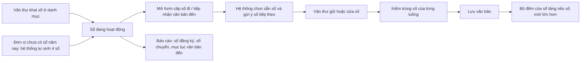

# Sổ văn bản — tóm tắt nghiệp vụ cho BA

> Bản đọc nhanh bằng lời nghiệp vụ. Chi tiết và bằng chứng: [nghiep-vu.md](nghiep-vu.md) (mã NV / BR trong ngoặc
> để tra). Cập nhật: 2026-10-02 · Nguồn: code `kha_develop` + DB DEV. Nhãn quy tắc: **[Đã xác nhận]** = chủ dự án đã
> chốt là đúng ý đồ · **[Hiện trạng]** = hệ thống đang chạy như vậy, chưa ai xác nhận là ý đồ · **[Lệch nghiệp vụ]**
> = đã xác nhận nghiệp vụ muốn khác, hệ thống đang làm sai.

## 1. Phân hệ này dùng để làm gì

"Sổ văn bản" là cuốn sổ đăng ký của một đơn vị: mỗi văn bản đi được cấp **số đi** trong một sổ đi, mỗi văn bản đến được ghi **số đến** trong một sổ đến (1.1).
Văn thư khai, sửa, khóa, xóa, chia sẻ sổ ở danh mục *Sổ văn bản*; mỗi sổ giữ một **bộ đếm số hiện tại** (NV-01…NV-04).
Phân hệ cung cấp **cơ chế sinh số dùng chung** cho mọi luồng cấp số đi và vào sổ đến: gợi ý số tiếp theo, đề xuất cấp bù số vừa xóa trong ngày, tăng bộ đếm khi lưu (NV-07).
Khi một đơn vị chưa có sổ nào trong năm, hệ thống **tự sinh bộ 4 sổ** (NV-06). Văn thư in / xuất sổ đăng ký, sổ chuyển, mục lục văn bản đến ở màn *Báo cáo văn bản* (NV-11).

**Không gồm:** thao tác cấp số văn bản đi, cấp số & đóng dấu, tự động ban hành (xem `van-ban/di`); tiếp nhận vào sổ đến, nhập văn bản đến giấy, hủy tiếp nhận (xem `van-ban/den`); văn thư xét duyệt chọn sổ / số trước khi ký (xem `xu-ly-cong-viec`); báo cáo sổ văn bản đi (màn *Báo cáo văn bản đi*, xem `kpi-danh-gia`); bàn giao văn bản (xem `van-ban/quan-ly-chung`); danh mục thể loại văn bản (danh mục chung) (1.1).

## 2. Ai dùng và được làm gì

| Vai trò | Được làm gì trong phân hệ này |
|---|---|
| Văn thư đơn vị (`VT`) | Thấy sổ của đơn vị mình làm văn thư và sổ được dùng chung cho đơn vị đó; thêm, sửa, khóa, xóa sổ của đơn vị mình; tích "Sổ mặc định"; khai đơn vị dùng chung; xuất báo cáo sổ (1.4, BR-01, BR-02, BR-10) |
| Văn thư của đơn vị được dùng chung sổ (`VT`) | Chỉ xem sổ chung trong danh mục; cấp số / vào sổ trên chính bộ đếm của sổ đó (BR-02, NV-04) |
| Quản trị hệ thống / Quản trị hệ thống đơn vị (`ADMIN` / `ADMIN_LEVEL1`) | Thấy và quản lý mọi sổ của các đơn vị nằm trong cây đơn vị mình quản trị (1.4, BR-01, BR-02) |
| Người cấp số / vào sổ (văn thư, tiến trình tự động ban hành) | Dùng cơ chế sinh số khi cấp số đi, tiếp nhận, nhập văn bản đến — thao tác nằm ở `van-ban/di`, `van-ban/den` (1.4, NV-10) |
| Lãnh đạo / chuyên viên | Không vào danh mục; chỉ thấy danh sách sổ làm bộ lọc tìm kiếm văn bản (1.4, NV-08) |
| Người không có vai trò văn thư hay quản trị | Danh mục sổ trống (BR-01) |

## 3. Màn hình / menu người dùng thấy

| Menu / màn | Để làm gì | Ghi chú | Mã menu |
|---|---|---|---|
| DANH MỤC > Sổ văn bản | Xem, tìm, thêm, sửa, khóa / mở khóa, xóa sổ; xem chi tiết và *Kiểm tra* sổ (số trống, số trùng) | Nút Sửa / Khóa / Xóa chỉ hiện trên sổ của đơn vị mình; nút Xem luôn hiện (NV-01, BR-02, NV-05) | 339213 |
| VĂN BẢN ĐẾN > Báo cáo văn bản đi đến | Xuất sổ / báo cáo văn bản đến ra file | Cùng một màn với menu dưới (NV-11, dac-thu bẫy 13) | 337491 |
| VĂN BẢN ĐẾN > Báo cáo văn bản | Như trên | Cùng màn, cùng địa chỉ với 337491 — Q8 | 439344 |
| VĂN BẢN ĐẾN > Sổ văn bản đơn vị | — | Mở ra danh sách **luôn rỗng**, tiêu đề trang ghi "Công khai văn bản" (NV-12, Q9) | 337792 |
| Trang chủ | — | Không có ô nào của phân hệ; ô "Chờ cấp số" thuộc `van-ban/di` (1.3) | — |

Các màn sổ công văn cũ (sổ công văn, tra cứu công văn) còn trong mã nguồn nhưng không có menu và không dùng (NV-13).

## 4. Luồng chính

1. Văn thư khai sổ: tên, mã sổ, loại sổ (đi / đến), loại năm (1 năm / 5 năm), năm, độ mật, đơn vị, số văn bản hiện tại, ký hiệu mặc định; sổ đi có thể bật "Cấp số theo thể loại văn bản" và "Ban hành tự động" (NV-02, BR-05, BR-07).
2. Nếu đơn vị chưa có sổ nào hiệu lực năm nay, lần đầu ai đó mở danh sách sổ để cấp số / tiếp nhận / báo cáo cho đơn vị đó, hệ thống tự sinh 4 sổ: đi thường, đi mật, đến thường, đến mật (NV-06).
3. Khi văn thư mở form cấp số đi hoặc popup tiếp nhận, danh sách chỉ gồm sổ đang hoạt động, đúng loại, còn hiệu lực năm, của đơn vị và sổ được dùng chung (NV-08, BR-13).
4. Sổ được chọn sẵn: form cấp số ưu tiên sổ văn thư xét duyệt đã chọn, rồi sổ mặc định, rồi sổ hệ thống tự chọn; popup tiếp nhận chọn sẵn sổ mặc định (BR-25).
5. Hệ thống gợi ý số tiếp theo = số hiện tại + 1. Nếu trong hôm nay có văn bản cùng sổ bị xóa, hệ thống đề xuất dùng lại số nhỏ nhất đã xóa (cấp bù) (BR-22, BR-23).
6. Văn thư giữ hoặc sửa số, lưu. Mỗi luồng tự kiểm trùng số trước khi lưu (NV-09).
7. Lưu xong, bộ đếm của sổ được cập nhật bằng số vừa ghi — chỉ khi số đó là chữ số thuần và lớn hơn số hiện tại (BR-24).
8. Văn thư chọn loại báo cáo, đơn vị, khoảng ngày, sổ rồi xuất file Excel / Word (NV-11).

**Luồng phụ.**
- *Tự động ban hành* (văn bản đã ký, sổ bật ban hành tự động): hệ thống tự chọn sổ và tăng số trực tiếp, không qua form; trùng thì tăng tiếp tối đa 10 lần (NV-07 mục d, NV-09; chi tiết ở `van-ban/di`).
- *Khóa / xóa sổ*: khóa thì sổ không dùng để cấp số / vào sổ được nữa; xóa chỉ được khi sổ chưa có văn bản mang sổ (NV-03).
- *Kiểm tra sổ*: từ chi tiết sổ, xem danh sách số trống (khoảng hở giữa các số đã dùng) và số trùng (NV-05).

## 5. Trạng thái

**Trạng thái của sổ**

| Trạng thái (tên người dùng thấy) | Nghĩa | Chuyển sang khi nào | Giá trị |
|---|---|---|---|
| Hoạt động | Chọn được để cấp số / vào sổ (nếu còn hiệu lực năm) | Thêm mới, tự sinh, hoặc mở khóa (4.6) | 1 |
| Khóa | Không dùng để cấp số / vào sổ; vẫn hiện trong danh mục và bộ lọc tìm kiếm văn bản | Văn thư bấm Khóa (NV-03, BR-13) | 0 |
| Đã xóa | Không còn hiện; xóa mềm, kèm bỏ mọi đơn vị dùng chung | Văn thư bấm Xóa khi sổ chưa có văn bản (NV-03, BR-14) | cờ xóa = 1 |

**Phân loại sổ** (khai trên form, không phải vòng đời)

| Thuộc tính | Các giá trị | Ghi chú | Giá trị |
|---|---|---|---|
| Loại sổ | Văn bản đi / Văn bản đến | Không đổi được sau khi tạo (BR-06) | 0 / 1 |
| Loại năm | 1 năm / 5 năm | Sổ 5 năm chỉ chọn tay, hệ thống không tự chọn (BR-26, Q5) | 0 / 1 |
| Cách đánh số | Số chung cả sổ / Cấp số theo thể loại văn bản | Chỉ sổ đi; bật rồi không tắt được (BR-06, BR-08) | 0 / 1 |
| Sổ mặc định | Không / Có | Mỗi (đơn vị, loại sổ) một sổ; DB DEV chưa sổ nào bật (BR-10) | 0 / 1 |
| Độ mật | Thường / Mật | Nghiệp vụ văn bản mật chưa dùng [Đã xác nhận X4] | 1 / 2 |

## 6. Quy tắc quan trọng nhất

- [Hiện trạng] Số tiếp theo = số hiện tại + 1; số chỉ được **gợi ý** lúc mở form, không giữ chỗ. Hai văn thư mở cùng lúc được cùng một số gợi ý; bảo vệ duy nhất là bước kiểm trùng của từng luồng (BR-22, NV-07, dac-thu bẫy 6).
- [Hiện trạng] Bộ đếm **chỉ tăng**: lưu số nhỏ hơn (cấp bù, nhập lùi) hoặc số có chữ (ví dụ "12a") không đổi bộ đếm (BR-24).
- [Hiện trạng] Văn thư sửa tay được "Số văn bản hiện tại" bất kỳ lúc nào, kể cả hạ thấp hơn số đã dùng; hệ thống không đối chiếu với số đã cấp (BR-09).
- [Hiện trạng] Cấp bù số: hệ thống chỉ đề xuất số bị xóa **trong hôm nay**, lấy số nhỏ nhất. Hai luồng văn thư xét duyệt / ký chọn số không được đề xuất số bù (BR-23).
- [Hiện trạng] Sổ đi "Cấp số theo thể loại": mỗi thể loại văn bản có bộ đếm riêng; thể loại được khai "dùng chung số" với một thể loại gốc thì dùng bộ đếm của thể loại gốc. Sổ đến luôn đánh số chung và không có "Ban hành tự động" (BR-07, BR-08, NV-07 mục a).
- [Hiện trạng] Không có bước "đánh số lại đầu năm": số mới chỉ bắt đầu lại khi văn thư dùng sổ khác. Sổ 1 năm của năm cũ vẫn hiện để chọn khi cấp số / vào sổ nếu chưa khóa, nhưng khi hệ thống tự chọn sổ thì chỉ lấy sổ đúng năm nay (BR-21a, Q2).
- [Hiện trạng] Bộ 4 sổ tự sinh chỉ khi đơn vị **chưa có sổ nào** hiệu lực năm nay; đơn vị đã có một sổ bất kỳ thì các loại còn thiếu không được bổ sung (BR-21b, Q3).
- [Hiện trạng] Không kiểm sổ trùng: một đơn vị có thể có nhiều sổ cùng loại, năm, độ mật đang hoạt động — DB DEV có 3 nhóm / 7 sổ như vậy (BR-11).
- [Hiện trạng] Sổ chỉ bị chặn xóa khi đã có văn bản đi hoặc văn bản đến tự nhập mang sổ đó; sổ đến chỉ có văn bản **tiếp nhận** vẫn xóa được (BR-14, Q7).
- [Hiện trạng] Sổ dùng chung: văn thư đơn vị nhận thấy sổ ở mọi chỗ chọn sổ; khi hệ thống tự chọn sổ, **sổ dùng chung được ưu tiên trước sổ riêng** của đơn vị nhận (BR-16, BR-17, Q4).
- [Hiện trạng] Đặt một sổ làm mặc định thì mọi sổ khác cùng đơn vị, cùng loại sổ mất cờ mặc định (không phân biệt năm); hệ thống hỏi xác nhận trước khi thay (BR-10).
- [Hiện trạng] Ô "Số thứ tự" trên form (≥ 1, dùng sắp xếp) bị hệ thống đọc như cờ "Sổ Đảng" khi tự chọn sổ: số thứ tự 1 bị coi là sổ Đảng, số thứ tự từ 2 trở lên không bao giờ được tự chọn (NV-08 BR-26, Q1, dac-thu bẫy 1).
- [Hiện trạng] Không chặn khóa / xóa sổ mặc định (BR-15).
- [Hiện trạng] Sửa sổ được đổi đơn vị sở hữu — sổ chuyển sang đơn vị khác (BR-12).
- [Đã xác nhận] Quyền thao tác trên sổ kiểm ở tầng hiển thị nút trên web (thiết kế chung) — phía máy chủ không kiểm người gọi có quyền với sổ (1.4, X1, dac-thu L1).

## 7. Hệ thống KHÔNG làm / hay bị hiểu nhầm

- **Hai thứ cùng gọi "sổ mặc định":** bộ 4 sổ hệ thống tự sinh theo năm, và ô tích "Sổ mặc định" văn thư bật trên form để được chọn sẵn. Hai việc không liên quan nhau (dac-thu bẫy 3, NV-06, BR-10).
- **Mở danh sách sổ có thể tạo sổ.** Chỉ cần mở combobox sổ (kể cả ở màn báo cáo) cho một đơn vị chưa có sổ năm nay là hệ thống sinh 4 sổ cho đơn vị đó (dac-thu bẫy 2, NV-06).
- **Không có "giữ số trước".** Chức năng số chờ có ở phía máy chủ nhưng màn hình không có chỗ thao tác, và khi cấp số hệ thống không tránh các số đang giữ (BR-28, Q6).
- **Không có khóa chống cấp trùng số.** Kiểm trùng số đến khi tiếp nhận đang tắt, chỉ còn kiểm trùng sổ + số (NV-09; xem `van-ban/den`).
- **Số ký hiệu (ví dụ "123/UBND-VP") không do sổ sinh** khi cấp số tay — văn thư nhập. Chỉ khi tự động ban hành, hệ thống ghép số + viết tắt thể loại + ký hiệu mặc định của sổ (X8, NV-10).
- **"Kiểm tra sổ" không chính xác cho mọi sổ:** không xét văn bản tiếp nhận vào sổ đến, không loại văn bản đã hủy / xóa, không tách theo thể loại (BR-20).
- **"Sổ văn bản đơn vị" không phải sổ đăng ký** — menu mở danh sách luôn rỗng (NV-12, Q9).
- **Màn *Báo cáo văn bản* chỉ có báo cáo văn bản đến.** Sổ văn bản đi in ở màn *Báo cáo văn bản đi* (BR-34).
- **"Mục lục công văn đến" và "Sổ chuyển công văn đến"** gộp văn bản của mọi đơn vị người xuất làm văn thư, còn "Sổ đăng ký / Sổ chuyển văn bản đến" chỉ lấy đơn vị đã chọn (NV-11, Q8).
- **Báo cáo văn bản đến của đơn vị không có văn thư** ra rỗng (BR-30).

## 8. Liên quan phân hệ khác

| Khi thay đổi ở đây… | …phải xem thêm | Vì sao |
|---|---|---|
| Cơ chế số tiếp theo, cấp bù, bộ đếm | `van-ban/di`, `van-ban/den`, `xu-ly-cong-viec`, `cong-viec`, `ho-so-cong-viec` | Cấp số đi, tự động ban hành, tiếp nhận, nhập văn bản đến, văn thư xét duyệt, phiếu đánh giá công việc, lưu trữ đều dùng chung (NV-10) |
| Danh sách sổ được chọn, sổ mặc định, sổ tự chọn | `van-ban/di`, `van-ban/den` | Sổ chọn sẵn trên form cấp số và popup tiếp nhận (BR-25, BR-26) |
| Quy tắc năm, sổ tự sinh đầu năm | `van-ban/di` | Tự động ban hành chỉ lấy sổ đúng năm nay; không có sổ thì chuyển về cấp số tay (BR-21a, 4.4) |
| Cấp số theo thể loại, thể loại dùng chung số | danh mục thể loại văn bản | Thể loại có bộ đếm trong sổ bị coi là "đang được sử dụng", không xóa được (dac-thu bẫy 9) |
| Kiểm trùng số | `van-ban/di`, `van-ban/den` | Mỗi luồng tự kiểm, không có ràng buộc chung (NV-09) |
| Báo cáo sổ văn bản đến | `van-ban/den`, `van-ban/quan-ly-chung` | Dữ liệu lấy từ văn bản tiếp nhận + văn bản tự nhập; màn báo cáo dùng chung phần máy chủ với Bàn giao văn bản (BR-31, dac-thu mục 1) |
| Báo cáo sổ văn bản đi | `kpi-danh-gia` | Màn *Báo cáo văn bản đi* nằm ở đó (BR-34) |

## 9. Câu hỏi nghiệp vụ còn mở

- `Q1` — Còn phân biệt sổ Đảng với sổ thường không, hay ô chỉ là số thứ tự?
- `Q2` — Đầu năm mới, số đi / số đến bắt đầu lại từ 1 theo cách nào (văn thư tự tạo sổ mới và khóa sổ cũ, hệ thống tự ẩn sổ cũ, hay vẫn dùng sổ cũ một thời gian)?
- `Q3` — Bộ 4 sổ tự sinh có phải bộ chuẩn của mọi đơn vị; đơn vị đã có vài sổ thì có cần sinh bù loại còn thiếu?
- `Q4` — Sổ dùng chung dùng trong trường hợp nào; khi vừa có sổ riêng vừa được dùng chung thì ưu tiên sổ nào?
- `Q5` — Sổ 5 năm dùng cho loại văn bản nào; hệ thống có cần tự chọn sổ 5 năm không?
- `Q6` — Nghiệp vụ giữ số trước (số chờ) còn cần không; nếu cần, cấp số có phải tự bỏ qua số đang giữ?
- `Q7` — Sổ đến đã có văn bản tiếp nhận vào sổ có được xóa không?
- `Q8` — Hai menu báo cáo cùng màn có thừa một menu không; báo cáo chỉ lấy đơn vị đã chọn hay mọi đơn vị mình làm văn thư?
- `Q9` — Menu "Sổ văn bản đơn vị" bỏ đi hay cần làm thành danh sách văn bản đã vào sổ của đơn vị?
- `Q10` — Báo cáo ngày VP TWĐ và phân loại sổ Trung ương / Địa phương còn dùng không?

(Đầy đủ ở mục 7.1 của `nghiep-vu.md`.)

## 10. Khi viết yêu cầu mới cho phân hệ này, nhớ ghi rõ

- **Sổ đi, sổ đến, hay cả hai** — và với sổ đi thì áp dụng cho sổ đánh số chung, sổ cấp số theo thể loại, hay cả hai (BR-07, BR-08).
- **Luồng lấy số nào bị ảnh hưởng:** cấp số tay, tự động ban hành, tiếp nhận, nhập văn bản đến, văn thư xét duyệt trước ký, phiếu đánh giá công việc — mỗi luồng gọi cơ chế số khác nhau (NV-10, dac-thu bẫy 7).
- **Quy tắc năm:** sổ 1 năm hay cả sổ 5 năm; sổ năm cũ có được chọn không. Hiện có ba điều kiện "còn hiệu lực năm" khác nhau ở danh sách chọn, ở sinh sổ tự động và ở tự chọn sổ (dac-thu bẫy 4, BR-21a).
- **Số gợi ý hay số được giữ:** yêu cầu chống trùng / giữ số phải nói rõ có giữ chỗ khi mở form không, và trùng thì chặn hay cảnh báo (dac-thu bẫy 6, NV-09).
- **"Sổ mặc định" là nghĩa nào:** bộ 4 sổ tự sinh, hay ô tích sổ mặc định của văn thư (dac-thu bẫy 3).
- **Có áp dụng cho sổ dùng chung không** — và đơn vị nhận được làm gì với sổ chung (BR-02, BR-16, BR-17).
- **Ô "Số thứ tự" / "Sổ Đảng":** nếu yêu cầu đụng tới phân loại sổ để tự chọn, phải chốt Q1 trước (dac-thu bẫy 1).
- **Văn bản đến tiếp nhận hay tự nhập:** thống kê, chặn xóa, kiểm tra sổ, báo cáo đang đọc từ các nguồn khác nhau (dac-thu bẫy 8).
- **Báo cáo sổ:** loại báo cáo nào, lấy chỉ đơn vị đã chọn hay mọi đơn vị mình làm văn thư, có mẫu tiếng Anh không (hiện chỉ có mẫu tiếng Việt) (NV-11, dac-thu L10, L11).
- **Phân quyền menu:** hai menu báo cáo cùng màn phải cấp quyền cả hai nếu muốn đồng nhất (dac-thu bẫy 13).
