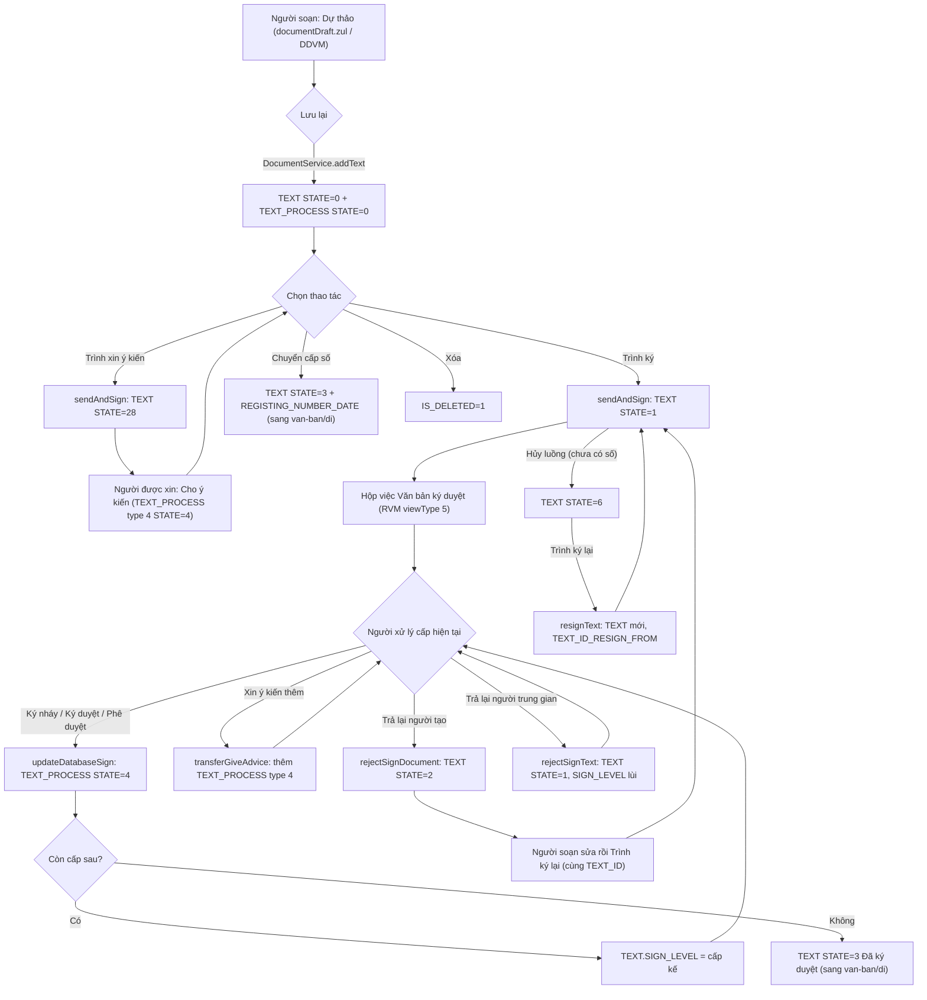
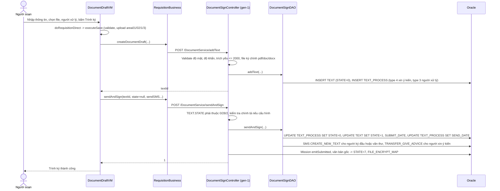
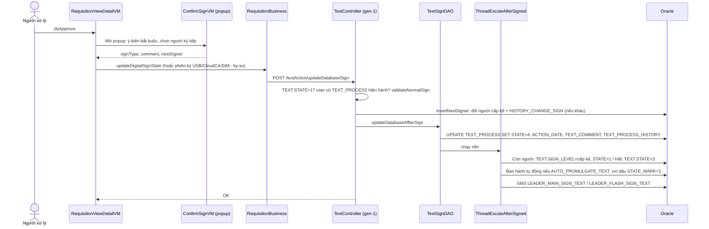
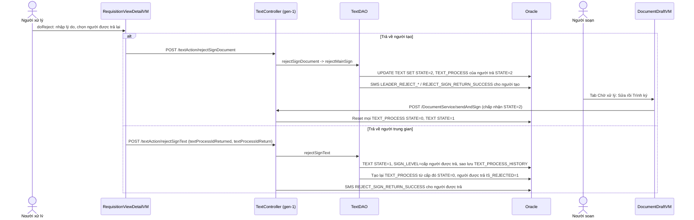
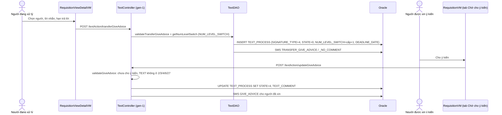
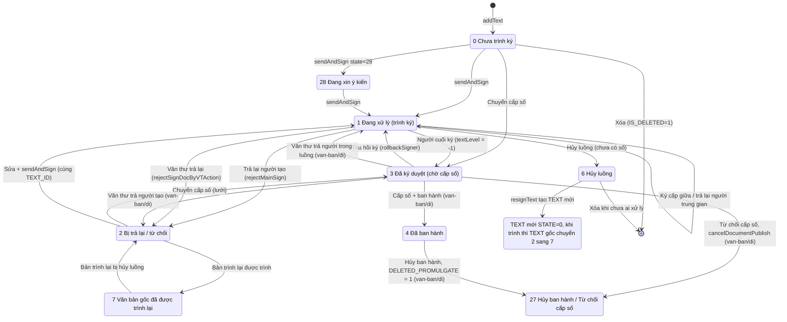
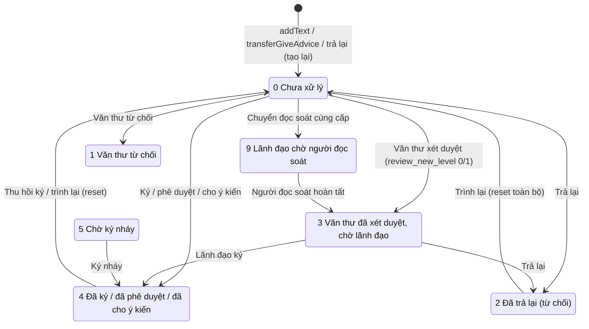
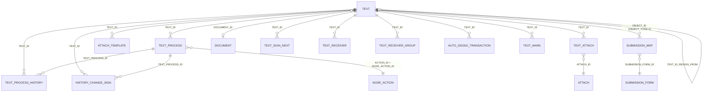

# Xử lý công việc — nghiệp vụ giai đoạn TRƯỚC ban hành (dự thảo → xin ý kiến → trình ký → ký/phê duyệt → trả lại/từ chối)

> Viết lại từ code nhánh `kha_develop` (web-spring + backend2.0) ngày 2026-09-30. Mọi khẳng định có nguồn `file:dòng`.
> Viết tắt đường dẫn:
> `WEB/` = `web-spring/src/main/java/com/viettel/` · `ZUL/` = `web-spring/src/main/webapp/view/voffice/` ·
> `BIZ/` = `web-spring/src/main/java/com/voffice/service/business/` · `BE1/` = `backend2.0/backendvoffice/src/main/java/com/viettel/voffice/` ·
> `BE2/` = `backend2.0/backendvoffice/src/main/java/com/viettel/office/` · `SQL/` = `backend2.0/backendvoffice/sql/`.
> Hai VM chính: `WEB/voffice/vm/documentDraft/DocumentDraftVM.java` (gọi tắt **DDVM**, ~20k dòng) và
> `WEB/voffice/vm/requisition/RequisitionVM.java` (**RVM**), màn chi tiết `WEB/voffice/vm/requisition/RequisitionViewDetailVM.java` (**RVDVM**).
> Chỗ chưa rõ ý đồ: `[CẦN XÁC NHẬN]` — gom ở mục 7. Kỹ thuật ký số (USB token/CloudCA/SIM CA, băm file) thuộc `ky-so/`;
> luồng cấp số/ban hành/chuyển văn bản sau ban hành thuộc `van-ban/di` và `van-ban/chuyen-van-ban`; cấu hình luồng (FLOW/NODE) thuộc `van-ban/luong-xu-ly`.

## 1. Tổng quan

### 1.1 Phạm vi

> (sửa chéo 2026-10-02 theo `van-ban/luong-xu-ly`): chọn người ký tiếp theo theo luồng cấu hình, đổi người ký (`signers-switch`), danh sách lãnh đạo (`get-leaders`), đơn vị ban hành (`promulgation-units`) và **cập nhật luồng ký tuần tự / thêm người ký ngoài luồng** (`PUT /doc-out/{textId}/signing-flow`, `SIGN_FLOW_ORIGIN = 1`) mô tả ở `van-ban/luong-xu-ly` NV-10, NV-11.

Menu cha **XỬ LÝ CÔNG VIỆC** (`SYS_MENU_ID = 441227`, `CODE = XU_LY_CONG_VIEC` — `SQL/12062026_tach_menu.sql:1-2`).
Cây menu **thực tế trên DB DEV** (tra `SYS_MENU` ngày 2026-09-30, chỉ SELECT) — thay cho giả định "4 menu con" trước đây:

| Thứ tự | `SYS_MENU_ID` | Mã (`CODE`) | Tên | URL | `STATUS` | Ghi chú / bằng chứng code |
|---|---|---|---|---|---|---|
| 0 | 439336 | `VBDT_FLOW` | **Dự thảo** | `/view/voffice/documentDraft/documentDraft.zul?view=1` → DDVM (tìm kiếm `documentDraft_search.zul` + soạn `documentDraft_add.zul`), `viewType = VBTK (1)` | 1 | Màn chính của phân hệ. `WEB/voffice/common/HomeVM.java:2737-2743`; `WEB/voffice/vm/brief/BriefInfoVM.java:4564-4586`; `ZUL/documentDraft/documentDraft.zul:7,29-34` |
| 2 | 337199 | `VBXD` | **Văn bản trình duyệt** | `/view/voffice/requisition/requisition.zul?view=2` → RVM, `viewType = VBXD (2)` | 1 | Hộp việc của **văn thư xét duyệt** — thuộc menu này (trả lời Q11) |
| 3 | 337342 | `VBKD1` | Văn bản ký duyệt | `/view/voffice/requisition/requisition.zul?view=5` | **2** (khóa) | Trùng URL với `VBKD`; code web tham chiếu mã `VBKD1` (`WEB/voffice/common/HomeVM.java:2706-2707,2727-2736`) — [CẦN XÁC NHẬN] Q17 |
| 6 | 337344 | `VBKD` | **Văn bản ký duyệt** | `/view/voffice/requisition/requisition.zul?view=5` → RVM, `viewType = 5` (tab Chờ xử lý / Chờ cho ý kiến / Chờ ký duyệt / Chờ phê duyệt / Đang xử lý / Đã phê duyệt / Trả lại) | 1 | NV-02 |
| 7 | 441345 | `VBCYK` | Xin ý kiến | `/view/voffice/requisition/waitingGiveAdvice.zul?view=5` | 1 | **zul không tồn tại** trong `web-spring` |
| 7 | 31745273539 | `VBDCYK` | Đã cho ý kiến | `/view/voffice/requisition/haveGivenAdvice.zul?view=5` | 1 | **zul không tồn tại** |
| 8 | 31745273537 | `VBCYK` | Chờ cho ý kiến | `/view/voffice/requisition/waitingGiveAdvice.zul?view=5` | 1 | **zul không tồn tại**; trùng `CODE` với dòng 441345 |
| 9 | 441385 | `DA_CHO_Y_KIEN` | Đã cho ý kiến | `/view/voffice/requisition/waitingGiveAdvice.zul?view=6` | 1 | **zul không tồn tại** |

**Đã xác nhận (2026-09-30):** phương án menu riêng cho "xin ý kiến / cho ý kiến" đã bỏ, chuyển thành **tab mới** trong hộp việc
(script `SQL/20260915_insert_sys_menu_xin_y_kien.sql:4-27` là di sản). Tuy nhiên trên DB DEV **4 dòng menu này vẫn đang bật**
(`STATUS = 1`, `DEL_FLAG = 0`) và trỏ tới zul không tồn tại → người được phân quyền sẽ thấy menu mở ra trang lỗi. **Nghiệp vụ (xác nhận 2026-10-02, Q16): không dùng 4 menu này** — coi là menu thừa còn sót trên DB (tắt / xóa là việc của DBA / migration, ngoài phạm vi tri thức).

Phân hệ **gồm**: soạn/sửa/xóa dự thảo, các vùng file, kiểm tra thể thức-chính tả, tự động điền, chọn người xử lý tiếp theo
và người xin ý kiến, trình ký / trình xin ý kiến, hủy luồng, trình ký lại/sao chép, cho ý kiến, ký nháy/ký duyệt/phê duyệt
(mức nghiệp vụ), văn thư xét duyệt (mức ranh giới), trả lại/từ chối, chuyển người ký, dự thảo mật, ràng buộc phiếu trình,
cấu hình "tự động chuyển văn bản sau cấp số" (phần khai báo), nút "Chuyển cấp số" (ranh giới), hộp việc + đếm widget trang chủ.

Phân hệ **KHÔNG gồm** (trỏ sang): kỹ thuật ký số → `ky-so`; cấp số/đóng dấu/ban hành/hủy ban hành → `van-ban/di`;
luồng chuyển văn bản sau cấp số → `van-ban/chuyen-van-ban`; cấu hình luồng ký FLOW/NODE → `van-ban/luong-xu-ly`;
phiếu trình → `phieu-trinh`; nhắc việc gắn dự thảo (`ZUL/reminder/reminder_draft_card.zul`) → `lich-nhac-viec`; hồ sơ → `ho-so-cong-viec`.

### 1.2 Actor

Hệ thống **không** kiểm quyền theo SYS_ROLE ở các nút của DDVM: các cờ `hasSavePermission / hasUpdatePermission / hasDeletePermission / hasInsertPermission`
mặc định `true` và đoạn gán theo `iVps.checkPermission(...)` đã bị comment (`WEB/voffice/common/CommonVM.java:141-146,502-508`).
Quyền thực tế = (a) có menu (SYS_MENU/SYS_ROLE_MENU trong DB), (b) điều kiện dữ liệu trong SQL hộp việc (mục NV-01),
(c) kiểm tra ở BE từng hành động (ghi trong từng NV).

| Actor | Nhận diện trong code | Làm gì |
|---|---|---|
| Người soạn / người trình (chuyên viên) | `TEXT.CREATOR_ID_VOF2 = user` (`BE1/database/dao/document/TextSearchDAO.java:1816-1822`) | Tạo/sửa/xóa dự thảo, trình ký, trình xin ý kiến, hủy luồng, trình lại, chuyển cấp số |
| Người xử lý trong luồng (ký nháy / ký duyệt / phê duyệt / đọc soát) | `TEXT_PROCESS.EMP_VHR_ID = user`, `SIGNATURE_TYPE` 3/5, `ACTION_ID` (xem NV-02) — `TextSearchDAO.java:4779-4811,3926-3934` | Ký/phê duyệt, trả lại, từ chối, chuyển người ký, xin ý kiến thêm |
| Người cho ý kiến | `TEXT_PROCESS.SIGNATURE_TYPE = 4` (`BE1/constants/Constants.java:996`) | Cho ý kiến (không ký), chuyển xin ý kiến tiếp |
| Văn thư xét duyệt / trình duyệt | `SIGNATURE_TYPE = 1` (`Constants.java:986`), role code `RbParamValue.USER_ROLE.DOCUMENT_MANAGER` (`RVDVM:4342-4349`), ds đơn vị `getListSecretaryVhrOrg` | Xét duyệt thể thức trước khi lãnh đạo ký (ranh giới — chi tiết `van-ban/di`) |
| Trợ lý / thư ký lãnh đạo | `SIGNATURE_TYPE = 0` (xét duyệt – trợ lý) `Constants.java:982`; cấu hình `ORG_HAVE_DOC_MANAGER` + `getSecretaryConfig` (`BE1/database/dao/document/DocumentSignDAO.java:2226-2249`) | Nhận tin nhắn thay lãnh đạo khi lãnh đạo có văn thư/trợ lý |
| Hệ thống ngoài (appCode/transCode) | bảng `EXT_APP`, `AUTO_DIGSIG_TRANSACTION` (`BE1/controler/DocumentSignController.java:2898-2952`) | Trình ký thay qua API |

Quyền xem danh sách **Văn bản ký duyệt** còn yêu cầu user có phân quyền dữ liệu `TEXT_SIGN_DATA` (rỗng → trả rỗng):
`dataPermissionsService.getListOrgByPermissionData("TEXT_SIGN_DATA", userIdVof2)` (`TextSearchDAO.java:3176,3200-3203`).

## 2. Module

| Chức năng | Màn (.zul) | VM | Business (key) | Endpoint BE | Controller / Service | DAO / Repository |
|---|---|---|---|---|---|---|
| Danh sách Dự thảo + đếm tab | `ZUL/documentDraft/documentDraft.zul` + `documentDraft_search.zul` | DDVM (`countDataList` :1956, `getDataList` VBTK :1812-1817) | `RequisitionBusiness.getRequisitionListDT` / `countRequisitionListWorkProcess` (`BIZ/RequisitionBusiness.java:2013-2046,8435-8468`) → `textAction.searchText` | `POST /textAction/searchText` | gen-1 `BE1/action/TextAction` → `BE1/controler/TextController.java:523-567` | `BE1/database/dao/document/TextSearchDAO.java::getLstTextAssign` :1617-1885 |
| Đếm widget trang chủ / nhãn tab | trang chủ (`HomeWidgetRestController`, `HomeVM`) + DDVM `generateMenuCount` :19689 | — | `XuLyCvTask` → `textAction.getCountXlcvDashboard` (`web-spring/src/main/java/com/voffice/service/task/business/XuLyCvTask.java:23`) | `POST /textAction/getCountXlcvDashboard` | `TextController.getCountXlcvDashboard` :8975-9533 | `TheadCountTextDashboard` → `TextSearchDAO.searchText` |
| Soạn / sửa / lưu dự thảo | `documentDraft_add.zul` | DDVM `doSave` :5757, `executeSave` :5169, `doInsertRequisition` :12705 | `createDocumentDraft` → `DocumentService.addText` (`BIZ/RequisitionBusiness.java:769-785`); trình lại → `DocumentService.resignText` | `POST /DocumentService/addText`, `/resignText` | `BE1/action/DocumentSignService.java:81-116` → `BE1/controler/DocumentSignController.java::addText` :854, `::resignText` :2223 | `BE1/database/dao/document/DocumentSignDAO.java::addText` :648, `::editText`, `::resignText` |
| Trình ký / trình xin ý kiến | `documentDraft_add.zul` (nút), lưới danh sách | DDVM `doRequisitionDirect` :4966, `doRequisitionAskAdvise` :4837, `doSubmit`/`doRequisition` :7466-7574 | `sendAndSign` → `DocumentService.sendAndSign` (`BIZ/RequisitionBusiness.java:1770-1797`) | `POST /DocumentService/sendAndSign` | `DocumentSignController.sendAndSign` :2841-3076 | `DocumentSignDAO.sendAndSign` :1975-2350 |
| Hủy luồng | lưới / chi tiết | DDVM `doCancelProcess` :7735; RVDVM `doCancelProcess` :5288 | `changeStateSign(textId, 6)` (`BIZ/RequisitionBusiness.java:1807-1822`) | `POST /DocumentService/changeStateSign` | `DocumentSignController.changeStateSign` :3078-3165 | `DocumentSignDAO.changeStateSign` :2459-2522 |
| Xóa dự thảo | lưới | DDVM `validateDoDelete` :4321, `delete` :4351 | `deleteRequisition` / `softDeleteRejectedDraft` (`BIZ/RequisitionBusiness.java:6330-6343`) | `/textAction/deleteRequisition`, `/textAction/softDeleteRejectedDraft` | `TextController` :7521, :7571 | `BE1/database/dao/text/TextDAO.java` :9037-9085 |
| Xem chi tiết / ký / trả lại / thu hồi ký | `ZUL/requisition/requisition_viewDetail.zul` (mở bằng `ViewUtil.createLookupRequisitionViewDetail` — `WEB/voffice/util/ViewUtil.java:1050`, `WEB/voffice/common/ViewConstant.java:254`) | RVDVM `doApprove` :4287, `approveRequisition` :3654, `doReject` :5034, `doRollbackSigner` :11828; popup `WEB/voffice/widget/ConfirmSignVM.java` | `updateDigitalSignState` → `textAction.updateDatabaseSign` (`BIZ/RequisitionBusiness.java:2512,2601`); `rejectSignDocument`, `rejectSignText` (:5333-5368); `api.text-process.rollback-signer` (:6944) | `/textAction/updateDatabaseSign`, `/textAction/rejectSignDocument`, `/textAction/rejectSignText`, `/api/text-process/rollback-signer/{id}` | `TextController.updateDatabaseSign` :2008 → `handleUpdateDatabaseSign` :2636; `rejectSignText` :6272; gen-2 `BE2/controller/TextProcessController.java:40-44` → `BE2/services/impl/TextProcessServiceImpl.java::rollbackSigner` :309 | `BE1/database/dao/text/TextSignDAO.java::updateDatabaseAffterSign` :693; `BE1/thread/ThreadExcuteAfterSigned.java`; `TextDAO::rejectSignDocument` :4225, `::rejectSignText` :6633 |
| Danh sách Văn bản ký duyệt | `ZUL/requisition/requisition.zul?view=5` | RVM (`initSearchCondition` VBKD :2030-2118, `getDataList` :2783-2795) | `getRequisitionList(..., type=3, ...)` → `textAction.searchText` | `/textAction/searchText` | `TextController` | `TextSearchDAO::getLstTextSign` :3164 |
| Xin ý kiến / cho ý kiến | popup `ZUL/requisition/transferGiveAdvice.zul` | `WEB/voffice/vm/requisition/TransferGiveAdviceVM.java`, RVDVM `openPopupGiveAdvice` :3634 | `transferGiveAdvice` (:2900, :8160), `updateGiveAdvice` (:2651), `validateUpdateGiveAdvise` | `/textAction/transferGiveAdvice`, `/textAction/updateGiveAdvice`, `/api/text-process/validate-update-give-advise` | `TextController.transferGiveAdvice` :1206, `updateGiveAdvice` :2169 → `handleUpdateGiveAdvice` :2889 | `TextDAO::transferGiveAdvice` :1972, `::getNumLevelSwitch` :9368, `TextSignDAO::updateTextProcessGiveAdvice` :581 |
| Chuyển cấp số | nút trên form / lưới | DDVM `doForwardToAssignNumber` :16895, `forwardToAssignNumber` :16857 | form: `addText(isForwardToAssignNumber=1)`; lưới: `api.text-process.forward-to-assign-number` (`BIZ/RequisitionBusiness.java:7319`) | `/DocumentService/addText`, `/api/text-process/forward-to-assign-number` | `DocumentSignController.addText` :1776-1778; `TextProcessServiceImpl.forwardToAssignNumber` :620-654 | `DocumentSignDAO.addText` :735-740 |

Bảng DB chính: `TEXT`, `TEXT_PROCESS`, `TEXT_PROCESS_HISTORY`, `HISTORY_CHANGE_SIGN`, `ATTACH`/`ATTACH_TEMPLATE`, `FILE_ENCRYPT_MAP`, `TEXT_RECEIVER`/`TEXT_RECEIVER_GROUP`, `SUBMISSION_MAP`/`SUBMISSION_FORM`, `NODE_ACTION`, `TEXT_SIGN_NEXT`, `AUTO_DIGSIG_TRANSACTION` (chi tiết mục 5).

Luồng gen-2 `/api/text-draft/*` (`BE2/controller/TextDraftController.java:31`, bảng `TEXT_DRAFT*`) **không được web gọi** (grep `text-draft` trong `web-spring/src/main/java` = 0 kết quả) — xem `dac-thu.md`.

## 3. Nghiệp vụ

### NV-01. Hộp việc "Dự thảo" (menu XỬ LÝ CÔNG VIỆC › Dự thảo) và số đếm

**Mục đích.** Cho người soạn theo dõi mọi dự thảo **do chính mình tạo** theo 6 tab trạng thái, và thấy số lượng trên tab + widget trang chủ.

**Actor.** Người soạn (điều kiện dữ liệu `t.CREATOR_ID_VOF2 = user` hoặc `t.creator_id = userVof1` — `TextSearchDAO.java:1816-1822`).
Ngoại lệ: tab *Chờ xử lý* còn hiện dự thảo **bị trả lại cho user trung gian** (xem BR-03).

**Luồng.** `documentDraft.zul` (`viewModel` DDVM — `ZUL/documentDraft/documentDraft.zul:7`) → `postViewInitialized` đọc `view` (P_VIEW_TYPE) (`DDVM:776-779`), mặc định `tabType = CXL` (`DDVM:786`) → `doChangeTabStatus(tabType)` đặt giá trị combobox trạng thái (`DDVM:19660-19687`) →
`countDataList` / `getDataList` nhánh `viewType == VBTK (1)` (`DDVM:1966-1971`, `1812-1817`) → `RequisitionBusiness.getRequisitionListDT(..., type = TYPE_VBTK = 7, ..., fromWorkProcessPage)` (`BIZ/RequisitionBusiness.java:2013-2046`) → `textAction.searchText` → `TextController` đọc tham số thứ 33 `fromWorkProcessPage` (`BE1/controler/TextController.java:523-526`) →
`TextSearchDAO.searchText` rẽ `type ∈ {7, 11, 12}` → `getLstTextAssign` (`TextSearchDAO.java:181-187`).

**Bảng tab (giá trị thật):**

| Tab (label) | `tabType` | combobox → `state` gửi BE | Điều kiện SQL trên `TEXT t` (ngoài điều kiện chung) | Nguồn |
|---|---|---|---|---|
| Chờ xử lý | `CXL = 1` | `KHA_CTK = 42` | `t.state in (0,6,2,27,7)` **+ OR** (`t.state = 2` và tồn tại `text_process` của user có `is_rejected in (1,2)`) | `DDVM:19665-19666`; `AppConstants.java:1123`; `TextSearchDAO.java:1795-1797,1823-1829` |
| Đang xử lý | `DGXL = 6` | `KHA_DGXL = 43` | `t.state in (1,28)` | `DDVM:19668-19669`; `TextSearchDAO.java:1798-1799` |
| Bị trả lại (tab **ẩn**, `visible="false"`) | `BTC = 12` | `KHA_BTC = 44` | `t.state in (2,27)` | `ZUL/documentDraft/documentDraft_search.zul:14-16`; `TextSearchDAO.java:1800-1801` |
| Đã xử lý | `DXL = 2` | `3` | `t.state = 3 and t.registing_number_date is null` | `DDVM:19677-19678`; `TextSearchDAO.java:1802-1803` |
| Đã ban hành | `DBH = 9` | `4` | `t.state = 4` (nhánh `else` → `t.state = ?`) | `DDVM:19680-19681`; `TextSearchDAO.java:1808-1810` |
| Tất cả | `ALL = 8` | `comboboxSearchList.get(0)` | nếu `state = -1` và `fromWorkProcessPage` → `t.registing_number_date is null` | `DDVM:19674-19675`; `TextSearchDAO.java:1812-1814` |

Điều kiện chung mọi tab: `t.is_deleted = 0 and NVL(t.is_deleted_draft,0) = 0` (`TextSearchDAO.java:1678-1679`); lọc thêm theo từ khóa (mã, trích yếu, người ký, text_id), số đăng ký, ngày tạo `create_date` trong khoảng (mặc định 365 ngày gần nhất — `DDVM:858-859`) (`TextSearchDAO.java:1688-1786`).
Sắp xếp mặc định `t.create_Date desc, t.text_id desc` (`TextSearchDAO.java:1851-1855`). Mỗi dòng được bổ sung "đơn vị/người đang xử lý" (`getCurrentTextProcess`), riêng `state = 3` có `REGISTING_NUMBER_COMMENT` thì hiện "Văn thư: <đơn vị ban hành>" (`TextSearchDAO.java:1861-1867`).

**Business rule.**
- **BR-01.** Danh sách dự thảo chỉ gồm văn bản user là người tạo (`CREATOR_ID_VOF2`/`CREATOR_ID`) — `TextSearchDAO.java:1816-1822`.
- **BR-02.** Cờ `fromWorkProcessPage` chỉ bật khi màn mở từ menu có code `XU_LY_CONG_VIEC` **và** trạng thái lọc = -1 (`DDVM:1949-1954`); khi bật, dự thảo đã được văn thư cấp số (`registing_number_date` có giá trị) bị loại khỏi tab *Tất cả* (`TextSearchDAO.java:1812-1814`). Đếm widget bật cờ khi `type = TEXT_ASSIGN` và `textState = -1` (`BE1/thread/TheadCountTextDashboard.java:35-36`). **Đã xác nhận (2026-09-30):** `-1` là lựa chọn "Tất cả trạng thái" trên combobox; cờ chỉ có tác dụng ở lựa chọn này.
- **BR-03.** Tab *Chờ xử lý* gồm: chưa trình (0), hủy luồng (6), bị trả lại/từ chối (2), bị hủy ban hành/từ chối cấp số (27), văn bản gốc đã trình lại (7) — comment code "Chờ xử lý giờ có cả dự thảo trả lại" (`TextSearchDAO.java:1796-1797`); đồng thời người **không phải người tạo** nhưng từng bị trả lại (`text_process.is_rejected in (1,2)`) cũng thấy dự thảo khi `t.state = 2` (`TextSearchDAO.java:1823-1829`). **Đã xác nhận (2026-09-30):** đây là nghiệp vụ **trả lại cho người ngoài luồng để xử lý lại** — người được trả lại (không phải người tạo) nhận dự thảo về hộp Chờ xử lý để sửa.
- **BR-04.** Nhãn tab = `tiêu đề (số)`; tab đang mở lấy `totalSize` của lần tìm hiện tại, tab khác lấy từ map đếm của `getCountXlcvDashboard` (`DDVM:19773-19814`, `19726-19737`).
- **BR-05.** Dòng có tiền tố "[Trình ký lại]" khi `rejectBefor = 1` (`DDVM:2142-2147`).

**Số đếm (widget "Xử lý công việc").** `TextController.getCountXlcvDashboard` chạy song song các luồng đếm (`TextController.java:9128-9528`):

| Ô widget / tab | Mã `HOME_WIDGET` | Tham số đếm | Link mở | Nguồn |
|---|---|---|---|---|
| Chờ ký duyệt | `XLCV_VB_KY_DUYET` | `type = SIGNED(3)`, `state = 0`, `textType = 52` (+ bản khẩn `PRIORITY_ID <> 1`) | `tab = 52` → menu `VBKD1`, tab CXL + lọc 52 | `TextController.java:9146-9198`; `HomeWidgetRestController.java:1980-1982`; `HomeVM.java:2730-2731`; `TextSearchDAO.java:3940-3942` |
| Đã ký duyệt | `XLCV_VB_DA_KY_DUYET` | `type = 3`, `state = LEADER_SIGNED_FINISH_FLOW (402)` (web ghi đè bằng `countRequisitionList(..., 402, ...)`) | `tab = DPD (7)` | `TextController.java:9200-9224`; `HomeWidgetRestController.java:423-426,1983-1987` |
| Chờ phê duyệt | `XLCV_VB_PHE_DUYET` | `type = 3`, `state = 0`, `textType = 53` | `tab = 53` | `TextController.java:9226-9278`; `HomeWidgetRestController.java:1988-1990` |
| Chờ cho ý kiến | `XLCV_VB_CHO_Y_KIEN` | BE: `textType = 4`; web ghi đè: `HomeWidgetRestController` dùng `textType = 11`, `HomeVM` dùng `GIVE_COMMENTS = 4` | `tab = 51` → CCYK (11) | `TextController.java:9280-9332`; `HomeWidgetRestController.java:427-430`; `HomeVM.java:4244-4247`; `HomeVM.java:2727-2729`. **Đã xác nhận (2026-09-30): đúng nghiệp vụ là `textType = 4`** — `HomeWidgetRestController` truyền 11 là lệch |
| Dự thảo | `XLCV_VB_DU_THAO` | `type = 7`, `state = -1` ("= tổng các tab") | `tab = ALL (8)` → menu `VBDT_FLOW` | `TextController.java:9334-9360`; `HomeWidgetRestController.java:1994-1997` |
| Dự thảo bị trả lại | `XLCV_VB_DU_THAO_BI_TRA_LAI` | `type = 7`, `state = 2` → `t.state in (2,7)` | `tab = 1`, `state = 2` → tab Chờ xử lý lọc 2 | `TextController.java:9390-9400`; `HomeWidgetRestController.java:1894-1896,2001-2005`; `DDVM:852-854` |
| Dự thảo bị từ chối | `XLCV_VB_DU_THAO_BI_TU_CHOI` | `state = 44` (vẫn đếm) nhưng ô widget **đã comment** | — | `TextController.java:9365-9388`; `HomeWidgetRestController.java:1998-2000`. **Đã xác nhận (2026-09-30):** nghiệp vụ "Dự thảo bị từ chối" (tab BTC + ô widget) **đã bỏ hẳn**; BE còn đếm là code thừa chưa gỡ |
| Nhãn tab Chờ xử lý / Đang xử lý / Đã xử lý / Đã ban hành | `CHUA_TRINH_KY` / `DANG_XU_LY` / `DA_XU_LY` / `DA_BAN_HANH` | `state = 42 / 43 / 3 / 4` | — | `TextController.java:9403-9507`; `AppConstants.java:8345-8350` |

Khoảng thời gian đếm: 365 ngày gần nhất (`DDVM:19692-19693`). Danh mục widget con khai báo ở `SQL/12062026_tach_menu.sql` (id 52-56), `SQL/sql_17072026.sql` (70, 71), `SQL/20260805_insert_home_widget_document_out_classification.sql:65` (`XLCV_VB_DA_KY_DUYET`); nhãn đổi ở `SQL/20260806_update_home_widget_work_processing_labels.sql`.

**Edge case.** Số trên tab đang mở và số trên widget có thể lệch vì widget đếm với `fromDate/toDate` 365 ngày cố định còn tab dùng khoảng ngày người dùng chọn (`DDVM:858-859`); ô "Chờ cho ý kiến" đếm khác nhau giữa hai đường render trang chủ (xem `dac-thu.md`).

**Bảng dữ liệu.** `TEXT` (chính), `TEXT_PROCESS` (người đang xử lý), `SUBMISSION_MAP`/`SUBMISSION_FORM`, `DOCUMENT`, `VHR_EMPLOYEE` (`TextSearchDAO.java:1672-1676`). **Tích hợp ngoài.** Không (chỉ widget trang chủ).

### NV-02. Hộp việc "Văn bản ký duyệt" (người xử lý trong luồng)

**Mục đích.** Người được trình (ký nháy / ký duyệt / phê duyệt / cho ý kiến / đọc soát) xem việc chờ mình và việc đã xử lý.

**Actor & phân quyền.** User có `TEXT_PROCESS.EMP_VHR_ID = user` và phải có phân quyền dữ liệu `TEXT_SIGN_DATA` (rỗng → danh sách rỗng) (`TextSearchDAO.java:3176,3200-3203,4779-4785`).

**Luồng.** `requisition.zul?view=5` → RVM `initSearchCondition` VBKD: combobox `VBTK_MAP1`, tab → `selectedSearchComboboxValue` (`RVM:2030-2075`); widget con → `subMenuTab` → `dataSearch.textType` (`RVM:2096-2118`, `872-894`) →
`getRequisitionList(IS_NOT_FINANCIAL, type = 3, ..., state, ..., textType)` (`RVM:2783-2795`) → `TextSearchDAO.getLstTextSign` (`TextSearchDAO.java:195-200,3164`).

| Tab | `tabType` → `state` gửi BE | Điều kiện (tp = `TEXT_PROCESS` của user) | Nguồn |
|---|---|---|---|
| Chờ xử lý | `CXL=1` → `0` (NOT_HANDLE); `textType` mặc định `WAITING = 3` | `t.state in (1,28)`, `(t.state != 28 or tp.signature_type = 4)`, `tp.signature_type in (3,5)` (ký chính + đọc soát), đúng cấp hiện tại `tp.sign_level = t.sign_level` và (`t.is_vt_review_new = 1` và (`review_new_level = 2 & tp.state = 0` hoặc `review_new_level in (0,1) & tp.state = 3` — văn thư đã xét duyệt)) **hoặc** `tp.state = 5` | `RVM:2040-2044,2125-2128`; `TextSearchDAO.java:3399-3427,3455-3457,4747-4815` |
| ↳ lọc "Chờ ký duyệt" | `textType = 52` | + `tp.SIGNATURE_TYPE = 3 AND tp.ACTION_ID in (2,5)` | `TextSearchDAO.java:3926-3930` |
| ↳ lọc "Chờ phê duyệt" | `textType = 53` | + `tp.SIGNATURE_TYPE = 3 AND tp.ACTION_ID = 4` | `TextSearchDAO.java:3931-3934` |
| ↳ lọc "Chưa trình đến" | `textType = 5` | `tp.sign_level > t.sign_level` (người sau, chưa tới lượt) | `TextSearchDAO.java:3418-3419`; `AppConstants.java:1371-1372` |
| ↳ lọc "Bị trả lại" | `textType = 12` | `tp.is_rejected = 1 AND tp.state in (0,3)` | `TextSearchDAO.java:3919-3921,4738-4742` |
| Chờ cho ý kiến | `CCYK=11` → state `0`, `textType = 11` | `tp.signature_type = 4 and tp.state = 0` | `RVM:2065-2067`; `TextSearchDAO.java:3421-3432,3916-3918` |
| Đang xử lý | `DGXL=6` → `401` | `tp.signature_type in (3,4,5) and tp.state = 4` (tôi đã xử lý) và `t.state in (1,28)` | `RVM:2045-2049`; `TextSearchDAO.java:3479-3495` |
| Đã phê duyệt | `DPD=7` → `402` | như trên nhưng `t.state in (3,4,27)`; join bản ghi `text_process` lớn nhất của user | `RVM:2050-2054`; `TextSearchDAO.java:3300-3310,3513-3527` |
| Trả lại (đã trả) | `TL=3` → `2` | `tp.signature_type in (3,5)` và ((`tp.state in (2,4)` và `t.state in (2,7)`) hoặc user có `text_process_history.state = 2`) | `RVM:2055-2059`; `TextSearchDAO.java:3327-3336,3557-3573` |
| Bị từ chối (bị trả lại) | `BTC=12` → `12` | `tp.is_rejected = 1 AND tp.state in (0,3)` | `RVM:2060-2064`; `TextSearchDAO.java:3574-3577` |

Mã `ACTION_ID` là khóa `NODE_ACTION.NODE_ACTION_ID` (join `na.NODE_ACTION_ID = tp.action_id` — `TextSearchDAO.java:3325`); comment code: 4 = phê duyệt, 5 = ký nháy (`DDVM:5059`), 2 được dùng làm "ký duyệt" (`DDVM:5011-5013`). **Đã xác nhận (2026-09-30):** `NODE_ACTION_ID` 2 = ký duyệt (SIGN), 4 = phê duyệt (APPROVE), 5 = ký nháy (SIGN_INITIAL), 7 = chuyển xử lý (SEND_DOC).

**BR-06.** Mỗi user chỉ thấy văn bản khi **đến lượt mình** (`tp.sign_level = t.sign_level`) — người sau trong luồng chỉ thấy ở lọc "Chưa trình đến" (`TextSearchDAO.java:3418-3424`).
**BR-07.** Nếu lãnh đạo có văn thư xét duyệt (`review_new_level` 0/1) thì văn bản chỉ hiện ở lãnh đạo sau khi văn thư xét duyệt (`tp.state = 3 SECRETARY_SIGNED`) (`TextSearchDAO.java:3406-3417`; `BE1/constants/Constants.java:884-887`).
**BR-08.** Văn bản đang xin ý kiến (`t.state = 28`) chỉ hiện với bản ghi cho ý kiến (`signature_type = 4`) (`TextSearchDAO.java:4790-4791`).
**BR-09.** Bộ lọc "khẩn" dùng cho số đếm widget: `t.PRIORITY_ID <> 1` (`TextSearchDAO.java:3940-3942`).

**Bảng dữ liệu.** `TEXT`, `TEXT_PROCESS`, `TEXT_PROCESS_HISTORY` (tab Trả lại), `NODE_ACTION`, `CV_PRIORITY`, `TEXT_SIGN_NEXT`, `DOCUMENT` (`TextSearchDAO.java:3296-3336`). **Tích hợp.** Phân quyền dữ liệu `dataPermissionsService` mã `TEXT_SIGN_DATA`. **Edge case.** Không có quyền dữ liệu → danh sách rỗng (không báo lỗi) (`TextSearchDAO.java:3200-3203`).

### NV-03. Tạo / sửa / lưu dự thảo

**Mục đích.** Người soạn nhập thông tin văn bản, file, người xử lý tiếp theo, người xin ý kiến, nơi nhận dự kiến, rồi lưu (chưa trình).

**Actor.** Mọi user có menu (không kiểm quyền theo role — mục 1.2). BE kiểm quyền sửa bằng `textDAO.validateGetTextDetail(userGroup, textId)` khi sửa (`DocumentSignController.java:1846-1850`).

**Luồng FE→BE.**
1. Nút **Lưu lại** (`ZUL/documentDraft/documentDraft_add.zul:3109-3112`, hiện khi `state` null/0/2 hoặc đang sao chép/trình lại) → `DDVM.doSave` (`DDVM:5757-5778`): nếu cấu hình bắt buộc kiểm tra chính tả trước → `checkSpellBeforeSaving` rồi dừng; ngược lại `executeSave`.
2. `executeSave` (`DDVM:5169-5317`): `validateDoSave` + `validateBusinessDoSave` (`DDVM:5183-5190`); nếu **không** tích "Nơi nhận dự kiến" thì xóa sạch các danh sách nơi nhận (`DDVM:5215-5247`); văn bản thường → cảnh báo chân ký (NV-07) (`DDVM:5248-5251`); `onDoSave` gán `OfficeSender`, `SignLevel = 0`, `State = 0`, người ký cuối = phần tử cuối `processList` (`DDVM:4874-4959`); đặt `IsSecretMode` (`DDVM:5277-5288`); upload file tạm các vùng `AREA_ID01, AREA_ID02, AREA_ID1, AREA_ID3` (`DDVM:5307`).
3. Sau upload → `doInsertRequisition` (`DDVM:12705-12786`): trình lại → `resignText`; thêm mới/sửa → `createDocumentDraft` → `DocumentService.addText` (`BIZ/RequisitionBusiness.java:769-785`).
4. BE `DocumentSignController.addText` validate rồi gọi `documentSignDAO.addText` (thêm mới) hoặc `editText` (sửa) (`DocumentSignController.java:1723-1745,1851-1865`); lưu nhắc việc gắn dự thảo nếu có (`:1751-1755,1866-1870`); phát sự kiện "đã trình" cho Nhiệm vụ khi có người ký và không phải chuyển cấp số (`:1757-1760`).
5. `DocumentSignDAO.addText`: `TEXT.STATE = 0` (hoặc `3` nếu chuyển cấp số) (`DocumentSignDAO.java:735-740`), insert `TEXT` (cột `FLOW_ID, SIGNER_ID, DEADLINE_DATE, SUGGEST_COMMENT, REGISTING_NUMBER_*`… — `:757-768,842`), insert `TEXT_PROCESS` cho người xin ý kiến (`SIGNATURE_TYPE = 4`) nếu có và không chuyển cấp số (`:1057-1076`), insert `TEXT_PROCESS` cho danh sách người xử lý (`:1143-1241`).

**Business rule (BE `addText`).**
- **BR-10.** Độ mật bắt buộc; dự thảo tạo từ hệ thống ngoài chỉ được độ mật Thường (`STYPE_ID = 1`) (`DocumentSignController.java:968-979`).
- **BR-11.** Độ khẩn bắt buộc (`:984-989`); trích yếu bắt buộc, ≤ 2000 ký tự (`:991-1001`).
- **BR-12.** File ký chính (File dự thảo) bắt buộc, chỉ `pdf/doc/docx`; file ký khác chỉ `pdf/doc/docx`; file sở cứ `pdf/doc/docx/xls/xlsx/zip/rar`; file biểu mẫu `doc/docx/xls/xlsx/ppt/pptx/msg/mpp/txt/zip/rar` (`DocumentSignController.java:1522-1524,1532-1535,1552-1555,1572-1575,1618-1621`).
- **BR-13.** Danh sách người xử lý không được trùng người; khi có mảng người ký nhưng không map được user → lỗi "Danh sách đối tượng ký duyệt/phê duyệt bắt buộc nhập" (`DocumentSignController.java:1137-1167`).
- **BR-14.** Web: sao chép (`doRequisitionCopy`) xóa phiếu trình đính kèm, gộp trùng người xin ý kiến (giữ cấp nhỏ nhất) và reset trạng thái của họ (`DDVM:7310-7401`).

**Trạng thái.** Tạo mới → `TEXT.STATE = 0`, các `TEXT_PROCESS.STATE = 0` (chưa gửi — `SEND_DATE` chỉ gán khi trình, NV-08).

**Edge case.** Nút *Lưu lại* không hiện khi `state = 28` (đang xin ý kiến); lúc đó chỉ có *Chuyển xin ý kiến* / *Trình ký* (`documentDraft_add.zul:3113-3122`).

**Bảng dữ liệu.** `TEXT`, `TEXT_PROCESS`, `TEXT_ATTACH`/`ATTACH`, `ATTACH_TEMPLATE`, `TEXT_RECEIVER`/`TEXT_RECEIVER_GROUP`, nhắc việc `REMINDER*`, `DOCUMENT_IN_LIST_REQUEST` (dự thảo trả lời văn bản đến), `CONNECT_DOCUMENT` (dự thảo tạo từ văn bản liên thông VPCP). **Tích hợp.** Nhiệm vụ (`draftLifecycleEventService`), liên thông (`connectDocumentDAO.updateConnectDoc` — `DocumentSignController.java:1761-1776`), báo cáo ngày (`missionReportResultService.updateById` — `:1790-1792`), công bố vào thư viện (`documentPublishBusiness` — `DDVM:12788-12800`).

### NV-04. Các vùng file của dự thảo và kiểm tra file tải lên

**Mục đích.** Phân loại file theo vai trò nghiệp vụ; chặn file sai định dạng/kích thước.

| Vùng (label trên form) | Area id | Widget zul (thường / mật) | Ghi chú | Nguồn |
|---|---|---|---|---|
| **File dự thảo** (bắt buộc) | `AREA_ID01 = "area01"` | `widgets/selectDocumentDraftFile.zul` / `widgets/selectConfidentialFile.zul` | = "file ký chính" ở BE; bộ lọc chọn file `*.doc;*.docx;*.xls;*.xlsx;*.ppt;*.pptx;*.msg;*.mpp;*.txt;*.vdoc…` | `documentDraft_add.zul:316-339`; `DDVM:749-750`; `WEB/voffice/common/SecurityVM.java:129` |
| File phụ lục | `AREA_ID02 = "area02"` | `widgets/selectAttFile.zul` / `selectConfidentialFile02.zul` | hàng bị ẩn `style="display:none"` trên form dự thảo | `documentDraft_add.zul:370-392`; `SecurityVM.java:130` |
| **Tài liệu liên quan phát hành** (sở cứ) | `AREA_ID3 = "area3"` | `widgets/selectBaseFile.zul` / `selectConfidentialFile3.zul` | tooltip: "file tài liệu của văn bản đã được ban hành trước đó làm sở cứ" | `documentDraft_add.zul:394-418`; label `voffice.requisition.label.fileBaseAttachment.info`; `SecurityVM.java:133` |
| File biểu mẫu | `AREA_ID1 = "area1"` | `widgets/selectMainFile.zul` | ẩn khi văn bản mật | `documentDraft_add.zul:420-441`; `SecurityVM.java:131` |

"Tài liệu không phát hành" / `AREA_CUSTOM_ID01 = "customFile01"` (`SecurityVM.java:134`) **không xuất hiện** trên `documentDraft_add.zul`; `selectCustomFile01.zul` chỉ được include ở màn họp, ảnh đơn vị, ảnh chữ ký (grep `selectCustomFile01`). **Đã xác nhận (2026-09-30):** vùng "Tài liệu không phát hành" là tính năng đang phát triển ở nhánh riêng (chưa vào `kha_develop`); file lưu **chung bảng file đính kèm của dự thảo**, phân biệt bằng **cờ không phát hành** (`isNotPublish`). Trên `kha_develop` chưa có cột/cờ này (grep `is_not_publish|isNotPublish` không thấy) — cập nhật lại khi nhánh được merge.

**Kiểm tra khi tải lên** (`SecurityVM.onUploadFile` — `SecurityVM.java:997-1071`, dùng chung mọi màn):
- **BR-15.** Tên file ≤ 200 ký tự, không chứa `\ / : * ? " < > |` (`SecurityVM.java:1003-1014`).
- **BR-16.** Dung lượng ≤ `APP_CONFIG.MAX_FILE_SIZE` (`SecurityVM.java:1042-1044`); file có nội dung bắt đầu bằng `VBM` (định dạng mã hóa) trên trình duyệt khác bị từ chối (`SecurityVM.java:908-910,1045-1046`).
- **BR-17.** **Nội dung không khớp đuôi**: so 3 byte đầu (magic number) cho `jpg/jpeg/png/pdf/doc/xls/ppt/docx/xlsx/pptx` (`SecurityVM.java:917-941`); không khớp → hộp **xác nhận** "File {0} có nội dung và định dạng không đồng nhất, đồng chí có muốn tiếp tục?" — chọn OK **vẫn tải lên** (`SecurityVM.java:1048-1054`). Trong nhánh `kha_develop` **không có** hàm `isBlockContentExtensionMismatch` và DDVM **không override** `onUploadFile` (grep) → hành vi hiện tại là *cảnh báo*, không *chặn* (sửa 2026-09-30: yêu cầu mô tả là "chặn" nhưng code chỉ cảnh báo). **Đã xác nhận (2026-09-30):** nghiệp vụ đúng là **chặn, không cho tải** — đối tác đã sửa ở nhánh riêng (hook `SecurityVM.isBlockContentExtensionMismatch`, DDVM override trả `true`, thông báo `voffice.upload.content.extension.mismatch.file`); cập nhật lại mô tả khi nhánh vào `kha_develop`. Lý do nghiệp vụ: BE `UploadTmpFile` cũng từ chối file lệch nội dung (`FileUtils.tmpUploadHeadConflictsWithExtension`), nếu web cho qua thì file bị mất âm thầm khi lưu.
- Khi lưu, BE kiểm lại đuôi file theo từng vùng (BR-12).

**Bảng dữ liệu.** `TEXT_ATTACH`/`ATTACH` (file ký chính/khác), `ATTACH_TEMPLATE` (biểu mẫu). **Tích hợp.** Lưu tạm ở `ROOT_STORAGE + TRANSFERRING_FOLDER/<userId>/<areaId>/`, file PDF được đếm số trang ngay khi tải (`SecurityVM.java:1073-1088`). **Edge case.** Tên quá dài/ký tự cấm → dừng cả lô tải lên (`SecurityVM.java:1003-1014`).

### NV-05. Kiểm tra thể thức / chính tả

**Mục đích.** Rà lỗi thể thức, chính tả trong file dự thảo trước khi lưu/trình.

**Cấu hình.** Tham số hệ thống `CHECK_SPELL_CONFIG` (JSON: `active`, `active_roles` — "ALL" hoặc danh sách `SYS_ROLE_ID`, danh sách đơn vị bắt buộc kiểm trước trình, `must_fix_error`…) (`BE1/database/dao/text/TextCheckSpellDAO.java:302-324,331-345,350-380,416-420,431-442`). Kết quả theo user:
`0 INACTIVE` / `1 ACTIVE` (hiện nút) / `2 ACTIVE_AND_BEFORE_REQUISITION` (kiểm trước khi trình) / `3 ACTIVE_AND_MUST_FIX_BEFORE_REQUISITION` (phải sửa hết lỗi) (`WEB/util/AppConstants.java:8473-8478`).

**Luồng.** DDVM khi mở màn gọi `requisitionBusiness.getCheckSpellStatus()` → `textAction.checkSpellActive` → `TextController.checkSpellActive` → `getActiveCheckSpellConfigByUser` (`DDVM:995-999`; `BIZ/RequisitionBusiness.java:6174-6176`; `TextController.java:7250-7260`).
Kiểm tra: `textAction.checkSpellText` (`BIZ/RequisitionBusiness.java:6160`) → `TextController.checkSpellText` → `textCheckSpellDAO.checkSpell(textId, fileKýChính, fileKhác, fileMới, userId, viết tắt loại VB)` (`TextController.java:7167-7240`).

**Business rule.**
- **BR-18.** Status 2/3: *Lưu lại*, *Trình ký*, *Chuyển cấp số* đều chạy `checkSpellBeforeSaving` trước (`DDVM:5765-5768,4977-4980,16948-16951`).
- **BR-19.** Status 3: khi trình từ danh sách, nếu còn lỗi chưa đánh dấu "không phải lỗi" → mở màn xem lỗi; chỉ trình tiếp khi người dùng bấm tiếp tục (`DDVM:7495-7498,7581-7727`). Văn bản mật (`securityLevel = 2`) **bỏ qua** kiểm tra (`DDVM:7595-7598`).
- **BR-20.** BE `sendAndSign` với `checkSpell = 1` và cấu hình status 3: chỉ người tạo được trình, còn lỗi thể thức/chính tả → trả `HAS_SPELL_ERROR` (`DocumentSignController.java:2993-3033`).
- Kết quả người dùng đánh dấu được lưu kèm dự thảo: `textCheckSpellDAO.saveUserMarkCheckingResponses` (`DocumentSignController.java:1780-1783`); bảng gen-2 `TEXT_CHECK_SPELLS` (`BE2/entities/TextCheckSpellsEntity.java`).

**Bảng dữ liệu.** `SYSTEM_PARAMETER` (`CHECK_SPELL_CONFIG`), `USER_ROLE`, `TEXT_CHECK_SPELLS`. **Tích hợp.** Bộ kiểm tra chính tả gọi trong `TextCheckSpellDAO.checkSpell` [chi tiết dịch vụ ngoài không rà trong đợt này]. **Edge case.** Văn bản mật bỏ qua (BR-19).

### NV-06. Tự động điền thông tin từ file dự thảo (OCR)

**Mục đích.** Đọc file dự thảo để điền sẵn loại văn bản, độ khẩn, trích yếu, nơi nhận, số/ký hiệu.

**Luồng.** Checkbox "Tự động điền các trường thông tin" (`autoFillDocInfo`) chỉ hiện khi độ mật = 1 (`documentDraft_add.zul:340-354`) → `checkAutoFill` bật/tắt cờ `autoFill` (mặc định `true`) (`DDVM:604,19343-19351`).
Khi upload file vùng `AREA_ID01`, sự kiện OCR (`EVENT_QUEUE_DOCUMENT_CONTENT`/`QUEUE_NAME_DOCUMENT_OCR`) → `autoFillHandler` → `onAutoFillText` → `PdfOcrDocument.extractFromOCRTool(documentBusiness, …)` (`DDVM:19200-19251,19262-19341`).

**BR-21.** Không OCR văn bản mật (`securityLevel != 1`) (`DDVM:19227-19230,19264-19267`); chỉ OCR đuôi hợp lệ `CommonUtil.isValidExtensionToOCR` (`DDVM:19273-19276`); mỗi lần mở chỉ chạy 1 lần (`autoFill = false` sau lần đầu — `DDVM:19224-19225`).
**BR-22.** Kết quả OCR ghi đè: reset loại/độ mật/độ khẩn/trích yếu/số/ký hiệu rồi điền lại; loại văn bản và độ khẩn khớp **chính xác** theo tên (không phân biệt hoa thường, có phân biệt dấu); độ khẩn mặc định 1; giữ nguyên độ mật đang chọn (`DDVM:19313-19339,19367-19392`). Đổi sang văn bản mật tắt auto fill (`DDVM:13804-13806`).

**Bảng dữ liệu.** Không ghi DB (chỉ điền form). **Tích hợp.** Công cụ OCR qua `PdfOcrDocument.extractFromOCRTool(documentBusiness, …)` (`DDVM:19309`). **Edge case.** OCR trả `null` → giữ nguyên form (`DDVM:19310-19312`).

### NV-07. Khai báo người xử lý tiếp theo, người xin ý kiến (khi soạn)

**Mục đích.** Người soạn chọn người xử lý bước kế (ký nháy / ký duyệt / phê duyệt …) theo cấu hình luồng, và danh sách người xin ý kiến.

**Luồng.** Bandbox chọn người gọi `requisitionBusiness.getListUserFlow(...)` → `GET api.flow-manager.doc-out.get-users-next-step` (gen-2 `FlowManagerController.DocOutGetUsersNextStep`) với `actionId`, `nodeAcceptIds`, `roleId`, `positionId` (`DDVM:9512-9526`; `BIZ/RequisitionBusiness.java:6762-6778`). Danh sách người lưu trong `processList` (người ký cuối = phần tử cuối — `DDVM:4948-4955`), người xin ý kiến trong `processListComment`/`lstAskForAdvice` (gửi ở `createDocumentDraft` — `DDVM:12771`). Cấu hình FLOW/NODE thuộc `van-ban/luong-xu-ly`.

**Business rule.**
- **BR-23.** Luồng là **động từng bước**: khi soạn chỉ chọn người kế tiếp; khi một người ký, popup ký cho chọn người kế tiếp (`nextSigner`) và BE chèn/đổi `TEXT_PROCESS` bước sau (`TextController.java:2763-2768`; `TextProcessServiceImpl.java:77-166`). Nếu `nextSigner` chỉ có đơn vị (không có người) → cập nhật đơn vị ban hành `OFFICE_PUBLISHED_*` (`TextProcessServiceImpl.java:81-84`).
- **BR-24.** Cảnh báo chân ký: với văn bản thường, nếu người có hành động phê duyệt (`actionId = 4`) hoặc ký nháy (`5`) mà **tên họ xuất hiện trong File dự thảo** (tìm qua `getTextSignLocation`) → hỏi xác nhận "…Hành động phê duyệt/ký nháy sẽ không hiển thị ảnh ký…"; chọn Hủy thì không lưu (`DDVM:4991-5097`).
- **BR-25.** Nút *Trình xin ý kiến* ẩn khi văn bản mật hoặc `state` khác 0 (`DDVM:1069-1075,13778`); đổi sang mật xóa danh sách xin ý kiến (`clearProcessListCommentSecurity` — `DDVM:13775-13779`).

**Bảng dữ liệu.** `TEXT_PROCESS` (`ACTION_ID`, `LIST_NODE_ID`, `ROLE_ID`, `POSITION_ID`, `REVIEW_NEW_LEVEL`), cấu hình `FLOW`/`NODE`/`NODE_TO_NODE_ACTION` (thuộc `van-ban/luong-xu-ly`). **Tích hợp.** gen-2 `FlowManagerController`. **Edge case.** Danh sách gợi ý loại bỏ bản ghi `employeeId` null/< 1 (`DDVM:9524`).

### NV-08. Trình ký

**Mục đích.** Gửi dự thảo vào luồng: người xử lý đầu tiên (và người xin ý kiến nếu có) nhận việc.

**Actor.** Người tạo (BE: dự thảo tạo bởi tài khoản hệ thống ngoài chỉ được trình bởi chính tài khoản đó — `DocumentSignController.java:2959-2976`).

**Luồng.**
- Trên form: nút **Trình ký** (`documentDraft_add.zul:3119-3122`, hiện khi `state` null/0/2/28) → `doRequisitionDirect` → lưu (NV-03) → sau lưu gọi `doRequisition(…, isRequisitionDirect = true)` (`DDVM:4966-4989`). Trên lưới: nút trình (hiện khi `state = 0` và phiếu trình không còn hiệu lực — `checkViewRequisition` `DDVM:8300-8313`) → `doSubmit` → `doRequisition(obj, false)` (`DDVM:7466-7469`).
- `doRequisition` (`DDVM:7477-7574`): chặn nếu phiếu trình đính kèm còn hiệu lực (BR-55); kiểm tra chính tả (NV-05); văn bản mật → kiểm tra chứng thư của người ký kế (`getNextSignersCheckCert`) rồi đi nhánh `ConfidentialUtil.sendAndSignConfidential` (NV-15); văn bản thường → `requisitionBusiness.sendAndSign(textId, …, state = null | 28, sendSMSForSigner, sendSMSForAdviser, updateAskAdvise)` (`BIZ/RequisitionBusiness.java:1770-1797`).
- BE `DocumentSignController.sendAndSign` (`:2841-3076`) → `DocumentSignDAO.sendAndSign` (`DocumentSignDAO.java:1975-2350`).

**Business rule.**
- **BR-26.** Chỉ trình được khi `TEXT.STATE ∈ {0, 28, 2}`, ngược lại `DOCUMENT_WAS_SUBMITTED` (`DocumentSignController.java:2954-2957`).
- **BR-27.** Khi trình: reset **mọi** `TEXT_PROCESS.state = 0` của văn bản (khi *Chuyển xin ý kiến* thì giữ các bản ghi `state = 4`) (`DocumentSignDAO.java:2037-2042`); cập nhật `TEXT_PROCESS_HISTORY` bản ghi người tạo (`signature_type = -1`) thành `state = 4` kèm `SUGGEST_COMMENT` và đồng bộ lịch sử (`:2047-2067`).
- **BR-28.** `TEXT.STATE = 1` (trình ký) hoặc `28` (trình xin ý kiến), `SUBMIT_DATE = sysdate`, ghi lại người tạo/đơn vị gửi `CREATOR_*_VOF2`, `OFFICE_SENDER_*_VOF2` (hệ thống ngoài: theo `employeeCode`) (`DocumentSignDAO.java:2013-2019,2074-2114`); `TEXT_PROCESS.SEND_DATE = sysdate`, `SENDER_*_VOF2` (`:2118-2135`); `IS_SEND_REQUEST_SMS` cho bản ghi `SIGN_LEVEL = 0` (`:2140-2145`).
- **BR-29.** Hệ thống ngoài: `appCode` phải đăng ký trong `EXT_APP` và không bị tạm dừng; `appCode + transCode` duy nhất; ghi `AUTO_DIGSIG_TRANSACTION`; `TEXT.IS_ACTIVE = 2` (`DocumentSignController.java:2902-2952`; `DocumentSignDAO.java:1982-2006,2076-2079,2151-2173`).
- **BR-30.** `sendSMSForSigner`: trình từ lưới truyền `3` = lấy theo cấu hình đã lưu trên `TEXT_PROCESS` (`checkSendSMSForSigner`), từ form truyền lựa chọn checkbox (`DDVM:7537-7543`; `DocumentSignController.java:2884-2894`).
- **BR-31.** Sau trình thành công: khóa chọn nhiệm vụ liên kết trên form (`DDVM:7556-7558`); BE ghi auto-link nhiệm vụ, phát sự kiện Mission "submitted", cập nhật văn bản gốc (nếu là bản trình lại) sang `STATE = 7`, cấp quyền đọc file mật (`FILE_ENCRYPT_MAP`) (`DocumentSignController.java:3037-3062`; `TextDAO.java:6376-6401`).

**Thông báo.** SMS + thông báo (module chữ ký số) `CREATE_NEW_TEXT (1)` tới người ký đầu (`signature_type = 3`, cấp nhỏ nhất); nếu lãnh đạo có văn thư xét duyệt (`review_new_level != 2`) thì gửi tới văn thư của đơn vị đó (lọc thêm theo cấu hình `ORG_HAVE_DOC_MANAGER` + văn thư chuyên quản) (`DocumentSignDAO.java:2175-2300`); người xin ý kiến nhận `TRANSFER_GIVE_ADVICE (128)` hoặc `TRANSFER_GIVE_ADVICE_NO_COMMENT (130)` kèm hạn (`:2303-2345`); ký song song cập nhật `TEXT_SIGN_NEXT` (`:2203-2205`). Mã SMS: `BE1/constants/Constants.java:1163-1185`.

**Bảng dữ liệu.** `TEXT`, `TEXT_PROCESS`, `TEXT_PROCESS_HISTORY`, `TEXT_SIGN_NEXT`, `AUTO_DIGSIG_TRANSACTION`, `EXT_APP`, `FILE_ENCRYPT_MAP`. **Tích hợp.** SMS/thông báo, hệ thống ngoài (appCode), Nhiệm vụ, Elastic (luồng cập nhật văn bản gốc `ThreadTextReSign`). **Edge case.** `appCode + transCode` đã tồn tại hoặc văn bản đã `STATE = 1` → trả 0 và ghi log `AUTO_SIGN` (`DocumentSignDAO.java:1982-2006`).

### NV-09. Xin ý kiến – chuyển xin ý kiến – cho ý kiến

**Mục đích.** Lấy ý kiến (không ký) của một/nhiều người trước hoặc trong khi trình ký; người được xin có thể xin ý kiến tiếp cấp dưới trong giới hạn số cấp.

**Ba đường vào:**
1. **Trình xin ý kiến** (người soạn, dự thảo mới): nút "Trình xin ý kiến" (`documentDraft_add.zul:3116-3118`) → `doRequisitionAskAdvise` = `doRequisitionDirect` với cờ `isRequisitionAskAdvise` (`DDVM:4837-4840`) → lưu (người xin ý kiến ghi vào `TEXT_PROCESS.SIGNATURE_TYPE = 4` — `DocumentSignDAO.java:1057-1076`) → `sendAndSign(state = 28 GIVE_ADVISE)` (`DDVM:7534,7544-7549`) → `TEXT.STATE = 28` (BR-28). Nếu chưa chọn người xử lý (`processList[0].id == null`) vẫn coi là thành công (`DDVM:7547-7549`).
2. **Chuyển xin ý kiến** (người soạn, khi `state = 28`): nút "Chuyển xin ý kiến" (`documentDraft_add.zul:3113-3115`) → `doUpdateRequisitionAskAdvise`: chỉ khi **chưa ai** trong danh sách đã cho ý kiến (`api.text-process.validate-update-give-advise` → `findTextProcessDoneGiveAdvice` rỗng) → lưu với `isSaveUpdateRequisitionAskAdvise` (`DDVM:4842-4855`; `BE2/repositories/impl/TextProcessRepositoryImpl.java:384-390`); khi trình lại, bản ghi đã cho ý kiến (`state = 4`) được giữ (`DocumentSignDAO.java:2038-2040`).
3. **Xin ý kiến trong luồng** (người đang xử lý / người được xin ý kiến / văn thư ở bước trình duyệt / người tạo khi `state ∈ {1,28}`): màn chi tiết → `RVDVM` gọi `tranferGiveAdvice(textId, comment, lstAskForAdvice, textProcessId, deadlineDate, sendSMS)` (`RVDVM:5871`) → `textAction.transferGiveAdvice` (`BIZ/RequisitionBusiness.java:2888-2900`) → `TextController.transferGiveAdvice` (`:1206-1379`) → `TextDAO.transferGiveAdvice` (`TextDAO.java:1972-2090`). Văn bản mật đi `transferGiveAdviceSecurity` (`RVDVM:13392`; `BIZ/RequisitionBusiness.java:8131`).

**Cho ý kiến.** Người có `TEXT_PROCESS(signature_type = 4, state = 0)` → lưới "Chờ cho ý kiến" hoặc chi tiết → `updateGiveAdviceState` → `textAction.updateGiveAdvice` (`RVM:12450-12458`; `BIZ/RequisitionBusiness.java:2615-2651`) → `TextController.updateGiveAdvice` (`:2169-2286`) → `handleUpdateGiveAdvice` (`:2889-2955`): `validateGiveAdvice` → đính file ý kiến → `TEXT_PROCESS.STATE = 4`, `TEXT_COMMENT`, `ACTION_DATE` (`TextSignDAO.java:581-600`) → SMS/thông báo `GIVE_ADVICE (129)` tới **người đã xin** (`SENDER_ID_VOF2` của bản ghi) (`TextController.java:2902-2918`).

**Business rule.**
- **BR-32.** Giới hạn số cấp chuyển xin ý kiến = tham số DB `NUM_LEVEL_SWITCH` (`configParameterDAO.getValueFromConfigDataBase`), so với `TEXT_PROCESS.NUM_LEVEL_SWITCH` của bản ghi xin ý kiến của user; vượt → `GIVE_ADVICE_ERR_MAX_LEVEL` (`TextDAO.java:9368-9391`; `TextController.java:1322-1325`). Hằng `MAX_LEVEL_SWITCH_GIVE_ADVICE = 3` (`BE1/constants/Constants.java:2569`) **không được dùng ở đâu** (grep) — (sửa 2026-09-30: `van-ban/di/nghiep-vu.md:69` ghi "tối đa `MAX_LEVEL_SWITCH_GIVE_ADVICE = 3` cấp" là sai nguồn).
- **BR-33.** Nút "Chuyển xin ý kiến" trên chi tiết chỉ hiện khi còn được chuyển cấp: `textAction.checkShowTransferGiveAdvice.{textId}` → `POST /textAction/checkShowTransferGiveAdvice/{textId}` → `checkNumLevelSwitch` (`RVDVM:1245`; `BIZ/RequisitionBusiness.java:2933-2939`; `BE1/action/TextAction.java:247-251`; `TextController.java:1514-1525`).
- **BR-34.** Điều kiện được xin ý kiến trong luồng (`TextDAO.validateTransferGiveAdvice` — `TextDAO.java:9311-9365`): user đang trong luồng; hoặc là văn thư của đơn vị bản ghi đang xử lý; hoặc là người tạo và văn bản đang ở `state ∈ {1,28}`. Văn bản `6` → `GIVE_ADVICE_ERR_CANCELED`; `2/3/4/27` → `GIVE_ADVICE_ERR_COMPLETED`. Kiểm tra "người nhận đã có trong luồng" **đã bỏ** theo yêu cầu KHA (`TextDAO.java:9354-9359`).
- **BR-35.** Bản ghi xin ý kiến mới: `TEXT_PROCESS(SIGNATURE_TYPE = 4, SIGN_LEVEL = TEXT.SIGN_LEVEL, STATE = 0, NUM_LEVEL_SWITCH = cấp+1, ASSIGNER_* = người xin, DEADLINE_DATE, IS_SEND_REQUEST_SMS, SECRETARY_GROUP_ID = đơn vị bản ghi đang xử lý)` (`TextDAO.java:2002-2038`). Xin ý kiến **không đổi** `TEXT.STATE`.
- **BR-36.** Chỉ cho ý kiến 1 lần (`state = 4` → `GIVE_ADVICE_ERR_AlREADY_ACTION`); không cho ý kiến khi văn bản đã hủy luồng/bị trả lại/đã ký xong/đã ban hành/hủy ban hành (`TextSignDAO.java:1235-1254`).
- **BR-37.** Người ký kế tiếp đã "chuyển xin ý kiến" thì người trước **không thu hồi ký** được (NV-12, mã 4).

**Thông báo.** Người được xin: `TRANSFER_GIVE_ADVICE (128)` (có lời nhắn) / `TRANSFER_GIVE_ADVICE_NO_COMMENT (130)`, kèm hạn trả lời (`TextDAO.java:2039-2080`); người xin nhận `GIVE_ADVICE (129)` khi có ý kiến.

**Bảng dữ liệu.** `TEXT_PROCESS` (`SIGNATURE_TYPE = 4`), `CONFIG`/tham số `NUM_LEVEL_SWITCH`, file ý kiến (`textSignDAO.addFilesGiveAdvice`), `FILE_ENCRYPT_MAP` (văn bản mật). **Tích hợp.** SMS/thông báo. **Edge case.** Người tạo xin ý kiến khi văn bản đã xong luồng → `GIVE_ADVICE_ERR_COMPLETED` (`TextDAO.java:9324-9328`).

### NV-10. Ký nháy / ký duyệt / phê duyệt / đọc soát (mức nghiệp vụ) và chuyển người ký tiếp

**Mục đích.** Người xử lý trong luồng xác nhận văn bản; người ký cuối hoàn tất → văn bản sang "Đã ký duyệt" chờ cấp số.

**Loại hành động** theo `NODE_ACTION_CODE` của bản ghi (`requisition.getActionCode()`): `SIGN` → nút ký USB token/SIM CA; `APPROVE` (phê duyệt) → nút xác nhận thường (không ký số); `SIGN_INITIAL` (ký nháy) → nút ký nháy (`RVDVM:4314-4333`; mã `BE2/utils/Constants.java:440-448`). Không có action code → tùy cấu hình ký USB (`RVDVM:4327-4333`).

**Luồng.** `requisition_viewDetail.zul` → `RVDVM.doApprove` (`:4287-4610`): kiểm tra/lưu thay đổi luồng (`saveSigningFlowChanges`), mở popup `ConfirmSignVM` (nhập ý kiến ≤ 2000 ký tự, bắt buộc — `RVDVM:4389-4394`; chọn người ký tiếp `ARG_NEXT_SIGNER`; người ký cuối được chọn đánh giá `CLASSIFICATION` — `:4411-4419`) → `approveRequisition` (`:3654-3860`):
văn bản mật → `ConfidentialUtil.signConfidentialFile` (`:3703-3724`); ký USB/nháy → phiên ký file (`makeUsbSignalFileSession`); CloudCA → popup đếm ngược; SIM CA → `popupSignTextByCASim`; phê duyệt/thường → `requisitionBusiness.updateDigitalSignState(...)` → `textAction.updateDatabaseSign` (`:3830-3853`). Chi tiết ký số: `ky-so/`.
BE `TextController.updateDatabaseSign` (`:2008-2166`) → `handleUpdateDatabaseSign` (`:2636-2860`) → `TextSignDAO.updateDatabaseAffterSign` (`TextSignDAO.java:693-865`) → luồng nền `ThreadExcuteAfterSigned` (`BE1/thread/ThreadExcuteAfterSigned.java:152-379`).

**Business rule.**
- **BR-38.** Chỉ ký khi `TEXT.STATE = 1` (trừ trường hợp *ký dự thảo ngay sau khi phiếu trình hoàn thành*, người ký cuối của phiếu = người ký của dự thảo, đang chờ ký) → ngược lại `TEXT_SIGN_NOT_PERMISS` (`TextController.java:2660-2702`); user phải có bản ghi `TEXT_PROCESS` hiện hành (`getTextProcessEntitiesCurrent`) và qua `validateNormalSign` (`:2720-2733`).
- **BR-39.** Khi ký: bản ghi của user ở cấp hiện tại → `TEXT_PROCESS.STATE = 4`, `ACTION_DATE`, `TEXT_COMMENT`, `SIGN_USB` (0 USB / 1 thường / 2-4 SIM, file mềm), `INITIAL_SIGNER = 1` nếu ký nháy, `VIEW_COMMENT` (danh sách người được xem ý kiến); cập nhật `IS_SEND_REQUEST_SMS` cho cấp kế; ghi `TEXT_PROCESS_HISTORY` (`TextSignDAO.java:777-861`).
- **BR-40.** Chuyển cấp: `ThreadExcuteAfterSigned.updateTextSignLevel` tính cấp đang xử lý; còn người chưa ký → `TEXT.SIGN_LEVEL = cấp kế`, `STATE = 1`, gán `ACTION_DATE` cho bản ghi cấp kế; **hết người** (`textLevel = -1`) → `TEXT.STATE = 3` (Đã ký duyệt), `SIGN_LEVEL + 1` (`ThreadExcuteAfterSigned.java:659-728`). Ký song song: `updateTextSignParallelLevel`, khóa ký song song `TEXT_SIGN_NEXT` (`:200-204`; `TextController.java:2744-2761`).
- **BR-41.** Ký xong cấp cuối: nếu bật `AUTO_PROMULGATE_TEXT` → ban hành tự động (`promulgateTextAuto`) và gửi văn bản tới đơn vị liên kế; nếu có danh sách đơn vị đóng dấu (`getOrgMarkedList`) → `TEXT.STATE_MARK = 1`, SMS `ASK_FOR_REAL` tới văn thư (`ThreadExcuteAfterSigned.java:213-370`) — thuộc `van-ban/di`.
- **BR-42.** Chuyển người ký tiếp: truyền `nextSigner` khác người đang được xếp ở cấp kế → thay `EMP_VHR_ID/NAME/ORG` của bản ghi cấp kế, tính lại `REVIEW_NEW_LEVEL` (0 = qua văn thư nếu node yêu cầu thư ký; 2 = ký thẳng), ghi lịch sử `HISTORY_CHANGE_SIGN` (old/new) (`TextProcessServiceImpl.java:77-166`). Người ký cuối đổi → cập nhật lại người ký của văn bản (`updateSignerIfPenultimate` — `TextController.java:2704-2705`).
- **BR-43.** Văn bản đang trong thời gian chờ ký của lãnh đạo (`getDoNotReadTextDuringSign`) → trả mã `STATUS_DELAY_SIGN` (`TextController.java:2653-2659`).
- Văn thư xét duyệt (`viewType = VBXD`, signType 0 + là văn thư) đi `updateDatabaseByVT` (`TextController.java:2708-2718`; `TextSignDAO.java:166`), có thể nhập số/sổ (`promulgateInfor` → cập nhật số sổ `TEXT_BOOK`) (`TextController.java:2796-2805`) — ranh giới với `van-ban/di`. Văn thư chuyển "người rà soát/đọc soát" (`SIGNATURE_TYPE = 5`): `textAction.tranferProofreadingAsistant` → `TextController.tranferProofreadingAsistant` (`:1384-1512`), chặn khi cấp hiện tại đã có người đọc soát (`GIVE_ADVICE_ERR_AlREADY_ACTION`).

**Thông báo.** Ký nháy: `LEADER_FLASH_SIGN_TEXT (4)`; ký duyệt: `LEADER_MAIN_SIGN_TEXT (2)` tới người trình và người kế (`ThreadExcuteAfterSigned.java:185-191,1138-1330`); văn thư xét duyệt: `SECRETARY_SIGN_TEXT (6)`; ban hành tự động: `AUTO_PUBLIC_DOC_NEW (121)` (`:986-1000`). Phát sự kiện Mission "final signed" khi người vừa ký là `TEXT.SIGNER_ID` (`TextController.java:2810-2813`).

**Bảng dữ liệu.** `TEXT`, `TEXT_PROCESS`, `TEXT_PROCESS_HISTORY`, `HISTORY_CHANGE_SIGN`, `TEXT_SIGN_NEXT`, `TEXT_BOOK` (văn thư nhập số), `TEXT_MARK`, `DOCUMENT` (ban hành tự động). **Tích hợp.** Ký số (`ky-so/`), trả kết quả cho hệ thống ký tự động (`autoDigitalSignDAO.sendResultMutiSignText` — `ThreadExcuteAfterSigned.java:214-218`), Nhiệm vụ. **Edge case.** Xử lý sau ký chạy nền → trạng thái cập nhật trễ (`dac-thu.md` bẫy 18).

### NV-11. Trả lại / từ chối

**Mục đích.** Người xử lý không đồng ý → trả về người tạo (dừng luồng) hoặc trả về một người trung gian đã xử lý trước đó (luồng quay lại cấp đó).

**Luồng.** Nút **Trả lại** (label `voffice.requisition.label.successReturn` = "Trả lại") → `RVDVM.doReject` → popup `ConfirmInputVM` (lý do bắt buộc ≤ 3000 ký tự, đính file — tắt với văn bản mật, tùy chọn gửi SMS) (`RVDVM:5033-5065`). Văn bản thường ở VBKD/VBPD/VBKN/VBXD: popup cho chọn **người được trả lại** (`textProcessIdReturned`) (`:5058-5062`):
- chọn người tạo (id `"0"`) → `rejectRequisition` → `rejectSignDocument(textId, comment, 1, files, sendSMS)` (ở VBXD: `updateDBDocManagerReject` → `textAction.rejectSignDocByVTAction`) (`RVDVM:5070-5084,4945-4977`);
- chọn người trung gian → `rejectSignText(textId, textProcessIdReturned, textProcessIdReturn, …)` → `textAction.rejectSignText` (`RVDVM:5160-5180`; `BIZ/RequisitionBusiness.java:5333-5368`).
Văn bản mật: chỉ trả về người tạo (`RVDVM:5085-5091`). Từ lưới RVM có cùng hai đường (`RVM:7294-7296,7432`).

**BE — trả về người tạo** (`TextDAO.rejectSignDocument` → `rejectMainSign` — `TextDAO.java:4225-4282,4292-4420`): `TEXT.STATE = 2`; bản ghi của người trả lại (`signature_type = 3`, `state in (0,3,5)`) → `TEXT_PROCESS.STATE = 2` + lý do; ký song song cập nhật `TEXT_SIGN_NEXT`; hủy bản ban hành nếu văn bản đã ký (`updateDocumentAndDeleteFileRepublic`); gỡ liên kết `CONNECT_DOCUMENT.TEXT_ID`; ghi `TEXT_PROCESS_HISTORY` (`textProcessHistoryBusiness`) (`TextDAO.java:4236-4259`). Loại "0" = từ chối ký nháy (`rejectDraftSign` — `:4262-4265`).
**BE — trả về người trung gian** (`TextDAO.rejectSignText` — `TextDAO.java:6633-6860`): `TEXT.STATE = 1`, `SIGN_LEVEL = cấp của người được trả` (`updateStateAndSignLevelText` — `:6670-6672`); sao lưu `TEXT_PROCESS` sang `TEXT_PROCESS_HISTORY`; bản ghi lịch sử người được trả `IS_REJECTED = 1`, người trả `STATE = 2` (`:6701-6721`); xóa các bản ghi xin ý kiến đã xong từ cấp đó trở đi; bản ghi người ký (`signature_type 1/3/5`) từ cấp đó trở đi được **tạo lại** với `STATE = 0` (hoặc `9` = lãnh đạo chờ người đọc soát cùng cấp), bản ghi lãnh đạo cùng cấp với văn thư được trả gắn `IS_REJECTED = 2` (`:6723-6860`). Nếu người trả là lãnh đạo có văn thư chưa xét duyệt → coi như văn thư trả (`userRejectByVt`) (`:6649-6662`).

**Business rule.**
- **BR-44.** "Trả lại" có 2 kết quả khác nhau tùy người được chọn: về **người tạo** → dự thảo `STATE = 2` (hiện ở tab *Chờ xử lý* của người tạo, widget "Dự thảo bị trả lại"); về **người trung gian** → dự thảo vẫn `STATE = 1`, người được trả thấy ở tab/lọc *Bị trả lại* (`tp.is_rejected = 1 and tp.state in (0,3)`) (`TextSearchDAO.java:4738-4742`).
- **BR-45.** Kết quả mã `ERROR_CANCEL_FLOW` → thông báo "luồng đã bị hủy" (`RVDVM:4965-4969`).
- Văn thư xét duyệt trả lại (`viewType = VBXD`): `updateDBDocManagerReject` → `textAction.rejectSignDocByVTAction` → `TextDAO.rejectSignDocByVTAction`: bản ghi văn thư `TEXT_PROCESS.STATE = 1 (VT_REJECTED)`, `TEXT.STATE = 2` (`RVDVM:4949-4950`; `TextController.java:959-1107`; `TextDAO.java:1265,1403-1412,1461-1464`).
- Văn thư ban hành (tab chờ cấp số, `state = 3`) có 2 kiểu xử lý khác nhau — chi tiết ở `van-ban/di` NV-04, NV-05 (sửa 2026-10-01: bản trước gộp nhầm hai kiểu thành một và ghi đều ra `STATE = 27`):
  - **Trả lại**: về người tạo `returnCreatorTextByVtPromulgate` → `TEXT.STATE = 2` (`backend2.0/backendvoffice/src/main/java/com/viettel/voffice/database/dao/text/TextDAO.java:7020-7023`), hoặc về người trong luồng `rejectSignTextVBBHWaitForNumber` → `TEXT.STATE = 1` (`TextDAO.java:6672`) (`RVDVM:5105-5158`; `TextController.java:6383-6470`). Dự thảo quay lại luồng xử lý bình thường.
  - **Từ chối cấp số**: gọi `cancelDocumentPublish` khi văn bản chưa có số → `TEXT.STATE = 27` với `DELETED_PROMULGATE` rỗng/≠1; phân biệt với **Hủy ban hành** (`STATE = 27`, `DELETED_PROMULGATE = 1`) bằng cột này (`TextSearchDAO.java:1804-1807`, tab mã 270 = từ chối cấp số, 27 = hủy ban hành). **Đã xác nhận (2026-09-30):** với dự thảo 27 người soạn **không trình lại/sửa được**; chỉ có nút **Lưu** mang nghĩa lưu trữ (kiểu xóa mềm khỏi hộp Chờ xử lý), sau đó chỉ **xem lại ở màn tra cứu** — không có hệ quả nghiệp vụ nào khác.

**Thông báo.** Trả về người tạo: `LEADER_REJECT_TEXT_WARNING_TO_CREATOR` / `…_COMMENT_FILE(_1)` + `REJECT_SIGN_RETURN_SUCCESS`, tiêu đề "Đ/c X đã trả lại đ/c <người tạo>" (`TextDAO.java:4359-4410`); trả về trung gian: `REJECT_SIGN_RETURN_SUCCESS` tới người được trả, phát sự kiện Mission `returnedToSubmitter` / `returnedIntermediate` (`TextController.java:6338-6373`).

**Bảng dữ liệu.** `TEXT`, `TEXT_PROCESS`, `TEXT_PROCESS_HISTORY`, `TEXT_SIGN_NEXT`, `CONNECT_DOCUMENT`, `DOCUMENT` (hủy bản ban hành khi đã ký). **Tích hợp.** SMS/thông báo, Nhiệm vụ, hệ thống ký tự động (`LEADER_REJECT` — `TextDAO.java:4245`).

### NV-12. Thu hồi ký (người đã ký rút lại)

**Mục đích.** Người vừa ký/phê duyệt/đọc soát rút lại xử lý khi người kế tiếp chưa làm gì.

**Luồng.** `RVDVM.doRollbackSigner` (`:11828-11860`) hoặc lưới `RVM:17073` → `requisitionBusiness.rollbackSigner(textId)` → `POST api.text-process.rollback-signer.{textId}` (`BIZ/RequisitionBusiness.java:6944`) → gen-2 `TextProcessController` (`BE2/controller/TextProcessController.java:40-44`) → `TextProcessServiceImpl.rollbackSigner` (`BE2/services/impl/TextProcessServiceImpl.java:309-620`).

**BR-46 (mã trả về).** `2` văn bản không ở `STATE 1/3` hoặc `SIGN_LEVEL = -1` (với `3` còn chặn nếu user là người đọc soát đã ký cuối) (`:317-328`); `0` không xác định được người ký hiện tại/người kế (`:414-421`); `3` người kế đã ký (`:422-425`); `5` người đọc soát đã xử lý (`:426-429`); `6` văn bản mật thiếu lịch sử cấp quyền xem file (`:431-435`); `4` người kế đã chuyển xin ý kiến (`:437-448`); `1` thành công.
**BR-47.** Khi thu hồi: bản ghi của user về `STATE = 0`, người kế về `0` (hoặc `9`), xóa bản ghi đọc soát liên quan, `TEXT.SIGN_LEVEL` về cấp của user (và `STATE = 1` nếu đang `3`), xóa `LOG_TRANSTION_SIGN`, khôi phục file/quyền file mật, xóa lịch sử tương ứng, SMS thu hồi tới người kế (`TextProcessServiceImpl.java:450-613`).

**Bảng dữ liệu.** `TEXT`, `TEXT_PROCESS`, `TEXT_PROCESS_HISTORY`, `LOG_TRANSTION_SIGN`, `FILE_ENCRYPT_MAP`, `ATTACH`/`ATTACH_HISTORY`. **Tích hợp.** SMS thu hồi. **Edge case.** Web phải dịch mã 0–6 sang thông báo (`RVDVM:11837-11860`).

### NV-13. Hủy luồng, trình ký lại, sao chép

**Hủy luồng.** Người tạo, lưới/chi tiết khi `state = 1` và văn bản **chưa có số** (`registerNumber` hoặc `textBookId` null) và phiếu trình không còn hiệu lực (`checkViewCancelRequisition` — `DDVM:8271-8296`) → `doCancelProcess` (xác nhận) → `changeStateSign(textId, 6)` (`DDVM:7735-7760`) → BE: nếu đã có số (`REGISTER_NUMBER` và `TEXT_BOOK_ID` not null — `BE2/repositories/jpa/TextRepositoryJPA.java:49-50`) → `INPUT_INVALID` (`DocumentSignController.java:3115-3120`); ngược lại `TEXT.STATE = 6`, `CANCEL_DATE` (`DocumentSignDAO.java:2465-2477`); gửi kết quả tới hệ thống ký tự động; gỡ `CONNECT_DOCUMENT.TEXT_ID`; phát sự kiện Mission "cancelled"; đưa văn bản gốc (nếu là bản trình lại) từ 7 về 2; tin nhắn + thông báo hủy luồng tới người trong luồng (`sendMessageCancelWorkFlow`, `sendNotifyCancelWorkFlow`); xóa mềm `DOCUMENT_IN_LIST_REQUEST`; cập nhật báo cáo ngày (`DocumentSignController.java:3123-3150`; `DocumentSignDAO.java:2498-2508,6375,6451`).
- **BR-48.** BE `changeStateSign` **không kiểm tra** người gọi là người tạo (chỉ kiểm tra có số) (`DocumentSignController.java:3078-3150`) — xem `dac-thu.md`.

**Trình ký lại** (từ văn bản đã hủy luồng `state = 6`, văn bản thường): `checkViewRequisitionAgain` (`DDVM:8330-8348`) → `doRequisitionAgain` mở form sửa với dữ liệu cũ (`DDVM:7406-7464`) → lưu → `DocumentService.resignText` (`DDVM:12752-12760`) → BE tạo **TEXT mới** với `TEXT_ID_RESIGN_FROM = text cũ` (`DocumentSignDAO.java:4147,4191`). Biến thể "trình tiếp" (`REQUISITION_CONTINUE`, khi `state == COMMENTED (5)`) đặt `requisitionParentId` (`DDVM:7419-7422,8350-8365`).
**Sửa & trình lại dự thảo bị trả lại** (`state = 2`): *Sửa* được phép khi `state ∈ {0, 28, 2}` (`checkViewEdit` — `DDVM:8238-8254`), sau đó *Trình ký* dùng lại **cùng** `TEXT_ID` (sendAndSign chấp nhận `state = 2`, reset toàn bộ `TEXT_PROCESS` về 0 — BR-26, BR-27).
**Sao chép** (`doRequisitionCopy` — `DDVM:7310-7401`): mở form thêm mới với dữ liệu văn bản nguồn (BR-14).

**Bảng dữ liệu.** `TEXT`, `CONNECT_DOCUMENT`, `DOCUMENT_IN_LIST_REQUEST`, báo cáo ngày (`reportDailyHistoryJPA`). **Tích hợp.** Hệ thống ký tự động (`CANCEL_AUTO_SIGN`), Nhiệm vụ, SMS/thông báo hủy luồng.

### NV-14. Xóa dự thảo

**Luồng.** Lưới Dự thảo → `validateDoDelete` (`DDVM:4321-4343`) → `delete` (`DDVM:4351-4363`):
- `state = 2` (bị trả lại) → `softDeleteRejectedDraft` → `TEXT.IS_DELETED_DRAFT = 1` (chỉ ẩn khỏi danh sách dự thảo, **không** xóa khỏi lịch sử ký) — cho người tạo **hoặc** người từng bị trả lại (`is_rejected in (1,2)`), với `state = 2, is_deleted = 0` (`TextDAO.java:9062-9085`).
- trạng thái khác → `deleteRequisition` → `TEXT.IS_DELETED = 1, DELETED_DATE, DELETED_BY` với điều kiện `CREATOR_ID_VOF2 = user` (`TextDAO.java:9037-9060`); xóa nhắc việc gắn văn bản, xóa mềm `DOCUMENT_IN_LIST_REQUEST` (`TextController.java:7521-7565`).

**BR-49.** Được xóa (cờ `canDelete = 1`) khi `TEXT.STATE = 0` **hoặc** (`STATE = 6` và mọi `TEXT_PROCESS.state ∈ {0, 5}` — chưa ai xử lý) (`TextSearchDAO.java:7701-7748`); nút Xóa với `state = 2` chỉ hiện ở tab *Chờ xử lý* (`checkViewDelete` — `DDVM:8256-8265`).
**BR-50.** Không xóa khi phiếu trình đính kèm còn hiệu lực và `state ∈ {0, 28}` (`DDVM:4336-4340`).

**Bảng dữ liệu.** `TEXT` (`IS_DELETED`, `IS_DELETED_DRAFT`), nhắc việc (`reminderService.deleteRemindersByDocumentIdOrTextId`), `DOCUMENT_IN_LIST_REQUEST`. **Tích hợp.** Không. **Edge case.** Xóa thất bại ném exception "Loi xoa van ban trinh ky" (`DDVM:4360-4362`).

### NV-15. Dự thảo mật

**Mục đích.** Văn bản có độ mật ≠ Thường: file được mã hóa, chỉ người có chứng thư mới đọc được.

**Business rule.**
- **BR-51.** `securityLevel != NORMAL_LEVEL (1)` ⇒ `isSecurityDoc = true`: ẩn xin ý kiến + panel người xin ý kiến, làm mới các vùng file sang widget mã hóa (`selectConfidentialFile*.zul`), xóa nơi nhận dự kiến và tắt "tự động chuyển", tắt OCR, ẩn file biểu mẫu (`DDVM:13773-13813`; `documentDraft_add.zul:334-337,386-390,412-416,422-423,2403-2417`). Đổi độ mật xóa phiếu trình đã chọn (`DDVM:13763-13766`).
- **BR-52.** Trình ký văn bản mật: phải có chứng thư số của người ký kế tiếp (`getNextSignersCheckCert` — `DDVM:7500-7509`; `TextProcessServiceImpl.java:656-736`; lãnh đạo có văn thư → dùng chứng thư của đơn vị văn thư); client mã hóa lại khóa file cho người kế (`ConfidentialUtil.sendAndSignConfidential` — `WEB/voffice/util/ConfidentialUtil.java:301-350`); BE lưu quyền đọc `FILE_ENCRYPT_MAP` (`DocumentSignController.java:3053-3061`).
- **BR-53.** Văn bản mật **không** trình ký lại từ bản hủy luồng (`checkViewRequisitionAgain` — `DDVM:8331-8333`), trả lại chỉ về người tạo, không đính file ý kiến (`RVDVM:5056,5085-5091`), không kiểm tra chính tả (`DDVM:7595-7598`).
- Kỹ thuật mã hóa/giải mã: `ky-so/`.

**Bảng dữ liệu.** `FILE_ENCRYPT_MAP`, `TEXT.ATTACH_ENCRYPT_ID`, chứng thư `P12_CERT` (qua `vhrEmployeeRepository.getListSecurityCode`). **Tích hợp.** Mã hóa phía trình duyệt (`security.*` JS, `ConfidentialUtil`). **Edge case.** Người ký kế chưa có chứng thư → "Người ký chưa có chứng thư số mã hóa đọc văn bản!" (`ConfidentialUtil.java:311-313`).

### NV-16. Ràng buộc với phiếu trình

**Mục đích.** Dự thảo đã đính kèm vào một phiếu trình đang xử lý thì bị khóa thao tác, tránh trình song song.

**Business rule.**
- **BR-54.** "Phiếu trình còn hiệu lực" = phiếu gắn với dự thảo (`SUBMISSION_MAP.object_type = 1`) có `DEL_FLAG != 1` và `STATUS != 3` (đã phê duyệt) (`TextDAO.java:10721-10734`; `BE1/action/TextAction.java:1197-1201`; web `checkValidateSubmission` — `DDVM:8214-8232`).
- **BR-55.** Khi còn hiệu lực và dự thảo `state ∈ {0, 28}`: ẩn Sửa/Xóa/Trình/Hủy luồng/Chuyển cấp số/Trình lại trên lưới (`DDVM:8238-8398`), chặn trình ("Trình ký văn bản không thành công do văn bản đã được đính kèm vào phiếu trình" — `DDVM:7487-7491`) và chặn xóa (`DDVM:4336-4340`).
- Tạo phiếu trình từ dự thảo: nút `btnCreateSubmissionForm` (`documentDraft_add.zul:3128-3131`; `DDVM:18765`). Tạo dự thảo từ phiếu trình: tham số `P_SUBMISSION_FORM_OBJECT` điền sẵn trích yếu, độ mật, người ký (`DDVM:1002-1010`). Ký dự thảo ngay sau khi phiếu trình hoàn thành: BR-38. Chi tiết: `phieu-trinh/`.

**Bảng dữ liệu.** `SUBMISSION_MAP` (`OBJECT_TYPE = 1`), `SUBMISSION_FORM`. **Tích hợp.** Phân hệ phiếu trình. **Edge case.** Văn bản mật đính kèm phiếu trình mật → mã hóa kèm file phiếu trình khi trình (`ConfidentialUtil.java:335-346`).

### NV-17. Khai báo "Nơi nhận dự kiến" (tự động chuyển văn bản sau cấp số)

**Mục đích.** Người soạn khai báo trước người/đơn vị sẽ nhận văn bản; sau khi cấp số/ban hành hệ thống chuyển tự động (luồng chuyển thuộc `van-ban/chuyen-van-ban`).

**Luồng.** Checkbox "Nơi nhận dự kiến" (`voffice.requisition.label.autoTransferDoc`, `checkAutoSendText`) → `changeAutoTransferDocument(checked)`: gán `AUTO_SEND_TEXT`, bật thì tự điền "Nơi nhận" từ danh sách chọn, tắt thì giữ phần nhập tay (`documentDraft_add.zul:2402-2415`; `DDVM:3879-3891`). Khi bật hiện 5 tab chọn: *Chuyển cá nhân*, *Chuyển đơn vị*, *Chuyển theo Nhóm*, *Chuyển theo nhóm đơn vị liên thông*, *Chuyển theo đơn vị liên thông* (`documentDraft_add.zul:2416-2428`; `doSelectReceiverList`, `doSelectGroupReceiverList`, `doSelectConnectGroupList`, `doSelectConnectOrgList` — `DDVM:8167,10665,19826,19831`).
**BR-56.** Không tích → khi lưu **xóa hết** danh sách nơi nhận (`DDVM:5215-5247`). Văn bản mật: ẩn khối và tắt (BR-51). Danh sách lưu vào `TEXT_RECEIVER` / `TEXT_RECEIVER_GROUP` qua `addText` (`listReceiver`, `listReceivingGroup` — `DDVM:12719-12723,12762-12766`). Văn thư có thể sửa danh sách khi trình duyệt (`autoSendTextDTO` — `TextController.java:2815-2860`).

**Bảng dữ liệu.** `TEXT.AUTO_SEND_TEXT`, `TEXT_RECEIVER`, `TEXT_RECEIVER_GROUP` (+ bảng detail qua `textReceiverGroupDetailService`). **Tích hợp.** Luồng chuyển văn bản sau cấp số (`van-ban/chuyen-van-ban`).

### NV-18. Chuyển cấp số (ranh giới với văn bản đi)

**Mục đích.** Dự thảo không cần luồng ký trên hệ thống được đẩy thẳng sang văn thư đơn vị ban hành để cấp số.

**Hai đường:**
1. Trên form: nút "Chuyển cấp số" (`documentDraft_add.zul:3123-3127`) → `doForwardToAssignNumber` (`DDVM:16895-16967`): phải **xóa hết** người xử lý tiếp theo và người xin ý kiến (`:16916-16921`); popup chọn đơn vị ban hành + ý kiến (bắt buộc, ≤ 2000) + người ký (`:16923-16945`) → lưu với `isForwardToAssignNumber = 1` → `addText` đặt `TEXT.STATE = 3`, `OFFICE_PUBLISHED_ID = publishOrgId`, `REGISTING_NUMBER_COMMENT`, `REGISTING_NUMBER_DATE = now`, không tạo `TEXT_PROCESS` (`DocumentSignDAO.java:738-740,842,1057,1143`) → SMS văn thư đơn vị ban hành (`DocumentSignController.java:1776-1778`).
2. Trên lưới (dự thảo `state = 2`, `checkViewBtnForwardToAssignNumber` — `DDVM:8315-8328`) → `forwardToAssignNumber` (`DDVM:16857-16892`) → `api.text-process.forward-to-assign-number` → `TextProcessServiceImpl.forwardToAssignNumber`: chỉ khi `STATE ∈ {0, 2}`, **xóa cứng mọi `TEXT_PROCESS`**, `STATE = 3`, gán đơn vị ban hành, ý kiến, ngày chuyển, SMS văn thư (`TextProcessServiceImpl.java:620-654`).
**BR-57.** Sau chuyển cấp số, dự thảo có `REGISTING_NUMBER_DATE` → rời tab *Tất cả* (BR-02), không vào tab *Đã xử lý* (`registing_number_date is null`), hiện "Văn thư: <đơn vị ban hành>" (`TextSearchDAO.java:1865-1867`).

**Bảng dữ liệu.** `TEXT` (`STATE`, `OFFICE_PUBLISHED_*`, `REGISTING_NUMBER_*`), `TEXT_PROCESS` (bị xóa ở đường lưới). **Tích hợp.** SMS văn thư đơn vị ban hành (`autoDigitalSignDAO.sendSmsToSecretorPublishOrg`). **Edge case.** Trạng thái khác `0/2` → mã 2 (`TextProcessServiceImpl.java:628-631`).

### NV-19. Nhắc việc gắn dự thảo (ranh giới)

Form dự thảo include `ZUL/reminder/reminder_draft_card.zul` (`documentDraft_add.zul:2337`); lệnh `doCreateDraftReminder`, `doEditDraftReminder`, `doReplyDraftReminder`… (`DDVM:5326-5433`); dữ liệu gửi kèm `addText` (`reminderDraft`, `reminderReplyDrafts` — `DDVM:12773`) → BE `saveDraftReminderPayload` → `reminderService.saveDraftReminders` (`DocumentSignController.java:1947-1959`); xóa dự thảo xóa nhắc việc (`TextController.java:7561`). Nghiệp vụ nhắc việc: `lich-nhac-viec/`.

### NV-20. Liên kết nhiệm vụ (ranh giới)

Dự thảo trả lời văn bản đến được suy ra liên kết nhiệm vụ; sau trình ký thành công khóa sửa liên kết (`DDVM:7556-7558`), BE `draftMissionLinkService.persistAutoLinks` và phát sự kiện vòng đời (`draftLifecycleEventService.emitSubmitted / emitCancelled / emitReturnedToSubmitter / emitReturnedIntermediate / emitFinalSignedIfApproved`) (`DocumentSignController.java:3038-3045,3125`; `TextController.java:6344-6348,2812`). Nghiệp vụ nhiệm vụ: `nhiem-vu/`, `cong-viec/`.

### Tổng hợp thông báo/SMS theo bước

| Bước | Người nhận | Mã `SMS_TEXT_CONFIG` | Nguồn |
|---|---|---|---|
| Trình ký | người ký đầu / văn thư của lãnh đạo | `CREATE_NEW_TEXT = 1` | `DocumentSignDAO.java:2276-2297` |
| Trình / chuyển xin ý kiến | người được xin | `TRANSFER_GIVE_ADVICE = 128` / `_NO_COMMENT = 130` | `DocumentSignDAO.java:2318-2340`; `TextDAO.java:2039-2080` |
| Cho ý kiến | người xin | `GIVE_ADVICE = 129` | `TextController.java:2902-2918` |
| Ký nháy | người giao | `LEADER_FLASH_SIGN_TEXT = 4` | `ThreadExcuteAfterSigned.java:185-191,1195-1217` |
| Ký duyệt | người trình / người kế | `LEADER_MAIN_SIGN_TEXT = 2` | `ThreadExcuteAfterSigned.java:490-556,1270-1313` |
| Trả lại | người tạo / người trung gian | `REJECT_SIGN_RETURN_SUCCESS`, `LEADER_REJECT_*` | `TextDAO.java:4359-4410`; `TextController.java:6350-6373` |
| Hủy luồng | người trong luồng | (`sendMessageCancelWorkFlow`) | `DocumentSignDAO.java:6375-6460` |
| Thu hồi ký | người kế | cấu hình tin 14 | `TextProcessServiceImpl.java:738-750` |
| Chuyển cấp số | văn thư đơn vị ban hành | (`sendSmsToSecretorPublishOrg`) | `TextProcessServiceImpl.java:648`; `DocumentSignController.java:1777` |

Mọi tin gửi qua `commonControler.sentMessToTextSignVof2` (SMS, có cờ gửi/không gửi theo lựa chọn người dùng) và `sentNoticeVofModuleDigitalSignature` (thông báo web, luôn gửi).

## 4. Sơ đồ

### 4.1 Flowchart tổng quan

### 4.2 Sequence — Tạo dự thảo + trình ký

### 4.3 Sequence — Ký duyệt / phê duyệt

### 4.4 Sequence — Trả lại (người tạo / người trung gian) và trình lại

### 4.5 Sequence — Xin ý kiến trong luồng và cho ý kiến

### 4.6 State — `TEXT.STATE` (dự thảo)

Giá trị: `BE1/constants/Constants.java:788-841` (`Text.State`), `BE1/constants/TextStateConstants.java:9-17`, web `AppConstants.java:835-850` (`REQUISITION.STATE`).

`5 (Chờ ký nháy)` có trong enum (`TextStateConstants.java:14`, `Constants.java:822`) nhưng **không tìm thấy** chỗ BE gán `TEXT.STATE = 5` (grep `WAITING_FLASH_SIGN`, `TEXT_STATE_SIGNDRAFF`, `PENDING_INITIALS`) — ký nháy hiện thể hiện ở `TEXT_PROCESS.STATE = 5`. **Đã xác nhận (2026-09-30):** `TEXT.STATE = 5` không dùng để biết "chờ ký nháy"; dự thảo đang chờ ký nháy hay không được xác định qua bản ghi `TEXT_PROCESS` có `SIGN_LEVEL = TEXT.SIGN_LEVEL` (bước hiện tại) mà là bước ký nháy (`ACTION_ID = 5`).

### 4.7 State — `TEXT_PROCESS.STATE` (từng người trong luồng)

Giá trị: `BE1/constants/Constants.java:870-973` (`TextProcess.State`); cờ phụ `IS_REJECTED` (1 = bị trả lại, 2 = lãnh đạo cùng cấp với văn thư bị trả) (`TextDAO.java:6705,6768-6770`).

Bảng hiển thị gen-1 `TextProcessStateConstants` (`state × signatureType`): `(0,2)` Chờ ký nháy, `(4,2)` Đã ký nháy, `(2,2)` Từ chối ký nháy, `(0,3)` Chờ ký duyệt, `(3,3)` Chờ ký duyệt (V1), `(4,3)` Đã ký duyệt, `(2,3)` Từ chối ký duyệt, `(2,1)` Văn thư đã từ chối, `(4,1)` Văn thư đã xét duyệt; riêng `WAIT_REVIEW = (0, 3)` "Văn thư chưa xét duyệt" **trùng khóa** với `WAIT_SIGN = (0, 3)` nên `getMessageByStateAndSignatureType(0,3)` luôn trả "Văn thư chưa xét duyệt" (enum khai báo trước) (`BE1/constants/TextProcessStateConstants.java:9-18,33-45`).

## 5. Data model

Bằng chứng quan hệ: JOIN `submission_map sm ON sm.object_id = t.text_id AND sm.object_type = 1`, `submission_form`, `document do ON do.document_id = t.document_id` (`TextSearchDAO.java:1672-1676`); `text_process tp on t.text_id = tp.text_id`, `node_action na on na.NODE_ACTION_ID = tp.action_id`, `text_sign_next tsn`, `text_mark tm` (`TextSearchDAO.java:3317-3348`); `attach a join text_attach ta ... where ta.text_id = ?` (`BE1/database/dao/file/AttachDAO.java:254,259`); `insert into attach_template (…, text_id, …)` (`TextSignDAO.java:1012-1017`); `insert into history_change_sign (…, text_id, text_process_id, emp_vhr_id_old/new, …)` (`BE1/database/dao/text/HistoryChangeSignDAO.java:51-57`); `TEXT_ID_RESIGN_FROM` (`DocumentSignDAO.java:756,804`); `auto_digsig_transaction (… text_id …)` (`DocumentSignDAO.java:2155-2158`). Quan hệ là **logic** (không thấy FK trong code); `FILE_ENCRYPT_MAP.OBJECT_ID` = `textId` dạng chuỗi (`DocumentSignController.java:3055-3056`) — quan hệ logic.

| Bảng.cột | Vai trò nghiệp vụ | Nguồn |
|---|---|---|
| `TEXT.STATE` | Trạng thái dự thảo (mục 4.6) | `BE2/entities/TextEntity.java:44` |
| `TEXT.SIGN_LEVEL` | Cấp đang xử lý trong luồng (so với `TEXT_PROCESS.SIGN_LEVEL`) | `TextEntity.java:68`; `TextSearchDAO.java:3424` |
| `TEXT.CREATOR_ID_VOF2` | Người tạo/người trình — chủ hộp Dự thảo | `TextEntity.java:137` |
| `TEXT.IS_DELETED` / `IS_DELETED_DRAFT` | Xóa mềm / ẩn khỏi danh sách dự thảo (bản bị trả lại) | `TextEntity.java:71`; `TextDAO.java:9055,9073` |
| `TEXT.STYPE_ID` | Độ mật (1 = Thường) | `TextEntity.java:38` |
| `TEXT.IS_VT_REVIEW_NEW` | Có qua văn thư xét duyệt | `TextEntity.java:107`; `TextSearchDAO.java:3408` |
| `TEXT.SUBMIT_DATE` | Thời điểm trình ký (thêm cho Khánh Hòa) | `TextEntity.java:244`; `SQL/sql_17072026.sql` (alter) |
| `TEXT.REGISTING_NUMBER_DATE` / `REGISTING_NUMBER_COMMENT` | Ngày/ý kiến chuyển cấp số | `TextEntity.java:231`; `TextProcessServiceImpl.java:646-647` |
| `TEXT.OFFICE_PUBLISHED_ID_VOF2` | Đơn vị ban hành | `TextEntity.java:116` |
| `TEXT.AUTO_SEND_TEXT` | Có "nơi nhận dự kiến" (tự động chuyển) | `TextEntity.java:134` |
| `TEXT.TEXT_ID_RESIGN_FROM` | Văn bản gốc của bản trình lại | `TextEntity.java:101` |
| `TEXT.FLOW_ID`, `SIGNER_ID` | Luồng đã dùng; người ký cuối | `TextEntity.java:216,222` |
| `TEXT.ATTACH_ENCRYPT_ID` | File mã hóa của văn bản mật | `TextEntity.java:237` |
| `TEXT_PROCESS.SIGNATURE_TYPE` | 0 xét duyệt-trợ lý, 1 văn thư xét duyệt, 2 ký nháy, 3 ký chính (ký duyệt/phê duyệt/ký nháy theo ACTION_ID), 4 cho ý kiến, 5 đọc soát, -2 văn thư cấp số | `Constants.java:978-1007` |
| `TEXT_PROCESS.ACTION_ID` | Hành động nút (NODE_ACTION) | `TextProcessEntity` cột `ACTION_ID` |
| `TEXT_PROCESS.REVIEW_NEW_LEVEL` | 0/1 = qua văn thư, 2 = ký thẳng | `TextSearchDAO.java:3410-3416`; `TextProcessServiceImpl.java:112-146` |
| `TEXT_PROCESS.IS_REJECTED` | 1 = bị trả lại (hiện tab "Bị trả lại"), 2 = LĐ cùng cấp văn thư bị trả | `TextSearchDAO.java:4740`; `TextDAO.java:6768-6770` |
| `TEXT_PROCESS.NUM_LEVEL_SWITCH` | Cấp chuyển xin ý kiến | `TextDAO.java:9373-9391` |
| `TEXT_PROCESS.DEADLINE_DATE` | Hạn cho ý kiến | `TextDAO.java:2006,2033` |
| `TEXT_PROCESS.IS_SEND_REQUEST_SMS` / `IS_SEND_RESPONSE_SMS` | Lựa chọn gửi SMS khi giao / khi trả kết quả | `DocumentSignDAO.java:2140-2145`; `TextSignDAO.java:786,804` |
| `TEXT_PROCESS.CONFIRM_TIME` | Đã mở xem (đánh dấu đã đọc ở lưới) | `RVM:2803-2804`; `SQL/01122025_add_confirm_time_table_text_process.sql` |
| `TEXT_PROCESS_HISTORY` | Lịch sử mọi vòng xử lý (kể cả bản ghi người tạo `SIGNATURE_TYPE = -1`) | `DocumentSignDAO.java:2047`; `BE2/entities/TextProcessHistoryEntity.java` |
| `HISTORY_CHANGE_SIGN` | Lịch sử đổi người ký (cũ/mới) | `HistoryChangeSignDAO.java:51-57` |

## 6. Glossary

| Nghiệp vụ | Trong code |
|---|---|
| Dự thảo / văn bản trình ký (chưa ban hành) | `TEXT`, `Requisition` (web), `EntityText` (gen-1), `TextEntity` (gen-2) |
| Hộp Dự thảo (menu XLCV) | `documentDraft.zul`, DDVM, `viewType = VBTK (1)`, search `type = TEXT_ASSIGN (7)`, cờ `fromWorkProcessPage` |
| Văn bản ký duyệt | `requisition.zul?view=5`, `VIEW_TYPE.VBKD`, search `type = SIGNED (3)` |
| Người xử lý tiếp theo / luồng | `processList`, `RequisitionProcess`, `TEXT_PROCESS` (`SIGN_LEVEL`), `FLOW`/`NODE` |
| Người xin ý kiến / cho ý kiến | `processListComment`, `lstAskForAdvice`, `SIGNATURE_TYPE = 4`, `GIVE_ADVISE (28)` |
| Trình xin ý kiến | `doRequisitionAskAdvise`, `sendAndSign(state = 28)` |
| Chuyển xin ý kiến (của người soạn) | `doUpdateRequisitionAskAdvise`, `updateRequisitionAskAdvise = 1` |
| Chuyển xin ý kiến (trong luồng) | `transferGiveAdvice`, `NUM_LEVEL_SWITCH` |
| Ký nháy / Ký duyệt / Phê duyệt | `NODE_ACTION_CODE = SIGN_INITIAL / SIGN / APPROVE`; `viewType VBKN / VBKD / VBPD` |
| Đọc soát / rà soát | `SIGNATURE_TYPE = 5 (PROOFREADER)`, `tranferProofreadingAsistant` |
| Văn thư xét duyệt / trình duyệt | `SIGNATURE_TYPE = 1`, `viewType VBXD (2)`, `REVIEW_NEW_LEVEL` |
| Trả lại người tạo | `rejectSignDocument` / `rejectMainSign` → `TEXT.STATE = 2` |
| Trả lại người trung gian | `rejectSignText`, `IS_REJECTED = 1` |
| Thu hồi ký | `rollbackSigner` (`/api/text-process/rollback-signer`) |
| Hủy luồng | `changeStateSign(6)`, `CANCELED (6)` |
| Trình ký lại (từ hủy luồng) | `resignText`, `TEXT_ID_RESIGN_FROM`, `REJECTBUTRESIGN (7)` |
| Chuyển cấp số | `forwardToAssignNumber`, `isForwardToAssignNumber`, `REGISTING_NUMBER_DATE` |
| Nơi nhận dự kiến (tự động chuyển) | `AUTO_SEND_TEXT`, `changeAutoTransferDocument`, `TEXT_RECEIVER(_GROUP)` |
| Văn bản mật | `STYPE_ID/securityLevel != 1`, `isSecurityDoc`, `FILE_ENCRYPT_MAP`, `ConfidentialUtil` |
| Phiếu trình còn hiệu lực | `SUBMISSION_FORM.DEL_FLAG != 1 and STATUS != 3`, `checkValidateSubmission`, `isSubmissionAttachmentValidForDraft` |
| Kiểm tra thể thức/chính tả | `CHECK_SPELL_CONFIG`, `checkSpellText`, `CHECK_SPELL_STATUS` |
| Tự động điền | `autoFill`, OCR `PdfOcrDocument.extractFromOCRTool` |

## 7. [CẦN XÁC NHẬN]

### 7.1 Còn mở

(Không còn — Q16 trả lời 2026-10-02.)

### 7.2 Đã xác nhận (2026-09-30, người trả lời: chủ dự án)

| # | Câu hỏi (tóm tắt) | Trả lời | Hệ quả ghi vào tri thức |
|---|---|---|---|
| Q1 | Menu `VBXYK` trỏ `waitingGiveAdvice.zul` không tồn tại | Phương án menu riêng đã bỏ, chuyển thành **tab mới** | Script `20260915_insert_sys_menu_xin_y_kien.sql` là di sản; không coi là màn đang dùng (mục 1) |
| Q2 | Người không phải người tạo thấy dự thảo `state=2` khi `is_rejected in (1,2)` | Nghiệp vụ **trả lại cho người ngoài luồng để xử lý lại** | BR-03 |
| Q3 | Mã `NODE_ACTION_ID` hard-code | Đúng: 2 = ký duyệt, 4 = phê duyệt, 5 = ký nháy, 7 = chuyển xử lý | NV-10 (bảng mã hành động) |
| Q4 | Vùng "Tài liệu không phát hành" `AREA_CUSTOM_ID01` | Lưu **chung bảng file đính kèm**, phân biệt bằng **cờ không phát hành** (`isNotPublish`); tính năng ở nhánh riêng, chưa vào `kha_develop` | NV-04 |
| Q5 | File lệch nội dung/đuôi chỉ cảnh báo | Nghiệp vụ là **chặn không cho tải**; đối tác đã sửa ở nhánh riêng | BR-17 |
| Q6 | `TEXT.STATE = 5` còn dùng không | Không dùng; "chờ ký nháy" xác định qua `TEXT_PROCESS` có `SIGN_LEVEL = TEXT.SIGN_LEVEL` (bước hiện tại) | Mục 4 (state diagram `TEXT`) |
| Q7 | Người soạn làm gì với dự thảo `state = 27` | Chỉ có nút **Lưu** (lưu trữ kiểu xóa mềm), sau đó chỉ xem lại ở màn tra cứu; không có hệ quả khác | NV-11/NV-18 |
| Q8 | Ô "Chờ cho ý kiến" đếm theo textType 4 hay 11 | **`textType = 4` là đúng**; `HomeWidgetRestController` truyền 11 là lệch | NV-01 (bảng widget) |
| Q9 | BE `changeStateSign` / `forwardToAssignNumber` không kiểm người gọi | **Không cần**: ai được hiển thị nút thì có quyền dùng (quyền kiểm ở tầng hiển thị web) | `dac-thu.md` |
| Q10 | `forwardToAssignNumber` xóa cứng `TEXT_PROCESS` | Chủ ý: chuyển cấp số thì dự thảo **không đi luồng nữa**, không cần giữ `TEXT_PROCESS` | NV-18 |
| Q12 | Tab *Tất cả*: cờ `fromWorkProcessPage` và số đếm có thể lệch | `-1` là lựa chọn **"Tất cả trạng thái"**; cờ chỉ áp cho lựa chọn này | BR-02 |
| Q13 | Tab/ô "Dự thảo bị từ chối" đã ẩn nhưng BE vẫn đếm | Nghiệp vụ **đã bỏ hẳn**; BE còn đếm là code thừa chưa gỡ | NV-01 (bảng widget) |
| Q14 | Cờ quyền `hasSave/Update/...Permission` luôn `true` | **Đúng thiết kế chung** của hệ thống (base), giữ nguyên | Mục 1 |
| Q11 | Menu con của XỬ LÝ CÔNG VIỆC là màn nào; màn văn thư trình duyệt có thuộc menu không | Tra `SYS_MENU` trên DB DEV: menu có **8 mục con** (bảng mục 1.1); **`VBXD` Văn bản trình duyệt (văn thư) thuộc menu này** | Mục 1.1 |
| Q15 | `DocumentDraftViewDetailVM` không được zul nào dùng | Ghi chú **không dùng** là đủ (không cần xóa) | `dac-thu.md` |
| Q17 | `SYS_MENU.STATUS = 2` (dòng `VBKD1`) nghĩa là gì | Comment cột DB `MENU.STATUS`: **'Khóa 2/ mở khóa 1'** → 2 = menu bị khóa (trả lời 2026-10-01 khi chốt module Văn bản đến, Q10) | Mục 1.1 |
| Q16 | 4 dòng `SYS_MENU` "Xin ý kiến / Chờ cho ý kiến / Đã cho ý kiến" (`441345`, `31745273537`, `31745273539`, `441385`) vẫn bật, trỏ zul không tồn tại | **Không dùng các menu này** (trả lời 2026-10-02) | Mục 1.1; `dac-thu.md` mục 2 bẫy 4 |
