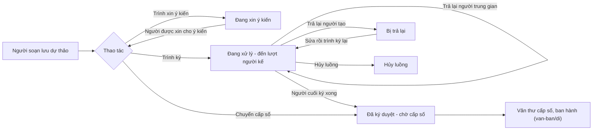

# Xử lý công việc — tóm tắt nghiệp vụ cho BA

> Bản đọc nhanh bằng lời nghiệp vụ. Chi tiết và bằng chứng: [nghiep-vu.md](nghiep-vu.md) (mã NV / BR trong ngoặc
> để tra). Cập nhật: 2026-10-02 · Nguồn: code `kha_develop` + DB DEV. Nhãn quy tắc: **[Đã xác nhận]** = chủ dự án đã
> chốt là đúng ý đồ · **[Hiện trạng]** = hệ thống đang chạy như vậy, chưa ai xác nhận là ý đồ · **[Lệch nghiệp vụ]**
> = đã xác nhận nghiệp vụ muốn khác, hệ thống đang làm sai.

## 1. Phân hệ này dùng để làm gì

Phân hệ quản lý văn bản ở **giai đoạn trước ban hành**: từ lúc chuyên viên soạn dự thảo đến lúc lãnh đạo ký xong và văn bản chờ cấp số (1.1).
Người soạn tạo dự thảo, đính file, chọn người xử lý tiếp theo, rồi **trình ký** hoặc **trình xin ý kiến** (NV-03, NV-08, NV-09).
Người trong luồng lần lượt **ký nháy / ký duyệt / phê duyệt / đọc soát**, có thể **xin ý kiến** thêm người khác, **trả lại** hoặc **thu hồi ký** của mình (NV-10, NV-11, NV-12).
Người ký cuối ký xong thì dự thảo sang *Đã ký duyệt* và chuyển cho văn thư cấp số; người soạn cũng có thể **chuyển cấp số** thẳng khi không cần ký trên hệ thống (BR-40, NV-18).

**Không gồm:** kỹ thuật ký số, mã hóa file mật (xem `ky-so`); cấp số, đóng dấu, ban hành, hủy ban hành (xem `van-ban/di`); chuyển văn bản sau cấp số (xem `van-ban/chuyen-van-ban`); cấu hình luồng ký, đổi người ký theo luồng, thêm người ký ngoài luồng (xem `van-ban/luong-xu-ly`); phiếu trình (xem `phieu-trinh`); nhắc việc gắn dự thảo (xem `lich-nhac-viec`); hồ sơ (xem `ho-so-cong-viec`).

## 2. Ai dùng và được làm gì

Phân hệ **không** phân quyền theo vai trò ở các nút: ai có menu và thấy nút thì dùng được (1.2, Q9, Q14).

| Vai trò | Được làm gì trong phân hệ này |
|---|---|
| Người soạn / người trình (chuyên viên) | Tạo, sửa, xóa dự thảo của mình; trình ký, trình xin ý kiến, chuyển xin ý kiến; hủy luồng, trình ký lại, sao chép; chuyển cấp số (1.2, NV-03, NV-13, NV-18) |
| Người xử lý trong luồng (ký nháy / ký duyệt / phê duyệt / đọc soát) | Ký hoặc phê duyệt khi đến lượt, chọn người ký tiếp, xin ý kiến thêm, trả lại, thu hồi ký của mình; phải có phân quyền dữ liệu "văn bản ký duyệt" mới thấy hộp việc (1.2, NV-02, NV-10) |
| Người cho ý kiến | Cho ý kiến (không ký) một lần; chuyển xin ý kiến tiếp cấp dưới trong giới hạn số cấp (NV-09, BR-32, BR-36) |
| Văn thư xét duyệt (trình duyệt) | Xét duyệt thể thức trước khi lãnh đạo có văn thư ký; trả lại; chuyển người đọc soát; có thể nhập số, sổ (1.2, NV-10, BR-07) |
| Trợ lý / thư ký lãnh đạo | Nhận tin nhắn thay lãnh đạo khi lãnh đạo có văn thư / trợ lý (1.2, NV-08) |
| Hệ thống ngoài (đăng ký mã ứng dụng) | Trình ký thay qua kết nối; dự thảo do hệ thống ngoài tạo chỉ được độ mật Thường và chỉ chính tài khoản đó trình được (BR-10, BR-29, NV-08) |

## 3. Màn hình / menu người dùng thấy

| Menu / màn | Để làm gì | Ghi chú | Mã menu |
|---|---|---|---|
| Dự thảo | Hộp việc của người soạn: soạn mới và theo dõi mọi dự thảo **do mình tạo**; tab Chờ xử lý / Đang xử lý / Đã xử lý / Đã ban hành / Tất cả | Mặc định 365 ngày gần nhất; tab *Bị trả lại* đang ẩn, dự thảo bị trả lại nằm trong *Chờ xử lý* (NV-01, BR-01, BR-03) | 439336 |
| Văn bản trình duyệt | Hộp việc của văn thư xét duyệt | Thuộc menu Xử lý công việc [Đã xác nhận Q11] (1.1) | 337199 |
| Văn bản ký duyệt | Hộp việc của người trong luồng: tab Chờ xử lý (lọc Chờ ký duyệt / Chờ phê duyệt / Chưa trình đến / Bị trả lại), Chờ cho ý kiến, Đang xử lý, Đã phê duyệt, Trả lại, Bị từ chối | Không có phân quyền dữ liệu thì danh sách rỗng, không báo lỗi (NV-02) | 337344 |
| Văn bản ký duyệt (bản trùng) | — | Menu **bị khóa** [Đã xác nhận Q17]; ô trang chủ *Chờ ký duyệt* vẫn mở theo mã menu này (1.1, NV-01) | 337342 |
| Xin ý kiến · Chờ cho ý kiến · Đã cho ý kiến (2 dòng) | — | **Không dùng** [Đã xác nhận Q16]; vẫn đang bật trên DB và mở ra trang lỗi. "Chờ cho ý kiến" thật là tab trong *Văn bản ký duyệt* (1.1, Q1) | 441345 · 31745273537 · 31745273539 · 441385 |
| Màn chi tiết dự thảo | Xem, ký / phê duyệt, trả lại, xin ý kiến, thu hồi ký, hủy luồng | Dùng chung với các menu văn bản đi khác (2, NV-10) | — |
| Trang chủ — nhóm ô "Xử lý công việc" | 6 ô: Chờ ký duyệt, Đã ký duyệt, Chờ phê duyệt, Chờ cho ý kiến, Dự thảo, Dự thảo bị trả lại; bấm ô mở hộp việc | Đếm 365 ngày cố định nên có thể lệch số trên tab; ô *Dự thảo bị từ chối* đã bỏ hẳn [Đã xác nhận Q13] (NV-01) | — |

## 4. Luồng chính

1. Người soạn vào *Dự thảo* › *Thêm mới*: nhập độ mật, độ khẩn, trích yếu (tối đa 2000 ký tự), tải File dự thảo (bắt buộc, pdf/doc/docx), chọn người xử lý tiếp theo và người xin ý kiến, rồi *Lưu lại* (NV-03, BR-10, BR-11, BR-12).
2. Văn bản thường có thể bật *Tự động điền* để hệ thống đọc File dự thảo và điền sẵn loại văn bản, độ khẩn, trích yếu, số / ký hiệu (NV-06, BR-21).
3. Nếu đơn vị cấu hình bắt buộc, hệ thống kiểm tra thể thức / chính tả trước khi lưu, trình hoặc chuyển cấp số (NV-05, BR-18).
4. **Trình ký**: người xử lý đầu tiên nhận việc ở *Văn bản ký duyệt*, kèm SMS / thông báo. Lãnh đạo có văn thư xét duyệt thì việc tới văn thư trước (NV-08, BR-07).
5. **Trình xin ý kiến**: những người được xin nhận việc ở tab *Chờ cho ý kiến*; cho ý kiến xong, người soạn nhận thông báo rồi trình ký (NV-09).
6. Người đến lượt mở chi tiết, bấm ký / phê duyệt, nhập ý kiến (bắt buộc, tối đa 2000 ký tự), chọn người ký tiếp theo. Còn người sau thì văn bản sang lượt người đó; hết người thì sang *Đã ký duyệt* (NV-10, BR-23, BR-40).
7. **Trả lại**: nhập lý do (tối đa 3000 ký tự), chọn trả về **người tạo** (dự thảo dừng luồng, về *Chờ xử lý* của người soạn) hoặc về **một người đã xử lý trước** (luồng lùi về cấp đó) (NV-11, BR-44).
8. Người soạn sửa dự thảo bị trả lại rồi *Trình ký*: luồng chạy lại từ đầu trên cùng dự thảo (NV-13, BR-27).

**Luồng phụ.**
- *Xin ý kiến trong luồng*: người đang xử lý, người được xin ý kiến, văn thư hoặc người tạo (khi văn bản đang trình) xin thêm ý kiến, kèm hạn trả lời (NV-09, BR-34).
- *Thu hồi ký*: người vừa ký rút lại khi người kế chưa xử lý (NV-12, BR-46).
- *Hủy luồng → Trình ký lại*: người soạn hủy luồng khi văn bản chưa có số; sau đó *Trình ký lại* tạo một dự thảo mới từ bản cũ (NV-13).
- *Chuyển cấp số*: bỏ hết người xử lý, chọn đơn vị ban hành và người ký, nhập ý kiến; dự thảo sang văn thư đơn vị ban hành mà không đi luồng ký (NV-18).

## 5. Trạng thái

**Trạng thái của dự thảo**

| Trạng thái (tên người dùng thấy) | Nghĩa | Chuyển sang khi nào | Giá trị |
|---|---|---|---|
| Chưa trình ký | Đã lưu, chưa trình | Lưu dự thảo mới (NV-03) | 0 |
| Đang xin ý kiến | Đang chờ người được xin cho ý kiến | Trình xin ý kiến (NV-09) | 28 |
| Đang xử lý (trình ký) | Đang trong luồng ký | Trình ký; trả lại người trung gian; thu hồi ký từ Đã ký duyệt (BR-28, BR-44, NV-12) | 1 |
| Bị trả lại | Trả về người tạo; nằm ở tab *Chờ xử lý* | Người trong luồng hoặc văn thư trả lại người tạo (BR-44, NV-11) | 2 |
| Đã ký duyệt (chờ cấp số) | Người cuối đã ký, chờ văn thư cấp số | Người cuối ký xong; hoặc chuyển cấp số (BR-40, NV-18) | 3 |
| Đã ban hành | Văn thư đã cấp số, ban hành | Xem `van-ban/di` (4.6) | 4 |
| Hủy luồng | Người soạn dừng luồng | Hủy luồng khi chưa có số (NV-13) | 6 |
| Văn bản gốc đã được trình lại | Bản cũ của một dự thảo đã trình ký lại | Bản trình lại được trình (BR-31, 4.6) | 7 |
| Hủy ban hành / Từ chối cấp số | Văn thư từ chối cấp số hoặc hủy ban hành | Xem `van-ban/di` (NV-11) | 27 |

**Hành động của một bước trong luồng** (người soạn / người ký chọn khi chỉ định người)

| Hành động | Nghĩa | Ghi chú | Giá trị |
|---|---|---|---|
| Ký duyệt | Ký số | Nút ký USB token / SIM CA (NV-10) | 2 |
| Phê duyệt | Xác nhận, không ký số | Nút xác nhận thường (NV-10) | 4 |
| Ký nháy | Ký nháy | Nút ký nháy (NV-10) | 5 |
| Chuyển xử lý | Chuyển cho người xử lý | (NV-02) | 7 |

**Trạng thái phần việc của từng người trong luồng**

| Trạng thái | Nghĩa | Chuyển sang khi nào | Giá trị |
|---|---|---|---|
| Chưa xử lý | Chờ đến lượt / đang chờ mình | Trình; được xin ý kiến; luồng chạy lại sau trả lại hoặc thu hồi (4.7) | 0 |
| Văn thư đã xét duyệt, chờ lãnh đạo | Lãnh đạo có văn thư: văn thư đã duyệt | Văn thư xét duyệt (BR-07) | 3 |
| Lãnh đạo chờ người đọc soát | Văn thư đã chuyển người đọc soát cùng cấp | Chuyển đọc soát (4.7) | 9 |
| Đã ký / đã phê duyệt / đã cho ý kiến | Đã xong phần mình | Ký, phê duyệt hoặc cho ý kiến (BR-39) | 4 |
| Đã trả lại | Người này đã trả lại | Bấm Trả lại (NV-11) | 2 |
| Văn thư từ chối | Văn thư xét duyệt trả lại | Văn thư trả lại (NV-11) | 1 |

## 6. Quy tắc quan trọng nhất

- [Hiện trạng] Hộp *Dự thảo* chỉ chứa dự thảo do chính mình tạo; người sau trong luồng chỉ thấy văn bản ở *Văn bản ký duyệt* khi **đến lượt mình**, trước đó nằm ở lọc *Chưa trình đến* (BR-01, BR-06).
- [Đã xác nhận] Người được trả lại mà không phải người tạo vẫn nhận dự thảo bị trả lại về hộp *Chờ xử lý* để sửa — đây là nghiệp vụ trả lại cho người ngoài luồng xử lý lại (BR-03, Q2).
- [Hiện trạng] Luồng ký **động từng bước**: người soạn chỉ chọn người kế; mỗi người ký chọn người sau trong popup ký và có thể thay người đã được xếp (hệ thống ghi lịch sử đổi người ký) (BR-23, BR-42).
- [Hiện trạng] Lãnh đạo có văn thư xét duyệt thì văn bản chỉ tới lãnh đạo sau khi văn thư đã xét duyệt (BR-07).
- [Hiện trạng] Chỉ trình được dự thảo ở Chưa trình ký, Đang xin ý kiến hoặc Bị trả lại. Trình lại dự thảo bị trả lại dùng cùng dự thảo và **xóa kết quả của mọi người trong luồng**, ai cũng phải xử lý lại (BR-26, BR-27).
- [Hiện trạng] *Trả lại* có hai kết quả: về người tạo thì dự thảo dừng luồng; về người trung gian thì dự thảo vẫn đang xử lý, luồng lùi về cấp người đó và các bước từ cấp đó trở đi được làm lại (BR-44, NV-11).
- [Hiện trạng] Mỗi người chỉ cho ý kiến một lần; số cấp được chuyển xin ý kiến tiếp lấy từ tham số hệ thống; xin ý kiến không đổi trạng thái dự thảo (BR-32, BR-35, BR-36).
- [Hiện trạng] Thu hồi ký chỉ được khi người kế chưa ký, chưa chuyển xin ý kiến, người đọc soát chưa xử lý (BR-37, BR-46).
- [Hiện trạng] Hủy luồng chỉ khi dự thảo đang xử lý và **chưa có số**; trình ký lại sau hủy luồng tạo dự thảo mới, bản cũ đánh dấu "đã được trình lại" (NV-13, BR-31).
- [Hiện trạng] Xóa được dự thảo Chưa trình ký, hoặc Hủy luồng mà chưa ai xử lý. Xóa dự thảo Bị trả lại chỉ **ẩn** khỏi hộp Dự thảo, văn bản vẫn còn trong lịch sử của người trong luồng (BR-49, NV-14).
- [Hiện trạng] Dự thảo đã đính vào phiếu trình còn hiệu lực (chưa phê duyệt, chưa xóa) thì không sửa, xóa, trình, hủy luồng, chuyển cấp số được (BR-54, BR-55).
- [Hiện trạng] Dự thảo mật: không xin ý kiến, không tự động điền, không kiểm tra chính tả, không có nơi nhận dự kiến, không trình ký lại từ bản hủy luồng, chỉ trả lại về người tạo; người ký kế phải có chứng thư số (BR-51, BR-52, BR-53).
- [Hiện trạng] Văn bản thường có người phê duyệt hoặc ký nháy mà tên xuất hiện trong File dự thảo → hệ thống cảnh báo hành động này không hiện ảnh ký, chọn Hủy thì không lưu (BR-24).
- [Đã xác nhận] Chuyển cấp số thì dự thảo **không đi luồng nữa**; đường chuyển từ danh sách xóa hẳn danh sách người xử lý (NV-18, Q10).
- [Đã xác nhận] Dự thảo bị từ chối cấp số không trình lại, không sửa được; người soạn chỉ có nút *Lưu* để cất khỏi hộp Chờ xử lý, sau đó xem ở màn tra cứu (NV-11, Q7).
- [Lệch nghiệp vụ] File có nội dung không khớp đuôi: hệ thống chỉ hỏi xác nhận rồi vẫn cho tải lên; nghiệp vụ là **chặn không cho tải** (đã sửa ở nhánh riêng, chưa vào bản chính) (BR-17, Q5).
- [Lệch nghiệp vụ] Ô trang chủ *Chờ cho ý kiến* có một đường hiển thị đếm sai loại việc; nghiệp vụ đếm theo việc "cho ý kiến" (NV-01, Q8, dac-thu bẫy 11).

## 7. Hệ thống KHÔNG làm / hay bị hiểu nhầm

- **"Trả lại" và "từ chối" là một.** Nhãn hiển thị là *Trả lại* / *Bị trả lại*, nhưng một số chỗ gọi là "từ chối"; cùng một nút cho hai kết quả khác nhau tùy người được chọn (BR-44, dac-thu bẫy 7).
- **Không có trạng thái "Chờ ký nháy" ở cấp dự thảo.** Đang chờ ký nháy hay không xác định theo bước hiện tại trong luồng (4.6, Q6).
- **Menu Xin ý kiến / Chờ cho ý kiến / Đã cho ý kiến không dùng**, mở ra trang lỗi; "chờ cho ý kiến" chỉ có ở tab trong *Văn bản ký duyệt* (1.1, Q1, Q16).
- **Không phân quyền theo vai trò ở nút.** Ai thấy nút thì dùng được; điều kiện quyền phải đặt ở điều kiện hiện nút (1.2, Q9, Q14).
- **Ký xong, trạng thái cập nhật trễ.** Phần chuyển cấp, ban hành tự động, SMS chạy sau khi bấm ký; tải lại ngay có thể còn thấy trạng thái cũ (BR-40, dac-thu bẫy 18).
- **Vùng "File phụ lục" đang ẩn** trên form dự thảo; vùng **"Tài liệu không phát hành" chưa có** ở bản chính (NV-04, Q4).
- **Đổi độ mật trên form xóa dữ liệu đã chọn:** phiếu trình, nơi nhận dự kiến, người xin ý kiến (BR-51, dac-thu bẫy 23).
- **Bỏ tích "Nơi nhận dự kiến" rồi lưu là xóa hết danh sách nơi nhận** đã chọn (BR-56).
- **Hủy luồng khi văn bản đã có số** bị từ chối với thông báo chung, không nói rõ lý do (NV-13, dac-thu bẫy 20).

## 8. Liên quan phân hệ khác

| Khi thay đổi ở đây… | …phải xem thêm | Vì sao |
|---|---|---|
| Ký, ký nháy, văn bản mật | `ky-so` | Kỹ thuật ký USB / CloudCA / SIM CA và mã hóa file nằm ở đó (NV-10, NV-15) |
| Sau ký cuối, chuyển cấp số, trả lại của văn thư ban hành | `van-ban/di` | Cấp số, đóng dấu, ban hành, từ chối cấp số, hủy ban hành thuộc phân hệ đó (BR-41, NV-11, NV-18) |
| Chọn người xử lý tiếp, đổi người ký | `van-ban/luong-xu-ly` | Danh sách người bước sau lấy từ cấu hình luồng (NV-07, 1.1) |
| Nơi nhận dự kiến | `van-ban/chuyen-van-ban` | Hệ thống tự chuyển văn bản sau cấp số theo danh sách này (NV-17) |
| Sửa, xóa, trình dự thảo | `phieu-trinh` | Phiếu trình còn hiệu lực khóa các thao tác trên dự thảo; dự thảo tạo được từ phiếu trình (NV-16) |
| Lưu, xóa dự thảo | `lich-nhac-viec` | Nhắc việc gắn dự thảo lưu và xóa cùng dự thảo (NV-19) |
| Trình, hủy luồng, trả lại, ký cuối | `nhiem-vu`, `cong-viec` | Các bước này báo sang Nhiệm vụ và liên kết nhiệm vụ (NV-20) |
| Dự thảo trả lời văn bản đến, dự thảo từ văn bản liên thông | `van-ban/den`, `van-ban/lien-thong` | Dự thảo gắn văn bản đến cần trả lời; hủy luồng / trả lại gỡ liên kết văn bản liên thông (NV-03, NV-11, NV-13) |
| Màn chi tiết, ký, trả lại | `van-ban/di` | Màn chi tiết và hộp việc ký dùng chung với các menu văn bản đi khác (2, dac-thu mục 1) |

## 9. Câu hỏi nghiệp vụ còn mở

Không còn (Q1–Q17 đã trả lời, Q16 trả lời 2026-10-02 — xem mục 7.2 của `nghiep-vu.md`).

## 10. Khi viết yêu cầu mới cho phân hệ này, nhớ ghi rõ

- **Màn nào:** hộp *Dự thảo* (menu Xử lý công việc), màn "văn bản dự thảo" cũ, hay *Văn bản ký duyệt* / *Văn bản trình duyệt*; logic dùng chung phải áp cho cả hai màn dự thảo (dac-thu bẫy 1, mục 4).
- **Áp dụng cho bước nào trong luồng:** ký duyệt, phê duyệt, ký nháy, đọc soát, cho ý kiến, văn thư xét duyệt — và lãnh đạo có văn thư xét duyệt thì sao (NV-10, BR-07).
- **Trạng thái dự thảo nào được thao tác:** Chưa trình ký, Đang xin ý kiến, Đang xử lý, Bị trả lại, Hủy luồng, Đã ký duyệt, Từ chối cấp số (BR-26, BR-49, Q7).
- **Trả lại về người tạo hay về người trung gian**, và người được trả lại không phải người tạo có áp dụng không (BR-44, BR-03).
- **Dự thảo mật** có áp dụng không; dự thảo do hệ thống ngoài tạo có áp dụng không (BR-51, BR-53, BR-29).
- **Dự thảo đang gắn phiếu trình** có bị khóa thao tác mới không (BR-55).
- **Có gửi SMS / thông báo không, cho ai:** người kế, người trình, người được xin ý kiến, văn thư của lãnh đạo; người dùng có được chọn gửi / không gửi không (NV-08, mục "Tổng hợp thông báo/SMS theo bước").
- **Số đếm có đổi không:** tab nào trong hộp Dự thảo / Văn bản ký duyệt, ô trang chủ nào; ô trang chủ có hai đường hiển thị phải đổi cả hai (NV-01, BR-04, dac-thu bẫy 11).
- **Điều kiện hiện nút** (vì quyền nằm ở việc hiện nút), kèm thông báo khi bị chặn (1.2, Q9).
- **Có lưu lịch sử xử lý không** và hiển thị ở đâu, nhất là khi đổi người ký hoặc chạy lại luồng (BR-27, BR-42).
