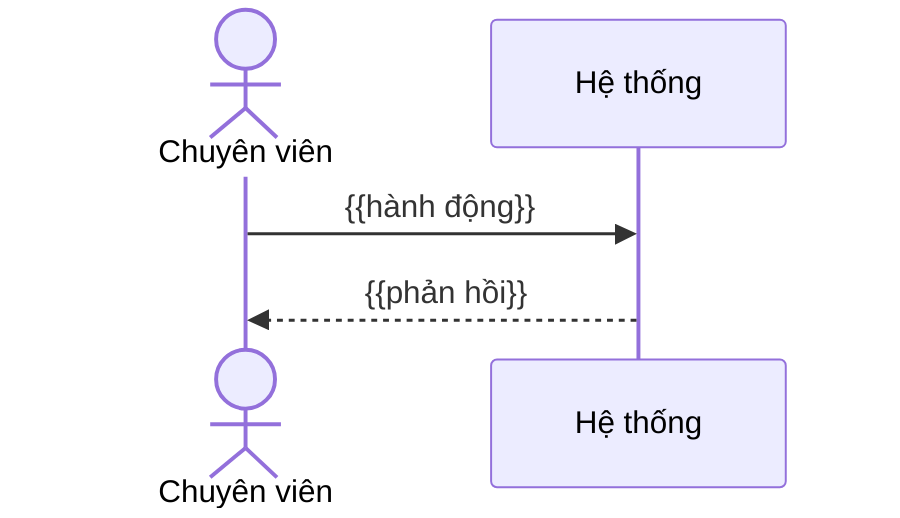

**TÀI LIỆU ĐẶC TẢ YÊU CẦU CHỨC NĂNG**

**{{MÃ YC}} - {{TÊN YÊU CẦU VIẾT HOA}}**

**Hệ thống Văn bản và Điều hành tỉnh Khánh Hòa**

| Thuộc tính | Giá trị |
|---|---|
| Mã yêu cầu | {{YCxx}} |
| Chức năng | {{Tên chức năng, VD: Dự thảo công việc}} |
| Phân hệ (knowledge) | {{folder trong `knowledge/`, VD: `van-ban/di`}} |
| Loại yêu cầu | {{Đổi UI/điều hướng · Bổ sung nghiệp vụ · Chức năng mới · Tích hợp/Liên thông}} |
| Loại tài liệu | Đặc tả yêu cầu chức năng (BA/FRD) |
| Phiên bản | {{1.0}} |
| Trạng thái | {{DRAFT · DRAFT_PENDING_CONFIRMATION · READY_FOR_DEV · APPROVED}} |
| Ngày cập nhật | {{dd/mm/yyyy}} |

> **HƯỚNG DẪN DÙNG MẪU** *(xóa khối này khi hoàn thiện)*
>
> **Nguồn dựng mẫu:** khung 11 mục lấy từ tài liệu YC17 v2.1
> (`features/XULYCONGVIEC/ba/BA-01-yc17-du-thao/input/spec.md`) · các cột/mục bổ sung lấy từ lỗi mà
> `ba-review-report.md` của YC17 đã chỉ ra · tiêu chí `[A1..A13]` từ `docs/rules/ba-spec-rule.md` ·
> mã vai trò từ `knowledge/_chung/thuat-ngu.md` · mục NFR (3.3) theo nhóm yêu cầu phi chức năng của
> ISO/IEC/IEEE 29148 và Volere.
>
> - Dùng cho yêu cầu **cỡ M/L** (chức năng mới, bổ sung nghiệp vụ, tích hợp). Yêu cầu nhỏ (đổi
>   giao diện/điều hướng) dùng `02-yeu-cau-nho.md`.
> - Mỗi mục có ghi `[A..]` = mã tiêu chí cấu trúc tương ứng trong rule. Viết theo mẫu thì
>   `/ba-review` chấm được ngay.
> - **Ai viết mục nào** (nhãn cạnh tiêu đề): 🟦 **BA** — ý muốn nghiệp vụ, chỉ BA viết được · 🟩 **AI** — AI điền
>   từ `knowledge/` + code (hiện trạng, mapping, kỹ thuật), BA không phải viết · 🟨 **AI soạn → BA chốt** — AI soạn
>   từ lời BA + hiện trạng, BA đọc, sửa, đồng ý. Làm cùng AI: skill `ba-assistant` (xem `README.md` "Quy trình từng bước").
> - Trước khi gửi, tự rà bằng `checklist/01-ra-soat-truoc-khi-gui.md`.
> - **Mục nào không áp dụng vẫn giữ tiêu đề và ghi "Không áp dụng — lý do: …"**. Để trống bị chấm `RỖNG`.
> - Chỗ chưa chắc → **không đoán**, đưa vào mục 11 (TBD) và tham chiếu mã TBD tại chỗ.
>
> **Mục bắt buộc theo loại yêu cầu:**
>
> | Mục | Đổi UI/điều hướng | Bổ sung nghiệp vụ | Chức năng mới | Tích hợp/Liên thông |
> |---|:-:|:-:|:-:|:-:|
> | 1, 2, 3, 4, 8, 9, 11 | ✔ | ✔ | ✔ | ✔ |
> | 5 Use case | Rút gọn (1 UC) | ✔ | ✔ | ✔ |
> | 6 Màn hình/field | ✔ | ✔ | ✔ | Nếu có UI |
> | 7 Ngoại lệ/biên | ✔ (empty state, quyền) | ✔ | ✔ | ✔ (timeout, lỗi đối tác) |
> | 3.2 Trạng thái | Không | Nếu đổi trạng thái | ✔ | ✔ |
> | 3.3 NFR | Không | Nếu có | ✔ | ✔ |
> | 10 Kỹ thuật/CSDL | 10.1, 10.7 | ✔ | ✔ | ✔ + API đối tác |

---

# LỊCH SỬ THAY ĐỔI `[A1]` · 🟦

| Phiên bản | Ngày | Nội dung | Người thực hiện |
|---|---|---|---|
| 1.0 | {{dd/mm/yyyy}} | Bản đầu tiên | {{Họ tên BA}} |

# PHÊ DUYỆT / XÁC NHẬN `[A2]` · 🟦

| Vai trò | Họ tên | Trạng thái | Ngày | Ghi chú |
|---|---|---|---|---|
| BA phụ trách | | Chưa xác nhận | | |
| DEV phụ trách | | Chưa xác nhận | | |
| Tester phụ trách | | Chưa xác nhận | | |
| Đại diện nghiệp vụ/Khách hàng | | Chưa xác nhận | | |

# MỤC LỤC

0. Phiếu ý tưởng
1. Thông tin chung
2. Phạm vi và vai trò
3. Tổng quan yêu cầu chức năng
4. Business Rules
5. Luồng nghiệp vụ / Use Case
6. Đặc tả màn hình và trường dữ liệu
7. Xử lý ngoại lệ và trường hợp biên
8. Acceptance Criteria
9. Ma trận kiểm thử và truy vết
10. Phạm vi kỹ thuật, kiến trúc và mapping CSDL
11. Các điểm cần xác nhận (TBD)

---

# 0. PHIẾU Ý TƯỞNG · 🟦 BA *(viết trước tiên, ≤ 1 trang — giữ lại làm phụ lục hoặc xóa khi nộp)*

- **Muốn gì:** {{1–3 câu bằng lời thường}}
- **Ai dùng:** {{VD: văn thư đơn vị, lãnh đạo phòng, chuyên viên}}
- **Vì sao cần:** {{vấn đề người dùng đang gặp}}
- **Một tình huống thật cụ thể:** {{VD: "Văn thư Sở X tiếp nhận văn bản của UBND tỉnh, chuyển Phòng Y chủ trì, Phòng Z phối hợp; muốn …"}}
- **Kết quả mong muốn đo được:** {{VD: văn thư không phải chọn lại đơn vị nhận khi …}}
- **Kênh:** {{Web · Mobile · cả hai}} · **Gấp không:** {{…}}

---

# 1. THÔNG TIN CHUNG `[A3]` · 🟦 1.1–1.2 · 🟨 1.3 (AS-IS 🟩) · 🟩 1.4 · 🟨 1.5

## 1.1. Mục đích

{{1–3 câu: hệ thống sẽ làm gì khác so với hiện tại. Viết theo dạng "Khi <actor> <hành động> tại
<màn hình>, hệ thống <kết quả>".}}

## 1.2. Bối cảnh nghiệp vụ

- Yêu cầu gốc (trích nguyên văn từ khách hàng/PTYC): "{{…}}"
- Chức năng nghiệp vụ chính: {{…}}
- Đường vào chức năng: {{Menu → Màn hình → Tab}}
- Vấn đề hiện tại / lý do cần làm: {{…}}
- Kết quả mong muốn (đo được): {{VD: giảm từ 4 thao tác xuống 1 thao tác}}

## 1.3. Hiện trạng (AS-IS) và thay đổi (TO-BE)

> **Hướng dẫn:** đọc `knowledge/<phân hệ>/tom-tat.md` trước (lời nghiệp vụ, quy tắc có nhãn [Đã xác nhận] / [Hiện trạng] /
> [Lệch nghiệp vụ]); chi tiết ở `nghiep-vu.md` + `dac-thu.md`. Cột "Nguồn AS-IS" ghi mã `<phân hệ> NV-xx / BR-xx`.
> Dựa vào quy tắc [Hiện trạng] (chưa ai xác nhận là ý đồ) thì nói rõ và cân nhắc đưa thành TBD. Không có
> nguồn thì ghi rõ "chưa có baseline — mô tả theo quan sát trên môi trường {{DEV/UAT}} ngày …".

| STT | Nội dung | Hiện tại (AS-IS) | Yêu cầu (TO-BE) | Nguồn AS-IS |
|---|---|---|---|---|
| 1 | {{VD: Điều hướng "Chờ phê duyệt"}} | {{Dashboard → Văn thư → Văn bản trình duyệt → tab Chờ xử lý}} | {{Dashboard → Văn bản trình duyệt → tab Chờ xử lý}} | {{knowledge/…/nghiep-vu.md mục …}} |

**Tóm tắt thay đổi:** {{VD: Bỏ bước trung gian "Văn thư"; không đổi dữ liệu, không đổi trạng thái văn bản.}}

## 1.4. Phạm vi chức năng bị ảnh hưởng

| STT | Điểm vào chức năng | Màn hình/Action | Trong phạm vi |
|---|---|---|---|
| 1 | {{Menu → …}} | {{Tạo mới …}} | Có |
| 2 | {{Các chức năng khác của …}} | Không được mô tả trong {{YCxx}} | Ngoài phạm vi thay đổi; cần regression |

**Kênh áp dụng:** {{Web · Mobile · Cả hai}} — nếu chỉ Web, ghi rõ "Mobile giữ nguyên hành vi hiện tại".

## 1.5. Thuật ngữ

> Chỉ ghi thuật ngữ **dùng theo nghĩa riêng** trong tài liệu này. Thuật ngữ chung tra
> `knowledge/_chung/thuat-ngu.md`.

| Thuật ngữ | Định nghĩa sử dụng trong tài liệu |
|---|---|
| {{…}} | {{…}} |

---

# 2. PHẠM VI VÀ VAI TRÒ `[A4]` · 🟨

## 2.1. Vai trò

> Cột "Mã vai trò hệ thống" ghi **mã thật** (`SYS_ROLE.CODE`; danh sách + id: `knowledge/he-thong/tom-tat.md` §2,
> `knowledge/_chung/thuat-ngu.md`): `VT` Văn thư · `LDDV` Lãnh đạo · `TTDV` Thủ trưởng · `NV` Chuyên viên · `TL` Trợ lý ·
> `ADMIN` Quản trị hệ thống · `ADMIN_LEVEL1` Quản trị hệ thống đơn vị. Vai trò riêng phân hệ: `LT` Lưu trữ hồ sơ,
> `QLLH` Quản lý lịch họp, `QLHSTC` Quản lý hồ sơ tài chính, `REPORT` Báo cáo — tra `tom-tat.md` §2 của phân hệ.
> Quyền của hệ thống = **menu theo vai trò + điều kiện hiện nút** (BE không kiểm người gọi) → ghi rõ nút hiện cho ai, ở trạng thái nào.

| Vai trò nghiệp vụ | Mã vai trò hệ thống | Được làm gì trong {{YCxx}} | Ghi chú |
|---|---|---|---|
| Chuyên viên | {{NV}} | {{Tạo/Sửa …}} | Vai trò chính |
| Văn thư | {{VT}} | {{Không có action mới — chỉ regression}} | |
| Lãnh đạo | {{LDDV}} | {{…}} | |

**Lưu ý phạm vi role:** {{Không suy diễn vai trò khác có cùng quyền với vai trò chính nếu yêu cầu
không mô tả.}}

## 2.2. Tiền điều kiện chung

- Người dùng đã đăng nhập và có quyền truy cập chức năng {{…}} theo phân quyền hiện hành.
- {{Dữ liệu cần có sẵn: …}}
- {{Cấu hình hệ thống cần bật: …}}

---

# 3. TỔNG QUAN YÊU CẦU CHỨC NĂNG `[A5]` · 🟦 danh sách FR · 🟩 3.1 mapping · 🟨 3.2–3.3

| ID | Trigger/Action của người dùng | Xử lý mong muốn | BR liên quan |
|---|---|---|---|
| FR-01 | {{Chọn … tại …}} | {{Hệ thống …}} | {{BR-01, BR-02}} |
| FR-02 | | | |

## 3.1. Mapping dữ liệu nguồn → đích

> Chỉ cần khi yêu cầu chuyển/sao chép/tự điền dữ liệu từ đối tượng này sang đối tượng khác.
> Không áp dụng → ghi "Không áp dụng".

| Nguồn (đối tượng · nhóm dữ liệu) | Đích (đối tượng · nhóm dữ liệu) | Quy tắc chuyển đổi | Điều kiện áp dụng | Rule |
|---|---|---|---|---|
| {{Văn bản đến · Tài liệu liên quan}} | {{Dự thảo · Tài liệu liên quan}} | {{COPY / REFERENCE — TBD-xx nếu chưa chốt}} | {{Khi …}} | BR-xx |

## 3.2. Trạng thái và chuyển trạng thái

> Bắt buộc khi yêu cầu **tạo mới hoặc thay đổi** trạng thái. Không đổi → ghi "Không thay đổi trạng
> thái; giữ nguyên `<bảng.cột>` = …".

| Trạng thái hiện tại (tên · mã) | Hành động | Ai thực hiện | Điều kiện | Trạng thái kế tiếp (tên · mã) | BR |
|---|---|---|---|---|---|
| {{Tên trạng thái · mã thật trong DB/Constants}} | {{Trình ký}} | {{Chuyên viên}} | {{Đủ trường bắt buộc}} | {{Tên · mã}} | BR-xx |

> Ghi **mã thật**, không tự đánh số. Ví dụ mã đã có trong `knowledge/_chung/thuat-ngu.md`:
> loại ký `signatureType` 1 Xét duyệt · 2 Ký nháy · 3 Ký duyệt; `SEND_TYPE` 1 Chủ trì · 2 Phối hợp ·
> 3 Nhận để biết; `DEL_FLAG` 0 hoạt động · 1 đã xóa. Chưa biết mã → TBD.

**Hành động bị cấm:** {{VD: không cho Thu hồi khi đã Ban hành}}

## 3.3. Yêu cầu phi chức năng (NFR)

> Không thuộc 13 mục chấm điểm nhưng **bắt buộc với Chức năng mới / Tích hợp**. Không có yêu cầu
> riêng → ghi "Theo chuẩn hiện hành của hệ thống".

| Mã | Nhóm | Yêu cầu (đo được) |
|---|---|---|
| NFR-01 | Hiệu năng | {{VD: danh sách 1.000 bản ghi hiển thị ≤ 3 giây}} |
| NFR-02 | Bảo mật / Văn bản mật | {{VD: file văn bản mật chỉ người có quyền mật mới xem/tải}} |
| NFR-03 | Nhật ký (audit log) | {{VD: ghi người thao tác, thời điểm, giá trị cũ/mới}} |
| NFR-04 | Thông báo / SMS | {{Ai nhận, khi nào, kênh nào, nội dung nguyên văn}} |
| NFR-05 | Tương thích | {{Trình duyệt, Mobile app phiên bản …}} |

---

# 4. BUSINESS RULES `[A6]` · 🟨 (BA nói ý muốn → AI chuẩn hóa, đối chiếu quy tắc hiện có)

> - Mỗi rule **một ý**, có mã `BR-nn` liên tục, không nhảy số, không tái sử dụng mã đã xóa.
> - Cấm từ mơ hồ: *phù hợp, hợp lý, tương ứng, như hiện tại, linh hoạt, nếu cần, tối ưu, v.v.,
>   ngoài chủ đích*. Thay bằng điều kiện/giá trị đo được.
> - Số lượng ghi rõ khoảng: `0..N`, `1..5`, "tối đa 20 MB".
> - Rule phụ thuộc TBD → ghi "(chờ TBD-xx)" ngay trong mô tả.

| Rule ID | Tên rule | Mô tả | Nguồn |
|---|---|---|---|
| BR-01 | {{Điểm kích hoạt}} | {{Khi … thì …}} | {{PTYC mục … / họp ngày …}} |
| BR-02 | {{Điều kiện hiển thị}} | {{Chỉ hiển thị … với vai trò …}} | |
| BR-03 | {{Không có dữ liệu}} | {{Nếu số lượng = 0 thì …}} | |

---

# 5. LUỒNG NGHIỆP VỤ / USE CASE `[A7]` · 🟨

> Mỗi UC **phải có Actor tường minh** và **trỏ tới ngoại lệ ở mục 7** (`EC-xx`).

## 5.1. UC-01 - {{Tên use case}}

| Thuộc tính | Nội dung |
|---|---|
| Mục tiêu | {{…}} |
| Actor | {{Chuyên viên (NV)}} |
| Tiền điều kiện | {{…}} |
| Trigger | {{Người dùng bấm …}} |
| Hậu điều kiện | {{Dữ liệu/trạng thái sau khi hoàn tất}} |
| Rule liên quan | {{BR-01, BR-02}} |
| Ngoại lệ liên quan | {{EC-01, EC-02}} |

**Luồng chính**

1. {{Actor}} {{hành động}}.
2. Hệ thống {{phản hồi}}.
3. …

**Luồng thay thế**

- 2a. Nếu {{điều kiện}} thì {{…}}, quay lại bước {{n}}.

**Luồng ngoại lệ**

- 3a. {{Lỗi …}} → xử lý theo EC-xx.

## 5.2. UC-02 - {{…}}

{{…}}

---

# 6. ĐẶC TẢ MÀN HÌNH VÀ TRƯỜNG DỮ LIỆU `[A8]` · 🟨 (AI điền field hiện có → BA đánh dấu thêm / sửa / bỏ)

## 6.1. Màn hình {{Tên màn hình}}

{{Ảnh design/screenshot đánh số vùng — đặt trong `input/design/NN_ten.png`}}

*Hình 1. {{Mô tả ảnh}}*

> Đủ các cột dưới đây. Field không đổi so với hiện tại vẫn ghi "Giữ nguyên baseline" thay vì bỏ trống.

| ID | Trường/Control | Loại | Bắt buộc | Độ dài / Giới hạn | Mặc định | Quy tắc hiển thị / Validate | Thay đổi trong {{YCxx}} |
|---|---|---|---|---|---|---|---|
| UI-01 | {{Tên trường}} | {{Textbox/Combobox/Danh sách file/Nút}} | {{Có/Không/Có điều kiện: …}} | {{255 ký tự / 0..N file / ≤20MB}} | {{…}} | {{Hiển thị khi …}} | {{Mới · Sửa · Giữ nguyên}} |

## 6.2. Thông báo người dùng

> **Ghi nguyên văn** từng chuỗi để Tester so khớp. Chưa chốt → TBD-xx.

| Mã | Tình huống | Loại | Nội dung nguyên văn | Nút |
|---|---|---|---|---|
| MSG-01 | {{File trùng}} | {{Popup xác nhận}} | "{{File "…" đã tồn tại. Bạn có muốn thay thế?}}" | {{Đồng ý / Hủy}} |
| MSG-02 | {{Lưu thành công}} | {{Toast}} | "{{…}}" | — |

## 6.3. Điều hướng

> Bắt buộc với yêu cầu đổi điều hướng.

| Từ (màn hình · vùng) | Thao tác | Đến (màn hình) | Tab/bộ lọc mặc định | Giữ bộ lọc cũ? |
|---|---|---|---|---|
| {{Dashboard · Xử lý công việc}} | {{Click "Chờ phê duyệt"}} | {{Văn bản trình duyệt}} | {{Tab Chờ xử lý}} | {{Không}} |

## 6.4. Quy tắc hiển thị

- {{Quy tắc cụ thể, tham chiếu UI-xx}}

---

# 7. XỬ LÝ NGOẠI LỆ VÀ TRƯỜNG HỢP BIÊN `[A9]` · 🟨

> Gợi ý luôn xét: không có dữ liệu · dữ liệu tối đa · không có quyền · bản ghi bị xóa/đổi trạng thái
> giữa chừng · thao tác lặp/bấm 2 lần · hai người cùng sửa · lỗi kết nối/đối tác · văn bản mật ·
> hủy giữa chừng · mở lại màn Sửa.

| ID | Tình huống | Kết quả mong đợi | UC | Trạng thái |
|---|---|---|---|---|
| EC-01 | {{Không có dữ liệu}} | {{Hiển thị "…" / giá trị 0}} | UC-01 | Đã chốt |
| EC-02 | {{…}} | {{Chưa xác định}} | UC-02 | TBD-xx |

---

# 8. ACCEPTANCE CRITERIA `[A10]` · 🟨 (AI sinh từ BR → BA duyệt)

> - Đủ 3 vế **Given / When / Then**, dữ liệu cụ thể (số lượng, tên, trạng thái).
> - Mỗi AC **ghi cột BR**. Mỗi BR phải có ≥ 1 AC.
> - AC phụ thuộc TBD chưa chốt → đánh dấu `(giả định — chờ TBD-xx)`, không viết như đã chốt.

| AC ID | BR | Given | When | Then |
|---|---|---|---|---|
| AC-01 | BR-01 | {{Văn bản đến có 2 Tài liệu liên quan}} | {{Chuyên viên chọn văn bản tại "Link văn bản đến"}} | {{Dự thảo hiển thị đủ 2 file tại nhóm Tài liệu liên quan}} |
| AC-02 | BR-03 | {{…}} | {{…}} | {{…}} |

---

# 9. MA TRẬN KIỂM THỬ VÀ TRUY VẾT `[A11]` · 🟩

## 9.1. Ma trận role kiểm thử

| Vai trò nghiệp vụ | Mã vai trò hệ thống | Mục tiêu kiểm thử |
|---|---|---|
| Chuyên viên | {{NV}} | {{Functional đầy đủ}} |
| Văn thư | {{VT}} | {{Regression phân quyền}} |

## 9.2. Traceability Requirement → Rule → AC

> Mọi FR và mọi BR phải xuất hiện trong bảng này.

| FR | BR | AC | EC | Ghi chú |
|---|---|---|---|---|
| FR-01 | BR-01, BR-02 | AC-01, AC-02 | EC-01 | |

## 9.3. Regression tối thiểu

- {{Chức năng X khi không dùng tính năng mới vẫn hoạt động như hiện tại}}
- {{Quyền xem/sửa/xóa theo role không bị mở rộng}}
- {{Mobile/liên thông không bị đổi hành vi}}

---

# 10. PHẠM VI KỸ THUẬT, KIẾN TRÚC VÀ MAPPING CSDL `[A12]` · 🟩 (BA không phải viết)

> **PTYC xác định WHAT/WHY; code + DAO + DB xác định HOW.** BA không bắt buộc tự trace code —
> có thể nhờ DEV hoặc chạy `/ba-review` phase feasibility. Nhưng mọi dòng phải có **nhãn độ tin cậy**:
> `VERIFIED_DB` · `VERIFIED_CODE` · `VERIFIED_BASELINE` · `PARTIAL` · `TBD_NOT_CONFIRMED`.
> Tham khảo `ban-do.md` của phân hệ trong `knowledge/`.

## 10.1. Quy tắc nguồn sự thật

| Thứ tự | Nguồn | Dùng để xác định | Khi mâu thuẫn |
|---|---|---|---|
| 1 | Tài liệu này | WHAT/WHY, phạm vi, BR, AC | Không sửa BR bằng suy luận kỹ thuật |
| 2 | TKCT baseline / `knowledge/` | Hành vi cũ, mapping đã kiểm chứng | Dùng làm OLD behavior + regression |
| 3 | Source code hiện tại | Control-flow, binding, service, DTO | Trace end-to-end |
| 4 | DB schema + SELECT | Bảng/cột/quan hệ thật | Chưa verify → `TBD_NOT_CONFIRMED` |

**Quy ước riêng của yêu cầu này:** {{VD: `Requisition` là DTO, KHÔNG phải bảng DB.}}

## 10.2. Call-chain

| Layer | Thành phần | Vai trò với {{YCxx}} | Độ tin cậy |
|---|---|---|---|
| UI/ZK | {{xxx.zul}} | | |
| ViewModel | {{XxxVM}} | | |
| Service/API | {{…}} | | |
| DAO | {{…}} | | |
| DB | {{BẢNG}} | | |

## 10.3. Bảng/cột liên quan

| Bảng | Mục đích | Cột chính liên quan | Thay đổi | Độ tin cậy |
|---|---|---|---|---|
| {{TEXT}} | {{…}} | {{TEXT_ID, STATE}} | {{Không / Thêm cột → cần migration}} | {{VERIFIED_DB}} |

## 10.4. Mapping UI → Code → DTO/API → CSDL

| UI ID | Field UI | ZUL / VM / Command | Payload / API | DB đích | Ghi chú |
|---|---|---|---|---|---|
| UI-01 | | | | | |

## 10.5. CRUD và lifecycle dữ liệu

| Action | Trên giao diện (chưa lưu) | Khi lưu | Khi hủy | Điểm cần xác nhận |
|---|---|---|---|---|
| {{Tạo}} | | | | |
| {{Xóa}} | | | | {{Xóa mềm (DEL_FLAG) hay cứng?}} |

## 10.6. Phạm vi KHÔNG thay đổi và regression bắt buộc

| Hạng mục baseline | Có thay đổi? | Yêu cầu |
|---|---|---|
| {{…}} | Không | {{Giữ nguyên binding, validation, DB mapping}} |

## 10.7. Ràng buộc triển khai

- Không thay đổi schema DB ngoài yêu cầu nếu chưa có TKCT kỹ thuật và phê duyệt riêng.
- {{Không làm mất dữ liệu người dùng đã nhập/upload khi chưa có rule xác nhận.}}
- {{…}}

## 10.8. Quy tắc cho AI/DEV khi đọc tài liệu này

| Rule ID | Quy tắc |
|---|---|
| AI-01 | Không suy tên bảng/cột từ tên class, DTO hay nhãn UI. |
| AI-02 | Không tự bịa bảng/cột/API/method/business rule — thiếu bằng chứng ghi `TBD_NOT_CONFIRMED`. |
| AI-03 | Mỗi field phải trace được UI → ZUL → VM → DTO → backend → DAO → DB, kèm `file::hàm::dòng`. |
| AI-04 | Tài liệu và code mâu thuẫn → ghi `CONFLICT` + đề xuất, chờ xác nhận, không tự chọn. |
| AI-05 | {{Quy tắc riêng của yêu cầu này}} |

**Quality gate trước khi DEV code:** {{liệt kê các điểm BẮT BUỘC phải chốt. Chưa chốt → trạng thái tài
liệu = DRAFT_PENDING_CONFIRMATION.}}

---

# 11. CÁC ĐIỂM CẦN XÁC NHẬN (TBD) `[A13]` · 🟨 (AI sinh câu hỏi → BA / người chốt trả lời)

> - **Bắt buộc có cột "Ai chốt" và "Hạn"** — TBD không có chủ = tài liệu bị chấm CHƯA ĐỦ.
> - `BLOCKING` = không chốt thì DEV không code được / Tester không viết được testcase.
> - Chốt xong: điền "Kết luận", sửa BR/AC liên quan, **không xóa dòng TBD**.

| Mã TBD | Câu hỏi cần chốt | Ảnh hưởng BR/AC/EC | Mức | Ai chốt | Hạn | Kết luận |
|---|---|---|---|---|---|---|
| TBD-01 | {{Câu hỏi cụ thể, có phương án: A / B / C?}} | {{BR-06, AC-05}} | {{BLOCKING}} | {{Tên · vai trò}} | {{dd/mm/yyyy}} | {{(chưa chốt)}} |

**Tiêu chí bàn giao DEV:** {{Chỉ estimate/code chính thức khi các TBD BLOCKING đã chốt.}}

---

# KẾT LUẬN

{{3–5 câu: yêu cầu làm gì, phạm vi, những gì đã chốt, những gì còn TBD và điều kiện để chuyển DEV.}}
