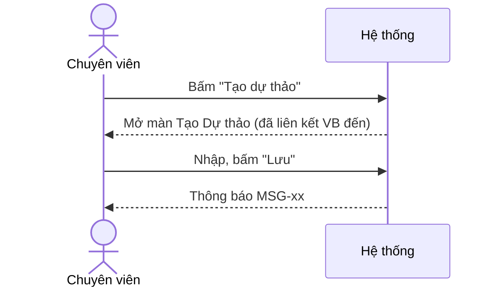

# MẪU USE CASE

> **Nguồn:** khối UC trong YC17 (`features/XULYCONGVIEC/ba/BA-01-yc17-du-thao/input/spec.md` mục 5)
> + các thiếu sót review YC17 đã chỉ ra (UC không có Actor, không trỏ tới ngoại lệ) + tiêu chí A7
> trong `docs/rules/ba-spec-rule.md`.
>
> Dùng để viết **mục 5** của `01-dac-ta-yeu-cau.md`. Mỗi UC một khối. Mỗi UC = một mục tiêu của một
> actor (VD "Tạo dự thảo từ văn bản đến"), không gộp nhiều mục tiêu vào một UC.

---

## UC-{{nn}} - {{Động từ + đối tượng, VD: Tạo Dự thảo từ màn chi tiết Văn bản đến}}

| Thuộc tính | Nội dung |
|---|---|
| Mục tiêu | {{Actor muốn đạt được gì}} |
| Actor chính | {{Chuyên viên (`NV`)}} |
| Actor phụ / hệ thống liên quan | {{Lãnh đạo nhận trình ký · Trục liên thông · Không có}} |
| Điểm vào | {{Menu → Màn hình → Tab → Nút}} |
| Trigger | {{Actor bấm nút "…"}} |
| Tiền điều kiện | {{Trạng thái dữ liệu + quyền cần có trước khi bắt đầu}} |
| Hậu điều kiện (thành công) | {{Dữ liệu/trạng thái sau khi hoàn tất — ghi được bảng.cột nếu biết}} |
| Hậu điều kiện (thất bại) | {{Không lưu gì · giữ nguyên dữ liệu đã nhập}} |
| Rule liên quan | {{BR-01, BR-02}} |
| Ngoại lệ liên quan | {{EC-01, EC-03}} |
| AC liên quan | {{AC-01, AC-02}} |

**Luồng chính**

| Bước | Actor | Hệ thống |
|---|---|---|
| 1 | {{Bấm "Tạo dự thảo"}} | |
| 2 | | {{Mở màn Tạo Dự thảo, liên kết Văn bản đến nguồn}} |
| 3 | | {{Tự điền … theo BR-xx}} |
| 4 | {{Nhập các trường còn lại, bấm "Lưu"}} | |
| 5 | | {{Kiểm tra bắt buộc → lưu → hiển thị thông báo MSG-xx}} |

**Luồng thay thế** *(vẫn đạt mục tiêu nhưng đi đường khác)*

- **3a.** Văn bản đến không có file → bỏ qua bước tự điền, sang bước 4.

**Luồng ngoại lệ** *(không đạt mục tiêu)*

- **5a.** Thiếu trường bắt buộc → hiển thị MSG-xx, giữ nguyên dữ liệu đã nhập (EC-xx).
- **5b.** Mất kết nối khi lưu → {{…}} (EC-xx).

**Sơ đồ** *(tùy chọn)*

---

## Tự kiểm UC

- [ ] Có Actor tường minh kèm mã vai trò.
- [ ] Luồng chính đánh số, mỗi bước chỉ một hành động.
- [ ] Mỗi bước có thể lỗi đều có luồng ngoại lệ trỏ tới EC-xx.
- [ ] Hậu điều kiện ghi cả trường hợp thành công và thất bại.
- [ ] Mọi BR nhắc trong UC đều có trong mục 4.
