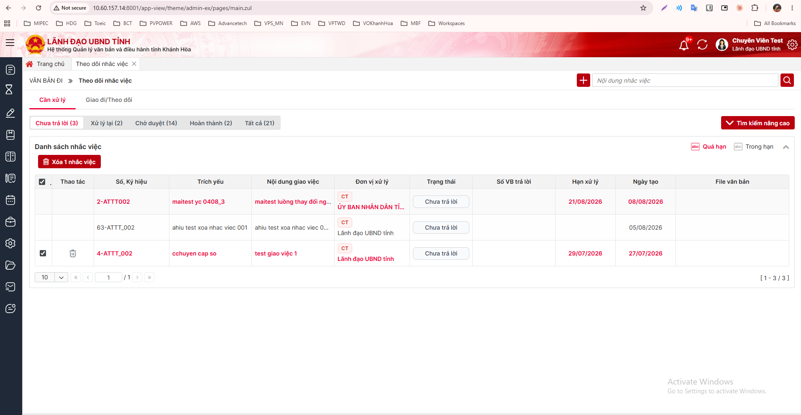

<!-- Ban rut gon de dua len Figma. Nguon: dac-ta.md v1.0 (08/10/2026).
     Sinh SVG: python "AI Analysis/ba/_tools/md_to_figma_svg.py" figma.md [--theme light]
     ==cam== = thay doi so voi hien tai · !!do!! = luu y / cho chot -->
=== 1900
# YC_NV_01 - XÓA NHẮC VIỆC THEO TỪNG ĐƠN VỊ XỬ LÝ VÀ XÓA NHIỀU
## TỔNG QUAN
- Màn hình: VĂN BẢN ĐI → Theo dõi nhắc việc (menu NHACVIEC) → lưới "Danh sách nhắc việc"
- Mục tiêu:
  - Bấm Xóa ở một dòng → ==chỉ xóa dòng đơn vị đó==, không xóa cả nhắc việc
  - Nhắc việc chỉ bị xóa hết khi ==không còn đơn vị chủ trì (CT)== nào
  - ==Bổ sung xóa nhiều==: tick nhiều dòng → nút "Xóa N nhắc việc"
- Phạm vi: WEB. Ứng dụng di động hiện chưa có màn nhắc việc → !!chờ chốt TBD-02!!
- Giữ nguyên: quyền xóa (chỉ người tạo), câu xác nhận, không nhập lý do, không gửi thông báo/SMS, không thêm bảng/cột

=== 900
## HIỆN TRẠNG → MONG MUỐN
- Một nhắc việc = 1 bản ghi REMINDER + nhiều bản ghi REMINDER_REPLY (mỗi đơn vị xử lý 1 bản ghi; ORG_ROLE = 1 là CT, 2 là PH)
- Lưới hiển thị mỗi đơn vị một dòng (nhắc việc giao 3 đơn vị → 3 dòng)
- Hiện tại: bấm Xóa ở bất kỳ dòng nào → xóa cả nhắc việc của mọi đơn vị, gỡ cờ "văn bản có nhắc việc" của mọi đơn vị
- ==Mong muốn: chỉ xóa dòng đơn vị đã bấm, gỡ cờ của riêng đơn vị đó==
- Cột tick và ô "chọn tất cả" đang bị comment trong ZUL → ==bật lại==

## XÓA MỘT DÒNG (icon thùng rác ở cột Thao tác)
- Hiển thị: chỉ người tạo nhắc việc (REMINDER.CREATED_BY = user đăng nhập), ở mọi trạng thái dòng → giữ nguyên
- Nhấn icon Xóa → popup "Đồng chí có chắc chắn muốn xóa?" (OK / Hủy)
  - Hủy → đóng popup, không thay đổi gì
  - OK:
    - Dòng **PH** → ==chỉ xóa dòng đó==
      - Xóa mềm dòng đơn vị + dòng sao (trạng thái 5, cùng REMINDER_ID, ORG_ID, ORG_ROLE) nếu có
      - Xóa mềm liên kết văn bản trả lời của dòng (REMINDER_DOCUMENT_RELATIONS, OBJECT_TYPE = 2)
      - Không đụng REMINDER, các dòng đơn vị khác, người theo dõi, liên kết văn bản giao (OBJECT_TYPE = 1)
      - Văn bản trả lời (DOCUMENT) không bị xóa
    - Dòng **CT**:
      - Nhắc việc còn CT hoạt động khác → xử lý như dòng PH
      - ==Không còn CT nào → xóa toàn bộ nhắc việc== (REMINDER, mọi dòng còn lại kể cả PH, người theo dõi, mọi liên kết văn bản, gỡ cờ mọi đơn vị) - như hiện nay
    - Gỡ cờ "văn bản có nhắc việc" (HAS_REMINDER) theo nhánh nhận của đơn vị bị xóa
      - ==Không gỡ nếu đơn vị còn nhắc việc khác đang hoạt động trên cùng văn bản, cùng đơn vị giao==
      - Dòng nhận của các đơn vị khác giữ nguyên
  - Xóa xong: tải lại lưới theo bộ lọc hiện tại, tính lại số trên tab và ô "Nhắc việc" ở trang chủ; không hiện toast thành công
  - Lỗi: toast "Xóa nhắc việc thất bại, vui lòng thử lại!"
  - Không phải người tạo mà gọi API: báo "Đồng chí không có quyền thực hiện thao tác này"

--- 1300


## XÓA NHIỀU
- ==Ô tick từng dòng== (cột đầu lưới)
  - Checkbox, mặc định không tick
  - Hiện ở cả hai nhóm Cần xử lý và Giao đi/Theo dõi
  - Chỉ hiện ở dòng đang có icon Xóa (ô tick và icon Xóa luôn cùng hiện / cùng ẩn)
- ==Ô "chọn tất cả"== (tiêu đề cột tick)
  - Tick → tick mọi dòng có ô tick trong trang hiện tại
  - Bỏ tick một dòng → ô "chọn tất cả" tự bỏ tick
  - Trang không có dòng nào tick được → ẩn
  - Chuyển trang / đổi tab / tìm kiếm lại → bỏ hết tick
- ==Nút "Xóa N nhắc việc"== (nút đỏ, icon thùng rác)
  - Vị trí: dưới tiêu đề "Danh sách nhắc việc", căn trái
  - N = số dòng đang tick, cập nhật ngay khi tick / bỏ tick
  - Ẩn khi chưa tick dòng nào → !!chờ chốt TBD-03!!
  - Nhấn nút → popup "Đồng chí có chắc chắn muốn xóa?" (OK / Hủy)
    - Hủy → giữ nguyên các dòng đang tick
    - OK → gửi danh sách mã dòng (REMINDER_REPLY_ID), xử lý từng dòng như XÓA MỘT DÒNG, trong một giao dịch
      - Tick dòng CT cuối cùng của một nhắc việc → ==cả nhắc việc bị xóa, kể cả các dòng PH không tick==
      - Có dòng không hợp lệ (đã bị xóa trước đó / không phải người tạo) → !!không xóa dòng nào, báo lỗi (giả định, chờ chốt TBD-01)!!
    - Xóa xong: tải lại lưới, bỏ hết tick, tính lại số đếm

--- 900
## SỬA NHẮC VIỆC → BỎ ĐƠN VỊ PH
- Nhấn icon Sửa → bỏ một đơn vị PH khỏi danh sách → Lưu
- Dòng đơn vị bị bỏ: xóa mềm như hiện tại ==+ gỡ cờ "văn bản có nhắc việc" của đơn vị đó== (cùng quy tắc với xóa một dòng)
- Màn Sửa vẫn bắt buộc 1 CT → không bỏ được CT qua đường này

## CẬP NHẬT CSDL
- Xóa mềm dòng đơn vị và dòng sao:
  ```
  update REMINDER_REPLY
     set DEL_FLAG = 1, UPDATED_BY = :userId, UPDATED_AT = sysdate
   where REMINDER_REPLY_ID = :replyId
      or (REMINDER_ID = :reminderId and ORG_ID = :orgId
          and ORG_ROLE = :orgRole and STATUS = 5)
  ```
- Xóa mềm liên kết văn bản trả lời (bắt buộc lọc OBJECT_TYPE):
  ```
  update REMINDER_DOCUMENT_RELATIONS set DEL_FLAG = 1
   where OBJECT_TYPE = 2 and OBJECT_ID = :replyId
  ```
- Không còn CT hoạt động → xóa toàn bộ như hiện nay: REMINDER, REMINDER_REPLY, REMINDER_FOLLOWERS, REMINDER_DOCUMENT_RELATIONS (DEL_FLAG = 1)
- Gỡ cờ: DOCUMENT_IN_GROUP.HAS_REMINDER, DOCUMENT_IN_STAFF.HAS_REMINDER theo nhánh DOCUMENT_PROCESS của đơn vị bị xóa
- ==Truy vấn lưới trả thêm cột REMINDER_REPLY.REMINDER_REPLY_ID== (hiện chỉ có REMINDER_ID)
- Không thêm bảng / cột, không cần migration

## KHÔNG THAY ĐỔI
- Điều kiện hiển thị icon Xóa / Sửa
- Xóa văn bản / dự thảo → vẫn xóa toàn bộ nhắc việc gắn kèm
- Tạo / sửa / trả lời / duyệt / nhắc lại / chuyển xử lý / báo cáo nhắc việc
- Màn chi tiết nhắc việc, tab nhắc việc trong chi tiết văn bản: không thêm nút Xóa
- Hoàn thành văn bản đến: nhắc việc đã bị xóa dòng không còn chặn

!!Lưu ý không để ảnh hưởng đến luồng hiện tại!!

## CẦN CHỐT
- !!TBD-01!! Xóa nhiều gặp dòng lỗi:
  - A. Không xóa dòng nào, báo lỗi (đang giả định)
  - B. Xóa các dòng còn lại, báo dòng không xóa được
  - Tick dòng CT cuối cùng → các dòng PH chưa tick cũng mất: đúng ý BA không?
- !!TBD-02!! Di động chưa có màn nhắc việc:
  - A. YC_NV_01 chỉ làm web (đang giả định)
  - B. Gộp vào đây, xây mới nhắc việc trên di động
- TBD-03: Chưa tick thì ẩn nút hay hiện mờ "Xóa 0 nhắc việc"? Xóa xong có toast "Đã xóa N nhắc việc" không?
