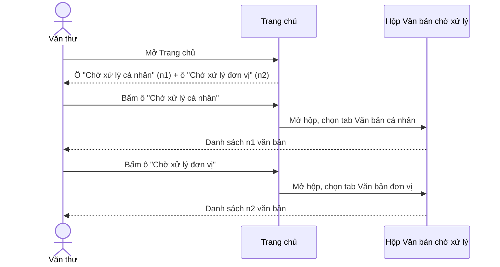

**TÀI LIỆU ĐẶC TẢ YÊU CẦU CHỨC NĂNG**

**YC_NV_02 - TÁCH Ô TRANG CHỦ "CHỜ XỬ LÝ" THÀNH "CHỜ XỬ LÝ CÁ NHÂN" VÀ "CHỜ XỬ LÝ ĐƠN VỊ"**

**Hệ thống Văn bản và Điều hành tỉnh Khánh Hòa**

| Thuộc tính | Giá trị |
|---|---|
| Mã yêu cầu | YC_NV_02 |
| Chức năng | Trang chủ — nhóm ô "Văn bản đến"; màn *Cấu hình trang chủ* |
| Phân hệ (knowledge) | Chính: `he-thong` (NV-16 trang chủ) · Liên quan: `van-ban/den` (1.3, NV-01, NV-02) |
| Loại yêu cầu | Đổi UI/điều hướng + bổ sung điều kiện hiển thị theo vai trò |
| Loại tài liệu | Đặc tả yêu cầu chức năng (BA/FRD) |
| Phiên bản | 1.2 |
| Trạng thái | DRAFT_PENDING_CONFIRMATION (còn TBD-04, TBD-05 chặn phần ứng dụng di động) |
| Ngày cập nhật | 08/10/2026 |

# LỊCH SỬ THAY ĐỔI `[A1]`

| Phiên bản | Ngày | Nội dung | Người thực hiện |
|---|---|---|---|
| 1.0 | 08/10/2026 | Bản đầu tiên, viết từ phiếu ý tưởng + 10 câu trả lời vòng 1 (`cau-hoi.md`) | BA (AI soạn) |
| 1.1 | 08/10/2026 | BA đính chính: với văn thư, ô đang có là ô **đơn vị** (chỉ đổi nhãn), ô **cá nhân** mới là ô thêm mới. Sửa mục 1.3, 6.1, 10.4, 10.7, TBD-01 | BA (AI sửa) |
| 1.2 | 08/10/2026 | BA bổ sung: thiếu mô tả trang chủ ở **chế độ đơn giản**. Thêm mục 6.6, viết lại BR-13, thêm BR-17, AC-22, AC-23, EC-11 | BA (AI sửa) |

# PHÊ DUYỆT / XÁC NHẬN `[A2]`

| Vai trò | Họ tên | Trạng thái | Ngày | Ghi chú |
|---|---|---|---|---|
| BA phụ trách | | Chưa xác nhận | | Cần đọc mục 1.2 (ghi chú lệch so với phiếu), mục 4, mục 11 |
| DEV phụ trách | | Chưa xác nhận | | Cần chốt TBD-01, TBD-02, TBD-03 |
| Tester phụ trách | | Chưa xác nhận | | |
| Đại diện nghiệp vụ / Khách hàng | | Chưa xác nhận | | Cần chốt TBD-05, TBD-06 |

# MỤC LỤC

0. Phiếu ý tưởng
1. Thông tin chung
2. Phạm vi và vai trò
3. Tổng quan yêu cầu chức năng
4. Business Rules
5. Luồng nghiệp vụ / Use Case
6. Đặc tả màn hình và trường dữ liệu
7. Xử lý ngoại lệ và trường hợp biên
8. Acceptance Criteria
9. Ma trận kiểm thử và truy vết
10. Phạm vi kỹ thuật, kiến trúc và mapping CSDL
11. Các điểm cần xác nhận (TBD)

---

# 0. PHIẾU Ý TƯỞNG · 🟦 BA

- **Muốn gì (nguyên văn):** "tách chờ xử lý cá nhân và chờ xử lý đơn vị. Mặc định trang chủ sẽ chỉ hiển thị Chờ xử lý cá
  nhân. Với vai trò văn thư vào cấu hình trang chủ hiển thị chờ xử lý đơn vị. * phân tích nghiệp vụ: tách widget CXL đơn
  vị và CXL cá nhân. Hiện tại văn thư chỉ hiển thị chờ xử lý của đơn vị và ấn link tới tab chờ xử lý văn bản đến văn bản
  đơn vị -, nhớ sửa cả trong cấu hình trang chủ"
- **Ai dùng:** mọi người dùng (ô cá nhân); văn thư đơn vị `VT` (ô đơn vị).
- **Vì sao cần:** văn thư nhìn ô *Chờ xử lý* trên trang chủ chỉ thấy số của **đơn vị**, nên văn bản gửi đích danh mình
  không được ô nào đếm và bị bỏ sót (chốt ở Q01-A).
- **Một tình huống thật cụ thể:** văn thư Sở X mở trang chủ, ô *Chờ xử lý* hiện 12 — đó là 12 văn bản của Sở đang chờ xử
  lý. Cùng lúc có 2 văn bản gửi đích danh văn thư (ví dụ giấy mời họp) đang ở *Chờ xử lý* cá nhân nhưng không xuất hiện
  trong con số 12, và bấm vào ô cũng chỉ mở tab *Văn bản đơn vị* nên không nhìn thấy 2 văn bản đó.
- **Kết quả mong muốn đo được:** trên trang chủ của văn thư có hai số rời nhau (cá nhân, đơn vị); mỗi số bấm vào mở đúng
  tab tương ứng, không phải đổi tab thủ công.
- **Kênh:** cả Web và ứng dụng di động (Q10-B) · **Gấp không:** chưa khai.

---

# 1. THÔNG TIN CHUNG `[A3]`

## 1.1. Mục đích

Khi người dùng mở **Trang chủ**, hệ thống hiển thị hai ô đếm riêng trong nhóm "Văn bản đến": **Chờ xử lý cá nhân** (văn
bản gửi đích danh người đăng nhập) và **Chờ xử lý đơn vị** (văn bản gửi cho đơn vị mà người đăng nhập làm văn thư), thay
cho một ô *Chờ xử lý* gộp hiện nay. Khi người dùng bấm một trong hai ô, hệ thống mở hộp *Văn bản chờ xử lý* và chọn sẵn
đúng tab tương ứng. Ô *Chờ xử lý đơn vị* chỉ hiển thị với người có vai trò Văn thư.

## 1.2. Bối cảnh nghiệp vụ

- **Yêu cầu gốc (trích nguyên văn):** xem mục 0.
- **Chức năng nghiệp vụ chính:** trang chủ (widget đếm việc) của phân hệ `he-thong` NV-16; nội dung số đếm thuộc
  `van-ban/den` 1.3.
- **Đường vào chức năng:** Đăng nhập → **Trang chủ** → nhóm ô "Văn bản đến"; và Khung người dùng góc phải → **Cấu hình
  trang chủ**.
- **Vấn đề hiện tại:** một ô *Chờ xử lý* phải gánh hai loại việc khác nhau. Với văn thư, ô này đếm theo phạm vi **đơn
  vị** và mở tab *Văn bản đơn vị*, nên phần việc cá nhân của văn thư không có chỗ nào trên trang chủ (`van-ban/den`
  BR-01, BR-02; `DocumentThread.java:253-258`; `DocumentPendingProcessingVM.java:776-778`).
- **Kết quả mong muốn (đo được):** văn thư thấy đủ hai số trên trang chủ; số văn bản cá nhân bị bỏ sót vì không có ô
  đếm giảm về 0; số lần phải đổi tab thủ công sau khi bấm ô giảm từ 1 xuống 0.

> **⚠ Ghi chú lệch so với phiếu ý tưởng (BA đã chốt lại ở Q03, giữ theo câu trả lời):** phiếu viết "mặc định trang chủ
> chỉ hiển thị Chờ xử lý cá nhân. Với vai trò văn thư **vào cấu hình trang chủ** hiển thị chờ xử lý đơn vị". Câu trả lời
> Q03 chốt khác: **văn thư mặc định bật sẵn cả hai ô**, còn người không phải văn thư thì ô *Chờ xử lý đơn vị* **luôn
> ẩn**. Vậy văn thư **không phải** vào *Cấu hình trang chủ* để bật — chỉ vào đó nếu muốn **tắt** ô. Tài liệu này viết
> theo câu trả lời Q03 (BR-06, BR-07).

## 1.3. Hiện trạng (AS-IS) và thay đổi (TO-BE)

| STT | Nội dung | Hiện tại (AS-IS) | Yêu cầu (TO-BE) | Nguồn AS-IS |
|---|---|---|---|---|
| 1 | Số ô đếm việc chờ xử lý trong nhóm "Văn bản đến" | Một ô, nhãn "Chờ xử lý" | Hai ô: "Chờ xử lý cá nhân" và "Chờ xử lý đơn vị", đặt tại vị trí ô cũ, ô cá nhân trước | `van-ban/den` 1.3 (DB DEV `HOME_WIDGET` 2026-10-01) |
| 2 | Phạm vi số đếm của ô *Chờ xử lý* với **văn thư** | Chỉ dòng nhận của **đơn vị** (đã vào sổ) | Tách hai ô. Ô **đơn vị** chính là ô đang có: giữ nguyên số và điều hướng, **chỉ đổi nhãn**. Ô **cá nhân** là ô **thêm mới** | `van-ban/den` BR-01, BR-02, NV-02; `DocumentThread.java:253-258` |
| 3 | Phạm vi số đếm của ô *Chờ xử lý* với **người không phải văn thư** | Đã là dòng nhận **cá nhân** của chính họ (vì họ không có dòng đơn vị) | **Không đổi hành vi**, chỉ đổi nhãn thành "Chờ xử lý cá nhân" | `van-ban/den` BR-02; BA xác nhận Q02 |
| 4 | Điều hướng khi bấm ô, với **văn thư** | Mở hộp *Văn bản chờ xử lý*, tab *Văn bản đơn vị* được chọn sẵn | Ô cá nhân → tab *Văn bản cá nhân* · Ô đơn vị → tab *Văn bản đơn vị* (giữ như cũ) | `HomeWidgetRestController.java:841-843`; `DocumentPendingProcessingVM.java:776-778` |
| 5 | Màn *Cấu hình trang chủ* | Có một dòng "Chờ xử lý" cho mọi người | Văn thư thấy hai dòng; người khác chỉ thấy dòng "Chờ xử lý cá nhân" | `he-thong` NV-16 |
| 6 | Ẩn / hiện ô theo vai trò ở **chế độ trang chủ đầy đủ** | Không có cơ chế — chỉ có bật / tắt của từng người | Có: ô *Chờ xử lý đơn vị* chỉ hiện với vai trò `VT` | `he-thong` BR-39; `HomeWidgetRestController.java:1758-1783` |
| 7 | Chế độ trang chủ **đơn giản** | Nhóm Văn bản đến hiện 3 ô: Chờ tiếp nhận (chỉ văn thư), Chờ xử lý (mọi người), Đề nghị trả lại (mọi người); 5 ô còn lại không hiện | Vẫn 3 ô, nhưng ô *Chờ xử lý* tách đôi: ô **cá nhân** khai mọi người, ô **đơn vị** đổi khai báo sang **chỉ văn thư** → văn thư thấy 4 ô, vai trò khác thấy 2 ô | `he-thong` 1.3, BR-39 (DB DEV ngày 2026-10-01) |
| 8 | Trang chủ ứng dụng di động | Một ô chờ xử lý, cơ chế riêng (`PERMISSION_DASHBOARD` + menu gen-2 MOBILE + file JSON cấu hình) | Cũng tách hai ô — chi tiết chờ TBD-04, TBD-05 | `HomeServiceImpl.java:106-140, 319-348` |

**Tóm tắt thay đổi:** thêm một ô đếm mới và đổi nhãn ô hiện có. **Một ô “Chờ xử lý” hiện nay mang hai ý nghĩa tùy vai trò:** với văn thư nó là ô **đơn vị** (giữ nguyên số và điều hướng, chỉ đổi nhãn; ô cá nhân mới là ô thêm mới), với vai trò khác nó đã là ô **cá nhân** (chỉ đổi nhãn). Ngoài ra: thêm điều kiện hiển thị theo vai trò ở chế
độ trang chủ đầy đủ; đổi tab mặc định khi mở từ ô cá nhân. **Không** đổi trạng thái văn bản, **không** đổi dữ liệu văn
bản, **không** đổi cách tính hộp việc, **không** thêm bảng nghiệp vụ.

## 1.4. Phạm vi chức năng bị ảnh hưởng

| STT | Điểm vào chức năng | Màn hình / Action | Trong phạm vi |
|---|---|---|---|
| 1 | Đăng nhập → Trang chủ | Nhóm ô "Văn bản đến": ô *Chờ xử lý cá nhân*, ô *Chờ xử lý đơn vị* | Có |
| 2 | Khung người dùng → Cấu hình trang chủ | Danh sách ô bật / tắt của nhóm "Văn bản đến" | Có |
| 3 | Trang chủ → bấm ô | Mở hộp *Văn bản chờ xử lý* kèm tab tương ứng | Có |
| 4 | Khung người dùng → chế độ Trang chủ đơn giản / đầy đủ | Ô nào hiện ở chế độ đơn giản | Có |
| 5 | Trang chủ ứng dụng di động | Ô chờ xử lý trên di động | Có — chi tiết chờ TBD-04, TBD-05 |
| 6 | Sáu ô còn lại của nhóm "Văn bản đến" (Chờ tiếp nhận, Sắp đến hạn, Quá hạn, Đề nghị trả lại, Đã xử lý, Đã hoàn thành, Nhận để biết) | Không được mô tả trong YC_NV_02 | Ngoài phạm vi thay đổi; cần regression (Q06-A) |
| 7 | Hộp việc *Văn bản chờ xử lý* (danh sách, bộ lọc, nút, cách tính trạng thái) | Không đổi | Ngoài phạm vi; cần regression |
| 8 | Nhóm ô của phân hệ khác trên trang chủ (Văn bản đi, Phiếu trình, Nhiệm vụ, Lịch họp, Nhắc việc…) | Không đổi | Ngoài phạm vi; cần regression |

**Kênh áp dụng:** Web **và** ứng dụng di động (Q10-B). Phần web đặc tả đủ trong tài liệu này; phần ứng dụng di động phụ
thuộc TBD-04 và TBD-05, nếu chưa chốt thì **triển khai web trước, di động sau** và ghi rõ trong kế hoạch phát hành.

## 1.5. Thuật ngữ

| Thuật ngữ | Định nghĩa sử dụng trong tài liệu |
|---|---|
| Ô (widget) trang chủ | Một khối số đếm trên Trang chủ, bấm vào mở một hộp việc. Tương ứng một dòng trong danh mục `HOME_WIDGET` |
| Dòng nhận cá nhân | Lượt nhận văn bản của **một người** (bảng `DOCUMENT_IN_STAFF`) — `van-ban/den` BR-01 |
| Dòng nhận đơn vị | Lượt nhận văn bản của **một đơn vị** (bảng `DOCUMENT_IN_GROUP`), do văn thư đơn vị đó xử lý — `van-ban/den` BR-01, BR-02 |
| Chờ xử lý cá nhân | Số dòng nhận cá nhân của người đăng nhập đang ở trạng thái *Chờ xử lý* (3) hoặc *Bị trả lại* (7) |
| Chờ xử lý đơn vị | Số dòng nhận đơn vị **đã vào sổ** của các đơn vị người đăng nhập làm văn thư, trạng thái 3 hoặc 7 |
| Chế độ trang chủ đơn giản / đầy đủ | Hai cách bày trang chủ, người dùng tự đổi ở khung người dùng — `he-thong` NV-16 |

---

# 2. PHẠM VI VÀ VAI TRÒ `[A4]`

## 2.1. Vai trò

| Vai trò nghiệp vụ | Mã vai trò hệ thống | Được làm gì trong YC_NV_02 | Ghi chú |
|---|---|---|---|
| Văn thư đơn vị | `VT` | Thấy **cả hai** ô, bật sẵn; bấm mỗi ô mở đúng tab; thấy cả hai dòng trong *Cấu hình trang chủ* và tắt / bật được từng ô | Vai trò chính của yêu cầu |
| Chuyên viên | `NV` | Thấy **một** ô *Chờ xử lý cá nhân*; ô đơn vị không hiển thị và không có trong *Cấu hình trang chủ* | Hành vi giữ như hiện tại, chỉ đổi nhãn |
| Lãnh đạo đơn vị | `LDDV` | Như `NV` | Việc theo dõi văn bản đơn vị vẫn ở màn *Theo dõi văn bản đến đơn vị* (`van-ban/den` NV-14), không đổi |
| Thủ trưởng | `TTDV` | Như `NV` | |
| Trợ lý lãnh đạo | `TL` | Như `NV` | Văn bản nhận thay lãnh đạo vẫn là dòng nhận cá nhân của trợ lý |
| Quản trị hệ thống | `ADMIN` / `ADMIN_LEVEL1` | Như `NV` (không có vai trò quản trị riêng cho trang chủ) | Không có màn quản trị ô trang chủ; thêm ô bằng script — `he-thong` NV-16 |

**Lưu ý phạm vi role:** điều kiện hiển thị ô *Chờ xử lý đơn vị* là **có vai trò `VT` tại ít nhất một đơn vị**, đúng theo
cờ văn thư hệ thống đang dùng để bật hàng tab *Văn bản đơn vị* (`van-ban/den` 1.4, `CommonModel.java:103-105`). Không
suy diễn thêm vai trò nào khác được thấy ô này.

## 2.2. Tiền điều kiện chung

- Người dùng đã đăng nhập, phiên làm việc đã dựng xong vai trò và đơn vị (`he-thong` NV-03).
- Hai ô mới đã có trong danh mục ô trang chủ (`HOME_WIDGET`) — chạy script dữ liệu trước khi lên bản (mục 10.7).
- Người dùng có menu vào hộp *Văn bản chờ xử lý* (`DOCUMENT_PENDING_PROCESSING`, mã menu 439339) để điều hướng từ ô hoạt
  động được.
- Với ô *Chờ xử lý đơn vị*: người dùng có vai trò `VT` tại ít nhất một đơn vị, và đơn vị đó có văn bản đã vào sổ.

---

# 3. TỔNG QUAN YÊU CẦU CHỨC NĂNG `[A5]`

| ID | Trigger / Action của người dùng | Xử lý mong muốn | BR liên quan |
|---|---|---|---|
| FR-01 | Mở Trang chủ (chế độ đầy đủ) | Hệ thống hiển thị nhóm ô "Văn bản đến" trong đó có ô *Chờ xử lý cá nhân*; ô *Chờ xử lý đơn vị* hiện thêm nếu người dùng là văn thư | BR-01, BR-05, BR-06, BR-07, BR-12 |
| FR-02 | Mở Trang chủ | Hệ thống tính và hiển thị số trên ô *Chờ xử lý cá nhân* theo phạm vi cá nhân | BR-02, BR-04, BR-12 |
| FR-03 | Mở Trang chủ (là văn thư) | Hệ thống tính và hiển thị số trên ô *Chờ xử lý đơn vị* theo phạm vi đơn vị | BR-03, BR-04, BR-12 |
| FR-04 | Bấm ô *Chờ xử lý cá nhân* | Hệ thống mở hộp *Văn bản chờ xử lý* và chọn sẵn tab *Văn bản cá nhân* | BR-09, BR-11 |
| FR-05 | Bấm ô *Chờ xử lý đơn vị* | Hệ thống mở hộp *Văn bản chờ xử lý* và chọn sẵn tab *Văn bản đơn vị* | BR-10, BR-11 |
| FR-06 | Mở *Cấu hình trang chủ* | Hệ thống hiển thị dòng *Chờ xử lý cá nhân* cho mọi người, và thêm dòng *Chờ xử lý đơn vị* nếu là văn thư | BR-06, BR-08 |
| FR-07 | Tắt / bật một trong hai ô ở *Cấu hình trang chủ* rồi lưu | Hệ thống ghi lựa chọn của người dùng và trang chủ hiển thị theo lựa chọn đó | BR-08, BR-14 |
| FR-08 | Chuyển trang chủ sang chế độ đơn giản | Hệ thống hiển thị ô *Chờ xử lý cá nhân* cho mọi người và ô *Chờ xử lý đơn vị* chỉ với văn thư | BR-13 |
| FR-09 | Mở trang chủ trên ứng dụng di động | Hệ thống hiển thị hai ô tương ứng (chờ TBD-04) | BR-16 |

## 3.1. Mapping dữ liệu nguồn → đích

Không áp dụng — yêu cầu không chuyển, sao chép hay tự điền dữ liệu giữa hai đối tượng.

## 3.2. Trạng thái và chuyển trạng thái

**Không thay đổi trạng thái.** Yêu cầu chỉ đọc và đếm trạng thái sẵn có của dòng nhận, giữ nguyên
`DOCUMENT_IN_STAFF.STATUS` và `DOCUMENT_IN_GROUP.STATUS`. Các mã trạng thái được dùng để đếm (nguồn: `van-ban/den` mục 5,
4.6):

| Trạng thái (tên người dùng thấy) | Mã | Dùng trong YC_NV_02 |
|---|---|---|
| Chờ xử lý | 3 | Được đếm ở cả hai ô |
| Bị trả lại | 7 | Được đếm ở cả hai ô (hộp *Chờ xử lý* vốn gộp trạng thái này — `van-ban/den` BR-05) |
| Đã xử lý (đã chuyển) | 4 | Không đếm |
| Đã hoàn thành | 5 | Không đếm |
| Đã trả lại | 6 | Không đếm |
| Đã thu hồi | 0 | Không đếm |
| Chờ tiếp nhận (dòng đơn vị chưa vào sổ) | trống | Không đếm — vẫn thuộc ô *Chờ tiếp nhận* |

**Hành động bị cấm:** không có hành động nghiệp vụ mới; yêu cầu không thêm nút thao tác trên văn bản.

## 3.3. Yêu cầu phi chức năng (NFR)

| Mã | Nhóm | Yêu cầu (đo được) |
|---|---|---|
| NFR-01 | Hiệu năng | Trang chủ không tăng thêm lượt truy vấn đếm so với hiện tại: số "chờ xử lý cá nhân" đã được tính trong cùng lượt đếm hiện có (`DocumentController.java:2605-2610`). Thời gian tải trang chủ không tăng quá 10% so với bản hiện tại trên cùng dữ liệu |
| NFR-02 | Bảo mật / phân quyền | Người không có vai trò `VT` không lấy được số của đơn vị qua trang chủ, kể cả khi cấu hình cá nhân cũ có bật ô đó (BR-06) |
| NFR-03 | Nhật ký | Không yêu cầu ghi nhật ký cho việc bật / tắt ô trang chủ (giữ như hiện tại) |
| NFR-04 | Thông báo / SMS | Không áp dụng — yêu cầu không gửi thông báo, nhắc việc, SMS hay email |
| NFR-05 | Tương thích | Web: như ma trận trình duyệt hiện hành. Ứng dụng di động: cần bản phát hành mới, phiên bản cụ thể chờ TBD-05 |

---

# 4. BUSINESS RULES `[A6]`

| Rule ID | Tên rule | Mô tả | Nguồn |
|---|---|---|---|
| BR-01 | Hai ô thay một ô | Nhóm ô "Văn bản đến" trên Trang chủ có hai ô **Chờ xử lý cá nhân** và **Chờ xử lý đơn vị** đặt liền nhau tại đúng vị trí ô *Chờ xử lý* hiện nay (ngay sau ô *Chờ tiếp nhận*), ô cá nhân đứng trước ô đơn vị. Sau khi triển khai, không còn ô nào mang nhãn "Chờ xử lý" trong nhóm này | Phiếu ý tưởng; Q08-A |
| BR-02 | Số của ô cá nhân | Số trên ô *Chờ xử lý cá nhân* = số **dòng nhận cá nhân** của người đăng nhập có trạng thái 3 (Chờ xử lý) hoặc 7 (Bị trả lại), ngày nhận trong **365 ngày** gần nhất. Số này phải bằng số bản ghi của tab *Văn bản cá nhân* trong hộp *Văn bản chờ xử lý* khi mở ngay sau đó | Q02-A; `van-ban/den` BR-05; `DocumentThread.java:246-249` |
| BR-03 | Số của ô đơn vị | Số trên ô *Chờ xử lý đơn vị* = số **dòng nhận đơn vị** của tất cả đơn vị mà người đăng nhập làm văn thư, **đã vào sổ đến của đơn vị đó**, trạng thái 3 hoặc 7, ngày nhận trong **365 ngày** gần nhất. Số này phải bằng số bản ghi của tab *Văn bản đơn vị* trong hộp *Văn bản chờ xử lý* khi mở ngay sau đó | Q02-A; `van-ban/den` NV-02 |
| BR-04 | Số nhắc việc kèm ô | Mỗi ô kèm số nhắc việc tính theo **đúng phạm vi của ô đó** (cá nhân / đơn vị), giữ cách hiển thị như ô *Chờ xử lý* hiện nay. Nếu máy chủ chưa có số nhắc việc theo phạm vi cá nhân thì ô cá nhân tạm không hiện số nhắc việc (chờ TBD-02) | `van-ban/den` 1.3; TBD-02 |
| BR-05 | Ai thấy ô cá nhân | Ô *Chờ xử lý cá nhân* hiển thị với **mọi vai trò**, kể cả văn thư | Q03 |
| BR-06 | Ai thấy ô đơn vị | Ô *Chờ xử lý đơn vị* chỉ hiển thị với người có vai trò Văn thư (`VT`) tại ít nhất một đơn vị. Với người không phải văn thư, ô này **không hiển thị trên Trang chủ** và **không xuất hiện trong màn Cấu hình trang chủ**. Điều kiện vai trò này **thắng** cấu hình cá nhân: dù cấu hình cũ của người dùng có ghi bật, ô vẫn không hiện | Q03, Q04-A |
| BR-07 | Trạng thái mặc định | Khi người dùng chưa có cấu hình trang chủ riêng: văn thư thấy **cả hai** ô ở trạng thái bật; người không phải văn thư thấy ô *Chờ xử lý cá nhân* ở trạng thái bật | Q03 (nguyên văn câu trả lời) |
| BR-08 | Cấu hình trang chủ | Trong màn *Cấu hình trang chủ*, văn thư thấy **hai** dòng (*Chờ xử lý cá nhân*, *Chờ xử lý đơn vị*) và bật / tắt được từng dòng; người không phải văn thư thấy **một** dòng (*Chờ xử lý cá nhân*). Tắt một dòng thì ô tương ứng không hiện trên Trang chủ của người đó | Phiếu ý tưởng ("nhớ sửa cả trong cấu hình trang chủ"); Q04-A |
| BR-09 | Điều hướng từ ô cá nhân | Bấm ô *Chờ xử lý cá nhân* mở hộp *Văn bản chờ xử lý*; với văn thư, tab **Văn bản cá nhân** được chọn sẵn; với người không phải văn thư (không có hàng tab) thì mở danh sách văn bản cá nhân như hiện nay | Q05-A |
| BR-10 | Điều hướng từ ô đơn vị | Bấm ô *Chờ xử lý đơn vị* mở hộp *Văn bản chờ xử lý* với tab **Văn bản đơn vị** được chọn sẵn (giữ đúng hành vi hiện tại của ô *Chờ xử lý* với văn thư) | Q05-A; `DocumentPendingProcessingVM.java:776-778` |
| BR-11 | Bộ lọc sau điều hướng | Sau khi mở hộp việc từ một trong hai ô, hệ thống dùng bộ lọc mặc định của hộp việc đó và **không** mang theo bộ lọc nào từ Trang chủ, giống hành vi hiện tại của ô *Chờ xử lý* | `van-ban/den` BR-07 |
| BR-12 | Không có dữ liệu | Khi số đếm bằng 0, ô vẫn hiển thị với giá trị 0 (không ẩn ô), giống hành vi hiện tại của các ô trong nhóm | `van-ban/den` 1.3 |
| BR-13 | Chế độ trang chủ đơn giản — ô nào hiện | Ở chế độ trang chủ đơn giản, nhóm "Văn bản đến" hiển thị: với **văn thư** đúng 4 ô theo thứ tự *Chờ tiếp nhận · Chờ xử lý cá nhân · Chờ xử lý đơn vị · Đề nghị trả lại*; với **vai trò khác** đúng 2 ô *Chờ xử lý cá nhân · Đề nghị trả lại*. Ô *Chờ xử lý cá nhân* khai cho mọi vai trò, ô *Chờ xử lý đơn vị* khai chỉ cho văn thư. Năm ô *Sắp đến hạn · Quá hạn · Đã xử lý · Đã hoàn thành · Nhận để biết* không hiện ở chế độ này, giữ nguyên như hiện tại | Q09-A; `he-thong` BR-39 (DB DEV ngày 2026-10-01) |
| BR-14 | Cách lưu lựa chọn bật / tắt | Lựa chọn bật / tắt ô của từng người tiếp tục lưu theo cách hiện tại (bộ nhớ tạm, hạn 86.400 giây kể từ lần ghi cuối, mất khi hệ thống khởi động lại). Không thêm bảng trong CSDL. Khi lựa chọn hết hạn hoặc bị mất, hệ thống trở về mặc định BR-07 | Q07 (chọn giữ hiện trạng); `he-thong` BR-38; `application.properties:284`; chờ TBD-06 |
| BR-15 | Sáu ô còn lại không đổi | Các ô *Chờ tiếp nhận*, *Sắp đến hạn*, *Quá hạn*, *Đề nghị trả lại*, *Đã xử lý*, *Đã hoàn thành*, *Nhận để biết* giữ nguyên nhãn, phạm vi số đếm và điều hướng như hiện tại | Q06-A |
| BR-16 | Ứng dụng di động | Trang chủ ứng dụng di động cũng hiển thị hai ô theo đúng BR-02, BR-03, BR-05, BR-06, BR-07. Chi tiết ô và màn đích trên di động chờ TBD-04; thời điểm phát hành chờ TBD-05 | Q10-B |
| BR-17 | Chế độ đơn giản bỏ qua cấu hình cá nhân | Ở chế độ trang chủ đơn giản, hệ thống **không áp dụng** lựa chọn bật / tắt ô của từng người (BR-08): ô mà người dùng đã tắt ở chế độ đầy đủ **vẫn hiển thị** khi chuyển sang chế độ đơn giản. Nút *Cấu hình trang chủ* cũng bị ẩn ở chế độ này, nên hai dòng mới của BR-08 chỉ thấy được ở chế độ đầy đủ. Đây là hành vi sẵn có, yêu cầu này giữ nguyên | `he-thong` NV-16, BR-39 |

---

# 5. LUỒNG NGHIỆP VỤ / USE CASE `[A7]`

## 5.1. UC-01 - Văn thư xem và mở hai ô chờ xử lý trên Trang chủ

| Thuộc tính | Nội dung |
|---|---|
| Mục tiêu | Văn thư nắm được riêng rẽ số việc cá nhân và số việc của đơn vị, và mở đúng danh sách tương ứng |
| Actor | Văn thư đơn vị (`VT`) |
| Tiền điều kiện | Đã đăng nhập; có vai trò `VT` tại ít nhất một đơn vị; trang chủ ở chế độ đầy đủ; chưa tắt ô nào |
| Trigger | Mở Trang chủ |
| Hậu điều kiện | Không đổi dữ liệu; hộp việc được mở ở tab đúng phạm vi |
| Rule liên quan | BR-01, BR-02, BR-03, BR-05, BR-06, BR-07, BR-09, BR-10, BR-11, BR-12 |
| Ngoại lệ liên quan | EC-01, EC-03, EC-05 |

**Luồng chính**

1. Văn thư mở Trang chủ.
2. Hệ thống tính số theo phạm vi cá nhân và phạm vi đơn vị, hiển thị nhóm ô "Văn bản đến" với hai ô *Chờ xử lý cá nhân*
   và *Chờ xử lý đơn vị* đặt liền nhau.
3. Văn thư bấm ô *Chờ xử lý cá nhân*.
4. Hệ thống mở hộp *Văn bản chờ xử lý* với tab *Văn bản cá nhân* được chọn, danh sách đúng bằng số vừa hiển thị.
5. Văn thư quay lại Trang chủ và bấm ô *Chờ xử lý đơn vị*.
6. Hệ thống mở hộp *Văn bản chờ xử lý* với tab *Văn bản đơn vị* được chọn.

**Luồng thay thế**

- 2a. Nếu một trong hai số bằng 0 thì ô vẫn hiện với giá trị 0 (BR-12), quay lại bước 2.
- 2b. Nếu văn thư đã tắt một ô ở *Cấu hình trang chủ* thì ô đó không hiện, các ô còn lại hiện bình thường (BR-08).

**Luồng ngoại lệ**

- 4a. Số trên ô và số bản ghi trong danh sách lệch nhau → xử lý theo EC-05.

## 5.2. UC-02 - Người không phải văn thư xem Trang chủ

| Thuộc tính | Nội dung |
|---|---|
| Mục tiêu | Chuyên viên / lãnh đạo / trợ lý thấy đúng một ô việc của mình, không bị thêm ô vô nghĩa |
| Actor | Chuyên viên (`NV`), Lãnh đạo (`LDDV`), Thủ trưởng (`TTDV`), Trợ lý (`TL`), Quản trị (`ADMIN`) |
| Tiền điều kiện | Đã đăng nhập; **không** có vai trò `VT` ở đơn vị nào |
| Trigger | Mở Trang chủ |
| Hậu điều kiện | Không đổi dữ liệu |
| Rule liên quan | BR-01, BR-02, BR-05, BR-06, BR-09, BR-12 |
| Ngoại lệ liên quan | EC-02 |

**Luồng chính**

1. Người dùng mở Trang chủ.
2. Hệ thống hiển thị ô *Chờ xử lý cá nhân* với số việc của chính người đó; **không** hiển thị ô *Chờ xử lý đơn vị*.
3. Người dùng bấm ô *Chờ xử lý cá nhân*.
4. Hệ thống mở hộp *Văn bản chờ xử lý* với danh sách văn bản cá nhân như hiện nay.

**Luồng thay thế**

- 2a. Nếu trước đây người này từng là văn thư và cấu hình cũ còn ghi bật ô đơn vị thì ô vẫn không hiện (BR-06) → EC-02.

## 5.3. UC-03 - Văn thư tắt ô *Chờ xử lý đơn vị* trong Cấu hình trang chủ

| Thuộc tính | Nội dung |
|---|---|
| Mục tiêu | Văn thư tự chọn ô nào hiện trên Trang chủ của mình |
| Actor | Văn thư đơn vị (`VT`) |
| Tiền điều kiện | Đã đăng nhập; trang chủ ở chế độ đầy đủ (chế độ đơn giản ẩn nút cấu hình ô — `he-thong` NV-16) |
| Trigger | Khung người dùng góc phải → *Cấu hình trang chủ* |
| Hậu điều kiện | Lựa chọn được ghi theo cách hiện tại (BR-14); Trang chủ hiển thị theo lựa chọn |
| Rule liên quan | BR-06, BR-08, BR-14 |
| Ngoại lệ liên quan | EC-04 |

**Luồng chính**

1. Văn thư mở *Cấu hình trang chủ*.
2. Hệ thống hiển thị nhóm "Văn bản đến" gồm hai dòng *Chờ xử lý cá nhân* và *Chờ xử lý đơn vị* kèm ô bật / tắt.
3. Văn thư tắt dòng *Chờ xử lý đơn vị* và lưu.
4. Hệ thống ghi lựa chọn và thông báo lưu thành công theo thông báo sẵn có của màn.
5. Văn thư mở lại Trang chủ: chỉ còn ô *Chờ xử lý cá nhân* trong hai ô này.

**Luồng ngoại lệ**

- 5a. Sau khi lựa chọn hết hạn hoặc hệ thống khởi động lại, ô bị tắt hiện lại → EC-04 (hạn chế đã biết, BR-14).

---

# 6. ĐẶC TẢ MÀN HÌNH VÀ TRƯỜNG DỮ LIỆU `[A8]`

## 6.1. Màn hình Trang chủ — nhóm ô "Văn bản đến"

Chưa có ảnh design. Khi có, đặt tại `input/design/01_trang-chu-nhom-van-ban-den.png` và chèn vào đây.

| ID | Trường / Control | Loại | Bắt buộc | Độ dài / Giới hạn | Mặc định | Quy tắc hiển thị / Validate | Thay đổi trong YC_NV_02 |
|---|---|---|---|---|---|---|---|
| UI-01 | Ô *Chờ tiếp nhận* | Ô đếm | — | — | Bật | Giữ nguyên baseline | Giữ nguyên |
| UI-02 | Ô *Chờ xử lý cá nhân* | Ô đếm | — | Số nguyên ≥ 0 | Bật với mọi vai trò (BR-07) | Hiện với mọi vai trò (BR-05); số theo BR-02; số 0 vẫn hiện (BR-12) | **Mới** với văn thư (ô đang có của họ là ô đơn vị) · với vai trò khác là ô đang có, **chỉ đổi nhãn** |
| UI-03 | Ô *Chờ xử lý đơn vị* | Ô đếm | — | Số nguyên ≥ 0 | Bật với văn thư (BR-07) | Chỉ hiện khi người dùng có vai trò `VT` (BR-06); số theo BR-03 | **Sửa** — chính là ô *Chờ xử lý* hiện tại của văn thư: giữ nguyên nguồn số và điều hướng, chỉ đổi nhãn |
| UI-04 | Số nhắc việc trên mỗi ô | Nhãn phụ trên ô | — | Số nguyên ≥ 0 | Theo baseline | Theo phạm vi của ô (BR-04, chờ TBD-02) | **Sửa** |
| UI-05 | Các ô *Sắp đến hạn*, *Quá hạn*, *Đề nghị trả lại*, *Đã xử lý*, *Đã hoàn thành*, *Nhận để biết* | Ô đếm | — | — | Bật | Giữ nguyên baseline (BR-15) | Giữ nguyên |

## 6.2. Màn hình Cấu hình trang chủ

| ID | Trường / Control | Loại | Bắt buộc | Độ dài / Giới hạn | Mặc định | Quy tắc hiển thị / Validate | Thay đổi trong YC_NV_02 |
|---|---|---|---|---|---|---|---|
| UI-06 | Dòng *Chờ xử lý cá nhân* + ô bật / tắt | Dòng danh sách + checkbox | — | — | Bật | Hiện với mọi vai trò | **Sửa** (đổi nhãn) |
| UI-07 | Dòng *Chờ xử lý đơn vị* + ô bật / tắt | Dòng danh sách + checkbox | — | — | Bật | **Chỉ hiện với vai trò `VT`** (BR-06, BR-08) | **Mới** |

## 6.3. Thông báo người dùng

| Mã | Tình huống | Loại | Nội dung nguyên văn | Nút |
|---|---|---|---|---|
| MSG-01 | Lưu *Cấu hình trang chủ* thành công | Toast | Giữ nguyên thông báo hiện có của màn *Cấu hình trang chủ* — không thêm chuỗi mới | — |
| MSG-02 | Ô có số 0 | — | Không có thông báo; hiển thị số 0 (BR-12) | — |

**Yêu cầu mới không thêm thông báo nào.** Nhãn hai ô là nhãn giao diện, không phải thông báo: "Chờ xử lý cá nhân" và
"Chờ xử lý đơn vị" (Q08-A).

## 6.4. Điều hướng

| Từ (màn hình · vùng) | Thao tác | Đến (màn hình) | Tab / bộ lọc mặc định | Giữ bộ lọc cũ? |
|---|---|---|---|---|
| Trang chủ · nhóm "Văn bản đến" | Bấm ô *Chờ xử lý cá nhân* | Hộp *Văn bản chờ xử lý* | Tab **Văn bản cá nhân**; bộ lọc mặc định của hộp việc | Không (BR-11) |
| Trang chủ · nhóm "Văn bản đến" | Bấm ô *Chờ xử lý đơn vị* | Hộp *Văn bản chờ xử lý* | Tab **Văn bản đơn vị**; bộ lọc mặc định của hộp việc | Không (BR-11) |
| Trang chủ · nhóm "Văn bản đến" (người không phải văn thư) | Bấm ô *Chờ xử lý cá nhân* | Hộp *Văn bản chờ xử lý* | Không có hàng tab; danh sách văn bản cá nhân như hiện nay | Không (BR-09) |

## 6.5. Quy tắc hiển thị

- UI-02 và UI-03 đặt liền nhau, UI-02 trước UI-03, ngay sau UI-01 (BR-01).
- UI-03 ẩn hoàn toàn với người không phải văn thư — ẩn cả trên Trang chủ và trong *Cấu hình trang chủ* (BR-06).
- Màu và kiểu ô: dùng đúng kiểu của ô *Chờ xử lý* hiện tại cho UI-02; UI-03 dùng cùng kiểu để nhóm ô nhìn đồng nhất.
- Ở chế độ trang chủ đơn giản: UI-02 hiện với mọi người, UI-03 chỉ với văn thư (BR-13).

## 6.6. Màn hình Trang chủ ở chế độ đơn giản

Chế độ đơn giản là một cách bày trang chủ riêng, người dùng tự đổi ở khung người dùng góc phải. Nó **không dùng** lựa
chọn bật / tắt của từng người; mỗi ô khai sẵn ai được thấy (BR-13, BR-17).

| ID | Ô | Chế độ đầy đủ | Chế độ đơn giản | Thay đổi trong YC_NV_02 |
|---|---|---|---|---|
| UI-01 | Chờ tiếp nhận | Mọi vai trò | Chỉ văn thư | Giữ nguyên |
| UI-02 | **Chờ xử lý cá nhân** | Mọi vai trò | **Mọi vai trò** | **Mới** — khai cho mọi vai trò |
| UI-03 | **Chờ xử lý đơn vị** | Chỉ văn thư | **Chỉ văn thư** | **Sửa** — ô cũ đổi khai báo từ "mọi người" sang "chỉ văn thư" |
| UI-08 | Đề nghị trả lại | Mọi vai trò | Mọi vai trò | Giữ nguyên |
| UI-09 | Sắp đến hạn · Quá hạn · Đã xử lý · Đã hoàn thành · Nhận để biết | Mọi vai trò | **Không hiện** | Giữ nguyên |

**Kết quả người dùng thấy:** văn thư 4 ô, vai trò khác 2 ô (BR-13).

**Ba điểm dễ hiểu nhầm, đã xác minh trên code:**

1. **Tắt ô rồi vẫn thấy ô.** Chế độ đơn giản bỏ qua lựa chọn bật / tắt của từng người, nên ô đã tắt ở chế độ đầy đủ
   vẫn hiện ở đây (BR-17). Không coi là lỗi.
2. **Không có nút cấu hình.** Ở chế độ đơn giản nút *Cấu hình trang chủ* bị ẩn, nên hai dòng của mục 6.2 chỉ nhìn thấy
   khi đang ở chế độ đầy đủ.
3. **Phân quyền hiển thị ở chế độ này đã có sẵn.** Khai báo "chỉ văn thư" vốn tồn tại cho chế độ đơn giản, nên phần
   **làm mới** của TBD-03 chỉ áp cho chế độ đầy đủ, không áp cho chế độ đơn giản.

---

# 7. XỬ LÝ NGOẠI LỆ VÀ TRƯỜNG HỢP BIÊN `[A9]`

| ID | Tình huống | Kết quả mong đợi | UC | Trạng thái |
|---|---|---|---|---|
| EC-01 | Không có văn bản nào chờ xử lý (một hoặc cả hai phạm vi) | Ô vẫn hiển thị với số 0, bấm vào vẫn mở hộp việc đúng tab, danh sách rỗng theo hiển thị sẵn có của hộp việc | UC-01, UC-02 | Đã chốt (BR-12) |
| EC-02 | Người dùng từng là văn thư, nay đã bị gỡ vai trò `VT`, cấu hình cũ còn ghi bật ô đơn vị | Ô *Chờ xử lý đơn vị* không hiện trên Trang chủ và không có trong *Cấu hình trang chủ*; không báo lỗi | UC-02 | Đã chốt (BR-06) |
| EC-03 | Người dùng là văn thư của **nhiều đơn vị** | Ô *Chờ xử lý đơn vị* hiện **tổng** số của tất cả đơn vị người đó làm văn thư; bấm vào mở tab *Văn bản đơn vị* gồm văn bản của các đơn vị đó | UC-01 | Đã chốt (BR-03) |
| EC-04 | Lựa chọn bật / tắt hết hạn hoặc hệ thống khởi động lại | Trang chủ trở về mặc định BR-07: văn thư thấy cả hai ô, người khác thấy ô cá nhân. Người dùng tắt lại nếu muốn | UC-03 | Đã chốt là hạn chế (BR-14) — chờ BA xác nhận TBD-06 |
| EC-05 | Số trên ô khác số bản ghi khi mở hộp việc | Coi là lỗi. Hai bên phải dùng cùng phạm vi dòng nhận, cùng dải trạng thái (3, 7) và cùng giới hạn 365 ngày (BR-02, BR-03) | UC-01 | Đã chốt |
| EC-06 | Văn bản gửi cho đơn vị nhưng **chưa vào sổ** (còn ở *Chờ tiếp nhận*) | Không đếm vào ô *Chờ xử lý đơn vị*; vẫn chỉ đếm ở ô *Chờ tiếp nhận* | UC-01 | Đã chốt (Q02-A, BR-03) |
| EC-07 | Văn bản ở trạng thái *Bị trả lại* (7) của chính người đăng nhập | Được đếm vào ô tương ứng với phạm vi của dòng nhận đó, đúng như hộp *Chờ xử lý* đang gộp hiện nay | UC-01, UC-02 | Đã chốt (BR-02, BR-03) |
| EC-08 | Bấm liên tiếp hai lần vào cùng một ô | Giữ đúng hành vi hiện tại của trang chủ khi bấm ô (không mở hai tab trùng nhau) | UC-01 | Giữ nguyên baseline |
| EC-09 | Văn thư mở Trang chủ ở chế độ đơn giản | Hiện cả hai ô theo BR-13; nút cấu hình ô vẫn bị ẩn như hiện tại | UC-01 | Đã chốt (BR-13) |
| EC-10 | Mở trên ứng dụng di động | Hai ô theo BR-16 | — | **TBD-04** |
| EC-11 | Người dùng tắt một ô ở chế độ đầy đủ rồi chuyển sang chế độ đơn giản | Ô vẫn hiển thị ở chế độ đơn giản (BR-17); không báo lỗi, không mất lựa chọn đã lưu cho chế độ đầy đủ | UC-03 | Đã chốt là hành vi sẵn có |

---

# 8. ACCEPTANCE CRITERIA `[A10]`

| AC ID | BR | Given | When | Then |
|---|---|---|---|---|
| AC-01 | BR-01, BR-05 | Chuyên viên A không có vai trò `VT`, trang chủ chế độ đầy đủ | A mở Trang chủ | Nhóm "Văn bản đến" có ô "Chờ xử lý cá nhân" ngay sau ô "Chờ tiếp nhận"; không có ô nào nhãn "Chờ xử lý"; không có ô "Chờ xử lý đơn vị" |
| AC-02 | BR-01, BR-05, BR-06, BR-07 | Văn thư B có vai trò `VT` tại Sở X, chưa từng cấu hình trang chủ | B mở Trang chủ | Nhóm "Văn bản đến" có hai ô liền nhau: "Chờ xử lý cá nhân" rồi "Chờ xử lý đơn vị", cả hai đều hiển thị |
| AC-03 | BR-02 | Văn thư B có đúng 2 văn bản gửi đích danh mình ở trạng thái Chờ xử lý và 1 văn bản Bị trả lại, nhận trong 30 ngày qua | B mở Trang chủ | Ô "Chờ xử lý cá nhân" hiện số 3 |
| AC-04 | BR-03 | Sở X có đúng 12 văn bản đã vào sổ đến đang Chờ xử lý; B là văn thư Sở X | B mở Trang chủ | Ô "Chờ xử lý đơn vị" hiện số 12 |
| AC-05 | BR-03, EC-06 | Sở X có 12 văn bản đã vào sổ đang Chờ xử lý và 4 văn bản gửi đơn vị **chưa** tiếp nhận | B mở Trang chủ | Ô "Chờ xử lý đơn vị" hiện 12; ô "Chờ tiếp nhận" hiện 4 |
| AC-06 | BR-09 | Văn thư B thấy ô "Chờ xử lý cá nhân" = 3 | B bấm ô "Chờ xử lý cá nhân" | Hộp *Văn bản chờ xử lý* mở với tab "Văn bản cá nhân" đang được chọn và danh sách có 3 văn bản |
| AC-07 | BR-10 | Văn thư B thấy ô "Chờ xử lý đơn vị" = 12 | B bấm ô "Chờ xử lý đơn vị" | Hộp *Văn bản chờ xử lý* mở với tab "Văn bản đơn vị" đang được chọn và danh sách có 12 văn bản |
| AC-08 | BR-09 | Chuyên viên A có 5 văn bản chờ xử lý | A bấm ô "Chờ xử lý cá nhân" | Hộp *Văn bản chờ xử lý* mở, danh sách 5 văn bản, không có hàng tab Văn bản đơn vị / cá nhân |
| AC-09 | BR-11 | Chuyên viên A đã lọc hộp *Văn bản chờ xử lý* theo một sổ rồi đóng tab | A mở lại hộp đó bằng cách bấm ô "Chờ xử lý cá nhân" trên Trang chủ | Hộp mở với bộ lọc mặc định, không giữ bộ lọc cũ |
| AC-10 | BR-06, BR-08 | Chuyên viên A không có vai trò `VT` | A mở *Cấu hình trang chủ* | Nhóm "Văn bản đến" chỉ có dòng "Chờ xử lý cá nhân"; không có dòng "Chờ xử lý đơn vị" |
| AC-11 | BR-08 | Văn thư B đang thấy cả hai ô | B mở *Cấu hình trang chủ*, tắt dòng "Chờ xử lý đơn vị", lưu rồi mở lại Trang chủ | Trang chủ chỉ còn ô "Chờ xử lý cá nhân" trong hai ô này; các ô khác không đổi |
| AC-12 | BR-06, EC-02 | Người dùng C trước đây là văn thư, đã bị gỡ vai trò `VT`, cấu hình cũ còn ghi bật ô "Chờ xử lý đơn vị" | C mở Trang chủ và mở *Cấu hình trang chủ* | Không thấy ô và không thấy dòng "Chờ xử lý đơn vị" ở cả hai chỗ; không có lỗi hiển thị |
| AC-13 | BR-03, EC-03 | Văn thư D làm văn thư của Sở X (8 văn bản chờ xử lý đã vào sổ) và Phòng Y (5 văn bản chờ xử lý đã vào sổ) | D mở Trang chủ | Ô "Chờ xử lý đơn vị" hiện 13 |
| AC-14 | BR-12 | Chuyên viên A không có văn bản nào chờ xử lý | A mở Trang chủ rồi bấm ô "Chờ xử lý cá nhân" | Ô hiện số 0; hộp *Văn bản chờ xử lý* mở với danh sách rỗng |
| AC-15 | BR-13 | Văn thư B đang ở chế độ trang chủ đơn giản | B mở Trang chủ | Nhóm "Văn bản đến" hiện đúng 4 ô theo thứ tự: Chờ tiếp nhận, Chờ xử lý cá nhân, Chờ xử lý đơn vị, Đề nghị trả lại |
| AC-16 | BR-13 | Chuyên viên A đang ở chế độ trang chủ đơn giản | A mở Trang chủ | Nhóm "Văn bản đến" hiện đúng 2 ô: Chờ xử lý cá nhân và Đề nghị trả lại; không có Chờ tiếp nhận và không có Chờ xử lý đơn vị |
| AC-17 | BR-14, EC-04 | Văn thư B đã tắt ô "Chờ xử lý đơn vị"; sau đó hệ thống khởi động lại (hoặc quá 1 ngày kể từ lần lưu) | B mở Trang chủ | Ô "Chờ xử lý đơn vị" hiện lại theo mặc định BR-07 — hành vi được chấp nhận, không coi là lỗi *(giả định — chờ TBD-06)* |
| AC-18 | BR-15 | Văn thư B có 4 văn bản sắp đến hạn và 2 văn bản quá hạn của đơn vị | B mở Trang chủ | Ô "Sắp đến hạn" và "Quá hạn" hiện đúng số như trước khi triển khai YC_NV_02, không bị tách và không đổi nhãn |
| AC-19 | BR-04 | Văn thư B có 1 nhắc việc gắn với văn bản cá nhân đang chờ xử lý | B mở Trang chủ | Số nhắc việc hiện trên ô "Chờ xử lý cá nhân" theo cách hiển thị hiện có *(giả định — chờ TBD-02)* |
| AC-20 | BR-16 | Văn thư B dùng ứng dụng di động phiên bản có tính năng này | B mở trang chủ trên ứng dụng | Thấy hai ô tương ứng với số đúng theo BR-02 và BR-03 *(giả định — chờ TBD-04, TBD-05)* |
| AC-21 | BR-02, EC-05 | Văn thư B thấy ô "Chờ xử lý cá nhân" = n | B bấm ô đó và đếm số bản ghi trong danh sách | Số bản ghi bằng đúng n |
| AC-22 | BR-17 | Văn thư B đã tắt ô "Chờ xử lý đơn vị" ở chế độ đầy đủ | B chuyển trang chủ sang chế độ đơn giản | Ô "Chờ xử lý đơn vị" **vẫn hiển thị**; chuyển lại chế độ đầy đủ thì ô lại ẩn theo lựa chọn của B |
| AC-23 | BR-13 | Văn thư B đang ở chế độ trang chủ đơn giản | B tìm ô "Sắp đến hạn", "Quá hạn", "Đã xử lý", "Đã hoàn thành", "Nhận để biết" | Không ô nào trong năm ô đó hiển thị, đúng như trước khi triển khai YC_NV_02 |

---

# 9. MA TRẬN KIỂM THỬ VÀ TRUY VẾT `[A11]`

## 9.1. Ma trận role kiểm thử

| Vai trò nghiệp vụ | Mã vai trò hệ thống | Mục tiêu kiểm thử |
|---|---|---|
| Văn thư một đơn vị | `VT` | Functional đầy đủ: hai ô, hai số, hai điều hướng, cấu hình bật / tắt, hai chế độ trang chủ |
| Văn thư nhiều đơn vị | `VT` (nhiều đơn vị) | Số của ô đơn vị cộng đúng nhiều đơn vị (AC-13) |
| Chuyên viên | `NV` | Chỉ một ô; ô đơn vị bị ẩn ở cả Trang chủ và Cấu hình trang chủ; regression hành vi cũ |
| Lãnh đạo / Thủ trưởng | `LDDV` / `TTDV` | Như chuyên viên; màn *Theo dõi văn bản đến đơn vị* không đổi |
| Trợ lý lãnh đạo | `TL` | Văn bản nhận thay lãnh đạo vẫn vào ô cá nhân |
| Người vừa bị gỡ vai trò văn thư | — | AC-12 |
| Quản trị hệ thống | `ADMIN` | Như chuyên viên (không có quyền riêng trên trang chủ) |

## 9.2. Traceability Requirement → Rule → AC

| FR | BR | AC | EC | Ghi chú |
|---|---|---|---|---|
| FR-01 | BR-01, BR-05, BR-06, BR-07, BR-12 | AC-01, AC-02, AC-12, AC-14 | EC-01, EC-02 | |
| FR-02 | BR-02, BR-04, BR-12 | AC-03, AC-14, AC-19, AC-21 | EC-01, EC-05, EC-07 | |
| FR-03 | BR-03, BR-04, BR-12 | AC-04, AC-05, AC-13 | EC-03, EC-06, EC-07 | |
| FR-04 | BR-09, BR-11 | AC-06, AC-08, AC-09 | EC-05 | |
| FR-05 | BR-10, BR-11 | AC-07 | EC-05 | |
| FR-06 | BR-06, BR-08 | AC-10, AC-11 | EC-02 | |
| FR-07 | BR-08, BR-14 | AC-11, AC-17 | EC-04 | |
| FR-08 | BR-13, BR-17 | AC-15, AC-16, AC-22, AC-23 | EC-09, EC-11 | |
| FR-09 | BR-16 | AC-20 | EC-10 | Chờ TBD-04, TBD-05 |
| — | BR-15 | AC-18 | — | Regression bắt buộc |

## 9.3. Regression tối thiểu

- Sáu ô còn lại của nhóm "Văn bản đến" giữ nguyên nhãn, số đếm và điều hướng (AC-18).
- Nhóm ô của các phân hệ khác trên Trang chủ (Văn bản đi, Phiếu trình, Nhiệm vụ, Lịch họp, Nhắc việc, KPI) không đổi.
- Hộp *Văn bản chờ xử lý* khi mở **từ menu** (không qua Trang chủ) giữ đúng tab mặc định và bộ lọc như hiện tại — với
  văn thư là tab *Văn bản đơn vị*.
- Đổi tab *Văn bản đơn vị* ↔ *Văn bản cá nhân* trong hộp việc hoạt động như cũ.
- Việc bật / tắt và tạo ô riêng của các nhóm khác trong *Cấu hình trang chủ* không bị ảnh hưởng.
- Chế độ trang chủ đơn giản / đầy đủ của các ô khác không đổi.
- Ứng dụng di động: nếu phát hành web trước, trang chủ di động phải giữ nguyên hành vi hiện tại, không lỗi khi danh mục
  ô phía web đã đổi.

---

# 10. PHẠM VI KỸ THUẬT, KIẾN TRÚC VÀ MAPPING CSDL `[A12]`

> Nguồn: đọc code nhánh `kha_develop` ngày 08/10/2026. **Phiên làm việc không kết nối được DB DEV** (không có `.env` ở
> gốc repo) nên mọi dòng liên quan dữ liệu bảng đều là `VERIFIED_CODE` hoặc `TBD_NOT_CONFIRMED`; số liệu bảng lấy từ ảnh
> chụp DB DEV ngày 2026-10-01 trong `knowledge/` được ghi `VERIFIED_BASELINE`.

## 10.1. Quy tắc nguồn sự thật

| Thứ tự | Nguồn | Dùng để xác định | Khi mâu thuẫn |
|---|---|---|---|
| 1 | Tài liệu này | Phạm vi, BR, AC | Không sửa BR bằng suy luận kỹ thuật |
| 2 | `knowledge/he-thong`, `knowledge/van-ban/den` | Hành vi cũ, mapping đã kiểm chứng | Dùng làm hành vi cũ + regression |
| 3 | Code `kha_develop` | Luồng dựng trang chủ, nguồn số đếm, điều hướng | Trace end-to-end |
| 4 | DB DEV | Dòng dữ liệu `HOME_WIDGET`, `PERMISSION_DASHBOARD` | Chưa tra được → `TBD_NOT_CONFIRMED` |

**Quy ước riêng của yêu cầu này:** "ô trang chủ" = một dòng `HOME_WIDGET` phía web; phía ứng dụng di động là một dòng
`PERMISSION_DASHBOARD` — **hai danh mục khác nhau, không dùng chung**.

## 10.2. Call-chain

| Layer | Thành phần | Vai trò với YC_NV_02 | Độ tin cậy |
|---|---|---|---|
| UI / ZK | `view/home.zul` | Trang chủ | VERIFIED_CODE |
| UI / ZK | `widgets/homeSetting.zul` | Màn *Cấu hình trang chủ* | VERIFIED_CODE |
| UI / ZK | `ZUL/document/reportSendReceiveDoc/doc_pending_processing_search.zul` | Hộp *Văn bản chờ xử lý*, hàng tab đơn vị / cá nhân (hiện khi là văn thư) | VERIFIED_BASELINE (`van-ban/den` NV-01) |
| ViewModel | `HomeWidgetRestController.java:773-884` | Dựng nhóm ô "Văn bản đến" (bản REST); `:793-804` danh sách ô bật mặc định; `:841-843` ô *Chờ xử lý* và liên kết `vb=5&type=1&searchType=1`; `:1758-1783` quyết định ô có hiện hay không | VERIFIED_CODE |
| ViewModel | `HomeVM.java:2985-3045` | Dựng **cùng** nhóm ô đó ở luồng ZK — **phải sửa cả hai chỗ** | VERIFIED_CODE |
| ViewModel | `HomeSettingVM.java:139-200` | Bật / tắt / xóa ô trong *Cấu hình trang chủ* | VERIFIED_CODE |
| ViewModel | `DocumentPendingProcessingVM.java:776-778` | Văn thư mở hộp việc luôn vào tab đơn vị (`documentRecipient = 1`) — chỗ phải sửa để ô cá nhân vào tab cá nhân | VERIFIED_CODE |
| ViewModel | `DocumentPendingProcessingVM.java:782-789`, `:11956-11974` | Đường đã có để mở tab cá nhân: ô tự tạo có `documentRecipient = 2`, hoặc tham số `groupDocType` (0 đơn vị / 1 cá nhân) | VERIFIED_CODE |
| Util | `PersonalSettingUtil.java:217-233, 296-307, 501-534` | Đọc / ghi cấu hình ô của từng người (bộ nhớ tạm) | VERIFIED_CODE |
| Util | `Memcached.java:285` + `application.properties:284` (`memcached.expiration.time = 86400`) | Hạn lưu cấu hình cá nhân: 1 ngày | VERIFIED_CODE |
| Service / API | `commonAction.getHomeWidgets` (gen-1) ← `HomeBusiness.java:194-197` | Lấy danh mục ô | VERIFIED_BASELINE |
| Service / API | `DocumentAction.countDocument` (gen-1) → `DocumentController.java:2676+` | Đếm số cho các ô. `:2504-2630` tạo luồng đếm; `:2605-2610` đã có luồng đếm **chờ xử lý cá nhân**; `:2971-2973` gán `inChoXuLy` (phạm vi đơn vị); `:3005-3006` gán `inPersonalChoXuLy` | VERIFIED_CODE |
| Thread | `DocumentThread.java:229-262` | Quyết định phạm vi mỗi lượt đếm: mặc định phạm vi **đơn vị**, riêng ba mã `*_PERSONAL` dùng phạm vi **cá nhân**; giới hạn ngày nhận 365 ngày (`:246-249`) | VERIFIED_CODE |
| DAO | `DocumentSearchInService` (`:555-625` phạm vi dòng nhận, `:670-698` dải trạng thái hộp Chờ xử lý) | Điều kiện lọc thật của hộp việc và của số đếm | VERIFIED_BASELINE (`van-ban/den` NV-02) |
| DAO | `HomeWidgetDAO.getHomeWidgets` | Đọc danh mục ô: chỉ lấy `id, code, key_name, name, parent_code, simple_mode` | VERIFIED_CODE |
| Service / API (mobile) | `HomeController` `/api/home/*` → `HomeServiceImpl.java:106-140` (ghi cấu hình ra **file JSON** + bộ nhớ tạm), `:319-348` (danh sách ô lấy từ `PERMISSION_DASHBOARD` theo menu gen-2 MOBILE) | Trang chủ ứng dụng di động — cơ chế riêng | VERIFIED_CODE |
| DB | `HOME_WIDGET` · `DOCUMENT_IN_STAFF` · `DOCUMENT_IN_GROUP` · `DOCUMENT_RECEIVE_MAP` · `PERMISSION_DASHBOARD` | Danh mục ô và dữ liệu đếm | VERIFIED_BASELINE / TBD_NOT_CONFIRMED |

## 10.3. Bảng / cột liên quan

| Bảng | Mục đích | Cột chính liên quan | Thay đổi | Độ tin cậy |
|---|---|---|---|---|
| `HOME_WIDGET` | Danh mục ô trang chủ web | `ID`, `CODE`, `KEY_NAME`, `NAME`, `PARENT_CODE` (= `VAN_BAN_DEN`), `SIMPLE_MODE`, `VO_SOURCE` | **Thêm / sửa dòng dữ liệu** (không đổi cấu trúc bảng) | VERIFIED_CODE (cột) · TBD_NOT_CONFIRMED (dòng hiện có) |
| `DOCUMENT_IN_STAFF` | Dòng nhận cá nhân — nguồn số ô cá nhân | `RECEIVERID_VOF2`, `STATUS`, `RECEIVE_DATE` | Không đổi | VERIFIED_BASELINE |
| `DOCUMENT_IN_GROUP` | Dòng nhận đơn vị — nguồn số ô đơn vị | `RECEIVER_GROUP_ID_VOF2`, `STATUS`, `RECEIVE_DATE` | Không đổi | VERIFIED_BASELINE |
| `DOCUMENT_RECEIVE_MAP` | Bản ghi vào sổ đến của đơn vị (điều kiện "đã vào sổ" của ô đơn vị) | `BUILT_GROUP_ID`, `DEL_FLAG` | Không đổi | VERIFIED_BASELINE |
| `PERMISSION_DASHBOARD` | Danh mục ô trang chủ ứng dụng di động | `CODE`, `TYPE`, `MENU_ID`, `ORDER_NUMBER`, `NAME`, `PARENT_CODE`, `DEL_FLAG` | **Thêm dòng** nếu làm phần di động (chờ TBD-04) | VERIFIED_CODE |
| — (không có bảng) | Cấu hình ô của từng người | — | Không thêm bảng (BR-14) | VERIFIED_CODE |

## 10.4. Mapping UI → Code → DTO / API → CSDL

| UI ID | Field UI | ZUL / VM / Command | Payload / API | DB đích | Ghi chú |
|---|---|---|---|---|---|
| UI-02 | Ô *Chờ xử lý cá nhân* | `home.zul` → `HomeWidgetRestController:841-843` và `HomeVM:2994-2996` | `DocumentAction.countDocument` → `inPersonalChoXuLy` (`DocumentController:3005-3006`) | `DOCUMENT_IN_STAFF` | Ô thêm mới; số đã có sẵn ở máy chủ, cần đưa ra ô trang chủ |
| UI-03 | Ô *Chờ xử lý đơn vị* | như trên, giữ nhánh đang có | `inChoXuLy` (`DocumentController:2971-2973`) — chính là số đang dùng cho ô *Chờ xử lý* | `DOCUMENT_IN_GROUP` + `DOCUMENT_RECEIVE_MAP` | Giữ nguyên nguồn số hiện tại, chỉ đổi nhãn ô |
| UI-02 | Điều hướng ô cá nhân | liên kết ô + `DocumentPendingProcessingVM:11965-11974` | tham số `vb=5`, `searchType=1`, thêm `groupDocType=1` | — | Dùng tham số sẵn có thay vì viết mới |
| UI-03 | Điều hướng ô đơn vị | như hiện tại | `vb=5`, `searchType=1` (+ `groupDocType=0` cho rõ ràng) | — | |
| UI-06, UI-07 | Dòng trong *Cấu hình trang chủ* | `homeSetting.zul` → `HomeSettingVM:139-200` | `PersonalSettingUtil.saveHomeWidgets` | bộ nhớ tạm | Phải thêm điều kiện ẩn dòng theo vai trò (BR-06) |

## 10.5. CRUD và lifecycle dữ liệu

| Action | Trên giao diện (chưa lưu) | Khi lưu | Khi hủy | Điểm cần xác nhận |
|---|---|---|---|---|
| Xem Trang chủ | Tính số rồi hiển thị | Không ghi gì | — | — |
| Bật / tắt ô | Đổi trạng thái checkbox | Ghi toàn bộ danh sách ô của người dùng vào bộ nhớ tạm | Không ghi | Hạn 1 ngày (BR-14, TBD-06) |
| Thêm ô mới vào danh mục | — | Script thêm dòng `HOME_WIDGET` | — | ID và `CODE` thật → TBD-01 |

## 10.6. Phạm vi KHÔNG thay đổi và regression bắt buộc

| Hạng mục baseline | Có thay đổi? | Yêu cầu |
|---|---|---|
| Cách tính hộp việc *Văn bản chờ xử lý* (trạng thái 3, 7; điều kiện vào sổ với dòng đơn vị) | Không | Giữ nguyên điều kiện lọc ở `DocumentSearchInService` |
| Trạng thái, dữ liệu, nút thao tác của văn bản | Không | Không sửa luồng hoàn thành / trả lại / chuyển |
| Sáu ô còn lại của nhóm "Văn bản đến" | Không | Giữ nguyên nhãn, nguồn số, liên kết |
| Hàng tab *Văn bản đơn vị / Văn bản cá nhân* | Không | Chỉ đổi tab **mặc định khi mở từ ô cá nhân**, không đổi cơ chế tab |
| Nhóm ô của phân hệ khác | Không | |
| Cách lưu cấu hình cá nhân | Không | Không thêm bảng (BR-14) |

## 10.7. Ràng buộc triển khai

- **Không đổi cấu trúc CSDL.** Chỉ thêm / sửa **dòng dữ liệu** trong `HOME_WIDGET` (và `PERMISSION_DASHBOARD` nếu làm
  phần di động). Mẫu script: `backend2.0/backendvoffice/sql/24122025_bi_tu_choi_insert_into_home_widget.sql`.
- **Hướng làm được đề xuất cho dòng danh mục (chờ TBD-01):** giữ dòng `IN_CHO_XU_LY` hiện có, **giữ nguyên nguồn số
  (phạm vi đơn vị) và giữ nguyên điều hướng sang tab Văn bản đơn vị**, chỉ đổi `KEY_NAME` / `NAME` thành
  "Chờ xử lý đơn vị" và đặt `SIMPLE_MODE = 1`; thêm **một** dòng mới `IN_CHO_XU_LY_CA_NHAN` "Chờ xử lý cá nhân" với
  `PARENT_CODE = VAN_BAN_DEN`, `SIMPLE_MODE = 3`, lấy số `inPersonalChoXuLy` và điều hướng kèm `groupDocType = 1`.
  Lý do: với văn thư, ô đang chạy chính là ô đơn vị, nên cách này **không đổi hành vi của ô cũ** và rủi ro hồi quy thấp
  nhất. Hệ quả phải xử lý: với người **không phải văn thư**, ô cũ (nay là ô đơn vị) bị ẩn theo BR-06, còn ô cá nhân là
  dòng mới nên **bắt buộc** phải nằm trong danh sách bật mặc định — thiếu bước này họ mất trắng ô chờ xử lý trên trang
  chủ. ID dòng mới phải tra DB DEV (script trong repo đang dùng tới ID 46).
- **Phải sửa hai chỗ dựng trang chủ:** `HomeWidgetRestController.java:773-884` và `HomeVM.java:2985-3045`; sửa một chỗ
  sẽ gây lệch giữa hai luồng.
- **Danh sách ô bật mặc định nằm trong code** (`HomeWidgetRestController.java:793-804`), không nằm trong `HOME_WIDGET` —
  thêm mã ô mới vào đây mới có mặc định đúng BR-07.
- **Cơ chế ẩn ô theo vai trò ở chế độ trang chủ đầy đủ là phần làm mới** (hiện chỉ chế độ đơn giản có —
  `HomeWidgetRestController.java:1758-1783`). Phải áp cho cả Trang chủ và màn *Cấu hình trang chủ* (BR-06, chờ TBD-03).
- **Số đếm không được tính thêm truy vấn mới** nếu dùng số `inPersonalChoXuLy` đã có trong cùng lượt đếm (NFR-01).
- **Nhãn ô phải vào tài nguyên ngôn ngữ**, không viết cứng chuỗi tiếng Việt trong code.
- **Ứng dụng di động** cần dòng danh mục riêng và bản phát hành ứng dụng mới; không gộp vào bản web nếu TBD-04, TBD-05
  chưa chốt.

## 10.8. Quy tắc cho AI / DEV khi đọc tài liệu này

- Mục 4 (BR) là hợp đồng. Số đếm phải khớp danh sách của tab tương ứng (BR-02, BR-03, EC-05) — đây là tiêu chí nghiệm
  thu, không phải gợi ý.
- Không mở rộng cho vai trò nào ngoài `VT` ở ô đơn vị, kể cả `LDDV` / `TTDV` (mục 2.1).
- Không tách thêm ô nào khác ngoài ô *Chờ xử lý* (BR-15).
- Mọi câu trong mục 10 đều có đường dẫn `file:dòng`; chỗ nào ghi `TBD_NOT_CONFIRMED` thì phải tra DB DEV trước khi code.

---

# 11. CÁC ĐIỂM CẦN XÁC NHẬN (TBD) `[A13]`

| Mã | Câu hỏi (có phương án) | Ảnh hưởng | Ai chốt | Hạn | Mức | Kết luận |
|---|---|---|---|---|---|---|
| TBD-01 | Dòng danh mục ô: A. **Giữ dòng `IN_CHO_XU_LY` làm ô đơn vị** (chỉ đổi nhãn, không đổi số và điều hướng) + thêm dòng mới `IN_CHO_XU_LY_CA_NHAN` (đề xuất, mục 10.7) · B. Thêm hai dòng mới và bỏ dòng cũ. Kèm theo: `ID` và `CODE` thật phải tra DB DEV | BR-01, mục 10.3, 10.7 | DEV / DBA | | NON-BLOCKING (có đề xuất) | |
| TBD-02 | Số nhắc việc kèm ô: máy chủ đã có số nhắc việc theo phạm vi **cá nhân** chưa? A. Có — hiện như hiện tại · B. Chưa — ô cá nhân tạm không hiện số nhắc việc, mở việc riêng sau | BR-04, AC-19 | DEV | | NON-BLOCKING | |
| TBD-03 | Cách ẩn ô theo vai trò ở chế độ trang chủ đầy đủ: A. Thêm cờ vai trò vào danh mục ô (dùng lại ý nghĩa `SIMPLE_MODE` cho cả chế độ đầy đủ) · B. Kiểm cứng trong code theo mã ô | BR-06, mục 10.7 | DEV | | NON-BLOCKING | |
| TBD-04 | Ứng dụng di động: ô nào trên trang chủ di động đang đếm việc chờ xử lý, và màn hộp việc trên di động **có** tách *Văn bản đơn vị / Văn bản cá nhân* không? Nếu không có thì ô *Chờ xử lý đơn vị* trên di động mở màn nào? | BR-16, FR-09, AC-20, EC-10 | BA + DEV mobile | | **BLOCKING (phần di động)** | |
| TBD-05 | Lịch phát hành ứng dụng di động: A. Cùng đợt với web · B. Web trước, di động đợt sau (web vẫn phát hành độc lập được) | Phạm vi đợt, kế hoạch kiểm thử | BA / chủ dự án | | **BLOCKING (phần di động)** | |
| TBD-06 | Chấp nhận việc lựa chọn bật / tắt ô **tự trở về mặc định sau ≤ 1 ngày** (và khi hệ thống khởi động lại) không? A. Chấp nhận, ghi là hạn chế đã biết (theo câu trả lời Q07) · B. Không chấp nhận — mở yêu cầu riêng để lưu bền cấu hình trang chủ vào CSDL | BR-14, AC-17, EC-04 | BA / chủ dự án | | NON-BLOCKING (đã có giả định A) | |

**Ghi chú về Q07:** câu trả lời của BA nói cấu hình "không có hạn". Code cho thấy có hạn 86.400 giây
(`application.properties:284` dùng ở `Memcached.java:285`) và cấu hình mất khi hệ thống khởi động lại
(`he-thong` BR-38). Vì mặc định ở BR-07 đã trùng với mong muốn của từng vai trò, hệ quả chỉ xảy ra với người **chủ động
tắt** một ô. TBD-06 để BA xác nhận lại.

**Trạng thái TBD:** 0 điểm chặn cho phần **web** → phần web đủ điều kiện để DEV làm. 2 điểm chặn cho phần **ứng dụng di
động** (TBD-04, TBD-05) → nếu chưa chốt thì phát hành web trước và đưa phần di động ra khỏi đợt này.
