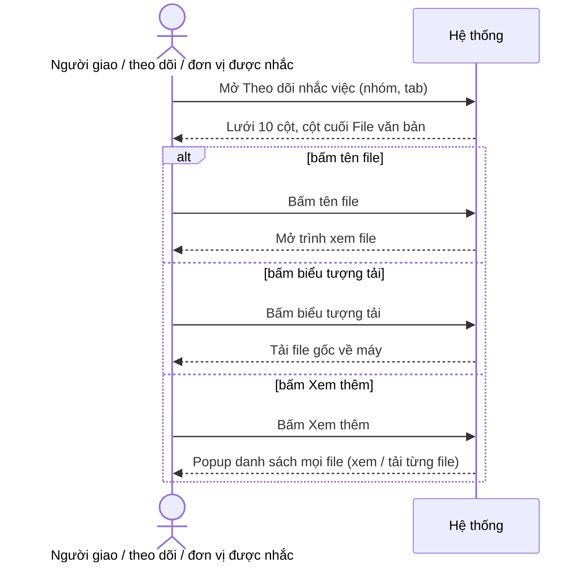

**TÀI LIỆU ĐẶC TẢ YÊU CẦU CHỨC NĂNG**

**YC_NV_06 - XEM FILE VĂN BẢN TRẢ LỜI NHẮC VIỆC NGAY TRÊN DANH SÁCH THEO DÕI NHẮC VIỆC**

**Hệ thống Văn bản và Điều hành tỉnh Khánh Hòa**

| Thuộc tính | Giá trị |
|---|---|
| Mã yêu cầu | YC_NV_06 |
| Chức năng | VĂN BẢN ĐI > Theo dõi nhắc việc — lưới "Danh sách nhắc việc" |
| Phân hệ (knowledge) | Chính: `lich-nhac-viec` (màn Theo dõi nhắc việc — NV-01; trả lời kèm văn bản trả lời — NV-04) · Liên quan: `van-ban/quan-ly-chung` (quyền xem văn bản / file — QLC NV-06), `van-ban/di` (file của văn bản đi, mẫu cột "File văn bản") |
| Loại yêu cầu | Đổi UI (bổ sung một cột hiển thị + xem / tải file) — có phần dữ liệu phải đẩy thêm qua API dùng chung cho ứng dụng di động |
| Cỡ | M (S về giao diện; nâng M vì kênh gồm cả ứng dụng di động — Q08 = B) |
| Loại tài liệu | Đặc tả yêu cầu chức năng (BA/FRD) |
| Phiên bản | 1.0 |
| Trạng thái | DRAFT |
| Ngày cập nhật | 08/10/2026 |

---

# LỊCH SỬ THAY ĐỔI `[A1]` · 🟦

| Phiên bản | Ngày | Nội dung | Người thực hiện |
|---|---|---|---|
| 1.0 | 08/10/2026 | Bản đầu tiên, soạn từ phiếu ý tưởng + 8 câu trả lời vòng 1 trong `cau-hoi.md` | BA (AI soạn) |

# PHÊ DUYỆT / XÁC NHẬN `[A2]` · 🟦

| Vai trò | Họ tên | Trạng thái | Ngày | Ghi chú |
|---|---|---|---|---|
| BA phụ trách | | Chưa xác nhận | | |
| DEV phụ trách | | Chưa xác nhận | | |
| Tester phụ trách | | Chưa xác nhận | | |
| Đại diện nghiệp vụ/Khách hàng | | Chưa xác nhận | | |

# MỤC LỤC

0. Phiếu ý tưởng
1. Thông tin chung
2. Phạm vi và vai trò
3. Tổng quan yêu cầu chức năng
4. Business Rules
5. Luồng nghiệp vụ / Use Case
6. Đặc tả màn hình và trường dữ liệu
7. Xử lý ngoại lệ và trường hợp biên
8. Acceptance Criteria
9. Ma trận kiểm thử và truy vết
10. Phạm vi kỹ thuật, kiến trúc và mapping CSDL
11. Các điểm cần xác nhận (TBD)

---

# 0. PHIẾU Ý TƯỞNG · 🟦 BA

- **Muốn gì** (nguyên văn): "Xem được các file đính kèm trả lời "Nhắc việc" của các đơn vị. — mô tả mong muốn: với văn
  bản tại sổ VB trả lời người dùng đang phải ấn vào màn chi tiết để xem file -> move file của văn bản này ra cột File
  văn bản ở màn danh sách cho người dùng xem luôn"
- **Ai dùng:** mọi người thấy dòng trên lưới Theo dõi nhắc việc, ở mọi nhóm và mọi tab — người giao, lãnh đạo / chuyên
  viên theo dõi, đơn vị được nhắc, người được gán xử lý (trả lời Q01 = A).
- **Vì sao cần:** muốn xem file trả lời của một đơn vị phải bấm cột "Số VB trả lời" mở chi tiết văn bản rồi tìm mục
  "File đính kèm"; duyệt trả lời của nhiều đơn vị thì phải mở / đóng popup nhiều lần.
- **Kết quả mong muốn:** lưới có thêm cột **"File văn bản"** ở cuối bảng, hiện file của văn bản trả lời, bấm tên để xem,
  bấm biểu tượng để tải — giống cột "File văn bản" của danh sách văn bản (ảnh `input/design/03_mau-cot-file-van-ban.png`).
- **Kênh:** Web **và** ứng dụng di động (trả lời Q08 = B).

**Trả lời vòng 1 của BA (nguyên văn, nguồn `cau-hoi.md`):**

| Câu | Trả lời của BA |
|---|---|
| Q01 Ai dùng, nhóm / tab | "A" |
| Q02 File nào | "A" |
| Q03 Giữ / gộp / thay cột Số VB trả lời | ". Giữ cột Số VB trả lời như cũ, thêm cột mới "File văn bản" ở cuối bảng" |
| Q04 Bấm file | "A" |
| Q05 Nhiều văn bản trả lời | "mối dòng chỉ có 1 văn bản đính kèm" |
| Q06 Ai được xem / tải | "theo nghiệp vụ hiện tại ai thấy bản ghi thì thấy file thì xem được thôi" |
| Q07 Nhãn, vị trí, ô trống | "cuối cùng của bảng" |
| Q08 Kênh | "b" |

---

# 1. THÔNG TIN CHUNG `[A3]` · 🟦 1.1–1.2 · 🟨 1.3 (AS-IS 🟩) · 🟩 1.4 · 🟨 1.5

## 1.1. Mục đích

Trên lưới "Danh sách nhắc việc" của màn **Theo dõi nhắc việc**, hệ thống hiển thị thêm cột **File văn bản** ở cuối
bảng, liệt kê file của **văn bản trả lời** đang hiện ở cột "Số VB trả lời" cùng dòng. Người dùng bấm tên file để xem,
bấm biểu tượng để tải, không phải mở popup chi tiết văn bản. Yêu cầu **chỉ bổ sung hiển thị**: không đổi cách trả lời,
không đổi trạng thái nhắc việc, không đổi ai thấy dòng nào.

## 1.2. Bối cảnh nghiệp vụ

- Yêu cầu gốc: xem mục 0.
- Chức năng nghiệp vụ chính: theo dõi và duyệt trả lời nhắc việc của các đơn vị.
- Đường vào chức năng: menu **VĂN BẢN ĐI > Theo dõi nhắc việc** (mã menu 441265); hoặc bấm ô "Nhắc việc" trên trang chủ
  (mở cùng màn) (`lich-nhac-viec` NV-01, mục 3 `tom-tat.md`).
- Vấn đề hiện tại: cột "Số VB trả lời" chỉ hiện `[số ký hiệu] trích yếu` của văn bản trả lời. Muốn thấy file phải bấm
  vào để mở popup chi tiết văn bản, file nằm ở mục "File đính kèm" (ảnh `input/design/02_chi-tiet-vb-tra-loi-file-dinh-kem.png`).
- Kết quả mong muốn (đo được): từ lưới, người dùng mở được file của một văn bản trả lời bằng **1 lần bấm** (trước đây
  cần ít nhất 2 lần bấm và một popup), và thấy tên file của mọi dòng trên trang mà không mở thêm màn nào.

## 1.3. Hiện trạng (AS-IS) và thay đổi (TO-BE)

| STT | Nội dung | Hiện tại (AS-IS) | Yêu cầu (TO-BE) | Nguồn AS-IS |
|---|---|---|---|---|
| 1 | Cột của lưới "Danh sách nhắc việc" | 9 cột: Thao tác · Số, Ký hiệu · Trích yếu · Nội dung giao việc · Đơn vị xử lý · Trạng thái · Số VB trả lời · Hạn xử lý · Ngày tạo | 10 cột — thêm **File văn bản** ở **cuối bảng**, sau "Ngày tạo" | `lich-nhac-viec` NV-01; `reminder_search.zul:318-332` |
| 2 | Cột "Số VB trả lời" | Hiện `[số ký hiệu] trích yếu`, bấm mở popup chi tiết văn bản trả lời | **Giữ nguyên** | Q03; NV-01; `ReminderVM.java:2473-2478`, `2897-2922` |
| 3 | Xem file văn bản trả lời | Chỉ trong popup chi tiết văn bản (mục "File đính kèm") | Thêm đường xem / tải ngay trên lưới; đường cũ vẫn giữ | Phiếu ý tưởng; Q04 |
| 4 | File được hiện | — | **Mọi file** của văn bản trả lời: ô hiện file chính, các file còn lại trong "Xem thêm" (như danh sách văn bản đi) | Q02 = A; `documentOut_search.zul:1222-1313` |
| 5 | Số văn bản trả lời trên một dòng | Mỗi dòng lưới hiện **một** văn bản ở cột Số VB trả lời | Cột File văn bản hiện file của **đúng văn bản đó** | Q05; `ReminderRepositoryImpl.java:52-66` |
| 6 | Ai xem / tải được file | — | Ai thấy dòng trên lưới thì thấy file và xem / tải được | Q06; Q04 = A |
| 7 | Nhóm / tab áp dụng | Lưới dùng chung một bộ cột cho mọi nhóm, mọi tab | Cột mới hiện ở **mọi nhóm, mọi tab** | Q01 = A; NV-01 |
| 8 | Ứng dụng di động | Không có chức năng riêng cho di động trong repo; ⚠ chưa xác minh ứng dụng có màn nhắc việc | Dữ liệu danh sách nhắc việc trả thêm danh sách file để di động hiển thị | Q08 = B; `ReminderController.java` (không có hàm riêng cho di động) |

**Tóm tắt thay đổi:** thêm một cột hiển thị + hai thao tác xem / tải trên lưới, và đẩy thêm danh sách file trong dữ liệu
trả về của danh sách nhắc việc. **Không** thêm bảng hay cột cơ sở dữ liệu, **không** chuyển đổi dữ liệu cũ, **không** đổi
trạng thái, **không** đổi popup Trả lời, **không** đổi ai thấy dòng nào.

## 1.4. Phạm vi chức năng bị ảnh hưởng

| STT | Điểm vào chức năng | Màn hình/Action | Trong phạm vi |
|---|---|---|---|
| 1 | VĂN BẢN ĐI > Theo dõi nhắc việc — nhóm *Cần xử lý*, các tab Chưa trả lời · Xử lý lại · Chờ duyệt · Hoàn thành · Tất cả | Lưới "Danh sách nhắc việc" | Có |
| 2 | Cùng màn — nhóm *Giao đi/Theo dõi*, các tab Chưa hoàn thành · Đã hoàn thành · Tất cả | Lưới "Danh sách nhắc việc" | Có |
| 3 | Trang chủ — ô "Nhắc việc" (Quá hạn, Sắp đến hạn, Xử lý lại, Chưa trả lời, Chờ duyệt, Chưa hoàn thành, Đã hoàn thành) → mở màn Theo dõi nhắc việc | Lưới "Danh sách nhắc việc" (mở sẵn bộ lọc) | Có — cùng một lưới |
| 4 | Báo cáo nhắc việc → bấm ô số → mở danh sách | Lưới "Danh sách nhắc việc" | Có — cùng một lưới (⚠ kiểm ở vòng kiểm lớp 3) |
| 5 | Tìm kiếm nhanh / Tìm kiếm nâng cao trên màn | Lưới kết quả | Có — cột mới hiện cả trên kết quả tìm kiếm |
| 6 | Ứng dụng di động — danh sách nhắc việc (nếu có) | Mục tương đương | Có (phần dữ liệu); giao diện di động — xem TBD-01 |
| 7 | Popup chi tiết nhắc việc, popup chi tiết văn bản, popup Trả lời / Duyệt / Trả lại | Không đổi | Ngoài phạm vi; cần regression |
| 8 | Báo cáo nhắc việc (bảng số), xuất Excel | Không đổi | Ngoài phạm vi |

**Kênh áp dụng:** Web **và** Mobile (Q08 = B). Phạm vi Web trọn vẹn trong yêu cầu này; phần Mobile gồm dữ liệu API
(trong phạm vi) và giao diện ứng dụng di động (phụ thuộc TBD-01).

## 1.5. Thuật ngữ

| Thuật ngữ | Định nghĩa sử dụng trong tài liệu |
|---|---|
| Dòng lưới | Một dòng của lưới "Danh sách nhắc việc" = một đơn vị được nhắc của một nhắc việc (`lich-nhac-viec` NV-01). |
| Văn bản trả lời | Văn bản đi mà đơn vị được nhắc chọn khi trả lời nhắc việc; hiện ở cột "Số VB trả lời" (NV-04). Trả lời nhắc việc **không có file riêng** — "file trả lời" là file của văn bản trả lời. |
| File chính | File nội dung của văn bản trả lời (file văn bản). |
| File đính kèm khác | Các file còn lại của văn bản trả lời (phụ lục, tài liệu kèm…). |
| "Xem thêm" | Liên kết dưới tên file chính, bấm mở popup liệt kê **mọi** file của văn bản; dùng ở các danh sách văn bản hiện có. |

---

# 2. PHẠM VI VÀ VAI TRÒ `[A4]` · 🟨

## 2.1. Vai trò

Nhắc việc phân quyền theo **dữ liệu của nhắc việc** (ai tạo, ai theo dõi, đơn vị nào được nhắc), không theo mã vai trò
riêng; chỉ phía đơn vị được nhắc dùng mã vai trò (`lich-nhac-viec` mục 2 `tom-tat.md`, BR-01).

| Vai trò nghiệp vụ | Mã vai trò hệ thống | Được làm gì trong YC_NV_06 | Ghi chú |
|---|---|---|---|
| Người giao nhắc việc (người tạo) | — (theo người tạo nhắc việc) | Thấy cột File văn bản, xem / tải file trả lời của mọi đơn vị trong nhắc việc mình tạo | Nhóm *Giao đi/Theo dõi* — người dùng chính |
| Lãnh đạo theo dõi | — (người theo dõi loại 1) | Như trên; thấy ở cả nhóm *Cần xử lý* (tab Chờ duyệt, Hoàn thành) | Người duyệt — người dùng chính |
| Chuyên viên theo dõi | — (người theo dõi loại 2) | Như trên, ở nhóm *Giao đi/Theo dõi* | |
| Văn thư / Lãnh đạo đơn vị / Thủ trưởng tại đơn vị được nhắc | `VT` / `LDDV` / `TTDV` | Thấy cột, xem / tải file văn bản trả lời của đơn vị mình | Nhóm *Cần xử lý* |
| Người xử lý được gán | — (người được gán ở dòng) | Thấy cột, xem / tải file trên dòng được gán | Nhóm *Cần xử lý* |

**Lưu ý phạm vi quyền:** cột mới **không thêm và không bớt** điều kiện ai thấy dòng nào. Ai thấy dòng thì thấy cột và
xem / tải được file của dòng đó (BR-07); ai không thấy dòng thì không bị ảnh hưởng.

## 2.2. Tiền điều kiện chung

- Người dùng đã đăng nhập và có menu "Theo dõi nhắc việc".
- Dòng có văn bản trả lời: đơn vị đã trả lời kèm văn bản trả lời **đã phát hành** (dòng ở *Chờ duyệt* hoặc *Hoàn
  thành*). Dòng chưa trả lời / *Xử lý lại* / trả lời không kèm văn bản thì cột trống (BR-05).
- Không cần bật thêm tham số hệ thống nào.

---

# 3. TỔNG QUAN YÊU CẦU CHỨC NĂNG `[A5]` · 🟦 danh sách FR · 🟩 3.1 mapping · 🟨 3.2–3.3

| ID | Trigger/Action của người dùng | Xử lý mong muốn | BR liên quan |
|---|---|---|---|
| FR-01 | Mở màn Theo dõi nhắc việc ở bất kỳ nhóm / tab nào | Lưới có cột **File văn bản** ở cuối bảng; mỗi dòng hiện file của văn bản trả lời cùng dòng | BR-01, BR-02, BR-03, BR-04, BR-05, BR-09 |
| FR-02 | Bấm **tên file** trong cột File văn bản (ô hoặc popup "Xem thêm") | Hệ thống mở file để xem ngay trên hệ thống | BR-06, BR-07 |
| FR-03 | Bấm **biểu tượng tải** trong cột File văn bản | Hệ thống tải file gốc về máy | BR-06, BR-07, BR-08 |
| FR-04 | Bấm **"Xem thêm"** khi văn bản trả lời có hơn một file | Hệ thống mở popup liệt kê mọi file của văn bản, mỗi file xem / tải được | BR-03, BR-06 |
| FR-05 | Mở danh sách nhắc việc trên **ứng dụng di động** | Dữ liệu danh sách trả thêm danh sách file của văn bản trả lời từng dòng để ứng dụng hiển thị | BR-10 |

## 3.1. Mapping dữ liệu nguồn → đích

| Nguồn (đối tượng · nhóm dữ liệu) | Đích (đối tượng · nhóm dữ liệu) | Quy tắc chuyển đổi | Điều kiện áp dụng | Rule |
|---|---|---|---|---|
| Văn bản trả lời của dòng · danh sách file (tên file, loại file chính / đính kèm) | Lưới nhắc việc · cột File văn bản | REFERENCE — đọc để hiển thị; file chính lên ô, toàn bộ file vào "Xem thêm" | Dòng có văn bản trả lời đã phát hành ở cột Số VB trả lời | BR-02, BR-03 |
| Văn bản trả lời của dòng · file | Trình xem file / tải file | REFERENCE — dùng chức năng xem / tải file văn bản hiện có | Người dùng bấm tên file / biểu tượng tải | BR-06, BR-07, BR-08 |

## 3.2. Trạng thái và chuyển trạng thái

Không thay đổi trạng thái. Giữ nguyên trạng thái của dòng trả lời nhắc việc (4 Lưu tạm · 0 Chưa trả lời · 5 Đã xử lý
tạm · 1 Chờ duyệt · 2 Xử lý lại · 3 Hoàn thành — `lich-nhac-viec` mục 5 `tom-tat.md`). Xem / tải file **không** đánh dấu
đã đọc, **không** đổi trạng thái nhắc việc hay trạng thái văn bản.

**Hành động bị cấm:** cột File văn bản **không** cho thêm, xóa, thay file; không cho trả lời / duyệt từ cột này.

## 3.3. Yêu cầu phi chức năng (NFR)

| Mã | Nhóm | Yêu cầu (đo được) |
|---|---|---|
| NFR-01 | Hiệu năng | Danh sách file lấy **một lần cho cả trang** (mọi văn bản trả lời trên trang), không truy vấn riêng cho từng dòng. Với trang 50 dòng, thời gian tải lưới không tăng quá 20% so với trước khi sửa. |
| NFR-02 | Bảo mật | Xem / tải file chỉ cho file của văn bản trả lời **thuộc dòng người dùng đang thấy**; không cho dùng chức năng này để mở file của văn bản bất kỳ bằng cách đổi mã văn bản / mã file gửi lên. Văn bản mật: theo TBD-02. |
| NFR-03 | Nhật ký (audit log) | Tải / xem file ghi nhật ký **như** chức năng xem / tải file văn bản hiện có (không thêm, không bớt). |
| NFR-04 | Thông báo / SMS | Không áp dụng — lý do: không phát sinh thông báo hay tin nhắn. |
| NFR-05 | Tương thích | Ứng dụng di động phiên bản cũ nhận thêm trường danh sách file trong dữ liệu trả về thì **vẫn chạy bình thường**, chỉ không hiện file. |
| NFR-06 | Giao diện | Thêm cột không làm lưới tràn ngang ở độ phân giải 1366 px; tên file dài xuống dòng trong ô, không cắt mất đuôi file (như ảnh 3). |

---

# 4. BUSINESS RULES `[A6]` · 🟨

| Rule ID | Tên rule | Mô tả | Nguồn |
|---|---|---|---|
| BR-01 | Điểm hiển thị | Lưới "Danh sách nhắc việc" có thêm **một cột** tên **"File văn bản"**, đặt ở **cuối bảng**, sau cột "Ngày tạo". Mọi cột khác giữ nguyên thứ tự và nội dung; cột "Số VB trả lời" giữ nguyên và vẫn bấm mở chi tiết văn bản như cũ. | Q03, Q07 |
| BR-02 | File của đúng văn bản cùng dòng | Cột File văn bản hiện file của **đúng văn bản đang hiện ở cột "Số VB trả lời" cùng dòng**. Mỗi dòng có tối đa **một** văn bản trả lời; không lấy file của văn bản giao việc, không lấy file của dòng khác. | Q05 |
| BR-03 | File nào được hiện | Hiện **mọi file** của văn bản trả lời. Trong ô: tên **file chính** kèm biểu tượng tải. Văn bản có **hơn một file** thì dưới tên file có liên kết **"Xem thêm"**; bấm mở popup liệt kê **toàn bộ** file của văn bản, đánh số thứ tự, mỗi file có biểu tượng tải. Cách hiện giống cột "File văn bản" ở danh sách văn bản đi. | Q02 = A; ảnh 3; `documentOut_search.zul:1222-1313` |
| BR-04 | Mọi nhóm, mọi tab | Cột File văn bản hiện ở **mọi nhóm** (*Cần xử lý*, *Giao đi/Theo dõi*), **mọi tab**, trên kết quả tìm kiếm nhanh / nâng cao và khi mở màn từ ô trang chủ. | Q01 = A |
| BR-05 | Dòng không có file | Dòng không có văn bản trả lời (chưa trả lời, *Xử lý lại*, trả lời không kèm văn bản) hoặc văn bản trả lời không có file nào thì ô File văn bản **để trống** — không hiện chữ thay thế, không hiện biểu tượng tải. | Mặc định Q07 (c) — xem TBD-03 |
| BR-06 | Xem và tải | Bấm **tên file** → mở file để **xem** bằng trình xem file của hệ thống. Bấm **biểu tượng tải** → **tải file gốc** về máy. Áp dụng cho cả ô và popup "Xem thêm". | Q04 = A |
| BR-07 | Ai được xem / tải | **Ai thấy dòng trên lưới thì thấy file và xem / tải được** file của văn bản trả lời ở dòng đó — kể cả khi người đó không phải người nhận văn bản trả lời theo quy tắc xem văn bản chung. Không thêm điều kiện theo vai trò. | Q06; Q01 = A |
| BR-08 | Văn bản mật / văn bản không cho tải | Văn bản trả lời là văn bản mật: *(giả định — chờ TBD-02)* **xem được, ẩn biểu tượng tải**, như danh sách văn bản đi đang làm. | `documentOut_search.zul:1236-1239`; TBD-02 |
| BR-09 | Chỉ đọc, không đổi dữ liệu | Cột File văn bản chỉ để xem / tải. Xem / tải file **không** đổi trạng thái nhắc việc, **không** đổi trạng thái đọc của văn bản trả lời. | `lich-nhac-viec` mục 5 |
| BR-10 | Ứng dụng di động | Dữ liệu trả về của danh sách nhắc việc có thêm danh sách file của văn bản trả lời từng dòng (tên file, loại file chính / đính kèm, mã để xem / tải), theo cùng quy tắc BR-02, BR-03, BR-05, BR-07, BR-08. Việc hiện trên giao diện di động theo TBD-01. | Q08 = B |

---

# 5. LUỒNG NGHIỆP VỤ / USE CASE `[A7]` · 🟨

## 5.1. UC-01 - Xem file trả lời của các đơn vị ngay trên lưới

| Thuộc tính | Nội dung |
|---|---|
| Mục tiêu | Người giao / người theo dõi đọc nhanh file trả lời của từng đơn vị để duyệt mà không mở chi tiết văn bản |
| Actor | Người giao nhắc việc, lãnh đạo theo dõi, chuyên viên theo dõi; đơn vị được nhắc (`VT` / `LDDV` / `TTDV`), người được gán |
| Tiền điều kiện | Có ít nhất một dòng có văn bản trả lời đã phát hành; người dùng thấy dòng đó trên lưới |
| Trigger | Người dùng mở màn Theo dõi nhắc việc |
| Hậu điều kiện | Không đổi dữ liệu. Người dùng đã xem / tải file |
| Rule liên quan | BR-01 → BR-09 |
| Ngoại lệ liên quan | EC-01 → EC-09 |

**Luồng chính**

1. Người dùng vào **VĂN BẢN ĐI > Theo dõi nhắc việc**, chọn nhóm và tab (ví dụ lãnh đạo theo dõi ở *Cần xử lý* > *Chờ
   duyệt*).
2. Hệ thống hiển thị lưới 10 cột, cột cuối **File văn bản**.
3. Với mỗi dòng có văn bản trả lời, ô File văn bản hiện tên file chính kèm biểu tượng tải; văn bản có hơn một file thì có
   thêm "Xem thêm".
4. Người dùng bấm tên file chính.
5. Hệ thống mở file để xem.

**Luồng thay thế**

- 4a. Người dùng bấm biểu tượng tải → hệ thống tải file gốc về máy (BR-06), kết thúc.
- 4b. Người dùng bấm "Xem thêm" → hệ thống mở popup liệt kê mọi file của văn bản trả lời → người dùng bấm tên một file để
  xem, hoặc biểu tượng tải để tải (BR-03, BR-06).
- 4c. Người dùng bấm cột "Số VB trả lời" → mở popup chi tiết văn bản trả lời **như hiện tại** (BR-01).

**Luồng ngoại lệ**

- 3a. Dòng không có văn bản trả lời / văn bản không có file → ô để trống (BR-05, EC-01, EC-02).
- 5a. Không mở / tải được file (file không còn trên kho lưu trữ, lỗi đọc file) → hiện thông báo lỗi xem / tải file
  hiện có của hệ thống (EC-06).

## 5.2. UC-02 - Xem file trả lời trên ứng dụng di động

| Thuộc tính | Nội dung |
|---|---|
| Mục tiêu | Người dùng di động thấy cùng thông tin như trên web |
| Actor | Như UC-01, dùng ứng dụng di động |
| Tiền điều kiện | Ứng dụng di động có màn nhắc việc và ở phiên bản có hiện file (TBD-01) |
| Trigger | Người dùng mở danh sách nhắc việc trên ứng dụng di động |
| Hậu điều kiện | Không đổi dữ liệu |
| Rule liên quan | BR-10, BR-02, BR-03, BR-05, BR-07, BR-08 |
| Ngoại lệ liên quan | EC-07 |

**Luồng chính**

1. Người dùng mở danh sách nhắc việc trên ứng dụng di động.
2. Hệ thống trả về danh sách, mỗi dòng có thêm danh sách file của văn bản trả lời.
3. Ứng dụng hiển thị file; người dùng bấm để xem / tải.

**Luồng ngoại lệ**

- 3a. Ứng dụng phiên bản cũ → vẫn mở danh sách bình thường, chỉ không thấy file (EC-07).

---

# 6. ĐẶC TẢ MÀN HÌNH VÀ TRƯỜNG DỮ LIỆU `[A8]` · 🟨

## 6.1. Màn hình Theo dõi nhắc việc — lưới "Danh sách nhắc việc"

Ảnh tham chiếu (BA gửi):

- `input/design/01_luoi-theo-doi-nhac-viec.webp` — lưới hiện tại, cột Số VB trả lời.
- `input/design/02_chi-tiet-vb-tra-loi-file-dinh-kem.png` — nơi file đang nằm (popup chi tiết văn bản).
- `input/design/03_mau-cot-file-van-ban.png` — mẫu cột File văn bản cần làm theo.

**Thứ tự cột sau khi sửa** (cột mới in đậm):

| # | Tiêu đề cột | Thay đổi |
|---|---|---|
| 1 | Thao tác | Giữ nguyên baseline |
| 2 | Số, Ký hiệu | Giữ nguyên baseline |
| 3 | Trích yếu | Giữ nguyên baseline |
| 4 | Nội dung giao việc | Giữ nguyên baseline |
| 5 | Đơn vị xử lý | Giữ nguyên baseline |
| 6 | Trạng thái | Giữ nguyên baseline |
| 7 | Số VB trả lời | Giữ nguyên baseline (vẫn bấm mở chi tiết văn bản) |
| 8 | Hạn xử lý | Giữ nguyên baseline |
| 9 | Ngày tạo | Giữ nguyên baseline |
| 10 | **File văn bản** | **Mới** |

**Đặc tả cột mới:**

| ID | Trường/Control | Loại | Bắt buộc | Độ dài / Giới hạn | Mặc định | Quy tắc hiển thị / Validate | Thay đổi trong YC_NV_06 |
|---|---|---|---|---|---|---|---|
| UI-01 | Tiêu đề cột "File văn bản" | Tiêu đề cột | — | — | — | Căn giữa như các tiêu đề khác | **Mới** |
| UI-02 | Tên file chính | Liên kết | Không | Tên file đầy đủ, xuống dòng khi dài (không cắt đuôi) | Trống | Hiện tên file chính của văn bản trả lời cùng dòng (BR-02, BR-03); bấm → xem file (BR-06); dòng không có file → không hiện (BR-05); màu và kiểu chữ như liên kết file ở danh sách văn bản đi | **Mới** |
| UI-03 | Biểu tượng tải | Nút biểu tượng | Không | — | — | Đứng cạnh tên file chính; bấm → tải file gốc (BR-06); ẩn với văn bản mật *(giả định — chờ TBD-02)*; tooltip như danh sách văn bản đi | **Mới** |
| UI-04 | "Xem thêm" | Liên kết | Không | — | — | Chỉ hiện khi văn bản trả lời có **> 1 file**; chữ nghiêng gạch chân như ảnh 3; bấm → mở popup UI-05 | **Mới** |
| UI-05 | Popup danh sách file | Popup | — | Phân trang như popup của danh sách văn bản đi | — | Tiêu đề kèm số file `(n)`; mỗi dòng: số thứ tự + tên file (bấm → xem) + biểu tượng tải (theo UI-03); nút đóng (×) | **Mới** |

## 6.2. Thông báo người dùng

Không thêm thông báo mới. Lỗi khi xem / tải file (không có quyền, file không tồn tại, lỗi đọc file) dùng **nguyên văn
thông báo hiện có** của chức năng xem / tải file văn bản; nguyên văn từng câu sẽ được trích ở vòng kiểm lớp 3 — xem
TBD-05.

## 6.3. Điều hướng

Không đổi đường vào, menu, tab hay bộ lọc mặc định. Thao tác mới: bấm file mở trình xem file (cửa sổ / popup xem file
hiện có của hệ thống); bấm "Xem thêm" mở popup tại chỗ, đóng popup quay lại lưới, giữ nguyên trang và bộ lọc.

## 6.4. Quy tắc hiển thị

- Cột UI-01…UI-05 hiện ở mọi nhóm, mọi tab, mọi trang của lưới (BR-04).
- Không phụ thuộc vai trò người xem (BR-07).
- Đổi số dòng / trang (10, 20, 50) hoặc chuyển trang → cột hiện đúng theo dòng của trang mới.
- Bề rộng cột vừa đủ cho tên file + biểu tượng; nếu phải thu hẹp cột khác thì thu hẹp "Trích yếu" / "Nội dung giao
  việc", không thu hẹp "Trạng thái", "Hạn xử lý", "Ngày tạo" (NFR-06).

---

# 7. XỬ LÝ NGOẠI LỆ VÀ TRƯỜNG HỢP BIÊN `[A9]` · 🟨

| ID | Tình huống | Kết quả mong đợi | UC | Trạng thái |
|---|---|---|---|---|
| EC-01 | Dòng chưa trả lời, *Xử lý lại*, hoặc trả lời không kèm văn bản | Ô File văn bản trống (BR-05) | UC-01 | Đã chốt (mặc định — TBD-03) |
| EC-02 | Văn bản trả lời không có file nào | Ô trống, không hiện biểu tượng tải, không hiện "Xem thêm" (BR-05) | UC-01 | Đã chốt (mặc định — TBD-03) |
| EC-03 | Văn bản trả lời có đúng 1 file | Hiện tên file + biểu tượng tải; **không** hiện "Xem thêm" (BR-03) | UC-01 | Đã chốt |
| EC-04 | Văn bản trả lời có 4 file (1 file chính, 3 phụ lục) | Ô hiện tên file chính + biểu tượng tải + "Xem thêm"; popup liệt kê đủ 4 file đánh số 1–4 (BR-03) | UC-01 | Đã chốt |
| EC-05 | Văn bản trả lời không có file chính, chỉ có file đính kèm khác | Ô hiện file đầu tiên trong danh sách file, theo cách danh sách văn bản đi đang làm *(giả định — kiểm ở vòng kiểm lớp 3)* | UC-01 | Chờ kiểm |
| EC-06 | File không còn trên kho lưu trữ / lỗi đọc file | Hiện thông báo lỗi hiện có của chức năng xem / tải file; lưới không bị lỗi (TBD-05) | UC-01 | Đã chốt |
| EC-07 | Ứng dụng di động phiên bản cũ nhận dữ liệu có trường mới | Vẫn hiện danh sách bình thường, không lỗi, chỉ không hiện file (NFR-05) | UC-02 | Đã chốt |
| EC-08 | Người theo dõi không phải người nhận văn bản trả lời (văn bản chỉ chuyển cho đơn vị giao với vai trò Nhận để biết) | Vẫn xem / tải được file (BR-07); **không** được báo "không có quyền xem file" | UC-01 | Đã chốt |
| EC-09 | Văn bản trả lời là văn bản mật | Xem được, ẩn biểu tượng tải *(giả định — chờ TBD-02)* | UC-01 | Chờ TBD-02 |
| EC-10 | Văn bản trả lời đang bị khóa hoặc đã bị hủy (hiện nay bấm Số VB trả lời sẽ báo cảnh báo khóa / hủy) | Theo TBD-04 | UC-01 | Chờ TBD-04 |
| EC-11 | Lưới nhiều trang | Cột hiện đúng ở mọi trang; đổi trang không giữ popup "Xem thêm" đang mở | UC-01 | Đã chốt |

---

# 8. ACCEPTANCE CRITERIA `[A10]` · 🟨

| AC ID | BR | Given | When | Then |
|---|---|---|---|---|
| AC-01 | BR-01 | Người giao nhắc việc có ít nhất 1 nhắc việc | Mở VĂN BẢN ĐI > Theo dõi nhắc việc | Lưới có 10 cột; cột cuối tên "File văn bản", nằm sau "Ngày tạo"; cột "Số VB trả lời" vẫn ở vị trí thứ 7 |
| AC-02 | BR-01 | Dòng của đơn vị X ở *Chờ duyệt*, văn bản trả lời 2/QĐ/VPTU | Bấm vào cột "Số VB trả lời" của dòng đó | Mở popup chi tiết văn bản 2/QĐ/VPTU như hiện tại |
| AC-03 | BR-02, BR-03 | Đơn vị X trả lời kèm văn bản 2/QĐ/VPTU có 1 file `VBNB_2026-QD-0002.pdf` | Lãnh đạo theo dõi mở tab *Cần xử lý* > *Chờ duyệt* | Ô File văn bản của dòng X hiện `VBNB_2026-QD-0002.pdf` kèm biểu tượng tải, không có "Xem thêm" |
| AC-04 | BR-03 | Văn bản trả lời của dòng Y có 4 file (1 file chính, 3 phụ lục) | Xem dòng Y rồi bấm "Xem thêm" | Ô hiện tên file chính + biểu tượng tải + "Xem thêm"; popup hiện tiêu đề kèm `(4)` và đủ 4 file đánh số 1–4, mỗi file có biểu tượng tải |
| AC-05 | BR-02 | Nhắc việc giao cho 3 đơn vị A, B, C; A và B đã trả lời bằng hai văn bản khác nhau | Người giao mở nhóm *Giao đi/Theo dõi* > *Tất cả* | Dòng A hiện file của văn bản A, dòng B hiện file của văn bản B, dòng C trống; không dòng nào hiện file của dòng khác hay file của văn bản giao việc |
| AC-06 | BR-04 | Cùng dữ liệu AC-03 | Lần lượt mở các tab Hoàn thành, Tất cả của *Cần xử lý*; các tab của *Giao đi/Theo dõi*; tìm kiếm nhanh theo trích yếu; mở màn từ ô "Chờ duyệt" trên trang chủ | Ở mọi chỗ, lưới đều có cột File văn bản với cùng nội dung cho dòng X |
| AC-07 | BR-05 | Dòng Z ở *Chưa trả lời*; dòng W ở *Xử lý lại* sau khi bị trả lại | Xem hai dòng | Ô File văn bản của Z và W đều trống, không có biểu tượng tải |
| AC-08 | BR-06 | Dòng X như AC-03 | Bấm tên file `VBNB_2026-QD-0002.pdf` | Mở trình xem file, hiện đúng nội dung file |
| AC-09 | BR-06 | Dòng X như AC-03 | Bấm biểu tượng tải | Trình duyệt tải về file gốc `VBNB_2026-QD-0002.pdf` |
| AC-10 | BR-07 | Chuyên viên theo dõi nhắc việc, **không** có tên trong danh sách nhận văn bản trả lời 2/QĐ/VPTU (văn bản chỉ chuyển cho đơn vị giao vai trò Nhận để biết) | Chuyên viên mở *Giao đi/Theo dõi*, bấm tên file của dòng X rồi bấm biểu tượng tải | Xem được file và tải được file; không có thông báo "không có quyền xem file" |
| AC-11 | BR-07 | Văn thư đơn vị X (`VT`) | Mở *Cần xử lý* > *Chờ duyệt*, bấm tên file của dòng đơn vị mình | Xem được file văn bản trả lời của đơn vị mình |
| AC-12 | BR-08 | Văn bản trả lời của dòng V là văn bản mật | Xem dòng V | Tên file hiện và bấm xem được; **không** có biểu tượng tải ở ô và trong popup *(giả định — chờ TBD-02)* |
| AC-13 | BR-09 | Dòng X ở *Chờ duyệt* | Xem và tải file của dòng X, rồi tải lại lưới | Trạng thái dòng X vẫn *Chờ duyệt*; số trên nhãn tab và ô trang chủ không đổi |
| AC-14 | BR-10 | Ứng dụng di động phiên bản có hỗ trợ hiện file, dữ liệu như AC-03 | Mở danh sách nhắc việc trên ứng dụng | Dòng X hiện file `VBNB_2026-QD-0002.pdf`, xem / tải được *(giả định — chờ TBD-01)* |
| AC-15 | NFR-01 | Trang lưới 50 dòng, mỗi dòng có văn bản trả lời 1–4 file | Đổi số dòng / trang sang 50 | Lưới hiện đủ, cột File văn bản đúng mọi dòng; thời gian tải lưới không tăng quá 20% so với bản hiện tại |
| AC-16 | NFR-02 | Người dùng A không thấy dòng của nhắc việc N | Gửi yêu cầu xem / tải file văn bản trả lời của nhắc việc N bằng cách đổi mã trên yêu cầu | Hệ thống từ chối, không trả nội dung file |

---

# 9. MA TRẬN KIỂM THỬ VÀ TRUY VẾT `[A11]` · 🟩

## 9.1. Ma trận role kiểm thử

| Vai trò nghiệp vụ | Mã vai trò hệ thống | Mục tiêu kiểm thử |
|---|---|---|
| Người giao nhắc việc | — (người tạo) | Functional đầy đủ — nhóm *Giao đi/Theo dõi*, nhiều đơn vị trả lời |
| Lãnh đạo theo dõi | — (theo dõi loại 1) | Functional — nhóm *Cần xử lý* tab Chờ duyệt / Hoàn thành; không phải người nhận văn bản trả lời (AC-10) |
| Chuyên viên theo dõi | — (theo dõi loại 2) | Functional + quyền xem file khi không phải người nhận văn bản (AC-10) |
| Văn thư / Lãnh đạo đơn vị / Thủ trưởng đơn vị được nhắc | `VT` / `LDDV` / `TTDV` | Functional — file trả lời của đơn vị mình |
| Người xử lý được gán | — | Functional — dòng được gán |
| Người không liên quan | bất kỳ | Bảo mật — không xem / tải được file bằng cách đổi mã (AC-16) |

## 9.2. Traceability Requirement → Rule → AC

| FR | BR | AC | EC | Ghi chú |
|---|---|---|---|---|
| FR-01 | BR-01, BR-02, BR-03, BR-04, BR-05 | AC-01, AC-02, AC-03, AC-04, AC-05, AC-06, AC-07 | EC-01 → EC-05, EC-11 | Hiển thị cột |
| FR-02 | BR-06, BR-07 | AC-08, AC-10, AC-11 | EC-06, EC-08 | Xem file |
| FR-03 | BR-06, BR-07, BR-08 | AC-09, AC-10, AC-12 | EC-06, EC-09 | Tải file |
| FR-04 | BR-03, BR-06 | AC-04 | EC-04 | Xem thêm |
| FR-05 | BR-10 | AC-14 | EC-07 | Di động — phụ thuộc TBD-01 |
| FR-01 | BR-09 | AC-13 | — | Không đổi trạng thái |
| FR-01 → FR-03 | NFR-01, NFR-02 | AC-15, AC-16 | — | Hiệu năng, bảo mật |

## 9.3. Regression tối thiểu

- Lưới nhắc việc: 9 cột cũ giữ nguyên nội dung, thứ tự; nút Sửa / Xóa hiện đúng như cũ; bấm dòng vẫn mở chi tiết nhắc
  việc; bấm "Số VB trả lời" vẫn mở chi tiết văn bản (kể cả cảnh báo văn bản bị khóa / hủy).
- Số trên nhãn tab, ô trang chủ "Nhắc việc", phân trang và tổng số dòng **không đổi** so với trước khi sửa (cùng dữ liệu).
- Tìm kiếm nhanh / nâng cao trả cùng tập dòng như trước.
- Popup chi tiết nhắc việc, Trả lời, Duyệt / Trả lại, Hủy trả lời hoạt động như cũ.
- Quyền xem văn bản ở các đường khác (popup chi tiết văn bản, tra cứu) **không** bị nới: người không có quyền vẫn bị
  chặn ở những đường đó.
- Ứng dụng di động phiên bản hiện hành mở danh sách nhắc việc không lỗi.

---

# 10. PHẠM VI KỸ THUẬT, KIẾN TRÚC VÀ MAPPING CSDL `[A12]` · 🟩

## 10.1. Quy tắc nguồn sự thật

| Thứ tự | Nguồn | Dùng để xác định | Khi mâu thuẫn |
|---|---|---|---|
| 1 | Tài liệu này | WHAT/WHY, phạm vi, BR, AC | Không sửa BR bằng suy luận kỹ thuật |
| 2 | `knowledge/lich-nhac-viec`, `van-ban/quan-ly-chung`, `van-ban/di` | Hành vi cũ, mapping đã kiểm chứng | Dùng làm hành vi cũ + regression |
| 3 | Mã nguồn `kha_develop` | Luồng dữ liệu từ bảng tới màn | Trace đầu-cuối |
| 4 | DB DEV (chỉ SELECT) | Tên bảng / cột thật | Chưa kiểm → `TBD_NOT_CONFIRMED` |

## 10.2. Call-chain

| Layer | Thành phần | Vai trò với YC_NV_06 | Độ tin cậy |
|---|---|---|---|
| UI/ZK | `web-spring/src/main/webapp/view/voffice/reminder/reminder_search.zul:318-332` (listhead), `:333-377` (template dòng) | Thêm 1 `listheader` "File văn bản" cuối bảng + 1 `listcell`: tên file chính + biểu tượng tải + "Xem thêm" + popup danh sách file — có thể dùng lại khối cột File văn bản của `document/reportSendReceiveDoc/documentOut_search.zul:1222-1313` | VERIFIED_CODE |
| ViewModel | `web-spring/src/main/java/com/viettel/voffice/vm/reminder/ReminderVM.java` — `doSearch` (NV-01: :440-532), `getDisplayReplyDocument` (:2473-2478), `doViewDocumentReply` (:2897-2922) | Thêm lệnh xem file / tải file / đóng popup (hiện ReminderVM **chưa có**; bản tham chiếu nằm ở VM của danh sách văn bản đi: `readAllAttachedFile`, `doDownloadDocumentEntity`, `doDownloadAllDocumentEntity`, `closeAttachedFilePopup`) | VERIFIED_CODE |
| DTO (web) | `web-spring/src/main/java/com/viettel/voffice/entity/Reminder.java` (đang có `documentReplyId`, `documentReplyCode`, `documentReplyTitle`) | **Thêm** danh sách file văn bản trả lời (+ file chính) | VERIFIED_CODE |
| API | `POST /reminders/search` (`ReminderController` — NV-01 `RC:36-41`) — **dùng chung cho mọi kênh**, không có hàm riêng cho di động | Phản hồi thêm danh sách file → web và di động cùng có | VERIFIED_CODE |
| DTO (BE) | `backend2.0/.../office/dto/response/reminder/ReminderResponseDTO.java` | **Thêm** danh sách file | VERIFIED_CODE |
| Service | `ReminderServiceImpl.searchReminders` (NV-01 `RSI:64-72`) | Sau khi có trang kết quả: gom `documentReplyId` của trang → lấy file **một lần** cho cả danh sách văn bản (NFR-01) | VERIFIED_CODE |
| Repository/SQL | `ReminderRepositoryImpl.searchReminders` (:31-209; phần SELECT :36-66) — đã có `d2.DOCUMENT_ID AS documentReplyId` | Không cần đổi điều kiện lọc; thêm truy vấn lấy file theo danh sách mã văn bản (hoặc dùng lại hàm lấy file văn bản hiện có) | VERIFIED_CODE |
| Xem / tải file + kiểm quyền | Chức năng xem / tải file văn bản hiện có; quyền xem theo `validateDocumentDetail` (QLC NV-06, `DDAO:16808-16827`), có ngoại lệ cờ "xem văn bản trả lời" `isViewReplyDocument` (`DDAO:16816`); báo lỗi `voffice.view.file.not.permission` (`SecurityVM.java:4058`) | BR-07 yêu cầu người thấy dòng xem / tải được kể cả khi không qua quy tắc chung → cần áp ngoại lệ tương đương **có ràng buộc** "văn bản là văn bản trả lời của một dòng nhắc việc người dùng thấy" (NFR-02). Cách làm cụ thể để DEV quyết | PARTIAL — đường tải file cụ thể kiểm ở vòng kiểm lớp 3 |
| DB | `REMINDER_DOCUMENT_RELATIONS` (`OBJECT_TYPE = 2`, `OBJECT_ID = REMINDER_REPLY_ID`, `DOCUMENT_ID`) → `DOCUMENT` → bảng file văn bản `FILES_ATTACHMENT` | Nguồn dữ liệu, **không đổi schema** | `REMINDER_DOCUMENT_RELATIONS`: VERIFIED_CODE (`ReminderRepositoryImpl.java:63-65`) · `FILES_ATTACHMENT`: PARTIAL (theo `van-ban/di` mục bảng; cột tên file / loại file chính chưa đối chiếu DB DEV — TBD-06) |
| Mobile app | Giao diện ứng dụng di động | Mã nguồn ứng dụng **không nằm trong repo này** | TBD_NOT_CONFIRMED (TBD-01) |

## 10.3. Bảng/cột liên quan

| Bảng | Mục đích | Cột chính liên quan | Thay đổi | Độ tin cậy |
|---|---|---|---|---|
| `REMINDER_REPLY` | Dòng trả lời của một đơn vị | `REMINDER_REPLY_ID`, `STATUS`, `DEL_FLAG` | **Không đổi** | VERIFIED_CODE |
| `REMINDER_DOCUMENT_RELATIONS` | Liên kết văn bản giao (1) / văn bản trả lời (2) | `OBJECT_TYPE`, `OBJECT_ID`, `DOCUMENT_ID`, `TEXT_ID`, `DEL_FLAG` | **Không đổi** — đọc như hiện tại | VERIFIED_CODE |
| `DOCUMENT` | Văn bản trả lời | `DOCUMENT_ID`, `CODE`, `TITLE`, độ mật | **Không đổi** — đọc thêm độ mật cho BR-08 | VERIFIED_CODE (CODE, TITLE) · PARTIAL (cột độ mật) |
| `FILES_ATTACHMENT` | File của văn bản | mã file, tên file, loại file chính / đính kèm, đường dẫn | **Không đổi** — chỉ đọc | PARTIAL (TBD-06) |

**Không cần migration.** Không thêm bảng, không thêm cột, không sửa dữ liệu cũ.

## 10.4. Mapping UI → Code → DTO/API → CSDL

| UI ID | Field UI | ZUL / VM / Command | Payload / API | DB đích | Ghi chú |
|---|---|---|---|---|---|
| UI-02 | Tên file chính | `reminder_search.zul` cột mới → `ReminderVM` lệnh xem file | `POST /reminders/search` — trường danh sách file trong từng phần tử | `FILES_ATTACHMENT` của `DOCUMENT` = `REMINDER_DOCUMENT_RELATIONS.DOCUMENT_ID` (`OBJECT_TYPE = 2`) | File chính lên ô |
| UI-03 | Biểu tượng tải | `ReminderVM` lệnh tải file | Chức năng tải file văn bản hiện có | như trên | Ẩn với văn bản mật (TBD-02) |
| UI-04, UI-05 | Xem thêm, popup | `ReminderVM` mở / đóng popup | Cùng danh sách file | như trên | Hiện khi > 1 file |

## 10.5. CRUD và lifecycle dữ liệu

| Action | Trên giao diện (chưa lưu) | Khi lưu | Khi hủy | Điểm cần xác nhận |
|---|---|---|---|---|
| Đọc (hiển thị, xem, tải) | Hiện file, xem / tải | Không áp dụng — không có thao tác lưu | Không áp dụng | Nhật ký tải file như hiện có (NFR-03) |
| Tạo / Sửa / Xóa | Không áp dụng — yêu cầu không tạo, sửa, xóa dữ liệu | Không áp dụng | Không áp dụng | — |

## 10.6. Phạm vi KHÔNG thay đổi và regression bắt buộc

| Hạng mục baseline | Có thay đổi? | Yêu cầu |
|---|---|---|
| Điều kiện lọc, sắp xếp, đếm của danh sách nhắc việc (`RRI:34-209`, `RRJ.getDashboardCountsV2`) | Không | Giữ nguyên; số dòng và số trên tab không đổi |
| Cột "Số VB trả lời" và đường mở chi tiết văn bản | Không | Giữ nguyên |
| Popup Trả lời / Duyệt / Trả lại / Chi tiết nhắc việc | Không | Giữ nguyên |
| Quy tắc quyền xem văn bản dùng chung (QLC NV-06) | Không | Không nới cho các đường khác; ngoại lệ (nếu có) chỉ áp cho file văn bản trả lời mở từ lưới nhắc việc |
| Ứng dụng di động phiên bản hiện hành | Không | Thêm trường trong phản hồi không làm ứng dụng cũ lỗi |

## 10.7. Ràng buộc triển khai

- Không thay đổi schema DB. Phát hiện thiếu cột thì dừng và báo lại.
- Không truy vấn file theo từng dòng (NFR-01).
- Không đổi phần lọc / đếm của truy vấn danh sách: thêm file **sau** khi đã có trang kết quả, để không làm lệch phân
  trang và số đếm.
- Lưu ý hiện trạng: popup Trả lời cho chọn nhiều văn bản trả lời (`ReminderReplyVM.java:59`, `209`) và truy vấn danh
  sách nối văn bản trả lời không gộp (`ReminderRepositoryImpl.java:63-65`), nên một trả lời có nhiều văn bản sẽ hiện
  thành nhiều dòng — mỗi dòng vẫn chỉ có **một** văn bản (đúng BR-02). Yêu cầu này **không** đổi hành vi đó (xem TBD-07).

## 10.8. Quy tắc cho AI/DEV khi đọc tài liệu này

| Rule ID | Quy tắc |
|---|---|
| AI-01 | Không suy tên bảng/cột từ tên class, DTO hay nhãn UI. |
| AI-02 | Không tự bịa bảng/cột/API/method/business rule — thiếu bằng chứng ghi `TBD_NOT_CONFIRMED`. |
| AI-03 | Mỗi field phải trace được UI → ZUL → VM → DTO → backend → DAO → DB, kèm `file::hàm::dòng`. |
| AI-04 | Tài liệu và code mâu thuẫn → ghi `CONFLICT` + đề xuất, chờ xác nhận, không tự chọn. |
| AI-05 | Cột File văn bản chỉ xem / tải. Không nhân cơ hội thêm upload / xóa file, không đổi popup Trả lời, không nới quyền xem văn bản ở các đường khác. |

**Quality gate trước khi DEV code:** TBD-01 (giao diện ứng dụng di động) phải chốt trước khi làm phần di động. Phần
**web** làm được khi TBD-02 có kết luận (hoặc chấp nhận mặc định ẩn tải với văn bản mật). Các TBD còn lại không chặn.

---

# 11. CÁC ĐIỂM CẦN XÁC NHẬN (TBD) `[A13]` · 🟨

| Mã TBD | Câu hỏi cần chốt | Ảnh hưởng BR/AC/EC | Mức | Ai chốt | Hạn | Kết luận |
|---|---|---|---|---|---|---|
| TBD-01 | Ứng dụng di động có màn danh sách nhắc việc không, hiện file ở đâu, từ phiên bản nào? Mã nguồn ứng dụng không nằm trong repo này: A. đội di động làm cùng đợt, web + dữ liệu API xong trước; B. đợt này chỉ trả dữ liệu qua API, giao diện di động làm đợt sau; C. di động chưa có màn nhắc việc → bỏ phạm vi di động. | BR-10, AC-14, EC-07 | BLOCKING (chỉ với phạm vi di động) | Trưởng nhóm di động + BA | | (chưa chốt) |
| TBD-02 | BA trả lời Q06 "ai thấy bản ghi thì thấy file thì xem được thôi" và Q04 = A (xem + tải). Xác nhận: (a) người thấy dòng **tải** được file, không chỉ xem — A. có / B. chỉ xem, ẩn tải với người không phải người nhận văn bản; (b) văn bản trả lời **mật** — A. xem được, ẩn tải (như danh sách văn bản đi) / B. xem và tải như văn bản thường / C. không hiện file. Mặc định: (a) A, (b) A. | BR-07, BR-08, AC-10, AC-12, EC-09 | BLOCKING nhẹ (web làm được theo mặc định nếu BA đồng ý) | BA (lãnh đạo dự án nếu đụng văn bản mật) | | (chưa chốt) |
| TBD-03 | Q07 BA chỉ chốt vị trí cột. Xác nhận nhãn **"File văn bản"** và ô **để trống** khi dòng không có file. | BR-01, BR-05, AC-01, AC-07 | NON-BLOCKING (mặc định như trên) | BA | | (chưa chốt) |
| TBD-04 | Văn bản trả lời đang **bị khóa** hoặc **đã bị hủy** (hiện nay bấm Số VB trả lời sẽ cảnh báo, không mở): cột File văn bản — A. vẫn hiện tên file, bấm xem / tải thì hiện cùng cảnh báo đó; B. không hiện file. | EC-10 | NON-BLOCKING (mặc định A) | BA | | (chưa chốt) |
| TBD-05 | Trích nguyên văn các thông báo lỗi xem / tải file sẽ dùng (không có quyền, file không tồn tại). | 6.2, EC-06 | NON-BLOCKING (việc của vòng kiểm lớp 3) | AI ở vòng kiểm | | (chưa chốt) |
| TBD-06 | Đối chiếu trên DB DEV bảng file văn bản (`FILES_ATTACHMENT`): cột tên file, cột phân biệt file chính / đính kèm; và cột độ mật của `DOCUMENT` (chỉ SELECT). Chưa xác nhận thì 10.2 / 10.3 còn nhãn PARTIAL. | 10.2, 10.3, BR-03, BR-08 | NON-BLOCKING (việc của vòng kiểm lớp 3) | AI ở vòng kiểm | | (chưa chốt) |
| TBD-07 | BA trả lời Q05 "mỗi dòng chỉ có 1 văn bản đính kèm" — đúng ở mức **dòng lưới**. Nhưng popup Trả lời hiện cho chọn nhiều văn bản trả lời và khi đó lưới hiện nhiều dòng cho cùng một đơn vị (10.7). Giữ như hiện tại (A, yêu cầu này không đổi), hay ghi nhận để xử lý ở yêu cầu khác (B)? Cần đếm trên DB DEV số trả lời có > 1 văn bản để biết mức độ. | BR-02, 10.7 | NON-BLOCKING (mặc định A) | BA | | (chưa chốt) |

**Tiêu chí bàn giao DEV:** phần **web** đủ điều kiện code khi TBD-02 có kết luận (hoặc BA chấp nhận mặc định) và DEV ký
duyệt. Phần **di động** chỉ code sau khi TBD-01 chốt.

---

# KẾT LUẬN

Yêu cầu bổ sung cột **File văn bản** ở cuối lưới "Danh sách nhắc việc" (VĂN BẢN ĐI > Theo dõi nhắc việc), hiện mọi
file của văn bản trả lời cùng dòng theo đúng kiểu cột File văn bản của danh sách văn bản: tên file chính + biểu tượng
tải + "Xem thêm" khi có nhiều file. Bấm tên file để xem, bấm biểu tượng để tải. Cột hiện ở mọi nhóm, mọi tab; ai thấy
dòng thì xem / tải được file; cột "Số VB trả lời" giữ nguyên.

Đây là thay đổi **chỉ đọc**: file đã gắn sẵn với văn bản trả lời, không cần thêm bảng, cột hay chuyển đổi dữ liệu. Phần
việc gồm lấy danh sách file một lần cho cả trang trong dịch vụ danh sách nhắc việc, thêm trường vào dữ liệu trả về (dùng
chung cho web và di động), thêm cột + lệnh xem / tải vào màn web, và cho phép xem / tải file văn bản trả lời từ lưới mà
không nới quyền xem văn bản ở chỗ khác.

Đã chốt: vị trí cột, giữ cột Số VB trả lời, file nào hiện, xem / tải, mọi nhóm / tab, ai xem được, kênh web + di động.
Còn một điểm chặn **chỉ với di động** (TBD-01), một điểm cần BA xác nhận về tải file và văn bản mật (TBD-02), và năm
điểm không chặn.

Điều kiện chuyển DEV: BA đọc và chốt các mục 🟦 🟨, trả lời TBD-01 / TBD-02, chạy vòng kiểm 4 lớp bằng `kiem`, sau đó
DEV ký duyệt.
