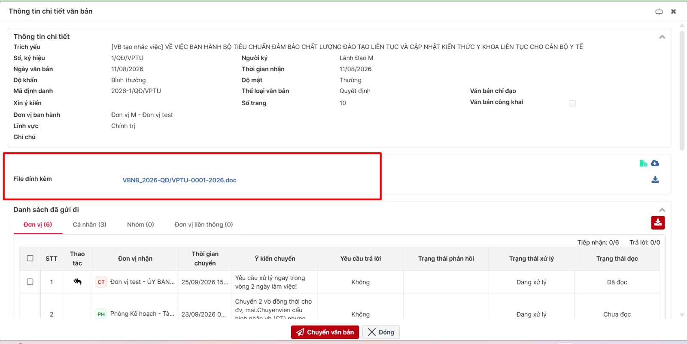
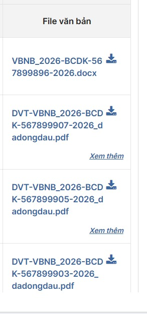

<!-- Ban rut gon de dua len Figma. Nguon: dac-ta.md v1.0 (08/10/2026).
     Sinh SVG: python "AI Analysis/ba/_tools/md_to_figma_svg.py" figma.md --theme light --out figma-light.svg
     ==cam== = thay doi so voi hien tai · !!do!! = luu y / cho chot -->
=== 1900
# YC_NV_06 - XEM FILE VĂN BẢN TRẢ LỜI NHẮC VIỆC NGAY TRÊN DANH SÁCH
## TỔNG QUAN
- Màn hình: VĂN BẢN ĐI → Theo dõi nhắc việc (mã menu 441265) → lưới "Danh sách nhắc việc"
- Mục tiêu:
  - Hiện tại muốn xem file trả lời phải bấm cột "Số VB trả lời" → mở chi tiết văn bản → tìm mục "File đính kèm"
  - ==Thêm cột "File văn bản" ở cuối bảng==: thấy file của văn bản trả lời ngay trên lưới, ==bấm tên để xem, bấm biểu tượng để tải==
- Áp dụng: mọi nhóm (Cần xử lý, Giao đi/Theo dõi), mọi tab, kết quả tìm kiếm, khi mở từ ô "Nhắc việc" ở trang chủ
- Kênh: WEB + ứng dụng di động → phần di động !!chờ chốt TBD-01!!
- Giữ nguyên: cột "Số VB trả lời" (vẫn bấm mở chi tiết văn bản), ai thấy dòng nào, trạng thái nhắc việc, popup Trả lời / Duyệt, không thêm bảng / cột

=== 900


## HIỆN TRẠNG → MONG MUỐN
- Mỗi dòng lưới = một đơn vị được nhắc của một nhắc việc
- Trả lời nhắc việc không có file riêng → "file trả lời" = file của văn bản trả lời (cột "Số VB trả lời")
- Lưới hiện 9 cột: Thao tác · Số, Ký hiệu · Trích yếu · Nội dung giao việc · Đơn vị xử lý · Trạng thái · Số VB trả lời · Hạn xử lý · Ngày tạo
- ==Mong muốn: 10 cột, thêm "File văn bản" ở cuối, sau "Ngày tạo"==
- Xem file: hiện chỉ trong popup chi tiết văn bản → ==thêm đường xem / tải ngay trên lưới==, đường cũ vẫn giữ

## XEM / TẢI FILE
- Nhấn ==tên file== → mở trình xem file của hệ thống
- Nhấn ==biểu tượng tải== → tải file gốc về máy
- Ai thấy dòng trên lưới thì ==xem / tải được file== của dòng đó
  - Kể cả người theo dõi không phải người nhận văn bản trả lời → không bị báo "không có quyền xem file"
  - !!Có cho tải hay chỉ xem: chờ chốt TBD-02!!
- Văn bản trả lời mật → !!xem được, ẩn biểu tượng tải (giả định, chờ chốt TBD-02)!!
- Văn bản trả lời bị khóa / đã hủy → !!vẫn hiện tên file, bấm thì hiện cảnh báo như bấm "Số VB trả lời" (giả định TBD-04)!!
- Lỗi xem / tải (file không còn, lỗi đọc) → dùng thông báo lỗi hiện có của chức năng xem / tải file; lưới không lỗi
- Xem / tải không đổi trạng thái nhắc việc, không đổi số trên tab và ô trang chủ

--- 900


## XEM DANH SÁCH (cột "File văn bản")
- ==Cột "File văn bản"==, cuối bảng, hiện ở mọi nhóm / tab / trang
- Mỗi dòng hiện file của **đúng văn bản đang ở cột "Số VB trả lời" cùng dòng** (mỗi dòng tối đa 1 văn bản)
  - Không lấy file của văn bản giao việc, không lấy file của dòng khác
- Trong ô:
  - ==Tên file chính== (liên kết, xuống dòng khi dài, không cắt đuôi file)
  - ==Biểu tượng tải== cạnh tên file
  - ==Liên kết "Xem thêm"== (chữ nghiêng, gạch chân) → chỉ hiện khi văn bản có **> 1 file**
- Ô để trống khi:
  - Chưa trả lời / "Xử lý lại" / trả lời không kèm văn bản
  - Văn bản trả lời không có file nào
  - !!Nhãn "File văn bản" và ô trống: theo đề xuất, chờ chốt TBD-03!!
- Văn bản không có file chính, chỉ có file đính kèm khác → !!hiện file đầu tiên như danh sách văn bản đi (giả định)!!

## XEM THÊM (văn bản có nhiều file)
- Nhấn "Xem thêm" → ==popup danh sách file==
  - Tiêu đề kèm số file, ví dụ "(4)"
  - Mỗi dòng: số thứ tự + tên file (nhấn → xem) + biểu tượng tải
  - Nút đóng (×) → quay lại lưới, giữ nguyên trang và bộ lọc
- Đổi trang lưới → popup đang mở tự đóng

--- 900
## ỨNG DỤNG DI ĐỘNG
- Danh sách nhắc việc dùng chung một chức năng lấy dữ liệu cho web và di động
- ==Dữ liệu trả về thêm danh sách file của văn bản trả lời từng dòng== (tên file, file chính / đính kèm, mã để xem / tải)
- Ứng dụng phiên bản cũ: vẫn mở danh sách bình thường, chỉ không hiện file
- !!Giao diện di động: chờ chốt TBD-01!!

## CẬP NHẬT CSDL
- Không ghi dữ liệu, chỉ đọc
- Văn bản trả lời của dòng:
  ```
  REMINDER_DOCUMENT_RELATIONS
   where OBJECT_TYPE = 2
     and OBJECT_ID = REMINDER_REPLY.REMINDER_REPLY_ID
     and DEL_FLAG = 0
  → DOCUMENT_ID
  ```
- File của văn bản: FILES_ATTACHMENT theo DOCUMENT_ID (tên file, file chính / đính kèm) → !!tên cột chưa đối chiếu DB DEV (TBD-06)!!
- Độ mật của văn bản trả lời: lấy từ DOCUMENT (cho quy tắc ẩn tải)
- ==Dữ liệu danh sách nhắc việc trả thêm danh sách file==, lấy **một lần cho cả trang**, không lấy theo từng dòng
- Không thêm bảng / cột, không cần migration

## KHÔNG THAY ĐỔI
- 9 cột cũ: nội dung, thứ tự; nút Sửa / Xóa; bấm dòng mở chi tiết nhắc việc
- Cột "Số VB trả lời": vẫn bấm mở chi tiết văn bản (kể cả cảnh báo văn bản bị khóa / hủy)
- Điều kiện lọc, sắp xếp, số dòng, số trên tab và ô "Nhắc việc" ở trang chủ
- Popup chi tiết nhắc việc, Trả lời, Duyệt / Trả lại, Hủy trả lời
- Quyền xem văn bản ở các đường khác (chi tiết văn bản, tra cứu) không bị nới
- Một trả lời chọn nhiều văn bản → lưới vẫn hiện mỗi văn bản một dòng như hiện nay (TBD-07)

!!Lưu ý không để ảnh hưởng đến luồng hiện tại!!

## CẦN CHỐT
- !!TBD-01!! Di động:
  - A. Đội di động làm cùng đợt, web + dữ liệu xong trước
  - B. Đợt này chỉ trả dữ liệu, giao diện di động làm sau
  - C. Di động chưa có màn nhắc việc → bỏ phạm vi di động
- !!TBD-02!! Tải file và văn bản mật:
  - (a) Người thấy dòng được tải: A. có (đang giả định) / B. chỉ xem
  - (b) Văn bản mật: A. xem được, ẩn tải (đang giả định) / B. như văn bản thường / C. không hiện file
- TBD-03: Nhãn "File văn bản", ô trống khi không có file (đang giả định)
- TBD-04: Văn bản bị khóa / hủy: A. hiện file, bấm thì cảnh báo (đang giả định) / B. không hiện file
- TBD-07: Trả lời kèm nhiều văn bản → lưới hiện nhiều dòng: A. giữ như hiện nay (đang giả định) / B. xử lý ở yêu cầu khác
