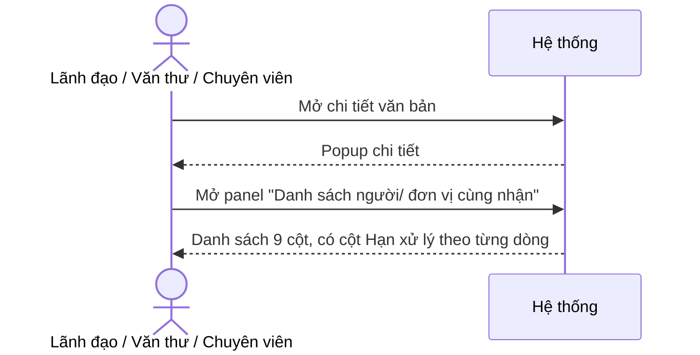
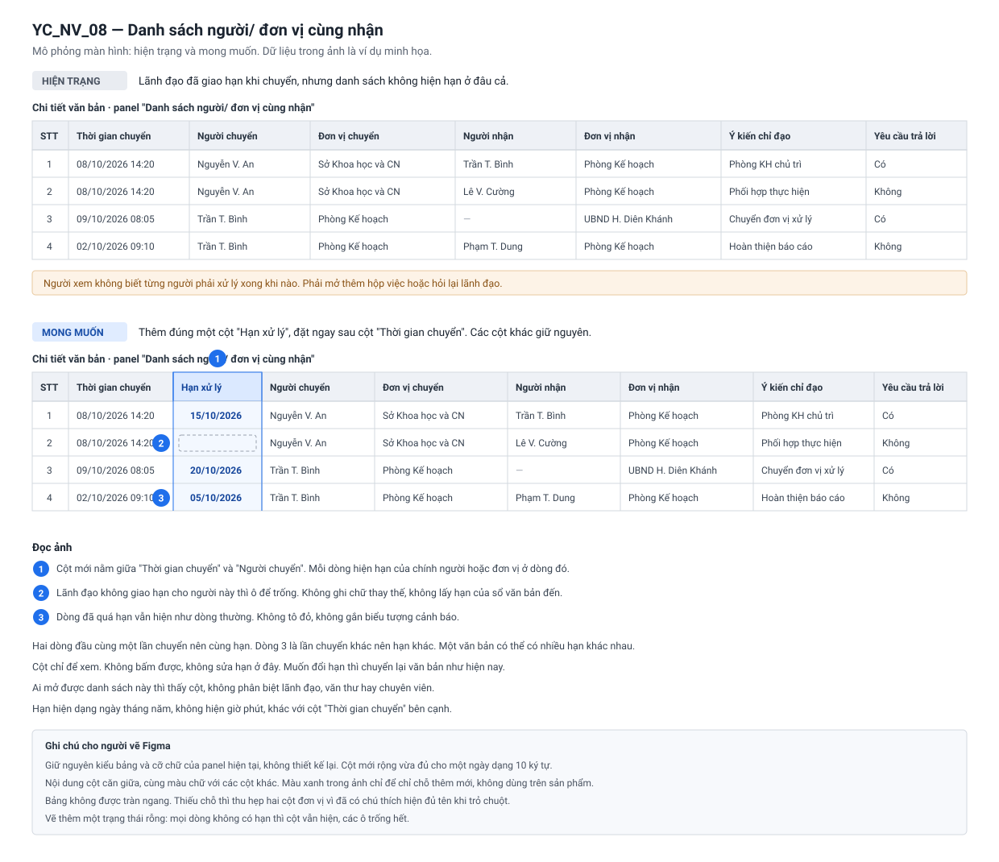

**TÀI LIỆU ĐẶC TẢ YÊU CẦU CHỨC NĂNG**

**YC_NV_08 - BỔ SUNG CỘT HẠN XỬ LÝ TẠI DANH SÁCH NGƯỜI/ĐƠN VỊ CÙNG NHẬN**

**Hệ thống Văn bản và Điều hành tỉnh Khánh Hòa**

| Thuộc tính | Giá trị |
|---|---|
| Mã yêu cầu | YC_NV_08 |
| Chức năng | Chi tiết văn bản — panel "Danh sách người/ đơn vị cùng nhận" |
| Phân hệ (knowledge) | Chính: `van-ban/quan-ly-chung` (màn chi tiết văn bản dùng chung) · Liên quan: `van-ban/den` (hạn xử lý), `van-ban/chuyen-van-ban` (hạn nhập khi chuyển) |
| Loại yêu cầu | Đổi UI/điều hướng (bổ sung một cột hiển thị) — có phần dữ liệu phải đẩy thêm qua API cho ứng dụng di động |
| Loại tài liệu | Đặc tả yêu cầu chức năng (BA/FRD) |
| Phiên bản | 1.0 |
| Trạng thái | DRAFT |
| Ngày cập nhật | 08/10/2026 |

---

# LỊCH SỬ THAY ĐỔI `[A1]` · 🟦

| Phiên bản | Ngày | Nội dung | Người thực hiện |
|---|---|---|---|
| 1.0 | 08/10/2026 | Bản đầu tiên, soạn từ phiếu ý tưởng + 9 câu trả lời vòng 1 trong `cau-hoi.md` | BA (AI soạn) |
| 1.0 | 08/10/2026 | Bổ sung ảnh mô phỏng hiện trạng / mong muốn tại mục 6.1, tài liệu kèm `thiet-ke-man-hinh.md` và `checklist-dev.md` | BA (AI soạn) |

# PHÊ DUYỆT / XÁC NHẬN `[A2]` · 🟦

| Vai trò | Họ tên | Trạng thái | Ngày | Ghi chú |
|---|---|---|---|---|
| BA phụ trách | | Chưa xác nhận | | |
| DEV phụ trách | | Chưa xác nhận | | |
| Tester phụ trách | | Chưa xác nhận | | |
| Đại diện nghiệp vụ/Khách hàng | | Chưa xác nhận | | |

# MỤC LỤC

0. Phiếu ý tưởng
1. Thông tin chung
2. Phạm vi và vai trò
3. Tổng quan yêu cầu chức năng
4. Business Rules
5. Luồng nghiệp vụ / Use Case
6. Đặc tả màn hình và trường dữ liệu
7. Xử lý ngoại lệ và trường hợp biên
8. Acceptance Criteria
9. Ma trận kiểm thử và truy vết
10. Phạm vi kỹ thuật, kiến trúc và mapping CSDL
11. Các điểm cần xác nhận (TBD)

---

# 0. PHIẾU Ý TƯỞNG · 🟦 BA

- **Muốn gì** (nguyên văn): "Thêm hạn xử lý ở Danh sách người cùng nhận (hiện tại hệ thống ko hiển thị nếu lãnh đạo giao hạn)"
- **Ai dùng:** mọi người mở được chi tiết văn bản đó — lãnh đạo, văn thư và người cùng nhận đều thấy cột như nhau
  (trả lời Q01 = C).
- **Vì sao cần:** lãnh đạo nhập hạn khi chuyển văn bản, nhưng danh sách người cùng nhận không hiện hạn đó, nên người
  xem không biết từng người phải xử lý xong khi nào.
- **Kết quả mong muốn:** panel "Danh sách người/ đơn vị cùng nhận" có thêm cột hạn xử lý, lấy đúng hạn của từng dòng
  nhận, đặt ngay sau cột thời gian chuyển.
- **Kênh:** Web **và** ứng dụng di động (trả lời Q09 = B).

**Trả lời vòng 1 của BA (nguyên văn, nguồn `cau-hoi.md`):**

| Câu | Trả lời của BA |
|---|---|
| Q01 Ai dùng | "C" |
| Q02 Đúng danh sách nào | "A" |
| Q03 "Lãnh đạo giao hạn" là hạn nào | "hạn xử lý được người chuyển chọn ở popup Chuyển văn bản" |
| Q04 Mỗi dòng hiện hạn của ai | "A mỗi lần chuyển cá nhân hay đơn vị sẽ lưu vào Doc_in_staff và doc in group mà" |
| Q05 Dòng không có hạn | "A" |
| Q06 Chiều văn bản | "Cả văn bản đến và văn bản đi(văn bản đã ban hành)" |
| Q07 Cảnh báo quá hạn | "A" |
| Q08 Vị trí cột | "ngay sau cột Thời gian chuyển" |
| Q09 Kênh | "B" |

---

# 1. THÔNG TIN CHUNG `[A3]` · 🟦 1.1–1.2 · 🟨 1.3 (AS-IS 🟩) · 🟩 1.4 · 🟨 1.5

## 1.1. Mục đích

Khi người dùng mở chi tiết một văn bản và xem panel "Danh sách người/ đơn vị cùng nhận", hệ thống hiển thị thêm cột
**Hạn xử lý** cho từng dòng, lấy đúng hạn đã lưu trên dòng nhận của người/đơn vị ở dòng đó. Yêu cầu này **chỉ bổ sung
hiển thị**, không đổi cách nhập hạn, không đổi trạng thái và không đổi quyền xem văn bản.

## 1.2. Bối cảnh nghiệp vụ

- Yêu cầu gốc (trích nguyên văn): "Thêm hạn xử lý ở Danh sách người cùng nhận (hiện tại hệ thống ko hiển thị nếu lãnh
  đạo giao hạn)"
- Chức năng nghiệp vụ chính: xem chi tiết văn bản (văn bản đến và văn bản đã ban hành) — panel "Danh sách người/ đơn vị
  cùng nhận".
- Đường vào chức năng: mọi hộp việc và màn tra cứu có mở chi tiết văn bản → popup chi tiết văn bản → panel "Danh sách
  người/ đơn vị cùng nhận" (panel thu gọn được, chỉ hiện khi danh sách có dữ liệu).
- Vấn đề hiện tại: người chuyển (thường là lãnh đạo) nhập **một hạn xử lý** trong popup Chuyển văn bản; hạn đó được ghi
  vào từng dòng nhận, nhưng panh danh sách người cùng nhận chỉ hiện ngày chuyển, người chuyển, người nhận, ý kiến chỉ
  đạo và yêu cầu trả lời — **không hiện hạn**. Người xem phải mở từng hộp việc hoặc hỏi lại mới biết hạn.
- Kết quả mong muốn (đo được): từ một lần mở chi tiết văn bản, người xem biết hạn xử lý của **tất cả** người/đơn vị
  trong danh sách, không phải mở thêm màn nào.

## 1.3. Hiện trạng (AS-IS) và thay đổi (TO-BE)

| STT | Nội dung | Hiện tại (AS-IS) | Yêu cầu (TO-BE) | Nguồn AS-IS |
|---|---|---|---|---|
| 1 | Cột của panel "Danh sách người/ đơn vị cùng nhận" | 8 cột: STT · Thời gian chuyển · Người chuyển · Đơn vị chuyển · Người nhận · Đơn vị nhận · Ý kiến chỉ đạo (kèm file) · Yêu cầu trả lời | 9 cột — thêm **Hạn xử lý** ngay sau "Thời gian chuyển" | `van-ban/quan-ly-chung` NV-06; `popupVB.zul:2204-2232` |
| 2 | Hạn xử lý của một dòng nhận | Đã được lưu khi chuyển, nhưng **không được đọc ra** panel này | Đọc và hiển thị theo từng dòng | `van-ban/chuyen-van-ban` BR-19; `van-ban/den` NV-12 BR-44 |
| 3 | Nguồn hạn hiển thị | — | Hạn do **người chuyển nhập ở popup Chuyển văn bản**, lưu trên chính dòng nhận cá nhân / dòng nhận đơn vị | Q03, Q04; `van-ban/chuyen-van-ban` BR-19 |
| 4 | Dòng không có hạn | — | Ô để **trống** | Q05 |
| 5 | Cảnh báo quá hạn / sắp đến hạn trên panel | Không có | **Vẫn không có** — chỉ hiện ngày, không tô màu | Q07 |
| 6 | Chiều văn bản | Panel dùng chung cho văn bản đến và văn bản đã ban hành | Cột hiện ở **cả hai** chiều | Q06; `van-ban/quan-ly-chung` NV-06 |
| 7 | Ứng dụng di động | API chi tiết văn bản cho di động trả về cùng danh sách này, chưa có hạn | API trả thêm hạn để di động hiển thị | Q09; `DocumentController.getDocumentDetailMobile` |

**Tóm tắt thay đổi:** thêm một cột hiển thị vào một panel và đẩy thêm một trường dữ liệu qua API. **Không** thêm bảng
hay cột cơ sở dữ liệu, **không** cần chuyển đổi dữ liệu cũ, **không** đổi trạng thái, **không** đổi cách nhập hạn,
**không** đổi quyền xem.

## 1.4. Phạm vi chức năng bị ảnh hưởng

| STT | Điểm vào chức năng | Màn hình/Action | Trong phạm vi |
|---|---|---|---|
| 1 | Mọi hộp việc văn bản đến (Chờ tiếp nhận, Chờ xử lý, Đã xử lý, Nhận để biết, Đề nghị trả lại, Đã trả lại, Tất cả) → mở chi tiết | Panel "Danh sách người/ đơn vị cùng nhận" | Có |
| 2 | Hộp văn bản đã ban hành / Văn bản đi → mở chi tiết | Panel "Danh sách người/ đơn vị cùng nhận" | Có |
| 3 | Tra cứu văn bản, Theo dõi văn bản đến đơn vị, Theo dõi văn bản đi đơn vị → mở chi tiết | Panel "Danh sách người/ đơn vị cùng nhận" | Có — cùng một panel dùng chung |
| 4 | Ứng dụng di động — chi tiết văn bản | Mục tương đương "người cùng nhận" | Có (phần dữ liệu); giao diện di động — xem TBD-01 |
| 5 | Panel "Danh sách đã gửi đi" trên cùng popup chi tiết | Không đổi | Ngoài phạm vi (Q02 = A); cần regression |
| 6 | Popup Chuyển văn bản (nơi nhập hạn), hộp việc, thống kê tiến độ, cảnh báo sắp đến hạn / quá hạn | Không đổi | Ngoài phạm vi; cần regression |
| 7 | Màn "Thêm file đính kèm" (dùng lớp dữ liệu song song cùng danh sách) | Không đổi hành vi | Ngoài phạm vi; cần regression — xem 10.6 |

**Kênh áp dụng:** Web **và** Mobile (Q09 = B). Phạm vi Web là trọn vẹn trong yêu cầu này; phần Mobile gồm dữ liệu API
(trong phạm vi) và giao diện ứng dụng di động (phụ thuộc TBD-01).

## 1.5. Thuật ngữ

| Thuật ngữ | Định nghĩa sử dụng trong tài liệu |
|---|---|
| Dòng nhận | Một bản ghi "một người hoặc một đơn vị được nhận văn bản này". Mỗi dòng nhận có trạng thái và hạn xử lý riêng (`van-ban/den` BR-01). |
| Danh sách người cùng nhận | Panel "Danh sách người/ đơn vị cùng nhận" trên popup chi tiết văn bản. Mỗi dòng của panel ứng với một dòng nhận sinh ra từ một lần chuyển. |
| Hạn xử lý của dòng | Hạn lưu trên chính dòng nhận đó, do người chuyển nhập ở popup Chuyển văn bản tại lần chuyển sinh ra dòng đó. |
| Dòng cấp trên | Dòng của lần chuyển ở cấp trước trong chuỗi chuyển, panel cũng hiện kèm để thấy đường đi của văn bản (cờ "không phải nhận trực tiếp"). |

---

# 2. PHẠM VI VÀ VAI TRÒ `[A4]` · 🟨

## 2.1. Vai trò

| Vai trò nghiệp vụ | Mã vai trò hệ thống | Được làm gì trong YC_NV_08 | Ghi chú |
|---|---|---|---|
| Lãnh đạo đơn vị | `LDDV` | Xem cột Hạn xử lý trên panel | Người dùng chính (Q01 = C) |
| Thủ trưởng đơn vị | `TTDV` | Xem cột Hạn xử lý trên panel | Người dùng chính |
| Văn thư | `VT` | Xem cột Hạn xử lý trên panel, kể cả trên dòng nhận của đơn vị mình làm văn thư | Người dùng chính |
| Chuyên viên | `NV` | Xem cột Hạn xử lý trên panel | Người cùng nhận (Q01 = C) |
| Trợ lý lãnh đạo | `TL` | Xem cột Hạn xử lý trên panel như vai trò mình đang xem | Không có quy tắc riêng |

**Lưu ý phạm vi role:** cột mới **không thêm điều kiện phân quyền nào**. Ai đang xem được panel thì xem được cột; ai
không xem được panel thì không bị ảnh hưởng. Yêu cầu này **không mở rộng và không thu hẹp** quyền xem văn bản
(`van-ban/quan-ly-chung` NV-06).

## 2.2. Tiền điều kiện chung

- Người dùng đã đăng nhập và có quyền xem chi tiết văn bản đó theo phân quyền hiện hành.
- Văn bản đã được chuyển cho ít nhất một người hoặc một đơn vị, tức panel "Danh sách người/ đơn vị cùng nhận" có dữ
  liệu (panel chỉ hiện khi danh sách khác rỗng).
- Không cần bật thêm tham số hệ thống nào.

---

# 3. TỔNG QUAN YÊU CẦU CHỨC NĂNG `[A5]` · 🟦 danh sách FR · 🟩 3.1 mapping · 🟨 3.2–3.3

| ID | Trigger/Action của người dùng | Xử lý mong muốn | BR liên quan |
|---|---|---|---|
| FR-01 | Mở chi tiết một văn bản đến và mở panel "Danh sách người/ đơn vị cùng nhận" | Hệ thống hiển thị cột **Hạn xử lý** ngay sau cột "Thời gian chuyển", mỗi dòng hiện hạn của chính dòng nhận đó | BR-01, BR-02, BR-03, BR-06 |
| FR-02 | Mở chi tiết một văn bản **đã ban hành** và mở cùng panel | Hệ thống hiển thị cột Hạn xử lý như FR-01; dòng không có hạn thì để trống | BR-01, BR-04, BR-05 |
| FR-03 | Dòng nhận không có hạn xử lý | Hệ thống để **trống** ô Hạn xử lý, không hiện chữ thay thế, không lấy hạn của văn bản hay của sổ đến | BR-05 |
| FR-04 | Mở chi tiết văn bản trên **ứng dụng di động** | API chi tiết văn bản trả thêm hạn xử lý của từng dòng để ứng dụng hiển thị | BR-07 |

## 3.1. Mapping dữ liệu nguồn → đích

| Nguồn (đối tượng · nhóm dữ liệu) | Đích (đối tượng · nhóm dữ liệu) | Quy tắc chuyển đổi | Điều kiện áp dụng | Rule |
|---|---|---|---|---|
| Dòng nhận cá nhân · hạn xử lý | Panel người cùng nhận · cột Hạn xử lý | REFERENCE — đọc để hiển thị, định dạng `dd/MM/yyyy` | Dòng của panel là dòng nhận cá nhân | BR-02, BR-06 |
| Dòng nhận đơn vị · hạn xử lý | Panel người cùng nhận · cột Hạn xử lý | REFERENCE — đọc để hiển thị, định dạng `dd/MM/yyyy` | Dòng của panel là dòng nhận đơn vị | BR-03, BR-06 |

## 3.2. Trạng thái và chuyển trạng thái

Không thay đổi trạng thái. Giữ nguyên trạng thái của dòng nhận cá nhân và dòng nhận đơn vị (giá trị số hiện hành:
`null` chờ tiếp nhận · 3 chờ xử lý · 4 đã xử lý · 5 đã hoàn thành · 7 bị trả lại — `van-ban/den` NV-05). Yêu cầu này
chỉ đọc dữ liệu để hiển thị.

**Hành động bị cấm:** không cho sửa hạn xử lý từ panel này. Cột Hạn xử lý là **chỉ đọc**; hệ thống hiện không có chức
năng gia hạn (`van-ban/den` BR-46), nên cột này không được biến thành ô nhập.

## 3.3. Yêu cầu phi chức năng (NFR)

| Mã | Nhóm | Yêu cầu (đo được) |
|---|---|---|
| NFR-01 | Hiệu năng | Thêm cột **không được thêm truy vấn mới**: hạn lấy trong cùng câu truy vấn đang dựng danh sách (cùng bảng, không thêm phép nối). Thời gian mở panel với 50 dòng không tăng quá 10% so với trước khi sửa. |
| NFR-02 | Bảo mật / Văn bản mật | Hạn xử lý **không phải** dữ liệu mật và không nằm trong phần nội dung bị mã hóa của panel. Văn bản mật vẫn hiện hạn bình thường cho người xem được panel; không thêm và không bỏ bất kỳ phép kiểm quyền nào. |
| NFR-03 | Nhật ký (audit log) | Không áp dụng — lý do: yêu cầu chỉ đọc dữ liệu để hiển thị, không sinh thao tác cần ghi nhật ký. |
| NFR-04 | Thông báo / SMS | Không áp dụng — lý do: không phát sinh thông báo hay tin nhắn. |
| NFR-05 | Tương thích | Trình duyệt theo chuẩn hiện hành của hệ thống. Ứng dụng di động: phiên bản tối thiểu để hiện cột — xem TBD-01. Di động phiên bản cũ nhận thêm một trường trong phản hồi API thì **vẫn chạy bình thường**, chỉ không hiện cột. |

---

# 4. BUSINESS RULES `[A6]` · 🟨

| Rule ID | Tên rule | Mô tả | Nguồn |
|---|---|---|---|
| BR-01 | Điểm hiển thị | Panel "Danh sách người/ đơn vị cùng nhận" trên popup chi tiết văn bản có thêm **một cột** tên "Hạn xử lý", đặt ngay **sau cột "Thời gian chuyển"** và trước cột "Người chuyển". Mọi cột khác giữ nguyên thứ tự và nội dung. | Q02 = A, Q08 |
| BR-02 | Hạn của dòng nhận cá nhân | Dòng của panel ứng với một người nhận thì cột Hạn xử lý hiện **hạn lưu trên chính dòng nhận cá nhân đó**, không lấy hạn của dòng khác, không lấy hạn của văn bản hay của sổ đến. | Q04 = A |
| BR-03 | Hạn của dòng nhận đơn vị | Dòng của panel ứng với một đơn vị nhận thì cột Hạn xử lý hiện **hạn lưu trên chính dòng nhận đơn vị đó**. | Q04 = A |
| BR-04 | Nhiều lần chuyển, nhiều hạn khác nhau | Một văn bản được chuyển nhiều lần với hạn khác nhau thì mỗi dòng hiện hạn của lần chuyển sinh ra dòng đó. Hệ thống **không** đồng nhất các dòng về một hạn và **không** hiện hạn mới nhất cho mọi dòng. | Q04 = A; `van-ban/chuyen-van-ban` BR-19 |
| BR-05 | Dòng không có hạn | Dòng nhận không có hạn xử lý (người chuyển bỏ trống) thì ô Hạn xử lý **để trống**: không hiện chữ "Không có hạn", không hiện dấu gạch, không lấy hạn của sổ đến thay thế. | Q05 = A |
| BR-06 | Định dạng hiển thị | Hạn hiện dạng **`dd/MM/yyyy`** (ví dụ `15/10/2026`), không hiện giờ phút. Đây là định dạng hạn xử lý hệ thống đang dùng ở các danh sách khác. | `van-ban/chuyen-van-ban` BR-19; mẫu truy vấn hiện có (10.2) |
| BR-07 | Chiều văn bản áp dụng | Cột Hạn xử lý hiện ở chi tiết **văn bản đến** và chi tiết **văn bản đã ban hành**. Với văn bản đã ban hành, phần lớn dòng không có hạn nên ô để trống theo BR-05; cột **vẫn hiện** chứ không ẩn. | Q06 |
| BR-08 | Dòng cấp trên trong chuỗi chuyển | Panel còn hiện các dòng của cấp chuyển trước (dòng "không phải nhận trực tiếp"). Các dòng này áp dụng cùng quy tắc BR-02, BR-03, BR-05 — hiện hạn của chính dòng đó, không có hạn thì để trống. | `van-ban/quan-ly-chung` NV-06; mã nguồn dựng danh sách (10.2) |
| BR-09 | Chỉ đọc | Cột Hạn xử lý là **chỉ đọc** trên panel: không bấm được, không sửa được, không có chức năng gia hạn tại đây. | `van-ban/den` BR-46 |
| BR-10 | Không đổi quyền và không đổi cảnh báo | Cột mới hiện cho **mọi** người đang xem được panel, không thêm điều kiện theo vai trò. Panel **không** tô màu, **không** gắn biểu tượng cảnh báo cho dòng quá hạn hay sắp đến hạn. | Q01 = C, Q07 = A |
| BR-11 | Ứng dụng di động | Phản hồi của chức năng xem chi tiết văn bản cho ứng dụng di động trả thêm hạn xử lý của từng dòng trong danh sách người cùng nhận, cùng định dạng `dd/MM/yyyy` và cùng quy tắc BR-02 → BR-05. Việc hiện cột trên giao diện di động theo TBD-01. | Q09 = B |

---

# 5. LUỒNG NGHIỆP VỤ / USE CASE `[A7]` · 🟨

## 5.1. UC-01 - Xem hạn xử lý của những người cùng nhận văn bản đến

| Thuộc tính | Nội dung |
|---|---|
| Mục tiêu | Người xem biết từng người/đơn vị cùng nhận văn bản phải xử lý xong khi nào |
| Actor | Lãnh đạo (`LDDV` / `TTDV`), Văn thư (`VT`), Chuyên viên (`NV`), Trợ lý (`TL`) |
| Tiền điều kiện | Văn bản đến đã được chuyển cho ít nhất một người/đơn vị; người xem có quyền xem chi tiết văn bản |
| Trigger | Người dùng mở chi tiết văn bản và mở panel "Danh sách người/ đơn vị cùng nhận" |
| Hậu điều kiện | Không đổi dữ liệu. Người dùng thấy hạn của từng dòng |
| Rule liên quan | BR-01, BR-02, BR-03, BR-04, BR-05, BR-06, BR-08, BR-09, BR-10 |
| Ngoại lệ liên quan | EC-01, EC-02, EC-03, EC-05 |

**Luồng chính**

1. Người dùng mở một văn bản đến từ hộp việc hoặc từ màn tra cứu.
2. Hệ thống mở popup chi tiết văn bản.
3. Người dùng mở panel "Danh sách người/ đơn vị cùng nhận".
4. Hệ thống hiển thị danh sách với 9 cột, trong đó cột **Hạn xử lý** nằm ngay sau "Thời gian chuyển".
5. Mỗi dòng hiện hạn của chính dòng nhận đó theo định dạng `dd/MM/yyyy`; dòng không có hạn để trống.

**Luồng thay thế**

- 4a. Danh sách có nhiều hơn một trang thì cột Hạn xử lý hiện đúng như vậy ở mọi trang, quay lại bước 5.
- 4b. Văn bản là văn bản mật và người xem đủ quyền xem phần nội dung mã hóa thì cột Hạn xử lý vẫn hiện bình thường
  (hạn không thuộc phần mã hóa), quay lại bước 5.

**Luồng ngoại lệ**

- 3a. Panel không có dòng nào → panel không hiện (hành vi hiện tại, xử lý theo EC-01).

## 5.2. UC-02 - Xem hạn xử lý trên chi tiết văn bản đã ban hành

| Thuộc tính | Nội dung |
|---|---|
| Mục tiêu | Giữ hành vi nhất quán khi mở chi tiết văn bản đã ban hành |
| Actor | Văn thư (`VT`), Lãnh đạo (`LDDV` / `TTDV`), Chuyên viên (`NV`) |
| Tiền điều kiện | Văn bản đã được cấp số và ban hành, panel người cùng nhận có dữ liệu |
| Trigger | Người dùng mở chi tiết văn bản đã ban hành và mở panel |
| Hậu điều kiện | Không đổi dữ liệu |
| Rule liên quan | BR-01, BR-05, BR-06, BR-07 |
| Ngoại lệ liên quan | EC-02 |

**Luồng chính**

1. Người dùng mở một văn bản đã ban hành.
2. Người dùng mở panel "Danh sách người/ đơn vị cùng nhận".
3. Hệ thống hiển thị cột Hạn xử lý; dòng nào không có hạn thì để trống.

**Luồng thay thế**

- 3a. Mọi dòng đều không có hạn → cột vẫn hiện, toàn bộ ô trống (BR-07), xử lý theo EC-02.

## 5.3. UC-03 - Xem hạn xử lý trên ứng dụng di động

| Thuộc tính | Nội dung |
|---|---|
| Mục tiêu | Người dùng di động thấy cùng thông tin như trên web |
| Actor | Mọi vai trò dùng ứng dụng di động |
| Tiền điều kiện | Ứng dụng di động ở phiên bản có hiện cột (TBD-01) |
| Trigger | Người dùng mở chi tiết văn bản trên ứng dụng di động |
| Hậu điều kiện | Không đổi dữ liệu |
| Rule liên quan | BR-11, BR-02 → BR-06 |
| Ngoại lệ liên quan | EC-04 |

**Luồng chính**

1. Người dùng mở chi tiết văn bản trên ứng dụng di động.
2. Hệ thống trả về chi tiết văn bản, trong đó mỗi dòng của danh sách người cùng nhận có thêm hạn xử lý.
3. Ứng dụng hiển thị hạn theo định dạng `dd/MM/yyyy`; dòng không có hạn để trống.

**Luồng ngoại lệ**

- 3a. Ứng dụng ở phiên bản cũ chưa hiện cột → vẫn mở chi tiết bình thường, chỉ không thấy hạn (EC-04).

---

# 6. ĐẶC TẢ MÀN HÌNH VÀ TRƯỜNG DỮ LIỆU `[A8]` · 🟨

## 6.1. Màn hình Chi tiết văn bản — panel "Danh sách người/ đơn vị cùng nhận"

*Hình 1. Panel "Danh sách người/ đơn vị cùng nhận" — khung trên là hiện trạng tám cột, khung dưới là mong muốn chín cột
với cột Hạn xử lý ở vị trí thứ ba. Dữ liệu trong hình là ví dụ minh họa.*

Mô tả thiết kế bằng lời nghiệp vụ, kèm quy cách cho người vẽ Figma và ba khung cần vẽ:
[thiet-ke-man-hinh.md](thiet-ke-man-hinh.md).
Checklist test giao diện, 70 case bấm tay, dùng cho cả DEV tự kiểm và Tester:
[checklist-test-giao-dien.md](checklist-test-giao-dien.md).
Ghi chú kỹ thuật kèm theo cho DEV: [checklist-dev.md](checklist-dev.md).
Dữ liệu nằm ở đâu trong cơ sở dữ liệu, kể bằng lời nghiệp vụ: [du-lieu-trong-db.md](du-lieu-trong-db.md).

**Thứ tự cột sau khi sửa** (cột mới in đậm):

| # | Tiêu đề cột | Thay đổi |
|---|---|---|
| 1 | STT | Giữ nguyên baseline |
| 2 | Thời gian chuyển | Giữ nguyên baseline |
| 3 | **Hạn xử lý** | **Mới** |
| 4 | Người chuyển | Giữ nguyên baseline |
| 5 | Đơn vị chuyển | Giữ nguyên baseline |
| 6 | Người nhận | Giữ nguyên baseline |
| 7 | Đơn vị nhận | Giữ nguyên baseline |
| 8 | Ý kiến chỉ đạo (kèm file đính kèm) | Giữ nguyên baseline |
| 9 | Yêu cầu trả lời | Giữ nguyên baseline |

**Đặc tả cột mới và các cột liền kề:**

| ID | Trường/Control | Loại | Bắt buộc | Độ dài / Giới hạn | Mặc định | Quy tắc hiển thị / Validate | Thay đổi trong YC_NV_08 |
|---|---|---|---|---|---|---|---|
| UI-01 | Hạn xử lý | Nhãn chỉ đọc trong ô danh sách | Không | 10 ký tự (`dd/MM/yyyy`) | Trống | Hiện hạn của chính dòng nhận (BR-02, BR-03); không có hạn → để trống (BR-05); căn giữa; không tô màu, không biểu tượng (BR-10); không bấm được, không sửa được (BR-09) | **Mới** |
| UI-02 | Thời gian chuyển | Nhãn chỉ đọc | Không | — | — | Giữ nguyên baseline (vẫn là cột liền trước cột mới) | Giữ nguyên |
| UI-03 | Người chuyển | Nhãn chỉ đọc | Không | — | — | Giữ nguyên baseline (bị đẩy sang phải một cột) | Giữ nguyên |
| UI-04 | Phân trang của panel | Phân trang | — | 5 dòng/trang | Trang 1 | Giữ nguyên baseline; cột mới hiện ở mọi trang | Giữ nguyên |

## 6.2. Thông báo người dùng

Không áp dụng — lý do: yêu cầu chỉ bổ sung một cột hiển thị chỉ đọc, không có thao tác nào sinh thông báo, cảnh báo hay
popup xác nhận. Trường hợp danh sách rỗng dùng đúng thông báo rỗng hiện hành của panel (xem EC-01).

## 6.3. Điều hướng

Không áp dụng — lý do: không đổi đường vào, không đổi menu, không đổi tab hay bộ lọc mặc định.

## 6.4. Quy tắc hiển thị

- UI-01 hiện trên **mọi** đường mở popup chi tiết văn bản (hộp việc, tra cứu, theo dõi đơn vị, hồ sơ), vì panel là
  thành phần dùng chung (BR-01, BR-07).
- UI-01 **không** phụ thuộc vai trò người xem (BR-10).
- Bề rộng cột đặt vừa đủ cho `dd/MM/yyyy`; việc thêm cột không được làm bảng tràn ngang trên màn hình thường dùng. Nếu
  phải thu hẹp cột khác thì thu hẹp cột "Đơn vị chuyển" / "Đơn vị nhận" (đã có tooltip hiện đủ nội dung) — không thu
  hẹp cột "Ý kiến chỉ đạo".
- Panel vẫn chỉ hiện khi danh sách có dữ liệu, như hiện tại.

---

# 7. XỬ LÝ NGOẠI LỆ VÀ TRƯỜNG HỢP BIÊN `[A9]` · 🟨

| ID | Tình huống | Kết quả mong đợi | UC | Trạng thái |
|---|---|---|---|---|
| EC-01 | Panel không có dòng nào | Panel không hiện (giữ nguyên hành vi hiện tại); không có yêu cầu mới | UC-01 | Đã chốt |
| EC-02 | Mọi dòng trong danh sách đều không có hạn | Cột Hạn xử lý **vẫn hiện**, toàn bộ ô trống; không ẩn cột (BR-07) | UC-01, UC-02 | Đã chốt |
| EC-03 | Một văn bản có 3 dòng với 3 hạn khác nhau, trong đó 1 dòng không hạn | Hiện đúng 2 hạn khác nhau ở 2 dòng tương ứng, dòng thứ ba để trống (BR-04, BR-05) | UC-01 | Đã chốt |
| EC-04 | Ứng dụng di động phiên bản cũ nhận phản hồi có trường mới | Ứng dụng mở chi tiết bình thường, không lỗi, chỉ không hiện cột (NFR-05) | UC-03 | Đã chốt |
| EC-05 | Văn bản mật | Cột Hạn xử lý hiện bình thường cho người xem được panel; không thêm, không bỏ phép kiểm quyền nào (NFR-02) | UC-01 | Đã chốt |
| EC-06 | Dòng nhận đã bị thu hồi hoặc đã hoàn thành / bị trả lại | Danh sách lọc dòng theo đúng quy tắc hiện hành của panel; cột mới **không** làm dòng nào xuất hiện thêm hay mất đi | UC-01 | Đã chốt |
| EC-07 | Hạn lưu trong dữ liệu có kèm giờ phút, hoặc là ngày trong quá khứ | Hiện đúng phần ngày theo `dd/MM/yyyy`, không tô màu dù đã quá hạn (BR-06, BR-10) | UC-01 | Đã chốt |
| EC-08 | Danh sách nhiều trang (trên 5 dòng) | Cột Hạn xử lý hiện ở mọi trang, giá trị đúng theo từng dòng | UC-01 | Đã chốt |

---

# 8. ACCEPTANCE CRITERIA `[A10]` · 🟨

| AC ID | BR | Given | When | Then |
|---|---|---|---|---|
| AC-01 | BR-01 | Một văn bản đến đã chuyển cho 2 người, người xem là lãnh đạo đơn vị (`LDDV`) | Mở chi tiết văn bản và mở panel "Danh sách người/ đơn vị cùng nhận" | Panel có 9 cột; cột thứ ba tên "Hạn xử lý", nằm ngay sau "Thời gian chuyển" và trước "Người chuyển" |
| AC-02 | BR-02 | Lãnh đạo chuyển văn bản cho chuyên viên A với hạn 15/10/2026 | Mở chi tiết văn bản, xem dòng của chuyên viên A | Cột Hạn xử lý của dòng đó hiện `15/10/2026` |
| AC-03 | BR-03 | Văn thư chuyển văn bản cho đơn vị X với hạn 20/10/2026 | Mở chi tiết văn bản, xem dòng của đơn vị X | Cột Hạn xử lý của dòng đó hiện `20/10/2026` |
| AC-04 | BR-04 | Văn bản được chuyển hai lần: lần 1 cho A hạn 10/10/2026, lần 2 cho B hạn 25/10/2026 | Mở chi tiết văn bản và xem panel | Dòng của A hiện `10/10/2026`, dòng của B hiện `25/10/2026`; không có dòng nào hiện hạn của dòng kia |
| AC-05 | BR-05 | Văn bản được chuyển cho chuyên viên C mà người chuyển **không nhập** hạn | Mở chi tiết văn bản, xem dòng của C | Ô Hạn xử lý của dòng C **trống**; không hiện chữ "Không có hạn", không hiện dấu gạch, không hiện hạn của sổ đến |
| AC-06 | BR-06 | Một dòng nhận có hạn là ngày 05/01/2027 | Xem cột Hạn xử lý của dòng đó | Hiện đúng `05/01/2027`, không hiện giờ phút |
| AC-07 | BR-07 | Một văn bản **đã ban hành**, panel người cùng nhận có 3 dòng và không dòng nào có hạn | Mở chi tiết văn bản đã ban hành và mở panel | Cột Hạn xử lý vẫn hiện; cả 3 ô đều trống; cột không bị ẩn |
| AC-08 | BR-08 | Văn bản đi qua hai cấp chuyển: lãnh đạo → trưởng phòng (hạn 12/10/2026) → chuyên viên (hạn 18/10/2026); người xem là chuyên viên | Mở chi tiết văn bản và xem panel | Dòng cấp trên hiện `12/10/2026`, dòng của chuyên viên hiện `18/10/2026` |
| AC-09 | BR-09 | Panel đang hiện cột Hạn xử lý | Bấm vào ô Hạn xử lý của một dòng | Không có gì xảy ra: không mở popup, không vào chế độ sửa, không có chức năng gia hạn |
| AC-10 | BR-10 | Cùng một văn bản, hai người xem: một là văn thư (`VT`), một là chuyên viên (`NV`) nhận để biết | Lần lượt mở chi tiết văn bản bằng hai tài khoản | Cả hai đều thấy cột Hạn xử lý với cùng giá trị trên các dòng mà họ xem được; không ai thiếu cột |
| AC-11 | BR-10 | Một dòng nhận có hạn 01/10/2026 (đã quá hạn so với hôm nay) và chưa hoàn thành | Xem dòng đó trên panel | Hiện `01/10/2026` bằng định dạng và màu chữ như mọi dòng khác; không tô đỏ, không biểu tượng cảnh báo |
| AC-12 | BR-11 | Ứng dụng di động phiên bản có hỗ trợ cột mới, văn bản có dòng nhận hạn 15/10/2026 | Mở chi tiết văn bản trên ứng dụng di động | Mục người cùng nhận hiện hạn `15/10/2026` cho dòng đó *(giả định — chờ TBD-01 về phiên bản và giao diện di động)* |
| AC-13 | BR-01, NFR-01 | Một văn bản có 50 dòng trong panel | Mở panel và chuyển qua các trang | Danh sách hiện đủ, cột Hạn xử lý đúng ở mọi trang; thời gian mở panel không tăng quá 10% so với bản hiện tại |

---

# 9. MA TRẬN KIỂM THỬ VÀ TRUY VẾT `[A11]` · 🟩

## 9.1. Ma trận role kiểm thử

| Vai trò nghiệp vụ | Mã vai trò hệ thống | Mục tiêu kiểm thử |
|---|---|---|
| Lãnh đạo đơn vị | `LDDV` | Functional đầy đủ — người chuyển và người xem hạn |
| Thủ trưởng đơn vị | `TTDV` | Functional — thấy cột như lãnh đạo |
| Văn thư | `VT` | Functional — dòng nhận của đơn vị; regression quyền xem văn bản đơn vị |
| Chuyên viên | `NV` | Functional — người cùng nhận thấy cột; regression phân quyền (không mở rộng quyền xem) |
| Trợ lý lãnh đạo | `TL` | Regression — xem thay lãnh đạo không bị lệch dữ liệu |

## 9.2. Traceability Requirement → Rule → AC

| FR | BR | AC | EC | Ghi chú |
|---|---|---|---|---|
| FR-01 | BR-01, BR-02, BR-03, BR-06, BR-08, BR-09, BR-10 | AC-01, AC-02, AC-03, AC-06, AC-08, AC-09, AC-10, AC-11 | EC-01, EC-03, EC-05, EC-06, EC-07, EC-08 | Luồng chính trên văn bản đến |
| FR-01 | BR-04 | AC-04 | EC-03 | Nhiều lần chuyển, nhiều hạn |
| FR-02 | BR-01, BR-05, BR-07 | AC-07 | EC-02 | Văn bản đã ban hành |
| FR-03 | BR-05 | AC-05 | EC-02, EC-03 | Dòng không có hạn |
| FR-04 | BR-11 | AC-12 | EC-04 | Ứng dụng di động — phụ thuộc TBD-01 |
| FR-01 | NFR-01 | AC-13 | EC-08 | Hiệu năng và phân trang |

## 9.3. Regression tối thiểu

- Panel "Danh sách đã gửi đi" trên cùng popup chi tiết **không đổi** cột, thứ tự cột và nội dung (Q02 = A).
- Popup Chuyển văn bản: nhập hạn, bỏ trống hạn, chuyển nhiều người, chuyển cho đơn vị và nhóm vẫn hoạt động như hiện
  tại; hạn vẫn được lưu đúng vào từng dòng nhận.
- Hộp việc *Sắp đến hạn*, *Quá hạn*, ô trang chủ và thống kê *Theo dõi văn bản đến đơn vị* giữ nguyên số liệu và cách
  tính (không đụng vào công thức của `van-ban/den` NV-12, BR-45).
- Quyền xem văn bản không mở rộng: người không xem được văn bản vẫn không xem được; người không thấy panel vẫn không
  thấy panel.
- Văn bản mật: phần nội dung ý kiến vẫn mã hóa / giải mã đúng như trước; chỉ thêm cột hạn.
- Ứng dụng di động phiên bản hiện hành mở chi tiết văn bản không lỗi khi phản hồi có thêm trường mới.
- Màn "Thêm file đính kèm" (dùng lớp dữ liệu song song của cùng danh sách) mở bình thường, không lỗi thiếu trường.

---

# 10. PHẠM VI KỸ THUẬT, KIẾN TRÚC VÀ MAPPING CSDL `[A12]` · 🟩

## 10.1. Quy tắc nguồn sự thật

| Thứ tự | Nguồn | Dùng để xác định | Khi mâu thuẫn |
|---|---|---|---|
| 1 | Tài liệu này | WHAT/WHY, phạm vi, BR, AC | Không sửa BR bằng suy luận kỹ thuật |
| 2 | `knowledge/van-ban/quan-ly-chung`, `van-ban/den`, `van-ban/chuyen-van-ban` | Hành vi cũ, mapping đã kiểm chứng | Dùng làm hành vi cũ + regression |
| 3 | Mã nguồn `kha_develop` | Luồng dữ liệu từ bảng tới màn | Trace đầu-cuối |
| 4 | DB DEV (chỉ SELECT) | Tên bảng / cột thật | Chưa kiểm → `TBD_NOT_CONFIRMED` |

**Quy ước riêng của yêu cầu này:** danh sách người cùng nhận được dựng từ **chính các bảng dòng nhận** (không có bảng
riêng cho panel), nên hạn xử lý nằm sẵn trong phạm vi truy vấn hiện tại.

## 10.2. Call-chain

| Layer | Thành phần | Vai trò với YC_NV_08 | Độ tin cậy |
|---|---|---|---|
| UI/ZK | `web-spring/.../reportSendReceiveDoc/popupVB.zul:2204-2232` — panel "Danh sách người/ đơn vị cùng nhận" | Thêm một `auxheader` + một `listheader` + một `listcell` cho cột Hạn xử lý, chèn sau cột "Thời gian chuyển" | VERIFIED_CODE |
| Nhãn đa ngữ | `common_voffice_vi.properties` — đã có khóa nhãn "Hạn xử lý" (`voffice.goverment.document.label.deadline`, `voffice.receiveDoccument.label.deadline`) | Dùng lại khóa có sẵn hoặc thêm khóa mới cho panel; không cần dịch mới tiếng Việt | VERIFIED_CODE |
| ViewModel | `DocumentViewDetailVM.retrieveTransmissionInfo` (:2902-2975) — dựng `listDocComments` từ `DocumentEntity.getListDocComment()` | Không cần logic mới, chỉ cần trường hạn có trong phần tử danh sách | VERIFIED_CODE |
| DTO (web) | `web-spring/.../service/entity/DocCommentEntity.java` và `web-spring/.../util/bean/DocCommentResponseDTO.java` | **Thêm một trường** hạn xử lý (dạng chuỗi `dd/MM/yyyy`) | VERIFIED_CODE |
| Service/API | `backend2.0/.../voffice/controler/DocumentController.getDocumentDetail` (:4220) và `getDocumentDetailMobile` (:4214-4217) | Cùng một hàm dựng kết quả cho web và di động → thêm trường là cả hai kênh đều có | VERIFIED_CODE |
| DTO (BE) | `backend2.0/.../office/dto/response/DocCommentResponseDTO.java` | **Thêm một trường** hạn xử lý | VERIFIED_CODE |
| Service | `backend2.0/.../office/services/impl/DocCommentServiceImpl.getDocumentComments` (:58, :125) | Không cần logic mới | VERIFIED_CODE |
| Repository/SQL | `backend2.0/.../office/repositories/impl/DocumentRepositoryImpl` — `getDocComments` (:895, :962) **3 nhánh mỗi hàm** (cá nhân · đơn vị · văn bản ban hành) và `getParentDocComments` (:1040) | **Thêm một cột select** `to_char(<bảng>.deadline_date, 'dd/MM/yyyy')` vào **tất cả** các nhánh; truy vấn đã lấy trực tiếp từ bảng dòng nhận nên **không cần thêm phép nối** | VERIFIED_CODE |
| DB | `DOCUMENT_IN_STAFF.DEADLINE_DATE`, `DOCUMENT_IN_GROUP.DEADLINE_DATE` | Nguồn dữ liệu, **không đổi schema** | VERIFIED_CODE (tên cột xuất hiện trong truy vấn hiện có cùng file, ví dụ :472, :494, :536, :598, :691) · cần xác nhận lại trên DB DEV ở vòng kiểm → PARTIAL |
| Mobile app | Giao diện ứng dụng di động | Hiện cột — mã nguồn ứng dụng **không nằm trong repo này** | TBD_NOT_CONFIRMED (TBD-01) |

## 10.3. Bảng/cột liên quan

| Bảng | Mục đích | Cột chính liên quan | Thay đổi | Độ tin cậy |
|---|---|---|---|---|
| `DOCUMENT_IN_STAFF` | Dòng nhận của một cá nhân | `DOCUMENT_IN_STAFFID`, `DEADLINE_DATE`, `RECEIVE_DATE`, `STATUS`, `SEND_TYPE` | **Không đổi** — chỉ đọc thêm `DEADLINE_DATE` | PARTIAL (chờ xác nhận DB DEV) |
| `DOCUMENT_IN_GROUP` | Dòng nhận của một đơn vị | `DOCUMENT_IN_GROUP_ID`, `DEADLINE_DATE`, `RECEIVE_DATE`, `STATUS`, `SEND_TYPE` | **Không đổi** — chỉ đọc thêm `DEADLINE_DATE` | PARTIAL (chờ xác nhận DB DEV) |
| `DOCUMENT_RECEIVE_MAP` | Hạn ghi ở sổ đến khi tiếp nhận | `DEADLINE_DATE` | **Không dùng** trong yêu cầu này (BR-05 không lấy hạn sổ thay thế) | VERIFIED_CODE (`DocumentDAO.java:17698-17703`) |
| `DOCUMENT.DEADLINE_DATE` | Hạn ghi trên chính bản ghi văn bản, nhập khi thêm / sửa văn bản đến | `DEADLINE_DATE` | **Không dùng** trong yêu cầu này | VERIFIED_CODE (`DocumentDAO.java:339, 445`) |
| `DOCUMENT_PROCESS` | Quan hệ cha con của chuỗi chuyển, dùng để tìm dòng cấp trên của panel | `DOCUMENT_PROCESS_ID`, `PARENT_ID`, `IN_STAFF_ID`, `IN_GROUP_ID` | **Không đổi** — chỉ đọc | VERIFIED_CODE (`DocumentRepositoryImpl.java:1040`) |

**Không cần migration.** Không thêm bảng, không thêm cột, không sửa dữ liệu cũ.

Bốn cột cùng tên `DEADLINE_DATE` nhưng khác nghĩa nghiệp vụ, chi tiết và bằng chứng từng chỗ ghi ở [du-lieu-trong-db.md](du-lieu-trong-db.md) mục 2. Yêu cầu này chỉ dùng hai cột trên hai bảng dòng nhận.

## 10.4. Mapping UI → Code → DTO/API → CSDL

| UI ID | Field UI | ZUL / VM / Command | Payload / API | DB đích | Ghi chú |
|---|---|---|---|---|---|
| UI-01 | Hạn xử lý | `popupVB.zul` panel người cùng nhận → `DocumentViewDetailVM.listDocComments` → `DocCommentEntity` | Chi tiết văn bản (web) và chi tiết văn bản cho di động — trường mới trong từng phần tử của danh sách người cùng nhận | `DOCUMENT_IN_STAFF.DEADLINE_DATE` khi dòng là cá nhân · `DOCUMENT_IN_GROUP.DEADLINE_DATE` khi dòng là đơn vị | Chuỗi `dd/MM/yyyy`, định dạng ngay trong truy vấn như các truy vấn sẵn có |

## 10.5. CRUD và lifecycle dữ liệu

| Action | Trên giao diện (chưa lưu) | Khi lưu | Khi hủy | Điểm cần xác nhận |
|---|---|---|---|---|
| Đọc (hiển thị) | Hiện hạn của từng dòng | Không áp dụng — không có thao tác lưu | Không áp dụng | — |
| Tạo / Sửa / Xóa | Không áp dụng — yêu cầu không tạo, sửa, xóa dữ liệu nào | Không áp dụng | Không áp dụng | — |

## 10.6. Phạm vi KHÔNG thay đổi và regression bắt buộc

| Hạng mục baseline | Có thay đổi? | Yêu cầu |
|---|---|---|
| Điều kiện lọc dòng của panel (bỏ dòng thu hồi / hoàn thành / trả lại) | Không | Giữ nguyên điều kiện trong truy vấn; cột mới không được làm đổi số dòng |
| Panel "Danh sách đã gửi đi" | Không | Giữ nguyên cột và dữ liệu |
| Popup Chuyển văn bản và cách lưu hạn | Không | Giữ nguyên |
| Hộp việc, ô trang chủ, thống kê, cảnh báo hạn | Không | Giữ nguyên công thức và số liệu |
| Quyền xem văn bản, mã hóa nội dung văn bản mật | Không | Giữ nguyên |
| Lớp dữ liệu song song ở màn "Thêm file đính kèm" (dùng cùng kiểu dữ liệu danh sách) | Không đổi hành vi | Thêm trường vào kiểu dữ liệu dùng chung thì phải mở lại màn này kiểm không lỗi |
| Ứng dụng di động phiên bản hiện hành | Không | Thêm trường trong phản hồi không được làm ứng dụng cũ lỗi |

## 10.7. Ràng buộc triển khai

- Không thay đổi schema DB. Nếu khi làm phát hiện thiếu cột thì dừng và báo lại, không tự thêm cột.
- Phải sửa **tất cả** các nhánh truy vấn dựng danh sách (cá nhân, đơn vị, văn bản ban hành, và nhánh dòng cấp trên) —
  sửa thiếu một nhánh sẽ dẫn tới có dòng hiện hạn, có dòng trống không đúng dữ liệu, rất khó phát hiện.
- Không thêm truy vấn riêng để lấy hạn (NFR-01).
- Thêm trường vào kiểu dữ liệu dùng chung thì kiểm cả hai màn đang dùng nó (chi tiết văn bản và thêm file đính kèm).

## 10.8. Quy tắc cho AI/DEV khi đọc tài liệu này

| Rule ID | Quy tắc |
|---|---|
| AI-01 | Không suy tên bảng/cột từ tên class, DTO hay nhãn UI. |
| AI-02 | Không tự bịa bảng/cột/API/method/business rule — thiếu bằng chứng ghi `TBD_NOT_CONFIRMED`. |
| AI-03 | Mỗi field phải trace được UI → ZUL → VM → DTO → backend → DAO → DB, kèm `file::hàm::dòng`. |
| AI-04 | Tài liệu và code mâu thuẫn → ghi `CONFLICT` + đề xuất, chờ xác nhận, không tự chọn. |
| AI-05 | Cột Hạn xử lý là **chỉ đọc**. Không được nhân cơ hội này thêm chức năng gia hạn, thêm cảnh báo quá hạn hay thêm cột khác — BA đã chốt không tô màu (Q07) và hệ thống không có gia hạn. |

**Quality gate trước khi DEV code:** TBD-01 (giao diện và phiên bản ứng dụng di động) phải chốt trước khi làm phần di
động. Phần **web làm được ngay** vì không còn điểm chặn. Khi còn TBD-01 chưa chốt, trạng thái tài liệu là
`DRAFT_PENDING_CONFIRMATION` đối với phạm vi di động.

---

# 11. CÁC ĐIỂM CẦN XÁC NHẬN (TBD) `[A13]` · 🟨

| Mã TBD | Câu hỏi cần chốt | Ảnh hưởng BR/AC/EC | Mức | Ai chốt | Hạn | Kết luận |
|---|---|---|---|---|---|---|
| TBD-01 | Ứng dụng di động hiện cột Hạn xử lý ở đâu trong mục người cùng nhận, và phiên bản ứng dụng nào trở lên? Mã nguồn ứng dụng không nằm trong repo này nên cần đội di động xác nhận: A. đội di động làm cùng đợt, phần web và dữ liệu xong trước; B. đợt này chỉ trả dữ liệu qua API, giao diện di động làm đợt sau. | BR-11, AC-12, EC-04 | BLOCKING (chỉ với phạm vi di động) | Trưởng nhóm di động + BA | | (chưa chốt) |
| TBD-02 | Nhãn cột hiển thị là "Hạn xử lý" — BA trả lời Q08 chỉ nói vị trí cột. Xác nhận nhãn này, và dùng lại khóa nhãn có sẵn trong hệ thống hay thêm khóa mới. | BR-01, AC-01 | NON-BLOCKING (mặc định "Hạn xử lý") | BA | | (chưa chốt) |
| TBD-03 | Với văn bản đã ban hành, dòng nhận hầu như không có hạn nên cột sẽ trống gần hết. Giữ cột hiện luôn (đã chốt ở BR-07) hay ẩn cột khi mọi dòng đều trống? | BR-07, AC-07, EC-02 | NON-BLOCKING (mặc định giữ cột hiện) | BA | | (chưa chốt) |
| TBD-04 | Xác nhận lại trên DB DEV rằng hai bảng dòng nhận đều có cột hạn và dữ liệu đang có giá trị thật (chỉ SELECT). Chưa xác nhận thì mục 10.3 còn nhãn PARTIAL. | 10.3, NFR-01 | NON-BLOCKING (việc của vòng kiểm, không chặn BA) | AI ở vòng kiểm lớp 3 | | (chưa chốt) |

**Tiêu chí bàn giao DEV:** phần **web** đủ điều kiện code ngay sau khi DEV ký duyệt tài liệu — không còn điểm chặn.
Phần **di động** chỉ code sau khi TBD-01 chốt.

---

# KẾT LUẬN

Yêu cầu bổ sung một cột **Hạn xử lý** vào panel "Danh sách người/ đơn vị cùng nhận" trên chi tiết văn bản, đặt ngay sau
cột "Thời gian chuyển", hiển thị hạn của **chính dòng nhận** đó và để trống khi không có hạn. Áp dụng cho cả văn bản
đến và văn bản đã ban hành, cho mọi vai trò xem được panel, không tô màu cảnh báo quá hạn.

Đây là thay đổi **chỉ đọc**: dữ liệu hạn đã được lưu sẵn trên dòng nhận từ lúc người chuyển nhập trong popup Chuyển văn
bản, nên không cần thêm bảng, thêm cột hay chuyển đổi dữ liệu cũ. Phần việc gồm thêm một cột vào truy vấn dựng danh
sách (phải sửa đủ các nhánh cá nhân, đơn vị, văn bản ban hành và dòng cấp trên), thêm một trường vào các lớp dữ liệu
trung gian, và thêm một cột vào giao diện.

Đã chốt: vị trí cột, nguồn hạn, cách xử lý dòng không có hạn, chiều văn bản áp dụng, không cảnh báo màu, ai thấy cột.
Còn một điểm chặn **chỉ với phạm vi di động** (TBD-01: ai làm giao diện di động và từ phiên bản nào) và ba điểm không
chặn (nhãn cột, có ẩn cột với văn bản ban hành, xác nhận cột trên DB DEV).

Điều kiện chuyển DEV: BA đọc và chốt các mục 🟦 🟨, chạy vòng kiểm 4 lớp bằng `kiem`, sau đó DEV ký duyệt. Phần web có
thể bàn giao trước, phần di động chờ TBD-01.
