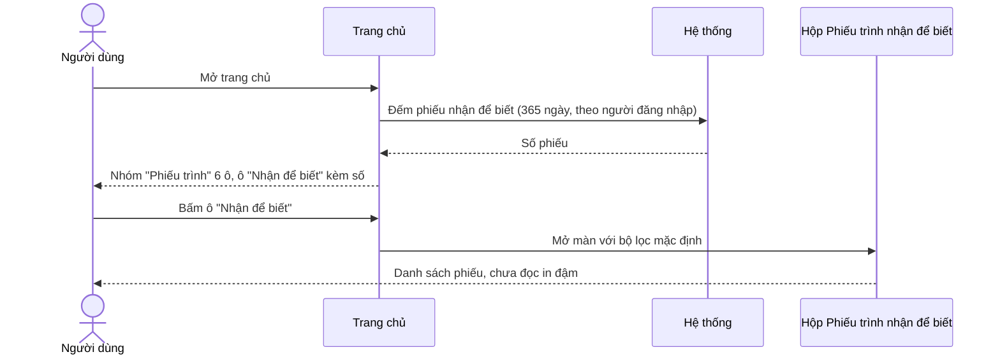

**TÀI LIỆU ĐẶC TẢ YÊU CẦU CHỨC NĂNG**

**YC_NV_11 - THÊM Ô "NHẬN ĐỂ BIẾT" VÀO NHÓM PHIẾU TRÌNH TRÊN TRANG CHỦ**

**Hệ thống Văn bản và Điều hành tỉnh Khánh Hòa**

| Thuộc tính | Giá trị |
|---|---|
| Mã yêu cầu | YC_NV_11 |
| Chức năng | Trang chủ — nhóm ô "Phiếu trình"; hộp *Phiếu trình nhận để biết* |
| Phân hệ (knowledge) | `phieu-trinh` (chính) · `he-thong` (cơ chế trang chủ, Cấu hình trang chủ) |
| Loại yêu cầu | Đổi UI / điều hướng + bổ sung một phép đếm (áp dụng cả Web và Mobile) |
| Loại tài liệu | Đặc tả yêu cầu chức năng (BA/FRD) |
| Phiên bản | 1.0 |
| Trạng thái | DRAFT_PENDING_CONFIRMATION *(phần Web đã đủ để code; phần Mobile chờ TBD-01…TBD-03)* |
| Ngày cập nhật | 07/10/2026 |

> Ký hiệu nguồn: `PT` = `knowledge/phieu-trinh`, `HT` = `knowledge/he-thong`, `VBĐ` = `knowledge/van-ban/den`,
> `Qxx` = câu trả lời của BA trong `cau-hoi.md` ngày 07/10/2026. Nhãn mục: 🟦 BA viết · 🟩 AI điền · 🟨 AI soạn →
> BA chốt. **BA chỉ cần đọc mục 🟦 và 🟨.** Nhãn quy tắc tri thức: [Đã xác nhận] · [Hiện trạng] · [Lệch nghiệp vụ].

---

# LỊCH SỬ THAY ĐỔI `[A1]` · 🟦

| Phiên bản | Ngày | Nội dung | Người thực hiện |
|---|---|---|---|
| 1.0 | 07/10/2026 | Bản đầu tiên — AI soạn từ phiếu ý tưởng + trả lời vòng 1 (Q01–Q09) | AI (ba-assistant) · BA phụ trách: {{Họ tên BA}} |

# PHÊ DUYỆT / XÁC NHẬN `[A2]` · 🟦

| Vai trò | Họ tên | Trạng thái | Ngày | Ghi chú |
|---|---|---|---|---|
| BA phụ trách | | Chưa xác nhận | | |
| DEV phụ trách | | Chưa xác nhận | | Cần ý kiến về TBD-01…TBD-03 (phần Mobile) |
| Tester phụ trách | | Chưa xác nhận | | |
| Đại diện nghiệp vụ/Khách hàng | | Chưa xác nhận | | Người đề xuất |

# MỤC LỤC

0. Phiếu ý tưởng
1. Thông tin chung
2. Phạm vi và vai trò
3. Tổng quan yêu cầu chức năng
4. Business Rules
5. Luồng nghiệp vụ / Use Case
6. Đặc tả màn hình và trường dữ liệu
7. Xử lý ngoại lệ và trường hợp biên
8. Acceptance Criteria
9. Ma trận kiểm thử và truy vết
10. Phạm vi kỹ thuật, kiến trúc và mapping CSDL
11. Các điểm cần xác nhận (TBD)

---

# 0. PHIẾU Ý TƯỞNG · 🟦 BA

- **Muốn gì:** "Thêm thẻ Phiếu trình nhận để biết ngoài trang chủ (mặc định hiển thị và đưa vào on/off ở Cấu hình
  trang chủ)" *(nguyên văn)*.
- **Ai dùng:** mọi người dùng từng được chuyển phiếu trình để biết; ai không cần thì tự tắt ô (Q01-A).
- **Vì sao cần:** hiện muốn biết có phiếu trình nào được chuyển tới để biết thì phải vào menu *Phiếu trình nhận để
  biết*; thông báo và SMS trôi nhanh nên dễ bỏ sót.
- **Một tình huống thật cụ thể:** {{BA bổ sung — Q01 chọn phương án A nhưng chưa cho ví dụ cụ thể; không chặn code,
  cần cho phần dữ liệu kiểm thử}}
- **Kết quả mong muốn đo được:** trang chủ hiện số phiếu trình nhận để biết của chính mình; bấm vào mở thẳng hộp đó,
  không phải đi qua menu.
- **Kênh:** cả hai (Web và Mobile — Q05-B) · **Gấp không:** {{BA bổ sung}}

---

# 1. THÔNG TIN CHUNG `[A3]` · 🟦 1.1–1.2 · 🟨 1.3 (AS-IS 🟩) · 🟩 1.4 · 🟨 1.5

## 1.1. Mục đích

Khi người dùng mở **trang chủ**, hệ thống hiển thị thêm một ô **"Nhận để biết"** trong nhóm ô *Phiếu trình*, mang số
phiếu trình đang có trong hộp *Phiếu trình nhận để biết* của chính người đó; bấm vào ô thì hệ thống mở hộp đó. Ô này
mặc định bật cho mọi người và người dùng tự bật / tắt được tại *Cấu hình trang chủ*.

## 1.2. Bối cảnh nghiệp vụ

- Yêu cầu gốc (nguyên văn): "Thêm thẻ Phiếu trình nhận để biết ngoài trang chủ (mặc định hiển thị và đưa vào on/off ở
  Cấu hình trang chủ)".
- Chức năng nghiệp vụ chính: theo dõi phiếu trình được chuyển tiếp để biết (PT NV-13).
- Đường vào chức năng: **Trang chủ → nhóm ô "Phiếu trình"** · **Khung người dùng góc phải → Cấu hình trang chủ**
  (HT NV-16) · đích điều hướng: **menu PHIẾU TRÌNH → Phiếu trình nhận để biết** (PT NV-13, mã menu 441145).
- Vấn đề hiện tại: nhóm ô *Phiếu trình* trên trang chủ có 5 ô (*Chờ xử lý*, *Đang xử lý*, *Đã phê duyệt*, *Tất cả*,
  *Xin ý kiến*) nhưng **không có ô nào cho hộp nhận để biết** (PT 1.2b) — người dùng phải vào menu mới biết.
- Kết quả mong muốn (đo được): từ trang chủ thấy số phiếu nhận để biết và vào hộp bằng **1 lần bấm** thay vì mở menu
  nhiều cấp.

## 1.3. Hiện trạng (AS-IS) và thay đổi (TO-BE)

| STT | Nội dung | Hiện tại (AS-IS) | Yêu cầu (TO-BE) | Nguồn AS-IS |
|---|---|---|---|---|
| 1 | Số ô của nhóm "Phiếu trình" trên trang chủ | 5 ô: Chờ xử lý · Đang xử lý · Đã phê duyệt · Tất cả · Xin ý kiến | **6 ô** — thêm *Nhận để biết* ở cuối nhóm | PT 1.2b |
| 2 | Cách biết có phiếu được chuyển để biết | Thông báo + SMS lúc được chuyển; hoặc tự vào menu *Phiếu trình nhận để biết* (chưa đọc in đậm) | Thêm một ô đếm ngoài trang chủ | PT NV-13 |
| 3 | Con số của ô mới | Không có | **Tổng số phiếu** trong hộp nhận để biết của người đăng nhập (không tách đã đọc / chưa đọc) | Q02-B |
| 4 | Khoảng thời gian đếm | 5 ô hiện có đếm **365 ngày gần nhất**; hộp nhận để biết cũng mặc định lọc 365 ngày gần nhất | **365 ngày gần nhất** — bằng khoảng mặc định của hộp | PT 1.2b; `SubmissionFormReceiveToKnowVM.java:103-104` (VERIFIED_CODE) |
| 5 | Bấm vào ô | — | Mở menu *Phiếu trình nhận để biết* **như bấm menu**, không áp thêm bộ lọc | Q04-A |
| 6 | Ô trong *Cấu hình trang chủ* | Màn này đã bật / tắt tới từng ô con; ô mới khai thêm tự xuất hiện trong danh sách của cả người đã lưu cấu hình | Ô mới nằm dưới nhóm *Phiếu trình*, tick bật / tắt như các ô khác | HT NV-16; `PersonalSettingUtil.java:390-421` (VERIFIED_CODE) |
| 7 | Trạng thái mặc định | 5 ô phiếu trình hiện có đều mặc định bật | Ô mới **mặc định bật cho mọi người**, kể cả người đã lưu cấu hình riêng | Q09-A; HT NV-16 |
| 8 | Chế độ trang chủ đơn giản | Nhóm *Phiếu trình* chỉ hiện ô *Chờ xử lý* ở chế độ đơn giản | Ô *Nhận để biết* **cũng hiện** ở chế độ đơn giản, cho mọi vai trò | Q08; HT BR-39 |
| 9 | Trang chủ ứng dụng di động | Danh sách ô trang chủ mobile lấy từ cấu hình riêng của hệ thống thế hệ 2, gắn với menu mobile; mặc định chỉ bật **5 ô đầu** | Mobile cũng có ô này (chi tiết chờ TBD-01…TBD-03) | HT 1.5, NV-10; `HomeServiceImpl.java:319-347` (VERIFIED_CODE) |
| 10 | Dữ liệu phiếu trình | Không đổi | **Không đổi** — ô chỉ đọc, bấm ô không đánh dấu đã đọc | PT NV-13 |

**Tóm tắt thay đổi:** thêm một ô đếm vào nhóm ô *Phiếu trình* của trang chủ (web và mobile) và một đường điều hướng
từ ô đó tới hộp *Phiếu trình nhận để biết*. **Không đổi trạng thái phiếu, không thêm bảng dữ liệu nghiệp vụ, không
sửa hộp nhận để biết.**

## 1.4. Phạm vi chức năng bị ảnh hưởng

| STT | Điểm vào chức năng | Màn hình/Action | Trong phạm vi |
|---|---|---|---|
| 1 | Trang chủ → nhóm ô "Phiếu trình" | Vẽ ô mới + số đếm | Có |
| 2 | Trang chủ → bấm ô "Nhận để biết" | Điều hướng sang hộp nhận để biết | Có |
| 3 | Khung người dùng → Cấu hình trang chủ | Ô mới có mặt, bật / tắt, Lưu | Có |
| 4 | Trang chủ chế độ đơn giản | Ô mới hiện | Có |
| 5 | Trang chủ ứng dụng di động | Ô mới trong danh sách widget mobile | Có — chờ TBD-01…TBD-03 |
| 6 | Hộp *Phiếu trình nhận để biết* (lưới, bộ lọc, in đậm chưa đọc, chuyển tiếp) | Không được mô tả trong YC_NV_11 | Ngoài phạm vi thay đổi; cần regression |
| 7 | 5 ô phiếu trình hiện có và các nhóm ô khác của trang chủ | Không được mô tả trong YC_NV_11 | Ngoài phạm vi thay đổi; cần regression |
| 8 | Chuyển tiếp để biết, thông báo, SMS | Không đổi | Ngoài phạm vi |

**Kênh áp dụng:** Web và Mobile (Q05-B). Phần Web đủ điều kiện code ngay; phần Mobile chỉ code sau khi chốt
TBD-01…TBD-03.

## 1.5. Thuật ngữ

| Thuật ngữ | Định nghĩa sử dụng trong tài liệu |
|---|---|
| Ô (thẻ) trang chủ | Một khối số đếm trên trang chủ, thuộc một nhóm; BA gọi là "thẻ". Trong hệ thống là một widget con của nhóm widget |
| Nhóm ô "Phiếu trình" | Nhóm widget cha gom các ô đếm của phân hệ phiếu trình trên trang chủ (PT 1.2b) |
| Hộp *Phiếu trình nhận để biết* | Màn danh sách phiếu trình được người khác chuyển tiếp để biết cho mình (PT NV-13, menu 441145) |
| Chế độ trang chủ đơn giản / đầy đủ | Hai cách bày trang chủ; chế độ đơn giản chỉ hiện các ô được khai cho chế độ đó (HT NV-16) |

---

# 2. PHẠM VI VÀ VAI TRÒ `[A4]` · 🟨

## 2.1. Vai trò

| Vai trò nghiệp vụ | Mã vai trò hệ thống | Được làm gì trong YC_NV_11 | Ghi chú |
|---|---|---|---|
| Mọi người dùng đã đăng nhập | — (không giới hạn vai trò) | Thấy ô *Nhận để biết* với số của chính mình; bấm mở hộp; bật / tắt ô ở *Cấu hình trang chủ* | Vai trò chính (Q01-A). Hộp nhận để biết hiện cũng không kiểm vai trò, chỉ lọc theo người nhận |
| Chuyên viên | `NV` | Như trên | Không có thao tác riêng |
| Lãnh đạo đơn vị · Thủ trưởng | `LDDV` · `TTDV` | Như trên | Nhóm được chuyển để biết nhiều nhất |
| Văn thư | `VT` | Như trên | Ô mới hiện ở **cả** chế độ đơn giản cho văn thư và người không phải văn thư (Q08) |
| Quản trị hệ thống | `ADMIN` | Không có thao tác mới | Việc khai ô mới làm bằng script cài đặt, không phải màn quản trị |

**Lưu ý phạm vi role:** yêu cầu **không** giới hạn vai trò nào, vì ô chỉ đếm dữ liệu của chính người đăng nhập. Không
suy diễn thêm quyền nào khác.

## 2.2. Tiền điều kiện chung

- Người dùng đã đăng nhập và truy cập được trang chủ.
- Nhóm ô *Phiếu trình* đang bật trong cấu hình trang chủ của người dùng (nếu tắt cả nhóm thì không ô nào hiện — EC-08).
- Ô *Nhận để biết* đã được khai trong hệ thống (việc cài đặt một lần, mục 10.3).
- Để số lớn hơn 0: người dùng đã từng được chuyển tiếp để biết ít nhất một phiếu trình trong 365 ngày gần nhất
  (PT NV-13).

---

# 3. TỔNG QUAN YÊU CẦU CHỨC NĂNG `[A5]` · 🟦 danh sách FR · 🟩 3.1 mapping · 🟨 3.2–3.3

| ID | Trigger/Action của người dùng | Xử lý mong muốn | BR liên quan |
|---|---|---|---|
| FR-01 | Mở trang chủ (chế độ đầy đủ), nhóm *Phiếu trình* đang bật | Hệ thống hiển thị ô *Nhận để biết* ở cuối nhóm, kèm số phiếu trình nhận để biết của người đăng nhập | BR-01, BR-02, BR-03, BR-04, BR-09 |
| FR-02 | Bấm vào ô *Nhận để biết* | Hệ thống mở màn *Phiếu trình nhận để biết* với bộ lọc mặc định của màn đó | BR-05, BR-10 |
| FR-03 | Mở *Cấu hình trang chủ* | Hệ thống hiển thị dòng *Nhận để biết* trong nhóm *Phiếu trình*, đang tick (bật) | BR-06, BR-07 |
| FR-04 | Bỏ tick *Nhận để biết* rồi bấm Lưu, sau đó mở lại trang chủ | Trang chủ không vẽ ô *Nhận để biết*; các ô khác không đổi | BR-07 |
| FR-05 | Tick lại *Nhận để biết* rồi bấm Lưu | Trang chủ vẽ lại ô *Nhận để biết* | BR-07 |
| FR-06 | Mở trang chủ ở chế độ **đơn giản** | Hệ thống hiển thị ô *Nhận để biết* (cùng với ô *Chờ xử lý* của nhóm) | BR-08 |
| FR-07 | Mở trang chủ trên **ứng dụng di động** | Danh sách ô trang chủ mobile có ô *Phiếu trình nhận để biết*, bật / tắt được, mặc định bật | BR-11, BR-12 (chờ TBD-01…TBD-03) |
| FR-08 | Phép đếm không trả kết quả trong 20 giây | Ô hiện 0 như các ô khác của nhóm (giữ hành vi hiện tại) | BR-13 |

## 3.1. Mapping dữ liệu nguồn → đích

Không áp dụng — yêu cầu không chuyển, sao chép hay tự điền dữ liệu giữa hai đối tượng; chỉ đọc để đếm.

## 3.2. Trạng thái và chuyển trạng thái

**Không thay đổi trạng thái.** Giữ nguyên `SUBMISSION_FORM.STATUS` (0 Chưa trình · 1 Đang xử lý · 2 Bị trả lại ·
3 Đã phê duyệt · 5 Đã hủy · 7 Trình ký lại — PT mục 5) và giữ nguyên `SUBMISSION_FORWARD.IS_READ` (0 chưa đọc ·
1 đã đọc — `20012026_add_table_submission_forward.sql:46`).

**Hành động bị cấm:**
- Bấm ô trang chủ **không** được đánh dấu phiếu là đã đọc (BR-10).
- Không ghi, sửa, xóa bất kỳ dòng `SUBMISSION_FORWARD` nào trong phạm vi yêu cầu này.

## 3.3. Yêu cầu phi chức năng (NFR)

| Mã | Nhóm | Yêu cầu (đo được) |
|---|---|---|
| NFR-01 | Hiệu năng | Phép đếm của ô mới chạy **song song** cùng 5 phép đếm hiện có của nhóm và dùng chung ngưỡng chờ **20 giây**; thêm ô mới không làm thời gian tải trang chủ tăng quá 10% so với trước khi thêm (đo trên cùng tài khoản, cùng môi trường, 5 lần lấy trung bình) |
| NFR-02 | Bảo mật / Văn bản mật | Ô chỉ đếm phiếu được chuyển cho **chính người đăng nhập** (`SUBMISSION_FORWARD.RECEIVER_ID` = người đăng nhập); không đếm phiếu của người khác. Phiếu mật: nghiệp vụ văn bản mật chưa dùng (PT NV-17) nên không có quy tắc riêng; giữ đúng phạm vi dữ liệu của hộp nhận để biết |
| NFR-03 | Nhật ký (audit log) | Không yêu cầu nhật ký mới — ô chỉ đọc, không sinh thao tác nghiệp vụ |
| NFR-04 | Thông báo / SMS | Không đổi. Giữ nguyên thông báo và SMS khi chuyển tiếp để biết (PT NV-13) |
| NFR-05 | Tương thích | Web: giữ nguyên các trình duyệt đang hỗ trợ. Mobile: cần bản phát hành ứng dụng có hiển thị ô mới (TBD-03) |
| NFR-06 | Đa ngôn ngữ | Nhãn ô khai bằng khóa nhãn như các ô chuẩn, không ghi chuỗi cứng, để đổi ngôn ngữ dùng được (xem TBD-04) |

---

# 4. BUSINESS RULES `[A6]` · 🟨

| Rule ID | Tên rule | Mô tả | Nguồn |
|---|---|---|---|
| BR-01 | Vị trí và nhãn ô | Nhóm ô *Phiếu trình* trên trang chủ có thêm ô thứ 6, nhãn **"Nhận để biết"**, đặt **sau** ô *Xin ý kiến* (cuối nhóm) | Q06-A |
| BR-02 | Con số trên ô | Con số = **số phiếu trình** trong hộp *Phiếu trình nhận để biết* của người đăng nhập. Mỗi phiếu tính **1 lần** dù được chuyển tới người đó nhiều lần. Đếm **cả** phiếu đã đọc và chưa đọc | Q02-B; PT NV-13, BR-41 |
| BR-03 | Khoảng thời gian đếm | Chỉ đếm phiếu có **ngày chuyển trong 365 ngày gần nhất** tính đến ngày hiện tại — đúng khoảng mặc định của bộ lọc màn *Phiếu trình nhận để biết*, để số trên ô khớp số dòng người dùng thấy khi bấm vào | Q03-A; PT 1.2b |
| BR-04 | Không có phiếu nào | Người dùng không có phiếu nào thỏa BR-02 + BR-03 → ô **vẫn hiện** và ghi số **0** (không ẩn ô) | Q07-A |
| BR-05 | Điều hướng khi bấm ô | Bấm ô → hệ thống mở màn *Phiếu trình nhận để biết* (menu mã `SUBMISSION_RECEIVE_TO_KNOW`) với **bộ lọc mặc định của màn đó**, không truyền thêm bộ lọc và không lọc riêng phiếu chưa đọc | Q04-A |
| BR-06 | Mặc định hiển thị | Ô *Nhận để biết* ở trạng thái **bật** với mọi người dùng, kể cả người đã từng lưu cấu hình trang chủ riêng trước khi có ô này | Q09-A |
| BR-07 | Bật / tắt tại Cấu hình trang chủ | Ô có mặt trong màn *Cấu hình trang chủ*, dưới nhóm *Phiếu trình*, bật / tắt bằng tick rồi bấm Lưu như các ô khác: tắt thì trang chủ không vẽ ô; bật lại thì vẽ lại. Tắt ô này **không** làm tắt 5 ô còn lại; tắt hết 6 ô thì nhóm tự tắt theo cơ chế sẵn có | Q09-A; HT NV-16 |
| BR-08 | Chế độ trang chủ đơn giản | Ô *Nhận để biết* **hiện ở cả chế độ trang chủ đơn giản**, cho **mọi người dùng** (cả văn thư và người không phải văn thư) | Q08; HT BR-39 |
| BR-09 | Không giới hạn vai trò | Ô hiện cho mọi vai trò; mỗi người thấy số của riêng mình. Không có vai trò nào bị ẩn ô, không có vai trò nào thấy số của người khác | Q01-A |
| BR-10 | Ô chỉ đọc | Hiển thị ô và bấm ô **không** làm đổi dữ liệu: không đánh dấu đã đọc, không đổi trạng thái phiếu, không ghi dòng chuyển tiếp mới. Phiếu chỉ được tính đã đọc khi người dùng mở chi tiết phiếu như hiện nay | PT NV-13 |
| BR-11 | Ô trên ứng dụng di động | Trang chủ ứng dụng di động có ô *Phiếu trình nhận để biết*: nằm trong danh sách ô bật / tắt được của trang chủ mobile và ở trạng thái **bật mặc định** (chờ TBD-01, TBD-02, TBD-03) | Q05-B |
| BR-12 | Số đếm trên mobile | Số trên ô mobile dùng **đúng** định nghĩa BR-02 và BR-03 (cùng cách đếm với web), để hai kênh không lệch số | Q05-B |
| BR-13 | Quá thời gian chờ đếm | Nếu phép đếm của nhóm *Phiếu trình* không trả kết quả trong **20 giây**, ô *Nhận để biết* hiện **0** — giữ đúng hành vi hiện tại của nhóm, không làm riêng cho ô mới | PT `dac-thu` L13; `SubmissionManagerServiceImpl.java:243-262` |
| BR-14 | Không sửa hộp nhận để biết | Yêu cầu này **không** thêm tab, bộ lọc hay cột nào cho màn *Phiếu trình nhận để biết*; màn giữ nguyên như hiện tại | Q04-A |

---

# 5. LUỒNG NGHIỆP VỤ / USE CASE `[A7]` · 🟨

## 5.1. UC-01 - Xem số phiếu trình nhận để biết trên trang chủ và mở hộp

| Thuộc tính | Nội dung |
|---|---|
| Mục tiêu | Người dùng biết ngay mình có bao nhiêu phiếu trình được chuyển để biết và mở được hộp bằng 1 lần bấm |
| Actor | Mọi người dùng đã đăng nhập (`NV`, `LDDV`, `TTDV`, `VT`, …) |
| Tiền điều kiện | Đã đăng nhập; nhóm ô *Phiếu trình* đang bật; ô *Nhận để biết* đang bật (BR-06, BR-07) |
| Trigger | Người dùng mở trang chủ |
| Hậu điều kiện | Không đổi dữ liệu (BR-10). Nếu bấm ô thì màn *Phiếu trình nhận để biết* được mở |
| Rule liên quan | BR-01, BR-02, BR-03, BR-04, BR-05, BR-09, BR-10, BR-13 |
| Ngoại lệ liên quan | EC-01, EC-02, EC-04, EC-05, EC-08 |

**Luồng chính**

1. Người dùng mở trang chủ.
2. Hệ thống đếm số phiếu trình nhận để biết của người dùng theo BR-02 và BR-03.
3. Hệ thống vẽ nhóm ô *Phiếu trình* gồm 6 ô, ô *Nhận để biết* ở cuối, mang con số vừa đếm.
4. Người dùng bấm vào ô *Nhận để biết*.
5. Hệ thống mở màn *Phiếu trình nhận để biết* với bộ lọc mặc định của màn (365 ngày gần nhất), phiếu chưa đọc in đậm.

**Luồng thay thế**

- 3a. Nếu số đếm = 0 thì ô vẫn hiện với số 0 (BR-04), quay lại bước 4 nếu người dùng vẫn bấm — màn mở ra không có dòng nào.
- 4a. Nếu người dùng không bấm ô thì không có gì xảy ra; dữ liệu không đổi.

**Luồng ngoại lệ**

- 2a. Phép đếm quá 20 giây → ô hiện 0, xử lý theo EC-02.
- 3b. Nhóm ô *Phiếu trình* đang tắt → không vẽ ô nào của nhóm, xử lý theo EC-08.

## 5.2. UC-02 - Bật / tắt ô "Nhận để biết" tại Cấu hình trang chủ

| Thuộc tính | Nội dung |
|---|---|
| Mục tiêu | Người dùng tự quyết định có hiện ô này trên trang chủ của mình hay không |
| Actor | Mọi người dùng đã đăng nhập |
| Tiền điều kiện | Đã đăng nhập; ô *Nhận để biết* đã được khai trong hệ thống |
| Trigger | Người dùng mở *Cấu hình trang chủ* từ khung người dùng góc phải |
| Hậu điều kiện | Lựa chọn bật / tắt của người dùng được lưu và áp dụng cho trang chủ của chính người đó |
| Rule liên quan | BR-06, BR-07 |
| Ngoại lệ liên quan | EC-07, EC-08 |

**Luồng chính**

1. Người dùng mở *Cấu hình trang chủ*.
2. Hệ thống hiển thị danh sách nhóm và ô; dưới nhóm *Phiếu trình* có dòng *Nhận để biết* **đang tick** (BR-06).
3. Người dùng bỏ tick dòng *Nhận để biết*.
4. Người dùng bấm Lưu và xác nhận.
5. Hệ thống lưu cấu hình và thông báo lưu thành công.
6. Người dùng mở lại trang chủ: nhóm *Phiếu trình* còn 5 ô, không có ô *Nhận để biết*.

**Luồng thay thế**

- 3a. Người dùng tick lại dòng *Nhận để biết* rồi Lưu → trang chủ vẽ lại ô (FR-05).
- 3b. Người dùng bỏ tick **cả 6 ô** của nhóm → nhóm *Phiếu trình* tự tắt theo cơ chế sẵn có (BR-07).
- 4a. Người dùng bấm Hủy ở hộp xác nhận → không lưu, cấu hình giữ như trước.

**Luồng ngoại lệ**

- 5a. Hệ thống khởi động lại sau khi người dùng đã tắt ô → cấu hình cá nhân trở về mặc định nên ô hiện lại, xử lý theo EC-07.

## 5.3. UC-03 - Xem ô "Phiếu trình nhận để biết" trên ứng dụng di động

| Thuộc tính | Nội dung |
|---|---|
| Mục tiêu | Người dùng mobile cũng thấy số phiếu trình nhận để biết trên trang chủ ứng dụng |
| Actor | Mọi người dùng đã đăng nhập trên ứng dụng di động |
| Tiền điều kiện | Ứng dụng ở bản phát hành có ô này; ô được khai trong danh sách widget trang chủ mobile (TBD-01, TBD-03) |
| Trigger | Người dùng mở trang chủ trên ứng dụng |
| Hậu điều kiện | Không đổi dữ liệu |
| Rule liên quan | BR-11, BR-12 |
| Ngoại lệ liên quan | EC-09, EC-10 |

**Luồng chính**

1. Người dùng mở trang chủ trên ứng dụng di động.
2. Ứng dụng lấy danh sách ô trang chủ của người dùng; trong đó có ô *Phiếu trình nhận để biết*, mặc định bật (BR-11).
3. Ứng dụng hiển thị ô với số đếm theo BR-02 và BR-03.
4. Người dùng bấm ô → ứng dụng mở danh sách phiếu trình nhận để biết.

**Luồng ngoại lệ**

- 2a. Ứng dụng chưa có màn danh sách phiếu trình nhận để biết → xử lý theo EC-09 (chờ TBD-01).
- 2b. Ô không nằm trong nhóm ô được bật mặc định của mobile → xử lý theo EC-10 (chờ TBD-02).

---

# 6. ĐẶC TẢ MÀN HÌNH VÀ TRƯỜNG DỮ LIỆU `[A8]` · 🟨

## 6.1. Màn hình Trang chủ — nhóm ô "Phiếu trình"

{{Ảnh chụp trang chủ hiện tại có đánh số 6 ô sau khi thêm — đặt tại `input/design/01_trang-chu-nhom-phieu-trinh.png`;
chưa có ảnh, DEV làm theo mô tả bảng dưới}}

*Hình 1. Nhóm ô "Phiếu trình" sau thay đổi — ô thứ 6 "Nhận để biết"*

| ID | Trường/Control | Loại | Bắt buộc | Độ dài / Giới hạn | Mặc định | Quy tắc hiển thị / Validate | Thay đổi trong YC_NV_11 |
|---|---|---|---|---|---|---|---|
| UI-01 | Ô *Chờ xử lý* | Ô đếm | Không | Số nguyên ≥ 0 | — | Giữ nguyên baseline | Giữ nguyên |
| UI-02 | Ô *Đang xử lý* | Ô đếm | Không | Số nguyên ≥ 0 | — | Giữ nguyên baseline | Giữ nguyên |
| UI-03 | Ô *Đã phê duyệt* | Ô đếm | Không | Số nguyên ≥ 0 | — | Giữ nguyên baseline | Giữ nguyên |
| UI-04 | Ô *Tất cả* | Ô đếm | Không | Số nguyên ≥ 0 | — | Giữ nguyên baseline | Giữ nguyên |
| UI-05 | Ô *Xin ý kiến* | Ô đếm | Không | Số nguyên ≥ 0 | — | Giữ nguyên baseline | Giữ nguyên |
| UI-06 | **Ô *Nhận để biết*** | Ô đếm | Không | Số nguyên ≥ 0 | 0 | Hiện khi nhóm *Phiếu trình* bật **và** ô được bật (BR-06, BR-07); hiện cả ở chế độ đơn giản (BR-08); luôn hiện kể cả số 0 (BR-04); đứng cuối nhóm (BR-01) | **Mới** |
| UI-07 | Vùng bấm của ô UI-06 | Liên kết | — | — | — | Bấm vào ô (cả khối, như các ô khác) → mở màn *Phiếu trình nhận để biết* (BR-05) | **Mới** |

## 6.2. Màn hình Cấu hình trang chủ

| ID | Trường/Control | Loại | Bắt buộc | Độ dài / Giới hạn | Mặc định | Quy tắc hiển thị / Validate | Thay đổi trong YC_NV_11 |
|---|---|---|---|---|---|---|---|
| UI-08 | Dòng nhóm *Phiếu trình* | Checkbox + nhãn | Không | — | Bật | Giữ nguyên baseline: tắt nhóm thì tắt mọi ô con; bật nhóm thì bật mọi ô con | Giữ nguyên |
| UI-09 | **Dòng ô *Nhận để biết*** | Checkbox + nhãn | Không | — | **Bật** (BR-06) | Nằm dưới nhóm *Phiếu trình*, sau dòng *Xin ý kiến*; tick / bỏ tick rồi bấm Lưu (BR-07); không có nút xóa (chỉ ô người dùng tự tạo mới có) | **Mới** |
| UI-10 | Nút Lưu | Nút công cụ | — | — | — | Giữ nguyên baseline: hỏi xác nhận trước khi lưu | Giữ nguyên |

## 6.3. Thông báo người dùng

| Mã | Tình huống | Loại | Nội dung nguyên văn | Nút |
|---|---|---|---|---|
| MSG-01 | Bấm Lưu tại *Cấu hình trang chủ* | Popup xác nhận | Giữ nguyên chuỗi xác nhận lưu hiện có của màn (khóa `app.confirm.save`) | Đồng ý / Hủy |
| MSG-02 | Lưu cấu hình thành công | Thông báo | Giữ nguyên chuỗi lưu thành công hiện có (khóa `voffice.common.message.save.success`) | — |
| MSG-03 | Lưu cấu hình thất bại | Thông báo lỗi | Giữ nguyên chuỗi lưu thất bại hiện có (khóa `voffice.common.message.save.failed`) | — |
| MSG-04 | Mở hộp nhận để biết, không có phiếu nào | Lưới rỗng | Giữ nguyên cách màn *Phiếu trình nhận để biết* đang thể hiện lưới rỗng | — |

**Không có thông báo mới trong yêu cầu này.** Nhãn ô *Nhận để biết* không phải thông báo mà là nhãn giao diện,
khai bằng khóa nhãn (NFR-06, TBD-04).

## 6.4. Điều hướng

| Từ (màn hình · vùng) | Thao tác | Đến (màn hình) | Tab/bộ lọc mặc định | Giữ bộ lọc cũ? |
|---|---|---|---|---|
| Trang chủ · nhóm ô *Phiếu trình* · ô *Nhận để biết* | Bấm vào ô | *Phiếu trình nhận để biết* (menu `SUBMISSION_RECEIVE_TO_KNOW`) | Bộ lọc mặc định của màn: ngày chuyển từ **hôm nay trừ 365 ngày** đến **hôm nay**, không lọc tiêu đề, không lọc người gửi | Không |
| Khung người dùng góc phải | Chọn *Cấu hình trang chủ* | *Cấu hình trang chủ* | Giữ nguyên baseline | Không |

## 6.5. Quy tắc hiển thị

- UI-06 đứng **cuối** nhóm, sau UI-05; thứ tự 5 ô trước không đổi (BR-01).
- UI-06 dùng cùng kiểu trình bày (kích thước, kiểu số, cách bấm) với 5 ô còn lại của nhóm; không thêm biểu tượng
  hay màu báo riêng.
- Số trên UI-06 không hiển thị dạng "x/y" và không tách chưa đọc (BR-02).
- Ở chế độ trang chủ đơn giản, nhóm *Phiếu trình* hiện 2 ô: *Chờ xử lý* và *Nhận để biết* (BR-08).
- Khi người dùng tắt UI-09, trang chủ không còn UI-06 nhưng nhóm vẫn hiện 5 ô còn lại (BR-07).

---

# 7. XỬ LÝ NGOẠI LỆ VÀ TRƯỜNG HỢP BIÊN `[A9]` · 🟨

| ID | Tình huống | Kết quả mong đợi | UC | Trạng thái |
|---|---|---|---|---|
| EC-01 | Người dùng chưa từng được chuyển phiếu để biết | Ô hiện, số **0**; bấm vào mở hộp rỗng | UC-01 | Đã chốt (BR-04) |
| EC-02 | Phép đếm của nhóm quá 20 giây | Ô hiện **0**, trang chủ vẫn tải xong; không báo lỗi cho người dùng | UC-01 | Đã chốt (BR-13) |
| EC-03 | Lỗi khi đếm (lỗi truy vấn) | Ô hiện **0**, không làm vỡ các ô khác của nhóm | UC-01 | Đã chốt (BR-13) |
| EC-04 | Cùng một phiếu được chuyển cho người dùng **nhiều lần** (nhiều người chuyển, hoặc chuyển lại) | Đếm **1** phiếu; khớp với hộp (hộp gộp mỗi phiếu một dòng, lấy lần chuyển mới nhất) | UC-01 | Đã chốt (BR-02) |
| EC-05 | Phiếu được chuyển cách đây **hơn 365 ngày** | Không tính vào số của ô; mở hộp với bộ lọc mặc định cũng không thấy phiếu đó → số và danh sách khớp nhau | UC-01 | Đã chốt (BR-03) |
| EC-06 | Phiếu đã được chuyển để biết nhưng sau đó bị xóa | **Không xảy ra**: chỉ phiếu *Đã phê duyệt* mới chuyển để biết được, còn xóa phiếu chỉ cho phép khi phiếu *Chưa trình* | UC-01 | Đã chốt (PT BR-39; `SubmissionManagerServiceImpl.java:1255-1260`) |
| EC-07 | Người dùng đã tắt ô, sau đó hệ thống khởi động lại | Cấu hình trang chủ cá nhân hiện chỉ lưu tạm nên trở về mặc định → ô **hiện lại**. Đây là hiện trạng chung của màn *Cấu hình trang chủ*, không xử lý riêng trong yêu cầu này | UC-02 | Đã chốt (HT BR-38) |
| EC-08 | Người dùng tắt cả nhóm *Phiếu trình* | Không vẽ ô nào của nhóm, kể cả ô mới | UC-01, UC-02 | Đã chốt (BR-07) |
| EC-09 | Ứng dụng di động chưa có màn danh sách phiếu trình nhận để biết | Chưa xác định — nếu chưa có màn thì ô mobile không có đích để mở; phải chốt TBD-01 trước khi làm phần mobile | UC-03 | TBD-01 |
| EC-10 | Trang chủ mobile chỉ bật mặc định một số ô đầu danh sách | Chưa xác định — cần chốt cách đảm bảo "mặc định hiển thị" trên mobile | UC-03 | TBD-02 |
| EC-11 | Người dùng bấm ô hai lần liên tiếp | Mở màn *Phiếu trình nhận để biết* một lần, không mở trùng tab; giữ đúng cách các ô hiện có đang xử lý | UC-01 | Đã chốt (BR-05) |
| EC-12 | Hai kênh cùng mở (web và mobile) | Hai ô hiện **cùng một số** vì dùng chung định nghĩa đếm | UC-01, UC-03 | Đã chốt (BR-12) |

---

# 8. ACCEPTANCE CRITERIA `[A10]` · 🟨

| AC ID | BR | Given | When | Then |
|---|---|---|---|---|
| AC-01 | BR-01 | Người dùng `NV` đã đăng nhập, nhóm ô *Phiếu trình* đang bật, cả 6 ô đang bật | Mở trang chủ ở chế độ đầy đủ | Nhóm *Phiếu trình* hiện 6 ô theo thứ tự: Chờ xử lý · Đang xử lý · Đã phê duyệt · Tất cả · Xin ý kiến · **Nhận để biết** |
| AC-02 | BR-02 | Người dùng A có đúng 3 phiếu trình khác nhau được chuyển để biết trong 365 ngày gần nhất, trong đó 1 phiếu đã đọc và 2 phiếu chưa đọc | A mở trang chủ | Ô *Nhận để biết* hiện số **3** |
| AC-03 | BR-02 | Phiếu P được chuyển để biết cho A **2 lần** (hai người chuyển khác nhau), A chưa có phiếu nào khác | A mở trang chủ | Ô *Nhận để biết* hiện số **1**; mở hộp thấy **1 dòng** cho phiếu P |
| AC-04 | BR-03 | A có 1 phiếu được chuyển cách đây 10 ngày và 1 phiếu được chuyển cách đây 400 ngày | A mở trang chủ | Ô *Nhận để biết* hiện số **1**; bấm vào ô, hộp mở ra với bộ lọc mặc định và hiện đúng **1 dòng** |
| AC-05 | BR-04 | A chưa từng được chuyển phiếu nào để biết | A mở trang chủ | Ô *Nhận để biết* **vẫn hiện** và ghi số **0** (ô không bị ẩn) |
| AC-06 | BR-05 | A đang ở trang chủ, ô *Nhận để biết* hiện số 2 | A bấm vào ô *Nhận để biết* | Hệ thống mở màn *Phiếu trình nhận để biết*; bộ lọc ngày chuyển là từ hôm nay trừ 365 ngày đến hôm nay; không lọc tiêu đề, không lọc người gửi; 2 dòng hiện ra, dòng chưa đọc in đậm |
| AC-07 | BR-06 | Người dùng B đã từng vào *Cấu hình trang chủ* và bấm Lưu **trước khi** có ô mới | B mở *Cấu hình trang chủ* sau khi hệ thống đã có ô mới | Dòng *Nhận để biết* có mặt dưới nhóm *Phiếu trình* và **đang được tick**; B mở trang chủ thì thấy ô *Nhận để biết* |
| AC-08 | BR-07 | A đang bật ô *Nhận để biết* | A mở *Cấu hình trang chủ*, bỏ tick dòng *Nhận để biết*, bấm Lưu và xác nhận, rồi mở lại trang chủ | Thông báo lưu thành công; nhóm *Phiếu trình* còn **5 ô**, không có ô *Nhận để biết*; 5 ô còn lại vẫn hiện đúng số như trước |
| AC-09 | BR-07 | A đang tắt ô *Nhận để biết* | A tick lại dòng *Nhận để biết*, bấm Lưu và xác nhận, rồi mở lại trang chủ | Ô *Nhận để biết* hiện lại ở cuối nhóm với số đúng theo BR-02 |
| AC-10 | BR-08 | A đang ở **chế độ trang chủ đơn giản**, A **không** phải văn thư | A mở trang chủ | Nhóm *Phiếu trình* hiện 2 ô: *Chờ xử lý* và *Nhận để biết* |
| AC-11 | BR-08 | C có vai trò văn thư `VT`, đang ở chế độ trang chủ đơn giản | C mở trang chủ | Nhóm *Phiếu trình* hiện 2 ô: *Chờ xử lý* và *Nhận để biết* |
| AC-12 | BR-09 | Ba người dùng có vai trò khác nhau (`NV`, `LDDV`, `VT`), mỗi người có số phiếu nhận để biết khác nhau (0, 2, 5) | Lần lượt từng người mở trang chủ | Cả ba đều thấy ô *Nhận để biết*; số hiện lần lượt là 0, 2, 5 — mỗi người chỉ thấy số của mình |
| AC-13 | BR-10 | A có 2 phiếu nhận để biết, cả 2 **chưa đọc** (in đậm trong hộp) | A mở trang chủ, bấm ô *Nhận để biết*, rồi **không** mở chi tiết phiếu nào và quay lại trang chủ | Cả 2 phiếu **vẫn là chưa đọc** (vẫn in đậm); ô vẫn hiện số 2; không có dòng chuyển tiếp mới nào được tạo |
| AC-14 | BR-13 | Phép đếm của nhóm *Phiếu trình* không trả kết quả trong 20 giây (dựng tình huống trên môi trường kiểm thử) | A mở trang chủ | Trang chủ vẫn tải xong; ô *Nhận để biết* hiện **0**; không có thông báo lỗi hiện lên cho người dùng |
| AC-15 | BR-14 | A mở màn *Phiếu trình nhận để biết* từ menu như trước đây | A xem màn hình | Màn giữ nguyên các tab, bộ lọc, cột và cách in đậm phiếu chưa đọc như trước khi làm YC_NV_11 |
| AC-16 | BR-11 | Người dùng A đã đăng nhập ứng dụng di động bản có ô mới, chưa từng sửa cấu hình trang chủ mobile | A mở trang chủ ứng dụng | Trang chủ hiện ô *Phiếu trình nhận để biết* ở trạng thái bật *(giả định — chờ TBD-01, TBD-02, TBD-03)* |
| AC-17 | BR-12 | A có 4 phiếu nhận để biết trong 365 ngày gần nhất | A xem ô trên web và ô trên ứng dụng di động trong cùng thời điểm | Cả hai ô hiện số **4** *(giả định — chờ TBD-01, TBD-03)* |

---

# 9. MA TRẬN KIỂM THỬ VÀ TRUY VẾT `[A11]` · 🟩

## 9.1. Ma trận role kiểm thử

| Vai trò nghiệp vụ | Mã vai trò hệ thống | Mục tiêu kiểm thử |
|---|---|---|
| Chuyên viên | `NV` | Functional đầy đủ: hiện ô, số đúng, điều hướng, bật / tắt, chế độ đơn giản |
| Lãnh đạo đơn vị | `LDDV` | Số đúng của riêng mình; ô hiện; không thấy số người khác |
| Văn thư | `VT` | Ô hiện ở **chế độ đơn giản** (BR-08 không phân biệt văn thư); các ô văn bản đến không bị ảnh hưởng |
| Người dùng chưa có phiếu nào | `NV` (tài khoản mới) | Ô hiện số 0 (EC-01) |
| Người đã lưu cấu hình trang chủ riêng trước đó | bất kỳ | Ô mới tự bật (AC-07) |

## 9.2. Traceability Requirement → Rule → AC

| FR | BR | AC | EC | Ghi chú |
|---|---|---|---|---|
| FR-01 | BR-01, BR-02, BR-03, BR-04, BR-09 | AC-01, AC-02, AC-03, AC-04, AC-05, AC-12 | EC-01, EC-04, EC-05 | Hiển thị ô và số |
| FR-02 | BR-05, BR-10 | AC-06, AC-13 | EC-11 | Điều hướng, không đổi dữ liệu |
| FR-03 | BR-06, BR-07 | AC-07 | — | Ô có mặt và đang bật ở màn cấu hình |
| FR-04 | BR-07 | AC-08 | EC-08 | Tắt ô |
| FR-05 | BR-07 | AC-09 | EC-07 | Bật lại ô |
| FR-06 | BR-08 | AC-10, AC-11 | — | Chế độ đơn giản |
| FR-07 | BR-11, BR-12 | AC-16, AC-17 | EC-09, EC-10, EC-12 | Mobile — chờ TBD-01…TBD-03 |
| FR-08 | BR-13 | AC-14 | EC-02, EC-03 | Quá thời gian chờ / lỗi đếm |
| — | BR-14 | AC-15 | — | Không sửa hộp nhận để biết (regression) |

## 9.3. Regression tối thiểu

- Năm ô phiếu trình hiện có (*Chờ xử lý*, *Đang xử lý*, *Đã phê duyệt*, *Tất cả*, *Xin ý kiến*) vẫn hiện đúng số và
  mở đúng đích như trước.
- Các nhóm ô khác của trang chủ (Văn bản đến, Văn bản đi, Nhiệm vụ, Lịch họp, Nhắc việc, …) không đổi số, không đổi
  thứ tự, không mất ô.
- Màn *Cấu hình trang chủ*: bật / tắt các ô khác, tạo và xóa ô tự tạo, Lưu, Hủy vẫn hoạt động như trước.
- Chế độ trang chủ đơn giản: các ô đang hiện ở chế độ này trước đây vẫn hiện; không ô nào bị thêm ngoài
  *Nhận để biết*.
- Màn *Phiếu trình nhận để biết*: bộ lọc, phân trang, in đậm phiếu chưa đọc, mở chi tiết (đánh dấu đã đọc), chuyển
  tiếp để biết vẫn như trước.
- Chuyển tiếp để biết: thông báo và SMS cho người nhận vẫn gửi như trước.
- Thời gian tải trang chủ không xấu đi rõ rệt (NFR-01).
- Ứng dụng di động: nếu chưa làm phần mobile thì trang chủ mobile **không được** đổi hành vi hiện tại.

---

# 10. PHẠM VI KỸ THUẬT, KIẾN TRÚC VÀ MAPPING CSDL `[A12]` · 🟩 (BA không phải viết)

## 10.1. Quy tắc nguồn sự thật

| Thứ tự | Nguồn | Dùng để xác định | Khi mâu thuẫn |
|---|---|---|---|
| 1 | Tài liệu này | WHAT/WHY, phạm vi, BR, AC | Không sửa BR bằng suy luận kỹ thuật |
| 2 | `knowledge/phieu-trinh`, `knowledge/he-thong` | Hành vi cũ đã kiểm chứng, mốc regression | Dùng làm hành vi cũ |
| 3 | Source code nhánh `kha_develop` | Luồng dựng ô trang chủ, phép đếm, điều hướng | Trace đầu cuối |
| 4 | DB DEV (chỉ SELECT) | Bảng / cột / dòng khai báo ô thật | Chưa kiểm → `TBD_NOT_CONFIRMED` |

**Quy ước riêng của yêu cầu này:** "ô / thẻ trang chủ" = một dòng `HOME_WIDGET` có `PARENT_CODE` (ô con); "nhóm ô" =
dòng `HOME_WIDGET` không có `PARENT_CODE`. Trang chủ **web** và trang chủ **ứng dụng di động** dùng **hai cơ chế
khác nhau** (`HOME_WIDGET` cho web; `PERMISSION_DASHBOARD` + menu thế hệ 2 cho mobile) — không dùng chung cấu hình.

## 10.2. Call-chain

**Phần Web — vẽ ô và đếm**

| Layer | Thành phần | Vai trò với YC_NV_11 | Độ tin cậy |
|---|---|---|---|
| UI/ZK | `web-spring/src/main/webapp/view/home.zul` | Trang chủ | VERIFIED_BASELINE |
| ViewModel | `WEB/voffice/common/HomeVM.java:4008-4026` (`onLoadHomePage`) | Dựng các nhóm ô, trộn cấu hình cá nhân | VERIFIED_CODE |
| Web controller | `WEB/voffice/controller/HomeWidgetRestController.java:1624-1672` (`generateSubmissionWidget`) | **Chỗ thêm ô thứ 6**: khai mã ô vào `defaultWidgetCodes` rồi gọi `wgSubmissions.add(...)` | VERIFIED_CODE |
| Web controller | cùng file `:1758-1783` (`haveShowWidgetChild`, `checkWidgetSimpleMode`) | Quyết định ô có hiện: chế độ đầy đủ xét cấu hình cá nhân, chế độ đơn giản xét `SIMPLE_MODE` của **chính ô con** | VERIFIED_CODE |
| Web controller | cùng file `:1837-1843` (`createSubmissionUrl`) và `:1853-1860` (`createDocumentUrl` — mẫu tham khảo) | Sinh tham số cho hành động bấm ô | VERIFIED_CODE |
| ViewModel | `WEB/voffice/common/HomeVM.java:2608-2609` | **Chỗ sửa điều hướng**: hiện mọi ô của nhóm phiếu trình đều mở menu `SUBMISSIONFPROCESSLIST`; cần thêm nhánh để ô mới mở menu `SUBMISSION_RECEIVE_TO_KNOW` (nhóm Văn bản đến đã làm kiểu này bằng tham số `vb`, `:2594-2607`) | VERIFIED_CODE |
| Web util | `WEB/voffice/util/PersonalSettingUtil.java:373-421` (`setHomeWidgetForPersonalSetting`, `syncHomeWidget`) | Gộp ô mới của hệ thống vào cấu hình cá nhân đã lưu; ô chưa có trong cấu hình cũ thì lấy **nguyên dòng khai báo của hệ thống** → quyết định BR-06 | VERIFIED_CODE |
| Web util | cùng file `:217-232` (`getMapActiveByCodes`), `:296-307` (`saveHomeWidgets`), `:501-534` | Đọc / ghi cấu hình cá nhân (bộ nhớ đệm, không có bảng DB) | VERIFIED_CODE |
| Web task | `com/voffice/service/task/business/SubmissionTask.java:28-40` | Gọi phép đếm nhóm phiếu trình, truyền khoảng ngày | VERIFIED_CODE |
| Web entity | `com/voffice/service/entity/SubmissionInfoEntity.java:7-12` | **Cần thêm 1 trường** nhận số của ô mới | VERIFIED_CODE |
| API (BE gen-2) | `SubmissionManagerController.java:131-135` (`/submission-form/count-home`) | Điểm vào phép đếm nhóm | VERIFIED_CODE |
| Service (BE gen-2) | `SubmissionManagerServiceImpl.java:162-268` (`submissionCountHome`) | **Chỗ thêm phép đếm thứ 7**, chạy song song, ngưỡng chờ 20 giây | VERIFIED_CODE |
| DTO (BE gen-2) | `dto/response/submission/SubmissionCountDTO.java:14-19` | **Cần thêm 1 trường** số ô mới | VERIFIED_CODE |
| Repository (BE gen-2) | `repositories/impl/SubmissionFowardRepositoryImpl.java:70-140` (`getListSubmissionForwardBySearchCondition`) | **Truy vấn dùng lại cho phép đếm**: lọc `SF.RECEIVER_ID = người đăng nhập`, lọc `SF.SEND_DATE` theo khoảng, gộp mỗi phiếu một dòng (`ROW_NUMBER` … `rn = 1`) → đúng BR-02 và BR-03 | VERIFIED_CODE |
| DB | `SUBMISSION_FORWARD`, `SUBMISSION_FORM`, `HOME_WIDGET` | Dữ liệu đếm và khai báo ô | VERIFIED_CODE (schema), cần SELECT DB DEV để chốt id ô mới |

**Phần Web — hộp đích và bộ lọc mặc định**

| Layer | Thành phần | Vai trò với YC_NV_11 | Độ tin cậy |
|---|---|---|---|
| UI/ZK | `view/voffice/submissionForm/submissionFormReceiveToKnow.zul` | Màn đích khi bấm ô | VERIFIED_CODE |
| ViewModel | `WEB/voffice/vm/submissionForm/SubmissionFormReceiveToKnowVM.java:103-104` | **Bộ lọc mặc định: từ hôm nay trừ 365 ngày đến hôm nay** → căn cứ cho BR-03 | VERIFIED_CODE |
| ViewModel | cùng file `:156-181`, `:540-545` | Tải danh sách, in đậm phiếu chưa đọc | VERIFIED_CODE |
| Service | `SubmissionForwardServiceImpl.java:221-223` | Lấy danh sách hộp nhận để biết | VERIFIED_CODE |

**Phần Mobile**

| Layer | Thành phần | Vai trò với YC_NV_11 | Độ tin cậy |
|---|---|---|---|
| API (BE gen-2) | `HomeController.java:72-83` (`/get-default-dashboard`), `:96-121` (`/get-config-dashboard`, `/config-dashboard`) | Trả danh sách ô trang chủ mobile và lưu cấu hình | VERIFIED_CODE |
| Service (BE gen-2) | `HomeServiceImpl.java:211-250` (`getDefaultDashboard`) | Dựng danh sách ô theo menu mobile người dùng được phân quyền | VERIFIED_CODE |
| Service (BE gen-2) | `HomeServiceImpl.java:319-347` (`getMobileHomeShortcutAndMobileHomeWidget`) | **Điểm vướng**: chỉ **5 ô đầu** được bật mặc định (`isActive = 1`), các ô sau = 0 → ảnh hưởng BR-11 | VERIFIED_CODE |
| DB | `PERMISSION_DASHBOARD` (`CODE`, `TYPE` 0 lối tắt / 1 ô, `MENU_ID`, `ORDER_NUMBER`, `DEL_FLAG`) | Khai ô trang chủ mobile; mẫu script: `backend2.0/backendvoffice/sql/20250828_insert_home_widget_kpi.sql` | VERIFIED_CODE |
| DB | `MENU` (thế hệ 2, `DEVICE_STATUS` 1 mobile / 3 cả hai) | Ô mobile phải trỏ tới một menu mobile có thật. Trong repo chỉ thấy nhóm *Phiếu trình* `MENU_ID = 967` với các con 969, 970, 1125 và 1171 *Đang xử lý* (`20250813_insert_menu_and_sys_role_menu.sql:16-18`); **không thấy** menu *Nhận để biết* | PARTIAL — cần SELECT DB DEV (TBD-01) |
| Ứng dụng | Mã nguồn ứng dụng di động | Vẽ ô, gọi phép đếm, mở danh sách | TBD_NOT_CONFIRMED — không nằm trong repo này (TBD-03) |

## 10.3. Bảng/cột liên quan

| Bảng | Mục đích | Cột chính liên quan | Thay đổi | Độ tin cậy |
|---|---|---|---|---|
| `HOME_WIDGET` | Khai báo ô trang chủ **web** | `ID`, `CODE`, `KEY_NAME`, `NAME`, `PARENT_CODE`, `SIMPLE_MODE` | **Thêm 1 dòng**: `PARENT_CODE = 'PHIEU_TRINH'`, `SIMPLE_MODE = 3` (hiện cho mọi người ở chế độ đơn giản — BR-08), `CODE` mới, `ID` chưa dùng. Không thêm cột | VERIFIED_CODE (`HomeWidgetDAO.java:17-22` chỉ đọc 6 cột này) · id cụ thể cần SELECT DB DEV (TBD-05) |
| `SUBMISSION_FORWARD` | Dữ liệu để đếm | `RECEIVER_ID`, `SUBMISSION_FORM_ID`, `SEND_DATE`, `IS_READ`, `STAFF_ID` | **Không đổi** (chỉ SELECT) | VERIFIED_CODE (`20012026_add_table_submission_forward.sql`) |
| `SUBMISSION_FORM` | Lấy tiêu đề / trạng thái phiếu khi hiển thị hộp | `SUBMISSION_FORM_ID`, `TITLE`, `STATUS`, `DEL_FLAG` | **Không đổi** | VERIFIED_CODE |
| `PERMISSION_DASHBOARD` | Khai báo ô trang chủ **mobile** | `CODE`, `TYPE`, `MENU_ID`, `ORDER_NUMBER`, `NAME`, `PARENT_CODE`, `DEL_FLAG` | **Thêm 1 dòng** (`TYPE = 1`) nếu làm phần mobile | VERIFIED_CODE · phụ thuộc TBD-01, TBD-02 |
| `MENU` (thế hệ 2) | Menu mobile mà ô mobile trỏ tới | `MENU_ID`, `PARENT_ID`, `CODE`, `DEVICE_STATUS`, `STATUS` | **Có thể phải thêm 1 dòng** nếu mobile chưa có màn nhận để biết | PARTIAL (TBD-01) |
| Cấu hình trang chủ cá nhân (web) | Trạng thái bật / tắt từng ô của từng người | — | **Không có bảng DB** — chỉ nằm trong bộ nhớ đệm, mất khi khởi động lại | VERIFIED_CODE (`PersonalSettingUtil.java:501-534`); HT BR-38 |

**Không cần migration dữ liệu nghiệp vụ.** Chỉ cần script chèn dòng khai báo ô (web, và mobile nếu làm), theo mẫu
`backend2.0/backendvoffice/sql/sql_17072026.sql` (web) và `20250828_insert_home_widget_kpi.sql` (mobile).

## 10.4. Mapping UI → Code → DTO/API → CSDL

| UI ID | Field UI | ZUL / VM / Command | Payload / API | DB đích | Ghi chú |
|---|---|---|---|---|---|
| UI-06 | Ô *Nhận để biết* (số) | `home.zul` → `HomeVM.onLoadHomePage` → `HomeWidgetRestController.generateSubmissionWidget` | `POST /submission-form/count-home` (trường mới trong `SubmissionCountDTO`) | `SUBMISSION_FORWARD` (đếm), `HOME_WIDGET` (khai ô) | Dùng lại truy vấn hộp nhận để biết để số và danh sách luôn khớp |
| UI-07 | Vùng bấm của ô | `HomeVM:2608-2609` (thêm nhánh chọn menu theo tham số) | Tham số điều hướng do `createSubmissionUrl` sinh | Menu `SUBMISSION_RECEIVE_TO_KNOW` (`SYS_MENU` id 441145) | Làm theo cách nhóm Văn bản đến đang chọn menu bằng tham số `vb` |
| UI-09 | Dòng *Nhận để biết* ở Cấu hình trang chủ | `view/widgets/homeSetting.zul` → `com/viettel/vps/vm/HomeSettingVM.java:163-180` (`toggleActive`), `:230-260` (`doSave`) | — | Bộ nhớ đệm cấu hình cá nhân | **Không phải sửa màn này** — màn tự liệt kê mọi ô có khai báo |

## 10.5. CRUD và lifecycle dữ liệu

| Action | Trên giao diện (chưa lưu) | Khi lưu | Khi hủy | Điểm cần xác nhận |
|---|---|---|---|---|
| Xem ô trang chủ | Chỉ đọc, không có trạng thái chưa lưu | — | — | Không ghi dữ liệu (BR-10) |
| Bật / tắt ô ở Cấu hình trang chủ | Tick đổi ngay trên màn, chưa lưu | Ghi cấu hình cá nhân vào bộ nhớ đệm | Giữ cấu hình trước đó | Cấu hình mất khi hệ thống khởi động lại (EC-07) |
| Khai báo ô mới | — | Script chèn 1 dòng `HOME_WIDGET` (và `PERMISSION_DASHBOARD` cho mobile) | — | Chọn `ID` chưa dùng — script cũ từng trùng id (TBD-05) |

## 10.6. Phạm vi KHÔNG thay đổi và regression bắt buộc

| Hạng mục baseline | Có thay đổi? | Yêu cầu |
|---|---|---|
| Truy vấn và màn *Phiếu trình nhận để biết* | Không | Giữ nguyên bộ lọc, phân trang, in đậm chưa đọc, chuyển tiếp (BR-14) |
| 5 ô phiếu trình hiện có | Không | Giữ nguyên số đếm, nhãn, đích điều hướng |
| Màn *Cấu hình trang chủ* | Không | Không sửa màn; ô mới tự xuất hiện nhờ cơ chế gộp sẵn có |
| Chuyển tiếp để biết, thông báo, SMS | Không | Giữ nguyên |
| Trạng thái phiếu, cờ đã đọc | Không | Giữ nguyên (mục 3.2) |
| Trang chủ mobile | Chỉ thêm 1 ô | Nếu chưa chốt TBD thì **không** sửa gì ở mobile |

## 10.7. Ràng buộc triển khai

- Không đổi schema ngoài việc **chèn dòng khai báo ô**; không thêm cột, không thêm bảng.
- Phép đếm mới phải dùng **đúng truy vấn của hộp nhận để biết** (`SubmissionFowardRepositoryImpl:70-140`), không
  viết truy vấn riêng, để số trên ô không lệch danh sách.
- Phép đếm mới chạy **song song** cùng 6 phép đếm hiện có và nằm trong cùng ngưỡng chờ 20 giây (NFR-01, BR-13).
- Không thêm thuộc tính kiểm thử vào `.zul`; ô mới đặt `id` rõ nghĩa theo quy ước của dự án.
- Nhãn ô dùng khóa nhãn, không ghi chuỗi cứng (NFR-06) — lưu ý code hiện có đang ghi cứng vài nhãn ô phiếu trình
  ("Đang xử lý", "Tất cả", "Xin ý kiến"), **không** lặp lại cách đó.
- Phần mobile chỉ triển khai sau khi TBD-01, TBD-02, TBD-03 đã chốt; nếu chưa, bàn giao phần web trước.

## 10.8. Quy tắc cho AI/DEV khi đọc tài liệu này

| Rule ID | Quy tắc |
|---|---|
| AI-01 | Không suy tên bảng / cột từ tên lớp, DTO hay nhãn giao diện. |
| AI-02 | Không tự bịa bảng / cột / API / quy tắc — thiếu bằng chứng ghi `TBD_NOT_CONFIRMED`. |
| AI-03 | Mỗi trường phải trace được giao diện → ZUL → VM → DTO → backend → DAO → DB kèm `file::hàm::dòng`. |
| AI-04 | Tài liệu và code mâu thuẫn → ghi `CONFLICT` + đề xuất, chờ xác nhận, không tự chọn. |
| AI-05 | Không gộp hai cơ chế trang chủ: `HOME_WIDGET` chỉ cho web, `PERMISSION_DASHBOARD` + menu thế hệ 2 chỉ cho mobile. |
| AI-06 | Không sửa truy vấn hay giao diện của hộp *Phiếu trình nhận để biết* khi làm yêu cầu này (BR-14). |

**Quality gate trước khi DEV code:**
- **Phần Web:** đủ điều kiện code — mọi BR từ BR-01 đến BR-10, BR-13, BR-14 đã chốt; chỉ còn TBD-04 và TBD-05 ở mức
  không chặn (nhãn và id ô).
- **Phần Mobile:** **chưa đủ** — phải chốt TBD-01 (mobile có màn nhận để biết chưa), TBD-02 (cách bảo đảm mặc định
  bật trên mobile), TBD-03 (ai làm ứng dụng và lịch phát hành) trước khi estimate.
- Trạng thái tài liệu giữ `DRAFT_PENDING_CONFIRMATION` cho tới khi ba TBD trên được chốt hoặc BA quyết định **tách
  phần mobile thành yêu cầu riêng** (khi đó phần web chuyển `READY_FOR_DEV`).

---

# 11. CÁC ĐIỂM CẦN XÁC NHẬN (TBD) `[A13]` · 🟨

| Mã TBD | Câu hỏi cần chốt | Ảnh hưởng BR/AC/EC | Mức | Ai chốt | Hạn | Kết luận |
|---|---|---|---|---|---|---|
| TBD-01 | Ứng dụng di động **đã có** màn danh sách *Phiếu trình nhận để biết* chưa? Trong mã nguồn chỉ thấy nhóm menu mobile *Phiếu trình* với các màn Chờ xử lý / Đang xử lý / Đã phê duyệt / Theo dõi, **không thấy** màn nhận để biết. Nếu chưa có: (A) làm thêm màn đó trên ứng dụng rồi mới thêm ô; (B) ô mobile mở tạm màn danh sách khác; (C) bỏ phần mobile khỏi yêu cầu này, mở yêu cầu riêng | BR-11, AC-16, AC-17, EC-09 | BLOCKING (phần mobile) | DEV mobile · {{tên}} | {{dd/mm/yyyy}} | (chưa chốt) — **AI đề xuất C**: tách phần mobile thành yêu cầu riêng để phần web đi trước |
| TBD-02 | Trang chủ mobile hiện chỉ **bật mặc định 5 ô đầu** danh sách, các ô sau mặc định tắt. Vậy "mặc định hiển thị" trên mobile hiểu thế nào: (A) xếp ô mới vào 5 ô đầu (một ô đang bật sẽ bị đẩy ra); (B) nâng số ô bật mặc định lên 6; (C) chấp nhận trên mobile ô **không** bật mặc định, người dùng tự bật | BR-11, AC-16, EC-10 | BLOCKING (phần mobile) | BA + DEV mobile | {{dd/mm/yyyy}} | (chưa chốt) — **AI đề xuất C** nếu không muốn đụng tới thứ tự ô mặc định của mọi người dùng mobile |
| TBD-03 | Ứng dụng di động nằm **ngoài** mã nguồn này: ai làm phần ứng dụng, phát hành phiên bản nào, bao giờ? Người dùng chưa cập nhật ứng dụng thì vẫn không thấy ô — có chấp nhận không? | BR-11, BR-12, AC-16, AC-17 | BLOCKING (phần mobile) | Quản lý dự án | {{dd/mm/yyyy}} | (chưa chốt) |
| TBD-04 | Nhãn ô trên các ngôn ngữ khác tiếng Việt: dùng khóa nhãn mới (cần bản dịch) hay dùng lại khóa nhãn *Nhận để biết* của nhóm Văn bản đến? | NFR-06, UI-06 | NON-BLOCKING | BA | {{dd/mm/yyyy}} | (chưa chốt) — **AI đề xuất** dùng lại khóa nhãn sẵn có của *Nhận để biết* |
| TBD-05 | Mã (`CODE`) và `ID` của dòng khai báo ô mới: lấy giá trị nào để không trùng? (một script cài đặt trước đây đã từng cấp id trùng với ô *Nhận để biết* của Văn bản đến) | mục 10.3 | NON-BLOCKING | DEV + quản trị DB | {{dd/mm/yyyy}} | (chưa chốt) — chốt bằng một câu SELECT trên DB DEV trước khi viết script |
| TBD-06 | Phiếu ý tưởng còn thiếu **một tình huống thật** (Q01 chọn phương án A nhưng chưa có ví dụ). Cần một ví dụ để làm dữ liệu kiểm thử | dữ liệu kiểm thử mục 9.1 | NON-BLOCKING | BA | {{dd/mm/yyyy}} | (chưa chốt) |

**Tiêu chí bàn giao DEV:** phần **Web** bàn giao được ngay sau khi BA đọc và chốt các mục 🟨. Phần **Mobile** chỉ
estimate và code sau khi TBD-01, TBD-02, TBD-03 có kết luận; nếu BA chọn tách, phần mobile đi thành yêu cầu riêng.

---

# KẾT LUẬN

Yêu cầu thêm một ô đếm **"Nhận để biết"** vào nhóm ô *Phiếu trình* trên trang chủ: ô mang tổng số phiếu trình trong
hộp *Phiếu trình nhận để biết* của người đăng nhập trong 365 ngày gần nhất, bấm vào mở thẳng hộp đó, mặc định bật cho
mọi người, bật / tắt được tại *Cấu hình trang chủ* và hiện cả ở chế độ trang chủ đơn giản. Yêu cầu **không** đổi trạng
thái phiếu, **không** thêm bảng dữ liệu nghiệp vụ và **không** sửa hộp nhận để biết; phần cấu hình bật / tắt dùng cơ
chế sẵn có nên không phải làm màn mới.

Phần **Web** đã chốt đủ để DEV làm: 14 quy tắc nghiệp vụ, 17 tiêu chí nghiệm thu, 12 trường hợp biên, điểm sửa đã
trace tới từng tệp và dòng. Hai điểm còn mở của phần web đều không chặn (nhãn đa ngôn ngữ và mã của dòng khai báo ô).

Phần **Mobile** chưa đủ: mã nguồn không cho thấy ứng dụng di động đã có màn *Phiếu trình nhận để biết*, cơ chế trang
chủ mobile chỉ bật mặc định 5 ô đầu nên "mặc định hiển thị" chưa chắc đạt được, và ứng dụng nằm ngoài mã nguồn này
nên phụ thuộc lịch phát hành. Khuyến nghị: **tách phần mobile thành yêu cầu riêng** để phần web bàn giao trước; nếu
giữ chung thì phải chốt TBD-01, TBD-02, TBD-03 trước khi estimate.
