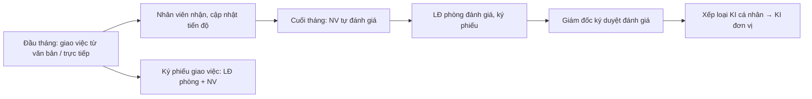

# Công việc (task) — nghiệp vụ

> **Công việc cá nhân, gắn với văn bản** (`OBJECT_TYPE_TASK = 1`, `taskAction.getListTaskFromDocument`, `TaskAddFromDocVM`). Bao gồm: phiếu giao việc đầu tháng, cập nhật tiến độ, phiếu đánh giá cuối tháng, xếp loại KI (`KI` = chỉ số hoàn thành cá nhân). Menu CÔNG VIỆC CÁ NHÂN (*Quản lý nhiệm vụ cá nhân, Phiếu giao nhiệm vụ, Đánh giá nhận xét, Ký duyệt đánh giá, Xếp loại KI, Báo cáo*). Bảng `TASK*`, `TASK_RATING*`, `EMP_RATING*`, `KI_*`. Web `task/*` (34 zul), `vm/task/*` (22 VM); BE gen-1 `taskAction` (`TaskAction`, 46 endpoint), `TaskService` (25 — chủ yếu KI).

## 1. Actor

| Actor | Làm gì |
|---|---|
| Lãnh đạo phòng / người giao (`GetEmployeeListToAssign`) | Giao việc từ văn bản hoặc trực tiếp (`addTask`, `TaskAddFromDocVM`), ký **phiếu giao việc đầu tháng** (`signMultiFileTask`, SMS `ky.phieu.giao.viec`), phê duyệt/từ chối (`ApproveOrRejectTask`, `approveOrRejectTaskProcess` với lý do — `PopupReasonApproveTaskVM`/`PopupReasonRejectTaskVM`), chuyển/chia nhỏ (`transferEnforcementTask`, `subEnforcementTask`), đóng (`closeTask`), đánh giá (`saveTaskRating`, `TaskRatingManagerVM`), ký phiếu đánh giá cuối tháng (`EmpRatingManagerVM`, `EmpRatingSignAllFilesManagerVM`) |
| Giám đốc/chỉ huy đơn vị | Ký duyệt đánh giá toàn đơn vị (`EmpRatingDirectorVM`, `EmpRatingSignAllFilesDirectorVM`), duyệt KI đơn vị (`updateKIOrg`, `signKI`, `checkPointUnit`) |
| Nhân viên | Xem việc của mình (`GetListPersonalTasksOfCurrentUser`), nhận việc (`receiveTaskStatus`), cập nhật tiến độ (`updateTaskProcess`, `getUpdateTaskHistory`), tự đánh giá (`TaskRatingSeflVM`, `saveTaskRatingEmp`), ký phiếu (`checkStatusSignedTaskFileByEmployee`, `CancelSignedTaskFileByEmployee`), điều chỉnh tỷ trọng công việc (`updateProportionPersonalTasks`) |
| Trợ lý | Cấu hình tỷ lệ/thang điểm (`ratioConfig`, `getListRatioConfig`), thống kê (`getListTaskStatistics`), xuất báo cáo (`exportReportTaskApproved`, `TaskRatingExportVM`) |

## 2. Phân loại & trạng thái

- Loại công việc (`task.taskType`): chức năng / đột xuất / nề nếp / thường xuyên. Kỳ (`task.period`), tần suất cập nhật (`updateFrequen`), là việc chính (`isMajor`).
- Trạng thái thực hiện (`task.status`): Chưa thực hiện → Đang thực hiện (→ Chậm tiến độ) → Đã hoàn thành; cờ đã đóng (`isClose`), hoàn thành (`isComplete`).
- Trạng thái phê duyệt (`task.state`): Bản nháp → Phê duyệt / Từ chối; Phê duyệt đánh giá / Từ chối đánh giá. `task.stateRequisition`: chưa phê duyệt / phê duyệt / từ chối (khi việc sinh từ trình ký `updateRequisitionDirect`).
- Loại thao tác lịch sử (`task.processType`): thêm mới, cập nhật, chia nhỏ, chuyển, phê duyệt, từ chối, tự động cập nhật.
- Đánh giá (`taskRating.*`): trạng thái phiếu (`state` 10 giá trị), điểm (`ratingPoint`, `ratingQuality`), hoàn thành (`completedStatus`), kỳ tháng; phiếu ký (`task.status`: đã ký / chưa ký).

## 3. Quy tắc

- QT1. Tổng tỷ trọng công việc trong kỳ = 100% (`updateProportionPersonalTasks`, `checkPointUnit`) ❓.
- QT2. Đánh giá chỉ khi công việc đã đóng/hoàn thành; phiếu đánh giá bị khóa sau khi ký (`isCheckStatusSign`, `unResignKIEmp` để hủy ký).
- QT3. Điểm KI tính theo cấu hình tỷ lệ/công thức (`kiFormulaConfig`, `ratioConfig`, `percentKI`) — cấu hình ở `kpi-danh-gia`.
- QT4. Đơn vị lá mới có KI nhân viên (`isLeafOrg`).
- QT5. Việc sinh từ văn bản giữ liên kết `DOCUMENT_ID`; đóng văn bản không tự đóng việc ❓.

## ❓
1. "Phiếu giao việc" và "phiếu đánh giá" là file PDF sinh ra (`convertTaskToPDF`, `convertRatingTaskToPDF`) rồi ký số — đúng không? Ký bằng loại chữ ký nào?
2. KI khác KPI thế nào trong hệ thống này?
