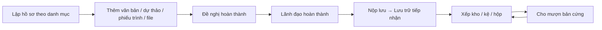

# Hồ sơ công việc & lưu trữ — nghiệp vụ

> Hồ sơ (`BRIEF`) = tập hợp văn bản đến/đi/dự thảo/phiếu trình/file đa phương tiện về một việc, lập theo **danh mục hồ sơ** (`CATALOG_BRIEF`) của đơn vị, có vòng đời mở → xử lý → hoàn thành → nộp lưu → lưu kho (kho/kệ/hộp) → mượn/trả. Web `brief/*` (39 zul) + `vm/brief/*` (25 VM); BE gen-1 `Brief` (`BriefManagementAction`, 46 hàm), `CatalogBrief`, `Shelve`, `Boxs`, `Storages`, `TypeConfigAction`; gen-2 `BriefController` (`/api/brief`, chia sẻ hồ sơ), `BriefDetailManagementController` (`/api/brief-detail`, nội dung hồ sơ).

## 1. Actor

| Actor | Làm gì |
|---|---|
| Chuyên viên | Lập hồ sơ (`addOrEditBrief`), thêm/xóa văn bản (`add-document-in-brief`, `delete-document-in-brief`), thêm dự thảo (`addDocDraftToBrief`), phiếu trình (`add-to-brief`), file/đa phương tiện (`upload-file-attachment`, `brief-multimedia`), cập nhật số trang (`update-page-number-*`, `update-total-doc-and-num-pager`), đề nghị hoàn thành (`requestCompleteBrief`), trình/nộp (`submit-brief`), chuyển hồ sơ (`transferBrief`, `getListBriefsToTransfer`), chia sẻ (`update-brief-share-list`) |
| Lãnh đạo / người duyệt | Hoàn thành hồ sơ (`completeBrief`), xử lý (`processBrief`) |
| Lưu trữ (`SYS_ROLE_LTHS`) | Quản lý danh mục hồ sơ (`CatalogBrief.*`), kho (`Storages.*`, `checkStoragePermissions`), kệ (`Shelve.*`, `checkShelveNumFloor`), hộp (`Boxs.*`); nhận hồ sơ nộp lưu (`getListReceivedBrief`); cho mượn / thu hồi bản cứng (`briefLend`, `briefBorrow`, `processBriefBorrow`, `checkBorrowBriefHardStatus`, `getListBriefHistoryBorrow`); báo cáo kho (`getStorageReport`) |
| Admin | Cấu hình loại tài liệu & quyền theo loại (`TypeConfigAction.*`, `financialRecordsRoles`) |

## 2. Trạng thái & khái niệm

- Trạng thái hồ sơ: mở / đang xử lý / đề nghị hoàn thành / hoàn thành / đã nộp lưu / trong kho ❓ mã cụ thể — tra `Brief.getBriefProcessingStats`, `checkHardStatusBrief` (`hardStatus` = trạng thái bản cứng: đang ở kho / đang cho mượn).
- Số hồ sơ duy nhất trong danh mục (`checkDuplicateRegisterNumber`, `getMaxRegisterNumber`).
- Vị trí lưu: **Kho** (`STORAGE`) → **Kệ** (`SHELVE`, có số tầng) → **Hộp** (`BOX`) → Hồ sơ.
- Văn bản trong hồ sơ: `BRIEF_DOCUMENT_MAP` ❓ (+ số trang giấy), file `BRIEF_FILES_ATTACHMENT`, đa phương tiện `BRIEF_MULTIMEDIA` (SQL `20250303_add_column_table_brief_multimedia_file.sql`), file danh mục `CATALOGIN_BRIEF_FILE` (`10012026_create_table_catalogin_brief_file.sql`).
- Chia sẻ hồ sơ cho đơn vị/người khác (gen-2 `/api/brief/get-list-brief-share`, `get-all-be-shared-id`, `update-brief-share-list`); chia sẻ ra ngoài (`ShareBriefController` `/ext-brief`, xem `tich-hop`).
- Chứng thư SHVB (`get-cert-shvb`) ❓ ký số hồ sơ.

## 3. Quy tắc

- QT1. Chỉ người có quyền trên hồ sơ (`check-permission-brief`, `checkViewBriefInfoDetail`) mới xem/sửa; hồ sơ tài chính có phân quyền riêng (menu HỒ SƠ TÀI CHÍNH).
- QT2. Văn bản chỉ thêm một lần vào một hồ sơ (`checkExistDocument`).
- QT3. Danh mục hồ sơ đang dùng không xóa được (`checkIsCatalogBriefUsed`); kho/kệ/hộp trùng tên bị chặn (`check*Exist`).
- QT4. Mượn bản cứng phải đang ở kho (`checkBorrowDocument`, `checkBorrowBriefHardStatus`).

## ❓
1. Vòng đời trạng thái hồ sơ chính xác và ai được "hoàn thành"?
2. Nộp lưu có theo thời hạn (năm) và tự động không?
3. `get-cert-shvb` phục vụ ký số hồ sơ điện tử theo chuẩn lưu trữ?
