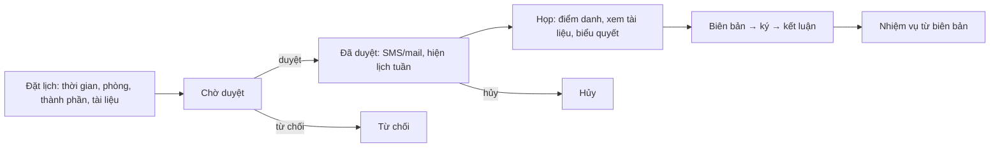

# Họp — nghiệp vụ: đặt lịch → duyệt lịch → tổ chức (điểm danh, tài liệu, biểu quyết) → biên bản → nhiệm vụ

> Menu LỊCH HỌP: *Đặt lịch họp, Danh sách lịch họp, Lịch tuần lãnh đạo, Duyệt/xuất lịch tuần (công ty/trung tâm/tập đoàn), Phòng họp rỗng, Mở khóa đặt lịch, Cấu hình duyệt lịch, Cấu hình thành phần, Báo cáo quân số, Trực chỉ huy*. Bảng `MEETING`, `MEETING_MEMBER`, `MEETING_MINUTES`, `MEETING_RESOURCE`, `VIDEO_CONFERENCE_GROUP`, `VOTE*`. Web `meeting/*` (66 zul) + `meetingAssistant/*` (10), `vm/meeting/*` (36 VM); BE gen-1 `Meeting` (`MettingResource`, 40 endpoint), `MettingWeek` (41), `MeetingAssistantAction`, `MeetingConfigAdd`, `meetingResourceAction`, `meetingApproverAction`; gen-2 `MeetController` (`/api/meet`), `EcabinetController`, `VoteController`.

## 1. Actor

| Actor | Làm gì |
|---|---|
| Người đặt lịch (trợ lý/thư ký/chuyên viên) | Tạo lịch (`validateSaveMeeting`), chọn phòng (`getListLocationFree`, `checkConflictTimeUsedRoom`), cầu truyền hình (`VIDEO_CONFERENCE_GROUP`, `checkDuplicateVideoConference*`), thành phần (`GetMeetingParticipantList`, `checkDuplicateParticant`, cấu hình sẵn `MeetingConfigAdd`), tài liệu (`insertMeetingFiles`, quyền xem file `getListUserViewFile`), gửi SMS/mail (`sendSMSMeetingWeek`, `sendMail`), đề xuất họp từ văn bản (`ScheduleToMeetingDocument`, `requestToScheduleMeetingDoc`) |
| Người duyệt lịch (`meetingApproverAction`, cấu hình duyệt lịch) | Duyệt / từ chối / hủy lịch (`approveCalendar`, `rejectCalendar`, `cancelCalendar`), đổi phòng (`changeLocation`), xuất lịch tuần |
| Lãnh đạo | Lịch tuần lãnh đạo, lịch BGĐ/TGĐ (`CALENDAR_DIRECTOR_TYPE`, `CALENDAR_TGDTD_TYPE`), ủy quyền trợ lý dự thay (`MeetingAssistant`: `addAssistant`, `approveReplateMember`, `updateMemberReplate`) |
| Thư ký cuộc họp | Điểm danh (`manualRollCallMeeting`, `autoRollCallMeeting`, `permissionRollCall`, `getListAbsenceMember`), biên bản (`addOrEditMeetingMinutes`, `requestForSigningMeetingMinutes`, `Files.PreviewMeetingMinutes`), kết luận → nhiệm vụ (`Meeting.addMission`, `forwardMission`, `getMissionByMeetingId`), ghi chú (`saveMeetingNoteBook`) |
| Thành viên | Xem lịch, tài liệu, điểm danh, **biểu quyết** (eCabinet: `insert-vote`, `answer-vote`, `get-lst-result-vote`), phòng họp thông minh (`SmartRoom`, `Cisco`/`cospace` họp trực tuyến `createOnlineMeetingRoom`, `getOnlineMeetingLink`) |
| Admin | Danh mục phòng/tài nguyên họp (`MEETING_RESOURCE`), nhóm cầu truyền hình, cấu hình thành phần, mở khóa đặt lịch |

## 2. Trạng thái & phân loại

- Trạng thái lịch (`meeting.state`): **Chờ duyệt → Đã duyệt / Từ chối / Hủy / Xóa**. Tự động duyệt theo cấu hình (`meeting.isAutoApprove`).
- Loại lịch (`meeting.type`): họp có thành phần đơn vị / đăng ký phòng / mời lãnh đạo / tổng hợp. Phạm vi (`meetingScope`), lặp lại (`recurrence`), gửi mail (`sendEmailStatus`), có cầu truyền hình (`hasVideoConference`), loại phòng (`typeRoom`), vai trò thành viên (`meetingRole`: chủ trì, thư ký, tham gia…).
- Biên bản (`meetingminutes.status`): Chưa thực hiện → Đang thực hiện → Đã thực hiện → Đóng kết luận; loại biên bản (`typeOfRecord`, 10 loại); kết luận (`conclude`) sinh nhiệm vụ (`MEETING_MINUTE_MISSION_SOURCE_TYPE = 3`).
- Lịch tuần: theo ngày/tuần/tuần sau/BGĐ/TGĐ/cơ quan (`CALENDAR_*_TYPE`), duyệt và xuất file (`uploadFileMeetingWeek`, `getFileMeetingWeek`).

## 3. Quy tắc

- QT1. Phòng không trùng thời gian (`checkConflictTimeUsedRoom`, eCabinet `check-coincide-location`); cầu truyền hình không trùng nhóm/phòng.
- QT2. Thành phần không trùng; trợ lý dự thay phải được lãnh đạo duyệt (`approveReplateMember`).
- QT3. Chỉ người có quyền duyệt lịch của đơn vị (`checkPermisionCalendar`, `checkChangeOrgApproval`).
- QT4. Đặt lịch bị khóa sau hạn (mở khóa: menu *Mở khóa đặt lịch họp*) ❓ quy tắc khóa.
- QT5. Biên bản phải ký (`requestForSigningMeetingMinutes`) trước khi đóng kết luận ❓.
- QT6. Tài liệu họp có quyền xem theo thành viên (`getMeetingMemberPermissionFile`, `removePermissionViewFile`).

## ❓
1. eCabinet (phòng họp không giấy) là phân hệ mobile/tablet riêng hay tab trong web?
2. Họp trực tuyến Cisco/cospace còn dùng?
3. "Báo cáo quân số" thuộc họp hay KPI?
