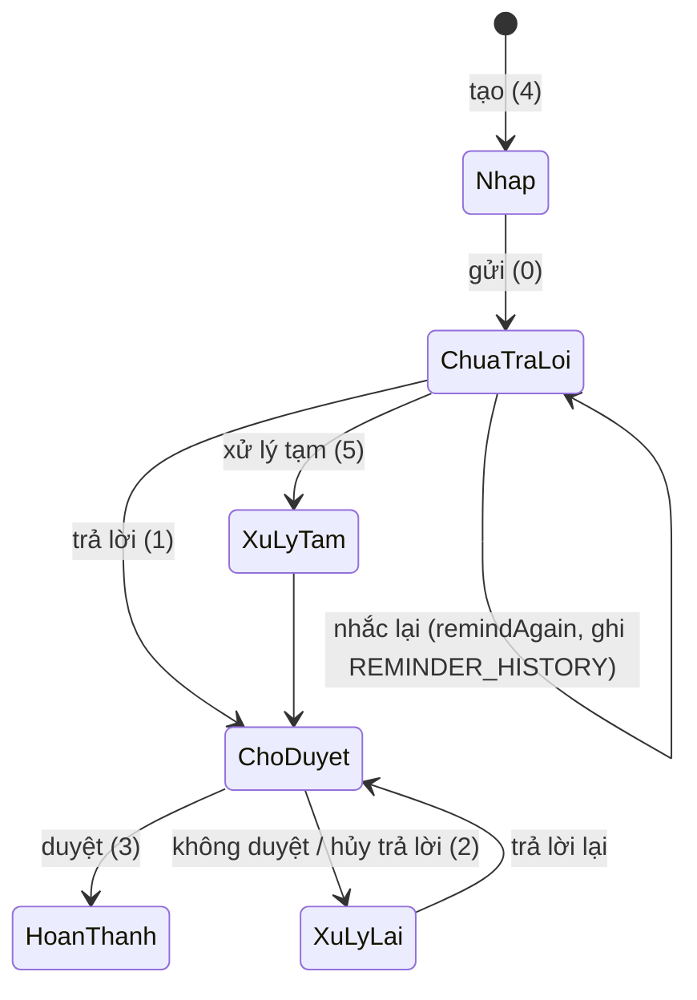

# Nhắc việc, thông báo, SMS, nắm tình hình — nghiệp vụ

> Phân hệ này gom 4 thứ: **Nhắc việc** (reminder — tính năng MỚI, 2026, mẫu chuẩn cho code mới), **Thông báo trong app** (`NOTIFICATION`), **SMS** (gửi/chặn), **Nắm tình hình / văn bản không chính thức** (`document-informality` = `graspSituation`), và **Định hướng** (`ORIENTATION`, nguồn sinh nhiệm vụ).

## 1. Nhắc việc (reminder)

### Khái niệm
Lãnh đạo/người theo dõi tạo **nhắc việc** gắn với một văn bản (đã ban hành `DOCUMENT_ID` hoặc dự thảo `TEXT_ID`) hoặc độc lập; mỗi nhắc việc gồm nhiều **khối** (`ReminderBlockDTO` — nội dung + đơn vị chủ trì + đơn vị phối hợp + hạn); mỗi đơn vị nhận là một **`REMINDER_REPLY`** (`ORG_ROLE` chủ trì/phối hợp, `DEADLINE`, `ASSIGNEE_ID`, `STATUS`); người **theo dõi** (`REMINDER_FOLLOWERS`, `FOLLOWER_TYPE`); liên kết văn bản (`REMINDER_DOCUMENT_RELATIONS`: `OBJECT_ID/OBJECT_TYPE` + `DOCUMENT_ID`); lịch sử (`REMINDER_HISTORY`).

### Actor
| Actor | Làm gì |
|---|---|
| Lãnh đạo / người tạo | Tạo & gửi (`insertOrUpdate`), lưu nháp, gán lại người xử lý & theo dõi (`updateNewReplyAssigneeAndFollowers`), **nhắc lại** (`remindAgain`), **duyệt** trả lời (`approve`), hủy trả lời (`cancelReply`), xóa (`delete` kèm lý do), báo cáo (`findReminderReportByCondition`, `reminder_report.zul`) |
| Đơn vị / người được nhắc (`ASSIGNEE_ID`) | Xem danh sách theo tab (`search`, `tabType`), **trả lời** (`reply` — có thể "xử lý tạm"), xem chi tiết (`getDetail`, lịch sử `getReminderHistory`), chuyển đơn vị (`getListOrgForTransfer`) |
| Người theo dõi | Nhận thông báo, xem tiến độ |
| Trang chủ | Đếm số (`getCountReminderDashboard`) |

### Trạng thái trả lời (`REMINDER_REPLY.STATUS` — `ReminderSaveRequestDTO`)
| Mã | Tên | Ý nghĩa |
|---|---|---|
| 4 | `DRAFT` | Nháp (chưa gửi) |
| 0 | `NO_REPLY` | Đã gửi, đơn vị chưa trả lời |
| 5 | `TEMPORARILY_PROCESSED` | Đơn vị xử lý tạm (trả lời sơ bộ) |
| 1 | `WAITING_APPROVAL` | Đã trả lời, chờ người nhắc duyệt |
| 2 | `REPROCESS` | Bị trả lại, xử lý lại |
| 3 | `COMPLETED` | Đã duyệt, hoàn thành |

### Quy tắc
- QT1. Văn bản đến **không được hoàn thành** nếu còn nhắc việc chưa `COMPLETED` (`api.doc-in.check-completion-reminders`, `DocInService`).
- QT2. Nhắc việc trên dự thảo (`getDraftDetail(textId)`) chuyển sang văn bản ban hành khi có `DOCUMENT_ID` (`getDraftDetailByDocumentId` chỉ lấy quan hệ `TEXT_ID IS NULL`).
- QT3. Người tạo tự động là follower (`addCurrentUserAsDraftFollower`).
- QT4. Xóa/hủy phải có lý do (`REASON`), soft delete.
- QT5. Chỉ người nhắc (hoặc lãnh đạo `LEADER_ID`) được duyệt.

## 2. Thông báo trong app (`NOTIFICATION`, gen-1 `NotificationAction`)
Đếm chưa đọc (`countNotificationUnread`), danh sách/tìm (`getNotifications`, `searchNotification`), đánh dấu đọc theo thông báo hoặc theo đối tượng (`updateIsRead`, `updateIsReadByObjectID`). Mapping menu ↔ loại thông báo: `constants/NotificationMenuMapping.java` (BE gen-1). Gửi thông báo từ nghiệp vụ: `Meeting.sendNotification`, `MultimediaNotification` (web facade). Thông báo đẩy mobile: `UserDevice`, `AppMobile` (`tich-hop`).

## 3. SMS
- Danh mục loại SMS (`smsMaster.smsMasterMap`, 12 loại: giao nhiệm vụ, giao việc cá nhân, ký phiếu giao việc/đánh giá, thông báo lịch họp, thống kê nhiệm vụ…). Cấu hình `sms.properties` (web).
- Gửi theo lịch: `smsTask.sendSmsSignAfterMonth`, `sendSmsMeetingAssistant`, `checkDocumentToSendSms`; cột `SEND_SMS` (SQL `04122025_add_column_send_sms.sql`).
- **Chặn SMS** theo người/đơn vị/module: gen-1 `SmsInterceptAction` (`getListModulSms`, `addOrRemoveInterceptByUser`), gen-2 `SMSInterceptController` (`updateSmsInterceptConfigByOrg`), menu *Cấu hình chặn tin nhắn*, `vm/config/sms`, bảng `NOTIFICATION_BLOCK_LIST` (`10042026_create_table_notification_block_list.sql`).

## 4. Nắm tình hình / văn bản không chính thức (`document-informality`, gen-2, web `graspSituation/*` + `GraspSituationBusiness`)
Lãnh đạo/trợ lý tạo "văn bản nắm tình hình" (không qua văn thư), gửi cho nhóm lãnh đạo (`get-group-doc-lead-type`, `DOCUMENT_LEAD_TYPE`), có file mật (`get-list-file-encrypt-map`, `get-permission-view-file`), đếm đã đọc (`count-read`, `mark-as-read`), phân quyền nhà cung cấp (`insert-permission-for-supplier`) ❓. Liên quan `document.processType = situation` (Nắm tình hình) trong văn bản đến.

## 5. Định hướng (`ORIENTATION`, gen-1 `OrientationAction`, web `orientation/*`)
Lãnh đạo ban hành định hướng → đơn vị nhận (`getListOrientReceiveOrg`) → sinh nhiệm vụ (`ORIENTATION_MISSION_SOURCE_TYPE = 5`, `orientation.sourceType`, `ratioConfigType`). Chi tiết nhiệm vụ ở `nhiem-vu`.

## ❓
1. Nhắc việc có SMS/thông báo đẩy khi gửi và khi nhắc lại không? Cấu hình ở đâu?
2. `FOLLOWER_TYPE` có những giá trị nào (người tạo / lãnh đạo / theo dõi thêm)?
3. "Nắm tình hình" có phải là tính năng dành riêng cho lãnh đạo tỉnh (Khánh Hòa) không?
